<div align="center">


</div>

# PMax24h Station (Rain): 23065504

Maximum Precipitation in 24 hours (PMax24h) is the greatest amount of rainfall for a specific duration that is meteorologically possible for a given location, acting as a "worst-case" scenario for extreme storms, crucial for designing safety-critical infrastructure like bridges, river deviations, dams, spillways, and nuclear plants to prevent catastrophic failure. The PMax24h is related with the Probable Maximum Precipitation (PMP) and it is calculated by hydrologists using meteorological data to determine the upper limit of extreme rainfall, often leading to the Probable Maximum Flood (PMF) for flood control design, and is increasingly being studied for climate change impacts. Probable Maximum Precipitation (PMP) is the theoretical upper limit of rainfall, a deterministic estimate for extreme events, while probability distributions (like GEV, Gumbel) describe the likelihood and frequency of various precipitation amounts, including rare ones, showing how often events occur, with PMP representing the extreme end of these distributions, used for critical infrastructure design to ensure safety against the worst conceivable weather, unlike standard statistical forecasts which cover typical probabilities.

The most common probability distributions in hydrology, used for analyzing floods, rainfall, and streamflow, include the Normal, Log-Normal, Gumbel, Gamma (including Log-Pearson Type III), and Generalized Extreme Value (GEV) distributions, often chosen based on the data´s skewness and whether modeling extremes or general conditions, with Gumbel and GEV popular for extreme events like floods, while the Normal distribution serves as a baseline, though often requiring transformations for skewed hydrological data. These distributions help in designing water infrastructure, managing water resources, and forecasting hydrologic events.

> Hydrological data often isn´t perfectly normal (it´s skewed), so different distributions are needed for different applications, such as: **Flood Frequency Analysis**: Using Gumbel, GEV, or Log-Pearson Type III for predicting extreme flood magnitudes and their return periods, **Rainfall Analysis**: Normal for annual totals, but Log-Normal, Weibull, or GEV for intensity or extreme daily rainfall, **Streamflow Modeling**: Gamma and Log-Normal for maximum flows, GEV for minimum flows, and Kappa for daily flows.

<div align="center">

</img>

</div>


## A. General information


### 1. General running parameters

• app_version: _v20260312_. • runtime: _2026-03-12 07:15:23.203550_. • Python version: _3.14.0_. • SciPy version: _1.16.3_. • Pandas version: _2.3.3_. • NumPy version: _2.3.5_. • Stations dataset (station_dataset_file): _dataset/pmax24h_in/automatic_colombia_2003_2025.csv_. • Stations catalog (station_catalog_file): _dataset/CNE.xls_. • Minimum year to eval til year_max (date_min): _1900_. • Maximum year to eval since year_min (date_max): _2025_. • Creates, save and include plots into reports (create_plot): _True_. • Plot only fit distributions with Δo > Δ (plot_only_fit): _True_. • Plot only simple graphs avoiding multiple CDFs and multiple Extreme values plots (plot_only_simple): _True_. • Eval low extreme values, if False, evaluates high extreme values (low_extreme): _False_. • Eval every SciPy distribution as logarithmic (pdist_logarithmic_on): _True_. • Standard deviation normalized (ddof): _1.0_. • Return periods to eval in years (Tr): _[2, 2.33, 5, 10, 15, 20, 25, 50, 75, 100, 200, 250, 500, 750, 1000]_. • Minimum data sample per station, 0 means any (minimum_sample): _5_. • Z-Score maximum threshold to adjust a value, 0 means disable (zscore_max): _3.5_. • Z-Score minimum threshold to adjust a value, 0 means disable (zscore_min): _-2.5_. • Avoid zeros, e.g. rain = 0 (avoid_zeros): _True_. • Avoid null values (avoid_nans): _True_. 

:file_folder:Table: [dataset.csv](../../dataset/pmax24h_in/automatic_colombia_2003_2025.csv)

> Delta Degrees of Freedom (DDOF): is a parameter used in the formulas for calculating variance and standard deviation. When ddof=0, the divisor is $N$ (the total number of observations) and this is used when your data set is the entire population. When ddof=1, the divisor is $N-1$ and this is used when your data set is a sample drawn from a larger population. Using $N-1$ provides an unbiased estimate of the population variance (known as Bessel´s correction).


### 2. Station info and location

|   id |   CODIGO | NOMBRE                   | CATEGORIA               | TECNOLOGIA                | ESTADO   |   FECHA_INSTALACION |   FECHA_SUSPENSION |   ALTITUD |   LATITUD |   LONGITUD | DEPARTAMENTO   | MUNICIPIO   | AREA_OPERATIVA                            | ENTIDAD                                       | AREA_HIDROGRAFICA   | ZONA_HIDROGRAFICA   | SUBZONA_HIDROGRAFICA   |   CORRIENTE | Catalogo   |   Version |
|-----:|---------:|:-------------------------|:------------------------|:--------------------------|:---------|--------------------:|-------------------:|----------:|----------:|-----------:|:---------------|:------------|:------------------------------------------|:----------------------------------------------|:--------------------|:--------------------|:-----------------------|------------:|:-----------|----------:|
|    0 | 23065504 | VIANI  - AUT  [23065504] | Climatológica Principal | Automática con Telemetría | Activa   |                 nan |                nan |         2 |   4.87189 |   -74.5725 | Cundinamarca   | Vianí       | Area Operativa 11 - Cundinamarca-Amazonas | CORPORACION AUTONOMA REGIONAL DE CUNDINAMARCA | Magdalena Cauca     | Medio Magdalena     | Río Negro              |         nan | CNE_OE     |  20251226 |

<div align="center">

Dynamic map: [:earth_americas:Google](http://maps.google.com/maps?q=4.871888889,-74.5725) [:earth_americas:OSM](https://www.openstreetmap.org/#map=18/4.871888889/-74.5725&layers=P) [:earth_americas:Bing](https://www.bing.com/maps?cp=4.871888889~-74.5725&lvl=18) [:earth_americas:Apple](https://maps.apple.com/frame?center=4.871888889%2C-74.5725&span=0.003%2C0.006)

</div>


<div align="center">

```geojson
{
  "type": "Feature",
  "geometry": {
    "type": "Point", 
    "coordinates": [-74.5725, 4.871888889]
  }, 
  "properties": {
    "Name": "23065504"
  }
}
```

</div>


### 3. Discrete values table and plot

<div align="center">

|               |          0 |           1 |           2 |           3 |          4 |           5 |          6 |
|:--------------|-----------:|------------:|------------:|------------:|-----------:|------------:|-----------:|
| Date          | 2015       | 2016        | 2017        | 2018        | 2019       | 2020        | 2021       |
| Value         |   22.9     |   47.4      |   41.2      |   33        |   24.4     |   39.1      |   53       |
| Value_initial |   22.9     |   47.4      |   41.2      |   33        |   24.4     |   39.1      |   53       |
| count         |    7       |    7        |    7        |    7        |    7       |    7        |    7       |
| mean          |   37.2857  |   37.2857   |   37.2857   |   37.2857   |   37.2857  |   37.2857   |   37.2857  |
| std           |   11.2488  |   11.2488   |   11.2488   |   11.2488   |   11.2488  |   11.2488   |   11.2488  |
| zscore        |   -1.27887 |    0.899146 |    0.347975 |   -0.380994 |   -1.14552 |    0.161288 |    1.39698 |


</div>


<div align="center">

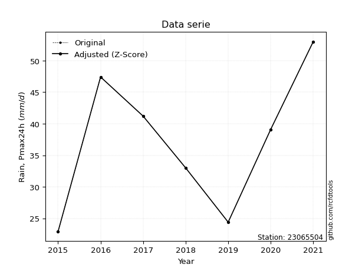</img>

</div>


> The initial value (value_initial) correspond to the initial obtained or null completed value, and value (value) is adjusted only when the initial value is outside the valid range (outlier) definite through the Z-Score value. If Z-Score is active, values out of range or outliers are replaced with the station mean value. A Z-Score (or standard score) measures how many standard deviations a data point is from the mean of a dataset, indicating its relative position; positive scores mean above the mean, negative mean below, and a score of zero is exactly at the mean, allowing for comparison of values from different distributions. It´s calculated using the formula $z=(x–μ)/σ$, where $x$ is the data point, $μ$ is the mean, and $σ$ is the standard deviation, helping identify outliers and understand probability.
>
> <sub>**Note**: In this study, "completing" (filling gaps in) and "extending" (forecasting or lengthening the historical record) rainfall data series are avoided for certain critical analyses because they introduce artificial bias and uncertainty, which can distort the statistics of rare events (extremes), alter day-to-day variability, and compromise the integrity and homogeneity of the original data. Some reasons against Completing/Extending rainfall data are: **Distortion of Extremes and Variability**: The primary issue is that most gap-filling or extension methods rely on averaging or regression with nearby stations, which inherently smooths the data. Rainfall is highly variable in space and time, with a large percentage of zero values and occasional large storms. Infilling methods often underestimate the highest values and overestimate the lowest (zero) values, which severely distorts analyses focused on flood frequency, drought severity, and intensity-duration-frequency (IDF) curves, **Loss of Data Homogeneity**: Infilled or extended data are synthetic estimates, not actual measurements. Combining these estimates with observed data can violate the assumption of data homogeneity, which requires that the data properties do not change over time. Inhomogeneity can lead to incorrect conclusions about long-term trends or changes in climate patterns, **Propagation of Errors**: Errors and biases from the original data (e.g., wind-induced undercatch, instrument errors, site changes) or the data used for imputation can propagate through the analysis, leading to unreliable hydrological models and inaccurate predictions, **Compromised Statistical Integrity**: For statistical analyses, especially those involving the frequency of events, using artificial data can introduce time bias or autocorrelation that doesn´t exist in reality, making it difficult to assess the true probability of events, **Difficulty in Validation**: It is difficult to accurately validate the quality of filled or extended data, especially for past periods where ground-truth measurements are unavailable. The reliability of imputation techniques heavily depends on the density of the surrounding station network and the complexity of the local topography.</sub>


### 4. Active continuous probability distributions from SciPy (80 of 104 available)

A Probability Density Function (PDF) describes the relative likelihood of a continuous random variable falling within a specific range, where the total area under its curve equals 1, and the area over any interval gives the actual probability for that range. Unlike discrete probabilities (like rolling a die), a PDF shows density, not direct probability for a single point (which is zero), with higher points indicating higher likelihood, often visualized as a bell curve for normal distributions.

A log of a probability density function (log-PDF) is simply the logarithm of the PDF´s value, denoted as $log(f(x))$, useful for converting multiplication of probabilities into addition, improving numerical stability with tiny numbers, and connecting to information theory concepts like entropy. Instead of dealing with very small probabilities (e.g., 0.000001), log-PDFs use negative numbers (e.g., $log(0.00001) ≈ -11.51$ that are easier for computers to handle, preventing underflow errors and simplifying complex calculations. In this study, each active probability distribution from SciPy is also evaluated in the $log$ form.

[scipy.stats](https://docs.scipy.org/doc/scipy/reference/stats.html) is a Python´s powerful submodule within the SciPy library for comprehensive statistical analysis, offering over 130 probability distributions (like Normal, Poisson, etc.), functions for descriptive stats (mean, variance), hypothesis testing (t-tests, chi-square), random variable generation, and statistical tests, making it essential for data science, modeling, and research. It provides tools to explore, model, and draw conclusions from data efficiently, working seamlessly with [NumPy](https://numpy.org/).

<div align="center">

|   id | p_dist           |   n_parameter | fit_method   | label                                                                       | active   | ref                                                                                                      |
|-----:|:-----------------|--------------:|:-------------|:----------------------------------------------------------------------------|:---------|:---------------------------------------------------------------------------------------------------------|
|    0 | alpha            |             3 | MLE          | Alpha                                                                       | True     | [:mortar_board:](https://docs.scipy.org/doc/scipy/reference/generated/scipy.stats.alpha.html)            |
|    1 | anglit           |             2 | MM           | Anglit                                                                      | True     | [:mortar_board:](https://docs.scipy.org/doc/scipy/reference/generated/scipy.stats.anglit.html)           |
|    2 | arcsine          |             2 | MM           | Arcsine                                                                     | True     | [:mortar_board:](https://docs.scipy.org/doc/scipy/reference/generated/scipy.stats.arcsine.html)          |
|    3 | argus            |             3 | MLE          | Argus                                                                       | True     | [:mortar_board:](https://docs.scipy.org/doc/scipy/reference/generated/scipy.stats.argus.html)            |
|    4 | beta             |             4 | MLE          | Beta                                                                        | True     | [:mortar_board:](https://docs.scipy.org/doc/scipy/reference/generated/scipy.stats.beta.html)             |
|    5 | betaprime        |             4 | MLE          | Beta prime                                                                  | True     | [:mortar_board:](https://docs.scipy.org/doc/scipy/reference/generated/scipy.stats.betaprime.html)        |
|    6 | bradford         |             3 | MLE          | Bradford                                                                    | True     | [:mortar_board:](https://docs.scipy.org/doc/scipy/reference/generated/scipy.stats.bradford.html)         |
|    7 | burr             |             4 | MLE          | Burr (Type III)                                                             | True     | [:mortar_board:](https://docs.scipy.org/doc/scipy/reference/generated/scipy.stats.burr.html)             |
|    8 | burr12           |             4 | MLE          | Burr (Type III) 12                                                          | True     | [:mortar_board:](https://docs.scipy.org/doc/scipy/reference/generated/scipy.stats.burr12.html)           |
|    9 | cosine           |             2 | MLE          | Cosine                                                                      | True     | [:mortar_board:](https://docs.scipy.org/doc/scipy/reference/generated/scipy.stats.cosine.html)           |
|   10 | crystalball      |             4 | MLE          | Crystalball                                                                 | True     | [:mortar_board:](https://docs.scipy.org/doc/scipy/reference/generated/scipy.stats.crystalball.html)      |
|   11 | dgamma           |             3 | MLE          | Double gamma                                                                | True     | [:mortar_board:](https://docs.scipy.org/doc/scipy/reference/generated/scipy.stats.dgamma.html)           |
|   12 | dweibull         |             3 | MLE          | Double Weibull                                                              | True     | [:mortar_board:](https://docs.scipy.org/doc/scipy/reference/generated/scipy.stats.dweibull.html)         |
|   13 | erlang           |             3 | MLE          | Erlang                                                                      | True     | [:mortar_board:](https://docs.scipy.org/doc/scipy/reference/generated/scipy.stats.erlang.html)           |
|   14 | exponnorm        |             3 | MLE          | Exponentially modified Normal                                               | True     | [:mortar_board:](https://docs.scipy.org/doc/scipy/reference/generated/scipy.stats.exponnorm.html)        |
|   15 | exponpow         |             3 | MLE          | Exponential power                                                           | True     | [:mortar_board:](https://docs.scipy.org/doc/scipy/reference/generated/scipy.stats.exponpow.html)         |
|   16 | exponweib        |             4 | MLE          | Exponentiated Weibull                                                       | True     | [:mortar_board:](https://docs.scipy.org/doc/scipy/reference/generated/scipy.stats.exponweib.html)        |
|   17 | f                |             4 | MLE          | F                                                                           | True     | [:mortar_board:](https://docs.scipy.org/doc/scipy/reference/generated/scipy.stats.f.html)                |
|   18 | fatiguelife      |             3 | MLE          | Fatigue-life (Birnbaum-Saunders)                                            | True     | [:mortar_board:](https://docs.scipy.org/doc/scipy/reference/generated/scipy.stats.fatiguelife.html)      |
|   19 | foldnorm         |             3 | MM           | Fold Normal                                                                 | True     | [:mortar_board:](https://docs.scipy.org/doc/scipy/reference/generated/scipy.stats.foldnorm.html)         |
|   20 | gamma            |             3 | MLE          | Gamma                                                                       | True     | [:mortar_board:](https://docs.scipy.org/doc/scipy/reference/generated/scipy.stats.gamma.html)            |
|   21 | gausshyper       |             6 | MLE          | Gauss hypergeometric                                                        | True     | [:mortar_board:](https://docs.scipy.org/doc/scipy/reference/generated/scipy.stats.gausshyper.html)       |
|   22 | genexpon         |             5 | MLE          | Generalized exponential                                                     | True     | [:mortar_board:](https://docs.scipy.org/doc/scipy/reference/generated/scipy.stats.genexpon.html)         |
|   23 | genextreme       |             3 | MLE          | Generalized exponential                                                     | True     | [:mortar_board:](https://docs.scipy.org/doc/scipy/reference/generated/scipy.stats.genextreme.html)       |
|   24 | gengamma         |             4 | MLE          | Generalized gamma                                                           | True     | [:mortar_board:](https://docs.scipy.org/doc/scipy/reference/generated/scipy.stats.gengamma.html)         |
|   25 | genhalflogistic  |             3 | MLE          | Generalized half-logistic                                                   | True     | [:mortar_board:](https://docs.scipy.org/doc/scipy/reference/generated/scipy.stats.genhalflogistic.html)  |
|   26 | genlogistic      |             3 | MLE          | Generalized logistic                                                        | True     | [:mortar_board:](https://docs.scipy.org/doc/scipy/reference/generated/scipy.stats.genlogistic.html)      |
|   27 | gennorm          |             3 | MLE          | Generalized Normal                                                          | True     | [:mortar_board:](https://docs.scipy.org/doc/scipy/reference/generated/scipy.stats.gennorm.html)          |
|   28 | genpareto        |             3 | MLE          | Generalized Pareto                                                          | True     | [:mortar_board:](https://docs.scipy.org/doc/scipy/reference/generated/scipy.stats.genpareto.html)        |
|   29 | gompertz         |             3 | MLE          | Gompertz (or truncated Gumbel)                                              | True     | [:mortar_board:](https://docs.scipy.org/doc/scipy/reference/generated/scipy.stats.gompertz.html)         |
|   30 | gumbel_l         |             2 | MM           | Gumbel Left Skew                                                            | True     | [:mortar_board:](https://docs.scipy.org/doc/scipy/reference/generated/scipy.stats.gumbel_l.html)         |
|   31 | gumbel_r         |             2 | MM           | Gumbel Right Skew                                                           | True     | [:mortar_board:](https://docs.scipy.org/doc/scipy/reference/generated/scipy.stats.gumbel_r.html)         |
|   32 | halfgennorm      |             3 | MLE          | Upper half of a generalized normal                                          | True     | [:mortar_board:](https://docs.scipy.org/doc/scipy/reference/generated/scipy.stats.halfgennorm.html)      |
|   33 | halflogistic     |             2 | MM           | Half-logistic                                                               | True     | [:mortar_board:](https://docs.scipy.org/doc/scipy/reference/generated/scipy.stats.halflogistic.html)     |
|   34 | halfnorm         |             2 | MM           | Half Normal                                                                 | True     | [:mortar_board:](https://docs.scipy.org/doc/scipy/reference/generated/scipy.stats.halfnorm.html)         |
|   35 | hypsecant        |             2 | MM           | hyperbolic secant                                                           | True     | [:mortar_board:](https://docs.scipy.org/doc/scipy/reference/generated/scipy.stats.hypsecant.html)        |
|   36 | invgamma         |             3 | MLE          | Inverted gamma                                                              | True     | [:mortar_board:](https://docs.scipy.org/doc/scipy/reference/generated/scipy.stats.invgamma.html)         |
|   37 | invgauss         |             3 | MLE          | Inverse Gaussian                                                            | True     | [:mortar_board:](https://docs.scipy.org/doc/scipy/reference/generated/scipy.stats.invgauss.html)         |
|   38 | invweibull       |             3 | MLE          | Inverted Weibull                                                            | True     | [:mortar_board:](https://docs.scipy.org/doc/scipy/reference/generated/scipy.stats.invweibull.html)       |
|   39 | johnsonsb        |             4 | MLE          | Johnson SB                                                                  | True     | [:mortar_board:](https://docs.scipy.org/doc/scipy/reference/generated/scipy.stats.johnsonsb.html)        |
|   40 | johnsonsu        |             4 | MLE          | Johnson Su                                                                  | True     | [:mortar_board:](https://docs.scipy.org/doc/scipy/reference/generated/scipy.stats.johnsonsu.html)        |
|   41 | kappa3           |             3 | MLE          | Kappa 3                                                                     | True     | [:mortar_board:](https://docs.scipy.org/doc/scipy/reference/generated/scipy.stats.kappa3.html)           |
|   42 | kappa4           |             4 | MLE          | Kappa 4                                                                     | True     | [:mortar_board:](https://docs.scipy.org/doc/scipy/reference/generated/scipy.stats.kappa4.html)           |
|   43 | ksone            |             3 | MLE          | Kolmogorov-Smirnov one-sided test statistic distribution                    | True     | [:mortar_board:](https://docs.scipy.org/doc/scipy/reference/generated/scipy.stats.ksone.html)            |
|   44 | kstwobign        |             2 | MLE          | Limiting distribution of scaled Kolmogorov-Smirnov two-sided test statistic | True     | [:mortar_board:](https://docs.scipy.org/doc/scipy/reference/generated/scipy.stats.kstwobign.html)        |
|   45 | laplace          |             2 | MM           | Laplace                                                                     | True     | [:mortar_board:](https://docs.scipy.org/doc/scipy/reference/generated/scipy.stats.laplace.html)          |
|   46 | levy_l           |             2 | MLE          | Left-skewed Levy                                                            | True     | [:mortar_board:](https://docs.scipy.org/doc/scipy/reference/generated/scipy.stats.levy_l.html)           |
|   47 | loggamma         |             3 | MLE          | Log gamma                                                                   | True     | [:mortar_board:](https://docs.scipy.org/doc/scipy/reference/generated/scipy.stats.loggamma.html)         |
|   48 | logistic         |             2 | MM           | Logistic (or Sech-squared)                                                  | True     | [:mortar_board:](https://docs.scipy.org/doc/scipy/reference/generated/scipy.stats.logistic.html)         |
|   49 | loglaplace       |             3 | MLE          | Log-Laplace                                                                 | True     | [:mortar_board:](https://docs.scipy.org/doc/scipy/reference/generated/scipy.stats.loglaplace.html)       |
|   50 | lomax            |             3 | MLE          | Lomax (Pareto of the second kind)                                           | True     | [:mortar_board:](https://docs.scipy.org/doc/scipy/reference/generated/scipy.stats.lomax.html)            |
|   51 | maxwell          |             2 | MM           | Maxwell                                                                     | True     | [:mortar_board:](https://docs.scipy.org/doc/scipy/reference/generated/scipy.stats.maxwell.html)          |
|   52 | mielke           |             4 | MLE          | Mielke Beta-Kappa / Dagum                                                   | True     | [:mortar_board:](https://docs.scipy.org/doc/scipy/reference/generated/scipy.stats.mielke.html)           |
|   53 | moyal            |             2 | MM           | Moyal                                                                       | True     | [:mortar_board:](https://docs.scipy.org/doc/scipy/reference/generated/scipy.stats.moyal.html)            |
|   54 | nakagami         |             3 | MLE          | Nakagami                                                                    | True     | [:mortar_board:](https://docs.scipy.org/doc/scipy/reference/generated/scipy.stats.nakagami.html)         |
|   55 | ncf              |             5 | MLE          | Non-central F distribution                                                  | True     | [:mortar_board:](https://docs.scipy.org/doc/scipy/reference/generated/scipy.stats.ncf.html)              |
|   56 | nct              |             4 | MLE          | Non-central Student’s t                                                     | True     | [:mortar_board:](https://docs.scipy.org/doc/scipy/reference/generated/scipy.stats.nct.html)              |
|   57 | norm             |             2 | MM           | Normal                                                                      | True     | [:mortar_board:](https://docs.scipy.org/doc/scipy/reference/generated/scipy.stats.norm.html)             |
|   58 | pearson3         |             3 | MM           | Pearson type III                                                            | True     | [:mortar_board:](https://docs.scipy.org/doc/scipy/reference/generated/scipy.stats.pearson3.html)         |
|   59 | powerlaw         |             3 | MLE          | Power-function                                                              | True     | [:mortar_board:](https://docs.scipy.org/doc/scipy/reference/generated/scipy.stats.powerlaw.html)         |
|   60 | rayleigh         |             2 | MM           | Rayleigh                                                                    | True     | [:mortar_board:](https://docs.scipy.org/doc/scipy/reference/generated/scipy.stats.rayleigh.html)         |
|   61 | rdist            |             3 | MLE          | R-distributed (symmetric beta)                                              | True     | [:mortar_board:](https://docs.scipy.org/doc/scipy/reference/generated/scipy.stats.rdist.html)            |
|   62 | rice             |             3 | MLE          | Rice                                                                        | True     | [:mortar_board:](https://docs.scipy.org/doc/scipy/reference/generated/scipy.stats.rice.html)             |
|   63 | semicircular     |             2 | MM           | Semicircular                                                                | True     | [:mortar_board:](https://docs.scipy.org/doc/scipy/reference/generated/scipy.stats.semicircular.html)     |
|   64 | skewnorm         |             3 | MLE          | Skew normal                                                                 | True     | [:mortar_board:](https://docs.scipy.org/doc/scipy/reference/generated/scipy.stats.skewnorm.html)         |
|   65 | t                |             3 | MLE          | Student’s t                                                                 | True     | [:mortar_board:](https://docs.scipy.org/doc/scipy/reference/generated/scipy.stats.t.html)                |
|   66 | trapezoid        |             4 | MLE          | Trapezoid                                                                   | True     | [:mortar_board:](https://docs.scipy.org/doc/scipy/reference/generated/scipy.stats.trapezoid.html)        |
|   67 | triang           |             3 | MLE          | Triangular                                                                  | True     | [:mortar_board:](https://docs.scipy.org/doc/scipy/reference/generated/scipy.stats.triang.html)           |
|   68 | truncexpon       |             3 | MLE          | Truncated exponential                                                       | True     | [:mortar_board:](https://docs.scipy.org/doc/scipy/reference/generated/scipy.stats.truncexpon.html)       |
|   69 | truncnorm        |             4 | MLE          | Truncated normal                                                            | True     | [:mortar_board:](https://docs.scipy.org/doc/scipy/reference/generated/scipy.stats.truncnorm.html)        |
|   70 | truncpareto      |             4 | MLE          | Upper truncated Pareto                                                      | True     | [:mortar_board:](https://docs.scipy.org/doc/scipy/reference/generated/scipy.stats.truncpareto.html)      |
|   71 | truncweibull_min |             5 | MLE          | Doubly truncated Weibull minimum                                            | True     | [:mortar_board:](https://docs.scipy.org/doc/scipy/reference/generated/scipy.stats.truncweibull_min.html) |
|   72 | tukeylambda      |             3 | MLE          | Tukey-Lamdba                                                                | True     | [:mortar_board:](https://docs.scipy.org/doc/scipy/reference/generated/scipy.stats.tukeylambda.html)      |
|   73 | uniform          |             2 | MLE          | Uniform                                                                     | True     | [:mortar_board:](https://docs.scipy.org/doc/scipy/reference/generated/scipy.stats.uniform.html)          |
|   74 | vonmises         |             3 | MLE          | Von Mises                                                                   | True     | [:mortar_board:](https://docs.scipy.org/doc/scipy/reference/generated/scipy.stats.vonmises.html)         |
|   75 | vonmises_line    |             3 | MLE          | Von Mises line                                                              | True     | [:mortar_board:](https://docs.scipy.org/doc/scipy/reference/generated/scipy.stats.vonmises_line.html)    |
|   76 | wald             |             2 | MM           | Wald                                                                        | True     | [:mortar_board:](https://docs.scipy.org/doc/scipy/reference/generated/scipy.stats.wald.html)             |
|   77 | weibull_max      |             3 | MLE          | Weibull maximum                                                             | True     | [:mortar_board:](https://docs.scipy.org/doc/scipy/reference/generated/scipy.stats.weibull_max.html)      |
|   78 | weibull_min      |             3 | MLE          | Weibull minimum                                                             | True     | [:mortar_board:](https://docs.scipy.org/doc/scipy/reference/generated/scipy.stats.weibull_min.html)      |
|   79 | wrapcauchy       |             3 | MLE          | Wrapped  Cauchy                                                             | True     | [:mortar_board:](https://docs.scipy.org/doc/scipy/reference/generated/scipy.stats.wrapcauchy.html)       |

</div>

> **n_parameter:** # arguments & localization & scale.
>
> **Fit methods:** (MLE) maximum likelihood, (MM) L-moments.
>
>**Inactive** (With the only purpose of prevent loops, zero divisions, infinite values, over high estimated values or horizontal trending for recurrence intervals estimations, the follow distributions were disabled.)**:** lognorm, norminvgauss, powernorm, powerlognorm, cauchy, halfcauchy, foldcauchy, skewcauchy, chi2, expon, fisk, genhyperbolic, geninvgauss, gibrat, kstwo, laplace_asymmetric, levy, levy_stable, ncx2, pareto, rel_breitwigner, recipinvgauss, studentized_range, loguniform, 


## B. Probability (PDF) vs. Empirical (EDF) distributions functions

A continuous probability distribution (CPD) describes probabilities for variables that can take any value within a range (like rain any time), unlike discrete variables with specific outcomes (like temperature). It uses a Probability Density Function (PDF), a curve where the total area under it equals 1, and the probability of the variable falling within an interval (a to b) is found by calculating the area under the curve between those points. A key feature is that the probability of hitting any single exact value is zero, so probabilities are always expressed for ranges, e.g., $P(a ≤ X ≤ b)$.

<div align="center">

Distributions parameters from station values
|     |   station | p_dist              |   n |            loc |          scale | shape                  | shape1                 | shape2                | shape3             |
|----:|----------:|:--------------------|----:|---------------:|---------------:|:-----------------------|:-----------------------|:----------------------|:-------------------|
|   0 |  23065504 | alpha               |   7 | -138.396       | 2950.59        | 16.86137881415488      |                        |                       |                    |
|   1 |  23065504 | anglit              |   7 |   37.2857      |   30.4661      |                        |                        |                       |                    |
|   2 |  23065504 | arcsine             |   7 |   22.5576      |   29.4562      |                        |                        |                       |                    |
|   3 |  23065504 | argus               |   7 |   14.4087      |   40.43        | 2.2784160292697983e-05 |                        |                       |                    |
|   4 |  23065504 | beta                |   7 |   22.9         |   30.1087      | 0.8602386814692649     | 0.8294735370461377     |                       |                    |
|   5 |  23065504 | betaprime           |   7 |  -35.4424      | 4980.31        | 48.49154541712039      | 3319.2578524033415     |                       |                    |
|   6 |  23065504 | bradford            |   7 |   22.8984      |   30.1016      | 0.6707296066145716     |                        |                       |                    |
|   7 |  23065504 | burr                |   7 |   -0.129167    |   37.4515      | 5.165949230270712      | 0.9579334614899091     |                       |                    |
|   8 |  23065504 | burr12              |   7 |   -3.52987     |   26.3175      | 928.38614711522        | 0.0026651421659844594  |                       |                    |
|   9 |  23065504 | cosine              |   7 |   37.3012      |    8.43733     |                        |                        |                       |                    |
|  10 |  23065504 | crystalball         |   7 |   37.2857      |   10.4143      | 3370.631856591368      | 2263.2954731099053     |                       |                    |
|  11 |  23065504 | dgamma              |   7 |   36.0237      |    3.3861      | 2.7160101517834296     |                        |                       |                    |
|  12 |  23065504 | dweibull            |   7 |   36.018       |   10.3914      | 1.909709925310846      |                        |                       |                    |
|  13 |  23065504 | erlang              |   7 | -774.483       |    0.133645    | 6074.017880714604      |                        |                       |                    |
|  14 |  23065504 | exponnorm           |   7 |   37.2721      |   10.4143      | 0.001307530621666431   |                        |                       |                    |
|  15 |  23065504 | exponpow            |   7 |   22.9         |   26.314       | 0.7900913677816136     |                        |                       |                    |
|  16 |  23065504 | exponweib           |   7 |   22.9         |    1.31568     | 1.1391528774943973     | 0.2841617917106063     |                       |                    |
|  17 |  23065504 | f                   |   7 | -351.824       |  389.099       | 2885.701799093711      | 80266.97759337767      |                       |                    |
|  18 |  23065504 | fatiguelife         |   7 |   22.9         |    2.02759e-06 | 2474.7996292420803     |                        |                       |                    |
|  19 |  23065504 | foldnorm            |   7 | -174.963       |   10.3968      | 20.4152274836417       |                        |                       |                    |
|  20 |  23065504 | gamma               |   7 | -774.49        |    0.133644    | 6074.121069845805      |                        |                       |                    |
|  21 |  23065504 | gausshyper          |   7 |   22.8343      |   30.1657      | 0.848418902771015      | 0.7477191977257778     | 1.2586231481538959    | 0.9416462616812202 |
|  22 |  23065504 | genexpon            |   7 |   22.9         |    2.21404     | 0.15390466851829632    | 1.2296854652100967e-06 | 1.1984311028062997    |                    |
|  23 |  23065504 | genextreme          |   7 |   34.7057      |   11.2448      | 0.49414089292874575    |                        |                       |                    |
|  24 |  23065504 | gengamma            |   7 |   22.9         |    1.29501     | 1.125103349965527      | 0.31251017151393296    |                       |                    |
|  25 |  23065504 | genhalflogistic     |   7 |   21.1645      |   33.2296      | 1.0437884805685202     |                        |                       |                    |
|  26 |  23065504 | genlogistic         |   7 |  -20.978       |    9.35611     | 291.14861279955903     |                        |                       |                    |
|  27 |  23065504 | gennorm             |   7 |   37.95        |   15.0501      | 3600410.632229455      |                        |                       |                    |
|  28 |  23065504 | genpareto           |   7 |   -0.474752    |  116.841       | -2.1849716315092076    |                        |                       |                    |
|  29 |  23065504 | gompertz            |   7 |   22.9         |   18.0069      | 0.6205779531423978     |                        |                       |                    |
|  30 |  23065504 | gumbel_l            |   7 |   41.9727      |    8.12002     |                        |                        |                       |                    |
|  31 |  23065504 | gumbel_r            |   7 |   32.5987      |    8.12002     |                        |                        |                       |                    |
|  32 |  23065504 | halfgennorm         |   7 |   22.9         |    1.31505     | 0.4208887625976586     |                        |                       |                    |
|  33 |  23065504 | halflogistic        |   7 |   24.9423      |    8.9039      |                        |                        |                       |                    |
|  34 |  23065504 | halfnorm            |   7 |   23.5012      |   17.2763      |                        |                        |                       |                    |
|  35 |  23065504 | hypsecant           |   7 |   37.2857      |    6.62997     |                        |                        |                       |                    |
|  36 |  23065504 | invgamma            |   7 |  -61.573       | 8623.53        | 88.25671372346699      |                        |                       |                    |
|  37 |  23065504 | invgauss            |   7 |   -8.26622     |  786.096       | 0.05780250820754422    |                        |                       |                    |
|  38 |  23065504 | invweibull          |   7 |   -1.43431e+08 |    1.43431e+08 | 15317624.66650761      |                        |                       |                    |
|  39 |  23065504 | johnsonsb           |   7 |   22.7361      |   30.2639      | -0.7075844715731089    | 0.15025890610010992    |                       |                    |
|  40 |  23065504 | johnsonsu           |   7 |   -9.32777e+07 |    3.8296e+06  | -34723248.554712325    | 8934576.765598783      |                       |                    |
|  41 |  23065504 | kappa3              |   7 |   22.9         |   30.0964      | 16574.25062975732      |                        |                       |                    |
|  42 |  23065504 | kappa4              |   7 |   19.5334      |   35.4607      | 1.10523866892589       | 1.059404150068556      |                       |                    |
|  43 |  23065504 | ksone               |   7 |   19.2476      |   36.0763      | 1.0                    |                        |                       |                    |
|  44 |  23065504 | kstwobign           |   7 |   -0.000673617 |   42.5124      |                        |                        |                       |                    |
|  45 |  23065504 | laplace             |   7 |   37.2857      |    7.36405     |                        |                        |                       |                    |
|  46 |  23065504 | levy_l              |   7 |   54.4868      |    6.5704      |                        |                        |                       |                    |
|  47 |  23065504 | loggamma            |   7 | -694.903       |  140.653       | 182.79806132784512     |                        |                       |                    |
|  48 |  23065504 | logistic            |   7 |   37.2857      |    5.74172     |                        |                        |                       |                    |
|  49 |  23065504 | loglaplace          |   7 |   -0.124585    |   39.2246      | 4.072590266411568      |                        |                       |                    |
|  50 |  23065504 | lomax               |   7 |   22.9         | 1990.43        | 138.6502331973419      |                        |                       |                    |
|  51 |  23065504 | maxwell             |   7 |   12.6081      |   15.4644      |                        |                        |                       |                    |
|  52 |  23065504 | mielke              |   7 |   -9.01405     |    7.62575     | 8613.151634091355      | 4.561910712408768      |                       |                    |
|  53 |  23065504 | moyal               |   7 |   31.3301      |    4.6881      |                        |                        |                       |                    |
|  54 |  23065504 | nakagami            |   7 |   22.9         |   18.6614      | 0.2745089383202822     |                        |                       |                    |
|  55 |  23065504 | ncf                 |   7 | -774.874       |  811.726       | 233868.16259765363     | 12762.635148446348     | 77.21856758310378     |                    |
|  56 |  23065504 | nct                 |   7 |  -14.8314      |   10.4209      | 8693.967661488412      | 5.003019192305112      |                       |                    |
|  57 |  23065504 | norm                |   7 |   37.2857      |   10.4143      |                        |                        |                       |                    |
|  58 |  23065504 | pearson3            |   7 |   37.2857      |   10.4143      | -0.02710779074494871   |                        |                       |                    |
|  59 |  23065504 | powerlaw            |   7 |   22.9         |   30.1         | 0.16631175047806365    |                        |                       |                    |
|  60 |  23065504 | rayleigh            |   7 |   17.3625      |   15.8964      |                        |                        |                       |                    |
|  61 |  23065504 | rdist               |   7 |   23.2597      |   15.8403      | 0.9677055914465489     |                        |                       |                    |
|  62 |  23065504 | rice                |   7 |   17.1586      |   12.5966      | 1.1120107631712726     |                        |                       |                    |
|  63 |  23065504 | semicircular        |   7 |   37.2857      |   20.8287      |                        |                        |                       |                    |
|  64 |  23065504 | skewnorm            |   7 |   38.3041      |   10.464       | -0.12289824162709498   |                        |                       |                    |
|  65 |  23065504 | t                   |   7 |   37.2854      |   10.4146      | 18485707.660975624     |                        |                       |                    |
|  66 |  23065504 | trapezoid           |   7 |   19.89        |   36.12        | 1.0                    | 1.0                    |                       |                    |
|  67 |  23065504 | triang              |   7 |   11.8133      |   41.1867      | 0.9999999556842935     |                        |                       |                    |
|  68 |  23065504 | truncexpon          |   7 |   22.9         |   28.5058      | 1.055926897963237      |                        |                       |                    |
|  69 |  23065504 | truncnorm           |   7 |   -7.2727      |    4.83602     | -43.47114176079333     | 12.463273911891648     |                       |                    |
|  70 |  23065504 | truncpareto         |   7 |  -22.7783      |   45.6783      | 1.223857341398349e-07  | 1.6589563368423206     |                       |                    |
|  71 |  23065504 | truncweibull_min    |   7 |   22.9         |   32.7149      | 0.9630272268195601     | 1.6400294752669874e-16 | 0.9203122308038427    |                    |
|  72 |  23065504 | tukeylambda         |   7 |   37.95        |   17.4016      | 1.1562466849539552     |                        |                       |                    |
|  73 |  23065504 | uniform             |   7 |   22.9         |   30.1         |                        |                        |                       |                    |
|  74 |  23065504 | vonmises            |   7 |    3.02386     |    1           | 0.7829294469346947     |                        |                       |                    |
|  75 |  23065504 | vonmises_line       |   7 |   37.9573      |    4.79319     | 8.502294877508798e-06  |                        |                       |                    |
|  76 |  23065504 | wald                |   7 |   26.8713      |   10.4144      |                        |                        |                       |                    |
|  77 |  23065504 | weibull_max         |   7 |   53           |    1.47641     | 0.2720331900870542     |                        |                       |                    |
|  78 |  23065504 | weibull_min         |   7 |   22.9         |   15.776       | 0.8819819197939056     |                        |                       |                    |
|  79 |  23065504 | wrapcauchy          |   7 |   22.9         |    4.79056     | 0.5                    |                        |                       |                    |
|  80 |  23065504 | logalpha            |   7 |   -4.51288     |  216.836       | 26.85174749395886      |                        |                       |                    |
|  81 |  23065504 | loganglit           |   7 |    3.57653     |    0.866016    |                        |                        |                       |                    |
|  82 |  23065504 | logarcsine          |   7 |    3.15786     |    0.837341    |                        |                        |                       |                    |
|  83 |  23065504 | logargus            |   7 |    2.88308     |    1.1302      | 1.133062769189775      |                        |                       |                    |
|  84 |  23065504 | logbeta             |   7 |    2.99508     |    0.97521     | 0.7343952573779531     | 0.5439357442136429     |                       |                    |
|  85 |  23065504 | logbetaprime        |   7 |   -8.38241     |   25.2843      | 2347.070585708146      | 4963.258916433539      |                       |                    |
|  86 |  23065504 | logbradford         |   7 |    3.13113     |    0.839161    | 1.1195305607741703     |                        |                       |                    |
|  87 |  23065504 | logburr             |   7 |  -21.6549      |   25.6292      | 823.7636163577943      | 0.07550768874683636    |                       |                    |
|  88 |  23065504 | logburr12           |   7 |   -1.64363     |    7.16114     | 21.56312505024259      | 525.1477227101886      |                       |                    |
|  89 |  23065504 | logcosine           |   7 |    3.5642      |    0.238671    |                        |                        |                       |                    |
|  90 |  23065504 | logcrystalball      |   7 |    3.57653     |    0.296034    | 1090.5388793341438     | 184.32835205387562     |                       |                    |
|  91 |  23065504 | logdgamma           |   7 |    3.57448     |    0.0980178   | 2.6478942989757455     |                        |                       |                    |
|  92 |  23065504 | logdweibull         |   7 |    3.56421     |    0.29456     | 1.9408280728710168     |                        |                       |                    |
|  93 |  23065504 | logerlang           |   7 |   -1.16249     |    0.0189982   | 249.50351634658455     |                        |                       |                    |
|  94 |  23065504 | logexponnorm        |   7 |    3.57627     |    0.296034    | 0.0008839886562115066  |                        |                       |                    |
|  95 |  23065504 | logexponpow         |   7 |    3.13114     |    0.709856    | 0.583383706423684      |                        |                       |                    |
|  96 |  23065504 | logexponweib        |   7 |    3.13114     |    0.561169    | 0.6309224883605912     | 1.5034604800915354     |                       |                    |
|  97 |  23065504 | logf                |   7 | -117.089       |  120.665       | 846573.7288963818      | 540854.5697034636      |                       |                    |
|  98 |  23065504 | logfatiguelife      |   7 |  -26.4587      |   30.0337      | 0.00988390816331599    |                        |                       |                    |
|  99 |  23065504 | logfoldnorm         |   7 |    3.04425     |    0.314856    | 1.649916579879216      |                        |                       |                    |
| 100 |  23065504 | loggamma            |   7 |   -1.29787     |    0.0183888   | 265.02175016956267     |                        |                       |                    |
| 101 |  23065504 | loggausshyper       |   7 |    3.12271     |    0.847578    | 1.1023975033388211     | 0.4898899080673774     | 1.094309797877667     | 1.330836432207748  |
| 102 |  23065504 | loggenexpon         |   7 |    3.12997     |    0.00810548  | 0.010140247709014602   | 3.7555306559169495     | 5.364387934771929e-05 |                    |
| 103 |  23065504 | loggenextreme       |   7 |    3.61012     |    0.417159    | 1.1582185117804031     |                        |                       |                    |
| 104 |  23065504 | loggengamma         |   7 |    3.13114     |    0.651497    | 0.406729281564682      | 1.671620264264495      |                       |                    |
| 105 |  23065504 | loggenhalflogistic  |   7 |    3.13104     |    0.855067    | 1.0188430825503012     |                        |                       |                    |
| 106 |  23065504 | loggenlogistic      |   7 |    3.9703      |    1.06536e-06 | 2.70045029883403e-06   |                        |                       |                    |
| 107 |  23065504 | loggennorm          |   7 |    3.55071     |    0.419581    | 1426214.8114138993     |                        |                       |                    |
| 108 |  23065504 | loggenpareto        |   7 |   -0.00302721  |   11.9496      | -3.0074514182717307    |                        |                       |                    |
| 109 |  23065504 | loggompertz         |   7 |    3.13114     |    0.410904    | 0.3769921451371332     |                        |                       |                    |
| 110 |  23065504 | loggumbel_l         |   7 |    3.70976     |    0.230816    |                        |                        |                       |                    |
| 111 |  23065504 | loggumbel_r         |   7 |    3.4433      |    0.230816    |                        |                        |                       |                    |
| 112 |  23065504 | loghalfgennorm      |   7 |    3.13103     |    0.84168     | 1794.8534782131555     |                        |                       |                    |
| 113 |  23065504 | loghalflogistic     |   7 |    3.22568     |    0.253083    |                        |                        |                       |                    |
| 114 |  23065504 | loghalfnorm         |   7 |    3.18469     |    0.491103    |                        |                        |                       |                    |
| 115 |  23065504 | loghypsecant        |   7 |    3.57653     |    0.188461    |                        |                        |                       |                    |
| 116 |  23065504 | loginvgamma         |   7 |   -1.89723     | 1785.72        | 327.36879809303935     |                        |                       |                    |
| 117 |  23065504 | loginvgauss         |   7 |    1.39088     |  108.557       | 0.020088656020397964   |                        |                       |                    |
| 118 |  23065504 | loginvweibull       |   7 |   -2.81262e+07 |    2.81262e+07 | 99561699.59495772      |                        |                       |                    |
| 119 |  23065504 | logjohnsonsb        |   7 |    3.12796     |    0.842331    | -0.20944622569805177   | 0.09427926454409381    |                       |                    |
| 120 |  23065504 | logjohnsonsu        |   7 |    4.26661     |    0.0165862   | 9.496790881332167      | 2.19719516349277       |                       |                    |
| 121 |  23065504 | logkappa3           |   7 |    3.13103     |    0.839214    | 45624.03814073009      |                        |                       |                    |
| 122 |  23065504 | logkappa4           |   7 |    3.04709     |    0.974705    | 1.094513581456814      | 1.0326443471122362     |                       |                    |
| 123 |  23065504 | logksone            |   7 |    3.06378     |    1.02549     | 1.0                    |                        |                       |                    |
| 124 |  23065504 | logkstwobign        |   7 |    2.45814     |    1.2733      |                        |                        |                       |                    |
| 125 |  23065504 | loglaplace          |   7 |    3.57653     |    0.209327    |                        |                        |                       |                    |
| 126 |  23065504 | loglevy_l           |   7 |    4.00358     |    0.146546    |                        |                        |                       |                    |
| 127 |  23065504 | logloggamma         |   7 |    3.97032     |    2.62364e-06 | 6.669012853546579e-06  |                        |                       |                    |
| 128 |  23065504 | loglogistic         |   7 |    3.57653     |    0.163212    |                        |                        |                       |                    |
| 129 |  23065504 | logloglaplace       |   7 |   -0.138705    |    3.80483     | 14.917321355882464     |                        |                       |                    |
| 130 |  23065504 | loglomax            |   7 |    3.13043     |   61.4332      | 138.05349254434122     |                        |                       |                    |
| 131 |  23065504 | logmaxwell          |   7 |    2.87505     |    0.439584    |                        |                        |                       |                    |
| 132 |  23065504 | logmielke           |   7 |   -8.14946e+06 |    8.14947e+06 | 19837918.982244775     | 488581292.5577699      |                       |                    |
| 133 |  23065504 | logmoyal            |   7 |    3.40724     |    0.133262    |                        |                        |                       |                    |
| 134 |  23065504 | lognakagami         |   7 |    3.13114     |    0.596478    | 0.21128914162365503    |                        |                       |                    |
| 135 |  23065504 | logncf              |   7 |   -3.65809     |    7.23056     | 615.8885741426741      | 2028.8212737131269     | 0.059871358232268655  |                    |
| 136 |  23065504 | lognct              |   7 |   -9.65663     |    0.265848    | 4917.531707062095      | 49.76863440526307      |                       |                    |
| 137 |  23065504 | lognorm             |   7 |    3.57653     |    0.296034    |                        |                        |                       |                    |
| 138 |  23065504 | logpearson3         |   7 |    3.57653     |    0.296034    | -0.31670283807117994   |                        |                       |                    |
| 139 |  23065504 | logpowerlaw         |   7 |    3.13114     |    0.839155    | 0.1770419712761839     |                        |                       |                    |
| 140 |  23065504 | lograyleigh         |   7 |    3.0102      |    0.451866    |                        |                        |                       |                    |
| 141 |  23065504 | logrdist            |   7 |    3.65202     |    0.52088     | 1.0737098490430064     |                        |                       |                    |
| 142 |  23065504 | logrice             |   7 |    2.96216     |    0.342199    | 1.4041484996930313     |                        |                       |                    |
| 143 |  23065504 | logsemicircular     |   7 |    3.57653     |    0.592067    |                        |                        |                       |                    |
| 144 |  23065504 | logskewnorm         |   7 |    3.97029     |    0.492604    | -22347014.111419916    |                        |                       |                    |
| 145 |  23065504 | logt                |   7 |    3.57653     |    0.296031    | 233208806.623441       |                        |                       |                    |
| 146 |  23065504 | logtrapezoid        |   7 |    2.73922     |    1.25596     | 0.9999999999999999     | 1.0                    |                       |                    |
| 147 |  23065504 | logtriang           |   7 |    2.86105     |    1.1093      | 0.9999999995030171     |                        |                       |                    |
| 148 |  23065504 | logtruncexpon       |   7 |    3.13113     |    1.02984     | 0.8148395067526877     |                        |                       |                    |
| 149 |  23065504 | logtruncnorm        |   7 |   -0.0828547   |    1.70503     | 1.8469336224074278     | 2.380198132301472      |                       |                    |
| 150 |  23065504 | logtruncpareto      |   7 |    3.13074     |    0.000401059 | 1.876952269803262e-05  | 2142.206714378417      |                       |                    |
| 151 |  23065504 | logtruncweibull_min |   7 |    3.13064     |    0.759005    | 0.7331331566890851     | 0.0006602460048601411  | 1.1062586954790263    |                    |
| 152 |  23065504 | logtukeylambda      |   7 |    3.5507      |    0.45936     | 1.0947769015142257     |                        |                       |                    |
| 153 |  23065504 | loguniform          |   7 |    3.13114     |    0.839155    |                        |                        |                       |                    |
| 154 |  23065504 | logvonmises         |   7 |   -2.70524     |    1           | 11.82230026116488      |                        |                       |                    |
| 155 |  23065504 | logvonmises_line    |   7 |    3.55304     |    0.134295    | 0.0023526764175577303  |                        |                       |                    |
| 156 |  23065504 | logwald             |   7 |    3.28047     |    0.296061    |                        |                        |                       |                    |
| 157 |  23065504 | logweibull_max      |   7 |    3.97029     |    0.108918    | 0.6493303440171061     |                        |                       |                    |
| 158 |  23065504 | logweibull_min      |   7 |    0.435814    |    3.27264     | 12.98136961536145      |                        |                       |                    |
| 159 |  23065504 | logwrapcauchy       |   7 |    3.13114     |    0.133556    | 0.3378043051181566     |                        |                       |                    |

</div>

> **loc** (Location parameter): This shifts the distribution along the x-axis. For many common distributions, like the normal (Gaussian) distribution, loc represents the mean $μ$. For others, like the uniform distribution, it might represent the minimum value, or for the beta distribution, the left end of the support interval.
>
> **scale** (Scale parameter): This determines the width or spread of the distribution. For the normal distribution, scale represents the standard deviation $σ$. For a uniform distribution, it defines the length of the interval (from $loc$ to $loc + scale$).
>
> **shape** (Shape parameters): Refers to parameters that define the specific form of a probability distribution, distinct from its location (loc) and scale (scale). These parameters are required arguments for most distribution functions. For example, a normal (Gaussian) distribution is fully defined by its location (mean) and scale (standard deviation), so it has no specific shape parameters beyond loc and scale. However, other distributions have intrinsic properties that need specification, as Gamma distribution that takes a shape parameter, often named $a$ or $alpha$.


### 0. Cumulative distribution values - CDF (160 evaluated)

Cumulative Distribution Function (CDF), denoted as $F$<sub>$X$</sub>$(x)$, is a function that gives the probability that a random variable $X$ will take a value less than or equal to a specific value, $x$ (i.e., $(P(X≥x)$. It essentially "accumulates" probabilities from a given point up to the far right (positive infinity), providing a complete picture of the distribution´s probabilities for both discrete (like rain) and continuous (like temperature) variables, helping to find probabilities over ranges or above certain values. Each station is evaluated separately ordering the $x$ values ascending, calculating the CDF and PDF values for the activated distributions and their logarithmic forms.

<div align="center">

CDF ordered by x ascending and calculating $log(f(x))$ separately
|   id |   Station |   date |    x |   count |    mean |     std |    zscore |   Value_initial |   station |   m |     alpha |   alpha_pdf |    anglit |   anglit_pdf |   arcsine |   arcsine_pdf |     argus |   argus_pdf |        beta |   beta_pdf |   betaprime |   betaprime_pdf |    bradford |   bradford_pdf |      burr |   burr_pdf |    burr12 |   burr12_pdf |    cosine |   cosine_pdf |   crystalball |   crystalball_pdf |   dgamma |   dgamma_pdf |   dweibull |   dweibull_pdf |    erlang |   erlang_pdf |   exponnorm |   exponnorm_pdf |    exponpow |   exponpow_pdf |   exponweib |   exponweib_pdf |         f |     f_pdf |   fatiguelife |   fatiguelife_pdf |   foldnorm |   foldnorm_pdf |     gamma |   gamma_pdf |   gausshyper |   gausshyper_pdf |    genexpon |   genexpon_pdf |   genextreme |   genextreme_pdf |    gengamma |   gengamma_pdf |   genhalflogistic |   genhalflogistic_pdf |   genlogistic |   genlogistic_pdf |     gennorm |   gennorm_pdf |   genpareto |   genpareto_pdf |    gompertz |   gompertz_pdf |   gumbel_l |   gumbel_l_pdf |   gumbel_r |   gumbel_r_pdf |   halfgennorm |   halfgennorm_pdf |   halflogistic |   halflogistic_pdf |   halfnorm |   halfnorm_pdf |   hypsecant |   hypsecant_pdf |   invgamma |   invgamma_pdf |   invgauss |   invgauss_pdf |   invweibull |   invweibull_pdf |   johnsonsb |   johnsonsb_pdf |   johnsonsu |   johnsonsu_pdf |      kappa3 |   kappa3_pdf |      kappa4 |   kappa4_pdf |    ksone |   ksone_pdf |   kstwobign |   kstwobign_pdf |   laplace |   laplace_pdf |   levy_l |   levy_l_pdf |   loggamma |   loggamma_pdf |   logistic |   logistic_pdf |   loglaplace |   loglaplace_pdf |       lomax |   lomax_pdf |   maxwell |   maxwell_pdf |   mielke |   mielke_pdf |     moyal |   moyal_pdf |    nakagami |    nakagami_pdf |       ncf |   ncf_pdf |       nct |   nct_pdf |      norm |   norm_pdf |   pearson3 |   pearson3_pdf |   powerlaw |   powerlaw_pdf |   rayleigh |   rayleigh_pdf |    rdist |   rdist_pdf |      rice |   rice_pdf |   semicircular |   semicircular_pdf |   skewnorm |   skewnorm_pdf |         t |     t_pdf |   trapezoid |   trapezoid_pdf |    triang |   triang_pdf |   truncexpon |   truncexpon_pdf |   truncnorm |   truncnorm_pdf |   truncpareto |   truncpareto_pdf |   truncweibull_min |   truncweibull_min_pdf |   tukeylambda |   tukeylambda_pdf |   uniform |   uniform_pdf |   vonmises |   vonmises_pdf |   vonmises_line |   vonmises_line_pdf |     wald |   wald_pdf |   weibull_max |   weibull_max_pdf |   weibull_min |   weibull_min_pdf |   wrapcauchy |   wrapcauchy_pdf |   logalpha |   logalpha_pdf |   loganglit |   loganglit_pdf |   logarcsine |   logarcsine_pdf |   logargus |   logargus_pdf |   logbeta |   logbeta_pdf |   logbetaprime |   logbetaprime_pdf |   logbradford |   logbradford_pdf |   logburr |   logburr_pdf |   logburr12 |   logburr12_pdf |   logcosine |   logcosine_pdf |   logcrystalball |   logcrystalball_pdf |   logdgamma |   logdgamma_pdf |   logdweibull |   logdweibull_pdf |   logerlang |   logerlang_pdf |   logexponnorm |   logexponnorm_pdf |   logexponpow |   logexponpow_pdf |   logexponweib |   logexponweib_pdf |      logf |   logf_pdf |   logfatiguelife |   logfatiguelife_pdf |   logfoldnorm |   logfoldnorm_pdf |   loggausshyper |   loggausshyper_pdf |   loggenexpon |   loggenexpon_pdf |   loggenextreme |   loggenextreme_pdf |   loggengamma |   loggengamma_pdf |   loggenhalflogistic |   loggenhalflogistic_pdf |   loggenlogistic |   loggenlogistic_pdf |   loggennorm |   loggennorm_pdf |   loggenpareto |   loggenpareto_pdf |   loggompertz |   loggompertz_pdf |   loggumbel_l |   loggumbel_l_pdf |   loggumbel_r |   loggumbel_r_pdf |   loghalfgennorm |   loghalfgennorm_pdf |   loghalflogistic |   loghalflogistic_pdf |   loghalfnorm |   loghalfnorm_pdf |   loghypsecant |   loghypsecant_pdf |   loginvgamma |   loginvgamma_pdf |   loginvgauss |   loginvgauss_pdf |   loginvweibull |   loginvweibull_pdf |   logjohnsonsb |   logjohnsonsb_pdf |   logjohnsonsu |   logjohnsonsu_pdf |   logkappa3 |   logkappa3_pdf |   logkappa4 |   logkappa4_pdf |   logksone |   logksone_pdf |   logkstwobign |   logkstwobign_pdf |   loglevy_l |   loglevy_l_pdf |   logloggamma |   logloggamma_pdf |   loglogistic |   loglogistic_pdf |   logloglaplace |   logloglaplace_pdf |   loglomax |   loglomax_pdf |   logmaxwell |   logmaxwell_pdf |   logmielke |   logmielke_pdf |   logmoyal |   logmoyal_pdf |   lognakagami |   lognakagami_pdf |   logncf |   logncf_pdf |    lognct |   lognct_pdf |   lognorm |   lognorm_pdf |   logpearson3 |   logpearson3_pdf |   logpowerlaw |   logpowerlaw_pdf |   lograyleigh |   lograyleigh_pdf |    logrdist |   logrdist_pdf |   logrice |   logrice_pdf |   logsemicircular |   logsemicircular_pdf |   logskewnorm |   logskewnorm_pdf |      logt |   logt_pdf |   logtrapezoid |   logtrapezoid_pdf |   logtriang |   logtriang_pdf |   logtruncexpon |   logtruncexpon_pdf |   logtruncnorm |   logtruncnorm_pdf |   logtruncpareto |   logtruncpareto_pdf |   logtruncweibull_min |   logtruncweibull_min_pdf |   logtukeylambda |   logtukeylambda_pdf |   loguniform |   loguniform_pdf |   logvonmises |   logvonmises_pdf |   logvonmises_line |   logvonmises_line_pdf |   logwald |   logwald_pdf |   logweibull_max |   logweibull_max_pdf |   logweibull_min |   logweibull_min_pdf |   logwrapcauchy |   logwrapcauchy_pdf |
|-----:|----------:|-------:|-----:|--------:|--------:|--------:|----------:|----------------:|----------:|----:|----------:|------------:|----------:|-------------:|----------:|--------------:|----------:|------------:|------------:|-----------:|------------:|----------------:|------------:|---------------:|----------:|-----------:|----------:|-------------:|----------:|-------------:|--------------:|------------------:|---------:|-------------:|-----------:|---------------:|----------:|-------------:|------------:|----------------:|------------:|---------------:|------------:|----------------:|----------:|----------:|--------------:|------------------:|-----------:|---------------:|----------:|------------:|-------------:|-----------------:|------------:|---------------:|-------------:|-----------------:|------------:|---------------:|------------------:|----------------------:|--------------:|------------------:|------------:|--------------:|------------:|----------------:|------------:|---------------:|-----------:|---------------:|-----------:|---------------:|--------------:|------------------:|---------------:|-------------------:|-----------:|---------------:|------------:|----------------:|-----------:|---------------:|-----------:|---------------:|-------------:|-----------------:|------------:|----------------:|------------:|----------------:|------------:|-------------:|------------:|-------------:|---------:|------------:|------------:|----------------:|----------:|--------------:|---------:|-------------:|-----------:|---------------:|-----------:|---------------:|-------------:|-----------------:|------------:|------------:|----------:|--------------:|---------:|-------------:|----------:|------------:|------------:|----------------:|----------:|----------:|----------:|----------:|----------:|-----------:|-----------:|---------------:|-----------:|---------------:|-----------:|---------------:|---------:|------------:|----------:|-----------:|---------------:|-------------------:|-----------:|---------------:|----------:|----------:|------------:|----------------:|----------:|-------------:|-------------:|-----------------:|------------:|----------------:|--------------:|------------------:|-------------------:|-----------------------:|--------------:|------------------:|----------:|--------------:|-----------:|---------------:|----------------:|--------------------:|---------:|-----------:|--------------:|------------------:|--------------:|------------------:|-------------:|-----------------:|-----------:|---------------:|------------:|----------------:|-------------:|-----------------:|-----------:|---------------:|----------:|--------------:|---------------:|-------------------:|--------------:|------------------:|----------:|--------------:|------------:|----------------:|------------:|----------------:|-----------------:|---------------------:|------------:|----------------:|--------------:|------------------:|------------:|----------------:|---------------:|-------------------:|--------------:|------------------:|---------------:|-------------------:|----------:|-----------:|-----------------:|---------------------:|--------------:|------------------:|----------------:|--------------------:|--------------:|------------------:|----------------:|--------------------:|--------------:|------------------:|---------------------:|-------------------------:|-----------------:|---------------------:|-------------:|-----------------:|---------------:|-------------------:|--------------:|------------------:|--------------:|------------------:|--------------:|------------------:|-----------------:|---------------------:|------------------:|----------------------:|--------------:|------------------:|---------------:|-------------------:|--------------:|------------------:|--------------:|------------------:|----------------:|--------------------:|---------------:|-------------------:|---------------:|-------------------:|------------:|----------------:|------------:|----------------:|-----------:|---------------:|---------------:|-------------------:|------------:|----------------:|--------------:|------------------:|--------------:|------------------:|----------------:|--------------------:|-----------:|---------------:|-------------:|-----------------:|------------:|----------------:|-----------:|---------------:|--------------:|------------------:|---------:|-------------:|----------:|-------------:|----------:|--------------:|--------------:|------------------:|--------------:|------------------:|--------------:|------------------:|------------:|---------------:|----------:|--------------:|------------------:|----------------------:|--------------:|------------------:|----------:|-----------:|---------------:|-------------------:|------------:|----------------:|----------------:|--------------------:|---------------:|-------------------:|-----------------:|---------------------:|----------------------:|--------------------------:|-----------------:|---------------------:|-------------:|-----------------:|--------------:|------------------:|-------------------:|-----------------------:|----------:|--------------:|-----------------:|---------------------:|-----------------:|---------------------:|----------------:|--------------------:|
|    0 |  23065504 |   2015 | 22.9 |       7 | 37.2857 | 11.2488 | -1.27887  |            22.9 |  23065504 |   1 | 0.0761323 |   0.0162385 | 0.0949345 |    0.0192427 | 0.0687694 |     0.100819  | 0.0654306 |   0.0152368 | 1.67577e-14 |  4.05763   |   0.0769317 |       0.01593   | 7.11903e-05 |      0.0434114 | 0.0836479 |  0.0166264 | 0.0105343 |   0.0908886  | 0.0706636 |    0.0163049 |     0.0835875 |         0.0147551 | 0.102986 |   0.0200112  |   0.105021 |      0.0238576 | 0.0830708 |    0.0148605 |    0.083588 |       0.0147551 | 2.89431e-13 |     64.3669    | 1.92342e-05 |     1.75245e+09 | 0.0825156 | 0.0149801 |     0.0773272 |       6.30915e+11 |  0.0831867 |      0.0147267 | 0.0830711 |   0.0148605 |   0.00666368 |        0.0859936 | 1.58879e-07 |     0.0695131  |    0.0973247 |        0.0132762 | 7.15974e-06 |    7.08579e+08 |         0.0268469 |             0.015903  |     0.0697314 |         0.0197577 | 1.84601e-06 |     0.0332224 |    0.231271 |     0.0116886   | 1.32407e-11 |      0.0344633 |  0.0910624 |     0.0106877  |  0.0368228 |     0.0149723  |   6.29851e-11 |        0.26168    |       0        |         0          |  0         |      0         |   0.0723886 |      0.0108245  |  0.0754174 |      0.0166001 |  0.0707391 |      0.0185254 |     0.069409 |        0.0197746 |   0.0679957 |     0.121022    |   0.0842865 |       0.0147985 | 9.44217e-10 |    0.033207  | 3.66923e-15 |    0.937561  | 0.101242 |    0.027719 |   0.0662747 |       0.0217138 | 0.070888  |    0.00962623 | 0.351669 |   0.00519133 |  0.06531   |       0.453168 |  0.0754756 |      0.012153  |    0.0595537 |         0.2845   | 5.56056e-09 |  0.0696583  | 0.0687595 |     0.0183127 |      nan |          nan | 0.0139951 |  0.0102115  | 1.81992e-09 | 281241          | 0.0835237 | 0.015054  | 0.0835081 | 0.0147335 | 0.0835876 |  0.0147551 |  0.0842059 |      0.0146547 | 0.00224381 |    1.05038e+11 |  0.0588697 |      0.0206236 | 0.492934 | 0.0196468   | 0.0548598 |  0.0187214 |      0.0983294 |          0.0221034 |  0.0835966 |      0.0147535 | 0.0835978 | 0.014756  |  0.00694444 |      0.00461425 | 0.072459  |    0.0130713 |   5.5031e-07 |        0.0537938 |           1 |     2.90752e-10 |     0         |         0.0432492 |        1.84199e-16 |              0.185302  |   3.44671e-06 |         0.0504038 | 0         |     0.0332226 |    3.77238 |      0.20592   |     2.97914e-05 |           0.0332041 | 0        |  0         |      0.103224 |       0.00211848  |   1.58214e-14 |        3.92775    |     0        |        0.0996678 |   0.064888 |       0.4699   |   0.0717114 |        0.595854 |     0        |         0        |  0.0552741 |       0.447008 |  0.145914 |   0.819835    |      0.0666671 |           0.446261 |   6.04124e-06 |          1.77597  |  0.124841 |      0.313289 |   0.0806064 |        0.348913 |   0.0567647 |        0.505949 |        0.0662223 |             0.434541 |   0.062211  |        0.449087 |     0.0604439 |          0.572337 |   0.0647482 |        0.450042 |      0.0662228 |           0.434544 |   2.02314e-09 |       1.32886e+06 |    4.73258e-15 |          10.1087   | 0.0664669 |   0.43602  |        0.0659762 |             0.438592 |     0.0576694 |          0.691372 |      0.00560688 |         0.730598    |    0.00146317 |          1.25278  |        0.125476 |            0.267967 |   5.50173e-11 |      84231.1      |          5.70544e-05 |                 0.584818 |         0        |             0.302102 |  4.39724e-06 |          1.19166 |       0.403715 |        0.236272    |   1.59733e-08 |          0.91747  |     0.0782898 |          0.325548 |     0.0209257 |          0.35056  |         0        |              1.18848 |          0        |              0        |     0         |          0        |      0.059735  |           0.315105 |     0.0653678 |          0.470888 |     0.0631411 |          0.507122 |       0.0591973 |            0.592366 |       0.231098 |        9.07333     |      0.0947318 |           0.326344 | 0.000122998 |         1.19131 | 4.99067e-15 |        23.1273  |   0.065679 |       0.975143 |      0.0572948 |           0.666784 |    0.318079 |        0.172312 |      0.118467 |          0.301131 |     0.0612883 |          0.352499 |       0.052154  |            0.237931 | 0.00159516 |       2.2436   |    0.047539  |         0.519854 |    0.124611 |        0.303335 | 0.00483637 |       0.159234 |   3.18417e-07 |       3.02994e+08 | 0.170494 |     0.567326 | 0.0665838 |     0.4399   | 0.0662222 |      0.434541 |     0.0733674 |          0.407998 |    0.00197443 |       7.87131e+11 |     0.0351819 |          0.571463 | 1.78299e-09 |    8.27617e+06 | 0.0454016 |      0.535676 |         0.0711945 |              0.708438 |     0.0884729 |          0.379571 | 0.0662202 |   0.434535 |      0.0973721 |           0.496901 |   0.0592823 |        0.438981 |     5.08926e-06 |            1.74239  |       0.112285 |           1.66863  |      5.49889e-08 |           325.125    |           7.42266e-07 |                 10.3653   |      4.89111e-05 |              1.56575 |    0         |          1.19167 |       1.06599 |          0.425036 |        4.96512e-07 |                1.18232 |  0        |      0        |        0.0231629 |            0.0674846 |        0.0773531 |             0.357757 |     6.04544e-08 |            2.40749  |
|    1 |  23065504 |   2019 | 24.4 |       7 | 37.2857 | 11.2488 | -1.14552  |            24.4 |  23065504 |   2 | 0.10329   |   0.0200045 | 0.125714  |    0.0217637 | 0.160923  |     0.0446269 | 0.0901938 |   0.0177686 | 0.0641796   |  0.0369806 |   0.103494  |       0.0195185 | 0.0641238   |      0.0420074 | 0.111228  |  0.0201732 | 0.136814  |   0.0764689  | 0.0976265 |    0.0196503 |     0.107987  |         0.0178173 | 0.13689  |   0.0253049  |   0.145058 |      0.0295063 | 0.107662  |    0.0179668 |    0.107987 |       0.0178174 | 0.103812    |      0.0544759 | 0.607702    |     0.0746506   | 0.107322  | 0.0181343 |     0.63591   |       0.0435087   |  0.107548  |      0.0177951 | 0.107662  |   0.0179668 |   0.0962246  |        0.0508544 | 0.0990181   |     0.0626304  |    0.118881  |        0.0154967 | 0.596485    |    0.0817699   |         0.0512952 |             0.016705  |     0.103297  |         0.0249663 | 0.5         |     0.0332225 |    0.249047 |     0.0120171   | 0.0524818   |      0.0354913 |  0.108501  |     0.0126095  |  0.0642643 |     0.0217228  |   0.191863    |        0.0909451  |       0        |         0          |  0.0414919 |      0.0461212 |   0.0905446 |      0.0134734  |  0.103207  |      0.0204811 |  0.102003  |      0.0231542 |     0.103017 |        0.0250053 |   0.128197  |     0.0200202   |   0.108742  |       0.0178477 | 0.0498106   |    0.033207  | 0.0630019   |    0.0380569 | 0.142821 |    0.027719 |   0.103235  |       0.027457  | 0.0869031 |    0.011801   | 0.359724 |   0.00555548 |  0.0990792 |       0.614815 |  0.0958489 |      0.0150934 |    0.0806383 |         0.385226 | 0.0991785   |  0.0627025  | 0.099331  |     0.0224311 |      nan |          nan | 0.0362519 |  0.0198917  | 0.194789    |      0.071196   | 0.108434  | 0.0181985 | 0.10787   | 0.0177893 | 0.107987  |  0.0178173 |  0.108421  |      0.0176719 | 0.607272   |    0.0673309   |  0.0933476 |      0.02525   | 0.522417 | 0.0196943   | 0.0862196 |  0.0230315 |      0.132963  |          0.0240135 |  0.107993  |      0.0178151 | 0.107998  | 0.0178182 |  0.0155904  |      0.00691371 | 0.0933923 |    0.0148398 |   0.078605   |        0.0510363 |           1 |     4.0011e-11  |     0.0638313 |         0.0418741 |        0.0831007   |              0.0519931 |   0.0557429   |         0.0352983 | 0.0498339 |     0.0332226 |    3.95945 |      0.0724329 |     0.049836    |           0.0332041 | 0        |  0         |      0.106512 |       0.00226885  |   0.117958    |        0.0650963  |     0.140777 |        0.0834399 |   0.100013 |       0.640653 |   0.11397   |        0.733878 |     0.13432  |         1.85632  |  0.0873117 |       0.563042 |  0.196081 |   0.76762     |      0.099808  |           0.601915 |   0.108169    |          1.63738  |  0.146358 |      0.366349 |   0.105698  |        0.445207 |   0.0944103 |        0.681612 |        0.0984888 |             0.586268 |   0.0972247 |        0.665142 |     0.105737  |          0.86258  |   0.098295  |        0.610934 |      0.0984894 |           0.58627  |   0.241872    |       2.17579     |    0.124983    |           1.83355  | 0.0988284 |   0.587732 |        0.0985711 |             0.59253  |     0.103817  |          0.769078 |      0.0575953  |         0.854801    |    0.0835393  |          1.32807  |        0.143787 |            0.310387 |   0.230062    |          2.42988  |          0.03862     |                 0.631707 |         0        |             0.354811 |  0.5         |          1.19167 |       0.4191   |        0.249002    |   0.0610045   |          1.00534  |     0.101758  |          0.41763  |     0.0530003 |          0.674502 |         0        |              1.18848 |          0        |              0        |     0.0160781 |          1.62435  |      0.0834101 |           0.437538 |     0.100524  |          0.640566 |     0.101288  |          0.697871 |       0.104534  |            0.835623 |       0.329651 |        0.556271    |      0.117841  |           0.404727 | 0.0757072   |         1.19131 | 0.0898391   |         1.2953  |   0.127548 |       0.975143 |      0.108446  |           0.938897 |    0.329609 |        0.191708 |      0.1392   |          0.353831 |     0.0878492 |          0.490967 |       0.0694687 |            0.31089  | 0.134198   |       1.94361  |    0.0873839 |         0.736379 |    0.145422 |        0.353995 | 0.0263622  |       0.564583 |   0.305059    |       2.02782     | 0.208747 |     0.637786 | 0.0992438 |     0.593234 | 0.0984887 |      0.586268 |     0.103205  |          0.536039 |    0.63308    |       1.76656     |     0.0798811 |          0.830899 | 0.147351    |    1.27077     | 0.0855855 |      0.729568 |         0.119912  |              0.821591 |     0.115323  |          0.468791 | 0.0984863 |   0.586263 |      0.13145   |           0.577343 |   0.0904053 |        0.5421   |     0.107217    |            1.63829  |       0.214503 |           1.55452  |      0.661087    |             2.04209  |           0.222699    |                  2.42564  |      0.0805496   |              1.22321 |    0.0756073 |          1.19167 |       1.0976  |          0.575134 |        0.075021    |                1.18263 |  0        |      0        |        0.0279366 |            0.0836679 |        0.103177  |             0.459542 |     0.144795    |            2.05661  |
|    2 |  23065504 |   2018 | 33   |       7 | 37.2857 | 11.2488 | -0.380994 |            33   |  23065504 |   3 | 0.361814  |   0.0376411 | 0.361177  |    0.0315329 | 0.406016  |     0.02259   | 0.299768  |   0.0302997 | 0.339805    |  0.0301091 |   0.355145  |       0.0368533 | 0.395533    |      0.0354367 | 0.362514  |  0.0353755 | 0.555722  |   0.0300923  | 0.341201  |    0.035328  |     0.340345  |         0.0351969 | 0.454162 |   0.0318191  |   0.455    |      0.0271536 | 0.341814  |    0.0353741 |    0.340346 |       0.035197  | 0.450549    |      0.0322491 | 0.81112     |     0.00935895  | 0.343381  | 0.0355451 |     0.81643   |       0.0118599   |  0.339989  |      0.0352423 | 0.341815  |   0.0353741 |   0.426367   |        0.0314629 | 0.50445     |     0.0344475  |    0.314266  |        0.0300942 | 0.819502    |    0.0101176   |         0.219066  |             0.0228018 |     0.403508  |         0.03908   | 0.5         |     0.0332225 |    0.362442 |     0.0145896   | 0.37301     |      0.0378627 |  0.281944  |     0.0292888  |  0.386053  |     0.0452508  |   0.581922    |        0.0247456  |       0.423938 |         0.0460628  |  0.417555  |      0.039705  |   0.307233  |      0.0394727  |  0.365576  |      0.0377555 |  0.387895  |      0.0389387 |     0.403654 |        0.0391075 |   0.209597  |     0.00637716  |   0.340833  |       0.0350997 | 0.335391    |    0.033207  | 0.356753    |    0.0323516 | 0.381204 |    0.027719 |   0.416797  |       0.0390862 | 0.279396  |    0.0379405  | 0.419724 |   0.00881146 |  0.403213  |       1.30728  |  0.321603  |      0.0379981 |    0.341152  |         1.62976  | 0.504293    |  0.0343558  | 0.371657  |     0.0376081 |      nan |          nan | 0.40267   |  0.0501754  | 0.54579     |      0.0278476  | 0.344658  | 0.0355169 | 0.339823  | 0.0351357 | 0.340345  |  0.0351969 |  0.33897   |      0.0350122 | 0.833926   |    0.0137318   |  0.383591  |      0.038145  | 0.70656  | 0.0250986   | 0.362034  |  0.0378654 |      0.369939  |          0.0299106 |  0.340325  |      0.0351943 | 0.34036   | 0.0351966 |  0.131738   |      0.0200973  | 0.264614  |    0.0249792 |   0.457494   |        0.0377447 |           1 |     7.19993e-17 |     0.394639  |         0.0354179 |        0.457284    |              0.0369494 |   0.341142    |         0.0322443 | 0.335548  |     0.0332226 |    5.15395 |      0.152081  |     0.335393    |           0.0332045 | 0.43765  |  0.0734835 |      0.131091 |       0.00362293  |   0.490748    |        0.0300092  |     0.440427 |        0.0141413 |   0.412563 |       1.31595  |   0.408123  |        1.13505  |     0.438785 |         0.774566 |  0.341139  |       1.11473  |  0.419285 |   0.752466    |      0.398453  |           1.29591  |   0.528574    |          1.19398  |  0.31021  |      0.767163 |   0.337654  |        1.14423  |   0.410325  |        1.30704  |        0.39346   |             1.29928  |   0.460443  |        1.06503  |     0.471996  |          0.779816 |   0.40099   |        1.30303  |      0.393461  |           1.29928  |   0.621476    |       0.808791    |    0.568185    |           1.12187  | 0.393675  |   1.29595  |        0.395583  |             1.30102  |     0.414451  |          1.24933  |      0.319968   |         0.882593    |    0.485406   |          1.22146  |        0.281653 |            0.65035  |   0.685779    |          0.96803  |          0.273453    |                 0.95836  |         0        |             0.762725 |  0.5         |          1.19167 |       0.506934 |        0.34604     |   0.417419    |          1.30052  |     0.327643  |          1.15634  |     0.451981  |          1.55502  |         0        |              1.18848 |          0.489234 |              1.50277  |     0.474533  |          1.32808  |      0.368731  |           1.5474   |     0.412032  |          1.31039  |     0.429578  |          1.3194   |       0.460447  |            1.26408  |       0.407831 |        0.176577    |      0.323055  |           1.02411  | 0.435393    |         1.19131 | 0.447527    |         1.12981 |   0.421968 |       0.975143 |      0.480854  |           1.25505  |    0.40914  |        0.366045 |      0.299876 |          0.762255 |     0.379825  |          1.44326  |       0.253239  |            1.03918  | 0.559666   |       0.983664 |    0.42731   |         1.33547  |    0.303264 |        0.738223 | 0.474374   |       1.6581   |   0.630878    |       0.683292    | 0.439574 |     0.845378 | 0.395864  |     1.29817  | 0.39346   |      1.29928  |     0.374796  |          1.2446   |    0.863115   |       0.418226    |     0.439613  |          1.33469  | 0.398769    |    0.67013     | 0.414375  |      1.31562  |         0.41422   |              1.06538  |     0.336152  |          1.01993  | 0.393459  |   1.29929  |      0.363553  |           0.960145 |   0.328159  |        1.03282  |     0.535944    |            1.22199  |       0.610417 |           1.08883  |      0.888667    |             0.356446 |           0.669978    |                  0.997989 |      0.436995    |              1.16318 |    0.435403  |          1.19167 |       1.39095 |          1.30449  |        0.432852    |                1.18766 |  0.534272 |      2.05616  |        0.0744465 |            0.265042  |        0.342497  |             1.16931  |     0.46769     |            0.608526 |
|    3 |  23065504 |   2020 | 39.1 |       7 | 37.2857 | 11.2488 |  0.161288 |            39.1 |  23065504 |   4 | 0.594064  |   0.0363194 | 0.55941   |    0.0325909 | 0.539311  |     0.0217783 | 0.503492  |   0.035884  | 0.522285    |  0.0299883 |   0.58508   |       0.0364169 | 0.600524    |      0.0318977 | 0.573442  |  0.031857  | 0.69681   |   0.0175975  | 0.567607  |    0.0372993 |     0.56915   |         0.0377301 | 0.547524 |   0.0322698  |   0.546753 |      0.0275708 | 0.570923  |    0.0376385 |    0.569151 |       0.0377301 | 0.6236      |      0.0247395 | 0.853414    |     0.00519607  | 0.572636  | 0.0375059 |     0.873306  |       0.00732516  |  0.569157  |      0.0377938 | 0.570924  |   0.0376384 |   0.603318   |        0.0270971 | 0.675711    |     0.0225425  |    0.523206  |        0.0373535 | 0.864808    |    0.00550471  |         0.377349  |             0.029555  |     0.623004  |         0.031484  | 0.5         |     0.0332225 |    0.46024  |     0.0177722   | 0.595567    |      0.0342703 |  0.504421  |     0.042846   |  0.638242  |     0.0352948  |   0.698306    |        0.0147278  |       0.661248 |         0.0316013  |  0.633421  |      0.030723  |   0.586038  |      0.0462676  |  0.596274  |      0.0357703 |  0.615195  |      0.0338032 |     0.623184 |        0.0314737 |   0.247283  |     0.00631623  |   0.568911  |       0.0376094 | 0.537954    |    0.033207  | 0.551154    |    0.0315408 | 0.55029  |    0.027719 |   0.633953  |       0.0310804 | 0.609184  |    0.0530708  | 0.486543 |   0.0136854  |  0.625925  |       1.25014  |  0.578345  |      0.0424719 |    0.674097  |         1.55691  | 0.674989    |  0.0224569  | 0.598193  |     0.0349068 |      nan |          nan | 0.662383  |  0.0337773  | 0.689322    |      0.0198302  | 0.57362   | 0.0374471 | 0.568288  | 0.0376887 | 0.56915   |  0.0377301 |  0.567427  |      0.037818  | 0.902098   |    0.00926108  |  0.607396  |      0.0337726 | 1        | 1.64945e+06 | 0.591508  |  0.0356699 |      0.555383  |          0.0304484 |  0.569125  |      0.0377315 | 0.569159  | 0.0377289 |  0.282852   |      0.0294484  | 0.438923  |    0.0321712 |   0.664769   |        0.0304734 |           1 |     8.91077e-22 |     0.59967   |         0.0319263 |        0.661051    |              0.0301534 |   0.536828    |         0.0320312 | 0.538206  |     0.0332226 |    6.12799 |      0.131803  |     0.537941    |           0.0332047 | 0.729407 |  0.0297198 |      0.158757 |       0.00571804  |   0.640726    |        0.0200231  |     0.51279  |        0.0112172 |   0.63325  |       1.22031  |   0.602718  |        1.13008  |     0.568649 |         0.778318 |  0.553613  |       1.37613  |  0.553955 |   0.852419    |      0.621195  |           1.26139  |   0.717089    |          1.03632  |  0.471209 |      1.15746  |   0.563652  |        1.46841  |   0.633886  |        1.27379  |        0.61892   |             1.2873   |   0.555139  |        1.20898  |     0.559832  |          1.06842  |   0.62328   |        1.24978  |      0.618921  |           1.2873   |   0.736772    |       0.568232    |    0.728833    |           0.782884 | 0.618376  |   1.28242  |        0.620376  |             1.27839  |     0.62734   |          1.20358  |      0.475521   |         0.970166    |    0.67076    |          0.952229 |        0.421375 |            1.0337   |   0.81775     |          0.610401 |          0.460604    |                 1.27112  |         0        |             1.17243  |  0.5         |          1.19167 |       0.574491 |        0.465152    |   0.635429    |          1.22974  |     0.562964  |          1.56727  |     0.683287  |          1.1274   |         0        |              1.18848 |          0.701451 |              1.00356  |     0.67307   |          1.00481  |      0.645926  |           1.5146   |     0.631963  |          1.21769  |     0.644516  |          1.15812  |       0.653468  |            0.984161 |       0.438153 |        0.191214    |      0.534778  |           1.45364  | 0.637457    |         1.19131 | 0.636964    |         1.10735 |   0.587367 |       0.975143 |      0.670925  |           0.967409 |    0.490096 |        0.627    |      0.461515 |          1.17312  |     0.63389   |          1.42192  |       0.5       |            1.96032  | 0.698385   |       0.671933 |    0.643706  |         1.16415  |    0.458284 |        1.11558  | 0.705002   |       1.05496  |   0.730077    |       0.500719    | 0.582409 |     0.820931 | 0.620207  |     1.27635  | 0.61892   |      1.2873   |     0.600481  |          1.34723  |    0.923397   |       0.305578    |     0.651304  |          1.12016  | 0.509054    |    0.64199     | 0.632981  |      1.20614  |         0.595966  |              1.06287  |     0.536923  |          1.3386   | 0.618921  |   1.28731  |      0.544646  |           1.17519  |   0.52672   |        1.3085   |     0.727042    |            1.03643  |       0.776829 |           0.879253 |      0.938338    |             0.243519 |           0.816189    |                  0.746525 |      0.634307    |              1.16611 |    0.637529  |          1.19167 |       1.61782 |          1.29571  |        0.634297    |                1.18697 |  0.765795 |      0.875051 |        0.142545  |            0.592805  |        0.570236  |             1.45853  |     0.571429    |            0.679865 |
|    4 |  23065504 |   2017 | 41.2 |       7 | 37.2857 | 11.2488 |  0.347975 |            41.2 |  23065504 |   5 | 0.66727   |   0.0332373 | 0.627071  |    0.0317457 | 0.585626  |     0.0224187 | 0.579943  |   0.0368251 | 0.58557     |  0.0303162 |   0.65882   |       0.0336376 | 0.666383    |      0.0308375 | 0.637054  |  0.0286379 | 0.73082   |   0.01489    | 0.644499  |    0.035748  |     0.646488  |         0.0356946 | 0.628489 |   0.0423894  |   0.616324 |      0.0374427 | 0.647978  |    0.0355212 |    0.646489 |       0.0356946 | 0.673115    |      0.0224363 | 0.863494    |     0.00443777  | 0.649319  | 0.0353054 |     0.887614  |       0.00633327  |  0.646621  |      0.0357502 | 0.647979  |   0.0355212 |   0.659306   |        0.0262791 | 0.719757    |     0.0194807  |    0.602527  |        0.0379873 | 0.875452    |    0.00466953  |         0.442571  |             0.0326439 |     0.685142  |         0.0276722 | 0.5         |     0.0332225 |    0.499222 |     0.019423    | 0.665129    |      0.0318859 |  0.597164  |     0.0451069  |  0.707011  |     0.030188   |   0.72698     |        0.0126577  |       0.722547 |         0.026838   |  0.694379  |      0.0273269 |   0.677875  |      0.0407077  |  0.668231  |      0.0326129 |  0.682487  |      0.0302043 |     0.685295 |        0.0276573 |   0.260985  |     0.00678328  |   0.646014  |       0.0355936 | 0.607689    |    0.033207  | 0.617283    |    0.0314543 | 0.6085   |    0.027719 |   0.695448  |       0.0274729 | 0.70615   |    0.0399033  | 0.518076 |   0.016489   |  0.689025  |       1.15749  |  0.664124  |      0.0388495 |    0.746167  |         1.21261  | 0.718866    |  0.0194049  | 0.668496  |     0.0319254 |      nan |          nan | 0.727081  |  0.0279449  | 0.728717    |      0.0177277  | 0.650179  | 0.0352471 | 0.645557  | 0.0356709 | 0.646488  |  0.0356946 |  0.645044  |      0.0358683 | 0.920571   |    0.00836622  |  0.675129  |      0.0306459 | 1        | 0           | 0.663586  |  0.0328397 |      0.618931  |          0.03002   |  0.646467  |      0.0356973 | 0.646495  | 0.0356934 |  0.348074   |      0.0326677  | 0.509082  |    0.0346471 |   0.726462   |        0.0283091 |           1 |     1.26064e-23 |     0.665603  |         0.0308784 |        0.72227     |              0.0281766 |   0.604166    |         0.0321133 | 0.607973  |     0.0332226 |    6.63919 |      0.275244  |     0.607671    |           0.0332046 | 0.783862 |  0.0225487 |      0.172013 |       0.00698007  |   0.680134    |        0.0175722  |     0.537267 |        0.012283  |   0.694613 |       1.12163  |   0.660947  |        1.09325  |     0.610073 |         0.808126 |  0.627123  |       1.43092  |  0.599989 |   0.910701    |      0.685016  |           1.17347  |   0.77023     |          0.995768 |  0.535749 |      1.31301  |   0.640977  |        1.47752  |   0.698695  |        1.19921  |        0.684162  |             1.20135  |   0.627527  |        1.49221  |     0.623929  |          1.348    |   0.6864    |        1.15858  |      0.684163  |           1.20135  |   0.764993    |       0.511673    |    0.767383    |           0.69205  | 0.683374  |   1.197    |        0.685104  |             1.19084  |     0.688337  |          1.12394  |      0.527698   |         1.02833     |    0.718172   |          0.860149 |        0.479852 |            1.20789  |   0.847398    |          0.524704 |          0.5304      |                 1.40039  |         0        |             1.33868  |  0.5         |          1.19167 |       0.600373 |        0.527603    |   0.69797     |          1.15711  |     0.645949  |          1.59268  |     0.738153  |          0.970929 |         0.698123 |              1.18848 |          0.750242 |              0.863626 |     0.722894  |          0.900051 |      0.719796  |           1.30208  |     0.693228  |          1.12049  |     0.702429  |          1.05318  |       0.7022    |            0.878773 |       0.448634 |        0.21127     |      0.613129  |           1.53362  | 0.699781    |         1.19131 | 0.694811    |         1.1044  |   0.638382 |       0.975143 |      0.718899  |           0.866692 |    0.526561 |        0.775717 |      0.527155 |          1.33998  |     0.704637  |          1.27517  |       0.592152  |            1.57733  | 0.731554   |       0.597537 |    0.701966  |         1.06058  |    0.520526 |        1.2671   | 0.755721   |       0.887347 |   0.755141    |       0.458199    | 0.624662 |     0.792936 | 0.684845  |     1.18942  | 0.684162  |      1.20135  |     0.669636  |          1.28934  |    0.938776   |       0.282994    |     0.707215  |          1.01557  | 0.542735    |    0.646663    | 0.693728  |      1.11261  |         0.651114  |              1.04391  |     0.609162  |          1.42128  | 0.684163  |   1.20136  |      0.607862  |           1.24152  |   0.597399  |        1.39353  |     0.779909    |            0.98509  |       0.821304 |           0.821504 |      0.950493    |             0.221841 |           0.853718    |                  0.689375 |      0.695422    |              1.17065 |    0.699872  |          1.19167 |       1.68344 |          1.20744  |        0.696371    |                1.18604 |  0.806583 |      0.692956 |        0.178457  |            0.792938  |        0.646671  |             1.45365  |     0.609803    |            0.797708 |
|    5 |  23065504 |   2016 | 47.4 |       7 | 37.2857 | 11.2488 |  0.899146 |            47.4 |  23065504 |   6 | 0.83661   |   0.021083  | 0.808124  |    0.0258501 | 0.740956  |     0.0297319 | 0.806863  |   0.0350001 | 0.780147    |  0.0330448 |   0.832193  |       0.0218355 | 0.848767    |      0.0280818 | 0.782386  |  0.0184101 | 0.804766  |   0.00948489 | 0.838657  |    0.0257525 |     0.834273  |         0.0239036 | 0.856735 |   0.0262362  |   0.847879 |      0.030371  | 0.834403  |    0.0236917 |    0.834274 |       0.0239035 | 0.792608    |      0.0162652 | 0.88611     |     0.00300958  | 0.834188  | 0.0234648 |     0.91993   |       0.00426439  |  0.834612  |      0.0239123 | 0.834403  |   0.0236916 |   0.8198     |        0.0262246 | 0.817879    |     0.0126599  |    0.825505  |        0.031838  | 0.899034    |    0.00310636  |         0.681793  |             0.0457775 |     0.822854  |         0.0171421 | 0.5         |     0.0332225 |    0.643959 |     0.0290982   | 0.834492    |      0.0222368 |  0.857879  |     0.0341487  |  0.850807  |     0.0169292  |   0.79143     |        0.00852072 |       0.851372 |         0.015452   |  0.833435  |      0.0177401 |   0.863656  |      0.0199416  |  0.834184  |      0.0207021 |  0.834092  |      0.0188318 |     0.822912 |        0.0171288 |   0.313904  |     0.0116785   |   0.833464  |       0.0238996 | 0.813573    |    0.033207  | 0.812924    |    0.0318592 | 0.780358 |    0.027719 |   0.833676  |       0.0174188 | 0.873386  |    0.0171935  | 0.664391 |   0.0340963  |  0.828485  |       0.818712 |  0.853403  |      0.021789  |    0.870071  |         0.620699 | 0.816623    |  0.0126184  | 0.83266   |     0.0207864 |      nan |          nan | 0.857026  |  0.0150844  | 0.822031    |      0.0126085  | 0.834726  | 0.0234202 | 0.833381  | 0.0239384 | 0.834273  |  0.0239036 |  0.834216  |      0.0241211 | 0.966344   |    0.00655977  |  0.832244  |      0.0199407 | 1        | 0           | 0.83351   |  0.021588  |      0.796519  |          0.0267191 |  0.834272  |      0.0239068 | 0.834273  | 0.0239029 |  0.580077   |      0.0421721  | 0.746554  |    0.0419569 |   0.884203   |        0.0227755 |           1 |     1.45507e-29 |     0.848332  |         0.0281504 |        0.880826    |              0.0231566 |   0.805387    |         0.0330057 | 0.813953  |     0.0332226 |    7.61597 |      0.282908  |     0.813539    |           0.0332043 | 0.882258 |  0.0108964 |      0.237604 |       0.0165878   |   0.771079    |        0.0121503  |     0.648558 |        0.0290105 |   0.828967 |       0.785999 |   0.803179  |        0.918217 |     0.735333 |         1.02891  |  0.830764  |       1.42313  |  0.746933 |   1.25901     |      0.827034  |           0.836686 |   0.902977    |          0.901262 |  0.753397 |      1.79355  |   0.832331  |        1.17141  |   0.846525  |        0.887459 |        0.829682  |             0.855837 |   0.819258  |        1.09477  |     0.815876  |          1.21259  |   0.826247  |        0.822876 |      0.829682  |           0.855835 |   0.827567    |       0.38683     |    0.8492      |           0.483781 | 0.828483  |   0.854601 |        0.829179  |             0.847105 |     0.825503  |          0.817341 |      0.692682   |         1.41422     |    0.821703   |          0.620477 |        0.69501  |            1.95507  |   0.90736     |          0.341244 |          0.757291    |                 1.87438  |         0        |             1.90985  |  0.5         |          1.19167 |       0.695064 |        0.907976    |   0.840749    |          0.858167 |     0.851307  |          1.22777  |     0.847552  |          0.607356 |         0.864729 |              1.18848 |          0.848413 |              0.553566 |     0.830027  |          0.633636 |      0.85981   |           0.72005  |     0.827674  |          0.788163 |     0.827798  |          0.732611 |       0.806347  |            0.614369 |       0.487096 |        0.388088    |      0.82537   |           1.38523  | 0.866784    |         1.19131 | 0.849666    |         1.10862 |   0.775081 |       0.975143 |      0.822196  |           0.61306  |    0.685325 |        1.66919  |      0.752822 |          1.9136   |     0.849206  |          0.784595 |       0.760547  |            0.893598 | 0.80344    |       0.436537 |    0.82867   |         0.74353  |    0.732209 |        1.78156  | 0.854126   |       0.541182 |   0.812422    |       0.362943    | 0.728584 |     0.682356 | 0.828838  |     0.847264 | 0.829682  |      0.855838 |     0.829464  |          0.955283 |    0.975035   |       0.237286    |     0.828417  |          0.712963 | 0.63606     |    0.694723    | 0.827981  |      0.792627 |         0.791418  |              0.945358 |     0.820663  |          1.57864  | 0.829684  |   0.855839 |      0.794362  |           1.41926  |   0.808719  |        1.62137  |     0.909017    |            0.859724 |       0.926414 |           0.681608 |      0.978384    |             0.179116 |           0.94125     |                  0.565632 |      0.86114     |              1.19923 |    0.866926  |          1.19167 |       1.82925 |          0.854149 |        0.862436    |                1.1833  |  0.880153 |      0.391363 |        0.36192   |            2.13884   |        0.833101  |             1.13327  |     0.767176    |            1.59656  |
|    6 |  23065504 |   2021 | 53   |       7 | 37.2857 | 11.2488 |  1.39698  |            53   |  23065504 |   7 | 0.925809  |   0.0113077 | 0.929059  |    0.0168533 | 1         |     0         | 0.973499  |   0.0211166 | 0.998987    |  0.0967914 |   0.924995  |       0.01179   | 1           |      0.0259844 | 0.864442  |  0.0113586 | 0.849181  |   0.00660128 | 0.948646  |    0.013472  |     0.934339  |         0.0122709 | 0.953082 |   0.00997636 |   0.961149 |      0.0111621 | 0.933674  |    0.0122083 |    0.934339 |       0.0122708 | 0.870049    |      0.0115339 | 0.900724    |     0.00226632  | 0.932673  | 0.0121603 |     0.94025   |       0.00307067  |  0.934629  |      0.0122495 | 0.933675  |   0.0122082 |   1          |      156.371     | 0.876605    |     0.00857767 |    0.963687  |        0.016167  | 0.913999    |    0.00230123  |         1         |             0.281076  |     0.898366  |         0.0102893 | 0.999998    |     0.0332224 |    1        |     3.84617e+06 | 0.931522    |      0.0125564 |  0.979525  |     0.00980518 |  0.922131  |     0.00920629 |   0.832333    |        0.00624979 |       0.91791  |         0.00884117 |  0.912265  |      0.0107499 |   0.940672  |      0.00889675 |  0.922358  |      0.0113053 |  0.915418  |      0.0107089 |     0.898368 |        0.0102825 |   0.999999  |     1.66864e+08 |   0.933695  |       0.0123232 | 0.999532    |    0.0331928 | 0.999726    |    0.0459048 | 0.935585 |    0.027719 |   0.910679  |       0.0104748 | 0.940814  |    0.00803718 | 0.964463 |   0.0619039  |  0.904034  |       0.54007  |  0.939167  |      0.0099504 |    0.923788  |         0.364081 | 0.875197    |  0.00856405 | 0.922213  |     0.0116175 |      nan |          nan | 0.921022  |  0.00839567 | 0.882213    |      0.00902967 | 0.932995  | 0.0121273 | 0.933728  | 0.0123293 | 0.934339  |  0.0122709 |  0.935088  |      0.012331  | 1          |    0.00552531  |  0.918972  |      0.0114273 | 1        | 0           | 0.926028  |  0.0118569 |      0.929722  |          0.0200611 |  0.93435   |      0.0122717 | 0.934337  | 0.0122708 |  0.840278   |      0.0507567  | 1         |    0.0485593 |   1          |        0.0187133 |           1 |     1.53549e-35 |     1         |         0.0260701 |        0.999845    |              0.0194667 |   1           |         0.0571145 | 1         |     0.0332226 |    8.41402 |      0.290766  |     0.999482    |           0.0332041 | 0.928402 |  0.0061234 |      0.999846 |       2.94414e+09 |   0.829309    |        0.00884222 |     1        |        0.0996678 |   0.901657 |       0.522373 |   0.894557  |        0.709278 |     0.889653 |         2.23769  |  0.971296  |       0.963391 |  1        |   8.57215e+06 |      0.904259  |           0.551421 |   0.999997    |          0.837913 |  0.944262 |      1.21964  |   0.936173  |        0.672813 |   0.928597  |        0.579942 |        0.908262  |             0.556394 |   0.91288   |        0.605006 |     0.922532  |          0.69043  |   0.902328  |        0.545159 |      0.908262  |           0.556393 |   0.866254    |       0.308756    |    0.895678    |           0.353736 | 0.90708   |   0.557813 |        0.907067  |             0.552936 |     0.901691  |          0.55051  |      1          |         6.44478e+07 |    0.881393   |          0.453158 |        1        |          362.39     |   0.939277    |          0.235727 |          1           |                 4.61428  |         0.999974 |             2.53453  |  0.999996    |          1.19165 |       0.999994 |        2.35116e+09 |   0.920241    |          0.564023 |     0.954578  |          0.60842  |     0.903066  |          0.398918 |         0.997443 |              1.18172 |          0.899783 |              0.376142 |     0.890329  |          0.451956 |      0.921607  |           0.411773 |     0.900678  |          0.525587 |     0.896044  |          0.49668  |       0.865055  |            0.443894 |       0.999431 |        2.01866e+12 |      0.949278  |           0.772337 | 0.999817    |         1.19102 | 0.975236    |         1.16039 |   0.883975 |       0.975143 |      0.880902  |           0.444045 |    0.964109 |        2.78299  |      0.999926 |          2.54169  |     0.917782  |          0.462332 |       0.841248  |            0.576333 | 0.84658    |       0.340119 |    0.89807   |         0.505638 |    0.948603 |        1.67953  | 0.90375    |       0.359373 |   0.849409    |       0.301236    | 0.798702 |     0.571497 | 0.906786  |     0.553746 | 0.908262  |      0.556394 |     0.916696  |          0.606709 |    1          |       0.210976    |     0.895361  |          0.492026 | 0.718533    |    0.796878    | 0.901723  |      0.533002 |         0.889688  |              0.802981 |     1         |          1.61973  | 0.908264  |   0.556391 |      0.960755  |           1.56084  |   0.999911  |        1.80287  |     1           |            0.771378 |       0.996998 |           0.584588 |      0.996992    |             0.155291 |           1           |                  0.489257 |      1           |              2.08198 |    1         |          1.19167 |       1.90747 |          0.552474 |        0.994505    |                1.18233 |  0.915876 |      0.2592   |        1         |       662784         |        0.933864  |             0.659733 |     0.999998    |            2.40749  |


</div>

An Empirical Distribution Function (EDF) is a step-function estimate of a true cumulative distribution function (CDF) based on observed sample data, representing the proportion of data points less than or equal to a given value. It is calculated by ordering your data and jumping up by $1/n$ (where $n$ is sample size) at each unique data point, allowing analysis without assuming an underlying population distribution, and it gets closer to the true CDF as the sample size grows. For the empirical probability calculations, the parameter $m$ correspond to the order number which means the position of the $x$ values in an ascending order list.

The Kolmogorov-Smirnov (K-S) test is a non-parametric statistical test used to determine if a sample data set comes from a specific theoretical distribution (one-sample) or if two different samples come from the same underlying distribution (two-sample), by comparing their cumulative distribution functions (CDFs). It calculates the maximum vertical difference (D statistic) between these functions, with a small p-value indicating a significant difference and rejection of the null hypothesis (that the data/samples match).


### 1. EDF California (1923)

California´s estimates the true probability distribution of water-related data (like rainfall, streamflow) using observed samples, crucial for risk assessment.

<div align="center">


$P=m/n$


</div>


**1.1. Empirical values**

<div align="center">

|                | 0                   | 1                  | 2                   | 3                  | 4                  | 5                  | 6              |
|:---------------|:--------------------|:-------------------|:--------------------|:-------------------|:-------------------|:-------------------|:---------------|
| date           | 2015                | 2019               | 2018                | 2020               | 2017               | 2016               | 2021           |
| x              | 22.9                | 24.4               | 33.0                | 39.1               | 41.2               | 47.4               | 53.0           |
| m              | 1                   | 2                  | 3                   | 4                  | 5                  | 6                  | 7              |
| empirical_dist | edf_california      | edf_california     | edf_california      | edf_california     | edf_california     | edf_california     | edf_california |
| empirical      | 0.14285714285714285 | 0.2857142857142857 | 0.42857142857142855 | 0.5714285714285714 | 0.7142857142857143 | 0.8571428571428571 | 1.0            |
| empirical_tr   | 1.1666666666666665  | 1.4                | 1.75                | 2.333333333333333  | 3.5                | 6.999999999999997  | inf            |

</div>


**1.2. Kolmogorov-Smirnov fit test (sorted by Δ)**


<div align="center">

|                | 0                   | 1                   | 2                   | 3                   | 4                   | 5                   | 6                   | 7                   | 8                   | 9                   | 10                  | 11                  | 12                  | 13                  | 14                  | 15                  | 16                  | 17                  | 18                  | 19                  | 20                  | 21                  | 22                  | 23                  | 24                  | 25                  | 26                  | 27                  | 28                  | 29                  | 30                  | 31                  | 32                  | 33                  | 34                  | 35                  | 36                  | 37                  | 38                  | 39                  | 40                  | 41                  | 42                  | 43                  | 44                  | 45                  | 46                  | 47                  | 48                  | 49                  | 50                  | 51                  | 52                  | 53                  | 54                  | 55                  | 56                  | 57                  | 58                  | 59                  | 60                  | 61                  | 62                  | 63                  | 64                  | 65                  | 66                  | 67                  | 68                  | 69                  | 70                  | 71                  | 72                  | 73                  | 74                  | 75                  | 76                  | 77                  | 78                  | 79                  | 80                  | 81                  | 82                  | 83                  | 84                  | 85                  | 86                  | 87                  | 88                  | 89                  | 90                  | 91                  | 92                  | 93                  | 94                  | 95                  | 96                  | 97                  | 98                  | 99                  | 100                 | 101                 | 102                 | 103                 | 104                 | 105                 | 106                 | 107                 | 108                 | 109                 | 110                 | 111                 | 112                 | 113                 | 114                 | 115                 | 116                 | 117                 | 118                 | 119                 | 120                 | 121                 | 122                 | 123                 | 124                 | 125                 | 126                 | 127                 | 128                 | 129                 | 130                 | 131                 | 132                 | 133                 | 134                 | 135                 | 136                 | 137                 | 138                 | 139                 | 140                 | 141                 | 142                 | 143                 | 144                 | 145                 | 146                 | 147                 | 148                 | 149                 | 150                 | 151                 | 152                 | 153                 | 154                 | 155                 | 156                 | 157                 | 158                 | 159                 |
|:---------------|:--------------------|:--------------------|:--------------------|:--------------------|:--------------------|:--------------------|:--------------------|:--------------------|:--------------------|:--------------------|:--------------------|:--------------------|:--------------------|:--------------------|:--------------------|:--------------------|:--------------------|:--------------------|:--------------------|:--------------------|:--------------------|:--------------------|:--------------------|:--------------------|:--------------------|:--------------------|:--------------------|:--------------------|:--------------------|:--------------------|:--------------------|:--------------------|:--------------------|:--------------------|:--------------------|:--------------------|:--------------------|:--------------------|:--------------------|:--------------------|:--------------------|:--------------------|:--------------------|:--------------------|:--------------------|:--------------------|:--------------------|:--------------------|:--------------------|:--------------------|:--------------------|:--------------------|:--------------------|:--------------------|:--------------------|:--------------------|:--------------------|:--------------------|:--------------------|:--------------------|:--------------------|:--------------------|:--------------------|:--------------------|:--------------------|:--------------------|:--------------------|:--------------------|:--------------------|:--------------------|:--------------------|:--------------------|:--------------------|:--------------------|:--------------------|:--------------------|:--------------------|:--------------------|:--------------------|:--------------------|:--------------------|:--------------------|:--------------------|:--------------------|:--------------------|:--------------------|:--------------------|:--------------------|:--------------------|:--------------------|:--------------------|:--------------------|:--------------------|:--------------------|:--------------------|:--------------------|:--------------------|:--------------------|:--------------------|:--------------------|:--------------------|:--------------------|:--------------------|:--------------------|:--------------------|:--------------------|:--------------------|:--------------------|:--------------------|:--------------------|:--------------------|:--------------------|:--------------------|:--------------------|:--------------------|:--------------------|:--------------------|:--------------------|:--------------------|:--------------------|:--------------------|:--------------------|:--------------------|:--------------------|:--------------------|:--------------------|:--------------------|:--------------------|:--------------------|:--------------------|:--------------------|:--------------------|:--------------------|:--------------------|:--------------------|:--------------------|:--------------------|:--------------------|:--------------------|:--------------------|:--------------------|:--------------------|:--------------------|:--------------------|:--------------------|:--------------------|:--------------------|:--------------------|:--------------------|:--------------------|:--------------------|:--------------------|:--------------------|:--------------------|:--------------------|:--------------------|:--------------------|:--------------------|:--------------------|:--------------------|
| station        | 23065504            | 23065504            | 23065504            | 23065504            | 23065504            | 23065504            | 23065504            | 23065504            | 23065504            | 23065504            | 23065504            | 23065504            | 23065504            | 23065504            | 23065504            | 23065504            | 23065504            | 23065504            | 23065504            | 23065504            | 23065504            | 23065504            | 23065504            | 23065504            | 23065504            | 23065504            | 23065504            | 23065504            | 23065504            | 23065504            | 23065504            | 23065504            | 23065504            | 23065504            | 23065504            | 23065504            | 23065504            | 23065504            | 23065504            | 23065504            | 23065504            | 23065504            | 23065504            | 23065504            | 23065504            | 23065504            | 23065504            | 23065504            | 23065504            | 23065504            | 23065504            | 23065504            | 23065504            | 23065504            | 23065504            | 23065504            | 23065504            | 23065504            | 23065504            | 23065504            | 23065504            | 23065504            | 23065504            | 23065504            | 23065504            | 23065504            | 23065504            | 23065504            | 23065504            | 23065504            | 23065504            | 23065504            | 23065504            | 23065504            | 23065504            | 23065504            | 23065504            | 23065504            | 23065504            | 23065504            | 23065504            | 23065504            | 23065504            | 23065504            | 23065504            | 23065504            | 23065504            | 23065504            | 23065504            | 23065504            | 23065504            | 23065504            | 23065504            | 23065504            | 23065504            | 23065504            | 23065504            | 23065504            | 23065504            | 23065504            | 23065504            | 23065504            | 23065504            | 23065504            | 23065504            | 23065504            | 23065504            | 23065504            | 23065504            | 23065504            | 23065504            | 23065504            | 23065504            | 23065504            | 23065504            | 23065504            | 23065504            | 23065504            | 23065504            | 23065504            | 23065504            | 23065504            | 23065504            | 23065504            | 23065504            | 23065504            | 23065504            | 23065504            | 23065504            | 23065504            | 23065504            | 23065504            | 23065504            | 23065504            | 23065504            | 23065504            | 23065504            | 23065504            | 23065504            | 23065504            | 23065504            | 23065504            | 23065504            | 23065504            | 23065504            | 23065504            | 23065504            | 23065504            | 23065504            | 23065504            | 23065504            | 23065504            | 23065504            | 23065504            | 23065504            | 23065504            | 23065504            | 23065504            | 23065504            | 23065504            |
| empirical_dist | edf_california      | edf_california      | edf_california      | edf_california      | edf_california      | edf_california      | edf_california      | edf_california      | edf_california      | edf_california      | edf_california      | edf_california      | edf_california      | edf_california      | edf_california      | edf_california      | edf_california      | edf_california      | edf_california      | edf_california      | edf_california      | edf_california      | edf_california      | edf_california      | edf_california      | edf_california      | edf_california      | edf_california      | edf_california      | edf_california      | edf_california      | edf_california      | edf_california      | edf_california      | edf_california      | edf_california      | edf_california      | edf_california      | edf_california      | edf_california      | edf_california      | edf_california      | edf_california      | edf_california      | edf_california      | edf_california      | edf_california      | edf_california      | edf_california      | edf_california      | edf_california      | edf_california      | edf_california      | edf_california      | edf_california      | edf_california      | edf_california      | edf_california      | edf_california      | edf_california      | edf_california      | edf_california      | edf_california      | edf_california      | edf_california      | edf_california      | edf_california      | edf_california      | edf_california      | edf_california      | edf_california      | edf_california      | edf_california      | edf_california      | edf_california      | edf_california      | edf_california      | edf_california      | edf_california      | edf_california      | edf_california      | edf_california      | edf_california      | edf_california      | edf_california      | edf_california      | edf_california      | edf_california      | edf_california      | edf_california      | edf_california      | edf_california      | edf_california      | edf_california      | edf_california      | edf_california      | edf_california      | edf_california      | edf_california      | edf_california      | edf_california      | edf_california      | edf_california      | edf_california      | edf_california      | edf_california      | edf_california      | edf_california      | edf_california      | edf_california      | edf_california      | edf_california      | edf_california      | edf_california      | edf_california      | edf_california      | edf_california      | edf_california      | edf_california      | edf_california      | edf_california      | edf_california      | edf_california      | edf_california      | edf_california      | edf_california      | edf_california      | edf_california      | edf_california      | edf_california      | edf_california      | edf_california      | edf_california      | edf_california      | edf_california      | edf_california      | edf_california      | edf_california      | edf_california      | edf_california      | edf_california      | edf_california      | edf_california      | edf_california      | edf_california      | edf_california      | edf_california      | edf_california      | edf_california      | edf_california      | edf_california      | edf_california      | edf_california      | edf_california      | edf_california      | edf_california      | edf_california      | edf_california      | edf_california      | edf_california      |
| p_dist         | logbeta             | arcsine             | dweibull            | logwrapcauchy       | nakagami            | ksone               | dgamma              | burr12              | logarcsine          | semicircular        | loglomax            | logtrapezoid        | logksone            | anglit              | logexponweib        | logsemicircular     | genextreme          | halfgennorm         | logjohnsonsu        | logskewnorm         | weibull_min         | loganglit           | burr                | johnsonsu           | gumbel_l            | logkstwobign        | ncf                 | pearson3            | logbradford         | t                   | skewnorm            | exponnorm           | norm                | crystalball         | nct                 | gamma               | erlang              | foldnorm            | f                   | logtruncexpon       | logburr             | logdweibull         | logburr12           | loginvweibull       | logfoldnorm         | exponpow            | betaprime           | genlogistic         | alpha               | kstwobign           | invgamma            | logpearson3         | logweibull_min      | invweibull          | invgauss            | loggumbel_l         | loginvgauss         | loginvgamma         | logalpha            | logbetaprime        | maxwell             | lognct              | lomax               | loggamma            | loggamma            | genexpon            | logf                | logloggamma         | logfatiguelife      | logexponnorm        | logcrystalball      | lognorm             | logt                | logerlang           | loglevy_l           | cosine              | logdgamma           | gausshyper          | logistic            | logcosine           | rayleigh            | logexponpow         | logmielke           | hypsecant           | logtriang           | argus               | logkappa4           | loglogistic         | logmaxwell          | logargus            | laplace             | rice                | logrice             | logncf              | loggenexpon         | loghypsecant        | lognakagami         | truncweibull_min    | loglaplace          | loglaplace          | logtukeylambda      | triang              | logtruncnorm        | lograyleigh         | truncexpon          | wrapcauchy          | levy_l              | logkappa3           | loguniform          | logvonmises_line    | genpareto           | logloglaplace       | gumbel_r            | beta                | bradford            | truncpareto         | kappa4              | loggompertz         | loggausshyper       | tukeylambda         | loggumbel_r         | gompertz            | loggenextreme       | vonmises_line       | uniform             | kappa3              | halfnorm            | logtruncweibull_min | loggenhalflogistic  | moyal               | loggengamma         | logmoyal            | loggenpareto        | loghalfnorm         | genhalflogistic     | logrdist            | halflogistic        | wald                | logwald             | loghalflogistic     | loggennorm          | gennorm             | trapezoid           | logjohnsonsb        | exponweib           | fatiguelife         | gengamma            | powerlaw            | rdist               | logpowerlaw         | logtruncpareto      | logweibull_max      | johnsonsb           | loghalfgennorm      | weibull_max         | truncnorm           | loggenlogistic      | logvonmises         | vonmises            | mielke              |
| delta          | 0.11429621817309887 | 0.12865958042897185 | 0.14065670539972724 | 0.14285708240275002 | 0.14285714103722152 | 0.1428936362115564  | 0.14882467727724544 | 0.15081945250723283 | 0.1513938899091966  | 0.15275115563672403 | 0.15342049727958784 | 0.1542637870216445  | 0.15816610759292454 | 0.16000018161668111 | 0.16073161581780118 | 0.16580246812682492 | 0.16683293200694504 | 0.16766666860262203 | 0.167872862644468   | 0.1703911804391992  | 0.17069057705296609 | 0.1717439896257439  | 0.1744862995513041  | 0.1769725143393594  | 0.1772134644252572  | 0.17726806976925957 | 0.1772801219737863  | 0.17729361184977477 | 0.1775452370406118  | 0.17771583488271053 | 0.17772124598229114 | 0.17772689579334625 | 0.1777274543872603  | 0.17772746795158945 | 0.177844007324208   | 0.1780524398874409  | 0.17805278103521388 | 0.17816657191533064 | 0.17839226187385357 | 0.1784974005948191  | 0.17853629206278732 | 0.17997734429317203 | 0.18001662774135038 | 0.1811798600330121  | 0.18189771061430232 | 0.18190219477710884 | 0.18222031636212854 | 0.1824175080919403  | 0.18242456164829218 | 0.18247913058242882 | 0.18250685366579994 | 0.18250911953319865 | 0.18253762678544394 | 0.1826971952666251  | 0.18371157142956435 | 0.18395587509384415 | 0.18442606338223966 | 0.1851901272409021  | 0.18570116047495916 | 0.1859063006315812  | 0.18638333345989133 | 0.18647045566950982 | 0.18653579219873706 | 0.18663503959236505 | 0.18663503959236505 | 0.18669617074828004 | 0.18688592894677158 | 0.1871303538738377  | 0.18714321028394032 | 0.18722488564140938 | 0.187225501902812   | 0.18722557441763615 | 0.187227985355196   | 0.1874192545999254  | 0.18772453591431992 | 0.1880877961371375  | 0.1884896058886278  | 0.1894896524248364  | 0.18986543318684873 | 0.19130399477780785 | 0.1923666497762128  | 0.19290473201885466 | 0.1937596412933994  | 0.19516967409624547 | 0.1953090319282399  | 0.19552049419933581 | 0.19587517067254662 | 0.1978651013990893  | 0.19833038061678038 | 0.19840261649020696 | 0.1988111785147544  | 0.19949466263033305 | 0.20012877004848809 | 0.20129845417142245 | 0.20217502583213068 | 0.2023042351961193  | 0.20230666184756224 | 0.20261357786106093 | 0.2050759420949783  | 0.2050759420949783  | 0.20516468195772675 | 0.20520359371360364 | 0.20540041016002986 | 0.20583316289983328 | 0.2071092500974968  | 0.20858445208186804 | 0.20881200975160746 | 0.2100071141297365  | 0.2101070123109804  | 0.21069329907085538 | 0.21506363767390746 | 0.2162455951488427  | 0.22144998791795337 | 0.22153464962025368 | 0.22159053099018775 | 0.2218829543975613  | 0.22271242831775248 | 0.2247098109328747  | 0.22811898299037348 | 0.2299713995764857  | 0.23271393880867589 | 0.2332324832493989  | 0.23443367310166463 | 0.23587831055505215 | 0.23588039867109634 | 0.23590371033238386 | 0.24422238237953836 | 0.24476032991447816 | 0.24709432086007468 | 0.24946240252339552 | 0.25720765297467024 | 0.2593520546739203  | 0.260857731769237   | 0.26963620506257135 | 0.27171441117345785 | 0.281467098723005   | 0.2857142857142857  | 0.2857142857142857  | 0.2857142857142857  | 0.2857142857142857  | 0.3571428571428571  | 0.3571428571428571  | 0.36621184890036773 | 0.3700470533993975  | 0.38254867563978817 | 0.387858189506978   | 0.39093086506623015 | 0.40535447394113827 | 0.4285714165811283  | 0.43454351159255095 | 0.4600953568644582  | 0.5358283174935304  | 0.5432388922882044  | 0.5714285714285714  | 0.6195391048860928  | 0.8571428569228852  | 0.8571428571428571  | 1.0463903570220652  | 7.4140234700048016  | nan                 |
| deltao         | 0.48442053926100004 | 0.48442053926100004 | 0.48442053926100004 | 0.48442053926100004 | 0.48442053926100004 | 0.48442053926100004 | 0.48442053926100004 | 0.48442053926100004 | 0.48442053926100004 | 0.48442053926100004 | 0.48442053926100004 | 0.48442053926100004 | 0.48442053926100004 | 0.48442053926100004 | 0.48442053926100004 | 0.48442053926100004 | 0.48442053926100004 | 0.48442053926100004 | 0.48442053926100004 | 0.48442053926100004 | 0.48442053926100004 | 0.48442053926100004 | 0.48442053926100004 | 0.48442053926100004 | 0.48442053926100004 | 0.48442053926100004 | 0.48442053926100004 | 0.48442053926100004 | 0.48442053926100004 | 0.48442053926100004 | 0.48442053926100004 | 0.48442053926100004 | 0.48442053926100004 | 0.48442053926100004 | 0.48442053926100004 | 0.48442053926100004 | 0.48442053926100004 | 0.48442053926100004 | 0.48442053926100004 | 0.48442053926100004 | 0.48442053926100004 | 0.48442053926100004 | 0.48442053926100004 | 0.48442053926100004 | 0.48442053926100004 | 0.48442053926100004 | 0.48442053926100004 | 0.48442053926100004 | 0.48442053926100004 | 0.48442053926100004 | 0.48442053926100004 | 0.48442053926100004 | 0.48442053926100004 | 0.48442053926100004 | 0.48442053926100004 | 0.48442053926100004 | 0.48442053926100004 | 0.48442053926100004 | 0.48442053926100004 | 0.48442053926100004 | 0.48442053926100004 | 0.48442053926100004 | 0.48442053926100004 | 0.48442053926100004 | 0.48442053926100004 | 0.48442053926100004 | 0.48442053926100004 | 0.48442053926100004 | 0.48442053926100004 | 0.48442053926100004 | 0.48442053926100004 | 0.48442053926100004 | 0.48442053926100004 | 0.48442053926100004 | 0.48442053926100004 | 0.48442053926100004 | 0.48442053926100004 | 0.48442053926100004 | 0.48442053926100004 | 0.48442053926100004 | 0.48442053926100004 | 0.48442053926100004 | 0.48442053926100004 | 0.48442053926100004 | 0.48442053926100004 | 0.48442053926100004 | 0.48442053926100004 | 0.48442053926100004 | 0.48442053926100004 | 0.48442053926100004 | 0.48442053926100004 | 0.48442053926100004 | 0.48442053926100004 | 0.48442053926100004 | 0.48442053926100004 | 0.48442053926100004 | 0.48442053926100004 | 0.48442053926100004 | 0.48442053926100004 | 0.48442053926100004 | 0.48442053926100004 | 0.48442053926100004 | 0.48442053926100004 | 0.48442053926100004 | 0.48442053926100004 | 0.48442053926100004 | 0.48442053926100004 | 0.48442053926100004 | 0.48442053926100004 | 0.48442053926100004 | 0.48442053926100004 | 0.48442053926100004 | 0.48442053926100004 | 0.48442053926100004 | 0.48442053926100004 | 0.48442053926100004 | 0.48442053926100004 | 0.48442053926100004 | 0.48442053926100004 | 0.48442053926100004 | 0.48442053926100004 | 0.48442053926100004 | 0.48442053926100004 | 0.48442053926100004 | 0.48442053926100004 | 0.48442053926100004 | 0.48442053926100004 | 0.48442053926100004 | 0.48442053926100004 | 0.48442053926100004 | 0.48442053926100004 | 0.48442053926100004 | 0.48442053926100004 | 0.48442053926100004 | 0.48442053926100004 | 0.48442053926100004 | 0.48442053926100004 | 0.48442053926100004 | 0.48442053926100004 | 0.48442053926100004 | 0.48442053926100004 | 0.48442053926100004 | 0.48442053926100004 | 0.48442053926100004 | 0.48442053926100004 | 0.48442053926100004 | 0.48442053926100004 | 0.48442053926100004 | 0.48442053926100004 | 0.48442053926100004 | 0.48442053926100004 | 0.48442053926100004 | 0.48442053926100004 | 0.48442053926100004 | 0.48442053926100004 | 0.48442053926100004 | 0.48442053926100004 | 0.48442053926100004 | 0.48442053926100004 | 0.48442053926100004 |
| eval           | Δo > Δ              | Δo > Δ              | Δo > Δ              | Δo > Δ              | Δo > Δ              | Δo > Δ              | Δo > Δ              | Δo > Δ              | Δo > Δ              | Δo > Δ              | Δo > Δ              | Δo > Δ              | Δo > Δ              | Δo > Δ              | Δo > Δ              | Δo > Δ              | Δo > Δ              | Δo > Δ              | Δo > Δ              | Δo > Δ              | Δo > Δ              | Δo > Δ              | Δo > Δ              | Δo > Δ              | Δo > Δ              | Δo > Δ              | Δo > Δ              | Δo > Δ              | Δo > Δ              | Δo > Δ              | Δo > Δ              | Δo > Δ              | Δo > Δ              | Δo > Δ              | Δo > Δ              | Δo > Δ              | Δo > Δ              | Δo > Δ              | Δo > Δ              | Δo > Δ              | Δo > Δ              | Δo > Δ              | Δo > Δ              | Δo > Δ              | Δo > Δ              | Δo > Δ              | Δo > Δ              | Δo > Δ              | Δo > Δ              | Δo > Δ              | Δo > Δ              | Δo > Δ              | Δo > Δ              | Δo > Δ              | Δo > Δ              | Δo > Δ              | Δo > Δ              | Δo > Δ              | Δo > Δ              | Δo > Δ              | Δo > Δ              | Δo > Δ              | Δo > Δ              | Δo > Δ              | Δo > Δ              | Δo > Δ              | Δo > Δ              | Δo > Δ              | Δo > Δ              | Δo > Δ              | Δo > Δ              | Δo > Δ              | Δo > Δ              | Δo > Δ              | Δo > Δ              | Δo > Δ              | Δo > Δ              | Δo > Δ              | Δo > Δ              | Δo > Δ              | Δo > Δ              | Δo > Δ              | Δo > Δ              | Δo > Δ              | Δo > Δ              | Δo > Δ              | Δo > Δ              | Δo > Δ              | Δo > Δ              | Δo > Δ              | Δo > Δ              | Δo > Δ              | Δo > Δ              | Δo > Δ              | Δo > Δ              | Δo > Δ              | Δo > Δ              | Δo > Δ              | Δo > Δ              | Δo > Δ              | Δo > Δ              | Δo > Δ              | Δo > Δ              | Δo > Δ              | Δo > Δ              | Δo > Δ              | Δo > Δ              | Δo > Δ              | Δo > Δ              | Δo > Δ              | Δo > Δ              | Δo > Δ              | Δo > Δ              | Δo > Δ              | Δo > Δ              | Δo > Δ              | Δo > Δ              | Δo > Δ              | Δo > Δ              | Δo > Δ              | Δo > Δ              | Δo > Δ              | Δo > Δ              | Δo > Δ              | Δo > Δ              | Δo > Δ              | Δo > Δ              | Δo > Δ              | Δo > Δ              | Δo > Δ              | Δo > Δ              | Δo > Δ              | Δo > Δ              | Δo > Δ              | Δo > Δ              | Δo > Δ              | Δo > Δ              | Δo > Δ              | Δo > Δ              | Δo > Δ              | Δo > Δ              | Δo > Δ              | Δo > Δ              | Δo > Δ              | Δo > Δ              | Δo > Δ              | Δo > Δ              | Δo > Δ              | Δo > Δ              | Δo > Δ              | Δo > Δ              | Δo <= Δ             | Δo <= Δ             | Δo <= Δ             | Δo <= Δ             | Δo <= Δ             | Δo <= Δ             | Δo <= Δ             | Δo <= Δ             | Δo <= Δ             |
| fit            | 1                   | 1                   | 1                   | 1                   | 1                   | 1                   | 1                   | 1                   | 1                   | 1                   | 1                   | 1                   | 1                   | 1                   | 1                   | 1                   | 1                   | 1                   | 1                   | 1                   | 1                   | 1                   | 1                   | 1                   | 1                   | 1                   | 1                   | 1                   | 1                   | 1                   | 1                   | 1                   | 1                   | 1                   | 1                   | 1                   | 1                   | 1                   | 1                   | 1                   | 1                   | 1                   | 1                   | 1                   | 1                   | 1                   | 1                   | 1                   | 1                   | 1                   | 1                   | 1                   | 1                   | 1                   | 1                   | 1                   | 1                   | 1                   | 1                   | 1                   | 1                   | 1                   | 1                   | 1                   | 1                   | 1                   | 1                   | 1                   | 1                   | 1                   | 1                   | 1                   | 1                   | 1                   | 1                   | 1                   | 1                   | 1                   | 1                   | 1                   | 1                   | 1                   | 1                   | 1                   | 1                   | 1                   | 1                   | 1                   | 1                   | 1                   | 1                   | 1                   | 1                   | 1                   | 1                   | 1                   | 1                   | 1                   | 1                   | 1                   | 1                   | 1                   | 1                   | 1                   | 1                   | 1                   | 1                   | 1                   | 1                   | 1                   | 1                   | 1                   | 1                   | 1                   | 1                   | 1                   | 1                   | 1                   | 1                   | 1                   | 1                   | 1                   | 1                   | 1                   | 1                   | 1                   | 1                   | 1                   | 1                   | 1                   | 1                   | 1                   | 1                   | 1                   | 1                   | 1                   | 1                   | 1                   | 1                   | 1                   | 1                   | 1                   | 1                   | 1                   | 1                   | 1                   | 1                   | 1                   | 1                   | 1                   | 1                   | 0                   | 0                   | 0                   | 0                   | 0                   | 0                   | 0                   | 0                   | 0                   |
| n              | 7                   | 7                   | 7                   | 7                   | 7                   | 7                   | 7                   | 7                   | 7                   | 7                   | 7                   | 7                   | 7                   | 7                   | 7                   | 7                   | 7                   | 7                   | 7                   | 7                   | 7                   | 7                   | 7                   | 7                   | 7                   | 7                   | 7                   | 7                   | 7                   | 7                   | 7                   | 7                   | 7                   | 7                   | 7                   | 7                   | 7                   | 7                   | 7                   | 7                   | 7                   | 7                   | 7                   | 7                   | 7                   | 7                   | 7                   | 7                   | 7                   | 7                   | 7                   | 7                   | 7                   | 7                   | 7                   | 7                   | 7                   | 7                   | 7                   | 7                   | 7                   | 7                   | 7                   | 7                   | 7                   | 7                   | 7                   | 7                   | 7                   | 7                   | 7                   | 7                   | 7                   | 7                   | 7                   | 7                   | 7                   | 7                   | 7                   | 7                   | 7                   | 7                   | 7                   | 7                   | 7                   | 7                   | 7                   | 7                   | 7                   | 7                   | 7                   | 7                   | 7                   | 7                   | 7                   | 7                   | 7                   | 7                   | 7                   | 7                   | 7                   | 7                   | 7                   | 7                   | 7                   | 7                   | 7                   | 7                   | 7                   | 7                   | 7                   | 7                   | 7                   | 7                   | 7                   | 7                   | 7                   | 7                   | 7                   | 7                   | 7                   | 7                   | 7                   | 7                   | 7                   | 7                   | 7                   | 7                   | 7                   | 7                   | 7                   | 7                   | 7                   | 7                   | 7                   | 7                   | 7                   | 7                   | 7                   | 7                   | 7                   | 7                   | 7                   | 7                   | 7                   | 7                   | 7                   | 7                   | 7                   | 7                   | 7                   | 7                   | 7                   | 7                   | 7                   | 7                   | 7                   | 7                   | 7                   | 7                   |
| best_fit       | 1                   | 0                   | 0                   | 0                   | 0                   | 0                   | 0                   | 0                   | 0                   | 0                   | 0                   | 0                   | 0                   | 0                   | 0                   | 0                   | 0                   | 0                   | 0                   | 0                   | 0                   | 0                   | 0                   | 0                   | 0                   | 0                   | 0                   | 0                   | 0                   | 0                   | 0                   | 0                   | 0                   | 0                   | 0                   | 0                   | 0                   | 0                   | 0                   | 0                   | 0                   | 0                   | 0                   | 0                   | 0                   | 0                   | 0                   | 0                   | 0                   | 0                   | 0                   | 0                   | 0                   | 0                   | 0                   | 0                   | 0                   | 0                   | 0                   | 0                   | 0                   | 0                   | 0                   | 0                   | 0                   | 0                   | 0                   | 0                   | 0                   | 0                   | 0                   | 0                   | 0                   | 0                   | 0                   | 0                   | 0                   | 0                   | 0                   | 0                   | 0                   | 0                   | 0                   | 0                   | 0                   | 0                   | 0                   | 0                   | 0                   | 0                   | 0                   | 0                   | 0                   | 0                   | 0                   | 0                   | 0                   | 0                   | 0                   | 0                   | 0                   | 0                   | 0                   | 0                   | 0                   | 0                   | 0                   | 0                   | 0                   | 0                   | 0                   | 0                   | 0                   | 0                   | 0                   | 0                   | 0                   | 0                   | 0                   | 0                   | 0                   | 0                   | 0                   | 0                   | 0                   | 0                   | 0                   | 0                   | 0                   | 0                   | 0                   | 0                   | 0                   | 0                   | 0                   | 0                   | 0                   | 0                   | 0                   | 0                   | 0                   | 0                   | 0                   | 0                   | 0                   | 0                   | 0                   | 0                   | 0                   | 0                   | 0                   | 0                   | 0                   | 0                   | 0                   | 0                   | 0                   | 0                   | 0                   | 0                   |
| best_fit_sort  | 1                   | 2                   | 3                   | 4                   | 5                   | 6                   | 7                   | 8                   | 9                   | 10                  | 11                  | 12                  | 13                  | 14                  | 15                  | 16                  | 17                  | 18                  | 19                  | 20                  | 21                  | 22                  | 23                  | 24                  | 25                  | 26                  | 27                  | 28                  | 29                  | 30                  | 31                  | 32                  | 33                  | 34                  | 35                  | 36                  | 37                  | 38                  | 39                  | 40                  | 41                  | 42                  | 43                  | 44                  | 45                  | 46                  | 47                  | 48                  | 49                  | 50                  | 51                  | 52                  | 53                  | 54                  | 55                  | 56                  | 57                  | 58                  | 59                  | 60                  | 61                  | 62                  | 63                  | 64                  | 65                  | 66                  | 67                  | 68                  | 69                  | 70                  | 71                  | 72                  | 73                  | 74                  | 75                  | 76                  | 77                  | 78                  | 79                  | 80                  | 81                  | 82                  | 83                  | 84                  | 85                  | 86                  | 87                  | 88                  | 89                  | 90                  | 91                  | 92                  | 93                  | 94                  | 95                  | 96                  | 97                  | 98                  | 99                  | 100                 | 101                 | 102                 | 103                 | 104                 | 105                 | 106                 | 107                 | 108                 | 109                 | 110                 | 111                 | 112                 | 113                 | 114                 | 115                 | 116                 | 117                 | 118                 | 119                 | 120                 | 121                 | 122                 | 123                 | 124                 | 125                 | 126                 | 127                 | 128                 | 129                 | 130                 | 131                 | 132                 | 133                 | 134                 | 135                 | 136                 | 137                 | 138                 | 139                 | 140                 | 141                 | 142                 | 143                 | 144                 | 145                 | 146                 | 147                 | 148                 | 149                 | 150                 | 151                 | 152                 | 153                 | 154                 | 155                 | 156                 | 157                 | 158                 | 159                 | 160                 |

</div>


**1.3. Best fit**

<div align="center">

|   id |   station | empirical_dist   | p_dist   |    delta |   deltao | eval   |   fit |   n |   best_fit |   best_fit_sort |
|-----:|----------:|:-----------------|:---------|---------:|---------:|:-------|------:|----:|-----------:|----------------:|
|    0 |  23065504 | edf_california   | logbeta  | 0.114296 | 0.484421 | Δo > Δ |     1 |   7 |          1 |               1 |

</div>


<div align="center">

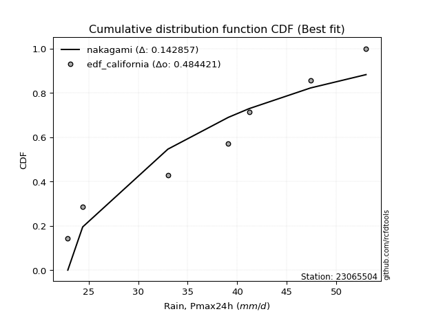</img>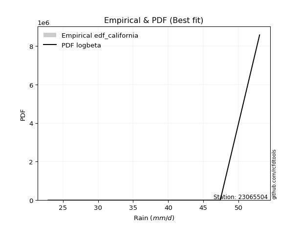</img>

</div>


### 2. EDF Hazen (1930)

Hazen method for plotting positions is a formula used to estimate the empirical cumulative probability distribution of flood events or other hydrological data. This formula often results in biased estimations, particularly when extrapolating to extreme events (high return periods).

<div align="center">


$P=(m-0.5)/n$


</div>


**2.1. Empirical values**

<div align="center">

|                | 0                   | 1                   | 2                   | 3         | 4                  | 5                  | 6                  |
|:---------------|:--------------------|:--------------------|:--------------------|:----------|:-------------------|:-------------------|:-------------------|
| date           | 2015                | 2019                | 2018                | 2020      | 2017               | 2016               | 2021               |
| x              | 22.9                | 24.4                | 33.0                | 39.1      | 41.2               | 47.4               | 53.0               |
| m              | 1                   | 2                   | 3                   | 4         | 5                  | 6                  | 7                  |
| empirical_dist | edf_hazen           | edf_hazen           | edf_hazen           | edf_hazen | edf_hazen          | edf_hazen          | edf_hazen          |
| empirical      | 0.07142857142857142 | 0.21428571428571427 | 0.35714285714285715 | 0.5       | 0.6428571428571429 | 0.7857142857142857 | 0.9285714285714286 |
| empirical_tr   | 1.0769230769230769  | 1.2727272727272727  | 1.5555555555555558  | 2.0       | 2.8000000000000003 | 4.666666666666666  | 14.000000000000007 |

</div>


**2.2. Kolmogorov-Smirnov fit test (sorted by Δ)**


<div align="center">

|                | 0                   | 1                   | 2                   | 3                   | 4                   | 5                   | 6                   | 7                   | 8                   | 9                   | 10                  | 11                  | 12                  | 13                  | 14                  | 15                  | 16                  | 17                  | 18                  | 19                  | 20                  | 21                  | 22                  | 23                  | 24                  | 25                  | 26                  | 27                  | 28                  | 29                  | 30                  | 31                  | 32                  | 33                  | 34                  | 35                  | 36                  | 37                  | 38                  | 39                  | 40                  | 41                  | 42                  | 43                  | 44                  | 45                  | 46                  | 47                  | 48                  | 49                  | 50                  | 51                  | 52                  | 53                  | 54                  | 55                  | 56                  | 57                  | 58                  | 59                  | 60                  | 61                  | 62                  | 63                  | 64                  | 65                  | 66                  | 67                  | 68                  | 69                  | 70                  | 71                  | 72                  | 73                  | 74                  | 75                  | 76                  | 77                  | 78                  | 79                  | 80                  | 81                  | 82                  | 83                  | 84                  | 85                  | 86                  | 87                  | 88                  | 89                  | 90                  | 91                  | 92                  | 93                  | 94                  | 95                  | 96                  | 97                  | 98                  | 99                  | 100                 | 101                 | 102                 | 103                 | 104                 | 105                 | 106                 | 107                 | 108                 | 109                 | 110                 | 111                 | 112                 | 113                 | 114                 | 115                 | 116                 | 117                 | 118                 | 119                 | 120                 | 121                 | 122                 | 123                 | 124                 | 125                 | 126                 | 127                 | 128                 | 129                 | 130                 | 131                 | 132                 | 133                 | 134                 | 135                 | 136                 | 137                 | 138                 | 139                 | 140                 | 141                 | 142                 | 143                 | 144                 | 145                 | 146                 | 147                 | 148                 | 149                 | 150                 | 151                 | 152                 | 153                 | 154                 | 155                 | 156                 | 157                 | 158                 | 159                 |
|:---------------|:--------------------|:--------------------|:--------------------|:--------------------|:--------------------|:--------------------|:--------------------|:--------------------|:--------------------|:--------------------|:--------------------|:--------------------|:--------------------|:--------------------|:--------------------|:--------------------|:--------------------|:--------------------|:--------------------|:--------------------|:--------------------|:--------------------|:--------------------|:--------------------|:--------------------|:--------------------|:--------------------|:--------------------|:--------------------|:--------------------|:--------------------|:--------------------|:--------------------|:--------------------|:--------------------|:--------------------|:--------------------|:--------------------|:--------------------|:--------------------|:--------------------|:--------------------|:--------------------|:--------------------|:--------------------|:--------------------|:--------------------|:--------------------|:--------------------|:--------------------|:--------------------|:--------------------|:--------------------|:--------------------|:--------------------|:--------------------|:--------------------|:--------------------|:--------------------|:--------------------|:--------------------|:--------------------|:--------------------|:--------------------|:--------------------|:--------------------|:--------------------|:--------------------|:--------------------|:--------------------|:--------------------|:--------------------|:--------------------|:--------------------|:--------------------|:--------------------|:--------------------|:--------------------|:--------------------|:--------------------|:--------------------|:--------------------|:--------------------|:--------------------|:--------------------|:--------------------|:--------------------|:--------------------|:--------------------|:--------------------|:--------------------|:--------------------|:--------------------|:--------------------|:--------------------|:--------------------|:--------------------|:--------------------|:--------------------|:--------------------|:--------------------|:--------------------|:--------------------|:--------------------|:--------------------|:--------------------|:--------------------|:--------------------|:--------------------|:--------------------|:--------------------|:--------------------|:--------------------|:--------------------|:--------------------|:--------------------|:--------------------|:--------------------|:--------------------|:--------------------|:--------------------|:--------------------|:--------------------|:--------------------|:--------------------|:--------------------|:--------------------|:--------------------|:--------------------|:--------------------|:--------------------|:--------------------|:--------------------|:--------------------|:--------------------|:--------------------|:--------------------|:--------------------|:--------------------|:--------------------|:--------------------|:--------------------|:--------------------|:--------------------|:--------------------|:--------------------|:--------------------|:--------------------|:--------------------|:--------------------|:--------------------|:--------------------|:--------------------|:--------------------|:--------------------|:--------------------|:--------------------|:--------------------|:--------------------|:--------------------|
| station        | 23065504            | 23065504            | 23065504            | 23065504            | 23065504            | 23065504            | 23065504            | 23065504            | 23065504            | 23065504            | 23065504            | 23065504            | 23065504            | 23065504            | 23065504            | 23065504            | 23065504            | 23065504            | 23065504            | 23065504            | 23065504            | 23065504            | 23065504            | 23065504            | 23065504            | 23065504            | 23065504            | 23065504            | 23065504            | 23065504            | 23065504            | 23065504            | 23065504            | 23065504            | 23065504            | 23065504            | 23065504            | 23065504            | 23065504            | 23065504            | 23065504            | 23065504            | 23065504            | 23065504            | 23065504            | 23065504            | 23065504            | 23065504            | 23065504            | 23065504            | 23065504            | 23065504            | 23065504            | 23065504            | 23065504            | 23065504            | 23065504            | 23065504            | 23065504            | 23065504            | 23065504            | 23065504            | 23065504            | 23065504            | 23065504            | 23065504            | 23065504            | 23065504            | 23065504            | 23065504            | 23065504            | 23065504            | 23065504            | 23065504            | 23065504            | 23065504            | 23065504            | 23065504            | 23065504            | 23065504            | 23065504            | 23065504            | 23065504            | 23065504            | 23065504            | 23065504            | 23065504            | 23065504            | 23065504            | 23065504            | 23065504            | 23065504            | 23065504            | 23065504            | 23065504            | 23065504            | 23065504            | 23065504            | 23065504            | 23065504            | 23065504            | 23065504            | 23065504            | 23065504            | 23065504            | 23065504            | 23065504            | 23065504            | 23065504            | 23065504            | 23065504            | 23065504            | 23065504            | 23065504            | 23065504            | 23065504            | 23065504            | 23065504            | 23065504            | 23065504            | 23065504            | 23065504            | 23065504            | 23065504            | 23065504            | 23065504            | 23065504            | 23065504            | 23065504            | 23065504            | 23065504            | 23065504            | 23065504            | 23065504            | 23065504            | 23065504            | 23065504            | 23065504            | 23065504            | 23065504            | 23065504            | 23065504            | 23065504            | 23065504            | 23065504            | 23065504            | 23065504            | 23065504            | 23065504            | 23065504            | 23065504            | 23065504            | 23065504            | 23065504            | 23065504            | 23065504            | 23065504            | 23065504            | 23065504            | 23065504            |
| empirical_dist | edf_hazen           | edf_hazen           | edf_hazen           | edf_hazen           | edf_hazen           | edf_hazen           | edf_hazen           | edf_hazen           | edf_hazen           | edf_hazen           | edf_hazen           | edf_hazen           | edf_hazen           | edf_hazen           | edf_hazen           | edf_hazen           | edf_hazen           | edf_hazen           | edf_hazen           | edf_hazen           | edf_hazen           | edf_hazen           | edf_hazen           | edf_hazen           | edf_hazen           | edf_hazen           | edf_hazen           | edf_hazen           | edf_hazen           | edf_hazen           | edf_hazen           | edf_hazen           | edf_hazen           | edf_hazen           | edf_hazen           | edf_hazen           | edf_hazen           | edf_hazen           | edf_hazen           | edf_hazen           | edf_hazen           | edf_hazen           | edf_hazen           | edf_hazen           | edf_hazen           | edf_hazen           | edf_hazen           | edf_hazen           | edf_hazen           | edf_hazen           | edf_hazen           | edf_hazen           | edf_hazen           | edf_hazen           | edf_hazen           | edf_hazen           | edf_hazen           | edf_hazen           | edf_hazen           | edf_hazen           | edf_hazen           | edf_hazen           | edf_hazen           | edf_hazen           | edf_hazen           | edf_hazen           | edf_hazen           | edf_hazen           | edf_hazen           | edf_hazen           | edf_hazen           | edf_hazen           | edf_hazen           | edf_hazen           | edf_hazen           | edf_hazen           | edf_hazen           | edf_hazen           | edf_hazen           | edf_hazen           | edf_hazen           | edf_hazen           | edf_hazen           | edf_hazen           | edf_hazen           | edf_hazen           | edf_hazen           | edf_hazen           | edf_hazen           | edf_hazen           | edf_hazen           | edf_hazen           | edf_hazen           | edf_hazen           | edf_hazen           | edf_hazen           | edf_hazen           | edf_hazen           | edf_hazen           | edf_hazen           | edf_hazen           | edf_hazen           | edf_hazen           | edf_hazen           | edf_hazen           | edf_hazen           | edf_hazen           | edf_hazen           | edf_hazen           | edf_hazen           | edf_hazen           | edf_hazen           | edf_hazen           | edf_hazen           | edf_hazen           | edf_hazen           | edf_hazen           | edf_hazen           | edf_hazen           | edf_hazen           | edf_hazen           | edf_hazen           | edf_hazen           | edf_hazen           | edf_hazen           | edf_hazen           | edf_hazen           | edf_hazen           | edf_hazen           | edf_hazen           | edf_hazen           | edf_hazen           | edf_hazen           | edf_hazen           | edf_hazen           | edf_hazen           | edf_hazen           | edf_hazen           | edf_hazen           | edf_hazen           | edf_hazen           | edf_hazen           | edf_hazen           | edf_hazen           | edf_hazen           | edf_hazen           | edf_hazen           | edf_hazen           | edf_hazen           | edf_hazen           | edf_hazen           | edf_hazen           | edf_hazen           | edf_hazen           | edf_hazen           | edf_hazen           | edf_hazen           | edf_hazen           | edf_hazen           | edf_hazen           |
| p_dist         | arcsine             | ksone               | logbeta             | semicircular        | logarcsine          | logtrapezoid        | logksone            | anglit              | genextreme          | logsemicircular     | logjohnsonsu        | dgamma              | dweibull            | logskewnorm         | loganglit           | burr                | johnsonsu           | gumbel_l            | ncf                 | pearson3            | t                   | skewnorm            | exponnorm           | norm                | crystalball         | nct                 | gamma               | erlang              | foldnorm            | f                   | logburr             | logburr12           | logwrapcauchy       | betaprime           | alpha               | invgamma            | logpearson3         | logweibull_min      | loggumbel_l         | logdweibull         | maxwell             | invgauss            | logloggamma         | cosine              | logdgamma           | gausshyper          | logf                | logistic            | lognorm             | logcrystalball      | logt                | logexponnorm        | lognct              | logfatiguelife      | rayleigh            | logbetaprime        | logmielke           | genlogistic         | invweibull          | logerlang           | exponpow            | hypsecant           | logtriang           | argus               | loggamma            | loggamma            | logargus            | logfoldnorm         | laplace             | rice                | logncf              | loginvgamma         | logrice             | logalpha            | triang              | logcosine           | loglogistic         | kstwobign           | logtukeylambda      | logkappa4           | wrapcauchy          | logkappa3           | loguniform          | logvonmises_line    | weibull_min         | logmaxwell          | loginvgauss         | logloglaplace       | loghypsecant        | gumbel_r            | beta                | bradford            | truncpareto         | kappa4              | lograyleigh         | loggompertz         | loginvweibull       | loggausshyper       | tukeylambda         | genpareto           | truncweibull_min    | gompertz            | loggenextreme       | vonmises_line       | uniform             | kappa3              | truncexpon          | loggenexpon         | logkstwobign        | halfnorm            | loglaplace          | loglaplace          | lomax               | loggenhalflogistic  | genexpon            | moyal               | loggumbel_r         | nakagami            | loghalfnorm         | burr12              | genhalflogistic     | loglomax            | logmoyal            | logrdist            | loghalflogistic     | halflogistic        | logbradford         | halfgennorm         | logtruncexpon       | logexponweib        | wald                | loglevy_l           | logexponpow         | logwald             | lognakagami         | logtruncnorm        | levy_l              | gennorm             | loggennorm          | trapezoid           | logjohnsonsb        | logtruncweibull_min | loggengamma         | loggenpareto        | exponweib           | fatiguelife         | gengamma            | logweibull_max      | johnsonsb           | powerlaw            | rdist               | loghalfgennorm      | logpowerlaw         | logtruncpareto      | weibull_max         | loggenlogistic      | truncnorm           | logvonmises         | vonmises            | mielke              |
| delta          | 0.0714285714285714  | 0.07146506478298498 | 0.07448569597363361 | 0.08132258420815261 | 0.08164211459743398 | 0.08283521559307308 | 0.0873665292673631  | 0.08857161018810969 | 0.09540436057837362 | 0.09596645119088598 | 0.09644429121589657 | 0.09701949943532395 | 0.09785692719681333 | 0.09896260901062777 | 0.10271818498663499 | 0.10305772812273267 | 0.10554394291078797 | 0.1057848929966858  | 0.10585155054521486 | 0.10586504042120334 | 0.10628726345413912 | 0.10629267455371971 | 0.10629832436477482 | 0.10629888295868886 | 0.10629889652301804 | 0.10641543589563657 | 0.1066238684588695  | 0.10662420960664244 | 0.10673800048675922 | 0.10696369044528214 | 0.10710772063421592 | 0.10858805631277896 | 0.11054745467496307 | 0.1107917449335571  | 0.11099599021972076 | 0.11107828223722852 | 0.11108054810462721 | 0.1111090553568725  | 0.11252730366527273 | 0.1148536403905398  | 0.11495476203131991 | 0.11519506179944705 | 0.1157017824452663  | 0.11665922470856607 | 0.11706103446005636 | 0.11806108099626497 | 0.1183760740751214  | 0.11843686175827729 | 0.11892037668000754 | 0.11892039328851933 | 0.11892114752555616 | 0.11892123523181997 | 0.12020730702704319 | 0.12037576583150367 | 0.12093807834764136 | 0.12119481405688015 | 0.122331069864828   | 0.12300384494284955 | 0.12318378507421524 | 0.12328034745532446 | 0.12359991443524865 | 0.12374110266767406 | 0.12388046049966846 | 0.12409192277076439 | 0.12592505024683454 | 0.12592505024683454 | 0.12697404506163554 | 0.12733967195719564 | 0.127382607086183   | 0.12806609120176166 | 0.12986988274285105 | 0.13196283492272864 | 0.13298054420587946 | 0.13324963268387469 | 0.13377502228503224 | 0.13388649794387075 | 0.1338896495503311  | 0.1339525570703124  | 0.1343068413412496  | 0.13696426516923021 | 0.13715588065329665 | 0.13857854270116504 | 0.13867844088240894 | 0.13926472764228393 | 0.140725915235961   | 0.14370557201213752 | 0.144515578041855   | 0.14481702372027128 | 0.14592569416780354 | 0.15002141648938194 | 0.15010607819168226 | 0.15016195956161632 | 0.15045438296898989 | 0.15128385688918106 | 0.1513041252479519  | 0.15328123950430328 | 0.15346771283032712 | 0.15669041156180202 | 0.1585428281479143  | 0.1598425163164585  | 0.16105117639128852 | 0.16180391182082748 | 0.16300510167309323 | 0.16444973912648075 | 0.1644518272425249  | 0.16447513890381243 | 0.1647686713966655  | 0.17075996357073175 | 0.17092477887598734 | 0.1727938109509669  | 0.174096520030107   | 0.174096520030107   | 0.17498938778655926 | 0.17566574943150326 | 0.17571124787274106 | 0.1780338310948241  | 0.18328694337352147 | 0.18932173396063345 | 0.19820763363399996 | 0.19857905044318153 | 0.20028583974488645 | 0.20252289232297987 | 0.20500240149852877 | 0.21003852729443362 | 0.21428571428571427 | 0.21428571428571427 | 0.2170891515180673  | 0.22477951132489699 | 0.22704196011077837 | 0.22883279579590465 | 0.2294071837297239  | 0.24665051628177911 | 0.26433330344742606 | 0.2657952440714868  | 0.27373523327613364 | 0.27682898158860125 | 0.2802405811801789  | 0.2857142857142857  | 0.2857142857142857  | 0.29478327747179633 | 0.2986184819708261  | 0.31618890134304956 | 0.32863622440324164 | 0.3322863031978084  | 0.45397724706835957 | 0.4592867609355494  | 0.46235943649480155 | 0.46439974606495904 | 0.47181032085963304 | 0.47678304536970967 | 0.4999999880096997  | 0.5                 | 0.5059720830211223  | 0.5315239282930295  | 0.5481105334575214  | 0.7857142857142857  | 0.9285714283514566  | 1.1178189284506366  | 7.485452041433373   | nan                 |
| deltao         | 0.48442053926100004 | 0.48442053926100004 | 0.48442053926100004 | 0.48442053926100004 | 0.48442053926100004 | 0.48442053926100004 | 0.48442053926100004 | 0.48442053926100004 | 0.48442053926100004 | 0.48442053926100004 | 0.48442053926100004 | 0.48442053926100004 | 0.48442053926100004 | 0.48442053926100004 | 0.48442053926100004 | 0.48442053926100004 | 0.48442053926100004 | 0.48442053926100004 | 0.48442053926100004 | 0.48442053926100004 | 0.48442053926100004 | 0.48442053926100004 | 0.48442053926100004 | 0.48442053926100004 | 0.48442053926100004 | 0.48442053926100004 | 0.48442053926100004 | 0.48442053926100004 | 0.48442053926100004 | 0.48442053926100004 | 0.48442053926100004 | 0.48442053926100004 | 0.48442053926100004 | 0.48442053926100004 | 0.48442053926100004 | 0.48442053926100004 | 0.48442053926100004 | 0.48442053926100004 | 0.48442053926100004 | 0.48442053926100004 | 0.48442053926100004 | 0.48442053926100004 | 0.48442053926100004 | 0.48442053926100004 | 0.48442053926100004 | 0.48442053926100004 | 0.48442053926100004 | 0.48442053926100004 | 0.48442053926100004 | 0.48442053926100004 | 0.48442053926100004 | 0.48442053926100004 | 0.48442053926100004 | 0.48442053926100004 | 0.48442053926100004 | 0.48442053926100004 | 0.48442053926100004 | 0.48442053926100004 | 0.48442053926100004 | 0.48442053926100004 | 0.48442053926100004 | 0.48442053926100004 | 0.48442053926100004 | 0.48442053926100004 | 0.48442053926100004 | 0.48442053926100004 | 0.48442053926100004 | 0.48442053926100004 | 0.48442053926100004 | 0.48442053926100004 | 0.48442053926100004 | 0.48442053926100004 | 0.48442053926100004 | 0.48442053926100004 | 0.48442053926100004 | 0.48442053926100004 | 0.48442053926100004 | 0.48442053926100004 | 0.48442053926100004 | 0.48442053926100004 | 0.48442053926100004 | 0.48442053926100004 | 0.48442053926100004 | 0.48442053926100004 | 0.48442053926100004 | 0.48442053926100004 | 0.48442053926100004 | 0.48442053926100004 | 0.48442053926100004 | 0.48442053926100004 | 0.48442053926100004 | 0.48442053926100004 | 0.48442053926100004 | 0.48442053926100004 | 0.48442053926100004 | 0.48442053926100004 | 0.48442053926100004 | 0.48442053926100004 | 0.48442053926100004 | 0.48442053926100004 | 0.48442053926100004 | 0.48442053926100004 | 0.48442053926100004 | 0.48442053926100004 | 0.48442053926100004 | 0.48442053926100004 | 0.48442053926100004 | 0.48442053926100004 | 0.48442053926100004 | 0.48442053926100004 | 0.48442053926100004 | 0.48442053926100004 | 0.48442053926100004 | 0.48442053926100004 | 0.48442053926100004 | 0.48442053926100004 | 0.48442053926100004 | 0.48442053926100004 | 0.48442053926100004 | 0.48442053926100004 | 0.48442053926100004 | 0.48442053926100004 | 0.48442053926100004 | 0.48442053926100004 | 0.48442053926100004 | 0.48442053926100004 | 0.48442053926100004 | 0.48442053926100004 | 0.48442053926100004 | 0.48442053926100004 | 0.48442053926100004 | 0.48442053926100004 | 0.48442053926100004 | 0.48442053926100004 | 0.48442053926100004 | 0.48442053926100004 | 0.48442053926100004 | 0.48442053926100004 | 0.48442053926100004 | 0.48442053926100004 | 0.48442053926100004 | 0.48442053926100004 | 0.48442053926100004 | 0.48442053926100004 | 0.48442053926100004 | 0.48442053926100004 | 0.48442053926100004 | 0.48442053926100004 | 0.48442053926100004 | 0.48442053926100004 | 0.48442053926100004 | 0.48442053926100004 | 0.48442053926100004 | 0.48442053926100004 | 0.48442053926100004 | 0.48442053926100004 | 0.48442053926100004 | 0.48442053926100004 | 0.48442053926100004 | 0.48442053926100004 |
| eval           | Δo > Δ              | Δo > Δ              | Δo > Δ              | Δo > Δ              | Δo > Δ              | Δo > Δ              | Δo > Δ              | Δo > Δ              | Δo > Δ              | Δo > Δ              | Δo > Δ              | Δo > Δ              | Δo > Δ              | Δo > Δ              | Δo > Δ              | Δo > Δ              | Δo > Δ              | Δo > Δ              | Δo > Δ              | Δo > Δ              | Δo > Δ              | Δo > Δ              | Δo > Δ              | Δo > Δ              | Δo > Δ              | Δo > Δ              | Δo > Δ              | Δo > Δ              | Δo > Δ              | Δo > Δ              | Δo > Δ              | Δo > Δ              | Δo > Δ              | Δo > Δ              | Δo > Δ              | Δo > Δ              | Δo > Δ              | Δo > Δ              | Δo > Δ              | Δo > Δ              | Δo > Δ              | Δo > Δ              | Δo > Δ              | Δo > Δ              | Δo > Δ              | Δo > Δ              | Δo > Δ              | Δo > Δ              | Δo > Δ              | Δo > Δ              | Δo > Δ              | Δo > Δ              | Δo > Δ              | Δo > Δ              | Δo > Δ              | Δo > Δ              | Δo > Δ              | Δo > Δ              | Δo > Δ              | Δo > Δ              | Δo > Δ              | Δo > Δ              | Δo > Δ              | Δo > Δ              | Δo > Δ              | Δo > Δ              | Δo > Δ              | Δo > Δ              | Δo > Δ              | Δo > Δ              | Δo > Δ              | Δo > Δ              | Δo > Δ              | Δo > Δ              | Δo > Δ              | Δo > Δ              | Δo > Δ              | Δo > Δ              | Δo > Δ              | Δo > Δ              | Δo > Δ              | Δo > Δ              | Δo > Δ              | Δo > Δ              | Δo > Δ              | Δo > Δ              | Δo > Δ              | Δo > Δ              | Δo > Δ              | Δo > Δ              | Δo > Δ              | Δo > Δ              | Δo > Δ              | Δo > Δ              | Δo > Δ              | Δo > Δ              | Δo > Δ              | Δo > Δ              | Δo > Δ              | Δo > Δ              | Δo > Δ              | Δo > Δ              | Δo > Δ              | Δo > Δ              | Δo > Δ              | Δo > Δ              | Δo > Δ              | Δo > Δ              | Δo > Δ              | Δo > Δ              | Δo > Δ              | Δo > Δ              | Δo > Δ              | Δo > Δ              | Δo > Δ              | Δo > Δ              | Δo > Δ              | Δo > Δ              | Δo > Δ              | Δo > Δ              | Δo > Δ              | Δo > Δ              | Δo > Δ              | Δo > Δ              | Δo > Δ              | Δo > Δ              | Δo > Δ              | Δo > Δ              | Δo > Δ              | Δo > Δ              | Δo > Δ              | Δo > Δ              | Δo > Δ              | Δo > Δ              | Δo > Δ              | Δo > Δ              | Δo > Δ              | Δo > Δ              | Δo > Δ              | Δo > Δ              | Δo > Δ              | Δo > Δ              | Δo > Δ              | Δo > Δ              | Δo > Δ              | Δo > Δ              | Δo > Δ              | Δo > Δ              | Δo > Δ              | Δo > Δ              | Δo <= Δ             | Δo <= Δ             | Δo <= Δ             | Δo <= Δ             | Δo <= Δ             | Δo <= Δ             | Δo <= Δ             | Δo <= Δ             | Δo <= Δ             | Δo <= Δ             |
| fit            | 1                   | 1                   | 1                   | 1                   | 1                   | 1                   | 1                   | 1                   | 1                   | 1                   | 1                   | 1                   | 1                   | 1                   | 1                   | 1                   | 1                   | 1                   | 1                   | 1                   | 1                   | 1                   | 1                   | 1                   | 1                   | 1                   | 1                   | 1                   | 1                   | 1                   | 1                   | 1                   | 1                   | 1                   | 1                   | 1                   | 1                   | 1                   | 1                   | 1                   | 1                   | 1                   | 1                   | 1                   | 1                   | 1                   | 1                   | 1                   | 1                   | 1                   | 1                   | 1                   | 1                   | 1                   | 1                   | 1                   | 1                   | 1                   | 1                   | 1                   | 1                   | 1                   | 1                   | 1                   | 1                   | 1                   | 1                   | 1                   | 1                   | 1                   | 1                   | 1                   | 1                   | 1                   | 1                   | 1                   | 1                   | 1                   | 1                   | 1                   | 1                   | 1                   | 1                   | 1                   | 1                   | 1                   | 1                   | 1                   | 1                   | 1                   | 1                   | 1                   | 1                   | 1                   | 1                   | 1                   | 1                   | 1                   | 1                   | 1                   | 1                   | 1                   | 1                   | 1                   | 1                   | 1                   | 1                   | 1                   | 1                   | 1                   | 1                   | 1                   | 1                   | 1                   | 1                   | 1                   | 1                   | 1                   | 1                   | 1                   | 1                   | 1                   | 1                   | 1                   | 1                   | 1                   | 1                   | 1                   | 1                   | 1                   | 1                   | 1                   | 1                   | 1                   | 1                   | 1                   | 1                   | 1                   | 1                   | 1                   | 1                   | 1                   | 1                   | 1                   | 1                   | 1                   | 1                   | 1                   | 1                   | 1                   | 0                   | 0                   | 0                   | 0                   | 0                   | 0                   | 0                   | 0                   | 0                   | 0                   |
| n              | 7                   | 7                   | 7                   | 7                   | 7                   | 7                   | 7                   | 7                   | 7                   | 7                   | 7                   | 7                   | 7                   | 7                   | 7                   | 7                   | 7                   | 7                   | 7                   | 7                   | 7                   | 7                   | 7                   | 7                   | 7                   | 7                   | 7                   | 7                   | 7                   | 7                   | 7                   | 7                   | 7                   | 7                   | 7                   | 7                   | 7                   | 7                   | 7                   | 7                   | 7                   | 7                   | 7                   | 7                   | 7                   | 7                   | 7                   | 7                   | 7                   | 7                   | 7                   | 7                   | 7                   | 7                   | 7                   | 7                   | 7                   | 7                   | 7                   | 7                   | 7                   | 7                   | 7                   | 7                   | 7                   | 7                   | 7                   | 7                   | 7                   | 7                   | 7                   | 7                   | 7                   | 7                   | 7                   | 7                   | 7                   | 7                   | 7                   | 7                   | 7                   | 7                   | 7                   | 7                   | 7                   | 7                   | 7                   | 7                   | 7                   | 7                   | 7                   | 7                   | 7                   | 7                   | 7                   | 7                   | 7                   | 7                   | 7                   | 7                   | 7                   | 7                   | 7                   | 7                   | 7                   | 7                   | 7                   | 7                   | 7                   | 7                   | 7                   | 7                   | 7                   | 7                   | 7                   | 7                   | 7                   | 7                   | 7                   | 7                   | 7                   | 7                   | 7                   | 7                   | 7                   | 7                   | 7                   | 7                   | 7                   | 7                   | 7                   | 7                   | 7                   | 7                   | 7                   | 7                   | 7                   | 7                   | 7                   | 7                   | 7                   | 7                   | 7                   | 7                   | 7                   | 7                   | 7                   | 7                   | 7                   | 7                   | 7                   | 7                   | 7                   | 7                   | 7                   | 7                   | 7                   | 7                   | 7                   | 7                   |
| best_fit       | 1                   | 0                   | 0                   | 0                   | 0                   | 0                   | 0                   | 0                   | 0                   | 0                   | 0                   | 0                   | 0                   | 0                   | 0                   | 0                   | 0                   | 0                   | 0                   | 0                   | 0                   | 0                   | 0                   | 0                   | 0                   | 0                   | 0                   | 0                   | 0                   | 0                   | 0                   | 0                   | 0                   | 0                   | 0                   | 0                   | 0                   | 0                   | 0                   | 0                   | 0                   | 0                   | 0                   | 0                   | 0                   | 0                   | 0                   | 0                   | 0                   | 0                   | 0                   | 0                   | 0                   | 0                   | 0                   | 0                   | 0                   | 0                   | 0                   | 0                   | 0                   | 0                   | 0                   | 0                   | 0                   | 0                   | 0                   | 0                   | 0                   | 0                   | 0                   | 0                   | 0                   | 0                   | 0                   | 0                   | 0                   | 0                   | 0                   | 0                   | 0                   | 0                   | 0                   | 0                   | 0                   | 0                   | 0                   | 0                   | 0                   | 0                   | 0                   | 0                   | 0                   | 0                   | 0                   | 0                   | 0                   | 0                   | 0                   | 0                   | 0                   | 0                   | 0                   | 0                   | 0                   | 0                   | 0                   | 0                   | 0                   | 0                   | 0                   | 0                   | 0                   | 0                   | 0                   | 0                   | 0                   | 0                   | 0                   | 0                   | 0                   | 0                   | 0                   | 0                   | 0                   | 0                   | 0                   | 0                   | 0                   | 0                   | 0                   | 0                   | 0                   | 0                   | 0                   | 0                   | 0                   | 0                   | 0                   | 0                   | 0                   | 0                   | 0                   | 0                   | 0                   | 0                   | 0                   | 0                   | 0                   | 0                   | 0                   | 0                   | 0                   | 0                   | 0                   | 0                   | 0                   | 0                   | 0                   | 0                   |
| best_fit_sort  | 1                   | 2                   | 3                   | 4                   | 5                   | 6                   | 7                   | 8                   | 9                   | 10                  | 11                  | 12                  | 13                  | 14                  | 15                  | 16                  | 17                  | 18                  | 19                  | 20                  | 21                  | 22                  | 23                  | 24                  | 25                  | 26                  | 27                  | 28                  | 29                  | 30                  | 31                  | 32                  | 33                  | 34                  | 35                  | 36                  | 37                  | 38                  | 39                  | 40                  | 41                  | 42                  | 43                  | 44                  | 45                  | 46                  | 47                  | 48                  | 49                  | 50                  | 51                  | 52                  | 53                  | 54                  | 55                  | 56                  | 57                  | 58                  | 59                  | 60                  | 61                  | 62                  | 63                  | 64                  | 65                  | 66                  | 67                  | 68                  | 69                  | 70                  | 71                  | 72                  | 73                  | 74                  | 75                  | 76                  | 77                  | 78                  | 79                  | 80                  | 81                  | 82                  | 83                  | 84                  | 85                  | 86                  | 87                  | 88                  | 89                  | 90                  | 91                  | 92                  | 93                  | 94                  | 95                  | 96                  | 97                  | 98                  | 99                  | 100                 | 101                 | 102                 | 103                 | 104                 | 105                 | 106                 | 107                 | 108                 | 109                 | 110                 | 111                 | 112                 | 113                 | 114                 | 115                 | 116                 | 117                 | 118                 | 119                 | 120                 | 121                 | 122                 | 123                 | 124                 | 125                 | 126                 | 127                 | 128                 | 129                 | 130                 | 131                 | 132                 | 133                 | 134                 | 135                 | 136                 | 137                 | 138                 | 139                 | 140                 | 141                 | 142                 | 143                 | 144                 | 145                 | 146                 | 147                 | 148                 | 149                 | 150                 | 151                 | 152                 | 153                 | 154                 | 155                 | 156                 | 157                 | 158                 | 159                 | 160                 |

</div>


**2.3. Best fit**

<div align="center">

|   id |   station | empirical_dist   | p_dist   |     delta |   deltao | eval   |   fit |   n |   best_fit |   best_fit_sort |
|-----:|----------:|:-----------------|:---------|----------:|---------:|:-------|------:|----:|-----------:|----------------:|
|    0 |  23065504 | edf_hazen        | arcsine  | 0.0714286 | 0.484421 | Δo > Δ |     1 |   7 |          1 |               1 |

</div>


<div align="center">

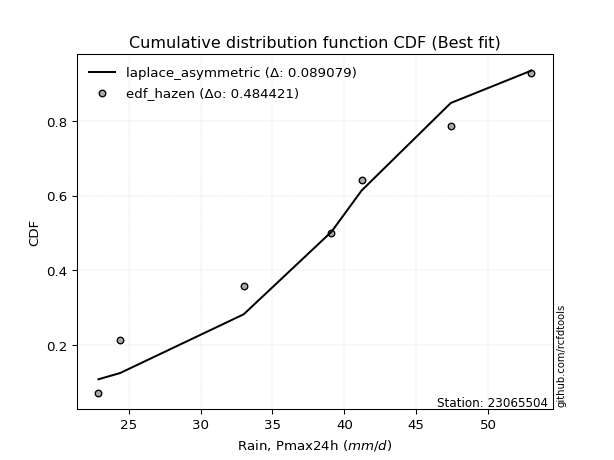</img></img>

</div>


### 3. EDF Weibull (1939)

Weibull plotting position formula is an empirical method used to estimate the non-exceedance probability or plotting position for a set of observed data, is often recommended or widely used in practice, particularly in flood frequency analysis.

<div align="center">


$P=m/(n+1)$


</div>


**3.1. Empirical values**

<div align="center">

|                | 0                  | 1                  | 2           | 3           | 4                  | 5           | 6           |
|:---------------|:-------------------|:-------------------|:------------|:------------|:-------------------|:------------|:------------|
| date           | 2015               | 2019               | 2018        | 2020        | 2017               | 2016        | 2021        |
| x              | 22.9               | 24.4               | 33.0        | 39.1        | 41.2               | 47.4        | 53.0        |
| m              | 1                  | 2                  | 3           | 4           | 5                  | 6           | 7           |
| empirical_dist | edf_weibull        | edf_weibull        | edf_weibull | edf_weibull | edf_weibull        | edf_weibull | edf_weibull |
| empirical      | 0.125              | 0.25               | 0.375       | 0.5         | 0.625              | 0.75        | 0.875       |
| empirical_tr   | 1.1428571428571428 | 1.3333333333333333 | 1.6         | 2.0         | 2.6666666666666665 | 4.0         | 8.0         |

</div>


**3.2. Kolmogorov-Smirnov fit test (sorted by Δ)**


<div align="center">

|                | 0                   | 1                   | 2                   | 3                   | 4                   | 5                   | 6                   | 7                   | 8                   | 9                   | 10                  | 11                  | 12                  | 13                  | 14                  | 15                  | 16                  | 17                  | 18                  | 19                  | 20                  | 21                  | 22                  | 23                  | 24                  | 25                  | 26                  | 27                  | 28                  | 29                  | 30                  | 31                  | 32                  | 33                  | 34                  | 35                  | 36                  | 37                  | 38                  | 39                  | 40                  | 41                  | 42                  | 43                  | 44                  | 45                  | 46                  | 47                  | 48                  | 49                  | 50                  | 51                  | 52                  | 53                  | 54                  | 55                  | 56                  | 57                  | 58                  | 59                  | 60                  | 61                  | 62                  | 63                  | 64                  | 65                  | 66                  | 67                  | 68                  | 69                  | 70                  | 71                  | 72                  | 73                  | 74                  | 75                  | 76                  | 77                  | 78                  | 79                  | 80                  | 81                  | 82                  | 83                  | 84                  | 85                  | 86                  | 87                  | 88                  | 89                  | 90                  | 91                  | 92                  | 93                  | 94                  | 95                  | 96                  | 97                  | 98                  | 99                  | 100                 | 101                 | 102                 | 103                 | 104                 | 105                 | 106                 | 107                 | 108                 | 109                 | 110                 | 111                 | 112                 | 113                 | 114                 | 115                 | 116                 | 117                 | 118                 | 119                 | 120                 | 121                 | 122                 | 123                 | 124                 | 125                 | 126                 | 127                 | 128                 | 129                 | 130                 | 131                 | 132                 | 133                 | 134                 | 135                 | 136                 | 137                 | 138                 | 139                 | 140                 | 141                 | 142                 | 143                 | 144                 | 145                 | 146                 | 147                 | 148                 | 149                 | 150                 | 151                 | 152                 | 153                 | 154                 | 155                 | 156                 | 157                 | 158                 | 159                 |
|:---------------|:--------------------|:--------------------|:--------------------|:--------------------|:--------------------|:--------------------|:--------------------|:--------------------|:--------------------|:--------------------|:--------------------|:--------------------|:--------------------|:--------------------|:--------------------|:--------------------|:--------------------|:--------------------|:--------------------|:--------------------|:--------------------|:--------------------|:--------------------|:--------------------|:--------------------|:--------------------|:--------------------|:--------------------|:--------------------|:--------------------|:--------------------|:--------------------|:--------------------|:--------------------|:--------------------|:--------------------|:--------------------|:--------------------|:--------------------|:--------------------|:--------------------|:--------------------|:--------------------|:--------------------|:--------------------|:--------------------|:--------------------|:--------------------|:--------------------|:--------------------|:--------------------|:--------------------|:--------------------|:--------------------|:--------------------|:--------------------|:--------------------|:--------------------|:--------------------|:--------------------|:--------------------|:--------------------|:--------------------|:--------------------|:--------------------|:--------------------|:--------------------|:--------------------|:--------------------|:--------------------|:--------------------|:--------------------|:--------------------|:--------------------|:--------------------|:--------------------|:--------------------|:--------------------|:--------------------|:--------------------|:--------------------|:--------------------|:--------------------|:--------------------|:--------------------|:--------------------|:--------------------|:--------------------|:--------------------|:--------------------|:--------------------|:--------------------|:--------------------|:--------------------|:--------------------|:--------------------|:--------------------|:--------------------|:--------------------|:--------------------|:--------------------|:--------------------|:--------------------|:--------------------|:--------------------|:--------------------|:--------------------|:--------------------|:--------------------|:--------------------|:--------------------|:--------------------|:--------------------|:--------------------|:--------------------|:--------------------|:--------------------|:--------------------|:--------------------|:--------------------|:--------------------|:--------------------|:--------------------|:--------------------|:--------------------|:--------------------|:--------------------|:--------------------|:--------------------|:--------------------|:--------------------|:--------------------|:--------------------|:--------------------|:--------------------|:--------------------|:--------------------|:--------------------|:--------------------|:--------------------|:--------------------|:--------------------|:--------------------|:--------------------|:--------------------|:--------------------|:--------------------|:--------------------|:--------------------|:--------------------|:--------------------|:--------------------|:--------------------|:--------------------|:--------------------|:--------------------|:--------------------|:--------------------|:--------------------|:--------------------|
| station        | 23065504            | 23065504            | 23065504            | 23065504            | 23065504            | 23065504            | 23065504            | 23065504            | 23065504            | 23065504            | 23065504            | 23065504            | 23065504            | 23065504            | 23065504            | 23065504            | 23065504            | 23065504            | 23065504            | 23065504            | 23065504            | 23065504            | 23065504            | 23065504            | 23065504            | 23065504            | 23065504            | 23065504            | 23065504            | 23065504            | 23065504            | 23065504            | 23065504            | 23065504            | 23065504            | 23065504            | 23065504            | 23065504            | 23065504            | 23065504            | 23065504            | 23065504            | 23065504            | 23065504            | 23065504            | 23065504            | 23065504            | 23065504            | 23065504            | 23065504            | 23065504            | 23065504            | 23065504            | 23065504            | 23065504            | 23065504            | 23065504            | 23065504            | 23065504            | 23065504            | 23065504            | 23065504            | 23065504            | 23065504            | 23065504            | 23065504            | 23065504            | 23065504            | 23065504            | 23065504            | 23065504            | 23065504            | 23065504            | 23065504            | 23065504            | 23065504            | 23065504            | 23065504            | 23065504            | 23065504            | 23065504            | 23065504            | 23065504            | 23065504            | 23065504            | 23065504            | 23065504            | 23065504            | 23065504            | 23065504            | 23065504            | 23065504            | 23065504            | 23065504            | 23065504            | 23065504            | 23065504            | 23065504            | 23065504            | 23065504            | 23065504            | 23065504            | 23065504            | 23065504            | 23065504            | 23065504            | 23065504            | 23065504            | 23065504            | 23065504            | 23065504            | 23065504            | 23065504            | 23065504            | 23065504            | 23065504            | 23065504            | 23065504            | 23065504            | 23065504            | 23065504            | 23065504            | 23065504            | 23065504            | 23065504            | 23065504            | 23065504            | 23065504            | 23065504            | 23065504            | 23065504            | 23065504            | 23065504            | 23065504            | 23065504            | 23065504            | 23065504            | 23065504            | 23065504            | 23065504            | 23065504            | 23065504            | 23065504            | 23065504            | 23065504            | 23065504            | 23065504            | 23065504            | 23065504            | 23065504            | 23065504            | 23065504            | 23065504            | 23065504            | 23065504            | 23065504            | 23065504            | 23065504            | 23065504            | 23065504            |
| empirical_dist | edf_weibull         | edf_weibull         | edf_weibull         | edf_weibull         | edf_weibull         | edf_weibull         | edf_weibull         | edf_weibull         | edf_weibull         | edf_weibull         | edf_weibull         | edf_weibull         | edf_weibull         | edf_weibull         | edf_weibull         | edf_weibull         | edf_weibull         | edf_weibull         | edf_weibull         | edf_weibull         | edf_weibull         | edf_weibull         | edf_weibull         | edf_weibull         | edf_weibull         | edf_weibull         | edf_weibull         | edf_weibull         | edf_weibull         | edf_weibull         | edf_weibull         | edf_weibull         | edf_weibull         | edf_weibull         | edf_weibull         | edf_weibull         | edf_weibull         | edf_weibull         | edf_weibull         | edf_weibull         | edf_weibull         | edf_weibull         | edf_weibull         | edf_weibull         | edf_weibull         | edf_weibull         | edf_weibull         | edf_weibull         | edf_weibull         | edf_weibull         | edf_weibull         | edf_weibull         | edf_weibull         | edf_weibull         | edf_weibull         | edf_weibull         | edf_weibull         | edf_weibull         | edf_weibull         | edf_weibull         | edf_weibull         | edf_weibull         | edf_weibull         | edf_weibull         | edf_weibull         | edf_weibull         | edf_weibull         | edf_weibull         | edf_weibull         | edf_weibull         | edf_weibull         | edf_weibull         | edf_weibull         | edf_weibull         | edf_weibull         | edf_weibull         | edf_weibull         | edf_weibull         | edf_weibull         | edf_weibull         | edf_weibull         | edf_weibull         | edf_weibull         | edf_weibull         | edf_weibull         | edf_weibull         | edf_weibull         | edf_weibull         | edf_weibull         | edf_weibull         | edf_weibull         | edf_weibull         | edf_weibull         | edf_weibull         | edf_weibull         | edf_weibull         | edf_weibull         | edf_weibull         | edf_weibull         | edf_weibull         | edf_weibull         | edf_weibull         | edf_weibull         | edf_weibull         | edf_weibull         | edf_weibull         | edf_weibull         | edf_weibull         | edf_weibull         | edf_weibull         | edf_weibull         | edf_weibull         | edf_weibull         | edf_weibull         | edf_weibull         | edf_weibull         | edf_weibull         | edf_weibull         | edf_weibull         | edf_weibull         | edf_weibull         | edf_weibull         | edf_weibull         | edf_weibull         | edf_weibull         | edf_weibull         | edf_weibull         | edf_weibull         | edf_weibull         | edf_weibull         | edf_weibull         | edf_weibull         | edf_weibull         | edf_weibull         | edf_weibull         | edf_weibull         | edf_weibull         | edf_weibull         | edf_weibull         | edf_weibull         | edf_weibull         | edf_weibull         | edf_weibull         | edf_weibull         | edf_weibull         | edf_weibull         | edf_weibull         | edf_weibull         | edf_weibull         | edf_weibull         | edf_weibull         | edf_weibull         | edf_weibull         | edf_weibull         | edf_weibull         | edf_weibull         | edf_weibull         | edf_weibull         | edf_weibull         | edf_weibull         |
| p_dist         | logncf              | logburr             | logmielke           | dweibull            | ksone               | dgamma              | semicircular        | logtrapezoid        | logksone            | anglit              | logloggamma         | logwrapcauchy       | logbeta             | arcsine             | logarcsine          | wrapcauchy          | genpareto           | logsemicircular     | genextreme          | logjohnsonsu        | logskewnorm         | loganglit           | burr                | weibull_min         | johnsonsu           | gumbel_l            | ncf                 | pearson3            | t                   | skewnorm            | exponnorm           | norm                | crystalball         | nct                 | gamma               | erlang              | foldnorm            | f                   | logdweibull         | logburr12           | loggenextreme       | logfoldnorm         | exponpow            | betaprime           | genlogistic         | alpha               | kstwobign           | invgamma            | logpearson3         | logweibull_min      | invweibull          | invgauss            | loggumbel_l         | loginvgauss         | loginvgamma         | logalpha            | logbetaprime        | maxwell             | lognct              | loggamma            | loggamma            | logf                | logfatiguelife      | logexponnorm        | logcrystalball      | lognorm             | logt                | logerlang           | cosine              | logdgamma           | loginvweibull       | gausshyper          | logistic            | logcosine           | logrdist            | triang              | rayleigh            | hypsecant           | logtriang           | argus               | logkappa4           | loglogistic         | logmaxwell          | logargus            | laplace             | rice                | logrice             | loghypsecant        | truncweibull_min    | logtukeylambda      | lograyleigh         | loggenexpon         | logkstwobign        | truncexpon          | loglaplace          | loglaplace          | logkappa3           | loguniform          | logvonmises_line    | lomax               | genexpon            | logloglaplace       | gumbel_r            | beta                | bradford            | truncpareto         | kappa4              | loggompertz         | nakagami            | loggausshyper       | loglevy_l           | tukeylambda         | burr12              | loggumbel_r         | gompertz            | loglomax            | genhalflogistic     | vonmises_line       | uniform             | kappa3              | halfgennorm         | halfnorm            | loggenhalflogistic  | moyal               | logbradford         | logmoyal            | levy_l              | logtruncexpon       | logexponweib        | loghalfnorm         | logexponpow         | wald                | halflogistic        | gennorm             | loggennorm          | loghalflogistic     | lognakagami         | logjohnsonsb        | logwald             | logtruncnorm        | trapezoid           | loggenpareto        | logtruncweibull_min | loggengamma         | johnsonsb           | exponweib           | fatiguelife         | gengamma            | logweibull_max      | powerlaw            | logpowerlaw         | rdist               | loghalfgennorm      | weibull_max         | logtruncpareto      | loggenlogistic      | truncnorm           | logvonmises         | vonmises            | mielke              |
| delta          | 0.08240923661844723 | 0.10364169133894457 | 0.10457795236633785 | 0.10494241968544155 | 0.1071793504972707  | 0.11311039156295974 | 0.11703686992243834 | 0.1185495013073588  | 0.12245182187863884 | 0.12428589590239542 | 0.12492635301104771 | 0.12499993954560716 | 0.12499999829371844 | 0.125               | 0.125               | 0.125               | 0.12577792338819316 | 0.13008818241253922 | 0.13111864629265935 | 0.1321585769301823  | 0.1346768947249135  | 0.1360297039114582  | 0.1387720138370184  | 0.140725915235961   | 0.1412582286250737  | 0.1414991787109715  | 0.1415658362595006  | 0.14157932613548907 | 0.14200154916842483 | 0.14200696026800544 | 0.14201261007906055 | 0.1420131686729746  | 0.14201318223730375 | 0.1421297216099223  | 0.1423381541731552  | 0.14233849532092818 | 0.14245228620104494 | 0.14267797615956787 | 0.14426305857888633 | 0.14430234202706468 | 0.14514795881595033 | 0.14618342490001662 | 0.14618790906282314 | 0.14650603064784284 | 0.1467032223776546  | 0.14671027593400648 | 0.14676484486814312 | 0.14679256795151424 | 0.14679483381891295 | 0.14682334107115824 | 0.1469829095523394  | 0.14799728571527865 | 0.14824158937955845 | 0.14871177766795396 | 0.14947584152661642 | 0.14998687476067346 | 0.1501920149172955  | 0.15066904774560563 | 0.15075616995522412 | 0.15092075387807935 | 0.15092075387807935 | 0.15117164323248589 | 0.15142892456965462 | 0.15151059992712368 | 0.1515112161885263  | 0.15151128870335046 | 0.1515136996409103  | 0.1517049688856397  | 0.1523735104228518  | 0.1527753201743421  | 0.15346771283032712 | 0.1537753667105507  | 0.15415114747256303 | 0.15558970906352215 | 0.15646709872300502 | 0.15660771914419774 | 0.1566523640619271  | 0.15945538838195977 | 0.1595947462139542  | 0.15980620848505012 | 0.16016088495826092 | 0.1621508156848036  | 0.16261609490249468 | 0.16268833077592126 | 0.1630968928004687  | 0.16378037691604735 | 0.1644144843342024  | 0.1665899494818336  | 0.16689929214677524 | 0.16945039624344105 | 0.17011887718554758 | 0.17075996357073175 | 0.17092477887598734 | 0.1713949643832111  | 0.174096520030107   | 0.174096520030107   | 0.1742928284154508  | 0.1743927265966947  | 0.17497901335656968 | 0.17498938778655926 | 0.17571124787274106 | 0.180531309434557   | 0.18573570220366767 | 0.18582036390596798 | 0.18587624527590205 | 0.1861686686832756  | 0.18699814260346678 | 0.188995525218589   | 0.18932173396063345 | 0.19240469727608778 | 0.19307908771035054 | 0.19425711386220001 | 0.1968098616990953  | 0.1969996530943902  | 0.1975181975351132  | 0.19838542583816943 | 0.19870476142799887 | 0.20016402484076645 | 0.20016611295681064 | 0.20018942461809816 | 0.20692236846775414 | 0.20850809666525266 | 0.21138003514578899 | 0.21374811680910982 | 0.2170891515180673  | 0.22363776895963458 | 0.2266691526087503  | 0.22704196011077837 | 0.22883279579590465 | 0.23392191934828568 | 0.2464761605902832  | 0.25                | 0.25                | 0.25                | 0.25                | 0.25                | 0.2558780904189908  | 0.2629041962565404  | 0.2657952440714868  | 0.27682898158860125 | 0.27692613461465343 | 0.27871487462637984 | 0.31618890134304956 | 0.3177504916105808  | 0.43609603514534734 | 0.4361201042112167  | 0.4414296180784065  | 0.4445022936376587  | 0.44654260320781614 | 0.4589259025125668  | 0.4881149401639795  | 0.4999999880096997  | 0.5                 | 0.5123962477432357  | 0.5136667854358867  | 0.75                | 0.874999999780028   | 1.1178189284506366  | 7.5390234700048016  | nan                 |
| deltao         | 0.48442053926100004 | 0.48442053926100004 | 0.48442053926100004 | 0.48442053926100004 | 0.48442053926100004 | 0.48442053926100004 | 0.48442053926100004 | 0.48442053926100004 | 0.48442053926100004 | 0.48442053926100004 | 0.48442053926100004 | 0.48442053926100004 | 0.48442053926100004 | 0.48442053926100004 | 0.48442053926100004 | 0.48442053926100004 | 0.48442053926100004 | 0.48442053926100004 | 0.48442053926100004 | 0.48442053926100004 | 0.48442053926100004 | 0.48442053926100004 | 0.48442053926100004 | 0.48442053926100004 | 0.48442053926100004 | 0.48442053926100004 | 0.48442053926100004 | 0.48442053926100004 | 0.48442053926100004 | 0.48442053926100004 | 0.48442053926100004 | 0.48442053926100004 | 0.48442053926100004 | 0.48442053926100004 | 0.48442053926100004 | 0.48442053926100004 | 0.48442053926100004 | 0.48442053926100004 | 0.48442053926100004 | 0.48442053926100004 | 0.48442053926100004 | 0.48442053926100004 | 0.48442053926100004 | 0.48442053926100004 | 0.48442053926100004 | 0.48442053926100004 | 0.48442053926100004 | 0.48442053926100004 | 0.48442053926100004 | 0.48442053926100004 | 0.48442053926100004 | 0.48442053926100004 | 0.48442053926100004 | 0.48442053926100004 | 0.48442053926100004 | 0.48442053926100004 | 0.48442053926100004 | 0.48442053926100004 | 0.48442053926100004 | 0.48442053926100004 | 0.48442053926100004 | 0.48442053926100004 | 0.48442053926100004 | 0.48442053926100004 | 0.48442053926100004 | 0.48442053926100004 | 0.48442053926100004 | 0.48442053926100004 | 0.48442053926100004 | 0.48442053926100004 | 0.48442053926100004 | 0.48442053926100004 | 0.48442053926100004 | 0.48442053926100004 | 0.48442053926100004 | 0.48442053926100004 | 0.48442053926100004 | 0.48442053926100004 | 0.48442053926100004 | 0.48442053926100004 | 0.48442053926100004 | 0.48442053926100004 | 0.48442053926100004 | 0.48442053926100004 | 0.48442053926100004 | 0.48442053926100004 | 0.48442053926100004 | 0.48442053926100004 | 0.48442053926100004 | 0.48442053926100004 | 0.48442053926100004 | 0.48442053926100004 | 0.48442053926100004 | 0.48442053926100004 | 0.48442053926100004 | 0.48442053926100004 | 0.48442053926100004 | 0.48442053926100004 | 0.48442053926100004 | 0.48442053926100004 | 0.48442053926100004 | 0.48442053926100004 | 0.48442053926100004 | 0.48442053926100004 | 0.48442053926100004 | 0.48442053926100004 | 0.48442053926100004 | 0.48442053926100004 | 0.48442053926100004 | 0.48442053926100004 | 0.48442053926100004 | 0.48442053926100004 | 0.48442053926100004 | 0.48442053926100004 | 0.48442053926100004 | 0.48442053926100004 | 0.48442053926100004 | 0.48442053926100004 | 0.48442053926100004 | 0.48442053926100004 | 0.48442053926100004 | 0.48442053926100004 | 0.48442053926100004 | 0.48442053926100004 | 0.48442053926100004 | 0.48442053926100004 | 0.48442053926100004 | 0.48442053926100004 | 0.48442053926100004 | 0.48442053926100004 | 0.48442053926100004 | 0.48442053926100004 | 0.48442053926100004 | 0.48442053926100004 | 0.48442053926100004 | 0.48442053926100004 | 0.48442053926100004 | 0.48442053926100004 | 0.48442053926100004 | 0.48442053926100004 | 0.48442053926100004 | 0.48442053926100004 | 0.48442053926100004 | 0.48442053926100004 | 0.48442053926100004 | 0.48442053926100004 | 0.48442053926100004 | 0.48442053926100004 | 0.48442053926100004 | 0.48442053926100004 | 0.48442053926100004 | 0.48442053926100004 | 0.48442053926100004 | 0.48442053926100004 | 0.48442053926100004 | 0.48442053926100004 | 0.48442053926100004 | 0.48442053926100004 | 0.48442053926100004 | 0.48442053926100004 |
| eval           | Δo > Δ              | Δo > Δ              | Δo > Δ              | Δo > Δ              | Δo > Δ              | Δo > Δ              | Δo > Δ              | Δo > Δ              | Δo > Δ              | Δo > Δ              | Δo > Δ              | Δo > Δ              | Δo > Δ              | Δo > Δ              | Δo > Δ              | Δo > Δ              | Δo > Δ              | Δo > Δ              | Δo > Δ              | Δo > Δ              | Δo > Δ              | Δo > Δ              | Δo > Δ              | Δo > Δ              | Δo > Δ              | Δo > Δ              | Δo > Δ              | Δo > Δ              | Δo > Δ              | Δo > Δ              | Δo > Δ              | Δo > Δ              | Δo > Δ              | Δo > Δ              | Δo > Δ              | Δo > Δ              | Δo > Δ              | Δo > Δ              | Δo > Δ              | Δo > Δ              | Δo > Δ              | Δo > Δ              | Δo > Δ              | Δo > Δ              | Δo > Δ              | Δo > Δ              | Δo > Δ              | Δo > Δ              | Δo > Δ              | Δo > Δ              | Δo > Δ              | Δo > Δ              | Δo > Δ              | Δo > Δ              | Δo > Δ              | Δo > Δ              | Δo > Δ              | Δo > Δ              | Δo > Δ              | Δo > Δ              | Δo > Δ              | Δo > Δ              | Δo > Δ              | Δo > Δ              | Δo > Δ              | Δo > Δ              | Δo > Δ              | Δo > Δ              | Δo > Δ              | Δo > Δ              | Δo > Δ              | Δo > Δ              | Δo > Δ              | Δo > Δ              | Δo > Δ              | Δo > Δ              | Δo > Δ              | Δo > Δ              | Δo > Δ              | Δo > Δ              | Δo > Δ              | Δo > Δ              | Δo > Δ              | Δo > Δ              | Δo > Δ              | Δo > Δ              | Δo > Δ              | Δo > Δ              | Δo > Δ              | Δo > Δ              | Δo > Δ              | Δo > Δ              | Δo > Δ              | Δo > Δ              | Δo > Δ              | Δo > Δ              | Δo > Δ              | Δo > Δ              | Δo > Δ              | Δo > Δ              | Δo > Δ              | Δo > Δ              | Δo > Δ              | Δo > Δ              | Δo > Δ              | Δo > Δ              | Δo > Δ              | Δo > Δ              | Δo > Δ              | Δo > Δ              | Δo > Δ              | Δo > Δ              | Δo > Δ              | Δo > Δ              | Δo > Δ              | Δo > Δ              | Δo > Δ              | Δo > Δ              | Δo > Δ              | Δo > Δ              | Δo > Δ              | Δo > Δ              | Δo > Δ              | Δo > Δ              | Δo > Δ              | Δo > Δ              | Δo > Δ              | Δo > Δ              | Δo > Δ              | Δo > Δ              | Δo > Δ              | Δo > Δ              | Δo > Δ              | Δo > Δ              | Δo > Δ              | Δo > Δ              | Δo > Δ              | Δo > Δ              | Δo > Δ              | Δo > Δ              | Δo > Δ              | Δo > Δ              | Δo > Δ              | Δo > Δ              | Δo > Δ              | Δo > Δ              | Δo > Δ              | Δo > Δ              | Δo > Δ              | Δo > Δ              | Δo <= Δ             | Δo <= Δ             | Δo <= Δ             | Δo <= Δ             | Δo <= Δ             | Δo <= Δ             | Δo <= Δ             | Δo <= Δ             | Δo <= Δ             | Δo <= Δ             |
| fit            | 1                   | 1                   | 1                   | 1                   | 1                   | 1                   | 1                   | 1                   | 1                   | 1                   | 1                   | 1                   | 1                   | 1                   | 1                   | 1                   | 1                   | 1                   | 1                   | 1                   | 1                   | 1                   | 1                   | 1                   | 1                   | 1                   | 1                   | 1                   | 1                   | 1                   | 1                   | 1                   | 1                   | 1                   | 1                   | 1                   | 1                   | 1                   | 1                   | 1                   | 1                   | 1                   | 1                   | 1                   | 1                   | 1                   | 1                   | 1                   | 1                   | 1                   | 1                   | 1                   | 1                   | 1                   | 1                   | 1                   | 1                   | 1                   | 1                   | 1                   | 1                   | 1                   | 1                   | 1                   | 1                   | 1                   | 1                   | 1                   | 1                   | 1                   | 1                   | 1                   | 1                   | 1                   | 1                   | 1                   | 1                   | 1                   | 1                   | 1                   | 1                   | 1                   | 1                   | 1                   | 1                   | 1                   | 1                   | 1                   | 1                   | 1                   | 1                   | 1                   | 1                   | 1                   | 1                   | 1                   | 1                   | 1                   | 1                   | 1                   | 1                   | 1                   | 1                   | 1                   | 1                   | 1                   | 1                   | 1                   | 1                   | 1                   | 1                   | 1                   | 1                   | 1                   | 1                   | 1                   | 1                   | 1                   | 1                   | 1                   | 1                   | 1                   | 1                   | 1                   | 1                   | 1                   | 1                   | 1                   | 1                   | 1                   | 1                   | 1                   | 1                   | 1                   | 1                   | 1                   | 1                   | 1                   | 1                   | 1                   | 1                   | 1                   | 1                   | 1                   | 1                   | 1                   | 1                   | 1                   | 1                   | 1                   | 0                   | 0                   | 0                   | 0                   | 0                   | 0                   | 0                   | 0                   | 0                   | 0                   |
| n              | 7                   | 7                   | 7                   | 7                   | 7                   | 7                   | 7                   | 7                   | 7                   | 7                   | 7                   | 7                   | 7                   | 7                   | 7                   | 7                   | 7                   | 7                   | 7                   | 7                   | 7                   | 7                   | 7                   | 7                   | 7                   | 7                   | 7                   | 7                   | 7                   | 7                   | 7                   | 7                   | 7                   | 7                   | 7                   | 7                   | 7                   | 7                   | 7                   | 7                   | 7                   | 7                   | 7                   | 7                   | 7                   | 7                   | 7                   | 7                   | 7                   | 7                   | 7                   | 7                   | 7                   | 7                   | 7                   | 7                   | 7                   | 7                   | 7                   | 7                   | 7                   | 7                   | 7                   | 7                   | 7                   | 7                   | 7                   | 7                   | 7                   | 7                   | 7                   | 7                   | 7                   | 7                   | 7                   | 7                   | 7                   | 7                   | 7                   | 7                   | 7                   | 7                   | 7                   | 7                   | 7                   | 7                   | 7                   | 7                   | 7                   | 7                   | 7                   | 7                   | 7                   | 7                   | 7                   | 7                   | 7                   | 7                   | 7                   | 7                   | 7                   | 7                   | 7                   | 7                   | 7                   | 7                   | 7                   | 7                   | 7                   | 7                   | 7                   | 7                   | 7                   | 7                   | 7                   | 7                   | 7                   | 7                   | 7                   | 7                   | 7                   | 7                   | 7                   | 7                   | 7                   | 7                   | 7                   | 7                   | 7                   | 7                   | 7                   | 7                   | 7                   | 7                   | 7                   | 7                   | 7                   | 7                   | 7                   | 7                   | 7                   | 7                   | 7                   | 7                   | 7                   | 7                   | 7                   | 7                   | 7                   | 7                   | 7                   | 7                   | 7                   | 7                   | 7                   | 7                   | 7                   | 7                   | 7                   | 7                   |
| best_fit       | 1                   | 0                   | 0                   | 0                   | 0                   | 0                   | 0                   | 0                   | 0                   | 0                   | 0                   | 0                   | 0                   | 0                   | 0                   | 0                   | 0                   | 0                   | 0                   | 0                   | 0                   | 0                   | 0                   | 0                   | 0                   | 0                   | 0                   | 0                   | 0                   | 0                   | 0                   | 0                   | 0                   | 0                   | 0                   | 0                   | 0                   | 0                   | 0                   | 0                   | 0                   | 0                   | 0                   | 0                   | 0                   | 0                   | 0                   | 0                   | 0                   | 0                   | 0                   | 0                   | 0                   | 0                   | 0                   | 0                   | 0                   | 0                   | 0                   | 0                   | 0                   | 0                   | 0                   | 0                   | 0                   | 0                   | 0                   | 0                   | 0                   | 0                   | 0                   | 0                   | 0                   | 0                   | 0                   | 0                   | 0                   | 0                   | 0                   | 0                   | 0                   | 0                   | 0                   | 0                   | 0                   | 0                   | 0                   | 0                   | 0                   | 0                   | 0                   | 0                   | 0                   | 0                   | 0                   | 0                   | 0                   | 0                   | 0                   | 0                   | 0                   | 0                   | 0                   | 0                   | 0                   | 0                   | 0                   | 0                   | 0                   | 0                   | 0                   | 0                   | 0                   | 0                   | 0                   | 0                   | 0                   | 0                   | 0                   | 0                   | 0                   | 0                   | 0                   | 0                   | 0                   | 0                   | 0                   | 0                   | 0                   | 0                   | 0                   | 0                   | 0                   | 0                   | 0                   | 0                   | 0                   | 0                   | 0                   | 0                   | 0                   | 0                   | 0                   | 0                   | 0                   | 0                   | 0                   | 0                   | 0                   | 0                   | 0                   | 0                   | 0                   | 0                   | 0                   | 0                   | 0                   | 0                   | 0                   | 0                   |
| best_fit_sort  | 1                   | 2                   | 3                   | 4                   | 5                   | 6                   | 7                   | 8                   | 9                   | 10                  | 11                  | 12                  | 13                  | 14                  | 15                  | 16                  | 17                  | 18                  | 19                  | 20                  | 21                  | 22                  | 23                  | 24                  | 25                  | 26                  | 27                  | 28                  | 29                  | 30                  | 31                  | 32                  | 33                  | 34                  | 35                  | 36                  | 37                  | 38                  | 39                  | 40                  | 41                  | 42                  | 43                  | 44                  | 45                  | 46                  | 47                  | 48                  | 49                  | 50                  | 51                  | 52                  | 53                  | 54                  | 55                  | 56                  | 57                  | 58                  | 59                  | 60                  | 61                  | 62                  | 63                  | 64                  | 65                  | 66                  | 67                  | 68                  | 69                  | 70                  | 71                  | 72                  | 73                  | 74                  | 75                  | 76                  | 77                  | 78                  | 79                  | 80                  | 81                  | 82                  | 83                  | 84                  | 85                  | 86                  | 87                  | 88                  | 89                  | 90                  | 91                  | 92                  | 93                  | 94                  | 95                  | 96                  | 97                  | 98                  | 99                  | 100                 | 101                 | 102                 | 103                 | 104                 | 105                 | 106                 | 107                 | 108                 | 109                 | 110                 | 111                 | 112                 | 113                 | 114                 | 115                 | 116                 | 117                 | 118                 | 119                 | 120                 | 121                 | 122                 | 123                 | 124                 | 125                 | 126                 | 127                 | 128                 | 129                 | 130                 | 131                 | 132                 | 133                 | 134                 | 135                 | 136                 | 137                 | 138                 | 139                 | 140                 | 141                 | 142                 | 143                 | 144                 | 145                 | 146                 | 147                 | 148                 | 149                 | 150                 | 151                 | 152                 | 153                 | 154                 | 155                 | 156                 | 157                 | 158                 | 159                 | 160                 |

</div>


**3.3. Best fit**

<div align="center">

|   id |   station | empirical_dist   | p_dist   |     delta |   deltao | eval   |   fit |   n |   best_fit |   best_fit_sort |
|-----:|----------:|:-----------------|:---------|----------:|---------:|:-------|------:|----:|-----------:|----------------:|
|    0 |  23065504 | edf_weibull      | logncf   | 0.0824092 | 0.484421 | Δo > Δ |     1 |   7 |          1 |               1 |

</div>


<div align="center">

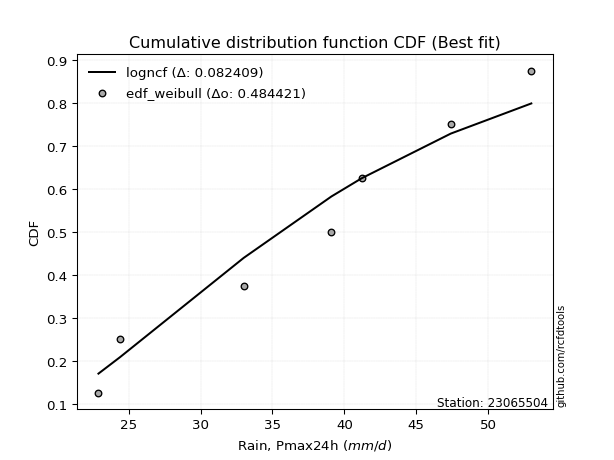</img>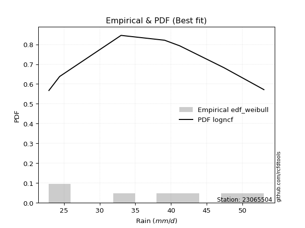</img>

</div>


### 4. EDF Beard (1943)

The Beard formula (or Beard´s plotting position formula) in hydrology is used to estimate the empirical non-exceedance probability _(P)_ of a flood event (or other extreme hydrological data point) within a given dataset.

<div align="center">


$P=(m-0.31)/(n+0.38)$


</div>


**4.1. Empirical values**

<div align="center">

|                | 0                   | 1                   | 2                   | 3         | 4                  | 5                  | 6                  |
|:---------------|:--------------------|:--------------------|:--------------------|:----------|:-------------------|:-------------------|:-------------------|
| date           | 2015                | 2019                | 2018                | 2020      | 2017               | 2016               | 2021               |
| x              | 22.9                | 24.4                | 33.0                | 39.1      | 41.2               | 47.4               | 53.0               |
| m              | 1                   | 2                   | 3                   | 4         | 5                  | 6                  | 7                  |
| empirical_dist | edf_beard           | edf_beard           | edf_beard           | edf_beard | edf_beard          | edf_beard          | edf_beard          |
| empirical      | 0.09349593495934959 | 0.22899728997289973 | 0.36449864498644985 | 0.5       | 0.6355013550135502 | 0.7710027100271003 | 0.9065040650406505 |
| empirical_tr   | 1.1031390134529149  | 1.29701230228471    | 1.5735607675906182  | 2.0       | 2.743494423791822  | 4.366863905325444  | 10.695652173913055 |

</div>


**4.2. Kolmogorov-Smirnov fit test (sorted by Δ)**


<div align="center">

|                | 0                   | 1                   | 2                   | 3                   | 4                   | 5                   | 6                   | 7                   | 8                   | 9                   | 10                  | 11                  | 12                  | 13                  | 14                  | 15                  | 16                  | 17                  | 18                  | 19                  | 20                  | 21                  | 22                  | 23                  | 24                  | 25                  | 26                  | 27                  | 28                  | 29                  | 30                  | 31                  | 32                  | 33                  | 34                  | 35                  | 36                  | 37                  | 38                  | 39                  | 40                  | 41                  | 42                  | 43                  | 44                  | 45                  | 46                  | 47                  | 48                  | 49                  | 50                  | 51                  | 52                  | 53                  | 54                  | 55                  | 56                  | 57                  | 58                  | 59                  | 60                  | 61                  | 62                  | 63                  | 64                  | 65                  | 66                  | 67                  | 68                  | 69                  | 70                  | 71                  | 72                  | 73                  | 74                  | 75                  | 76                  | 77                  | 78                  | 79                  | 80                  | 81                  | 82                  | 83                  | 84                  | 85                  | 86                  | 87                  | 88                  | 89                  | 90                  | 91                  | 92                  | 93                  | 94                  | 95                  | 96                  | 97                  | 98                  | 99                  | 100                 | 101                 | 102                 | 103                 | 104                 | 105                 | 106                 | 107                 | 108                 | 109                 | 110                 | 111                 | 112                 | 113                 | 114                 | 115                 | 116                 | 117                 | 118                 | 119                 | 120                 | 121                 | 122                 | 123                 | 124                 | 125                 | 126                 | 127                 | 128                 | 129                 | 130                 | 131                 | 132                 | 133                 | 134                 | 135                 | 136                 | 137                 | 138                 | 139                 | 140                 | 141                 | 142                 | 143                 | 144                 | 145                 | 146                 | 147                 | 148                 | 149                 | 150                 | 151                 | 152                 | 153                 | 154                 | 155                 | 156                 | 157                 | 158                 | 159                 |
|:---------------|:--------------------|:--------------------|:--------------------|:--------------------|:--------------------|:--------------------|:--------------------|:--------------------|:--------------------|:--------------------|:--------------------|:--------------------|:--------------------|:--------------------|:--------------------|:--------------------|:--------------------|:--------------------|:--------------------|:--------------------|:--------------------|:--------------------|:--------------------|:--------------------|:--------------------|:--------------------|:--------------------|:--------------------|:--------------------|:--------------------|:--------------------|:--------------------|:--------------------|:--------------------|:--------------------|:--------------------|:--------------------|:--------------------|:--------------------|:--------------------|:--------------------|:--------------------|:--------------------|:--------------------|:--------------------|:--------------------|:--------------------|:--------------------|:--------------------|:--------------------|:--------------------|:--------------------|:--------------------|:--------------------|:--------------------|:--------------------|:--------------------|:--------------------|:--------------------|:--------------------|:--------------------|:--------------------|:--------------------|:--------------------|:--------------------|:--------------------|:--------------------|:--------------------|:--------------------|:--------------------|:--------------------|:--------------------|:--------------------|:--------------------|:--------------------|:--------------------|:--------------------|:--------------------|:--------------------|:--------------------|:--------------------|:--------------------|:--------------------|:--------------------|:--------------------|:--------------------|:--------------------|:--------------------|:--------------------|:--------------------|:--------------------|:--------------------|:--------------------|:--------------------|:--------------------|:--------------------|:--------------------|:--------------------|:--------------------|:--------------------|:--------------------|:--------------------|:--------------------|:--------------------|:--------------------|:--------------------|:--------------------|:--------------------|:--------------------|:--------------------|:--------------------|:--------------------|:--------------------|:--------------------|:--------------------|:--------------------|:--------------------|:--------------------|:--------------------|:--------------------|:--------------------|:--------------------|:--------------------|:--------------------|:--------------------|:--------------------|:--------------------|:--------------------|:--------------------|:--------------------|:--------------------|:--------------------|:--------------------|:--------------------|:--------------------|:--------------------|:--------------------|:--------------------|:--------------------|:--------------------|:--------------------|:--------------------|:--------------------|:--------------------|:--------------------|:--------------------|:--------------------|:--------------------|:--------------------|:--------------------|:--------------------|:--------------------|:--------------------|:--------------------|:--------------------|:--------------------|:--------------------|:--------------------|:--------------------|:--------------------|
| station        | 23065504            | 23065504            | 23065504            | 23065504            | 23065504            | 23065504            | 23065504            | 23065504            | 23065504            | 23065504            | 23065504            | 23065504            | 23065504            | 23065504            | 23065504            | 23065504            | 23065504            | 23065504            | 23065504            | 23065504            | 23065504            | 23065504            | 23065504            | 23065504            | 23065504            | 23065504            | 23065504            | 23065504            | 23065504            | 23065504            | 23065504            | 23065504            | 23065504            | 23065504            | 23065504            | 23065504            | 23065504            | 23065504            | 23065504            | 23065504            | 23065504            | 23065504            | 23065504            | 23065504            | 23065504            | 23065504            | 23065504            | 23065504            | 23065504            | 23065504            | 23065504            | 23065504            | 23065504            | 23065504            | 23065504            | 23065504            | 23065504            | 23065504            | 23065504            | 23065504            | 23065504            | 23065504            | 23065504            | 23065504            | 23065504            | 23065504            | 23065504            | 23065504            | 23065504            | 23065504            | 23065504            | 23065504            | 23065504            | 23065504            | 23065504            | 23065504            | 23065504            | 23065504            | 23065504            | 23065504            | 23065504            | 23065504            | 23065504            | 23065504            | 23065504            | 23065504            | 23065504            | 23065504            | 23065504            | 23065504            | 23065504            | 23065504            | 23065504            | 23065504            | 23065504            | 23065504            | 23065504            | 23065504            | 23065504            | 23065504            | 23065504            | 23065504            | 23065504            | 23065504            | 23065504            | 23065504            | 23065504            | 23065504            | 23065504            | 23065504            | 23065504            | 23065504            | 23065504            | 23065504            | 23065504            | 23065504            | 23065504            | 23065504            | 23065504            | 23065504            | 23065504            | 23065504            | 23065504            | 23065504            | 23065504            | 23065504            | 23065504            | 23065504            | 23065504            | 23065504            | 23065504            | 23065504            | 23065504            | 23065504            | 23065504            | 23065504            | 23065504            | 23065504            | 23065504            | 23065504            | 23065504            | 23065504            | 23065504            | 23065504            | 23065504            | 23065504            | 23065504            | 23065504            | 23065504            | 23065504            | 23065504            | 23065504            | 23065504            | 23065504            | 23065504            | 23065504            | 23065504            | 23065504            | 23065504            | 23065504            |
| empirical_dist | edf_beard           | edf_beard           | edf_beard           | edf_beard           | edf_beard           | edf_beard           | edf_beard           | edf_beard           | edf_beard           | edf_beard           | edf_beard           | edf_beard           | edf_beard           | edf_beard           | edf_beard           | edf_beard           | edf_beard           | edf_beard           | edf_beard           | edf_beard           | edf_beard           | edf_beard           | edf_beard           | edf_beard           | edf_beard           | edf_beard           | edf_beard           | edf_beard           | edf_beard           | edf_beard           | edf_beard           | edf_beard           | edf_beard           | edf_beard           | edf_beard           | edf_beard           | edf_beard           | edf_beard           | edf_beard           | edf_beard           | edf_beard           | edf_beard           | edf_beard           | edf_beard           | edf_beard           | edf_beard           | edf_beard           | edf_beard           | edf_beard           | edf_beard           | edf_beard           | edf_beard           | edf_beard           | edf_beard           | edf_beard           | edf_beard           | edf_beard           | edf_beard           | edf_beard           | edf_beard           | edf_beard           | edf_beard           | edf_beard           | edf_beard           | edf_beard           | edf_beard           | edf_beard           | edf_beard           | edf_beard           | edf_beard           | edf_beard           | edf_beard           | edf_beard           | edf_beard           | edf_beard           | edf_beard           | edf_beard           | edf_beard           | edf_beard           | edf_beard           | edf_beard           | edf_beard           | edf_beard           | edf_beard           | edf_beard           | edf_beard           | edf_beard           | edf_beard           | edf_beard           | edf_beard           | edf_beard           | edf_beard           | edf_beard           | edf_beard           | edf_beard           | edf_beard           | edf_beard           | edf_beard           | edf_beard           | edf_beard           | edf_beard           | edf_beard           | edf_beard           | edf_beard           | edf_beard           | edf_beard           | edf_beard           | edf_beard           | edf_beard           | edf_beard           | edf_beard           | edf_beard           | edf_beard           | edf_beard           | edf_beard           | edf_beard           | edf_beard           | edf_beard           | edf_beard           | edf_beard           | edf_beard           | edf_beard           | edf_beard           | edf_beard           | edf_beard           | edf_beard           | edf_beard           | edf_beard           | edf_beard           | edf_beard           | edf_beard           | edf_beard           | edf_beard           | edf_beard           | edf_beard           | edf_beard           | edf_beard           | edf_beard           | edf_beard           | edf_beard           | edf_beard           | edf_beard           | edf_beard           | edf_beard           | edf_beard           | edf_beard           | edf_beard           | edf_beard           | edf_beard           | edf_beard           | edf_beard           | edf_beard           | edf_beard           | edf_beard           | edf_beard           | edf_beard           | edf_beard           | edf_beard           | edf_beard           | edf_beard           |
| p_dist         | ksone               | dweibull            | dgamma              | logbeta             | arcsine             | logarcsine          | semicircular        | logtrapezoid        | logburr             | logksone            | logwrapcauchy       | anglit              | logncf              | logloggamma         | logsemicircular     | genextreme          | logjohnsonsu        | logskewnorm         | logmielke           | loganglit           | burr                | johnsonsu           | gumbel_l            | ncf                 | pearson3            | t                   | skewnorm            | exponnorm           | norm                | crystalball         | nct                 | gamma               | erlang              | foldnorm            | f                   | wrapcauchy          | logdweibull         | logburr12           | exponpow            | betaprime           | genlogistic         | alpha               | invgamma            | logpearson3         | logweibull_min      | invweibull          | invgauss            | loggumbel_l         | logfoldnorm         | logbetaprime        | maxwell             | lognct              | loggamma            | loggamma            | logf                | logfatiguelife      | logexponnorm        | logcrystalball      | lognorm             | logt                | logerlang           | cosine              | logdgamma           | loginvgamma         | gausshyper          | logistic            | logalpha            | kstwobign           | logcosine           | triang              | rayleigh            | genpareto           | hypsecant           | logtriang           | argus               | logkappa4           | weibull_min         | loglogistic         | logargus            | laplace             | rice                | logrice             | logmaxwell          | loginvgauss         | loghypsecant        | logtukeylambda      | lograyleigh         | logkappa3           | loguniform          | loginvweibull       | logvonmises_line    | loggenextreme       | logloglaplace       | truncweibull_min    | gumbel_r            | truncexpon          | beta                | bradford            | truncpareto         | kappa4              | loggompertz         | loggenexpon         | logkstwobign        | loggausshyper       | tukeylambda         | loglaplace          | loglaplace          | lomax               | genexpon            | gompertz            | vonmises_line       | uniform             | kappa3              | loggumbel_r         | halfnorm            | logrdist            | nakagami            | loggenhalflogistic  | moyal               | genhalflogistic     | burr12              | loglomax            | logmoyal            | loghalfnorm         | logbradford         | halfgennorm         | loglevy_l           | logtruncexpon       | logexponweib        | halflogistic        | loghalflogistic     | wald                | logexponpow         | levy_l              | logwald             | lognakagami         | gennorm             | loggennorm          | logtruncnorm        | logjohnsonsb        | trapezoid           | loggenpareto        | logtruncweibull_min | loggengamma         | exponweib           | fatiguelife         | gengamma            | logweibull_max      | johnsonsb           | powerlaw            | logpowerlaw         | rdist               | loghalfgennorm      | logtruncpareto      | weibull_max         | loggenlogistic      | truncnorm           | logvonmises         | vonmises            | mielke              |
| delta          | 0.08617664047017043 | 0.09050113935322063 | 0.09210768153585946 | 0.09349593325306793 | 0.09349593495934949 | 0.09467689416781064 | 0.09603415989533806 | 0.09754679128025853 | 0.09975193279062322 | 0.10144911185153857 | 0.10319166683137038 | 0.10328318587529514 | 0.10780251921207296 | 0.1083459946016736  | 0.10908547238543895 | 0.11011593626555907 | 0.11115586690308202 | 0.11367418469781322 | 0.1149752820212353  | 0.11502699388435793 | 0.11776930380991812 | 0.12025551859797343 | 0.12049646868387125 | 0.12056312623240031 | 0.1205766161083888  | 0.12099883914132457 | 0.12100425024090516 | 0.12100990005196027 | 0.12101045864587431 | 0.12101047221020349 | 0.12112701158282202 | 0.12133544414605495 | 0.1213357852938279  | 0.12144957617394467 | 0.1216752661324676  | 0.12244430496611125 | 0.12326034855178605 | 0.12329963199996441 | 0.12518519903572284 | 0.12550332062074254 | 0.1257005123505543  | 0.1257075659069062  | 0.12578985792441397 | 0.12579212379181265 | 0.12582063104405794 | 0.12598019952523914 | 0.12699457568817835 | 0.1272388793524582  | 0.12733967195719564 | 0.12918930489019526 | 0.12966633771850536 | 0.12975345992812387 | 0.1299180438509791  | 0.1299180438509791  | 0.1301689332053856  | 0.13042621454255435 | 0.13050788990002343 | 0.13050850616142604 | 0.13050857867625018 | 0.13051098961381002 | 0.13070225885853942 | 0.13137080039575152 | 0.13177261014724181 | 0.13196283492272864 | 0.13277265668345042 | 0.13314843744546273 | 0.13324963268387469 | 0.1339525570703124  | 0.13458699903642188 | 0.13560500911709744 | 0.13564965403482682 | 0.1377751527856803  | 0.13845267835485953 | 0.1385920361868539  | 0.13880349845794984 | 0.13915817493116064 | 0.140725915235961   | 0.1411481056577033  | 0.141685620748821   | 0.14209418277336844 | 0.1427776668889471  | 0.1434117743071021  | 0.14370557201213752 | 0.144515578041855   | 0.14592569416780354 | 0.14844768621634077 | 0.1513041252479519  | 0.1532901183883505  | 0.1533900165695944  | 0.15346771283032712 | 0.15397630332946938 | 0.15564931382950054 | 0.15952859940745673 | 0.16105117639128852 | 0.1647329921765674  | 0.1647686713966655  | 0.1648176538788677  | 0.16487353524880177 | 0.16516595865617534 | 0.1659954325763665  | 0.16799281519148873 | 0.17075996357073175 | 0.17092477887598734 | 0.17140198724898748 | 0.17325440383509974 | 0.174096520030107   | 0.174096520030107   | 0.17498938778655926 | 0.17571124787274106 | 0.17651548750801294 | 0.1791613148136662  | 0.17916340292971036 | 0.1791867145909979  | 0.18328694337352147 | 0.18750538663815236 | 0.18797116376365552 | 0.18932173396063345 | 0.1903773251186887  | 0.19274540678200955 | 0.19293005190129375 | 0.1968098616990953  | 0.19838542583816943 | 0.20500240149852877 | 0.2129192093211854  | 0.2170891515180673  | 0.2174237234813043  | 0.22458315275100094 | 0.22704196011077837 | 0.22883279579590465 | 0.22899728997289973 | 0.22899728997289973 | 0.2294071837297239  | 0.25697751560383336 | 0.2581732176494007  | 0.2657952440714868  | 0.26637944543254094 | 0.2710027100271003  | 0.2710027100271003  | 0.27682898158860125 | 0.2839069062836407  | 0.28742748962820364 | 0.31021893966703024 | 0.31618890134304956 | 0.32128043655964894 | 0.44662145922476687 | 0.4519309730919567  | 0.45500364865120885 | 0.45704395822136634 | 0.45709874517244764 | 0.46942725752611697 | 0.49861629517752964 | 0.4999999880096997  | 0.5                 | 0.5241681404494369  | 0.533398957770336   | 0.7710027100271003  | 0.9065040648206784  | 1.1178189284506366  | 7.507519404964151   | nan                 |
| deltao         | 0.48442053926100004 | 0.48442053926100004 | 0.48442053926100004 | 0.48442053926100004 | 0.48442053926100004 | 0.48442053926100004 | 0.48442053926100004 | 0.48442053926100004 | 0.48442053926100004 | 0.48442053926100004 | 0.48442053926100004 | 0.48442053926100004 | 0.48442053926100004 | 0.48442053926100004 | 0.48442053926100004 | 0.48442053926100004 | 0.48442053926100004 | 0.48442053926100004 | 0.48442053926100004 | 0.48442053926100004 | 0.48442053926100004 | 0.48442053926100004 | 0.48442053926100004 | 0.48442053926100004 | 0.48442053926100004 | 0.48442053926100004 | 0.48442053926100004 | 0.48442053926100004 | 0.48442053926100004 | 0.48442053926100004 | 0.48442053926100004 | 0.48442053926100004 | 0.48442053926100004 | 0.48442053926100004 | 0.48442053926100004 | 0.48442053926100004 | 0.48442053926100004 | 0.48442053926100004 | 0.48442053926100004 | 0.48442053926100004 | 0.48442053926100004 | 0.48442053926100004 | 0.48442053926100004 | 0.48442053926100004 | 0.48442053926100004 | 0.48442053926100004 | 0.48442053926100004 | 0.48442053926100004 | 0.48442053926100004 | 0.48442053926100004 | 0.48442053926100004 | 0.48442053926100004 | 0.48442053926100004 | 0.48442053926100004 | 0.48442053926100004 | 0.48442053926100004 | 0.48442053926100004 | 0.48442053926100004 | 0.48442053926100004 | 0.48442053926100004 | 0.48442053926100004 | 0.48442053926100004 | 0.48442053926100004 | 0.48442053926100004 | 0.48442053926100004 | 0.48442053926100004 | 0.48442053926100004 | 0.48442053926100004 | 0.48442053926100004 | 0.48442053926100004 | 0.48442053926100004 | 0.48442053926100004 | 0.48442053926100004 | 0.48442053926100004 | 0.48442053926100004 | 0.48442053926100004 | 0.48442053926100004 | 0.48442053926100004 | 0.48442053926100004 | 0.48442053926100004 | 0.48442053926100004 | 0.48442053926100004 | 0.48442053926100004 | 0.48442053926100004 | 0.48442053926100004 | 0.48442053926100004 | 0.48442053926100004 | 0.48442053926100004 | 0.48442053926100004 | 0.48442053926100004 | 0.48442053926100004 | 0.48442053926100004 | 0.48442053926100004 | 0.48442053926100004 | 0.48442053926100004 | 0.48442053926100004 | 0.48442053926100004 | 0.48442053926100004 | 0.48442053926100004 | 0.48442053926100004 | 0.48442053926100004 | 0.48442053926100004 | 0.48442053926100004 | 0.48442053926100004 | 0.48442053926100004 | 0.48442053926100004 | 0.48442053926100004 | 0.48442053926100004 | 0.48442053926100004 | 0.48442053926100004 | 0.48442053926100004 | 0.48442053926100004 | 0.48442053926100004 | 0.48442053926100004 | 0.48442053926100004 | 0.48442053926100004 | 0.48442053926100004 | 0.48442053926100004 | 0.48442053926100004 | 0.48442053926100004 | 0.48442053926100004 | 0.48442053926100004 | 0.48442053926100004 | 0.48442053926100004 | 0.48442053926100004 | 0.48442053926100004 | 0.48442053926100004 | 0.48442053926100004 | 0.48442053926100004 | 0.48442053926100004 | 0.48442053926100004 | 0.48442053926100004 | 0.48442053926100004 | 0.48442053926100004 | 0.48442053926100004 | 0.48442053926100004 | 0.48442053926100004 | 0.48442053926100004 | 0.48442053926100004 | 0.48442053926100004 | 0.48442053926100004 | 0.48442053926100004 | 0.48442053926100004 | 0.48442053926100004 | 0.48442053926100004 | 0.48442053926100004 | 0.48442053926100004 | 0.48442053926100004 | 0.48442053926100004 | 0.48442053926100004 | 0.48442053926100004 | 0.48442053926100004 | 0.48442053926100004 | 0.48442053926100004 | 0.48442053926100004 | 0.48442053926100004 | 0.48442053926100004 | 0.48442053926100004 | 0.48442053926100004 | 0.48442053926100004 |
| eval           | Δo > Δ              | Δo > Δ              | Δo > Δ              | Δo > Δ              | Δo > Δ              | Δo > Δ              | Δo > Δ              | Δo > Δ              | Δo > Δ              | Δo > Δ              | Δo > Δ              | Δo > Δ              | Δo > Δ              | Δo > Δ              | Δo > Δ              | Δo > Δ              | Δo > Δ              | Δo > Δ              | Δo > Δ              | Δo > Δ              | Δo > Δ              | Δo > Δ              | Δo > Δ              | Δo > Δ              | Δo > Δ              | Δo > Δ              | Δo > Δ              | Δo > Δ              | Δo > Δ              | Δo > Δ              | Δo > Δ              | Δo > Δ              | Δo > Δ              | Δo > Δ              | Δo > Δ              | Δo > Δ              | Δo > Δ              | Δo > Δ              | Δo > Δ              | Δo > Δ              | Δo > Δ              | Δo > Δ              | Δo > Δ              | Δo > Δ              | Δo > Δ              | Δo > Δ              | Δo > Δ              | Δo > Δ              | Δo > Δ              | Δo > Δ              | Δo > Δ              | Δo > Δ              | Δo > Δ              | Δo > Δ              | Δo > Δ              | Δo > Δ              | Δo > Δ              | Δo > Δ              | Δo > Δ              | Δo > Δ              | Δo > Δ              | Δo > Δ              | Δo > Δ              | Δo > Δ              | Δo > Δ              | Δo > Δ              | Δo > Δ              | Δo > Δ              | Δo > Δ              | Δo > Δ              | Δo > Δ              | Δo > Δ              | Δo > Δ              | Δo > Δ              | Δo > Δ              | Δo > Δ              | Δo > Δ              | Δo > Δ              | Δo > Δ              | Δo > Δ              | Δo > Δ              | Δo > Δ              | Δo > Δ              | Δo > Δ              | Δo > Δ              | Δo > Δ              | Δo > Δ              | Δo > Δ              | Δo > Δ              | Δo > Δ              | Δo > Δ              | Δo > Δ              | Δo > Δ              | Δo > Δ              | Δo > Δ              | Δo > Δ              | Δo > Δ              | Δo > Δ              | Δo > Δ              | Δo > Δ              | Δo > Δ              | Δo > Δ              | Δo > Δ              | Δo > Δ              | Δo > Δ              | Δo > Δ              | Δo > Δ              | Δo > Δ              | Δo > Δ              | Δo > Δ              | Δo > Δ              | Δo > Δ              | Δo > Δ              | Δo > Δ              | Δo > Δ              | Δo > Δ              | Δo > Δ              | Δo > Δ              | Δo > Δ              | Δo > Δ              | Δo > Δ              | Δo > Δ              | Δo > Δ              | Δo > Δ              | Δo > Δ              | Δo > Δ              | Δo > Δ              | Δo > Δ              | Δo > Δ              | Δo > Δ              | Δo > Δ              | Δo > Δ              | Δo > Δ              | Δo > Δ              | Δo > Δ              | Δo > Δ              | Δo > Δ              | Δo > Δ              | Δo > Δ              | Δo > Δ              | Δo > Δ              | Δo > Δ              | Δo > Δ              | Δo > Δ              | Δo > Δ              | Δo > Δ              | Δo > Δ              | Δo > Δ              | Δo > Δ              | Δo > Δ              | Δo <= Δ             | Δo <= Δ             | Δo <= Δ             | Δo <= Δ             | Δo <= Δ             | Δo <= Δ             | Δo <= Δ             | Δo <= Δ             | Δo <= Δ             | Δo <= Δ             |
| fit            | 1                   | 1                   | 1                   | 1                   | 1                   | 1                   | 1                   | 1                   | 1                   | 1                   | 1                   | 1                   | 1                   | 1                   | 1                   | 1                   | 1                   | 1                   | 1                   | 1                   | 1                   | 1                   | 1                   | 1                   | 1                   | 1                   | 1                   | 1                   | 1                   | 1                   | 1                   | 1                   | 1                   | 1                   | 1                   | 1                   | 1                   | 1                   | 1                   | 1                   | 1                   | 1                   | 1                   | 1                   | 1                   | 1                   | 1                   | 1                   | 1                   | 1                   | 1                   | 1                   | 1                   | 1                   | 1                   | 1                   | 1                   | 1                   | 1                   | 1                   | 1                   | 1                   | 1                   | 1                   | 1                   | 1                   | 1                   | 1                   | 1                   | 1                   | 1                   | 1                   | 1                   | 1                   | 1                   | 1                   | 1                   | 1                   | 1                   | 1                   | 1                   | 1                   | 1                   | 1                   | 1                   | 1                   | 1                   | 1                   | 1                   | 1                   | 1                   | 1                   | 1                   | 1                   | 1                   | 1                   | 1                   | 1                   | 1                   | 1                   | 1                   | 1                   | 1                   | 1                   | 1                   | 1                   | 1                   | 1                   | 1                   | 1                   | 1                   | 1                   | 1                   | 1                   | 1                   | 1                   | 1                   | 1                   | 1                   | 1                   | 1                   | 1                   | 1                   | 1                   | 1                   | 1                   | 1                   | 1                   | 1                   | 1                   | 1                   | 1                   | 1                   | 1                   | 1                   | 1                   | 1                   | 1                   | 1                   | 1                   | 1                   | 1                   | 1                   | 1                   | 1                   | 1                   | 1                   | 1                   | 1                   | 1                   | 0                   | 0                   | 0                   | 0                   | 0                   | 0                   | 0                   | 0                   | 0                   | 0                   |
| n              | 7                   | 7                   | 7                   | 7                   | 7                   | 7                   | 7                   | 7                   | 7                   | 7                   | 7                   | 7                   | 7                   | 7                   | 7                   | 7                   | 7                   | 7                   | 7                   | 7                   | 7                   | 7                   | 7                   | 7                   | 7                   | 7                   | 7                   | 7                   | 7                   | 7                   | 7                   | 7                   | 7                   | 7                   | 7                   | 7                   | 7                   | 7                   | 7                   | 7                   | 7                   | 7                   | 7                   | 7                   | 7                   | 7                   | 7                   | 7                   | 7                   | 7                   | 7                   | 7                   | 7                   | 7                   | 7                   | 7                   | 7                   | 7                   | 7                   | 7                   | 7                   | 7                   | 7                   | 7                   | 7                   | 7                   | 7                   | 7                   | 7                   | 7                   | 7                   | 7                   | 7                   | 7                   | 7                   | 7                   | 7                   | 7                   | 7                   | 7                   | 7                   | 7                   | 7                   | 7                   | 7                   | 7                   | 7                   | 7                   | 7                   | 7                   | 7                   | 7                   | 7                   | 7                   | 7                   | 7                   | 7                   | 7                   | 7                   | 7                   | 7                   | 7                   | 7                   | 7                   | 7                   | 7                   | 7                   | 7                   | 7                   | 7                   | 7                   | 7                   | 7                   | 7                   | 7                   | 7                   | 7                   | 7                   | 7                   | 7                   | 7                   | 7                   | 7                   | 7                   | 7                   | 7                   | 7                   | 7                   | 7                   | 7                   | 7                   | 7                   | 7                   | 7                   | 7                   | 7                   | 7                   | 7                   | 7                   | 7                   | 7                   | 7                   | 7                   | 7                   | 7                   | 7                   | 7                   | 7                   | 7                   | 7                   | 7                   | 7                   | 7                   | 7                   | 7                   | 7                   | 7                   | 7                   | 7                   | 7                   |
| best_fit       | 1                   | 0                   | 0                   | 0                   | 0                   | 0                   | 0                   | 0                   | 0                   | 0                   | 0                   | 0                   | 0                   | 0                   | 0                   | 0                   | 0                   | 0                   | 0                   | 0                   | 0                   | 0                   | 0                   | 0                   | 0                   | 0                   | 0                   | 0                   | 0                   | 0                   | 0                   | 0                   | 0                   | 0                   | 0                   | 0                   | 0                   | 0                   | 0                   | 0                   | 0                   | 0                   | 0                   | 0                   | 0                   | 0                   | 0                   | 0                   | 0                   | 0                   | 0                   | 0                   | 0                   | 0                   | 0                   | 0                   | 0                   | 0                   | 0                   | 0                   | 0                   | 0                   | 0                   | 0                   | 0                   | 0                   | 0                   | 0                   | 0                   | 0                   | 0                   | 0                   | 0                   | 0                   | 0                   | 0                   | 0                   | 0                   | 0                   | 0                   | 0                   | 0                   | 0                   | 0                   | 0                   | 0                   | 0                   | 0                   | 0                   | 0                   | 0                   | 0                   | 0                   | 0                   | 0                   | 0                   | 0                   | 0                   | 0                   | 0                   | 0                   | 0                   | 0                   | 0                   | 0                   | 0                   | 0                   | 0                   | 0                   | 0                   | 0                   | 0                   | 0                   | 0                   | 0                   | 0                   | 0                   | 0                   | 0                   | 0                   | 0                   | 0                   | 0                   | 0                   | 0                   | 0                   | 0                   | 0                   | 0                   | 0                   | 0                   | 0                   | 0                   | 0                   | 0                   | 0                   | 0                   | 0                   | 0                   | 0                   | 0                   | 0                   | 0                   | 0                   | 0                   | 0                   | 0                   | 0                   | 0                   | 0                   | 0                   | 0                   | 0                   | 0                   | 0                   | 0                   | 0                   | 0                   | 0                   | 0                   |
| best_fit_sort  | 1                   | 2                   | 3                   | 4                   | 5                   | 6                   | 7                   | 8                   | 9                   | 10                  | 11                  | 12                  | 13                  | 14                  | 15                  | 16                  | 17                  | 18                  | 19                  | 20                  | 21                  | 22                  | 23                  | 24                  | 25                  | 26                  | 27                  | 28                  | 29                  | 30                  | 31                  | 32                  | 33                  | 34                  | 35                  | 36                  | 37                  | 38                  | 39                  | 40                  | 41                  | 42                  | 43                  | 44                  | 45                  | 46                  | 47                  | 48                  | 49                  | 50                  | 51                  | 52                  | 53                  | 54                  | 55                  | 56                  | 57                  | 58                  | 59                  | 60                  | 61                  | 62                  | 63                  | 64                  | 65                  | 66                  | 67                  | 68                  | 69                  | 70                  | 71                  | 72                  | 73                  | 74                  | 75                  | 76                  | 77                  | 78                  | 79                  | 80                  | 81                  | 82                  | 83                  | 84                  | 85                  | 86                  | 87                  | 88                  | 89                  | 90                  | 91                  | 92                  | 93                  | 94                  | 95                  | 96                  | 97                  | 98                  | 99                  | 100                 | 101                 | 102                 | 103                 | 104                 | 105                 | 106                 | 107                 | 108                 | 109                 | 110                 | 111                 | 112                 | 113                 | 114                 | 115                 | 116                 | 117                 | 118                 | 119                 | 120                 | 121                 | 122                 | 123                 | 124                 | 125                 | 126                 | 127                 | 128                 | 129                 | 130                 | 131                 | 132                 | 133                 | 134                 | 135                 | 136                 | 137                 | 138                 | 139                 | 140                 | 141                 | 142                 | 143                 | 144                 | 145                 | 146                 | 147                 | 148                 | 149                 | 150                 | 151                 | 152                 | 153                 | 154                 | 155                 | 156                 | 157                 | 158                 | 159                 | 160                 |

</div>


**4.3. Best fit**

<div align="center">

|   id |   station | empirical_dist   | p_dist   |     delta |   deltao | eval   |   fit |   n |   best_fit |   best_fit_sort |
|-----:|----------:|:-----------------|:---------|----------:|---------:|:-------|------:|----:|-----------:|----------------:|
|    0 |  23065504 | edf_beard        | ksone    | 0.0861766 | 0.484421 | Δo > Δ |     1 |   7 |          1 |               1 |

</div>


<div align="center">

</img></img>

</div>


### 5. EDF Chegodayev (1955)

The Chegodayev formula is an empirical plotting position formula used in hydrological frequency analysis to estimate the exceedance probability or return period of a specific event from a set of observed data. It is primarily used for plotting observed data points on probability paper to fit a theoretical distribution, particularly for analyzing extreme events like maximum flood flows or rainfall intensities. The constant _b_ value in the generalized plotting position formula is 0.3.

<div align="center">


$P=(m-b)/(n+1-2b)$


</div>


**5.1. Empirical values**

<div align="center">

|                | 0                   | 1                   | 2                   | 3              | 4                  | 5                  | 6                  |
|:---------------|:--------------------|:--------------------|:--------------------|:---------------|:-------------------|:-------------------|:-------------------|
| date           | 2015                | 2019                | 2018                | 2020           | 2017               | 2016               | 2021               |
| x              | 22.9                | 24.4                | 33.0                | 39.1           | 41.2               | 47.4               | 53.0               |
| m              | 1                   | 2                   | 3                   | 4              | 5                  | 6                  | 7                  |
| empirical_dist | edf_chegodayev      | edf_chegodayev      | edf_chegodayev      | edf_chegodayev | edf_chegodayev     | edf_chegodayev     | edf_chegodayev     |
| empirical      | 0.09459459459459459 | 0.22972972972972971 | 0.36486486486486486 | 0.5            | 0.6351351351351351 | 0.7702702702702703 | 0.9054054054054054 |
| empirical_tr   | 1.1044776119402986  | 1.2982456140350878  | 1.574468085106383   | 2.0            | 2.7407407407407405 | 4.352941176470589  | 10.571428571428568 |

</div>


**5.2. Kolmogorov-Smirnov fit test (sorted by Δ)**


<div align="center">

|                | 0                   | 1                   | 2                   | 3                   | 4                   | 5                   | 6                   | 7                   | 8                   | 9                   | 10                  | 11                  | 12                  | 13                  | 14                  | 15                  | 16                  | 17                  | 18                  | 19                  | 20                  | 21                  | 22                  | 23                  | 24                  | 25                  | 26                  | 27                  | 28                  | 29                  | 30                  | 31                  | 32                  | 33                  | 34                  | 35                  | 36                  | 37                  | 38                  | 39                  | 40                  | 41                  | 42                  | 43                  | 44                  | 45                  | 46                  | 47                  | 48                  | 49                  | 50                  | 51                  | 52                  | 53                  | 54                  | 55                  | 56                  | 57                  | 58                  | 59                  | 60                  | 61                  | 62                  | 63                  | 64                  | 65                  | 66                  | 67                  | 68                  | 69                  | 70                  | 71                  | 72                  | 73                  | 74                  | 75                  | 76                  | 77                  | 78                  | 79                  | 80                  | 81                  | 82                  | 83                  | 84                  | 85                  | 86                  | 87                  | 88                  | 89                  | 90                  | 91                  | 92                  | 93                  | 94                  | 95                  | 96                  | 97                  | 98                  | 99                  | 100                 | 101                 | 102                 | 103                 | 104                 | 105                 | 106                 | 107                 | 108                 | 109                 | 110                 | 111                 | 112                 | 113                 | 114                 | 115                 | 116                 | 117                 | 118                 | 119                 | 120                 | 121                 | 122                 | 123                 | 124                 | 125                 | 126                 | 127                 | 128                 | 129                 | 130                 | 131                 | 132                 | 133                 | 134                 | 135                 | 136                 | 137                 | 138                 | 139                 | 140                 | 141                 | 142                 | 143                 | 144                 | 145                 | 146                 | 147                 | 148                 | 149                 | 150                 | 151                 | 152                 | 153                 | 154                 | 155                 | 156                 | 157                 | 158                 | 159                 |
|:---------------|:--------------------|:--------------------|:--------------------|:--------------------|:--------------------|:--------------------|:--------------------|:--------------------|:--------------------|:--------------------|:--------------------|:--------------------|:--------------------|:--------------------|:--------------------|:--------------------|:--------------------|:--------------------|:--------------------|:--------------------|:--------------------|:--------------------|:--------------------|:--------------------|:--------------------|:--------------------|:--------------------|:--------------------|:--------------------|:--------------------|:--------------------|:--------------------|:--------------------|:--------------------|:--------------------|:--------------------|:--------------------|:--------------------|:--------------------|:--------------------|:--------------------|:--------------------|:--------------------|:--------------------|:--------------------|:--------------------|:--------------------|:--------------------|:--------------------|:--------------------|:--------------------|:--------------------|:--------------------|:--------------------|:--------------------|:--------------------|:--------------------|:--------------------|:--------------------|:--------------------|:--------------------|:--------------------|:--------------------|:--------------------|:--------------------|:--------------------|:--------------------|:--------------------|:--------------------|:--------------------|:--------------------|:--------------------|:--------------------|:--------------------|:--------------------|:--------------------|:--------------------|:--------------------|:--------------------|:--------------------|:--------------------|:--------------------|:--------------------|:--------------------|:--------------------|:--------------------|:--------------------|:--------------------|:--------------------|:--------------------|:--------------------|:--------------------|:--------------------|:--------------------|:--------------------|:--------------------|:--------------------|:--------------------|:--------------------|:--------------------|:--------------------|:--------------------|:--------------------|:--------------------|:--------------------|:--------------------|:--------------------|:--------------------|:--------------------|:--------------------|:--------------------|:--------------------|:--------------------|:--------------------|:--------------------|:--------------------|:--------------------|:--------------------|:--------------------|:--------------------|:--------------------|:--------------------|:--------------------|:--------------------|:--------------------|:--------------------|:--------------------|:--------------------|:--------------------|:--------------------|:--------------------|:--------------------|:--------------------|:--------------------|:--------------------|:--------------------|:--------------------|:--------------------|:--------------------|:--------------------|:--------------------|:--------------------|:--------------------|:--------------------|:--------------------|:--------------------|:--------------------|:--------------------|:--------------------|:--------------------|:--------------------|:--------------------|:--------------------|:--------------------|:--------------------|:--------------------|:--------------------|:--------------------|:--------------------|:--------------------|
| station        | 23065504            | 23065504            | 23065504            | 23065504            | 23065504            | 23065504            | 23065504            | 23065504            | 23065504            | 23065504            | 23065504            | 23065504            | 23065504            | 23065504            | 23065504            | 23065504            | 23065504            | 23065504            | 23065504            | 23065504            | 23065504            | 23065504            | 23065504            | 23065504            | 23065504            | 23065504            | 23065504            | 23065504            | 23065504            | 23065504            | 23065504            | 23065504            | 23065504            | 23065504            | 23065504            | 23065504            | 23065504            | 23065504            | 23065504            | 23065504            | 23065504            | 23065504            | 23065504            | 23065504            | 23065504            | 23065504            | 23065504            | 23065504            | 23065504            | 23065504            | 23065504            | 23065504            | 23065504            | 23065504            | 23065504            | 23065504            | 23065504            | 23065504            | 23065504            | 23065504            | 23065504            | 23065504            | 23065504            | 23065504            | 23065504            | 23065504            | 23065504            | 23065504            | 23065504            | 23065504            | 23065504            | 23065504            | 23065504            | 23065504            | 23065504            | 23065504            | 23065504            | 23065504            | 23065504            | 23065504            | 23065504            | 23065504            | 23065504            | 23065504            | 23065504            | 23065504            | 23065504            | 23065504            | 23065504            | 23065504            | 23065504            | 23065504            | 23065504            | 23065504            | 23065504            | 23065504            | 23065504            | 23065504            | 23065504            | 23065504            | 23065504            | 23065504            | 23065504            | 23065504            | 23065504            | 23065504            | 23065504            | 23065504            | 23065504            | 23065504            | 23065504            | 23065504            | 23065504            | 23065504            | 23065504            | 23065504            | 23065504            | 23065504            | 23065504            | 23065504            | 23065504            | 23065504            | 23065504            | 23065504            | 23065504            | 23065504            | 23065504            | 23065504            | 23065504            | 23065504            | 23065504            | 23065504            | 23065504            | 23065504            | 23065504            | 23065504            | 23065504            | 23065504            | 23065504            | 23065504            | 23065504            | 23065504            | 23065504            | 23065504            | 23065504            | 23065504            | 23065504            | 23065504            | 23065504            | 23065504            | 23065504            | 23065504            | 23065504            | 23065504            | 23065504            | 23065504            | 23065504            | 23065504            | 23065504            | 23065504            |
| empirical_dist | edf_chegodayev      | edf_chegodayev      | edf_chegodayev      | edf_chegodayev      | edf_chegodayev      | edf_chegodayev      | edf_chegodayev      | edf_chegodayev      | edf_chegodayev      | edf_chegodayev      | edf_chegodayev      | edf_chegodayev      | edf_chegodayev      | edf_chegodayev      | edf_chegodayev      | edf_chegodayev      | edf_chegodayev      | edf_chegodayev      | edf_chegodayev      | edf_chegodayev      | edf_chegodayev      | edf_chegodayev      | edf_chegodayev      | edf_chegodayev      | edf_chegodayev      | edf_chegodayev      | edf_chegodayev      | edf_chegodayev      | edf_chegodayev      | edf_chegodayev      | edf_chegodayev      | edf_chegodayev      | edf_chegodayev      | edf_chegodayev      | edf_chegodayev      | edf_chegodayev      | edf_chegodayev      | edf_chegodayev      | edf_chegodayev      | edf_chegodayev      | edf_chegodayev      | edf_chegodayev      | edf_chegodayev      | edf_chegodayev      | edf_chegodayev      | edf_chegodayev      | edf_chegodayev      | edf_chegodayev      | edf_chegodayev      | edf_chegodayev      | edf_chegodayev      | edf_chegodayev      | edf_chegodayev      | edf_chegodayev      | edf_chegodayev      | edf_chegodayev      | edf_chegodayev      | edf_chegodayev      | edf_chegodayev      | edf_chegodayev      | edf_chegodayev      | edf_chegodayev      | edf_chegodayev      | edf_chegodayev      | edf_chegodayev      | edf_chegodayev      | edf_chegodayev      | edf_chegodayev      | edf_chegodayev      | edf_chegodayev      | edf_chegodayev      | edf_chegodayev      | edf_chegodayev      | edf_chegodayev      | edf_chegodayev      | edf_chegodayev      | edf_chegodayev      | edf_chegodayev      | edf_chegodayev      | edf_chegodayev      | edf_chegodayev      | edf_chegodayev      | edf_chegodayev      | edf_chegodayev      | edf_chegodayev      | edf_chegodayev      | edf_chegodayev      | edf_chegodayev      | edf_chegodayev      | edf_chegodayev      | edf_chegodayev      | edf_chegodayev      | edf_chegodayev      | edf_chegodayev      | edf_chegodayev      | edf_chegodayev      | edf_chegodayev      | edf_chegodayev      | edf_chegodayev      | edf_chegodayev      | edf_chegodayev      | edf_chegodayev      | edf_chegodayev      | edf_chegodayev      | edf_chegodayev      | edf_chegodayev      | edf_chegodayev      | edf_chegodayev      | edf_chegodayev      | edf_chegodayev      | edf_chegodayev      | edf_chegodayev      | edf_chegodayev      | edf_chegodayev      | edf_chegodayev      | edf_chegodayev      | edf_chegodayev      | edf_chegodayev      | edf_chegodayev      | edf_chegodayev      | edf_chegodayev      | edf_chegodayev      | edf_chegodayev      | edf_chegodayev      | edf_chegodayev      | edf_chegodayev      | edf_chegodayev      | edf_chegodayev      | edf_chegodayev      | edf_chegodayev      | edf_chegodayev      | edf_chegodayev      | edf_chegodayev      | edf_chegodayev      | edf_chegodayev      | edf_chegodayev      | edf_chegodayev      | edf_chegodayev      | edf_chegodayev      | edf_chegodayev      | edf_chegodayev      | edf_chegodayev      | edf_chegodayev      | edf_chegodayev      | edf_chegodayev      | edf_chegodayev      | edf_chegodayev      | edf_chegodayev      | edf_chegodayev      | edf_chegodayev      | edf_chegodayev      | edf_chegodayev      | edf_chegodayev      | edf_chegodayev      | edf_chegodayev      | edf_chegodayev      | edf_chegodayev      | edf_chegodayev      | edf_chegodayev      | edf_chegodayev      |
| p_dist         | ksone               | dweibull            | dgamma              | logbeta             | arcsine             | logarcsine          | semicircular        | logtrapezoid        | logburr             | logksone            | logwrapcauchy       | anglit              | logncf              | logloggamma         | logsemicircular     | genextreme          | logjohnsonsu        | logskewnorm         | logmielke           | loganglit           | burr                | johnsonsu           | gumbel_l            | ncf                 | pearson3            | wrapcauchy          | t                   | skewnorm            | exponnorm           | norm                | crystalball         | nct                 | gamma               | erlang              | foldnorm            | f                   | logdweibull         | logburr12           | exponpow            | betaprime           | genlogistic         | alpha               | invgamma            | logpearson3         | logweibull_min      | invweibull          | logfoldnorm         | invgauss            | loggumbel_l         | logbetaprime        | maxwell             | lognct              | loggamma            | loggamma            | logf                | logfatiguelife      | logexponnorm        | logcrystalball      | lognorm             | logt                | logerlang           | loginvgamma         | cosine              | logdgamma           | logalpha            | gausshyper          | logistic            | kstwobign           | logcosine           | triang              | rayleigh            | genpareto           | hypsecant           | logtriang           | argus               | logkappa4           | weibull_min         | loglogistic         | logargus            | laplace             | rice                | logmaxwell          | logrice             | loginvgauss         | loghypsecant        | logtukeylambda      | lograyleigh         | loginvweibull       | logkappa3           | loguniform          | logvonmises_line    | loggenextreme       | logloglaplace       | truncweibull_min    | truncexpon          | gumbel_r            | beta                | bradford            | truncpareto         | kappa4              | loggompertz         | loggenexpon         | logkstwobign        | loggausshyper       | tukeylambda         | loglaplace          | loglaplace          | lomax               | genexpon            | gompertz            | vonmises_line       | uniform             | kappa3              | loggumbel_r         | logrdist            | halfnorm            | nakagami            | loggenhalflogistic  | genhalflogistic     | moyal               | burr12              | loglomax            | logmoyal            | loghalfnorm         | halfgennorm         | logbradford         | loglevy_l           | logtruncexpon       | logexponweib        | halflogistic        | loghalflogistic     | wald                | logexponpow         | levy_l              | logwald             | lognakagami         | gennorm             | loggennorm          | logtruncnorm        | logjohnsonsb        | trapezoid           | loggenpareto        | logtruncweibull_min | loggengamma         | exponweib           | fatiguelife         | gengamma            | johnsonsb           | logweibull_max      | powerlaw            | logpowerlaw         | rdist               | loghalfgennorm      | logtruncpareto      | weibull_max         | loggenlogistic      | truncnorm           | logvonmises         | vonmises            | mielke              |
| delta          | 0.08690908022700042 | 0.09013491947480562 | 0.09284012129268945 | 0.09459459288831307 | 0.09459459459459463 | 0.09540933392464063 | 0.09676659965216805 | 0.09827923103708852 | 0.0993857129122081  | 0.10218155160836856 | 0.10282544695295537 | 0.10401562563212513 | 0.10670385957682782 | 0.10797977472325848 | 0.10981791214226894 | 0.11084837602238906 | 0.111888306659912   | 0.11440662445464321 | 0.11460906214282018 | 0.11575943364118792 | 0.11850174356674811 | 0.12098795835480342 | 0.12122890844070124 | 0.1212955659892303  | 0.12130905586521878 | 0.12171186520928123 | 0.12173127889815456 | 0.12173668999773515 | 0.12174233980879026 | 0.1217428984027043  | 0.12174291196703348 | 0.12185945133965201 | 0.12206788390288494 | 0.12206822505065788 | 0.12218201593077466 | 0.12240770588929759 | 0.12399278830861604 | 0.1240320717567944  | 0.12591763879255286 | 0.12623576037757256 | 0.1264329521073843  | 0.1264400056637362  | 0.12652229768124396 | 0.12652456354864267 | 0.12655307080088796 | 0.1267126392820691  | 0.12733967195719564 | 0.12772701544500836 | 0.12797131910928816 | 0.12992174464702522 | 0.13039877747533535 | 0.13048589968495383 | 0.13065048360780906 | 0.13065048360780906 | 0.1309013729622156  | 0.13115865429938434 | 0.1312403296568534  | 0.13124094591825602 | 0.13124101843308017 | 0.13124342937064    | 0.1314346986153694  | 0.13196283492272864 | 0.1321032401525815  | 0.1325050499040718  | 0.13324963268387469 | 0.1335050964402804  | 0.13388087720229275 | 0.1339525570703124  | 0.13531943879325187 | 0.13633744887392746 | 0.1363820937916568  | 0.13667649315043534 | 0.1391851181116895  | 0.1393244759436839  | 0.13953593821477983 | 0.13989061468799063 | 0.140725915235961   | 0.14188054541453332 | 0.14241806050565098 | 0.14282662253019843 | 0.14351010664577707 | 0.14370557201213752 | 0.1441442140639321  | 0.144515578041855   | 0.1463196792115633  | 0.14918012597317076 | 0.1513041252479519  | 0.15346771283032712 | 0.1540225581451805  | 0.1541224563264244  | 0.1547087430862994  | 0.15528309395108542 | 0.16026103916428672 | 0.16105117639128852 | 0.1647686713966655  | 0.16546543193339738 | 0.1655500936356977  | 0.16560597500563176 | 0.16589839841300533 | 0.1667278723331965  | 0.16872525494831872 | 0.17075996357073175 | 0.17092477887598734 | 0.1721344270058175  | 0.17398684359192973 | 0.174096520030107   | 0.174096520030107   | 0.17498938778655926 | 0.17571124787274106 | 0.17724792726484292 | 0.17989375457049617 | 0.17989584268654035 | 0.17991915434782788 | 0.18328694337352147 | 0.1868725041284104  | 0.18823782639498238 | 0.18932173396063345 | 0.1911097648755187  | 0.19256383202287863 | 0.19347784653883954 | 0.1968098616990953  | 0.19838542583816943 | 0.20500240149852877 | 0.2136516490780154  | 0.21705750360288928 | 0.2170891515180673  | 0.22348449311575597 | 0.22704196011077837 | 0.22883279579590465 | 0.22972972972972971 | 0.22972972972972971 | 0.22972972972972971 | 0.25661129572541835 | 0.25707455801415574 | 0.2657952440714868  | 0.26601322555412593 | 0.2702702702702703  | 0.2702702702702703  | 0.27682898158860125 | 0.28317446652681066 | 0.2870612697497885  | 0.30912028003178527 | 0.31618890134304956 | 0.32091421668123393 | 0.44625523934635186 | 0.45156475321354167 | 0.45463742877279384 | 0.4563663054156176  | 0.4566777383429512  | 0.46906103764770196 | 0.49825007529911464 | 0.4999999880096997  | 0.5                 | 0.5238019205710218  | 0.532666518013506   | 0.7702702702702703  | 0.9054054051854333  | 1.1178189284506366  | 7.508618064599396   | nan                 |
| deltao         | 0.48442053926100004 | 0.48442053926100004 | 0.48442053926100004 | 0.48442053926100004 | 0.48442053926100004 | 0.48442053926100004 | 0.48442053926100004 | 0.48442053926100004 | 0.48442053926100004 | 0.48442053926100004 | 0.48442053926100004 | 0.48442053926100004 | 0.48442053926100004 | 0.48442053926100004 | 0.48442053926100004 | 0.48442053926100004 | 0.48442053926100004 | 0.48442053926100004 | 0.48442053926100004 | 0.48442053926100004 | 0.48442053926100004 | 0.48442053926100004 | 0.48442053926100004 | 0.48442053926100004 | 0.48442053926100004 | 0.48442053926100004 | 0.48442053926100004 | 0.48442053926100004 | 0.48442053926100004 | 0.48442053926100004 | 0.48442053926100004 | 0.48442053926100004 | 0.48442053926100004 | 0.48442053926100004 | 0.48442053926100004 | 0.48442053926100004 | 0.48442053926100004 | 0.48442053926100004 | 0.48442053926100004 | 0.48442053926100004 | 0.48442053926100004 | 0.48442053926100004 | 0.48442053926100004 | 0.48442053926100004 | 0.48442053926100004 | 0.48442053926100004 | 0.48442053926100004 | 0.48442053926100004 | 0.48442053926100004 | 0.48442053926100004 | 0.48442053926100004 | 0.48442053926100004 | 0.48442053926100004 | 0.48442053926100004 | 0.48442053926100004 | 0.48442053926100004 | 0.48442053926100004 | 0.48442053926100004 | 0.48442053926100004 | 0.48442053926100004 | 0.48442053926100004 | 0.48442053926100004 | 0.48442053926100004 | 0.48442053926100004 | 0.48442053926100004 | 0.48442053926100004 | 0.48442053926100004 | 0.48442053926100004 | 0.48442053926100004 | 0.48442053926100004 | 0.48442053926100004 | 0.48442053926100004 | 0.48442053926100004 | 0.48442053926100004 | 0.48442053926100004 | 0.48442053926100004 | 0.48442053926100004 | 0.48442053926100004 | 0.48442053926100004 | 0.48442053926100004 | 0.48442053926100004 | 0.48442053926100004 | 0.48442053926100004 | 0.48442053926100004 | 0.48442053926100004 | 0.48442053926100004 | 0.48442053926100004 | 0.48442053926100004 | 0.48442053926100004 | 0.48442053926100004 | 0.48442053926100004 | 0.48442053926100004 | 0.48442053926100004 | 0.48442053926100004 | 0.48442053926100004 | 0.48442053926100004 | 0.48442053926100004 | 0.48442053926100004 | 0.48442053926100004 | 0.48442053926100004 | 0.48442053926100004 | 0.48442053926100004 | 0.48442053926100004 | 0.48442053926100004 | 0.48442053926100004 | 0.48442053926100004 | 0.48442053926100004 | 0.48442053926100004 | 0.48442053926100004 | 0.48442053926100004 | 0.48442053926100004 | 0.48442053926100004 | 0.48442053926100004 | 0.48442053926100004 | 0.48442053926100004 | 0.48442053926100004 | 0.48442053926100004 | 0.48442053926100004 | 0.48442053926100004 | 0.48442053926100004 | 0.48442053926100004 | 0.48442053926100004 | 0.48442053926100004 | 0.48442053926100004 | 0.48442053926100004 | 0.48442053926100004 | 0.48442053926100004 | 0.48442053926100004 | 0.48442053926100004 | 0.48442053926100004 | 0.48442053926100004 | 0.48442053926100004 | 0.48442053926100004 | 0.48442053926100004 | 0.48442053926100004 | 0.48442053926100004 | 0.48442053926100004 | 0.48442053926100004 | 0.48442053926100004 | 0.48442053926100004 | 0.48442053926100004 | 0.48442053926100004 | 0.48442053926100004 | 0.48442053926100004 | 0.48442053926100004 | 0.48442053926100004 | 0.48442053926100004 | 0.48442053926100004 | 0.48442053926100004 | 0.48442053926100004 | 0.48442053926100004 | 0.48442053926100004 | 0.48442053926100004 | 0.48442053926100004 | 0.48442053926100004 | 0.48442053926100004 | 0.48442053926100004 | 0.48442053926100004 | 0.48442053926100004 | 0.48442053926100004 |
| eval           | Δo > Δ              | Δo > Δ              | Δo > Δ              | Δo > Δ              | Δo > Δ              | Δo > Δ              | Δo > Δ              | Δo > Δ              | Δo > Δ              | Δo > Δ              | Δo > Δ              | Δo > Δ              | Δo > Δ              | Δo > Δ              | Δo > Δ              | Δo > Δ              | Δo > Δ              | Δo > Δ              | Δo > Δ              | Δo > Δ              | Δo > Δ              | Δo > Δ              | Δo > Δ              | Δo > Δ              | Δo > Δ              | Δo > Δ              | Δo > Δ              | Δo > Δ              | Δo > Δ              | Δo > Δ              | Δo > Δ              | Δo > Δ              | Δo > Δ              | Δo > Δ              | Δo > Δ              | Δo > Δ              | Δo > Δ              | Δo > Δ              | Δo > Δ              | Δo > Δ              | Δo > Δ              | Δo > Δ              | Δo > Δ              | Δo > Δ              | Δo > Δ              | Δo > Δ              | Δo > Δ              | Δo > Δ              | Δo > Δ              | Δo > Δ              | Δo > Δ              | Δo > Δ              | Δo > Δ              | Δo > Δ              | Δo > Δ              | Δo > Δ              | Δo > Δ              | Δo > Δ              | Δo > Δ              | Δo > Δ              | Δo > Δ              | Δo > Δ              | Δo > Δ              | Δo > Δ              | Δo > Δ              | Δo > Δ              | Δo > Δ              | Δo > Δ              | Δo > Δ              | Δo > Δ              | Δo > Δ              | Δo > Δ              | Δo > Δ              | Δo > Δ              | Δo > Δ              | Δo > Δ              | Δo > Δ              | Δo > Δ              | Δo > Δ              | Δo > Δ              | Δo > Δ              | Δo > Δ              | Δo > Δ              | Δo > Δ              | Δo > Δ              | Δo > Δ              | Δo > Δ              | Δo > Δ              | Δo > Δ              | Δo > Δ              | Δo > Δ              | Δo > Δ              | Δo > Δ              | Δo > Δ              | Δo > Δ              | Δo > Δ              | Δo > Δ              | Δo > Δ              | Δo > Δ              | Δo > Δ              | Δo > Δ              | Δo > Δ              | Δo > Δ              | Δo > Δ              | Δo > Δ              | Δo > Δ              | Δo > Δ              | Δo > Δ              | Δo > Δ              | Δo > Δ              | Δo > Δ              | Δo > Δ              | Δo > Δ              | Δo > Δ              | Δo > Δ              | Δo > Δ              | Δo > Δ              | Δo > Δ              | Δo > Δ              | Δo > Δ              | Δo > Δ              | Δo > Δ              | Δo > Δ              | Δo > Δ              | Δo > Δ              | Δo > Δ              | Δo > Δ              | Δo > Δ              | Δo > Δ              | Δo > Δ              | Δo > Δ              | Δo > Δ              | Δo > Δ              | Δo > Δ              | Δo > Δ              | Δo > Δ              | Δo > Δ              | Δo > Δ              | Δo > Δ              | Δo > Δ              | Δo > Δ              | Δo > Δ              | Δo > Δ              | Δo > Δ              | Δo > Δ              | Δo > Δ              | Δo > Δ              | Δo > Δ              | Δo > Δ              | Δo > Δ              | Δo <= Δ             | Δo <= Δ             | Δo <= Δ             | Δo <= Δ             | Δo <= Δ             | Δo <= Δ             | Δo <= Δ             | Δo <= Δ             | Δo <= Δ             | Δo <= Δ             |
| fit            | 1                   | 1                   | 1                   | 1                   | 1                   | 1                   | 1                   | 1                   | 1                   | 1                   | 1                   | 1                   | 1                   | 1                   | 1                   | 1                   | 1                   | 1                   | 1                   | 1                   | 1                   | 1                   | 1                   | 1                   | 1                   | 1                   | 1                   | 1                   | 1                   | 1                   | 1                   | 1                   | 1                   | 1                   | 1                   | 1                   | 1                   | 1                   | 1                   | 1                   | 1                   | 1                   | 1                   | 1                   | 1                   | 1                   | 1                   | 1                   | 1                   | 1                   | 1                   | 1                   | 1                   | 1                   | 1                   | 1                   | 1                   | 1                   | 1                   | 1                   | 1                   | 1                   | 1                   | 1                   | 1                   | 1                   | 1                   | 1                   | 1                   | 1                   | 1                   | 1                   | 1                   | 1                   | 1                   | 1                   | 1                   | 1                   | 1                   | 1                   | 1                   | 1                   | 1                   | 1                   | 1                   | 1                   | 1                   | 1                   | 1                   | 1                   | 1                   | 1                   | 1                   | 1                   | 1                   | 1                   | 1                   | 1                   | 1                   | 1                   | 1                   | 1                   | 1                   | 1                   | 1                   | 1                   | 1                   | 1                   | 1                   | 1                   | 1                   | 1                   | 1                   | 1                   | 1                   | 1                   | 1                   | 1                   | 1                   | 1                   | 1                   | 1                   | 1                   | 1                   | 1                   | 1                   | 1                   | 1                   | 1                   | 1                   | 1                   | 1                   | 1                   | 1                   | 1                   | 1                   | 1                   | 1                   | 1                   | 1                   | 1                   | 1                   | 1                   | 1                   | 1                   | 1                   | 1                   | 1                   | 1                   | 1                   | 0                   | 0                   | 0                   | 0                   | 0                   | 0                   | 0                   | 0                   | 0                   | 0                   |
| n              | 7                   | 7                   | 7                   | 7                   | 7                   | 7                   | 7                   | 7                   | 7                   | 7                   | 7                   | 7                   | 7                   | 7                   | 7                   | 7                   | 7                   | 7                   | 7                   | 7                   | 7                   | 7                   | 7                   | 7                   | 7                   | 7                   | 7                   | 7                   | 7                   | 7                   | 7                   | 7                   | 7                   | 7                   | 7                   | 7                   | 7                   | 7                   | 7                   | 7                   | 7                   | 7                   | 7                   | 7                   | 7                   | 7                   | 7                   | 7                   | 7                   | 7                   | 7                   | 7                   | 7                   | 7                   | 7                   | 7                   | 7                   | 7                   | 7                   | 7                   | 7                   | 7                   | 7                   | 7                   | 7                   | 7                   | 7                   | 7                   | 7                   | 7                   | 7                   | 7                   | 7                   | 7                   | 7                   | 7                   | 7                   | 7                   | 7                   | 7                   | 7                   | 7                   | 7                   | 7                   | 7                   | 7                   | 7                   | 7                   | 7                   | 7                   | 7                   | 7                   | 7                   | 7                   | 7                   | 7                   | 7                   | 7                   | 7                   | 7                   | 7                   | 7                   | 7                   | 7                   | 7                   | 7                   | 7                   | 7                   | 7                   | 7                   | 7                   | 7                   | 7                   | 7                   | 7                   | 7                   | 7                   | 7                   | 7                   | 7                   | 7                   | 7                   | 7                   | 7                   | 7                   | 7                   | 7                   | 7                   | 7                   | 7                   | 7                   | 7                   | 7                   | 7                   | 7                   | 7                   | 7                   | 7                   | 7                   | 7                   | 7                   | 7                   | 7                   | 7                   | 7                   | 7                   | 7                   | 7                   | 7                   | 7                   | 7                   | 7                   | 7                   | 7                   | 7                   | 7                   | 7                   | 7                   | 7                   | 7                   |
| best_fit       | 1                   | 0                   | 0                   | 0                   | 0                   | 0                   | 0                   | 0                   | 0                   | 0                   | 0                   | 0                   | 0                   | 0                   | 0                   | 0                   | 0                   | 0                   | 0                   | 0                   | 0                   | 0                   | 0                   | 0                   | 0                   | 0                   | 0                   | 0                   | 0                   | 0                   | 0                   | 0                   | 0                   | 0                   | 0                   | 0                   | 0                   | 0                   | 0                   | 0                   | 0                   | 0                   | 0                   | 0                   | 0                   | 0                   | 0                   | 0                   | 0                   | 0                   | 0                   | 0                   | 0                   | 0                   | 0                   | 0                   | 0                   | 0                   | 0                   | 0                   | 0                   | 0                   | 0                   | 0                   | 0                   | 0                   | 0                   | 0                   | 0                   | 0                   | 0                   | 0                   | 0                   | 0                   | 0                   | 0                   | 0                   | 0                   | 0                   | 0                   | 0                   | 0                   | 0                   | 0                   | 0                   | 0                   | 0                   | 0                   | 0                   | 0                   | 0                   | 0                   | 0                   | 0                   | 0                   | 0                   | 0                   | 0                   | 0                   | 0                   | 0                   | 0                   | 0                   | 0                   | 0                   | 0                   | 0                   | 0                   | 0                   | 0                   | 0                   | 0                   | 0                   | 0                   | 0                   | 0                   | 0                   | 0                   | 0                   | 0                   | 0                   | 0                   | 0                   | 0                   | 0                   | 0                   | 0                   | 0                   | 0                   | 0                   | 0                   | 0                   | 0                   | 0                   | 0                   | 0                   | 0                   | 0                   | 0                   | 0                   | 0                   | 0                   | 0                   | 0                   | 0                   | 0                   | 0                   | 0                   | 0                   | 0                   | 0                   | 0                   | 0                   | 0                   | 0                   | 0                   | 0                   | 0                   | 0                   | 0                   |
| best_fit_sort  | 1                   | 2                   | 3                   | 4                   | 5                   | 6                   | 7                   | 8                   | 9                   | 10                  | 11                  | 12                  | 13                  | 14                  | 15                  | 16                  | 17                  | 18                  | 19                  | 20                  | 21                  | 22                  | 23                  | 24                  | 25                  | 26                  | 27                  | 28                  | 29                  | 30                  | 31                  | 32                  | 33                  | 34                  | 35                  | 36                  | 37                  | 38                  | 39                  | 40                  | 41                  | 42                  | 43                  | 44                  | 45                  | 46                  | 47                  | 48                  | 49                  | 50                  | 51                  | 52                  | 53                  | 54                  | 55                  | 56                  | 57                  | 58                  | 59                  | 60                  | 61                  | 62                  | 63                  | 64                  | 65                  | 66                  | 67                  | 68                  | 69                  | 70                  | 71                  | 72                  | 73                  | 74                  | 75                  | 76                  | 77                  | 78                  | 79                  | 80                  | 81                  | 82                  | 83                  | 84                  | 85                  | 86                  | 87                  | 88                  | 89                  | 90                  | 91                  | 92                  | 93                  | 94                  | 95                  | 96                  | 97                  | 98                  | 99                  | 100                 | 101                 | 102                 | 103                 | 104                 | 105                 | 106                 | 107                 | 108                 | 109                 | 110                 | 111                 | 112                 | 113                 | 114                 | 115                 | 116                 | 117                 | 118                 | 119                 | 120                 | 121                 | 122                 | 123                 | 124                 | 125                 | 126                 | 127                 | 128                 | 129                 | 130                 | 131                 | 132                 | 133                 | 134                 | 135                 | 136                 | 137                 | 138                 | 139                 | 140                 | 141                 | 142                 | 143                 | 144                 | 145                 | 146                 | 147                 | 148                 | 149                 | 150                 | 151                 | 152                 | 153                 | 154                 | 155                 | 156                 | 157                 | 158                 | 159                 | 160                 |

</div>


**5.3. Best fit**

<div align="center">

|   id |   station | empirical_dist   | p_dist   |     delta |   deltao | eval   |   fit |   n |   best_fit |   best_fit_sort |
|-----:|----------:|:-----------------|:---------|----------:|---------:|:-------|------:|----:|-----------:|----------------:|
|    0 |  23065504 | edf_chegodayev   | ksone    | 0.0869091 | 0.484421 | Δo > Δ |     1 |   7 |          1 |               1 |

</div>


<div align="center">

</img>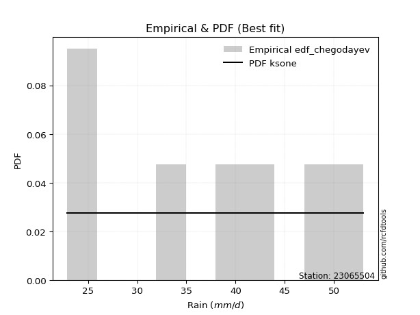</img>

</div>


### 6. EDF Blom (1958)

The Blom formula is a specific "plotting position" formula used in hydrology and statistical analysis to estimate the empirical cumulative probability (or non-exceedance probability) of a data series. It is particularly recommended for data that are approximately normally distributed. The constant _a_ is set to 0.375 (or 3/8).

<div align="center">


$P=(m-a)/(n+1-2a)$


</div>


**6.1. Empirical values**

<div align="center">

|                | 0                   | 1                   | 2                  | 3        | 4                  | 5                  | 6                  |
|:---------------|:--------------------|:--------------------|:-------------------|:---------|:-------------------|:-------------------|:-------------------|
| date           | 2015                | 2019                | 2018               | 2020     | 2017               | 2016               | 2021               |
| x              | 22.9                | 24.4                | 33.0               | 39.1     | 41.2               | 47.4               | 53.0               |
| m              | 1                   | 2                   | 3                  | 4        | 5                  | 6                  | 7                  |
| empirical_dist | edf_blom            | edf_blom            | edf_blom           | edf_blom | edf_blom           | edf_blom           | edf_blom           |
| empirical      | 0.08620689655172414 | 0.22413793103448276 | 0.3620689655172414 | 0.5      | 0.6379310344827587 | 0.7758620689655172 | 0.9137931034482759 |
| empirical_tr   | 1.0943396226415094  | 1.288888888888889   | 1.5675675675675675 | 2.0      | 2.7619047619047623 | 4.461538461538462  | 11.600000000000007 |

</div>


**6.2. Kolmogorov-Smirnov fit test (sorted by Δ)**


<div align="center">

|                | 0                   | 1                   | 2                   | 3                   | 4                   | 5                   | 6                   | 7                   | 8                   | 9                   | 10                  | 11                  | 12                  | 13                  | 14                  | 15                  | 16                  | 17                  | 18                  | 19                  | 20                  | 21                  | 22                  | 23                  | 24                  | 25                  | 26                  | 27                  | 28                  | 29                  | 30                  | 31                  | 32                  | 33                  | 34                  | 35                  | 36                  | 37                  | 38                  | 39                  | 40                  | 41                  | 42                  | 43                  | 44                  | 45                  | 46                  | 47                  | 48                  | 49                  | 50                  | 51                  | 52                  | 53                  | 54                  | 55                  | 56                  | 57                  | 58                  | 59                  | 60                  | 61                  | 62                  | 63                  | 64                  | 65                  | 66                  | 67                  | 68                  | 69                  | 70                  | 71                  | 72                  | 73                  | 74                  | 75                  | 76                  | 77                  | 78                  | 79                  | 80                  | 81                  | 82                  | 83                  | 84                  | 85                  | 86                  | 87                  | 88                  | 89                  | 90                  | 91                  | 92                  | 93                  | 94                  | 95                  | 96                  | 97                  | 98                  | 99                  | 100                 | 101                 | 102                 | 103                 | 104                 | 105                 | 106                 | 107                 | 108                 | 109                 | 110                 | 111                 | 112                 | 113                 | 114                 | 115                 | 116                 | 117                 | 118                 | 119                 | 120                 | 121                 | 122                 | 123                 | 124                 | 125                 | 126                 | 127                 | 128                 | 129                 | 130                 | 131                 | 132                 | 133                 | 134                 | 135                 | 136                 | 137                 | 138                 | 139                 | 140                 | 141                 | 142                 | 143                 | 144                 | 145                 | 146                 | 147                 | 148                 | 149                 | 150                 | 151                 | 152                 | 153                 | 154                 | 155                 | 156                 | 157                 | 158                 | 159                 |
|:---------------|:--------------------|:--------------------|:--------------------|:--------------------|:--------------------|:--------------------|:--------------------|:--------------------|:--------------------|:--------------------|:--------------------|:--------------------|:--------------------|:--------------------|:--------------------|:--------------------|:--------------------|:--------------------|:--------------------|:--------------------|:--------------------|:--------------------|:--------------------|:--------------------|:--------------------|:--------------------|:--------------------|:--------------------|:--------------------|:--------------------|:--------------------|:--------------------|:--------------------|:--------------------|:--------------------|:--------------------|:--------------------|:--------------------|:--------------------|:--------------------|:--------------------|:--------------------|:--------------------|:--------------------|:--------------------|:--------------------|:--------------------|:--------------------|:--------------------|:--------------------|:--------------------|:--------------------|:--------------------|:--------------------|:--------------------|:--------------------|:--------------------|:--------------------|:--------------------|:--------------------|:--------------------|:--------------------|:--------------------|:--------------------|:--------------------|:--------------------|:--------------------|:--------------------|:--------------------|:--------------------|:--------------------|:--------------------|:--------------------|:--------------------|:--------------------|:--------------------|:--------------------|:--------------------|:--------------------|:--------------------|:--------------------|:--------------------|:--------------------|:--------------------|:--------------------|:--------------------|:--------------------|:--------------------|:--------------------|:--------------------|:--------------------|:--------------------|:--------------------|:--------------------|:--------------------|:--------------------|:--------------------|:--------------------|:--------------------|:--------------------|:--------------------|:--------------------|:--------------------|:--------------------|:--------------------|:--------------------|:--------------------|:--------------------|:--------------------|:--------------------|:--------------------|:--------------------|:--------------------|:--------------------|:--------------------|:--------------------|:--------------------|:--------------------|:--------------------|:--------------------|:--------------------|:--------------------|:--------------------|:--------------------|:--------------------|:--------------------|:--------------------|:--------------------|:--------------------|:--------------------|:--------------------|:--------------------|:--------------------|:--------------------|:--------------------|:--------------------|:--------------------|:--------------------|:--------------------|:--------------------|:--------------------|:--------------------|:--------------------|:--------------------|:--------------------|:--------------------|:--------------------|:--------------------|:--------------------|:--------------------|:--------------------|:--------------------|:--------------------|:--------------------|:--------------------|:--------------------|:--------------------|:--------------------|:--------------------|:--------------------|
| station        | 23065504            | 23065504            | 23065504            | 23065504            | 23065504            | 23065504            | 23065504            | 23065504            | 23065504            | 23065504            | 23065504            | 23065504            | 23065504            | 23065504            | 23065504            | 23065504            | 23065504            | 23065504            | 23065504            | 23065504            | 23065504            | 23065504            | 23065504            | 23065504            | 23065504            | 23065504            | 23065504            | 23065504            | 23065504            | 23065504            | 23065504            | 23065504            | 23065504            | 23065504            | 23065504            | 23065504            | 23065504            | 23065504            | 23065504            | 23065504            | 23065504            | 23065504            | 23065504            | 23065504            | 23065504            | 23065504            | 23065504            | 23065504            | 23065504            | 23065504            | 23065504            | 23065504            | 23065504            | 23065504            | 23065504            | 23065504            | 23065504            | 23065504            | 23065504            | 23065504            | 23065504            | 23065504            | 23065504            | 23065504            | 23065504            | 23065504            | 23065504            | 23065504            | 23065504            | 23065504            | 23065504            | 23065504            | 23065504            | 23065504            | 23065504            | 23065504            | 23065504            | 23065504            | 23065504            | 23065504            | 23065504            | 23065504            | 23065504            | 23065504            | 23065504            | 23065504            | 23065504            | 23065504            | 23065504            | 23065504            | 23065504            | 23065504            | 23065504            | 23065504            | 23065504            | 23065504            | 23065504            | 23065504            | 23065504            | 23065504            | 23065504            | 23065504            | 23065504            | 23065504            | 23065504            | 23065504            | 23065504            | 23065504            | 23065504            | 23065504            | 23065504            | 23065504            | 23065504            | 23065504            | 23065504            | 23065504            | 23065504            | 23065504            | 23065504            | 23065504            | 23065504            | 23065504            | 23065504            | 23065504            | 23065504            | 23065504            | 23065504            | 23065504            | 23065504            | 23065504            | 23065504            | 23065504            | 23065504            | 23065504            | 23065504            | 23065504            | 23065504            | 23065504            | 23065504            | 23065504            | 23065504            | 23065504            | 23065504            | 23065504            | 23065504            | 23065504            | 23065504            | 23065504            | 23065504            | 23065504            | 23065504            | 23065504            | 23065504            | 23065504            | 23065504            | 23065504            | 23065504            | 23065504            | 23065504            | 23065504            |
| empirical_dist | edf_blom            | edf_blom            | edf_blom            | edf_blom            | edf_blom            | edf_blom            | edf_blom            | edf_blom            | edf_blom            | edf_blom            | edf_blom            | edf_blom            | edf_blom            | edf_blom            | edf_blom            | edf_blom            | edf_blom            | edf_blom            | edf_blom            | edf_blom            | edf_blom            | edf_blom            | edf_blom            | edf_blom            | edf_blom            | edf_blom            | edf_blom            | edf_blom            | edf_blom            | edf_blom            | edf_blom            | edf_blom            | edf_blom            | edf_blom            | edf_blom            | edf_blom            | edf_blom            | edf_blom            | edf_blom            | edf_blom            | edf_blom            | edf_blom            | edf_blom            | edf_blom            | edf_blom            | edf_blom            | edf_blom            | edf_blom            | edf_blom            | edf_blom            | edf_blom            | edf_blom            | edf_blom            | edf_blom            | edf_blom            | edf_blom            | edf_blom            | edf_blom            | edf_blom            | edf_blom            | edf_blom            | edf_blom            | edf_blom            | edf_blom            | edf_blom            | edf_blom            | edf_blom            | edf_blom            | edf_blom            | edf_blom            | edf_blom            | edf_blom            | edf_blom            | edf_blom            | edf_blom            | edf_blom            | edf_blom            | edf_blom            | edf_blom            | edf_blom            | edf_blom            | edf_blom            | edf_blom            | edf_blom            | edf_blom            | edf_blom            | edf_blom            | edf_blom            | edf_blom            | edf_blom            | edf_blom            | edf_blom            | edf_blom            | edf_blom            | edf_blom            | edf_blom            | edf_blom            | edf_blom            | edf_blom            | edf_blom            | edf_blom            | edf_blom            | edf_blom            | edf_blom            | edf_blom            | edf_blom            | edf_blom            | edf_blom            | edf_blom            | edf_blom            | edf_blom            | edf_blom            | edf_blom            | edf_blom            | edf_blom            | edf_blom            | edf_blom            | edf_blom            | edf_blom            | edf_blom            | edf_blom            | edf_blom            | edf_blom            | edf_blom            | edf_blom            | edf_blom            | edf_blom            | edf_blom            | edf_blom            | edf_blom            | edf_blom            | edf_blom            | edf_blom            | edf_blom            | edf_blom            | edf_blom            | edf_blom            | edf_blom            | edf_blom            | edf_blom            | edf_blom            | edf_blom            | edf_blom            | edf_blom            | edf_blom            | edf_blom            | edf_blom            | edf_blom            | edf_blom            | edf_blom            | edf_blom            | edf_blom            | edf_blom            | edf_blom            | edf_blom            | edf_blom            | edf_blom            | edf_blom            | edf_blom            | edf_blom            |
| p_dist         | ksone               | logbeta             | arcsine             | logarcsine          | semicircular        | dgamma              | logtrapezoid        | dweibull            | logksone            | anglit              | logburr             | logsemicircular     | genextreme          | logwrapcauchy       | logjohnsonsu        | logskewnorm         | loganglit           | logloggamma         | burr                | logncf              | johnsonsu           | gumbel_l            | ncf                 | pearson3            | t                   | skewnorm            | exponnorm           | norm                | crystalball         | nct                 | gamma               | erlang              | foldnorm            | f                   | logmielke           | logdweibull         | logburr12           | betaprime           | alpha               | invgamma            | logpearson3         | logweibull_min      | invgauss            | loggumbel_l         | genlogistic         | invweibull          | exponpow            | logbetaprime        | maxwell             | lognct              | logf                | logfatiguelife      | logexponnorm        | logcrystalball      | lognorm             | logt                | logerlang           | loggamma            | loggamma            | cosine              | logdgamma           | wrapcauchy          | logfoldnorm         | gausshyper          | logistic            | triang              | rayleigh            | loginvgamma         | logalpha            | hypsecant           | logtriang           | logcosine           | argus               | kstwobign           | loglogistic         | logargus            | logkappa4           | laplace             | rice                | logrice             | weibull_min         | logtukeylambda      | logmaxwell          | loginvgauss         | genpareto           | loghypsecant        | logkappa3           | loguniform          | logvonmises_line    | lograyleigh         | loginvweibull       | logloglaplace       | loggenextreme       | gumbel_r            | beta                | bradford            | truncpareto         | truncweibull_min    | kappa4              | loggompertz         | truncexpon          | loggausshyper       | tukeylambda         | loggenexpon         | logkstwobign        | gompertz            | loglaplace          | loglaplace          | vonmises_line       | uniform             | kappa3              | lomax               | genexpon            | halfnorm            | loggumbel_r         | loggenhalflogistic  | moyal               | nakagami            | logrdist            | genhalflogistic     | burr12              | loglomax            | logmoyal            | loghalfnorm         | logbradford         | halfgennorm         | halflogistic        | loghalflogistic     | logtruncexpon       | logexponweib        | wald                | loglevy_l           | logexponpow         | levy_l              | logwald             | lognakagami         | gennorm             | loggennorm          | logtruncnorm        | logjohnsonsb        | trapezoid           | logtruncweibull_min | loggenpareto        | loggengamma         | exponweib           | fatiguelife         | gengamma            | logweibull_max      | johnsonsb           | powerlaw            | rdist               | loghalfgennorm      | logpowerlaw         | logtruncpareto      | weibull_max         | loggenlogistic      | truncnorm           | logvonmises         | vonmises            | mielke              |
| delta          | 0.08131728153175347 | 0.08620689484544253 | 0.08620689655172409 | 0.08981753522939367 | 0.0911748009569211  | 0.09209339106093972 | 0.09268743234184157 | 0.0929308188224291  | 0.09658975291312161 | 0.09842382693687818 | 0.10218161225983169 | 0.10422611344702198 | 0.10525657732714211 | 0.10562134630057884 | 0.10629650796466505 | 0.10881482575939626 | 0.11016763494594096 | 0.11077567407088207 | 0.11290994487150116 | 0.11509155761969836 | 0.11539615965955646 | 0.11563710974545428 | 0.11570376729398335 | 0.11571725716997183 | 0.11613948020290761 | 0.1161448913024882  | 0.11615054111354331 | 0.11615109970745735 | 0.11615111327178652 | 0.11626765264440506 | 0.11647608520763798 | 0.11647642635541093 | 0.1165902172355277  | 0.11681590719405063 | 0.11740496149044377 | 0.11840098961336909 | 0.11844027306154745 | 0.12064396168232559 | 0.12084820696848925 | 0.120930498985997   | 0.1209327648533957  | 0.12096127210564099 | 0.1221352167497614  | 0.12237952041404122 | 0.12300384494284955 | 0.12318378507421524 | 0.12359991443524865 | 0.12432994595177828 | 0.1248069787800884  | 0.1248941009897069  | 0.12530957426696865 | 0.12556685560413738 | 0.12564853096160644 | 0.12564914722300907 | 0.12564921973783322 | 0.12565163067539306 | 0.12584289992012246 | 0.12592505024683454 | 0.12592505024683454 | 0.12651144145733456 | 0.12691325120882485 | 0.12730366390452819 | 0.12733967195719564 | 0.12791329774503346 | 0.1282890785070458  | 0.1307456501786805  | 0.13079029509640985 | 0.13196283492272864 | 0.13324963268387469 | 0.13359331941644254 | 0.13373267724843696 | 0.13388649794387075 | 0.13394413951953288 | 0.1339525570703124  | 0.13628874671928637 | 0.13682626181040403 | 0.13696426516923021 | 0.13723482383495147 | 0.13791830795053012 | 0.13855241536868515 | 0.140725915235961   | 0.1435883272779238  | 0.14370557201213752 | 0.144515578041855   | 0.14506419119330577 | 0.14592569416780354 | 0.14843075944993356 | 0.14853065763117745 | 0.14911694439105244 | 0.1513041252479519  | 0.15346771283032712 | 0.15466924046903976 | 0.158078993298709   | 0.15987363323815043 | 0.15995829494045075 | 0.1600141763103848  | 0.16030659971775837 | 0.16105117639128852 | 0.16113607363794955 | 0.16313345625307177 | 0.1647686713966655  | 0.16654262831057054 | 0.16839504489668278 | 0.17075996357073175 | 0.17092477887598734 | 0.17165612856959597 | 0.174096520030107   | 0.174096520030107   | 0.17430195587524921 | 0.1743040439912934  | 0.17432735565258092 | 0.17498938778655926 | 0.17571124787274106 | 0.18264602769973542 | 0.18328694337352147 | 0.18551796618027175 | 0.18788604784359259 | 0.18932173396063345 | 0.19526020217128093 | 0.19535973137050222 | 0.1968098616990953  | 0.19838542583816943 | 0.20500240149852877 | 0.20805985038276845 | 0.2170891515180673  | 0.21985340295051276 | 0.22413793103448276 | 0.22413793103448276 | 0.22704196011077837 | 0.22883279579590465 | 0.2294071837297239  | 0.2318721911586264  | 0.25940719507304183 | 0.26546225605702617 | 0.2657952440714868  | 0.2688091249017494  | 0.27586206896551724 | 0.27586206896551724 | 0.27682898158860125 | 0.2887662652220576  | 0.2898571690974121  | 0.31618890134304956 | 0.3175079780746557  | 0.3237101160288574  | 0.44905113869397534 | 0.45436065256116515 | 0.4574333281204173  | 0.4594736376905748  | 0.4619581041108646  | 0.47185693699532544 | 0.4999999880096997  | 0.5                 | 0.5010459746467382  | 0.5265978199186454  | 0.5382583167087529  | 0.7758620689655172  | 0.9137931032283038  | 1.1178189284506366  | 7.500230366556526   | nan                 |
| deltao         | 0.48442053926100004 | 0.48442053926100004 | 0.48442053926100004 | 0.48442053926100004 | 0.48442053926100004 | 0.48442053926100004 | 0.48442053926100004 | 0.48442053926100004 | 0.48442053926100004 | 0.48442053926100004 | 0.48442053926100004 | 0.48442053926100004 | 0.48442053926100004 | 0.48442053926100004 | 0.48442053926100004 | 0.48442053926100004 | 0.48442053926100004 | 0.48442053926100004 | 0.48442053926100004 | 0.48442053926100004 | 0.48442053926100004 | 0.48442053926100004 | 0.48442053926100004 | 0.48442053926100004 | 0.48442053926100004 | 0.48442053926100004 | 0.48442053926100004 | 0.48442053926100004 | 0.48442053926100004 | 0.48442053926100004 | 0.48442053926100004 | 0.48442053926100004 | 0.48442053926100004 | 0.48442053926100004 | 0.48442053926100004 | 0.48442053926100004 | 0.48442053926100004 | 0.48442053926100004 | 0.48442053926100004 | 0.48442053926100004 | 0.48442053926100004 | 0.48442053926100004 | 0.48442053926100004 | 0.48442053926100004 | 0.48442053926100004 | 0.48442053926100004 | 0.48442053926100004 | 0.48442053926100004 | 0.48442053926100004 | 0.48442053926100004 | 0.48442053926100004 | 0.48442053926100004 | 0.48442053926100004 | 0.48442053926100004 | 0.48442053926100004 | 0.48442053926100004 | 0.48442053926100004 | 0.48442053926100004 | 0.48442053926100004 | 0.48442053926100004 | 0.48442053926100004 | 0.48442053926100004 | 0.48442053926100004 | 0.48442053926100004 | 0.48442053926100004 | 0.48442053926100004 | 0.48442053926100004 | 0.48442053926100004 | 0.48442053926100004 | 0.48442053926100004 | 0.48442053926100004 | 0.48442053926100004 | 0.48442053926100004 | 0.48442053926100004 | 0.48442053926100004 | 0.48442053926100004 | 0.48442053926100004 | 0.48442053926100004 | 0.48442053926100004 | 0.48442053926100004 | 0.48442053926100004 | 0.48442053926100004 | 0.48442053926100004 | 0.48442053926100004 | 0.48442053926100004 | 0.48442053926100004 | 0.48442053926100004 | 0.48442053926100004 | 0.48442053926100004 | 0.48442053926100004 | 0.48442053926100004 | 0.48442053926100004 | 0.48442053926100004 | 0.48442053926100004 | 0.48442053926100004 | 0.48442053926100004 | 0.48442053926100004 | 0.48442053926100004 | 0.48442053926100004 | 0.48442053926100004 | 0.48442053926100004 | 0.48442053926100004 | 0.48442053926100004 | 0.48442053926100004 | 0.48442053926100004 | 0.48442053926100004 | 0.48442053926100004 | 0.48442053926100004 | 0.48442053926100004 | 0.48442053926100004 | 0.48442053926100004 | 0.48442053926100004 | 0.48442053926100004 | 0.48442053926100004 | 0.48442053926100004 | 0.48442053926100004 | 0.48442053926100004 | 0.48442053926100004 | 0.48442053926100004 | 0.48442053926100004 | 0.48442053926100004 | 0.48442053926100004 | 0.48442053926100004 | 0.48442053926100004 | 0.48442053926100004 | 0.48442053926100004 | 0.48442053926100004 | 0.48442053926100004 | 0.48442053926100004 | 0.48442053926100004 | 0.48442053926100004 | 0.48442053926100004 | 0.48442053926100004 | 0.48442053926100004 | 0.48442053926100004 | 0.48442053926100004 | 0.48442053926100004 | 0.48442053926100004 | 0.48442053926100004 | 0.48442053926100004 | 0.48442053926100004 | 0.48442053926100004 | 0.48442053926100004 | 0.48442053926100004 | 0.48442053926100004 | 0.48442053926100004 | 0.48442053926100004 | 0.48442053926100004 | 0.48442053926100004 | 0.48442053926100004 | 0.48442053926100004 | 0.48442053926100004 | 0.48442053926100004 | 0.48442053926100004 | 0.48442053926100004 | 0.48442053926100004 | 0.48442053926100004 | 0.48442053926100004 | 0.48442053926100004 | 0.48442053926100004 |
| eval           | Δo > Δ              | Δo > Δ              | Δo > Δ              | Δo > Δ              | Δo > Δ              | Δo > Δ              | Δo > Δ              | Δo > Δ              | Δo > Δ              | Δo > Δ              | Δo > Δ              | Δo > Δ              | Δo > Δ              | Δo > Δ              | Δo > Δ              | Δo > Δ              | Δo > Δ              | Δo > Δ              | Δo > Δ              | Δo > Δ              | Δo > Δ              | Δo > Δ              | Δo > Δ              | Δo > Δ              | Δo > Δ              | Δo > Δ              | Δo > Δ              | Δo > Δ              | Δo > Δ              | Δo > Δ              | Δo > Δ              | Δo > Δ              | Δo > Δ              | Δo > Δ              | Δo > Δ              | Δo > Δ              | Δo > Δ              | Δo > Δ              | Δo > Δ              | Δo > Δ              | Δo > Δ              | Δo > Δ              | Δo > Δ              | Δo > Δ              | Δo > Δ              | Δo > Δ              | Δo > Δ              | Δo > Δ              | Δo > Δ              | Δo > Δ              | Δo > Δ              | Δo > Δ              | Δo > Δ              | Δo > Δ              | Δo > Δ              | Δo > Δ              | Δo > Δ              | Δo > Δ              | Δo > Δ              | Δo > Δ              | Δo > Δ              | Δo > Δ              | Δo > Δ              | Δo > Δ              | Δo > Δ              | Δo > Δ              | Δo > Δ              | Δo > Δ              | Δo > Δ              | Δo > Δ              | Δo > Δ              | Δo > Δ              | Δo > Δ              | Δo > Δ              | Δo > Δ              | Δo > Δ              | Δo > Δ              | Δo > Δ              | Δo > Δ              | Δo > Δ              | Δo > Δ              | Δo > Δ              | Δo > Δ              | Δo > Δ              | Δo > Δ              | Δo > Δ              | Δo > Δ              | Δo > Δ              | Δo > Δ              | Δo > Δ              | Δo > Δ              | Δo > Δ              | Δo > Δ              | Δo > Δ              | Δo > Δ              | Δo > Δ              | Δo > Δ              | Δo > Δ              | Δo > Δ              | Δo > Δ              | Δo > Δ              | Δo > Δ              | Δo > Δ              | Δo > Δ              | Δo > Δ              | Δo > Δ              | Δo > Δ              | Δo > Δ              | Δo > Δ              | Δo > Δ              | Δo > Δ              | Δo > Δ              | Δo > Δ              | Δo > Δ              | Δo > Δ              | Δo > Δ              | Δo > Δ              | Δo > Δ              | Δo > Δ              | Δo > Δ              | Δo > Δ              | Δo > Δ              | Δo > Δ              | Δo > Δ              | Δo > Δ              | Δo > Δ              | Δo > Δ              | Δo > Δ              | Δo > Δ              | Δo > Δ              | Δo > Δ              | Δo > Δ              | Δo > Δ              | Δo > Δ              | Δo > Δ              | Δo > Δ              | Δo > Δ              | Δo > Δ              | Δo > Δ              | Δo > Δ              | Δo > Δ              | Δo > Δ              | Δo > Δ              | Δo > Δ              | Δo > Δ              | Δo > Δ              | Δo > Δ              | Δo > Δ              | Δo > Δ              | Δo > Δ              | Δo <= Δ             | Δo <= Δ             | Δo <= Δ             | Δo <= Δ             | Δo <= Δ             | Δo <= Δ             | Δo <= Δ             | Δo <= Δ             | Δo <= Δ             | Δo <= Δ             |
| fit            | 1                   | 1                   | 1                   | 1                   | 1                   | 1                   | 1                   | 1                   | 1                   | 1                   | 1                   | 1                   | 1                   | 1                   | 1                   | 1                   | 1                   | 1                   | 1                   | 1                   | 1                   | 1                   | 1                   | 1                   | 1                   | 1                   | 1                   | 1                   | 1                   | 1                   | 1                   | 1                   | 1                   | 1                   | 1                   | 1                   | 1                   | 1                   | 1                   | 1                   | 1                   | 1                   | 1                   | 1                   | 1                   | 1                   | 1                   | 1                   | 1                   | 1                   | 1                   | 1                   | 1                   | 1                   | 1                   | 1                   | 1                   | 1                   | 1                   | 1                   | 1                   | 1                   | 1                   | 1                   | 1                   | 1                   | 1                   | 1                   | 1                   | 1                   | 1                   | 1                   | 1                   | 1                   | 1                   | 1                   | 1                   | 1                   | 1                   | 1                   | 1                   | 1                   | 1                   | 1                   | 1                   | 1                   | 1                   | 1                   | 1                   | 1                   | 1                   | 1                   | 1                   | 1                   | 1                   | 1                   | 1                   | 1                   | 1                   | 1                   | 1                   | 1                   | 1                   | 1                   | 1                   | 1                   | 1                   | 1                   | 1                   | 1                   | 1                   | 1                   | 1                   | 1                   | 1                   | 1                   | 1                   | 1                   | 1                   | 1                   | 1                   | 1                   | 1                   | 1                   | 1                   | 1                   | 1                   | 1                   | 1                   | 1                   | 1                   | 1                   | 1                   | 1                   | 1                   | 1                   | 1                   | 1                   | 1                   | 1                   | 1                   | 1                   | 1                   | 1                   | 1                   | 1                   | 1                   | 1                   | 1                   | 1                   | 0                   | 0                   | 0                   | 0                   | 0                   | 0                   | 0                   | 0                   | 0                   | 0                   |
| n              | 7                   | 7                   | 7                   | 7                   | 7                   | 7                   | 7                   | 7                   | 7                   | 7                   | 7                   | 7                   | 7                   | 7                   | 7                   | 7                   | 7                   | 7                   | 7                   | 7                   | 7                   | 7                   | 7                   | 7                   | 7                   | 7                   | 7                   | 7                   | 7                   | 7                   | 7                   | 7                   | 7                   | 7                   | 7                   | 7                   | 7                   | 7                   | 7                   | 7                   | 7                   | 7                   | 7                   | 7                   | 7                   | 7                   | 7                   | 7                   | 7                   | 7                   | 7                   | 7                   | 7                   | 7                   | 7                   | 7                   | 7                   | 7                   | 7                   | 7                   | 7                   | 7                   | 7                   | 7                   | 7                   | 7                   | 7                   | 7                   | 7                   | 7                   | 7                   | 7                   | 7                   | 7                   | 7                   | 7                   | 7                   | 7                   | 7                   | 7                   | 7                   | 7                   | 7                   | 7                   | 7                   | 7                   | 7                   | 7                   | 7                   | 7                   | 7                   | 7                   | 7                   | 7                   | 7                   | 7                   | 7                   | 7                   | 7                   | 7                   | 7                   | 7                   | 7                   | 7                   | 7                   | 7                   | 7                   | 7                   | 7                   | 7                   | 7                   | 7                   | 7                   | 7                   | 7                   | 7                   | 7                   | 7                   | 7                   | 7                   | 7                   | 7                   | 7                   | 7                   | 7                   | 7                   | 7                   | 7                   | 7                   | 7                   | 7                   | 7                   | 7                   | 7                   | 7                   | 7                   | 7                   | 7                   | 7                   | 7                   | 7                   | 7                   | 7                   | 7                   | 7                   | 7                   | 7                   | 7                   | 7                   | 7                   | 7                   | 7                   | 7                   | 7                   | 7                   | 7                   | 7                   | 7                   | 7                   | 7                   |
| best_fit       | 1                   | 0                   | 0                   | 0                   | 0                   | 0                   | 0                   | 0                   | 0                   | 0                   | 0                   | 0                   | 0                   | 0                   | 0                   | 0                   | 0                   | 0                   | 0                   | 0                   | 0                   | 0                   | 0                   | 0                   | 0                   | 0                   | 0                   | 0                   | 0                   | 0                   | 0                   | 0                   | 0                   | 0                   | 0                   | 0                   | 0                   | 0                   | 0                   | 0                   | 0                   | 0                   | 0                   | 0                   | 0                   | 0                   | 0                   | 0                   | 0                   | 0                   | 0                   | 0                   | 0                   | 0                   | 0                   | 0                   | 0                   | 0                   | 0                   | 0                   | 0                   | 0                   | 0                   | 0                   | 0                   | 0                   | 0                   | 0                   | 0                   | 0                   | 0                   | 0                   | 0                   | 0                   | 0                   | 0                   | 0                   | 0                   | 0                   | 0                   | 0                   | 0                   | 0                   | 0                   | 0                   | 0                   | 0                   | 0                   | 0                   | 0                   | 0                   | 0                   | 0                   | 0                   | 0                   | 0                   | 0                   | 0                   | 0                   | 0                   | 0                   | 0                   | 0                   | 0                   | 0                   | 0                   | 0                   | 0                   | 0                   | 0                   | 0                   | 0                   | 0                   | 0                   | 0                   | 0                   | 0                   | 0                   | 0                   | 0                   | 0                   | 0                   | 0                   | 0                   | 0                   | 0                   | 0                   | 0                   | 0                   | 0                   | 0                   | 0                   | 0                   | 0                   | 0                   | 0                   | 0                   | 0                   | 0                   | 0                   | 0                   | 0                   | 0                   | 0                   | 0                   | 0                   | 0                   | 0                   | 0                   | 0                   | 0                   | 0                   | 0                   | 0                   | 0                   | 0                   | 0                   | 0                   | 0                   | 0                   |
| best_fit_sort  | 1                   | 2                   | 3                   | 4                   | 5                   | 6                   | 7                   | 8                   | 9                   | 10                  | 11                  | 12                  | 13                  | 14                  | 15                  | 16                  | 17                  | 18                  | 19                  | 20                  | 21                  | 22                  | 23                  | 24                  | 25                  | 26                  | 27                  | 28                  | 29                  | 30                  | 31                  | 32                  | 33                  | 34                  | 35                  | 36                  | 37                  | 38                  | 39                  | 40                  | 41                  | 42                  | 43                  | 44                  | 45                  | 46                  | 47                  | 48                  | 49                  | 50                  | 51                  | 52                  | 53                  | 54                  | 55                  | 56                  | 57                  | 58                  | 59                  | 60                  | 61                  | 62                  | 63                  | 64                  | 65                  | 66                  | 67                  | 68                  | 69                  | 70                  | 71                  | 72                  | 73                  | 74                  | 75                  | 76                  | 77                  | 78                  | 79                  | 80                  | 81                  | 82                  | 83                  | 84                  | 85                  | 86                  | 87                  | 88                  | 89                  | 90                  | 91                  | 92                  | 93                  | 94                  | 95                  | 96                  | 97                  | 98                  | 99                  | 100                 | 101                 | 102                 | 103                 | 104                 | 105                 | 106                 | 107                 | 108                 | 109                 | 110                 | 111                 | 112                 | 113                 | 114                 | 115                 | 116                 | 117                 | 118                 | 119                 | 120                 | 121                 | 122                 | 123                 | 124                 | 125                 | 126                 | 127                 | 128                 | 129                 | 130                 | 131                 | 132                 | 133                 | 134                 | 135                 | 136                 | 137                 | 138                 | 139                 | 140                 | 141                 | 142                 | 143                 | 144                 | 145                 | 146                 | 147                 | 148                 | 149                 | 150                 | 151                 | 152                 | 153                 | 154                 | 155                 | 156                 | 157                 | 158                 | 159                 | 160                 |

</div>


**6.3. Best fit**

<div align="center">

|   id |   station | empirical_dist   | p_dist   |     delta |   deltao | eval   |   fit |   n |   best_fit |   best_fit_sort |
|-----:|----------:|:-----------------|:---------|----------:|---------:|:-------|------:|----:|-----------:|----------------:|
|    0 |  23065504 | edf_blom         | ksone    | 0.0813173 | 0.484421 | Δo > Δ |     1 |   7 |          1 |               1 |

</div>


<div align="center">

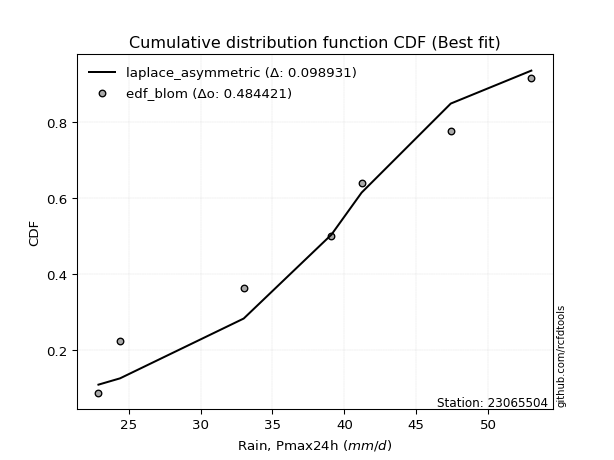</img>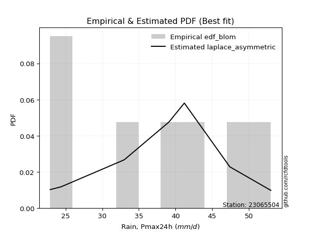</img>

</div>


### 7. EDF Tukey (1962)

In hydrology, the Tukey formula is used as a plotting position formula to estimate the empirical probability or frequency of a flood event (or other hydrological data). The formula parameter is given as _c=0.333_ (or 1/3).

<div align="center">


$P=(m-c)/(n+1-2c)$


</div>


**7.1. Empirical values**

<div align="center">

|                | 0                   | 1                   | 2                   | 3         | 4                  | 5                  | 6                  |
|:---------------|:--------------------|:--------------------|:--------------------|:----------|:-------------------|:-------------------|:-------------------|
| date           | 2015                | 2019                | 2018                | 2020      | 2017               | 2016               | 2021               |
| x              | 22.9                | 24.4                | 33.0                | 39.1      | 41.2               | 47.4               | 53.0               |
| m              | 1                   | 2                   | 3                   | 4         | 5                  | 6                  | 7                  |
| empirical_dist | edf_tukey           | edf_tukey           | edf_tukey           | edf_tukey | edf_tukey          | edf_tukey          | edf_tukey          |
| empirical      | 0.09090909090909091 | 0.22727272727272727 | 0.36363636363636365 | 0.5       | 0.6363636363636364 | 0.7727272727272727 | 0.9090909090909091 |
| empirical_tr   | 1.1                 | 1.2941176470588236  | 1.5714285714285714  | 2.0       | 2.75               | 4.3999999999999995 | 10.999999999999996 |

</div>


**7.2. Kolmogorov-Smirnov fit test (sorted by Δ)**


<div align="center">

|                | 0                   | 1                   | 2                   | 3                   | 4                   | 5                   | 6                   | 7                   | 8                   | 9                   | 10                  | 11                  | 12                  | 13                  | 14                  | 15                  | 16                  | 17                  | 18                  | 19                  | 20                  | 21                  | 22                  | 23                  | 24                  | 25                  | 26                  | 27                  | 28                  | 29                  | 30                  | 31                  | 32                  | 33                  | 34                  | 35                  | 36                  | 37                  | 38                  | 39                  | 40                  | 41                  | 42                  | 43                  | 44                  | 45                  | 46                  | 47                  | 48                  | 49                  | 50                  | 51                  | 52                  | 53                  | 54                  | 55                  | 56                  | 57                  | 58                  | 59                  | 60                  | 61                  | 62                  | 63                  | 64                  | 65                  | 66                  | 67                  | 68                  | 69                  | 70                  | 71                  | 72                  | 73                  | 74                  | 75                  | 76                  | 77                  | 78                  | 79                  | 80                  | 81                  | 82                  | 83                  | 84                  | 85                  | 86                  | 87                  | 88                  | 89                  | 90                  | 91                  | 92                  | 93                  | 94                  | 95                  | 96                  | 97                  | 98                  | 99                  | 100                 | 101                 | 102                 | 103                 | 104                 | 105                 | 106                 | 107                 | 108                 | 109                 | 110                 | 111                 | 112                 | 113                 | 114                 | 115                 | 116                 | 117                 | 118                 | 119                 | 120                 | 121                 | 122                 | 123                 | 124                 | 125                 | 126                 | 127                 | 128                 | 129                 | 130                 | 131                 | 132                 | 133                 | 134                 | 135                 | 136                 | 137                 | 138                 | 139                 | 140                 | 141                 | 142                 | 143                 | 144                 | 145                 | 146                 | 147                 | 148                 | 149                 | 150                 | 151                 | 152                 | 153                 | 154                 | 155                 | 156                 | 157                 | 158                 | 159                 |
|:---------------|:--------------------|:--------------------|:--------------------|:--------------------|:--------------------|:--------------------|:--------------------|:--------------------|:--------------------|:--------------------|:--------------------|:--------------------|:--------------------|:--------------------|:--------------------|:--------------------|:--------------------|:--------------------|:--------------------|:--------------------|:--------------------|:--------------------|:--------------------|:--------------------|:--------------------|:--------------------|:--------------------|:--------------------|:--------------------|:--------------------|:--------------------|:--------------------|:--------------------|:--------------------|:--------------------|:--------------------|:--------------------|:--------------------|:--------------------|:--------------------|:--------------------|:--------------------|:--------------------|:--------------------|:--------------------|:--------------------|:--------------------|:--------------------|:--------------------|:--------------------|:--------------------|:--------------------|:--------------------|:--------------------|:--------------------|:--------------------|:--------------------|:--------------------|:--------------------|:--------------------|:--------------------|:--------------------|:--------------------|:--------------------|:--------------------|:--------------------|:--------------------|:--------------------|:--------------------|:--------------------|:--------------------|:--------------------|:--------------------|:--------------------|:--------------------|:--------------------|:--------------------|:--------------------|:--------------------|:--------------------|:--------------------|:--------------------|:--------------------|:--------------------|:--------------------|:--------------------|:--------------------|:--------------------|:--------------------|:--------------------|:--------------------|:--------------------|:--------------------|:--------------------|:--------------------|:--------------------|:--------------------|:--------------------|:--------------------|:--------------------|:--------------------|:--------------------|:--------------------|:--------------------|:--------------------|:--------------------|:--------------------|:--------------------|:--------------------|:--------------------|:--------------------|:--------------------|:--------------------|:--------------------|:--------------------|:--------------------|:--------------------|:--------------------|:--------------------|:--------------------|:--------------------|:--------------------|:--------------------|:--------------------|:--------------------|:--------------------|:--------------------|:--------------------|:--------------------|:--------------------|:--------------------|:--------------------|:--------------------|:--------------------|:--------------------|:--------------------|:--------------------|:--------------------|:--------------------|:--------------------|:--------------------|:--------------------|:--------------------|:--------------------|:--------------------|:--------------------|:--------------------|:--------------------|:--------------------|:--------------------|:--------------------|:--------------------|:--------------------|:--------------------|:--------------------|:--------------------|:--------------------|:--------------------|:--------------------|:--------------------|
| station        | 23065504            | 23065504            | 23065504            | 23065504            | 23065504            | 23065504            | 23065504            | 23065504            | 23065504            | 23065504            | 23065504            | 23065504            | 23065504            | 23065504            | 23065504            | 23065504            | 23065504            | 23065504            | 23065504            | 23065504            | 23065504            | 23065504            | 23065504            | 23065504            | 23065504            | 23065504            | 23065504            | 23065504            | 23065504            | 23065504            | 23065504            | 23065504            | 23065504            | 23065504            | 23065504            | 23065504            | 23065504            | 23065504            | 23065504            | 23065504            | 23065504            | 23065504            | 23065504            | 23065504            | 23065504            | 23065504            | 23065504            | 23065504            | 23065504            | 23065504            | 23065504            | 23065504            | 23065504            | 23065504            | 23065504            | 23065504            | 23065504            | 23065504            | 23065504            | 23065504            | 23065504            | 23065504            | 23065504            | 23065504            | 23065504            | 23065504            | 23065504            | 23065504            | 23065504            | 23065504            | 23065504            | 23065504            | 23065504            | 23065504            | 23065504            | 23065504            | 23065504            | 23065504            | 23065504            | 23065504            | 23065504            | 23065504            | 23065504            | 23065504            | 23065504            | 23065504            | 23065504            | 23065504            | 23065504            | 23065504            | 23065504            | 23065504            | 23065504            | 23065504            | 23065504            | 23065504            | 23065504            | 23065504            | 23065504            | 23065504            | 23065504            | 23065504            | 23065504            | 23065504            | 23065504            | 23065504            | 23065504            | 23065504            | 23065504            | 23065504            | 23065504            | 23065504            | 23065504            | 23065504            | 23065504            | 23065504            | 23065504            | 23065504            | 23065504            | 23065504            | 23065504            | 23065504            | 23065504            | 23065504            | 23065504            | 23065504            | 23065504            | 23065504            | 23065504            | 23065504            | 23065504            | 23065504            | 23065504            | 23065504            | 23065504            | 23065504            | 23065504            | 23065504            | 23065504            | 23065504            | 23065504            | 23065504            | 23065504            | 23065504            | 23065504            | 23065504            | 23065504            | 23065504            | 23065504            | 23065504            | 23065504            | 23065504            | 23065504            | 23065504            | 23065504            | 23065504            | 23065504            | 23065504            | 23065504            | 23065504            |
| empirical_dist | edf_tukey           | edf_tukey           | edf_tukey           | edf_tukey           | edf_tukey           | edf_tukey           | edf_tukey           | edf_tukey           | edf_tukey           | edf_tukey           | edf_tukey           | edf_tukey           | edf_tukey           | edf_tukey           | edf_tukey           | edf_tukey           | edf_tukey           | edf_tukey           | edf_tukey           | edf_tukey           | edf_tukey           | edf_tukey           | edf_tukey           | edf_tukey           | edf_tukey           | edf_tukey           | edf_tukey           | edf_tukey           | edf_tukey           | edf_tukey           | edf_tukey           | edf_tukey           | edf_tukey           | edf_tukey           | edf_tukey           | edf_tukey           | edf_tukey           | edf_tukey           | edf_tukey           | edf_tukey           | edf_tukey           | edf_tukey           | edf_tukey           | edf_tukey           | edf_tukey           | edf_tukey           | edf_tukey           | edf_tukey           | edf_tukey           | edf_tukey           | edf_tukey           | edf_tukey           | edf_tukey           | edf_tukey           | edf_tukey           | edf_tukey           | edf_tukey           | edf_tukey           | edf_tukey           | edf_tukey           | edf_tukey           | edf_tukey           | edf_tukey           | edf_tukey           | edf_tukey           | edf_tukey           | edf_tukey           | edf_tukey           | edf_tukey           | edf_tukey           | edf_tukey           | edf_tukey           | edf_tukey           | edf_tukey           | edf_tukey           | edf_tukey           | edf_tukey           | edf_tukey           | edf_tukey           | edf_tukey           | edf_tukey           | edf_tukey           | edf_tukey           | edf_tukey           | edf_tukey           | edf_tukey           | edf_tukey           | edf_tukey           | edf_tukey           | edf_tukey           | edf_tukey           | edf_tukey           | edf_tukey           | edf_tukey           | edf_tukey           | edf_tukey           | edf_tukey           | edf_tukey           | edf_tukey           | edf_tukey           | edf_tukey           | edf_tukey           | edf_tukey           | edf_tukey           | edf_tukey           | edf_tukey           | edf_tukey           | edf_tukey           | edf_tukey           | edf_tukey           | edf_tukey           | edf_tukey           | edf_tukey           | edf_tukey           | edf_tukey           | edf_tukey           | edf_tukey           | edf_tukey           | edf_tukey           | edf_tukey           | edf_tukey           | edf_tukey           | edf_tukey           | edf_tukey           | edf_tukey           | edf_tukey           | edf_tukey           | edf_tukey           | edf_tukey           | edf_tukey           | edf_tukey           | edf_tukey           | edf_tukey           | edf_tukey           | edf_tukey           | edf_tukey           | edf_tukey           | edf_tukey           | edf_tukey           | edf_tukey           | edf_tukey           | edf_tukey           | edf_tukey           | edf_tukey           | edf_tukey           | edf_tukey           | edf_tukey           | edf_tukey           | edf_tukey           | edf_tukey           | edf_tukey           | edf_tukey           | edf_tukey           | edf_tukey           | edf_tukey           | edf_tukey           | edf_tukey           | edf_tukey           | edf_tukey           | edf_tukey           |
| p_dist         | ksone               | dgamma              | logbeta             | arcsine             | dweibull            | logarcsine          | semicircular        | logtrapezoid        | logksone            | logburr             | anglit              | logwrapcauchy       | logsemicircular     | genextreme          | logloggamma         | logjohnsonsu        | logncf              | logskewnorm         | loganglit           | logmielke           | burr                | johnsonsu           | gumbel_l            | ncf                 | pearson3            | t                   | skewnorm            | exponnorm           | norm                | crystalball         | nct                 | gamma               | erlang              | foldnorm            | f                   | logdweibull         | logburr12           | exponpow            | betaprime           | genlogistic         | alpha               | invgamma            | logpearson3         | logweibull_min      | wrapcauchy          | invweibull          | invgauss            | loggumbel_l         | logfoldnorm         | logbetaprime        | maxwell             | lognct              | loggamma            | loggamma            | logf                | logfatiguelife      | logexponnorm        | logcrystalball      | lognorm             | logt                | logerlang           | cosine              | logdgamma           | gausshyper          | logistic            | loginvgamma         | logalpha            | triang              | logcosine           | rayleigh            | kstwobign           | hypsecant           | logtriang           | argus               | logkappa4           | loglogistic         | logargus            | genpareto           | laplace             | weibull_min         | rice                | logrice             | logmaxwell          | loginvgauss         | loghypsecant        | logtukeylambda      | lograyleigh         | logkappa3           | loguniform          | logvonmises_line    | loginvweibull       | loggenextreme       | logloglaplace       | truncweibull_min    | gumbel_r            | beta                | bradford            | truncpareto         | kappa4              | truncexpon          | loggompertz         | loggausshyper       | loggenexpon         | logkstwobign        | tukeylambda         | loglaplace          | loglaplace          | gompertz            | lomax               | genexpon            | vonmises_line       | uniform             | kappa3              | loggumbel_r         | halfnorm            | loggenhalflogistic  | nakagami            | logrdist            | moyal               | genhalflogistic     | burr12              | loglomax            | logmoyal            | loghalfnorm         | logbradford         | halfgennorm         | logtruncexpon       | loglevy_l           | halflogistic        | loghalflogistic     | logexponweib        | wald                | logexponpow         | levy_l              | logwald             | lognakagami         | gennorm             | loggennorm          | logtruncnorm        | logjohnsonsb        | trapezoid           | loggenpareto        | logtruncweibull_min | loggengamma         | exponweib           | fatiguelife         | gengamma            | logweibull_max      | johnsonsb           | powerlaw            | logpowerlaw         | rdist               | loghalfgennorm      | logtruncpareto      | weibull_max         | loggenlogistic      | truncnorm           | logvonmises         | vonmises            | mielke              |
| delta          | 0.08445207776999797 | 0.09052599294181746 | 0.09090908920280938 | 0.09090909090909094 | 0.09136342070330683 | 0.09295233146763818 | 0.0943095971951656  | 0.09582222858008607 | 0.09972454915136611 | 0.10061421414070937 | 0.10155862317512268 | 0.10405394818145658 | 0.10736090968526649 | 0.10839137356538661 | 0.10920827595175975 | 0.10943130420290956 | 0.11038936326233151 | 0.11194962199764076 | 0.11330243118418547 | 0.11583756337132145 | 0.11604474110974566 | 0.11853095589780097 | 0.11877190598369879 | 0.11883856353222785 | 0.11885205340821633 | 0.11927427644115211 | 0.1192796875407327  | 0.11928533735178781 | 0.11928589594570185 | 0.11928590951003103 | 0.11940244888264956 | 0.11961088144588249 | 0.11961122259365543 | 0.11972501347377221 | 0.11995070343229514 | 0.12153578585161359 | 0.12157506929979195 | 0.12359991443524865 | 0.1237787579205701  | 0.12397594965038185 | 0.12398300320673375 | 0.1240652952242415  | 0.1240675610916402  | 0.1240960683438855  | 0.12416886766628366 | 0.12425563682506667 | 0.12527001298800589 | 0.12551431665228574 | 0.12733967195719564 | 0.1274647421900228  | 0.1279417750183329  | 0.1280288972279514  | 0.12819348115080664 | 0.12819348115080664 | 0.12844437050521315 | 0.1287016518423819  | 0.12878332719985097 | 0.12878394346125357 | 0.12878401597607772 | 0.12878642691363756 | 0.12897769615836696 | 0.12964623769557906 | 0.13004804744706935 | 0.13104809398327796 | 0.13142387474529027 | 0.13196283492272864 | 0.13324963268387469 | 0.13388044641692498 | 0.13388649794387075 | 0.13392509133465436 | 0.1339525570703124  | 0.13672811565468707 | 0.13686747348668143 | 0.13707893575777738 | 0.13743361223098818 | 0.13942354295753084 | 0.13996105804864853 | 0.140361996835939   | 0.14036962007319598 | 0.140725915235961   | 0.14105310418877465 | 0.14168721160692965 | 0.14370557201213752 | 0.144515578041855   | 0.14592569416780354 | 0.1467231235161683  | 0.1513041252479519  | 0.15156555568817803 | 0.15166545386942193 | 0.15225174062929692 | 0.15346771283032712 | 0.15651159517958668 | 0.15780403670728427 | 0.16105117639128852 | 0.16300842947639493 | 0.16309309117869525 | 0.1631489725486293  | 0.16344139595600288 | 0.16427086987619405 | 0.1647686713966655  | 0.16626825249131627 | 0.16967742454881501 | 0.17075996357073175 | 0.17092477887598734 | 0.17152984113492728 | 0.174096520030107   | 0.174096520030107   | 0.17479092480784048 | 0.17498938778655926 | 0.17571124787274106 | 0.17743675211349375 | 0.1774388402295379  | 0.17746215189082543 | 0.18328694337352147 | 0.1857808239379799  | 0.18865276241851625 | 0.18932173396063345 | 0.19055800781391408 | 0.1910208440818371  | 0.1937923332513799  | 0.1968098616990953  | 0.19838542583816943 | 0.20500240149852877 | 0.21119464662101295 | 0.2170891515180673  | 0.2182860048313905  | 0.22704196011077837 | 0.22716999680125963 | 0.22727272727272727 | 0.22727272727272727 | 0.22883279579590465 | 0.2294071837297239  | 0.25783979695391956 | 0.2607600616996594  | 0.2657952440714868  | 0.26724172678262714 | 0.2727272727272727  | 0.2727272727272727  | 0.27682898158860125 | 0.2856314689838131  | 0.2882897709782898  | 0.31280578371728895 | 0.31618890134304956 | 0.32214271790973514 | 0.4474837405748531  | 0.4527932544420429  | 0.45586593000129505 | 0.4579062395714525  | 0.45882330787262005 | 0.4702895388762032  | 0.49947857652761585 | 0.4999999880096997  | 0.5                 | 0.5250304217995231  | 0.5351235204705084  | 0.7727272727272727  | 0.909090908870937   | 1.1178189284506366  | 7.504932560913892   | nan                 |
| deltao         | 0.48442053926100004 | 0.48442053926100004 | 0.48442053926100004 | 0.48442053926100004 | 0.48442053926100004 | 0.48442053926100004 | 0.48442053926100004 | 0.48442053926100004 | 0.48442053926100004 | 0.48442053926100004 | 0.48442053926100004 | 0.48442053926100004 | 0.48442053926100004 | 0.48442053926100004 | 0.48442053926100004 | 0.48442053926100004 | 0.48442053926100004 | 0.48442053926100004 | 0.48442053926100004 | 0.48442053926100004 | 0.48442053926100004 | 0.48442053926100004 | 0.48442053926100004 | 0.48442053926100004 | 0.48442053926100004 | 0.48442053926100004 | 0.48442053926100004 | 0.48442053926100004 | 0.48442053926100004 | 0.48442053926100004 | 0.48442053926100004 | 0.48442053926100004 | 0.48442053926100004 | 0.48442053926100004 | 0.48442053926100004 | 0.48442053926100004 | 0.48442053926100004 | 0.48442053926100004 | 0.48442053926100004 | 0.48442053926100004 | 0.48442053926100004 | 0.48442053926100004 | 0.48442053926100004 | 0.48442053926100004 | 0.48442053926100004 | 0.48442053926100004 | 0.48442053926100004 | 0.48442053926100004 | 0.48442053926100004 | 0.48442053926100004 | 0.48442053926100004 | 0.48442053926100004 | 0.48442053926100004 | 0.48442053926100004 | 0.48442053926100004 | 0.48442053926100004 | 0.48442053926100004 | 0.48442053926100004 | 0.48442053926100004 | 0.48442053926100004 | 0.48442053926100004 | 0.48442053926100004 | 0.48442053926100004 | 0.48442053926100004 | 0.48442053926100004 | 0.48442053926100004 | 0.48442053926100004 | 0.48442053926100004 | 0.48442053926100004 | 0.48442053926100004 | 0.48442053926100004 | 0.48442053926100004 | 0.48442053926100004 | 0.48442053926100004 | 0.48442053926100004 | 0.48442053926100004 | 0.48442053926100004 | 0.48442053926100004 | 0.48442053926100004 | 0.48442053926100004 | 0.48442053926100004 | 0.48442053926100004 | 0.48442053926100004 | 0.48442053926100004 | 0.48442053926100004 | 0.48442053926100004 | 0.48442053926100004 | 0.48442053926100004 | 0.48442053926100004 | 0.48442053926100004 | 0.48442053926100004 | 0.48442053926100004 | 0.48442053926100004 | 0.48442053926100004 | 0.48442053926100004 | 0.48442053926100004 | 0.48442053926100004 | 0.48442053926100004 | 0.48442053926100004 | 0.48442053926100004 | 0.48442053926100004 | 0.48442053926100004 | 0.48442053926100004 | 0.48442053926100004 | 0.48442053926100004 | 0.48442053926100004 | 0.48442053926100004 | 0.48442053926100004 | 0.48442053926100004 | 0.48442053926100004 | 0.48442053926100004 | 0.48442053926100004 | 0.48442053926100004 | 0.48442053926100004 | 0.48442053926100004 | 0.48442053926100004 | 0.48442053926100004 | 0.48442053926100004 | 0.48442053926100004 | 0.48442053926100004 | 0.48442053926100004 | 0.48442053926100004 | 0.48442053926100004 | 0.48442053926100004 | 0.48442053926100004 | 0.48442053926100004 | 0.48442053926100004 | 0.48442053926100004 | 0.48442053926100004 | 0.48442053926100004 | 0.48442053926100004 | 0.48442053926100004 | 0.48442053926100004 | 0.48442053926100004 | 0.48442053926100004 | 0.48442053926100004 | 0.48442053926100004 | 0.48442053926100004 | 0.48442053926100004 | 0.48442053926100004 | 0.48442053926100004 | 0.48442053926100004 | 0.48442053926100004 | 0.48442053926100004 | 0.48442053926100004 | 0.48442053926100004 | 0.48442053926100004 | 0.48442053926100004 | 0.48442053926100004 | 0.48442053926100004 | 0.48442053926100004 | 0.48442053926100004 | 0.48442053926100004 | 0.48442053926100004 | 0.48442053926100004 | 0.48442053926100004 | 0.48442053926100004 | 0.48442053926100004 | 0.48442053926100004 | 0.48442053926100004 |
| eval           | Δo > Δ              | Δo > Δ              | Δo > Δ              | Δo > Δ              | Δo > Δ              | Δo > Δ              | Δo > Δ              | Δo > Δ              | Δo > Δ              | Δo > Δ              | Δo > Δ              | Δo > Δ              | Δo > Δ              | Δo > Δ              | Δo > Δ              | Δo > Δ              | Δo > Δ              | Δo > Δ              | Δo > Δ              | Δo > Δ              | Δo > Δ              | Δo > Δ              | Δo > Δ              | Δo > Δ              | Δo > Δ              | Δo > Δ              | Δo > Δ              | Δo > Δ              | Δo > Δ              | Δo > Δ              | Δo > Δ              | Δo > Δ              | Δo > Δ              | Δo > Δ              | Δo > Δ              | Δo > Δ              | Δo > Δ              | Δo > Δ              | Δo > Δ              | Δo > Δ              | Δo > Δ              | Δo > Δ              | Δo > Δ              | Δo > Δ              | Δo > Δ              | Δo > Δ              | Δo > Δ              | Δo > Δ              | Δo > Δ              | Δo > Δ              | Δo > Δ              | Δo > Δ              | Δo > Δ              | Δo > Δ              | Δo > Δ              | Δo > Δ              | Δo > Δ              | Δo > Δ              | Δo > Δ              | Δo > Δ              | Δo > Δ              | Δo > Δ              | Δo > Δ              | Δo > Δ              | Δo > Δ              | Δo > Δ              | Δo > Δ              | Δo > Δ              | Δo > Δ              | Δo > Δ              | Δo > Δ              | Δo > Δ              | Δo > Δ              | Δo > Δ              | Δo > Δ              | Δo > Δ              | Δo > Δ              | Δo > Δ              | Δo > Δ              | Δo > Δ              | Δo > Δ              | Δo > Δ              | Δo > Δ              | Δo > Δ              | Δo > Δ              | Δo > Δ              | Δo > Δ              | Δo > Δ              | Δo > Δ              | Δo > Δ              | Δo > Δ              | Δo > Δ              | Δo > Δ              | Δo > Δ              | Δo > Δ              | Δo > Δ              | Δo > Δ              | Δo > Δ              | Δo > Δ              | Δo > Δ              | Δo > Δ              | Δo > Δ              | Δo > Δ              | Δo > Δ              | Δo > Δ              | Δo > Δ              | Δo > Δ              | Δo > Δ              | Δo > Δ              | Δo > Δ              | Δo > Δ              | Δo > Δ              | Δo > Δ              | Δo > Δ              | Δo > Δ              | Δo > Δ              | Δo > Δ              | Δo > Δ              | Δo > Δ              | Δo > Δ              | Δo > Δ              | Δo > Δ              | Δo > Δ              | Δo > Δ              | Δo > Δ              | Δo > Δ              | Δo > Δ              | Δo > Δ              | Δo > Δ              | Δo > Δ              | Δo > Δ              | Δo > Δ              | Δo > Δ              | Δo > Δ              | Δo > Δ              | Δo > Δ              | Δo > Δ              | Δo > Δ              | Δo > Δ              | Δo > Δ              | Δo > Δ              | Δo > Δ              | Δo > Δ              | Δo > Δ              | Δo > Δ              | Δo > Δ              | Δo > Δ              | Δo > Δ              | Δo > Δ              | Δo > Δ              | Δo <= Δ             | Δo <= Δ             | Δo <= Δ             | Δo <= Δ             | Δo <= Δ             | Δo <= Δ             | Δo <= Δ             | Δo <= Δ             | Δo <= Δ             | Δo <= Δ             |
| fit            | 1                   | 1                   | 1                   | 1                   | 1                   | 1                   | 1                   | 1                   | 1                   | 1                   | 1                   | 1                   | 1                   | 1                   | 1                   | 1                   | 1                   | 1                   | 1                   | 1                   | 1                   | 1                   | 1                   | 1                   | 1                   | 1                   | 1                   | 1                   | 1                   | 1                   | 1                   | 1                   | 1                   | 1                   | 1                   | 1                   | 1                   | 1                   | 1                   | 1                   | 1                   | 1                   | 1                   | 1                   | 1                   | 1                   | 1                   | 1                   | 1                   | 1                   | 1                   | 1                   | 1                   | 1                   | 1                   | 1                   | 1                   | 1                   | 1                   | 1                   | 1                   | 1                   | 1                   | 1                   | 1                   | 1                   | 1                   | 1                   | 1                   | 1                   | 1                   | 1                   | 1                   | 1                   | 1                   | 1                   | 1                   | 1                   | 1                   | 1                   | 1                   | 1                   | 1                   | 1                   | 1                   | 1                   | 1                   | 1                   | 1                   | 1                   | 1                   | 1                   | 1                   | 1                   | 1                   | 1                   | 1                   | 1                   | 1                   | 1                   | 1                   | 1                   | 1                   | 1                   | 1                   | 1                   | 1                   | 1                   | 1                   | 1                   | 1                   | 1                   | 1                   | 1                   | 1                   | 1                   | 1                   | 1                   | 1                   | 1                   | 1                   | 1                   | 1                   | 1                   | 1                   | 1                   | 1                   | 1                   | 1                   | 1                   | 1                   | 1                   | 1                   | 1                   | 1                   | 1                   | 1                   | 1                   | 1                   | 1                   | 1                   | 1                   | 1                   | 1                   | 1                   | 1                   | 1                   | 1                   | 1                   | 1                   | 0                   | 0                   | 0                   | 0                   | 0                   | 0                   | 0                   | 0                   | 0                   | 0                   |
| n              | 7                   | 7                   | 7                   | 7                   | 7                   | 7                   | 7                   | 7                   | 7                   | 7                   | 7                   | 7                   | 7                   | 7                   | 7                   | 7                   | 7                   | 7                   | 7                   | 7                   | 7                   | 7                   | 7                   | 7                   | 7                   | 7                   | 7                   | 7                   | 7                   | 7                   | 7                   | 7                   | 7                   | 7                   | 7                   | 7                   | 7                   | 7                   | 7                   | 7                   | 7                   | 7                   | 7                   | 7                   | 7                   | 7                   | 7                   | 7                   | 7                   | 7                   | 7                   | 7                   | 7                   | 7                   | 7                   | 7                   | 7                   | 7                   | 7                   | 7                   | 7                   | 7                   | 7                   | 7                   | 7                   | 7                   | 7                   | 7                   | 7                   | 7                   | 7                   | 7                   | 7                   | 7                   | 7                   | 7                   | 7                   | 7                   | 7                   | 7                   | 7                   | 7                   | 7                   | 7                   | 7                   | 7                   | 7                   | 7                   | 7                   | 7                   | 7                   | 7                   | 7                   | 7                   | 7                   | 7                   | 7                   | 7                   | 7                   | 7                   | 7                   | 7                   | 7                   | 7                   | 7                   | 7                   | 7                   | 7                   | 7                   | 7                   | 7                   | 7                   | 7                   | 7                   | 7                   | 7                   | 7                   | 7                   | 7                   | 7                   | 7                   | 7                   | 7                   | 7                   | 7                   | 7                   | 7                   | 7                   | 7                   | 7                   | 7                   | 7                   | 7                   | 7                   | 7                   | 7                   | 7                   | 7                   | 7                   | 7                   | 7                   | 7                   | 7                   | 7                   | 7                   | 7                   | 7                   | 7                   | 7                   | 7                   | 7                   | 7                   | 7                   | 7                   | 7                   | 7                   | 7                   | 7                   | 7                   | 7                   |
| best_fit       | 1                   | 0                   | 0                   | 0                   | 0                   | 0                   | 0                   | 0                   | 0                   | 0                   | 0                   | 0                   | 0                   | 0                   | 0                   | 0                   | 0                   | 0                   | 0                   | 0                   | 0                   | 0                   | 0                   | 0                   | 0                   | 0                   | 0                   | 0                   | 0                   | 0                   | 0                   | 0                   | 0                   | 0                   | 0                   | 0                   | 0                   | 0                   | 0                   | 0                   | 0                   | 0                   | 0                   | 0                   | 0                   | 0                   | 0                   | 0                   | 0                   | 0                   | 0                   | 0                   | 0                   | 0                   | 0                   | 0                   | 0                   | 0                   | 0                   | 0                   | 0                   | 0                   | 0                   | 0                   | 0                   | 0                   | 0                   | 0                   | 0                   | 0                   | 0                   | 0                   | 0                   | 0                   | 0                   | 0                   | 0                   | 0                   | 0                   | 0                   | 0                   | 0                   | 0                   | 0                   | 0                   | 0                   | 0                   | 0                   | 0                   | 0                   | 0                   | 0                   | 0                   | 0                   | 0                   | 0                   | 0                   | 0                   | 0                   | 0                   | 0                   | 0                   | 0                   | 0                   | 0                   | 0                   | 0                   | 0                   | 0                   | 0                   | 0                   | 0                   | 0                   | 0                   | 0                   | 0                   | 0                   | 0                   | 0                   | 0                   | 0                   | 0                   | 0                   | 0                   | 0                   | 0                   | 0                   | 0                   | 0                   | 0                   | 0                   | 0                   | 0                   | 0                   | 0                   | 0                   | 0                   | 0                   | 0                   | 0                   | 0                   | 0                   | 0                   | 0                   | 0                   | 0                   | 0                   | 0                   | 0                   | 0                   | 0                   | 0                   | 0                   | 0                   | 0                   | 0                   | 0                   | 0                   | 0                   | 0                   |
| best_fit_sort  | 1                   | 2                   | 3                   | 4                   | 5                   | 6                   | 7                   | 8                   | 9                   | 10                  | 11                  | 12                  | 13                  | 14                  | 15                  | 16                  | 17                  | 18                  | 19                  | 20                  | 21                  | 22                  | 23                  | 24                  | 25                  | 26                  | 27                  | 28                  | 29                  | 30                  | 31                  | 32                  | 33                  | 34                  | 35                  | 36                  | 37                  | 38                  | 39                  | 40                  | 41                  | 42                  | 43                  | 44                  | 45                  | 46                  | 47                  | 48                  | 49                  | 50                  | 51                  | 52                  | 53                  | 54                  | 55                  | 56                  | 57                  | 58                  | 59                  | 60                  | 61                  | 62                  | 63                  | 64                  | 65                  | 66                  | 67                  | 68                  | 69                  | 70                  | 71                  | 72                  | 73                  | 74                  | 75                  | 76                  | 77                  | 78                  | 79                  | 80                  | 81                  | 82                  | 83                  | 84                  | 85                  | 86                  | 87                  | 88                  | 89                  | 90                  | 91                  | 92                  | 93                  | 94                  | 95                  | 96                  | 97                  | 98                  | 99                  | 100                 | 101                 | 102                 | 103                 | 104                 | 105                 | 106                 | 107                 | 108                 | 109                 | 110                 | 111                 | 112                 | 113                 | 114                 | 115                 | 116                 | 117                 | 118                 | 119                 | 120                 | 121                 | 122                 | 123                 | 124                 | 125                 | 126                 | 127                 | 128                 | 129                 | 130                 | 131                 | 132                 | 133                 | 134                 | 135                 | 136                 | 137                 | 138                 | 139                 | 140                 | 141                 | 142                 | 143                 | 144                 | 145                 | 146                 | 147                 | 148                 | 149                 | 150                 | 151                 | 152                 | 153                 | 154                 | 155                 | 156                 | 157                 | 158                 | 159                 | 160                 |

</div>


**7.3. Best fit**

<div align="center">

|   id |   station | empirical_dist   | p_dist   |     delta |   deltao | eval   |   fit |   n |   best_fit |   best_fit_sort |
|-----:|----------:|:-----------------|:---------|----------:|---------:|:-------|------:|----:|-----------:|----------------:|
|    0 |  23065504 | edf_tukey        | ksone    | 0.0844521 | 0.484421 | Δo > Δ |     1 |   7 |          1 |               1 |

</div>


<div align="center">

</img></img>

</div>


### 8. EDF Gringorten (1963)

Gringorten plotting position formula is essential for estimating the probability and return periods of extreme events like floods and heavy rainfall. The constant _a=0.44_.

<div align="center">


$P=(m-a)/(n+1-2a)$


</div>


**8.1. Empirical values**

<div align="center">

|                | 0                   | 1                   | 2                  | 3              | 4                  | 5                  | 6                  |
|:---------------|:--------------------|:--------------------|:-------------------|:---------------|:-------------------|:-------------------|:-------------------|
| date           | 2015                | 2019                | 2018               | 2020           | 2017               | 2016               | 2021               |
| x              | 22.9                | 24.4                | 33.0               | 39.1           | 41.2               | 47.4               | 53.0               |
| m              | 1                   | 2                   | 3                  | 4              | 5                  | 6                  | 7                  |
| empirical_dist | edf_gringorten      | edf_gringorten      | edf_gringorten     | edf_gringorten | edf_gringorten     | edf_gringorten     | edf_gringorten     |
| empirical      | 0.07865168539325844 | 0.21910112359550563 | 0.3595505617977528 | 0.5            | 0.6404494382022471 | 0.7808988764044943 | 0.9213483146067415 |
| empirical_tr   | 1.0853658536585364  | 1.2805755395683454  | 1.5614035087719298 | 2.0            | 2.781249999999999  | 4.564102564102562  | 12.714285714285701 |

</div>


**8.2. Kolmogorov-Smirnov fit test (sorted by Δ)**


<div align="center">

|                | 0                   | 1                   | 2                   | 3                   | 4                   | 5                   | 6                   | 7                   | 8                   | 9                   | 10                  | 11                  | 12                  | 13                  | 14                  | 15                  | 16                  | 17                  | 18                  | 19                  | 20                  | 21                  | 22                  | 23                  | 24                  | 25                  | 26                  | 27                  | 28                  | 29                  | 30                  | 31                  | 32                  | 33                  | 34                  | 35                  | 36                  | 37                  | 38                  | 39                  | 40                  | 41                  | 42                  | 43                  | 44                  | 45                  | 46                  | 47                  | 48                  | 49                  | 50                  | 51                  | 52                  | 53                  | 54                  | 55                  | 56                  | 57                  | 58                  | 59                  | 60                  | 61                  | 62                  | 63                  | 64                  | 65                  | 66                  | 67                  | 68                  | 69                  | 70                  | 71                  | 72                  | 73                  | 74                  | 75                  | 76                  | 77                  | 78                  | 79                  | 80                  | 81                  | 82                  | 83                  | 84                  | 85                  | 86                  | 87                  | 88                  | 89                  | 90                  | 91                  | 92                  | 93                  | 94                  | 95                  | 96                  | 97                  | 98                  | 99                  | 100                 | 101                 | 102                 | 103                 | 104                 | 105                 | 106                 | 107                 | 108                 | 109                 | 110                 | 111                 | 112                 | 113                 | 114                 | 115                 | 116                 | 117                 | 118                 | 119                 | 120                 | 121                 | 122                 | 123                 | 124                 | 125                 | 126                 | 127                 | 128                 | 129                 | 130                 | 131                 | 132                 | 133                 | 134                 | 135                 | 136                 | 137                 | 138                 | 139                 | 140                 | 141                 | 142                 | 143                 | 144                 | 145                 | 146                 | 147                 | 148                 | 149                 | 150                 | 151                 | 152                 | 153                 | 154                 | 155                 | 156                 | 157                 | 158                 | 159                 |
|:---------------|:--------------------|:--------------------|:--------------------|:--------------------|:--------------------|:--------------------|:--------------------|:--------------------|:--------------------|:--------------------|:--------------------|:--------------------|:--------------------|:--------------------|:--------------------|:--------------------|:--------------------|:--------------------|:--------------------|:--------------------|:--------------------|:--------------------|:--------------------|:--------------------|:--------------------|:--------------------|:--------------------|:--------------------|:--------------------|:--------------------|:--------------------|:--------------------|:--------------------|:--------------------|:--------------------|:--------------------|:--------------------|:--------------------|:--------------------|:--------------------|:--------------------|:--------------------|:--------------------|:--------------------|:--------------------|:--------------------|:--------------------|:--------------------|:--------------------|:--------------------|:--------------------|:--------------------|:--------------------|:--------------------|:--------------------|:--------------------|:--------------------|:--------------------|:--------------------|:--------------------|:--------------------|:--------------------|:--------------------|:--------------------|:--------------------|:--------------------|:--------------------|:--------------------|:--------------------|:--------------------|:--------------------|:--------------------|:--------------------|:--------------------|:--------------------|:--------------------|:--------------------|:--------------------|:--------------------|:--------------------|:--------------------|:--------------------|:--------------------|:--------------------|:--------------------|:--------------------|:--------------------|:--------------------|:--------------------|:--------------------|:--------------------|:--------------------|:--------------------|:--------------------|:--------------------|:--------------------|:--------------------|:--------------------|:--------------------|:--------------------|:--------------------|:--------------------|:--------------------|:--------------------|:--------------------|:--------------------|:--------------------|:--------------------|:--------------------|:--------------------|:--------------------|:--------------------|:--------------------|:--------------------|:--------------------|:--------------------|:--------------------|:--------------------|:--------------------|:--------------------|:--------------------|:--------------------|:--------------------|:--------------------|:--------------------|:--------------------|:--------------------|:--------------------|:--------------------|:--------------------|:--------------------|:--------------------|:--------------------|:--------------------|:--------------------|:--------------------|:--------------------|:--------------------|:--------------------|:--------------------|:--------------------|:--------------------|:--------------------|:--------------------|:--------------------|:--------------------|:--------------------|:--------------------|:--------------------|:--------------------|:--------------------|:--------------------|:--------------------|:--------------------|:--------------------|:--------------------|:--------------------|:--------------------|:--------------------|:--------------------|
| station        | 23065504            | 23065504            | 23065504            | 23065504            | 23065504            | 23065504            | 23065504            | 23065504            | 23065504            | 23065504            | 23065504            | 23065504            | 23065504            | 23065504            | 23065504            | 23065504            | 23065504            | 23065504            | 23065504            | 23065504            | 23065504            | 23065504            | 23065504            | 23065504            | 23065504            | 23065504            | 23065504            | 23065504            | 23065504            | 23065504            | 23065504            | 23065504            | 23065504            | 23065504            | 23065504            | 23065504            | 23065504            | 23065504            | 23065504            | 23065504            | 23065504            | 23065504            | 23065504            | 23065504            | 23065504            | 23065504            | 23065504            | 23065504            | 23065504            | 23065504            | 23065504            | 23065504            | 23065504            | 23065504            | 23065504            | 23065504            | 23065504            | 23065504            | 23065504            | 23065504            | 23065504            | 23065504            | 23065504            | 23065504            | 23065504            | 23065504            | 23065504            | 23065504            | 23065504            | 23065504            | 23065504            | 23065504            | 23065504            | 23065504            | 23065504            | 23065504            | 23065504            | 23065504            | 23065504            | 23065504            | 23065504            | 23065504            | 23065504            | 23065504            | 23065504            | 23065504            | 23065504            | 23065504            | 23065504            | 23065504            | 23065504            | 23065504            | 23065504            | 23065504            | 23065504            | 23065504            | 23065504            | 23065504            | 23065504            | 23065504            | 23065504            | 23065504            | 23065504            | 23065504            | 23065504            | 23065504            | 23065504            | 23065504            | 23065504            | 23065504            | 23065504            | 23065504            | 23065504            | 23065504            | 23065504            | 23065504            | 23065504            | 23065504            | 23065504            | 23065504            | 23065504            | 23065504            | 23065504            | 23065504            | 23065504            | 23065504            | 23065504            | 23065504            | 23065504            | 23065504            | 23065504            | 23065504            | 23065504            | 23065504            | 23065504            | 23065504            | 23065504            | 23065504            | 23065504            | 23065504            | 23065504            | 23065504            | 23065504            | 23065504            | 23065504            | 23065504            | 23065504            | 23065504            | 23065504            | 23065504            | 23065504            | 23065504            | 23065504            | 23065504            | 23065504            | 23065504            | 23065504            | 23065504            | 23065504            | 23065504            |
| empirical_dist | edf_gringorten      | edf_gringorten      | edf_gringorten      | edf_gringorten      | edf_gringorten      | edf_gringorten      | edf_gringorten      | edf_gringorten      | edf_gringorten      | edf_gringorten      | edf_gringorten      | edf_gringorten      | edf_gringorten      | edf_gringorten      | edf_gringorten      | edf_gringorten      | edf_gringorten      | edf_gringorten      | edf_gringorten      | edf_gringorten      | edf_gringorten      | edf_gringorten      | edf_gringorten      | edf_gringorten      | edf_gringorten      | edf_gringorten      | edf_gringorten      | edf_gringorten      | edf_gringorten      | edf_gringorten      | edf_gringorten      | edf_gringorten      | edf_gringorten      | edf_gringorten      | edf_gringorten      | edf_gringorten      | edf_gringorten      | edf_gringorten      | edf_gringorten      | edf_gringorten      | edf_gringorten      | edf_gringorten      | edf_gringorten      | edf_gringorten      | edf_gringorten      | edf_gringorten      | edf_gringorten      | edf_gringorten      | edf_gringorten      | edf_gringorten      | edf_gringorten      | edf_gringorten      | edf_gringorten      | edf_gringorten      | edf_gringorten      | edf_gringorten      | edf_gringorten      | edf_gringorten      | edf_gringorten      | edf_gringorten      | edf_gringorten      | edf_gringorten      | edf_gringorten      | edf_gringorten      | edf_gringorten      | edf_gringorten      | edf_gringorten      | edf_gringorten      | edf_gringorten      | edf_gringorten      | edf_gringorten      | edf_gringorten      | edf_gringorten      | edf_gringorten      | edf_gringorten      | edf_gringorten      | edf_gringorten      | edf_gringorten      | edf_gringorten      | edf_gringorten      | edf_gringorten      | edf_gringorten      | edf_gringorten      | edf_gringorten      | edf_gringorten      | edf_gringorten      | edf_gringorten      | edf_gringorten      | edf_gringorten      | edf_gringorten      | edf_gringorten      | edf_gringorten      | edf_gringorten      | edf_gringorten      | edf_gringorten      | edf_gringorten      | edf_gringorten      | edf_gringorten      | edf_gringorten      | edf_gringorten      | edf_gringorten      | edf_gringorten      | edf_gringorten      | edf_gringorten      | edf_gringorten      | edf_gringorten      | edf_gringorten      | edf_gringorten      | edf_gringorten      | edf_gringorten      | edf_gringorten      | edf_gringorten      | edf_gringorten      | edf_gringorten      | edf_gringorten      | edf_gringorten      | edf_gringorten      | edf_gringorten      | edf_gringorten      | edf_gringorten      | edf_gringorten      | edf_gringorten      | edf_gringorten      | edf_gringorten      | edf_gringorten      | edf_gringorten      | edf_gringorten      | edf_gringorten      | edf_gringorten      | edf_gringorten      | edf_gringorten      | edf_gringorten      | edf_gringorten      | edf_gringorten      | edf_gringorten      | edf_gringorten      | edf_gringorten      | edf_gringorten      | edf_gringorten      | edf_gringorten      | edf_gringorten      | edf_gringorten      | edf_gringorten      | edf_gringorten      | edf_gringorten      | edf_gringorten      | edf_gringorten      | edf_gringorten      | edf_gringorten      | edf_gringorten      | edf_gringorten      | edf_gringorten      | edf_gringorten      | edf_gringorten      | edf_gringorten      | edf_gringorten      | edf_gringorten      | edf_gringorten      | edf_gringorten      | edf_gringorten      |
| p_dist         | ksone               | logbeta             | arcsine             | logarcsine          | semicircular        | logtrapezoid        | logksone            | anglit              | dgamma              | dweibull            | logsemicircular     | genextreme          | logjohnsonsu        | logskewnorm         | logburr             | loganglit           | burr                | logwrapcauchy       | johnsonsu           | gumbel_l            | ncf                 | pearson3            | t                   | skewnorm            | exponnorm           | norm                | crystalball         | nct                 | gamma               | erlang              | foldnorm            | f                   | logloggamma         | logdweibull         | logburr12           | betaprime           | alpha               | invgamma            | logpearson3         | logweibull_min      | invgauss            | loggumbel_l         | maxwell             | logmielke           | lognct              | logf                | logfatiguelife      | logexponnorm        | logcrystalball      | lognorm             | logt                | logbetaprime        | cosine              | logdgamma           | logncf              | gausshyper          | genlogistic         | invweibull          | logistic            | logerlang           | exponpow            | rayleigh            | loggamma            | loggamma            | logfoldnorm         | hypsecant           | logtriang           | argus               | triang              | logargus            | loginvgamma         | laplace             | wrapcauchy          | rice                | logalpha            | logrice             | logcosine           | loglogistic         | kstwobign           | logkappa4           | logtukeylambda      | weibull_min         | logkappa3           | loguniform          | logmaxwell          | logvonmises_line    | loginvgauss         | loghypsecant        | logloglaplace       | lograyleigh         | genpareto           | loginvweibull       | gumbel_r            | beta                | bradford            | truncpareto         | kappa4              | loggompertz         | loggenextreme       | truncweibull_min    | loggausshyper       | tukeylambda         | truncexpon          | gompertz            | vonmises_line       | uniform             | kappa3              | loggenexpon         | logkstwobign        | loglaplace          | loglaplace          | lomax               | genexpon            | halfnorm            | loggenhalflogistic  | moyal               | loggumbel_r         | nakagami            | burr12              | genhalflogistic     | loglomax            | logrdist            | loghalfnorm         | logmoyal            | logbradford         | loghalflogistic     | halflogistic        | halfgennorm         | logtruncexpon       | logexponweib        | wald                | loglevy_l           | logexponpow         | logwald             | lognakagami         | levy_l              | logtruncnorm        | gennorm             | loggennorm          | trapezoid           | logjohnsonsb        | logtruncweibull_min | loggenpareto        | loggengamma         | exponweib           | fatiguelife         | gengamma            | logweibull_max      | johnsonsb           | powerlaw            | rdist               | loghalfgennorm      | logpowerlaw         | logtruncpareto      | weibull_max         | loggenlogistic      | truncnorm           | logvonmises         | vonmises            | mielke              |
| delta          | 0.07628047409277633 | 0.07865168368697695 | 0.07865168539325851 | 0.08478072779041654 | 0.08613799351794396 | 0.08765062490286443 | 0.09155294547414447 | 0.09338701949790104 | 0.0946117947804283  | 0.09544922254191768 | 0.09918930600804485 | 0.10021976988816497 | 0.10125970052568792 | 0.10377801832041912 | 0.1047000159793201  | 0.10513082750696383 | 0.10787313743252402 | 0.10813975002006743 | 0.11035935222057933 | 0.11060030230647715 | 0.11066695985500621 | 0.1106804497309947  | 0.11110267276393047 | 0.11110808386351106 | 0.11111373367456617 | 0.11111429226848021 | 0.11111430583280939 | 0.11123084520542792 | 0.11143927776866085 | 0.1114396189164338  | 0.11155340979655057 | 0.1117790997550735  | 0.11329407779037048 | 0.11336418217439195 | 0.11340346562257031 | 0.11560715424334846 | 0.11581139952951211 | 0.11589369154701987 | 0.11589595741441856 | 0.11592446466666385 | 0.11709840931078426 | 0.11734271297506409 | 0.11977017134111126 | 0.11992336520993219 | 0.12020730702704319 | 0.12027276682799151 | 0.12053004816516025 | 0.12061172352262932 | 0.12061233978403194 | 0.12061241229885608 | 0.12061482323641592 | 0.12119481405688015 | 0.12147463401835742 | 0.12187644376984771 | 0.12264676877816394 | 0.12287649030605632 | 0.12300384494284955 | 0.12318378507421524 | 0.12325227106806864 | 0.12328034745532446 | 0.12359991443524865 | 0.12575348765743272 | 0.12592505024683454 | 0.12592505024683454 | 0.12733967195719564 | 0.12855651197746543 | 0.1286958698094598  | 0.12890733208055574 | 0.13136731763013643 | 0.1317894543714269  | 0.13196283492272864 | 0.13219801639597434 | 0.13234047134350524 | 0.132881500511553   | 0.13324963268387469 | 0.133515607929708   | 0.13388649794387075 | 0.1338896495503311  | 0.1339525570703124  | 0.13696426516923021 | 0.13855151983894667 | 0.140725915235961   | 0.1433939520109564  | 0.1434938501922003  | 0.14370557201213752 | 0.14408013695207528 | 0.144515578041855   | 0.14592569416780354 | 0.14963243303006263 | 0.1513041252479519  | 0.15261940235177146 | 0.15346771283032712 | 0.1548368257991733  | 0.1549214875014736  | 0.15497736887140767 | 0.15526979227878124 | 0.1560992661989724  | 0.15809664881409463 | 0.16059739701819742 | 0.16105117639128852 | 0.16150582087159338 | 0.16335823745770564 | 0.1647686713966655  | 0.16661932113061884 | 0.1692651484362721  | 0.16926723655231626 | 0.1692905482136038  | 0.17075996357073175 | 0.17092477887598734 | 0.174096520030107   | 0.174096520030107   | 0.17498938778655926 | 0.17571124787274106 | 0.17760922026075826 | 0.1804811587412946  | 0.18284924040461545 | 0.18328694337352147 | 0.18932173396063345 | 0.1968098616990953  | 0.19787813508999064 | 0.20011518766808423 | 0.2028154133297465  | 0.2030230429437913  | 0.20500240149852877 | 0.2170891515180673  | 0.21910112359550563 | 0.21910112359550563 | 0.22237180667000134 | 0.22704196011077837 | 0.22883279579590465 | 0.2294071837297239  | 0.2394274023170921  | 0.2619255987925304  | 0.2657952440714868  | 0.271327528621238   | 0.27301746721549186 | 0.27682898158860125 | 0.2808988764044944  | 0.2808988764044944  | 0.2923755728169005  | 0.29380307266103467 | 0.31618890134304956 | 0.3250631892331214  | 0.326228519748346   | 0.4515695424134639  | 0.45687905628065373 | 0.4599517318399059  | 0.4619920414100632  | 0.46699491154984163 | 0.474375340714814   | 0.4999999880096997  | 0.5                 | 0.5035643783662267  | 0.5291162236381339  | 0.54329512414773    | 0.7808988764044943  | 0.9213483143867696  | 1.1178189284506366  | 7.49267515539806    | nan                 |
| deltao         | 0.48442053926100004 | 0.48442053926100004 | 0.48442053926100004 | 0.48442053926100004 | 0.48442053926100004 | 0.48442053926100004 | 0.48442053926100004 | 0.48442053926100004 | 0.48442053926100004 | 0.48442053926100004 | 0.48442053926100004 | 0.48442053926100004 | 0.48442053926100004 | 0.48442053926100004 | 0.48442053926100004 | 0.48442053926100004 | 0.48442053926100004 | 0.48442053926100004 | 0.48442053926100004 | 0.48442053926100004 | 0.48442053926100004 | 0.48442053926100004 | 0.48442053926100004 | 0.48442053926100004 | 0.48442053926100004 | 0.48442053926100004 | 0.48442053926100004 | 0.48442053926100004 | 0.48442053926100004 | 0.48442053926100004 | 0.48442053926100004 | 0.48442053926100004 | 0.48442053926100004 | 0.48442053926100004 | 0.48442053926100004 | 0.48442053926100004 | 0.48442053926100004 | 0.48442053926100004 | 0.48442053926100004 | 0.48442053926100004 | 0.48442053926100004 | 0.48442053926100004 | 0.48442053926100004 | 0.48442053926100004 | 0.48442053926100004 | 0.48442053926100004 | 0.48442053926100004 | 0.48442053926100004 | 0.48442053926100004 | 0.48442053926100004 | 0.48442053926100004 | 0.48442053926100004 | 0.48442053926100004 | 0.48442053926100004 | 0.48442053926100004 | 0.48442053926100004 | 0.48442053926100004 | 0.48442053926100004 | 0.48442053926100004 | 0.48442053926100004 | 0.48442053926100004 | 0.48442053926100004 | 0.48442053926100004 | 0.48442053926100004 | 0.48442053926100004 | 0.48442053926100004 | 0.48442053926100004 | 0.48442053926100004 | 0.48442053926100004 | 0.48442053926100004 | 0.48442053926100004 | 0.48442053926100004 | 0.48442053926100004 | 0.48442053926100004 | 0.48442053926100004 | 0.48442053926100004 | 0.48442053926100004 | 0.48442053926100004 | 0.48442053926100004 | 0.48442053926100004 | 0.48442053926100004 | 0.48442053926100004 | 0.48442053926100004 | 0.48442053926100004 | 0.48442053926100004 | 0.48442053926100004 | 0.48442053926100004 | 0.48442053926100004 | 0.48442053926100004 | 0.48442053926100004 | 0.48442053926100004 | 0.48442053926100004 | 0.48442053926100004 | 0.48442053926100004 | 0.48442053926100004 | 0.48442053926100004 | 0.48442053926100004 | 0.48442053926100004 | 0.48442053926100004 | 0.48442053926100004 | 0.48442053926100004 | 0.48442053926100004 | 0.48442053926100004 | 0.48442053926100004 | 0.48442053926100004 | 0.48442053926100004 | 0.48442053926100004 | 0.48442053926100004 | 0.48442053926100004 | 0.48442053926100004 | 0.48442053926100004 | 0.48442053926100004 | 0.48442053926100004 | 0.48442053926100004 | 0.48442053926100004 | 0.48442053926100004 | 0.48442053926100004 | 0.48442053926100004 | 0.48442053926100004 | 0.48442053926100004 | 0.48442053926100004 | 0.48442053926100004 | 0.48442053926100004 | 0.48442053926100004 | 0.48442053926100004 | 0.48442053926100004 | 0.48442053926100004 | 0.48442053926100004 | 0.48442053926100004 | 0.48442053926100004 | 0.48442053926100004 | 0.48442053926100004 | 0.48442053926100004 | 0.48442053926100004 | 0.48442053926100004 | 0.48442053926100004 | 0.48442053926100004 | 0.48442053926100004 | 0.48442053926100004 | 0.48442053926100004 | 0.48442053926100004 | 0.48442053926100004 | 0.48442053926100004 | 0.48442053926100004 | 0.48442053926100004 | 0.48442053926100004 | 0.48442053926100004 | 0.48442053926100004 | 0.48442053926100004 | 0.48442053926100004 | 0.48442053926100004 | 0.48442053926100004 | 0.48442053926100004 | 0.48442053926100004 | 0.48442053926100004 | 0.48442053926100004 | 0.48442053926100004 | 0.48442053926100004 | 0.48442053926100004 | 0.48442053926100004 |
| eval           | Δo > Δ              | Δo > Δ              | Δo > Δ              | Δo > Δ              | Δo > Δ              | Δo > Δ              | Δo > Δ              | Δo > Δ              | Δo > Δ              | Δo > Δ              | Δo > Δ              | Δo > Δ              | Δo > Δ              | Δo > Δ              | Δo > Δ              | Δo > Δ              | Δo > Δ              | Δo > Δ              | Δo > Δ              | Δo > Δ              | Δo > Δ              | Δo > Δ              | Δo > Δ              | Δo > Δ              | Δo > Δ              | Δo > Δ              | Δo > Δ              | Δo > Δ              | Δo > Δ              | Δo > Δ              | Δo > Δ              | Δo > Δ              | Δo > Δ              | Δo > Δ              | Δo > Δ              | Δo > Δ              | Δo > Δ              | Δo > Δ              | Δo > Δ              | Δo > Δ              | Δo > Δ              | Δo > Δ              | Δo > Δ              | Δo > Δ              | Δo > Δ              | Δo > Δ              | Δo > Δ              | Δo > Δ              | Δo > Δ              | Δo > Δ              | Δo > Δ              | Δo > Δ              | Δo > Δ              | Δo > Δ              | Δo > Δ              | Δo > Δ              | Δo > Δ              | Δo > Δ              | Δo > Δ              | Δo > Δ              | Δo > Δ              | Δo > Δ              | Δo > Δ              | Δo > Δ              | Δo > Δ              | Δo > Δ              | Δo > Δ              | Δo > Δ              | Δo > Δ              | Δo > Δ              | Δo > Δ              | Δo > Δ              | Δo > Δ              | Δo > Δ              | Δo > Δ              | Δo > Δ              | Δo > Δ              | Δo > Δ              | Δo > Δ              | Δo > Δ              | Δo > Δ              | Δo > Δ              | Δo > Δ              | Δo > Δ              | Δo > Δ              | Δo > Δ              | Δo > Δ              | Δo > Δ              | Δo > Δ              | Δo > Δ              | Δo > Δ              | Δo > Δ              | Δo > Δ              | Δo > Δ              | Δo > Δ              | Δo > Δ              | Δo > Δ              | Δo > Δ              | Δo > Δ              | Δo > Δ              | Δo > Δ              | Δo > Δ              | Δo > Δ              | Δo > Δ              | Δo > Δ              | Δo > Δ              | Δo > Δ              | Δo > Δ              | Δo > Δ              | Δo > Δ              | Δo > Δ              | Δo > Δ              | Δo > Δ              | Δo > Δ              | Δo > Δ              | Δo > Δ              | Δo > Δ              | Δo > Δ              | Δo > Δ              | Δo > Δ              | Δo > Δ              | Δo > Δ              | Δo > Δ              | Δo > Δ              | Δo > Δ              | Δo > Δ              | Δo > Δ              | Δo > Δ              | Δo > Δ              | Δo > Δ              | Δo > Δ              | Δo > Δ              | Δo > Δ              | Δo > Δ              | Δo > Δ              | Δo > Δ              | Δo > Δ              | Δo > Δ              | Δo > Δ              | Δo > Δ              | Δo > Δ              | Δo > Δ              | Δo > Δ              | Δo > Δ              | Δo > Δ              | Δo > Δ              | Δo > Δ              | Δo > Δ              | Δo > Δ              | Δo > Δ              | Δo <= Δ             | Δo <= Δ             | Δo <= Δ             | Δo <= Δ             | Δo <= Δ             | Δo <= Δ             | Δo <= Δ             | Δo <= Δ             | Δo <= Δ             | Δo <= Δ             |
| fit            | 1                   | 1                   | 1                   | 1                   | 1                   | 1                   | 1                   | 1                   | 1                   | 1                   | 1                   | 1                   | 1                   | 1                   | 1                   | 1                   | 1                   | 1                   | 1                   | 1                   | 1                   | 1                   | 1                   | 1                   | 1                   | 1                   | 1                   | 1                   | 1                   | 1                   | 1                   | 1                   | 1                   | 1                   | 1                   | 1                   | 1                   | 1                   | 1                   | 1                   | 1                   | 1                   | 1                   | 1                   | 1                   | 1                   | 1                   | 1                   | 1                   | 1                   | 1                   | 1                   | 1                   | 1                   | 1                   | 1                   | 1                   | 1                   | 1                   | 1                   | 1                   | 1                   | 1                   | 1                   | 1                   | 1                   | 1                   | 1                   | 1                   | 1                   | 1                   | 1                   | 1                   | 1                   | 1                   | 1                   | 1                   | 1                   | 1                   | 1                   | 1                   | 1                   | 1                   | 1                   | 1                   | 1                   | 1                   | 1                   | 1                   | 1                   | 1                   | 1                   | 1                   | 1                   | 1                   | 1                   | 1                   | 1                   | 1                   | 1                   | 1                   | 1                   | 1                   | 1                   | 1                   | 1                   | 1                   | 1                   | 1                   | 1                   | 1                   | 1                   | 1                   | 1                   | 1                   | 1                   | 1                   | 1                   | 1                   | 1                   | 1                   | 1                   | 1                   | 1                   | 1                   | 1                   | 1                   | 1                   | 1                   | 1                   | 1                   | 1                   | 1                   | 1                   | 1                   | 1                   | 1                   | 1                   | 1                   | 1                   | 1                   | 1                   | 1                   | 1                   | 1                   | 1                   | 1                   | 1                   | 1                   | 1                   | 0                   | 0                   | 0                   | 0                   | 0                   | 0                   | 0                   | 0                   | 0                   | 0                   |
| n              | 7                   | 7                   | 7                   | 7                   | 7                   | 7                   | 7                   | 7                   | 7                   | 7                   | 7                   | 7                   | 7                   | 7                   | 7                   | 7                   | 7                   | 7                   | 7                   | 7                   | 7                   | 7                   | 7                   | 7                   | 7                   | 7                   | 7                   | 7                   | 7                   | 7                   | 7                   | 7                   | 7                   | 7                   | 7                   | 7                   | 7                   | 7                   | 7                   | 7                   | 7                   | 7                   | 7                   | 7                   | 7                   | 7                   | 7                   | 7                   | 7                   | 7                   | 7                   | 7                   | 7                   | 7                   | 7                   | 7                   | 7                   | 7                   | 7                   | 7                   | 7                   | 7                   | 7                   | 7                   | 7                   | 7                   | 7                   | 7                   | 7                   | 7                   | 7                   | 7                   | 7                   | 7                   | 7                   | 7                   | 7                   | 7                   | 7                   | 7                   | 7                   | 7                   | 7                   | 7                   | 7                   | 7                   | 7                   | 7                   | 7                   | 7                   | 7                   | 7                   | 7                   | 7                   | 7                   | 7                   | 7                   | 7                   | 7                   | 7                   | 7                   | 7                   | 7                   | 7                   | 7                   | 7                   | 7                   | 7                   | 7                   | 7                   | 7                   | 7                   | 7                   | 7                   | 7                   | 7                   | 7                   | 7                   | 7                   | 7                   | 7                   | 7                   | 7                   | 7                   | 7                   | 7                   | 7                   | 7                   | 7                   | 7                   | 7                   | 7                   | 7                   | 7                   | 7                   | 7                   | 7                   | 7                   | 7                   | 7                   | 7                   | 7                   | 7                   | 7                   | 7                   | 7                   | 7                   | 7                   | 7                   | 7                   | 7                   | 7                   | 7                   | 7                   | 7                   | 7                   | 7                   | 7                   | 7                   | 7                   |
| best_fit       | 1                   | 0                   | 0                   | 0                   | 0                   | 0                   | 0                   | 0                   | 0                   | 0                   | 0                   | 0                   | 0                   | 0                   | 0                   | 0                   | 0                   | 0                   | 0                   | 0                   | 0                   | 0                   | 0                   | 0                   | 0                   | 0                   | 0                   | 0                   | 0                   | 0                   | 0                   | 0                   | 0                   | 0                   | 0                   | 0                   | 0                   | 0                   | 0                   | 0                   | 0                   | 0                   | 0                   | 0                   | 0                   | 0                   | 0                   | 0                   | 0                   | 0                   | 0                   | 0                   | 0                   | 0                   | 0                   | 0                   | 0                   | 0                   | 0                   | 0                   | 0                   | 0                   | 0                   | 0                   | 0                   | 0                   | 0                   | 0                   | 0                   | 0                   | 0                   | 0                   | 0                   | 0                   | 0                   | 0                   | 0                   | 0                   | 0                   | 0                   | 0                   | 0                   | 0                   | 0                   | 0                   | 0                   | 0                   | 0                   | 0                   | 0                   | 0                   | 0                   | 0                   | 0                   | 0                   | 0                   | 0                   | 0                   | 0                   | 0                   | 0                   | 0                   | 0                   | 0                   | 0                   | 0                   | 0                   | 0                   | 0                   | 0                   | 0                   | 0                   | 0                   | 0                   | 0                   | 0                   | 0                   | 0                   | 0                   | 0                   | 0                   | 0                   | 0                   | 0                   | 0                   | 0                   | 0                   | 0                   | 0                   | 0                   | 0                   | 0                   | 0                   | 0                   | 0                   | 0                   | 0                   | 0                   | 0                   | 0                   | 0                   | 0                   | 0                   | 0                   | 0                   | 0                   | 0                   | 0                   | 0                   | 0                   | 0                   | 0                   | 0                   | 0                   | 0                   | 0                   | 0                   | 0                   | 0                   | 0                   |
| best_fit_sort  | 1                   | 2                   | 3                   | 4                   | 5                   | 6                   | 7                   | 8                   | 9                   | 10                  | 11                  | 12                  | 13                  | 14                  | 15                  | 16                  | 17                  | 18                  | 19                  | 20                  | 21                  | 22                  | 23                  | 24                  | 25                  | 26                  | 27                  | 28                  | 29                  | 30                  | 31                  | 32                  | 33                  | 34                  | 35                  | 36                  | 37                  | 38                  | 39                  | 40                  | 41                  | 42                  | 43                  | 44                  | 45                  | 46                  | 47                  | 48                  | 49                  | 50                  | 51                  | 52                  | 53                  | 54                  | 55                  | 56                  | 57                  | 58                  | 59                  | 60                  | 61                  | 62                  | 63                  | 64                  | 65                  | 66                  | 67                  | 68                  | 69                  | 70                  | 71                  | 72                  | 73                  | 74                  | 75                  | 76                  | 77                  | 78                  | 79                  | 80                  | 81                  | 82                  | 83                  | 84                  | 85                  | 86                  | 87                  | 88                  | 89                  | 90                  | 91                  | 92                  | 93                  | 94                  | 95                  | 96                  | 97                  | 98                  | 99                  | 100                 | 101                 | 102                 | 103                 | 104                 | 105                 | 106                 | 107                 | 108                 | 109                 | 110                 | 111                 | 112                 | 113                 | 114                 | 115                 | 116                 | 117                 | 118                 | 119                 | 120                 | 121                 | 122                 | 123                 | 124                 | 125                 | 126                 | 127                 | 128                 | 129                 | 130                 | 131                 | 132                 | 133                 | 134                 | 135                 | 136                 | 137                 | 138                 | 139                 | 140                 | 141                 | 142                 | 143                 | 144                 | 145                 | 146                 | 147                 | 148                 | 149                 | 150                 | 151                 | 152                 | 153                 | 154                 | 155                 | 156                 | 157                 | 158                 | 159                 | 160                 |

</div>


**8.3. Best fit**

<div align="center">

|   id |   station | empirical_dist   | p_dist   |     delta |   deltao | eval   |   fit |   n |   best_fit |   best_fit_sort |
|-----:|----------:|:-----------------|:---------|----------:|---------:|:-------|------:|----:|-----------:|----------------:|
|    0 |  23065504 | edf_gringorten   | ksone    | 0.0762805 | 0.484421 | Δo > Δ |     1 |   7 |          1 |               1 |

</div>


<div align="center">

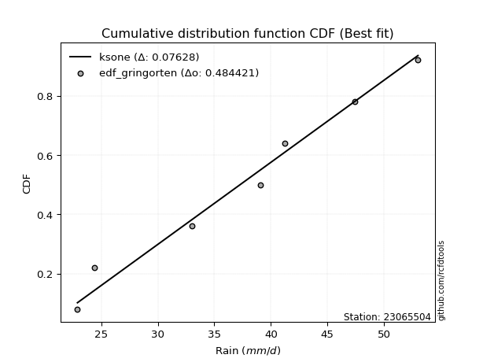</img></img>

</div>


### 9. EDF Filliben (1975)

The specific values of the constants (0.3175) (often denoted as $alpha$) and (0.365) are derived from a method proposed by James J. Filliben in a 1975 paper. This particular formula is the mean value of the $i$-th order statistic of the normal distribution and is considered a robust and effective plotting position formula for the normal probability plot correlation coefficient test for normality.

<div align="center">


$P=(m-0.3175)/(n+0.365)$


</div>


**9.1. Empirical values**

<div align="center">

|                | 0                   | 1                   | 2                   | 3            | 4                  | 5                  | 6                  |
|:---------------|:--------------------|:--------------------|:--------------------|:-------------|:-------------------|:-------------------|:-------------------|
| date           | 2015                | 2019                | 2018                | 2020         | 2017               | 2016               | 2021               |
| x              | 22.9                | 24.4                | 33.0                | 39.1         | 41.2               | 47.4               | 53.0               |
| m              | 1                   | 2                   | 3                   | 4            | 5                  | 6                  | 7                  |
| empirical_dist | edf_filliben        | edf_filliben        | edf_filliben        | edf_filliben | edf_filliben       | edf_filliben       | edf_filliben       |
| empirical      | 0.09266802443991853 | 0.22844534962661237 | 0.36422267481330617 | 0.5          | 0.6357773251866938 | 0.7715546503733877 | 0.9073319755600815 |
| empirical_tr   | 1.1021324354657687  | 1.2960844698636163  | 1.5728777362520021  | 2.0          | 2.7455731593662627 | 4.377414561664191  | 10.791208791208794 |

</div>


**9.2. Kolmogorov-Smirnov fit test (sorted by Δ)**


<div align="center">

|                | 0                   | 1                   | 2                   | 3                   | 4                   | 5                   | 6                   | 7                   | 8                   | 9                   | 10                  | 11                  | 12                  | 13                  | 14                  | 15                  | 16                  | 17                  | 18                  | 19                  | 20                  | 21                  | 22                  | 23                  | 24                  | 25                  | 26                  | 27                  | 28                  | 29                  | 30                  | 31                  | 32                  | 33                  | 34                  | 35                  | 36                  | 37                  | 38                  | 39                  | 40                  | 41                  | 42                  | 43                  | 44                  | 45                  | 46                  | 47                  | 48                  | 49                  | 50                  | 51                  | 52                  | 53                  | 54                  | 55                  | 56                  | 57                  | 58                  | 59                  | 60                  | 61                  | 62                  | 63                  | 64                  | 65                  | 66                  | 67                  | 68                  | 69                  | 70                  | 71                  | 72                  | 73                  | 74                  | 75                  | 76                  | 77                  | 78                  | 79                  | 80                  | 81                  | 82                  | 83                  | 84                  | 85                  | 86                  | 87                  | 88                  | 89                  | 90                  | 91                  | 92                  | 93                  | 94                  | 95                  | 96                  | 97                  | 98                  | 99                  | 100                 | 101                 | 102                 | 103                 | 104                 | 105                 | 106                 | 107                 | 108                 | 109                 | 110                 | 111                 | 112                 | 113                 | 114                 | 115                 | 116                 | 117                 | 118                 | 119                 | 120                 | 121                 | 122                 | 123                 | 124                 | 125                 | 126                 | 127                 | 128                 | 129                 | 130                 | 131                 | 132                 | 133                 | 134                 | 135                 | 136                 | 137                 | 138                 | 139                 | 140                 | 141                 | 142                 | 143                 | 144                 | 145                 | 146                 | 147                 | 148                 | 149                 | 150                 | 151                 | 152                 | 153                 | 154                 | 155                 | 156                 | 157                 | 158                 | 159                 |
|:---------------|:--------------------|:--------------------|:--------------------|:--------------------|:--------------------|:--------------------|:--------------------|:--------------------|:--------------------|:--------------------|:--------------------|:--------------------|:--------------------|:--------------------|:--------------------|:--------------------|:--------------------|:--------------------|:--------------------|:--------------------|:--------------------|:--------------------|:--------------------|:--------------------|:--------------------|:--------------------|:--------------------|:--------------------|:--------------------|:--------------------|:--------------------|:--------------------|:--------------------|:--------------------|:--------------------|:--------------------|:--------------------|:--------------------|:--------------------|:--------------------|:--------------------|:--------------------|:--------------------|:--------------------|:--------------------|:--------------------|:--------------------|:--------------------|:--------------------|:--------------------|:--------------------|:--------------------|:--------------------|:--------------------|:--------------------|:--------------------|:--------------------|:--------------------|:--------------------|:--------------------|:--------------------|:--------------------|:--------------------|:--------------------|:--------------------|:--------------------|:--------------------|:--------------------|:--------------------|:--------------------|:--------------------|:--------------------|:--------------------|:--------------------|:--------------------|:--------------------|:--------------------|:--------------------|:--------------------|:--------------------|:--------------------|:--------------------|:--------------------|:--------------------|:--------------------|:--------------------|:--------------------|:--------------------|:--------------------|:--------------------|:--------------------|:--------------------|:--------------------|:--------------------|:--------------------|:--------------------|:--------------------|:--------------------|:--------------------|:--------------------|:--------------------|:--------------------|:--------------------|:--------------------|:--------------------|:--------------------|:--------------------|:--------------------|:--------------------|:--------------------|:--------------------|:--------------------|:--------------------|:--------------------|:--------------------|:--------------------|:--------------------|:--------------------|:--------------------|:--------------------|:--------------------|:--------------------|:--------------------|:--------------------|:--------------------|:--------------------|:--------------------|:--------------------|:--------------------|:--------------------|:--------------------|:--------------------|:--------------------|:--------------------|:--------------------|:--------------------|:--------------------|:--------------------|:--------------------|:--------------------|:--------------------|:--------------------|:--------------------|:--------------------|:--------------------|:--------------------|:--------------------|:--------------------|:--------------------|:--------------------|:--------------------|:--------------------|:--------------------|:--------------------|:--------------------|:--------------------|:--------------------|:--------------------|:--------------------|:--------------------|
| station        | 23065504            | 23065504            | 23065504            | 23065504            | 23065504            | 23065504            | 23065504            | 23065504            | 23065504            | 23065504            | 23065504            | 23065504            | 23065504            | 23065504            | 23065504            | 23065504            | 23065504            | 23065504            | 23065504            | 23065504            | 23065504            | 23065504            | 23065504            | 23065504            | 23065504            | 23065504            | 23065504            | 23065504            | 23065504            | 23065504            | 23065504            | 23065504            | 23065504            | 23065504            | 23065504            | 23065504            | 23065504            | 23065504            | 23065504            | 23065504            | 23065504            | 23065504            | 23065504            | 23065504            | 23065504            | 23065504            | 23065504            | 23065504            | 23065504            | 23065504            | 23065504            | 23065504            | 23065504            | 23065504            | 23065504            | 23065504            | 23065504            | 23065504            | 23065504            | 23065504            | 23065504            | 23065504            | 23065504            | 23065504            | 23065504            | 23065504            | 23065504            | 23065504            | 23065504            | 23065504            | 23065504            | 23065504            | 23065504            | 23065504            | 23065504            | 23065504            | 23065504            | 23065504            | 23065504            | 23065504            | 23065504            | 23065504            | 23065504            | 23065504            | 23065504            | 23065504            | 23065504            | 23065504            | 23065504            | 23065504            | 23065504            | 23065504            | 23065504            | 23065504            | 23065504            | 23065504            | 23065504            | 23065504            | 23065504            | 23065504            | 23065504            | 23065504            | 23065504            | 23065504            | 23065504            | 23065504            | 23065504            | 23065504            | 23065504            | 23065504            | 23065504            | 23065504            | 23065504            | 23065504            | 23065504            | 23065504            | 23065504            | 23065504            | 23065504            | 23065504            | 23065504            | 23065504            | 23065504            | 23065504            | 23065504            | 23065504            | 23065504            | 23065504            | 23065504            | 23065504            | 23065504            | 23065504            | 23065504            | 23065504            | 23065504            | 23065504            | 23065504            | 23065504            | 23065504            | 23065504            | 23065504            | 23065504            | 23065504            | 23065504            | 23065504            | 23065504            | 23065504            | 23065504            | 23065504            | 23065504            | 23065504            | 23065504            | 23065504            | 23065504            | 23065504            | 23065504            | 23065504            | 23065504            | 23065504            | 23065504            |
| empirical_dist | edf_filliben        | edf_filliben        | edf_filliben        | edf_filliben        | edf_filliben        | edf_filliben        | edf_filliben        | edf_filliben        | edf_filliben        | edf_filliben        | edf_filliben        | edf_filliben        | edf_filliben        | edf_filliben        | edf_filliben        | edf_filliben        | edf_filliben        | edf_filliben        | edf_filliben        | edf_filliben        | edf_filliben        | edf_filliben        | edf_filliben        | edf_filliben        | edf_filliben        | edf_filliben        | edf_filliben        | edf_filliben        | edf_filliben        | edf_filliben        | edf_filliben        | edf_filliben        | edf_filliben        | edf_filliben        | edf_filliben        | edf_filliben        | edf_filliben        | edf_filliben        | edf_filliben        | edf_filliben        | edf_filliben        | edf_filliben        | edf_filliben        | edf_filliben        | edf_filliben        | edf_filliben        | edf_filliben        | edf_filliben        | edf_filliben        | edf_filliben        | edf_filliben        | edf_filliben        | edf_filliben        | edf_filliben        | edf_filliben        | edf_filliben        | edf_filliben        | edf_filliben        | edf_filliben        | edf_filliben        | edf_filliben        | edf_filliben        | edf_filliben        | edf_filliben        | edf_filliben        | edf_filliben        | edf_filliben        | edf_filliben        | edf_filliben        | edf_filliben        | edf_filliben        | edf_filliben        | edf_filliben        | edf_filliben        | edf_filliben        | edf_filliben        | edf_filliben        | edf_filliben        | edf_filliben        | edf_filliben        | edf_filliben        | edf_filliben        | edf_filliben        | edf_filliben        | edf_filliben        | edf_filliben        | edf_filliben        | edf_filliben        | edf_filliben        | edf_filliben        | edf_filliben        | edf_filliben        | edf_filliben        | edf_filliben        | edf_filliben        | edf_filliben        | edf_filliben        | edf_filliben        | edf_filliben        | edf_filliben        | edf_filliben        | edf_filliben        | edf_filliben        | edf_filliben        | edf_filliben        | edf_filliben        | edf_filliben        | edf_filliben        | edf_filliben        | edf_filliben        | edf_filliben        | edf_filliben        | edf_filliben        | edf_filliben        | edf_filliben        | edf_filliben        | edf_filliben        | edf_filliben        | edf_filliben        | edf_filliben        | edf_filliben        | edf_filliben        | edf_filliben        | edf_filliben        | edf_filliben        | edf_filliben        | edf_filliben        | edf_filliben        | edf_filliben        | edf_filliben        | edf_filliben        | edf_filliben        | edf_filliben        | edf_filliben        | edf_filliben        | edf_filliben        | edf_filliben        | edf_filliben        | edf_filliben        | edf_filliben        | edf_filliben        | edf_filliben        | edf_filliben        | edf_filliben        | edf_filliben        | edf_filliben        | edf_filliben        | edf_filliben        | edf_filliben        | edf_filliben        | edf_filliben        | edf_filliben        | edf_filliben        | edf_filliben        | edf_filliben        | edf_filliben        | edf_filliben        | edf_filliben        | edf_filliben        | edf_filliben        |
| p_dist         | ksone               | dweibull            | dgamma              | logbeta             | arcsine             | logarcsine          | semicircular        | logtrapezoid        | logburr             | logksone            | anglit              | logwrapcauchy       | logsemicircular     | logloggamma         | logncf              | genextreme          | logjohnsonsu        | logskewnorm         | loganglit           | logmielke           | burr                | johnsonsu           | gumbel_l            | ncf                 | pearson3            | t                   | skewnorm            | exponnorm           | norm                | crystalball         | nct                 | gamma               | erlang              | foldnorm            | f                   | logdweibull         | logburr12           | wrapcauchy          | exponpow            | betaprime           | genlogistic         | alpha               | invgamma            | logpearson3         | logweibull_min      | invweibull          | invgauss            | loggumbel_l         | logfoldnorm         | logbetaprime        | maxwell             | lognct              | loggamma            | loggamma            | logf                | logfatiguelife      | logexponnorm        | logcrystalball      | lognorm             | logt                | logerlang           | cosine              | logdgamma           | loginvgamma         | gausshyper          | logistic            | logalpha            | kstwobign           | logcosine           | triang              | rayleigh            | hypsecant           | logtriang           | argus               | genpareto           | logkappa4           | loglogistic         | weibull_min         | logargus            | laplace             | rice                | logrice             | logmaxwell          | loginvgauss         | loghypsecant        | logtukeylambda      | lograyleigh         | logkappa3           | loguniform          | logvonmises_line    | loginvweibull       | loggenextreme       | logloglaplace       | truncweibull_min    | gumbel_r            | beta                | bradford            | truncpareto         | truncexpon          | kappa4              | loggompertz         | loggenexpon         | loggausshyper       | logkstwobign        | tukeylambda         | loglaplace          | loglaplace          | lomax               | genexpon            | gompertz            | vonmises_line       | uniform             | kappa3              | loggumbel_r         | halfnorm            | logrdist            | nakagami            | loggenhalflogistic  | moyal               | genhalflogistic     | burr12              | loglomax            | logmoyal            | loghalfnorm         | logbradford         | halfgennorm         | loglevy_l           | logtruncexpon       | halflogistic        | loghalflogistic     | logexponweib        | wald                | logexponpow         | levy_l              | logwald             | lognakagami         | gennorm             | loggennorm          | logtruncnorm        | logjohnsonsb        | trapezoid           | loggenpareto        | logtruncweibull_min | loggengamma         | exponweib           | fatiguelife         | gengamma            | logweibull_max      | johnsonsb           | powerlaw            | logpowerlaw         | rdist               | loghalfgennorm      | logtruncpareto      | weibull_max         | loggenlogistic      | truncnorm           | logvonmises         | vonmises            | mielke              |
| delta          | 0.08562470012388307 | 0.09077710952636431 | 0.0915557411895721  | 0.09266802273363695 | 0.0926680244399185  | 0.09412495382152328 | 0.0954822195490507  | 0.09699485093397117 | 0.10002790296376685 | 0.10089717150525121 | 0.10273124552900778 | 0.10346763700451406 | 0.10853353203915159 | 0.10862196477481723 | 0.10863042973150394 | 0.10956399591927171 | 0.11060392655679466 | 0.11312224435152586 | 0.11447505353807057 | 0.11525125219437893 | 0.11721736346363076 | 0.11970357825168607 | 0.11994452833758389 | 0.12001118588611295 | 0.12002467576210143 | 0.12044689879503721 | 0.1204523098946178  | 0.12045795970567291 | 0.12045851829958695 | 0.12045853186391613 | 0.12057507123653466 | 0.12078350379976759 | 0.12078384494754053 | 0.12089763582765731 | 0.12112332578618024 | 0.12270840820549869 | 0.12274769165367705 | 0.12299624531239861 | 0.12463325868943549 | 0.1249513802744552  | 0.12514857200426693 | 0.12515562556061885 | 0.1252379175781266  | 0.1252401834455253  | 0.12526869069777058 | 0.12542825917895178 | 0.12644263534189099 | 0.12668693900617084 | 0.12733967195719564 | 0.1286373645439079  | 0.129114397372218   | 0.1292015195818365  | 0.12936610350469174 | 0.12936610350469174 | 0.12961699285909825 | 0.129874274196267   | 0.12995594955373607 | 0.12995656581513867 | 0.12995663832996282 | 0.12995904926752266 | 0.13015031851225206 | 0.13081886004946416 | 0.13122066980095445 | 0.13196283492272864 | 0.13222071633716306 | 0.13259649709917537 | 0.13324963268387469 | 0.1339525570703124  | 0.13403505869013452 | 0.13505306877081008 | 0.13509771368853946 | 0.13790073800857217 | 0.13804009584056653 | 0.13825155811166248 | 0.13860306330511138 | 0.13860623458487328 | 0.14059616531141594 | 0.140725915235961   | 0.14113368040253363 | 0.14154224242708108 | 0.14222572654265975 | 0.14285983396081475 | 0.14370557201213752 | 0.144515578041855   | 0.14592569416780354 | 0.1478957458700534  | 0.1513041252479519  | 0.15273817804206313 | 0.15283807622330703 | 0.15342436298318202 | 0.15346771283032712 | 0.15592528400264416 | 0.15897665906116937 | 0.16105117639128852 | 0.16418105183028003 | 0.16426571353258035 | 0.1643215949025144  | 0.16461401830988798 | 0.1647686713966655  | 0.16544349223007915 | 0.16744087484520137 | 0.17075996357073175 | 0.17085004690270011 | 0.17092477887598734 | 0.17270246348881238 | 0.174096520030107   | 0.174096520030107   | 0.17498938778655926 | 0.17571124787274106 | 0.17596354716172558 | 0.17860937446737885 | 0.178611462583423   | 0.17863477424471053 | 0.18328694337352147 | 0.186953446291865   | 0.1887990742830865  | 0.18932173396063345 | 0.18982538477240135 | 0.1921934664357222  | 0.19320602207443738 | 0.1968098616990953  | 0.19838542583816943 | 0.20500240149852877 | 0.21236726897489805 | 0.2170891515180673  | 0.21769969365444797 | 0.225411063270432   | 0.22704196011077837 | 0.22844534962661237 | 0.22844534962661237 | 0.22883279579590465 | 0.2294071837297239  | 0.25725348577697704 | 0.2590011281688318  | 0.2657952440714868  | 0.2666554156056846  | 0.27155465037338766 | 0.27155465037338766 | 0.27682898158860125 | 0.28445884662992804 | 0.28770345980134726 | 0.3110468501864613  | 0.31618890134304956 | 0.3215564067327926  | 0.44689742939791055 | 0.45220694326510036 | 0.4552796188243525  | 0.45731992839450997 | 0.457650685518735   | 0.46970322769926065 | 0.4988922653506733  | 0.4999999880096997  | 0.5                 | 0.5244441106225806  | 0.5339508981166233  | 0.7715546503733877  | 0.9073319753401095  | 1.1178189284506366  | 7.50669149444472    | nan                 |
| deltao         | 0.48442053926100004 | 0.48442053926100004 | 0.48442053926100004 | 0.48442053926100004 | 0.48442053926100004 | 0.48442053926100004 | 0.48442053926100004 | 0.48442053926100004 | 0.48442053926100004 | 0.48442053926100004 | 0.48442053926100004 | 0.48442053926100004 | 0.48442053926100004 | 0.48442053926100004 | 0.48442053926100004 | 0.48442053926100004 | 0.48442053926100004 | 0.48442053926100004 | 0.48442053926100004 | 0.48442053926100004 | 0.48442053926100004 | 0.48442053926100004 | 0.48442053926100004 | 0.48442053926100004 | 0.48442053926100004 | 0.48442053926100004 | 0.48442053926100004 | 0.48442053926100004 | 0.48442053926100004 | 0.48442053926100004 | 0.48442053926100004 | 0.48442053926100004 | 0.48442053926100004 | 0.48442053926100004 | 0.48442053926100004 | 0.48442053926100004 | 0.48442053926100004 | 0.48442053926100004 | 0.48442053926100004 | 0.48442053926100004 | 0.48442053926100004 | 0.48442053926100004 | 0.48442053926100004 | 0.48442053926100004 | 0.48442053926100004 | 0.48442053926100004 | 0.48442053926100004 | 0.48442053926100004 | 0.48442053926100004 | 0.48442053926100004 | 0.48442053926100004 | 0.48442053926100004 | 0.48442053926100004 | 0.48442053926100004 | 0.48442053926100004 | 0.48442053926100004 | 0.48442053926100004 | 0.48442053926100004 | 0.48442053926100004 | 0.48442053926100004 | 0.48442053926100004 | 0.48442053926100004 | 0.48442053926100004 | 0.48442053926100004 | 0.48442053926100004 | 0.48442053926100004 | 0.48442053926100004 | 0.48442053926100004 | 0.48442053926100004 | 0.48442053926100004 | 0.48442053926100004 | 0.48442053926100004 | 0.48442053926100004 | 0.48442053926100004 | 0.48442053926100004 | 0.48442053926100004 | 0.48442053926100004 | 0.48442053926100004 | 0.48442053926100004 | 0.48442053926100004 | 0.48442053926100004 | 0.48442053926100004 | 0.48442053926100004 | 0.48442053926100004 | 0.48442053926100004 | 0.48442053926100004 | 0.48442053926100004 | 0.48442053926100004 | 0.48442053926100004 | 0.48442053926100004 | 0.48442053926100004 | 0.48442053926100004 | 0.48442053926100004 | 0.48442053926100004 | 0.48442053926100004 | 0.48442053926100004 | 0.48442053926100004 | 0.48442053926100004 | 0.48442053926100004 | 0.48442053926100004 | 0.48442053926100004 | 0.48442053926100004 | 0.48442053926100004 | 0.48442053926100004 | 0.48442053926100004 | 0.48442053926100004 | 0.48442053926100004 | 0.48442053926100004 | 0.48442053926100004 | 0.48442053926100004 | 0.48442053926100004 | 0.48442053926100004 | 0.48442053926100004 | 0.48442053926100004 | 0.48442053926100004 | 0.48442053926100004 | 0.48442053926100004 | 0.48442053926100004 | 0.48442053926100004 | 0.48442053926100004 | 0.48442053926100004 | 0.48442053926100004 | 0.48442053926100004 | 0.48442053926100004 | 0.48442053926100004 | 0.48442053926100004 | 0.48442053926100004 | 0.48442053926100004 | 0.48442053926100004 | 0.48442053926100004 | 0.48442053926100004 | 0.48442053926100004 | 0.48442053926100004 | 0.48442053926100004 | 0.48442053926100004 | 0.48442053926100004 | 0.48442053926100004 | 0.48442053926100004 | 0.48442053926100004 | 0.48442053926100004 | 0.48442053926100004 | 0.48442053926100004 | 0.48442053926100004 | 0.48442053926100004 | 0.48442053926100004 | 0.48442053926100004 | 0.48442053926100004 | 0.48442053926100004 | 0.48442053926100004 | 0.48442053926100004 | 0.48442053926100004 | 0.48442053926100004 | 0.48442053926100004 | 0.48442053926100004 | 0.48442053926100004 | 0.48442053926100004 | 0.48442053926100004 | 0.48442053926100004 | 0.48442053926100004 | 0.48442053926100004 |
| eval           | Δo > Δ              | Δo > Δ              | Δo > Δ              | Δo > Δ              | Δo > Δ              | Δo > Δ              | Δo > Δ              | Δo > Δ              | Δo > Δ              | Δo > Δ              | Δo > Δ              | Δo > Δ              | Δo > Δ              | Δo > Δ              | Δo > Δ              | Δo > Δ              | Δo > Δ              | Δo > Δ              | Δo > Δ              | Δo > Δ              | Δo > Δ              | Δo > Δ              | Δo > Δ              | Δo > Δ              | Δo > Δ              | Δo > Δ              | Δo > Δ              | Δo > Δ              | Δo > Δ              | Δo > Δ              | Δo > Δ              | Δo > Δ              | Δo > Δ              | Δo > Δ              | Δo > Δ              | Δo > Δ              | Δo > Δ              | Δo > Δ              | Δo > Δ              | Δo > Δ              | Δo > Δ              | Δo > Δ              | Δo > Δ              | Δo > Δ              | Δo > Δ              | Δo > Δ              | Δo > Δ              | Δo > Δ              | Δo > Δ              | Δo > Δ              | Δo > Δ              | Δo > Δ              | Δo > Δ              | Δo > Δ              | Δo > Δ              | Δo > Δ              | Δo > Δ              | Δo > Δ              | Δo > Δ              | Δo > Δ              | Δo > Δ              | Δo > Δ              | Δo > Δ              | Δo > Δ              | Δo > Δ              | Δo > Δ              | Δo > Δ              | Δo > Δ              | Δo > Δ              | Δo > Δ              | Δo > Δ              | Δo > Δ              | Δo > Δ              | Δo > Δ              | Δo > Δ              | Δo > Δ              | Δo > Δ              | Δo > Δ              | Δo > Δ              | Δo > Δ              | Δo > Δ              | Δo > Δ              | Δo > Δ              | Δo > Δ              | Δo > Δ              | Δo > Δ              | Δo > Δ              | Δo > Δ              | Δo > Δ              | Δo > Δ              | Δo > Δ              | Δo > Δ              | Δo > Δ              | Δo > Δ              | Δo > Δ              | Δo > Δ              | Δo > Δ              | Δo > Δ              | Δo > Δ              | Δo > Δ              | Δo > Δ              | Δo > Δ              | Δo > Δ              | Δo > Δ              | Δo > Δ              | Δo > Δ              | Δo > Δ              | Δo > Δ              | Δo > Δ              | Δo > Δ              | Δo > Δ              | Δo > Δ              | Δo > Δ              | Δo > Δ              | Δo > Δ              | Δo > Δ              | Δo > Δ              | Δo > Δ              | Δo > Δ              | Δo > Δ              | Δo > Δ              | Δo > Δ              | Δo > Δ              | Δo > Δ              | Δo > Δ              | Δo > Δ              | Δo > Δ              | Δo > Δ              | Δo > Δ              | Δo > Δ              | Δo > Δ              | Δo > Δ              | Δo > Δ              | Δo > Δ              | Δo > Δ              | Δo > Δ              | Δo > Δ              | Δo > Δ              | Δo > Δ              | Δo > Δ              | Δo > Δ              | Δo > Δ              | Δo > Δ              | Δo > Δ              | Δo > Δ              | Δo > Δ              | Δo > Δ              | Δo > Δ              | Δo > Δ              | Δo > Δ              | Δo <= Δ             | Δo <= Δ             | Δo <= Δ             | Δo <= Δ             | Δo <= Δ             | Δo <= Δ             | Δo <= Δ             | Δo <= Δ             | Δo <= Δ             | Δo <= Δ             |
| fit            | 1                   | 1                   | 1                   | 1                   | 1                   | 1                   | 1                   | 1                   | 1                   | 1                   | 1                   | 1                   | 1                   | 1                   | 1                   | 1                   | 1                   | 1                   | 1                   | 1                   | 1                   | 1                   | 1                   | 1                   | 1                   | 1                   | 1                   | 1                   | 1                   | 1                   | 1                   | 1                   | 1                   | 1                   | 1                   | 1                   | 1                   | 1                   | 1                   | 1                   | 1                   | 1                   | 1                   | 1                   | 1                   | 1                   | 1                   | 1                   | 1                   | 1                   | 1                   | 1                   | 1                   | 1                   | 1                   | 1                   | 1                   | 1                   | 1                   | 1                   | 1                   | 1                   | 1                   | 1                   | 1                   | 1                   | 1                   | 1                   | 1                   | 1                   | 1                   | 1                   | 1                   | 1                   | 1                   | 1                   | 1                   | 1                   | 1                   | 1                   | 1                   | 1                   | 1                   | 1                   | 1                   | 1                   | 1                   | 1                   | 1                   | 1                   | 1                   | 1                   | 1                   | 1                   | 1                   | 1                   | 1                   | 1                   | 1                   | 1                   | 1                   | 1                   | 1                   | 1                   | 1                   | 1                   | 1                   | 1                   | 1                   | 1                   | 1                   | 1                   | 1                   | 1                   | 1                   | 1                   | 1                   | 1                   | 1                   | 1                   | 1                   | 1                   | 1                   | 1                   | 1                   | 1                   | 1                   | 1                   | 1                   | 1                   | 1                   | 1                   | 1                   | 1                   | 1                   | 1                   | 1                   | 1                   | 1                   | 1                   | 1                   | 1                   | 1                   | 1                   | 1                   | 1                   | 1                   | 1                   | 1                   | 1                   | 0                   | 0                   | 0                   | 0                   | 0                   | 0                   | 0                   | 0                   | 0                   | 0                   |
| n              | 7                   | 7                   | 7                   | 7                   | 7                   | 7                   | 7                   | 7                   | 7                   | 7                   | 7                   | 7                   | 7                   | 7                   | 7                   | 7                   | 7                   | 7                   | 7                   | 7                   | 7                   | 7                   | 7                   | 7                   | 7                   | 7                   | 7                   | 7                   | 7                   | 7                   | 7                   | 7                   | 7                   | 7                   | 7                   | 7                   | 7                   | 7                   | 7                   | 7                   | 7                   | 7                   | 7                   | 7                   | 7                   | 7                   | 7                   | 7                   | 7                   | 7                   | 7                   | 7                   | 7                   | 7                   | 7                   | 7                   | 7                   | 7                   | 7                   | 7                   | 7                   | 7                   | 7                   | 7                   | 7                   | 7                   | 7                   | 7                   | 7                   | 7                   | 7                   | 7                   | 7                   | 7                   | 7                   | 7                   | 7                   | 7                   | 7                   | 7                   | 7                   | 7                   | 7                   | 7                   | 7                   | 7                   | 7                   | 7                   | 7                   | 7                   | 7                   | 7                   | 7                   | 7                   | 7                   | 7                   | 7                   | 7                   | 7                   | 7                   | 7                   | 7                   | 7                   | 7                   | 7                   | 7                   | 7                   | 7                   | 7                   | 7                   | 7                   | 7                   | 7                   | 7                   | 7                   | 7                   | 7                   | 7                   | 7                   | 7                   | 7                   | 7                   | 7                   | 7                   | 7                   | 7                   | 7                   | 7                   | 7                   | 7                   | 7                   | 7                   | 7                   | 7                   | 7                   | 7                   | 7                   | 7                   | 7                   | 7                   | 7                   | 7                   | 7                   | 7                   | 7                   | 7                   | 7                   | 7                   | 7                   | 7                   | 7                   | 7                   | 7                   | 7                   | 7                   | 7                   | 7                   | 7                   | 7                   | 7                   |
| best_fit       | 1                   | 0                   | 0                   | 0                   | 0                   | 0                   | 0                   | 0                   | 0                   | 0                   | 0                   | 0                   | 0                   | 0                   | 0                   | 0                   | 0                   | 0                   | 0                   | 0                   | 0                   | 0                   | 0                   | 0                   | 0                   | 0                   | 0                   | 0                   | 0                   | 0                   | 0                   | 0                   | 0                   | 0                   | 0                   | 0                   | 0                   | 0                   | 0                   | 0                   | 0                   | 0                   | 0                   | 0                   | 0                   | 0                   | 0                   | 0                   | 0                   | 0                   | 0                   | 0                   | 0                   | 0                   | 0                   | 0                   | 0                   | 0                   | 0                   | 0                   | 0                   | 0                   | 0                   | 0                   | 0                   | 0                   | 0                   | 0                   | 0                   | 0                   | 0                   | 0                   | 0                   | 0                   | 0                   | 0                   | 0                   | 0                   | 0                   | 0                   | 0                   | 0                   | 0                   | 0                   | 0                   | 0                   | 0                   | 0                   | 0                   | 0                   | 0                   | 0                   | 0                   | 0                   | 0                   | 0                   | 0                   | 0                   | 0                   | 0                   | 0                   | 0                   | 0                   | 0                   | 0                   | 0                   | 0                   | 0                   | 0                   | 0                   | 0                   | 0                   | 0                   | 0                   | 0                   | 0                   | 0                   | 0                   | 0                   | 0                   | 0                   | 0                   | 0                   | 0                   | 0                   | 0                   | 0                   | 0                   | 0                   | 0                   | 0                   | 0                   | 0                   | 0                   | 0                   | 0                   | 0                   | 0                   | 0                   | 0                   | 0                   | 0                   | 0                   | 0                   | 0                   | 0                   | 0                   | 0                   | 0                   | 0                   | 0                   | 0                   | 0                   | 0                   | 0                   | 0                   | 0                   | 0                   | 0                   | 0                   |
| best_fit_sort  | 1                   | 2                   | 3                   | 4                   | 5                   | 6                   | 7                   | 8                   | 9                   | 10                  | 11                  | 12                  | 13                  | 14                  | 15                  | 16                  | 17                  | 18                  | 19                  | 20                  | 21                  | 22                  | 23                  | 24                  | 25                  | 26                  | 27                  | 28                  | 29                  | 30                  | 31                  | 32                  | 33                  | 34                  | 35                  | 36                  | 37                  | 38                  | 39                  | 40                  | 41                  | 42                  | 43                  | 44                  | 45                  | 46                  | 47                  | 48                  | 49                  | 50                  | 51                  | 52                  | 53                  | 54                  | 55                  | 56                  | 57                  | 58                  | 59                  | 60                  | 61                  | 62                  | 63                  | 64                  | 65                  | 66                  | 67                  | 68                  | 69                  | 70                  | 71                  | 72                  | 73                  | 74                  | 75                  | 76                  | 77                  | 78                  | 79                  | 80                  | 81                  | 82                  | 83                  | 84                  | 85                  | 86                  | 87                  | 88                  | 89                  | 90                  | 91                  | 92                  | 93                  | 94                  | 95                  | 96                  | 97                  | 98                  | 99                  | 100                 | 101                 | 102                 | 103                 | 104                 | 105                 | 106                 | 107                 | 108                 | 109                 | 110                 | 111                 | 112                 | 113                 | 114                 | 115                 | 116                 | 117                 | 118                 | 119                 | 120                 | 121                 | 122                 | 123                 | 124                 | 125                 | 126                 | 127                 | 128                 | 129                 | 130                 | 131                 | 132                 | 133                 | 134                 | 135                 | 136                 | 137                 | 138                 | 139                 | 140                 | 141                 | 142                 | 143                 | 144                 | 145                 | 146                 | 147                 | 148                 | 149                 | 150                 | 151                 | 152                 | 153                 | 154                 | 155                 | 156                 | 157                 | 158                 | 159                 | 160                 |

</div>


**9.3. Best fit**

<div align="center">

|   id |   station | empirical_dist   | p_dist   |     delta |   deltao | eval   |   fit |   n |   best_fit |   best_fit_sort |
|-----:|----------:|:-----------------|:---------|----------:|---------:|:-------|------:|----:|-----------:|----------------:|
|    0 |  23065504 | edf_filliben     | ksone    | 0.0856247 | 0.484421 | Δo > Δ |     1 |   7 |          1 |               1 |

</div>


<div align="center">

</img>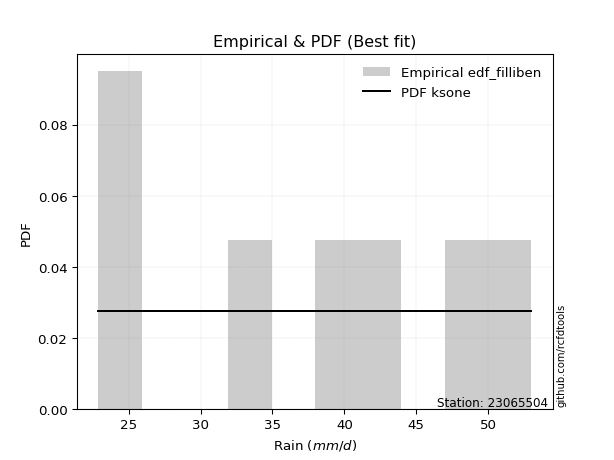</img>

</div>


### 10. EDF Jenkinson (1977)

The Jenkinson formula in hydrology is an empirical plotting position formula used to estimate the non-exceedance probability _(P)_ or return period _(T)_ of a given ordered observation within a sample. It is a widely used method in the frequency analysis of extreme events such as floods and rainfall, as it provides a distribution-free way to plot data. _a≈0.31_ and _b≈0.38_ are constants derived to approximate the median of the probability distribution for the given rank.

<div align="center">


$P=(m-a)/(n+b)$


</div>


**10.1. Empirical values**

<div align="center">

|                | 0                   | 1                   | 2                   | 3             | 4                  | 5                  | 6                  |
|:---------------|:--------------------|:--------------------|:--------------------|:--------------|:-------------------|:-------------------|:-------------------|
| date           | 2015                | 2019                | 2018                | 2020          | 2017               | 2016               | 2021               |
| x              | 22.9                | 24.4                | 33.0                | 39.1          | 41.2               | 47.4               | 53.0               |
| m              | 1                   | 2                   | 3                   | 4             | 5                  | 6                  | 7                  |
| empirical_dist | edf_jenkinson       | edf_jenkinson       | edf_jenkinson       | edf_jenkinson | edf_jenkinson      | edf_jenkinson      | edf_jenkinson      |
| empirical      | 0.09349593495934959 | 0.22899728997289973 | 0.36449864498644985 | 0.5           | 0.6355013550135502 | 0.7710027100271003 | 0.9065040650406505 |
| empirical_tr   | 1.1031390134529149  | 1.29701230228471    | 1.5735607675906182  | 2.0           | 2.743494423791822  | 4.366863905325444  | 10.695652173913055 |

</div>


**10.2. Kolmogorov-Smirnov fit test (sorted by Δ)**


<div align="center">

|                | 0                   | 1                   | 2                   | 3                   | 4                   | 5                   | 6                   | 7                   | 8                   | 9                   | 10                  | 11                  | 12                  | 13                  | 14                  | 15                  | 16                  | 17                  | 18                  | 19                  | 20                  | 21                  | 22                  | 23                  | 24                  | 25                  | 26                  | 27                  | 28                  | 29                  | 30                  | 31                  | 32                  | 33                  | 34                  | 35                  | 36                  | 37                  | 38                  | 39                  | 40                  | 41                  | 42                  | 43                  | 44                  | 45                  | 46                  | 47                  | 48                  | 49                  | 50                  | 51                  | 52                  | 53                  | 54                  | 55                  | 56                  | 57                  | 58                  | 59                  | 60                  | 61                  | 62                  | 63                  | 64                  | 65                  | 66                  | 67                  | 68                  | 69                  | 70                  | 71                  | 72                  | 73                  | 74                  | 75                  | 76                  | 77                  | 78                  | 79                  | 80                  | 81                  | 82                  | 83                  | 84                  | 85                  | 86                  | 87                  | 88                  | 89                  | 90                  | 91                  | 92                  | 93                  | 94                  | 95                  | 96                  | 97                  | 98                  | 99                  | 100                 | 101                 | 102                 | 103                 | 104                 | 105                 | 106                 | 107                 | 108                 | 109                 | 110                 | 111                 | 112                 | 113                 | 114                 | 115                 | 116                 | 117                 | 118                 | 119                 | 120                 | 121                 | 122                 | 123                 | 124                 | 125                 | 126                 | 127                 | 128                 | 129                 | 130                 | 131                 | 132                 | 133                 | 134                 | 135                 | 136                 | 137                 | 138                 | 139                 | 140                 | 141                 | 142                 | 143                 | 144                 | 145                 | 146                 | 147                 | 148                 | 149                 | 150                 | 151                 | 152                 | 153                 | 154                 | 155                 | 156                 | 157                 | 158                 | 159                 |
|:---------------|:--------------------|:--------------------|:--------------------|:--------------------|:--------------------|:--------------------|:--------------------|:--------------------|:--------------------|:--------------------|:--------------------|:--------------------|:--------------------|:--------------------|:--------------------|:--------------------|:--------------------|:--------------------|:--------------------|:--------------------|:--------------------|:--------------------|:--------------------|:--------------------|:--------------------|:--------------------|:--------------------|:--------------------|:--------------------|:--------------------|:--------------------|:--------------------|:--------------------|:--------------------|:--------------------|:--------------------|:--------------------|:--------------------|:--------------------|:--------------------|:--------------------|:--------------------|:--------------------|:--------------------|:--------------------|:--------------------|:--------------------|:--------------------|:--------------------|:--------------------|:--------------------|:--------------------|:--------------------|:--------------------|:--------------------|:--------------------|:--------------------|:--------------------|:--------------------|:--------------------|:--------------------|:--------------------|:--------------------|:--------------------|:--------------------|:--------------------|:--------------------|:--------------------|:--------------------|:--------------------|:--------------------|:--------------------|:--------------------|:--------------------|:--------------------|:--------------------|:--------------------|:--------------------|:--------------------|:--------------------|:--------------------|:--------------------|:--------------------|:--------------------|:--------------------|:--------------------|:--------------------|:--------------------|:--------------------|:--------------------|:--------------------|:--------------------|:--------------------|:--------------------|:--------------------|:--------------------|:--------------------|:--------------------|:--------------------|:--------------------|:--------------------|:--------------------|:--------------------|:--------------------|:--------------------|:--------------------|:--------------------|:--------------------|:--------------------|:--------------------|:--------------------|:--------------------|:--------------------|:--------------------|:--------------------|:--------------------|:--------------------|:--------------------|:--------------------|:--------------------|:--------------------|:--------------------|:--------------------|:--------------------|:--------------------|:--------------------|:--------------------|:--------------------|:--------------------|:--------------------|:--------------------|:--------------------|:--------------------|:--------------------|:--------------------|:--------------------|:--------------------|:--------------------|:--------------------|:--------------------|:--------------------|:--------------------|:--------------------|:--------------------|:--------------------|:--------------------|:--------------------|:--------------------|:--------------------|:--------------------|:--------------------|:--------------------|:--------------------|:--------------------|:--------------------|:--------------------|:--------------------|:--------------------|:--------------------|:--------------------|
| station        | 23065504            | 23065504            | 23065504            | 23065504            | 23065504            | 23065504            | 23065504            | 23065504            | 23065504            | 23065504            | 23065504            | 23065504            | 23065504            | 23065504            | 23065504            | 23065504            | 23065504            | 23065504            | 23065504            | 23065504            | 23065504            | 23065504            | 23065504            | 23065504            | 23065504            | 23065504            | 23065504            | 23065504            | 23065504            | 23065504            | 23065504            | 23065504            | 23065504            | 23065504            | 23065504            | 23065504            | 23065504            | 23065504            | 23065504            | 23065504            | 23065504            | 23065504            | 23065504            | 23065504            | 23065504            | 23065504            | 23065504            | 23065504            | 23065504            | 23065504            | 23065504            | 23065504            | 23065504            | 23065504            | 23065504            | 23065504            | 23065504            | 23065504            | 23065504            | 23065504            | 23065504            | 23065504            | 23065504            | 23065504            | 23065504            | 23065504            | 23065504            | 23065504            | 23065504            | 23065504            | 23065504            | 23065504            | 23065504            | 23065504            | 23065504            | 23065504            | 23065504            | 23065504            | 23065504            | 23065504            | 23065504            | 23065504            | 23065504            | 23065504            | 23065504            | 23065504            | 23065504            | 23065504            | 23065504            | 23065504            | 23065504            | 23065504            | 23065504            | 23065504            | 23065504            | 23065504            | 23065504            | 23065504            | 23065504            | 23065504            | 23065504            | 23065504            | 23065504            | 23065504            | 23065504            | 23065504            | 23065504            | 23065504            | 23065504            | 23065504            | 23065504            | 23065504            | 23065504            | 23065504            | 23065504            | 23065504            | 23065504            | 23065504            | 23065504            | 23065504            | 23065504            | 23065504            | 23065504            | 23065504            | 23065504            | 23065504            | 23065504            | 23065504            | 23065504            | 23065504            | 23065504            | 23065504            | 23065504            | 23065504            | 23065504            | 23065504            | 23065504            | 23065504            | 23065504            | 23065504            | 23065504            | 23065504            | 23065504            | 23065504            | 23065504            | 23065504            | 23065504            | 23065504            | 23065504            | 23065504            | 23065504            | 23065504            | 23065504            | 23065504            | 23065504            | 23065504            | 23065504            | 23065504            | 23065504            | 23065504            |
| empirical_dist | edf_jenkinson       | edf_jenkinson       | edf_jenkinson       | edf_jenkinson       | edf_jenkinson       | edf_jenkinson       | edf_jenkinson       | edf_jenkinson       | edf_jenkinson       | edf_jenkinson       | edf_jenkinson       | edf_jenkinson       | edf_jenkinson       | edf_jenkinson       | edf_jenkinson       | edf_jenkinson       | edf_jenkinson       | edf_jenkinson       | edf_jenkinson       | edf_jenkinson       | edf_jenkinson       | edf_jenkinson       | edf_jenkinson       | edf_jenkinson       | edf_jenkinson       | edf_jenkinson       | edf_jenkinson       | edf_jenkinson       | edf_jenkinson       | edf_jenkinson       | edf_jenkinson       | edf_jenkinson       | edf_jenkinson       | edf_jenkinson       | edf_jenkinson       | edf_jenkinson       | edf_jenkinson       | edf_jenkinson       | edf_jenkinson       | edf_jenkinson       | edf_jenkinson       | edf_jenkinson       | edf_jenkinson       | edf_jenkinson       | edf_jenkinson       | edf_jenkinson       | edf_jenkinson       | edf_jenkinson       | edf_jenkinson       | edf_jenkinson       | edf_jenkinson       | edf_jenkinson       | edf_jenkinson       | edf_jenkinson       | edf_jenkinson       | edf_jenkinson       | edf_jenkinson       | edf_jenkinson       | edf_jenkinson       | edf_jenkinson       | edf_jenkinson       | edf_jenkinson       | edf_jenkinson       | edf_jenkinson       | edf_jenkinson       | edf_jenkinson       | edf_jenkinson       | edf_jenkinson       | edf_jenkinson       | edf_jenkinson       | edf_jenkinson       | edf_jenkinson       | edf_jenkinson       | edf_jenkinson       | edf_jenkinson       | edf_jenkinson       | edf_jenkinson       | edf_jenkinson       | edf_jenkinson       | edf_jenkinson       | edf_jenkinson       | edf_jenkinson       | edf_jenkinson       | edf_jenkinson       | edf_jenkinson       | edf_jenkinson       | edf_jenkinson       | edf_jenkinson       | edf_jenkinson       | edf_jenkinson       | edf_jenkinson       | edf_jenkinson       | edf_jenkinson       | edf_jenkinson       | edf_jenkinson       | edf_jenkinson       | edf_jenkinson       | edf_jenkinson       | edf_jenkinson       | edf_jenkinson       | edf_jenkinson       | edf_jenkinson       | edf_jenkinson       | edf_jenkinson       | edf_jenkinson       | edf_jenkinson       | edf_jenkinson       | edf_jenkinson       | edf_jenkinson       | edf_jenkinson       | edf_jenkinson       | edf_jenkinson       | edf_jenkinson       | edf_jenkinson       | edf_jenkinson       | edf_jenkinson       | edf_jenkinson       | edf_jenkinson       | edf_jenkinson       | edf_jenkinson       | edf_jenkinson       | edf_jenkinson       | edf_jenkinson       | edf_jenkinson       | edf_jenkinson       | edf_jenkinson       | edf_jenkinson       | edf_jenkinson       | edf_jenkinson       | edf_jenkinson       | edf_jenkinson       | edf_jenkinson       | edf_jenkinson       | edf_jenkinson       | edf_jenkinson       | edf_jenkinson       | edf_jenkinson       | edf_jenkinson       | edf_jenkinson       | edf_jenkinson       | edf_jenkinson       | edf_jenkinson       | edf_jenkinson       | edf_jenkinson       | edf_jenkinson       | edf_jenkinson       | edf_jenkinson       | edf_jenkinson       | edf_jenkinson       | edf_jenkinson       | edf_jenkinson       | edf_jenkinson       | edf_jenkinson       | edf_jenkinson       | edf_jenkinson       | edf_jenkinson       | edf_jenkinson       | edf_jenkinson       | edf_jenkinson       | edf_jenkinson       |
| p_dist         | ksone               | dweibull            | dgamma              | logbeta             | arcsine             | logarcsine          | semicircular        | logtrapezoid        | logburr             | logksone            | logwrapcauchy       | anglit              | logncf              | logloggamma         | logsemicircular     | genextreme          | logjohnsonsu        | logskewnorm         | logmielke           | loganglit           | burr                | johnsonsu           | gumbel_l            | ncf                 | pearson3            | t                   | skewnorm            | exponnorm           | norm                | crystalball         | nct                 | gamma               | erlang              | foldnorm            | f                   | wrapcauchy          | logdweibull         | logburr12           | exponpow            | betaprime           | genlogistic         | alpha               | invgamma            | logpearson3         | logweibull_min      | invweibull          | invgauss            | loggumbel_l         | logfoldnorm         | logbetaprime        | maxwell             | lognct              | loggamma            | loggamma            | logf                | logfatiguelife      | logexponnorm        | logcrystalball      | lognorm             | logt                | logerlang           | cosine              | logdgamma           | loginvgamma         | gausshyper          | logistic            | logalpha            | kstwobign           | logcosine           | triang              | rayleigh            | genpareto           | hypsecant           | logtriang           | argus               | logkappa4           | weibull_min         | loglogistic         | logargus            | laplace             | rice                | logrice             | logmaxwell          | loginvgauss         | loghypsecant        | logtukeylambda      | lograyleigh         | logkappa3           | loguniform          | loginvweibull       | logvonmises_line    | loggenextreme       | logloglaplace       | truncweibull_min    | gumbel_r            | truncexpon          | beta                | bradford            | truncpareto         | kappa4              | loggompertz         | loggenexpon         | logkstwobign        | loggausshyper       | tukeylambda         | loglaplace          | loglaplace          | lomax               | genexpon            | gompertz            | vonmises_line       | uniform             | kappa3              | loggumbel_r         | halfnorm            | logrdist            | nakagami            | loggenhalflogistic  | moyal               | genhalflogistic     | burr12              | loglomax            | logmoyal            | loghalfnorm         | logbradford         | halfgennorm         | loglevy_l           | logtruncexpon       | logexponweib        | halflogistic        | loghalflogistic     | wald                | logexponpow         | levy_l              | logwald             | lognakagami         | gennorm             | loggennorm          | logtruncnorm        | logjohnsonsb        | trapezoid           | loggenpareto        | logtruncweibull_min | loggengamma         | exponweib           | fatiguelife         | gengamma            | logweibull_max      | johnsonsb           | powerlaw            | logpowerlaw         | rdist               | loghalfgennorm      | logtruncpareto      | weibull_max         | loggenlogistic      | truncnorm           | logvonmises         | vonmises            | mielke              |
| delta          | 0.08617664047017043 | 0.09050113935322063 | 0.09210768153585946 | 0.09349593325306793 | 0.09349593495934949 | 0.09467689416781064 | 0.09603415989533806 | 0.09754679128025853 | 0.09975193279062322 | 0.10144911185153857 | 0.10319166683137038 | 0.10328318587529514 | 0.10780251921207296 | 0.1083459946016736  | 0.10908547238543895 | 0.11011593626555907 | 0.11115586690308202 | 0.11367418469781322 | 0.1149752820212353  | 0.11502699388435793 | 0.11776930380991812 | 0.12025551859797343 | 0.12049646868387125 | 0.12056312623240031 | 0.1205766161083888  | 0.12099883914132457 | 0.12100425024090516 | 0.12100990005196027 | 0.12101045864587431 | 0.12101047221020349 | 0.12112701158282202 | 0.12133544414605495 | 0.1213357852938279  | 0.12144957617394467 | 0.1216752661324676  | 0.12244430496611125 | 0.12326034855178605 | 0.12329963199996441 | 0.12518519903572284 | 0.12550332062074254 | 0.1257005123505543  | 0.1257075659069062  | 0.12578985792441397 | 0.12579212379181265 | 0.12582063104405794 | 0.12598019952523914 | 0.12699457568817835 | 0.1272388793524582  | 0.12733967195719564 | 0.12918930489019526 | 0.12966633771850536 | 0.12975345992812387 | 0.1299180438509791  | 0.1299180438509791  | 0.1301689332053856  | 0.13042621454255435 | 0.13050788990002343 | 0.13050850616142604 | 0.13050857867625018 | 0.13051098961381002 | 0.13070225885853942 | 0.13137080039575152 | 0.13177261014724181 | 0.13196283492272864 | 0.13277265668345042 | 0.13314843744546273 | 0.13324963268387469 | 0.1339525570703124  | 0.13458699903642188 | 0.13560500911709744 | 0.13564965403482682 | 0.1377751527856803  | 0.13845267835485953 | 0.1385920361868539  | 0.13880349845794984 | 0.13915817493116064 | 0.140725915235961   | 0.1411481056577033  | 0.141685620748821   | 0.14209418277336844 | 0.1427776668889471  | 0.1434117743071021  | 0.14370557201213752 | 0.144515578041855   | 0.14592569416780354 | 0.14844768621634077 | 0.1513041252479519  | 0.1532901183883505  | 0.1533900165695944  | 0.15346771283032712 | 0.15397630332946938 | 0.15564931382950054 | 0.15952859940745673 | 0.16105117639128852 | 0.1647329921765674  | 0.1647686713966655  | 0.1648176538788677  | 0.16487353524880177 | 0.16516595865617534 | 0.1659954325763665  | 0.16799281519148873 | 0.17075996357073175 | 0.17092477887598734 | 0.17140198724898748 | 0.17325440383509974 | 0.174096520030107   | 0.174096520030107   | 0.17498938778655926 | 0.17571124787274106 | 0.17651548750801294 | 0.1791613148136662  | 0.17916340292971036 | 0.1791867145909979  | 0.18328694337352147 | 0.18750538663815236 | 0.18797116376365552 | 0.18932173396063345 | 0.1903773251186887  | 0.19274540678200955 | 0.19293005190129375 | 0.1968098616990953  | 0.19838542583816943 | 0.20500240149852877 | 0.2129192093211854  | 0.2170891515180673  | 0.2174237234813043  | 0.22458315275100094 | 0.22704196011077837 | 0.22883279579590465 | 0.22899728997289973 | 0.22899728997289973 | 0.2294071837297239  | 0.25697751560383336 | 0.2581732176494007  | 0.2657952440714868  | 0.26637944543254094 | 0.2710027100271003  | 0.2710027100271003  | 0.27682898158860125 | 0.2839069062836407  | 0.28742748962820364 | 0.31021893966703024 | 0.31618890134304956 | 0.32128043655964894 | 0.44662145922476687 | 0.4519309730919567  | 0.45500364865120885 | 0.45704395822136634 | 0.45709874517244764 | 0.46942725752611697 | 0.49861629517752964 | 0.4999999880096997  | 0.5                 | 0.5241681404494369  | 0.533398957770336   | 0.7710027100271003  | 0.9065040648206784  | 1.1178189284506366  | 7.507519404964151   | nan                 |
| deltao         | 0.48442053926100004 | 0.48442053926100004 | 0.48442053926100004 | 0.48442053926100004 | 0.48442053926100004 | 0.48442053926100004 | 0.48442053926100004 | 0.48442053926100004 | 0.48442053926100004 | 0.48442053926100004 | 0.48442053926100004 | 0.48442053926100004 | 0.48442053926100004 | 0.48442053926100004 | 0.48442053926100004 | 0.48442053926100004 | 0.48442053926100004 | 0.48442053926100004 | 0.48442053926100004 | 0.48442053926100004 | 0.48442053926100004 | 0.48442053926100004 | 0.48442053926100004 | 0.48442053926100004 | 0.48442053926100004 | 0.48442053926100004 | 0.48442053926100004 | 0.48442053926100004 | 0.48442053926100004 | 0.48442053926100004 | 0.48442053926100004 | 0.48442053926100004 | 0.48442053926100004 | 0.48442053926100004 | 0.48442053926100004 | 0.48442053926100004 | 0.48442053926100004 | 0.48442053926100004 | 0.48442053926100004 | 0.48442053926100004 | 0.48442053926100004 | 0.48442053926100004 | 0.48442053926100004 | 0.48442053926100004 | 0.48442053926100004 | 0.48442053926100004 | 0.48442053926100004 | 0.48442053926100004 | 0.48442053926100004 | 0.48442053926100004 | 0.48442053926100004 | 0.48442053926100004 | 0.48442053926100004 | 0.48442053926100004 | 0.48442053926100004 | 0.48442053926100004 | 0.48442053926100004 | 0.48442053926100004 | 0.48442053926100004 | 0.48442053926100004 | 0.48442053926100004 | 0.48442053926100004 | 0.48442053926100004 | 0.48442053926100004 | 0.48442053926100004 | 0.48442053926100004 | 0.48442053926100004 | 0.48442053926100004 | 0.48442053926100004 | 0.48442053926100004 | 0.48442053926100004 | 0.48442053926100004 | 0.48442053926100004 | 0.48442053926100004 | 0.48442053926100004 | 0.48442053926100004 | 0.48442053926100004 | 0.48442053926100004 | 0.48442053926100004 | 0.48442053926100004 | 0.48442053926100004 | 0.48442053926100004 | 0.48442053926100004 | 0.48442053926100004 | 0.48442053926100004 | 0.48442053926100004 | 0.48442053926100004 | 0.48442053926100004 | 0.48442053926100004 | 0.48442053926100004 | 0.48442053926100004 | 0.48442053926100004 | 0.48442053926100004 | 0.48442053926100004 | 0.48442053926100004 | 0.48442053926100004 | 0.48442053926100004 | 0.48442053926100004 | 0.48442053926100004 | 0.48442053926100004 | 0.48442053926100004 | 0.48442053926100004 | 0.48442053926100004 | 0.48442053926100004 | 0.48442053926100004 | 0.48442053926100004 | 0.48442053926100004 | 0.48442053926100004 | 0.48442053926100004 | 0.48442053926100004 | 0.48442053926100004 | 0.48442053926100004 | 0.48442053926100004 | 0.48442053926100004 | 0.48442053926100004 | 0.48442053926100004 | 0.48442053926100004 | 0.48442053926100004 | 0.48442053926100004 | 0.48442053926100004 | 0.48442053926100004 | 0.48442053926100004 | 0.48442053926100004 | 0.48442053926100004 | 0.48442053926100004 | 0.48442053926100004 | 0.48442053926100004 | 0.48442053926100004 | 0.48442053926100004 | 0.48442053926100004 | 0.48442053926100004 | 0.48442053926100004 | 0.48442053926100004 | 0.48442053926100004 | 0.48442053926100004 | 0.48442053926100004 | 0.48442053926100004 | 0.48442053926100004 | 0.48442053926100004 | 0.48442053926100004 | 0.48442053926100004 | 0.48442053926100004 | 0.48442053926100004 | 0.48442053926100004 | 0.48442053926100004 | 0.48442053926100004 | 0.48442053926100004 | 0.48442053926100004 | 0.48442053926100004 | 0.48442053926100004 | 0.48442053926100004 | 0.48442053926100004 | 0.48442053926100004 | 0.48442053926100004 | 0.48442053926100004 | 0.48442053926100004 | 0.48442053926100004 | 0.48442053926100004 | 0.48442053926100004 | 0.48442053926100004 |
| eval           | Δo > Δ              | Δo > Δ              | Δo > Δ              | Δo > Δ              | Δo > Δ              | Δo > Δ              | Δo > Δ              | Δo > Δ              | Δo > Δ              | Δo > Δ              | Δo > Δ              | Δo > Δ              | Δo > Δ              | Δo > Δ              | Δo > Δ              | Δo > Δ              | Δo > Δ              | Δo > Δ              | Δo > Δ              | Δo > Δ              | Δo > Δ              | Δo > Δ              | Δo > Δ              | Δo > Δ              | Δo > Δ              | Δo > Δ              | Δo > Δ              | Δo > Δ              | Δo > Δ              | Δo > Δ              | Δo > Δ              | Δo > Δ              | Δo > Δ              | Δo > Δ              | Δo > Δ              | Δo > Δ              | Δo > Δ              | Δo > Δ              | Δo > Δ              | Δo > Δ              | Δo > Δ              | Δo > Δ              | Δo > Δ              | Δo > Δ              | Δo > Δ              | Δo > Δ              | Δo > Δ              | Δo > Δ              | Δo > Δ              | Δo > Δ              | Δo > Δ              | Δo > Δ              | Δo > Δ              | Δo > Δ              | Δo > Δ              | Δo > Δ              | Δo > Δ              | Δo > Δ              | Δo > Δ              | Δo > Δ              | Δo > Δ              | Δo > Δ              | Δo > Δ              | Δo > Δ              | Δo > Δ              | Δo > Δ              | Δo > Δ              | Δo > Δ              | Δo > Δ              | Δo > Δ              | Δo > Δ              | Δo > Δ              | Δo > Δ              | Δo > Δ              | Δo > Δ              | Δo > Δ              | Δo > Δ              | Δo > Δ              | Δo > Δ              | Δo > Δ              | Δo > Δ              | Δo > Δ              | Δo > Δ              | Δo > Δ              | Δo > Δ              | Δo > Δ              | Δo > Δ              | Δo > Δ              | Δo > Δ              | Δo > Δ              | Δo > Δ              | Δo > Δ              | Δo > Δ              | Δo > Δ              | Δo > Δ              | Δo > Δ              | Δo > Δ              | Δo > Δ              | Δo > Δ              | Δo > Δ              | Δo > Δ              | Δo > Δ              | Δo > Δ              | Δo > Δ              | Δo > Δ              | Δo > Δ              | Δo > Δ              | Δo > Δ              | Δo > Δ              | Δo > Δ              | Δo > Δ              | Δo > Δ              | Δo > Δ              | Δo > Δ              | Δo > Δ              | Δo > Δ              | Δo > Δ              | Δo > Δ              | Δo > Δ              | Δo > Δ              | Δo > Δ              | Δo > Δ              | Δo > Δ              | Δo > Δ              | Δo > Δ              | Δo > Δ              | Δo > Δ              | Δo > Δ              | Δo > Δ              | Δo > Δ              | Δo > Δ              | Δo > Δ              | Δo > Δ              | Δo > Δ              | Δo > Δ              | Δo > Δ              | Δo > Δ              | Δo > Δ              | Δo > Δ              | Δo > Δ              | Δo > Δ              | Δo > Δ              | Δo > Δ              | Δo > Δ              | Δo > Δ              | Δo > Δ              | Δo > Δ              | Δo > Δ              | Δo > Δ              | Δo > Δ              | Δo <= Δ             | Δo <= Δ             | Δo <= Δ             | Δo <= Δ             | Δo <= Δ             | Δo <= Δ             | Δo <= Δ             | Δo <= Δ             | Δo <= Δ             | Δo <= Δ             |
| fit            | 1                   | 1                   | 1                   | 1                   | 1                   | 1                   | 1                   | 1                   | 1                   | 1                   | 1                   | 1                   | 1                   | 1                   | 1                   | 1                   | 1                   | 1                   | 1                   | 1                   | 1                   | 1                   | 1                   | 1                   | 1                   | 1                   | 1                   | 1                   | 1                   | 1                   | 1                   | 1                   | 1                   | 1                   | 1                   | 1                   | 1                   | 1                   | 1                   | 1                   | 1                   | 1                   | 1                   | 1                   | 1                   | 1                   | 1                   | 1                   | 1                   | 1                   | 1                   | 1                   | 1                   | 1                   | 1                   | 1                   | 1                   | 1                   | 1                   | 1                   | 1                   | 1                   | 1                   | 1                   | 1                   | 1                   | 1                   | 1                   | 1                   | 1                   | 1                   | 1                   | 1                   | 1                   | 1                   | 1                   | 1                   | 1                   | 1                   | 1                   | 1                   | 1                   | 1                   | 1                   | 1                   | 1                   | 1                   | 1                   | 1                   | 1                   | 1                   | 1                   | 1                   | 1                   | 1                   | 1                   | 1                   | 1                   | 1                   | 1                   | 1                   | 1                   | 1                   | 1                   | 1                   | 1                   | 1                   | 1                   | 1                   | 1                   | 1                   | 1                   | 1                   | 1                   | 1                   | 1                   | 1                   | 1                   | 1                   | 1                   | 1                   | 1                   | 1                   | 1                   | 1                   | 1                   | 1                   | 1                   | 1                   | 1                   | 1                   | 1                   | 1                   | 1                   | 1                   | 1                   | 1                   | 1                   | 1                   | 1                   | 1                   | 1                   | 1                   | 1                   | 1                   | 1                   | 1                   | 1                   | 1                   | 1                   | 0                   | 0                   | 0                   | 0                   | 0                   | 0                   | 0                   | 0                   | 0                   | 0                   |
| n              | 7                   | 7                   | 7                   | 7                   | 7                   | 7                   | 7                   | 7                   | 7                   | 7                   | 7                   | 7                   | 7                   | 7                   | 7                   | 7                   | 7                   | 7                   | 7                   | 7                   | 7                   | 7                   | 7                   | 7                   | 7                   | 7                   | 7                   | 7                   | 7                   | 7                   | 7                   | 7                   | 7                   | 7                   | 7                   | 7                   | 7                   | 7                   | 7                   | 7                   | 7                   | 7                   | 7                   | 7                   | 7                   | 7                   | 7                   | 7                   | 7                   | 7                   | 7                   | 7                   | 7                   | 7                   | 7                   | 7                   | 7                   | 7                   | 7                   | 7                   | 7                   | 7                   | 7                   | 7                   | 7                   | 7                   | 7                   | 7                   | 7                   | 7                   | 7                   | 7                   | 7                   | 7                   | 7                   | 7                   | 7                   | 7                   | 7                   | 7                   | 7                   | 7                   | 7                   | 7                   | 7                   | 7                   | 7                   | 7                   | 7                   | 7                   | 7                   | 7                   | 7                   | 7                   | 7                   | 7                   | 7                   | 7                   | 7                   | 7                   | 7                   | 7                   | 7                   | 7                   | 7                   | 7                   | 7                   | 7                   | 7                   | 7                   | 7                   | 7                   | 7                   | 7                   | 7                   | 7                   | 7                   | 7                   | 7                   | 7                   | 7                   | 7                   | 7                   | 7                   | 7                   | 7                   | 7                   | 7                   | 7                   | 7                   | 7                   | 7                   | 7                   | 7                   | 7                   | 7                   | 7                   | 7                   | 7                   | 7                   | 7                   | 7                   | 7                   | 7                   | 7                   | 7                   | 7                   | 7                   | 7                   | 7                   | 7                   | 7                   | 7                   | 7                   | 7                   | 7                   | 7                   | 7                   | 7                   | 7                   |
| best_fit       | 1                   | 0                   | 0                   | 0                   | 0                   | 0                   | 0                   | 0                   | 0                   | 0                   | 0                   | 0                   | 0                   | 0                   | 0                   | 0                   | 0                   | 0                   | 0                   | 0                   | 0                   | 0                   | 0                   | 0                   | 0                   | 0                   | 0                   | 0                   | 0                   | 0                   | 0                   | 0                   | 0                   | 0                   | 0                   | 0                   | 0                   | 0                   | 0                   | 0                   | 0                   | 0                   | 0                   | 0                   | 0                   | 0                   | 0                   | 0                   | 0                   | 0                   | 0                   | 0                   | 0                   | 0                   | 0                   | 0                   | 0                   | 0                   | 0                   | 0                   | 0                   | 0                   | 0                   | 0                   | 0                   | 0                   | 0                   | 0                   | 0                   | 0                   | 0                   | 0                   | 0                   | 0                   | 0                   | 0                   | 0                   | 0                   | 0                   | 0                   | 0                   | 0                   | 0                   | 0                   | 0                   | 0                   | 0                   | 0                   | 0                   | 0                   | 0                   | 0                   | 0                   | 0                   | 0                   | 0                   | 0                   | 0                   | 0                   | 0                   | 0                   | 0                   | 0                   | 0                   | 0                   | 0                   | 0                   | 0                   | 0                   | 0                   | 0                   | 0                   | 0                   | 0                   | 0                   | 0                   | 0                   | 0                   | 0                   | 0                   | 0                   | 0                   | 0                   | 0                   | 0                   | 0                   | 0                   | 0                   | 0                   | 0                   | 0                   | 0                   | 0                   | 0                   | 0                   | 0                   | 0                   | 0                   | 0                   | 0                   | 0                   | 0                   | 0                   | 0                   | 0                   | 0                   | 0                   | 0                   | 0                   | 0                   | 0                   | 0                   | 0                   | 0                   | 0                   | 0                   | 0                   | 0                   | 0                   | 0                   |
| best_fit_sort  | 1                   | 2                   | 3                   | 4                   | 5                   | 6                   | 7                   | 8                   | 9                   | 10                  | 11                  | 12                  | 13                  | 14                  | 15                  | 16                  | 17                  | 18                  | 19                  | 20                  | 21                  | 22                  | 23                  | 24                  | 25                  | 26                  | 27                  | 28                  | 29                  | 30                  | 31                  | 32                  | 33                  | 34                  | 35                  | 36                  | 37                  | 38                  | 39                  | 40                  | 41                  | 42                  | 43                  | 44                  | 45                  | 46                  | 47                  | 48                  | 49                  | 50                  | 51                  | 52                  | 53                  | 54                  | 55                  | 56                  | 57                  | 58                  | 59                  | 60                  | 61                  | 62                  | 63                  | 64                  | 65                  | 66                  | 67                  | 68                  | 69                  | 70                  | 71                  | 72                  | 73                  | 74                  | 75                  | 76                  | 77                  | 78                  | 79                  | 80                  | 81                  | 82                  | 83                  | 84                  | 85                  | 86                  | 87                  | 88                  | 89                  | 90                  | 91                  | 92                  | 93                  | 94                  | 95                  | 96                  | 97                  | 98                  | 99                  | 100                 | 101                 | 102                 | 103                 | 104                 | 105                 | 106                 | 107                 | 108                 | 109                 | 110                 | 111                 | 112                 | 113                 | 114                 | 115                 | 116                 | 117                 | 118                 | 119                 | 120                 | 121                 | 122                 | 123                 | 124                 | 125                 | 126                 | 127                 | 128                 | 129                 | 130                 | 131                 | 132                 | 133                 | 134                 | 135                 | 136                 | 137                 | 138                 | 139                 | 140                 | 141                 | 142                 | 143                 | 144                 | 145                 | 146                 | 147                 | 148                 | 149                 | 150                 | 151                 | 152                 | 153                 | 154                 | 155                 | 156                 | 157                 | 158                 | 159                 | 160                 |

</div>


**10.3. Best fit**

<div align="center">

|   id |   station | empirical_dist   | p_dist   |     delta |   deltao | eval   |   fit |   n |   best_fit |   best_fit_sort |
|-----:|----------:|:-----------------|:---------|----------:|---------:|:-------|------:|----:|-----------:|----------------:|
|    0 |  23065504 | edf_jenkinson    | ksone    | 0.0861766 | 0.484421 | Δo > Δ |     1 |   7 |          1 |               1 |

</div>


<div align="center">

</img>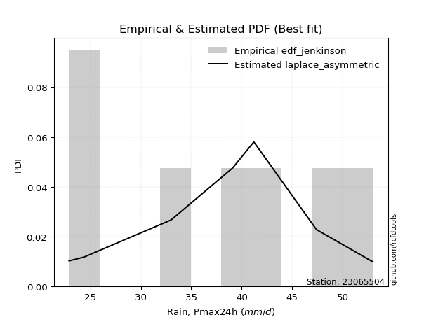</img>

</div>


### 11. EDF Cunnane (1978)

Cunnane´s work in statistical hydrology has focused on the performance and evaluation of different probability distributions (such as GEV, Gumbel, Lognormal) for flood frequency estimation. _b_ is a constant, typically set to 0.4.

<div align="center">


$P=(m-b)/(n+1-2b)$


</div>


**11.1. Empirical values**

<div align="center">

|                | 0                   | 1                   | 2                  | 3           | 4                  | 5                  | 6                  |
|:---------------|:--------------------|:--------------------|:-------------------|:------------|:-------------------|:-------------------|:-------------------|
| date           | 2015                | 2019                | 2018               | 2020        | 2017               | 2016               | 2021               |
| x              | 22.9                | 24.4                | 33.0               | 39.1        | 41.2               | 47.4               | 53.0               |
| m              | 1                   | 2                   | 3                  | 4           | 5                  | 6                  | 7                  |
| empirical_dist | edf_cunnane         | edf_cunnane         | edf_cunnane        | edf_cunnane | edf_cunnane        | edf_cunnane        | edf_cunnane        |
| empirical      | 0.08333333333333333 | 0.22222222222222224 | 0.3611111111111111 | 0.5         | 0.6388888888888888 | 0.7777777777777777 | 0.9166666666666666 |
| empirical_tr   | 1.090909090909091   | 1.2857142857142856  | 1.565217391304348  | 2.0         | 2.7692307692307687 | 4.499999999999998  | 11.999999999999995 |

</div>


**11.2. Kolmogorov-Smirnov fit test (sorted by Δ)**


<div align="center">

|                | 0                   | 1                   | 2                   | 3                   | 4                   | 5                   | 6                   | 7                   | 8                   | 9                   | 10                  | 11                  | 12                  | 13                  | 14                  | 15                  | 16                  | 17                  | 18                  | 19                  | 20                  | 21                  | 22                  | 23                  | 24                  | 25                  | 26                  | 27                  | 28                  | 29                  | 30                  | 31                  | 32                  | 33                  | 34                  | 35                  | 36                  | 37                  | 38                  | 39                  | 40                  | 41                  | 42                  | 43                  | 44                  | 45                  | 46                  | 47                  | 48                  | 49                  | 50                  | 51                  | 52                  | 53                  | 54                  | 55                  | 56                  | 57                  | 58                  | 59                  | 60                  | 61                  | 62                  | 63                  | 64                  | 65                  | 66                  | 67                  | 68                  | 69                  | 70                  | 71                  | 72                  | 73                  | 74                  | 75                  | 76                  | 77                  | 78                  | 79                  | 80                  | 81                  | 82                  | 83                  | 84                  | 85                  | 86                  | 87                  | 88                  | 89                  | 90                  | 91                  | 92                  | 93                  | 94                  | 95                  | 96                  | 97                  | 98                  | 99                  | 100                 | 101                 | 102                 | 103                 | 104                 | 105                 | 106                 | 107                 | 108                 | 109                 | 110                 | 111                 | 112                 | 113                 | 114                 | 115                 | 116                 | 117                 | 118                 | 119                 | 120                 | 121                 | 122                 | 123                 | 124                 | 125                 | 126                 | 127                 | 128                 | 129                 | 130                 | 131                 | 132                 | 133                 | 134                 | 135                 | 136                 | 137                 | 138                 | 139                 | 140                 | 141                 | 142                 | 143                 | 144                 | 145                 | 146                 | 147                 | 148                 | 149                 | 150                 | 151                 | 152                 | 153                 | 154                 | 155                 | 156                 | 157                 | 158                 | 159                 |
|:---------------|:--------------------|:--------------------|:--------------------|:--------------------|:--------------------|:--------------------|:--------------------|:--------------------|:--------------------|:--------------------|:--------------------|:--------------------|:--------------------|:--------------------|:--------------------|:--------------------|:--------------------|:--------------------|:--------------------|:--------------------|:--------------------|:--------------------|:--------------------|:--------------------|:--------------------|:--------------------|:--------------------|:--------------------|:--------------------|:--------------------|:--------------------|:--------------------|:--------------------|:--------------------|:--------------------|:--------------------|:--------------------|:--------------------|:--------------------|:--------------------|:--------------------|:--------------------|:--------------------|:--------------------|:--------------------|:--------------------|:--------------------|:--------------------|:--------------------|:--------------------|:--------------------|:--------------------|:--------------------|:--------------------|:--------------------|:--------------------|:--------------------|:--------------------|:--------------------|:--------------------|:--------------------|:--------------------|:--------------------|:--------------------|:--------------------|:--------------------|:--------------------|:--------------------|:--------------------|:--------------------|:--------------------|:--------------------|:--------------------|:--------------------|:--------------------|:--------------------|:--------------------|:--------------------|:--------------------|:--------------------|:--------------------|:--------------------|:--------------------|:--------------------|:--------------------|:--------------------|:--------------------|:--------------------|:--------------------|:--------------------|:--------------------|:--------------------|:--------------------|:--------------------|:--------------------|:--------------------|:--------------------|:--------------------|:--------------------|:--------------------|:--------------------|:--------------------|:--------------------|:--------------------|:--------------------|:--------------------|:--------------------|:--------------------|:--------------------|:--------------------|:--------------------|:--------------------|:--------------------|:--------------------|:--------------------|:--------------------|:--------------------|:--------------------|:--------------------|:--------------------|:--------------------|:--------------------|:--------------------|:--------------------|:--------------------|:--------------------|:--------------------|:--------------------|:--------------------|:--------------------|:--------------------|:--------------------|:--------------------|:--------------------|:--------------------|:--------------------|:--------------------|:--------------------|:--------------------|:--------------------|:--------------------|:--------------------|:--------------------|:--------------------|:--------------------|:--------------------|:--------------------|:--------------------|:--------------------|:--------------------|:--------------------|:--------------------|:--------------------|:--------------------|:--------------------|:--------------------|:--------------------|:--------------------|:--------------------|:--------------------|
| station        | 23065504            | 23065504            | 23065504            | 23065504            | 23065504            | 23065504            | 23065504            | 23065504            | 23065504            | 23065504            | 23065504            | 23065504            | 23065504            | 23065504            | 23065504            | 23065504            | 23065504            | 23065504            | 23065504            | 23065504            | 23065504            | 23065504            | 23065504            | 23065504            | 23065504            | 23065504            | 23065504            | 23065504            | 23065504            | 23065504            | 23065504            | 23065504            | 23065504            | 23065504            | 23065504            | 23065504            | 23065504            | 23065504            | 23065504            | 23065504            | 23065504            | 23065504            | 23065504            | 23065504            | 23065504            | 23065504            | 23065504            | 23065504            | 23065504            | 23065504            | 23065504            | 23065504            | 23065504            | 23065504            | 23065504            | 23065504            | 23065504            | 23065504            | 23065504            | 23065504            | 23065504            | 23065504            | 23065504            | 23065504            | 23065504            | 23065504            | 23065504            | 23065504            | 23065504            | 23065504            | 23065504            | 23065504            | 23065504            | 23065504            | 23065504            | 23065504            | 23065504            | 23065504            | 23065504            | 23065504            | 23065504            | 23065504            | 23065504            | 23065504            | 23065504            | 23065504            | 23065504            | 23065504            | 23065504            | 23065504            | 23065504            | 23065504            | 23065504            | 23065504            | 23065504            | 23065504            | 23065504            | 23065504            | 23065504            | 23065504            | 23065504            | 23065504            | 23065504            | 23065504            | 23065504            | 23065504            | 23065504            | 23065504            | 23065504            | 23065504            | 23065504            | 23065504            | 23065504            | 23065504            | 23065504            | 23065504            | 23065504            | 23065504            | 23065504            | 23065504            | 23065504            | 23065504            | 23065504            | 23065504            | 23065504            | 23065504            | 23065504            | 23065504            | 23065504            | 23065504            | 23065504            | 23065504            | 23065504            | 23065504            | 23065504            | 23065504            | 23065504            | 23065504            | 23065504            | 23065504            | 23065504            | 23065504            | 23065504            | 23065504            | 23065504            | 23065504            | 23065504            | 23065504            | 23065504            | 23065504            | 23065504            | 23065504            | 23065504            | 23065504            | 23065504            | 23065504            | 23065504            | 23065504            | 23065504            | 23065504            |
| empirical_dist | edf_cunnane         | edf_cunnane         | edf_cunnane         | edf_cunnane         | edf_cunnane         | edf_cunnane         | edf_cunnane         | edf_cunnane         | edf_cunnane         | edf_cunnane         | edf_cunnane         | edf_cunnane         | edf_cunnane         | edf_cunnane         | edf_cunnane         | edf_cunnane         | edf_cunnane         | edf_cunnane         | edf_cunnane         | edf_cunnane         | edf_cunnane         | edf_cunnane         | edf_cunnane         | edf_cunnane         | edf_cunnane         | edf_cunnane         | edf_cunnane         | edf_cunnane         | edf_cunnane         | edf_cunnane         | edf_cunnane         | edf_cunnane         | edf_cunnane         | edf_cunnane         | edf_cunnane         | edf_cunnane         | edf_cunnane         | edf_cunnane         | edf_cunnane         | edf_cunnane         | edf_cunnane         | edf_cunnane         | edf_cunnane         | edf_cunnane         | edf_cunnane         | edf_cunnane         | edf_cunnane         | edf_cunnane         | edf_cunnane         | edf_cunnane         | edf_cunnane         | edf_cunnane         | edf_cunnane         | edf_cunnane         | edf_cunnane         | edf_cunnane         | edf_cunnane         | edf_cunnane         | edf_cunnane         | edf_cunnane         | edf_cunnane         | edf_cunnane         | edf_cunnane         | edf_cunnane         | edf_cunnane         | edf_cunnane         | edf_cunnane         | edf_cunnane         | edf_cunnane         | edf_cunnane         | edf_cunnane         | edf_cunnane         | edf_cunnane         | edf_cunnane         | edf_cunnane         | edf_cunnane         | edf_cunnane         | edf_cunnane         | edf_cunnane         | edf_cunnane         | edf_cunnane         | edf_cunnane         | edf_cunnane         | edf_cunnane         | edf_cunnane         | edf_cunnane         | edf_cunnane         | edf_cunnane         | edf_cunnane         | edf_cunnane         | edf_cunnane         | edf_cunnane         | edf_cunnane         | edf_cunnane         | edf_cunnane         | edf_cunnane         | edf_cunnane         | edf_cunnane         | edf_cunnane         | edf_cunnane         | edf_cunnane         | edf_cunnane         | edf_cunnane         | edf_cunnane         | edf_cunnane         | edf_cunnane         | edf_cunnane         | edf_cunnane         | edf_cunnane         | edf_cunnane         | edf_cunnane         | edf_cunnane         | edf_cunnane         | edf_cunnane         | edf_cunnane         | edf_cunnane         | edf_cunnane         | edf_cunnane         | edf_cunnane         | edf_cunnane         | edf_cunnane         | edf_cunnane         | edf_cunnane         | edf_cunnane         | edf_cunnane         | edf_cunnane         | edf_cunnane         | edf_cunnane         | edf_cunnane         | edf_cunnane         | edf_cunnane         | edf_cunnane         | edf_cunnane         | edf_cunnane         | edf_cunnane         | edf_cunnane         | edf_cunnane         | edf_cunnane         | edf_cunnane         | edf_cunnane         | edf_cunnane         | edf_cunnane         | edf_cunnane         | edf_cunnane         | edf_cunnane         | edf_cunnane         | edf_cunnane         | edf_cunnane         | edf_cunnane         | edf_cunnane         | edf_cunnane         | edf_cunnane         | edf_cunnane         | edf_cunnane         | edf_cunnane         | edf_cunnane         | edf_cunnane         | edf_cunnane         | edf_cunnane         | edf_cunnane         |
| p_dist         | ksone               | logbeta             | arcsine             | logarcsine          | semicircular        | logtrapezoid        | dgamma              | dweibull            | logksone            | anglit              | logsemicircular     | logburr             | genextreme          | logjohnsonsu        | logwrapcauchy       | logskewnorm         | loganglit           | burr                | logloggamma         | johnsonsu           | gumbel_l            | ncf                 | pearson3            | t                   | skewnorm            | exponnorm           | norm                | crystalball         | nct                 | gamma               | erlang              | foldnorm            | f                   | logdweibull         | logburr12           | logncf              | logmielke           | betaprime           | alpha               | invgamma            | logpearson3         | logweibull_min      | invgauss            | loggumbel_l         | logbetaprime        | maxwell             | lognct              | genlogistic         | invweibull          | logf                | exponpow            | logfatiguelife      | logexponnorm        | logcrystalball      | lognorm             | logt                | logerlang           | cosine              | logdgamma           | loggamma            | loggamma            | gausshyper          | logistic            | logfoldnorm         | rayleigh            | wrapcauchy          | triang              | hypsecant           | logtriang           | loginvgamma         | argus               | logalpha            | logcosine           | kstwobign           | loglogistic         | logargus            | laplace             | rice                | logrice             | logkappa4           | weibull_min         | logtukeylambda      | logmaxwell          | loginvgauss         | loghypsecant        | logkappa3           | loguniform          | logvonmises_line    | genpareto           | lograyleigh         | logloglaplace       | loginvweibull       | gumbel_r            | beta                | bradford            | truncpareto         | loggenextreme       | kappa4              | truncweibull_min    | loggompertz         | loggausshyper       | truncexpon          | tukeylambda         | gompertz            | loggenexpon         | logkstwobign        | vonmises_line       | uniform             | kappa3              | loglaplace          | loglaplace          | lomax               | genexpon            | halfnorm            | loggumbel_r         | loggenhalflogistic  | moyal               | nakagami            | genhalflogistic     | burr12              | logrdist            | loglomax            | logmoyal            | loghalfnorm         | logbradford         | halfgennorm         | halflogistic        | loghalflogistic     | logtruncexpon       | logexponweib        | wald                | loglevy_l           | logexponpow         | logwald             | levy_l              | lognakagami         | logtruncnorm        | gennorm             | loggennorm          | logjohnsonsb        | trapezoid           | logtruncweibull_min | loggenpareto        | loggengamma         | exponweib           | fatiguelife         | gengamma            | logweibull_max      | johnsonsb           | powerlaw            | rdist               | loghalfgennorm      | logpowerlaw         | logtruncpareto      | weibull_max         | loggenlogistic      | truncnorm           | logvonmises         | vonmises            | mielke              |
| delta          | 0.07940157271949294 | 0.08333333162705181 | 0.08333333333333337 | 0.08790182641713315 | 0.08925909214466057 | 0.09077172352958104 | 0.09305124546707    | 0.09388867322855937 | 0.09467404410086108 | 0.09650811812461765 | 0.10231040463476146 | 0.10313946666596185 | 0.10334086851488158 | 0.10438079915240453 | 0.10657920070670912 | 0.10689911694713573 | 0.10825192613368044 | 0.11099423605924064 | 0.11173352847701223 | 0.11348045084729594 | 0.11372140093319376 | 0.11378805848172283 | 0.11380154835771131 | 0.11422377139064709 | 0.11422918249022768 | 0.11423483230128278 | 0.11423539089519683 | 0.114235404459526   | 0.11435194383214453 | 0.11456037639537746 | 0.1145607175431504  | 0.11467450842326718 | 0.11490019838179011 | 0.11648528080110856 | 0.11652456424928692 | 0.11796512083808908 | 0.11836281589657394 | 0.11872825287006507 | 0.11893249815622872 | 0.11901479017373648 | 0.11901705604113517 | 0.11904556329338047 | 0.12021950793750087 | 0.1204638116017807  | 0.12241423713951775 | 0.12289126996782787 | 0.12297839217744637 | 0.12300384494284955 | 0.12318378507421524 | 0.12339386545470812 | 0.12359991443524865 | 0.12365114679187686 | 0.12373282214934593 | 0.12373343841074855 | 0.12373351092557269 | 0.12373592186313254 | 0.12392719110786193 | 0.12459573264507404 | 0.12499754239656433 | 0.12592505024683454 | 0.12592505024683454 | 0.12599758893277294 | 0.12637336969478524 | 0.12733967195719564 | 0.12887458628414933 | 0.12921937271678863 | 0.12980676831677818 | 0.13167761060418204 | 0.1318169684361764  | 0.13196283492272864 | 0.13202843070727235 | 0.13324963268387469 | 0.13388649794387075 | 0.1339525570703124  | 0.13437303790702582 | 0.1349105529981435  | 0.13531911502269095 | 0.13600259913826962 | 0.13663670655642463 | 0.13696426516923021 | 0.140725915235961   | 0.14167261846566329 | 0.14370557201213752 | 0.144515578041855   | 0.14592569416780354 | 0.146515050637673   | 0.1466149488189169  | 0.1472012355787919  | 0.1479377544116966  | 0.1513041252479519  | 0.15275353165677924 | 0.15346771283032712 | 0.1579579244258899  | 0.15804258612819022 | 0.15809846749812428 | 0.15839089090549785 | 0.15903684770483917 | 0.15922036482568902 | 0.16105117639128852 | 0.16121774744081124 | 0.16462691949831    | 0.1647686713966655  | 0.16647933608442225 | 0.16974041975733545 | 0.17075996357073175 | 0.17092477887598734 | 0.17238624706298872 | 0.17238833517903288 | 0.1724116468403204  | 0.174096520030107   | 0.174096520030107   | 0.17498938778655926 | 0.17571124787274106 | 0.18073031888747487 | 0.18328694337352147 | 0.18360225736801122 | 0.18597033903133206 | 0.18932173396063345 | 0.1963175857766324  | 0.1968098616990953  | 0.19813376538967165 | 0.19855463835472592 | 0.20500240149852877 | 0.20614414157050792 | 0.2170891515180673  | 0.22081125735664303 | 0.22222222222222224 | 0.22222222222222224 | 0.22704196011077837 | 0.22883279579590465 | 0.2294071837297239  | 0.23474575437701722 | 0.2603650494791721  | 0.2657952440714868  | 0.268335819275417   | 0.2697669793078797  | 0.27682898158860125 | 0.2777777777777778  | 0.2777777777777778  | 0.29068197403431806 | 0.29081502350354227 | 0.31618890134304956 | 0.3203815412930465  | 0.3246679704349877  | 0.4500089931001056  | 0.4553185069672954  | 0.4583911825265476  | 0.460431492096705   | 0.463873812923125   | 0.4728147914014557  | 0.4999999880096997  | 0.5                 | 0.5020038290528683  | 0.5275556743247756  | 0.5401740255210133  | 0.7777777777777777  | 0.9166666664466946  | 1.1178189284506366  | 7.497356803338135   | nan                 |
| deltao         | 0.48442053926100004 | 0.48442053926100004 | 0.48442053926100004 | 0.48442053926100004 | 0.48442053926100004 | 0.48442053926100004 | 0.48442053926100004 | 0.48442053926100004 | 0.48442053926100004 | 0.48442053926100004 | 0.48442053926100004 | 0.48442053926100004 | 0.48442053926100004 | 0.48442053926100004 | 0.48442053926100004 | 0.48442053926100004 | 0.48442053926100004 | 0.48442053926100004 | 0.48442053926100004 | 0.48442053926100004 | 0.48442053926100004 | 0.48442053926100004 | 0.48442053926100004 | 0.48442053926100004 | 0.48442053926100004 | 0.48442053926100004 | 0.48442053926100004 | 0.48442053926100004 | 0.48442053926100004 | 0.48442053926100004 | 0.48442053926100004 | 0.48442053926100004 | 0.48442053926100004 | 0.48442053926100004 | 0.48442053926100004 | 0.48442053926100004 | 0.48442053926100004 | 0.48442053926100004 | 0.48442053926100004 | 0.48442053926100004 | 0.48442053926100004 | 0.48442053926100004 | 0.48442053926100004 | 0.48442053926100004 | 0.48442053926100004 | 0.48442053926100004 | 0.48442053926100004 | 0.48442053926100004 | 0.48442053926100004 | 0.48442053926100004 | 0.48442053926100004 | 0.48442053926100004 | 0.48442053926100004 | 0.48442053926100004 | 0.48442053926100004 | 0.48442053926100004 | 0.48442053926100004 | 0.48442053926100004 | 0.48442053926100004 | 0.48442053926100004 | 0.48442053926100004 | 0.48442053926100004 | 0.48442053926100004 | 0.48442053926100004 | 0.48442053926100004 | 0.48442053926100004 | 0.48442053926100004 | 0.48442053926100004 | 0.48442053926100004 | 0.48442053926100004 | 0.48442053926100004 | 0.48442053926100004 | 0.48442053926100004 | 0.48442053926100004 | 0.48442053926100004 | 0.48442053926100004 | 0.48442053926100004 | 0.48442053926100004 | 0.48442053926100004 | 0.48442053926100004 | 0.48442053926100004 | 0.48442053926100004 | 0.48442053926100004 | 0.48442053926100004 | 0.48442053926100004 | 0.48442053926100004 | 0.48442053926100004 | 0.48442053926100004 | 0.48442053926100004 | 0.48442053926100004 | 0.48442053926100004 | 0.48442053926100004 | 0.48442053926100004 | 0.48442053926100004 | 0.48442053926100004 | 0.48442053926100004 | 0.48442053926100004 | 0.48442053926100004 | 0.48442053926100004 | 0.48442053926100004 | 0.48442053926100004 | 0.48442053926100004 | 0.48442053926100004 | 0.48442053926100004 | 0.48442053926100004 | 0.48442053926100004 | 0.48442053926100004 | 0.48442053926100004 | 0.48442053926100004 | 0.48442053926100004 | 0.48442053926100004 | 0.48442053926100004 | 0.48442053926100004 | 0.48442053926100004 | 0.48442053926100004 | 0.48442053926100004 | 0.48442053926100004 | 0.48442053926100004 | 0.48442053926100004 | 0.48442053926100004 | 0.48442053926100004 | 0.48442053926100004 | 0.48442053926100004 | 0.48442053926100004 | 0.48442053926100004 | 0.48442053926100004 | 0.48442053926100004 | 0.48442053926100004 | 0.48442053926100004 | 0.48442053926100004 | 0.48442053926100004 | 0.48442053926100004 | 0.48442053926100004 | 0.48442053926100004 | 0.48442053926100004 | 0.48442053926100004 | 0.48442053926100004 | 0.48442053926100004 | 0.48442053926100004 | 0.48442053926100004 | 0.48442053926100004 | 0.48442053926100004 | 0.48442053926100004 | 0.48442053926100004 | 0.48442053926100004 | 0.48442053926100004 | 0.48442053926100004 | 0.48442053926100004 | 0.48442053926100004 | 0.48442053926100004 | 0.48442053926100004 | 0.48442053926100004 | 0.48442053926100004 | 0.48442053926100004 | 0.48442053926100004 | 0.48442053926100004 | 0.48442053926100004 | 0.48442053926100004 | 0.48442053926100004 | 0.48442053926100004 |
| eval           | Δo > Δ              | Δo > Δ              | Δo > Δ              | Δo > Δ              | Δo > Δ              | Δo > Δ              | Δo > Δ              | Δo > Δ              | Δo > Δ              | Δo > Δ              | Δo > Δ              | Δo > Δ              | Δo > Δ              | Δo > Δ              | Δo > Δ              | Δo > Δ              | Δo > Δ              | Δo > Δ              | Δo > Δ              | Δo > Δ              | Δo > Δ              | Δo > Δ              | Δo > Δ              | Δo > Δ              | Δo > Δ              | Δo > Δ              | Δo > Δ              | Δo > Δ              | Δo > Δ              | Δo > Δ              | Δo > Δ              | Δo > Δ              | Δo > Δ              | Δo > Δ              | Δo > Δ              | Δo > Δ              | Δo > Δ              | Δo > Δ              | Δo > Δ              | Δo > Δ              | Δo > Δ              | Δo > Δ              | Δo > Δ              | Δo > Δ              | Δo > Δ              | Δo > Δ              | Δo > Δ              | Δo > Δ              | Δo > Δ              | Δo > Δ              | Δo > Δ              | Δo > Δ              | Δo > Δ              | Δo > Δ              | Δo > Δ              | Δo > Δ              | Δo > Δ              | Δo > Δ              | Δo > Δ              | Δo > Δ              | Δo > Δ              | Δo > Δ              | Δo > Δ              | Δo > Δ              | Δo > Δ              | Δo > Δ              | Δo > Δ              | Δo > Δ              | Δo > Δ              | Δo > Δ              | Δo > Δ              | Δo > Δ              | Δo > Δ              | Δo > Δ              | Δo > Δ              | Δo > Δ              | Δo > Δ              | Δo > Δ              | Δo > Δ              | Δo > Δ              | Δo > Δ              | Δo > Δ              | Δo > Δ              | Δo > Δ              | Δo > Δ              | Δo > Δ              | Δo > Δ              | Δo > Δ              | Δo > Δ              | Δo > Δ              | Δo > Δ              | Δo > Δ              | Δo > Δ              | Δo > Δ              | Δo > Δ              | Δo > Δ              | Δo > Δ              | Δo > Δ              | Δo > Δ              | Δo > Δ              | Δo > Δ              | Δo > Δ              | Δo > Δ              | Δo > Δ              | Δo > Δ              | Δo > Δ              | Δo > Δ              | Δo > Δ              | Δo > Δ              | Δo > Δ              | Δo > Δ              | Δo > Δ              | Δo > Δ              | Δo > Δ              | Δo > Δ              | Δo > Δ              | Δo > Δ              | Δo > Δ              | Δo > Δ              | Δo > Δ              | Δo > Δ              | Δo > Δ              | Δo > Δ              | Δo > Δ              | Δo > Δ              | Δo > Δ              | Δo > Δ              | Δo > Δ              | Δo > Δ              | Δo > Δ              | Δo > Δ              | Δo > Δ              | Δo > Δ              | Δo > Δ              | Δo > Δ              | Δo > Δ              | Δo > Δ              | Δo > Δ              | Δo > Δ              | Δo > Δ              | Δo > Δ              | Δo > Δ              | Δo > Δ              | Δo > Δ              | Δo > Δ              | Δo > Δ              | Δo > Δ              | Δo > Δ              | Δo > Δ              | Δo > Δ              | Δo <= Δ             | Δo <= Δ             | Δo <= Δ             | Δo <= Δ             | Δo <= Δ             | Δo <= Δ             | Δo <= Δ             | Δo <= Δ             | Δo <= Δ             | Δo <= Δ             |
| fit            | 1                   | 1                   | 1                   | 1                   | 1                   | 1                   | 1                   | 1                   | 1                   | 1                   | 1                   | 1                   | 1                   | 1                   | 1                   | 1                   | 1                   | 1                   | 1                   | 1                   | 1                   | 1                   | 1                   | 1                   | 1                   | 1                   | 1                   | 1                   | 1                   | 1                   | 1                   | 1                   | 1                   | 1                   | 1                   | 1                   | 1                   | 1                   | 1                   | 1                   | 1                   | 1                   | 1                   | 1                   | 1                   | 1                   | 1                   | 1                   | 1                   | 1                   | 1                   | 1                   | 1                   | 1                   | 1                   | 1                   | 1                   | 1                   | 1                   | 1                   | 1                   | 1                   | 1                   | 1                   | 1                   | 1                   | 1                   | 1                   | 1                   | 1                   | 1                   | 1                   | 1                   | 1                   | 1                   | 1                   | 1                   | 1                   | 1                   | 1                   | 1                   | 1                   | 1                   | 1                   | 1                   | 1                   | 1                   | 1                   | 1                   | 1                   | 1                   | 1                   | 1                   | 1                   | 1                   | 1                   | 1                   | 1                   | 1                   | 1                   | 1                   | 1                   | 1                   | 1                   | 1                   | 1                   | 1                   | 1                   | 1                   | 1                   | 1                   | 1                   | 1                   | 1                   | 1                   | 1                   | 1                   | 1                   | 1                   | 1                   | 1                   | 1                   | 1                   | 1                   | 1                   | 1                   | 1                   | 1                   | 1                   | 1                   | 1                   | 1                   | 1                   | 1                   | 1                   | 1                   | 1                   | 1                   | 1                   | 1                   | 1                   | 1                   | 1                   | 1                   | 1                   | 1                   | 1                   | 1                   | 1                   | 1                   | 0                   | 0                   | 0                   | 0                   | 0                   | 0                   | 0                   | 0                   | 0                   | 0                   |
| n              | 7                   | 7                   | 7                   | 7                   | 7                   | 7                   | 7                   | 7                   | 7                   | 7                   | 7                   | 7                   | 7                   | 7                   | 7                   | 7                   | 7                   | 7                   | 7                   | 7                   | 7                   | 7                   | 7                   | 7                   | 7                   | 7                   | 7                   | 7                   | 7                   | 7                   | 7                   | 7                   | 7                   | 7                   | 7                   | 7                   | 7                   | 7                   | 7                   | 7                   | 7                   | 7                   | 7                   | 7                   | 7                   | 7                   | 7                   | 7                   | 7                   | 7                   | 7                   | 7                   | 7                   | 7                   | 7                   | 7                   | 7                   | 7                   | 7                   | 7                   | 7                   | 7                   | 7                   | 7                   | 7                   | 7                   | 7                   | 7                   | 7                   | 7                   | 7                   | 7                   | 7                   | 7                   | 7                   | 7                   | 7                   | 7                   | 7                   | 7                   | 7                   | 7                   | 7                   | 7                   | 7                   | 7                   | 7                   | 7                   | 7                   | 7                   | 7                   | 7                   | 7                   | 7                   | 7                   | 7                   | 7                   | 7                   | 7                   | 7                   | 7                   | 7                   | 7                   | 7                   | 7                   | 7                   | 7                   | 7                   | 7                   | 7                   | 7                   | 7                   | 7                   | 7                   | 7                   | 7                   | 7                   | 7                   | 7                   | 7                   | 7                   | 7                   | 7                   | 7                   | 7                   | 7                   | 7                   | 7                   | 7                   | 7                   | 7                   | 7                   | 7                   | 7                   | 7                   | 7                   | 7                   | 7                   | 7                   | 7                   | 7                   | 7                   | 7                   | 7                   | 7                   | 7                   | 7                   | 7                   | 7                   | 7                   | 7                   | 7                   | 7                   | 7                   | 7                   | 7                   | 7                   | 7                   | 7                   | 7                   |
| best_fit       | 1                   | 0                   | 0                   | 0                   | 0                   | 0                   | 0                   | 0                   | 0                   | 0                   | 0                   | 0                   | 0                   | 0                   | 0                   | 0                   | 0                   | 0                   | 0                   | 0                   | 0                   | 0                   | 0                   | 0                   | 0                   | 0                   | 0                   | 0                   | 0                   | 0                   | 0                   | 0                   | 0                   | 0                   | 0                   | 0                   | 0                   | 0                   | 0                   | 0                   | 0                   | 0                   | 0                   | 0                   | 0                   | 0                   | 0                   | 0                   | 0                   | 0                   | 0                   | 0                   | 0                   | 0                   | 0                   | 0                   | 0                   | 0                   | 0                   | 0                   | 0                   | 0                   | 0                   | 0                   | 0                   | 0                   | 0                   | 0                   | 0                   | 0                   | 0                   | 0                   | 0                   | 0                   | 0                   | 0                   | 0                   | 0                   | 0                   | 0                   | 0                   | 0                   | 0                   | 0                   | 0                   | 0                   | 0                   | 0                   | 0                   | 0                   | 0                   | 0                   | 0                   | 0                   | 0                   | 0                   | 0                   | 0                   | 0                   | 0                   | 0                   | 0                   | 0                   | 0                   | 0                   | 0                   | 0                   | 0                   | 0                   | 0                   | 0                   | 0                   | 0                   | 0                   | 0                   | 0                   | 0                   | 0                   | 0                   | 0                   | 0                   | 0                   | 0                   | 0                   | 0                   | 0                   | 0                   | 0                   | 0                   | 0                   | 0                   | 0                   | 0                   | 0                   | 0                   | 0                   | 0                   | 0                   | 0                   | 0                   | 0                   | 0                   | 0                   | 0                   | 0                   | 0                   | 0                   | 0                   | 0                   | 0                   | 0                   | 0                   | 0                   | 0                   | 0                   | 0                   | 0                   | 0                   | 0                   | 0                   |
| best_fit_sort  | 1                   | 2                   | 3                   | 4                   | 5                   | 6                   | 7                   | 8                   | 9                   | 10                  | 11                  | 12                  | 13                  | 14                  | 15                  | 16                  | 17                  | 18                  | 19                  | 20                  | 21                  | 22                  | 23                  | 24                  | 25                  | 26                  | 27                  | 28                  | 29                  | 30                  | 31                  | 32                  | 33                  | 34                  | 35                  | 36                  | 37                  | 38                  | 39                  | 40                  | 41                  | 42                  | 43                  | 44                  | 45                  | 46                  | 47                  | 48                  | 49                  | 50                  | 51                  | 52                  | 53                  | 54                  | 55                  | 56                  | 57                  | 58                  | 59                  | 60                  | 61                  | 62                  | 63                  | 64                  | 65                  | 66                  | 67                  | 68                  | 69                  | 70                  | 71                  | 72                  | 73                  | 74                  | 75                  | 76                  | 77                  | 78                  | 79                  | 80                  | 81                  | 82                  | 83                  | 84                  | 85                  | 86                  | 87                  | 88                  | 89                  | 90                  | 91                  | 92                  | 93                  | 94                  | 95                  | 96                  | 97                  | 98                  | 99                  | 100                 | 101                 | 102                 | 103                 | 104                 | 105                 | 106                 | 107                 | 108                 | 109                 | 110                 | 111                 | 112                 | 113                 | 114                 | 115                 | 116                 | 117                 | 118                 | 119                 | 120                 | 121                 | 122                 | 123                 | 124                 | 125                 | 126                 | 127                 | 128                 | 129                 | 130                 | 131                 | 132                 | 133                 | 134                 | 135                 | 136                 | 137                 | 138                 | 139                 | 140                 | 141                 | 142                 | 143                 | 144                 | 145                 | 146                 | 147                 | 148                 | 149                 | 150                 | 151                 | 152                 | 153                 | 154                 | 155                 | 156                 | 157                 | 158                 | 159                 | 160                 |

</div>


**11.3. Best fit**

<div align="center">

|   id |   station | empirical_dist   | p_dist   |     delta |   deltao | eval   |   fit |   n |   best_fit |   best_fit_sort |
|-----:|----------:|:-----------------|:---------|----------:|---------:|:-------|------:|----:|-----------:|----------------:|
|    0 |  23065504 | edf_cunnane      | ksone    | 0.0794016 | 0.484421 | Δo > Δ |     1 |   7 |          1 |               1 |

</div>


<div align="center">

</img>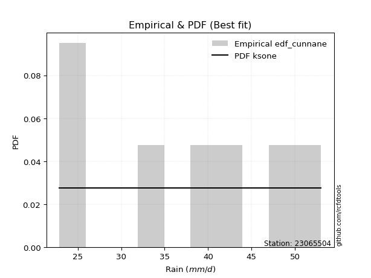</img>

</div>


### 12. EDF Adamowski (1981)

The Adamowski formula in hydrology refers to a specific plotting position formula used for estimating the non-parametric empirical distribution of hydrological events (like flood peaks) to calculate their return periods. This formula provides an alternative to traditional parametric methods (like the Gumbel or Log Pearson Type III distributions). 

<div align="center">


$P=(m-0.25)/(n+0.5)$


</div>


**12.1. Empirical values**

<div align="center">

|                | 0                  | 1                   | 2                   | 3             | 4                  | 5                  | 6                  |
|:---------------|:-------------------|:--------------------|:--------------------|:--------------|:-------------------|:-------------------|:-------------------|
| date           | 2015               | 2019                | 2018                | 2020          | 2017               | 2016               | 2021               |
| x              | 22.9               | 24.4                | 33.0                | 39.1          | 41.2               | 47.4               | 53.0               |
| m              | 1                  | 2                   | 3                   | 4             | 5                  | 6                  | 7                  |
| empirical_dist | edf_adamowski      | edf_adamowski       | edf_adamowski       | edf_adamowski | edf_adamowski      | edf_adamowski      | edf_adamowski      |
| empirical      | 0.1                | 0.23333333333333334 | 0.36666666666666664 | 0.5           | 0.6333333333333333 | 0.7666666666666667 | 0.9                |
| empirical_tr   | 1.1111111111111112 | 1.3043478260869565  | 1.5789473684210527  | 2.0           | 2.727272727272727  | 4.2857142857142865 | 10.000000000000002 |

</div>


**12.2. Kolmogorov-Smirnov fit test (sorted by Δ)**


<div align="center">

|                | 0                   | 1                   | 2                   | 3                   | 4                   | 5                   | 6                   | 7                   | 8                   | 9                   | 10                  | 11                  | 12                  | 13                  | 14                  | 15                  | 16                  | 17                  | 18                  | 19                  | 20                  | 21                  | 22                  | 23                  | 24                  | 25                  | 26                  | 27                  | 28                  | 29                  | 30                  | 31                  | 32                  | 33                  | 34                  | 35                  | 36                  | 37                  | 38                  | 39                  | 40                  | 41                  | 42                  | 43                  | 44                  | 45                  | 46                  | 47                  | 48                  | 49                  | 50                  | 51                  | 52                  | 53                  | 54                  | 55                  | 56                  | 57                  | 58                  | 59                  | 60                  | 61                  | 62                  | 63                  | 64                  | 65                  | 66                  | 67                  | 68                  | 69                  | 70                  | 71                  | 72                  | 73                  | 74                  | 75                  | 76                  | 77                  | 78                  | 79                  | 80                  | 81                  | 82                  | 83                  | 84                  | 85                  | 86                  | 87                  | 88                  | 89                  | 90                  | 91                  | 92                  | 93                  | 94                  | 95                  | 96                  | 97                  | 98                  | 99                  | 100                 | 101                 | 102                 | 103                 | 104                 | 105                 | 106                 | 107                 | 108                 | 109                 | 110                 | 111                 | 112                 | 113                 | 114                 | 115                 | 116                 | 117                 | 118                 | 119                 | 120                 | 121                 | 122                 | 123                 | 124                 | 125                 | 126                 | 127                 | 128                 | 129                 | 130                 | 131                 | 132                 | 133                 | 134                 | 135                 | 136                 | 137                 | 138                 | 139                 | 140                 | 141                 | 142                 | 143                 | 144                 | 145                 | 146                 | 147                 | 148                 | 149                 | 150                 | 151                 | 152                 | 153                 | 154                 | 155                 | 156                 | 157                 | 158                 | 159                 |
|:---------------|:--------------------|:--------------------|:--------------------|:--------------------|:--------------------|:--------------------|:--------------------|:--------------------|:--------------------|:--------------------|:--------------------|:--------------------|:--------------------|:--------------------|:--------------------|:--------------------|:--------------------|:--------------------|:--------------------|:--------------------|:--------------------|:--------------------|:--------------------|:--------------------|:--------------------|:--------------------|:--------------------|:--------------------|:--------------------|:--------------------|:--------------------|:--------------------|:--------------------|:--------------------|:--------------------|:--------------------|:--------------------|:--------------------|:--------------------|:--------------------|:--------------------|:--------------------|:--------------------|:--------------------|:--------------------|:--------------------|:--------------------|:--------------------|:--------------------|:--------------------|:--------------------|:--------------------|:--------------------|:--------------------|:--------------------|:--------------------|:--------------------|:--------------------|:--------------------|:--------------------|:--------------------|:--------------------|:--------------------|:--------------------|:--------------------|:--------------------|:--------------------|:--------------------|:--------------------|:--------------------|:--------------------|:--------------------|:--------------------|:--------------------|:--------------------|:--------------------|:--------------------|:--------------------|:--------------------|:--------------------|:--------------------|:--------------------|:--------------------|:--------------------|:--------------------|:--------------------|:--------------------|:--------------------|:--------------------|:--------------------|:--------------------|:--------------------|:--------------------|:--------------------|:--------------------|:--------------------|:--------------------|:--------------------|:--------------------|:--------------------|:--------------------|:--------------------|:--------------------|:--------------------|:--------------------|:--------------------|:--------------------|:--------------------|:--------------------|:--------------------|:--------------------|:--------------------|:--------------------|:--------------------|:--------------------|:--------------------|:--------------------|:--------------------|:--------------------|:--------------------|:--------------------|:--------------------|:--------------------|:--------------------|:--------------------|:--------------------|:--------------------|:--------------------|:--------------------|:--------------------|:--------------------|:--------------------|:--------------------|:--------------------|:--------------------|:--------------------|:--------------------|:--------------------|:--------------------|:--------------------|:--------------------|:--------------------|:--------------------|:--------------------|:--------------------|:--------------------|:--------------------|:--------------------|:--------------------|:--------------------|:--------------------|:--------------------|:--------------------|:--------------------|:--------------------|:--------------------|:--------------------|:--------------------|:--------------------|:--------------------|
| station        | 23065504            | 23065504            | 23065504            | 23065504            | 23065504            | 23065504            | 23065504            | 23065504            | 23065504            | 23065504            | 23065504            | 23065504            | 23065504            | 23065504            | 23065504            | 23065504            | 23065504            | 23065504            | 23065504            | 23065504            | 23065504            | 23065504            | 23065504            | 23065504            | 23065504            | 23065504            | 23065504            | 23065504            | 23065504            | 23065504            | 23065504            | 23065504            | 23065504            | 23065504            | 23065504            | 23065504            | 23065504            | 23065504            | 23065504            | 23065504            | 23065504            | 23065504            | 23065504            | 23065504            | 23065504            | 23065504            | 23065504            | 23065504            | 23065504            | 23065504            | 23065504            | 23065504            | 23065504            | 23065504            | 23065504            | 23065504            | 23065504            | 23065504            | 23065504            | 23065504            | 23065504            | 23065504            | 23065504            | 23065504            | 23065504            | 23065504            | 23065504            | 23065504            | 23065504            | 23065504            | 23065504            | 23065504            | 23065504            | 23065504            | 23065504            | 23065504            | 23065504            | 23065504            | 23065504            | 23065504            | 23065504            | 23065504            | 23065504            | 23065504            | 23065504            | 23065504            | 23065504            | 23065504            | 23065504            | 23065504            | 23065504            | 23065504            | 23065504            | 23065504            | 23065504            | 23065504            | 23065504            | 23065504            | 23065504            | 23065504            | 23065504            | 23065504            | 23065504            | 23065504            | 23065504            | 23065504            | 23065504            | 23065504            | 23065504            | 23065504            | 23065504            | 23065504            | 23065504            | 23065504            | 23065504            | 23065504            | 23065504            | 23065504            | 23065504            | 23065504            | 23065504            | 23065504            | 23065504            | 23065504            | 23065504            | 23065504            | 23065504            | 23065504            | 23065504            | 23065504            | 23065504            | 23065504            | 23065504            | 23065504            | 23065504            | 23065504            | 23065504            | 23065504            | 23065504            | 23065504            | 23065504            | 23065504            | 23065504            | 23065504            | 23065504            | 23065504            | 23065504            | 23065504            | 23065504            | 23065504            | 23065504            | 23065504            | 23065504            | 23065504            | 23065504            | 23065504            | 23065504            | 23065504            | 23065504            | 23065504            |
| empirical_dist | edf_adamowski       | edf_adamowski       | edf_adamowski       | edf_adamowski       | edf_adamowski       | edf_adamowski       | edf_adamowski       | edf_adamowski       | edf_adamowski       | edf_adamowski       | edf_adamowski       | edf_adamowski       | edf_adamowski       | edf_adamowski       | edf_adamowski       | edf_adamowski       | edf_adamowski       | edf_adamowski       | edf_adamowski       | edf_adamowski       | edf_adamowski       | edf_adamowski       | edf_adamowski       | edf_adamowski       | edf_adamowski       | edf_adamowski       | edf_adamowski       | edf_adamowski       | edf_adamowski       | edf_adamowski       | edf_adamowski       | edf_adamowski       | edf_adamowski       | edf_adamowski       | edf_adamowski       | edf_adamowski       | edf_adamowski       | edf_adamowski       | edf_adamowski       | edf_adamowski       | edf_adamowski       | edf_adamowski       | edf_adamowski       | edf_adamowski       | edf_adamowski       | edf_adamowski       | edf_adamowski       | edf_adamowski       | edf_adamowski       | edf_adamowski       | edf_adamowski       | edf_adamowski       | edf_adamowski       | edf_adamowski       | edf_adamowski       | edf_adamowski       | edf_adamowski       | edf_adamowski       | edf_adamowski       | edf_adamowski       | edf_adamowski       | edf_adamowski       | edf_adamowski       | edf_adamowski       | edf_adamowski       | edf_adamowski       | edf_adamowski       | edf_adamowski       | edf_adamowski       | edf_adamowski       | edf_adamowski       | edf_adamowski       | edf_adamowski       | edf_adamowski       | edf_adamowski       | edf_adamowski       | edf_adamowski       | edf_adamowski       | edf_adamowski       | edf_adamowski       | edf_adamowski       | edf_adamowski       | edf_adamowski       | edf_adamowski       | edf_adamowski       | edf_adamowski       | edf_adamowski       | edf_adamowski       | edf_adamowski       | edf_adamowski       | edf_adamowski       | edf_adamowski       | edf_adamowski       | edf_adamowski       | edf_adamowski       | edf_adamowski       | edf_adamowski       | edf_adamowski       | edf_adamowski       | edf_adamowski       | edf_adamowski       | edf_adamowski       | edf_adamowski       | edf_adamowski       | edf_adamowski       | edf_adamowski       | edf_adamowski       | edf_adamowski       | edf_adamowski       | edf_adamowski       | edf_adamowski       | edf_adamowski       | edf_adamowski       | edf_adamowski       | edf_adamowski       | edf_adamowski       | edf_adamowski       | edf_adamowski       | edf_adamowski       | edf_adamowski       | edf_adamowski       | edf_adamowski       | edf_adamowski       | edf_adamowski       | edf_adamowski       | edf_adamowski       | edf_adamowski       | edf_adamowski       | edf_adamowski       | edf_adamowski       | edf_adamowski       | edf_adamowski       | edf_adamowski       | edf_adamowski       | edf_adamowski       | edf_adamowski       | edf_adamowski       | edf_adamowski       | edf_adamowski       | edf_adamowski       | edf_adamowski       | edf_adamowski       | edf_adamowski       | edf_adamowski       | edf_adamowski       | edf_adamowski       | edf_adamowski       | edf_adamowski       | edf_adamowski       | edf_adamowski       | edf_adamowski       | edf_adamowski       | edf_adamowski       | edf_adamowski       | edf_adamowski       | edf_adamowski       | edf_adamowski       | edf_adamowski       | edf_adamowski       | edf_adamowski       |
| p_dist         | dweibull            | ksone               | dgamma              | logburr             | logbeta             | arcsine             | logarcsine          | semicircular        | logwrapcauchy       | logncf              | logtrapezoid        | logksone            | logloggamma         | anglit              | logmielke           | logsemicircular     | genextreme          | logjohnsonsu        | logskewnorm         | wrapcauchy          | loganglit           | burr                | johnsonsu           | gumbel_l            | ncf                 | pearson3            | t                   | skewnorm            | exponnorm           | norm                | crystalball         | nct                 | gamma               | erlang              | foldnorm            | f                   | logdweibull         | logburr12           | logfoldnorm         | exponpow            | betaprime           | genlogistic         | alpha               | invgamma            | logpearson3         | logweibull_min      | invweibull          | invgauss            | loggumbel_l         | loginvgamma         | logalpha            | logbetaprime        | kstwobign           | maxwell             | lognct              | genpareto           | loggamma            | loggamma            | logf                | logfatiguelife      | logexponnorm        | logcrystalball      | lognorm             | logt                | logerlang           | cosine              | logdgamma           | gausshyper          | logistic            | logcosine           | triang              | rayleigh            | weibull_min         | hypsecant           | logtriang           | argus               | logkappa4           | loginvgauss         | loglogistic         | logmaxwell          | logargus            | laplace             | rice                | logrice             | loghypsecant        | logtukeylambda      | lograyleigh         | loginvweibull       | loggenextreme       | logkappa3           | loguniform          | logvonmises_line    | truncweibull_min    | logloglaplace       | truncexpon          | gumbel_r            | beta                | bradford            | truncpareto         | kappa4              | loggenexpon         | logkstwobign        | loggompertz         | loglaplace          | loglaplace          | lomax               | genexpon            | loggausshyper       | tukeylambda         | gompertz            | logrdist            | loggumbel_r         | vonmises_line       | uniform             | kappa3              | nakagami            | genhalflogistic     | halfnorm            | loggenhalflogistic  | burr12              | moyal               | loglomax            | logmoyal            | halfgennorm         | logbradford         | loghalfnorm         | loglevy_l           | logtruncexpon       | logexponweib        | halflogistic        | loghalflogistic     | wald                | levy_l              | logexponpow         | lognakagami         | logwald             | gennorm             | loggennorm          | logtruncnorm        | logjohnsonsb        | trapezoid           | loggenpareto        | logtruncweibull_min | loggengamma         | exponweib           | fatiguelife         | johnsonsb           | gengamma            | logweibull_max      | powerlaw            | logpowerlaw         | rdist               | loghalfgennorm      | logtruncpareto      | weibull_max         | loggenlogistic      | truncnorm           | logvonmises         | vonmises            | mielke              |
| delta          | 0.08833311767300384 | 0.09051268383060404 | 0.09644372489629308 | 0.09758391111040632 | 0.09999999829371842 | 0.09999999999999998 | 0.1                 | 0.10037020325577167 | 0.10102364515115358 | 0.10129845417142247 | 0.10188283464069214 | 0.10578515521197218 | 0.1061779729214567  | 0.10761922923572875 | 0.1128072603410184  | 0.11342151574587256 | 0.11445197962599268 | 0.11549191026351563 | 0.11801022805824683 | 0.11810826160567767 | 0.11936303724479154 | 0.12210534717035174 | 0.12459156195840704 | 0.12483251204430486 | 0.12489916959283393 | 0.1249126594688224  | 0.12533488250175817 | 0.12534029360133878 | 0.12534594341239388 | 0.12534650200630792 | 0.12534651557063708 | 0.12546305494325563 | 0.12567148750648854 | 0.12567182865426152 | 0.12578561953437828 | 0.1260113094929012  | 0.12759639191221966 | 0.12763567536039802 | 0.12951675823334996 | 0.12952124239615648 | 0.12983936398117618 | 0.13003655571098793 | 0.13004360926733982 | 0.13012590128484758 | 0.1301281671522463  | 0.13015667440449158 | 0.13031624288567273 | 0.13133061904861199 | 0.13157492271289178 | 0.13280917485994975 | 0.1333202080940068  | 0.13352534825062884 | 0.1339525570703124  | 0.13400238107893897 | 0.13408950328855745 | 0.13411125672152646 | 0.1342540872114127  | 0.1342540872114127  | 0.13450497656581922 | 0.13476225790298796 | 0.13484393326045702 | 0.13484454952185965 | 0.1348446220366838  | 0.13484703297424364 | 0.13503830221897303 | 0.13570684375618514 | 0.13610865350767543 | 0.13710870004388404 | 0.13748448080589637 | 0.1389230423968555  | 0.13994105247753108 | 0.13998569739526043 | 0.140725915235961   | 0.1427887217152931  | 0.14292807954728753 | 0.14313954181838345 | 0.14349421829159426 | 0.144515578041855   | 0.14548414901813694 | 0.14594942823582802 | 0.1460216641092546  | 0.14643022613380205 | 0.1471137102493807  | 0.14774781766753572 | 0.14992328281516693 | 0.15278372957677439 | 0.15345221051888092 | 0.15346771283032712 | 0.15348129214928363 | 0.15762616174878413 | 0.15772605993002803 | 0.15831234668990302 | 0.16105117639128852 | 0.16386464276789034 | 0.1647686713966655  | 0.169069035537001   | 0.16915369723930132 | 0.16920957860923538 | 0.16950200201660895 | 0.17033147593680012 | 0.17075996357073175 | 0.17092477887598734 | 0.17232885855192234 | 0.174096520030107   | 0.174096520030107   | 0.17498938778655926 | 0.17571124787274106 | 0.17573803060942111 | 0.17759044719553335 | 0.18085153086844655 | 0.18146709872300504 | 0.18328694337352147 | 0.1834973581740998  | 0.18349944629014397 | 0.1835227579514315  | 0.18932173396063345 | 0.19076203022107685 | 0.191841429998586   | 0.19471336847912232 | 0.1968098616990953  | 0.19708145014244316 | 0.19838542583816943 | 0.20697110229296792 | 0.2152557018010875  | 0.2170891515180673  | 0.21725525268161902 | 0.21807908771035053 | 0.22704196011077837 | 0.22883279579590465 | 0.23333333333333334 | 0.23333333333333334 | 0.23333333333333334 | 0.25166915260875033 | 0.25480949392361657 | 0.26421142375232415 | 0.2657952440714868  | 0.2666666666666667  | 0.2666666666666667  | 0.27682898158860125 | 0.2795708629232071  | 0.28525946794798673 | 0.3037148746263798  | 0.31618890134304956 | 0.31911241487943215 | 0.4444534375445501  | 0.4497629514117399  | 0.45276270181201406 | 0.45283562697099206 | 0.45487593654114944 | 0.4672592358459002  | 0.49644827349731285 | 0.4999999880096997  | 0.5                 | 0.52200011876922    | 0.5290629144099024  | 0.7666666666666667  | 0.899999999780028   | 1.1178189284506366  | 7.514023470004801   | nan                 |
| deltao         | 0.48442053926100004 | 0.48442053926100004 | 0.48442053926100004 | 0.48442053926100004 | 0.48442053926100004 | 0.48442053926100004 | 0.48442053926100004 | 0.48442053926100004 | 0.48442053926100004 | 0.48442053926100004 | 0.48442053926100004 | 0.48442053926100004 | 0.48442053926100004 | 0.48442053926100004 | 0.48442053926100004 | 0.48442053926100004 | 0.48442053926100004 | 0.48442053926100004 | 0.48442053926100004 | 0.48442053926100004 | 0.48442053926100004 | 0.48442053926100004 | 0.48442053926100004 | 0.48442053926100004 | 0.48442053926100004 | 0.48442053926100004 | 0.48442053926100004 | 0.48442053926100004 | 0.48442053926100004 | 0.48442053926100004 | 0.48442053926100004 | 0.48442053926100004 | 0.48442053926100004 | 0.48442053926100004 | 0.48442053926100004 | 0.48442053926100004 | 0.48442053926100004 | 0.48442053926100004 | 0.48442053926100004 | 0.48442053926100004 | 0.48442053926100004 | 0.48442053926100004 | 0.48442053926100004 | 0.48442053926100004 | 0.48442053926100004 | 0.48442053926100004 | 0.48442053926100004 | 0.48442053926100004 | 0.48442053926100004 | 0.48442053926100004 | 0.48442053926100004 | 0.48442053926100004 | 0.48442053926100004 | 0.48442053926100004 | 0.48442053926100004 | 0.48442053926100004 | 0.48442053926100004 | 0.48442053926100004 | 0.48442053926100004 | 0.48442053926100004 | 0.48442053926100004 | 0.48442053926100004 | 0.48442053926100004 | 0.48442053926100004 | 0.48442053926100004 | 0.48442053926100004 | 0.48442053926100004 | 0.48442053926100004 | 0.48442053926100004 | 0.48442053926100004 | 0.48442053926100004 | 0.48442053926100004 | 0.48442053926100004 | 0.48442053926100004 | 0.48442053926100004 | 0.48442053926100004 | 0.48442053926100004 | 0.48442053926100004 | 0.48442053926100004 | 0.48442053926100004 | 0.48442053926100004 | 0.48442053926100004 | 0.48442053926100004 | 0.48442053926100004 | 0.48442053926100004 | 0.48442053926100004 | 0.48442053926100004 | 0.48442053926100004 | 0.48442053926100004 | 0.48442053926100004 | 0.48442053926100004 | 0.48442053926100004 | 0.48442053926100004 | 0.48442053926100004 | 0.48442053926100004 | 0.48442053926100004 | 0.48442053926100004 | 0.48442053926100004 | 0.48442053926100004 | 0.48442053926100004 | 0.48442053926100004 | 0.48442053926100004 | 0.48442053926100004 | 0.48442053926100004 | 0.48442053926100004 | 0.48442053926100004 | 0.48442053926100004 | 0.48442053926100004 | 0.48442053926100004 | 0.48442053926100004 | 0.48442053926100004 | 0.48442053926100004 | 0.48442053926100004 | 0.48442053926100004 | 0.48442053926100004 | 0.48442053926100004 | 0.48442053926100004 | 0.48442053926100004 | 0.48442053926100004 | 0.48442053926100004 | 0.48442053926100004 | 0.48442053926100004 | 0.48442053926100004 | 0.48442053926100004 | 0.48442053926100004 | 0.48442053926100004 | 0.48442053926100004 | 0.48442053926100004 | 0.48442053926100004 | 0.48442053926100004 | 0.48442053926100004 | 0.48442053926100004 | 0.48442053926100004 | 0.48442053926100004 | 0.48442053926100004 | 0.48442053926100004 | 0.48442053926100004 | 0.48442053926100004 | 0.48442053926100004 | 0.48442053926100004 | 0.48442053926100004 | 0.48442053926100004 | 0.48442053926100004 | 0.48442053926100004 | 0.48442053926100004 | 0.48442053926100004 | 0.48442053926100004 | 0.48442053926100004 | 0.48442053926100004 | 0.48442053926100004 | 0.48442053926100004 | 0.48442053926100004 | 0.48442053926100004 | 0.48442053926100004 | 0.48442053926100004 | 0.48442053926100004 | 0.48442053926100004 | 0.48442053926100004 | 0.48442053926100004 | 0.48442053926100004 |
| eval           | Δo > Δ              | Δo > Δ              | Δo > Δ              | Δo > Δ              | Δo > Δ              | Δo > Δ              | Δo > Δ              | Δo > Δ              | Δo > Δ              | Δo > Δ              | Δo > Δ              | Δo > Δ              | Δo > Δ              | Δo > Δ              | Δo > Δ              | Δo > Δ              | Δo > Δ              | Δo > Δ              | Δo > Δ              | Δo > Δ              | Δo > Δ              | Δo > Δ              | Δo > Δ              | Δo > Δ              | Δo > Δ              | Δo > Δ              | Δo > Δ              | Δo > Δ              | Δo > Δ              | Δo > Δ              | Δo > Δ              | Δo > Δ              | Δo > Δ              | Δo > Δ              | Δo > Δ              | Δo > Δ              | Δo > Δ              | Δo > Δ              | Δo > Δ              | Δo > Δ              | Δo > Δ              | Δo > Δ              | Δo > Δ              | Δo > Δ              | Δo > Δ              | Δo > Δ              | Δo > Δ              | Δo > Δ              | Δo > Δ              | Δo > Δ              | Δo > Δ              | Δo > Δ              | Δo > Δ              | Δo > Δ              | Δo > Δ              | Δo > Δ              | Δo > Δ              | Δo > Δ              | Δo > Δ              | Δo > Δ              | Δo > Δ              | Δo > Δ              | Δo > Δ              | Δo > Δ              | Δo > Δ              | Δo > Δ              | Δo > Δ              | Δo > Δ              | Δo > Δ              | Δo > Δ              | Δo > Δ              | Δo > Δ              | Δo > Δ              | Δo > Δ              | Δo > Δ              | Δo > Δ              | Δo > Δ              | Δo > Δ              | Δo > Δ              | Δo > Δ              | Δo > Δ              | Δo > Δ              | Δo > Δ              | Δo > Δ              | Δo > Δ              | Δo > Δ              | Δo > Δ              | Δo > Δ              | Δo > Δ              | Δo > Δ              | Δo > Δ              | Δo > Δ              | Δo > Δ              | Δo > Δ              | Δo > Δ              | Δo > Δ              | Δo > Δ              | Δo > Δ              | Δo > Δ              | Δo > Δ              | Δo > Δ              | Δo > Δ              | Δo > Δ              | Δo > Δ              | Δo > Δ              | Δo > Δ              | Δo > Δ              | Δo > Δ              | Δo > Δ              | Δo > Δ              | Δo > Δ              | Δo > Δ              | Δo > Δ              | Δo > Δ              | Δo > Δ              | Δo > Δ              | Δo > Δ              | Δo > Δ              | Δo > Δ              | Δo > Δ              | Δo > Δ              | Δo > Δ              | Δo > Δ              | Δo > Δ              | Δo > Δ              | Δo > Δ              | Δo > Δ              | Δo > Δ              | Δo > Δ              | Δo > Δ              | Δo > Δ              | Δo > Δ              | Δo > Δ              | Δo > Δ              | Δo > Δ              | Δo > Δ              | Δo > Δ              | Δo > Δ              | Δo > Δ              | Δo > Δ              | Δo > Δ              | Δo > Δ              | Δo > Δ              | Δo > Δ              | Δo > Δ              | Δo > Δ              | Δo > Δ              | Δo > Δ              | Δo > Δ              | Δo > Δ              | Δo <= Δ             | Δo <= Δ             | Δo <= Δ             | Δo <= Δ             | Δo <= Δ             | Δo <= Δ             | Δo <= Δ             | Δo <= Δ             | Δo <= Δ             | Δo <= Δ             |
| fit            | 1                   | 1                   | 1                   | 1                   | 1                   | 1                   | 1                   | 1                   | 1                   | 1                   | 1                   | 1                   | 1                   | 1                   | 1                   | 1                   | 1                   | 1                   | 1                   | 1                   | 1                   | 1                   | 1                   | 1                   | 1                   | 1                   | 1                   | 1                   | 1                   | 1                   | 1                   | 1                   | 1                   | 1                   | 1                   | 1                   | 1                   | 1                   | 1                   | 1                   | 1                   | 1                   | 1                   | 1                   | 1                   | 1                   | 1                   | 1                   | 1                   | 1                   | 1                   | 1                   | 1                   | 1                   | 1                   | 1                   | 1                   | 1                   | 1                   | 1                   | 1                   | 1                   | 1                   | 1                   | 1                   | 1                   | 1                   | 1                   | 1                   | 1                   | 1                   | 1                   | 1                   | 1                   | 1                   | 1                   | 1                   | 1                   | 1                   | 1                   | 1                   | 1                   | 1                   | 1                   | 1                   | 1                   | 1                   | 1                   | 1                   | 1                   | 1                   | 1                   | 1                   | 1                   | 1                   | 1                   | 1                   | 1                   | 1                   | 1                   | 1                   | 1                   | 1                   | 1                   | 1                   | 1                   | 1                   | 1                   | 1                   | 1                   | 1                   | 1                   | 1                   | 1                   | 1                   | 1                   | 1                   | 1                   | 1                   | 1                   | 1                   | 1                   | 1                   | 1                   | 1                   | 1                   | 1                   | 1                   | 1                   | 1                   | 1                   | 1                   | 1                   | 1                   | 1                   | 1                   | 1                   | 1                   | 1                   | 1                   | 1                   | 1                   | 1                   | 1                   | 1                   | 1                   | 1                   | 1                   | 1                   | 1                   | 0                   | 0                   | 0                   | 0                   | 0                   | 0                   | 0                   | 0                   | 0                   | 0                   |
| n              | 7                   | 7                   | 7                   | 7                   | 7                   | 7                   | 7                   | 7                   | 7                   | 7                   | 7                   | 7                   | 7                   | 7                   | 7                   | 7                   | 7                   | 7                   | 7                   | 7                   | 7                   | 7                   | 7                   | 7                   | 7                   | 7                   | 7                   | 7                   | 7                   | 7                   | 7                   | 7                   | 7                   | 7                   | 7                   | 7                   | 7                   | 7                   | 7                   | 7                   | 7                   | 7                   | 7                   | 7                   | 7                   | 7                   | 7                   | 7                   | 7                   | 7                   | 7                   | 7                   | 7                   | 7                   | 7                   | 7                   | 7                   | 7                   | 7                   | 7                   | 7                   | 7                   | 7                   | 7                   | 7                   | 7                   | 7                   | 7                   | 7                   | 7                   | 7                   | 7                   | 7                   | 7                   | 7                   | 7                   | 7                   | 7                   | 7                   | 7                   | 7                   | 7                   | 7                   | 7                   | 7                   | 7                   | 7                   | 7                   | 7                   | 7                   | 7                   | 7                   | 7                   | 7                   | 7                   | 7                   | 7                   | 7                   | 7                   | 7                   | 7                   | 7                   | 7                   | 7                   | 7                   | 7                   | 7                   | 7                   | 7                   | 7                   | 7                   | 7                   | 7                   | 7                   | 7                   | 7                   | 7                   | 7                   | 7                   | 7                   | 7                   | 7                   | 7                   | 7                   | 7                   | 7                   | 7                   | 7                   | 7                   | 7                   | 7                   | 7                   | 7                   | 7                   | 7                   | 7                   | 7                   | 7                   | 7                   | 7                   | 7                   | 7                   | 7                   | 7                   | 7                   | 7                   | 7                   | 7                   | 7                   | 7                   | 7                   | 7                   | 7                   | 7                   | 7                   | 7                   | 7                   | 7                   | 7                   | 7                   |
| best_fit       | 1                   | 0                   | 0                   | 0                   | 0                   | 0                   | 0                   | 0                   | 0                   | 0                   | 0                   | 0                   | 0                   | 0                   | 0                   | 0                   | 0                   | 0                   | 0                   | 0                   | 0                   | 0                   | 0                   | 0                   | 0                   | 0                   | 0                   | 0                   | 0                   | 0                   | 0                   | 0                   | 0                   | 0                   | 0                   | 0                   | 0                   | 0                   | 0                   | 0                   | 0                   | 0                   | 0                   | 0                   | 0                   | 0                   | 0                   | 0                   | 0                   | 0                   | 0                   | 0                   | 0                   | 0                   | 0                   | 0                   | 0                   | 0                   | 0                   | 0                   | 0                   | 0                   | 0                   | 0                   | 0                   | 0                   | 0                   | 0                   | 0                   | 0                   | 0                   | 0                   | 0                   | 0                   | 0                   | 0                   | 0                   | 0                   | 0                   | 0                   | 0                   | 0                   | 0                   | 0                   | 0                   | 0                   | 0                   | 0                   | 0                   | 0                   | 0                   | 0                   | 0                   | 0                   | 0                   | 0                   | 0                   | 0                   | 0                   | 0                   | 0                   | 0                   | 0                   | 0                   | 0                   | 0                   | 0                   | 0                   | 0                   | 0                   | 0                   | 0                   | 0                   | 0                   | 0                   | 0                   | 0                   | 0                   | 0                   | 0                   | 0                   | 0                   | 0                   | 0                   | 0                   | 0                   | 0                   | 0                   | 0                   | 0                   | 0                   | 0                   | 0                   | 0                   | 0                   | 0                   | 0                   | 0                   | 0                   | 0                   | 0                   | 0                   | 0                   | 0                   | 0                   | 0                   | 0                   | 0                   | 0                   | 0                   | 0                   | 0                   | 0                   | 0                   | 0                   | 0                   | 0                   | 0                   | 0                   | 0                   |
| best_fit_sort  | 1                   | 2                   | 3                   | 4                   | 5                   | 6                   | 7                   | 8                   | 9                   | 10                  | 11                  | 12                  | 13                  | 14                  | 15                  | 16                  | 17                  | 18                  | 19                  | 20                  | 21                  | 22                  | 23                  | 24                  | 25                  | 26                  | 27                  | 28                  | 29                  | 30                  | 31                  | 32                  | 33                  | 34                  | 35                  | 36                  | 37                  | 38                  | 39                  | 40                  | 41                  | 42                  | 43                  | 44                  | 45                  | 46                  | 47                  | 48                  | 49                  | 50                  | 51                  | 52                  | 53                  | 54                  | 55                  | 56                  | 57                  | 58                  | 59                  | 60                  | 61                  | 62                  | 63                  | 64                  | 65                  | 66                  | 67                  | 68                  | 69                  | 70                  | 71                  | 72                  | 73                  | 74                  | 75                  | 76                  | 77                  | 78                  | 79                  | 80                  | 81                  | 82                  | 83                  | 84                  | 85                  | 86                  | 87                  | 88                  | 89                  | 90                  | 91                  | 92                  | 93                  | 94                  | 95                  | 96                  | 97                  | 98                  | 99                  | 100                 | 101                 | 102                 | 103                 | 104                 | 105                 | 106                 | 107                 | 108                 | 109                 | 110                 | 111                 | 112                 | 113                 | 114                 | 115                 | 116                 | 117                 | 118                 | 119                 | 120                 | 121                 | 122                 | 123                 | 124                 | 125                 | 126                 | 127                 | 128                 | 129                 | 130                 | 131                 | 132                 | 133                 | 134                 | 135                 | 136                 | 137                 | 138                 | 139                 | 140                 | 141                 | 142                 | 143                 | 144                 | 145                 | 146                 | 147                 | 148                 | 149                 | 150                 | 151                 | 152                 | 153                 | 154                 | 155                 | 156                 | 157                 | 158                 | 159                 | 160                 |

</div>


**12.3. Best fit**

<div align="center">

|   id |   station | empirical_dist   | p_dist   |     delta |   deltao | eval   |   fit |   n |   best_fit |   best_fit_sort |
|-----:|----------:|:-----------------|:---------|----------:|---------:|:-------|------:|----:|-----------:|----------------:|
|    0 |  23065504 | edf_adamowski    | dweibull | 0.0883331 | 0.484421 | Δo > Δ |     1 |   7 |          1 |               1 |

</div>


<div align="center">

</img>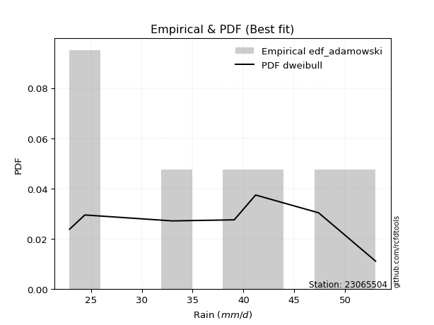</img>

</div>


## C. Best fit & Estimate extreme values for specific return periods - Tr

Best fit in probability distribution analysis means finding the theoretical distribution (like Normal, Poisson, Exponential, etc.) that most accurately mirrors your real-world data´s patterns (shape, center, spread) for better predictions, using methods like visual checks (Q-Q plots), goodness-of-fit tests (Kolmogorov-Smirnov, Chi-Squared), and information criteria (AIC) to score and select the simplest, most representative model.


### 1. Best fit (ordered by delta Δ)

:file_folder:Table: [bestfit_23065504.csv](table/bestfit_23065504.csv)

<div align="center">

|   id |   station | empirical_dist   | p_dist   |     delta |   deltao | eval   |   fit |   n |   best_fit |   best_fit_sort |
|-----:|----------:|:-----------------|:---------|----------:|---------:|:-------|------:|----:|-----------:|----------------:|
|    0 |  23065504 | edf_hazen        | arcsine  | 0.0714286 | 0.484421 | Δo > Δ |     1 |   7 |          1 |               1 |
|    1 |  23065504 | edf_gringorten   | ksone    | 0.0762805 | 0.484421 | Δo > Δ |     1 |   7 |          1 |               2 |
|    2 |  23065504 | edf_cunnane      | ksone    | 0.0794016 | 0.484421 | Δo > Δ |     1 |   7 |          1 |               3 |
|    3 |  23065504 | edf_blom         | ksone    | 0.0813173 | 0.484421 | Δo > Δ |     1 |   7 |          1 |               4 |
|    4 |  23065504 | edf_weibull      | logncf   | 0.0824092 | 0.484421 | Δo > Δ |     1 |   7 |          1 |               5 |
|    5 |  23065504 | edf_tukey        | ksone    | 0.0844521 | 0.484421 | Δo > Δ |     1 |   7 |          1 |               6 |
|    6 |  23065504 | edf_filliben     | ksone    | 0.0856247 | 0.484421 | Δo > Δ |     1 |   7 |          1 |               7 |
|    7 |  23065504 | edf_jenkinson    | ksone    | 0.0861766 | 0.484421 | Δo > Δ |     1 |   7 |          1 |               8 |
|    8 |  23065504 | edf_beard        | ksone    | 0.0861766 | 0.484421 | Δo > Δ |     1 |   7 |          1 |               9 |
|    9 |  23065504 | edf_chegodayev   | ksone    | 0.0869091 | 0.484421 | Δo > Δ |     1 |   7 |          1 |              10 |
|   10 |  23065504 | edf_adamowski    | dweibull | 0.0883331 | 0.484421 | Δo > Δ |     1 |   7 |          1 |              11 |
|   11 |  23065504 | edf_california   | logbeta  | 0.114296  | 0.484421 | Δo > Δ |     1 |   7 |          1 |              12 |

</div>


### 2. Extreme values and % difference analysis

In hydrology, a return period (or recurrence interval $Tr$) is the statistical average time between extreme events like floods or droughts of a specific magnitude, indicating how rare an event is, with a 100-year flood, for example, having a 1% chance of occurring in any given year, not that it happens exactly every century. It is a key tool for infrastructure design (like bridges or dams) and risk assessment, calculated from historical data to determine the probability of future events, although it is important to remember it is statistical average, and events can cluster or be missed.

The extreme value porcentage difference is evaluated as $pdiff = 1 - (ETrBf / ETr) * 100$, where _ETrBf_ correspond to the bestfit extreme value for a specific recurrence interval and _ETr_ correspond to the extreme value for one of the most used PDFsused in hydrology.

> risk_rate: assuming the return period as the project useful life.

:file_folder:Table: [extreme_23065504.csv](table/extreme_23065504.csv), all PDFs.  
:file_folder:Table: [extremepdiff_23065504.csv](table/extremepdiff_23065504.csv), % difference between bestfit and most used PDFs in Hydrology.

<div align="center">

Extreme values table for only best fit PDFs
|   id |      tr |   prob_l |     prob_g |   alpha |   anglit |   arcsine |   argus |    beta |   betaprime |   bradford |     burr |   burr12 |   cosine |   crystalball |   dgamma |   dweibull |   erlang |   exponnorm |   exponpow |   exponweib |       f |   fatiguelife |   foldnorm |   gamma |   gausshyper |   genexpon |   genextreme |   gengamma |   genhalflogistic |   genlogistic |   gennorm |   genpareto |   gompertz |   gumbel_l |   gumbel_r |   halfgennorm |   halflogistic |   halfnorm |   hypsecant |   invgamma |   invgauss |   invweibull |   johnsonsb |   johnsonsu |   kappa3 |   kappa4 |   ksone |   kstwobign |   laplace |   levy_l |   loggamma |   logistic |   loglaplace |    lomax |   maxwell |   mielke |   moyal |   nakagami |     ncf |     nct |    norm |   pearson3 |   powerlaw |   rayleigh |   rdist |    rice |   semicircular |   skewnorm |       t |   trapezoid |   triang |   truncexpon |   truncnorm |   truncpareto |   truncweibull_min |   tukeylambda |   uniform |   vonmises |   vonmises_line |     wald |   weibull_max |   weibull_min |   wrapcauchy |   logalpha |   loganglit |   logarcsine |   logargus |   logbeta |   logbetaprime |   logbradford |   logburr |   logburr12 |   logcosine |   logcrystalball |   logdgamma |   logdweibull |   logerlang |   logexponnorm |   logexponpow |   logexponweib |    logf |   logfatiguelife |   logfoldnorm |   loggausshyper |   loggenexpon |   loggenextreme |   loggengamma |   loggenhalflogistic |   loggenlogistic |   loggennorm |   loggenpareto |   loggompertz |   loggumbel_l |   loggumbel_r |   loghalfgennorm |   loghalflogistic |   loghalfnorm |   loghypsecant |   loginvgamma |   loginvgauss |   loginvweibull |   logjohnsonsb |   logjohnsonsu |   logkappa3 |   logkappa4 |   logksone |   logkstwobign |   loglevy_l |   logloggamma |   loglogistic |   logloglaplace |   loglomax |   logmaxwell |   logmielke |   logmoyal |   lognakagami |   logncf |   lognct |   lognorm |   logpearson3 |   logpowerlaw |   lograyleigh |   logrdist |   logrice |   logsemicircular |   logskewnorm |    logt |   logtrapezoid |   logtriang |   logtruncexpon |   logtruncnorm |   logtruncpareto |   logtruncweibull_min |   logtukeylambda |   loguniform |   logvonmises |   logvonmises_line |   logwald |   logweibull_max |   logweibull_min |   logwrapcauchy |   station |   n |   risk_rate |
|-----:|--------:|---------:|-----------:|--------:|---------:|----------:|--------:|--------:|------------:|-----------:|---------:|---------:|---------:|--------------:|---------:|-----------:|---------:|------------:|-----------:|------------:|--------:|--------------:|-----------:|--------:|-------------:|-----------:|-------------:|-----------:|------------------:|--------------:|----------:|------------:|-----------:|-----------:|-----------:|--------------:|---------------:|-----------:|------------:|-----------:|-----------:|-------------:|------------:|------------:|---------:|---------:|--------:|------------:|----------:|---------:|-----------:|-----------:|-------------:|---------:|----------:|---------:|--------:|-----------:|--------:|--------:|--------:|-----------:|-----------:|-----------:|--------:|--------:|---------------:|-----------:|--------:|------------:|---------:|-------------:|------------:|--------------:|-------------------:|--------------:|----------:|-----------:|----------------:|---------:|--------------:|--------------:|-------------:|-----------:|------------:|-------------:|-----------:|----------:|---------------:|--------------:|----------:|------------:|------------:|-----------------:|------------:|--------------:|------------:|---------------:|--------------:|---------------:|--------:|-----------------:|--------------:|----------------:|--------------:|----------------:|--------------:|---------------------:|-----------------:|-------------:|---------------:|--------------:|--------------:|--------------:|-----------------:|------------------:|--------------:|---------------:|--------------:|--------------:|----------------:|---------------:|---------------:|------------:|------------:|-----------:|---------------:|------------:|--------------:|--------------:|----------------:|-----------:|-------------:|------------:|-----------:|--------------:|---------:|---------:|----------:|--------------:|--------------:|--------------:|-----------:|----------:|------------------:|--------------:|--------:|---------------:|------------:|----------------:|---------------:|-----------------:|----------------------:|-----------------:|-------------:|--------------:|-------------------:|----------:|-----------------:|-----------------:|----------------:|----------:|----:|------------:|
|    0 |    2    | 0.5      | 0.5        | 36.5945 |  37.2857 |   37.2857 | 39.0026 | 38.356  |     36.8234 |    36.0285 |  36.89   |  31.2965 |  37.3012 |       37.2857 |  36.0237 |    36.018  |  37.2371 |     37.2857 |    34.5858 |     23.4629 | 37.1881 |       22.9    |    37.2886 | 37.2371 |      35.4265 |    32.8714 |      38.4754 |    23.5723 |           42.8866 |       35.5251 |     37.95 |     41.24   |    36.4047 |    38.9966 |    35.5748 |       30.1568 |        34.7242 |    35.1539 |     37.2857 |    36.5068 |    35.9014 |      35.52   |     52.7297 |     37.286  |  22.9    |  37.4812 | 37.2857 |     35.1814 |   37.2857 |  40.0443 |    35.4968 |    37.2857 |      35.7492 |  32.8756 |   36.395  |  34.1658 | 35.0225 |    31.4345 | 37.1595 | 37.306  | 37.2857 |    37.3328 |    23.3662 |    36.0791 | 23.2597 | 36.6169 |        37.2857 |    37.2864 | 37.2854 |     45.4307 |  40.9367 |      34.149  |  -7.2727    |       36.0556 |            34.1796 |       37.95   |   37.95   |    3.02386 |         37.9573 |  33.9098 |       52.6162 |       33.3117 |      37.95   |    35.2482 |     35.7492 |      35.7492 |    37.5783 |   36.6256 |        35.6365 |       32.2279 |   40.056  |     37.4164 |     35.3111 |          35.7492 |     35.676  |       35.3117 |     35.5631 |        35.7492 |       29.0084 |        31.1551 | 35.7521 |          35.695  |       35.3081 |         40.0867 |       33.3993 |         41.8756 |       28.2436 |              40.2968 |         inf      |      34.8382 |        32.3361 |       35.1576 |       37.5308 |       34.0522 |          22.8976 |           33.2389 |       33.6472 |        35.7492 |       35.2718 |       34.8132 |         34.0641 |        48.8076 |        38.1596 |     22.8976 |     34.5749 |    35.7492 |        33.5113 |     39.7042 |       40.3516 |       35.7492 |         39.1    |    31.176  |      34.8555 |     40.5247 |    33.5218 |       28.144  |  35.4359 |  35.6935 |   35.7492 |       36.3114 |       23.2864 |       34.5439 |    38.5523 |   35.213  |           35.7492 |       38.0171 | 35.7492 |        37.6119 |     38.2995 |         32.0567 |        29.9911 |          23.3196 |               28.5226 |          34.8377 |      34.8382 |     0.0668541 |            34.9192 |   32.4778 |          49.8168 |          37.2385 |         34.8382 |  23065504 |   7 |    0.75     |
|    1 |    2.33 | 0.570815 | 0.429185   | 38.4663 |  39.4505 |   40.5354 | 40.9519 | 40.7126 |     38.7104 |    38.1757 |  39.0177 |  33.5139 |  39.1861 |       39.1442 |  39.7687 |    39.9024 |  39.0971 |     39.1441 |    37.0623 |     23.9778 | 39.0515 |       23.2955 |    39.1439 | 39.0971 |      37.9134 |    35.0684 |      40.3644 |    24.1159 |           44.7822 |       37.5114 |     37.95 |     44.5766 |    38.385  |    40.6135 |    37.2969 |       32.5609 |        36.4948 |    37.1596 |     38.773  |    38.3967 |    37.8236 |      37.5058 |     52.917  |     39.1507 |  22.9    |  39.7237 | 39.8405 |     37.1676 |   38.4104 |  43.9746 |    37.4504 |    38.9231 |      36.9106 |  35.0802 |   38.3258 |  36.2209 | 36.6526 |    33.9237 | 39.0252 | 39.1671 | 39.1442 |    39.1897 |    23.9338 |    38.0385 | 26.8331 | 38.525  |        39.6074 |    39.1448 | 39.1439 |     47.1795 |  42.9308 |      36.1725 |  -6.40971   |       38.2028 |            36.245  |       40.1606 |   40.0815 |    3.26134 |         40.09   |  35.1284 |       52.824  |       35.9488 |      43.6628 |    37.2049 |     38.0181 |      39.2089 |    39.5892 |   39.8723 |        37.597  |       34.2078 |   42.2804 |     39.291  |     37.245  |          37.6885 |     39.5883 |       39.4911 |     37.5255 |        37.6885 |       31.1212 |        33.0776 | 37.6989 |          37.6386 |       37.3421 |         42.9121 |       35.5    |         44.0803 |       29.7553 |              42.3736 |         inf      |      34.8382 |        38.7896 |       37.1386 |       39.296  |       35.7606 |          22.8976 |           34.9545 |       35.6214 |        37.293  |       37.2375 |       36.7877 |         36.1673 |        52.2872 |        40.0664 |     22.8976 |     36.8379 |    38.442  |        35.5653 |     43.3418 |       42.5101 |       37.4525 |         40.6613 |    33.3811 |      36.822  |     42.7909 |    35.1116 |       30.4439 |  38.5537 |  37.641  |   37.6885 |       38.2523 |       23.7241 |       36.5224 |    43.0171 |   37.1903 |           38.1882 |       40.0873 | 37.6885 |        39.97   |     40.4127 |         33.969  |        31.8464 |          23.634  |               30.141  |          37.0254 |      36.9712 |     0.0704565 |            37.0644 |   33.6226 |          50.684  |          39.1155 |         39.0647 |  23065504 |   7 |    0.729209 |
|    2 |    5    | 0.8      | 0.2        | 45.7879 |  47.0882 |   49.201  | 47.2045 | 47.9962 |     46.0144 |    45.685  |  48.3966 |  46.906  |  45.9786 |       46.0506 |  45.5029 |    45.9444 |  46.0345 |     46.0506 |    47.8604 |     31.8915 | 46.0302 |       31.6962 |    46.0387 | 46.0345 |      46.6408 |    46.0528 |      46.6175 |    31.2794 |           49.7872 |       46.1371 |     37.95 |     51.4117 |    45.9329 |    45.8369 |    44.7783 |       48.4365 |        44.5062 |    45.6417 |     44.739  |    45.8603 |    45.7203 |      46.1331 |     52.999  |     46.08   |  22.9    |  46.9939 | 48.1086 |     45.6044 |   44.0333 |  50.4862 |    45.8587 |    45.2454 |      43.3078 |  46.1394 |   45.9253 |  46.3458 | 44.2036 |    45.7337 | 46.0074 | 46.0853 | 46.0506 |    46.0641 |    30.768  |    45.8826 | 36.2262 | 45.9422 |        47.5305 |    46.0508 | 46.0506 |     52.1967 |  48.6518 |      43.9237 |  -3.2026    |       45.7039 |            44.0879 |       47.2367 |   46.98   |    4.19116 |         46.9923 |  41.9502 |       52.994  |       49.9598 |      50.7235 |    45.7738 |     47.2367 |      50.1611 |    46.3954 |   49.2698 |        45.9615 |       42.4646 |   48.6267 |     46.1601 |     45.1351 |          45.8638 |     46.6029 |       46.7962 |     45.9788 |        45.8638 |       44.3449 |        43.3156 | 45.9196 |          45.8734 |       46.0046 |         50.5281 |       45.8384 |         49.7445 |       38.0225 |              48.4641 |         inf      |      34.8382 |        51.3613 |       45.3317 |       45.5861 |       44.2347 |          44.8875 |           43.8933 |       45.3341 |        44.1853 |       45.845  |       45.7276 |         46.9197 |        52.9994 |        46.5579 |     22.8976 |     45.3192 |    48.6269 |        45.7899 |     50.1166 |       48.5471 |       44.826  |         49.7574 |    47.0311 |      45.7007 |     49.1589 |    43.518  |       45.848  |  53.1208 |  45.8902 |   45.8638 |       46.0224 |       29.0515 |       45.6453 |    58.1151 |   45.8347 |           47.8344 |       46.7817 | 45.8637 |        47.5884 |     47.1451 |         42.0575 |        40.1625 |          27.5507 |               38.275  |          45.0288 |      44.8113 |     0.0856842 |            44.9647 |   40.8183 |          52.4301 |          46.0923 |         48.3313 |  23065504 |   7 |    0.67232  |
|    3 |   10    | 0.9      | 0.1        | 50.9887 |  51.4112 |   51.293  | 50.2196 | 50.8183 |     51.1171 |    49.2486 |  56.6744 | inf      |  50.0824 |       50.6322 |  49.2985 |    49.35   |  50.6583 |     50.6322 |    55.859  |     52.6831 | 50.7067 |       43.2954 |    50.6126 | 50.6583 |      50.333  |    56.0242 |      49.9774 |    47.7138 |           51.5271 |       53.1601 |     37.95 |     52.6507 |    50.8066 |    48.7451 |    50.8717 |       68.3021 |        51.1593 |    51.9182 |     49.503  |    51.2243 |    51.6625 |      53.1599 |     52.9999 |     50.6768 |  22.9    |  50.1031 | 51.7162 |     52.028  |   49.1377 |  52.0583 |    52.6117 |    49.9016 |      50.0703 |  56.2314 |   51.2734 |  56.2447 | 50.7779 |    55.1037 | 50.6822 | 50.6764 | 50.6322 |    50.6016 |    38.8748 |    51.4757 | 38.3967 | 51.0534 |        51.596  |    50.6318 | 50.6323 |     54.1564 |  50.8864 |      48.1022 |  -1.07509   |       49.2597 |            48.2389 |       50.2236 |   49.99   |    4.87883 |         50.0039 |  49.1897 |       52.9996 |       63.5143 |      51.9663 |    52.8332 |     53.4131 |      53.2345 |    49.8503 |   51.9192 |        52.5988 |       47.2439 |   51.4064 |     50.6021 |     50.6909 |          52.2433 |     51.9484 |       51.4507 |     52.7762 |        52.2433 |       59.9849 |        53.6635 | 52.3494 |          52.345  |       52.8385 |         52.3793 |       55.3782 |         51.6098 |       46.4216 |              50.8309 |         inf      |      34.8382 |        52.7934 |       51.2644 |       49.5146 |       52.6002 |          48.8278 |           53.0306 |       54.1891 |        50.5929 |       52.9318 |       53.4304 |         57.9994 |        53      |        50.3019 |     22.8976 |     49.594  |    53.8782 |        55.5041 |     51.905  |       50.8496 |       51.1694 |         60.3156 |    64.3064 |      53.2042 |     51.6592 |    52.4601 |       64.6086 |  66.1235 |  52.371  |   52.2433 |       51.6486 |       36.3767 |       53.511  |    62.9146 |   52.83   |           53.6944 |       49.8187 | 52.2431 |        50.9442 |     50.0697 |         46.908  |        45.643  |          34.1146 |               44.2165 |          48.9524 |      48.734  |     0.0976833 |            48.9291 |   50.1458 |          52.8199 |          50.6841 |         50.7899 |  23065504 |   7 |    0.651322 |
|    4 |   15    | 0.933333 | 0.0666667  | 53.6955 |  53.2573 |   51.692  | 51.3659 | 51.6622 |     53.7416 |    50.4778 |  61.7563 | inf      |  51.9517 |       52.9185 |  51.3205 |    51.0146 |  52.9721 |     52.9185 |    59.9533 |     74.3389 | 53.0545 |       50.8815 |    52.895  | 52.9721 |      51.4237 |    61.8571 |      51.3903 |    63.5762 |           52.0527 |       57.1219 |     37.95 |     52.856  |    53.1456 |    50.0621 |    54.3096 |       82.3262 |        54.9244 |    55.1845 |     52.2217 |    54.0342 |    54.8524 |      57.1244 |     53      |     52.9707 |  22.9    |  51.1129 | 52.9188 |     55.4381 |   52.1236 |  52.5332 |    56.3957 |    52.4385 |      54.5056 |  62.1583 |   54.0174 |  62.5914 | 54.5933 |    60.0588 | 53.028  | 52.9681 | 52.9185 |    52.8592 |    42.7794 |    54.3575 | 38.7944 | 53.6415 |        53.1814 |    52.9176 | 52.9187 |     54.7852 |  51.6034 |      49.6431 |  -0.0134146 |       50.4855 |            49.7516 |       51.1889 |   50.9933 |    5.21986 |         51.0078 |  53.8386 |       52.9999 |       71.7142 |      52.3223 |    56.8591 |     56.2907 |      53.8418 |    51.1898 |   52.4834 |        56.2889 |       49.0427 |   52.5527 |     52.7799 |     53.4435 |          55.7513 |     55.0478 |       53.8835 |     56.5881 |        55.7513 |       70.7798 |        60.2461 | 55.8905 |          55.9202 |       56.6198 |         52.7271 |       61.1273 |         52.1443 |       51.7333 |              51.5799 |         inf      |      34.8382 |        52.9389 |       54.3202 |       51.4035 |       58.0001 |          50.2166 |           59.0206 |       59.4614 |        54.6579 |       56.9703 |       57.9515 |         65.3684 |        53      |        51.9991 |     22.8976 |     51.0892 |    55.7517 |        61.4728 |     52.4577 |       51.5823 |       54.9957 |         67.787  |    77.2768 |      57.5203 |     52.5457 |    58.4697 |       77.6293 |  73.9003 |  55.9508 |   55.7513 |       54.5912 |       40.4256 |       58.079  |    63.9565 |   56.7484 |           56.1695 |       50.8604 | 55.7511 |        52.0704 |     51.046  |         48.7791 |        47.887  |          38.3196 |               46.7473 |          50.3061 |      50.1164 |     0.104349  |            50.3278 |   57.2309 |          52.9061 |          52.9575 |         51.5366 |  23065504 |   7 |    0.644736 |
|    5 |   20    | 0.95     | 0.05       | 55.5104 |  54.3432 |   51.8325 | 51.9951 | 52.0558 |     55.4887 |    51.1003 |  65.53   | inf      |  53.1013 |       54.4158 |  52.7    |    52.1001 |  54.4897 |     54.4157 |    62.6472 |     95.2712 | 54.5972 |       56.4981 |    54.3897 | 54.4897 |      51.9193 |    65.9956 |      52.2176 |    78.2728 |           52.3047 |       59.8957 |     37.95 |     52.9232 |    54.6382 |    50.8819 |    56.7168 |       93.3598 |        57.5623 |    57.3622 |     54.1397 |    55.9247 |    57.0256 |      59.9002 |     53      |     54.4729 |  22.9    |  51.6088 | 53.5201 |     57.7353 |   54.2421 |  52.7764 |    59.0394 |    54.1919 |      57.8887 |  66.3741 |   55.8386 |  67.3991 | 57.2955 |    63.3768 | 54.5689 | 54.4691 | 54.4158 |    54.3351 |    45.0117 |    56.2729 | 38.9311 | 55.3471 |        54.0608 |    54.4146 | 54.4159 |     55.0954 |  51.9571 |      50.446  |   0.681849  |       51.1062 |            50.5355 |       51.6621 |   51.495  |    5.42384 |         51.5098 |  57.3029 |       53      |       77.6343 |      52.4946 |    59.7017 |     58.0554 |      54.0573 |    51.9309 |   52.6947 |        58.8551 |       49.9853 |   53.2587 |     54.1918 |     55.21   |          58.1753 |     57.2696 |       55.5291 |     59.2525 |        58.1753 |       79.2093 |        65.1735 | 58.3394 |          58.3973 |       59.2416 |         52.848  |       65.3005 |         52.3915 |       55.6888 |              51.9462 |         inf      |      34.8382 |        52.9743 |       56.3471 |       52.6154 |       62.1076 |          50.9258 |           63.6161 |       63.2586 |        57.7206 |       59.8203 |       61.1977 |         71.0785 |        53      |        53.0498 |     22.8976 |     51.8467 |    56.7128 |        65.8513 |     52.7431 |       51.9427 |       57.8062 |         73.7864 |    88.0657 |      60.5764 |     53.0444 |    63.1377 |       87.8181 |  79.5384 |  58.4308 |   58.1753 |       56.5652 |       42.9149 |       61.3289 |    64.3466 |   59.4822 |           57.5912 |       51.3879 | 58.175  |        52.635  |     51.5346 |         49.7709 |        49.1102 |          41.1087 |               48.1468 |          50.9877 |      50.8222 |     0.108988  |            51.0421 |   63.1542 |          52.9405 |          54.4389 |         51.9039 |  23065504 |   7 |    0.641514 |
|    6 |   25    | 0.96     | 0.04       | 56.8685 |  55.0791 |   51.8977 | 52.4008 | 52.2802 |     56.7894 |    51.4763 |  68.5705 | inf      |  53.9075 |       55.5179 |  53.7453 |    52.8982 |  55.6081 |     55.5179 |    64.6309 |    115.228  | 55.7353 |       60.9607 |    55.49   | 55.6081 |      52.1949 |    69.2056 |      52.7772 |    91.8894 |           52.4521 |       62.0323 |     37.95 |     52.9528 |    55.7164 |    51.4653 |    58.5709 |      102.541  |        59.5947 |    58.9824 |     55.6241 |    57.3426 |    58.6689 |      62.0383 |     53      |     55.5788 |  51.8095 |  51.9023 | 53.8808 |     59.456  |   55.8853 |  52.929  |    61.0745 |    55.5332 |      60.6569 |  69.6501 |   57.1906 |  71.3212 | 59.3899 |    65.8499 | 55.7055 | 55.5741 | 55.5179 |    55.4204 |    46.4487 |    57.6961 | 38.9935 | 56.6073 |        54.6313 |    55.5165 | 55.5181 |     55.2802 |  52.1679 |      50.9388 |   1.19366   |       51.4811 |            51.0151 |       51.9421 |   51.796  |    5.558   |         51.8109 |  60.0778 |       53      |       82.2794 |      52.5968 |    61.9068 |     59.2827 |      54.1575 |    52.4109 |   52.7972 |        60.8241 |       50.5654 |   53.7661 |     55.2239 |     56.4835 |          60.0268 |     59.0136 |       56.7698 |     61.3042 |        60.0268 |       86.2031 |        69.1497 | 60.2111 |          60.2931 |       61.2489 |         52.9035 |       68.5964 |         52.5323 |       58.8675 |              52.1631 |         inf      |      34.8382 |        52.9868 |       57.8501 |       53.4952 |       65.4687 |          51.3561 |           67.3993 |       66.2403 |        60.2081 |       62.0302 |       63.7457 |         75.8146 |        53      |        53.793  |     22.8976 |     52.3034 |    57.2974 |        69.334  |     52.9229 |       52.1571 |       60.0529 |         78.8926 |    97.4794 |      62.9497 |     53.3827 |    67.0109 |       96.2842 |  83.9921 |  60.3286 |   60.0268 |       58.0415 |       44.5891 |       63.8608 |    64.535  |   61.5837 |           58.5327 |       51.7066 | 60.0265 |        52.9744 |     51.8279 |         50.3853 |        49.8804 |          43.0729 |               49.0346 |          51.3971 |      51.2505 |     0.112553  |            51.4756 |   68.3378 |          52.9581 |          55.5255 |         52.1233 |  23065504 |   7 |    0.639603 |
|    7 |   50    | 0.98     | 0.02       | 60.8649 |  56.8907 |   51.9848 | 53.3207 | 52.6925 |     60.5822 |    52.2342 |  78.7566 | inf      |  56.0185 |       58.6741 |  56.886  |    55.1838 |  58.8161 |     58.6741 |    70.2885 |    202.162  | 59.0067 |       75.2787 |    58.6409 | 58.8161 |      52.6791 |    79.177  |      54.1527 |   148.401  |           52.737  |       68.6137 |     37.95 |     52.9896 |    58.705  |    53.0489 |    64.2825 |      134.567  |        65.8568 |    63.692  |     60.2262 |    61.5301 |    63.5838 |      68.6249 |     53      |     58.7454 |  52.4118 |  52.4756 | 54.6023 |     64.5087 |   60.9897 |  53.2727 |    67.3512 |    59.6315 |      70.1284 |  79.8599 |   61.1116 |  84.7143 | 65.892  |    73.0477 | 58.9717 | 58.7391 | 58.6741 |    58.5224 |    49.557  |    61.8272 | 39.0745 | 60.2355 |        55.9345 |    58.6719 | 58.6744 |     55.647  |  52.5861 |      51.9508 |   2.65928   |       52.2367 |            51.9962 |       52.4892 |   52.398  |    5.85083 |         52.4133 |  69.1377 |       53      |       96.9741 |      52.7991 |    68.8    |     62.4154 |      54.2917 |    53.5051 |   52.9432 |        66.8632 |       51.7593 |   55.2067 |     58.1454 |     59.9592 |          65.6612 |     64.5836 |       60.4728 |     67.6354 |        65.6612 |      110.584  |        82.4161 | 65.913  |          66.0812 |       67.3813 |         52.9765 |       79.1934 |         52.7924 |       69.3872 |              52.5896 |         inf      |      34.8382 |        52.9984 |       62.1957 |       55.9583 |       77.0096 |          52.2277 |           80.5298 |       75.7292 |        68.6228 |       68.9325 |       71.874  |         92.4809 |        53      |        55.7834 |     22.8976 |     53.2174 |    58.4847 |        80.6622 |     53.3302 |       52.582  |       67.4725 |         97.7528 |   133.775  |      70.3719 |     54.2704 |    80.6145 |      125.892  |  98.3408 |  66.1223 |   65.6612 |       62.3743 |       48.4143 |       71.818  |    64.8016 |   68.0458 |           60.7417 |       52.3495 | 65.6608 |        53.6542 |     52.415  |         51.6601 |        51.5106 |          47.8323 |               50.9292 |          52.2125 |      52.1179 |     0.12352   |            52.3538 |   88.4132 |          52.9858 |          58.6183 |         52.5611 |  23065504 |   7 |    0.63583  |
|    8 |   75    | 0.986667 | 0.0133333  | 63.0774 |  57.6879 |   52.0009 | 53.6856 | 52.8147 |     62.6594 |    52.4886 |  85.3122 | inf      |  57.0266 |       60.3677 |  58.6652 |    56.4123 |  60.5409 |     60.3676 |    73.2968 |    273.952  | 60.7694 |       83.9017 |    60.3316 | 60.5408 |      52.8131 |    85.0099 |      54.758  |   192.889  |           52.8284 |       72.439  |     37.95 |     52.9957 |    60.2478 |    53.8497 |    67.6024 |      155.788  |        69.4969 |    66.2556 |     62.9156 |    63.8574 |    66.3519 |      72.4532 |     53      |     60.4446 |  52.6126 |  52.6606 | 54.8429 |     67.2887 |   63.9755 |  53.414  |    71.0149 |    61.9985 |      76.3404 |  85.8561 |   63.2434 |  93.5023 | 69.6942 |    76.9666 | 60.7311 | 60.4377 | 60.3677 |    60.1833 |    50.6661 |    64.0747 | 39.089  | 62.1925 |        56.4551 |    60.365  | 60.368  |     55.7684 |  52.7245 |      52.2963 |   3.44568   |       52.4903 |            52.33   |       52.666  |   52.5987 |    5.95421 |         52.614  |  74.7128 |       53      |      105.738  |      52.8662 |    72.8879 |     63.846  |      54.3167 |    53.9413 |   52.973  |        70.3656 |       52.1676 |   55.9959 |     59.6927 |     61.6937 |          68.8994 |     67.9718 |       62.5587 |     71.3332 |        68.8993 |      126.806  |        90.8621 | 69.194  |          69.4206 |       70.921  |         52.9897 |       85.6632 |         52.8706 |       76.0176 |              52.729  |         inf      |      34.8382 |        52.9995 |       64.5476 |       57.2466 |       84.6308 |          52.5215 |           89.3083 |       81.454  |        74.0746 |       73.0212 |       76.8071 |        103.804  |        53      |        56.7698 |     52.4182 |     53.5202 |    58.8859 |        87.666  |     53.4984 |       52.7224 |       72.1685 |        111.333  |   161.104  |      74.7682 |     54.7232 |    89.8158 |      145.682  | 107.138  |  69.4645 |   68.8994 |       64.7611 |       49.8501 |       76.5559 |    64.8554 |   71.8021 |           61.6473 |       52.5655 | 68.8989 |        53.8812 |     52.6108 |         52.0993 |        52.0827 |          49.7179 |               51.5988 |          52.4812 |      52.4103 |     0.129914  |            52.6498 |  103.597  |          52.9924 |          60.2661 |         52.7072 |  23065504 |   7 |    0.634587 |
|    9 |  100    | 0.99     | 0.01       | 64.602  |  58.162  |   52.0065 | 53.8892 | 52.8715 |     64.0811 |    52.6161 |  90.2655 | inf      |  57.6585 |       61.5131 |  59.9072 |    57.2445 |  61.7087 |     61.5131 |    75.3164 |    335.964  | 61.9646 |       90.1062 |    61.4751 | 61.7087 |      52.8727 |    89.1484 |      55.1183 |   230.269  |           52.8731 |       75.1464 |     37.95 |     52.9977 |    61.2674 |    54.3735 |    69.952  |      171.97   |        72.0734 |    68.0021 |     64.8233 |    65.4645 |    68.2771 |      75.1627 |     53      |     61.5938 |  52.7129 |  52.7512 | 54.9631 |     69.1934 |   66.094  |  53.4965 |    73.6192 |    63.6696 |      81.0789 |  90.121  |   64.6955 | 100.216  | 72.3918 |    79.6351 | 61.9239 | 61.5867 | 61.5131 |    61.3053 |    51.2349 |    65.6059 | 39.0939 | 63.5197 |        56.7466 |    61.5101 | 61.5134 |     55.8289 |  52.7935 |      52.4706 |   3.97757   |       52.6174 |            52.4982 |       52.7528 |   52.699  |    6.00662 |         52.7144 |  78.7775 |       53      |      112.023  |      52.8996 |    75.8224 |     64.7122 |      54.3254 |    54.1854 |   52.9841 |        72.8454 |       52.3737 |   56.5438 |     60.7312 |     62.8063 |          71.1796 |     70.4426 |       64.0114 |     73.9627 |        71.1796 |      139.241  |        97.183  | 71.506  |          71.7776 |       73.42   |         52.9943 |       90.383  |         52.9074 |       80.9469 |              52.7981 |         inf      |      34.8382 |        52.9998 |       66.1445 |       58.1054 |       90.4763 |          52.669  |           96.0939 |       85.5999 |        78.2025 |       75.9543 |       80.3985 |        112.646  |        53      |        57.4059 |     52.565  |     53.6706 |    59.0875 |        92.8127 |     53.597  |       52.7924 |       75.6795 |        122.363  |   183.877  |      77.9189 |     55.0279 |    96.9737 |      160.906  | 113.577  |  71.8233 |   71.1796 |       66.3988 |       50.6015 |       79.9615 |    64.8752 |   74.4645 |           62.1603 |       52.6738 | 71.1791 |        53.9948 |     52.7087 |         52.3216 |        52.3745 |          50.7267 |               51.9412 |          52.6143 |      52.5571 |     0.13446   |            52.7984 |  116.287  |          52.9952 |          61.3758 |         52.7803 |  23065504 |   7 |    0.633968 |
|   10 |  200    | 0.995    | 0.005      | 68.1471 |  59.0576 |   52.012  | 54.2432 | 52.9492 |     67.3564 |    52.8078 | 103.349  | inf      |  58.9432 |       64.1113 |  62.8426 |    59.1373 |  64.3619 |     64.1112 |    79.8436 |    529.333  | 64.6845 |      105.294  |    64.0689 | 64.3619 |      52.9496 |    99.1198 |      55.8    |   342.58   |           52.9386 |       81.6552 |     37.95 |     52.9995 |    63.5102 |    55.512  |    75.6008 |      214.847  |        78.2674 |    71.9965 |     69.4193 |    69.2119 |    72.8059 |      81.6768 |     53      |     64.2006 |  52.8635 |  52.8835 | 55.1435 |     73.5805 |   71.1984 |  53.6529 |    79.9314 |    67.6784 |      93.7393 | 100.433  |   68.0176 | 118.21   | 78.8911 |    85.7321 | 64.6375 | 64.1935 | 64.1113 |    63.846  |    52.1063 |    69.1093 | 39.0985 | 66.5395 |        57.2549 |    64.1074 | 64.1117 |     55.9196 |  52.8969 |      52.7341 |   5.18407   |       52.8085 |            52.7521 |       52.8801 |   52.8495 |    6.08584 |         52.865  |  88.9024 |       53      |      127.379  |      52.9498 |    83.0344 |     66.3809 |      54.3338 |    54.6105 |   52.9956 |        78.8238 |       52.6854 |   57.8456 |     63.0637 |     65.1308 |          76.6356 |     76.6481 |       67.4387 |     80.3394 |        76.6355 |      172.521  |       113.608  | 77.0436 |          77.4352 |       79.4197 |         52.9986 |      102.219  |         52.9586 |       93.6316 |              52.9005 |         inf      |      34.8382 |        53      |       69.7814 |       60.0166 |      106.236  |          52.891  |          114.593  |       95.8927 |        89.1165 |       83.1546 |       89.3965 |        137.108  |        53      |        58.7595 |     52.7861 |     53.8937 |    59.3912 |       105.846  |     53.7843 |       52.8971 |       84.8139 |        154.813  |   253.15   |      85.6356 |     55.7295 |   116.651  |      201.902  | 129.819  |  77.4848 |   76.6355 |       70.1809 |       51.7729 |       88.3348 |    64.8955 |   80.8898 |           63.0649 |       52.8366 | 76.635  |        54.1653 |     52.8557 |         52.6587 |        52.8196 |          52.3296 |               52.4645 |          52.8113 |      52.7781 |     0.145496  |            53.0222 |  155.073  |          52.9983 |          63.8791 |         52.8901 |  23065504 |   7 |    0.633042 |
|   11 |  250    | 0.996    | 0.004      | 69.2553 |  59.2856 |   52.0127 | 54.326  | 52.9632 |     68.3714 |    52.8462 | 107.938  | inf      |  59.2954 |       64.9053 |  63.773  |    59.7173 |  65.1738 |     64.9052 |    81.2105 |    606.49   | 65.5181 |      110.243  |    64.8615 | 65.1738 |      52.9626 |   102.33   |      55.9739 |   386.07   |           52.9514 |       83.7477 |     37.95 |     52.9997 |    64.1766 |    55.8469 |    77.4168 |      229.832  |        80.2587 |    73.2253 |     70.8988 |    70.3861 |    74.2354 |      83.7709 |     53      |     64.9972 |  52.8936 |  52.9092 | 55.1796 |     74.9382 |   72.8416 |  53.6936 |    81.9792 |    68.9654 |      98.2217 | 103.764  |   69.0402 | 124.602  | 80.9833 |    87.6057 | 65.4691 | 64.9902 | 64.9053 |    64.6213 |    52.2833 |    70.1878 | 39.0991 | 67.4647 |        57.3741 |    64.9012 | 64.9057 |     55.9377 |  52.9175 |      52.7871 |   5.55277   |       52.8467 |            52.8031 |       52.905  |   52.8796 |    6.10174 |         52.8951 |  92.252  |       53      |      132.382  |      52.9599 |    85.4042 |     66.8124 |      54.3348 |    54.7101 |   52.9971 |        80.7539 |       52.7481 |   58.2631 |     63.7702 |     65.783  |          78.3849 |     78.7276 |       68.5242 |     82.4091 |        78.3849 |      184.279  |       119.276  | 78.8208 |          79.2544 |       81.3492 |         52.9991 |      106.175  |         52.9681 |       97.9691 |              52.9208 |         inf      |      34.8382 |        53      |       70.896  |       60.5908 |      111.864  |          52.9355 |          121.266  |       99.3015 |        92.9443 |       85.5181 |       92.405  |        146.05   |        53      |        59.1493 |     52.8304 |     53.9378 |    59.4522 |       110.238  |     53.8332 |       52.918  |       87.9741 |        167.386  |   280.689  |      88.1615 |     55.9496 |   123.799  |      216.475  | 135.279  |  79.3052 |   78.3849 |       71.3545 |       52.0137 |       91.0846 |    64.8981 |   82.9656 |           63.279  |       52.8693 | 78.3843 |        54.1994 |     52.885  |         52.7266 |        52.9097 |          52.6638 |               52.5707 |          52.8501 |      52.8224 |     0.149085  |            53.0671 |  170.565  |          52.9988 |          64.6402 |         52.912  |  23065504 |   7 |    0.632858 |
|   12 |  500    | 0.998    | 0.002      | 72.6128 |  59.8508 |   52.0135 | 54.5165 | 52.989  |     71.4202 |    52.9231 | 123.505  | inf      |  60.2327 |       67.2599 |  66.6256 |    61.4419 |  67.5846 |     67.2598 |    85.2142 |    899.801  | 67.997  |      125.77   |    67.2121 | 67.5846 |      52.9852 |   112.301  |      56.406  |   546.654  |           52.9764 |       90.2422 |     37.95 |     52.9999 |    66.102  |    56.8072 |    83.0533 |      280.101  |        86.4394 |    76.8891 |     75.4944 |    73.9507 |    78.6023 |      90.2708 |     53      |     67.3596 |  52.9539 |  52.9594 | 55.2517 |     79.0069 |   77.946  |  53.7988 |    88.4043 |    72.9568 |     113.559  | 114.145  |   72.0918 | 146.562  | 87.4824 |    93.185  | 67.9414 | 67.3534 | 67.2599 |    66.9173 |    52.6398 |    73.4055 | 39.0998 | 70.2142 |        57.6487 |    67.2549 | 67.2604 |     55.9739 |  52.9588 |      52.8933 |   6.64616   |       52.9233 |            52.9054 |       52.9538 |   52.9398 |    6.13358 |         52.9554 | 102.903  |       53      |      148.092  |      52.9799 |    92.9348 |     67.8944 |      54.3362 |    54.9395 |   52.9992 |        86.7807 |       52.8739 |   59.5651 |     65.8484 |     67.5504 |          83.8108 |     85.464  |       71.8536 |     88.9057 |        83.8108 |      224.234  |       138.155  | 84.3378 |          84.9134 |       87.3513 |         52.9998 |      118.937  |         52.9857 |      112.279  |              52.9609 |         inf      |      34.8382 |        53      |       74.2077 |       62.2675 |      131.302  |          53.0251 |          144.555  |      110.201  |       105.915  |       93.0198 |      102.129  |        177.692  |        53      |        60.2427 |     52.9192 |     54.0247 |    59.5742 |       124.525  |     53.9596 |       52.9598 |       98.5437 |        214.956  |   387.257  |      96.1503 |     56.6247 |   148.919  |      266.369  | 153.008  |  84.9671 |   83.8108 |       74.8812 |       52.5023 |       99.8087 |    64.9018 |   89.4501 |           63.7748 |       52.9346 | 83.8101 |        54.2676 |     52.9438 |         52.8629 |        53.091  |          53.3465 |               52.7843 |          52.9267 |      52.9111 |     0.160385  |            53.1569 |  230.879  |          52.9996 |          66.8867 |         52.956  |  23065504 |   7 |    0.632489 |
|   13 |  750    | 0.998667 | 0.00133333 | 74.5253 |  60.101  |   52.0137 | 54.593  | 52.9966 |     73.1391 |    52.9487 | 133.617  | inf      |  60.6869 |       68.5679 |  68.2715 |    62.403  |  68.9258 |     68.5678 |    87.4045 |   1113.42   | 69.3785 |      134.944  |    68.5179 | 68.9258 |      52.9914 |   118.134  |      56.5978 |   660.053  |           52.9846 |       94.0389 |     37.95 |     53      |    67.1397 |    57.3204 |    86.3484 |      312.146  |        90.0526 |    78.9359 |     78.1826 |    75.9858 |    81.112  |      94.0706 |     53      |     68.672  |  52.9739 |  52.9755 | 55.2758 |     81.2926 |   80.9319 |  53.8486 |    92.2147 |    75.2887 |     123.618  | 120.242  |   73.7986 | 161.035  | 91.2842 |    96.2972 | 69.3189 | 68.6664 | 68.5679 |    68.1907 |    52.7595 |    75.2049 | 39.0999 | 71.7449 |        57.7592 |    68.5625 | 68.5684 |     55.9859 |  52.9725 |      52.9289 |   7.25355   |       52.9489 |            52.9395 |       52.9697 |   52.9599 |    6.1442  |         52.9754 | 109.288  |       53      |      157.393  |      52.9866 |    97.4689 |     68.3791 |      54.3364 |    55.0317 |   52.9996 |        90.3349 |       52.9159 |   60.3338 |     66.9922 |     68.4239 |          86.9856 |     89.6114 |       73.7771 |     92.7605 |        86.9856 |      250.127  |       150.145  | 87.5692 |          88.2356 |       90.8748 |         52.9999 |      126.747  |         52.9911 |      121.263  |              52.9742 |          52.9726 |      34.8382 |        53      |       76.0504 |       63.1825 |      144.195  |          53.0558 |          160.19   |      116.803  |       114.325  |       97.5301 |      108.1    |        199.275  |        53      |        60.8113 |     52.9488 |     54.0532 |    59.615  |       133.349  |     54.0196 |       52.9737 |      105.297  |        250.192  |   467.829  |     100.93   |     57.0172 |   165.914  |      299.011  | 163.946  |  88.2909 |   86.9856 |       76.8688 |       52.6671 |      105.047  |    64.9025 |   93.2751 |           63.9754 |       52.9564 | 86.9848 |        54.2903 |     52.9634 |         52.9086 |        53.1518 |          53.5783 |               52.856  |          52.9517 |      52.9407 |     0.167122  |            53.1869 |  276.838  |          52.9998 |          68.1278 |         52.9707 |  23065504 |   7 |    0.632366 |
|   14 | 1000    | 0.999    | 0.001      | 75.8623 |  60.2501 |   52.0137 | 54.636  | 53.0001 |     74.3331 |    52.9615 | 141.286  | inf      |  60.9734 |       69.4684 |  69.4305 |    63.0661 |  69.8501 |     69.4684 |    88.8979 |   1285.96   | 70.3314 |      141.488  |    69.417  | 69.8501 |      52.9941 |   122.273  |      56.7124 |   749.975  |           52.9886 |       96.7321 |     37.95 |     53      |    67.8413 |    57.6658 |    88.6858 |      336.079  |        92.6155 |    80.3494 |     80.0899 |    77.4103 |    82.8752 |      96.7659 |     53      |     69.5755 |  52.984  |  52.9834 | 55.2878 |     82.8761 |   83.0504 |  53.88   |    94.9443 |    76.9424 |     131.291  | 124.578  |   74.9782 | 172.111  | 93.9815 |    98.4445 | 70.269  | 69.5705 | 69.4684 |    69.0665 |    52.8195 |    76.4483 | 39.0999 | 72.8002 |        57.8212 |    69.4627 | 69.469  |     55.9919 |  52.9794 |      52.9466 |   7.67174   |       52.9617 |            52.9566 |       52.9775 |   52.9699 |    6.14951 |         52.9855 | 113.882  |       53      |      164.038  |      52.99   |   100.748  |     68.6696 |      54.3365 |    55.0836 |   52.9998 |        92.8723 |       52.937  |   60.8835 |     67.7754 |     68.9807 |          89.2411 |     92.6526 |       75.1334 |     95.5228 |        89.2411 |      269.681  |       159.102  | 89.8664 |          90.6008 |       93.383  |         52.9999 |      132.448  |         52.9936 |      127.927  |              52.9807 |          52.9796 |      34.8382 |        53      |       77.32   |       63.8059 |      154.101  |          53.0718 |          172.296  |      121.592  |       120.695  |      100.789  |      112.472  |        216.157  |        53      |        61.1873 |     52.9636 |     54.0673 |    59.6354 |       139.825  |     54.0574 |       52.9807 |      110.365  |        279.349  |   535.151  |     104.372  |     57.2955 |   179.135  |      323.822  | 171.975  |  90.6569 |   89.2411 |       78.2484 |       52.75   |      108.826  |    64.9028 |   96.0057 |           64.0884 |       52.9673 | 89.2403 |        54.3017 |     52.9732 |         52.9314 |        53.1822 |          53.6951 |               52.8919 |          52.9641 |      52.9555 |     0.171969  |            53.2019 |  315.456  |          52.9999 |          68.9796 |         52.978  |  23065504 |   7 |    0.632305 |


</div>


<div align="center">

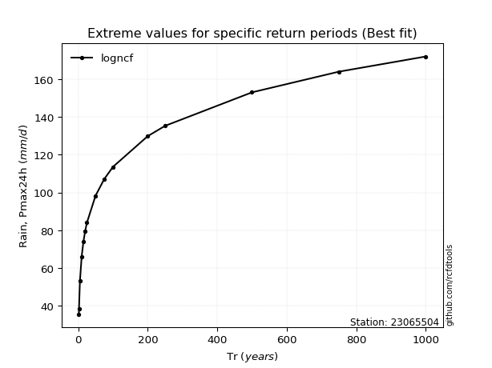</img>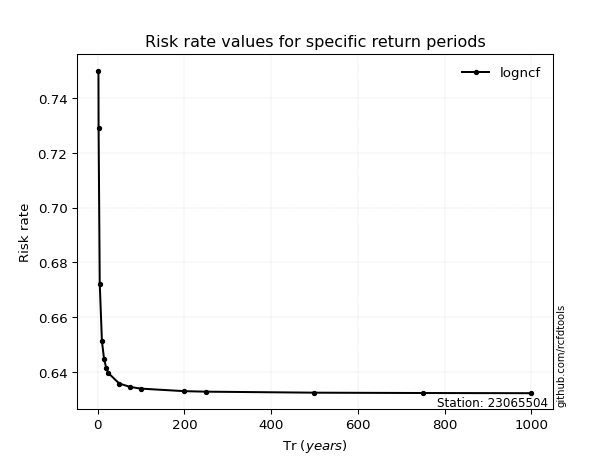</img>

</div>


<sub>**APP DISCLAIMER**: NO WARRANTY - This software is provided by [github.com/rcfdtools](https://github.com/rcfdtools) "as is", without any express or implied warranty, including warranties of merchantability, fitness for a particular purpose, or non-infringement. There is no guarantee that the software will be error-free or operate without interruption. LIMITATION OF LIABILITY - Neither the authors nor copyright holders will be liable for claims or damages arising from the software or its use. You are responsible for determining if the software is appropriate for your use and assume all associated risks, including errors, legal compliance, and data loss. NO PROFESSIONAL ADVICE - The software provides general information and does not offer professional advice. It should not replace consultation with professional advisors.</sub>