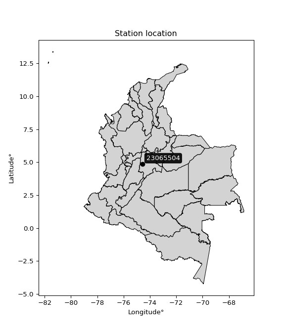

<div align="center">


</div>

# Station (rain, Pmax24h): 23065504

Probable Maximum Precipitation (PMP) is the greatest amount of rainfall for a specific duration that is meteorologically possible for a given location, acting as a "worst-case" scenario for extreme storms, crucial for designing safety-critical infrastructure like bridges, river deviations, dams, spillways, and nuclear plants to prevent catastrophic failure. PMP is calculated by hydrologists using meteorological data to determine the upper limit of extreme rainfall, often leading to the Probable Maximum Flood (PMF) for flood control design, and is increasingly being studied for climate change impacts.

<div align="center">

</img>

</div>


## A. General information


### 1. General running parameters

• app_version: _v20251226_. • runtime: _2025-12-26 15:38:16.554582_. • Python version: _3.14.0_. • SciPy version: _1.16.3_. • Pandas version: _2.3.3_. • NumPy version: _2.3.5_. • Stations dataset (station_dataset_file): _dataset/pmax24h_in/automatic_colombia_2003_2024.csv_. • Stations catalog (station_catalog_file): _dataset/CNE_IDEAM.xls_. • Minimum year to eval til year_max (date_min): _2003_. • Maximum year to eval since year_min (date_max): _2024_. • Creates, save and include plots into reports (create_plot): _False_. • Plot only fit distributions with Δo > Δ (plot_only_fit): _True_. • Eval low extreme values, if False, evaluates high extreme values (low_extreme): _False_. • Eval every SciPy distribution as logarithmic (pdist_logarithmic_on): _True_. • Standard deviation normalized (ddof): _1.0_. • Return periods to eval in years (Tr): _[2, 2.33, 5, 10, 15, 20, 25, 50, 75, 100, 200, 250, 500, 750, 1000]_. • Minimum data sample per station, 0 means any (minimum_sample): _5_. • Z-Score threshold to adjust a value, 0 means disable (zscore): _3.5_. • Avoid zeros, e.g. rain = 0 (avoid_zeros): _True_. • Avoid null values (avoid_nans): _True_. [:file_folder:Dataset file.](../../dataset/pmax24h_in/automatic_colombia_2003_2024.csv)


### 2. Station info and location

|   id |   CODIGO | NOMBRE                   | CATEGORIA               | TECNOLOGIA                | ESTADO   |   FECHA_INSTALACION |   FECHA_SUSPENSION |   ALTITUD |   LATITUD |   LONGITUD | DEPARTAMENTO   | MUNICIPIO   | AREA_OPERATIVA                            | ENTIDAD                                       | AREA_HIDROGRAFICA   | ZONA_HIDROGRAFICA   | SUBZONA_HIDROGRAFICA   |   CORRIENTE |   OBSERVACION |   SUBRED | Catalogo   |
|-----:|---------:|:-------------------------|:------------------------|:--------------------------|:---------|--------------------:|-------------------:|----------:|----------:|-----------:|:---------------|:------------|:------------------------------------------|:----------------------------------------------|:--------------------|:--------------------|:-----------------------|------------:|--------------:|---------:|:-----------|
|    0 | 23065504 | VIANI  - AUT  [23065504] | Climatológica Principal | Automática con Telemetría | Activa   |                 nan |                nan |         2 |   4.87189 |   -74.5725 | Cundinamarca   | Vianí       | Area Operativa 11 - Cundinamarca-Amazonas | CORPORACION AUTONOMA REGIONAL DE CUNDINAMARCA | Magdalena Cauca     | Medio Magdalena     | Río Negro              |         nan |           nan |      nan | CNE_OE     |

<div align="center">

Map location in: [:earth_americas:Google](http://maps.google.com/maps?q=4.871888889,-74.5725) [:earth_americas:OSM](https://www.openstreetmap.org/#map=18/4.871888889/-74.5725&layers=P) [:earth_americas:Bing](https://www.bing.com/maps?cp=4.871888889~-74.5725&lvl=18) [:earth_americas:Apple](https://maps.apple.com/frame?center=4.871888889%2C-74.5725&span=0.003%2C0.006)

</div>


<div align="center">

```geojson
{
  "type": "Feature",
  "geometry": {
    "type": "Point", 
    "coordinates": [-74.5725, 4.871888889]
  }, 
  "properties": {
    "Name": "23065504"
  }
}
```

</div>


### 3. Discrete values table and plot

|               |          0 |           1 |           2 |           3 |          4 |           5 |          6 |
|:--------------|-----------:|------------:|------------:|------------:|-----------:|------------:|-----------:|
| Date          | 2015       | 2016        | 2017        | 2018        | 2019       | 2020        | 2021       |
| Value         |   22.9     |   47.4      |   41.2      |   33        |   24.4     |   39.1      |   53       |
| Value_initial |   22.9     |   47.4      |   41.2      |   33        |   24.4     |   39.1      |   53       |
| count         |    7       |    7        |    7        |    7        |    7       |    7        |    7       |
| mean          |   37.2857  |   37.2857   |   37.2857   |   37.2857   |   37.2857  |   37.2857   |   37.2857  |
| std           |   11.2488  |   11.2488   |   11.2488   |   11.2488   |   11.2488  |   11.2488   |   11.2488  |
| zscore        |   -1.27887 |    0.899146 |    0.347975 |   -0.380994 |   -1.14552 |    0.161288 |    1.39698 |
> If Z-Score is active, values out of range or outliers are replaced with the station mean value.


### 4. Active continuous probability distributions from SciPy (45 of 104 available)

[scipy.stats](https://docs.scipy.org/doc/scipy/reference/stats.html) is a Python´s powerful submodule within the SciPy library for comprehensive statistical analysis, offering over 130 probability distributions (like Normal, Poisson), functions for descriptive stats (mean, variance), hypothesis testing (t-tests, chi-square), random variable generation, and statistical tests, making it essential for data science, modeling, and research. It provides tools to explore, model, and draw conclusions from data efficiently, working seamlessly with NumPy.

<div align="center">

|   id | p_dist             |   n_parameter | fit_method   | label                                                                       | active   | ref                                                                                                        |
|-----:|:-------------------|--------------:|:-------------|:----------------------------------------------------------------------------|:---------|:-----------------------------------------------------------------------------------------------------------|
|    0 | alpha              |             3 | MLE          | Alpha                                                                       | True     | [:mortar_board:](https://docs.scipy.org/doc/scipy/reference/generated/scipy.stats.alpha.html)              |
|    1 | betaprime          |             4 | MLE          | Beta prime                                                                  | True     | [:mortar_board:](https://docs.scipy.org/doc/scipy/reference/generated/scipy.stats.betaprime.html)          |
|    2 | chi2               |             3 | MLE          | Chi²                                                                        | True     | [:mortar_board:](https://docs.scipy.org/doc/scipy/reference/generated/scipy.stats.chi2.html)               |
|    3 | crystalball        |             4 | MLE          | Crystalball                                                                 | True     | [:mortar_board:](https://docs.scipy.org/doc/scipy/reference/generated/scipy.stats.crystalball.html)        |
|    4 | erlang             |             3 | MLE          | Erlang                                                                      | True     | [:mortar_board:](https://docs.scipy.org/doc/scipy/reference/generated/scipy.stats.erlang.html)             |
|    5 | expon              |             2 | MLE          | Exponential                                                                 | True     | [:mortar_board:](https://docs.scipy.org/doc/scipy/reference/generated/scipy.stats.expon.html)              |
|    6 | exponnorm          |             3 | MLE          | Exponentially modified Normal                                               | True     | [:mortar_board:](https://docs.scipy.org/doc/scipy/reference/generated/scipy.stats.exponnorm.html)          |
|    7 | f                  |             4 | MLE          | F                                                                           | True     | [:mortar_board:](https://docs.scipy.org/doc/scipy/reference/generated/scipy.stats.f.html)                  |
|    8 | fatiguelife        |             3 | MLE          | Fatigue-life (Birnbaum-Saunders)                                            | True     | [:mortar_board:](https://docs.scipy.org/doc/scipy/reference/generated/scipy.stats.fatiguelife.html)        |
|    9 | fisk               |             3 | MLE          | Fisk                                                                        | True     | [:mortar_board:](https://docs.scipy.org/doc/scipy/reference/generated/scipy.stats.fisk.html)               |
|   10 | gamma              |             3 | MLE          | Gamma                                                                       | True     | [:mortar_board:](https://docs.scipy.org/doc/scipy/reference/generated/scipy.stats.gamma.html)              |
|   11 | genexpon           |             5 | MLE          | Generalized exponential                                                     | True     | [:mortar_board:](https://docs.scipy.org/doc/scipy/reference/generated/scipy.stats.genexpon.html)           |
|   12 | genlogistic        |             3 | MLE          | Generalized logistic                                                        | True     | [:mortar_board:](https://docs.scipy.org/doc/scipy/reference/generated/scipy.stats.genlogistic.html)        |
|   13 | gibrat             |             2 | MM           | Gibrat                                                                      | True     | [:mortar_board:](https://docs.scipy.org/doc/scipy/reference/generated/scipy.stats.gibrat.html)             |
|   14 | gompertz           |             3 | MLE          | Gompertz (or truncated Gumbel)                                              | True     | [:mortar_board:](https://docs.scipy.org/doc/scipy/reference/generated/scipy.stats.gompertz.html)           |
|   15 | gumbel_l           |             2 | MM           | Gumbel Left Skew                                                            | True     | [:mortar_board:](https://docs.scipy.org/doc/scipy/reference/generated/scipy.stats.gumbel_l.html)           |
|   16 | gumbel_r           |             2 | MM           | Gumbel Right Skew                                                           | True     | [:mortar_board:](https://docs.scipy.org/doc/scipy/reference/generated/scipy.stats.gumbel_r.html)           |
|   17 | halflogistic       |             2 | MM           | Half-logistic                                                               | True     | [:mortar_board:](https://docs.scipy.org/doc/scipy/reference/generated/scipy.stats.halflogistic.html)       |
|   18 | halfnorm           |             2 | MM           | Half Normal                                                                 | True     | [:mortar_board:](https://docs.scipy.org/doc/scipy/reference/generated/scipy.stats.halfnorm.html)           |
|   19 | hypsecant          |             2 | MM           | hyperbolic secant                                                           | True     | [:mortar_board:](https://docs.scipy.org/doc/scipy/reference/generated/scipy.stats.hypsecant.html)          |
|   20 | invgamma           |             3 | MLE          | Inverted gamma                                                              | True     | [:mortar_board:](https://docs.scipy.org/doc/scipy/reference/generated/scipy.stats.invgamma.html)           |
|   21 | invgauss           |             3 | MLE          | Inverse Gaussian                                                            | True     | [:mortar_board:](https://docs.scipy.org/doc/scipy/reference/generated/scipy.stats.invgauss.html)           |
|   22 | invweibull         |             3 | MLE          | Inverted Weibull                                                            | True     | [:mortar_board:](https://docs.scipy.org/doc/scipy/reference/generated/scipy.stats.invweibull.html)         |
|   23 | johnsonsu          |             4 | MLE          | Johnson Su                                                                  | True     | [:mortar_board:](https://docs.scipy.org/doc/scipy/reference/generated/scipy.stats.johnsonsu.html)          |
|   24 | kstwobign          |             2 | MLE          | Limiting distribution of scaled Kolmogorov-Smirnov two-sided test statistic | True     | [:mortar_board:](https://docs.scipy.org/doc/scipy/reference/generated/scipy.stats.kstwobign.html)          |
|   25 | laplace            |             2 | MM           | Laplace                                                                     | True     | [:mortar_board:](https://docs.scipy.org/doc/scipy/reference/generated/scipy.stats.laplace.html)            |
|   26 | laplace_asymmetric |             3 | MLE          | Asymmetric Laplace                                                          | True     | [:mortar_board:](https://docs.scipy.org/doc/scipy/reference/generated/scipy.stats.laplace_asymmetric.html) |
|   27 | loggamma           |             3 | MLE          | Log gamma                                                                   | True     | [:mortar_board:](https://docs.scipy.org/doc/scipy/reference/generated/scipy.stats.loggamma.html)           |
|   28 | logistic           |             2 | MM           | Logistic (or Sech-squared)                                                  | True     | [:mortar_board:](https://docs.scipy.org/doc/scipy/reference/generated/scipy.stats.logistic.html)           |
|   29 | lognorm            |             3 | MLE          | Log Normal                                                                  | True     | [:mortar_board:](https://docs.scipy.org/doc/scipy/reference/generated/scipy.stats.lognorm.html)            |
|   30 | maxwell            |             2 | MM           | Maxwell                                                                     | True     | [:mortar_board:](https://docs.scipy.org/doc/scipy/reference/generated/scipy.stats.maxwell.html)            |
|   31 | mielke             |             4 | MLE          | Mielke Beta-Kappa / Dagum                                                   | True     | [:mortar_board:](https://docs.scipy.org/doc/scipy/reference/generated/scipy.stats.mielke.html)             |
|   32 | moyal              |             2 | MM           | Moyal                                                                       | True     | [:mortar_board:](https://docs.scipy.org/doc/scipy/reference/generated/scipy.stats.moyal.html)              |
|   33 | nakagami           |             3 | MLE          | Nakagami                                                                    | True     | [:mortar_board:](https://docs.scipy.org/doc/scipy/reference/generated/scipy.stats.nakagami.html)           |
|   34 | ncf                |             5 | MLE          | Non-central F distribution                                                  | True     | [:mortar_board:](https://docs.scipy.org/doc/scipy/reference/generated/scipy.stats.ncf.html)                |
|   35 | nct                |             4 | MLE          | Non-central Student’s t                                                     | True     | [:mortar_board:](https://docs.scipy.org/doc/scipy/reference/generated/scipy.stats.nct.html)                |
|   36 | norm               |             2 | MM           | Normal                                                                      | True     | [:mortar_board:](https://docs.scipy.org/doc/scipy/reference/generated/scipy.stats.norm.html)               |
|   37 | pareto             |             3 | MLE          | Pareto                                                                      | True     | [:mortar_board:](https://docs.scipy.org/doc/scipy/reference/generated/scipy.stats.pareto.html)             |
|   38 | pearson3           |             3 | MM           | Pearson type III                                                            | True     | [:mortar_board:](https://docs.scipy.org/doc/scipy/reference/generated/scipy.stats.pearson3.html)           |
|   39 | rayleigh           |             2 | MM           | Rayleigh                                                                    | True     | [:mortar_board:](https://docs.scipy.org/doc/scipy/reference/generated/scipy.stats.rayleigh.html)           |
|   40 | rice               |             3 | MLE          | Rice                                                                        | True     | [:mortar_board:](https://docs.scipy.org/doc/scipy/reference/generated/scipy.stats.rice.html)               |
|   41 | t                  |             3 | MLE          | Student’s t                                                                 | True     | [:mortar_board:](https://docs.scipy.org/doc/scipy/reference/generated/scipy.stats.t.html)                  |
|   42 | truncnorm          |             4 | MLE          | Truncated normal                                                            | True     | [:mortar_board:](https://docs.scipy.org/doc/scipy/reference/generated/scipy.stats.truncnorm.html)          |
|   43 | wald               |             2 | MM           | Wald                                                                        | True     | [:mortar_board:](https://docs.scipy.org/doc/scipy/reference/generated/scipy.stats.wald.html)               |
|   44 | weibull_min        |             3 | MLE          | Weibull minimum                                                             | True     | [:mortar_board:](https://docs.scipy.org/doc/scipy/reference/generated/scipy.stats.weibull_min.html)        |

</div>

> **n_parameter:** # arguments & localization & scale.
>
> **Fit methods:** (MLE) maximum likelihood, (MM) L-moments.
>
>**Inactive:** foldnorm, gennorm, norminvgauss, powernorm, powerlognorm, skewnorm, genextreme, anglit, arcsine, argus, beta, bradford, burr, burr12, cauchy, cosine, halfcauchy, foldcauchy, skewcauchy, wrapcauchy, dgamma, gengamma, exponweib, exponpow, truncexpon, gausshyper, genhalflogistic, genhyperbolic, geninvgauss, halfgennorm, johnsonsb, kappa4, kappa3, ksone, kstwo, loglaplace, levy, levy_l, levy_stable, ncx2, genpareto, truncpareto, lomax, powerlaw, rdist, rel_breitwigner, recipinvgauss, semicircular, studentized_range, trapezoid, triang, truncweibull_min, tukeylambda, uniform, loguniform, vonmises, vonmises_line, weibull_max, dweibull, 


## B. Probability distributions vs. Empirical distributions

A continuous probability distribution (CPD) describes probabilities for variables that can take any value within a range (like rain any time), unlike discrete variables with specific outcomes (like temperature). It uses a Probability Density Function (PDF), a curve where the total area under it equals 1, and the probability of the variable falling within an interval (a to b) is found by calculating the area under the curve between those points. A key feature is that the probability of hitting any single exact value is zero, so probabilities are always expressed for ranges, e.g., $P(a ≤ X ≤ b)$.

<div align="center">

Distributions parameters
|    |   station | p_dist                |   n |            loc |          scale | shape                 | shape1                 | shape2                | shape3   |
|---:|----------:|:----------------------|----:|---------------:|---------------:|:----------------------|:-----------------------|:----------------------|:---------|
|  0 |  23065504 | alpha                 |   7 | -138.396       | 2950.59        | 16.86137881415488     |                        |                       |          |
|  1 |  23065504 | betaprime             |   7 |  -35.4424      | 4980.31        | 48.49154541712039     | 3319.2578524033415     |                       |          |
|  2 |  23065504 | chi2                  |   7 |   22.9         |    7.34214     | 1.5596025801168216    |                        |                       |          |
|  3 |  23065504 | crystalball           |   7 |   37.2857      |   10.4143      | 3370.631856591368     | 2263.2954731099053     |                       |          |
|  4 |  23065504 | erlang                |   7 | -774.483       |    0.133645    | 6074.017880714604     |                        |                       |          |
|  5 |  23065504 | expon                 |   7 |   22.9         |   14.3857      |                       |                        |                       |          |
|  6 |  23065504 | exponnorm             |   7 |   37.2721      |   10.4143      | 0.001307530621666431  |                        |                       |          |
|  7 |  23065504 | f                     |   7 | -351.824       |  389.099       | 2885.701799093711     | 80266.97759337767      |                       |          |
|  8 |  23065504 | fatiguelife           |   7 |   22.9         |    2.02759e-06 | 2474.7996292420803    |                        |                       |          |
|  9 |  23065504 | fisk                  |   7 |   -0.0903469   |   36.5035      | 5.574801604905975     |                        |                       |          |
| 10 |  23065504 | gamma                 |   7 | -774.49        |    0.133644    | 6074.121069845805     |                        |                       |          |
| 11 |  23065504 | genexpon              |   7 |   22.9         |    2.21404     | 0.15390466851829632   | 1.2296854652100967e-06 | 1.1984311028062997    |          |
| 12 |  23065504 | genlogistic           |   7 |  -20.978       |    9.35611     | 291.14861279955903    |                        |                       |          |
| 13 |  23065504 | gibrat                |   7 |   29.3409      |    4.81879     |                       |                        |                       |          |
| 14 |  23065504 | gompertz              |   7 |   22.9         |   18.0069      | 0.6205779531423978    |                        |                       |          |
| 15 |  23065504 | gumbel_l              |   7 |   41.9727      |    8.12002     |                       |                        |                       |          |
| 16 |  23065504 | gumbel_r              |   7 |   32.5987      |    8.12002     |                       |                        |                       |          |
| 17 |  23065504 | halflogistic          |   7 |   24.9423      |    8.9039      |                       |                        |                       |          |
| 18 |  23065504 | halfnorm              |   7 |   23.5012      |   17.2763      |                       |                        |                       |          |
| 19 |  23065504 | hypsecant             |   7 |   37.2857      |    6.62997     |                       |                        |                       |          |
| 20 |  23065504 | invgamma              |   7 |  -61.573       | 8623.53        | 88.25671372346699     |                        |                       |          |
| 21 |  23065504 | invgauss              |   7 |   -8.26622     |  786.096       | 0.05780250820754422   |                        |                       |          |
| 22 |  23065504 | invweibull            |   7 |   -1.43431e+08 |    1.43431e+08 | 15317624.66650761     |                        |                       |          |
| 23 |  23065504 | johnsonsu             |   7 |   -9.32777e+07 |    3.8296e+06  | -34723248.554712325   | 8934576.765598783      |                       |          |
| 24 |  23065504 | kstwobign             |   7 |   -0.000673617 |   42.5124      |                       |                        |                       |          |
| 25 |  23065504 | laplace               |   7 |   37.2857      |    7.36405     |                       |                        |                       |          |
| 26 |  23065504 | laplace_asymmetric    |   7 |   41.2         |    8.38727     | 1.260229165590984     |                        |                       |          |
| 27 |  23065504 | loggamma              |   7 | -694.903       |  140.653       | 182.79806132784512    |                        |                       |          |
| 28 |  23065504 | logistic              |   7 |   37.2857      |    5.74172     |                       |                        |                       |          |
| 29 |  23065504 | lognorm               |   7 |   22.9         |    0.0736612   | 12.5520788866052      |                        |                       |          |
| 30 |  23065504 | maxwell               |   7 |   12.6081      |   15.4644      |                       |                        |                       |          |
| 31 |  23065504 | mielke                |   7 |   -9.01405     |    7.62575     | 8613.151634091355     | 4.561910712408768      |                       |          |
| 32 |  23065504 | moyal                 |   7 |   31.3301      |    4.6881      |                       |                        |                       |          |
| 33 |  23065504 | nakagami              |   7 |   22.9         |   18.6614      | 0.2745089383202822    |                        |                       |          |
| 34 |  23065504 | ncf                   |   7 | -774.874       |  811.726       | 233868.16259765363    | 12762.635148446348     | 77.21856758310378     |          |
| 35 |  23065504 | nct                   |   7 |  -14.8314      |   10.4209      | 8693.967661488412     | 5.003019192305112      |                       |          |
| 36 |  23065504 | norm                  |   7 |   37.2857      |   10.4143      |                       |                        |                       |          |
| 37 |  23065504 | pareto                |   7 |   22.8877      |    0.0122548   | 0.16893586676942307   |                        |                       |          |
| 38 |  23065504 | pearson3              |   7 |   37.2857      |   10.4143      | -0.02710779074494871  |                        |                       |          |
| 39 |  23065504 | rayleigh              |   7 |   17.3625      |   15.8964      |                       |                        |                       |          |
| 40 |  23065504 | rice                  |   7 |   17.1586      |   12.5966      | 1.1120107631712726    |                        |                       |          |
| 41 |  23065504 | t                     |   7 |   37.2854      |   10.4146      | 18485707.660975624    |                        |                       |          |
| 42 |  23065504 | truncnorm             |   7 |   -7.2727      |    4.83602     | -43.47114176079333    | 12.463273911891648     |                       |          |
| 43 |  23065504 | wald                  |   7 |   26.8713      |   10.4144      |                       |                        |                       |          |
| 44 |  23065504 | weibull_min           |   7 |   22.9         |   15.776       | 0.8819819197939056    |                        |                       |          |
| 45 |  23065504 | logalpha              |   7 |   -4.51288     |  216.836       | 26.85174749395886     |                        |                       |          |
| 46 |  23065504 | logbetaprime          |   7 |   -8.38241     |   25.2843      | 2347.070585708146     | 4963.258916433539      |                       |          |
| 47 |  23065504 | logchi2               |   7 |    3.13114     |    0.989188    | 1.0261991426717496    |                        |                       |          |
| 48 |  23065504 | logcrystalball        |   7 |    3.57653     |    0.296034    | 1090.5388793341438    | 184.32835205387562     |                       |          |
| 49 |  23065504 | logerlang             |   7 |   -1.16249     |    0.0189982   | 249.50351634658455    |                        |                       |          |
| 50 |  23065504 | logexpon              |   7 |    3.13114     |    0.445392    |                       |                        |                       |          |
| 51 |  23065504 | logexponnorm          |   7 |    3.57627     |    0.296034    | 0.0008839886562115066 |                        |                       |          |
| 52 |  23065504 | logf                  |   7 | -117.089       |  120.665       | 846573.7288963818     | 540854.5697034636      |                       |          |
| 53 |  23065504 | logfatiguelife        |   7 |  -26.4587      |   30.0337      | 0.00988390816331599   |                        |                       |          |
| 54 |  23065504 | logfisk               |   7 |   -7.16015e+06 |    7.16016e+06 | 40183435.54770321     |                        |                       |          |
| 55 |  23065504 | loggamma              |   7 |   -1.29787     |    0.0183888   | 265.02175016956267    |                        |                       |          |
| 56 |  23065504 | loggenexpon           |   7 |    3.12997     |    0.00810548  | 0.010140247709014602  | 3.7555306559169495     | 5.364387934771929e-05 |          |
| 57 |  23065504 | loggenlogistic        |   7 |    3.9703      |    1.06536e-06 | 2.70045029883403e-06  |                        |                       |          |
| 58 |  23065504 | loggibrat             |   7 |    3.35063     |    0.137012    |                       |                        |                       |          |
| 59 |  23065504 | loggompertz           |   7 |    3.13114     |    0.410904    | 0.3769921451371332    |                        |                       |          |
| 60 |  23065504 | loggumbel_l           |   7 |    3.70976     |    0.230816    |                       |                        |                       |          |
| 61 |  23065504 | loggumbel_r           |   7 |    3.4433      |    0.230816    |                       |                        |                       |          |
| 62 |  23065504 | loghalflogistic       |   7 |    3.22568     |    0.253083    |                       |                        |                       |          |
| 63 |  23065504 | loghalfnorm           |   7 |    3.18469     |    0.491103    |                       |                        |                       |          |
| 64 |  23065504 | loghypsecant          |   7 |    3.57653     |    0.188461    |                       |                        |                       |          |
| 65 |  23065504 | loginvgamma           |   7 |   -1.89723     | 1785.72        | 327.36879809303935    |                        |                       |          |
| 66 |  23065504 | loginvgauss           |   7 |    1.39088     |  108.557       | 0.020088656020397964  |                        |                       |          |
| 67 |  23065504 | loginvweibull         |   7 |   -2.81262e+07 |    2.81262e+07 | 99561699.59495772     |                        |                       |          |
| 68 |  23065504 | logjohnsonsu          |   7 |    4.26661     |    0.0165862   | 9.496790881332167     | 2.19719516349277       |                       |          |
| 69 |  23065504 | logkstwobign          |   7 |    2.45814     |    1.2733      |                       |                        |                       |          |
| 70 |  23065504 | loglaplace            |   7 |    3.57653     |    0.209327    |                       |                        |                       |          |
| 71 |  23065504 | loglaplace_asymmetric |   7 |    3.71844     |    0.221146    | 1.3710552677173151    |                        |                       |          |
| 72 |  23065504 | logloggamma           |   7 |    3.97032     |    2.62364e-06 | 6.669012853546579e-06 |                        |                       |          |
| 73 |  23065504 | loglogistic           |   7 |    3.57653     |    0.163212    |                       |                        |                       |          |
| 74 |  23065504 | loglognorm            |   7 |    3.13114     |    0.00295653  | 12.081102172138838    |                        |                       |          |
| 75 |  23065504 | logmaxwell            |   7 |    2.87505     |    0.439584    |                       |                        |                       |          |
| 76 |  23065504 | logmielke             |   7 |   -8.14946e+06 |    8.14947e+06 | 19837918.982244775    | 488581292.5577699      |                       |          |
| 77 |  23065504 | logmoyal              |   7 |    3.40724     |    0.133262    |                       |                        |                       |          |
| 78 |  23065504 | lognakagami           |   7 |    3.13114     |    0.596478    | 0.21128914162365503   |                        |                       |          |
| 79 |  23065504 | logncf                |   7 |   -3.65809     |    7.23056     | 615.8885741426741     | 2028.8212737131269     | 0.059871358232268655  |          |
| 80 |  23065504 | lognct                |   7 |   -9.65663     |    0.265848    | 4917.531707062095     | 49.76863440526307      |                       |          |
| 81 |  23065504 | lognorm               |   7 |    3.57653     |    0.296034    |                       |                        |                       |          |
| 82 |  23065504 | logpareto             |   7 |    3.13074     |    0.000401058 | 0.1685827926350379    |                        |                       |          |
| 83 |  23065504 | logpearson3           |   7 |    3.57653     |    0.296034    | -0.31670283807117994  |                        |                       |          |
| 84 |  23065504 | lograyleigh           |   7 |    3.0102      |    0.451866    |                       |                        |                       |          |
| 85 |  23065504 | logrice               |   7 |    2.96216     |    0.342199    | 1.4041484996930313    |                        |                       |          |
| 86 |  23065504 | logt                  |   7 |    3.57653     |    0.296031    | 233208806.623441      |                        |                       |          |
| 87 |  23065504 | logtruncnorm          |   7 |   -0.0828547   |    1.70503     | 1.8469336224074278    | 2.380198132301472      |                       |          |
| 88 |  23065504 | logwald               |   7 |    3.28047     |    0.296061    |                       |                        |                       |          |
| 89 |  23065504 | logweibull_min        |   7 |    0.435814    |    3.27264     | 12.98136961536145     |                        |                       |          |

</div>

> **loc** (Location parameter): This shifts the distribution along the x-axis. For many common distributions, like the normal (Gaussian) distribution, loc represents the mean $μ$. For others, like the uniform distribution, it might represent the minimum value, or for the beta distribution, the left end of the support interval.
>
> **scale** (Scale parameter): This determines the width or spread of the distribution. For the normal distribution, scale represents the standard deviation $σ$. For a uniform distribution, it defines the length of the interval (from $loc$ to $loc + scale$).
>
> **shape** (Shape parameters): Refers to parameters that define the specific form of a probability distribution, distinct from its location (loc) and scale (scale). These parameters are required arguments for most distribution functions. For example, a normal (Gaussian) distribution is fully defined by its location (mean) and scale (standard deviation), so it has no specific shape parameters beyond loc and scale. However, other distributions have intrinsic properties that need specification, as Gamma distribution that takes a shape parameter, often named $a$ or $alpha$.


### 0. Cumulative distribution values - CDF (90 evaluated)

> Ordered by x ascending and calculating $log(f(x))$ separately. 

|   id |   Station |   date |    x |   count |    mean |     std |    zscore |   Value_initial |   station |   m |     alpha |   alpha_pdf |   betaprime |   betaprime_pdf |      chi2 |     chi2_pdf |   crystalball |   crystalball_pdf |    erlang |   erlang_pdf |     expon |   expon_pdf |   exponnorm |   exponnorm_pdf |         f |     f_pdf |   fatiguelife |   fatiguelife_pdf |      fisk |   fisk_pdf |     gamma |   gamma_pdf |    genexpon |   genexpon_pdf |   genlogistic |   genlogistic_pdf |   gibrat |   gibrat_pdf |    gompertz |   gompertz_pdf |   gumbel_l |   gumbel_l_pdf |   gumbel_r |   gumbel_r_pdf |   halflogistic |   halflogistic_pdf |   halfnorm |   halfnorm_pdf |   hypsecant |   hypsecant_pdf |   invgamma |   invgamma_pdf |   invgauss |   invgauss_pdf |   invweibull |   invweibull_pdf |   johnsonsu |   johnsonsu_pdf |   kstwobign |   kstwobign_pdf |   laplace |   laplace_pdf |   laplace_asymmetric |   laplace_asymmetric_pdf |   loggamma |   loggamma_pdf |   logistic |   logistic_pdf |   lognorm |   lognorm_pdf |   maxwell |   maxwell_pdf |   mielke |   mielke_pdf |     moyal |   moyal_pdf |    nakagami |    nakagami_pdf |       ncf |   ncf_pdf |       nct |   nct_pdf |      norm |   norm_pdf |   pareto |   pareto_pdf |   pearson3 |   pearson3_pdf |   rayleigh |   rayleigh_pdf |      rice |   rice_pdf |         t |     t_pdf |   truncnorm |   truncnorm_pdf |     wald |   wald_pdf |   weibull_min |   weibull_min_pdf |   logalpha |   logalpha_pdf |   logbetaprime |   logbetaprime_pdf |    logchi2 |   logchi2_pdf |   logcrystalball |   logcrystalball_pdf |   logerlang |   logerlang_pdf |   logexpon |   logexpon_pdf |   logexponnorm |   logexponnorm_pdf |      logf |   logf_pdf |   logfatiguelife |   logfatiguelife_pdf |   logfisk |   logfisk_pdf |   loggenexpon |   loggenexpon_pdf |   loggenlogistic |   loggenlogistic_pdf |   loggibrat |   loggibrat_pdf |   loggompertz |   loggompertz_pdf |   loggumbel_l |   loggumbel_l_pdf |   loggumbel_r |   loggumbel_r_pdf |   loghalflogistic |   loghalflogistic_pdf |   loghalfnorm |   loghalfnorm_pdf |   loghypsecant |   loghypsecant_pdf |   loginvgamma |   loginvgamma_pdf |   loginvgauss |   loginvgauss_pdf |   loginvweibull |   loginvweibull_pdf |   logjohnsonsu |   logjohnsonsu_pdf |   logkstwobign |   logkstwobign_pdf |   loglaplace |   loglaplace_pdf |   loglaplace_asymmetric |   loglaplace_asymmetric_pdf |   logloggamma |   logloggamma_pdf |   loglogistic |   loglogistic_pdf |   loglognorm |   loglognorm_pdf |   logmaxwell |   logmaxwell_pdf |   logmielke |   logmielke_pdf |   logmoyal |   logmoyal_pdf |   lognakagami |   lognakagami_pdf |   logncf |   logncf_pdf |    lognct |   lognct_pdf |   logpareto |   logpareto_pdf |   logpearson3 |   logpearson3_pdf |   lograyleigh |   lograyleigh_pdf |   logrice |   logrice_pdf |      logt |   logt_pdf |   logtruncnorm |   logtruncnorm_pdf |   logwald |   logwald_pdf |   logweibull_min |   logweibull_min_pdf |
|-----:|----------:|-------:|-----:|--------:|--------:|--------:|----------:|----------------:|----------:|----:|----------:|------------:|------------:|----------------:|----------:|-------------:|--------------:|------------------:|----------:|-------------:|----------:|------------:|------------:|----------------:|----------:|----------:|--------------:|------------------:|----------:|-----------:|----------:|------------:|------------:|---------------:|--------------:|------------------:|---------:|-------------:|------------:|---------------:|-----------:|---------------:|-----------:|---------------:|---------------:|-------------------:|-----------:|---------------:|------------:|----------------:|-----------:|---------------:|-----------:|---------------:|-------------:|-----------------:|------------:|----------------:|------------:|----------------:|----------:|--------------:|---------------------:|-------------------------:|-----------:|---------------:|-----------:|---------------:|----------:|--------------:|----------:|--------------:|---------:|-------------:|----------:|------------:|------------:|----------------:|----------:|----------:|----------:|----------:|----------:|-----------:|---------:|-------------:|-----------:|---------------:|-----------:|---------------:|----------:|-----------:|----------:|----------:|------------:|----------------:|---------:|-----------:|--------------:|------------------:|-----------:|---------------:|---------------:|-------------------:|-----------:|--------------:|-----------------:|---------------------:|------------:|----------------:|-----------:|---------------:|---------------:|-------------------:|----------:|-----------:|-----------------:|---------------------:|----------:|--------------:|--------------:|------------------:|-----------------:|---------------------:|------------:|----------------:|--------------:|------------------:|--------------:|------------------:|--------------:|------------------:|------------------:|----------------------:|--------------:|------------------:|---------------:|-------------------:|--------------:|------------------:|--------------:|------------------:|----------------:|--------------------:|---------------:|-------------------:|---------------:|-------------------:|-------------:|-----------------:|------------------------:|----------------------------:|--------------:|------------------:|--------------:|------------------:|-------------:|-----------------:|-------------:|-----------------:|------------:|----------------:|-----------:|---------------:|--------------:|------------------:|---------:|-------------:|----------:|-------------:|------------:|----------------:|--------------:|------------------:|--------------:|------------------:|----------:|--------------:|----------:|-----------:|---------------:|-------------------:|----------:|--------------:|-----------------:|---------------------:|
|    0 |  23065504 |   2015 | 22.9 |       7 | 37.2857 | 11.2488 | -1.27887  |            22.9 |  23065504 |   1 | 0.0761323 |   0.0162385 |   0.0769317 |       0.01593   | 7.173e-13 | 157.443      |     0.0835875 |         0.0147551 | 0.0830708 |    0.0148605 | 0         |   0.0695134 |    0.083588 |       0.0147551 | 0.0825156 | 0.0149801 |     0.0773272 |       6.30915e+11 | 0.0706062 |  0.0159121 | 0.0830711 |   0.0148605 | 1.58879e-07 |     0.0695131  |     0.0697314 |         0.0197577 | 0        |   0          | 1.32407e-11 |      0.0344633 |  0.0910624 |     0.0106877  |  0.0368228 |     0.0149723  |       0        |         0          |  0         |      0         |   0.0723886 |      0.0108245  |  0.0754174 |      0.0166001 |  0.0707391 |      0.0185254 |     0.069409 |        0.0197746 |   0.0842865 |       0.0147985 |   0.0662747 |       0.0217138 | 0.070888  |    0.00962623 |             0.108642 |               0.0102784  |  0.06531   |       0.453168 |  0.0754756 |      0.012153  | 0.0662222 |      0.434541 | 0.0687595 |     0.0183127 |      nan |          nan | 0.0139951 |  0.0102115  | 1.81992e-09 | 281241          | 0.0835237 | 0.015054  | 0.0835081 | 0.0147335 | 0.0835876 |  0.0147551 | 0        |  13.7853     |  0.0842059 |      0.0146547 |  0.0588697 |      0.0206236 | 0.0548598 |  0.0187214 | 0.0835978 | 0.014756  |           1 |     2.90752e-10 | 0        |  0         |   1.58214e-14 |        3.92775    |   0.064888 |       0.4699   |      0.0666671 |           0.446261 | 1.0539e-08 |   1.21768e+07 |        0.0662223 |             0.434541 |   0.0647482 |        0.450042 |   0        |       2.24521  |      0.0662228 |           0.434544 | 0.0664669 |   0.43602  |        0.0659762 |             0.438592 | 0.0688829 |      0.359949 |    0.00146317 |          1.25278  |         0        |             0.302102 |    0        |        0        |   1.59733e-08 |          0.91747  |     0.0782898 |          0.325548 |     0.0209257 |          0.35056  |          0        |              0        |     0         |          0        |      0.059735  |           0.315105 |     0.0653678 |          0.470888 |     0.0631411 |          0.507122 |       0.0591973 |            0.592366 |      0.0947318 |           0.326344 |      0.0572948 |           0.666784 |    0.0595537 |         0.2845   |               0.0940858 |                    0.310306 |      0.118467 |          0.301131 |     0.0612883 |          0.352499 |   0.00726179 |      3.75176e+12 |    0.047539  |         0.519854 |    0.124611 |        0.303335 | 0.00483637 |       0.159234 |   3.18417e-07 |       3.02994e+08 | 0.170494 |     0.567326 | 0.0665838 |     0.4399   |    0        |     420.345     |     0.0733674 |          0.407998 |     0.0351819 |          0.571463 | 0.0454016 |      0.535676 | 0.0662202 |   0.434535 |       0.112285 |           1.66863  |  0        |      0        |        0.0773531 |             0.357757 |
|    1 |  23065504 |   2019 | 24.4 |       7 | 37.2857 | 11.2488 | -1.14552  |            24.4 |  23065504 |   2 | 0.10329   |   0.0200045 |   0.103494  |       0.0195185 | 0.17437   |   0.0855536  |     0.107987  |         0.0178173 | 0.107662  |    0.0179668 | 0.0990181 |   0.0626303 |    0.107987 |       0.0178174 | 0.107322  | 0.0181343 |     0.63591   |       0.0435087   | 0.0975224 |  0.0200344 | 0.107662  |   0.0179668 | 0.0990181   |     0.0626304  |     0.103297  |         0.0249663 | 0        |   0          | 0.0524818   |      0.0354913 |  0.108501  |     0.0126095  |  0.0642643 |     0.0217228  |       0        |         0          |  0.0414919 |      0.0461212 |   0.0905446 |      0.0134734  |  0.103207  |      0.0204811 |  0.102003  |      0.0231542 |     0.103017 |        0.0250053 |   0.108742  |       0.0178477 |   0.103235  |       0.027457  | 0.0869031 |    0.011801   |             0.125207 |               0.0118456  |  0.0990792 |       0.614815 |  0.0958489 |      0.0150934 | 0.0984887 |      0.586268 | 0.099331  |     0.0224311 |      nan |          nan | 0.0362519 |  0.0198917  | 0.194789    |      0.071196   | 0.108434  | 0.0181985 | 0.10787   | 0.0177893 | 0.107987  |  0.0178173 | 0.556697 |   0.049522   |  0.108421  |      0.0176719 |  0.0933476 |      0.02525   | 0.0862196 |  0.0230315 | 0.107998  | 0.0178182 |           1 |     4.0011e-11  | 0        |  0         |   0.117958    |        0.0650963  |   0.100013 |       0.640653 |      0.099808  |           0.601915 | 0.19098    |   1.51203     |        0.0984888 |             0.586268 |   0.098295  |        0.610934 |   0.132769 |       1.94712  |      0.0984894 |           0.58627  | 0.0988284 |   0.587732 |        0.0985711 |             0.59253  | 0.0955298 |      0.484906 |    0.0835393  |          1.32807  |         0        |             0.354811 |    0        |        0        |   0.0610045   |          1.00534  |     0.101758  |          0.41763  |     0.0530003 |          0.674502 |          0        |              0        |     0.0160781 |          1.62435  |      0.0834101 |           0.437538 |     0.100524  |          0.640566 |     0.101288  |          0.697871 |       0.104534  |            0.835623 |      0.117841  |           0.404727 |      0.108446  |           0.938897 |    0.0806383 |         0.385226 |               0.115985  |                    0.382533 |      0.1392   |          0.353831 |     0.0878492 |          0.490967 |   0.600175   |      0.503977    |    0.0873839 |         0.736379 |    0.145422 |        0.353995 | 0.0263622  |       0.564583 |   0.305059    |       2.02782     | 0.208747 |     0.637786 | 0.0992438 |     0.593234 |    0.574606 |       1.12321   |     0.103205  |          0.536039 |     0.0798811 |          0.830899 | 0.0855855 |      0.729568 | 0.0984863 |   0.586263 |       0.214503 |           1.55452  |  0        |      0        |        0.103177  |             0.459542 |
|    2 |  23065504 |   2018 | 33   |       7 | 37.2857 | 11.2488 | -0.380994 |            33   |  23065504 |   3 | 0.361814  |   0.0376411 |   0.355145  |       0.0368533 | 0.608991  |   0.0312978  |     0.340345  |         0.0351969 | 0.341814  |    0.0353741 | 0.504449  |   0.0344474 |    0.340346 |       0.035197  | 0.343381  | 0.0355451 |     0.81643   |       0.0118599   | 0.366501  |  0.0391155 | 0.341815  |   0.0353741 | 0.50445     |     0.0344475  |     0.403508  |         0.03908   | 0.391544 |   0.104972   | 0.37301     |      0.0378627 |  0.281944  |     0.0292888  |  0.386053  |     0.0452508  |       0.423938 |         0.0460628  |  0.417555  |      0.039705  |   0.307233  |      0.0394727  |  0.365576  |      0.0377555 |  0.387895  |      0.0389387 |     0.403654 |        0.0391075 |   0.340833  |       0.0350997 |   0.416797  |       0.0390862 | 0.279396  |    0.0379405  |             0.282478 |               0.0267248  |  0.403213  |       1.30728  |  0.321603  |      0.0379981 | 0.39346   |      1.29928  | 0.371657  |     0.0376081 |      nan |          nan | 0.40267   |  0.0501754  | 0.54579     |      0.0278476  | 0.344658  | 0.0355169 | 0.339823  | 0.0351357 | 0.340345  |  0.0351969 | 0.678418 |   0.00537236 |  0.33897   |      0.0350122 |  0.383591  |      0.038145  | 0.362034  |  0.0378654 | 0.34036   | 0.0351966 |           1 |     7.19993e-17 | 0.43765  |  0.0734835 |   0.490748    |        0.0300092  |   0.412563 |       1.31595  |      0.398453  |           1.29591  | 0.445934   |   0.553449    |        0.39346   |             1.29928  |   0.40099   |        1.30303  |   0.559716 |       0.988532 |      0.393461  |           1.29928  | 0.393675  |   1.29595  |        0.395583  |             1.30102  | 0.365057  |      1.30083  |    0.485406   |          1.22146  |         0        |             0.762725 |    0.525    |        2.72938  |   0.417419    |          1.30052  |     0.327643  |          1.15634  |     0.451981  |          1.55502  |          0.489234 |              1.50277  |     0.474533  |          1.32808  |      0.368731  |           1.5474   |     0.412032  |          1.31039  |     0.429578  |          1.3194   |       0.460447  |            1.26408  |      0.323055  |           1.02411  |      0.480854  |           1.25505  |    0.341152  |         1.62976  |               0.313953  |                    1.03546  |      0.299876 |          0.762255 |     0.379825  |          1.44326  |   0.654948   |      0.0834737   |    0.42731   |         1.33547  |    0.303264 |        0.738223 | 0.474374   |       1.6581   |   0.630878    |       0.683292    | 0.439574 |     0.845378 | 0.395864  |     1.29817  |    0.683047 |       0.146082  |     0.374796  |          1.2446   |     0.439613  |          1.33469  | 0.414375  |      1.31562  | 0.393459  |   1.29929  |       0.610417 |           1.08883  |  0.534272 |      2.05616  |        0.342497  |             1.16931  |
|    3 |  23065504 |   2020 | 39.1 |       7 | 37.2857 | 11.2488 |  0.161288 |            39.1 |  23065504 |   4 | 0.594064  |   0.0363194 |   0.58508   |       0.0364169 | 0.757291  |   0.0186175  |     0.56915   |         0.0377301 | 0.570923  |    0.0376385 | 0.67571   |   0.0225425 |    0.569151 |       0.0377301 | 0.572636  | 0.0375059 |     0.873306  |       0.00732516  | 0.597712  |  0.0342042 | 0.570924  |   0.0376384 | 0.675711    |     0.0225425  |     0.623004  |         0.031484  | 0.759807 |   0.0318686  | 0.595567    |      0.0342703 |  0.504421  |     0.042846   |  0.638242  |     0.0352948  |       0.661248 |         0.0316013  |  0.633421  |      0.030723  |   0.586038  |      0.0462676  |  0.596274  |      0.0357703 |  0.615195  |      0.0338032 |     0.623184 |        0.0314737 |   0.568911  |       0.0376094 |   0.633953  |       0.0310804 | 0.609184  |    0.0530708  |             0.503061 |               0.0475938  |  0.625925  |       1.25014  |  0.578345  |      0.0424719 | 0.61892   |      1.2873   | 0.598193  |     0.0349068 |      nan |          nan | 0.662383  |  0.0337773  | 0.689322    |      0.0198302  | 0.57362   | 0.0374471 | 0.568288  | 0.0376887 | 0.56915   |  0.0377301 | 0.703066 |   0.00309413 |  0.567427  |      0.037818  |  0.607396  |      0.0337726 | 0.591508  |  0.0356699 | 0.569159  | 0.0377289 |           1 |     8.91077e-22 | 0.729407 |  0.0297198 |   0.640726    |        0.0200231  |   0.63325  |       1.22031  |      0.621195  |           1.26139  | 0.527663   |   0.421899    |        0.61892   |             1.2873   |   0.62328   |        1.24978  |   0.699154 |       0.675464 |      0.618921  |           1.2873   | 0.618376  |   1.28242  |        0.620376  |             1.27839  | 0.598306  |      1.34879  |    0.67076    |          0.952229 |         0        |             1.17243  |    0.797879 |        0.89301  |   0.635429    |          1.22974  |     0.562964  |          1.56727  |     0.683287  |          1.1274   |          0.701451 |              1.00356  |     0.67307   |          1.00481  |      0.645926  |           1.5146   |     0.631963  |          1.21769  |     0.644516  |          1.15812  |       0.653468  |            0.984161 |      0.534778  |           1.45364  |      0.670925  |           0.967409 |    0.674097  |         1.55691  |               0.549305  |                    1.81168  |      0.461515 |          1.17312  |     0.63389   |          1.42192  |   0.666503   |      0.0562677   |    0.643706  |         1.16415  |    0.458284 |        1.11558  | 0.705002   |       1.05496  |   0.730077    |       0.500719    | 0.582409 |     0.820931 | 0.620207  |     1.27635  |    0.702764 |       0.0935938 |     0.600481  |          1.34723  |     0.651304  |          1.12016  | 0.632981  |      1.20614  | 0.618921  |   1.28731  |       0.776829 |           0.879253 |  0.765795 |      0.875051 |        0.570236  |             1.45853  |
|    4 |  23065504 |   2017 | 41.2 |       7 | 37.2857 | 11.2488 |  0.347975 |            41.2 |  23065504 |   5 | 0.66727   |   0.0332373 |   0.65882   |       0.0336376 | 0.793237  |   0.0157092  |     0.646488  |         0.0356946 | 0.647978  |    0.0355212 | 0.719756  |   0.0194807 |    0.646489 |       0.0356946 | 0.649319  | 0.0353054 |     0.887614  |       0.00633327  | 0.665285  |  0.0300652 | 0.647979  |   0.0355212 | 0.719757    |     0.0194807  |     0.685142  |         0.0276722 | 0.816093 |   0.0224255  | 0.665129    |      0.0318859 |  0.597164  |     0.0451069  |  0.707011  |     0.030188   |       0.722547 |         0.026838   |  0.694379  |      0.0273269 |   0.677875  |      0.0407077  |  0.668231  |      0.0326129 |  0.682487  |      0.0302043 |     0.685295 |        0.0276573 |   0.646014  |       0.0355936 |   0.695448  |       0.0274729 | 0.70615   |    0.0399033  |             0.613628 |               0.0580544  |  0.689025  |       1.15749  |  0.664124  |      0.0388495 | 0.684162  |      1.20135  | 0.668496  |     0.0319254 |      nan |          nan | 0.727081  |  0.0279449  | 0.728717    |      0.0177277  | 0.650179  | 0.0352471 | 0.645557  | 0.0356709 | 0.646488  |  0.0356946 | 0.709113 |   0.00268351 |  0.645044  |      0.0358683 |  0.675129  |      0.0306459 | 0.663586  |  0.0328397 | 0.646495  | 0.0356934 |           1 |     1.26064e-23 | 0.783862 |  0.0225487 |   0.680134    |        0.0175722  |   0.694613 |       1.12163  |      0.685016  |           1.17347  | 0.548953   |   0.392641    |        0.684162  |             1.20135  |   0.6864    |        1.15858  |   0.732495 |       0.600606 |      0.684163  |           1.20135  | 0.683374  |   1.197    |        0.685104  |             1.19084  | 0.666414  |      1.2476   |    0.718172   |          0.860149 |         0        |             1.33868  |    0.8383   |        0.666096 |   0.69797     |          1.15711  |     0.645949  |          1.59268  |     0.738153  |          0.970929 |          0.750242 |              0.863626 |     0.722894  |          0.900051 |      0.719796  |           1.30208  |     0.693228  |          1.12049  |     0.702429  |          1.05318  |       0.7022    |            0.878773 |      0.613129  |           1.53362  |      0.718899  |           0.866692 |    0.746167  |         1.21261  |               0.652753  |                    2.15286  |      0.527155 |          1.33998  |     0.704637  |          1.27517  |   0.669307   |      0.0510839   |    0.701966  |         1.06058  |    0.520526 |        1.2671   | 0.755721   |       0.887347 |   0.755141    |       0.458199    | 0.624662 |     0.792936 | 0.684845  |     1.18942  |    0.707399 |       0.0839327 |     0.669636  |          1.28934  |     0.707215  |          1.01557  | 0.693728  |      1.11261  | 0.684163  |   1.20136  |       0.821304 |           0.821504 |  0.806583 |      0.692956 |        0.646671  |             1.45365  |
|    5 |  23065504 |   2016 | 47.4 |       7 | 37.2857 | 11.2488 |  0.899146 |            47.4 |  23065504 |   6 | 0.83661   |   0.021083  |   0.832193  |       0.0218355 | 0.87024   |   0.00965795 |     0.834273  |         0.0239036 | 0.834403  |    0.0236917 | 0.817878  |   0.0126599 |    0.834274 |       0.0239035 | 0.834188  | 0.0234648 |     0.91993   |       0.00426439  | 0.812576  |  0.0178778 | 0.834403  |   0.0236916 | 0.817879    |     0.0126599  |     0.822854  |         0.0171421 | 0.906771 |   0.00923014 | 0.834492    |      0.0222368 |  0.857879  |     0.0341487  |  0.850807  |     0.0169292  |       0.851372 |         0.015452   |  0.833435  |      0.0177401 |   0.863656  |      0.0199416  |  0.834184  |      0.0207021 |  0.834092  |      0.0188318 |     0.822912 |        0.0171288 |   0.833464  |       0.0238996 |   0.833676  |       0.0174188 | 0.873386  |    0.0171935  |             0.847796 |               0.0228694  |  0.828485  |       0.818712 |  0.853403  |      0.021789  | 0.829682  |      0.855838 | 0.83266   |     0.0207864 |      nan |          nan | 0.857026  |  0.0150844  | 0.822031    |      0.0126085  | 0.834726  | 0.0234202 | 0.833381  | 0.0239384 | 0.834273  |  0.0239036 | 0.723096 |   0.00190839 |  0.834216  |      0.0241211 |  0.832244  |      0.0199407 | 0.83351   |  0.021588  | 0.834273  | 0.0239029 |           1 |     1.45507e-29 | 0.882258 |  0.0108964 |   0.771079    |        0.0121503  |   0.828967 |       0.785999 |      0.827034  |           0.836686 | 0.599352   |   0.329578    |        0.829682  |             0.855837 |   0.826247  |        0.822876 |   0.804728 |       0.438428 |      0.829682  |           0.855835 | 0.828483  |   0.854601 |        0.829179  |             0.847105 | 0.814382  |      0.848347 |    0.821703   |          0.620477 |         0        |             1.90985  |    0.90497  |        0.332796 |   0.840749    |          0.858167 |     0.851307  |          1.22777  |     0.847552  |          0.607356 |          0.848413 |              0.553566 |     0.830027  |          0.633636 |      0.85981   |           0.72005  |     0.827674  |          0.788163 |     0.827798  |          0.732611 |       0.806347  |            0.614369 |      0.82537   |           1.38523  |      0.822196  |           0.61306  |    0.870071  |         0.620699 |               0.854391  |                    0.902746 |      0.752822 |          1.9136   |     0.849206  |          0.784595 |   0.675704   |      0.040915    |    0.82867   |         0.74353  |    0.732209 |        1.78156  | 0.854126   |       0.541182 |   0.812422    |       0.362943    | 0.728584 |     0.682356 | 0.828838  |     0.847264 |    0.717764 |       0.0653676 |     0.829464  |          0.955283 |     0.828417  |          0.712963 | 0.827981  |      0.792627 | 0.829684  |   0.855839 |       0.926414 |           0.681608 |  0.880153 |      0.391363 |        0.833101  |             1.13327  |
|    6 |  23065504 |   2021 | 53   |       7 | 37.2857 | 11.2488 |  1.39698  |            53   |  23065504 |   7 | 0.925809  |   0.0113077 |   0.924995  |       0.01179   | 0.914232  |   0.00630342 |     0.934339  |         0.0122709 | 0.933674  |    0.0122083 | 0.876604  |   0.0085777 |    0.934339 |       0.0122708 | 0.932673  | 0.0121603 |     0.94025   |       0.00307067  | 0.889756  |  0.0103001 | 0.933675  |   0.0122082 | 0.876605    |     0.00857767 |     0.898366  |         0.0102893 | 0.944221 |   0.00475438 | 0.931522    |      0.0125564 |  0.979525  |     0.00980518 |  0.922131  |     0.00920629 |       0.91791  |         0.00884117 |  0.912265  |      0.0107499 |   0.940672  |      0.00889675 |  0.922358  |      0.0113053 |  0.915418  |      0.0107089 |     0.898368 |        0.0102825 |   0.933695  |       0.0123232 |   0.910679  |       0.0104748 | 0.940814  |    0.00803718 |             0.934386 |               0.00985886 |  0.904034  |       0.54007  |  0.939167  |      0.0099504 | 0.908262  |      0.556394 | 0.922213  |     0.0116175 |      nan |          nan | 0.921022  |  0.00839567 | 0.882213    |      0.00902967 | 0.932995  | 0.0121273 | 0.933728  | 0.0123293 | 0.934339  |  0.0122709 | 0.732556 |   0.00150042 |  0.935088  |      0.012331  |  0.918972  |      0.0114273 | 0.926028  |  0.0118569 | 0.934337  | 0.0122708 |           1 |     1.53549e-35 | 0.928402 |  0.0061234 |   0.829309    |        0.00884222 |   0.901657 |       0.522373 |      0.904259  |           0.551421 | 0.633904   |   0.290568    |        0.908262  |             0.556394 |   0.902328  |        0.545159 |   0.848031 |       0.341202 |      0.908262  |           0.556393 | 0.90708   |   0.557813 |        0.907067  |             0.552936 | 0.89143   |      0.543151 |    0.881393   |          0.453158 |         0.999974 |             2.53453  |    0.934364 |        0.206169 |   0.920241    |          0.564023 |     0.954578  |          0.60842  |     0.903066  |          0.398918 |          0.899783 |              0.376142 |     0.890329  |          0.451956 |      0.921607  |           0.411773 |     0.900678  |          0.525587 |     0.896044  |          0.49668  |       0.865055  |            0.443894 |      0.949278  |           0.772337 |      0.880902  |           0.444045 |    0.923788  |         0.364081 |               0.927136  |                    0.451743 |      0.999926 |          2.54169  |     0.917782  |          0.462332 |   0.679943   |      0.0352772   |    0.89807   |         0.505638 |    0.948603 |        1.67953  | 0.90375    |       0.359373 |   0.849409    |       0.301236    | 0.798702 |     0.571497 | 0.906786  |     0.553746 |    0.724474 |       0.0553257 |     0.916696  |          0.606709 |     0.895361  |          0.492026 | 0.901723  |      0.533002 | 0.908264  |   0.556391 |       0.996998 |           0.584588 |  0.915876 |      0.2592   |        0.933864  |             0.659733 |

An Empirical Distribution Function (EDF) is a step-function estimate of a true cumulative distribution function (CDF) based on observed sample data, representing the proportion of data points less than or equal to a given value. It is calculated by ordering your data and jumping up by $1/n$ (where $n$ is sample size) at each unique data point, allowing analysis without assuming an underlying population distribution, and it gets closer to the true CDF as the sample size grows.


### 1. Empirical - EDF California (1923)

California´s estimates the true probability distribution of water-related data (like rainfall, streamflow) using observed samples, crucial for risk assessment.

<div align="center">


$P=m/n$


</div>


**1.1. Empirical values**

<div align="center">

|                | 0                   | 1                  | 2                   | 3                  | 4                  | 5                  | 6              |
|:---------------|:--------------------|:-------------------|:--------------------|:-------------------|:-------------------|:-------------------|:---------------|
| date           | 2015                | 2019               | 2018                | 2020               | 2017               | 2016               | 2021           |
| x              | 22.9                | 24.4               | 33.0                | 39.1               | 41.2               | 47.4               | 53.0           |
| m              | 1                   | 2                  | 3                   | 4                  | 5                  | 6                  | 7              |
| empirical_dist | edf_california      | edf_california     | edf_california      | edf_california     | edf_california     | edf_california     | edf_california |
| empirical      | 0.14285714285714285 | 0.2857142857142857 | 0.42857142857142855 | 0.5714285714285714 | 0.7142857142857143 | 0.8571428571428571 | 1.0            |
| empirical_tr   | 1.1666666666666665  | 1.4                | 1.75                | 2.333333333333333  | 3.5                | 6.999999999999997  | inf            |

</div>


**1.2. Kolmogorov-Smirnov fit test (sorted by Δ)**


<div align="center">

|                | 0                   | 1                   | 2                   | 3                   | 4                     | 5                   | 6                   | 7                   | 8                   | 9                   | 10                  | 11                  | 12                  | 13                  | 14                  | 15                  | 16                  | 17                  | 18                  | 19                  | 20                  | 21                  | 22                  | 23                  | 24                  | 25                  | 26                  | 27                  | 28                  | 29                  | 30                  | 31                  | 32                  | 33                  | 34                  | 35                  | 36                  | 37                  | 38                  | 39                  | 40                  | 41                  | 42                  | 43                  | 44                  | 45                  | 46                  | 47                  | 48                  | 49                  | 50                  | 51                  | 52                  | 53                  | 54                  | 55                  | 56                  | 57                  | 58                  | 59                  | 60                  | 61                  | 62                  | 63                  | 64                  | 65                  | 66                  | 67                  | 68                  | 69                  | 70                  | 71                  | 72                  | 73                  | 74                  | 75                  | 76                  | 77                  | 78                  | 79                  | 80                  | 81                  | 82                  | 83                  | 84                  | 85                  | 86                  | 87                  | 88                  | 89                  |
|:---------------|:--------------------|:--------------------|:--------------------|:--------------------|:----------------------|:--------------------|:--------------------|:--------------------|:--------------------|:--------------------|:--------------------|:--------------------|:--------------------|:--------------------|:--------------------|:--------------------|:--------------------|:--------------------|:--------------------|:--------------------|:--------------------|:--------------------|:--------------------|:--------------------|:--------------------|:--------------------|:--------------------|:--------------------|:--------------------|:--------------------|:--------------------|:--------------------|:--------------------|:--------------------|:--------------------|:--------------------|:--------------------|:--------------------|:--------------------|:--------------------|:--------------------|:--------------------|:--------------------|:--------------------|:--------------------|:--------------------|:--------------------|:--------------------|:--------------------|:--------------------|:--------------------|:--------------------|:--------------------|:--------------------|:--------------------|:--------------------|:--------------------|:--------------------|:--------------------|:--------------------|:--------------------|:--------------------|:--------------------|:--------------------|:--------------------|:--------------------|:--------------------|:--------------------|:--------------------|:--------------------|:--------------------|:--------------------|:--------------------|:--------------------|:--------------------|:--------------------|:--------------------|:--------------------|:--------------------|:--------------------|:--------------------|:--------------------|:--------------------|:--------------------|:--------------------|:--------------------|:--------------------|:--------------------|:--------------------|:--------------------|
| station        | 23065504            | 23065504            | 23065504            | 23065504            | 23065504              | 23065504            | 23065504            | 23065504            | 23065504            | 23065504            | 23065504            | 23065504            | 23065504            | 23065504            | 23065504            | 23065504            | 23065504            | 23065504            | 23065504            | 23065504            | 23065504            | 23065504            | 23065504            | 23065504            | 23065504            | 23065504            | 23065504            | 23065504            | 23065504            | 23065504            | 23065504            | 23065504            | 23065504            | 23065504            | 23065504            | 23065504            | 23065504            | 23065504            | 23065504            | 23065504            | 23065504            | 23065504            | 23065504            | 23065504            | 23065504            | 23065504            | 23065504            | 23065504            | 23065504            | 23065504            | 23065504            | 23065504            | 23065504            | 23065504            | 23065504            | 23065504            | 23065504            | 23065504            | 23065504            | 23065504            | 23065504            | 23065504            | 23065504            | 23065504            | 23065504            | 23065504            | 23065504            | 23065504            | 23065504            | 23065504            | 23065504            | 23065504            | 23065504            | 23065504            | 23065504            | 23065504            | 23065504            | 23065504            | 23065504            | 23065504            | 23065504            | 23065504            | 23065504            | 23065504            | 23065504            | 23065504            | 23065504            | 23065504            | 23065504            | 23065504            |
| empirical_dist | edf_california      | edf_california      | edf_california      | edf_california      | edf_california        | edf_california      | edf_california      | edf_california      | edf_california      | edf_california      | edf_california      | edf_california      | edf_california      | edf_california      | edf_california      | edf_california      | edf_california      | edf_california      | edf_california      | edf_california      | edf_california      | edf_california      | edf_california      | edf_california      | edf_california      | edf_california      | edf_california      | edf_california      | edf_california      | edf_california      | edf_california      | edf_california      | edf_california      | edf_california      | edf_california      | edf_california      | edf_california      | edf_california      | edf_california      | edf_california      | edf_california      | edf_california      | edf_california      | edf_california      | edf_california      | edf_california      | edf_california      | edf_california      | edf_california      | edf_california      | edf_california      | edf_california      | edf_california      | edf_california      | edf_california      | edf_california      | edf_california      | edf_california      | edf_california      | edf_california      | edf_california      | edf_california      | edf_california      | edf_california      | edf_california      | edf_california      | edf_california      | edf_california      | edf_california      | edf_california      | edf_california      | edf_california      | edf_california      | edf_california      | edf_california      | edf_california      | edf_california      | edf_california      | edf_california      | edf_california      | edf_california      | edf_california      | edf_california      | edf_california      | edf_california      | edf_california      | edf_california      | edf_california      | edf_california      | edf_california      |
| p_dist         | nakagami            | logexpon            | laplace_asymmetric  | logjohnsonsu        | loglaplace_asymmetric | weibull_min         | johnsonsu           | gumbel_l            | logkstwobign        | ncf                 | pearson3            | t                   | exponnorm           | norm                | crystalball         | nct                 | gamma               | erlang              | f                   | loginvweibull       | betaprime           | genlogistic         | alpha               | kstwobign           | invgamma            | logpearson3         | logweibull_min      | invweibull          | invgauss            | loggumbel_l         | loginvgauss         | loginvgamma         | logalpha            | chi2                | logbetaprime        | maxwell             | lognct              | loggamma            | loggamma            | genexpon            | expon               | logf                | logloggamma         | logfatiguelife      | logexponnorm        | logcrystalball      | lognorm             | lognorm             | logt                | logerlang           | fisk                | logistic            | logfisk             | rayleigh            | logmielke           | hypsecant           | loglogistic         | logmaxwell          | laplace             | rice                | logrice             | logncf              | loggenexpon         | loghypsecant        | lognakagami         | loglaplace          | logtruncnorm        | lograyleigh         | gumbel_r            | loggompertz         | loggumbel_r         | gompertz            | halfnorm            | moyal               | logmoyal            | loghalfnorm         | pareto              | gibrat              | halflogistic        | loghalflogistic     | loggibrat           | wald                | logwald             | logpareto           | loglognorm          | logchi2             | fatiguelife         | truncnorm           | loggenlogistic      | mielke              |
| delta          | 0.14285714103722152 | 0.15294494853987067 | 0.16050751884056214 | 0.167872862644468   | 0.16972932906726945   | 0.17069057705296609 | 0.1769725143393594  | 0.1772134644252572  | 0.17726806976925957 | 0.1772801219737863  | 0.17729361184977477 | 0.17771583488271053 | 0.17772689579334625 | 0.1777274543872603  | 0.17772746795158945 | 0.177844007324208   | 0.1780524398874409  | 0.17805278103521388 | 0.17839226187385357 | 0.1811798600330121  | 0.18222031636212854 | 0.1824175080919403  | 0.18242456164829218 | 0.18247913058242882 | 0.18250685366579994 | 0.18250911953319865 | 0.18253762678544394 | 0.1826971952666251  | 0.18371157142956435 | 0.18395587509384415 | 0.18442606338223966 | 0.1851901272409021  | 0.18570116047495916 | 0.1858620106913833  | 0.1859063006315812  | 0.18638333345989133 | 0.18647045566950982 | 0.18663503959236505 | 0.18663503959236505 | 0.18669617074828004 | 0.1866961867328116  | 0.18688592894677158 | 0.1871303538738377  | 0.18714321028394032 | 0.18722488564140938 | 0.187225501902812   | 0.18722557441763615 | 0.18722557441763615 | 0.187227985355196   | 0.1874192545999254  | 0.18819187511650745 | 0.18986543318684873 | 0.1901844425809308  | 0.1923666497762128  | 0.1937596412933994  | 0.19516967409624547 | 0.1978651013990893  | 0.19833038061678038 | 0.1988111785147544  | 0.19949466263033305 | 0.20012877004848809 | 0.20129845417142245 | 0.20217502583213068 | 0.2023042351961193  | 0.20230666184756224 | 0.2050759420949783  | 0.20540041016002986 | 0.20583316289983328 | 0.22144998791795337 | 0.2247098109328747  | 0.23271393880867589 | 0.2332324832493989  | 0.24422238237953836 | 0.24946240252339552 | 0.2593520546739203  | 0.26963620506257135 | 0.27098241542331813 | 0.2857142857142857  | 0.2857142857142857  | 0.2857142857142857  | 0.2857142857142857  | 0.2857142857142857  | 0.2857142857142857  | 0.288891440670062   | 0.3200573934822779  | 0.36609645746103825 | 0.387858189506978   | 0.8571428569228852  | 0.8571428571428571  | nan                 |
| deltao         | 0.48442053926100004 | 0.48442053926100004 | 0.48442053926100004 | 0.48442053926100004 | 0.48442053926100004   | 0.48442053926100004 | 0.48442053926100004 | 0.48442053926100004 | 0.48442053926100004 | 0.48442053926100004 | 0.48442053926100004 | 0.48442053926100004 | 0.48442053926100004 | 0.48442053926100004 | 0.48442053926100004 | 0.48442053926100004 | 0.48442053926100004 | 0.48442053926100004 | 0.48442053926100004 | 0.48442053926100004 | 0.48442053926100004 | 0.48442053926100004 | 0.48442053926100004 | 0.48442053926100004 | 0.48442053926100004 | 0.48442053926100004 | 0.48442053926100004 | 0.48442053926100004 | 0.48442053926100004 | 0.48442053926100004 | 0.48442053926100004 | 0.48442053926100004 | 0.48442053926100004 | 0.48442053926100004 | 0.48442053926100004 | 0.48442053926100004 | 0.48442053926100004 | 0.48442053926100004 | 0.48442053926100004 | 0.48442053926100004 | 0.48442053926100004 | 0.48442053926100004 | 0.48442053926100004 | 0.48442053926100004 | 0.48442053926100004 | 0.48442053926100004 | 0.48442053926100004 | 0.48442053926100004 | 0.48442053926100004 | 0.48442053926100004 | 0.48442053926100004 | 0.48442053926100004 | 0.48442053926100004 | 0.48442053926100004 | 0.48442053926100004 | 0.48442053926100004 | 0.48442053926100004 | 0.48442053926100004 | 0.48442053926100004 | 0.48442053926100004 | 0.48442053926100004 | 0.48442053926100004 | 0.48442053926100004 | 0.48442053926100004 | 0.48442053926100004 | 0.48442053926100004 | 0.48442053926100004 | 0.48442053926100004 | 0.48442053926100004 | 0.48442053926100004 | 0.48442053926100004 | 0.48442053926100004 | 0.48442053926100004 | 0.48442053926100004 | 0.48442053926100004 | 0.48442053926100004 | 0.48442053926100004 | 0.48442053926100004 | 0.48442053926100004 | 0.48442053926100004 | 0.48442053926100004 | 0.48442053926100004 | 0.48442053926100004 | 0.48442053926100004 | 0.48442053926100004 | 0.48442053926100004 | 0.48442053926100004 | 0.48442053926100004 | 0.48442053926100004 | 0.48442053926100004 |
| eval           | Δo > Δ              | Δo > Δ              | Δo > Δ              | Δo > Δ              | Δo > Δ                | Δo > Δ              | Δo > Δ              | Δo > Δ              | Δo > Δ              | Δo > Δ              | Δo > Δ              | Δo > Δ              | Δo > Δ              | Δo > Δ              | Δo > Δ              | Δo > Δ              | Δo > Δ              | Δo > Δ              | Δo > Δ              | Δo > Δ              | Δo > Δ              | Δo > Δ              | Δo > Δ              | Δo > Δ              | Δo > Δ              | Δo > Δ              | Δo > Δ              | Δo > Δ              | Δo > Δ              | Δo > Δ              | Δo > Δ              | Δo > Δ              | Δo > Δ              | Δo > Δ              | Δo > Δ              | Δo > Δ              | Δo > Δ              | Δo > Δ              | Δo > Δ              | Δo > Δ              | Δo > Δ              | Δo > Δ              | Δo > Δ              | Δo > Δ              | Δo > Δ              | Δo > Δ              | Δo > Δ              | Δo > Δ              | Δo > Δ              | Δo > Δ              | Δo > Δ              | Δo > Δ              | Δo > Δ              | Δo > Δ              | Δo > Δ              | Δo > Δ              | Δo > Δ              | Δo > Δ              | Δo > Δ              | Δo > Δ              | Δo > Δ              | Δo > Δ              | Δo > Δ              | Δo > Δ              | Δo > Δ              | Δo > Δ              | Δo > Δ              | Δo > Δ              | Δo > Δ              | Δo > Δ              | Δo > Δ              | Δo > Δ              | Δo > Δ              | Δo > Δ              | Δo > Δ              | Δo > Δ              | Δo > Δ              | Δo > Δ              | Δo > Δ              | Δo > Δ              | Δo > Δ              | Δo > Δ              | Δo > Δ              | Δo > Δ              | Δo > Δ              | Δo > Δ              | Δo > Δ              | Δo <= Δ             | Δo <= Δ             | Δo <= Δ             |
| fit            | 1                   | 1                   | 1                   | 1                   | 1                     | 1                   | 1                   | 1                   | 1                   | 1                   | 1                   | 1                   | 1                   | 1                   | 1                   | 1                   | 1                   | 1                   | 1                   | 1                   | 1                   | 1                   | 1                   | 1                   | 1                   | 1                   | 1                   | 1                   | 1                   | 1                   | 1                   | 1                   | 1                   | 1                   | 1                   | 1                   | 1                   | 1                   | 1                   | 1                   | 1                   | 1                   | 1                   | 1                   | 1                   | 1                   | 1                   | 1                   | 1                   | 1                   | 1                   | 1                   | 1                   | 1                   | 1                   | 1                   | 1                   | 1                   | 1                   | 1                   | 1                   | 1                   | 1                   | 1                   | 1                   | 1                   | 1                   | 1                   | 1                   | 1                   | 1                   | 1                   | 1                   | 1                   | 1                   | 1                   | 1                   | 1                   | 1                   | 1                   | 1                   | 1                   | 1                   | 1                   | 1                   | 1                   | 1                   | 0                   | 0                   | 0                   |
| n              | 7                   | 7                   | 7                   | 7                   | 7                     | 7                   | 7                   | 7                   | 7                   | 7                   | 7                   | 7                   | 7                   | 7                   | 7                   | 7                   | 7                   | 7                   | 7                   | 7                   | 7                   | 7                   | 7                   | 7                   | 7                   | 7                   | 7                   | 7                   | 7                   | 7                   | 7                   | 7                   | 7                   | 7                   | 7                   | 7                   | 7                   | 7                   | 7                   | 7                   | 7                   | 7                   | 7                   | 7                   | 7                   | 7                   | 7                   | 7                   | 7                   | 7                   | 7                   | 7                   | 7                   | 7                   | 7                   | 7                   | 7                   | 7                   | 7                   | 7                   | 7                   | 7                   | 7                   | 7                   | 7                   | 7                   | 7                   | 7                   | 7                   | 7                   | 7                   | 7                   | 7                   | 7                   | 7                   | 7                   | 7                   | 7                   | 7                   | 7                   | 7                   | 7                   | 7                   | 7                   | 7                   | 7                   | 7                   | 7                   | 7                   | 7                   |
| best_fit       | 1                   | 0                   | 0                   | 0                   | 0                     | 0                   | 0                   | 0                   | 0                   | 0                   | 0                   | 0                   | 0                   | 0                   | 0                   | 0                   | 0                   | 0                   | 0                   | 0                   | 0                   | 0                   | 0                   | 0                   | 0                   | 0                   | 0                   | 0                   | 0                   | 0                   | 0                   | 0                   | 0                   | 0                   | 0                   | 0                   | 0                   | 0                   | 0                   | 0                   | 0                   | 0                   | 0                   | 0                   | 0                   | 0                   | 0                   | 0                   | 0                   | 0                   | 0                   | 0                   | 0                   | 0                   | 0                   | 0                   | 0                   | 0                   | 0                   | 0                   | 0                   | 0                   | 0                   | 0                   | 0                   | 0                   | 0                   | 0                   | 0                   | 0                   | 0                   | 0                   | 0                   | 0                   | 0                   | 0                   | 0                   | 0                   | 0                   | 0                   | 0                   | 0                   | 0                   | 0                   | 0                   | 0                   | 0                   | 0                   | 0                   | 0                   |
| best_fit_sort  | 1                   | 2                   | 3                   | 4                   | 5                     | 6                   | 7                   | 8                   | 9                   | 10                  | 11                  | 12                  | 13                  | 14                  | 15                  | 16                  | 17                  | 18                  | 19                  | 20                  | 21                  | 22                  | 23                  | 24                  | 25                  | 26                  | 27                  | 28                  | 29                  | 30                  | 31                  | 32                  | 33                  | 34                  | 35                  | 36                  | 37                  | 38                  | 39                  | 40                  | 41                  | 42                  | 43                  | 44                  | 45                  | 46                  | 47                  | 48                  | 49                  | 50                  | 51                  | 52                  | 53                  | 54                  | 55                  | 56                  | 57                  | 58                  | 59                  | 60                  | 61                  | 62                  | 63                  | 64                  | 65                  | 66                  | 67                  | 68                  | 69                  | 70                  | 71                  | 72                  | 73                  | 74                  | 75                  | 76                  | 77                  | 78                  | 79                  | 80                  | 81                  | 82                  | 83                  | 84                  | 85                  | 86                  | 87                  | 88                  | 89                  | 90                  |

</div>


**1.3. Best fit**

<div align="center">

|   id |   station | empirical_dist   | p_dist   |    delta |   deltao | eval   |   fit |   n |   best_fit |   best_fit_sort |
|-----:|----------:|:-----------------|:---------|---------:|---------:|:-------|------:|----:|-----------:|----------------:|
|    0 |  23065504 | edf_california   | nakagami | 0.142857 | 0.484421 | Δo > Δ |     1 |   7 |          1 |               1 |

</div>


### 2. Empirical - EDF Hazen (1930)

Hazen method for plotting positions is a formula used to estimate the empirical cumulative probability distribution of flood events or other hydrological data. This formula often results in biased estimations, particularly when extrapolating to extreme events (high return periods).

<div align="center">


$P=(m-0.5)/n$


</div>


**2.1. Empirical values**

<div align="center">

|                | 0                   | 1                   | 2                   | 3         | 4                  | 5                  | 6                  |
|:---------------|:--------------------|:--------------------|:--------------------|:----------|:-------------------|:-------------------|:-------------------|
| date           | 2015                | 2019                | 2018                | 2020      | 2017               | 2016               | 2021               |
| x              | 22.9                | 24.4                | 33.0                | 39.1      | 41.2               | 47.4               | 53.0               |
| m              | 1                   | 2                   | 3                   | 4         | 5                  | 6                  | 7                  |
| empirical_dist | edf_hazen           | edf_hazen           | edf_hazen           | edf_hazen | edf_hazen          | edf_hazen          | edf_hazen          |
| empirical      | 0.07142857142857142 | 0.21428571428571427 | 0.35714285714285715 | 0.5       | 0.6428571428571429 | 0.7857142857142857 | 0.9285714285714286 |
| empirical_tr   | 1.0769230769230769  | 1.2727272727272727  | 1.5555555555555558  | 2.0       | 2.8000000000000003 | 4.666666666666666  | 14.000000000000007 |

</div>


**2.2. Kolmogorov-Smirnov fit test (sorted by Δ)**


<div align="center">

|                | 0                   | 1                   | 2                     | 3                   | 4                   | 5                   | 6                   | 7                   | 8                   | 9                   | 10                  | 11                  | 12                  | 13                  | 14                  | 15                  | 16                  | 17                  | 18                  | 19                  | 20                  | 21                  | 22                  | 23                  | 24                  | 25                  | 26                  | 27                  | 28                  | 29                  | 30                  | 31                  | 32                  | 33                  | 34                  | 35                  | 36                  | 37                  | 38                  | 39                  | 40                  | 41                  | 42                  | 43                  | 44                  | 45                  | 46                  | 47                  | 48                  | 49                  | 50                  | 51                  | 52                  | 53                  | 54                  | 55                  | 56                  | 57                  | 58                  | 59                  | 60                  | 61                  | 62                  | 63                  | 64                  | 65                  | 66                  | 67                  | 68                  | 69                  | 70                  | 71                  | 72                  | 73                  | 74                  | 75                  | 76                  | 77                  | 78                  | 79                  | 80                  | 81                  | 82                  | 83                  | 84                  | 85                  | 86                  | 87                  | 88                  | 89                  |
|:---------------|:--------------------|:--------------------|:----------------------|:--------------------|:--------------------|:--------------------|:--------------------|:--------------------|:--------------------|:--------------------|:--------------------|:--------------------|:--------------------|:--------------------|:--------------------|:--------------------|:--------------------|:--------------------|:--------------------|:--------------------|:--------------------|:--------------------|:--------------------|:--------------------|:--------------------|:--------------------|:--------------------|:--------------------|:--------------------|:--------------------|:--------------------|:--------------------|:--------------------|:--------------------|:--------------------|:--------------------|:--------------------|:--------------------|:--------------------|:--------------------|:--------------------|:--------------------|:--------------------|:--------------------|:--------------------|:--------------------|:--------------------|:--------------------|:--------------------|:--------------------|:--------------------|:--------------------|:--------------------|:--------------------|:--------------------|:--------------------|:--------------------|:--------------------|:--------------------|:--------------------|:--------------------|:--------------------|:--------------------|:--------------------|:--------------------|:--------------------|:--------------------|:--------------------|:--------------------|:--------------------|:--------------------|:--------------------|:--------------------|:--------------------|:--------------------|:--------------------|:--------------------|:--------------------|:--------------------|:--------------------|:--------------------|:--------------------|:--------------------|:--------------------|:--------------------|:--------------------|:--------------------|:--------------------|:--------------------|:--------------------|
| station        | 23065504            | 23065504            | 23065504              | 23065504            | 23065504            | 23065504            | 23065504            | 23065504            | 23065504            | 23065504            | 23065504            | 23065504            | 23065504            | 23065504            | 23065504            | 23065504            | 23065504            | 23065504            | 23065504            | 23065504            | 23065504            | 23065504            | 23065504            | 23065504            | 23065504            | 23065504            | 23065504            | 23065504            | 23065504            | 23065504            | 23065504            | 23065504            | 23065504            | 23065504            | 23065504            | 23065504            | 23065504            | 23065504            | 23065504            | 23065504            | 23065504            | 23065504            | 23065504            | 23065504            | 23065504            | 23065504            | 23065504            | 23065504            | 23065504            | 23065504            | 23065504            | 23065504            | 23065504            | 23065504            | 23065504            | 23065504            | 23065504            | 23065504            | 23065504            | 23065504            | 23065504            | 23065504            | 23065504            | 23065504            | 23065504            | 23065504            | 23065504            | 23065504            | 23065504            | 23065504            | 23065504            | 23065504            | 23065504            | 23065504            | 23065504            | 23065504            | 23065504            | 23065504            | 23065504            | 23065504            | 23065504            | 23065504            | 23065504            | 23065504            | 23065504            | 23065504            | 23065504            | 23065504            | 23065504            | 23065504            |
| empirical_dist | edf_hazen           | edf_hazen           | edf_hazen             | edf_hazen           | edf_hazen           | edf_hazen           | edf_hazen           | edf_hazen           | edf_hazen           | edf_hazen           | edf_hazen           | edf_hazen           | edf_hazen           | edf_hazen           | edf_hazen           | edf_hazen           | edf_hazen           | edf_hazen           | edf_hazen           | edf_hazen           | edf_hazen           | edf_hazen           | edf_hazen           | edf_hazen           | edf_hazen           | edf_hazen           | edf_hazen           | edf_hazen           | edf_hazen           | edf_hazen           | edf_hazen           | edf_hazen           | edf_hazen           | edf_hazen           | edf_hazen           | edf_hazen           | edf_hazen           | edf_hazen           | edf_hazen           | edf_hazen           | edf_hazen           | edf_hazen           | edf_hazen           | edf_hazen           | edf_hazen           | edf_hazen           | edf_hazen           | edf_hazen           | edf_hazen           | edf_hazen           | edf_hazen           | edf_hazen           | edf_hazen           | edf_hazen           | edf_hazen           | edf_hazen           | edf_hazen           | edf_hazen           | edf_hazen           | edf_hazen           | edf_hazen           | edf_hazen           | edf_hazen           | edf_hazen           | edf_hazen           | edf_hazen           | edf_hazen           | edf_hazen           | edf_hazen           | edf_hazen           | edf_hazen           | edf_hazen           | edf_hazen           | edf_hazen           | edf_hazen           | edf_hazen           | edf_hazen           | edf_hazen           | edf_hazen           | edf_hazen           | edf_hazen           | edf_hazen           | edf_hazen           | edf_hazen           | edf_hazen           | edf_hazen           | edf_hazen           | edf_hazen           | edf_hazen           | edf_hazen           |
| p_dist         | laplace_asymmetric  | logjohnsonsu        | loglaplace_asymmetric | johnsonsu           | gumbel_l            | ncf                 | pearson3            | t                   | exponnorm           | norm                | crystalball         | nct                 | gamma               | erlang              | f                   | betaprime           | alpha               | invgamma            | logpearson3         | logweibull_min      | loggumbel_l         | maxwell             | invgauss            | logloggamma         | fisk                | logf                | logistic            | logfisk             | lognorm             | lognorm             | logcrystalball      | logt                | logexponnorm        | lognct              | logfatiguelife      | rayleigh            | logbetaprime        | logmielke           | genlogistic         | invweibull          | logerlang           | hypsecant           | loggamma            | loggamma            | laplace             | rice                | logncf              | loginvgamma         | logrice             | logalpha            | loglogistic         | kstwobign           | weibull_min         | logmaxwell          | loginvgauss         | loghypsecant        | gumbel_r            | lograyleigh         | loggompertz         | loginvweibull       | gompertz            | loggenexpon         | logkstwobign        | halfnorm            | loglaplace          | expon               | genexpon            | moyal               | loggumbel_r         | nakagami            | loghalfnorm         | logexpon            | logmoyal            | loghalflogistic     | halflogistic        | wald                | chi2                | gibrat              | logwald             | lognakagami         | logtruncnorm        | logchi2             | loggibrat           | pareto              | logpareto           | loglognorm          | fatiguelife         | loggenlogistic      | truncnorm           | mielke              |
| delta          | 0.08907894741199071 | 0.09644429121589657 | 0.09830075763869803   | 0.10554394291078797 | 0.1057848929966858  | 0.10585155054521486 | 0.10586504042120334 | 0.10628726345413912 | 0.10629832436477482 | 0.10629888295868886 | 0.10629889652301804 | 0.10641543589563657 | 0.1066238684588695  | 0.10662420960664244 | 0.10696369044528214 | 0.1107917449335571  | 0.11099599021972076 | 0.11107828223722852 | 0.11108054810462721 | 0.1111090553568725  | 0.11252730366527273 | 0.11495476203131991 | 0.11519506179944705 | 0.1157017824452663  | 0.11676330368793603 | 0.1183760740751214  | 0.11843686175827729 | 0.11875587115235939 | 0.11892037668000754 | 0.11892037668000754 | 0.11892039328851933 | 0.11892114752555616 | 0.11892123523181997 | 0.12020730702704319 | 0.12037576583150367 | 0.12093807834764136 | 0.12119481405688015 | 0.122331069864828   | 0.12300384494284955 | 0.12318378507421524 | 0.12328034745532446 | 0.12374110266767406 | 0.12592505024683454 | 0.12592505024683454 | 0.127382607086183   | 0.12806609120176166 | 0.12986988274285105 | 0.13196283492272864 | 0.13298054420587946 | 0.13324963268387469 | 0.1338896495503311  | 0.1339525570703124  | 0.140725915235961   | 0.14370557201213752 | 0.144515578041855   | 0.14592569416780354 | 0.15002141648938194 | 0.1513041252479519  | 0.15328123950430328 | 0.15346771283032712 | 0.16180391182082748 | 0.17075996357073175 | 0.17092477887598734 | 0.1727938109509669  | 0.174096520030107   | 0.17571002527889346 | 0.17571124787274106 | 0.1780338310948241  | 0.18328694337352147 | 0.18932173396063345 | 0.19820763363399996 | 0.20257300165633124 | 0.20500240149852877 | 0.21428571428571427 | 0.21428571428571427 | 0.2294071837297239  | 0.2572905821199547  | 0.2598066539047861  | 0.2657952440714868  | 0.27373523327613364 | 0.27682898158860125 | 0.29466788603246685 | 0.29787900933628664 | 0.34241098685188953 | 0.3603200120986334  | 0.38588898087726    | 0.4592867609355494  | 0.7857142857142857  | 0.9285714283514566  | nan                 |
| deltao         | 0.48442053926100004 | 0.48442053926100004 | 0.48442053926100004   | 0.48442053926100004 | 0.48442053926100004 | 0.48442053926100004 | 0.48442053926100004 | 0.48442053926100004 | 0.48442053926100004 | 0.48442053926100004 | 0.48442053926100004 | 0.48442053926100004 | 0.48442053926100004 | 0.48442053926100004 | 0.48442053926100004 | 0.48442053926100004 | 0.48442053926100004 | 0.48442053926100004 | 0.48442053926100004 | 0.48442053926100004 | 0.48442053926100004 | 0.48442053926100004 | 0.48442053926100004 | 0.48442053926100004 | 0.48442053926100004 | 0.48442053926100004 | 0.48442053926100004 | 0.48442053926100004 | 0.48442053926100004 | 0.48442053926100004 | 0.48442053926100004 | 0.48442053926100004 | 0.48442053926100004 | 0.48442053926100004 | 0.48442053926100004 | 0.48442053926100004 | 0.48442053926100004 | 0.48442053926100004 | 0.48442053926100004 | 0.48442053926100004 | 0.48442053926100004 | 0.48442053926100004 | 0.48442053926100004 | 0.48442053926100004 | 0.48442053926100004 | 0.48442053926100004 | 0.48442053926100004 | 0.48442053926100004 | 0.48442053926100004 | 0.48442053926100004 | 0.48442053926100004 | 0.48442053926100004 | 0.48442053926100004 | 0.48442053926100004 | 0.48442053926100004 | 0.48442053926100004 | 0.48442053926100004 | 0.48442053926100004 | 0.48442053926100004 | 0.48442053926100004 | 0.48442053926100004 | 0.48442053926100004 | 0.48442053926100004 | 0.48442053926100004 | 0.48442053926100004 | 0.48442053926100004 | 0.48442053926100004 | 0.48442053926100004 | 0.48442053926100004 | 0.48442053926100004 | 0.48442053926100004 | 0.48442053926100004 | 0.48442053926100004 | 0.48442053926100004 | 0.48442053926100004 | 0.48442053926100004 | 0.48442053926100004 | 0.48442053926100004 | 0.48442053926100004 | 0.48442053926100004 | 0.48442053926100004 | 0.48442053926100004 | 0.48442053926100004 | 0.48442053926100004 | 0.48442053926100004 | 0.48442053926100004 | 0.48442053926100004 | 0.48442053926100004 | 0.48442053926100004 | 0.48442053926100004 |
| eval           | Δo > Δ              | Δo > Δ              | Δo > Δ                | Δo > Δ              | Δo > Δ              | Δo > Δ              | Δo > Δ              | Δo > Δ              | Δo > Δ              | Δo > Δ              | Δo > Δ              | Δo > Δ              | Δo > Δ              | Δo > Δ              | Δo > Δ              | Δo > Δ              | Δo > Δ              | Δo > Δ              | Δo > Δ              | Δo > Δ              | Δo > Δ              | Δo > Δ              | Δo > Δ              | Δo > Δ              | Δo > Δ              | Δo > Δ              | Δo > Δ              | Δo > Δ              | Δo > Δ              | Δo > Δ              | Δo > Δ              | Δo > Δ              | Δo > Δ              | Δo > Δ              | Δo > Δ              | Δo > Δ              | Δo > Δ              | Δo > Δ              | Δo > Δ              | Δo > Δ              | Δo > Δ              | Δo > Δ              | Δo > Δ              | Δo > Δ              | Δo > Δ              | Δo > Δ              | Δo > Δ              | Δo > Δ              | Δo > Δ              | Δo > Δ              | Δo > Δ              | Δo > Δ              | Δo > Δ              | Δo > Δ              | Δo > Δ              | Δo > Δ              | Δo > Δ              | Δo > Δ              | Δo > Δ              | Δo > Δ              | Δo > Δ              | Δo > Δ              | Δo > Δ              | Δo > Δ              | Δo > Δ              | Δo > Δ              | Δo > Δ              | Δo > Δ              | Δo > Δ              | Δo > Δ              | Δo > Δ              | Δo > Δ              | Δo > Δ              | Δo > Δ              | Δo > Δ              | Δo > Δ              | Δo > Δ              | Δo > Δ              | Δo > Δ              | Δo > Δ              | Δo > Δ              | Δo > Δ              | Δo > Δ              | Δo > Δ              | Δo > Δ              | Δo > Δ              | Δo > Δ              | Δo <= Δ             | Δo <= Δ             | Δo <= Δ             |
| fit            | 1                   | 1                   | 1                     | 1                   | 1                   | 1                   | 1                   | 1                   | 1                   | 1                   | 1                   | 1                   | 1                   | 1                   | 1                   | 1                   | 1                   | 1                   | 1                   | 1                   | 1                   | 1                   | 1                   | 1                   | 1                   | 1                   | 1                   | 1                   | 1                   | 1                   | 1                   | 1                   | 1                   | 1                   | 1                   | 1                   | 1                   | 1                   | 1                   | 1                   | 1                   | 1                   | 1                   | 1                   | 1                   | 1                   | 1                   | 1                   | 1                   | 1                   | 1                   | 1                   | 1                   | 1                   | 1                   | 1                   | 1                   | 1                   | 1                   | 1                   | 1                   | 1                   | 1                   | 1                   | 1                   | 1                   | 1                   | 1                   | 1                   | 1                   | 1                   | 1                   | 1                   | 1                   | 1                   | 1                   | 1                   | 1                   | 1                   | 1                   | 1                   | 1                   | 1                   | 1                   | 1                   | 1                   | 1                   | 0                   | 0                   | 0                   |
| n              | 7                   | 7                   | 7                     | 7                   | 7                   | 7                   | 7                   | 7                   | 7                   | 7                   | 7                   | 7                   | 7                   | 7                   | 7                   | 7                   | 7                   | 7                   | 7                   | 7                   | 7                   | 7                   | 7                   | 7                   | 7                   | 7                   | 7                   | 7                   | 7                   | 7                   | 7                   | 7                   | 7                   | 7                   | 7                   | 7                   | 7                   | 7                   | 7                   | 7                   | 7                   | 7                   | 7                   | 7                   | 7                   | 7                   | 7                   | 7                   | 7                   | 7                   | 7                   | 7                   | 7                   | 7                   | 7                   | 7                   | 7                   | 7                   | 7                   | 7                   | 7                   | 7                   | 7                   | 7                   | 7                   | 7                   | 7                   | 7                   | 7                   | 7                   | 7                   | 7                   | 7                   | 7                   | 7                   | 7                   | 7                   | 7                   | 7                   | 7                   | 7                   | 7                   | 7                   | 7                   | 7                   | 7                   | 7                   | 7                   | 7                   | 7                   |
| best_fit       | 1                   | 0                   | 0                     | 0                   | 0                   | 0                   | 0                   | 0                   | 0                   | 0                   | 0                   | 0                   | 0                   | 0                   | 0                   | 0                   | 0                   | 0                   | 0                   | 0                   | 0                   | 0                   | 0                   | 0                   | 0                   | 0                   | 0                   | 0                   | 0                   | 0                   | 0                   | 0                   | 0                   | 0                   | 0                   | 0                   | 0                   | 0                   | 0                   | 0                   | 0                   | 0                   | 0                   | 0                   | 0                   | 0                   | 0                   | 0                   | 0                   | 0                   | 0                   | 0                   | 0                   | 0                   | 0                   | 0                   | 0                   | 0                   | 0                   | 0                   | 0                   | 0                   | 0                   | 0                   | 0                   | 0                   | 0                   | 0                   | 0                   | 0                   | 0                   | 0                   | 0                   | 0                   | 0                   | 0                   | 0                   | 0                   | 0                   | 0                   | 0                   | 0                   | 0                   | 0                   | 0                   | 0                   | 0                   | 0                   | 0                   | 0                   |
| best_fit_sort  | 1                   | 2                   | 3                     | 4                   | 5                   | 6                   | 7                   | 8                   | 9                   | 10                  | 11                  | 12                  | 13                  | 14                  | 15                  | 16                  | 17                  | 18                  | 19                  | 20                  | 21                  | 22                  | 23                  | 24                  | 25                  | 26                  | 27                  | 28                  | 29                  | 30                  | 31                  | 32                  | 33                  | 34                  | 35                  | 36                  | 37                  | 38                  | 39                  | 40                  | 41                  | 42                  | 43                  | 44                  | 45                  | 46                  | 47                  | 48                  | 49                  | 50                  | 51                  | 52                  | 53                  | 54                  | 55                  | 56                  | 57                  | 58                  | 59                  | 60                  | 61                  | 62                  | 63                  | 64                  | 65                  | 66                  | 67                  | 68                  | 69                  | 70                  | 71                  | 72                  | 73                  | 74                  | 75                  | 76                  | 77                  | 78                  | 79                  | 80                  | 81                  | 82                  | 83                  | 84                  | 85                  | 86                  | 87                  | 88                  | 89                  | 90                  |

</div>


**2.3. Best fit**

<div align="center">

|   id |   station | empirical_dist   | p_dist             |     delta |   deltao | eval   |   fit |   n |   best_fit |   best_fit_sort |
|-----:|----------:|:-----------------|:-------------------|----------:|---------:|:-------|------:|----:|-----------:|----------------:|
|    0 |  23065504 | edf_hazen        | laplace_asymmetric | 0.0890789 | 0.484421 | Δo > Δ |     1 |   7 |          1 |               1 |

</div>


### 3. Empirical - EDF Weibull (1939)

Weibull plotting position formula is an empirical method used to estimate the non-exceedance probability or plotting position for a set of observed data, is often recommended or widely used in practice, particularly in flood frequency analysis.

<div align="center">


$P=m/(n+1)$


</div>


**3.1. Empirical values**

<div align="center">

|                | 0                  | 1                  | 2           | 3           | 4                  | 5           | 6           |
|:---------------|:-------------------|:-------------------|:------------|:------------|:-------------------|:------------|:------------|
| date           | 2015               | 2019               | 2018        | 2020        | 2017               | 2016        | 2021        |
| x              | 22.9               | 24.4               | 33.0        | 39.1        | 41.2               | 47.4        | 53.0        |
| m              | 1                  | 2                  | 3           | 4           | 5                  | 6           | 7           |
| empirical_dist | edf_weibull        | edf_weibull        | edf_weibull | edf_weibull | edf_weibull        | edf_weibull | edf_weibull |
| empirical      | 0.125              | 0.25               | 0.375       | 0.5         | 0.625              | 0.75        | 0.875       |
| empirical_tr   | 1.1428571428571428 | 1.3333333333333333 | 1.6         | 2.0         | 2.6666666666666665 | 4.0         | 8.0         |

</div>


**3.2. Kolmogorov-Smirnov fit test (sorted by Δ)**


<div align="center">

|                | 0                   | 1                   | 2                   | 3                   | 4                   | 5                     | 6                   | 7                   | 8                   | 9                   | 10                  | 11                  | 12                  | 13                  | 14                  | 15                  | 16                  | 17                  | 18                  | 19                  | 20                  | 21                  | 22                  | 23                  | 24                  | 25                  | 26                  | 27                  | 28                  | 29                  | 30                  | 31                  | 32                  | 33                  | 34                  | 35                  | 36                  | 37                  | 38                  | 39                  | 40                  | 41                  | 42                  | 43                  | 44                  | 45                  | 46                  | 47                  | 48                  | 49                  | 50                  | 51                  | 52                  | 53                  | 54                  | 55                  | 56                  | 57                  | 58                  | 59                  | 60                  | 61                  | 62                  | 63                  | 64                  | 65                  | 66                  | 67                  | 68                  | 69                  | 70                  | 71                  | 72                  | 73                  | 74                  | 75                  | 76                  | 77                  | 78                  | 79                  | 80                  | 81                  | 82                  | 83                  | 84                  | 85                  | 86                  | 87                  | 88                  | 89                  |
|:---------------|:--------------------|:--------------------|:--------------------|:--------------------|:--------------------|:----------------------|:--------------------|:--------------------|:--------------------|:--------------------|:--------------------|:--------------------|:--------------------|:--------------------|:--------------------|:--------------------|:--------------------|:--------------------|:--------------------|:--------------------|:--------------------|:--------------------|:--------------------|:--------------------|:--------------------|:--------------------|:--------------------|:--------------------|:--------------------|:--------------------|:--------------------|:--------------------|:--------------------|:--------------------|:--------------------|:--------------------|:--------------------|:--------------------|:--------------------|:--------------------|:--------------------|:--------------------|:--------------------|:--------------------|:--------------------|:--------------------|:--------------------|:--------------------|:--------------------|:--------------------|:--------------------|:--------------------|:--------------------|:--------------------|:--------------------|:--------------------|:--------------------|:--------------------|:--------------------|:--------------------|:--------------------|:--------------------|:--------------------|:--------------------|:--------------------|:--------------------|:--------------------|:--------------------|:--------------------|:--------------------|:--------------------|:--------------------|:--------------------|:--------------------|:--------------------|:--------------------|:--------------------|:--------------------|:--------------------|:--------------------|:--------------------|:--------------------|:--------------------|:--------------------|:--------------------|:--------------------|:--------------------|:--------------------|:--------------------|:--------------------|
| station        | 23065504            | 23065504            | 23065504            | 23065504            | 23065504            | 23065504              | 23065504            | 23065504            | 23065504            | 23065504            | 23065504            | 23065504            | 23065504            | 23065504            | 23065504            | 23065504            | 23065504            | 23065504            | 23065504            | 23065504            | 23065504            | 23065504            | 23065504            | 23065504            | 23065504            | 23065504            | 23065504            | 23065504            | 23065504            | 23065504            | 23065504            | 23065504            | 23065504            | 23065504            | 23065504            | 23065504            | 23065504            | 23065504            | 23065504            | 23065504            | 23065504            | 23065504            | 23065504            | 23065504            | 23065504            | 23065504            | 23065504            | 23065504            | 23065504            | 23065504            | 23065504            | 23065504            | 23065504            | 23065504            | 23065504            | 23065504            | 23065504            | 23065504            | 23065504            | 23065504            | 23065504            | 23065504            | 23065504            | 23065504            | 23065504            | 23065504            | 23065504            | 23065504            | 23065504            | 23065504            | 23065504            | 23065504            | 23065504            | 23065504            | 23065504            | 23065504            | 23065504            | 23065504            | 23065504            | 23065504            | 23065504            | 23065504            | 23065504            | 23065504            | 23065504            | 23065504            | 23065504            | 23065504            | 23065504            | 23065504            |
| empirical_dist | edf_weibull         | edf_weibull         | edf_weibull         | edf_weibull         | edf_weibull         | edf_weibull           | edf_weibull         | edf_weibull         | edf_weibull         | edf_weibull         | edf_weibull         | edf_weibull         | edf_weibull         | edf_weibull         | edf_weibull         | edf_weibull         | edf_weibull         | edf_weibull         | edf_weibull         | edf_weibull         | edf_weibull         | edf_weibull         | edf_weibull         | edf_weibull         | edf_weibull         | edf_weibull         | edf_weibull         | edf_weibull         | edf_weibull         | edf_weibull         | edf_weibull         | edf_weibull         | edf_weibull         | edf_weibull         | edf_weibull         | edf_weibull         | edf_weibull         | edf_weibull         | edf_weibull         | edf_weibull         | edf_weibull         | edf_weibull         | edf_weibull         | edf_weibull         | edf_weibull         | edf_weibull         | edf_weibull         | edf_weibull         | edf_weibull         | edf_weibull         | edf_weibull         | edf_weibull         | edf_weibull         | edf_weibull         | edf_weibull         | edf_weibull         | edf_weibull         | edf_weibull         | edf_weibull         | edf_weibull         | edf_weibull         | edf_weibull         | edf_weibull         | edf_weibull         | edf_weibull         | edf_weibull         | edf_weibull         | edf_weibull         | edf_weibull         | edf_weibull         | edf_weibull         | edf_weibull         | edf_weibull         | edf_weibull         | edf_weibull         | edf_weibull         | edf_weibull         | edf_weibull         | edf_weibull         | edf_weibull         | edf_weibull         | edf_weibull         | edf_weibull         | edf_weibull         | edf_weibull         | edf_weibull         | edf_weibull         | edf_weibull         | edf_weibull         | edf_weibull         |
| p_dist         | logncf              | logmielke           | laplace_asymmetric  | logloggamma         | logjohnsonsu        | loglaplace_asymmetric | weibull_min         | johnsonsu           | gumbel_l            | ncf                 | pearson3            | t                   | exponnorm           | norm                | crystalball         | nct                 | gamma               | erlang              | f                   | betaprime           | genlogistic         | alpha               | kstwobign           | invgamma            | logpearson3         | logweibull_min      | invweibull          | invgauss            | loggumbel_l         | loginvgauss         | loginvgamma         | logalpha            | logbetaprime        | maxwell             | lognct              | loggamma            | loggamma            | logf                | logfatiguelife      | logexponnorm        | logcrystalball      | lognorm             | lognorm             | logt                | logerlang           | fisk                | loginvweibull       | logistic            | logfisk             | rayleigh            | hypsecant           | loglogistic         | logmaxwell          | laplace             | rice                | logrice             | loghypsecant        | lograyleigh         | loggenexpon         | logkstwobign        | loglaplace          | expon               | genexpon            | gumbel_r            | loggompertz         | nakagami            | loggumbel_r         | gompertz            | logexpon            | halfnorm            | moyal               | logmoyal            | loghalfnorm         | logchi2             | halflogistic        | wald                | loghalflogistic     | lognakagami         | chi2                | gibrat              | logwald             | logtruncnorm        | loggibrat           | pareto              | logpareto           | loglognorm          | fatiguelife         | loggenlogistic      | truncnorm           | mielke              |
| delta          | 0.08240923661844723 | 0.10457795236633785 | 0.12479323312627644 | 0.12492635301104771 | 0.1321585769301823  | 0.13401504335298375   | 0.140725915235961   | 0.1412582286250737  | 0.1414991787109715  | 0.1415658362595006  | 0.14157932613548907 | 0.14200154916842483 | 0.14201261007906055 | 0.1420131686729746  | 0.14201318223730375 | 0.1421297216099223  | 0.1423381541731552  | 0.14233849532092818 | 0.14267797615956787 | 0.14650603064784284 | 0.1467032223776546  | 0.14671027593400648 | 0.14676484486814312 | 0.14679256795151424 | 0.14679483381891295 | 0.14682334107115824 | 0.1469829095523394  | 0.14799728571527865 | 0.14824158937955845 | 0.14871177766795396 | 0.14947584152661642 | 0.14998687476067346 | 0.1501920149172955  | 0.15066904774560563 | 0.15075616995522412 | 0.15092075387807935 | 0.15092075387807935 | 0.15117164323248589 | 0.15142892456965462 | 0.15151059992712368 | 0.1515112161885263  | 0.15151128870335046 | 0.15151128870335046 | 0.1515136996409103  | 0.1517049688856397  | 0.15247758940222175 | 0.15346771283032712 | 0.15415114747256303 | 0.15447015686664511 | 0.1566523640619271  | 0.15945538838195977 | 0.1621508156848036  | 0.16261609490249468 | 0.1630968928004687  | 0.16378037691604735 | 0.1644144843342024  | 0.1665899494818336  | 0.17011887718554758 | 0.17075996357073175 | 0.17092477887598734 | 0.174096520030107   | 0.17571002527889346 | 0.17571124787274106 | 0.18573570220366767 | 0.188995525218589   | 0.18932173396063345 | 0.1969996530943902  | 0.1975181975351132  | 0.19915394764330507 | 0.20850809666525266 | 0.21374811680910982 | 0.22363776895963458 | 0.23392191934828568 | 0.24109645746103825 | 0.25                | 0.25                | 0.25                | 0.2558780904189908  | 0.2572905821199547  | 0.2598066539047861  | 0.2657952440714868  | 0.27682898158860125 | 0.29787900933628664 | 0.30669670113760383 | 0.3246057263843477  | 0.3501746951629743  | 0.4414296180784065  | 0.75                | 0.874999999780028   | nan                 |
| deltao         | 0.48442053926100004 | 0.48442053926100004 | 0.48442053926100004 | 0.48442053926100004 | 0.48442053926100004 | 0.48442053926100004   | 0.48442053926100004 | 0.48442053926100004 | 0.48442053926100004 | 0.48442053926100004 | 0.48442053926100004 | 0.48442053926100004 | 0.48442053926100004 | 0.48442053926100004 | 0.48442053926100004 | 0.48442053926100004 | 0.48442053926100004 | 0.48442053926100004 | 0.48442053926100004 | 0.48442053926100004 | 0.48442053926100004 | 0.48442053926100004 | 0.48442053926100004 | 0.48442053926100004 | 0.48442053926100004 | 0.48442053926100004 | 0.48442053926100004 | 0.48442053926100004 | 0.48442053926100004 | 0.48442053926100004 | 0.48442053926100004 | 0.48442053926100004 | 0.48442053926100004 | 0.48442053926100004 | 0.48442053926100004 | 0.48442053926100004 | 0.48442053926100004 | 0.48442053926100004 | 0.48442053926100004 | 0.48442053926100004 | 0.48442053926100004 | 0.48442053926100004 | 0.48442053926100004 | 0.48442053926100004 | 0.48442053926100004 | 0.48442053926100004 | 0.48442053926100004 | 0.48442053926100004 | 0.48442053926100004 | 0.48442053926100004 | 0.48442053926100004 | 0.48442053926100004 | 0.48442053926100004 | 0.48442053926100004 | 0.48442053926100004 | 0.48442053926100004 | 0.48442053926100004 | 0.48442053926100004 | 0.48442053926100004 | 0.48442053926100004 | 0.48442053926100004 | 0.48442053926100004 | 0.48442053926100004 | 0.48442053926100004 | 0.48442053926100004 | 0.48442053926100004 | 0.48442053926100004 | 0.48442053926100004 | 0.48442053926100004 | 0.48442053926100004 | 0.48442053926100004 | 0.48442053926100004 | 0.48442053926100004 | 0.48442053926100004 | 0.48442053926100004 | 0.48442053926100004 | 0.48442053926100004 | 0.48442053926100004 | 0.48442053926100004 | 0.48442053926100004 | 0.48442053926100004 | 0.48442053926100004 | 0.48442053926100004 | 0.48442053926100004 | 0.48442053926100004 | 0.48442053926100004 | 0.48442053926100004 | 0.48442053926100004 | 0.48442053926100004 | 0.48442053926100004 |
| eval           | Δo > Δ              | Δo > Δ              | Δo > Δ              | Δo > Δ              | Δo > Δ              | Δo > Δ                | Δo > Δ              | Δo > Δ              | Δo > Δ              | Δo > Δ              | Δo > Δ              | Δo > Δ              | Δo > Δ              | Δo > Δ              | Δo > Δ              | Δo > Δ              | Δo > Δ              | Δo > Δ              | Δo > Δ              | Δo > Δ              | Δo > Δ              | Δo > Δ              | Δo > Δ              | Δo > Δ              | Δo > Δ              | Δo > Δ              | Δo > Δ              | Δo > Δ              | Δo > Δ              | Δo > Δ              | Δo > Δ              | Δo > Δ              | Δo > Δ              | Δo > Δ              | Δo > Δ              | Δo > Δ              | Δo > Δ              | Δo > Δ              | Δo > Δ              | Δo > Δ              | Δo > Δ              | Δo > Δ              | Δo > Δ              | Δo > Δ              | Δo > Δ              | Δo > Δ              | Δo > Δ              | Δo > Δ              | Δo > Δ              | Δo > Δ              | Δo > Δ              | Δo > Δ              | Δo > Δ              | Δo > Δ              | Δo > Δ              | Δo > Δ              | Δo > Δ              | Δo > Δ              | Δo > Δ              | Δo > Δ              | Δo > Δ              | Δo > Δ              | Δo > Δ              | Δo > Δ              | Δo > Δ              | Δo > Δ              | Δo > Δ              | Δo > Δ              | Δo > Δ              | Δo > Δ              | Δo > Δ              | Δo > Δ              | Δo > Δ              | Δo > Δ              | Δo > Δ              | Δo > Δ              | Δo > Δ              | Δo > Δ              | Δo > Δ              | Δo > Δ              | Δo > Δ              | Δo > Δ              | Δo > Δ              | Δo > Δ              | Δo > Δ              | Δo > Δ              | Δo > Δ              | Δo <= Δ             | Δo <= Δ             | Δo <= Δ             |
| fit            | 1                   | 1                   | 1                   | 1                   | 1                   | 1                     | 1                   | 1                   | 1                   | 1                   | 1                   | 1                   | 1                   | 1                   | 1                   | 1                   | 1                   | 1                   | 1                   | 1                   | 1                   | 1                   | 1                   | 1                   | 1                   | 1                   | 1                   | 1                   | 1                   | 1                   | 1                   | 1                   | 1                   | 1                   | 1                   | 1                   | 1                   | 1                   | 1                   | 1                   | 1                   | 1                   | 1                   | 1                   | 1                   | 1                   | 1                   | 1                   | 1                   | 1                   | 1                   | 1                   | 1                   | 1                   | 1                   | 1                   | 1                   | 1                   | 1                   | 1                   | 1                   | 1                   | 1                   | 1                   | 1                   | 1                   | 1                   | 1                   | 1                   | 1                   | 1                   | 1                   | 1                   | 1                   | 1                   | 1                   | 1                   | 1                   | 1                   | 1                   | 1                   | 1                   | 1                   | 1                   | 1                   | 1                   | 1                   | 0                   | 0                   | 0                   |
| n              | 7                   | 7                   | 7                   | 7                   | 7                   | 7                     | 7                   | 7                   | 7                   | 7                   | 7                   | 7                   | 7                   | 7                   | 7                   | 7                   | 7                   | 7                   | 7                   | 7                   | 7                   | 7                   | 7                   | 7                   | 7                   | 7                   | 7                   | 7                   | 7                   | 7                   | 7                   | 7                   | 7                   | 7                   | 7                   | 7                   | 7                   | 7                   | 7                   | 7                   | 7                   | 7                   | 7                   | 7                   | 7                   | 7                   | 7                   | 7                   | 7                   | 7                   | 7                   | 7                   | 7                   | 7                   | 7                   | 7                   | 7                   | 7                   | 7                   | 7                   | 7                   | 7                   | 7                   | 7                   | 7                   | 7                   | 7                   | 7                   | 7                   | 7                   | 7                   | 7                   | 7                   | 7                   | 7                   | 7                   | 7                   | 7                   | 7                   | 7                   | 7                   | 7                   | 7                   | 7                   | 7                   | 7                   | 7                   | 7                   | 7                   | 7                   |
| best_fit       | 1                   | 0                   | 0                   | 0                   | 0                   | 0                     | 0                   | 0                   | 0                   | 0                   | 0                   | 0                   | 0                   | 0                   | 0                   | 0                   | 0                   | 0                   | 0                   | 0                   | 0                   | 0                   | 0                   | 0                   | 0                   | 0                   | 0                   | 0                   | 0                   | 0                   | 0                   | 0                   | 0                   | 0                   | 0                   | 0                   | 0                   | 0                   | 0                   | 0                   | 0                   | 0                   | 0                   | 0                   | 0                   | 0                   | 0                   | 0                   | 0                   | 0                   | 0                   | 0                   | 0                   | 0                   | 0                   | 0                   | 0                   | 0                   | 0                   | 0                   | 0                   | 0                   | 0                   | 0                   | 0                   | 0                   | 0                   | 0                   | 0                   | 0                   | 0                   | 0                   | 0                   | 0                   | 0                   | 0                   | 0                   | 0                   | 0                   | 0                   | 0                   | 0                   | 0                   | 0                   | 0                   | 0                   | 0                   | 0                   | 0                   | 0                   |
| best_fit_sort  | 1                   | 2                   | 3                   | 4                   | 5                   | 6                     | 7                   | 8                   | 9                   | 10                  | 11                  | 12                  | 13                  | 14                  | 15                  | 16                  | 17                  | 18                  | 19                  | 20                  | 21                  | 22                  | 23                  | 24                  | 25                  | 26                  | 27                  | 28                  | 29                  | 30                  | 31                  | 32                  | 33                  | 34                  | 35                  | 36                  | 37                  | 38                  | 39                  | 40                  | 41                  | 42                  | 43                  | 44                  | 45                  | 46                  | 47                  | 48                  | 49                  | 50                  | 51                  | 52                  | 53                  | 54                  | 55                  | 56                  | 57                  | 58                  | 59                  | 60                  | 61                  | 62                  | 63                  | 64                  | 65                  | 66                  | 67                  | 68                  | 69                  | 70                  | 71                  | 72                  | 73                  | 74                  | 75                  | 76                  | 77                  | 78                  | 79                  | 80                  | 81                  | 82                  | 83                  | 84                  | 85                  | 86                  | 87                  | 88                  | 89                  | 90                  |

</div>


**3.3. Best fit**

<div align="center">

|   id |   station | empirical_dist   | p_dist   |     delta |   deltao | eval   |   fit |   n |   best_fit |   best_fit_sort |
|-----:|----------:|:-----------------|:---------|----------:|---------:|:-------|------:|----:|-----------:|----------------:|
|    0 |  23065504 | edf_weibull      | logncf   | 0.0824092 | 0.484421 | Δo > Δ |     1 |   7 |          1 |               1 |

</div>


### 4. Empirical - EDF Beard (1943)

The Beard formula (or Beard´s plotting position formula) in hydrology is used to estimate the empirical non-exceedance probability _(P)_ of a flood event (or other extreme hydrological data point) within a given dataset.

<div align="center">


$P=(m-0.31)/(n+0.38)$


</div>


**4.1. Empirical values**

<div align="center">

|                | 0                   | 1                   | 2                   | 3         | 4                  | 5                  | 6                  |
|:---------------|:--------------------|:--------------------|:--------------------|:----------|:-------------------|:-------------------|:-------------------|
| date           | 2015                | 2019                | 2018                | 2020      | 2017               | 2016               | 2021               |
| x              | 22.9                | 24.4                | 33.0                | 39.1      | 41.2               | 47.4               | 53.0               |
| m              | 1                   | 2                   | 3                   | 4         | 5                  | 6                  | 7                  |
| empirical_dist | edf_beard           | edf_beard           | edf_beard           | edf_beard | edf_beard          | edf_beard          | edf_beard          |
| empirical      | 0.09349593495934959 | 0.22899728997289973 | 0.36449864498644985 | 0.5       | 0.6355013550135502 | 0.7710027100271003 | 0.9065040650406505 |
| empirical_tr   | 1.1031390134529149  | 1.29701230228471    | 1.5735607675906182  | 2.0       | 2.743494423791822  | 4.366863905325444  | 10.695652173913055 |

</div>


**4.2. Kolmogorov-Smirnov fit test (sorted by Δ)**


<div align="center">

|                | 0                   | 1                   | 2                   | 3                   | 4                     | 5                   | 6                   | 7                   | 8                   | 9                   | 10                  | 11                  | 12                  | 13                  | 14                  | 15                  | 16                  | 17                  | 18                  | 19                  | 20                  | 21                  | 22                  | 23                  | 24                  | 25                  | 26                  | 27                  | 28                  | 29                  | 30                  | 31                  | 32                  | 33                  | 34                  | 35                  | 36                  | 37                  | 38                  | 39                  | 40                  | 41                  | 42                  | 43                  | 44                  | 45                  | 46                  | 47                  | 48                  | 49                  | 50                  | 51                  | 52                  | 53                  | 54                  | 55                  | 56                  | 57                  | 58                  | 59                  | 60                  | 61                  | 62                  | 63                  | 64                  | 65                  | 66                  | 67                  | 68                  | 69                  | 70                  | 71                  | 72                  | 73                  | 74                  | 75                  | 76                  | 77                  | 78                  | 79                  | 80                  | 81                  | 82                  | 83                  | 84                  | 85                  | 86                  | 87                  | 88                  | 89                  |
|:---------------|:--------------------|:--------------------|:--------------------|:--------------------|:----------------------|:--------------------|:--------------------|:--------------------|:--------------------|:--------------------|:--------------------|:--------------------|:--------------------|:--------------------|:--------------------|:--------------------|:--------------------|:--------------------|:--------------------|:--------------------|:--------------------|:--------------------|:--------------------|:--------------------|:--------------------|:--------------------|:--------------------|:--------------------|:--------------------|:--------------------|:--------------------|:--------------------|:--------------------|:--------------------|:--------------------|:--------------------|:--------------------|:--------------------|:--------------------|:--------------------|:--------------------|:--------------------|:--------------------|:--------------------|:--------------------|:--------------------|:--------------------|:--------------------|:--------------------|:--------------------|:--------------------|:--------------------|:--------------------|:--------------------|:--------------------|:--------------------|:--------------------|:--------------------|:--------------------|:--------------------|:--------------------|:--------------------|:--------------------|:--------------------|:--------------------|:--------------------|:--------------------|:--------------------|:--------------------|:--------------------|:--------------------|:--------------------|:--------------------|:--------------------|:--------------------|:--------------------|:--------------------|:--------------------|:--------------------|:--------------------|:--------------------|:--------------------|:--------------------|:--------------------|:--------------------|:--------------------|:--------------------|:--------------------|:--------------------|:--------------------|
| station        | 23065504            | 23065504            | 23065504            | 23065504            | 23065504              | 23065504            | 23065504            | 23065504            | 23065504            | 23065504            | 23065504            | 23065504            | 23065504            | 23065504            | 23065504            | 23065504            | 23065504            | 23065504            | 23065504            | 23065504            | 23065504            | 23065504            | 23065504            | 23065504            | 23065504            | 23065504            | 23065504            | 23065504            | 23065504            | 23065504            | 23065504            | 23065504            | 23065504            | 23065504            | 23065504            | 23065504            | 23065504            | 23065504            | 23065504            | 23065504            | 23065504            | 23065504            | 23065504            | 23065504            | 23065504            | 23065504            | 23065504            | 23065504            | 23065504            | 23065504            | 23065504            | 23065504            | 23065504            | 23065504            | 23065504            | 23065504            | 23065504            | 23065504            | 23065504            | 23065504            | 23065504            | 23065504            | 23065504            | 23065504            | 23065504            | 23065504            | 23065504            | 23065504            | 23065504            | 23065504            | 23065504            | 23065504            | 23065504            | 23065504            | 23065504            | 23065504            | 23065504            | 23065504            | 23065504            | 23065504            | 23065504            | 23065504            | 23065504            | 23065504            | 23065504            | 23065504            | 23065504            | 23065504            | 23065504            | 23065504            |
| empirical_dist | edf_beard           | edf_beard           | edf_beard           | edf_beard           | edf_beard             | edf_beard           | edf_beard           | edf_beard           | edf_beard           | edf_beard           | edf_beard           | edf_beard           | edf_beard           | edf_beard           | edf_beard           | edf_beard           | edf_beard           | edf_beard           | edf_beard           | edf_beard           | edf_beard           | edf_beard           | edf_beard           | edf_beard           | edf_beard           | edf_beard           | edf_beard           | edf_beard           | edf_beard           | edf_beard           | edf_beard           | edf_beard           | edf_beard           | edf_beard           | edf_beard           | edf_beard           | edf_beard           | edf_beard           | edf_beard           | edf_beard           | edf_beard           | edf_beard           | edf_beard           | edf_beard           | edf_beard           | edf_beard           | edf_beard           | edf_beard           | edf_beard           | edf_beard           | edf_beard           | edf_beard           | edf_beard           | edf_beard           | edf_beard           | edf_beard           | edf_beard           | edf_beard           | edf_beard           | edf_beard           | edf_beard           | edf_beard           | edf_beard           | edf_beard           | edf_beard           | edf_beard           | edf_beard           | edf_beard           | edf_beard           | edf_beard           | edf_beard           | edf_beard           | edf_beard           | edf_beard           | edf_beard           | edf_beard           | edf_beard           | edf_beard           | edf_beard           | edf_beard           | edf_beard           | edf_beard           | edf_beard           | edf_beard           | edf_beard           | edf_beard           | edf_beard           | edf_beard           | edf_beard           | edf_beard           |
| p_dist         | laplace_asymmetric  | logncf              | logloggamma         | logjohnsonsu        | loglaplace_asymmetric | logmielke           | johnsonsu           | gumbel_l            | ncf                 | pearson3            | t                   | exponnorm           | norm                | crystalball         | nct                 | gamma               | erlang              | f                   | betaprime           | genlogistic         | alpha               | invgamma            | logpearson3         | logweibull_min      | invweibull          | invgauss            | loggumbel_l         | logbetaprime        | maxwell             | lognct              | loggamma            | loggamma            | logf                | logfatiguelife      | logexponnorm        | logcrystalball      | lognorm             | lognorm             | logt                | logerlang           | fisk                | loginvgamma         | logistic            | logalpha            | logfisk             | kstwobign           | rayleigh            | hypsecant           | weibull_min         | loglogistic         | laplace             | rice                | logrice             | logmaxwell          | loginvgauss         | loghypsecant        | lograyleigh         | loginvweibull       | gumbel_r            | loggompertz         | loggenexpon         | logkstwobign        | loglaplace          | expon               | genexpon            | gompertz            | loggumbel_r         | halfnorm            | nakagami            | moyal               | logexpon            | logmoyal            | loghalfnorm         | loghalflogistic     | halflogistic        | wald                | chi2                | gibrat              | logwald             | lognakagami         | logchi2             | logtruncnorm        | loggibrat           | pareto              | logpareto           | loglognorm          | fatiguelife         | loggenlogistic      | truncnorm           | mielke              |
| delta          | 0.10379052309917616 | 0.10780251921207296 | 0.1083459946016736  | 0.11115586690308202 | 0.11301233332588348   | 0.1149752820212353  | 0.12025551859797343 | 0.12049646868387125 | 0.12056312623240031 | 0.1205766161083888  | 0.12099883914132457 | 0.12100990005196027 | 0.12101045864587431 | 0.12101047221020349 | 0.12112701158282202 | 0.12133544414605495 | 0.1213357852938279  | 0.1216752661324676  | 0.12550332062074254 | 0.1257005123505543  | 0.1257075659069062  | 0.12578985792441397 | 0.12579212379181265 | 0.12582063104405794 | 0.12598019952523914 | 0.12699457568817835 | 0.1272388793524582  | 0.12918930489019526 | 0.12966633771850536 | 0.12975345992812387 | 0.1299180438509791  | 0.1299180438509791  | 0.1301689332053856  | 0.13042621454255435 | 0.13050788990002343 | 0.13050850616142604 | 0.13050857867625018 | 0.13050857867625018 | 0.13051098961381002 | 0.13070225885853942 | 0.13147487937512148 | 0.13196283492272864 | 0.13314843744546273 | 0.13324963268387469 | 0.13346744683954484 | 0.1339525570703124  | 0.13564965403482682 | 0.13845267835485953 | 0.140725915235961   | 0.1411481056577033  | 0.14209418277336844 | 0.1427776668889471  | 0.1434117743071021  | 0.14370557201213752 | 0.144515578041855   | 0.14592569416780354 | 0.1513041252479519  | 0.15346771283032712 | 0.1647329921765674  | 0.16799281519148873 | 0.17075996357073175 | 0.17092477887598734 | 0.174096520030107   | 0.17571002527889346 | 0.17571124787274106 | 0.17651548750801294 | 0.18328694337352147 | 0.18750538663815236 | 0.18932173396063345 | 0.19274540678200955 | 0.19915394764330507 | 0.20500240149852877 | 0.2129192093211854  | 0.22899728997289973 | 0.22899728997289973 | 0.2294071837297239  | 0.2572905821199547  | 0.2598066539047861  | 0.2657952440714868  | 0.26637944543254094 | 0.27260052250168876 | 0.27682898158860125 | 0.29787900933628664 | 0.32769941116470414 | 0.345608436411448   | 0.3711774051900746  | 0.4519309730919567  | 0.7710027100271003  | 0.9065040648206784  | nan                 |
| deltao         | 0.48442053926100004 | 0.48442053926100004 | 0.48442053926100004 | 0.48442053926100004 | 0.48442053926100004   | 0.48442053926100004 | 0.48442053926100004 | 0.48442053926100004 | 0.48442053926100004 | 0.48442053926100004 | 0.48442053926100004 | 0.48442053926100004 | 0.48442053926100004 | 0.48442053926100004 | 0.48442053926100004 | 0.48442053926100004 | 0.48442053926100004 | 0.48442053926100004 | 0.48442053926100004 | 0.48442053926100004 | 0.48442053926100004 | 0.48442053926100004 | 0.48442053926100004 | 0.48442053926100004 | 0.48442053926100004 | 0.48442053926100004 | 0.48442053926100004 | 0.48442053926100004 | 0.48442053926100004 | 0.48442053926100004 | 0.48442053926100004 | 0.48442053926100004 | 0.48442053926100004 | 0.48442053926100004 | 0.48442053926100004 | 0.48442053926100004 | 0.48442053926100004 | 0.48442053926100004 | 0.48442053926100004 | 0.48442053926100004 | 0.48442053926100004 | 0.48442053926100004 | 0.48442053926100004 | 0.48442053926100004 | 0.48442053926100004 | 0.48442053926100004 | 0.48442053926100004 | 0.48442053926100004 | 0.48442053926100004 | 0.48442053926100004 | 0.48442053926100004 | 0.48442053926100004 | 0.48442053926100004 | 0.48442053926100004 | 0.48442053926100004 | 0.48442053926100004 | 0.48442053926100004 | 0.48442053926100004 | 0.48442053926100004 | 0.48442053926100004 | 0.48442053926100004 | 0.48442053926100004 | 0.48442053926100004 | 0.48442053926100004 | 0.48442053926100004 | 0.48442053926100004 | 0.48442053926100004 | 0.48442053926100004 | 0.48442053926100004 | 0.48442053926100004 | 0.48442053926100004 | 0.48442053926100004 | 0.48442053926100004 | 0.48442053926100004 | 0.48442053926100004 | 0.48442053926100004 | 0.48442053926100004 | 0.48442053926100004 | 0.48442053926100004 | 0.48442053926100004 | 0.48442053926100004 | 0.48442053926100004 | 0.48442053926100004 | 0.48442053926100004 | 0.48442053926100004 | 0.48442053926100004 | 0.48442053926100004 | 0.48442053926100004 | 0.48442053926100004 | 0.48442053926100004 |
| eval           | Δo > Δ              | Δo > Δ              | Δo > Δ              | Δo > Δ              | Δo > Δ                | Δo > Δ              | Δo > Δ              | Δo > Δ              | Δo > Δ              | Δo > Δ              | Δo > Δ              | Δo > Δ              | Δo > Δ              | Δo > Δ              | Δo > Δ              | Δo > Δ              | Δo > Δ              | Δo > Δ              | Δo > Δ              | Δo > Δ              | Δo > Δ              | Δo > Δ              | Δo > Δ              | Δo > Δ              | Δo > Δ              | Δo > Δ              | Δo > Δ              | Δo > Δ              | Δo > Δ              | Δo > Δ              | Δo > Δ              | Δo > Δ              | Δo > Δ              | Δo > Δ              | Δo > Δ              | Δo > Δ              | Δo > Δ              | Δo > Δ              | Δo > Δ              | Δo > Δ              | Δo > Δ              | Δo > Δ              | Δo > Δ              | Δo > Δ              | Δo > Δ              | Δo > Δ              | Δo > Δ              | Δo > Δ              | Δo > Δ              | Δo > Δ              | Δo > Δ              | Δo > Δ              | Δo > Δ              | Δo > Δ              | Δo > Δ              | Δo > Δ              | Δo > Δ              | Δo > Δ              | Δo > Δ              | Δo > Δ              | Δo > Δ              | Δo > Δ              | Δo > Δ              | Δo > Δ              | Δo > Δ              | Δo > Δ              | Δo > Δ              | Δo > Δ              | Δo > Δ              | Δo > Δ              | Δo > Δ              | Δo > Δ              | Δo > Δ              | Δo > Δ              | Δo > Δ              | Δo > Δ              | Δo > Δ              | Δo > Δ              | Δo > Δ              | Δo > Δ              | Δo > Δ              | Δo > Δ              | Δo > Δ              | Δo > Δ              | Δo > Δ              | Δo > Δ              | Δo > Δ              | Δo <= Δ             | Δo <= Δ             | Δo <= Δ             |
| fit            | 1                   | 1                   | 1                   | 1                   | 1                     | 1                   | 1                   | 1                   | 1                   | 1                   | 1                   | 1                   | 1                   | 1                   | 1                   | 1                   | 1                   | 1                   | 1                   | 1                   | 1                   | 1                   | 1                   | 1                   | 1                   | 1                   | 1                   | 1                   | 1                   | 1                   | 1                   | 1                   | 1                   | 1                   | 1                   | 1                   | 1                   | 1                   | 1                   | 1                   | 1                   | 1                   | 1                   | 1                   | 1                   | 1                   | 1                   | 1                   | 1                   | 1                   | 1                   | 1                   | 1                   | 1                   | 1                   | 1                   | 1                   | 1                   | 1                   | 1                   | 1                   | 1                   | 1                   | 1                   | 1                   | 1                   | 1                   | 1                   | 1                   | 1                   | 1                   | 1                   | 1                   | 1                   | 1                   | 1                   | 1                   | 1                   | 1                   | 1                   | 1                   | 1                   | 1                   | 1                   | 1                   | 1                   | 1                   | 0                   | 0                   | 0                   |
| n              | 7                   | 7                   | 7                   | 7                   | 7                     | 7                   | 7                   | 7                   | 7                   | 7                   | 7                   | 7                   | 7                   | 7                   | 7                   | 7                   | 7                   | 7                   | 7                   | 7                   | 7                   | 7                   | 7                   | 7                   | 7                   | 7                   | 7                   | 7                   | 7                   | 7                   | 7                   | 7                   | 7                   | 7                   | 7                   | 7                   | 7                   | 7                   | 7                   | 7                   | 7                   | 7                   | 7                   | 7                   | 7                   | 7                   | 7                   | 7                   | 7                   | 7                   | 7                   | 7                   | 7                   | 7                   | 7                   | 7                   | 7                   | 7                   | 7                   | 7                   | 7                   | 7                   | 7                   | 7                   | 7                   | 7                   | 7                   | 7                   | 7                   | 7                   | 7                   | 7                   | 7                   | 7                   | 7                   | 7                   | 7                   | 7                   | 7                   | 7                   | 7                   | 7                   | 7                   | 7                   | 7                   | 7                   | 7                   | 7                   | 7                   | 7                   |
| best_fit       | 1                   | 0                   | 0                   | 0                   | 0                     | 0                   | 0                   | 0                   | 0                   | 0                   | 0                   | 0                   | 0                   | 0                   | 0                   | 0                   | 0                   | 0                   | 0                   | 0                   | 0                   | 0                   | 0                   | 0                   | 0                   | 0                   | 0                   | 0                   | 0                   | 0                   | 0                   | 0                   | 0                   | 0                   | 0                   | 0                   | 0                   | 0                   | 0                   | 0                   | 0                   | 0                   | 0                   | 0                   | 0                   | 0                   | 0                   | 0                   | 0                   | 0                   | 0                   | 0                   | 0                   | 0                   | 0                   | 0                   | 0                   | 0                   | 0                   | 0                   | 0                   | 0                   | 0                   | 0                   | 0                   | 0                   | 0                   | 0                   | 0                   | 0                   | 0                   | 0                   | 0                   | 0                   | 0                   | 0                   | 0                   | 0                   | 0                   | 0                   | 0                   | 0                   | 0                   | 0                   | 0                   | 0                   | 0                   | 0                   | 0                   | 0                   |
| best_fit_sort  | 1                   | 2                   | 3                   | 4                   | 5                     | 6                   | 7                   | 8                   | 9                   | 10                  | 11                  | 12                  | 13                  | 14                  | 15                  | 16                  | 17                  | 18                  | 19                  | 20                  | 21                  | 22                  | 23                  | 24                  | 25                  | 26                  | 27                  | 28                  | 29                  | 30                  | 31                  | 32                  | 33                  | 34                  | 35                  | 36                  | 37                  | 38                  | 39                  | 40                  | 41                  | 42                  | 43                  | 44                  | 45                  | 46                  | 47                  | 48                  | 49                  | 50                  | 51                  | 52                  | 53                  | 54                  | 55                  | 56                  | 57                  | 58                  | 59                  | 60                  | 61                  | 62                  | 63                  | 64                  | 65                  | 66                  | 67                  | 68                  | 69                  | 70                  | 71                  | 72                  | 73                  | 74                  | 75                  | 76                  | 77                  | 78                  | 79                  | 80                  | 81                  | 82                  | 83                  | 84                  | 85                  | 86                  | 87                  | 88                  | 89                  | 90                  |

</div>


**4.3. Best fit**

<div align="center">

|   id |   station | empirical_dist   | p_dist             |    delta |   deltao | eval   |   fit |   n |   best_fit |   best_fit_sort |
|-----:|----------:|:-----------------|:-------------------|---------:|---------:|:-------|------:|----:|-----------:|----------------:|
|    0 |  23065504 | edf_beard        | laplace_asymmetric | 0.103791 | 0.484421 | Δo > Δ |     1 |   7 |          1 |               1 |

</div>


### 5. Empirical - EDF Chegodayev (1955)

The Chegodayev formula is an empirical plotting position formula used in hydrological frequency analysis to estimate the exceedance probability or return period of a specific event from a set of observed data. It is primarily used for plotting observed data points on probability paper to fit a theoretical distribution, particularly for analyzing extreme events like maximum flood flows or rainfall intensities. The constant _b_ value in the generalized plotting position formula is 0.3.

<div align="center">


$P=(m-b)/(n+1-2b)$


</div>


**5.1. Empirical values**

<div align="center">

|                | 0                   | 1                   | 2                   | 3              | 4                  | 5                  | 6                  |
|:---------------|:--------------------|:--------------------|:--------------------|:---------------|:-------------------|:-------------------|:-------------------|
| date           | 2015                | 2019                | 2018                | 2020           | 2017               | 2016               | 2021               |
| x              | 22.9                | 24.4                | 33.0                | 39.1           | 41.2               | 47.4               | 53.0               |
| m              | 1                   | 2                   | 3                   | 4              | 5                  | 6                  | 7                  |
| empirical_dist | edf_chegodayev      | edf_chegodayev      | edf_chegodayev      | edf_chegodayev | edf_chegodayev     | edf_chegodayev     | edf_chegodayev     |
| empirical      | 0.09459459459459459 | 0.22972972972972971 | 0.36486486486486486 | 0.5            | 0.6351351351351351 | 0.7702702702702703 | 0.9054054054054054 |
| empirical_tr   | 1.1044776119402986  | 1.2982456140350878  | 1.574468085106383   | 2.0            | 2.7407407407407405 | 4.352941176470589  | 10.571428571428568 |

</div>


**5.2. Kolmogorov-Smirnov fit test (sorted by Δ)**


<div align="center">

|                | 0                   | 1                   | 2                   | 3                   | 4                     | 5                   | 6                   | 7                   | 8                   | 9                   | 10                  | 11                  | 12                  | 13                  | 14                  | 15                  | 16                  | 17                  | 18                  | 19                  | 20                  | 21                  | 22                  | 23                  | 24                  | 25                  | 26                  | 27                  | 28                  | 29                  | 30                  | 31                  | 32                  | 33                  | 34                  | 35                  | 36                  | 37                  | 38                  | 39                  | 40                  | 41                  | 42                  | 43                  | 44                  | 45                  | 46                  | 47                  | 48                  | 49                  | 50                  | 51                  | 52                  | 53                  | 54                  | 55                  | 56                  | 57                  | 58                  | 59                  | 60                  | 61                  | 62                  | 63                  | 64                  | 65                  | 66                  | 67                  | 68                  | 69                  | 70                  | 71                  | 72                  | 73                  | 74                  | 75                  | 76                  | 77                  | 78                  | 79                  | 80                  | 81                  | 82                  | 83                  | 84                  | 85                  | 86                  | 87                  | 88                  | 89                  |
|:---------------|:--------------------|:--------------------|:--------------------|:--------------------|:----------------------|:--------------------|:--------------------|:--------------------|:--------------------|:--------------------|:--------------------|:--------------------|:--------------------|:--------------------|:--------------------|:--------------------|:--------------------|:--------------------|:--------------------|:--------------------|:--------------------|:--------------------|:--------------------|:--------------------|:--------------------|:--------------------|:--------------------|:--------------------|:--------------------|:--------------------|:--------------------|:--------------------|:--------------------|:--------------------|:--------------------|:--------------------|:--------------------|:--------------------|:--------------------|:--------------------|:--------------------|:--------------------|:--------------------|:--------------------|:--------------------|:--------------------|:--------------------|:--------------------|:--------------------|:--------------------|:--------------------|:--------------------|:--------------------|:--------------------|:--------------------|:--------------------|:--------------------|:--------------------|:--------------------|:--------------------|:--------------------|:--------------------|:--------------------|:--------------------|:--------------------|:--------------------|:--------------------|:--------------------|:--------------------|:--------------------|:--------------------|:--------------------|:--------------------|:--------------------|:--------------------|:--------------------|:--------------------|:--------------------|:--------------------|:--------------------|:--------------------|:--------------------|:--------------------|:--------------------|:--------------------|:--------------------|:--------------------|:--------------------|:--------------------|:--------------------|
| station        | 23065504            | 23065504            | 23065504            | 23065504            | 23065504              | 23065504            | 23065504            | 23065504            | 23065504            | 23065504            | 23065504            | 23065504            | 23065504            | 23065504            | 23065504            | 23065504            | 23065504            | 23065504            | 23065504            | 23065504            | 23065504            | 23065504            | 23065504            | 23065504            | 23065504            | 23065504            | 23065504            | 23065504            | 23065504            | 23065504            | 23065504            | 23065504            | 23065504            | 23065504            | 23065504            | 23065504            | 23065504            | 23065504            | 23065504            | 23065504            | 23065504            | 23065504            | 23065504            | 23065504            | 23065504            | 23065504            | 23065504            | 23065504            | 23065504            | 23065504            | 23065504            | 23065504            | 23065504            | 23065504            | 23065504            | 23065504            | 23065504            | 23065504            | 23065504            | 23065504            | 23065504            | 23065504            | 23065504            | 23065504            | 23065504            | 23065504            | 23065504            | 23065504            | 23065504            | 23065504            | 23065504            | 23065504            | 23065504            | 23065504            | 23065504            | 23065504            | 23065504            | 23065504            | 23065504            | 23065504            | 23065504            | 23065504            | 23065504            | 23065504            | 23065504            | 23065504            | 23065504            | 23065504            | 23065504            | 23065504            |
| empirical_dist | edf_chegodayev      | edf_chegodayev      | edf_chegodayev      | edf_chegodayev      | edf_chegodayev        | edf_chegodayev      | edf_chegodayev      | edf_chegodayev      | edf_chegodayev      | edf_chegodayev      | edf_chegodayev      | edf_chegodayev      | edf_chegodayev      | edf_chegodayev      | edf_chegodayev      | edf_chegodayev      | edf_chegodayev      | edf_chegodayev      | edf_chegodayev      | edf_chegodayev      | edf_chegodayev      | edf_chegodayev      | edf_chegodayev      | edf_chegodayev      | edf_chegodayev      | edf_chegodayev      | edf_chegodayev      | edf_chegodayev      | edf_chegodayev      | edf_chegodayev      | edf_chegodayev      | edf_chegodayev      | edf_chegodayev      | edf_chegodayev      | edf_chegodayev      | edf_chegodayev      | edf_chegodayev      | edf_chegodayev      | edf_chegodayev      | edf_chegodayev      | edf_chegodayev      | edf_chegodayev      | edf_chegodayev      | edf_chegodayev      | edf_chegodayev      | edf_chegodayev      | edf_chegodayev      | edf_chegodayev      | edf_chegodayev      | edf_chegodayev      | edf_chegodayev      | edf_chegodayev      | edf_chegodayev      | edf_chegodayev      | edf_chegodayev      | edf_chegodayev      | edf_chegodayev      | edf_chegodayev      | edf_chegodayev      | edf_chegodayev      | edf_chegodayev      | edf_chegodayev      | edf_chegodayev      | edf_chegodayev      | edf_chegodayev      | edf_chegodayev      | edf_chegodayev      | edf_chegodayev      | edf_chegodayev      | edf_chegodayev      | edf_chegodayev      | edf_chegodayev      | edf_chegodayev      | edf_chegodayev      | edf_chegodayev      | edf_chegodayev      | edf_chegodayev      | edf_chegodayev      | edf_chegodayev      | edf_chegodayev      | edf_chegodayev      | edf_chegodayev      | edf_chegodayev      | edf_chegodayev      | edf_chegodayev      | edf_chegodayev      | edf_chegodayev      | edf_chegodayev      | edf_chegodayev      | edf_chegodayev      |
| p_dist         | laplace_asymmetric  | logncf              | logloggamma         | logjohnsonsu        | loglaplace_asymmetric | logmielke           | johnsonsu           | gumbel_l            | ncf                 | pearson3            | t                   | exponnorm           | norm                | crystalball         | nct                 | gamma               | erlang              | f                   | betaprime           | genlogistic         | alpha               | invgamma            | logpearson3         | logweibull_min      | invweibull          | invgauss            | loggumbel_l         | logbetaprime        | maxwell             | lognct              | loggamma            | loggamma            | logf                | logfatiguelife      | logexponnorm        | logcrystalball      | lognorm             | lognorm             | logt                | logerlang           | loginvgamma         | fisk                | logalpha            | logistic            | kstwobign           | logfisk             | rayleigh            | hypsecant           | weibull_min         | loglogistic         | laplace             | rice                | logmaxwell          | logrice             | loginvgauss         | loghypsecant        | lograyleigh         | loginvweibull       | gumbel_r            | loggompertz         | loggenexpon         | logkstwobign        | loglaplace          | expon               | genexpon            | gompertz            | loggumbel_r         | halfnorm            | nakagami            | moyal               | logexpon            | logmoyal            | loghalfnorm         | halflogistic        | loghalflogistic     | wald                | chi2                | gibrat              | logwald             | lognakagami         | logchi2             | logtruncnorm        | loggibrat           | pareto              | logpareto           | loglognorm          | fatiguelife         | loggenlogistic      | truncnorm           | mielke              |
| delta          | 0.10452296285600615 | 0.10670385957682782 | 0.10797977472325848 | 0.111888306659912   | 0.11374477308271347   | 0.11460906214282018 | 0.12098795835480342 | 0.12122890844070124 | 0.1212955659892303  | 0.12130905586521878 | 0.12173127889815456 | 0.12174233980879026 | 0.1217428984027043  | 0.12174291196703348 | 0.12185945133965201 | 0.12206788390288494 | 0.12206822505065788 | 0.12240770588929759 | 0.12623576037757256 | 0.1264329521073843  | 0.1264400056637362  | 0.12652229768124396 | 0.12652456354864267 | 0.12655307080088796 | 0.1267126392820691  | 0.12772701544500836 | 0.12797131910928816 | 0.12992174464702522 | 0.13039877747533535 | 0.13048589968495383 | 0.13065048360780906 | 0.13065048360780906 | 0.1309013729622156  | 0.13115865429938434 | 0.1312403296568534  | 0.13124094591825602 | 0.13124101843308017 | 0.13124101843308017 | 0.13124342937064    | 0.1314346986153694  | 0.13196283492272864 | 0.13220731913195147 | 0.13324963268387469 | 0.13388087720229275 | 0.1339525570703124  | 0.13419988659637483 | 0.1363820937916568  | 0.1391851181116895  | 0.140725915235961   | 0.14188054541453332 | 0.14282662253019843 | 0.14351010664577707 | 0.14370557201213752 | 0.1441442140639321  | 0.144515578041855   | 0.1463196792115633  | 0.1513041252479519  | 0.15346771283032712 | 0.16546543193339738 | 0.16872525494831872 | 0.17075996357073175 | 0.17092477887598734 | 0.174096520030107   | 0.17571002527889346 | 0.17571124787274106 | 0.17724792726484292 | 0.18328694337352147 | 0.18823782639498238 | 0.18932173396063345 | 0.19347784653883954 | 0.19915394764330507 | 0.20500240149852877 | 0.2136516490780154  | 0.22972972972972971 | 0.22972972972972971 | 0.22972972972972971 | 0.2572905821199547  | 0.2598066539047861  | 0.2657952440714868  | 0.26601322555412593 | 0.2715018628664436  | 0.27682898158860125 | 0.29787900933628664 | 0.3269669714078741  | 0.344875996654618   | 0.37044496543324457 | 0.45156475321354167 | 0.7702702702702703  | 0.9054054051854333  | nan                 |
| deltao         | 0.48442053926100004 | 0.48442053926100004 | 0.48442053926100004 | 0.48442053926100004 | 0.48442053926100004   | 0.48442053926100004 | 0.48442053926100004 | 0.48442053926100004 | 0.48442053926100004 | 0.48442053926100004 | 0.48442053926100004 | 0.48442053926100004 | 0.48442053926100004 | 0.48442053926100004 | 0.48442053926100004 | 0.48442053926100004 | 0.48442053926100004 | 0.48442053926100004 | 0.48442053926100004 | 0.48442053926100004 | 0.48442053926100004 | 0.48442053926100004 | 0.48442053926100004 | 0.48442053926100004 | 0.48442053926100004 | 0.48442053926100004 | 0.48442053926100004 | 0.48442053926100004 | 0.48442053926100004 | 0.48442053926100004 | 0.48442053926100004 | 0.48442053926100004 | 0.48442053926100004 | 0.48442053926100004 | 0.48442053926100004 | 0.48442053926100004 | 0.48442053926100004 | 0.48442053926100004 | 0.48442053926100004 | 0.48442053926100004 | 0.48442053926100004 | 0.48442053926100004 | 0.48442053926100004 | 0.48442053926100004 | 0.48442053926100004 | 0.48442053926100004 | 0.48442053926100004 | 0.48442053926100004 | 0.48442053926100004 | 0.48442053926100004 | 0.48442053926100004 | 0.48442053926100004 | 0.48442053926100004 | 0.48442053926100004 | 0.48442053926100004 | 0.48442053926100004 | 0.48442053926100004 | 0.48442053926100004 | 0.48442053926100004 | 0.48442053926100004 | 0.48442053926100004 | 0.48442053926100004 | 0.48442053926100004 | 0.48442053926100004 | 0.48442053926100004 | 0.48442053926100004 | 0.48442053926100004 | 0.48442053926100004 | 0.48442053926100004 | 0.48442053926100004 | 0.48442053926100004 | 0.48442053926100004 | 0.48442053926100004 | 0.48442053926100004 | 0.48442053926100004 | 0.48442053926100004 | 0.48442053926100004 | 0.48442053926100004 | 0.48442053926100004 | 0.48442053926100004 | 0.48442053926100004 | 0.48442053926100004 | 0.48442053926100004 | 0.48442053926100004 | 0.48442053926100004 | 0.48442053926100004 | 0.48442053926100004 | 0.48442053926100004 | 0.48442053926100004 | 0.48442053926100004 |
| eval           | Δo > Δ              | Δo > Δ              | Δo > Δ              | Δo > Δ              | Δo > Δ                | Δo > Δ              | Δo > Δ              | Δo > Δ              | Δo > Δ              | Δo > Δ              | Δo > Δ              | Δo > Δ              | Δo > Δ              | Δo > Δ              | Δo > Δ              | Δo > Δ              | Δo > Δ              | Δo > Δ              | Δo > Δ              | Δo > Δ              | Δo > Δ              | Δo > Δ              | Δo > Δ              | Δo > Δ              | Δo > Δ              | Δo > Δ              | Δo > Δ              | Δo > Δ              | Δo > Δ              | Δo > Δ              | Δo > Δ              | Δo > Δ              | Δo > Δ              | Δo > Δ              | Δo > Δ              | Δo > Δ              | Δo > Δ              | Δo > Δ              | Δo > Δ              | Δo > Δ              | Δo > Δ              | Δo > Δ              | Δo > Δ              | Δo > Δ              | Δo > Δ              | Δo > Δ              | Δo > Δ              | Δo > Δ              | Δo > Δ              | Δo > Δ              | Δo > Δ              | Δo > Δ              | Δo > Δ              | Δo > Δ              | Δo > Δ              | Δo > Δ              | Δo > Δ              | Δo > Δ              | Δo > Δ              | Δo > Δ              | Δo > Δ              | Δo > Δ              | Δo > Δ              | Δo > Δ              | Δo > Δ              | Δo > Δ              | Δo > Δ              | Δo > Δ              | Δo > Δ              | Δo > Δ              | Δo > Δ              | Δo > Δ              | Δo > Δ              | Δo > Δ              | Δo > Δ              | Δo > Δ              | Δo > Δ              | Δo > Δ              | Δo > Δ              | Δo > Δ              | Δo > Δ              | Δo > Δ              | Δo > Δ              | Δo > Δ              | Δo > Δ              | Δo > Δ              | Δo > Δ              | Δo <= Δ             | Δo <= Δ             | Δo <= Δ             |
| fit            | 1                   | 1                   | 1                   | 1                   | 1                     | 1                   | 1                   | 1                   | 1                   | 1                   | 1                   | 1                   | 1                   | 1                   | 1                   | 1                   | 1                   | 1                   | 1                   | 1                   | 1                   | 1                   | 1                   | 1                   | 1                   | 1                   | 1                   | 1                   | 1                   | 1                   | 1                   | 1                   | 1                   | 1                   | 1                   | 1                   | 1                   | 1                   | 1                   | 1                   | 1                   | 1                   | 1                   | 1                   | 1                   | 1                   | 1                   | 1                   | 1                   | 1                   | 1                   | 1                   | 1                   | 1                   | 1                   | 1                   | 1                   | 1                   | 1                   | 1                   | 1                   | 1                   | 1                   | 1                   | 1                   | 1                   | 1                   | 1                   | 1                   | 1                   | 1                   | 1                   | 1                   | 1                   | 1                   | 1                   | 1                   | 1                   | 1                   | 1                   | 1                   | 1                   | 1                   | 1                   | 1                   | 1                   | 1                   | 0                   | 0                   | 0                   |
| n              | 7                   | 7                   | 7                   | 7                   | 7                     | 7                   | 7                   | 7                   | 7                   | 7                   | 7                   | 7                   | 7                   | 7                   | 7                   | 7                   | 7                   | 7                   | 7                   | 7                   | 7                   | 7                   | 7                   | 7                   | 7                   | 7                   | 7                   | 7                   | 7                   | 7                   | 7                   | 7                   | 7                   | 7                   | 7                   | 7                   | 7                   | 7                   | 7                   | 7                   | 7                   | 7                   | 7                   | 7                   | 7                   | 7                   | 7                   | 7                   | 7                   | 7                   | 7                   | 7                   | 7                   | 7                   | 7                   | 7                   | 7                   | 7                   | 7                   | 7                   | 7                   | 7                   | 7                   | 7                   | 7                   | 7                   | 7                   | 7                   | 7                   | 7                   | 7                   | 7                   | 7                   | 7                   | 7                   | 7                   | 7                   | 7                   | 7                   | 7                   | 7                   | 7                   | 7                   | 7                   | 7                   | 7                   | 7                   | 7                   | 7                   | 7                   |
| best_fit       | 1                   | 0                   | 0                   | 0                   | 0                     | 0                   | 0                   | 0                   | 0                   | 0                   | 0                   | 0                   | 0                   | 0                   | 0                   | 0                   | 0                   | 0                   | 0                   | 0                   | 0                   | 0                   | 0                   | 0                   | 0                   | 0                   | 0                   | 0                   | 0                   | 0                   | 0                   | 0                   | 0                   | 0                   | 0                   | 0                   | 0                   | 0                   | 0                   | 0                   | 0                   | 0                   | 0                   | 0                   | 0                   | 0                   | 0                   | 0                   | 0                   | 0                   | 0                   | 0                   | 0                   | 0                   | 0                   | 0                   | 0                   | 0                   | 0                   | 0                   | 0                   | 0                   | 0                   | 0                   | 0                   | 0                   | 0                   | 0                   | 0                   | 0                   | 0                   | 0                   | 0                   | 0                   | 0                   | 0                   | 0                   | 0                   | 0                   | 0                   | 0                   | 0                   | 0                   | 0                   | 0                   | 0                   | 0                   | 0                   | 0                   | 0                   |
| best_fit_sort  | 1                   | 2                   | 3                   | 4                   | 5                     | 6                   | 7                   | 8                   | 9                   | 10                  | 11                  | 12                  | 13                  | 14                  | 15                  | 16                  | 17                  | 18                  | 19                  | 20                  | 21                  | 22                  | 23                  | 24                  | 25                  | 26                  | 27                  | 28                  | 29                  | 30                  | 31                  | 32                  | 33                  | 34                  | 35                  | 36                  | 37                  | 38                  | 39                  | 40                  | 41                  | 42                  | 43                  | 44                  | 45                  | 46                  | 47                  | 48                  | 49                  | 50                  | 51                  | 52                  | 53                  | 54                  | 55                  | 56                  | 57                  | 58                  | 59                  | 60                  | 61                  | 62                  | 63                  | 64                  | 65                  | 66                  | 67                  | 68                  | 69                  | 70                  | 71                  | 72                  | 73                  | 74                  | 75                  | 76                  | 77                  | 78                  | 79                  | 80                  | 81                  | 82                  | 83                  | 84                  | 85                  | 86                  | 87                  | 88                  | 89                  | 90                  |

</div>


**5.3. Best fit**

<div align="center">

|   id |   station | empirical_dist   | p_dist             |    delta |   deltao | eval   |   fit |   n |   best_fit |   best_fit_sort |
|-----:|----------:|:-----------------|:-------------------|---------:|---------:|:-------|------:|----:|-----------:|----------------:|
|    0 |  23065504 | edf_chegodayev   | laplace_asymmetric | 0.104523 | 0.484421 | Δo > Δ |     1 |   7 |          1 |               1 |

</div>


### 6. Empirical - EDF Blom (1958)

The Blom formula is a specific "plotting position" formula used in hydrology and statistical analysis to estimate the empirical cumulative probability (or non-exceedance probability) of a data series. It is particularly recommended for data that are approximately normally distributed. The constant _a_ is set to 0.375 (or 3/8).

<div align="center">


$P=(m-a)/(n+1-2a)$


</div>


**6.1. Empirical values**

<div align="center">

|                | 0                   | 1                   | 2                  | 3        | 4                  | 5                  | 6                  |
|:---------------|:--------------------|:--------------------|:-------------------|:---------|:-------------------|:-------------------|:-------------------|
| date           | 2015                | 2019                | 2018               | 2020     | 2017               | 2016               | 2021               |
| x              | 22.9                | 24.4                | 33.0               | 39.1     | 41.2               | 47.4               | 53.0               |
| m              | 1                   | 2                   | 3                  | 4        | 5                  | 6                  | 7                  |
| empirical_dist | edf_blom            | edf_blom            | edf_blom           | edf_blom | edf_blom           | edf_blom           | edf_blom           |
| empirical      | 0.08620689655172414 | 0.22413793103448276 | 0.3620689655172414 | 0.5      | 0.6379310344827587 | 0.7758620689655172 | 0.9137931034482759 |
| empirical_tr   | 1.0943396226415094  | 1.288888888888889   | 1.5675675675675675 | 2.0      | 2.7619047619047623 | 4.461538461538462  | 11.600000000000007 |

</div>


**6.2. Kolmogorov-Smirnov fit test (sorted by Δ)**


<div align="center">

|                | 0                   | 1                   | 2                     | 3                   | 4                   | 5                   | 6                   | 7                   | 8                   | 9                   | 10                  | 11                  | 12                  | 13                  | 14                  | 15                  | 16                  | 17                  | 18                  | 19                  | 20                  | 21                  | 22                  | 23                  | 24                  | 25                  | 26                  | 27                  | 28                  | 29                  | 30                  | 31                  | 32                  | 33                  | 34                  | 35                  | 36                  | 37                  | 38                  | 39                  | 40                  | 41                  | 42                  | 43                  | 44                  | 45                  | 46                  | 47                  | 48                  | 49                  | 50                  | 51                  | 52                  | 53                  | 54                  | 55                  | 56                  | 57                  | 58                  | 59                  | 60                  | 61                  | 62                  | 63                  | 64                  | 65                  | 66                  | 67                  | 68                  | 69                  | 70                  | 71                  | 72                  | 73                  | 74                  | 75                  | 76                  | 77                  | 78                  | 79                  | 80                  | 81                  | 82                  | 83                  | 84                  | 85                  | 86                  | 87                  | 88                  | 89                  |
|:---------------|:--------------------|:--------------------|:----------------------|:--------------------|:--------------------|:--------------------|:--------------------|:--------------------|:--------------------|:--------------------|:--------------------|:--------------------|:--------------------|:--------------------|:--------------------|:--------------------|:--------------------|:--------------------|:--------------------|:--------------------|:--------------------|:--------------------|:--------------------|:--------------------|:--------------------|:--------------------|:--------------------|:--------------------|:--------------------|:--------------------|:--------------------|:--------------------|:--------------------|:--------------------|:--------------------|:--------------------|:--------------------|:--------------------|:--------------------|:--------------------|:--------------------|:--------------------|:--------------------|:--------------------|:--------------------|:--------------------|:--------------------|:--------------------|:--------------------|:--------------------|:--------------------|:--------------------|:--------------------|:--------------------|:--------------------|:--------------------|:--------------------|:--------------------|:--------------------|:--------------------|:--------------------|:--------------------|:--------------------|:--------------------|:--------------------|:--------------------|:--------------------|:--------------------|:--------------------|:--------------------|:--------------------|:--------------------|:--------------------|:--------------------|:--------------------|:--------------------|:--------------------|:--------------------|:--------------------|:--------------------|:--------------------|:--------------------|:--------------------|:--------------------|:--------------------|:--------------------|:--------------------|:--------------------|:--------------------|:--------------------|
| station        | 23065504            | 23065504            | 23065504              | 23065504            | 23065504            | 23065504            | 23065504            | 23065504            | 23065504            | 23065504            | 23065504            | 23065504            | 23065504            | 23065504            | 23065504            | 23065504            | 23065504            | 23065504            | 23065504            | 23065504            | 23065504            | 23065504            | 23065504            | 23065504            | 23065504            | 23065504            | 23065504            | 23065504            | 23065504            | 23065504            | 23065504            | 23065504            | 23065504            | 23065504            | 23065504            | 23065504            | 23065504            | 23065504            | 23065504            | 23065504            | 23065504            | 23065504            | 23065504            | 23065504            | 23065504            | 23065504            | 23065504            | 23065504            | 23065504            | 23065504            | 23065504            | 23065504            | 23065504            | 23065504            | 23065504            | 23065504            | 23065504            | 23065504            | 23065504            | 23065504            | 23065504            | 23065504            | 23065504            | 23065504            | 23065504            | 23065504            | 23065504            | 23065504            | 23065504            | 23065504            | 23065504            | 23065504            | 23065504            | 23065504            | 23065504            | 23065504            | 23065504            | 23065504            | 23065504            | 23065504            | 23065504            | 23065504            | 23065504            | 23065504            | 23065504            | 23065504            | 23065504            | 23065504            | 23065504            | 23065504            |
| empirical_dist | edf_blom            | edf_blom            | edf_blom              | edf_blom            | edf_blom            | edf_blom            | edf_blom            | edf_blom            | edf_blom            | edf_blom            | edf_blom            | edf_blom            | edf_blom            | edf_blom            | edf_blom            | edf_blom            | edf_blom            | edf_blom            | edf_blom            | edf_blom            | edf_blom            | edf_blom            | edf_blom            | edf_blom            | edf_blom            | edf_blom            | edf_blom            | edf_blom            | edf_blom            | edf_blom            | edf_blom            | edf_blom            | edf_blom            | edf_blom            | edf_blom            | edf_blom            | edf_blom            | edf_blom            | edf_blom            | edf_blom            | edf_blom            | edf_blom            | edf_blom            | edf_blom            | edf_blom            | edf_blom            | edf_blom            | edf_blom            | edf_blom            | edf_blom            | edf_blom            | edf_blom            | edf_blom            | edf_blom            | edf_blom            | edf_blom            | edf_blom            | edf_blom            | edf_blom            | edf_blom            | edf_blom            | edf_blom            | edf_blom            | edf_blom            | edf_blom            | edf_blom            | edf_blom            | edf_blom            | edf_blom            | edf_blom            | edf_blom            | edf_blom            | edf_blom            | edf_blom            | edf_blom            | edf_blom            | edf_blom            | edf_blom            | edf_blom            | edf_blom            | edf_blom            | edf_blom            | edf_blom            | edf_blom            | edf_blom            | edf_blom            | edf_blom            | edf_blom            | edf_blom            | edf_blom            |
| p_dist         | laplace_asymmetric  | logjohnsonsu        | loglaplace_asymmetric | logloggamma         | logncf              | johnsonsu           | gumbel_l            | ncf                 | pearson3            | t                   | exponnorm           | norm                | crystalball         | nct                 | gamma               | erlang              | f                   | logmielke           | betaprime           | alpha               | invgamma            | logpearson3         | logweibull_min      | invgauss            | loggumbel_l         | genlogistic         | invweibull          | logbetaprime        | maxwell             | lognct              | logf                | logfatiguelife      | logexponnorm        | logcrystalball      | lognorm             | lognorm             | logt                | logerlang           | loggamma            | loggamma            | fisk                | logistic            | logfisk             | rayleigh            | loginvgamma         | logalpha            | hypsecant           | kstwobign           | loglogistic         | laplace             | rice                | logrice             | weibull_min         | logmaxwell          | loginvgauss         | loghypsecant        | lograyleigh         | loginvweibull       | gumbel_r            | loggompertz         | loggenexpon         | logkstwobign        | gompertz            | loglaplace          | expon               | genexpon            | halfnorm            | loggumbel_r         | moyal               | nakagami            | logexpon            | logmoyal            | loghalfnorm         | loghalflogistic     | halflogistic        | wald                | chi2                | gibrat              | logwald             | lognakagami         | logtruncnorm        | logchi2             | loggibrat           | pareto              | logpareto           | loglognorm          | fatiguelife         | loggenlogistic      | truncnorm           | mielke              |
| delta          | 0.0989311641607592  | 0.10629650796466505 | 0.10815297438746652   | 0.11077567407088207 | 0.11509155761969836 | 0.11539615965955646 | 0.11563710974545428 | 0.11570376729398335 | 0.11571725716997183 | 0.11613948020290761 | 0.11615054111354331 | 0.11615109970745735 | 0.11615111327178652 | 0.11626765264440506 | 0.11647608520763798 | 0.11647642635541093 | 0.11681590719405063 | 0.11740496149044377 | 0.12064396168232559 | 0.12084820696848925 | 0.120930498985997   | 0.1209327648533957  | 0.12096127210564099 | 0.1221352167497614  | 0.12237952041404122 | 0.12300384494284955 | 0.12318378507421524 | 0.12432994595177828 | 0.1248069787800884  | 0.1248941009897069  | 0.12530957426696865 | 0.12556685560413738 | 0.12564853096160644 | 0.12564914722300907 | 0.12564921973783322 | 0.12564921973783322 | 0.12565163067539306 | 0.12584289992012246 | 0.12592505024683454 | 0.12592505024683454 | 0.12661552043670452 | 0.1282890785070458  | 0.12860808790112788 | 0.13079029509640985 | 0.13196283492272864 | 0.13324963268387469 | 0.13359331941644254 | 0.1339525570703124  | 0.13628874671928637 | 0.13723482383495147 | 0.13791830795053012 | 0.13855241536868515 | 0.140725915235961   | 0.14370557201213752 | 0.144515578041855   | 0.14592569416780354 | 0.1513041252479519  | 0.15346771283032712 | 0.15987363323815043 | 0.16313345625307177 | 0.17075996357073175 | 0.17092477887598734 | 0.17165612856959597 | 0.174096520030107   | 0.17571002527889346 | 0.17571124787274106 | 0.18264602769973542 | 0.18328694337352147 | 0.18788604784359259 | 0.18932173396063345 | 0.19915394764330507 | 0.20500240149852877 | 0.20805985038276845 | 0.22413793103448276 | 0.22413793103448276 | 0.2294071837297239  | 0.2572905821199547  | 0.2598066539047861  | 0.2657952440714868  | 0.2688091249017494  | 0.27682898158860125 | 0.27988956090931416 | 0.29787900933628664 | 0.33255877010312107 | 0.35046779534986494 | 0.3760367641284915  | 0.45436065256116515 | 0.7758620689655172  | 0.9137931032283038  | nan                 |
| deltao         | 0.48442053926100004 | 0.48442053926100004 | 0.48442053926100004   | 0.48442053926100004 | 0.48442053926100004 | 0.48442053926100004 | 0.48442053926100004 | 0.48442053926100004 | 0.48442053926100004 | 0.48442053926100004 | 0.48442053926100004 | 0.48442053926100004 | 0.48442053926100004 | 0.48442053926100004 | 0.48442053926100004 | 0.48442053926100004 | 0.48442053926100004 | 0.48442053926100004 | 0.48442053926100004 | 0.48442053926100004 | 0.48442053926100004 | 0.48442053926100004 | 0.48442053926100004 | 0.48442053926100004 | 0.48442053926100004 | 0.48442053926100004 | 0.48442053926100004 | 0.48442053926100004 | 0.48442053926100004 | 0.48442053926100004 | 0.48442053926100004 | 0.48442053926100004 | 0.48442053926100004 | 0.48442053926100004 | 0.48442053926100004 | 0.48442053926100004 | 0.48442053926100004 | 0.48442053926100004 | 0.48442053926100004 | 0.48442053926100004 | 0.48442053926100004 | 0.48442053926100004 | 0.48442053926100004 | 0.48442053926100004 | 0.48442053926100004 | 0.48442053926100004 | 0.48442053926100004 | 0.48442053926100004 | 0.48442053926100004 | 0.48442053926100004 | 0.48442053926100004 | 0.48442053926100004 | 0.48442053926100004 | 0.48442053926100004 | 0.48442053926100004 | 0.48442053926100004 | 0.48442053926100004 | 0.48442053926100004 | 0.48442053926100004 | 0.48442053926100004 | 0.48442053926100004 | 0.48442053926100004 | 0.48442053926100004 | 0.48442053926100004 | 0.48442053926100004 | 0.48442053926100004 | 0.48442053926100004 | 0.48442053926100004 | 0.48442053926100004 | 0.48442053926100004 | 0.48442053926100004 | 0.48442053926100004 | 0.48442053926100004 | 0.48442053926100004 | 0.48442053926100004 | 0.48442053926100004 | 0.48442053926100004 | 0.48442053926100004 | 0.48442053926100004 | 0.48442053926100004 | 0.48442053926100004 | 0.48442053926100004 | 0.48442053926100004 | 0.48442053926100004 | 0.48442053926100004 | 0.48442053926100004 | 0.48442053926100004 | 0.48442053926100004 | 0.48442053926100004 | 0.48442053926100004 |
| eval           | Δo > Δ              | Δo > Δ              | Δo > Δ                | Δo > Δ              | Δo > Δ              | Δo > Δ              | Δo > Δ              | Δo > Δ              | Δo > Δ              | Δo > Δ              | Δo > Δ              | Δo > Δ              | Δo > Δ              | Δo > Δ              | Δo > Δ              | Δo > Δ              | Δo > Δ              | Δo > Δ              | Δo > Δ              | Δo > Δ              | Δo > Δ              | Δo > Δ              | Δo > Δ              | Δo > Δ              | Δo > Δ              | Δo > Δ              | Δo > Δ              | Δo > Δ              | Δo > Δ              | Δo > Δ              | Δo > Δ              | Δo > Δ              | Δo > Δ              | Δo > Δ              | Δo > Δ              | Δo > Δ              | Δo > Δ              | Δo > Δ              | Δo > Δ              | Δo > Δ              | Δo > Δ              | Δo > Δ              | Δo > Δ              | Δo > Δ              | Δo > Δ              | Δo > Δ              | Δo > Δ              | Δo > Δ              | Δo > Δ              | Δo > Δ              | Δo > Δ              | Δo > Δ              | Δo > Δ              | Δo > Δ              | Δo > Δ              | Δo > Δ              | Δo > Δ              | Δo > Δ              | Δo > Δ              | Δo > Δ              | Δo > Δ              | Δo > Δ              | Δo > Δ              | Δo > Δ              | Δo > Δ              | Δo > Δ              | Δo > Δ              | Δo > Δ              | Δo > Δ              | Δo > Δ              | Δo > Δ              | Δo > Δ              | Δo > Δ              | Δo > Δ              | Δo > Δ              | Δo > Δ              | Δo > Δ              | Δo > Δ              | Δo > Δ              | Δo > Δ              | Δo > Δ              | Δo > Δ              | Δo > Δ              | Δo > Δ              | Δo > Δ              | Δo > Δ              | Δo > Δ              | Δo <= Δ             | Δo <= Δ             | Δo <= Δ             |
| fit            | 1                   | 1                   | 1                     | 1                   | 1                   | 1                   | 1                   | 1                   | 1                   | 1                   | 1                   | 1                   | 1                   | 1                   | 1                   | 1                   | 1                   | 1                   | 1                   | 1                   | 1                   | 1                   | 1                   | 1                   | 1                   | 1                   | 1                   | 1                   | 1                   | 1                   | 1                   | 1                   | 1                   | 1                   | 1                   | 1                   | 1                   | 1                   | 1                   | 1                   | 1                   | 1                   | 1                   | 1                   | 1                   | 1                   | 1                   | 1                   | 1                   | 1                   | 1                   | 1                   | 1                   | 1                   | 1                   | 1                   | 1                   | 1                   | 1                   | 1                   | 1                   | 1                   | 1                   | 1                   | 1                   | 1                   | 1                   | 1                   | 1                   | 1                   | 1                   | 1                   | 1                   | 1                   | 1                   | 1                   | 1                   | 1                   | 1                   | 1                   | 1                   | 1                   | 1                   | 1                   | 1                   | 1                   | 1                   | 0                   | 0                   | 0                   |
| n              | 7                   | 7                   | 7                     | 7                   | 7                   | 7                   | 7                   | 7                   | 7                   | 7                   | 7                   | 7                   | 7                   | 7                   | 7                   | 7                   | 7                   | 7                   | 7                   | 7                   | 7                   | 7                   | 7                   | 7                   | 7                   | 7                   | 7                   | 7                   | 7                   | 7                   | 7                   | 7                   | 7                   | 7                   | 7                   | 7                   | 7                   | 7                   | 7                   | 7                   | 7                   | 7                   | 7                   | 7                   | 7                   | 7                   | 7                   | 7                   | 7                   | 7                   | 7                   | 7                   | 7                   | 7                   | 7                   | 7                   | 7                   | 7                   | 7                   | 7                   | 7                   | 7                   | 7                   | 7                   | 7                   | 7                   | 7                   | 7                   | 7                   | 7                   | 7                   | 7                   | 7                   | 7                   | 7                   | 7                   | 7                   | 7                   | 7                   | 7                   | 7                   | 7                   | 7                   | 7                   | 7                   | 7                   | 7                   | 7                   | 7                   | 7                   |
| best_fit       | 1                   | 0                   | 0                     | 0                   | 0                   | 0                   | 0                   | 0                   | 0                   | 0                   | 0                   | 0                   | 0                   | 0                   | 0                   | 0                   | 0                   | 0                   | 0                   | 0                   | 0                   | 0                   | 0                   | 0                   | 0                   | 0                   | 0                   | 0                   | 0                   | 0                   | 0                   | 0                   | 0                   | 0                   | 0                   | 0                   | 0                   | 0                   | 0                   | 0                   | 0                   | 0                   | 0                   | 0                   | 0                   | 0                   | 0                   | 0                   | 0                   | 0                   | 0                   | 0                   | 0                   | 0                   | 0                   | 0                   | 0                   | 0                   | 0                   | 0                   | 0                   | 0                   | 0                   | 0                   | 0                   | 0                   | 0                   | 0                   | 0                   | 0                   | 0                   | 0                   | 0                   | 0                   | 0                   | 0                   | 0                   | 0                   | 0                   | 0                   | 0                   | 0                   | 0                   | 0                   | 0                   | 0                   | 0                   | 0                   | 0                   | 0                   |
| best_fit_sort  | 1                   | 2                   | 3                     | 4                   | 5                   | 6                   | 7                   | 8                   | 9                   | 10                  | 11                  | 12                  | 13                  | 14                  | 15                  | 16                  | 17                  | 18                  | 19                  | 20                  | 21                  | 22                  | 23                  | 24                  | 25                  | 26                  | 27                  | 28                  | 29                  | 30                  | 31                  | 32                  | 33                  | 34                  | 35                  | 36                  | 37                  | 38                  | 39                  | 40                  | 41                  | 42                  | 43                  | 44                  | 45                  | 46                  | 47                  | 48                  | 49                  | 50                  | 51                  | 52                  | 53                  | 54                  | 55                  | 56                  | 57                  | 58                  | 59                  | 60                  | 61                  | 62                  | 63                  | 64                  | 65                  | 66                  | 67                  | 68                  | 69                  | 70                  | 71                  | 72                  | 73                  | 74                  | 75                  | 76                  | 77                  | 78                  | 79                  | 80                  | 81                  | 82                  | 83                  | 84                  | 85                  | 86                  | 87                  | 88                  | 89                  | 90                  |

</div>


**6.3. Best fit**

<div align="center">

|   id |   station | empirical_dist   | p_dist             |     delta |   deltao | eval   |   fit |   n |   best_fit |   best_fit_sort |
|-----:|----------:|:-----------------|:-------------------|----------:|---------:|:-------|------:|----:|-----------:|----------------:|
|    0 |  23065504 | edf_blom         | laplace_asymmetric | 0.0989312 | 0.484421 | Δo > Δ |     1 |   7 |          1 |               1 |

</div>


### 7. Empirical - EDF Tukey (1962)

In hydrology, the Tukey formula is used as a plotting position formula to estimate the empirical probability or frequency of a flood event (or other hydrological data). The formula parameter is given as _c=0.333_ (or 1/3).

<div align="center">


$P=(m-c)/(n+1-2c)$


</div>


**7.1. Empirical values**

<div align="center">

|                | 0                   | 1                   | 2                   | 3         | 4                  | 5                  | 6                  |
|:---------------|:--------------------|:--------------------|:--------------------|:----------|:-------------------|:-------------------|:-------------------|
| date           | 2015                | 2019                | 2018                | 2020      | 2017               | 2016               | 2021               |
| x              | 22.9                | 24.4                | 33.0                | 39.1      | 41.2               | 47.4               | 53.0               |
| m              | 1                   | 2                   | 3                   | 4         | 5                  | 6                  | 7                  |
| empirical_dist | edf_tukey           | edf_tukey           | edf_tukey           | edf_tukey | edf_tukey          | edf_tukey          | edf_tukey          |
| empirical      | 0.09090909090909091 | 0.22727272727272727 | 0.36363636363636365 | 0.5       | 0.6363636363636364 | 0.7727272727272727 | 0.9090909090909091 |
| empirical_tr   | 1.1                 | 1.2941176470588236  | 1.5714285714285714  | 2.0       | 2.75               | 4.3999999999999995 | 10.999999999999996 |

</div>


**7.2. Kolmogorov-Smirnov fit test (sorted by Δ)**


<div align="center">

|                | 0                   | 1                   | 2                   | 3                   | 4                     | 5                   | 6                   | 7                   | 8                   | 9                   | 10                  | 11                  | 12                  | 13                  | 14                  | 15                  | 16                  | 17                  | 18                  | 19                  | 20                  | 21                  | 22                  | 23                  | 24                  | 25                  | 26                  | 27                  | 28                  | 29                  | 30                  | 31                  | 32                  | 33                  | 34                  | 35                  | 36                  | 37                  | 38                  | 39                  | 40                  | 41                  | 42                  | 43                  | 44                  | 45                  | 46                  | 47                  | 48                  | 49                  | 50                  | 51                  | 52                  | 53                  | 54                  | 55                  | 56                  | 57                  | 58                  | 59                  | 60                  | 61                  | 62                  | 63                  | 64                  | 65                  | 66                  | 67                  | 68                  | 69                  | 70                  | 71                  | 72                  | 73                  | 74                  | 75                  | 76                  | 77                  | 78                  | 79                  | 80                  | 81                  | 82                  | 83                  | 84                  | 85                  | 86                  | 87                  | 88                  | 89                  |
|:---------------|:--------------------|:--------------------|:--------------------|:--------------------|:----------------------|:--------------------|:--------------------|:--------------------|:--------------------|:--------------------|:--------------------|:--------------------|:--------------------|:--------------------|:--------------------|:--------------------|:--------------------|:--------------------|:--------------------|:--------------------|:--------------------|:--------------------|:--------------------|:--------------------|:--------------------|:--------------------|:--------------------|:--------------------|:--------------------|:--------------------|:--------------------|:--------------------|:--------------------|:--------------------|:--------------------|:--------------------|:--------------------|:--------------------|:--------------------|:--------------------|:--------------------|:--------------------|:--------------------|:--------------------|:--------------------|:--------------------|:--------------------|:--------------------|:--------------------|:--------------------|:--------------------|:--------------------|:--------------------|:--------------------|:--------------------|:--------------------|:--------------------|:--------------------|:--------------------|:--------------------|:--------------------|:--------------------|:--------------------|:--------------------|:--------------------|:--------------------|:--------------------|:--------------------|:--------------------|:--------------------|:--------------------|:--------------------|:--------------------|:--------------------|:--------------------|:--------------------|:--------------------|:--------------------|:--------------------|:--------------------|:--------------------|:--------------------|:--------------------|:--------------------|:--------------------|:--------------------|:--------------------|:--------------------|:--------------------|:--------------------|
| station        | 23065504            | 23065504            | 23065504            | 23065504            | 23065504              | 23065504            | 23065504            | 23065504            | 23065504            | 23065504            | 23065504            | 23065504            | 23065504            | 23065504            | 23065504            | 23065504            | 23065504            | 23065504            | 23065504            | 23065504            | 23065504            | 23065504            | 23065504            | 23065504            | 23065504            | 23065504            | 23065504            | 23065504            | 23065504            | 23065504            | 23065504            | 23065504            | 23065504            | 23065504            | 23065504            | 23065504            | 23065504            | 23065504            | 23065504            | 23065504            | 23065504            | 23065504            | 23065504            | 23065504            | 23065504            | 23065504            | 23065504            | 23065504            | 23065504            | 23065504            | 23065504            | 23065504            | 23065504            | 23065504            | 23065504            | 23065504            | 23065504            | 23065504            | 23065504            | 23065504            | 23065504            | 23065504            | 23065504            | 23065504            | 23065504            | 23065504            | 23065504            | 23065504            | 23065504            | 23065504            | 23065504            | 23065504            | 23065504            | 23065504            | 23065504            | 23065504            | 23065504            | 23065504            | 23065504            | 23065504            | 23065504            | 23065504            | 23065504            | 23065504            | 23065504            | 23065504            | 23065504            | 23065504            | 23065504            | 23065504            |
| empirical_dist | edf_tukey           | edf_tukey           | edf_tukey           | edf_tukey           | edf_tukey             | edf_tukey           | edf_tukey           | edf_tukey           | edf_tukey           | edf_tukey           | edf_tukey           | edf_tukey           | edf_tukey           | edf_tukey           | edf_tukey           | edf_tukey           | edf_tukey           | edf_tukey           | edf_tukey           | edf_tukey           | edf_tukey           | edf_tukey           | edf_tukey           | edf_tukey           | edf_tukey           | edf_tukey           | edf_tukey           | edf_tukey           | edf_tukey           | edf_tukey           | edf_tukey           | edf_tukey           | edf_tukey           | edf_tukey           | edf_tukey           | edf_tukey           | edf_tukey           | edf_tukey           | edf_tukey           | edf_tukey           | edf_tukey           | edf_tukey           | edf_tukey           | edf_tukey           | edf_tukey           | edf_tukey           | edf_tukey           | edf_tukey           | edf_tukey           | edf_tukey           | edf_tukey           | edf_tukey           | edf_tukey           | edf_tukey           | edf_tukey           | edf_tukey           | edf_tukey           | edf_tukey           | edf_tukey           | edf_tukey           | edf_tukey           | edf_tukey           | edf_tukey           | edf_tukey           | edf_tukey           | edf_tukey           | edf_tukey           | edf_tukey           | edf_tukey           | edf_tukey           | edf_tukey           | edf_tukey           | edf_tukey           | edf_tukey           | edf_tukey           | edf_tukey           | edf_tukey           | edf_tukey           | edf_tukey           | edf_tukey           | edf_tukey           | edf_tukey           | edf_tukey           | edf_tukey           | edf_tukey           | edf_tukey           | edf_tukey           | edf_tukey           | edf_tukey           | edf_tukey           |
| p_dist         | laplace_asymmetric  | logloggamma         | logjohnsonsu        | logncf              | loglaplace_asymmetric | logmielke           | johnsonsu           | gumbel_l            | ncf                 | pearson3            | t                   | exponnorm           | norm                | crystalball         | nct                 | gamma               | erlang              | f                   | betaprime           | genlogistic         | alpha               | invgamma            | logpearson3         | logweibull_min      | invweibull          | invgauss            | loggumbel_l         | logbetaprime        | maxwell             | lognct              | loggamma            | loggamma            | logf                | logfatiguelife      | logexponnorm        | logcrystalball      | lognorm             | lognorm             | logt                | logerlang           | fisk                | logistic            | logfisk             | loginvgamma         | logalpha            | rayleigh            | kstwobign           | hypsecant           | loglogistic         | laplace             | weibull_min         | rice                | logrice             | logmaxwell          | loginvgauss         | loghypsecant        | lograyleigh         | loginvweibull       | gumbel_r            | loggompertz         | loggenexpon         | logkstwobign        | loglaplace          | gompertz            | expon               | genexpon            | loggumbel_r         | halfnorm            | nakagami            | moyal               | logexpon            | logmoyal            | loghalfnorm         | loghalflogistic     | halflogistic        | wald                | chi2                | gibrat              | logwald             | lognakagami         | logchi2             | logtruncnorm        | loggibrat           | pareto              | logpareto           | loglognorm          | fatiguelife         | loggenlogistic      | truncnorm           | mielke              |
| delta          | 0.1020659603990037  | 0.10920827595175975 | 0.10943130420290956 | 0.11038936326233151 | 0.11128777062571102   | 0.11583756337132145 | 0.11853095589780097 | 0.11877190598369879 | 0.11883856353222785 | 0.11885205340821633 | 0.11927427644115211 | 0.11928533735178781 | 0.11928589594570185 | 0.11928590951003103 | 0.11940244888264956 | 0.11961088144588249 | 0.11961122259365543 | 0.11995070343229514 | 0.1237787579205701  | 0.12397594965038185 | 0.12398300320673375 | 0.1240652952242415  | 0.1240675610916402  | 0.1240960683438855  | 0.12425563682506667 | 0.12527001298800589 | 0.12551431665228574 | 0.1274647421900228  | 0.1279417750183329  | 0.1280288972279514  | 0.12819348115080664 | 0.12819348115080664 | 0.12844437050521315 | 0.1287016518423819  | 0.12878332719985097 | 0.12878394346125357 | 0.12878401597607772 | 0.12878401597607772 | 0.12878642691363756 | 0.12897769615836696 | 0.12975031667494902 | 0.13142387474529027 | 0.13174288413937238 | 0.13196283492272864 | 0.13324963268387469 | 0.13392509133465436 | 0.1339525570703124  | 0.13672811565468707 | 0.13942354295753084 | 0.14036962007319598 | 0.140725915235961   | 0.14105310418877465 | 0.14168721160692965 | 0.14370557201213752 | 0.144515578041855   | 0.14592569416780354 | 0.1513041252479519  | 0.15346771283032712 | 0.16300842947639493 | 0.16626825249131627 | 0.17075996357073175 | 0.17092477887598734 | 0.174096520030107   | 0.17479092480784048 | 0.17571002527889346 | 0.17571124787274106 | 0.18328694337352147 | 0.1857808239379799  | 0.18932173396063345 | 0.1910208440818371  | 0.19915394764330507 | 0.20500240149852877 | 0.21119464662101295 | 0.22727272727272727 | 0.22727272727272727 | 0.2294071837297239  | 0.2572905821199547  | 0.2598066539047861  | 0.2657952440714868  | 0.26724172678262714 | 0.2751873665519473  | 0.27682898158860125 | 0.29787900933628664 | 0.32942397386487654 | 0.3473329991116204  | 0.372901967890247   | 0.4527932544420429  | 0.7727272727272727  | 0.909090908870937   | nan                 |
| deltao         | 0.48442053926100004 | 0.48442053926100004 | 0.48442053926100004 | 0.48442053926100004 | 0.48442053926100004   | 0.48442053926100004 | 0.48442053926100004 | 0.48442053926100004 | 0.48442053926100004 | 0.48442053926100004 | 0.48442053926100004 | 0.48442053926100004 | 0.48442053926100004 | 0.48442053926100004 | 0.48442053926100004 | 0.48442053926100004 | 0.48442053926100004 | 0.48442053926100004 | 0.48442053926100004 | 0.48442053926100004 | 0.48442053926100004 | 0.48442053926100004 | 0.48442053926100004 | 0.48442053926100004 | 0.48442053926100004 | 0.48442053926100004 | 0.48442053926100004 | 0.48442053926100004 | 0.48442053926100004 | 0.48442053926100004 | 0.48442053926100004 | 0.48442053926100004 | 0.48442053926100004 | 0.48442053926100004 | 0.48442053926100004 | 0.48442053926100004 | 0.48442053926100004 | 0.48442053926100004 | 0.48442053926100004 | 0.48442053926100004 | 0.48442053926100004 | 0.48442053926100004 | 0.48442053926100004 | 0.48442053926100004 | 0.48442053926100004 | 0.48442053926100004 | 0.48442053926100004 | 0.48442053926100004 | 0.48442053926100004 | 0.48442053926100004 | 0.48442053926100004 | 0.48442053926100004 | 0.48442053926100004 | 0.48442053926100004 | 0.48442053926100004 | 0.48442053926100004 | 0.48442053926100004 | 0.48442053926100004 | 0.48442053926100004 | 0.48442053926100004 | 0.48442053926100004 | 0.48442053926100004 | 0.48442053926100004 | 0.48442053926100004 | 0.48442053926100004 | 0.48442053926100004 | 0.48442053926100004 | 0.48442053926100004 | 0.48442053926100004 | 0.48442053926100004 | 0.48442053926100004 | 0.48442053926100004 | 0.48442053926100004 | 0.48442053926100004 | 0.48442053926100004 | 0.48442053926100004 | 0.48442053926100004 | 0.48442053926100004 | 0.48442053926100004 | 0.48442053926100004 | 0.48442053926100004 | 0.48442053926100004 | 0.48442053926100004 | 0.48442053926100004 | 0.48442053926100004 | 0.48442053926100004 | 0.48442053926100004 | 0.48442053926100004 | 0.48442053926100004 | 0.48442053926100004 |
| eval           | Δo > Δ              | Δo > Δ              | Δo > Δ              | Δo > Δ              | Δo > Δ                | Δo > Δ              | Δo > Δ              | Δo > Δ              | Δo > Δ              | Δo > Δ              | Δo > Δ              | Δo > Δ              | Δo > Δ              | Δo > Δ              | Δo > Δ              | Δo > Δ              | Δo > Δ              | Δo > Δ              | Δo > Δ              | Δo > Δ              | Δo > Δ              | Δo > Δ              | Δo > Δ              | Δo > Δ              | Δo > Δ              | Δo > Δ              | Δo > Δ              | Δo > Δ              | Δo > Δ              | Δo > Δ              | Δo > Δ              | Δo > Δ              | Δo > Δ              | Δo > Δ              | Δo > Δ              | Δo > Δ              | Δo > Δ              | Δo > Δ              | Δo > Δ              | Δo > Δ              | Δo > Δ              | Δo > Δ              | Δo > Δ              | Δo > Δ              | Δo > Δ              | Δo > Δ              | Δo > Δ              | Δo > Δ              | Δo > Δ              | Δo > Δ              | Δo > Δ              | Δo > Δ              | Δo > Δ              | Δo > Δ              | Δo > Δ              | Δo > Δ              | Δo > Δ              | Δo > Δ              | Δo > Δ              | Δo > Δ              | Δo > Δ              | Δo > Δ              | Δo > Δ              | Δo > Δ              | Δo > Δ              | Δo > Δ              | Δo > Δ              | Δo > Δ              | Δo > Δ              | Δo > Δ              | Δo > Δ              | Δo > Δ              | Δo > Δ              | Δo > Δ              | Δo > Δ              | Δo > Δ              | Δo > Δ              | Δo > Δ              | Δo > Δ              | Δo > Δ              | Δo > Δ              | Δo > Δ              | Δo > Δ              | Δo > Δ              | Δo > Δ              | Δo > Δ              | Δo > Δ              | Δo <= Δ             | Δo <= Δ             | Δo <= Δ             |
| fit            | 1                   | 1                   | 1                   | 1                   | 1                     | 1                   | 1                   | 1                   | 1                   | 1                   | 1                   | 1                   | 1                   | 1                   | 1                   | 1                   | 1                   | 1                   | 1                   | 1                   | 1                   | 1                   | 1                   | 1                   | 1                   | 1                   | 1                   | 1                   | 1                   | 1                   | 1                   | 1                   | 1                   | 1                   | 1                   | 1                   | 1                   | 1                   | 1                   | 1                   | 1                   | 1                   | 1                   | 1                   | 1                   | 1                   | 1                   | 1                   | 1                   | 1                   | 1                   | 1                   | 1                   | 1                   | 1                   | 1                   | 1                   | 1                   | 1                   | 1                   | 1                   | 1                   | 1                   | 1                   | 1                   | 1                   | 1                   | 1                   | 1                   | 1                   | 1                   | 1                   | 1                   | 1                   | 1                   | 1                   | 1                   | 1                   | 1                   | 1                   | 1                   | 1                   | 1                   | 1                   | 1                   | 1                   | 1                   | 0                   | 0                   | 0                   |
| n              | 7                   | 7                   | 7                   | 7                   | 7                     | 7                   | 7                   | 7                   | 7                   | 7                   | 7                   | 7                   | 7                   | 7                   | 7                   | 7                   | 7                   | 7                   | 7                   | 7                   | 7                   | 7                   | 7                   | 7                   | 7                   | 7                   | 7                   | 7                   | 7                   | 7                   | 7                   | 7                   | 7                   | 7                   | 7                   | 7                   | 7                   | 7                   | 7                   | 7                   | 7                   | 7                   | 7                   | 7                   | 7                   | 7                   | 7                   | 7                   | 7                   | 7                   | 7                   | 7                   | 7                   | 7                   | 7                   | 7                   | 7                   | 7                   | 7                   | 7                   | 7                   | 7                   | 7                   | 7                   | 7                   | 7                   | 7                   | 7                   | 7                   | 7                   | 7                   | 7                   | 7                   | 7                   | 7                   | 7                   | 7                   | 7                   | 7                   | 7                   | 7                   | 7                   | 7                   | 7                   | 7                   | 7                   | 7                   | 7                   | 7                   | 7                   |
| best_fit       | 1                   | 0                   | 0                   | 0                   | 0                     | 0                   | 0                   | 0                   | 0                   | 0                   | 0                   | 0                   | 0                   | 0                   | 0                   | 0                   | 0                   | 0                   | 0                   | 0                   | 0                   | 0                   | 0                   | 0                   | 0                   | 0                   | 0                   | 0                   | 0                   | 0                   | 0                   | 0                   | 0                   | 0                   | 0                   | 0                   | 0                   | 0                   | 0                   | 0                   | 0                   | 0                   | 0                   | 0                   | 0                   | 0                   | 0                   | 0                   | 0                   | 0                   | 0                   | 0                   | 0                   | 0                   | 0                   | 0                   | 0                   | 0                   | 0                   | 0                   | 0                   | 0                   | 0                   | 0                   | 0                   | 0                   | 0                   | 0                   | 0                   | 0                   | 0                   | 0                   | 0                   | 0                   | 0                   | 0                   | 0                   | 0                   | 0                   | 0                   | 0                   | 0                   | 0                   | 0                   | 0                   | 0                   | 0                   | 0                   | 0                   | 0                   |
| best_fit_sort  | 1                   | 2                   | 3                   | 4                   | 5                     | 6                   | 7                   | 8                   | 9                   | 10                  | 11                  | 12                  | 13                  | 14                  | 15                  | 16                  | 17                  | 18                  | 19                  | 20                  | 21                  | 22                  | 23                  | 24                  | 25                  | 26                  | 27                  | 28                  | 29                  | 30                  | 31                  | 32                  | 33                  | 34                  | 35                  | 36                  | 37                  | 38                  | 39                  | 40                  | 41                  | 42                  | 43                  | 44                  | 45                  | 46                  | 47                  | 48                  | 49                  | 50                  | 51                  | 52                  | 53                  | 54                  | 55                  | 56                  | 57                  | 58                  | 59                  | 60                  | 61                  | 62                  | 63                  | 64                  | 65                  | 66                  | 67                  | 68                  | 69                  | 70                  | 71                  | 72                  | 73                  | 74                  | 75                  | 76                  | 77                  | 78                  | 79                  | 80                  | 81                  | 82                  | 83                  | 84                  | 85                  | 86                  | 87                  | 88                  | 89                  | 90                  |

</div>


**7.3. Best fit**

<div align="center">

|   id |   station | empirical_dist   | p_dist             |    delta |   deltao | eval   |   fit |   n |   best_fit |   best_fit_sort |
|-----:|----------:|:-----------------|:-------------------|---------:|---------:|:-------|------:|----:|-----------:|----------------:|
|    0 |  23065504 | edf_tukey        | laplace_asymmetric | 0.102066 | 0.484421 | Δo > Δ |     1 |   7 |          1 |               1 |

</div>


### 8. Empirical - EDF Gringorten (1963)

Gringorten plotting position formula is essential for estimating the probability and return periods of extreme events like floods and heavy rainfall. The constant _a=0.44_.

<div align="center">


$P=(m-a)/(n+1-2a)$


</div>


**8.1. Empirical values**

<div align="center">

|                | 0                   | 1                   | 2                  | 3              | 4                  | 5                  | 6                  |
|:---------------|:--------------------|:--------------------|:-------------------|:---------------|:-------------------|:-------------------|:-------------------|
| date           | 2015                | 2019                | 2018               | 2020           | 2017               | 2016               | 2021               |
| x              | 22.9                | 24.4                | 33.0               | 39.1           | 41.2               | 47.4               | 53.0               |
| m              | 1                   | 2                   | 3                  | 4              | 5                  | 6                  | 7                  |
| empirical_dist | edf_gringorten      | edf_gringorten      | edf_gringorten     | edf_gringorten | edf_gringorten     | edf_gringorten     | edf_gringorten     |
| empirical      | 0.07865168539325844 | 0.21910112359550563 | 0.3595505617977528 | 0.5            | 0.6404494382022471 | 0.7808988764044943 | 0.9213483146067415 |
| empirical_tr   | 1.0853658536585364  | 1.2805755395683454  | 1.5614035087719298 | 2.0            | 2.781249999999999  | 4.564102564102562  | 12.714285714285701 |

</div>


**8.2. Kolmogorov-Smirnov fit test (sorted by Δ)**


<div align="center">

|                | 0                   | 1                   | 2                     | 3                   | 4                   | 5                   | 6                   | 7                   | 8                   | 9                   | 10                  | 11                  | 12                  | 13                  | 14                  | 15                  | 16                  | 17                  | 18                  | 19                  | 20                  | 21                  | 22                  | 23                  | 24                  | 25                  | 26                  | 27                  | 28                  | 29                  | 30                  | 31                  | 32                  | 33                  | 34                  | 35                  | 36                  | 37                  | 38                  | 39                  | 40                  | 41                  | 42                  | 43                  | 44                  | 45                  | 46                  | 47                  | 48                  | 49                  | 50                  | 51                  | 52                  | 53                  | 54                  | 55                  | 56                  | 57                  | 58                  | 59                  | 60                  | 61                  | 62                  | 63                  | 64                  | 65                  | 66                  | 67                  | 68                  | 69                  | 70                  | 71                  | 72                  | 73                  | 74                  | 75                  | 76                  | 77                  | 78                  | 79                  | 80                  | 81                  | 82                  | 83                  | 84                  | 85                  | 86                  | 87                  | 88                  | 89                  |
|:---------------|:--------------------|:--------------------|:----------------------|:--------------------|:--------------------|:--------------------|:--------------------|:--------------------|:--------------------|:--------------------|:--------------------|:--------------------|:--------------------|:--------------------|:--------------------|:--------------------|:--------------------|:--------------------|:--------------------|:--------------------|:--------------------|:--------------------|:--------------------|:--------------------|:--------------------|:--------------------|:--------------------|:--------------------|:--------------------|:--------------------|:--------------------|:--------------------|:--------------------|:--------------------|:--------------------|:--------------------|:--------------------|:--------------------|:--------------------|:--------------------|:--------------------|:--------------------|:--------------------|:--------------------|:--------------------|:--------------------|:--------------------|:--------------------|:--------------------|:--------------------|:--------------------|:--------------------|:--------------------|:--------------------|:--------------------|:--------------------|:--------------------|:--------------------|:--------------------|:--------------------|:--------------------|:--------------------|:--------------------|:--------------------|:--------------------|:--------------------|:--------------------|:--------------------|:--------------------|:--------------------|:--------------------|:--------------------|:--------------------|:--------------------|:--------------------|:--------------------|:--------------------|:--------------------|:--------------------|:--------------------|:--------------------|:--------------------|:--------------------|:--------------------|:--------------------|:--------------------|:--------------------|:--------------------|:--------------------|:--------------------|
| station        | 23065504            | 23065504            | 23065504              | 23065504            | 23065504            | 23065504            | 23065504            | 23065504            | 23065504            | 23065504            | 23065504            | 23065504            | 23065504            | 23065504            | 23065504            | 23065504            | 23065504            | 23065504            | 23065504            | 23065504            | 23065504            | 23065504            | 23065504            | 23065504            | 23065504            | 23065504            | 23065504            | 23065504            | 23065504            | 23065504            | 23065504            | 23065504            | 23065504            | 23065504            | 23065504            | 23065504            | 23065504            | 23065504            | 23065504            | 23065504            | 23065504            | 23065504            | 23065504            | 23065504            | 23065504            | 23065504            | 23065504            | 23065504            | 23065504            | 23065504            | 23065504            | 23065504            | 23065504            | 23065504            | 23065504            | 23065504            | 23065504            | 23065504            | 23065504            | 23065504            | 23065504            | 23065504            | 23065504            | 23065504            | 23065504            | 23065504            | 23065504            | 23065504            | 23065504            | 23065504            | 23065504            | 23065504            | 23065504            | 23065504            | 23065504            | 23065504            | 23065504            | 23065504            | 23065504            | 23065504            | 23065504            | 23065504            | 23065504            | 23065504            | 23065504            | 23065504            | 23065504            | 23065504            | 23065504            | 23065504            |
| empirical_dist | edf_gringorten      | edf_gringorten      | edf_gringorten        | edf_gringorten      | edf_gringorten      | edf_gringorten      | edf_gringorten      | edf_gringorten      | edf_gringorten      | edf_gringorten      | edf_gringorten      | edf_gringorten      | edf_gringorten      | edf_gringorten      | edf_gringorten      | edf_gringorten      | edf_gringorten      | edf_gringorten      | edf_gringorten      | edf_gringorten      | edf_gringorten      | edf_gringorten      | edf_gringorten      | edf_gringorten      | edf_gringorten      | edf_gringorten      | edf_gringorten      | edf_gringorten      | edf_gringorten      | edf_gringorten      | edf_gringorten      | edf_gringorten      | edf_gringorten      | edf_gringorten      | edf_gringorten      | edf_gringorten      | edf_gringorten      | edf_gringorten      | edf_gringorten      | edf_gringorten      | edf_gringorten      | edf_gringorten      | edf_gringorten      | edf_gringorten      | edf_gringorten      | edf_gringorten      | edf_gringorten      | edf_gringorten      | edf_gringorten      | edf_gringorten      | edf_gringorten      | edf_gringorten      | edf_gringorten      | edf_gringorten      | edf_gringorten      | edf_gringorten      | edf_gringorten      | edf_gringorten      | edf_gringorten      | edf_gringorten      | edf_gringorten      | edf_gringorten      | edf_gringorten      | edf_gringorten      | edf_gringorten      | edf_gringorten      | edf_gringorten      | edf_gringorten      | edf_gringorten      | edf_gringorten      | edf_gringorten      | edf_gringorten      | edf_gringorten      | edf_gringorten      | edf_gringorten      | edf_gringorten      | edf_gringorten      | edf_gringorten      | edf_gringorten      | edf_gringorten      | edf_gringorten      | edf_gringorten      | edf_gringorten      | edf_gringorten      | edf_gringorten      | edf_gringorten      | edf_gringorten      | edf_gringorten      | edf_gringorten      | edf_gringorten      |
| p_dist         | laplace_asymmetric  | logjohnsonsu        | loglaplace_asymmetric | johnsonsu           | gumbel_l            | ncf                 | pearson3            | t                   | exponnorm           | norm                | crystalball         | nct                 | gamma               | erlang              | f                   | logloggamma         | betaprime           | alpha               | invgamma            | logpearson3         | logweibull_min      | invgauss            | loggumbel_l         | maxwell             | logmielke           | lognct              | logf                | logfatiguelife      | logexponnorm        | logcrystalball      | lognorm             | lognorm             | logt                | logbetaprime        | fisk                | logncf              | genlogistic         | invweibull          | logistic            | logerlang           | logfisk             | rayleigh            | loggamma            | loggamma            | hypsecant           | loginvgamma         | laplace             | rice                | logalpha            | logrice             | loglogistic         | kstwobign           | weibull_min         | logmaxwell          | loginvgauss         | loghypsecant        | lograyleigh         | loginvweibull       | gumbel_r            | loggompertz         | gompertz            | loggenexpon         | logkstwobign        | loglaplace          | expon               | genexpon            | halfnorm            | moyal               | loggumbel_r         | nakagami            | logexpon            | loghalfnorm         | logmoyal            | loghalflogistic     | halflogistic        | wald                | chi2                | gibrat              | logwald             | lognakagami         | logtruncnorm        | logchi2             | loggibrat           | pareto              | logpareto           | loglognorm          | fatiguelife         | loggenlogistic      | truncnorm           | mielke              |
| delta          | 0.09389435672178206 | 0.10125970052568792 | 0.10311616694848938   | 0.11035935222057933 | 0.11060030230647715 | 0.11066695985500621 | 0.1106804497309947  | 0.11110267276393047 | 0.11111373367456617 | 0.11111429226848021 | 0.11111430583280939 | 0.11123084520542792 | 0.11143927776866085 | 0.1114396189164338  | 0.1117790997550735  | 0.11329407779037048 | 0.11560715424334846 | 0.11581139952951211 | 0.11589369154701987 | 0.11589595741441856 | 0.11592446466666385 | 0.11709840931078426 | 0.11734271297506409 | 0.11977017134111126 | 0.11992336520993219 | 0.12020730702704319 | 0.12027276682799151 | 0.12053004816516025 | 0.12061172352262932 | 0.12061233978403194 | 0.12061241229885608 | 0.12061241229885608 | 0.12061482323641592 | 0.12119481405688015 | 0.12157871299772738 | 0.12264676877816394 | 0.12300384494284955 | 0.12318378507421524 | 0.12325227106806864 | 0.12328034745532446 | 0.12357128046215074 | 0.12575348765743272 | 0.12592505024683454 | 0.12592505024683454 | 0.12855651197746543 | 0.13196283492272864 | 0.13219801639597434 | 0.132881500511553   | 0.13324963268387469 | 0.133515607929708   | 0.1338896495503311  | 0.1339525570703124  | 0.140725915235961   | 0.14370557201213752 | 0.144515578041855   | 0.14592569416780354 | 0.1513041252479519  | 0.15346771283032712 | 0.1548368257991733  | 0.15809664881409463 | 0.16661932113061884 | 0.17075996357073175 | 0.17092477887598734 | 0.174096520030107   | 0.17571002527889346 | 0.17571124787274106 | 0.17760922026075826 | 0.18284924040461545 | 0.18328694337352147 | 0.18932173396063345 | 0.2001652970014356  | 0.2030230429437913  | 0.20500240149852877 | 0.21910112359550563 | 0.21910112359550563 | 0.2294071837297239  | 0.2572905821199547  | 0.2598066539047861  | 0.2657952440714868  | 0.271327528621238   | 0.27682898158860125 | 0.28744477206777974 | 0.29787900933628664 | 0.33759557754209824 | 0.3555046027888421  | 0.3810735715674687  | 0.45687905628065373 | 0.7808988764044943  | 0.9213483143867696  | nan                 |
| deltao         | 0.48442053926100004 | 0.48442053926100004 | 0.48442053926100004   | 0.48442053926100004 | 0.48442053926100004 | 0.48442053926100004 | 0.48442053926100004 | 0.48442053926100004 | 0.48442053926100004 | 0.48442053926100004 | 0.48442053926100004 | 0.48442053926100004 | 0.48442053926100004 | 0.48442053926100004 | 0.48442053926100004 | 0.48442053926100004 | 0.48442053926100004 | 0.48442053926100004 | 0.48442053926100004 | 0.48442053926100004 | 0.48442053926100004 | 0.48442053926100004 | 0.48442053926100004 | 0.48442053926100004 | 0.48442053926100004 | 0.48442053926100004 | 0.48442053926100004 | 0.48442053926100004 | 0.48442053926100004 | 0.48442053926100004 | 0.48442053926100004 | 0.48442053926100004 | 0.48442053926100004 | 0.48442053926100004 | 0.48442053926100004 | 0.48442053926100004 | 0.48442053926100004 | 0.48442053926100004 | 0.48442053926100004 | 0.48442053926100004 | 0.48442053926100004 | 0.48442053926100004 | 0.48442053926100004 | 0.48442053926100004 | 0.48442053926100004 | 0.48442053926100004 | 0.48442053926100004 | 0.48442053926100004 | 0.48442053926100004 | 0.48442053926100004 | 0.48442053926100004 | 0.48442053926100004 | 0.48442053926100004 | 0.48442053926100004 | 0.48442053926100004 | 0.48442053926100004 | 0.48442053926100004 | 0.48442053926100004 | 0.48442053926100004 | 0.48442053926100004 | 0.48442053926100004 | 0.48442053926100004 | 0.48442053926100004 | 0.48442053926100004 | 0.48442053926100004 | 0.48442053926100004 | 0.48442053926100004 | 0.48442053926100004 | 0.48442053926100004 | 0.48442053926100004 | 0.48442053926100004 | 0.48442053926100004 | 0.48442053926100004 | 0.48442053926100004 | 0.48442053926100004 | 0.48442053926100004 | 0.48442053926100004 | 0.48442053926100004 | 0.48442053926100004 | 0.48442053926100004 | 0.48442053926100004 | 0.48442053926100004 | 0.48442053926100004 | 0.48442053926100004 | 0.48442053926100004 | 0.48442053926100004 | 0.48442053926100004 | 0.48442053926100004 | 0.48442053926100004 | 0.48442053926100004 |
| eval           | Δo > Δ              | Δo > Δ              | Δo > Δ                | Δo > Δ              | Δo > Δ              | Δo > Δ              | Δo > Δ              | Δo > Δ              | Δo > Δ              | Δo > Δ              | Δo > Δ              | Δo > Δ              | Δo > Δ              | Δo > Δ              | Δo > Δ              | Δo > Δ              | Δo > Δ              | Δo > Δ              | Δo > Δ              | Δo > Δ              | Δo > Δ              | Δo > Δ              | Δo > Δ              | Δo > Δ              | Δo > Δ              | Δo > Δ              | Δo > Δ              | Δo > Δ              | Δo > Δ              | Δo > Δ              | Δo > Δ              | Δo > Δ              | Δo > Δ              | Δo > Δ              | Δo > Δ              | Δo > Δ              | Δo > Δ              | Δo > Δ              | Δo > Δ              | Δo > Δ              | Δo > Δ              | Δo > Δ              | Δo > Δ              | Δo > Δ              | Δo > Δ              | Δo > Δ              | Δo > Δ              | Δo > Δ              | Δo > Δ              | Δo > Δ              | Δo > Δ              | Δo > Δ              | Δo > Δ              | Δo > Δ              | Δo > Δ              | Δo > Δ              | Δo > Δ              | Δo > Δ              | Δo > Δ              | Δo > Δ              | Δo > Δ              | Δo > Δ              | Δo > Δ              | Δo > Δ              | Δo > Δ              | Δo > Δ              | Δo > Δ              | Δo > Δ              | Δo > Δ              | Δo > Δ              | Δo > Δ              | Δo > Δ              | Δo > Δ              | Δo > Δ              | Δo > Δ              | Δo > Δ              | Δo > Δ              | Δo > Δ              | Δo > Δ              | Δo > Δ              | Δo > Δ              | Δo > Δ              | Δo > Δ              | Δo > Δ              | Δo > Δ              | Δo > Δ              | Δo > Δ              | Δo <= Δ             | Δo <= Δ             | Δo <= Δ             |
| fit            | 1                   | 1                   | 1                     | 1                   | 1                   | 1                   | 1                   | 1                   | 1                   | 1                   | 1                   | 1                   | 1                   | 1                   | 1                   | 1                   | 1                   | 1                   | 1                   | 1                   | 1                   | 1                   | 1                   | 1                   | 1                   | 1                   | 1                   | 1                   | 1                   | 1                   | 1                   | 1                   | 1                   | 1                   | 1                   | 1                   | 1                   | 1                   | 1                   | 1                   | 1                   | 1                   | 1                   | 1                   | 1                   | 1                   | 1                   | 1                   | 1                   | 1                   | 1                   | 1                   | 1                   | 1                   | 1                   | 1                   | 1                   | 1                   | 1                   | 1                   | 1                   | 1                   | 1                   | 1                   | 1                   | 1                   | 1                   | 1                   | 1                   | 1                   | 1                   | 1                   | 1                   | 1                   | 1                   | 1                   | 1                   | 1                   | 1                   | 1                   | 1                   | 1                   | 1                   | 1                   | 1                   | 1                   | 1                   | 0                   | 0                   | 0                   |
| n              | 7                   | 7                   | 7                     | 7                   | 7                   | 7                   | 7                   | 7                   | 7                   | 7                   | 7                   | 7                   | 7                   | 7                   | 7                   | 7                   | 7                   | 7                   | 7                   | 7                   | 7                   | 7                   | 7                   | 7                   | 7                   | 7                   | 7                   | 7                   | 7                   | 7                   | 7                   | 7                   | 7                   | 7                   | 7                   | 7                   | 7                   | 7                   | 7                   | 7                   | 7                   | 7                   | 7                   | 7                   | 7                   | 7                   | 7                   | 7                   | 7                   | 7                   | 7                   | 7                   | 7                   | 7                   | 7                   | 7                   | 7                   | 7                   | 7                   | 7                   | 7                   | 7                   | 7                   | 7                   | 7                   | 7                   | 7                   | 7                   | 7                   | 7                   | 7                   | 7                   | 7                   | 7                   | 7                   | 7                   | 7                   | 7                   | 7                   | 7                   | 7                   | 7                   | 7                   | 7                   | 7                   | 7                   | 7                   | 7                   | 7                   | 7                   |
| best_fit       | 1                   | 0                   | 0                     | 0                   | 0                   | 0                   | 0                   | 0                   | 0                   | 0                   | 0                   | 0                   | 0                   | 0                   | 0                   | 0                   | 0                   | 0                   | 0                   | 0                   | 0                   | 0                   | 0                   | 0                   | 0                   | 0                   | 0                   | 0                   | 0                   | 0                   | 0                   | 0                   | 0                   | 0                   | 0                   | 0                   | 0                   | 0                   | 0                   | 0                   | 0                   | 0                   | 0                   | 0                   | 0                   | 0                   | 0                   | 0                   | 0                   | 0                   | 0                   | 0                   | 0                   | 0                   | 0                   | 0                   | 0                   | 0                   | 0                   | 0                   | 0                   | 0                   | 0                   | 0                   | 0                   | 0                   | 0                   | 0                   | 0                   | 0                   | 0                   | 0                   | 0                   | 0                   | 0                   | 0                   | 0                   | 0                   | 0                   | 0                   | 0                   | 0                   | 0                   | 0                   | 0                   | 0                   | 0                   | 0                   | 0                   | 0                   |
| best_fit_sort  | 1                   | 2                   | 3                     | 4                   | 5                   | 6                   | 7                   | 8                   | 9                   | 10                  | 11                  | 12                  | 13                  | 14                  | 15                  | 16                  | 17                  | 18                  | 19                  | 20                  | 21                  | 22                  | 23                  | 24                  | 25                  | 26                  | 27                  | 28                  | 29                  | 30                  | 31                  | 32                  | 33                  | 34                  | 35                  | 36                  | 37                  | 38                  | 39                  | 40                  | 41                  | 42                  | 43                  | 44                  | 45                  | 46                  | 47                  | 48                  | 49                  | 50                  | 51                  | 52                  | 53                  | 54                  | 55                  | 56                  | 57                  | 58                  | 59                  | 60                  | 61                  | 62                  | 63                  | 64                  | 65                  | 66                  | 67                  | 68                  | 69                  | 70                  | 71                  | 72                  | 73                  | 74                  | 75                  | 76                  | 77                  | 78                  | 79                  | 80                  | 81                  | 82                  | 83                  | 84                  | 85                  | 86                  | 87                  | 88                  | 89                  | 90                  |

</div>


**8.3. Best fit**

<div align="center">

|   id |   station | empirical_dist   | p_dist             |     delta |   deltao | eval   |   fit |   n |   best_fit |   best_fit_sort |
|-----:|----------:|:-----------------|:-------------------|----------:|---------:|:-------|------:|----:|-----------:|----------------:|
|    0 |  23065504 | edf_gringorten   | laplace_asymmetric | 0.0938944 | 0.484421 | Δo > Δ |     1 |   7 |          1 |               1 |

</div>


### 9. Empirical - EDF Filliben (1975)

The specific values of the constants (0.3175) (often denoted as $alpha$) and (0.365) are derived from a method proposed by James J. Filliben in a 1975 paper. This particular formula is the mean value of the $i$-th order statistic of the normal distribution and is considered a robust and effective plotting position formula for the normal probability plot correlation coefficient test for normality.

<div align="center">


$P=(m-0.3175)/(n+0.365)$


</div>


**9.1. Empirical values**

<div align="center">

|                | 0                   | 1                   | 2                   | 3            | 4                  | 5                  | 6                  |
|:---------------|:--------------------|:--------------------|:--------------------|:-------------|:-------------------|:-------------------|:-------------------|
| date           | 2015                | 2019                | 2018                | 2020         | 2017               | 2016               | 2021               |
| x              | 22.9                | 24.4                | 33.0                | 39.1         | 41.2               | 47.4               | 53.0               |
| m              | 1                   | 2                   | 3                   | 4            | 5                  | 6                  | 7                  |
| empirical_dist | edf_filliben        | edf_filliben        | edf_filliben        | edf_filliben | edf_filliben       | edf_filliben       | edf_filliben       |
| empirical      | 0.09266802443991853 | 0.22844534962661237 | 0.36422267481330617 | 0.5          | 0.6357773251866938 | 0.7715546503733877 | 0.9073319755600815 |
| empirical_tr   | 1.1021324354657687  | 1.2960844698636163  | 1.5728777362520021  | 2.0          | 2.7455731593662627 | 4.377414561664191  | 10.791208791208794 |

</div>


**9.2. Kolmogorov-Smirnov fit test (sorted by Δ)**


<div align="center">

|                | 0                   | 1                   | 2                   | 3                   | 4                     | 5                   | 6                   | 7                   | 8                   | 9                   | 10                  | 11                  | 12                  | 13                  | 14                  | 15                  | 16                  | 17                  | 18                  | 19                  | 20                  | 21                  | 22                  | 23                  | 24                  | 25                  | 26                  | 27                  | 28                  | 29                  | 30                  | 31                  | 32                  | 33                  | 34                  | 35                  | 36                  | 37                  | 38                  | 39                  | 40                  | 41                  | 42                  | 43                  | 44                  | 45                  | 46                  | 47                  | 48                  | 49                  | 50                  | 51                  | 52                  | 53                  | 54                  | 55                  | 56                  | 57                  | 58                  | 59                  | 60                  | 61                  | 62                  | 63                  | 64                  | 65                  | 66                  | 67                  | 68                  | 69                  | 70                  | 71                  | 72                  | 73                  | 74                  | 75                  | 76                  | 77                  | 78                  | 79                  | 80                  | 81                  | 82                  | 83                  | 84                  | 85                  | 86                  | 87                  | 88                  | 89                  |
|:---------------|:--------------------|:--------------------|:--------------------|:--------------------|:----------------------|:--------------------|:--------------------|:--------------------|:--------------------|:--------------------|:--------------------|:--------------------|:--------------------|:--------------------|:--------------------|:--------------------|:--------------------|:--------------------|:--------------------|:--------------------|:--------------------|:--------------------|:--------------------|:--------------------|:--------------------|:--------------------|:--------------------|:--------------------|:--------------------|:--------------------|:--------------------|:--------------------|:--------------------|:--------------------|:--------------------|:--------------------|:--------------------|:--------------------|:--------------------|:--------------------|:--------------------|:--------------------|:--------------------|:--------------------|:--------------------|:--------------------|:--------------------|:--------------------|:--------------------|:--------------------|:--------------------|:--------------------|:--------------------|:--------------------|:--------------------|:--------------------|:--------------------|:--------------------|:--------------------|:--------------------|:--------------------|:--------------------|:--------------------|:--------------------|:--------------------|:--------------------|:--------------------|:--------------------|:--------------------|:--------------------|:--------------------|:--------------------|:--------------------|:--------------------|:--------------------|:--------------------|:--------------------|:--------------------|:--------------------|:--------------------|:--------------------|:--------------------|:--------------------|:--------------------|:--------------------|:--------------------|:--------------------|:--------------------|:--------------------|:--------------------|
| station        | 23065504            | 23065504            | 23065504            | 23065504            | 23065504              | 23065504            | 23065504            | 23065504            | 23065504            | 23065504            | 23065504            | 23065504            | 23065504            | 23065504            | 23065504            | 23065504            | 23065504            | 23065504            | 23065504            | 23065504            | 23065504            | 23065504            | 23065504            | 23065504            | 23065504            | 23065504            | 23065504            | 23065504            | 23065504            | 23065504            | 23065504            | 23065504            | 23065504            | 23065504            | 23065504            | 23065504            | 23065504            | 23065504            | 23065504            | 23065504            | 23065504            | 23065504            | 23065504            | 23065504            | 23065504            | 23065504            | 23065504            | 23065504            | 23065504            | 23065504            | 23065504            | 23065504            | 23065504            | 23065504            | 23065504            | 23065504            | 23065504            | 23065504            | 23065504            | 23065504            | 23065504            | 23065504            | 23065504            | 23065504            | 23065504            | 23065504            | 23065504            | 23065504            | 23065504            | 23065504            | 23065504            | 23065504            | 23065504            | 23065504            | 23065504            | 23065504            | 23065504            | 23065504            | 23065504            | 23065504            | 23065504            | 23065504            | 23065504            | 23065504            | 23065504            | 23065504            | 23065504            | 23065504            | 23065504            | 23065504            |
| empirical_dist | edf_filliben        | edf_filliben        | edf_filliben        | edf_filliben        | edf_filliben          | edf_filliben        | edf_filliben        | edf_filliben        | edf_filliben        | edf_filliben        | edf_filliben        | edf_filliben        | edf_filliben        | edf_filliben        | edf_filliben        | edf_filliben        | edf_filliben        | edf_filliben        | edf_filliben        | edf_filliben        | edf_filliben        | edf_filliben        | edf_filliben        | edf_filliben        | edf_filliben        | edf_filliben        | edf_filliben        | edf_filliben        | edf_filliben        | edf_filliben        | edf_filliben        | edf_filliben        | edf_filliben        | edf_filliben        | edf_filliben        | edf_filliben        | edf_filliben        | edf_filliben        | edf_filliben        | edf_filliben        | edf_filliben        | edf_filliben        | edf_filliben        | edf_filliben        | edf_filliben        | edf_filliben        | edf_filliben        | edf_filliben        | edf_filliben        | edf_filliben        | edf_filliben        | edf_filliben        | edf_filliben        | edf_filliben        | edf_filliben        | edf_filliben        | edf_filliben        | edf_filliben        | edf_filliben        | edf_filliben        | edf_filliben        | edf_filliben        | edf_filliben        | edf_filliben        | edf_filliben        | edf_filliben        | edf_filliben        | edf_filliben        | edf_filliben        | edf_filliben        | edf_filliben        | edf_filliben        | edf_filliben        | edf_filliben        | edf_filliben        | edf_filliben        | edf_filliben        | edf_filliben        | edf_filliben        | edf_filliben        | edf_filliben        | edf_filliben        | edf_filliben        | edf_filliben        | edf_filliben        | edf_filliben        | edf_filliben        | edf_filliben        | edf_filliben        | edf_filliben        |
| p_dist         | laplace_asymmetric  | logloggamma         | logncf              | logjohnsonsu        | loglaplace_asymmetric | logmielke           | johnsonsu           | gumbel_l            | ncf                 | pearson3            | t                   | exponnorm           | norm                | crystalball         | nct                 | gamma               | erlang              | f                   | betaprime           | genlogistic         | alpha               | invgamma            | logpearson3         | logweibull_min      | invweibull          | invgauss            | loggumbel_l         | logbetaprime        | maxwell             | lognct              | loggamma            | loggamma            | logf                | logfatiguelife      | logexponnorm        | logcrystalball      | lognorm             | lognorm             | logt                | logerlang           | fisk                | loginvgamma         | logistic            | logfisk             | logalpha            | kstwobign           | rayleigh            | hypsecant           | loglogistic         | weibull_min         | laplace             | rice                | logrice             | logmaxwell          | loginvgauss         | loghypsecant        | lograyleigh         | loginvweibull       | gumbel_r            | loggompertz         | loggenexpon         | logkstwobign        | loglaplace          | expon               | genexpon            | gompertz            | loggumbel_r         | halfnorm            | nakagami            | moyal               | logexpon            | logmoyal            | loghalfnorm         | loghalflogistic     | halflogistic        | wald                | chi2                | gibrat              | logwald             | lognakagami         | logchi2             | logtruncnorm        | loggibrat           | pareto              | logpareto           | loglognorm          | fatiguelife         | loggenlogistic      | truncnorm           | mielke              |
| delta          | 0.1032385827528888  | 0.10862196477481723 | 0.10863042973150394 | 0.11060392655679466 | 0.11246039297959612   | 0.11525125219437893 | 0.11970357825168607 | 0.11994452833758389 | 0.12001118588611295 | 0.12002467576210143 | 0.12044689879503721 | 0.12045795970567291 | 0.12045851829958695 | 0.12045853186391613 | 0.12057507123653466 | 0.12078350379976759 | 0.12078384494754053 | 0.12112332578618024 | 0.1249513802744552  | 0.12514857200426693 | 0.12515562556061885 | 0.1252379175781266  | 0.1252401834455253  | 0.12526869069777058 | 0.12542825917895178 | 0.12644263534189099 | 0.12668693900617084 | 0.1286373645439079  | 0.129114397372218   | 0.1292015195818365  | 0.12936610350469174 | 0.12936610350469174 | 0.12961699285909825 | 0.129874274196267   | 0.12995594955373607 | 0.12995656581513867 | 0.12995663832996282 | 0.12995663832996282 | 0.12995904926752266 | 0.13015031851225206 | 0.13092293902883412 | 0.13196283492272864 | 0.13259649709917537 | 0.13291550649325748 | 0.13324963268387469 | 0.1339525570703124  | 0.13509771368853946 | 0.13790073800857217 | 0.14059616531141594 | 0.140725915235961   | 0.14154224242708108 | 0.14222572654265975 | 0.14285983396081475 | 0.14370557201213752 | 0.144515578041855   | 0.14592569416780354 | 0.1513041252479519  | 0.15346771283032712 | 0.16418105183028003 | 0.16744087484520137 | 0.17075996357073175 | 0.17092477887598734 | 0.174096520030107   | 0.17571002527889346 | 0.17571124787274106 | 0.17596354716172558 | 0.18328694337352147 | 0.186953446291865   | 0.18932173396063345 | 0.1921934664357222  | 0.19915394764330507 | 0.20500240149852877 | 0.21236726897489805 | 0.22844534962661237 | 0.22844534962661237 | 0.2294071837297239  | 0.2572905821199547  | 0.2598066539047861  | 0.2657952440714868  | 0.2666554156056846  | 0.27342843302111974 | 0.27682898158860125 | 0.29787900933628664 | 0.3282513515109915  | 0.34616037675773537 | 0.37172934553636194 | 0.45220694326510036 | 0.7715546503733877  | 0.9073319753401095  | nan                 |
| deltao         | 0.48442053926100004 | 0.48442053926100004 | 0.48442053926100004 | 0.48442053926100004 | 0.48442053926100004   | 0.48442053926100004 | 0.48442053926100004 | 0.48442053926100004 | 0.48442053926100004 | 0.48442053926100004 | 0.48442053926100004 | 0.48442053926100004 | 0.48442053926100004 | 0.48442053926100004 | 0.48442053926100004 | 0.48442053926100004 | 0.48442053926100004 | 0.48442053926100004 | 0.48442053926100004 | 0.48442053926100004 | 0.48442053926100004 | 0.48442053926100004 | 0.48442053926100004 | 0.48442053926100004 | 0.48442053926100004 | 0.48442053926100004 | 0.48442053926100004 | 0.48442053926100004 | 0.48442053926100004 | 0.48442053926100004 | 0.48442053926100004 | 0.48442053926100004 | 0.48442053926100004 | 0.48442053926100004 | 0.48442053926100004 | 0.48442053926100004 | 0.48442053926100004 | 0.48442053926100004 | 0.48442053926100004 | 0.48442053926100004 | 0.48442053926100004 | 0.48442053926100004 | 0.48442053926100004 | 0.48442053926100004 | 0.48442053926100004 | 0.48442053926100004 | 0.48442053926100004 | 0.48442053926100004 | 0.48442053926100004 | 0.48442053926100004 | 0.48442053926100004 | 0.48442053926100004 | 0.48442053926100004 | 0.48442053926100004 | 0.48442053926100004 | 0.48442053926100004 | 0.48442053926100004 | 0.48442053926100004 | 0.48442053926100004 | 0.48442053926100004 | 0.48442053926100004 | 0.48442053926100004 | 0.48442053926100004 | 0.48442053926100004 | 0.48442053926100004 | 0.48442053926100004 | 0.48442053926100004 | 0.48442053926100004 | 0.48442053926100004 | 0.48442053926100004 | 0.48442053926100004 | 0.48442053926100004 | 0.48442053926100004 | 0.48442053926100004 | 0.48442053926100004 | 0.48442053926100004 | 0.48442053926100004 | 0.48442053926100004 | 0.48442053926100004 | 0.48442053926100004 | 0.48442053926100004 | 0.48442053926100004 | 0.48442053926100004 | 0.48442053926100004 | 0.48442053926100004 | 0.48442053926100004 | 0.48442053926100004 | 0.48442053926100004 | 0.48442053926100004 | 0.48442053926100004 |
| eval           | Δo > Δ              | Δo > Δ              | Δo > Δ              | Δo > Δ              | Δo > Δ                | Δo > Δ              | Δo > Δ              | Δo > Δ              | Δo > Δ              | Δo > Δ              | Δo > Δ              | Δo > Δ              | Δo > Δ              | Δo > Δ              | Δo > Δ              | Δo > Δ              | Δo > Δ              | Δo > Δ              | Δo > Δ              | Δo > Δ              | Δo > Δ              | Δo > Δ              | Δo > Δ              | Δo > Δ              | Δo > Δ              | Δo > Δ              | Δo > Δ              | Δo > Δ              | Δo > Δ              | Δo > Δ              | Δo > Δ              | Δo > Δ              | Δo > Δ              | Δo > Δ              | Δo > Δ              | Δo > Δ              | Δo > Δ              | Δo > Δ              | Δo > Δ              | Δo > Δ              | Δo > Δ              | Δo > Δ              | Δo > Δ              | Δo > Δ              | Δo > Δ              | Δo > Δ              | Δo > Δ              | Δo > Δ              | Δo > Δ              | Δo > Δ              | Δo > Δ              | Δo > Δ              | Δo > Δ              | Δo > Δ              | Δo > Δ              | Δo > Δ              | Δo > Δ              | Δo > Δ              | Δo > Δ              | Δo > Δ              | Δo > Δ              | Δo > Δ              | Δo > Δ              | Δo > Δ              | Δo > Δ              | Δo > Δ              | Δo > Δ              | Δo > Δ              | Δo > Δ              | Δo > Δ              | Δo > Δ              | Δo > Δ              | Δo > Δ              | Δo > Δ              | Δo > Δ              | Δo > Δ              | Δo > Δ              | Δo > Δ              | Δo > Δ              | Δo > Δ              | Δo > Δ              | Δo > Δ              | Δo > Δ              | Δo > Δ              | Δo > Δ              | Δo > Δ              | Δo > Δ              | Δo <= Δ             | Δo <= Δ             | Δo <= Δ             |
| fit            | 1                   | 1                   | 1                   | 1                   | 1                     | 1                   | 1                   | 1                   | 1                   | 1                   | 1                   | 1                   | 1                   | 1                   | 1                   | 1                   | 1                   | 1                   | 1                   | 1                   | 1                   | 1                   | 1                   | 1                   | 1                   | 1                   | 1                   | 1                   | 1                   | 1                   | 1                   | 1                   | 1                   | 1                   | 1                   | 1                   | 1                   | 1                   | 1                   | 1                   | 1                   | 1                   | 1                   | 1                   | 1                   | 1                   | 1                   | 1                   | 1                   | 1                   | 1                   | 1                   | 1                   | 1                   | 1                   | 1                   | 1                   | 1                   | 1                   | 1                   | 1                   | 1                   | 1                   | 1                   | 1                   | 1                   | 1                   | 1                   | 1                   | 1                   | 1                   | 1                   | 1                   | 1                   | 1                   | 1                   | 1                   | 1                   | 1                   | 1                   | 1                   | 1                   | 1                   | 1                   | 1                   | 1                   | 1                   | 0                   | 0                   | 0                   |
| n              | 7                   | 7                   | 7                   | 7                   | 7                     | 7                   | 7                   | 7                   | 7                   | 7                   | 7                   | 7                   | 7                   | 7                   | 7                   | 7                   | 7                   | 7                   | 7                   | 7                   | 7                   | 7                   | 7                   | 7                   | 7                   | 7                   | 7                   | 7                   | 7                   | 7                   | 7                   | 7                   | 7                   | 7                   | 7                   | 7                   | 7                   | 7                   | 7                   | 7                   | 7                   | 7                   | 7                   | 7                   | 7                   | 7                   | 7                   | 7                   | 7                   | 7                   | 7                   | 7                   | 7                   | 7                   | 7                   | 7                   | 7                   | 7                   | 7                   | 7                   | 7                   | 7                   | 7                   | 7                   | 7                   | 7                   | 7                   | 7                   | 7                   | 7                   | 7                   | 7                   | 7                   | 7                   | 7                   | 7                   | 7                   | 7                   | 7                   | 7                   | 7                   | 7                   | 7                   | 7                   | 7                   | 7                   | 7                   | 7                   | 7                   | 7                   |
| best_fit       | 1                   | 0                   | 0                   | 0                   | 0                     | 0                   | 0                   | 0                   | 0                   | 0                   | 0                   | 0                   | 0                   | 0                   | 0                   | 0                   | 0                   | 0                   | 0                   | 0                   | 0                   | 0                   | 0                   | 0                   | 0                   | 0                   | 0                   | 0                   | 0                   | 0                   | 0                   | 0                   | 0                   | 0                   | 0                   | 0                   | 0                   | 0                   | 0                   | 0                   | 0                   | 0                   | 0                   | 0                   | 0                   | 0                   | 0                   | 0                   | 0                   | 0                   | 0                   | 0                   | 0                   | 0                   | 0                   | 0                   | 0                   | 0                   | 0                   | 0                   | 0                   | 0                   | 0                   | 0                   | 0                   | 0                   | 0                   | 0                   | 0                   | 0                   | 0                   | 0                   | 0                   | 0                   | 0                   | 0                   | 0                   | 0                   | 0                   | 0                   | 0                   | 0                   | 0                   | 0                   | 0                   | 0                   | 0                   | 0                   | 0                   | 0                   |
| best_fit_sort  | 1                   | 2                   | 3                   | 4                   | 5                     | 6                   | 7                   | 8                   | 9                   | 10                  | 11                  | 12                  | 13                  | 14                  | 15                  | 16                  | 17                  | 18                  | 19                  | 20                  | 21                  | 22                  | 23                  | 24                  | 25                  | 26                  | 27                  | 28                  | 29                  | 30                  | 31                  | 32                  | 33                  | 34                  | 35                  | 36                  | 37                  | 38                  | 39                  | 40                  | 41                  | 42                  | 43                  | 44                  | 45                  | 46                  | 47                  | 48                  | 49                  | 50                  | 51                  | 52                  | 53                  | 54                  | 55                  | 56                  | 57                  | 58                  | 59                  | 60                  | 61                  | 62                  | 63                  | 64                  | 65                  | 66                  | 67                  | 68                  | 69                  | 70                  | 71                  | 72                  | 73                  | 74                  | 75                  | 76                  | 77                  | 78                  | 79                  | 80                  | 81                  | 82                  | 83                  | 84                  | 85                  | 86                  | 87                  | 88                  | 89                  | 90                  |

</div>


**9.3. Best fit**

<div align="center">

|   id |   station | empirical_dist   | p_dist             |    delta |   deltao | eval   |   fit |   n |   best_fit |   best_fit_sort |
|-----:|----------:|:-----------------|:-------------------|---------:|---------:|:-------|------:|----:|-----------:|----------------:|
|    0 |  23065504 | edf_filliben     | laplace_asymmetric | 0.103239 | 0.484421 | Δo > Δ |     1 |   7 |          1 |               1 |

</div>


### 10. Empirical - EDF Jenkinson (1977)

The Jenkinson formula in hydrology is an empirical plotting position formula used to estimate the non-exceedance probability _(P)_ or return period _(T)_ of a given ordered observation within a sample. It is a widely used method in the frequency analysis of extreme events such as floods and rainfall, as it provides a distribution-free way to plot data. _a≈0.31_ and _b≈0.38_ are constants derived to approximate the median of the probability distribution for the given rank.

<div align="center">


$P=(m-a)/(n+b)$


</div>


**10.1. Empirical values**

<div align="center">

|                | 0                   | 1                   | 2                   | 3             | 4                  | 5                  | 6                  |
|:---------------|:--------------------|:--------------------|:--------------------|:--------------|:-------------------|:-------------------|:-------------------|
| date           | 2015                | 2019                | 2018                | 2020          | 2017               | 2016               | 2021               |
| x              | 22.9                | 24.4                | 33.0                | 39.1          | 41.2               | 47.4               | 53.0               |
| m              | 1                   | 2                   | 3                   | 4             | 5                  | 6                  | 7                  |
| empirical_dist | edf_jenkinson       | edf_jenkinson       | edf_jenkinson       | edf_jenkinson | edf_jenkinson      | edf_jenkinson      | edf_jenkinson      |
| empirical      | 0.09349593495934959 | 0.22899728997289973 | 0.36449864498644985 | 0.5           | 0.6355013550135502 | 0.7710027100271003 | 0.9065040650406505 |
| empirical_tr   | 1.1031390134529149  | 1.29701230228471    | 1.5735607675906182  | 2.0           | 2.743494423791822  | 4.366863905325444  | 10.695652173913055 |

</div>


**10.2. Kolmogorov-Smirnov fit test (sorted by Δ)**


<div align="center">

|                | 0                   | 1                   | 2                   | 3                   | 4                     | 5                   | 6                   | 7                   | 8                   | 9                   | 10                  | 11                  | 12                  | 13                  | 14                  | 15                  | 16                  | 17                  | 18                  | 19                  | 20                  | 21                  | 22                  | 23                  | 24                  | 25                  | 26                  | 27                  | 28                  | 29                  | 30                  | 31                  | 32                  | 33                  | 34                  | 35                  | 36                  | 37                  | 38                  | 39                  | 40                  | 41                  | 42                  | 43                  | 44                  | 45                  | 46                  | 47                  | 48                  | 49                  | 50                  | 51                  | 52                  | 53                  | 54                  | 55                  | 56                  | 57                  | 58                  | 59                  | 60                  | 61                  | 62                  | 63                  | 64                  | 65                  | 66                  | 67                  | 68                  | 69                  | 70                  | 71                  | 72                  | 73                  | 74                  | 75                  | 76                  | 77                  | 78                  | 79                  | 80                  | 81                  | 82                  | 83                  | 84                  | 85                  | 86                  | 87                  | 88                  | 89                  |
|:---------------|:--------------------|:--------------------|:--------------------|:--------------------|:----------------------|:--------------------|:--------------------|:--------------------|:--------------------|:--------------------|:--------------------|:--------------------|:--------------------|:--------------------|:--------------------|:--------------------|:--------------------|:--------------------|:--------------------|:--------------------|:--------------------|:--------------------|:--------------------|:--------------------|:--------------------|:--------------------|:--------------------|:--------------------|:--------------------|:--------------------|:--------------------|:--------------------|:--------------------|:--------------------|:--------------------|:--------------------|:--------------------|:--------------------|:--------------------|:--------------------|:--------------------|:--------------------|:--------------------|:--------------------|:--------------------|:--------------------|:--------------------|:--------------------|:--------------------|:--------------------|:--------------------|:--------------------|:--------------------|:--------------------|:--------------------|:--------------------|:--------------------|:--------------------|:--------------------|:--------------------|:--------------------|:--------------------|:--------------------|:--------------------|:--------------------|:--------------------|:--------------------|:--------------------|:--------------------|:--------------------|:--------------------|:--------------------|:--------------------|:--------------------|:--------------------|:--------------------|:--------------------|:--------------------|:--------------------|:--------------------|:--------------------|:--------------------|:--------------------|:--------------------|:--------------------|:--------------------|:--------------------|:--------------------|:--------------------|:--------------------|
| station        | 23065504            | 23065504            | 23065504            | 23065504            | 23065504              | 23065504            | 23065504            | 23065504            | 23065504            | 23065504            | 23065504            | 23065504            | 23065504            | 23065504            | 23065504            | 23065504            | 23065504            | 23065504            | 23065504            | 23065504            | 23065504            | 23065504            | 23065504            | 23065504            | 23065504            | 23065504            | 23065504            | 23065504            | 23065504            | 23065504            | 23065504            | 23065504            | 23065504            | 23065504            | 23065504            | 23065504            | 23065504            | 23065504            | 23065504            | 23065504            | 23065504            | 23065504            | 23065504            | 23065504            | 23065504            | 23065504            | 23065504            | 23065504            | 23065504            | 23065504            | 23065504            | 23065504            | 23065504            | 23065504            | 23065504            | 23065504            | 23065504            | 23065504            | 23065504            | 23065504            | 23065504            | 23065504            | 23065504            | 23065504            | 23065504            | 23065504            | 23065504            | 23065504            | 23065504            | 23065504            | 23065504            | 23065504            | 23065504            | 23065504            | 23065504            | 23065504            | 23065504            | 23065504            | 23065504            | 23065504            | 23065504            | 23065504            | 23065504            | 23065504            | 23065504            | 23065504            | 23065504            | 23065504            | 23065504            | 23065504            |
| empirical_dist | edf_jenkinson       | edf_jenkinson       | edf_jenkinson       | edf_jenkinson       | edf_jenkinson         | edf_jenkinson       | edf_jenkinson       | edf_jenkinson       | edf_jenkinson       | edf_jenkinson       | edf_jenkinson       | edf_jenkinson       | edf_jenkinson       | edf_jenkinson       | edf_jenkinson       | edf_jenkinson       | edf_jenkinson       | edf_jenkinson       | edf_jenkinson       | edf_jenkinson       | edf_jenkinson       | edf_jenkinson       | edf_jenkinson       | edf_jenkinson       | edf_jenkinson       | edf_jenkinson       | edf_jenkinson       | edf_jenkinson       | edf_jenkinson       | edf_jenkinson       | edf_jenkinson       | edf_jenkinson       | edf_jenkinson       | edf_jenkinson       | edf_jenkinson       | edf_jenkinson       | edf_jenkinson       | edf_jenkinson       | edf_jenkinson       | edf_jenkinson       | edf_jenkinson       | edf_jenkinson       | edf_jenkinson       | edf_jenkinson       | edf_jenkinson       | edf_jenkinson       | edf_jenkinson       | edf_jenkinson       | edf_jenkinson       | edf_jenkinson       | edf_jenkinson       | edf_jenkinson       | edf_jenkinson       | edf_jenkinson       | edf_jenkinson       | edf_jenkinson       | edf_jenkinson       | edf_jenkinson       | edf_jenkinson       | edf_jenkinson       | edf_jenkinson       | edf_jenkinson       | edf_jenkinson       | edf_jenkinson       | edf_jenkinson       | edf_jenkinson       | edf_jenkinson       | edf_jenkinson       | edf_jenkinson       | edf_jenkinson       | edf_jenkinson       | edf_jenkinson       | edf_jenkinson       | edf_jenkinson       | edf_jenkinson       | edf_jenkinson       | edf_jenkinson       | edf_jenkinson       | edf_jenkinson       | edf_jenkinson       | edf_jenkinson       | edf_jenkinson       | edf_jenkinson       | edf_jenkinson       | edf_jenkinson       | edf_jenkinson       | edf_jenkinson       | edf_jenkinson       | edf_jenkinson       | edf_jenkinson       |
| p_dist         | laplace_asymmetric  | logncf              | logloggamma         | logjohnsonsu        | loglaplace_asymmetric | logmielke           | johnsonsu           | gumbel_l            | ncf                 | pearson3            | t                   | exponnorm           | norm                | crystalball         | nct                 | gamma               | erlang              | f                   | betaprime           | genlogistic         | alpha               | invgamma            | logpearson3         | logweibull_min      | invweibull          | invgauss            | loggumbel_l         | logbetaprime        | maxwell             | lognct              | loggamma            | loggamma            | logf                | logfatiguelife      | logexponnorm        | logcrystalball      | lognorm             | lognorm             | logt                | logerlang           | fisk                | loginvgamma         | logistic            | logalpha            | logfisk             | kstwobign           | rayleigh            | hypsecant           | weibull_min         | loglogistic         | laplace             | rice                | logrice             | logmaxwell          | loginvgauss         | loghypsecant        | lograyleigh         | loginvweibull       | gumbel_r            | loggompertz         | loggenexpon         | logkstwobign        | loglaplace          | expon               | genexpon            | gompertz            | loggumbel_r         | halfnorm            | nakagami            | moyal               | logexpon            | logmoyal            | loghalfnorm         | loghalflogistic     | halflogistic        | wald                | chi2                | gibrat              | logwald             | lognakagami         | logchi2             | logtruncnorm        | loggibrat           | pareto              | logpareto           | loglognorm          | fatiguelife         | loggenlogistic      | truncnorm           | mielke              |
| delta          | 0.10379052309917616 | 0.10780251921207296 | 0.1083459946016736  | 0.11115586690308202 | 0.11301233332588348   | 0.1149752820212353  | 0.12025551859797343 | 0.12049646868387125 | 0.12056312623240031 | 0.1205766161083888  | 0.12099883914132457 | 0.12100990005196027 | 0.12101045864587431 | 0.12101047221020349 | 0.12112701158282202 | 0.12133544414605495 | 0.1213357852938279  | 0.1216752661324676  | 0.12550332062074254 | 0.1257005123505543  | 0.1257075659069062  | 0.12578985792441397 | 0.12579212379181265 | 0.12582063104405794 | 0.12598019952523914 | 0.12699457568817835 | 0.1272388793524582  | 0.12918930489019526 | 0.12966633771850536 | 0.12975345992812387 | 0.1299180438509791  | 0.1299180438509791  | 0.1301689332053856  | 0.13042621454255435 | 0.13050788990002343 | 0.13050850616142604 | 0.13050857867625018 | 0.13050857867625018 | 0.13051098961381002 | 0.13070225885853942 | 0.13147487937512148 | 0.13196283492272864 | 0.13314843744546273 | 0.13324963268387469 | 0.13346744683954484 | 0.1339525570703124  | 0.13564965403482682 | 0.13845267835485953 | 0.140725915235961   | 0.1411481056577033  | 0.14209418277336844 | 0.1427776668889471  | 0.1434117743071021  | 0.14370557201213752 | 0.144515578041855   | 0.14592569416780354 | 0.1513041252479519  | 0.15346771283032712 | 0.1647329921765674  | 0.16799281519148873 | 0.17075996357073175 | 0.17092477887598734 | 0.174096520030107   | 0.17571002527889346 | 0.17571124787274106 | 0.17651548750801294 | 0.18328694337352147 | 0.18750538663815236 | 0.18932173396063345 | 0.19274540678200955 | 0.19915394764330507 | 0.20500240149852877 | 0.2129192093211854  | 0.22899728997289973 | 0.22899728997289973 | 0.2294071837297239  | 0.2572905821199547  | 0.2598066539047861  | 0.2657952440714868  | 0.26637944543254094 | 0.27260052250168876 | 0.27682898158860125 | 0.29787900933628664 | 0.32769941116470414 | 0.345608436411448   | 0.3711774051900746  | 0.4519309730919567  | 0.7710027100271003  | 0.9065040648206784  | nan                 |
| deltao         | 0.48442053926100004 | 0.48442053926100004 | 0.48442053926100004 | 0.48442053926100004 | 0.48442053926100004   | 0.48442053926100004 | 0.48442053926100004 | 0.48442053926100004 | 0.48442053926100004 | 0.48442053926100004 | 0.48442053926100004 | 0.48442053926100004 | 0.48442053926100004 | 0.48442053926100004 | 0.48442053926100004 | 0.48442053926100004 | 0.48442053926100004 | 0.48442053926100004 | 0.48442053926100004 | 0.48442053926100004 | 0.48442053926100004 | 0.48442053926100004 | 0.48442053926100004 | 0.48442053926100004 | 0.48442053926100004 | 0.48442053926100004 | 0.48442053926100004 | 0.48442053926100004 | 0.48442053926100004 | 0.48442053926100004 | 0.48442053926100004 | 0.48442053926100004 | 0.48442053926100004 | 0.48442053926100004 | 0.48442053926100004 | 0.48442053926100004 | 0.48442053926100004 | 0.48442053926100004 | 0.48442053926100004 | 0.48442053926100004 | 0.48442053926100004 | 0.48442053926100004 | 0.48442053926100004 | 0.48442053926100004 | 0.48442053926100004 | 0.48442053926100004 | 0.48442053926100004 | 0.48442053926100004 | 0.48442053926100004 | 0.48442053926100004 | 0.48442053926100004 | 0.48442053926100004 | 0.48442053926100004 | 0.48442053926100004 | 0.48442053926100004 | 0.48442053926100004 | 0.48442053926100004 | 0.48442053926100004 | 0.48442053926100004 | 0.48442053926100004 | 0.48442053926100004 | 0.48442053926100004 | 0.48442053926100004 | 0.48442053926100004 | 0.48442053926100004 | 0.48442053926100004 | 0.48442053926100004 | 0.48442053926100004 | 0.48442053926100004 | 0.48442053926100004 | 0.48442053926100004 | 0.48442053926100004 | 0.48442053926100004 | 0.48442053926100004 | 0.48442053926100004 | 0.48442053926100004 | 0.48442053926100004 | 0.48442053926100004 | 0.48442053926100004 | 0.48442053926100004 | 0.48442053926100004 | 0.48442053926100004 | 0.48442053926100004 | 0.48442053926100004 | 0.48442053926100004 | 0.48442053926100004 | 0.48442053926100004 | 0.48442053926100004 | 0.48442053926100004 | 0.48442053926100004 |
| eval           | Δo > Δ              | Δo > Δ              | Δo > Δ              | Δo > Δ              | Δo > Δ                | Δo > Δ              | Δo > Δ              | Δo > Δ              | Δo > Δ              | Δo > Δ              | Δo > Δ              | Δo > Δ              | Δo > Δ              | Δo > Δ              | Δo > Δ              | Δo > Δ              | Δo > Δ              | Δo > Δ              | Δo > Δ              | Δo > Δ              | Δo > Δ              | Δo > Δ              | Δo > Δ              | Δo > Δ              | Δo > Δ              | Δo > Δ              | Δo > Δ              | Δo > Δ              | Δo > Δ              | Δo > Δ              | Δo > Δ              | Δo > Δ              | Δo > Δ              | Δo > Δ              | Δo > Δ              | Δo > Δ              | Δo > Δ              | Δo > Δ              | Δo > Δ              | Δo > Δ              | Δo > Δ              | Δo > Δ              | Δo > Δ              | Δo > Δ              | Δo > Δ              | Δo > Δ              | Δo > Δ              | Δo > Δ              | Δo > Δ              | Δo > Δ              | Δo > Δ              | Δo > Δ              | Δo > Δ              | Δo > Δ              | Δo > Δ              | Δo > Δ              | Δo > Δ              | Δo > Δ              | Δo > Δ              | Δo > Δ              | Δo > Δ              | Δo > Δ              | Δo > Δ              | Δo > Δ              | Δo > Δ              | Δo > Δ              | Δo > Δ              | Δo > Δ              | Δo > Δ              | Δo > Δ              | Δo > Δ              | Δo > Δ              | Δo > Δ              | Δo > Δ              | Δo > Δ              | Δo > Δ              | Δo > Δ              | Δo > Δ              | Δo > Δ              | Δo > Δ              | Δo > Δ              | Δo > Δ              | Δo > Δ              | Δo > Δ              | Δo > Δ              | Δo > Δ              | Δo > Δ              | Δo <= Δ             | Δo <= Δ             | Δo <= Δ             |
| fit            | 1                   | 1                   | 1                   | 1                   | 1                     | 1                   | 1                   | 1                   | 1                   | 1                   | 1                   | 1                   | 1                   | 1                   | 1                   | 1                   | 1                   | 1                   | 1                   | 1                   | 1                   | 1                   | 1                   | 1                   | 1                   | 1                   | 1                   | 1                   | 1                   | 1                   | 1                   | 1                   | 1                   | 1                   | 1                   | 1                   | 1                   | 1                   | 1                   | 1                   | 1                   | 1                   | 1                   | 1                   | 1                   | 1                   | 1                   | 1                   | 1                   | 1                   | 1                   | 1                   | 1                   | 1                   | 1                   | 1                   | 1                   | 1                   | 1                   | 1                   | 1                   | 1                   | 1                   | 1                   | 1                   | 1                   | 1                   | 1                   | 1                   | 1                   | 1                   | 1                   | 1                   | 1                   | 1                   | 1                   | 1                   | 1                   | 1                   | 1                   | 1                   | 1                   | 1                   | 1                   | 1                   | 1                   | 1                   | 0                   | 0                   | 0                   |
| n              | 7                   | 7                   | 7                   | 7                   | 7                     | 7                   | 7                   | 7                   | 7                   | 7                   | 7                   | 7                   | 7                   | 7                   | 7                   | 7                   | 7                   | 7                   | 7                   | 7                   | 7                   | 7                   | 7                   | 7                   | 7                   | 7                   | 7                   | 7                   | 7                   | 7                   | 7                   | 7                   | 7                   | 7                   | 7                   | 7                   | 7                   | 7                   | 7                   | 7                   | 7                   | 7                   | 7                   | 7                   | 7                   | 7                   | 7                   | 7                   | 7                   | 7                   | 7                   | 7                   | 7                   | 7                   | 7                   | 7                   | 7                   | 7                   | 7                   | 7                   | 7                   | 7                   | 7                   | 7                   | 7                   | 7                   | 7                   | 7                   | 7                   | 7                   | 7                   | 7                   | 7                   | 7                   | 7                   | 7                   | 7                   | 7                   | 7                   | 7                   | 7                   | 7                   | 7                   | 7                   | 7                   | 7                   | 7                   | 7                   | 7                   | 7                   |
| best_fit       | 1                   | 0                   | 0                   | 0                   | 0                     | 0                   | 0                   | 0                   | 0                   | 0                   | 0                   | 0                   | 0                   | 0                   | 0                   | 0                   | 0                   | 0                   | 0                   | 0                   | 0                   | 0                   | 0                   | 0                   | 0                   | 0                   | 0                   | 0                   | 0                   | 0                   | 0                   | 0                   | 0                   | 0                   | 0                   | 0                   | 0                   | 0                   | 0                   | 0                   | 0                   | 0                   | 0                   | 0                   | 0                   | 0                   | 0                   | 0                   | 0                   | 0                   | 0                   | 0                   | 0                   | 0                   | 0                   | 0                   | 0                   | 0                   | 0                   | 0                   | 0                   | 0                   | 0                   | 0                   | 0                   | 0                   | 0                   | 0                   | 0                   | 0                   | 0                   | 0                   | 0                   | 0                   | 0                   | 0                   | 0                   | 0                   | 0                   | 0                   | 0                   | 0                   | 0                   | 0                   | 0                   | 0                   | 0                   | 0                   | 0                   | 0                   |
| best_fit_sort  | 1                   | 2                   | 3                   | 4                   | 5                     | 6                   | 7                   | 8                   | 9                   | 10                  | 11                  | 12                  | 13                  | 14                  | 15                  | 16                  | 17                  | 18                  | 19                  | 20                  | 21                  | 22                  | 23                  | 24                  | 25                  | 26                  | 27                  | 28                  | 29                  | 30                  | 31                  | 32                  | 33                  | 34                  | 35                  | 36                  | 37                  | 38                  | 39                  | 40                  | 41                  | 42                  | 43                  | 44                  | 45                  | 46                  | 47                  | 48                  | 49                  | 50                  | 51                  | 52                  | 53                  | 54                  | 55                  | 56                  | 57                  | 58                  | 59                  | 60                  | 61                  | 62                  | 63                  | 64                  | 65                  | 66                  | 67                  | 68                  | 69                  | 70                  | 71                  | 72                  | 73                  | 74                  | 75                  | 76                  | 77                  | 78                  | 79                  | 80                  | 81                  | 82                  | 83                  | 84                  | 85                  | 86                  | 87                  | 88                  | 89                  | 90                  |

</div>


**10.3. Best fit**

<div align="center">

|   id |   station | empirical_dist   | p_dist             |    delta |   deltao | eval   |   fit |   n |   best_fit |   best_fit_sort |
|-----:|----------:|:-----------------|:-------------------|---------:|---------:|:-------|------:|----:|-----------:|----------------:|
|    0 |  23065504 | edf_jenkinson    | laplace_asymmetric | 0.103791 | 0.484421 | Δo > Δ |     1 |   7 |          1 |               1 |

</div>


### 11. Empirical - EDF Cunnane (1978)

Cunnane´s work in statistical hydrology has focused on the performance and evaluation of different probability distributions (such as GEV, Gumbel, Lognormal) for flood frequency estimation. _b_ is a constant, typically set to 0.4.

<div align="center">


$P=(m-b)/(n+1-2b)$


</div>


**11.1. Empirical values**

<div align="center">

|                | 0                   | 1                   | 2                  | 3           | 4                  | 5                  | 6                  |
|:---------------|:--------------------|:--------------------|:-------------------|:------------|:-------------------|:-------------------|:-------------------|
| date           | 2015                | 2019                | 2018               | 2020        | 2017               | 2016               | 2021               |
| x              | 22.9                | 24.4                | 33.0               | 39.1        | 41.2               | 47.4               | 53.0               |
| m              | 1                   | 2                   | 3                  | 4           | 5                  | 6                  | 7                  |
| empirical_dist | edf_cunnane         | edf_cunnane         | edf_cunnane        | edf_cunnane | edf_cunnane        | edf_cunnane        | edf_cunnane        |
| empirical      | 0.08333333333333333 | 0.22222222222222224 | 0.3611111111111111 | 0.5         | 0.6388888888888888 | 0.7777777777777777 | 0.9166666666666666 |
| empirical_tr   | 1.090909090909091   | 1.2857142857142856  | 1.565217391304348  | 2.0         | 2.7692307692307687 | 4.499999999999998  | 11.999999999999995 |

</div>


**11.2. Kolmogorov-Smirnov fit test (sorted by Δ)**


<div align="center">

|                | 0                   | 1                   | 2                     | 3                   | 4                   | 5                   | 6                   | 7                   | 8                   | 9                   | 10                  | 11                  | 12                  | 13                  | 14                  | 15                  | 16                  | 17                  | 18                  | 19                  | 20                  | 21                  | 22                  | 23                  | 24                  | 25                  | 26                  | 27                  | 28                  | 29                  | 30                  | 31                  | 32                  | 33                  | 34                  | 35                  | 36                  | 37                  | 38                  | 39                  | 40                  | 41                  | 42                  | 43                  | 44                  | 45                  | 46                  | 47                  | 48                  | 49                  | 50                  | 51                  | 52                  | 53                  | 54                  | 55                  | 56                  | 57                  | 58                  | 59                  | 60                  | 61                  | 62                  | 63                  | 64                  | 65                  | 66                  | 67                  | 68                  | 69                  | 70                  | 71                  | 72                  | 73                  | 74                  | 75                  | 76                  | 77                  | 78                  | 79                  | 80                  | 81                  | 82                  | 83                  | 84                  | 85                  | 86                  | 87                  | 88                  | 89                  |
|:---------------|:--------------------|:--------------------|:----------------------|:--------------------|:--------------------|:--------------------|:--------------------|:--------------------|:--------------------|:--------------------|:--------------------|:--------------------|:--------------------|:--------------------|:--------------------|:--------------------|:--------------------|:--------------------|:--------------------|:--------------------|:--------------------|:--------------------|:--------------------|:--------------------|:--------------------|:--------------------|:--------------------|:--------------------|:--------------------|:--------------------|:--------------------|:--------------------|:--------------------|:--------------------|:--------------------|:--------------------|:--------------------|:--------------------|:--------------------|:--------------------|:--------------------|:--------------------|:--------------------|:--------------------|:--------------------|:--------------------|:--------------------|:--------------------|:--------------------|:--------------------|:--------------------|:--------------------|:--------------------|:--------------------|:--------------------|:--------------------|:--------------------|:--------------------|:--------------------|:--------------------|:--------------------|:--------------------|:--------------------|:--------------------|:--------------------|:--------------------|:--------------------|:--------------------|:--------------------|:--------------------|:--------------------|:--------------------|:--------------------|:--------------------|:--------------------|:--------------------|:--------------------|:--------------------|:--------------------|:--------------------|:--------------------|:--------------------|:--------------------|:--------------------|:--------------------|:--------------------|:--------------------|:--------------------|:--------------------|:--------------------|
| station        | 23065504            | 23065504            | 23065504              | 23065504            | 23065504            | 23065504            | 23065504            | 23065504            | 23065504            | 23065504            | 23065504            | 23065504            | 23065504            | 23065504            | 23065504            | 23065504            | 23065504            | 23065504            | 23065504            | 23065504            | 23065504            | 23065504            | 23065504            | 23065504            | 23065504            | 23065504            | 23065504            | 23065504            | 23065504            | 23065504            | 23065504            | 23065504            | 23065504            | 23065504            | 23065504            | 23065504            | 23065504            | 23065504            | 23065504            | 23065504            | 23065504            | 23065504            | 23065504            | 23065504            | 23065504            | 23065504            | 23065504            | 23065504            | 23065504            | 23065504            | 23065504            | 23065504            | 23065504            | 23065504            | 23065504            | 23065504            | 23065504            | 23065504            | 23065504            | 23065504            | 23065504            | 23065504            | 23065504            | 23065504            | 23065504            | 23065504            | 23065504            | 23065504            | 23065504            | 23065504            | 23065504            | 23065504            | 23065504            | 23065504            | 23065504            | 23065504            | 23065504            | 23065504            | 23065504            | 23065504            | 23065504            | 23065504            | 23065504            | 23065504            | 23065504            | 23065504            | 23065504            | 23065504            | 23065504            | 23065504            |
| empirical_dist | edf_cunnane         | edf_cunnane         | edf_cunnane           | edf_cunnane         | edf_cunnane         | edf_cunnane         | edf_cunnane         | edf_cunnane         | edf_cunnane         | edf_cunnane         | edf_cunnane         | edf_cunnane         | edf_cunnane         | edf_cunnane         | edf_cunnane         | edf_cunnane         | edf_cunnane         | edf_cunnane         | edf_cunnane         | edf_cunnane         | edf_cunnane         | edf_cunnane         | edf_cunnane         | edf_cunnane         | edf_cunnane         | edf_cunnane         | edf_cunnane         | edf_cunnane         | edf_cunnane         | edf_cunnane         | edf_cunnane         | edf_cunnane         | edf_cunnane         | edf_cunnane         | edf_cunnane         | edf_cunnane         | edf_cunnane         | edf_cunnane         | edf_cunnane         | edf_cunnane         | edf_cunnane         | edf_cunnane         | edf_cunnane         | edf_cunnane         | edf_cunnane         | edf_cunnane         | edf_cunnane         | edf_cunnane         | edf_cunnane         | edf_cunnane         | edf_cunnane         | edf_cunnane         | edf_cunnane         | edf_cunnane         | edf_cunnane         | edf_cunnane         | edf_cunnane         | edf_cunnane         | edf_cunnane         | edf_cunnane         | edf_cunnane         | edf_cunnane         | edf_cunnane         | edf_cunnane         | edf_cunnane         | edf_cunnane         | edf_cunnane         | edf_cunnane         | edf_cunnane         | edf_cunnane         | edf_cunnane         | edf_cunnane         | edf_cunnane         | edf_cunnane         | edf_cunnane         | edf_cunnane         | edf_cunnane         | edf_cunnane         | edf_cunnane         | edf_cunnane         | edf_cunnane         | edf_cunnane         | edf_cunnane         | edf_cunnane         | edf_cunnane         | edf_cunnane         | edf_cunnane         | edf_cunnane         | edf_cunnane         | edf_cunnane         |
| p_dist         | laplace_asymmetric  | logjohnsonsu        | loglaplace_asymmetric | logloggamma         | johnsonsu           | gumbel_l            | ncf                 | pearson3            | t                   | exponnorm           | norm                | crystalball         | nct                 | gamma               | erlang              | f                   | logncf              | logmielke           | betaprime           | alpha               | invgamma            | logpearson3         | logweibull_min      | invgauss            | loggumbel_l         | logbetaprime        | maxwell             | lognct              | genlogistic         | invweibull          | logf                | logfatiguelife      | logexponnorm        | logcrystalball      | lognorm             | lognorm             | logt                | logerlang           | fisk                | loggamma            | loggamma            | logistic            | logfisk             | rayleigh            | hypsecant           | loginvgamma         | logalpha            | kstwobign           | loglogistic         | laplace             | rice                | logrice             | weibull_min         | logmaxwell          | loginvgauss         | loghypsecant        | lograyleigh         | loginvweibull       | gumbel_r            | loggompertz         | gompertz            | loggenexpon         | logkstwobign        | loglaplace          | expon               | genexpon            | halfnorm            | loggumbel_r         | moyal               | nakagami            | logexpon            | logmoyal            | loghalfnorm         | loghalflogistic     | halflogistic        | wald                | chi2                | gibrat              | logwald             | lognakagami         | logtruncnorm        | logchi2             | loggibrat           | pareto              | logpareto           | loglognorm          | fatiguelife         | loggenlogistic      | truncnorm           | mielke              |
| delta          | 0.09701545534849867 | 0.10438079915240453 | 0.10623726557520599   | 0.11173352847701223 | 0.11348045084729594 | 0.11372140093319376 | 0.11378805848172283 | 0.11380154835771131 | 0.11422377139064709 | 0.11423483230128278 | 0.11423539089519683 | 0.114235404459526   | 0.11435194383214453 | 0.11456037639537746 | 0.1145607175431504  | 0.11490019838179011 | 0.11796512083808908 | 0.11836281589657394 | 0.11872825287006507 | 0.11893249815622872 | 0.11901479017373648 | 0.11901705604113517 | 0.11904556329338047 | 0.12021950793750087 | 0.1204638116017807  | 0.12241423713951775 | 0.12289126996782787 | 0.12297839217744637 | 0.12300384494284955 | 0.12318378507421524 | 0.12339386545470812 | 0.12365114679187686 | 0.12373282214934593 | 0.12373343841074855 | 0.12373351092557269 | 0.12373351092557269 | 0.12373592186313254 | 0.12392719110786193 | 0.12469981162444399 | 0.12592505024683454 | 0.12592505024683454 | 0.12637336969478524 | 0.12669237908886735 | 0.12887458628414933 | 0.13167761060418204 | 0.13196283492272864 | 0.13324963268387469 | 0.1339525570703124  | 0.13437303790702582 | 0.13531911502269095 | 0.13600259913826962 | 0.13663670655642463 | 0.140725915235961   | 0.14370557201213752 | 0.144515578041855   | 0.14592569416780354 | 0.1513041252479519  | 0.15346771283032712 | 0.1579579244258899  | 0.16121774744081124 | 0.16974041975733545 | 0.17075996357073175 | 0.17092477887598734 | 0.174096520030107   | 0.17571002527889346 | 0.17571124787274106 | 0.18073031888747487 | 0.18328694337352147 | 0.18597033903133206 | 0.18932173396063345 | 0.19915394764330507 | 0.20500240149852877 | 0.20614414157050792 | 0.22222222222222224 | 0.22222222222222224 | 0.2294071837297239  | 0.2572905821199547  | 0.2598066539047861  | 0.2657952440714868  | 0.2697669793078797  | 0.27682898158860125 | 0.2827631241277049  | 0.29787900933628664 | 0.3344744789153816  | 0.3523835041621255  | 0.37795247294075207 | 0.4553185069672954  | 0.7777777777777777  | 0.9166666664466946  | nan                 |
| deltao         | 0.48442053926100004 | 0.48442053926100004 | 0.48442053926100004   | 0.48442053926100004 | 0.48442053926100004 | 0.48442053926100004 | 0.48442053926100004 | 0.48442053926100004 | 0.48442053926100004 | 0.48442053926100004 | 0.48442053926100004 | 0.48442053926100004 | 0.48442053926100004 | 0.48442053926100004 | 0.48442053926100004 | 0.48442053926100004 | 0.48442053926100004 | 0.48442053926100004 | 0.48442053926100004 | 0.48442053926100004 | 0.48442053926100004 | 0.48442053926100004 | 0.48442053926100004 | 0.48442053926100004 | 0.48442053926100004 | 0.48442053926100004 | 0.48442053926100004 | 0.48442053926100004 | 0.48442053926100004 | 0.48442053926100004 | 0.48442053926100004 | 0.48442053926100004 | 0.48442053926100004 | 0.48442053926100004 | 0.48442053926100004 | 0.48442053926100004 | 0.48442053926100004 | 0.48442053926100004 | 0.48442053926100004 | 0.48442053926100004 | 0.48442053926100004 | 0.48442053926100004 | 0.48442053926100004 | 0.48442053926100004 | 0.48442053926100004 | 0.48442053926100004 | 0.48442053926100004 | 0.48442053926100004 | 0.48442053926100004 | 0.48442053926100004 | 0.48442053926100004 | 0.48442053926100004 | 0.48442053926100004 | 0.48442053926100004 | 0.48442053926100004 | 0.48442053926100004 | 0.48442053926100004 | 0.48442053926100004 | 0.48442053926100004 | 0.48442053926100004 | 0.48442053926100004 | 0.48442053926100004 | 0.48442053926100004 | 0.48442053926100004 | 0.48442053926100004 | 0.48442053926100004 | 0.48442053926100004 | 0.48442053926100004 | 0.48442053926100004 | 0.48442053926100004 | 0.48442053926100004 | 0.48442053926100004 | 0.48442053926100004 | 0.48442053926100004 | 0.48442053926100004 | 0.48442053926100004 | 0.48442053926100004 | 0.48442053926100004 | 0.48442053926100004 | 0.48442053926100004 | 0.48442053926100004 | 0.48442053926100004 | 0.48442053926100004 | 0.48442053926100004 | 0.48442053926100004 | 0.48442053926100004 | 0.48442053926100004 | 0.48442053926100004 | 0.48442053926100004 | 0.48442053926100004 |
| eval           | Δo > Δ              | Δo > Δ              | Δo > Δ                | Δo > Δ              | Δo > Δ              | Δo > Δ              | Δo > Δ              | Δo > Δ              | Δo > Δ              | Δo > Δ              | Δo > Δ              | Δo > Δ              | Δo > Δ              | Δo > Δ              | Δo > Δ              | Δo > Δ              | Δo > Δ              | Δo > Δ              | Δo > Δ              | Δo > Δ              | Δo > Δ              | Δo > Δ              | Δo > Δ              | Δo > Δ              | Δo > Δ              | Δo > Δ              | Δo > Δ              | Δo > Δ              | Δo > Δ              | Δo > Δ              | Δo > Δ              | Δo > Δ              | Δo > Δ              | Δo > Δ              | Δo > Δ              | Δo > Δ              | Δo > Δ              | Δo > Δ              | Δo > Δ              | Δo > Δ              | Δo > Δ              | Δo > Δ              | Δo > Δ              | Δo > Δ              | Δo > Δ              | Δo > Δ              | Δo > Δ              | Δo > Δ              | Δo > Δ              | Δo > Δ              | Δo > Δ              | Δo > Δ              | Δo > Δ              | Δo > Δ              | Δo > Δ              | Δo > Δ              | Δo > Δ              | Δo > Δ              | Δo > Δ              | Δo > Δ              | Δo > Δ              | Δo > Δ              | Δo > Δ              | Δo > Δ              | Δo > Δ              | Δo > Δ              | Δo > Δ              | Δo > Δ              | Δo > Δ              | Δo > Δ              | Δo > Δ              | Δo > Δ              | Δo > Δ              | Δo > Δ              | Δo > Δ              | Δo > Δ              | Δo > Δ              | Δo > Δ              | Δo > Δ              | Δo > Δ              | Δo > Δ              | Δo > Δ              | Δo > Δ              | Δo > Δ              | Δo > Δ              | Δo > Δ              | Δo > Δ              | Δo <= Δ             | Δo <= Δ             | Δo <= Δ             |
| fit            | 1                   | 1                   | 1                     | 1                   | 1                   | 1                   | 1                   | 1                   | 1                   | 1                   | 1                   | 1                   | 1                   | 1                   | 1                   | 1                   | 1                   | 1                   | 1                   | 1                   | 1                   | 1                   | 1                   | 1                   | 1                   | 1                   | 1                   | 1                   | 1                   | 1                   | 1                   | 1                   | 1                   | 1                   | 1                   | 1                   | 1                   | 1                   | 1                   | 1                   | 1                   | 1                   | 1                   | 1                   | 1                   | 1                   | 1                   | 1                   | 1                   | 1                   | 1                   | 1                   | 1                   | 1                   | 1                   | 1                   | 1                   | 1                   | 1                   | 1                   | 1                   | 1                   | 1                   | 1                   | 1                   | 1                   | 1                   | 1                   | 1                   | 1                   | 1                   | 1                   | 1                   | 1                   | 1                   | 1                   | 1                   | 1                   | 1                   | 1                   | 1                   | 1                   | 1                   | 1                   | 1                   | 1                   | 1                   | 0                   | 0                   | 0                   |
| n              | 7                   | 7                   | 7                     | 7                   | 7                   | 7                   | 7                   | 7                   | 7                   | 7                   | 7                   | 7                   | 7                   | 7                   | 7                   | 7                   | 7                   | 7                   | 7                   | 7                   | 7                   | 7                   | 7                   | 7                   | 7                   | 7                   | 7                   | 7                   | 7                   | 7                   | 7                   | 7                   | 7                   | 7                   | 7                   | 7                   | 7                   | 7                   | 7                   | 7                   | 7                   | 7                   | 7                   | 7                   | 7                   | 7                   | 7                   | 7                   | 7                   | 7                   | 7                   | 7                   | 7                   | 7                   | 7                   | 7                   | 7                   | 7                   | 7                   | 7                   | 7                   | 7                   | 7                   | 7                   | 7                   | 7                   | 7                   | 7                   | 7                   | 7                   | 7                   | 7                   | 7                   | 7                   | 7                   | 7                   | 7                   | 7                   | 7                   | 7                   | 7                   | 7                   | 7                   | 7                   | 7                   | 7                   | 7                   | 7                   | 7                   | 7                   |
| best_fit       | 1                   | 0                   | 0                     | 0                   | 0                   | 0                   | 0                   | 0                   | 0                   | 0                   | 0                   | 0                   | 0                   | 0                   | 0                   | 0                   | 0                   | 0                   | 0                   | 0                   | 0                   | 0                   | 0                   | 0                   | 0                   | 0                   | 0                   | 0                   | 0                   | 0                   | 0                   | 0                   | 0                   | 0                   | 0                   | 0                   | 0                   | 0                   | 0                   | 0                   | 0                   | 0                   | 0                   | 0                   | 0                   | 0                   | 0                   | 0                   | 0                   | 0                   | 0                   | 0                   | 0                   | 0                   | 0                   | 0                   | 0                   | 0                   | 0                   | 0                   | 0                   | 0                   | 0                   | 0                   | 0                   | 0                   | 0                   | 0                   | 0                   | 0                   | 0                   | 0                   | 0                   | 0                   | 0                   | 0                   | 0                   | 0                   | 0                   | 0                   | 0                   | 0                   | 0                   | 0                   | 0                   | 0                   | 0                   | 0                   | 0                   | 0                   |
| best_fit_sort  | 1                   | 2                   | 3                     | 4                   | 5                   | 6                   | 7                   | 8                   | 9                   | 10                  | 11                  | 12                  | 13                  | 14                  | 15                  | 16                  | 17                  | 18                  | 19                  | 20                  | 21                  | 22                  | 23                  | 24                  | 25                  | 26                  | 27                  | 28                  | 29                  | 30                  | 31                  | 32                  | 33                  | 34                  | 35                  | 36                  | 37                  | 38                  | 39                  | 40                  | 41                  | 42                  | 43                  | 44                  | 45                  | 46                  | 47                  | 48                  | 49                  | 50                  | 51                  | 52                  | 53                  | 54                  | 55                  | 56                  | 57                  | 58                  | 59                  | 60                  | 61                  | 62                  | 63                  | 64                  | 65                  | 66                  | 67                  | 68                  | 69                  | 70                  | 71                  | 72                  | 73                  | 74                  | 75                  | 76                  | 77                  | 78                  | 79                  | 80                  | 81                  | 82                  | 83                  | 84                  | 85                  | 86                  | 87                  | 88                  | 89                  | 90                  |

</div>


**11.3. Best fit**

<div align="center">

|   id |   station | empirical_dist   | p_dist             |     delta |   deltao | eval   |   fit |   n |   best_fit |   best_fit_sort |
|-----:|----------:|:-----------------|:-------------------|----------:|---------:|:-------|------:|----:|-----------:|----------------:|
|    0 |  23065504 | edf_cunnane      | laplace_asymmetric | 0.0970155 | 0.484421 | Δo > Δ |     1 |   7 |          1 |               1 |

</div>


### 12. Empirical - EDF Adamowski (1981)

The Adamowski formula in hydrology refers to a specific plotting position formula used for estimating the non-parametric empirical distribution of hydrological events (like flood peaks) to calculate their return periods. This formula provides an alternative to traditional parametric methods (like the Gumbel or Log Pearson Type III distributions). 

<div align="center">


$P=(m-0.25)/(n+0.5)$


</div>


**12.1. Empirical values**

<div align="center">

|                | 0                  | 1                   | 2                   | 3             | 4                  | 5                  | 6                  |
|:---------------|:-------------------|:--------------------|:--------------------|:--------------|:-------------------|:-------------------|:-------------------|
| date           | 2015               | 2019                | 2018                | 2020          | 2017               | 2016               | 2021               |
| x              | 22.9               | 24.4                | 33.0                | 39.1          | 41.2               | 47.4               | 53.0               |
| m              | 1                  | 2                   | 3                   | 4             | 5                  | 6                  | 7                  |
| empirical_dist | edf_adamowski      | edf_adamowski       | edf_adamowski       | edf_adamowski | edf_adamowski      | edf_adamowski      | edf_adamowski      |
| empirical      | 0.1                | 0.23333333333333334 | 0.36666666666666664 | 0.5           | 0.6333333333333333 | 0.7666666666666667 | 0.9                |
| empirical_tr   | 1.1111111111111112 | 1.3043478260869565  | 1.5789473684210527  | 2.0           | 2.727272727272727  | 4.2857142857142865 | 10.000000000000002 |

</div>


**12.2. Kolmogorov-Smirnov fit test (sorted by Δ)**


<div align="center">

|                | 0                   | 1                   | 2                   | 3                   | 4                   | 5                     | 6                   | 7                   | 8                   | 9                   | 10                  | 11                  | 12                  | 13                  | 14                  | 15                  | 16                  | 17                  | 18                  | 19                  | 20                  | 21                  | 22                  | 23                  | 24                  | 25                  | 26                  | 27                  | 28                  | 29                  | 30                  | 31                  | 32                  | 33                  | 34                  | 35                  | 36                  | 37                  | 38                  | 39                  | 40                  | 41                  | 42                  | 43                  | 44                  | 45                  | 46                  | 47                  | 48                  | 49                  | 50                  | 51                  | 52                  | 53                  | 54                  | 55                  | 56                  | 57                  | 58                  | 59                  | 60                  | 61                  | 62                  | 63                  | 64                  | 65                  | 66                  | 67                  | 68                  | 69                  | 70                  | 71                  | 72                  | 73                  | 74                  | 75                  | 76                  | 77                  | 78                  | 79                  | 80                  | 81                  | 82                  | 83                  | 84                  | 85                  | 86                  | 87                  | 88                  | 89                  |
|:---------------|:--------------------|:--------------------|:--------------------|:--------------------|:--------------------|:----------------------|:--------------------|:--------------------|:--------------------|:--------------------|:--------------------|:--------------------|:--------------------|:--------------------|:--------------------|:--------------------|:--------------------|:--------------------|:--------------------|:--------------------|:--------------------|:--------------------|:--------------------|:--------------------|:--------------------|:--------------------|:--------------------|:--------------------|:--------------------|:--------------------|:--------------------|:--------------------|:--------------------|:--------------------|:--------------------|:--------------------|:--------------------|:--------------------|:--------------------|:--------------------|:--------------------|:--------------------|:--------------------|:--------------------|:--------------------|:--------------------|:--------------------|:--------------------|:--------------------|:--------------------|:--------------------|:--------------------|:--------------------|:--------------------|:--------------------|:--------------------|:--------------------|:--------------------|:--------------------|:--------------------|:--------------------|:--------------------|:--------------------|:--------------------|:--------------------|:--------------------|:--------------------|:--------------------|:--------------------|:--------------------|:--------------------|:--------------------|:--------------------|:--------------------|:--------------------|:--------------------|:--------------------|:--------------------|:--------------------|:--------------------|:--------------------|:--------------------|:--------------------|:--------------------|:--------------------|:--------------------|:--------------------|:--------------------|:--------------------|:--------------------|
| station        | 23065504            | 23065504            | 23065504            | 23065504            | 23065504            | 23065504              | 23065504            | 23065504            | 23065504            | 23065504            | 23065504            | 23065504            | 23065504            | 23065504            | 23065504            | 23065504            | 23065504            | 23065504            | 23065504            | 23065504            | 23065504            | 23065504            | 23065504            | 23065504            | 23065504            | 23065504            | 23065504            | 23065504            | 23065504            | 23065504            | 23065504            | 23065504            | 23065504            | 23065504            | 23065504            | 23065504            | 23065504            | 23065504            | 23065504            | 23065504            | 23065504            | 23065504            | 23065504            | 23065504            | 23065504            | 23065504            | 23065504            | 23065504            | 23065504            | 23065504            | 23065504            | 23065504            | 23065504            | 23065504            | 23065504            | 23065504            | 23065504            | 23065504            | 23065504            | 23065504            | 23065504            | 23065504            | 23065504            | 23065504            | 23065504            | 23065504            | 23065504            | 23065504            | 23065504            | 23065504            | 23065504            | 23065504            | 23065504            | 23065504            | 23065504            | 23065504            | 23065504            | 23065504            | 23065504            | 23065504            | 23065504            | 23065504            | 23065504            | 23065504            | 23065504            | 23065504            | 23065504            | 23065504            | 23065504            | 23065504            |
| empirical_dist | edf_adamowski       | edf_adamowski       | edf_adamowski       | edf_adamowski       | edf_adamowski       | edf_adamowski         | edf_adamowski       | edf_adamowski       | edf_adamowski       | edf_adamowski       | edf_adamowski       | edf_adamowski       | edf_adamowski       | edf_adamowski       | edf_adamowski       | edf_adamowski       | edf_adamowski       | edf_adamowski       | edf_adamowski       | edf_adamowski       | edf_adamowski       | edf_adamowski       | edf_adamowski       | edf_adamowski       | edf_adamowski       | edf_adamowski       | edf_adamowski       | edf_adamowski       | edf_adamowski       | edf_adamowski       | edf_adamowski       | edf_adamowski       | edf_adamowski       | edf_adamowski       | edf_adamowski       | edf_adamowski       | edf_adamowski       | edf_adamowski       | edf_adamowski       | edf_adamowski       | edf_adamowski       | edf_adamowski       | edf_adamowski       | edf_adamowski       | edf_adamowski       | edf_adamowski       | edf_adamowski       | edf_adamowski       | edf_adamowski       | edf_adamowski       | edf_adamowski       | edf_adamowski       | edf_adamowski       | edf_adamowski       | edf_adamowski       | edf_adamowski       | edf_adamowski       | edf_adamowski       | edf_adamowski       | edf_adamowski       | edf_adamowski       | edf_adamowski       | edf_adamowski       | edf_adamowski       | edf_adamowski       | edf_adamowski       | edf_adamowski       | edf_adamowski       | edf_adamowski       | edf_adamowski       | edf_adamowski       | edf_adamowski       | edf_adamowski       | edf_adamowski       | edf_adamowski       | edf_adamowski       | edf_adamowski       | edf_adamowski       | edf_adamowski       | edf_adamowski       | edf_adamowski       | edf_adamowski       | edf_adamowski       | edf_adamowski       | edf_adamowski       | edf_adamowski       | edf_adamowski       | edf_adamowski       | edf_adamowski       | edf_adamowski       |
| p_dist         | logncf              | logloggamma         | laplace_asymmetric  | logmielke           | logjohnsonsu        | loglaplace_asymmetric | johnsonsu           | gumbel_l            | ncf                 | pearson3            | t                   | exponnorm           | norm                | crystalball         | nct                 | gamma               | erlang              | f                   | betaprime           | genlogistic         | alpha               | invgamma            | logpearson3         | logweibull_min      | invweibull          | invgauss            | loggumbel_l         | loginvgamma         | logalpha            | logbetaprime        | kstwobign           | maxwell             | lognct              | loggamma            | loggamma            | logf                | logfatiguelife      | logexponnorm        | logcrystalball      | lognorm             | lognorm             | logt                | logerlang           | fisk                | logistic            | logfisk             | rayleigh            | weibull_min         | hypsecant           | loginvgauss         | loglogistic         | logmaxwell          | laplace             | rice                | logrice             | loghypsecant        | lograyleigh         | loginvweibull       | gumbel_r            | loggenexpon         | logkstwobign        | loggompertz         | loglaplace          | expon               | genexpon            | gompertz            | loggumbel_r         | nakagami            | halfnorm            | moyal               | logexpon            | logmoyal            | loghalfnorm         | halflogistic        | loghalflogistic     | wald                | chi2                | gibrat              | lognakagami         | logwald             | logchi2             | logtruncnorm        | loggibrat           | pareto              | logpareto           | loglognorm          | fatiguelife         | loggenlogistic      | truncnorm           | mielke              |
| delta          | 0.10129845417142247 | 0.1061779729214567  | 0.10812656645960977 | 0.1128072603410184  | 0.11549191026351563 | 0.11734837668631709   | 0.12459156195840704 | 0.12483251204430486 | 0.12489916959283393 | 0.1249126594688224  | 0.12533488250175817 | 0.12534594341239388 | 0.12534650200630792 | 0.12534651557063708 | 0.12546305494325563 | 0.12567148750648854 | 0.12567182865426152 | 0.1260113094929012  | 0.12983936398117618 | 0.13003655571098793 | 0.13004360926733982 | 0.13012590128484758 | 0.1301281671522463  | 0.13015667440449158 | 0.13031624288567273 | 0.13133061904861199 | 0.13157492271289178 | 0.13280917485994975 | 0.1333202080940068  | 0.13352534825062884 | 0.1339525570703124  | 0.13400238107893897 | 0.13408950328855745 | 0.1342540872114127  | 0.1342540872114127  | 0.13450497656581922 | 0.13476225790298796 | 0.13484393326045702 | 0.13484454952185965 | 0.1348446220366838  | 0.1348446220366838  | 0.13484703297424364 | 0.13503830221897303 | 0.1358109227355551  | 0.13748448080589637 | 0.13780349019997845 | 0.13998569739526043 | 0.140725915235961   | 0.1427887217152931  | 0.144515578041855   | 0.14548414901813694 | 0.14594942823582802 | 0.14643022613380205 | 0.1471137102493807  | 0.14774781766753572 | 0.14992328281516693 | 0.15345221051888092 | 0.15346771283032712 | 0.169069035537001   | 0.17075996357073175 | 0.17092477887598734 | 0.17232885855192234 | 0.174096520030107   | 0.17571002527889346 | 0.17571124787274106 | 0.18085153086844655 | 0.18328694337352147 | 0.18932173396063345 | 0.191841429998586   | 0.19708145014244316 | 0.19915394764330507 | 0.20697110229296792 | 0.21725525268161902 | 0.23333333333333334 | 0.23333333333333334 | 0.23333333333333334 | 0.2572905821199547  | 0.2598066539047861  | 0.26421142375232415 | 0.2657952440714868  | 0.26609645746103827 | 0.27682898158860125 | 0.29787900933628664 | 0.3233633678042705  | 0.34127239305101437 | 0.36684136182964094 | 0.4497629514117399  | 0.7666666666666667  | 0.899999999780028   | nan                 |
| deltao         | 0.48442053926100004 | 0.48442053926100004 | 0.48442053926100004 | 0.48442053926100004 | 0.48442053926100004 | 0.48442053926100004   | 0.48442053926100004 | 0.48442053926100004 | 0.48442053926100004 | 0.48442053926100004 | 0.48442053926100004 | 0.48442053926100004 | 0.48442053926100004 | 0.48442053926100004 | 0.48442053926100004 | 0.48442053926100004 | 0.48442053926100004 | 0.48442053926100004 | 0.48442053926100004 | 0.48442053926100004 | 0.48442053926100004 | 0.48442053926100004 | 0.48442053926100004 | 0.48442053926100004 | 0.48442053926100004 | 0.48442053926100004 | 0.48442053926100004 | 0.48442053926100004 | 0.48442053926100004 | 0.48442053926100004 | 0.48442053926100004 | 0.48442053926100004 | 0.48442053926100004 | 0.48442053926100004 | 0.48442053926100004 | 0.48442053926100004 | 0.48442053926100004 | 0.48442053926100004 | 0.48442053926100004 | 0.48442053926100004 | 0.48442053926100004 | 0.48442053926100004 | 0.48442053926100004 | 0.48442053926100004 | 0.48442053926100004 | 0.48442053926100004 | 0.48442053926100004 | 0.48442053926100004 | 0.48442053926100004 | 0.48442053926100004 | 0.48442053926100004 | 0.48442053926100004 | 0.48442053926100004 | 0.48442053926100004 | 0.48442053926100004 | 0.48442053926100004 | 0.48442053926100004 | 0.48442053926100004 | 0.48442053926100004 | 0.48442053926100004 | 0.48442053926100004 | 0.48442053926100004 | 0.48442053926100004 | 0.48442053926100004 | 0.48442053926100004 | 0.48442053926100004 | 0.48442053926100004 | 0.48442053926100004 | 0.48442053926100004 | 0.48442053926100004 | 0.48442053926100004 | 0.48442053926100004 | 0.48442053926100004 | 0.48442053926100004 | 0.48442053926100004 | 0.48442053926100004 | 0.48442053926100004 | 0.48442053926100004 | 0.48442053926100004 | 0.48442053926100004 | 0.48442053926100004 | 0.48442053926100004 | 0.48442053926100004 | 0.48442053926100004 | 0.48442053926100004 | 0.48442053926100004 | 0.48442053926100004 | 0.48442053926100004 | 0.48442053926100004 | 0.48442053926100004 |
| eval           | Δo > Δ              | Δo > Δ              | Δo > Δ              | Δo > Δ              | Δo > Δ              | Δo > Δ                | Δo > Δ              | Δo > Δ              | Δo > Δ              | Δo > Δ              | Δo > Δ              | Δo > Δ              | Δo > Δ              | Δo > Δ              | Δo > Δ              | Δo > Δ              | Δo > Δ              | Δo > Δ              | Δo > Δ              | Δo > Δ              | Δo > Δ              | Δo > Δ              | Δo > Δ              | Δo > Δ              | Δo > Δ              | Δo > Δ              | Δo > Δ              | Δo > Δ              | Δo > Δ              | Δo > Δ              | Δo > Δ              | Δo > Δ              | Δo > Δ              | Δo > Δ              | Δo > Δ              | Δo > Δ              | Δo > Δ              | Δo > Δ              | Δo > Δ              | Δo > Δ              | Δo > Δ              | Δo > Δ              | Δo > Δ              | Δo > Δ              | Δo > Δ              | Δo > Δ              | Δo > Δ              | Δo > Δ              | Δo > Δ              | Δo > Δ              | Δo > Δ              | Δo > Δ              | Δo > Δ              | Δo > Δ              | Δo > Δ              | Δo > Δ              | Δo > Δ              | Δo > Δ              | Δo > Δ              | Δo > Δ              | Δo > Δ              | Δo > Δ              | Δo > Δ              | Δo > Δ              | Δo > Δ              | Δo > Δ              | Δo > Δ              | Δo > Δ              | Δo > Δ              | Δo > Δ              | Δo > Δ              | Δo > Δ              | Δo > Δ              | Δo > Δ              | Δo > Δ              | Δo > Δ              | Δo > Δ              | Δo > Δ              | Δo > Δ              | Δo > Δ              | Δo > Δ              | Δo > Δ              | Δo > Δ              | Δo > Δ              | Δo > Δ              | Δo > Δ              | Δo > Δ              | Δo <= Δ             | Δo <= Δ             | Δo <= Δ             |
| fit            | 1                   | 1                   | 1                   | 1                   | 1                   | 1                     | 1                   | 1                   | 1                   | 1                   | 1                   | 1                   | 1                   | 1                   | 1                   | 1                   | 1                   | 1                   | 1                   | 1                   | 1                   | 1                   | 1                   | 1                   | 1                   | 1                   | 1                   | 1                   | 1                   | 1                   | 1                   | 1                   | 1                   | 1                   | 1                   | 1                   | 1                   | 1                   | 1                   | 1                   | 1                   | 1                   | 1                   | 1                   | 1                   | 1                   | 1                   | 1                   | 1                   | 1                   | 1                   | 1                   | 1                   | 1                   | 1                   | 1                   | 1                   | 1                   | 1                   | 1                   | 1                   | 1                   | 1                   | 1                   | 1                   | 1                   | 1                   | 1                   | 1                   | 1                   | 1                   | 1                   | 1                   | 1                   | 1                   | 1                   | 1                   | 1                   | 1                   | 1                   | 1                   | 1                   | 1                   | 1                   | 1                   | 1                   | 1                   | 0                   | 0                   | 0                   |
| n              | 7                   | 7                   | 7                   | 7                   | 7                   | 7                     | 7                   | 7                   | 7                   | 7                   | 7                   | 7                   | 7                   | 7                   | 7                   | 7                   | 7                   | 7                   | 7                   | 7                   | 7                   | 7                   | 7                   | 7                   | 7                   | 7                   | 7                   | 7                   | 7                   | 7                   | 7                   | 7                   | 7                   | 7                   | 7                   | 7                   | 7                   | 7                   | 7                   | 7                   | 7                   | 7                   | 7                   | 7                   | 7                   | 7                   | 7                   | 7                   | 7                   | 7                   | 7                   | 7                   | 7                   | 7                   | 7                   | 7                   | 7                   | 7                   | 7                   | 7                   | 7                   | 7                   | 7                   | 7                   | 7                   | 7                   | 7                   | 7                   | 7                   | 7                   | 7                   | 7                   | 7                   | 7                   | 7                   | 7                   | 7                   | 7                   | 7                   | 7                   | 7                   | 7                   | 7                   | 7                   | 7                   | 7                   | 7                   | 7                   | 7                   | 7                   |
| best_fit       | 1                   | 0                   | 0                   | 0                   | 0                   | 0                     | 0                   | 0                   | 0                   | 0                   | 0                   | 0                   | 0                   | 0                   | 0                   | 0                   | 0                   | 0                   | 0                   | 0                   | 0                   | 0                   | 0                   | 0                   | 0                   | 0                   | 0                   | 0                   | 0                   | 0                   | 0                   | 0                   | 0                   | 0                   | 0                   | 0                   | 0                   | 0                   | 0                   | 0                   | 0                   | 0                   | 0                   | 0                   | 0                   | 0                   | 0                   | 0                   | 0                   | 0                   | 0                   | 0                   | 0                   | 0                   | 0                   | 0                   | 0                   | 0                   | 0                   | 0                   | 0                   | 0                   | 0                   | 0                   | 0                   | 0                   | 0                   | 0                   | 0                   | 0                   | 0                   | 0                   | 0                   | 0                   | 0                   | 0                   | 0                   | 0                   | 0                   | 0                   | 0                   | 0                   | 0                   | 0                   | 0                   | 0                   | 0                   | 0                   | 0                   | 0                   |
| best_fit_sort  | 1                   | 2                   | 3                   | 4                   | 5                   | 6                     | 7                   | 8                   | 9                   | 10                  | 11                  | 12                  | 13                  | 14                  | 15                  | 16                  | 17                  | 18                  | 19                  | 20                  | 21                  | 22                  | 23                  | 24                  | 25                  | 26                  | 27                  | 28                  | 29                  | 30                  | 31                  | 32                  | 33                  | 34                  | 35                  | 36                  | 37                  | 38                  | 39                  | 40                  | 41                  | 42                  | 43                  | 44                  | 45                  | 46                  | 47                  | 48                  | 49                  | 50                  | 51                  | 52                  | 53                  | 54                  | 55                  | 56                  | 57                  | 58                  | 59                  | 60                  | 61                  | 62                  | 63                  | 64                  | 65                  | 66                  | 67                  | 68                  | 69                  | 70                  | 71                  | 72                  | 73                  | 74                  | 75                  | 76                  | 77                  | 78                  | 79                  | 80                  | 81                  | 82                  | 83                  | 84                  | 85                  | 86                  | 87                  | 88                  | 89                  | 90                  |

</div>


**12.3. Best fit**

<div align="center">

|   id |   station | empirical_dist   | p_dist   |    delta |   deltao | eval   |   fit |   n |   best_fit |   best_fit_sort |
|-----:|----------:|:-----------------|:---------|---------:|---------:|:-------|------:|----:|-----------:|----------------:|
|    0 |  23065504 | edf_adamowski    | logncf   | 0.101298 | 0.484421 | Δo > Δ |     1 |   7 |          1 |               1 |

</div>


## C. Best fit & Estimate extreme values for specific return periods - Tr


### 1. Best fit (ordered by delta Δ)

<div align="center">

|   id |   station | empirical_dist   | p_dist             |     delta |   deltao | eval   |   fit |   n |   best_fit |   best_fit_sort |
|-----:|----------:|:-----------------|:-------------------|----------:|---------:|:-------|------:|----:|-----------:|----------------:|
|    0 |  23065504 | edf_weibull      | logncf             | 0.0824092 | 0.484421 | Δo > Δ |     1 |   7 |          1 |               1 |
|    1 |  23065504 | edf_hazen        | laplace_asymmetric | 0.0890789 | 0.484421 | Δo > Δ |     1 |   7 |          1 |               2 |
|    2 |  23065504 | edf_gringorten   | laplace_asymmetric | 0.0938944 | 0.484421 | Δo > Δ |     1 |   7 |          1 |               3 |
|    3 |  23065504 | edf_cunnane      | laplace_asymmetric | 0.0970155 | 0.484421 | Δo > Δ |     1 |   7 |          1 |               4 |
|    4 |  23065504 | edf_blom         | laplace_asymmetric | 0.0989312 | 0.484421 | Δo > Δ |     1 |   7 |          1 |               5 |
|    5 |  23065504 | edf_adamowski    | logncf             | 0.101298  | 0.484421 | Δo > Δ |     1 |   7 |          1 |               6 |
|    6 |  23065504 | edf_tukey        | laplace_asymmetric | 0.102066  | 0.484421 | Δo > Δ |     1 |   7 |          1 |               7 |
|    7 |  23065504 | edf_filliben     | laplace_asymmetric | 0.103239  | 0.484421 | Δo > Δ |     1 |   7 |          1 |               8 |
|    8 |  23065504 | edf_beard        | laplace_asymmetric | 0.103791  | 0.484421 | Δo > Δ |     1 |   7 |          1 |               9 |
|    9 |  23065504 | edf_jenkinson    | laplace_asymmetric | 0.103791  | 0.484421 | Δo > Δ |     1 |   7 |          1 |              10 |
|   10 |  23065504 | edf_chegodayev   | laplace_asymmetric | 0.104523  | 0.484421 | Δo > Δ |     1 |   7 |          1 |              11 |
|   11 |  23065504 | edf_california   | nakagami           | 0.142857  | 0.484421 | Δo > Δ |     1 |   7 |          1 |              12 |

</div>

:file_folder:Tables: [bestfit_23065504.csv](table/bestfit_23065504.csv) | [extreme_23065504.csv](table/extreme_23065504.csv)


### 2. Extreme values

In hydrology, a return period (or recurrence interval $Tr$) is the statistical average time between extreme events like floods or droughts of a specific magnitude, indicating how rare an event is, with a 100-year flood, for example, having a 1% chance of occurring in any given year, not that it happens exactly every century. It is a key tool for infrastructure design (like bridges or dams) and risk assessment, calculated from historical data to determine the probability of future events, although it is important to remember it is statistical average, and events can cluster or be missed.

> risk_rate: assuming the return period as the project useful life.

|   id |      tr |   prob_l |     prob_g |   alpha |   betaprime |     chi2 |   crystalball |   erlang |    expon |   exponnorm |       f |   fatiguelife |     fisk |   gamma |   genexpon |   genlogistic |   gibrat |   gompertz |   gumbel_l |   gumbel_r |   halflogistic |   halfnorm |   hypsecant |   invgamma |   invgauss |   invweibull |   johnsonsu |   kstwobign |   laplace |   laplace_asymmetric |   loggamma |   logistic |   lognorm |   maxwell |   mielke |   moyal |   nakagami |     ncf |     nct |    norm |           pareto |   pearson3 |   rayleigh |    rice |       t |   truncnorm |     wald |   weibull_min |   logalpha |   logbetaprime |          logchi2 |   logcrystalball |   logerlang |   logexpon |   logexponnorm |    logf |   logfatiguelife |   logfisk |   loggenexpon |   loggenlogistic |   loggibrat |   loggompertz |   loggumbel_l |   loggumbel_r |   loghalflogistic |   loghalfnorm |   loghypsecant |   loginvgamma |   loginvgauss |   loginvweibull |   logjohnsonsu |   logkstwobign |   loglaplace |   loglaplace_asymmetric |   logloggamma |   loglogistic |   loglognorm |   logmaxwell |   logmielke |   logmoyal |   lognakagami |   logncf |   lognct |       logpareto |   logpearson3 |   lograyleigh |   logrice |    logt |   logtruncnorm |   logwald |   logweibull_min |   station |   n |   risk_rate |
|-----:|--------:|---------:|-----------:|--------:|------------:|---------:|--------------:|---------:|---------:|------------:|--------:|--------------:|---------:|--------:|-----------:|--------------:|---------:|-----------:|-----------:|-----------:|---------------:|-----------:|------------:|-----------:|-----------:|-------------:|------------:|------------:|----------:|---------------------:|-----------:|-----------:|----------:|----------:|---------:|--------:|-----------:|--------:|--------:|--------:|-----------------:|-----------:|-----------:|--------:|--------:|------------:|---------:|--------------:|-----------:|---------------:|-----------------:|-----------------:|------------:|-----------:|---------------:|--------:|-----------------:|----------:|--------------:|-----------------:|------------:|--------------:|--------------:|--------------:|------------------:|--------------:|---------------:|--------------:|--------------:|----------------:|---------------:|---------------:|-------------:|------------------------:|--------------:|--------------:|-------------:|-------------:|------------:|-----------:|--------------:|---------:|---------:|----------------:|--------------:|--------------:|----------:|--------:|---------------:|----------:|-----------------:|----------:|----:|------------:|
|    0 |    2    | 0.5      | 0.5        | 36.5945 |     36.8234 |  29.9814 |       37.2857 |  37.2371 |  32.8714 |     37.2857 | 37.1881 |       22.9    |  36.4131 | 37.2371 |    32.8714 |       35.5251 |  34.1597 |    36.4047 |    38.9966 |    35.5748 |        34.7242 |    35.1539 |     37.2857 |    36.5068 |    35.9014 |      35.52   |     37.286  |     35.1814 |   37.2857 |              39.0355 |    35.4968 |    37.2857 |   35.7492 |   36.395  |  34.1658 | 35.0225 |    31.4345 | 37.1595 | 37.306  | 37.2857 |     23.6294      |    37.3328 |    36.0791 | 36.6169 | 37.2854 |  -7.2727    |  33.9098 |       33.3117 |    35.2482 |        35.6365 |     36.7263      |          35.7492 |     35.5631 |    31.1826 |        35.7492 | 35.7521 |          35.695  |   36.4205 |       33.3993 |         inf      |     32.7087 |       35.1576 |       37.5308 |       34.0522 |           33.2389 |       33.6472 |        35.7492 |       35.2718 |       34.8132 |         34.0641 |        38.1596 |        33.5113 |      35.7492 |                 38.0008 |       40.3516 |       35.7492 |  22.9678     |      34.8555 |     40.5247 |    33.5218 |       28.144  |  35.4359 |  35.6935 |   23.4582       |       36.3114 |       34.5439 |   35.213  | 35.7492 |        29.9911 |   32.4778 |          37.2385 |  23065504 |   7 |    0.75     |
|    1 |    2.33 | 0.570815 | 0.429185   | 38.4663 |     38.7104 |  31.8432 |       39.1442 |  39.0971 |  35.0684 |     39.1441 | 39.0515 |       23.2955 |  38.329  | 39.0971 |    35.0684 |       37.5114 |  35.1011 |    38.385  |    40.6135 |    37.2969 |        36.4948 |    37.1596 |     38.773  |    38.3967 |    37.8236 |      37.5058 |     39.1507 |     37.1676 |   38.4104 |              40.4356 |    37.4504 |    38.9231 |   37.6885 |   38.3258 |  36.2209 | 36.6526 |    33.9237 | 39.0252 | 39.1671 | 39.1442 |     24.7194      |    39.1897 |    38.0385 | 38.525  | 39.1439 |  -6.40971   |  35.1284 |       35.9488 |    37.2049 |        37.597  |     43.6521      |          37.6885 |     37.5255 |    33.3774 |        37.6885 | 37.6989 |          37.6386 |   38.319  |       35.5    |         inf      |     33.596  |       37.1386 |       39.296  |       35.7606 |           34.9545 |       35.6214 |        37.293  |       37.2375 |       36.7877 |         36.1673 |        40.0664 |        35.5653 |      36.9106 |                 39.558  |       42.5101 |       37.4525 |  23.4922     |      36.822  |     42.7909 |    35.1116 |       30.4439 |  38.5537 |  37.641  |   24.3203       |       38.2523 |       36.5224 |   37.1903 | 37.6885 |        31.8464 |   33.6226 |          39.1155 |  23065504 |   7 |    0.729209 |
|    2 |    5    | 0.8      | 0.2        | 45.7879 |     46.0144 |  41.6381 |       46.0506 |  46.0345 |  46.0529 |     46.0506 | 46.0302 |       31.6962 |  46.7188 | 46.0345 |    46.0528 |       46.1371 |  40.5211 |    45.9329 |    45.8369 |    44.7783 |        44.5062 |    45.6417 |     44.739  |    45.8603 |    45.7203 |      46.1331 |     46.08   |     45.6044 |   44.0333 |              45.5824 |    45.8587 |    45.2454 |   45.8638 |   45.9253 |  46.3458 | 44.2036 |    45.7337 | 46.0074 | 46.0853 | 46.0506 |    191.074       |    46.0641 |    45.8826 | 45.9422 | 46.0506 |  -3.2026    |  41.9502 |       49.9598 |    45.7738 |        45.9615 |    121.515       |          45.8638 |     45.9788 |    46.8977 |        45.8638 | 45.9196 |          45.8734 |   46.6256 |       45.8384 |         inf      |     39.1936 |       45.3317 |       45.5861 |       44.2347 |           43.8933 |       45.3341 |        44.1853 |       45.845  |       45.7276 |         46.9197 |        46.5579 |        45.7899 |      43.3078 |                 45.0345 |       48.5471 |       44.826  |   6.3996e+34 |      45.7007 |     49.1589 |    43.518  |       45.848  |  53.1208 |  45.8902 | 6284.67         |       46.0224 |       45.6453 |   45.8347 | 45.8637 |        40.1625 |   40.8183 |          46.0923 |  23065504 |   7 |    0.67232  |
|    3 |   10    | 0.9      | 0.1        | 50.9887 |     51.1171 |  50.9154 |       50.6322 |  50.6583 |  56.0243 |     50.6322 | 50.7067 |       43.2954 |  54.048  | 50.6583 |    56.0242 |       53.1601 |  46.6992 |    50.8066 |    48.7451 |    50.8717 |        51.1593 |    51.9182 |     49.503  |    51.2243 |    51.6625 |      53.1599 |     50.6768 |     52.028  |   49.1377 |              50.1956 |    52.6117 |    49.9016 |   52.2433 |   51.2734 |  56.2447 | 50.7779 |    55.1037 | 50.6822 | 50.6764 | 50.6322 |  10202           |    50.6016 |    51.4757 | 51.0534 | 50.6323 |  -1.07509   |  49.1897 |       63.5143 |    52.8332 |        52.5988 |    351.694       |          52.2433 |     52.7762 |    63.8598 |        52.2433 | 52.3494 |          52.345  |   53.874  |       55.3782 |         inf      |     46.7202 |       51.2644 |       49.5146 |       52.6002 |           53.0306 |       54.1891 |        50.5929 |       52.9318 |       53.4304 |         57.9994 |        50.3019 |        55.5041 |      50.0703 |                 50.3617 |       50.8496 |       51.1694 | inf          |      53.2042 |     51.6592 |    52.4601 |       64.6086 |  66.1235 |  52.371  |    1.68089e+150 |       51.6486 |       53.511  |   52.83   | 52.2431 |        45.643  |   50.1458 |          50.6841 |  23065504 |   7 |    0.651322 |
|    4 |   15    | 0.933333 | 0.0666667  | 53.6955 |     53.7416 |  56.4387 |       52.9185 |  52.9721 |  61.8572 |     52.9185 | 53.0545 |       50.8815 |  58.5134 | 52.9721 |    61.8571 |       57.1219 |  50.9607 |    53.1456 |    50.0621 |    54.3096 |        54.9244 |    55.1845 |     52.2217 |    54.0342 |    54.8524 |      57.1244 |     52.9707 |     55.4381 |   52.1236 |              52.8941 |    56.3957 |    52.4385 |   55.7513 |   54.0174 |  62.5914 | 54.5933 |    60.0588 | 53.028  | 52.9681 | 52.9185 | 112242           |    52.8592 |    54.3575 | 53.6415 | 52.9187 |  -0.0134146 |  53.8386 |       71.7142 |    56.8591 |        56.2889 |    677.574       |          55.7513 |     56.5881 |    76.4992 |        55.7513 | 55.8905 |          55.9202 |   58.2868 |       61.1273 |         inf      |     52.7383 |       54.3202 |       51.4035 |       58.0001 |           59.0206 |       59.4614 |        54.6579 |       56.9703 |       57.9515 |         65.3684 |        51.9991 |        61.4728 |      54.5056 |                 53.7654 |       51.5823 |       54.9957 | inf          |      57.5203 |     52.5457 |    58.4697 |       77.6293 |  73.9003 |  55.9508 |  inf            |       54.5912 |       58.079  |   56.7484 | 55.7511 |        47.887  |   57.2309 |          52.9575 |  23065504 |   7 |    0.644736 |
|    5 |   20    | 0.95     | 0.05       | 55.5104 |     55.4887 |  60.3887 |       54.4158 |  54.4897 |  65.9957 |     54.4157 | 54.5972 |       56.4981 |  61.8132 | 54.4897 |    65.9956 |       59.8957 |  54.3034 |    54.6382 |    50.8819 |    56.7168 |        57.5623 |    57.3622 |     54.1397 |    55.9247 |    57.0256 |      59.9002 |     54.4729 |     57.7353 |   54.2421 |              54.8087 |    59.0394 |    54.1919 |   58.1753 |   55.8386 |  67.3991 | 57.2955 |    63.3768 | 54.5689 | 54.4691 | 54.4158 | 616092           |    54.3351 |    56.2729 | 55.3471 | 54.4159 |   0.681849  |  57.3029 |       77.6343 |    59.7017 |        58.8551 |   1090.96        |          58.1753 |     59.2525 |    86.9569 |        58.1753 | 58.3394 |          58.3973 |   61.5464 |       65.3005 |         inf      |     57.9967 |       56.3471 |       52.6154 |       62.1076 |           63.6161 |       63.2586 |        57.7206 |       59.8203 |       61.1977 |         71.0785 |        53.0498 |        65.8513 |      57.8887 |                 56.319  |       51.9427 |       57.8062 | inf          |      60.5764 |     53.0444 |    63.1377 |       87.8181 |  79.5384 |  58.4308 |  inf            |       56.5652 |       61.3289 |   59.4822 | 58.175  |        49.1102 |   63.1542 |          54.4389 |  23065504 |   7 |    0.641514 |
|    6 |   25    | 0.96     | 0.04       | 56.8685 |     56.7894 |  63.4673 |       55.5179 |  55.6081 |  69.2058 |     55.5179 | 55.7353 |       60.9607 |  64.4624 | 55.6081 |    69.2056 |       62.0323 |  57.0901 |    55.7164 |    51.4653 |    58.5709 |        59.5947 |    58.9824 |     55.6241 |    57.3426 |    58.6689 |      62.0383 |     55.5788 |     59.456  |   55.8853 |              56.2938 |    61.0745 |    55.5332 |   60.0268 |   57.1906 |  71.3212 | 59.3899 |    65.8499 | 55.7055 | 55.5741 | 55.5179 |      2.30825e+06 |    55.4204 |    57.6961 | 56.6073 | 55.5181 |   1.19366   |  60.0778 |       82.2794 |    61.9068 |        60.8241 |   1586.82        |          60.0268 |     61.3042 |    96.0432 |        60.0268 | 60.2111 |          60.2931 |   64.1625 |       68.5964 |         inf      |     62.779  |       57.8501 |       53.4952 |       65.4687 |           67.3993 |       66.2403 |        60.2081 |       62.0302 |       63.7457 |         75.8146 |        53.793  |        69.334  |      60.6569 |                 58.383  |       52.1571 |       60.0529 | inf          |      62.9497 |     53.3827 |    67.0109 |       96.2842 |  83.9921 |  60.3286 |  inf            |       58.0415 |       63.8608 |   61.5837 | 60.0265 |        49.8804 |   68.3378 |          55.5255 |  23065504 |   7 |    0.639603 |
|    7 |   50    | 0.98     | 0.02       | 60.8649 |     60.5822 |  73.0972 |       58.6741 |  58.8161 |  79.1772 |     58.6741 | 59.0067 |       75.2787 |  73.2798 | 58.8161 |    79.177  |       68.6137 |  66.9133 |    58.705  |    53.0489 |    64.2825 |        65.8568 |    63.692  |     60.2262 |    61.5301 |    63.5838 |      68.6249 |     58.7454 |     64.5087 |   60.9897 |              60.907  |    67.3512 |    59.6315 |   65.6612 |   61.1116 |  84.7143 | 65.892  |    73.0477 | 58.9717 | 58.7391 | 58.6741 |      1.397e+08   |    58.5224 |    61.8272 | 60.2355 | 58.6744 |   2.65928   |  69.1377 |       96.9741 |    68.8    |        66.8632 |   5202.56        |          65.6612 |     67.6354 |   130.781  |        65.6612 | 65.913  |          66.0812 |   72.8645 |       79.1934 |         inf      |     83.0068 |       62.1957 |       55.9583 |       77.0096 |           80.5298 |       75.7292 |        68.6228 |       68.9325 |       71.874  |         92.4809 |        55.7834 |        80.6622 |      70.1284 |                 65.2892 |       52.582  |       67.4725 | inf          |      70.3719 |     54.2704 |    80.6145 |      125.892  |  98.3408 |  66.1223 |  inf            |       62.3743 |       71.818  |   68.0458 | 65.6608 |        51.5106 |   88.4132 |          58.6183 |  23065504 |   7 |    0.63583  |
|    8 |   75    | 0.986667 | 0.0133333  | 63.0774 |     62.6594 |  78.7682 |       60.3677 |  60.5409 |  85.0102 |     60.3676 | 60.7694 |       83.9017 |  78.911  | 60.5408 |    85.0099 |       72.439  |  73.548  |    60.2478 |    53.8497 |    67.6024 |        69.4969 |    66.2556 |     62.9156 |    63.8574 |    66.3519 |      72.4532 |     60.4446 |     67.2887 |   63.9755 |              63.6055 |    71.0149 |    61.9985 |   68.8994 |   63.2434 |  93.5023 | 69.6942 |    76.9666 | 60.7311 | 60.4377 | 60.3677 |      1.54012e+09 |    60.1833 |    64.0747 | 62.1925 | 60.368  |   3.44568   |  74.7128 |      105.738  |    72.8879 |        70.3656 |  10560.1         |          68.8994 |     71.3332 |   156.665  |        68.8993 | 69.194  |          69.4206 |   78.4184 |       85.6632 |         inf      |    100.24   |       64.5476 |       57.2466 |       84.6308 |           89.3083 |       81.454  |        74.0746 |       73.0212 |       76.8071 |        103.804  |        56.7698 |        87.666  |      76.3404 |                 69.7018 |       52.7224 |       72.1685 | inf          |      74.7682 |     54.7232 |    89.8158 |      145.682  | 107.138  |  69.4645 |  inf            |       64.7611 |       76.5559 |   71.8021 | 68.8989 |        52.0827 |  103.597  |          60.2661 |  23065504 |   7 |    0.634587 |
|    9 |  100    | 0.99     | 0.01       | 64.602  |     64.0811 |  82.8057 |       61.5131 |  61.7087 |  89.1487 |     61.5131 | 61.9646 |       90.1062 |  83.1451 | 61.7087 |    89.1484 |       75.1464 |  78.6876 |    61.2674 |    54.3735 |    69.952  |        72.0734 |    68.0021 |     64.8233 |    65.4645 |    68.2771 |      75.1627 |     61.5938 |     69.1934 |   66.094  |              65.5201 |    73.6192 |    63.6696 |   71.1796 |   64.6955 | 100.216  | 72.3918 |    79.6351 | 61.9239 | 61.5867 | 61.5131 |      8.45506e+09 |    61.3053 |    65.6059 | 63.5197 | 61.5134 |   3.97757   |  78.7775 |      112.023  |    75.8224 |        72.8454 |  17535.2         |          71.1796 |     73.9627 |   178.082  |        71.1796 | 71.506  |          71.7776 |   82.5927 |       90.383  |         inf      |    116.013  |       66.1445 |       58.1054 |       90.4763 |           96.0939 |       85.5999 |        78.2025 |       75.9543 |       80.3985 |        112.646  |        57.4059 |        92.8127 |      81.0789 |                 73.0123 |       52.7924 |       75.6795 | inf          |      77.9189 |     55.0279 |    96.9737 |      160.906  | 113.577  |  71.8233 |  inf            |       66.3988 |       79.9615 |   74.4645 | 71.1791 |        52.3745 |  116.287  |          61.3758 |  23065504 |   7 |    0.633968 |
|   10 |  200    | 0.995    | 0.005      | 68.1471 |     67.3564 |  92.5731 |       64.1113 |  64.3619 |  99.1201 |     64.1112 | 64.6845 |      105.294  |  94.2504 | 64.3619 |    99.1198 |       81.6552 |  92.6704 |    63.5102 |    55.512  |    75.6008 |        78.2674 |    71.9965 |     69.4193 |    69.2119 |    72.8059 |      81.6768 |     64.2006 |     73.5805 |   71.1984 |              70.1332 |    79.9314 |    67.6784 |   76.6355 |   68.0176 | 118.21   | 78.8911 |    85.7321 | 64.6375 | 64.1935 | 64.1113 |      5.11724e+11 |    63.846  |    69.1093 | 66.5395 | 64.1117 |   5.18407   |  88.9024 |      127.379  |    83.0344 |        78.8238 |  60329.2         |          76.6356 |     80.3394 |   242.491  |        76.6355 | 77.0436 |          77.4352 |   93.5343 |      102.219  |         inf      |    172.651  |       69.7814 |       60.0166 |      106.236  |          114.593  |       95.8927 |        89.1165 |       83.1546 |       89.3965 |        137.108  |        58.7595 |       105.846  |      93.7393 |                 81.649  |       52.8971 |       84.8139 | inf          |      85.6356 |     55.7295 |   116.651  |      201.902  | 129.819  |  77.4848 |  inf            |       70.1809 |       88.3348 |   80.8898 | 76.635  |        52.8196 |  155.073  |          63.8791 |  23065504 |   7 |    0.633042 |
|   11 |  250    | 0.996    | 0.004      | 69.2553 |     68.3714 |  95.7277 |       64.9053 |  65.1738 | 102.33   |     64.9052 | 65.5181 |      110.243  |  98.1209 | 65.1738 |   102.33   |       83.7477 |  97.6875 |    64.1766 |    55.8469 |    77.4168 |        80.2587 |    73.2253 |     70.8988 |    70.3861 |    74.2354 |      83.7709 |     64.9972 |     74.9382 |   72.8416 |              71.6183 |    81.9792 |    68.9654 |   78.3849 |   69.0402 | 124.602  | 80.9833 |    87.6057 | 65.4691 | 64.9902 | 64.9053 |      1.91728e+12 |    64.6213 |    70.1878 | 67.4647 | 64.9057 |   5.55277   |  92.252  |      132.382  |    85.4042 |        80.7539 |  90120.3         |          78.3849 |     82.4091 |   267.83   |        78.3849 | 78.8208 |          79.2544 |   97.3457 |      106.175  |         inf      |    199.123  |       70.896  |       60.5908 |      111.864  |          121.266  |       99.3015 |        92.9443 |       85.5181 |       92.405  |        146.05   |        59.1493 |       110.238  |      98.2217 |                 84.6412 |       52.918  |       87.9741 | inf          |      88.1615 |     55.9496 |   123.799  |      216.475  | 135.279  |  79.3052 |  inf            |       71.3545 |       91.0846 |   82.9656 | 78.3843 |        52.9097 |  170.565  |          64.6402 |  23065504 |   7 |    0.632858 |
|   12 |  500    | 0.998    | 0.002      | 72.6128 |     71.4202 | 105.553  |       67.2599 |  67.5846 | 112.302  |     67.2598 | 67.997  |      125.77   | 111.164  | 67.5846 |   112.301  |       90.2422 | 115.026  |    66.102  |    56.8072 |    83.0533 |        86.4394 |    76.8891 |     75.4944 |    73.9507 |    78.6023 |      90.2708 |     67.3596 |     79.0069 |   77.946  |              76.2315 |    88.4043 |    72.9568 |   83.8108 |   72.0918 | 146.562  | 87.4824 |    93.185  | 67.9414 | 67.3534 | 67.2599 |      1.16039e+14 |    66.9173 |    73.4055 | 70.2142 | 67.2604 |   6.64616   | 102.903  |      148.092  |    92.9348 |        86.7807 | 316386           |          83.8108 |     88.9057 |   364.699  |        83.8108 | 84.3378 |          84.9134 |  110.182  |      118.937  |         inf      |    326.007  |       74.2077 |       62.2675 |      131.302  |          144.555  |      110.201  |       105.915  |       93.0198 |      102.129  |        177.692  |        60.2427 |       124.525  |     113.559  |                 94.6536 |       52.9598 |       98.5437 | inf          |      96.1503 |     56.6247 |   148.919  |      266.369  | 153.008  |  84.9671 |  inf            |       74.8812 |       99.8087 |   89.4501 | 83.8101 |        53.091  |  230.879  |          66.8867 |  23065504 |   7 |    0.632489 |
|   13 |  750    | 0.998667 | 0.00133333 | 74.5253 |     73.1391 | 111.317  |       68.5679 |  68.9258 | 118.134  |     68.5678 | 69.3785 |      134.944  | 119.571  | 68.9258 |   118.134  |       94.0389 | 126.493  |    67.1397 |    57.3204 |    86.3484 |        90.0526 |    78.9359 |     78.1826 |    75.9858 |    81.112  |      94.0706 |     68.672  |     81.2926 |   80.9319 |              78.93   |    92.2147 |    75.2887 |   86.9856 |   73.7986 | 161.035  | 91.2842 |    96.2972 | 69.3189 | 68.6664 | 68.5679 |      1.27926e+15 |    68.1907 |    75.2049 | 71.7449 | 68.5684 |   7.25355   | 109.288  |      157.393  |    97.4689 |        90.3349 | 663263           |          86.9856 |     92.7605 |   436.883  |        86.9856 | 87.5692 |          88.2356 |  118.451  |      126.747  |          52.9726 |    451.671  |       76.0504 |       63.1825 |      144.195  |          160.19   |      116.803  |       114.325  |       97.5301 |      108.1    |        199.275  |        60.8113 |       133.349  |     123.618  |                101.051  |       52.9737 |      105.297  | inf          |     100.93   |     57.0172 |   165.914  |      299.011  | 163.946  |  88.2909 |  inf            |       76.8688 |      105.047  |   93.2751 | 86.9848 |        53.1518 |  276.838  |          68.1278 |  23065504 |   7 |    0.632366 |
|   14 | 1000    | 0.999    | 0.001      | 75.8623 |     74.3331 | 115.413  |       69.4684 |  69.8501 | 122.273  |     69.4684 | 70.3314 |      141.488  | 125.916  | 69.8501 |   122.273  |       96.7321 | 135.268  |    67.8413 |    57.6658 |    88.6858 |        92.6155 |    80.3494 |     80.0899 |    77.4103 |    82.8752 |      96.7659 |     69.5755 |     82.8761 |   83.0504 |              80.8446 |    94.9443 |    76.9424 |   89.2411 |   74.9782 | 172.111  | 93.9815 |    98.4445 | 70.269  | 69.5705 | 69.4684 |      7.023e+15   |    69.0665 |    76.4483 | 72.8002 | 69.469  |   7.67174   | 113.882  |      164.038  |   100.748  |        92.8723 |      1.12388e+06 |          89.2411 |     95.5228 |   496.605  |        89.2411 | 89.8664 |          90.6008 |  124.689  |      132.448  |          52.9796 |    579.668  |       77.32   |       63.8059 |      154.101  |          172.296  |      121.592  |       120.695  |      100.789  |      112.472  |        216.157  |        61.1873 |       139.825  |     131.291  |                105.85   |       52.9807 |      110.365  | inf          |     104.372  |     57.2955 |   179.135  |      323.822  | 171.975  |  90.6569 |  inf            |       78.2484 |      108.826  |   96.0057 | 89.2403 |        53.1822 |  315.456  |          68.9796 |  23065504 |   7 |    0.632305 |

<sub>**APP DISCLAIMER**: NO WARRANTY - This software is provided by [github.com/rcfdtools](https://github.com/rcfdtools) "as is", without any express or implied warranty, including warranties of merchantability, fitness for a particular purpose, or non-infringement. There is no guarantee that the software will be error-free or operate without interruption. LIMITATION OF LIABILITY - Neither the authors nor copyright holders will be liable for claims or damages arising from the software or its use. You are responsible for determining if the software is appropriate for your use and assume all associated risks, including errors, legal compliance, and data loss. NO PROFESSIONAL ADVICE - The software provides general information and does not offer professional advice. It should not replace consultation with professional advisors.</sub>