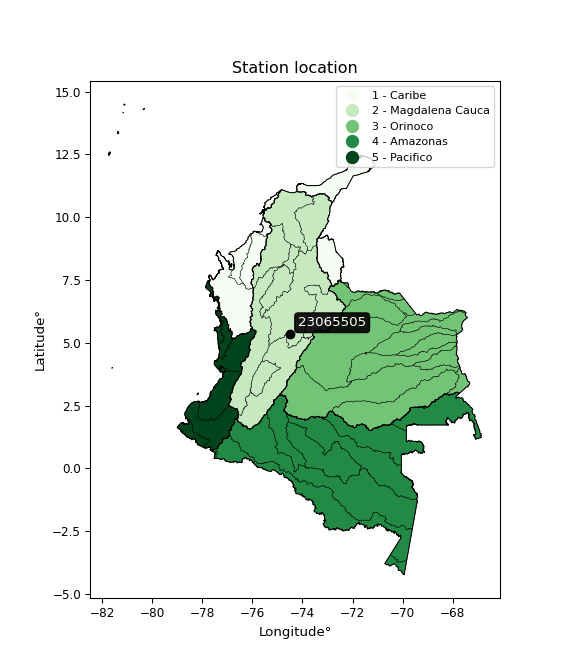

<div align="center">


</div>

# PMP Station (Rain, Pmax24h): 23065505

Probable Maximum Precipitation (PMP) is the greatest amount of rainfall for a specific duration that is meteorologically possible for a given location, acting as a "worst-case" scenario for extreme storms, crucial for designing safety-critical infrastructure like bridges, river deviations, dams, spillways, and nuclear plants to prevent catastrophic failure. PMP is calculated by hydrologists using meteorological data to determine the upper limit of extreme rainfall, often leading to the Probable Maximum Flood (PMF) for flood control design, and is increasingly being studied for climate change impacts. Probable Maximum Precipitation (PMP) is the theoretical upper limit of rainfall, a deterministic estimate for extreme events, while probability distributions (like GEV, Gumbel) describe the likelihood and frequency of various precipitation amounts, including rare ones, showing how often events occur, with PMP representing the extreme end of these distributions, used for critical infrastructure design to ensure safety against the worst conceivable weather, unlike standard statistical forecasts which cover typical probabilities.

The most common probability distributions in hydrology, used for analyzing floods, rainfall, and streamflow, include the Normal, Log-Normal, Gumbel, Gamma (including Log-Pearson Type III), and Generalized Extreme Value (GEV) distributions, often chosen based on the data´s skewness and whether modeling extremes or general conditions, with Gumbel and GEV popular for extreme events like floods, while the Normal distribution serves as a baseline, though often requiring transformations for skewed hydrological data. These distributions help in designing water infrastructure, managing water resources, and forecasting hydrologic events.

> Hydrological data often isn´t perfectly normal (it´s skewed), so different distributions are needed for different applications, such as: **Flood Frequency Analysis**: Using Gumbel, GEV, or Log-Pearson Type III for predicting extreme flood magnitudes and their return periods, **Rainfall Analysis**: Normal for annual totals, but Log-Normal, Weibull, or GEV for intensity or extreme daily rainfall, **Streamflow Modeling**: Gamma and Log-Normal for maximum flows, GEV for minimum flows, and Kappa for daily flows.

<div align="center">

</img>

</div>


## A. General information


### 1. General running parameters

• app_version: _v20260108_. • runtime: _2026-01-08 13:24:42.400241_. • Python version: _3.14.0_. • SciPy version: _1.16.3_. • Pandas version: _2.3.3_. • NumPy version: _2.3.5_. • Stations dataset (station_dataset_file): _dataset/pmax24h_in/automatic_colombia_2003_2024.csv_. • Stations catalog (station_catalog_file): _dataset/CNE.xls_. • Minimum year to eval til year_max (date_min): _1900_. • Maximum year to eval since year_min (date_max): _2024_. • Creates, save and include plots into reports (create_plot): _False_. • Plot only fit distributions with Δo > Δ (plot_only_fit): _True_. • Plot only simple graphs avoiding multiple CDFs and multiple Extreme values plots (plot_only_simple): _True_. • Eval low extreme values, if False, evaluates high extreme values (low_extreme): _False_. • Eval every SciPy distribution as logarithmic (pdist_logarithmic_on): _True_. • Standard deviation normalized (ddof): _1.0_. • Return periods to eval in years (Tr): _[2, 2.33, 5, 10, 15, 20, 25, 50, 75, 100, 200, 250, 500, 750, 1000]_. • Minimum data sample per station, 0 means any (minimum_sample): _5_. • Z-Score maximum threshold to adjust a value, 0 means disable (zscore_max): _3.5_. • Z-Score minimum threshold to adjust a value, 0 means disable (zscore_min): _-2.5_. • Avoid zeros, e.g. rain = 0 (avoid_zeros): _True_. • Avoid null values (avoid_nans): _True_. 

:file_folder:Table: [dataset.csv](../../dataset/pmax24h_in/automatic_colombia_2003_2024.csv)

> Delta Degrees of Freedom (DDOF): is a parameter used in the formulas for calculating variance and standard deviation. When ddof=0, the divisor is $N$ (the total number of observations) and this is used when your data set is the entire population. When ddof=1, the divisor is $N-1$ and this is used when your data set is a sample drawn from a larger population. Using $N-1$ provides an unbiased estimate of the population variance (known as Bessel´s correction).


### 2. Station info and location

|   id |   CODIGO | NOMBRE                       | CATEGORIA               | TECNOLOGIA                | ESTADO   |   FECHA_INSTALACION |   FECHA_SUSPENSION |   ALTITUD |   LATITUD |   LONGITUD | DEPARTAMENTO   | MUNICIPIO   | AREA_OPERATIVA                            | ENTIDAD                                       | AREA_HIDROGRAFICA   | ZONA_HIDROGRAFICA   | SUBZONA_HIDROGRAFICA   |   CORRIENTE | Catalogo   |   Version |
|-----:|---------:|:-----------------------------|:------------------------|:--------------------------|:---------|--------------------:|-------------------:|----------:|----------:|-----------:|:---------------|:------------|:------------------------------------------|:----------------------------------------------|:--------------------|:--------------------|:-----------------------|------------:|:-----------|----------:|
|    0 | 23065505 | CAPARRAPI  - AUT  [23065505] | Climatológica Principal | Automática con Telemetría | Activa   |                 nan |                nan |         1 |   5.34039 |   -74.4952 | Cundinamarca   | Caparrapí   | Area Operativa 11 - Cundinamarca-Amazonas | CORPORACION AUTONOMA REGIONAL DE CUNDINAMARCA | Magdalena Cauca     | Medio Magdalena     | Río Negro              |         nan | CNE_OE     |  20251226 |

<div align="center">

Dynamic map: [:earth_americas:Google](http://maps.google.com/maps?q=5.340388889,-74.49516667) [:earth_americas:OSM](https://www.openstreetmap.org/#map=18/5.340388889/-74.49516667&layers=P) [:earth_americas:Bing](https://www.bing.com/maps?cp=5.340388889~-74.49516667&lvl=18) [:earth_americas:Apple](https://maps.apple.com/frame?center=5.340388889%2C-74.49516667&span=0.003%2C0.006)

</div>


<div align="center">

```geojson
{
  "type": "Feature",
  "geometry": {
    "type": "Point", 
    "coordinates": [-74.49516667, 5.340388889]
  }, 
  "properties": {
    "Name": "23065505"
  }
}
```

</div>


### 3. Discrete values table and plot

<div align="center">

|               |           0 |          1 |          2 |           3 |           4 |          5 |           6 |
|:--------------|------------:|-----------:|-----------:|------------:|------------:|-----------:|------------:|
| Date          | 2015        | 2016       | 2017       | 2018        | 2019        | 2020       | 2021        |
| Value         |   42.5      |   70.6     |   79.9     |   51.8      |   56.4      |   35.8     |   41.3      |
| Value_initial |   42.5      |   70.6     |   79.9     |   51.8      |   56.4      |   35.8     |   41.3      |
| count         |    7        |    7       |    7       |    7        |    7        |    7       |    7        |
| mean          |   54.0429   |   54.0429  |   54.0429  |   54.0429   |   54.0429   |   54.0429  |   54.0429   |
| std           |   16.2365   |   16.2365  |   16.2365  |   16.2365   |   16.2365   |   16.2365  |   16.2365   |
| zscore        |   -0.710922 |    1.01975 |    1.59254 |   -0.138137 |    0.145176 |   -1.12357 |   -0.784829 |


</div>


> The initial value (value_initial) correspond to the initial obtained or null completed value, and value (value) is adjusted only when the initial value is outside the valid range (outlier) definite through the Z-Score value. If Z-Score is active, values out of range or outliers are replaced with the station mean value. A Z-Score (or standard score) measures how many standard deviations a data point is from the mean of a dataset, indicating its relative position; positive scores mean above the mean, negative mean below, and a score of zero is exactly at the mean, allowing for comparison of values from different distributions. It´s calculated using the formula $z=(x–μ)/σ$, where $x$ is the data point, $μ$ is the mean, and $σ$ is the standard deviation, helping identify outliers and understand probability.
>
> <sub>**Note**: In this study, "completing" (filling gaps in) and "extending" (forecasting or lengthening the historical record) rainfall data series are avoided for certain critical analyses because they introduce artificial bias and uncertainty, which can distort the statistics of rare events (extremes), alter day-to-day variability, and compromise the integrity and homogeneity of the original data. Some reasons against Completing/Extending rainfall data are: **Distortion of Extremes and Variability**: The primary issue is that most gap-filling or extension methods rely on averaging or regression with nearby stations, which inherently smooths the data. Rainfall is highly variable in space and time, with a large percentage of zero values and occasional large storms. Infilling methods often underestimate the highest values and overestimate the lowest (zero) values, which severely distorts analyses focused on flood frequency, drought severity, and intensity-duration-frequency (IDF) curves, **Loss of Data Homogeneity**: Infilled or extended data are synthetic estimates, not actual measurements. Combining these estimates with observed data can violate the assumption of data homogeneity, which requires that the data properties do not change over time. Inhomogeneity can lead to incorrect conclusions about long-term trends or changes in climate patterns, **Propagation of Errors**: Errors and biases from the original data (e.g., wind-induced undercatch, instrument errors, site changes) or the data used for imputation can propagate through the analysis, leading to unreliable hydrological models and inaccurate predictions, **Compromised Statistical Integrity**: For statistical analyses, especially those involving the frequency of events, using artificial data can introduce time bias or autocorrelation that doesn´t exist in reality, making it difficult to assess the true probability of events, **Difficulty in Validation**: It is difficult to accurately validate the quality of filled or extended data, especially for past periods where ground-truth measurements are unavailable. The reliability of imputation techniques heavily depends on the density of the surrounding station network and the complexity of the local topography.</sub>


### 4. Active continuous probability distributions from SciPy (43 of 104 available)

A Probability Density Function (PDF) describes the relative likelihood of a continuous random variable falling within a specific range, where the total area under its curve equals 1, and the area over any interval gives the actual probability for that range. Unlike discrete probabilities (like rolling a die), a PDF shows density, not direct probability for a single point (which is zero), with higher points indicating higher likelihood, often visualized as a bell curve for normal distributions.

A log of a probability density function (log-PDF) is simply the logarithm of the PDF´s value, denoted as $log(f(x))$, useful for converting multiplication of probabilities into addition, improving numerical stability with tiny numbers, and connecting to information theory concepts like entropy. Instead of dealing with very small probabilities (e.g., 0.000001), log-PDFs use negative numbers (e.g., $log(0.00001) ≈ -11.51$ that are easier for computers to handle, preventing underflow errors and simplifying complex calculations. In this study, each active probability distribution from SciPy is also evaluated in the $log$ form.

[scipy.stats](https://docs.scipy.org/doc/scipy/reference/stats.html) is a Python´s powerful submodule within the SciPy library for comprehensive statistical analysis, offering over 130 probability distributions (like Normal, Poisson), functions for descriptive stats (mean, variance), hypothesis testing (t-tests, chi-square), random variable generation, and statistical tests, making it essential for data science, modeling, and research. It provides tools to explore, model, and draw conclusions from data efficiently, working seamlessly with NumPy.

<div align="center">

|   id | p_dist             |   n_parameter | fit_method   | label                                                                       | active   | ref                                                                                                        |
|-----:|:-------------------|--------------:|:-------------|:----------------------------------------------------------------------------|:---------|:-----------------------------------------------------------------------------------------------------------|
|    0 | alpha              |             3 | MLE          | Alpha                                                                       | True     | [:mortar_board:](https://docs.scipy.org/doc/scipy/reference/generated/scipy.stats.alpha.html)              |
|    1 | betaprime          |             4 | MLE          | Beta prime                                                                  | True     | [:mortar_board:](https://docs.scipy.org/doc/scipy/reference/generated/scipy.stats.betaprime.html)          |
|    2 | chi2               |             3 | MLE          | Chi²                                                                        | True     | [:mortar_board:](https://docs.scipy.org/doc/scipy/reference/generated/scipy.stats.chi2.html)               |
|    3 | crystalball        |             4 | MLE          | Crystalball                                                                 | True     | [:mortar_board:](https://docs.scipy.org/doc/scipy/reference/generated/scipy.stats.crystalball.html)        |
|    4 | erlang             |             3 | MLE          | Erlang                                                                      | True     | [:mortar_board:](https://docs.scipy.org/doc/scipy/reference/generated/scipy.stats.erlang.html)             |
|    5 | expon              |             2 | MLE          | Exponential                                                                 | True     | [:mortar_board:](https://docs.scipy.org/doc/scipy/reference/generated/scipy.stats.expon.html)              |
|    6 | exponnorm          |             3 | MLE          | Exponentially modified Normal                                               | True     | [:mortar_board:](https://docs.scipy.org/doc/scipy/reference/generated/scipy.stats.exponnorm.html)          |
|    7 | f                  |             4 | MLE          | F                                                                           | True     | [:mortar_board:](https://docs.scipy.org/doc/scipy/reference/generated/scipy.stats.f.html)                  |
|    8 | fatiguelife        |             3 | MLE          | Fatigue-life (Birnbaum-Saunders)                                            | True     | [:mortar_board:](https://docs.scipy.org/doc/scipy/reference/generated/scipy.stats.fatiguelife.html)        |
|    9 | fisk               |             3 | MLE          | Fisk                                                                        | True     | [:mortar_board:](https://docs.scipy.org/doc/scipy/reference/generated/scipy.stats.fisk.html)               |
|   10 | gamma              |             3 | MLE          | Gamma                                                                       | True     | [:mortar_board:](https://docs.scipy.org/doc/scipy/reference/generated/scipy.stats.gamma.html)              |
|   11 | genexpon           |             5 | MLE          | Generalized exponential                                                     | True     | [:mortar_board:](https://docs.scipy.org/doc/scipy/reference/generated/scipy.stats.genexpon.html)           |
|   12 | genlogistic        |             3 | MLE          | Generalized logistic                                                        | True     | [:mortar_board:](https://docs.scipy.org/doc/scipy/reference/generated/scipy.stats.genlogistic.html)        |
|   13 | gibrat             |             2 | MM           | Gibrat                                                                      | True     | [:mortar_board:](https://docs.scipy.org/doc/scipy/reference/generated/scipy.stats.gibrat.html)             |
|   14 | gompertz           |             3 | MLE          | Gompertz (or truncated Gumbel)                                              | True     | [:mortar_board:](https://docs.scipy.org/doc/scipy/reference/generated/scipy.stats.gompertz.html)           |
|   15 | gumbel_l           |             2 | MM           | Gumbel Left Skew                                                            | True     | [:mortar_board:](https://docs.scipy.org/doc/scipy/reference/generated/scipy.stats.gumbel_l.html)           |
|   16 | gumbel_r           |             2 | MM           | Gumbel Right Skew                                                           | True     | [:mortar_board:](https://docs.scipy.org/doc/scipy/reference/generated/scipy.stats.gumbel_r.html)           |
|   17 | halflogistic       |             2 | MM           | Half-logistic                                                               | True     | [:mortar_board:](https://docs.scipy.org/doc/scipy/reference/generated/scipy.stats.halflogistic.html)       |
|   18 | halfnorm           |             2 | MM           | Half Normal                                                                 | True     | [:mortar_board:](https://docs.scipy.org/doc/scipy/reference/generated/scipy.stats.halfnorm.html)           |
|   19 | hypsecant          |             2 | MM           | hyperbolic secant                                                           | True     | [:mortar_board:](https://docs.scipy.org/doc/scipy/reference/generated/scipy.stats.hypsecant.html)          |
|   20 | invgamma           |             3 | MLE          | Inverted gamma                                                              | True     | [:mortar_board:](https://docs.scipy.org/doc/scipy/reference/generated/scipy.stats.invgamma.html)           |
|   21 | invgauss           |             3 | MLE          | Inverse Gaussian                                                            | True     | [:mortar_board:](https://docs.scipy.org/doc/scipy/reference/generated/scipy.stats.invgauss.html)           |
|   22 | invweibull         |             3 | MLE          | Inverted Weibull                                                            | True     | [:mortar_board:](https://docs.scipy.org/doc/scipy/reference/generated/scipy.stats.invweibull.html)         |
|   23 | kstwobign          |             2 | MLE          | Limiting distribution of scaled Kolmogorov-Smirnov two-sided test statistic | True     | [:mortar_board:](https://docs.scipy.org/doc/scipy/reference/generated/scipy.stats.kstwobign.html)          |
|   24 | laplace            |             2 | MM           | Laplace                                                                     | True     | [:mortar_board:](https://docs.scipy.org/doc/scipy/reference/generated/scipy.stats.laplace.html)            |
|   25 | laplace_asymmetric |             3 | MLE          | Asymmetric Laplace                                                          | True     | [:mortar_board:](https://docs.scipy.org/doc/scipy/reference/generated/scipy.stats.laplace_asymmetric.html) |
|   26 | loggamma           |             3 | MLE          | Log gamma                                                                   | True     | [:mortar_board:](https://docs.scipy.org/doc/scipy/reference/generated/scipy.stats.loggamma.html)           |
|   27 | logistic           |             2 | MM           | Logistic (or Sech-squared)                                                  | True     | [:mortar_board:](https://docs.scipy.org/doc/scipy/reference/generated/scipy.stats.logistic.html)           |
|   28 | lognorm            |             3 | MLE          | Log Normal                                                                  | True     | [:mortar_board:](https://docs.scipy.org/doc/scipy/reference/generated/scipy.stats.lognorm.html)            |
|   29 | maxwell            |             2 | MM           | Maxwell                                                                     | True     | [:mortar_board:](https://docs.scipy.org/doc/scipy/reference/generated/scipy.stats.maxwell.html)            |
|   30 | mielke             |             4 | MLE          | Mielke Beta-Kappa / Dagum                                                   | True     | [:mortar_board:](https://docs.scipy.org/doc/scipy/reference/generated/scipy.stats.mielke.html)             |
|   31 | moyal              |             2 | MM           | Moyal                                                                       | True     | [:mortar_board:](https://docs.scipy.org/doc/scipy/reference/generated/scipy.stats.moyal.html)              |
|   32 | nakagami           |             3 | MLE          | Nakagami                                                                    | True     | [:mortar_board:](https://docs.scipy.org/doc/scipy/reference/generated/scipy.stats.nakagami.html)           |
|   33 | ncf                |             5 | MLE          | Non-central F distribution                                                  | True     | [:mortar_board:](https://docs.scipy.org/doc/scipy/reference/generated/scipy.stats.ncf.html)                |
|   34 | nct                |             4 | MLE          | Non-central Student’s t                                                     | True     | [:mortar_board:](https://docs.scipy.org/doc/scipy/reference/generated/scipy.stats.nct.html)                |
|   35 | norm               |             2 | MM           | Normal                                                                      | True     | [:mortar_board:](https://docs.scipy.org/doc/scipy/reference/generated/scipy.stats.norm.html)               |
|   36 | pearson3           |             3 | MM           | Pearson type III                                                            | True     | [:mortar_board:](https://docs.scipy.org/doc/scipy/reference/generated/scipy.stats.pearson3.html)           |
|   37 | rayleigh           |             2 | MM           | Rayleigh                                                                    | True     | [:mortar_board:](https://docs.scipy.org/doc/scipy/reference/generated/scipy.stats.rayleigh.html)           |
|   38 | rice               |             3 | MLE          | Rice                                                                        | True     | [:mortar_board:](https://docs.scipy.org/doc/scipy/reference/generated/scipy.stats.rice.html)               |
|   39 | t                  |             3 | MLE          | Student’s t                                                                 | True     | [:mortar_board:](https://docs.scipy.org/doc/scipy/reference/generated/scipy.stats.t.html)                  |
|   40 | truncnorm          |             4 | MLE          | Truncated normal                                                            | True     | [:mortar_board:](https://docs.scipy.org/doc/scipy/reference/generated/scipy.stats.truncnorm.html)          |
|   41 | wald               |             2 | MM           | Wald                                                                        | True     | [:mortar_board:](https://docs.scipy.org/doc/scipy/reference/generated/scipy.stats.wald.html)               |
|   42 | weibull_min        |             3 | MLE          | Weibull minimum                                                             | True     | [:mortar_board:](https://docs.scipy.org/doc/scipy/reference/generated/scipy.stats.weibull_min.html)        |

</div>

> **n_parameter:** # arguments & localization & scale.
>
> **Fit methods:** (MLE) maximum likelihood, (MM) L-moments.
>
>**Inactive** (With the only purpose of prevent loops, zero divisions, infinite values, over high estimated values or horizontal trending for recurrence intervals estimations, the follow distributions were disabled.)**:** foldnorm, gennorm, norminvgauss, powernorm, powerlognorm, skewnorm, genextreme, anglit, arcsine, argus, beta, bradford, burr, burr12, cauchy, cosine, halfcauchy, foldcauchy, skewcauchy, wrapcauchy, dgamma, gengamma, exponweib, exponpow, truncexpon, gausshyper, genhalflogistic, genhyperbolic, geninvgauss, halfgennorm, johnsonsb, johnsonsu, kappa4, kappa3, ksone, kstwo, loglaplace, levy, levy_l, levy_stable, ncx2, pareto, genpareto, truncpareto, lomax, powerlaw, rdist, rel_breitwigner, recipinvgauss, semicircular, studentized_range, trapezoid, triang, truncweibull_min, tukeylambda, uniform, loguniform, vonmises, vonmises_line, weibull_max, dweibull, 


## B. Probability (PDF) vs. Empirical (EDF) distributions functions

A continuous probability distribution (CPD) describes probabilities for variables that can take any value within a range (like rain any time), unlike discrete variables with specific outcomes (like temperature). It uses a Probability Density Function (PDF), a curve where the total area under it equals 1, and the probability of the variable falling within an interval (a to b) is found by calculating the area under the curve between those points. A key feature is that the probability of hitting any single exact value is zero, so probabilities are always expressed for ranges, e.g., $P(a ≤ X ≤ b)$.

<div align="center">

Distributions parameters from station values
|    |   station | p_dist                |   n |            loc |          scale | shape                  | shape1                 | shape2             | shape3   |
|---:|----------:|:----------------------|----:|---------------:|---------------:|:-----------------------|:-----------------------|:-------------------|:---------|
|  0 |  23065505 | alpha                 |   7 |    -3.50693    |  220.357       | 4.084431345006159      |                        |                    |          |
|  1 |  23065505 | betaprime             |   7 |    -0.346994   |   26.3843      | 42.79191112871634      | 21.809979345506697     |                    |          |
|  2 |  23065505 | chi2                  |   7 |    35.8        |    9.6254      | 0.7655120315934898     |                        |                    |          |
|  3 |  23065505 | crystalball           |   7 |    -0.0420352  |   56.1119      | 5.477633091494461      | 1.0168298220346954     |                    |          |
|  4 |  23065505 | erlang                |   7 |    35.8        |   25.0073      | 0.18190187116628526    |                        |                    |          |
|  5 |  23065505 | expon                 |   7 |    35.8        |   18.2429      |                        |                        |                    |          |
|  6 |  23065505 | exponnorm             |   7 |    35.7768     |    0.00700695  | 2594.9138790477946     |                        |                    |          |
|  7 |  23065505 | f                     |   7 |    21.5915     |   26.0969      | 5229.139191783202      | 9.538469791016572      |                    |          |
|  8 |  23065505 | fatiguelife           |   7 |    35.8        |    8.96324e-05 | 412.72335845555483     |                        |                    |          |
|  9 |  23065505 | fisk                  |   7 |    33.2448     |   15.6543      | 1.8224525386168153     |                        |                    |          |
| 10 |  23065505 | gamma                 |   7 |    35.8        |   14.6588      | 0.3613968298700859     |                        |                    |          |
| 11 |  23065505 | genexpon              |   7 |    35.8        |    2.1216      | 0.11607459367646994    | 3.6233920522227877e-06 | 1.0129724232936403 |          |
| 12 |  23065505 | genlogistic           |   7 |   -28.6748     |   11.7043      | 641.7123908243607      |                        |                    |          |
| 13 |  23065505 | gibrat                |   7 |    42.5753     |    6.95543     |                        |                        |                    |          |
| 14 |  23065505 | gompertz              |   7 |    35.8        |   32.4967      | 1.0335147154823052     |                        |                    |          |
| 15 |  23065505 | gumbel_l              |   7 |    60.8081     |   11.7204      |                        |                        |                    |          |
| 16 |  23065505 | gumbel_r              |   7 |    47.2776     |   11.7204      |                        |                        |                    |          |
| 17 |  23065505 | halflogistic          |   7 |    36.2264     |   12.8519      |                        |                        |                    |          |
| 18 |  23065505 | halfnorm              |   7 |    34.1463     |   24.9366      |                        |                        |                    |          |
| 19 |  23065505 | hypsecant             |   7 |    54.0429     |    9.5697      |                        |                        |                    |          |
| 20 |  23065505 | invgamma              |   7 |    21.5651     |  124.59        | 4.77013724535376       |                        |                    |          |
| 21 |  23065505 | invgauss              |   7 |    29.188      |   46.0137      | 0.5401613472153588     |                        |                    |          |
| 22 |  23065505 | invweibull            |   7 |    -6.75766    |   52.5421      | 4.969714528952711      |                        |                    |          |
| 23 |  23065505 | kstwobign             |   7 |     6.36118    |   54.6225      |                        |                        |                    |          |
| 24 |  23065505 | laplace               |   7 |    54.0429     |   10.6293      |                        |                        |                    |          |
| 25 |  23065505 | laplace_asymmetric    |   7 |    35.8        |    0.00380428  | 0.000208571950020968   |                        |                    |          |
| 26 |  23065505 | loggamma              |   7 | -3774.44       |  536.502       | 1256.577489571187      |                        |                    |          |
| 27 |  23065505 | logistic              |   7 |    54.0429     |    8.2876      |                        |                        |                    |          |
| 28 |  23065505 | lognorm               |   7 |    35.8        |    0.104096    | 12.396952543100765     |                        |                    |          |
| 29 |  23065505 | maxwell               |   7 |    18.4232     |   22.3213      |                        |                        |                    |          |
| 30 |  23065505 | mielke                |   7 |     1.31571    |   11.6436      | 1259.0214691755439     | 4.259242677094855      |                    |          |
| 31 |  23065505 | moyal                 |   7 |    45.4466     |    6.7668      |                        |                        |                    |          |
| 32 |  23065505 | nakagami              |   7 |    35.8        |   24.4045      | 0.19408061992694078    |                        |                    |          |
| 33 |  23065505 | ncf                   |   7 |    -0.0186067  |    2.29277e-05 | 2.7722503453571213e-06 | 9.952672005883777      | 5.538627845324763  |          |
| 34 |  23065505 | nct                   |   7 |    -0.454859   |    1.00096     | 7.751589170487652      | 49.064268367922466     |                    |          |
| 35 |  23065505 | norm                  |   7 |    54.0429     |   15.032       |                        |                        |                    |          |
| 36 |  23065505 | pearson3              |   7 |    54.0428     |   15.0321      | 0.5109804321302263     |                        |                    |          |
| 37 |  23065505 | rayleigh              |   7 |    25.2857     |   22.9449      |                        |                        |                    |          |
| 38 |  23065505 | rice                  |   7 |    28.4462     |   20.9899      | 0.002157932752631979   |                        |                    |          |
| 39 |  23065505 | t                     |   7 |    54.0433     |   15.032       | 77851558.18792504      |                        |                    |          |
| 40 |  23065505 | truncnorm             |   7 |    54.0429     |   15.032       | -386.9978544987755     | 791.1210199548743      |                    |          |
| 41 |  23065505 | wald                  |   7 |    39.0108     |   15.032       |                        |                        |                    |          |
| 42 |  23065505 | weibull_min           |   7 |    35.8        |   17.4956      | 0.7554488148065065     |                        |                    |          |
| 43 |  23065505 | logalpha              |   7 |     1.07231    |   30.7002      | 10.763013875216487     |                        |                    |          |
| 44 |  23065505 | logbetaprime          |   7 |    -4.21962    |    6.37476     | 1000.4430930701565     | 781.9174413024325      |                    |          |
| 45 |  23065505 | logchi2               |   7 |     3.57795    |    0.961927    | 1.0583283726993977     |                        |                    |          |
| 46 |  23065505 | logcrystalball        |   7 |     3.95228    |    0.271959    | 2185.5526906848036     | 2.2549585055168864     |                    |          |
| 47 |  23065505 | logerlang             |   7 |     3.57795    |    0.379379    | 0.7746078931129254     |                        |                    |          |
| 48 |  23065505 | logexpon              |   7 |     3.57795    |    0.374335    |                        |                        |                    |          |
| 49 |  23065505 | logexponnorm          |   7 |     3.89717    |    0.266337    | 0.20692672881307334    |                        |                    |          |
| 50 |  23065505 | logf                  |   7 |     2.71395    |    1.18004     | 8574.92338592311       | 41.84320028600308      |                    |          |
| 51 |  23065505 | logfatiguelife        |   7 |     3.28298    |    0.6098      | 0.4412728718176272     |                        |                    |          |
| 52 |  23065505 | logfisk               |   7 |     3.32392    |    0.576781    | 3.5202583574286583     |                        |                    |          |
| 53 |  23065505 | loggamma              |   7 |     3.57795    |    0.368716    | 0.8308803924167711     |                        |                    |          |
| 54 |  23065505 | loggenexpon           |   7 |     3.57795    |    0.555068    | 0.9483885332515407     | 1.3735655360190089     | 1.0374476326036777 |          |
| 55 |  23065505 | loggenlogistic        |   7 |     2.32295    |    0.228964    | 692.132376218176       |                        |                    |          |
| 56 |  23065505 | loggibrat             |   7 |     3.74476    |    0.125869    |                        |                        |                    |          |
| 57 |  23065505 | loggompertz           |   7 |     3.57795    |    0.624605    | 1.0110390462420868     |                        |                    |          |
| 58 |  23065505 | loggumbel_l           |   7 |     4.07468    |    0.212046    |                        |                        |                    |          |
| 59 |  23065505 | loggumbel_r           |   7 |     3.82989    |    0.212046    |                        |                        |                    |          |
| 60 |  23065505 | loghalflogistic       |   7 |     3.62993    |    0.232529    |                        |                        |                    |          |
| 61 |  23065505 | loghalfnorm           |   7 |     3.5923     |    0.451166    |                        |                        |                    |          |
| 62 |  23065505 | loghypsecant          |   7 |     3.95228    |    0.173135    |                        |                        |                    |          |
| 63 |  23065505 | loginvgamma           |   7 |     2.71106    |   24.7464      | 20.92193218224812      |                        |                    |          |
| 64 |  23065505 | loginvgauss           |   7 |     3.22693    |    4.36573     | 0.16614723216884986    |                        |                    |          |
| 65 |  23065505 | loginvweibull         |   7 |    -1.0971e+07 |    1.0971e+07  | 47901080.30173005      |                        |                    |          |
| 66 |  23065505 | logkstwobign          |   7 |     3.02745    |    1.05717     |                        |                        |                    |          |
| 67 |  23065505 | loglaplace            |   7 |     3.95228    |    0.192304    |                        |                        |                    |          |
| 68 |  23065505 | loglaplace_asymmetric |   7 |     3.94739    |    0.231692    | 0.9894886908754519     |                        |                    |          |
| 69 |  23065505 | logloggamma           |   7 |   -71.2293     |   10.3407      | 1437.7320188825515     |                        |                    |          |
| 70 |  23065505 | loglogistic           |   7 |     3.95228    |    0.149939    |                        |                        |                    |          |
| 71 |  23065505 | loglognorm            |   7 |     3.57795    |    0.00268146  | 12.029261122008094     |                        |                    |          |
| 72 |  23065505 | logmaxwell            |   7 |     3.30785    |    0.403836    |                        |                        |                    |          |
| 73 |  23065505 | logmielke             |   7 | -1248.76       | 1251.63        | 367109.94426993787     | 5513.917265757928      |                    |          |
| 74 |  23065505 | logmoyal              |   7 |     3.79676    |    0.122425    |                        |                        |                    |          |
| 75 |  23065505 | lognakagami           |   7 |     3.57795    |    0.455911    | 0.2362872260135493     |                        |                    |          |
| 76 |  23065505 | logncf                |   7 |     1.79157    |    2.10725     | 394.4055776810055      | 189.59480827262234     | 5.9975087596842975 |          |
| 77 |  23065505 | lognct                |   7 |    -2.0718     |    0.0636334   | 254.74333429734168     | 94.40620704284859      |                    |          |
| 78 |  23065505 | lognorm               |   7 |     3.95228    |    0.271959    |                        |                        |                    |          |
| 79 |  23065505 | logpearson3           |   7 |     3.95228    |    0.271959    | 0.2436116530086936     |                        |                    |          |
| 80 |  23065505 | lograyleigh           |   7 |     3.43201    |    0.415118    |                        |                        |                    |          |
| 81 |  23065505 | logrice               |   7 |     3.45547    |    0.356374    | 0.7251034747029279     |                        |                    |          |
| 82 |  23065505 | logt                  |   7 |     3.95228    |    0.27196     | 4992213123.25486       |                        |                    |          |
| 83 |  23065505 | logtruncnorm          |   7 |    -0.107391   |    1.26126     | 2.9219526804469185     | 3.558494720335858      |                    |          |
| 84 |  23065505 | logwald               |   7 |     3.68029    |    0.271991    |                        |                        |                    |          |
| 85 |  23065505 | logweibull_min        |   7 |     3.57795    |    0.388226    | 0.9874345845077468     |                        |                    |          |

</div>

> **loc** (Location parameter): This shifts the distribution along the x-axis. For many common distributions, like the normal (Gaussian) distribution, loc represents the mean $μ$. For others, like the uniform distribution, it might represent the minimum value, or for the beta distribution, the left end of the support interval.
>
> **scale** (Scale parameter): This determines the width or spread of the distribution. For the normal distribution, scale represents the standard deviation $σ$. For a uniform distribution, it defines the length of the interval (from $loc$ to $loc + scale$).
>
> **shape** (Shape parameters): Refers to parameters that define the specific form of a probability distribution, distinct from its location (loc) and scale (scale). These parameters are required arguments for most distribution functions. For example, a normal (Gaussian) distribution is fully defined by its location (mean) and scale (standard deviation), so it has no specific shape parameters beyond loc and scale. However, other distributions have intrinsic properties that need specification, as Gamma distribution that takes a shape parameter, often named $a$ or $alpha$.


### 0. Cumulative distribution values - CDF (86 evaluated)

Cumulative Distribution Function (CDF), denoted as $F$<sub>$X$</sub>$(x)$, is a function that gives the probability that a random variable $X$ will take a value less than or equal to a specific value, $x$ (i.e., $(P(X≥x)$. It essentially "accumulates" probabilities from a given point up to the far right (positive infinity), providing a complete picture of the distribution´s probabilities for both discrete (like rain) and continuous (like temperature) variables, helping to find probabilities over ranges or above certain values. Each station is evaluated separately ordering the $x$ values ascending, calculating the CDF and PDF values for the activated distributions and their logarithmic forms.

<div align="center">

CDF ordered by x ascending and calculating $log(f(x))$ separately
|   id |   Station |   date |    x |   count |    mean |     std |    zscore |   Value_initial |   station |   m |     alpha |   alpha_pdf |   betaprime |   betaprime_pdf |        chi2 |    chi2_pdf |   crystalball |   crystalball_pdf |     erlang |   erlang_pdf |    expon |   expon_pdf |   exponnorm |   exponnorm_pdf |         f |      f_pdf |   fatiguelife |   fatiguelife_pdf |      fisk |   fisk_pdf |       gamma |   gamma_pdf |    genexpon |   genexpon_pdf |   genlogistic |   genlogistic_pdf |   gibrat |   gibrat_pdf |    gompertz |   gompertz_pdf |   gumbel_l |   gumbel_l_pdf |   gumbel_r |   gumbel_r_pdf |   halflogistic |   halflogistic_pdf |   halfnorm |   halfnorm_pdf |   hypsecant |   hypsecant_pdf |   invgamma |   invgamma_pdf |   invgauss |   invgauss_pdf |   invweibull |   invweibull_pdf |   kstwobign |   kstwobign_pdf |   laplace |   laplace_pdf |   laplace_asymmetric |   laplace_asymmetric_pdf |    loggamma |   loggamma_pdf |   logistic |   logistic_pdf |   lognorm |   lognorm_pdf |   maxwell |   maxwell_pdf |   mielke |   mielke_pdf |     moyal |   moyal_pdf |    nakagami |   nakagami_pdf |      ncf |    ncf_pdf |       nct |    nct_pdf |     norm |   norm_pdf |   pearson3 |   pearson3_pdf |   rayleigh |   rayleigh_pdf |      rice |   rice_pdf |        t |      t_pdf |   truncnorm |   truncnorm_pdf |      wald |   wald_pdf |   weibull_min |   weibull_min_pdf |   logalpha |   logalpha_pdf |   logbetaprime |   logbetaprime_pdf |     logchi2 |   logchi2_pdf |   logcrystalball |   logcrystalball_pdf |   logerlang |   logerlang_pdf |   logexpon |   logexpon_pdf |   logexponnorm |   logexponnorm_pdf |      logf |   logf_pdf |   logfatiguelife |   logfatiguelife_pdf |   logfisk |   logfisk_pdf |   loggenexpon |   loggenexpon_pdf |   loggenlogistic |   loggenlogistic_pdf |   loggibrat |   loggibrat_pdf |   loggompertz |   loggompertz_pdf |   loggumbel_l |   loggumbel_l_pdf |   loggumbel_r |   loggumbel_r_pdf |   loghalflogistic |   loghalflogistic_pdf |   loghalfnorm |   loghalfnorm_pdf |   loghypsecant |   loghypsecant_pdf |   loginvgamma |   loginvgamma_pdf |   loginvgauss |   loginvgauss_pdf |   loginvweibull |   loginvweibull_pdf |   logkstwobign |   logkstwobign_pdf |   loglaplace |   loglaplace_pdf |   loglaplace_asymmetric |   loglaplace_asymmetric_pdf |   logloggamma |   logloggamma_pdf |   loglogistic |   loglogistic_pdf |   loglognorm |   loglognorm_pdf |   logmaxwell |   logmaxwell_pdf |   logmielke |   logmielke_pdf |   logmoyal |   logmoyal_pdf |   lognakagami |   lognakagami_pdf |    logncf |   logncf_pdf |    lognct |   lognct_pdf |   logpearson3 |   logpearson3_pdf |   lograyleigh |   lograyleigh_pdf |   logrice |   logrice_pdf |      logt |   logt_pdf |   logtruncnorm |   logtruncnorm_pdf |   logwald |   logwald_pdf |   logweibull_min |   logweibull_min_pdf |
|-----:|----------:|-------:|-----:|--------:|--------:|--------:|----------:|----------------:|----------:|----:|----------:|------------:|------------:|----------------:|------------:|------------:|--------------:|------------------:|-----------:|-------------:|---------:|------------:|------------:|----------------:|----------:|-----------:|--------------:|------------------:|----------:|-----------:|------------:|------------:|------------:|---------------:|--------------:|------------------:|---------:|-------------:|------------:|---------------:|-----------:|---------------:|-----------:|---------------:|---------------:|-------------------:|-----------:|---------------:|------------:|----------------:|-----------:|---------------:|-----------:|---------------:|-------------:|-----------------:|------------:|----------------:|----------:|--------------:|---------------------:|-------------------------:|------------:|---------------:|-----------:|---------------:|----------:|--------------:|----------:|--------------:|---------:|-------------:|----------:|------------:|------------:|---------------:|---------:|-----------:|----------:|-----------:|---------:|-----------:|-----------:|---------------:|-----------:|---------------:|----------:|-----------:|---------:|-----------:|------------:|----------------:|----------:|-----------:|--------------:|------------------:|-----------:|---------------:|---------------:|-------------------:|------------:|--------------:|-----------------:|---------------------:|------------:|----------------:|-----------:|---------------:|---------------:|-------------------:|----------:|-----------:|-----------------:|---------------------:|----------:|--------------:|--------------:|------------------:|-----------------:|---------------------:|------------:|----------------:|--------------:|------------------:|--------------:|------------------:|--------------:|------------------:|------------------:|----------------------:|--------------:|------------------:|---------------:|-------------------:|--------------:|------------------:|--------------:|------------------:|----------------:|--------------------:|---------------:|-------------------:|-------------:|-----------------:|------------------------:|----------------------------:|--------------:|------------------:|--------------:|------------------:|-------------:|-----------------:|-------------:|-----------------:|------------:|----------------:|-----------:|---------------:|--------------:|------------------:|----------:|-------------:|----------:|-------------:|--------------:|------------------:|--------------:|------------------:|----------:|--------------:|----------:|-----------:|---------------:|-------------------:|----------:|--------------:|-----------------:|---------------------:|
|    0 |  23065505 |   2020 | 35.8 |       7 | 54.0429 | 16.2365 | -1.12357  |            35.8 |  23065505 |   1 | 0.0640519 |  0.0178786  |   0.0790403 |      0.0159232  | 1.39445e-06 | 7.51161e+07 |      0.738511 |        0.00579769 | 0.00160984 |  4.12125e+10 | 0        |  0.054816   |  0.00127311 |      0.0549021  | 0.0526797 | 0.0202845  |     0.0430405 |       4.39411e+08 | 0.0354554 | 0.024391   | 3.28071e-06 | 1.66864e+08 | 1.85471e-06 |     0.0547107  |     0.0746661 |        0.0165193  | 0        |   0          | 6.48953e-10 |     0.0318036  |   0.111656 |     0.0089738  |  0.0697702 |     0.0158498  |       0        |         0          |  0.0528733 |      0.0319262 |   0.0939313 |      0.00967366 |  0.0526847 |     0.0202838  |  0.0434183 |     0.0244209  |     0.057833 |       0.0192488  |   0.0665221 |      0.0169353  | 0.0898662 |    0.0084546  |          4.35528e-08 |               0.0548256  | 4.76792e-09 |     119.959    |  0.0996408 |     0.0108249  |  0.084343 |      0.568857 |  0.104951 |    0.016      |      nan |          nan | 0.0413835 |  0.0150211  | 7.37411e-07 |    4.02839e+07 | 0.468988 | 0.00972305 | 0.0690728 | 0.0176003  | 0.112451 | 0.0127079  |   0.100199 |     0.0150059  |  0.0996691 |     0.0179809  | 0.0595272 | 0.0156978  | 0.112444 | 0.0127074  |    0.112451 |      0.0127079  | 0         | 0          |   2.35848e-12 |      250.753      |  0.0681842 |       0.643401 |       0.172314 |           0.686864 | 5.99017e-09 |   7.13772e+06 |        0.0843429 |             0.568857 | 2.03411e-08 |      390.717    |   0        |       2.6714   |      0.0839165 |           0.57029  | 0.0582275 |   0.681841 |        0.0462602 |             0.79421  | 0.0528127 |      0.693227 |   2.85814e-10 |          1.7086   |        0.0563465 |             0.706354 | 0           |        0        |   1.76725e-08 |          1.61869  |     0.0916093 |          0.411604 |     0.0375923 |          0.581661 |          0        |              0        |      0        |          0        |       0.072943 |           0.417631 |     0.0582278 |          0.681838 |     0.0484467 |          0.764992 |       0.0558968 |            0.703911 |      0.0508806 |           0.748604 |    0.0713809 |         0.371188 |               0.0987417 |                    0.430704 |     0.0853347 |          0.565343 |     0.0760981 |          0.468905 |   0.00721333 |      3.74574e+12 |    0.0696975 |         0.706676 |   0.0564434 |        0.699156 |  0.0145233 |       0.401834 |   6.29823e-08 |       6.70222e+07 | 0.0707318 |     0.61753  | 0.0807058 |     0.603007 |     0.0777055 |          0.60464  |     0.0599263 |          0.796138 | 0.0444272 |      0.709792 | 0.0843431 |   0.568856 |     2.0506e-05 |           2.8513   | 0         |      0        |      1.76251e-15 |             3.91896  |
|    1 |  23065505 |   2021 | 41.3 |       7 | 54.0429 | 16.2365 | -0.784829 |            41.3 |  23065505 |   2 | 0.202287  |  0.0309386  |   0.194615  |      0.0255595  | 0.646062    | 0.0364459   |      0.769372 |        0.00541973 | 0.79613    |  0.0218291   | 0.260283 |  0.0405483  |  0.261965   |      0.0405906  | 0.214259  | 0.0353069  |     0.725807  |       0.01818     | 0.229545  | 0.0400122  | 0.717633    | 0.0355956   | 0.259861    |     0.0404948  |     0.19729   |        0.0273243  | 0        |   0          | 0.173532    |     0.0311319  |   0.172458 |     0.0133655  |  0.18913   |     0.0268729  |       0.194865 |         0.0374275  |  0.225792  |      0.0307066 |   0.164354  |      0.0164214  |  0.214254  |     0.0353049  |  0.234749  |     0.0389665  |     0.210571 |       0.0339247  |   0.192135  |      0.0276647  | 0.150771  |    0.0141845  |          0.260322    |               0.0405533  | 0.408637    |       1.90996  |  0.176887  |     0.0175682  |  0.197402 |      1.02134  |  0.210939 |    0.0222066  |      nan |          nan | 0.174301  |  0.0318297  | 0.442853    |    0.0309972   | 0.520196 | 0.0088979  | 0.201192  | 0.029252   | 0.198299 | 0.0185288  |   0.202957 |     0.0221067  |  0.216171  |     0.0238428  | 0.170975  | 0.0241868  | 0.19829  | 0.0185284  |    0.198299 |      0.0185288  | 0.0265523 | 0.0421905  |   0.341106    |        0.0377568  |  0.203746  |       1.23894  |       0.286345 |           0.898548 | 0.277516    |   0.978581    |        0.197402  |             1.02134  | 0.433285    |        1.88748  |   0.317357 |       1.82362  |      0.197438  |           1.02616  | 0.207587  |   1.3659   |        0.225441  |             1.57521  | 0.211574  |      1.47937  |   0.249847    |          1.71686  |        0.213891  |             1.43916  | 0           |        0        |   0.228901    |          1.56907  |     0.171811  |          0.736279 |     0.187829  |          1.48125  |          0.193079 |              2.07011  |      0.224316 |          1.69813  |       0.163559 |           0.903668 |     0.207587  |          1.3659   |     0.220509  |          1.53134  |       0.213228  |            1.43874  |      0.217205  |           1.48324  |    0.150085  |         0.780455 |               0.184176  |                    0.803359 |     0.197337  |          1.0106   |     0.176037  |          0.967381 |   0.629496   |      0.219722    |    0.209863  |         1.22495  |   0.212759  |        1.43283  |  0.17276   |       1.75397  |   0.450011    |       1.46033     | 0.19892   |     1.16969  | 0.201612  |     1.08918  |     0.200097  |          1.10757  |     0.215016  |          1.31581  | 0.192729  |      1.30791  | 0.197402  |   1.02134  |     0.346241   |           2.03453  | 0.0246096 |      2.24919  |      0.311179    |             1.77412  |
|    2 |  23065505 |   2015 | 42.5 |       7 | 54.0429 | 16.2365 | -0.710922 |            42.5 |  23065505 |   3 | 0.240342  |  0.0323896  |   0.226224  |      0.0270743  | 0.685926    | 0.030316    |      0.775824 |        0.00533378 | 0.819701   |  0.0177041   | 0.307375 |  0.0379669  |  0.309101   |      0.0379982  | 0.257162  | 0.0360656  |     0.746152  |       0.0158369   | 0.277318  | 0.0394633  | 0.75612     | 0.028914    | 0.306894    |     0.0379215  |     0.231055  |        0.0288895  | 0        |   0          | 0.210726    |     0.0308493  |   0.189175 |     0.0145073  |  0.222405  |     0.0285255  |       0.239341 |         0.0366762  |  0.262372  |      0.0302506 |   0.185159  |      0.0182757  |  0.257155  |     0.036064   |  0.28123   |     0.0383801  |     0.252028 |       0.0350448  |   0.226186  |      0.029021   | 0.16879   |    0.0158798  |          0.30742     |               0.0379711  | 0.460452    |       1.71345  |  0.198963  |     0.0192308  |  0.227948 |      1.11092  |  0.238223 |    0.0232452  |      nan |          nan | 0.213779  |  0.0338414  | 0.477743    |    0.0273406   | 0.530766 | 0.00871886 | 0.237184  | 0.0306565  | 0.221278 | 0.019763   |   0.230258 |     0.0233701  |  0.2453    |     0.024677   | 0.200804  | 0.0254933  | 0.221269 | 0.0197626  |    0.221278 |      0.019763   | 0.0944482 | 0.0666368  |   0.383853    |        0.0336436  |  0.240621  |       1.33345  |       0.312563 |           0.931485 | 0.304141    |   0.884667    |        0.227948  |             1.11092  | 0.484279    |        1.67964  |   0.36764  |       1.68929  |      0.228127  |           1.1161   | 0.248033  |   1.4544   |        0.271347  |             1.62459  | 0.255365  |      1.57289  |   0.298445    |          1.67491  |        0.256374  |             1.52257  | 0.000523839 |        0.390746 |   0.273544    |          1.54759  |     0.194084  |          0.820094 |     0.232017  |          1.59854  |          0.251601 |              2.01415  |      0.272484 |          1.66434  |       0.191365 |           1.03991  |     0.248032  |          1.4544   |     0.265316  |          1.59198  |       0.255705  |            1.52253  |      0.260695  |           1.54859  |    0.174189  |         0.905798 |               0.208684  |                    0.910264 |     0.227564  |          1.09942  |     0.205477  |          1.08882  |   0.635217   |      0.182101    |    0.246047  |         1.29946  |   0.255092  |        1.51852  |  0.225176  |       1.89417  |   0.489634    |       1.3127      | 0.233795  |     1.26367  | 0.234097  |     1.17796  |     0.233142  |          1.19853  |     0.253592  |          1.37521  | 0.231295  |      1.38234  | 0.227948  |   1.11092  |     0.402545   |           1.89853  | 0.117339  |      3.83361  |      0.360108    |             1.64432  |
|    3 |  23065505 |   2018 | 51.8 |       7 | 54.0429 | 16.2365 | -0.138137 |            51.8 |  23065505 |   4 | 0.539908  |  0.0285962  |   0.499652  |      0.028937   | 0.855909    | 0.0109275   |      0.822232 |        0.00463978 | 0.915182   |  0.00598805  | 0.583994 |  0.0228038  |  0.585733   |      0.0227839  | 0.562362  | 0.0269738  |     0.847008  |       0.00755746  | 0.576842  | 0.0239745  | 0.907143    | 0.0087934   | 0.583304    |     0.0227985  |     0.515661  |        0.0291644  | 0.611168 |   0.041557   | 0.481849    |     0.0269625  |   0.37103  |     0.0248827  |  0.506683  |     0.0293913  |       0.541227 |         0.0275085  |  0.521019  |      0.0249042 |   0.426071  |      0.0323692  |  0.562352  |     0.0269744  |  0.579447  |     0.0249602  |     0.557941 |       0.0276298  |   0.506736  |      0.0286115  | 0.404884  |    0.0380914  |          0.584058    |               0.0228043  | 0.705914    |       0.879933 |  0.432753  |     0.0296199  |  0.492823 |      1.46668  |  0.475086 |    0.0261309  |      nan |          nan | 0.531747  |  0.0303199  | 0.662477    |    0.014984    | 0.605554 | 0.007383   | 0.52692   | 0.02851    | 0.440696 | 0.0262457  |   0.473857 |     0.0271298  |  0.487095  |     0.0258312  | 0.461497  | 0.0285447  | 0.440685 | 0.0262457  |    0.440696 |      0.0262457  | 0.601261  | 0.033379   |   0.607304    |        0.017331   |  0.533856  |       1.47633  |       0.510138 |           1.02282  | 0.441019    |   0.55623     |        0.492823  |             1.46668  | 0.721264    |        0.838682 |   0.627281 |       0.995684 |      0.493853  |           1.46836  | 0.550838  |   1.4407   |        0.577079  |             1.33646  | 0.56807   |      1.38541  |   0.587371    |          1.21421  |        0.563355  |             1.41134  | 0.683021    |        1.75777  |   0.557612    |          1.29373  |     0.422272  |          1.49483  |     0.56295   |          1.52538  |          0.593226 |              1.39355  |      0.568743 |          1.29746  |       0.491006 |           1.83778  |     0.550836  |          1.4407   |     0.571647  |          1.3629   |       0.562831  |            1.41246  |      0.564826  |           1.38667  |    0.487439  |         2.53473  |               0.494717  |                    2.15791  |     0.490501  |          1.46198  |     0.491843  |          1.6669   |   0.658903   |      0.0825498   |    0.526146  |         1.41403  |   0.562628  |        1.41817  |  0.588829  |       1.52201  |   0.687924    |       0.775541    | 0.518687  |     1.47643  | 0.505872  |     1.45279  |     0.509023  |          1.46809  |     0.537309  |          1.38381  | 0.524118  |      1.45479  | 0.492822  |   1.46668  |     0.699874   |           1.16066  | 0.660831  |      1.50697  |      0.614112    |             0.982098 |
|    4 |  23065505 |   2019 | 56.4 |       7 | 54.0429 | 16.2365 |  0.145176 |            56.4 |  23065505 |   5 | 0.657682  |  0.022557   |   0.624521  |      0.0250444  | 0.897301    | 0.00736214  |      0.842764 |        0.00428691 | 0.937885   |  0.00405149  | 0.676711 |  0.0177214  |  0.678332   |      0.0176911  | 0.671292  | 0.0205285  |     0.877292  |       0.005729    | 0.671161  | 0.0173707  | 0.939231    | 0.00546749  | 0.676021    |     0.0177257  |     0.639453  |        0.0244206  | 0.753938 |   0.0227922  | 0.599333    |     0.0240195  |   0.496682 |     0.0294822  |  0.631806  |     0.0247523  |       0.655483 |         0.0221891  |  0.627827  |      0.0214866 |   0.577623  |      0.0322781  |  0.671286  |     0.0205294  |  0.679832  |     0.0189196  |     0.669847 |       0.0211206  |   0.629091  |      0.0243939  | 0.599446  |    0.0376841  |          0.676775    |               0.017721   | 0.771615    |       0.674554 |  0.570629  |     0.0295636  |  0.615945 |      1.40452  |  0.591847 |    0.0243361  |      nan |          nan | 0.656214  |  0.0237685  | 0.724532    |    0.0121522   | 0.638093 | 0.00677084 | 0.646157  | 0.0232037  | 0.562302 | 0.0262152  |   0.594748 |     0.0250766  |  0.601253  |     0.0235659  | 0.588033  | 0.0261386  | 0.562291 | 0.0262154  |    0.562302 |      0.0262152  | 0.723954  | 0.021105   |   0.677397    |        0.0133843  |  0.652423  |       1.29442  |       0.59578  |           0.982856 | 0.485066    |   0.482692    |        0.615945  |             1.40452  | 0.783717    |        0.639611 |   0.703056 |       0.793259 |      0.616966  |           1.40267  | 0.664249  |   1.21522  |        0.680198  |             1.08675  | 0.673551  |      1.09243  |   0.681306    |          0.995919 |        0.673142  |             1.1633   | 0.795804    |        0.985224 |   0.661122    |          1.13564  |     0.559349  |          1.703    |     0.680676  |          1.2348   |          0.699118 |              1.09929  |      0.670746 |          1.09879  |       0.642419 |           1.65754  |     0.664248  |          1.21522  |     0.677183  |          1.11539  |       0.672714  |            1.1644   |      0.673336  |           1.15939  |    0.670482  |         1.71353  |               0.648654  |                    1.5005   |     0.613513  |          1.40665  |     0.6306    |          1.55359  |   0.665201   |      0.0666163   |    0.641013  |         1.27177  |   0.672988  |        1.16956  |  0.702558  |       1.15689  |   0.748015    |       0.641982    | 0.638817  |     1.32879  | 0.625945  |     1.34942  |     0.630012  |          1.35553  |     0.648713  |          1.22406  | 0.641684  |      1.29537  | 0.615943  |   1.40452  |     0.788584   |           0.932253 | 0.763763  |      0.962643 |      0.68915     |             0.789066 |
|    5 |  23065505 |   2016 | 70.6 |       7 | 54.0429 | 16.2365 |  1.01975  |            70.6 |  23065505 |   6 | 0.86672   |  0.00863643 |   0.873381  |      0.0106587  | 0.960823    | 0.00254742  |      0.895976 |        0.00321874 | 0.973628   |  0.00149526  | 0.851563 |  0.00813671 |  0.852689   |      0.00810183 | 0.86106   | 0.00804195 |     0.934443  |       0.00276863  | 0.829916  | 0.00688656 | 0.981993    | 0.0014848   | 0.851027    |     0.00815066 |     0.875518  |        0.00994324 | 0.918275 |   0.00539094 | 0.862236    |     0.0127846  |   0.900328 |     0.0196094  |  0.872223  |     0.0101739  |       0.871022 |         0.00938852 |  0.856219  |      0.0109915 |   0.888316  |      0.0114326  |  0.861062  |     0.00804233 |  0.859051  |     0.00793589 |     0.863939 |       0.00811741 |   0.874229  |      0.0108236  | 0.894689  |    0.00990761 |          0.851613    |               0.00813541 | 0.881423    |       0.342789 |  0.880568  |     0.0126898  |  0.868763 |      0.782966 |  0.859196 |    0.0127125  |      nan |          nan | 0.876118  |  0.00907974 | 0.85523     |    0.00682335  | 0.722146 | 0.00513216 | 0.867475  | 0.0093609  | 0.864651 | 0.0144693  |   0.863421 |     0.0123394  |  0.857747  |     0.012244   | 0.866895  | 0.0127354  | 0.864646 | 0.0144697  |    0.864651 |      0.0144693  | 0.896012  | 0.00652753 |   0.813846    |        0.00679379 |  0.869315  |       0.642659 |       0.78937  |           0.712246 | 0.577868    |   0.355532    |        0.868763  |             0.782966 | 0.887505    |        0.323257 |   0.837016 |       0.435396 |      0.868788  |           0.778174 | 0.863899  |   0.591231 |        0.857926  |             0.537431 | 0.844676  |      0.494963 |   0.848754    |          0.527504 |        0.862035  |             0.558882 | 0.919784    |        0.2908   |   0.862992    |          0.657781 |     0.905869  |          1.04901  |     0.875114  |          0.550548 |          0.873685 |              0.508916 |      0.859344 |          0.597348 |       0.891553 |           0.614324 |     0.863898  |          0.591234 |     0.859552  |          0.548494 |       0.861813  |            0.559593 |      0.866372  |           0.587538 |    0.897497  |         0.533026 |               0.865342  |                    0.575085 |     0.867986  |          0.791618 |     0.884165  |          0.68306  |   0.677269   |      0.0439324   |    0.862813  |         0.68931  |   0.862703  |        0.560039 |  0.878699  |       0.491576 |   0.86168     |       0.388936    | 0.866512  |     0.68641  | 0.863943  |     0.73398  |     0.867245  |          0.724703 |     0.861232  |          0.664372 | 0.865726  |      0.689961 | 0.868762  |   0.782969 |     0.946405   |           0.511501 | 0.897855  |      0.353311 |      0.823942    |             0.444658 |
|    6 |  23065505 |   2017 | 79.9 |       7 | 54.0429 | 16.2365 |  1.59254  |            79.9 |  23065505 |   7 | 0.925437  |  0.00446493 |   0.943752  |      0.00504709 | 0.978355    | 0.0013577   |      0.922876 |        0.00257693 | 0.984208   |  0.000849291 | 0.910846 |  0.00488709 |  0.911672   |      0.0048579  | 0.917221  | 0.0044268  |     0.95539   |       0.00181371  | 0.879763  | 0.004132   | 0.991529    | 0.000676785 | 0.910438    |     0.00490019 |     0.941706  |        0.00483222 | 0.953534 |   0.00260579 | 0.94928     |     0.00626643 |   0.993894 |     0.00265616 |  0.940043  |     0.00495907 |       0.935298 |         0.00487155 |  0.933465  |      0.005944  |   0.957364  |      0.00444198 |  0.917227  |     0.00442691 |  0.915767  |     0.00458614 |     0.920174 |       0.00439012 |   0.946708  |      0.00525374 | 0.956098  |    0.00413034 |          0.910883    |               0.00488588 | 0.916966    |       0.23822  |  0.957709  |     0.00488707 |  0.942439 |      0.423984 |  0.944598 |    0.00610994 |      nan |          nan | 0.9375    |  0.00460869 | 0.90802     |    0.0046475   | 0.765718 | 0.00426397 | 0.930983  | 0.00478522 | 0.957296 | 0.00604482 |   0.94525  |     0.00579452 |  0.94115   |     0.00610492 | 0.950441  | 0.00578792 | 0.957294 | 0.00604504 |    0.957296 |      0.00604482 | 0.940537  | 0.00343401 |   0.866088    |        0.00461217 |  0.931058  |       0.372192 |       0.865899 |           0.525157 | 0.618814    |   0.308116    |        0.942439  |             0.423984 | 0.921019    |        0.224649 |   0.882894 |       0.312837 |      0.942036  |           0.422063 | 0.921681  |   0.357983 |        0.911752  |             0.344731 | 0.893958  |      0.31576  |   0.902671    |          0.353431 |        0.917155  |             0.346385 | 0.947383    |        0.168875 |   0.928978    |          0.415691 |     0.98553   |          0.289043 |     0.928278  |          0.325809 |          0.923826 |              0.315112 |      0.919472 |          0.384051 |       0.946542 |           0.307319 |     0.92168   |          0.357986 |     0.914196  |          0.347537 |       0.917008  |            0.346886 |      0.924561  |           0.365343 |    0.946139  |         0.280081 |               0.920619  |                    0.339012 |     0.942489  |          0.428348 |     0.94572   |          0.342366 |   0.682247   |      0.0369201   |    0.929951  |         0.408958 |   0.917856  |        0.345949 |  0.926643  |       0.298756 |   0.903394    |       0.289068    | 0.932345  |     0.394192 | 0.934217  |     0.417294 |     0.93634   |          0.408248 |     0.9266    |          0.404121 | 0.932609  |      0.40478  | 0.942438  |   0.423987 |     0.999997   |           0.362502 | 0.932503  |      0.219192 |      0.871155    |             0.324733 |


</div>

An Empirical Distribution Function (EDF) is a step-function estimate of a true cumulative distribution function (CDF) based on observed sample data, representing the proportion of data points less than or equal to a given value. It is calculated by ordering your data and jumping up by $1/n$ (where $n$ is sample size) at each unique data point, allowing analysis without assuming an underlying population distribution, and it gets closer to the true CDF as the sample size grows. For the empirical probability calculations, the parameter $m$ correspond to the order number which means the position of the $x$ values in an ascending order list.

The Kolmogorov-Smirnov (K-S) test is a non-parametric statistical test used to determine if a sample data set comes from a specific theoretical distribution (one-sample) or if two different samples come from the same underlying distribution (two-sample), by comparing their cumulative distribution functions (CDFs). It calculates the maximum vertical difference (D statistic) between these functions, with a small p-value indicating a significant difference and rejection of the null hypothesis (that the data/samples match).


### 1. EDF California (1923)

California´s estimates the true probability distribution of water-related data (like rainfall, streamflow) using observed samples, crucial for risk assessment.

<div align="center">


$P=m/n$


</div>


**1.1. Empirical values**

<div align="center">

|                | 0                   | 1                  | 2                   | 3                  | 4                  | 5                  | 6              |
|:---------------|:--------------------|:-------------------|:--------------------|:-------------------|:-------------------|:-------------------|:---------------|
| date           | 2020                | 2021               | 2015                | 2018               | 2019               | 2016               | 2017           |
| x              | 35.8                | 41.3               | 42.5                | 51.8               | 56.4               | 70.6               | 79.9           |
| m              | 1                   | 2                  | 3                   | 4                  | 5                  | 6                  | 7              |
| empirical_dist | edf_california      | edf_california     | edf_california      | edf_california     | edf_california     | edf_california     | edf_california |
| empirical      | 0.14285714285714285 | 0.2857142857142857 | 0.42857142857142855 | 0.5714285714285714 | 0.7142857142857143 | 0.8571428571428571 | 1.0            |
| empirical_tr   | 1.1666666666666665  | 1.4                | 1.75                | 2.333333333333333  | 3.5                | 6.999999999999997  | inf            |

</div>


**1.2. Kolmogorov-Smirnov fit test (sorted by Δ)**


<div align="center">

|                | 0                   | 1                   | 2                   | 3                   | 4                   | 5                   | 6                   | 7                   | 8                   | 9                   | 10                  | 11                  | 12                  | 13                  | 14                  | 15                  | 16                  | 17                  | 18                  | 19                  | 20                  | 21                  | 22                  | 23                  | 24                  | 25                  | 26                  | 27                  | 28                  | 29                  | 30                  | 31                  | 32                  | 33                  | 34                  | 35                  | 36                  | 37                  | 38                  | 39                  | 40                  | 41                  | 42                  | 43                  | 44                  | 45                  | 46                  | 47                  | 48                  | 49                  | 50                  | 51                  | 52                  | 53                  | 54                  | 55                  | 56                  | 57                  | 58                  | 59                  | 60                  | 61                  | 62                  | 63                    | 64                  | 65                  | 66                  | 67                  | 68                  | 69                  | 70                  | 71                  | 72                  | 73                  | 74                  | 75                  | 76                  | 77                  | 78                  | 79                  | 80                  | 81                  | 82                  | 83                  | 84                  | 85                  |
|:---------------|:--------------------|:--------------------|:--------------------|:--------------------|:--------------------|:--------------------|:--------------------|:--------------------|:--------------------|:--------------------|:--------------------|:--------------------|:--------------------|:--------------------|:--------------------|:--------------------|:--------------------|:--------------------|:--------------------|:--------------------|:--------------------|:--------------------|:--------------------|:--------------------|:--------------------|:--------------------|:--------------------|:--------------------|:--------------------|:--------------------|:--------------------|:--------------------|:--------------------|:--------------------|:--------------------|:--------------------|:--------------------|:--------------------|:--------------------|:--------------------|:--------------------|:--------------------|:--------------------|:--------------------|:--------------------|:--------------------|:--------------------|:--------------------|:--------------------|:--------------------|:--------------------|:--------------------|:--------------------|:--------------------|:--------------------|:--------------------|:--------------------|:--------------------|:--------------------|:--------------------|:--------------------|:--------------------|:--------------------|:----------------------|:--------------------|:--------------------|:--------------------|:--------------------|:--------------------|:--------------------|:--------------------|:--------------------|:--------------------|:--------------------|:--------------------|:--------------------|:--------------------|:--------------------|:--------------------|:--------------------|:--------------------|:--------------------|:--------------------|:--------------------|:--------------------|:--------------------|
| station        | 23065505            | 23065505            | 23065505            | 23065505            | 23065505            | 23065505            | 23065505            | 23065505            | 23065505            | 23065505            | 23065505            | 23065505            | 23065505            | 23065505            | 23065505            | 23065505            | 23065505            | 23065505            | 23065505            | 23065505            | 23065505            | 23065505            | 23065505            | 23065505            | 23065505            | 23065505            | 23065505            | 23065505            | 23065505            | 23065505            | 23065505            | 23065505            | 23065505            | 23065505            | 23065505            | 23065505            | 23065505            | 23065505            | 23065505            | 23065505            | 23065505            | 23065505            | 23065505            | 23065505            | 23065505            | 23065505            | 23065505            | 23065505            | 23065505            | 23065505            | 23065505            | 23065505            | 23065505            | 23065505            | 23065505            | 23065505            | 23065505            | 23065505            | 23065505            | 23065505            | 23065505            | 23065505            | 23065505            | 23065505              | 23065505            | 23065505            | 23065505            | 23065505            | 23065505            | 23065505            | 23065505            | 23065505            | 23065505            | 23065505            | 23065505            | 23065505            | 23065505            | 23065505            | 23065505            | 23065505            | 23065505            | 23065505            | 23065505            | 23065505            | 23065505            | 23065505            |
| empirical_dist | edf_california      | edf_california      | edf_california      | edf_california      | edf_california      | edf_california      | edf_california      | edf_california      | edf_california      | edf_california      | edf_california      | edf_california      | edf_california      | edf_california      | edf_california      | edf_california      | edf_california      | edf_california      | edf_california      | edf_california      | edf_california      | edf_california      | edf_california      | edf_california      | edf_california      | edf_california      | edf_california      | edf_california      | edf_california      | edf_california      | edf_california      | edf_california      | edf_california      | edf_california      | edf_california      | edf_california      | edf_california      | edf_california      | edf_california      | edf_california      | edf_california      | edf_california      | edf_california      | edf_california      | edf_california      | edf_california      | edf_california      | edf_california      | edf_california      | edf_california      | edf_california      | edf_california      | edf_california      | edf_california      | edf_california      | edf_california      | edf_california      | edf_california      | edf_california      | edf_california      | edf_california      | edf_california      | edf_california      | edf_california        | edf_california      | edf_california      | edf_california      | edf_california      | edf_california      | edf_california      | edf_california      | edf_california      | edf_california      | edf_california      | edf_california      | edf_california      | edf_california      | edf_california      | edf_california      | edf_california      | edf_california      | edf_california      | edf_california      | edf_california      | edf_california      | edf_california      |
| p_dist         | logbetaprime        | exponnorm           | logtruncnorm        | genexpon            | laplace_asymmetric  | loggamma            | loggamma            | loggenexpon         | weibull_min         | logweibull_min      | expon               | logexpon            | invgauss            | logerlang           | fisk                | loggompertz         | loghalfnorm         | nakagami            | logfatiguelife      | loginvgauss         | lognakagami         | halfnorm            | logkstwobign        | f                   | invgamma            | loggenlogistic      | loginvweibull       | logfisk             | logmielke           | lograyleigh         | invweibull          | loghalflogistic     | logf                | loginvgamma         | logmaxwell          | rayleigh            | logalpha            | alpha               | halflogistic        | maxwell             | nct                 | lognct              | logncf              | logpearson3         | loggumbel_r         | logrice             | genlogistic         | pearson3            | logexponnorm        | lognorm             | lognorm             | logcrystalball      | logt                | logloggamma         | betaprime           | kstwobign           | logmoyal            | gumbel_r            | norm                | truncnorm           | t                   | moyal               | gompertz            | loglaplace_asymmetric | loglogistic         | rice                | logistic            | loggumbel_l         | loghypsecant        | gumbel_l            | hypsecant           | loglaplace          | laplace             | logwald             | ncf                 | wald                | loglognorm          | chi2                | logchi2             | loggibrat           | gibrat              | gamma               | fatiguelife         | erlang              | crystalball         | mielke              |
| delta          | 0.1341010688485822  | 0.14158403412496073 | 0.1428366368710037  | 0.14285528814851697 | 0.14285709930434037 | 0.14285713808922512 | 0.14285713808922512 | 0.1428571425713284  | 0.14285714285478437 | 0.14285714285714107 | 0.14285714285714285 | 0.14285714285714285 | 0.14734159183708934 | 0.14983512747249317 | 0.15125347368737996 | 0.15502766147995628 | 0.15608725823770264 | 0.15713889412845145 | 0.1572243279920728  | 0.1632551068924213  | 0.16429689299477201 | 0.1661990354888705  | 0.16787677508171955 | 0.1714093631851099  | 0.1714164501009195  | 0.17219694726294482 | 0.172866547358759   | 0.1732063279842158  | 0.17347902739200394 | 0.17497983471338047 | 0.1765439013675535  | 0.17697089288632029 | 0.18053873566264894 | 0.180539461904323   | 0.18252492170058382 | 0.1832718103205341  | 0.1879503039347774  | 0.18822970650747506 | 0.18923037581709087 | 0.1903480034179367  | 0.19138769582536033 | 0.19447416405265602 | 0.19477614052394882 | 0.1954297151766158  | 0.19655402107074124 | 0.19727606118736446 | 0.1975167147470921  | 0.1983137631813844  | 0.20044425960733184 | 0.20062361151918418 | 0.20062361151918418 | 0.20062368486692905 | 0.20062376856924918 | 0.2010078794748976  | 0.2023477669876054  | 0.20238545719055656 | 0.2033952528746364  | 0.20616640546084336 | 0.20729314854976572 | 0.20729319062681537 | 0.20730232213524985 | 0.21479272246512776 | 0.2178456726731416  | 0.2198872628055376    | 0.22309464837730114 | 0.2277672359778849  | 0.22960808717389627 | 0.23448704710048335 | 0.23720670682646264 | 0.23939664747256095 | 0.24341207843909982 | 0.2543827641010423  | 0.25978111151488675 | 0.31123212224467556 | 0.32613066562632315 | 0.3341231941959121  | 0.34378137573532974 | 0.36034770245864733 | 0.3811856768422045  | 0.42804758948602883 | 0.42857142857142855 | 0.4319185118456792  | 0.44009316437612833 | 0.5104155802865321  | 0.5956535261512854  | nan                 |
| deltao         | 0.48442053926100004 | 0.48442053926100004 | 0.48442053926100004 | 0.48442053926100004 | 0.48442053926100004 | 0.48442053926100004 | 0.48442053926100004 | 0.48442053926100004 | 0.48442053926100004 | 0.48442053926100004 | 0.48442053926100004 | 0.48442053926100004 | 0.48442053926100004 | 0.48442053926100004 | 0.48442053926100004 | 0.48442053926100004 | 0.48442053926100004 | 0.48442053926100004 | 0.48442053926100004 | 0.48442053926100004 | 0.48442053926100004 | 0.48442053926100004 | 0.48442053926100004 | 0.48442053926100004 | 0.48442053926100004 | 0.48442053926100004 | 0.48442053926100004 | 0.48442053926100004 | 0.48442053926100004 | 0.48442053926100004 | 0.48442053926100004 | 0.48442053926100004 | 0.48442053926100004 | 0.48442053926100004 | 0.48442053926100004 | 0.48442053926100004 | 0.48442053926100004 | 0.48442053926100004 | 0.48442053926100004 | 0.48442053926100004 | 0.48442053926100004 | 0.48442053926100004 | 0.48442053926100004 | 0.48442053926100004 | 0.48442053926100004 | 0.48442053926100004 | 0.48442053926100004 | 0.48442053926100004 | 0.48442053926100004 | 0.48442053926100004 | 0.48442053926100004 | 0.48442053926100004 | 0.48442053926100004 | 0.48442053926100004 | 0.48442053926100004 | 0.48442053926100004 | 0.48442053926100004 | 0.48442053926100004 | 0.48442053926100004 | 0.48442053926100004 | 0.48442053926100004 | 0.48442053926100004 | 0.48442053926100004 | 0.48442053926100004   | 0.48442053926100004 | 0.48442053926100004 | 0.48442053926100004 | 0.48442053926100004 | 0.48442053926100004 | 0.48442053926100004 | 0.48442053926100004 | 0.48442053926100004 | 0.48442053926100004 | 0.48442053926100004 | 0.48442053926100004 | 0.48442053926100004 | 0.48442053926100004 | 0.48442053926100004 | 0.48442053926100004 | 0.48442053926100004 | 0.48442053926100004 | 0.48442053926100004 | 0.48442053926100004 | 0.48442053926100004 | 0.48442053926100004 | 0.48442053926100004 |
| eval           | Δo > Δ              | Δo > Δ              | Δo > Δ              | Δo > Δ              | Δo > Δ              | Δo > Δ              | Δo > Δ              | Δo > Δ              | Δo > Δ              | Δo > Δ              | Δo > Δ              | Δo > Δ              | Δo > Δ              | Δo > Δ              | Δo > Δ              | Δo > Δ              | Δo > Δ              | Δo > Δ              | Δo > Δ              | Δo > Δ              | Δo > Δ              | Δo > Δ              | Δo > Δ              | Δo > Δ              | Δo > Δ              | Δo > Δ              | Δo > Δ              | Δo > Δ              | Δo > Δ              | Δo > Δ              | Δo > Δ              | Δo > Δ              | Δo > Δ              | Δo > Δ              | Δo > Δ              | Δo > Δ              | Δo > Δ              | Δo > Δ              | Δo > Δ              | Δo > Δ              | Δo > Δ              | Δo > Δ              | Δo > Δ              | Δo > Δ              | Δo > Δ              | Δo > Δ              | Δo > Δ              | Δo > Δ              | Δo > Δ              | Δo > Δ              | Δo > Δ              | Δo > Δ              | Δo > Δ              | Δo > Δ              | Δo > Δ              | Δo > Δ              | Δo > Δ              | Δo > Δ              | Δo > Δ              | Δo > Δ              | Δo > Δ              | Δo > Δ              | Δo > Δ              | Δo > Δ                | Δo > Δ              | Δo > Δ              | Δo > Δ              | Δo > Δ              | Δo > Δ              | Δo > Δ              | Δo > Δ              | Δo > Δ              | Δo > Δ              | Δo > Δ              | Δo > Δ              | Δo > Δ              | Δo > Δ              | Δo > Δ              | Δo > Δ              | Δo > Δ              | Δo > Δ              | Δo > Δ              | Δo > Δ              | Δo <= Δ             | Δo <= Δ             | Δo <= Δ             |
| fit            | 1                   | 1                   | 1                   | 1                   | 1                   | 1                   | 1                   | 1                   | 1                   | 1                   | 1                   | 1                   | 1                   | 1                   | 1                   | 1                   | 1                   | 1                   | 1                   | 1                   | 1                   | 1                   | 1                   | 1                   | 1                   | 1                   | 1                   | 1                   | 1                   | 1                   | 1                   | 1                   | 1                   | 1                   | 1                   | 1                   | 1                   | 1                   | 1                   | 1                   | 1                   | 1                   | 1                   | 1                   | 1                   | 1                   | 1                   | 1                   | 1                   | 1                   | 1                   | 1                   | 1                   | 1                   | 1                   | 1                   | 1                   | 1                   | 1                   | 1                   | 1                   | 1                   | 1                   | 1                     | 1                   | 1                   | 1                   | 1                   | 1                   | 1                   | 1                   | 1                   | 1                   | 1                   | 1                   | 1                   | 1                   | 1                   | 1                   | 1                   | 1                   | 1                   | 1                   | 0                   | 0                   | 0                   |
| n              | 7                   | 7                   | 7                   | 7                   | 7                   | 7                   | 7                   | 7                   | 7                   | 7                   | 7                   | 7                   | 7                   | 7                   | 7                   | 7                   | 7                   | 7                   | 7                   | 7                   | 7                   | 7                   | 7                   | 7                   | 7                   | 7                   | 7                   | 7                   | 7                   | 7                   | 7                   | 7                   | 7                   | 7                   | 7                   | 7                   | 7                   | 7                   | 7                   | 7                   | 7                   | 7                   | 7                   | 7                   | 7                   | 7                   | 7                   | 7                   | 7                   | 7                   | 7                   | 7                   | 7                   | 7                   | 7                   | 7                   | 7                   | 7                   | 7                   | 7                   | 7                   | 7                   | 7                   | 7                     | 7                   | 7                   | 7                   | 7                   | 7                   | 7                   | 7                   | 7                   | 7                   | 7                   | 7                   | 7                   | 7                   | 7                   | 7                   | 7                   | 7                   | 7                   | 7                   | 7                   | 7                   | 7                   |
| best_fit       | 1                   | 0                   | 0                   | 0                   | 0                   | 0                   | 0                   | 0                   | 0                   | 0                   | 0                   | 0                   | 0                   | 0                   | 0                   | 0                   | 0                   | 0                   | 0                   | 0                   | 0                   | 0                   | 0                   | 0                   | 0                   | 0                   | 0                   | 0                   | 0                   | 0                   | 0                   | 0                   | 0                   | 0                   | 0                   | 0                   | 0                   | 0                   | 0                   | 0                   | 0                   | 0                   | 0                   | 0                   | 0                   | 0                   | 0                   | 0                   | 0                   | 0                   | 0                   | 0                   | 0                   | 0                   | 0                   | 0                   | 0                   | 0                   | 0                   | 0                   | 0                   | 0                   | 0                   | 0                     | 0                   | 0                   | 0                   | 0                   | 0                   | 0                   | 0                   | 0                   | 0                   | 0                   | 0                   | 0                   | 0                   | 0                   | 0                   | 0                   | 0                   | 0                   | 0                   | 0                   | 0                   | 0                   |
| best_fit_sort  | 1                   | 2                   | 3                   | 4                   | 5                   | 6                   | 7                   | 8                   | 9                   | 10                  | 11                  | 12                  | 13                  | 14                  | 15                  | 16                  | 17                  | 18                  | 19                  | 20                  | 21                  | 22                  | 23                  | 24                  | 25                  | 26                  | 27                  | 28                  | 29                  | 30                  | 31                  | 32                  | 33                  | 34                  | 35                  | 36                  | 37                  | 38                  | 39                  | 40                  | 41                  | 42                  | 43                  | 44                  | 45                  | 46                  | 47                  | 48                  | 49                  | 50                  | 51                  | 52                  | 53                  | 54                  | 55                  | 56                  | 57                  | 58                  | 59                  | 60                  | 61                  | 62                  | 63                  | 64                    | 65                  | 66                  | 67                  | 68                  | 69                  | 70                  | 71                  | 72                  | 73                  | 74                  | 75                  | 76                  | 77                  | 78                  | 79                  | 80                  | 81                  | 82                  | 83                  | 84                  | 85                  | 86                  |

</div>


<div align="center">

</img>

</div>


**1.3. Best fit**

<div align="center">

|   id |   station | empirical_dist   | p_dist       |    delta |   deltao | eval   |   fit |   n |   best_fit |   best_fit_sort |
|-----:|----------:|:-----------------|:-------------|---------:|---------:|:-------|------:|----:|-----------:|----------------:|
|    0 |  23065505 | edf_california   | logbetaprime | 0.134101 | 0.484421 | Δo > Δ |     1 |   7 |          1 |               1 |

</div>


### 2. EDF Hazen (1930)

Hazen method for plotting positions is a formula used to estimate the empirical cumulative probability distribution of flood events or other hydrological data. This formula often results in biased estimations, particularly when extrapolating to extreme events (high return periods).

<div align="center">


$P=(m-0.5)/n$


</div>


**2.1. Empirical values**

<div align="center">

|                | 0                   | 1                   | 2                   | 3         | 4                  | 5                  | 6                  |
|:---------------|:--------------------|:--------------------|:--------------------|:----------|:-------------------|:-------------------|:-------------------|
| date           | 2020                | 2021                | 2015                | 2018      | 2019               | 2016               | 2017               |
| x              | 35.8                | 41.3                | 42.5                | 51.8      | 56.4               | 70.6               | 79.9               |
| m              | 1                   | 2                   | 3                   | 4         | 5                  | 6                  | 7                  |
| empirical_dist | edf_hazen           | edf_hazen           | edf_hazen           | edf_hazen | edf_hazen          | edf_hazen          | edf_hazen          |
| empirical      | 0.07142857142857142 | 0.21428571428571427 | 0.35714285714285715 | 0.5       | 0.6428571428571429 | 0.7857142857142857 | 0.9285714285714286 |
| empirical_tr   | 1.0769230769230769  | 1.2727272727272727  | 1.5555555555555558  | 2.0       | 2.8000000000000003 | 4.666666666666666  | 14.000000000000007 |

</div>


**2.2. Kolmogorov-Smirnov fit test (sorted by Δ)**


<div align="center">

|                | 0                   | 1                   | 2                   | 3                   | 4                   | 5                   | 6                   | 7                   | 8                   | 9                   | 10                  | 11                  | 12                  | 13                  | 14                  | 15                  | 16                  | 17                  | 18                  | 19                  | 20                  | 21                  | 22                  | 23                  | 24                  | 25                  | 26                  | 27                  | 28                  | 29                  | 30                  | 31                  | 32                  | 33                  | 34                  | 35                  | 36                  | 37                  | 38                  | 39                  | 40                  | 41                  | 42                  | 43                  | 44                  | 45                  | 46                  | 47                  | 48                  | 49                  | 50                  | 51                  | 52                  | 53                  | 54                  | 55                  | 56                  | 57                    | 58                  | 59                  | 60                  | 61                  | 62                  | 63                  | 64                  | 65                  | 66                  | 67                  | 68                  | 69                  | 70                  | 71                  | 72                  | 73                  | 74                  | 75                  | 76                  | 77                  | 78                  | 79                  | 80                  | 81                  | 82                  | 83                  | 84                  | 85                  |
|:---------------|:--------------------|:--------------------|:--------------------|:--------------------|:--------------------|:--------------------|:--------------------|:--------------------|:--------------------|:--------------------|:--------------------|:--------------------|:--------------------|:--------------------|:--------------------|:--------------------|:--------------------|:--------------------|:--------------------|:--------------------|:--------------------|:--------------------|:--------------------|:--------------------|:--------------------|:--------------------|:--------------------|:--------------------|:--------------------|:--------------------|:--------------------|:--------------------|:--------------------|:--------------------|:--------------------|:--------------------|:--------------------|:--------------------|:--------------------|:--------------------|:--------------------|:--------------------|:--------------------|:--------------------|:--------------------|:--------------------|:--------------------|:--------------------|:--------------------|:--------------------|:--------------------|:--------------------|:--------------------|:--------------------|:--------------------|:--------------------|:--------------------|:----------------------|:--------------------|:--------------------|:--------------------|:--------------------|:--------------------|:--------------------|:--------------------|:--------------------|:--------------------|:--------------------|:--------------------|:--------------------|:--------------------|:--------------------|:--------------------|:--------------------|:--------------------|:--------------------|:--------------------|:--------------------|:--------------------|:--------------------|:--------------------|:--------------------|:--------------------|:--------------------|:--------------------|:--------------------|
| station        | 23065505            | 23065505            | 23065505            | 23065505            | 23065505            | 23065505            | 23065505            | 23065505            | 23065505            | 23065505            | 23065505            | 23065505            | 23065505            | 23065505            | 23065505            | 23065505            | 23065505            | 23065505            | 23065505            | 23065505            | 23065505            | 23065505            | 23065505            | 23065505            | 23065505            | 23065505            | 23065505            | 23065505            | 23065505            | 23065505            | 23065505            | 23065505            | 23065505            | 23065505            | 23065505            | 23065505            | 23065505            | 23065505            | 23065505            | 23065505            | 23065505            | 23065505            | 23065505            | 23065505            | 23065505            | 23065505            | 23065505            | 23065505            | 23065505            | 23065505            | 23065505            | 23065505            | 23065505            | 23065505            | 23065505            | 23065505            | 23065505            | 23065505              | 23065505            | 23065505            | 23065505            | 23065505            | 23065505            | 23065505            | 23065505            | 23065505            | 23065505            | 23065505            | 23065505            | 23065505            | 23065505            | 23065505            | 23065505            | 23065505            | 23065505            | 23065505            | 23065505            | 23065505            | 23065505            | 23065505            | 23065505            | 23065505            | 23065505            | 23065505            | 23065505            | 23065505            |
| empirical_dist | edf_hazen           | edf_hazen           | edf_hazen           | edf_hazen           | edf_hazen           | edf_hazen           | edf_hazen           | edf_hazen           | edf_hazen           | edf_hazen           | edf_hazen           | edf_hazen           | edf_hazen           | edf_hazen           | edf_hazen           | edf_hazen           | edf_hazen           | edf_hazen           | edf_hazen           | edf_hazen           | edf_hazen           | edf_hazen           | edf_hazen           | edf_hazen           | edf_hazen           | edf_hazen           | edf_hazen           | edf_hazen           | edf_hazen           | edf_hazen           | edf_hazen           | edf_hazen           | edf_hazen           | edf_hazen           | edf_hazen           | edf_hazen           | edf_hazen           | edf_hazen           | edf_hazen           | edf_hazen           | edf_hazen           | edf_hazen           | edf_hazen           | edf_hazen           | edf_hazen           | edf_hazen           | edf_hazen           | edf_hazen           | edf_hazen           | edf_hazen           | edf_hazen           | edf_hazen           | edf_hazen           | edf_hazen           | edf_hazen           | edf_hazen           | edf_hazen           | edf_hazen             | edf_hazen           | edf_hazen           | edf_hazen           | edf_hazen           | edf_hazen           | edf_hazen           | edf_hazen           | edf_hazen           | edf_hazen           | edf_hazen           | edf_hazen           | edf_hazen           | edf_hazen           | edf_hazen           | edf_hazen           | edf_hazen           | edf_hazen           | edf_hazen           | edf_hazen           | edf_hazen           | edf_hazen           | edf_hazen           | edf_hazen           | edf_hazen           | edf_hazen           | edf_hazen           | edf_hazen           | edf_hazen           |
| p_dist         | invgauss            | fisk                | genexpon            | loggompertz         | expon               | laplace_asymmetric  | loghalfnorm         | exponnorm           | logfatiguelife      | loggenexpon         | loginvgauss         | halfnorm            | logkstwobign        | f                   | invgamma            | loggenlogistic      | logbetaprime        | loginvweibull       | logfisk             | logmielke           | lograyleigh         | invweibull          | loghalflogistic     | logf                | loginvgamma         | logmaxwell          | rayleigh            | logweibull_min      | logalpha            | alpha               | halflogistic        | maxwell             | nct                 | lognct              | logncf              | logpearson3         | loggumbel_r         | logrice             | genlogistic         | weibull_min         | pearson3            | logexpon            | logexponnorm        | lognorm             | lognorm             | logcrystalball      | logt                | logloggamma         | betaprime           | kstwobign           | logmoyal            | gumbel_r            | norm                | truncnorm           | t                   | moyal               | gompertz            | loglaplace_asymmetric | loglogistic         | rice                | logistic            | loggumbel_l         | loghypsecant        | gumbel_l            | hypsecant           | loglaplace          | laplace             | logtruncnorm        | loggamma            | loggamma            | logerlang           | nakagami            | lognakagami         | logwald             | wald                | logchi2             | loggibrat           | gibrat              | ncf                 | loglognorm          | chi2                | gamma               | fatiguelife         | erlang              | crystalball         | mielke              |
| delta          | 0.0794466378617148  | 0.07982490225880856 | 0.08330386121044842 | 0.08359909005138488 | 0.08399400137795143 | 0.08405797752985467 | 0.08465868680913124 | 0.08573302130037552 | 0.08579575656350141 | 0.08737081629141819 | 0.09182653546384989 | 0.0947704640602991  | 0.09644820365314816 | 0.09998079175653851 | 0.0999878786723481  | 0.10076837583437342 | 0.10088547715160837 | 0.10143797593018761 | 0.10177775655564442 | 0.10205045596343254 | 0.10355126328480907 | 0.1051153299389821  | 0.10554232145774889 | 0.10911016423407754 | 0.10911089047575159 | 0.11109635027201242 | 0.11184323889196271 | 0.11411220633403385 | 0.11652173250620601 | 0.11680113507890366 | 0.11780180438851948 | 0.1189194319893653  | 0.11995912439678894 | 0.12304559262408463 | 0.12334756909537742 | 0.12400114374804441 | 0.12512544964216984 | 0.12584748975879306 | 0.1260881433185207  | 0.12682042747654473 | 0.12688519175281301 | 0.12728069813007448 | 0.12901568817876044 | 0.12919504009061278 | 0.12919504009061278 | 0.12919511343835766 | 0.1291951971406778  | 0.1295793080463262  | 0.130919195559034   | 0.13095688576198516 | 0.131966681446065   | 0.13473783403227196 | 0.13586457712119432 | 0.13586461919824397 | 0.13587375070667845 | 0.14336415103655636 | 0.1464171012445702  | 0.1484586913769662    | 0.15166607694872974 | 0.1563386645493135  | 0.15817951574532488 | 0.16305847567191195 | 0.16577813539789124 | 0.16796807604398956 | 0.17198350701052842 | 0.1829541926724709  | 0.18835254008631536 | 0.1998736611688373  | 0.2059142878374982  | 0.2059142878374982  | 0.22126369890106456 | 0.22856746555702287 | 0.23572546442334344 | 0.23980355081610416 | 0.2626946227673407  | 0.3097571054136331  | 0.35661901805745744 | 0.35714285714285715 | 0.3975592370548946  | 0.41520994716390114 | 0.43177627388721873 | 0.5033470832742506  | 0.5115217358046997  | 0.5818441517151035  | 0.6670820975798569  | nan                 |
| deltao         | 0.48442053926100004 | 0.48442053926100004 | 0.48442053926100004 | 0.48442053926100004 | 0.48442053926100004 | 0.48442053926100004 | 0.48442053926100004 | 0.48442053926100004 | 0.48442053926100004 | 0.48442053926100004 | 0.48442053926100004 | 0.48442053926100004 | 0.48442053926100004 | 0.48442053926100004 | 0.48442053926100004 | 0.48442053926100004 | 0.48442053926100004 | 0.48442053926100004 | 0.48442053926100004 | 0.48442053926100004 | 0.48442053926100004 | 0.48442053926100004 | 0.48442053926100004 | 0.48442053926100004 | 0.48442053926100004 | 0.48442053926100004 | 0.48442053926100004 | 0.48442053926100004 | 0.48442053926100004 | 0.48442053926100004 | 0.48442053926100004 | 0.48442053926100004 | 0.48442053926100004 | 0.48442053926100004 | 0.48442053926100004 | 0.48442053926100004 | 0.48442053926100004 | 0.48442053926100004 | 0.48442053926100004 | 0.48442053926100004 | 0.48442053926100004 | 0.48442053926100004 | 0.48442053926100004 | 0.48442053926100004 | 0.48442053926100004 | 0.48442053926100004 | 0.48442053926100004 | 0.48442053926100004 | 0.48442053926100004 | 0.48442053926100004 | 0.48442053926100004 | 0.48442053926100004 | 0.48442053926100004 | 0.48442053926100004 | 0.48442053926100004 | 0.48442053926100004 | 0.48442053926100004 | 0.48442053926100004   | 0.48442053926100004 | 0.48442053926100004 | 0.48442053926100004 | 0.48442053926100004 | 0.48442053926100004 | 0.48442053926100004 | 0.48442053926100004 | 0.48442053926100004 | 0.48442053926100004 | 0.48442053926100004 | 0.48442053926100004 | 0.48442053926100004 | 0.48442053926100004 | 0.48442053926100004 | 0.48442053926100004 | 0.48442053926100004 | 0.48442053926100004 | 0.48442053926100004 | 0.48442053926100004 | 0.48442053926100004 | 0.48442053926100004 | 0.48442053926100004 | 0.48442053926100004 | 0.48442053926100004 | 0.48442053926100004 | 0.48442053926100004 | 0.48442053926100004 | 0.48442053926100004 |
| eval           | Δo > Δ              | Δo > Δ              | Δo > Δ              | Δo > Δ              | Δo > Δ              | Δo > Δ              | Δo > Δ              | Δo > Δ              | Δo > Δ              | Δo > Δ              | Δo > Δ              | Δo > Δ              | Δo > Δ              | Δo > Δ              | Δo > Δ              | Δo > Δ              | Δo > Δ              | Δo > Δ              | Δo > Δ              | Δo > Δ              | Δo > Δ              | Δo > Δ              | Δo > Δ              | Δo > Δ              | Δo > Δ              | Δo > Δ              | Δo > Δ              | Δo > Δ              | Δo > Δ              | Δo > Δ              | Δo > Δ              | Δo > Δ              | Δo > Δ              | Δo > Δ              | Δo > Δ              | Δo > Δ              | Δo > Δ              | Δo > Δ              | Δo > Δ              | Δo > Δ              | Δo > Δ              | Δo > Δ              | Δo > Δ              | Δo > Δ              | Δo > Δ              | Δo > Δ              | Δo > Δ              | Δo > Δ              | Δo > Δ              | Δo > Δ              | Δo > Δ              | Δo > Δ              | Δo > Δ              | Δo > Δ              | Δo > Δ              | Δo > Δ              | Δo > Δ              | Δo > Δ                | Δo > Δ              | Δo > Δ              | Δo > Δ              | Δo > Δ              | Δo > Δ              | Δo > Δ              | Δo > Δ              | Δo > Δ              | Δo > Δ              | Δo > Δ              | Δo > Δ              | Δo > Δ              | Δo > Δ              | Δo > Δ              | Δo > Δ              | Δo > Δ              | Δo > Δ              | Δo > Δ              | Δo > Δ              | Δo > Δ              | Δo > Δ              | Δo > Δ              | Δo > Δ              | Δo <= Δ             | Δo <= Δ             | Δo <= Δ             | Δo <= Δ             | Δo <= Δ             |
| fit            | 1                   | 1                   | 1                   | 1                   | 1                   | 1                   | 1                   | 1                   | 1                   | 1                   | 1                   | 1                   | 1                   | 1                   | 1                   | 1                   | 1                   | 1                   | 1                   | 1                   | 1                   | 1                   | 1                   | 1                   | 1                   | 1                   | 1                   | 1                   | 1                   | 1                   | 1                   | 1                   | 1                   | 1                   | 1                   | 1                   | 1                   | 1                   | 1                   | 1                   | 1                   | 1                   | 1                   | 1                   | 1                   | 1                   | 1                   | 1                   | 1                   | 1                   | 1                   | 1                   | 1                   | 1                   | 1                   | 1                   | 1                   | 1                     | 1                   | 1                   | 1                   | 1                   | 1                   | 1                   | 1                   | 1                   | 1                   | 1                   | 1                   | 1                   | 1                   | 1                   | 1                   | 1                   | 1                   | 1                   | 1                   | 1                   | 1                   | 1                   | 1                   | 0                   | 0                   | 0                   | 0                   | 0                   |
| n              | 7                   | 7                   | 7                   | 7                   | 7                   | 7                   | 7                   | 7                   | 7                   | 7                   | 7                   | 7                   | 7                   | 7                   | 7                   | 7                   | 7                   | 7                   | 7                   | 7                   | 7                   | 7                   | 7                   | 7                   | 7                   | 7                   | 7                   | 7                   | 7                   | 7                   | 7                   | 7                   | 7                   | 7                   | 7                   | 7                   | 7                   | 7                   | 7                   | 7                   | 7                   | 7                   | 7                   | 7                   | 7                   | 7                   | 7                   | 7                   | 7                   | 7                   | 7                   | 7                   | 7                   | 7                   | 7                   | 7                   | 7                   | 7                     | 7                   | 7                   | 7                   | 7                   | 7                   | 7                   | 7                   | 7                   | 7                   | 7                   | 7                   | 7                   | 7                   | 7                   | 7                   | 7                   | 7                   | 7                   | 7                   | 7                   | 7                   | 7                   | 7                   | 7                   | 7                   | 7                   | 7                   | 7                   |
| best_fit       | 1                   | 0                   | 0                   | 0                   | 0                   | 0                   | 0                   | 0                   | 0                   | 0                   | 0                   | 0                   | 0                   | 0                   | 0                   | 0                   | 0                   | 0                   | 0                   | 0                   | 0                   | 0                   | 0                   | 0                   | 0                   | 0                   | 0                   | 0                   | 0                   | 0                   | 0                   | 0                   | 0                   | 0                   | 0                   | 0                   | 0                   | 0                   | 0                   | 0                   | 0                   | 0                   | 0                   | 0                   | 0                   | 0                   | 0                   | 0                   | 0                   | 0                   | 0                   | 0                   | 0                   | 0                   | 0                   | 0                   | 0                   | 0                     | 0                   | 0                   | 0                   | 0                   | 0                   | 0                   | 0                   | 0                   | 0                   | 0                   | 0                   | 0                   | 0                   | 0                   | 0                   | 0                   | 0                   | 0                   | 0                   | 0                   | 0                   | 0                   | 0                   | 0                   | 0                   | 0                   | 0                   | 0                   |
| best_fit_sort  | 1                   | 2                   | 3                   | 4                   | 5                   | 6                   | 7                   | 8                   | 9                   | 10                  | 11                  | 12                  | 13                  | 14                  | 15                  | 16                  | 17                  | 18                  | 19                  | 20                  | 21                  | 22                  | 23                  | 24                  | 25                  | 26                  | 27                  | 28                  | 29                  | 30                  | 31                  | 32                  | 33                  | 34                  | 35                  | 36                  | 37                  | 38                  | 39                  | 40                  | 41                  | 42                  | 43                  | 44                  | 45                  | 46                  | 47                  | 48                  | 49                  | 50                  | 51                  | 52                  | 53                  | 54                  | 55                  | 56                  | 57                  | 58                    | 59                  | 60                  | 61                  | 62                  | 63                  | 64                  | 65                  | 66                  | 67                  | 68                  | 69                  | 70                  | 71                  | 72                  | 73                  | 74                  | 75                  | 76                  | 77                  | 78                  | 79                  | 80                  | 81                  | 82                  | 83                  | 84                  | 85                  | 86                  |

</div>


<div align="center">

</img>

</div>


**2.3. Best fit**

<div align="center">

|   id |   station | empirical_dist   | p_dist   |     delta |   deltao | eval   |   fit |   n |   best_fit |   best_fit_sort |
|-----:|----------:|:-----------------|:---------|----------:|---------:|:-------|------:|----:|-----------:|----------------:|
|    0 |  23065505 | edf_hazen        | invgauss | 0.0794466 | 0.484421 | Δo > Δ |     1 |   7 |          1 |               1 |

</div>


### 3. EDF Weibull (1939)

Weibull plotting position formula is an empirical method used to estimate the non-exceedance probability or plotting position for a set of observed data, is often recommended or widely used in practice, particularly in flood frequency analysis.

<div align="center">


$P=m/(n+1)$


</div>


**3.1. Empirical values**

<div align="center">

|                | 0                  | 1                  | 2           | 3           | 4                  | 5           | 6           |
|:---------------|:-------------------|:-------------------|:------------|:------------|:-------------------|:------------|:------------|
| date           | 2020               | 2021               | 2015        | 2018        | 2019               | 2016        | 2017        |
| x              | 35.8               | 41.3               | 42.5        | 51.8        | 56.4               | 70.6        | 79.9        |
| m              | 1                  | 2                  | 3           | 4           | 5                  | 6           | 7           |
| empirical_dist | edf_weibull        | edf_weibull        | edf_weibull | edf_weibull | edf_weibull        | edf_weibull | edf_weibull |
| empirical      | 0.125              | 0.25               | 0.375       | 0.5         | 0.625              | 0.75        | 0.875       |
| empirical_tr   | 1.1428571428571428 | 1.3333333333333333 | 1.6         | 2.0         | 2.6666666666666665 | 4.0         | 8.0         |

</div>


**3.2. Kolmogorov-Smirnov fit test (sorted by Δ)**


<div align="center">

|                | 0                    | 1                   | 2                   | 3                   | 4                   | 5                   | 6                   | 7                   | 8                   | 9                   | 10                  | 11                  | 12                  | 13                  | 14                  | 15                  | 16                  | 17                  | 18                  | 19                  | 20                  | 21                  | 22                  | 23                  | 24                  | 25                  | 26                  | 27                  | 28                  | 29                  | 30                  | 31                  | 32                  | 33                  | 34                  | 35                  | 36                  | 37                  | 38                  | 39                  | 40                  | 41                  | 42                  | 43                  | 44                  | 45                  | 46                  | 47                  | 48                  | 49                  | 50                  | 51                  | 52                  | 53                  | 54                  | 55                  | 56                  | 57                    | 58                  | 59                  | 60                  | 61                  | 62                  | 63                  | 64                  | 65                  | 66                  | 67                  | 68                  | 69                  | 70                  | 71                  | 72                  | 73                  | 74                  | 75                  | 76                  | 77                  | 78                  | 79                  | 80                  | 81                  | 82                  | 83                  | 84                  | 85                  |
|:---------------|:---------------------|:--------------------|:--------------------|:--------------------|:--------------------|:--------------------|:--------------------|:--------------------|:--------------------|:--------------------|:--------------------|:--------------------|:--------------------|:--------------------|:--------------------|:--------------------|:--------------------|:--------------------|:--------------------|:--------------------|:--------------------|:--------------------|:--------------------|:--------------------|:--------------------|:--------------------|:--------------------|:--------------------|:--------------------|:--------------------|:--------------------|:--------------------|:--------------------|:--------------------|:--------------------|:--------------------|:--------------------|:--------------------|:--------------------|:--------------------|:--------------------|:--------------------|:--------------------|:--------------------|:--------------------|:--------------------|:--------------------|:--------------------|:--------------------|:--------------------|:--------------------|:--------------------|:--------------------|:--------------------|:--------------------|:--------------------|:--------------------|:----------------------|:--------------------|:--------------------|:--------------------|:--------------------|:--------------------|:--------------------|:--------------------|:--------------------|:--------------------|:--------------------|:--------------------|:--------------------|:--------------------|:--------------------|:--------------------|:--------------------|:--------------------|:--------------------|:--------------------|:--------------------|:--------------------|:--------------------|:--------------------|:--------------------|:--------------------|:--------------------|:--------------------|:--------------------|
| station        | 23065505             | 23065505            | 23065505            | 23065505            | 23065505            | 23065505            | 23065505            | 23065505            | 23065505            | 23065505            | 23065505            | 23065505            | 23065505            | 23065505            | 23065505            | 23065505            | 23065505            | 23065505            | 23065505            | 23065505            | 23065505            | 23065505            | 23065505            | 23065505            | 23065505            | 23065505            | 23065505            | 23065505            | 23065505            | 23065505            | 23065505            | 23065505            | 23065505            | 23065505            | 23065505            | 23065505            | 23065505            | 23065505            | 23065505            | 23065505            | 23065505            | 23065505            | 23065505            | 23065505            | 23065505            | 23065505            | 23065505            | 23065505            | 23065505            | 23065505            | 23065505            | 23065505            | 23065505            | 23065505            | 23065505            | 23065505            | 23065505            | 23065505              | 23065505            | 23065505            | 23065505            | 23065505            | 23065505            | 23065505            | 23065505            | 23065505            | 23065505            | 23065505            | 23065505            | 23065505            | 23065505            | 23065505            | 23065505            | 23065505            | 23065505            | 23065505            | 23065505            | 23065505            | 23065505            | 23065505            | 23065505            | 23065505            | 23065505            | 23065505            | 23065505            | 23065505            |
| empirical_dist | edf_weibull          | edf_weibull         | edf_weibull         | edf_weibull         | edf_weibull         | edf_weibull         | edf_weibull         | edf_weibull         | edf_weibull         | edf_weibull         | edf_weibull         | edf_weibull         | edf_weibull         | edf_weibull         | edf_weibull         | edf_weibull         | edf_weibull         | edf_weibull         | edf_weibull         | edf_weibull         | edf_weibull         | edf_weibull         | edf_weibull         | edf_weibull         | edf_weibull         | edf_weibull         | edf_weibull         | edf_weibull         | edf_weibull         | edf_weibull         | edf_weibull         | edf_weibull         | edf_weibull         | edf_weibull         | edf_weibull         | edf_weibull         | edf_weibull         | edf_weibull         | edf_weibull         | edf_weibull         | edf_weibull         | edf_weibull         | edf_weibull         | edf_weibull         | edf_weibull         | edf_weibull         | edf_weibull         | edf_weibull         | edf_weibull         | edf_weibull         | edf_weibull         | edf_weibull         | edf_weibull         | edf_weibull         | edf_weibull         | edf_weibull         | edf_weibull         | edf_weibull           | edf_weibull         | edf_weibull         | edf_weibull         | edf_weibull         | edf_weibull         | edf_weibull         | edf_weibull         | edf_weibull         | edf_weibull         | edf_weibull         | edf_weibull         | edf_weibull         | edf_weibull         | edf_weibull         | edf_weibull         | edf_weibull         | edf_weibull         | edf_weibull         | edf_weibull         | edf_weibull         | edf_weibull         | edf_weibull         | edf_weibull         | edf_weibull         | edf_weibull         | edf_weibull         | edf_weibull         | edf_weibull         |
| p_dist         | logbetaprime         | fisk                | logfatiguelife      | invgauss            | loginvgauss         | halfnorm            | logkstwobign        | f                   | invgamma            | loggenlogistic      | loginvweibull       | logfisk             | logmielke           | lograyleigh         | invweibull          | exponnorm           | genexpon            | laplace_asymmetric  | loggompertz         | loggenexpon         | weibull_min         | logweibull_min      | loghalflogistic     | expon               | loghalfnorm         | logf                | loginvgamma         | logexpon            | logmaxwell          | rayleigh            | logalpha            | alpha               | halflogistic        | maxwell             | nct                 | lognct              | logncf              | logpearson3         | loggumbel_r         | logrice             | genlogistic         | pearson3            | logexponnorm        | lognorm             | lognorm             | logcrystalball      | logt                | logloggamma         | betaprime           | kstwobign           | logmoyal            | gumbel_r            | norm                | truncnorm           | t                   | moyal               | gompertz            | loglaplace_asymmetric | loglogistic         | rice                | logistic            | loggumbel_l         | loghypsecant        | gumbel_l            | hypsecant           | nakagami            | logtruncnorm        | lognakagami         | loglaplace          | loggamma            | loggamma            | laplace             | logerlang           | logchi2             | logwald             | wald                | ncf                 | loggibrat           | gibrat              | loglognorm          | chi2                | gamma               | fatiguelife         | erlang              | crystalball         | mielke              |
| delta          | 0.062437198837593744 | 0.09768204511595141 | 0.10792576747962435 | 0.10905135584873038 | 0.10968367832099274 | 0.11262760691744195 | 0.11637158315716412 | 0.11783793461368136 | 0.11784502152949095 | 0.11862551869151627 | 0.11929511878733046 | 0.11963489941278727 | 0.11990759882057539 | 0.12140840614195192 | 0.12297247279612494 | 0.12372689126781788 | 0.12499814529137411 | 0.12499995644719752 | 0.12499998232751051 | 0.12499999971418554 | 0.12499999999764153 | 0.12499999999999824 | 0.125               | 0.125               | 0.125               | 0.1269673070912204  | 0.12696803333289444 | 0.12728069813007448 | 0.12895349312915527 | 0.12970038174910556 | 0.13437887536334886 | 0.1346582779360465  | 0.13565894724566233 | 0.13677657484650815 | 0.13781626725393178 | 0.14090273548122748 | 0.14120471195252027 | 0.14185828660518726 | 0.1429825924993127  | 0.1437046326159359  | 0.14394528617566354 | 0.14474233460995586 | 0.1468728310359033  | 0.14705218294775563 | 0.14705218294775563 | 0.1470522562955005  | 0.14705233999782064 | 0.14743645090346905 | 0.14877633841617685 | 0.148814028619128   | 0.14982382430320784 | 0.1525949768894148  | 0.15372171997833717 | 0.15372176205538682 | 0.1537308935638213  | 0.1612212938936992  | 0.16427424410171304 | 0.16631583423410906   | 0.1695232198058726  | 0.17419580740645635 | 0.17603665860246773 | 0.1809156185290548  | 0.1836352782550341  | 0.1858252189011324  | 0.18984064986767127 | 0.19285317984273714 | 0.1998736611688373  | 0.2000111787090577  | 0.20081133552961375 | 0.2059142878374982  | 0.2059142878374982  | 0.2062096829434582  | 0.22126369890106456 | 0.2561856768422045  | 0.257660693673247   | 0.28055176562448353 | 0.343987808483466   | 0.3744761609146003  | 0.375               | 0.37949566144961544 | 0.39606198817293303 | 0.4676327975599649  | 0.47580745009041403 | 0.5461298660008178  | 0.6135106690084283  | nan                 |
| deltao         | 0.48442053926100004  | 0.48442053926100004 | 0.48442053926100004 | 0.48442053926100004 | 0.48442053926100004 | 0.48442053926100004 | 0.48442053926100004 | 0.48442053926100004 | 0.48442053926100004 | 0.48442053926100004 | 0.48442053926100004 | 0.48442053926100004 | 0.48442053926100004 | 0.48442053926100004 | 0.48442053926100004 | 0.48442053926100004 | 0.48442053926100004 | 0.48442053926100004 | 0.48442053926100004 | 0.48442053926100004 | 0.48442053926100004 | 0.48442053926100004 | 0.48442053926100004 | 0.48442053926100004 | 0.48442053926100004 | 0.48442053926100004 | 0.48442053926100004 | 0.48442053926100004 | 0.48442053926100004 | 0.48442053926100004 | 0.48442053926100004 | 0.48442053926100004 | 0.48442053926100004 | 0.48442053926100004 | 0.48442053926100004 | 0.48442053926100004 | 0.48442053926100004 | 0.48442053926100004 | 0.48442053926100004 | 0.48442053926100004 | 0.48442053926100004 | 0.48442053926100004 | 0.48442053926100004 | 0.48442053926100004 | 0.48442053926100004 | 0.48442053926100004 | 0.48442053926100004 | 0.48442053926100004 | 0.48442053926100004 | 0.48442053926100004 | 0.48442053926100004 | 0.48442053926100004 | 0.48442053926100004 | 0.48442053926100004 | 0.48442053926100004 | 0.48442053926100004 | 0.48442053926100004 | 0.48442053926100004   | 0.48442053926100004 | 0.48442053926100004 | 0.48442053926100004 | 0.48442053926100004 | 0.48442053926100004 | 0.48442053926100004 | 0.48442053926100004 | 0.48442053926100004 | 0.48442053926100004 | 0.48442053926100004 | 0.48442053926100004 | 0.48442053926100004 | 0.48442053926100004 | 0.48442053926100004 | 0.48442053926100004 | 0.48442053926100004 | 0.48442053926100004 | 0.48442053926100004 | 0.48442053926100004 | 0.48442053926100004 | 0.48442053926100004 | 0.48442053926100004 | 0.48442053926100004 | 0.48442053926100004 | 0.48442053926100004 | 0.48442053926100004 | 0.48442053926100004 | 0.48442053926100004 |
| eval           | Δo > Δ               | Δo > Δ              | Δo > Δ              | Δo > Δ              | Δo > Δ              | Δo > Δ              | Δo > Δ              | Δo > Δ              | Δo > Δ              | Δo > Δ              | Δo > Δ              | Δo > Δ              | Δo > Δ              | Δo > Δ              | Δo > Δ              | Δo > Δ              | Δo > Δ              | Δo > Δ              | Δo > Δ              | Δo > Δ              | Δo > Δ              | Δo > Δ              | Δo > Δ              | Δo > Δ              | Δo > Δ              | Δo > Δ              | Δo > Δ              | Δo > Δ              | Δo > Δ              | Δo > Δ              | Δo > Δ              | Δo > Δ              | Δo > Δ              | Δo > Δ              | Δo > Δ              | Δo > Δ              | Δo > Δ              | Δo > Δ              | Δo > Δ              | Δo > Δ              | Δo > Δ              | Δo > Δ              | Δo > Δ              | Δo > Δ              | Δo > Δ              | Δo > Δ              | Δo > Δ              | Δo > Δ              | Δo > Δ              | Δo > Δ              | Δo > Δ              | Δo > Δ              | Δo > Δ              | Δo > Δ              | Δo > Δ              | Δo > Δ              | Δo > Δ              | Δo > Δ                | Δo > Δ              | Δo > Δ              | Δo > Δ              | Δo > Δ              | Δo > Δ              | Δo > Δ              | Δo > Δ              | Δo > Δ              | Δo > Δ              | Δo > Δ              | Δo > Δ              | Δo > Δ              | Δo > Δ              | Δo > Δ              | Δo > Δ              | Δo > Δ              | Δo > Δ              | Δo > Δ              | Δo > Δ              | Δo > Δ              | Δo > Δ              | Δo > Δ              | Δo > Δ              | Δo > Δ              | Δo > Δ              | Δo <= Δ             | Δo <= Δ             | Δo <= Δ             |
| fit            | 1                    | 1                   | 1                   | 1                   | 1                   | 1                   | 1                   | 1                   | 1                   | 1                   | 1                   | 1                   | 1                   | 1                   | 1                   | 1                   | 1                   | 1                   | 1                   | 1                   | 1                   | 1                   | 1                   | 1                   | 1                   | 1                   | 1                   | 1                   | 1                   | 1                   | 1                   | 1                   | 1                   | 1                   | 1                   | 1                   | 1                   | 1                   | 1                   | 1                   | 1                   | 1                   | 1                   | 1                   | 1                   | 1                   | 1                   | 1                   | 1                   | 1                   | 1                   | 1                   | 1                   | 1                   | 1                   | 1                   | 1                   | 1                     | 1                   | 1                   | 1                   | 1                   | 1                   | 1                   | 1                   | 1                   | 1                   | 1                   | 1                   | 1                   | 1                   | 1                   | 1                   | 1                   | 1                   | 1                   | 1                   | 1                   | 1                   | 1                   | 1                   | 1                   | 1                   | 0                   | 0                   | 0                   |
| n              | 7                    | 7                   | 7                   | 7                   | 7                   | 7                   | 7                   | 7                   | 7                   | 7                   | 7                   | 7                   | 7                   | 7                   | 7                   | 7                   | 7                   | 7                   | 7                   | 7                   | 7                   | 7                   | 7                   | 7                   | 7                   | 7                   | 7                   | 7                   | 7                   | 7                   | 7                   | 7                   | 7                   | 7                   | 7                   | 7                   | 7                   | 7                   | 7                   | 7                   | 7                   | 7                   | 7                   | 7                   | 7                   | 7                   | 7                   | 7                   | 7                   | 7                   | 7                   | 7                   | 7                   | 7                   | 7                   | 7                   | 7                   | 7                     | 7                   | 7                   | 7                   | 7                   | 7                   | 7                   | 7                   | 7                   | 7                   | 7                   | 7                   | 7                   | 7                   | 7                   | 7                   | 7                   | 7                   | 7                   | 7                   | 7                   | 7                   | 7                   | 7                   | 7                   | 7                   | 7                   | 7                   | 7                   |
| best_fit       | 1                    | 0                   | 0                   | 0                   | 0                   | 0                   | 0                   | 0                   | 0                   | 0                   | 0                   | 0                   | 0                   | 0                   | 0                   | 0                   | 0                   | 0                   | 0                   | 0                   | 0                   | 0                   | 0                   | 0                   | 0                   | 0                   | 0                   | 0                   | 0                   | 0                   | 0                   | 0                   | 0                   | 0                   | 0                   | 0                   | 0                   | 0                   | 0                   | 0                   | 0                   | 0                   | 0                   | 0                   | 0                   | 0                   | 0                   | 0                   | 0                   | 0                   | 0                   | 0                   | 0                   | 0                   | 0                   | 0                   | 0                   | 0                     | 0                   | 0                   | 0                   | 0                   | 0                   | 0                   | 0                   | 0                   | 0                   | 0                   | 0                   | 0                   | 0                   | 0                   | 0                   | 0                   | 0                   | 0                   | 0                   | 0                   | 0                   | 0                   | 0                   | 0                   | 0                   | 0                   | 0                   | 0                   |
| best_fit_sort  | 1                    | 2                   | 3                   | 4                   | 5                   | 6                   | 7                   | 8                   | 9                   | 10                  | 11                  | 12                  | 13                  | 14                  | 15                  | 16                  | 17                  | 18                  | 19                  | 20                  | 21                  | 22                  | 23                  | 24                  | 25                  | 26                  | 27                  | 28                  | 29                  | 30                  | 31                  | 32                  | 33                  | 34                  | 35                  | 36                  | 37                  | 38                  | 39                  | 40                  | 41                  | 42                  | 43                  | 44                  | 45                  | 46                  | 47                  | 48                  | 49                  | 50                  | 51                  | 52                  | 53                  | 54                  | 55                  | 56                  | 57                  | 58                    | 59                  | 60                  | 61                  | 62                  | 63                  | 64                  | 65                  | 66                  | 67                  | 68                  | 69                  | 70                  | 71                  | 72                  | 73                  | 74                  | 75                  | 76                  | 77                  | 78                  | 79                  | 80                  | 81                  | 82                  | 83                  | 84                  | 85                  | 86                  |

</div>


<div align="center">

</img>

</div>


**3.3. Best fit**

<div align="center">

|   id |   station | empirical_dist   | p_dist       |     delta |   deltao | eval   |   fit |   n |   best_fit |   best_fit_sort |
|-----:|----------:|:-----------------|:-------------|----------:|---------:|:-------|------:|----:|-----------:|----------------:|
|    0 |  23065505 | edf_weibull      | logbetaprime | 0.0624372 | 0.484421 | Δo > Δ |     1 |   7 |          1 |               1 |

</div>


### 4. EDF Beard (1943)

The Beard formula (or Beard´s plotting position formula) in hydrology is used to estimate the empirical non-exceedance probability _(P)_ of a flood event (or other extreme hydrological data point) within a given dataset.

<div align="center">


$P=(m-0.31)/(n+0.38)$


</div>


**4.1. Empirical values**

<div align="center">

|                | 0                   | 1                   | 2                   | 3         | 4                  | 5                  | 6                  |
|:---------------|:--------------------|:--------------------|:--------------------|:----------|:-------------------|:-------------------|:-------------------|
| date           | 2020                | 2021                | 2015                | 2018      | 2019               | 2016               | 2017               |
| x              | 35.8                | 41.3                | 42.5                | 51.8      | 56.4               | 70.6               | 79.9               |
| m              | 1                   | 2                   | 3                   | 4         | 5                  | 6                  | 7                  |
| empirical_dist | edf_beard           | edf_beard           | edf_beard           | edf_beard | edf_beard          | edf_beard          | edf_beard          |
| empirical      | 0.09349593495934959 | 0.22899728997289973 | 0.36449864498644985 | 0.5       | 0.6355013550135502 | 0.7710027100271003 | 0.9065040650406505 |
| empirical_tr   | 1.1031390134529149  | 1.29701230228471    | 1.5735607675906182  | 2.0       | 2.743494423791822  | 4.366863905325444  | 10.695652173913055 |

</div>


**4.2. Kolmogorov-Smirnov fit test (sorted by Δ)**


<div align="center">

|                | 0                   | 1                   | 2                   | 3                   | 4                   | 5                   | 6                   | 7                   | 8                   | 9                   | 10                  | 11                  | 12                  | 13                  | 14                  | 15                  | 16                  | 17                  | 18                  | 19                  | 20                  | 21                  | 22                  | 23                  | 24                  | 25                  | 26                  | 27                  | 28                  | 29                  | 30                  | 31                  | 32                  | 33                  | 34                  | 35                  | 36                  | 37                  | 38                  | 39                  | 40                  | 41                  | 42                  | 43                  | 44                  | 45                  | 46                  | 47                  | 48                  | 49                  | 50                  | 51                  | 52                  | 53                  | 54                  | 55                  | 56                  | 57                    | 58                  | 59                  | 60                  | 61                  | 62                  | 63                  | 64                  | 65                  | 66                  | 67                  | 68                  | 69                  | 70                  | 71                  | 72                  | 73                  | 74                  | 75                  | 76                  | 77                  | 78                  | 79                  | 80                  | 81                  | 82                  | 83                  | 84                  | 85                  |
|:---------------|:--------------------|:--------------------|:--------------------|:--------------------|:--------------------|:--------------------|:--------------------|:--------------------|:--------------------|:--------------------|:--------------------|:--------------------|:--------------------|:--------------------|:--------------------|:--------------------|:--------------------|:--------------------|:--------------------|:--------------------|:--------------------|:--------------------|:--------------------|:--------------------|:--------------------|:--------------------|:--------------------|:--------------------|:--------------------|:--------------------|:--------------------|:--------------------|:--------------------|:--------------------|:--------------------|:--------------------|:--------------------|:--------------------|:--------------------|:--------------------|:--------------------|:--------------------|:--------------------|:--------------------|:--------------------|:--------------------|:--------------------|:--------------------|:--------------------|:--------------------|:--------------------|:--------------------|:--------------------|:--------------------|:--------------------|:--------------------|:--------------------|:----------------------|:--------------------|:--------------------|:--------------------|:--------------------|:--------------------|:--------------------|:--------------------|:--------------------|:--------------------|:--------------------|:--------------------|:--------------------|:--------------------|:--------------------|:--------------------|:--------------------|:--------------------|:--------------------|:--------------------|:--------------------|:--------------------|:--------------------|:--------------------|:--------------------|:--------------------|:--------------------|:--------------------|:--------------------|
| station        | 23065505            | 23065505            | 23065505            | 23065505            | 23065505            | 23065505            | 23065505            | 23065505            | 23065505            | 23065505            | 23065505            | 23065505            | 23065505            | 23065505            | 23065505            | 23065505            | 23065505            | 23065505            | 23065505            | 23065505            | 23065505            | 23065505            | 23065505            | 23065505            | 23065505            | 23065505            | 23065505            | 23065505            | 23065505            | 23065505            | 23065505            | 23065505            | 23065505            | 23065505            | 23065505            | 23065505            | 23065505            | 23065505            | 23065505            | 23065505            | 23065505            | 23065505            | 23065505            | 23065505            | 23065505            | 23065505            | 23065505            | 23065505            | 23065505            | 23065505            | 23065505            | 23065505            | 23065505            | 23065505            | 23065505            | 23065505            | 23065505            | 23065505              | 23065505            | 23065505            | 23065505            | 23065505            | 23065505            | 23065505            | 23065505            | 23065505            | 23065505            | 23065505            | 23065505            | 23065505            | 23065505            | 23065505            | 23065505            | 23065505            | 23065505            | 23065505            | 23065505            | 23065505            | 23065505            | 23065505            | 23065505            | 23065505            | 23065505            | 23065505            | 23065505            | 23065505            |
| empirical_dist | edf_beard           | edf_beard           | edf_beard           | edf_beard           | edf_beard           | edf_beard           | edf_beard           | edf_beard           | edf_beard           | edf_beard           | edf_beard           | edf_beard           | edf_beard           | edf_beard           | edf_beard           | edf_beard           | edf_beard           | edf_beard           | edf_beard           | edf_beard           | edf_beard           | edf_beard           | edf_beard           | edf_beard           | edf_beard           | edf_beard           | edf_beard           | edf_beard           | edf_beard           | edf_beard           | edf_beard           | edf_beard           | edf_beard           | edf_beard           | edf_beard           | edf_beard           | edf_beard           | edf_beard           | edf_beard           | edf_beard           | edf_beard           | edf_beard           | edf_beard           | edf_beard           | edf_beard           | edf_beard           | edf_beard           | edf_beard           | edf_beard           | edf_beard           | edf_beard           | edf_beard           | edf_beard           | edf_beard           | edf_beard           | edf_beard           | edf_beard           | edf_beard             | edf_beard           | edf_beard           | edf_beard           | edf_beard           | edf_beard           | edf_beard           | edf_beard           | edf_beard           | edf_beard           | edf_beard           | edf_beard           | edf_beard           | edf_beard           | edf_beard           | edf_beard           | edf_beard           | edf_beard           | edf_beard           | edf_beard           | edf_beard           | edf_beard           | edf_beard           | edf_beard           | edf_beard           | edf_beard           | edf_beard           | edf_beard           | edf_beard           |
| p_dist         | logbetaprime        | fisk                | invgauss            | exponnorm           | logfatiguelife      | genexpon            | laplace_asymmetric  | loggompertz         | loggenexpon         | expon               | loghalfnorm         | loginvgauss         | halfnorm            | logkstwobign        | f                   | invgamma            | loggenlogistic      | loginvweibull       | logfisk             | logmielke           | lograyleigh         | weibull_min         | invweibull          | loghalflogistic     | logweibull_min      | logf                | loginvgamma         | logmaxwell          | rayleigh            | logalpha            | alpha               | halflogistic        | maxwell             | logexpon            | nct                 | lognct              | logncf              | logpearson3         | loggumbel_r         | logrice             | genlogistic         | pearson3            | logexponnorm        | lognorm             | lognorm             | logcrystalball      | logt                | logloggamma         | betaprime           | kstwobign           | logmoyal            | gumbel_r            | norm                | truncnorm           | t                   | moyal               | gompertz            | loglaplace_asymmetric | loglogistic         | rice                | logistic            | loggumbel_l         | loghypsecant        | gumbel_l            | hypsecant           | loglaplace          | laplace             | logtruncnorm        | loggamma            | loggamma            | nakagami            | lognakagami         | logerlang           | logwald             | wald                | logchi2             | loggibrat           | gibrat              | ncf                 | loglognorm          | chi2                | gamma               | fatiguelife         | erlang              | crystalball         | mielke              |
| delta          | 0.0788181136208302  | 0.08718069010240126 | 0.08804864582163008 | 0.09222282622716747 | 0.09315154440709411 | 0.0934940802507237  | 0.09349589140654711 | 0.0934959172868601  | 0.09349593467353513 | 0.09349593495934959 | 0.09349593495934959 | 0.09918232330744259 | 0.1021262519038918  | 0.10380399149674086 | 0.10733657960013121 | 0.1073436665159408  | 0.10812416367796612 | 0.1087937637737803  | 0.10913354439923711 | 0.10940624380702524 | 0.11090705112840177 | 0.11210885178935928 | 0.11247111778257479 | 0.11289810930134159 | 0.11411220633403385 | 0.11646595207767024 | 0.11646667831934429 | 0.11845213811560512 | 0.11919902673555541 | 0.12387752034979871 | 0.12415692292249636 | 0.12515759223211217 | 0.126275219832958   | 0.12728069813007448 | 0.12731491224038163 | 0.13040138046767732 | 0.13070335693897012 | 0.1313569315916371  | 0.13248123748576254 | 0.13320327760238576 | 0.1334439311621134  | 0.1342409795964057  | 0.13637147602235314 | 0.13655082793420548 | 0.13655082793420548 | 0.13655090128195035 | 0.13655098498427048 | 0.1369350958899189  | 0.1382749834026267  | 0.13831267360557786 | 0.1393224692896577  | 0.14209362187586466 | 0.14322036496478702 | 0.14322040704183667 | 0.14322953855027115 | 0.15071993888014906 | 0.1537728890881629  | 0.1558144792205589    | 0.15902186479232244 | 0.1636944523929062  | 0.16553530358891758 | 0.17041426351550465 | 0.17313392324148394 | 0.17532386388758225 | 0.17933929485412112 | 0.1903099805160636  | 0.19570832792990805 | 0.1998736611688373  | 0.2059142878374982  | 0.2059142878374982  | 0.21385588986983742 | 0.221013888736158   | 0.22126369890106456 | 0.24715933865969686 | 0.2700504106109334  | 0.287689741882855   | 0.36397480590105014 | 0.36449864498644985 | 0.3754918735241164  | 0.40049837147671574 | 0.41706469820003333 | 0.4886355075870652  | 0.49681016011751433 | 0.5671325760279181  | 0.6450147340490787  | nan                 |
| deltao         | 0.48442053926100004 | 0.48442053926100004 | 0.48442053926100004 | 0.48442053926100004 | 0.48442053926100004 | 0.48442053926100004 | 0.48442053926100004 | 0.48442053926100004 | 0.48442053926100004 | 0.48442053926100004 | 0.48442053926100004 | 0.48442053926100004 | 0.48442053926100004 | 0.48442053926100004 | 0.48442053926100004 | 0.48442053926100004 | 0.48442053926100004 | 0.48442053926100004 | 0.48442053926100004 | 0.48442053926100004 | 0.48442053926100004 | 0.48442053926100004 | 0.48442053926100004 | 0.48442053926100004 | 0.48442053926100004 | 0.48442053926100004 | 0.48442053926100004 | 0.48442053926100004 | 0.48442053926100004 | 0.48442053926100004 | 0.48442053926100004 | 0.48442053926100004 | 0.48442053926100004 | 0.48442053926100004 | 0.48442053926100004 | 0.48442053926100004 | 0.48442053926100004 | 0.48442053926100004 | 0.48442053926100004 | 0.48442053926100004 | 0.48442053926100004 | 0.48442053926100004 | 0.48442053926100004 | 0.48442053926100004 | 0.48442053926100004 | 0.48442053926100004 | 0.48442053926100004 | 0.48442053926100004 | 0.48442053926100004 | 0.48442053926100004 | 0.48442053926100004 | 0.48442053926100004 | 0.48442053926100004 | 0.48442053926100004 | 0.48442053926100004 | 0.48442053926100004 | 0.48442053926100004 | 0.48442053926100004   | 0.48442053926100004 | 0.48442053926100004 | 0.48442053926100004 | 0.48442053926100004 | 0.48442053926100004 | 0.48442053926100004 | 0.48442053926100004 | 0.48442053926100004 | 0.48442053926100004 | 0.48442053926100004 | 0.48442053926100004 | 0.48442053926100004 | 0.48442053926100004 | 0.48442053926100004 | 0.48442053926100004 | 0.48442053926100004 | 0.48442053926100004 | 0.48442053926100004 | 0.48442053926100004 | 0.48442053926100004 | 0.48442053926100004 | 0.48442053926100004 | 0.48442053926100004 | 0.48442053926100004 | 0.48442053926100004 | 0.48442053926100004 | 0.48442053926100004 | 0.48442053926100004 |
| eval           | Δo > Δ              | Δo > Δ              | Δo > Δ              | Δo > Δ              | Δo > Δ              | Δo > Δ              | Δo > Δ              | Δo > Δ              | Δo > Δ              | Δo > Δ              | Δo > Δ              | Δo > Δ              | Δo > Δ              | Δo > Δ              | Δo > Δ              | Δo > Δ              | Δo > Δ              | Δo > Δ              | Δo > Δ              | Δo > Δ              | Δo > Δ              | Δo > Δ              | Δo > Δ              | Δo > Δ              | Δo > Δ              | Δo > Δ              | Δo > Δ              | Δo > Δ              | Δo > Δ              | Δo > Δ              | Δo > Δ              | Δo > Δ              | Δo > Δ              | Δo > Δ              | Δo > Δ              | Δo > Δ              | Δo > Δ              | Δo > Δ              | Δo > Δ              | Δo > Δ              | Δo > Δ              | Δo > Δ              | Δo > Δ              | Δo > Δ              | Δo > Δ              | Δo > Δ              | Δo > Δ              | Δo > Δ              | Δo > Δ              | Δo > Δ              | Δo > Δ              | Δo > Δ              | Δo > Δ              | Δo > Δ              | Δo > Δ              | Δo > Δ              | Δo > Δ              | Δo > Δ                | Δo > Δ              | Δo > Δ              | Δo > Δ              | Δo > Δ              | Δo > Δ              | Δo > Δ              | Δo > Δ              | Δo > Δ              | Δo > Δ              | Δo > Δ              | Δo > Δ              | Δo > Δ              | Δo > Δ              | Δo > Δ              | Δo > Δ              | Δo > Δ              | Δo > Δ              | Δo > Δ              | Δo > Δ              | Δo > Δ              | Δo > Δ              | Δo > Δ              | Δo > Δ              | Δo <= Δ             | Δo <= Δ             | Δo <= Δ             | Δo <= Δ             | Δo <= Δ             |
| fit            | 1                   | 1                   | 1                   | 1                   | 1                   | 1                   | 1                   | 1                   | 1                   | 1                   | 1                   | 1                   | 1                   | 1                   | 1                   | 1                   | 1                   | 1                   | 1                   | 1                   | 1                   | 1                   | 1                   | 1                   | 1                   | 1                   | 1                   | 1                   | 1                   | 1                   | 1                   | 1                   | 1                   | 1                   | 1                   | 1                   | 1                   | 1                   | 1                   | 1                   | 1                   | 1                   | 1                   | 1                   | 1                   | 1                   | 1                   | 1                   | 1                   | 1                   | 1                   | 1                   | 1                   | 1                   | 1                   | 1                   | 1                   | 1                     | 1                   | 1                   | 1                   | 1                   | 1                   | 1                   | 1                   | 1                   | 1                   | 1                   | 1                   | 1                   | 1                   | 1                   | 1                   | 1                   | 1                   | 1                   | 1                   | 1                   | 1                   | 1                   | 1                   | 0                   | 0                   | 0                   | 0                   | 0                   |
| n              | 7                   | 7                   | 7                   | 7                   | 7                   | 7                   | 7                   | 7                   | 7                   | 7                   | 7                   | 7                   | 7                   | 7                   | 7                   | 7                   | 7                   | 7                   | 7                   | 7                   | 7                   | 7                   | 7                   | 7                   | 7                   | 7                   | 7                   | 7                   | 7                   | 7                   | 7                   | 7                   | 7                   | 7                   | 7                   | 7                   | 7                   | 7                   | 7                   | 7                   | 7                   | 7                   | 7                   | 7                   | 7                   | 7                   | 7                   | 7                   | 7                   | 7                   | 7                   | 7                   | 7                   | 7                   | 7                   | 7                   | 7                   | 7                     | 7                   | 7                   | 7                   | 7                   | 7                   | 7                   | 7                   | 7                   | 7                   | 7                   | 7                   | 7                   | 7                   | 7                   | 7                   | 7                   | 7                   | 7                   | 7                   | 7                   | 7                   | 7                   | 7                   | 7                   | 7                   | 7                   | 7                   | 7                   |
| best_fit       | 1                   | 0                   | 0                   | 0                   | 0                   | 0                   | 0                   | 0                   | 0                   | 0                   | 0                   | 0                   | 0                   | 0                   | 0                   | 0                   | 0                   | 0                   | 0                   | 0                   | 0                   | 0                   | 0                   | 0                   | 0                   | 0                   | 0                   | 0                   | 0                   | 0                   | 0                   | 0                   | 0                   | 0                   | 0                   | 0                   | 0                   | 0                   | 0                   | 0                   | 0                   | 0                   | 0                   | 0                   | 0                   | 0                   | 0                   | 0                   | 0                   | 0                   | 0                   | 0                   | 0                   | 0                   | 0                   | 0                   | 0                   | 0                     | 0                   | 0                   | 0                   | 0                   | 0                   | 0                   | 0                   | 0                   | 0                   | 0                   | 0                   | 0                   | 0                   | 0                   | 0                   | 0                   | 0                   | 0                   | 0                   | 0                   | 0                   | 0                   | 0                   | 0                   | 0                   | 0                   | 0                   | 0                   |
| best_fit_sort  | 1                   | 2                   | 3                   | 4                   | 5                   | 6                   | 7                   | 8                   | 9                   | 10                  | 11                  | 12                  | 13                  | 14                  | 15                  | 16                  | 17                  | 18                  | 19                  | 20                  | 21                  | 22                  | 23                  | 24                  | 25                  | 26                  | 27                  | 28                  | 29                  | 30                  | 31                  | 32                  | 33                  | 34                  | 35                  | 36                  | 37                  | 38                  | 39                  | 40                  | 41                  | 42                  | 43                  | 44                  | 45                  | 46                  | 47                  | 48                  | 49                  | 50                  | 51                  | 52                  | 53                  | 54                  | 55                  | 56                  | 57                  | 58                    | 59                  | 60                  | 61                  | 62                  | 63                  | 64                  | 65                  | 66                  | 67                  | 68                  | 69                  | 70                  | 71                  | 72                  | 73                  | 74                  | 75                  | 76                  | 77                  | 78                  | 79                  | 80                  | 81                  | 82                  | 83                  | 84                  | 85                  | 86                  |

</div>


<div align="center">

</img>

</div>


**4.3. Best fit**

<div align="center">

|   id |   station | empirical_dist   | p_dist       |     delta |   deltao | eval   |   fit |   n |   best_fit |   best_fit_sort |
|-----:|----------:|:-----------------|:-------------|----------:|---------:|:-------|------:|----:|-----------:|----------------:|
|    0 |  23065505 | edf_beard        | logbetaprime | 0.0788181 | 0.484421 | Δo > Δ |     1 |   7 |          1 |               1 |

</div>


### 5. EDF Chegodayev (1955)

The Chegodayev formula is an empirical plotting position formula used in hydrological frequency analysis to estimate the exceedance probability or return period of a specific event from a set of observed data. It is primarily used for plotting observed data points on probability paper to fit a theoretical distribution, particularly for analyzing extreme events like maximum flood flows or rainfall intensities. The constant _b_ value in the generalized plotting position formula is 0.3.

<div align="center">


$P=(m-b)/(n+1-2b)$


</div>


**5.1. Empirical values**

<div align="center">

|                | 0                   | 1                   | 2                   | 3              | 4                  | 5                  | 6                  |
|:---------------|:--------------------|:--------------------|:--------------------|:---------------|:-------------------|:-------------------|:-------------------|
| date           | 2020                | 2021                | 2015                | 2018           | 2019               | 2016               | 2017               |
| x              | 35.8                | 41.3                | 42.5                | 51.8           | 56.4               | 70.6               | 79.9               |
| m              | 1                   | 2                   | 3                   | 4              | 5                  | 6                  | 7                  |
| empirical_dist | edf_chegodayev      | edf_chegodayev      | edf_chegodayev      | edf_chegodayev | edf_chegodayev     | edf_chegodayev     | edf_chegodayev     |
| empirical      | 0.09459459459459459 | 0.22972972972972971 | 0.36486486486486486 | 0.5            | 0.6351351351351351 | 0.7702702702702703 | 0.9054054054054054 |
| empirical_tr   | 1.1044776119402986  | 1.2982456140350878  | 1.574468085106383   | 2.0            | 2.7407407407407405 | 4.352941176470589  | 10.571428571428568 |

</div>


**5.2. Kolmogorov-Smirnov fit test (sorted by Δ)**


<div align="center">

|                | 0                   | 1                   | 2                   | 3                   | 4                   | 5                   | 6                   | 7                   | 8                   | 9                   | 10                  | 11                  | 12                  | 13                  | 14                  | 15                  | 16                  | 17                  | 18                  | 19                  | 20                  | 21                  | 22                  | 23                  | 24                  | 25                  | 26                  | 27                  | 28                  | 29                  | 30                  | 31                  | 32                  | 33                  | 34                  | 35                  | 36                  | 37                  | 38                  | 39                  | 40                  | 41                  | 42                  | 43                  | 44                  | 45                  | 46                  | 47                  | 48                  | 49                  | 50                  | 51                  | 52                  | 53                  | 54                  | 55                  | 56                  | 57                    | 58                  | 59                  | 60                  | 61                  | 62                  | 63                  | 64                  | 65                  | 66                  | 67                  | 68                  | 69                  | 70                  | 71                  | 72                  | 73                  | 74                  | 75                  | 76                  | 77                  | 78                  | 79                  | 80                  | 81                  | 82                  | 83                  | 84                  | 85                  |
|:---------------|:--------------------|:--------------------|:--------------------|:--------------------|:--------------------|:--------------------|:--------------------|:--------------------|:--------------------|:--------------------|:--------------------|:--------------------|:--------------------|:--------------------|:--------------------|:--------------------|:--------------------|:--------------------|:--------------------|:--------------------|:--------------------|:--------------------|:--------------------|:--------------------|:--------------------|:--------------------|:--------------------|:--------------------|:--------------------|:--------------------|:--------------------|:--------------------|:--------------------|:--------------------|:--------------------|:--------------------|:--------------------|:--------------------|:--------------------|:--------------------|:--------------------|:--------------------|:--------------------|:--------------------|:--------------------|:--------------------|:--------------------|:--------------------|:--------------------|:--------------------|:--------------------|:--------------------|:--------------------|:--------------------|:--------------------|:--------------------|:--------------------|:----------------------|:--------------------|:--------------------|:--------------------|:--------------------|:--------------------|:--------------------|:--------------------|:--------------------|:--------------------|:--------------------|:--------------------|:--------------------|:--------------------|:--------------------|:--------------------|:--------------------|:--------------------|:--------------------|:--------------------|:--------------------|:--------------------|:--------------------|:--------------------|:--------------------|:--------------------|:--------------------|:--------------------|:--------------------|
| station        | 23065505            | 23065505            | 23065505            | 23065505            | 23065505            | 23065505            | 23065505            | 23065505            | 23065505            | 23065505            | 23065505            | 23065505            | 23065505            | 23065505            | 23065505            | 23065505            | 23065505            | 23065505            | 23065505            | 23065505            | 23065505            | 23065505            | 23065505            | 23065505            | 23065505            | 23065505            | 23065505            | 23065505            | 23065505            | 23065505            | 23065505            | 23065505            | 23065505            | 23065505            | 23065505            | 23065505            | 23065505            | 23065505            | 23065505            | 23065505            | 23065505            | 23065505            | 23065505            | 23065505            | 23065505            | 23065505            | 23065505            | 23065505            | 23065505            | 23065505            | 23065505            | 23065505            | 23065505            | 23065505            | 23065505            | 23065505            | 23065505            | 23065505              | 23065505            | 23065505            | 23065505            | 23065505            | 23065505            | 23065505            | 23065505            | 23065505            | 23065505            | 23065505            | 23065505            | 23065505            | 23065505            | 23065505            | 23065505            | 23065505            | 23065505            | 23065505            | 23065505            | 23065505            | 23065505            | 23065505            | 23065505            | 23065505            | 23065505            | 23065505            | 23065505            | 23065505            |
| empirical_dist | edf_chegodayev      | edf_chegodayev      | edf_chegodayev      | edf_chegodayev      | edf_chegodayev      | edf_chegodayev      | edf_chegodayev      | edf_chegodayev      | edf_chegodayev      | edf_chegodayev      | edf_chegodayev      | edf_chegodayev      | edf_chegodayev      | edf_chegodayev      | edf_chegodayev      | edf_chegodayev      | edf_chegodayev      | edf_chegodayev      | edf_chegodayev      | edf_chegodayev      | edf_chegodayev      | edf_chegodayev      | edf_chegodayev      | edf_chegodayev      | edf_chegodayev      | edf_chegodayev      | edf_chegodayev      | edf_chegodayev      | edf_chegodayev      | edf_chegodayev      | edf_chegodayev      | edf_chegodayev      | edf_chegodayev      | edf_chegodayev      | edf_chegodayev      | edf_chegodayev      | edf_chegodayev      | edf_chegodayev      | edf_chegodayev      | edf_chegodayev      | edf_chegodayev      | edf_chegodayev      | edf_chegodayev      | edf_chegodayev      | edf_chegodayev      | edf_chegodayev      | edf_chegodayev      | edf_chegodayev      | edf_chegodayev      | edf_chegodayev      | edf_chegodayev      | edf_chegodayev      | edf_chegodayev      | edf_chegodayev      | edf_chegodayev      | edf_chegodayev      | edf_chegodayev      | edf_chegodayev        | edf_chegodayev      | edf_chegodayev      | edf_chegodayev      | edf_chegodayev      | edf_chegodayev      | edf_chegodayev      | edf_chegodayev      | edf_chegodayev      | edf_chegodayev      | edf_chegodayev      | edf_chegodayev      | edf_chegodayev      | edf_chegodayev      | edf_chegodayev      | edf_chegodayev      | edf_chegodayev      | edf_chegodayev      | edf_chegodayev      | edf_chegodayev      | edf_chegodayev      | edf_chegodayev      | edf_chegodayev      | edf_chegodayev      | edf_chegodayev      | edf_chegodayev      | edf_chegodayev      | edf_chegodayev      | edf_chegodayev      |
| p_dist         | logbetaprime        | fisk                | invgauss            | exponnorm           | logfatiguelife      | genexpon            | laplace_asymmetric  | loggompertz         | loggenexpon         | expon               | loghalfnorm         | loginvgauss         | halfnorm            | logkstwobign        | f                   | invgamma            | loggenlogistic      | loginvweibull       | logfisk             | logmielke           | lograyleigh         | weibull_min         | invweibull          | loghalflogistic     | logweibull_min      | logf                | loginvgamma         | logmaxwell          | rayleigh            | logalpha            | alpha               | halflogistic        | maxwell             | logexpon            | nct                 | lognct              | logncf              | logpearson3         | loggumbel_r         | logrice             | genlogistic         | pearson3            | logexponnorm        | lognorm             | lognorm             | logcrystalball      | logt                | logloggamma         | betaprime           | kstwobign           | logmoyal            | gumbel_r            | norm                | truncnorm           | t                   | moyal               | gompertz            | loglaplace_asymmetric | loglogistic         | rice                | logistic            | loggumbel_l         | loghypsecant        | gumbel_l            | hypsecant           | loglaplace          | laplace             | logtruncnorm        | loggamma            | loggamma            | nakagami            | lognakagami         | logerlang           | logwald             | wald                | logchi2             | loggibrat           | gibrat              | ncf                 | loglognorm          | chi2                | gamma               | fatiguelife         | erlang              | crystalball         | mielke              |
| delta          | 0.0777194539855852  | 0.08754690998081627 | 0.0887810855784601  | 0.09332148586241247 | 0.09351776428550912 | 0.0945927398859687  | 0.09459455104179211 | 0.0945945769221051  | 0.09459459430878013 | 0.09459459459459459 | 0.09459459459459459 | 0.0995485431858576  | 0.1024924717823068  | 0.10417021137515586 | 0.10770279947854622 | 0.1077098863943558  | 0.10849038355638113 | 0.10915998365219531 | 0.10949976427765212 | 0.10977246368544025 | 0.11127327100681678 | 0.11137641203252929 | 0.1128373376609898  | 0.1132643291797566  | 0.11411220633403385 | 0.11683217195608525 | 0.1168328981977593  | 0.11881835799402013 | 0.11956524661397042 | 0.12424374022821372 | 0.12452314280091137 | 0.12552381211052718 | 0.126641439711373   | 0.12728069813007448 | 0.12768113211879664 | 0.13076760034609233 | 0.13106957681738513 | 0.13172315147005212 | 0.13284745736417755 | 0.13356949748080077 | 0.1338101510405284  | 0.13460719947482072 | 0.13673769590076815 | 0.13691704781262048 | 0.13691704781262048 | 0.13691712116036536 | 0.1369172048626855  | 0.1373013157683339  | 0.1386412032810417  | 0.13867889348399287 | 0.1396886891680727  | 0.14245984175427967 | 0.14358658484320203 | 0.14358662692025168 | 0.14359575842868616 | 0.15108615875856407 | 0.1541391089665779  | 0.15618069909897392   | 0.15938808467073745 | 0.1640606722713212  | 0.16590152346733258 | 0.17078048339391966 | 0.17350014311989895 | 0.17569008376599726 | 0.17970551473253613 | 0.1906762003944786  | 0.19607454780832306 | 0.1998736611688373  | 0.2059142878374982  | 0.2059142878374982  | 0.21312345011300743 | 0.220281448979328   | 0.22126369890106456 | 0.24752555853811187 | 0.2704166304893484  | 0.2865910822476099  | 0.36434102577946514 | 0.36486486486486486 | 0.3743932138888714  | 0.3997659317198857  | 0.4163322584432033  | 0.4879030678302352  | 0.4960777203606843  | 0.5664001362710881  | 0.6439160744138337  | nan                 |
| deltao         | 0.48442053926100004 | 0.48442053926100004 | 0.48442053926100004 | 0.48442053926100004 | 0.48442053926100004 | 0.48442053926100004 | 0.48442053926100004 | 0.48442053926100004 | 0.48442053926100004 | 0.48442053926100004 | 0.48442053926100004 | 0.48442053926100004 | 0.48442053926100004 | 0.48442053926100004 | 0.48442053926100004 | 0.48442053926100004 | 0.48442053926100004 | 0.48442053926100004 | 0.48442053926100004 | 0.48442053926100004 | 0.48442053926100004 | 0.48442053926100004 | 0.48442053926100004 | 0.48442053926100004 | 0.48442053926100004 | 0.48442053926100004 | 0.48442053926100004 | 0.48442053926100004 | 0.48442053926100004 | 0.48442053926100004 | 0.48442053926100004 | 0.48442053926100004 | 0.48442053926100004 | 0.48442053926100004 | 0.48442053926100004 | 0.48442053926100004 | 0.48442053926100004 | 0.48442053926100004 | 0.48442053926100004 | 0.48442053926100004 | 0.48442053926100004 | 0.48442053926100004 | 0.48442053926100004 | 0.48442053926100004 | 0.48442053926100004 | 0.48442053926100004 | 0.48442053926100004 | 0.48442053926100004 | 0.48442053926100004 | 0.48442053926100004 | 0.48442053926100004 | 0.48442053926100004 | 0.48442053926100004 | 0.48442053926100004 | 0.48442053926100004 | 0.48442053926100004 | 0.48442053926100004 | 0.48442053926100004   | 0.48442053926100004 | 0.48442053926100004 | 0.48442053926100004 | 0.48442053926100004 | 0.48442053926100004 | 0.48442053926100004 | 0.48442053926100004 | 0.48442053926100004 | 0.48442053926100004 | 0.48442053926100004 | 0.48442053926100004 | 0.48442053926100004 | 0.48442053926100004 | 0.48442053926100004 | 0.48442053926100004 | 0.48442053926100004 | 0.48442053926100004 | 0.48442053926100004 | 0.48442053926100004 | 0.48442053926100004 | 0.48442053926100004 | 0.48442053926100004 | 0.48442053926100004 | 0.48442053926100004 | 0.48442053926100004 | 0.48442053926100004 | 0.48442053926100004 | 0.48442053926100004 |
| eval           | Δo > Δ              | Δo > Δ              | Δo > Δ              | Δo > Δ              | Δo > Δ              | Δo > Δ              | Δo > Δ              | Δo > Δ              | Δo > Δ              | Δo > Δ              | Δo > Δ              | Δo > Δ              | Δo > Δ              | Δo > Δ              | Δo > Δ              | Δo > Δ              | Δo > Δ              | Δo > Δ              | Δo > Δ              | Δo > Δ              | Δo > Δ              | Δo > Δ              | Δo > Δ              | Δo > Δ              | Δo > Δ              | Δo > Δ              | Δo > Δ              | Δo > Δ              | Δo > Δ              | Δo > Δ              | Δo > Δ              | Δo > Δ              | Δo > Δ              | Δo > Δ              | Δo > Δ              | Δo > Δ              | Δo > Δ              | Δo > Δ              | Δo > Δ              | Δo > Δ              | Δo > Δ              | Δo > Δ              | Δo > Δ              | Δo > Δ              | Δo > Δ              | Δo > Δ              | Δo > Δ              | Δo > Δ              | Δo > Δ              | Δo > Δ              | Δo > Δ              | Δo > Δ              | Δo > Δ              | Δo > Δ              | Δo > Δ              | Δo > Δ              | Δo > Δ              | Δo > Δ                | Δo > Δ              | Δo > Δ              | Δo > Δ              | Δo > Δ              | Δo > Δ              | Δo > Δ              | Δo > Δ              | Δo > Δ              | Δo > Δ              | Δo > Δ              | Δo > Δ              | Δo > Δ              | Δo > Δ              | Δo > Δ              | Δo > Δ              | Δo > Δ              | Δo > Δ              | Δo > Δ              | Δo > Δ              | Δo > Δ              | Δo > Δ              | Δo > Δ              | Δo > Δ              | Δo <= Δ             | Δo <= Δ             | Δo <= Δ             | Δo <= Δ             | Δo <= Δ             |
| fit            | 1                   | 1                   | 1                   | 1                   | 1                   | 1                   | 1                   | 1                   | 1                   | 1                   | 1                   | 1                   | 1                   | 1                   | 1                   | 1                   | 1                   | 1                   | 1                   | 1                   | 1                   | 1                   | 1                   | 1                   | 1                   | 1                   | 1                   | 1                   | 1                   | 1                   | 1                   | 1                   | 1                   | 1                   | 1                   | 1                   | 1                   | 1                   | 1                   | 1                   | 1                   | 1                   | 1                   | 1                   | 1                   | 1                   | 1                   | 1                   | 1                   | 1                   | 1                   | 1                   | 1                   | 1                   | 1                   | 1                   | 1                   | 1                     | 1                   | 1                   | 1                   | 1                   | 1                   | 1                   | 1                   | 1                   | 1                   | 1                   | 1                   | 1                   | 1                   | 1                   | 1                   | 1                   | 1                   | 1                   | 1                   | 1                   | 1                   | 1                   | 1                   | 0                   | 0                   | 0                   | 0                   | 0                   |
| n              | 7                   | 7                   | 7                   | 7                   | 7                   | 7                   | 7                   | 7                   | 7                   | 7                   | 7                   | 7                   | 7                   | 7                   | 7                   | 7                   | 7                   | 7                   | 7                   | 7                   | 7                   | 7                   | 7                   | 7                   | 7                   | 7                   | 7                   | 7                   | 7                   | 7                   | 7                   | 7                   | 7                   | 7                   | 7                   | 7                   | 7                   | 7                   | 7                   | 7                   | 7                   | 7                   | 7                   | 7                   | 7                   | 7                   | 7                   | 7                   | 7                   | 7                   | 7                   | 7                   | 7                   | 7                   | 7                   | 7                   | 7                   | 7                     | 7                   | 7                   | 7                   | 7                   | 7                   | 7                   | 7                   | 7                   | 7                   | 7                   | 7                   | 7                   | 7                   | 7                   | 7                   | 7                   | 7                   | 7                   | 7                   | 7                   | 7                   | 7                   | 7                   | 7                   | 7                   | 7                   | 7                   | 7                   |
| best_fit       | 1                   | 0                   | 0                   | 0                   | 0                   | 0                   | 0                   | 0                   | 0                   | 0                   | 0                   | 0                   | 0                   | 0                   | 0                   | 0                   | 0                   | 0                   | 0                   | 0                   | 0                   | 0                   | 0                   | 0                   | 0                   | 0                   | 0                   | 0                   | 0                   | 0                   | 0                   | 0                   | 0                   | 0                   | 0                   | 0                   | 0                   | 0                   | 0                   | 0                   | 0                   | 0                   | 0                   | 0                   | 0                   | 0                   | 0                   | 0                   | 0                   | 0                   | 0                   | 0                   | 0                   | 0                   | 0                   | 0                   | 0                   | 0                     | 0                   | 0                   | 0                   | 0                   | 0                   | 0                   | 0                   | 0                   | 0                   | 0                   | 0                   | 0                   | 0                   | 0                   | 0                   | 0                   | 0                   | 0                   | 0                   | 0                   | 0                   | 0                   | 0                   | 0                   | 0                   | 0                   | 0                   | 0                   |
| best_fit_sort  | 1                   | 2                   | 3                   | 4                   | 5                   | 6                   | 7                   | 8                   | 9                   | 10                  | 11                  | 12                  | 13                  | 14                  | 15                  | 16                  | 17                  | 18                  | 19                  | 20                  | 21                  | 22                  | 23                  | 24                  | 25                  | 26                  | 27                  | 28                  | 29                  | 30                  | 31                  | 32                  | 33                  | 34                  | 35                  | 36                  | 37                  | 38                  | 39                  | 40                  | 41                  | 42                  | 43                  | 44                  | 45                  | 46                  | 47                  | 48                  | 49                  | 50                  | 51                  | 52                  | 53                  | 54                  | 55                  | 56                  | 57                  | 58                    | 59                  | 60                  | 61                  | 62                  | 63                  | 64                  | 65                  | 66                  | 67                  | 68                  | 69                  | 70                  | 71                  | 72                  | 73                  | 74                  | 75                  | 76                  | 77                  | 78                  | 79                  | 80                  | 81                  | 82                  | 83                  | 84                  | 85                  | 86                  |

</div>


<div align="center">

</img>

</div>


**5.3. Best fit**

<div align="center">

|   id |   station | empirical_dist   | p_dist       |     delta |   deltao | eval   |   fit |   n |   best_fit |   best_fit_sort |
|-----:|----------:|:-----------------|:-------------|----------:|---------:|:-------|------:|----:|-----------:|----------------:|
|    0 |  23065505 | edf_chegodayev   | logbetaprime | 0.0777195 | 0.484421 | Δo > Δ |     1 |   7 |          1 |               1 |

</div>


### 6. EDF Blom (1958)

The Blom formula is a specific "plotting position" formula used in hydrology and statistical analysis to estimate the empirical cumulative probability (or non-exceedance probability) of a data series. It is particularly recommended for data that are approximately normally distributed. The constant _a_ is set to 0.375 (or 3/8).

<div align="center">


$P=(m-a)/(n+1-2a)$


</div>


**6.1. Empirical values**

<div align="center">

|                | 0                   | 1                   | 2                  | 3        | 4                  | 5                  | 6                  |
|:---------------|:--------------------|:--------------------|:-------------------|:---------|:-------------------|:-------------------|:-------------------|
| date           | 2020                | 2021                | 2015               | 2018     | 2019               | 2016               | 2017               |
| x              | 35.8                | 41.3                | 42.5               | 51.8     | 56.4               | 70.6               | 79.9               |
| m              | 1                   | 2                   | 3                  | 4        | 5                  | 6                  | 7                  |
| empirical_dist | edf_blom            | edf_blom            | edf_blom           | edf_blom | edf_blom           | edf_blom           | edf_blom           |
| empirical      | 0.08620689655172414 | 0.22413793103448276 | 0.3620689655172414 | 0.5      | 0.6379310344827587 | 0.7758620689655172 | 0.9137931034482759 |
| empirical_tr   | 1.0943396226415094  | 1.288888888888889   | 1.5675675675675675 | 2.0      | 2.7619047619047623 | 4.461538461538462  | 11.600000000000007 |

</div>


**6.2. Kolmogorov-Smirnov fit test (sorted by Δ)**


<div align="center">

|                | 0                   | 1                   | 2                   | 3                   | 4                   | 5                   | 6                   | 7                   | 8                   | 9                   | 10                  | 11                  | 12                  | 13                  | 14                  | 15                  | 16                  | 17                  | 18                  | 19                  | 20                  | 21                  | 22                  | 23                  | 24                  | 25                  | 26                  | 27                  | 28                  | 29                  | 30                  | 31                  | 32                  | 33                  | 34                  | 35                  | 36                  | 37                  | 38                  | 39                  | 40                  | 41                  | 42                  | 43                  | 44                  | 45                  | 46                  | 47                  | 48                  | 49                  | 50                  | 51                  | 52                  | 53                  | 54                  | 55                  | 56                  | 57                    | 58                  | 59                  | 60                  | 61                  | 62                  | 63                  | 64                  | 65                  | 66                  | 67                  | 68                  | 69                  | 70                  | 71                  | 72                  | 73                  | 74                  | 75                  | 76                  | 77                  | 78                  | 79                  | 80                  | 81                  | 82                  | 83                  | 84                  | 85                  |
|:---------------|:--------------------|:--------------------|:--------------------|:--------------------|:--------------------|:--------------------|:--------------------|:--------------------|:--------------------|:--------------------|:--------------------|:--------------------|:--------------------|:--------------------|:--------------------|:--------------------|:--------------------|:--------------------|:--------------------|:--------------------|:--------------------|:--------------------|:--------------------|:--------------------|:--------------------|:--------------------|:--------------------|:--------------------|:--------------------|:--------------------|:--------------------|:--------------------|:--------------------|:--------------------|:--------------------|:--------------------|:--------------------|:--------------------|:--------------------|:--------------------|:--------------------|:--------------------|:--------------------|:--------------------|:--------------------|:--------------------|:--------------------|:--------------------|:--------------------|:--------------------|:--------------------|:--------------------|:--------------------|:--------------------|:--------------------|:--------------------|:--------------------|:----------------------|:--------------------|:--------------------|:--------------------|:--------------------|:--------------------|:--------------------|:--------------------|:--------------------|:--------------------|:--------------------|:--------------------|:--------------------|:--------------------|:--------------------|:--------------------|:--------------------|:--------------------|:--------------------|:--------------------|:--------------------|:--------------------|:--------------------|:--------------------|:--------------------|:--------------------|:--------------------|:--------------------|:--------------------|
| station        | 23065505            | 23065505            | 23065505            | 23065505            | 23065505            | 23065505            | 23065505            | 23065505            | 23065505            | 23065505            | 23065505            | 23065505            | 23065505            | 23065505            | 23065505            | 23065505            | 23065505            | 23065505            | 23065505            | 23065505            | 23065505            | 23065505            | 23065505            | 23065505            | 23065505            | 23065505            | 23065505            | 23065505            | 23065505            | 23065505            | 23065505            | 23065505            | 23065505            | 23065505            | 23065505            | 23065505            | 23065505            | 23065505            | 23065505            | 23065505            | 23065505            | 23065505            | 23065505            | 23065505            | 23065505            | 23065505            | 23065505            | 23065505            | 23065505            | 23065505            | 23065505            | 23065505            | 23065505            | 23065505            | 23065505            | 23065505            | 23065505            | 23065505              | 23065505            | 23065505            | 23065505            | 23065505            | 23065505            | 23065505            | 23065505            | 23065505            | 23065505            | 23065505            | 23065505            | 23065505            | 23065505            | 23065505            | 23065505            | 23065505            | 23065505            | 23065505            | 23065505            | 23065505            | 23065505            | 23065505            | 23065505            | 23065505            | 23065505            | 23065505            | 23065505            | 23065505            |
| empirical_dist | edf_blom            | edf_blom            | edf_blom            | edf_blom            | edf_blom            | edf_blom            | edf_blom            | edf_blom            | edf_blom            | edf_blom            | edf_blom            | edf_blom            | edf_blom            | edf_blom            | edf_blom            | edf_blom            | edf_blom            | edf_blom            | edf_blom            | edf_blom            | edf_blom            | edf_blom            | edf_blom            | edf_blom            | edf_blom            | edf_blom            | edf_blom            | edf_blom            | edf_blom            | edf_blom            | edf_blom            | edf_blom            | edf_blom            | edf_blom            | edf_blom            | edf_blom            | edf_blom            | edf_blom            | edf_blom            | edf_blom            | edf_blom            | edf_blom            | edf_blom            | edf_blom            | edf_blom            | edf_blom            | edf_blom            | edf_blom            | edf_blom            | edf_blom            | edf_blom            | edf_blom            | edf_blom            | edf_blom            | edf_blom            | edf_blom            | edf_blom            | edf_blom              | edf_blom            | edf_blom            | edf_blom            | edf_blom            | edf_blom            | edf_blom            | edf_blom            | edf_blom            | edf_blom            | edf_blom            | edf_blom            | edf_blom            | edf_blom            | edf_blom            | edf_blom            | edf_blom            | edf_blom            | edf_blom            | edf_blom            | edf_blom            | edf_blom            | edf_blom            | edf_blom            | edf_blom            | edf_blom            | edf_blom            | edf_blom            | edf_blom            |
| p_dist         | invgauss            | fisk                | exponnorm           | logbetaprime        | genexpon            | laplace_asymmetric  | expon               | loggenexpon         | loggompertz         | loghalfnorm         | logfatiguelife      | loginvgauss         | halfnorm            | logkstwobign        | f                   | invgamma            | loggenlogistic      | loginvweibull       | logfisk             | logmielke           | lograyleigh         | invweibull          | loghalflogistic     | logf                | loginvgamma         | logweibull_min      | logmaxwell          | rayleigh            | weibull_min         | logalpha            | alpha               | halflogistic        | maxwell             | nct                 | logexpon            | lognct              | logncf              | logpearson3         | loggumbel_r         | logrice             | genlogistic         | pearson3            | logexponnorm        | lognorm             | lognorm             | logcrystalball      | logt                | logloggamma         | betaprime           | kstwobign           | logmoyal            | gumbel_r            | norm                | truncnorm           | t                   | moyal               | gompertz            | loglaplace_asymmetric | loglogistic         | rice                | logistic            | loggumbel_l         | loghypsecant        | gumbel_l            | hypsecant           | loglaplace          | laplace             | logtruncnorm        | loggamma            | loggamma            | nakagami            | logerlang           | lognakagami         | logwald             | wald                | logchi2             | loggibrat           | gibrat              | ncf                 | loglognorm          | chi2                | gamma               | fatiguelife         | erlang              | crystalball         | mielke              |
| delta          | 0.08318928688321314 | 0.08475101063319279 | 0.08573302130037552 | 0.08610715202845565 | 0.08620504184309825 | 0.08620685299892167 | 0.08620689655172414 | 0.08737081629141819 | 0.08852519842576911 | 0.08958479518351548 | 0.09072186493788564 | 0.09675264383823412 | 0.09969657243468333 | 0.10137431202753239 | 0.10490690013092274 | 0.10491398704673233 | 0.10569448420875766 | 0.10636408430457184 | 0.10670386493002865 | 0.10697656433781677 | 0.1084773716591933  | 0.11004143831336632 | 0.11046842983213312 | 0.11403627260846178 | 0.11403699885013582 | 0.11411220633403385 | 0.11602245864639665 | 0.11676934726634694 | 0.11696821072777625 | 0.12144784088059024 | 0.12172724345328789 | 0.12272791276290371 | 0.12384554036374953 | 0.12488523277117317 | 0.12728069813007448 | 0.12797170099846886 | 0.12827367746976165 | 0.12892725212242864 | 0.13005155801655408 | 0.1307735981331773  | 0.13101425169290493 | 0.13181130012719725 | 0.13394179655314467 | 0.134121148464997   | 0.134121148464997   | 0.1341212218127419  | 0.13412130551506202 | 0.13450541642071043 | 0.13584530393341823 | 0.1358829941363694  | 0.13689278982044922 | 0.1396639424066562  | 0.14079068549557855 | 0.1407907275726282  | 0.14079985908106268 | 0.1482902594109406  | 0.15134320961895442 | 0.15338479975135044   | 0.15659218532311397 | 0.16126477292369773 | 0.1631056241197091  | 0.16798458404629618 | 0.17070424377227547 | 0.1728941844183738  | 0.17690961538491265 | 0.18788030104685513 | 0.1932786484606996  | 0.1998736611688373  | 0.2059142878374982  | 0.2059142878374982  | 0.21871524880825438 | 0.22126369890106456 | 0.22587324767457495 | 0.2447296591904884  | 0.2676207311417249  | 0.2949787802904804  | 0.36154512643184167 | 0.3620689655172414  | 0.38278091193174185 | 0.4053577304151327  | 0.42192405713845027 | 0.49349486652548213 | 0.5016695190559313  | 0.571991934966335   | 0.6523037724567042  | nan                 |
| deltao         | 0.48442053926100004 | 0.48442053926100004 | 0.48442053926100004 | 0.48442053926100004 | 0.48442053926100004 | 0.48442053926100004 | 0.48442053926100004 | 0.48442053926100004 | 0.48442053926100004 | 0.48442053926100004 | 0.48442053926100004 | 0.48442053926100004 | 0.48442053926100004 | 0.48442053926100004 | 0.48442053926100004 | 0.48442053926100004 | 0.48442053926100004 | 0.48442053926100004 | 0.48442053926100004 | 0.48442053926100004 | 0.48442053926100004 | 0.48442053926100004 | 0.48442053926100004 | 0.48442053926100004 | 0.48442053926100004 | 0.48442053926100004 | 0.48442053926100004 | 0.48442053926100004 | 0.48442053926100004 | 0.48442053926100004 | 0.48442053926100004 | 0.48442053926100004 | 0.48442053926100004 | 0.48442053926100004 | 0.48442053926100004 | 0.48442053926100004 | 0.48442053926100004 | 0.48442053926100004 | 0.48442053926100004 | 0.48442053926100004 | 0.48442053926100004 | 0.48442053926100004 | 0.48442053926100004 | 0.48442053926100004 | 0.48442053926100004 | 0.48442053926100004 | 0.48442053926100004 | 0.48442053926100004 | 0.48442053926100004 | 0.48442053926100004 | 0.48442053926100004 | 0.48442053926100004 | 0.48442053926100004 | 0.48442053926100004 | 0.48442053926100004 | 0.48442053926100004 | 0.48442053926100004 | 0.48442053926100004   | 0.48442053926100004 | 0.48442053926100004 | 0.48442053926100004 | 0.48442053926100004 | 0.48442053926100004 | 0.48442053926100004 | 0.48442053926100004 | 0.48442053926100004 | 0.48442053926100004 | 0.48442053926100004 | 0.48442053926100004 | 0.48442053926100004 | 0.48442053926100004 | 0.48442053926100004 | 0.48442053926100004 | 0.48442053926100004 | 0.48442053926100004 | 0.48442053926100004 | 0.48442053926100004 | 0.48442053926100004 | 0.48442053926100004 | 0.48442053926100004 | 0.48442053926100004 | 0.48442053926100004 | 0.48442053926100004 | 0.48442053926100004 | 0.48442053926100004 | 0.48442053926100004 |
| eval           | Δo > Δ              | Δo > Δ              | Δo > Δ              | Δo > Δ              | Δo > Δ              | Δo > Δ              | Δo > Δ              | Δo > Δ              | Δo > Δ              | Δo > Δ              | Δo > Δ              | Δo > Δ              | Δo > Δ              | Δo > Δ              | Δo > Δ              | Δo > Δ              | Δo > Δ              | Δo > Δ              | Δo > Δ              | Δo > Δ              | Δo > Δ              | Δo > Δ              | Δo > Δ              | Δo > Δ              | Δo > Δ              | Δo > Δ              | Δo > Δ              | Δo > Δ              | Δo > Δ              | Δo > Δ              | Δo > Δ              | Δo > Δ              | Δo > Δ              | Δo > Δ              | Δo > Δ              | Δo > Δ              | Δo > Δ              | Δo > Δ              | Δo > Δ              | Δo > Δ              | Δo > Δ              | Δo > Δ              | Δo > Δ              | Δo > Δ              | Δo > Δ              | Δo > Δ              | Δo > Δ              | Δo > Δ              | Δo > Δ              | Δo > Δ              | Δo > Δ              | Δo > Δ              | Δo > Δ              | Δo > Δ              | Δo > Δ              | Δo > Δ              | Δo > Δ              | Δo > Δ                | Δo > Δ              | Δo > Δ              | Δo > Δ              | Δo > Δ              | Δo > Δ              | Δo > Δ              | Δo > Δ              | Δo > Δ              | Δo > Δ              | Δo > Δ              | Δo > Δ              | Δo > Δ              | Δo > Δ              | Δo > Δ              | Δo > Δ              | Δo > Δ              | Δo > Δ              | Δo > Δ              | Δo > Δ              | Δo > Δ              | Δo > Δ              | Δo > Δ              | Δo > Δ              | Δo <= Δ             | Δo <= Δ             | Δo <= Δ             | Δo <= Δ             | Δo <= Δ             |
| fit            | 1                   | 1                   | 1                   | 1                   | 1                   | 1                   | 1                   | 1                   | 1                   | 1                   | 1                   | 1                   | 1                   | 1                   | 1                   | 1                   | 1                   | 1                   | 1                   | 1                   | 1                   | 1                   | 1                   | 1                   | 1                   | 1                   | 1                   | 1                   | 1                   | 1                   | 1                   | 1                   | 1                   | 1                   | 1                   | 1                   | 1                   | 1                   | 1                   | 1                   | 1                   | 1                   | 1                   | 1                   | 1                   | 1                   | 1                   | 1                   | 1                   | 1                   | 1                   | 1                   | 1                   | 1                   | 1                   | 1                   | 1                   | 1                     | 1                   | 1                   | 1                   | 1                   | 1                   | 1                   | 1                   | 1                   | 1                   | 1                   | 1                   | 1                   | 1                   | 1                   | 1                   | 1                   | 1                   | 1                   | 1                   | 1                   | 1                   | 1                   | 1                   | 0                   | 0                   | 0                   | 0                   | 0                   |
| n              | 7                   | 7                   | 7                   | 7                   | 7                   | 7                   | 7                   | 7                   | 7                   | 7                   | 7                   | 7                   | 7                   | 7                   | 7                   | 7                   | 7                   | 7                   | 7                   | 7                   | 7                   | 7                   | 7                   | 7                   | 7                   | 7                   | 7                   | 7                   | 7                   | 7                   | 7                   | 7                   | 7                   | 7                   | 7                   | 7                   | 7                   | 7                   | 7                   | 7                   | 7                   | 7                   | 7                   | 7                   | 7                   | 7                   | 7                   | 7                   | 7                   | 7                   | 7                   | 7                   | 7                   | 7                   | 7                   | 7                   | 7                   | 7                     | 7                   | 7                   | 7                   | 7                   | 7                   | 7                   | 7                   | 7                   | 7                   | 7                   | 7                   | 7                   | 7                   | 7                   | 7                   | 7                   | 7                   | 7                   | 7                   | 7                   | 7                   | 7                   | 7                   | 7                   | 7                   | 7                   | 7                   | 7                   |
| best_fit       | 1                   | 0                   | 0                   | 0                   | 0                   | 0                   | 0                   | 0                   | 0                   | 0                   | 0                   | 0                   | 0                   | 0                   | 0                   | 0                   | 0                   | 0                   | 0                   | 0                   | 0                   | 0                   | 0                   | 0                   | 0                   | 0                   | 0                   | 0                   | 0                   | 0                   | 0                   | 0                   | 0                   | 0                   | 0                   | 0                   | 0                   | 0                   | 0                   | 0                   | 0                   | 0                   | 0                   | 0                   | 0                   | 0                   | 0                   | 0                   | 0                   | 0                   | 0                   | 0                   | 0                   | 0                   | 0                   | 0                   | 0                   | 0                     | 0                   | 0                   | 0                   | 0                   | 0                   | 0                   | 0                   | 0                   | 0                   | 0                   | 0                   | 0                   | 0                   | 0                   | 0                   | 0                   | 0                   | 0                   | 0                   | 0                   | 0                   | 0                   | 0                   | 0                   | 0                   | 0                   | 0                   | 0                   |
| best_fit_sort  | 1                   | 2                   | 3                   | 4                   | 5                   | 6                   | 7                   | 8                   | 9                   | 10                  | 11                  | 12                  | 13                  | 14                  | 15                  | 16                  | 17                  | 18                  | 19                  | 20                  | 21                  | 22                  | 23                  | 24                  | 25                  | 26                  | 27                  | 28                  | 29                  | 30                  | 31                  | 32                  | 33                  | 34                  | 35                  | 36                  | 37                  | 38                  | 39                  | 40                  | 41                  | 42                  | 43                  | 44                  | 45                  | 46                  | 47                  | 48                  | 49                  | 50                  | 51                  | 52                  | 53                  | 54                  | 55                  | 56                  | 57                  | 58                    | 59                  | 60                  | 61                  | 62                  | 63                  | 64                  | 65                  | 66                  | 67                  | 68                  | 69                  | 70                  | 71                  | 72                  | 73                  | 74                  | 75                  | 76                  | 77                  | 78                  | 79                  | 80                  | 81                  | 82                  | 83                  | 84                  | 85                  | 86                  |

</div>


<div align="center">

</img>

</div>


**6.3. Best fit**

<div align="center">

|   id |   station | empirical_dist   | p_dist   |     delta |   deltao | eval   |   fit |   n |   best_fit |   best_fit_sort |
|-----:|----------:|:-----------------|:---------|----------:|---------:|:-------|------:|----:|-----------:|----------------:|
|    0 |  23065505 | edf_blom         | invgauss | 0.0831893 | 0.484421 | Δo > Δ |     1 |   7 |          1 |               1 |

</div>


### 7. EDF Tukey (1962)

In hydrology, the Tukey formula is used as a plotting position formula to estimate the empirical probability or frequency of a flood event (or other hydrological data). The formula parameter is given as _c=0.333_ (or 1/3).

<div align="center">


$P=(m-c)/(n+1-2c)$


</div>


**7.1. Empirical values**

<div align="center">

|                | 0                   | 1                   | 2                   | 3         | 4                  | 5                  | 6                  |
|:---------------|:--------------------|:--------------------|:--------------------|:----------|:-------------------|:-------------------|:-------------------|
| date           | 2020                | 2021                | 2015                | 2018      | 2019               | 2016               | 2017               |
| x              | 35.8                | 41.3                | 42.5                | 51.8      | 56.4               | 70.6               | 79.9               |
| m              | 1                   | 2                   | 3                   | 4         | 5                  | 6                  | 7                  |
| empirical_dist | edf_tukey           | edf_tukey           | edf_tukey           | edf_tukey | edf_tukey          | edf_tukey          | edf_tukey          |
| empirical      | 0.09090909090909091 | 0.22727272727272727 | 0.36363636363636365 | 0.5       | 0.6363636363636364 | 0.7727272727272727 | 0.9090909090909091 |
| empirical_tr   | 1.1                 | 1.2941176470588236  | 1.5714285714285714  | 2.0       | 2.75               | 4.3999999999999995 | 10.999999999999996 |

</div>


**7.2. Kolmogorov-Smirnov fit test (sorted by Δ)**


<div align="center">

|                | 0                   | 1                   | 2                   | 3                   | 4                   | 5                   | 6                   | 7                   | 8                   | 9                   | 10                  | 11                  | 12                  | 13                  | 14                  | 15                  | 16                  | 17                  | 18                  | 19                  | 20                  | 21                  | 22                  | 23                  | 24                  | 25                  | 26                  | 27                  | 28                  | 29                  | 30                  | 31                  | 32                  | 33                  | 34                  | 35                  | 36                  | 37                  | 38                  | 39                  | 40                  | 41                  | 42                  | 43                  | 44                  | 45                  | 46                  | 47                  | 48                  | 49                  | 50                  | 51                  | 52                  | 53                  | 54                  | 55                  | 56                  | 57                    | 58                  | 59                  | 60                  | 61                  | 62                  | 63                  | 64                  | 65                  | 66                  | 67                  | 68                  | 69                  | 70                  | 71                  | 72                  | 73                  | 74                  | 75                  | 76                  | 77                  | 78                  | 79                  | 80                  | 81                  | 82                  | 83                  | 84                  | 85                  |
|:---------------|:--------------------|:--------------------|:--------------------|:--------------------|:--------------------|:--------------------|:--------------------|:--------------------|:--------------------|:--------------------|:--------------------|:--------------------|:--------------------|:--------------------|:--------------------|:--------------------|:--------------------|:--------------------|:--------------------|:--------------------|:--------------------|:--------------------|:--------------------|:--------------------|:--------------------|:--------------------|:--------------------|:--------------------|:--------------------|:--------------------|:--------------------|:--------------------|:--------------------|:--------------------|:--------------------|:--------------------|:--------------------|:--------------------|:--------------------|:--------------------|:--------------------|:--------------------|:--------------------|:--------------------|:--------------------|:--------------------|:--------------------|:--------------------|:--------------------|:--------------------|:--------------------|:--------------------|:--------------------|:--------------------|:--------------------|:--------------------|:--------------------|:----------------------|:--------------------|:--------------------|:--------------------|:--------------------|:--------------------|:--------------------|:--------------------|:--------------------|:--------------------|:--------------------|:--------------------|:--------------------|:--------------------|:--------------------|:--------------------|:--------------------|:--------------------|:--------------------|:--------------------|:--------------------|:--------------------|:--------------------|:--------------------|:--------------------|:--------------------|:--------------------|:--------------------|:--------------------|
| station        | 23065505            | 23065505            | 23065505            | 23065505            | 23065505            | 23065505            | 23065505            | 23065505            | 23065505            | 23065505            | 23065505            | 23065505            | 23065505            | 23065505            | 23065505            | 23065505            | 23065505            | 23065505            | 23065505            | 23065505            | 23065505            | 23065505            | 23065505            | 23065505            | 23065505            | 23065505            | 23065505            | 23065505            | 23065505            | 23065505            | 23065505            | 23065505            | 23065505            | 23065505            | 23065505            | 23065505            | 23065505            | 23065505            | 23065505            | 23065505            | 23065505            | 23065505            | 23065505            | 23065505            | 23065505            | 23065505            | 23065505            | 23065505            | 23065505            | 23065505            | 23065505            | 23065505            | 23065505            | 23065505            | 23065505            | 23065505            | 23065505            | 23065505              | 23065505            | 23065505            | 23065505            | 23065505            | 23065505            | 23065505            | 23065505            | 23065505            | 23065505            | 23065505            | 23065505            | 23065505            | 23065505            | 23065505            | 23065505            | 23065505            | 23065505            | 23065505            | 23065505            | 23065505            | 23065505            | 23065505            | 23065505            | 23065505            | 23065505            | 23065505            | 23065505            | 23065505            |
| empirical_dist | edf_tukey           | edf_tukey           | edf_tukey           | edf_tukey           | edf_tukey           | edf_tukey           | edf_tukey           | edf_tukey           | edf_tukey           | edf_tukey           | edf_tukey           | edf_tukey           | edf_tukey           | edf_tukey           | edf_tukey           | edf_tukey           | edf_tukey           | edf_tukey           | edf_tukey           | edf_tukey           | edf_tukey           | edf_tukey           | edf_tukey           | edf_tukey           | edf_tukey           | edf_tukey           | edf_tukey           | edf_tukey           | edf_tukey           | edf_tukey           | edf_tukey           | edf_tukey           | edf_tukey           | edf_tukey           | edf_tukey           | edf_tukey           | edf_tukey           | edf_tukey           | edf_tukey           | edf_tukey           | edf_tukey           | edf_tukey           | edf_tukey           | edf_tukey           | edf_tukey           | edf_tukey           | edf_tukey           | edf_tukey           | edf_tukey           | edf_tukey           | edf_tukey           | edf_tukey           | edf_tukey           | edf_tukey           | edf_tukey           | edf_tukey           | edf_tukey           | edf_tukey             | edf_tukey           | edf_tukey           | edf_tukey           | edf_tukey           | edf_tukey           | edf_tukey           | edf_tukey           | edf_tukey           | edf_tukey           | edf_tukey           | edf_tukey           | edf_tukey           | edf_tukey           | edf_tukey           | edf_tukey           | edf_tukey           | edf_tukey           | edf_tukey           | edf_tukey           | edf_tukey           | edf_tukey           | edf_tukey           | edf_tukey           | edf_tukey           | edf_tukey           | edf_tukey           | edf_tukey           | edf_tukey           |
| p_dist         | logbetaprime        | fisk                | invgauss            | exponnorm           | genexpon            | laplace_asymmetric  | loggompertz         | loggenexpon         | expon               | loghalfnorm         | logfatiguelife      | loginvgauss         | halfnorm            | logkstwobign        | f                   | invgamma            | loggenlogistic      | loginvweibull       | logfisk             | logmielke           | lograyleigh         | invweibull          | loghalflogistic     | weibull_min         | logweibull_min      | logf                | loginvgamma         | logmaxwell          | rayleigh            | logalpha            | alpha               | halflogistic        | maxwell             | nct                 | logexpon            | lognct              | logncf              | logpearson3         | loggumbel_r         | logrice             | genlogistic         | pearson3            | logexponnorm        | lognorm             | lognorm             | logcrystalball      | logt                | logloggamma         | betaprime           | kstwobign           | logmoyal            | gumbel_r            | norm                | truncnorm           | t                   | moyal               | gompertz            | loglaplace_asymmetric | loglogistic         | rice                | logistic            | loggumbel_l         | loghypsecant        | gumbel_l            | hypsecant           | loglaplace          | laplace             | logtruncnorm        | loggamma            | loggamma            | nakagami            | logerlang           | lognakagami         | logwald             | wald                | logchi2             | loggibrat           | gibrat              | ncf                 | loglognorm          | chi2                | gamma               | fatiguelife         | erlang              | crystalball         | mielke              |
| delta          | 0.08140495767108888 | 0.08631840875231506 | 0.08632408312145767 | 0.0896359821769088  | 0.09090723620046502 | 0.09090904735628844 | 0.09090907323660143 | 0.09090909062327646 | 0.09090909090909091 | 0.09115219330263774 | 0.09228926305700791 | 0.09832004195735639 | 0.1012639705538056  | 0.10294171014665465 | 0.10647429825004501 | 0.10648138516585459 | 0.10726188232787992 | 0.1079314824236941  | 0.10827126304915091 | 0.10854396245693904 | 0.11004476977831557 | 0.11160883643248859 | 0.11203582795125538 | 0.11383341448953174 | 0.11411220633403385 | 0.11560367072758404 | 0.11560439696925809 | 0.11758985676551892 | 0.1183367453854692  | 0.1230152389997125  | 0.12329464157241016 | 0.12429531088202597 | 0.1254129384828718  | 0.12645263089029543 | 0.12728069813007448 | 0.12953909911759112 | 0.12984107558888391 | 0.1304946502415509  | 0.13161895613567634 | 0.13234099625229956 | 0.1325816498120272  | 0.1333786982463195  | 0.13550919467226694 | 0.13568854658411927 | 0.13568854658411927 | 0.13568861993186415 | 0.13568870363418428 | 0.1360728145398327  | 0.1374127020525405  | 0.13745039225549166 | 0.1384601879395715  | 0.14123134052577846 | 0.14235808361470081 | 0.14235812569175046 | 0.14236725720018495 | 0.14985765753006286 | 0.1529106077380767  | 0.1549521978704727    | 0.15815958344223624 | 0.16283217104282    | 0.16467302223883137 | 0.16955198216541845 | 0.17227164189139774 | 0.17446158253749605 | 0.17847701350403491 | 0.1894476991659774  | 0.19484604657982185 | 0.1998736611688373  | 0.2059142878374982  | 0.2059142878374982  | 0.21558045257000988 | 0.22126369890106456 | 0.22273845143633045 | 0.24629705730961066 | 0.2691881292608472  | 0.29027658593311356 | 0.36311252455096393 | 0.36363636363636365 | 0.37807871757437506 | 0.40222293417688815 | 0.41878926090020574 | 0.4903600702872376  | 0.49853472281768674 | 0.5688571387280905  | 0.6476015780993374  | nan                 |
| deltao         | 0.48442053926100004 | 0.48442053926100004 | 0.48442053926100004 | 0.48442053926100004 | 0.48442053926100004 | 0.48442053926100004 | 0.48442053926100004 | 0.48442053926100004 | 0.48442053926100004 | 0.48442053926100004 | 0.48442053926100004 | 0.48442053926100004 | 0.48442053926100004 | 0.48442053926100004 | 0.48442053926100004 | 0.48442053926100004 | 0.48442053926100004 | 0.48442053926100004 | 0.48442053926100004 | 0.48442053926100004 | 0.48442053926100004 | 0.48442053926100004 | 0.48442053926100004 | 0.48442053926100004 | 0.48442053926100004 | 0.48442053926100004 | 0.48442053926100004 | 0.48442053926100004 | 0.48442053926100004 | 0.48442053926100004 | 0.48442053926100004 | 0.48442053926100004 | 0.48442053926100004 | 0.48442053926100004 | 0.48442053926100004 | 0.48442053926100004 | 0.48442053926100004 | 0.48442053926100004 | 0.48442053926100004 | 0.48442053926100004 | 0.48442053926100004 | 0.48442053926100004 | 0.48442053926100004 | 0.48442053926100004 | 0.48442053926100004 | 0.48442053926100004 | 0.48442053926100004 | 0.48442053926100004 | 0.48442053926100004 | 0.48442053926100004 | 0.48442053926100004 | 0.48442053926100004 | 0.48442053926100004 | 0.48442053926100004 | 0.48442053926100004 | 0.48442053926100004 | 0.48442053926100004 | 0.48442053926100004   | 0.48442053926100004 | 0.48442053926100004 | 0.48442053926100004 | 0.48442053926100004 | 0.48442053926100004 | 0.48442053926100004 | 0.48442053926100004 | 0.48442053926100004 | 0.48442053926100004 | 0.48442053926100004 | 0.48442053926100004 | 0.48442053926100004 | 0.48442053926100004 | 0.48442053926100004 | 0.48442053926100004 | 0.48442053926100004 | 0.48442053926100004 | 0.48442053926100004 | 0.48442053926100004 | 0.48442053926100004 | 0.48442053926100004 | 0.48442053926100004 | 0.48442053926100004 | 0.48442053926100004 | 0.48442053926100004 | 0.48442053926100004 | 0.48442053926100004 | 0.48442053926100004 |
| eval           | Δo > Δ              | Δo > Δ              | Δo > Δ              | Δo > Δ              | Δo > Δ              | Δo > Δ              | Δo > Δ              | Δo > Δ              | Δo > Δ              | Δo > Δ              | Δo > Δ              | Δo > Δ              | Δo > Δ              | Δo > Δ              | Δo > Δ              | Δo > Δ              | Δo > Δ              | Δo > Δ              | Δo > Δ              | Δo > Δ              | Δo > Δ              | Δo > Δ              | Δo > Δ              | Δo > Δ              | Δo > Δ              | Δo > Δ              | Δo > Δ              | Δo > Δ              | Δo > Δ              | Δo > Δ              | Δo > Δ              | Δo > Δ              | Δo > Δ              | Δo > Δ              | Δo > Δ              | Δo > Δ              | Δo > Δ              | Δo > Δ              | Δo > Δ              | Δo > Δ              | Δo > Δ              | Δo > Δ              | Δo > Δ              | Δo > Δ              | Δo > Δ              | Δo > Δ              | Δo > Δ              | Δo > Δ              | Δo > Δ              | Δo > Δ              | Δo > Δ              | Δo > Δ              | Δo > Δ              | Δo > Δ              | Δo > Δ              | Δo > Δ              | Δo > Δ              | Δo > Δ                | Δo > Δ              | Δo > Δ              | Δo > Δ              | Δo > Δ              | Δo > Δ              | Δo > Δ              | Δo > Δ              | Δo > Δ              | Δo > Δ              | Δo > Δ              | Δo > Δ              | Δo > Δ              | Δo > Δ              | Δo > Δ              | Δo > Δ              | Δo > Δ              | Δo > Δ              | Δo > Δ              | Δo > Δ              | Δo > Δ              | Δo > Δ              | Δo > Δ              | Δo > Δ              | Δo <= Δ             | Δo <= Δ             | Δo <= Δ             | Δo <= Δ             | Δo <= Δ             |
| fit            | 1                   | 1                   | 1                   | 1                   | 1                   | 1                   | 1                   | 1                   | 1                   | 1                   | 1                   | 1                   | 1                   | 1                   | 1                   | 1                   | 1                   | 1                   | 1                   | 1                   | 1                   | 1                   | 1                   | 1                   | 1                   | 1                   | 1                   | 1                   | 1                   | 1                   | 1                   | 1                   | 1                   | 1                   | 1                   | 1                   | 1                   | 1                   | 1                   | 1                   | 1                   | 1                   | 1                   | 1                   | 1                   | 1                   | 1                   | 1                   | 1                   | 1                   | 1                   | 1                   | 1                   | 1                   | 1                   | 1                   | 1                   | 1                     | 1                   | 1                   | 1                   | 1                   | 1                   | 1                   | 1                   | 1                   | 1                   | 1                   | 1                   | 1                   | 1                   | 1                   | 1                   | 1                   | 1                   | 1                   | 1                   | 1                   | 1                   | 1                   | 1                   | 0                   | 0                   | 0                   | 0                   | 0                   |
| n              | 7                   | 7                   | 7                   | 7                   | 7                   | 7                   | 7                   | 7                   | 7                   | 7                   | 7                   | 7                   | 7                   | 7                   | 7                   | 7                   | 7                   | 7                   | 7                   | 7                   | 7                   | 7                   | 7                   | 7                   | 7                   | 7                   | 7                   | 7                   | 7                   | 7                   | 7                   | 7                   | 7                   | 7                   | 7                   | 7                   | 7                   | 7                   | 7                   | 7                   | 7                   | 7                   | 7                   | 7                   | 7                   | 7                   | 7                   | 7                   | 7                   | 7                   | 7                   | 7                   | 7                   | 7                   | 7                   | 7                   | 7                   | 7                     | 7                   | 7                   | 7                   | 7                   | 7                   | 7                   | 7                   | 7                   | 7                   | 7                   | 7                   | 7                   | 7                   | 7                   | 7                   | 7                   | 7                   | 7                   | 7                   | 7                   | 7                   | 7                   | 7                   | 7                   | 7                   | 7                   | 7                   | 7                   |
| best_fit       | 1                   | 0                   | 0                   | 0                   | 0                   | 0                   | 0                   | 0                   | 0                   | 0                   | 0                   | 0                   | 0                   | 0                   | 0                   | 0                   | 0                   | 0                   | 0                   | 0                   | 0                   | 0                   | 0                   | 0                   | 0                   | 0                   | 0                   | 0                   | 0                   | 0                   | 0                   | 0                   | 0                   | 0                   | 0                   | 0                   | 0                   | 0                   | 0                   | 0                   | 0                   | 0                   | 0                   | 0                   | 0                   | 0                   | 0                   | 0                   | 0                   | 0                   | 0                   | 0                   | 0                   | 0                   | 0                   | 0                   | 0                   | 0                     | 0                   | 0                   | 0                   | 0                   | 0                   | 0                   | 0                   | 0                   | 0                   | 0                   | 0                   | 0                   | 0                   | 0                   | 0                   | 0                   | 0                   | 0                   | 0                   | 0                   | 0                   | 0                   | 0                   | 0                   | 0                   | 0                   | 0                   | 0                   |
| best_fit_sort  | 1                   | 2                   | 3                   | 4                   | 5                   | 6                   | 7                   | 8                   | 9                   | 10                  | 11                  | 12                  | 13                  | 14                  | 15                  | 16                  | 17                  | 18                  | 19                  | 20                  | 21                  | 22                  | 23                  | 24                  | 25                  | 26                  | 27                  | 28                  | 29                  | 30                  | 31                  | 32                  | 33                  | 34                  | 35                  | 36                  | 37                  | 38                  | 39                  | 40                  | 41                  | 42                  | 43                  | 44                  | 45                  | 46                  | 47                  | 48                  | 49                  | 50                  | 51                  | 52                  | 53                  | 54                  | 55                  | 56                  | 57                  | 58                    | 59                  | 60                  | 61                  | 62                  | 63                  | 64                  | 65                  | 66                  | 67                  | 68                  | 69                  | 70                  | 71                  | 72                  | 73                  | 74                  | 75                  | 76                  | 77                  | 78                  | 79                  | 80                  | 81                  | 82                  | 83                  | 84                  | 85                  | 86                  |

</div>


<div align="center">

</img>

</div>


**7.3. Best fit**

<div align="center">

|   id |   station | empirical_dist   | p_dist       |    delta |   deltao | eval   |   fit |   n |   best_fit |   best_fit_sort |
|-----:|----------:|:-----------------|:-------------|---------:|---------:|:-------|------:|----:|-----------:|----------------:|
|    0 |  23065505 | edf_tukey        | logbetaprime | 0.081405 | 0.484421 | Δo > Δ |     1 |   7 |          1 |               1 |

</div>


### 8. EDF Gringorten (1963)

Gringorten plotting position formula is essential for estimating the probability and return periods of extreme events like floods and heavy rainfall. The constant _a=0.44_.

<div align="center">


$P=(m-a)/(n+1-2a)$


</div>


**8.1. Empirical values**

<div align="center">

|                | 0                   | 1                   | 2                  | 3              | 4                  | 5                  | 6                  |
|:---------------|:--------------------|:--------------------|:-------------------|:---------------|:-------------------|:-------------------|:-------------------|
| date           | 2020                | 2021                | 2015               | 2018           | 2019               | 2016               | 2017               |
| x              | 35.8                | 41.3                | 42.5               | 51.8           | 56.4               | 70.6               | 79.9               |
| m              | 1                   | 2                   | 3                  | 4              | 5                  | 6                  | 7                  |
| empirical_dist | edf_gringorten      | edf_gringorten      | edf_gringorten     | edf_gringorten | edf_gringorten     | edf_gringorten     | edf_gringorten     |
| empirical      | 0.07865168539325844 | 0.21910112359550563 | 0.3595505617977528 | 0.5            | 0.6404494382022471 | 0.7808988764044943 | 0.9213483146067415 |
| empirical_tr   | 1.0853658536585364  | 1.2805755395683454  | 1.5614035087719298 | 2.0            | 2.781249999999999  | 4.564102564102562  | 12.714285714285701 |

</div>


**8.2. Kolmogorov-Smirnov fit test (sorted by Δ)**


<div align="center">

|                | 0                   | 1                   | 2                   | 3                   | 4                   | 5                   | 6                   | 7                   | 8                   | 9                   | 10                  | 11                  | 12                  | 13                  | 14                  | 15                  | 16                  | 17                  | 18                  | 19                  | 20                  | 21                  | 22                  | 23                  | 24                  | 25                  | 26                  | 27                  | 28                  | 29                  | 30                  | 31                  | 32                  | 33                  | 34                  | 35                  | 36                  | 37                  | 38                  | 39                  | 40                  | 41                  | 42                  | 43                  | 44                  | 45                  | 46                  | 47                  | 48                  | 49                  | 50                  | 51                  | 52                  | 53                  | 54                  | 55                  | 56                  | 57                    | 58                  | 59                  | 60                  | 61                  | 62                  | 63                  | 64                  | 65                  | 66                  | 67                  | 68                  | 69                  | 70                  | 71                  | 72                  | 73                  | 74                  | 75                  | 76                  | 77                  | 78                  | 79                  | 80                  | 81                  | 82                  | 83                  | 84                  | 85                  |
|:---------------|:--------------------|:--------------------|:--------------------|:--------------------|:--------------------|:--------------------|:--------------------|:--------------------|:--------------------|:--------------------|:--------------------|:--------------------|:--------------------|:--------------------|:--------------------|:--------------------|:--------------------|:--------------------|:--------------------|:--------------------|:--------------------|:--------------------|:--------------------|:--------------------|:--------------------|:--------------------|:--------------------|:--------------------|:--------------------|:--------------------|:--------------------|:--------------------|:--------------------|:--------------------|:--------------------|:--------------------|:--------------------|:--------------------|:--------------------|:--------------------|:--------------------|:--------------------|:--------------------|:--------------------|:--------------------|:--------------------|:--------------------|:--------------------|:--------------------|:--------------------|:--------------------|:--------------------|:--------------------|:--------------------|:--------------------|:--------------------|:--------------------|:----------------------|:--------------------|:--------------------|:--------------------|:--------------------|:--------------------|:--------------------|:--------------------|:--------------------|:--------------------|:--------------------|:--------------------|:--------------------|:--------------------|:--------------------|:--------------------|:--------------------|:--------------------|:--------------------|:--------------------|:--------------------|:--------------------|:--------------------|:--------------------|:--------------------|:--------------------|:--------------------|:--------------------|:--------------------|
| station        | 23065505            | 23065505            | 23065505            | 23065505            | 23065505            | 23065505            | 23065505            | 23065505            | 23065505            | 23065505            | 23065505            | 23065505            | 23065505            | 23065505            | 23065505            | 23065505            | 23065505            | 23065505            | 23065505            | 23065505            | 23065505            | 23065505            | 23065505            | 23065505            | 23065505            | 23065505            | 23065505            | 23065505            | 23065505            | 23065505            | 23065505            | 23065505            | 23065505            | 23065505            | 23065505            | 23065505            | 23065505            | 23065505            | 23065505            | 23065505            | 23065505            | 23065505            | 23065505            | 23065505            | 23065505            | 23065505            | 23065505            | 23065505            | 23065505            | 23065505            | 23065505            | 23065505            | 23065505            | 23065505            | 23065505            | 23065505            | 23065505            | 23065505              | 23065505            | 23065505            | 23065505            | 23065505            | 23065505            | 23065505            | 23065505            | 23065505            | 23065505            | 23065505            | 23065505            | 23065505            | 23065505            | 23065505            | 23065505            | 23065505            | 23065505            | 23065505            | 23065505            | 23065505            | 23065505            | 23065505            | 23065505            | 23065505            | 23065505            | 23065505            | 23065505            | 23065505            |
| empirical_dist | edf_gringorten      | edf_gringorten      | edf_gringorten      | edf_gringorten      | edf_gringorten      | edf_gringorten      | edf_gringorten      | edf_gringorten      | edf_gringorten      | edf_gringorten      | edf_gringorten      | edf_gringorten      | edf_gringorten      | edf_gringorten      | edf_gringorten      | edf_gringorten      | edf_gringorten      | edf_gringorten      | edf_gringorten      | edf_gringorten      | edf_gringorten      | edf_gringorten      | edf_gringorten      | edf_gringorten      | edf_gringorten      | edf_gringorten      | edf_gringorten      | edf_gringorten      | edf_gringorten      | edf_gringorten      | edf_gringorten      | edf_gringorten      | edf_gringorten      | edf_gringorten      | edf_gringorten      | edf_gringorten      | edf_gringorten      | edf_gringorten      | edf_gringorten      | edf_gringorten      | edf_gringorten      | edf_gringorten      | edf_gringorten      | edf_gringorten      | edf_gringorten      | edf_gringorten      | edf_gringorten      | edf_gringorten      | edf_gringorten      | edf_gringorten      | edf_gringorten      | edf_gringorten      | edf_gringorten      | edf_gringorten      | edf_gringorten      | edf_gringorten      | edf_gringorten      | edf_gringorten        | edf_gringorten      | edf_gringorten      | edf_gringorten      | edf_gringorten      | edf_gringorten      | edf_gringorten      | edf_gringorten      | edf_gringorten      | edf_gringorten      | edf_gringorten      | edf_gringorten      | edf_gringorten      | edf_gringorten      | edf_gringorten      | edf_gringorten      | edf_gringorten      | edf_gringorten      | edf_gringorten      | edf_gringorten      | edf_gringorten      | edf_gringorten      | edf_gringorten      | edf_gringorten      | edf_gringorten      | edf_gringorten      | edf_gringorten      | edf_gringorten      | edf_gringorten      |
| p_dist         | invgauss            | fisk                | genexpon            | expon               | laplace_asymmetric  | exponnorm           | loggompertz         | loghalfnorm         | loggenexpon         | logfatiguelife      | logbetaprime        | loginvgauss         | halfnorm            | logkstwobign        | f                   | invgamma            | loggenlogistic      | loginvweibull       | logfisk             | logmielke           | lograyleigh         | invweibull          | loghalflogistic     | logf                | loginvgamma         | logmaxwell          | logweibull_min      | rayleigh            | logalpha            | alpha               | halflogistic        | maxwell             | weibull_min         | nct                 | lognct              | logncf              | logpearson3         | logexpon            | loggumbel_r         | logrice             | genlogistic         | pearson3            | logexponnorm        | lognorm             | lognorm             | logcrystalball      | logt                | logloggamma         | betaprime           | kstwobign           | logmoyal            | gumbel_r            | norm                | truncnorm           | t                   | moyal               | gompertz            | loglaplace_asymmetric | loglogistic         | rice                | logistic            | loggumbel_l         | loghypsecant        | gumbel_l            | hypsecant           | loglaplace          | laplace             | logtruncnorm        | loggamma            | loggamma            | logerlang           | nakagami            | lognakagami         | logwald             | wald                | logchi2             | loggibrat           | gibrat              | ncf                 | loglognorm          | chi2                | gamma               | fatiguelife         | erlang              | crystalball         | mielke              |
| delta          | 0.0794466378617148  | 0.08223260691370421 | 0.08330386121044842 | 0.08399400137795143 | 0.08405797752985467 | 0.08573302130037552 | 0.08600679470628053 | 0.0870663914640269  | 0.08737081629141819 | 0.08820346121839706 | 0.09366236318692135 | 0.09423424011874554 | 0.09717816871519475 | 0.0988559083080438  | 0.10238849641143416 | 0.10239558332724374 | 0.10317608048926907 | 0.10384568058508326 | 0.10418546121054006 | 0.10445816061832819 | 0.10595896793970472 | 0.10752303459387774 | 0.10795002611264454 | 0.11151786888897319 | 0.11151859513064724 | 0.11350405492690807 | 0.11411220633403385 | 0.11425094354685836 | 0.11892943716110166 | 0.11920883973379931 | 0.12020950904341512 | 0.12132713664426095 | 0.12200501816675338 | 0.12236682905168458 | 0.12545329727898027 | 0.12575527375027307 | 0.12640884840294006 | 0.12728069813007448 | 0.1275331542970655  | 0.1282551944136887  | 0.12849584797341634 | 0.12929289640770866 | 0.1314233928336561  | 0.13160274474550843 | 0.13160274474550843 | 0.1316028180932533  | 0.13160290179557343 | 0.13198701270122185 | 0.13332690021392965 | 0.1333645904168808  | 0.13437438610096064 | 0.1371455386871676  | 0.13827228177608997 | 0.13827232385313962 | 0.1382814553615741  | 0.145771855691452   | 0.14882480589946584 | 0.15086639603186186   | 0.1540737816036254  | 0.15874636920420915 | 0.16058722040022053 | 0.1654661803268076  | 0.1681858400527869  | 0.1703757806988852  | 0.17439121166542407 | 0.18536189732736655 | 0.190760244741211   | 0.1998736611688373  | 0.2059142878374982  | 0.2059142878374982  | 0.22126369890106456 | 0.22375205624723152 | 0.2309100551135521  | 0.2422112554709998  | 0.26510232742223633 | 0.302533991448946   | 0.3590267227123531  | 0.3595505617977528  | 0.39033612309020754 | 0.41039453785410984 | 0.42696086457742743 | 0.4985316739644593  | 0.5067063264949084  | 0.5770287424053122  | 0.6598589836151699  | nan                 |
| deltao         | 0.48442053926100004 | 0.48442053926100004 | 0.48442053926100004 | 0.48442053926100004 | 0.48442053926100004 | 0.48442053926100004 | 0.48442053926100004 | 0.48442053926100004 | 0.48442053926100004 | 0.48442053926100004 | 0.48442053926100004 | 0.48442053926100004 | 0.48442053926100004 | 0.48442053926100004 | 0.48442053926100004 | 0.48442053926100004 | 0.48442053926100004 | 0.48442053926100004 | 0.48442053926100004 | 0.48442053926100004 | 0.48442053926100004 | 0.48442053926100004 | 0.48442053926100004 | 0.48442053926100004 | 0.48442053926100004 | 0.48442053926100004 | 0.48442053926100004 | 0.48442053926100004 | 0.48442053926100004 | 0.48442053926100004 | 0.48442053926100004 | 0.48442053926100004 | 0.48442053926100004 | 0.48442053926100004 | 0.48442053926100004 | 0.48442053926100004 | 0.48442053926100004 | 0.48442053926100004 | 0.48442053926100004 | 0.48442053926100004 | 0.48442053926100004 | 0.48442053926100004 | 0.48442053926100004 | 0.48442053926100004 | 0.48442053926100004 | 0.48442053926100004 | 0.48442053926100004 | 0.48442053926100004 | 0.48442053926100004 | 0.48442053926100004 | 0.48442053926100004 | 0.48442053926100004 | 0.48442053926100004 | 0.48442053926100004 | 0.48442053926100004 | 0.48442053926100004 | 0.48442053926100004 | 0.48442053926100004   | 0.48442053926100004 | 0.48442053926100004 | 0.48442053926100004 | 0.48442053926100004 | 0.48442053926100004 | 0.48442053926100004 | 0.48442053926100004 | 0.48442053926100004 | 0.48442053926100004 | 0.48442053926100004 | 0.48442053926100004 | 0.48442053926100004 | 0.48442053926100004 | 0.48442053926100004 | 0.48442053926100004 | 0.48442053926100004 | 0.48442053926100004 | 0.48442053926100004 | 0.48442053926100004 | 0.48442053926100004 | 0.48442053926100004 | 0.48442053926100004 | 0.48442053926100004 | 0.48442053926100004 | 0.48442053926100004 | 0.48442053926100004 | 0.48442053926100004 | 0.48442053926100004 |
| eval           | Δo > Δ              | Δo > Δ              | Δo > Δ              | Δo > Δ              | Δo > Δ              | Δo > Δ              | Δo > Δ              | Δo > Δ              | Δo > Δ              | Δo > Δ              | Δo > Δ              | Δo > Δ              | Δo > Δ              | Δo > Δ              | Δo > Δ              | Δo > Δ              | Δo > Δ              | Δo > Δ              | Δo > Δ              | Δo > Δ              | Δo > Δ              | Δo > Δ              | Δo > Δ              | Δo > Δ              | Δo > Δ              | Δo > Δ              | Δo > Δ              | Δo > Δ              | Δo > Δ              | Δo > Δ              | Δo > Δ              | Δo > Δ              | Δo > Δ              | Δo > Δ              | Δo > Δ              | Δo > Δ              | Δo > Δ              | Δo > Δ              | Δo > Δ              | Δo > Δ              | Δo > Δ              | Δo > Δ              | Δo > Δ              | Δo > Δ              | Δo > Δ              | Δo > Δ              | Δo > Δ              | Δo > Δ              | Δo > Δ              | Δo > Δ              | Δo > Δ              | Δo > Δ              | Δo > Δ              | Δo > Δ              | Δo > Δ              | Δo > Δ              | Δo > Δ              | Δo > Δ                | Δo > Δ              | Δo > Δ              | Δo > Δ              | Δo > Δ              | Δo > Δ              | Δo > Δ              | Δo > Δ              | Δo > Δ              | Δo > Δ              | Δo > Δ              | Δo > Δ              | Δo > Δ              | Δo > Δ              | Δo > Δ              | Δo > Δ              | Δo > Δ              | Δo > Δ              | Δo > Δ              | Δo > Δ              | Δo > Δ              | Δo > Δ              | Δo > Δ              | Δo > Δ              | Δo <= Δ             | Δo <= Δ             | Δo <= Δ             | Δo <= Δ             | Δo <= Δ             |
| fit            | 1                   | 1                   | 1                   | 1                   | 1                   | 1                   | 1                   | 1                   | 1                   | 1                   | 1                   | 1                   | 1                   | 1                   | 1                   | 1                   | 1                   | 1                   | 1                   | 1                   | 1                   | 1                   | 1                   | 1                   | 1                   | 1                   | 1                   | 1                   | 1                   | 1                   | 1                   | 1                   | 1                   | 1                   | 1                   | 1                   | 1                   | 1                   | 1                   | 1                   | 1                   | 1                   | 1                   | 1                   | 1                   | 1                   | 1                   | 1                   | 1                   | 1                   | 1                   | 1                   | 1                   | 1                   | 1                   | 1                   | 1                   | 1                     | 1                   | 1                   | 1                   | 1                   | 1                   | 1                   | 1                   | 1                   | 1                   | 1                   | 1                   | 1                   | 1                   | 1                   | 1                   | 1                   | 1                   | 1                   | 1                   | 1                   | 1                   | 1                   | 1                   | 0                   | 0                   | 0                   | 0                   | 0                   |
| n              | 7                   | 7                   | 7                   | 7                   | 7                   | 7                   | 7                   | 7                   | 7                   | 7                   | 7                   | 7                   | 7                   | 7                   | 7                   | 7                   | 7                   | 7                   | 7                   | 7                   | 7                   | 7                   | 7                   | 7                   | 7                   | 7                   | 7                   | 7                   | 7                   | 7                   | 7                   | 7                   | 7                   | 7                   | 7                   | 7                   | 7                   | 7                   | 7                   | 7                   | 7                   | 7                   | 7                   | 7                   | 7                   | 7                   | 7                   | 7                   | 7                   | 7                   | 7                   | 7                   | 7                   | 7                   | 7                   | 7                   | 7                   | 7                     | 7                   | 7                   | 7                   | 7                   | 7                   | 7                   | 7                   | 7                   | 7                   | 7                   | 7                   | 7                   | 7                   | 7                   | 7                   | 7                   | 7                   | 7                   | 7                   | 7                   | 7                   | 7                   | 7                   | 7                   | 7                   | 7                   | 7                   | 7                   |
| best_fit       | 1                   | 0                   | 0                   | 0                   | 0                   | 0                   | 0                   | 0                   | 0                   | 0                   | 0                   | 0                   | 0                   | 0                   | 0                   | 0                   | 0                   | 0                   | 0                   | 0                   | 0                   | 0                   | 0                   | 0                   | 0                   | 0                   | 0                   | 0                   | 0                   | 0                   | 0                   | 0                   | 0                   | 0                   | 0                   | 0                   | 0                   | 0                   | 0                   | 0                   | 0                   | 0                   | 0                   | 0                   | 0                   | 0                   | 0                   | 0                   | 0                   | 0                   | 0                   | 0                   | 0                   | 0                   | 0                   | 0                   | 0                   | 0                     | 0                   | 0                   | 0                   | 0                   | 0                   | 0                   | 0                   | 0                   | 0                   | 0                   | 0                   | 0                   | 0                   | 0                   | 0                   | 0                   | 0                   | 0                   | 0                   | 0                   | 0                   | 0                   | 0                   | 0                   | 0                   | 0                   | 0                   | 0                   |
| best_fit_sort  | 1                   | 2                   | 3                   | 4                   | 5                   | 6                   | 7                   | 8                   | 9                   | 10                  | 11                  | 12                  | 13                  | 14                  | 15                  | 16                  | 17                  | 18                  | 19                  | 20                  | 21                  | 22                  | 23                  | 24                  | 25                  | 26                  | 27                  | 28                  | 29                  | 30                  | 31                  | 32                  | 33                  | 34                  | 35                  | 36                  | 37                  | 38                  | 39                  | 40                  | 41                  | 42                  | 43                  | 44                  | 45                  | 46                  | 47                  | 48                  | 49                  | 50                  | 51                  | 52                  | 53                  | 54                  | 55                  | 56                  | 57                  | 58                    | 59                  | 60                  | 61                  | 62                  | 63                  | 64                  | 65                  | 66                  | 67                  | 68                  | 69                  | 70                  | 71                  | 72                  | 73                  | 74                  | 75                  | 76                  | 77                  | 78                  | 79                  | 80                  | 81                  | 82                  | 83                  | 84                  | 85                  | 86                  |

</div>


<div align="center">

</img>

</div>


**8.3. Best fit**

<div align="center">

|   id |   station | empirical_dist   | p_dist   |     delta |   deltao | eval   |   fit |   n |   best_fit |   best_fit_sort |
|-----:|----------:|:-----------------|:---------|----------:|---------:|:-------|------:|----:|-----------:|----------------:|
|    0 |  23065505 | edf_gringorten   | invgauss | 0.0794466 | 0.484421 | Δo > Δ |     1 |   7 |          1 |               1 |

</div>


### 9. EDF Filliben (1975)

The specific values of the constants (0.3175) (often denoted as $alpha$) and (0.365) are derived from a method proposed by James J. Filliben in a 1975 paper. This particular formula is the mean value of the $i$-th order statistic of the normal distribution and is considered a robust and effective plotting position formula for the normal probability plot correlation coefficient test for normality.

<div align="center">


$P=(m-0.3175)/(n+0.365)$


</div>


**9.1. Empirical values**

<div align="center">

|                | 0                   | 1                   | 2                   | 3            | 4                  | 5                  | 6                  |
|:---------------|:--------------------|:--------------------|:--------------------|:-------------|:-------------------|:-------------------|:-------------------|
| date           | 2020                | 2021                | 2015                | 2018         | 2019               | 2016               | 2017               |
| x              | 35.8                | 41.3                | 42.5                | 51.8         | 56.4               | 70.6               | 79.9               |
| m              | 1                   | 2                   | 3                   | 4            | 5                  | 6                  | 7                  |
| empirical_dist | edf_filliben        | edf_filliben        | edf_filliben        | edf_filliben | edf_filliben       | edf_filliben       | edf_filliben       |
| empirical      | 0.09266802443991853 | 0.22844534962661237 | 0.36422267481330617 | 0.5          | 0.6357773251866938 | 0.7715546503733877 | 0.9073319755600815 |
| empirical_tr   | 1.1021324354657687  | 1.2960844698636163  | 1.5728777362520021  | 2.0          | 2.7455731593662627 | 4.377414561664191  | 10.791208791208794 |

</div>


**9.2. Kolmogorov-Smirnov fit test (sorted by Δ)**


<div align="center">

|                | 0                   | 1                   | 2                   | 3                   | 4                   | 5                   | 6                   | 7                   | 8                   | 9                   | 10                  | 11                  | 12                  | 13                  | 14                  | 15                  | 16                  | 17                  | 18                  | 19                  | 20                  | 21                  | 22                  | 23                  | 24                  | 25                  | 26                  | 27                  | 28                  | 29                  | 30                  | 31                  | 32                  | 33                  | 34                  | 35                  | 36                  | 37                  | 38                  | 39                  | 40                  | 41                  | 42                  | 43                  | 44                  | 45                  | 46                  | 47                  | 48                  | 49                  | 50                  | 51                  | 52                  | 53                  | 54                  | 55                  | 56                  | 57                    | 58                  | 59                  | 60                  | 61                  | 62                  | 63                  | 64                  | 65                  | 66                  | 67                  | 68                  | 69                  | 70                  | 71                  | 72                  | 73                  | 74                  | 75                  | 76                  | 77                  | 78                  | 79                  | 80                  | 81                  | 82                  | 83                  | 84                  | 85                  |
|:---------------|:--------------------|:--------------------|:--------------------|:--------------------|:--------------------|:--------------------|:--------------------|:--------------------|:--------------------|:--------------------|:--------------------|:--------------------|:--------------------|:--------------------|:--------------------|:--------------------|:--------------------|:--------------------|:--------------------|:--------------------|:--------------------|:--------------------|:--------------------|:--------------------|:--------------------|:--------------------|:--------------------|:--------------------|:--------------------|:--------------------|:--------------------|:--------------------|:--------------------|:--------------------|:--------------------|:--------------------|:--------------------|:--------------------|:--------------------|:--------------------|:--------------------|:--------------------|:--------------------|:--------------------|:--------------------|:--------------------|:--------------------|:--------------------|:--------------------|:--------------------|:--------------------|:--------------------|:--------------------|:--------------------|:--------------------|:--------------------|:--------------------|:----------------------|:--------------------|:--------------------|:--------------------|:--------------------|:--------------------|:--------------------|:--------------------|:--------------------|:--------------------|:--------------------|:--------------------|:--------------------|:--------------------|:--------------------|:--------------------|:--------------------|:--------------------|:--------------------|:--------------------|:--------------------|:--------------------|:--------------------|:--------------------|:--------------------|:--------------------|:--------------------|:--------------------|:--------------------|
| station        | 23065505            | 23065505            | 23065505            | 23065505            | 23065505            | 23065505            | 23065505            | 23065505            | 23065505            | 23065505            | 23065505            | 23065505            | 23065505            | 23065505            | 23065505            | 23065505            | 23065505            | 23065505            | 23065505            | 23065505            | 23065505            | 23065505            | 23065505            | 23065505            | 23065505            | 23065505            | 23065505            | 23065505            | 23065505            | 23065505            | 23065505            | 23065505            | 23065505            | 23065505            | 23065505            | 23065505            | 23065505            | 23065505            | 23065505            | 23065505            | 23065505            | 23065505            | 23065505            | 23065505            | 23065505            | 23065505            | 23065505            | 23065505            | 23065505            | 23065505            | 23065505            | 23065505            | 23065505            | 23065505            | 23065505            | 23065505            | 23065505            | 23065505              | 23065505            | 23065505            | 23065505            | 23065505            | 23065505            | 23065505            | 23065505            | 23065505            | 23065505            | 23065505            | 23065505            | 23065505            | 23065505            | 23065505            | 23065505            | 23065505            | 23065505            | 23065505            | 23065505            | 23065505            | 23065505            | 23065505            | 23065505            | 23065505            | 23065505            | 23065505            | 23065505            | 23065505            |
| empirical_dist | edf_filliben        | edf_filliben        | edf_filliben        | edf_filliben        | edf_filliben        | edf_filliben        | edf_filliben        | edf_filliben        | edf_filliben        | edf_filliben        | edf_filliben        | edf_filliben        | edf_filliben        | edf_filliben        | edf_filliben        | edf_filliben        | edf_filliben        | edf_filliben        | edf_filliben        | edf_filliben        | edf_filliben        | edf_filliben        | edf_filliben        | edf_filliben        | edf_filliben        | edf_filliben        | edf_filliben        | edf_filliben        | edf_filliben        | edf_filliben        | edf_filliben        | edf_filliben        | edf_filliben        | edf_filliben        | edf_filliben        | edf_filliben        | edf_filliben        | edf_filliben        | edf_filliben        | edf_filliben        | edf_filliben        | edf_filliben        | edf_filliben        | edf_filliben        | edf_filliben        | edf_filliben        | edf_filliben        | edf_filliben        | edf_filliben        | edf_filliben        | edf_filliben        | edf_filliben        | edf_filliben        | edf_filliben        | edf_filliben        | edf_filliben        | edf_filliben        | edf_filliben          | edf_filliben        | edf_filliben        | edf_filliben        | edf_filliben        | edf_filliben        | edf_filliben        | edf_filliben        | edf_filliben        | edf_filliben        | edf_filliben        | edf_filliben        | edf_filliben        | edf_filliben        | edf_filliben        | edf_filliben        | edf_filliben        | edf_filliben        | edf_filliben        | edf_filliben        | edf_filliben        | edf_filliben        | edf_filliben        | edf_filliben        | edf_filliben        | edf_filliben        | edf_filliben        | edf_filliben        | edf_filliben        |
| p_dist         | logbetaprime        | fisk                | invgauss            | exponnorm           | genexpon            | laplace_asymmetric  | loggompertz         | loggenexpon         | loghalfnorm         | expon               | logfatiguelife      | loginvgauss         | halfnorm            | logkstwobign        | f                   | invgamma            | loggenlogistic      | loginvweibull       | logfisk             | logmielke           | lograyleigh         | invweibull          | loghalflogistic     | weibull_min         | logweibull_min      | logf                | loginvgamma         | logmaxwell          | rayleigh            | logalpha            | alpha               | halflogistic        | maxwell             | nct                 | logexpon            | lognct              | logncf              | logpearson3         | loggumbel_r         | logrice             | genlogistic         | pearson3            | logexponnorm        | lognorm             | lognorm             | logcrystalball      | logt                | logloggamma         | betaprime           | kstwobign           | logmoyal            | gumbel_r            | norm                | truncnorm           | t                   | moyal               | gompertz            | loglaplace_asymmetric | loglogistic         | rice                | logistic            | loggumbel_l         | loghypsecant        | gumbel_l            | hypsecant           | loglaplace          | laplace             | logtruncnorm        | loggamma            | loggamma            | nakagami            | logerlang           | lognakagami         | logwald             | wald                | logchi2             | loggibrat           | gibrat              | ncf                 | loglognorm          | chi2                | gamma               | fatiguelife         | erlang              | crystalball         | mielke              |
| delta          | 0.07964602414026126 | 0.08690471992925758 | 0.08749670547534272 | 0.09139491570773642 | 0.09266616973129264 | 0.09266798088711606 | 0.09266800676742905 | 0.09266802415410408 | 0.09266802443991853 | 0.09266802443991853 | 0.09287557423395043 | 0.09890635313429891 | 0.10185028173074812 | 0.10352802132359717 | 0.10706060942698753 | 0.10706769634279711 | 0.10784819350482244 | 0.10851779360063663 | 0.10885757422609343 | 0.10913027363388156 | 0.11063108095525809 | 0.11219514760943111 | 0.1126221391281979  | 0.11266079213564664 | 0.11411220633403385 | 0.11618998190452656 | 0.11619070814620061 | 0.11817616794246144 | 0.11892305656241173 | 0.12360155017665503 | 0.12388095274935268 | 0.1248816220589685  | 0.12599924965981432 | 0.12703894206723795 | 0.12728069813007448 | 0.13012541029453364 | 0.13042738676582644 | 0.13108096141849343 | 0.13220526731261886 | 0.13292730742924208 | 0.1331679609889697  | 0.13396500942326203 | 0.13609550584920946 | 0.1362748577610618  | 0.1362748577610618  | 0.13627493110880667 | 0.1362750148111268  | 0.13665912571677521 | 0.13799901322948302 | 0.13803670343243418 | 0.139046499116514   | 0.14181765170272098 | 0.14294439479164334 | 0.142944436868693   | 0.14295356837712747 | 0.15044396870700538 | 0.1534969189150192  | 0.15553850904741523   | 0.15874589461917876 | 0.16341848221976252 | 0.1652593334157739  | 0.17013829334236097 | 0.17285795306834026 | 0.17504789371443857 | 0.17906332468097744 | 0.19003401034291992 | 0.19543235775676437 | 0.1998736611688373  | 0.2059142878374982  | 0.2059142878374982  | 0.21440783021612478 | 0.22126369890106456 | 0.22156582908244535 | 0.24688336848655318 | 0.2697744404377897  | 0.288517652402286   | 0.36369883572790646 | 0.36422267481330617 | 0.3763197840435475  | 0.4010503118230031  | 0.4176166385463207  | 0.48918744793335256 | 0.4973621004638017  | 0.5676845163742055  | 0.6458426445685098  | nan                 |
| deltao         | 0.48442053926100004 | 0.48442053926100004 | 0.48442053926100004 | 0.48442053926100004 | 0.48442053926100004 | 0.48442053926100004 | 0.48442053926100004 | 0.48442053926100004 | 0.48442053926100004 | 0.48442053926100004 | 0.48442053926100004 | 0.48442053926100004 | 0.48442053926100004 | 0.48442053926100004 | 0.48442053926100004 | 0.48442053926100004 | 0.48442053926100004 | 0.48442053926100004 | 0.48442053926100004 | 0.48442053926100004 | 0.48442053926100004 | 0.48442053926100004 | 0.48442053926100004 | 0.48442053926100004 | 0.48442053926100004 | 0.48442053926100004 | 0.48442053926100004 | 0.48442053926100004 | 0.48442053926100004 | 0.48442053926100004 | 0.48442053926100004 | 0.48442053926100004 | 0.48442053926100004 | 0.48442053926100004 | 0.48442053926100004 | 0.48442053926100004 | 0.48442053926100004 | 0.48442053926100004 | 0.48442053926100004 | 0.48442053926100004 | 0.48442053926100004 | 0.48442053926100004 | 0.48442053926100004 | 0.48442053926100004 | 0.48442053926100004 | 0.48442053926100004 | 0.48442053926100004 | 0.48442053926100004 | 0.48442053926100004 | 0.48442053926100004 | 0.48442053926100004 | 0.48442053926100004 | 0.48442053926100004 | 0.48442053926100004 | 0.48442053926100004 | 0.48442053926100004 | 0.48442053926100004 | 0.48442053926100004   | 0.48442053926100004 | 0.48442053926100004 | 0.48442053926100004 | 0.48442053926100004 | 0.48442053926100004 | 0.48442053926100004 | 0.48442053926100004 | 0.48442053926100004 | 0.48442053926100004 | 0.48442053926100004 | 0.48442053926100004 | 0.48442053926100004 | 0.48442053926100004 | 0.48442053926100004 | 0.48442053926100004 | 0.48442053926100004 | 0.48442053926100004 | 0.48442053926100004 | 0.48442053926100004 | 0.48442053926100004 | 0.48442053926100004 | 0.48442053926100004 | 0.48442053926100004 | 0.48442053926100004 | 0.48442053926100004 | 0.48442053926100004 | 0.48442053926100004 | 0.48442053926100004 |
| eval           | Δo > Δ              | Δo > Δ              | Δo > Δ              | Δo > Δ              | Δo > Δ              | Δo > Δ              | Δo > Δ              | Δo > Δ              | Δo > Δ              | Δo > Δ              | Δo > Δ              | Δo > Δ              | Δo > Δ              | Δo > Δ              | Δo > Δ              | Δo > Δ              | Δo > Δ              | Δo > Δ              | Δo > Δ              | Δo > Δ              | Δo > Δ              | Δo > Δ              | Δo > Δ              | Δo > Δ              | Δo > Δ              | Δo > Δ              | Δo > Δ              | Δo > Δ              | Δo > Δ              | Δo > Δ              | Δo > Δ              | Δo > Δ              | Δo > Δ              | Δo > Δ              | Δo > Δ              | Δo > Δ              | Δo > Δ              | Δo > Δ              | Δo > Δ              | Δo > Δ              | Δo > Δ              | Δo > Δ              | Δo > Δ              | Δo > Δ              | Δo > Δ              | Δo > Δ              | Δo > Δ              | Δo > Δ              | Δo > Δ              | Δo > Δ              | Δo > Δ              | Δo > Δ              | Δo > Δ              | Δo > Δ              | Δo > Δ              | Δo > Δ              | Δo > Δ              | Δo > Δ                | Δo > Δ              | Δo > Δ              | Δo > Δ              | Δo > Δ              | Δo > Δ              | Δo > Δ              | Δo > Δ              | Δo > Δ              | Δo > Δ              | Δo > Δ              | Δo > Δ              | Δo > Δ              | Δo > Δ              | Δo > Δ              | Δo > Δ              | Δo > Δ              | Δo > Δ              | Δo > Δ              | Δo > Δ              | Δo > Δ              | Δo > Δ              | Δo > Δ              | Δo > Δ              | Δo <= Δ             | Δo <= Δ             | Δo <= Δ             | Δo <= Δ             | Δo <= Δ             |
| fit            | 1                   | 1                   | 1                   | 1                   | 1                   | 1                   | 1                   | 1                   | 1                   | 1                   | 1                   | 1                   | 1                   | 1                   | 1                   | 1                   | 1                   | 1                   | 1                   | 1                   | 1                   | 1                   | 1                   | 1                   | 1                   | 1                   | 1                   | 1                   | 1                   | 1                   | 1                   | 1                   | 1                   | 1                   | 1                   | 1                   | 1                   | 1                   | 1                   | 1                   | 1                   | 1                   | 1                   | 1                   | 1                   | 1                   | 1                   | 1                   | 1                   | 1                   | 1                   | 1                   | 1                   | 1                   | 1                   | 1                   | 1                   | 1                     | 1                   | 1                   | 1                   | 1                   | 1                   | 1                   | 1                   | 1                   | 1                   | 1                   | 1                   | 1                   | 1                   | 1                   | 1                   | 1                   | 1                   | 1                   | 1                   | 1                   | 1                   | 1                   | 1                   | 0                   | 0                   | 0                   | 0                   | 0                   |
| n              | 7                   | 7                   | 7                   | 7                   | 7                   | 7                   | 7                   | 7                   | 7                   | 7                   | 7                   | 7                   | 7                   | 7                   | 7                   | 7                   | 7                   | 7                   | 7                   | 7                   | 7                   | 7                   | 7                   | 7                   | 7                   | 7                   | 7                   | 7                   | 7                   | 7                   | 7                   | 7                   | 7                   | 7                   | 7                   | 7                   | 7                   | 7                   | 7                   | 7                   | 7                   | 7                   | 7                   | 7                   | 7                   | 7                   | 7                   | 7                   | 7                   | 7                   | 7                   | 7                   | 7                   | 7                   | 7                   | 7                   | 7                   | 7                     | 7                   | 7                   | 7                   | 7                   | 7                   | 7                   | 7                   | 7                   | 7                   | 7                   | 7                   | 7                   | 7                   | 7                   | 7                   | 7                   | 7                   | 7                   | 7                   | 7                   | 7                   | 7                   | 7                   | 7                   | 7                   | 7                   | 7                   | 7                   |
| best_fit       | 1                   | 0                   | 0                   | 0                   | 0                   | 0                   | 0                   | 0                   | 0                   | 0                   | 0                   | 0                   | 0                   | 0                   | 0                   | 0                   | 0                   | 0                   | 0                   | 0                   | 0                   | 0                   | 0                   | 0                   | 0                   | 0                   | 0                   | 0                   | 0                   | 0                   | 0                   | 0                   | 0                   | 0                   | 0                   | 0                   | 0                   | 0                   | 0                   | 0                   | 0                   | 0                   | 0                   | 0                   | 0                   | 0                   | 0                   | 0                   | 0                   | 0                   | 0                   | 0                   | 0                   | 0                   | 0                   | 0                   | 0                   | 0                     | 0                   | 0                   | 0                   | 0                   | 0                   | 0                   | 0                   | 0                   | 0                   | 0                   | 0                   | 0                   | 0                   | 0                   | 0                   | 0                   | 0                   | 0                   | 0                   | 0                   | 0                   | 0                   | 0                   | 0                   | 0                   | 0                   | 0                   | 0                   |
| best_fit_sort  | 1                   | 2                   | 3                   | 4                   | 5                   | 6                   | 7                   | 8                   | 9                   | 10                  | 11                  | 12                  | 13                  | 14                  | 15                  | 16                  | 17                  | 18                  | 19                  | 20                  | 21                  | 22                  | 23                  | 24                  | 25                  | 26                  | 27                  | 28                  | 29                  | 30                  | 31                  | 32                  | 33                  | 34                  | 35                  | 36                  | 37                  | 38                  | 39                  | 40                  | 41                  | 42                  | 43                  | 44                  | 45                  | 46                  | 47                  | 48                  | 49                  | 50                  | 51                  | 52                  | 53                  | 54                  | 55                  | 56                  | 57                  | 58                    | 59                  | 60                  | 61                  | 62                  | 63                  | 64                  | 65                  | 66                  | 67                  | 68                  | 69                  | 70                  | 71                  | 72                  | 73                  | 74                  | 75                  | 76                  | 77                  | 78                  | 79                  | 80                  | 81                  | 82                  | 83                  | 84                  | 85                  | 86                  |

</div>


<div align="center">

</img>

</div>


**9.3. Best fit**

<div align="center">

|   id |   station | empirical_dist   | p_dist       |    delta |   deltao | eval   |   fit |   n |   best_fit |   best_fit_sort |
|-----:|----------:|:-----------------|:-------------|---------:|---------:|:-------|------:|----:|-----------:|----------------:|
|    0 |  23065505 | edf_filliben     | logbetaprime | 0.079646 | 0.484421 | Δo > Δ |     1 |   7 |          1 |               1 |

</div>


### 10. EDF Jenkinson (1977)

The Jenkinson formula in hydrology is an empirical plotting position formula used to estimate the non-exceedance probability _(P)_ or return period _(T)_ of a given ordered observation within a sample. It is a widely used method in the frequency analysis of extreme events such as floods and rainfall, as it provides a distribution-free way to plot data. _a≈0.31_ and _b≈0.38_ are constants derived to approximate the median of the probability distribution for the given rank.

<div align="center">


$P=(m-a)/(n+b)$


</div>


**10.1. Empirical values**

<div align="center">

|                | 0                   | 1                   | 2                   | 3             | 4                  | 5                  | 6                  |
|:---------------|:--------------------|:--------------------|:--------------------|:--------------|:-------------------|:-------------------|:-------------------|
| date           | 2020                | 2021                | 2015                | 2018          | 2019               | 2016               | 2017               |
| x              | 35.8                | 41.3                | 42.5                | 51.8          | 56.4               | 70.6               | 79.9               |
| m              | 1                   | 2                   | 3                   | 4             | 5                  | 6                  | 7                  |
| empirical_dist | edf_jenkinson       | edf_jenkinson       | edf_jenkinson       | edf_jenkinson | edf_jenkinson      | edf_jenkinson      | edf_jenkinson      |
| empirical      | 0.09349593495934959 | 0.22899728997289973 | 0.36449864498644985 | 0.5           | 0.6355013550135502 | 0.7710027100271003 | 0.9065040650406505 |
| empirical_tr   | 1.1031390134529149  | 1.29701230228471    | 1.5735607675906182  | 2.0           | 2.743494423791822  | 4.366863905325444  | 10.695652173913055 |

</div>


**10.2. Kolmogorov-Smirnov fit test (sorted by Δ)**


<div align="center">

|                | 0                   | 1                   | 2                   | 3                   | 4                   | 5                   | 6                   | 7                   | 8                   | 9                   | 10                  | 11                  | 12                  | 13                  | 14                  | 15                  | 16                  | 17                  | 18                  | 19                  | 20                  | 21                  | 22                  | 23                  | 24                  | 25                  | 26                  | 27                  | 28                  | 29                  | 30                  | 31                  | 32                  | 33                  | 34                  | 35                  | 36                  | 37                  | 38                  | 39                  | 40                  | 41                  | 42                  | 43                  | 44                  | 45                  | 46                  | 47                  | 48                  | 49                  | 50                  | 51                  | 52                  | 53                  | 54                  | 55                  | 56                  | 57                    | 58                  | 59                  | 60                  | 61                  | 62                  | 63                  | 64                  | 65                  | 66                  | 67                  | 68                  | 69                  | 70                  | 71                  | 72                  | 73                  | 74                  | 75                  | 76                  | 77                  | 78                  | 79                  | 80                  | 81                  | 82                  | 83                  | 84                  | 85                  |
|:---------------|:--------------------|:--------------------|:--------------------|:--------------------|:--------------------|:--------------------|:--------------------|:--------------------|:--------------------|:--------------------|:--------------------|:--------------------|:--------------------|:--------------------|:--------------------|:--------------------|:--------------------|:--------------------|:--------------------|:--------------------|:--------------------|:--------------------|:--------------------|:--------------------|:--------------------|:--------------------|:--------------------|:--------------------|:--------------------|:--------------------|:--------------------|:--------------------|:--------------------|:--------------------|:--------------------|:--------------------|:--------------------|:--------------------|:--------------------|:--------------------|:--------------------|:--------------------|:--------------------|:--------------------|:--------------------|:--------------------|:--------------------|:--------------------|:--------------------|:--------------------|:--------------------|:--------------------|:--------------------|:--------------------|:--------------------|:--------------------|:--------------------|:----------------------|:--------------------|:--------------------|:--------------------|:--------------------|:--------------------|:--------------------|:--------------------|:--------------------|:--------------------|:--------------------|:--------------------|:--------------------|:--------------------|:--------------------|:--------------------|:--------------------|:--------------------|:--------------------|:--------------------|:--------------------|:--------------------|:--------------------|:--------------------|:--------------------|:--------------------|:--------------------|:--------------------|:--------------------|
| station        | 23065505            | 23065505            | 23065505            | 23065505            | 23065505            | 23065505            | 23065505            | 23065505            | 23065505            | 23065505            | 23065505            | 23065505            | 23065505            | 23065505            | 23065505            | 23065505            | 23065505            | 23065505            | 23065505            | 23065505            | 23065505            | 23065505            | 23065505            | 23065505            | 23065505            | 23065505            | 23065505            | 23065505            | 23065505            | 23065505            | 23065505            | 23065505            | 23065505            | 23065505            | 23065505            | 23065505            | 23065505            | 23065505            | 23065505            | 23065505            | 23065505            | 23065505            | 23065505            | 23065505            | 23065505            | 23065505            | 23065505            | 23065505            | 23065505            | 23065505            | 23065505            | 23065505            | 23065505            | 23065505            | 23065505            | 23065505            | 23065505            | 23065505              | 23065505            | 23065505            | 23065505            | 23065505            | 23065505            | 23065505            | 23065505            | 23065505            | 23065505            | 23065505            | 23065505            | 23065505            | 23065505            | 23065505            | 23065505            | 23065505            | 23065505            | 23065505            | 23065505            | 23065505            | 23065505            | 23065505            | 23065505            | 23065505            | 23065505            | 23065505            | 23065505            | 23065505            |
| empirical_dist | edf_jenkinson       | edf_jenkinson       | edf_jenkinson       | edf_jenkinson       | edf_jenkinson       | edf_jenkinson       | edf_jenkinson       | edf_jenkinson       | edf_jenkinson       | edf_jenkinson       | edf_jenkinson       | edf_jenkinson       | edf_jenkinson       | edf_jenkinson       | edf_jenkinson       | edf_jenkinson       | edf_jenkinson       | edf_jenkinson       | edf_jenkinson       | edf_jenkinson       | edf_jenkinson       | edf_jenkinson       | edf_jenkinson       | edf_jenkinson       | edf_jenkinson       | edf_jenkinson       | edf_jenkinson       | edf_jenkinson       | edf_jenkinson       | edf_jenkinson       | edf_jenkinson       | edf_jenkinson       | edf_jenkinson       | edf_jenkinson       | edf_jenkinson       | edf_jenkinson       | edf_jenkinson       | edf_jenkinson       | edf_jenkinson       | edf_jenkinson       | edf_jenkinson       | edf_jenkinson       | edf_jenkinson       | edf_jenkinson       | edf_jenkinson       | edf_jenkinson       | edf_jenkinson       | edf_jenkinson       | edf_jenkinson       | edf_jenkinson       | edf_jenkinson       | edf_jenkinson       | edf_jenkinson       | edf_jenkinson       | edf_jenkinson       | edf_jenkinson       | edf_jenkinson       | edf_jenkinson         | edf_jenkinson       | edf_jenkinson       | edf_jenkinson       | edf_jenkinson       | edf_jenkinson       | edf_jenkinson       | edf_jenkinson       | edf_jenkinson       | edf_jenkinson       | edf_jenkinson       | edf_jenkinson       | edf_jenkinson       | edf_jenkinson       | edf_jenkinson       | edf_jenkinson       | edf_jenkinson       | edf_jenkinson       | edf_jenkinson       | edf_jenkinson       | edf_jenkinson       | edf_jenkinson       | edf_jenkinson       | edf_jenkinson       | edf_jenkinson       | edf_jenkinson       | edf_jenkinson       | edf_jenkinson       | edf_jenkinson       |
| p_dist         | logbetaprime        | fisk                | invgauss            | exponnorm           | logfatiguelife      | genexpon            | laplace_asymmetric  | loggompertz         | loggenexpon         | expon               | loghalfnorm         | loginvgauss         | halfnorm            | logkstwobign        | f                   | invgamma            | loggenlogistic      | loginvweibull       | logfisk             | logmielke           | lograyleigh         | weibull_min         | invweibull          | loghalflogistic     | logweibull_min      | logf                | loginvgamma         | logmaxwell          | rayleigh            | logalpha            | alpha               | halflogistic        | maxwell             | logexpon            | nct                 | lognct              | logncf              | logpearson3         | loggumbel_r         | logrice             | genlogistic         | pearson3            | logexponnorm        | lognorm             | lognorm             | logcrystalball      | logt                | logloggamma         | betaprime           | kstwobign           | logmoyal            | gumbel_r            | norm                | truncnorm           | t                   | moyal               | gompertz            | loglaplace_asymmetric | loglogistic         | rice                | logistic            | loggumbel_l         | loghypsecant        | gumbel_l            | hypsecant           | loglaplace          | laplace             | logtruncnorm        | loggamma            | loggamma            | nakagami            | lognakagami         | logerlang           | logwald             | wald                | logchi2             | loggibrat           | gibrat              | ncf                 | loglognorm          | chi2                | gamma               | fatiguelife         | erlang              | crystalball         | mielke              |
| delta          | 0.0788181136208302  | 0.08718069010240126 | 0.08804864582163008 | 0.09222282622716747 | 0.09315154440709411 | 0.0934940802507237  | 0.09349589140654711 | 0.0934959172868601  | 0.09349593467353513 | 0.09349593495934959 | 0.09349593495934959 | 0.09918232330744259 | 0.1021262519038918  | 0.10380399149674086 | 0.10733657960013121 | 0.1073436665159408  | 0.10812416367796612 | 0.1087937637737803  | 0.10913354439923711 | 0.10940624380702524 | 0.11090705112840177 | 0.11210885178935928 | 0.11247111778257479 | 0.11289810930134159 | 0.11411220633403385 | 0.11646595207767024 | 0.11646667831934429 | 0.11845213811560512 | 0.11919902673555541 | 0.12387752034979871 | 0.12415692292249636 | 0.12515759223211217 | 0.126275219832958   | 0.12728069813007448 | 0.12731491224038163 | 0.13040138046767732 | 0.13070335693897012 | 0.1313569315916371  | 0.13248123748576254 | 0.13320327760238576 | 0.1334439311621134  | 0.1342409795964057  | 0.13637147602235314 | 0.13655082793420548 | 0.13655082793420548 | 0.13655090128195035 | 0.13655098498427048 | 0.1369350958899189  | 0.1382749834026267  | 0.13831267360557786 | 0.1393224692896577  | 0.14209362187586466 | 0.14322036496478702 | 0.14322040704183667 | 0.14322953855027115 | 0.15071993888014906 | 0.1537728890881629  | 0.1558144792205589    | 0.15902186479232244 | 0.1636944523929062  | 0.16553530358891758 | 0.17041426351550465 | 0.17313392324148394 | 0.17532386388758225 | 0.17933929485412112 | 0.1903099805160636  | 0.19570832792990805 | 0.1998736611688373  | 0.2059142878374982  | 0.2059142878374982  | 0.21385588986983742 | 0.221013888736158   | 0.22126369890106456 | 0.24715933865969686 | 0.2700504106109334  | 0.287689741882855   | 0.36397480590105014 | 0.36449864498644985 | 0.3754918735241164  | 0.40049837147671574 | 0.41706469820003333 | 0.4886355075870652  | 0.49681016011751433 | 0.5671325760279181  | 0.6450147340490787  | nan                 |
| deltao         | 0.48442053926100004 | 0.48442053926100004 | 0.48442053926100004 | 0.48442053926100004 | 0.48442053926100004 | 0.48442053926100004 | 0.48442053926100004 | 0.48442053926100004 | 0.48442053926100004 | 0.48442053926100004 | 0.48442053926100004 | 0.48442053926100004 | 0.48442053926100004 | 0.48442053926100004 | 0.48442053926100004 | 0.48442053926100004 | 0.48442053926100004 | 0.48442053926100004 | 0.48442053926100004 | 0.48442053926100004 | 0.48442053926100004 | 0.48442053926100004 | 0.48442053926100004 | 0.48442053926100004 | 0.48442053926100004 | 0.48442053926100004 | 0.48442053926100004 | 0.48442053926100004 | 0.48442053926100004 | 0.48442053926100004 | 0.48442053926100004 | 0.48442053926100004 | 0.48442053926100004 | 0.48442053926100004 | 0.48442053926100004 | 0.48442053926100004 | 0.48442053926100004 | 0.48442053926100004 | 0.48442053926100004 | 0.48442053926100004 | 0.48442053926100004 | 0.48442053926100004 | 0.48442053926100004 | 0.48442053926100004 | 0.48442053926100004 | 0.48442053926100004 | 0.48442053926100004 | 0.48442053926100004 | 0.48442053926100004 | 0.48442053926100004 | 0.48442053926100004 | 0.48442053926100004 | 0.48442053926100004 | 0.48442053926100004 | 0.48442053926100004 | 0.48442053926100004 | 0.48442053926100004 | 0.48442053926100004   | 0.48442053926100004 | 0.48442053926100004 | 0.48442053926100004 | 0.48442053926100004 | 0.48442053926100004 | 0.48442053926100004 | 0.48442053926100004 | 0.48442053926100004 | 0.48442053926100004 | 0.48442053926100004 | 0.48442053926100004 | 0.48442053926100004 | 0.48442053926100004 | 0.48442053926100004 | 0.48442053926100004 | 0.48442053926100004 | 0.48442053926100004 | 0.48442053926100004 | 0.48442053926100004 | 0.48442053926100004 | 0.48442053926100004 | 0.48442053926100004 | 0.48442053926100004 | 0.48442053926100004 | 0.48442053926100004 | 0.48442053926100004 | 0.48442053926100004 | 0.48442053926100004 |
| eval           | Δo > Δ              | Δo > Δ              | Δo > Δ              | Δo > Δ              | Δo > Δ              | Δo > Δ              | Δo > Δ              | Δo > Δ              | Δo > Δ              | Δo > Δ              | Δo > Δ              | Δo > Δ              | Δo > Δ              | Δo > Δ              | Δo > Δ              | Δo > Δ              | Δo > Δ              | Δo > Δ              | Δo > Δ              | Δo > Δ              | Δo > Δ              | Δo > Δ              | Δo > Δ              | Δo > Δ              | Δo > Δ              | Δo > Δ              | Δo > Δ              | Δo > Δ              | Δo > Δ              | Δo > Δ              | Δo > Δ              | Δo > Δ              | Δo > Δ              | Δo > Δ              | Δo > Δ              | Δo > Δ              | Δo > Δ              | Δo > Δ              | Δo > Δ              | Δo > Δ              | Δo > Δ              | Δo > Δ              | Δo > Δ              | Δo > Δ              | Δo > Δ              | Δo > Δ              | Δo > Δ              | Δo > Δ              | Δo > Δ              | Δo > Δ              | Δo > Δ              | Δo > Δ              | Δo > Δ              | Δo > Δ              | Δo > Δ              | Δo > Δ              | Δo > Δ              | Δo > Δ                | Δo > Δ              | Δo > Δ              | Δo > Δ              | Δo > Δ              | Δo > Δ              | Δo > Δ              | Δo > Δ              | Δo > Δ              | Δo > Δ              | Δo > Δ              | Δo > Δ              | Δo > Δ              | Δo > Δ              | Δo > Δ              | Δo > Δ              | Δo > Δ              | Δo > Δ              | Δo > Δ              | Δo > Δ              | Δo > Δ              | Δo > Δ              | Δo > Δ              | Δo > Δ              | Δo <= Δ             | Δo <= Δ             | Δo <= Δ             | Δo <= Δ             | Δo <= Δ             |
| fit            | 1                   | 1                   | 1                   | 1                   | 1                   | 1                   | 1                   | 1                   | 1                   | 1                   | 1                   | 1                   | 1                   | 1                   | 1                   | 1                   | 1                   | 1                   | 1                   | 1                   | 1                   | 1                   | 1                   | 1                   | 1                   | 1                   | 1                   | 1                   | 1                   | 1                   | 1                   | 1                   | 1                   | 1                   | 1                   | 1                   | 1                   | 1                   | 1                   | 1                   | 1                   | 1                   | 1                   | 1                   | 1                   | 1                   | 1                   | 1                   | 1                   | 1                   | 1                   | 1                   | 1                   | 1                   | 1                   | 1                   | 1                   | 1                     | 1                   | 1                   | 1                   | 1                   | 1                   | 1                   | 1                   | 1                   | 1                   | 1                   | 1                   | 1                   | 1                   | 1                   | 1                   | 1                   | 1                   | 1                   | 1                   | 1                   | 1                   | 1                   | 1                   | 0                   | 0                   | 0                   | 0                   | 0                   |
| n              | 7                   | 7                   | 7                   | 7                   | 7                   | 7                   | 7                   | 7                   | 7                   | 7                   | 7                   | 7                   | 7                   | 7                   | 7                   | 7                   | 7                   | 7                   | 7                   | 7                   | 7                   | 7                   | 7                   | 7                   | 7                   | 7                   | 7                   | 7                   | 7                   | 7                   | 7                   | 7                   | 7                   | 7                   | 7                   | 7                   | 7                   | 7                   | 7                   | 7                   | 7                   | 7                   | 7                   | 7                   | 7                   | 7                   | 7                   | 7                   | 7                   | 7                   | 7                   | 7                   | 7                   | 7                   | 7                   | 7                   | 7                   | 7                     | 7                   | 7                   | 7                   | 7                   | 7                   | 7                   | 7                   | 7                   | 7                   | 7                   | 7                   | 7                   | 7                   | 7                   | 7                   | 7                   | 7                   | 7                   | 7                   | 7                   | 7                   | 7                   | 7                   | 7                   | 7                   | 7                   | 7                   | 7                   |
| best_fit       | 1                   | 0                   | 0                   | 0                   | 0                   | 0                   | 0                   | 0                   | 0                   | 0                   | 0                   | 0                   | 0                   | 0                   | 0                   | 0                   | 0                   | 0                   | 0                   | 0                   | 0                   | 0                   | 0                   | 0                   | 0                   | 0                   | 0                   | 0                   | 0                   | 0                   | 0                   | 0                   | 0                   | 0                   | 0                   | 0                   | 0                   | 0                   | 0                   | 0                   | 0                   | 0                   | 0                   | 0                   | 0                   | 0                   | 0                   | 0                   | 0                   | 0                   | 0                   | 0                   | 0                   | 0                   | 0                   | 0                   | 0                   | 0                     | 0                   | 0                   | 0                   | 0                   | 0                   | 0                   | 0                   | 0                   | 0                   | 0                   | 0                   | 0                   | 0                   | 0                   | 0                   | 0                   | 0                   | 0                   | 0                   | 0                   | 0                   | 0                   | 0                   | 0                   | 0                   | 0                   | 0                   | 0                   |
| best_fit_sort  | 1                   | 2                   | 3                   | 4                   | 5                   | 6                   | 7                   | 8                   | 9                   | 10                  | 11                  | 12                  | 13                  | 14                  | 15                  | 16                  | 17                  | 18                  | 19                  | 20                  | 21                  | 22                  | 23                  | 24                  | 25                  | 26                  | 27                  | 28                  | 29                  | 30                  | 31                  | 32                  | 33                  | 34                  | 35                  | 36                  | 37                  | 38                  | 39                  | 40                  | 41                  | 42                  | 43                  | 44                  | 45                  | 46                  | 47                  | 48                  | 49                  | 50                  | 51                  | 52                  | 53                  | 54                  | 55                  | 56                  | 57                  | 58                    | 59                  | 60                  | 61                  | 62                  | 63                  | 64                  | 65                  | 66                  | 67                  | 68                  | 69                  | 70                  | 71                  | 72                  | 73                  | 74                  | 75                  | 76                  | 77                  | 78                  | 79                  | 80                  | 81                  | 82                  | 83                  | 84                  | 85                  | 86                  |

</div>


<div align="center">

</img>

</div>


**10.3. Best fit**

<div align="center">

|   id |   station | empirical_dist   | p_dist       |     delta |   deltao | eval   |   fit |   n |   best_fit |   best_fit_sort |
|-----:|----------:|:-----------------|:-------------|----------:|---------:|:-------|------:|----:|-----------:|----------------:|
|    0 |  23065505 | edf_jenkinson    | logbetaprime | 0.0788181 | 0.484421 | Δo > Δ |     1 |   7 |          1 |               1 |

</div>


### 11. EDF Cunnane (1978)

Cunnane´s work in statistical hydrology has focused on the performance and evaluation of different probability distributions (such as GEV, Gumbel, Lognormal) for flood frequency estimation. _b_ is a constant, typically set to 0.4.

<div align="center">


$P=(m-b)/(n+1-2b)$


</div>


**11.1. Empirical values**

<div align="center">

|                | 0                   | 1                   | 2                  | 3           | 4                  | 5                  | 6                  |
|:---------------|:--------------------|:--------------------|:-------------------|:------------|:-------------------|:-------------------|:-------------------|
| date           | 2020                | 2021                | 2015               | 2018        | 2019               | 2016               | 2017               |
| x              | 35.8                | 41.3                | 42.5               | 51.8        | 56.4               | 70.6               | 79.9               |
| m              | 1                   | 2                   | 3                  | 4           | 5                  | 6                  | 7                  |
| empirical_dist | edf_cunnane         | edf_cunnane         | edf_cunnane        | edf_cunnane | edf_cunnane        | edf_cunnane        | edf_cunnane        |
| empirical      | 0.08333333333333333 | 0.22222222222222224 | 0.3611111111111111 | 0.5         | 0.6388888888888888 | 0.7777777777777777 | 0.9166666666666666 |
| empirical_tr   | 1.090909090909091   | 1.2857142857142856  | 1.565217391304348  | 2.0         | 2.7692307692307687 | 4.499999999999998  | 11.999999999999995 |

</div>


**11.2. Kolmogorov-Smirnov fit test (sorted by Δ)**


<div align="center">

|                | 0                   | 1                   | 2                   | 3                   | 4                   | 5                   | 6                   | 7                   | 8                   | 9                   | 10                  | 11                  | 12                  | 13                  | 14                  | 15                  | 16                  | 17                  | 18                  | 19                  | 20                  | 21                  | 22                  | 23                  | 24                  | 25                  | 26                  | 27                  | 28                  | 29                  | 30                  | 31                  | 32                  | 33                  | 34                  | 35                  | 36                  | 37                  | 38                  | 39                  | 40                  | 41                  | 42                  | 43                  | 44                  | 45                  | 46                  | 47                  | 48                  | 49                  | 50                  | 51                  | 52                  | 53                  | 54                  | 55                  | 56                  | 57                    | 58                  | 59                  | 60                  | 61                  | 62                  | 63                  | 64                  | 65                  | 66                  | 67                  | 68                  | 69                  | 70                  | 71                  | 72                  | 73                  | 74                  | 75                  | 76                  | 77                  | 78                  | 79                  | 80                  | 81                  | 82                  | 83                  | 84                  | 85                  |
|:---------------|:--------------------|:--------------------|:--------------------|:--------------------|:--------------------|:--------------------|:--------------------|:--------------------|:--------------------|:--------------------|:--------------------|:--------------------|:--------------------|:--------------------|:--------------------|:--------------------|:--------------------|:--------------------|:--------------------|:--------------------|:--------------------|:--------------------|:--------------------|:--------------------|:--------------------|:--------------------|:--------------------|:--------------------|:--------------------|:--------------------|:--------------------|:--------------------|:--------------------|:--------------------|:--------------------|:--------------------|:--------------------|:--------------------|:--------------------|:--------------------|:--------------------|:--------------------|:--------------------|:--------------------|:--------------------|:--------------------|:--------------------|:--------------------|:--------------------|:--------------------|:--------------------|:--------------------|:--------------------|:--------------------|:--------------------|:--------------------|:--------------------|:----------------------|:--------------------|:--------------------|:--------------------|:--------------------|:--------------------|:--------------------|:--------------------|:--------------------|:--------------------|:--------------------|:--------------------|:--------------------|:--------------------|:--------------------|:--------------------|:--------------------|:--------------------|:--------------------|:--------------------|:--------------------|:--------------------|:--------------------|:--------------------|:--------------------|:--------------------|:--------------------|:--------------------|:--------------------|
| station        | 23065505            | 23065505            | 23065505            | 23065505            | 23065505            | 23065505            | 23065505            | 23065505            | 23065505            | 23065505            | 23065505            | 23065505            | 23065505            | 23065505            | 23065505            | 23065505            | 23065505            | 23065505            | 23065505            | 23065505            | 23065505            | 23065505            | 23065505            | 23065505            | 23065505            | 23065505            | 23065505            | 23065505            | 23065505            | 23065505            | 23065505            | 23065505            | 23065505            | 23065505            | 23065505            | 23065505            | 23065505            | 23065505            | 23065505            | 23065505            | 23065505            | 23065505            | 23065505            | 23065505            | 23065505            | 23065505            | 23065505            | 23065505            | 23065505            | 23065505            | 23065505            | 23065505            | 23065505            | 23065505            | 23065505            | 23065505            | 23065505            | 23065505              | 23065505            | 23065505            | 23065505            | 23065505            | 23065505            | 23065505            | 23065505            | 23065505            | 23065505            | 23065505            | 23065505            | 23065505            | 23065505            | 23065505            | 23065505            | 23065505            | 23065505            | 23065505            | 23065505            | 23065505            | 23065505            | 23065505            | 23065505            | 23065505            | 23065505            | 23065505            | 23065505            | 23065505            |
| empirical_dist | edf_cunnane         | edf_cunnane         | edf_cunnane         | edf_cunnane         | edf_cunnane         | edf_cunnane         | edf_cunnane         | edf_cunnane         | edf_cunnane         | edf_cunnane         | edf_cunnane         | edf_cunnane         | edf_cunnane         | edf_cunnane         | edf_cunnane         | edf_cunnane         | edf_cunnane         | edf_cunnane         | edf_cunnane         | edf_cunnane         | edf_cunnane         | edf_cunnane         | edf_cunnane         | edf_cunnane         | edf_cunnane         | edf_cunnane         | edf_cunnane         | edf_cunnane         | edf_cunnane         | edf_cunnane         | edf_cunnane         | edf_cunnane         | edf_cunnane         | edf_cunnane         | edf_cunnane         | edf_cunnane         | edf_cunnane         | edf_cunnane         | edf_cunnane         | edf_cunnane         | edf_cunnane         | edf_cunnane         | edf_cunnane         | edf_cunnane         | edf_cunnane         | edf_cunnane         | edf_cunnane         | edf_cunnane         | edf_cunnane         | edf_cunnane         | edf_cunnane         | edf_cunnane         | edf_cunnane         | edf_cunnane         | edf_cunnane         | edf_cunnane         | edf_cunnane         | edf_cunnane           | edf_cunnane         | edf_cunnane         | edf_cunnane         | edf_cunnane         | edf_cunnane         | edf_cunnane         | edf_cunnane         | edf_cunnane         | edf_cunnane         | edf_cunnane         | edf_cunnane         | edf_cunnane         | edf_cunnane         | edf_cunnane         | edf_cunnane         | edf_cunnane         | edf_cunnane         | edf_cunnane         | edf_cunnane         | edf_cunnane         | edf_cunnane         | edf_cunnane         | edf_cunnane         | edf_cunnane         | edf_cunnane         | edf_cunnane         | edf_cunnane         | edf_cunnane         |
| p_dist         | invgauss            | genexpon            | fisk                | expon               | laplace_asymmetric  | exponnorm           | loggenexpon         | loggompertz         | loghalfnorm         | logbetaprime        | logfatiguelife      | loginvgauss         | halfnorm            | logkstwobign        | f                   | invgamma            | loggenlogistic      | loginvweibull       | logfisk             | logmielke           | lograyleigh         | invweibull          | loghalflogistic     | logf                | loginvgamma         | logweibull_min      | logmaxwell          | rayleigh            | weibull_min         | logalpha            | alpha               | halflogistic        | maxwell             | nct                 | lognct              | logexpon            | logncf              | logpearson3         | loggumbel_r         | logrice             | genlogistic         | pearson3            | logexponnorm        | lognorm             | lognorm             | logcrystalball      | logt                | logloggamma         | betaprime           | kstwobign           | logmoyal            | gumbel_r            | norm                | truncnorm           | t                   | moyal               | gompertz            | loglaplace_asymmetric | loglogistic         | rice                | logistic            | loggumbel_l         | loghypsecant        | gumbel_l            | hypsecant           | loglaplace          | laplace             | logtruncnorm        | loggamma            | loggamma            | nakagami            | logerlang           | lognakagami         | logwald             | wald                | logchi2             | loggibrat           | gibrat              | ncf                 | loglognorm          | chi2                | gamma               | fatiguelife         | erlang              | crystalball         | mielke              |
| delta          | 0.0812735780709527  | 0.08333147862470744 | 0.08379315622706252 | 0.08399400137795143 | 0.08405797752985467 | 0.08573302130037552 | 0.08737081629141819 | 0.08756734401963884 | 0.0886269407773852  | 0.08898071524684646 | 0.08976401053175537 | 0.09579478943210384 | 0.09873871802855305 | 0.10041645762140211 | 0.10394904572479247 | 0.10395613264060205 | 0.10473662980262738 | 0.10540622989844156 | 0.10574601052389837 | 0.1060187099316865  | 0.10751951725306302 | 0.10908358390723605 | 0.10951057542600284 | 0.1130784182023315  | 0.11307914444400555 | 0.11411220633403385 | 0.11506460424026638 | 0.11581149286021666 | 0.11888391954003677 | 0.12048998647445996 | 0.12076938904715762 | 0.12177005835677343 | 0.12288768595761926 | 0.12392737836504289 | 0.12701384659233858 | 0.12728069813007448 | 0.12731582306363137 | 0.12796939771629837 | 0.1290937036104238  | 0.12981574372704702 | 0.13005639728677465 | 0.13085344572106697 | 0.1329839421470144  | 0.13316329405886673 | 0.13316329405886673 | 0.1331633674066116  | 0.13316345110893174 | 0.13354756201458015 | 0.13488744952728796 | 0.13492513973023912 | 0.13593493541431895 | 0.13870608800052592 | 0.13983283108944827 | 0.13983287316649792 | 0.1398420046749324  | 0.14733240500481032 | 0.15038535521282415 | 0.15242694534522017   | 0.1556343309169837  | 0.16030691851756745 | 0.16214776971357883 | 0.1670267296401659  | 0.1697463893661452  | 0.1719363300122435  | 0.17595176097878237 | 0.18692244664072485 | 0.1923207940545693  | 0.1998736611688373  | 0.2059142878374982  | 0.2059142878374982  | 0.2206309576205149  | 0.22126369890106456 | 0.22778895648683548 | 0.24377180478435811 | 0.26666287673559463 | 0.29785234350887113 | 0.3605872720257114  | 0.3611111111111111  | 0.3856544751501327  | 0.40727343922739323 | 0.4238397659507108  | 0.4954105753377427  | 0.5035852278681918  | 0.5739076437785956  | 0.655177335675095   | nan                 |
| deltao         | 0.48442053926100004 | 0.48442053926100004 | 0.48442053926100004 | 0.48442053926100004 | 0.48442053926100004 | 0.48442053926100004 | 0.48442053926100004 | 0.48442053926100004 | 0.48442053926100004 | 0.48442053926100004 | 0.48442053926100004 | 0.48442053926100004 | 0.48442053926100004 | 0.48442053926100004 | 0.48442053926100004 | 0.48442053926100004 | 0.48442053926100004 | 0.48442053926100004 | 0.48442053926100004 | 0.48442053926100004 | 0.48442053926100004 | 0.48442053926100004 | 0.48442053926100004 | 0.48442053926100004 | 0.48442053926100004 | 0.48442053926100004 | 0.48442053926100004 | 0.48442053926100004 | 0.48442053926100004 | 0.48442053926100004 | 0.48442053926100004 | 0.48442053926100004 | 0.48442053926100004 | 0.48442053926100004 | 0.48442053926100004 | 0.48442053926100004 | 0.48442053926100004 | 0.48442053926100004 | 0.48442053926100004 | 0.48442053926100004 | 0.48442053926100004 | 0.48442053926100004 | 0.48442053926100004 | 0.48442053926100004 | 0.48442053926100004 | 0.48442053926100004 | 0.48442053926100004 | 0.48442053926100004 | 0.48442053926100004 | 0.48442053926100004 | 0.48442053926100004 | 0.48442053926100004 | 0.48442053926100004 | 0.48442053926100004 | 0.48442053926100004 | 0.48442053926100004 | 0.48442053926100004 | 0.48442053926100004   | 0.48442053926100004 | 0.48442053926100004 | 0.48442053926100004 | 0.48442053926100004 | 0.48442053926100004 | 0.48442053926100004 | 0.48442053926100004 | 0.48442053926100004 | 0.48442053926100004 | 0.48442053926100004 | 0.48442053926100004 | 0.48442053926100004 | 0.48442053926100004 | 0.48442053926100004 | 0.48442053926100004 | 0.48442053926100004 | 0.48442053926100004 | 0.48442053926100004 | 0.48442053926100004 | 0.48442053926100004 | 0.48442053926100004 | 0.48442053926100004 | 0.48442053926100004 | 0.48442053926100004 | 0.48442053926100004 | 0.48442053926100004 | 0.48442053926100004 | 0.48442053926100004 |
| eval           | Δo > Δ              | Δo > Δ              | Δo > Δ              | Δo > Δ              | Δo > Δ              | Δo > Δ              | Δo > Δ              | Δo > Δ              | Δo > Δ              | Δo > Δ              | Δo > Δ              | Δo > Δ              | Δo > Δ              | Δo > Δ              | Δo > Δ              | Δo > Δ              | Δo > Δ              | Δo > Δ              | Δo > Δ              | Δo > Δ              | Δo > Δ              | Δo > Δ              | Δo > Δ              | Δo > Δ              | Δo > Δ              | Δo > Δ              | Δo > Δ              | Δo > Δ              | Δo > Δ              | Δo > Δ              | Δo > Δ              | Δo > Δ              | Δo > Δ              | Δo > Δ              | Δo > Δ              | Δo > Δ              | Δo > Δ              | Δo > Δ              | Δo > Δ              | Δo > Δ              | Δo > Δ              | Δo > Δ              | Δo > Δ              | Δo > Δ              | Δo > Δ              | Δo > Δ              | Δo > Δ              | Δo > Δ              | Δo > Δ              | Δo > Δ              | Δo > Δ              | Δo > Δ              | Δo > Δ              | Δo > Δ              | Δo > Δ              | Δo > Δ              | Δo > Δ              | Δo > Δ                | Δo > Δ              | Δo > Δ              | Δo > Δ              | Δo > Δ              | Δo > Δ              | Δo > Δ              | Δo > Δ              | Δo > Δ              | Δo > Δ              | Δo > Δ              | Δo > Δ              | Δo > Δ              | Δo > Δ              | Δo > Δ              | Δo > Δ              | Δo > Δ              | Δo > Δ              | Δo > Δ              | Δo > Δ              | Δo > Δ              | Δo > Δ              | Δo > Δ              | Δo > Δ              | Δo <= Δ             | Δo <= Δ             | Δo <= Δ             | Δo <= Δ             | Δo <= Δ             |
| fit            | 1                   | 1                   | 1                   | 1                   | 1                   | 1                   | 1                   | 1                   | 1                   | 1                   | 1                   | 1                   | 1                   | 1                   | 1                   | 1                   | 1                   | 1                   | 1                   | 1                   | 1                   | 1                   | 1                   | 1                   | 1                   | 1                   | 1                   | 1                   | 1                   | 1                   | 1                   | 1                   | 1                   | 1                   | 1                   | 1                   | 1                   | 1                   | 1                   | 1                   | 1                   | 1                   | 1                   | 1                   | 1                   | 1                   | 1                   | 1                   | 1                   | 1                   | 1                   | 1                   | 1                   | 1                   | 1                   | 1                   | 1                   | 1                     | 1                   | 1                   | 1                   | 1                   | 1                   | 1                   | 1                   | 1                   | 1                   | 1                   | 1                   | 1                   | 1                   | 1                   | 1                   | 1                   | 1                   | 1                   | 1                   | 1                   | 1                   | 1                   | 1                   | 0                   | 0                   | 0                   | 0                   | 0                   |
| n              | 7                   | 7                   | 7                   | 7                   | 7                   | 7                   | 7                   | 7                   | 7                   | 7                   | 7                   | 7                   | 7                   | 7                   | 7                   | 7                   | 7                   | 7                   | 7                   | 7                   | 7                   | 7                   | 7                   | 7                   | 7                   | 7                   | 7                   | 7                   | 7                   | 7                   | 7                   | 7                   | 7                   | 7                   | 7                   | 7                   | 7                   | 7                   | 7                   | 7                   | 7                   | 7                   | 7                   | 7                   | 7                   | 7                   | 7                   | 7                   | 7                   | 7                   | 7                   | 7                   | 7                   | 7                   | 7                   | 7                   | 7                   | 7                     | 7                   | 7                   | 7                   | 7                   | 7                   | 7                   | 7                   | 7                   | 7                   | 7                   | 7                   | 7                   | 7                   | 7                   | 7                   | 7                   | 7                   | 7                   | 7                   | 7                   | 7                   | 7                   | 7                   | 7                   | 7                   | 7                   | 7                   | 7                   |
| best_fit       | 1                   | 0                   | 0                   | 0                   | 0                   | 0                   | 0                   | 0                   | 0                   | 0                   | 0                   | 0                   | 0                   | 0                   | 0                   | 0                   | 0                   | 0                   | 0                   | 0                   | 0                   | 0                   | 0                   | 0                   | 0                   | 0                   | 0                   | 0                   | 0                   | 0                   | 0                   | 0                   | 0                   | 0                   | 0                   | 0                   | 0                   | 0                   | 0                   | 0                   | 0                   | 0                   | 0                   | 0                   | 0                   | 0                   | 0                   | 0                   | 0                   | 0                   | 0                   | 0                   | 0                   | 0                   | 0                   | 0                   | 0                   | 0                     | 0                   | 0                   | 0                   | 0                   | 0                   | 0                   | 0                   | 0                   | 0                   | 0                   | 0                   | 0                   | 0                   | 0                   | 0                   | 0                   | 0                   | 0                   | 0                   | 0                   | 0                   | 0                   | 0                   | 0                   | 0                   | 0                   | 0                   | 0                   |
| best_fit_sort  | 1                   | 2                   | 3                   | 4                   | 5                   | 6                   | 7                   | 8                   | 9                   | 10                  | 11                  | 12                  | 13                  | 14                  | 15                  | 16                  | 17                  | 18                  | 19                  | 20                  | 21                  | 22                  | 23                  | 24                  | 25                  | 26                  | 27                  | 28                  | 29                  | 30                  | 31                  | 32                  | 33                  | 34                  | 35                  | 36                  | 37                  | 38                  | 39                  | 40                  | 41                  | 42                  | 43                  | 44                  | 45                  | 46                  | 47                  | 48                  | 49                  | 50                  | 51                  | 52                  | 53                  | 54                  | 55                  | 56                  | 57                  | 58                    | 59                  | 60                  | 61                  | 62                  | 63                  | 64                  | 65                  | 66                  | 67                  | 68                  | 69                  | 70                  | 71                  | 72                  | 73                  | 74                  | 75                  | 76                  | 77                  | 78                  | 79                  | 80                  | 81                  | 82                  | 83                  | 84                  | 85                  | 86                  |

</div>


<div align="center">

</img>

</div>


**11.3. Best fit**

<div align="center">

|   id |   station | empirical_dist   | p_dist   |     delta |   deltao | eval   |   fit |   n |   best_fit |   best_fit_sort |
|-----:|----------:|:-----------------|:---------|----------:|---------:|:-------|------:|----:|-----------:|----------------:|
|    0 |  23065505 | edf_cunnane      | invgauss | 0.0812736 | 0.484421 | Δo > Δ |     1 |   7 |          1 |               1 |

</div>


### 12. EDF Adamowski (1981)

The Adamowski formula in hydrology refers to a specific plotting position formula used for estimating the non-parametric empirical distribution of hydrological events (like flood peaks) to calculate their return periods. This formula provides an alternative to traditional parametric methods (like the Gumbel or Log Pearson Type III distributions). 

<div align="center">


$P=(m-0.25)/(n+0.5)$


</div>


**12.1. Empirical values**

<div align="center">

|                | 0                  | 1                   | 2                   | 3             | 4                  | 5                  | 6                  |
|:---------------|:-------------------|:--------------------|:--------------------|:--------------|:-------------------|:-------------------|:-------------------|
| date           | 2020               | 2021                | 2015                | 2018          | 2019               | 2016               | 2017               |
| x              | 35.8               | 41.3                | 42.5                | 51.8          | 56.4               | 70.6               | 79.9               |
| m              | 1                  | 2                   | 3                   | 4             | 5                  | 6                  | 7                  |
| empirical_dist | edf_adamowski      | edf_adamowski       | edf_adamowski       | edf_adamowski | edf_adamowski      | edf_adamowski      | edf_adamowski      |
| empirical      | 0.1                | 0.23333333333333334 | 0.36666666666666664 | 0.5           | 0.6333333333333333 | 0.7666666666666667 | 0.9                |
| empirical_tr   | 1.1111111111111112 | 1.3043478260869565  | 1.5789473684210527  | 2.0           | 2.727272727272727  | 4.2857142857142865 | 10.000000000000002 |

</div>


**12.2. Kolmogorov-Smirnov fit test (sorted by Δ)**


<div align="center">

|                | 0                   | 1                   | 2                   | 3                   | 4                   | 5                   | 6                   | 7                   | 8                   | 9                   | 10                  | 11                  | 12                  | 13                  | 14                  | 15                  | 16                  | 17                  | 18                  | 19                  | 20                  | 21                  | 22                  | 23                  | 24                  | 25                  | 26                  | 27                  | 28                  | 29                  | 30                  | 31                  | 32                  | 33                  | 34                  | 35                  | 36                  | 37                  | 38                  | 39                  | 40                  | 41                  | 42                  | 43                  | 44                  | 45                  | 46                  | 47                  | 48                  | 49                  | 50                  | 51                  | 52                  | 53                  | 54                  | 55                  | 56                  | 57                    | 58                  | 59                  | 60                  | 61                  | 62                  | 63                  | 64                  | 65                  | 66                  | 67                  | 68                  | 69                  | 70                  | 71                  | 72                  | 73                  | 74                  | 75                  | 76                  | 77                  | 78                  | 79                  | 80                  | 81                  | 82                  | 83                  | 84                  | 85                  |
|:---------------|:--------------------|:--------------------|:--------------------|:--------------------|:--------------------|:--------------------|:--------------------|:--------------------|:--------------------|:--------------------|:--------------------|:--------------------|:--------------------|:--------------------|:--------------------|:--------------------|:--------------------|:--------------------|:--------------------|:--------------------|:--------------------|:--------------------|:--------------------|:--------------------|:--------------------|:--------------------|:--------------------|:--------------------|:--------------------|:--------------------|:--------------------|:--------------------|:--------------------|:--------------------|:--------------------|:--------------------|:--------------------|:--------------------|:--------------------|:--------------------|:--------------------|:--------------------|:--------------------|:--------------------|:--------------------|:--------------------|:--------------------|:--------------------|:--------------------|:--------------------|:--------------------|:--------------------|:--------------------|:--------------------|:--------------------|:--------------------|:--------------------|:----------------------|:--------------------|:--------------------|:--------------------|:--------------------|:--------------------|:--------------------|:--------------------|:--------------------|:--------------------|:--------------------|:--------------------|:--------------------|:--------------------|:--------------------|:--------------------|:--------------------|:--------------------|:--------------------|:--------------------|:--------------------|:--------------------|:--------------------|:--------------------|:--------------------|:--------------------|:--------------------|:--------------------|:--------------------|
| station        | 23065505            | 23065505            | 23065505            | 23065505            | 23065505            | 23065505            | 23065505            | 23065505            | 23065505            | 23065505            | 23065505            | 23065505            | 23065505            | 23065505            | 23065505            | 23065505            | 23065505            | 23065505            | 23065505            | 23065505            | 23065505            | 23065505            | 23065505            | 23065505            | 23065505            | 23065505            | 23065505            | 23065505            | 23065505            | 23065505            | 23065505            | 23065505            | 23065505            | 23065505            | 23065505            | 23065505            | 23065505            | 23065505            | 23065505            | 23065505            | 23065505            | 23065505            | 23065505            | 23065505            | 23065505            | 23065505            | 23065505            | 23065505            | 23065505            | 23065505            | 23065505            | 23065505            | 23065505            | 23065505            | 23065505            | 23065505            | 23065505            | 23065505              | 23065505            | 23065505            | 23065505            | 23065505            | 23065505            | 23065505            | 23065505            | 23065505            | 23065505            | 23065505            | 23065505            | 23065505            | 23065505            | 23065505            | 23065505            | 23065505            | 23065505            | 23065505            | 23065505            | 23065505            | 23065505            | 23065505            | 23065505            | 23065505            | 23065505            | 23065505            | 23065505            | 23065505            |
| empirical_dist | edf_adamowski       | edf_adamowski       | edf_adamowski       | edf_adamowski       | edf_adamowski       | edf_adamowski       | edf_adamowski       | edf_adamowski       | edf_adamowski       | edf_adamowski       | edf_adamowski       | edf_adamowski       | edf_adamowski       | edf_adamowski       | edf_adamowski       | edf_adamowski       | edf_adamowski       | edf_adamowski       | edf_adamowski       | edf_adamowski       | edf_adamowski       | edf_adamowski       | edf_adamowski       | edf_adamowski       | edf_adamowski       | edf_adamowski       | edf_adamowski       | edf_adamowski       | edf_adamowski       | edf_adamowski       | edf_adamowski       | edf_adamowski       | edf_adamowski       | edf_adamowski       | edf_adamowski       | edf_adamowski       | edf_adamowski       | edf_adamowski       | edf_adamowski       | edf_adamowski       | edf_adamowski       | edf_adamowski       | edf_adamowski       | edf_adamowski       | edf_adamowski       | edf_adamowski       | edf_adamowski       | edf_adamowski       | edf_adamowski       | edf_adamowski       | edf_adamowski       | edf_adamowski       | edf_adamowski       | edf_adamowski       | edf_adamowski       | edf_adamowski       | edf_adamowski       | edf_adamowski         | edf_adamowski       | edf_adamowski       | edf_adamowski       | edf_adamowski       | edf_adamowski       | edf_adamowski       | edf_adamowski       | edf_adamowski       | edf_adamowski       | edf_adamowski       | edf_adamowski       | edf_adamowski       | edf_adamowski       | edf_adamowski       | edf_adamowski       | edf_adamowski       | edf_adamowski       | edf_adamowski       | edf_adamowski       | edf_adamowski       | edf_adamowski       | edf_adamowski       | edf_adamowski       | edf_adamowski       | edf_adamowski       | edf_adamowski       | edf_adamowski       | edf_adamowski       |
| p_dist         | logbetaprime        | fisk                | invgauss            | logfatiguelife      | exponnorm           | genexpon            | laplace_asymmetric  | loggompertz         | loggenexpon         | expon               | loghalfnorm         | loginvgauss         | halfnorm            | logkstwobign        | weibull_min         | f                   | invgamma            | loggenlogistic      | loginvweibull       | logfisk             | logmielke           | lograyleigh         | logweibull_min      | invweibull          | loghalflogistic     | logf                | loginvgamma         | logmaxwell          | rayleigh            | logalpha            | alpha               | logexpon            | halflogistic        | maxwell             | nct                 | lognct              | logncf              | logpearson3         | loggumbel_r         | logrice             | genlogistic         | pearson3            | logexponnorm        | lognorm             | lognorm             | logcrystalball      | logt                | logloggamma         | betaprime           | kstwobign           | logmoyal            | gumbel_r            | norm                | truncnorm           | t                   | moyal               | gompertz            | loglaplace_asymmetric | loglogistic         | rice                | logistic            | loggumbel_l         | loghypsecant        | gumbel_l            | hypsecant           | loglaplace          | laplace             | logtruncnorm        | loggamma            | loggamma            | nakagami            | lognakagami         | logerlang           | logwald             | wald                | logchi2             | loggibrat           | gibrat              | ncf                 | loglognorm          | chi2                | gamma               | fatiguelife         | erlang              | crystalball         | mielke              |
| delta          | 0.07231404858017978 | 0.08934871178261805 | 0.09238468918206366 | 0.0953195660873109  | 0.09872689126781789 | 0.09999814529137412 | 0.09999995644719753 | 0.09999998232751052 | 0.09999999971418555 | 0.1                 | 0.1                 | 0.10135034498765938 | 0.10429427358410859 | 0.10597201317695765 | 0.10777280842892567 | 0.109504601280348   | 0.10951168819615759 | 0.11029218535818291 | 0.1109617854539971  | 0.1113015660794539  | 0.11157426548724203 | 0.11307507280861856 | 0.11411220633403385 | 0.11463913946279158 | 0.11506613098155838 | 0.11863397375788703 | 0.11863469999956108 | 0.12062015979582191 | 0.1213670484157722  | 0.1260455420300155  | 0.12632494460271315 | 0.12728069813007448 | 0.12732561391232897 | 0.1284432415131748  | 0.12948293392059843 | 0.13256940214789412 | 0.1328713786191869  | 0.1335249532718539  | 0.13464925916597933 | 0.13537129928260255 | 0.13561195284233019 | 0.1364090012766225  | 0.13853949770256993 | 0.13871884961442227 | 0.13871884961442227 | 0.13871892296216715 | 0.13871900666448728 | 0.1391031175701357  | 0.1404430050828435  | 0.14048069528579465 | 0.14149049096987448 | 0.14426164355608145 | 0.1453883866450038  | 0.14538842872205346 | 0.14539756023048794 | 0.15288796056036585 | 0.15594091076837968 | 0.1579825009007757    | 0.16118988647253923 | 0.165862474073123   | 0.16770332526913437 | 0.17258228519572144 | 0.17530194492170073 | 0.17749188556779905 | 0.1815073165343379  | 0.1924780021962804  | 0.19787634961012485 | 0.1998736611688373  | 0.2059142878374982  | 0.2059142878374982  | 0.2095198465094038  | 0.21667784537572438 | 0.22126369890106456 | 0.24932736033991365 | 0.27221843229115017 | 0.2811856768422045  | 0.3661428275812669  | 0.36666666666666664 | 0.368987808483466   | 0.3961623281162821  | 0.4127286548395997  | 0.48429946422663156 | 0.4924741167570807  | 0.5627965326674844  | 0.6385106690084283  | nan                 |
| deltao         | 0.48442053926100004 | 0.48442053926100004 | 0.48442053926100004 | 0.48442053926100004 | 0.48442053926100004 | 0.48442053926100004 | 0.48442053926100004 | 0.48442053926100004 | 0.48442053926100004 | 0.48442053926100004 | 0.48442053926100004 | 0.48442053926100004 | 0.48442053926100004 | 0.48442053926100004 | 0.48442053926100004 | 0.48442053926100004 | 0.48442053926100004 | 0.48442053926100004 | 0.48442053926100004 | 0.48442053926100004 | 0.48442053926100004 | 0.48442053926100004 | 0.48442053926100004 | 0.48442053926100004 | 0.48442053926100004 | 0.48442053926100004 | 0.48442053926100004 | 0.48442053926100004 | 0.48442053926100004 | 0.48442053926100004 | 0.48442053926100004 | 0.48442053926100004 | 0.48442053926100004 | 0.48442053926100004 | 0.48442053926100004 | 0.48442053926100004 | 0.48442053926100004 | 0.48442053926100004 | 0.48442053926100004 | 0.48442053926100004 | 0.48442053926100004 | 0.48442053926100004 | 0.48442053926100004 | 0.48442053926100004 | 0.48442053926100004 | 0.48442053926100004 | 0.48442053926100004 | 0.48442053926100004 | 0.48442053926100004 | 0.48442053926100004 | 0.48442053926100004 | 0.48442053926100004 | 0.48442053926100004 | 0.48442053926100004 | 0.48442053926100004 | 0.48442053926100004 | 0.48442053926100004 | 0.48442053926100004   | 0.48442053926100004 | 0.48442053926100004 | 0.48442053926100004 | 0.48442053926100004 | 0.48442053926100004 | 0.48442053926100004 | 0.48442053926100004 | 0.48442053926100004 | 0.48442053926100004 | 0.48442053926100004 | 0.48442053926100004 | 0.48442053926100004 | 0.48442053926100004 | 0.48442053926100004 | 0.48442053926100004 | 0.48442053926100004 | 0.48442053926100004 | 0.48442053926100004 | 0.48442053926100004 | 0.48442053926100004 | 0.48442053926100004 | 0.48442053926100004 | 0.48442053926100004 | 0.48442053926100004 | 0.48442053926100004 | 0.48442053926100004 | 0.48442053926100004 | 0.48442053926100004 |
| eval           | Δo > Δ              | Δo > Δ              | Δo > Δ              | Δo > Δ              | Δo > Δ              | Δo > Δ              | Δo > Δ              | Δo > Δ              | Δo > Δ              | Δo > Δ              | Δo > Δ              | Δo > Δ              | Δo > Δ              | Δo > Δ              | Δo > Δ              | Δo > Δ              | Δo > Δ              | Δo > Δ              | Δo > Δ              | Δo > Δ              | Δo > Δ              | Δo > Δ              | Δo > Δ              | Δo > Δ              | Δo > Δ              | Δo > Δ              | Δo > Δ              | Δo > Δ              | Δo > Δ              | Δo > Δ              | Δo > Δ              | Δo > Δ              | Δo > Δ              | Δo > Δ              | Δo > Δ              | Δo > Δ              | Δo > Δ              | Δo > Δ              | Δo > Δ              | Δo > Δ              | Δo > Δ              | Δo > Δ              | Δo > Δ              | Δo > Δ              | Δo > Δ              | Δo > Δ              | Δo > Δ              | Δo > Δ              | Δo > Δ              | Δo > Δ              | Δo > Δ              | Δo > Δ              | Δo > Δ              | Δo > Δ              | Δo > Δ              | Δo > Δ              | Δo > Δ              | Δo > Δ                | Δo > Δ              | Δo > Δ              | Δo > Δ              | Δo > Δ              | Δo > Δ              | Δo > Δ              | Δo > Δ              | Δo > Δ              | Δo > Δ              | Δo > Δ              | Δo > Δ              | Δo > Δ              | Δo > Δ              | Δo > Δ              | Δo > Δ              | Δo > Δ              | Δo > Δ              | Δo > Δ              | Δo > Δ              | Δo > Δ              | Δo > Δ              | Δo > Δ              | Δo > Δ              | Δo > Δ              | Δo <= Δ             | Δo <= Δ             | Δo <= Δ             | Δo <= Δ             |
| fit            | 1                   | 1                   | 1                   | 1                   | 1                   | 1                   | 1                   | 1                   | 1                   | 1                   | 1                   | 1                   | 1                   | 1                   | 1                   | 1                   | 1                   | 1                   | 1                   | 1                   | 1                   | 1                   | 1                   | 1                   | 1                   | 1                   | 1                   | 1                   | 1                   | 1                   | 1                   | 1                   | 1                   | 1                   | 1                   | 1                   | 1                   | 1                   | 1                   | 1                   | 1                   | 1                   | 1                   | 1                   | 1                   | 1                   | 1                   | 1                   | 1                   | 1                   | 1                   | 1                   | 1                   | 1                   | 1                   | 1                   | 1                   | 1                     | 1                   | 1                   | 1                   | 1                   | 1                   | 1                   | 1                   | 1                   | 1                   | 1                   | 1                   | 1                   | 1                   | 1                   | 1                   | 1                   | 1                   | 1                   | 1                   | 1                   | 1                   | 1                   | 1                   | 1                   | 0                   | 0                   | 0                   | 0                   |
| n              | 7                   | 7                   | 7                   | 7                   | 7                   | 7                   | 7                   | 7                   | 7                   | 7                   | 7                   | 7                   | 7                   | 7                   | 7                   | 7                   | 7                   | 7                   | 7                   | 7                   | 7                   | 7                   | 7                   | 7                   | 7                   | 7                   | 7                   | 7                   | 7                   | 7                   | 7                   | 7                   | 7                   | 7                   | 7                   | 7                   | 7                   | 7                   | 7                   | 7                   | 7                   | 7                   | 7                   | 7                   | 7                   | 7                   | 7                   | 7                   | 7                   | 7                   | 7                   | 7                   | 7                   | 7                   | 7                   | 7                   | 7                   | 7                     | 7                   | 7                   | 7                   | 7                   | 7                   | 7                   | 7                   | 7                   | 7                   | 7                   | 7                   | 7                   | 7                   | 7                   | 7                   | 7                   | 7                   | 7                   | 7                   | 7                   | 7                   | 7                   | 7                   | 7                   | 7                   | 7                   | 7                   | 7                   |
| best_fit       | 1                   | 0                   | 0                   | 0                   | 0                   | 0                   | 0                   | 0                   | 0                   | 0                   | 0                   | 0                   | 0                   | 0                   | 0                   | 0                   | 0                   | 0                   | 0                   | 0                   | 0                   | 0                   | 0                   | 0                   | 0                   | 0                   | 0                   | 0                   | 0                   | 0                   | 0                   | 0                   | 0                   | 0                   | 0                   | 0                   | 0                   | 0                   | 0                   | 0                   | 0                   | 0                   | 0                   | 0                   | 0                   | 0                   | 0                   | 0                   | 0                   | 0                   | 0                   | 0                   | 0                   | 0                   | 0                   | 0                   | 0                   | 0                     | 0                   | 0                   | 0                   | 0                   | 0                   | 0                   | 0                   | 0                   | 0                   | 0                   | 0                   | 0                   | 0                   | 0                   | 0                   | 0                   | 0                   | 0                   | 0                   | 0                   | 0                   | 0                   | 0                   | 0                   | 0                   | 0                   | 0                   | 0                   |
| best_fit_sort  | 1                   | 2                   | 3                   | 4                   | 5                   | 6                   | 7                   | 8                   | 9                   | 10                  | 11                  | 12                  | 13                  | 14                  | 15                  | 16                  | 17                  | 18                  | 19                  | 20                  | 21                  | 22                  | 23                  | 24                  | 25                  | 26                  | 27                  | 28                  | 29                  | 30                  | 31                  | 32                  | 33                  | 34                  | 35                  | 36                  | 37                  | 38                  | 39                  | 40                  | 41                  | 42                  | 43                  | 44                  | 45                  | 46                  | 47                  | 48                  | 49                  | 50                  | 51                  | 52                  | 53                  | 54                  | 55                  | 56                  | 57                  | 58                    | 59                  | 60                  | 61                  | 62                  | 63                  | 64                  | 65                  | 66                  | 67                  | 68                  | 69                  | 70                  | 71                  | 72                  | 73                  | 74                  | 75                  | 76                  | 77                  | 78                  | 79                  | 80                  | 81                  | 82                  | 83                  | 84                  | 85                  | 86                  |

</div>


<div align="center">

</img>

</div>


**12.3. Best fit**

<div align="center">

|   id |   station | empirical_dist   | p_dist       |    delta |   deltao | eval   |   fit |   n |   best_fit |   best_fit_sort |
|-----:|----------:|:-----------------|:-------------|---------:|---------:|:-------|------:|----:|-----------:|----------------:|
|    0 |  23065505 | edf_adamowski    | logbetaprime | 0.072314 | 0.484421 | Δo > Δ |     1 |   7 |          1 |               1 |

</div>


## C. Best fit & Estimate extreme values for specific return periods - Tr

Best fit in probability distribution analysis means finding the theoretical distribution (like Normal, Poisson, Exponential) that most accurately mirrors your real-world data´s patterns (shape, center, spread) for better predictions, using methods like visual checks (Q-Q plots), goodness-of-fit tests (Kolmogorov-Smirnov, Chi-Squared), and information criteria (AIC) to score and select the simplest, most representative model.


### 1. Best fit (ordered by delta Δ)

:file_folder:Table: [bestfit_23065505.csv](table/bestfit_23065505.csv)

<div align="center">

|   id |   station | empirical_dist   | p_dist       |     delta |   deltao | eval   |   fit |   n |   best_fit |   best_fit_sort |
|-----:|----------:|:-----------------|:-------------|----------:|---------:|:-------|------:|----:|-----------:|----------------:|
|    0 |  23065505 | edf_weibull      | logbetaprime | 0.0624372 | 0.484421 | Δo > Δ |     1 |   7 |          1 |               1 |
|    1 |  23065505 | edf_adamowski    | logbetaprime | 0.072314  | 0.484421 | Δo > Δ |     1 |   7 |          1 |               2 |
|    2 |  23065505 | edf_chegodayev   | logbetaprime | 0.0777195 | 0.484421 | Δo > Δ |     1 |   7 |          1 |               3 |
|    3 |  23065505 | edf_jenkinson    | logbetaprime | 0.0788181 | 0.484421 | Δo > Δ |     1 |   7 |          1 |               4 |
|    4 |  23065505 | edf_beard        | logbetaprime | 0.0788181 | 0.484421 | Δo > Δ |     1 |   7 |          1 |               5 |
|    5 |  23065505 | edf_hazen        | invgauss     | 0.0794466 | 0.484421 | Δo > Δ |     1 |   7 |          1 |               6 |
|    6 |  23065505 | edf_gringorten   | invgauss     | 0.0794466 | 0.484421 | Δo > Δ |     1 |   7 |          1 |               7 |
|    7 |  23065505 | edf_filliben     | logbetaprime | 0.079646  | 0.484421 | Δo > Δ |     1 |   7 |          1 |               8 |
|    8 |  23065505 | edf_cunnane      | invgauss     | 0.0812736 | 0.484421 | Δo > Δ |     1 |   7 |          1 |               9 |
|    9 |  23065505 | edf_tukey        | logbetaprime | 0.081405  | 0.484421 | Δo > Δ |     1 |   7 |          1 |              10 |
|   10 |  23065505 | edf_blom         | invgauss     | 0.0831893 | 0.484421 | Δo > Δ |     1 |   7 |          1 |              11 |
|   11 |  23065505 | edf_california   | logbetaprime | 0.134101  | 0.484421 | Δo > Δ |     1 |   7 |          1 |              12 |

</div>


### 2. Extreme values and % difference analysis

In hydrology, a return period (or recurrence interval $Tr$) is the statistical average time between extreme events like floods or droughts of a specific magnitude, indicating how rare an event is, with a 100-year flood, for example, having a 1% chance of occurring in any given year, not that it happens exactly every century. It is a key tool for infrastructure design (like bridges or dams) and risk assessment, calculated from historical data to determine the probability of future events, although it is important to remember it is statistical average, and events can cluster or be missed.

> risk_rate: assuming the return period as the project useful life.

:file_folder:Table: [extreme_23065505.csv](table/extreme_23065505.csv), all PDFs.  
:file_folder:Table: [extremepdiff_23065505.csv](table/extremepdiff_23065505.csv), % difference between bestfit and most used PDFs in Hydrology.

<div align="center">

Extreme values table for only best fit PDFs
|   id |      tr |   prob_l |     prob_g |    alpha |   betaprime |     chi2 |   crystalball |   erlang |    expon |   exponnorm |        f |   fatiguelife |     fisk |    gamma |   genexpon |   genlogistic |   gibrat |   gompertz |   gumbel_l |   gumbel_r |   halflogistic |   halfnorm |   hypsecant |   invgamma |   invgauss |   invweibull |   kstwobign |   laplace |   laplace_asymmetric |   loggamma |   logistic |   lognorm |   maxwell |   mielke |    moyal |   nakagami |      ncf |      nct |     norm |   pearson3 |   rayleigh |     rice |        t |   truncnorm |     wald |   weibull_min |   logalpha |   logbetaprime |          logchi2 |   logcrystalball |   logerlang |   logexpon |   logexponnorm |     logf |   logfatiguelife |   logfisk |   loggenexpon |   loggenlogistic |   loggibrat |   loggompertz |   loggumbel_l |   loggumbel_r |   loghalflogistic |   loghalfnorm |   loghypsecant |   loginvgamma |   loginvgauss |   loginvweibull |   logkstwobign |   loglaplace |   loglaplace_asymmetric |   logloggamma |   loglogistic |   loglognorm |   logmaxwell |   logmielke |   logmoyal |   lognakagami |   logncf |   lognct |   logpearson3 |   lograyleigh |   logrice |     logt |   logtruncnorm |   logwald |   logweibull_min |   station |   n |   risk_rate |
|-----:|--------:|---------:|-----------:|---------:|------------:|---------:|--------------:|---------:|---------:|------------:|---------:|--------------:|---------:|---------:|-----------:|--------------:|---------:|-----------:|-----------:|-----------:|---------------:|-----------:|------------:|-----------:|-----------:|-------------:|------------:|----------:|---------------------:|-----------:|-----------:|----------:|----------:|---------:|---------:|-----------:|---------:|---------:|---------:|-----------:|-----------:|---------:|---------:|------------:|---------:|--------------:|-----------:|---------------:|-----------------:|-----------------:|------------:|-----------:|---------------:|---------:|-----------------:|----------:|--------------:|-----------------:|------------:|--------------:|--------------:|--------------:|------------------:|--------------:|---------------:|--------------:|--------------:|----------------:|---------------:|-------------:|------------------------:|--------------:|--------------:|-------------:|-------------:|------------:|-----------:|--------------:|---------:|---------:|--------------:|--------------:|----------:|---------:|---------------:|----------:|-----------------:|----------:|----:|------------:|
|    0 |    2    | 0.5      | 0.5        |  50.4432 |     51.812  |  38.3362 |    -0.0421282 |  36.1611 |  48.445  |     48.3799 |  49.6176 |       35.8001 |  48.8991 |  37.496  |    48.4689 |       51.267  |  49.5307 |    52.4781 |    56.5124 |    51.5733 |        50.3456 |    50.9658 |     54.0429 |    49.618  |    48.8763 |      49.8058 |     51.5653 |   54.0429 |              48.4428 |    43.5373 |    54.0429 |   52.0541 |   52.7572 |  49.557  |  50.7761 |    43.3462 |  39.0721 |  50.871  |  54.0429 |    52.7677 |    52.3012 |  53.1599 |  54.0433 |     54.0429 |  49.1701 |       46.5703 |    50.6375 |        51.2895 |     58.2163      |          52.0541 |     42.9072 |    46.4055 |        52.0173 |  50.0463 |          49.047  |   49.4373 |       48.4373 |          49.6066 |     47.9723 |       49.6034 |       54.4325 |       49.7795 |           48.6858 |       49.2353 |        52.0541 |       50.0463 |       49.2665 |         49.6253 |        49.518  |      52.0541 |                 51.9276 |       52.1376 |       52.0541 |  35.8961     |      50.8573 |     49.6395 |    49.0667 |       42.8416 |  51.1511 |  51.5912 |       51.4829 |       50.4395 |   50.9544 |  52.0541 |        44.8956 |   47.661  |          46.7958 |  23065505 |   7 |    0.75     |
|    1 |    2.33 | 0.570815 | 0.429185   |  52.9079 |     54.3386 |  39.543  |     9.97109   |  36.5579 |  51.2311 |     51.1568 |  52.1161 |       36.2864 |  51.5508 |  38.3488 |    51.2603 |       53.7504 |  50.8896 |    55.2323 |    58.8462 |    54.0589 |        52.9012 |    53.8609 |     56.1896 |    52.1165 |    51.4577 |      52.2718 |     54.1173 |   55.6662 |              51.2283 |    45.7291 |    56.4063 |   54.6426 |   55.5441 |  52.0225 |  53.129  |    46.498  |  47.2872 |  53.3871 |  56.7253 |    55.4569 |    55.1294 |  55.7471 |  56.7257 |     56.7253 |  50.929  |       49.8184 |    53.1322 |        54.9975 |     69.2298      |          54.6426 |     45.0101 |    49.1357 |        54.6025 |  52.5315 |          51.559  |   51.903  |       51.1085 |          52.0759 |     49.1666 |       52.3351 |       56.78   |       52.0692 |           50.9898 |       51.8829 |        54.1156 |       52.5315 |       51.7684 |         52.0952 |        52.0251 |      53.6055 |                 53.8182 |       54.7358 |       54.3281 |  36.6308     |      53.4873 |     52.1016 |    51.2005 |       45.5294 |  53.6906 |  54.1964 |       54.0546 |       53.0874 |   53.5192 |  54.6427 |        46.9649 |   49.2022 |          49.6817 |  23065505 |   7 |    0.729209 |
|    2 |    5    | 0.8      | 0.2        |  64.4443 |     65.0022 |  47.6267 |    47.1829    |  41.4803 |  65.1607 |     65.0403 |  64.4509 |       46.6149 |  66.7407 |  44.2325 |    65.2163 |       64.5373 |  58.7128 |    66.3122 |    66.3857 |    64.8576 |        64.4648 |    66.1039 |     64.8009 |    64.4509 |    64.4564 |      64.2956 |     64.9574 |   63.7824 |              65.1556 |    58.9995 |    65.5319 |   65.4423 |   66.5132 |  64.2766 |  64.0281 |    63.589  |  88.6644 |  64.7591 |  66.6941 |    66.1791 |    66.4517 |  66.1046 |  66.6945 |     66.6941 |  60.7755 |       68.6479 |    64.4995 |        71.679  |    191.203       |          65.4423 |     57.9161 |    65.3931 |        65.4157 |  64.4606 |          64.404  |   65.3049 |       65.08   |          64.31   |     56.644  |       64.8974 |       65.0781 |       63.3036 |           62.856  |       64.7476 |        63.2387 |       64.4606 |       64.383  |         64.3344 |        64.1695 |      62.0841 |                 64.3543 |       65.5351 |       64.0806 |   3.9204e+30 |      65.2284 |     64.2713 |    62.3607 |       61.6587 |  64.9995 |  65.4605 |       65.1936 |       65.1559 |   65.0378 |  65.4424 |        57.1063 |   58.7977 |          67.1259 |  23065505 |   7 |    0.67232  |
|    3 |   10    | 0.9      | 0.1        |  75.108  |     73.3692 |  56.7723 |    71.8683    |  49.5254 |  77.8057 |     77.6434 |  76.4195 |       60.876  |  85.513  |  51.0216 |    77.8852 |       73.3216 |  67.6303 |    73.8809 |    70.5833 |    73.6529 |        74.0679 |    75.1634 |     71.6772 |    76.4187 |    76.7657 |      75.8771 |     73.2108 |   71.15   |              77.7984 |    74.8953 |    72.2526 |   73.7597 |   74.2327 |  76.4102 |  73.5175 |    78.2345 | 129.225  |  74.5933 |  73.3072 |    73.9413 |    74.5247 |  73.4898 |  73.3075 |     73.3072 |  71.225  |       88.5716 |    74.4578 |        85.8703 |    544.372       |          73.7597 |     73.5584 |    84.7653 |        73.779  |  75.7029 |          77.3747 |   81.4994 |       79.3058 |          76.3673 |     66.5639 |       75.1431 |       70.2129 |       74.2225 |           74.7833 |       76.2796 |        71.6163 |       75.7029 |       76.9223 |         76.3989 |        75.2838 |      70.9364 |                 75.6946 |       73.8076 |       72.3657 | inf          |      75.0051 |     76.2368 |    74.0408 |       78.9805 |  74.5544 |  74.5844 |       74.2274 |       75.4024 |   74.613  |  73.7598 |        65.1025 |   71.0352 |          88.3592 |  23065505 |   7 |    0.651322 |
|    4 |   15    | 0.933333 | 0.0666667  |  81.787  |     77.9972 |  62.5965 |    84.1868    |  55.3245 |  85.2026 |     85.0158 |  84.022  |       70.203  |  99.853  |  55.3755 |    85.2961 |       78.2773 |  73.7812 |    77.6083 |    72.4843 |    78.6152 |        79.5024 |    79.8779 |     75.6015 |    84.0205 |    84.2271 |      83.2256 |     77.5923 |   75.4598 |              85.1939 |    86.2675 |    75.9143 |   78.2976 |   78.1934 |  84.2597 |  79.0247 |    86.1127 | 155.005  |  80.4002 |  76.6073 |    78.0132 |    78.6843 |  77.295  |  76.6076 |     76.6073 |  77.9352 |      101.21   |    80.3973 |        94.1119 |   1036.23        |          78.2976 |     84.8166 |    98.6586 |        78.3571 |  82.7507 |          85.8034 |   94.1206 |       88.55   |          84.1416 |     74.4013 |       80.7612 |       72.6697 |       81.1942 |           82.5101 |       83.0717 |        76.8858 |       82.7507 |       84.9996 |         84.1784 |        81.9465 |      76.6889 |                 83.2333 |       78.3051 |       77.3221 | inf          |      80.577  |     83.9422 |    81.798  |       90.1043 |  80.1017 |  79.732  |       79.3246 |       81.2958 |   80.0437 |  78.2977 |        68.8774 |   80.2054 |         103.824  |  23065505 |   7 |    0.644736 |
|    5 |   20    | 0.95     | 0.05       |  86.8115 |     81.2083 |  66.8827 |    92.2538    |  59.8032 |  90.4507 |     90.2465 |  89.7445 |       77.1085 | 112.004  |  58.589  |    90.5541 |       81.7472 |  78.6062 |    80.0155 |    73.6676 |    82.0896 |        83.31   |    83.0212 |     78.3699 |    89.7423 |    89.6335 |      88.7564 |     80.5439 |   78.5176 |              90.4411 |    95.4245 |    78.4452 |   81.4196 |   80.822  |  90.2389 |  82.925  |    91.4114 | 174.39   |  84.5896 |  78.7684 |    80.7523 |    81.449  |  79.8242 |  78.7687 |     78.7684 |  82.9356 |      110.563  |    84.7108 |        99.9881 |   1652.93        |          81.4196 |     93.9122 |   109.876  |        81.5136 |  88.0267 |          92.2283 |  105.13   |       95.5932 |          90.0512 |     81.1896 |       84.6084 |       74.2422 |       86.4619 |           88.3946 |       87.9328 |        80.8347 |       88.0268 |       91.1273 |         90.0923 |        86.764  |      81.0511 |                 89.0332 |       81.3929 |       80.9449 | inf          |      84.5016 |     89.7956 |    87.7785 |       98.4299 |  84.0619 |  83.3442 |       82.9006 |       85.4656 |   83.855  |  81.4197 |        71.1028 |   87.8006 |         116.434  |  23065505 |   7 |    0.641514 |
|    6 |   25    | 0.96     | 0.04       |  90.9052 |     83.6689 |  70.2804 |    98.1923    |  63.4504 |  94.5215 |     94.3038 |  94.391  |       82.5952 | 122.775  |  61.1404 |    94.6326 |       84.4198 |  82.6285 |    81.7672 |    74.5096 |    84.7659 |        86.2436 |    85.3599 |     80.5124 |    94.3882 |    93.8884 |      93.2472 |     82.7547 |   80.8895 |              94.5112 |   103.22   |    80.3813 |   83.7971 |   82.7735 |  95.1366 |  85.9481 |    95.3678 | 190.114  |  87.8908 |  80.3593 |    82.8056 |    83.5032 |  81.7033 |  80.3595 |     80.3593 |  86.9408 |      118.022  |    88.1272 |       104.576  |   2385.98        |          83.7971 |    101.674  |   119.449  |        83.9213 |  92.2985 |          97.4906 |  115.185  |      101.36   |          94.8846 |     87.3198 |       87.5215 |       75.3819 |       90.7512 |           93.2131 |       91.7333 |        84.0296 |       92.2986 |       96.1302 |         94.9293 |        90.5571 |      84.6048 |                 93.8089 |       83.7409 |       83.8305 | inf          |      87.5383 |     94.5808 |    92.7132 |      105.137  |  87.1586 |  86.1342 |       85.6618 |       88.7016 |   86.7959 |  83.7972 |        72.5756 |   94.3998 |         127.272  |  23065505 |   7 |    0.639603 |
|    7 |   50    | 0.98     | 0.02       | 104.983  |     91.2029 |  81.1625 |   115.198     |  75.5553 | 107.166  |    106.907  | 110.125  |      100.199  | 165.698  |  69.3306 |   107.302  |       92.6529 |  96.8073 |    86.6743 |    76.7954 |    93.0101 |        95.2823 |    92.1576 |     87.1551 |   110.12   |   107.424  |     108.452  |     89.2468 |   88.2571 |             107.154  |   131.901  |    86.2967 |   90.9963 |   88.4332 | 111.985  |  95.3331 |   106.898  | 243.216  |  98.5042 |  84.9149 |    88.8604 |    89.466  |  87.1581 |  84.9152 |     84.9149 | 100.018  |      142.239  |    99.2179 |       119.072  |   7626.96        |          90.9963 |    130.347  |   154.834  |        91.2342 | 106.726  |         115.576  |  158.589  |      121.173  |         111.466  |    112.862  |       96.2229 |       78.5646 |      105.349  |          109.774  |      103.738  |        94.76   |      106.726  |      113.231  |        111.524  |       102.681  |      96.6683 |                110.34   |       90.8328 |       93.2998 | inf          |      96.9767 |    110.984  |   109.871  |      127.384  |  96.9783 |  94.7911 |       94.2237 |       98.8059 |   95.8903 |  90.9965 |        75.9057 |  119.6    |         167.887  |  23065505 |   7 |    0.63583  |
|    8 |   75    | 0.986667 | 0.0133333  | 114.413  |     95.5663 |  87.7132 |   124.322     |  83.07   | 114.563  |    114.279  | 120.352  |      110.801  | 199.319  |  74.2707 |   114.712  |       97.4382 | 106.384  |    89.235  |    77.9513 |    97.8019 |       100.536  |    95.8579 |     91.037  |   120.345  |   115.547  |     118.331  |     92.8187 |   92.5669 |             114.55   |   152.351  |    89.7132 |   95.1108 |   91.5102 | 123.135  | 100.821  |   113.178  | 277.61   | 105.011  |  87.3593 |    92.2169 |    92.7101 |  90.1257 |  87.3596 |     87.3593 | 108.065  |      157.082  |   106.101  |       127.766  |  15238.9         |          95.1108 |    150.887  |   180.212  |        95.4298 | 116.103  |         127.525  |  196.918  |      134.263  |         122.404  |    134.218  |      101.099  |       80.2248 |      114.889  |          120.722  |      110.921  |       101.654  |      116.103  |      124.465  |        122.471  |       110.031  |     104.507  |                121.329  |       94.8742 |       99.2488 | inf          |     102.529  |    121.795  |   121.34   |      141.418  | 102.901  |  99.8815 |       99.253  |      104.778  |  101.207  |  95.111  |        77.1524 |  138.346  |         197.473  |  23065505 |   7 |    0.634587 |
|    9 |  100    | 0.99     | 0.01       | 121.774  |     98.6545 |  92.4279 |   130.494     |  88.5568 | 119.811  |    119.51   | 128.121  |      118.429  | 228.078  |  77.8297 |   119.97   |      100.825  | 113.802  |    90.9368 |    78.7073 |   101.193  |       104.255  |    98.3788 |     93.7907 |   128.113  |   121.395  |     125.831  |     95.266  |   95.6248 |             119.797  |   168.8    |    92.1254 |   97.9987 |   93.6061 | 131.699  | 104.715  |   117.452  | 303.671  | 109.78   |  89.0126 |    94.5301 |    94.9201 |  92.1475 |  89.0129 |     89.0126 | 113.932  |      167.893  |   111.187  |       134.048  |  25014.2         |          97.9987 |    167.456  |   200.703  |        98.382  | 123.239  |         136.691  |  233.138  |      144.307  |         130.789  |    153.502  |      104.475  |       81.3297 |      122.16   |          129.124  |      116.098  |       106.847  |      123.239  |      133.053  |        130.863  |       115.368  |     110.452  |                129.783  |       97.7056 |      103.676  | inf          |     106.491  |    130.078  |   130.196  |      151.847  | 107.199  | 103.517  |      102.842  |      109.053  |  104.987  |  97.9989 |        77.8058 |  153.841  |         221.602  |  23065505 |   7 |    0.633968 |
|   10 |  200    | 0.995    | 0.005      | 142.413  |    106.099  | 103.976  |   144.493     | 102.21   | 132.456  |    132.113  | 148.786  |      137.102  | 319.031  |  86.557  |   132.639  |      108.967  | 133.985  |    94.7044 |    80.3506 |   109.347  |       113.196  |   104.144  |    100.424  |   148.773  |   135.744  |     145.752  |    100.903  |  102.992  |             132.44   |   216.262  |    97.9117 |  104.879  |   98.4013 | 154.832  | 114.096  |   127.211  | 372.728  | 121.853  |  92.7628 |    99.9069 |    99.977  |  96.7735 |  92.7631 |     92.7628 | 128.546  |      194.831  |   124.226  |       149.615  |  83621.3         |         104.879  |    215.465  |   260.159  |       105.441  | 142.317  |         161.409  |  371.81   |      171.413  |         153.372  |    221.174  |      112.352  |       83.784  |      141.577  |          151.795  |      128.862  |       120.472  |      142.317  |      156.106  |        153.466  |       128.666  |     126.201  |                152.653  |      104.435  |      115.118  | inf          |     116.142  |    152.371  |   154.279  |      178.644  | 117.921  | 112.389  |      111.589  |      119.501  |  114.146  | 104.879  |        78.8267 |  200.407  |         292.658  |  23065505 |   7 |    0.633042 |
|   11 |  250    | 0.996    | 0.004      | 150.136  |    108.502  | 107.743  |   148.771     | 106.715  | 136.527  |    136.17   | 156.079  |      143.187  | 356.433  |  89.4057 |   136.718  |      111.585  | 141.227  |    95.8299 |    80.8341 |   111.968  |       116.07   |   105.918  |    102.56   |   156.065  |   140.435  |     152.772  |    102.647  |  105.364  |             136.51   |   234.264  |    99.7693 |  107.076  |   99.8773 | 163.109  | 117.116  |   130.207  | 397.014  | 125.929  |  93.9089 |   101.586  |   101.534  |  98.1975 |  93.9091 |     93.9089 | 133.381  |      203.757  |   128.683  |       154.766  | 123732           |         107.076  |    233.742  |   282.824  |       107.704  | 149.095  |         170.238  |  440.96   |      181.104  |         161.431  |    252.144  |      114.817  |       84.5201 |      148.452  |          159.898  |      133.064  |       125.217  |      149.094  |      164.308  |        161.532  |       133.084  |     131.734  |                160.841  |      106.579  |      119.052  | inf          |     119.285  |    160.32   |   162.943  |      187.789  | 121.494  | 115.285  |      114.442  |      122.914  |  117.115  | 107.076  |        79.0371 |  218.728  |         320.103  |  23065505 |   7 |    0.632858 |
|   12 |  500    | 0.998    | 0.002      | 178.647  |    116.013  | 119.568  |   161.457     | 120.992  | 149.172  |    148.773  | 180.975  |      162.278  | 506.519  |  98.3556 |   149.387  |      119.71   | 166.254  |    99.0964 |    82.2202 |   120.104  |       124.991  |   111.206  |    109.193  |   180.955  |   155.211  |     176.686  |    107.875  |  112.732  |             149.152  |   300.463  |   105.53   |  113.866  |  104.282  | 191.747  | 126.497  |   139.121  | 479.597  | 139.245  |  97.3075 |   106.666  |   106.178  | 102.446  |  97.3077 |     97.3075 | 148.754  |      232.219  |   143.435  |       171.243  | 421481           |         113.866  |    301.221  |   366.608  |       114.725  | 172.447  |         200.745  |  806.426  |      214.633  |         189.239  |    396.588  |      122.282  |       86.6663 |      171.993  |          187.907  |      146.425  |       141.184  |      172.447  |      192.539  |        189.367  |       147.254  |     150.518  |                189.184  |      113.191  |      132.131  | inf          |     129.18   |    187.735  |   193.082  |      217.877  | 133.011  | 124.433  |      123.437  |      133.689  |  126.415  | 113.867  |        79.4644 |  288.874  |         422.999  |  23065505 |   7 |    0.632489 |
|   13 |  750    | 0.998667 | 0.00133333 | 199.462  |    120.447  | 126.562  |   168.505     | 129.512  | 156.569  |    156.146  | 197.269  |      173.557  | 624.663  | 103.652  |   156.798  |      124.459  | 182.805  |   100.865  |    82.961  |   124.86   |       130.206  |   114.161  |    113.073  |   197.244  |   163.985  |     192.294  |    110.812  |  117.042  |             156.548  |   347.657  |   108.896  |  117.823  |  106.745  | 210.783  | 131.984  |   144.087  | 533.399  | 147.527  |  99.1955 |   109.553  |   108.775  | 104.822  |  99.1957 |     99.1955 | 157.971  |      249.359  |   152.766  |       181.233  | 867788           |         117.823  |    349.547  |   426.696  |       118.835  | 187.936  |         220.992  | 1217.51   |      236.923  |         207.665  |    535.081  |      126.524  |       87.8357 |      187.448  |          206.501  |      154.464  |       151.451  |      187.935  |      211.195  |        207.811  |       155.866  |     162.724  |                208.026  |      117.034  |      140.427  | inf          |     135.068  |    205.887  |   213.235  |      236.699  | 140.063  | 129.901  |      128.803  |      140.12   |  131.918  | 117.823  |        79.6088 |  341.303  |         498      |  23065505 |   7 |    0.632366 |
|   14 | 1000    | 0.999    | 0.001      | 216.699  |    123.615  | 131.554  |   173.357     | 135.621  | 161.817  |    161.377  | 209.685  |      181.603  | 725.92   | 107.434  |   162.056  |      127.828  | 195.471  |   102.064  |    83.4595 |   128.234  |       133.906  |   116.201  |    115.826  |   209.656  |   170.263  |     204.163  |    112.846  |  120.1    |             161.795  |   385.617  |   111.283  |  120.627  |  108.448  | 225.429  | 135.878  |   147.511  | 574.278  | 153.641  | 100.495  |   111.568  |   110.57   | 106.464  | 100.496  |    100.495  | 164.601  |      261.73   |   159.732  |       188.488  |      1.45152e+06 |         120.627  |    388.533  |   475.212  |       121.757  | 199.857  |         236.554  | 1680.57   |      254.078  |         221.812  |    672.92   |      129.483  |       88.6315 |      199.246  |          220.796  |      160.273  |       159.185  |      199.856  |      225.497  |        221.974  |       162.127  |     171.98   |                222.521  |      119.753  |      146.624  | inf          |     139.293  |    219.817  |   228.796  |      250.621  | 145.218  | 133.838  |      132.662  |      144.745  |  135.855  | 120.627  |        79.6813 |  384.806  |         559.192  |  23065505 |   7 |    0.632305 |


</div>


<div align="center">

</img>

</div>


<sub>**APP DISCLAIMER**: NO WARRANTY - This software is provided by [github.com/rcfdtools](https://github.com/rcfdtools) "as is", without any express or implied warranty, including warranties of merchantability, fitness for a particular purpose, or non-infringement. There is no guarantee that the software will be error-free or operate without interruption. LIMITATION OF LIABILITY - Neither the authors nor copyright holders will be liable for claims or damages arising from the software or its use. You are responsible for determining if the software is appropriate for your use and assume all associated risks, including errors, legal compliance, and data loss. NO PROFESSIONAL ADVICE - The software provides general information and does not offer professional advice. It should not replace consultation with professional advisors.</sub>