<div align="center">


</div>

# PMax24h Station (Rain): 23065505

Maximum Precipitation in 24 hours (PMax24h) is the greatest amount of rainfall for a specific duration that is meteorologically possible for a given location, acting as a "worst-case" scenario for extreme storms, crucial for designing safety-critical infrastructure like bridges, river deviations, dams, spillways, and nuclear plants to prevent catastrophic failure. The PMax24h is related with the Probable Maximum Precipitation (PMP) and it is calculated by hydrologists using meteorological data to determine the upper limit of extreme rainfall, often leading to the Probable Maximum Flood (PMF) for flood control design, and is increasingly being studied for climate change impacts. Probable Maximum Precipitation (PMP) is the theoretical upper limit of rainfall, a deterministic estimate for extreme events, while probability distributions (like GEV, Gumbel) describe the likelihood and frequency of various precipitation amounts, including rare ones, showing how often events occur, with PMP representing the extreme end of these distributions, used for critical infrastructure design to ensure safety against the worst conceivable weather, unlike standard statistical forecasts which cover typical probabilities.

The most common probability distributions in hydrology, used for analyzing floods, rainfall, and streamflow, include the Normal, Log-Normal, Gumbel, Gamma (including Log-Pearson Type III), and Generalized Extreme Value (GEV) distributions, often chosen based on the data´s skewness and whether modeling extremes or general conditions, with Gumbel and GEV popular for extreme events like floods, while the Normal distribution serves as a baseline, though often requiring transformations for skewed hydrological data. These distributions help in designing water infrastructure, managing water resources, and forecasting hydrologic events.

> Hydrological data often isn´t perfectly normal (it´s skewed), so different distributions are needed for different applications, such as: **Flood Frequency Analysis**: Using Gumbel, GEV, or Log-Pearson Type III for predicting extreme flood magnitudes and their return periods, **Rainfall Analysis**: Normal for annual totals, but Log-Normal, Weibull, or GEV for intensity or extreme daily rainfall, **Streamflow Modeling**: Gamma and Log-Normal for maximum flows, GEV for minimum flows, and Kappa for daily flows.

<div align="center">

</img>

</div>


## A. General information


### 1. General running parameters

• app_version: _v20260312_. • runtime: _2026-03-12 07:15:23.203550_. • Python version: _3.14.0_. • SciPy version: _1.16.3_. • Pandas version: _2.3.3_. • NumPy version: _2.3.5_. • Stations dataset (station_dataset_file): _dataset/pmax24h_in/automatic_colombia_2003_2025.csv_. • Stations catalog (station_catalog_file): _dataset/CNE.xls_. • Minimum year to eval til year_max (date_min): _1900_. • Maximum year to eval since year_min (date_max): _2025_. • Creates, save and include plots into reports (create_plot): _True_. • Plot only fit distributions with Δo > Δ (plot_only_fit): _True_. • Plot only simple graphs avoiding multiple CDFs and multiple Extreme values plots (plot_only_simple): _True_. • Eval low extreme values, if False, evaluates high extreme values (low_extreme): _False_. • Eval every SciPy distribution as logarithmic (pdist_logarithmic_on): _True_. • Standard deviation normalized (ddof): _1.0_. • Return periods to eval in years (Tr): _[2, 2.33, 5, 10, 15, 20, 25, 50, 75, 100, 200, 250, 500, 750, 1000]_. • Minimum data sample per station, 0 means any (minimum_sample): _5_. • Z-Score maximum threshold to adjust a value, 0 means disable (zscore_max): _3.5_. • Z-Score minimum threshold to adjust a value, 0 means disable (zscore_min): _-2.5_. • Avoid zeros, e.g. rain = 0 (avoid_zeros): _True_. • Avoid null values (avoid_nans): _True_. 

:file_folder:Table: [dataset.csv](../../dataset/pmax24h_in/automatic_colombia_2003_2025.csv)

> Delta Degrees of Freedom (DDOF): is a parameter used in the formulas for calculating variance and standard deviation. When ddof=0, the divisor is $N$ (the total number of observations) and this is used when your data set is the entire population. When ddof=1, the divisor is $N-1$ and this is used when your data set is a sample drawn from a larger population. Using $N-1$ provides an unbiased estimate of the population variance (known as Bessel´s correction).


### 2. Station info and location

|   id |   CODIGO | NOMBRE                       | CATEGORIA               | TECNOLOGIA                | ESTADO   |   FECHA_INSTALACION |   FECHA_SUSPENSION |   ALTITUD |   LATITUD |   LONGITUD | DEPARTAMENTO   | MUNICIPIO   | AREA_OPERATIVA                            | ENTIDAD                                       | AREA_HIDROGRAFICA   | ZONA_HIDROGRAFICA   | SUBZONA_HIDROGRAFICA   |   CORRIENTE | Catalogo   |   Version |
|-----:|---------:|:-----------------------------|:------------------------|:--------------------------|:---------|--------------------:|-------------------:|----------:|----------:|-----------:|:---------------|:------------|:------------------------------------------|:----------------------------------------------|:--------------------|:--------------------|:-----------------------|------------:|:-----------|----------:|
|    0 | 23065505 | CAPARRAPI  - AUT  [23065505] | Climatológica Principal | Automática con Telemetría | Activa   |                 nan |                nan |         1 |   5.34039 |   -74.4952 | Cundinamarca   | Caparrapí   | Area Operativa 11 - Cundinamarca-Amazonas | CORPORACION AUTONOMA REGIONAL DE CUNDINAMARCA | Magdalena Cauca     | Medio Magdalena     | Río Negro              |         nan | CNE_OE     |  20251226 |

<div align="center">

Dynamic map: [:earth_americas:Google](http://maps.google.com/maps?q=5.340388889,-74.49516667) [:earth_americas:OSM](https://www.openstreetmap.org/#map=18/5.340388889/-74.49516667&layers=P) [:earth_americas:Bing](https://www.bing.com/maps?cp=5.340388889~-74.49516667&lvl=18) [:earth_americas:Apple](https://maps.apple.com/frame?center=5.340388889%2C-74.49516667&span=0.003%2C0.006)

</div>


<div align="center">

```geojson
{
  "type": "Feature",
  "geometry": {
    "type": "Point", 
    "coordinates": [-74.49516667, 5.340388889]
  }, 
  "properties": {
    "Name": "23065505"
  }
}
```

</div>


### 3. Discrete values table and plot

<div align="center">

|               |           0 |          1 |          2 |           3 |           4 |          5 |           6 |
|:--------------|------------:|-----------:|-----------:|------------:|------------:|-----------:|------------:|
| Date          | 2015        | 2016       | 2017       | 2018        | 2019        | 2020       | 2021        |
| Value         |   42.5      |   70.6     |   79.9     |   51.8      |   56.4      |   35.8     |   41.3      |
| Value_initial |   42.5      |   70.6     |   79.9     |   51.8      |   56.4      |   35.8     |   41.3      |
| count         |    7        |    7       |    7       |    7        |    7        |    7       |    7        |
| mean          |   54.0429   |   54.0429  |   54.0429  |   54.0429   |   54.0429   |   54.0429  |   54.0429   |
| std           |   16.2365   |   16.2365  |   16.2365  |   16.2365   |   16.2365   |   16.2365  |   16.2365   |
| zscore        |   -0.710922 |    1.01975 |    1.59254 |   -0.138137 |    0.145176 |   -1.12357 |   -0.784829 |


</div>


<div align="center">

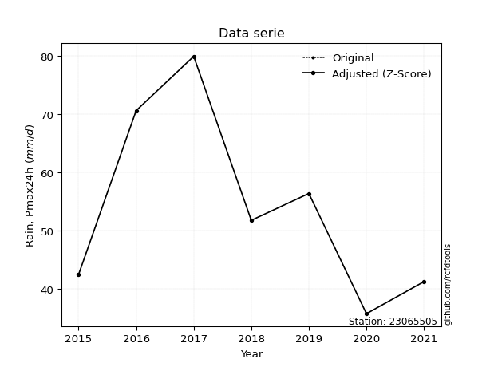</img>

</div>


> The initial value (value_initial) correspond to the initial obtained or null completed value, and value (value) is adjusted only when the initial value is outside the valid range (outlier) definite through the Z-Score value. If Z-Score is active, values out of range or outliers are replaced with the station mean value. A Z-Score (or standard score) measures how many standard deviations a data point is from the mean of a dataset, indicating its relative position; positive scores mean above the mean, negative mean below, and a score of zero is exactly at the mean, allowing for comparison of values from different distributions. It´s calculated using the formula $z=(x–μ)/σ$, where $x$ is the data point, $μ$ is the mean, and $σ$ is the standard deviation, helping identify outliers and understand probability.
>
> <sub>**Note**: In this study, "completing" (filling gaps in) and "extending" (forecasting or lengthening the historical record) rainfall data series are avoided for certain critical analyses because they introduce artificial bias and uncertainty, which can distort the statistics of rare events (extremes), alter day-to-day variability, and compromise the integrity and homogeneity of the original data. Some reasons against Completing/Extending rainfall data are: **Distortion of Extremes and Variability**: The primary issue is that most gap-filling or extension methods rely on averaging or regression with nearby stations, which inherently smooths the data. Rainfall is highly variable in space and time, with a large percentage of zero values and occasional large storms. Infilling methods often underestimate the highest values and overestimate the lowest (zero) values, which severely distorts analyses focused on flood frequency, drought severity, and intensity-duration-frequency (IDF) curves, **Loss of Data Homogeneity**: Infilled or extended data are synthetic estimates, not actual measurements. Combining these estimates with observed data can violate the assumption of data homogeneity, which requires that the data properties do not change over time. Inhomogeneity can lead to incorrect conclusions about long-term trends or changes in climate patterns, **Propagation of Errors**: Errors and biases from the original data (e.g., wind-induced undercatch, instrument errors, site changes) or the data used for imputation can propagate through the analysis, leading to unreliable hydrological models and inaccurate predictions, **Compromised Statistical Integrity**: For statistical analyses, especially those involving the frequency of events, using artificial data can introduce time bias or autocorrelation that doesn´t exist in reality, making it difficult to assess the true probability of events, **Difficulty in Validation**: It is difficult to accurately validate the quality of filled or extended data, especially for past periods where ground-truth measurements are unavailable. The reliability of imputation techniques heavily depends on the density of the surrounding station network and the complexity of the local topography.</sub>


### 4. Active continuous probability distributions from SciPy (80 of 104 available)

A Probability Density Function (PDF) describes the relative likelihood of a continuous random variable falling within a specific range, where the total area under its curve equals 1, and the area over any interval gives the actual probability for that range. Unlike discrete probabilities (like rolling a die), a PDF shows density, not direct probability for a single point (which is zero), with higher points indicating higher likelihood, often visualized as a bell curve for normal distributions.

A log of a probability density function (log-PDF) is simply the logarithm of the PDF´s value, denoted as $log(f(x))$, useful for converting multiplication of probabilities into addition, improving numerical stability with tiny numbers, and connecting to information theory concepts like entropy. Instead of dealing with very small probabilities (e.g., 0.000001), log-PDFs use negative numbers (e.g., $log(0.00001) ≈ -11.51$ that are easier for computers to handle, preventing underflow errors and simplifying complex calculations. In this study, each active probability distribution from SciPy is also evaluated in the $log$ form.

[scipy.stats](https://docs.scipy.org/doc/scipy/reference/stats.html) is a Python´s powerful submodule within the SciPy library for comprehensive statistical analysis, offering over 130 probability distributions (like Normal, Poisson, etc.), functions for descriptive stats (mean, variance), hypothesis testing (t-tests, chi-square), random variable generation, and statistical tests, making it essential for data science, modeling, and research. It provides tools to explore, model, and draw conclusions from data efficiently, working seamlessly with [NumPy](https://numpy.org/).

<div align="center">

|   id | p_dist           |   n_parameter | fit_method   | label                                                                       | active   | ref                                                                                                      |
|-----:|:-----------------|--------------:|:-------------|:----------------------------------------------------------------------------|:---------|:---------------------------------------------------------------------------------------------------------|
|    0 | alpha            |             3 | MLE          | Alpha                                                                       | True     | [:mortar_board:](https://docs.scipy.org/doc/scipy/reference/generated/scipy.stats.alpha.html)            |
|    1 | anglit           |             2 | MM           | Anglit                                                                      | True     | [:mortar_board:](https://docs.scipy.org/doc/scipy/reference/generated/scipy.stats.anglit.html)           |
|    2 | arcsine          |             2 | MM           | Arcsine                                                                     | True     | [:mortar_board:](https://docs.scipy.org/doc/scipy/reference/generated/scipy.stats.arcsine.html)          |
|    3 | argus            |             3 | MLE          | Argus                                                                       | True     | [:mortar_board:](https://docs.scipy.org/doc/scipy/reference/generated/scipy.stats.argus.html)            |
|    4 | beta             |             4 | MLE          | Beta                                                                        | True     | [:mortar_board:](https://docs.scipy.org/doc/scipy/reference/generated/scipy.stats.beta.html)             |
|    5 | betaprime        |             4 | MLE          | Beta prime                                                                  | True     | [:mortar_board:](https://docs.scipy.org/doc/scipy/reference/generated/scipy.stats.betaprime.html)        |
|    6 | bradford         |             3 | MLE          | Bradford                                                                    | True     | [:mortar_board:](https://docs.scipy.org/doc/scipy/reference/generated/scipy.stats.bradford.html)         |
|    7 | burr             |             4 | MLE          | Burr (Type III)                                                             | True     | [:mortar_board:](https://docs.scipy.org/doc/scipy/reference/generated/scipy.stats.burr.html)             |
|    8 | burr12           |             4 | MLE          | Burr (Type III) 12                                                          | True     | [:mortar_board:](https://docs.scipy.org/doc/scipy/reference/generated/scipy.stats.burr12.html)           |
|    9 | cosine           |             2 | MLE          | Cosine                                                                      | True     | [:mortar_board:](https://docs.scipy.org/doc/scipy/reference/generated/scipy.stats.cosine.html)           |
|   10 | crystalball      |             4 | MLE          | Crystalball                                                                 | True     | [:mortar_board:](https://docs.scipy.org/doc/scipy/reference/generated/scipy.stats.crystalball.html)      |
|   11 | dgamma           |             3 | MLE          | Double gamma                                                                | True     | [:mortar_board:](https://docs.scipy.org/doc/scipy/reference/generated/scipy.stats.dgamma.html)           |
|   12 | dweibull         |             3 | MLE          | Double Weibull                                                              | True     | [:mortar_board:](https://docs.scipy.org/doc/scipy/reference/generated/scipy.stats.dweibull.html)         |
|   13 | erlang           |             3 | MLE          | Erlang                                                                      | True     | [:mortar_board:](https://docs.scipy.org/doc/scipy/reference/generated/scipy.stats.erlang.html)           |
|   14 | exponnorm        |             3 | MLE          | Exponentially modified Normal                                               | True     | [:mortar_board:](https://docs.scipy.org/doc/scipy/reference/generated/scipy.stats.exponnorm.html)        |
|   15 | exponpow         |             3 | MLE          | Exponential power                                                           | True     | [:mortar_board:](https://docs.scipy.org/doc/scipy/reference/generated/scipy.stats.exponpow.html)         |
|   16 | exponweib        |             4 | MLE          | Exponentiated Weibull                                                       | True     | [:mortar_board:](https://docs.scipy.org/doc/scipy/reference/generated/scipy.stats.exponweib.html)        |
|   17 | f                |             4 | MLE          | F                                                                           | True     | [:mortar_board:](https://docs.scipy.org/doc/scipy/reference/generated/scipy.stats.f.html)                |
|   18 | fatiguelife      |             3 | MLE          | Fatigue-life (Birnbaum-Saunders)                                            | True     | [:mortar_board:](https://docs.scipy.org/doc/scipy/reference/generated/scipy.stats.fatiguelife.html)      |
|   19 | foldnorm         |             3 | MM           | Fold Normal                                                                 | True     | [:mortar_board:](https://docs.scipy.org/doc/scipy/reference/generated/scipy.stats.foldnorm.html)         |
|   20 | gamma            |             3 | MLE          | Gamma                                                                       | True     | [:mortar_board:](https://docs.scipy.org/doc/scipy/reference/generated/scipy.stats.gamma.html)            |
|   21 | gausshyper       |             6 | MLE          | Gauss hypergeometric                                                        | True     | [:mortar_board:](https://docs.scipy.org/doc/scipy/reference/generated/scipy.stats.gausshyper.html)       |
|   22 | genexpon         |             5 | MLE          | Generalized exponential                                                     | True     | [:mortar_board:](https://docs.scipy.org/doc/scipy/reference/generated/scipy.stats.genexpon.html)         |
|   23 | genextreme       |             3 | MLE          | Generalized exponential                                                     | True     | [:mortar_board:](https://docs.scipy.org/doc/scipy/reference/generated/scipy.stats.genextreme.html)       |
|   24 | gengamma         |             4 | MLE          | Generalized gamma                                                           | True     | [:mortar_board:](https://docs.scipy.org/doc/scipy/reference/generated/scipy.stats.gengamma.html)         |
|   25 | genhalflogistic  |             3 | MLE          | Generalized half-logistic                                                   | True     | [:mortar_board:](https://docs.scipy.org/doc/scipy/reference/generated/scipy.stats.genhalflogistic.html)  |
|   26 | genlogistic      |             3 | MLE          | Generalized logistic                                                        | True     | [:mortar_board:](https://docs.scipy.org/doc/scipy/reference/generated/scipy.stats.genlogistic.html)      |
|   27 | gennorm          |             3 | MLE          | Generalized Normal                                                          | True     | [:mortar_board:](https://docs.scipy.org/doc/scipy/reference/generated/scipy.stats.gennorm.html)          |
|   28 | genpareto        |             3 | MLE          | Generalized Pareto                                                          | True     | [:mortar_board:](https://docs.scipy.org/doc/scipy/reference/generated/scipy.stats.genpareto.html)        |
|   29 | gompertz         |             3 | MLE          | Gompertz (or truncated Gumbel)                                              | True     | [:mortar_board:](https://docs.scipy.org/doc/scipy/reference/generated/scipy.stats.gompertz.html)         |
|   30 | gumbel_l         |             2 | MM           | Gumbel Left Skew                                                            | True     | [:mortar_board:](https://docs.scipy.org/doc/scipy/reference/generated/scipy.stats.gumbel_l.html)         |
|   31 | gumbel_r         |             2 | MM           | Gumbel Right Skew                                                           | True     | [:mortar_board:](https://docs.scipy.org/doc/scipy/reference/generated/scipy.stats.gumbel_r.html)         |
|   32 | halfgennorm      |             3 | MLE          | Upper half of a generalized normal                                          | True     | [:mortar_board:](https://docs.scipy.org/doc/scipy/reference/generated/scipy.stats.halfgennorm.html)      |
|   33 | halflogistic     |             2 | MM           | Half-logistic                                                               | True     | [:mortar_board:](https://docs.scipy.org/doc/scipy/reference/generated/scipy.stats.halflogistic.html)     |
|   34 | halfnorm         |             2 | MM           | Half Normal                                                                 | True     | [:mortar_board:](https://docs.scipy.org/doc/scipy/reference/generated/scipy.stats.halfnorm.html)         |
|   35 | hypsecant        |             2 | MM           | hyperbolic secant                                                           | True     | [:mortar_board:](https://docs.scipy.org/doc/scipy/reference/generated/scipy.stats.hypsecant.html)        |
|   36 | invgamma         |             3 | MLE          | Inverted gamma                                                              | True     | [:mortar_board:](https://docs.scipy.org/doc/scipy/reference/generated/scipy.stats.invgamma.html)         |
|   37 | invgauss         |             3 | MLE          | Inverse Gaussian                                                            | True     | [:mortar_board:](https://docs.scipy.org/doc/scipy/reference/generated/scipy.stats.invgauss.html)         |
|   38 | invweibull       |             3 | MLE          | Inverted Weibull                                                            | True     | [:mortar_board:](https://docs.scipy.org/doc/scipy/reference/generated/scipy.stats.invweibull.html)       |
|   39 | johnsonsb        |             4 | MLE          | Johnson SB                                                                  | True     | [:mortar_board:](https://docs.scipy.org/doc/scipy/reference/generated/scipy.stats.johnsonsb.html)        |
|   40 | johnsonsu        |             4 | MLE          | Johnson Su                                                                  | True     | [:mortar_board:](https://docs.scipy.org/doc/scipy/reference/generated/scipy.stats.johnsonsu.html)        |
|   41 | kappa3           |             3 | MLE          | Kappa 3                                                                     | True     | [:mortar_board:](https://docs.scipy.org/doc/scipy/reference/generated/scipy.stats.kappa3.html)           |
|   42 | kappa4           |             4 | MLE          | Kappa 4                                                                     | True     | [:mortar_board:](https://docs.scipy.org/doc/scipy/reference/generated/scipy.stats.kappa4.html)           |
|   43 | ksone            |             3 | MLE          | Kolmogorov-Smirnov one-sided test statistic distribution                    | True     | [:mortar_board:](https://docs.scipy.org/doc/scipy/reference/generated/scipy.stats.ksone.html)            |
|   44 | kstwobign        |             2 | MLE          | Limiting distribution of scaled Kolmogorov-Smirnov two-sided test statistic | True     | [:mortar_board:](https://docs.scipy.org/doc/scipy/reference/generated/scipy.stats.kstwobign.html)        |
|   45 | laplace          |             2 | MM           | Laplace                                                                     | True     | [:mortar_board:](https://docs.scipy.org/doc/scipy/reference/generated/scipy.stats.laplace.html)          |
|   46 | levy_l           |             2 | MLE          | Left-skewed Levy                                                            | True     | [:mortar_board:](https://docs.scipy.org/doc/scipy/reference/generated/scipy.stats.levy_l.html)           |
|   47 | loggamma         |             3 | MLE          | Log gamma                                                                   | True     | [:mortar_board:](https://docs.scipy.org/doc/scipy/reference/generated/scipy.stats.loggamma.html)         |
|   48 | logistic         |             2 | MM           | Logistic (or Sech-squared)                                                  | True     | [:mortar_board:](https://docs.scipy.org/doc/scipy/reference/generated/scipy.stats.logistic.html)         |
|   49 | loglaplace       |             3 | MLE          | Log-Laplace                                                                 | True     | [:mortar_board:](https://docs.scipy.org/doc/scipy/reference/generated/scipy.stats.loglaplace.html)       |
|   50 | lomax            |             3 | MLE          | Lomax (Pareto of the second kind)                                           | True     | [:mortar_board:](https://docs.scipy.org/doc/scipy/reference/generated/scipy.stats.lomax.html)            |
|   51 | maxwell          |             2 | MM           | Maxwell                                                                     | True     | [:mortar_board:](https://docs.scipy.org/doc/scipy/reference/generated/scipy.stats.maxwell.html)          |
|   52 | mielke           |             4 | MLE          | Mielke Beta-Kappa / Dagum                                                   | True     | [:mortar_board:](https://docs.scipy.org/doc/scipy/reference/generated/scipy.stats.mielke.html)           |
|   53 | moyal            |             2 | MM           | Moyal                                                                       | True     | [:mortar_board:](https://docs.scipy.org/doc/scipy/reference/generated/scipy.stats.moyal.html)            |
|   54 | nakagami         |             3 | MLE          | Nakagami                                                                    | True     | [:mortar_board:](https://docs.scipy.org/doc/scipy/reference/generated/scipy.stats.nakagami.html)         |
|   55 | ncf              |             5 | MLE          | Non-central F distribution                                                  | True     | [:mortar_board:](https://docs.scipy.org/doc/scipy/reference/generated/scipy.stats.ncf.html)              |
|   56 | nct              |             4 | MLE          | Non-central Student’s t                                                     | True     | [:mortar_board:](https://docs.scipy.org/doc/scipy/reference/generated/scipy.stats.nct.html)              |
|   57 | norm             |             2 | MM           | Normal                                                                      | True     | [:mortar_board:](https://docs.scipy.org/doc/scipy/reference/generated/scipy.stats.norm.html)             |
|   58 | pearson3         |             3 | MM           | Pearson type III                                                            | True     | [:mortar_board:](https://docs.scipy.org/doc/scipy/reference/generated/scipy.stats.pearson3.html)         |
|   59 | powerlaw         |             3 | MLE          | Power-function                                                              | True     | [:mortar_board:](https://docs.scipy.org/doc/scipy/reference/generated/scipy.stats.powerlaw.html)         |
|   60 | rayleigh         |             2 | MM           | Rayleigh                                                                    | True     | [:mortar_board:](https://docs.scipy.org/doc/scipy/reference/generated/scipy.stats.rayleigh.html)         |
|   61 | rdist            |             3 | MLE          | R-distributed (symmetric beta)                                              | True     | [:mortar_board:](https://docs.scipy.org/doc/scipy/reference/generated/scipy.stats.rdist.html)            |
|   62 | rice             |             3 | MLE          | Rice                                                                        | True     | [:mortar_board:](https://docs.scipy.org/doc/scipy/reference/generated/scipy.stats.rice.html)             |
|   63 | semicircular     |             2 | MM           | Semicircular                                                                | True     | [:mortar_board:](https://docs.scipy.org/doc/scipy/reference/generated/scipy.stats.semicircular.html)     |
|   64 | skewnorm         |             3 | MLE          | Skew normal                                                                 | True     | [:mortar_board:](https://docs.scipy.org/doc/scipy/reference/generated/scipy.stats.skewnorm.html)         |
|   65 | t                |             3 | MLE          | Student’s t                                                                 | True     | [:mortar_board:](https://docs.scipy.org/doc/scipy/reference/generated/scipy.stats.t.html)                |
|   66 | trapezoid        |             4 | MLE          | Trapezoid                                                                   | True     | [:mortar_board:](https://docs.scipy.org/doc/scipy/reference/generated/scipy.stats.trapezoid.html)        |
|   67 | triang           |             3 | MLE          | Triangular                                                                  | True     | [:mortar_board:](https://docs.scipy.org/doc/scipy/reference/generated/scipy.stats.triang.html)           |
|   68 | truncexpon       |             3 | MLE          | Truncated exponential                                                       | True     | [:mortar_board:](https://docs.scipy.org/doc/scipy/reference/generated/scipy.stats.truncexpon.html)       |
|   69 | truncnorm        |             4 | MLE          | Truncated normal                                                            | True     | [:mortar_board:](https://docs.scipy.org/doc/scipy/reference/generated/scipy.stats.truncnorm.html)        |
|   70 | truncpareto      |             4 | MLE          | Upper truncated Pareto                                                      | True     | [:mortar_board:](https://docs.scipy.org/doc/scipy/reference/generated/scipy.stats.truncpareto.html)      |
|   71 | truncweibull_min |             5 | MLE          | Doubly truncated Weibull minimum                                            | True     | [:mortar_board:](https://docs.scipy.org/doc/scipy/reference/generated/scipy.stats.truncweibull_min.html) |
|   72 | tukeylambda      |             3 | MLE          | Tukey-Lamdba                                                                | True     | [:mortar_board:](https://docs.scipy.org/doc/scipy/reference/generated/scipy.stats.tukeylambda.html)      |
|   73 | uniform          |             2 | MLE          | Uniform                                                                     | True     | [:mortar_board:](https://docs.scipy.org/doc/scipy/reference/generated/scipy.stats.uniform.html)          |
|   74 | vonmises         |             3 | MLE          | Von Mises                                                                   | True     | [:mortar_board:](https://docs.scipy.org/doc/scipy/reference/generated/scipy.stats.vonmises.html)         |
|   75 | vonmises_line    |             3 | MLE          | Von Mises line                                                              | True     | [:mortar_board:](https://docs.scipy.org/doc/scipy/reference/generated/scipy.stats.vonmises_line.html)    |
|   76 | wald             |             2 | MM           | Wald                                                                        | True     | [:mortar_board:](https://docs.scipy.org/doc/scipy/reference/generated/scipy.stats.wald.html)             |
|   77 | weibull_max      |             3 | MLE          | Weibull maximum                                                             | True     | [:mortar_board:](https://docs.scipy.org/doc/scipy/reference/generated/scipy.stats.weibull_max.html)      |
|   78 | weibull_min      |             3 | MLE          | Weibull minimum                                                             | True     | [:mortar_board:](https://docs.scipy.org/doc/scipy/reference/generated/scipy.stats.weibull_min.html)      |
|   79 | wrapcauchy       |             3 | MLE          | Wrapped  Cauchy                                                             | True     | [:mortar_board:](https://docs.scipy.org/doc/scipy/reference/generated/scipy.stats.wrapcauchy.html)       |

</div>

> **n_parameter:** # arguments & localization & scale.
>
> **Fit methods:** (MLE) maximum likelihood, (MM) L-moments.
>
>**Inactive** (With the only purpose of prevent loops, zero divisions, infinite values, over high estimated values or horizontal trending for recurrence intervals estimations, the follow distributions were disabled.)**:** lognorm, norminvgauss, powernorm, powerlognorm, cauchy, halfcauchy, foldcauchy, skewcauchy, chi2, expon, fisk, genhyperbolic, geninvgauss, gibrat, kstwo, laplace_asymmetric, levy, levy_stable, ncx2, pareto, rel_breitwigner, recipinvgauss, studentized_range, loguniform, 


## B. Probability (PDF) vs. Empirical (EDF) distributions functions

A continuous probability distribution (CPD) describes probabilities for variables that can take any value within a range (like rain any time), unlike discrete variables with specific outcomes (like temperature). It uses a Probability Density Function (PDF), a curve where the total area under it equals 1, and the probability of the variable falling within an interval (a to b) is found by calculating the area under the curve between those points. A key feature is that the probability of hitting any single exact value is zero, so probabilities are always expressed for ranges, e.g., $P(a ≤ X ≤ b)$.

<div align="center">

Distributions parameters from station values
|     |   station | p_dist              |   n |             loc |          scale | shape                  | shape1                 | shape2             | shape3              |
|----:|----------:|:--------------------|----:|----------------:|---------------:|:-----------------------|:-----------------------|:-------------------|:--------------------|
|   0 |  23065505 | alpha               |   7 |    -3.50693     |  220.357       | 4.084431345006159      |                        |                    |                     |
|   1 |  23065505 | anglit              |   7 |    54.0429      |   43.9747      |                        |                        |                    |                     |
|   2 |  23065505 | arcsine             |   7 |    32.7844      |   42.517       |                        |                        |                    |                     |
|   3 |  23065505 | argus               |   7 |    21.5522      |   60.9338      | 4.009514510786591e-07  |                        |                    |                     |
|   4 |  23065505 | beta                |   7 |    35.8         |   44.5238      | 0.4774195925728118     | 0.8285809036825036     |                    |                     |
|   5 |  23065505 | betaprime           |   7 |    -0.346994    |   26.3843      | 42.79191112871634      | 21.809979345506697     |                    |                     |
|   6 |  23065505 | bradford            |   7 |    35.7947      |   44.1053      | 1.5300953906429215     |                        |                    |                     |
|   7 |  23065505 | burr                |   7 |    -0.647893    |   11.2132      | 4.435027266540388      | 538.0983137713827      |                    |                     |
|   8 |  23065505 | burr12              |   7 |   -11.9613      |   47.593       | 1079.362656192168      | 0.0030679228120166963  |                    |                     |
|   9 |  23065505 | cosine              |   7 |    55.1926      |   12.2967      |                        |                        |                    |                     |
|  10 |  23065505 | crystalball         |   7 |    -0.0420352   |   56.1119      | 5.477633091494461      | 1.0168298220346954     |                    |                     |
|  11 |  23065505 | dgamma              |   7 |    48.662       |    6.237       | 2.0714586433945374     |                        |                    |                     |
|  12 |  23065505 | dweibull            |   7 |    49.3852      |   14.225       | 1.4641827735840467     |                        |                    |                     |
|  13 |  23065505 | erlang              |   7 |    35.8         |   25.0073      | 0.18190187116628526    |                        |                    |                     |
|  14 |  23065505 | exponnorm           |   7 |    35.7768      |    0.00700695  | 2594.9138790477946     |                        |                    |                     |
|  15 |  23065505 | exponpow            |   7 |    35.8         |   31.4625      | 0.8822732938362075     |                        |                    |                     |
|  16 |  23065505 | exponweib           |   7 |    35.8         |    1.2631      | 1.225814224133881      | 0.3078877277724491     |                    |                     |
|  17 |  23065505 | f                   |   7 |    21.5915      |   26.0969      | 5229.139191783202      | 9.538469791016572      |                    |                     |
|  18 |  23065505 | fatiguelife         |   7 |    35.8         |    8.96324e-05 | 412.72335845555483     |                        |                    |                     |
|  19 |  23065505 | foldnorm            |   7 |    29.8969      |   17.2612      | 1.3096569716040198     |                        |                    |                     |
|  20 |  23065505 | gamma               |   7 |    35.8         |   14.6588      | 0.3613968298700859     |                        |                    |                     |
|  21 |  23065505 | gausshyper          |   7 |    35.572       |   44.328       | 1.0052172487823516     | 0.909019475858726      | 1.0133986241393762 | 1.063855915520343   |
|  22 |  23065505 | genexpon            |   7 |    35.8         |    2.1216      | 0.11607459367646994    | 3.6233920522227877e-06 | 1.0129724232936403 |                     |
|  23 |  23065505 | genextreme          |   7 |    35.8272      |    0.181883    | -6.690387902563703     |                        |                    |                     |
|  24 |  23065505 | gengamma            |   7 |    35.8         |    1.24942     | 1.2474817925600243     | 0.31072355558951514    |                    |                     |
|  25 |  23065505 | genhalflogistic     |   7 |    33.8985      |   48.6781      | 1.0581845787923032     |                        |                    |                     |
|  26 |  23065505 | genlogistic         |   7 |   -28.6748      |   11.7043      | 641.7123908243607      |                        |                    |                     |
|  27 |  23065505 | gennorm             |   7 |    57.85        |   22.0501      | 3501239.8820259357     |                        |                    |                     |
|  28 |  23065505 | genpareto           |   7 |    -0.0667445   |  125.563       | -1.5701859553406727    |                        |                    |                     |
|  29 |  23065505 | gompertz            |   7 |    35.8         |   32.4967      | 1.0335147154823052     |                        |                    |                     |
|  30 |  23065505 | gumbel_l            |   7 |    60.8081      |   11.7204      |                        |                        |                    |                     |
|  31 |  23065505 | gumbel_r            |   7 |    47.2776      |   11.7204      |                        |                        |                    |                     |
|  32 |  23065505 | halfgennorm         |   7 |    35.8         |    1.36275     | 0.40529794502071276    |                        |                    |                     |
|  33 |  23065505 | halflogistic        |   7 |    36.2264      |   12.8519      |                        |                        |                    |                     |
|  34 |  23065505 | halfnorm            |   7 |    34.1463      |   24.9366      |                        |                        |                    |                     |
|  35 |  23065505 | hypsecant           |   7 |    54.0429      |    9.5697      |                        |                        |                    |                     |
|  36 |  23065505 | invgamma            |   7 |    21.5651      |  124.59        | 4.77013724535376       |                        |                    |                     |
|  37 |  23065505 | invgauss            |   7 |    29.188       |   46.0137      | 0.5401613472153588     |                        |                    |                     |
|  38 |  23065505 | invweibull          |   7 |    -6.75766     |   52.5421      | 4.969714528952711      |                        |                    |                     |
|  39 |  23065505 | johnsonsb           |   7 |    35.7973      |   44.1027      | -0.35839201366491674   | 0.125687596633912      |                    |                     |
|  40 |  23065505 | johnsonsu           |   7 |    30.5994      |    0.446098    | -5.996571649453042     | 1.35932613562586       |                    |                     |
|  41 |  23065505 | kappa3              |   7 |    35.8         |   44.0122      | 785.0831116622257      |                        |                    |                     |
|  42 |  23065505 | kappa4              |   7 |    29.3049      |   50.6398      | 1.1470315374603248     | 0.9910607295966243     |                    |                     |
|  43 |  23065505 | ksone               |   7 |    28.0066      |   52.0725      | 1.0                    |                        |                    |                     |
|  44 |  23065505 | kstwobign           |   7 |     6.36118     |   54.6225      |                        |                        |                    |                     |
|  45 |  23065505 | laplace             |   7 |    54.0429      |   10.6293      |                        |                        |                    |                     |
|  46 |  23065505 | levy_l              |   7 |    82.4878      |   11.4346      |                        |                        |                    |                     |
|  47 |  23065505 | loggamma            |   7 | -3774.44        |  536.502       | 1256.577489571187      |                        |                    |                     |
|  48 |  23065505 | logistic            |   7 |    54.0429      |    8.2876      |                        |                        |                    |                     |
|  49 |  23065505 | loglaplace          |   7 |    -0.156741    |   51.9567      | 4.328837277849436      |                        |                    |                     |
|  50 |  23065505 | lomax               |   7 |    35.7462      |  623.425       | 34.57942424671336      |                        |                    |                     |
|  51 |  23065505 | maxwell             |   7 |    18.4232      |   22.3213      |                        |                        |                    |                     |
|  52 |  23065505 | mielke              |   7 |     1.31571     |   11.6436      | 1259.0214691755439     | 4.259242677094855      |                    |                     |
|  53 |  23065505 | moyal               |   7 |    45.4466      |    6.7668      |                        |                        |                    |                     |
|  54 |  23065505 | nakagami            |   7 |    35.8         |   24.4045      | 0.19408061992694078    |                        |                    |                     |
|  55 |  23065505 | ncf                 |   7 |    -0.0186067   |    2.29277e-05 | 2.7722503453571213e-06 | 9.952672005883777      | 5.538627845324763  |                     |
|  56 |  23065505 | nct                 |   7 |    -0.454859    |    1.00096     | 7.751589170487652      | 49.064268367922466     |                    |                     |
|  57 |  23065505 | norm                |   7 |    54.0429      |   15.032       |                        |                        |                    |                     |
|  58 |  23065505 | pearson3            |   7 |    54.0428      |   15.0321      | 0.5109804321302263     |                        |                    |                     |
|  59 |  23065505 | powerlaw            |   7 |    35.8         |   44.1         | 0.1653192229811824     |                        |                    |                     |
|  60 |  23065505 | rayleigh            |   7 |    25.2857      |   22.9449      |                        |                        |                    |                     |
|  61 |  23065505 | rdist               |   7 |    35.2618      |   21.1382      | 1.1950863501084859     |                        |                    |                     |
|  62 |  23065505 | rice                |   7 |    28.4462      |   20.9899      | 0.002157932752631979   |                        |                    |                     |
|  63 |  23065505 | semicircular        |   7 |    54.0429      |   30.0641      |                        |                        |                    |                     |
|  64 |  23065505 | skewnorm            |   7 |    35.8         |   23.637       | 8773394.395218458      |                        |                    |                     |
|  65 |  23065505 | t                   |   7 |    54.0433      |   15.032       | 77851558.18792504      |                        |                    |                     |
|  66 |  23065505 | trapezoid           |   7 |    31.39        |   52.92        | 0.9999999999999999     | 1.0                    |                    |                     |
|  67 |  23065505 | triang              |   7 |    17.1054      |   62.7954      | 0.9999999999989033     |                        |                    |                     |
|  68 |  23065505 | truncexpon          |   7 |    35.8         |   44.627       | 0.9881917823227333     |                        |                    |                     |
|  69 |  23065505 | truncnorm           |   7 |    54.0429      |   15.032       | -386.9978544987755     | 791.1210199548743      |                    |                     |
|  70 |  23065505 | truncpareto         |   7 |    35.7842      |    0.0158379   | 0.16818543863790894    | 2785.4636166710097     |                    |                     |
|  71 |  23065505 | truncweibull_min    |   7 |    35.7841      |   39.7814      | 0.8944269777345015     | 0.00035797594369462864 | 1.1089570216475828 |                     |
|  72 |  23065505 | tukeylambda         |   7 |    57.85        |   22.317       | 1.0121086993382118     |                        |                    |                     |
|  73 |  23065505 | uniform             |   7 |    35.8         |   44.1         |                        |                        |                    |                     |
|  74 |  23065505 | vonmises            |   7 |    -1.72037     |    1           | 0.4490898575961784     |                        |                    |                     |
|  75 |  23065505 | vonmises_line       |   7 |    57.7181      |    7.06071     | 2.2479811509492206e-05 |                        |                    |                     |
|  76 |  23065505 | wald                |   7 |    39.0108      |   15.032       |                        |                        |                    |                     |
|  77 |  23065505 | weibull_max         |   7 |    79.9         |    1.44519     | 0.206422120687093      |                        |                    |                     |
|  78 |  23065505 | weibull_min         |   7 |    35.8         |   17.4956      | 0.7554488148065065     |                        |                    |                     |
|  79 |  23065505 | wrapcauchy          |   7 |    35.8         |    7.01873     | 0.5                    |                        |                    |                     |
|  80 |  23065505 | logalpha            |   7 |     1.07231     |   30.7002      | 10.763013875216487     |                        |                    |                     |
|  81 |  23065505 | loganglit           |   7 |     3.95228     |    0.795589    |                        |                        |                    |                     |
|  82 |  23065505 | logarcsine          |   7 |     3.56766     |    0.769234    |                        |                        |                    |                     |
|  83 |  23065505 | logargus            |   7 |     3.36337     |    1.06595     | 1.4760636283923175e-05 |                        |                    |                     |
|  84 |  23065505 | logbeta             |   7 |     3.57795     |    0.877413    | 0.6433531700436779     | 0.897322866727553      |                    |                     |
|  85 |  23065505 | logbetaprime        |   7 |    -4.21962     |    6.37476     | 1000.4430930701565     | 781.9174413024325      |                    |                     |
|  86 |  23065505 | logbradford         |   7 |     3.57794     |    0.802832    | 1.081858555076003      |                        |                    |                     |
|  87 |  23065505 | logburr             |   7 |   -15.893       |   17.8659      | 86.95938288172152      | 5161.463823674318      |                    |                     |
|  88 |  23065505 | logburr12           |   7 |     0.0704858   |    3.61829     | 44.28440117638988      | 0.3022468785058863     |                    |                     |
|  89 |  23065505 | logcosine           |   7 |     3.96185     |    0.220519    |                        |                        |                    |                     |
|  90 |  23065505 | logcrystalball      |   7 |     3.95228     |    0.271959    | 2185.5526906848036     | 2.2549585055168864     |                    |                     |
|  91 |  23065505 | logdgamma           |   7 |     3.8737      |    0.0877682   | 2.7599938547930867     |                        |                    |                     |
|  92 |  23065505 | logdweibull         |   7 |     3.88747     |    0.271089    | 1.7671308436316677     |                        |                    |                     |
|  93 |  23065505 | logerlang           |   7 |     3.57795     |    0.379379    | 0.7746078931129254     |                        |                    |                     |
|  94 |  23065505 | logexponnorm        |   7 |     3.89717     |    0.266337    | 0.20692672881307334    |                        |                    |                     |
|  95 |  23065505 | logexponpow         |   7 |     3.57795     |    0.809094    | 0.8294602722997567     |                        |                    |                     |
|  96 |  23065505 | logexponweib        |   7 |     3.57795     |    0.493225    | 0.520917330246274      | 1.3204428293657393     |                    |                     |
|  97 |  23065505 | logf                |   7 |     2.71395     |    1.18004     | 8574.92338592311       | 41.84320028600308      |                    |                     |
|  98 |  23065505 | logfatiguelife      |   7 |     3.28298     |    0.6098      | 0.4412728718176272     |                        |                    |                     |
|  99 |  23065505 | logfoldnorm         |   7 |     3.4459      |    0.290226    | 1.7090440786022292     |                        |                    |                     |
| 100 |  23065505 | loggamma            |   7 |     3.57795     |    0.368716    | 0.8308803924167711     |                        |                    |                     |
| 101 |  23065505 | loggausshyper       |   7 |     3.57165     |    0.809128    | 0.5652710501555894     | 0.4791162970439281     | 2.4837446020149527 | 0.15031134472307703 |
| 102 |  23065505 | loggenexpon         |   7 |     3.57795     |    0.555068    | 0.9483885332515407     | 1.3735655360190089     | 1.0374476326036777 |                     |
| 103 |  23065505 | loggenextreme       |   7 |     3.84541     |    0.249359    | 0.19655397963908183    |                        |                    |                     |
| 104 |  23065505 | loggengamma         |   7 |     3.57795     |    0.904758    | 0.37448941208607955    | 0.9120000723438219     |                    |                     |
| 105 |  23065505 | loggenhalflogistic  |   7 |     3.47533     |    0.96249     | 1.0629972269741086     |                        |                    |                     |
| 106 |  23065505 | loggenlogistic      |   7 |     2.32295     |    0.228964    | 692.132376218176       |                        |                    |                     |
| 107 |  23065505 | loggennorm          |   7 |     3.97936     |    0.401416    | 2752722.58780902       |                        |                    |                     |
| 108 |  23065505 | loggenpareto        |   7 |    -0.00389614  |   10.5998      | -2.4174708077685674    |                        |                    |                     |
| 109 |  23065505 | loggompertz         |   7 |     3.57795     |    0.624605    | 1.0110390462420868     |                        |                    |                     |
| 110 |  23065505 | loggumbel_l         |   7 |     4.07468     |    0.212046    |                        |                        |                    |                     |
| 111 |  23065505 | loggumbel_r         |   7 |     3.82989     |    0.212046    |                        |                        |                    |                     |
| 112 |  23065505 | loghalfgennorm      |   7 |     3.57795     |    0.802862    | 260635.62736327096     |                        |                    |                     |
| 113 |  23065505 | loghalflogistic     |   7 |     3.62993     |    0.232529    |                        |                        |                    |                     |
| 114 |  23065505 | loghalfnorm         |   7 |     3.5923      |    0.451166    |                        |                        |                    |                     |
| 115 |  23065505 | loghypsecant        |   7 |     3.95228     |    0.173135    |                        |                        |                    |                     |
| 116 |  23065505 | loginvgamma         |   7 |     2.71106     |   24.7464      | 20.92193218224812      |                        |                    |                     |
| 117 |  23065505 | loginvgauss         |   7 |     3.22693     |    4.36573     | 0.16614723216884986    |                        |                    |                     |
| 118 |  23065505 | loginvweibull       |   7 |    -1.0971e+07  |    1.0971e+07  | 47901080.30173005      |                        |                    |                     |
| 119 |  23065505 | logjohnsonsb        |   7 |     3.57784     |    0.80294     | -0.5615674611839442    | 0.12071701470509591    |                    |                     |
| 120 |  23065505 | logjohnsonsu        |   7 |     1.62433e+07 |    3.88173e+06 | 131941414.05028307     | 61697346.242618695     |                    |                     |
| 121 |  23065505 | logkappa3           |   7 |     3.57795     |    0.819545    | 60.077646359568504     |                        |                    |                     |
| 122 |  23065505 | logkappa4           |   7 |     3.51223     |    0.890259    | 1.0797686988507529     | 1.0213462713750299     |                    |                     |
| 123 |  23065505 | logksone            |   7 |     3.48124     |    0.942094    | 1.0                    |                        |                    |                     |
| 124 |  23065505 | logkstwobign        |   7 |     3.02745     |    1.05717     |                        |                        |                    |                     |
| 125 |  23065505 | loglaplace          |   7 |     3.95228     |    0.192304    |                        |                        |                    |                     |
| 126 |  23065505 | loglevy_l           |   7 |     4.42042     |    0.174336    |                        |                        |                    |                     |
| 127 |  23065505 | logloggamma         |   7 |   -71.2293      |   10.3407      | 1437.7320188825515     |                        |                    |                     |
| 128 |  23065505 | loglogistic         |   7 |     3.95228     |    0.149939    |                        |                        |                    |                     |
| 129 |  23065505 | logloglaplace       |   7 |     0.0088435   |    3.93855     | 17.163006768263244     |                        |                    |                     |
| 130 |  23065505 | loglomax            |   7 |     3.57795     |    9.21537e+10 | 30923611135.45337      |                        |                    |                     |
| 131 |  23065505 | logmaxwell          |   7 |     3.30785     |    0.403836    |                        |                        |                    |                     |
| 132 |  23065505 | logmielke           |   7 | -1248.76        | 1251.63        | 367109.94426993787     | 5513.917265757928      |                    |                     |
| 133 |  23065505 | logmoyal            |   7 |     3.79676     |    0.122425    |                        |                        |                    |                     |
| 134 |  23065505 | lognakagami         |   7 |     3.57795     |    0.455911    | 0.2362872260135493     |                        |                    |                     |
| 135 |  23065505 | logncf              |   7 |     1.79157     |    2.10725     | 394.4055776810055      | 189.59480827262234     | 5.9975087596842975 |                     |
| 136 |  23065505 | lognct              |   7 |    -2.0718      |    0.0636334   | 254.74333429734168     | 94.40620704284859      |                    |                     |
| 137 |  23065505 | lognorm             |   7 |     3.95228     |    0.271959    |                        |                        |                    |                     |
| 138 |  23065505 | logpearson3         |   7 |     3.95228     |    0.271959    | 0.2436116530086936     |                        |                    |                     |
| 139 |  23065505 | logpowerlaw         |   7 |     3.57795     |    0.802828    | 0.17538385351801672    |                        |                    |                     |
| 140 |  23065505 | lograyleigh         |   7 |     3.43201     |    0.415118    |                        |                        |                    |                     |
| 141 |  23065505 | logrdist            |   7 |     3.8731      |    0.507674    | 1.0992273284521956     |                        |                    |                     |
| 142 |  23065505 | logrice             |   7 |     3.45547     |    0.356374    | 0.7251034747029279     |                        |                    |                     |
| 143 |  23065505 | logsemicircular     |   7 |     3.95228     |    0.543918    |                        |                        |                    |                     |
| 144 |  23065505 | logskewnorm         |   7 |     3.57795     |    0.462573    | 4083438.124148229      |                        |                    |                     |
| 145 |  23065505 | logt                |   7 |     3.95228     |    0.27196     | 4992213123.25486       |                        |                    |                     |
| 146 |  23065505 | logtrapezoid        |   7 |     3.49767     |    0.963394    | 1.0                    | 1.0                    |                    |                     |
| 147 |  23065505 | logtriang           |   7 |     3.29276     |    1.08802     | 0.9999999904836722     |                        |                    |                     |
| 148 |  23065505 | logtruncexpon       |   7 |     3.57795     |    0.729041    | 1.1012141373510707     |                        |                    |                     |
| 149 |  23065505 | logtruncnorm        |   7 |    -0.107391    |    1.26126     | 2.9219526804469185     | 3.558494720335858      |                    |                     |
| 150 |  23065505 | logtruncpareto      |   7 |     3.5776      |    0.000350064 | 0.0007699918204865769  | 2295.048237914957      |                    |                     |
| 151 |  23065505 | logtruncweibull_min |   7 |     3.57703     |    1.1521      | 0.8440330706706674     | 0.0007924947604923407  | 0.69762887556913   |                     |
| 152 |  23065505 | logtukeylambda      |   7 |     3.9794      |    0.441009    | 1.0985372218911424     |                        |                    |                     |
| 153 |  23065505 | loguniform          |   7 |     3.57795     |    0.802828    |                        |                        |                    |                     |
| 154 |  23065505 | logvonmises         |   7 |    -2.33174     |    1           | 13.931523187607638     |                        |                    |                     |
| 155 |  23065505 | logvonmises_line    |   7 |     3.97981     |    0.127915    | 0.03859571958132467    |                        |                    |                     |
| 156 |  23065505 | logwald             |   7 |     3.68029     |    0.271991    |                        |                        |                    |                     |
| 157 |  23065505 | logweibull_max      |   7 |     5.1138      |    1.26839     | 5.086198269346553      |                        |                    |                     |
| 158 |  23065505 | logweibull_min      |   7 |     3.57795     |    0.388226    | 0.9874345845077468     |                        |                    |                     |
| 159 |  23065505 | logwrapcauchy       |   7 |     3.57795     |    0.127774    | 0.5000000000000001     |                        |                    |                     |

</div>

> **loc** (Location parameter): This shifts the distribution along the x-axis. For many common distributions, like the normal (Gaussian) distribution, loc represents the mean $μ$. For others, like the uniform distribution, it might represent the minimum value, or for the beta distribution, the left end of the support interval.
>
> **scale** (Scale parameter): This determines the width or spread of the distribution. For the normal distribution, scale represents the standard deviation $σ$. For a uniform distribution, it defines the length of the interval (from $loc$ to $loc + scale$).
>
> **shape** (Shape parameters): Refers to parameters that define the specific form of a probability distribution, distinct from its location (loc) and scale (scale). These parameters are required arguments for most distribution functions. For example, a normal (Gaussian) distribution is fully defined by its location (mean) and scale (standard deviation), so it has no specific shape parameters beyond loc and scale. However, other distributions have intrinsic properties that need specification, as Gamma distribution that takes a shape parameter, often named $a$ or $alpha$.


### 0. Cumulative distribution values - CDF (160 evaluated)

Cumulative Distribution Function (CDF), denoted as $F$<sub>$X$</sub>$(x)$, is a function that gives the probability that a random variable $X$ will take a value less than or equal to a specific value, $x$ (i.e., $(P(X≥x)$. It essentially "accumulates" probabilities from a given point up to the far right (positive infinity), providing a complete picture of the distribution´s probabilities for both discrete (like rain) and continuous (like temperature) variables, helping to find probabilities over ranges or above certain values. Each station is evaluated separately ordering the $x$ values ascending, calculating the CDF and PDF values for the activated distributions and their logarithmic forms.

<div align="center">

CDF ordered by x ascending and calculating $log(f(x))$ separately
|   id |   Station |   date |    x |   count |    mean |     std |    zscore |   Value_initial |   station |   m |     alpha |   alpha_pdf |   anglit |   anglit_pdf |   arcsine |   arcsine_pdf |     argus |   argus_pdf |        beta |    beta_pdf |   betaprime |   betaprime_pdf |    bradford |   bradford_pdf |      burr |   burr_pdf |    burr12 |   burr12_pdf |    cosine |   cosine_pdf |   crystalball |   crystalball_pdf |   dgamma |   dgamma_pdf |   dweibull |   dweibull_pdf |     erlang |   erlang_pdf |   exponnorm |   exponnorm_pdf |    exponpow |   exponpow_pdf |   exponweib |   exponweib_pdf |         f |      f_pdf |   fatiguelife |   fatiguelife_pdf |   foldnorm |   foldnorm_pdf |       gamma |   gamma_pdf |   gausshyper |   gausshyper_pdf |    genexpon |   genexpon_pdf |   genextreme |   genextreme_pdf |    gengamma |   gengamma_pdf |   genhalflogistic |   genhalflogistic_pdf |   genlogistic |   genlogistic_pdf |     gennorm |   gennorm_pdf |   genpareto |   genpareto_pdf |    gompertz |   gompertz_pdf |   gumbel_l |   gumbel_l_pdf |   gumbel_r |   gumbel_r_pdf |   halfgennorm |   halfgennorm_pdf |   halflogistic |   halflogistic_pdf |   halfnorm |   halfnorm_pdf |   hypsecant |   hypsecant_pdf |   invgamma |   invgamma_pdf |   invgauss |   invgauss_pdf |   invweibull |   invweibull_pdf |   johnsonsb |   johnsonsb_pdf |   johnsonsu |   johnsonsu_pdf |      kappa3 |   kappa3_pdf |     kappa4 |   kappa4_pdf |    ksone |   ksone_pdf |   kstwobign |   kstwobign_pdf |   laplace |   laplace_pdf |   levy_l |   levy_l_pdf |    loggamma |   loggamma_pdf |   logistic |   logistic_pdf |   loglaplace |   loglaplace_pdf |      lomax |   lomax_pdf |   maxwell |   maxwell_pdf |   mielke |   mielke_pdf |     moyal |   moyal_pdf |    nakagami |   nakagami_pdf |      ncf |    ncf_pdf |       nct |    nct_pdf |     norm |   norm_pdf |   pearson3 |   pearson3_pdf |   powerlaw |   powerlaw_pdf |   rayleigh |   rayleigh_pdf |    rdist |     rdist_pdf |      rice |   rice_pdf |   semicircular |   semicircular_pdf |   skewnorm |   skewnorm_pdf |        t |      t_pdf |   trapezoid |   trapezoid_pdf |    triang |   triang_pdf |   truncexpon |   truncexpon_pdf |   truncnorm |   truncnorm_pdf |   truncpareto |   truncpareto_pdf |   truncweibull_min |   truncweibull_min_pdf |   tukeylambda |   tukeylambda_pdf |   uniform |   uniform_pdf |   vonmises |   vonmises_pdf |   vonmises_line |   vonmises_line_pdf |      wald |   wald_pdf |   weibull_max |   weibull_max_pdf |   weibull_min |   weibull_min_pdf |   wrapcauchy |   wrapcauchy_pdf |   logalpha |   logalpha_pdf |   loganglit |   loganglit_pdf |   logarcsine |   logarcsine_pdf |   logargus |   logargus_pdf |     logbeta |   logbeta_pdf |   logbetaprime |   logbetaprime_pdf |   logbradford |   logbradford_pdf |   logburr |   logburr_pdf |   logburr12 |   logburr12_pdf |   logcosine |   logcosine_pdf |   logcrystalball |   logcrystalball_pdf |   logdgamma |   logdgamma_pdf |   logdweibull |   logdweibull_pdf |   logerlang |   logerlang_pdf |   logexponnorm |   logexponnorm_pdf |   logexponpow |   logexponpow_pdf |   logexponweib |   logexponweib_pdf |      logf |   logf_pdf |   logfatiguelife |   logfatiguelife_pdf |   logfoldnorm |   logfoldnorm_pdf |   loggausshyper |   loggausshyper_pdf |   loggenexpon |   loggenexpon_pdf |   loggenextreme |   loggenextreme_pdf |   loggengamma |   loggengamma_pdf |   loggenhalflogistic |   loggenhalflogistic_pdf |   loggenlogistic |   loggenlogistic_pdf |   loggennorm |   loggennorm_pdf |   loggenpareto |   loggenpareto_pdf |   loggompertz |   loggompertz_pdf |   loggumbel_l |   loggumbel_l_pdf |   loggumbel_r |   loggumbel_r_pdf |   loghalfgennorm |   loghalfgennorm_pdf |   loghalflogistic |   loghalflogistic_pdf |   loghalfnorm |   loghalfnorm_pdf |   loghypsecant |   loghypsecant_pdf |   loginvgamma |   loginvgamma_pdf |   loginvgauss |   loginvgauss_pdf |   loginvweibull |   loginvweibull_pdf |   logjohnsonsb |   logjohnsonsb_pdf |   logjohnsonsu |   logjohnsonsu_pdf |   logkappa3 |   logkappa3_pdf |   logkappa4 |   logkappa4_pdf |   logksone |   logksone_pdf |   logkstwobign |   logkstwobign_pdf |   loglevy_l |   loglevy_l_pdf |   logloggamma |   logloggamma_pdf |   loglogistic |   loglogistic_pdf |   logloglaplace |   logloglaplace_pdf |    loglomax |   loglomax_pdf |   logmaxwell |   logmaxwell_pdf |   logmielke |   logmielke_pdf |   logmoyal |   logmoyal_pdf |   lognakagami |   lognakagami_pdf |    logncf |   logncf_pdf |    lognct |   lognct_pdf |   lognorm |   lognorm_pdf |   logpearson3 |   logpearson3_pdf |   logpowerlaw |   logpowerlaw_pdf |   lograyleigh |   lograyleigh_pdf |   logrdist |   logrdist_pdf |   logrice |   logrice_pdf |   logsemicircular |   logsemicircular_pdf |   logskewnorm |   logskewnorm_pdf |      logt |   logt_pdf |   logtrapezoid |   logtrapezoid_pdf |   logtriang |   logtriang_pdf |   logtruncexpon |   logtruncexpon_pdf |   logtruncnorm |   logtruncnorm_pdf |   logtruncpareto |   logtruncpareto_pdf |   logtruncweibull_min |   logtruncweibull_min_pdf |   logtukeylambda |   logtukeylambda_pdf |   loguniform |   loguniform_pdf |   logvonmises |   logvonmises_pdf |   logvonmises_line |   logvonmises_line_pdf |   logwald |   logwald_pdf |   logweibull_max |   logweibull_max_pdf |   logweibull_min |   logweibull_min_pdf |   logwrapcauchy |   logwrapcauchy_pdf |
|-----:|----------:|-------:|-----:|--------:|--------:|--------:|----------:|----------------:|----------:|----:|----------:|------------:|---------:|-------------:|----------:|--------------:|----------:|------------:|------------:|------------:|------------:|----------------:|------------:|---------------:|----------:|-----------:|----------:|-------------:|----------:|-------------:|--------------:|------------------:|---------:|-------------:|-----------:|---------------:|-----------:|-------------:|------------:|----------------:|------------:|---------------:|------------:|----------------:|----------:|-----------:|--------------:|------------------:|-----------:|---------------:|------------:|------------:|-------------:|-----------------:|------------:|---------------:|-------------:|-----------------:|------------:|---------------:|------------------:|----------------------:|--------------:|------------------:|------------:|--------------:|------------:|----------------:|------------:|---------------:|-----------:|---------------:|-----------:|---------------:|--------------:|------------------:|---------------:|-------------------:|-----------:|---------------:|------------:|----------------:|-----------:|---------------:|-----------:|---------------:|-------------:|-----------------:|------------:|----------------:|------------:|----------------:|------------:|-------------:|-----------:|-------------:|---------:|------------:|------------:|----------------:|----------:|--------------:|---------:|-------------:|------------:|---------------:|-----------:|---------------:|-------------:|-----------------:|-----------:|------------:|----------:|--------------:|---------:|-------------:|----------:|------------:|------------:|---------------:|---------:|-----------:|----------:|-----------:|---------:|-----------:|-----------:|---------------:|-----------:|---------------:|-----------:|---------------:|---------:|--------------:|----------:|-----------:|---------------:|-------------------:|-----------:|---------------:|---------:|-----------:|------------:|----------------:|----------:|-------------:|-------------:|-----------------:|------------:|----------------:|--------------:|------------------:|-------------------:|-----------------------:|--------------:|------------------:|----------:|--------------:|-----------:|---------------:|----------------:|--------------------:|----------:|-----------:|--------------:|------------------:|--------------:|------------------:|-------------:|-----------------:|-----------:|---------------:|------------:|----------------:|-------------:|-----------------:|-----------:|---------------:|------------:|--------------:|---------------:|-------------------:|--------------:|------------------:|----------:|--------------:|------------:|----------------:|------------:|----------------:|-----------------:|---------------------:|------------:|----------------:|--------------:|------------------:|------------:|----------------:|---------------:|-------------------:|--------------:|------------------:|---------------:|-------------------:|----------:|-----------:|-----------------:|---------------------:|--------------:|------------------:|----------------:|--------------------:|--------------:|------------------:|----------------:|--------------------:|--------------:|------------------:|---------------------:|-------------------------:|-----------------:|---------------------:|-------------:|-----------------:|---------------:|-------------------:|--------------:|------------------:|--------------:|------------------:|--------------:|------------------:|-----------------:|---------------------:|------------------:|----------------------:|--------------:|------------------:|---------------:|-------------------:|--------------:|------------------:|--------------:|------------------:|----------------:|--------------------:|---------------:|-------------------:|---------------:|-------------------:|------------:|----------------:|------------:|----------------:|-----------:|---------------:|---------------:|-------------------:|------------:|----------------:|--------------:|------------------:|--------------:|------------------:|----------------:|--------------------:|------------:|---------------:|-------------:|-----------------:|------------:|----------------:|-----------:|---------------:|--------------:|------------------:|----------:|-------------:|----------:|-------------:|----------:|--------------:|--------------:|------------------:|--------------:|------------------:|--------------:|------------------:|-----------:|---------------:|----------:|--------------:|------------------:|----------------------:|--------------:|------------------:|----------:|-----------:|---------------:|-------------------:|------------:|----------------:|----------------:|--------------------:|---------------:|-------------------:|-----------------:|---------------------:|----------------------:|--------------------------:|-----------------:|---------------------:|-------------:|-----------------:|--------------:|------------------:|-------------------:|-----------------------:|----------:|--------------:|-----------------:|---------------------:|-----------------:|---------------------:|----------------:|--------------------:|
|    0 |  23065505 |   2020 | 35.8 |       7 | 54.0429 | 16.2365 | -1.12357  |            35.8 |  23065505 |   1 | 0.0640519 |  0.0178786  | 0.131137 |   0.015352   |  0.171618 |     0.0291645 | 0.0808799 |   0.011193  | 2.56471e-08 | 1.72325e+06 |   0.0790403 |      0.0159232  | 0.000198908 |      0.0373662 | 0.0562019 | 0.0196348  | 0.0116887 |   0.0670379  | 0.0898516 |   0.0128619  |      0.738511 |        0.00579769 | 0.205049 |   0.0214465  |   0.196324 |     0.0197806  | 0.00160984 |  4.12125e+10 |  0.00127311 |      0.0549021  | 1.56954e-14 |     1.94888    | 4.18706e-06 |     2.22396e+08 | 0.0526797 | 0.0202845  |     0.0430405 |       4.39411e+08 |   0.117301 |     0.0203797  | 3.28071e-06 | 1.66864e+08 |   0.00680726 |        0.0299372 | 1.85471e-06 |     0.0547107  |  0.000458204 |  16353.1         | 2.65867e-06 |    1.45036e+08 |         0.019944  |             0.0107102 |     0.0746661 |        0.0165193  | 1.68676e-06 |     0.0226756 |    0.315476 |       0.0098855 | 6.48953e-10 |     0.0318036  |   0.111656 |     0.0089738  |  0.0697702 |     0.0158498  |   5.75673e-13 |        0.228866   |       0        |         0          |  0.0528733 |      0.0319262 |   0.0939313 |      0.00967366 |  0.0526847 |     0.0202838  |  0.0434183 |     0.0244209  |     0.057833 |       0.0192488  |   0.0574526 |     5.31076     |   0.0433227 |      0.02394    | 9.34473e-11 |    0.0225289 | 1.2318e-14 |    2.18829   | 0.149665 |    0.019204 |   0.0665221 |      0.0169353  | 0.0898662 |    0.0084546  | 0.379323 |   0.00374139 | 4.76792e-09 |     119.959    |  0.0996408 |     0.0108249  |    0.0713809 |         0.371188 | 0.00297785 |  0.0552969  |  0.104951 |    0.016      |      nan |          nan | 0.0413835 |  0.0150211  | 7.37411e-07 |    4.02839e+07 | 0.468988 | 0.00972305 | 0.0690728 | 0.0176003  | 0.112451 | 0.0127079  |   0.100199 |     0.0150059  | 0.00244984 |    5.69996e+10 |  0.0996691 |     0.0179809  | 0.509153 |     0.0170085 | 0.0595272 | 0.0156978  |       0.138927 |          0.0168314 |   0        |     0.0337558  | 0.112444 | 0.0127074  |  0.00694444 |      0.00314941 | 0.0886292 |   0.00948179 |  1.34281e-08 |        0.0356957 |    0.112451 |      0.0127079  |      0        |       14.4165     |        0.000129659 |              0.0771257 |   7.10543e-15 |         0.026767  |  0        |     0.0226757 |    6.45769 |      0.235572  |       0.0059448 |           0.0225404 | 0         | 0          |      0.131987 |       0.00125108  |   2.35848e-12 |      250.753      |     0        |       0.0680272  |  0.0681842 |       0.643401 |   0.0959186 |        0.740281 |    0.0737702 |         3.60318  |  0.0601658 |       0.554953 | 1.33178e-10 | 192936        |       0.172314 |           0.686864 |   6.31219e-06 |          1.83774  | 0.0545514 |      0.708432 |   0.0657125 |        0.718032 |   0.0660686 |        0.599547 |        0.0843429 |             0.568857 |    0.146997 |        1.02519  |      0.141258 |          1.01939  | 2.03411e-08 |      390.717    |      0.0839165 |           0.57029  |   2.19785e-13 |        410.509    |    4.47742e-11 |       69350        | 0.0582275 |   0.681841 |        0.0462602 |             0.79421  |     0.0896777 |          0.75835  |       0.0458524 |         4.1175      |   2.85814e-10 |          1.7086   |       0.0708901 |            0.6214   |   6.64584e-06 |        5.1111e+09 |            0.0565209 |                 0.584017 |        0.0563465 |             0.706354 |  2.15645e-06 |          1.24559 |       0.504543 |        0.255283    |   1.76725e-08 |          1.61869  |     0.0916093 |          0.411604 |     0.0375923 |          0.581661 |         0        |              1.24555 |          0        |              0        |      0        |          0        |       0.072943 |           0.417631 |     0.0582278 |          0.681838 |     0.0484467 |          0.764992 |       0.0558968 |            0.703911 |      0.0512543 |      113.011       |      0.0833521 |           0.566481 | 1.07813e-13 |         1.13978 |  1.6752e-15 |        16.9767  |   0.102656 |        1.06147 |      0.0508806 |           0.748604 |    0.350818 |        0.194237 |     0.0853347 |          0.565343 |     0.0760981 |          0.468905 |       0.0922131 |            0.443432 | 6.66324e-11 |       0.335566 |    0.0696975 |         0.706676 |   0.0564434 |        0.699156 |  0.0145233 |       0.401834 |   6.29823e-08 |       6.70222e+07 | 0.0707318 |     0.61753  | 0.0807058 |     0.603007 |  0.084343 |      0.568857 |     0.0777055 |          0.60464  |    0.00210932 |       8.33031e+11 |     0.0599263 |          0.796138 |   0.290636 |    0.805715    | 0.0444272 |      0.709792 |          0.099459 |              0.849152 |      0        |          1.72488  | 0.0843431 |   0.568856 |     0.00694444 |           0.173    |   0.0687068 |        0.481829 |     1.77429e-07 |            2.05483  |     2.0506e-05 |           2.8513   |      1.49225e-06 |           370.24     |           2.44174e-07 |                  4.28446  |      7.10543e-15 |              2.17958 |     0        |           1.2456 |       1.08489 |          0.564583 |         4.5246e-08 |                1.19667 | 0         |      0        |        0.0709084 |             0.62143  |      1.76251e-15 |             3.91896  |        0        |            3.73679  |
|    1 |  23065505 |   2021 | 41.3 |       7 | 54.0429 | 16.2365 | -0.784829 |            41.3 |  23065505 |   2 | 0.202287  |  0.0309386  | 0.226175 |   0.019027   |  0.295396 |     0.0187065 | 0.153336  |   0.0150948 | 0.331381    | 0.0292135   |   0.194615  |      0.0255595  | 0.188294    |      0.0313799 | 0.213222  | 0.034789   | 0.311069  |   0.0428327  | 0.176262  |   0.0184677  |      0.769372 |        0.00541973 | 0.345311 |   0.0284908  |   0.322899 |     0.0255693  | 0.79613    |  0.0218291   |  0.261965   |      0.0405906  | 0.212926    |     0.0335906  | 0.752036    |     0.0212444   | 0.214259  | 0.0353069  |     0.725807  |       0.01818     |   0.233755 |     0.0220406  | 0.717633    | 0.0355956   |   0.164194   |        0.0271951 | 0.259861    |     0.0404948  |  0.636232    |      0.00781852  | 0.717293    |    0.0226791   |         0.0826989 |             0.0121574 |     0.19729   |        0.0273243  | 0.5         |     0.0226757 |    0.371153 |       0.0103754 | 0.173532    |     0.0311319  |   0.172458 |     0.0133655  |  0.18913   |     0.0268729  |   0.388587    |        0.0393636  |       0.194865 |         0.0374275  |  0.225792  |      0.0307066 |   0.164354  |      0.0164214  |  0.214254  |     0.0353049  |  0.234749  |     0.0389665  |     0.210571 |       0.0339247  |   0.273177  |     0.00867931  |   0.231327  |      0.0386637  | 0.123909    |    0.0225289 | 0.162447   |    0.0257342 | 0.255286 |    0.019204 |   0.192135  |      0.0276647  | 0.150771  |    0.0141845  | 0.401736 |   0.00444205 | 0.408637    |       1.90996  |  0.176887  |     0.0175682  |    0.150085  |         0.780455 | 0.264118   |  0.0404566  |  0.210939 |    0.0222066  |      nan |          nan | 0.174301  |  0.0318297  | 0.442853    |    0.0309972   | 0.520196 | 0.0088979  | 0.201192  | 0.029252   | 0.198299 | 0.0185288  |   0.202957 |     0.0221067  | 0.708825   |    0.0213059   |  0.216171  |     0.0238428  | 0.603839 |     0.0175966 | 0.170975  | 0.0241868  |       0.238477 |          0.0191792 |   0.183996 |     0.0328542  | 0.19829  | 0.0185284  |  0.0350677  |      0.00707724 | 0.14845   |   0.0122714  |  0.18471     |        0.0315567 |    0.198299 |      0.0185288  |      0.850302 |        0.015468   |        0.234783    |              0.0350969 |   0.125564    |         0.0227045 |  0.124717 |     0.0226757 |    7.28602 |      0.195769  |       0.129917  |           0.0225406 | 0.0265523 | 0.0421905  |      0.139439 |       0.00146909  |   0.341106    |        0.0377568  |     0.283914 |       0.031399   |  0.203746  |       1.23894  |   0.225253  |        1.05016  |    0.294495  |         1.03615  |  0.16388   |       0.889216 | 0.289038    |      1.31598  |       0.286345 |           0.898548 |   0.240197    |          1.54098  | 0.214353  |      1.46344  |   0.239919  |        1.6625   |   0.184754  |        1.05371  |        0.197402  |             1.02134  |    0.346071 |        1.6345   |      0.327519 |          1.46964  | 0.433285    |        1.88748  |      0.197438  |           1.02616  |   0.235053    |          1.33639  |    0.405773    |           1.7689   | 0.207587  |   1.3659   |        0.225441  |             1.57521  |     0.219189  |          1.06885  |       0.277627  |         1.07948     |   0.249847    |          1.71686  |       0.199815  |            1.17505  |   0.570197    |        1.18866    |            0.1477    |                 0.697223 |        0.213891  |             1.43916  |  0.5         |          1.24559 |       0.543134 |        0.286379    |   0.228901    |          1.56907  |     0.171811  |          0.736279 |     0.187829  |          1.48125  |         0        |              1.24555 |          0.193079 |              2.07011  |      0.224316 |          1.69813  |       0.163559 |           0.903668 |     0.207587  |          1.3659   |     0.220509  |          1.53134  |       0.213228  |            1.43874  |      0.227788  |        0.310143    |      0.196303  |           1.02268  | 0.162891    |         1.13978 |  0.197957   |         1.28552 |   0.254355 |        1.06147 |      0.217205  |           1.48324  |    0.382366 |        0.251334 |     0.197337  |          1.0106   |     0.176037  |          0.967381 |       0.1809    |            0.836413 | 0.0468254   |       0.319853 |    0.209863  |         1.22495  |   0.212759  |        1.43283  |  0.17276   |       1.75397  |   0.450011    |       1.46033     | 0.19892   |     1.16969  | 0.201612  |     1.08918  |  0.197402 |      1.02134  |     0.200097  |          1.10757  |    0.738825   |       0.906681    |     0.215016  |          1.31581  |   0.396703 |    0.698115    | 0.192729  |      1.30791  |          0.237548 |              1.05921  |      0.242646 |          1.64449  | 0.197402  |   1.02134  |     0.0536748  |           0.480963 |   0.154821  |        0.723283 |     0.266673    |            1.68904  |     0.346241   |           2.03453  |      0.777711    |             0.900504 |           0.300679    |                  1.64146  |      0.184038    |              1.24143 |     0.178014 |           1.2456 |       1.19746 |          1.0203   |         0.17232    |                1.2229  | 0.0246096 |      2.24919  |        0.199829  |             1.17497  |      0.311179    |             1.77412  |        0.344232 |            1.14913  |
|    2 |  23065505 |   2015 | 42.5 |       7 | 54.0429 | 16.2365 | -0.710922 |            42.5 |  23065505 |   3 | 0.240342  |  0.0323896  | 0.249404 |   0.019678   |  0.317297 |     0.0178307 | 0.171932  |   0.015894  | 0.36472     | 0.0264921   |   0.226224  |      0.0270743  | 0.225306    |      0.0303201 | 0.255653  | 0.0357957  | 0.360068  |   0.0389097  | 0.199098  |   0.0195818  |      0.775824 |        0.00533378 | 0.379627 |   0.0285409  |   0.353894 |     0.0260098  | 0.819701   |  0.0177041   |  0.309101   |      0.0379982  | 0.252547    |     0.0324659  | 0.77474     |     0.0168852   | 0.257162  | 0.0360656  |     0.746152  |       0.0158369   |   0.260436 |     0.0224258  | 0.75612     | 0.028914    |   0.196479   |        0.0266174 | 0.306894    |     0.0379215  |  0.64465     |      0.00631407  | 0.741633    |    0.0181806   |         0.0975    |             0.0125138 |     0.231055  |        0.0288895  | 0.5         |     0.0226757 |    0.383675 |       0.0104951 | 0.210726    |     0.0308493  |   0.189175 |     0.0145073  |  0.222405  |     0.0285255  |   0.432461    |        0.0339963  |       0.239341 |         0.0366762  |  0.262372  |      0.0302506 |   0.185159  |      0.0182757  |  0.257155  |     0.036064   |  0.28123   |     0.0383801  |     0.252028 |       0.0350448  |   0.282825  |     0.00747968  |   0.277556  |      0.0382596  | 0.150944    |    0.0225289 | 0.192924   |    0.0250847 | 0.278331 |    0.019204 |   0.226186  |      0.029021   | 0.16879   |    0.0158798  | 0.407174 |   0.0046242  | 0.460452    |       1.71345  |  0.198963  |     0.0192308  |    0.174189  |         0.905798 | 0.311056   |  0.037804   |  0.238223 |    0.0232452  |      nan |          nan | 0.213779  |  0.0338414  | 0.477743    |    0.0273406   | 0.530766 | 0.00871886 | 0.237184  | 0.0306565  | 0.221278 | 0.019763   |   0.230258 |     0.0233701  | 0.732333   |    0.01807     |  0.2453    |     0.024677   | 0.625118 |     0.0178793 | 0.200804  | 0.0254933  |       0.261721 |          0.0195525 |   0.223172 |     0.0324266  | 0.221269 | 0.0197626  |  0.0440746  |      0.00793422 | 0.163541  |   0.01288    |  0.222074    |        0.0307194 |    0.221278 |      0.019763   |      0.866822 |        0.0122904  |        0.275773    |              0.0332631 |   0.152796    |         0.0226822 |  0.151927 |     0.0226757 |    7.55625 |      0.234276  |       0.156966  |           0.0225407 | 0.0944482 | 0.0666368  |      0.141235 |       0.00152578  |   0.383853    |        0.0336436  |     0.317762 |       0.0253057  |  0.240621  |       1.33345  |   0.256017  |        1.09713  |    0.323234  |         0.97396  |  0.190229  |       0.95026  | 0.325565    |      1.23803  |       0.312563 |           0.931485 |   0.283634    |          1.49267  | 0.257531  |      1.54649  |   0.288923  |        1.74975  |   0.216097  |        1.13391  |        0.227948  |             1.11092  |    0.392278 |        1.57215  |      0.369249 |          1.43367  | 0.484279    |        1.67964  |      0.228127  |           1.1161   |   0.272514    |          1.28075  |    0.454004    |           1.60393  | 0.248033  |   1.4544   |        0.271347  |             1.62459  |     0.250746  |          1.1343   |       0.30751   |         1.01048     |   0.298445    |          1.67491  |       0.234837  |            1.26858  |   0.601692    |        1.01905    |            0.16805   |                 0.724069 |        0.256374  |             1.52257  |  0.5         |          1.24559 |       0.551443 |        0.293927    |   0.273544    |          1.54759  |     0.194084  |          0.820094 |     0.232017  |          1.59854  |         0        |              1.24555 |          0.251601 |              2.01415  |      0.272484 |          1.66434  |       0.191365 |           1.03991  |     0.248032  |          1.4544   |     0.265316  |          1.59198  |       0.255705  |            1.52253  |      0.236144  |        0.275596    |      0.226901  |           1.11325  | 0.195536    |         1.13978 |  0.234538   |         1.26942 |   0.284757 |        1.06147 |      0.260695  |           1.54859  |    0.389774 |        0.266179 |     0.227564  |          1.09942  |     0.205477  |          1.08882  |       0.20641   |            0.947054 | 0.0559426   |       0.316793 |    0.246047  |         1.29946  |   0.255092  |        1.51852  |  0.225176  |       1.89417  |   0.489634    |       1.3127      | 0.233795  |     1.26367  | 0.234097  |     1.17796  |  0.227948 |      1.11092  |     0.233142  |          1.19853  |    0.762878   |       0.779899    |     0.253592  |          1.37521  |   0.416544 |    0.687776    | 0.231295  |      1.38234  |          0.26828  |              1.08605  |      0.289269 |          1.61024  | 0.227948  |   1.11092  |     0.0683342  |           0.542682 |   0.17623   |        0.771673 |     0.314112    |            1.62397  |     0.402545   |           1.89853  |      0.801222    |             0.750364 |           0.346358    |                  1.55062  |      0.219489    |              1.23431 |     0.21369  |           1.2456 |       1.228   |          1.1115   |         0.207487   |                1.23288 | 0.117339  |      3.83361  |        0.23485   |             1.26849  |      0.360108    |             1.64432  |        0.37354  |            0.912453 |
|    3 |  23065505 |   2018 | 51.8 |       7 | 54.0429 | 16.2365 | -0.138137 |            51.8 |  23065505 |   4 | 0.539908  |  0.0285962  | 0.449085 |   0.0226221  |  0.466354 |     0.0150573 | 0.345823  |   0.0212161 | 0.56042     | 0.0176428   |   0.499652  |      0.028937   | 0.475772    |      0.0240302 | 0.563082  | 0.0273319  | 0.620331  |   0.0197179  | 0.412735  |   0.0253963  |      0.822232 |        0.00463978 | 0.540417 |   0.0224916  |   0.53591  |     0.0209722  | 0.915182   |  0.00598805  |  0.585733   |      0.0227839  | 0.520223    |     0.0252686  | 0.863962    |     0.00564229  | 0.562362  | 0.0269738  |     0.847008  |       0.00755746  |   0.478794 |     0.0239247  | 0.907143    | 0.0087934   |   0.42602    |        0.0229785 | 0.583304    |     0.0227985  |  0.680121    |      0.00244918  | 0.839537    |    0.00632117  |         0.228779  |             0.0159351 |     0.515661  |        0.0291644  | 0.5         |     0.0226757 |    0.486272 |       0.0116433 | 0.481849    |     0.0269625  |   0.37103  |     0.0248827  |  0.506683  |     0.0293913  |   0.64211     |        0.0151732  |       0.541227 |         0.0275085  |  0.521019  |      0.0249042 |   0.426071  |      0.0323692  |  0.562352  |     0.0269744  |  0.579447  |     0.0249602  |     0.557941 |       0.0276298  |   0.333905  |     0.00448513  |   0.577102  |      0.0250943  | 0.360462    |    0.0225289 | 0.411661   |    0.0223826 | 0.456928 |    0.019204 |   0.506736  |      0.0286115  | 0.404884  |    0.0380914  | 0.458416 |   0.0065866  | 0.705914    |       0.879933 |  0.432753  |     0.0296199  |    0.487439  |         2.53473  | 0.584877   |  0.0224475  |  0.475086 |    0.0261309  |      nan |          nan | 0.531747  |  0.0303199  | 0.662477    |    0.014984    | 0.605554 | 0.007383   | 0.52692   | 0.02851    | 0.440696 | 0.0262457  |   0.473857 |     0.0271298  | 0.845682   |    0.00873796  |  0.487095  |     0.0258312  | 0.8139   |     0.0248935 | 0.461497  | 0.0285447  |       0.452551 |          0.0211164 |   0.501535 |     0.0268442  | 0.440685 | 0.0262457  |  0.148746   |      0.0145758  | 0.305259  |   0.0175969  |  0.479961    |        0.0249407 |    0.440696 |      0.0262457  |      0.933562 |        0.00445282 |        0.5369      |              0.0238839 |   0.363289    |         0.0226037 |  0.362812 |     0.0226757 |    9.01096 |      0.0969184 |       0.366597  |           0.0225413 | 0.601261  | 0.033379   |      0.158001 |       0.00214162  |   0.607304    |        0.017331   |     0.451588 |       0.00894654 |  0.533856  |       1.47633  |   0.49385   |        1.25684  |    0.495951  |         0.827669 |  0.414568  |       1.28994  | 0.539444    |      0.974063 |       0.510138 |           1.02282  |   0.551003    |          1.22693  | 0.566971  |      1.41003  |   0.608559  |        1.29074  |   0.479134  |        1.4419   |        0.492823  |             1.46668  |    0.537798 |        1.11538  |      0.533538 |          0.955172 | 0.721264    |        0.838682 |      0.493853  |           1.46836  |   0.496045    |          0.995217 |    0.693139    |           0.89969  | 0.550838  |   1.4407   |        0.577079  |             1.33646  |     0.507237  |          1.37809  |       0.482646  |         0.814111    |   0.587371    |          1.21421  |       0.520533  |            1.48205  |   0.740264    |        0.492354   |            0.333329  |                 0.964744 |        0.563355  |             1.41134  |  0.5         |          1.24559 |       0.616071 |        0.36645     |   0.557612    |          1.29373  |     0.422272  |          1.49483  |     0.56295   |          1.52538  |         0        |              1.24555 |          0.593226 |              1.39355  |      0.568743 |          1.29746  |       0.491006 |           1.83778  |     0.550836  |          1.4407   |     0.571647  |          1.3629   |       0.562831  |            1.41246  |      0.280687  |        0.203966    |      0.492804  |           1.47358  | 0.421082    |         1.13978 |  0.478734   |         1.20859 |   0.494807 |        1.06147 |      0.564826  |           1.38667  |    0.456204 |        0.425831 |     0.490501  |          1.46198  |     0.491843  |          1.6669   |       0.5       |            2.17885  | 0.116595    |       0.29644  |    0.526146  |         1.41403  |   0.562628  |        1.41817  |  0.588829  |       1.52201  |   0.687924    |       0.775541    | 0.518687  |     1.47643  | 0.505872  |     1.45279  |  0.492823 |      1.46668  |     0.509023  |          1.46809  |    0.872735   |       0.41431     |     0.537309  |          1.38381  |   0.549868 |    0.675662    | 0.524118  |      1.45479  |          0.494274 |              1.17039  |      0.575517 |          1.25386  | 0.492822  |   1.46668  |     0.217915   |           0.969102 |   0.362012  |        1.106    |     0.595552    |            1.23793  |     0.699874   |           1.16066  |      0.9         |             0.348618 |           0.60879     |                  1.1469   |      0.461141    |              1.21423 |     0.460176 |           1.2456 |       1.49402 |          1.47507  |         0.458114   |                1.29111 | 0.660831  |      1.50697  |        0.520526  |             1.48198  |      0.614112    |             0.982098 |        0.486663 |            0.421026 |
|    4 |  23065505 |   2019 | 56.4 |       7 | 54.0429 | 16.2365 |  0.145176 |            56.4 |  23065505 |   5 | 0.657682  |  0.022557   | 0.5535   |   0.0226098  |  0.535367 |     0.0150662 | 0.447976  |   0.0230976 | 0.63733     | 0.0159334   |   0.624521  |      0.0250444  | 0.581001    |      0.021794  | 0.673247  | 0.0207002  | 0.698543  |   0.0146025  | 0.531229  |   0.0258235  |      0.842764 |        0.00428691 | 0.665364 |   0.0282945  |   0.649474 |     0.0259861  | 0.937885   |  0.00405149  |  0.678332   |      0.0176911  | 0.628486    |     0.0217935  | 0.885758    |     0.00398753  | 0.671292  | 0.0205285  |     0.877292  |       0.005729    |   0.587086 |     0.0229343  | 0.939231    | 0.00546749  |   0.528544   |        0.0216422 | 0.676021    |     0.0177257  |  0.689909    |      0.00185813  | 0.864099    |    0.00452108  |         0.307128  |             0.0182101 |     0.639453  |        0.0244206  | 0.5         |     0.0226757 |    0.541555 |       0.0124242 | 0.599333    |     0.0240195  |   0.496682 |     0.0294822  |  0.631806  |     0.0247523  |   0.7024      |        0.0113234  |       0.655483 |         0.0221891  |  0.627827  |      0.0214866 |   0.577623  |      0.0322781  |  0.671286  |     0.0205294  |  0.679832  |     0.0189196  |     0.669847 |       0.0211206  |   0.353856  |     0.00425746  |   0.677732  |      0.0188937  | 0.464095    |    0.0225289 | 0.512829   |    0.0216367 | 0.545267 |    0.019204 |   0.629091  |      0.0243939  | 0.599446  |    0.0376841  | 0.492063 |   0.00813181 | 0.771615    |       0.674554 |  0.570629  |     0.0295636  |    0.670482  |         1.71353  | 0.676006   |  0.0173946  |  0.591847 |    0.0243361  |      nan |          nan | 0.656214  |  0.0237685  | 0.724532    |    0.0121522   | 0.638093 | 0.00677084 | 0.646157  | 0.0232037  | 0.562302 | 0.0262152  |   0.594748 |     0.0250766  | 0.88176    |    0.0070763   |  0.601253  |     0.0235659  | 1        | 25661.5       | 0.588033  | 0.0261386  |       0.549862 |          0.0211102 |   0.616528 |     0.0230896  | 0.562291 | 0.0262154  |  0.223351   |      0.0178609  | 0.39157   |   0.01993    |  0.588973    |        0.022498  |    0.562302 |      0.0262152  |      0.951191 |        0.00331545 |        0.639392    |              0.0207857 |   0.467239    |         0.0225938 |  0.46712  |     0.0226757 |    9.81968 |      0.151361  |       0.470287  |           0.0225414 | 0.723954  | 0.021105   |      0.168924 |       0.00263868  |   0.677397    |        0.0133843  |     0.489005 |       0.00763069 |  0.652423  |       1.29442  |   0.600107  |        1.23148  |    0.566853  |         0.846196 |  0.528269  |       1.37521  | 0.619949    |      0.921849 |       0.59578  |           0.982856 |   0.651587    |          1.13969  | 0.676286  |      1.15439  |   0.704762  |        0.97979  |   0.601067  |        1.40676  |        0.615945  |             1.40452  |    0.663626 |        1.63357  |      0.640885 |          1.44851  | 0.783717    |        0.639611 |      0.616966  |           1.40267  |   0.576243    |          0.890859 |    0.761358    |           0.71138  | 0.664249  |   1.21522  |        0.680198  |             1.08675  |     0.622394  |          1.31059  |       0.55127   |         0.804946    |   0.681306    |          0.995919 |       0.641362  |            1.33997  |   0.777621    |        0.391822   |            0.421377  |                 1.11066  |        0.673142  |             1.1633   |  0.5         |          1.24559 |       0.649257 |        0.416549    |   0.661122    |          1.13564  |     0.559349  |          1.703    |     0.680676  |          1.2348   |         0        |              1.24555 |          0.699118 |              1.09929  |      0.670746 |          1.09879  |       0.642419 |           1.65754  |     0.664248  |          1.21522  |     0.677183  |          1.11539  |       0.672714  |            1.1644   |      0.298261  |        0.212265    |      0.616488  |           1.41053  | 0.518053    |         1.13978 |  0.580966   |         1.19548 |   0.585115 |        1.06147 |      0.673336  |           1.15939  |    0.497367 |        0.550622 |     0.613513  |          1.40665  |     0.6306    |          1.55359  |       0.653526  |            1.4779   | 0.14146     |       0.288096 |    0.641013  |         1.27177  |   0.672988  |        1.16956  |  0.702558  |       1.15689  |   0.748015    |       0.641982    | 0.638817  |     1.32879  | 0.625945  |     1.34942  |  0.615945 |      1.40452  |     0.630012  |          1.35553  |    0.905041   |       0.349224    |     0.648713  |          1.22406  |   0.608283 |    0.701113    | 0.641684  |      1.29537  |          0.593512 |              1.15764  |      0.674193 |          1.0644   | 0.615943  |   1.40452  |     0.308164   |           1.15244  |   0.462224  |        1.24974  |     0.69496     |            1.10157  |     0.788584   |           0.932253 |      0.926693    |             0.283367 |           0.70133     |                  1.03214  |      0.564438    |              1.21481 |     0.56615  |           1.2456 |       1.61773 |          1.40933  |         0.568006   |                1.28854 | 0.763763  |      0.962643 |        0.64135   |             1.33995  |      0.68915     |             0.789066 |        0.522336 |            0.431528 |
|    5 |  23065505 |   2016 | 70.6 |       7 | 54.0429 | 16.2365 |  1.01975  |            70.6 |  23065505 |   6 | 0.86672   |  0.00863643 | 0.841926 |   0.0165918  |  0.784196 |     0.0238727 | 0.791092  |   0.0235149 | 0.845665    | 0.0141362   |   0.873381  |      0.0106587  | 0.853043    |      0.0169304 | 0.862719  | 0.00792893 | 0.838638  |   0.00647198 | 0.850601  |   0.0169876  |      0.895976 |        0.00321874 | 0.927559 |   0.00886827 |   0.91697  |     0.0102886  | 0.973628   |  0.00149526  |  0.852689   |      0.00810183 | 0.862385    |     0.0113767  | 0.924185    |     0.00184833  | 0.86106   | 0.00804195 |     0.934443  |       0.00276863  |   0.852654 |     0.0133678  | 0.981993    | 0.0014848   |   0.815251   |        0.0191865 | 0.851027    |     0.00815066 |  0.709485    |      0.00104587  | 0.908197    |    0.00214892  |         0.638347  |             0.030104  |     0.875518  |        0.00994324 | 0.5         |     0.0226757 |    0.745965 |       0.0173964 | 0.862236    |     0.0127846  |   0.900328 |     0.0196094  |  0.872223  |     0.0101739  |   0.815337    |        0.00555699 |       0.871022 |         0.00938852 |  0.856219  |      0.0109915 |   0.888316  |      0.0114326  |  0.861062  |     0.00804233 |  0.859051  |     0.00793589 |     0.863939 |       0.00811741 |   0.423666  |     0.00670692  |   0.854828  |      0.00775112 | 0.784006    |    0.0225289 | 0.808145   |    0.0200744 | 0.817963 |    0.019204 |   0.874229  |      0.0108236  | 0.894689  |    0.00990761 | 0.673287 |   0.020347   | 0.881423    |       0.342789 |  0.880568  |     0.0126898  |    0.897497  |         0.533026 | 0.847581   |  0.00800658 |  0.859196 |    0.0127125  |      nan |          nan | 0.876118  |  0.00907974 | 0.85523     |    0.00682335  | 0.722146 | 0.00513216 | 0.867475  | 0.0093609  | 0.864651 | 0.0144693  |   0.863421 |     0.0123394  | 0.961602   |    0.00456814  |  0.857747  |     0.012244   | 1        |     0         | 0.866895  | 0.0127354  |       0.831972 |          0.0176748 |   0.859052 |     0.0114199  | 0.864646 | 0.0144697  |  0.548977   |      0.0280019  | 0.725711  |   0.0271321  |  0.862605    |        0.0163664 |    0.864651 |      0.0144693  |      0.985474 |        0.00179759 |        0.883132    |              0.0141092 |   0.788277    |         0.0226479 |  0.789116 |     0.0226757 |   12.0062  |      0.0967279 |       0.790373  |           0.0225408 | 0.896012  | 0.00652753 |      0.230247 |       0.00750536  |   0.813846    |        0.00679379 |     0.628532 |       0.0168937  |  0.869315  |       0.642659 |   0.846662  |        0.905776 |    0.791138  |         1.35655  |  0.838033  |       1.28616  | 0.818412    |      0.863448 |       0.78937  |           0.712246 |   0.88614     |          0.95961  | 0.862773  |      0.549578 |   0.858149  |        0.452804 |   0.867921  |        0.887835 |        0.868763  |             0.782966 |    0.923024 |        0.596624 |      0.911273 |          0.733579 | 0.887505    |        0.323257 |      0.868788  |           0.778174 |   0.74702     |          0.634481 |    0.880042    |           0.378024 | 0.863899  |   0.591231 |        0.857926  |             0.537431 |     0.861206  |          0.762447 |       0.74861   |         1.05742     |   0.848754    |          0.527504 |       0.872894  |            0.704417 |   0.846193    |        0.237559   |            0.733438  |                 1.75636  |        0.862035  |             0.558882 |  0.5         |          1.24559 |       0.771398 |        0.764166    |   0.862992    |          0.657781 |     0.905869  |          1.04901  |     0.875114  |          0.550548 |         0        |              1.24555 |          0.873685 |              0.508916 |      0.859344 |          0.597348 |       0.891553 |           0.614324 |     0.863898  |          0.591234 |     0.859552  |          0.548494 |       0.861813  |            0.559593 |      0.360911  |        0.43183     |      0.869889  |           0.781974 | 0.774003    |         1.13978 |  0.84751    |         1.18498 |   0.823479 |        1.06147 |      0.866372  |           0.587538 |    0.69837  |        1.47933  |     0.867986  |          0.791618 |     0.884165  |          0.68306  |       0.863585  |            0.551129 | 0.203777    |       0.267185 |    0.862813  |         0.68931  |   0.862703  |        0.560039 |  0.878699  |       0.491576 |   0.86168     |       0.388936    | 0.866512  |     0.68641  | 0.863943  |     0.73398  |  0.868763 |      0.782966 |     0.867245  |          0.724703 |    0.971068   |       0.250794    |     0.861232  |          0.664372 |   0.787503 |    0.980503    | 0.865726  |      0.689961 |          0.837029 |              0.969472 |      0.85791  |          0.587175 | 0.868762  |   0.782969 |     0.621289   |           1.63634  |   0.785466  |        1.62913  |     0.907861    |            0.809546 |     0.946405   |           0.511501 |      0.978404    |             0.189652 |           0.906133    |                  0.806694 |      0.839721    |              1.24736 |     0.845863 |           1.2456 |       1.86981 |          0.773668 |         0.849984   |                1.21709 | 0.897855  |      0.353311 |        0.872888  |             0.704467 |      0.823942    |             0.444658 |        0.679792 |            1.3669   |
|    6 |  23065505 |   2017 | 79.9 |       7 | 54.0429 | 16.2365 |  1.59254  |            79.9 |  23065505 |   7 | 0.925437  |  0.00446493 | 0.961537 |   0.00874639 |  1        |     0         | 0.976055  |   0.0135883 | 0.989099    | 0.0213713   |   0.943752  |      0.00504709 | 1           |      0.0147714 | 0.917867  | 0.00433096 | 0.886682  |   0.00408486 | 0.963884  |   0.00744787 |      0.922876 |        0.00257693 | 0.977878 |   0.00291552 |   0.976489 |     0.00344883 | 0.984208   |  0.000849291 |  0.911672   |      0.0048579  | 0.941926    |     0.00601925 | 0.93846     |     0.00127532  | 0.917221  | 0.0044268  |     0.95539   |       0.00181371  |   0.943753 |     0.00656182 | 0.991529    | 0.000676785 |   1          |        0.419769  | 0.910438    |     0.00490019 |  0.718006    |      0.000806177 | 0.924885    |    0.00149962  |         1         |             0.309716  |     0.941706  |        0.00483222 | 0.999998    |     0.0226756 |    1        |    4951.92      | 0.94928     |     0.00626643 |   0.993894 |     0.00265616 |  0.940043  |     0.00495907 |   0.858252    |        0.00382079 |       0.935298 |         0.00487155 |  0.933465  |      0.005944  |   0.957364  |      0.00444198 |  0.917227  |     0.00442691 |  0.915767  |     0.00458614 |     0.920174 |       0.00439012 |   0.99999   |     1.17906e+09 |   0.910122  |      0.00447277 | 0.993517    |    0.0223923 | 0.990581   |    0.018967  | 0.99656  |    0.019204 |   0.946708  |      0.00525374 | 0.956098  |    0.00413034 | 0.964454 |   0.0355729  | 0.916966    |       0.23822  |  0.957709  |     0.00488707 |    0.946139  |         0.280081 | 0.906166   |  0.00486042 |  0.944598 |    0.00610994 |      nan |          nan | 0.9375    |  0.00460869 | 0.90802     |    0.0046475   | 0.765718 | 0.00426397 | 0.930983  | 0.00478522 | 0.957296 | 0.00604482 |   0.94525  |     0.00579452 | 1          |    0.00374874  |  0.94115   |     0.00610492 | 1        |     0         | 0.950441  | 0.00578792 |       0.96925  |          0.0108033 |   0.93792  |     0.00592211 | 0.957294 | 0.00604504 |  0.840278   |      0.0346435  | 0.999974  |   0.031849   |  1           |        0.0132877 |    0.957296 |      0.00604482 |      1        |        0.00136327 |        1           |              0.0111619 |   0.999998    |         0.0241979 |  1        |     0.0226757 |   13.4855  |      0.237065  |       1         |           0.0225404 | 0.940537  | 0.00343401 |      0.998717 |       1.86278e+10 |   0.866088    |        0.00461217 |     1        |       0.0680272  |  0.931058  |       0.372192 |   0.940311  |        0.59556  |    1         |         0        |  0.973447  |       0.801396 | 0.9265      |      0.89933  |       0.865899 |           0.525157 |   1           |          0.882747 | 0.916977  |      0.340893 |   0.903916  |        0.298244 |   0.952972  |        0.488594 |        0.942439  |             0.423984 |    0.971898 |        0.238353 |      0.971945 |          0.289482 | 0.921019    |        0.224649 |      0.942036  |           0.422063 |   0.817474    |          0.506057 |    0.919297    |           0.262729 | 0.921681  |   0.357983 |        0.911752  |             0.344731 |     0.934751  |          0.438182 |       1         |         7.19196e+07 |   0.902671    |          0.353431 |       0.940363  |            0.401176 |   0.872319    |        0.187397   |            1         |                18.33     |        0.917155  |             0.346385 |  0.999998    |          1.24559 |       1        |        2.13594e+08 |   0.928978    |          0.415691 |     0.98553   |          0.289043 |     0.928278  |          0.325809 |         0.999962 |              1.24552 |          0.923826 |              0.315112 |      0.919472 |          0.384051 |       0.946542 |           0.307319 |     0.92168   |          0.357986 |     0.914196  |          0.347537 |       0.917008  |            0.346886 |      0.999946  |        2.98559e+11 |      0.943292  |           0.420999 | 0.914972    |         1.13421 |  0.995987   |         1.2641  |   0.95483  |        1.06147 |      0.924561  |           0.365343 |    0.964002 |        2.34126  |     0.942489  |          0.428348 |     0.94572   |          0.342366 |       0.916662  |            0.327162 | 0.236163    |       0.256317 |    0.929951  |         0.408958 |   0.917856  |        0.345949 |  0.926643  |       0.298756 |   0.903394    |       0.289068    | 0.932345  |     0.394192 | 0.934217  |     0.417294 |  0.942439 |      0.423984 |     0.93634   |          0.408248 |    1          |       0.218458    |     0.9266    |          0.404121 |   1        |    5.49623e+06 | 0.932609  |      0.40478  |          0.94323  |              0.720922 |      0.91736  |          0.382532 | 0.942438  |   0.423987 |     0.840278   |           1.903    |   1         |        1.8382   |     0.999998    |            0.683165 |     0.999997   |           0.362502 |      0.999962    |             0.160412 |           1           |                  0.713191 |      0.999878    |              1.6064  |     1        |           1.2456 |       1.94238 |          0.416636 |         0.998939   |                1.19667 | 0.932503  |      0.219192 |        0.940363  |             0.401211 |      0.871155    |             0.324733 |        1        |            3.73679  |


</div>

An Empirical Distribution Function (EDF) is a step-function estimate of a true cumulative distribution function (CDF) based on observed sample data, representing the proportion of data points less than or equal to a given value. It is calculated by ordering your data and jumping up by $1/n$ (where $n$ is sample size) at each unique data point, allowing analysis without assuming an underlying population distribution, and it gets closer to the true CDF as the sample size grows. For the empirical probability calculations, the parameter $m$ correspond to the order number which means the position of the $x$ values in an ascending order list.

The Kolmogorov-Smirnov (K-S) test is a non-parametric statistical test used to determine if a sample data set comes from a specific theoretical distribution (one-sample) or if two different samples come from the same underlying distribution (two-sample), by comparing their cumulative distribution functions (CDFs). It calculates the maximum vertical difference (D statistic) between these functions, with a small p-value indicating a significant difference and rejection of the null hypothesis (that the data/samples match).


### 1. EDF California (1923)

California´s estimates the true probability distribution of water-related data (like rainfall, streamflow) using observed samples, crucial for risk assessment.

<div align="center">


$P=m/n$


</div>


**1.1. Empirical values**

<div align="center">

|                | 0                   | 1                  | 2                   | 3                  | 4                  | 5                  | 6              |
|:---------------|:--------------------|:-------------------|:--------------------|:-------------------|:-------------------|:-------------------|:---------------|
| date           | 2020                | 2021               | 2015                | 2018               | 2019               | 2016               | 2017           |
| x              | 35.8                | 41.3               | 42.5                | 51.8               | 56.4               | 70.6               | 79.9           |
| m              | 1                   | 2                  | 3                   | 4                  | 5                  | 6                  | 7              |
| empirical_dist | edf_california      | edf_california     | edf_california      | edf_california     | edf_california     | edf_california     | edf_california |
| empirical      | 0.14285714285714285 | 0.2857142857142857 | 0.42857142857142855 | 0.5714285714285714 | 0.7142857142857143 | 0.8571428571428571 | 1.0            |
| empirical_tr   | 1.1666666666666665  | 1.4                | 1.75                | 2.333333333333333  | 3.5                | 6.999999999999997  | inf            |

</div>


**1.2. Kolmogorov-Smirnov fit test (sorted by Δ)**


<div align="center">

|                | 0                   | 1                   | 2                   | 3                   | 4                   | 5                   | 6                   | 7                   | 8                   | 9                   | 10                  | 11                  | 12                  | 13                  | 14                  | 15                  | 16                  | 17                  | 18                  | 19                  | 20                  | 21                  | 22                  | 23                  | 24                  | 25                  | 26                  | 27                  | 28                  | 29                  | 30                  | 31                  | 32                  | 33                  | 34                  | 35                  | 36                  | 37                  | 38                  | 39                  | 40                  | 41                  | 42                  | 43                  | 44                  | 45                  | 46                  | 47                  | 48                  | 49                  | 50                  | 51                  | 52                  | 53                  | 54                  | 55                  | 56                  | 57                  | 58                  | 59                  | 60                  | 61                  | 62                  | 63                  | 64                  | 65                  | 66                  | 67                  | 68                  | 69                  | 70                  | 71                  | 72                  | 73                  | 74                  | 75                  | 76                  | 77                  | 78                  | 79                  | 80                  | 81                  | 82                  | 83                  | 84                  | 85                  | 86                  | 87                  | 88                  | 89                  | 90                  | 91                  | 92                  | 93                  | 94                  | 95                  | 96                  | 97                  | 98                  | 99                  | 100                 | 101                 | 102                 | 103                 | 104                 | 105                 | 106                 | 107                 | 108                 | 109                 | 110                 | 111                 | 112                 | 113                 | 114                 | 115                 | 116                 | 117                 | 118                 | 119                 | 120                 | 121                 | 122                 | 123                 | 124                 | 125                 | 126                 | 127                 | 128                 | 129                 | 130                 | 131                 | 132                 | 133                 | 134                 | 135                 | 136                 | 137                 | 138                 | 139                 | 140                 | 141                 | 142                 | 143                 | 144                 | 145                 | 146                 | 147                 | 148                 | 149                 | 150                 | 151                 | 152                 | 153                 | 154                 | 155                 | 156                 | 157                 | 158                 | 159                 |
|:---------------|:--------------------|:--------------------|:--------------------|:--------------------|:--------------------|:--------------------|:--------------------|:--------------------|:--------------------|:--------------------|:--------------------|:--------------------|:--------------------|:--------------------|:--------------------|:--------------------|:--------------------|:--------------------|:--------------------|:--------------------|:--------------------|:--------------------|:--------------------|:--------------------|:--------------------|:--------------------|:--------------------|:--------------------|:--------------------|:--------------------|:--------------------|:--------------------|:--------------------|:--------------------|:--------------------|:--------------------|:--------------------|:--------------------|:--------------------|:--------------------|:--------------------|:--------------------|:--------------------|:--------------------|:--------------------|:--------------------|:--------------------|:--------------------|:--------------------|:--------------------|:--------------------|:--------------------|:--------------------|:--------------------|:--------------------|:--------------------|:--------------------|:--------------------|:--------------------|:--------------------|:--------------------|:--------------------|:--------------------|:--------------------|:--------------------|:--------------------|:--------------------|:--------------------|:--------------------|:--------------------|:--------------------|:--------------------|:--------------------|:--------------------|:--------------------|:--------------------|:--------------------|:--------------------|:--------------------|:--------------------|:--------------------|:--------------------|:--------------------|:--------------------|:--------------------|:--------------------|:--------------------|:--------------------|:--------------------|:--------------------|:--------------------|:--------------------|:--------------------|:--------------------|:--------------------|:--------------------|:--------------------|:--------------------|:--------------------|:--------------------|:--------------------|:--------------------|:--------------------|:--------------------|:--------------------|:--------------------|:--------------------|:--------------------|:--------------------|:--------------------|:--------------------|:--------------------|:--------------------|:--------------------|:--------------------|:--------------------|:--------------------|:--------------------|:--------------------|:--------------------|:--------------------|:--------------------|:--------------------|:--------------------|:--------------------|:--------------------|:--------------------|:--------------------|:--------------------|:--------------------|:--------------------|:--------------------|:--------------------|:--------------------|:--------------------|:--------------------|:--------------------|:--------------------|:--------------------|:--------------------|:--------------------|:--------------------|:--------------------|:--------------------|:--------------------|:--------------------|:--------------------|:--------------------|:--------------------|:--------------------|:--------------------|:--------------------|:--------------------|:--------------------|:--------------------|:--------------------|:--------------------|:--------------------|:--------------------|:--------------------|
| station        | 23065505            | 23065505            | 23065505            | 23065505            | 23065505            | 23065505            | 23065505            | 23065505            | 23065505            | 23065505            | 23065505            | 23065505            | 23065505            | 23065505            | 23065505            | 23065505            | 23065505            | 23065505            | 23065505            | 23065505            | 23065505            | 23065505            | 23065505            | 23065505            | 23065505            | 23065505            | 23065505            | 23065505            | 23065505            | 23065505            | 23065505            | 23065505            | 23065505            | 23065505            | 23065505            | 23065505            | 23065505            | 23065505            | 23065505            | 23065505            | 23065505            | 23065505            | 23065505            | 23065505            | 23065505            | 23065505            | 23065505            | 23065505            | 23065505            | 23065505            | 23065505            | 23065505            | 23065505            | 23065505            | 23065505            | 23065505            | 23065505            | 23065505            | 23065505            | 23065505            | 23065505            | 23065505            | 23065505            | 23065505            | 23065505            | 23065505            | 23065505            | 23065505            | 23065505            | 23065505            | 23065505            | 23065505            | 23065505            | 23065505            | 23065505            | 23065505            | 23065505            | 23065505            | 23065505            | 23065505            | 23065505            | 23065505            | 23065505            | 23065505            | 23065505            | 23065505            | 23065505            | 23065505            | 23065505            | 23065505            | 23065505            | 23065505            | 23065505            | 23065505            | 23065505            | 23065505            | 23065505            | 23065505            | 23065505            | 23065505            | 23065505            | 23065505            | 23065505            | 23065505            | 23065505            | 23065505            | 23065505            | 23065505            | 23065505            | 23065505            | 23065505            | 23065505            | 23065505            | 23065505            | 23065505            | 23065505            | 23065505            | 23065505            | 23065505            | 23065505            | 23065505            | 23065505            | 23065505            | 23065505            | 23065505            | 23065505            | 23065505            | 23065505            | 23065505            | 23065505            | 23065505            | 23065505            | 23065505            | 23065505            | 23065505            | 23065505            | 23065505            | 23065505            | 23065505            | 23065505            | 23065505            | 23065505            | 23065505            | 23065505            | 23065505            | 23065505            | 23065505            | 23065505            | 23065505            | 23065505            | 23065505            | 23065505            | 23065505            | 23065505            | 23065505            | 23065505            | 23065505            | 23065505            | 23065505            | 23065505            |
| empirical_dist | edf_california      | edf_california      | edf_california      | edf_california      | edf_california      | edf_california      | edf_california      | edf_california      | edf_california      | edf_california      | edf_california      | edf_california      | edf_california      | edf_california      | edf_california      | edf_california      | edf_california      | edf_california      | edf_california      | edf_california      | edf_california      | edf_california      | edf_california      | edf_california      | edf_california      | edf_california      | edf_california      | edf_california      | edf_california      | edf_california      | edf_california      | edf_california      | edf_california      | edf_california      | edf_california      | edf_california      | edf_california      | edf_california      | edf_california      | edf_california      | edf_california      | edf_california      | edf_california      | edf_california      | edf_california      | edf_california      | edf_california      | edf_california      | edf_california      | edf_california      | edf_california      | edf_california      | edf_california      | edf_california      | edf_california      | edf_california      | edf_california      | edf_california      | edf_california      | edf_california      | edf_california      | edf_california      | edf_california      | edf_california      | edf_california      | edf_california      | edf_california      | edf_california      | edf_california      | edf_california      | edf_california      | edf_california      | edf_california      | edf_california      | edf_california      | edf_california      | edf_california      | edf_california      | edf_california      | edf_california      | edf_california      | edf_california      | edf_california      | edf_california      | edf_california      | edf_california      | edf_california      | edf_california      | edf_california      | edf_california      | edf_california      | edf_california      | edf_california      | edf_california      | edf_california      | edf_california      | edf_california      | edf_california      | edf_california      | edf_california      | edf_california      | edf_california      | edf_california      | edf_california      | edf_california      | edf_california      | edf_california      | edf_california      | edf_california      | edf_california      | edf_california      | edf_california      | edf_california      | edf_california      | edf_california      | edf_california      | edf_california      | edf_california      | edf_california      | edf_california      | edf_california      | edf_california      | edf_california      | edf_california      | edf_california      | edf_california      | edf_california      | edf_california      | edf_california      | edf_california      | edf_california      | edf_california      | edf_california      | edf_california      | edf_california      | edf_california      | edf_california      | edf_california      | edf_california      | edf_california      | edf_california      | edf_california      | edf_california      | edf_california      | edf_california      | edf_california      | edf_california      | edf_california      | edf_california      | edf_california      | edf_california      | edf_california      | edf_california      | edf_california      | edf_california      | edf_california      | edf_california      | edf_california      | edf_california      | edf_california      |
| p_dist         | logdgamma           | dgamma              | logdweibull         | dweibull            | burr12              | logbetaprime        | logburr12           | lomax               | exponnorm           | logtruncnorm        | genexpon            | logtruncweibull_min | logtruncexpon       | beta                | loggamma            | loggamma            | loggenexpon         | logbeta             | logexponweib        | weibull_min         | halfgennorm         | logweibull_min      | logskewnorm         | logksone            | logbradford         | invgauss            | logarcsine          | logrdist            | logerlang           | johnsonsu           | truncweibull_min    | loggompertz         | loghalfnorm         | nakagami            | logfatiguelife      | logsemicircular     | loggausshyper       | loginvgauss         | lognakagami         | halfnorm            | semicircular        | logkstwobign        | foldnorm            | ksone               | logburr             | f                   | invgamma            | loggenlogistic      | loganglit           | genpareto           | loginvweibull       | burr                | logmielke           | lograyleigh         | exponpow            | invweibull          | loghalflogistic     | logfoldnorm         | arcsine             | anglit              | logf                | loginvgamma         | logmaxwell          | logexponpow         | rayleigh            | logalpha            | alpha               | halflogistic        | maxwell             | nct                 | logwrapcauchy       | logweibull_max      | loggenextreme       | logkappa4           | lognct              | logncf              | logpearson3         | loggumbel_r         | logrice             | genlogistic         | pearson3            | logexponnorm        | lognorm             | logcrystalball      | logt                | logloggamma         | logjohnsonsu        | betaprime           | kstwobign           | bradford            | logmoyal            | skewnorm            | gumbel_r            | truncexpon          | norm                | truncnorm           | t                   | logtukeylambda      | logcosine           | moyal               | loguniform          | loglevy_l           | gompertz            | logvonmises_line    | logloglaplace       | loglogistic         | rice                | wrapcauchy          | cosine              | logistic            | gausshyper          | logkappa3           | loggumbel_l         | kappa4              | levy_l              | loghypsecant        | logargus            | gumbel_l            | hypsecant           | logtriang           | loglaplace          | loglaplace          | laplace             | argus               | vonmises_line       | tukeylambda         | uniform             | kappa3              | loggengamma         | loggenhalflogistic  | logwald             | triang              | ncf                 | wald                | genextreme          | loggennorm          | gennorm             | loggenpareto        | rdist               | logtrapezoid        | genhalflogistic     | powerlaw            | gengamma            | gamma               | johnsonsb           | fatiguelife         | logpowerlaw         | exponweib           | trapezoid           | logtruncpareto      | logjohnsonsb        | erlang              | truncpareto         | crystalball         | weibull_max         | loglomax            | loghalfgennorm      | logvonmises         | vonmises            | mielke              |
| delta          | 0.0658813864519544  | 0.07041629168244201 | 0.07340090490363893 | 0.07467709518937032 | 0.1311684711389292  | 0.1341010688485822  | 0.13964802818830113 | 0.13987929353647444 | 0.14158403412496073 | 0.1428366368710037  | 0.14285528814851697 | 0.14285689868331905 | 0.14285696542830711 | 0.1428571172100768  | 0.14285713808922512 | 0.14285713808922512 | 0.1428571425713284  | 0.14285714272396452 | 0.1428571428123686  | 0.14285714285478437 | 0.14285714285656717 | 0.14285714285714107 | 0.14285714285714285 | 0.14381403392513398 | 0.14493755026511607 | 0.14734159183708934 | 0.14743244436919367 | 0.147778961354247   | 0.14983512747249317 | 0.1510149517356073  | 0.1527981011586686  | 0.15502766147995628 | 0.15608725823770264 | 0.15713889412845145 | 0.1572243279920728  | 0.16029175281475466 | 0.1630161351770565  | 0.1632551068924213  | 0.16429689299477201 | 0.1661990354888705  | 0.1668507724250058  | 0.16787677508171955 | 0.1681357488395911  | 0.16901919047009495 | 0.17104083825468064 | 0.1714093631851099  | 0.1714164501009195  | 0.17219694726294482 | 0.17255427795628353 | 0.17273102629614911 | 0.172866547358759   | 0.17291837856292303 | 0.17347902739200394 | 0.17497983471338047 | 0.17602423296909175 | 0.1765439013675535  | 0.17697089288632029 | 0.17782494574890445 | 0.17891885278892816 | 0.17916786074600177 | 0.18053873566264894 | 0.180539461904323   | 0.18252492170058382 | 0.182525758347713   | 0.1832718103205341  | 0.1879503039347774  | 0.18822970650747506 | 0.18923037581709087 | 0.1903480034179367  | 0.19138769582536033 | 0.19194934471813319 | 0.19372178555440908 | 0.1937341266610585  | 0.1940334765873455  | 0.19447416405265602 | 0.19477614052394882 | 0.1954297151766158  | 0.19655402107074124 | 0.19727606118736446 | 0.1975167147470921  | 0.1983137631813844  | 0.20044425960733184 | 0.20062361151918418 | 0.20062368486692905 | 0.20062376856924918 | 0.2010078794748976  | 0.20167005569944402 | 0.2023477669876054  | 0.20238545719055656 | 0.20326524532869267 | 0.2033952528746364  | 0.20539958382331458 | 0.20616640546084336 | 0.2064978358669352  | 0.20729314854976572 | 0.20729319062681537 | 0.20730232213524985 | 0.20908282065712108 | 0.21247446168566936 | 0.21479272246512776 | 0.2148815831663343  | 0.21691891906292804 | 0.2178456726731416  | 0.2210843197650757  | 0.2221618479720004  | 0.22309464837730114 | 0.2277672359778849  | 0.22861079289673591 | 0.22947356072938785 | 0.22960808717389627 | 0.23209265121618983 | 0.23303557420378188 | 0.23448704710048335 | 0.23564747528988658 | 0.2364656542677412  | 0.23720670682646264 | 0.23834283666070272 | 0.23939664747256095 | 0.24341207843909982 | 0.25234159001788126 | 0.2543827641010423  | 0.2543827641010423  | 0.25978111151488675 | 0.26631011650059433 | 0.2716052451433151  | 0.27577560438709775 | 0.27664399092970515 | 0.2776278262821892  | 0.2844830801359878  | 0.292908520671967   | 0.31123212224467556 | 0.3227152975419807  | 0.32613066562632315 | 0.3341231941959121  | 0.3505175470702713  | 0.3571428571428571  | 0.3571428571428571  | 0.36168607152448135 | 0.36629584274437926 | 0.4061216998466734  | 0.4071580206629318  | 0.42311046643504757 | 0.43157858830257567 | 0.4319185118456792  | 0.43347714595743236 | 0.44009316437612833 | 0.4531110108504609  | 0.4663216930175538  | 0.4909348113983143  | 0.49199674346629363 | 0.49623198592986884 | 0.5104155802865321  | 0.5645876634476374  | 0.5956535261512854  | 0.6268957389788137  | 0.7638366151778471  | 0.8571428571428571  | 1.0126660939701266  | 12.485522766783628  | nan                 |
| deltao         | 0.48442053926100004 | 0.48442053926100004 | 0.48442053926100004 | 0.48442053926100004 | 0.48442053926100004 | 0.48442053926100004 | 0.48442053926100004 | 0.48442053926100004 | 0.48442053926100004 | 0.48442053926100004 | 0.48442053926100004 | 0.48442053926100004 | 0.48442053926100004 | 0.48442053926100004 | 0.48442053926100004 | 0.48442053926100004 | 0.48442053926100004 | 0.48442053926100004 | 0.48442053926100004 | 0.48442053926100004 | 0.48442053926100004 | 0.48442053926100004 | 0.48442053926100004 | 0.48442053926100004 | 0.48442053926100004 | 0.48442053926100004 | 0.48442053926100004 | 0.48442053926100004 | 0.48442053926100004 | 0.48442053926100004 | 0.48442053926100004 | 0.48442053926100004 | 0.48442053926100004 | 0.48442053926100004 | 0.48442053926100004 | 0.48442053926100004 | 0.48442053926100004 | 0.48442053926100004 | 0.48442053926100004 | 0.48442053926100004 | 0.48442053926100004 | 0.48442053926100004 | 0.48442053926100004 | 0.48442053926100004 | 0.48442053926100004 | 0.48442053926100004 | 0.48442053926100004 | 0.48442053926100004 | 0.48442053926100004 | 0.48442053926100004 | 0.48442053926100004 | 0.48442053926100004 | 0.48442053926100004 | 0.48442053926100004 | 0.48442053926100004 | 0.48442053926100004 | 0.48442053926100004 | 0.48442053926100004 | 0.48442053926100004 | 0.48442053926100004 | 0.48442053926100004 | 0.48442053926100004 | 0.48442053926100004 | 0.48442053926100004 | 0.48442053926100004 | 0.48442053926100004 | 0.48442053926100004 | 0.48442053926100004 | 0.48442053926100004 | 0.48442053926100004 | 0.48442053926100004 | 0.48442053926100004 | 0.48442053926100004 | 0.48442053926100004 | 0.48442053926100004 | 0.48442053926100004 | 0.48442053926100004 | 0.48442053926100004 | 0.48442053926100004 | 0.48442053926100004 | 0.48442053926100004 | 0.48442053926100004 | 0.48442053926100004 | 0.48442053926100004 | 0.48442053926100004 | 0.48442053926100004 | 0.48442053926100004 | 0.48442053926100004 | 0.48442053926100004 | 0.48442053926100004 | 0.48442053926100004 | 0.48442053926100004 | 0.48442053926100004 | 0.48442053926100004 | 0.48442053926100004 | 0.48442053926100004 | 0.48442053926100004 | 0.48442053926100004 | 0.48442053926100004 | 0.48442053926100004 | 0.48442053926100004 | 0.48442053926100004 | 0.48442053926100004 | 0.48442053926100004 | 0.48442053926100004 | 0.48442053926100004 | 0.48442053926100004 | 0.48442053926100004 | 0.48442053926100004 | 0.48442053926100004 | 0.48442053926100004 | 0.48442053926100004 | 0.48442053926100004 | 0.48442053926100004 | 0.48442053926100004 | 0.48442053926100004 | 0.48442053926100004 | 0.48442053926100004 | 0.48442053926100004 | 0.48442053926100004 | 0.48442053926100004 | 0.48442053926100004 | 0.48442053926100004 | 0.48442053926100004 | 0.48442053926100004 | 0.48442053926100004 | 0.48442053926100004 | 0.48442053926100004 | 0.48442053926100004 | 0.48442053926100004 | 0.48442053926100004 | 0.48442053926100004 | 0.48442053926100004 | 0.48442053926100004 | 0.48442053926100004 | 0.48442053926100004 | 0.48442053926100004 | 0.48442053926100004 | 0.48442053926100004 | 0.48442053926100004 | 0.48442053926100004 | 0.48442053926100004 | 0.48442053926100004 | 0.48442053926100004 | 0.48442053926100004 | 0.48442053926100004 | 0.48442053926100004 | 0.48442053926100004 | 0.48442053926100004 | 0.48442053926100004 | 0.48442053926100004 | 0.48442053926100004 | 0.48442053926100004 | 0.48442053926100004 | 0.48442053926100004 | 0.48442053926100004 | 0.48442053926100004 | 0.48442053926100004 | 0.48442053926100004 | 0.48442053926100004 |
| eval           | Δo > Δ              | Δo > Δ              | Δo > Δ              | Δo > Δ              | Δo > Δ              | Δo > Δ              | Δo > Δ              | Δo > Δ              | Δo > Δ              | Δo > Δ              | Δo > Δ              | Δo > Δ              | Δo > Δ              | Δo > Δ              | Δo > Δ              | Δo > Δ              | Δo > Δ              | Δo > Δ              | Δo > Δ              | Δo > Δ              | Δo > Δ              | Δo > Δ              | Δo > Δ              | Δo > Δ              | Δo > Δ              | Δo > Δ              | Δo > Δ              | Δo > Δ              | Δo > Δ              | Δo > Δ              | Δo > Δ              | Δo > Δ              | Δo > Δ              | Δo > Δ              | Δo > Δ              | Δo > Δ              | Δo > Δ              | Δo > Δ              | Δo > Δ              | Δo > Δ              | Δo > Δ              | Δo > Δ              | Δo > Δ              | Δo > Δ              | Δo > Δ              | Δo > Δ              | Δo > Δ              | Δo > Δ              | Δo > Δ              | Δo > Δ              | Δo > Δ              | Δo > Δ              | Δo > Δ              | Δo > Δ              | Δo > Δ              | Δo > Δ              | Δo > Δ              | Δo > Δ              | Δo > Δ              | Δo > Δ              | Δo > Δ              | Δo > Δ              | Δo > Δ              | Δo > Δ              | Δo > Δ              | Δo > Δ              | Δo > Δ              | Δo > Δ              | Δo > Δ              | Δo > Δ              | Δo > Δ              | Δo > Δ              | Δo > Δ              | Δo > Δ              | Δo > Δ              | Δo > Δ              | Δo > Δ              | Δo > Δ              | Δo > Δ              | Δo > Δ              | Δo > Δ              | Δo > Δ              | Δo > Δ              | Δo > Δ              | Δo > Δ              | Δo > Δ              | Δo > Δ              | Δo > Δ              | Δo > Δ              | Δo > Δ              | Δo > Δ              | Δo > Δ              | Δo > Δ              | Δo > Δ              | Δo > Δ              | Δo > Δ              | Δo > Δ              | Δo > Δ              | Δo > Δ              | Δo > Δ              | Δo > Δ              | Δo > Δ              | Δo > Δ              | Δo > Δ              | Δo > Δ              | Δo > Δ              | Δo > Δ              | Δo > Δ              | Δo > Δ              | Δo > Δ              | Δo > Δ              | Δo > Δ              | Δo > Δ              | Δo > Δ              | Δo > Δ              | Δo > Δ              | Δo > Δ              | Δo > Δ              | Δo > Δ              | Δo > Δ              | Δo > Δ              | Δo > Δ              | Δo > Δ              | Δo > Δ              | Δo > Δ              | Δo > Δ              | Δo > Δ              | Δo > Δ              | Δo > Δ              | Δo > Δ              | Δo > Δ              | Δo > Δ              | Δo > Δ              | Δo > Δ              | Δo > Δ              | Δo > Δ              | Δo > Δ              | Δo > Δ              | Δo > Δ              | Δo > Δ              | Δo > Δ              | Δo > Δ              | Δo > Δ              | Δo > Δ              | Δo > Δ              | Δo > Δ              | Δo > Δ              | Δo > Δ              | Δo <= Δ             | Δo <= Δ             | Δo <= Δ             | Δo <= Δ             | Δo <= Δ             | Δo <= Δ             | Δo <= Δ             | Δo <= Δ             | Δo <= Δ             | Δo <= Δ             | Δo <= Δ             | Δo <= Δ             |
| fit            | 1                   | 1                   | 1                   | 1                   | 1                   | 1                   | 1                   | 1                   | 1                   | 1                   | 1                   | 1                   | 1                   | 1                   | 1                   | 1                   | 1                   | 1                   | 1                   | 1                   | 1                   | 1                   | 1                   | 1                   | 1                   | 1                   | 1                   | 1                   | 1                   | 1                   | 1                   | 1                   | 1                   | 1                   | 1                   | 1                   | 1                   | 1                   | 1                   | 1                   | 1                   | 1                   | 1                   | 1                   | 1                   | 1                   | 1                   | 1                   | 1                   | 1                   | 1                   | 1                   | 1                   | 1                   | 1                   | 1                   | 1                   | 1                   | 1                   | 1                   | 1                   | 1                   | 1                   | 1                   | 1                   | 1                   | 1                   | 1                   | 1                   | 1                   | 1                   | 1                   | 1                   | 1                   | 1                   | 1                   | 1                   | 1                   | 1                   | 1                   | 1                   | 1                   | 1                   | 1                   | 1                   | 1                   | 1                   | 1                   | 1                   | 1                   | 1                   | 1                   | 1                   | 1                   | 1                   | 1                   | 1                   | 1                   | 1                   | 1                   | 1                   | 1                   | 1                   | 1                   | 1                   | 1                   | 1                   | 1                   | 1                   | 1                   | 1                   | 1                   | 1                   | 1                   | 1                   | 1                   | 1                   | 1                   | 1                   | 1                   | 1                   | 1                   | 1                   | 1                   | 1                   | 1                   | 1                   | 1                   | 1                   | 1                   | 1                   | 1                   | 1                   | 1                   | 1                   | 1                   | 1                   | 1                   | 1                   | 1                   | 1                   | 1                   | 1                   | 1                   | 1                   | 1                   | 1                   | 1                   | 0                   | 0                   | 0                   | 0                   | 0                   | 0                   | 0                   | 0                   | 0                   | 0                   | 0                   | 0                   |
| n              | 7                   | 7                   | 7                   | 7                   | 7                   | 7                   | 7                   | 7                   | 7                   | 7                   | 7                   | 7                   | 7                   | 7                   | 7                   | 7                   | 7                   | 7                   | 7                   | 7                   | 7                   | 7                   | 7                   | 7                   | 7                   | 7                   | 7                   | 7                   | 7                   | 7                   | 7                   | 7                   | 7                   | 7                   | 7                   | 7                   | 7                   | 7                   | 7                   | 7                   | 7                   | 7                   | 7                   | 7                   | 7                   | 7                   | 7                   | 7                   | 7                   | 7                   | 7                   | 7                   | 7                   | 7                   | 7                   | 7                   | 7                   | 7                   | 7                   | 7                   | 7                   | 7                   | 7                   | 7                   | 7                   | 7                   | 7                   | 7                   | 7                   | 7                   | 7                   | 7                   | 7                   | 7                   | 7                   | 7                   | 7                   | 7                   | 7                   | 7                   | 7                   | 7                   | 7                   | 7                   | 7                   | 7                   | 7                   | 7                   | 7                   | 7                   | 7                   | 7                   | 7                   | 7                   | 7                   | 7                   | 7                   | 7                   | 7                   | 7                   | 7                   | 7                   | 7                   | 7                   | 7                   | 7                   | 7                   | 7                   | 7                   | 7                   | 7                   | 7                   | 7                   | 7                   | 7                   | 7                   | 7                   | 7                   | 7                   | 7                   | 7                   | 7                   | 7                   | 7                   | 7                   | 7                   | 7                   | 7                   | 7                   | 7                   | 7                   | 7                   | 7                   | 7                   | 7                   | 7                   | 7                   | 7                   | 7                   | 7                   | 7                   | 7                   | 7                   | 7                   | 7                   | 7                   | 7                   | 7                   | 7                   | 7                   | 7                   | 7                   | 7                   | 7                   | 7                   | 7                   | 7                   | 7                   | 7                   | 7                   |
| best_fit       | 1                   | 0                   | 0                   | 0                   | 0                   | 0                   | 0                   | 0                   | 0                   | 0                   | 0                   | 0                   | 0                   | 0                   | 0                   | 0                   | 0                   | 0                   | 0                   | 0                   | 0                   | 0                   | 0                   | 0                   | 0                   | 0                   | 0                   | 0                   | 0                   | 0                   | 0                   | 0                   | 0                   | 0                   | 0                   | 0                   | 0                   | 0                   | 0                   | 0                   | 0                   | 0                   | 0                   | 0                   | 0                   | 0                   | 0                   | 0                   | 0                   | 0                   | 0                   | 0                   | 0                   | 0                   | 0                   | 0                   | 0                   | 0                   | 0                   | 0                   | 0                   | 0                   | 0                   | 0                   | 0                   | 0                   | 0                   | 0                   | 0                   | 0                   | 0                   | 0                   | 0                   | 0                   | 0                   | 0                   | 0                   | 0                   | 0                   | 0                   | 0                   | 0                   | 0                   | 0                   | 0                   | 0                   | 0                   | 0                   | 0                   | 0                   | 0                   | 0                   | 0                   | 0                   | 0                   | 0                   | 0                   | 0                   | 0                   | 0                   | 0                   | 0                   | 0                   | 0                   | 0                   | 0                   | 0                   | 0                   | 0                   | 0                   | 0                   | 0                   | 0                   | 0                   | 0                   | 0                   | 0                   | 0                   | 0                   | 0                   | 0                   | 0                   | 0                   | 0                   | 0                   | 0                   | 0                   | 0                   | 0                   | 0                   | 0                   | 0                   | 0                   | 0                   | 0                   | 0                   | 0                   | 0                   | 0                   | 0                   | 0                   | 0                   | 0                   | 0                   | 0                   | 0                   | 0                   | 0                   | 0                   | 0                   | 0                   | 0                   | 0                   | 0                   | 0                   | 0                   | 0                   | 0                   | 0                   | 0                   |
| best_fit_sort  | 1                   | 2                   | 3                   | 4                   | 5                   | 6                   | 7                   | 8                   | 9                   | 10                  | 11                  | 12                  | 13                  | 14                  | 15                  | 16                  | 17                  | 18                  | 19                  | 20                  | 21                  | 22                  | 23                  | 24                  | 25                  | 26                  | 27                  | 28                  | 29                  | 30                  | 31                  | 32                  | 33                  | 34                  | 35                  | 36                  | 37                  | 38                  | 39                  | 40                  | 41                  | 42                  | 43                  | 44                  | 45                  | 46                  | 47                  | 48                  | 49                  | 50                  | 51                  | 52                  | 53                  | 54                  | 55                  | 56                  | 57                  | 58                  | 59                  | 60                  | 61                  | 62                  | 63                  | 64                  | 65                  | 66                  | 67                  | 68                  | 69                  | 70                  | 71                  | 72                  | 73                  | 74                  | 75                  | 76                  | 77                  | 78                  | 79                  | 80                  | 81                  | 82                  | 83                  | 84                  | 85                  | 86                  | 87                  | 88                  | 89                  | 90                  | 91                  | 92                  | 93                  | 94                  | 95                  | 96                  | 97                  | 98                  | 99                  | 100                 | 101                 | 102                 | 103                 | 104                 | 105                 | 106                 | 107                 | 108                 | 109                 | 110                 | 111                 | 112                 | 113                 | 114                 | 115                 | 116                 | 117                 | 118                 | 119                 | 120                 | 121                 | 122                 | 123                 | 124                 | 125                 | 126                 | 127                 | 128                 | 129                 | 130                 | 131                 | 132                 | 133                 | 134                 | 135                 | 136                 | 137                 | 138                 | 139                 | 140                 | 141                 | 142                 | 143                 | 144                 | 145                 | 146                 | 147                 | 148                 | 149                 | 150                 | 151                 | 152                 | 153                 | 154                 | 155                 | 156                 | 157                 | 158                 | 159                 | 160                 |

</div>


**1.3. Best fit**

<div align="center">

|   id |   station | empirical_dist   | p_dist    |     delta |   deltao | eval   |   fit |   n |   best_fit |   best_fit_sort |
|-----:|----------:|:-----------------|:----------|----------:|---------:|:-------|------:|----:|-----------:|----------------:|
|    0 |  23065505 | edf_california   | logdgamma | 0.0658814 | 0.484421 | Δo > Δ |     1 |   7 |          1 |               1 |

</div>


<div align="center">

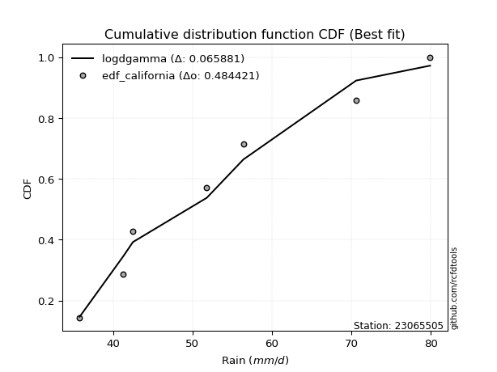</img>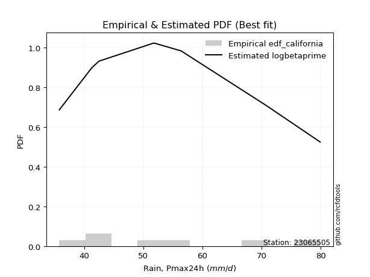</img>

</div>


### 2. EDF Hazen (1930)

Hazen method for plotting positions is a formula used to estimate the empirical cumulative probability distribution of flood events or other hydrological data. This formula often results in biased estimations, particularly when extrapolating to extreme events (high return periods).

<div align="center">


$P=(m-0.5)/n$


</div>


**2.1. Empirical values**

<div align="center">

|                | 0                   | 1                   | 2                   | 3         | 4                  | 5                  | 6                  |
|:---------------|:--------------------|:--------------------|:--------------------|:----------|:-------------------|:-------------------|:-------------------|
| date           | 2020                | 2021                | 2015                | 2018      | 2019               | 2016               | 2017               |
| x              | 35.8                | 41.3                | 42.5                | 51.8      | 56.4               | 70.6               | 79.9               |
| m              | 1                   | 2                   | 3                   | 4         | 5                  | 6                  | 7                  |
| empirical_dist | edf_hazen           | edf_hazen           | edf_hazen           | edf_hazen | edf_hazen          | edf_hazen          | edf_hazen          |
| empirical      | 0.07142857142857142 | 0.21428571428571427 | 0.35714285714285715 | 0.5       | 0.6428571428571429 | 0.7857142857142857 | 0.9285714285714286 |
| empirical_tr   | 1.0769230769230769  | 1.2727272727272727  | 1.5555555555555558  | 2.0       | 2.8000000000000003 | 4.666666666666666  | 14.000000000000007 |

</div>


**2.2. Kolmogorov-Smirnov fit test (sorted by Δ)**


<div align="center">

|                | 0                   | 1                   | 2                   | 3                   | 4                   | 5                   | 6                   | 7                   | 8                   | 9                   | 10                  | 11                  | 12                  | 13                  | 14                  | 15                  | 16                  | 17                  | 18                  | 19                  | 20                  | 21                  | 22                  | 23                  | 24                  | 25                  | 26                  | 27                  | 28                  | 29                  | 30                  | 31                  | 32                  | 33                  | 34                  | 35                  | 36                  | 37                  | 38                  | 39                  | 40                  | 41                  | 42                  | 43                  | 44                  | 45                  | 46                  | 47                  | 48                  | 49                  | 50                  | 51                  | 52                  | 53                  | 54                  | 55                  | 56                  | 57                  | 58                  | 59                  | 60                  | 61                  | 62                  | 63                  | 64                  | 65                  | 66                  | 67                  | 68                  | 69                  | 70                  | 71                  | 72                  | 73                  | 74                  | 75                  | 76                  | 77                  | 78                  | 79                  | 80                  | 81                  | 82                  | 83                  | 84                  | 85                  | 86                  | 87                  | 88                  | 89                  | 90                  | 91                  | 92                  | 93                  | 94                  | 95                  | 96                  | 97                  | 98                  | 99                  | 100                 | 101                 | 102                 | 103                 | 104                 | 105                 | 106                 | 107                 | 108                 | 109                 | 110                 | 111                 | 112                 | 113                 | 114                 | 115                 | 116                 | 117                 | 118                 | 119                 | 120                 | 121                 | 122                 | 123                 | 124                 | 125                 | 126                 | 127                 | 128                 | 129                 | 130                 | 131                 | 132                 | 133                 | 134                 | 135                 | 136                 | 137                 | 138                 | 139                 | 140                 | 141                 | 142                 | 143                 | 144                 | 145                 | 146                 | 147                 | 148                 | 149                 | 150                 | 151                 | 152                 | 153                 | 154                 | 155                 | 156                 | 157                 | 158                 | 159                 |
|:---------------|:--------------------|:--------------------|:--------------------|:--------------------|:--------------------|:--------------------|:--------------------|:--------------------|:--------------------|:--------------------|:--------------------|:--------------------|:--------------------|:--------------------|:--------------------|:--------------------|:--------------------|:--------------------|:--------------------|:--------------------|:--------------------|:--------------------|:--------------------|:--------------------|:--------------------|:--------------------|:--------------------|:--------------------|:--------------------|:--------------------|:--------------------|:--------------------|:--------------------|:--------------------|:--------------------|:--------------------|:--------------------|:--------------------|:--------------------|:--------------------|:--------------------|:--------------------|:--------------------|:--------------------|:--------------------|:--------------------|:--------------------|:--------------------|:--------------------|:--------------------|:--------------------|:--------------------|:--------------------|:--------------------|:--------------------|:--------------------|:--------------------|:--------------------|:--------------------|:--------------------|:--------------------|:--------------------|:--------------------|:--------------------|:--------------------|:--------------------|:--------------------|:--------------------|:--------------------|:--------------------|:--------------------|:--------------------|:--------------------|:--------------------|:--------------------|:--------------------|:--------------------|:--------------------|:--------------------|:--------------------|:--------------------|:--------------------|:--------------------|:--------------------|:--------------------|:--------------------|:--------------------|:--------------------|:--------------------|:--------------------|:--------------------|:--------------------|:--------------------|:--------------------|:--------------------|:--------------------|:--------------------|:--------------------|:--------------------|:--------------------|:--------------------|:--------------------|:--------------------|:--------------------|:--------------------|:--------------------|:--------------------|:--------------------|:--------------------|:--------------------|:--------------------|:--------------------|:--------------------|:--------------------|:--------------------|:--------------------|:--------------------|:--------------------|:--------------------|:--------------------|:--------------------|:--------------------|:--------------------|:--------------------|:--------------------|:--------------------|:--------------------|:--------------------|:--------------------|:--------------------|:--------------------|:--------------------|:--------------------|:--------------------|:--------------------|:--------------------|:--------------------|:--------------------|:--------------------|:--------------------|:--------------------|:--------------------|:--------------------|:--------------------|:--------------------|:--------------------|:--------------------|:--------------------|:--------------------|:--------------------|:--------------------|:--------------------|:--------------------|:--------------------|:--------------------|:--------------------|:--------------------|:--------------------|:--------------------|:--------------------|
| station        | 23065505            | 23065505            | 23065505            | 23065505            | 23065505            | 23065505            | 23065505            | 23065505            | 23065505            | 23065505            | 23065505            | 23065505            | 23065505            | 23065505            | 23065505            | 23065505            | 23065505            | 23065505            | 23065505            | 23065505            | 23065505            | 23065505            | 23065505            | 23065505            | 23065505            | 23065505            | 23065505            | 23065505            | 23065505            | 23065505            | 23065505            | 23065505            | 23065505            | 23065505            | 23065505            | 23065505            | 23065505            | 23065505            | 23065505            | 23065505            | 23065505            | 23065505            | 23065505            | 23065505            | 23065505            | 23065505            | 23065505            | 23065505            | 23065505            | 23065505            | 23065505            | 23065505            | 23065505            | 23065505            | 23065505            | 23065505            | 23065505            | 23065505            | 23065505            | 23065505            | 23065505            | 23065505            | 23065505            | 23065505            | 23065505            | 23065505            | 23065505            | 23065505            | 23065505            | 23065505            | 23065505            | 23065505            | 23065505            | 23065505            | 23065505            | 23065505            | 23065505            | 23065505            | 23065505            | 23065505            | 23065505            | 23065505            | 23065505            | 23065505            | 23065505            | 23065505            | 23065505            | 23065505            | 23065505            | 23065505            | 23065505            | 23065505            | 23065505            | 23065505            | 23065505            | 23065505            | 23065505            | 23065505            | 23065505            | 23065505            | 23065505            | 23065505            | 23065505            | 23065505            | 23065505            | 23065505            | 23065505            | 23065505            | 23065505            | 23065505            | 23065505            | 23065505            | 23065505            | 23065505            | 23065505            | 23065505            | 23065505            | 23065505            | 23065505            | 23065505            | 23065505            | 23065505            | 23065505            | 23065505            | 23065505            | 23065505            | 23065505            | 23065505            | 23065505            | 23065505            | 23065505            | 23065505            | 23065505            | 23065505            | 23065505            | 23065505            | 23065505            | 23065505            | 23065505            | 23065505            | 23065505            | 23065505            | 23065505            | 23065505            | 23065505            | 23065505            | 23065505            | 23065505            | 23065505            | 23065505            | 23065505            | 23065505            | 23065505            | 23065505            | 23065505            | 23065505            | 23065505            | 23065505            | 23065505            | 23065505            |
| empirical_dist | edf_hazen           | edf_hazen           | edf_hazen           | edf_hazen           | edf_hazen           | edf_hazen           | edf_hazen           | edf_hazen           | edf_hazen           | edf_hazen           | edf_hazen           | edf_hazen           | edf_hazen           | edf_hazen           | edf_hazen           | edf_hazen           | edf_hazen           | edf_hazen           | edf_hazen           | edf_hazen           | edf_hazen           | edf_hazen           | edf_hazen           | edf_hazen           | edf_hazen           | edf_hazen           | edf_hazen           | edf_hazen           | edf_hazen           | edf_hazen           | edf_hazen           | edf_hazen           | edf_hazen           | edf_hazen           | edf_hazen           | edf_hazen           | edf_hazen           | edf_hazen           | edf_hazen           | edf_hazen           | edf_hazen           | edf_hazen           | edf_hazen           | edf_hazen           | edf_hazen           | edf_hazen           | edf_hazen           | edf_hazen           | edf_hazen           | edf_hazen           | edf_hazen           | edf_hazen           | edf_hazen           | edf_hazen           | edf_hazen           | edf_hazen           | edf_hazen           | edf_hazen           | edf_hazen           | edf_hazen           | edf_hazen           | edf_hazen           | edf_hazen           | edf_hazen           | edf_hazen           | edf_hazen           | edf_hazen           | edf_hazen           | edf_hazen           | edf_hazen           | edf_hazen           | edf_hazen           | edf_hazen           | edf_hazen           | edf_hazen           | edf_hazen           | edf_hazen           | edf_hazen           | edf_hazen           | edf_hazen           | edf_hazen           | edf_hazen           | edf_hazen           | edf_hazen           | edf_hazen           | edf_hazen           | edf_hazen           | edf_hazen           | edf_hazen           | edf_hazen           | edf_hazen           | edf_hazen           | edf_hazen           | edf_hazen           | edf_hazen           | edf_hazen           | edf_hazen           | edf_hazen           | edf_hazen           | edf_hazen           | edf_hazen           | edf_hazen           | edf_hazen           | edf_hazen           | edf_hazen           | edf_hazen           | edf_hazen           | edf_hazen           | edf_hazen           | edf_hazen           | edf_hazen           | edf_hazen           | edf_hazen           | edf_hazen           | edf_hazen           | edf_hazen           | edf_hazen           | edf_hazen           | edf_hazen           | edf_hazen           | edf_hazen           | edf_hazen           | edf_hazen           | edf_hazen           | edf_hazen           | edf_hazen           | edf_hazen           | edf_hazen           | edf_hazen           | edf_hazen           | edf_hazen           | edf_hazen           | edf_hazen           | edf_hazen           | edf_hazen           | edf_hazen           | edf_hazen           | edf_hazen           | edf_hazen           | edf_hazen           | edf_hazen           | edf_hazen           | edf_hazen           | edf_hazen           | edf_hazen           | edf_hazen           | edf_hazen           | edf_hazen           | edf_hazen           | edf_hazen           | edf_hazen           | edf_hazen           | edf_hazen           | edf_hazen           | edf_hazen           | edf_hazen           | edf_hazen           | edf_hazen           | edf_hazen           | edf_hazen           |
| p_dist         | logksone            | logbeta             | logskewnorm         | invgauss            | johnsonsu           | logarcsine          | genexpon            | loggompertz         | loghalfnorm         | lomax               | exponnorm           | logfatiguelife      | loggenexpon         | logsemicircular     | loggausshyper       | loginvgauss         | halfnorm            | semicircular        | logkstwobign        | foldnorm            | truncweibull_min    | ksone               | logburr             | f                   | invgamma            | logbradford         | loggenlogistic      | logbetaprime        | loganglit           | loginvweibull       | burr                | logmielke           | lograyleigh         | exponpow            | invweibull          | loghalflogistic     | logfoldnorm         | arcsine             | anglit              | logburr12           | logf                | loginvgamma         | logmaxwell          | logexponpow         | rayleigh            | logweibull_min      | logalpha            | alpha               | beta                | halflogistic        | maxwell             | nct                 | burr12              | logtruncweibull_min | logtruncexpon       | logweibull_max      | loggenextreme       | logkappa4           | lognct              | logncf              | logpearson3         | loggumbel_r         | logdweibull         | logrice             | genlogistic         | weibull_min         | pearson3            | logexponnorm        | lognorm             | logcrystalball      | logt                | logloggamma         | logwrapcauchy       | logjohnsonsu        | betaprime           | kstwobign           | dweibull            | bradford            | logmoyal            | skewnorm            | gumbel_r            | truncexpon          | norm                | truncnorm           | t                   | logdgamma           | logtukeylambda      | logcosine           | dgamma              | moyal               | loguniform          | gompertz            | logvonmises_line    | logloglaplace       | loglogistic         | rice                | wrapcauchy          | cosine              | logistic            | gausshyper          | logkappa3           | loggumbel_l         | kappa4              | loghypsecant        | logargus            | gumbel_l            | hypsecant           | halfgennorm         | logtriang           | loglaplace          | loglaplace          | laplace             | logexponweib        | argus               | logtruncnorm        | vonmises_line       | tukeylambda         | uniform             | loggamma            | loggamma            | kappa3              | logrdist            | logerlang           | loggenhalflogistic  | nakagami            | lognakagami         | logwald             | genpareto           | triang              | wald                | loglevy_l           | gennorm             | loggennorm          | levy_l              | logtrapezoid        | genhalflogistic     | loggengamma         | johnsonsb           | ncf                 | trapezoid           | genextreme          | logjohnsonsb        | loggenpareto        | rdist               | powerlaw            | gengamma            | gamma               | fatiguelife         | logpowerlaw         | exponweib           | weibull_max         | logtruncpareto      | erlang              | truncpareto         | crystalball         | loglomax            | loghalfgennorm      | logvonmises         | vonmises            | mielke              |
| delta          | 0.07238546249656258 | 0.07475201561147674 | 0.07551727827047539 | 0.0794466378617148  | 0.07958638030703591 | 0.080209200353795   | 0.08330386121044842 | 0.08359909005138488 | 0.08465868680913124 | 0.0848766813053462  | 0.08573302130037552 | 0.08579575656350141 | 0.08737081629141819 | 0.08886318138618327 | 0.09158756374848509 | 0.09182653546384989 | 0.0947704640602991  | 0.09542220099643439 | 0.09644820365314816 | 0.0967071774110197  | 0.09741817645481454 | 0.09759061904152355 | 0.09961226682610924 | 0.09998079175653851 | 0.0999878786723481  | 0.10042567991117257 | 0.10076837583437342 | 0.10088547715160837 | 0.10112570652771213 | 0.10143797593018761 | 0.10148980713435163 | 0.10205045596343254 | 0.10355126328480907 | 0.10459566154052036 | 0.1051153299389821  | 0.10554232145774889 | 0.10639637432033305 | 0.10749028136035677 | 0.10773928931743038 | 0.1085592647879442  | 0.10911016423407754 | 0.10911089047575159 | 0.11109635027201242 | 0.11109718691914161 | 0.11184323889196271 | 0.11411220633403385 | 0.11652173250620601 | 0.11680113507890366 | 0.11709491538073505 | 0.11780180438851948 | 0.1189194319893653  | 0.11995912439678894 | 0.1203310657187513  | 0.12041880404880567 | 0.12214693164360846 | 0.12229321412583768 | 0.1223055552324871  | 0.12260490515877409 | 0.12304559262408463 | 0.12334756909537742 | 0.12400114374804441 | 0.12512544964216984 | 0.12555875515001358 | 0.12584748975879306 | 0.1260881433185207  | 0.12682042747654473 | 0.12688519175281301 | 0.12901568817876044 | 0.12919504009061278 | 0.12919511343835766 | 0.1291951971406778  | 0.1295793080463262  | 0.12994648683605023 | 0.13024148427087262 | 0.130919195559034   | 0.13095688576198516 | 0.13125550308923362 | 0.13183667390012127 | 0.131966681446065   | 0.13397101239474318 | 0.13473783403227196 | 0.1350692644383638  | 0.13586457712119432 | 0.13586461919824397 | 0.13587375070667845 | 0.1373099578805258  | 0.13765424922854969 | 0.14104589025709796 | 0.1418448631110134  | 0.14336415103655636 | 0.1434530117377629  | 0.1464171012445702  | 0.1496557483365043  | 0.150733276543429   | 0.15166607694872974 | 0.1563386645493135  | 0.15718222146816452 | 0.15804498930081645 | 0.15817951574532488 | 0.16066407978761843 | 0.16160700277521048 | 0.16305847567191195 | 0.16421890386131519 | 0.16577813539789124 | 0.16691426523213132 | 0.16796807604398956 | 0.17198350701052842 | 0.1743012831763813  | 0.18091301858930983 | 0.1829541926724709  | 0.1829541926724709  | 0.18835254008631536 | 0.19313879275743118 | 0.19488154507202293 | 0.1998736611688373  | 0.2001766737147437  | 0.20434703295852635 | 0.20521541950113376 | 0.2059142878374982  | 0.2059142878374982  | 0.2061992548536178  | 0.21920753278281843 | 0.22126369890106456 | 0.2214799492433956  | 0.22856746555702287 | 0.23572546442334344 | 0.23980355081610416 | 0.24404787326154595 | 0.2512867261134093  | 0.2626946227673407  | 0.2793892259257691  | 0.2857142857142857  | 0.2857142857142857  | 0.30789422569631264 | 0.334693128418102   | 0.3357294492343604  | 0.3559116515645592  | 0.36204857452886097 | 0.3975592370548946  | 0.4195062399697429  | 0.42194611849884267 | 0.42480341450129744 | 0.4331146429530528  | 0.4377244141729507  | 0.49453903786361897 | 0.5030071597311471  | 0.5033470832742506  | 0.5115217358046997  | 0.5245395822790323  | 0.5377502644461252  | 0.5554671675502423  | 0.563425314894865   | 0.5818441517151035  | 0.6360162348762088  | 0.6670820975798569  | 0.6924080437492757  | 0.7857142857142857  | 1.0840946653986983  | 12.5569513382122    | nan                 |
| deltao         | 0.48442053926100004 | 0.48442053926100004 | 0.48442053926100004 | 0.48442053926100004 | 0.48442053926100004 | 0.48442053926100004 | 0.48442053926100004 | 0.48442053926100004 | 0.48442053926100004 | 0.48442053926100004 | 0.48442053926100004 | 0.48442053926100004 | 0.48442053926100004 | 0.48442053926100004 | 0.48442053926100004 | 0.48442053926100004 | 0.48442053926100004 | 0.48442053926100004 | 0.48442053926100004 | 0.48442053926100004 | 0.48442053926100004 | 0.48442053926100004 | 0.48442053926100004 | 0.48442053926100004 | 0.48442053926100004 | 0.48442053926100004 | 0.48442053926100004 | 0.48442053926100004 | 0.48442053926100004 | 0.48442053926100004 | 0.48442053926100004 | 0.48442053926100004 | 0.48442053926100004 | 0.48442053926100004 | 0.48442053926100004 | 0.48442053926100004 | 0.48442053926100004 | 0.48442053926100004 | 0.48442053926100004 | 0.48442053926100004 | 0.48442053926100004 | 0.48442053926100004 | 0.48442053926100004 | 0.48442053926100004 | 0.48442053926100004 | 0.48442053926100004 | 0.48442053926100004 | 0.48442053926100004 | 0.48442053926100004 | 0.48442053926100004 | 0.48442053926100004 | 0.48442053926100004 | 0.48442053926100004 | 0.48442053926100004 | 0.48442053926100004 | 0.48442053926100004 | 0.48442053926100004 | 0.48442053926100004 | 0.48442053926100004 | 0.48442053926100004 | 0.48442053926100004 | 0.48442053926100004 | 0.48442053926100004 | 0.48442053926100004 | 0.48442053926100004 | 0.48442053926100004 | 0.48442053926100004 | 0.48442053926100004 | 0.48442053926100004 | 0.48442053926100004 | 0.48442053926100004 | 0.48442053926100004 | 0.48442053926100004 | 0.48442053926100004 | 0.48442053926100004 | 0.48442053926100004 | 0.48442053926100004 | 0.48442053926100004 | 0.48442053926100004 | 0.48442053926100004 | 0.48442053926100004 | 0.48442053926100004 | 0.48442053926100004 | 0.48442053926100004 | 0.48442053926100004 | 0.48442053926100004 | 0.48442053926100004 | 0.48442053926100004 | 0.48442053926100004 | 0.48442053926100004 | 0.48442053926100004 | 0.48442053926100004 | 0.48442053926100004 | 0.48442053926100004 | 0.48442053926100004 | 0.48442053926100004 | 0.48442053926100004 | 0.48442053926100004 | 0.48442053926100004 | 0.48442053926100004 | 0.48442053926100004 | 0.48442053926100004 | 0.48442053926100004 | 0.48442053926100004 | 0.48442053926100004 | 0.48442053926100004 | 0.48442053926100004 | 0.48442053926100004 | 0.48442053926100004 | 0.48442053926100004 | 0.48442053926100004 | 0.48442053926100004 | 0.48442053926100004 | 0.48442053926100004 | 0.48442053926100004 | 0.48442053926100004 | 0.48442053926100004 | 0.48442053926100004 | 0.48442053926100004 | 0.48442053926100004 | 0.48442053926100004 | 0.48442053926100004 | 0.48442053926100004 | 0.48442053926100004 | 0.48442053926100004 | 0.48442053926100004 | 0.48442053926100004 | 0.48442053926100004 | 0.48442053926100004 | 0.48442053926100004 | 0.48442053926100004 | 0.48442053926100004 | 0.48442053926100004 | 0.48442053926100004 | 0.48442053926100004 | 0.48442053926100004 | 0.48442053926100004 | 0.48442053926100004 | 0.48442053926100004 | 0.48442053926100004 | 0.48442053926100004 | 0.48442053926100004 | 0.48442053926100004 | 0.48442053926100004 | 0.48442053926100004 | 0.48442053926100004 | 0.48442053926100004 | 0.48442053926100004 | 0.48442053926100004 | 0.48442053926100004 | 0.48442053926100004 | 0.48442053926100004 | 0.48442053926100004 | 0.48442053926100004 | 0.48442053926100004 | 0.48442053926100004 | 0.48442053926100004 | 0.48442053926100004 | 0.48442053926100004 | 0.48442053926100004 |
| eval           | Δo > Δ              | Δo > Δ              | Δo > Δ              | Δo > Δ              | Δo > Δ              | Δo > Δ              | Δo > Δ              | Δo > Δ              | Δo > Δ              | Δo > Δ              | Δo > Δ              | Δo > Δ              | Δo > Δ              | Δo > Δ              | Δo > Δ              | Δo > Δ              | Δo > Δ              | Δo > Δ              | Δo > Δ              | Δo > Δ              | Δo > Δ              | Δo > Δ              | Δo > Δ              | Δo > Δ              | Δo > Δ              | Δo > Δ              | Δo > Δ              | Δo > Δ              | Δo > Δ              | Δo > Δ              | Δo > Δ              | Δo > Δ              | Δo > Δ              | Δo > Δ              | Δo > Δ              | Δo > Δ              | Δo > Δ              | Δo > Δ              | Δo > Δ              | Δo > Δ              | Δo > Δ              | Δo > Δ              | Δo > Δ              | Δo > Δ              | Δo > Δ              | Δo > Δ              | Δo > Δ              | Δo > Δ              | Δo > Δ              | Δo > Δ              | Δo > Δ              | Δo > Δ              | Δo > Δ              | Δo > Δ              | Δo > Δ              | Δo > Δ              | Δo > Δ              | Δo > Δ              | Δo > Δ              | Δo > Δ              | Δo > Δ              | Δo > Δ              | Δo > Δ              | Δo > Δ              | Δo > Δ              | Δo > Δ              | Δo > Δ              | Δo > Δ              | Δo > Δ              | Δo > Δ              | Δo > Δ              | Δo > Δ              | Δo > Δ              | Δo > Δ              | Δo > Δ              | Δo > Δ              | Δo > Δ              | Δo > Δ              | Δo > Δ              | Δo > Δ              | Δo > Δ              | Δo > Δ              | Δo > Δ              | Δo > Δ              | Δo > Δ              | Δo > Δ              | Δo > Δ              | Δo > Δ              | Δo > Δ              | Δo > Δ              | Δo > Δ              | Δo > Δ              | Δo > Δ              | Δo > Δ              | Δo > Δ              | Δo > Δ              | Δo > Δ              | Δo > Δ              | Δo > Δ              | Δo > Δ              | Δo > Δ              | Δo > Δ              | Δo > Δ              | Δo > Δ              | Δo > Δ              | Δo > Δ              | Δo > Δ              | Δo > Δ              | Δo > Δ              | Δo > Δ              | Δo > Δ              | Δo > Δ              | Δo > Δ              | Δo > Δ              | Δo > Δ              | Δo > Δ              | Δo > Δ              | Δo > Δ              | Δo > Δ              | Δo > Δ              | Δo > Δ              | Δo > Δ              | Δo > Δ              | Δo > Δ              | Δo > Δ              | Δo > Δ              | Δo > Δ              | Δo > Δ              | Δo > Δ              | Δo > Δ              | Δo > Δ              | Δo > Δ              | Δo > Δ              | Δo > Δ              | Δo > Δ              | Δo > Δ              | Δo > Δ              | Δo > Δ              | Δo > Δ              | Δo > Δ              | Δo > Δ              | Δo > Δ              | Δo > Δ              | Δo > Δ              | Δo <= Δ             | Δo <= Δ             | Δo <= Δ             | Δo <= Δ             | Δo <= Δ             | Δo <= Δ             | Δo <= Δ             | Δo <= Δ             | Δo <= Δ             | Δo <= Δ             | Δo <= Δ             | Δo <= Δ             | Δo <= Δ             | Δo <= Δ             | Δo <= Δ             | Δo <= Δ             |
| fit            | 1                   | 1                   | 1                   | 1                   | 1                   | 1                   | 1                   | 1                   | 1                   | 1                   | 1                   | 1                   | 1                   | 1                   | 1                   | 1                   | 1                   | 1                   | 1                   | 1                   | 1                   | 1                   | 1                   | 1                   | 1                   | 1                   | 1                   | 1                   | 1                   | 1                   | 1                   | 1                   | 1                   | 1                   | 1                   | 1                   | 1                   | 1                   | 1                   | 1                   | 1                   | 1                   | 1                   | 1                   | 1                   | 1                   | 1                   | 1                   | 1                   | 1                   | 1                   | 1                   | 1                   | 1                   | 1                   | 1                   | 1                   | 1                   | 1                   | 1                   | 1                   | 1                   | 1                   | 1                   | 1                   | 1                   | 1                   | 1                   | 1                   | 1                   | 1                   | 1                   | 1                   | 1                   | 1                   | 1                   | 1                   | 1                   | 1                   | 1                   | 1                   | 1                   | 1                   | 1                   | 1                   | 1                   | 1                   | 1                   | 1                   | 1                   | 1                   | 1                   | 1                   | 1                   | 1                   | 1                   | 1                   | 1                   | 1                   | 1                   | 1                   | 1                   | 1                   | 1                   | 1                   | 1                   | 1                   | 1                   | 1                   | 1                   | 1                   | 1                   | 1                   | 1                   | 1                   | 1                   | 1                   | 1                   | 1                   | 1                   | 1                   | 1                   | 1                   | 1                   | 1                   | 1                   | 1                   | 1                   | 1                   | 1                   | 1                   | 1                   | 1                   | 1                   | 1                   | 1                   | 1                   | 1                   | 1                   | 1                   | 1                   | 1                   | 1                   | 1                   | 0                   | 0                   | 0                   | 0                   | 0                   | 0                   | 0                   | 0                   | 0                   | 0                   | 0                   | 0                   | 0                   | 0                   | 0                   | 0                   |
| n              | 7                   | 7                   | 7                   | 7                   | 7                   | 7                   | 7                   | 7                   | 7                   | 7                   | 7                   | 7                   | 7                   | 7                   | 7                   | 7                   | 7                   | 7                   | 7                   | 7                   | 7                   | 7                   | 7                   | 7                   | 7                   | 7                   | 7                   | 7                   | 7                   | 7                   | 7                   | 7                   | 7                   | 7                   | 7                   | 7                   | 7                   | 7                   | 7                   | 7                   | 7                   | 7                   | 7                   | 7                   | 7                   | 7                   | 7                   | 7                   | 7                   | 7                   | 7                   | 7                   | 7                   | 7                   | 7                   | 7                   | 7                   | 7                   | 7                   | 7                   | 7                   | 7                   | 7                   | 7                   | 7                   | 7                   | 7                   | 7                   | 7                   | 7                   | 7                   | 7                   | 7                   | 7                   | 7                   | 7                   | 7                   | 7                   | 7                   | 7                   | 7                   | 7                   | 7                   | 7                   | 7                   | 7                   | 7                   | 7                   | 7                   | 7                   | 7                   | 7                   | 7                   | 7                   | 7                   | 7                   | 7                   | 7                   | 7                   | 7                   | 7                   | 7                   | 7                   | 7                   | 7                   | 7                   | 7                   | 7                   | 7                   | 7                   | 7                   | 7                   | 7                   | 7                   | 7                   | 7                   | 7                   | 7                   | 7                   | 7                   | 7                   | 7                   | 7                   | 7                   | 7                   | 7                   | 7                   | 7                   | 7                   | 7                   | 7                   | 7                   | 7                   | 7                   | 7                   | 7                   | 7                   | 7                   | 7                   | 7                   | 7                   | 7                   | 7                   | 7                   | 7                   | 7                   | 7                   | 7                   | 7                   | 7                   | 7                   | 7                   | 7                   | 7                   | 7                   | 7                   | 7                   | 7                   | 7                   | 7                   |
| best_fit       | 1                   | 0                   | 0                   | 0                   | 0                   | 0                   | 0                   | 0                   | 0                   | 0                   | 0                   | 0                   | 0                   | 0                   | 0                   | 0                   | 0                   | 0                   | 0                   | 0                   | 0                   | 0                   | 0                   | 0                   | 0                   | 0                   | 0                   | 0                   | 0                   | 0                   | 0                   | 0                   | 0                   | 0                   | 0                   | 0                   | 0                   | 0                   | 0                   | 0                   | 0                   | 0                   | 0                   | 0                   | 0                   | 0                   | 0                   | 0                   | 0                   | 0                   | 0                   | 0                   | 0                   | 0                   | 0                   | 0                   | 0                   | 0                   | 0                   | 0                   | 0                   | 0                   | 0                   | 0                   | 0                   | 0                   | 0                   | 0                   | 0                   | 0                   | 0                   | 0                   | 0                   | 0                   | 0                   | 0                   | 0                   | 0                   | 0                   | 0                   | 0                   | 0                   | 0                   | 0                   | 0                   | 0                   | 0                   | 0                   | 0                   | 0                   | 0                   | 0                   | 0                   | 0                   | 0                   | 0                   | 0                   | 0                   | 0                   | 0                   | 0                   | 0                   | 0                   | 0                   | 0                   | 0                   | 0                   | 0                   | 0                   | 0                   | 0                   | 0                   | 0                   | 0                   | 0                   | 0                   | 0                   | 0                   | 0                   | 0                   | 0                   | 0                   | 0                   | 0                   | 0                   | 0                   | 0                   | 0                   | 0                   | 0                   | 0                   | 0                   | 0                   | 0                   | 0                   | 0                   | 0                   | 0                   | 0                   | 0                   | 0                   | 0                   | 0                   | 0                   | 0                   | 0                   | 0                   | 0                   | 0                   | 0                   | 0                   | 0                   | 0                   | 0                   | 0                   | 0                   | 0                   | 0                   | 0                   | 0                   |
| best_fit_sort  | 1                   | 2                   | 3                   | 4                   | 5                   | 6                   | 7                   | 8                   | 9                   | 10                  | 11                  | 12                  | 13                  | 14                  | 15                  | 16                  | 17                  | 18                  | 19                  | 20                  | 21                  | 22                  | 23                  | 24                  | 25                  | 26                  | 27                  | 28                  | 29                  | 30                  | 31                  | 32                  | 33                  | 34                  | 35                  | 36                  | 37                  | 38                  | 39                  | 40                  | 41                  | 42                  | 43                  | 44                  | 45                  | 46                  | 47                  | 48                  | 49                  | 50                  | 51                  | 52                  | 53                  | 54                  | 55                  | 56                  | 57                  | 58                  | 59                  | 60                  | 61                  | 62                  | 63                  | 64                  | 65                  | 66                  | 67                  | 68                  | 69                  | 70                  | 71                  | 72                  | 73                  | 74                  | 75                  | 76                  | 77                  | 78                  | 79                  | 80                  | 81                  | 82                  | 83                  | 84                  | 85                  | 86                  | 87                  | 88                  | 89                  | 90                  | 91                  | 92                  | 93                  | 94                  | 95                  | 96                  | 97                  | 98                  | 99                  | 100                 | 101                 | 102                 | 103                 | 104                 | 105                 | 106                 | 107                 | 108                 | 109                 | 110                 | 111                 | 112                 | 113                 | 114                 | 115                 | 116                 | 117                 | 118                 | 119                 | 120                 | 121                 | 122                 | 123                 | 124                 | 125                 | 126                 | 127                 | 128                 | 129                 | 130                 | 131                 | 132                 | 133                 | 134                 | 135                 | 136                 | 137                 | 138                 | 139                 | 140                 | 141                 | 142                 | 143                 | 144                 | 145                 | 146                 | 147                 | 148                 | 149                 | 150                 | 151                 | 152                 | 153                 | 154                 | 155                 | 156                 | 157                 | 158                 | 159                 | 160                 |

</div>


**2.3. Best fit**

<div align="center">

|   id |   station | empirical_dist   | p_dist   |     delta |   deltao | eval   |   fit |   n |   best_fit |   best_fit_sort |
|-----:|----------:|:-----------------|:---------|----------:|---------:|:-------|------:|----:|-----------:|----------------:|
|    0 |  23065505 | edf_hazen        | logksone | 0.0723855 | 0.484421 | Δo > Δ |     1 |   7 |          1 |               1 |

</div>


<div align="center">

</img>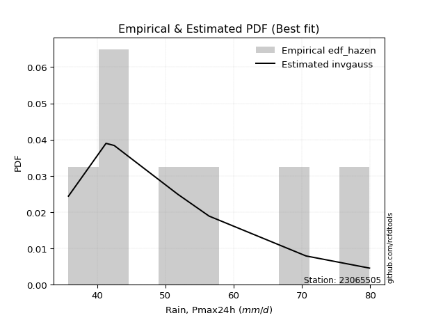</img>

</div>


### 3. EDF Weibull (1939)

Weibull plotting position formula is an empirical method used to estimate the non-exceedance probability or plotting position for a set of observed data, is often recommended or widely used in practice, particularly in flood frequency analysis.

<div align="center">


$P=m/(n+1)$


</div>


**3.1. Empirical values**

<div align="center">

|                | 0                  | 1                  | 2           | 3           | 4                  | 5           | 6           |
|:---------------|:-------------------|:-------------------|:------------|:------------|:-------------------|:------------|:------------|
| date           | 2020               | 2021               | 2015        | 2018        | 2019               | 2016        | 2017        |
| x              | 35.8               | 41.3               | 42.5        | 51.8        | 56.4               | 70.6        | 79.9        |
| m              | 1                  | 2                  | 3           | 4           | 5                  | 6           | 7           |
| empirical_dist | edf_weibull        | edf_weibull        | edf_weibull | edf_weibull | edf_weibull        | edf_weibull | edf_weibull |
| empirical      | 0.125              | 0.25               | 0.375       | 0.5         | 0.625              | 0.75        | 0.875       |
| empirical_tr   | 1.1428571428571428 | 1.3333333333333333 | 1.6         | 2.0         | 2.6666666666666665 | 4.0         | 8.0         |

</div>


**3.2. Kolmogorov-Smirnov fit test (sorted by Δ)**


<div align="center">

|                | 0                    | 1                   | 2                   | 3                   | 4                   | 5                   | 6                   | 7                   | 8                   | 9                   | 10                  | 11                  | 12                  | 13                  | 14                  | 15                  | 16                  | 17                  | 18                  | 19                  | 20                  | 21                  | 22                  | 23                  | 24                  | 25                  | 26                  | 27                  | 28                  | 29                  | 30                  | 31                  | 32                  | 33                  | 34                  | 35                  | 36                  | 37                  | 38                  | 39                  | 40                  | 41                  | 42                  | 43                  | 44                  | 45                  | 46                  | 47                  | 48                  | 49                  | 50                  | 51                  | 52                  | 53                  | 54                  | 55                  | 56                  | 57                  | 58                  | 59                  | 60                  | 61                  | 62                  | 63                  | 64                  | 65                  | 66                  | 67                  | 68                  | 69                  | 70                  | 71                  | 72                  | 73                  | 74                  | 75                  | 76                  | 77                  | 78                  | 79                  | 80                  | 81                  | 82                  | 83                  | 84                  | 85                  | 86                  | 87                  | 88                  | 89                  | 90                  | 91                  | 92                  | 93                  | 94                  | 95                  | 96                  | 97                  | 98                  | 99                  | 100                 | 101                 | 102                 | 103                 | 104                 | 105                 | 106                 | 107                 | 108                 | 109                 | 110                 | 111                 | 112                 | 113                 | 114                 | 115                 | 116                 | 117                 | 118                 | 119                 | 120                 | 121                 | 122                 | 123                 | 124                 | 125                 | 126                 | 127                 | 128                 | 129                 | 130                 | 131                 | 132                 | 133                 | 134                 | 135                 | 136                 | 137                 | 138                 | 139                 | 140                 | 141                 | 142                 | 143                 | 144                 | 145                 | 146                 | 147                 | 148                 | 149                 | 150                 | 151                 | 152                 | 153                 | 154                 | 155                 | 156                 | 157                 | 158                 | 159                 |
|:---------------|:---------------------|:--------------------|:--------------------|:--------------------|:--------------------|:--------------------|:--------------------|:--------------------|:--------------------|:--------------------|:--------------------|:--------------------|:--------------------|:--------------------|:--------------------|:--------------------|:--------------------|:--------------------|:--------------------|:--------------------|:--------------------|:--------------------|:--------------------|:--------------------|:--------------------|:--------------------|:--------------------|:--------------------|:--------------------|:--------------------|:--------------------|:--------------------|:--------------------|:--------------------|:--------------------|:--------------------|:--------------------|:--------------------|:--------------------|:--------------------|:--------------------|:--------------------|:--------------------|:--------------------|:--------------------|:--------------------|:--------------------|:--------------------|:--------------------|:--------------------|:--------------------|:--------------------|:--------------------|:--------------------|:--------------------|:--------------------|:--------------------|:--------------------|:--------------------|:--------------------|:--------------------|:--------------------|:--------------------|:--------------------|:--------------------|:--------------------|:--------------------|:--------------------|:--------------------|:--------------------|:--------------------|:--------------------|:--------------------|:--------------------|:--------------------|:--------------------|:--------------------|:--------------------|:--------------------|:--------------------|:--------------------|:--------------------|:--------------------|:--------------------|:--------------------|:--------------------|:--------------------|:--------------------|:--------------------|:--------------------|:--------------------|:--------------------|:--------------------|:--------------------|:--------------------|:--------------------|:--------------------|:--------------------|:--------------------|:--------------------|:--------------------|:--------------------|:--------------------|:--------------------|:--------------------|:--------------------|:--------------------|:--------------------|:--------------------|:--------------------|:--------------------|:--------------------|:--------------------|:--------------------|:--------------------|:--------------------|:--------------------|:--------------------|:--------------------|:--------------------|:--------------------|:--------------------|:--------------------|:--------------------|:--------------------|:--------------------|:--------------------|:--------------------|:--------------------|:--------------------|:--------------------|:--------------------|:--------------------|:--------------------|:--------------------|:--------------------|:--------------------|:--------------------|:--------------------|:--------------------|:--------------------|:--------------------|:--------------------|:--------------------|:--------------------|:--------------------|:--------------------|:--------------------|:--------------------|:--------------------|:--------------------|:--------------------|:--------------------|:--------------------|:--------------------|:--------------------|:--------------------|:--------------------|:--------------------|:--------------------|
| station        | 23065505             | 23065505            | 23065505            | 23065505            | 23065505            | 23065505            | 23065505            | 23065505            | 23065505            | 23065505            | 23065505            | 23065505            | 23065505            | 23065505            | 23065505            | 23065505            | 23065505            | 23065505            | 23065505            | 23065505            | 23065505            | 23065505            | 23065505            | 23065505            | 23065505            | 23065505            | 23065505            | 23065505            | 23065505            | 23065505            | 23065505            | 23065505            | 23065505            | 23065505            | 23065505            | 23065505            | 23065505            | 23065505            | 23065505            | 23065505            | 23065505            | 23065505            | 23065505            | 23065505            | 23065505            | 23065505            | 23065505            | 23065505            | 23065505            | 23065505            | 23065505            | 23065505            | 23065505            | 23065505            | 23065505            | 23065505            | 23065505            | 23065505            | 23065505            | 23065505            | 23065505            | 23065505            | 23065505            | 23065505            | 23065505            | 23065505            | 23065505            | 23065505            | 23065505            | 23065505            | 23065505            | 23065505            | 23065505            | 23065505            | 23065505            | 23065505            | 23065505            | 23065505            | 23065505            | 23065505            | 23065505            | 23065505            | 23065505            | 23065505            | 23065505            | 23065505            | 23065505            | 23065505            | 23065505            | 23065505            | 23065505            | 23065505            | 23065505            | 23065505            | 23065505            | 23065505            | 23065505            | 23065505            | 23065505            | 23065505            | 23065505            | 23065505            | 23065505            | 23065505            | 23065505            | 23065505            | 23065505            | 23065505            | 23065505            | 23065505            | 23065505            | 23065505            | 23065505            | 23065505            | 23065505            | 23065505            | 23065505            | 23065505            | 23065505            | 23065505            | 23065505            | 23065505            | 23065505            | 23065505            | 23065505            | 23065505            | 23065505            | 23065505            | 23065505            | 23065505            | 23065505            | 23065505            | 23065505            | 23065505            | 23065505            | 23065505            | 23065505            | 23065505            | 23065505            | 23065505            | 23065505            | 23065505            | 23065505            | 23065505            | 23065505            | 23065505            | 23065505            | 23065505            | 23065505            | 23065505            | 23065505            | 23065505            | 23065505            | 23065505            | 23065505            | 23065505            | 23065505            | 23065505            | 23065505            | 23065505            |
| empirical_dist | edf_weibull          | edf_weibull         | edf_weibull         | edf_weibull         | edf_weibull         | edf_weibull         | edf_weibull         | edf_weibull         | edf_weibull         | edf_weibull         | edf_weibull         | edf_weibull         | edf_weibull         | edf_weibull         | edf_weibull         | edf_weibull         | edf_weibull         | edf_weibull         | edf_weibull         | edf_weibull         | edf_weibull         | edf_weibull         | edf_weibull         | edf_weibull         | edf_weibull         | edf_weibull         | edf_weibull         | edf_weibull         | edf_weibull         | edf_weibull         | edf_weibull         | edf_weibull         | edf_weibull         | edf_weibull         | edf_weibull         | edf_weibull         | edf_weibull         | edf_weibull         | edf_weibull         | edf_weibull         | edf_weibull         | edf_weibull         | edf_weibull         | edf_weibull         | edf_weibull         | edf_weibull         | edf_weibull         | edf_weibull         | edf_weibull         | edf_weibull         | edf_weibull         | edf_weibull         | edf_weibull         | edf_weibull         | edf_weibull         | edf_weibull         | edf_weibull         | edf_weibull         | edf_weibull         | edf_weibull         | edf_weibull         | edf_weibull         | edf_weibull         | edf_weibull         | edf_weibull         | edf_weibull         | edf_weibull         | edf_weibull         | edf_weibull         | edf_weibull         | edf_weibull         | edf_weibull         | edf_weibull         | edf_weibull         | edf_weibull         | edf_weibull         | edf_weibull         | edf_weibull         | edf_weibull         | edf_weibull         | edf_weibull         | edf_weibull         | edf_weibull         | edf_weibull         | edf_weibull         | edf_weibull         | edf_weibull         | edf_weibull         | edf_weibull         | edf_weibull         | edf_weibull         | edf_weibull         | edf_weibull         | edf_weibull         | edf_weibull         | edf_weibull         | edf_weibull         | edf_weibull         | edf_weibull         | edf_weibull         | edf_weibull         | edf_weibull         | edf_weibull         | edf_weibull         | edf_weibull         | edf_weibull         | edf_weibull         | edf_weibull         | edf_weibull         | edf_weibull         | edf_weibull         | edf_weibull         | edf_weibull         | edf_weibull         | edf_weibull         | edf_weibull         | edf_weibull         | edf_weibull         | edf_weibull         | edf_weibull         | edf_weibull         | edf_weibull         | edf_weibull         | edf_weibull         | edf_weibull         | edf_weibull         | edf_weibull         | edf_weibull         | edf_weibull         | edf_weibull         | edf_weibull         | edf_weibull         | edf_weibull         | edf_weibull         | edf_weibull         | edf_weibull         | edf_weibull         | edf_weibull         | edf_weibull         | edf_weibull         | edf_weibull         | edf_weibull         | edf_weibull         | edf_weibull         | edf_weibull         | edf_weibull         | edf_weibull         | edf_weibull         | edf_weibull         | edf_weibull         | edf_weibull         | edf_weibull         | edf_weibull         | edf_weibull         | edf_weibull         | edf_weibull         | edf_weibull         | edf_weibull         | edf_weibull         | edf_weibull         |
| p_dist         | logbetaprime         | logksone            | johnsonsu           | logsemicircular     | logfatiguelife      | logburr12           | invgauss            | loginvgauss         | halfnorm            | semicircular        | foldnorm            | logkstwobign        | logburr             | f                   | invgamma            | loggenlogistic      | loganglit           | loginvweibull       | burr                | logmielke           | burr12              | lograyleigh         | ksone               | lomax               | invweibull          | exponnorm           | logfoldnorm         | genexpon            | beta                | loggompertz         | loggenexpon         | logbeta             | weibull_min         | logexponpow         | exponpow            | logweibull_min      | arcsine             | logarcsine          | loghalfnorm         | loghalflogistic     | logskewnorm         | logwrapcauchy       | loggausshyper       | anglit              | logf                | loginvgamma         | logmaxwell          | rayleigh            | truncweibull_min    | logalpha            | alpha               | halflogistic        | wrapcauchy          | logbradford         | maxwell             | nct                 | logweibull_max      | loggenextreme       | logkappa4           | lognct              | logncf              | logpearson3         | halfgennorm         | loggumbel_r         | logrice             | genlogistic         | pearson3            | logexponnorm        | lognorm             | logcrystalball      | logt                | logloggamma         | logjohnsonsu        | betaprime           | kstwobign           | bradford            | logmoyal            | skewnorm            | gumbel_r            | truncexpon          | norm                | truncnorm           | t                   | logtukeylambda      | logtruncweibull_min | logtruncexpon       | logcosine           | moyal               | logdweibull         | loguniform          | gompertz            | logrdist            | dweibull            | logvonmises_line    | logloglaplace       | loglogistic         | logdgamma           | rice                | cosine              | logistic            | dgamma              | gausshyper          | logkappa3           | loggumbel_l         | kappa4              | loghypsecant        | logargus            | gumbel_l            | hypsecant           | genpareto           | nakagami            | logexponweib        | logtriang           | logtruncnorm        | lognakagami         | loglaplace          | loglaplace          | argus               | loggamma            | loggamma            | laplace             | loggenhalflogistic  | vonmises_line       | logerlang           | tukeylambda         | uniform             | kappa3              | loglevy_l           | triang              | loggennorm          | gennorm             | levy_l              | logwald             | wald                | logtrapezoid        | genhalflogistic     | loggengamma         | johnsonsb           | ncf                 | loggenpareto        | rdist               | genextreme          | logjohnsonsb        | trapezoid           | powerlaw            | gengamma            | gamma               | fatiguelife         | logpowerlaw         | exponweib           | weibull_max         | logtruncpareto      | erlang              | truncpareto         | crystalball         | loglomax            | loghalfgennorm      | logvonmises         | vonmises            | mielke              |
| delta          | 0.062437198837593744 | 0.09024260535370543 | 0.10482751988183359 | 0.10672032424332611 | 0.10792576747962435 | 0.1085592647879442  | 0.10905135584873038 | 0.10968367832099274 | 0.11262760691744195 | 0.11327934385357724 | 0.11456432026816254 | 0.11637158315716412 | 0.11746940968325209 | 0.11783793461368136 | 0.11784502152949095 | 0.11862551869151627 | 0.11898284938485498 | 0.11929511878733046 | 0.11934694999149448 | 0.11990759882057539 | 0.1203310657187513  | 0.12140840614195192 | 0.12156004912891427 | 0.1220221506793316  | 0.12297247279612494 | 0.12372689126781788 | 0.1242535171774759  | 0.12499814529137411 | 0.12499997435293395 | 0.12499998232751051 | 0.12499999971418554 | 0.12499999986682167 | 0.12499999999764153 | 0.12499999999978022 | 0.1249999999999843  | 0.12499999999999824 | 0.125               | 0.125               | 0.125               | 0.125               | 0.125               | 0.125               | 0.12500000001667044 | 0.12559643217457322 | 0.1269673070912204  | 0.12696803333289444 | 0.12895349312915527 | 0.12970038174910556 | 0.13313246216910024 | 0.13437887536334886 | 0.1346582779360465  | 0.13565894724566233 | 0.13599471235484095 | 0.13613996562545827 | 0.13677657484650815 | 0.13781626725393178 | 0.14015035698298053 | 0.14016269808962994 | 0.14046204801591694 | 0.14090273548122748 | 0.14120471195252027 | 0.14185828660518726 | 0.14210978524988827 | 0.1429825924993127  | 0.1437046326159359  | 0.14394528617566354 | 0.14474233460995586 | 0.1468728310359033  | 0.14705218294775563 | 0.1470522562955005  | 0.14705233999782064 | 0.14743645090346905 | 0.14809862712801547 | 0.14877633841617685 | 0.148814028619128   | 0.14969381675726412 | 0.14982382430320784 | 0.15182815525188603 | 0.1525949768894148  | 0.15292640729550666 | 0.15372171997833717 | 0.15372176205538682 | 0.1537308935638213  | 0.15551139208569253 | 0.15613308976309137 | 0.15786121735789416 | 0.1589030331142408  | 0.1612212938936992  | 0.16127304086429928 | 0.16131015459490575 | 0.16427424410171304 | 0.16563610421138986 | 0.16696978880351931 | 0.16751289119364715 | 0.16859041940057184 | 0.1695232198058726  | 0.1730242435948115  | 0.17419580740645635 | 0.1759021321579593  | 0.17603665860246773 | 0.1775591488252991  | 0.17852122264476128 | 0.17946414563235333 | 0.1809156185290548  | 0.18207604671845803 | 0.1836352782550341  | 0.18477140808927417 | 0.1858252189011324  | 0.18984064986767127 | 0.19047644469011737 | 0.19285317984273714 | 0.19313879275743118 | 0.19877016144645268 | 0.1998736611688373  | 0.2000111787090577  | 0.20081133552961375 | 0.20081133552961375 | 0.20306821319619817 | 0.2059142878374982  | 0.2059142878374982  | 0.2062096829434582  | 0.2069498038211452  | 0.21803381657188656 | 0.22126369890106456 | 0.2222041758156692  | 0.2230725623582766  | 0.22405639771076066 | 0.2258177973543405  | 0.2334295832562664  | 0.25                | 0.25                | 0.25432279712488404 | 0.257660693673247   | 0.28055176562448353 | 0.3168359855609591  | 0.3178723063772175  | 0.3201973658502735  | 0.32633428881457527 | 0.343987808483466   | 0.3795432143816242  | 0.3841529856015221  | 0.38623183278455697 | 0.38908912878701174 | 0.4016490971126     | 0.45882475214933327 | 0.46729287401686137 | 0.4676327975599649  | 0.47580745009041403 | 0.4888252965647466  | 0.5020359787318395  | 0.5197528818359567  | 0.5277110291805793  | 0.5461298660008178  | 0.6003019491619231  | 0.6135106690084283  | 0.6388366151778471  | 0.75                | 1.1198089511129838  | 12.610522766783628  | nan                 |
| deltao         | 0.48442053926100004  | 0.48442053926100004 | 0.48442053926100004 | 0.48442053926100004 | 0.48442053926100004 | 0.48442053926100004 | 0.48442053926100004 | 0.48442053926100004 | 0.48442053926100004 | 0.48442053926100004 | 0.48442053926100004 | 0.48442053926100004 | 0.48442053926100004 | 0.48442053926100004 | 0.48442053926100004 | 0.48442053926100004 | 0.48442053926100004 | 0.48442053926100004 | 0.48442053926100004 | 0.48442053926100004 | 0.48442053926100004 | 0.48442053926100004 | 0.48442053926100004 | 0.48442053926100004 | 0.48442053926100004 | 0.48442053926100004 | 0.48442053926100004 | 0.48442053926100004 | 0.48442053926100004 | 0.48442053926100004 | 0.48442053926100004 | 0.48442053926100004 | 0.48442053926100004 | 0.48442053926100004 | 0.48442053926100004 | 0.48442053926100004 | 0.48442053926100004 | 0.48442053926100004 | 0.48442053926100004 | 0.48442053926100004 | 0.48442053926100004 | 0.48442053926100004 | 0.48442053926100004 | 0.48442053926100004 | 0.48442053926100004 | 0.48442053926100004 | 0.48442053926100004 | 0.48442053926100004 | 0.48442053926100004 | 0.48442053926100004 | 0.48442053926100004 | 0.48442053926100004 | 0.48442053926100004 | 0.48442053926100004 | 0.48442053926100004 | 0.48442053926100004 | 0.48442053926100004 | 0.48442053926100004 | 0.48442053926100004 | 0.48442053926100004 | 0.48442053926100004 | 0.48442053926100004 | 0.48442053926100004 | 0.48442053926100004 | 0.48442053926100004 | 0.48442053926100004 | 0.48442053926100004 | 0.48442053926100004 | 0.48442053926100004 | 0.48442053926100004 | 0.48442053926100004 | 0.48442053926100004 | 0.48442053926100004 | 0.48442053926100004 | 0.48442053926100004 | 0.48442053926100004 | 0.48442053926100004 | 0.48442053926100004 | 0.48442053926100004 | 0.48442053926100004 | 0.48442053926100004 | 0.48442053926100004 | 0.48442053926100004 | 0.48442053926100004 | 0.48442053926100004 | 0.48442053926100004 | 0.48442053926100004 | 0.48442053926100004 | 0.48442053926100004 | 0.48442053926100004 | 0.48442053926100004 | 0.48442053926100004 | 0.48442053926100004 | 0.48442053926100004 | 0.48442053926100004 | 0.48442053926100004 | 0.48442053926100004 | 0.48442053926100004 | 0.48442053926100004 | 0.48442053926100004 | 0.48442053926100004 | 0.48442053926100004 | 0.48442053926100004 | 0.48442053926100004 | 0.48442053926100004 | 0.48442053926100004 | 0.48442053926100004 | 0.48442053926100004 | 0.48442053926100004 | 0.48442053926100004 | 0.48442053926100004 | 0.48442053926100004 | 0.48442053926100004 | 0.48442053926100004 | 0.48442053926100004 | 0.48442053926100004 | 0.48442053926100004 | 0.48442053926100004 | 0.48442053926100004 | 0.48442053926100004 | 0.48442053926100004 | 0.48442053926100004 | 0.48442053926100004 | 0.48442053926100004 | 0.48442053926100004 | 0.48442053926100004 | 0.48442053926100004 | 0.48442053926100004 | 0.48442053926100004 | 0.48442053926100004 | 0.48442053926100004 | 0.48442053926100004 | 0.48442053926100004 | 0.48442053926100004 | 0.48442053926100004 | 0.48442053926100004 | 0.48442053926100004 | 0.48442053926100004 | 0.48442053926100004 | 0.48442053926100004 | 0.48442053926100004 | 0.48442053926100004 | 0.48442053926100004 | 0.48442053926100004 | 0.48442053926100004 | 0.48442053926100004 | 0.48442053926100004 | 0.48442053926100004 | 0.48442053926100004 | 0.48442053926100004 | 0.48442053926100004 | 0.48442053926100004 | 0.48442053926100004 | 0.48442053926100004 | 0.48442053926100004 | 0.48442053926100004 | 0.48442053926100004 | 0.48442053926100004 | 0.48442053926100004 | 0.48442053926100004 |
| eval           | Δo > Δ               | Δo > Δ              | Δo > Δ              | Δo > Δ              | Δo > Δ              | Δo > Δ              | Δo > Δ              | Δo > Δ              | Δo > Δ              | Δo > Δ              | Δo > Δ              | Δo > Δ              | Δo > Δ              | Δo > Δ              | Δo > Δ              | Δo > Δ              | Δo > Δ              | Δo > Δ              | Δo > Δ              | Δo > Δ              | Δo > Δ              | Δo > Δ              | Δo > Δ              | Δo > Δ              | Δo > Δ              | Δo > Δ              | Δo > Δ              | Δo > Δ              | Δo > Δ              | Δo > Δ              | Δo > Δ              | Δo > Δ              | Δo > Δ              | Δo > Δ              | Δo > Δ              | Δo > Δ              | Δo > Δ              | Δo > Δ              | Δo > Δ              | Δo > Δ              | Δo > Δ              | Δo > Δ              | Δo > Δ              | Δo > Δ              | Δo > Δ              | Δo > Δ              | Δo > Δ              | Δo > Δ              | Δo > Δ              | Δo > Δ              | Δo > Δ              | Δo > Δ              | Δo > Δ              | Δo > Δ              | Δo > Δ              | Δo > Δ              | Δo > Δ              | Δo > Δ              | Δo > Δ              | Δo > Δ              | Δo > Δ              | Δo > Δ              | Δo > Δ              | Δo > Δ              | Δo > Δ              | Δo > Δ              | Δo > Δ              | Δo > Δ              | Δo > Δ              | Δo > Δ              | Δo > Δ              | Δo > Δ              | Δo > Δ              | Δo > Δ              | Δo > Δ              | Δo > Δ              | Δo > Δ              | Δo > Δ              | Δo > Δ              | Δo > Δ              | Δo > Δ              | Δo > Δ              | Δo > Δ              | Δo > Δ              | Δo > Δ              | Δo > Δ              | Δo > Δ              | Δo > Δ              | Δo > Δ              | Δo > Δ              | Δo > Δ              | Δo > Δ              | Δo > Δ              | Δo > Δ              | Δo > Δ              | Δo > Δ              | Δo > Δ              | Δo > Δ              | Δo > Δ              | Δo > Δ              | Δo > Δ              | Δo > Δ              | Δo > Δ              | Δo > Δ              | Δo > Δ              | Δo > Δ              | Δo > Δ              | Δo > Δ              | Δo > Δ              | Δo > Δ              | Δo > Δ              | Δo > Δ              | Δo > Δ              | Δo > Δ              | Δo > Δ              | Δo > Δ              | Δo > Δ              | Δo > Δ              | Δo > Δ              | Δo > Δ              | Δo > Δ              | Δo > Δ              | Δo > Δ              | Δo > Δ              | Δo > Δ              | Δo > Δ              | Δo > Δ              | Δo > Δ              | Δo > Δ              | Δo > Δ              | Δo > Δ              | Δo > Δ              | Δo > Δ              | Δo > Δ              | Δo > Δ              | Δo > Δ              | Δo > Δ              | Δo > Δ              | Δo > Δ              | Δo > Δ              | Δo > Δ              | Δo > Δ              | Δo > Δ              | Δo > Δ              | Δo > Δ              | Δo > Δ              | Δo > Δ              | Δo > Δ              | Δo <= Δ             | Δo <= Δ             | Δo <= Δ             | Δo <= Δ             | Δo <= Δ             | Δo <= Δ             | Δo <= Δ             | Δo <= Δ             | Δo <= Δ             | Δo <= Δ             | Δo <= Δ             | Δo <= Δ             |
| fit            | 1                    | 1                   | 1                   | 1                   | 1                   | 1                   | 1                   | 1                   | 1                   | 1                   | 1                   | 1                   | 1                   | 1                   | 1                   | 1                   | 1                   | 1                   | 1                   | 1                   | 1                   | 1                   | 1                   | 1                   | 1                   | 1                   | 1                   | 1                   | 1                   | 1                   | 1                   | 1                   | 1                   | 1                   | 1                   | 1                   | 1                   | 1                   | 1                   | 1                   | 1                   | 1                   | 1                   | 1                   | 1                   | 1                   | 1                   | 1                   | 1                   | 1                   | 1                   | 1                   | 1                   | 1                   | 1                   | 1                   | 1                   | 1                   | 1                   | 1                   | 1                   | 1                   | 1                   | 1                   | 1                   | 1                   | 1                   | 1                   | 1                   | 1                   | 1                   | 1                   | 1                   | 1                   | 1                   | 1                   | 1                   | 1                   | 1                   | 1                   | 1                   | 1                   | 1                   | 1                   | 1                   | 1                   | 1                   | 1                   | 1                   | 1                   | 1                   | 1                   | 1                   | 1                   | 1                   | 1                   | 1                   | 1                   | 1                   | 1                   | 1                   | 1                   | 1                   | 1                   | 1                   | 1                   | 1                   | 1                   | 1                   | 1                   | 1                   | 1                   | 1                   | 1                   | 1                   | 1                   | 1                   | 1                   | 1                   | 1                   | 1                   | 1                   | 1                   | 1                   | 1                   | 1                   | 1                   | 1                   | 1                   | 1                   | 1                   | 1                   | 1                   | 1                   | 1                   | 1                   | 1                   | 1                   | 1                   | 1                   | 1                   | 1                   | 1                   | 1                   | 1                   | 1                   | 1                   | 1                   | 0                   | 0                   | 0                   | 0                   | 0                   | 0                   | 0                   | 0                   | 0                   | 0                   | 0                   | 0                   |
| n              | 7                    | 7                   | 7                   | 7                   | 7                   | 7                   | 7                   | 7                   | 7                   | 7                   | 7                   | 7                   | 7                   | 7                   | 7                   | 7                   | 7                   | 7                   | 7                   | 7                   | 7                   | 7                   | 7                   | 7                   | 7                   | 7                   | 7                   | 7                   | 7                   | 7                   | 7                   | 7                   | 7                   | 7                   | 7                   | 7                   | 7                   | 7                   | 7                   | 7                   | 7                   | 7                   | 7                   | 7                   | 7                   | 7                   | 7                   | 7                   | 7                   | 7                   | 7                   | 7                   | 7                   | 7                   | 7                   | 7                   | 7                   | 7                   | 7                   | 7                   | 7                   | 7                   | 7                   | 7                   | 7                   | 7                   | 7                   | 7                   | 7                   | 7                   | 7                   | 7                   | 7                   | 7                   | 7                   | 7                   | 7                   | 7                   | 7                   | 7                   | 7                   | 7                   | 7                   | 7                   | 7                   | 7                   | 7                   | 7                   | 7                   | 7                   | 7                   | 7                   | 7                   | 7                   | 7                   | 7                   | 7                   | 7                   | 7                   | 7                   | 7                   | 7                   | 7                   | 7                   | 7                   | 7                   | 7                   | 7                   | 7                   | 7                   | 7                   | 7                   | 7                   | 7                   | 7                   | 7                   | 7                   | 7                   | 7                   | 7                   | 7                   | 7                   | 7                   | 7                   | 7                   | 7                   | 7                   | 7                   | 7                   | 7                   | 7                   | 7                   | 7                   | 7                   | 7                   | 7                   | 7                   | 7                   | 7                   | 7                   | 7                   | 7                   | 7                   | 7                   | 7                   | 7                   | 7                   | 7                   | 7                   | 7                   | 7                   | 7                   | 7                   | 7                   | 7                   | 7                   | 7                   | 7                   | 7                   | 7                   |
| best_fit       | 1                    | 0                   | 0                   | 0                   | 0                   | 0                   | 0                   | 0                   | 0                   | 0                   | 0                   | 0                   | 0                   | 0                   | 0                   | 0                   | 0                   | 0                   | 0                   | 0                   | 0                   | 0                   | 0                   | 0                   | 0                   | 0                   | 0                   | 0                   | 0                   | 0                   | 0                   | 0                   | 0                   | 0                   | 0                   | 0                   | 0                   | 0                   | 0                   | 0                   | 0                   | 0                   | 0                   | 0                   | 0                   | 0                   | 0                   | 0                   | 0                   | 0                   | 0                   | 0                   | 0                   | 0                   | 0                   | 0                   | 0                   | 0                   | 0                   | 0                   | 0                   | 0                   | 0                   | 0                   | 0                   | 0                   | 0                   | 0                   | 0                   | 0                   | 0                   | 0                   | 0                   | 0                   | 0                   | 0                   | 0                   | 0                   | 0                   | 0                   | 0                   | 0                   | 0                   | 0                   | 0                   | 0                   | 0                   | 0                   | 0                   | 0                   | 0                   | 0                   | 0                   | 0                   | 0                   | 0                   | 0                   | 0                   | 0                   | 0                   | 0                   | 0                   | 0                   | 0                   | 0                   | 0                   | 0                   | 0                   | 0                   | 0                   | 0                   | 0                   | 0                   | 0                   | 0                   | 0                   | 0                   | 0                   | 0                   | 0                   | 0                   | 0                   | 0                   | 0                   | 0                   | 0                   | 0                   | 0                   | 0                   | 0                   | 0                   | 0                   | 0                   | 0                   | 0                   | 0                   | 0                   | 0                   | 0                   | 0                   | 0                   | 0                   | 0                   | 0                   | 0                   | 0                   | 0                   | 0                   | 0                   | 0                   | 0                   | 0                   | 0                   | 0                   | 0                   | 0                   | 0                   | 0                   | 0                   | 0                   |
| best_fit_sort  | 1                    | 2                   | 3                   | 4                   | 5                   | 6                   | 7                   | 8                   | 9                   | 10                  | 11                  | 12                  | 13                  | 14                  | 15                  | 16                  | 17                  | 18                  | 19                  | 20                  | 21                  | 22                  | 23                  | 24                  | 25                  | 26                  | 27                  | 28                  | 29                  | 30                  | 31                  | 32                  | 33                  | 34                  | 35                  | 36                  | 37                  | 38                  | 39                  | 40                  | 41                  | 42                  | 43                  | 44                  | 45                  | 46                  | 47                  | 48                  | 49                  | 50                  | 51                  | 52                  | 53                  | 54                  | 55                  | 56                  | 57                  | 58                  | 59                  | 60                  | 61                  | 62                  | 63                  | 64                  | 65                  | 66                  | 67                  | 68                  | 69                  | 70                  | 71                  | 72                  | 73                  | 74                  | 75                  | 76                  | 77                  | 78                  | 79                  | 80                  | 81                  | 82                  | 83                  | 84                  | 85                  | 86                  | 87                  | 88                  | 89                  | 90                  | 91                  | 92                  | 93                  | 94                  | 95                  | 96                  | 97                  | 98                  | 99                  | 100                 | 101                 | 102                 | 103                 | 104                 | 105                 | 106                 | 107                 | 108                 | 109                 | 110                 | 111                 | 112                 | 113                 | 114                 | 115                 | 116                 | 117                 | 118                 | 119                 | 120                 | 121                 | 122                 | 123                 | 124                 | 125                 | 126                 | 127                 | 128                 | 129                 | 130                 | 131                 | 132                 | 133                 | 134                 | 135                 | 136                 | 137                 | 138                 | 139                 | 140                 | 141                 | 142                 | 143                 | 144                 | 145                 | 146                 | 147                 | 148                 | 149                 | 150                 | 151                 | 152                 | 153                 | 154                 | 155                 | 156                 | 157                 | 158                 | 159                 | 160                 |

</div>


**3.3. Best fit**

<div align="center">

|   id |   station | empirical_dist   | p_dist       |     delta |   deltao | eval   |   fit |   n |   best_fit |   best_fit_sort |
|-----:|----------:|:-----------------|:-------------|----------:|---------:|:-------|------:|----:|-----------:|----------------:|
|    0 |  23065505 | edf_weibull      | logbetaprime | 0.0624372 | 0.484421 | Δo > Δ |     1 |   7 |          1 |               1 |

</div>


<div align="center">

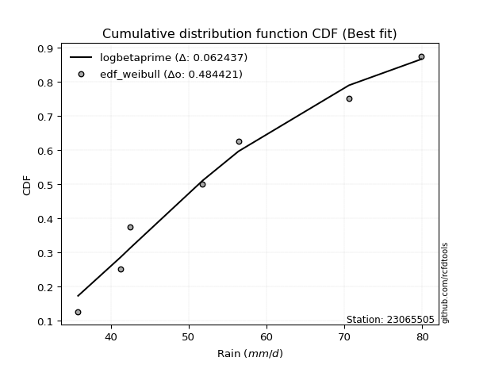</img>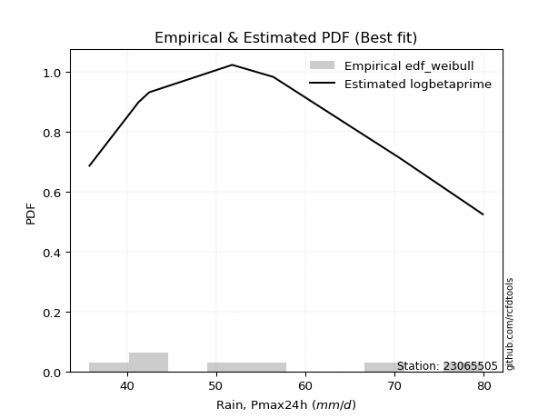</img>

</div>


### 4. EDF Beard (1943)

The Beard formula (or Beard´s plotting position formula) in hydrology is used to estimate the empirical non-exceedance probability _(P)_ of a flood event (or other extreme hydrological data point) within a given dataset.

<div align="center">


$P=(m-0.31)/(n+0.38)$


</div>


**4.1. Empirical values**

<div align="center">

|                | 0                   | 1                   | 2                   | 3         | 4                  | 5                  | 6                  |
|:---------------|:--------------------|:--------------------|:--------------------|:----------|:-------------------|:-------------------|:-------------------|
| date           | 2020                | 2021                | 2015                | 2018      | 2019               | 2016               | 2017               |
| x              | 35.8                | 41.3                | 42.5                | 51.8      | 56.4               | 70.6               | 79.9               |
| m              | 1                   | 2                   | 3                   | 4         | 5                  | 6                  | 7                  |
| empirical_dist | edf_beard           | edf_beard           | edf_beard           | edf_beard | edf_beard          | edf_beard          | edf_beard          |
| empirical      | 0.09349593495934959 | 0.22899728997289973 | 0.36449864498644985 | 0.5       | 0.6355013550135502 | 0.7710027100271003 | 0.9065040650406505 |
| empirical_tr   | 1.1031390134529149  | 1.29701230228471    | 1.5735607675906182  | 2.0       | 2.743494423791822  | 4.366863905325444  | 10.695652173913055 |

</div>


**4.2. Kolmogorov-Smirnov fit test (sorted by Δ)**


<div align="center">

|                | 0                   | 1                   | 2                   | 3                   | 4                   | 5                   | 6                   | 7                   | 8                   | 9                   | 10                  | 11                  | 12                  | 13                  | 14                  | 15                  | 16                  | 17                  | 18                  | 19                  | 20                  | 21                  | 22                  | 23                  | 24                  | 25                  | 26                  | 27                  | 28                  | 29                  | 30                  | 31                  | 32                  | 33                  | 34                  | 35                  | 36                  | 37                  | 38                  | 39                  | 40                  | 41                  | 42                  | 43                  | 44                  | 45                  | 46                  | 47                  | 48                  | 49                  | 50                  | 51                  | 52                  | 53                  | 54                  | 55                  | 56                  | 57                  | 58                  | 59                  | 60                  | 61                  | 62                  | 63                  | 64                  | 65                  | 66                  | 67                  | 68                  | 69                  | 70                  | 71                  | 72                  | 73                  | 74                  | 75                  | 76                  | 77                  | 78                  | 79                  | 80                  | 81                  | 82                  | 83                  | 84                  | 85                  | 86                  | 87                  | 88                  | 89                  | 90                  | 91                  | 92                  | 93                  | 94                  | 95                  | 96                  | 97                  | 98                  | 99                  | 100                 | 101                 | 102                 | 103                 | 104                 | 105                 | 106                 | 107                 | 108                 | 109                 | 110                 | 111                 | 112                 | 113                 | 114                 | 115                 | 116                 | 117                 | 118                 | 119                 | 120                 | 121                 | 122                 | 123                 | 124                 | 125                 | 126                 | 127                 | 128                 | 129                 | 130                 | 131                 | 132                 | 133                 | 134                 | 135                 | 136                 | 137                 | 138                 | 139                 | 140                 | 141                 | 142                 | 143                 | 144                 | 145                 | 146                 | 147                 | 148                 | 149                 | 150                 | 151                 | 152                 | 153                 | 154                 | 155                 | 156                 | 157                 | 158                 | 159                 |
|:---------------|:--------------------|:--------------------|:--------------------|:--------------------|:--------------------|:--------------------|:--------------------|:--------------------|:--------------------|:--------------------|:--------------------|:--------------------|:--------------------|:--------------------|:--------------------|:--------------------|:--------------------|:--------------------|:--------------------|:--------------------|:--------------------|:--------------------|:--------------------|:--------------------|:--------------------|:--------------------|:--------------------|:--------------------|:--------------------|:--------------------|:--------------------|:--------------------|:--------------------|:--------------------|:--------------------|:--------------------|:--------------------|:--------------------|:--------------------|:--------------------|:--------------------|:--------------------|:--------------------|:--------------------|:--------------------|:--------------------|:--------------------|:--------------------|:--------------------|:--------------------|:--------------------|:--------------------|:--------------------|:--------------------|:--------------------|:--------------------|:--------------------|:--------------------|:--------------------|:--------------------|:--------------------|:--------------------|:--------------------|:--------------------|:--------------------|:--------------------|:--------------------|:--------------------|:--------------------|:--------------------|:--------------------|:--------------------|:--------------------|:--------------------|:--------------------|:--------------------|:--------------------|:--------------------|:--------------------|:--------------------|:--------------------|:--------------------|:--------------------|:--------------------|:--------------------|:--------------------|:--------------------|:--------------------|:--------------------|:--------------------|:--------------------|:--------------------|:--------------------|:--------------------|:--------------------|:--------------------|:--------------------|:--------------------|:--------------------|:--------------------|:--------------------|:--------------------|:--------------------|:--------------------|:--------------------|:--------------------|:--------------------|:--------------------|:--------------------|:--------------------|:--------------------|:--------------------|:--------------------|:--------------------|:--------------------|:--------------------|:--------------------|:--------------------|:--------------------|:--------------------|:--------------------|:--------------------|:--------------------|:--------------------|:--------------------|:--------------------|:--------------------|:--------------------|:--------------------|:--------------------|:--------------------|:--------------------|:--------------------|:--------------------|:--------------------|:--------------------|:--------------------|:--------------------|:--------------------|:--------------------|:--------------------|:--------------------|:--------------------|:--------------------|:--------------------|:--------------------|:--------------------|:--------------------|:--------------------|:--------------------|:--------------------|:--------------------|:--------------------|:--------------------|:--------------------|:--------------------|:--------------------|:--------------------|:--------------------|:--------------------|
| station        | 23065505            | 23065505            | 23065505            | 23065505            | 23065505            | 23065505            | 23065505            | 23065505            | 23065505            | 23065505            | 23065505            | 23065505            | 23065505            | 23065505            | 23065505            | 23065505            | 23065505            | 23065505            | 23065505            | 23065505            | 23065505            | 23065505            | 23065505            | 23065505            | 23065505            | 23065505            | 23065505            | 23065505            | 23065505            | 23065505            | 23065505            | 23065505            | 23065505            | 23065505            | 23065505            | 23065505            | 23065505            | 23065505            | 23065505            | 23065505            | 23065505            | 23065505            | 23065505            | 23065505            | 23065505            | 23065505            | 23065505            | 23065505            | 23065505            | 23065505            | 23065505            | 23065505            | 23065505            | 23065505            | 23065505            | 23065505            | 23065505            | 23065505            | 23065505            | 23065505            | 23065505            | 23065505            | 23065505            | 23065505            | 23065505            | 23065505            | 23065505            | 23065505            | 23065505            | 23065505            | 23065505            | 23065505            | 23065505            | 23065505            | 23065505            | 23065505            | 23065505            | 23065505            | 23065505            | 23065505            | 23065505            | 23065505            | 23065505            | 23065505            | 23065505            | 23065505            | 23065505            | 23065505            | 23065505            | 23065505            | 23065505            | 23065505            | 23065505            | 23065505            | 23065505            | 23065505            | 23065505            | 23065505            | 23065505            | 23065505            | 23065505            | 23065505            | 23065505            | 23065505            | 23065505            | 23065505            | 23065505            | 23065505            | 23065505            | 23065505            | 23065505            | 23065505            | 23065505            | 23065505            | 23065505            | 23065505            | 23065505            | 23065505            | 23065505            | 23065505            | 23065505            | 23065505            | 23065505            | 23065505            | 23065505            | 23065505            | 23065505            | 23065505            | 23065505            | 23065505            | 23065505            | 23065505            | 23065505            | 23065505            | 23065505            | 23065505            | 23065505            | 23065505            | 23065505            | 23065505            | 23065505            | 23065505            | 23065505            | 23065505            | 23065505            | 23065505            | 23065505            | 23065505            | 23065505            | 23065505            | 23065505            | 23065505            | 23065505            | 23065505            | 23065505            | 23065505            | 23065505            | 23065505            | 23065505            | 23065505            |
| empirical_dist | edf_beard           | edf_beard           | edf_beard           | edf_beard           | edf_beard           | edf_beard           | edf_beard           | edf_beard           | edf_beard           | edf_beard           | edf_beard           | edf_beard           | edf_beard           | edf_beard           | edf_beard           | edf_beard           | edf_beard           | edf_beard           | edf_beard           | edf_beard           | edf_beard           | edf_beard           | edf_beard           | edf_beard           | edf_beard           | edf_beard           | edf_beard           | edf_beard           | edf_beard           | edf_beard           | edf_beard           | edf_beard           | edf_beard           | edf_beard           | edf_beard           | edf_beard           | edf_beard           | edf_beard           | edf_beard           | edf_beard           | edf_beard           | edf_beard           | edf_beard           | edf_beard           | edf_beard           | edf_beard           | edf_beard           | edf_beard           | edf_beard           | edf_beard           | edf_beard           | edf_beard           | edf_beard           | edf_beard           | edf_beard           | edf_beard           | edf_beard           | edf_beard           | edf_beard           | edf_beard           | edf_beard           | edf_beard           | edf_beard           | edf_beard           | edf_beard           | edf_beard           | edf_beard           | edf_beard           | edf_beard           | edf_beard           | edf_beard           | edf_beard           | edf_beard           | edf_beard           | edf_beard           | edf_beard           | edf_beard           | edf_beard           | edf_beard           | edf_beard           | edf_beard           | edf_beard           | edf_beard           | edf_beard           | edf_beard           | edf_beard           | edf_beard           | edf_beard           | edf_beard           | edf_beard           | edf_beard           | edf_beard           | edf_beard           | edf_beard           | edf_beard           | edf_beard           | edf_beard           | edf_beard           | edf_beard           | edf_beard           | edf_beard           | edf_beard           | edf_beard           | edf_beard           | edf_beard           | edf_beard           | edf_beard           | edf_beard           | edf_beard           | edf_beard           | edf_beard           | edf_beard           | edf_beard           | edf_beard           | edf_beard           | edf_beard           | edf_beard           | edf_beard           | edf_beard           | edf_beard           | edf_beard           | edf_beard           | edf_beard           | edf_beard           | edf_beard           | edf_beard           | edf_beard           | edf_beard           | edf_beard           | edf_beard           | edf_beard           | edf_beard           | edf_beard           | edf_beard           | edf_beard           | edf_beard           | edf_beard           | edf_beard           | edf_beard           | edf_beard           | edf_beard           | edf_beard           | edf_beard           | edf_beard           | edf_beard           | edf_beard           | edf_beard           | edf_beard           | edf_beard           | edf_beard           | edf_beard           | edf_beard           | edf_beard           | edf_beard           | edf_beard           | edf_beard           | edf_beard           | edf_beard           | edf_beard           | edf_beard           |
| p_dist         | logbetaprime        | logksone            | johnsonsu           | invgauss            | ksone               | lomax               | exponnorm           | logfatiguelife      | genexpon            | loggompertz         | loggenexpon         | logbeta             | logexponpow         | logarcsine          | loghalfnorm         | logskewnorm         | loggausshyper       | logsemicircular     | loginvgauss         | arcsine             | halfnorm            | beta                | semicircular        | logkstwobign        | foldnorm            | logburr             | f                   | invgamma            | loggenlogistic      | loganglit           | logburr12           | loginvweibull       | burr                | logmielke           | lograyleigh         | exponpow            | weibull_min         | truncweibull_min    | invweibull          | loghalflogistic     | logfoldnorm         | logweibull_min      | anglit              | logbradford         | logwrapcauchy       | logf                | loginvgamma         | logmaxwell          | rayleigh            | burr12              | logalpha            | alpha               | halflogistic        | maxwell             | nct                 | logweibull_max      | loggenextreme       | logkappa4           | lognct              | logncf              | logpearson3         | loggumbel_r         | logrice             | genlogistic         | pearson3            | logtruncweibull_min | logexponnorm        | lognorm             | logcrystalball      | logt                | logtruncexpon       | logloggamma         | logjohnsonsu        | betaprime           | kstwobign           | bradford            | logmoyal            | logdweibull         | skewnorm            | gumbel_r            | truncexpon          | norm                | truncnorm           | t                   | logtukeylambda      | dweibull            | wrapcauchy          | logcosine           | moyal               | loguniform          | logdgamma           | gompertz            | dgamma              | logvonmises_line    | logloglaplace       | loglogistic         | halfgennorm         | rice                | cosine              | logistic            | gausshyper          | logkappa3           | loggumbel_l         | kappa4              | loghypsecant        | logargus            | gumbel_l            | hypsecant           | logtriang           | loglaplace          | loglaplace          | argus               | logexponweib        | laplace             | logrdist            | logtruncnorm        | loggamma            | loggamma            | vonmises_line       | tukeylambda         | uniform             | kappa3              | nakagami            | loggenhalflogistic  | lognakagami         | logerlang           | genpareto           | triang              | logwald             | loglevy_l           | wald                | gennorm             | loggennorm          | levy_l              | logtrapezoid        | genhalflogistic     | loggengamma         | johnsonsb           | ncf                 | genextreme          | logjohnsonsb        | loggenpareto        | trapezoid           | rdist               | powerlaw            | gengamma            | gamma               | fatiguelife         | logpowerlaw         | exponweib           | weibull_max         | logtruncpareto      | erlang              | truncpareto         | crystalball         | loglomax            | loghalfgennorm      | logvonmises         | vonmises            | mielke              |
| delta          | 0.0788181136208302  | 0.07974125034015528 | 0.08694216815062861 | 0.08804864582163008 | 0.09023483119793085 | 0.09051808563868119 | 0.09222282622716747 | 0.09315154440709411 | 0.0934940802507237  | 0.0934959172868601  | 0.09349593467353513 | 0.09349593482617126 | 0.0934959349591298  | 0.09349593495934949 | 0.09349593495934959 | 0.09349593495934959 | 0.09349593497601993 | 0.09621896922977596 | 0.09918232330744259 | 0.10013449351676407 | 0.1021262519038918  | 0.1023833396935496  | 0.10277798884002709 | 0.10380399149674086 | 0.1040629652546124  | 0.10696805466970194 | 0.10733657960013121 | 0.1073436665159408  | 0.10812416367796612 | 0.10848149437130483 | 0.1085592647879442  | 0.1087937637737803  | 0.10884559497794433 | 0.10940624380702524 | 0.11090705112840177 | 0.11195144938411306 | 0.11210885178935928 | 0.11212975214199994 | 0.11247111778257479 | 0.11289810930134159 | 0.11375216216392575 | 0.11411220633403385 | 0.11509507716102307 | 0.11513725559835797 | 0.11523491114886478 | 0.11646595207767024 | 0.11646667831934429 | 0.11845213811560512 | 0.11919902673555541 | 0.1203310657187513  | 0.12387752034979871 | 0.12415692292249636 | 0.12515759223211217 | 0.126275219832958   | 0.12731491224038163 | 0.12964900196943038 | 0.1296613430760798  | 0.1299606930023668  | 0.13040138046767732 | 0.13070335693897012 | 0.1313569315916371  | 0.13248123748576254 | 0.13320327760238576 | 0.1334439311621134  | 0.1342409795964057  | 0.13513037973599107 | 0.13637147602235314 | 0.13655082793420548 | 0.13655090128195035 | 0.13655098498427048 | 0.13685850733079385 | 0.1369350958899189  | 0.13759727211446532 | 0.1382749834026267  | 0.13831267360557786 | 0.13919246174371397 | 0.1393224692896577  | 0.14027033083719898 | 0.14132680023833588 | 0.14209362187586466 | 0.1424250522819565  | 0.14322036496478702 | 0.14322040704183667 | 0.14322953855027115 | 0.14501003707214238 | 0.145967078776419   | 0.14649606736839116 | 0.14840167810069066 | 0.15071993888014906 | 0.1508087995813556  | 0.1520215335677112  | 0.1537728890881629  | 0.1565564387981988  | 0.157011536180097   | 0.1580890643870217  | 0.15902186479232244 | 0.15958970748919585 | 0.1636944523929062  | 0.16540077714440915 | 0.16553530358891758 | 0.16801986763121113 | 0.16896279061880318 | 0.17041426351550465 | 0.17157469170490788 | 0.17313392324148394 | 0.17427005307572402 | 0.17532386388758225 | 0.17933929485412112 | 0.18826880643290253 | 0.1903099805160636  | 0.1903099805160636  | 0.19256685818264802 | 0.19313879275743118 | 0.19570832792990805 | 0.19714016925204025 | 0.1998736611688373  | 0.2059142878374982  | 0.2059142878374982  | 0.2075324615583364  | 0.21170282080211905 | 0.21257120734472645 | 0.2135550426972105  | 0.21385588986983742 | 0.2141241613998029  | 0.221013888736158   | 0.22126369890106456 | 0.22198050973076777 | 0.2439309382698166  | 0.24715933865969686 | 0.2573218623949909  | 0.2700504106109334  | 0.2710027100271003  | 0.2710027100271003  | 0.28582686216553443 | 0.3273373405745093  | 0.3283736613907677  | 0.3412000758773738  | 0.34733699884167557 | 0.3754918735241164  | 0.4072345428116573  | 0.41009183881411204 | 0.4110472794222746  | 0.4121504521261502  | 0.4156570506421725  | 0.4798274621764336  | 0.4882955840439617  | 0.4886355075870652  | 0.49681016011751433 | 0.5098280065918469  | 0.5230386887589398  | 0.5407555918630569  | 0.5487137392076796  | 0.5671325760279181  | 0.6213046591890234  | 0.6450147340490787  | 0.6703406802184975  | 0.7710027100271003  | 1.0988062410858834  | 12.579018701742978  | nan                 |
| deltao         | 0.48442053926100004 | 0.48442053926100004 | 0.48442053926100004 | 0.48442053926100004 | 0.48442053926100004 | 0.48442053926100004 | 0.48442053926100004 | 0.48442053926100004 | 0.48442053926100004 | 0.48442053926100004 | 0.48442053926100004 | 0.48442053926100004 | 0.48442053926100004 | 0.48442053926100004 | 0.48442053926100004 | 0.48442053926100004 | 0.48442053926100004 | 0.48442053926100004 | 0.48442053926100004 | 0.48442053926100004 | 0.48442053926100004 | 0.48442053926100004 | 0.48442053926100004 | 0.48442053926100004 | 0.48442053926100004 | 0.48442053926100004 | 0.48442053926100004 | 0.48442053926100004 | 0.48442053926100004 | 0.48442053926100004 | 0.48442053926100004 | 0.48442053926100004 | 0.48442053926100004 | 0.48442053926100004 | 0.48442053926100004 | 0.48442053926100004 | 0.48442053926100004 | 0.48442053926100004 | 0.48442053926100004 | 0.48442053926100004 | 0.48442053926100004 | 0.48442053926100004 | 0.48442053926100004 | 0.48442053926100004 | 0.48442053926100004 | 0.48442053926100004 | 0.48442053926100004 | 0.48442053926100004 | 0.48442053926100004 | 0.48442053926100004 | 0.48442053926100004 | 0.48442053926100004 | 0.48442053926100004 | 0.48442053926100004 | 0.48442053926100004 | 0.48442053926100004 | 0.48442053926100004 | 0.48442053926100004 | 0.48442053926100004 | 0.48442053926100004 | 0.48442053926100004 | 0.48442053926100004 | 0.48442053926100004 | 0.48442053926100004 | 0.48442053926100004 | 0.48442053926100004 | 0.48442053926100004 | 0.48442053926100004 | 0.48442053926100004 | 0.48442053926100004 | 0.48442053926100004 | 0.48442053926100004 | 0.48442053926100004 | 0.48442053926100004 | 0.48442053926100004 | 0.48442053926100004 | 0.48442053926100004 | 0.48442053926100004 | 0.48442053926100004 | 0.48442053926100004 | 0.48442053926100004 | 0.48442053926100004 | 0.48442053926100004 | 0.48442053926100004 | 0.48442053926100004 | 0.48442053926100004 | 0.48442053926100004 | 0.48442053926100004 | 0.48442053926100004 | 0.48442053926100004 | 0.48442053926100004 | 0.48442053926100004 | 0.48442053926100004 | 0.48442053926100004 | 0.48442053926100004 | 0.48442053926100004 | 0.48442053926100004 | 0.48442053926100004 | 0.48442053926100004 | 0.48442053926100004 | 0.48442053926100004 | 0.48442053926100004 | 0.48442053926100004 | 0.48442053926100004 | 0.48442053926100004 | 0.48442053926100004 | 0.48442053926100004 | 0.48442053926100004 | 0.48442053926100004 | 0.48442053926100004 | 0.48442053926100004 | 0.48442053926100004 | 0.48442053926100004 | 0.48442053926100004 | 0.48442053926100004 | 0.48442053926100004 | 0.48442053926100004 | 0.48442053926100004 | 0.48442053926100004 | 0.48442053926100004 | 0.48442053926100004 | 0.48442053926100004 | 0.48442053926100004 | 0.48442053926100004 | 0.48442053926100004 | 0.48442053926100004 | 0.48442053926100004 | 0.48442053926100004 | 0.48442053926100004 | 0.48442053926100004 | 0.48442053926100004 | 0.48442053926100004 | 0.48442053926100004 | 0.48442053926100004 | 0.48442053926100004 | 0.48442053926100004 | 0.48442053926100004 | 0.48442053926100004 | 0.48442053926100004 | 0.48442053926100004 | 0.48442053926100004 | 0.48442053926100004 | 0.48442053926100004 | 0.48442053926100004 | 0.48442053926100004 | 0.48442053926100004 | 0.48442053926100004 | 0.48442053926100004 | 0.48442053926100004 | 0.48442053926100004 | 0.48442053926100004 | 0.48442053926100004 | 0.48442053926100004 | 0.48442053926100004 | 0.48442053926100004 | 0.48442053926100004 | 0.48442053926100004 | 0.48442053926100004 | 0.48442053926100004 | 0.48442053926100004 |
| eval           | Δo > Δ              | Δo > Δ              | Δo > Δ              | Δo > Δ              | Δo > Δ              | Δo > Δ              | Δo > Δ              | Δo > Δ              | Δo > Δ              | Δo > Δ              | Δo > Δ              | Δo > Δ              | Δo > Δ              | Δo > Δ              | Δo > Δ              | Δo > Δ              | Δo > Δ              | Δo > Δ              | Δo > Δ              | Δo > Δ              | Δo > Δ              | Δo > Δ              | Δo > Δ              | Δo > Δ              | Δo > Δ              | Δo > Δ              | Δo > Δ              | Δo > Δ              | Δo > Δ              | Δo > Δ              | Δo > Δ              | Δo > Δ              | Δo > Δ              | Δo > Δ              | Δo > Δ              | Δo > Δ              | Δo > Δ              | Δo > Δ              | Δo > Δ              | Δo > Δ              | Δo > Δ              | Δo > Δ              | Δo > Δ              | Δo > Δ              | Δo > Δ              | Δo > Δ              | Δo > Δ              | Δo > Δ              | Δo > Δ              | Δo > Δ              | Δo > Δ              | Δo > Δ              | Δo > Δ              | Δo > Δ              | Δo > Δ              | Δo > Δ              | Δo > Δ              | Δo > Δ              | Δo > Δ              | Δo > Δ              | Δo > Δ              | Δo > Δ              | Δo > Δ              | Δo > Δ              | Δo > Δ              | Δo > Δ              | Δo > Δ              | Δo > Δ              | Δo > Δ              | Δo > Δ              | Δo > Δ              | Δo > Δ              | Δo > Δ              | Δo > Δ              | Δo > Δ              | Δo > Δ              | Δo > Δ              | Δo > Δ              | Δo > Δ              | Δo > Δ              | Δo > Δ              | Δo > Δ              | Δo > Δ              | Δo > Δ              | Δo > Δ              | Δo > Δ              | Δo > Δ              | Δo > Δ              | Δo > Δ              | Δo > Δ              | Δo > Δ              | Δo > Δ              | Δo > Δ              | Δo > Δ              | Δo > Δ              | Δo > Δ              | Δo > Δ              | Δo > Δ              | Δo > Δ              | Δo > Δ              | Δo > Δ              | Δo > Δ              | Δo > Δ              | Δo > Δ              | Δo > Δ              | Δo > Δ              | Δo > Δ              | Δo > Δ              | Δo > Δ              | Δo > Δ              | Δo > Δ              | Δo > Δ              | Δo > Δ              | Δo > Δ              | Δo > Δ              | Δo > Δ              | Δo > Δ              | Δo > Δ              | Δo > Δ              | Δo > Δ              | Δo > Δ              | Δo > Δ              | Δo > Δ              | Δo > Δ              | Δo > Δ              | Δo > Δ              | Δo > Δ              | Δo > Δ              | Δo > Δ              | Δo > Δ              | Δo > Δ              | Δo > Δ              | Δo > Δ              | Δo > Δ              | Δo > Δ              | Δo > Δ              | Δo > Δ              | Δo > Δ              | Δo > Δ              | Δo > Δ              | Δo > Δ              | Δo > Δ              | Δo > Δ              | Δo > Δ              | Δo > Δ              | Δo <= Δ             | Δo <= Δ             | Δo <= Δ             | Δo <= Δ             | Δo <= Δ             | Δo <= Δ             | Δo <= Δ             | Δo <= Δ             | Δo <= Δ             | Δo <= Δ             | Δo <= Δ             | Δo <= Δ             | Δo <= Δ             | Δo <= Δ             | Δo <= Δ             |
| fit            | 1                   | 1                   | 1                   | 1                   | 1                   | 1                   | 1                   | 1                   | 1                   | 1                   | 1                   | 1                   | 1                   | 1                   | 1                   | 1                   | 1                   | 1                   | 1                   | 1                   | 1                   | 1                   | 1                   | 1                   | 1                   | 1                   | 1                   | 1                   | 1                   | 1                   | 1                   | 1                   | 1                   | 1                   | 1                   | 1                   | 1                   | 1                   | 1                   | 1                   | 1                   | 1                   | 1                   | 1                   | 1                   | 1                   | 1                   | 1                   | 1                   | 1                   | 1                   | 1                   | 1                   | 1                   | 1                   | 1                   | 1                   | 1                   | 1                   | 1                   | 1                   | 1                   | 1                   | 1                   | 1                   | 1                   | 1                   | 1                   | 1                   | 1                   | 1                   | 1                   | 1                   | 1                   | 1                   | 1                   | 1                   | 1                   | 1                   | 1                   | 1                   | 1                   | 1                   | 1                   | 1                   | 1                   | 1                   | 1                   | 1                   | 1                   | 1                   | 1                   | 1                   | 1                   | 1                   | 1                   | 1                   | 1                   | 1                   | 1                   | 1                   | 1                   | 1                   | 1                   | 1                   | 1                   | 1                   | 1                   | 1                   | 1                   | 1                   | 1                   | 1                   | 1                   | 1                   | 1                   | 1                   | 1                   | 1                   | 1                   | 1                   | 1                   | 1                   | 1                   | 1                   | 1                   | 1                   | 1                   | 1                   | 1                   | 1                   | 1                   | 1                   | 1                   | 1                   | 1                   | 1                   | 1                   | 1                   | 1                   | 1                   | 1                   | 1                   | 1                   | 1                   | 0                   | 0                   | 0                   | 0                   | 0                   | 0                   | 0                   | 0                   | 0                   | 0                   | 0                   | 0                   | 0                   | 0                   | 0                   |
| n              | 7                   | 7                   | 7                   | 7                   | 7                   | 7                   | 7                   | 7                   | 7                   | 7                   | 7                   | 7                   | 7                   | 7                   | 7                   | 7                   | 7                   | 7                   | 7                   | 7                   | 7                   | 7                   | 7                   | 7                   | 7                   | 7                   | 7                   | 7                   | 7                   | 7                   | 7                   | 7                   | 7                   | 7                   | 7                   | 7                   | 7                   | 7                   | 7                   | 7                   | 7                   | 7                   | 7                   | 7                   | 7                   | 7                   | 7                   | 7                   | 7                   | 7                   | 7                   | 7                   | 7                   | 7                   | 7                   | 7                   | 7                   | 7                   | 7                   | 7                   | 7                   | 7                   | 7                   | 7                   | 7                   | 7                   | 7                   | 7                   | 7                   | 7                   | 7                   | 7                   | 7                   | 7                   | 7                   | 7                   | 7                   | 7                   | 7                   | 7                   | 7                   | 7                   | 7                   | 7                   | 7                   | 7                   | 7                   | 7                   | 7                   | 7                   | 7                   | 7                   | 7                   | 7                   | 7                   | 7                   | 7                   | 7                   | 7                   | 7                   | 7                   | 7                   | 7                   | 7                   | 7                   | 7                   | 7                   | 7                   | 7                   | 7                   | 7                   | 7                   | 7                   | 7                   | 7                   | 7                   | 7                   | 7                   | 7                   | 7                   | 7                   | 7                   | 7                   | 7                   | 7                   | 7                   | 7                   | 7                   | 7                   | 7                   | 7                   | 7                   | 7                   | 7                   | 7                   | 7                   | 7                   | 7                   | 7                   | 7                   | 7                   | 7                   | 7                   | 7                   | 7                   | 7                   | 7                   | 7                   | 7                   | 7                   | 7                   | 7                   | 7                   | 7                   | 7                   | 7                   | 7                   | 7                   | 7                   | 7                   |
| best_fit       | 1                   | 0                   | 0                   | 0                   | 0                   | 0                   | 0                   | 0                   | 0                   | 0                   | 0                   | 0                   | 0                   | 0                   | 0                   | 0                   | 0                   | 0                   | 0                   | 0                   | 0                   | 0                   | 0                   | 0                   | 0                   | 0                   | 0                   | 0                   | 0                   | 0                   | 0                   | 0                   | 0                   | 0                   | 0                   | 0                   | 0                   | 0                   | 0                   | 0                   | 0                   | 0                   | 0                   | 0                   | 0                   | 0                   | 0                   | 0                   | 0                   | 0                   | 0                   | 0                   | 0                   | 0                   | 0                   | 0                   | 0                   | 0                   | 0                   | 0                   | 0                   | 0                   | 0                   | 0                   | 0                   | 0                   | 0                   | 0                   | 0                   | 0                   | 0                   | 0                   | 0                   | 0                   | 0                   | 0                   | 0                   | 0                   | 0                   | 0                   | 0                   | 0                   | 0                   | 0                   | 0                   | 0                   | 0                   | 0                   | 0                   | 0                   | 0                   | 0                   | 0                   | 0                   | 0                   | 0                   | 0                   | 0                   | 0                   | 0                   | 0                   | 0                   | 0                   | 0                   | 0                   | 0                   | 0                   | 0                   | 0                   | 0                   | 0                   | 0                   | 0                   | 0                   | 0                   | 0                   | 0                   | 0                   | 0                   | 0                   | 0                   | 0                   | 0                   | 0                   | 0                   | 0                   | 0                   | 0                   | 0                   | 0                   | 0                   | 0                   | 0                   | 0                   | 0                   | 0                   | 0                   | 0                   | 0                   | 0                   | 0                   | 0                   | 0                   | 0                   | 0                   | 0                   | 0                   | 0                   | 0                   | 0                   | 0                   | 0                   | 0                   | 0                   | 0                   | 0                   | 0                   | 0                   | 0                   | 0                   |
| best_fit_sort  | 1                   | 2                   | 3                   | 4                   | 5                   | 6                   | 7                   | 8                   | 9                   | 10                  | 11                  | 12                  | 13                  | 14                  | 15                  | 16                  | 17                  | 18                  | 19                  | 20                  | 21                  | 22                  | 23                  | 24                  | 25                  | 26                  | 27                  | 28                  | 29                  | 30                  | 31                  | 32                  | 33                  | 34                  | 35                  | 36                  | 37                  | 38                  | 39                  | 40                  | 41                  | 42                  | 43                  | 44                  | 45                  | 46                  | 47                  | 48                  | 49                  | 50                  | 51                  | 52                  | 53                  | 54                  | 55                  | 56                  | 57                  | 58                  | 59                  | 60                  | 61                  | 62                  | 63                  | 64                  | 65                  | 66                  | 67                  | 68                  | 69                  | 70                  | 71                  | 72                  | 73                  | 74                  | 75                  | 76                  | 77                  | 78                  | 79                  | 80                  | 81                  | 82                  | 83                  | 84                  | 85                  | 86                  | 87                  | 88                  | 89                  | 90                  | 91                  | 92                  | 93                  | 94                  | 95                  | 96                  | 97                  | 98                  | 99                  | 100                 | 101                 | 102                 | 103                 | 104                 | 105                 | 106                 | 107                 | 108                 | 109                 | 110                 | 111                 | 112                 | 113                 | 114                 | 115                 | 116                 | 117                 | 118                 | 119                 | 120                 | 121                 | 122                 | 123                 | 124                 | 125                 | 126                 | 127                 | 128                 | 129                 | 130                 | 131                 | 132                 | 133                 | 134                 | 135                 | 136                 | 137                 | 138                 | 139                 | 140                 | 141                 | 142                 | 143                 | 144                 | 145                 | 146                 | 147                 | 148                 | 149                 | 150                 | 151                 | 152                 | 153                 | 154                 | 155                 | 156                 | 157                 | 158                 | 159                 | 160                 |

</div>


**4.3. Best fit**

<div align="center">

|   id |   station | empirical_dist   | p_dist       |     delta |   deltao | eval   |   fit |   n |   best_fit |   best_fit_sort |
|-----:|----------:|:-----------------|:-------------|----------:|---------:|:-------|------:|----:|-----------:|----------------:|
|    0 |  23065505 | edf_beard        | logbetaprime | 0.0788181 | 0.484421 | Δo > Δ |     1 |   7 |          1 |               1 |

</div>


<div align="center">

</img>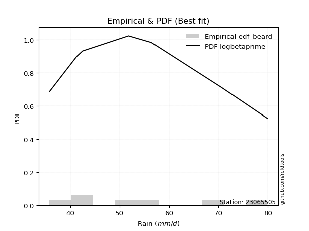</img>

</div>


### 5. EDF Chegodayev (1955)

The Chegodayev formula is an empirical plotting position formula used in hydrological frequency analysis to estimate the exceedance probability or return period of a specific event from a set of observed data. It is primarily used for plotting observed data points on probability paper to fit a theoretical distribution, particularly for analyzing extreme events like maximum flood flows or rainfall intensities. The constant _b_ value in the generalized plotting position formula is 0.3.

<div align="center">


$P=(m-b)/(n+1-2b)$


</div>


**5.1. Empirical values**

<div align="center">

|                | 0                   | 1                   | 2                   | 3              | 4                  | 5                  | 6                  |
|:---------------|:--------------------|:--------------------|:--------------------|:---------------|:-------------------|:-------------------|:-------------------|
| date           | 2020                | 2021                | 2015                | 2018           | 2019               | 2016               | 2017               |
| x              | 35.8                | 41.3                | 42.5                | 51.8           | 56.4               | 70.6               | 79.9               |
| m              | 1                   | 2                   | 3                   | 4              | 5                  | 6                  | 7                  |
| empirical_dist | edf_chegodayev      | edf_chegodayev      | edf_chegodayev      | edf_chegodayev | edf_chegodayev     | edf_chegodayev     | edf_chegodayev     |
| empirical      | 0.09459459459459459 | 0.22972972972972971 | 0.36486486486486486 | 0.5            | 0.6351351351351351 | 0.7702702702702703 | 0.9054054054054054 |
| empirical_tr   | 1.1044776119402986  | 1.2982456140350878  | 1.574468085106383   | 2.0            | 2.7407407407407405 | 4.352941176470589  | 10.571428571428568 |

</div>


**5.2. Kolmogorov-Smirnov fit test (sorted by Δ)**


<div align="center">

|                | 0                   | 1                   | 2                   | 3                   | 4                   | 5                   | 6                   | 7                   | 8                   | 9                   | 10                  | 11                  | 12                  | 13                  | 14                  | 15                  | 16                  | 17                  | 18                  | 19                  | 20                  | 21                  | 22                  | 23                  | 24                  | 25                  | 26                  | 27                  | 28                  | 29                  | 30                  | 31                  | 32                  | 33                  | 34                  | 35                  | 36                  | 37                  | 38                  | 39                  | 40                  | 41                  | 42                  | 43                  | 44                  | 45                  | 46                  | 47                  | 48                  | 49                  | 50                  | 51                  | 52                  | 53                  | 54                  | 55                  | 56                  | 57                  | 58                  | 59                  | 60                  | 61                  | 62                  | 63                  | 64                  | 65                  | 66                  | 67                  | 68                  | 69                  | 70                  | 71                  | 72                  | 73                  | 74                  | 75                  | 76                  | 77                  | 78                  | 79                  | 80                  | 81                  | 82                  | 83                  | 84                  | 85                  | 86                  | 87                  | 88                  | 89                  | 90                  | 91                  | 92                  | 93                  | 94                  | 95                  | 96                  | 97                  | 98                  | 99                  | 100                 | 101                 | 102                 | 103                 | 104                 | 105                 | 106                 | 107                 | 108                 | 109                 | 110                 | 111                 | 112                 | 113                 | 114                 | 115                 | 116                 | 117                 | 118                 | 119                 | 120                 | 121                 | 122                 | 123                 | 124                 | 125                 | 126                 | 127                 | 128                 | 129                 | 130                 | 131                 | 132                 | 133                 | 134                 | 135                 | 136                 | 137                 | 138                 | 139                 | 140                 | 141                 | 142                 | 143                 | 144                 | 145                 | 146                 | 147                 | 148                 | 149                 | 150                 | 151                 | 152                 | 153                 | 154                 | 155                 | 156                 | 157                 | 158                 | 159                 |
|:---------------|:--------------------|:--------------------|:--------------------|:--------------------|:--------------------|:--------------------|:--------------------|:--------------------|:--------------------|:--------------------|:--------------------|:--------------------|:--------------------|:--------------------|:--------------------|:--------------------|:--------------------|:--------------------|:--------------------|:--------------------|:--------------------|:--------------------|:--------------------|:--------------------|:--------------------|:--------------------|:--------------------|:--------------------|:--------------------|:--------------------|:--------------------|:--------------------|:--------------------|:--------------------|:--------------------|:--------------------|:--------------------|:--------------------|:--------------------|:--------------------|:--------------------|:--------------------|:--------------------|:--------------------|:--------------------|:--------------------|:--------------------|:--------------------|:--------------------|:--------------------|:--------------------|:--------------------|:--------------------|:--------------------|:--------------------|:--------------------|:--------------------|:--------------------|:--------------------|:--------------------|:--------------------|:--------------------|:--------------------|:--------------------|:--------------------|:--------------------|:--------------------|:--------------------|:--------------------|:--------------------|:--------------------|:--------------------|:--------------------|:--------------------|:--------------------|:--------------------|:--------------------|:--------------------|:--------------------|:--------------------|:--------------------|:--------------------|:--------------------|:--------------------|:--------------------|:--------------------|:--------------------|:--------------------|:--------------------|:--------------------|:--------------------|:--------------------|:--------------------|:--------------------|:--------------------|:--------------------|:--------------------|:--------------------|:--------------------|:--------------------|:--------------------|:--------------------|:--------------------|:--------------------|:--------------------|:--------------------|:--------------------|:--------------------|:--------------------|:--------------------|:--------------------|:--------------------|:--------------------|:--------------------|:--------------------|:--------------------|:--------------------|:--------------------|:--------------------|:--------------------|:--------------------|:--------------------|:--------------------|:--------------------|:--------------------|:--------------------|:--------------------|:--------------------|:--------------------|:--------------------|:--------------------|:--------------------|:--------------------|:--------------------|:--------------------|:--------------------|:--------------------|:--------------------|:--------------------|:--------------------|:--------------------|:--------------------|:--------------------|:--------------------|:--------------------|:--------------------|:--------------------|:--------------------|:--------------------|:--------------------|:--------------------|:--------------------|:--------------------|:--------------------|:--------------------|:--------------------|:--------------------|:--------------------|:--------------------|:--------------------|
| station        | 23065505            | 23065505            | 23065505            | 23065505            | 23065505            | 23065505            | 23065505            | 23065505            | 23065505            | 23065505            | 23065505            | 23065505            | 23065505            | 23065505            | 23065505            | 23065505            | 23065505            | 23065505            | 23065505            | 23065505            | 23065505            | 23065505            | 23065505            | 23065505            | 23065505            | 23065505            | 23065505            | 23065505            | 23065505            | 23065505            | 23065505            | 23065505            | 23065505            | 23065505            | 23065505            | 23065505            | 23065505            | 23065505            | 23065505            | 23065505            | 23065505            | 23065505            | 23065505            | 23065505            | 23065505            | 23065505            | 23065505            | 23065505            | 23065505            | 23065505            | 23065505            | 23065505            | 23065505            | 23065505            | 23065505            | 23065505            | 23065505            | 23065505            | 23065505            | 23065505            | 23065505            | 23065505            | 23065505            | 23065505            | 23065505            | 23065505            | 23065505            | 23065505            | 23065505            | 23065505            | 23065505            | 23065505            | 23065505            | 23065505            | 23065505            | 23065505            | 23065505            | 23065505            | 23065505            | 23065505            | 23065505            | 23065505            | 23065505            | 23065505            | 23065505            | 23065505            | 23065505            | 23065505            | 23065505            | 23065505            | 23065505            | 23065505            | 23065505            | 23065505            | 23065505            | 23065505            | 23065505            | 23065505            | 23065505            | 23065505            | 23065505            | 23065505            | 23065505            | 23065505            | 23065505            | 23065505            | 23065505            | 23065505            | 23065505            | 23065505            | 23065505            | 23065505            | 23065505            | 23065505            | 23065505            | 23065505            | 23065505            | 23065505            | 23065505            | 23065505            | 23065505            | 23065505            | 23065505            | 23065505            | 23065505            | 23065505            | 23065505            | 23065505            | 23065505            | 23065505            | 23065505            | 23065505            | 23065505            | 23065505            | 23065505            | 23065505            | 23065505            | 23065505            | 23065505            | 23065505            | 23065505            | 23065505            | 23065505            | 23065505            | 23065505            | 23065505            | 23065505            | 23065505            | 23065505            | 23065505            | 23065505            | 23065505            | 23065505            | 23065505            | 23065505            | 23065505            | 23065505            | 23065505            | 23065505            | 23065505            |
| empirical_dist | edf_chegodayev      | edf_chegodayev      | edf_chegodayev      | edf_chegodayev      | edf_chegodayev      | edf_chegodayev      | edf_chegodayev      | edf_chegodayev      | edf_chegodayev      | edf_chegodayev      | edf_chegodayev      | edf_chegodayev      | edf_chegodayev      | edf_chegodayev      | edf_chegodayev      | edf_chegodayev      | edf_chegodayev      | edf_chegodayev      | edf_chegodayev      | edf_chegodayev      | edf_chegodayev      | edf_chegodayev      | edf_chegodayev      | edf_chegodayev      | edf_chegodayev      | edf_chegodayev      | edf_chegodayev      | edf_chegodayev      | edf_chegodayev      | edf_chegodayev      | edf_chegodayev      | edf_chegodayev      | edf_chegodayev      | edf_chegodayev      | edf_chegodayev      | edf_chegodayev      | edf_chegodayev      | edf_chegodayev      | edf_chegodayev      | edf_chegodayev      | edf_chegodayev      | edf_chegodayev      | edf_chegodayev      | edf_chegodayev      | edf_chegodayev      | edf_chegodayev      | edf_chegodayev      | edf_chegodayev      | edf_chegodayev      | edf_chegodayev      | edf_chegodayev      | edf_chegodayev      | edf_chegodayev      | edf_chegodayev      | edf_chegodayev      | edf_chegodayev      | edf_chegodayev      | edf_chegodayev      | edf_chegodayev      | edf_chegodayev      | edf_chegodayev      | edf_chegodayev      | edf_chegodayev      | edf_chegodayev      | edf_chegodayev      | edf_chegodayev      | edf_chegodayev      | edf_chegodayev      | edf_chegodayev      | edf_chegodayev      | edf_chegodayev      | edf_chegodayev      | edf_chegodayev      | edf_chegodayev      | edf_chegodayev      | edf_chegodayev      | edf_chegodayev      | edf_chegodayev      | edf_chegodayev      | edf_chegodayev      | edf_chegodayev      | edf_chegodayev      | edf_chegodayev      | edf_chegodayev      | edf_chegodayev      | edf_chegodayev      | edf_chegodayev      | edf_chegodayev      | edf_chegodayev      | edf_chegodayev      | edf_chegodayev      | edf_chegodayev      | edf_chegodayev      | edf_chegodayev      | edf_chegodayev      | edf_chegodayev      | edf_chegodayev      | edf_chegodayev      | edf_chegodayev      | edf_chegodayev      | edf_chegodayev      | edf_chegodayev      | edf_chegodayev      | edf_chegodayev      | edf_chegodayev      | edf_chegodayev      | edf_chegodayev      | edf_chegodayev      | edf_chegodayev      | edf_chegodayev      | edf_chegodayev      | edf_chegodayev      | edf_chegodayev      | edf_chegodayev      | edf_chegodayev      | edf_chegodayev      | edf_chegodayev      | edf_chegodayev      | edf_chegodayev      | edf_chegodayev      | edf_chegodayev      | edf_chegodayev      | edf_chegodayev      | edf_chegodayev      | edf_chegodayev      | edf_chegodayev      | edf_chegodayev      | edf_chegodayev      | edf_chegodayev      | edf_chegodayev      | edf_chegodayev      | edf_chegodayev      | edf_chegodayev      | edf_chegodayev      | edf_chegodayev      | edf_chegodayev      | edf_chegodayev      | edf_chegodayev      | edf_chegodayev      | edf_chegodayev      | edf_chegodayev      | edf_chegodayev      | edf_chegodayev      | edf_chegodayev      | edf_chegodayev      | edf_chegodayev      | edf_chegodayev      | edf_chegodayev      | edf_chegodayev      | edf_chegodayev      | edf_chegodayev      | edf_chegodayev      | edf_chegodayev      | edf_chegodayev      | edf_chegodayev      | edf_chegodayev      | edf_chegodayev      | edf_chegodayev      | edf_chegodayev      | edf_chegodayev      |
| p_dist         | logbetaprime        | logksone            | johnsonsu           | invgauss            | ksone               | lomax               | exponnorm           | logfatiguelife      | genexpon            | loggompertz         | loggenexpon         | logbeta             | logexponpow         | loghalfnorm         | logskewnorm         | logarcsine          | loggausshyper       | logsemicircular     | loginvgauss         | arcsine             | beta                | halfnorm            | semicircular        | logkstwobign        | foldnorm            | logburr             | f                   | invgamma            | loggenlogistic      | logburr12           | loganglit           | loginvweibull       | burr                | logmielke           | lograyleigh         | weibull_min         | exponpow            | invweibull          | truncweibull_min    | loghalflogistic     | logweibull_min      | logfoldnorm         | logwrapcauchy       | anglit              | logbradford         | logf                | loginvgamma         | logmaxwell          | rayleigh            | burr12              | logalpha            | alpha               | halflogistic        | maxwell             | nct                 | logweibull_max      | loggenextreme       | logkappa4           | lognct              | logncf              | logpearson3         | loggumbel_r         | logrice             | genlogistic         | pearson3            | logtruncweibull_min | logexponnorm        | lognorm             | logcrystalball      | logt                | logloggamma         | logtruncexpon       | logjohnsonsu        | betaprime           | kstwobign           | bradford            | logmoyal            | logdweibull         | skewnorm            | gumbel_r            | truncexpon          | norm                | truncnorm           | t                   | logtukeylambda      | wrapcauchy          | dweibull            | logcosine           | moyal               | loguniform          | logdgamma           | gompertz            | dgamma              | logvonmises_line    | logloglaplace       | halfgennorm         | loglogistic         | rice                | cosine              | logistic            | gausshyper          | logkappa3           | loggumbel_l         | kappa4              | loghypsecant        | logargus            | gumbel_l            | hypsecant           | logtriang           | loglaplace          | loglaplace          | argus               | logexponweib        | logrdist            | laplace             | logtruncnorm        | loggamma            | loggamma            | vonmises_line       | tukeylambda         | uniform             | nakagami            | loggenhalflogistic  | kappa3              | lognakagami         | genpareto           | logerlang           | triang              | logwald             | loglevy_l           | gennorm             | loggennorm          | wald                | levy_l              | logtrapezoid        | genhalflogistic     | loggengamma         | johnsonsb           | ncf                 | genextreme          | logjohnsonsb        | loggenpareto        | trapezoid           | rdist               | powerlaw            | gengamma            | gamma               | fatiguelife         | logpowerlaw         | exponweib           | weibull_max         | logtruncpareto      | erlang              | truncpareto         | crystalball         | loglomax            | loghalfgennorm      | logvonmises         | vonmises            | mielke              |
| delta          | 0.0777194539855852  | 0.08010747021857029 | 0.08730838802904362 | 0.0887810855784601  | 0.0911546437235089  | 0.09161674527392619 | 0.09332148586241247 | 0.09351776428550912 | 0.0945927398859687  | 0.0945945769221051  | 0.09459459430878013 | 0.09459459446141626 | 0.0945945945943748  | 0.09459459459459459 | 0.09459459459459459 | 0.09459459459459463 | 0.09459459461126507 | 0.09658518910819097 | 0.0995485431858576  | 0.09976827363834895 | 0.10165089993671961 | 0.1024924717823068  | 0.1031442087184421  | 0.10417021137515586 | 0.1044291851330274  | 0.10733427454811695 | 0.10770279947854622 | 0.1077098863943558  | 0.10849038355638113 | 0.1085592647879442  | 0.10884771424971984 | 0.10915998365219531 | 0.10921181485635933 | 0.10977246368544025 | 0.11127327100681678 | 0.11137641203252929 | 0.11231766926252806 | 0.1128373376609898  | 0.11286219189882996 | 0.1132643291797566  | 0.11411220633403385 | 0.11411838204234076 | 0.11450247139203479 | 0.11546129703943808 | 0.11586969535518798 | 0.11683217195608525 | 0.1168328981977593  | 0.11881835799402013 | 0.11956524661397042 | 0.1203310657187513  | 0.12424374022821372 | 0.12452314280091137 | 0.12552381211052718 | 0.126641439711373   | 0.12768113211879664 | 0.1300152218478454  | 0.1300275629544948  | 0.1303269128807818  | 0.13076760034609233 | 0.13106957681738513 | 0.13172315147005212 | 0.13284745736417755 | 0.13356949748080077 | 0.1338101510405284  | 0.13460719947482072 | 0.13586281949282109 | 0.13673769590076815 | 0.13691704781262048 | 0.13691712116036536 | 0.1369172048626855  | 0.1373013157683339  | 0.13759094708762387 | 0.13796349199288033 | 0.1386412032810417  | 0.13867889348399287 | 0.13955868162212898 | 0.1396886891680727  | 0.141002770594029   | 0.1416930201167509  | 0.14245984175427967 | 0.14279127216037152 | 0.14358658484320203 | 0.14358662692025168 | 0.14359575842868616 | 0.1453762569505574  | 0.14612984748997604 | 0.14669951853324903 | 0.14876789797910567 | 0.15108615875856407 | 0.1511750194597706  | 0.15275397332454121 | 0.1541391089665779  | 0.15728887855502882 | 0.157377756058512   | 0.1584552842654367  | 0.15885726773236586 | 0.15938808467073745 | 0.1640606722713212  | 0.16576699702282416 | 0.16590152346733258 | 0.16838608750962614 | 0.16932901049721819 | 0.17078048339391966 | 0.1719409115833229  | 0.17350014311989895 | 0.17463627295413903 | 0.17569008376599726 | 0.17970551473253613 | 0.18863502631131754 | 0.1906762003944786  | 0.1906762003944786  | 0.19293307806106302 | 0.19313879275743118 | 0.19604150961679528 | 0.19607454780832306 | 0.1998736611688373  | 0.2059142878374982  | 0.2059142878374982  | 0.20789868143675141 | 0.21206904068053406 | 0.21293742722314146 | 0.21312345011300743 | 0.21375794152138777 | 0.21392126257562552 | 0.220281448979328   | 0.2208818500955228  | 0.22126369890106456 | 0.24356471839140148 | 0.24752555853811187 | 0.2562232027597459  | 0.2702702702702703  | 0.2702702702702703  | 0.2704166304893484  | 0.28472820253028946 | 0.3269711206960942  | 0.32800744151235256 | 0.34046763612054376 | 0.34660455908484555 | 0.3743932138888714  | 0.40650210305482726 | 0.409359399057282   | 0.4099486197870296  | 0.4117842322477351  | 0.41455839100692754 | 0.47909502241960356 | 0.48756314428713166 | 0.4879030678302352  | 0.4960777203606843  | 0.5090955668350169  | 0.5223062490021098  | 0.5400231521062269  | 0.5479812994508496  | 0.5664001362710881  | 0.6205722194321934  | 0.6439160744138337  | 0.6692420205832523  | 0.7702702702702703  | 1.0995386808427137  | 12.580117361378223  | nan                 |
| deltao         | 0.48442053926100004 | 0.48442053926100004 | 0.48442053926100004 | 0.48442053926100004 | 0.48442053926100004 | 0.48442053926100004 | 0.48442053926100004 | 0.48442053926100004 | 0.48442053926100004 | 0.48442053926100004 | 0.48442053926100004 | 0.48442053926100004 | 0.48442053926100004 | 0.48442053926100004 | 0.48442053926100004 | 0.48442053926100004 | 0.48442053926100004 | 0.48442053926100004 | 0.48442053926100004 | 0.48442053926100004 | 0.48442053926100004 | 0.48442053926100004 | 0.48442053926100004 | 0.48442053926100004 | 0.48442053926100004 | 0.48442053926100004 | 0.48442053926100004 | 0.48442053926100004 | 0.48442053926100004 | 0.48442053926100004 | 0.48442053926100004 | 0.48442053926100004 | 0.48442053926100004 | 0.48442053926100004 | 0.48442053926100004 | 0.48442053926100004 | 0.48442053926100004 | 0.48442053926100004 | 0.48442053926100004 | 0.48442053926100004 | 0.48442053926100004 | 0.48442053926100004 | 0.48442053926100004 | 0.48442053926100004 | 0.48442053926100004 | 0.48442053926100004 | 0.48442053926100004 | 0.48442053926100004 | 0.48442053926100004 | 0.48442053926100004 | 0.48442053926100004 | 0.48442053926100004 | 0.48442053926100004 | 0.48442053926100004 | 0.48442053926100004 | 0.48442053926100004 | 0.48442053926100004 | 0.48442053926100004 | 0.48442053926100004 | 0.48442053926100004 | 0.48442053926100004 | 0.48442053926100004 | 0.48442053926100004 | 0.48442053926100004 | 0.48442053926100004 | 0.48442053926100004 | 0.48442053926100004 | 0.48442053926100004 | 0.48442053926100004 | 0.48442053926100004 | 0.48442053926100004 | 0.48442053926100004 | 0.48442053926100004 | 0.48442053926100004 | 0.48442053926100004 | 0.48442053926100004 | 0.48442053926100004 | 0.48442053926100004 | 0.48442053926100004 | 0.48442053926100004 | 0.48442053926100004 | 0.48442053926100004 | 0.48442053926100004 | 0.48442053926100004 | 0.48442053926100004 | 0.48442053926100004 | 0.48442053926100004 | 0.48442053926100004 | 0.48442053926100004 | 0.48442053926100004 | 0.48442053926100004 | 0.48442053926100004 | 0.48442053926100004 | 0.48442053926100004 | 0.48442053926100004 | 0.48442053926100004 | 0.48442053926100004 | 0.48442053926100004 | 0.48442053926100004 | 0.48442053926100004 | 0.48442053926100004 | 0.48442053926100004 | 0.48442053926100004 | 0.48442053926100004 | 0.48442053926100004 | 0.48442053926100004 | 0.48442053926100004 | 0.48442053926100004 | 0.48442053926100004 | 0.48442053926100004 | 0.48442053926100004 | 0.48442053926100004 | 0.48442053926100004 | 0.48442053926100004 | 0.48442053926100004 | 0.48442053926100004 | 0.48442053926100004 | 0.48442053926100004 | 0.48442053926100004 | 0.48442053926100004 | 0.48442053926100004 | 0.48442053926100004 | 0.48442053926100004 | 0.48442053926100004 | 0.48442053926100004 | 0.48442053926100004 | 0.48442053926100004 | 0.48442053926100004 | 0.48442053926100004 | 0.48442053926100004 | 0.48442053926100004 | 0.48442053926100004 | 0.48442053926100004 | 0.48442053926100004 | 0.48442053926100004 | 0.48442053926100004 | 0.48442053926100004 | 0.48442053926100004 | 0.48442053926100004 | 0.48442053926100004 | 0.48442053926100004 | 0.48442053926100004 | 0.48442053926100004 | 0.48442053926100004 | 0.48442053926100004 | 0.48442053926100004 | 0.48442053926100004 | 0.48442053926100004 | 0.48442053926100004 | 0.48442053926100004 | 0.48442053926100004 | 0.48442053926100004 | 0.48442053926100004 | 0.48442053926100004 | 0.48442053926100004 | 0.48442053926100004 | 0.48442053926100004 | 0.48442053926100004 | 0.48442053926100004 | 0.48442053926100004 |
| eval           | Δo > Δ              | Δo > Δ              | Δo > Δ              | Δo > Δ              | Δo > Δ              | Δo > Δ              | Δo > Δ              | Δo > Δ              | Δo > Δ              | Δo > Δ              | Δo > Δ              | Δo > Δ              | Δo > Δ              | Δo > Δ              | Δo > Δ              | Δo > Δ              | Δo > Δ              | Δo > Δ              | Δo > Δ              | Δo > Δ              | Δo > Δ              | Δo > Δ              | Δo > Δ              | Δo > Δ              | Δo > Δ              | Δo > Δ              | Δo > Δ              | Δo > Δ              | Δo > Δ              | Δo > Δ              | Δo > Δ              | Δo > Δ              | Δo > Δ              | Δo > Δ              | Δo > Δ              | Δo > Δ              | Δo > Δ              | Δo > Δ              | Δo > Δ              | Δo > Δ              | Δo > Δ              | Δo > Δ              | Δo > Δ              | Δo > Δ              | Δo > Δ              | Δo > Δ              | Δo > Δ              | Δo > Δ              | Δo > Δ              | Δo > Δ              | Δo > Δ              | Δo > Δ              | Δo > Δ              | Δo > Δ              | Δo > Δ              | Δo > Δ              | Δo > Δ              | Δo > Δ              | Δo > Δ              | Δo > Δ              | Δo > Δ              | Δo > Δ              | Δo > Δ              | Δo > Δ              | Δo > Δ              | Δo > Δ              | Δo > Δ              | Δo > Δ              | Δo > Δ              | Δo > Δ              | Δo > Δ              | Δo > Δ              | Δo > Δ              | Δo > Δ              | Δo > Δ              | Δo > Δ              | Δo > Δ              | Δo > Δ              | Δo > Δ              | Δo > Δ              | Δo > Δ              | Δo > Δ              | Δo > Δ              | Δo > Δ              | Δo > Δ              | Δo > Δ              | Δo > Δ              | Δo > Δ              | Δo > Δ              | Δo > Δ              | Δo > Δ              | Δo > Δ              | Δo > Δ              | Δo > Δ              | Δo > Δ              | Δo > Δ              | Δo > Δ              | Δo > Δ              | Δo > Δ              | Δo > Δ              | Δo > Δ              | Δo > Δ              | Δo > Δ              | Δo > Δ              | Δo > Δ              | Δo > Δ              | Δo > Δ              | Δo > Δ              | Δo > Δ              | Δo > Δ              | Δo > Δ              | Δo > Δ              | Δo > Δ              | Δo > Δ              | Δo > Δ              | Δo > Δ              | Δo > Δ              | Δo > Δ              | Δo > Δ              | Δo > Δ              | Δo > Δ              | Δo > Δ              | Δo > Δ              | Δo > Δ              | Δo > Δ              | Δo > Δ              | Δo > Δ              | Δo > Δ              | Δo > Δ              | Δo > Δ              | Δo > Δ              | Δo > Δ              | Δo > Δ              | Δo > Δ              | Δo > Δ              | Δo > Δ              | Δo > Δ              | Δo > Δ              | Δo > Δ              | Δo > Δ              | Δo > Δ              | Δo > Δ              | Δo > Δ              | Δo > Δ              | Δo > Δ              | Δo <= Δ             | Δo <= Δ             | Δo <= Δ             | Δo <= Δ             | Δo <= Δ             | Δo <= Δ             | Δo <= Δ             | Δo <= Δ             | Δo <= Δ             | Δo <= Δ             | Δo <= Δ             | Δo <= Δ             | Δo <= Δ             | Δo <= Δ             | Δo <= Δ             |
| fit            | 1                   | 1                   | 1                   | 1                   | 1                   | 1                   | 1                   | 1                   | 1                   | 1                   | 1                   | 1                   | 1                   | 1                   | 1                   | 1                   | 1                   | 1                   | 1                   | 1                   | 1                   | 1                   | 1                   | 1                   | 1                   | 1                   | 1                   | 1                   | 1                   | 1                   | 1                   | 1                   | 1                   | 1                   | 1                   | 1                   | 1                   | 1                   | 1                   | 1                   | 1                   | 1                   | 1                   | 1                   | 1                   | 1                   | 1                   | 1                   | 1                   | 1                   | 1                   | 1                   | 1                   | 1                   | 1                   | 1                   | 1                   | 1                   | 1                   | 1                   | 1                   | 1                   | 1                   | 1                   | 1                   | 1                   | 1                   | 1                   | 1                   | 1                   | 1                   | 1                   | 1                   | 1                   | 1                   | 1                   | 1                   | 1                   | 1                   | 1                   | 1                   | 1                   | 1                   | 1                   | 1                   | 1                   | 1                   | 1                   | 1                   | 1                   | 1                   | 1                   | 1                   | 1                   | 1                   | 1                   | 1                   | 1                   | 1                   | 1                   | 1                   | 1                   | 1                   | 1                   | 1                   | 1                   | 1                   | 1                   | 1                   | 1                   | 1                   | 1                   | 1                   | 1                   | 1                   | 1                   | 1                   | 1                   | 1                   | 1                   | 1                   | 1                   | 1                   | 1                   | 1                   | 1                   | 1                   | 1                   | 1                   | 1                   | 1                   | 1                   | 1                   | 1                   | 1                   | 1                   | 1                   | 1                   | 1                   | 1                   | 1                   | 1                   | 1                   | 1                   | 1                   | 0                   | 0                   | 0                   | 0                   | 0                   | 0                   | 0                   | 0                   | 0                   | 0                   | 0                   | 0                   | 0                   | 0                   | 0                   |
| n              | 7                   | 7                   | 7                   | 7                   | 7                   | 7                   | 7                   | 7                   | 7                   | 7                   | 7                   | 7                   | 7                   | 7                   | 7                   | 7                   | 7                   | 7                   | 7                   | 7                   | 7                   | 7                   | 7                   | 7                   | 7                   | 7                   | 7                   | 7                   | 7                   | 7                   | 7                   | 7                   | 7                   | 7                   | 7                   | 7                   | 7                   | 7                   | 7                   | 7                   | 7                   | 7                   | 7                   | 7                   | 7                   | 7                   | 7                   | 7                   | 7                   | 7                   | 7                   | 7                   | 7                   | 7                   | 7                   | 7                   | 7                   | 7                   | 7                   | 7                   | 7                   | 7                   | 7                   | 7                   | 7                   | 7                   | 7                   | 7                   | 7                   | 7                   | 7                   | 7                   | 7                   | 7                   | 7                   | 7                   | 7                   | 7                   | 7                   | 7                   | 7                   | 7                   | 7                   | 7                   | 7                   | 7                   | 7                   | 7                   | 7                   | 7                   | 7                   | 7                   | 7                   | 7                   | 7                   | 7                   | 7                   | 7                   | 7                   | 7                   | 7                   | 7                   | 7                   | 7                   | 7                   | 7                   | 7                   | 7                   | 7                   | 7                   | 7                   | 7                   | 7                   | 7                   | 7                   | 7                   | 7                   | 7                   | 7                   | 7                   | 7                   | 7                   | 7                   | 7                   | 7                   | 7                   | 7                   | 7                   | 7                   | 7                   | 7                   | 7                   | 7                   | 7                   | 7                   | 7                   | 7                   | 7                   | 7                   | 7                   | 7                   | 7                   | 7                   | 7                   | 7                   | 7                   | 7                   | 7                   | 7                   | 7                   | 7                   | 7                   | 7                   | 7                   | 7                   | 7                   | 7                   | 7                   | 7                   | 7                   |
| best_fit       | 1                   | 0                   | 0                   | 0                   | 0                   | 0                   | 0                   | 0                   | 0                   | 0                   | 0                   | 0                   | 0                   | 0                   | 0                   | 0                   | 0                   | 0                   | 0                   | 0                   | 0                   | 0                   | 0                   | 0                   | 0                   | 0                   | 0                   | 0                   | 0                   | 0                   | 0                   | 0                   | 0                   | 0                   | 0                   | 0                   | 0                   | 0                   | 0                   | 0                   | 0                   | 0                   | 0                   | 0                   | 0                   | 0                   | 0                   | 0                   | 0                   | 0                   | 0                   | 0                   | 0                   | 0                   | 0                   | 0                   | 0                   | 0                   | 0                   | 0                   | 0                   | 0                   | 0                   | 0                   | 0                   | 0                   | 0                   | 0                   | 0                   | 0                   | 0                   | 0                   | 0                   | 0                   | 0                   | 0                   | 0                   | 0                   | 0                   | 0                   | 0                   | 0                   | 0                   | 0                   | 0                   | 0                   | 0                   | 0                   | 0                   | 0                   | 0                   | 0                   | 0                   | 0                   | 0                   | 0                   | 0                   | 0                   | 0                   | 0                   | 0                   | 0                   | 0                   | 0                   | 0                   | 0                   | 0                   | 0                   | 0                   | 0                   | 0                   | 0                   | 0                   | 0                   | 0                   | 0                   | 0                   | 0                   | 0                   | 0                   | 0                   | 0                   | 0                   | 0                   | 0                   | 0                   | 0                   | 0                   | 0                   | 0                   | 0                   | 0                   | 0                   | 0                   | 0                   | 0                   | 0                   | 0                   | 0                   | 0                   | 0                   | 0                   | 0                   | 0                   | 0                   | 0                   | 0                   | 0                   | 0                   | 0                   | 0                   | 0                   | 0                   | 0                   | 0                   | 0                   | 0                   | 0                   | 0                   | 0                   |
| best_fit_sort  | 1                   | 2                   | 3                   | 4                   | 5                   | 6                   | 7                   | 8                   | 9                   | 10                  | 11                  | 12                  | 13                  | 14                  | 15                  | 16                  | 17                  | 18                  | 19                  | 20                  | 21                  | 22                  | 23                  | 24                  | 25                  | 26                  | 27                  | 28                  | 29                  | 30                  | 31                  | 32                  | 33                  | 34                  | 35                  | 36                  | 37                  | 38                  | 39                  | 40                  | 41                  | 42                  | 43                  | 44                  | 45                  | 46                  | 47                  | 48                  | 49                  | 50                  | 51                  | 52                  | 53                  | 54                  | 55                  | 56                  | 57                  | 58                  | 59                  | 60                  | 61                  | 62                  | 63                  | 64                  | 65                  | 66                  | 67                  | 68                  | 69                  | 70                  | 71                  | 72                  | 73                  | 74                  | 75                  | 76                  | 77                  | 78                  | 79                  | 80                  | 81                  | 82                  | 83                  | 84                  | 85                  | 86                  | 87                  | 88                  | 89                  | 90                  | 91                  | 92                  | 93                  | 94                  | 95                  | 96                  | 97                  | 98                  | 99                  | 100                 | 101                 | 102                 | 103                 | 104                 | 105                 | 106                 | 107                 | 108                 | 109                 | 110                 | 111                 | 112                 | 113                 | 114                 | 115                 | 116                 | 117                 | 118                 | 119                 | 120                 | 121                 | 122                 | 123                 | 124                 | 125                 | 126                 | 127                 | 128                 | 129                 | 130                 | 131                 | 132                 | 133                 | 134                 | 135                 | 136                 | 137                 | 138                 | 139                 | 140                 | 141                 | 142                 | 143                 | 144                 | 145                 | 146                 | 147                 | 148                 | 149                 | 150                 | 151                 | 152                 | 153                 | 154                 | 155                 | 156                 | 157                 | 158                 | 159                 | 160                 |

</div>


**5.3. Best fit**

<div align="center">

|   id |   station | empirical_dist   | p_dist       |     delta |   deltao | eval   |   fit |   n |   best_fit |   best_fit_sort |
|-----:|----------:|:-----------------|:-------------|----------:|---------:|:-------|------:|----:|-----------:|----------------:|
|    0 |  23065505 | edf_chegodayev   | logbetaprime | 0.0777195 | 0.484421 | Δo > Δ |     1 |   7 |          1 |               1 |

</div>


<div align="center">

</img>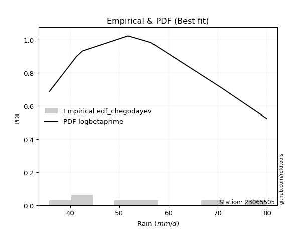</img>

</div>


### 6. EDF Blom (1958)

The Blom formula is a specific "plotting position" formula used in hydrology and statistical analysis to estimate the empirical cumulative probability (or non-exceedance probability) of a data series. It is particularly recommended for data that are approximately normally distributed. The constant _a_ is set to 0.375 (or 3/8).

<div align="center">


$P=(m-a)/(n+1-2a)$


</div>


**6.1. Empirical values**

<div align="center">

|                | 0                   | 1                   | 2                  | 3        | 4                  | 5                  | 6                  |
|:---------------|:--------------------|:--------------------|:-------------------|:---------|:-------------------|:-------------------|:-------------------|
| date           | 2020                | 2021                | 2015               | 2018     | 2019               | 2016               | 2017               |
| x              | 35.8                | 41.3                | 42.5               | 51.8     | 56.4               | 70.6               | 79.9               |
| m              | 1                   | 2                   | 3                  | 4        | 5                  | 6                  | 7                  |
| empirical_dist | edf_blom            | edf_blom            | edf_blom           | edf_blom | edf_blom           | edf_blom           | edf_blom           |
| empirical      | 0.08620689655172414 | 0.22413793103448276 | 0.3620689655172414 | 0.5      | 0.6379310344827587 | 0.7758620689655172 | 0.9137931034482759 |
| empirical_tr   | 1.0943396226415094  | 1.288888888888889   | 1.5675675675675675 | 2.0      | 2.7619047619047623 | 4.461538461538462  | 11.600000000000007 |

</div>


**6.2. Kolmogorov-Smirnov fit test (sorted by Δ)**


<div align="center">

|                | 0                   | 1                   | 2                   | 3                   | 4                   | 5                   | 6                   | 7                   | 8                   | 9                   | 10                  | 11                  | 12                  | 13                  | 14                  | 15                  | 16                  | 17                  | 18                  | 19                  | 20                  | 21                  | 22                  | 23                  | 24                  | 25                  | 26                  | 27                  | 28                  | 29                  | 30                  | 31                  | 32                  | 33                  | 34                  | 35                  | 36                  | 37                  | 38                  | 39                  | 40                  | 41                  | 42                  | 43                  | 44                  | 45                  | 46                  | 47                  | 48                  | 49                  | 50                  | 51                  | 52                  | 53                  | 54                  | 55                  | 56                  | 57                  | 58                  | 59                  | 60                  | 61                  | 62                  | 63                  | 64                  | 65                  | 66                  | 67                  | 68                  | 69                  | 70                  | 71                  | 72                  | 73                  | 74                  | 75                  | 76                  | 77                  | 78                  | 79                  | 80                  | 81                  | 82                  | 83                  | 84                  | 85                  | 86                  | 87                  | 88                  | 89                  | 90                  | 91                  | 92                  | 93                  | 94                  | 95                  | 96                  | 97                  | 98                  | 99                  | 100                 | 101                 | 102                 | 103                 | 104                 | 105                 | 106                 | 107                 | 108                 | 109                 | 110                 | 111                 | 112                 | 113                 | 114                 | 115                 | 116                 | 117                 | 118                 | 119                 | 120                 | 121                 | 122                 | 123                 | 124                 | 125                 | 126                 | 127                 | 128                 | 129                 | 130                 | 131                 | 132                 | 133                 | 134                 | 135                 | 136                 | 137                 | 138                 | 139                 | 140                 | 141                 | 142                 | 143                 | 144                 | 145                 | 146                 | 147                 | 148                 | 149                 | 150                 | 151                 | 152                 | 153                 | 154                 | 155                 | 156                 | 157                 | 158                 | 159                 |
|:---------------|:--------------------|:--------------------|:--------------------|:--------------------|:--------------------|:--------------------|:--------------------|:--------------------|:--------------------|:--------------------|:--------------------|:--------------------|:--------------------|:--------------------|:--------------------|:--------------------|:--------------------|:--------------------|:--------------------|:--------------------|:--------------------|:--------------------|:--------------------|:--------------------|:--------------------|:--------------------|:--------------------|:--------------------|:--------------------|:--------------------|:--------------------|:--------------------|:--------------------|:--------------------|:--------------------|:--------------------|:--------------------|:--------------------|:--------------------|:--------------------|:--------------------|:--------------------|:--------------------|:--------------------|:--------------------|:--------------------|:--------------------|:--------------------|:--------------------|:--------------------|:--------------------|:--------------------|:--------------------|:--------------------|:--------------------|:--------------------|:--------------------|:--------------------|:--------------------|:--------------------|:--------------------|:--------------------|:--------------------|:--------------------|:--------------------|:--------------------|:--------------------|:--------------------|:--------------------|:--------------------|:--------------------|:--------------------|:--------------------|:--------------------|:--------------------|:--------------------|:--------------------|:--------------------|:--------------------|:--------------------|:--------------------|:--------------------|:--------------------|:--------------------|:--------------------|:--------------------|:--------------------|:--------------------|:--------------------|:--------------------|:--------------------|:--------------------|:--------------------|:--------------------|:--------------------|:--------------------|:--------------------|:--------------------|:--------------------|:--------------------|:--------------------|:--------------------|:--------------------|:--------------------|:--------------------|:--------------------|:--------------------|:--------------------|:--------------------|:--------------------|:--------------------|:--------------------|:--------------------|:--------------------|:--------------------|:--------------------|:--------------------|:--------------------|:--------------------|:--------------------|:--------------------|:--------------------|:--------------------|:--------------------|:--------------------|:--------------------|:--------------------|:--------------------|:--------------------|:--------------------|:--------------------|:--------------------|:--------------------|:--------------------|:--------------------|:--------------------|:--------------------|:--------------------|:--------------------|:--------------------|:--------------------|:--------------------|:--------------------|:--------------------|:--------------------|:--------------------|:--------------------|:--------------------|:--------------------|:--------------------|:--------------------|:--------------------|:--------------------|:--------------------|:--------------------|:--------------------|:--------------------|:--------------------|:--------------------|:--------------------|
| station        | 23065505            | 23065505            | 23065505            | 23065505            | 23065505            | 23065505            | 23065505            | 23065505            | 23065505            | 23065505            | 23065505            | 23065505            | 23065505            | 23065505            | 23065505            | 23065505            | 23065505            | 23065505            | 23065505            | 23065505            | 23065505            | 23065505            | 23065505            | 23065505            | 23065505            | 23065505            | 23065505            | 23065505            | 23065505            | 23065505            | 23065505            | 23065505            | 23065505            | 23065505            | 23065505            | 23065505            | 23065505            | 23065505            | 23065505            | 23065505            | 23065505            | 23065505            | 23065505            | 23065505            | 23065505            | 23065505            | 23065505            | 23065505            | 23065505            | 23065505            | 23065505            | 23065505            | 23065505            | 23065505            | 23065505            | 23065505            | 23065505            | 23065505            | 23065505            | 23065505            | 23065505            | 23065505            | 23065505            | 23065505            | 23065505            | 23065505            | 23065505            | 23065505            | 23065505            | 23065505            | 23065505            | 23065505            | 23065505            | 23065505            | 23065505            | 23065505            | 23065505            | 23065505            | 23065505            | 23065505            | 23065505            | 23065505            | 23065505            | 23065505            | 23065505            | 23065505            | 23065505            | 23065505            | 23065505            | 23065505            | 23065505            | 23065505            | 23065505            | 23065505            | 23065505            | 23065505            | 23065505            | 23065505            | 23065505            | 23065505            | 23065505            | 23065505            | 23065505            | 23065505            | 23065505            | 23065505            | 23065505            | 23065505            | 23065505            | 23065505            | 23065505            | 23065505            | 23065505            | 23065505            | 23065505            | 23065505            | 23065505            | 23065505            | 23065505            | 23065505            | 23065505            | 23065505            | 23065505            | 23065505            | 23065505            | 23065505            | 23065505            | 23065505            | 23065505            | 23065505            | 23065505            | 23065505            | 23065505            | 23065505            | 23065505            | 23065505            | 23065505            | 23065505            | 23065505            | 23065505            | 23065505            | 23065505            | 23065505            | 23065505            | 23065505            | 23065505            | 23065505            | 23065505            | 23065505            | 23065505            | 23065505            | 23065505            | 23065505            | 23065505            | 23065505            | 23065505            | 23065505            | 23065505            | 23065505            | 23065505            |
| empirical_dist | edf_blom            | edf_blom            | edf_blom            | edf_blom            | edf_blom            | edf_blom            | edf_blom            | edf_blom            | edf_blom            | edf_blom            | edf_blom            | edf_blom            | edf_blom            | edf_blom            | edf_blom            | edf_blom            | edf_blom            | edf_blom            | edf_blom            | edf_blom            | edf_blom            | edf_blom            | edf_blom            | edf_blom            | edf_blom            | edf_blom            | edf_blom            | edf_blom            | edf_blom            | edf_blom            | edf_blom            | edf_blom            | edf_blom            | edf_blom            | edf_blom            | edf_blom            | edf_blom            | edf_blom            | edf_blom            | edf_blom            | edf_blom            | edf_blom            | edf_blom            | edf_blom            | edf_blom            | edf_blom            | edf_blom            | edf_blom            | edf_blom            | edf_blom            | edf_blom            | edf_blom            | edf_blom            | edf_blom            | edf_blom            | edf_blom            | edf_blom            | edf_blom            | edf_blom            | edf_blom            | edf_blom            | edf_blom            | edf_blom            | edf_blom            | edf_blom            | edf_blom            | edf_blom            | edf_blom            | edf_blom            | edf_blom            | edf_blom            | edf_blom            | edf_blom            | edf_blom            | edf_blom            | edf_blom            | edf_blom            | edf_blom            | edf_blom            | edf_blom            | edf_blom            | edf_blom            | edf_blom            | edf_blom            | edf_blom            | edf_blom            | edf_blom            | edf_blom            | edf_blom            | edf_blom            | edf_blom            | edf_blom            | edf_blom            | edf_blom            | edf_blom            | edf_blom            | edf_blom            | edf_blom            | edf_blom            | edf_blom            | edf_blom            | edf_blom            | edf_blom            | edf_blom            | edf_blom            | edf_blom            | edf_blom            | edf_blom            | edf_blom            | edf_blom            | edf_blom            | edf_blom            | edf_blom            | edf_blom            | edf_blom            | edf_blom            | edf_blom            | edf_blom            | edf_blom            | edf_blom            | edf_blom            | edf_blom            | edf_blom            | edf_blom            | edf_blom            | edf_blom            | edf_blom            | edf_blom            | edf_blom            | edf_blom            | edf_blom            | edf_blom            | edf_blom            | edf_blom            | edf_blom            | edf_blom            | edf_blom            | edf_blom            | edf_blom            | edf_blom            | edf_blom            | edf_blom            | edf_blom            | edf_blom            | edf_blom            | edf_blom            | edf_blom            | edf_blom            | edf_blom            | edf_blom            | edf_blom            | edf_blom            | edf_blom            | edf_blom            | edf_blom            | edf_blom            | edf_blom            | edf_blom            | edf_blom            | edf_blom            |
| p_dist         | logksone            | invgauss            | johnsonsu           | lomax               | exponnorm           | logbetaprime        | genexpon            | logbeta             | logarcsine          | logskewnorm         | loggausshyper       | loggenexpon         | loggompertz         | loghalfnorm         | logfatiguelife      | ksone               | logsemicircular     | logexponpow         | loginvgauss         | halfnorm            | semicircular        | logkstwobign        | foldnorm            | arcsine             | logburr             | f                   | invgamma            | loggenlogistic      | loganglit           | loginvweibull       | burr                | logmielke           | beta                | truncweibull_min    | lograyleigh         | logburr12           | exponpow            | invweibull          | logbradford         | loghalflogistic     | logfoldnorm         | anglit              | logf                | loginvgamma         | logweibull_min      | logmaxwell          | rayleigh            | weibull_min         | logwrapcauchy       | burr12              | logalpha            | alpha               | halflogistic        | maxwell             | nct                 | logweibull_max      | loggenextreme       | logkappa4           | lognct              | logncf              | logpearson3         | loggumbel_r         | logtruncweibull_min | logrice             | genlogistic         | pearson3            | logtruncexpon       | logexponnorm        | lognorm             | logcrystalball      | logt                | logloggamma         | logjohnsonsu        | logdweibull         | betaprime           | kstwobign           | bradford            | logmoyal            | skewnorm            | gumbel_r            | truncexpon          | norm                | truncnorm           | t                   | dweibull            | logtukeylambda      | logcosine           | logdgamma           | moyal               | loguniform          | wrapcauchy          | gompertz            | dgamma              | logvonmises_line    | logloglaplace       | loglogistic         | rice                | cosine              | logistic            | halfgennorm         | gausshyper          | logkappa3           | loggumbel_l         | kappa4              | loghypsecant        | logargus            | gumbel_l            | hypsecant           | logtriang           | loglaplace          | loglaplace          | argus               | logexponweib        | laplace             | logtruncnorm        | logrdist            | vonmises_line       | loggamma            | loggamma            | tukeylambda         | uniform             | kappa3              | loggenhalflogistic  | nakagami            | logerlang           | lognakagami         | genpareto           | logwald             | triang              | loglevy_l           | wald                | gennorm             | loggennorm          | levy_l              | logtrapezoid        | genhalflogistic     | loggengamma         | johnsonsb           | ncf                 | genextreme          | trapezoid           | logjohnsonsb        | loggenpareto        | rdist               | powerlaw            | gengamma            | gamma               | fatiguelife         | logpowerlaw         | exponweib           | weibull_max         | logtruncpareto      | erlang              | truncpareto         | crystalball         | loglomax            | loghalfgennorm      | logvonmises         | vonmises            | mielke              |
| delta          | 0.07731157087094681 | 0.08318928688321314 | 0.08451248868142014 | 0.0848766813053462  | 0.08573302130037552 | 0.08610715202845565 | 0.08620504184309825 | 0.08620689641854581 | 0.08620689655172409 | 0.08620689655172414 | 0.08666145537410086 | 0.08737081629141819 | 0.08852519842576911 | 0.08958479518351548 | 0.09072186493788564 | 0.09266451066713932 | 0.0937892897605675  | 0.09631886179598892 | 0.09675264383823412 | 0.09969657243468333 | 0.10034830937081862 | 0.10137431202753239 | 0.10163328578540393 | 0.10256417298597253 | 0.10453837520049347 | 0.10490690013092274 | 0.10491398704673233 | 0.10569448420875766 | 0.10605181490209636 | 0.10636408430457184 | 0.10641591550873586 | 0.10697656433781677 | 0.10724269863196656 | 0.107270393203583   | 0.1084773716591933  | 0.1085592647879442  | 0.10952176991490459 | 0.11004143831336632 | 0.11027789665994103 | 0.11046842983213312 | 0.11132248269471728 | 0.1126653976918146  | 0.11403627260846178 | 0.11403699885013582 | 0.11411220633403385 | 0.11602245864639665 | 0.11676934726634694 | 0.11696821072777625 | 0.12009427008728174 | 0.1203310657187513  | 0.12144784088059024 | 0.12172724345328789 | 0.12272791276290371 | 0.12384554036374953 | 0.12488523277117317 | 0.12721932250022192 | 0.12723166360687133 | 0.12753101353315832 | 0.12797170099846886 | 0.12827367746976165 | 0.12892725212242864 | 0.13005155801655408 | 0.13027102079757413 | 0.1307735981331773  | 0.13101425169290493 | 0.13181130012719725 | 0.13199914839237692 | 0.13394179655314467 | 0.134121148464997   | 0.1341212218127419  | 0.13412130551506202 | 0.13450541642071043 | 0.13516759264525685 | 0.13541097189878204 | 0.13584530393341823 | 0.1358829941363694  | 0.1367627822745055  | 0.13689278982044922 | 0.1388971207691274  | 0.1396639424066562  | 0.13999537281274804 | 0.14079068549557855 | 0.1407907275726282  | 0.14079985908106268 | 0.14110771983800208 | 0.14258035760293392 | 0.1459719986314822  | 0.14716217462929426 | 0.1482902594109406  | 0.14837912011214713 | 0.14892574683759963 | 0.15134320961895442 | 0.15169707985978187 | 0.15458185671088853 | 0.15565938491781323 | 0.15659218532311397 | 0.16126477292369773 | 0.16297109767520068 | 0.1631056241197091  | 0.1644490664276128  | 0.16559018816200266 | 0.1665331111495947  | 0.16798458404629618 | 0.16914501223569942 | 0.17070424377227547 | 0.17184037360651555 | 0.1728941844183738  | 0.17690961538491265 | 0.18583912696369406 | 0.18788030104685513 | 0.18788030104685513 | 0.19013717871343955 | 0.19313879275743118 | 0.1932786484606996  | 0.1998736611688373  | 0.2044292076596657  | 0.20510278208912794 | 0.2059142878374982  | 0.2059142878374982  | 0.20927314133291058 | 0.21014152787551799 | 0.21112536322800204 | 0.21655384086901136 | 0.21871524880825438 | 0.22126369890106456 | 0.22587324767457495 | 0.22926954813839323 | 0.2447296591904884  | 0.24636061773902507 | 0.26461090080261634 | 0.2676207311417249  | 0.27586206896551724 | 0.27586206896551724 | 0.2931159005731599  | 0.3297670200437178  | 0.33080334085997615 | 0.3460594348157907  | 0.3521963577800925  | 0.38278091193174185 | 0.4120939017500742  | 0.41458013159535867 | 0.414951197752529   | 0.41833631782990005 | 0.42294608904979797 | 0.4846868211148505  | 0.4931549429823786  | 0.49349486652548213 | 0.5016695190559313  | 0.5146873655302638  | 0.5278980476973567  | 0.5456149508014738  | 0.5535730981460966  | 0.571991934966335   | 0.6261640181274404  | 0.6523037724567042  | 0.6776297186261229  | 0.7758620689655172  | 1.0939468821474665  | 12.571729663335352  | nan                 |
| deltao         | 0.48442053926100004 | 0.48442053926100004 | 0.48442053926100004 | 0.48442053926100004 | 0.48442053926100004 | 0.48442053926100004 | 0.48442053926100004 | 0.48442053926100004 | 0.48442053926100004 | 0.48442053926100004 | 0.48442053926100004 | 0.48442053926100004 | 0.48442053926100004 | 0.48442053926100004 | 0.48442053926100004 | 0.48442053926100004 | 0.48442053926100004 | 0.48442053926100004 | 0.48442053926100004 | 0.48442053926100004 | 0.48442053926100004 | 0.48442053926100004 | 0.48442053926100004 | 0.48442053926100004 | 0.48442053926100004 | 0.48442053926100004 | 0.48442053926100004 | 0.48442053926100004 | 0.48442053926100004 | 0.48442053926100004 | 0.48442053926100004 | 0.48442053926100004 | 0.48442053926100004 | 0.48442053926100004 | 0.48442053926100004 | 0.48442053926100004 | 0.48442053926100004 | 0.48442053926100004 | 0.48442053926100004 | 0.48442053926100004 | 0.48442053926100004 | 0.48442053926100004 | 0.48442053926100004 | 0.48442053926100004 | 0.48442053926100004 | 0.48442053926100004 | 0.48442053926100004 | 0.48442053926100004 | 0.48442053926100004 | 0.48442053926100004 | 0.48442053926100004 | 0.48442053926100004 | 0.48442053926100004 | 0.48442053926100004 | 0.48442053926100004 | 0.48442053926100004 | 0.48442053926100004 | 0.48442053926100004 | 0.48442053926100004 | 0.48442053926100004 | 0.48442053926100004 | 0.48442053926100004 | 0.48442053926100004 | 0.48442053926100004 | 0.48442053926100004 | 0.48442053926100004 | 0.48442053926100004 | 0.48442053926100004 | 0.48442053926100004 | 0.48442053926100004 | 0.48442053926100004 | 0.48442053926100004 | 0.48442053926100004 | 0.48442053926100004 | 0.48442053926100004 | 0.48442053926100004 | 0.48442053926100004 | 0.48442053926100004 | 0.48442053926100004 | 0.48442053926100004 | 0.48442053926100004 | 0.48442053926100004 | 0.48442053926100004 | 0.48442053926100004 | 0.48442053926100004 | 0.48442053926100004 | 0.48442053926100004 | 0.48442053926100004 | 0.48442053926100004 | 0.48442053926100004 | 0.48442053926100004 | 0.48442053926100004 | 0.48442053926100004 | 0.48442053926100004 | 0.48442053926100004 | 0.48442053926100004 | 0.48442053926100004 | 0.48442053926100004 | 0.48442053926100004 | 0.48442053926100004 | 0.48442053926100004 | 0.48442053926100004 | 0.48442053926100004 | 0.48442053926100004 | 0.48442053926100004 | 0.48442053926100004 | 0.48442053926100004 | 0.48442053926100004 | 0.48442053926100004 | 0.48442053926100004 | 0.48442053926100004 | 0.48442053926100004 | 0.48442053926100004 | 0.48442053926100004 | 0.48442053926100004 | 0.48442053926100004 | 0.48442053926100004 | 0.48442053926100004 | 0.48442053926100004 | 0.48442053926100004 | 0.48442053926100004 | 0.48442053926100004 | 0.48442053926100004 | 0.48442053926100004 | 0.48442053926100004 | 0.48442053926100004 | 0.48442053926100004 | 0.48442053926100004 | 0.48442053926100004 | 0.48442053926100004 | 0.48442053926100004 | 0.48442053926100004 | 0.48442053926100004 | 0.48442053926100004 | 0.48442053926100004 | 0.48442053926100004 | 0.48442053926100004 | 0.48442053926100004 | 0.48442053926100004 | 0.48442053926100004 | 0.48442053926100004 | 0.48442053926100004 | 0.48442053926100004 | 0.48442053926100004 | 0.48442053926100004 | 0.48442053926100004 | 0.48442053926100004 | 0.48442053926100004 | 0.48442053926100004 | 0.48442053926100004 | 0.48442053926100004 | 0.48442053926100004 | 0.48442053926100004 | 0.48442053926100004 | 0.48442053926100004 | 0.48442053926100004 | 0.48442053926100004 | 0.48442053926100004 | 0.48442053926100004 | 0.48442053926100004 |
| eval           | Δo > Δ              | Δo > Δ              | Δo > Δ              | Δo > Δ              | Δo > Δ              | Δo > Δ              | Δo > Δ              | Δo > Δ              | Δo > Δ              | Δo > Δ              | Δo > Δ              | Δo > Δ              | Δo > Δ              | Δo > Δ              | Δo > Δ              | Δo > Δ              | Δo > Δ              | Δo > Δ              | Δo > Δ              | Δo > Δ              | Δo > Δ              | Δo > Δ              | Δo > Δ              | Δo > Δ              | Δo > Δ              | Δo > Δ              | Δo > Δ              | Δo > Δ              | Δo > Δ              | Δo > Δ              | Δo > Δ              | Δo > Δ              | Δo > Δ              | Δo > Δ              | Δo > Δ              | Δo > Δ              | Δo > Δ              | Δo > Δ              | Δo > Δ              | Δo > Δ              | Δo > Δ              | Δo > Δ              | Δo > Δ              | Δo > Δ              | Δo > Δ              | Δo > Δ              | Δo > Δ              | Δo > Δ              | Δo > Δ              | Δo > Δ              | Δo > Δ              | Δo > Δ              | Δo > Δ              | Δo > Δ              | Δo > Δ              | Δo > Δ              | Δo > Δ              | Δo > Δ              | Δo > Δ              | Δo > Δ              | Δo > Δ              | Δo > Δ              | Δo > Δ              | Δo > Δ              | Δo > Δ              | Δo > Δ              | Δo > Δ              | Δo > Δ              | Δo > Δ              | Δo > Δ              | Δo > Δ              | Δo > Δ              | Δo > Δ              | Δo > Δ              | Δo > Δ              | Δo > Δ              | Δo > Δ              | Δo > Δ              | Δo > Δ              | Δo > Δ              | Δo > Δ              | Δo > Δ              | Δo > Δ              | Δo > Δ              | Δo > Δ              | Δo > Δ              | Δo > Δ              | Δo > Δ              | Δo > Δ              | Δo > Δ              | Δo > Δ              | Δo > Δ              | Δo > Δ              | Δo > Δ              | Δo > Δ              | Δo > Δ              | Δo > Δ              | Δo > Δ              | Δo > Δ              | Δo > Δ              | Δo > Δ              | Δo > Δ              | Δo > Δ              | Δo > Δ              | Δo > Δ              | Δo > Δ              | Δo > Δ              | Δo > Δ              | Δo > Δ              | Δo > Δ              | Δo > Δ              | Δo > Δ              | Δo > Δ              | Δo > Δ              | Δo > Δ              | Δo > Δ              | Δo > Δ              | Δo > Δ              | Δo > Δ              | Δo > Δ              | Δo > Δ              | Δo > Δ              | Δo > Δ              | Δo > Δ              | Δo > Δ              | Δo > Δ              | Δo > Δ              | Δo > Δ              | Δo > Δ              | Δo > Δ              | Δo > Δ              | Δo > Δ              | Δo > Δ              | Δo > Δ              | Δo > Δ              | Δo > Δ              | Δo > Δ              | Δo > Δ              | Δo > Δ              | Δo > Δ              | Δo > Δ              | Δo > Δ              | Δo > Δ              | Δo > Δ              | Δo <= Δ             | Δo <= Δ             | Δo <= Δ             | Δo <= Δ             | Δo <= Δ             | Δo <= Δ             | Δo <= Δ             | Δo <= Δ             | Δo <= Δ             | Δo <= Δ             | Δo <= Δ             | Δo <= Δ             | Δo <= Δ             | Δo <= Δ             | Δo <= Δ             | Δo <= Δ             |
| fit            | 1                   | 1                   | 1                   | 1                   | 1                   | 1                   | 1                   | 1                   | 1                   | 1                   | 1                   | 1                   | 1                   | 1                   | 1                   | 1                   | 1                   | 1                   | 1                   | 1                   | 1                   | 1                   | 1                   | 1                   | 1                   | 1                   | 1                   | 1                   | 1                   | 1                   | 1                   | 1                   | 1                   | 1                   | 1                   | 1                   | 1                   | 1                   | 1                   | 1                   | 1                   | 1                   | 1                   | 1                   | 1                   | 1                   | 1                   | 1                   | 1                   | 1                   | 1                   | 1                   | 1                   | 1                   | 1                   | 1                   | 1                   | 1                   | 1                   | 1                   | 1                   | 1                   | 1                   | 1                   | 1                   | 1                   | 1                   | 1                   | 1                   | 1                   | 1                   | 1                   | 1                   | 1                   | 1                   | 1                   | 1                   | 1                   | 1                   | 1                   | 1                   | 1                   | 1                   | 1                   | 1                   | 1                   | 1                   | 1                   | 1                   | 1                   | 1                   | 1                   | 1                   | 1                   | 1                   | 1                   | 1                   | 1                   | 1                   | 1                   | 1                   | 1                   | 1                   | 1                   | 1                   | 1                   | 1                   | 1                   | 1                   | 1                   | 1                   | 1                   | 1                   | 1                   | 1                   | 1                   | 1                   | 1                   | 1                   | 1                   | 1                   | 1                   | 1                   | 1                   | 1                   | 1                   | 1                   | 1                   | 1                   | 1                   | 1                   | 1                   | 1                   | 1                   | 1                   | 1                   | 1                   | 1                   | 1                   | 1                   | 1                   | 1                   | 1                   | 1                   | 0                   | 0                   | 0                   | 0                   | 0                   | 0                   | 0                   | 0                   | 0                   | 0                   | 0                   | 0                   | 0                   | 0                   | 0                   | 0                   |
| n              | 7                   | 7                   | 7                   | 7                   | 7                   | 7                   | 7                   | 7                   | 7                   | 7                   | 7                   | 7                   | 7                   | 7                   | 7                   | 7                   | 7                   | 7                   | 7                   | 7                   | 7                   | 7                   | 7                   | 7                   | 7                   | 7                   | 7                   | 7                   | 7                   | 7                   | 7                   | 7                   | 7                   | 7                   | 7                   | 7                   | 7                   | 7                   | 7                   | 7                   | 7                   | 7                   | 7                   | 7                   | 7                   | 7                   | 7                   | 7                   | 7                   | 7                   | 7                   | 7                   | 7                   | 7                   | 7                   | 7                   | 7                   | 7                   | 7                   | 7                   | 7                   | 7                   | 7                   | 7                   | 7                   | 7                   | 7                   | 7                   | 7                   | 7                   | 7                   | 7                   | 7                   | 7                   | 7                   | 7                   | 7                   | 7                   | 7                   | 7                   | 7                   | 7                   | 7                   | 7                   | 7                   | 7                   | 7                   | 7                   | 7                   | 7                   | 7                   | 7                   | 7                   | 7                   | 7                   | 7                   | 7                   | 7                   | 7                   | 7                   | 7                   | 7                   | 7                   | 7                   | 7                   | 7                   | 7                   | 7                   | 7                   | 7                   | 7                   | 7                   | 7                   | 7                   | 7                   | 7                   | 7                   | 7                   | 7                   | 7                   | 7                   | 7                   | 7                   | 7                   | 7                   | 7                   | 7                   | 7                   | 7                   | 7                   | 7                   | 7                   | 7                   | 7                   | 7                   | 7                   | 7                   | 7                   | 7                   | 7                   | 7                   | 7                   | 7                   | 7                   | 7                   | 7                   | 7                   | 7                   | 7                   | 7                   | 7                   | 7                   | 7                   | 7                   | 7                   | 7                   | 7                   | 7                   | 7                   | 7                   |
| best_fit       | 1                   | 0                   | 0                   | 0                   | 0                   | 0                   | 0                   | 0                   | 0                   | 0                   | 0                   | 0                   | 0                   | 0                   | 0                   | 0                   | 0                   | 0                   | 0                   | 0                   | 0                   | 0                   | 0                   | 0                   | 0                   | 0                   | 0                   | 0                   | 0                   | 0                   | 0                   | 0                   | 0                   | 0                   | 0                   | 0                   | 0                   | 0                   | 0                   | 0                   | 0                   | 0                   | 0                   | 0                   | 0                   | 0                   | 0                   | 0                   | 0                   | 0                   | 0                   | 0                   | 0                   | 0                   | 0                   | 0                   | 0                   | 0                   | 0                   | 0                   | 0                   | 0                   | 0                   | 0                   | 0                   | 0                   | 0                   | 0                   | 0                   | 0                   | 0                   | 0                   | 0                   | 0                   | 0                   | 0                   | 0                   | 0                   | 0                   | 0                   | 0                   | 0                   | 0                   | 0                   | 0                   | 0                   | 0                   | 0                   | 0                   | 0                   | 0                   | 0                   | 0                   | 0                   | 0                   | 0                   | 0                   | 0                   | 0                   | 0                   | 0                   | 0                   | 0                   | 0                   | 0                   | 0                   | 0                   | 0                   | 0                   | 0                   | 0                   | 0                   | 0                   | 0                   | 0                   | 0                   | 0                   | 0                   | 0                   | 0                   | 0                   | 0                   | 0                   | 0                   | 0                   | 0                   | 0                   | 0                   | 0                   | 0                   | 0                   | 0                   | 0                   | 0                   | 0                   | 0                   | 0                   | 0                   | 0                   | 0                   | 0                   | 0                   | 0                   | 0                   | 0                   | 0                   | 0                   | 0                   | 0                   | 0                   | 0                   | 0                   | 0                   | 0                   | 0                   | 0                   | 0                   | 0                   | 0                   | 0                   |
| best_fit_sort  | 1                   | 2                   | 3                   | 4                   | 5                   | 6                   | 7                   | 8                   | 9                   | 10                  | 11                  | 12                  | 13                  | 14                  | 15                  | 16                  | 17                  | 18                  | 19                  | 20                  | 21                  | 22                  | 23                  | 24                  | 25                  | 26                  | 27                  | 28                  | 29                  | 30                  | 31                  | 32                  | 33                  | 34                  | 35                  | 36                  | 37                  | 38                  | 39                  | 40                  | 41                  | 42                  | 43                  | 44                  | 45                  | 46                  | 47                  | 48                  | 49                  | 50                  | 51                  | 52                  | 53                  | 54                  | 55                  | 56                  | 57                  | 58                  | 59                  | 60                  | 61                  | 62                  | 63                  | 64                  | 65                  | 66                  | 67                  | 68                  | 69                  | 70                  | 71                  | 72                  | 73                  | 74                  | 75                  | 76                  | 77                  | 78                  | 79                  | 80                  | 81                  | 82                  | 83                  | 84                  | 85                  | 86                  | 87                  | 88                  | 89                  | 90                  | 91                  | 92                  | 93                  | 94                  | 95                  | 96                  | 97                  | 98                  | 99                  | 100                 | 101                 | 102                 | 103                 | 104                 | 105                 | 106                 | 107                 | 108                 | 109                 | 110                 | 111                 | 112                 | 113                 | 114                 | 115                 | 116                 | 117                 | 118                 | 119                 | 120                 | 121                 | 122                 | 123                 | 124                 | 125                 | 126                 | 127                 | 128                 | 129                 | 130                 | 131                 | 132                 | 133                 | 134                 | 135                 | 136                 | 137                 | 138                 | 139                 | 140                 | 141                 | 142                 | 143                 | 144                 | 145                 | 146                 | 147                 | 148                 | 149                 | 150                 | 151                 | 152                 | 153                 | 154                 | 155                 | 156                 | 157                 | 158                 | 159                 | 160                 |

</div>


**6.3. Best fit**

<div align="center">

|   id |   station | empirical_dist   | p_dist   |     delta |   deltao | eval   |   fit |   n |   best_fit |   best_fit_sort |
|-----:|----------:|:-----------------|:---------|----------:|---------:|:-------|------:|----:|-----------:|----------------:|
|    0 |  23065505 | edf_blom         | logksone | 0.0773116 | 0.484421 | Δo > Δ |     1 |   7 |          1 |               1 |

</div>


<div align="center">

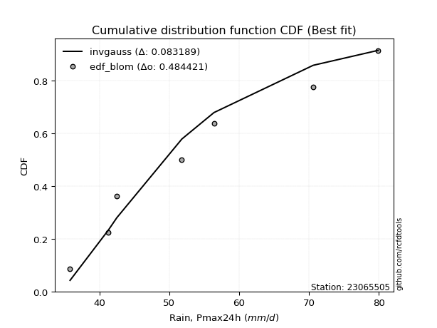</img>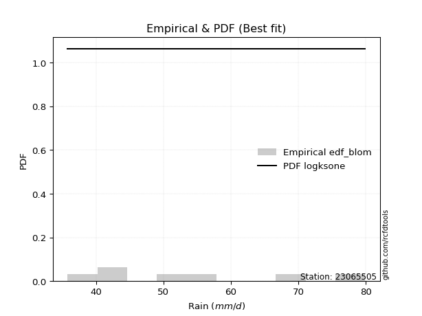</img>

</div>


### 7. EDF Tukey (1962)

In hydrology, the Tukey formula is used as a plotting position formula to estimate the empirical probability or frequency of a flood event (or other hydrological data). The formula parameter is given as _c=0.333_ (or 1/3).

<div align="center">


$P=(m-c)/(n+1-2c)$


</div>


**7.1. Empirical values**

<div align="center">

|                | 0                   | 1                   | 2                   | 3         | 4                  | 5                  | 6                  |
|:---------------|:--------------------|:--------------------|:--------------------|:----------|:-------------------|:-------------------|:-------------------|
| date           | 2020                | 2021                | 2015                | 2018      | 2019               | 2016               | 2017               |
| x              | 35.8                | 41.3                | 42.5                | 51.8      | 56.4               | 70.6               | 79.9               |
| m              | 1                   | 2                   | 3                   | 4         | 5                  | 6                  | 7                  |
| empirical_dist | edf_tukey           | edf_tukey           | edf_tukey           | edf_tukey | edf_tukey          | edf_tukey          | edf_tukey          |
| empirical      | 0.09090909090909091 | 0.22727272727272727 | 0.36363636363636365 | 0.5       | 0.6363636363636364 | 0.7727272727272727 | 0.9090909090909091 |
| empirical_tr   | 1.1                 | 1.2941176470588236  | 1.5714285714285714  | 2.0       | 2.75               | 4.3999999999999995 | 10.999999999999996 |

</div>


**7.2. Kolmogorov-Smirnov fit test (sorted by Δ)**


<div align="center">

|                | 0                   | 1                   | 2                   | 3                   | 4                   | 5                   | 6                   | 7                   | 8                   | 9                   | 10                  | 11                  | 12                  | 13                  | 14                  | 15                  | 16                  | 17                  | 18                  | 19                  | 20                  | 21                  | 22                  | 23                  | 24                  | 25                  | 26                  | 27                  | 28                  | 29                  | 30                  | 31                  | 32                  | 33                  | 34                  | 35                  | 36                  | 37                  | 38                  | 39                  | 40                  | 41                  | 42                  | 43                  | 44                  | 45                  | 46                  | 47                  | 48                  | 49                  | 50                  | 51                  | 52                  | 53                  | 54                  | 55                  | 56                  | 57                  | 58                  | 59                  | 60                  | 61                  | 62                  | 63                  | 64                  | 65                  | 66                  | 67                  | 68                  | 69                  | 70                  | 71                  | 72                  | 73                  | 74                  | 75                  | 76                  | 77                  | 78                  | 79                  | 80                  | 81                  | 82                  | 83                  | 84                  | 85                  | 86                  | 87                  | 88                  | 89                  | 90                  | 91                  | 92                  | 93                  | 94                  | 95                  | 96                  | 97                  | 98                  | 99                  | 100                 | 101                 | 102                 | 103                 | 104                 | 105                 | 106                 | 107                 | 108                 | 109                 | 110                 | 111                 | 112                 | 113                 | 114                 | 115                 | 116                 | 117                 | 118                 | 119                 | 120                 | 121                 | 122                 | 123                 | 124                 | 125                 | 126                 | 127                 | 128                 | 129                 | 130                 | 131                 | 132                 | 133                 | 134                 | 135                 | 136                 | 137                 | 138                 | 139                 | 140                 | 141                 | 142                 | 143                 | 144                 | 145                 | 146                 | 147                 | 148                 | 149                 | 150                 | 151                 | 152                 | 153                 | 154                 | 155                 | 156                 | 157                 | 158                 | 159                 |
|:---------------|:--------------------|:--------------------|:--------------------|:--------------------|:--------------------|:--------------------|:--------------------|:--------------------|:--------------------|:--------------------|:--------------------|:--------------------|:--------------------|:--------------------|:--------------------|:--------------------|:--------------------|:--------------------|:--------------------|:--------------------|:--------------------|:--------------------|:--------------------|:--------------------|:--------------------|:--------------------|:--------------------|:--------------------|:--------------------|:--------------------|:--------------------|:--------------------|:--------------------|:--------------------|:--------------------|:--------------------|:--------------------|:--------------------|:--------------------|:--------------------|:--------------------|:--------------------|:--------------------|:--------------------|:--------------------|:--------------------|:--------------------|:--------------------|:--------------------|:--------------------|:--------------------|:--------------------|:--------------------|:--------------------|:--------------------|:--------------------|:--------------------|:--------------------|:--------------------|:--------------------|:--------------------|:--------------------|:--------------------|:--------------------|:--------------------|:--------------------|:--------------------|:--------------------|:--------------------|:--------------------|:--------------------|:--------------------|:--------------------|:--------------------|:--------------------|:--------------------|:--------------------|:--------------------|:--------------------|:--------------------|:--------------------|:--------------------|:--------------------|:--------------------|:--------------------|:--------------------|:--------------------|:--------------------|:--------------------|:--------------------|:--------------------|:--------------------|:--------------------|:--------------------|:--------------------|:--------------------|:--------------------|:--------------------|:--------------------|:--------------------|:--------------------|:--------------------|:--------------------|:--------------------|:--------------------|:--------------------|:--------------------|:--------------------|:--------------------|:--------------------|:--------------------|:--------------------|:--------------------|:--------------------|:--------------------|:--------------------|:--------------------|:--------------------|:--------------------|:--------------------|:--------------------|:--------------------|:--------------------|:--------------------|:--------------------|:--------------------|:--------------------|:--------------------|:--------------------|:--------------------|:--------------------|:--------------------|:--------------------|:--------------------|:--------------------|:--------------------|:--------------------|:--------------------|:--------------------|:--------------------|:--------------------|:--------------------|:--------------------|:--------------------|:--------------------|:--------------------|:--------------------|:--------------------|:--------------------|:--------------------|:--------------------|:--------------------|:--------------------|:--------------------|:--------------------|:--------------------|:--------------------|:--------------------|:--------------------|:--------------------|
| station        | 23065505            | 23065505            | 23065505            | 23065505            | 23065505            | 23065505            | 23065505            | 23065505            | 23065505            | 23065505            | 23065505            | 23065505            | 23065505            | 23065505            | 23065505            | 23065505            | 23065505            | 23065505            | 23065505            | 23065505            | 23065505            | 23065505            | 23065505            | 23065505            | 23065505            | 23065505            | 23065505            | 23065505            | 23065505            | 23065505            | 23065505            | 23065505            | 23065505            | 23065505            | 23065505            | 23065505            | 23065505            | 23065505            | 23065505            | 23065505            | 23065505            | 23065505            | 23065505            | 23065505            | 23065505            | 23065505            | 23065505            | 23065505            | 23065505            | 23065505            | 23065505            | 23065505            | 23065505            | 23065505            | 23065505            | 23065505            | 23065505            | 23065505            | 23065505            | 23065505            | 23065505            | 23065505            | 23065505            | 23065505            | 23065505            | 23065505            | 23065505            | 23065505            | 23065505            | 23065505            | 23065505            | 23065505            | 23065505            | 23065505            | 23065505            | 23065505            | 23065505            | 23065505            | 23065505            | 23065505            | 23065505            | 23065505            | 23065505            | 23065505            | 23065505            | 23065505            | 23065505            | 23065505            | 23065505            | 23065505            | 23065505            | 23065505            | 23065505            | 23065505            | 23065505            | 23065505            | 23065505            | 23065505            | 23065505            | 23065505            | 23065505            | 23065505            | 23065505            | 23065505            | 23065505            | 23065505            | 23065505            | 23065505            | 23065505            | 23065505            | 23065505            | 23065505            | 23065505            | 23065505            | 23065505            | 23065505            | 23065505            | 23065505            | 23065505            | 23065505            | 23065505            | 23065505            | 23065505            | 23065505            | 23065505            | 23065505            | 23065505            | 23065505            | 23065505            | 23065505            | 23065505            | 23065505            | 23065505            | 23065505            | 23065505            | 23065505            | 23065505            | 23065505            | 23065505            | 23065505            | 23065505            | 23065505            | 23065505            | 23065505            | 23065505            | 23065505            | 23065505            | 23065505            | 23065505            | 23065505            | 23065505            | 23065505            | 23065505            | 23065505            | 23065505            | 23065505            | 23065505            | 23065505            | 23065505            | 23065505            |
| empirical_dist | edf_tukey           | edf_tukey           | edf_tukey           | edf_tukey           | edf_tukey           | edf_tukey           | edf_tukey           | edf_tukey           | edf_tukey           | edf_tukey           | edf_tukey           | edf_tukey           | edf_tukey           | edf_tukey           | edf_tukey           | edf_tukey           | edf_tukey           | edf_tukey           | edf_tukey           | edf_tukey           | edf_tukey           | edf_tukey           | edf_tukey           | edf_tukey           | edf_tukey           | edf_tukey           | edf_tukey           | edf_tukey           | edf_tukey           | edf_tukey           | edf_tukey           | edf_tukey           | edf_tukey           | edf_tukey           | edf_tukey           | edf_tukey           | edf_tukey           | edf_tukey           | edf_tukey           | edf_tukey           | edf_tukey           | edf_tukey           | edf_tukey           | edf_tukey           | edf_tukey           | edf_tukey           | edf_tukey           | edf_tukey           | edf_tukey           | edf_tukey           | edf_tukey           | edf_tukey           | edf_tukey           | edf_tukey           | edf_tukey           | edf_tukey           | edf_tukey           | edf_tukey           | edf_tukey           | edf_tukey           | edf_tukey           | edf_tukey           | edf_tukey           | edf_tukey           | edf_tukey           | edf_tukey           | edf_tukey           | edf_tukey           | edf_tukey           | edf_tukey           | edf_tukey           | edf_tukey           | edf_tukey           | edf_tukey           | edf_tukey           | edf_tukey           | edf_tukey           | edf_tukey           | edf_tukey           | edf_tukey           | edf_tukey           | edf_tukey           | edf_tukey           | edf_tukey           | edf_tukey           | edf_tukey           | edf_tukey           | edf_tukey           | edf_tukey           | edf_tukey           | edf_tukey           | edf_tukey           | edf_tukey           | edf_tukey           | edf_tukey           | edf_tukey           | edf_tukey           | edf_tukey           | edf_tukey           | edf_tukey           | edf_tukey           | edf_tukey           | edf_tukey           | edf_tukey           | edf_tukey           | edf_tukey           | edf_tukey           | edf_tukey           | edf_tukey           | edf_tukey           | edf_tukey           | edf_tukey           | edf_tukey           | edf_tukey           | edf_tukey           | edf_tukey           | edf_tukey           | edf_tukey           | edf_tukey           | edf_tukey           | edf_tukey           | edf_tukey           | edf_tukey           | edf_tukey           | edf_tukey           | edf_tukey           | edf_tukey           | edf_tukey           | edf_tukey           | edf_tukey           | edf_tukey           | edf_tukey           | edf_tukey           | edf_tukey           | edf_tukey           | edf_tukey           | edf_tukey           | edf_tukey           | edf_tukey           | edf_tukey           | edf_tukey           | edf_tukey           | edf_tukey           | edf_tukey           | edf_tukey           | edf_tukey           | edf_tukey           | edf_tukey           | edf_tukey           | edf_tukey           | edf_tukey           | edf_tukey           | edf_tukey           | edf_tukey           | edf_tukey           | edf_tukey           | edf_tukey           | edf_tukey           | edf_tukey           | edf_tukey           |
| p_dist         | logksone            | logbetaprime        | johnsonsu           | invgauss            | lomax               | exponnorm           | genexpon            | loggompertz         | loggenexpon         | logbeta             | logskewnorm         | logarcsine          | loggausshyper       | ksone               | loghalfnorm         | logexponpow         | logfatiguelife      | logsemicircular     | loginvgauss         | arcsine             | halfnorm            | semicircular        | logkstwobign        | foldnorm            | beta                | logburr             | f                   | invgamma            | loggenlogistic      | loganglit           | loginvweibull       | burr                | logmielke           | logburr12           | lograyleigh         | truncweibull_min    | exponpow            | invweibull          | loghalflogistic     | logfoldnorm         | logbradford         | weibull_min         | logweibull_min      | anglit              | logf                | loginvgamma         | logwrapcauchy       | logmaxwell          | rayleigh            | burr12              | logalpha            | alpha               | halflogistic        | maxwell             | nct                 | logweibull_max      | loggenextreme       | logkappa4           | lognct              | logncf              | logpearson3         | loggumbel_r         | logrice             | genlogistic         | pearson3            | logtruncweibull_min | logtruncexpon       | logexponnorm        | lognorm             | logcrystalball      | logt                | logloggamma         | logjohnsonsu        | betaprime           | kstwobign           | bradford            | logmoyal            | logdweibull         | skewnorm            | gumbel_r            | truncexpon          | norm                | truncnorm           | t                   | logtukeylambda      | dweibull            | wrapcauchy          | logcosine           | moyal               | loguniform          | logdgamma           | gompertz            | dgamma              | logvonmises_line    | logloglaplace       | loglogistic         | halfgennorm         | rice                | cosine              | logistic            | gausshyper          | logkappa3           | loggumbel_l         | kappa4              | loghypsecant        | logargus            | gumbel_l            | hypsecant           | logtriang           | loglaplace          | loglaplace          | argus               | logexponweib        | laplace             | logrdist            | logtruncnorm        | loggamma            | loggamma            | vonmises_line       | tukeylambda         | uniform             | kappa3              | loggenhalflogistic  | nakagami            | logerlang           | lognakagami         | genpareto           | triang              | logwald             | loglevy_l           | wald                | gennorm             | loggennorm          | levy_l              | logtrapezoid        | genhalflogistic     | loggengamma         | johnsonsb           | ncf                 | genextreme          | logjohnsonsb        | trapezoid           | loggenpareto        | rdist               | powerlaw            | gengamma            | gamma               | fatiguelife         | logpowerlaw         | exponweib           | weibull_max         | logtruncpareto      | erlang              | truncpareto         | crystalball         | loglomax            | loghalfgennorm      | logvonmises         | vonmises            | mielke              |
| delta          | 0.07887896899006908 | 0.08140495767108888 | 0.0860798868005424  | 0.08632408312145767 | 0.08793124158842251 | 0.0896359821769088  | 0.09090723620046502 | 0.09090907323660143 | 0.09090909062327646 | 0.09090909077591258 | 0.09090909090909091 | 0.09090909090909094 | 0.09090909092576138 | 0.091097112548017   | 0.09115219330263774 | 0.09161666743862207 | 0.09228926305700791 | 0.09535668787968976 | 0.09832004195735639 | 0.10099677486685021 | 0.1012639705538056  | 0.10191570748994089 | 0.10294171014665465 | 0.10320068390452619 | 0.10410790239372206 | 0.10610577331961574 | 0.10647429825004501 | 0.10648138516585459 | 0.10726188232787992 | 0.10761921302121863 | 0.1079314824236941  | 0.10798331362785812 | 0.10854396245693904 | 0.1085592647879442  | 0.11004476977831557 | 0.11040518944182753 | 0.11108916803402685 | 0.11160883643248859 | 0.11203582795125538 | 0.11288988081383955 | 0.11341269289818556 | 0.11383341448953174 | 0.11411220633403385 | 0.11423279581093687 | 0.11560367072758404 | 0.11560439696925809 | 0.11695947384903724 | 0.11758985676551892 | 0.1183367453854692  | 0.1203310657187513  | 0.1230152389997125  | 0.12329464157241016 | 0.12429531088202597 | 0.1254129384828718  | 0.12645263089029543 | 0.12878672061934418 | 0.1287990617259936  | 0.1290984116522806  | 0.12953909911759112 | 0.12984107558888391 | 0.1304946502415509  | 0.13161895613567634 | 0.13234099625229956 | 0.1325816498120272  | 0.1333786982463195  | 0.13340581703581866 | 0.13513394463062145 | 0.13550919467226694 | 0.13568854658411927 | 0.13568861993186415 | 0.13568870363418428 | 0.1360728145398327  | 0.13673499076437912 | 0.1374127020525405  | 0.13745039225549166 | 0.13833018039362777 | 0.1384601879395715  | 0.13854576813702657 | 0.14046451888824968 | 0.14123134052577846 | 0.1415627709318703  | 0.14235808361470081 | 0.14235812569175046 | 0.14236725720018495 | 0.14414775572205618 | 0.1442425160762466  | 0.1473583487184773  | 0.14753939675060446 | 0.14985765753006286 | 0.1499465182312694  | 0.1502969708675388  | 0.1529106077380767  | 0.1548318760980264  | 0.1561492548300108  | 0.1572267830369355  | 0.15815958344223624 | 0.1613142701893683  | 0.16283217104282    | 0.16453849579432295 | 0.16467302223883137 | 0.16715758628112493 | 0.16810050926871697 | 0.16955198216541845 | 0.17071241035482168 | 0.17227164189139774 | 0.17340777172563782 | 0.17446158253749605 | 0.17847701350403491 | 0.18740652508281633 | 0.1894476991659774  | 0.1894476991659774  | 0.1917045768325618  | 0.19313879275743118 | 0.19484604657982185 | 0.19972701330229894 | 0.1998736611688373  | 0.2059142878374982  | 0.2059142878374982  | 0.2066701802082502  | 0.21084053945203285 | 0.21170892599464025 | 0.2126927613471243  | 0.21498644274988904 | 0.21558045257000988 | 0.22126369890106456 | 0.22273845143633045 | 0.22456735378102646 | 0.24479321961990275 | 0.24629705730961066 | 0.25990870644524955 | 0.2691881292608472  | 0.2727272727272727  | 0.2727272727272727  | 0.2884137062157931  | 0.32819962192459545 | 0.3292359427408538  | 0.3429246385775462  | 0.349061561541848   | 0.37807871757437506 | 0.4089591055118297  | 0.41181640151428445 | 0.41301273347623635 | 0.41363412347253325 | 0.4182438946924312  | 0.481552024876606   | 0.4900201467441341  | 0.4903600702872376  | 0.49853472281768674 | 0.5115525692920193  | 0.5247632514591122  | 0.5424801545632294  | 0.550438301907852   | 0.5688571387280905  | 0.6230292218891959  | 0.6476015780993374  | 0.672927524268756   | 0.7727272727272727  | 1.0970816783857111  | 12.57643185769272   | nan                 |
| deltao         | 0.48442053926100004 | 0.48442053926100004 | 0.48442053926100004 | 0.48442053926100004 | 0.48442053926100004 | 0.48442053926100004 | 0.48442053926100004 | 0.48442053926100004 | 0.48442053926100004 | 0.48442053926100004 | 0.48442053926100004 | 0.48442053926100004 | 0.48442053926100004 | 0.48442053926100004 | 0.48442053926100004 | 0.48442053926100004 | 0.48442053926100004 | 0.48442053926100004 | 0.48442053926100004 | 0.48442053926100004 | 0.48442053926100004 | 0.48442053926100004 | 0.48442053926100004 | 0.48442053926100004 | 0.48442053926100004 | 0.48442053926100004 | 0.48442053926100004 | 0.48442053926100004 | 0.48442053926100004 | 0.48442053926100004 | 0.48442053926100004 | 0.48442053926100004 | 0.48442053926100004 | 0.48442053926100004 | 0.48442053926100004 | 0.48442053926100004 | 0.48442053926100004 | 0.48442053926100004 | 0.48442053926100004 | 0.48442053926100004 | 0.48442053926100004 | 0.48442053926100004 | 0.48442053926100004 | 0.48442053926100004 | 0.48442053926100004 | 0.48442053926100004 | 0.48442053926100004 | 0.48442053926100004 | 0.48442053926100004 | 0.48442053926100004 | 0.48442053926100004 | 0.48442053926100004 | 0.48442053926100004 | 0.48442053926100004 | 0.48442053926100004 | 0.48442053926100004 | 0.48442053926100004 | 0.48442053926100004 | 0.48442053926100004 | 0.48442053926100004 | 0.48442053926100004 | 0.48442053926100004 | 0.48442053926100004 | 0.48442053926100004 | 0.48442053926100004 | 0.48442053926100004 | 0.48442053926100004 | 0.48442053926100004 | 0.48442053926100004 | 0.48442053926100004 | 0.48442053926100004 | 0.48442053926100004 | 0.48442053926100004 | 0.48442053926100004 | 0.48442053926100004 | 0.48442053926100004 | 0.48442053926100004 | 0.48442053926100004 | 0.48442053926100004 | 0.48442053926100004 | 0.48442053926100004 | 0.48442053926100004 | 0.48442053926100004 | 0.48442053926100004 | 0.48442053926100004 | 0.48442053926100004 | 0.48442053926100004 | 0.48442053926100004 | 0.48442053926100004 | 0.48442053926100004 | 0.48442053926100004 | 0.48442053926100004 | 0.48442053926100004 | 0.48442053926100004 | 0.48442053926100004 | 0.48442053926100004 | 0.48442053926100004 | 0.48442053926100004 | 0.48442053926100004 | 0.48442053926100004 | 0.48442053926100004 | 0.48442053926100004 | 0.48442053926100004 | 0.48442053926100004 | 0.48442053926100004 | 0.48442053926100004 | 0.48442053926100004 | 0.48442053926100004 | 0.48442053926100004 | 0.48442053926100004 | 0.48442053926100004 | 0.48442053926100004 | 0.48442053926100004 | 0.48442053926100004 | 0.48442053926100004 | 0.48442053926100004 | 0.48442053926100004 | 0.48442053926100004 | 0.48442053926100004 | 0.48442053926100004 | 0.48442053926100004 | 0.48442053926100004 | 0.48442053926100004 | 0.48442053926100004 | 0.48442053926100004 | 0.48442053926100004 | 0.48442053926100004 | 0.48442053926100004 | 0.48442053926100004 | 0.48442053926100004 | 0.48442053926100004 | 0.48442053926100004 | 0.48442053926100004 | 0.48442053926100004 | 0.48442053926100004 | 0.48442053926100004 | 0.48442053926100004 | 0.48442053926100004 | 0.48442053926100004 | 0.48442053926100004 | 0.48442053926100004 | 0.48442053926100004 | 0.48442053926100004 | 0.48442053926100004 | 0.48442053926100004 | 0.48442053926100004 | 0.48442053926100004 | 0.48442053926100004 | 0.48442053926100004 | 0.48442053926100004 | 0.48442053926100004 | 0.48442053926100004 | 0.48442053926100004 | 0.48442053926100004 | 0.48442053926100004 | 0.48442053926100004 | 0.48442053926100004 | 0.48442053926100004 | 0.48442053926100004 | 0.48442053926100004 |
| eval           | Δo > Δ              | Δo > Δ              | Δo > Δ              | Δo > Δ              | Δo > Δ              | Δo > Δ              | Δo > Δ              | Δo > Δ              | Δo > Δ              | Δo > Δ              | Δo > Δ              | Δo > Δ              | Δo > Δ              | Δo > Δ              | Δo > Δ              | Δo > Δ              | Δo > Δ              | Δo > Δ              | Δo > Δ              | Δo > Δ              | Δo > Δ              | Δo > Δ              | Δo > Δ              | Δo > Δ              | Δo > Δ              | Δo > Δ              | Δo > Δ              | Δo > Δ              | Δo > Δ              | Δo > Δ              | Δo > Δ              | Δo > Δ              | Δo > Δ              | Δo > Δ              | Δo > Δ              | Δo > Δ              | Δo > Δ              | Δo > Δ              | Δo > Δ              | Δo > Δ              | Δo > Δ              | Δo > Δ              | Δo > Δ              | Δo > Δ              | Δo > Δ              | Δo > Δ              | Δo > Δ              | Δo > Δ              | Δo > Δ              | Δo > Δ              | Δo > Δ              | Δo > Δ              | Δo > Δ              | Δo > Δ              | Δo > Δ              | Δo > Δ              | Δo > Δ              | Δo > Δ              | Δo > Δ              | Δo > Δ              | Δo > Δ              | Δo > Δ              | Δo > Δ              | Δo > Δ              | Δo > Δ              | Δo > Δ              | Δo > Δ              | Δo > Δ              | Δo > Δ              | Δo > Δ              | Δo > Δ              | Δo > Δ              | Δo > Δ              | Δo > Δ              | Δo > Δ              | Δo > Δ              | Δo > Δ              | Δo > Δ              | Δo > Δ              | Δo > Δ              | Δo > Δ              | Δo > Δ              | Δo > Δ              | Δo > Δ              | Δo > Δ              | Δo > Δ              | Δo > Δ              | Δo > Δ              | Δo > Δ              | Δo > Δ              | Δo > Δ              | Δo > Δ              | Δo > Δ              | Δo > Δ              | Δo > Δ              | Δo > Δ              | Δo > Δ              | Δo > Δ              | Δo > Δ              | Δo > Δ              | Δo > Δ              | Δo > Δ              | Δo > Δ              | Δo > Δ              | Δo > Δ              | Δo > Δ              | Δo > Δ              | Δo > Δ              | Δo > Δ              | Δo > Δ              | Δo > Δ              | Δo > Δ              | Δo > Δ              | Δo > Δ              | Δo > Δ              | Δo > Δ              | Δo > Δ              | Δo > Δ              | Δo > Δ              | Δo > Δ              | Δo > Δ              | Δo > Δ              | Δo > Δ              | Δo > Δ              | Δo > Δ              | Δo > Δ              | Δo > Δ              | Δo > Δ              | Δo > Δ              | Δo > Δ              | Δo > Δ              | Δo > Δ              | Δo > Δ              | Δo > Δ              | Δo > Δ              | Δo > Δ              | Δo > Δ              | Δo > Δ              | Δo > Δ              | Δo > Δ              | Δo > Δ              | Δo > Δ              | Δo > Δ              | Δo > Δ              | Δo > Δ              | Δo <= Δ             | Δo <= Δ             | Δo <= Δ             | Δo <= Δ             | Δo <= Δ             | Δo <= Δ             | Δo <= Δ             | Δo <= Δ             | Δo <= Δ             | Δo <= Δ             | Δo <= Δ             | Δo <= Δ             | Δo <= Δ             | Δo <= Δ             | Δo <= Δ             |
| fit            | 1                   | 1                   | 1                   | 1                   | 1                   | 1                   | 1                   | 1                   | 1                   | 1                   | 1                   | 1                   | 1                   | 1                   | 1                   | 1                   | 1                   | 1                   | 1                   | 1                   | 1                   | 1                   | 1                   | 1                   | 1                   | 1                   | 1                   | 1                   | 1                   | 1                   | 1                   | 1                   | 1                   | 1                   | 1                   | 1                   | 1                   | 1                   | 1                   | 1                   | 1                   | 1                   | 1                   | 1                   | 1                   | 1                   | 1                   | 1                   | 1                   | 1                   | 1                   | 1                   | 1                   | 1                   | 1                   | 1                   | 1                   | 1                   | 1                   | 1                   | 1                   | 1                   | 1                   | 1                   | 1                   | 1                   | 1                   | 1                   | 1                   | 1                   | 1                   | 1                   | 1                   | 1                   | 1                   | 1                   | 1                   | 1                   | 1                   | 1                   | 1                   | 1                   | 1                   | 1                   | 1                   | 1                   | 1                   | 1                   | 1                   | 1                   | 1                   | 1                   | 1                   | 1                   | 1                   | 1                   | 1                   | 1                   | 1                   | 1                   | 1                   | 1                   | 1                   | 1                   | 1                   | 1                   | 1                   | 1                   | 1                   | 1                   | 1                   | 1                   | 1                   | 1                   | 1                   | 1                   | 1                   | 1                   | 1                   | 1                   | 1                   | 1                   | 1                   | 1                   | 1                   | 1                   | 1                   | 1                   | 1                   | 1                   | 1                   | 1                   | 1                   | 1                   | 1                   | 1                   | 1                   | 1                   | 1                   | 1                   | 1                   | 1                   | 1                   | 1                   | 1                   | 0                   | 0                   | 0                   | 0                   | 0                   | 0                   | 0                   | 0                   | 0                   | 0                   | 0                   | 0                   | 0                   | 0                   | 0                   |
| n              | 7                   | 7                   | 7                   | 7                   | 7                   | 7                   | 7                   | 7                   | 7                   | 7                   | 7                   | 7                   | 7                   | 7                   | 7                   | 7                   | 7                   | 7                   | 7                   | 7                   | 7                   | 7                   | 7                   | 7                   | 7                   | 7                   | 7                   | 7                   | 7                   | 7                   | 7                   | 7                   | 7                   | 7                   | 7                   | 7                   | 7                   | 7                   | 7                   | 7                   | 7                   | 7                   | 7                   | 7                   | 7                   | 7                   | 7                   | 7                   | 7                   | 7                   | 7                   | 7                   | 7                   | 7                   | 7                   | 7                   | 7                   | 7                   | 7                   | 7                   | 7                   | 7                   | 7                   | 7                   | 7                   | 7                   | 7                   | 7                   | 7                   | 7                   | 7                   | 7                   | 7                   | 7                   | 7                   | 7                   | 7                   | 7                   | 7                   | 7                   | 7                   | 7                   | 7                   | 7                   | 7                   | 7                   | 7                   | 7                   | 7                   | 7                   | 7                   | 7                   | 7                   | 7                   | 7                   | 7                   | 7                   | 7                   | 7                   | 7                   | 7                   | 7                   | 7                   | 7                   | 7                   | 7                   | 7                   | 7                   | 7                   | 7                   | 7                   | 7                   | 7                   | 7                   | 7                   | 7                   | 7                   | 7                   | 7                   | 7                   | 7                   | 7                   | 7                   | 7                   | 7                   | 7                   | 7                   | 7                   | 7                   | 7                   | 7                   | 7                   | 7                   | 7                   | 7                   | 7                   | 7                   | 7                   | 7                   | 7                   | 7                   | 7                   | 7                   | 7                   | 7                   | 7                   | 7                   | 7                   | 7                   | 7                   | 7                   | 7                   | 7                   | 7                   | 7                   | 7                   | 7                   | 7                   | 7                   | 7                   |
| best_fit       | 1                   | 0                   | 0                   | 0                   | 0                   | 0                   | 0                   | 0                   | 0                   | 0                   | 0                   | 0                   | 0                   | 0                   | 0                   | 0                   | 0                   | 0                   | 0                   | 0                   | 0                   | 0                   | 0                   | 0                   | 0                   | 0                   | 0                   | 0                   | 0                   | 0                   | 0                   | 0                   | 0                   | 0                   | 0                   | 0                   | 0                   | 0                   | 0                   | 0                   | 0                   | 0                   | 0                   | 0                   | 0                   | 0                   | 0                   | 0                   | 0                   | 0                   | 0                   | 0                   | 0                   | 0                   | 0                   | 0                   | 0                   | 0                   | 0                   | 0                   | 0                   | 0                   | 0                   | 0                   | 0                   | 0                   | 0                   | 0                   | 0                   | 0                   | 0                   | 0                   | 0                   | 0                   | 0                   | 0                   | 0                   | 0                   | 0                   | 0                   | 0                   | 0                   | 0                   | 0                   | 0                   | 0                   | 0                   | 0                   | 0                   | 0                   | 0                   | 0                   | 0                   | 0                   | 0                   | 0                   | 0                   | 0                   | 0                   | 0                   | 0                   | 0                   | 0                   | 0                   | 0                   | 0                   | 0                   | 0                   | 0                   | 0                   | 0                   | 0                   | 0                   | 0                   | 0                   | 0                   | 0                   | 0                   | 0                   | 0                   | 0                   | 0                   | 0                   | 0                   | 0                   | 0                   | 0                   | 0                   | 0                   | 0                   | 0                   | 0                   | 0                   | 0                   | 0                   | 0                   | 0                   | 0                   | 0                   | 0                   | 0                   | 0                   | 0                   | 0                   | 0                   | 0                   | 0                   | 0                   | 0                   | 0                   | 0                   | 0                   | 0                   | 0                   | 0                   | 0                   | 0                   | 0                   | 0                   | 0                   |
| best_fit_sort  | 1                   | 2                   | 3                   | 4                   | 5                   | 6                   | 7                   | 8                   | 9                   | 10                  | 11                  | 12                  | 13                  | 14                  | 15                  | 16                  | 17                  | 18                  | 19                  | 20                  | 21                  | 22                  | 23                  | 24                  | 25                  | 26                  | 27                  | 28                  | 29                  | 30                  | 31                  | 32                  | 33                  | 34                  | 35                  | 36                  | 37                  | 38                  | 39                  | 40                  | 41                  | 42                  | 43                  | 44                  | 45                  | 46                  | 47                  | 48                  | 49                  | 50                  | 51                  | 52                  | 53                  | 54                  | 55                  | 56                  | 57                  | 58                  | 59                  | 60                  | 61                  | 62                  | 63                  | 64                  | 65                  | 66                  | 67                  | 68                  | 69                  | 70                  | 71                  | 72                  | 73                  | 74                  | 75                  | 76                  | 77                  | 78                  | 79                  | 80                  | 81                  | 82                  | 83                  | 84                  | 85                  | 86                  | 87                  | 88                  | 89                  | 90                  | 91                  | 92                  | 93                  | 94                  | 95                  | 96                  | 97                  | 98                  | 99                  | 100                 | 101                 | 102                 | 103                 | 104                 | 105                 | 106                 | 107                 | 108                 | 109                 | 110                 | 111                 | 112                 | 113                 | 114                 | 115                 | 116                 | 117                 | 118                 | 119                 | 120                 | 121                 | 122                 | 123                 | 124                 | 125                 | 126                 | 127                 | 128                 | 129                 | 130                 | 131                 | 132                 | 133                 | 134                 | 135                 | 136                 | 137                 | 138                 | 139                 | 140                 | 141                 | 142                 | 143                 | 144                 | 145                 | 146                 | 147                 | 148                 | 149                 | 150                 | 151                 | 152                 | 153                 | 154                 | 155                 | 156                 | 157                 | 158                 | 159                 | 160                 |

</div>


**7.3. Best fit**

<div align="center">

|   id |   station | empirical_dist   | p_dist   |    delta |   deltao | eval   |   fit |   n |   best_fit |   best_fit_sort |
|-----:|----------:|:-----------------|:---------|---------:|---------:|:-------|------:|----:|-----------:|----------------:|
|    0 |  23065505 | edf_tukey        | logksone | 0.078879 | 0.484421 | Δo > Δ |     1 |   7 |          1 |               1 |

</div>


<div align="center">

</img></img>

</div>


### 8. EDF Gringorten (1963)

Gringorten plotting position formula is essential for estimating the probability and return periods of extreme events like floods and heavy rainfall. The constant _a=0.44_.

<div align="center">


$P=(m-a)/(n+1-2a)$


</div>


**8.1. Empirical values**

<div align="center">

|                | 0                   | 1                   | 2                  | 3              | 4                  | 5                  | 6                  |
|:---------------|:--------------------|:--------------------|:-------------------|:---------------|:-------------------|:-------------------|:-------------------|
| date           | 2020                | 2021                | 2015               | 2018           | 2019               | 2016               | 2017               |
| x              | 35.8                | 41.3                | 42.5               | 51.8           | 56.4               | 70.6               | 79.9               |
| m              | 1                   | 2                   | 3                  | 4              | 5                  | 6                  | 7                  |
| empirical_dist | edf_gringorten      | edf_gringorten      | edf_gringorten     | edf_gringorten | edf_gringorten     | edf_gringorten     | edf_gringorten     |
| empirical      | 0.07865168539325844 | 0.21910112359550563 | 0.3595505617977528 | 0.5            | 0.6404494382022471 | 0.7808988764044943 | 0.9213483146067415 |
| empirical_tr   | 1.0853658536585364  | 1.2805755395683454  | 1.5614035087719298 | 2.0            | 2.781249999999999  | 4.564102564102562  | 12.714285714285701 |

</div>


**8.2. Kolmogorov-Smirnov fit test (sorted by Δ)**


<div align="center">

|                | 0                   | 1                   | 2                   | 3                   | 4                   | 5                   | 6                   | 7                   | 8                   | 9                   | 10                  | 11                  | 12                  | 13                  | 14                  | 15                  | 16                  | 17                  | 18                  | 19                  | 20                  | 21                  | 22                  | 23                  | 24                  | 25                  | 26                  | 27                  | 28                  | 29                  | 30                  | 31                  | 32                  | 33                  | 34                  | 35                  | 36                  | 37                  | 38                  | 39                  | 40                  | 41                  | 42                  | 43                  | 44                  | 45                  | 46                  | 47                  | 48                  | 49                  | 50                  | 51                  | 52                  | 53                  | 54                  | 55                  | 56                  | 57                  | 58                  | 59                  | 60                  | 61                  | 62                  | 63                  | 64                  | 65                  | 66                  | 67                  | 68                  | 69                  | 70                  | 71                  | 72                  | 73                  | 74                  | 75                  | 76                  | 77                  | 78                  | 79                  | 80                  | 81                  | 82                  | 83                  | 84                  | 85                  | 86                  | 87                  | 88                  | 89                  | 90                  | 91                  | 92                  | 93                  | 94                  | 95                  | 96                  | 97                  | 98                  | 99                  | 100                 | 101                 | 102                 | 103                 | 104                 | 105                 | 106                 | 107                 | 108                 | 109                 | 110                 | 111                 | 112                 | 113                 | 114                 | 115                 | 116                 | 117                 | 118                 | 119                 | 120                 | 121                 | 122                 | 123                 | 124                 | 125                 | 126                 | 127                 | 128                 | 129                 | 130                 | 131                 | 132                 | 133                 | 134                 | 135                 | 136                 | 137                 | 138                 | 139                 | 140                 | 141                 | 142                 | 143                 | 144                 | 145                 | 146                 | 147                 | 148                 | 149                 | 150                 | 151                 | 152                 | 153                 | 154                 | 155                 | 156                 | 157                 | 158                 | 159                 |
|:---------------|:--------------------|:--------------------|:--------------------|:--------------------|:--------------------|:--------------------|:--------------------|:--------------------|:--------------------|:--------------------|:--------------------|:--------------------|:--------------------|:--------------------|:--------------------|:--------------------|:--------------------|:--------------------|:--------------------|:--------------------|:--------------------|:--------------------|:--------------------|:--------------------|:--------------------|:--------------------|:--------------------|:--------------------|:--------------------|:--------------------|:--------------------|:--------------------|:--------------------|:--------------------|:--------------------|:--------------------|:--------------------|:--------------------|:--------------------|:--------------------|:--------------------|:--------------------|:--------------------|:--------------------|:--------------------|:--------------------|:--------------------|:--------------------|:--------------------|:--------------------|:--------------------|:--------------------|:--------------------|:--------------------|:--------------------|:--------------------|:--------------------|:--------------------|:--------------------|:--------------------|:--------------------|:--------------------|:--------------------|:--------------------|:--------------------|:--------------------|:--------------------|:--------------------|:--------------------|:--------------------|:--------------------|:--------------------|:--------------------|:--------------------|:--------------------|:--------------------|:--------------------|:--------------------|:--------------------|:--------------------|:--------------------|:--------------------|:--------------------|:--------------------|:--------------------|:--------------------|:--------------------|:--------------------|:--------------------|:--------------------|:--------------------|:--------------------|:--------------------|:--------------------|:--------------------|:--------------------|:--------------------|:--------------------|:--------------------|:--------------------|:--------------------|:--------------------|:--------------------|:--------------------|:--------------------|:--------------------|:--------------------|:--------------------|:--------------------|:--------------------|:--------------------|:--------------------|:--------------------|:--------------------|:--------------------|:--------------------|:--------------------|:--------------------|:--------------------|:--------------------|:--------------------|:--------------------|:--------------------|:--------------------|:--------------------|:--------------------|:--------------------|:--------------------|:--------------------|:--------------------|:--------------------|:--------------------|:--------------------|:--------------------|:--------------------|:--------------------|:--------------------|:--------------------|:--------------------|:--------------------|:--------------------|:--------------------|:--------------------|:--------------------|:--------------------|:--------------------|:--------------------|:--------------------|:--------------------|:--------------------|:--------------------|:--------------------|:--------------------|:--------------------|:--------------------|:--------------------|:--------------------|:--------------------|:--------------------|:--------------------|
| station        | 23065505            | 23065505            | 23065505            | 23065505            | 23065505            | 23065505            | 23065505            | 23065505            | 23065505            | 23065505            | 23065505            | 23065505            | 23065505            | 23065505            | 23065505            | 23065505            | 23065505            | 23065505            | 23065505            | 23065505            | 23065505            | 23065505            | 23065505            | 23065505            | 23065505            | 23065505            | 23065505            | 23065505            | 23065505            | 23065505            | 23065505            | 23065505            | 23065505            | 23065505            | 23065505            | 23065505            | 23065505            | 23065505            | 23065505            | 23065505            | 23065505            | 23065505            | 23065505            | 23065505            | 23065505            | 23065505            | 23065505            | 23065505            | 23065505            | 23065505            | 23065505            | 23065505            | 23065505            | 23065505            | 23065505            | 23065505            | 23065505            | 23065505            | 23065505            | 23065505            | 23065505            | 23065505            | 23065505            | 23065505            | 23065505            | 23065505            | 23065505            | 23065505            | 23065505            | 23065505            | 23065505            | 23065505            | 23065505            | 23065505            | 23065505            | 23065505            | 23065505            | 23065505            | 23065505            | 23065505            | 23065505            | 23065505            | 23065505            | 23065505            | 23065505            | 23065505            | 23065505            | 23065505            | 23065505            | 23065505            | 23065505            | 23065505            | 23065505            | 23065505            | 23065505            | 23065505            | 23065505            | 23065505            | 23065505            | 23065505            | 23065505            | 23065505            | 23065505            | 23065505            | 23065505            | 23065505            | 23065505            | 23065505            | 23065505            | 23065505            | 23065505            | 23065505            | 23065505            | 23065505            | 23065505            | 23065505            | 23065505            | 23065505            | 23065505            | 23065505            | 23065505            | 23065505            | 23065505            | 23065505            | 23065505            | 23065505            | 23065505            | 23065505            | 23065505            | 23065505            | 23065505            | 23065505            | 23065505            | 23065505            | 23065505            | 23065505            | 23065505            | 23065505            | 23065505            | 23065505            | 23065505            | 23065505            | 23065505            | 23065505            | 23065505            | 23065505            | 23065505            | 23065505            | 23065505            | 23065505            | 23065505            | 23065505            | 23065505            | 23065505            | 23065505            | 23065505            | 23065505            | 23065505            | 23065505            | 23065505            |
| empirical_dist | edf_gringorten      | edf_gringorten      | edf_gringorten      | edf_gringorten      | edf_gringorten      | edf_gringorten      | edf_gringorten      | edf_gringorten      | edf_gringorten      | edf_gringorten      | edf_gringorten      | edf_gringorten      | edf_gringorten      | edf_gringorten      | edf_gringorten      | edf_gringorten      | edf_gringorten      | edf_gringorten      | edf_gringorten      | edf_gringorten      | edf_gringorten      | edf_gringorten      | edf_gringorten      | edf_gringorten      | edf_gringorten      | edf_gringorten      | edf_gringorten      | edf_gringorten      | edf_gringorten      | edf_gringorten      | edf_gringorten      | edf_gringorten      | edf_gringorten      | edf_gringorten      | edf_gringorten      | edf_gringorten      | edf_gringorten      | edf_gringorten      | edf_gringorten      | edf_gringorten      | edf_gringorten      | edf_gringorten      | edf_gringorten      | edf_gringorten      | edf_gringorten      | edf_gringorten      | edf_gringorten      | edf_gringorten      | edf_gringorten      | edf_gringorten      | edf_gringorten      | edf_gringorten      | edf_gringorten      | edf_gringorten      | edf_gringorten      | edf_gringorten      | edf_gringorten      | edf_gringorten      | edf_gringorten      | edf_gringorten      | edf_gringorten      | edf_gringorten      | edf_gringorten      | edf_gringorten      | edf_gringorten      | edf_gringorten      | edf_gringorten      | edf_gringorten      | edf_gringorten      | edf_gringorten      | edf_gringorten      | edf_gringorten      | edf_gringorten      | edf_gringorten      | edf_gringorten      | edf_gringorten      | edf_gringorten      | edf_gringorten      | edf_gringorten      | edf_gringorten      | edf_gringorten      | edf_gringorten      | edf_gringorten      | edf_gringorten      | edf_gringorten      | edf_gringorten      | edf_gringorten      | edf_gringorten      | edf_gringorten      | edf_gringorten      | edf_gringorten      | edf_gringorten      | edf_gringorten      | edf_gringorten      | edf_gringorten      | edf_gringorten      | edf_gringorten      | edf_gringorten      | edf_gringorten      | edf_gringorten      | edf_gringorten      | edf_gringorten      | edf_gringorten      | edf_gringorten      | edf_gringorten      | edf_gringorten      | edf_gringorten      | edf_gringorten      | edf_gringorten      | edf_gringorten      | edf_gringorten      | edf_gringorten      | edf_gringorten      | edf_gringorten      | edf_gringorten      | edf_gringorten      | edf_gringorten      | edf_gringorten      | edf_gringorten      | edf_gringorten      | edf_gringorten      | edf_gringorten      | edf_gringorten      | edf_gringorten      | edf_gringorten      | edf_gringorten      | edf_gringorten      | edf_gringorten      | edf_gringorten      | edf_gringorten      | edf_gringorten      | edf_gringorten      | edf_gringorten      | edf_gringorten      | edf_gringorten      | edf_gringorten      | edf_gringorten      | edf_gringorten      | edf_gringorten      | edf_gringorten      | edf_gringorten      | edf_gringorten      | edf_gringorten      | edf_gringorten      | edf_gringorten      | edf_gringorten      | edf_gringorten      | edf_gringorten      | edf_gringorten      | edf_gringorten      | edf_gringorten      | edf_gringorten      | edf_gringorten      | edf_gringorten      | edf_gringorten      | edf_gringorten      | edf_gringorten      | edf_gringorten      | edf_gringorten      | edf_gringorten      |
| p_dist         | logksone            | logbeta             | logskewnorm         | logarcsine          | invgauss            | johnsonsu           | genexpon            | lomax               | exponnorm           | loggompertz         | loghalfnorm         | loggenexpon         | logfatiguelife      | loggausshyper       | logsemicircular     | logbetaprime        | loginvgauss         | ksone               | halfnorm            | semicircular        | logkstwobign        | foldnorm            | logburr             | truncweibull_min    | f                   | invgamma            | loggenlogistic      | loganglit           | loginvweibull       | logexponpow         | burr                | logmielke           | arcsine             | logbradford         | lograyleigh         | exponpow            | invweibull          | loghalflogistic     | logburr12           | logfoldnorm         | anglit              | logf                | loginvgamma         | beta                | logmaxwell          | logweibull_min      | rayleigh            | logalpha            | alpha               | halflogistic        | burr12              | maxwell             | weibull_min         | nct                 | logweibull_max      | loggenextreme       | logkappa4           | logwrapcauchy       | logtruncweibull_min | lognct              | logncf              | logpearson3         | logtruncexpon       | loggumbel_r         | logrice             | genlogistic         | pearson3            | logdweibull         | logexponnorm        | lognorm             | logcrystalball      | logt                | logloggamma         | logjohnsonsu        | betaprime           | kstwobign           | bradford            | logmoyal            | dweibull            | skewnorm            | gumbel_r            | truncexpon          | norm                | truncnorm           | t                   | logtukeylambda      | logdgamma           | logcosine           | moyal               | loguniform          | dgamma              | gompertz            | logvonmises_line    | wrapcauchy          | logloglaplace       | loglogistic         | rice                | cosine              | logistic            | gausshyper          | logkappa3           | loggumbel_l         | kappa4              | loghypsecant        | logargus            | halfgennorm         | gumbel_l            | hypsecant           | logtriang           | loglaplace          | loglaplace          | laplace             | argus               | logexponweib        | logtruncnorm        | vonmises_line       | loggamma            | loggamma            | tukeylambda         | uniform             | kappa3              | logrdist            | loggenhalflogistic  | logerlang           | nakagami            | lognakagami         | genpareto           | logwald             | triang              | wald                | loglevy_l           | gennorm             | loggennorm          | levy_l              | logtrapezoid        | genhalflogistic     | loggengamma         | johnsonsb           | ncf                 | trapezoid           | genextreme          | logjohnsonsb        | loggenpareto        | rdist               | powerlaw            | gengamma            | gamma               | fatiguelife         | logpowerlaw         | exponweib           | weibull_max         | logtruncpareto      | erlang              | truncpareto         | crystalball         | loglomax            | loghalfgennorm      | logvonmises         | vonmises            | mielke              |
| delta          | 0.07479316715145823 | 0.07865168526008011 | 0.07865168539325844 | 0.07865168539325851 | 0.0794466378617148  | 0.08199408496193156 | 0.08330386121044842 | 0.0848766813053462  | 0.08573302130037552 | 0.08600679470628053 | 0.0870663914640269  | 0.08737081629141819 | 0.08820346121839706 | 0.08917985909358928 | 0.09127088604107891 | 0.09366236318692135 | 0.09423424011874554 | 0.09518291438662774 | 0.09717816871519475 | 0.09782990565133004 | 0.0988559083080438  | 0.09911488206591534 | 0.10201997148100489 | 0.10223358576460595 | 0.10238849641143416 | 0.10239558332724374 | 0.10317608048926907 | 0.10353341118260778 | 0.10384568058508326 | 0.1038740729544545  | 0.10389751178924728 | 0.10445816061832819 | 0.10508257670546095 | 0.10524108922096398 | 0.10595896793970472 | 0.107003366195416   | 0.10752303459387774 | 0.10795002611264454 | 0.1085592647879442  | 0.1088040789752287  | 0.11014699397232602 | 0.11151786888897319 | 0.11151859513064724 | 0.1122795060709437  | 0.11350405492690807 | 0.11411220633403385 | 0.11425094354685836 | 0.11892943716110166 | 0.11920883973379931 | 0.12020950904341512 | 0.1203310657187513  | 0.12132713664426095 | 0.12200501816675338 | 0.12236682905168458 | 0.12470091878073333 | 0.12471325988738274 | 0.12501260981366974 | 0.12513107752625888 | 0.12523421335859708 | 0.12545329727898027 | 0.12575527375027307 | 0.12640884840294006 | 0.12696234095339987 | 0.1275331542970655  | 0.1282551944136887  | 0.12849584797341634 | 0.12929289640770866 | 0.130374164459805   | 0.1314233928336561  | 0.13160274474550843 | 0.1316028180932533  | 0.13160290179557343 | 0.13198701270122185 | 0.13264918892576827 | 0.13332690021392965 | 0.1333645904168808  | 0.13424437855501692 | 0.13437438610096064 | 0.13607091239902502 | 0.13637871704963883 | 0.1371455386871676  | 0.13747696909325946 | 0.13827228177608997 | 0.13827232385313962 | 0.1382814553615741  | 0.14006195388344533 | 0.1421253671903172  | 0.1434535949119936  | 0.145771855691452   | 0.14586071639265855 | 0.14666027242080482 | 0.14882480589946584 | 0.15206345299139995 | 0.1523668121583731  | 0.15314098119832464 | 0.1540737816036254  | 0.15874636920420915 | 0.1604526939557121  | 0.16058722040022053 | 0.16307178444251408 | 0.16401470743010613 | 0.1654661803268076  | 0.16662660851621083 | 0.1681858400527869  | 0.16932196988702697 | 0.16948587386658995 | 0.1703757806988852  | 0.17439121166542407 | 0.18332072324420548 | 0.18536189732736655 | 0.18536189732736655 | 0.190760244741211   | 0.19247384041712712 | 0.19313879275743118 | 0.1998736611688373  | 0.20258437836963936 | 0.2059142878374982  | 0.2059142878374982  | 0.206754737613422   | 0.2076231241560294  | 0.20860695950851346 | 0.2119844188181314  | 0.21907224458849978 | 0.22126369890106456 | 0.22375205624723152 | 0.2309100551135521  | 0.23682475929685892 | 0.2422112554709998  | 0.24887902145851348 | 0.26510232742223633 | 0.27216611196108204 | 0.2808988764044944  | 0.2808988764044944  | 0.3006711117316256  | 0.3322854237632062  | 0.33332174457946456 | 0.3510962422547679  | 0.35723316521906956 | 0.39033612309020754 | 0.4170985353148471  | 0.4171307091890514  | 0.41998800519150603 | 0.42589152898836574 | 0.43050130020826366 | 0.4897236285538277  | 0.4981917504213558  | 0.4985316739644593  | 0.5067063264949084  | 0.519724172969241   | 0.5329348551363339  | 0.5506517582404509  | 0.5586099055850737  | 0.5770287424053122  | 0.6312008255664175  | 0.6598589836151699  | 0.6851849297845884  | 0.7808988764044943  | 1.0889100747084894  | 12.564174452176887  | nan                 |
| deltao         | 0.48442053926100004 | 0.48442053926100004 | 0.48442053926100004 | 0.48442053926100004 | 0.48442053926100004 | 0.48442053926100004 | 0.48442053926100004 | 0.48442053926100004 | 0.48442053926100004 | 0.48442053926100004 | 0.48442053926100004 | 0.48442053926100004 | 0.48442053926100004 | 0.48442053926100004 | 0.48442053926100004 | 0.48442053926100004 | 0.48442053926100004 | 0.48442053926100004 | 0.48442053926100004 | 0.48442053926100004 | 0.48442053926100004 | 0.48442053926100004 | 0.48442053926100004 | 0.48442053926100004 | 0.48442053926100004 | 0.48442053926100004 | 0.48442053926100004 | 0.48442053926100004 | 0.48442053926100004 | 0.48442053926100004 | 0.48442053926100004 | 0.48442053926100004 | 0.48442053926100004 | 0.48442053926100004 | 0.48442053926100004 | 0.48442053926100004 | 0.48442053926100004 | 0.48442053926100004 | 0.48442053926100004 | 0.48442053926100004 | 0.48442053926100004 | 0.48442053926100004 | 0.48442053926100004 | 0.48442053926100004 | 0.48442053926100004 | 0.48442053926100004 | 0.48442053926100004 | 0.48442053926100004 | 0.48442053926100004 | 0.48442053926100004 | 0.48442053926100004 | 0.48442053926100004 | 0.48442053926100004 | 0.48442053926100004 | 0.48442053926100004 | 0.48442053926100004 | 0.48442053926100004 | 0.48442053926100004 | 0.48442053926100004 | 0.48442053926100004 | 0.48442053926100004 | 0.48442053926100004 | 0.48442053926100004 | 0.48442053926100004 | 0.48442053926100004 | 0.48442053926100004 | 0.48442053926100004 | 0.48442053926100004 | 0.48442053926100004 | 0.48442053926100004 | 0.48442053926100004 | 0.48442053926100004 | 0.48442053926100004 | 0.48442053926100004 | 0.48442053926100004 | 0.48442053926100004 | 0.48442053926100004 | 0.48442053926100004 | 0.48442053926100004 | 0.48442053926100004 | 0.48442053926100004 | 0.48442053926100004 | 0.48442053926100004 | 0.48442053926100004 | 0.48442053926100004 | 0.48442053926100004 | 0.48442053926100004 | 0.48442053926100004 | 0.48442053926100004 | 0.48442053926100004 | 0.48442053926100004 | 0.48442053926100004 | 0.48442053926100004 | 0.48442053926100004 | 0.48442053926100004 | 0.48442053926100004 | 0.48442053926100004 | 0.48442053926100004 | 0.48442053926100004 | 0.48442053926100004 | 0.48442053926100004 | 0.48442053926100004 | 0.48442053926100004 | 0.48442053926100004 | 0.48442053926100004 | 0.48442053926100004 | 0.48442053926100004 | 0.48442053926100004 | 0.48442053926100004 | 0.48442053926100004 | 0.48442053926100004 | 0.48442053926100004 | 0.48442053926100004 | 0.48442053926100004 | 0.48442053926100004 | 0.48442053926100004 | 0.48442053926100004 | 0.48442053926100004 | 0.48442053926100004 | 0.48442053926100004 | 0.48442053926100004 | 0.48442053926100004 | 0.48442053926100004 | 0.48442053926100004 | 0.48442053926100004 | 0.48442053926100004 | 0.48442053926100004 | 0.48442053926100004 | 0.48442053926100004 | 0.48442053926100004 | 0.48442053926100004 | 0.48442053926100004 | 0.48442053926100004 | 0.48442053926100004 | 0.48442053926100004 | 0.48442053926100004 | 0.48442053926100004 | 0.48442053926100004 | 0.48442053926100004 | 0.48442053926100004 | 0.48442053926100004 | 0.48442053926100004 | 0.48442053926100004 | 0.48442053926100004 | 0.48442053926100004 | 0.48442053926100004 | 0.48442053926100004 | 0.48442053926100004 | 0.48442053926100004 | 0.48442053926100004 | 0.48442053926100004 | 0.48442053926100004 | 0.48442053926100004 | 0.48442053926100004 | 0.48442053926100004 | 0.48442053926100004 | 0.48442053926100004 | 0.48442053926100004 | 0.48442053926100004 | 0.48442053926100004 |
| eval           | Δo > Δ              | Δo > Δ              | Δo > Δ              | Δo > Δ              | Δo > Δ              | Δo > Δ              | Δo > Δ              | Δo > Δ              | Δo > Δ              | Δo > Δ              | Δo > Δ              | Δo > Δ              | Δo > Δ              | Δo > Δ              | Δo > Δ              | Δo > Δ              | Δo > Δ              | Δo > Δ              | Δo > Δ              | Δo > Δ              | Δo > Δ              | Δo > Δ              | Δo > Δ              | Δo > Δ              | Δo > Δ              | Δo > Δ              | Δo > Δ              | Δo > Δ              | Δo > Δ              | Δo > Δ              | Δo > Δ              | Δo > Δ              | Δo > Δ              | Δo > Δ              | Δo > Δ              | Δo > Δ              | Δo > Δ              | Δo > Δ              | Δo > Δ              | Δo > Δ              | Δo > Δ              | Δo > Δ              | Δo > Δ              | Δo > Δ              | Δo > Δ              | Δo > Δ              | Δo > Δ              | Δo > Δ              | Δo > Δ              | Δo > Δ              | Δo > Δ              | Δo > Δ              | Δo > Δ              | Δo > Δ              | Δo > Δ              | Δo > Δ              | Δo > Δ              | Δo > Δ              | Δo > Δ              | Δo > Δ              | Δo > Δ              | Δo > Δ              | Δo > Δ              | Δo > Δ              | Δo > Δ              | Δo > Δ              | Δo > Δ              | Δo > Δ              | Δo > Δ              | Δo > Δ              | Δo > Δ              | Δo > Δ              | Δo > Δ              | Δo > Δ              | Δo > Δ              | Δo > Δ              | Δo > Δ              | Δo > Δ              | Δo > Δ              | Δo > Δ              | Δo > Δ              | Δo > Δ              | Δo > Δ              | Δo > Δ              | Δo > Δ              | Δo > Δ              | Δo > Δ              | Δo > Δ              | Δo > Δ              | Δo > Δ              | Δo > Δ              | Δo > Δ              | Δo > Δ              | Δo > Δ              | Δo > Δ              | Δo > Δ              | Δo > Δ              | Δo > Δ              | Δo > Δ              | Δo > Δ              | Δo > Δ              | Δo > Δ              | Δo > Δ              | Δo > Δ              | Δo > Δ              | Δo > Δ              | Δo > Δ              | Δo > Δ              | Δo > Δ              | Δo > Δ              | Δo > Δ              | Δo > Δ              | Δo > Δ              | Δo > Δ              | Δo > Δ              | Δo > Δ              | Δo > Δ              | Δo > Δ              | Δo > Δ              | Δo > Δ              | Δo > Δ              | Δo > Δ              | Δo > Δ              | Δo > Δ              | Δo > Δ              | Δo > Δ              | Δo > Δ              | Δo > Δ              | Δo > Δ              | Δo > Δ              | Δo > Δ              | Δo > Δ              | Δo > Δ              | Δo > Δ              | Δo > Δ              | Δo > Δ              | Δo > Δ              | Δo > Δ              | Δo > Δ              | Δo > Δ              | Δo > Δ              | Δo > Δ              | Δo > Δ              | Δo > Δ              | Δo <= Δ             | Δo <= Δ             | Δo <= Δ             | Δo <= Δ             | Δo <= Δ             | Δo <= Δ             | Δo <= Δ             | Δo <= Δ             | Δo <= Δ             | Δo <= Δ             | Δo <= Δ             | Δo <= Δ             | Δo <= Δ             | Δo <= Δ             | Δo <= Δ             | Δo <= Δ             |
| fit            | 1                   | 1                   | 1                   | 1                   | 1                   | 1                   | 1                   | 1                   | 1                   | 1                   | 1                   | 1                   | 1                   | 1                   | 1                   | 1                   | 1                   | 1                   | 1                   | 1                   | 1                   | 1                   | 1                   | 1                   | 1                   | 1                   | 1                   | 1                   | 1                   | 1                   | 1                   | 1                   | 1                   | 1                   | 1                   | 1                   | 1                   | 1                   | 1                   | 1                   | 1                   | 1                   | 1                   | 1                   | 1                   | 1                   | 1                   | 1                   | 1                   | 1                   | 1                   | 1                   | 1                   | 1                   | 1                   | 1                   | 1                   | 1                   | 1                   | 1                   | 1                   | 1                   | 1                   | 1                   | 1                   | 1                   | 1                   | 1                   | 1                   | 1                   | 1                   | 1                   | 1                   | 1                   | 1                   | 1                   | 1                   | 1                   | 1                   | 1                   | 1                   | 1                   | 1                   | 1                   | 1                   | 1                   | 1                   | 1                   | 1                   | 1                   | 1                   | 1                   | 1                   | 1                   | 1                   | 1                   | 1                   | 1                   | 1                   | 1                   | 1                   | 1                   | 1                   | 1                   | 1                   | 1                   | 1                   | 1                   | 1                   | 1                   | 1                   | 1                   | 1                   | 1                   | 1                   | 1                   | 1                   | 1                   | 1                   | 1                   | 1                   | 1                   | 1                   | 1                   | 1                   | 1                   | 1                   | 1                   | 1                   | 1                   | 1                   | 1                   | 1                   | 1                   | 1                   | 1                   | 1                   | 1                   | 1                   | 1                   | 1                   | 1                   | 1                   | 1                   | 0                   | 0                   | 0                   | 0                   | 0                   | 0                   | 0                   | 0                   | 0                   | 0                   | 0                   | 0                   | 0                   | 0                   | 0                   | 0                   |
| n              | 7                   | 7                   | 7                   | 7                   | 7                   | 7                   | 7                   | 7                   | 7                   | 7                   | 7                   | 7                   | 7                   | 7                   | 7                   | 7                   | 7                   | 7                   | 7                   | 7                   | 7                   | 7                   | 7                   | 7                   | 7                   | 7                   | 7                   | 7                   | 7                   | 7                   | 7                   | 7                   | 7                   | 7                   | 7                   | 7                   | 7                   | 7                   | 7                   | 7                   | 7                   | 7                   | 7                   | 7                   | 7                   | 7                   | 7                   | 7                   | 7                   | 7                   | 7                   | 7                   | 7                   | 7                   | 7                   | 7                   | 7                   | 7                   | 7                   | 7                   | 7                   | 7                   | 7                   | 7                   | 7                   | 7                   | 7                   | 7                   | 7                   | 7                   | 7                   | 7                   | 7                   | 7                   | 7                   | 7                   | 7                   | 7                   | 7                   | 7                   | 7                   | 7                   | 7                   | 7                   | 7                   | 7                   | 7                   | 7                   | 7                   | 7                   | 7                   | 7                   | 7                   | 7                   | 7                   | 7                   | 7                   | 7                   | 7                   | 7                   | 7                   | 7                   | 7                   | 7                   | 7                   | 7                   | 7                   | 7                   | 7                   | 7                   | 7                   | 7                   | 7                   | 7                   | 7                   | 7                   | 7                   | 7                   | 7                   | 7                   | 7                   | 7                   | 7                   | 7                   | 7                   | 7                   | 7                   | 7                   | 7                   | 7                   | 7                   | 7                   | 7                   | 7                   | 7                   | 7                   | 7                   | 7                   | 7                   | 7                   | 7                   | 7                   | 7                   | 7                   | 7                   | 7                   | 7                   | 7                   | 7                   | 7                   | 7                   | 7                   | 7                   | 7                   | 7                   | 7                   | 7                   | 7                   | 7                   | 7                   |
| best_fit       | 1                   | 0                   | 0                   | 0                   | 0                   | 0                   | 0                   | 0                   | 0                   | 0                   | 0                   | 0                   | 0                   | 0                   | 0                   | 0                   | 0                   | 0                   | 0                   | 0                   | 0                   | 0                   | 0                   | 0                   | 0                   | 0                   | 0                   | 0                   | 0                   | 0                   | 0                   | 0                   | 0                   | 0                   | 0                   | 0                   | 0                   | 0                   | 0                   | 0                   | 0                   | 0                   | 0                   | 0                   | 0                   | 0                   | 0                   | 0                   | 0                   | 0                   | 0                   | 0                   | 0                   | 0                   | 0                   | 0                   | 0                   | 0                   | 0                   | 0                   | 0                   | 0                   | 0                   | 0                   | 0                   | 0                   | 0                   | 0                   | 0                   | 0                   | 0                   | 0                   | 0                   | 0                   | 0                   | 0                   | 0                   | 0                   | 0                   | 0                   | 0                   | 0                   | 0                   | 0                   | 0                   | 0                   | 0                   | 0                   | 0                   | 0                   | 0                   | 0                   | 0                   | 0                   | 0                   | 0                   | 0                   | 0                   | 0                   | 0                   | 0                   | 0                   | 0                   | 0                   | 0                   | 0                   | 0                   | 0                   | 0                   | 0                   | 0                   | 0                   | 0                   | 0                   | 0                   | 0                   | 0                   | 0                   | 0                   | 0                   | 0                   | 0                   | 0                   | 0                   | 0                   | 0                   | 0                   | 0                   | 0                   | 0                   | 0                   | 0                   | 0                   | 0                   | 0                   | 0                   | 0                   | 0                   | 0                   | 0                   | 0                   | 0                   | 0                   | 0                   | 0                   | 0                   | 0                   | 0                   | 0                   | 0                   | 0                   | 0                   | 0                   | 0                   | 0                   | 0                   | 0                   | 0                   | 0                   | 0                   |
| best_fit_sort  | 1                   | 2                   | 3                   | 4                   | 5                   | 6                   | 7                   | 8                   | 9                   | 10                  | 11                  | 12                  | 13                  | 14                  | 15                  | 16                  | 17                  | 18                  | 19                  | 20                  | 21                  | 22                  | 23                  | 24                  | 25                  | 26                  | 27                  | 28                  | 29                  | 30                  | 31                  | 32                  | 33                  | 34                  | 35                  | 36                  | 37                  | 38                  | 39                  | 40                  | 41                  | 42                  | 43                  | 44                  | 45                  | 46                  | 47                  | 48                  | 49                  | 50                  | 51                  | 52                  | 53                  | 54                  | 55                  | 56                  | 57                  | 58                  | 59                  | 60                  | 61                  | 62                  | 63                  | 64                  | 65                  | 66                  | 67                  | 68                  | 69                  | 70                  | 71                  | 72                  | 73                  | 74                  | 75                  | 76                  | 77                  | 78                  | 79                  | 80                  | 81                  | 82                  | 83                  | 84                  | 85                  | 86                  | 87                  | 88                  | 89                  | 90                  | 91                  | 92                  | 93                  | 94                  | 95                  | 96                  | 97                  | 98                  | 99                  | 100                 | 101                 | 102                 | 103                 | 104                 | 105                 | 106                 | 107                 | 108                 | 109                 | 110                 | 111                 | 112                 | 113                 | 114                 | 115                 | 116                 | 117                 | 118                 | 119                 | 120                 | 121                 | 122                 | 123                 | 124                 | 125                 | 126                 | 127                 | 128                 | 129                 | 130                 | 131                 | 132                 | 133                 | 134                 | 135                 | 136                 | 137                 | 138                 | 139                 | 140                 | 141                 | 142                 | 143                 | 144                 | 145                 | 146                 | 147                 | 148                 | 149                 | 150                 | 151                 | 152                 | 153                 | 154                 | 155                 | 156                 | 157                 | 158                 | 159                 | 160                 |

</div>


**8.3. Best fit**

<div align="center">

|   id |   station | empirical_dist   | p_dist   |     delta |   deltao | eval   |   fit |   n |   best_fit |   best_fit_sort |
|-----:|----------:|:-----------------|:---------|----------:|---------:|:-------|------:|----:|-----------:|----------------:|
|    0 |  23065505 | edf_gringorten   | logksone | 0.0747932 | 0.484421 | Δo > Δ |     1 |   7 |          1 |               1 |

</div>


<div align="center">

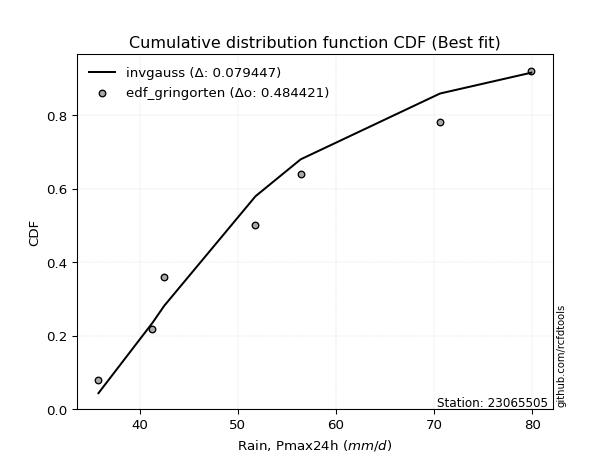</img>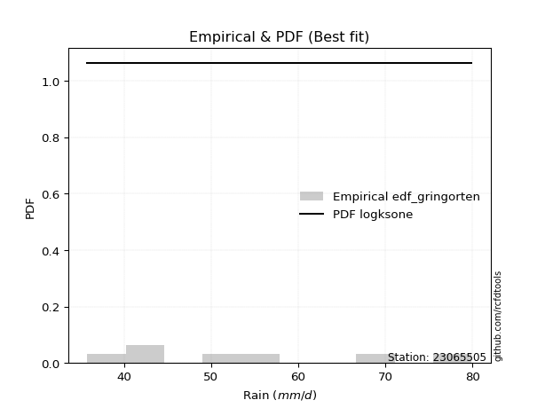</img>

</div>


### 9. EDF Filliben (1975)

The specific values of the constants (0.3175) (often denoted as $alpha$) and (0.365) are derived from a method proposed by James J. Filliben in a 1975 paper. This particular formula is the mean value of the $i$-th order statistic of the normal distribution and is considered a robust and effective plotting position formula for the normal probability plot correlation coefficient test for normality.

<div align="center">


$P=(m-0.3175)/(n+0.365)$


</div>


**9.1. Empirical values**

<div align="center">

|                | 0                   | 1                   | 2                   | 3            | 4                  | 5                  | 6                  |
|:---------------|:--------------------|:--------------------|:--------------------|:-------------|:-------------------|:-------------------|:-------------------|
| date           | 2020                | 2021                | 2015                | 2018         | 2019               | 2016               | 2017               |
| x              | 35.8                | 41.3                | 42.5                | 51.8         | 56.4               | 70.6               | 79.9               |
| m              | 1                   | 2                   | 3                   | 4            | 5                  | 6                  | 7                  |
| empirical_dist | edf_filliben        | edf_filliben        | edf_filliben        | edf_filliben | edf_filliben       | edf_filliben       | edf_filliben       |
| empirical      | 0.09266802443991853 | 0.22844534962661237 | 0.36422267481330617 | 0.5          | 0.6357773251866938 | 0.7715546503733877 | 0.9073319755600815 |
| empirical_tr   | 1.1021324354657687  | 1.2960844698636163  | 1.5728777362520021  | 2.0          | 2.7455731593662627 | 4.377414561664191  | 10.791208791208794 |

</div>


**9.2. Kolmogorov-Smirnov fit test (sorted by Δ)**


<div align="center">

|                | 0                   | 1                   | 2                   | 3                   | 4                   | 5                   | 6                   | 7                   | 8                   | 9                   | 10                  | 11                  | 12                  | 13                  | 14                  | 15                  | 16                  | 17                  | 18                  | 19                  | 20                  | 21                  | 22                  | 23                  | 24                  | 25                  | 26                  | 27                  | 28                  | 29                  | 30                  | 31                  | 32                  | 33                  | 34                  | 35                  | 36                  | 37                  | 38                  | 39                  | 40                  | 41                  | 42                  | 43                  | 44                  | 45                  | 46                  | 47                  | 48                  | 49                  | 50                  | 51                  | 52                  | 53                  | 54                  | 55                  | 56                  | 57                  | 58                  | 59                  | 60                  | 61                  | 62                  | 63                  | 64                  | 65                  | 66                  | 67                  | 68                  | 69                  | 70                  | 71                  | 72                  | 73                  | 74                  | 75                  | 76                  | 77                  | 78                  | 79                  | 80                  | 81                  | 82                  | 83                  | 84                  | 85                  | 86                  | 87                  | 88                  | 89                  | 90                  | 91                  | 92                  | 93                  | 94                  | 95                  | 96                  | 97                  | 98                  | 99                  | 100                 | 101                 | 102                 | 103                 | 104                 | 105                 | 106                 | 107                 | 108                 | 109                 | 110                 | 111                 | 112                 | 113                 | 114                 | 115                 | 116                 | 117                 | 118                 | 119                 | 120                 | 121                 | 122                 | 123                 | 124                 | 125                 | 126                 | 127                 | 128                 | 129                 | 130                 | 131                 | 132                 | 133                 | 134                 | 135                 | 136                 | 137                 | 138                 | 139                 | 140                 | 141                 | 142                 | 143                 | 144                 | 145                 | 146                 | 147                 | 148                 | 149                 | 150                 | 151                 | 152                 | 153                 | 154                 | 155                 | 156                 | 157                 | 158                 | 159                 |
|:---------------|:--------------------|:--------------------|:--------------------|:--------------------|:--------------------|:--------------------|:--------------------|:--------------------|:--------------------|:--------------------|:--------------------|:--------------------|:--------------------|:--------------------|:--------------------|:--------------------|:--------------------|:--------------------|:--------------------|:--------------------|:--------------------|:--------------------|:--------------------|:--------------------|:--------------------|:--------------------|:--------------------|:--------------------|:--------------------|:--------------------|:--------------------|:--------------------|:--------------------|:--------------------|:--------------------|:--------------------|:--------------------|:--------------------|:--------------------|:--------------------|:--------------------|:--------------------|:--------------------|:--------------------|:--------------------|:--------------------|:--------------------|:--------------------|:--------------------|:--------------------|:--------------------|:--------------------|:--------------------|:--------------------|:--------------------|:--------------------|:--------------------|:--------------------|:--------------------|:--------------------|:--------------------|:--------------------|:--------------------|:--------------------|:--------------------|:--------------------|:--------------------|:--------------------|:--------------------|:--------------------|:--------------------|:--------------------|:--------------------|:--------------------|:--------------------|:--------------------|:--------------------|:--------------------|:--------------------|:--------------------|:--------------------|:--------------------|:--------------------|:--------------------|:--------------------|:--------------------|:--------------------|:--------------------|:--------------------|:--------------------|:--------------------|:--------------------|:--------------------|:--------------------|:--------------------|:--------------------|:--------------------|:--------------------|:--------------------|:--------------------|:--------------------|:--------------------|:--------------------|:--------------------|:--------------------|:--------------------|:--------------------|:--------------------|:--------------------|:--------------------|:--------------------|:--------------------|:--------------------|:--------------------|:--------------------|:--------------------|:--------------------|:--------------------|:--------------------|:--------------------|:--------------------|:--------------------|:--------------------|:--------------------|:--------------------|:--------------------|:--------------------|:--------------------|:--------------------|:--------------------|:--------------------|:--------------------|:--------------------|:--------------------|:--------------------|:--------------------|:--------------------|:--------------------|:--------------------|:--------------------|:--------------------|:--------------------|:--------------------|:--------------------|:--------------------|:--------------------|:--------------------|:--------------------|:--------------------|:--------------------|:--------------------|:--------------------|:--------------------|:--------------------|:--------------------|:--------------------|:--------------------|:--------------------|:--------------------|:--------------------|
| station        | 23065505            | 23065505            | 23065505            | 23065505            | 23065505            | 23065505            | 23065505            | 23065505            | 23065505            | 23065505            | 23065505            | 23065505            | 23065505            | 23065505            | 23065505            | 23065505            | 23065505            | 23065505            | 23065505            | 23065505            | 23065505            | 23065505            | 23065505            | 23065505            | 23065505            | 23065505            | 23065505            | 23065505            | 23065505            | 23065505            | 23065505            | 23065505            | 23065505            | 23065505            | 23065505            | 23065505            | 23065505            | 23065505            | 23065505            | 23065505            | 23065505            | 23065505            | 23065505            | 23065505            | 23065505            | 23065505            | 23065505            | 23065505            | 23065505            | 23065505            | 23065505            | 23065505            | 23065505            | 23065505            | 23065505            | 23065505            | 23065505            | 23065505            | 23065505            | 23065505            | 23065505            | 23065505            | 23065505            | 23065505            | 23065505            | 23065505            | 23065505            | 23065505            | 23065505            | 23065505            | 23065505            | 23065505            | 23065505            | 23065505            | 23065505            | 23065505            | 23065505            | 23065505            | 23065505            | 23065505            | 23065505            | 23065505            | 23065505            | 23065505            | 23065505            | 23065505            | 23065505            | 23065505            | 23065505            | 23065505            | 23065505            | 23065505            | 23065505            | 23065505            | 23065505            | 23065505            | 23065505            | 23065505            | 23065505            | 23065505            | 23065505            | 23065505            | 23065505            | 23065505            | 23065505            | 23065505            | 23065505            | 23065505            | 23065505            | 23065505            | 23065505            | 23065505            | 23065505            | 23065505            | 23065505            | 23065505            | 23065505            | 23065505            | 23065505            | 23065505            | 23065505            | 23065505            | 23065505            | 23065505            | 23065505            | 23065505            | 23065505            | 23065505            | 23065505            | 23065505            | 23065505            | 23065505            | 23065505            | 23065505            | 23065505            | 23065505            | 23065505            | 23065505            | 23065505            | 23065505            | 23065505            | 23065505            | 23065505            | 23065505            | 23065505            | 23065505            | 23065505            | 23065505            | 23065505            | 23065505            | 23065505            | 23065505            | 23065505            | 23065505            | 23065505            | 23065505            | 23065505            | 23065505            | 23065505            | 23065505            |
| empirical_dist | edf_filliben        | edf_filliben        | edf_filliben        | edf_filliben        | edf_filliben        | edf_filliben        | edf_filliben        | edf_filliben        | edf_filliben        | edf_filliben        | edf_filliben        | edf_filliben        | edf_filliben        | edf_filliben        | edf_filliben        | edf_filliben        | edf_filliben        | edf_filliben        | edf_filliben        | edf_filliben        | edf_filliben        | edf_filliben        | edf_filliben        | edf_filliben        | edf_filliben        | edf_filliben        | edf_filliben        | edf_filliben        | edf_filliben        | edf_filliben        | edf_filliben        | edf_filliben        | edf_filliben        | edf_filliben        | edf_filliben        | edf_filliben        | edf_filliben        | edf_filliben        | edf_filliben        | edf_filliben        | edf_filliben        | edf_filliben        | edf_filliben        | edf_filliben        | edf_filliben        | edf_filliben        | edf_filliben        | edf_filliben        | edf_filliben        | edf_filliben        | edf_filliben        | edf_filliben        | edf_filliben        | edf_filliben        | edf_filliben        | edf_filliben        | edf_filliben        | edf_filliben        | edf_filliben        | edf_filliben        | edf_filliben        | edf_filliben        | edf_filliben        | edf_filliben        | edf_filliben        | edf_filliben        | edf_filliben        | edf_filliben        | edf_filliben        | edf_filliben        | edf_filliben        | edf_filliben        | edf_filliben        | edf_filliben        | edf_filliben        | edf_filliben        | edf_filliben        | edf_filliben        | edf_filliben        | edf_filliben        | edf_filliben        | edf_filliben        | edf_filliben        | edf_filliben        | edf_filliben        | edf_filliben        | edf_filliben        | edf_filliben        | edf_filliben        | edf_filliben        | edf_filliben        | edf_filliben        | edf_filliben        | edf_filliben        | edf_filliben        | edf_filliben        | edf_filliben        | edf_filliben        | edf_filliben        | edf_filliben        | edf_filliben        | edf_filliben        | edf_filliben        | edf_filliben        | edf_filliben        | edf_filliben        | edf_filliben        | edf_filliben        | edf_filliben        | edf_filliben        | edf_filliben        | edf_filliben        | edf_filliben        | edf_filliben        | edf_filliben        | edf_filliben        | edf_filliben        | edf_filliben        | edf_filliben        | edf_filliben        | edf_filliben        | edf_filliben        | edf_filliben        | edf_filliben        | edf_filliben        | edf_filliben        | edf_filliben        | edf_filliben        | edf_filliben        | edf_filliben        | edf_filliben        | edf_filliben        | edf_filliben        | edf_filliben        | edf_filliben        | edf_filliben        | edf_filliben        | edf_filliben        | edf_filliben        | edf_filliben        | edf_filliben        | edf_filliben        | edf_filliben        | edf_filliben        | edf_filliben        | edf_filliben        | edf_filliben        | edf_filliben        | edf_filliben        | edf_filliben        | edf_filliben        | edf_filliben        | edf_filliben        | edf_filliben        | edf_filliben        | edf_filliben        | edf_filliben        | edf_filliben        | edf_filliben        | edf_filliben        |
| p_dist         | logksone            | logbetaprime        | johnsonsu           | invgauss            | lomax               | ksone               | exponnorm           | genexpon            | loggompertz         | loggenexpon         | logbeta             | logexponpow         | logarcsine          | loghalfnorm         | logskewnorm         | loggausshyper       | logfatiguelife      | logsemicircular     | loginvgauss         | arcsine             | halfnorm            | semicircular        | beta                | logkstwobign        | foldnorm            | logburr             | f                   | invgamma            | loggenlogistic      | loganglit           | loginvweibull       | logburr12           | burr                | logmielke           | lograyleigh         | truncweibull_min    | exponpow            | invweibull          | loghalflogistic     | weibull_min         | logfoldnorm         | logweibull_min      | logbradford         | anglit              | logwrapcauchy       | logf                | loginvgamma         | logmaxwell          | rayleigh            | burr12              | logalpha            | alpha               | halflogistic        | maxwell             | nct                 | logweibull_max      | loggenextreme       | logkappa4           | lognct              | logncf              | logpearson3         | loggumbel_r         | logrice             | genlogistic         | pearson3            | logtruncweibull_min | logexponnorm        | lognorm             | logcrystalball      | logt                | logtruncexpon       | logloggamma         | logjohnsonsu        | betaprime           | kstwobign           | bradford            | logmoyal            | logdweibull         | skewnorm            | gumbel_r            | truncexpon          | norm                | truncnorm           | t                   | logtukeylambda      | dweibull            | wrapcauchy          | logcosine           | moyal               | loguniform          | logdgamma           | gompertz            | dgamma              | logvonmises_line    | logloglaplace       | loglogistic         | halfgennorm         | rice                | cosine              | logistic            | gausshyper          | logkappa3           | loggumbel_l         | kappa4              | loghypsecant        | logargus            | gumbel_l            | hypsecant           | logtriang           | loglaplace          | loglaplace          | argus               | logexponweib        | laplace             | logrdist            | logtruncnorm        | loggamma            | loggamma            | vonmises_line       | tukeylambda         | uniform             | kappa3              | loggenhalflogistic  | nakagami            | logerlang           | lognakagami         | genpareto           | triang              | logwald             | loglevy_l           | wald                | gennorm             | loggennorm          | levy_l              | logtrapezoid        | genhalflogistic     | loggengamma         | johnsonsb           | ncf                 | genextreme          | logjohnsonsb        | loggenpareto        | trapezoid           | rdist               | powerlaw            | gengamma            | gamma               | fatiguelife         | logpowerlaw         | exponweib           | weibull_max         | logtruncpareto      | erlang              | truncpareto         | crystalball         | loglomax            | loghalfgennorm      | logvonmises         | vonmises            | mielke              |
| delta          | 0.0794652801670116  | 0.07964602414026126 | 0.08666619797748493 | 0.08749670547534272 | 0.08969017511925013 | 0.09051080137107448 | 0.09139491570773642 | 0.09266616973129264 | 0.09266800676742905 | 0.09266802415410408 | 0.0926680243067402  | 0.09266802443969875 | 0.0926680244399185  | 0.09266802443991853 | 0.09266802443991853 | 0.09266802445658895 | 0.09287557423395043 | 0.09594299905663228 | 0.09890635313429891 | 0.10041046368990769 | 0.10185028173074812 | 0.10250201866688341 | 0.10293528003983696 | 0.10352802132359717 | 0.10378699508146871 | 0.10669208449655826 | 0.10706060942698753 | 0.10706769634279711 | 0.10784819350482244 | 0.10820552419816115 | 0.10851779360063663 | 0.1085592647879442  | 0.10856962480480065 | 0.10913027363388156 | 0.11063108095525809 | 0.11157781179571258 | 0.11167547921096938 | 0.11219514760943111 | 0.1126221391281979  | 0.11266079213564664 | 0.11347619199078207 | 0.11411220633403385 | 0.11458531525207061 | 0.1148191069878794  | 0.11578685149515214 | 0.11618998190452656 | 0.11619070814620061 | 0.11817616794246144 | 0.11892305656241173 | 0.1203310657187513  | 0.12360155017665503 | 0.12388095274935268 | 0.1248816220589685  | 0.12599924965981432 | 0.12703894206723795 | 0.1293730317962867  | 0.1293853729029361  | 0.1296847228292231  | 0.13012541029453364 | 0.13042738676582644 | 0.13108096141849343 | 0.13220526731261886 | 0.13292730742924208 | 0.1331679609889697  | 0.13396500942326203 | 0.1345784393897037  | 0.13609550584920946 | 0.1362748577610618  | 0.13627493110880667 | 0.1362750148111268  | 0.1363065669845065  | 0.13665912571677521 | 0.13732130194132164 | 0.13799901322948302 | 0.13803670343243418 | 0.1389164915705703  | 0.139046499116514   | 0.13971839049091161 | 0.1410508300651922  | 0.14181765170272098 | 0.14214908210881283 | 0.14294439479164334 | 0.142944436868693   | 0.14295356837712747 | 0.1447340668989987  | 0.14541513843013165 | 0.14677203754153478 | 0.14812570792754698 | 0.15044396870700538 | 0.15053282940821192 | 0.15146959322142384 | 0.1534969189150192  | 0.15600449845191144 | 0.15673556600695332 | 0.157813094213878   | 0.15874589461917876 | 0.1601416478354832  | 0.16341848221976252 | 0.16512480697126547 | 0.1652593334157739  | 0.16774389745806745 | 0.1686868204456595  | 0.17013829334236097 | 0.1712987215317642  | 0.17285795306834026 | 0.17399408290258034 | 0.17504789371443857 | 0.17906332468097744 | 0.18799283625975885 | 0.19003401034291992 | 0.19003401034291992 | 0.19229088800950433 | 0.19313879275743118 | 0.19543235775676437 | 0.19796807977147132 | 0.1998736611688373  | 0.2059142878374982  | 0.2059142878374982  | 0.20725649138519273 | 0.21142685062897537 | 0.21229523717158277 | 0.21327907252406683 | 0.21440013157294652 | 0.21440783021612478 | 0.22126369890106456 | 0.22156582908244535 | 0.22280842025019884 | 0.24420690844296022 | 0.24688336848655318 | 0.258149772914422   | 0.2697744404377897  | 0.27155465037338766 | 0.27155465037338766 | 0.28665477268496553 | 0.32761331074765293 | 0.3286496315639113  | 0.34175201622366114 | 0.34788893918796293 | 0.3763197840435475  | 0.40778648315794463 | 0.4106437791603994  | 0.4118751899417057  | 0.4124264222992938  | 0.4164849611616036  | 0.48037940252272093 | 0.48884752439024903 | 0.48918744793335256 | 0.4973621004638017  | 0.5103799469381343  | 0.5235906291052271  | 0.5413075322093444  | 0.549265679553967   | 0.5676845163742055  | 0.6218565995353108  | 0.6458426445685098  | 0.6711685907379286  | 0.7715546503733877  | 1.0982543007395962  | 12.578190791223546  | nan                 |
| deltao         | 0.48442053926100004 | 0.48442053926100004 | 0.48442053926100004 | 0.48442053926100004 | 0.48442053926100004 | 0.48442053926100004 | 0.48442053926100004 | 0.48442053926100004 | 0.48442053926100004 | 0.48442053926100004 | 0.48442053926100004 | 0.48442053926100004 | 0.48442053926100004 | 0.48442053926100004 | 0.48442053926100004 | 0.48442053926100004 | 0.48442053926100004 | 0.48442053926100004 | 0.48442053926100004 | 0.48442053926100004 | 0.48442053926100004 | 0.48442053926100004 | 0.48442053926100004 | 0.48442053926100004 | 0.48442053926100004 | 0.48442053926100004 | 0.48442053926100004 | 0.48442053926100004 | 0.48442053926100004 | 0.48442053926100004 | 0.48442053926100004 | 0.48442053926100004 | 0.48442053926100004 | 0.48442053926100004 | 0.48442053926100004 | 0.48442053926100004 | 0.48442053926100004 | 0.48442053926100004 | 0.48442053926100004 | 0.48442053926100004 | 0.48442053926100004 | 0.48442053926100004 | 0.48442053926100004 | 0.48442053926100004 | 0.48442053926100004 | 0.48442053926100004 | 0.48442053926100004 | 0.48442053926100004 | 0.48442053926100004 | 0.48442053926100004 | 0.48442053926100004 | 0.48442053926100004 | 0.48442053926100004 | 0.48442053926100004 | 0.48442053926100004 | 0.48442053926100004 | 0.48442053926100004 | 0.48442053926100004 | 0.48442053926100004 | 0.48442053926100004 | 0.48442053926100004 | 0.48442053926100004 | 0.48442053926100004 | 0.48442053926100004 | 0.48442053926100004 | 0.48442053926100004 | 0.48442053926100004 | 0.48442053926100004 | 0.48442053926100004 | 0.48442053926100004 | 0.48442053926100004 | 0.48442053926100004 | 0.48442053926100004 | 0.48442053926100004 | 0.48442053926100004 | 0.48442053926100004 | 0.48442053926100004 | 0.48442053926100004 | 0.48442053926100004 | 0.48442053926100004 | 0.48442053926100004 | 0.48442053926100004 | 0.48442053926100004 | 0.48442053926100004 | 0.48442053926100004 | 0.48442053926100004 | 0.48442053926100004 | 0.48442053926100004 | 0.48442053926100004 | 0.48442053926100004 | 0.48442053926100004 | 0.48442053926100004 | 0.48442053926100004 | 0.48442053926100004 | 0.48442053926100004 | 0.48442053926100004 | 0.48442053926100004 | 0.48442053926100004 | 0.48442053926100004 | 0.48442053926100004 | 0.48442053926100004 | 0.48442053926100004 | 0.48442053926100004 | 0.48442053926100004 | 0.48442053926100004 | 0.48442053926100004 | 0.48442053926100004 | 0.48442053926100004 | 0.48442053926100004 | 0.48442053926100004 | 0.48442053926100004 | 0.48442053926100004 | 0.48442053926100004 | 0.48442053926100004 | 0.48442053926100004 | 0.48442053926100004 | 0.48442053926100004 | 0.48442053926100004 | 0.48442053926100004 | 0.48442053926100004 | 0.48442053926100004 | 0.48442053926100004 | 0.48442053926100004 | 0.48442053926100004 | 0.48442053926100004 | 0.48442053926100004 | 0.48442053926100004 | 0.48442053926100004 | 0.48442053926100004 | 0.48442053926100004 | 0.48442053926100004 | 0.48442053926100004 | 0.48442053926100004 | 0.48442053926100004 | 0.48442053926100004 | 0.48442053926100004 | 0.48442053926100004 | 0.48442053926100004 | 0.48442053926100004 | 0.48442053926100004 | 0.48442053926100004 | 0.48442053926100004 | 0.48442053926100004 | 0.48442053926100004 | 0.48442053926100004 | 0.48442053926100004 | 0.48442053926100004 | 0.48442053926100004 | 0.48442053926100004 | 0.48442053926100004 | 0.48442053926100004 | 0.48442053926100004 | 0.48442053926100004 | 0.48442053926100004 | 0.48442053926100004 | 0.48442053926100004 | 0.48442053926100004 | 0.48442053926100004 | 0.48442053926100004 | 0.48442053926100004 |
| eval           | Δo > Δ              | Δo > Δ              | Δo > Δ              | Δo > Δ              | Δo > Δ              | Δo > Δ              | Δo > Δ              | Δo > Δ              | Δo > Δ              | Δo > Δ              | Δo > Δ              | Δo > Δ              | Δo > Δ              | Δo > Δ              | Δo > Δ              | Δo > Δ              | Δo > Δ              | Δo > Δ              | Δo > Δ              | Δo > Δ              | Δo > Δ              | Δo > Δ              | Δo > Δ              | Δo > Δ              | Δo > Δ              | Δo > Δ              | Δo > Δ              | Δo > Δ              | Δo > Δ              | Δo > Δ              | Δo > Δ              | Δo > Δ              | Δo > Δ              | Δo > Δ              | Δo > Δ              | Δo > Δ              | Δo > Δ              | Δo > Δ              | Δo > Δ              | Δo > Δ              | Δo > Δ              | Δo > Δ              | Δo > Δ              | Δo > Δ              | Δo > Δ              | Δo > Δ              | Δo > Δ              | Δo > Δ              | Δo > Δ              | Δo > Δ              | Δo > Δ              | Δo > Δ              | Δo > Δ              | Δo > Δ              | Δo > Δ              | Δo > Δ              | Δo > Δ              | Δo > Δ              | Δo > Δ              | Δo > Δ              | Δo > Δ              | Δo > Δ              | Δo > Δ              | Δo > Δ              | Δo > Δ              | Δo > Δ              | Δo > Δ              | Δo > Δ              | Δo > Δ              | Δo > Δ              | Δo > Δ              | Δo > Δ              | Δo > Δ              | Δo > Δ              | Δo > Δ              | Δo > Δ              | Δo > Δ              | Δo > Δ              | Δo > Δ              | Δo > Δ              | Δo > Δ              | Δo > Δ              | Δo > Δ              | Δo > Δ              | Δo > Δ              | Δo > Δ              | Δo > Δ              | Δo > Δ              | Δo > Δ              | Δo > Δ              | Δo > Δ              | Δo > Δ              | Δo > Δ              | Δo > Δ              | Δo > Δ              | Δo > Δ              | Δo > Δ              | Δo > Δ              | Δo > Δ              | Δo > Δ              | Δo > Δ              | Δo > Δ              | Δo > Δ              | Δo > Δ              | Δo > Δ              | Δo > Δ              | Δo > Δ              | Δo > Δ              | Δo > Δ              | Δo > Δ              | Δo > Δ              | Δo > Δ              | Δo > Δ              | Δo > Δ              | Δo > Δ              | Δo > Δ              | Δo > Δ              | Δo > Δ              | Δo > Δ              | Δo > Δ              | Δo > Δ              | Δo > Δ              | Δo > Δ              | Δo > Δ              | Δo > Δ              | Δo > Δ              | Δo > Δ              | Δo > Δ              | Δo > Δ              | Δo > Δ              | Δo > Δ              | Δo > Δ              | Δo > Δ              | Δo > Δ              | Δo > Δ              | Δo > Δ              | Δo > Δ              | Δo > Δ              | Δo > Δ              | Δo > Δ              | Δo > Δ              | Δo > Δ              | Δo > Δ              | Δo > Δ              | Δo > Δ              | Δo <= Δ             | Δo <= Δ             | Δo <= Δ             | Δo <= Δ             | Δo <= Δ             | Δo <= Δ             | Δo <= Δ             | Δo <= Δ             | Δo <= Δ             | Δo <= Δ             | Δo <= Δ             | Δo <= Δ             | Δo <= Δ             | Δo <= Δ             | Δo <= Δ             |
| fit            | 1                   | 1                   | 1                   | 1                   | 1                   | 1                   | 1                   | 1                   | 1                   | 1                   | 1                   | 1                   | 1                   | 1                   | 1                   | 1                   | 1                   | 1                   | 1                   | 1                   | 1                   | 1                   | 1                   | 1                   | 1                   | 1                   | 1                   | 1                   | 1                   | 1                   | 1                   | 1                   | 1                   | 1                   | 1                   | 1                   | 1                   | 1                   | 1                   | 1                   | 1                   | 1                   | 1                   | 1                   | 1                   | 1                   | 1                   | 1                   | 1                   | 1                   | 1                   | 1                   | 1                   | 1                   | 1                   | 1                   | 1                   | 1                   | 1                   | 1                   | 1                   | 1                   | 1                   | 1                   | 1                   | 1                   | 1                   | 1                   | 1                   | 1                   | 1                   | 1                   | 1                   | 1                   | 1                   | 1                   | 1                   | 1                   | 1                   | 1                   | 1                   | 1                   | 1                   | 1                   | 1                   | 1                   | 1                   | 1                   | 1                   | 1                   | 1                   | 1                   | 1                   | 1                   | 1                   | 1                   | 1                   | 1                   | 1                   | 1                   | 1                   | 1                   | 1                   | 1                   | 1                   | 1                   | 1                   | 1                   | 1                   | 1                   | 1                   | 1                   | 1                   | 1                   | 1                   | 1                   | 1                   | 1                   | 1                   | 1                   | 1                   | 1                   | 1                   | 1                   | 1                   | 1                   | 1                   | 1                   | 1                   | 1                   | 1                   | 1                   | 1                   | 1                   | 1                   | 1                   | 1                   | 1                   | 1                   | 1                   | 1                   | 1                   | 1                   | 1                   | 1                   | 0                   | 0                   | 0                   | 0                   | 0                   | 0                   | 0                   | 0                   | 0                   | 0                   | 0                   | 0                   | 0                   | 0                   | 0                   |
| n              | 7                   | 7                   | 7                   | 7                   | 7                   | 7                   | 7                   | 7                   | 7                   | 7                   | 7                   | 7                   | 7                   | 7                   | 7                   | 7                   | 7                   | 7                   | 7                   | 7                   | 7                   | 7                   | 7                   | 7                   | 7                   | 7                   | 7                   | 7                   | 7                   | 7                   | 7                   | 7                   | 7                   | 7                   | 7                   | 7                   | 7                   | 7                   | 7                   | 7                   | 7                   | 7                   | 7                   | 7                   | 7                   | 7                   | 7                   | 7                   | 7                   | 7                   | 7                   | 7                   | 7                   | 7                   | 7                   | 7                   | 7                   | 7                   | 7                   | 7                   | 7                   | 7                   | 7                   | 7                   | 7                   | 7                   | 7                   | 7                   | 7                   | 7                   | 7                   | 7                   | 7                   | 7                   | 7                   | 7                   | 7                   | 7                   | 7                   | 7                   | 7                   | 7                   | 7                   | 7                   | 7                   | 7                   | 7                   | 7                   | 7                   | 7                   | 7                   | 7                   | 7                   | 7                   | 7                   | 7                   | 7                   | 7                   | 7                   | 7                   | 7                   | 7                   | 7                   | 7                   | 7                   | 7                   | 7                   | 7                   | 7                   | 7                   | 7                   | 7                   | 7                   | 7                   | 7                   | 7                   | 7                   | 7                   | 7                   | 7                   | 7                   | 7                   | 7                   | 7                   | 7                   | 7                   | 7                   | 7                   | 7                   | 7                   | 7                   | 7                   | 7                   | 7                   | 7                   | 7                   | 7                   | 7                   | 7                   | 7                   | 7                   | 7                   | 7                   | 7                   | 7                   | 7                   | 7                   | 7                   | 7                   | 7                   | 7                   | 7                   | 7                   | 7                   | 7                   | 7                   | 7                   | 7                   | 7                   | 7                   |
| best_fit       | 1                   | 0                   | 0                   | 0                   | 0                   | 0                   | 0                   | 0                   | 0                   | 0                   | 0                   | 0                   | 0                   | 0                   | 0                   | 0                   | 0                   | 0                   | 0                   | 0                   | 0                   | 0                   | 0                   | 0                   | 0                   | 0                   | 0                   | 0                   | 0                   | 0                   | 0                   | 0                   | 0                   | 0                   | 0                   | 0                   | 0                   | 0                   | 0                   | 0                   | 0                   | 0                   | 0                   | 0                   | 0                   | 0                   | 0                   | 0                   | 0                   | 0                   | 0                   | 0                   | 0                   | 0                   | 0                   | 0                   | 0                   | 0                   | 0                   | 0                   | 0                   | 0                   | 0                   | 0                   | 0                   | 0                   | 0                   | 0                   | 0                   | 0                   | 0                   | 0                   | 0                   | 0                   | 0                   | 0                   | 0                   | 0                   | 0                   | 0                   | 0                   | 0                   | 0                   | 0                   | 0                   | 0                   | 0                   | 0                   | 0                   | 0                   | 0                   | 0                   | 0                   | 0                   | 0                   | 0                   | 0                   | 0                   | 0                   | 0                   | 0                   | 0                   | 0                   | 0                   | 0                   | 0                   | 0                   | 0                   | 0                   | 0                   | 0                   | 0                   | 0                   | 0                   | 0                   | 0                   | 0                   | 0                   | 0                   | 0                   | 0                   | 0                   | 0                   | 0                   | 0                   | 0                   | 0                   | 0                   | 0                   | 0                   | 0                   | 0                   | 0                   | 0                   | 0                   | 0                   | 0                   | 0                   | 0                   | 0                   | 0                   | 0                   | 0                   | 0                   | 0                   | 0                   | 0                   | 0                   | 0                   | 0                   | 0                   | 0                   | 0                   | 0                   | 0                   | 0                   | 0                   | 0                   | 0                   | 0                   |
| best_fit_sort  | 1                   | 2                   | 3                   | 4                   | 5                   | 6                   | 7                   | 8                   | 9                   | 10                  | 11                  | 12                  | 13                  | 14                  | 15                  | 16                  | 17                  | 18                  | 19                  | 20                  | 21                  | 22                  | 23                  | 24                  | 25                  | 26                  | 27                  | 28                  | 29                  | 30                  | 31                  | 32                  | 33                  | 34                  | 35                  | 36                  | 37                  | 38                  | 39                  | 40                  | 41                  | 42                  | 43                  | 44                  | 45                  | 46                  | 47                  | 48                  | 49                  | 50                  | 51                  | 52                  | 53                  | 54                  | 55                  | 56                  | 57                  | 58                  | 59                  | 60                  | 61                  | 62                  | 63                  | 64                  | 65                  | 66                  | 67                  | 68                  | 69                  | 70                  | 71                  | 72                  | 73                  | 74                  | 75                  | 76                  | 77                  | 78                  | 79                  | 80                  | 81                  | 82                  | 83                  | 84                  | 85                  | 86                  | 87                  | 88                  | 89                  | 90                  | 91                  | 92                  | 93                  | 94                  | 95                  | 96                  | 97                  | 98                  | 99                  | 100                 | 101                 | 102                 | 103                 | 104                 | 105                 | 106                 | 107                 | 108                 | 109                 | 110                 | 111                 | 112                 | 113                 | 114                 | 115                 | 116                 | 117                 | 118                 | 119                 | 120                 | 121                 | 122                 | 123                 | 124                 | 125                 | 126                 | 127                 | 128                 | 129                 | 130                 | 131                 | 132                 | 133                 | 134                 | 135                 | 136                 | 137                 | 138                 | 139                 | 140                 | 141                 | 142                 | 143                 | 144                 | 145                 | 146                 | 147                 | 148                 | 149                 | 150                 | 151                 | 152                 | 153                 | 154                 | 155                 | 156                 | 157                 | 158                 | 159                 | 160                 |

</div>


**9.3. Best fit**

<div align="center">

|   id |   station | empirical_dist   | p_dist   |     delta |   deltao | eval   |   fit |   n |   best_fit |   best_fit_sort |
|-----:|----------:|:-----------------|:---------|----------:|---------:|:-------|------:|----:|-----------:|----------------:|
|    0 |  23065505 | edf_filliben     | logksone | 0.0794653 | 0.484421 | Δo > Δ |     1 |   7 |          1 |               1 |

</div>


<div align="center">

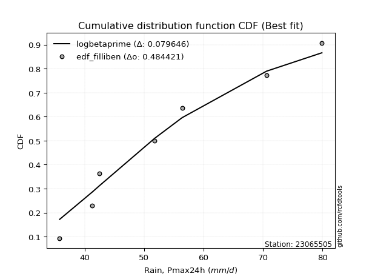</img>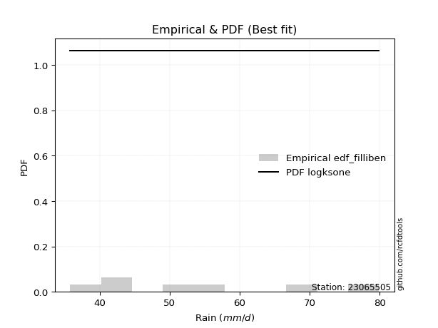</img>

</div>


### 10. EDF Jenkinson (1977)

The Jenkinson formula in hydrology is an empirical plotting position formula used to estimate the non-exceedance probability _(P)_ or return period _(T)_ of a given ordered observation within a sample. It is a widely used method in the frequency analysis of extreme events such as floods and rainfall, as it provides a distribution-free way to plot data. _a≈0.31_ and _b≈0.38_ are constants derived to approximate the median of the probability distribution for the given rank.

<div align="center">


$P=(m-a)/(n+b)$


</div>


**10.1. Empirical values**

<div align="center">

|                | 0                   | 1                   | 2                   | 3             | 4                  | 5                  | 6                  |
|:---------------|:--------------------|:--------------------|:--------------------|:--------------|:-------------------|:-------------------|:-------------------|
| date           | 2020                | 2021                | 2015                | 2018          | 2019               | 2016               | 2017               |
| x              | 35.8                | 41.3                | 42.5                | 51.8          | 56.4               | 70.6               | 79.9               |
| m              | 1                   | 2                   | 3                   | 4             | 5                  | 6                  | 7                  |
| empirical_dist | edf_jenkinson       | edf_jenkinson       | edf_jenkinson       | edf_jenkinson | edf_jenkinson      | edf_jenkinson      | edf_jenkinson      |
| empirical      | 0.09349593495934959 | 0.22899728997289973 | 0.36449864498644985 | 0.5           | 0.6355013550135502 | 0.7710027100271003 | 0.9065040650406505 |
| empirical_tr   | 1.1031390134529149  | 1.29701230228471    | 1.5735607675906182  | 2.0           | 2.743494423791822  | 4.366863905325444  | 10.695652173913055 |

</div>


**10.2. Kolmogorov-Smirnov fit test (sorted by Δ)**


<div align="center">

|                | 0                   | 1                   | 2                   | 3                   | 4                   | 5                   | 6                   | 7                   | 8                   | 9                   | 10                  | 11                  | 12                  | 13                  | 14                  | 15                  | 16                  | 17                  | 18                  | 19                  | 20                  | 21                  | 22                  | 23                  | 24                  | 25                  | 26                  | 27                  | 28                  | 29                  | 30                  | 31                  | 32                  | 33                  | 34                  | 35                  | 36                  | 37                  | 38                  | 39                  | 40                  | 41                  | 42                  | 43                  | 44                  | 45                  | 46                  | 47                  | 48                  | 49                  | 50                  | 51                  | 52                  | 53                  | 54                  | 55                  | 56                  | 57                  | 58                  | 59                  | 60                  | 61                  | 62                  | 63                  | 64                  | 65                  | 66                  | 67                  | 68                  | 69                  | 70                  | 71                  | 72                  | 73                  | 74                  | 75                  | 76                  | 77                  | 78                  | 79                  | 80                  | 81                  | 82                  | 83                  | 84                  | 85                  | 86                  | 87                  | 88                  | 89                  | 90                  | 91                  | 92                  | 93                  | 94                  | 95                  | 96                  | 97                  | 98                  | 99                  | 100                 | 101                 | 102                 | 103                 | 104                 | 105                 | 106                 | 107                 | 108                 | 109                 | 110                 | 111                 | 112                 | 113                 | 114                 | 115                 | 116                 | 117                 | 118                 | 119                 | 120                 | 121                 | 122                 | 123                 | 124                 | 125                 | 126                 | 127                 | 128                 | 129                 | 130                 | 131                 | 132                 | 133                 | 134                 | 135                 | 136                 | 137                 | 138                 | 139                 | 140                 | 141                 | 142                 | 143                 | 144                 | 145                 | 146                 | 147                 | 148                 | 149                 | 150                 | 151                 | 152                 | 153                 | 154                 | 155                 | 156                 | 157                 | 158                 | 159                 |
|:---------------|:--------------------|:--------------------|:--------------------|:--------------------|:--------------------|:--------------------|:--------------------|:--------------------|:--------------------|:--------------------|:--------------------|:--------------------|:--------------------|:--------------------|:--------------------|:--------------------|:--------------------|:--------------------|:--------------------|:--------------------|:--------------------|:--------------------|:--------------------|:--------------------|:--------------------|:--------------------|:--------------------|:--------------------|:--------------------|:--------------------|:--------------------|:--------------------|:--------------------|:--------------------|:--------------------|:--------------------|:--------------------|:--------------------|:--------------------|:--------------------|:--------------------|:--------------------|:--------------------|:--------------------|:--------------------|:--------------------|:--------------------|:--------------------|:--------------------|:--------------------|:--------------------|:--------------------|:--------------------|:--------------------|:--------------------|:--------------------|:--------------------|:--------------------|:--------------------|:--------------------|:--------------------|:--------------------|:--------------------|:--------------------|:--------------------|:--------------------|:--------------------|:--------------------|:--------------------|:--------------------|:--------------------|:--------------------|:--------------------|:--------------------|:--------------------|:--------------------|:--------------------|:--------------------|:--------------------|:--------------------|:--------------------|:--------------------|:--------------------|:--------------------|:--------------------|:--------------------|:--------------------|:--------------------|:--------------------|:--------------------|:--------------------|:--------------------|:--------------------|:--------------------|:--------------------|:--------------------|:--------------------|:--------------------|:--------------------|:--------------------|:--------------------|:--------------------|:--------------------|:--------------------|:--------------------|:--------------------|:--------------------|:--------------------|:--------------------|:--------------------|:--------------------|:--------------------|:--------------------|:--------------------|:--------------------|:--------------------|:--------------------|:--------------------|:--------------------|:--------------------|:--------------------|:--------------------|:--------------------|:--------------------|:--------------------|:--------------------|:--------------------|:--------------------|:--------------------|:--------------------|:--------------------|:--------------------|:--------------------|:--------------------|:--------------------|:--------------------|:--------------------|:--------------------|:--------------------|:--------------------|:--------------------|:--------------------|:--------------------|:--------------------|:--------------------|:--------------------|:--------------------|:--------------------|:--------------------|:--------------------|:--------------------|:--------------------|:--------------------|:--------------------|:--------------------|:--------------------|:--------------------|:--------------------|:--------------------|:--------------------|
| station        | 23065505            | 23065505            | 23065505            | 23065505            | 23065505            | 23065505            | 23065505            | 23065505            | 23065505            | 23065505            | 23065505            | 23065505            | 23065505            | 23065505            | 23065505            | 23065505            | 23065505            | 23065505            | 23065505            | 23065505            | 23065505            | 23065505            | 23065505            | 23065505            | 23065505            | 23065505            | 23065505            | 23065505            | 23065505            | 23065505            | 23065505            | 23065505            | 23065505            | 23065505            | 23065505            | 23065505            | 23065505            | 23065505            | 23065505            | 23065505            | 23065505            | 23065505            | 23065505            | 23065505            | 23065505            | 23065505            | 23065505            | 23065505            | 23065505            | 23065505            | 23065505            | 23065505            | 23065505            | 23065505            | 23065505            | 23065505            | 23065505            | 23065505            | 23065505            | 23065505            | 23065505            | 23065505            | 23065505            | 23065505            | 23065505            | 23065505            | 23065505            | 23065505            | 23065505            | 23065505            | 23065505            | 23065505            | 23065505            | 23065505            | 23065505            | 23065505            | 23065505            | 23065505            | 23065505            | 23065505            | 23065505            | 23065505            | 23065505            | 23065505            | 23065505            | 23065505            | 23065505            | 23065505            | 23065505            | 23065505            | 23065505            | 23065505            | 23065505            | 23065505            | 23065505            | 23065505            | 23065505            | 23065505            | 23065505            | 23065505            | 23065505            | 23065505            | 23065505            | 23065505            | 23065505            | 23065505            | 23065505            | 23065505            | 23065505            | 23065505            | 23065505            | 23065505            | 23065505            | 23065505            | 23065505            | 23065505            | 23065505            | 23065505            | 23065505            | 23065505            | 23065505            | 23065505            | 23065505            | 23065505            | 23065505            | 23065505            | 23065505            | 23065505            | 23065505            | 23065505            | 23065505            | 23065505            | 23065505            | 23065505            | 23065505            | 23065505            | 23065505            | 23065505            | 23065505            | 23065505            | 23065505            | 23065505            | 23065505            | 23065505            | 23065505            | 23065505            | 23065505            | 23065505            | 23065505            | 23065505            | 23065505            | 23065505            | 23065505            | 23065505            | 23065505            | 23065505            | 23065505            | 23065505            | 23065505            | 23065505            |
| empirical_dist | edf_jenkinson       | edf_jenkinson       | edf_jenkinson       | edf_jenkinson       | edf_jenkinson       | edf_jenkinson       | edf_jenkinson       | edf_jenkinson       | edf_jenkinson       | edf_jenkinson       | edf_jenkinson       | edf_jenkinson       | edf_jenkinson       | edf_jenkinson       | edf_jenkinson       | edf_jenkinson       | edf_jenkinson       | edf_jenkinson       | edf_jenkinson       | edf_jenkinson       | edf_jenkinson       | edf_jenkinson       | edf_jenkinson       | edf_jenkinson       | edf_jenkinson       | edf_jenkinson       | edf_jenkinson       | edf_jenkinson       | edf_jenkinson       | edf_jenkinson       | edf_jenkinson       | edf_jenkinson       | edf_jenkinson       | edf_jenkinson       | edf_jenkinson       | edf_jenkinson       | edf_jenkinson       | edf_jenkinson       | edf_jenkinson       | edf_jenkinson       | edf_jenkinson       | edf_jenkinson       | edf_jenkinson       | edf_jenkinson       | edf_jenkinson       | edf_jenkinson       | edf_jenkinson       | edf_jenkinson       | edf_jenkinson       | edf_jenkinson       | edf_jenkinson       | edf_jenkinson       | edf_jenkinson       | edf_jenkinson       | edf_jenkinson       | edf_jenkinson       | edf_jenkinson       | edf_jenkinson       | edf_jenkinson       | edf_jenkinson       | edf_jenkinson       | edf_jenkinson       | edf_jenkinson       | edf_jenkinson       | edf_jenkinson       | edf_jenkinson       | edf_jenkinson       | edf_jenkinson       | edf_jenkinson       | edf_jenkinson       | edf_jenkinson       | edf_jenkinson       | edf_jenkinson       | edf_jenkinson       | edf_jenkinson       | edf_jenkinson       | edf_jenkinson       | edf_jenkinson       | edf_jenkinson       | edf_jenkinson       | edf_jenkinson       | edf_jenkinson       | edf_jenkinson       | edf_jenkinson       | edf_jenkinson       | edf_jenkinson       | edf_jenkinson       | edf_jenkinson       | edf_jenkinson       | edf_jenkinson       | edf_jenkinson       | edf_jenkinson       | edf_jenkinson       | edf_jenkinson       | edf_jenkinson       | edf_jenkinson       | edf_jenkinson       | edf_jenkinson       | edf_jenkinson       | edf_jenkinson       | edf_jenkinson       | edf_jenkinson       | edf_jenkinson       | edf_jenkinson       | edf_jenkinson       | edf_jenkinson       | edf_jenkinson       | edf_jenkinson       | edf_jenkinson       | edf_jenkinson       | edf_jenkinson       | edf_jenkinson       | edf_jenkinson       | edf_jenkinson       | edf_jenkinson       | edf_jenkinson       | edf_jenkinson       | edf_jenkinson       | edf_jenkinson       | edf_jenkinson       | edf_jenkinson       | edf_jenkinson       | edf_jenkinson       | edf_jenkinson       | edf_jenkinson       | edf_jenkinson       | edf_jenkinson       | edf_jenkinson       | edf_jenkinson       | edf_jenkinson       | edf_jenkinson       | edf_jenkinson       | edf_jenkinson       | edf_jenkinson       | edf_jenkinson       | edf_jenkinson       | edf_jenkinson       | edf_jenkinson       | edf_jenkinson       | edf_jenkinson       | edf_jenkinson       | edf_jenkinson       | edf_jenkinson       | edf_jenkinson       | edf_jenkinson       | edf_jenkinson       | edf_jenkinson       | edf_jenkinson       | edf_jenkinson       | edf_jenkinson       | edf_jenkinson       | edf_jenkinson       | edf_jenkinson       | edf_jenkinson       | edf_jenkinson       | edf_jenkinson       | edf_jenkinson       | edf_jenkinson       | edf_jenkinson       | edf_jenkinson       |
| p_dist         | logbetaprime        | logksone            | johnsonsu           | invgauss            | ksone               | lomax               | exponnorm           | logfatiguelife      | genexpon            | loggompertz         | loggenexpon         | logbeta             | logexponpow         | logarcsine          | loghalfnorm         | logskewnorm         | loggausshyper       | logsemicircular     | loginvgauss         | arcsine             | halfnorm            | beta                | semicircular        | logkstwobign        | foldnorm            | logburr             | f                   | invgamma            | loggenlogistic      | loganglit           | logburr12           | loginvweibull       | burr                | logmielke           | lograyleigh         | exponpow            | weibull_min         | truncweibull_min    | invweibull          | loghalflogistic     | logfoldnorm         | logweibull_min      | anglit              | logbradford         | logwrapcauchy       | logf                | loginvgamma         | logmaxwell          | rayleigh            | burr12              | logalpha            | alpha               | halflogistic        | maxwell             | nct                 | logweibull_max      | loggenextreme       | logkappa4           | lognct              | logncf              | logpearson3         | loggumbel_r         | logrice             | genlogistic         | pearson3            | logtruncweibull_min | logexponnorm        | lognorm             | logcrystalball      | logt                | logtruncexpon       | logloggamma         | logjohnsonsu        | betaprime           | kstwobign           | bradford            | logmoyal            | logdweibull         | skewnorm            | gumbel_r            | truncexpon          | norm                | truncnorm           | t                   | logtukeylambda      | dweibull            | wrapcauchy          | logcosine           | moyal               | loguniform          | logdgamma           | gompertz            | dgamma              | logvonmises_line    | logloglaplace       | loglogistic         | halfgennorm         | rice                | cosine              | logistic            | gausshyper          | logkappa3           | loggumbel_l         | kappa4              | loghypsecant        | logargus            | gumbel_l            | hypsecant           | logtriang           | loglaplace          | loglaplace          | argus               | logexponweib        | laplace             | logrdist            | logtruncnorm        | loggamma            | loggamma            | vonmises_line       | tukeylambda         | uniform             | kappa3              | nakagami            | loggenhalflogistic  | lognakagami         | logerlang           | genpareto           | triang              | logwald             | loglevy_l           | wald                | gennorm             | loggennorm          | levy_l              | logtrapezoid        | genhalflogistic     | loggengamma         | johnsonsb           | ncf                 | genextreme          | logjohnsonsb        | loggenpareto        | trapezoid           | rdist               | powerlaw            | gengamma            | gamma               | fatiguelife         | logpowerlaw         | exponweib           | weibull_max         | logtruncpareto      | erlang              | truncpareto         | crystalball         | loglomax            | loghalfgennorm      | logvonmises         | vonmises            | mielke              |
| delta          | 0.0788181136208302  | 0.07974125034015528 | 0.08694216815062861 | 0.08804864582163008 | 0.09023483119793085 | 0.09051808563868119 | 0.09222282622716747 | 0.09315154440709411 | 0.0934940802507237  | 0.0934959172868601  | 0.09349593467353513 | 0.09349593482617126 | 0.0934959349591298  | 0.09349593495934949 | 0.09349593495934959 | 0.09349593495934959 | 0.09349593497601993 | 0.09621896922977596 | 0.09918232330744259 | 0.10013449351676407 | 0.1021262519038918  | 0.1023833396935496  | 0.10277798884002709 | 0.10380399149674086 | 0.1040629652546124  | 0.10696805466970194 | 0.10733657960013121 | 0.1073436665159408  | 0.10812416367796612 | 0.10848149437130483 | 0.1085592647879442  | 0.1087937637737803  | 0.10884559497794433 | 0.10940624380702524 | 0.11090705112840177 | 0.11195144938411306 | 0.11210885178935928 | 0.11212975214199994 | 0.11247111778257479 | 0.11289810930134159 | 0.11375216216392575 | 0.11411220633403385 | 0.11509507716102307 | 0.11513725559835797 | 0.11523491114886478 | 0.11646595207767024 | 0.11646667831934429 | 0.11845213811560512 | 0.11919902673555541 | 0.1203310657187513  | 0.12387752034979871 | 0.12415692292249636 | 0.12515759223211217 | 0.126275219832958   | 0.12731491224038163 | 0.12964900196943038 | 0.1296613430760798  | 0.1299606930023668  | 0.13040138046767732 | 0.13070335693897012 | 0.1313569315916371  | 0.13248123748576254 | 0.13320327760238576 | 0.1334439311621134  | 0.1342409795964057  | 0.13513037973599107 | 0.13637147602235314 | 0.13655082793420548 | 0.13655090128195035 | 0.13655098498427048 | 0.13685850733079385 | 0.1369350958899189  | 0.13759727211446532 | 0.1382749834026267  | 0.13831267360557786 | 0.13919246174371397 | 0.1393224692896577  | 0.14027033083719898 | 0.14132680023833588 | 0.14209362187586466 | 0.1424250522819565  | 0.14322036496478702 | 0.14322040704183667 | 0.14322953855027115 | 0.14501003707214238 | 0.145967078776419   | 0.14649606736839116 | 0.14840167810069066 | 0.15071993888014906 | 0.1508087995813556  | 0.1520215335677112  | 0.1537728890881629  | 0.1565564387981988  | 0.157011536180097   | 0.1580890643870217  | 0.15902186479232244 | 0.15958970748919585 | 0.1636944523929062  | 0.16540077714440915 | 0.16553530358891758 | 0.16801986763121113 | 0.16896279061880318 | 0.17041426351550465 | 0.17157469170490788 | 0.17313392324148394 | 0.17427005307572402 | 0.17532386388758225 | 0.17933929485412112 | 0.18826880643290253 | 0.1903099805160636  | 0.1903099805160636  | 0.19256685818264802 | 0.19313879275743118 | 0.19570832792990805 | 0.19714016925204025 | 0.1998736611688373  | 0.2059142878374982  | 0.2059142878374982  | 0.2075324615583364  | 0.21170282080211905 | 0.21257120734472645 | 0.2135550426972105  | 0.21385588986983742 | 0.2141241613998029  | 0.221013888736158   | 0.22126369890106456 | 0.22198050973076777 | 0.2439309382698166  | 0.24715933865969686 | 0.2573218623949909  | 0.2700504106109334  | 0.2710027100271003  | 0.2710027100271003  | 0.28582686216553443 | 0.3273373405745093  | 0.3283736613907677  | 0.3412000758773738  | 0.34733699884167557 | 0.3754918735241164  | 0.4072345428116573  | 0.41009183881411204 | 0.4110472794222746  | 0.4121504521261502  | 0.4156570506421725  | 0.4798274621764336  | 0.4882955840439617  | 0.4886355075870652  | 0.49681016011751433 | 0.5098280065918469  | 0.5230386887589398  | 0.5407555918630569  | 0.5487137392076796  | 0.5671325760279181  | 0.6213046591890234  | 0.6450147340490787  | 0.6703406802184975  | 0.7710027100271003  | 1.0988062410858834  | 12.579018701742978  | nan                 |
| deltao         | 0.48442053926100004 | 0.48442053926100004 | 0.48442053926100004 | 0.48442053926100004 | 0.48442053926100004 | 0.48442053926100004 | 0.48442053926100004 | 0.48442053926100004 | 0.48442053926100004 | 0.48442053926100004 | 0.48442053926100004 | 0.48442053926100004 | 0.48442053926100004 | 0.48442053926100004 | 0.48442053926100004 | 0.48442053926100004 | 0.48442053926100004 | 0.48442053926100004 | 0.48442053926100004 | 0.48442053926100004 | 0.48442053926100004 | 0.48442053926100004 | 0.48442053926100004 | 0.48442053926100004 | 0.48442053926100004 | 0.48442053926100004 | 0.48442053926100004 | 0.48442053926100004 | 0.48442053926100004 | 0.48442053926100004 | 0.48442053926100004 | 0.48442053926100004 | 0.48442053926100004 | 0.48442053926100004 | 0.48442053926100004 | 0.48442053926100004 | 0.48442053926100004 | 0.48442053926100004 | 0.48442053926100004 | 0.48442053926100004 | 0.48442053926100004 | 0.48442053926100004 | 0.48442053926100004 | 0.48442053926100004 | 0.48442053926100004 | 0.48442053926100004 | 0.48442053926100004 | 0.48442053926100004 | 0.48442053926100004 | 0.48442053926100004 | 0.48442053926100004 | 0.48442053926100004 | 0.48442053926100004 | 0.48442053926100004 | 0.48442053926100004 | 0.48442053926100004 | 0.48442053926100004 | 0.48442053926100004 | 0.48442053926100004 | 0.48442053926100004 | 0.48442053926100004 | 0.48442053926100004 | 0.48442053926100004 | 0.48442053926100004 | 0.48442053926100004 | 0.48442053926100004 | 0.48442053926100004 | 0.48442053926100004 | 0.48442053926100004 | 0.48442053926100004 | 0.48442053926100004 | 0.48442053926100004 | 0.48442053926100004 | 0.48442053926100004 | 0.48442053926100004 | 0.48442053926100004 | 0.48442053926100004 | 0.48442053926100004 | 0.48442053926100004 | 0.48442053926100004 | 0.48442053926100004 | 0.48442053926100004 | 0.48442053926100004 | 0.48442053926100004 | 0.48442053926100004 | 0.48442053926100004 | 0.48442053926100004 | 0.48442053926100004 | 0.48442053926100004 | 0.48442053926100004 | 0.48442053926100004 | 0.48442053926100004 | 0.48442053926100004 | 0.48442053926100004 | 0.48442053926100004 | 0.48442053926100004 | 0.48442053926100004 | 0.48442053926100004 | 0.48442053926100004 | 0.48442053926100004 | 0.48442053926100004 | 0.48442053926100004 | 0.48442053926100004 | 0.48442053926100004 | 0.48442053926100004 | 0.48442053926100004 | 0.48442053926100004 | 0.48442053926100004 | 0.48442053926100004 | 0.48442053926100004 | 0.48442053926100004 | 0.48442053926100004 | 0.48442053926100004 | 0.48442053926100004 | 0.48442053926100004 | 0.48442053926100004 | 0.48442053926100004 | 0.48442053926100004 | 0.48442053926100004 | 0.48442053926100004 | 0.48442053926100004 | 0.48442053926100004 | 0.48442053926100004 | 0.48442053926100004 | 0.48442053926100004 | 0.48442053926100004 | 0.48442053926100004 | 0.48442053926100004 | 0.48442053926100004 | 0.48442053926100004 | 0.48442053926100004 | 0.48442053926100004 | 0.48442053926100004 | 0.48442053926100004 | 0.48442053926100004 | 0.48442053926100004 | 0.48442053926100004 | 0.48442053926100004 | 0.48442053926100004 | 0.48442053926100004 | 0.48442053926100004 | 0.48442053926100004 | 0.48442053926100004 | 0.48442053926100004 | 0.48442053926100004 | 0.48442053926100004 | 0.48442053926100004 | 0.48442053926100004 | 0.48442053926100004 | 0.48442053926100004 | 0.48442053926100004 | 0.48442053926100004 | 0.48442053926100004 | 0.48442053926100004 | 0.48442053926100004 | 0.48442053926100004 | 0.48442053926100004 | 0.48442053926100004 | 0.48442053926100004 | 0.48442053926100004 |
| eval           | Δo > Δ              | Δo > Δ              | Δo > Δ              | Δo > Δ              | Δo > Δ              | Δo > Δ              | Δo > Δ              | Δo > Δ              | Δo > Δ              | Δo > Δ              | Δo > Δ              | Δo > Δ              | Δo > Δ              | Δo > Δ              | Δo > Δ              | Δo > Δ              | Δo > Δ              | Δo > Δ              | Δo > Δ              | Δo > Δ              | Δo > Δ              | Δo > Δ              | Δo > Δ              | Δo > Δ              | Δo > Δ              | Δo > Δ              | Δo > Δ              | Δo > Δ              | Δo > Δ              | Δo > Δ              | Δo > Δ              | Δo > Δ              | Δo > Δ              | Δo > Δ              | Δo > Δ              | Δo > Δ              | Δo > Δ              | Δo > Δ              | Δo > Δ              | Δo > Δ              | Δo > Δ              | Δo > Δ              | Δo > Δ              | Δo > Δ              | Δo > Δ              | Δo > Δ              | Δo > Δ              | Δo > Δ              | Δo > Δ              | Δo > Δ              | Δo > Δ              | Δo > Δ              | Δo > Δ              | Δo > Δ              | Δo > Δ              | Δo > Δ              | Δo > Δ              | Δo > Δ              | Δo > Δ              | Δo > Δ              | Δo > Δ              | Δo > Δ              | Δo > Δ              | Δo > Δ              | Δo > Δ              | Δo > Δ              | Δo > Δ              | Δo > Δ              | Δo > Δ              | Δo > Δ              | Δo > Δ              | Δo > Δ              | Δo > Δ              | Δo > Δ              | Δo > Δ              | Δo > Δ              | Δo > Δ              | Δo > Δ              | Δo > Δ              | Δo > Δ              | Δo > Δ              | Δo > Δ              | Δo > Δ              | Δo > Δ              | Δo > Δ              | Δo > Δ              | Δo > Δ              | Δo > Δ              | Δo > Δ              | Δo > Δ              | Δo > Δ              | Δo > Δ              | Δo > Δ              | Δo > Δ              | Δo > Δ              | Δo > Δ              | Δo > Δ              | Δo > Δ              | Δo > Δ              | Δo > Δ              | Δo > Δ              | Δo > Δ              | Δo > Δ              | Δo > Δ              | Δo > Δ              | Δo > Δ              | Δo > Δ              | Δo > Δ              | Δo > Δ              | Δo > Δ              | Δo > Δ              | Δo > Δ              | Δo > Δ              | Δo > Δ              | Δo > Δ              | Δo > Δ              | Δo > Δ              | Δo > Δ              | Δo > Δ              | Δo > Δ              | Δo > Δ              | Δo > Δ              | Δo > Δ              | Δo > Δ              | Δo > Δ              | Δo > Δ              | Δo > Δ              | Δo > Δ              | Δo > Δ              | Δo > Δ              | Δo > Δ              | Δo > Δ              | Δo > Δ              | Δo > Δ              | Δo > Δ              | Δo > Δ              | Δo > Δ              | Δo > Δ              | Δo > Δ              | Δo > Δ              | Δo > Δ              | Δo > Δ              | Δo > Δ              | Δo > Δ              | Δo > Δ              | Δo <= Δ             | Δo <= Δ             | Δo <= Δ             | Δo <= Δ             | Δo <= Δ             | Δo <= Δ             | Δo <= Δ             | Δo <= Δ             | Δo <= Δ             | Δo <= Δ             | Δo <= Δ             | Δo <= Δ             | Δo <= Δ             | Δo <= Δ             | Δo <= Δ             |
| fit            | 1                   | 1                   | 1                   | 1                   | 1                   | 1                   | 1                   | 1                   | 1                   | 1                   | 1                   | 1                   | 1                   | 1                   | 1                   | 1                   | 1                   | 1                   | 1                   | 1                   | 1                   | 1                   | 1                   | 1                   | 1                   | 1                   | 1                   | 1                   | 1                   | 1                   | 1                   | 1                   | 1                   | 1                   | 1                   | 1                   | 1                   | 1                   | 1                   | 1                   | 1                   | 1                   | 1                   | 1                   | 1                   | 1                   | 1                   | 1                   | 1                   | 1                   | 1                   | 1                   | 1                   | 1                   | 1                   | 1                   | 1                   | 1                   | 1                   | 1                   | 1                   | 1                   | 1                   | 1                   | 1                   | 1                   | 1                   | 1                   | 1                   | 1                   | 1                   | 1                   | 1                   | 1                   | 1                   | 1                   | 1                   | 1                   | 1                   | 1                   | 1                   | 1                   | 1                   | 1                   | 1                   | 1                   | 1                   | 1                   | 1                   | 1                   | 1                   | 1                   | 1                   | 1                   | 1                   | 1                   | 1                   | 1                   | 1                   | 1                   | 1                   | 1                   | 1                   | 1                   | 1                   | 1                   | 1                   | 1                   | 1                   | 1                   | 1                   | 1                   | 1                   | 1                   | 1                   | 1                   | 1                   | 1                   | 1                   | 1                   | 1                   | 1                   | 1                   | 1                   | 1                   | 1                   | 1                   | 1                   | 1                   | 1                   | 1                   | 1                   | 1                   | 1                   | 1                   | 1                   | 1                   | 1                   | 1                   | 1                   | 1                   | 1                   | 1                   | 1                   | 1                   | 0                   | 0                   | 0                   | 0                   | 0                   | 0                   | 0                   | 0                   | 0                   | 0                   | 0                   | 0                   | 0                   | 0                   | 0                   |
| n              | 7                   | 7                   | 7                   | 7                   | 7                   | 7                   | 7                   | 7                   | 7                   | 7                   | 7                   | 7                   | 7                   | 7                   | 7                   | 7                   | 7                   | 7                   | 7                   | 7                   | 7                   | 7                   | 7                   | 7                   | 7                   | 7                   | 7                   | 7                   | 7                   | 7                   | 7                   | 7                   | 7                   | 7                   | 7                   | 7                   | 7                   | 7                   | 7                   | 7                   | 7                   | 7                   | 7                   | 7                   | 7                   | 7                   | 7                   | 7                   | 7                   | 7                   | 7                   | 7                   | 7                   | 7                   | 7                   | 7                   | 7                   | 7                   | 7                   | 7                   | 7                   | 7                   | 7                   | 7                   | 7                   | 7                   | 7                   | 7                   | 7                   | 7                   | 7                   | 7                   | 7                   | 7                   | 7                   | 7                   | 7                   | 7                   | 7                   | 7                   | 7                   | 7                   | 7                   | 7                   | 7                   | 7                   | 7                   | 7                   | 7                   | 7                   | 7                   | 7                   | 7                   | 7                   | 7                   | 7                   | 7                   | 7                   | 7                   | 7                   | 7                   | 7                   | 7                   | 7                   | 7                   | 7                   | 7                   | 7                   | 7                   | 7                   | 7                   | 7                   | 7                   | 7                   | 7                   | 7                   | 7                   | 7                   | 7                   | 7                   | 7                   | 7                   | 7                   | 7                   | 7                   | 7                   | 7                   | 7                   | 7                   | 7                   | 7                   | 7                   | 7                   | 7                   | 7                   | 7                   | 7                   | 7                   | 7                   | 7                   | 7                   | 7                   | 7                   | 7                   | 7                   | 7                   | 7                   | 7                   | 7                   | 7                   | 7                   | 7                   | 7                   | 7                   | 7                   | 7                   | 7                   | 7                   | 7                   | 7                   |
| best_fit       | 1                   | 0                   | 0                   | 0                   | 0                   | 0                   | 0                   | 0                   | 0                   | 0                   | 0                   | 0                   | 0                   | 0                   | 0                   | 0                   | 0                   | 0                   | 0                   | 0                   | 0                   | 0                   | 0                   | 0                   | 0                   | 0                   | 0                   | 0                   | 0                   | 0                   | 0                   | 0                   | 0                   | 0                   | 0                   | 0                   | 0                   | 0                   | 0                   | 0                   | 0                   | 0                   | 0                   | 0                   | 0                   | 0                   | 0                   | 0                   | 0                   | 0                   | 0                   | 0                   | 0                   | 0                   | 0                   | 0                   | 0                   | 0                   | 0                   | 0                   | 0                   | 0                   | 0                   | 0                   | 0                   | 0                   | 0                   | 0                   | 0                   | 0                   | 0                   | 0                   | 0                   | 0                   | 0                   | 0                   | 0                   | 0                   | 0                   | 0                   | 0                   | 0                   | 0                   | 0                   | 0                   | 0                   | 0                   | 0                   | 0                   | 0                   | 0                   | 0                   | 0                   | 0                   | 0                   | 0                   | 0                   | 0                   | 0                   | 0                   | 0                   | 0                   | 0                   | 0                   | 0                   | 0                   | 0                   | 0                   | 0                   | 0                   | 0                   | 0                   | 0                   | 0                   | 0                   | 0                   | 0                   | 0                   | 0                   | 0                   | 0                   | 0                   | 0                   | 0                   | 0                   | 0                   | 0                   | 0                   | 0                   | 0                   | 0                   | 0                   | 0                   | 0                   | 0                   | 0                   | 0                   | 0                   | 0                   | 0                   | 0                   | 0                   | 0                   | 0                   | 0                   | 0                   | 0                   | 0                   | 0                   | 0                   | 0                   | 0                   | 0                   | 0                   | 0                   | 0                   | 0                   | 0                   | 0                   | 0                   |
| best_fit_sort  | 1                   | 2                   | 3                   | 4                   | 5                   | 6                   | 7                   | 8                   | 9                   | 10                  | 11                  | 12                  | 13                  | 14                  | 15                  | 16                  | 17                  | 18                  | 19                  | 20                  | 21                  | 22                  | 23                  | 24                  | 25                  | 26                  | 27                  | 28                  | 29                  | 30                  | 31                  | 32                  | 33                  | 34                  | 35                  | 36                  | 37                  | 38                  | 39                  | 40                  | 41                  | 42                  | 43                  | 44                  | 45                  | 46                  | 47                  | 48                  | 49                  | 50                  | 51                  | 52                  | 53                  | 54                  | 55                  | 56                  | 57                  | 58                  | 59                  | 60                  | 61                  | 62                  | 63                  | 64                  | 65                  | 66                  | 67                  | 68                  | 69                  | 70                  | 71                  | 72                  | 73                  | 74                  | 75                  | 76                  | 77                  | 78                  | 79                  | 80                  | 81                  | 82                  | 83                  | 84                  | 85                  | 86                  | 87                  | 88                  | 89                  | 90                  | 91                  | 92                  | 93                  | 94                  | 95                  | 96                  | 97                  | 98                  | 99                  | 100                 | 101                 | 102                 | 103                 | 104                 | 105                 | 106                 | 107                 | 108                 | 109                 | 110                 | 111                 | 112                 | 113                 | 114                 | 115                 | 116                 | 117                 | 118                 | 119                 | 120                 | 121                 | 122                 | 123                 | 124                 | 125                 | 126                 | 127                 | 128                 | 129                 | 130                 | 131                 | 132                 | 133                 | 134                 | 135                 | 136                 | 137                 | 138                 | 139                 | 140                 | 141                 | 142                 | 143                 | 144                 | 145                 | 146                 | 147                 | 148                 | 149                 | 150                 | 151                 | 152                 | 153                 | 154                 | 155                 | 156                 | 157                 | 158                 | 159                 | 160                 |

</div>


**10.3. Best fit**

<div align="center">

|   id |   station | empirical_dist   | p_dist       |     delta |   deltao | eval   |   fit |   n |   best_fit |   best_fit_sort |
|-----:|----------:|:-----------------|:-------------|----------:|---------:|:-------|------:|----:|-----------:|----------------:|
|    0 |  23065505 | edf_jenkinson    | logbetaprime | 0.0788181 | 0.484421 | Δo > Δ |     1 |   7 |          1 |               1 |

</div>


<div align="center">

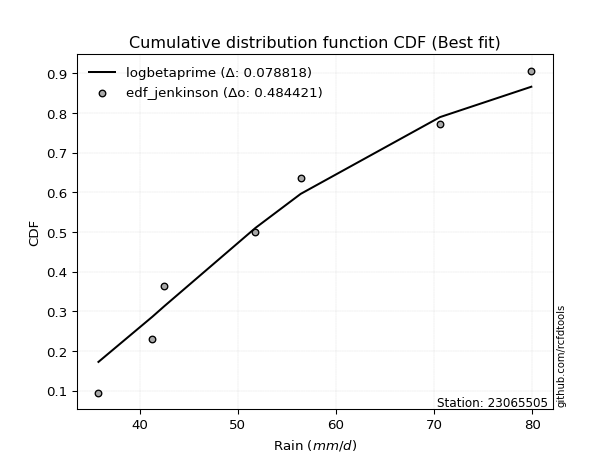</img>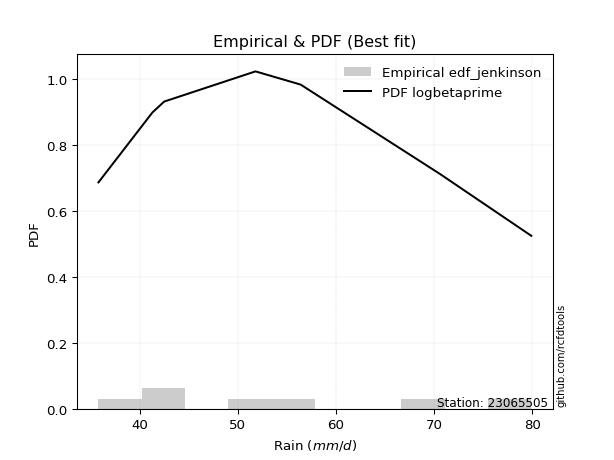</img>

</div>


### 11. EDF Cunnane (1978)

Cunnane´s work in statistical hydrology has focused on the performance and evaluation of different probability distributions (such as GEV, Gumbel, Lognormal) for flood frequency estimation. _b_ is a constant, typically set to 0.4.

<div align="center">


$P=(m-b)/(n+1-2b)$


</div>


**11.1. Empirical values**

<div align="center">

|                | 0                   | 1                   | 2                  | 3           | 4                  | 5                  | 6                  |
|:---------------|:--------------------|:--------------------|:-------------------|:------------|:-------------------|:-------------------|:-------------------|
| date           | 2020                | 2021                | 2015               | 2018        | 2019               | 2016               | 2017               |
| x              | 35.8                | 41.3                | 42.5               | 51.8        | 56.4               | 70.6               | 79.9               |
| m              | 1                   | 2                   | 3                  | 4           | 5                  | 6                  | 7                  |
| empirical_dist | edf_cunnane         | edf_cunnane         | edf_cunnane        | edf_cunnane | edf_cunnane        | edf_cunnane        | edf_cunnane        |
| empirical      | 0.08333333333333333 | 0.22222222222222224 | 0.3611111111111111 | 0.5         | 0.6388888888888888 | 0.7777777777777777 | 0.9166666666666666 |
| empirical_tr   | 1.090909090909091   | 1.2857142857142856  | 1.565217391304348  | 2.0         | 2.7692307692307687 | 4.499999999999998  | 11.999999999999995 |

</div>


**11.2. Kolmogorov-Smirnov fit test (sorted by Δ)**


<div align="center">

|                | 0                   | 1                   | 2                   | 3                   | 4                   | 5                   | 6                   | 7                   | 8                   | 9                   | 10                  | 11                  | 12                  | 13                  | 14                  | 15                  | 16                  | 17                  | 18                  | 19                  | 20                  | 21                  | 22                  | 23                  | 24                  | 25                  | 26                  | 27                  | 28                  | 29                  | 30                  | 31                  | 32                  | 33                  | 34                  | 35                  | 36                  | 37                  | 38                  | 39                  | 40                  | 41                  | 42                  | 43                  | 44                  | 45                  | 46                  | 47                  | 48                  | 49                  | 50                  | 51                  | 52                  | 53                  | 54                  | 55                  | 56                  | 57                  | 58                  | 59                  | 60                  | 61                  | 62                  | 63                  | 64                  | 65                  | 66                  | 67                  | 68                  | 69                  | 70                  | 71                  | 72                  | 73                  | 74                  | 75                  | 76                  | 77                  | 78                  | 79                  | 80                  | 81                  | 82                  | 83                  | 84                  | 85                  | 86                  | 87                  | 88                  | 89                  | 90                  | 91                  | 92                  | 93                  | 94                  | 95                  | 96                  | 97                  | 98                  | 99                  | 100                 | 101                 | 102                 | 103                 | 104                 | 105                 | 106                 | 107                 | 108                 | 109                 | 110                 | 111                 | 112                 | 113                 | 114                 | 115                 | 116                 | 117                 | 118                 | 119                 | 120                 | 121                 | 122                 | 123                 | 124                 | 125                 | 126                 | 127                 | 128                 | 129                 | 130                 | 131                 | 132                 | 133                 | 134                 | 135                 | 136                 | 137                 | 138                 | 139                 | 140                 | 141                 | 142                 | 143                 | 144                 | 145                 | 146                 | 147                 | 148                 | 149                 | 150                 | 151                 | 152                 | 153                 | 154                 | 155                 | 156                 | 157                 | 158                 | 159                 |
|:---------------|:--------------------|:--------------------|:--------------------|:--------------------|:--------------------|:--------------------|:--------------------|:--------------------|:--------------------|:--------------------|:--------------------|:--------------------|:--------------------|:--------------------|:--------------------|:--------------------|:--------------------|:--------------------|:--------------------|:--------------------|:--------------------|:--------------------|:--------------------|:--------------------|:--------------------|:--------------------|:--------------------|:--------------------|:--------------------|:--------------------|:--------------------|:--------------------|:--------------------|:--------------------|:--------------------|:--------------------|:--------------------|:--------------------|:--------------------|:--------------------|:--------------------|:--------------------|:--------------------|:--------------------|:--------------------|:--------------------|:--------------------|:--------------------|:--------------------|:--------------------|:--------------------|:--------------------|:--------------------|:--------------------|:--------------------|:--------------------|:--------------------|:--------------------|:--------------------|:--------------------|:--------------------|:--------------------|:--------------------|:--------------------|:--------------------|:--------------------|:--------------------|:--------------------|:--------------------|:--------------------|:--------------------|:--------------------|:--------------------|:--------------------|:--------------------|:--------------------|:--------------------|:--------------------|:--------------------|:--------------------|:--------------------|:--------------------|:--------------------|:--------------------|:--------------------|:--------------------|:--------------------|:--------------------|:--------------------|:--------------------|:--------------------|:--------------------|:--------------------|:--------------------|:--------------------|:--------------------|:--------------------|:--------------------|:--------------------|:--------------------|:--------------------|:--------------------|:--------------------|:--------------------|:--------------------|:--------------------|:--------------------|:--------------------|:--------------------|:--------------------|:--------------------|:--------------------|:--------------------|:--------------------|:--------------------|:--------------------|:--------------------|:--------------------|:--------------------|:--------------------|:--------------------|:--------------------|:--------------------|:--------------------|:--------------------|:--------------------|:--------------------|:--------------------|:--------------------|:--------------------|:--------------------|:--------------------|:--------------------|:--------------------|:--------------------|:--------------------|:--------------------|:--------------------|:--------------------|:--------------------|:--------------------|:--------------------|:--------------------|:--------------------|:--------------------|:--------------------|:--------------------|:--------------------|:--------------------|:--------------------|:--------------------|:--------------------|:--------------------|:--------------------|:--------------------|:--------------------|:--------------------|:--------------------|:--------------------|:--------------------|
| station        | 23065505            | 23065505            | 23065505            | 23065505            | 23065505            | 23065505            | 23065505            | 23065505            | 23065505            | 23065505            | 23065505            | 23065505            | 23065505            | 23065505            | 23065505            | 23065505            | 23065505            | 23065505            | 23065505            | 23065505            | 23065505            | 23065505            | 23065505            | 23065505            | 23065505            | 23065505            | 23065505            | 23065505            | 23065505            | 23065505            | 23065505            | 23065505            | 23065505            | 23065505            | 23065505            | 23065505            | 23065505            | 23065505            | 23065505            | 23065505            | 23065505            | 23065505            | 23065505            | 23065505            | 23065505            | 23065505            | 23065505            | 23065505            | 23065505            | 23065505            | 23065505            | 23065505            | 23065505            | 23065505            | 23065505            | 23065505            | 23065505            | 23065505            | 23065505            | 23065505            | 23065505            | 23065505            | 23065505            | 23065505            | 23065505            | 23065505            | 23065505            | 23065505            | 23065505            | 23065505            | 23065505            | 23065505            | 23065505            | 23065505            | 23065505            | 23065505            | 23065505            | 23065505            | 23065505            | 23065505            | 23065505            | 23065505            | 23065505            | 23065505            | 23065505            | 23065505            | 23065505            | 23065505            | 23065505            | 23065505            | 23065505            | 23065505            | 23065505            | 23065505            | 23065505            | 23065505            | 23065505            | 23065505            | 23065505            | 23065505            | 23065505            | 23065505            | 23065505            | 23065505            | 23065505            | 23065505            | 23065505            | 23065505            | 23065505            | 23065505            | 23065505            | 23065505            | 23065505            | 23065505            | 23065505            | 23065505            | 23065505            | 23065505            | 23065505            | 23065505            | 23065505            | 23065505            | 23065505            | 23065505            | 23065505            | 23065505            | 23065505            | 23065505            | 23065505            | 23065505            | 23065505            | 23065505            | 23065505            | 23065505            | 23065505            | 23065505            | 23065505            | 23065505            | 23065505            | 23065505            | 23065505            | 23065505            | 23065505            | 23065505            | 23065505            | 23065505            | 23065505            | 23065505            | 23065505            | 23065505            | 23065505            | 23065505            | 23065505            | 23065505            | 23065505            | 23065505            | 23065505            | 23065505            | 23065505            | 23065505            |
| empirical_dist | edf_cunnane         | edf_cunnane         | edf_cunnane         | edf_cunnane         | edf_cunnane         | edf_cunnane         | edf_cunnane         | edf_cunnane         | edf_cunnane         | edf_cunnane         | edf_cunnane         | edf_cunnane         | edf_cunnane         | edf_cunnane         | edf_cunnane         | edf_cunnane         | edf_cunnane         | edf_cunnane         | edf_cunnane         | edf_cunnane         | edf_cunnane         | edf_cunnane         | edf_cunnane         | edf_cunnane         | edf_cunnane         | edf_cunnane         | edf_cunnane         | edf_cunnane         | edf_cunnane         | edf_cunnane         | edf_cunnane         | edf_cunnane         | edf_cunnane         | edf_cunnane         | edf_cunnane         | edf_cunnane         | edf_cunnane         | edf_cunnane         | edf_cunnane         | edf_cunnane         | edf_cunnane         | edf_cunnane         | edf_cunnane         | edf_cunnane         | edf_cunnane         | edf_cunnane         | edf_cunnane         | edf_cunnane         | edf_cunnane         | edf_cunnane         | edf_cunnane         | edf_cunnane         | edf_cunnane         | edf_cunnane         | edf_cunnane         | edf_cunnane         | edf_cunnane         | edf_cunnane         | edf_cunnane         | edf_cunnane         | edf_cunnane         | edf_cunnane         | edf_cunnane         | edf_cunnane         | edf_cunnane         | edf_cunnane         | edf_cunnane         | edf_cunnane         | edf_cunnane         | edf_cunnane         | edf_cunnane         | edf_cunnane         | edf_cunnane         | edf_cunnane         | edf_cunnane         | edf_cunnane         | edf_cunnane         | edf_cunnane         | edf_cunnane         | edf_cunnane         | edf_cunnane         | edf_cunnane         | edf_cunnane         | edf_cunnane         | edf_cunnane         | edf_cunnane         | edf_cunnane         | edf_cunnane         | edf_cunnane         | edf_cunnane         | edf_cunnane         | edf_cunnane         | edf_cunnane         | edf_cunnane         | edf_cunnane         | edf_cunnane         | edf_cunnane         | edf_cunnane         | edf_cunnane         | edf_cunnane         | edf_cunnane         | edf_cunnane         | edf_cunnane         | edf_cunnane         | edf_cunnane         | edf_cunnane         | edf_cunnane         | edf_cunnane         | edf_cunnane         | edf_cunnane         | edf_cunnane         | edf_cunnane         | edf_cunnane         | edf_cunnane         | edf_cunnane         | edf_cunnane         | edf_cunnane         | edf_cunnane         | edf_cunnane         | edf_cunnane         | edf_cunnane         | edf_cunnane         | edf_cunnane         | edf_cunnane         | edf_cunnane         | edf_cunnane         | edf_cunnane         | edf_cunnane         | edf_cunnane         | edf_cunnane         | edf_cunnane         | edf_cunnane         | edf_cunnane         | edf_cunnane         | edf_cunnane         | edf_cunnane         | edf_cunnane         | edf_cunnane         | edf_cunnane         | edf_cunnane         | edf_cunnane         | edf_cunnane         | edf_cunnane         | edf_cunnane         | edf_cunnane         | edf_cunnane         | edf_cunnane         | edf_cunnane         | edf_cunnane         | edf_cunnane         | edf_cunnane         | edf_cunnane         | edf_cunnane         | edf_cunnane         | edf_cunnane         | edf_cunnane         | edf_cunnane         | edf_cunnane         | edf_cunnane         | edf_cunnane         |
| p_dist         | logksone            | invgauss            | genexpon            | logbeta             | logskewnorm         | logarcsine          | johnsonsu           | lomax               | exponnorm           | loggenexpon         | loggompertz         | loggausshyper       | loghalfnorm         | logbetaprime        | logfatiguelife      | logsemicircular     | ksone               | loginvgauss         | halfnorm            | logexponpow         | semicircular        | logkstwobign        | foldnorm            | arcsine             | logburr             | f                   | invgamma            | loggenlogistic      | loganglit           | truncweibull_min    | loginvweibull       | burr                | logmielke           | lograyleigh         | logbradford         | logburr12           | exponpow            | invweibull          | beta                | loghalflogistic     | logfoldnorm         | anglit              | logf                | loginvgamma         | logweibull_min      | logmaxwell          | rayleigh            | weibull_min         | burr12              | logalpha            | alpha               | halflogistic        | logwrapcauchy       | maxwell             | nct                 | logweibull_max      | loggenextreme       | logkappa4           | lognct              | logncf              | logpearson3         | logtruncweibull_min | loggumbel_r         | logrice             | genlogistic         | logtruncexpon       | pearson3            | logexponnorm        | lognorm             | logcrystalball      | logt                | logdweibull         | logloggamma         | logjohnsonsu        | betaprime           | kstwobign           | bradford            | logmoyal            | skewnorm            | gumbel_r            | truncexpon          | dweibull            | norm                | truncnorm           | t                   | logtukeylambda      | logcosine           | logdgamma           | moyal               | loguniform          | dgamma              | wrapcauchy          | gompertz            | logvonmises_line    | logloglaplace       | loglogistic         | rice                | cosine              | logistic            | gausshyper          | logkappa3           | halfgennorm         | loggumbel_l         | kappa4              | loghypsecant        | logargus            | gumbel_l            | hypsecant           | logtriang           | loglaplace          | loglaplace          | argus               | laplace             | logexponweib        | logtruncnorm        | vonmises_line       | loggamma            | loggamma            | logrdist            | tukeylambda         | uniform             | kappa3              | loggenhalflogistic  | nakagami            | logerlang           | lognakagami         | genpareto           | logwald             | triang              | wald                | loglevy_l           | gennorm             | loggennorm          | levy_l              | logtrapezoid        | genhalflogistic     | loggengamma         | johnsonsb           | ncf                 | genextreme          | trapezoid           | logjohnsonsb        | loggenpareto        | rdist               | powerlaw            | gengamma            | gamma               | fatiguelife         | logpowerlaw         | exponweib           | weibull_max         | logtruncpareto      | erlang              | truncpareto         | crystalball         | loglomax            | loghalfgennorm      | logvonmises         | vonmises            | mielke              |
| delta          | 0.07635371646481653 | 0.0812735780709527  | 0.08333147862470744 | 0.083333333200155   | 0.08333333333333333 | 0.08333333333333337 | 0.08355463427528986 | 0.0848766813053462  | 0.08573302130037552 | 0.08737081629141819 | 0.08756734401963884 | 0.08761930978023103 | 0.0886269407773852  | 0.08898071524684646 | 0.08976401053175537 | 0.09283143535443722 | 0.09362236507326949 | 0.09579478943210384 | 0.09873871802855305 | 0.09919242501437964 | 0.09939045496468835 | 0.10041645762140211 | 0.10067543137927365 | 0.1035220273921027  | 0.1035805207943632  | 0.10394904572479247 | 0.10395613264060205 | 0.10473662980262738 | 0.10509396049596609 | 0.10535468439132256 | 0.10540622989844156 | 0.10545806110260558 | 0.1060187099316865  | 0.10751951725306302 | 0.10836218784768059 | 0.1085592647879442  | 0.10856391550877431 | 0.10908358390723605 | 0.10915840744422708 | 0.10951057542600284 | 0.11036462828858701 | 0.11170754328568433 | 0.1130784182023315  | 0.11307914444400555 | 0.11411220633403385 | 0.11506460424026638 | 0.11581149286021666 | 0.11888391954003677 | 0.1203310657187513  | 0.12048998647445996 | 0.12076938904715762 | 0.12177005835677343 | 0.12200997889954227 | 0.12288768595761926 | 0.12392737836504289 | 0.12626146809409164 | 0.12627380920074105 | 0.12657315912702805 | 0.12701384659233858 | 0.12731582306363137 | 0.12796939771629837 | 0.1283553119853137  | 0.1290937036104238  | 0.12981574372704702 | 0.13005639728677465 | 0.13008343958011648 | 0.13085344572106697 | 0.1329839421470144  | 0.13316329405886673 | 0.1331633674066116  | 0.13316345110893174 | 0.1334952630865216  | 0.13354756201458015 | 0.13420973823912657 | 0.13488744952728796 | 0.13492513973023912 | 0.13580492786837522 | 0.13593493541431895 | 0.13793926636299714 | 0.13870608800052592 | 0.13903751840661777 | 0.13919201102574164 | 0.13983283108944827 | 0.13983287316649792 | 0.1398420046749324  | 0.14162250319680364 | 0.14501414422535192 | 0.14524646581703382 | 0.14733240500481032 | 0.14742126570601685 | 0.14978137104752143 | 0.1498836012437298  | 0.15038535521282415 | 0.15362400230475826 | 0.15470153051168295 | 0.1556343309169837  | 0.16030691851756745 | 0.1620132432690704  | 0.16214776971357883 | 0.16463233375587238 | 0.16557525674346443 | 0.16636477523987334 | 0.1670267296401659  | 0.16818715782956914 | 0.1697463893661452  | 0.17088251920038527 | 0.1719363300122435  | 0.17595176097878237 | 0.18488127255756379 | 0.18692244664072485 | 0.18692244664072485 | 0.19091329110376887 | 0.1923207940545693  | 0.19313879275743118 | 0.1998736611688373  | 0.20414492768299766 | 0.2059142878374982  | 0.2059142878374982  | 0.20730277087805654 | 0.2083152869267803  | 0.2091836734693877  | 0.21016750882187177 | 0.21751169527514153 | 0.2206309576205149  | 0.22126369890106456 | 0.22778895648683548 | 0.23214311135678406 | 0.24377180478435811 | 0.24731847214515523 | 0.26666287673559463 | 0.2674844640210072  | 0.2777777777777778  | 0.2777777777777778  | 0.2959894637915507  | 0.33072487444984794 | 0.3317611952661063  | 0.34797514362805126 | 0.35411206659235295 | 0.3856544751501327  | 0.41400961056233476 | 0.41553798600148883 | 0.4168669065647894  | 0.4212098810482909  | 0.4258196522681888  | 0.48660252992711106 | 0.49507065179463916 | 0.4954105753377427  | 0.5035852278681918  | 0.5166030743425244  | 0.5298137565096173  | 0.5475306596137344  | 0.5554888069583571  | 0.5739076437785956  | 0.6280797269397009  | 0.655177335675095   | 0.6805032818445136  | 0.7777777777777777  | 1.0920311733352062  | 12.568856100116962  | nan                 |
| deltao         | 0.48442053926100004 | 0.48442053926100004 | 0.48442053926100004 | 0.48442053926100004 | 0.48442053926100004 | 0.48442053926100004 | 0.48442053926100004 | 0.48442053926100004 | 0.48442053926100004 | 0.48442053926100004 | 0.48442053926100004 | 0.48442053926100004 | 0.48442053926100004 | 0.48442053926100004 | 0.48442053926100004 | 0.48442053926100004 | 0.48442053926100004 | 0.48442053926100004 | 0.48442053926100004 | 0.48442053926100004 | 0.48442053926100004 | 0.48442053926100004 | 0.48442053926100004 | 0.48442053926100004 | 0.48442053926100004 | 0.48442053926100004 | 0.48442053926100004 | 0.48442053926100004 | 0.48442053926100004 | 0.48442053926100004 | 0.48442053926100004 | 0.48442053926100004 | 0.48442053926100004 | 0.48442053926100004 | 0.48442053926100004 | 0.48442053926100004 | 0.48442053926100004 | 0.48442053926100004 | 0.48442053926100004 | 0.48442053926100004 | 0.48442053926100004 | 0.48442053926100004 | 0.48442053926100004 | 0.48442053926100004 | 0.48442053926100004 | 0.48442053926100004 | 0.48442053926100004 | 0.48442053926100004 | 0.48442053926100004 | 0.48442053926100004 | 0.48442053926100004 | 0.48442053926100004 | 0.48442053926100004 | 0.48442053926100004 | 0.48442053926100004 | 0.48442053926100004 | 0.48442053926100004 | 0.48442053926100004 | 0.48442053926100004 | 0.48442053926100004 | 0.48442053926100004 | 0.48442053926100004 | 0.48442053926100004 | 0.48442053926100004 | 0.48442053926100004 | 0.48442053926100004 | 0.48442053926100004 | 0.48442053926100004 | 0.48442053926100004 | 0.48442053926100004 | 0.48442053926100004 | 0.48442053926100004 | 0.48442053926100004 | 0.48442053926100004 | 0.48442053926100004 | 0.48442053926100004 | 0.48442053926100004 | 0.48442053926100004 | 0.48442053926100004 | 0.48442053926100004 | 0.48442053926100004 | 0.48442053926100004 | 0.48442053926100004 | 0.48442053926100004 | 0.48442053926100004 | 0.48442053926100004 | 0.48442053926100004 | 0.48442053926100004 | 0.48442053926100004 | 0.48442053926100004 | 0.48442053926100004 | 0.48442053926100004 | 0.48442053926100004 | 0.48442053926100004 | 0.48442053926100004 | 0.48442053926100004 | 0.48442053926100004 | 0.48442053926100004 | 0.48442053926100004 | 0.48442053926100004 | 0.48442053926100004 | 0.48442053926100004 | 0.48442053926100004 | 0.48442053926100004 | 0.48442053926100004 | 0.48442053926100004 | 0.48442053926100004 | 0.48442053926100004 | 0.48442053926100004 | 0.48442053926100004 | 0.48442053926100004 | 0.48442053926100004 | 0.48442053926100004 | 0.48442053926100004 | 0.48442053926100004 | 0.48442053926100004 | 0.48442053926100004 | 0.48442053926100004 | 0.48442053926100004 | 0.48442053926100004 | 0.48442053926100004 | 0.48442053926100004 | 0.48442053926100004 | 0.48442053926100004 | 0.48442053926100004 | 0.48442053926100004 | 0.48442053926100004 | 0.48442053926100004 | 0.48442053926100004 | 0.48442053926100004 | 0.48442053926100004 | 0.48442053926100004 | 0.48442053926100004 | 0.48442053926100004 | 0.48442053926100004 | 0.48442053926100004 | 0.48442053926100004 | 0.48442053926100004 | 0.48442053926100004 | 0.48442053926100004 | 0.48442053926100004 | 0.48442053926100004 | 0.48442053926100004 | 0.48442053926100004 | 0.48442053926100004 | 0.48442053926100004 | 0.48442053926100004 | 0.48442053926100004 | 0.48442053926100004 | 0.48442053926100004 | 0.48442053926100004 | 0.48442053926100004 | 0.48442053926100004 | 0.48442053926100004 | 0.48442053926100004 | 0.48442053926100004 | 0.48442053926100004 | 0.48442053926100004 | 0.48442053926100004 | 0.48442053926100004 |
| eval           | Δo > Δ              | Δo > Δ              | Δo > Δ              | Δo > Δ              | Δo > Δ              | Δo > Δ              | Δo > Δ              | Δo > Δ              | Δo > Δ              | Δo > Δ              | Δo > Δ              | Δo > Δ              | Δo > Δ              | Δo > Δ              | Δo > Δ              | Δo > Δ              | Δo > Δ              | Δo > Δ              | Δo > Δ              | Δo > Δ              | Δo > Δ              | Δo > Δ              | Δo > Δ              | Δo > Δ              | Δo > Δ              | Δo > Δ              | Δo > Δ              | Δo > Δ              | Δo > Δ              | Δo > Δ              | Δo > Δ              | Δo > Δ              | Δo > Δ              | Δo > Δ              | Δo > Δ              | Δo > Δ              | Δo > Δ              | Δo > Δ              | Δo > Δ              | Δo > Δ              | Δo > Δ              | Δo > Δ              | Δo > Δ              | Δo > Δ              | Δo > Δ              | Δo > Δ              | Δo > Δ              | Δo > Δ              | Δo > Δ              | Δo > Δ              | Δo > Δ              | Δo > Δ              | Δo > Δ              | Δo > Δ              | Δo > Δ              | Δo > Δ              | Δo > Δ              | Δo > Δ              | Δo > Δ              | Δo > Δ              | Δo > Δ              | Δo > Δ              | Δo > Δ              | Δo > Δ              | Δo > Δ              | Δo > Δ              | Δo > Δ              | Δo > Δ              | Δo > Δ              | Δo > Δ              | Δo > Δ              | Δo > Δ              | Δo > Δ              | Δo > Δ              | Δo > Δ              | Δo > Δ              | Δo > Δ              | Δo > Δ              | Δo > Δ              | Δo > Δ              | Δo > Δ              | Δo > Δ              | Δo > Δ              | Δo > Δ              | Δo > Δ              | Δo > Δ              | Δo > Δ              | Δo > Δ              | Δo > Δ              | Δo > Δ              | Δo > Δ              | Δo > Δ              | Δo > Δ              | Δo > Δ              | Δo > Δ              | Δo > Δ              | Δo > Δ              | Δo > Δ              | Δo > Δ              | Δo > Δ              | Δo > Δ              | Δo > Δ              | Δo > Δ              | Δo > Δ              | Δo > Δ              | Δo > Δ              | Δo > Δ              | Δo > Δ              | Δo > Δ              | Δo > Δ              | Δo > Δ              | Δo > Δ              | Δo > Δ              | Δo > Δ              | Δo > Δ              | Δo > Δ              | Δo > Δ              | Δo > Δ              | Δo > Δ              | Δo > Δ              | Δo > Δ              | Δo > Δ              | Δo > Δ              | Δo > Δ              | Δo > Δ              | Δo > Δ              | Δo > Δ              | Δo > Δ              | Δo > Δ              | Δo > Δ              | Δo > Δ              | Δo > Δ              | Δo > Δ              | Δo > Δ              | Δo > Δ              | Δo > Δ              | Δo > Δ              | Δo > Δ              | Δo > Δ              | Δo > Δ              | Δo > Δ              | Δo > Δ              | Δo > Δ              | Δo > Δ              | Δo <= Δ             | Δo <= Δ             | Δo <= Δ             | Δo <= Δ             | Δo <= Δ             | Δo <= Δ             | Δo <= Δ             | Δo <= Δ             | Δo <= Δ             | Δo <= Δ             | Δo <= Δ             | Δo <= Δ             | Δo <= Δ             | Δo <= Δ             | Δo <= Δ             | Δo <= Δ             |
| fit            | 1                   | 1                   | 1                   | 1                   | 1                   | 1                   | 1                   | 1                   | 1                   | 1                   | 1                   | 1                   | 1                   | 1                   | 1                   | 1                   | 1                   | 1                   | 1                   | 1                   | 1                   | 1                   | 1                   | 1                   | 1                   | 1                   | 1                   | 1                   | 1                   | 1                   | 1                   | 1                   | 1                   | 1                   | 1                   | 1                   | 1                   | 1                   | 1                   | 1                   | 1                   | 1                   | 1                   | 1                   | 1                   | 1                   | 1                   | 1                   | 1                   | 1                   | 1                   | 1                   | 1                   | 1                   | 1                   | 1                   | 1                   | 1                   | 1                   | 1                   | 1                   | 1                   | 1                   | 1                   | 1                   | 1                   | 1                   | 1                   | 1                   | 1                   | 1                   | 1                   | 1                   | 1                   | 1                   | 1                   | 1                   | 1                   | 1                   | 1                   | 1                   | 1                   | 1                   | 1                   | 1                   | 1                   | 1                   | 1                   | 1                   | 1                   | 1                   | 1                   | 1                   | 1                   | 1                   | 1                   | 1                   | 1                   | 1                   | 1                   | 1                   | 1                   | 1                   | 1                   | 1                   | 1                   | 1                   | 1                   | 1                   | 1                   | 1                   | 1                   | 1                   | 1                   | 1                   | 1                   | 1                   | 1                   | 1                   | 1                   | 1                   | 1                   | 1                   | 1                   | 1                   | 1                   | 1                   | 1                   | 1                   | 1                   | 1                   | 1                   | 1                   | 1                   | 1                   | 1                   | 1                   | 1                   | 1                   | 1                   | 1                   | 1                   | 1                   | 1                   | 0                   | 0                   | 0                   | 0                   | 0                   | 0                   | 0                   | 0                   | 0                   | 0                   | 0                   | 0                   | 0                   | 0                   | 0                   | 0                   |
| n              | 7                   | 7                   | 7                   | 7                   | 7                   | 7                   | 7                   | 7                   | 7                   | 7                   | 7                   | 7                   | 7                   | 7                   | 7                   | 7                   | 7                   | 7                   | 7                   | 7                   | 7                   | 7                   | 7                   | 7                   | 7                   | 7                   | 7                   | 7                   | 7                   | 7                   | 7                   | 7                   | 7                   | 7                   | 7                   | 7                   | 7                   | 7                   | 7                   | 7                   | 7                   | 7                   | 7                   | 7                   | 7                   | 7                   | 7                   | 7                   | 7                   | 7                   | 7                   | 7                   | 7                   | 7                   | 7                   | 7                   | 7                   | 7                   | 7                   | 7                   | 7                   | 7                   | 7                   | 7                   | 7                   | 7                   | 7                   | 7                   | 7                   | 7                   | 7                   | 7                   | 7                   | 7                   | 7                   | 7                   | 7                   | 7                   | 7                   | 7                   | 7                   | 7                   | 7                   | 7                   | 7                   | 7                   | 7                   | 7                   | 7                   | 7                   | 7                   | 7                   | 7                   | 7                   | 7                   | 7                   | 7                   | 7                   | 7                   | 7                   | 7                   | 7                   | 7                   | 7                   | 7                   | 7                   | 7                   | 7                   | 7                   | 7                   | 7                   | 7                   | 7                   | 7                   | 7                   | 7                   | 7                   | 7                   | 7                   | 7                   | 7                   | 7                   | 7                   | 7                   | 7                   | 7                   | 7                   | 7                   | 7                   | 7                   | 7                   | 7                   | 7                   | 7                   | 7                   | 7                   | 7                   | 7                   | 7                   | 7                   | 7                   | 7                   | 7                   | 7                   | 7                   | 7                   | 7                   | 7                   | 7                   | 7                   | 7                   | 7                   | 7                   | 7                   | 7                   | 7                   | 7                   | 7                   | 7                   | 7                   |
| best_fit       | 1                   | 0                   | 0                   | 0                   | 0                   | 0                   | 0                   | 0                   | 0                   | 0                   | 0                   | 0                   | 0                   | 0                   | 0                   | 0                   | 0                   | 0                   | 0                   | 0                   | 0                   | 0                   | 0                   | 0                   | 0                   | 0                   | 0                   | 0                   | 0                   | 0                   | 0                   | 0                   | 0                   | 0                   | 0                   | 0                   | 0                   | 0                   | 0                   | 0                   | 0                   | 0                   | 0                   | 0                   | 0                   | 0                   | 0                   | 0                   | 0                   | 0                   | 0                   | 0                   | 0                   | 0                   | 0                   | 0                   | 0                   | 0                   | 0                   | 0                   | 0                   | 0                   | 0                   | 0                   | 0                   | 0                   | 0                   | 0                   | 0                   | 0                   | 0                   | 0                   | 0                   | 0                   | 0                   | 0                   | 0                   | 0                   | 0                   | 0                   | 0                   | 0                   | 0                   | 0                   | 0                   | 0                   | 0                   | 0                   | 0                   | 0                   | 0                   | 0                   | 0                   | 0                   | 0                   | 0                   | 0                   | 0                   | 0                   | 0                   | 0                   | 0                   | 0                   | 0                   | 0                   | 0                   | 0                   | 0                   | 0                   | 0                   | 0                   | 0                   | 0                   | 0                   | 0                   | 0                   | 0                   | 0                   | 0                   | 0                   | 0                   | 0                   | 0                   | 0                   | 0                   | 0                   | 0                   | 0                   | 0                   | 0                   | 0                   | 0                   | 0                   | 0                   | 0                   | 0                   | 0                   | 0                   | 0                   | 0                   | 0                   | 0                   | 0                   | 0                   | 0                   | 0                   | 0                   | 0                   | 0                   | 0                   | 0                   | 0                   | 0                   | 0                   | 0                   | 0                   | 0                   | 0                   | 0                   | 0                   |
| best_fit_sort  | 1                   | 2                   | 3                   | 4                   | 5                   | 6                   | 7                   | 8                   | 9                   | 10                  | 11                  | 12                  | 13                  | 14                  | 15                  | 16                  | 17                  | 18                  | 19                  | 20                  | 21                  | 22                  | 23                  | 24                  | 25                  | 26                  | 27                  | 28                  | 29                  | 30                  | 31                  | 32                  | 33                  | 34                  | 35                  | 36                  | 37                  | 38                  | 39                  | 40                  | 41                  | 42                  | 43                  | 44                  | 45                  | 46                  | 47                  | 48                  | 49                  | 50                  | 51                  | 52                  | 53                  | 54                  | 55                  | 56                  | 57                  | 58                  | 59                  | 60                  | 61                  | 62                  | 63                  | 64                  | 65                  | 66                  | 67                  | 68                  | 69                  | 70                  | 71                  | 72                  | 73                  | 74                  | 75                  | 76                  | 77                  | 78                  | 79                  | 80                  | 81                  | 82                  | 83                  | 84                  | 85                  | 86                  | 87                  | 88                  | 89                  | 90                  | 91                  | 92                  | 93                  | 94                  | 95                  | 96                  | 97                  | 98                  | 99                  | 100                 | 101                 | 102                 | 103                 | 104                 | 105                 | 106                 | 107                 | 108                 | 109                 | 110                 | 111                 | 112                 | 113                 | 114                 | 115                 | 116                 | 117                 | 118                 | 119                 | 120                 | 121                 | 122                 | 123                 | 124                 | 125                 | 126                 | 127                 | 128                 | 129                 | 130                 | 131                 | 132                 | 133                 | 134                 | 135                 | 136                 | 137                 | 138                 | 139                 | 140                 | 141                 | 142                 | 143                 | 144                 | 145                 | 146                 | 147                 | 148                 | 149                 | 150                 | 151                 | 152                 | 153                 | 154                 | 155                 | 156                 | 157                 | 158                 | 159                 | 160                 |

</div>


**11.3. Best fit**

<div align="center">

|   id |   station | empirical_dist   | p_dist   |     delta |   deltao | eval   |   fit |   n |   best_fit |   best_fit_sort |
|-----:|----------:|:-----------------|:---------|----------:|---------:|:-------|------:|----:|-----------:|----------------:|
|    0 |  23065505 | edf_cunnane      | logksone | 0.0763537 | 0.484421 | Δo > Δ |     1 |   7 |          1 |               1 |

</div>


<div align="center">

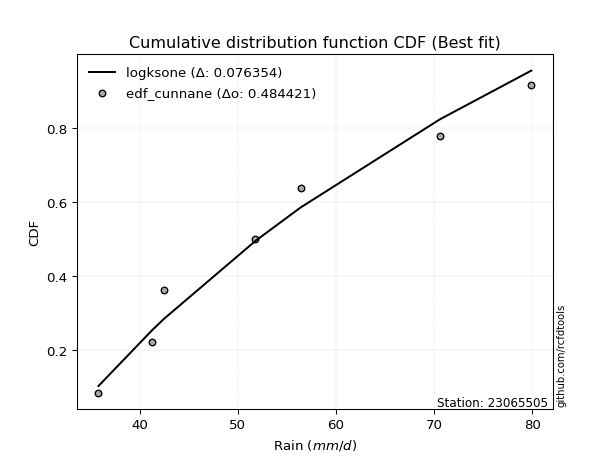</img>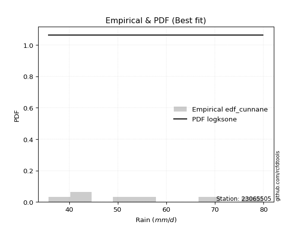</img>

</div>


### 12. EDF Adamowski (1981)

The Adamowski formula in hydrology refers to a specific plotting position formula used for estimating the non-parametric empirical distribution of hydrological events (like flood peaks) to calculate their return periods. This formula provides an alternative to traditional parametric methods (like the Gumbel or Log Pearson Type III distributions). 

<div align="center">


$P=(m-0.25)/(n+0.5)$


</div>


**12.1. Empirical values**

<div align="center">

|                | 0                  | 1                   | 2                   | 3             | 4                  | 5                  | 6                  |
|:---------------|:-------------------|:--------------------|:--------------------|:--------------|:-------------------|:-------------------|:-------------------|
| date           | 2020               | 2021                | 2015                | 2018          | 2019               | 2016               | 2017               |
| x              | 35.8               | 41.3                | 42.5                | 51.8          | 56.4               | 70.6               | 79.9               |
| m              | 1                  | 2                   | 3                   | 4             | 5                  | 6                  | 7                  |
| empirical_dist | edf_adamowski      | edf_adamowski       | edf_adamowski       | edf_adamowski | edf_adamowski      | edf_adamowski      | edf_adamowski      |
| empirical      | 0.1                | 0.23333333333333334 | 0.36666666666666664 | 0.5           | 0.6333333333333333 | 0.7666666666666667 | 0.9                |
| empirical_tr   | 1.1111111111111112 | 1.3043478260869565  | 1.5789473684210527  | 2.0           | 2.727272727272727  | 4.2857142857142865 | 10.000000000000002 |

</div>


**12.2. Kolmogorov-Smirnov fit test (sorted by Δ)**


<div align="center">

|                | 0                   | 1                   | 2                   | 3                   | 4                   | 5                   | 6                   | 7                   | 8                   | 9                   | 10                  | 11                  | 12                  | 13                  | 14                  | 15                  | 16                  | 17                  | 18                  | 19                  | 20                  | 21                  | 22                  | 23                  | 24                  | 25                  | 26                  | 27                  | 28                  | 29                  | 30                  | 31                  | 32                  | 33                  | 34                  | 35                  | 36                  | 37                  | 38                  | 39                  | 40                  | 41                  | 42                  | 43                  | 44                  | 45                  | 46                  | 47                  | 48                  | 49                  | 50                  | 51                  | 52                  | 53                  | 54                  | 55                  | 56                  | 57                  | 58                  | 59                  | 60                  | 61                  | 62                  | 63                  | 64                  | 65                  | 66                  | 67                  | 68                  | 69                  | 70                  | 71                  | 72                  | 73                  | 74                  | 75                  | 76                  | 77                  | 78                  | 79                  | 80                  | 81                  | 82                  | 83                  | 84                  | 85                  | 86                  | 87                  | 88                  | 89                  | 90                  | 91                  | 92                  | 93                  | 94                  | 95                  | 96                  | 97                  | 98                  | 99                  | 100                 | 101                 | 102                 | 103                 | 104                 | 105                 | 106                 | 107                 | 108                 | 109                 | 110                 | 111                 | 112                 | 113                 | 114                 | 115                 | 116                 | 117                 | 118                 | 119                 | 120                 | 121                 | 122                 | 123                 | 124                 | 125                 | 126                 | 127                 | 128                 | 129                 | 130                 | 131                 | 132                 | 133                 | 134                 | 135                 | 136                 | 137                 | 138                 | 139                 | 140                 | 141                 | 142                 | 143                 | 144                 | 145                 | 146                 | 147                 | 148                 | 149                 | 150                 | 151                 | 152                 | 153                 | 154                 | 155                 | 156                 | 157                 | 158                 | 159                 |
|:---------------|:--------------------|:--------------------|:--------------------|:--------------------|:--------------------|:--------------------|:--------------------|:--------------------|:--------------------|:--------------------|:--------------------|:--------------------|:--------------------|:--------------------|:--------------------|:--------------------|:--------------------|:--------------------|:--------------------|:--------------------|:--------------------|:--------------------|:--------------------|:--------------------|:--------------------|:--------------------|:--------------------|:--------------------|:--------------------|:--------------------|:--------------------|:--------------------|:--------------------|:--------------------|:--------------------|:--------------------|:--------------------|:--------------------|:--------------------|:--------------------|:--------------------|:--------------------|:--------------------|:--------------------|:--------------------|:--------------------|:--------------------|:--------------------|:--------------------|:--------------------|:--------------------|:--------------------|:--------------------|:--------------------|:--------------------|:--------------------|:--------------------|:--------------------|:--------------------|:--------------------|:--------------------|:--------------------|:--------------------|:--------------------|:--------------------|:--------------------|:--------------------|:--------------------|:--------------------|:--------------------|:--------------------|:--------------------|:--------------------|:--------------------|:--------------------|:--------------------|:--------------------|:--------------------|:--------------------|:--------------------|:--------------------|:--------------------|:--------------------|:--------------------|:--------------------|:--------------------|:--------------------|:--------------------|:--------------------|:--------------------|:--------------------|:--------------------|:--------------------|:--------------------|:--------------------|:--------------------|:--------------------|:--------------------|:--------------------|:--------------------|:--------------------|:--------------------|:--------------------|:--------------------|:--------------------|:--------------------|:--------------------|:--------------------|:--------------------|:--------------------|:--------------------|:--------------------|:--------------------|:--------------------|:--------------------|:--------------------|:--------------------|:--------------------|:--------------------|:--------------------|:--------------------|:--------------------|:--------------------|:--------------------|:--------------------|:--------------------|:--------------------|:--------------------|:--------------------|:--------------------|:--------------------|:--------------------|:--------------------|:--------------------|:--------------------|:--------------------|:--------------------|:--------------------|:--------------------|:--------------------|:--------------------|:--------------------|:--------------------|:--------------------|:--------------------|:--------------------|:--------------------|:--------------------|:--------------------|:--------------------|:--------------------|:--------------------|:--------------------|:--------------------|:--------------------|:--------------------|:--------------------|:--------------------|:--------------------|:--------------------|
| station        | 23065505            | 23065505            | 23065505            | 23065505            | 23065505            | 23065505            | 23065505            | 23065505            | 23065505            | 23065505            | 23065505            | 23065505            | 23065505            | 23065505            | 23065505            | 23065505            | 23065505            | 23065505            | 23065505            | 23065505            | 23065505            | 23065505            | 23065505            | 23065505            | 23065505            | 23065505            | 23065505            | 23065505            | 23065505            | 23065505            | 23065505            | 23065505            | 23065505            | 23065505            | 23065505            | 23065505            | 23065505            | 23065505            | 23065505            | 23065505            | 23065505            | 23065505            | 23065505            | 23065505            | 23065505            | 23065505            | 23065505            | 23065505            | 23065505            | 23065505            | 23065505            | 23065505            | 23065505            | 23065505            | 23065505            | 23065505            | 23065505            | 23065505            | 23065505            | 23065505            | 23065505            | 23065505            | 23065505            | 23065505            | 23065505            | 23065505            | 23065505            | 23065505            | 23065505            | 23065505            | 23065505            | 23065505            | 23065505            | 23065505            | 23065505            | 23065505            | 23065505            | 23065505            | 23065505            | 23065505            | 23065505            | 23065505            | 23065505            | 23065505            | 23065505            | 23065505            | 23065505            | 23065505            | 23065505            | 23065505            | 23065505            | 23065505            | 23065505            | 23065505            | 23065505            | 23065505            | 23065505            | 23065505            | 23065505            | 23065505            | 23065505            | 23065505            | 23065505            | 23065505            | 23065505            | 23065505            | 23065505            | 23065505            | 23065505            | 23065505            | 23065505            | 23065505            | 23065505            | 23065505            | 23065505            | 23065505            | 23065505            | 23065505            | 23065505            | 23065505            | 23065505            | 23065505            | 23065505            | 23065505            | 23065505            | 23065505            | 23065505            | 23065505            | 23065505            | 23065505            | 23065505            | 23065505            | 23065505            | 23065505            | 23065505            | 23065505            | 23065505            | 23065505            | 23065505            | 23065505            | 23065505            | 23065505            | 23065505            | 23065505            | 23065505            | 23065505            | 23065505            | 23065505            | 23065505            | 23065505            | 23065505            | 23065505            | 23065505            | 23065505            | 23065505            | 23065505            | 23065505            | 23065505            | 23065505            | 23065505            |
| empirical_dist | edf_adamowski       | edf_adamowski       | edf_adamowski       | edf_adamowski       | edf_adamowski       | edf_adamowski       | edf_adamowski       | edf_adamowski       | edf_adamowski       | edf_adamowski       | edf_adamowski       | edf_adamowski       | edf_adamowski       | edf_adamowski       | edf_adamowski       | edf_adamowski       | edf_adamowski       | edf_adamowski       | edf_adamowski       | edf_adamowski       | edf_adamowski       | edf_adamowski       | edf_adamowski       | edf_adamowski       | edf_adamowski       | edf_adamowski       | edf_adamowski       | edf_adamowski       | edf_adamowski       | edf_adamowski       | edf_adamowski       | edf_adamowski       | edf_adamowski       | edf_adamowski       | edf_adamowski       | edf_adamowski       | edf_adamowski       | edf_adamowski       | edf_adamowski       | edf_adamowski       | edf_adamowski       | edf_adamowski       | edf_adamowski       | edf_adamowski       | edf_adamowski       | edf_adamowski       | edf_adamowski       | edf_adamowski       | edf_adamowski       | edf_adamowski       | edf_adamowski       | edf_adamowski       | edf_adamowski       | edf_adamowski       | edf_adamowski       | edf_adamowski       | edf_adamowski       | edf_adamowski       | edf_adamowski       | edf_adamowski       | edf_adamowski       | edf_adamowski       | edf_adamowski       | edf_adamowski       | edf_adamowski       | edf_adamowski       | edf_adamowski       | edf_adamowski       | edf_adamowski       | edf_adamowski       | edf_adamowski       | edf_adamowski       | edf_adamowski       | edf_adamowski       | edf_adamowski       | edf_adamowski       | edf_adamowski       | edf_adamowski       | edf_adamowski       | edf_adamowski       | edf_adamowski       | edf_adamowski       | edf_adamowski       | edf_adamowski       | edf_adamowski       | edf_adamowski       | edf_adamowski       | edf_adamowski       | edf_adamowski       | edf_adamowski       | edf_adamowski       | edf_adamowski       | edf_adamowski       | edf_adamowski       | edf_adamowski       | edf_adamowski       | edf_adamowski       | edf_adamowski       | edf_adamowski       | edf_adamowski       | edf_adamowski       | edf_adamowski       | edf_adamowski       | edf_adamowski       | edf_adamowski       | edf_adamowski       | edf_adamowski       | edf_adamowski       | edf_adamowski       | edf_adamowski       | edf_adamowski       | edf_adamowski       | edf_adamowski       | edf_adamowski       | edf_adamowski       | edf_adamowski       | edf_adamowski       | edf_adamowski       | edf_adamowski       | edf_adamowski       | edf_adamowski       | edf_adamowski       | edf_adamowski       | edf_adamowski       | edf_adamowski       | edf_adamowski       | edf_adamowski       | edf_adamowski       | edf_adamowski       | edf_adamowski       | edf_adamowski       | edf_adamowski       | edf_adamowski       | edf_adamowski       | edf_adamowski       | edf_adamowski       | edf_adamowski       | edf_adamowski       | edf_adamowski       | edf_adamowski       | edf_adamowski       | edf_adamowski       | edf_adamowski       | edf_adamowski       | edf_adamowski       | edf_adamowski       | edf_adamowski       | edf_adamowski       | edf_adamowski       | edf_adamowski       | edf_adamowski       | edf_adamowski       | edf_adamowski       | edf_adamowski       | edf_adamowski       | edf_adamowski       | edf_adamowski       | edf_adamowski       | edf_adamowski       | edf_adamowski       |
| p_dist         | logbetaprime        | logksone            | johnsonsu           | invgauss            | logfatiguelife      | ksone               | lomax               | logsemicircular     | exponnorm           | genexpon            | beta                | loggompertz         | loggenexpon         | logbeta             | logexponpow         | logarcsine          | arcsine             | loghalfnorm         | logskewnorm         | loggausshyper       | loginvgauss         | halfnorm            | semicircular        | logkstwobign        | foldnorm            | weibull_min         | logburr12           | logburr             | f                   | invgamma            | loggenlogistic      | loganglit           | loginvweibull       | logwrapcauchy       | burr                | logmielke           | lograyleigh         | logweibull_min      | exponpow            | invweibull          | loghalflogistic     | logfoldnorm         | truncweibull_min    | anglit              | logf                | loginvgamma         | logbradford         | burr12              | logmaxwell          | rayleigh            | logalpha            | alpha               | halflogistic        | maxwell             | nct                 | logweibull_max      | loggenextreme       | logkappa4           | lognct              | logncf              | logpearson3         | loggumbel_r         | logrice             | genlogistic         | pearson3            | logexponnorm        | lognorm             | logcrystalball      | logt                | logloggamma         | logtruncweibull_min | logjohnsonsu        | betaprime           | kstwobign           | logtruncexpon       | bradford            | logmoyal            | skewnorm            | gumbel_r            | wrapcauchy          | truncexpon          | logdweibull         | norm                | truncnorm           | t                   | logtukeylambda      | dweibull            | logcosine           | moyal               | loguniform          | halfgennorm         | gompertz            | logdgamma           | logvonmises_line    | logloglaplace       | dgamma              | loglogistic         | rice                | cosine              | logistic            | gausshyper          | logkappa3           | loggumbel_l         | kappa4              | loghypsecant        | logargus            | gumbel_l            | hypsecant           | logtriang           | logrdist            | loglaplace          | loglaplace          | logexponweib        | argus               | laplace             | logtruncnorm        | loggamma            | loggamma            | nakagami            | vonmises_line       | loggenhalflogistic  | tukeylambda         | uniform             | genpareto           | kappa3              | lognakagami         | logerlang           | triang              | logwald             | loglevy_l           | gennorm             | loggennorm          | wald                | levy_l              | logtrapezoid        | genhalflogistic     | loggengamma         | johnsonsb           | ncf                 | genextreme          | loggenpareto        | logjohnsonsb        | rdist               | trapezoid           | powerlaw            | gengamma            | gamma               | fatiguelife         | logpowerlaw         | exponweib           | weibull_max         | logtruncpareto      | erlang              | truncpareto         | crystalball         | loglomax            | loghalfgennorm      | logvonmises         | vonmises            | mielke              |
| delta          | 0.07231404858017978 | 0.08190927202037207 | 0.0891101898308454  | 0.09238468918206366 | 0.0953195660873109  | 0.09656004912891425 | 0.0970221506793316  | 0.09838699090999276 | 0.09872689126781789 | 0.09999814529137412 | 0.09999997435293395 | 0.09999998232751052 | 0.09999999971418555 | 0.09999999986682168 | 0.09999999999978022 | 0.09999999999999998 | 0.09999999999999998 | 0.1                 | 0.1                 | 0.10000000001667042 | 0.10135034498765938 | 0.10429427358410859 | 0.10494601052024388 | 0.10597201317695765 | 0.10623098693482919 | 0.10777280842892567 | 0.1085592647879442  | 0.10913607634991873 | 0.109504601280348   | 0.10951168819615759 | 0.11029218535818291 | 0.11064951605152162 | 0.1109617854539971  | 0.11099696376575219 | 0.11101361665816112 | 0.11157426548724203 | 0.11307507280861856 | 0.11411220633403385 | 0.11411947106432985 | 0.11463913946279158 | 0.11506613098155838 | 0.11592018384414254 | 0.11646579550243352 | 0.11726309884123987 | 0.11863397375788703 | 0.11863469999956108 | 0.11947329895879155 | 0.1203310657187513  | 0.12062015979582191 | 0.1213670484157722  | 0.1260455420300155  | 0.12632494460271315 | 0.12732561391232897 | 0.1284432415131748  | 0.12948293392059843 | 0.13181702364964717 | 0.13182936475629659 | 0.13212871468258358 | 0.13256940214789412 | 0.1328713786191869  | 0.1335249532718539  | 0.13464925916597933 | 0.13537129928260255 | 0.13561195284233019 | 0.1364090012766225  | 0.13853949770256993 | 0.13871884961442227 | 0.13871892296216715 | 0.13871900666448728 | 0.1391031175701357  | 0.13946642309642465 | 0.1397652937946821  | 0.1404430050828435  | 0.14048069528579465 | 0.14119455069122744 | 0.14136048342393076 | 0.14149049096987448 | 0.14349482191855267 | 0.14426164355608145 | 0.14432804568817426 | 0.1445930739621733  | 0.14460637419763256 | 0.1453883866450038  | 0.14538842872205346 | 0.14539756023048794 | 0.14717805875235918 | 0.1503031221368526  | 0.15056969978090745 | 0.15288796056036585 | 0.1529768212615724  | 0.15525366412876224 | 0.15594091076837968 | 0.15635757692814478 | 0.1591795578603138  | 0.16025708606723849 | 0.1608924821586324  | 0.16118988647253923 | 0.165862474073123   | 0.16756879882462594 | 0.16770332526913437 | 0.17018788931142792 | 0.17113081229901997 | 0.17258228519572144 | 0.17374271338512468 | 0.17530194492170073 | 0.1764380747559408  | 0.17749188556779905 | 0.1815073165343379  | 0.19043682811311932 | 0.19063610421138985 | 0.1924780021962804  | 0.1924780021962804  | 0.19313879275743118 | 0.1947348798628648  | 0.19787634961012485 | 0.1998736611688373  | 0.2059142878374982  | 0.2059142878374982  | 0.2095198465094038  | 0.2097004832385532  | 0.211956139719586   | 0.21387084248233584 | 0.21473922902494325 | 0.21547644469011737 | 0.2157230643774273  | 0.21667784537572438 | 0.22126369890106456 | 0.2417629165895997  | 0.24932736033991365 | 0.2508177973543405  | 0.2666666666666667  | 0.2666666666666667  | 0.27221843229115017 | 0.27932279712488406 | 0.3251693188942924  | 0.3262056397105508  | 0.33686403251694014 | 0.343000955481242   | 0.368987808483466   | 0.40289849945122364 | 0.4045432143816242  | 0.40575579545367846 | 0.40915298560152213 | 0.4099824304459333  | 0.47549141881599993 | 0.48395954068352803 | 0.48429946422663156 | 0.4924741167570807  | 0.5054919632314132  | 0.5187026453985062  | 0.5364195485026233  | 0.5443776958472459  | 0.5627965326674844  | 0.6169686158285899  | 0.6385106690084283  | 0.663836615177847   | 0.7666666666666667  | 1.1031422844463172  | 12.585522766783628  | nan                 |
| deltao         | 0.48442053926100004 | 0.48442053926100004 | 0.48442053926100004 | 0.48442053926100004 | 0.48442053926100004 | 0.48442053926100004 | 0.48442053926100004 | 0.48442053926100004 | 0.48442053926100004 | 0.48442053926100004 | 0.48442053926100004 | 0.48442053926100004 | 0.48442053926100004 | 0.48442053926100004 | 0.48442053926100004 | 0.48442053926100004 | 0.48442053926100004 | 0.48442053926100004 | 0.48442053926100004 | 0.48442053926100004 | 0.48442053926100004 | 0.48442053926100004 | 0.48442053926100004 | 0.48442053926100004 | 0.48442053926100004 | 0.48442053926100004 | 0.48442053926100004 | 0.48442053926100004 | 0.48442053926100004 | 0.48442053926100004 | 0.48442053926100004 | 0.48442053926100004 | 0.48442053926100004 | 0.48442053926100004 | 0.48442053926100004 | 0.48442053926100004 | 0.48442053926100004 | 0.48442053926100004 | 0.48442053926100004 | 0.48442053926100004 | 0.48442053926100004 | 0.48442053926100004 | 0.48442053926100004 | 0.48442053926100004 | 0.48442053926100004 | 0.48442053926100004 | 0.48442053926100004 | 0.48442053926100004 | 0.48442053926100004 | 0.48442053926100004 | 0.48442053926100004 | 0.48442053926100004 | 0.48442053926100004 | 0.48442053926100004 | 0.48442053926100004 | 0.48442053926100004 | 0.48442053926100004 | 0.48442053926100004 | 0.48442053926100004 | 0.48442053926100004 | 0.48442053926100004 | 0.48442053926100004 | 0.48442053926100004 | 0.48442053926100004 | 0.48442053926100004 | 0.48442053926100004 | 0.48442053926100004 | 0.48442053926100004 | 0.48442053926100004 | 0.48442053926100004 | 0.48442053926100004 | 0.48442053926100004 | 0.48442053926100004 | 0.48442053926100004 | 0.48442053926100004 | 0.48442053926100004 | 0.48442053926100004 | 0.48442053926100004 | 0.48442053926100004 | 0.48442053926100004 | 0.48442053926100004 | 0.48442053926100004 | 0.48442053926100004 | 0.48442053926100004 | 0.48442053926100004 | 0.48442053926100004 | 0.48442053926100004 | 0.48442053926100004 | 0.48442053926100004 | 0.48442053926100004 | 0.48442053926100004 | 0.48442053926100004 | 0.48442053926100004 | 0.48442053926100004 | 0.48442053926100004 | 0.48442053926100004 | 0.48442053926100004 | 0.48442053926100004 | 0.48442053926100004 | 0.48442053926100004 | 0.48442053926100004 | 0.48442053926100004 | 0.48442053926100004 | 0.48442053926100004 | 0.48442053926100004 | 0.48442053926100004 | 0.48442053926100004 | 0.48442053926100004 | 0.48442053926100004 | 0.48442053926100004 | 0.48442053926100004 | 0.48442053926100004 | 0.48442053926100004 | 0.48442053926100004 | 0.48442053926100004 | 0.48442053926100004 | 0.48442053926100004 | 0.48442053926100004 | 0.48442053926100004 | 0.48442053926100004 | 0.48442053926100004 | 0.48442053926100004 | 0.48442053926100004 | 0.48442053926100004 | 0.48442053926100004 | 0.48442053926100004 | 0.48442053926100004 | 0.48442053926100004 | 0.48442053926100004 | 0.48442053926100004 | 0.48442053926100004 | 0.48442053926100004 | 0.48442053926100004 | 0.48442053926100004 | 0.48442053926100004 | 0.48442053926100004 | 0.48442053926100004 | 0.48442053926100004 | 0.48442053926100004 | 0.48442053926100004 | 0.48442053926100004 | 0.48442053926100004 | 0.48442053926100004 | 0.48442053926100004 | 0.48442053926100004 | 0.48442053926100004 | 0.48442053926100004 | 0.48442053926100004 | 0.48442053926100004 | 0.48442053926100004 | 0.48442053926100004 | 0.48442053926100004 | 0.48442053926100004 | 0.48442053926100004 | 0.48442053926100004 | 0.48442053926100004 | 0.48442053926100004 | 0.48442053926100004 | 0.48442053926100004 | 0.48442053926100004 |
| eval           | Δo > Δ              | Δo > Δ              | Δo > Δ              | Δo > Δ              | Δo > Δ              | Δo > Δ              | Δo > Δ              | Δo > Δ              | Δo > Δ              | Δo > Δ              | Δo > Δ              | Δo > Δ              | Δo > Δ              | Δo > Δ              | Δo > Δ              | Δo > Δ              | Δo > Δ              | Δo > Δ              | Δo > Δ              | Δo > Δ              | Δo > Δ              | Δo > Δ              | Δo > Δ              | Δo > Δ              | Δo > Δ              | Δo > Δ              | Δo > Δ              | Δo > Δ              | Δo > Δ              | Δo > Δ              | Δo > Δ              | Δo > Δ              | Δo > Δ              | Δo > Δ              | Δo > Δ              | Δo > Δ              | Δo > Δ              | Δo > Δ              | Δo > Δ              | Δo > Δ              | Δo > Δ              | Δo > Δ              | Δo > Δ              | Δo > Δ              | Δo > Δ              | Δo > Δ              | Δo > Δ              | Δo > Δ              | Δo > Δ              | Δo > Δ              | Δo > Δ              | Δo > Δ              | Δo > Δ              | Δo > Δ              | Δo > Δ              | Δo > Δ              | Δo > Δ              | Δo > Δ              | Δo > Δ              | Δo > Δ              | Δo > Δ              | Δo > Δ              | Δo > Δ              | Δo > Δ              | Δo > Δ              | Δo > Δ              | Δo > Δ              | Δo > Δ              | Δo > Δ              | Δo > Δ              | Δo > Δ              | Δo > Δ              | Δo > Δ              | Δo > Δ              | Δo > Δ              | Δo > Δ              | Δo > Δ              | Δo > Δ              | Δo > Δ              | Δo > Δ              | Δo > Δ              | Δo > Δ              | Δo > Δ              | Δo > Δ              | Δo > Δ              | Δo > Δ              | Δo > Δ              | Δo > Δ              | Δo > Δ              | Δo > Δ              | Δo > Δ              | Δo > Δ              | Δo > Δ              | Δo > Δ              | Δo > Δ              | Δo > Δ              | Δo > Δ              | Δo > Δ              | Δo > Δ              | Δo > Δ              | Δo > Δ              | Δo > Δ              | Δo > Δ              | Δo > Δ              | Δo > Δ              | Δo > Δ              | Δo > Δ              | Δo > Δ              | Δo > Δ              | Δo > Δ              | Δo > Δ              | Δo > Δ              | Δo > Δ              | Δo > Δ              | Δo > Δ              | Δo > Δ              | Δo > Δ              | Δo > Δ              | Δo > Δ              | Δo > Δ              | Δo > Δ              | Δo > Δ              | Δo > Δ              | Δo > Δ              | Δo > Δ              | Δo > Δ              | Δo > Δ              | Δo > Δ              | Δo > Δ              | Δo > Δ              | Δo > Δ              | Δo > Δ              | Δo > Δ              | Δo > Δ              | Δo > Δ              | Δo > Δ              | Δo > Δ              | Δo > Δ              | Δo > Δ              | Δo > Δ              | Δo > Δ              | Δo > Δ              | Δo > Δ              | Δo > Δ              | Δo > Δ              | Δo > Δ              | Δo > Δ              | Δo <= Δ             | Δo <= Δ             | Δo <= Δ             | Δo <= Δ             | Δo <= Δ             | Δo <= Δ             | Δo <= Δ             | Δo <= Δ             | Δo <= Δ             | Δo <= Δ             | Δo <= Δ             | Δo <= Δ             | Δo <= Δ             |
| fit            | 1                   | 1                   | 1                   | 1                   | 1                   | 1                   | 1                   | 1                   | 1                   | 1                   | 1                   | 1                   | 1                   | 1                   | 1                   | 1                   | 1                   | 1                   | 1                   | 1                   | 1                   | 1                   | 1                   | 1                   | 1                   | 1                   | 1                   | 1                   | 1                   | 1                   | 1                   | 1                   | 1                   | 1                   | 1                   | 1                   | 1                   | 1                   | 1                   | 1                   | 1                   | 1                   | 1                   | 1                   | 1                   | 1                   | 1                   | 1                   | 1                   | 1                   | 1                   | 1                   | 1                   | 1                   | 1                   | 1                   | 1                   | 1                   | 1                   | 1                   | 1                   | 1                   | 1                   | 1                   | 1                   | 1                   | 1                   | 1                   | 1                   | 1                   | 1                   | 1                   | 1                   | 1                   | 1                   | 1                   | 1                   | 1                   | 1                   | 1                   | 1                   | 1                   | 1                   | 1                   | 1                   | 1                   | 1                   | 1                   | 1                   | 1                   | 1                   | 1                   | 1                   | 1                   | 1                   | 1                   | 1                   | 1                   | 1                   | 1                   | 1                   | 1                   | 1                   | 1                   | 1                   | 1                   | 1                   | 1                   | 1                   | 1                   | 1                   | 1                   | 1                   | 1                   | 1                   | 1                   | 1                   | 1                   | 1                   | 1                   | 1                   | 1                   | 1                   | 1                   | 1                   | 1                   | 1                   | 1                   | 1                   | 1                   | 1                   | 1                   | 1                   | 1                   | 1                   | 1                   | 1                   | 1                   | 1                   | 1                   | 1                   | 1                   | 1                   | 1                   | 1                   | 1                   | 1                   | 0                   | 0                   | 0                   | 0                   | 0                   | 0                   | 0                   | 0                   | 0                   | 0                   | 0                   | 0                   | 0                   |
| n              | 7                   | 7                   | 7                   | 7                   | 7                   | 7                   | 7                   | 7                   | 7                   | 7                   | 7                   | 7                   | 7                   | 7                   | 7                   | 7                   | 7                   | 7                   | 7                   | 7                   | 7                   | 7                   | 7                   | 7                   | 7                   | 7                   | 7                   | 7                   | 7                   | 7                   | 7                   | 7                   | 7                   | 7                   | 7                   | 7                   | 7                   | 7                   | 7                   | 7                   | 7                   | 7                   | 7                   | 7                   | 7                   | 7                   | 7                   | 7                   | 7                   | 7                   | 7                   | 7                   | 7                   | 7                   | 7                   | 7                   | 7                   | 7                   | 7                   | 7                   | 7                   | 7                   | 7                   | 7                   | 7                   | 7                   | 7                   | 7                   | 7                   | 7                   | 7                   | 7                   | 7                   | 7                   | 7                   | 7                   | 7                   | 7                   | 7                   | 7                   | 7                   | 7                   | 7                   | 7                   | 7                   | 7                   | 7                   | 7                   | 7                   | 7                   | 7                   | 7                   | 7                   | 7                   | 7                   | 7                   | 7                   | 7                   | 7                   | 7                   | 7                   | 7                   | 7                   | 7                   | 7                   | 7                   | 7                   | 7                   | 7                   | 7                   | 7                   | 7                   | 7                   | 7                   | 7                   | 7                   | 7                   | 7                   | 7                   | 7                   | 7                   | 7                   | 7                   | 7                   | 7                   | 7                   | 7                   | 7                   | 7                   | 7                   | 7                   | 7                   | 7                   | 7                   | 7                   | 7                   | 7                   | 7                   | 7                   | 7                   | 7                   | 7                   | 7                   | 7                   | 7                   | 7                   | 7                   | 7                   | 7                   | 7                   | 7                   | 7                   | 7                   | 7                   | 7                   | 7                   | 7                   | 7                   | 7                   | 7                   |
| best_fit       | 1                   | 0                   | 0                   | 0                   | 0                   | 0                   | 0                   | 0                   | 0                   | 0                   | 0                   | 0                   | 0                   | 0                   | 0                   | 0                   | 0                   | 0                   | 0                   | 0                   | 0                   | 0                   | 0                   | 0                   | 0                   | 0                   | 0                   | 0                   | 0                   | 0                   | 0                   | 0                   | 0                   | 0                   | 0                   | 0                   | 0                   | 0                   | 0                   | 0                   | 0                   | 0                   | 0                   | 0                   | 0                   | 0                   | 0                   | 0                   | 0                   | 0                   | 0                   | 0                   | 0                   | 0                   | 0                   | 0                   | 0                   | 0                   | 0                   | 0                   | 0                   | 0                   | 0                   | 0                   | 0                   | 0                   | 0                   | 0                   | 0                   | 0                   | 0                   | 0                   | 0                   | 0                   | 0                   | 0                   | 0                   | 0                   | 0                   | 0                   | 0                   | 0                   | 0                   | 0                   | 0                   | 0                   | 0                   | 0                   | 0                   | 0                   | 0                   | 0                   | 0                   | 0                   | 0                   | 0                   | 0                   | 0                   | 0                   | 0                   | 0                   | 0                   | 0                   | 0                   | 0                   | 0                   | 0                   | 0                   | 0                   | 0                   | 0                   | 0                   | 0                   | 0                   | 0                   | 0                   | 0                   | 0                   | 0                   | 0                   | 0                   | 0                   | 0                   | 0                   | 0                   | 0                   | 0                   | 0                   | 0                   | 0                   | 0                   | 0                   | 0                   | 0                   | 0                   | 0                   | 0                   | 0                   | 0                   | 0                   | 0                   | 0                   | 0                   | 0                   | 0                   | 0                   | 0                   | 0                   | 0                   | 0                   | 0                   | 0                   | 0                   | 0                   | 0                   | 0                   | 0                   | 0                   | 0                   | 0                   |
| best_fit_sort  | 1                   | 2                   | 3                   | 4                   | 5                   | 6                   | 7                   | 8                   | 9                   | 10                  | 11                  | 12                  | 13                  | 14                  | 15                  | 16                  | 17                  | 18                  | 19                  | 20                  | 21                  | 22                  | 23                  | 24                  | 25                  | 26                  | 27                  | 28                  | 29                  | 30                  | 31                  | 32                  | 33                  | 34                  | 35                  | 36                  | 37                  | 38                  | 39                  | 40                  | 41                  | 42                  | 43                  | 44                  | 45                  | 46                  | 47                  | 48                  | 49                  | 50                  | 51                  | 52                  | 53                  | 54                  | 55                  | 56                  | 57                  | 58                  | 59                  | 60                  | 61                  | 62                  | 63                  | 64                  | 65                  | 66                  | 67                  | 68                  | 69                  | 70                  | 71                  | 72                  | 73                  | 74                  | 75                  | 76                  | 77                  | 78                  | 79                  | 80                  | 81                  | 82                  | 83                  | 84                  | 85                  | 86                  | 87                  | 88                  | 89                  | 90                  | 91                  | 92                  | 93                  | 94                  | 95                  | 96                  | 97                  | 98                  | 99                  | 100                 | 101                 | 102                 | 103                 | 104                 | 105                 | 106                 | 107                 | 108                 | 109                 | 110                 | 111                 | 112                 | 113                 | 114                 | 115                 | 116                 | 117                 | 118                 | 119                 | 120                 | 121                 | 122                 | 123                 | 124                 | 125                 | 126                 | 127                 | 128                 | 129                 | 130                 | 131                 | 132                 | 133                 | 134                 | 135                 | 136                 | 137                 | 138                 | 139                 | 140                 | 141                 | 142                 | 143                 | 144                 | 145                 | 146                 | 147                 | 148                 | 149                 | 150                 | 151                 | 152                 | 153                 | 154                 | 155                 | 156                 | 157                 | 158                 | 159                 | 160                 |

</div>


**12.3. Best fit**

<div align="center">

|   id |   station | empirical_dist   | p_dist       |    delta |   deltao | eval   |   fit |   n |   best_fit |   best_fit_sort |
|-----:|----------:|:-----------------|:-------------|---------:|---------:|:-------|------:|----:|-----------:|----------------:|
|    0 |  23065505 | edf_adamowski    | logbetaprime | 0.072314 | 0.484421 | Δo > Δ |     1 |   7 |          1 |               1 |

</div>


<div align="center">

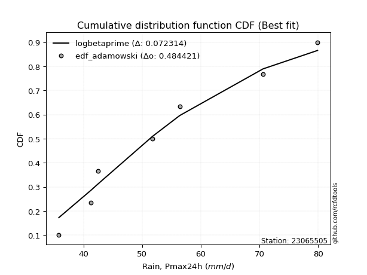</img></img>

</div>


## C. Best fit & Estimate extreme values for specific return periods - Tr

Best fit in probability distribution analysis means finding the theoretical distribution (like Normal, Poisson, Exponential, etc.) that most accurately mirrors your real-world data´s patterns (shape, center, spread) for better predictions, using methods like visual checks (Q-Q plots), goodness-of-fit tests (Kolmogorov-Smirnov, Chi-Squared), and information criteria (AIC) to score and select the simplest, most representative model.


### 1. Best fit (ordered by delta Δ)

:file_folder:Table: [bestfit_23065505.csv](table/bestfit_23065505.csv)

<div align="center">

|   id |   station | empirical_dist   | p_dist       |     delta |   deltao | eval   |   fit |   n |   best_fit |   best_fit_sort |
|-----:|----------:|:-----------------|:-------------|----------:|---------:|:-------|------:|----:|-----------:|----------------:|
|    0 |  23065505 | edf_weibull      | logbetaprime | 0.0624372 | 0.484421 | Δo > Δ |     1 |   7 |          1 |               1 |
|    1 |  23065505 | edf_california   | logdgamma    | 0.0658814 | 0.484421 | Δo > Δ |     1 |   7 |          1 |               2 |
|    2 |  23065505 | edf_adamowski    | logbetaprime | 0.072314  | 0.484421 | Δo > Δ |     1 |   7 |          1 |               3 |
|    3 |  23065505 | edf_hazen        | logksone     | 0.0723855 | 0.484421 | Δo > Δ |     1 |   7 |          1 |               4 |
|    4 |  23065505 | edf_gringorten   | logksone     | 0.0747932 | 0.484421 | Δo > Δ |     1 |   7 |          1 |               5 |
|    5 |  23065505 | edf_cunnane      | logksone     | 0.0763537 | 0.484421 | Δo > Δ |     1 |   7 |          1 |               6 |
|    6 |  23065505 | edf_blom         | logksone     | 0.0773116 | 0.484421 | Δo > Δ |     1 |   7 |          1 |               7 |
|    7 |  23065505 | edf_chegodayev   | logbetaprime | 0.0777195 | 0.484421 | Δo > Δ |     1 |   7 |          1 |               8 |
|    8 |  23065505 | edf_jenkinson    | logbetaprime | 0.0788181 | 0.484421 | Δo > Δ |     1 |   7 |          1 |               9 |
|    9 |  23065505 | edf_beard        | logbetaprime | 0.0788181 | 0.484421 | Δo > Δ |     1 |   7 |          1 |              10 |
|   10 |  23065505 | edf_tukey        | logksone     | 0.078879  | 0.484421 | Δo > Δ |     1 |   7 |          1 |              11 |
|   11 |  23065505 | edf_filliben     | logksone     | 0.0794653 | 0.484421 | Δo > Δ |     1 |   7 |          1 |              12 |

</div>


### 2. Extreme values and % difference analysis

In hydrology, a return period (or recurrence interval $Tr$) is the statistical average time between extreme events like floods or droughts of a specific magnitude, indicating how rare an event is, with a 100-year flood, for example, having a 1% chance of occurring in any given year, not that it happens exactly every century. It is a key tool for infrastructure design (like bridges or dams) and risk assessment, calculated from historical data to determine the probability of future events, although it is important to remember it is statistical average, and events can cluster or be missed.

The extreme value porcentage difference is evaluated as $pdiff = 1 - (ETrBf / ETr) * 100$, where _ETrBf_ correspond to the bestfit extreme value for a specific recurrence interval and _ETr_ correspond to the extreme value for one of the most used PDFsused in hydrology.

> risk_rate: assuming the return period as the project useful life.

:file_folder:Table: [extreme_23065505.csv](table/extreme_23065505.csv), all PDFs.  
:file_folder:Table: [extremepdiff_23065505.csv](table/extremepdiff_23065505.csv), % difference between bestfit and most used PDFs in Hydrology.

<div align="center">

Extreme values table for only best fit PDFs
|   id |      tr |   prob_l |     prob_g |    alpha |   anglit |   arcsine |   argus |    beta |   betaprime |   bradford |     burr |   burr12 |   cosine |   crystalball |   dgamma |   dweibull |   erlang |   exponnorm |   exponpow |   exponweib |        f |   fatiguelife |   foldnorm |    gamma |   gausshyper |   genexpon |      genextreme |   gengamma |   genhalflogistic |   genlogistic |   gennorm |   genpareto |   gompertz |   gumbel_l |   gumbel_r |   halfgennorm |   halflogistic |   halfnorm |   hypsecant |   invgamma |   invgauss |   invweibull |   johnsonsb |   johnsonsu |   kappa3 |   kappa4 |   ksone |   kstwobign |   laplace |   levy_l |   loggamma |   logistic |   loglaplace |    lomax |   maxwell |   mielke |    moyal |   nakagami |      ncf |      nct |     norm |   pearson3 |   powerlaw |   rayleigh |   rdist |     rice |   semicircular |   skewnorm |        t |   trapezoid |   triang |   truncexpon |   truncnorm |   truncpareto |   truncweibull_min |   tukeylambda |   uniform |   vonmises |   vonmises_line |     wald |   weibull_max |   weibull_min |   wrapcauchy |   logalpha |   loganglit |   logarcsine |   logargus |   logbeta |   logbetaprime |   logbradford |   logburr |   logburr12 |   logcosine |   logcrystalball |   logdgamma |   logdweibull |   logerlang |   logexponnorm |   logexponpow |   logexponweib |     logf |   logfatiguelife |   logfoldnorm |   loggausshyper |   loggenexpon |   loggenextreme |   loggengamma |   loggenhalflogistic |   loggenlogistic |   loggennorm |   loggenpareto |   loggompertz |   loggumbel_l |   loggumbel_r |   loghalfgennorm |   loghalflogistic |   loghalfnorm |   loghypsecant |   loginvgamma |   loginvgauss |   loginvweibull |   logjohnsonsb |   logjohnsonsu |   logkappa3 |   logkappa4 |   logksone |   logkstwobign |   loglevy_l |   logloggamma |   loglogistic |   logloglaplace |         loglomax |   logmaxwell |   logmielke |   logmoyal |   lognakagami |   logncf |   lognct |   lognorm |   logpearson3 |   logpowerlaw |   lograyleigh |   logrdist |   logrice |   logsemicircular |   logskewnorm |     logt |   logtrapezoid |   logtriang |   logtruncexpon |   logtruncnorm |   logtruncpareto |   logtruncweibull_min |   logtukeylambda |   loguniform |   logvonmises |   logvonmises_line |   logwald |   logweibull_max |   logweibull_min |   logwrapcauchy |   station |   n |   risk_rate |
|-----:|--------:|---------:|-----------:|---------:|---------:|----------:|--------:|--------:|------------:|-----------:|---------:|---------:|---------:|--------------:|---------:|-----------:|---------:|------------:|-----------:|------------:|---------:|--------------:|-----------:|---------:|-------------:|-----------:|----------------:|-----------:|------------------:|--------------:|----------:|------------:|-----------:|-----------:|-----------:|--------------:|---------------:|-----------:|------------:|-----------:|-----------:|-------------:|------------:|------------:|---------:|---------:|--------:|------------:|----------:|---------:|-----------:|-----------:|-------------:|---------:|----------:|---------:|---------:|-----------:|---------:|---------:|---------:|-----------:|-----------:|-----------:|--------:|---------:|---------------:|-----------:|---------:|------------:|---------:|-------------:|------------:|--------------:|-------------------:|--------------:|----------:|-----------:|----------------:|---------:|--------------:|--------------:|-------------:|-----------:|------------:|-------------:|-----------:|----------:|---------------:|--------------:|----------:|------------:|------------:|-----------------:|------------:|--------------:|------------:|---------------:|--------------:|---------------:|---------:|-----------------:|--------------:|----------------:|--------------:|----------------:|--------------:|---------------------:|-----------------:|-------------:|---------------:|--------------:|--------------:|--------------:|-----------------:|------------------:|--------------:|---------------:|--------------:|--------------:|----------------:|---------------:|---------------:|------------:|------------:|-----------:|---------------:|------------:|--------------:|--------------:|----------------:|-----------------:|-------------:|------------:|-----------:|--------------:|---------:|---------:|----------:|--------------:|--------------:|--------------:|-----------:|----------:|------------------:|--------------:|---------:|---------------:|------------:|----------------:|---------------:|-----------------:|----------------------:|-----------------:|-------------:|--------------:|-------------------:|----------:|-----------------:|-----------------:|----------------:|----------:|----:|------------:|
|    0 |    2    | 0.5      | 0.5        |  50.4432 |  54.0429 |   54.0429 | 58.6187 | 48.5369 |     51.812  |    52.8196 |  49.6215 |  46.7133 |  55.1926 |    -0.0421282 |  48.662  |    49.3852 |  36.1611 |     48.3799 |    51.009  |     36.5158 |  49.6176 |       35.8001 |    52.6878 |  37.496  |      55.0916 |    48.4689 |    36.1157      |    36.8045 |           65.5157 |       51.267  |     57.85 |     52.97   |    52.4781 |    56.5124 |    51.5733 |       44.7381 |        50.3456 |    50.9658 |     54.0429 |    49.618  |    48.8763 |      49.8058 |     77.4917 |     48.973  |  57.9937 |  55.8082 | 54.0429 |     51.5653 |   54.0429 |  57.3532 |    43.5373 |    54.0429 |      52.0541 |  48.3689 |   52.7572 |  49.557  |  50.7761 |    43.3462 |  39.0721 |  50.871  |  54.0429 |    52.7677 |    36.4661 |    52.3012 | 35.2618 |  53.1599 |        54.0429 |    51.7429 |  54.0433 |     68.8101 |  61.5085 |      52.6108 |     54.0429 |       36.0273 |            50.2916 |       57.85   |   57.85   |  -1.72037  |         57.7181 |  49.1701 |       79.6552 |       46.5703 |      57.85   |    50.6375 |     52.0541 |      52.054  |    55.2459 |   49.7765 |        51.2895 |       49.729  |   49.4908 |     48.0356 |     52.5545 |          52.0541 |     48.1201 |       48.7874 |     42.9072 |        52.0173 |       52.0068 |        43.7982 |  50.0463 |          49.047  |       51.5287 |         52.9202 |       48.4373 |         51.0902 |       39.2858 |              60.2885 |          49.6066 |      53.4829 |        35.1644 |       49.6034 |       54.4325 |       49.7795 |          35.7999 |           48.6858 |       49.2353 |        52.0541 |       50.0463 |       49.2665 |         49.6253 |        79.2958 |        52.0535 |     55.5137 |     52.7207 |    52.0541 |        49.518  |     56.6682 |       52.1376 |       52.0541 |         51.8    |    282.466       |      50.8573 |     49.6395 |    49.0667 |       42.8416 |  51.1511 |  51.5912 |   52.0541 |       51.4829 |       36.3565 |       50.4395 |    48.0913 |   50.9544 |           52.0541 |       48.9084 |  52.0541 |        65.2932 |     58.0963 |         48.1356 |        44.8956 |          36.3892 |               47.3763 |          53.4849 |      53.4829 |     0.0971266 |            53.5066 |   47.661  |          51.0904 |          46.7958 |         53.4829 |  23065505 |   7 |    0.75     |
|    1 |    2.33 | 0.570815 | 0.429185   |  52.9079 |  57.1675 |   58.7334 | 61.5565 | 52.3938 |     54.3386 |    55.9349 |  52.0852 |  49.4827 |  57.9397 |     9.97109   |  53.0357 |    53.3269 |  36.5579 |     51.1568 |    53.8656 |     37.0721 |  52.1161 |       36.2864 |    55.6943 |  38.3488 |      58.3761 |    51.2603 |    37.1046      |    37.5585 |           68.2452 |       53.7504 |     57.85 |     58.7119 |    55.2323 |    58.8462 |    54.0589 |       47.7578 |        52.9012 |    53.8609 |     56.1896 |    52.1165 |    51.4577 |      52.2718 |     79.2926 |     51.5513 |  61.137  |  59.103  | 57.7304 |     54.1173 |   55.6662 |  64.1932 |    45.7291 |    56.4063 |      53.6055 |  51.1843 |   55.5441 |  52.0225 |  53.129  |    46.498  |  47.2872 |  53.3871 |  56.7253 |    55.4569 |    37.2842 |    55.1294 | 39.4047 |  55.7471 |        57.394  |    54.4871 |  56.7257 |     71.3723 |  64.5488 |      55.6001 |     56.7253 |       36.19   |            53.2523 |       60.9843 |   60.973  |  -1.4199   |         60.8597 |  50.929  |       79.8124 |       49.8184 |      66.2199 |    53.1322 |     55.0814 |      56.6643 |    58.1594 |   53.5161 |        54.9975 |       52.6495 |   51.9418 |     50.3677 |     55.2084 |          54.6426 |     53.1598 |       53.5746 |     45.0101 |        54.6025 |       56.0588 |        46.1621 |  52.5315 |          51.559  |       54.2618 |         57.7832 |       51.1085 |         53.6128 |       41.3215 |              63.612  |          52.0759 |      53.4829 |        45.3046 |       52.3351 |       56.78   |       52.0692 |          35.7999 |           50.9898 |       51.8829 |        54.1156 |       52.5315 |       51.7684 |         52.0952 |        79.7608 |        54.6297 |     59.0722 |     55.9234 |    55.6453 |        52.0251 |     62.897  |       54.7358 |       54.3281 |         53.656  |    445.266       |      53.4873 |     52.1016 |    51.2005 |       45.5294 |  53.6906 |  54.1964 |   54.6426 |       54.0546 |       36.9947 |       53.0874 |    53.4233 |   53.5192 |           55.3077 |       51.6067 |  54.6427 |        68.4108 |     61.2388 |         50.7889 |        46.9649 |          36.8348 |               50.148  |          56.6968 |      56.6116 |     0.101929  |            56.5231 |   49.2022 |          53.6132 |          49.6817 |         62.2858 |  23065505 |   7 |    0.729209 |
|    2 |    5    | 0.8      | 0.2        |  64.4443 |  68.1918 |   71.2414 | 70.9801 | 67.3673 |     65.0022 |    67.5429 |  64.2658 |  65.4176 |  67.8392 |    47.1829    |  61.7617 |    62.7857 |  41.4803 |     65.0403 |    65.8092 |     44.2177 |  64.4509 |       46.6149 |    67.047  |  44.2325 |      69.8062 |    65.2163 |   656.046       |    46.8357 |           75.4021 |       64.5373 |     57.85 |     73.5115 |    66.3122 |    66.3857 |    64.8576 |       67.995  |        64.4648 |    66.1039 |     64.8009 |    64.4509 |    64.4564 |      64.2956 |     79.8969 |     64.7291 |  71.31   |  70.1946 | 69.6646 |     64.9574 |   63.7824 |  75.5255 |    58.9995 |    65.5319 |      62.0841 |  65.4483 |   66.5132 |  64.2766 |  64.0281 |    63.589  |  88.6644 |  64.7591 |  66.6941 |    66.1791 |    47.2351 |    66.4517 | 51.2299 |  66.1046 |        68.8302 |    66.092  |  66.6945 |     78.7231 |  73.2713 |      66.9299 |     66.6941 |       38.9281 |            65.1199 |       71.1176 |   71.08   |  -0.275017 |         71.0271 |  60.7755 |       79.899  |       68.6479 |      76.5646 |    64.4995 |     67.2397 |      71.0543 |    68.5827 |   69.1109 |        71.679  |       64.7181 |   64.1671 |     63.4745 |     65.9334 |          65.4423 |     61.7791 |       63.1476 |     57.9161 |        65.4157 |       77.2734 |        59.8197 |  64.4606 |          64.404  |       65.7712 |         73.8189 |       65.08   |         64.673  |       59.9799 |              73.1985 |          64.31   |      53.4829 |        73.054  |       64.8974 |       65.0781 |       63.3036 |          35.7999 |           62.856  |       64.7476 |        63.2387 |       64.4606 |       64.383  |         64.3344 |        79.8994 |        65.3716 |     72.2288 |     67.8234 |    69.0555 |        64.1695 |     74.7594 |       65.5351 |       64.0806 |         64.288  |   4333.56        |      65.2284 |     64.2713 |    62.3607 |       61.6587 |  64.9995 |  65.4605 |   65.4423 |       65.1936 |       44.8304 |       65.1559 |    71.4872 |   65.0378 |           68.0209 |       64.7646 |  65.4424 |        78.2063 |     71.2298 |         62.4685 |        57.1063 |          42.4312 |               62.4134 |          68.3786 |      68.0478 |     0.122012  |            67.7744 |   58.7977 |          64.6737 |          67.1259 |         75.1928 |  23065505 |   7 |    0.67232  |
|    3 |   10    | 0.9      | 0.1        |  75.108  |  74.4316 |   74.2609 | 75.5243 | 74.3998 |     73.3692 |    73.4349 |  76.2353 | inf      |  73.8201 |    71.8683    |  67.9247 |    69.0734 |  49.5254 |     77.6434 |    74.2914 |     60.4618 |  76.4195 |       60.876  |    74.6289 |  51.0216 |      75.0265 |    77.8852 | 94009.2         |    67.0737 |           77.8601 |       73.3216 |     57.85 |     77.7486 |    73.8809 |    70.5833 |    73.6529 |       93.7386 |        74.0679 |    75.1634 |     71.6772 |    76.4187 |    76.7657 |      75.8771 |     79.8999 |     77.7727 |  75.7487 |  75.2247 | 74.8719 |     73.2108 |   71.15   |  78.2614 |    74.8953 |    72.2526 |      70.9364 |  78.6724 |   74.2327 |  76.4102 |  73.5175 |    78.2345 | 129.225  |  74.5933 |  73.3072 |    73.9413 |    59.1161 |    74.5247 | 54.7428 |  73.4898 |        74.6984 |    74.6793 |  73.3075 |     81.5943 |  76.6784 |      72.9454 |     73.3072 |       45.9666 |            71.8143 |       75.5254 |   75.49   |   0.454887 |         75.4635 |  71.225  |       79.9    |       88.5716 |      78.3856 |    74.4578 |     75.2756 |      75.044  |    74.2572 |   77.5535 |        85.8703 |       71.6324 |   76.3483 |     78.8798 |     73.3984 |          73.7597 |     68.2162 |       69.5704 |     73.5584 |        73.779  |       97.5718 |        74.7644 |  75.7029 |          77.3747 |       74.7279 |         78.3666 |       79.3058 |         73.6188 |       94.8394 |              76.7988 |          76.3673 |      53.4829 |        78.5715 |       75.1431 |       70.2129 |       74.2225 |          35.7999 |           74.7833 |       76.2796 |        71.6163 |       75.7029 |       76.9223 |         76.3989 |        79.9    |        73.6388 |     78.8541 |     73.7919 |    75.8775 |        75.2838 |     77.9437 |       73.8076 |       72.3657 |         76.2939 |  34192.2         |      75.0051 |     76.2368 |    74.0408 |       78.9805 |  74.5544 |  74.5844 |   73.7597 |       74.2274 |       55.6022 |       75.4024 |    77.3618 |   74.613  |           75.6397 |       76.6165 |  73.7598 |        82.4029 |     75.5612 |         69.9222 |        65.1025 |          51.8    |               70.0673 |          74.0675 |      73.7361 |     0.137606  |            73.5761 |   71.0352 |          73.6193 |          88.3592 |         77.7272 |  23065505 |   7 |    0.651322 |
|    4 |   15    | 0.933333 | 0.0666667  |  81.787  |  77.0962 |   74.8368 | 77.2519 | 76.6351 |     77.9972 |    75.5236 |  83.9373 | inf      |  76.5445 |    84.1868    |  71.2761 |    72.3388 |  55.3245 |     85.0158 |    78.5467 |     76.1538 |  84.022  |       70.203  |    78.4162 |  55.3755 |      76.7459 |    85.2961 |     1.59662e+06 |    86.153  |           78.596  |       78.2773 |     57.85 |     78.7618 |    77.6083 |    72.4843 |    78.6152 |      112.09   |        79.5024 |    79.8779 |     75.6015 |    84.0205 |    84.2271 |      83.2256 |     79.9    |     86.0414 |  77.2283 |  76.9288 | 76.6076 |     77.5923 |   75.4598 |  79.0879 |    86.2675 |    75.9143 |      76.6889 |  86.5318 |   78.1934 |  84.2597 |  79.0247 |    86.1127 | 155.005  |  80.4002 |  76.6073 |    78.0132 |    64.8532 |    78.6843 | 55.555  |  77.295  |        76.9867 |    79.1482 |  76.6076 |     82.5156 |  77.7715 |      75.1453 |     76.6073 |       51.7488 |            74.331  |       76.9903 |   76.96   |   0.753783 |         76.9424 |  77.9352 |       79.9    |      101.21   |      78.9071 |    80.3973 |     78.9933 |      75.83   |    76.5357 |   80.5071 |        94.1119 |       74.2227 |   84.2706 |     90.0294 |     77.0735 |          78.2976 |     71.9107 |       72.9996 |     84.8166 |        78.3571 |      109.825  |        84.6919 |  82.7507 |          85.8034 |       79.644  |         79.2339 |       88.55   |         78.5701 |      128.502  |              77.9074 |          84.1416 |      53.4829 |        79.3989 |       80.7612 |       72.6697 |       81.1942 |          35.7999 |           82.5101 |       83.0717 |        76.8858 |       82.7507 |       84.9996 |         84.1784 |        79.9    |        78.1474 |     81.21   |     75.8828 |    78.2981 |        81.9465 |     78.932  |       78.3051 |       77.3221 |         84.6058 | 114469           |      80.577  |     83.9422 |    81.798  |       90.1043 |  80.1017 |  79.732  |   78.2976 |       79.3246 |       61.5391 |       81.2958 |    78.6701 |   80.0437 |           78.837  |       83.6187 |  78.2977 |        83.7965 |     77.006  |         72.9077 |        68.8774 |          57.7727 |               73.0644 |          76.0243 |      75.736  |     0.146185  |            75.6426 |   80.2054 |          78.5703 |         103.824  |         78.4687 |  23065505 |   7 |    0.644736 |
|    5 |   20    | 0.95     | 0.05       |  86.8115 |  78.6636 |   75.0396 | 78.2002 | 77.6982 |     81.2083 |    76.5924 |  89.7846 | inf      |  78.2199 |    92.2538    |  73.583  |    74.5293 |  59.8032 |     90.2465 |    81.3196 |     90.7252 |  89.7445 |       77.1085 |    80.8969 |  58.589  |      77.5894 |    90.5541 |     1.16021e+07 |   103.626  |           78.9469 |       81.7472 |     57.85 |     79.1755 |    80.0155 |    73.6676 |    82.0896 |      126.607  |        83.31   |    83.0212 |     78.3699 |    89.7423 |    89.6335 |      88.7564 |     79.9    |     92.2266 |  77.9681 |  77.787  | 77.4755 |     80.5439 |   78.5176 |  79.5111 |    95.4245 |    78.4452 |      81.0511 |  92.1642 |   80.822  |  90.2389 |  82.925  |    91.4114 | 174.39   |  84.5896 |  78.7684 |    80.7523 |    68.1363 |    81.449  | 55.8769 |  79.8242 |        78.256  |    82.1276 |  78.7687 |     82.97   |  78.3108 |      76.2874 |     78.7684 |       56.0445 |            75.6522 |       77.7213 |   77.695  |   0.913661 |         77.6818 |  82.9356 |       79.9    |      110.563  |      79.1596 |    84.7108 |     81.2654 |      76.1088 |    77.8159 |   81.9843 |        99.9881 |       75.5777 |   90.3279 |     99.125  |     79.4244 |          81.4196 |     74.5439 |       75.3442 |     93.9122 |        81.5136 |      118.675  |        92.3041 |  88.0267 |          92.2283 |       83.0374 |         79.533  |       95.5932 |         81.9776 |      161.417  |              78.4408 |          90.0512 |      53.4829 |        79.6496 |       84.6084 |       74.2422 |       86.4619 |          35.7999 |           88.3946 |       87.9328 |        80.8347 |       88.0268 |       91.1273 |         90.0923 |        79.9    |        81.2485 |     82.4421 |     76.9447 |    79.5372 |        86.764  |     79.443  |       81.3929 |       80.9449 |         91.1831 | 269780           |      84.5016 |     89.7956 |    87.7785 |       98.4299 |  84.0619 |  83.3442 |   81.4196 |       82.9006 |       65.1829 |       85.4656 |    79.1676 |   83.855  |           80.6683 |       88.6392 |  81.4197 |        84.4927 |     77.7289 |         74.5175 |        71.1028 |          61.7214 |               74.6617 |          77.0083 |      76.7562 |     0.152124  |            76.7005 |   87.8006 |          81.9776 |         116.434  |         78.8302 |  23065505 |   7 |    0.641514 |
|    6 |   25    | 0.96     | 0.04       |  90.9052 |  79.7259 |   75.1337 | 78.8117 | 78.3099 |     83.6689 |    77.2417 |  94.5627 | inf      |  79.3949 |    98.1923    |  75.3406 |    76.169  |  63.4504 |     94.3038 |    83.3488 |    104.254  |  94.391  |       82.5952 |    82.7233 |  61.1404 |      78.0867 |    94.6326 |     5.34561e+07 |   119.696  |           79.1514 |       84.4198 |     57.85 |     79.3896 |    81.7672 |    74.5096 |    84.7659 |      138.732  |        86.2436 |    85.3599 |     80.5124 |    94.3882 |    93.8884 |      93.2472 |     79.9    |     97.2166 |  78.4119 |  78.3041 | 77.9962 |     82.7547 |   80.8895 |  79.7768 |   103.22   |    80.3813 |      84.6048 |  96.5655 |   82.7735 |  95.1366 |  85.9481 |    95.3678 | 190.114  |  87.8908 |  80.3593 |    82.8056 |    70.2508 |    83.5032 | 56.0396 |  81.7033 |        79.0794 |    84.3444 |  80.3595 |     83.2408 |  78.6321 |      76.9869 |     80.3593 |       59.2692 |            76.4666 |       78.1593 |   78.136  |   1.01244  |         78.1254 |  86.9408 |       79.9    |      118.022  |      79.3092 |    88.1272 |     82.8423 |      76.2385 |    78.6528 |   82.863  |       104.576  |       76.4106 |   95.3043 |    106.962  |     81.1157 |          83.7971 |     76.6027 |       77.1245 |    101.674  |        83.9213 |      125.624  |        98.5508 |  92.2985 |          97.4906 |       85.6275 |         79.6692 |      101.36   |         84.5635 |      193.851  |              78.7529 |          94.8846 |      53.4829 |        79.7539 |       87.5215 |       75.3819 |       90.7512 |          35.7999 |           93.2131 |       91.7333 |        84.0296 |       92.2986 |       96.1302 |         94.9293 |        79.9    |        83.6097 |     83.2194 |     77.586  |    80.2901 |        90.5571 |     79.7654 |       83.7409 |       83.8305 |         96.719  | 524573           |      87.5383 |     94.5808 |    92.7132 |      105.137  |  87.1586 |  86.1342 |   83.7971 |       85.6618 |       67.6309 |       88.7016 |    79.4108 |   86.7959 |           81.879  |       92.5693 |  83.7972 |        84.9102 |     78.1628 |         75.5247 |        72.5756 |          64.4962 |               75.6541 |          77.5988 |      77.3749 |     0.156667  |            77.343  |   94.3998 |          84.5632 |         127.272  |         79.0453 |  23065505 |   7 |    0.639603 |
|    7 |   50    | 0.98     | 0.02       | 104.983  |  82.3407 |   75.2594 | 80.1981 | 79.4448 |     91.2029 |    78.5585 | 110.927  | inf      |  82.4715 |   115.198     |  80.6635 |    80.9935 |  75.5553 |    106.907  |    89.0826 |    160.668  | 110.125  |      100.199  |    87.9538 |  69.3306 |      79.0491 |   107.302  |     5.913e+09   |   185.633  |           79.5444 |       92.6529 |     57.85 |     79.7281 |    86.6743 |    76.7954 |    93.0101 |      181.291  |        95.2823 |    92.1576 |     87.1551 |   110.12   |   107.424  |     108.452  |     79.9    |    113.855  |  79.2997 |  79.3447 | 79.0377 |     89.2468 |   88.2571 |  80.3749 |   131.901  |    86.2967 |      96.6683 | 110.42   |   88.4332 | 111.985  |  95.3331 |   106.898  | 243.216  |  98.5042 |  84.9149 |    88.8604 |    74.8271 |    89.466  | 56.2868 |  87.1581 |        80.9605 |    90.7878 |  84.9152 |     83.7781 |  79.2697 |      78.4197 |     84.9149 |       67.7043 |            78.1467 |       79.0332 |   79.018  |   1.21492  |         79.0127 | 100.018  |       79.9    |      142.239  |      79.6057 |    99.2179 |     86.8554 |      76.4121 |    80.5837 |   84.576  |       119.072  |       78.123  |  112.524  |    136.602  |     85.7169 |          90.9963 |     83.1338 |       82.4986 |    130.347  |        91.2342 |      147.66   |       120.004  | 106.726  |         115.576  |       93.5002 |         79.8455 |      121.173  |         92.2834 |      352.564  |              79.3548 |         111.466  |      53.4829 |        79.8726 |       96.2229 |       78.5646 |      105.349  |          35.7999 |          109.774  |      103.738  |        94.76   |      106.726  |      113.231  |        111.524  |        79.9    |        90.7578 |     85.0148 |     78.8748 |    81.8172 |       102.681  |     80.4962 |       90.8328 |       93.2998 |        116.73   |      4.13893e+06 |      96.9767 |    110.984  |   109.871  |      127.384  |  96.9783 |  94.7911 |   90.9963 |       94.2237 |       73.2168 |       98.8059 |    79.7609 |   95.8903 |           84.7135 |      105.01   |  90.9965 |        85.7449 |     79.031  |         77.6394 |        75.9057 |          71.2005 |               77.7197 |          78.7736 |      78.6273 |     0.170551  |            78.6455 |  119.6    |          92.2821 |         167.887  |         79.473  |  23065505 |   7 |    0.63583  |
|    8 |   75    | 0.986667 | 0.0133333  | 114.413  |  83.4914 |   75.2827 | 80.748  | 79.7838 |     95.5663 |    79.0029 | 121.702  | inf      |  83.9408 |   124.322     |  83.7026 |    83.6613 |  83.07   |    114.279  |    92.1019 |    205.328  | 120.352  |      110.801  |    90.7605 |  74.2707 |      79.3542 |   114.712  |     9.11483e+10 |   236.997  |           79.6693 |       97.4382 |     57.85 |     79.8091 |    89.235  |    77.9513 |    97.8019 |      209.677  |       100.536  |    95.8579 |     91.037  |   120.345  |   115.547  |     118.331  |     79.9    |    124.435  |  79.5956 |  79.694  | 79.3848 |     92.8187 |   92.5669 |  80.6207 |   152.351  |    89.7132 |     104.507  | 118.653  |   91.5102 | 123.135  | 100.821  |   113.178  | 277.61   | 105.011  |  87.3593 |    92.2169 |    76.4608 |    92.7101 | 56.3426 |  90.1257 |        81.7119 |    94.2953 |  87.3596 |     83.956  |  79.4808 |      78.9077 |     87.3593 |       71.2707 |            78.7227 |       79.3235 |   79.312  |   1.28344  |         79.3085 | 108.065  |       79.9    |      157.082  |      79.7039 |   106.101  |     88.6827 |      76.4443 |    81.3626 |   85.121  |       127.766  |       78.7081 |  124.005  |    158.56   |     88.0054 |          95.1108 |     87.0761 |       85.5636 |    150.887  |        95.4298 |      160.849  |       134.111  | 116.103  |         127.525  |       98.0187 |         79.8766 |      134.263  |         96.5789 |      509.094  |              79.5465 |         122.404  |      53.4829 |        79.8897 |      101.099  |       80.2248 |      114.889  |          35.7999 |          120.722  |      110.921  |       101.654  |      116.103  |      124.465  |        122.471  |        79.9    |        94.842  |     85.8136 |     79.3042 |    82.3327 |       110.031  |     80.7984 |       94.8742 |       99.2488 |        130.77   |      1.38563e+07 |     102.529  |    121.795  |   121.34   |      141.418  | 102.901  |  99.8815 |   95.1108 |       99.253  |       75.3108 |      104.778  |    79.8334 |  101.207  |           85.8731 |      112.471  |  95.111  |        86.023  |     79.3206 |         78.376  |        77.1524 |          73.8494 |               78.4333 |          79.1604 |      79.0493 |     0.178578  |            79.0848 |  138.346  |          96.5768 |         197.473  |         79.6153 |  23065505 |   7 |    0.634587 |
|    9 |  100    | 0.99     | 0.01       | 121.774  |  84.1757 |   75.2909 | 81.055  | 79.9418 |     98.6545 |    79.2261 | 129.951  | inf      |  84.8616 |   130.494     |  85.8327 |    85.4969 |  88.5568 |    119.51   |    94.1182 |    242.991  | 128.121  |      118.429  |    92.6589 |  77.8297 |      79.5019 |   119.97   |     6.31724e+11 |   279.91   |           79.7301 |      100.825  |     57.85 |     79.8421 |    90.9368 |    78.7073 |   101.193  |      231.409  |       104.255  |    98.3788 |     93.7907 |   128.113  |   121.395  |     125.831  |     79.9    |    132.343  |  79.7436 |  79.8694 | 79.5584 |     95.266  |   95.6248 |  80.7644 |   168.8    |    92.1254 |     110.452  | 124.554  |   93.6061 | 131.699  | 104.715  |   117.452  | 303.671  | 109.78   |  89.0126 |    94.5301 |    77.2989 |    94.9201 | 56.3645 |  92.1475 |        82.1327 |    96.6848 |  89.0129 |     84.0447 |  79.5861 |      79.1537 |     89.0126 |       73.2274 |            79.0139 |       79.4684 |   79.459  |   1.31782  |         79.4564 | 113.932  |       79.9    |      167.893  |      79.753  |   111.187  |     89.7874 |      76.4556 |    81.8007 |   85.3845 |       134.048  |       79.0033 |  132.869  |    176.738  |     89.4709 |          97.9987 |     89.9375 |       87.7135 |    167.456  |        98.382  |      170.335  |       144.88   | 123.239  |         136.691  |      101.198  |         79.8872 |      144.307  |         99.5262 |      665.139  |              79.64   |         130.789  |      53.4829 |        79.8949 |      104.475  |       81.3297 |      122.16   |          35.7999 |          129.124  |      116.098  |       106.847  |      123.239  |      133.053  |        130.863  |        79.9    |        97.708  |     86.3194 |     79.5183 |    82.5917 |       115.368  |     80.9756 |       97.7056 |      103.676  |        141.977  |      3.26566e+07 |     106.491  |    130.078  |   130.196  |      151.847  | 107.199  | 103.517  |   97.9987 |      102.842  |       76.4062 |      109.053  |    79.8606 |  104.987  |           86.5293 |      117.855  |  97.9989 |        86.162  |     79.4654 |         78.7506 |        77.8058 |          75.2649 |               78.795  |          79.3519 |      79.2611 |     0.184257  |            79.3054 |  153.841  |          99.5235 |         221.602  |         79.6864 |  23065505 |   7 |    0.633968 |
|   10 |  200    | 0.995    | 0.005      | 142.413  |  85.4685 |   75.2987 | 81.5884 | 80.1581 |    106.099  |    79.5623 | 152.13   | inf      |  86.7341 |   144.493     |  90.8917 |    89.7528 | 102.21   |    132.113  |    98.6091 |    356.769  | 148.786  |      137.102  |    96.9651 |  86.557  |      79.7141 |   132.639  |     6.63506e+13 |   407.944  |           79.8186 |      108.967  |     57.85 |     79.8805 |    94.7044 |    80.3506 |   109.347  |      289.29   |       113.196  |   104.144  |    100.424  |   148.773  |   135.744  |     145.752  |     79.9    |    152.84   |  79.9666 |  80.1337 | 79.8188 |    100.903  |  102.992  |  81.0366 |   216.262  |    97.9117 |     126.201  | 138.975  |   98.4013 | 154.832  | 114.096  |   127.211  | 372.728  | 121.853  |  92.7628 |    99.9069 |    78.5829 |    99.977  | 56.3889 |  96.7735 |        82.8664 |   102.15   |  92.7631 |     84.1775 |  79.7436 |      79.5253 |     92.7628 |       76.404  |            79.4545 |       79.6851 |   79.6795 |   1.36949  |         79.6782 | 128.546  |       79.9    |      194.831  |      79.8265 |   124.226  |     91.9122 |      76.4664 |    82.5677 |   85.7616 |       149.615  |       79.4496 |  157.006  |    231.819  |     92.5262 |         104.879  |     97.0778 |       92.8331 |    215.465  |       105.441  |      193.609  |       173.653  | 142.317  |         161.409  |      108.797  |         79.897  |      171.413  |        106.279  |     1292.14   |              79.7758 |         153.372  |      53.4829 |        79.899  |      112.352  |       83.784  |      141.577  |          35.7999 |          151.795  |      128.862  |       120.472  |      142.317  |      156.106  |        153.466  |        79.9    |       104.534  |     87.4196 |     79.8375 |    82.9816 |       128.666  |     81.3123 |      104.435  |      115.118  |        174.084  |      2.57664e+08 |     116.142  |    152.371  |   154.279  |      178.644  | 117.921  | 112.389  |  104.879  |      111.589  |       78.1129 |      119.501  |    79.8888 |  114.146  |           87.6855 |      131.159  | 104.879  |        86.3706 |     79.6827 |         79.3204 |        78.8267 |          77.5118 |               79.3437 |          79.6351 |      79.5799 |     0.197944  |            79.6374 |  200.407  |         106.274  |         292.658  |         79.7932 |  23065505 |   7 |    0.633042 |
|   11 |  250    | 0.996    | 0.004      | 150.136  |  85.7975 |   75.2997 | 81.7133 | 80.1972 |    108.502  |    79.6297 | 160.032  | inf      |  87.2474 |   148.771     |  92.5015 |    91.0786 | 106.715  |    136.17   |    99.9577 |    401.032  | 156.079  |      143.187  |    98.2811 |  89.4057 |      79.7545 |   136.718  |     2.96257e+14 |   457.255  |           79.8358 |      111.585  |     57.85 |     79.8863 |    95.8299 |    80.8341 |   111.968  |      309.609  |       116.07   |   105.918  |    102.56   |   156.065  |   140.435  |     152.772  |     79.9    |    159.892  |  80.0124 |  80.1868 | 79.8708 |    102.647  |  105.364  |  81.1074 |   234.264  |    99.7693 |     131.734  | 143.679  |   99.8773 | 163.109  | 117.116  |   130.207  | 397.014  | 125.929  |  93.9089 |   101.586  |    78.8437 |   101.534  | 56.3923 |  98.1975 |        83.0385 |   103.831  |  93.9091 |     84.2041 |  79.7751 |      79.6    |     93.9089 |       77.0766 |            79.5432 |       79.7283 |   79.7236 |   1.37983  |         79.7225 | 133.381  |       79.9    |      203.757  |      79.8412 |   128.683  |     92.4609 |      76.4677 |    82.7482 |   85.8331 |       154.766  |       79.5393 |  165.709  |    253.744  |     93.3818 |         107.076  |     99.4566 |       94.4681 |    233.742  |       107.704  |      201.223  |       183.832  | 149.095  |         170.238  |      111.231  |         79.8981 |      181.104  |        108.346  |     1608.69   |              79.802  |         161.431  |      53.4829 |        79.8994 |      114.817  |       84.5201 |      148.452  |          35.7999 |          159.898  |      133.064  |       125.217  |      149.094  |      164.308  |        161.532  |        79.9    |       106.714  |     87.7524 |     79.9008 |    83.0598 |       133.084  |     81.4002 |      106.579  |      119.052  |        186.222  |      5.01014e+08 |     119.285  |    160.32   |   162.943  |      187.789  | 121.494  | 115.285  |  107.076  |      114.442  |       78.4638 |      122.914  |    79.8926 |  117.115  |           87.9589 |      135.546  | 107.076  |        86.4123 |     79.7262 |         79.4356 |        79.0371 |          77.9799 |               79.4543 |          79.6908 |      79.6438 |     0.202365  |            79.704  |  218.728  |         108.341  |         320.103  |         79.8145 |  23065505 |   7 |    0.632858 |
|   12 |  500    | 0.998    | 0.002      | 178.647  |  86.6133 |   75.3009 | 82.0003 | 80.2689 |    116.013  |    79.7647 | 187.256  | inf      |  88.6133 |   161.457     |  97.4544 |    95.0789 | 120.992  |    148.773  |   103.889  |    565.252  | 180.975  |      162.278  |   102.184  |  98.3556 |      79.8321 |   149.387  |     3.08027e+16 |   638.441  |           79.8692 |      119.71   |     57.85 |     79.8954 |    99.0964 |    82.2202 |   120.104  |      378.061  |       124.991  |   111.206  |    109.193  |   180.955  |   155.211  |     176.686  |     79.9    |    183.289  |  80.1118 |  80.2934 | 79.975  |    107.875  |  112.732  |  81.2904 |   300.463  |   105.53   |     150.518  | 158.487  |  104.282  | 191.747  | 126.497  |   139.121  | 479.597  | 139.245  |  97.3075 |   106.666  |    79.3692 |   106.178  | 56.3976 | 102.446  |        83.4347 |   108.844  |  97.3077 |     84.2571 |  79.838  |      79.7497 |     97.3075 |       78.461  |            79.7212 |       79.8145 |   79.8118 |   1.40052  |         79.8113 | 148.754  |       79.9    |      232.219  |      79.8706 |   143.435  |     93.8357 |      76.4695 |    83.1648 |   85.9697 |       171.243  |       79.7194 |  196.087  |    339.284  |     95.6976 |         113.866  |    107.118  |       99.5218 |    301.221  |       114.725  |      225.236  |       218.596  | 172.447  |         200.745  |      118.775  |         79.8996 |      214.633  |        114.436  |     3223.86   |              79.8531 |         189.239  |      53.4829 |        79.8999 |      122.282  |       86.6663 |      171.993  |          79.7743 |          187.907  |      146.425  |       141.184  |      172.447  |      192.539  |        189.367  |        79.9    |       113.449  |     88.7547 |     80.0265 |    83.2165 |       147.254  |     81.6276 |      113.191  |      132.131  |        230.902  |      3.95305e+09 |     129.18   |    187.735  |   193.082  |      217.877  | 133.011  | 124.433  |  113.866  |      123.437  |       79.1752 |      133.689  |    79.8979 |  126.415  |           88.5918 |      149.517  | 113.867  |        86.4957 |     79.8131 |         79.6671 |        79.4644 |          78.9359 |               79.6766 |          79.8007 |      79.7718 |     0.216192  |            79.8373 |  288.874  |         114.429  |         422.999  |         79.8572 |  23065505 |   7 |    0.632489 |
|   13 |  750    | 0.998667 | 0.00133333 | 199.462  |  86.9744 |   75.3012 | 82.1157 | 80.2901 |    120.447  |    79.8098 | 205.26   | inf      |  89.2753 |   168.505     | 100.323  |    97.3448 | 129.512  |    156.146  |   106.028  |    681.828  | 197.269  |      173.557  |   104.352  | 103.652  |      79.8565 |   156.798  |     4.65241e+17 |   765.757  |           79.8799 |      124.459  |     57.85 |     79.8976 |   100.865  |    82.961  |   124.86   |      421.905  |       130.206  |   114.161  |    113.073  |   197.244  |   163.985  |     192.294  |     79.9    |    198.07   |  80.1527 |  80.3292 | 80.0097 |    110.812  |  117.042  |  81.3771 |   347.657  |   108.896  |     162.724  | 167.288  |  106.745  | 210.783  | 131.984  |   144.087  | 533.399  | 147.527  |  99.1955 |   109.553  |    79.5455 |   108.775  | 56.3988 | 104.822  |        83.5942 |   111.644  |  99.1957 |     84.2747 |  79.8589 |      79.7998 |     99.1955 |       78.9345 |            79.7807 |       79.8432 |   79.8412 |   1.40742  |         79.8408 | 157.971  |       79.9    |      249.359  |      79.8804 |   152.766  |     94.4509 |      76.4698 |    83.3328 |   86.0124 |       181.233  |       79.7795 |  216.5    |    404.997  |     96.8404 |         117.823  |    111.803  |      102.468  |    349.547  |       118.835  |      239.529  |       241.328  | 187.936  |         220.992  |      123.184  |         79.8998 |      236.923  |        117.765  |     4886.17   |              79.8696 |         207.665  |      53.4829 |        79.9    |      126.524  |       87.8357 |      187.448  |          79.817  |          206.501  |      154.464  |       151.451  |      187.935  |      211.195  |        207.811  |        79.9    |       117.372  |     89.3302 |     80.068  |    83.2688 |       155.866  |     81.7356 |      117.034  |      140.427  |        262.927  |      1.3234e+10  |     135.068  |    205.887  |   213.235  |      236.699  | 140.063  | 129.901  |  117.823  |      128.803  |       79.4153 |      140.12   |    79.899  |  131.918  |           88.8478 |      157.939  | 117.823  |        86.5235 |     79.842  |         79.7446 |        79.6088 |          79.2605 |               79.7509 |          79.8367 |      79.8145 |     0.22437   |            79.8818 |  341.303  |         117.757  |         498      |         79.8715 |  23065505 |   7 |    0.632366 |
|   14 | 1000    | 0.999    | 0.001      | 216.699  |  87.1897 |   75.3013 | 82.1805 | 80.3    |    123.615  |    79.8323 | 219.068  | inf      |  89.6929 |   173.357     | 102.346  |    98.9227 | 135.621  |    161.377  |   107.482  |    774.566  | 209.685  |      181.603  |   105.844  | 107.434  |      79.8683 |   162.056  |     3.19191e+18 |   866.435  |           79.8852 |      127.828  |     57.85 |     79.8984 |   102.064  |    83.4595 |   128.234  |      454.741  |       133.906  |   116.201  |    115.826  |   209.656  |   170.263  |     204.163  |     79.9    |    209.069  |  80.1774 |  80.3471 | 80.0271 |    112.846  |  120.1    |  81.4317 |   385.617  |   111.283  |     171.98   | 173.595  |  108.448  | 225.429  | 135.878  |   147.511  | 574.278  | 153.641  | 100.495  |   111.568  |    79.6339 |   110.57   | 56.3992 | 106.464  |        83.6838 |   113.578  | 100.496  |     84.2835 |  79.8694 |      79.8248 |    100.495  |       79.1735 |            79.8105 |       79.8575 |   79.8559 |   1.41087  |         79.8556 | 164.601  |       79.9    |      261.73   |      79.8853 |   159.732  |     94.8194 |      76.4699 |    83.4273 |   86.0329 |       188.488  |       79.8096 |  232.32   |    460.719  |     97.5683 |         120.627  |    115.224  |      104.556  |    388.533  |       121.757  |      249.777  |       258.624  | 199.857  |         236.554  |      126.315  |         79.8999 |      254.078  |        120.023  |     6587.46   |              79.8776 |         221.812  |      53.4829 |        79.9    |      129.483  |       88.6315 |      199.246  |          79.8383 |          220.796  |      160.273  |       159.185  |      199.856  |      225.497  |        221.974  |        79.9    |       120.152  |     89.7373 |     80.0885 |    83.2949 |       162.127  |     81.8036 |      119.753  |      146.624  |        288.85   |      3.119e+10   |     139.293  |    219.817  |   228.796  |      250.621  | 145.218  | 133.838  |  120.627  |      132.662  |       79.5359 |      144.745  |    79.8994 |  135.855  |           88.992  |      164.031  | 120.627  |        86.5374 |     79.8565 |         79.7834 |        79.6813 |          79.4239 |               79.7881 |          79.8545 |      79.8359 |     0.230223  |            79.904  |  384.806  |         120.015  |         559.192  |         79.8786 |  23065505 |   7 |    0.632305 |


</div>


<div align="center">

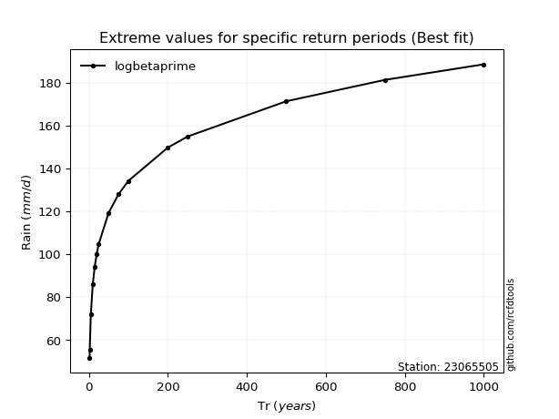</img>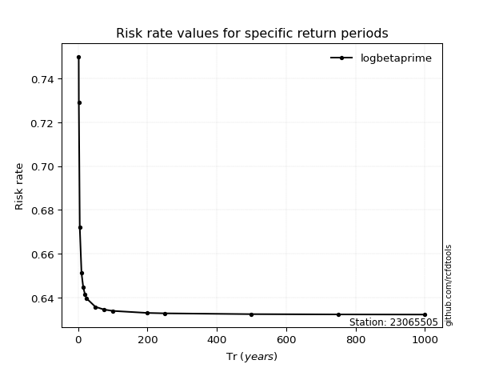</img>

</div>


<sub>**APP DISCLAIMER**: NO WARRANTY - This software is provided by [github.com/rcfdtools](https://github.com/rcfdtools) "as is", without any express or implied warranty, including warranties of merchantability, fitness for a particular purpose, or non-infringement. There is no guarantee that the software will be error-free or operate without interruption. LIMITATION OF LIABILITY - Neither the authors nor copyright holders will be liable for claims or damages arising from the software or its use. You are responsible for determining if the software is appropriate for your use and assume all associated risks, including errors, legal compliance, and data loss. NO PROFESSIONAL ADVICE - The software provides general information and does not offer professional advice. It should not replace consultation with professional advisors.</sub>