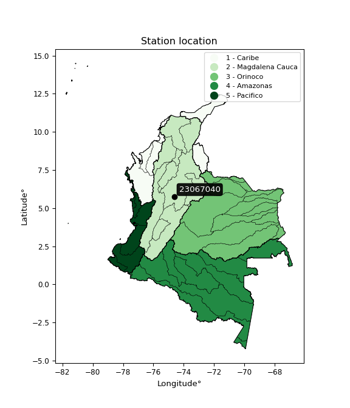

<div align="center">


</div>

# PMP Station (Rain, Pmax24h): 23067040

Probable Maximum Precipitation (PMP) is the greatest amount of rainfall for a specific duration that is meteorologically possible for a given location, acting as a "worst-case" scenario for extreme storms, crucial for designing safety-critical infrastructure like bridges, river deviations, dams, spillways, and nuclear plants to prevent catastrophic failure. PMP is calculated by hydrologists using meteorological data to determine the upper limit of extreme rainfall, often leading to the Probable Maximum Flood (PMF) for flood control design, and is increasingly being studied for climate change impacts. Probable Maximum Precipitation (PMP) is the theoretical upper limit of rainfall, a deterministic estimate for extreme events, while probability distributions (like GEV, Gumbel) describe the likelihood and frequency of various precipitation amounts, including rare ones, showing how often events occur, with PMP representing the extreme end of these distributions, used for critical infrastructure design to ensure safety against the worst conceivable weather, unlike standard statistical forecasts which cover typical probabilities.

The most common probability distributions in hydrology, used for analyzing floods, rainfall, and streamflow, include the Normal, Log-Normal, Gumbel, Gamma (including Log-Pearson Type III), and Generalized Extreme Value (GEV) distributions, often chosen based on the data´s skewness and whether modeling extremes or general conditions, with Gumbel and GEV popular for extreme events like floods, while the Normal distribution serves as a baseline, though often requiring transformations for skewed hydrological data. These distributions help in designing water infrastructure, managing water resources, and forecasting hydrologic events.

> Hydrological data often isn´t perfectly normal (it´s skewed), so different distributions are needed for different applications, such as: **Flood Frequency Analysis**: Using Gumbel, GEV, or Log-Pearson Type III for predicting extreme flood magnitudes and their return periods, **Rainfall Analysis**: Normal for annual totals, but Log-Normal, Weibull, or GEV for intensity or extreme daily rainfall, **Streamflow Modeling**: Gamma and Log-Normal for maximum flows, GEV for minimum flows, and Kappa for daily flows.

<div align="center">

</img>

</div>


## A. General information


### 1. General running parameters

• app_version: _v20260113_. • runtime: _2026-01-17 18:24:04.630693_. • Python version: _3.14.0_. • SciPy version: _1.16.3_. • Pandas version: _2.3.3_. • NumPy version: _2.3.5_. • Stations dataset (station_dataset_file): _dataset/pmax24h_in/automatic_colombia_2003_2025.csv_. • Stations catalog (station_catalog_file): _dataset/CNE.xls_. • Minimum year to eval til year_max (date_min): _1900_. • Maximum year to eval since year_min (date_max): _2025_. • Creates, save and include plots into reports (create_plot): _False_. • Plot only fit distributions with Δo > Δ (plot_only_fit): _True_. • Plot only simple graphs avoiding multiple CDFs and multiple Extreme values plots (plot_only_simple): _True_. • Eval low extreme values, if False, evaluates high extreme values (low_extreme): _False_. • Eval every SciPy distribution as logarithmic (pdist_logarithmic_on): _True_. • Standard deviation normalized (ddof): _1.0_. • Return periods to eval in years (Tr): _[2, 2.33, 5, 10, 15, 20, 25, 50, 75, 100, 200, 250, 500, 750, 1000]_. • Minimum data sample per station, 0 means any (minimum_sample): _5_. • Z-Score maximum threshold to adjust a value, 0 means disable (zscore_max): _3.5_. • Z-Score minimum threshold to adjust a value, 0 means disable (zscore_min): _-2.5_. • Avoid zeros, e.g. rain = 0 (avoid_zeros): _True_. • Avoid null values (avoid_nans): _True_. 

:file_folder:Table: [dataset.csv](../../dataset/pmax24h_in/automatic_colombia_2003_2025.csv)

> Delta Degrees of Freedom (DDOF): is a parameter used in the formulas for calculating variance and standard deviation. When ddof=0, the divisor is $N$ (the total number of observations) and this is used when your data set is the entire population. When ddof=1, the divisor is $N-1$ and this is used when your data set is a sample drawn from a larger population. Using $N-1$ provides an unbiased estimate of the population variance (known as Bessel´s correction).


### 2. Station info and location

|   id |   CODIGO | NOMBRE                         | CATEGORIA    | TECNOLOGIA                              | ESTADO           | FECHA_INSTALACION   |   FECHA_SUSPENSION |   ALTITUD |   LATITUD |   LONGITUD | DEPARTAMENTO   | MUNICIPIO     | AREA_OPERATIVA             | ENTIDAD                                                     | AREA_HIDROGRAFICA   | ZONA_HIDROGRAFICA   | SUBZONA_HIDROGRAFICA   | CORRIENTE   | Catalogo   |   Version |
|-----:|---------:|:-------------------------------|:-------------|:----------------------------------------|:-----------------|:--------------------|-------------------:|----------:|----------:|-----------:|:---------------|:--------------|:---------------------------|:------------------------------------------------------------|:--------------------|:--------------------|:-----------------------|:------------|:-----------|----------:|
|    0 | 23067040 | PUERTO LIBRE  - AUT [23067040] | Limnigráfica | Automática con Telemetría, Convencional | En Mantenimiento | 15/09/1974          |                nan |       157 |   5.75922 |   -74.6317 | Cundinamarca   | Puerto Salgar | Area Operativa 10 - Tolima | INSTITUTO DE HIDROLOGIA METEOROLOGIA Y ESTUDIOS AMBIENTALES | Magdalena Cauca     | Medio Magdalena     | Río Negro              | Negro       | CNE_IDEAM  |  20251226 |

<div align="center">

Dynamic map: [:earth_americas:Google](http://maps.google.com/maps?q=5.759222222,-74.63175) [:earth_americas:OSM](https://www.openstreetmap.org/#map=18/5.759222222/-74.63175&layers=P) [:earth_americas:Bing](https://www.bing.com/maps?cp=5.759222222~-74.63175&lvl=18) [:earth_americas:Apple](https://maps.apple.com/frame?center=5.759222222%2C-74.63175&span=0.003%2C0.006)

</div>


<div align="center">

```geojson
{
  "type": "Feature",
  "geometry": {
    "type": "Point", 
    "coordinates": [-74.63175, 5.759222222]
  }, 
  "properties": {
    "Name": "23067040"
  }
}
```

</div>


### 3. Discrete values table and plot

<div align="center">

|               |           0 |            1 |          2 |           3 |          4 |          5 |          6 |
|:--------------|------------:|-------------:|-----------:|------------:|-----------:|-----------:|-----------:|
| Date          | 2019        | 2020         | 2021       | 2022        | 2023       | 2024       | 2025       |
| Value         |  142.8      |  112.4       |  101.6     |  116.4      |   55.6     |  206       |   60.8     |
| Value_initial |  142.8      |  112.4       |  101.6     |  116.4      |   55.6     |  206       |   60.8     |
| count         |    7        |    7         |    7       |    7        |    7       |    7       |    7       |
| mean          |  113.657    |  113.657     |  113.657   |  113.657    |  113.657   |  113.657   |  113.657   |
| std           |   51.146    |   51.146     |   51.146   |   51.146    |   51.146   |   51.146   |   51.146   |
| zscore        |    0.569797 |   -0.0245795 |   -0.23574 |    0.053628 |   -1.13513 |    1.80547 |   -1.03346 |


</div>


> The initial value (value_initial) correspond to the initial obtained or null completed value, and value (value) is adjusted only when the initial value is outside the valid range (outlier) definite through the Z-Score value. If Z-Score is active, values out of range or outliers are replaced with the station mean value. A Z-Score (or standard score) measures how many standard deviations a data point is from the mean of a dataset, indicating its relative position; positive scores mean above the mean, negative mean below, and a score of zero is exactly at the mean, allowing for comparison of values from different distributions. It´s calculated using the formula $z=(x–μ)/σ$, where $x$ is the data point, $μ$ is the mean, and $σ$ is the standard deviation, helping identify outliers and understand probability.
>
> <sub>**Note**: In this study, "completing" (filling gaps in) and "extending" (forecasting or lengthening the historical record) rainfall data series are avoided for certain critical analyses because they introduce artificial bias and uncertainty, which can distort the statistics of rare events (extremes), alter day-to-day variability, and compromise the integrity and homogeneity of the original data. Some reasons against Completing/Extending rainfall data are: **Distortion of Extremes and Variability**: The primary issue is that most gap-filling or extension methods rely on averaging or regression with nearby stations, which inherently smooths the data. Rainfall is highly variable in space and time, with a large percentage of zero values and occasional large storms. Infilling methods often underestimate the highest values and overestimate the lowest (zero) values, which severely distorts analyses focused on flood frequency, drought severity, and intensity-duration-frequency (IDF) curves, **Loss of Data Homogeneity**: Infilled or extended data are synthetic estimates, not actual measurements. Combining these estimates with observed data can violate the assumption of data homogeneity, which requires that the data properties do not change over time. Inhomogeneity can lead to incorrect conclusions about long-term trends or changes in climate patterns, **Propagation of Errors**: Errors and biases from the original data (e.g., wind-induced undercatch, instrument errors, site changes) or the data used for imputation can propagate through the analysis, leading to unreliable hydrological models and inaccurate predictions, **Compromised Statistical Integrity**: For statistical analyses, especially those involving the frequency of events, using artificial data can introduce time bias or autocorrelation that doesn´t exist in reality, making it difficult to assess the true probability of events, **Difficulty in Validation**: It is difficult to accurately validate the quality of filled or extended data, especially for past periods where ground-truth measurements are unavailable. The reliability of imputation techniques heavily depends on the density of the surrounding station network and the complexity of the local topography.</sub>


### 4. Active continuous probability distributions from SciPy (80 of 104 available)

A Probability Density Function (PDF) describes the relative likelihood of a continuous random variable falling within a specific range, where the total area under its curve equals 1, and the area over any interval gives the actual probability for that range. Unlike discrete probabilities (like rolling a die), a PDF shows density, not direct probability for a single point (which is zero), with higher points indicating higher likelihood, often visualized as a bell curve for normal distributions.

A log of a probability density function (log-PDF) is simply the logarithm of the PDF´s value, denoted as $log(f(x))$, useful for converting multiplication of probabilities into addition, improving numerical stability with tiny numbers, and connecting to information theory concepts like entropy. Instead of dealing with very small probabilities (e.g., 0.000001), log-PDFs use negative numbers (e.g., $log(0.00001) ≈ -11.51$ that are easier for computers to handle, preventing underflow errors and simplifying complex calculations. In this study, each active probability distribution from SciPy is also evaluated in the $log$ form.

[scipy.stats](https://docs.scipy.org/doc/scipy/reference/stats.html) is a Python´s powerful submodule within the SciPy library for comprehensive statistical analysis, offering over 130 probability distributions (like Normal, Poisson), functions for descriptive stats (mean, variance), hypothesis testing (t-tests, chi-square), random variable generation, and statistical tests, making it essential for data science, modeling, and research. It provides tools to explore, model, and draw conclusions from data efficiently, working seamlessly with NumPy.

<div align="center">

|   id | p_dist           |   n_parameter | fit_method   | label                                                                       | active   | ref                                                                                                      |
|-----:|:-----------------|--------------:|:-------------|:----------------------------------------------------------------------------|:---------|:---------------------------------------------------------------------------------------------------------|
|    0 | alpha            |             3 | MLE          | Alpha                                                                       | True     | [:mortar_board:](https://docs.scipy.org/doc/scipy/reference/generated/scipy.stats.alpha.html)            |
|    1 | anglit           |             2 | MM           | Anglit                                                                      | True     | [:mortar_board:](https://docs.scipy.org/doc/scipy/reference/generated/scipy.stats.anglit.html)           |
|    2 | arcsine          |             2 | MM           | Arcsine                                                                     | True     | [:mortar_board:](https://docs.scipy.org/doc/scipy/reference/generated/scipy.stats.arcsine.html)          |
|    3 | argus            |             3 | MLE          | Argus                                                                       | True     | [:mortar_board:](https://docs.scipy.org/doc/scipy/reference/generated/scipy.stats.argus.html)            |
|    4 | beta             |             4 | MLE          | Beta                                                                        | True     | [:mortar_board:](https://docs.scipy.org/doc/scipy/reference/generated/scipy.stats.beta.html)             |
|    5 | betaprime        |             4 | MLE          | Beta prime                                                                  | True     | [:mortar_board:](https://docs.scipy.org/doc/scipy/reference/generated/scipy.stats.betaprime.html)        |
|    6 | bradford         |             3 | MLE          | Bradford                                                                    | True     | [:mortar_board:](https://docs.scipy.org/doc/scipy/reference/generated/scipy.stats.bradford.html)         |
|    7 | burr             |             4 | MLE          | Burr (Type III)                                                             | True     | [:mortar_board:](https://docs.scipy.org/doc/scipy/reference/generated/scipy.stats.burr.html)             |
|    8 | burr12           |             4 | MLE          | Burr (Type III) 12                                                          | True     | [:mortar_board:](https://docs.scipy.org/doc/scipy/reference/generated/scipy.stats.burr12.html)           |
|    9 | cosine           |             2 | MLE          | Cosine                                                                      | True     | [:mortar_board:](https://docs.scipy.org/doc/scipy/reference/generated/scipy.stats.cosine.html)           |
|   10 | crystalball      |             4 | MLE          | Crystalball                                                                 | True     | [:mortar_board:](https://docs.scipy.org/doc/scipy/reference/generated/scipy.stats.crystalball.html)      |
|   11 | dgamma           |             3 | MLE          | Double gamma                                                                | True     | [:mortar_board:](https://docs.scipy.org/doc/scipy/reference/generated/scipy.stats.dgamma.html)           |
|   12 | dweibull         |             3 | MLE          | Double Weibull                                                              | True     | [:mortar_board:](https://docs.scipy.org/doc/scipy/reference/generated/scipy.stats.dweibull.html)         |
|   13 | erlang           |             3 | MLE          | Erlang                                                                      | True     | [:mortar_board:](https://docs.scipy.org/doc/scipy/reference/generated/scipy.stats.erlang.html)           |
|   14 | exponnorm        |             3 | MLE          | Exponentially modified Normal                                               | True     | [:mortar_board:](https://docs.scipy.org/doc/scipy/reference/generated/scipy.stats.exponnorm.html)        |
|   15 | exponpow         |             3 | MLE          | Exponential power                                                           | True     | [:mortar_board:](https://docs.scipy.org/doc/scipy/reference/generated/scipy.stats.exponpow.html)         |
|   16 | exponweib        |             4 | MLE          | Exponentiated Weibull                                                       | True     | [:mortar_board:](https://docs.scipy.org/doc/scipy/reference/generated/scipy.stats.exponweib.html)        |
|   17 | f                |             4 | MLE          | F                                                                           | True     | [:mortar_board:](https://docs.scipy.org/doc/scipy/reference/generated/scipy.stats.f.html)                |
|   18 | fatiguelife      |             3 | MLE          | Fatigue-life (Birnbaum-Saunders)                                            | True     | [:mortar_board:](https://docs.scipy.org/doc/scipy/reference/generated/scipy.stats.fatiguelife.html)      |
|   19 | foldnorm         |             3 | MM           | Fold Normal                                                                 | True     | [:mortar_board:](https://docs.scipy.org/doc/scipy/reference/generated/scipy.stats.foldnorm.html)         |
|   20 | gamma            |             3 | MLE          | Gamma                                                                       | True     | [:mortar_board:](https://docs.scipy.org/doc/scipy/reference/generated/scipy.stats.gamma.html)            |
|   21 | gausshyper       |             6 | MLE          | Gauss hypergeometric                                                        | True     | [:mortar_board:](https://docs.scipy.org/doc/scipy/reference/generated/scipy.stats.gausshyper.html)       |
|   22 | genexpon         |             5 | MLE          | Generalized exponential                                                     | True     | [:mortar_board:](https://docs.scipy.org/doc/scipy/reference/generated/scipy.stats.genexpon.html)         |
|   23 | genextreme       |             3 | MLE          | Generalized exponential                                                     | True     | [:mortar_board:](https://docs.scipy.org/doc/scipy/reference/generated/scipy.stats.genextreme.html)       |
|   24 | gengamma         |             4 | MLE          | Generalized gamma                                                           | True     | [:mortar_board:](https://docs.scipy.org/doc/scipy/reference/generated/scipy.stats.gengamma.html)         |
|   25 | genhalflogistic  |             3 | MLE          | Generalized half-logistic                                                   | True     | [:mortar_board:](https://docs.scipy.org/doc/scipy/reference/generated/scipy.stats.genhalflogistic.html)  |
|   26 | genlogistic      |             3 | MLE          | Generalized logistic                                                        | True     | [:mortar_board:](https://docs.scipy.org/doc/scipy/reference/generated/scipy.stats.genlogistic.html)      |
|   27 | gennorm          |             3 | MLE          | Generalized Normal                                                          | True     | [:mortar_board:](https://docs.scipy.org/doc/scipy/reference/generated/scipy.stats.gennorm.html)          |
|   28 | genpareto        |             3 | MLE          | Generalized Pareto                                                          | True     | [:mortar_board:](https://docs.scipy.org/doc/scipy/reference/generated/scipy.stats.genpareto.html)        |
|   29 | gompertz         |             3 | MLE          | Gompertz (or truncated Gumbel)                                              | True     | [:mortar_board:](https://docs.scipy.org/doc/scipy/reference/generated/scipy.stats.gompertz.html)         |
|   30 | gumbel_l         |             2 | MM           | Gumbel Left Skew                                                            | True     | [:mortar_board:](https://docs.scipy.org/doc/scipy/reference/generated/scipy.stats.gumbel_l.html)         |
|   31 | gumbel_r         |             2 | MM           | Gumbel Right Skew                                                           | True     | [:mortar_board:](https://docs.scipy.org/doc/scipy/reference/generated/scipy.stats.gumbel_r.html)         |
|   32 | halfgennorm      |             3 | MLE          | Upper half of a generalized normal                                          | True     | [:mortar_board:](https://docs.scipy.org/doc/scipy/reference/generated/scipy.stats.halfgennorm.html)      |
|   33 | halflogistic     |             2 | MM           | Half-logistic                                                               | True     | [:mortar_board:](https://docs.scipy.org/doc/scipy/reference/generated/scipy.stats.halflogistic.html)     |
|   34 | halfnorm         |             2 | MM           | Half Normal                                                                 | True     | [:mortar_board:](https://docs.scipy.org/doc/scipy/reference/generated/scipy.stats.halfnorm.html)         |
|   35 | hypsecant        |             2 | MM           | hyperbolic secant                                                           | True     | [:mortar_board:](https://docs.scipy.org/doc/scipy/reference/generated/scipy.stats.hypsecant.html)        |
|   36 | invgamma         |             3 | MLE          | Inverted gamma                                                              | True     | [:mortar_board:](https://docs.scipy.org/doc/scipy/reference/generated/scipy.stats.invgamma.html)         |
|   37 | invgauss         |             3 | MLE          | Inverse Gaussian                                                            | True     | [:mortar_board:](https://docs.scipy.org/doc/scipy/reference/generated/scipy.stats.invgauss.html)         |
|   38 | invweibull       |             3 | MLE          | Inverted Weibull                                                            | True     | [:mortar_board:](https://docs.scipy.org/doc/scipy/reference/generated/scipy.stats.invweibull.html)       |
|   39 | johnsonsb        |             4 | MLE          | Johnson SB                                                                  | True     | [:mortar_board:](https://docs.scipy.org/doc/scipy/reference/generated/scipy.stats.johnsonsb.html)        |
|   40 | johnsonsu        |             4 | MLE          | Johnson Su                                                                  | True     | [:mortar_board:](https://docs.scipy.org/doc/scipy/reference/generated/scipy.stats.johnsonsu.html)        |
|   41 | kappa3           |             3 | MLE          | Kappa 3                                                                     | True     | [:mortar_board:](https://docs.scipy.org/doc/scipy/reference/generated/scipy.stats.kappa3.html)           |
|   42 | kappa4           |             4 | MLE          | Kappa 4                                                                     | True     | [:mortar_board:](https://docs.scipy.org/doc/scipy/reference/generated/scipy.stats.kappa4.html)           |
|   43 | ksone            |             3 | MLE          | Kolmogorov-Smirnov one-sided test statistic distribution                    | True     | [:mortar_board:](https://docs.scipy.org/doc/scipy/reference/generated/scipy.stats.ksone.html)            |
|   44 | kstwobign        |             2 | MLE          | Limiting distribution of scaled Kolmogorov-Smirnov two-sided test statistic | True     | [:mortar_board:](https://docs.scipy.org/doc/scipy/reference/generated/scipy.stats.kstwobign.html)        |
|   45 | laplace          |             2 | MM           | Laplace                                                                     | True     | [:mortar_board:](https://docs.scipy.org/doc/scipy/reference/generated/scipy.stats.laplace.html)          |
|   46 | levy_l           |             2 | MLE          | Left-skewed Levy                                                            | True     | [:mortar_board:](https://docs.scipy.org/doc/scipy/reference/generated/scipy.stats.levy_l.html)           |
|   47 | loggamma         |             3 | MLE          | Log gamma                                                                   | True     | [:mortar_board:](https://docs.scipy.org/doc/scipy/reference/generated/scipy.stats.loggamma.html)         |
|   48 | logistic         |             2 | MM           | Logistic (or Sech-squared)                                                  | True     | [:mortar_board:](https://docs.scipy.org/doc/scipy/reference/generated/scipy.stats.logistic.html)         |
|   49 | loglaplace       |             3 | MLE          | Log-Laplace                                                                 | True     | [:mortar_board:](https://docs.scipy.org/doc/scipy/reference/generated/scipy.stats.loglaplace.html)       |
|   50 | lomax            |             3 | MLE          | Lomax (Pareto of the second kind)                                           | True     | [:mortar_board:](https://docs.scipy.org/doc/scipy/reference/generated/scipy.stats.lomax.html)            |
|   51 | maxwell          |             2 | MM           | Maxwell                                                                     | True     | [:mortar_board:](https://docs.scipy.org/doc/scipy/reference/generated/scipy.stats.maxwell.html)          |
|   52 | mielke           |             4 | MLE          | Mielke Beta-Kappa / Dagum                                                   | True     | [:mortar_board:](https://docs.scipy.org/doc/scipy/reference/generated/scipy.stats.mielke.html)           |
|   53 | moyal            |             2 | MM           | Moyal                                                                       | True     | [:mortar_board:](https://docs.scipy.org/doc/scipy/reference/generated/scipy.stats.moyal.html)            |
|   54 | nakagami         |             3 | MLE          | Nakagami                                                                    | True     | [:mortar_board:](https://docs.scipy.org/doc/scipy/reference/generated/scipy.stats.nakagami.html)         |
|   55 | ncf              |             5 | MLE          | Non-central F distribution                                                  | True     | [:mortar_board:](https://docs.scipy.org/doc/scipy/reference/generated/scipy.stats.ncf.html)              |
|   56 | nct              |             4 | MLE          | Non-central Student’s t                                                     | True     | [:mortar_board:](https://docs.scipy.org/doc/scipy/reference/generated/scipy.stats.nct.html)              |
|   57 | norm             |             2 | MM           | Normal                                                                      | True     | [:mortar_board:](https://docs.scipy.org/doc/scipy/reference/generated/scipy.stats.norm.html)             |
|   58 | pearson3         |             3 | MM           | Pearson type III                                                            | True     | [:mortar_board:](https://docs.scipy.org/doc/scipy/reference/generated/scipy.stats.pearson3.html)         |
|   59 | powerlaw         |             3 | MLE          | Power-function                                                              | True     | [:mortar_board:](https://docs.scipy.org/doc/scipy/reference/generated/scipy.stats.powerlaw.html)         |
|   60 | rayleigh         |             2 | MM           | Rayleigh                                                                    | True     | [:mortar_board:](https://docs.scipy.org/doc/scipy/reference/generated/scipy.stats.rayleigh.html)         |
|   61 | rdist            |             3 | MLE          | R-distributed (symmetric beta)                                              | True     | [:mortar_board:](https://docs.scipy.org/doc/scipy/reference/generated/scipy.stats.rdist.html)            |
|   62 | rice             |             3 | MLE          | Rice                                                                        | True     | [:mortar_board:](https://docs.scipy.org/doc/scipy/reference/generated/scipy.stats.rice.html)             |
|   63 | semicircular     |             2 | MM           | Semicircular                                                                | True     | [:mortar_board:](https://docs.scipy.org/doc/scipy/reference/generated/scipy.stats.semicircular.html)     |
|   64 | skewnorm         |             3 | MLE          | Skew normal                                                                 | True     | [:mortar_board:](https://docs.scipy.org/doc/scipy/reference/generated/scipy.stats.skewnorm.html)         |
|   65 | t                |             3 | MLE          | Student’s t                                                                 | True     | [:mortar_board:](https://docs.scipy.org/doc/scipy/reference/generated/scipy.stats.t.html)                |
|   66 | trapezoid        |             4 | MLE          | Trapezoid                                                                   | True     | [:mortar_board:](https://docs.scipy.org/doc/scipy/reference/generated/scipy.stats.trapezoid.html)        |
|   67 | triang           |             3 | MLE          | Triangular                                                                  | True     | [:mortar_board:](https://docs.scipy.org/doc/scipy/reference/generated/scipy.stats.triang.html)           |
|   68 | truncexpon       |             3 | MLE          | Truncated exponential                                                       | True     | [:mortar_board:](https://docs.scipy.org/doc/scipy/reference/generated/scipy.stats.truncexpon.html)       |
|   69 | truncnorm        |             4 | MLE          | Truncated normal                                                            | True     | [:mortar_board:](https://docs.scipy.org/doc/scipy/reference/generated/scipy.stats.truncnorm.html)        |
|   70 | truncpareto      |             4 | MLE          | Upper truncated Pareto                                                      | True     | [:mortar_board:](https://docs.scipy.org/doc/scipy/reference/generated/scipy.stats.truncpareto.html)      |
|   71 | truncweibull_min |             5 | MLE          | Doubly truncated Weibull minimum                                            | True     | [:mortar_board:](https://docs.scipy.org/doc/scipy/reference/generated/scipy.stats.truncweibull_min.html) |
|   72 | tukeylambda      |             3 | MLE          | Tukey-Lamdba                                                                | True     | [:mortar_board:](https://docs.scipy.org/doc/scipy/reference/generated/scipy.stats.tukeylambda.html)      |
|   73 | uniform          |             2 | MLE          | Uniform                                                                     | True     | [:mortar_board:](https://docs.scipy.org/doc/scipy/reference/generated/scipy.stats.uniform.html)          |
|   74 | vonmises         |             3 | MLE          | Von Mises                                                                   | True     | [:mortar_board:](https://docs.scipy.org/doc/scipy/reference/generated/scipy.stats.vonmises.html)         |
|   75 | vonmises_line    |             3 | MLE          | Von Mises line                                                              | True     | [:mortar_board:](https://docs.scipy.org/doc/scipy/reference/generated/scipy.stats.vonmises_line.html)    |
|   76 | wald             |             2 | MM           | Wald                                                                        | True     | [:mortar_board:](https://docs.scipy.org/doc/scipy/reference/generated/scipy.stats.wald.html)             |
|   77 | weibull_max      |             3 | MLE          | Weibull maximum                                                             | True     | [:mortar_board:](https://docs.scipy.org/doc/scipy/reference/generated/scipy.stats.weibull_max.html)      |
|   78 | weibull_min      |             3 | MLE          | Weibull minimum                                                             | True     | [:mortar_board:](https://docs.scipy.org/doc/scipy/reference/generated/scipy.stats.weibull_min.html)      |
|   79 | wrapcauchy       |             3 | MLE          | Wrapped  Cauchy                                                             | True     | [:mortar_board:](https://docs.scipy.org/doc/scipy/reference/generated/scipy.stats.wrapcauchy.html)       |

</div>

> **n_parameter:** # arguments & localization & scale.
>
> **Fit methods:** (MLE) maximum likelihood, (MM) L-moments.
>
>**Inactive** (With the only purpose of prevent loops, zero divisions, infinite values, over high estimated values or horizontal trending for recurrence intervals estimations, the follow distributions were disabled.)**:** lognorm, norminvgauss, powernorm, powerlognorm, cauchy, halfcauchy, foldcauchy, skewcauchy, chi2, expon, fisk, genhyperbolic, geninvgauss, gibrat, kstwo, laplace_asymmetric, levy, levy_stable, ncx2, pareto, rel_breitwigner, recipinvgauss, studentized_range, loguniform, 


## B. Probability (PDF) vs. Empirical (EDF) distributions functions

A continuous probability distribution (CPD) describes probabilities for variables that can take any value within a range (like rain any time), unlike discrete variables with specific outcomes (like temperature). It uses a Probability Density Function (PDF), a curve where the total area under it equals 1, and the probability of the variable falling within an interval (a to b) is found by calculating the area under the curve between those points. A key feature is that the probability of hitting any single exact value is zero, so probabilities are always expressed for ranges, e.g., $P(a ≤ X ≤ b)$.

<div align="center">

Distributions parameters from station values
|     |   station | p_dist              |   n |             loc |          scale | shape                  | shape1                 | shape2              | shape3             |
|----:|----------:|:--------------------|----:|----------------:|---------------:|:-----------------------|:-----------------------|:--------------------|:-------------------|
|   0 |  23067040 | alpha               |   7 |   -146.764      | 1464.82        | 5.803270732367684      |                        |                     |                    |
|   1 |  23067040 | anglit              |   7 |    113.657      |  138.524       |                        |                        |                     |                    |
|   2 |  23067040 | arcsine             |   7 |     46.6913     |  133.932       |                        |                        |                     |                    |
|   3 |  23067040 | argus               |   7 |      4.06755    |  210.146       | 1.2473758870901645e-06 |                        |                     |                    |
|   4 |  23067040 | beta                |   7 |     55.6        |  343.399       | 0.18759544933611874    | 4.758667119991987      |                     |                    |
|   5 |  23067040 | betaprime           |   7 |     -0.274337   |   20.2545      | 34.244508089186375     | 7.05168126718096       |                     |                    |
|   6 |  23067040 | bradford            |   7 |     55.6        |  150.4         | 0.9649376319568872     |                        |                     |                    |
|   7 |  23067040 | burr                |   7 |     -1.28846    |    8.80887     | 2.571513571840992      | 341.72407715009035     |                     |                    |
|   8 |  23067040 | burr12              |   7 |     -2.25434    |   57.4507      | 551.1447085595607      | 0.002938318968294067   |                     |                    |
|   9 |  23067040 | cosine              |   7 |    118.597      |   40.6545      |                        |                        |                     |                    |
|  10 |  23067040 | crystalball         |   7 |    113.657      |   47.352       | 9869.536699761993      | 1700.6093707441612     |                     |                    |
|  11 |  23067040 | dgamma              |   7 |    112.4        |   42.1846      | 0.8558992975154823     |                        |                     |                    |
|  12 |  23067040 | dweibull            |   7 |    112.4        |   36.1866      | 0.9191433691389055     |                        |                     |                    |
|  13 |  23067040 | erlang              |   7 |     55.6        |   40.8449      | 0.9900293003505964     |                        |                     |                    |
|  14 |  23067040 | exponnorm           |   7 |     71.568      |   26.5789      | 1.5835527043545805     |                        |                     |                    |
|  15 |  23067040 | exponpow            |   7 |     55.6        |   35.3863      | 0.17357237815884646    |                        |                     |                    |
|  16 |  23067040 | exponweib           |   7 |     55.6        |    1.35491     | 1.0687918727274184     | 0.17651786778290063    |                     |                    |
|  17 |  23067040 | f                   |   7 |     55.5999     |   60.7674      | 1.4405095203578746     | 548.7521638108783      |                     |                    |
|  18 |  23067040 | fatiguelife         |   7 |     55.6        |    0.000303437 | 416.286066664401       |                        |                     |                    |
|  19 |  23067040 | foldnorm            |   7 |     42.1931     |   57.1601      | 1.1177533930389472     |                        |                     |                    |
|  20 |  23067040 | gamma               |   7 |     55.6        |   78.8916      | 0.5378842999687588     |                        |                     |                    |
|  21 |  23067040 | gausshyper          |   7 |     55.6        |  150.484       | 0.8992220339487971     | 0.8871488399883594     | 1.0550602853217173  | 0.9541374214143119 |
|  22 |  23067040 | genexpon            |   7 |     55.6        |    1.52317     | 0.026228852248369898   | 1.1052787908703884e-07 | 1.8117863680523714  |                    |
|  23 |  23067040 | genextreme          |   7 |     56.1103     |    3.70612     | -7.2626088035990115    |                        |                     |                    |
|  24 |  23067040 | gengamma            |   7 |     55.6        |    1.04746     | 1.2853944573110598     | 0.22834645333807368    |                     |                    |
|  25 |  23067040 | genhalflogistic     |   7 |     40.6023     |  173.838       | 1.0510325151917024     |                        |                     |                    |
|  26 |  23067040 | genlogistic         |   7 |   -155.204      |   37.8903      | 673.2195279340028      |                        |                     |                    |
|  27 |  23067040 | gennorm             |   7 |    112.4        |    0.00155185  | 0.18582087818032433    |                        |                     |                    |
|  28 |  23067040 | genpareto           |   7 |     -0.671493   |  290.093       | -1.4036423056054215    |                        |                     |                    |
|  29 |  23067040 | gompertz            |   7 |     55.6        |  161.154       | 1.9973157366463092     |                        |                     |                    |
|  30 |  23067040 | gumbel_l            |   7 |    134.968      |   36.9202      |                        |                        |                     |                    |
|  31 |  23067040 | gumbel_r            |   7 |     92.3462     |   36.9202      |                        |                        |                     |                    |
|  32 |  23067040 | halfgennorm         |   7 |     55.6        |    0.946919    | 0.317698649607229      |                        |                     |                    |
|  33 |  23067040 | halflogistic        |   7 |     57.534      |   40.4843      |                        |                        |                     |                    |
|  34 |  23067040 | halfnorm            |   7 |     50.9816     |   78.5521      |                        |                        |                     |                    |
|  35 |  23067040 | hypsecant           |   7 |    113.657      |   30.1452      |                        |                        |                     |                    |
|  36 |  23067040 | invgamma            |   7 |    -39.2802     | 1540.55        | 11.051239370745941     |                        |                     |                    |
|  37 |  23067040 | invgauss            |   7 |     18.144      |  304.777       | 0.3133866889874774     |                        |                     |                    |
|  38 |  23067040 | invweibull          |   7 |     55.6        |    1.38065     | 0.049830743789330834   |                        |                     |                    |
|  39 |  23067040 | johnsonsb           |   7 |     55.5948     |  150.405       | 0.853457458033684      | 0.06614775828964281    |                     |                    |
|  40 |  23067040 | johnsonsu           |   7 |     14.2443     |    3.11201     | -8.069537817087337     | 1.9986240361813987     |                     |                    |
|  41 |  23067040 | kappa3              |   7 |     52.5029     |  153.618       | 45755.06098249581      |                        |                     |                    |
|  42 |  23067040 | kappa4              |   7 |     40.5077     |  168.163       | 1.0986351997908623     | 1.0075979768697947     |                     |                    |
|  43 |  23067040 | ksone               |   7 |     40.56       |  180.48        | 1.0                    |                        |                     |                    |
|  44 |  23067040 | kstwobign           |   7 |    -41.4991     |  178.038       |                        |                        |                     |                    |
|  45 |  23067040 | laplace             |   7 |    113.657      |   33.4829      |                        |                        |                     |                    |
|  46 |  23067040 | levy_l              |   7 |    216.485      |   46.7003      |                        |                        |                     |                    |
|  47 |  23067040 | loggamma            |   7 | -13060.1        | 1812.78        | 1433.0055100637255     |                        |                     |                    |
|  48 |  23067040 | logistic            |   7 |    113.657      |   26.1065      |                        |                        |                     |                    |
|  49 |  23067040 | loglaplace          |   7 |     -0.316912   |  112.717       | 3.0522588121318597     |                        |                     |                    |
|  50 |  23067040 | lomax               |   7 |     55.6        | 4376.22        | 75.85912430037362      |                        |                     |                    |
|  51 |  23067040 | maxwell             |   7 |      1.45274    |   70.3137      |                        |                        |                     |                    |
|  52 |  23067040 | mielke              |   7 |     -0.270776   |   53.2458      | 12.443396368302992     | 2.8353700254316028     |                     |                    |
|  53 |  23067040 | moyal               |   7 |     86.5782     |   21.3159      |                        |                        |                     |                    |
|  54 |  23067040 | nakagami            |   7 |     55.6        |   75.572       | 0.07418896253424376    |                        |                     |                    |
|  55 |  23067040 | ncf                 |   7 |     -0.199215   |    1.85378e-07 | 6.126377212782959e-08  | 14.071854725495964     | 34.04272241079063   |                    |
|  56 |  23067040 | nct                 |   7 |     -0.103846   |   28.0976      | 6.365803573643183      | 3.562268602688392      |                     |                    |
|  57 |  23067040 | norm                |   7 |    113.657      |   47.352       |                        |                        |                     |                    |
|  58 |  23067040 | pearson3            |   7 |    113.657      |   47.352       | 0.628452284618406      |                        |                     |                    |
|  59 |  23067040 | powerlaw            |   7 |     55.6        |  150.4         | 0.15707366383304666    |                        |                     |                    |
|  60 |  23067040 | rayleigh            |   7 |     23.07       |   72.2781      |                        |                        |                     |                    |
|  61 |  23067040 | rdist               |   7 |     43.3658     |   73.0342      | 1.1304820169876348     |                        |                     |                    |
|  62 |  23067040 | rice                |   7 |     31.1901     |   67.2422      | 0.0011072796285611754  |                        |                     |                    |
|  63 |  23067040 | semicircular        |   7 |    113.657      |   94.704       |                        |                        |                     |                    |
|  64 |  23067040 | skewnorm            |   7 |     55.6        |   74.9162      | 24318233.88545902      |                        |                     |                    |
|  65 |  23067040 | t                   |   7 |    113.657      |   47.3522      | 441254205.22517616     |                        |                     |                    |
|  66 |  23067040 | trapezoid           |   7 |     40.56       |  180.48        | 0.9999999999999999     | 1.0                    |                     |                    |
|  67 |  23067040 | triang              |   7 |    -11.9557     |  217.957       | 0.9999999999999688     |                        |                     |                    |
|  68 |  23067040 | truncexpon          |   7 |     55.5999     |  144.536       | 1.0405711879039148     |                        |                     |                    |
|  69 |  23067040 | truncnorm           |   7 |    118.546      |   52.9573      | -2241.727011437357     | 1.6595331814247025     |                     |                    |
|  70 |  23067040 | truncpareto         |   7 |     38.5359     |   17.0641      | 1.2904619995812182e-09 | 9.813845304776445      |                     |                    |
|  71 |  23067040 | truncweibull_min    |   7 |     55.5506     |  169.374       | 0.5793825818775447     | 0.00026453225831301317 | 0.8882693644461517  |                    |
|  72 |  23067040 | tukeylambda         |   7 |     86.0006     |   33.8537      | 1.113586378118789      |                        |                     |                    |
|  73 |  23067040 | uniform             |   7 |     55.6        |  150.4         |                        |                        |                     |                    |
|  74 |  23067040 | vonmises            |   7 |     -1.43816    |    1           | 1.2190208693193776     |                        |                     |                    |
|  75 |  23067040 | vonmises_line       |   7 |    130.981      |   23.9944      | 5.91952772631114e-05   |                        |                     |                    |
|  76 |  23067040 | wald                |   7 |     66.3051     |   47.352       |                        |                        |                     |                    |
|  77 |  23067040 | weibull_max         |   7 |    206          |    1.63035     | 0.21309779742286244    |                        |                     |                    |
|  78 |  23067040 | weibull_min         |   7 |     55.6        |   52.5227      | 0.18593371517647056    |                        |                     |                    |
|  79 |  23067040 | wrapcauchy          |   7 |     55.5999     |   23.9369      | 0.042349495983455755   |                        |                     |                    |
|  80 |  23067040 | logalpha            |   7 |     -4.13095    |  181.158       | 20.697221026267044     |                        |                     |                    |
|  81 |  23067040 | loganglit           |   7 |      4.64503    |    1.2447      |                        |                        |                     |                    |
|  82 |  23067040 | logarcsine          |   7 |      4.04331    |    1.20346     |                        |                        |                     |                    |
|  83 |  23067040 | logargus            |   7 |      3.67127    |    1.73044     | 1.9021660108478437e-05 |                        |                     |                    |
|  84 |  23067040 | logbeta             |   7 |      4.01818    |    1.66927     | 0.16949409662966003    | 1.1015322122724198     |                     |                    |
|  85 |  23067040 | logbetaprime        |   7 |     -4.70389    |    8.34872     | 631.2060641450937      | 564.232227327808       |                     |                    |
|  86 |  23067040 | logbradford         |   7 |      4.01818    |    1.3097      | 1.055005478683412      |                        |                     |                    |
|  87 |  23067040 | logburr             |   7 |     -0.0352776  |    4.93937     | 26.65780798897101      | 0.470467448064103      |                     |                    |
|  88 |  23067040 | logburr12           |   7 |     -0.0968669  |    5.69251     | 13.51312374277201      | 7.605702732934404      |                     |                    |
|  89 |  23067040 | logcosine           |   7 |      4.64416    |    0.352023    |                        |                        |                     |                    |
|  90 |  23067040 | logcrystalball      |   7 |      4.64503    |    0.42548     | 7.889511392532959      | 4.759756079562664      |                     |                    |
|  91 |  23067040 | logdgamma           |   7 |      4.72206    |    0.314392    | 0.9858742827943681     |                        |                     |                    |
|  92 |  23067040 | logdweibull         |   7 |      4.72206    |    0.29014     | 0.7148274540289143     |                        |                     |                    |
|  93 |  23067040 | logerlang           |   7 |     -7.57434    |    0.0148775   | 821.3415060438083      |                        |                     |                    |
|  94 |  23067040 | logexponnorm        |   7 |      4.64467    |    0.425479    | 0.0008640157353096126  |                        |                     |                    |
|  95 |  23067040 | logexponpow         |   7 |      4.01818    |    1.09299     | 0.9063037609013267     |                        |                     |                    |
|  96 |  23067040 | logexponweib        |   7 |      4.01818    |    1.17962     | 0.15136287107412083    | 1.1274018139051025     |                     |                    |
|  97 |  23067040 | logf                |   7 |   -114.776      |  119.42        | 230682.49854095362     | 498831.4174751062      |                     |                    |
|  98 |  23067040 | logfatiguelife      |   7 |    -39.2596     |   43.9034      | 0.009707059914988603   |                        |                     |                    |
|  99 |  23067040 | logfoldnorm         |   7 |      4.02047    |    0.51118     | 1.079783455492406      |                        |                     |                    |
| 100 |  23067040 | loggamma            |   7 |     -7.716      |    0.0147329   | 838.9288664743217      |                        |                     |                    |
| 101 |  23067040 | loggausshyper       |   7 |      4.01818    |    1.32742     | 0.9326018155350504     | 1.0220969740126291     | 0.9817612408847753  | 1.0769366351725118 |
| 102 |  23067040 | loggenexpon         |   7 |      4.01818    |    1.03336     | 1.1939583716852606     | 2.86443615167529       | 0.41093381597411777 |                    |
| 103 |  23067040 | loggenextreme       |   7 |      4.52197    |    0.445015    | 0.4120706941918546     |                        |                     |                    |
| 104 |  23067040 | loggengamma         |   7 |      4.01818    |    1.06349     | 0.1351953856013092     | 1.3990046539534062     |                     |                    |
| 105 |  23067040 | loggenhalflogistic  |   7 |      3.98986    |    1.4824      | 1.1079044612663118     |                        |                     |                    |
| 106 |  23067040 | loggenlogistic      |   7 |      4.81413    |    0.207794    | 0.6477213672013344     |                        |                     |                    |
| 107 |  23067040 | loggennorm          |   7 |      4.72206    |    0.000481868 | 0.24354845800714348    |                        |                     |                    |
| 108 |  23067040 | loggenpareto        |   7 |     -0.0172249  |   15.9677      | -2.987354085079041     |                        |                     |                    |
| 109 |  23067040 | loggompertz         |   7 |      4.01818    |    0.660837    | 0.46609968120333134    |                        |                     |                    |
| 110 |  23067040 | loggumbel_l         |   7 |      4.83652    |    0.331745    |                        |                        |                     |                    |
| 111 |  23067040 | loggumbel_r         |   7 |      4.45354    |    0.331745    |                        |                        |                     |                    |
| 112 |  23067040 | loghalfgennorm      |   7 |      4.01818    |    1.30979     | 154838.66727315757     |                        |                     |                    |
| 113 |  23067040 | loghalflogistic     |   7 |      4.14073    |    0.363776    |                        |                        |                     |                    |
| 114 |  23067040 | loghalfnorm         |   7 |      4.08185    |    0.705843    |                        |                        |                     |                    |
| 115 |  23067040 | loghypsecant        |   7 |      4.64503    |    0.270869    |                        |                        |                     |                    |
| 116 |  23067040 | loginvgamma         |   7 |     -3.1656     | 2554.04        | 328.07246200353586     |                        |                     |                    |
| 117 |  23067040 | loginvgauss         |   7 |      1.58254    |  149.449       | 0.02048643837344513    |                        |                     |                    |
| 118 |  23067040 | loginvweibull       |   7 |     -8.1852e+07 |    8.1852e+07  | 206876639.5400493      |                        |                     |                    |
| 119 |  23067040 | logjohnsonsb        |   7 |      4.01818    |    1.30979     | 0.10795858954736612    | 0.07513911019330972    |                     |                    |
| 120 |  23067040 | logjohnsonsu        |   7 | -19108.2        |    7.43861e+06 | -44921.14381458485     | 17483065.558489304     |                     |                    |
| 121 |  23067040 | logkappa3           |   7 |      4.01816    |    1.97874     | 97.73458296625296      |                        |                     |                    |
| 122 |  23067040 | logkappa4           |   7 |      3.93057    |    1.42996     | 1.0653219713747903     | 1.023152004786343      |                     |                    |
| 123 |  23067040 | logksone            |   7 |      3.90808    |    1.4739      | 1.0                    |                        |                     |                    |
| 124 |  23067040 | logkstwobign        |   7 |      3.06732    |    1.79958     |                        |                        |                     |                    |
| 125 |  23067040 | loglaplace          |   7 |      4.64503    |    0.30086     |                        |                        |                     |                    |
| 126 |  23067040 | loglevy_l           |   7 |      5.39884    |    0.315355    |                        |                        |                     |                    |
| 127 |  23067040 | logloggamma         |   7 |     -3.65869    |    2.40105     | 32.26383982977924      |                        |                     |                    |
| 128 |  23067040 | loglogistic         |   7 |      4.64503    |    0.234579    |                        |                        |                     |                    |
| 129 |  23067040 | logloglaplace       |   7 |     -0.0202363  |    4.7423      | 14.063304048014945     |                        |                     |                    |
| 130 |  23067040 | loglomax            |   7 |      4.01818    |   24.2967      | 39.16254244702317      |                        |                     |                    |
| 131 |  23067040 | logmaxwell          |   7 |      3.63683    |    0.631801    |                        |                        |                     |                    |
| 132 |  23067040 | logmielke           |   7 |     -0.658867   |    5.5533      | 14.438186070594597     | 29.592477534205475     |                     |                    |
| 133 |  23067040 | logmoyal            |   7 |      4.40172    |    0.191533    |                        |                        |                     |                    |
| 134 |  23067040 | lognakagami         |   7 |      4.01818    |    0.905115    | 0.08058506796230525    |                        |                     |                    |
| 135 |  23067040 | logncf              |   7 |    -92.3247     |   93.4192      | 190941.23076146393     | 226437.56784257462     | 7253.416622102201   |                    |
| 136 |  23067040 | lognct              |   7 |     -9.97582    |    0.404287    | 5626.545723458768      | 36.16037293517802      |                     |                    |
| 137 |  23067040 | lognorm             |   7 |      4.64503    |    0.42548     |                        |                        |                     |                    |
| 138 |  23067040 | logpearson3         |   7 |      4.64503    |    0.42548     | -0.09208737827232075   |                        |                     |                    |
| 139 |  23067040 | logpowerlaw         |   7 |      4.01818    |    1.30969     | 0.17539918648407923    |                        |                     |                    |
| 140 |  23067040 | lograyleigh         |   7 |      3.83107    |    0.649452    |                        |                        |                     |                    |
| 141 |  23067040 | logrdist            |   7 |      4.67303    |    0.654847    | 1.2178311459600568     |                        |                     |                    |
| 142 |  23067040 | logrice             |   7 |      3.78226    |    0.498572    | 1.3125849256409123     |                        |                     |                    |
| 143 |  23067040 | logsemicircular     |   7 |      4.64503    |    0.850959    |                        |                        |                     |                    |
| 144 |  23067040 | logskewnorm         |   7 |      5.03219    |    0.575258    | -1.5308875551546748    |                        |                     |                    |
| 145 |  23067040 | logt                |   7 |      4.64503    |    0.425479    | 1313661579.2331192     |                        |                     |                    |
| 146 |  23067040 | logtrapezoid        |   7 |      3.88721    |    1.57163     | 1.0                    | 1.0                    |                     |                    |
| 147 |  23067040 | logtriang           |   7 |      3.55881    |    1.76907     | 0.9999999976126728     |                        |                     |                    |
| 148 |  23067040 | logtruncexpon       |   7 |      4.00703    |    1.59153     | 0.8299251610613467     |                        |                     |                    |
| 149 |  23067040 | logtruncnorm        |   7 |     -0.143929   |    1.15458     | 4.127006860780812      | 4.739208128221357      |                     |                    |
| 150 |  23067040 | logtruncpareto      |   7 |      4.01762    |    0.000564489 | 7.930385117512774e-06  | 2362.9931654695574     |                     |                    |
| 151 |  23067040 | logtruncweibull_min |   7 |      4.01668    |    1.78        | 0.73294296737271       | 0.0008174329105136508  | 0.7366244089163152  |                    |
| 152 |  23067040 | logtukeylambda      |   7 |      4.67302    |    0.712184    | 1.0875389790208434     |                        |                     |                    |
| 153 |  23067040 | loguniform          |   7 |      4.01818    |    1.30969     |                        |                        |                     |                    |
| 154 |  23067040 | logvonmises         |   7 |     -1.63684    |    1           | 5.9909271123891745     |                        |                     |                    |
| 155 |  23067040 | logvonmises_line    |   7 |      4.6718     |    0.208836    | 0.04481695279671642    |                        |                     |                    |
| 156 |  23067040 | logwald             |   7 |      4.21952    |    0.425513    |                        |                        |                     |                    |
| 157 |  23067040 | logweibull_max      |   7 |      5.6019     |    1.07994     | 2.426824787638936      |                        |                     |                    |
| 158 |  23067040 | logweibull_min      |   7 |      3.67604    |    1.09415     | 2.494498910009157      |                        |                     |                    |
| 159 |  23067040 | logwrapcauchy       |   7 |      4.01818    |    0.208444    | 0.5                    |                        |                     |                    |

</div>

> **loc** (Location parameter): This shifts the distribution along the x-axis. For many common distributions, like the normal (Gaussian) distribution, loc represents the mean $μ$. For others, like the uniform distribution, it might represent the minimum value, or for the beta distribution, the left end of the support interval.
>
> **scale** (Scale parameter): This determines the width or spread of the distribution. For the normal distribution, scale represents the standard deviation $σ$. For a uniform distribution, it defines the length of the interval (from $loc$ to $loc + scale$).
>
> **shape** (Shape parameters): Refers to parameters that define the specific form of a probability distribution, distinct from its location (loc) and scale (scale). These parameters are required arguments for most distribution functions. For example, a normal (Gaussian) distribution is fully defined by its location (mean) and scale (standard deviation), so it has no specific shape parameters beyond loc and scale. However, other distributions have intrinsic properties that need specification, as Gamma distribution that takes a shape parameter, often named $a$ or $alpha$.


### 0. Cumulative distribution values - CDF (160 evaluated)

Cumulative Distribution Function (CDF), denoted as $F$<sub>$X$</sub>$(x)$, is a function that gives the probability that a random variable $X$ will take a value less than or equal to a specific value, $x$ (i.e., $(P(X≥x)$. It essentially "accumulates" probabilities from a given point up to the far right (positive infinity), providing a complete picture of the distribution´s probabilities for both discrete (like rain) and continuous (like temperature) variables, helping to find probabilities over ranges or above certain values. Each station is evaluated separately ordering the $x$ values ascending, calculating the CDF and PDF values for the activated distributions and their logarithmic forms.

<div align="center">

CDF ordered by x ascending and calculating $log(f(x))$ separately
|   id |   Station |   date |     x |   count |    mean |    std |     zscore |   Value_initial |   station |   m |     alpha |   alpha_pdf |   anglit |   anglit_pdf |   arcsine |   arcsine_pdf |     argus |   argus_pdf |      beta |    beta_pdf |   betaprime |   betaprime_pdf |    bradford |   bradford_pdf |      burr |   burr_pdf |   burr12 |   burr12_pdf |    cosine |   cosine_pdf |   crystalball |   crystalball_pdf |   dgamma |   dgamma_pdf |   dweibull |   dweibull_pdf |      erlang |   erlang_pdf |   exponnorm |   exponnorm_pdf |   exponpow |   exponpow_pdf |   exponweib |   exponweib_pdf |           f |      f_pdf |   fatiguelife |   fatiguelife_pdf |   foldnorm |   foldnorm_pdf |       gamma |        gamma_pdf |   gausshyper |   gausshyper_pdf |   genexpon |   genexpon_pdf |   genextreme |   genextreme_pdf |    gengamma |   gengamma_pdf |   genhalflogistic |   genhalflogistic_pdf |   genlogistic |   genlogistic_pdf |   gennorm |   gennorm_pdf |   genpareto |   genpareto_pdf |    gompertz |   gompertz_pdf |   gumbel_l |   gumbel_l_pdf |   gumbel_r |   gumbel_r_pdf |   halfgennorm |   halfgennorm_pdf |   halflogistic |   halflogistic_pdf |   halfnorm |   halfnorm_pdf |   hypsecant |   hypsecant_pdf |   invgamma |   invgamma_pdf |   invgauss |   invgauss_pdf |   invweibull |   invweibull_pdf |   johnsonsb |   johnsonsb_pdf |   johnsonsu |   johnsonsu_pdf |    kappa3 |   kappa3_pdf |      kappa4 |   kappa4_pdf |     ksone |   ksone_pdf |   kstwobign |   kstwobign_pdf |   laplace |   laplace_pdf |   levy_l |   levy_l_pdf |   loggamma |   loggamma_pdf |   logistic |   logistic_pdf |   loglaplace |   loglaplace_pdf |       lomax |   lomax_pdf |   maxwell |   maxwell_pdf |   mielke |   mielke_pdf |     moyal |   moyal_pdf |   nakagami |   nakagami_pdf |      ncf |    ncf_pdf |       nct |    nct_pdf |     norm |   norm_pdf |   pearson3 |   pearson3_pdf |   powerlaw |   powerlaw_pdf |   rayleigh |   rayleigh_pdf |    rdist |      rdist_pdf |      rice |   rice_pdf |   semicircular |   semicircular_pdf |   skewnorm |   skewnorm_pdf |        t |      t_pdf |   trapezoid |   trapezoid_pdf |   triang |   triang_pdf |   truncexpon |   truncexpon_pdf |   truncnorm |   truncnorm_pdf |   truncpareto |   truncpareto_pdf |   truncweibull_min |   truncweibull_min_pdf |   tukeylambda |   tukeylambda_pdf |   uniform |   uniform_pdf |   vonmises |   vonmises_pdf |   vonmises_line |   vonmises_line_pdf |     wald |    wald_pdf |   weibull_max |   weibull_max_pdf |   weibull_min |   weibull_min_pdf |   wrapcauchy |   wrapcauchy_pdf |   logalpha |   logalpha_pdf |   loganglit |   loganglit_pdf |   logarcsine |   logarcsine_pdf |   logargus |   logargus_pdf |    logbeta |   logbeta_pdf |   logbetaprime |   logbetaprime_pdf |   logbradford |   logbradford_pdf |   logburr |   logburr_pdf |   logburr12 |   logburr12_pdf |   logcosine |   logcosine_pdf |   logcrystalball |   logcrystalball_pdf |   logdgamma |   logdgamma_pdf |   logdweibull |   logdweibull_pdf |   logerlang |   logerlang_pdf |   logexponnorm |   logexponnorm_pdf |   logexponpow |   logexponpow_pdf |   logexponweib |   logexponweib_pdf |      logf |   logf_pdf |   logfatiguelife |   logfatiguelife_pdf |   logfoldnorm |   logfoldnorm_pdf |   loggausshyper |   loggausshyper_pdf |   loggenexpon |   loggenexpon_pdf |   loggenextreme |   loggenextreme_pdf |   loggengamma |   loggengamma_pdf |   loggenhalflogistic |   loggenhalflogistic_pdf |   loggenlogistic |   loggenlogistic_pdf |   loggennorm |   loggennorm_pdf |   loggenpareto |   loggenpareto_pdf |   loggompertz |   loggompertz_pdf |   loggumbel_l |   loggumbel_l_pdf |   loggumbel_r |   loggumbel_r_pdf |   loghalfgennorm |   loghalfgennorm_pdf |   loghalflogistic |   loghalflogistic_pdf |   loghalfnorm |   loghalfnorm_pdf |   loghypsecant |   loghypsecant_pdf |   loginvgamma |   loginvgamma_pdf |   loginvgauss |   loginvgauss_pdf |   loginvweibull |   loginvweibull_pdf |   logjohnsonsb |   logjohnsonsb_pdf |   logjohnsonsu |   logjohnsonsu_pdf |   logkappa3 |   logkappa3_pdf |   logkappa4 |   logkappa4_pdf |   logksone |   logksone_pdf |   logkstwobign |   logkstwobign_pdf |   loglevy_l |   loglevy_l_pdf |   logloggamma |   logloggamma_pdf |   loglogistic |   loglogistic_pdf |   logloglaplace |   logloglaplace_pdf |    loglomax |   loglomax_pdf |   logmaxwell |   logmaxwell_pdf |   logmielke |   logmielke_pdf |   logmoyal |   logmoyal_pdf |   lognakagami |   lognakagami_pdf |    logncf |   logncf_pdf |    lognct |   lognct_pdf |   lognorm |   lognorm_pdf |   logpearson3 |   logpearson3_pdf |   logpowerlaw |   logpowerlaw_pdf |   lograyleigh |   lograyleigh_pdf |    logrdist |   logrdist_pdf |   logrice |   logrice_pdf |   logsemicircular |   logsemicircular_pdf |   logskewnorm |   logskewnorm_pdf |      logt |   logt_pdf |   logtrapezoid |   logtrapezoid_pdf |   logtriang |   logtriang_pdf |   logtruncexpon |   logtruncexpon_pdf |   logtruncnorm |   logtruncnorm_pdf |   logtruncpareto |   logtruncpareto_pdf |   logtruncweibull_min |   logtruncweibull_min_pdf |   logtukeylambda |   logtukeylambda_pdf |   loguniform |   loguniform_pdf |   logvonmises |   logvonmises_pdf |   logvonmises_line |   logvonmises_line_pdf |   logwald |   logwald_pdf |   logweibull_max |   logweibull_max_pdf |   logweibull_min |   logweibull_min_pdf |   logwrapcauchy |   logwrapcauchy_pdf |
|-----:|----------:|-------:|------:|--------:|--------:|-------:|-----------:|----------------:|----------:|----:|----------:|------------:|---------:|-------------:|----------:|--------------:|----------:|------------:|----------:|------------:|------------:|----------------:|------------:|---------------:|----------:|-----------:|---------:|-------------:|----------:|-------------:|--------------:|------------------:|---------:|-------------:|-----------:|---------------:|------------:|-------------:|------------:|----------------:|-----------:|---------------:|------------:|----------------:|------------:|-----------:|--------------:|------------------:|-----------:|---------------:|------------:|-----------------:|-------------:|-----------------:|-----------:|---------------:|-------------:|-----------------:|------------:|---------------:|------------------:|----------------------:|--------------:|------------------:|----------:|--------------:|------------:|----------------:|------------:|---------------:|-----------:|---------------:|-----------:|---------------:|--------------:|------------------:|---------------:|-------------------:|-----------:|---------------:|------------:|----------------:|-----------:|---------------:|-----------:|---------------:|-------------:|-----------------:|------------:|----------------:|------------:|----------------:|----------:|-------------:|------------:|-------------:|----------:|------------:|------------:|----------------:|----------:|--------------:|---------:|-------------:|-----------:|---------------:|-----------:|---------------:|-------------:|-----------------:|------------:|------------:|----------:|--------------:|---------:|-------------:|----------:|------------:|-----------:|---------------:|---------:|-----------:|----------:|-----------:|---------:|-----------:|-----------:|---------------:|-----------:|---------------:|-----------:|---------------:|---------:|---------------:|----------:|-----------:|---------------:|-------------------:|-----------:|---------------:|---------:|-----------:|------------:|----------------:|---------:|-------------:|-------------:|-----------------:|------------:|----------------:|--------------:|------------------:|-------------------:|-----------------------:|--------------:|------------------:|----------:|--------------:|-----------:|---------------:|----------------:|--------------------:|---------:|------------:|--------------:|------------------:|--------------:|------------------:|-------------:|-----------------:|-----------:|---------------:|------------:|----------------:|-------------:|-----------------:|-----------:|---------------:|-----------:|--------------:|---------------:|-------------------:|--------------:|------------------:|----------:|--------------:|------------:|----------------:|------------:|----------------:|-----------------:|---------------------:|------------:|----------------:|--------------:|------------------:|------------:|----------------:|---------------:|-------------------:|--------------:|------------------:|---------------:|-------------------:|----------:|-----------:|-----------------:|---------------------:|--------------:|------------------:|----------------:|--------------------:|--------------:|------------------:|----------------:|--------------------:|--------------:|------------------:|---------------------:|-------------------------:|-----------------:|---------------------:|-------------:|-----------------:|---------------:|-------------------:|--------------:|------------------:|--------------:|------------------:|--------------:|------------------:|-----------------:|---------------------:|------------------:|----------------------:|--------------:|------------------:|---------------:|-------------------:|--------------:|------------------:|--------------:|------------------:|----------------:|--------------------:|---------------:|-------------------:|---------------:|-------------------:|------------:|----------------:|------------:|----------------:|-----------:|---------------:|---------------:|-------------------:|------------:|----------------:|--------------:|------------------:|--------------:|------------------:|----------------:|--------------------:|------------:|---------------:|-------------:|-----------------:|------------:|----------------:|-----------:|---------------:|--------------:|------------------:|----------:|-------------:|----------:|-------------:|----------:|--------------:|--------------:|------------------:|--------------:|------------------:|--------------:|------------------:|------------:|---------------:|----------:|--------------:|------------------:|----------------------:|--------------:|------------------:|----------:|-----------:|---------------:|-------------------:|------------:|----------------:|----------------:|--------------------:|---------------:|-------------------:|-----------------:|---------------------:|----------------------:|--------------------------:|-----------------:|---------------------:|-------------:|-----------------:|--------------:|------------------:|-------------------:|-----------------------:|----------:|--------------:|-----------------:|---------------------:|-----------------:|---------------------:|----------------:|--------------------:|
|    0 |  23067040 |   2023 |  55.6 |       7 | 113.657 | 51.146 | -1.13513   |            55.6 |  23067040 |   1 | 0.0756085 |  0.00509468 | 0.12827  |   0.00482793 |  0.166067 |    0.00953777 | 0.0888313 |  0.00339387 | 0.0010607 | 2.80042e+10 |   0.0629009 |      0.00594821 | 1.44633e-07 |     0.00949841 | 0.0602092 | 0.0076162  | 0.011336 |  0.0271029   | 0.0942598 |   0.00399792 |      0.110085 |        0.00397322 | 0.105126 |   0.00266882 |   0.110074 |     0.00269581 | 2.50844e-16 |  0.0349511   |    0.079689 |      0.00461652 | 0.00188535 |    4.60555e+10 |  0.00201912 |     5.35303e+10 | 5.84576e-05 | 0.426927   |      0.121984 |       9.13985e+07 |   0.100424 |     0.00752247 | 2.63618e-09 | 199560           |  2.70401e-15 |       0.342238   | 7.9899e-07 |     0.0172199  |  0.000273797 |   2632.47        | 5.99778e-05 |    2.47697e+09 |         0.0451889 |            0.00315659 |     0.0760002 |        0.00515909 |  0.106538 |   0.00120294  |    0.202628 |      0.00377708 | 2.20159e-15 |     0.0123938  |   0.109985 |    0.00280881  |  0.0668369 |     0.00489778 |   6.21403e-14 |       0.145754    |      0         |         0          |  0.0468836 |     0.0101399  |   0.0921338 |     0.00301383  |  0.0716514 |     0.0054533  |  0.0626042 |     0.00675754 |   0.00578573 |      2.0906e+11  |    0.568838 |     5.04065     |   0.0653884 |      0.00613869 | 0.0201562 |   0.00650812 | 3.00476e-15 |   0.161057   | 0.0833333 |  0.00554078 |   0.0726231 |      0.00545639 | 0.0882943 |   0.00263699  | 0.409954 |   0.00115549 |  0.0694099 |       0.323631 |  0.0976287 |     0.00337453 |    0.0622449 |         0.20689  | 1.10478e-10 |  0.0173344  |  0.101973 |    0.00500265 | 0.063751 |   0.00661565 | 0.0386276 |  0.00456046 | 0.00358816 |    7.49292e+10 | 0.118426 | 0.00651479 | 0.0737484 | 0.00499028 | 0.110085 | 0.00397322 |  0.0928084 |     0.00487251 |  0.0027269 |    6.02813e+10 |  0.0963204 |     0.00562711 | 0.558235 |     0.00479954 | 0.0637661 | 0.00505437 |       0.13578  |         0.0053109  |  0         |     0.0106504  | 0.110086 | 0.00397323 |  0.00694444 |     0.000923463 | 0.096069 |   0.00284414 |  7.22686e-07 |       0.0106977  |    0.123273 |      0.00390649 |      0        |        0.0256602  |        0.000820771 |             0.173784   |   7.10543e-15 |         0.0288264 | 0         |    0.00664894 |    9.67867 |      0.331611  |     1.03095e-07 |          0.00663261 | 0        | 0           |     0.0726146 |       0.000269827 |      0.00112  |       2.92917e+10 |  5.11844e-07 |       0.00723699 |  0.06262   |       0.335995 |   0.0773216 |        0.429182 |     0        |         0        |  0.0596776 |       0.340505 | 0.00263895 |   5.03599e+11 |       0.118526 |           0.392732 |   1.25416e-06 |          1.11836  | 0.0836193 |      0.257398 |   0.0899021 |        0.2798   |   0.0612426 |        0.359002 |        0.0703379 |             0.316739 |   0.0520067 |        0.166194 |     0.0759741 |          0.145378 |   0.0688041 |        0.321874 |      0.0703371 |           0.316737 |   2.10752e-14 |         21.5053   |     0.00262584 |        5.04505e+11 | 0.0700396 |   0.317349 |        0.0696483 |             0.318381 |      0        |          0        |     1.03579e-14 |           10.8765   |   1.48288e-11 |          1.15542  |       0.0794721 |            0.308378 |    0.00149925 |       3.19268e+11 |           0.00965616 |                 0.344554 |        0.0824985 |             0.251696 |    0.0866402 |         0.101016 |       0.375485 |        0.15962     |   2.19861e-09 |          0.705317 |     0.0813578 |          0.234984 |     0.0243591 |          0.272771 |         0        |             0.763484 |          0        |              0        |     0         |          0        |      0.0627217 |           0.230062 |     0.0676164 |          0.338594 |     0.0624391 |          0.35577  |       0.0586203 |            0.420281 |     0.00592732 |        1.42297e+12 |      0.0703363 |           0.316736 | 9.75914e-06 |        0.482224 | 1.05607e-15 |        6.66184  |  0.0747009 |        0.67847 |      0.0571539 |           0.471106 |    0.367295 |        0.123193 |      0.074627 |          0.304611 |     0.0646319 |          0.257715 |       0.0521995 |            0.181778 | 3.33851e-12 |       1.61185  |    0.0524933 |         0.383486 |    0.083541 |        0.256302 | 0.00649666 |       0.139655 |    0.00324305 |       5.88489e+11 | 0.0704721 |     0.318873 | 0.0705795 |     0.319047 | 0.0703379 |      0.316739 |     0.0726289 |          0.310748 |    0.00218488 |       4.31474e+11 |     0.0406557 |          0.425592 | 1.34005e-10 |  561174        | 0.0469084 |      0.393996 |         0.0778362 |              0.505943 |     0.0778649 |          0.292323 | 0.0703374 |   0.316738 |     0.00694444 |           0.106047 |   0.0674288 |        0.293568 |       0.0123858 |            1.10644  |    0           |           0        |      3.38012e-07 |          228.068     |            0.00023255 |                  4.97511  |      2.39265e-05 |             1.00729  |    0         |         0.763538 |       1.06999 |          0.304082 |          0.0017939 |               0.72834  |  0        |      0        |        0.0794704 |             0.308385 |        0.0535449 |             0.37974  |        0        |            2.29061  |
|    1 |  23067040 |   2025 |  60.8 |       7 | 113.657 | 51.146 | -1.03346   |            60.8 |  23067040 |   2 | 0.104939  |  0.00617978 | 0.154399 |   0.00521689 |  0.210436 |    0.00774169 | 0.107307  |  0.00371091 | 0.645966  | 0.0222023   |   0.0979138 |      0.00748441 | 0.0485859   |     0.00919175 | 0.105843  | 0.0098126  | 0.139913 |  0.0220898   | 0.116348  |   0.0044965  |      0.132156 |        0.00451854 | 0.119999 |   0.003061   |   0.125085 |     0.00308732 | 0.122573    |  0.0218757   |    0.10628  |      0.00561688 | 0.64937    |    0.0171832   |  0.702441   |     0.0126545   | 0.143466    | 0.0191669  |      0.62341  |       0.0114817   |   0.139642 |     0.00756266 | 0.254907    |      0.0252563   |  0.0619742   |       0.0105483  | 0.0856524  |     0.015745   |  0.483642    |      0.00930272  | 0.665504    |    0.0184729   |         0.0618795 |            0.00326378 |     0.105705  |        0.00625844 |  0.113194 |   0.00136258  |    0.222368 |      0.0038155  | 0.0634      |     0.0119887  |   0.125532 |    0.00317714  |  0.095363  |     0.00607009 |   0.218       |       0.0261574   |      0.0403145 |         0.0123304  |  0.09947   |     0.0100784  |   0.109168  |     0.00355082  |  0.103199  |     0.00666479 |  0.102128  |     0.00837092 |   0.392172   |      0.00351781  |    0.736727 |     0.00429734  |   0.101168  |      0.00758126 | 0.0539984 |   0.00650812 | 0.0460614   |   0.00806375 | 0.112145  |  0.00554078 |   0.103966  |      0.00657892 | 0.103129  |   0.00308004  | 0.416097 |   0.00120799 |  0.103143  |       0.433274 |  0.116637  |     0.00394663 |    0.0837844 |         0.278484 | 0.0861467   |  0.0158223  |  0.129716 |    0.00566144 | 0.10318  |   0.0084937  | 0.0671528 |  0.00641343 | 0.575987   |    0.01643     | 0.154238 | 0.00722993 | 0.102748  | 0.00616213 | 0.132156 | 0.00451854 |  0.120193  |     0.00565555 |  0.589491  |    0.0178064   |  0.127374  |     0.00630234 | 0.583347 |     0.00486299 | 0.0924012 | 0.00594357 |       0.164107 |         0.00557777 |  0.0553376 |     0.0106247  | 0.132157 | 0.00451855 |  0.0125766  |     0.00124275  | 0.111428 |   0.00306307 |  0.0546398   |       0.0103196  |    0.144785 |      0.00436899 |      0.116472 |        0.019667   |        0.194922    |             0.0215601  |   0.0914821   |         0.016867  | 0.0345745 |    0.00664894 |   10.2879  |      0.310601  |     0.0344897   |          0.00663262 | 0        | 0           |     0.0740513 |       0.000282891 |      0.478224 |       0.0121366   |  0.0376056   |       0.00722132 |  0.0981965 |       0.462221 |   0.119916  |        0.521995 |     0.148478 |         1.17626  |  0.0938338 |       0.42301  | 0.622999   |   1.17542     |       0.157152 |           0.471345 |   0.0965538   |          1.04323  | 0.109727  |      0.329145 |   0.118113  |        0.35333  |   0.0984251 |        0.473151 |        0.103268  |             0.422244 |   0.0692106 |        0.221286 |     0.0904461 |          0.179906 |   0.102377  |        0.431472 |      0.103267  |           0.422242 |   0.103236    |          1.04262  |     0.641249   |        1.19084     | 0.103054  |   0.423524 |        0.102791  |             0.425344 |      0.075968 |          0.873359 |     0.114706    |            1.15397  |   0.102063    |          1.12443  |       0.110883  |            0.396028 |    0.664898   |       1.3683      |           0.0415429  |                 0.369195 |        0.108215  |             0.326427 |    0.0965803 |         0.122392 |       0.390093 |        0.167307    |   0.0652955   |          0.754772 |     0.105157  |          0.299697 |     0.0585867 |          0.501062 |         0        |             0.763484 |          0        |              0        |     0.0290862 |          1.12965  |      0.0869883 |           0.317163 |     0.103093  |          0.45712  |     0.100155  |          0.489701 |       0.104045  |            0.595079 |     0.464766   |        0.358438    |      0.103266  |           0.422242 | 0.0431238   |        0.482224 | 0.0788104   |        0.828103 |  0.135361  |        0.67847 |      0.108073  |           0.66322  |    0.378829 |        0.135134 |      0.106035 |          0.4003   |     0.091863  |          0.355633 |       0.0710244 |            0.241977 | 0.133978    |       1.39078  |    0.0933921 |         0.531187 |    0.109561 |        0.328303 | 0.0311564  |       0.440175 |    0.585832   |       1.05529     | 0.103629  |     0.425159 | 0.103743  |     0.425107 | 0.103268  |      0.422244 |     0.104788  |          0.410969 |    0.624482   |       1.22512     |     0.0866575 |          0.598786 | 0.137007    |       0.949383 | 0.0884132 |      0.532795 |         0.126543  |              0.580029 |     0.107753  |          0.37852  | 0.103267  |   0.422244 |     0.019662   |           0.17844  |   0.0962298 |        0.350704 |       0.108581  |            1.04599  |    0           |           0        |      0.652881    |            1.43087   |            0.186139   |                  1.49359  |      0.0726815   |             0.785156 |    0.0682653 |         0.763538 |       1.10171 |          0.408414 |          0.067008  |               0.731452 |  0        |      0        |        0.110882  |             0.396042 |        0.0935331 |             0.514538 |        0.184233 |            1.68138  |
|    2 |  23067040 |   2021 | 101.6 |       7 | 113.657 | 51.146 | -0.23574   |           101.6 |  23067040 |   3 | 0.462321  |  0.00943132 | 0.413399 |   0.00710988 |  0.442374 |    0.00483228 | 0.305028  |  0.00586884 | 0.910444  | 0.00233021  |   0.497067  |      0.00932117 | 0.382863    |     0.00733396 | 0.541056  | 0.00829864 | 0.616651 |  0.0059777   | 0.368843  |   0.00749245 |      0.399505 |        0.00815629 | 0.353471 |   0.0100874  |   0.359783 |     0.0100771  | 0.679767    |  0.00788324  |    0.457572 |      0.0098166  | 0.842433   |    0.0017721   |  0.835055   |     0.00117219  | 0.570376    | 0.00641748 |      0.825183 |       0.00261892  |   0.453236 |     0.00763942 | 0.69722     |      0.00549868  |  0.398793    |       0.00694261 | 0.547115   |     0.00779865 |  0.583886    |      0.000940372 | 0.854383    |    0.00156223  |         0.215461  |            0.00434519 |     0.464683  |        0.0093937  |  0.239001 |   0.00780808  |    0.385238 |      0.00419517 | 0.483051    |     0.00852352 |   0.333045 |    0.00731681  |  0.459186  |     0.00967991 |   0.634742    |       0.00470294  |      0.496188  |         0.00930976 |  0.480679  |     0.00825303 |   0.375951  |     0.00976747  |  0.47388   |     0.00933738 |  0.505923  |     0.00887316 |   0.43184    |      0.000392814 |    0.787928 |     0.000600436 |   0.492537  |      0.00912007 | 0.31953   |   0.00650812 | 0.335387    |   0.00664601 | 0.338209  |  0.00554078 |   0.461956  |      0.00910158 | 0.348804  |   0.0104174   | 0.476247 |   0.00180679 |  0.483237  |       0.935181 |  0.386549  |     0.00908312 |    0.461679  |         1.53453  | 0.547614    |  0.00776026 |  0.43351  |    0.00834818 | 0.523532 |   0.00876769 | 0.482039  |  0.0102767  | 0.794476   |    0.0024979   | 0.481602 | 0.00752358 | 0.469768  | 0.00962972 | 0.399505 | 0.00815629 |  0.43799   |     0.00877685 |  0.830208  |    0.00283487  |  0.445805  |     0.00833076 | 0.813123 |     0.007354   | 0.422021  | 0.00900039 |       0.419169 |         0.0066675  |  0.460797  |     0.00882054 | 0.399506 | 0.00815627 |  0.114385   |     0.00374789  | 0.271442 |   0.00478078 |  0.421473    |       0.00778163 |    0.393575 |      0.00752214 |      0.572371 |        0.00694322 |        0.612743    |             0.00617708 |   0.750402    |         0.0162118 | 0.305851  |    0.00664894 |   16.977   |      0.0423622 |     0.305109    |          0.00663314 | 0.543682 | 0.012535    |     0.0883634 |       0.000437618 |      0.623051 |       0.00148653  |  0.318322    |       0.00643801 |  0.499258  |       0.943525 |   0.480731  |        0.802811 |     0.487306 |         0.529414 |  0.415907  |       0.795405 | 0.856568   |   0.231472    |       0.488674 |           0.738009 |   0.549559    |          0.75279  | 0.436583  |      0.973933 |   0.439383  |        0.894789 |   0.479104  |        0.903256 |        0.477518  |             0.93614  |   0.359384  |        1.16226  |     0.312376  |          1.03977  |   0.482057  |        0.935914 |      0.477517  |           0.936142 |   0.546949    |          0.711695 |     0.861853   |        0.191187    | 0.478315  |   0.936949 |        0.478759  |             0.935261 |      0.5258   |          0.838357 |     0.575963    |            0.726569 |   0.585954    |          0.723053 |       0.45305   |            0.88746  |    0.91155    |       0.191162    |           0.280292   |                 0.588324 |        0.441562  |             0.986769 |    0.26061   |         0.932087 |       0.49198  |        0.24059     |   0.500662    |          0.876945 |     0.40684   |          0.933856 |     0.546859  |          0.994935 |         0        |             0.763484 |          0.578479 |              0.91452  |     0.55507   |          0.844342 |      0.471845  |           1.17055  |     0.494196  |          0.92775  |     0.507202  |          0.919507 |       0.538955  |            0.841996 |     0.538237   |        0.0917029   |      0.477518  |           0.936147 | 0.290724    |        0.482224 | 0.475163    |        0.745557 |  0.483724  |        0.67847 |      0.554783  |           0.82485  |    0.475712 |        0.266669 |      0.465826 |          0.931544 |     0.474455  |          1.06296  |       0.369369  |            1.1192   | 0.617053    |       0.602307 |    0.511323  |         0.910801 |    0.437053 |        0.976035 | 0.572698   |       1.00211  |    0.794759   |       0.205554    | 0.479168  |     0.935594 | 0.47854   |     0.932907 | 0.477518  |      0.93614  |     0.471428  |          0.933553 |    0.872768   |       0.253927    |     0.522783  |          0.893791 | 0.471079    |       0.557232 | 0.499732  |      0.915997 |         0.482055  |              0.747823 |     0.452752  |          0.927242 | 0.477518  |   0.936143 |     0.218016   |           0.594188 |   0.360539  |        0.678831 |       0.567628  |            0.757562 |    5.08203e-06 |           3.99825  |      0.897884    |            0.213341  |            0.658609   |                  0.640986 |      0.461225    |             0.746164 |    0.460307  |         0.763538 |       1.47588 |          0.952395 |          0.459585  |               0.795588 |  0.644628 |      1.02109  |        0.453064  |             0.887494 |        0.500336  |             0.91511  |        0.486708 |            0.258061 |
|    3 |  23067040 |   2020 | 112.4 |       7 | 113.657 | 51.146 | -0.0245795 |           112.4 |  23067040 |   4 | 0.560087  |  0.0086016  | 0.490925 |   0.0072178  |  0.494024 |    0.00475415 | 0.370836  |  0.0063061  | 0.932024  | 0.00170846  |   0.590889  |      0.00802633 | 0.460024    |     0.00696151 | 0.621713  | 0.00667893 | 0.673402 |  0.00461305  | 0.451575  |   0.00778425 |      0.48941  |        0.00842206 | 0.5      |   1.81677    |   0.5      |     0.211415   | 0.754502    |  0.0060389   |    0.559666 |      0.00898323 | 0.859314   |    0.00138205  |  0.846246   |     0.000918883 | 0.633523    | 0.00532264 |      0.85067  |       0.0021268   |   0.534504 |     0.00738225 | 0.75007     |      0.0043499   |  0.471392    |       0.00651584 | 0.623973   |     0.00647517 |  0.592947    |      0.000751253 | 0.869135    |    0.00119734  |         0.264406  |            0.00472719 |     0.561914  |        0.00854445 |  0.5      |   1.30609     |    0.431252 |      0.004329   | 0.570006    |     0.0075812  |   0.418802 |    0.00854261  |  0.559391  |     0.00880152 |   0.679814    |       0.00370704  |      0.589971  |         0.0080517  |  0.565715  |     0.00748225 |   0.486729  |     0.01055     |  0.569695  |     0.00835179 |  0.594964  |     0.0076088  |   0.435648   |      0.000317574 |    0.794013 |     0.000533168 |   0.584778  |      0.00793507 | 0.389818  |   0.00650812 | 0.406492    |   0.00652645 | 0.39805   |  0.00554078 |   0.556315  |      0.00832189 | 0.481575  |   0.0143827   | 0.497036 |   0.00205145 |  0.577045  |       0.913519 |  0.487964  |     0.0095706  |    0.612942  |         1.28651  | 0.624035    |  0.00643363 |  0.522851 |    0.00813606 | 0.609561 |   0.00718079 | 0.585275  |  0.00880023 | 0.818927   |    0.00205736  | 0.55871  | 0.00673625 | 0.568792  | 0.00863582 | 0.48941  | 0.00842206 |  0.531256  |     0.00842333 |  0.858171  |    0.00237317  |  0.534084  |     0.00796694 | 0.911876 |     0.0125495  | 0.517752  | 0.00866155 |       0.491549 |         0.00672161 |  0.551657  |     0.00798987 | 0.48941  | 0.00842203 |  0.158444   |     0.00441101  | 0.32553  |   0.00523547 |  0.502451    |       0.00722137 |    0.476936 |      0.00786416 |      0.641587 |        0.00592802 |        0.674578    |             0.00531842 |   0.928843    |         0.0170516 | 0.37766   |    0.00664894 |   18.7555  |      0.278     |     0.376748    |          0.00663328 | 0.657296 | 0.00876885  |     0.093435  |       0.000504256 |      0.637476 |       0.00120412  |  0.386752    |       0.00624555 |  0.592637  |       0.897143 |   0.561729  |        0.797262 |     0.54086  |         0.533381 |  0.498455  |       0.836428 | 0.878367   |   0.20148     |       0.562588 |           0.721238 |   0.623597    |          0.713698 | 0.538923  |      1.03892  |   0.532906  |        0.94879  |   0.570155  |        0.893205 |        0.571833  |             0.922389 |   0.5       |        2.53163  |     0.5       |      13923.3      |   0.575968  |        0.914781 |      0.571832  |           0.92239  |   0.615725    |          0.649627 |     0.879473   |        0.159171    | 0.572654  |   0.922047 |        0.572846  |             0.918817 |      0.608031 |          0.786298 |     0.646956    |            0.67992  |   0.654429    |          0.633152 |       0.544334  |            0.913107 |    0.928742   |       0.151126    |           0.343099   |                 0.657261 |        0.544316  |             1.03327  |    0.5       |        36.7514   |       0.517542 |        0.266585    |   0.587766    |          0.84355  |     0.507474  |          1.05144  |     0.640748  |          0.859724 |         0        |             0.763484 |          0.663491 |              0.769401 |     0.635601  |          0.749186 |      0.589326  |           1.12918  |     0.586438  |          0.89055  |     0.597601  |          0.863331 |       0.619502  |            0.749747 |     0.547449   |        0.0914078   |      0.571834  |           0.922395 | 0.339438    |        0.482224 | 0.550238    |        0.741027 |  0.552263  |        0.67847 |      0.633651  |           0.734617 |    0.505153 |        0.318759 |      0.560664 |          0.937186 |     0.581364  |          1.03752  |       0.5       |            1.48275  | 0.673206    |       0.511912 |    0.600674  |         0.852246 |    0.539512 |        1.03896  | 0.66478    |       0.821684 |    0.814079   |       0.178175    | 0.573336  |     0.920065 | 0.572439  |     0.917514 | 0.571833  |      0.922389 |     0.565996  |          0.929892 |    0.896809   |       0.223475    |     0.609796  |          0.824279 | 0.527276    |       0.55708  | 0.590367  |      0.872006 |         0.557549  |              0.745049 |     0.548232  |          0.954011 | 0.571834  |   0.922391 |     0.282173   |           0.675985 |   0.432376  |        0.743389 |       0.641778  |            0.710971 |    0.338631    |           2.77579  |      0.917811    |            0.182747  |            0.720318   |                  0.582531 |      0.53659     |             0.746145 |    0.53744   |         0.763538 |       1.57184 |          0.937981 |          0.540026  |               0.795608 |  0.731509 |      0.720406 |        0.544352  |             0.913133 |        0.59093   |             0.871992 |        0.512531 |            0.257667 |
|    4 |  23067040 |   2022 | 116.4 |       7 | 113.657 | 51.146 |  0.053628  |           116.4 |  23067040 |   5 | 0.59371   |  0.00820413 | 0.519795 |   0.00721333 |  0.513041 |    0.00475731 | 0.39635   |  0.00644933 | 0.938499  | 0.00153338  |   0.62199   |      0.00752427 | 0.487611    |     0.00683299 | 0.647352  | 0.00614715 | 0.691045 |  0.00421673  | 0.482804  |   0.00782392 |      0.523096 |        0.00841091 | 0.567289 |   0.0136756  |   0.561866 |     0.0132978  | 0.777505    |  0.00547182  |    0.59473  |      0.00854008 | 0.864621   |    0.00127352  |  0.849778   |     0.000848965 | 0.654119    | 0.00498043 |      0.858877 |       0.00197893  |   0.563764 |     0.00724363 | 0.766771    |      0.00400684  |  0.497176    |       0.00637771 | 0.649001   |     0.00604417 |  0.595844    |      0.00069868  | 0.87372     |    0.00109751  |         0.283622  |            0.00488231 |     0.595306  |        0.00814599 |  0.681036 |   0.0186822   |    0.448676 |      0.00438371 | 0.59964     |     0.00723613 |   0.453794 |    0.00894694  |  0.593772  |     0.0083832  |   0.694058    |       0.00342117  |      0.62124   |         0.00758394 |  0.595044  |     0.00718088 |   0.528923  |     0.0105157   |  0.602251  |     0.00792282 |  0.624462  |     0.00714179 |   0.436875   |      0.000296509 |    0.796112 |     0.000517171 |   0.615592  |      0.00747166 | 0.41585   |   0.00650812 | 0.432521    |   0.00648872 | 0.420213  |  0.00554078 |   0.588908  |      0.00797035 | 0.539326  |   0.0137585   | 0.505448 |   0.00215624 |  0.608674  |       0.894502 |  0.526242  |     0.00954977 |    0.655414  |         1.14534  | 0.648897    |  0.00600275 |  0.555079 |    0.00797062 | 0.637178 |   0.00663273 | 0.619313  |  0.00821882 | 0.826896   |    0.00192969  | 0.585032 | 0.00642391 | 0.602437  | 0.00818159 | 0.523096 | 0.00841091 |  0.564504  |     0.00819305 |  0.867393  |    0.00224087  |  0.565552  |     0.00776149 | 1        | 22411.7        | 0.551976  | 0.0084432  |       0.518435 |         0.00671938 |  0.582963  |     0.00766196 | 0.523096 | 0.00841088 |  0.176579   |     0.00465661  | 0.346809 |   0.00540387 |  0.530941    |       0.00702426 |    0.508501 |      0.0079108  |      0.664679 |        0.00562349 |        0.695325    |             0.0050593  |   0.999971    |         0.0226331 | 0.404255  |    0.00664894 |   19.0913  |      0.117067  |     0.403281    |          0.00663333 | 0.690241 | 0.00773037  |     0.0955095 |       0.000533474 |      0.642129 |       0.0011246   |  0.411626    |       0.00619342 |  0.62356   |       0.870636 |   0.589496  |        0.790433 |     0.559594 |         0.538401 |  0.527895  |       0.84701  | 0.885258   |   0.192804    |       0.587618 |           0.709874 |   0.648332    |          0.701095 | 0.575319  |      1.04069  |   0.566217  |        0.955226 |   0.601192  |        0.881189 |        0.603813  |             0.905702 |   0.554634  |        1.45564  |     0.598883  |          1.80683  |   0.607643  |        0.895903 |      0.603812  |           0.905704 |   0.63806     |          0.627739 |     0.884876   |        0.149969    | 0.604615  |   0.904981 |        0.604687  |             0.901362 |      0.635138 |          0.763726 |     0.67047     |            0.665049 |   0.676039    |          0.602931 |       0.576266  |            0.912325 |    0.933823   |       0.139686    |           0.366551   |                 0.684365 |        0.580391  |             1.02808  |    0.64826   |         2.15266  |       0.527049 |        0.27734     |   0.616971    |          0.826378 |     0.544762  |          1.07987  |     0.669926  |          0.808948 |         0        |             0.763484 |          0.689545 |              0.720948 |     0.661209  |          0.715388 |      0.628018  |           1.08138  |     0.617186  |          0.867279 |     0.627309  |          0.835149 |       0.645109  |            0.714697 |     0.55066    |        0.0923228   |      0.603814  |           0.905708 | 0.356301    |        0.482224 | 0.576129    |        0.739799 |  0.575988  |        0.67847 |      0.658759  |           0.701362 |    0.516678 |        0.340808 |      0.593271 |          0.926641 |     0.617145  |          1.00724  |       0.54908   |            1.32742  | 0.690613    |       0.483967 |    0.629999  |         0.824438 |    0.575893 |        1.03984  | 0.69246    |       0.76184  |    0.820168   |       0.170227    | 0.605226  |     0.902859 | 0.604242  |     0.900459 | 0.603813  |      0.905702 |     0.598295  |          0.916392 |    0.904468   |       0.214716    |     0.638106  |          0.794479 | 0.546794    |       0.559475 | 0.620458  |      0.848344 |         0.583546  |              0.741612 |     0.581544  |          0.950066 | 0.603814  |   0.905704 |     0.306306   |           0.704299 |   0.458762  |        0.765736 |       0.666369  |            0.69552  |    0.429744    |           2.44204  |      0.924047    |            0.174104  |            0.740372   |                  0.564615 |      0.562687    |             0.746457 |    0.564139  |         0.763538 |       1.60435 |          0.91987  |          0.567817  |               0.793709 |  0.755307 |      0.642498 |        0.576284  |             0.912347 |        0.621024  |             0.848535 |        0.521641 |            0.263909 |
|    5 |  23067040 |   2019 | 142.8 |       7 | 113.657 | 51.146 |  0.569797  |           142.8 |  23067040 |   6 | 0.771736  |  0.00528225 | 0.704229 |   0.00658933 |  0.643319 |    0.00527947 | 0.576243  |  0.00707888 | 0.967941  | 0.000791268 |   0.779648  |      0.00456575 | 0.65783     |     0.00609084 | 0.772217  | 0.00356104 | 0.776846 |  0.00249137  | 0.684003  |   0.00715613 |      0.730872 |        0.00697141 | 0.792409 |   0.00546047 |   0.786721 |     0.00549416 | 0.883717    |  0.0028567   |    0.776176 |      0.00523039 | 0.891418   |    0.000813947 |  0.867825   |     0.000555452 | 0.761473    | 0.00329335 |      0.901083 |       0.00128559  |   0.737671 |     0.00578938 | 0.84955     |      0.00242716  |  0.655511    |       0.00567164 | 0.777222   |     0.00383622 |  0.610978    |      0.000475329 | 0.896528    |    0.000684758 |         0.428182  |            0.00614721 |     0.772242  |        0.00526661 |  0.847091 |   0.0026053   |    0.570059 |      0.00484657 | 0.761612    |     0.00507558 |   0.709546 |    0.00972614  |  0.77493   |     0.0053519  |   0.765933    |       0.00216957  |      0.782999  |         0.00477855 |  0.75755   |     0.00512974 |   0.768637  |     0.00701679  |  0.772626  |     0.0050368  |  0.775829  |     0.00446586 |   0.443366   |      0.000206075 |    0.809146 |     0.000491212 |   0.774325  |      0.00466921 | 0.587665  |   0.00650812 | 0.601114    |   0.00629769 | 0.566489  |  0.00554078 |   0.765807  |      0.00542028 | 0.790604  |   0.00625382  | 0.57403  |   0.00313964 |  0.773191  |       0.694158 |  0.753303  |     0.00711844 |    0.825327  |         0.58058  | 0.776131    |  0.00380481 |  0.742935 |    0.00607982 | 0.772259 |   0.00384105 | 0.789113  |  0.00482987 | 0.869392   |    0.00134918  | 0.727684 | 0.00443119 | 0.776609  | 0.00506922 | 0.730872 | 0.00697141 |  0.752737  |     0.00591885 |  0.917943  |    0.00165349  |  0.746408  |     0.005812   | 1        |     0          | 0.747792  | 0.00622556 |       0.692767 |         0.00639601 |  0.755563  |     0.00540965 | 0.730871 | 0.00697139 |  0.32091    |     0.00627759  | 0.504142 |   0.00651533 |  0.700431    |       0.0058516  |    0.711006 |      0.00712902 |      0.79252  |        0.0041996  |        0.811112    |             0.00382418 |   1           |         0         | 0.579787  |    0.00664894 |   23.3963  |      0.365501  |     0.578403    |          0.00663335 | 0.83223  | 0.00364935  |     0.113021  |       0.000830834 |      0.666745 |       0.000780829 |  0.573542    |       0.00616782 |  0.780261  |       0.648388 |   0.743397  |        0.701791 |     0.676248 |         0.621916 |  0.704033  |       0.861398 | 0.920372   |   0.15349     |       0.722447 |           0.598029 |   0.784721    |          0.635496 | 0.771623  |      0.820535 |   0.754298  |        0.841307 |   0.768249  |        0.732689 |        0.771458  |             0.71112  |   0.769863  |        0.739404 |     0.790851  |          0.544334 |   0.772491  |        0.695854 |      0.771458  |           0.711122 |   0.75313     |          0.497889 |     0.911025   |        0.108983    | 0.771943  |   0.709033 |        0.7712    |             0.705315 |      0.774925 |          0.595195 |     0.7983      |            0.588228 |   0.782223    |          0.440442 |       0.754705  |            0.804765 |    0.956846   |       0.0897137   |           0.525926   |                 0.890953 |        0.77164   |             0.793348 |    0.821989  |         0.394594 |       0.592273 |        0.372469    |   0.77156     |          0.671516 |     0.767128  |          1.02294  |     0.805477  |          0.525226 |         0        |             0.763484 |          0.81035  |              0.471902 |     0.787294  |          0.520022 |      0.808079  |           0.666382 |     0.774829  |          0.659165 |     0.776992  |          0.619272 |       0.769914  |            0.508811 |     0.571025   |        0.111758    |      0.77146   |           0.711123 | 0.454873    |        0.482224 | 0.726863    |        0.735994 |  0.714676  |        0.67847 |      0.782125  |           0.507737 |    0.604181 |        0.540063 |      0.767681 |          0.75053  |     0.793941  |          0.697413 |       0.749851  |            0.706173 | 0.774993    |       0.349123 |    0.77821   |         0.616426 |    0.771637 |        0.817062 | 0.816567   |       0.470328 |    0.851016   |       0.134079    | 0.772104  |     0.707004 | 0.770786  |     0.706322 | 0.771458  |      0.71112  |     0.769417  |          0.731448 |    0.944059   |       0.175547    |     0.780124  |          0.589261 | 0.664741    |       0.604768 | 0.774968  |      0.649712 |         0.73114   |              0.694481 |     0.763217  |          0.791059 | 0.771459  |   0.711121 |     0.46719    |           0.869814 |   0.628639  |        0.896368 |       0.79979   |            0.611687 |    0.779197    |           1.13388  |      0.95547     |            0.136397  |            0.846414   |                  0.477311 |      0.715727    |             0.752126 |    0.720216  |         0.763538 |       1.77347 |          0.710472 |          0.727766  |               0.767988 |  0.852728 |      0.347505 |        0.754726  |             0.804758 |        0.775663  |             0.650684 |        0.58576  |            0.39877  |
|    6 |  23067040 |   2024 | 206   |       7 | 113.657 | 51.146 |  1.80547   |           206   |  23067040 |   7 | 0.950618  |  0.00120203 | 0.985958 |   0.0016988  |  1        |    0          | 0.978784  |  0.0037976  | 0.993872  | 0.000175228 |   0.938704  |      0.00118837 | 0.999999    |     0.00483395 | 0.903499  | 0.00113726 | 0.875763 |  0.000966095 | 0.975373  |   0.00177233 |      0.97442  |        0.00125821 | 0.958236 |   0.00103801 |   0.954426 |     0.00107196 | 0.975357    |  0.000604663 |    0.949943 |      0.0011893  | 0.926943   |    0.000391978 |  0.892837   |     0.000287747 | 0.897763    | 0.00133937 |      0.954602 |       0.000536722 |   0.959734 |     0.00151718 | 0.943327    |      0.000846813 |  0.999159    |       0.00890124 | 0.924971   |     0.001292   |  0.633137    |      0.000264935 | 0.926085    |    0.000323806 |         1         |            0.0684784  |     0.952409  |        0.00122559 |  0.924772 |   0.000606163 |    1        |    133.502      | 0.954108    |     0.00144628 |   0.998938 |    0.000196933 |  0.955009  |     0.00119077 |   0.858211    |       0.000979215 |      0.95018   |         0.00119996 |  0.951555  |     0.00144912 |   0.970269  |     0.000984815 |  0.946558  |     0.00122888 |  0.937471  |     0.00126725 |   0.453135   |      0.00011884  |    0.999397 |     4.18295e+09 |   0.93969   |      0.00124645 | 0.998978  |   0.00650812 | 0.991286    |   0.00617017 | 0.916667  |  0.00554078 |   0.958075  |      0.00130938 | 0.968288  |   0.000947114 | 0.965184 |   0.00866021 |  0.943596  |       0.256555 |  0.971727  |     0.00105238 |    0.948325  |         0.171757 | 0.922949    |  0.00129125 |  0.962642 |    0.0013956  | 0.910883 |   0.00115637 | 0.95157   |  0.0011346  | 0.931057   |    0.000697826 | 0.90242  | 0.00155036 | 0.946948  | 0.00116889 | 0.97442  | 0.00125821 |  0.960201  |     0.00132256 |  1         |    0.00104437  |  0.959351  |     0.00142339 | 1        |     0          | 0.965926  | 0.00131735 |       0.997646 |         0.00149171 |  0.955312  |     0.00141965 | 0.97442  | 0.00125822 |  0.840278   |     0.0101581   | 0.999991 |   0.00917609 |  1           |       0.00377898 |    0.999134 |      0.00202483 |      1        |        0.0026147  |        1           |             0.00236179 |   1           |         0         | 1         |    0.00664894 |   33.5355  |      0.380633  |     0.997604    |          0.00663261 | 0.951175 | 0.000872737 |     0.998831  |       8.75965e+09 |      0.703603 |       0.000445592 |  1           |       0.00723699 |  0.938818  |       0.24491  |   0.944967  |        0.366424 |     1        |         0        |  0.975865  |       0.479633 | 0.967805   |   0.108823    |       0.890935 |           0.320954 |   0.999998    |          0.544216 | 0.951509  |      0.223092 |   0.958912  |        0.266811 |   0.957419  |        0.288013 |        0.94574   |             0.258666 |   0.928846  |        0.227513 |     0.907979  |          0.183782 |   0.943389  |        0.257424 |      0.94574   |           0.258667 |   0.894421    |          0.279595 |     0.942327   |        0.0663947   | 0.945624  |   0.257959 |        0.944413  |             0.25919  |      0.930136 |          0.262916 |     0.992029    |            0.46138  |   0.90112     |          0.225522 |       0.964771  |            0.306404 |    0.97984    |       0.0420052   |           1          |                48.3019   |        0.948879  |             0.230168 |    0.902349  |         0.124826 |       0.999995 |        2.57417e+09 |   0.945853    |          0.277122 |     0.987696  |          0.163105 |     0.930829  |          0.201122 |         0.999932 |             0.763473 |          0.926303 |              0.195125 |     0.922486  |          0.237981 |      0.948936  |           0.187713 |     0.937797  |          0.253853 |     0.931261  |          0.248819 |       0.901617  |            0.236004 |     0.793839   |      212.881       |      0.945741  |           0.258663 | 0.631575    |        0.482224 | 0.999746    |        0.847073 |  0.963288  |        0.67847 |      0.914805  |           0.23782  |    0.964979 |        1.28457  |      0.951124 |          0.262357 |     0.948384  |          0.208679 |       0.907806  |            0.242432 | 0.872047    |       0.195692 |    0.933149  |         0.251698 |    0.951121 |        0.223908 | 0.928985   |       0.184895 |    0.892123   |       0.0938703   | 0.945403  |     0.257898 | 0.94444   |     0.259954 | 0.94574   |      0.258666 |     0.948529  |          0.261112 |    1          |       0.133924    |     0.929763  |          0.249251 | 0.999959    |     167.778    | 0.937849  |      0.258072 |         0.948885  |              0.446429 |     0.954756  |          0.262123 | 0.94574   |   0.258665 |     0.840278   |           1.16652  |   1         |        1.13054  |       1         |            0.48589  |    0.999999    |           0.264985 |      0.997699    |            0.0982513 |            1          |                  0.368688 |      1           |             1.32749  |    1         |         0.763538 |       1.94478 |          0.250276 |          1         |               0.728338 |  0.934228 |      0.136038 |        0.96478   |             0.30636  |        0.938831  |             0.258101 |        1        |            2.29061  |


</div>

An Empirical Distribution Function (EDF) is a step-function estimate of a true cumulative distribution function (CDF) based on observed sample data, representing the proportion of data points less than or equal to a given value. It is calculated by ordering your data and jumping up by $1/n$ (where $n$ is sample size) at each unique data point, allowing analysis without assuming an underlying population distribution, and it gets closer to the true CDF as the sample size grows. For the empirical probability calculations, the parameter $m$ correspond to the order number which means the position of the $x$ values in an ascending order list.

The Kolmogorov-Smirnov (K-S) test is a non-parametric statistical test used to determine if a sample data set comes from a specific theoretical distribution (one-sample) or if two different samples come from the same underlying distribution (two-sample), by comparing their cumulative distribution functions (CDFs). It calculates the maximum vertical difference (D statistic) between these functions, with a small p-value indicating a significant difference and rejection of the null hypothesis (that the data/samples match).


### 1. EDF California (1923)

California´s estimates the true probability distribution of water-related data (like rainfall, streamflow) using observed samples, crucial for risk assessment.

<div align="center">


$P=m/n$


</div>


**1.1. Empirical values**

<div align="center">

|                | 0                   | 1                  | 2                   | 3                  | 4                  | 5                  | 6              |
|:---------------|:--------------------|:-------------------|:--------------------|:-------------------|:-------------------|:-------------------|:---------------|
| date           | 2023                | 2025               | 2021                | 2020               | 2022               | 2019               | 2024           |
| x              | 55.6                | 60.8               | 101.6               | 112.4              | 116.4              | 142.8              | 206.0          |
| m              | 1                   | 2                  | 3                   | 4                  | 5                  | 6                  | 7              |
| empirical_dist | edf_california      | edf_california     | edf_california      | edf_california     | edf_california     | edf_california     | edf_california |
| empirical      | 0.14285714285714285 | 0.2857142857142857 | 0.42857142857142855 | 0.5714285714285714 | 0.7142857142857143 | 0.8571428571428571 | 1.0            |
| empirical_tr   | 1.1666666666666665  | 1.4                | 1.75                | 2.333333333333333  | 3.5                | 6.999999999999997  | inf            |

</div>


**1.2. Kolmogorov-Smirnov fit test (sorted by Δ)**


<div align="center">

|                | 0                   | 1                   | 2                   | 3                   | 4                   | 5                   | 6                   | 7                   | 8                   | 9                   | 10                  | 11                  | 12                  | 13                  | 14                  | 15                  | 16                  | 17                  | 18                  | 19                  | 20                  | 21                  | 22                  | 23                  | 24                  | 25                  | 26                  | 27                  | 28                  | 29                  | 30                  | 31                  | 32                  | 33                  | 34                  | 35                  | 36                  | 37                  | 38                  | 39                  | 40                  | 41                  | 42                  | 43                  | 44                  | 45                  | 46                  | 47                  | 48                  | 49                  | 50                  | 51                  | 52                  | 53                  | 54                  | 55                  | 56                  | 57                  | 58                  | 59                  | 60                  | 61                  | 62                  | 63                  | 64                  | 65                  | 66                  | 67                  | 68                  | 69                  | 70                  | 71                  | 72                  | 73                  | 74                  | 75                  | 76                  | 77                  | 78                  | 79                  | 80                  | 81                  | 82                  | 83                  | 84                  | 85                  | 86                  | 87                  | 88                  | 89                  | 90                  | 91                  | 92                  | 93                  | 94                  | 95                  | 96                  | 97                  | 98                  | 99                  | 100                 | 101                 | 102                 | 103                 | 104                 | 105                 | 106                 | 107                 | 108                 | 109                 | 110                 | 111                 | 112                 | 113                 | 114                 | 115                 | 116                 | 117                 | 118                 | 119                 | 120                 | 121                 | 122                 | 123                 | 124                 | 125                 | 126                 | 127                 | 128                 | 129                 | 130                 | 131                 | 132                 | 133                 | 134                 | 135                 | 136                 | 137                 | 138                 | 139                 | 140                 | 141                 | 142                 | 143                 | 144                 | 145                 | 146                 | 147                 | 148                 | 149                 | 150                 | 151                 | 152                 | 153                 | 154                 | 155                 | 156                 | 157                 | 158                 | 159                 |
|:---------------|:--------------------|:--------------------|:--------------------|:--------------------|:--------------------|:--------------------|:--------------------|:--------------------|:--------------------|:--------------------|:--------------------|:--------------------|:--------------------|:--------------------|:--------------------|:--------------------|:--------------------|:--------------------|:--------------------|:--------------------|:--------------------|:--------------------|:--------------------|:--------------------|:--------------------|:--------------------|:--------------------|:--------------------|:--------------------|:--------------------|:--------------------|:--------------------|:--------------------|:--------------------|:--------------------|:--------------------|:--------------------|:--------------------|:--------------------|:--------------------|:--------------------|:--------------------|:--------------------|:--------------------|:--------------------|:--------------------|:--------------------|:--------------------|:--------------------|:--------------------|:--------------------|:--------------------|:--------------------|:--------------------|:--------------------|:--------------------|:--------------------|:--------------------|:--------------------|:--------------------|:--------------------|:--------------------|:--------------------|:--------------------|:--------------------|:--------------------|:--------------------|:--------------------|:--------------------|:--------------------|:--------------------|:--------------------|:--------------------|:--------------------|:--------------------|:--------------------|:--------------------|:--------------------|:--------------------|:--------------------|:--------------------|:--------------------|:--------------------|:--------------------|:--------------------|:--------------------|:--------------------|:--------------------|:--------------------|:--------------------|:--------------------|:--------------------|:--------------------|:--------------------|:--------------------|:--------------------|:--------------------|:--------------------|:--------------------|:--------------------|:--------------------|:--------------------|:--------------------|:--------------------|:--------------------|:--------------------|:--------------------|:--------------------|:--------------------|:--------------------|:--------------------|:--------------------|:--------------------|:--------------------|:--------------------|:--------------------|:--------------------|:--------------------|:--------------------|:--------------------|:--------------------|:--------------------|:--------------------|:--------------------|:--------------------|:--------------------|:--------------------|:--------------------|:--------------------|:--------------------|:--------------------|:--------------------|:--------------------|:--------------------|:--------------------|:--------------------|:--------------------|:--------------------|:--------------------|:--------------------|:--------------------|:--------------------|:--------------------|:--------------------|:--------------------|:--------------------|:--------------------|:--------------------|:--------------------|:--------------------|:--------------------|:--------------------|:--------------------|:--------------------|:--------------------|:--------------------|:--------------------|:--------------------|:--------------------|:--------------------|
| station        | 23067040            | 23067040            | 23067040            | 23067040            | 23067040            | 23067040            | 23067040            | 23067040            | 23067040            | 23067040            | 23067040            | 23067040            | 23067040            | 23067040            | 23067040            | 23067040            | 23067040            | 23067040            | 23067040            | 23067040            | 23067040            | 23067040            | 23067040            | 23067040            | 23067040            | 23067040            | 23067040            | 23067040            | 23067040            | 23067040            | 23067040            | 23067040            | 23067040            | 23067040            | 23067040            | 23067040            | 23067040            | 23067040            | 23067040            | 23067040            | 23067040            | 23067040            | 23067040            | 23067040            | 23067040            | 23067040            | 23067040            | 23067040            | 23067040            | 23067040            | 23067040            | 23067040            | 23067040            | 23067040            | 23067040            | 23067040            | 23067040            | 23067040            | 23067040            | 23067040            | 23067040            | 23067040            | 23067040            | 23067040            | 23067040            | 23067040            | 23067040            | 23067040            | 23067040            | 23067040            | 23067040            | 23067040            | 23067040            | 23067040            | 23067040            | 23067040            | 23067040            | 23067040            | 23067040            | 23067040            | 23067040            | 23067040            | 23067040            | 23067040            | 23067040            | 23067040            | 23067040            | 23067040            | 23067040            | 23067040            | 23067040            | 23067040            | 23067040            | 23067040            | 23067040            | 23067040            | 23067040            | 23067040            | 23067040            | 23067040            | 23067040            | 23067040            | 23067040            | 23067040            | 23067040            | 23067040            | 23067040            | 23067040            | 23067040            | 23067040            | 23067040            | 23067040            | 23067040            | 23067040            | 23067040            | 23067040            | 23067040            | 23067040            | 23067040            | 23067040            | 23067040            | 23067040            | 23067040            | 23067040            | 23067040            | 23067040            | 23067040            | 23067040            | 23067040            | 23067040            | 23067040            | 23067040            | 23067040            | 23067040            | 23067040            | 23067040            | 23067040            | 23067040            | 23067040            | 23067040            | 23067040            | 23067040            | 23067040            | 23067040            | 23067040            | 23067040            | 23067040            | 23067040            | 23067040            | 23067040            | 23067040            | 23067040            | 23067040            | 23067040            | 23067040            | 23067040            | 23067040            | 23067040            | 23067040            | 23067040            |
| empirical_dist | edf_california      | edf_california      | edf_california      | edf_california      | edf_california      | edf_california      | edf_california      | edf_california      | edf_california      | edf_california      | edf_california      | edf_california      | edf_california      | edf_california      | edf_california      | edf_california      | edf_california      | edf_california      | edf_california      | edf_california      | edf_california      | edf_california      | edf_california      | edf_california      | edf_california      | edf_california      | edf_california      | edf_california      | edf_california      | edf_california      | edf_california      | edf_california      | edf_california      | edf_california      | edf_california      | edf_california      | edf_california      | edf_california      | edf_california      | edf_california      | edf_california      | edf_california      | edf_california      | edf_california      | edf_california      | edf_california      | edf_california      | edf_california      | edf_california      | edf_california      | edf_california      | edf_california      | edf_california      | edf_california      | edf_california      | edf_california      | edf_california      | edf_california      | edf_california      | edf_california      | edf_california      | edf_california      | edf_california      | edf_california      | edf_california      | edf_california      | edf_california      | edf_california      | edf_california      | edf_california      | edf_california      | edf_california      | edf_california      | edf_california      | edf_california      | edf_california      | edf_california      | edf_california      | edf_california      | edf_california      | edf_california      | edf_california      | edf_california      | edf_california      | edf_california      | edf_california      | edf_california      | edf_california      | edf_california      | edf_california      | edf_california      | edf_california      | edf_california      | edf_california      | edf_california      | edf_california      | edf_california      | edf_california      | edf_california      | edf_california      | edf_california      | edf_california      | edf_california      | edf_california      | edf_california      | edf_california      | edf_california      | edf_california      | edf_california      | edf_california      | edf_california      | edf_california      | edf_california      | edf_california      | edf_california      | edf_california      | edf_california      | edf_california      | edf_california      | edf_california      | edf_california      | edf_california      | edf_california      | edf_california      | edf_california      | edf_california      | edf_california      | edf_california      | edf_california      | edf_california      | edf_california      | edf_california      | edf_california      | edf_california      | edf_california      | edf_california      | edf_california      | edf_california      | edf_california      | edf_california      | edf_california      | edf_california      | edf_california      | edf_california      | edf_california      | edf_california      | edf_california      | edf_california      | edf_california      | edf_california      | edf_california      | edf_california      | edf_california      | edf_california      | edf_california      | edf_california      | edf_california      | edf_california      | edf_california      | edf_california      |
| p_dist         | ncf                 | logbetaprime        | f                   | logksone            | foldnorm            | rayleigh            | logsemicircular     | maxwell             | dweibull            | pearson3            | dgamma              | loganglit           | logburr12           | truncpareto         | loggausshyper       | loggenextreme       | logweibull_max      | logburr             | logmielke           | logtruncexpon       | loggenlogistic      | logkstwobign        | logskewnorm         | exponnorm           | logloggamma         | burr                | genlogistic         | loggumbel_l         | alpha               | logarcsine          | logpearson3         | loginvweibull       | kstwobign           | lognct              | logncf              | logcrystalball      | lognorm             | logt                | logexponnorm        | logjohnsonsu        | logexponpow         | invgamma            | mielke              | loggamma            | loggamma            | laplace             | loginvgamma         | logf                | logfatiguelife      | nct                 | logerlang           | invgauss            | loggenexpon         | truncweibull_min    | johnsonsu           | hypsecant           | loginvgauss         | halfnorm            | logcosine           | logalpha            | betaprime           | logistic            | burr12              | loglomax            | loggennorm          | logbradford         | gennorm             | gumbel_r            | t                   | crystalball         | norm                | logargus            | logweibull_min      | logmaxwell          | logrdist            | rice                | loglogistic         | anglit              | logdweibull         | semicircular        | logrice             | loghypsecant        | lograyleigh         | lomax               | genexpon            | loglaplace          | loglaplace          | truncnorm           | halfgennorm         | logkappa4           | logfoldnorm         | logtukeylambda      | arcsine             | logloglaplace       | logdgamma           | loguniform          | moyal               | logvonmises_line    | loggompertz         | gompertz            | gausshyper          | loggumbel_r         | logtruncweibull_min | skewnorm            | truncexpon          | cosine              | bradford            | halflogistic        | erlang              | loglevy_l           | logmoyal            | logtriang           | loghalfnorm         | gumbel_l            | loggenpareto        | gamma               | logwrapcauchy       | kappa4              | levy_l              | logwald             | wald                | loghalflogistic     | logjohnsonsb        | genpareto           | ksone               | weibull_min         | kappa3              | wrapcauchy          | uniform             | vonmises_line       | argus               | loggenhalflogistic  | tukeylambda         | nakagami            | lognakagami         | genextreme          | triang              | fatiguelife         | powerlaw            | logkappa3           | logtrapezoid        | exponpow            | rdist               | exponweib           | gengamma            | logbeta             | logtruncnorm        | genhalflogistic     | logexponweib        | logpowerlaw         | johnsonsb           | logtruncpareto      | beta                | loggengamma         | trapezoid           | invweibull          | weibull_max         | loghalfgennorm      | logvonmises         | vonmises            |
| delta          | 0.13147641938619428 | 0.13469615073472263 | 0.14279868526851444 | 0.15035365494529757 | 0.15052169127784776 | 0.1583402790109893  | 0.1591715890415098  | 0.1592067521471352  | 0.16062889837718666 | 0.1655214093732525  | 0.16571575844322983 | 0.16579871861587556 | 0.16760113199139703 | 0.16924179336113773 | 0.17100836320864043 | 0.17483147245909417 | 0.17483215032237476 | 0.17598684304985618 | 0.1761537534728523  | 0.17713312101534878 | 0.17749962190908383 | 0.17764131757447543 | 0.17796094588952632 | 0.17943437008932386 | 0.17967972912263605 | 0.17987151133433454 | 0.1800089408675729  | 0.18055769084578213 | 0.18077571682572618 | 0.1808949479214781  | 0.18092644441115918 | 0.18166938330879467 | 0.18174856524255312 | 0.18197150263210765 | 0.18208541110011145 | 0.18244625599405984 | 0.18244625654725494 | 0.18244681643117955 | 0.18244718672019283 | 0.18244808810836144 | 0.18247837020218624 | 0.1825151375724141  | 0.1825343266930148  | 0.1825709547235413  | 0.1825709547235413  | 0.18258547649840423 | 0.1826213162296471  | 0.18266038036913793 | 0.1829234778141428  | 0.18296582327352579 | 0.18333707496019855 | 0.18358660854302336 | 0.18365082737157376 | 0.18417112632283578 | 0.18454639804383416 | 0.18536318574915145 | 0.1855592749541392  | 0.1862442741076069  | 0.1872891668128771  | 0.18751778645510792 | 0.18780049388387426 | 0.1880438498837781  | 0.18807966540453774 | 0.18848172858190676 | 0.18913394074089618 | 0.189160508601785   | 0.18956997813793608 | 0.1903512714546395  | 0.19118941409292167 | 0.19118996184081383 | 0.1911899718758039  | 0.19188051149577112 | 0.19218117230452747 | 0.1923222100987953  | 0.19240163460888626 | 0.19331303783343262 | 0.19385127033519767 | 0.1944902350825446  | 0.1952681730808024  | 0.19585025039891968 | 0.19730113537886035 | 0.19872597337254777 | 0.19905679343432398 | 0.19956754175253388 | 0.20006192366149264 | 0.20192984580869378 | 0.20192984580869378 | 0.20578509597676908 | 0.206170435542879   | 0.20690391616198953 | 0.20974626404506558 | 0.21303278204641274 | 0.2138241808823963  | 0.21468987242722878 | 0.21650364017621154 | 0.21744898237071472 | 0.21856149839430938 | 0.21870629034825567 | 0.22041878704112894 | 0.22231431636182958 | 0.22374007395836204 | 0.2271275774500603  | 0.23003802745951146 | 0.2303766983911978  | 0.23107447442167897 | 0.23148181900141063 | 0.23712843246532392 | 0.24539983053915043 | 0.2511959439233969  | 0.25296153859043036 | 0.25455790434547365 | 0.2555239952140556  | 0.25662812313788635 | 0.26049141495422545 | 0.264870100556852   | 0.26864896763929497 | 0.27138240548961323 | 0.2817643197466178  | 0.28311253681138593 | 0.2857142857142857  | 0.2857142857142857  | 0.2857142857142857  | 0.2861177961558934  | 0.2870833849804806  | 0.2940729483282675  | 0.29639712120799033 | 0.2984356139068321  | 0.30265975099473463 | 0.3100303951367781  | 0.31100433093526036 | 0.31793538528617893 | 0.34773484516208975 | 0.35741400319161243 | 0.36590503918031375 | 0.3661872264349732  | 0.3668631552966103  | 0.36747708069721435 | 0.3966113126525794  | 0.40163706078787903 | 0.40226953685732    | 0.4079794151333137  | 0.41386162632645435 | 0.4153778729997903  | 0.4167270471575969  | 0.4258114653800597  | 0.427996311665132   | 0.4285663465413627  | 0.4306633135397155  | 0.43328131421479515 | 0.44419645286193293 | 0.4510126415204676  | 0.46931235596596305 | 0.48187262887614973 | 0.4829786171724883  | 0.5377069456121063  | 0.5468649221951578  | 0.7441216571623602  | 0.8571428571428571  | 1.0473040983205673  | 32.535539605357066  |
| deltao         | 0.48442053926100004 | 0.48442053926100004 | 0.48442053926100004 | 0.48442053926100004 | 0.48442053926100004 | 0.48442053926100004 | 0.48442053926100004 | 0.48442053926100004 | 0.48442053926100004 | 0.48442053926100004 | 0.48442053926100004 | 0.48442053926100004 | 0.48442053926100004 | 0.48442053926100004 | 0.48442053926100004 | 0.48442053926100004 | 0.48442053926100004 | 0.48442053926100004 | 0.48442053926100004 | 0.48442053926100004 | 0.48442053926100004 | 0.48442053926100004 | 0.48442053926100004 | 0.48442053926100004 | 0.48442053926100004 | 0.48442053926100004 | 0.48442053926100004 | 0.48442053926100004 | 0.48442053926100004 | 0.48442053926100004 | 0.48442053926100004 | 0.48442053926100004 | 0.48442053926100004 | 0.48442053926100004 | 0.48442053926100004 | 0.48442053926100004 | 0.48442053926100004 | 0.48442053926100004 | 0.48442053926100004 | 0.48442053926100004 | 0.48442053926100004 | 0.48442053926100004 | 0.48442053926100004 | 0.48442053926100004 | 0.48442053926100004 | 0.48442053926100004 | 0.48442053926100004 | 0.48442053926100004 | 0.48442053926100004 | 0.48442053926100004 | 0.48442053926100004 | 0.48442053926100004 | 0.48442053926100004 | 0.48442053926100004 | 0.48442053926100004 | 0.48442053926100004 | 0.48442053926100004 | 0.48442053926100004 | 0.48442053926100004 | 0.48442053926100004 | 0.48442053926100004 | 0.48442053926100004 | 0.48442053926100004 | 0.48442053926100004 | 0.48442053926100004 | 0.48442053926100004 | 0.48442053926100004 | 0.48442053926100004 | 0.48442053926100004 | 0.48442053926100004 | 0.48442053926100004 | 0.48442053926100004 | 0.48442053926100004 | 0.48442053926100004 | 0.48442053926100004 | 0.48442053926100004 | 0.48442053926100004 | 0.48442053926100004 | 0.48442053926100004 | 0.48442053926100004 | 0.48442053926100004 | 0.48442053926100004 | 0.48442053926100004 | 0.48442053926100004 | 0.48442053926100004 | 0.48442053926100004 | 0.48442053926100004 | 0.48442053926100004 | 0.48442053926100004 | 0.48442053926100004 | 0.48442053926100004 | 0.48442053926100004 | 0.48442053926100004 | 0.48442053926100004 | 0.48442053926100004 | 0.48442053926100004 | 0.48442053926100004 | 0.48442053926100004 | 0.48442053926100004 | 0.48442053926100004 | 0.48442053926100004 | 0.48442053926100004 | 0.48442053926100004 | 0.48442053926100004 | 0.48442053926100004 | 0.48442053926100004 | 0.48442053926100004 | 0.48442053926100004 | 0.48442053926100004 | 0.48442053926100004 | 0.48442053926100004 | 0.48442053926100004 | 0.48442053926100004 | 0.48442053926100004 | 0.48442053926100004 | 0.48442053926100004 | 0.48442053926100004 | 0.48442053926100004 | 0.48442053926100004 | 0.48442053926100004 | 0.48442053926100004 | 0.48442053926100004 | 0.48442053926100004 | 0.48442053926100004 | 0.48442053926100004 | 0.48442053926100004 | 0.48442053926100004 | 0.48442053926100004 | 0.48442053926100004 | 0.48442053926100004 | 0.48442053926100004 | 0.48442053926100004 | 0.48442053926100004 | 0.48442053926100004 | 0.48442053926100004 | 0.48442053926100004 | 0.48442053926100004 | 0.48442053926100004 | 0.48442053926100004 | 0.48442053926100004 | 0.48442053926100004 | 0.48442053926100004 | 0.48442053926100004 | 0.48442053926100004 | 0.48442053926100004 | 0.48442053926100004 | 0.48442053926100004 | 0.48442053926100004 | 0.48442053926100004 | 0.48442053926100004 | 0.48442053926100004 | 0.48442053926100004 | 0.48442053926100004 | 0.48442053926100004 | 0.48442053926100004 | 0.48442053926100004 | 0.48442053926100004 | 0.48442053926100004 | 0.48442053926100004 | 0.48442053926100004 |
| eval           | Δo > Δ              | Δo > Δ              | Δo > Δ              | Δo > Δ              | Δo > Δ              | Δo > Δ              | Δo > Δ              | Δo > Δ              | Δo > Δ              | Δo > Δ              | Δo > Δ              | Δo > Δ              | Δo > Δ              | Δo > Δ              | Δo > Δ              | Δo > Δ              | Δo > Δ              | Δo > Δ              | Δo > Δ              | Δo > Δ              | Δo > Δ              | Δo > Δ              | Δo > Δ              | Δo > Δ              | Δo > Δ              | Δo > Δ              | Δo > Δ              | Δo > Δ              | Δo > Δ              | Δo > Δ              | Δo > Δ              | Δo > Δ              | Δo > Δ              | Δo > Δ              | Δo > Δ              | Δo > Δ              | Δo > Δ              | Δo > Δ              | Δo > Δ              | Δo > Δ              | Δo > Δ              | Δo > Δ              | Δo > Δ              | Δo > Δ              | Δo > Δ              | Δo > Δ              | Δo > Δ              | Δo > Δ              | Δo > Δ              | Δo > Δ              | Δo > Δ              | Δo > Δ              | Δo > Δ              | Δo > Δ              | Δo > Δ              | Δo > Δ              | Δo > Δ              | Δo > Δ              | Δo > Δ              | Δo > Δ              | Δo > Δ              | Δo > Δ              | Δo > Δ              | Δo > Δ              | Δo > Δ              | Δo > Δ              | Δo > Δ              | Δo > Δ              | Δo > Δ              | Δo > Δ              | Δo > Δ              | Δo > Δ              | Δo > Δ              | Δo > Δ              | Δo > Δ              | Δo > Δ              | Δo > Δ              | Δo > Δ              | Δo > Δ              | Δo > Δ              | Δo > Δ              | Δo > Δ              | Δo > Δ              | Δo > Δ              | Δo > Δ              | Δo > Δ              | Δo > Δ              | Δo > Δ              | Δo > Δ              | Δo > Δ              | Δo > Δ              | Δo > Δ              | Δo > Δ              | Δo > Δ              | Δo > Δ              | Δo > Δ              | Δo > Δ              | Δo > Δ              | Δo > Δ              | Δo > Δ              | Δo > Δ              | Δo > Δ              | Δo > Δ              | Δo > Δ              | Δo > Δ              | Δo > Δ              | Δo > Δ              | Δo > Δ              | Δo > Δ              | Δo > Δ              | Δo > Δ              | Δo > Δ              | Δo > Δ              | Δo > Δ              | Δo > Δ              | Δo > Δ              | Δo > Δ              | Δo > Δ              | Δo > Δ              | Δo > Δ              | Δo > Δ              | Δo > Δ              | Δo > Δ              | Δo > Δ              | Δo > Δ              | Δo > Δ              | Δo > Δ              | Δo > Δ              | Δo > Δ              | Δo > Δ              | Δo > Δ              | Δo > Δ              | Δo > Δ              | Δo > Δ              | Δo > Δ              | Δo > Δ              | Δo > Δ              | Δo > Δ              | Δo > Δ              | Δo > Δ              | Δo > Δ              | Δo > Δ              | Δo > Δ              | Δo > Δ              | Δo > Δ              | Δo > Δ              | Δo > Δ              | Δo > Δ              | Δo > Δ              | Δo > Δ              | Δo > Δ              | Δo > Δ              | Δo > Δ              | Δo > Δ              | Δo <= Δ             | Δo <= Δ             | Δo <= Δ             | Δo <= Δ             | Δo <= Δ             | Δo <= Δ             |
| fit            | 1                   | 1                   | 1                   | 1                   | 1                   | 1                   | 1                   | 1                   | 1                   | 1                   | 1                   | 1                   | 1                   | 1                   | 1                   | 1                   | 1                   | 1                   | 1                   | 1                   | 1                   | 1                   | 1                   | 1                   | 1                   | 1                   | 1                   | 1                   | 1                   | 1                   | 1                   | 1                   | 1                   | 1                   | 1                   | 1                   | 1                   | 1                   | 1                   | 1                   | 1                   | 1                   | 1                   | 1                   | 1                   | 1                   | 1                   | 1                   | 1                   | 1                   | 1                   | 1                   | 1                   | 1                   | 1                   | 1                   | 1                   | 1                   | 1                   | 1                   | 1                   | 1                   | 1                   | 1                   | 1                   | 1                   | 1                   | 1                   | 1                   | 1                   | 1                   | 1                   | 1                   | 1                   | 1                   | 1                   | 1                   | 1                   | 1                   | 1                   | 1                   | 1                   | 1                   | 1                   | 1                   | 1                   | 1                   | 1                   | 1                   | 1                   | 1                   | 1                   | 1                   | 1                   | 1                   | 1                   | 1                   | 1                   | 1                   | 1                   | 1                   | 1                   | 1                   | 1                   | 1                   | 1                   | 1                   | 1                   | 1                   | 1                   | 1                   | 1                   | 1                   | 1                   | 1                   | 1                   | 1                   | 1                   | 1                   | 1                   | 1                   | 1                   | 1                   | 1                   | 1                   | 1                   | 1                   | 1                   | 1                   | 1                   | 1                   | 1                   | 1                   | 1                   | 1                   | 1                   | 1                   | 1                   | 1                   | 1                   | 1                   | 1                   | 1                   | 1                   | 1                   | 1                   | 1                   | 1                   | 1                   | 1                   | 1                   | 1                   | 1                   | 1                   | 0                   | 0                   | 0                   | 0                   | 0                   | 0                   |
| n              | 7                   | 7                   | 7                   | 7                   | 7                   | 7                   | 7                   | 7                   | 7                   | 7                   | 7                   | 7                   | 7                   | 7                   | 7                   | 7                   | 7                   | 7                   | 7                   | 7                   | 7                   | 7                   | 7                   | 7                   | 7                   | 7                   | 7                   | 7                   | 7                   | 7                   | 7                   | 7                   | 7                   | 7                   | 7                   | 7                   | 7                   | 7                   | 7                   | 7                   | 7                   | 7                   | 7                   | 7                   | 7                   | 7                   | 7                   | 7                   | 7                   | 7                   | 7                   | 7                   | 7                   | 7                   | 7                   | 7                   | 7                   | 7                   | 7                   | 7                   | 7                   | 7                   | 7                   | 7                   | 7                   | 7                   | 7                   | 7                   | 7                   | 7                   | 7                   | 7                   | 7                   | 7                   | 7                   | 7                   | 7                   | 7                   | 7                   | 7                   | 7                   | 7                   | 7                   | 7                   | 7                   | 7                   | 7                   | 7                   | 7                   | 7                   | 7                   | 7                   | 7                   | 7                   | 7                   | 7                   | 7                   | 7                   | 7                   | 7                   | 7                   | 7                   | 7                   | 7                   | 7                   | 7                   | 7                   | 7                   | 7                   | 7                   | 7                   | 7                   | 7                   | 7                   | 7                   | 7                   | 7                   | 7                   | 7                   | 7                   | 7                   | 7                   | 7                   | 7                   | 7                   | 7                   | 7                   | 7                   | 7                   | 7                   | 7                   | 7                   | 7                   | 7                   | 7                   | 7                   | 7                   | 7                   | 7                   | 7                   | 7                   | 7                   | 7                   | 7                   | 7                   | 7                   | 7                   | 7                   | 7                   | 7                   | 7                   | 7                   | 7                   | 7                   | 7                   | 7                   | 7                   | 7                   | 7                   | 7                   |
| best_fit       | 1                   | 0                   | 0                   | 0                   | 0                   | 0                   | 0                   | 0                   | 0                   | 0                   | 0                   | 0                   | 0                   | 0                   | 0                   | 0                   | 0                   | 0                   | 0                   | 0                   | 0                   | 0                   | 0                   | 0                   | 0                   | 0                   | 0                   | 0                   | 0                   | 0                   | 0                   | 0                   | 0                   | 0                   | 0                   | 0                   | 0                   | 0                   | 0                   | 0                   | 0                   | 0                   | 0                   | 0                   | 0                   | 0                   | 0                   | 0                   | 0                   | 0                   | 0                   | 0                   | 0                   | 0                   | 0                   | 0                   | 0                   | 0                   | 0                   | 0                   | 0                   | 0                   | 0                   | 0                   | 0                   | 0                   | 0                   | 0                   | 0                   | 0                   | 0                   | 0                   | 0                   | 0                   | 0                   | 0                   | 0                   | 0                   | 0                   | 0                   | 0                   | 0                   | 0                   | 0                   | 0                   | 0                   | 0                   | 0                   | 0                   | 0                   | 0                   | 0                   | 0                   | 0                   | 0                   | 0                   | 0                   | 0                   | 0                   | 0                   | 0                   | 0                   | 0                   | 0                   | 0                   | 0                   | 0                   | 0                   | 0                   | 0                   | 0                   | 0                   | 0                   | 0                   | 0                   | 0                   | 0                   | 0                   | 0                   | 0                   | 0                   | 0                   | 0                   | 0                   | 0                   | 0                   | 0                   | 0                   | 0                   | 0                   | 0                   | 0                   | 0                   | 0                   | 0                   | 0                   | 0                   | 0                   | 0                   | 0                   | 0                   | 0                   | 0                   | 0                   | 0                   | 0                   | 0                   | 0                   | 0                   | 0                   | 0                   | 0                   | 0                   | 0                   | 0                   | 0                   | 0                   | 0                   | 0                   | 0                   |
| best_fit_sort  | 1                   | 2                   | 3                   | 4                   | 5                   | 6                   | 7                   | 8                   | 9                   | 10                  | 11                  | 12                  | 13                  | 14                  | 15                  | 16                  | 17                  | 18                  | 19                  | 20                  | 21                  | 22                  | 23                  | 24                  | 25                  | 26                  | 27                  | 28                  | 29                  | 30                  | 31                  | 32                  | 33                  | 34                  | 35                  | 36                  | 37                  | 38                  | 39                  | 40                  | 41                  | 42                  | 43                  | 44                  | 45                  | 46                  | 47                  | 48                  | 49                  | 50                  | 51                  | 52                  | 53                  | 54                  | 55                  | 56                  | 57                  | 58                  | 59                  | 60                  | 61                  | 62                  | 63                  | 64                  | 65                  | 66                  | 67                  | 68                  | 69                  | 70                  | 71                  | 72                  | 73                  | 74                  | 75                  | 76                  | 77                  | 78                  | 79                  | 80                  | 81                  | 82                  | 83                  | 84                  | 85                  | 86                  | 87                  | 88                  | 89                  | 90                  | 91                  | 92                  | 93                  | 94                  | 95                  | 96                  | 97                  | 98                  | 99                  | 100                 | 101                 | 102                 | 103                 | 104                 | 105                 | 106                 | 107                 | 108                 | 109                 | 110                 | 111                 | 112                 | 113                 | 114                 | 115                 | 116                 | 117                 | 118                 | 119                 | 120                 | 121                 | 122                 | 123                 | 124                 | 125                 | 126                 | 127                 | 128                 | 129                 | 130                 | 131                 | 132                 | 133                 | 134                 | 135                 | 136                 | 137                 | 138                 | 139                 | 140                 | 141                 | 142                 | 143                 | 144                 | 145                 | 146                 | 147                 | 148                 | 149                 | 150                 | 151                 | 152                 | 153                 | 154                 | 155                 | 156                 | 157                 | 158                 | 159                 | 160                 |

</div>


**1.3. Best fit**

<div align="center">

|   id |   station | empirical_dist   | p_dist   |    delta |   deltao | eval   |   fit |   n |   best_fit |   best_fit_sort |
|-----:|----------:|:-----------------|:---------|---------:|---------:|:-------|------:|----:|-----------:|----------------:|
|    0 |  23067040 | edf_california   | ncf      | 0.131476 | 0.484421 | Δo > Δ |     1 |   7 |          1 |               1 |

</div>


### 2. EDF Hazen (1930)

Hazen method for plotting positions is a formula used to estimate the empirical cumulative probability distribution of flood events or other hydrological data. This formula often results in biased estimations, particularly when extrapolating to extreme events (high return periods).

<div align="center">


$P=(m-0.5)/n$


</div>


**2.1. Empirical values**

<div align="center">

|                | 0                   | 1                   | 2                   | 3         | 4                  | 5                  | 6                  |
|:---------------|:--------------------|:--------------------|:--------------------|:----------|:-------------------|:-------------------|:-------------------|
| date           | 2023                | 2025                | 2021                | 2020      | 2022               | 2019               | 2024               |
| x              | 55.6                | 60.8                | 101.6               | 112.4     | 116.4              | 142.8              | 206.0              |
| m              | 1                   | 2                   | 3                   | 4         | 5                  | 6                  | 7                  |
| empirical_dist | edf_hazen           | edf_hazen           | edf_hazen           | edf_hazen | edf_hazen          | edf_hazen          | edf_hazen          |
| empirical      | 0.07142857142857142 | 0.21428571428571427 | 0.35714285714285715 | 0.5       | 0.6428571428571429 | 0.7857142857142857 | 0.9285714285714286 |
| empirical_tr   | 1.0769230769230769  | 1.2727272727272727  | 1.5555555555555558  | 2.0       | 2.8000000000000003 | 4.666666666666666  | 14.000000000000007 |

</div>


**2.2. Kolmogorov-Smirnov fit test (sorted by Δ)**


<div align="center">

|                | 0                   | 1                   | 2                   | 3                   | 4                   | 5                   | 6                   | 7                   | 8                   | 9                   | 10                  | 11                  | 12                  | 13                  | 14                  | 15                  | 16                  | 17                  | 18                  | 19                  | 20                  | 21                  | 22                  | 23                  | 24                  | 25                  | 26                  | 27                  | 28                  | 29                  | 30                  | 31                  | 32                  | 33                  | 34                  | 35                  | 36                  | 37                  | 38                  | 39                  | 40                  | 41                  | 42                  | 43                  | 44                  | 45                  | 46                  | 47                  | 48                  | 49                  | 50                  | 51                  | 52                  | 53                  | 54                  | 55                  | 56                  | 57                  | 58                  | 59                  | 60                  | 61                  | 62                  | 63                  | 64                  | 65                  | 66                  | 67                  | 68                  | 69                  | 70                  | 71                  | 72                  | 73                  | 74                  | 75                  | 76                  | 77                  | 78                  | 79                  | 80                  | 81                  | 82                  | 83                  | 84                  | 85                  | 86                  | 87                  | 88                  | 89                  | 90                  | 91                  | 92                  | 93                  | 94                  | 95                  | 96                  | 97                  | 98                  | 99                  | 100                 | 101                 | 102                 | 103                 | 104                 | 105                 | 106                 | 107                 | 108                 | 109                 | 110                 | 111                 | 112                 | 113                 | 114                 | 115                 | 116                 | 117                 | 118                 | 119                 | 120                 | 121                 | 122                 | 123                 | 124                 | 125                 | 126                 | 127                 | 128                 | 129                 | 130                 | 131                 | 132                 | 133                 | 134                 | 135                 | 136                 | 137                 | 138                 | 139                 | 140                 | 141                 | 142                 | 143                 | 144                 | 145                 | 146                 | 147                 | 148                 | 149                 | 150                 | 151                 | 152                 | 153                 | 154                 | 155                 | 156                 | 157                 | 158                 | 159                 |
|:---------------|:--------------------|:--------------------|:--------------------|:--------------------|:--------------------|:--------------------|:--------------------|:--------------------|:--------------------|:--------------------|:--------------------|:--------------------|:--------------------|:--------------------|:--------------------|:--------------------|:--------------------|:--------------------|:--------------------|:--------------------|:--------------------|:--------------------|:--------------------|:--------------------|:--------------------|:--------------------|:--------------------|:--------------------|:--------------------|:--------------------|:--------------------|:--------------------|:--------------------|:--------------------|:--------------------|:--------------------|:--------------------|:--------------------|:--------------------|:--------------------|:--------------------|:--------------------|:--------------------|:--------------------|:--------------------|:--------------------|:--------------------|:--------------------|:--------------------|:--------------------|:--------------------|:--------------------|:--------------------|:--------------------|:--------------------|:--------------------|:--------------------|:--------------------|:--------------------|:--------------------|:--------------------|:--------------------|:--------------------|:--------------------|:--------------------|:--------------------|:--------------------|:--------------------|:--------------------|:--------------------|:--------------------|:--------------------|:--------------------|:--------------------|:--------------------|:--------------------|:--------------------|:--------------------|:--------------------|:--------------------|:--------------------|:--------------------|:--------------------|:--------------------|:--------------------|:--------------------|:--------------------|:--------------------|:--------------------|:--------------------|:--------------------|:--------------------|:--------------------|:--------------------|:--------------------|:--------------------|:--------------------|:--------------------|:--------------------|:--------------------|:--------------------|:--------------------|:--------------------|:--------------------|:--------------------|:--------------------|:--------------------|:--------------------|:--------------------|:--------------------|:--------------------|:--------------------|:--------------------|:--------------------|:--------------------|:--------------------|:--------------------|:--------------------|:--------------------|:--------------------|:--------------------|:--------------------|:--------------------|:--------------------|:--------------------|:--------------------|:--------------------|:--------------------|:--------------------|:--------------------|:--------------------|:--------------------|:--------------------|:--------------------|:--------------------|:--------------------|:--------------------|:--------------------|:--------------------|:--------------------|:--------------------|:--------------------|:--------------------|:--------------------|:--------------------|:--------------------|:--------------------|:--------------------|:--------------------|:--------------------|:--------------------|:--------------------|:--------------------|:--------------------|:--------------------|:--------------------|:--------------------|:--------------------|:--------------------|:--------------------|
| station        | 23067040            | 23067040            | 23067040            | 23067040            | 23067040            | 23067040            | 23067040            | 23067040            | 23067040            | 23067040            | 23067040            | 23067040            | 23067040            | 23067040            | 23067040            | 23067040            | 23067040            | 23067040            | 23067040            | 23067040            | 23067040            | 23067040            | 23067040            | 23067040            | 23067040            | 23067040            | 23067040            | 23067040            | 23067040            | 23067040            | 23067040            | 23067040            | 23067040            | 23067040            | 23067040            | 23067040            | 23067040            | 23067040            | 23067040            | 23067040            | 23067040            | 23067040            | 23067040            | 23067040            | 23067040            | 23067040            | 23067040            | 23067040            | 23067040            | 23067040            | 23067040            | 23067040            | 23067040            | 23067040            | 23067040            | 23067040            | 23067040            | 23067040            | 23067040            | 23067040            | 23067040            | 23067040            | 23067040            | 23067040            | 23067040            | 23067040            | 23067040            | 23067040            | 23067040            | 23067040            | 23067040            | 23067040            | 23067040            | 23067040            | 23067040            | 23067040            | 23067040            | 23067040            | 23067040            | 23067040            | 23067040            | 23067040            | 23067040            | 23067040            | 23067040            | 23067040            | 23067040            | 23067040            | 23067040            | 23067040            | 23067040            | 23067040            | 23067040            | 23067040            | 23067040            | 23067040            | 23067040            | 23067040            | 23067040            | 23067040            | 23067040            | 23067040            | 23067040            | 23067040            | 23067040            | 23067040            | 23067040            | 23067040            | 23067040            | 23067040            | 23067040            | 23067040            | 23067040            | 23067040            | 23067040            | 23067040            | 23067040            | 23067040            | 23067040            | 23067040            | 23067040            | 23067040            | 23067040            | 23067040            | 23067040            | 23067040            | 23067040            | 23067040            | 23067040            | 23067040            | 23067040            | 23067040            | 23067040            | 23067040            | 23067040            | 23067040            | 23067040            | 23067040            | 23067040            | 23067040            | 23067040            | 23067040            | 23067040            | 23067040            | 23067040            | 23067040            | 23067040            | 23067040            | 23067040            | 23067040            | 23067040            | 23067040            | 23067040            | 23067040            | 23067040            | 23067040            | 23067040            | 23067040            | 23067040            | 23067040            |
| empirical_dist | edf_hazen           | edf_hazen           | edf_hazen           | edf_hazen           | edf_hazen           | edf_hazen           | edf_hazen           | edf_hazen           | edf_hazen           | edf_hazen           | edf_hazen           | edf_hazen           | edf_hazen           | edf_hazen           | edf_hazen           | edf_hazen           | edf_hazen           | edf_hazen           | edf_hazen           | edf_hazen           | edf_hazen           | edf_hazen           | edf_hazen           | edf_hazen           | edf_hazen           | edf_hazen           | edf_hazen           | edf_hazen           | edf_hazen           | edf_hazen           | edf_hazen           | edf_hazen           | edf_hazen           | edf_hazen           | edf_hazen           | edf_hazen           | edf_hazen           | edf_hazen           | edf_hazen           | edf_hazen           | edf_hazen           | edf_hazen           | edf_hazen           | edf_hazen           | edf_hazen           | edf_hazen           | edf_hazen           | edf_hazen           | edf_hazen           | edf_hazen           | edf_hazen           | edf_hazen           | edf_hazen           | edf_hazen           | edf_hazen           | edf_hazen           | edf_hazen           | edf_hazen           | edf_hazen           | edf_hazen           | edf_hazen           | edf_hazen           | edf_hazen           | edf_hazen           | edf_hazen           | edf_hazen           | edf_hazen           | edf_hazen           | edf_hazen           | edf_hazen           | edf_hazen           | edf_hazen           | edf_hazen           | edf_hazen           | edf_hazen           | edf_hazen           | edf_hazen           | edf_hazen           | edf_hazen           | edf_hazen           | edf_hazen           | edf_hazen           | edf_hazen           | edf_hazen           | edf_hazen           | edf_hazen           | edf_hazen           | edf_hazen           | edf_hazen           | edf_hazen           | edf_hazen           | edf_hazen           | edf_hazen           | edf_hazen           | edf_hazen           | edf_hazen           | edf_hazen           | edf_hazen           | edf_hazen           | edf_hazen           | edf_hazen           | edf_hazen           | edf_hazen           | edf_hazen           | edf_hazen           | edf_hazen           | edf_hazen           | edf_hazen           | edf_hazen           | edf_hazen           | edf_hazen           | edf_hazen           | edf_hazen           | edf_hazen           | edf_hazen           | edf_hazen           | edf_hazen           | edf_hazen           | edf_hazen           | edf_hazen           | edf_hazen           | edf_hazen           | edf_hazen           | edf_hazen           | edf_hazen           | edf_hazen           | edf_hazen           | edf_hazen           | edf_hazen           | edf_hazen           | edf_hazen           | edf_hazen           | edf_hazen           | edf_hazen           | edf_hazen           | edf_hazen           | edf_hazen           | edf_hazen           | edf_hazen           | edf_hazen           | edf_hazen           | edf_hazen           | edf_hazen           | edf_hazen           | edf_hazen           | edf_hazen           | edf_hazen           | edf_hazen           | edf_hazen           | edf_hazen           | edf_hazen           | edf_hazen           | edf_hazen           | edf_hazen           | edf_hazen           | edf_hazen           | edf_hazen           | edf_hazen           | edf_hazen           | edf_hazen           |
| p_dist         | maxwell             | rayleigh            | dweibull            | pearson3            | dgamma              | foldnorm            | logburr12           | loggenextreme       | logweibull_max      | logburr             | logmielke           | loggenlogistic      | logskewnorm         | exponnorm           | genlogistic         | logloggamma         | loggumbel_l         | alpha               | kstwobign           | laplace             | nct                 | hypsecant           | logpearson3         | logistic            | invgamma            | loggennorm          | gennorm             | gumbel_r            | t                   | crystalball         | norm                | logexponnorm        | logjohnsonsu        | logt                | lognorm             | logcrystalball      | logargus            | logrdist            | logf                | lognct              | logfatiguelife      | rice                | logcosine           | logncf              | loglogistic         | anglit              | halfnorm            | loganglit           | logdweibull         | semicircular        | ncf                 | logsemicircular     | logerlang           | loggamma            | loggamma            | logksone            | loghypsecant        | logarcsine          | loglaplace          | loglaplace          | logbetaprime        | truncnorm           | johnsonsu           | logkappa4           | loginvgamma         | betaprime           | logtukeylambda      | logalpha            | arcsine             | logrice             | logweibull_min      | logloglaplace       | logdgamma           | loguniform          | moyal               | logvonmises_line    | invgauss            | loggompertz         | loginvgauss         | gompertz            | gausshyper          | logmaxwell          | skewnorm            | truncexpon          | cosine              | lograyleigh         | bradford            | mielke              | logfoldnorm         | halflogistic        | loginvweibull       | burr                | logtriang           | gumbel_l            | loggumbel_r         | logexponpow         | genexpon            | lomax               | logbradford         | logkstwobign        | loghalfnorm         | logwrapcauchy       | kappa4              | logtruncexpon       | f                   | wald                | truncpareto         | logmoyal            | genpareto           | loggausshyper       | loghalflogistic     | ksone               | kappa3              | loggenexpon         | wrapcauchy          | uniform             | vonmises_line       | argus               | logjohnsonsb        | truncweibull_min    | burr12              | loglomax            | weibull_min         | loggenhalflogistic  | halfgennorm         | logwald             | genextreme          | loglevy_l           | triang              | logtruncweibull_min | loggenpareto        | erlang              | logkappa3           | logtrapezoid        | levy_l              | gamma               | logtruncnorm        | genhalflogistic     | tukeylambda         | nakagami            | lognakagami         | trapezoid           | fatiguelife         | powerlaw            | invweibull          | exponpow            | rdist               | exponweib           | gengamma            | logbeta             | logexponweib        | logpowerlaw         | johnsonsb           | logtruncpareto      | beta                | loggengamma         | weibull_max         | loghalfgennorm      | logvonmises         | vonmises            |
| delta          | 0.0877781807185638  | 0.0886624056506839  | 0.08920032694861524 | 0.09409283794468105 | 0.09428718701465841 | 0.09609325200813307 | 0.09617256056282562 | 0.10340290103052274 | 0.10340357889380333 | 0.10455827162128474 | 0.10472518204428088 | 0.10607105048051241 | 0.10653237446095488 | 0.10800579866075244 | 0.10858036943900147 | 0.10868341303099238 | 0.10912911941721071 | 0.10934714539715476 | 0.11031999381398168 | 0.1111569050698328  | 0.11262520692585248 | 0.11393461432058005 | 0.11428550310054841 | 0.1166152784552067  | 0.11673673771567222 | 0.11770536931232475 | 0.11814140670936468 | 0.11892270002606808 | 0.11976084266435028 | 0.11976139041224243 | 0.11976140044723249 | 0.12037411745506188 | 0.1203749837775529  | 0.12037531719185796 | 0.12037539295721073 | 0.12037539639919637 | 0.1204519400671997  | 0.12097306318031487 | 0.12117205748715698 | 0.12139707573798258 | 0.12161655195466164 | 0.12188446640486121 | 0.12196087179624326 | 0.12202551730020555 | 0.12242269890662624 | 0.1230616636539732  | 0.12353605456637712 | 0.12358822091209798 | 0.123839601652231   | 0.12442167897034828 | 0.1244593940938522  | 0.1249121745429208  | 0.12491391654619532 | 0.12609373844329158 | 0.12609373844329158 | 0.12658070054177217 | 0.12729740194397635 | 0.13016300623556087 | 0.13050127438012235 | 0.13050127438012235 | 0.13153065140739928 | 0.1343565245481977  | 0.13539370530824674 | 0.1354753447334181  | 0.13705348721291194 | 0.13992394285694082 | 0.14160421061784131 | 0.14211531201074956 | 0.1423956094538249  | 0.14258890979993122 | 0.1431929621656967  | 0.14326130099865736 | 0.14507506874764015 | 0.1460204109421433  | 0.14713292696573793 | 0.14727771891968428 | 0.14878033108442118 | 0.14899021561255754 | 0.1500591081843629  | 0.15088574493325815 | 0.1523115025297906  | 0.15417999025476664 | 0.15894812696262636 | 0.15964590299310755 | 0.16005324757283923 | 0.16564043641971443 | 0.1656998610367525  | 0.16638959039759832 | 0.168657367091047   | 0.17397125911057904 | 0.18181169108633904 | 0.1839134816569084  | 0.1840954237854842  | 0.18906284352565406 | 0.1897156820919686  | 0.1898059825668133  | 0.18997258713635418 | 0.1904713316112137  | 0.1924165843704599  | 0.19764045994323326 | 0.19792758690171336 | 0.19995383406104184 | 0.2103357483180464  | 0.21048464625259272 | 0.21323316710911694 | 0.21428571428571427 | 0.2152276526718901  | 0.21555536663836344 | 0.21565481355190919 | 0.21882028266528658 | 0.2213365336589998  | 0.22264437689969613 | 0.2270070424782607  | 0.2288108739678863  | 0.23123117956616324 | 0.2386018237082067  | 0.23957575950668897 | 0.24650681385760753 | 0.2504798860599299  | 0.2555996977514072  | 0.25950823683310914 | 0.25991030001047816 | 0.2659083315385968  | 0.27630627373351835 | 0.2775990069714504  | 0.28748477689410795 | 0.2954345838680389  | 0.29586636233679076 | 0.29604850926864296 | 0.30146659888808286 | 0.30405671658119615 | 0.3226245153519683  | 0.3308409654287486  | 0.3365508437047423  | 0.33852526695973983 | 0.34007753906786636 | 0.3571377751127913  | 0.3592347421111441  | 0.4288425746201838  | 0.43733361060888515 | 0.4376157978635446  | 0.4662783741835349  | 0.46803988408115077 | 0.4730656322164504  | 0.47543635076658647 | 0.48529019775502574 | 0.48680644442836174 | 0.4881556185861683  | 0.4972400368086311  | 0.4994248830937034  | 0.5047098856433665  | 0.5156250242905043  | 0.522441212949039   | 0.5407409273945345  | 0.5533012003047211  | 0.5544071886010598  | 0.6726930857337888  | 0.7857142857142857  | 1.1187326697491387  | 32.606968176785635  |
| deltao         | 0.48442053926100004 | 0.48442053926100004 | 0.48442053926100004 | 0.48442053926100004 | 0.48442053926100004 | 0.48442053926100004 | 0.48442053926100004 | 0.48442053926100004 | 0.48442053926100004 | 0.48442053926100004 | 0.48442053926100004 | 0.48442053926100004 | 0.48442053926100004 | 0.48442053926100004 | 0.48442053926100004 | 0.48442053926100004 | 0.48442053926100004 | 0.48442053926100004 | 0.48442053926100004 | 0.48442053926100004 | 0.48442053926100004 | 0.48442053926100004 | 0.48442053926100004 | 0.48442053926100004 | 0.48442053926100004 | 0.48442053926100004 | 0.48442053926100004 | 0.48442053926100004 | 0.48442053926100004 | 0.48442053926100004 | 0.48442053926100004 | 0.48442053926100004 | 0.48442053926100004 | 0.48442053926100004 | 0.48442053926100004 | 0.48442053926100004 | 0.48442053926100004 | 0.48442053926100004 | 0.48442053926100004 | 0.48442053926100004 | 0.48442053926100004 | 0.48442053926100004 | 0.48442053926100004 | 0.48442053926100004 | 0.48442053926100004 | 0.48442053926100004 | 0.48442053926100004 | 0.48442053926100004 | 0.48442053926100004 | 0.48442053926100004 | 0.48442053926100004 | 0.48442053926100004 | 0.48442053926100004 | 0.48442053926100004 | 0.48442053926100004 | 0.48442053926100004 | 0.48442053926100004 | 0.48442053926100004 | 0.48442053926100004 | 0.48442053926100004 | 0.48442053926100004 | 0.48442053926100004 | 0.48442053926100004 | 0.48442053926100004 | 0.48442053926100004 | 0.48442053926100004 | 0.48442053926100004 | 0.48442053926100004 | 0.48442053926100004 | 0.48442053926100004 | 0.48442053926100004 | 0.48442053926100004 | 0.48442053926100004 | 0.48442053926100004 | 0.48442053926100004 | 0.48442053926100004 | 0.48442053926100004 | 0.48442053926100004 | 0.48442053926100004 | 0.48442053926100004 | 0.48442053926100004 | 0.48442053926100004 | 0.48442053926100004 | 0.48442053926100004 | 0.48442053926100004 | 0.48442053926100004 | 0.48442053926100004 | 0.48442053926100004 | 0.48442053926100004 | 0.48442053926100004 | 0.48442053926100004 | 0.48442053926100004 | 0.48442053926100004 | 0.48442053926100004 | 0.48442053926100004 | 0.48442053926100004 | 0.48442053926100004 | 0.48442053926100004 | 0.48442053926100004 | 0.48442053926100004 | 0.48442053926100004 | 0.48442053926100004 | 0.48442053926100004 | 0.48442053926100004 | 0.48442053926100004 | 0.48442053926100004 | 0.48442053926100004 | 0.48442053926100004 | 0.48442053926100004 | 0.48442053926100004 | 0.48442053926100004 | 0.48442053926100004 | 0.48442053926100004 | 0.48442053926100004 | 0.48442053926100004 | 0.48442053926100004 | 0.48442053926100004 | 0.48442053926100004 | 0.48442053926100004 | 0.48442053926100004 | 0.48442053926100004 | 0.48442053926100004 | 0.48442053926100004 | 0.48442053926100004 | 0.48442053926100004 | 0.48442053926100004 | 0.48442053926100004 | 0.48442053926100004 | 0.48442053926100004 | 0.48442053926100004 | 0.48442053926100004 | 0.48442053926100004 | 0.48442053926100004 | 0.48442053926100004 | 0.48442053926100004 | 0.48442053926100004 | 0.48442053926100004 | 0.48442053926100004 | 0.48442053926100004 | 0.48442053926100004 | 0.48442053926100004 | 0.48442053926100004 | 0.48442053926100004 | 0.48442053926100004 | 0.48442053926100004 | 0.48442053926100004 | 0.48442053926100004 | 0.48442053926100004 | 0.48442053926100004 | 0.48442053926100004 | 0.48442053926100004 | 0.48442053926100004 | 0.48442053926100004 | 0.48442053926100004 | 0.48442053926100004 | 0.48442053926100004 | 0.48442053926100004 | 0.48442053926100004 | 0.48442053926100004 | 0.48442053926100004 |
| eval           | Δo > Δ              | Δo > Δ              | Δo > Δ              | Δo > Δ              | Δo > Δ              | Δo > Δ              | Δo > Δ              | Δo > Δ              | Δo > Δ              | Δo > Δ              | Δo > Δ              | Δo > Δ              | Δo > Δ              | Δo > Δ              | Δo > Δ              | Δo > Δ              | Δo > Δ              | Δo > Δ              | Δo > Δ              | Δo > Δ              | Δo > Δ              | Δo > Δ              | Δo > Δ              | Δo > Δ              | Δo > Δ              | Δo > Δ              | Δo > Δ              | Δo > Δ              | Δo > Δ              | Δo > Δ              | Δo > Δ              | Δo > Δ              | Δo > Δ              | Δo > Δ              | Δo > Δ              | Δo > Δ              | Δo > Δ              | Δo > Δ              | Δo > Δ              | Δo > Δ              | Δo > Δ              | Δo > Δ              | Δo > Δ              | Δo > Δ              | Δo > Δ              | Δo > Δ              | Δo > Δ              | Δo > Δ              | Δo > Δ              | Δo > Δ              | Δo > Δ              | Δo > Δ              | Δo > Δ              | Δo > Δ              | Δo > Δ              | Δo > Δ              | Δo > Δ              | Δo > Δ              | Δo > Δ              | Δo > Δ              | Δo > Δ              | Δo > Δ              | Δo > Δ              | Δo > Δ              | Δo > Δ              | Δo > Δ              | Δo > Δ              | Δo > Δ              | Δo > Δ              | Δo > Δ              | Δo > Δ              | Δo > Δ              | Δo > Δ              | Δo > Δ              | Δo > Δ              | Δo > Δ              | Δo > Δ              | Δo > Δ              | Δo > Δ              | Δo > Δ              | Δo > Δ              | Δo > Δ              | Δo > Δ              | Δo > Δ              | Δo > Δ              | Δo > Δ              | Δo > Δ              | Δo > Δ              | Δo > Δ              | Δo > Δ              | Δo > Δ              | Δo > Δ              | Δo > Δ              | Δo > Δ              | Δo > Δ              | Δo > Δ              | Δo > Δ              | Δo > Δ              | Δo > Δ              | Δo > Δ              | Δo > Δ              | Δo > Δ              | Δo > Δ              | Δo > Δ              | Δo > Δ              | Δo > Δ              | Δo > Δ              | Δo > Δ              | Δo > Δ              | Δo > Δ              | Δo > Δ              | Δo > Δ              | Δo > Δ              | Δo > Δ              | Δo > Δ              | Δo > Δ              | Δo > Δ              | Δo > Δ              | Δo > Δ              | Δo > Δ              | Δo > Δ              | Δo > Δ              | Δo > Δ              | Δo > Δ              | Δo > Δ              | Δo > Δ              | Δo > Δ              | Δo > Δ              | Δo > Δ              | Δo > Δ              | Δo > Δ              | Δo > Δ              | Δo > Δ              | Δo > Δ              | Δo > Δ              | Δo > Δ              | Δo > Δ              | Δo > Δ              | Δo > Δ              | Δo > Δ              | Δo > Δ              | Δo > Δ              | Δo > Δ              | Δo > Δ              | Δo > Δ              | Δo <= Δ             | Δo <= Δ             | Δo <= Δ             | Δo <= Δ             | Δo <= Δ             | Δo <= Δ             | Δo <= Δ             | Δo <= Δ             | Δo <= Δ             | Δo <= Δ             | Δo <= Δ             | Δo <= Δ             | Δo <= Δ             | Δo <= Δ             | Δo <= Δ             |
| fit            | 1                   | 1                   | 1                   | 1                   | 1                   | 1                   | 1                   | 1                   | 1                   | 1                   | 1                   | 1                   | 1                   | 1                   | 1                   | 1                   | 1                   | 1                   | 1                   | 1                   | 1                   | 1                   | 1                   | 1                   | 1                   | 1                   | 1                   | 1                   | 1                   | 1                   | 1                   | 1                   | 1                   | 1                   | 1                   | 1                   | 1                   | 1                   | 1                   | 1                   | 1                   | 1                   | 1                   | 1                   | 1                   | 1                   | 1                   | 1                   | 1                   | 1                   | 1                   | 1                   | 1                   | 1                   | 1                   | 1                   | 1                   | 1                   | 1                   | 1                   | 1                   | 1                   | 1                   | 1                   | 1                   | 1                   | 1                   | 1                   | 1                   | 1                   | 1                   | 1                   | 1                   | 1                   | 1                   | 1                   | 1                   | 1                   | 1                   | 1                   | 1                   | 1                   | 1                   | 1                   | 1                   | 1                   | 1                   | 1                   | 1                   | 1                   | 1                   | 1                   | 1                   | 1                   | 1                   | 1                   | 1                   | 1                   | 1                   | 1                   | 1                   | 1                   | 1                   | 1                   | 1                   | 1                   | 1                   | 1                   | 1                   | 1                   | 1                   | 1                   | 1                   | 1                   | 1                   | 1                   | 1                   | 1                   | 1                   | 1                   | 1                   | 1                   | 1                   | 1                   | 1                   | 1                   | 1                   | 1                   | 1                   | 1                   | 1                   | 1                   | 1                   | 1                   | 1                   | 1                   | 1                   | 1                   | 1                   | 1                   | 1                   | 1                   | 1                   | 1                   | 1                   | 0                   | 0                   | 0                   | 0                   | 0                   | 0                   | 0                   | 0                   | 0                   | 0                   | 0                   | 0                   | 0                   | 0                   | 0                   |
| n              | 7                   | 7                   | 7                   | 7                   | 7                   | 7                   | 7                   | 7                   | 7                   | 7                   | 7                   | 7                   | 7                   | 7                   | 7                   | 7                   | 7                   | 7                   | 7                   | 7                   | 7                   | 7                   | 7                   | 7                   | 7                   | 7                   | 7                   | 7                   | 7                   | 7                   | 7                   | 7                   | 7                   | 7                   | 7                   | 7                   | 7                   | 7                   | 7                   | 7                   | 7                   | 7                   | 7                   | 7                   | 7                   | 7                   | 7                   | 7                   | 7                   | 7                   | 7                   | 7                   | 7                   | 7                   | 7                   | 7                   | 7                   | 7                   | 7                   | 7                   | 7                   | 7                   | 7                   | 7                   | 7                   | 7                   | 7                   | 7                   | 7                   | 7                   | 7                   | 7                   | 7                   | 7                   | 7                   | 7                   | 7                   | 7                   | 7                   | 7                   | 7                   | 7                   | 7                   | 7                   | 7                   | 7                   | 7                   | 7                   | 7                   | 7                   | 7                   | 7                   | 7                   | 7                   | 7                   | 7                   | 7                   | 7                   | 7                   | 7                   | 7                   | 7                   | 7                   | 7                   | 7                   | 7                   | 7                   | 7                   | 7                   | 7                   | 7                   | 7                   | 7                   | 7                   | 7                   | 7                   | 7                   | 7                   | 7                   | 7                   | 7                   | 7                   | 7                   | 7                   | 7                   | 7                   | 7                   | 7                   | 7                   | 7                   | 7                   | 7                   | 7                   | 7                   | 7                   | 7                   | 7                   | 7                   | 7                   | 7                   | 7                   | 7                   | 7                   | 7                   | 7                   | 7                   | 7                   | 7                   | 7                   | 7                   | 7                   | 7                   | 7                   | 7                   | 7                   | 7                   | 7                   | 7                   | 7                   | 7                   |
| best_fit       | 1                   | 0                   | 0                   | 0                   | 0                   | 0                   | 0                   | 0                   | 0                   | 0                   | 0                   | 0                   | 0                   | 0                   | 0                   | 0                   | 0                   | 0                   | 0                   | 0                   | 0                   | 0                   | 0                   | 0                   | 0                   | 0                   | 0                   | 0                   | 0                   | 0                   | 0                   | 0                   | 0                   | 0                   | 0                   | 0                   | 0                   | 0                   | 0                   | 0                   | 0                   | 0                   | 0                   | 0                   | 0                   | 0                   | 0                   | 0                   | 0                   | 0                   | 0                   | 0                   | 0                   | 0                   | 0                   | 0                   | 0                   | 0                   | 0                   | 0                   | 0                   | 0                   | 0                   | 0                   | 0                   | 0                   | 0                   | 0                   | 0                   | 0                   | 0                   | 0                   | 0                   | 0                   | 0                   | 0                   | 0                   | 0                   | 0                   | 0                   | 0                   | 0                   | 0                   | 0                   | 0                   | 0                   | 0                   | 0                   | 0                   | 0                   | 0                   | 0                   | 0                   | 0                   | 0                   | 0                   | 0                   | 0                   | 0                   | 0                   | 0                   | 0                   | 0                   | 0                   | 0                   | 0                   | 0                   | 0                   | 0                   | 0                   | 0                   | 0                   | 0                   | 0                   | 0                   | 0                   | 0                   | 0                   | 0                   | 0                   | 0                   | 0                   | 0                   | 0                   | 0                   | 0                   | 0                   | 0                   | 0                   | 0                   | 0                   | 0                   | 0                   | 0                   | 0                   | 0                   | 0                   | 0                   | 0                   | 0                   | 0                   | 0                   | 0                   | 0                   | 0                   | 0                   | 0                   | 0                   | 0                   | 0                   | 0                   | 0                   | 0                   | 0                   | 0                   | 0                   | 0                   | 0                   | 0                   | 0                   |
| best_fit_sort  | 1                   | 2                   | 3                   | 4                   | 5                   | 6                   | 7                   | 8                   | 9                   | 10                  | 11                  | 12                  | 13                  | 14                  | 15                  | 16                  | 17                  | 18                  | 19                  | 20                  | 21                  | 22                  | 23                  | 24                  | 25                  | 26                  | 27                  | 28                  | 29                  | 30                  | 31                  | 32                  | 33                  | 34                  | 35                  | 36                  | 37                  | 38                  | 39                  | 40                  | 41                  | 42                  | 43                  | 44                  | 45                  | 46                  | 47                  | 48                  | 49                  | 50                  | 51                  | 52                  | 53                  | 54                  | 55                  | 56                  | 57                  | 58                  | 59                  | 60                  | 61                  | 62                  | 63                  | 64                  | 65                  | 66                  | 67                  | 68                  | 69                  | 70                  | 71                  | 72                  | 73                  | 74                  | 75                  | 76                  | 77                  | 78                  | 79                  | 80                  | 81                  | 82                  | 83                  | 84                  | 85                  | 86                  | 87                  | 88                  | 89                  | 90                  | 91                  | 92                  | 93                  | 94                  | 95                  | 96                  | 97                  | 98                  | 99                  | 100                 | 101                 | 102                 | 103                 | 104                 | 105                 | 106                 | 107                 | 108                 | 109                 | 110                 | 111                 | 112                 | 113                 | 114                 | 115                 | 116                 | 117                 | 118                 | 119                 | 120                 | 121                 | 122                 | 123                 | 124                 | 125                 | 126                 | 127                 | 128                 | 129                 | 130                 | 131                 | 132                 | 133                 | 134                 | 135                 | 136                 | 137                 | 138                 | 139                 | 140                 | 141                 | 142                 | 143                 | 144                 | 145                 | 146                 | 147                 | 148                 | 149                 | 150                 | 151                 | 152                 | 153                 | 154                 | 155                 | 156                 | 157                 | 158                 | 159                 | 160                 |

</div>


**2.3. Best fit**

<div align="center">

|   id |   station | empirical_dist   | p_dist   |     delta |   deltao | eval   |   fit |   n |   best_fit |   best_fit_sort |
|-----:|----------:|:-----------------|:---------|----------:|---------:|:-------|------:|----:|-----------:|----------------:|
|    0 |  23067040 | edf_hazen        | maxwell  | 0.0877782 | 0.484421 | Δo > Δ |     1 |   7 |          1 |               1 |

</div>


### 3. EDF Weibull (1939)

Weibull plotting position formula is an empirical method used to estimate the non-exceedance probability or plotting position for a set of observed data, is often recommended or widely used in practice, particularly in flood frequency analysis.

<div align="center">


$P=m/(n+1)$


</div>


**3.1. Empirical values**

<div align="center">

|                | 0                  | 1                  | 2           | 3           | 4                  | 5           | 6           |
|:---------------|:-------------------|:-------------------|:------------|:------------|:-------------------|:------------|:------------|
| date           | 2023               | 2025               | 2021        | 2020        | 2022               | 2019        | 2024        |
| x              | 55.6               | 60.8               | 101.6       | 112.4       | 116.4              | 142.8       | 206.0       |
| m              | 1                  | 2                  | 3           | 4           | 5                  | 6           | 7           |
| empirical_dist | edf_weibull        | edf_weibull        | edf_weibull | edf_weibull | edf_weibull        | edf_weibull | edf_weibull |
| empirical      | 0.125              | 0.25               | 0.375       | 0.5         | 0.625              | 0.75        | 0.875       |
| empirical_tr   | 1.1428571428571428 | 1.3333333333333333 | 1.6         | 2.0         | 2.6666666666666665 | 4.0         | 8.0         |

</div>


**3.2. Kolmogorov-Smirnov fit test (sorted by Δ)**


<div align="center">

|                | 0                   | 1                   | 2                   | 3                   | 4                   | 5                   | 6                   | 7                   | 8                   | 9                   | 10                  | 11                  | 12                  | 13                  | 14                  | 15                  | 16                  | 17                  | 18                  | 19                  | 20                  | 21                  | 22                  | 23                  | 24                  | 25                  | 26                  | 27                  | 28                  | 29                  | 30                  | 31                  | 32                  | 33                  | 34                  | 35                  | 36                  | 37                  | 38                  | 39                  | 40                  | 41                  | 42                  | 43                  | 44                  | 45                  | 46                  | 47                  | 48                  | 49                  | 50                  | 51                  | 52                  | 53                  | 54                  | 55                  | 56                  | 57                  | 58                  | 59                  | 60                  | 61                  | 62                  | 63                  | 64                  | 65                  | 66                  | 67                  | 68                  | 69                  | 70                  | 71                  | 72                  | 73                  | 74                  | 75                  | 76                  | 77                  | 78                  | 79                  | 80                  | 81                  | 82                  | 83                  | 84                  | 85                  | 86                  | 87                  | 88                  | 89                  | 90                  | 91                  | 92                  | 93                  | 94                  | 95                  | 96                  | 97                  | 98                  | 99                  | 100                 | 101                 | 102                 | 103                 | 104                 | 105                 | 106                 | 107                 | 108                 | 109                 | 110                 | 111                 | 112                 | 113                 | 114                 | 115                 | 116                 | 117                 | 118                 | 119                 | 120                 | 121                 | 122                 | 123                 | 124                 | 125                 | 126                 | 127                 | 128                 | 129                 | 130                 | 131                 | 132                 | 133                 | 134                 | 135                 | 136                 | 137                 | 138                 | 139                 | 140                 | 141                 | 142                 | 143                 | 144                 | 145                 | 146                 | 147                 | 148                 | 149                 | 150                 | 151                 | 152                 | 153                 | 154                 | 155                 | 156                 | 157                 | 158                 | 159                 |
|:---------------|:--------------------|:--------------------|:--------------------|:--------------------|:--------------------|:--------------------|:--------------------|:--------------------|:--------------------|:--------------------|:--------------------|:--------------------|:--------------------|:--------------------|:--------------------|:--------------------|:--------------------|:--------------------|:--------------------|:--------------------|:--------------------|:--------------------|:--------------------|:--------------------|:--------------------|:--------------------|:--------------------|:--------------------|:--------------------|:--------------------|:--------------------|:--------------------|:--------------------|:--------------------|:--------------------|:--------------------|:--------------------|:--------------------|:--------------------|:--------------------|:--------------------|:--------------------|:--------------------|:--------------------|:--------------------|:--------------------|:--------------------|:--------------------|:--------------------|:--------------------|:--------------------|:--------------------|:--------------------|:--------------------|:--------------------|:--------------------|:--------------------|:--------------------|:--------------------|:--------------------|:--------------------|:--------------------|:--------------------|:--------------------|:--------------------|:--------------------|:--------------------|:--------------------|:--------------------|:--------------------|:--------------------|:--------------------|:--------------------|:--------------------|:--------------------|:--------------------|:--------------------|:--------------------|:--------------------|:--------------------|:--------------------|:--------------------|:--------------------|:--------------------|:--------------------|:--------------------|:--------------------|:--------------------|:--------------------|:--------------------|:--------------------|:--------------------|:--------------------|:--------------------|:--------------------|:--------------------|:--------------------|:--------------------|:--------------------|:--------------------|:--------------------|:--------------------|:--------------------|:--------------------|:--------------------|:--------------------|:--------------------|:--------------------|:--------------------|:--------------------|:--------------------|:--------------------|:--------------------|:--------------------|:--------------------|:--------------------|:--------------------|:--------------------|:--------------------|:--------------------|:--------------------|:--------------------|:--------------------|:--------------------|:--------------------|:--------------------|:--------------------|:--------------------|:--------------------|:--------------------|:--------------------|:--------------------|:--------------------|:--------------------|:--------------------|:--------------------|:--------------------|:--------------------|:--------------------|:--------------------|:--------------------|:--------------------|:--------------------|:--------------------|:--------------------|:--------------------|:--------------------|:--------------------|:--------------------|:--------------------|:--------------------|:--------------------|:--------------------|:--------------------|:--------------------|:--------------------|:--------------------|:--------------------|:--------------------|:--------------------|
| station        | 23067040            | 23067040            | 23067040            | 23067040            | 23067040            | 23067040            | 23067040            | 23067040            | 23067040            | 23067040            | 23067040            | 23067040            | 23067040            | 23067040            | 23067040            | 23067040            | 23067040            | 23067040            | 23067040            | 23067040            | 23067040            | 23067040            | 23067040            | 23067040            | 23067040            | 23067040            | 23067040            | 23067040            | 23067040            | 23067040            | 23067040            | 23067040            | 23067040            | 23067040            | 23067040            | 23067040            | 23067040            | 23067040            | 23067040            | 23067040            | 23067040            | 23067040            | 23067040            | 23067040            | 23067040            | 23067040            | 23067040            | 23067040            | 23067040            | 23067040            | 23067040            | 23067040            | 23067040            | 23067040            | 23067040            | 23067040            | 23067040            | 23067040            | 23067040            | 23067040            | 23067040            | 23067040            | 23067040            | 23067040            | 23067040            | 23067040            | 23067040            | 23067040            | 23067040            | 23067040            | 23067040            | 23067040            | 23067040            | 23067040            | 23067040            | 23067040            | 23067040            | 23067040            | 23067040            | 23067040            | 23067040            | 23067040            | 23067040            | 23067040            | 23067040            | 23067040            | 23067040            | 23067040            | 23067040            | 23067040            | 23067040            | 23067040            | 23067040            | 23067040            | 23067040            | 23067040            | 23067040            | 23067040            | 23067040            | 23067040            | 23067040            | 23067040            | 23067040            | 23067040            | 23067040            | 23067040            | 23067040            | 23067040            | 23067040            | 23067040            | 23067040            | 23067040            | 23067040            | 23067040            | 23067040            | 23067040            | 23067040            | 23067040            | 23067040            | 23067040            | 23067040            | 23067040            | 23067040            | 23067040            | 23067040            | 23067040            | 23067040            | 23067040            | 23067040            | 23067040            | 23067040            | 23067040            | 23067040            | 23067040            | 23067040            | 23067040            | 23067040            | 23067040            | 23067040            | 23067040            | 23067040            | 23067040            | 23067040            | 23067040            | 23067040            | 23067040            | 23067040            | 23067040            | 23067040            | 23067040            | 23067040            | 23067040            | 23067040            | 23067040            | 23067040            | 23067040            | 23067040            | 23067040            | 23067040            | 23067040            |
| empirical_dist | edf_weibull         | edf_weibull         | edf_weibull         | edf_weibull         | edf_weibull         | edf_weibull         | edf_weibull         | edf_weibull         | edf_weibull         | edf_weibull         | edf_weibull         | edf_weibull         | edf_weibull         | edf_weibull         | edf_weibull         | edf_weibull         | edf_weibull         | edf_weibull         | edf_weibull         | edf_weibull         | edf_weibull         | edf_weibull         | edf_weibull         | edf_weibull         | edf_weibull         | edf_weibull         | edf_weibull         | edf_weibull         | edf_weibull         | edf_weibull         | edf_weibull         | edf_weibull         | edf_weibull         | edf_weibull         | edf_weibull         | edf_weibull         | edf_weibull         | edf_weibull         | edf_weibull         | edf_weibull         | edf_weibull         | edf_weibull         | edf_weibull         | edf_weibull         | edf_weibull         | edf_weibull         | edf_weibull         | edf_weibull         | edf_weibull         | edf_weibull         | edf_weibull         | edf_weibull         | edf_weibull         | edf_weibull         | edf_weibull         | edf_weibull         | edf_weibull         | edf_weibull         | edf_weibull         | edf_weibull         | edf_weibull         | edf_weibull         | edf_weibull         | edf_weibull         | edf_weibull         | edf_weibull         | edf_weibull         | edf_weibull         | edf_weibull         | edf_weibull         | edf_weibull         | edf_weibull         | edf_weibull         | edf_weibull         | edf_weibull         | edf_weibull         | edf_weibull         | edf_weibull         | edf_weibull         | edf_weibull         | edf_weibull         | edf_weibull         | edf_weibull         | edf_weibull         | edf_weibull         | edf_weibull         | edf_weibull         | edf_weibull         | edf_weibull         | edf_weibull         | edf_weibull         | edf_weibull         | edf_weibull         | edf_weibull         | edf_weibull         | edf_weibull         | edf_weibull         | edf_weibull         | edf_weibull         | edf_weibull         | edf_weibull         | edf_weibull         | edf_weibull         | edf_weibull         | edf_weibull         | edf_weibull         | edf_weibull         | edf_weibull         | edf_weibull         | edf_weibull         | edf_weibull         | edf_weibull         | edf_weibull         | edf_weibull         | edf_weibull         | edf_weibull         | edf_weibull         | edf_weibull         | edf_weibull         | edf_weibull         | edf_weibull         | edf_weibull         | edf_weibull         | edf_weibull         | edf_weibull         | edf_weibull         | edf_weibull         | edf_weibull         | edf_weibull         | edf_weibull         | edf_weibull         | edf_weibull         | edf_weibull         | edf_weibull         | edf_weibull         | edf_weibull         | edf_weibull         | edf_weibull         | edf_weibull         | edf_weibull         | edf_weibull         | edf_weibull         | edf_weibull         | edf_weibull         | edf_weibull         | edf_weibull         | edf_weibull         | edf_weibull         | edf_weibull         | edf_weibull         | edf_weibull         | edf_weibull         | edf_weibull         | edf_weibull         | edf_weibull         | edf_weibull         | edf_weibull         | edf_weibull         | edf_weibull         | edf_weibull         |
| p_dist         | ncf                 | foldnorm            | anglit              | logbetaprime        | logksone            | t                   | norm                | crystalball         | maxwell             | rayleigh            | semicircular        | logsemicircular     | truncnorm           | dweibull            | logrdist            | arcsine             | logarcsine          | pearson3            | dgamma              | loganglit           | logburr12           | logistic            | gennorm             | loggenextreme       | logweibull_max      | logburr             | logmielke           | hypsecant           | loggenlogistic      | cosine              | logskewnorm         | exponnorm           | logloggamma         | genlogistic         | loggumbel_l         | alpha               | logpearson3         | kstwobign           | lognct              | logncf              | logcrystalball      | lognorm             | logt                | logexponnorm        | logjohnsonsu        | invgamma            | loggamma            | loggamma            | laplace             | loginvgamma         | logf                | logfatiguelife      | nct                 | logerlang           | invgauss            | mielke              | johnsonsu           | loginvgauss         | halfnorm            | logcosine           | logalpha            | betaprime           | loggennorm          | gumbel_r            | logargus            | logweibull_min      | logmaxwell          | rice                | loglogistic         | logdweibull         | logrice             | loghypsecant        | lograyleigh         | loginvweibull       | logwrapcauchy       | burr                | loglaplace          | loglaplace          | logtriang           | logkappa4           | gumbel_l            | logexponpow         | genexpon            | lomax               | logfoldnorm         | logbradford         | logtukeylambda      | logloglaplace       | logkstwobign        | genpareto           | logdgamma           | loguniform          | moyal               | logvonmises_line    | loggompertz         | gompertz            | gausshyper          | loggumbel_r         | logtruncexpon       | skewnorm            | truncexpon          | f                   | truncpareto         | loggausshyper       | bradford            | kappa4              | ksone               | kappa3              | halflogistic        | loggenexpon         | wrapcauchy          | logjohnsonsb        | logmoyal            | uniform             | loghalfnorm         | vonmises_line       | argus               | truncweibull_min    | burr12              | genextreme          | loglomax            | loglevy_l           | weibull_min         | wald                | loghalflogistic     | loggenpareto        | loggenhalflogistic  | halfgennorm         | logwald             | triang              | logtruncweibull_min | levy_l              | logkappa3           | erlang              | logtrapezoid        | gamma               | genhalflogistic     | logtruncnorm        | nakagami            | lognakagami         | invweibull          | tukeylambda         | rdist               | trapezoid           | fatiguelife         | powerlaw            | exponweib           | exponpow            | gengamma            | logbeta             | johnsonsb           | logexponweib        | logpowerlaw         | logtruncpareto      | beta                | loggengamma         | weibull_max         | loghalfgennorm      | logvonmises         | vonmises            |
| delta          | 0.10660225123670936 | 0.11035827437404855 | 0.11095844758849305 | 0.11367350855025643 | 0.11463936923101187 | 0.11784330294048037 | 0.11784446279151661 | 0.1178444630720702  | 0.12028439788846498 | 0.1226259932967036  | 0.12264595313759918 | 0.1234573033272241  | 0.12413381142631186 | 0.12491461266290096 | 0.12499999986599522 | 0.125               | 0.125               | 0.1298071236589668  | 0.13000147272894413 | 0.13008443290158986 | 0.13188684627711134 | 0.1333631128212029  | 0.13680562954376824 | 0.13911718674480847 | 0.13911786460808906 | 0.14027255733557048 | 0.1404394677585666  | 0.14083215108043373 | 0.14178533619479813 | 0.14219610471569633 | 0.14224666017524062 | 0.14372008437503817 | 0.14396544340835035 | 0.1442946551532872  | 0.14484340513149643 | 0.1450614311114405  | 0.14521215869687348 | 0.14603427952826742 | 0.14625721691782195 | 0.14637112538582575 | 0.14673197027977414 | 0.14673197083296924 | 0.14673253071689385 | 0.14673290100590713 | 0.14673380239407574 | 0.1468008518581284  | 0.1468566690092556  | 0.1468566690092556  | 0.14687119078411853 | 0.14690703051536141 | 0.14694609465485223 | 0.1472091920998571  | 0.1472515375592401  | 0.14762278924591285 | 0.14787232282873766 | 0.14853244754045547 | 0.14883211232954846 | 0.1498449892398535  | 0.1505299883933212  | 0.1515748810985914  | 0.15180350074082222 | 0.15208620816958857 | 0.15341965502661048 | 0.1546369857403538  | 0.15616622578148542 | 0.15646688659024177 | 0.1566079243845096  | 0.15759875211914692 | 0.15813698462091197 | 0.1595538873665167  | 0.16158684966457465 | 0.16301168765826207 | 0.16334250772003828 | 0.1639545482291962  | 0.16423954834675614 | 0.16605633879976556 | 0.16621556009440808 | 0.16621556009440808 | 0.1662382809283413  | 0.17118963044770383 | 0.17120570066851115 | 0.17194883970967045 | 0.17211544427921133 | 0.17261418875407086 | 0.17403197833077988 | 0.17455944151331704 | 0.17731849633212704 | 0.17897558671294309 | 0.1797833170860904  | 0.1799405278376235  | 0.18078935446192584 | 0.18173469665642902 | 0.18284721268002369 | 0.18299200463396997 | 0.18470450132684324 | 0.18660003064754388 | 0.18802578824407634 | 0.1914132917357746  | 0.19262750339544987 | 0.1946624126769121  | 0.19536018870739327 | 0.1953760242519741  | 0.19737050981474724 | 0.20096313980814373 | 0.20141414675103822 | 0.20393864584694268 | 0.20478723404255322 | 0.2091498996211178  | 0.20968554482486473 | 0.21095373111074345 | 0.21337403670902033 | 0.21476560034564418 | 0.21884361863118798 | 0.2207446808510638  | 0.22091383742360066 | 0.22171861664954606 | 0.22864967100046463 | 0.23774255489426432 | 0.2416510939759663  | 0.2418631552966103  | 0.2420531571533353  | 0.24229493376536215 | 0.24805118868145393 | 0.25                | 0.25                | 0.25048528800976755 | 0.25844913087637544 | 0.25974186411430755 | 0.2696276340369651  | 0.27819136641150005 | 0.28360945603094    | 0.28495383838831123 | 0.2951266797144629  | 0.30476737249482544 | 0.3186937008475994  | 0.3222203962107235  | 0.3413775992540012  | 0.37499491796993417 | 0.4194764677517423  | 0.41975865500640175 | 0.42186492219515787 | 0.4288425746201838  | 0.4381230799631215  | 0.448421231326392   | 0.4501827412240079  | 0.4552084893593076  | 0.46005500576919045 | 0.4674330548978829  | 0.47938289395148825 | 0.48156774023656057 | 0.4867269272347533  | 0.4868527427862237  | 0.4977678814333615  | 0.5228837845373916  | 0.5354440574475783  | 0.5365500457439168  | 0.6369788000195031  | 0.75                | 1.1008755268919959  | 32.660539605357066  |
| deltao         | 0.48442053926100004 | 0.48442053926100004 | 0.48442053926100004 | 0.48442053926100004 | 0.48442053926100004 | 0.48442053926100004 | 0.48442053926100004 | 0.48442053926100004 | 0.48442053926100004 | 0.48442053926100004 | 0.48442053926100004 | 0.48442053926100004 | 0.48442053926100004 | 0.48442053926100004 | 0.48442053926100004 | 0.48442053926100004 | 0.48442053926100004 | 0.48442053926100004 | 0.48442053926100004 | 0.48442053926100004 | 0.48442053926100004 | 0.48442053926100004 | 0.48442053926100004 | 0.48442053926100004 | 0.48442053926100004 | 0.48442053926100004 | 0.48442053926100004 | 0.48442053926100004 | 0.48442053926100004 | 0.48442053926100004 | 0.48442053926100004 | 0.48442053926100004 | 0.48442053926100004 | 0.48442053926100004 | 0.48442053926100004 | 0.48442053926100004 | 0.48442053926100004 | 0.48442053926100004 | 0.48442053926100004 | 0.48442053926100004 | 0.48442053926100004 | 0.48442053926100004 | 0.48442053926100004 | 0.48442053926100004 | 0.48442053926100004 | 0.48442053926100004 | 0.48442053926100004 | 0.48442053926100004 | 0.48442053926100004 | 0.48442053926100004 | 0.48442053926100004 | 0.48442053926100004 | 0.48442053926100004 | 0.48442053926100004 | 0.48442053926100004 | 0.48442053926100004 | 0.48442053926100004 | 0.48442053926100004 | 0.48442053926100004 | 0.48442053926100004 | 0.48442053926100004 | 0.48442053926100004 | 0.48442053926100004 | 0.48442053926100004 | 0.48442053926100004 | 0.48442053926100004 | 0.48442053926100004 | 0.48442053926100004 | 0.48442053926100004 | 0.48442053926100004 | 0.48442053926100004 | 0.48442053926100004 | 0.48442053926100004 | 0.48442053926100004 | 0.48442053926100004 | 0.48442053926100004 | 0.48442053926100004 | 0.48442053926100004 | 0.48442053926100004 | 0.48442053926100004 | 0.48442053926100004 | 0.48442053926100004 | 0.48442053926100004 | 0.48442053926100004 | 0.48442053926100004 | 0.48442053926100004 | 0.48442053926100004 | 0.48442053926100004 | 0.48442053926100004 | 0.48442053926100004 | 0.48442053926100004 | 0.48442053926100004 | 0.48442053926100004 | 0.48442053926100004 | 0.48442053926100004 | 0.48442053926100004 | 0.48442053926100004 | 0.48442053926100004 | 0.48442053926100004 | 0.48442053926100004 | 0.48442053926100004 | 0.48442053926100004 | 0.48442053926100004 | 0.48442053926100004 | 0.48442053926100004 | 0.48442053926100004 | 0.48442053926100004 | 0.48442053926100004 | 0.48442053926100004 | 0.48442053926100004 | 0.48442053926100004 | 0.48442053926100004 | 0.48442053926100004 | 0.48442053926100004 | 0.48442053926100004 | 0.48442053926100004 | 0.48442053926100004 | 0.48442053926100004 | 0.48442053926100004 | 0.48442053926100004 | 0.48442053926100004 | 0.48442053926100004 | 0.48442053926100004 | 0.48442053926100004 | 0.48442053926100004 | 0.48442053926100004 | 0.48442053926100004 | 0.48442053926100004 | 0.48442053926100004 | 0.48442053926100004 | 0.48442053926100004 | 0.48442053926100004 | 0.48442053926100004 | 0.48442053926100004 | 0.48442053926100004 | 0.48442053926100004 | 0.48442053926100004 | 0.48442053926100004 | 0.48442053926100004 | 0.48442053926100004 | 0.48442053926100004 | 0.48442053926100004 | 0.48442053926100004 | 0.48442053926100004 | 0.48442053926100004 | 0.48442053926100004 | 0.48442053926100004 | 0.48442053926100004 | 0.48442053926100004 | 0.48442053926100004 | 0.48442053926100004 | 0.48442053926100004 | 0.48442053926100004 | 0.48442053926100004 | 0.48442053926100004 | 0.48442053926100004 | 0.48442053926100004 | 0.48442053926100004 | 0.48442053926100004 | 0.48442053926100004 |
| eval           | Δo > Δ              | Δo > Δ              | Δo > Δ              | Δo > Δ              | Δo > Δ              | Δo > Δ              | Δo > Δ              | Δo > Δ              | Δo > Δ              | Δo > Δ              | Δo > Δ              | Δo > Δ              | Δo > Δ              | Δo > Δ              | Δo > Δ              | Δo > Δ              | Δo > Δ              | Δo > Δ              | Δo > Δ              | Δo > Δ              | Δo > Δ              | Δo > Δ              | Δo > Δ              | Δo > Δ              | Δo > Δ              | Δo > Δ              | Δo > Δ              | Δo > Δ              | Δo > Δ              | Δo > Δ              | Δo > Δ              | Δo > Δ              | Δo > Δ              | Δo > Δ              | Δo > Δ              | Δo > Δ              | Δo > Δ              | Δo > Δ              | Δo > Δ              | Δo > Δ              | Δo > Δ              | Δo > Δ              | Δo > Δ              | Δo > Δ              | Δo > Δ              | Δo > Δ              | Δo > Δ              | Δo > Δ              | Δo > Δ              | Δo > Δ              | Δo > Δ              | Δo > Δ              | Δo > Δ              | Δo > Δ              | Δo > Δ              | Δo > Δ              | Δo > Δ              | Δo > Δ              | Δo > Δ              | Δo > Δ              | Δo > Δ              | Δo > Δ              | Δo > Δ              | Δo > Δ              | Δo > Δ              | Δo > Δ              | Δo > Δ              | Δo > Δ              | Δo > Δ              | Δo > Δ              | Δo > Δ              | Δo > Δ              | Δo > Δ              | Δo > Δ              | Δo > Δ              | Δo > Δ              | Δo > Δ              | Δo > Δ              | Δo > Δ              | Δo > Δ              | Δo > Δ              | Δo > Δ              | Δo > Δ              | Δo > Δ              | Δo > Δ              | Δo > Δ              | Δo > Δ              | Δo > Δ              | Δo > Δ              | Δo > Δ              | Δo > Δ              | Δo > Δ              | Δo > Δ              | Δo > Δ              | Δo > Δ              | Δo > Δ              | Δo > Δ              | Δo > Δ              | Δo > Δ              | Δo > Δ              | Δo > Δ              | Δo > Δ              | Δo > Δ              | Δo > Δ              | Δo > Δ              | Δo > Δ              | Δo > Δ              | Δo > Δ              | Δo > Δ              | Δo > Δ              | Δo > Δ              | Δo > Δ              | Δo > Δ              | Δo > Δ              | Δo > Δ              | Δo > Δ              | Δo > Δ              | Δo > Δ              | Δo > Δ              | Δo > Δ              | Δo > Δ              | Δo > Δ              | Δo > Δ              | Δo > Δ              | Δo > Δ              | Δo > Δ              | Δo > Δ              | Δo > Δ              | Δo > Δ              | Δo > Δ              | Δo > Δ              | Δo > Δ              | Δo > Δ              | Δo > Δ              | Δo > Δ              | Δo > Δ              | Δo > Δ              | Δo > Δ              | Δo > Δ              | Δo > Δ              | Δo > Δ              | Δo > Δ              | Δo > Δ              | Δo > Δ              | Δo > Δ              | Δo > Δ              | Δo > Δ              | Δo > Δ              | Δo > Δ              | Δo > Δ              | Δo <= Δ             | Δo <= Δ             | Δo <= Δ             | Δo <= Δ             | Δo <= Δ             | Δo <= Δ             | Δo <= Δ             | Δo <= Δ             | Δo <= Δ             | Δo <= Δ             |
| fit            | 1                   | 1                   | 1                   | 1                   | 1                   | 1                   | 1                   | 1                   | 1                   | 1                   | 1                   | 1                   | 1                   | 1                   | 1                   | 1                   | 1                   | 1                   | 1                   | 1                   | 1                   | 1                   | 1                   | 1                   | 1                   | 1                   | 1                   | 1                   | 1                   | 1                   | 1                   | 1                   | 1                   | 1                   | 1                   | 1                   | 1                   | 1                   | 1                   | 1                   | 1                   | 1                   | 1                   | 1                   | 1                   | 1                   | 1                   | 1                   | 1                   | 1                   | 1                   | 1                   | 1                   | 1                   | 1                   | 1                   | 1                   | 1                   | 1                   | 1                   | 1                   | 1                   | 1                   | 1                   | 1                   | 1                   | 1                   | 1                   | 1                   | 1                   | 1                   | 1                   | 1                   | 1                   | 1                   | 1                   | 1                   | 1                   | 1                   | 1                   | 1                   | 1                   | 1                   | 1                   | 1                   | 1                   | 1                   | 1                   | 1                   | 1                   | 1                   | 1                   | 1                   | 1                   | 1                   | 1                   | 1                   | 1                   | 1                   | 1                   | 1                   | 1                   | 1                   | 1                   | 1                   | 1                   | 1                   | 1                   | 1                   | 1                   | 1                   | 1                   | 1                   | 1                   | 1                   | 1                   | 1                   | 1                   | 1                   | 1                   | 1                   | 1                   | 1                   | 1                   | 1                   | 1                   | 1                   | 1                   | 1                   | 1                   | 1                   | 1                   | 1                   | 1                   | 1                   | 1                   | 1                   | 1                   | 1                   | 1                   | 1                   | 1                   | 1                   | 1                   | 1                   | 1                   | 1                   | 1                   | 1                   | 1                   | 0                   | 0                   | 0                   | 0                   | 0                   | 0                   | 0                   | 0                   | 0                   | 0                   |
| n              | 7                   | 7                   | 7                   | 7                   | 7                   | 7                   | 7                   | 7                   | 7                   | 7                   | 7                   | 7                   | 7                   | 7                   | 7                   | 7                   | 7                   | 7                   | 7                   | 7                   | 7                   | 7                   | 7                   | 7                   | 7                   | 7                   | 7                   | 7                   | 7                   | 7                   | 7                   | 7                   | 7                   | 7                   | 7                   | 7                   | 7                   | 7                   | 7                   | 7                   | 7                   | 7                   | 7                   | 7                   | 7                   | 7                   | 7                   | 7                   | 7                   | 7                   | 7                   | 7                   | 7                   | 7                   | 7                   | 7                   | 7                   | 7                   | 7                   | 7                   | 7                   | 7                   | 7                   | 7                   | 7                   | 7                   | 7                   | 7                   | 7                   | 7                   | 7                   | 7                   | 7                   | 7                   | 7                   | 7                   | 7                   | 7                   | 7                   | 7                   | 7                   | 7                   | 7                   | 7                   | 7                   | 7                   | 7                   | 7                   | 7                   | 7                   | 7                   | 7                   | 7                   | 7                   | 7                   | 7                   | 7                   | 7                   | 7                   | 7                   | 7                   | 7                   | 7                   | 7                   | 7                   | 7                   | 7                   | 7                   | 7                   | 7                   | 7                   | 7                   | 7                   | 7                   | 7                   | 7                   | 7                   | 7                   | 7                   | 7                   | 7                   | 7                   | 7                   | 7                   | 7                   | 7                   | 7                   | 7                   | 7                   | 7                   | 7                   | 7                   | 7                   | 7                   | 7                   | 7                   | 7                   | 7                   | 7                   | 7                   | 7                   | 7                   | 7                   | 7                   | 7                   | 7                   | 7                   | 7                   | 7                   | 7                   | 7                   | 7                   | 7                   | 7                   | 7                   | 7                   | 7                   | 7                   | 7                   | 7                   |
| best_fit       | 1                   | 0                   | 0                   | 0                   | 0                   | 0                   | 0                   | 0                   | 0                   | 0                   | 0                   | 0                   | 0                   | 0                   | 0                   | 0                   | 0                   | 0                   | 0                   | 0                   | 0                   | 0                   | 0                   | 0                   | 0                   | 0                   | 0                   | 0                   | 0                   | 0                   | 0                   | 0                   | 0                   | 0                   | 0                   | 0                   | 0                   | 0                   | 0                   | 0                   | 0                   | 0                   | 0                   | 0                   | 0                   | 0                   | 0                   | 0                   | 0                   | 0                   | 0                   | 0                   | 0                   | 0                   | 0                   | 0                   | 0                   | 0                   | 0                   | 0                   | 0                   | 0                   | 0                   | 0                   | 0                   | 0                   | 0                   | 0                   | 0                   | 0                   | 0                   | 0                   | 0                   | 0                   | 0                   | 0                   | 0                   | 0                   | 0                   | 0                   | 0                   | 0                   | 0                   | 0                   | 0                   | 0                   | 0                   | 0                   | 0                   | 0                   | 0                   | 0                   | 0                   | 0                   | 0                   | 0                   | 0                   | 0                   | 0                   | 0                   | 0                   | 0                   | 0                   | 0                   | 0                   | 0                   | 0                   | 0                   | 0                   | 0                   | 0                   | 0                   | 0                   | 0                   | 0                   | 0                   | 0                   | 0                   | 0                   | 0                   | 0                   | 0                   | 0                   | 0                   | 0                   | 0                   | 0                   | 0                   | 0                   | 0                   | 0                   | 0                   | 0                   | 0                   | 0                   | 0                   | 0                   | 0                   | 0                   | 0                   | 0                   | 0                   | 0                   | 0                   | 0                   | 0                   | 0                   | 0                   | 0                   | 0                   | 0                   | 0                   | 0                   | 0                   | 0                   | 0                   | 0                   | 0                   | 0                   | 0                   |
| best_fit_sort  | 1                   | 2                   | 3                   | 4                   | 5                   | 6                   | 7                   | 8                   | 9                   | 10                  | 11                  | 12                  | 13                  | 14                  | 15                  | 16                  | 17                  | 18                  | 19                  | 20                  | 21                  | 22                  | 23                  | 24                  | 25                  | 26                  | 27                  | 28                  | 29                  | 30                  | 31                  | 32                  | 33                  | 34                  | 35                  | 36                  | 37                  | 38                  | 39                  | 40                  | 41                  | 42                  | 43                  | 44                  | 45                  | 46                  | 47                  | 48                  | 49                  | 50                  | 51                  | 52                  | 53                  | 54                  | 55                  | 56                  | 57                  | 58                  | 59                  | 60                  | 61                  | 62                  | 63                  | 64                  | 65                  | 66                  | 67                  | 68                  | 69                  | 70                  | 71                  | 72                  | 73                  | 74                  | 75                  | 76                  | 77                  | 78                  | 79                  | 80                  | 81                  | 82                  | 83                  | 84                  | 85                  | 86                  | 87                  | 88                  | 89                  | 90                  | 91                  | 92                  | 93                  | 94                  | 95                  | 96                  | 97                  | 98                  | 99                  | 100                 | 101                 | 102                 | 103                 | 104                 | 105                 | 106                 | 107                 | 108                 | 109                 | 110                 | 111                 | 112                 | 113                 | 114                 | 115                 | 116                 | 117                 | 118                 | 119                 | 120                 | 121                 | 122                 | 123                 | 124                 | 125                 | 126                 | 127                 | 128                 | 129                 | 130                 | 131                 | 132                 | 133                 | 134                 | 135                 | 136                 | 137                 | 138                 | 139                 | 140                 | 141                 | 142                 | 143                 | 144                 | 145                 | 146                 | 147                 | 148                 | 149                 | 150                 | 151                 | 152                 | 153                 | 154                 | 155                 | 156                 | 157                 | 158                 | 159                 | 160                 |

</div>


**3.3. Best fit**

<div align="center">

|   id |   station | empirical_dist   | p_dist   |    delta |   deltao | eval   |   fit |   n |   best_fit |   best_fit_sort |
|-----:|----------:|:-----------------|:---------|---------:|---------:|:-------|------:|----:|-----------:|----------------:|
|    0 |  23067040 | edf_weibull      | ncf      | 0.106602 | 0.484421 | Δo > Δ |     1 |   7 |          1 |               1 |

</div>


### 4. EDF Beard (1943)

The Beard formula (or Beard´s plotting position formula) in hydrology is used to estimate the empirical non-exceedance probability _(P)_ of a flood event (or other extreme hydrological data point) within a given dataset.

<div align="center">


$P=(m-0.31)/(n+0.38)$


</div>


**4.1. Empirical values**

<div align="center">

|                | 0                   | 1                   | 2                   | 3         | 4                  | 5                  | 6                  |
|:---------------|:--------------------|:--------------------|:--------------------|:----------|:-------------------|:-------------------|:-------------------|
| date           | 2023                | 2025                | 2021                | 2020      | 2022               | 2019               | 2024               |
| x              | 55.6                | 60.8                | 101.6               | 112.4     | 116.4              | 142.8              | 206.0              |
| m              | 1                   | 2                   | 3                   | 4         | 5                  | 6                  | 7                  |
| empirical_dist | edf_beard           | edf_beard           | edf_beard           | edf_beard | edf_beard          | edf_beard          | edf_beard          |
| empirical      | 0.09349593495934959 | 0.22899728997289973 | 0.36449864498644985 | 0.5       | 0.6355013550135502 | 0.7710027100271003 | 0.9065040650406505 |
| empirical_tr   | 1.1031390134529149  | 1.29701230228471    | 1.5735607675906182  | 2.0       | 2.743494423791822  | 4.366863905325444  | 10.695652173913055 |

</div>


**4.2. Kolmogorov-Smirnov fit test (sorted by Δ)**


<div align="center">

|                | 0                   | 1                   | 2                   | 3                   | 4                   | 5                   | 6                   | 7                   | 8                   | 9                   | 10                  | 11                  | 12                  | 13                  | 14                  | 15                  | 16                  | 17                  | 18                  | 19                  | 20                  | 21                  | 22                  | 23                  | 24                  | 25                  | 26                  | 27                  | 28                  | 29                  | 30                  | 31                  | 32                  | 33                  | 34                  | 35                  | 36                  | 37                  | 38                  | 39                  | 40                  | 41                  | 42                  | 43                  | 44                  | 45                  | 46                  | 47                  | 48                  | 49                  | 50                  | 51                  | 52                  | 53                  | 54                  | 55                  | 56                  | 57                  | 58                  | 59                  | 60                  | 61                  | 62                  | 63                  | 64                  | 65                  | 66                  | 67                  | 68                  | 69                  | 70                  | 71                  | 72                  | 73                  | 74                  | 75                  | 76                  | 77                  | 78                  | 79                  | 80                  | 81                  | 82                  | 83                  | 84                  | 85                  | 86                  | 87                  | 88                  | 89                  | 90                  | 91                  | 92                  | 93                  | 94                  | 95                  | 96                  | 97                  | 98                  | 99                  | 100                 | 101                 | 102                 | 103                 | 104                 | 105                 | 106                 | 107                 | 108                 | 109                 | 110                 | 111                 | 112                 | 113                 | 114                 | 115                 | 116                 | 117                 | 118                 | 119                 | 120                 | 121                 | 122                 | 123                 | 124                 | 125                 | 126                 | 127                 | 128                 | 129                 | 130                 | 131                 | 132                 | 133                 | 134                 | 135                 | 136                 | 137                 | 138                 | 139                 | 140                 | 141                 | 142                 | 143                 | 144                 | 145                 | 146                 | 147                 | 148                 | 149                 | 150                 | 151                 | 152                 | 153                 | 154                 | 155                 | 156                 | 157                 | 158                 | 159                 |
|:---------------|:--------------------|:--------------------|:--------------------|:--------------------|:--------------------|:--------------------|:--------------------|:--------------------|:--------------------|:--------------------|:--------------------|:--------------------|:--------------------|:--------------------|:--------------------|:--------------------|:--------------------|:--------------------|:--------------------|:--------------------|:--------------------|:--------------------|:--------------------|:--------------------|:--------------------|:--------------------|:--------------------|:--------------------|:--------------------|:--------------------|:--------------------|:--------------------|:--------------------|:--------------------|:--------------------|:--------------------|:--------------------|:--------------------|:--------------------|:--------------------|:--------------------|:--------------------|:--------------------|:--------------------|:--------------------|:--------------------|:--------------------|:--------------------|:--------------------|:--------------------|:--------------------|:--------------------|:--------------------|:--------------------|:--------------------|:--------------------|:--------------------|:--------------------|:--------------------|:--------------------|:--------------------|:--------------------|:--------------------|:--------------------|:--------------------|:--------------------|:--------------------|:--------------------|:--------------------|:--------------------|:--------------------|:--------------------|:--------------------|:--------------------|:--------------------|:--------------------|:--------------------|:--------------------|:--------------------|:--------------------|:--------------------|:--------------------|:--------------------|:--------------------|:--------------------|:--------------------|:--------------------|:--------------------|:--------------------|:--------------------|:--------------------|:--------------------|:--------------------|:--------------------|:--------------------|:--------------------|:--------------------|:--------------------|:--------------------|:--------------------|:--------------------|:--------------------|:--------------------|:--------------------|:--------------------|:--------------------|:--------------------|:--------------------|:--------------------|:--------------------|:--------------------|:--------------------|:--------------------|:--------------------|:--------------------|:--------------------|:--------------------|:--------------------|:--------------------|:--------------------|:--------------------|:--------------------|:--------------------|:--------------------|:--------------------|:--------------------|:--------------------|:--------------------|:--------------------|:--------------------|:--------------------|:--------------------|:--------------------|:--------------------|:--------------------|:--------------------|:--------------------|:--------------------|:--------------------|:--------------------|:--------------------|:--------------------|:--------------------|:--------------------|:--------------------|:--------------------|:--------------------|:--------------------|:--------------------|:--------------------|:--------------------|:--------------------|:--------------------|:--------------------|:--------------------|:--------------------|:--------------------|:--------------------|:--------------------|:--------------------|
| station        | 23067040            | 23067040            | 23067040            | 23067040            | 23067040            | 23067040            | 23067040            | 23067040            | 23067040            | 23067040            | 23067040            | 23067040            | 23067040            | 23067040            | 23067040            | 23067040            | 23067040            | 23067040            | 23067040            | 23067040            | 23067040            | 23067040            | 23067040            | 23067040            | 23067040            | 23067040            | 23067040            | 23067040            | 23067040            | 23067040            | 23067040            | 23067040            | 23067040            | 23067040            | 23067040            | 23067040            | 23067040            | 23067040            | 23067040            | 23067040            | 23067040            | 23067040            | 23067040            | 23067040            | 23067040            | 23067040            | 23067040            | 23067040            | 23067040            | 23067040            | 23067040            | 23067040            | 23067040            | 23067040            | 23067040            | 23067040            | 23067040            | 23067040            | 23067040            | 23067040            | 23067040            | 23067040            | 23067040            | 23067040            | 23067040            | 23067040            | 23067040            | 23067040            | 23067040            | 23067040            | 23067040            | 23067040            | 23067040            | 23067040            | 23067040            | 23067040            | 23067040            | 23067040            | 23067040            | 23067040            | 23067040            | 23067040            | 23067040            | 23067040            | 23067040            | 23067040            | 23067040            | 23067040            | 23067040            | 23067040            | 23067040            | 23067040            | 23067040            | 23067040            | 23067040            | 23067040            | 23067040            | 23067040            | 23067040            | 23067040            | 23067040            | 23067040            | 23067040            | 23067040            | 23067040            | 23067040            | 23067040            | 23067040            | 23067040            | 23067040            | 23067040            | 23067040            | 23067040            | 23067040            | 23067040            | 23067040            | 23067040            | 23067040            | 23067040            | 23067040            | 23067040            | 23067040            | 23067040            | 23067040            | 23067040            | 23067040            | 23067040            | 23067040            | 23067040            | 23067040            | 23067040            | 23067040            | 23067040            | 23067040            | 23067040            | 23067040            | 23067040            | 23067040            | 23067040            | 23067040            | 23067040            | 23067040            | 23067040            | 23067040            | 23067040            | 23067040            | 23067040            | 23067040            | 23067040            | 23067040            | 23067040            | 23067040            | 23067040            | 23067040            | 23067040            | 23067040            | 23067040            | 23067040            | 23067040            | 23067040            |
| empirical_dist | edf_beard           | edf_beard           | edf_beard           | edf_beard           | edf_beard           | edf_beard           | edf_beard           | edf_beard           | edf_beard           | edf_beard           | edf_beard           | edf_beard           | edf_beard           | edf_beard           | edf_beard           | edf_beard           | edf_beard           | edf_beard           | edf_beard           | edf_beard           | edf_beard           | edf_beard           | edf_beard           | edf_beard           | edf_beard           | edf_beard           | edf_beard           | edf_beard           | edf_beard           | edf_beard           | edf_beard           | edf_beard           | edf_beard           | edf_beard           | edf_beard           | edf_beard           | edf_beard           | edf_beard           | edf_beard           | edf_beard           | edf_beard           | edf_beard           | edf_beard           | edf_beard           | edf_beard           | edf_beard           | edf_beard           | edf_beard           | edf_beard           | edf_beard           | edf_beard           | edf_beard           | edf_beard           | edf_beard           | edf_beard           | edf_beard           | edf_beard           | edf_beard           | edf_beard           | edf_beard           | edf_beard           | edf_beard           | edf_beard           | edf_beard           | edf_beard           | edf_beard           | edf_beard           | edf_beard           | edf_beard           | edf_beard           | edf_beard           | edf_beard           | edf_beard           | edf_beard           | edf_beard           | edf_beard           | edf_beard           | edf_beard           | edf_beard           | edf_beard           | edf_beard           | edf_beard           | edf_beard           | edf_beard           | edf_beard           | edf_beard           | edf_beard           | edf_beard           | edf_beard           | edf_beard           | edf_beard           | edf_beard           | edf_beard           | edf_beard           | edf_beard           | edf_beard           | edf_beard           | edf_beard           | edf_beard           | edf_beard           | edf_beard           | edf_beard           | edf_beard           | edf_beard           | edf_beard           | edf_beard           | edf_beard           | edf_beard           | edf_beard           | edf_beard           | edf_beard           | edf_beard           | edf_beard           | edf_beard           | edf_beard           | edf_beard           | edf_beard           | edf_beard           | edf_beard           | edf_beard           | edf_beard           | edf_beard           | edf_beard           | edf_beard           | edf_beard           | edf_beard           | edf_beard           | edf_beard           | edf_beard           | edf_beard           | edf_beard           | edf_beard           | edf_beard           | edf_beard           | edf_beard           | edf_beard           | edf_beard           | edf_beard           | edf_beard           | edf_beard           | edf_beard           | edf_beard           | edf_beard           | edf_beard           | edf_beard           | edf_beard           | edf_beard           | edf_beard           | edf_beard           | edf_beard           | edf_beard           | edf_beard           | edf_beard           | edf_beard           | edf_beard           | edf_beard           | edf_beard           | edf_beard           | edf_beard           | edf_beard           |
| p_dist         | foldnorm            | maxwell             | rayleigh            | dweibull            | logrdist            | pearson3            | dgamma              | logburr12           | logistic            | t                   | crystalball         | norm                | anglit              | loganglit           | semicircular        | ncf                 | logsemicircular     | loggenextreme       | logweibull_max      | logksone            | logburr             | logmielke           | hypsecant           | loggenlogistic      | logskewnorm         | exponnorm           | logarcsine          | logloggamma         | genlogistic         | loggumbel_l         | alpha               | logbetaprime        | logpearson3         | kstwobign           | lognct              | logncf              | gennorm             | logcrystalball      | lognorm             | logt                | logexponnorm        | logjohnsonsu        | invgamma            | loggamma            | loggamma            | laplace             | logf                | logfatiguelife      | nct                 | logerlang           | truncnorm           | arcsine             | johnsonsu           | halfnorm            | loginvgamma         | logcosine           | loggennorm          | betaprime           | gumbel_r            | logalpha            | logargus            | logweibull_min      | rice                | loglogistic         | logdweibull         | logrice             | invgauss            | loghypsecant        | loginvgauss         | loglaplace          | loglaplace          | logmaxwell          | logkappa4           | cosine              | logtukeylambda      | logloglaplace       | lograyleigh         | mielke              | logdgamma           | loguniform          | logfoldnorm         | moyal               | logvonmises_line    | loggompertz         | gompertz            | gausshyper          | skewnorm            | truncexpon          | loginvweibull       | burr                | logtriang           | bradford            | gumbel_l            | loggumbel_r         | logexponpow         | genexpon            | lomax               | logbradford         | logwrapcauchy       | halflogistic        | logkstwobign        | loghalfnorm         | genpareto           | kappa4              | logtruncexpon       | f                   | truncpareto         | logmoyal            | loggausshyper       | ksone               | kappa3              | loggenexpon         | wrapcauchy          | wald                | loghalflogistic     | uniform             | vonmises_line       | logjohnsonsb        | argus               | truncweibull_min    | burr12              | loglomax            | weibull_min         | loggenhalflogistic  | halfgennorm         | genextreme          | loglevy_l           | logwald             | loggenpareto        | triang              | logtruncweibull_min | erlang              | logkappa3           | levy_l              | logtrapezoid        | gamma               | genhalflogistic     | logtruncnorm        | tukeylambda         | nakagami            | lognakagami         | invweibull          | trapezoid           | fatiguelife         | rdist               | powerlaw            | exponweib           | exponpow            | gengamma            | logbeta             | logexponweib        | johnsonsb           | logpowerlaw         | logtruncpareto      | beta                | loggengamma         | weibull_max         | loghalfgennorm      | logvonmises         | vonmises            |
| delta          | 0.08935556434694827 | 0.09928168786136471 | 0.10162328326960332 | 0.10391190263580069 | 0.10658069716105922 | 0.1088044136318665  | 0.10899876270184386 | 0.11088413625001108 | 0.11236040279410262 | 0.11240505482075758 | 0.11240560256864973 | 0.11240561260363979 | 0.1157058758103805  | 0.11623243306850528 | 0.11706589112675558 | 0.1171036062502595  | 0.11755638669932811 | 0.1181144767177082  | 0.11811515458098878 | 0.11922491269817947 | 0.11926984730847019 | 0.11943675773146634 | 0.11982944105333347 | 0.12078262616769786 | 0.12124395014814034 | 0.12271737434793789 | 0.12280721839196818 | 0.12296273338125008 | 0.12329194512618692 | 0.12384069510439616 | 0.12405872108434021 | 0.12417486356380658 | 0.12420944866977321 | 0.12503156950116712 | 0.1252545068907217  | 0.1253684153587255  | 0.12549719455295738 | 0.12572926025267384 | 0.12572926080586896 | 0.12572982068979355 | 0.12573019097880683 | 0.12573109236697547 | 0.12579814183102814 | 0.12585395898215535 | 0.12585395898215535 | 0.12586848075701826 | 0.12594338462775195 | 0.12620648207275684 | 0.12624882753213984 | 0.12662007921881258 | 0.127000736704605   | 0.1276840337666395  | 0.12803791746465404 | 0.1295272783662209  | 0.12969769936931924 | 0.13057217107149113 | 0.1324169449995102  | 0.13256815501334812 | 0.13363427571325354 | 0.13475952416715686 | 0.13516351575438515 | 0.13583717432210402 | 0.13659604209204668 | 0.1371342745938117  | 0.13855117733941646 | 0.1405841396374744  | 0.14142454324082848 | 0.1420089776311618  | 0.1427033203407702  | 0.1452128500673078  | 0.1452128500673078  | 0.14682420241117394 | 0.15018692042060355 | 0.15269745972924653 | 0.15631578630502677 | 0.1579728766858428  | 0.15828464857612173 | 0.15903380255400562 | 0.1597866444348256  | 0.16073198662932875 | 0.1613015792474543  | 0.16184450265292338 | 0.16198929460686973 | 0.163701791299743   | 0.1655973206204436  | 0.16702307821697604 | 0.17365970264981181 | 0.174357478680293   | 0.17445590324274635 | 0.1765576938133157  | 0.17673963594189152 | 0.18041143672393795 | 0.18170705568206136 | 0.1823598942483759  | 0.1824501947232206  | 0.18261679929276148 | 0.18311554376762101 | 0.1850607965268672  | 0.18524225837385644 | 0.1886828347977645  | 0.19028467209964056 | 0.19991112739650038 | 0.2009432378647238  | 0.2029799604744537  | 0.20312885840900002 | 0.20587737926552424 | 0.2078718648282974  | 0.20819957879477075 | 0.21146449482169388 | 0.21528858905610343 | 0.219651254634668   | 0.2214550861242936  | 0.22387539172257054 | 0.22899728997289973 | 0.22899728997289973 | 0.231246035864614   | 0.23221997166309627 | 0.23576831037274446 | 0.23915102601401483 | 0.24824390990781448 | 0.25215244898951644 | 0.25255451216688546 | 0.2585525436950041  | 0.26895048588992565 | 0.2702432191278577  | 0.2733672203372608  | 0.27379899880601255 | 0.28012898905051525 | 0.28198935305041795 | 0.28869272142505026 | 0.29411081104449016 | 0.3152687275083756  | 0.3161293897415632  | 0.31645790342896163 | 0.3291950558611496  | 0.33272175122427367 | 0.3518789542675514  | 0.364493562956384   | 0.4288425746201838  | 0.42997782276529245 | 0.4302600100199519  | 0.4533689872358084  | 0.4589225863399422  | 0.46068409623755807 | 0.46473908089758353 | 0.46570984437285773 | 0.4734440428989829  | 0.47793440991143304 | 0.4898842489650384  | 0.4920690952501107  | 0.49735409779977385 | 0.5077296372618536  | 0.5082692364469117  | 0.5333851395509417  | 0.5459454124611285  | 0.5470514007574669  | 0.6579815100466034  | 0.7710027100271003  | 1.111376881905546   | 32.629035540316416  |
| deltao         | 0.48442053926100004 | 0.48442053926100004 | 0.48442053926100004 | 0.48442053926100004 | 0.48442053926100004 | 0.48442053926100004 | 0.48442053926100004 | 0.48442053926100004 | 0.48442053926100004 | 0.48442053926100004 | 0.48442053926100004 | 0.48442053926100004 | 0.48442053926100004 | 0.48442053926100004 | 0.48442053926100004 | 0.48442053926100004 | 0.48442053926100004 | 0.48442053926100004 | 0.48442053926100004 | 0.48442053926100004 | 0.48442053926100004 | 0.48442053926100004 | 0.48442053926100004 | 0.48442053926100004 | 0.48442053926100004 | 0.48442053926100004 | 0.48442053926100004 | 0.48442053926100004 | 0.48442053926100004 | 0.48442053926100004 | 0.48442053926100004 | 0.48442053926100004 | 0.48442053926100004 | 0.48442053926100004 | 0.48442053926100004 | 0.48442053926100004 | 0.48442053926100004 | 0.48442053926100004 | 0.48442053926100004 | 0.48442053926100004 | 0.48442053926100004 | 0.48442053926100004 | 0.48442053926100004 | 0.48442053926100004 | 0.48442053926100004 | 0.48442053926100004 | 0.48442053926100004 | 0.48442053926100004 | 0.48442053926100004 | 0.48442053926100004 | 0.48442053926100004 | 0.48442053926100004 | 0.48442053926100004 | 0.48442053926100004 | 0.48442053926100004 | 0.48442053926100004 | 0.48442053926100004 | 0.48442053926100004 | 0.48442053926100004 | 0.48442053926100004 | 0.48442053926100004 | 0.48442053926100004 | 0.48442053926100004 | 0.48442053926100004 | 0.48442053926100004 | 0.48442053926100004 | 0.48442053926100004 | 0.48442053926100004 | 0.48442053926100004 | 0.48442053926100004 | 0.48442053926100004 | 0.48442053926100004 | 0.48442053926100004 | 0.48442053926100004 | 0.48442053926100004 | 0.48442053926100004 | 0.48442053926100004 | 0.48442053926100004 | 0.48442053926100004 | 0.48442053926100004 | 0.48442053926100004 | 0.48442053926100004 | 0.48442053926100004 | 0.48442053926100004 | 0.48442053926100004 | 0.48442053926100004 | 0.48442053926100004 | 0.48442053926100004 | 0.48442053926100004 | 0.48442053926100004 | 0.48442053926100004 | 0.48442053926100004 | 0.48442053926100004 | 0.48442053926100004 | 0.48442053926100004 | 0.48442053926100004 | 0.48442053926100004 | 0.48442053926100004 | 0.48442053926100004 | 0.48442053926100004 | 0.48442053926100004 | 0.48442053926100004 | 0.48442053926100004 | 0.48442053926100004 | 0.48442053926100004 | 0.48442053926100004 | 0.48442053926100004 | 0.48442053926100004 | 0.48442053926100004 | 0.48442053926100004 | 0.48442053926100004 | 0.48442053926100004 | 0.48442053926100004 | 0.48442053926100004 | 0.48442053926100004 | 0.48442053926100004 | 0.48442053926100004 | 0.48442053926100004 | 0.48442053926100004 | 0.48442053926100004 | 0.48442053926100004 | 0.48442053926100004 | 0.48442053926100004 | 0.48442053926100004 | 0.48442053926100004 | 0.48442053926100004 | 0.48442053926100004 | 0.48442053926100004 | 0.48442053926100004 | 0.48442053926100004 | 0.48442053926100004 | 0.48442053926100004 | 0.48442053926100004 | 0.48442053926100004 | 0.48442053926100004 | 0.48442053926100004 | 0.48442053926100004 | 0.48442053926100004 | 0.48442053926100004 | 0.48442053926100004 | 0.48442053926100004 | 0.48442053926100004 | 0.48442053926100004 | 0.48442053926100004 | 0.48442053926100004 | 0.48442053926100004 | 0.48442053926100004 | 0.48442053926100004 | 0.48442053926100004 | 0.48442053926100004 | 0.48442053926100004 | 0.48442053926100004 | 0.48442053926100004 | 0.48442053926100004 | 0.48442053926100004 | 0.48442053926100004 | 0.48442053926100004 | 0.48442053926100004 | 0.48442053926100004 | 0.48442053926100004 |
| eval           | Δo > Δ              | Δo > Δ              | Δo > Δ              | Δo > Δ              | Δo > Δ              | Δo > Δ              | Δo > Δ              | Δo > Δ              | Δo > Δ              | Δo > Δ              | Δo > Δ              | Δo > Δ              | Δo > Δ              | Δo > Δ              | Δo > Δ              | Δo > Δ              | Δo > Δ              | Δo > Δ              | Δo > Δ              | Δo > Δ              | Δo > Δ              | Δo > Δ              | Δo > Δ              | Δo > Δ              | Δo > Δ              | Δo > Δ              | Δo > Δ              | Δo > Δ              | Δo > Δ              | Δo > Δ              | Δo > Δ              | Δo > Δ              | Δo > Δ              | Δo > Δ              | Δo > Δ              | Δo > Δ              | Δo > Δ              | Δo > Δ              | Δo > Δ              | Δo > Δ              | Δo > Δ              | Δo > Δ              | Δo > Δ              | Δo > Δ              | Δo > Δ              | Δo > Δ              | Δo > Δ              | Δo > Δ              | Δo > Δ              | Δo > Δ              | Δo > Δ              | Δo > Δ              | Δo > Δ              | Δo > Δ              | Δo > Δ              | Δo > Δ              | Δo > Δ              | Δo > Δ              | Δo > Δ              | Δo > Δ              | Δo > Δ              | Δo > Δ              | Δo > Δ              | Δo > Δ              | Δo > Δ              | Δo > Δ              | Δo > Δ              | Δo > Δ              | Δo > Δ              | Δo > Δ              | Δo > Δ              | Δo > Δ              | Δo > Δ              | Δo > Δ              | Δo > Δ              | Δo > Δ              | Δo > Δ              | Δo > Δ              | Δo > Δ              | Δo > Δ              | Δo > Δ              | Δo > Δ              | Δo > Δ              | Δo > Δ              | Δo > Δ              | Δo > Δ              | Δo > Δ              | Δo > Δ              | Δo > Δ              | Δo > Δ              | Δo > Δ              | Δo > Δ              | Δo > Δ              | Δo > Δ              | Δo > Δ              | Δo > Δ              | Δo > Δ              | Δo > Δ              | Δo > Δ              | Δo > Δ              | Δo > Δ              | Δo > Δ              | Δo > Δ              | Δo > Δ              | Δo > Δ              | Δo > Δ              | Δo > Δ              | Δo > Δ              | Δo > Δ              | Δo > Δ              | Δo > Δ              | Δo > Δ              | Δo > Δ              | Δo > Δ              | Δo > Δ              | Δo > Δ              | Δo > Δ              | Δo > Δ              | Δo > Δ              | Δo > Δ              | Δo > Δ              | Δo > Δ              | Δo > Δ              | Δo > Δ              | Δo > Δ              | Δo > Δ              | Δo > Δ              | Δo > Δ              | Δo > Δ              | Δo > Δ              | Δo > Δ              | Δo > Δ              | Δo > Δ              | Δo > Δ              | Δo > Δ              | Δo > Δ              | Δo > Δ              | Δo > Δ              | Δo > Δ              | Δo > Δ              | Δo > Δ              | Δo > Δ              | Δo > Δ              | Δo > Δ              | Δo > Δ              | Δo > Δ              | Δo > Δ              | Δo > Δ              | Δo <= Δ             | Δo <= Δ             | Δo <= Δ             | Δo <= Δ             | Δo <= Δ             | Δo <= Δ             | Δo <= Δ             | Δo <= Δ             | Δo <= Δ             | Δo <= Δ             | Δo <= Δ             | Δo <= Δ             |
| fit            | 1                   | 1                   | 1                   | 1                   | 1                   | 1                   | 1                   | 1                   | 1                   | 1                   | 1                   | 1                   | 1                   | 1                   | 1                   | 1                   | 1                   | 1                   | 1                   | 1                   | 1                   | 1                   | 1                   | 1                   | 1                   | 1                   | 1                   | 1                   | 1                   | 1                   | 1                   | 1                   | 1                   | 1                   | 1                   | 1                   | 1                   | 1                   | 1                   | 1                   | 1                   | 1                   | 1                   | 1                   | 1                   | 1                   | 1                   | 1                   | 1                   | 1                   | 1                   | 1                   | 1                   | 1                   | 1                   | 1                   | 1                   | 1                   | 1                   | 1                   | 1                   | 1                   | 1                   | 1                   | 1                   | 1                   | 1                   | 1                   | 1                   | 1                   | 1                   | 1                   | 1                   | 1                   | 1                   | 1                   | 1                   | 1                   | 1                   | 1                   | 1                   | 1                   | 1                   | 1                   | 1                   | 1                   | 1                   | 1                   | 1                   | 1                   | 1                   | 1                   | 1                   | 1                   | 1                   | 1                   | 1                   | 1                   | 1                   | 1                   | 1                   | 1                   | 1                   | 1                   | 1                   | 1                   | 1                   | 1                   | 1                   | 1                   | 1                   | 1                   | 1                   | 1                   | 1                   | 1                   | 1                   | 1                   | 1                   | 1                   | 1                   | 1                   | 1                   | 1                   | 1                   | 1                   | 1                   | 1                   | 1                   | 1                   | 1                   | 1                   | 1                   | 1                   | 1                   | 1                   | 1                   | 1                   | 1                   | 1                   | 1                   | 1                   | 1                   | 1                   | 1                   | 1                   | 1                   | 1                   | 0                   | 0                   | 0                   | 0                   | 0                   | 0                   | 0                   | 0                   | 0                   | 0                   | 0                   | 0                   |
| n              | 7                   | 7                   | 7                   | 7                   | 7                   | 7                   | 7                   | 7                   | 7                   | 7                   | 7                   | 7                   | 7                   | 7                   | 7                   | 7                   | 7                   | 7                   | 7                   | 7                   | 7                   | 7                   | 7                   | 7                   | 7                   | 7                   | 7                   | 7                   | 7                   | 7                   | 7                   | 7                   | 7                   | 7                   | 7                   | 7                   | 7                   | 7                   | 7                   | 7                   | 7                   | 7                   | 7                   | 7                   | 7                   | 7                   | 7                   | 7                   | 7                   | 7                   | 7                   | 7                   | 7                   | 7                   | 7                   | 7                   | 7                   | 7                   | 7                   | 7                   | 7                   | 7                   | 7                   | 7                   | 7                   | 7                   | 7                   | 7                   | 7                   | 7                   | 7                   | 7                   | 7                   | 7                   | 7                   | 7                   | 7                   | 7                   | 7                   | 7                   | 7                   | 7                   | 7                   | 7                   | 7                   | 7                   | 7                   | 7                   | 7                   | 7                   | 7                   | 7                   | 7                   | 7                   | 7                   | 7                   | 7                   | 7                   | 7                   | 7                   | 7                   | 7                   | 7                   | 7                   | 7                   | 7                   | 7                   | 7                   | 7                   | 7                   | 7                   | 7                   | 7                   | 7                   | 7                   | 7                   | 7                   | 7                   | 7                   | 7                   | 7                   | 7                   | 7                   | 7                   | 7                   | 7                   | 7                   | 7                   | 7                   | 7                   | 7                   | 7                   | 7                   | 7                   | 7                   | 7                   | 7                   | 7                   | 7                   | 7                   | 7                   | 7                   | 7                   | 7                   | 7                   | 7                   | 7                   | 7                   | 7                   | 7                   | 7                   | 7                   | 7                   | 7                   | 7                   | 7                   | 7                   | 7                   | 7                   | 7                   |
| best_fit       | 1                   | 0                   | 0                   | 0                   | 0                   | 0                   | 0                   | 0                   | 0                   | 0                   | 0                   | 0                   | 0                   | 0                   | 0                   | 0                   | 0                   | 0                   | 0                   | 0                   | 0                   | 0                   | 0                   | 0                   | 0                   | 0                   | 0                   | 0                   | 0                   | 0                   | 0                   | 0                   | 0                   | 0                   | 0                   | 0                   | 0                   | 0                   | 0                   | 0                   | 0                   | 0                   | 0                   | 0                   | 0                   | 0                   | 0                   | 0                   | 0                   | 0                   | 0                   | 0                   | 0                   | 0                   | 0                   | 0                   | 0                   | 0                   | 0                   | 0                   | 0                   | 0                   | 0                   | 0                   | 0                   | 0                   | 0                   | 0                   | 0                   | 0                   | 0                   | 0                   | 0                   | 0                   | 0                   | 0                   | 0                   | 0                   | 0                   | 0                   | 0                   | 0                   | 0                   | 0                   | 0                   | 0                   | 0                   | 0                   | 0                   | 0                   | 0                   | 0                   | 0                   | 0                   | 0                   | 0                   | 0                   | 0                   | 0                   | 0                   | 0                   | 0                   | 0                   | 0                   | 0                   | 0                   | 0                   | 0                   | 0                   | 0                   | 0                   | 0                   | 0                   | 0                   | 0                   | 0                   | 0                   | 0                   | 0                   | 0                   | 0                   | 0                   | 0                   | 0                   | 0                   | 0                   | 0                   | 0                   | 0                   | 0                   | 0                   | 0                   | 0                   | 0                   | 0                   | 0                   | 0                   | 0                   | 0                   | 0                   | 0                   | 0                   | 0                   | 0                   | 0                   | 0                   | 0                   | 0                   | 0                   | 0                   | 0                   | 0                   | 0                   | 0                   | 0                   | 0                   | 0                   | 0                   | 0                   | 0                   |
| best_fit_sort  | 1                   | 2                   | 3                   | 4                   | 5                   | 6                   | 7                   | 8                   | 9                   | 10                  | 11                  | 12                  | 13                  | 14                  | 15                  | 16                  | 17                  | 18                  | 19                  | 20                  | 21                  | 22                  | 23                  | 24                  | 25                  | 26                  | 27                  | 28                  | 29                  | 30                  | 31                  | 32                  | 33                  | 34                  | 35                  | 36                  | 37                  | 38                  | 39                  | 40                  | 41                  | 42                  | 43                  | 44                  | 45                  | 46                  | 47                  | 48                  | 49                  | 50                  | 51                  | 52                  | 53                  | 54                  | 55                  | 56                  | 57                  | 58                  | 59                  | 60                  | 61                  | 62                  | 63                  | 64                  | 65                  | 66                  | 67                  | 68                  | 69                  | 70                  | 71                  | 72                  | 73                  | 74                  | 75                  | 76                  | 77                  | 78                  | 79                  | 80                  | 81                  | 82                  | 83                  | 84                  | 85                  | 86                  | 87                  | 88                  | 89                  | 90                  | 91                  | 92                  | 93                  | 94                  | 95                  | 96                  | 97                  | 98                  | 99                  | 100                 | 101                 | 102                 | 103                 | 104                 | 105                 | 106                 | 107                 | 108                 | 109                 | 110                 | 111                 | 112                 | 113                 | 114                 | 115                 | 116                 | 117                 | 118                 | 119                 | 120                 | 121                 | 122                 | 123                 | 124                 | 125                 | 126                 | 127                 | 128                 | 129                 | 130                 | 131                 | 132                 | 133                 | 134                 | 135                 | 136                 | 137                 | 138                 | 139                 | 140                 | 141                 | 142                 | 143                 | 144                 | 145                 | 146                 | 147                 | 148                 | 149                 | 150                 | 151                 | 152                 | 153                 | 154                 | 155                 | 156                 | 157                 | 158                 | 159                 | 160                 |

</div>


**4.3. Best fit**

<div align="center">

|   id |   station | empirical_dist   | p_dist   |     delta |   deltao | eval   |   fit |   n |   best_fit |   best_fit_sort |
|-----:|----------:|:-----------------|:---------|----------:|---------:|:-------|------:|----:|-----------:|----------------:|
|    0 |  23067040 | edf_beard        | foldnorm | 0.0893556 | 0.484421 | Δo > Δ |     1 |   7 |          1 |               1 |

</div>


### 5. EDF Chegodayev (1955)

The Chegodayev formula is an empirical plotting position formula used in hydrological frequency analysis to estimate the exceedance probability or return period of a specific event from a set of observed data. It is primarily used for plotting observed data points on probability paper to fit a theoretical distribution, particularly for analyzing extreme events like maximum flood flows or rainfall intensities. The constant _b_ value in the generalized plotting position formula is 0.3.

<div align="center">


$P=(m-b)/(n+1-2b)$


</div>


**5.1. Empirical values**

<div align="center">

|                | 0                   | 1                   | 2                   | 3              | 4                  | 5                  | 6                  |
|:---------------|:--------------------|:--------------------|:--------------------|:---------------|:-------------------|:-------------------|:-------------------|
| date           | 2023                | 2025                | 2021                | 2020           | 2022               | 2019               | 2024               |
| x              | 55.6                | 60.8                | 101.6               | 112.4          | 116.4              | 142.8              | 206.0              |
| m              | 1                   | 2                   | 3                   | 4              | 5                  | 6                  | 7                  |
| empirical_dist | edf_chegodayev      | edf_chegodayev      | edf_chegodayev      | edf_chegodayev | edf_chegodayev     | edf_chegodayev     | edf_chegodayev     |
| empirical      | 0.09459459459459459 | 0.22972972972972971 | 0.36486486486486486 | 0.5            | 0.6351351351351351 | 0.7702702702702703 | 0.9054054054054054 |
| empirical_tr   | 1.1044776119402986  | 1.2982456140350878  | 1.574468085106383   | 2.0            | 2.7407407407407405 | 4.352941176470589  | 10.571428571428568 |

</div>


**5.2. Kolmogorov-Smirnov fit test (sorted by Δ)**


<div align="center">

|                | 0                   | 1                   | 2                   | 3                   | 4                   | 5                   | 6                   | 7                   | 8                   | 9                   | 10                  | 11                  | 12                  | 13                  | 14                  | 15                  | 16                  | 17                  | 18                  | 19                  | 20                  | 21                  | 22                  | 23                  | 24                  | 25                  | 26                  | 27                  | 28                  | 29                  | 30                  | 31                  | 32                  | 33                  | 34                  | 35                  | 36                  | 37                  | 38                  | 39                  | 40                  | 41                  | 42                  | 43                  | 44                  | 45                  | 46                  | 47                  | 48                  | 49                  | 50                  | 51                  | 52                  | 53                  | 54                  | 55                  | 56                  | 57                  | 58                  | 59                  | 60                  | 61                  | 62                  | 63                  | 64                  | 65                  | 66                  | 67                  | 68                  | 69                  | 70                  | 71                  | 72                  | 73                  | 74                  | 75                  | 76                  | 77                  | 78                  | 79                  | 80                  | 81                  | 82                  | 83                  | 84                  | 85                  | 86                  | 87                  | 88                  | 89                  | 90                  | 91                  | 92                  | 93                  | 94                  | 95                  | 96                  | 97                  | 98                  | 99                  | 100                 | 101                 | 102                 | 103                 | 104                 | 105                 | 106                 | 107                 | 108                 | 109                 | 110                 | 111                 | 112                 | 113                 | 114                 | 115                 | 116                 | 117                 | 118                 | 119                 | 120                 | 121                 | 122                 | 123                 | 124                 | 125                 | 126                 | 127                 | 128                 | 129                 | 130                 | 131                 | 132                 | 133                 | 134                 | 135                 | 136                 | 137                 | 138                 | 139                 | 140                 | 141                 | 142                 | 143                 | 144                 | 145                 | 146                 | 147                 | 148                 | 149                 | 150                 | 151                 | 152                 | 153                 | 154                 | 155                 | 156                 | 157                 | 158                 | 159                 |
|:---------------|:--------------------|:--------------------|:--------------------|:--------------------|:--------------------|:--------------------|:--------------------|:--------------------|:--------------------|:--------------------|:--------------------|:--------------------|:--------------------|:--------------------|:--------------------|:--------------------|:--------------------|:--------------------|:--------------------|:--------------------|:--------------------|:--------------------|:--------------------|:--------------------|:--------------------|:--------------------|:--------------------|:--------------------|:--------------------|:--------------------|:--------------------|:--------------------|:--------------------|:--------------------|:--------------------|:--------------------|:--------------------|:--------------------|:--------------------|:--------------------|:--------------------|:--------------------|:--------------------|:--------------------|:--------------------|:--------------------|:--------------------|:--------------------|:--------------------|:--------------------|:--------------------|:--------------------|:--------------------|:--------------------|:--------------------|:--------------------|:--------------------|:--------------------|:--------------------|:--------------------|:--------------------|:--------------------|:--------------------|:--------------------|:--------------------|:--------------------|:--------------------|:--------------------|:--------------------|:--------------------|:--------------------|:--------------------|:--------------------|:--------------------|:--------------------|:--------------------|:--------------------|:--------------------|:--------------------|:--------------------|:--------------------|:--------------------|:--------------------|:--------------------|:--------------------|:--------------------|:--------------------|:--------------------|:--------------------|:--------------------|:--------------------|:--------------------|:--------------------|:--------------------|:--------------------|:--------------------|:--------------------|:--------------------|:--------------------|:--------------------|:--------------------|:--------------------|:--------------------|:--------------------|:--------------------|:--------------------|:--------------------|:--------------------|:--------------------|:--------------------|:--------------------|:--------------------|:--------------------|:--------------------|:--------------------|:--------------------|:--------------------|:--------------------|:--------------------|:--------------------|:--------------------|:--------------------|:--------------------|:--------------------|:--------------------|:--------------------|:--------------------|:--------------------|:--------------------|:--------------------|:--------------------|:--------------------|:--------------------|:--------------------|:--------------------|:--------------------|:--------------------|:--------------------|:--------------------|:--------------------|:--------------------|:--------------------|:--------------------|:--------------------|:--------------------|:--------------------|:--------------------|:--------------------|:--------------------|:--------------------|:--------------------|:--------------------|:--------------------|:--------------------|:--------------------|:--------------------|:--------------------|:--------------------|:--------------------|:--------------------|
| station        | 23067040            | 23067040            | 23067040            | 23067040            | 23067040            | 23067040            | 23067040            | 23067040            | 23067040            | 23067040            | 23067040            | 23067040            | 23067040            | 23067040            | 23067040            | 23067040            | 23067040            | 23067040            | 23067040            | 23067040            | 23067040            | 23067040            | 23067040            | 23067040            | 23067040            | 23067040            | 23067040            | 23067040            | 23067040            | 23067040            | 23067040            | 23067040            | 23067040            | 23067040            | 23067040            | 23067040            | 23067040            | 23067040            | 23067040            | 23067040            | 23067040            | 23067040            | 23067040            | 23067040            | 23067040            | 23067040            | 23067040            | 23067040            | 23067040            | 23067040            | 23067040            | 23067040            | 23067040            | 23067040            | 23067040            | 23067040            | 23067040            | 23067040            | 23067040            | 23067040            | 23067040            | 23067040            | 23067040            | 23067040            | 23067040            | 23067040            | 23067040            | 23067040            | 23067040            | 23067040            | 23067040            | 23067040            | 23067040            | 23067040            | 23067040            | 23067040            | 23067040            | 23067040            | 23067040            | 23067040            | 23067040            | 23067040            | 23067040            | 23067040            | 23067040            | 23067040            | 23067040            | 23067040            | 23067040            | 23067040            | 23067040            | 23067040            | 23067040            | 23067040            | 23067040            | 23067040            | 23067040            | 23067040            | 23067040            | 23067040            | 23067040            | 23067040            | 23067040            | 23067040            | 23067040            | 23067040            | 23067040            | 23067040            | 23067040            | 23067040            | 23067040            | 23067040            | 23067040            | 23067040            | 23067040            | 23067040            | 23067040            | 23067040            | 23067040            | 23067040            | 23067040            | 23067040            | 23067040            | 23067040            | 23067040            | 23067040            | 23067040            | 23067040            | 23067040            | 23067040            | 23067040            | 23067040            | 23067040            | 23067040            | 23067040            | 23067040            | 23067040            | 23067040            | 23067040            | 23067040            | 23067040            | 23067040            | 23067040            | 23067040            | 23067040            | 23067040            | 23067040            | 23067040            | 23067040            | 23067040            | 23067040            | 23067040            | 23067040            | 23067040            | 23067040            | 23067040            | 23067040            | 23067040            | 23067040            | 23067040            |
| empirical_dist | edf_chegodayev      | edf_chegodayev      | edf_chegodayev      | edf_chegodayev      | edf_chegodayev      | edf_chegodayev      | edf_chegodayev      | edf_chegodayev      | edf_chegodayev      | edf_chegodayev      | edf_chegodayev      | edf_chegodayev      | edf_chegodayev      | edf_chegodayev      | edf_chegodayev      | edf_chegodayev      | edf_chegodayev      | edf_chegodayev      | edf_chegodayev      | edf_chegodayev      | edf_chegodayev      | edf_chegodayev      | edf_chegodayev      | edf_chegodayev      | edf_chegodayev      | edf_chegodayev      | edf_chegodayev      | edf_chegodayev      | edf_chegodayev      | edf_chegodayev      | edf_chegodayev      | edf_chegodayev      | edf_chegodayev      | edf_chegodayev      | edf_chegodayev      | edf_chegodayev      | edf_chegodayev      | edf_chegodayev      | edf_chegodayev      | edf_chegodayev      | edf_chegodayev      | edf_chegodayev      | edf_chegodayev      | edf_chegodayev      | edf_chegodayev      | edf_chegodayev      | edf_chegodayev      | edf_chegodayev      | edf_chegodayev      | edf_chegodayev      | edf_chegodayev      | edf_chegodayev      | edf_chegodayev      | edf_chegodayev      | edf_chegodayev      | edf_chegodayev      | edf_chegodayev      | edf_chegodayev      | edf_chegodayev      | edf_chegodayev      | edf_chegodayev      | edf_chegodayev      | edf_chegodayev      | edf_chegodayev      | edf_chegodayev      | edf_chegodayev      | edf_chegodayev      | edf_chegodayev      | edf_chegodayev      | edf_chegodayev      | edf_chegodayev      | edf_chegodayev      | edf_chegodayev      | edf_chegodayev      | edf_chegodayev      | edf_chegodayev      | edf_chegodayev      | edf_chegodayev      | edf_chegodayev      | edf_chegodayev      | edf_chegodayev      | edf_chegodayev      | edf_chegodayev      | edf_chegodayev      | edf_chegodayev      | edf_chegodayev      | edf_chegodayev      | edf_chegodayev      | edf_chegodayev      | edf_chegodayev      | edf_chegodayev      | edf_chegodayev      | edf_chegodayev      | edf_chegodayev      | edf_chegodayev      | edf_chegodayev      | edf_chegodayev      | edf_chegodayev      | edf_chegodayev      | edf_chegodayev      | edf_chegodayev      | edf_chegodayev      | edf_chegodayev      | edf_chegodayev      | edf_chegodayev      | edf_chegodayev      | edf_chegodayev      | edf_chegodayev      | edf_chegodayev      | edf_chegodayev      | edf_chegodayev      | edf_chegodayev      | edf_chegodayev      | edf_chegodayev      | edf_chegodayev      | edf_chegodayev      | edf_chegodayev      | edf_chegodayev      | edf_chegodayev      | edf_chegodayev      | edf_chegodayev      | edf_chegodayev      | edf_chegodayev      | edf_chegodayev      | edf_chegodayev      | edf_chegodayev      | edf_chegodayev      | edf_chegodayev      | edf_chegodayev      | edf_chegodayev      | edf_chegodayev      | edf_chegodayev      | edf_chegodayev      | edf_chegodayev      | edf_chegodayev      | edf_chegodayev      | edf_chegodayev      | edf_chegodayev      | edf_chegodayev      | edf_chegodayev      | edf_chegodayev      | edf_chegodayev      | edf_chegodayev      | edf_chegodayev      | edf_chegodayev      | edf_chegodayev      | edf_chegodayev      | edf_chegodayev      | edf_chegodayev      | edf_chegodayev      | edf_chegodayev      | edf_chegodayev      | edf_chegodayev      | edf_chegodayev      | edf_chegodayev      | edf_chegodayev      | edf_chegodayev      | edf_chegodayev      | edf_chegodayev      | edf_chegodayev      |
| p_dist         | foldnorm            | maxwell             | rayleigh            | dweibull            | logrdist            | pearson3            | dgamma              | logburr12           | t                   | crystalball         | norm                | logistic            | anglit              | loganglit           | semicircular        | ncf                 | logsemicircular     | loggenextreme       | logweibull_max      | logksone            | logburr             | logmielke           | hypsecant           | loggenlogistic      | logskewnorm         | logarcsine          | exponnorm           | logloggamma         | logbetaprime        | genlogistic         | loggumbel_l         | alpha               | logpearson3         | kstwobign           | gennorm             | lognct              | logncf              | logcrystalball      | lognorm             | logt                | logexponnorm        | logjohnsonsu        | invgamma            | loggamma            | loggamma            | laplace             | truncnorm           | logf                | logfatiguelife      | arcsine             | nct                 | logerlang           | johnsonsu           | loginvgamma         | halfnorm            | logcosine           | betaprime           | loggennorm          | gumbel_r            | logalpha            | logargus            | logweibull_min      | rice                | loglogistic         | logdweibull         | invgauss            | logrice             | loginvgauss         | loghypsecant        | loglaplace          | loglaplace          | logmaxwell          | logkappa4           | cosine              | logtukeylambda      | lograyleigh         | mielke              | logloglaplace       | logdgamma           | logfoldnorm         | loguniform          | moyal               | logvonmises_line    | loggompertz         | gompertz            | gausshyper          | loginvweibull       | skewnorm            | truncexpon          | burr                | logtriang           | bradford            | gumbel_l            | loggumbel_r         | logexponpow         | genexpon            | lomax               | logwrapcauchy       | logbradford         | halflogistic        | logkstwobign        | genpareto           | loghalfnorm         | kappa4              | logtruncexpon       | f                   | truncpareto         | logmoyal            | loggausshyper       | ksone               | kappa3              | loggenexpon         | wrapcauchy          | wald                | loghalflogistic     | uniform             | vonmises_line       | logjohnsonsb        | argus               | truncweibull_min    | burr12              | loglomax            | weibull_min         | loggenhalflogistic  | halfgennorm         | genextreme          | loglevy_l           | logwald             | loggenpareto        | triang              | logtruncweibull_min | erlang              | levy_l              | logkappa3           | logtrapezoid        | gamma               | genhalflogistic     | logtruncnorm        | tukeylambda         | nakagami            | lognakagami         | invweibull          | trapezoid           | fatiguelife         | rdist               | powerlaw            | exponweib           | exponpow            | gengamma            | logbeta             | logexponweib        | johnsonsb           | logpowerlaw         | logtruncpareto      | beta                | loggengamma         | weibull_max         | loghalfgennorm      | logvonmises         | vonmises            |
| delta          | 0.09008800410377826 | 0.1000141276181947  | 0.10235572302643331 | 0.10464434239263068 | 0.10621447728264422 | 0.1095368533886965  | 0.10973120245867385 | 0.11161657600684106 | 0.11203883494234246 | 0.11203938269023461 | 0.11203939272522467 | 0.1130928425509326  | 0.11533965593196538 | 0.11586621319009027 | 0.11669967124834046 | 0.1167373863718445  | 0.1171901668209131  | 0.11884691647453818 | 0.11884759433781877 | 0.11885869281976447 | 0.12000228706530018 | 0.12016919748829633 | 0.12056188081016346 | 0.12151506592452785 | 0.12197638990497033 | 0.12244099851355317 | 0.12344981410476788 | 0.12369517313808007 | 0.12380864368539157 | 0.12402438488301691 | 0.12457313486122615 | 0.1247911608411702  | 0.1249418884266032  | 0.12576400925799713 | 0.1258634144313724  | 0.12598694664755167 | 0.12610085511555547 | 0.12646170000950385 | 0.12646170056269895 | 0.12646226044662356 | 0.12646263073563685 | 0.12646353212380546 | 0.12653058158785813 | 0.1265863987389853  | 0.1265863987389853  | 0.12660092051384825 | 0.12663451682618987 | 0.12667582438458194 | 0.12693892182958683 | 0.1269515940098095  | 0.1269812672889698  | 0.12735251897564256 | 0.12856184205927818 | 0.12933147949090423 | 0.13025971812305093 | 0.13130461082832112 | 0.1322019351349331  | 0.1331493847563402  | 0.13436671547008353 | 0.13439330428874185 | 0.13589595551121514 | 0.1361966163199715  | 0.13732848184887664 | 0.13786671435064168 | 0.13928361709624643 | 0.14105832336241347 | 0.14131657939430436 | 0.1423371004623552  | 0.1427414173879918  | 0.1459452898241378  | 0.1459452898241378  | 0.14645798253275893 | 0.15091936017743354 | 0.1523312398508314  | 0.15704822606185675 | 0.15791842869770673 | 0.1586675826755906  | 0.1587053164426728  | 0.16051908419165556 | 0.1609353593690393  | 0.16146442638615874 | 0.1625769424097534  | 0.1627217343636997  | 0.16443423105657295 | 0.1663297603772736  | 0.16775551797380606 | 0.17408968336433134 | 0.1743921424066418  | 0.175089918437123   | 0.1761914739349007  | 0.1763734160634764  | 0.18114387648076793 | 0.18134083580364624 | 0.1819936743699609  | 0.1820839748448056  | 0.18225057941434647 | 0.182749323889206   | 0.18450981861702642 | 0.18469457664845218 | 0.18941527455459445 | 0.18991845222122555 | 0.20021079810789377 | 0.20064356715333037 | 0.2026137405960386  | 0.20276263853058502 | 0.20551115938710923 | 0.20750564494988238 | 0.20783335891635574 | 0.21109827494327887 | 0.2149223691776883  | 0.21928503475625288 | 0.2210888662458786  | 0.22350917184415542 | 0.22972972972972971 | 0.22972972972972971 | 0.2308798159861989  | 0.23185375178468115 | 0.23503587061591447 | 0.23878480613559971 | 0.24787769002939947 | 0.25178622911110143 | 0.25218829228847045 | 0.25818632381658907 | 0.26858426601151053 | 0.2698769992494427  | 0.27226856070201566 | 0.2727003391707676  | 0.27976276917210025 | 0.280890693415173   | 0.28832650154663514 | 0.29374459116607515 | 0.3149025076299606  | 0.31535924379371666 | 0.31539694998473317 | 0.3288288359827345  | 0.33235553134585866 | 0.35151273438913627 | 0.36485978283479903 | 0.4288425746201838  | 0.42961160288687744 | 0.4298937901415369  | 0.45227032760056324 | 0.4585563664615271  | 0.46031787635914306 | 0.46364042126233856 | 0.4653436244944427  | 0.4727116031421529  | 0.47756819003301804 | 0.4895180290866234  | 0.4917028753716957  | 0.49698787792135884 | 0.5069971975050236  | 0.5079030165684966  | 0.5330189196725268  | 0.5455791925827134  | 0.546685180879052   | 0.6572490702897734  | 0.7702702702702703  | 1.111010662027131   | 32.63013419995166   |
| deltao         | 0.48442053926100004 | 0.48442053926100004 | 0.48442053926100004 | 0.48442053926100004 | 0.48442053926100004 | 0.48442053926100004 | 0.48442053926100004 | 0.48442053926100004 | 0.48442053926100004 | 0.48442053926100004 | 0.48442053926100004 | 0.48442053926100004 | 0.48442053926100004 | 0.48442053926100004 | 0.48442053926100004 | 0.48442053926100004 | 0.48442053926100004 | 0.48442053926100004 | 0.48442053926100004 | 0.48442053926100004 | 0.48442053926100004 | 0.48442053926100004 | 0.48442053926100004 | 0.48442053926100004 | 0.48442053926100004 | 0.48442053926100004 | 0.48442053926100004 | 0.48442053926100004 | 0.48442053926100004 | 0.48442053926100004 | 0.48442053926100004 | 0.48442053926100004 | 0.48442053926100004 | 0.48442053926100004 | 0.48442053926100004 | 0.48442053926100004 | 0.48442053926100004 | 0.48442053926100004 | 0.48442053926100004 | 0.48442053926100004 | 0.48442053926100004 | 0.48442053926100004 | 0.48442053926100004 | 0.48442053926100004 | 0.48442053926100004 | 0.48442053926100004 | 0.48442053926100004 | 0.48442053926100004 | 0.48442053926100004 | 0.48442053926100004 | 0.48442053926100004 | 0.48442053926100004 | 0.48442053926100004 | 0.48442053926100004 | 0.48442053926100004 | 0.48442053926100004 | 0.48442053926100004 | 0.48442053926100004 | 0.48442053926100004 | 0.48442053926100004 | 0.48442053926100004 | 0.48442053926100004 | 0.48442053926100004 | 0.48442053926100004 | 0.48442053926100004 | 0.48442053926100004 | 0.48442053926100004 | 0.48442053926100004 | 0.48442053926100004 | 0.48442053926100004 | 0.48442053926100004 | 0.48442053926100004 | 0.48442053926100004 | 0.48442053926100004 | 0.48442053926100004 | 0.48442053926100004 | 0.48442053926100004 | 0.48442053926100004 | 0.48442053926100004 | 0.48442053926100004 | 0.48442053926100004 | 0.48442053926100004 | 0.48442053926100004 | 0.48442053926100004 | 0.48442053926100004 | 0.48442053926100004 | 0.48442053926100004 | 0.48442053926100004 | 0.48442053926100004 | 0.48442053926100004 | 0.48442053926100004 | 0.48442053926100004 | 0.48442053926100004 | 0.48442053926100004 | 0.48442053926100004 | 0.48442053926100004 | 0.48442053926100004 | 0.48442053926100004 | 0.48442053926100004 | 0.48442053926100004 | 0.48442053926100004 | 0.48442053926100004 | 0.48442053926100004 | 0.48442053926100004 | 0.48442053926100004 | 0.48442053926100004 | 0.48442053926100004 | 0.48442053926100004 | 0.48442053926100004 | 0.48442053926100004 | 0.48442053926100004 | 0.48442053926100004 | 0.48442053926100004 | 0.48442053926100004 | 0.48442053926100004 | 0.48442053926100004 | 0.48442053926100004 | 0.48442053926100004 | 0.48442053926100004 | 0.48442053926100004 | 0.48442053926100004 | 0.48442053926100004 | 0.48442053926100004 | 0.48442053926100004 | 0.48442053926100004 | 0.48442053926100004 | 0.48442053926100004 | 0.48442053926100004 | 0.48442053926100004 | 0.48442053926100004 | 0.48442053926100004 | 0.48442053926100004 | 0.48442053926100004 | 0.48442053926100004 | 0.48442053926100004 | 0.48442053926100004 | 0.48442053926100004 | 0.48442053926100004 | 0.48442053926100004 | 0.48442053926100004 | 0.48442053926100004 | 0.48442053926100004 | 0.48442053926100004 | 0.48442053926100004 | 0.48442053926100004 | 0.48442053926100004 | 0.48442053926100004 | 0.48442053926100004 | 0.48442053926100004 | 0.48442053926100004 | 0.48442053926100004 | 0.48442053926100004 | 0.48442053926100004 | 0.48442053926100004 | 0.48442053926100004 | 0.48442053926100004 | 0.48442053926100004 | 0.48442053926100004 | 0.48442053926100004 | 0.48442053926100004 |
| eval           | Δo > Δ              | Δo > Δ              | Δo > Δ              | Δo > Δ              | Δo > Δ              | Δo > Δ              | Δo > Δ              | Δo > Δ              | Δo > Δ              | Δo > Δ              | Δo > Δ              | Δo > Δ              | Δo > Δ              | Δo > Δ              | Δo > Δ              | Δo > Δ              | Δo > Δ              | Δo > Δ              | Δo > Δ              | Δo > Δ              | Δo > Δ              | Δo > Δ              | Δo > Δ              | Δo > Δ              | Δo > Δ              | Δo > Δ              | Δo > Δ              | Δo > Δ              | Δo > Δ              | Δo > Δ              | Δo > Δ              | Δo > Δ              | Δo > Δ              | Δo > Δ              | Δo > Δ              | Δo > Δ              | Δo > Δ              | Δo > Δ              | Δo > Δ              | Δo > Δ              | Δo > Δ              | Δo > Δ              | Δo > Δ              | Δo > Δ              | Δo > Δ              | Δo > Δ              | Δo > Δ              | Δo > Δ              | Δo > Δ              | Δo > Δ              | Δo > Δ              | Δo > Δ              | Δo > Δ              | Δo > Δ              | Δo > Δ              | Δo > Δ              | Δo > Δ              | Δo > Δ              | Δo > Δ              | Δo > Δ              | Δo > Δ              | Δo > Δ              | Δo > Δ              | Δo > Δ              | Δo > Δ              | Δo > Δ              | Δo > Δ              | Δo > Δ              | Δo > Δ              | Δo > Δ              | Δo > Δ              | Δo > Δ              | Δo > Δ              | Δo > Δ              | Δo > Δ              | Δo > Δ              | Δo > Δ              | Δo > Δ              | Δo > Δ              | Δo > Δ              | Δo > Δ              | Δo > Δ              | Δo > Δ              | Δo > Δ              | Δo > Δ              | Δo > Δ              | Δo > Δ              | Δo > Δ              | Δo > Δ              | Δo > Δ              | Δo > Δ              | Δo > Δ              | Δo > Δ              | Δo > Δ              | Δo > Δ              | Δo > Δ              | Δo > Δ              | Δo > Δ              | Δo > Δ              | Δo > Δ              | Δo > Δ              | Δo > Δ              | Δo > Δ              | Δo > Δ              | Δo > Δ              | Δo > Δ              | Δo > Δ              | Δo > Δ              | Δo > Δ              | Δo > Δ              | Δo > Δ              | Δo > Δ              | Δo > Δ              | Δo > Δ              | Δo > Δ              | Δo > Δ              | Δo > Δ              | Δo > Δ              | Δo > Δ              | Δo > Δ              | Δo > Δ              | Δo > Δ              | Δo > Δ              | Δo > Δ              | Δo > Δ              | Δo > Δ              | Δo > Δ              | Δo > Δ              | Δo > Δ              | Δo > Δ              | Δo > Δ              | Δo > Δ              | Δo > Δ              | Δo > Δ              | Δo > Δ              | Δo > Δ              | Δo > Δ              | Δo > Δ              | Δo > Δ              | Δo > Δ              | Δo > Δ              | Δo > Δ              | Δo > Δ              | Δo > Δ              | Δo > Δ              | Δo > Δ              | Δo > Δ              | Δo > Δ              | Δo <= Δ             | Δo <= Δ             | Δo <= Δ             | Δo <= Δ             | Δo <= Δ             | Δo <= Δ             | Δo <= Δ             | Δo <= Δ             | Δo <= Δ             | Δo <= Δ             | Δo <= Δ             | Δo <= Δ             |
| fit            | 1                   | 1                   | 1                   | 1                   | 1                   | 1                   | 1                   | 1                   | 1                   | 1                   | 1                   | 1                   | 1                   | 1                   | 1                   | 1                   | 1                   | 1                   | 1                   | 1                   | 1                   | 1                   | 1                   | 1                   | 1                   | 1                   | 1                   | 1                   | 1                   | 1                   | 1                   | 1                   | 1                   | 1                   | 1                   | 1                   | 1                   | 1                   | 1                   | 1                   | 1                   | 1                   | 1                   | 1                   | 1                   | 1                   | 1                   | 1                   | 1                   | 1                   | 1                   | 1                   | 1                   | 1                   | 1                   | 1                   | 1                   | 1                   | 1                   | 1                   | 1                   | 1                   | 1                   | 1                   | 1                   | 1                   | 1                   | 1                   | 1                   | 1                   | 1                   | 1                   | 1                   | 1                   | 1                   | 1                   | 1                   | 1                   | 1                   | 1                   | 1                   | 1                   | 1                   | 1                   | 1                   | 1                   | 1                   | 1                   | 1                   | 1                   | 1                   | 1                   | 1                   | 1                   | 1                   | 1                   | 1                   | 1                   | 1                   | 1                   | 1                   | 1                   | 1                   | 1                   | 1                   | 1                   | 1                   | 1                   | 1                   | 1                   | 1                   | 1                   | 1                   | 1                   | 1                   | 1                   | 1                   | 1                   | 1                   | 1                   | 1                   | 1                   | 1                   | 1                   | 1                   | 1                   | 1                   | 1                   | 1                   | 1                   | 1                   | 1                   | 1                   | 1                   | 1                   | 1                   | 1                   | 1                   | 1                   | 1                   | 1                   | 1                   | 1                   | 1                   | 1                   | 1                   | 1                   | 1                   | 0                   | 0                   | 0                   | 0                   | 0                   | 0                   | 0                   | 0                   | 0                   | 0                   | 0                   | 0                   |
| n              | 7                   | 7                   | 7                   | 7                   | 7                   | 7                   | 7                   | 7                   | 7                   | 7                   | 7                   | 7                   | 7                   | 7                   | 7                   | 7                   | 7                   | 7                   | 7                   | 7                   | 7                   | 7                   | 7                   | 7                   | 7                   | 7                   | 7                   | 7                   | 7                   | 7                   | 7                   | 7                   | 7                   | 7                   | 7                   | 7                   | 7                   | 7                   | 7                   | 7                   | 7                   | 7                   | 7                   | 7                   | 7                   | 7                   | 7                   | 7                   | 7                   | 7                   | 7                   | 7                   | 7                   | 7                   | 7                   | 7                   | 7                   | 7                   | 7                   | 7                   | 7                   | 7                   | 7                   | 7                   | 7                   | 7                   | 7                   | 7                   | 7                   | 7                   | 7                   | 7                   | 7                   | 7                   | 7                   | 7                   | 7                   | 7                   | 7                   | 7                   | 7                   | 7                   | 7                   | 7                   | 7                   | 7                   | 7                   | 7                   | 7                   | 7                   | 7                   | 7                   | 7                   | 7                   | 7                   | 7                   | 7                   | 7                   | 7                   | 7                   | 7                   | 7                   | 7                   | 7                   | 7                   | 7                   | 7                   | 7                   | 7                   | 7                   | 7                   | 7                   | 7                   | 7                   | 7                   | 7                   | 7                   | 7                   | 7                   | 7                   | 7                   | 7                   | 7                   | 7                   | 7                   | 7                   | 7                   | 7                   | 7                   | 7                   | 7                   | 7                   | 7                   | 7                   | 7                   | 7                   | 7                   | 7                   | 7                   | 7                   | 7                   | 7                   | 7                   | 7                   | 7                   | 7                   | 7                   | 7                   | 7                   | 7                   | 7                   | 7                   | 7                   | 7                   | 7                   | 7                   | 7                   | 7                   | 7                   | 7                   |
| best_fit       | 1                   | 0                   | 0                   | 0                   | 0                   | 0                   | 0                   | 0                   | 0                   | 0                   | 0                   | 0                   | 0                   | 0                   | 0                   | 0                   | 0                   | 0                   | 0                   | 0                   | 0                   | 0                   | 0                   | 0                   | 0                   | 0                   | 0                   | 0                   | 0                   | 0                   | 0                   | 0                   | 0                   | 0                   | 0                   | 0                   | 0                   | 0                   | 0                   | 0                   | 0                   | 0                   | 0                   | 0                   | 0                   | 0                   | 0                   | 0                   | 0                   | 0                   | 0                   | 0                   | 0                   | 0                   | 0                   | 0                   | 0                   | 0                   | 0                   | 0                   | 0                   | 0                   | 0                   | 0                   | 0                   | 0                   | 0                   | 0                   | 0                   | 0                   | 0                   | 0                   | 0                   | 0                   | 0                   | 0                   | 0                   | 0                   | 0                   | 0                   | 0                   | 0                   | 0                   | 0                   | 0                   | 0                   | 0                   | 0                   | 0                   | 0                   | 0                   | 0                   | 0                   | 0                   | 0                   | 0                   | 0                   | 0                   | 0                   | 0                   | 0                   | 0                   | 0                   | 0                   | 0                   | 0                   | 0                   | 0                   | 0                   | 0                   | 0                   | 0                   | 0                   | 0                   | 0                   | 0                   | 0                   | 0                   | 0                   | 0                   | 0                   | 0                   | 0                   | 0                   | 0                   | 0                   | 0                   | 0                   | 0                   | 0                   | 0                   | 0                   | 0                   | 0                   | 0                   | 0                   | 0                   | 0                   | 0                   | 0                   | 0                   | 0                   | 0                   | 0                   | 0                   | 0                   | 0                   | 0                   | 0                   | 0                   | 0                   | 0                   | 0                   | 0                   | 0                   | 0                   | 0                   | 0                   | 0                   | 0                   |
| best_fit_sort  | 1                   | 2                   | 3                   | 4                   | 5                   | 6                   | 7                   | 8                   | 9                   | 10                  | 11                  | 12                  | 13                  | 14                  | 15                  | 16                  | 17                  | 18                  | 19                  | 20                  | 21                  | 22                  | 23                  | 24                  | 25                  | 26                  | 27                  | 28                  | 29                  | 30                  | 31                  | 32                  | 33                  | 34                  | 35                  | 36                  | 37                  | 38                  | 39                  | 40                  | 41                  | 42                  | 43                  | 44                  | 45                  | 46                  | 47                  | 48                  | 49                  | 50                  | 51                  | 52                  | 53                  | 54                  | 55                  | 56                  | 57                  | 58                  | 59                  | 60                  | 61                  | 62                  | 63                  | 64                  | 65                  | 66                  | 67                  | 68                  | 69                  | 70                  | 71                  | 72                  | 73                  | 74                  | 75                  | 76                  | 77                  | 78                  | 79                  | 80                  | 81                  | 82                  | 83                  | 84                  | 85                  | 86                  | 87                  | 88                  | 89                  | 90                  | 91                  | 92                  | 93                  | 94                  | 95                  | 96                  | 97                  | 98                  | 99                  | 100                 | 101                 | 102                 | 103                 | 104                 | 105                 | 106                 | 107                 | 108                 | 109                 | 110                 | 111                 | 112                 | 113                 | 114                 | 115                 | 116                 | 117                 | 118                 | 119                 | 120                 | 121                 | 122                 | 123                 | 124                 | 125                 | 126                 | 127                 | 128                 | 129                 | 130                 | 131                 | 132                 | 133                 | 134                 | 135                 | 136                 | 137                 | 138                 | 139                 | 140                 | 141                 | 142                 | 143                 | 144                 | 145                 | 146                 | 147                 | 148                 | 149                 | 150                 | 151                 | 152                 | 153                 | 154                 | 155                 | 156                 | 157                 | 158                 | 159                 | 160                 |

</div>


**5.3. Best fit**

<div align="center">

|   id |   station | empirical_dist   | p_dist   |    delta |   deltao | eval   |   fit |   n |   best_fit |   best_fit_sort |
|-----:|----------:|:-----------------|:---------|---------:|---------:|:-------|------:|----:|-----------:|----------------:|
|    0 |  23067040 | edf_chegodayev   | foldnorm | 0.090088 | 0.484421 | Δo > Δ |     1 |   7 |          1 |               1 |

</div>


### 6. EDF Blom (1958)

The Blom formula is a specific "plotting position" formula used in hydrology and statistical analysis to estimate the empirical cumulative probability (or non-exceedance probability) of a data series. It is particularly recommended for data that are approximately normally distributed. The constant _a_ is set to 0.375 (or 3/8).

<div align="center">


$P=(m-a)/(n+1-2a)$


</div>


**6.1. Empirical values**

<div align="center">

|                | 0                   | 1                   | 2                  | 3        | 4                  | 5                  | 6                  |
|:---------------|:--------------------|:--------------------|:-------------------|:---------|:-------------------|:-------------------|:-------------------|
| date           | 2023                | 2025                | 2021               | 2020     | 2022               | 2019               | 2024               |
| x              | 55.6                | 60.8                | 101.6              | 112.4    | 116.4              | 142.8              | 206.0              |
| m              | 1                   | 2                   | 3                  | 4        | 5                  | 6                  | 7                  |
| empirical_dist | edf_blom            | edf_blom            | edf_blom           | edf_blom | edf_blom           | edf_blom           | edf_blom           |
| empirical      | 0.08620689655172414 | 0.22413793103448276 | 0.3620689655172414 | 0.5      | 0.6379310344827587 | 0.7758620689655172 | 0.9137931034482759 |
| empirical_tr   | 1.0943396226415094  | 1.288888888888889   | 1.5675675675675675 | 2.0      | 2.7619047619047623 | 4.461538461538462  | 11.600000000000007 |

</div>


**6.2. Kolmogorov-Smirnov fit test (sorted by Δ)**


<div align="center">

|                | 0                   | 1                   | 2                   | 3                   | 4                   | 5                   | 6                   | 7                   | 8                   | 9                   | 10                  | 11                  | 12                  | 13                  | 14                  | 15                  | 16                  | 17                  | 18                  | 19                  | 20                  | 21                  | 22                  | 23                  | 24                  | 25                  | 26                  | 27                  | 28                  | 29                  | 30                  | 31                  | 32                  | 33                  | 34                  | 35                  | 36                  | 37                  | 38                  | 39                  | 40                  | 41                  | 42                  | 43                  | 44                  | 45                  | 46                  | 47                  | 48                  | 49                  | 50                  | 51                  | 52                  | 53                  | 54                  | 55                  | 56                  | 57                  | 58                  | 59                  | 60                  | 61                  | 62                  | 63                  | 64                  | 65                  | 66                  | 67                  | 68                  | 69                  | 70                  | 71                  | 72                  | 73                  | 74                  | 75                  | 76                  | 77                  | 78                  | 79                  | 80                  | 81                  | 82                  | 83                  | 84                  | 85                  | 86                  | 87                  | 88                  | 89                  | 90                  | 91                  | 92                  | 93                  | 94                  | 95                  | 96                  | 97                  | 98                  | 99                  | 100                 | 101                 | 102                 | 103                 | 104                 | 105                 | 106                 | 107                 | 108                 | 109                 | 110                 | 111                 | 112                 | 113                 | 114                 | 115                 | 116                 | 117                 | 118                 | 119                 | 120                 | 121                 | 122                 | 123                 | 124                 | 125                 | 126                 | 127                 | 128                 | 129                 | 130                 | 131                 | 132                 | 133                 | 134                 | 135                 | 136                 | 137                 | 138                 | 139                 | 140                 | 141                 | 142                 | 143                 | 144                 | 145                 | 146                 | 147                 | 148                 | 149                 | 150                 | 151                 | 152                 | 153                 | 154                 | 155                 | 156                 | 157                 | 158                 | 159                 |
|:---------------|:--------------------|:--------------------|:--------------------|:--------------------|:--------------------|:--------------------|:--------------------|:--------------------|:--------------------|:--------------------|:--------------------|:--------------------|:--------------------|:--------------------|:--------------------|:--------------------|:--------------------|:--------------------|:--------------------|:--------------------|:--------------------|:--------------------|:--------------------|:--------------------|:--------------------|:--------------------|:--------------------|:--------------------|:--------------------|:--------------------|:--------------------|:--------------------|:--------------------|:--------------------|:--------------------|:--------------------|:--------------------|:--------------------|:--------------------|:--------------------|:--------------------|:--------------------|:--------------------|:--------------------|:--------------------|:--------------------|:--------------------|:--------------------|:--------------------|:--------------------|:--------------------|:--------------------|:--------------------|:--------------------|:--------------------|:--------------------|:--------------------|:--------------------|:--------------------|:--------------------|:--------------------|:--------------------|:--------------------|:--------------------|:--------------------|:--------------------|:--------------------|:--------------------|:--------------------|:--------------------|:--------------------|:--------------------|:--------------------|:--------------------|:--------------------|:--------------------|:--------------------|:--------------------|:--------------------|:--------------------|:--------------------|:--------------------|:--------------------|:--------------------|:--------------------|:--------------------|:--------------------|:--------------------|:--------------------|:--------------------|:--------------------|:--------------------|:--------------------|:--------------------|:--------------------|:--------------------|:--------------------|:--------------------|:--------------------|:--------------------|:--------------------|:--------------------|:--------------------|:--------------------|:--------------------|:--------------------|:--------------------|:--------------------|:--------------------|:--------------------|:--------------------|:--------------------|:--------------------|:--------------------|:--------------------|:--------------------|:--------------------|:--------------------|:--------------------|:--------------------|:--------------------|:--------------------|:--------------------|:--------------------|:--------------------|:--------------------|:--------------------|:--------------------|:--------------------|:--------------------|:--------------------|:--------------------|:--------------------|:--------------------|:--------------------|:--------------------|:--------------------|:--------------------|:--------------------|:--------------------|:--------------------|:--------------------|:--------------------|:--------------------|:--------------------|:--------------------|:--------------------|:--------------------|:--------------------|:--------------------|:--------------------|:--------------------|:--------------------|:--------------------|:--------------------|:--------------------|:--------------------|:--------------------|:--------------------|:--------------------|
| station        | 23067040            | 23067040            | 23067040            | 23067040            | 23067040            | 23067040            | 23067040            | 23067040            | 23067040            | 23067040            | 23067040            | 23067040            | 23067040            | 23067040            | 23067040            | 23067040            | 23067040            | 23067040            | 23067040            | 23067040            | 23067040            | 23067040            | 23067040            | 23067040            | 23067040            | 23067040            | 23067040            | 23067040            | 23067040            | 23067040            | 23067040            | 23067040            | 23067040            | 23067040            | 23067040            | 23067040            | 23067040            | 23067040            | 23067040            | 23067040            | 23067040            | 23067040            | 23067040            | 23067040            | 23067040            | 23067040            | 23067040            | 23067040            | 23067040            | 23067040            | 23067040            | 23067040            | 23067040            | 23067040            | 23067040            | 23067040            | 23067040            | 23067040            | 23067040            | 23067040            | 23067040            | 23067040            | 23067040            | 23067040            | 23067040            | 23067040            | 23067040            | 23067040            | 23067040            | 23067040            | 23067040            | 23067040            | 23067040            | 23067040            | 23067040            | 23067040            | 23067040            | 23067040            | 23067040            | 23067040            | 23067040            | 23067040            | 23067040            | 23067040            | 23067040            | 23067040            | 23067040            | 23067040            | 23067040            | 23067040            | 23067040            | 23067040            | 23067040            | 23067040            | 23067040            | 23067040            | 23067040            | 23067040            | 23067040            | 23067040            | 23067040            | 23067040            | 23067040            | 23067040            | 23067040            | 23067040            | 23067040            | 23067040            | 23067040            | 23067040            | 23067040            | 23067040            | 23067040            | 23067040            | 23067040            | 23067040            | 23067040            | 23067040            | 23067040            | 23067040            | 23067040            | 23067040            | 23067040            | 23067040            | 23067040            | 23067040            | 23067040            | 23067040            | 23067040            | 23067040            | 23067040            | 23067040            | 23067040            | 23067040            | 23067040            | 23067040            | 23067040            | 23067040            | 23067040            | 23067040            | 23067040            | 23067040            | 23067040            | 23067040            | 23067040            | 23067040            | 23067040            | 23067040            | 23067040            | 23067040            | 23067040            | 23067040            | 23067040            | 23067040            | 23067040            | 23067040            | 23067040            | 23067040            | 23067040            | 23067040            |
| empirical_dist | edf_blom            | edf_blom            | edf_blom            | edf_blom            | edf_blom            | edf_blom            | edf_blom            | edf_blom            | edf_blom            | edf_blom            | edf_blom            | edf_blom            | edf_blom            | edf_blom            | edf_blom            | edf_blom            | edf_blom            | edf_blom            | edf_blom            | edf_blom            | edf_blom            | edf_blom            | edf_blom            | edf_blom            | edf_blom            | edf_blom            | edf_blom            | edf_blom            | edf_blom            | edf_blom            | edf_blom            | edf_blom            | edf_blom            | edf_blom            | edf_blom            | edf_blom            | edf_blom            | edf_blom            | edf_blom            | edf_blom            | edf_blom            | edf_blom            | edf_blom            | edf_blom            | edf_blom            | edf_blom            | edf_blom            | edf_blom            | edf_blom            | edf_blom            | edf_blom            | edf_blom            | edf_blom            | edf_blom            | edf_blom            | edf_blom            | edf_blom            | edf_blom            | edf_blom            | edf_blom            | edf_blom            | edf_blom            | edf_blom            | edf_blom            | edf_blom            | edf_blom            | edf_blom            | edf_blom            | edf_blom            | edf_blom            | edf_blom            | edf_blom            | edf_blom            | edf_blom            | edf_blom            | edf_blom            | edf_blom            | edf_blom            | edf_blom            | edf_blom            | edf_blom            | edf_blom            | edf_blom            | edf_blom            | edf_blom            | edf_blom            | edf_blom            | edf_blom            | edf_blom            | edf_blom            | edf_blom            | edf_blom            | edf_blom            | edf_blom            | edf_blom            | edf_blom            | edf_blom            | edf_blom            | edf_blom            | edf_blom            | edf_blom            | edf_blom            | edf_blom            | edf_blom            | edf_blom            | edf_blom            | edf_blom            | edf_blom            | edf_blom            | edf_blom            | edf_blom            | edf_blom            | edf_blom            | edf_blom            | edf_blom            | edf_blom            | edf_blom            | edf_blom            | edf_blom            | edf_blom            | edf_blom            | edf_blom            | edf_blom            | edf_blom            | edf_blom            | edf_blom            | edf_blom            | edf_blom            | edf_blom            | edf_blom            | edf_blom            | edf_blom            | edf_blom            | edf_blom            | edf_blom            | edf_blom            | edf_blom            | edf_blom            | edf_blom            | edf_blom            | edf_blom            | edf_blom            | edf_blom            | edf_blom            | edf_blom            | edf_blom            | edf_blom            | edf_blom            | edf_blom            | edf_blom            | edf_blom            | edf_blom            | edf_blom            | edf_blom            | edf_blom            | edf_blom            | edf_blom            | edf_blom            | edf_blom            | edf_blom            |
| p_dist         | foldnorm            | maxwell             | rayleigh            | dweibull            | pearson3            | dgamma              | logburr12           | logrdist            | logistic            | loggenextreme       | logweibull_max      | logburr             | logmielke           | t                   | crystalball         | norm                | hypsecant           | loggenlogistic      | logskewnorm         | exponnorm           | logloggamma         | anglit              | genlogistic         | loganglit           | loggumbel_l         | alpha               | logpearson3         | semicircular        | ncf                 | logsemicircular     | kstwobign           | lognct              | logncf              | logcrystalball      | lognorm             | logt                | logexponnorm        | logjohnsonsu        | invgamma            | laplace             | logf                | loggamma            | loggamma            | logfatiguelife      | nct                 | logksone            | logerlang           | gennorm             | halfnorm            | logarcsine          | logcosine           | logbetaprime        | loggennorm          | gumbel_r            | truncnorm           | logargus            | johnsonsu           | rice                | loginvgamma         | loglogistic         | arcsine             | logdweibull         | betaprime           | loghypsecant        | logalpha            | logrice             | logweibull_min      | loglaplace          | loglaplace          | invgauss            | loginvgauss         | logkappa4           | logmaxwell          | logtukeylambda      | logloglaplace       | logdgamma           | cosine              | loguniform          | moyal               | logvonmises_line    | loggompertz         | lograyleigh         | gompertz            | mielke              | gausshyper          | logfoldnorm         | skewnorm            | truncexpon          | bradford            | loginvweibull       | burr                | logtriang           | halflogistic        | gumbel_l            | loggumbel_r         | logexponpow         | genexpon            | lomax               | logbradford         | logwrapcauchy       | logkstwobign        | loghalfnorm         | kappa4              | logtruncexpon       | genpareto           | f                   | truncpareto         | logmoyal            | loggausshyper       | ksone               | kappa3              | loggenexpon         | loghalflogistic     | wald                | wrapcauchy          | uniform             | vonmises_line       | logjohnsonsb        | argus               | truncweibull_min    | burr12              | loglomax            | weibull_min         | loggenhalflogistic  | halfgennorm         | genextreme          | loglevy_l           | logwald             | loggenpareto        | triang              | logtruncweibull_min | erlang              | logkappa3           | levy_l              | logtrapezoid        | gamma               | genhalflogistic     | logtruncnorm        | tukeylambda         | nakagami            | lognakagami         | invweibull          | trapezoid           | fatiguelife         | powerlaw            | rdist               | exponweib           | exponpow            | gengamma            | logbeta             | logexponweib        | logpowerlaw         | johnsonsb           | logtruncpareto      | beta                | loggengamma         | weibull_max         | loghalfgennorm      | logvonmises         | vonmises            |
| delta          | 0.09116714363374884 | 0.09442232892294775 | 0.09676392433118636 | 0.09905254369738373 | 0.10394505469344954 | 0.1041394037634269  | 0.10602477731159411 | 0.1111208464315464  | 0.11168917008082246 | 0.11325511777929123 | 0.11325579564257182 | 0.11441048837005323 | 0.11457739879304937 | 0.11483473428996605 | 0.1148352820378582  | 0.11483529207284826 | 0.11497008211491651 | 0.1159232672292809  | 0.11638459120972337 | 0.11785801540952093 | 0.11810337444283311 | 0.11813555527958897 | 0.11843258618776996 | 0.11866211253771375 | 0.1189813361659792  | 0.11919936214592325 | 0.11935008973135625 | 0.11949557059596405 | 0.11953328571946797 | 0.11998606616853658 | 0.12017221056275017 | 0.12039514795230473 | 0.12050905642030853 | 0.12086990131425689 | 0.120869901867452   | 0.1208704617513766  | 0.12087083204038988 | 0.1208717334285585  | 0.12093878289261117 | 0.1210091218186013  | 0.12108402568933499 | 0.12116763006890735 | 0.12116763006890735 | 0.12134712313433987 | 0.12138946859372286 | 0.12165459216738794 | 0.12176072028039561 | 0.12306751508374891 | 0.12466791942780396 | 0.12523689786117664 | 0.12571281213307417 | 0.12660454303301505 | 0.12755758606109324 | 0.12877491677483657 | 0.12943041617381346 | 0.1303041568159682  | 0.1304675969338625  | 0.13173668315362969 | 0.1321273788385277  | 0.13227491565539473 | 0.13254339270505644 | 0.13369181840099947 | 0.1349978344825566  | 0.13714961869274483 | 0.13718920363636533 | 0.137662801425547   | 0.13826685379131248 | 0.14035349112889084 | 0.14035349112889084 | 0.14385422271003695 | 0.14513299980997868 | 0.1453275614821866  | 0.1492538818803824  | 0.1514564273666098  | 0.15311351774742585 | 0.1549272854964086  | 0.155127139198455   | 0.15587262769091179 | 0.15698514371450645 | 0.15712993566845274 | 0.158842432361326   | 0.1607143280453302  | 0.16073796168202664 | 0.1614634820232141  | 0.1621637192785591  | 0.16373125871666278 | 0.16880034371139485 | 0.16949811974187604 | 0.17555207778552098 | 0.17688558271195481 | 0.17898737328252418 | 0.17916931541109998 | 0.1838234758593475  | 0.18413673515126983 | 0.18478957371758437 | 0.18487987419242907 | 0.18504647876196995 | 0.18554522323682948 | 0.18749047599607566 | 0.19010161731227337 | 0.19271435156884903 | 0.19505176845808342 | 0.20540963994366218 | 0.2055585378782085  | 0.20580259680314072 | 0.2083070587347327  | 0.21030154429750586 | 0.2106292582639792  | 0.21389417429090235 | 0.2177182685253119  | 0.22208093410387647 | 0.22388476559350207 | 0.22413793103448276 | 0.22413793103448276 | 0.226305071191779   | 0.23367571533382248 | 0.23464965113230474 | 0.24062766931116142 | 0.2415807054832233  | 0.25067358937702294 | 0.2545821284587249  | 0.2549841916360939  | 0.26098222316421255 | 0.2713801653591341  | 0.27267289859706617 | 0.2806562587448862  | 0.281088037213638   | 0.2825586685197237  | 0.2892783914580434  | 0.2911224008942587  | 0.29654049051369863 | 0.31769840697758406 | 0.3209887486799801  | 0.3237469418365871  | 0.3316247353303581  | 0.33515143069348213 | 0.35430863373675986 | 0.36206388348717555 | 0.4288425746201838  | 0.4324075022345009  | 0.43268968948916037 | 0.4606580256434338  | 0.4613522658091507  | 0.46311377570676654 | 0.4681395238420662  | 0.472028119305209   | 0.47830340183739983 | 0.4803640893806415  | 0.4923139284342469  | 0.4944987747193192  | 0.4997837772689823  | 0.5106989159161202  | 0.5125889962002705  | 0.5358148190201502  | 0.548375091930337   | 0.5494810802266754  | 0.6628408689850204  | 0.7758620689655172  | 1.1138065613747545  | 32.62174650190879   |
| deltao         | 0.48442053926100004 | 0.48442053926100004 | 0.48442053926100004 | 0.48442053926100004 | 0.48442053926100004 | 0.48442053926100004 | 0.48442053926100004 | 0.48442053926100004 | 0.48442053926100004 | 0.48442053926100004 | 0.48442053926100004 | 0.48442053926100004 | 0.48442053926100004 | 0.48442053926100004 | 0.48442053926100004 | 0.48442053926100004 | 0.48442053926100004 | 0.48442053926100004 | 0.48442053926100004 | 0.48442053926100004 | 0.48442053926100004 | 0.48442053926100004 | 0.48442053926100004 | 0.48442053926100004 | 0.48442053926100004 | 0.48442053926100004 | 0.48442053926100004 | 0.48442053926100004 | 0.48442053926100004 | 0.48442053926100004 | 0.48442053926100004 | 0.48442053926100004 | 0.48442053926100004 | 0.48442053926100004 | 0.48442053926100004 | 0.48442053926100004 | 0.48442053926100004 | 0.48442053926100004 | 0.48442053926100004 | 0.48442053926100004 | 0.48442053926100004 | 0.48442053926100004 | 0.48442053926100004 | 0.48442053926100004 | 0.48442053926100004 | 0.48442053926100004 | 0.48442053926100004 | 0.48442053926100004 | 0.48442053926100004 | 0.48442053926100004 | 0.48442053926100004 | 0.48442053926100004 | 0.48442053926100004 | 0.48442053926100004 | 0.48442053926100004 | 0.48442053926100004 | 0.48442053926100004 | 0.48442053926100004 | 0.48442053926100004 | 0.48442053926100004 | 0.48442053926100004 | 0.48442053926100004 | 0.48442053926100004 | 0.48442053926100004 | 0.48442053926100004 | 0.48442053926100004 | 0.48442053926100004 | 0.48442053926100004 | 0.48442053926100004 | 0.48442053926100004 | 0.48442053926100004 | 0.48442053926100004 | 0.48442053926100004 | 0.48442053926100004 | 0.48442053926100004 | 0.48442053926100004 | 0.48442053926100004 | 0.48442053926100004 | 0.48442053926100004 | 0.48442053926100004 | 0.48442053926100004 | 0.48442053926100004 | 0.48442053926100004 | 0.48442053926100004 | 0.48442053926100004 | 0.48442053926100004 | 0.48442053926100004 | 0.48442053926100004 | 0.48442053926100004 | 0.48442053926100004 | 0.48442053926100004 | 0.48442053926100004 | 0.48442053926100004 | 0.48442053926100004 | 0.48442053926100004 | 0.48442053926100004 | 0.48442053926100004 | 0.48442053926100004 | 0.48442053926100004 | 0.48442053926100004 | 0.48442053926100004 | 0.48442053926100004 | 0.48442053926100004 | 0.48442053926100004 | 0.48442053926100004 | 0.48442053926100004 | 0.48442053926100004 | 0.48442053926100004 | 0.48442053926100004 | 0.48442053926100004 | 0.48442053926100004 | 0.48442053926100004 | 0.48442053926100004 | 0.48442053926100004 | 0.48442053926100004 | 0.48442053926100004 | 0.48442053926100004 | 0.48442053926100004 | 0.48442053926100004 | 0.48442053926100004 | 0.48442053926100004 | 0.48442053926100004 | 0.48442053926100004 | 0.48442053926100004 | 0.48442053926100004 | 0.48442053926100004 | 0.48442053926100004 | 0.48442053926100004 | 0.48442053926100004 | 0.48442053926100004 | 0.48442053926100004 | 0.48442053926100004 | 0.48442053926100004 | 0.48442053926100004 | 0.48442053926100004 | 0.48442053926100004 | 0.48442053926100004 | 0.48442053926100004 | 0.48442053926100004 | 0.48442053926100004 | 0.48442053926100004 | 0.48442053926100004 | 0.48442053926100004 | 0.48442053926100004 | 0.48442053926100004 | 0.48442053926100004 | 0.48442053926100004 | 0.48442053926100004 | 0.48442053926100004 | 0.48442053926100004 | 0.48442053926100004 | 0.48442053926100004 | 0.48442053926100004 | 0.48442053926100004 | 0.48442053926100004 | 0.48442053926100004 | 0.48442053926100004 | 0.48442053926100004 | 0.48442053926100004 | 0.48442053926100004 |
| eval           | Δo > Δ              | Δo > Δ              | Δo > Δ              | Δo > Δ              | Δo > Δ              | Δo > Δ              | Δo > Δ              | Δo > Δ              | Δo > Δ              | Δo > Δ              | Δo > Δ              | Δo > Δ              | Δo > Δ              | Δo > Δ              | Δo > Δ              | Δo > Δ              | Δo > Δ              | Δo > Δ              | Δo > Δ              | Δo > Δ              | Δo > Δ              | Δo > Δ              | Δo > Δ              | Δo > Δ              | Δo > Δ              | Δo > Δ              | Δo > Δ              | Δo > Δ              | Δo > Δ              | Δo > Δ              | Δo > Δ              | Δo > Δ              | Δo > Δ              | Δo > Δ              | Δo > Δ              | Δo > Δ              | Δo > Δ              | Δo > Δ              | Δo > Δ              | Δo > Δ              | Δo > Δ              | Δo > Δ              | Δo > Δ              | Δo > Δ              | Δo > Δ              | Δo > Δ              | Δo > Δ              | Δo > Δ              | Δo > Δ              | Δo > Δ              | Δo > Δ              | Δo > Δ              | Δo > Δ              | Δo > Δ              | Δo > Δ              | Δo > Δ              | Δo > Δ              | Δo > Δ              | Δo > Δ              | Δo > Δ              | Δo > Δ              | Δo > Δ              | Δo > Δ              | Δo > Δ              | Δo > Δ              | Δo > Δ              | Δo > Δ              | Δo > Δ              | Δo > Δ              | Δo > Δ              | Δo > Δ              | Δo > Δ              | Δo > Δ              | Δo > Δ              | Δo > Δ              | Δo > Δ              | Δo > Δ              | Δo > Δ              | Δo > Δ              | Δo > Δ              | Δo > Δ              | Δo > Δ              | Δo > Δ              | Δo > Δ              | Δo > Δ              | Δo > Δ              | Δo > Δ              | Δo > Δ              | Δo > Δ              | Δo > Δ              | Δo > Δ              | Δo > Δ              | Δo > Δ              | Δo > Δ              | Δo > Δ              | Δo > Δ              | Δo > Δ              | Δo > Δ              | Δo > Δ              | Δo > Δ              | Δo > Δ              | Δo > Δ              | Δo > Δ              | Δo > Δ              | Δo > Δ              | Δo > Δ              | Δo > Δ              | Δo > Δ              | Δo > Δ              | Δo > Δ              | Δo > Δ              | Δo > Δ              | Δo > Δ              | Δo > Δ              | Δo > Δ              | Δo > Δ              | Δo > Δ              | Δo > Δ              | Δo > Δ              | Δo > Δ              | Δo > Δ              | Δo > Δ              | Δo > Δ              | Δo > Δ              | Δo > Δ              | Δo > Δ              | Δo > Δ              | Δo > Δ              | Δo > Δ              | Δo > Δ              | Δo > Δ              | Δo > Δ              | Δo > Δ              | Δo > Δ              | Δo > Δ              | Δo > Δ              | Δo > Δ              | Δo > Δ              | Δo > Δ              | Δo > Δ              | Δo > Δ              | Δo > Δ              | Δo > Δ              | Δo > Δ              | Δo > Δ              | Δo > Δ              | Δo > Δ              | Δo > Δ              | Δo <= Δ             | Δo <= Δ             | Δo <= Δ             | Δo <= Δ             | Δo <= Δ             | Δo <= Δ             | Δo <= Δ             | Δo <= Δ             | Δo <= Δ             | Δo <= Δ             | Δo <= Δ             | Δo <= Δ             |
| fit            | 1                   | 1                   | 1                   | 1                   | 1                   | 1                   | 1                   | 1                   | 1                   | 1                   | 1                   | 1                   | 1                   | 1                   | 1                   | 1                   | 1                   | 1                   | 1                   | 1                   | 1                   | 1                   | 1                   | 1                   | 1                   | 1                   | 1                   | 1                   | 1                   | 1                   | 1                   | 1                   | 1                   | 1                   | 1                   | 1                   | 1                   | 1                   | 1                   | 1                   | 1                   | 1                   | 1                   | 1                   | 1                   | 1                   | 1                   | 1                   | 1                   | 1                   | 1                   | 1                   | 1                   | 1                   | 1                   | 1                   | 1                   | 1                   | 1                   | 1                   | 1                   | 1                   | 1                   | 1                   | 1                   | 1                   | 1                   | 1                   | 1                   | 1                   | 1                   | 1                   | 1                   | 1                   | 1                   | 1                   | 1                   | 1                   | 1                   | 1                   | 1                   | 1                   | 1                   | 1                   | 1                   | 1                   | 1                   | 1                   | 1                   | 1                   | 1                   | 1                   | 1                   | 1                   | 1                   | 1                   | 1                   | 1                   | 1                   | 1                   | 1                   | 1                   | 1                   | 1                   | 1                   | 1                   | 1                   | 1                   | 1                   | 1                   | 1                   | 1                   | 1                   | 1                   | 1                   | 1                   | 1                   | 1                   | 1                   | 1                   | 1                   | 1                   | 1                   | 1                   | 1                   | 1                   | 1                   | 1                   | 1                   | 1                   | 1                   | 1                   | 1                   | 1                   | 1                   | 1                   | 1                   | 1                   | 1                   | 1                   | 1                   | 1                   | 1                   | 1                   | 1                   | 1                   | 1                   | 1                   | 0                   | 0                   | 0                   | 0                   | 0                   | 0                   | 0                   | 0                   | 0                   | 0                   | 0                   | 0                   |
| n              | 7                   | 7                   | 7                   | 7                   | 7                   | 7                   | 7                   | 7                   | 7                   | 7                   | 7                   | 7                   | 7                   | 7                   | 7                   | 7                   | 7                   | 7                   | 7                   | 7                   | 7                   | 7                   | 7                   | 7                   | 7                   | 7                   | 7                   | 7                   | 7                   | 7                   | 7                   | 7                   | 7                   | 7                   | 7                   | 7                   | 7                   | 7                   | 7                   | 7                   | 7                   | 7                   | 7                   | 7                   | 7                   | 7                   | 7                   | 7                   | 7                   | 7                   | 7                   | 7                   | 7                   | 7                   | 7                   | 7                   | 7                   | 7                   | 7                   | 7                   | 7                   | 7                   | 7                   | 7                   | 7                   | 7                   | 7                   | 7                   | 7                   | 7                   | 7                   | 7                   | 7                   | 7                   | 7                   | 7                   | 7                   | 7                   | 7                   | 7                   | 7                   | 7                   | 7                   | 7                   | 7                   | 7                   | 7                   | 7                   | 7                   | 7                   | 7                   | 7                   | 7                   | 7                   | 7                   | 7                   | 7                   | 7                   | 7                   | 7                   | 7                   | 7                   | 7                   | 7                   | 7                   | 7                   | 7                   | 7                   | 7                   | 7                   | 7                   | 7                   | 7                   | 7                   | 7                   | 7                   | 7                   | 7                   | 7                   | 7                   | 7                   | 7                   | 7                   | 7                   | 7                   | 7                   | 7                   | 7                   | 7                   | 7                   | 7                   | 7                   | 7                   | 7                   | 7                   | 7                   | 7                   | 7                   | 7                   | 7                   | 7                   | 7                   | 7                   | 7                   | 7                   | 7                   | 7                   | 7                   | 7                   | 7                   | 7                   | 7                   | 7                   | 7                   | 7                   | 7                   | 7                   | 7                   | 7                   | 7                   |
| best_fit       | 1                   | 0                   | 0                   | 0                   | 0                   | 0                   | 0                   | 0                   | 0                   | 0                   | 0                   | 0                   | 0                   | 0                   | 0                   | 0                   | 0                   | 0                   | 0                   | 0                   | 0                   | 0                   | 0                   | 0                   | 0                   | 0                   | 0                   | 0                   | 0                   | 0                   | 0                   | 0                   | 0                   | 0                   | 0                   | 0                   | 0                   | 0                   | 0                   | 0                   | 0                   | 0                   | 0                   | 0                   | 0                   | 0                   | 0                   | 0                   | 0                   | 0                   | 0                   | 0                   | 0                   | 0                   | 0                   | 0                   | 0                   | 0                   | 0                   | 0                   | 0                   | 0                   | 0                   | 0                   | 0                   | 0                   | 0                   | 0                   | 0                   | 0                   | 0                   | 0                   | 0                   | 0                   | 0                   | 0                   | 0                   | 0                   | 0                   | 0                   | 0                   | 0                   | 0                   | 0                   | 0                   | 0                   | 0                   | 0                   | 0                   | 0                   | 0                   | 0                   | 0                   | 0                   | 0                   | 0                   | 0                   | 0                   | 0                   | 0                   | 0                   | 0                   | 0                   | 0                   | 0                   | 0                   | 0                   | 0                   | 0                   | 0                   | 0                   | 0                   | 0                   | 0                   | 0                   | 0                   | 0                   | 0                   | 0                   | 0                   | 0                   | 0                   | 0                   | 0                   | 0                   | 0                   | 0                   | 0                   | 0                   | 0                   | 0                   | 0                   | 0                   | 0                   | 0                   | 0                   | 0                   | 0                   | 0                   | 0                   | 0                   | 0                   | 0                   | 0                   | 0                   | 0                   | 0                   | 0                   | 0                   | 0                   | 0                   | 0                   | 0                   | 0                   | 0                   | 0                   | 0                   | 0                   | 0                   | 0                   |
| best_fit_sort  | 1                   | 2                   | 3                   | 4                   | 5                   | 6                   | 7                   | 8                   | 9                   | 10                  | 11                  | 12                  | 13                  | 14                  | 15                  | 16                  | 17                  | 18                  | 19                  | 20                  | 21                  | 22                  | 23                  | 24                  | 25                  | 26                  | 27                  | 28                  | 29                  | 30                  | 31                  | 32                  | 33                  | 34                  | 35                  | 36                  | 37                  | 38                  | 39                  | 40                  | 41                  | 42                  | 43                  | 44                  | 45                  | 46                  | 47                  | 48                  | 49                  | 50                  | 51                  | 52                  | 53                  | 54                  | 55                  | 56                  | 57                  | 58                  | 59                  | 60                  | 61                  | 62                  | 63                  | 64                  | 65                  | 66                  | 67                  | 68                  | 69                  | 70                  | 71                  | 72                  | 73                  | 74                  | 75                  | 76                  | 77                  | 78                  | 79                  | 80                  | 81                  | 82                  | 83                  | 84                  | 85                  | 86                  | 87                  | 88                  | 89                  | 90                  | 91                  | 92                  | 93                  | 94                  | 95                  | 96                  | 97                  | 98                  | 99                  | 100                 | 101                 | 102                 | 103                 | 104                 | 105                 | 106                 | 107                 | 108                 | 109                 | 110                 | 111                 | 112                 | 113                 | 114                 | 115                 | 116                 | 117                 | 118                 | 119                 | 120                 | 121                 | 122                 | 123                 | 124                 | 125                 | 126                 | 127                 | 128                 | 129                 | 130                 | 131                 | 132                 | 133                 | 134                 | 135                 | 136                 | 137                 | 138                 | 139                 | 140                 | 141                 | 142                 | 143                 | 144                 | 145                 | 146                 | 147                 | 148                 | 149                 | 150                 | 151                 | 152                 | 153                 | 154                 | 155                 | 156                 | 157                 | 158                 | 159                 | 160                 |

</div>


**6.3. Best fit**

<div align="center">

|   id |   station | empirical_dist   | p_dist   |     delta |   deltao | eval   |   fit |   n |   best_fit |   best_fit_sort |
|-----:|----------:|:-----------------|:---------|----------:|---------:|:-------|------:|----:|-----------:|----------------:|
|    0 |  23067040 | edf_blom         | foldnorm | 0.0911671 | 0.484421 | Δo > Δ |     1 |   7 |          1 |               1 |

</div>


### 7. EDF Tukey (1962)

In hydrology, the Tukey formula is used as a plotting position formula to estimate the empirical probability or frequency of a flood event (or other hydrological data). The formula parameter is given as _c=0.333_ (or 1/3).

<div align="center">


$P=(m-c)/(n+1-2c)$


</div>


**7.1. Empirical values**

<div align="center">

|                | 0                   | 1                   | 2                   | 3         | 4                  | 5                  | 6                  |
|:---------------|:--------------------|:--------------------|:--------------------|:----------|:-------------------|:-------------------|:-------------------|
| date           | 2023                | 2025                | 2021                | 2020      | 2022               | 2019               | 2024               |
| x              | 55.6                | 60.8                | 101.6               | 112.4     | 116.4              | 142.8              | 206.0              |
| m              | 1                   | 2                   | 3                   | 4         | 5                  | 6                  | 7                  |
| empirical_dist | edf_tukey           | edf_tukey           | edf_tukey           | edf_tukey | edf_tukey          | edf_tukey          | edf_tukey          |
| empirical      | 0.09090909090909091 | 0.22727272727272727 | 0.36363636363636365 | 0.5       | 0.6363636363636364 | 0.7727272727272727 | 0.9090909090909091 |
| empirical_tr   | 1.1                 | 1.2941176470588236  | 1.5714285714285714  | 2.0       | 2.75               | 4.3999999999999995 | 10.999999999999996 |

</div>


**7.2. Kolmogorov-Smirnov fit test (sorted by Δ)**


<div align="center">

|                | 0                   | 1                   | 2                   | 3                   | 4                   | 5                   | 6                   | 7                   | 8                   | 9                   | 10                  | 11                  | 12                  | 13                  | 14                  | 15                  | 16                  | 17                  | 18                  | 19                  | 20                  | 21                  | 22                  | 23                  | 24                  | 25                  | 26                  | 27                  | 28                  | 29                  | 30                  | 31                  | 32                  | 33                  | 34                  | 35                  | 36                  | 37                  | 38                  | 39                  | 40                  | 41                  | 42                  | 43                  | 44                  | 45                  | 46                  | 47                  | 48                  | 49                  | 50                  | 51                  | 52                  | 53                  | 54                  | 55                  | 56                  | 57                  | 58                  | 59                  | 60                  | 61                  | 62                  | 63                  | 64                  | 65                  | 66                  | 67                  | 68                  | 69                  | 70                  | 71                  | 72                  | 73                  | 74                  | 75                  | 76                  | 77                  | 78                  | 79                  | 80                  | 81                  | 82                  | 83                  | 84                  | 85                  | 86                  | 87                  | 88                  | 89                  | 90                  | 91                  | 92                  | 93                  | 94                  | 95                  | 96                  | 97                  | 98                  | 99                  | 100                 | 101                 | 102                 | 103                 | 104                 | 105                 | 106                 | 107                 | 108                 | 109                 | 110                 | 111                 | 112                 | 113                 | 114                 | 115                 | 116                 | 117                 | 118                 | 119                 | 120                 | 121                 | 122                 | 123                 | 124                 | 125                 | 126                 | 127                 | 128                 | 129                 | 130                 | 131                 | 132                 | 133                 | 134                 | 135                 | 136                 | 137                 | 138                 | 139                 | 140                 | 141                 | 142                 | 143                 | 144                 | 145                 | 146                 | 147                 | 148                 | 149                 | 150                 | 151                 | 152                 | 153                 | 154                 | 155                 | 156                 | 157                 | 158                 | 159                 |
|:---------------|:--------------------|:--------------------|:--------------------|:--------------------|:--------------------|:--------------------|:--------------------|:--------------------|:--------------------|:--------------------|:--------------------|:--------------------|:--------------------|:--------------------|:--------------------|:--------------------|:--------------------|:--------------------|:--------------------|:--------------------|:--------------------|:--------------------|:--------------------|:--------------------|:--------------------|:--------------------|:--------------------|:--------------------|:--------------------|:--------------------|:--------------------|:--------------------|:--------------------|:--------------------|:--------------------|:--------------------|:--------------------|:--------------------|:--------------------|:--------------------|:--------------------|:--------------------|:--------------------|:--------------------|:--------------------|:--------------------|:--------------------|:--------------------|:--------------------|:--------------------|:--------------------|:--------------------|:--------------------|:--------------------|:--------------------|:--------------------|:--------------------|:--------------------|:--------------------|:--------------------|:--------------------|:--------------------|:--------------------|:--------------------|:--------------------|:--------------------|:--------------------|:--------------------|:--------------------|:--------------------|:--------------------|:--------------------|:--------------------|:--------------------|:--------------------|:--------------------|:--------------------|:--------------------|:--------------------|:--------------------|:--------------------|:--------------------|:--------------------|:--------------------|:--------------------|:--------------------|:--------------------|:--------------------|:--------------------|:--------------------|:--------------------|:--------------------|:--------------------|:--------------------|:--------------------|:--------------------|:--------------------|:--------------------|:--------------------|:--------------------|:--------------------|:--------------------|:--------------------|:--------------------|:--------------------|:--------------------|:--------------------|:--------------------|:--------------------|:--------------------|:--------------------|:--------------------|:--------------------|:--------------------|:--------------------|:--------------------|:--------------------|:--------------------|:--------------------|:--------------------|:--------------------|:--------------------|:--------------------|:--------------------|:--------------------|:--------------------|:--------------------|:--------------------|:--------------------|:--------------------|:--------------------|:--------------------|:--------------------|:--------------------|:--------------------|:--------------------|:--------------------|:--------------------|:--------------------|:--------------------|:--------------------|:--------------------|:--------------------|:--------------------|:--------------------|:--------------------|:--------------------|:--------------------|:--------------------|:--------------------|:--------------------|:--------------------|:--------------------|:--------------------|:--------------------|:--------------------|:--------------------|:--------------------|:--------------------|:--------------------|
| station        | 23067040            | 23067040            | 23067040            | 23067040            | 23067040            | 23067040            | 23067040            | 23067040            | 23067040            | 23067040            | 23067040            | 23067040            | 23067040            | 23067040            | 23067040            | 23067040            | 23067040            | 23067040            | 23067040            | 23067040            | 23067040            | 23067040            | 23067040            | 23067040            | 23067040            | 23067040            | 23067040            | 23067040            | 23067040            | 23067040            | 23067040            | 23067040            | 23067040            | 23067040            | 23067040            | 23067040            | 23067040            | 23067040            | 23067040            | 23067040            | 23067040            | 23067040            | 23067040            | 23067040            | 23067040            | 23067040            | 23067040            | 23067040            | 23067040            | 23067040            | 23067040            | 23067040            | 23067040            | 23067040            | 23067040            | 23067040            | 23067040            | 23067040            | 23067040            | 23067040            | 23067040            | 23067040            | 23067040            | 23067040            | 23067040            | 23067040            | 23067040            | 23067040            | 23067040            | 23067040            | 23067040            | 23067040            | 23067040            | 23067040            | 23067040            | 23067040            | 23067040            | 23067040            | 23067040            | 23067040            | 23067040            | 23067040            | 23067040            | 23067040            | 23067040            | 23067040            | 23067040            | 23067040            | 23067040            | 23067040            | 23067040            | 23067040            | 23067040            | 23067040            | 23067040            | 23067040            | 23067040            | 23067040            | 23067040            | 23067040            | 23067040            | 23067040            | 23067040            | 23067040            | 23067040            | 23067040            | 23067040            | 23067040            | 23067040            | 23067040            | 23067040            | 23067040            | 23067040            | 23067040            | 23067040            | 23067040            | 23067040            | 23067040            | 23067040            | 23067040            | 23067040            | 23067040            | 23067040            | 23067040            | 23067040            | 23067040            | 23067040            | 23067040            | 23067040            | 23067040            | 23067040            | 23067040            | 23067040            | 23067040            | 23067040            | 23067040            | 23067040            | 23067040            | 23067040            | 23067040            | 23067040            | 23067040            | 23067040            | 23067040            | 23067040            | 23067040            | 23067040            | 23067040            | 23067040            | 23067040            | 23067040            | 23067040            | 23067040            | 23067040            | 23067040            | 23067040            | 23067040            | 23067040            | 23067040            | 23067040            |
| empirical_dist | edf_tukey           | edf_tukey           | edf_tukey           | edf_tukey           | edf_tukey           | edf_tukey           | edf_tukey           | edf_tukey           | edf_tukey           | edf_tukey           | edf_tukey           | edf_tukey           | edf_tukey           | edf_tukey           | edf_tukey           | edf_tukey           | edf_tukey           | edf_tukey           | edf_tukey           | edf_tukey           | edf_tukey           | edf_tukey           | edf_tukey           | edf_tukey           | edf_tukey           | edf_tukey           | edf_tukey           | edf_tukey           | edf_tukey           | edf_tukey           | edf_tukey           | edf_tukey           | edf_tukey           | edf_tukey           | edf_tukey           | edf_tukey           | edf_tukey           | edf_tukey           | edf_tukey           | edf_tukey           | edf_tukey           | edf_tukey           | edf_tukey           | edf_tukey           | edf_tukey           | edf_tukey           | edf_tukey           | edf_tukey           | edf_tukey           | edf_tukey           | edf_tukey           | edf_tukey           | edf_tukey           | edf_tukey           | edf_tukey           | edf_tukey           | edf_tukey           | edf_tukey           | edf_tukey           | edf_tukey           | edf_tukey           | edf_tukey           | edf_tukey           | edf_tukey           | edf_tukey           | edf_tukey           | edf_tukey           | edf_tukey           | edf_tukey           | edf_tukey           | edf_tukey           | edf_tukey           | edf_tukey           | edf_tukey           | edf_tukey           | edf_tukey           | edf_tukey           | edf_tukey           | edf_tukey           | edf_tukey           | edf_tukey           | edf_tukey           | edf_tukey           | edf_tukey           | edf_tukey           | edf_tukey           | edf_tukey           | edf_tukey           | edf_tukey           | edf_tukey           | edf_tukey           | edf_tukey           | edf_tukey           | edf_tukey           | edf_tukey           | edf_tukey           | edf_tukey           | edf_tukey           | edf_tukey           | edf_tukey           | edf_tukey           | edf_tukey           | edf_tukey           | edf_tukey           | edf_tukey           | edf_tukey           | edf_tukey           | edf_tukey           | edf_tukey           | edf_tukey           | edf_tukey           | edf_tukey           | edf_tukey           | edf_tukey           | edf_tukey           | edf_tukey           | edf_tukey           | edf_tukey           | edf_tukey           | edf_tukey           | edf_tukey           | edf_tukey           | edf_tukey           | edf_tukey           | edf_tukey           | edf_tukey           | edf_tukey           | edf_tukey           | edf_tukey           | edf_tukey           | edf_tukey           | edf_tukey           | edf_tukey           | edf_tukey           | edf_tukey           | edf_tukey           | edf_tukey           | edf_tukey           | edf_tukey           | edf_tukey           | edf_tukey           | edf_tukey           | edf_tukey           | edf_tukey           | edf_tukey           | edf_tukey           | edf_tukey           | edf_tukey           | edf_tukey           | edf_tukey           | edf_tukey           | edf_tukey           | edf_tukey           | edf_tukey           | edf_tukey           | edf_tukey           | edf_tukey           | edf_tukey           | edf_tukey           | edf_tukey           |
| p_dist         | foldnorm            | maxwell             | rayleigh            | dweibull            | pearson3            | dgamma              | logrdist            | logburr12           | logistic            | t                   | crystalball         | norm                | loggenextreme       | logweibull_max      | anglit              | loganglit           | logburr             | logmielke           | semicircular        | ncf                 | hypsecant           | logsemicircular     | loggenlogistic      | logskewnorm         | logksone            | exponnorm           | logloggamma         | genlogistic         | loggumbel_l         | alpha               | logpearson3         | kstwobign           | lognct              | logncf              | logarcsine          | logcrystalball      | lognorm             | logt                | logexponnorm        | logjohnsonsu        | invgamma            | loggamma            | loggamma            | laplace             | logf                | logfatiguelife      | nct                 | gennorm             | logerlang           | logbetaprime        | halfnorm            | truncnorm           | logcosine           | johnsonsu           | arcsine             | loginvgamma         | loggennorm          | gumbel_r            | betaprime           | logargus            | rice                | loglogistic         | logalpha            | logweibull_min      | logdweibull         | logrice             | loghypsecant        | invgauss            | loglaplace          | loglaplace          | loginvgauss         | logmaxwell          | logkappa4           | cosine              | logtukeylambda      | logloglaplace       | logdgamma           | loguniform          | lograyleigh         | mielke              | moyal               | logvonmises_line    | loggompertz         | logfoldnorm         | gompertz            | gausshyper          | skewnorm            | truncexpon          | loginvweibull       | burr                | logtriang           | bradford            | gumbel_l            | loggumbel_r         | logexponpow         | genexpon            | lomax               | logbradford         | halflogistic        | logwrapcauchy       | logkstwobign        | loghalfnorm         | genpareto           | kappa4              | logtruncexpon       | f                   | truncpareto         | logmoyal            | loggausshyper       | ksone               | kappa3              | loggenexpon         | wrapcauchy          | wald                | loghalflogistic     | uniform             | vonmises_line       | logjohnsonsb        | argus               | truncweibull_min    | burr12              | loglomax            | weibull_min         | loggenhalflogistic  | halfgennorm         | genextreme          | loglevy_l           | logwald             | loggenpareto        | triang              | logtruncweibull_min | erlang              | logkappa3           | levy_l              | logtrapezoid        | gamma               | genhalflogistic     | logtruncnorm        | tukeylambda         | nakagami            | lognakagami         | invweibull          | trapezoid           | fatiguelife         | powerlaw            | rdist               | exponweib           | exponpow            | gengamma            | logbeta             | logexponweib        | logpowerlaw         | johnsonsb           | logtruncpareto      | beta                | loggengamma         | weibull_max         | loghalfgennorm      | logvonmises         | vonmises            |
| delta          | 0.08959974551462657 | 0.09755712516119225 | 0.09989872056943086 | 0.10218733993562823 | 0.10707985093169405 | 0.1072742000016714  | 0.10798605019330187 | 0.10915957354983861 | 0.11063584009393015 | 0.11326733617084372 | 0.11326788391873588 | 0.11326789395372594 | 0.11638991401753573 | 0.11639059188081632 | 0.11656815716046665 | 0.11709471441859148 | 0.11754528460829773 | 0.11771219503129388 | 0.11792817247684173 | 0.11796588760034571 | 0.11810487835316101 | 0.11841866804941431 | 0.1190580634675254  | 0.11951938744796788 | 0.12008719404826568 | 0.12099281164776543 | 0.12123817068107762 | 0.12156738242601446 | 0.1221161324042237  | 0.12233415838416775 | 0.12248488596960075 | 0.12330700680099467 | 0.12352994419054923 | 0.12364385265855303 | 0.12366949974205438 | 0.12400469755250139 | 0.1240046981056965  | 0.1240052579896211  | 0.12400562827863439 | 0.124006529666803   | 0.12407357913085568 | 0.12412939628198287 | 0.12412939628198287 | 0.1241439180568458  | 0.12421882192757949 | 0.12448191937258438 | 0.12452426483196737 | 0.12463491320287118 | 0.12489551651864012 | 0.12503714491389278 | 0.12780271566604845 | 0.12786301805469114 | 0.12884760837131867 | 0.12890019881474024 | 0.1294085964668119  | 0.13055998071940544 | 0.13069238229933774 | 0.13190971301308108 | 0.13343043636343432 | 0.1334389530542127  | 0.13487147939187422 | 0.13540971189363923 | 0.13562180551724307 | 0.13669945567219022 | 0.136826614639244   | 0.13885957693730194 | 0.14028441493098934 | 0.14228682459091468 | 0.14348828736713534 | 0.14348828736713534 | 0.14356560169085641 | 0.14768648376126015 | 0.1484623577204311  | 0.15355974107933268 | 0.1545912236048543  | 0.15624831398567035 | 0.15806208173465314 | 0.1590074239291563  | 0.15914692992620794 | 0.15989608390409182 | 0.16011993995275092 | 0.16026473190669727 | 0.16197722859957053 | 0.1621638605975405  | 0.16387275792027114 | 0.16529851551680358 | 0.17193513994963935 | 0.17263291598012054 | 0.17531818459283255 | 0.1774199751634019  | 0.17760191729197766 | 0.17868687402376549 | 0.1825693370321475  | 0.1832221755984621  | 0.1833124760733068  | 0.18347908064284768 | 0.18397782511770722 | 0.1859230778769534  | 0.18695827209759203 | 0.18696682107402884 | 0.19114695344972676 | 0.19818656469632792 | 0.2026678005648962  | 0.20384224182453986 | 0.20399113975908623 | 0.20673966061561044 | 0.2087341461783836  | 0.20906186014485695 | 0.21232677617178009 | 0.21615087040618958 | 0.22051353598475415 | 0.2223173674743798  | 0.22473767307265669 | 0.22727272727272727 | 0.22727272727272727 | 0.23210831721470015 | 0.23308225301318242 | 0.23749287307291692 | 0.24001330736410098 | 0.24910619125790068 | 0.25301473033960264 | 0.25341679351697166 | 0.2594148250450903  | 0.2698127672400118  | 0.2711055004779439  | 0.27595406438751935 | 0.2763858428562712  | 0.28099127040060146 | 0.2845761971006766  | 0.2895550027751364  | 0.29497309239457636 | 0.3161310088584618  | 0.3178539524417356  | 0.3190447474792203  | 0.33005733721123576 | 0.33358403257435987 | 0.35274123561763754 | 0.3636312816062978  | 0.4288425746201838  | 0.43084010411537865 | 0.4311222913700381  | 0.4559558312860669  | 0.45978486769002835 | 0.4615463775876443  | 0.46657212572294393 | 0.4673259249478422  | 0.4751686055991553  | 0.47879669126151925 | 0.4907465303151246  | 0.4929313766001969  | 0.49821637914986006 | 0.5091315177969978  | 0.509454199962026   | 0.534247420901028   | 0.5468076938112146  | 0.5479136821075532  | 0.6597060727467758  | 0.7727272727272727  | 1.1122391632556323  | 32.62644869626616   |
| deltao         | 0.48442053926100004 | 0.48442053926100004 | 0.48442053926100004 | 0.48442053926100004 | 0.48442053926100004 | 0.48442053926100004 | 0.48442053926100004 | 0.48442053926100004 | 0.48442053926100004 | 0.48442053926100004 | 0.48442053926100004 | 0.48442053926100004 | 0.48442053926100004 | 0.48442053926100004 | 0.48442053926100004 | 0.48442053926100004 | 0.48442053926100004 | 0.48442053926100004 | 0.48442053926100004 | 0.48442053926100004 | 0.48442053926100004 | 0.48442053926100004 | 0.48442053926100004 | 0.48442053926100004 | 0.48442053926100004 | 0.48442053926100004 | 0.48442053926100004 | 0.48442053926100004 | 0.48442053926100004 | 0.48442053926100004 | 0.48442053926100004 | 0.48442053926100004 | 0.48442053926100004 | 0.48442053926100004 | 0.48442053926100004 | 0.48442053926100004 | 0.48442053926100004 | 0.48442053926100004 | 0.48442053926100004 | 0.48442053926100004 | 0.48442053926100004 | 0.48442053926100004 | 0.48442053926100004 | 0.48442053926100004 | 0.48442053926100004 | 0.48442053926100004 | 0.48442053926100004 | 0.48442053926100004 | 0.48442053926100004 | 0.48442053926100004 | 0.48442053926100004 | 0.48442053926100004 | 0.48442053926100004 | 0.48442053926100004 | 0.48442053926100004 | 0.48442053926100004 | 0.48442053926100004 | 0.48442053926100004 | 0.48442053926100004 | 0.48442053926100004 | 0.48442053926100004 | 0.48442053926100004 | 0.48442053926100004 | 0.48442053926100004 | 0.48442053926100004 | 0.48442053926100004 | 0.48442053926100004 | 0.48442053926100004 | 0.48442053926100004 | 0.48442053926100004 | 0.48442053926100004 | 0.48442053926100004 | 0.48442053926100004 | 0.48442053926100004 | 0.48442053926100004 | 0.48442053926100004 | 0.48442053926100004 | 0.48442053926100004 | 0.48442053926100004 | 0.48442053926100004 | 0.48442053926100004 | 0.48442053926100004 | 0.48442053926100004 | 0.48442053926100004 | 0.48442053926100004 | 0.48442053926100004 | 0.48442053926100004 | 0.48442053926100004 | 0.48442053926100004 | 0.48442053926100004 | 0.48442053926100004 | 0.48442053926100004 | 0.48442053926100004 | 0.48442053926100004 | 0.48442053926100004 | 0.48442053926100004 | 0.48442053926100004 | 0.48442053926100004 | 0.48442053926100004 | 0.48442053926100004 | 0.48442053926100004 | 0.48442053926100004 | 0.48442053926100004 | 0.48442053926100004 | 0.48442053926100004 | 0.48442053926100004 | 0.48442053926100004 | 0.48442053926100004 | 0.48442053926100004 | 0.48442053926100004 | 0.48442053926100004 | 0.48442053926100004 | 0.48442053926100004 | 0.48442053926100004 | 0.48442053926100004 | 0.48442053926100004 | 0.48442053926100004 | 0.48442053926100004 | 0.48442053926100004 | 0.48442053926100004 | 0.48442053926100004 | 0.48442053926100004 | 0.48442053926100004 | 0.48442053926100004 | 0.48442053926100004 | 0.48442053926100004 | 0.48442053926100004 | 0.48442053926100004 | 0.48442053926100004 | 0.48442053926100004 | 0.48442053926100004 | 0.48442053926100004 | 0.48442053926100004 | 0.48442053926100004 | 0.48442053926100004 | 0.48442053926100004 | 0.48442053926100004 | 0.48442053926100004 | 0.48442053926100004 | 0.48442053926100004 | 0.48442053926100004 | 0.48442053926100004 | 0.48442053926100004 | 0.48442053926100004 | 0.48442053926100004 | 0.48442053926100004 | 0.48442053926100004 | 0.48442053926100004 | 0.48442053926100004 | 0.48442053926100004 | 0.48442053926100004 | 0.48442053926100004 | 0.48442053926100004 | 0.48442053926100004 | 0.48442053926100004 | 0.48442053926100004 | 0.48442053926100004 | 0.48442053926100004 | 0.48442053926100004 | 0.48442053926100004 |
| eval           | Δo > Δ              | Δo > Δ              | Δo > Δ              | Δo > Δ              | Δo > Δ              | Δo > Δ              | Δo > Δ              | Δo > Δ              | Δo > Δ              | Δo > Δ              | Δo > Δ              | Δo > Δ              | Δo > Δ              | Δo > Δ              | Δo > Δ              | Δo > Δ              | Δo > Δ              | Δo > Δ              | Δo > Δ              | Δo > Δ              | Δo > Δ              | Δo > Δ              | Δo > Δ              | Δo > Δ              | Δo > Δ              | Δo > Δ              | Δo > Δ              | Δo > Δ              | Δo > Δ              | Δo > Δ              | Δo > Δ              | Δo > Δ              | Δo > Δ              | Δo > Δ              | Δo > Δ              | Δo > Δ              | Δo > Δ              | Δo > Δ              | Δo > Δ              | Δo > Δ              | Δo > Δ              | Δo > Δ              | Δo > Δ              | Δo > Δ              | Δo > Δ              | Δo > Δ              | Δo > Δ              | Δo > Δ              | Δo > Δ              | Δo > Δ              | Δo > Δ              | Δo > Δ              | Δo > Δ              | Δo > Δ              | Δo > Δ              | Δo > Δ              | Δo > Δ              | Δo > Δ              | Δo > Δ              | Δo > Δ              | Δo > Δ              | Δo > Δ              | Δo > Δ              | Δo > Δ              | Δo > Δ              | Δo > Δ              | Δo > Δ              | Δo > Δ              | Δo > Δ              | Δo > Δ              | Δo > Δ              | Δo > Δ              | Δo > Δ              | Δo > Δ              | Δo > Δ              | Δo > Δ              | Δo > Δ              | Δo > Δ              | Δo > Δ              | Δo > Δ              | Δo > Δ              | Δo > Δ              | Δo > Δ              | Δo > Δ              | Δo > Δ              | Δo > Δ              | Δo > Δ              | Δo > Δ              | Δo > Δ              | Δo > Δ              | Δo > Δ              | Δo > Δ              | Δo > Δ              | Δo > Δ              | Δo > Δ              | Δo > Δ              | Δo > Δ              | Δo > Δ              | Δo > Δ              | Δo > Δ              | Δo > Δ              | Δo > Δ              | Δo > Δ              | Δo > Δ              | Δo > Δ              | Δo > Δ              | Δo > Δ              | Δo > Δ              | Δo > Δ              | Δo > Δ              | Δo > Δ              | Δo > Δ              | Δo > Δ              | Δo > Δ              | Δo > Δ              | Δo > Δ              | Δo > Δ              | Δo > Δ              | Δo > Δ              | Δo > Δ              | Δo > Δ              | Δo > Δ              | Δo > Δ              | Δo > Δ              | Δo > Δ              | Δo > Δ              | Δo > Δ              | Δo > Δ              | Δo > Δ              | Δo > Δ              | Δo > Δ              | Δo > Δ              | Δo > Δ              | Δo > Δ              | Δo > Δ              | Δo > Δ              | Δo > Δ              | Δo > Δ              | Δo > Δ              | Δo > Δ              | Δo > Δ              | Δo > Δ              | Δo > Δ              | Δo > Δ              | Δo > Δ              | Δo > Δ              | Δo > Δ              | Δo > Δ              | Δo <= Δ             | Δo <= Δ             | Δo <= Δ             | Δo <= Δ             | Δo <= Δ             | Δo <= Δ             | Δo <= Δ             | Δo <= Δ             | Δo <= Δ             | Δo <= Δ             | Δo <= Δ             | Δo <= Δ             |
| fit            | 1                   | 1                   | 1                   | 1                   | 1                   | 1                   | 1                   | 1                   | 1                   | 1                   | 1                   | 1                   | 1                   | 1                   | 1                   | 1                   | 1                   | 1                   | 1                   | 1                   | 1                   | 1                   | 1                   | 1                   | 1                   | 1                   | 1                   | 1                   | 1                   | 1                   | 1                   | 1                   | 1                   | 1                   | 1                   | 1                   | 1                   | 1                   | 1                   | 1                   | 1                   | 1                   | 1                   | 1                   | 1                   | 1                   | 1                   | 1                   | 1                   | 1                   | 1                   | 1                   | 1                   | 1                   | 1                   | 1                   | 1                   | 1                   | 1                   | 1                   | 1                   | 1                   | 1                   | 1                   | 1                   | 1                   | 1                   | 1                   | 1                   | 1                   | 1                   | 1                   | 1                   | 1                   | 1                   | 1                   | 1                   | 1                   | 1                   | 1                   | 1                   | 1                   | 1                   | 1                   | 1                   | 1                   | 1                   | 1                   | 1                   | 1                   | 1                   | 1                   | 1                   | 1                   | 1                   | 1                   | 1                   | 1                   | 1                   | 1                   | 1                   | 1                   | 1                   | 1                   | 1                   | 1                   | 1                   | 1                   | 1                   | 1                   | 1                   | 1                   | 1                   | 1                   | 1                   | 1                   | 1                   | 1                   | 1                   | 1                   | 1                   | 1                   | 1                   | 1                   | 1                   | 1                   | 1                   | 1                   | 1                   | 1                   | 1                   | 1                   | 1                   | 1                   | 1                   | 1                   | 1                   | 1                   | 1                   | 1                   | 1                   | 1                   | 1                   | 1                   | 1                   | 1                   | 1                   | 1                   | 0                   | 0                   | 0                   | 0                   | 0                   | 0                   | 0                   | 0                   | 0                   | 0                   | 0                   | 0                   |
| n              | 7                   | 7                   | 7                   | 7                   | 7                   | 7                   | 7                   | 7                   | 7                   | 7                   | 7                   | 7                   | 7                   | 7                   | 7                   | 7                   | 7                   | 7                   | 7                   | 7                   | 7                   | 7                   | 7                   | 7                   | 7                   | 7                   | 7                   | 7                   | 7                   | 7                   | 7                   | 7                   | 7                   | 7                   | 7                   | 7                   | 7                   | 7                   | 7                   | 7                   | 7                   | 7                   | 7                   | 7                   | 7                   | 7                   | 7                   | 7                   | 7                   | 7                   | 7                   | 7                   | 7                   | 7                   | 7                   | 7                   | 7                   | 7                   | 7                   | 7                   | 7                   | 7                   | 7                   | 7                   | 7                   | 7                   | 7                   | 7                   | 7                   | 7                   | 7                   | 7                   | 7                   | 7                   | 7                   | 7                   | 7                   | 7                   | 7                   | 7                   | 7                   | 7                   | 7                   | 7                   | 7                   | 7                   | 7                   | 7                   | 7                   | 7                   | 7                   | 7                   | 7                   | 7                   | 7                   | 7                   | 7                   | 7                   | 7                   | 7                   | 7                   | 7                   | 7                   | 7                   | 7                   | 7                   | 7                   | 7                   | 7                   | 7                   | 7                   | 7                   | 7                   | 7                   | 7                   | 7                   | 7                   | 7                   | 7                   | 7                   | 7                   | 7                   | 7                   | 7                   | 7                   | 7                   | 7                   | 7                   | 7                   | 7                   | 7                   | 7                   | 7                   | 7                   | 7                   | 7                   | 7                   | 7                   | 7                   | 7                   | 7                   | 7                   | 7                   | 7                   | 7                   | 7                   | 7                   | 7                   | 7                   | 7                   | 7                   | 7                   | 7                   | 7                   | 7                   | 7                   | 7                   | 7                   | 7                   | 7                   |
| best_fit       | 1                   | 0                   | 0                   | 0                   | 0                   | 0                   | 0                   | 0                   | 0                   | 0                   | 0                   | 0                   | 0                   | 0                   | 0                   | 0                   | 0                   | 0                   | 0                   | 0                   | 0                   | 0                   | 0                   | 0                   | 0                   | 0                   | 0                   | 0                   | 0                   | 0                   | 0                   | 0                   | 0                   | 0                   | 0                   | 0                   | 0                   | 0                   | 0                   | 0                   | 0                   | 0                   | 0                   | 0                   | 0                   | 0                   | 0                   | 0                   | 0                   | 0                   | 0                   | 0                   | 0                   | 0                   | 0                   | 0                   | 0                   | 0                   | 0                   | 0                   | 0                   | 0                   | 0                   | 0                   | 0                   | 0                   | 0                   | 0                   | 0                   | 0                   | 0                   | 0                   | 0                   | 0                   | 0                   | 0                   | 0                   | 0                   | 0                   | 0                   | 0                   | 0                   | 0                   | 0                   | 0                   | 0                   | 0                   | 0                   | 0                   | 0                   | 0                   | 0                   | 0                   | 0                   | 0                   | 0                   | 0                   | 0                   | 0                   | 0                   | 0                   | 0                   | 0                   | 0                   | 0                   | 0                   | 0                   | 0                   | 0                   | 0                   | 0                   | 0                   | 0                   | 0                   | 0                   | 0                   | 0                   | 0                   | 0                   | 0                   | 0                   | 0                   | 0                   | 0                   | 0                   | 0                   | 0                   | 0                   | 0                   | 0                   | 0                   | 0                   | 0                   | 0                   | 0                   | 0                   | 0                   | 0                   | 0                   | 0                   | 0                   | 0                   | 0                   | 0                   | 0                   | 0                   | 0                   | 0                   | 0                   | 0                   | 0                   | 0                   | 0                   | 0                   | 0                   | 0                   | 0                   | 0                   | 0                   | 0                   |
| best_fit_sort  | 1                   | 2                   | 3                   | 4                   | 5                   | 6                   | 7                   | 8                   | 9                   | 10                  | 11                  | 12                  | 13                  | 14                  | 15                  | 16                  | 17                  | 18                  | 19                  | 20                  | 21                  | 22                  | 23                  | 24                  | 25                  | 26                  | 27                  | 28                  | 29                  | 30                  | 31                  | 32                  | 33                  | 34                  | 35                  | 36                  | 37                  | 38                  | 39                  | 40                  | 41                  | 42                  | 43                  | 44                  | 45                  | 46                  | 47                  | 48                  | 49                  | 50                  | 51                  | 52                  | 53                  | 54                  | 55                  | 56                  | 57                  | 58                  | 59                  | 60                  | 61                  | 62                  | 63                  | 64                  | 65                  | 66                  | 67                  | 68                  | 69                  | 70                  | 71                  | 72                  | 73                  | 74                  | 75                  | 76                  | 77                  | 78                  | 79                  | 80                  | 81                  | 82                  | 83                  | 84                  | 85                  | 86                  | 87                  | 88                  | 89                  | 90                  | 91                  | 92                  | 93                  | 94                  | 95                  | 96                  | 97                  | 98                  | 99                  | 100                 | 101                 | 102                 | 103                 | 104                 | 105                 | 106                 | 107                 | 108                 | 109                 | 110                 | 111                 | 112                 | 113                 | 114                 | 115                 | 116                 | 117                 | 118                 | 119                 | 120                 | 121                 | 122                 | 123                 | 124                 | 125                 | 126                 | 127                 | 128                 | 129                 | 130                 | 131                 | 132                 | 133                 | 134                 | 135                 | 136                 | 137                 | 138                 | 139                 | 140                 | 141                 | 142                 | 143                 | 144                 | 145                 | 146                 | 147                 | 148                 | 149                 | 150                 | 151                 | 152                 | 153                 | 154                 | 155                 | 156                 | 157                 | 158                 | 159                 | 160                 |

</div>


**7.3. Best fit**

<div align="center">

|   id |   station | empirical_dist   | p_dist   |     delta |   deltao | eval   |   fit |   n |   best_fit |   best_fit_sort |
|-----:|----------:|:-----------------|:---------|----------:|---------:|:-------|------:|----:|-----------:|----------------:|
|    0 |  23067040 | edf_tukey        | foldnorm | 0.0895997 | 0.484421 | Δo > Δ |     1 |   7 |          1 |               1 |

</div>


### 8. EDF Gringorten (1963)

Gringorten plotting position formula is essential for estimating the probability and return periods of extreme events like floods and heavy rainfall. The constant _a=0.44_.

<div align="center">


$P=(m-a)/(n+1-2a)$


</div>


**8.1. Empirical values**

<div align="center">

|                | 0                   | 1                   | 2                  | 3              | 4                  | 5                  | 6                  |
|:---------------|:--------------------|:--------------------|:-------------------|:---------------|:-------------------|:-------------------|:-------------------|
| date           | 2023                | 2025                | 2021               | 2020           | 2022               | 2019               | 2024               |
| x              | 55.6                | 60.8                | 101.6              | 112.4          | 116.4              | 142.8              | 206.0              |
| m              | 1                   | 2                   | 3                  | 4              | 5                  | 6                  | 7                  |
| empirical_dist | edf_gringorten      | edf_gringorten      | edf_gringorten     | edf_gringorten | edf_gringorten     | edf_gringorten     | edf_gringorten     |
| empirical      | 0.07865168539325844 | 0.21910112359550563 | 0.3595505617977528 | 0.5            | 0.6404494382022471 | 0.7808988764044943 | 0.9213483146067415 |
| empirical_tr   | 1.0853658536585364  | 1.2805755395683454  | 1.5614035087719298 | 2.0            | 2.781249999999999  | 4.564102564102562  | 12.714285714285701 |

</div>


**8.2. Kolmogorov-Smirnov fit test (sorted by Δ)**


<div align="center">

|                | 0                   | 1                   | 2                   | 3                   | 4                   | 5                   | 6                   | 7                   | 8                   | 9                   | 10                  | 11                  | 12                  | 13                  | 14                  | 15                  | 16                  | 17                  | 18                  | 19                  | 20                  | 21                  | 22                  | 23                  | 24                  | 25                  | 26                  | 27                  | 28                  | 29                  | 30                  | 31                  | 32                  | 33                  | 34                  | 35                  | 36                  | 37                  | 38                  | 39                  | 40                  | 41                  | 42                  | 43                  | 44                  | 45                  | 46                  | 47                  | 48                  | 49                  | 50                  | 51                  | 52                  | 53                  | 54                  | 55                  | 56                  | 57                  | 58                  | 59                  | 60                  | 61                  | 62                  | 63                  | 64                  | 65                  | 66                  | 67                  | 68                  | 69                  | 70                  | 71                  | 72                  | 73                  | 74                  | 75                  | 76                  | 77                  | 78                  | 79                  | 80                  | 81                  | 82                  | 83                  | 84                  | 85                  | 86                  | 87                  | 88                  | 89                  | 90                  | 91                  | 92                  | 93                  | 94                  | 95                  | 96                  | 97                  | 98                  | 99                  | 100                 | 101                 | 102                 | 103                 | 104                 | 105                 | 106                 | 107                 | 108                 | 109                 | 110                 | 111                 | 112                 | 113                 | 114                 | 115                 | 116                 | 117                 | 118                 | 119                 | 120                 | 121                 | 122                 | 123                 | 124                 | 125                 | 126                 | 127                 | 128                 | 129                 | 130                 | 131                 | 132                 | 133                 | 134                 | 135                 | 136                 | 137                 | 138                 | 139                 | 140                 | 141                 | 142                 | 143                 | 144                 | 145                 | 146                 | 147                 | 148                 | 149                 | 150                 | 151                 | 152                 | 153                 | 154                 | 155                 | 156                 | 157                 | 158                 | 159                 |
|:---------------|:--------------------|:--------------------|:--------------------|:--------------------|:--------------------|:--------------------|:--------------------|:--------------------|:--------------------|:--------------------|:--------------------|:--------------------|:--------------------|:--------------------|:--------------------|:--------------------|:--------------------|:--------------------|:--------------------|:--------------------|:--------------------|:--------------------|:--------------------|:--------------------|:--------------------|:--------------------|:--------------------|:--------------------|:--------------------|:--------------------|:--------------------|:--------------------|:--------------------|:--------------------|:--------------------|:--------------------|:--------------------|:--------------------|:--------------------|:--------------------|:--------------------|:--------------------|:--------------------|:--------------------|:--------------------|:--------------------|:--------------------|:--------------------|:--------------------|:--------------------|:--------------------|:--------------------|:--------------------|:--------------------|:--------------------|:--------------------|:--------------------|:--------------------|:--------------------|:--------------------|:--------------------|:--------------------|:--------------------|:--------------------|:--------------------|:--------------------|:--------------------|:--------------------|:--------------------|:--------------------|:--------------------|:--------------------|:--------------------|:--------------------|:--------------------|:--------------------|:--------------------|:--------------------|:--------------------|:--------------------|:--------------------|:--------------------|:--------------------|:--------------------|:--------------------|:--------------------|:--------------------|:--------------------|:--------------------|:--------------------|:--------------------|:--------------------|:--------------------|:--------------------|:--------------------|:--------------------|:--------------------|:--------------------|:--------------------|:--------------------|:--------------------|:--------------------|:--------------------|:--------------------|:--------------------|:--------------------|:--------------------|:--------------------|:--------------------|:--------------------|:--------------------|:--------------------|:--------------------|:--------------------|:--------------------|:--------------------|:--------------------|:--------------------|:--------------------|:--------------------|:--------------------|:--------------------|:--------------------|:--------------------|:--------------------|:--------------------|:--------------------|:--------------------|:--------------------|:--------------------|:--------------------|:--------------------|:--------------------|:--------------------|:--------------------|:--------------------|:--------------------|:--------------------|:--------------------|:--------------------|:--------------------|:--------------------|:--------------------|:--------------------|:--------------------|:--------------------|:--------------------|:--------------------|:--------------------|:--------------------|:--------------------|:--------------------|:--------------------|:--------------------|:--------------------|:--------------------|:--------------------|:--------------------|:--------------------|:--------------------|
| station        | 23067040            | 23067040            | 23067040            | 23067040            | 23067040            | 23067040            | 23067040            | 23067040            | 23067040            | 23067040            | 23067040            | 23067040            | 23067040            | 23067040            | 23067040            | 23067040            | 23067040            | 23067040            | 23067040            | 23067040            | 23067040            | 23067040            | 23067040            | 23067040            | 23067040            | 23067040            | 23067040            | 23067040            | 23067040            | 23067040            | 23067040            | 23067040            | 23067040            | 23067040            | 23067040            | 23067040            | 23067040            | 23067040            | 23067040            | 23067040            | 23067040            | 23067040            | 23067040            | 23067040            | 23067040            | 23067040            | 23067040            | 23067040            | 23067040            | 23067040            | 23067040            | 23067040            | 23067040            | 23067040            | 23067040            | 23067040            | 23067040            | 23067040            | 23067040            | 23067040            | 23067040            | 23067040            | 23067040            | 23067040            | 23067040            | 23067040            | 23067040            | 23067040            | 23067040            | 23067040            | 23067040            | 23067040            | 23067040            | 23067040            | 23067040            | 23067040            | 23067040            | 23067040            | 23067040            | 23067040            | 23067040            | 23067040            | 23067040            | 23067040            | 23067040            | 23067040            | 23067040            | 23067040            | 23067040            | 23067040            | 23067040            | 23067040            | 23067040            | 23067040            | 23067040            | 23067040            | 23067040            | 23067040            | 23067040            | 23067040            | 23067040            | 23067040            | 23067040            | 23067040            | 23067040            | 23067040            | 23067040            | 23067040            | 23067040            | 23067040            | 23067040            | 23067040            | 23067040            | 23067040            | 23067040            | 23067040            | 23067040            | 23067040            | 23067040            | 23067040            | 23067040            | 23067040            | 23067040            | 23067040            | 23067040            | 23067040            | 23067040            | 23067040            | 23067040            | 23067040            | 23067040            | 23067040            | 23067040            | 23067040            | 23067040            | 23067040            | 23067040            | 23067040            | 23067040            | 23067040            | 23067040            | 23067040            | 23067040            | 23067040            | 23067040            | 23067040            | 23067040            | 23067040            | 23067040            | 23067040            | 23067040            | 23067040            | 23067040            | 23067040            | 23067040            | 23067040            | 23067040            | 23067040            | 23067040            | 23067040            |
| empirical_dist | edf_gringorten      | edf_gringorten      | edf_gringorten      | edf_gringorten      | edf_gringorten      | edf_gringorten      | edf_gringorten      | edf_gringorten      | edf_gringorten      | edf_gringorten      | edf_gringorten      | edf_gringorten      | edf_gringorten      | edf_gringorten      | edf_gringorten      | edf_gringorten      | edf_gringorten      | edf_gringorten      | edf_gringorten      | edf_gringorten      | edf_gringorten      | edf_gringorten      | edf_gringorten      | edf_gringorten      | edf_gringorten      | edf_gringorten      | edf_gringorten      | edf_gringorten      | edf_gringorten      | edf_gringorten      | edf_gringorten      | edf_gringorten      | edf_gringorten      | edf_gringorten      | edf_gringorten      | edf_gringorten      | edf_gringorten      | edf_gringorten      | edf_gringorten      | edf_gringorten      | edf_gringorten      | edf_gringorten      | edf_gringorten      | edf_gringorten      | edf_gringorten      | edf_gringorten      | edf_gringorten      | edf_gringorten      | edf_gringorten      | edf_gringorten      | edf_gringorten      | edf_gringorten      | edf_gringorten      | edf_gringorten      | edf_gringorten      | edf_gringorten      | edf_gringorten      | edf_gringorten      | edf_gringorten      | edf_gringorten      | edf_gringorten      | edf_gringorten      | edf_gringorten      | edf_gringorten      | edf_gringorten      | edf_gringorten      | edf_gringorten      | edf_gringorten      | edf_gringorten      | edf_gringorten      | edf_gringorten      | edf_gringorten      | edf_gringorten      | edf_gringorten      | edf_gringorten      | edf_gringorten      | edf_gringorten      | edf_gringorten      | edf_gringorten      | edf_gringorten      | edf_gringorten      | edf_gringorten      | edf_gringorten      | edf_gringorten      | edf_gringorten      | edf_gringorten      | edf_gringorten      | edf_gringorten      | edf_gringorten      | edf_gringorten      | edf_gringorten      | edf_gringorten      | edf_gringorten      | edf_gringorten      | edf_gringorten      | edf_gringorten      | edf_gringorten      | edf_gringorten      | edf_gringorten      | edf_gringorten      | edf_gringorten      | edf_gringorten      | edf_gringorten      | edf_gringorten      | edf_gringorten      | edf_gringorten      | edf_gringorten      | edf_gringorten      | edf_gringorten      | edf_gringorten      | edf_gringorten      | edf_gringorten      | edf_gringorten      | edf_gringorten      | edf_gringorten      | edf_gringorten      | edf_gringorten      | edf_gringorten      | edf_gringorten      | edf_gringorten      | edf_gringorten      | edf_gringorten      | edf_gringorten      | edf_gringorten      | edf_gringorten      | edf_gringorten      | edf_gringorten      | edf_gringorten      | edf_gringorten      | edf_gringorten      | edf_gringorten      | edf_gringorten      | edf_gringorten      | edf_gringorten      | edf_gringorten      | edf_gringorten      | edf_gringorten      | edf_gringorten      | edf_gringorten      | edf_gringorten      | edf_gringorten      | edf_gringorten      | edf_gringorten      | edf_gringorten      | edf_gringorten      | edf_gringorten      | edf_gringorten      | edf_gringorten      | edf_gringorten      | edf_gringorten      | edf_gringorten      | edf_gringorten      | edf_gringorten      | edf_gringorten      | edf_gringorten      | edf_gringorten      | edf_gringorten      | edf_gringorten      | edf_gringorten      | edf_gringorten      |
| p_dist         | maxwell             | rayleigh            | foldnorm            | dweibull            | pearson3            | dgamma              | logburr12           | loggenextreme       | logweibull_max      | logburr             | logmielke           | loggenlogistic      | logskewnorm         | hypsecant           | exponnorm           | logloggamma         | genlogistic         | loggumbel_l         | alpha               | logistic            | logpearson3         | kstwobign           | invgamma            | laplace             | logrdist            | nct                 | t                   | crystalball         | norm                | logexponnorm        | logjohnsonsu        | logt                | lognorm             | logcrystalball      | logf                | lognct              | logfatiguelife      | logncf              | gennorm             | anglit              | logcosine           | halfnorm            | loganglit           | semicircular        | ncf                 | logsemicircular     | logerlang           | loggennorm          | loggamma            | loggamma            | gumbel_r            | logksone            | logargus            | rice                | loglogistic         | logarcsine          | logdweibull         | logbetaprime        | truncnorm           | loghypsecant        | johnsonsu           | loginvgamma         | loglaplace          | loglaplace          | betaprime           | arcsine             | logalpha            | logrice             | logkappa4           | logweibull_min      | invgauss            | logtukeylambda      | loginvgauss         | logloglaplace       | logdgamma           | loguniform          | logmaxwell          | moyal               | logvonmises_line    | loggompertz         | gompertz            | gausshyper          | cosine              | lograyleigh         | skewnorm            | mielke              | truncexpon          | logfoldnorm         | bradford            | halflogistic        | loginvweibull       | burr                | logtriang           | gumbel_l            | loggumbel_r         | logexponpow         | genexpon            | lomax               | logbradford         | logwrapcauchy       | logkstwobign        | loghalfnorm         | kappa4              | logtruncexpon       | f                   | genpareto           | truncpareto         | logmoyal            | loggausshyper       | loghalflogistic     | wald                | ksone               | kappa3              | loggenexpon         | wrapcauchy          | uniform             | vonmises_line       | argus               | logjohnsonsb        | truncweibull_min    | burr12              | loglomax            | weibull_min         | loggenhalflogistic  | halfgennorm         | logwald             | genextreme          | loglevy_l           | triang              | loggenpareto        | logtruncweibull_min | erlang              | logkappa3           | levy_l              | logtrapezoid        | gamma               | genhalflogistic     | logtruncnorm        | tukeylambda         | nakagami            | lognakagami         | trapezoid           | fatiguelife         | invweibull          | powerlaw            | rdist               | exponpow            | exponweib           | gengamma            | logbeta             | logexponweib        | logpowerlaw         | johnsonsb           | logtruncpareto      | beta                | loggengamma         | weibull_max         | loghalfgennorm      | logvonmises         | vonmises            |
| delta          | 0.08938552148397061 | 0.09172711689220922 | 0.09368554735323742 | 0.09401573625840659 | 0.0989082472544724  | 0.09910259632444976 | 0.10098796987261698 | 0.1082183103403141  | 0.10821898820359468 | 0.10937368093107609 | 0.10954059135407224 | 0.11088645979030376 | 0.11134778377074624 | 0.11152690966568424 | 0.11282120797054379 | 0.11306656700385598 | 0.11339577874879282 | 0.11394452872700206 | 0.11416255470694611 | 0.11420757380031088 | 0.11431328229237911 | 0.11513540312377303 | 0.11590197545363404 | 0.11597231437962416 | 0.11615765387052346 | 0.11635266115474573 | 0.11735313800945446 | 0.11735368575734662 | 0.11735369579233668 | 0.11796641280016623 | 0.11796727912265725 | 0.11796761253696231 | 0.11796768830231508 | 0.11796769174430072 | 0.11876435283226133 | 0.11898937108308694 | 0.119208847299766   | 0.1196178126453099  | 0.12054911136426033 | 0.12065395899907738 | 0.12067600469409703 | 0.12112834991148147 | 0.12118051625720233 | 0.12201397431545247 | 0.12205168943895656 | 0.12250446988802516 | 0.12250621189129968 | 0.1225207786221161  | 0.12368603378839593 | 0.12368603378839593 | 0.12373810933585944 | 0.12417299588687652 | 0.12526734937699105 | 0.12669987571465258 | 0.1272381082164176  | 0.12775530158066523 | 0.12865501096202236 | 0.12912294675250363 | 0.13194881989330187 | 0.1321128112537677  | 0.1329860006533511  | 0.1346457825580163  | 0.1353166836899137  | 0.1353166836899137  | 0.13751623820204517 | 0.1375802001440335  | 0.1397076073558539  | 0.14018120514503557 | 0.14029075404320945 | 0.14078525751080107 | 0.14637262642952553 | 0.14641961992763267 | 0.14765140352946726 | 0.1480767103084487  | 0.1498904780574315  | 0.15083582025193465 | 0.151772285599871   | 0.15194833627552928 | 0.15209312822947563 | 0.1538056249223489  | 0.1557011542430495  | 0.15712691183958194 | 0.15764554291794342 | 0.16323273176481878 | 0.16376353627241771 | 0.16398188574270267 | 0.1644613123028989  | 0.16624966243615136 | 0.17051527034654385 | 0.1787866684203704  | 0.1794039864314434  | 0.18150577700201276 | 0.1816877191305884  | 0.18665513887075824 | 0.18730797743707295 | 0.18739827791191765 | 0.18756488248145853 | 0.18806362695631806 | 0.19000887971556424 | 0.19513842475125043 | 0.1952327552883376  | 0.1955198822468177  | 0.2079280436631506  | 0.20807694159769707 | 0.2108254624542213  | 0.21083940424211778 | 0.21281994801699444 | 0.2131476619834678  | 0.21641257801039093 | 0.21910112359550563 | 0.21910112359550563 | 0.2202366722448003  | 0.2245993378233649  | 0.22640316931299065 | 0.22882347491126742 | 0.2361941190533109  | 0.23716805485179315 | 0.24409910920271172 | 0.24566447675013856 | 0.2531919930965115  | 0.2571005321782135  | 0.2575025953555825  | 0.26350062688370113 | 0.27389856907862253 | 0.27519130231655475 | 0.2850770722392123  | 0.2882114699033518  | 0.2886432483721037  | 0.29364080461374714 | 0.2968336026165091  | 0.2990588942331872  | 0.32021681069707264 | 0.32602555611895717 | 0.3313021529950528  | 0.3341431390498465  | 0.3376698344129707  | 0.3568270374562483  | 0.35954547976768697 | 0.4288425746201838  | 0.4349259059539895  | 0.43520809320864895 | 0.4638706695286391  | 0.4656321794262551  | 0.46821323680189936 | 0.4706579275615548  | 0.4795833304636747  | 0.4828824931001301  | 0.483340209276377   | 0.49483233215373545 | 0.49701717843880777 | 0.5023021809884709  | 0.5132173196356087  | 0.5176258036392477  | 0.5383332227396388  | 0.5508934956498255  | 0.551999483946164   | 0.6678776764239974  | 0.7808988764044943  | 1.116324965094243   | 32.61419129075033   |
| deltao         | 0.48442053926100004 | 0.48442053926100004 | 0.48442053926100004 | 0.48442053926100004 | 0.48442053926100004 | 0.48442053926100004 | 0.48442053926100004 | 0.48442053926100004 | 0.48442053926100004 | 0.48442053926100004 | 0.48442053926100004 | 0.48442053926100004 | 0.48442053926100004 | 0.48442053926100004 | 0.48442053926100004 | 0.48442053926100004 | 0.48442053926100004 | 0.48442053926100004 | 0.48442053926100004 | 0.48442053926100004 | 0.48442053926100004 | 0.48442053926100004 | 0.48442053926100004 | 0.48442053926100004 | 0.48442053926100004 | 0.48442053926100004 | 0.48442053926100004 | 0.48442053926100004 | 0.48442053926100004 | 0.48442053926100004 | 0.48442053926100004 | 0.48442053926100004 | 0.48442053926100004 | 0.48442053926100004 | 0.48442053926100004 | 0.48442053926100004 | 0.48442053926100004 | 0.48442053926100004 | 0.48442053926100004 | 0.48442053926100004 | 0.48442053926100004 | 0.48442053926100004 | 0.48442053926100004 | 0.48442053926100004 | 0.48442053926100004 | 0.48442053926100004 | 0.48442053926100004 | 0.48442053926100004 | 0.48442053926100004 | 0.48442053926100004 | 0.48442053926100004 | 0.48442053926100004 | 0.48442053926100004 | 0.48442053926100004 | 0.48442053926100004 | 0.48442053926100004 | 0.48442053926100004 | 0.48442053926100004 | 0.48442053926100004 | 0.48442053926100004 | 0.48442053926100004 | 0.48442053926100004 | 0.48442053926100004 | 0.48442053926100004 | 0.48442053926100004 | 0.48442053926100004 | 0.48442053926100004 | 0.48442053926100004 | 0.48442053926100004 | 0.48442053926100004 | 0.48442053926100004 | 0.48442053926100004 | 0.48442053926100004 | 0.48442053926100004 | 0.48442053926100004 | 0.48442053926100004 | 0.48442053926100004 | 0.48442053926100004 | 0.48442053926100004 | 0.48442053926100004 | 0.48442053926100004 | 0.48442053926100004 | 0.48442053926100004 | 0.48442053926100004 | 0.48442053926100004 | 0.48442053926100004 | 0.48442053926100004 | 0.48442053926100004 | 0.48442053926100004 | 0.48442053926100004 | 0.48442053926100004 | 0.48442053926100004 | 0.48442053926100004 | 0.48442053926100004 | 0.48442053926100004 | 0.48442053926100004 | 0.48442053926100004 | 0.48442053926100004 | 0.48442053926100004 | 0.48442053926100004 | 0.48442053926100004 | 0.48442053926100004 | 0.48442053926100004 | 0.48442053926100004 | 0.48442053926100004 | 0.48442053926100004 | 0.48442053926100004 | 0.48442053926100004 | 0.48442053926100004 | 0.48442053926100004 | 0.48442053926100004 | 0.48442053926100004 | 0.48442053926100004 | 0.48442053926100004 | 0.48442053926100004 | 0.48442053926100004 | 0.48442053926100004 | 0.48442053926100004 | 0.48442053926100004 | 0.48442053926100004 | 0.48442053926100004 | 0.48442053926100004 | 0.48442053926100004 | 0.48442053926100004 | 0.48442053926100004 | 0.48442053926100004 | 0.48442053926100004 | 0.48442053926100004 | 0.48442053926100004 | 0.48442053926100004 | 0.48442053926100004 | 0.48442053926100004 | 0.48442053926100004 | 0.48442053926100004 | 0.48442053926100004 | 0.48442053926100004 | 0.48442053926100004 | 0.48442053926100004 | 0.48442053926100004 | 0.48442053926100004 | 0.48442053926100004 | 0.48442053926100004 | 0.48442053926100004 | 0.48442053926100004 | 0.48442053926100004 | 0.48442053926100004 | 0.48442053926100004 | 0.48442053926100004 | 0.48442053926100004 | 0.48442053926100004 | 0.48442053926100004 | 0.48442053926100004 | 0.48442053926100004 | 0.48442053926100004 | 0.48442053926100004 | 0.48442053926100004 | 0.48442053926100004 | 0.48442053926100004 | 0.48442053926100004 | 0.48442053926100004 |
| eval           | Δo > Δ              | Δo > Δ              | Δo > Δ              | Δo > Δ              | Δo > Δ              | Δo > Δ              | Δo > Δ              | Δo > Δ              | Δo > Δ              | Δo > Δ              | Δo > Δ              | Δo > Δ              | Δo > Δ              | Δo > Δ              | Δo > Δ              | Δo > Δ              | Δo > Δ              | Δo > Δ              | Δo > Δ              | Δo > Δ              | Δo > Δ              | Δo > Δ              | Δo > Δ              | Δo > Δ              | Δo > Δ              | Δo > Δ              | Δo > Δ              | Δo > Δ              | Δo > Δ              | Δo > Δ              | Δo > Δ              | Δo > Δ              | Δo > Δ              | Δo > Δ              | Δo > Δ              | Δo > Δ              | Δo > Δ              | Δo > Δ              | Δo > Δ              | Δo > Δ              | Δo > Δ              | Δo > Δ              | Δo > Δ              | Δo > Δ              | Δo > Δ              | Δo > Δ              | Δo > Δ              | Δo > Δ              | Δo > Δ              | Δo > Δ              | Δo > Δ              | Δo > Δ              | Δo > Δ              | Δo > Δ              | Δo > Δ              | Δo > Δ              | Δo > Δ              | Δo > Δ              | Δo > Δ              | Δo > Δ              | Δo > Δ              | Δo > Δ              | Δo > Δ              | Δo > Δ              | Δo > Δ              | Δo > Δ              | Δo > Δ              | Δo > Δ              | Δo > Δ              | Δo > Δ              | Δo > Δ              | Δo > Δ              | Δo > Δ              | Δo > Δ              | Δo > Δ              | Δo > Δ              | Δo > Δ              | Δo > Δ              | Δo > Δ              | Δo > Δ              | Δo > Δ              | Δo > Δ              | Δo > Δ              | Δo > Δ              | Δo > Δ              | Δo > Δ              | Δo > Δ              | Δo > Δ              | Δo > Δ              | Δo > Δ              | Δo > Δ              | Δo > Δ              | Δo > Δ              | Δo > Δ              | Δo > Δ              | Δo > Δ              | Δo > Δ              | Δo > Δ              | Δo > Δ              | Δo > Δ              | Δo > Δ              | Δo > Δ              | Δo > Δ              | Δo > Δ              | Δo > Δ              | Δo > Δ              | Δo > Δ              | Δo > Δ              | Δo > Δ              | Δo > Δ              | Δo > Δ              | Δo > Δ              | Δo > Δ              | Δo > Δ              | Δo > Δ              | Δo > Δ              | Δo > Δ              | Δo > Δ              | Δo > Δ              | Δo > Δ              | Δo > Δ              | Δo > Δ              | Δo > Δ              | Δo > Δ              | Δo > Δ              | Δo > Δ              | Δo > Δ              | Δo > Δ              | Δo > Δ              | Δo > Δ              | Δo > Δ              | Δo > Δ              | Δo > Δ              | Δo > Δ              | Δo > Δ              | Δo > Δ              | Δo > Δ              | Δo > Δ              | Δo > Δ              | Δo > Δ              | Δo > Δ              | Δo > Δ              | Δo > Δ              | Δo > Δ              | Δo > Δ              | Δo > Δ              | Δo > Δ              | Δo > Δ              | Δo <= Δ             | Δo <= Δ             | Δo <= Δ             | Δo <= Δ             | Δo <= Δ             | Δo <= Δ             | Δo <= Δ             | Δo <= Δ             | Δo <= Δ             | Δo <= Δ             | Δo <= Δ             | Δo <= Δ             |
| fit            | 1                   | 1                   | 1                   | 1                   | 1                   | 1                   | 1                   | 1                   | 1                   | 1                   | 1                   | 1                   | 1                   | 1                   | 1                   | 1                   | 1                   | 1                   | 1                   | 1                   | 1                   | 1                   | 1                   | 1                   | 1                   | 1                   | 1                   | 1                   | 1                   | 1                   | 1                   | 1                   | 1                   | 1                   | 1                   | 1                   | 1                   | 1                   | 1                   | 1                   | 1                   | 1                   | 1                   | 1                   | 1                   | 1                   | 1                   | 1                   | 1                   | 1                   | 1                   | 1                   | 1                   | 1                   | 1                   | 1                   | 1                   | 1                   | 1                   | 1                   | 1                   | 1                   | 1                   | 1                   | 1                   | 1                   | 1                   | 1                   | 1                   | 1                   | 1                   | 1                   | 1                   | 1                   | 1                   | 1                   | 1                   | 1                   | 1                   | 1                   | 1                   | 1                   | 1                   | 1                   | 1                   | 1                   | 1                   | 1                   | 1                   | 1                   | 1                   | 1                   | 1                   | 1                   | 1                   | 1                   | 1                   | 1                   | 1                   | 1                   | 1                   | 1                   | 1                   | 1                   | 1                   | 1                   | 1                   | 1                   | 1                   | 1                   | 1                   | 1                   | 1                   | 1                   | 1                   | 1                   | 1                   | 1                   | 1                   | 1                   | 1                   | 1                   | 1                   | 1                   | 1                   | 1                   | 1                   | 1                   | 1                   | 1                   | 1                   | 1                   | 1                   | 1                   | 1                   | 1                   | 1                   | 1                   | 1                   | 1                   | 1                   | 1                   | 1                   | 1                   | 1                   | 1                   | 1                   | 1                   | 0                   | 0                   | 0                   | 0                   | 0                   | 0                   | 0                   | 0                   | 0                   | 0                   | 0                   | 0                   |
| n              | 7                   | 7                   | 7                   | 7                   | 7                   | 7                   | 7                   | 7                   | 7                   | 7                   | 7                   | 7                   | 7                   | 7                   | 7                   | 7                   | 7                   | 7                   | 7                   | 7                   | 7                   | 7                   | 7                   | 7                   | 7                   | 7                   | 7                   | 7                   | 7                   | 7                   | 7                   | 7                   | 7                   | 7                   | 7                   | 7                   | 7                   | 7                   | 7                   | 7                   | 7                   | 7                   | 7                   | 7                   | 7                   | 7                   | 7                   | 7                   | 7                   | 7                   | 7                   | 7                   | 7                   | 7                   | 7                   | 7                   | 7                   | 7                   | 7                   | 7                   | 7                   | 7                   | 7                   | 7                   | 7                   | 7                   | 7                   | 7                   | 7                   | 7                   | 7                   | 7                   | 7                   | 7                   | 7                   | 7                   | 7                   | 7                   | 7                   | 7                   | 7                   | 7                   | 7                   | 7                   | 7                   | 7                   | 7                   | 7                   | 7                   | 7                   | 7                   | 7                   | 7                   | 7                   | 7                   | 7                   | 7                   | 7                   | 7                   | 7                   | 7                   | 7                   | 7                   | 7                   | 7                   | 7                   | 7                   | 7                   | 7                   | 7                   | 7                   | 7                   | 7                   | 7                   | 7                   | 7                   | 7                   | 7                   | 7                   | 7                   | 7                   | 7                   | 7                   | 7                   | 7                   | 7                   | 7                   | 7                   | 7                   | 7                   | 7                   | 7                   | 7                   | 7                   | 7                   | 7                   | 7                   | 7                   | 7                   | 7                   | 7                   | 7                   | 7                   | 7                   | 7                   | 7                   | 7                   | 7                   | 7                   | 7                   | 7                   | 7                   | 7                   | 7                   | 7                   | 7                   | 7                   | 7                   | 7                   | 7                   |
| best_fit       | 1                   | 0                   | 0                   | 0                   | 0                   | 0                   | 0                   | 0                   | 0                   | 0                   | 0                   | 0                   | 0                   | 0                   | 0                   | 0                   | 0                   | 0                   | 0                   | 0                   | 0                   | 0                   | 0                   | 0                   | 0                   | 0                   | 0                   | 0                   | 0                   | 0                   | 0                   | 0                   | 0                   | 0                   | 0                   | 0                   | 0                   | 0                   | 0                   | 0                   | 0                   | 0                   | 0                   | 0                   | 0                   | 0                   | 0                   | 0                   | 0                   | 0                   | 0                   | 0                   | 0                   | 0                   | 0                   | 0                   | 0                   | 0                   | 0                   | 0                   | 0                   | 0                   | 0                   | 0                   | 0                   | 0                   | 0                   | 0                   | 0                   | 0                   | 0                   | 0                   | 0                   | 0                   | 0                   | 0                   | 0                   | 0                   | 0                   | 0                   | 0                   | 0                   | 0                   | 0                   | 0                   | 0                   | 0                   | 0                   | 0                   | 0                   | 0                   | 0                   | 0                   | 0                   | 0                   | 0                   | 0                   | 0                   | 0                   | 0                   | 0                   | 0                   | 0                   | 0                   | 0                   | 0                   | 0                   | 0                   | 0                   | 0                   | 0                   | 0                   | 0                   | 0                   | 0                   | 0                   | 0                   | 0                   | 0                   | 0                   | 0                   | 0                   | 0                   | 0                   | 0                   | 0                   | 0                   | 0                   | 0                   | 0                   | 0                   | 0                   | 0                   | 0                   | 0                   | 0                   | 0                   | 0                   | 0                   | 0                   | 0                   | 0                   | 0                   | 0                   | 0                   | 0                   | 0                   | 0                   | 0                   | 0                   | 0                   | 0                   | 0                   | 0                   | 0                   | 0                   | 0                   | 0                   | 0                   | 0                   |
| best_fit_sort  | 1                   | 2                   | 3                   | 4                   | 5                   | 6                   | 7                   | 8                   | 9                   | 10                  | 11                  | 12                  | 13                  | 14                  | 15                  | 16                  | 17                  | 18                  | 19                  | 20                  | 21                  | 22                  | 23                  | 24                  | 25                  | 26                  | 27                  | 28                  | 29                  | 30                  | 31                  | 32                  | 33                  | 34                  | 35                  | 36                  | 37                  | 38                  | 39                  | 40                  | 41                  | 42                  | 43                  | 44                  | 45                  | 46                  | 47                  | 48                  | 49                  | 50                  | 51                  | 52                  | 53                  | 54                  | 55                  | 56                  | 57                  | 58                  | 59                  | 60                  | 61                  | 62                  | 63                  | 64                  | 65                  | 66                  | 67                  | 68                  | 69                  | 70                  | 71                  | 72                  | 73                  | 74                  | 75                  | 76                  | 77                  | 78                  | 79                  | 80                  | 81                  | 82                  | 83                  | 84                  | 85                  | 86                  | 87                  | 88                  | 89                  | 90                  | 91                  | 92                  | 93                  | 94                  | 95                  | 96                  | 97                  | 98                  | 99                  | 100                 | 101                 | 102                 | 103                 | 104                 | 105                 | 106                 | 107                 | 108                 | 109                 | 110                 | 111                 | 112                 | 113                 | 114                 | 115                 | 116                 | 117                 | 118                 | 119                 | 120                 | 121                 | 122                 | 123                 | 124                 | 125                 | 126                 | 127                 | 128                 | 129                 | 130                 | 131                 | 132                 | 133                 | 134                 | 135                 | 136                 | 137                 | 138                 | 139                 | 140                 | 141                 | 142                 | 143                 | 144                 | 145                 | 146                 | 147                 | 148                 | 149                 | 150                 | 151                 | 152                 | 153                 | 154                 | 155                 | 156                 | 157                 | 158                 | 159                 | 160                 |

</div>


**8.3. Best fit**

<div align="center">

|   id |   station | empirical_dist   | p_dist   |     delta |   deltao | eval   |   fit |   n |   best_fit |   best_fit_sort |
|-----:|----------:|:-----------------|:---------|----------:|---------:|:-------|------:|----:|-----------:|----------------:|
|    0 |  23067040 | edf_gringorten   | maxwell  | 0.0893855 | 0.484421 | Δo > Δ |     1 |   7 |          1 |               1 |

</div>


### 9. EDF Filliben (1975)

The specific values of the constants (0.3175) (often denoted as $alpha$) and (0.365) are derived from a method proposed by James J. Filliben in a 1975 paper. This particular formula is the mean value of the $i$-th order statistic of the normal distribution and is considered a robust and effective plotting position formula for the normal probability plot correlation coefficient test for normality.

<div align="center">


$P=(m-0.3175)/(n+0.365)$


</div>


**9.1. Empirical values**

<div align="center">

|                | 0                   | 1                   | 2                   | 3            | 4                  | 5                  | 6                  |
|:---------------|:--------------------|:--------------------|:--------------------|:-------------|:-------------------|:-------------------|:-------------------|
| date           | 2023                | 2025                | 2021                | 2020         | 2022               | 2019               | 2024               |
| x              | 55.6                | 60.8                | 101.6               | 112.4        | 116.4              | 142.8              | 206.0              |
| m              | 1                   | 2                   | 3                   | 4            | 5                  | 6                  | 7                  |
| empirical_dist | edf_filliben        | edf_filliben        | edf_filliben        | edf_filliben | edf_filliben       | edf_filliben       | edf_filliben       |
| empirical      | 0.09266802443991853 | 0.22844534962661237 | 0.36422267481330617 | 0.5          | 0.6357773251866938 | 0.7715546503733877 | 0.9073319755600815 |
| empirical_tr   | 1.1021324354657687  | 1.2960844698636163  | 1.5728777362520021  | 2.0          | 2.7455731593662627 | 4.377414561664191  | 10.791208791208794 |

</div>


**9.2. Kolmogorov-Smirnov fit test (sorted by Δ)**


<div align="center">

|                | 0                   | 1                   | 2                   | 3                   | 4                   | 5                   | 6                   | 7                   | 8                   | 9                   | 10                  | 11                  | 12                  | 13                  | 14                  | 15                  | 16                  | 17                  | 18                  | 19                  | 20                  | 21                  | 22                  | 23                  | 24                  | 25                  | 26                  | 27                  | 28                  | 29                  | 30                  | 31                  | 32                  | 33                  | 34                  | 35                  | 36                  | 37                  | 38                  | 39                  | 40                  | 41                  | 42                  | 43                  | 44                  | 45                  | 46                  | 47                  | 48                  | 49                  | 50                  | 51                  | 52                  | 53                  | 54                  | 55                  | 56                  | 57                  | 58                  | 59                  | 60                  | 61                  | 62                  | 63                  | 64                  | 65                  | 66                  | 67                  | 68                  | 69                  | 70                  | 71                  | 72                  | 73                  | 74                  | 75                  | 76                  | 77                  | 78                  | 79                  | 80                  | 81                  | 82                  | 83                  | 84                  | 85                  | 86                  | 87                  | 88                  | 89                  | 90                  | 91                  | 92                  | 93                  | 94                  | 95                  | 96                  | 97                  | 98                  | 99                  | 100                 | 101                 | 102                 | 103                 | 104                 | 105                 | 106                 | 107                 | 108                 | 109                 | 110                 | 111                 | 112                 | 113                 | 114                 | 115                 | 116                 | 117                 | 118                 | 119                 | 120                 | 121                 | 122                 | 123                 | 124                 | 125                 | 126                 | 127                 | 128                 | 129                 | 130                 | 131                 | 132                 | 133                 | 134                 | 135                 | 136                 | 137                 | 138                 | 139                 | 140                 | 141                 | 142                 | 143                 | 144                 | 145                 | 146                 | 147                 | 148                 | 149                 | 150                 | 151                 | 152                 | 153                 | 154                 | 155                 | 156                 | 157                 | 158                 | 159                 |
|:---------------|:--------------------|:--------------------|:--------------------|:--------------------|:--------------------|:--------------------|:--------------------|:--------------------|:--------------------|:--------------------|:--------------------|:--------------------|:--------------------|:--------------------|:--------------------|:--------------------|:--------------------|:--------------------|:--------------------|:--------------------|:--------------------|:--------------------|:--------------------|:--------------------|:--------------------|:--------------------|:--------------------|:--------------------|:--------------------|:--------------------|:--------------------|:--------------------|:--------------------|:--------------------|:--------------------|:--------------------|:--------------------|:--------------------|:--------------------|:--------------------|:--------------------|:--------------------|:--------------------|:--------------------|:--------------------|:--------------------|:--------------------|:--------------------|:--------------------|:--------------------|:--------------------|:--------------------|:--------------------|:--------------------|:--------------------|:--------------------|:--------------------|:--------------------|:--------------------|:--------------------|:--------------------|:--------------------|:--------------------|:--------------------|:--------------------|:--------------------|:--------------------|:--------------------|:--------------------|:--------------------|:--------------------|:--------------------|:--------------------|:--------------------|:--------------------|:--------------------|:--------------------|:--------------------|:--------------------|:--------------------|:--------------------|:--------------------|:--------------------|:--------------------|:--------------------|:--------------------|:--------------------|:--------------------|:--------------------|:--------------------|:--------------------|:--------------------|:--------------------|:--------------------|:--------------------|:--------------------|:--------------------|:--------------------|:--------------------|:--------------------|:--------------------|:--------------------|:--------------------|:--------------------|:--------------------|:--------------------|:--------------------|:--------------------|:--------------------|:--------------------|:--------------------|:--------------------|:--------------------|:--------------------|:--------------------|:--------------------|:--------------------|:--------------------|:--------------------|:--------------------|:--------------------|:--------------------|:--------------------|:--------------------|:--------------------|:--------------------|:--------------------|:--------------------|:--------------------|:--------------------|:--------------------|:--------------------|:--------------------|:--------------------|:--------------------|:--------------------|:--------------------|:--------------------|:--------------------|:--------------------|:--------------------|:--------------------|:--------------------|:--------------------|:--------------------|:--------------------|:--------------------|:--------------------|:--------------------|:--------------------|:--------------------|:--------------------|:--------------------|:--------------------|:--------------------|:--------------------|:--------------------|:--------------------|:--------------------|:--------------------|
| station        | 23067040            | 23067040            | 23067040            | 23067040            | 23067040            | 23067040            | 23067040            | 23067040            | 23067040            | 23067040            | 23067040            | 23067040            | 23067040            | 23067040            | 23067040            | 23067040            | 23067040            | 23067040            | 23067040            | 23067040            | 23067040            | 23067040            | 23067040            | 23067040            | 23067040            | 23067040            | 23067040            | 23067040            | 23067040            | 23067040            | 23067040            | 23067040            | 23067040            | 23067040            | 23067040            | 23067040            | 23067040            | 23067040            | 23067040            | 23067040            | 23067040            | 23067040            | 23067040            | 23067040            | 23067040            | 23067040            | 23067040            | 23067040            | 23067040            | 23067040            | 23067040            | 23067040            | 23067040            | 23067040            | 23067040            | 23067040            | 23067040            | 23067040            | 23067040            | 23067040            | 23067040            | 23067040            | 23067040            | 23067040            | 23067040            | 23067040            | 23067040            | 23067040            | 23067040            | 23067040            | 23067040            | 23067040            | 23067040            | 23067040            | 23067040            | 23067040            | 23067040            | 23067040            | 23067040            | 23067040            | 23067040            | 23067040            | 23067040            | 23067040            | 23067040            | 23067040            | 23067040            | 23067040            | 23067040            | 23067040            | 23067040            | 23067040            | 23067040            | 23067040            | 23067040            | 23067040            | 23067040            | 23067040            | 23067040            | 23067040            | 23067040            | 23067040            | 23067040            | 23067040            | 23067040            | 23067040            | 23067040            | 23067040            | 23067040            | 23067040            | 23067040            | 23067040            | 23067040            | 23067040            | 23067040            | 23067040            | 23067040            | 23067040            | 23067040            | 23067040            | 23067040            | 23067040            | 23067040            | 23067040            | 23067040            | 23067040            | 23067040            | 23067040            | 23067040            | 23067040            | 23067040            | 23067040            | 23067040            | 23067040            | 23067040            | 23067040            | 23067040            | 23067040            | 23067040            | 23067040            | 23067040            | 23067040            | 23067040            | 23067040            | 23067040            | 23067040            | 23067040            | 23067040            | 23067040            | 23067040            | 23067040            | 23067040            | 23067040            | 23067040            | 23067040            | 23067040            | 23067040            | 23067040            | 23067040            | 23067040            |
| empirical_dist | edf_filliben        | edf_filliben        | edf_filliben        | edf_filliben        | edf_filliben        | edf_filliben        | edf_filliben        | edf_filliben        | edf_filliben        | edf_filliben        | edf_filliben        | edf_filliben        | edf_filliben        | edf_filliben        | edf_filliben        | edf_filliben        | edf_filliben        | edf_filliben        | edf_filliben        | edf_filliben        | edf_filliben        | edf_filliben        | edf_filliben        | edf_filliben        | edf_filliben        | edf_filliben        | edf_filliben        | edf_filliben        | edf_filliben        | edf_filliben        | edf_filliben        | edf_filliben        | edf_filliben        | edf_filliben        | edf_filliben        | edf_filliben        | edf_filliben        | edf_filliben        | edf_filliben        | edf_filliben        | edf_filliben        | edf_filliben        | edf_filliben        | edf_filliben        | edf_filliben        | edf_filliben        | edf_filliben        | edf_filliben        | edf_filliben        | edf_filliben        | edf_filliben        | edf_filliben        | edf_filliben        | edf_filliben        | edf_filliben        | edf_filliben        | edf_filliben        | edf_filliben        | edf_filliben        | edf_filliben        | edf_filliben        | edf_filliben        | edf_filliben        | edf_filliben        | edf_filliben        | edf_filliben        | edf_filliben        | edf_filliben        | edf_filliben        | edf_filliben        | edf_filliben        | edf_filliben        | edf_filliben        | edf_filliben        | edf_filliben        | edf_filliben        | edf_filliben        | edf_filliben        | edf_filliben        | edf_filliben        | edf_filliben        | edf_filliben        | edf_filliben        | edf_filliben        | edf_filliben        | edf_filliben        | edf_filliben        | edf_filliben        | edf_filliben        | edf_filliben        | edf_filliben        | edf_filliben        | edf_filliben        | edf_filliben        | edf_filliben        | edf_filliben        | edf_filliben        | edf_filliben        | edf_filliben        | edf_filliben        | edf_filliben        | edf_filliben        | edf_filliben        | edf_filliben        | edf_filliben        | edf_filliben        | edf_filliben        | edf_filliben        | edf_filliben        | edf_filliben        | edf_filliben        | edf_filliben        | edf_filliben        | edf_filliben        | edf_filliben        | edf_filliben        | edf_filliben        | edf_filliben        | edf_filliben        | edf_filliben        | edf_filliben        | edf_filliben        | edf_filliben        | edf_filliben        | edf_filliben        | edf_filliben        | edf_filliben        | edf_filliben        | edf_filliben        | edf_filliben        | edf_filliben        | edf_filliben        | edf_filliben        | edf_filliben        | edf_filliben        | edf_filliben        | edf_filliben        | edf_filliben        | edf_filliben        | edf_filliben        | edf_filliben        | edf_filliben        | edf_filliben        | edf_filliben        | edf_filliben        | edf_filliben        | edf_filliben        | edf_filliben        | edf_filliben        | edf_filliben        | edf_filliben        | edf_filliben        | edf_filliben        | edf_filliben        | edf_filliben        | edf_filliben        | edf_filliben        | edf_filliben        | edf_filliben        | edf_filliben        |
| p_dist         | foldnorm            | maxwell             | rayleigh            | dweibull            | logrdist            | pearson3            | dgamma              | logburr12           | logistic            | t                   | crystalball         | norm                | anglit              | loganglit           | semicircular        | ncf                 | loggenextreme       | logweibull_max      | logsemicircular     | logburr             | logmielke           | hypsecant           | logksone            | loggenlogistic      | logskewnorm         | exponnorm           | logloggamma         | genlogistic         | logarcsine          | loggumbel_l         | alpha               | logpearson3         | logbetaprime        | kstwobign           | lognct              | logncf              | logcrystalball      | lognorm             | logt                | logexponnorm        | logjohnsonsu        | gennorm             | invgamma            | loggamma            | loggamma            | laplace             | logf                | logfatiguelife      | nct                 | logerlang           | truncnorm           | arcsine             | johnsonsu           | halfnorm            | loginvgamma         | logcosine           | loggennorm          | betaprime           | gumbel_r            | logargus            | logalpha            | rice                | logweibull_min      | loglogistic         | logdweibull         | logrice             | loghypsecant        | invgauss            | loginvgauss         | loglaplace          | loglaplace          | logmaxwell          | logkappa4           | cosine              | logtukeylambda      | logloglaplace       | lograyleigh         | logdgamma           | mielke              | loguniform          | moyal               | logvonmises_line    | logfoldnorm         | loggompertz         | gompertz            | gausshyper          | skewnorm            | truncexpon          | loginvweibull       | burr                | logtriang           | bradford            | gumbel_l            | loggumbel_r         | logexponpow         | genexpon            | lomax               | logbradford         | logwrapcauchy       | halflogistic        | logkstwobign        | loghalfnorm         | genpareto           | kappa4              | logtruncexpon       | f                   | truncpareto         | logmoyal            | loggausshyper       | ksone               | kappa3              | loggenexpon         | wrapcauchy          | wald                | loghalflogistic     | uniform             | vonmises_line       | logjohnsonsb        | argus               | truncweibull_min    | burr12              | loglomax            | weibull_min         | loggenhalflogistic  | halfgennorm         | genextreme          | loglevy_l           | logwald             | loggenpareto        | triang              | logtruncweibull_min | erlang              | logkappa3           | levy_l              | logtrapezoid        | gamma               | genhalflogistic     | logtruncnorm        | tukeylambda         | nakagami            | lognakagami         | invweibull          | trapezoid           | fatiguelife         | rdist               | powerlaw            | exponweib           | exponpow            | gengamma            | logbeta             | logexponweib        | johnsonsb           | logpowerlaw         | logtruncpareto      | beta                | loggengamma         | weibull_max         | loghalfgennorm      | logvonmises         | vonmises            |
| delta          | 0.08901343433768405 | 0.09872974751507735 | 0.10107134292331596 | 0.10335996228951333 | 0.1068566673342029  | 0.10825247328557915 | 0.1084468223555565  | 0.11033219590372371 | 0.11180846244781525 | 0.1126810249939012  | 0.11268157274179336 | 0.11268158277678342 | 0.11598184598352412 | 0.11650840324164896 | 0.11734186129989921 | 0.11737957642340319 | 0.11756253637142083 | 0.11756321423470142 | 0.11783235687247179 | 0.11871790696218283 | 0.11888481738517898 | 0.11927750070704611 | 0.11950088287132316 | 0.1202306858214105  | 0.12069200980185298 | 0.12216543400165053 | 0.12241079303496272 | 0.12274000477989956 | 0.12308318856511186 | 0.1232887547581088  | 0.12350678073805285 | 0.12365750832348585 | 0.12445083373695026 | 0.12447962915487977 | 0.12470256654443433 | 0.12481647501243813 | 0.12517731990638647 | 0.1251773204595816  | 0.1251778803435062  | 0.12517825063251947 | 0.1251791520206881  | 0.1252212243798137  | 0.12524620148474078 | 0.12530201863586798 | 0.12530201863586798 | 0.1253165404107309  | 0.1253914442814646  | 0.12565454172646948 | 0.12569688718585248 | 0.12606813887252521 | 0.1272767068777486  | 0.12823597411292686 | 0.12831388763779772 | 0.12897533801993355 | 0.12997366954246292 | 0.13002023072520377 | 0.13186500465322284 | 0.1328441251864918  | 0.13308233536696618 | 0.1346115754080978  | 0.13503549434030054 | 0.13604410174575932 | 0.1361131444952477  | 0.13658233424752433 | 0.1379992369931291  | 0.14003219929118704 | 0.14145703728487444 | 0.14170051341397216 | 0.1429792905139139  | 0.14466090972102044 | 0.14466090972102044 | 0.14710017258431762 | 0.1496349800743162  | 0.15297342990239016 | 0.1557638459587394  | 0.15742093633955545 | 0.15856061874926541 | 0.15923470408853824 | 0.1593097727271493  | 0.1601800462830414  | 0.16129256230663602 | 0.16143735426058237 | 0.161577549420598   | 0.16314985095345563 | 0.16504538027415624 | 0.16647113787068868 | 0.17310776230352445 | 0.17380553833400564 | 0.17473187341589003 | 0.1768336639864594  | 0.17701560611503514 | 0.17985949637765059 | 0.18198302585520498 | 0.18263586442151958 | 0.18272616489636428 | 0.18289276946590516 | 0.1833915139407647  | 0.18533676670001087 | 0.1857941987201438  | 0.18813089445147713 | 0.19056064227278424 | 0.19935918705021302 | 0.20149517821101115 | 0.20325593064759734 | 0.2034048285821437  | 0.20615334943866792 | 0.20814783500144107 | 0.20847554896791443 | 0.21174046499483756 | 0.21556455922924705 | 0.21992722480781163 | 0.22173105629743728 | 0.22415136189571416 | 0.22844534962661237 | 0.22844534962661237 | 0.23152200603775763 | 0.2324959418362399  | 0.23632025071903182 | 0.23942699618715846 | 0.24851988008095816 | 0.2524284191626601  | 0.25283048234002914 | 0.25882851386814776 | 0.2692264560630693  | 0.2705191893010014  | 0.2741951308566918  | 0.27462690932544365 | 0.28040495922365893 | 0.28281726356984904 | 0.2889686915981939  | 0.29438678121763384 | 0.31554469768151927 | 0.31668133008785054 | 0.3172858139483927  | 0.32947102603429324 | 0.33299772139741735 | 0.352154924440695   | 0.36421759278324034 | 0.4288425746201838  | 0.43025379293843613 | 0.4305359801930956  | 0.45419689775523936 | 0.45919855651308583 | 0.46096006641070175 | 0.46556699141701463 | 0.4659858145460014  | 0.47399598324527026 | 0.4782103800845767  | 0.4901602191381821  | 0.4923450654232544  | 0.49763006797291753 | 0.508281577608141   | 0.5085452066200553  | 0.5336611097240854  | 0.5462213826342721  | 0.5473273709306107  | 0.6585334503928908  | 0.7715546503733877  | 1.1116528520786897  | 32.62820762979698   |
| deltao         | 0.48442053926100004 | 0.48442053926100004 | 0.48442053926100004 | 0.48442053926100004 | 0.48442053926100004 | 0.48442053926100004 | 0.48442053926100004 | 0.48442053926100004 | 0.48442053926100004 | 0.48442053926100004 | 0.48442053926100004 | 0.48442053926100004 | 0.48442053926100004 | 0.48442053926100004 | 0.48442053926100004 | 0.48442053926100004 | 0.48442053926100004 | 0.48442053926100004 | 0.48442053926100004 | 0.48442053926100004 | 0.48442053926100004 | 0.48442053926100004 | 0.48442053926100004 | 0.48442053926100004 | 0.48442053926100004 | 0.48442053926100004 | 0.48442053926100004 | 0.48442053926100004 | 0.48442053926100004 | 0.48442053926100004 | 0.48442053926100004 | 0.48442053926100004 | 0.48442053926100004 | 0.48442053926100004 | 0.48442053926100004 | 0.48442053926100004 | 0.48442053926100004 | 0.48442053926100004 | 0.48442053926100004 | 0.48442053926100004 | 0.48442053926100004 | 0.48442053926100004 | 0.48442053926100004 | 0.48442053926100004 | 0.48442053926100004 | 0.48442053926100004 | 0.48442053926100004 | 0.48442053926100004 | 0.48442053926100004 | 0.48442053926100004 | 0.48442053926100004 | 0.48442053926100004 | 0.48442053926100004 | 0.48442053926100004 | 0.48442053926100004 | 0.48442053926100004 | 0.48442053926100004 | 0.48442053926100004 | 0.48442053926100004 | 0.48442053926100004 | 0.48442053926100004 | 0.48442053926100004 | 0.48442053926100004 | 0.48442053926100004 | 0.48442053926100004 | 0.48442053926100004 | 0.48442053926100004 | 0.48442053926100004 | 0.48442053926100004 | 0.48442053926100004 | 0.48442053926100004 | 0.48442053926100004 | 0.48442053926100004 | 0.48442053926100004 | 0.48442053926100004 | 0.48442053926100004 | 0.48442053926100004 | 0.48442053926100004 | 0.48442053926100004 | 0.48442053926100004 | 0.48442053926100004 | 0.48442053926100004 | 0.48442053926100004 | 0.48442053926100004 | 0.48442053926100004 | 0.48442053926100004 | 0.48442053926100004 | 0.48442053926100004 | 0.48442053926100004 | 0.48442053926100004 | 0.48442053926100004 | 0.48442053926100004 | 0.48442053926100004 | 0.48442053926100004 | 0.48442053926100004 | 0.48442053926100004 | 0.48442053926100004 | 0.48442053926100004 | 0.48442053926100004 | 0.48442053926100004 | 0.48442053926100004 | 0.48442053926100004 | 0.48442053926100004 | 0.48442053926100004 | 0.48442053926100004 | 0.48442053926100004 | 0.48442053926100004 | 0.48442053926100004 | 0.48442053926100004 | 0.48442053926100004 | 0.48442053926100004 | 0.48442053926100004 | 0.48442053926100004 | 0.48442053926100004 | 0.48442053926100004 | 0.48442053926100004 | 0.48442053926100004 | 0.48442053926100004 | 0.48442053926100004 | 0.48442053926100004 | 0.48442053926100004 | 0.48442053926100004 | 0.48442053926100004 | 0.48442053926100004 | 0.48442053926100004 | 0.48442053926100004 | 0.48442053926100004 | 0.48442053926100004 | 0.48442053926100004 | 0.48442053926100004 | 0.48442053926100004 | 0.48442053926100004 | 0.48442053926100004 | 0.48442053926100004 | 0.48442053926100004 | 0.48442053926100004 | 0.48442053926100004 | 0.48442053926100004 | 0.48442053926100004 | 0.48442053926100004 | 0.48442053926100004 | 0.48442053926100004 | 0.48442053926100004 | 0.48442053926100004 | 0.48442053926100004 | 0.48442053926100004 | 0.48442053926100004 | 0.48442053926100004 | 0.48442053926100004 | 0.48442053926100004 | 0.48442053926100004 | 0.48442053926100004 | 0.48442053926100004 | 0.48442053926100004 | 0.48442053926100004 | 0.48442053926100004 | 0.48442053926100004 | 0.48442053926100004 | 0.48442053926100004 | 0.48442053926100004 |
| eval           | Δo > Δ              | Δo > Δ              | Δo > Δ              | Δo > Δ              | Δo > Δ              | Δo > Δ              | Δo > Δ              | Δo > Δ              | Δo > Δ              | Δo > Δ              | Δo > Δ              | Δo > Δ              | Δo > Δ              | Δo > Δ              | Δo > Δ              | Δo > Δ              | Δo > Δ              | Δo > Δ              | Δo > Δ              | Δo > Δ              | Δo > Δ              | Δo > Δ              | Δo > Δ              | Δo > Δ              | Δo > Δ              | Δo > Δ              | Δo > Δ              | Δo > Δ              | Δo > Δ              | Δo > Δ              | Δo > Δ              | Δo > Δ              | Δo > Δ              | Δo > Δ              | Δo > Δ              | Δo > Δ              | Δo > Δ              | Δo > Δ              | Δo > Δ              | Δo > Δ              | Δo > Δ              | Δo > Δ              | Δo > Δ              | Δo > Δ              | Δo > Δ              | Δo > Δ              | Δo > Δ              | Δo > Δ              | Δo > Δ              | Δo > Δ              | Δo > Δ              | Δo > Δ              | Δo > Δ              | Δo > Δ              | Δo > Δ              | Δo > Δ              | Δo > Δ              | Δo > Δ              | Δo > Δ              | Δo > Δ              | Δo > Δ              | Δo > Δ              | Δo > Δ              | Δo > Δ              | Δo > Δ              | Δo > Δ              | Δo > Δ              | Δo > Δ              | Δo > Δ              | Δo > Δ              | Δo > Δ              | Δo > Δ              | Δo > Δ              | Δo > Δ              | Δo > Δ              | Δo > Δ              | Δo > Δ              | Δo > Δ              | Δo > Δ              | Δo > Δ              | Δo > Δ              | Δo > Δ              | Δo > Δ              | Δo > Δ              | Δo > Δ              | Δo > Δ              | Δo > Δ              | Δo > Δ              | Δo > Δ              | Δo > Δ              | Δo > Δ              | Δo > Δ              | Δo > Δ              | Δo > Δ              | Δo > Δ              | Δo > Δ              | Δo > Δ              | Δo > Δ              | Δo > Δ              | Δo > Δ              | Δo > Δ              | Δo > Δ              | Δo > Δ              | Δo > Δ              | Δo > Δ              | Δo > Δ              | Δo > Δ              | Δo > Δ              | Δo > Δ              | Δo > Δ              | Δo > Δ              | Δo > Δ              | Δo > Δ              | Δo > Δ              | Δo > Δ              | Δo > Δ              | Δo > Δ              | Δo > Δ              | Δo > Δ              | Δo > Δ              | Δo > Δ              | Δo > Δ              | Δo > Δ              | Δo > Δ              | Δo > Δ              | Δo > Δ              | Δo > Δ              | Δo > Δ              | Δo > Δ              | Δo > Δ              | Δo > Δ              | Δo > Δ              | Δo > Δ              | Δo > Δ              | Δo > Δ              | Δo > Δ              | Δo > Δ              | Δo > Δ              | Δo > Δ              | Δo > Δ              | Δo > Δ              | Δo > Δ              | Δo > Δ              | Δo > Δ              | Δo > Δ              | Δo > Δ              | Δo > Δ              | Δo > Δ              | Δo <= Δ             | Δo <= Δ             | Δo <= Δ             | Δo <= Δ             | Δo <= Δ             | Δo <= Δ             | Δo <= Δ             | Δo <= Δ             | Δo <= Δ             | Δo <= Δ             | Δo <= Δ             | Δo <= Δ             |
| fit            | 1                   | 1                   | 1                   | 1                   | 1                   | 1                   | 1                   | 1                   | 1                   | 1                   | 1                   | 1                   | 1                   | 1                   | 1                   | 1                   | 1                   | 1                   | 1                   | 1                   | 1                   | 1                   | 1                   | 1                   | 1                   | 1                   | 1                   | 1                   | 1                   | 1                   | 1                   | 1                   | 1                   | 1                   | 1                   | 1                   | 1                   | 1                   | 1                   | 1                   | 1                   | 1                   | 1                   | 1                   | 1                   | 1                   | 1                   | 1                   | 1                   | 1                   | 1                   | 1                   | 1                   | 1                   | 1                   | 1                   | 1                   | 1                   | 1                   | 1                   | 1                   | 1                   | 1                   | 1                   | 1                   | 1                   | 1                   | 1                   | 1                   | 1                   | 1                   | 1                   | 1                   | 1                   | 1                   | 1                   | 1                   | 1                   | 1                   | 1                   | 1                   | 1                   | 1                   | 1                   | 1                   | 1                   | 1                   | 1                   | 1                   | 1                   | 1                   | 1                   | 1                   | 1                   | 1                   | 1                   | 1                   | 1                   | 1                   | 1                   | 1                   | 1                   | 1                   | 1                   | 1                   | 1                   | 1                   | 1                   | 1                   | 1                   | 1                   | 1                   | 1                   | 1                   | 1                   | 1                   | 1                   | 1                   | 1                   | 1                   | 1                   | 1                   | 1                   | 1                   | 1                   | 1                   | 1                   | 1                   | 1                   | 1                   | 1                   | 1                   | 1                   | 1                   | 1                   | 1                   | 1                   | 1                   | 1                   | 1                   | 1                   | 1                   | 1                   | 1                   | 1                   | 1                   | 1                   | 1                   | 0                   | 0                   | 0                   | 0                   | 0                   | 0                   | 0                   | 0                   | 0                   | 0                   | 0                   | 0                   |
| n              | 7                   | 7                   | 7                   | 7                   | 7                   | 7                   | 7                   | 7                   | 7                   | 7                   | 7                   | 7                   | 7                   | 7                   | 7                   | 7                   | 7                   | 7                   | 7                   | 7                   | 7                   | 7                   | 7                   | 7                   | 7                   | 7                   | 7                   | 7                   | 7                   | 7                   | 7                   | 7                   | 7                   | 7                   | 7                   | 7                   | 7                   | 7                   | 7                   | 7                   | 7                   | 7                   | 7                   | 7                   | 7                   | 7                   | 7                   | 7                   | 7                   | 7                   | 7                   | 7                   | 7                   | 7                   | 7                   | 7                   | 7                   | 7                   | 7                   | 7                   | 7                   | 7                   | 7                   | 7                   | 7                   | 7                   | 7                   | 7                   | 7                   | 7                   | 7                   | 7                   | 7                   | 7                   | 7                   | 7                   | 7                   | 7                   | 7                   | 7                   | 7                   | 7                   | 7                   | 7                   | 7                   | 7                   | 7                   | 7                   | 7                   | 7                   | 7                   | 7                   | 7                   | 7                   | 7                   | 7                   | 7                   | 7                   | 7                   | 7                   | 7                   | 7                   | 7                   | 7                   | 7                   | 7                   | 7                   | 7                   | 7                   | 7                   | 7                   | 7                   | 7                   | 7                   | 7                   | 7                   | 7                   | 7                   | 7                   | 7                   | 7                   | 7                   | 7                   | 7                   | 7                   | 7                   | 7                   | 7                   | 7                   | 7                   | 7                   | 7                   | 7                   | 7                   | 7                   | 7                   | 7                   | 7                   | 7                   | 7                   | 7                   | 7                   | 7                   | 7                   | 7                   | 7                   | 7                   | 7                   | 7                   | 7                   | 7                   | 7                   | 7                   | 7                   | 7                   | 7                   | 7                   | 7                   | 7                   | 7                   |
| best_fit       | 1                   | 0                   | 0                   | 0                   | 0                   | 0                   | 0                   | 0                   | 0                   | 0                   | 0                   | 0                   | 0                   | 0                   | 0                   | 0                   | 0                   | 0                   | 0                   | 0                   | 0                   | 0                   | 0                   | 0                   | 0                   | 0                   | 0                   | 0                   | 0                   | 0                   | 0                   | 0                   | 0                   | 0                   | 0                   | 0                   | 0                   | 0                   | 0                   | 0                   | 0                   | 0                   | 0                   | 0                   | 0                   | 0                   | 0                   | 0                   | 0                   | 0                   | 0                   | 0                   | 0                   | 0                   | 0                   | 0                   | 0                   | 0                   | 0                   | 0                   | 0                   | 0                   | 0                   | 0                   | 0                   | 0                   | 0                   | 0                   | 0                   | 0                   | 0                   | 0                   | 0                   | 0                   | 0                   | 0                   | 0                   | 0                   | 0                   | 0                   | 0                   | 0                   | 0                   | 0                   | 0                   | 0                   | 0                   | 0                   | 0                   | 0                   | 0                   | 0                   | 0                   | 0                   | 0                   | 0                   | 0                   | 0                   | 0                   | 0                   | 0                   | 0                   | 0                   | 0                   | 0                   | 0                   | 0                   | 0                   | 0                   | 0                   | 0                   | 0                   | 0                   | 0                   | 0                   | 0                   | 0                   | 0                   | 0                   | 0                   | 0                   | 0                   | 0                   | 0                   | 0                   | 0                   | 0                   | 0                   | 0                   | 0                   | 0                   | 0                   | 0                   | 0                   | 0                   | 0                   | 0                   | 0                   | 0                   | 0                   | 0                   | 0                   | 0                   | 0                   | 0                   | 0                   | 0                   | 0                   | 0                   | 0                   | 0                   | 0                   | 0                   | 0                   | 0                   | 0                   | 0                   | 0                   | 0                   | 0                   |
| best_fit_sort  | 1                   | 2                   | 3                   | 4                   | 5                   | 6                   | 7                   | 8                   | 9                   | 10                  | 11                  | 12                  | 13                  | 14                  | 15                  | 16                  | 17                  | 18                  | 19                  | 20                  | 21                  | 22                  | 23                  | 24                  | 25                  | 26                  | 27                  | 28                  | 29                  | 30                  | 31                  | 32                  | 33                  | 34                  | 35                  | 36                  | 37                  | 38                  | 39                  | 40                  | 41                  | 42                  | 43                  | 44                  | 45                  | 46                  | 47                  | 48                  | 49                  | 50                  | 51                  | 52                  | 53                  | 54                  | 55                  | 56                  | 57                  | 58                  | 59                  | 60                  | 61                  | 62                  | 63                  | 64                  | 65                  | 66                  | 67                  | 68                  | 69                  | 70                  | 71                  | 72                  | 73                  | 74                  | 75                  | 76                  | 77                  | 78                  | 79                  | 80                  | 81                  | 82                  | 83                  | 84                  | 85                  | 86                  | 87                  | 88                  | 89                  | 90                  | 91                  | 92                  | 93                  | 94                  | 95                  | 96                  | 97                  | 98                  | 99                  | 100                 | 101                 | 102                 | 103                 | 104                 | 105                 | 106                 | 107                 | 108                 | 109                 | 110                 | 111                 | 112                 | 113                 | 114                 | 115                 | 116                 | 117                 | 118                 | 119                 | 120                 | 121                 | 122                 | 123                 | 124                 | 125                 | 126                 | 127                 | 128                 | 129                 | 130                 | 131                 | 132                 | 133                 | 134                 | 135                 | 136                 | 137                 | 138                 | 139                 | 140                 | 141                 | 142                 | 143                 | 144                 | 145                 | 146                 | 147                 | 148                 | 149                 | 150                 | 151                 | 152                 | 153                 | 154                 | 155                 | 156                 | 157                 | 158                 | 159                 | 160                 |

</div>


**9.3. Best fit**

<div align="center">

|   id |   station | empirical_dist   | p_dist   |     delta |   deltao | eval   |   fit |   n |   best_fit |   best_fit_sort |
|-----:|----------:|:-----------------|:---------|----------:|---------:|:-------|------:|----:|-----------:|----------------:|
|    0 |  23067040 | edf_filliben     | foldnorm | 0.0890134 | 0.484421 | Δo > Δ |     1 |   7 |          1 |               1 |

</div>


### 10. EDF Jenkinson (1977)

The Jenkinson formula in hydrology is an empirical plotting position formula used to estimate the non-exceedance probability _(P)_ or return period _(T)_ of a given ordered observation within a sample. It is a widely used method in the frequency analysis of extreme events such as floods and rainfall, as it provides a distribution-free way to plot data. _a≈0.31_ and _b≈0.38_ are constants derived to approximate the median of the probability distribution for the given rank.

<div align="center">


$P=(m-a)/(n+b)$


</div>


**10.1. Empirical values**

<div align="center">

|                | 0                   | 1                   | 2                   | 3             | 4                  | 5                  | 6                  |
|:---------------|:--------------------|:--------------------|:--------------------|:--------------|:-------------------|:-------------------|:-------------------|
| date           | 2023                | 2025                | 2021                | 2020          | 2022               | 2019               | 2024               |
| x              | 55.6                | 60.8                | 101.6               | 112.4         | 116.4              | 142.8              | 206.0              |
| m              | 1                   | 2                   | 3                   | 4             | 5                  | 6                  | 7                  |
| empirical_dist | edf_jenkinson       | edf_jenkinson       | edf_jenkinson       | edf_jenkinson | edf_jenkinson      | edf_jenkinson      | edf_jenkinson      |
| empirical      | 0.09349593495934959 | 0.22899728997289973 | 0.36449864498644985 | 0.5           | 0.6355013550135502 | 0.7710027100271003 | 0.9065040650406505 |
| empirical_tr   | 1.1031390134529149  | 1.29701230228471    | 1.5735607675906182  | 2.0           | 2.743494423791822  | 4.366863905325444  | 10.695652173913055 |

</div>


**10.2. Kolmogorov-Smirnov fit test (sorted by Δ)**


<div align="center">

|                | 0                   | 1                   | 2                   | 3                   | 4                   | 5                   | 6                   | 7                   | 8                   | 9                   | 10                  | 11                  | 12                  | 13                  | 14                  | 15                  | 16                  | 17                  | 18                  | 19                  | 20                  | 21                  | 22                  | 23                  | 24                  | 25                  | 26                  | 27                  | 28                  | 29                  | 30                  | 31                  | 32                  | 33                  | 34                  | 35                  | 36                  | 37                  | 38                  | 39                  | 40                  | 41                  | 42                  | 43                  | 44                  | 45                  | 46                  | 47                  | 48                  | 49                  | 50                  | 51                  | 52                  | 53                  | 54                  | 55                  | 56                  | 57                  | 58                  | 59                  | 60                  | 61                  | 62                  | 63                  | 64                  | 65                  | 66                  | 67                  | 68                  | 69                  | 70                  | 71                  | 72                  | 73                  | 74                  | 75                  | 76                  | 77                  | 78                  | 79                  | 80                  | 81                  | 82                  | 83                  | 84                  | 85                  | 86                  | 87                  | 88                  | 89                  | 90                  | 91                  | 92                  | 93                  | 94                  | 95                  | 96                  | 97                  | 98                  | 99                  | 100                 | 101                 | 102                 | 103                 | 104                 | 105                 | 106                 | 107                 | 108                 | 109                 | 110                 | 111                 | 112                 | 113                 | 114                 | 115                 | 116                 | 117                 | 118                 | 119                 | 120                 | 121                 | 122                 | 123                 | 124                 | 125                 | 126                 | 127                 | 128                 | 129                 | 130                 | 131                 | 132                 | 133                 | 134                 | 135                 | 136                 | 137                 | 138                 | 139                 | 140                 | 141                 | 142                 | 143                 | 144                 | 145                 | 146                 | 147                 | 148                 | 149                 | 150                 | 151                 | 152                 | 153                 | 154                 | 155                 | 156                 | 157                 | 158                 | 159                 |
|:---------------|:--------------------|:--------------------|:--------------------|:--------------------|:--------------------|:--------------------|:--------------------|:--------------------|:--------------------|:--------------------|:--------------------|:--------------------|:--------------------|:--------------------|:--------------------|:--------------------|:--------------------|:--------------------|:--------------------|:--------------------|:--------------------|:--------------------|:--------------------|:--------------------|:--------------------|:--------------------|:--------------------|:--------------------|:--------------------|:--------------------|:--------------------|:--------------------|:--------------------|:--------------------|:--------------------|:--------------------|:--------------------|:--------------------|:--------------------|:--------------------|:--------------------|:--------------------|:--------------------|:--------------------|:--------------------|:--------------------|:--------------------|:--------------------|:--------------------|:--------------------|:--------------------|:--------------------|:--------------------|:--------------------|:--------------------|:--------------------|:--------------------|:--------------------|:--------------------|:--------------------|:--------------------|:--------------------|:--------------------|:--------------------|:--------------------|:--------------------|:--------------------|:--------------------|:--------------------|:--------------------|:--------------------|:--------------------|:--------------------|:--------------------|:--------------------|:--------------------|:--------------------|:--------------------|:--------------------|:--------------------|:--------------------|:--------------------|:--------------------|:--------------------|:--------------------|:--------------------|:--------------------|:--------------------|:--------------------|:--------------------|:--------------------|:--------------------|:--------------------|:--------------------|:--------------------|:--------------------|:--------------------|:--------------------|:--------------------|:--------------------|:--------------------|:--------------------|:--------------------|:--------------------|:--------------------|:--------------------|:--------------------|:--------------------|:--------------------|:--------------------|:--------------------|:--------------------|:--------------------|:--------------------|:--------------------|:--------------------|:--------------------|:--------------------|:--------------------|:--------------------|:--------------------|:--------------------|:--------------------|:--------------------|:--------------------|:--------------------|:--------------------|:--------------------|:--------------------|:--------------------|:--------------------|:--------------------|:--------------------|:--------------------|:--------------------|:--------------------|:--------------------|:--------------------|:--------------------|:--------------------|:--------------------|:--------------------|:--------------------|:--------------------|:--------------------|:--------------------|:--------------------|:--------------------|:--------------------|:--------------------|:--------------------|:--------------------|:--------------------|:--------------------|:--------------------|:--------------------|:--------------------|:--------------------|:--------------------|:--------------------|
| station        | 23067040            | 23067040            | 23067040            | 23067040            | 23067040            | 23067040            | 23067040            | 23067040            | 23067040            | 23067040            | 23067040            | 23067040            | 23067040            | 23067040            | 23067040            | 23067040            | 23067040            | 23067040            | 23067040            | 23067040            | 23067040            | 23067040            | 23067040            | 23067040            | 23067040            | 23067040            | 23067040            | 23067040            | 23067040            | 23067040            | 23067040            | 23067040            | 23067040            | 23067040            | 23067040            | 23067040            | 23067040            | 23067040            | 23067040            | 23067040            | 23067040            | 23067040            | 23067040            | 23067040            | 23067040            | 23067040            | 23067040            | 23067040            | 23067040            | 23067040            | 23067040            | 23067040            | 23067040            | 23067040            | 23067040            | 23067040            | 23067040            | 23067040            | 23067040            | 23067040            | 23067040            | 23067040            | 23067040            | 23067040            | 23067040            | 23067040            | 23067040            | 23067040            | 23067040            | 23067040            | 23067040            | 23067040            | 23067040            | 23067040            | 23067040            | 23067040            | 23067040            | 23067040            | 23067040            | 23067040            | 23067040            | 23067040            | 23067040            | 23067040            | 23067040            | 23067040            | 23067040            | 23067040            | 23067040            | 23067040            | 23067040            | 23067040            | 23067040            | 23067040            | 23067040            | 23067040            | 23067040            | 23067040            | 23067040            | 23067040            | 23067040            | 23067040            | 23067040            | 23067040            | 23067040            | 23067040            | 23067040            | 23067040            | 23067040            | 23067040            | 23067040            | 23067040            | 23067040            | 23067040            | 23067040            | 23067040            | 23067040            | 23067040            | 23067040            | 23067040            | 23067040            | 23067040            | 23067040            | 23067040            | 23067040            | 23067040            | 23067040            | 23067040            | 23067040            | 23067040            | 23067040            | 23067040            | 23067040            | 23067040            | 23067040            | 23067040            | 23067040            | 23067040            | 23067040            | 23067040            | 23067040            | 23067040            | 23067040            | 23067040            | 23067040            | 23067040            | 23067040            | 23067040            | 23067040            | 23067040            | 23067040            | 23067040            | 23067040            | 23067040            | 23067040            | 23067040            | 23067040            | 23067040            | 23067040            | 23067040            |
| empirical_dist | edf_jenkinson       | edf_jenkinson       | edf_jenkinson       | edf_jenkinson       | edf_jenkinson       | edf_jenkinson       | edf_jenkinson       | edf_jenkinson       | edf_jenkinson       | edf_jenkinson       | edf_jenkinson       | edf_jenkinson       | edf_jenkinson       | edf_jenkinson       | edf_jenkinson       | edf_jenkinson       | edf_jenkinson       | edf_jenkinson       | edf_jenkinson       | edf_jenkinson       | edf_jenkinson       | edf_jenkinson       | edf_jenkinson       | edf_jenkinson       | edf_jenkinson       | edf_jenkinson       | edf_jenkinson       | edf_jenkinson       | edf_jenkinson       | edf_jenkinson       | edf_jenkinson       | edf_jenkinson       | edf_jenkinson       | edf_jenkinson       | edf_jenkinson       | edf_jenkinson       | edf_jenkinson       | edf_jenkinson       | edf_jenkinson       | edf_jenkinson       | edf_jenkinson       | edf_jenkinson       | edf_jenkinson       | edf_jenkinson       | edf_jenkinson       | edf_jenkinson       | edf_jenkinson       | edf_jenkinson       | edf_jenkinson       | edf_jenkinson       | edf_jenkinson       | edf_jenkinson       | edf_jenkinson       | edf_jenkinson       | edf_jenkinson       | edf_jenkinson       | edf_jenkinson       | edf_jenkinson       | edf_jenkinson       | edf_jenkinson       | edf_jenkinson       | edf_jenkinson       | edf_jenkinson       | edf_jenkinson       | edf_jenkinson       | edf_jenkinson       | edf_jenkinson       | edf_jenkinson       | edf_jenkinson       | edf_jenkinson       | edf_jenkinson       | edf_jenkinson       | edf_jenkinson       | edf_jenkinson       | edf_jenkinson       | edf_jenkinson       | edf_jenkinson       | edf_jenkinson       | edf_jenkinson       | edf_jenkinson       | edf_jenkinson       | edf_jenkinson       | edf_jenkinson       | edf_jenkinson       | edf_jenkinson       | edf_jenkinson       | edf_jenkinson       | edf_jenkinson       | edf_jenkinson       | edf_jenkinson       | edf_jenkinson       | edf_jenkinson       | edf_jenkinson       | edf_jenkinson       | edf_jenkinson       | edf_jenkinson       | edf_jenkinson       | edf_jenkinson       | edf_jenkinson       | edf_jenkinson       | edf_jenkinson       | edf_jenkinson       | edf_jenkinson       | edf_jenkinson       | edf_jenkinson       | edf_jenkinson       | edf_jenkinson       | edf_jenkinson       | edf_jenkinson       | edf_jenkinson       | edf_jenkinson       | edf_jenkinson       | edf_jenkinson       | edf_jenkinson       | edf_jenkinson       | edf_jenkinson       | edf_jenkinson       | edf_jenkinson       | edf_jenkinson       | edf_jenkinson       | edf_jenkinson       | edf_jenkinson       | edf_jenkinson       | edf_jenkinson       | edf_jenkinson       | edf_jenkinson       | edf_jenkinson       | edf_jenkinson       | edf_jenkinson       | edf_jenkinson       | edf_jenkinson       | edf_jenkinson       | edf_jenkinson       | edf_jenkinson       | edf_jenkinson       | edf_jenkinson       | edf_jenkinson       | edf_jenkinson       | edf_jenkinson       | edf_jenkinson       | edf_jenkinson       | edf_jenkinson       | edf_jenkinson       | edf_jenkinson       | edf_jenkinson       | edf_jenkinson       | edf_jenkinson       | edf_jenkinson       | edf_jenkinson       | edf_jenkinson       | edf_jenkinson       | edf_jenkinson       | edf_jenkinson       | edf_jenkinson       | edf_jenkinson       | edf_jenkinson       | edf_jenkinson       | edf_jenkinson       | edf_jenkinson       | edf_jenkinson       |
| p_dist         | foldnorm            | maxwell             | rayleigh            | dweibull            | logrdist            | pearson3            | dgamma              | logburr12           | logistic            | t                   | crystalball         | norm                | anglit              | loganglit           | semicircular        | ncf                 | logsemicircular     | loggenextreme       | logweibull_max      | logksone            | logburr             | logmielke           | hypsecant           | loggenlogistic      | logskewnorm         | exponnorm           | logarcsine          | logloggamma         | genlogistic         | loggumbel_l         | alpha               | logbetaprime        | logpearson3         | kstwobign           | lognct              | logncf              | gennorm             | logcrystalball      | lognorm             | logt                | logexponnorm        | logjohnsonsu        | invgamma            | loggamma            | loggamma            | laplace             | logf                | logfatiguelife      | nct                 | logerlang           | truncnorm           | arcsine             | johnsonsu           | halfnorm            | loginvgamma         | logcosine           | loggennorm          | betaprime           | gumbel_r            | logalpha            | logargus            | logweibull_min      | rice                | loglogistic         | logdweibull         | logrice             | invgauss            | loghypsecant        | loginvgauss         | loglaplace          | loglaplace          | logmaxwell          | logkappa4           | cosine              | logtukeylambda      | logloglaplace       | lograyleigh         | mielke              | logdgamma           | loguniform          | logfoldnorm         | moyal               | logvonmises_line    | loggompertz         | gompertz            | gausshyper          | skewnorm            | truncexpon          | loginvweibull       | burr                | logtriang           | bradford            | gumbel_l            | loggumbel_r         | logexponpow         | genexpon            | lomax               | logbradford         | logwrapcauchy       | halflogistic        | logkstwobign        | loghalfnorm         | genpareto           | kappa4              | logtruncexpon       | f                   | truncpareto         | logmoyal            | loggausshyper       | ksone               | kappa3              | loggenexpon         | wrapcauchy          | wald                | loghalflogistic     | uniform             | vonmises_line       | logjohnsonsb        | argus               | truncweibull_min    | burr12              | loglomax            | weibull_min         | loggenhalflogistic  | halfgennorm         | genextreme          | loglevy_l           | logwald             | loggenpareto        | triang              | logtruncweibull_min | erlang              | logkappa3           | levy_l              | logtrapezoid        | gamma               | genhalflogistic     | logtruncnorm        | tukeylambda         | nakagami            | lognakagami         | invweibull          | trapezoid           | fatiguelife         | rdist               | powerlaw            | exponweib           | exponpow            | gengamma            | logbeta             | logexponweib        | johnsonsb           | logpowerlaw         | logtruncpareto      | beta                | loggengamma         | weibull_max         | loghalfgennorm      | logvonmises         | vonmises            |
| delta          | 0.08935556434694827 | 0.09928168786136471 | 0.10162328326960332 | 0.10391190263580069 | 0.10658069716105922 | 0.1088044136318665  | 0.10899876270184386 | 0.11088413625001108 | 0.11236040279410262 | 0.11240505482075758 | 0.11240560256864973 | 0.11240561260363979 | 0.1157058758103805  | 0.11623243306850528 | 0.11706589112675558 | 0.1171036062502595  | 0.11755638669932811 | 0.1181144767177082  | 0.11811515458098878 | 0.11922491269817947 | 0.11926984730847019 | 0.11943675773146634 | 0.11982944105333347 | 0.12078262616769786 | 0.12124395014814034 | 0.12271737434793789 | 0.12280721839196818 | 0.12296273338125008 | 0.12329194512618692 | 0.12384069510439616 | 0.12405872108434021 | 0.12417486356380658 | 0.12420944866977321 | 0.12503156950116712 | 0.1252545068907217  | 0.1253684153587255  | 0.12549719455295738 | 0.12572926025267384 | 0.12572926080586896 | 0.12572982068979355 | 0.12573019097880683 | 0.12573109236697547 | 0.12579814183102814 | 0.12585395898215535 | 0.12585395898215535 | 0.12586848075701826 | 0.12594338462775195 | 0.12620648207275684 | 0.12624882753213984 | 0.12662007921881258 | 0.127000736704605   | 0.1276840337666395  | 0.12803791746465404 | 0.1295272783662209  | 0.12969769936931924 | 0.13057217107149113 | 0.1324169449995102  | 0.13256815501334812 | 0.13363427571325354 | 0.13475952416715686 | 0.13516351575438515 | 0.13583717432210402 | 0.13659604209204668 | 0.1371342745938117  | 0.13855117733941646 | 0.1405841396374744  | 0.14142454324082848 | 0.1420089776311618  | 0.1427033203407702  | 0.1452128500673078  | 0.1452128500673078  | 0.14682420241117394 | 0.15018692042060355 | 0.15269745972924653 | 0.15631578630502677 | 0.1579728766858428  | 0.15828464857612173 | 0.15903380255400562 | 0.1597866444348256  | 0.16073198662932875 | 0.1613015792474543  | 0.16184450265292338 | 0.16198929460686973 | 0.163701791299743   | 0.1655973206204436  | 0.16702307821697604 | 0.17365970264981181 | 0.174357478680293   | 0.17445590324274635 | 0.1765576938133157  | 0.17673963594189152 | 0.18041143672393795 | 0.18170705568206136 | 0.1823598942483759  | 0.1824501947232206  | 0.18261679929276148 | 0.18311554376762101 | 0.1850607965268672  | 0.18524225837385644 | 0.1886828347977645  | 0.19028467209964056 | 0.19991112739650038 | 0.2009432378647238  | 0.2029799604744537  | 0.20312885840900002 | 0.20587737926552424 | 0.2078718648282974  | 0.20819957879477075 | 0.21146449482169388 | 0.21528858905610343 | 0.219651254634668   | 0.2214550861242936  | 0.22387539172257054 | 0.22899728997289973 | 0.22899728997289973 | 0.231246035864614   | 0.23221997166309627 | 0.23576831037274446 | 0.23915102601401483 | 0.24824390990781448 | 0.25215244898951644 | 0.25255451216688546 | 0.2585525436950041  | 0.26895048588992565 | 0.2702432191278577  | 0.2733672203372608  | 0.27379899880601255 | 0.28012898905051525 | 0.28198935305041795 | 0.28869272142505026 | 0.29411081104449016 | 0.3152687275083756  | 0.3161293897415632  | 0.31645790342896163 | 0.3291950558611496  | 0.33272175122427367 | 0.3518789542675514  | 0.364493562956384   | 0.4288425746201838  | 0.42997782276529245 | 0.4302600100199519  | 0.4533689872358084  | 0.4589225863399422  | 0.46068409623755807 | 0.46473908089758353 | 0.46570984437285773 | 0.4734440428989829  | 0.47793440991143304 | 0.4898842489650384  | 0.4920690952501107  | 0.49735409779977385 | 0.5077296372618536  | 0.5082692364469117  | 0.5333851395509417  | 0.5459454124611285  | 0.5470514007574669  | 0.6579815100466034  | 0.7710027100271003  | 1.111376881905546   | 32.629035540316416  |
| deltao         | 0.48442053926100004 | 0.48442053926100004 | 0.48442053926100004 | 0.48442053926100004 | 0.48442053926100004 | 0.48442053926100004 | 0.48442053926100004 | 0.48442053926100004 | 0.48442053926100004 | 0.48442053926100004 | 0.48442053926100004 | 0.48442053926100004 | 0.48442053926100004 | 0.48442053926100004 | 0.48442053926100004 | 0.48442053926100004 | 0.48442053926100004 | 0.48442053926100004 | 0.48442053926100004 | 0.48442053926100004 | 0.48442053926100004 | 0.48442053926100004 | 0.48442053926100004 | 0.48442053926100004 | 0.48442053926100004 | 0.48442053926100004 | 0.48442053926100004 | 0.48442053926100004 | 0.48442053926100004 | 0.48442053926100004 | 0.48442053926100004 | 0.48442053926100004 | 0.48442053926100004 | 0.48442053926100004 | 0.48442053926100004 | 0.48442053926100004 | 0.48442053926100004 | 0.48442053926100004 | 0.48442053926100004 | 0.48442053926100004 | 0.48442053926100004 | 0.48442053926100004 | 0.48442053926100004 | 0.48442053926100004 | 0.48442053926100004 | 0.48442053926100004 | 0.48442053926100004 | 0.48442053926100004 | 0.48442053926100004 | 0.48442053926100004 | 0.48442053926100004 | 0.48442053926100004 | 0.48442053926100004 | 0.48442053926100004 | 0.48442053926100004 | 0.48442053926100004 | 0.48442053926100004 | 0.48442053926100004 | 0.48442053926100004 | 0.48442053926100004 | 0.48442053926100004 | 0.48442053926100004 | 0.48442053926100004 | 0.48442053926100004 | 0.48442053926100004 | 0.48442053926100004 | 0.48442053926100004 | 0.48442053926100004 | 0.48442053926100004 | 0.48442053926100004 | 0.48442053926100004 | 0.48442053926100004 | 0.48442053926100004 | 0.48442053926100004 | 0.48442053926100004 | 0.48442053926100004 | 0.48442053926100004 | 0.48442053926100004 | 0.48442053926100004 | 0.48442053926100004 | 0.48442053926100004 | 0.48442053926100004 | 0.48442053926100004 | 0.48442053926100004 | 0.48442053926100004 | 0.48442053926100004 | 0.48442053926100004 | 0.48442053926100004 | 0.48442053926100004 | 0.48442053926100004 | 0.48442053926100004 | 0.48442053926100004 | 0.48442053926100004 | 0.48442053926100004 | 0.48442053926100004 | 0.48442053926100004 | 0.48442053926100004 | 0.48442053926100004 | 0.48442053926100004 | 0.48442053926100004 | 0.48442053926100004 | 0.48442053926100004 | 0.48442053926100004 | 0.48442053926100004 | 0.48442053926100004 | 0.48442053926100004 | 0.48442053926100004 | 0.48442053926100004 | 0.48442053926100004 | 0.48442053926100004 | 0.48442053926100004 | 0.48442053926100004 | 0.48442053926100004 | 0.48442053926100004 | 0.48442053926100004 | 0.48442053926100004 | 0.48442053926100004 | 0.48442053926100004 | 0.48442053926100004 | 0.48442053926100004 | 0.48442053926100004 | 0.48442053926100004 | 0.48442053926100004 | 0.48442053926100004 | 0.48442053926100004 | 0.48442053926100004 | 0.48442053926100004 | 0.48442053926100004 | 0.48442053926100004 | 0.48442053926100004 | 0.48442053926100004 | 0.48442053926100004 | 0.48442053926100004 | 0.48442053926100004 | 0.48442053926100004 | 0.48442053926100004 | 0.48442053926100004 | 0.48442053926100004 | 0.48442053926100004 | 0.48442053926100004 | 0.48442053926100004 | 0.48442053926100004 | 0.48442053926100004 | 0.48442053926100004 | 0.48442053926100004 | 0.48442053926100004 | 0.48442053926100004 | 0.48442053926100004 | 0.48442053926100004 | 0.48442053926100004 | 0.48442053926100004 | 0.48442053926100004 | 0.48442053926100004 | 0.48442053926100004 | 0.48442053926100004 | 0.48442053926100004 | 0.48442053926100004 | 0.48442053926100004 | 0.48442053926100004 | 0.48442053926100004 |
| eval           | Δo > Δ              | Δo > Δ              | Δo > Δ              | Δo > Δ              | Δo > Δ              | Δo > Δ              | Δo > Δ              | Δo > Δ              | Δo > Δ              | Δo > Δ              | Δo > Δ              | Δo > Δ              | Δo > Δ              | Δo > Δ              | Δo > Δ              | Δo > Δ              | Δo > Δ              | Δo > Δ              | Δo > Δ              | Δo > Δ              | Δo > Δ              | Δo > Δ              | Δo > Δ              | Δo > Δ              | Δo > Δ              | Δo > Δ              | Δo > Δ              | Δo > Δ              | Δo > Δ              | Δo > Δ              | Δo > Δ              | Δo > Δ              | Δo > Δ              | Δo > Δ              | Δo > Δ              | Δo > Δ              | Δo > Δ              | Δo > Δ              | Δo > Δ              | Δo > Δ              | Δo > Δ              | Δo > Δ              | Δo > Δ              | Δo > Δ              | Δo > Δ              | Δo > Δ              | Δo > Δ              | Δo > Δ              | Δo > Δ              | Δo > Δ              | Δo > Δ              | Δo > Δ              | Δo > Δ              | Δo > Δ              | Δo > Δ              | Δo > Δ              | Δo > Δ              | Δo > Δ              | Δo > Δ              | Δo > Δ              | Δo > Δ              | Δo > Δ              | Δo > Δ              | Δo > Δ              | Δo > Δ              | Δo > Δ              | Δo > Δ              | Δo > Δ              | Δo > Δ              | Δo > Δ              | Δo > Δ              | Δo > Δ              | Δo > Δ              | Δo > Δ              | Δo > Δ              | Δo > Δ              | Δo > Δ              | Δo > Δ              | Δo > Δ              | Δo > Δ              | Δo > Δ              | Δo > Δ              | Δo > Δ              | Δo > Δ              | Δo > Δ              | Δo > Δ              | Δo > Δ              | Δo > Δ              | Δo > Δ              | Δo > Δ              | Δo > Δ              | Δo > Δ              | Δo > Δ              | Δo > Δ              | Δo > Δ              | Δo > Δ              | Δo > Δ              | Δo > Δ              | Δo > Δ              | Δo > Δ              | Δo > Δ              | Δo > Δ              | Δo > Δ              | Δo > Δ              | Δo > Δ              | Δo > Δ              | Δo > Δ              | Δo > Δ              | Δo > Δ              | Δo > Δ              | Δo > Δ              | Δo > Δ              | Δo > Δ              | Δo > Δ              | Δo > Δ              | Δo > Δ              | Δo > Δ              | Δo > Δ              | Δo > Δ              | Δo > Δ              | Δo > Δ              | Δo > Δ              | Δo > Δ              | Δo > Δ              | Δo > Δ              | Δo > Δ              | Δo > Δ              | Δo > Δ              | Δo > Δ              | Δo > Δ              | Δo > Δ              | Δo > Δ              | Δo > Δ              | Δo > Δ              | Δo > Δ              | Δo > Δ              | Δo > Δ              | Δo > Δ              | Δo > Δ              | Δo > Δ              | Δo > Δ              | Δo > Δ              | Δo > Δ              | Δo > Δ              | Δo > Δ              | Δo > Δ              | Δo > Δ              | Δo > Δ              | Δo <= Δ             | Δo <= Δ             | Δo <= Δ             | Δo <= Δ             | Δo <= Δ             | Δo <= Δ             | Δo <= Δ             | Δo <= Δ             | Δo <= Δ             | Δo <= Δ             | Δo <= Δ             | Δo <= Δ             |
| fit            | 1                   | 1                   | 1                   | 1                   | 1                   | 1                   | 1                   | 1                   | 1                   | 1                   | 1                   | 1                   | 1                   | 1                   | 1                   | 1                   | 1                   | 1                   | 1                   | 1                   | 1                   | 1                   | 1                   | 1                   | 1                   | 1                   | 1                   | 1                   | 1                   | 1                   | 1                   | 1                   | 1                   | 1                   | 1                   | 1                   | 1                   | 1                   | 1                   | 1                   | 1                   | 1                   | 1                   | 1                   | 1                   | 1                   | 1                   | 1                   | 1                   | 1                   | 1                   | 1                   | 1                   | 1                   | 1                   | 1                   | 1                   | 1                   | 1                   | 1                   | 1                   | 1                   | 1                   | 1                   | 1                   | 1                   | 1                   | 1                   | 1                   | 1                   | 1                   | 1                   | 1                   | 1                   | 1                   | 1                   | 1                   | 1                   | 1                   | 1                   | 1                   | 1                   | 1                   | 1                   | 1                   | 1                   | 1                   | 1                   | 1                   | 1                   | 1                   | 1                   | 1                   | 1                   | 1                   | 1                   | 1                   | 1                   | 1                   | 1                   | 1                   | 1                   | 1                   | 1                   | 1                   | 1                   | 1                   | 1                   | 1                   | 1                   | 1                   | 1                   | 1                   | 1                   | 1                   | 1                   | 1                   | 1                   | 1                   | 1                   | 1                   | 1                   | 1                   | 1                   | 1                   | 1                   | 1                   | 1                   | 1                   | 1                   | 1                   | 1                   | 1                   | 1                   | 1                   | 1                   | 1                   | 1                   | 1                   | 1                   | 1                   | 1                   | 1                   | 1                   | 1                   | 1                   | 1                   | 1                   | 0                   | 0                   | 0                   | 0                   | 0                   | 0                   | 0                   | 0                   | 0                   | 0                   | 0                   | 0                   |
| n              | 7                   | 7                   | 7                   | 7                   | 7                   | 7                   | 7                   | 7                   | 7                   | 7                   | 7                   | 7                   | 7                   | 7                   | 7                   | 7                   | 7                   | 7                   | 7                   | 7                   | 7                   | 7                   | 7                   | 7                   | 7                   | 7                   | 7                   | 7                   | 7                   | 7                   | 7                   | 7                   | 7                   | 7                   | 7                   | 7                   | 7                   | 7                   | 7                   | 7                   | 7                   | 7                   | 7                   | 7                   | 7                   | 7                   | 7                   | 7                   | 7                   | 7                   | 7                   | 7                   | 7                   | 7                   | 7                   | 7                   | 7                   | 7                   | 7                   | 7                   | 7                   | 7                   | 7                   | 7                   | 7                   | 7                   | 7                   | 7                   | 7                   | 7                   | 7                   | 7                   | 7                   | 7                   | 7                   | 7                   | 7                   | 7                   | 7                   | 7                   | 7                   | 7                   | 7                   | 7                   | 7                   | 7                   | 7                   | 7                   | 7                   | 7                   | 7                   | 7                   | 7                   | 7                   | 7                   | 7                   | 7                   | 7                   | 7                   | 7                   | 7                   | 7                   | 7                   | 7                   | 7                   | 7                   | 7                   | 7                   | 7                   | 7                   | 7                   | 7                   | 7                   | 7                   | 7                   | 7                   | 7                   | 7                   | 7                   | 7                   | 7                   | 7                   | 7                   | 7                   | 7                   | 7                   | 7                   | 7                   | 7                   | 7                   | 7                   | 7                   | 7                   | 7                   | 7                   | 7                   | 7                   | 7                   | 7                   | 7                   | 7                   | 7                   | 7                   | 7                   | 7                   | 7                   | 7                   | 7                   | 7                   | 7                   | 7                   | 7                   | 7                   | 7                   | 7                   | 7                   | 7                   | 7                   | 7                   | 7                   |
| best_fit       | 1                   | 0                   | 0                   | 0                   | 0                   | 0                   | 0                   | 0                   | 0                   | 0                   | 0                   | 0                   | 0                   | 0                   | 0                   | 0                   | 0                   | 0                   | 0                   | 0                   | 0                   | 0                   | 0                   | 0                   | 0                   | 0                   | 0                   | 0                   | 0                   | 0                   | 0                   | 0                   | 0                   | 0                   | 0                   | 0                   | 0                   | 0                   | 0                   | 0                   | 0                   | 0                   | 0                   | 0                   | 0                   | 0                   | 0                   | 0                   | 0                   | 0                   | 0                   | 0                   | 0                   | 0                   | 0                   | 0                   | 0                   | 0                   | 0                   | 0                   | 0                   | 0                   | 0                   | 0                   | 0                   | 0                   | 0                   | 0                   | 0                   | 0                   | 0                   | 0                   | 0                   | 0                   | 0                   | 0                   | 0                   | 0                   | 0                   | 0                   | 0                   | 0                   | 0                   | 0                   | 0                   | 0                   | 0                   | 0                   | 0                   | 0                   | 0                   | 0                   | 0                   | 0                   | 0                   | 0                   | 0                   | 0                   | 0                   | 0                   | 0                   | 0                   | 0                   | 0                   | 0                   | 0                   | 0                   | 0                   | 0                   | 0                   | 0                   | 0                   | 0                   | 0                   | 0                   | 0                   | 0                   | 0                   | 0                   | 0                   | 0                   | 0                   | 0                   | 0                   | 0                   | 0                   | 0                   | 0                   | 0                   | 0                   | 0                   | 0                   | 0                   | 0                   | 0                   | 0                   | 0                   | 0                   | 0                   | 0                   | 0                   | 0                   | 0                   | 0                   | 0                   | 0                   | 0                   | 0                   | 0                   | 0                   | 0                   | 0                   | 0                   | 0                   | 0                   | 0                   | 0                   | 0                   | 0                   | 0                   |
| best_fit_sort  | 1                   | 2                   | 3                   | 4                   | 5                   | 6                   | 7                   | 8                   | 9                   | 10                  | 11                  | 12                  | 13                  | 14                  | 15                  | 16                  | 17                  | 18                  | 19                  | 20                  | 21                  | 22                  | 23                  | 24                  | 25                  | 26                  | 27                  | 28                  | 29                  | 30                  | 31                  | 32                  | 33                  | 34                  | 35                  | 36                  | 37                  | 38                  | 39                  | 40                  | 41                  | 42                  | 43                  | 44                  | 45                  | 46                  | 47                  | 48                  | 49                  | 50                  | 51                  | 52                  | 53                  | 54                  | 55                  | 56                  | 57                  | 58                  | 59                  | 60                  | 61                  | 62                  | 63                  | 64                  | 65                  | 66                  | 67                  | 68                  | 69                  | 70                  | 71                  | 72                  | 73                  | 74                  | 75                  | 76                  | 77                  | 78                  | 79                  | 80                  | 81                  | 82                  | 83                  | 84                  | 85                  | 86                  | 87                  | 88                  | 89                  | 90                  | 91                  | 92                  | 93                  | 94                  | 95                  | 96                  | 97                  | 98                  | 99                  | 100                 | 101                 | 102                 | 103                 | 104                 | 105                 | 106                 | 107                 | 108                 | 109                 | 110                 | 111                 | 112                 | 113                 | 114                 | 115                 | 116                 | 117                 | 118                 | 119                 | 120                 | 121                 | 122                 | 123                 | 124                 | 125                 | 126                 | 127                 | 128                 | 129                 | 130                 | 131                 | 132                 | 133                 | 134                 | 135                 | 136                 | 137                 | 138                 | 139                 | 140                 | 141                 | 142                 | 143                 | 144                 | 145                 | 146                 | 147                 | 148                 | 149                 | 150                 | 151                 | 152                 | 153                 | 154                 | 155                 | 156                 | 157                 | 158                 | 159                 | 160                 |

</div>


**10.3. Best fit**

<div align="center">

|   id |   station | empirical_dist   | p_dist   |     delta |   deltao | eval   |   fit |   n |   best_fit |   best_fit_sort |
|-----:|----------:|:-----------------|:---------|----------:|---------:|:-------|------:|----:|-----------:|----------------:|
|    0 |  23067040 | edf_jenkinson    | foldnorm | 0.0893556 | 0.484421 | Δo > Δ |     1 |   7 |          1 |               1 |

</div>


### 11. EDF Cunnane (1978)

Cunnane´s work in statistical hydrology has focused on the performance and evaluation of different probability distributions (such as GEV, Gumbel, Lognormal) for flood frequency estimation. _b_ is a constant, typically set to 0.4.

<div align="center">


$P=(m-b)/(n+1-2b)$


</div>


**11.1. Empirical values**

<div align="center">

|                | 0                   | 1                   | 2                  | 3           | 4                  | 5                  | 6                  |
|:---------------|:--------------------|:--------------------|:-------------------|:------------|:-------------------|:-------------------|:-------------------|
| date           | 2023                | 2025                | 2021               | 2020        | 2022               | 2019               | 2024               |
| x              | 55.6                | 60.8                | 101.6              | 112.4       | 116.4              | 142.8              | 206.0              |
| m              | 1                   | 2                   | 3                  | 4           | 5                  | 6                  | 7                  |
| empirical_dist | edf_cunnane         | edf_cunnane         | edf_cunnane        | edf_cunnane | edf_cunnane        | edf_cunnane        | edf_cunnane        |
| empirical      | 0.08333333333333333 | 0.22222222222222224 | 0.3611111111111111 | 0.5         | 0.6388888888888888 | 0.7777777777777777 | 0.9166666666666666 |
| empirical_tr   | 1.090909090909091   | 1.2857142857142856  | 1.565217391304348  | 2.0         | 2.7692307692307687 | 4.499999999999998  | 11.999999999999995 |

</div>


**11.2. Kolmogorov-Smirnov fit test (sorted by Δ)**


<div align="center">

|                | 0                   | 1                   | 2                   | 3                   | 4                   | 5                   | 6                   | 7                   | 8                   | 9                   | 10                  | 11                  | 12                  | 13                  | 14                  | 15                  | 16                  | 17                  | 18                  | 19                  | 20                  | 21                  | 22                  | 23                  | 24                  | 25                  | 26                  | 27                  | 28                  | 29                  | 30                  | 31                  | 32                  | 33                  | 34                  | 35                  | 36                  | 37                  | 38                  | 39                  | 40                  | 41                  | 42                  | 43                  | 44                  | 45                  | 46                  | 47                  | 48                  | 49                  | 50                  | 51                  | 52                  | 53                  | 54                  | 55                  | 56                  | 57                  | 58                  | 59                  | 60                  | 61                  | 62                  | 63                  | 64                  | 65                  | 66                  | 67                  | 68                  | 69                  | 70                  | 71                  | 72                  | 73                  | 74                  | 75                  | 76                  | 77                  | 78                  | 79                  | 80                  | 81                  | 82                  | 83                  | 84                  | 85                  | 86                  | 87                  | 88                  | 89                  | 90                  | 91                  | 92                  | 93                  | 94                  | 95                  | 96                  | 97                  | 98                  | 99                  | 100                 | 101                 | 102                 | 103                 | 104                 | 105                 | 106                 | 107                 | 108                 | 109                 | 110                 | 111                 | 112                 | 113                 | 114                 | 115                 | 116                 | 117                 | 118                 | 119                 | 120                 | 121                 | 122                 | 123                 | 124                 | 125                 | 126                 | 127                 | 128                 | 129                 | 130                 | 131                 | 132                 | 133                 | 134                 | 135                 | 136                 | 137                 | 138                 | 139                 | 140                 | 141                 | 142                 | 143                 | 144                 | 145                 | 146                 | 147                 | 148                 | 149                 | 150                 | 151                 | 152                 | 153                 | 154                 | 155                 | 156                 | 157                 | 158                 | 159                 |
|:---------------|:--------------------|:--------------------|:--------------------|:--------------------|:--------------------|:--------------------|:--------------------|:--------------------|:--------------------|:--------------------|:--------------------|:--------------------|:--------------------|:--------------------|:--------------------|:--------------------|:--------------------|:--------------------|:--------------------|:--------------------|:--------------------|:--------------------|:--------------------|:--------------------|:--------------------|:--------------------|:--------------------|:--------------------|:--------------------|:--------------------|:--------------------|:--------------------|:--------------------|:--------------------|:--------------------|:--------------------|:--------------------|:--------------------|:--------------------|:--------------------|:--------------------|:--------------------|:--------------------|:--------------------|:--------------------|:--------------------|:--------------------|:--------------------|:--------------------|:--------------------|:--------------------|:--------------------|:--------------------|:--------------------|:--------------------|:--------------------|:--------------------|:--------------------|:--------------------|:--------------------|:--------------------|:--------------------|:--------------------|:--------------------|:--------------------|:--------------------|:--------------------|:--------------------|:--------------------|:--------------------|:--------------------|:--------------------|:--------------------|:--------------------|:--------------------|:--------------------|:--------------------|:--------------------|:--------------------|:--------------------|:--------------------|:--------------------|:--------------------|:--------------------|:--------------------|:--------------------|:--------------------|:--------------------|:--------------------|:--------------------|:--------------------|:--------------------|:--------------------|:--------------------|:--------------------|:--------------------|:--------------------|:--------------------|:--------------------|:--------------------|:--------------------|:--------------------|:--------------------|:--------------------|:--------------------|:--------------------|:--------------------|:--------------------|:--------------------|:--------------------|:--------------------|:--------------------|:--------------------|:--------------------|:--------------------|:--------------------|:--------------------|:--------------------|:--------------------|:--------------------|:--------------------|:--------------------|:--------------------|:--------------------|:--------------------|:--------------------|:--------------------|:--------------------|:--------------------|:--------------------|:--------------------|:--------------------|:--------------------|:--------------------|:--------------------|:--------------------|:--------------------|:--------------------|:--------------------|:--------------------|:--------------------|:--------------------|:--------------------|:--------------------|:--------------------|:--------------------|:--------------------|:--------------------|:--------------------|:--------------------|:--------------------|:--------------------|:--------------------|:--------------------|:--------------------|:--------------------|:--------------------|:--------------------|:--------------------|:--------------------|
| station        | 23067040            | 23067040            | 23067040            | 23067040            | 23067040            | 23067040            | 23067040            | 23067040            | 23067040            | 23067040            | 23067040            | 23067040            | 23067040            | 23067040            | 23067040            | 23067040            | 23067040            | 23067040            | 23067040            | 23067040            | 23067040            | 23067040            | 23067040            | 23067040            | 23067040            | 23067040            | 23067040            | 23067040            | 23067040            | 23067040            | 23067040            | 23067040            | 23067040            | 23067040            | 23067040            | 23067040            | 23067040            | 23067040            | 23067040            | 23067040            | 23067040            | 23067040            | 23067040            | 23067040            | 23067040            | 23067040            | 23067040            | 23067040            | 23067040            | 23067040            | 23067040            | 23067040            | 23067040            | 23067040            | 23067040            | 23067040            | 23067040            | 23067040            | 23067040            | 23067040            | 23067040            | 23067040            | 23067040            | 23067040            | 23067040            | 23067040            | 23067040            | 23067040            | 23067040            | 23067040            | 23067040            | 23067040            | 23067040            | 23067040            | 23067040            | 23067040            | 23067040            | 23067040            | 23067040            | 23067040            | 23067040            | 23067040            | 23067040            | 23067040            | 23067040            | 23067040            | 23067040            | 23067040            | 23067040            | 23067040            | 23067040            | 23067040            | 23067040            | 23067040            | 23067040            | 23067040            | 23067040            | 23067040            | 23067040            | 23067040            | 23067040            | 23067040            | 23067040            | 23067040            | 23067040            | 23067040            | 23067040            | 23067040            | 23067040            | 23067040            | 23067040            | 23067040            | 23067040            | 23067040            | 23067040            | 23067040            | 23067040            | 23067040            | 23067040            | 23067040            | 23067040            | 23067040            | 23067040            | 23067040            | 23067040            | 23067040            | 23067040            | 23067040            | 23067040            | 23067040            | 23067040            | 23067040            | 23067040            | 23067040            | 23067040            | 23067040            | 23067040            | 23067040            | 23067040            | 23067040            | 23067040            | 23067040            | 23067040            | 23067040            | 23067040            | 23067040            | 23067040            | 23067040            | 23067040            | 23067040            | 23067040            | 23067040            | 23067040            | 23067040            | 23067040            | 23067040            | 23067040            | 23067040            | 23067040            | 23067040            |
| empirical_dist | edf_cunnane         | edf_cunnane         | edf_cunnane         | edf_cunnane         | edf_cunnane         | edf_cunnane         | edf_cunnane         | edf_cunnane         | edf_cunnane         | edf_cunnane         | edf_cunnane         | edf_cunnane         | edf_cunnane         | edf_cunnane         | edf_cunnane         | edf_cunnane         | edf_cunnane         | edf_cunnane         | edf_cunnane         | edf_cunnane         | edf_cunnane         | edf_cunnane         | edf_cunnane         | edf_cunnane         | edf_cunnane         | edf_cunnane         | edf_cunnane         | edf_cunnane         | edf_cunnane         | edf_cunnane         | edf_cunnane         | edf_cunnane         | edf_cunnane         | edf_cunnane         | edf_cunnane         | edf_cunnane         | edf_cunnane         | edf_cunnane         | edf_cunnane         | edf_cunnane         | edf_cunnane         | edf_cunnane         | edf_cunnane         | edf_cunnane         | edf_cunnane         | edf_cunnane         | edf_cunnane         | edf_cunnane         | edf_cunnane         | edf_cunnane         | edf_cunnane         | edf_cunnane         | edf_cunnane         | edf_cunnane         | edf_cunnane         | edf_cunnane         | edf_cunnane         | edf_cunnane         | edf_cunnane         | edf_cunnane         | edf_cunnane         | edf_cunnane         | edf_cunnane         | edf_cunnane         | edf_cunnane         | edf_cunnane         | edf_cunnane         | edf_cunnane         | edf_cunnane         | edf_cunnane         | edf_cunnane         | edf_cunnane         | edf_cunnane         | edf_cunnane         | edf_cunnane         | edf_cunnane         | edf_cunnane         | edf_cunnane         | edf_cunnane         | edf_cunnane         | edf_cunnane         | edf_cunnane         | edf_cunnane         | edf_cunnane         | edf_cunnane         | edf_cunnane         | edf_cunnane         | edf_cunnane         | edf_cunnane         | edf_cunnane         | edf_cunnane         | edf_cunnane         | edf_cunnane         | edf_cunnane         | edf_cunnane         | edf_cunnane         | edf_cunnane         | edf_cunnane         | edf_cunnane         | edf_cunnane         | edf_cunnane         | edf_cunnane         | edf_cunnane         | edf_cunnane         | edf_cunnane         | edf_cunnane         | edf_cunnane         | edf_cunnane         | edf_cunnane         | edf_cunnane         | edf_cunnane         | edf_cunnane         | edf_cunnane         | edf_cunnane         | edf_cunnane         | edf_cunnane         | edf_cunnane         | edf_cunnane         | edf_cunnane         | edf_cunnane         | edf_cunnane         | edf_cunnane         | edf_cunnane         | edf_cunnane         | edf_cunnane         | edf_cunnane         | edf_cunnane         | edf_cunnane         | edf_cunnane         | edf_cunnane         | edf_cunnane         | edf_cunnane         | edf_cunnane         | edf_cunnane         | edf_cunnane         | edf_cunnane         | edf_cunnane         | edf_cunnane         | edf_cunnane         | edf_cunnane         | edf_cunnane         | edf_cunnane         | edf_cunnane         | edf_cunnane         | edf_cunnane         | edf_cunnane         | edf_cunnane         | edf_cunnane         | edf_cunnane         | edf_cunnane         | edf_cunnane         | edf_cunnane         | edf_cunnane         | edf_cunnane         | edf_cunnane         | edf_cunnane         | edf_cunnane         | edf_cunnane         | edf_cunnane         | edf_cunnane         |
| p_dist         | foldnorm            | maxwell             | rayleigh            | dweibull            | pearson3            | dgamma              | logburr12           | loggenextreme       | logweibull_max      | logburr             | logistic            | logmielke           | logrdist            | hypsecant           | loggenlogistic      | logskewnorm         | t                   | crystalball         | norm                | exponnorm           | logloggamma         | genlogistic         | loggumbel_l         | alpha               | logpearson3         | kstwobign           | lognct              | logncf              | logcrystalball      | lognorm             | logt                | logexponnorm        | logjohnsonsu        | invgamma            | anglit              | laplace             | logf                | logfatiguelife      | nct                 | loganglit           | semicircular        | ncf                 | logsemicircular     | logerlang           | gennorm             | loggamma            | loggamma            | logksone            | halfnorm            | logcosine           | loggennorm          | logarcsine          | gumbel_r            | logbetaprime        | logargus            | rice                | loglogistic         | truncnorm           | johnsonsu           | logdweibull         | loginvgamma         | arcsine             | loghypsecant        | betaprime           | logalpha            | loglaplace          | loglaplace          | logrice             | logweibull_min      | logkappa4           | invgauss            | loginvgauss         | logtukeylambda      | logmaxwell          | logloglaplace       | logdgamma           | loguniform          | moyal               | logvonmises_line    | cosine              | loggompertz         | gompertz            | gausshyper          | lograyleigh         | mielke              | logfoldnorm         | skewnorm            | truncexpon          | bradford            | loginvweibull       | burr                | logtriang           | halflogistic        | gumbel_l            | loggumbel_r         | logexponpow         | genexpon            | lomax               | logbradford         | logwrapcauchy       | logkstwobign        | loghalfnorm         | kappa4              | logtruncexpon       | genpareto           | f                   | truncpareto         | logmoyal            | loggausshyper       | ksone               | wald                | loghalflogistic     | kappa3              | loggenexpon         | wrapcauchy          | uniform             | vonmises_line       | argus               | logjohnsonsb        | truncweibull_min    | burr12              | loglomax            | weibull_min         | loggenhalflogistic  | halfgennorm         | logwald             | genextreme          | loglevy_l           | triang              | loggenpareto        | logtruncweibull_min | erlang              | logkappa3           | levy_l              | logtrapezoid        | gamma               | genhalflogistic     | logtruncnorm        | tukeylambda         | nakagami            | lognakagami         | trapezoid           | invweibull          | fatiguelife         | powerlaw            | rdist               | exponweib           | exponpow            | gengamma            | logbeta             | logexponweib        | logpowerlaw         | johnsonsb           | logtruncpareto      | beta                | loggengamma         | weibull_max         | loghalfgennorm      | logvonmises         | vonmises            |
| delta          | 0.09212499803987911 | 0.09250662011068722 | 0.09484821551892583 | 0.0971368348851232  | 0.10202934588118902 | 0.10222369495116637 | 0.10410906849933359 | 0.1113394089670307  | 0.1113400868303113  | 0.1124947795577927  | 0.11264702448695263 | 0.11266168998078885 | 0.11303655524380685 | 0.11305437330265598 | 0.11400755841702037 | 0.11446888239746285 | 0.11579258869609621 | 0.11579313644398836 | 0.11579314647897843 | 0.1159423065972604  | 0.11618766563057259 | 0.11651687737550943 | 0.11706562735371867 | 0.11728365333366272 | 0.11743438091909572 | 0.11825650175048964 | 0.1184794391400442  | 0.118593347608048   | 0.11895419250199636 | 0.11895419305519148 | 0.11895475293911607 | 0.11895512322812936 | 0.11895602461629798 | 0.11902307408035065 | 0.11909340968571913 | 0.11909341300634077 | 0.11916831687707446 | 0.11943141432207935 | 0.11947375978146234 | 0.11961996694384402 | 0.12045342500209422 | 0.12049114012559825 | 0.12094392057466685 | 0.12094566257794137 | 0.12210966067761864 | 0.12212548447503763 | 0.12212548447503763 | 0.12261244657351822 | 0.12275221061554344 | 0.12379710332081365 | 0.12564187724883272 | 0.12619475226730692 | 0.12685920796257605 | 0.12756239743914533 | 0.12838844800370766 | 0.1298209743413692  | 0.1303592068431342  | 0.13038827057994362 | 0.13142545133999278 | 0.13177610958873898 | 0.13308523324465799 | 0.13445910151731688 | 0.1352339098804843  | 0.13595568888868687 | 0.1381470580424956  | 0.13843778231663031 | 0.13843778231663031 | 0.13862065583167726 | 0.13922470819744276 | 0.14341185266992607 | 0.14481207711616723 | 0.14609085421610896 | 0.14954071855434928 | 0.1502117362865127  | 0.15119780893516532 | 0.1530115766841481  | 0.15395691887865126 | 0.1550694349022459  | 0.15521422685619224 | 0.15608499360458516 | 0.1569267235490655  | 0.15882225286976612 | 0.16024801046629855 | 0.16167218245146048 | 0.16242133642934437 | 0.16468911312279305 | 0.16688463489913433 | 0.1675824109296155  | 0.17363636897326046 | 0.1778434371180851  | 0.17994522768865445 | 0.18012716981723015 | 0.181907767047087   | 0.1850945895574     | 0.18574742812371464 | 0.18583772859855935 | 0.18600433316810022 | 0.18650307764295976 | 0.18844833040220593 | 0.19201732612453382 | 0.1936722059749793  | 0.1939593329334594  | 0.20636749434979235 | 0.20651639228433877 | 0.20771830561540117 | 0.20926491314086298 | 0.21125939870363614 | 0.2115871126701095  | 0.21485202869703263 | 0.21867612293144206 | 0.22222222222222224 | 0.22222222222222224 | 0.22303878851000664 | 0.22484261999963234 | 0.22726292559790917 | 0.23463356973995264 | 0.2356075055384349  | 0.24253855988935347 | 0.24254337812342194 | 0.2516314437831532  | 0.2555399828648552  | 0.2559420460422242  | 0.2619400775703428  | 0.2723380197652643  | 0.27363075300319645 | 0.283516522925854   | 0.2835298219632769  | 0.28396160043202884 | 0.2920802553003889  | 0.29215195467643423 | 0.2974983449198289  | 0.31865626138371433 | 0.32290445749224056 | 0.3266205050549779  | 0.33258258973648824 | 0.3361092850996124  | 0.35526648814289    | 0.3611060290810453  | 0.4288425746201838  | 0.4333653566406312  | 0.43364754389529064 | 0.46231012021528084 | 0.4635315888618245  | 0.4640716301128968  | 0.4690973782481965  | 0.4749016825235998  | 0.4802191106496604  | 0.4813219437867718  | 0.49327178284037715 | 0.49545662912544947 | 0.5007416316751125  | 0.5116567703222503  | 0.5145047050125311  | 0.5367726734262805  | 0.5493329463364671  | 0.5504389346328058  | 0.6647565777972808  | 0.7777777777777777  | 1.1147644157808847  | 32.6188729386904    |
| deltao         | 0.48442053926100004 | 0.48442053926100004 | 0.48442053926100004 | 0.48442053926100004 | 0.48442053926100004 | 0.48442053926100004 | 0.48442053926100004 | 0.48442053926100004 | 0.48442053926100004 | 0.48442053926100004 | 0.48442053926100004 | 0.48442053926100004 | 0.48442053926100004 | 0.48442053926100004 | 0.48442053926100004 | 0.48442053926100004 | 0.48442053926100004 | 0.48442053926100004 | 0.48442053926100004 | 0.48442053926100004 | 0.48442053926100004 | 0.48442053926100004 | 0.48442053926100004 | 0.48442053926100004 | 0.48442053926100004 | 0.48442053926100004 | 0.48442053926100004 | 0.48442053926100004 | 0.48442053926100004 | 0.48442053926100004 | 0.48442053926100004 | 0.48442053926100004 | 0.48442053926100004 | 0.48442053926100004 | 0.48442053926100004 | 0.48442053926100004 | 0.48442053926100004 | 0.48442053926100004 | 0.48442053926100004 | 0.48442053926100004 | 0.48442053926100004 | 0.48442053926100004 | 0.48442053926100004 | 0.48442053926100004 | 0.48442053926100004 | 0.48442053926100004 | 0.48442053926100004 | 0.48442053926100004 | 0.48442053926100004 | 0.48442053926100004 | 0.48442053926100004 | 0.48442053926100004 | 0.48442053926100004 | 0.48442053926100004 | 0.48442053926100004 | 0.48442053926100004 | 0.48442053926100004 | 0.48442053926100004 | 0.48442053926100004 | 0.48442053926100004 | 0.48442053926100004 | 0.48442053926100004 | 0.48442053926100004 | 0.48442053926100004 | 0.48442053926100004 | 0.48442053926100004 | 0.48442053926100004 | 0.48442053926100004 | 0.48442053926100004 | 0.48442053926100004 | 0.48442053926100004 | 0.48442053926100004 | 0.48442053926100004 | 0.48442053926100004 | 0.48442053926100004 | 0.48442053926100004 | 0.48442053926100004 | 0.48442053926100004 | 0.48442053926100004 | 0.48442053926100004 | 0.48442053926100004 | 0.48442053926100004 | 0.48442053926100004 | 0.48442053926100004 | 0.48442053926100004 | 0.48442053926100004 | 0.48442053926100004 | 0.48442053926100004 | 0.48442053926100004 | 0.48442053926100004 | 0.48442053926100004 | 0.48442053926100004 | 0.48442053926100004 | 0.48442053926100004 | 0.48442053926100004 | 0.48442053926100004 | 0.48442053926100004 | 0.48442053926100004 | 0.48442053926100004 | 0.48442053926100004 | 0.48442053926100004 | 0.48442053926100004 | 0.48442053926100004 | 0.48442053926100004 | 0.48442053926100004 | 0.48442053926100004 | 0.48442053926100004 | 0.48442053926100004 | 0.48442053926100004 | 0.48442053926100004 | 0.48442053926100004 | 0.48442053926100004 | 0.48442053926100004 | 0.48442053926100004 | 0.48442053926100004 | 0.48442053926100004 | 0.48442053926100004 | 0.48442053926100004 | 0.48442053926100004 | 0.48442053926100004 | 0.48442053926100004 | 0.48442053926100004 | 0.48442053926100004 | 0.48442053926100004 | 0.48442053926100004 | 0.48442053926100004 | 0.48442053926100004 | 0.48442053926100004 | 0.48442053926100004 | 0.48442053926100004 | 0.48442053926100004 | 0.48442053926100004 | 0.48442053926100004 | 0.48442053926100004 | 0.48442053926100004 | 0.48442053926100004 | 0.48442053926100004 | 0.48442053926100004 | 0.48442053926100004 | 0.48442053926100004 | 0.48442053926100004 | 0.48442053926100004 | 0.48442053926100004 | 0.48442053926100004 | 0.48442053926100004 | 0.48442053926100004 | 0.48442053926100004 | 0.48442053926100004 | 0.48442053926100004 | 0.48442053926100004 | 0.48442053926100004 | 0.48442053926100004 | 0.48442053926100004 | 0.48442053926100004 | 0.48442053926100004 | 0.48442053926100004 | 0.48442053926100004 | 0.48442053926100004 | 0.48442053926100004 | 0.48442053926100004 |
| eval           | Δo > Δ              | Δo > Δ              | Δo > Δ              | Δo > Δ              | Δo > Δ              | Δo > Δ              | Δo > Δ              | Δo > Δ              | Δo > Δ              | Δo > Δ              | Δo > Δ              | Δo > Δ              | Δo > Δ              | Δo > Δ              | Δo > Δ              | Δo > Δ              | Δo > Δ              | Δo > Δ              | Δo > Δ              | Δo > Δ              | Δo > Δ              | Δo > Δ              | Δo > Δ              | Δo > Δ              | Δo > Δ              | Δo > Δ              | Δo > Δ              | Δo > Δ              | Δo > Δ              | Δo > Δ              | Δo > Δ              | Δo > Δ              | Δo > Δ              | Δo > Δ              | Δo > Δ              | Δo > Δ              | Δo > Δ              | Δo > Δ              | Δo > Δ              | Δo > Δ              | Δo > Δ              | Δo > Δ              | Δo > Δ              | Δo > Δ              | Δo > Δ              | Δo > Δ              | Δo > Δ              | Δo > Δ              | Δo > Δ              | Δo > Δ              | Δo > Δ              | Δo > Δ              | Δo > Δ              | Δo > Δ              | Δo > Δ              | Δo > Δ              | Δo > Δ              | Δo > Δ              | Δo > Δ              | Δo > Δ              | Δo > Δ              | Δo > Δ              | Δo > Δ              | Δo > Δ              | Δo > Δ              | Δo > Δ              | Δo > Δ              | Δo > Δ              | Δo > Δ              | Δo > Δ              | Δo > Δ              | Δo > Δ              | Δo > Δ              | Δo > Δ              | Δo > Δ              | Δo > Δ              | Δo > Δ              | Δo > Δ              | Δo > Δ              | Δo > Δ              | Δo > Δ              | Δo > Δ              | Δo > Δ              | Δo > Δ              | Δo > Δ              | Δo > Δ              | Δo > Δ              | Δo > Δ              | Δo > Δ              | Δo > Δ              | Δo > Δ              | Δo > Δ              | Δo > Δ              | Δo > Δ              | Δo > Δ              | Δo > Δ              | Δo > Δ              | Δo > Δ              | Δo > Δ              | Δo > Δ              | Δo > Δ              | Δo > Δ              | Δo > Δ              | Δo > Δ              | Δo > Δ              | Δo > Δ              | Δo > Δ              | Δo > Δ              | Δo > Δ              | Δo > Δ              | Δo > Δ              | Δo > Δ              | Δo > Δ              | Δo > Δ              | Δo > Δ              | Δo > Δ              | Δo > Δ              | Δo > Δ              | Δo > Δ              | Δo > Δ              | Δo > Δ              | Δo > Δ              | Δo > Δ              | Δo > Δ              | Δo > Δ              | Δo > Δ              | Δo > Δ              | Δo > Δ              | Δo > Δ              | Δo > Δ              | Δo > Δ              | Δo > Δ              | Δo > Δ              | Δo > Δ              | Δo > Δ              | Δo > Δ              | Δo > Δ              | Δo > Δ              | Δo > Δ              | Δo > Δ              | Δo > Δ              | Δo > Δ              | Δo > Δ              | Δo > Δ              | Δo > Δ              | Δo > Δ              | Δo > Δ              | Δo > Δ              | Δo <= Δ             | Δo <= Δ             | Δo <= Δ             | Δo <= Δ             | Δo <= Δ             | Δo <= Δ             | Δo <= Δ             | Δo <= Δ             | Δo <= Δ             | Δo <= Δ             | Δo <= Δ             | Δo <= Δ             |
| fit            | 1                   | 1                   | 1                   | 1                   | 1                   | 1                   | 1                   | 1                   | 1                   | 1                   | 1                   | 1                   | 1                   | 1                   | 1                   | 1                   | 1                   | 1                   | 1                   | 1                   | 1                   | 1                   | 1                   | 1                   | 1                   | 1                   | 1                   | 1                   | 1                   | 1                   | 1                   | 1                   | 1                   | 1                   | 1                   | 1                   | 1                   | 1                   | 1                   | 1                   | 1                   | 1                   | 1                   | 1                   | 1                   | 1                   | 1                   | 1                   | 1                   | 1                   | 1                   | 1                   | 1                   | 1                   | 1                   | 1                   | 1                   | 1                   | 1                   | 1                   | 1                   | 1                   | 1                   | 1                   | 1                   | 1                   | 1                   | 1                   | 1                   | 1                   | 1                   | 1                   | 1                   | 1                   | 1                   | 1                   | 1                   | 1                   | 1                   | 1                   | 1                   | 1                   | 1                   | 1                   | 1                   | 1                   | 1                   | 1                   | 1                   | 1                   | 1                   | 1                   | 1                   | 1                   | 1                   | 1                   | 1                   | 1                   | 1                   | 1                   | 1                   | 1                   | 1                   | 1                   | 1                   | 1                   | 1                   | 1                   | 1                   | 1                   | 1                   | 1                   | 1                   | 1                   | 1                   | 1                   | 1                   | 1                   | 1                   | 1                   | 1                   | 1                   | 1                   | 1                   | 1                   | 1                   | 1                   | 1                   | 1                   | 1                   | 1                   | 1                   | 1                   | 1                   | 1                   | 1                   | 1                   | 1                   | 1                   | 1                   | 1                   | 1                   | 1                   | 1                   | 1                   | 1                   | 1                   | 1                   | 0                   | 0                   | 0                   | 0                   | 0                   | 0                   | 0                   | 0                   | 0                   | 0                   | 0                   | 0                   |
| n              | 7                   | 7                   | 7                   | 7                   | 7                   | 7                   | 7                   | 7                   | 7                   | 7                   | 7                   | 7                   | 7                   | 7                   | 7                   | 7                   | 7                   | 7                   | 7                   | 7                   | 7                   | 7                   | 7                   | 7                   | 7                   | 7                   | 7                   | 7                   | 7                   | 7                   | 7                   | 7                   | 7                   | 7                   | 7                   | 7                   | 7                   | 7                   | 7                   | 7                   | 7                   | 7                   | 7                   | 7                   | 7                   | 7                   | 7                   | 7                   | 7                   | 7                   | 7                   | 7                   | 7                   | 7                   | 7                   | 7                   | 7                   | 7                   | 7                   | 7                   | 7                   | 7                   | 7                   | 7                   | 7                   | 7                   | 7                   | 7                   | 7                   | 7                   | 7                   | 7                   | 7                   | 7                   | 7                   | 7                   | 7                   | 7                   | 7                   | 7                   | 7                   | 7                   | 7                   | 7                   | 7                   | 7                   | 7                   | 7                   | 7                   | 7                   | 7                   | 7                   | 7                   | 7                   | 7                   | 7                   | 7                   | 7                   | 7                   | 7                   | 7                   | 7                   | 7                   | 7                   | 7                   | 7                   | 7                   | 7                   | 7                   | 7                   | 7                   | 7                   | 7                   | 7                   | 7                   | 7                   | 7                   | 7                   | 7                   | 7                   | 7                   | 7                   | 7                   | 7                   | 7                   | 7                   | 7                   | 7                   | 7                   | 7                   | 7                   | 7                   | 7                   | 7                   | 7                   | 7                   | 7                   | 7                   | 7                   | 7                   | 7                   | 7                   | 7                   | 7                   | 7                   | 7                   | 7                   | 7                   | 7                   | 7                   | 7                   | 7                   | 7                   | 7                   | 7                   | 7                   | 7                   | 7                   | 7                   | 7                   |
| best_fit       | 1                   | 0                   | 0                   | 0                   | 0                   | 0                   | 0                   | 0                   | 0                   | 0                   | 0                   | 0                   | 0                   | 0                   | 0                   | 0                   | 0                   | 0                   | 0                   | 0                   | 0                   | 0                   | 0                   | 0                   | 0                   | 0                   | 0                   | 0                   | 0                   | 0                   | 0                   | 0                   | 0                   | 0                   | 0                   | 0                   | 0                   | 0                   | 0                   | 0                   | 0                   | 0                   | 0                   | 0                   | 0                   | 0                   | 0                   | 0                   | 0                   | 0                   | 0                   | 0                   | 0                   | 0                   | 0                   | 0                   | 0                   | 0                   | 0                   | 0                   | 0                   | 0                   | 0                   | 0                   | 0                   | 0                   | 0                   | 0                   | 0                   | 0                   | 0                   | 0                   | 0                   | 0                   | 0                   | 0                   | 0                   | 0                   | 0                   | 0                   | 0                   | 0                   | 0                   | 0                   | 0                   | 0                   | 0                   | 0                   | 0                   | 0                   | 0                   | 0                   | 0                   | 0                   | 0                   | 0                   | 0                   | 0                   | 0                   | 0                   | 0                   | 0                   | 0                   | 0                   | 0                   | 0                   | 0                   | 0                   | 0                   | 0                   | 0                   | 0                   | 0                   | 0                   | 0                   | 0                   | 0                   | 0                   | 0                   | 0                   | 0                   | 0                   | 0                   | 0                   | 0                   | 0                   | 0                   | 0                   | 0                   | 0                   | 0                   | 0                   | 0                   | 0                   | 0                   | 0                   | 0                   | 0                   | 0                   | 0                   | 0                   | 0                   | 0                   | 0                   | 0                   | 0                   | 0                   | 0                   | 0                   | 0                   | 0                   | 0                   | 0                   | 0                   | 0                   | 0                   | 0                   | 0                   | 0                   | 0                   |
| best_fit_sort  | 1                   | 2                   | 3                   | 4                   | 5                   | 6                   | 7                   | 8                   | 9                   | 10                  | 11                  | 12                  | 13                  | 14                  | 15                  | 16                  | 17                  | 18                  | 19                  | 20                  | 21                  | 22                  | 23                  | 24                  | 25                  | 26                  | 27                  | 28                  | 29                  | 30                  | 31                  | 32                  | 33                  | 34                  | 35                  | 36                  | 37                  | 38                  | 39                  | 40                  | 41                  | 42                  | 43                  | 44                  | 45                  | 46                  | 47                  | 48                  | 49                  | 50                  | 51                  | 52                  | 53                  | 54                  | 55                  | 56                  | 57                  | 58                  | 59                  | 60                  | 61                  | 62                  | 63                  | 64                  | 65                  | 66                  | 67                  | 68                  | 69                  | 70                  | 71                  | 72                  | 73                  | 74                  | 75                  | 76                  | 77                  | 78                  | 79                  | 80                  | 81                  | 82                  | 83                  | 84                  | 85                  | 86                  | 87                  | 88                  | 89                  | 90                  | 91                  | 92                  | 93                  | 94                  | 95                  | 96                  | 97                  | 98                  | 99                  | 100                 | 101                 | 102                 | 103                 | 104                 | 105                 | 106                 | 107                 | 108                 | 109                 | 110                 | 111                 | 112                 | 113                 | 114                 | 115                 | 116                 | 117                 | 118                 | 119                 | 120                 | 121                 | 122                 | 123                 | 124                 | 125                 | 126                 | 127                 | 128                 | 129                 | 130                 | 131                 | 132                 | 133                 | 134                 | 135                 | 136                 | 137                 | 138                 | 139                 | 140                 | 141                 | 142                 | 143                 | 144                 | 145                 | 146                 | 147                 | 148                 | 149                 | 150                 | 151                 | 152                 | 153                 | 154                 | 155                 | 156                 | 157                 | 158                 | 159                 | 160                 |

</div>


**11.3. Best fit**

<div align="center">

|   id |   station | empirical_dist   | p_dist   |    delta |   deltao | eval   |   fit |   n |   best_fit |   best_fit_sort |
|-----:|----------:|:-----------------|:---------|---------:|---------:|:-------|------:|----:|-----------:|----------------:|
|    0 |  23067040 | edf_cunnane      | foldnorm | 0.092125 | 0.484421 | Δo > Δ |     1 |   7 |          1 |               1 |

</div>


### 12. EDF Adamowski (1981)

The Adamowski formula in hydrology refers to a specific plotting position formula used for estimating the non-parametric empirical distribution of hydrological events (like flood peaks) to calculate their return periods. This formula provides an alternative to traditional parametric methods (like the Gumbel or Log Pearson Type III distributions). 

<div align="center">


$P=(m-0.25)/(n+0.5)$


</div>


**12.1. Empirical values**

<div align="center">

|                | 0                  | 1                   | 2                   | 3             | 4                  | 5                  | 6                  |
|:---------------|:-------------------|:--------------------|:--------------------|:--------------|:-------------------|:-------------------|:-------------------|
| date           | 2023               | 2025                | 2021                | 2020          | 2022               | 2019               | 2024               |
| x              | 55.6               | 60.8                | 101.6               | 112.4         | 116.4              | 142.8              | 206.0              |
| m              | 1                  | 2                   | 3                   | 4             | 5                  | 6                  | 7                  |
| empirical_dist | edf_adamowski      | edf_adamowski       | edf_adamowski       | edf_adamowski | edf_adamowski      | edf_adamowski      | edf_adamowski      |
| empirical      | 0.1                | 0.23333333333333334 | 0.36666666666666664 | 0.5           | 0.6333333333333333 | 0.7666666666666667 | 0.9                |
| empirical_tr   | 1.1111111111111112 | 1.3043478260869565  | 1.5789473684210527  | 2.0           | 2.727272727272727  | 4.2857142857142865 | 10.000000000000002 |

</div>


**12.2. Kolmogorov-Smirnov fit test (sorted by Δ)**


<div align="center">

|                | 0                   | 1                   | 2                   | 3                   | 4                   | 5                   | 6                   | 7                   | 8                   | 9                   | 10                  | 11                  | 12                  | 13                  | 14                  | 15                  | 16                  | 17                  | 18                  | 19                  | 20                  | 21                  | 22                  | 23                  | 24                  | 25                  | 26                  | 27                  | 28                  | 29                  | 30                  | 31                  | 32                  | 33                  | 34                  | 35                  | 36                  | 37                  | 38                  | 39                  | 40                  | 41                  | 42                  | 43                  | 44                  | 45                  | 46                  | 47                  | 48                  | 49                  | 50                  | 51                  | 52                  | 53                  | 54                  | 55                  | 56                  | 57                  | 58                  | 59                  | 60                  | 61                  | 62                  | 63                  | 64                  | 65                  | 66                  | 67                  | 68                  | 69                  | 70                  | 71                  | 72                  | 73                  | 74                  | 75                  | 76                  | 77                  | 78                  | 79                  | 80                  | 81                  | 82                  | 83                  | 84                  | 85                  | 86                  | 87                  | 88                  | 89                  | 90                  | 91                  | 92                  | 93                  | 94                  | 95                  | 96                  | 97                  | 98                  | 99                  | 100                 | 101                 | 102                 | 103                 | 104                 | 105                 | 106                 | 107                 | 108                 | 109                 | 110                 | 111                 | 112                 | 113                 | 114                 | 115                 | 116                 | 117                 | 118                 | 119                 | 120                 | 121                 | 122                 | 123                 | 124                 | 125                 | 126                 | 127                 | 128                 | 129                 | 130                 | 131                 | 132                 | 133                 | 134                 | 135                 | 136                 | 137                 | 138                 | 139                 | 140                 | 141                 | 142                 | 143                 | 144                 | 145                 | 146                 | 147                 | 148                 | 149                 | 150                 | 151                 | 152                 | 153                 | 154                 | 155                 | 156                 | 157                 | 158                 | 159                 |
|:---------------|:--------------------|:--------------------|:--------------------|:--------------------|:--------------------|:--------------------|:--------------------|:--------------------|:--------------------|:--------------------|:--------------------|:--------------------|:--------------------|:--------------------|:--------------------|:--------------------|:--------------------|:--------------------|:--------------------|:--------------------|:--------------------|:--------------------|:--------------------|:--------------------|:--------------------|:--------------------|:--------------------|:--------------------|:--------------------|:--------------------|:--------------------|:--------------------|:--------------------|:--------------------|:--------------------|:--------------------|:--------------------|:--------------------|:--------------------|:--------------------|:--------------------|:--------------------|:--------------------|:--------------------|:--------------------|:--------------------|:--------------------|:--------------------|:--------------------|:--------------------|:--------------------|:--------------------|:--------------------|:--------------------|:--------------------|:--------------------|:--------------------|:--------------------|:--------------------|:--------------------|:--------------------|:--------------------|:--------------------|:--------------------|:--------------------|:--------------------|:--------------------|:--------------------|:--------------------|:--------------------|:--------------------|:--------------------|:--------------------|:--------------------|:--------------------|:--------------------|:--------------------|:--------------------|:--------------------|:--------------------|:--------------------|:--------------------|:--------------------|:--------------------|:--------------------|:--------------------|:--------------------|:--------------------|:--------------------|:--------------------|:--------------------|:--------------------|:--------------------|:--------------------|:--------------------|:--------------------|:--------------------|:--------------------|:--------------------|:--------------------|:--------------------|:--------------------|:--------------------|:--------------------|:--------------------|:--------------------|:--------------------|:--------------------|:--------------------|:--------------------|:--------------------|:--------------------|:--------------------|:--------------------|:--------------------|:--------------------|:--------------------|:--------------------|:--------------------|:--------------------|:--------------------|:--------------------|:--------------------|:--------------------|:--------------------|:--------------------|:--------------------|:--------------------|:--------------------|:--------------------|:--------------------|:--------------------|:--------------------|:--------------------|:--------------------|:--------------------|:--------------------|:--------------------|:--------------------|:--------------------|:--------------------|:--------------------|:--------------------|:--------------------|:--------------------|:--------------------|:--------------------|:--------------------|:--------------------|:--------------------|:--------------------|:--------------------|:--------------------|:--------------------|:--------------------|:--------------------|:--------------------|:--------------------|:--------------------|:--------------------|
| station        | 23067040            | 23067040            | 23067040            | 23067040            | 23067040            | 23067040            | 23067040            | 23067040            | 23067040            | 23067040            | 23067040            | 23067040            | 23067040            | 23067040            | 23067040            | 23067040            | 23067040            | 23067040            | 23067040            | 23067040            | 23067040            | 23067040            | 23067040            | 23067040            | 23067040            | 23067040            | 23067040            | 23067040            | 23067040            | 23067040            | 23067040            | 23067040            | 23067040            | 23067040            | 23067040            | 23067040            | 23067040            | 23067040            | 23067040            | 23067040            | 23067040            | 23067040            | 23067040            | 23067040            | 23067040            | 23067040            | 23067040            | 23067040            | 23067040            | 23067040            | 23067040            | 23067040            | 23067040            | 23067040            | 23067040            | 23067040            | 23067040            | 23067040            | 23067040            | 23067040            | 23067040            | 23067040            | 23067040            | 23067040            | 23067040            | 23067040            | 23067040            | 23067040            | 23067040            | 23067040            | 23067040            | 23067040            | 23067040            | 23067040            | 23067040            | 23067040            | 23067040            | 23067040            | 23067040            | 23067040            | 23067040            | 23067040            | 23067040            | 23067040            | 23067040            | 23067040            | 23067040            | 23067040            | 23067040            | 23067040            | 23067040            | 23067040            | 23067040            | 23067040            | 23067040            | 23067040            | 23067040            | 23067040            | 23067040            | 23067040            | 23067040            | 23067040            | 23067040            | 23067040            | 23067040            | 23067040            | 23067040            | 23067040            | 23067040            | 23067040            | 23067040            | 23067040            | 23067040            | 23067040            | 23067040            | 23067040            | 23067040            | 23067040            | 23067040            | 23067040            | 23067040            | 23067040            | 23067040            | 23067040            | 23067040            | 23067040            | 23067040            | 23067040            | 23067040            | 23067040            | 23067040            | 23067040            | 23067040            | 23067040            | 23067040            | 23067040            | 23067040            | 23067040            | 23067040            | 23067040            | 23067040            | 23067040            | 23067040            | 23067040            | 23067040            | 23067040            | 23067040            | 23067040            | 23067040            | 23067040            | 23067040            | 23067040            | 23067040            | 23067040            | 23067040            | 23067040            | 23067040            | 23067040            | 23067040            | 23067040            |
| empirical_dist | edf_adamowski       | edf_adamowski       | edf_adamowski       | edf_adamowski       | edf_adamowski       | edf_adamowski       | edf_adamowski       | edf_adamowski       | edf_adamowski       | edf_adamowski       | edf_adamowski       | edf_adamowski       | edf_adamowski       | edf_adamowski       | edf_adamowski       | edf_adamowski       | edf_adamowski       | edf_adamowski       | edf_adamowski       | edf_adamowski       | edf_adamowski       | edf_adamowski       | edf_adamowski       | edf_adamowski       | edf_adamowski       | edf_adamowski       | edf_adamowski       | edf_adamowski       | edf_adamowski       | edf_adamowski       | edf_adamowski       | edf_adamowski       | edf_adamowski       | edf_adamowski       | edf_adamowski       | edf_adamowski       | edf_adamowski       | edf_adamowski       | edf_adamowski       | edf_adamowski       | edf_adamowski       | edf_adamowski       | edf_adamowski       | edf_adamowski       | edf_adamowski       | edf_adamowski       | edf_adamowski       | edf_adamowski       | edf_adamowski       | edf_adamowski       | edf_adamowski       | edf_adamowski       | edf_adamowski       | edf_adamowski       | edf_adamowski       | edf_adamowski       | edf_adamowski       | edf_adamowski       | edf_adamowski       | edf_adamowski       | edf_adamowski       | edf_adamowski       | edf_adamowski       | edf_adamowski       | edf_adamowski       | edf_adamowski       | edf_adamowski       | edf_adamowski       | edf_adamowski       | edf_adamowski       | edf_adamowski       | edf_adamowski       | edf_adamowski       | edf_adamowski       | edf_adamowski       | edf_adamowski       | edf_adamowski       | edf_adamowski       | edf_adamowski       | edf_adamowski       | edf_adamowski       | edf_adamowski       | edf_adamowski       | edf_adamowski       | edf_adamowski       | edf_adamowski       | edf_adamowski       | edf_adamowski       | edf_adamowski       | edf_adamowski       | edf_adamowski       | edf_adamowski       | edf_adamowski       | edf_adamowski       | edf_adamowski       | edf_adamowski       | edf_adamowski       | edf_adamowski       | edf_adamowski       | edf_adamowski       | edf_adamowski       | edf_adamowski       | edf_adamowski       | edf_adamowski       | edf_adamowski       | edf_adamowski       | edf_adamowski       | edf_adamowski       | edf_adamowski       | edf_adamowski       | edf_adamowski       | edf_adamowski       | edf_adamowski       | edf_adamowski       | edf_adamowski       | edf_adamowski       | edf_adamowski       | edf_adamowski       | edf_adamowski       | edf_adamowski       | edf_adamowski       | edf_adamowski       | edf_adamowski       | edf_adamowski       | edf_adamowski       | edf_adamowski       | edf_adamowski       | edf_adamowski       | edf_adamowski       | edf_adamowski       | edf_adamowski       | edf_adamowski       | edf_adamowski       | edf_adamowski       | edf_adamowski       | edf_adamowski       | edf_adamowski       | edf_adamowski       | edf_adamowski       | edf_adamowski       | edf_adamowski       | edf_adamowski       | edf_adamowski       | edf_adamowski       | edf_adamowski       | edf_adamowski       | edf_adamowski       | edf_adamowski       | edf_adamowski       | edf_adamowski       | edf_adamowski       | edf_adamowski       | edf_adamowski       | edf_adamowski       | edf_adamowski       | edf_adamowski       | edf_adamowski       | edf_adamowski       | edf_adamowski       | edf_adamowski       |
| p_dist         | foldnorm            | maxwell             | logrdist            | rayleigh            | dweibull            | t                   | crystalball         | norm                | pearson3            | dgamma              | anglit              | loganglit           | semicircular        | ncf                 | logburr12           | logsemicircular     | logistic            | logksone            | logarcsine          | logbetaprime        | loggenextreme       | logweibull_max      | arcsine             | logburr             | logmielke           | hypsecant           | truncnorm           | loggenlogistic      | logskewnorm         | exponnorm           | logloggamma         | genlogistic         | gennorm             | loggumbel_l         | alpha               | logpearson3         | kstwobign           | lognct              | logncf              | logcrystalball      | lognorm             | logt                | logexponnorm        | logjohnsonsu        | invgamma            | loggamma            | loggamma            | laplace             | loginvgamma         | logf                | logfatiguelife      | nct                 | logerlang           | johnsonsu           | halfnorm            | logcosine           | logalpha            | betaprime           | loggennorm          | gumbel_r            | invgauss            | logargus            | logweibull_min      | loginvgauss         | rice                | loglogistic         | logdweibull         | logmaxwell          | logrice             | loghypsecant        | loglaplace          | loglaplace          | cosine              | logkappa4           | lograyleigh         | mielke              | logfoldnorm         | logtukeylambda      | logloglaplace       | logdgamma           | loguniform          | moyal               | logvonmises_line    | loggompertz         | gompertz            | gausshyper          | loginvweibull       | burr                | logtriang           | skewnorm            | truncexpon          | gumbel_l            | loggumbel_r         | logexponpow         | genexpon            | logwrapcauchy       | lomax               | logbradford         | bradford            | logkstwobign        | halflogistic        | genpareto           | kappa4              | logtruncexpon       | f                   | loghalfnorm         | truncpareto         | logmoyal            | loggausshyper       | ksone               | kappa3              | loggenexpon         | wrapcauchy          | uniform             | vonmises_line       | logjohnsonsb        | loghalflogistic     | wald                | argus               | truncweibull_min    | burr12              | loglomax            | weibull_min         | loggenhalflogistic  | genextreme          | loglevy_l           | halfgennorm         | loggenpareto        | logwald             | triang              | logtruncweibull_min | levy_l              | logkappa3           | erlang              | logtrapezoid        | gamma               | genhalflogistic     | logtruncnorm        | nakagami            | lognakagami         | tukeylambda         | invweibull          | trapezoid           | rdist               | fatiguelife         | powerlaw            | exponweib           | exponpow            | gengamma            | logbeta             | logexponweib        | johnsonsb           | logpowerlaw         | logtruncpareto      | beta                | loggengamma         | weibull_max         | loghalfgennorm      | logvonmises         | vonmises            |
| delta          | 0.09369160770738189 | 0.10361773122179832 | 0.10441267548084243 | 0.10595932663003693 | 0.1082479459962343  | 0.11023703314054067 | 0.11023758088843283 | 0.11023759092342289 | 0.11314045699230012 | 0.11333480606227747 | 0.1135378541301636  | 0.11406441138828849 | 0.11489786944653868 | 0.11493558457004271 | 0.11522017961044469 | 0.11538836501911132 | 0.11669644615453623 | 0.11705689101796268 | 0.12063919671175138 | 0.12200684188358979 | 0.1224505200781418  | 0.1224511979414224  | 0.12334799040620592 | 0.1236058906689038  | 0.12377280109189995 | 0.12416548441376708 | 0.12483271502438809 | 0.12511866952813147 | 0.12557999350857396 | 0.1270534177083715  | 0.1272987767416837  | 0.12762798848662055 | 0.12766521623317417 | 0.12817673846482977 | 0.12839476444477382 | 0.12854549203020682 | 0.12936761286160076 | 0.1295905502511553  | 0.1297044587191591  | 0.13006530361310747 | 0.13006530416630258 | 0.1300658640502272  | 0.13006623433924047 | 0.13006713572740908 | 0.13013418519146175 | 0.13019000234258893 | 0.13019000234258893 | 0.13020452411745187 | 0.13024036384869475 | 0.13027942798818556 | 0.13054252543319045 | 0.13058487089257342 | 0.1309561225792462  | 0.1321654456628818  | 0.13386332172665455 | 0.13490821443192474 | 0.13513683407415555 | 0.1354195415029219  | 0.13675298835994382 | 0.13797031907368715 | 0.1392565215606117  | 0.13949955911481876 | 0.1398002199235751  | 0.14053529866055342 | 0.14093208545248026 | 0.1414703179542453  | 0.14288722069985005 | 0.14465618073095715 | 0.144920182997908   | 0.1463450209915954  | 0.14954889342774141 | 0.14954889342774141 | 0.15052943804902963 | 0.15452296378103716 | 0.15611662689590494 | 0.15686578087378883 | 0.15913355756723752 | 0.16065182966546038 | 0.16230892004627642 | 0.16412268779525918 | 0.16506802998976236 | 0.16618054601335702 | 0.1663253379673033  | 0.16803783466017658 | 0.16993336398087722 | 0.17135912157740968 | 0.17228788156252955 | 0.17438967213309892 | 0.1745716142616746  | 0.17799574601024543 | 0.1786935220407266  | 0.17953903400184446 | 0.1801918725681591  | 0.1802821730430038  | 0.1804487776125447  | 0.18090621501342286 | 0.18094752208740422 | 0.1828927748466504  | 0.18474748008437156 | 0.18811665041942377 | 0.19301887815819807 | 0.1966071945042902  | 0.2008119387942368  | 0.20096083672878323 | 0.20370935758530745 | 0.204247170756934   | 0.2057038431480806  | 0.20603155711455395 | 0.2092964731414771  | 0.21312056737588653 | 0.2174832329544511  | 0.2192870644440768  | 0.22170737004235364 | 0.2290780141843971  | 0.23005194998287937 | 0.23143226701231084 | 0.23333333333333334 | 0.23333333333333334 | 0.23698300433379793 | 0.24607588822759768 | 0.24998442730929965 | 0.25038649048666867 | 0.2563845220147873  | 0.26678246420970875 | 0.2668631552966103  | 0.2672949337653622  | 0.2680751974476409  | 0.27548528800976757 | 0.27796096737029846 | 0.28652469974483336 | 0.29194278936427337 | 0.30995383838831125 | 0.3117933463811296  | 0.3131007058281588  | 0.3270270341809327  | 0.3305537295440569  | 0.3497109325873345  | 0.3666615846366008  | 0.42780980108507566 | 0.4280919883397351  | 0.4288425746201838  | 0.4468649221951579  | 0.4567545646597253  | 0.45823501585693316 | 0.4585160745573413  | 0.46354182269264094 | 0.46910799953854926 | 0.47576638823121625 | 0.4877162272848216  | 0.48990107356989393 | 0.49518607611955706 | 0.50339359390142    | 0.5061012147666948  | 0.531217117870725   | 0.5437773907809116  | 0.5448833790772503  | 0.6536454666861699  | 0.7666666666666667  | 1.1092088602253292  | 32.63553960535707   |
| deltao         | 0.48442053926100004 | 0.48442053926100004 | 0.48442053926100004 | 0.48442053926100004 | 0.48442053926100004 | 0.48442053926100004 | 0.48442053926100004 | 0.48442053926100004 | 0.48442053926100004 | 0.48442053926100004 | 0.48442053926100004 | 0.48442053926100004 | 0.48442053926100004 | 0.48442053926100004 | 0.48442053926100004 | 0.48442053926100004 | 0.48442053926100004 | 0.48442053926100004 | 0.48442053926100004 | 0.48442053926100004 | 0.48442053926100004 | 0.48442053926100004 | 0.48442053926100004 | 0.48442053926100004 | 0.48442053926100004 | 0.48442053926100004 | 0.48442053926100004 | 0.48442053926100004 | 0.48442053926100004 | 0.48442053926100004 | 0.48442053926100004 | 0.48442053926100004 | 0.48442053926100004 | 0.48442053926100004 | 0.48442053926100004 | 0.48442053926100004 | 0.48442053926100004 | 0.48442053926100004 | 0.48442053926100004 | 0.48442053926100004 | 0.48442053926100004 | 0.48442053926100004 | 0.48442053926100004 | 0.48442053926100004 | 0.48442053926100004 | 0.48442053926100004 | 0.48442053926100004 | 0.48442053926100004 | 0.48442053926100004 | 0.48442053926100004 | 0.48442053926100004 | 0.48442053926100004 | 0.48442053926100004 | 0.48442053926100004 | 0.48442053926100004 | 0.48442053926100004 | 0.48442053926100004 | 0.48442053926100004 | 0.48442053926100004 | 0.48442053926100004 | 0.48442053926100004 | 0.48442053926100004 | 0.48442053926100004 | 0.48442053926100004 | 0.48442053926100004 | 0.48442053926100004 | 0.48442053926100004 | 0.48442053926100004 | 0.48442053926100004 | 0.48442053926100004 | 0.48442053926100004 | 0.48442053926100004 | 0.48442053926100004 | 0.48442053926100004 | 0.48442053926100004 | 0.48442053926100004 | 0.48442053926100004 | 0.48442053926100004 | 0.48442053926100004 | 0.48442053926100004 | 0.48442053926100004 | 0.48442053926100004 | 0.48442053926100004 | 0.48442053926100004 | 0.48442053926100004 | 0.48442053926100004 | 0.48442053926100004 | 0.48442053926100004 | 0.48442053926100004 | 0.48442053926100004 | 0.48442053926100004 | 0.48442053926100004 | 0.48442053926100004 | 0.48442053926100004 | 0.48442053926100004 | 0.48442053926100004 | 0.48442053926100004 | 0.48442053926100004 | 0.48442053926100004 | 0.48442053926100004 | 0.48442053926100004 | 0.48442053926100004 | 0.48442053926100004 | 0.48442053926100004 | 0.48442053926100004 | 0.48442053926100004 | 0.48442053926100004 | 0.48442053926100004 | 0.48442053926100004 | 0.48442053926100004 | 0.48442053926100004 | 0.48442053926100004 | 0.48442053926100004 | 0.48442053926100004 | 0.48442053926100004 | 0.48442053926100004 | 0.48442053926100004 | 0.48442053926100004 | 0.48442053926100004 | 0.48442053926100004 | 0.48442053926100004 | 0.48442053926100004 | 0.48442053926100004 | 0.48442053926100004 | 0.48442053926100004 | 0.48442053926100004 | 0.48442053926100004 | 0.48442053926100004 | 0.48442053926100004 | 0.48442053926100004 | 0.48442053926100004 | 0.48442053926100004 | 0.48442053926100004 | 0.48442053926100004 | 0.48442053926100004 | 0.48442053926100004 | 0.48442053926100004 | 0.48442053926100004 | 0.48442053926100004 | 0.48442053926100004 | 0.48442053926100004 | 0.48442053926100004 | 0.48442053926100004 | 0.48442053926100004 | 0.48442053926100004 | 0.48442053926100004 | 0.48442053926100004 | 0.48442053926100004 | 0.48442053926100004 | 0.48442053926100004 | 0.48442053926100004 | 0.48442053926100004 | 0.48442053926100004 | 0.48442053926100004 | 0.48442053926100004 | 0.48442053926100004 | 0.48442053926100004 | 0.48442053926100004 | 0.48442053926100004 | 0.48442053926100004 |
| eval           | Δo > Δ              | Δo > Δ              | Δo > Δ              | Δo > Δ              | Δo > Δ              | Δo > Δ              | Δo > Δ              | Δo > Δ              | Δo > Δ              | Δo > Δ              | Δo > Δ              | Δo > Δ              | Δo > Δ              | Δo > Δ              | Δo > Δ              | Δo > Δ              | Δo > Δ              | Δo > Δ              | Δo > Δ              | Δo > Δ              | Δo > Δ              | Δo > Δ              | Δo > Δ              | Δo > Δ              | Δo > Δ              | Δo > Δ              | Δo > Δ              | Δo > Δ              | Δo > Δ              | Δo > Δ              | Δo > Δ              | Δo > Δ              | Δo > Δ              | Δo > Δ              | Δo > Δ              | Δo > Δ              | Δo > Δ              | Δo > Δ              | Δo > Δ              | Δo > Δ              | Δo > Δ              | Δo > Δ              | Δo > Δ              | Δo > Δ              | Δo > Δ              | Δo > Δ              | Δo > Δ              | Δo > Δ              | Δo > Δ              | Δo > Δ              | Δo > Δ              | Δo > Δ              | Δo > Δ              | Δo > Δ              | Δo > Δ              | Δo > Δ              | Δo > Δ              | Δo > Δ              | Δo > Δ              | Δo > Δ              | Δo > Δ              | Δo > Δ              | Δo > Δ              | Δo > Δ              | Δo > Δ              | Δo > Δ              | Δo > Δ              | Δo > Δ              | Δo > Δ              | Δo > Δ              | Δo > Δ              | Δo > Δ              | Δo > Δ              | Δo > Δ              | Δo > Δ              | Δo > Δ              | Δo > Δ              | Δo > Δ              | Δo > Δ              | Δo > Δ              | Δo > Δ              | Δo > Δ              | Δo > Δ              | Δo > Δ              | Δo > Δ              | Δo > Δ              | Δo > Δ              | Δo > Δ              | Δo > Δ              | Δo > Δ              | Δo > Δ              | Δo > Δ              | Δo > Δ              | Δo > Δ              | Δo > Δ              | Δo > Δ              | Δo > Δ              | Δo > Δ              | Δo > Δ              | Δo > Δ              | Δo > Δ              | Δo > Δ              | Δo > Δ              | Δo > Δ              | Δo > Δ              | Δo > Δ              | Δo > Δ              | Δo > Δ              | Δo > Δ              | Δo > Δ              | Δo > Δ              | Δo > Δ              | Δo > Δ              | Δo > Δ              | Δo > Δ              | Δo > Δ              | Δo > Δ              | Δo > Δ              | Δo > Δ              | Δo > Δ              | Δo > Δ              | Δo > Δ              | Δo > Δ              | Δo > Δ              | Δo > Δ              | Δo > Δ              | Δo > Δ              | Δo > Δ              | Δo > Δ              | Δo > Δ              | Δo > Δ              | Δo > Δ              | Δo > Δ              | Δo > Δ              | Δo > Δ              | Δo > Δ              | Δo > Δ              | Δo > Δ              | Δo > Δ              | Δo > Δ              | Δo > Δ              | Δo > Δ              | Δo > Δ              | Δo > Δ              | Δo > Δ              | Δo > Δ              | Δo > Δ              | Δo > Δ              | Δo <= Δ             | Δo <= Δ             | Δo <= Δ             | Δo <= Δ             | Δo <= Δ             | Δo <= Δ             | Δo <= Δ             | Δo <= Δ             | Δo <= Δ             | Δo <= Δ             | Δo <= Δ             | Δo <= Δ             |
| fit            | 1                   | 1                   | 1                   | 1                   | 1                   | 1                   | 1                   | 1                   | 1                   | 1                   | 1                   | 1                   | 1                   | 1                   | 1                   | 1                   | 1                   | 1                   | 1                   | 1                   | 1                   | 1                   | 1                   | 1                   | 1                   | 1                   | 1                   | 1                   | 1                   | 1                   | 1                   | 1                   | 1                   | 1                   | 1                   | 1                   | 1                   | 1                   | 1                   | 1                   | 1                   | 1                   | 1                   | 1                   | 1                   | 1                   | 1                   | 1                   | 1                   | 1                   | 1                   | 1                   | 1                   | 1                   | 1                   | 1                   | 1                   | 1                   | 1                   | 1                   | 1                   | 1                   | 1                   | 1                   | 1                   | 1                   | 1                   | 1                   | 1                   | 1                   | 1                   | 1                   | 1                   | 1                   | 1                   | 1                   | 1                   | 1                   | 1                   | 1                   | 1                   | 1                   | 1                   | 1                   | 1                   | 1                   | 1                   | 1                   | 1                   | 1                   | 1                   | 1                   | 1                   | 1                   | 1                   | 1                   | 1                   | 1                   | 1                   | 1                   | 1                   | 1                   | 1                   | 1                   | 1                   | 1                   | 1                   | 1                   | 1                   | 1                   | 1                   | 1                   | 1                   | 1                   | 1                   | 1                   | 1                   | 1                   | 1                   | 1                   | 1                   | 1                   | 1                   | 1                   | 1                   | 1                   | 1                   | 1                   | 1                   | 1                   | 1                   | 1                   | 1                   | 1                   | 1                   | 1                   | 1                   | 1                   | 1                   | 1                   | 1                   | 1                   | 1                   | 1                   | 1                   | 1                   | 1                   | 1                   | 0                   | 0                   | 0                   | 0                   | 0                   | 0                   | 0                   | 0                   | 0                   | 0                   | 0                   | 0                   |
| n              | 7                   | 7                   | 7                   | 7                   | 7                   | 7                   | 7                   | 7                   | 7                   | 7                   | 7                   | 7                   | 7                   | 7                   | 7                   | 7                   | 7                   | 7                   | 7                   | 7                   | 7                   | 7                   | 7                   | 7                   | 7                   | 7                   | 7                   | 7                   | 7                   | 7                   | 7                   | 7                   | 7                   | 7                   | 7                   | 7                   | 7                   | 7                   | 7                   | 7                   | 7                   | 7                   | 7                   | 7                   | 7                   | 7                   | 7                   | 7                   | 7                   | 7                   | 7                   | 7                   | 7                   | 7                   | 7                   | 7                   | 7                   | 7                   | 7                   | 7                   | 7                   | 7                   | 7                   | 7                   | 7                   | 7                   | 7                   | 7                   | 7                   | 7                   | 7                   | 7                   | 7                   | 7                   | 7                   | 7                   | 7                   | 7                   | 7                   | 7                   | 7                   | 7                   | 7                   | 7                   | 7                   | 7                   | 7                   | 7                   | 7                   | 7                   | 7                   | 7                   | 7                   | 7                   | 7                   | 7                   | 7                   | 7                   | 7                   | 7                   | 7                   | 7                   | 7                   | 7                   | 7                   | 7                   | 7                   | 7                   | 7                   | 7                   | 7                   | 7                   | 7                   | 7                   | 7                   | 7                   | 7                   | 7                   | 7                   | 7                   | 7                   | 7                   | 7                   | 7                   | 7                   | 7                   | 7                   | 7                   | 7                   | 7                   | 7                   | 7                   | 7                   | 7                   | 7                   | 7                   | 7                   | 7                   | 7                   | 7                   | 7                   | 7                   | 7                   | 7                   | 7                   | 7                   | 7                   | 7                   | 7                   | 7                   | 7                   | 7                   | 7                   | 7                   | 7                   | 7                   | 7                   | 7                   | 7                   | 7                   |
| best_fit       | 1                   | 0                   | 0                   | 0                   | 0                   | 0                   | 0                   | 0                   | 0                   | 0                   | 0                   | 0                   | 0                   | 0                   | 0                   | 0                   | 0                   | 0                   | 0                   | 0                   | 0                   | 0                   | 0                   | 0                   | 0                   | 0                   | 0                   | 0                   | 0                   | 0                   | 0                   | 0                   | 0                   | 0                   | 0                   | 0                   | 0                   | 0                   | 0                   | 0                   | 0                   | 0                   | 0                   | 0                   | 0                   | 0                   | 0                   | 0                   | 0                   | 0                   | 0                   | 0                   | 0                   | 0                   | 0                   | 0                   | 0                   | 0                   | 0                   | 0                   | 0                   | 0                   | 0                   | 0                   | 0                   | 0                   | 0                   | 0                   | 0                   | 0                   | 0                   | 0                   | 0                   | 0                   | 0                   | 0                   | 0                   | 0                   | 0                   | 0                   | 0                   | 0                   | 0                   | 0                   | 0                   | 0                   | 0                   | 0                   | 0                   | 0                   | 0                   | 0                   | 0                   | 0                   | 0                   | 0                   | 0                   | 0                   | 0                   | 0                   | 0                   | 0                   | 0                   | 0                   | 0                   | 0                   | 0                   | 0                   | 0                   | 0                   | 0                   | 0                   | 0                   | 0                   | 0                   | 0                   | 0                   | 0                   | 0                   | 0                   | 0                   | 0                   | 0                   | 0                   | 0                   | 0                   | 0                   | 0                   | 0                   | 0                   | 0                   | 0                   | 0                   | 0                   | 0                   | 0                   | 0                   | 0                   | 0                   | 0                   | 0                   | 0                   | 0                   | 0                   | 0                   | 0                   | 0                   | 0                   | 0                   | 0                   | 0                   | 0                   | 0                   | 0                   | 0                   | 0                   | 0                   | 0                   | 0                   | 0                   |
| best_fit_sort  | 1                   | 2                   | 3                   | 4                   | 5                   | 6                   | 7                   | 8                   | 9                   | 10                  | 11                  | 12                  | 13                  | 14                  | 15                  | 16                  | 17                  | 18                  | 19                  | 20                  | 21                  | 22                  | 23                  | 24                  | 25                  | 26                  | 27                  | 28                  | 29                  | 30                  | 31                  | 32                  | 33                  | 34                  | 35                  | 36                  | 37                  | 38                  | 39                  | 40                  | 41                  | 42                  | 43                  | 44                  | 45                  | 46                  | 47                  | 48                  | 49                  | 50                  | 51                  | 52                  | 53                  | 54                  | 55                  | 56                  | 57                  | 58                  | 59                  | 60                  | 61                  | 62                  | 63                  | 64                  | 65                  | 66                  | 67                  | 68                  | 69                  | 70                  | 71                  | 72                  | 73                  | 74                  | 75                  | 76                  | 77                  | 78                  | 79                  | 80                  | 81                  | 82                  | 83                  | 84                  | 85                  | 86                  | 87                  | 88                  | 89                  | 90                  | 91                  | 92                  | 93                  | 94                  | 95                  | 96                  | 97                  | 98                  | 99                  | 100                 | 101                 | 102                 | 103                 | 104                 | 105                 | 106                 | 107                 | 108                 | 109                 | 110                 | 111                 | 112                 | 113                 | 114                 | 115                 | 116                 | 117                 | 118                 | 119                 | 120                 | 121                 | 122                 | 123                 | 124                 | 125                 | 126                 | 127                 | 128                 | 129                 | 130                 | 131                 | 132                 | 133                 | 134                 | 135                 | 136                 | 137                 | 138                 | 139                 | 140                 | 141                 | 142                 | 143                 | 144                 | 145                 | 146                 | 147                 | 148                 | 149                 | 150                 | 151                 | 152                 | 153                 | 154                 | 155                 | 156                 | 157                 | 158                 | 159                 | 160                 |

</div>


**12.3. Best fit**

<div align="center">

|   id |   station | empirical_dist   | p_dist   |     delta |   deltao | eval   |   fit |   n |   best_fit |   best_fit_sort |
|-----:|----------:|:-----------------|:---------|----------:|---------:|:-------|------:|----:|-----------:|----------------:|
|    0 |  23067040 | edf_adamowski    | foldnorm | 0.0936916 | 0.484421 | Δo > Δ |     1 |   7 |          1 |               1 |

</div>


## C. Best fit & Estimate extreme values for specific return periods - Tr

Best fit in probability distribution analysis means finding the theoretical distribution (like Normal, Poisson, Exponential) that most accurately mirrors your real-world data´s patterns (shape, center, spread) for better predictions, using methods like visual checks (Q-Q plots), goodness-of-fit tests (Kolmogorov-Smirnov, Chi-Squared), and information criteria (AIC) to score and select the simplest, most representative model.


### 1. Best fit (ordered by delta Δ)

:file_folder:Table: [bestfit_23067040.csv](table/bestfit_23067040.csv)

<div align="center">

|   id |   station | empirical_dist   | p_dist   |     delta |   deltao | eval   |   fit |   n |   best_fit |   best_fit_sort |
|-----:|----------:|:-----------------|:---------|----------:|---------:|:-------|------:|----:|-----------:|----------------:|
|    0 |  23067040 | edf_hazen        | maxwell  | 0.0877782 | 0.484421 | Δo > Δ |     1 |   7 |          1 |               1 |
|    1 |  23067040 | edf_filliben     | foldnorm | 0.0890134 | 0.484421 | Δo > Δ |     1 |   7 |          1 |               2 |
|    2 |  23067040 | edf_beard        | foldnorm | 0.0893556 | 0.484421 | Δo > Δ |     1 |   7 |          1 |               3 |
|    3 |  23067040 | edf_jenkinson    | foldnorm | 0.0893556 | 0.484421 | Δo > Δ |     1 |   7 |          1 |               4 |
|    4 |  23067040 | edf_gringorten   | maxwell  | 0.0893855 | 0.484421 | Δo > Δ |     1 |   7 |          1 |               5 |
|    5 |  23067040 | edf_tukey        | foldnorm | 0.0895997 | 0.484421 | Δo > Δ |     1 |   7 |          1 |               6 |
|    6 |  23067040 | edf_chegodayev   | foldnorm | 0.090088  | 0.484421 | Δo > Δ |     1 |   7 |          1 |               7 |
|    7 |  23067040 | edf_blom         | foldnorm | 0.0911671 | 0.484421 | Δo > Δ |     1 |   7 |          1 |               8 |
|    8 |  23067040 | edf_cunnane      | foldnorm | 0.092125  | 0.484421 | Δo > Δ |     1 |   7 |          1 |               9 |
|    9 |  23067040 | edf_adamowski    | foldnorm | 0.0936916 | 0.484421 | Δo > Δ |     1 |   7 |          1 |              10 |
|   10 |  23067040 | edf_weibull      | ncf      | 0.106602  | 0.484421 | Δo > Δ |     1 |   7 |          1 |              11 |
|   11 |  23067040 | edf_california   | ncf      | 0.131476  | 0.484421 | Δo > Δ |     1 |   7 |          1 |              12 |

</div>


### 2. Extreme values and % difference analysis

In hydrology, a return period (or recurrence interval $Tr$) is the statistical average time between extreme events like floods or droughts of a specific magnitude, indicating how rare an event is, with a 100-year flood, for example, having a 1% chance of occurring in any given year, not that it happens exactly every century. It is a key tool for infrastructure design (like bridges or dams) and risk assessment, calculated from historical data to determine the probability of future events, although it is important to remember it is statistical average, and events can cluster or be missed.

The extreme value porcentage difference is evaluated as $pdiff = 1 - (ETrBf / ETr) * 100$, where _ETrBf_ correspond to the bestfit extreme value for a specific recurrence interval and _ETr_ correspond to the extreme value for one of the most used PDFsused in hydrology.

> risk_rate: assuming the return period as the project useful life.

:file_folder:Table: [extreme_23067040.csv](table/extreme_23067040.csv), all PDFs.  
:file_folder:Table: [extremepdiff_23067040.csv](table/extremepdiff_23067040.csv), % difference between bestfit and most used PDFs in Hydrology.

<div align="center">

Extreme values table for only best fit PDFs
|   id |      tr |   prob_l |     prob_g |   alpha |   anglit |   arcsine |   argus |     beta |   betaprime |   bradford |      burr |   burr12 |   cosine |   crystalball |   dgamma |   dweibull |   erlang |   exponnorm |   exponpow |   exponweib |        f |   fatiguelife |   foldnorm |    gamma |   gausshyper |   genexpon |      genextreme |   gengamma |   genhalflogistic |   genlogistic |   gennorm |   genpareto |   gompertz |   gumbel_l |   gumbel_r |   halfgennorm |   halflogistic |   halfnorm |   hypsecant |   invgamma |   invgauss |       invweibull |   johnsonsb |   johnsonsu |   kappa3 |   kappa4 |   ksone |   kstwobign |   laplace |   levy_l |   loggamma |   logistic |   loglaplace |    lomax |   maxwell |    mielke |   moyal |   nakagami |     ncf |     nct |    norm |   pearson3 |   powerlaw |   rayleigh |    rdist |    rice |   semicircular |   skewnorm |       t |   trapezoid |   triang |   truncexpon |   truncnorm |   truncpareto |   truncweibull_min |   tukeylambda |   uniform |   vonmises |   vonmises_line |     wald |   weibull_max |      weibull_min |   wrapcauchy |   logalpha |   loganglit |   logarcsine |   logargus |   logbeta |   logbetaprime |   logbradford |   logburr |   logburr12 |   logcosine |   logcrystalball |   logdgamma |   logdweibull |   logerlang |   logexponnorm |   logexponpow |   logexponweib |    logf |   logfatiguelife |   logfoldnorm |   loggausshyper |   loggenexpon |   loggenextreme |   loggengamma |   loggenhalflogistic |   loggenlogistic |       loggennorm |   loggenpareto |   loggompertz |   loggumbel_l |   loggumbel_r |   loghalfgennorm |   loghalflogistic |   loghalfnorm |   loghypsecant |   loginvgamma |   loginvgauss |   loginvweibull |   logjohnsonsb |   logjohnsonsu |   logkappa3 |   logkappa4 |   logksone |   logkstwobign |   loglevy_l |   logloggamma |   loglogistic |   logloglaplace |   loglomax |   logmaxwell |   logmielke |   logmoyal |   lognakagami |   logncf |   lognct |   lognorm |   logpearson3 |   logpowerlaw |   lograyleigh |   logrdist |   logrice |   logsemicircular |   logskewnorm |    logt |   logtrapezoid |   logtriang |   logtruncexpon |   logtruncnorm |   logtruncpareto |   logtruncweibull_min |   logtukeylambda |   loguniform |   logvonmises |   logvonmises_line |   logwald |   logweibull_max |   logweibull_min |   logwrapcauchy |   station |   n |   risk_rate |
|-----:|--------:|---------:|-----------:|--------:|---------:|----------:|--------:|---------:|------------:|-----------:|----------:|---------:|---------:|--------------:|---------:|-----------:|---------:|------------:|-----------:|------------:|---------:|--------------:|-----------:|---------:|-------------:|-----------:|----------------:|-----------:|------------------:|--------------:|----------:|------------:|-----------:|-----------:|-----------:|--------------:|---------------:|-----------:|------------:|-----------:|-----------:|-----------------:|------------:|------------:|---------:|---------:|--------:|------------:|----------:|---------:|-----------:|-----------:|-------------:|---------:|----------:|----------:|--------:|-----------:|--------:|--------:|--------:|-----------:|-----------:|-----------:|---------:|--------:|---------------:|-----------:|--------:|------------:|---------:|-------------:|------------:|--------------:|-------------------:|--------------:|----------:|-----------:|----------------:|---------:|--------------:|-----------------:|-------------:|-----------:|------------:|-------------:|-----------:|----------:|---------------:|--------------:|----------:|------------:|------------:|-----------------:|------------:|--------------:|------------:|---------------:|--------------:|---------------:|--------:|-----------------:|--------------:|----------------:|--------------:|----------------:|--------------:|---------------------:|-----------------:|-----------------:|---------------:|--------------:|--------------:|--------------:|-----------------:|------------------:|--------------:|---------------:|--------------:|--------------:|----------------:|---------------:|---------------:|------------:|------------:|-----------:|---------------:|------------:|--------------:|--------------:|----------------:|-----------:|-------------:|------------:|-----------:|--------------:|---------:|---------:|----------:|--------------:|--------------:|--------------:|-----------:|----------:|------------------:|--------------:|--------:|---------------:|------------:|----------------:|---------------:|-----------------:|----------------------:|-----------------:|-------------:|--------------:|-------------------:|----------:|-----------------:|-----------------:|----------------:|----------:|----:|------------:|
|    0 |    2    | 0.5      | 0.5        | 105.648 |  113.657 |   113.657 | 131.901 |  56.8808 |     101.915 |    118.221 |   96.8714 |  85.8871 |  118.597 |       113.657 |  112.4   |    112.4   |  83.5174 |     105.975 |    56.4793 |     55.8458 |  91.6129 |       55.6003 |    107.769 |  76.1408 |      116.843 |    95.8525 |    62.9088      |    56.5235 |           153.873 |       105.409 |   112.4   |     127.884 |    103.609 |    121.436 |    105.878 |        80.384 |        102.011 |    103.964 |     113.657 |    104.431 |    100.935 |   2215.27        |     55.5952 |     102.422 |  52.5029 |  126.871 | 130.8   |     105.84  |   113.657 |  113.832 |    103.437 |    113.657 |      104.067 |  95.7701 |   109.607 |   98.9747 | 103.367 |    57.6038 | 104.073 | 104.779 | 113.657 |    108.727 |    57.4229 |    108.171 |  43.3658 | 110.362 |        113.657 |    106.13  | 113.657 |     168.179 |  142.163 |      112.061 |     115.325 |       91.9926 |            85.6694 |       86.0006 |   130.8   | -1.43816   |         130.981 |  98.3075 |       205.708 |     62.9159      |      130.8   |    101.68  |     104.067 |      104.067 |    112.608 |   56.9699 |        103.172 |       95.2372 |   108.242 |     108.544 |     103.976 |          104.067 |     112.4   |       112.4   |     103.566 |        104.067 |       95.2796 |        56.746  | 103.977 |          103.932 |       98.5426 |         91.8454 |       90.914  |         107.057 |       56.6933 |              138.619 |          107.667 |    112.4         |        104.989 |       101.523 |       111.601 |        97.041 |          55.5999 |           93.7265 |       95.3865 |        104.067 |       102.238 |       100.808 |         97.0979 |        71.5017 |        104.067 |     156.809 |     105.046 |    104.067 |         95.259 |     110.57  |       105.377 |       104.067 |         112.4   |    85.8022 |      100.348 |     108.182 |    94.8757 |        57.491 |  103.886 |  103.962 |   104.067 |       104.749 |       57.0173 |       99.0612 |    107.022 |   101.63  |           104.067 |       106.847 | 104.067 |        148.194 |     122.698 |         93.1478 |        119.994 |          57.1145 |               81.5921 |          107.02  |      107.021 |      0.194593 |            106.89  |   90.6583 |          107.055 |          101.563 |         107.021 |  23067040 |   7 |    0.75     |
|    1 |    2.33 | 0.570815 | 0.429185   | 113.656 |  123.5   |   128.433 | 142.033 |  58.2271 |     109.946 |    128.926 |  105.318  |  94.6039 |  127.679 |       122.107 |  116.66  |    117.084 |  89.711  |     113.65  |    57.7093 |     56.3272 | 101.669  |       57.2751 |    117.376 |  83.3614 |      128.292 |   104.721  |    89.7003      |    57.5522 |           163.705 |       113.448 |   112.993 |     142.956 |    112.507 |    128.788 |    113.708 |        89.917 |        110.061 |    113.084 |     120.42  |    112.534 |    109.301 | 152358           |     55.6004 |     110.662 |  52.5029 |  138     | 143.581 |     114.158 |   118.771 |  141.768 |    111.637 |    121.102 |      108.96  | 104.67   |   118.386 |  107.267  | 110.779 |    60.4933 | 114.216 | 112.635 | 122.107 |    117.173 |    59.8364 |    117.08  |  58.2136 | 118.65  |        124.214 |    114.828 | 122.107 |     176.917 |  152.716 |      122.191 |     124.283 |      101.376  |            95.1491 |       90.4308 |   141.451 | -1.25178   |         141.656 | 103.848  |       205.892 |     76.9482      |      142.358 |    109.722 |     113.69  |      118.843 |    122.406 |   58.6414 |        113.693 |      104.532  |   115.898 |     116.962 |     112.483 |          112.276 |     117.728 |       114.778 |     111.77  |        112.276 |      105.117  |        58.1374 | 112.176 |          112.152 |      107.29   |        100.884  |       99.5215 |         115.707 |       57.8331 |              149.913 |          115.322 |    113.478       |        134.394 |       110.175 |       119.222 |       104.114 |          55.5999 |          100.758  |      103.532  |        110.586 |       110.456 |       109.009 |        105.597  |       142.532  |        112.276 |     181.613 |     115.567 |    115.516 |        103.614 |     133.525 |       113.626 |       111.267 |         118.373 |    94.507  |      108.584 |     115.833 |   101.41   |        59.996 |  112.093 |  112.201 |   112.276 |       112.985 |       58.6594 |      107.317  |    121.486 |   109.926 |           114.421 |       115.094 | 112.276 |        159.911 |     133.671 |        102.029  |        124.214 |          58.2754 |               89.3873 |          117.674 |      117.422 |      0.20967  |            116.841 |   95.2864 |          115.705 |          109.856 |         137.222 |  23067040 |   7 |    0.729209 |
|    2 |    5    | 0.8      | 0.2        | 148.464 |  158.227 |   167.834 | 174.532 |  73.8735 |     147.476 |    167.299 |  151.282  | 152.951  |  160.408 |       153.51  |  144.218 |    145.303 | 120.735  |     147.601 |    83.4252 |     80.273  | 155.654  |       92.8471 |    154.402 | 125.465  |      169.343 |   149.064  | 27522.1         |    78.4433 |           189.572 |       148.368 |   129.533 |     184.414 |    150.843 |    152.538 |    147.724 |       160.65  |        146.487 |    151.65  |     147.546 |    148.553 |    148.512 |      1.63173e+13 |    124.087  |     148.619 |  52.5029 |  174.779 | 184.944 |     149.491 |   144.337 |  188.05  |    148.638 |    149.848 |      137.1   | 149.438  |   152.94  |  150.62   | 145.111 |   103.86   | 161.679 | 147.656 | 153.51  |    151.391 |    91.9309 |    152.746 |  99.7746 | 151.831 |        160.238 |    151.609 | 153.51  |     201.986 |  182.991 |      160.903 |     156.154 |      144.596  |           139.933  |      104.648  |   175.92  | -0.524842  |         176.208 | 134.866  |       205.999 |    734.639       |      177.822 |    147.354 |     155.324 |      169.329 |    159.966 |   82.7622 |        164.591 |      146.294  |   148.042 |     151.14  |     149.336 |          148.878 |     149.18  |       145.301 |     148.784 |        148.878 |      157.905  |        79.4656 | 148.788 |          148.991 |      149.169  |        143.214  |      148.893  |         151.389 |       71.6145 |              183.202 |          148.227 |    135.933       |        197.203 |       149.186 |       147.584 |       141.336 |          55.5999 |          139.774  |      146.412  |        141.11  |       148.572 |       148.411 |        152.044  |       206.005  |        148.877 |     292.114 |     157.716 |    161.937 |        148.089 |     182.513 |       149.338 |       144.06  |         154.676 |   154.083  |      148.117 |     148.063 |   138.057  |       104.276 |  148.77  |  149.074 |   148.878 |       149.142 |       80.2524 |      147.86   |    174.849 |   148.617 |           158.157 |       149.891 | 148.878 |        198.924 |     170.905 |        142.849  |        145.543 |          73.6793 |              130.026  |          159.654 |      158.529 |      0.277208 |            157.033 |  125.916  |          151.385 |          148.437 |         186.573 |  23067040 |   7 |    0.67232  |
|    3 |   10    | 0.9      | 0.1        | 177.187 |  177.883 |   177.345 | 190.204 |  97.4016 |     181.263 |    185.996 |  202.997  | inf      |  180.182 |       174.341 |  171.171 |    173.13  | 148.941  |     176.871 |   154.218  |    233.645  | 207.689  |      141.963  |    179.408 | 168.651  |      188.479 |   189.316  |     6.39349e+06 |   148.073  |           198.509 |       176.805 |   174.996 |     197.841 |    179.171 |    165.761 |    175.43  |       261.331 |        176.737 |    180.188 |     169.207 |    178.867 |    182.846 |      5.66132e+19 |    205.768  |     181.713 |  52.5029 |  191.086 | 202.992 |     176.392 |   167.546 |  199.224 |    180.154 |    171.019 |      168.89  | 190.47   |   177.256 |  197.278  | 175.004 |   169.057  | 204.459 | 177.821 | 174.341 |    176.629 |   132.502  |    178.176 | 111.407  | 175.49  |        178.723 |    178.826 | 174.341 |     211.778 |  194.816 |      181.7   |     174.895 |      171.808  |           168.791  |      110.695  |   190.96  |  0.0328332 |         191.284 | 167.782  |       206     |   4716.15        |      192.112 |    181.194 |     185.329 |      184.438 |    182.001 |  126.119  |        212.099 |      172.533  |   175.382 |     176.636 |     177.225 |          179.524 |     185.209 |       197.681 |     180.31  |        179.524 |      210.234  |       129.959  | 179.507 |          180.063 |      186.49   |        171.325  |      204.985  |         176.739 |       96.0299 |              195.708 |          176.686 |    202.24        |        204.869 |       180.479 |       166.203 |       181.289 |          55.5999 |          183.433  |      189.211  |        171.429 |       182.359 |       185.113 |        204.604  |       206.021  |        179.523 |     359.429 |     180.571 |    187.653 |        194.363 |     196.818 |       178.012 |       174.244 |         199.748 |   242.149  |      184.289 |     175.556 |   180.595  |       224.772 |  179.581 |  180.113 |   179.524 |       178.742 |      114.03   |      185.818  |    195.234 |   182.563 |           186.734 |       177.084 | 179.524 |        216.631 |     188.123 |        169.75   |        163.811 |         102.621  |              160.573  |          181.898 |      180.712 |      0.334919 |            179.65  |  169.255  |          176.734 |          182.107 |         196.94  |  23067040 |   7 |    0.651322 |
|    4 |   15    | 0.933333 | 0.0666667  | 193.718 |  186.277 |   179.16  | 196.162 | 113.175  |     201.684 |    192.515 |  239.563  | inf      |  189.189 |       184.737 |  187.261 |    189.947 | 165.452  |     193.939 |   223.649  |    492.86   | 238.915  |      174.085  |    191.927 | 195.18   |      194.777 |   212.862  |     1.384e+08   |   230.996  |           201.197 |       192.848 |   221.832 |     201.382 |    193.693 |    171.749 |    191.062 |       338.045 |        193.857 |    195.039 |     181.568 |    196.405 |    202.839 |      2.77257e+23 |    205.992  |     201.16  |  52.5029 |  196.539 | 209.008 |     190.674 |   181.122 |  202.599 |    198.44  |    182.554 |      190.802 | 214.646  |   189.733 |  229.429  | 192.352 |   209.314  | 230.33  | 195.719 | 184.737 |    190.002 |   152.537  |    191.279 | 113.951  | 187.68  |        185.932 |    192.99  | 184.737 |     214.92  |  198.61  |      189.355 |     182.958 |      182.349  |           180.135  |      112.663  |   195.973 |  0.346902  |         196.31  | 188.92   |       206     |  11205.9         |      196.767 |    201.598 |     199.848 |      187.469 |    191.153 |  155.971  |        241.317 |      182.778  |   192.127 |     190.347 |     191.6   |          197.101 |     210.24  |       243.514 |     198.603 |        197.101 |      242.538  |       181.812  | 197.152 |          197.975 |      208.566  |        182.676  |      243.889  |         189.251 |      115.994  |              199.496 |          194.088 |    291.049       |        205.663 |       197.538 |       175.391 |       208.627 |          55.5999 |          213.936  |      216.223  |        191.569 |       202.51  |       207.745 |        241.917  |       206.021  |        197.1   |     385.162 |     188.832 |    197.103 |        224.545 |     201.355 |       194.003 |       193.273 |         233.363 |   316.627  |      206.151 |     192.404 |   211.059  |       357.557 |  197.292 |  197.979 |   197.101 |       195.46  |      134.553  |      209.036  |    200.369 |   202.525 |           199.229 |       192.067 | 197.1   |        222.64  |     194.006 |        180.597  |        173.211 |         123.019  |              173.666  |          189.824 |      188.776 |      0.368783 |            188.006 |  204.66   |          189.246 |          201.802 |         200.014 |  23067040 |   7 |    0.644736 |
|    5 |   20    | 0.95     | 0.05       | 205.489 |  191.214 |   179.799 | 199.433 | 124.752  |     216.606 |    195.829 |  268.995  | inf      |  194.728 |       191.544 |  198.769 |    202.066 | 177.17   |     206.048 |   286.901  |    821.365  | 261.333  |      197.868  |    200.133 | 214.411  |      197.852 |   229.569  |     1.19166e+09 |   317.418  |           202.482 |       204.081 |   266.774 |     202.916 |    203.256 |    175.477 |    202.006 |       401.042 |        205.851 |    204.941 |     190.289 |    208.897 |    217.041 |      1.06292e+26 |    205.999  |     215.103 |  52.5029 |  199.266 | 212.016 |     200.294 |   190.754 |  204.328 |    211.465 |    190.526 |      208.052 | 231.878  |   198.013 |  254.927  | 204.638 |   237.387  | 249.24  | 208.696 | 191.544 |    199.046 |   164.099  |    199.988 | 114.925  | 195.782 |        189.93  |    202.433 | 191.544 |     216.47  |  200.482 |      193.34  |     187.614 |      187.929  |           186.183  |      113.632  |   198.48  |  0.563033  |         198.823 | 204.671  |       206     |  19246.9         |      199.082 |    216.477 |     208.914 |      188.548 |    196.37  |  176.858  |        262.841 |      188.225  |   204.631 |     199.727 |     201.014 |          209.534 |     230.041 |       285.394 |     211.633 |        209.534 |      266.159  |       233.389  | 209.644 |          210.682 |      224.439  |        188.815  |      274.629  |         197.224 |      133.049  |              201.295 |          207.016 |    403.852       |        205.857 |       209.194 |       181.365 |       230.187 |          55.5999 |          238.281  |      236.342  |        207.184 |       217.103 |       224.466 |        272.022  |       206.021  |        209.533 |     398.751 |     193.076 |    202.005 |        247.477 |     203.719 |       205.127 |       207.626 |         261.308 |   383.633  |      222.075 |     204.982 |   235.695  |       493.321 |  209.837 |  210.644 |   209.534 |       207.177 |      147.79   |      226.051  |    202.464 |   216.834 |           206.517 |       202.437 | 209.533 |        225.665 |     196.976 |        186.45   |        179.084 |         137.302  |              180.911  |          193.864 |      192.942 |      0.39315  |            192.343 |  235.78   |          197.218 |          215.867 |         201.52  |  23067040 |   7 |    0.641514 |
|    6 |   25    | 0.96     | 0.04       | 214.688 |  194.56  |   180.095 | 201.542 | 133.814  |     228.467 |    197.836 |  294.095  | inf      |  198.613 |       196.556 |  207.737 |    211.559 | 186.261  |     215.44  |   344.307  |   1197.12   | 278.848  |      216.765  |    206.176 | 229.523  |      199.657 |   242.527  |     6.25689e+09 |   404.13   |           203.233 |       212.733 |   309.442 |     203.745 |    210.302 |    178.129 |    210.437 |       455.026 |        215.092 |    212.308 |     197.038 |    218.648 |    228.078 |      1.03888e+28 |    206      |     226.027 |  52.5029 |  200.901 | 213.821 |     207.5   |   198.226 |  205.413 |    221.625 |    196.625 |      222.499 | 245.289  |   204.161 |  276.445  | 214.161 |   258.667  | 264.274 | 218.965 | 196.556 |    205.849 |   171.579  |    206.459 | 115.405  | 201.802 |        192.524 |    209.459 | 196.556 |     217.394 |  201.597 |      195.785 |     190.686 |      191.38   |           189.939  |      114.207  |   199.984 |  0.723164  |         200.33  | 217.288  |       206     |  28298.7         |      200.468 |    228.286 |     215.29  |      189.051 |    199.81  |  192.174  |        280.036 |      191.603  |   214.773 |     206.85  |     207.89  |          219.185 |     246.683 |       324.6   |     221.797 |        219.185 |      284.864  |       284.449  | 219.347 |          220.567 |      236.897  |        192.664  |      300.435  |         202.929 |      148.112  |              202.337 |          217.444 |    543.921       |        205.927 |       218.01  |       185.739 |       248.301 |          55.5999 |          258.911  |      252.517  |        220.137 |       228.625 |       237.858 |        297.742  |       206.021  |        219.184 |     407.206 |     195.654 |    205.004 |        266.176 |     205.217 |       213.661 |       219.322 |         285.728 |   445.661  |      234.686 |     215.181 |   256.751  |       629.266 |  219.584 |  220.49  |   219.185 |       216.212 |      156.951  |      239.584  |    203.54  |   228.043 |           211.387 |       210.367 | 219.184 |        227.487 |     198.767 |        190.112  |        183.135 |         147.71   |              185.506  |          196.307 |      195.486 |      0.412327 |            194.997 |  264.086  |          202.923 |          226.851 |         202.417 |  23067040 |   7 |    0.639603 |
|    7 |   50    | 0.98     | 0.02       | 243.904 |  202.797 |   180.491 | 206.323 | 161.722  |     267.155 |    201.891 |  387.029  | inf      |  208.784 |       210.906 |  235.773 |    241.497 | 214.509  |     244.614 |   570.583  |   3436.56   | 333.85   |      277.393  |    223.487 | 277.338  |      203.119 |   282.78   |     1.03508e+12 |   816.446  |           204.679 |       239.386 |   494.508 |     205.148 |    230.409 |    185.329 |    236.407 |       652.886 |        243.564 |    233.721 |     217.963 |    249.463 |    262.525 |      1.40285e+34 |    206      |     260.706 |  52.5029 |  204.165 | 217.43  |     228.661 |   221.435 |  207.855 |    253.659 |    215.259 |      274.092 | 287.2    |   221.989 |  354.653  | 243.724 |   321.484  | 313.323 | 252.28  | 210.906 |    226.019 |   187.848  |    225.243 | 116.108  | 219.277 |        198.45  |    229.881 | 210.907 |     219.226 |  203.81  |      200.802 |     197.686 |      198.523  |           197.756  |      115.335  |   202.992 |  1.14235   |         203.346 | 258.482  |       206     |  80674.4         |      203.236 |    266.674 |     231.828 |      189.725 |    207.834 |  231.889  |        336.505 |      198.62   |   249.312 |     228.37  |     227.031 |          249.351 |     306.489 |       498.164 |     253.842 |        249.351 |      344.989  |       532.067  | 249.709 |          251.579 |      276.553  |        200.787  |      392.903  |         218.24  |      206.791  |              204.311 |          252.507 |   1804.81        |        205.991 |       244.311 |       198.153 |       313.561 |          55.5999 |          334.397  |      306.093  |        265.674 |       265.728 |       282.084 |        393.284  |       206.021  |        249.349 |     425.61  |     200.869 |    211.137 |        329.654 |     208.631 |       239.797 |       259.297 |         380.608 |   713.789  |      275.461 |     249.883 |   334.872  |      1288.85  |  250.102 |  251.349 |   249.351 |       244.132 |      178.643  |      283.633  |    205.208 |   263.602 |           222.947 |       234.559 | 249.351 |        231.146 |     202.37  |        197.796  |        192.885 |         174.089  |              195.307  |          201.209 |      200.674 |      0.473963 |            200.421 |  382.393  |          218.233 |          261.507 |         204.207 |  23067040 |   7 |    0.63583  |
|    8 |   75    | 0.986667 | 0.0133333  | 261.615 |  206.422 |   180.564 | 208.219 | 177.505  |     291.247 |    203.254 |  453.948  | inf      |  213.642 |       218.606 |  252.27  |    259.283 | 231.036  |     261.679 |   737.102  |   5916.57   | 366.374  |      313.906  |    232.779 | 305.803  |      204.202 |   306.326  |     2.01613e+13 |  1187.32   |           205.14  |       254.877 |   647.231 |     205.518 |    241.103 |    188.97  |    251.501 |       791.047 |        260.115 |    245.378 |     230.191 |    267.972 |    282.811 |      5.13167e+37 |    206      |     281.599 | 204.108  |  205.25  | 218.634 |     240.303 |   235.011 |  208.859 |    272.819 |    226.021 |      309.653 | 311.895  |   231.682 |  409.817  | 261.013 |   355.887  | 343.876 | 272.944 | 218.606 |    237.267 |   193.681  |    235.462 | 116.257  | 228.784 |        200.817 |    240.998 | 218.607 |     219.833 |  204.543 |      202.514 |     200.358 |      200.977  |           200.455  |      115.702  |   203.995 |  1.31645   |         204.351 | 283.831  |       206     | 137076           |      204.157 |    290.478 |     239.504 |      189.85  |    211.105 |  248.982  |        371.877 |      201.038  |   272.075 |     240.673 |     236.784 |          267.214 |     348.01  |       651.793 |     273.01  |        267.214 |      381.507  |       769.495  | 267.71  |          270.023 |      300.512  |        203.64   |      456.795  |         225.684 |      251.013  |              204.925 |          275.197 |   4524.3         |        205.997 |       259.038 |       204.743 |       359.109 |          55.5999 |          388.017  |      339.893  |        296.53  |       288.475 |       309.995 |        462.337  |       206.021  |        267.212 |     433.034 |     202.616 |    213.222 |        370.822 |     210.05  |       254.912 |       285.624 |         453.124 |   943.89   |      300.528 |     272.72  |   391.15   |      1907.85  |  268.208 |  269.679 |   267.214 |       260.445 |      187.052  |      310.91   |    205.592 |   285.005 |           227.739 |       248.505 | 267.214 |        232.37  |     203.577 |        200.471  |        196.788 |         184.983  |              198.767  |          202.837 |      202.434 |      0.511832 |            202.263 |  480.216  |          225.677 |          282.222 |         204.804 |  23067040 |   7 |    0.634587 |
|    9 |  100    | 0.99     | 0.01       | 274.533 |  208.578 |   180.59  | 209.278 | 188.345  |     309.068 |    203.938 |  508.169  | inf      |  216.687 |       223.814 |  264.009 |    272.011 | 242.765  |     273.788 |   870.572  |   8458.21   | 389.583  |      340.178  |    239.064 | 326.18   |      204.722 |   323.032  |     1.64895e+14 |  1524.14   |           205.366 |       265.842 |   779.412 |     205.678 |    248.283 |    191.352 |    262.185 |       899.701 |        271.83  |    253.318 |     238.866 |    281.364 |    297.269 |      1.70682e+40 |    206      |     296.725 | 204.62   |  205.791 | 219.235 |     248.28  |   244.643 |  209.446 |    286.635 |    233.62  |      337.648 | 329.496  |   238.284 |  453.94   | 273.278 |   379.306  | 366.481 | 288.211 | 223.814 |    245.046 |   196.678  |    242.424 | 116.314  | 235.26  |        202.142 |    248.571 | 223.815 |     220.135 |  204.908 |      203.378 |     201.775 |      202.219  |           201.823  |      115.883  |   204.496 |  1.40941   |         204.854 | 302.312  |       206     | 193901           |      204.618 |    308.036 |     244.188 |      189.894 |    212.953 |  258.578  |        398.108 |      202.263  |   289.576 |     249.325 |     243.109 |          280.016 |     380.847 |       794.681 |     286.831 |        280.016 |      407.99   |       999.379  | 280.622 |          283.276 |      317.884  |        205.099  |      507.125  |         230.369 |      287.685  |              205.219 |          292.41  |   9688.56        |        205.999 |       269.23  |       209.172 |       395.291 |          55.5999 |          431.088  |      365.032  |        320.566 |       305.132 |       330.802 |        518.419  |       206.021  |        280.014 |     437.479 |     203.489 |    214.272 |        401.959 |     210.884 |       265.59  |       305.807 |         514.392 |  1152.89   |      318.896 |     290.258 |   436.723  |      2491.63  |  281.199 |  282.841 |   280.016 |       272.04  |      191.51   |      330.98   |    205.746 |   300.489 |           230.468 |       258.345 | 280.015 |        232.983 |     204.181 |        201.83   |        198.897 |         190.911  |              200.535  |          203.646 |      203.32  |      0.539681 |            203.191 |  566.974  |          230.362 |          297.143 |         205.102 |  23067040 |   7 |    0.633968 |
|   10 |  200    | 0.995    | 0.005      | 307.099 |  212.65  |   180.615 | 211.118 | 213.023  |     354.733 |    204.968 |  666.436  | inf      |  222.877 |       235.628 |  292.387 |    303.007 | 271.027  |     302.962 |  1243.86   |  18458.5    | 445.899  |      404.488  |    253.322 | 375.786  |      205.459 |   363.285  |     2.57873e+16 |  2648.38   |           205.695 |       292.201 |  1194     |     205.878 |    264.371 |    196.528 |    287.869 |      1199.74  |        299.993 |    271.48  |     259.762 |    314.639 |    332.33  |      1.97317e+46 |    206      |     334.284 | 205.389  |  206.601 | 220.138 |     266.652 |   267.852 |  210.558 |    320.767 |    251.847 |      415.941 | 372.181  |   253.389 |  580.361  | 302.829 |   432.661  | 424.417 | 327.326 | 235.628 |    263.202 |   201.276  |    258.353 | 116.375  | 250.08  |        204.453 |    265.892 | 235.628 |     220.588 |  205.455 |      204.683 |     204.02  |      204.099  |           203.897  |      116.149  |   205.248 |  1.55448   |         205.607 | 348.348  |       206     | 412106           |      205.309 |    352.826 |     253.289 |      189.936 |    216.204 |  274.757  |        465.455 |      204.12   |   337.106 |     270.038 |     256.496 |          311.374 |     473.291 |      1312     |     320.977 |        311.374 |      473.667  |      1868.65   | 312.283 |          315.859 |      361.111  |        207.339  |      647.822  |         239.875 |      397.733  |              205.638 |          338.161 |  92020.1         |        206     |       293.016 |       219.131 |       497.903 |          55.5999 |          555.226  |      429.739  |        386.78  |       347.179 |       384.659 |        682.68   |       206.021  |        311.372 |     446.59  |     204.791 |    215.857 |        483.986 |     212.473 |       291.233 |       360.226 |         705.861 |  1878.12   |      365.253 |     337.804 |   569.539  |      4577.75  |  313.074 |  315.166 |   311.374 |       300.121 |      198.537  |      381.913  |    205.919 |   338.903 |           235.304 |       281.955 | 311.374 |        233.904 |     205.09  |        203.898  |        202.29  |         200.475  |              203.237  |          204.846 |      204.655 |      0.61073  |            204.591 |  857.48   |          239.868 |          333.92  |         205.551 |  23067040 |   7 |    0.633042 |
|   11 |  250    | 0.996    | 0.004      | 318.08  |  213.686 |   180.618 | 211.548 | 220.502  |     370.317 |    205.174 |  727.108  | inf      |  224.574 |       239.238 |  301.547 |    313.077 | 280.127  |     312.354 |  1379.34   |  23238.5    | 464.136  |      425.447  |    257.679 | 391.887  |      205.598 |   376.243  |     1.3086e+17  |  3122.13   |           205.759 |       300.675 |  1360.58  |     205.911 |    269.226 |    198.052 |    296.126 |      1308.36  |        309.047 |    277.067 |     266.489 |    325.684 |    343.684 |      1.75518e+48 |    206      |     346.729 | 205.542  |  206.762 | 220.318 |     272.338 |   275.323 |  210.847 |    332.028 |    257.699 |      444.824 | 386.005  |   258.039 |  628.039  | 312.342 |   448.995  | 444.192 | 340.685 | 239.238 |    268.893 |   202.211  |    263.257 | 116.383  | 254.642 |        204.995 |    271.221 | 239.238 |     220.679 |  205.565 |      204.945 |     204.488 |      204.477  |           204.315  |      116.201  |   205.398 |  1.58408   |         205.758 | 363.578  |       206     | 514463           |      205.447 |    368.048 |     255.659 |      189.941 |    216.972 |  278.335  |        488.455 |      204.494  |   354.238 |     276.694 |     260.293 |          321.641 |     507.597 |      1552.26  |     332.243 |        321.641 |      495.351  |      2282.15   | 322.659 |          326.562 |      375.46   |        207.796  |      699.653  |         242.461 |      440.787  |              205.718 |          354.304 | 217798           |        206     |       300.464 |       222.151 |       536.249 |         204.942  |          602.285  |      451.865  |        410.88  |       361.328 |       403.197 |        745.842  |       206.021  |        321.638 |     449.233 |     205.049 |    216.175 |        512.617 |     212.888 |       299.478 |       379.674 |         784.19  |  2201.67   |      380.837 |     354.909 |   620.365  |      5514.98  |  323.525 |  325.774 |   321.641 |       309.218 |      199.994  |      399.116  |    205.944 |   351.62  |           236.453 |       289.545 | 321.64  |        234.088 |     205.272 |        204.315  |        203.005 |         202.491  |              203.785  |          205.083 |      204.924 |      0.634961 |            204.872 |  983.243  |          242.454 |          346.021 |         205.641 |  23067040 |   7 |    0.632858 |
|   12 |  500    | 0.998    | 0.002      | 354.009 |  216.256 |   180.622 | 212.538 | 242.237  |     421.734 |    205.587 |  952.828  | inf      |  229.09  |       249.944 |  330.062 |    344.61  | 308.397  |     341.528 |  1846.55   |  45022.2    | 521.078  |      491.195  |    270.601 | 442.245  |      205.861 |   416.496  |     2.0241e+19  |  5023.53   |           205.884 |       326.976 |  2000.02  |     205.966 |    283.437 |    202.418 |    321.754 |      1685.31  |        337.149 |    293.726 |     287.385 |    361.135 |    379.158 |      1.96838e+54 |    206      |     386.552 | 205.85   |  207.084 | 220.679 |     289.378 |   298.532 |  211.594 |    367.929 |    275.847 |      547.968 | 429.208  |   271.914 |  802.39   | 341.892 |   497.431  | 509.452 | 384.848 | 249.944 |    286.168 |   204.095  |    277.887 | 116.395  | 268.253 |        206.244 |    287.109 | 249.944 |     220.859 |  205.783 |      205.472 |     205.445 |      205.237  |           205.155  |      116.304  |   205.699 |  1.64363   |         206.06  | 412.004  |       206     | 971758           |      205.724 |    418.046 |     261.631 |      189.948 |    218.748 |  286.002  |        564.306 |      205.245  |   414.155 |     297.426 |     270.673 |          354.119 |     630.868 |      2668.89  |     368.16  |        354.119 |      564.319  |      4222.78   | 355.517 |          360.534 |      421.455  |        208.723  |      884.228  |         249.254 |      603.695  |              205.869 |          409.411 |      5.09165e+06 |        206     |       323.02  |       231.039 |       675.112 |         205.479  |          775.297  |      524.829  |        495.742 |       407.335 |       464.86  |        981.574  |       206.021  |        354.116 |     456.984 |     205.562 |    216.814 |        608.964 |     213.965 |       325.108 |       446.921 |        1099.26  |  3628.32   |      431.403 |     414.606 |   809.025  |      9582.58  |  356.637 |  359.414 |   354.119 |       337.705 |      202.961  |      455.19   |    205.982 |   392.278 |           239.12  |       313.151 | 354.118 |        234.457 |     205.636 |        205.155  |        204.475 |         206.632  |              204.888  |          205.551 |      205.461 |      0.715255 |            205.435 | 1519.33   |          249.248 |          384.474 |         205.82  |  23067040 |   7 |    0.632489 |
|   13 |  750    | 0.998667 | 0.00133333 | 376.476 |  217.394 |   180.622 | 212.936 | 253.904  |     454.082 |    205.724 | 1115.92   | inf      |  231.279 |       255.891 |  346.778 |    363.221 | 324.935  |     358.593 |  2151.52   |  64147.8    | 554.576  |      530.041  |    277.78  | 471.912  |      205.943 |   440.042  |     3.85627e+20 |  6490.11   |           205.924 |       342.352 |  2471.69  |     205.981 |    291.204 |    204.751 |    336.736 |      1934.8   |        353.577 |    303.032 |     299.608 |    382.732 |    400.046 |      6.77338e+57 |    206      |     410.7   | 205.952  |  207.191 | 220.799 |     298.95  |   312.108 |  211.949 |    389.61  |    286.449 |      619.062 | 454.664  |   279.674 |  925.919  | 359.178 |   524.306  | 550.518 | 412.719 | 255.891 |    296.022 |   204.728  |    286.068 | 116.398  | 275.864 |        206.746 |    295.984 | 255.892 |     220.92  |  205.856 |      205.648 |     205.77  |      205.491  |           205.436  |      116.337  |   205.799 |  1.66355   |         206.16  | 441.039  |       206     |      1.36515e+06 |      205.816 |    449.331 |     264.319 |      189.949 |    219.466 |  288.771  |        611.945 |      205.497  |   454.584 |     309.639 |     275.851 |          373.557 |     716.442 |      3712.64  |     389.852 |        373.557 |      605.753  |      6028.45   | 375.205 |          380.946 |      449.399  |        209.037  |     1010.88   |         252.478 |      723.233  |              205.916 |          445.478 |      4.62911e+07 |        206     |       335.846 |       235.935 |       772.398 |         205.659  |          898.626  |      570.605  |        553.291 |       435.773 |       503.998 |       1152.53   |       206.021  |        373.554 |     461.341 |     205.731 |    217.027 |        670.829 |     214.478 |       340.135 |       491.593 |        1349.93  |  4879.85   |      462.559 |     454.775 |   944.967  |     13021.9   |  376.489 |  379.605 |   373.557 |       354.551 |      203.966  |      489.913  |    205.991 |   416.907 |           240.202 |       327.006 | 373.556 |        234.58  |     205.757 |        205.436  |        204.977 |         208.046  |              205.257  |          205.704 |      205.641 |      0.766306 |            205.623 | 1972.26   |          252.471 |          407.596 |         205.88  |  23067040 |   7 |    0.632366 |
|   14 | 1000    | 0.999    | 0.001      | 393.153 |  218.072 |   180.623 | 213.16  | 261.723  |     478.126 |    205.793 | 1248.25   | inf      |  232.659 |       259.986 |  358.653 |    376.494 | 336.67   |     370.702 |  2381.67   |  81422.7    | 578.42   |      557.751  |    282.723 | 493.041  |      205.982 |   456.749  |     3.11943e+21 |  7716.19   |           205.944 |       353.259 |  2856.11  |     205.987 |    296.496 |    206.322 |    347.364 |      2125.37  |        365.231 |    309.459 |     308.28  |    398.468 |    414.927 |      2.18535e+60 |    206      |     428.23  | 206.003  |  207.244 | 220.86  |     305.582 |   321.74  |  212.171 |    405.313 |    293.969 |      675.03  | 472.808  |   285.038 | 1024.9    | 371.442 |   542.789  | 581.047 | 433.488 | 259.986 |    302.915 |   205.045  |    291.722 | 116.399  | 281.124 |        207.028 |    302.114 | 259.986 |     220.95  |  205.892 |      205.736 |     205.934 |      205.618  |           205.577  |      116.354  |   205.85  |  1.67352   |         206.21  | 461.925  |       206     |      1.71607e+06 |      205.862 |    472.503 |     265.934 |      189.95  |    219.87  |  290.217  |        647.294 |      205.623  |   486.036 |     318.362 |     279.168 |          387.558 |     784.117 |      4718.55  |     405.563 |        387.557 |      635.622  |      7747.13   | 389.396 |          395.683 |      469.708  |        209.196  |     1110.23   |         254.48  |      820.953  |              205.939 |          472.962 |      2.64666e+08 |        206     |       344.795 |       239.288 |       849.793 |         205.749  |          997.826  |      604.528  |        598.13  |       456.673 |       533.241 |       1291.56   |       206.021  |        387.554 |     464.397 |     205.815 |    217.133 |        717.337 |     214.801 |       350.821 |       525.954 |        1567.42  |  6032.99   |      485.397 |     485.967 |  1055.06   |     16080.3   |  390.802 |  394.172 |   387.558 |       366.592 |      204.471  |      515.444  |    205.994 |   434.775 |           240.812 |       336.869 | 387.556 |        234.642 |     205.818 |        205.577  |        205.231 |         208.759  |              205.443  |          205.78  |      205.73  |      0.804663 |            205.717 | 2379.44   |          254.473 |          424.292 |         205.91  |  23067040 |   7 |    0.632305 |


</div>


<sub>**APP DISCLAIMER**: NO WARRANTY - This software is provided by [github.com/rcfdtools](https://github.com/rcfdtools) "as is", without any express or implied warranty, including warranties of merchantability, fitness for a particular purpose, or non-infringement. There is no guarantee that the software will be error-free or operate without interruption. LIMITATION OF LIABILITY - Neither the authors nor copyright holders will be liable for claims or damages arising from the software or its use. You are responsible for determining if the software is appropriate for your use and assume all associated risks, including errors, legal compliance, and data loss. NO PROFESSIONAL ADVICE - The software provides general information and does not offer professional advice. It should not replace consultation with professional advisors.</sub>