<div align="center">


</div>

# Station (rain, Pmax24h): 23067040

Probable Maximum Precipitation (PMP) is the greatest amount of rainfall for a specific duration that is meteorologically possible for a given location, acting as a "worst-case" scenario for extreme storms, crucial for designing safety-critical infrastructure like bridges, river deviations, dams, spillways, and nuclear plants to prevent catastrophic failure. PMP is calculated by hydrologists using meteorological data to determine the upper limit of extreme rainfall, often leading to the Probable Maximum Flood (PMF) for flood control design, and is increasingly being studied for climate change impacts.

<div align="center">

</img>

</div>


## A. General information


### 1. General running parameters

• app_version: _v20251225_. • runtime: _2025-12-26 14:29:50.888910_. • Python version: _3.14.0_. • SciPy version: _1.16.3_. • Pandas version: _2.3.3_. • NumPy version: _2.3.5_. • Stations dataset (station_dataset_file): _dataset/pmax24h_in/automatic_colombia.csv_. • Stations catalog (station_catalog_file): _dataset/CNE_IDEAM.xls_. • Plot only fit distributions with Δo > Δ (plot_only_fit): _True_. • Eval low extreme values, if False, evaluates high extreme values (low_extreme): _False_. • Eval every SciPy distribution as logarithmic (pdist_logarithmic_on): _True_. • Standard deviation normalized (ddof): _1.0_. • Return periods to eval in years (Tr): _[2, 2.33, 5, 10, 15, 20, 25, 50, 75, 100, 200, 250, 500, 750, 1000]_. • Minimum data sample per station, 0 means any (minimum_sample): _5_. • Z-Score threshold to adjust a value, 0 means disable (zscore): _3.5_. • Avoid zeros, e.g. rain = 0 (avoid_zeros): _True_. • Avoid null values (avoid_nans): _True_. [:file_folder:Dataset file.](../../dataset/pmax24h_in/automatic_colombia.csv)


### 2. Station info and location

|   id |   CODIGO | NOMBRE                         | CATEGORIA    | TECNOLOGIA                              | ESTADO           | FECHA_INSTALACION   |   FECHA_SUSPENSION |   ALTITUD |   LATITUD |   LONGITUD | DEPARTAMENTO   | MUNICIPIO     | AREA_OPERATIVA             | ENTIDAD                                                     | AREA_HIDROGRAFICA   | ZONA_HIDROGRAFICA   | SUBZONA_HIDROGRAFICA   | CORRIENTE   | OBSERVACION                                                                                                                                                                                                                                                                                                             | SUBRED                                          | Catalogo   |
|-----:|---------:|:-------------------------------|:-------------|:----------------------------------------|:-----------------|:--------------------|-------------------:|----------:|----------:|-----------:|:---------------|:--------------|:---------------------------|:------------------------------------------------------------|:--------------------|:--------------------|:-----------------------|:------------|:------------------------------------------------------------------------------------------------------------------------------------------------------------------------------------------------------------------------------------------------------------------------------------------------------------------------|:------------------------------------------------|:-----------|
|    0 | 23067040 | PUERTO LIBRE  - AUT [23067040] | Limnigráfica | Automática con Telemetría, Convencional | En Mantenimiento | 15/09/1974          |                nan |       157 |   5.75922 |   -74.6317 | Cundinamarca   | Puerto Salgar | Area Operativa 10 - Tolima | INSTITUTO DE HIDROLOGIA METEOROLOGIA Y ESTUDIOS AMBIENTALES | Magdalena Cauca     | Medio Magdalena     | Río Negro              | Negro       | Cambio de tecnología por instalación o repotenciación de estaciones proyecto Fondo de Adaptación|02/01/2025$mvelez$Se realiza el cambio de elevación y coordenadas a solicitud del coordinador mediante memorando 20243170190253 del 10/10/2024 |28/11/2025$mvelez$Se cambio de estado bajo el memorando 20253170209843 | RED ALERTAS - AREA OPERATIVA 10,Magdalena Medio | CNE_IDEAM  |

<div align="center">

Map location in: [:earth_americas:Google](http://maps.google.com/maps?q=5.759222222,-74.63175) [:earth_americas:OSM](https://www.openstreetmap.org/#map=18/5.759222222/-74.63175&layers=P) [:earth_americas:Bing](https://www.bing.com/maps?cp=5.759222222~-74.63175&lvl=18) [:earth_americas:Apple](https://maps.apple.com/frame?center=5.759222222%2C-74.63175&span=0.003%2C0.006)

</div>


<div align="center">

```geojson
{
  "type": "Feature",
  "geometry": {
    "type": "Point", 
    "coordinates": [-74.63175, 5.759222222]
  }, 
  "properties": {
    "Name": "23067040"
  }
}
```

</div>


### 3. Discrete values table and plot

|               |           0 |            1 |          2 |           3 |          4 |          5 |          6 |
|:--------------|------------:|-------------:|-----------:|------------:|-----------:|-----------:|-----------:|
| Date          | 2019        | 2020         | 2021       | 2022        | 2023       | 2024       | 2025       |
| Value         |  142.8      |  112.4       |  101.6     |  116.4      |   55.6     |  206       |   60.8     |
| Value_initial |  142.8      |  112.4       |  101.6     |  116.4      |   55.6     |  206       |   60.8     |
| count         |    7        |    7         |    7       |    7        |    7       |    7       |    7       |
| mean          |  113.657    |  113.657     |  113.657   |  113.657    |  113.657   |  113.657   |  113.657   |
| std           |   51.146    |   51.146     |   51.146   |   51.146    |   51.146   |   51.146   |   51.146   |
| zscore        |    0.569797 |   -0.0245795 |   -0.23574 |    0.053628 |   -1.13513 |    1.80547 |   -1.03346 |

<div align="center">

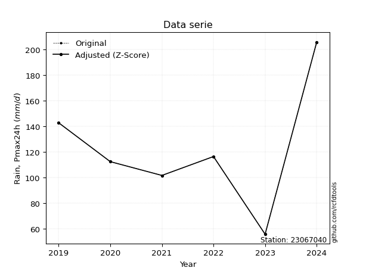</img>

</div>

> If Z-Score is active, values out of range or outliers are replaced with the station mean value.


### 4. Active continuous probability distributions from SciPy (45 of 104 available)

[scipy.stats](https://docs.scipy.org/doc/scipy/reference/stats.html) is a Python´s powerful submodule within the SciPy library for comprehensive statistical analysis, offering over 130 probability distributions (like Normal, Poisson), functions for descriptive stats (mean, variance), hypothesis testing (t-tests, chi-square), random variable generation, and statistical tests, making it essential for data science, modeling, and research. It provides tools to explore, model, and draw conclusions from data efficiently, working seamlessly with NumPy.

<div align="center">

|   id | p_dist             |   n_parameter | fit_method   | label                                                                       | active   | ref                                                                                                        |
|-----:|:-------------------|--------------:|:-------------|:----------------------------------------------------------------------------|:---------|:-----------------------------------------------------------------------------------------------------------|
|    0 | alpha              |             3 | MLE          | Alpha                                                                       | True     | [:mortar_board:](https://docs.scipy.org/doc/scipy/reference/generated/scipy.stats.alpha.html)              |
|    1 | betaprime          |             4 | MLE          | Beta prime                                                                  | True     | [:mortar_board:](https://docs.scipy.org/doc/scipy/reference/generated/scipy.stats.betaprime.html)          |
|    2 | chi2               |             3 | MLE          | Chi²                                                                        | True     | [:mortar_board:](https://docs.scipy.org/doc/scipy/reference/generated/scipy.stats.chi2.html)               |
|    3 | crystalball        |             4 | MLE          | Crystalball                                                                 | True     | [:mortar_board:](https://docs.scipy.org/doc/scipy/reference/generated/scipy.stats.crystalball.html)        |
|    4 | erlang             |             3 | MLE          | Erlang                                                                      | True     | [:mortar_board:](https://docs.scipy.org/doc/scipy/reference/generated/scipy.stats.erlang.html)             |
|    5 | expon              |             2 | MLE          | Exponential                                                                 | True     | [:mortar_board:](https://docs.scipy.org/doc/scipy/reference/generated/scipy.stats.expon.html)              |
|    6 | exponnorm          |             3 | MLE          | Exponentially modified Normal                                               | True     | [:mortar_board:](https://docs.scipy.org/doc/scipy/reference/generated/scipy.stats.exponnorm.html)          |
|    7 | f                  |             4 | MLE          | F                                                                           | True     | [:mortar_board:](https://docs.scipy.org/doc/scipy/reference/generated/scipy.stats.f.html)                  |
|    8 | fatiguelife        |             3 | MLE          | Fatigue-life (Birnbaum-Saunders)                                            | True     | [:mortar_board:](https://docs.scipy.org/doc/scipy/reference/generated/scipy.stats.fatiguelife.html)        |
|    9 | fisk               |             3 | MLE          | Fisk                                                                        | True     | [:mortar_board:](https://docs.scipy.org/doc/scipy/reference/generated/scipy.stats.fisk.html)               |
|   10 | gamma              |             3 | MLE          | Gamma                                                                       | True     | [:mortar_board:](https://docs.scipy.org/doc/scipy/reference/generated/scipy.stats.gamma.html)              |
|   11 | genexpon           |             5 | MLE          | Generalized exponential                                                     | True     | [:mortar_board:](https://docs.scipy.org/doc/scipy/reference/generated/scipy.stats.genexpon.html)           |
|   12 | genlogistic        |             3 | MLE          | Generalized logistic                                                        | True     | [:mortar_board:](https://docs.scipy.org/doc/scipy/reference/generated/scipy.stats.genlogistic.html)        |
|   13 | gibrat             |             2 | MM           | Gibrat                                                                      | True     | [:mortar_board:](https://docs.scipy.org/doc/scipy/reference/generated/scipy.stats.gibrat.html)             |
|   14 | gompertz           |             3 | MLE          | Gompertz (or truncated Gumbel)                                              | True     | [:mortar_board:](https://docs.scipy.org/doc/scipy/reference/generated/scipy.stats.gompertz.html)           |
|   15 | gumbel_l           |             2 | MM           | Gumbel Left Skew                                                            | True     | [:mortar_board:](https://docs.scipy.org/doc/scipy/reference/generated/scipy.stats.gumbel_l.html)           |
|   16 | gumbel_r           |             2 | MM           | Gumbel Right Skew                                                           | True     | [:mortar_board:](https://docs.scipy.org/doc/scipy/reference/generated/scipy.stats.gumbel_r.html)           |
|   17 | halflogistic       |             2 | MM           | Half-logistic                                                               | True     | [:mortar_board:](https://docs.scipy.org/doc/scipy/reference/generated/scipy.stats.halflogistic.html)       |
|   18 | halfnorm           |             2 | MM           | Half Normal                                                                 | True     | [:mortar_board:](https://docs.scipy.org/doc/scipy/reference/generated/scipy.stats.halfnorm.html)           |
|   19 | hypsecant          |             2 | MM           | hyperbolic secant                                                           | True     | [:mortar_board:](https://docs.scipy.org/doc/scipy/reference/generated/scipy.stats.hypsecant.html)          |
|   20 | invgamma           |             3 | MLE          | Inverted gamma                                                              | True     | [:mortar_board:](https://docs.scipy.org/doc/scipy/reference/generated/scipy.stats.invgamma.html)           |
|   21 | invgauss           |             3 | MLE          | Inverse Gaussian                                                            | True     | [:mortar_board:](https://docs.scipy.org/doc/scipy/reference/generated/scipy.stats.invgauss.html)           |
|   22 | invweibull         |             3 | MLE          | Inverted Weibull                                                            | True     | [:mortar_board:](https://docs.scipy.org/doc/scipy/reference/generated/scipy.stats.invweibull.html)         |
|   23 | johnsonsu          |             4 | MLE          | Johnson Su                                                                  | True     | [:mortar_board:](https://docs.scipy.org/doc/scipy/reference/generated/scipy.stats.johnsonsu.html)          |
|   24 | kstwobign          |             2 | MLE          | Limiting distribution of scaled Kolmogorov-Smirnov two-sided test statistic | True     | [:mortar_board:](https://docs.scipy.org/doc/scipy/reference/generated/scipy.stats.kstwobign.html)          |
|   25 | laplace            |             2 | MM           | Laplace                                                                     | True     | [:mortar_board:](https://docs.scipy.org/doc/scipy/reference/generated/scipy.stats.laplace.html)            |
|   26 | laplace_asymmetric |             3 | MLE          | Asymmetric Laplace                                                          | True     | [:mortar_board:](https://docs.scipy.org/doc/scipy/reference/generated/scipy.stats.laplace_asymmetric.html) |
|   27 | loggamma           |             3 | MLE          | Log gamma                                                                   | True     | [:mortar_board:](https://docs.scipy.org/doc/scipy/reference/generated/scipy.stats.loggamma.html)           |
|   28 | logistic           |             2 | MM           | Logistic (or Sech-squared)                                                  | True     | [:mortar_board:](https://docs.scipy.org/doc/scipy/reference/generated/scipy.stats.logistic.html)           |
|   29 | lognorm            |             3 | MLE          | Log Normal                                                                  | True     | [:mortar_board:](https://docs.scipy.org/doc/scipy/reference/generated/scipy.stats.lognorm.html)            |
|   30 | maxwell            |             2 | MM           | Maxwell                                                                     | True     | [:mortar_board:](https://docs.scipy.org/doc/scipy/reference/generated/scipy.stats.maxwell.html)            |
|   31 | mielke             |             4 | MLE          | Mielke Beta-Kappa / Dagum                                                   | True     | [:mortar_board:](https://docs.scipy.org/doc/scipy/reference/generated/scipy.stats.mielke.html)             |
|   32 | moyal              |             2 | MM           | Moyal                                                                       | True     | [:mortar_board:](https://docs.scipy.org/doc/scipy/reference/generated/scipy.stats.moyal.html)              |
|   33 | nakagami           |             3 | MLE          | Nakagami                                                                    | True     | [:mortar_board:](https://docs.scipy.org/doc/scipy/reference/generated/scipy.stats.nakagami.html)           |
|   34 | ncf                |             5 | MLE          | Non-central F distribution                                                  | True     | [:mortar_board:](https://docs.scipy.org/doc/scipy/reference/generated/scipy.stats.ncf.html)                |
|   35 | nct                |             4 | MLE          | Non-central Student’s t                                                     | True     | [:mortar_board:](https://docs.scipy.org/doc/scipy/reference/generated/scipy.stats.nct.html)                |
|   36 | norm               |             2 | MM           | Normal                                                                      | True     | [:mortar_board:](https://docs.scipy.org/doc/scipy/reference/generated/scipy.stats.norm.html)               |
|   37 | pareto             |             3 | MLE          | Pareto                                                                      | True     | [:mortar_board:](https://docs.scipy.org/doc/scipy/reference/generated/scipy.stats.pareto.html)             |
|   38 | pearson3           |             3 | MM           | Pearson type III                                                            | True     | [:mortar_board:](https://docs.scipy.org/doc/scipy/reference/generated/scipy.stats.pearson3.html)           |
|   39 | rayleigh           |             2 | MM           | Rayleigh                                                                    | True     | [:mortar_board:](https://docs.scipy.org/doc/scipy/reference/generated/scipy.stats.rayleigh.html)           |
|   40 | rice               |             3 | MLE          | Rice                                                                        | True     | [:mortar_board:](https://docs.scipy.org/doc/scipy/reference/generated/scipy.stats.rice.html)               |
|   41 | t                  |             3 | MLE          | Student’s t                                                                 | True     | [:mortar_board:](https://docs.scipy.org/doc/scipy/reference/generated/scipy.stats.t.html)                  |
|   42 | truncnorm          |             4 | MLE          | Truncated normal                                                            | True     | [:mortar_board:](https://docs.scipy.org/doc/scipy/reference/generated/scipy.stats.truncnorm.html)          |
|   43 | wald               |             2 | MM           | Wald                                                                        | True     | [:mortar_board:](https://docs.scipy.org/doc/scipy/reference/generated/scipy.stats.wald.html)               |
|   44 | weibull_min        |             3 | MLE          | Weibull minimum                                                             | True     | [:mortar_board:](https://docs.scipy.org/doc/scipy/reference/generated/scipy.stats.weibull_min.html)        |

</div>

> **n_parameter:** # arguments & localization & scale.
>
> **Fit methods:** (MLE) maximum likelihood, (MM) L-moments.
>
>**Inactive:** foldnorm, gennorm, norminvgauss, powernorm, powerlognorm, skewnorm, genextreme, anglit, arcsine, argus, beta, bradford, burr, burr12, cauchy, cosine, halfcauchy, foldcauchy, skewcauchy, wrapcauchy, dgamma, gengamma, exponweib, exponpow, truncexpon, gausshyper, genhalflogistic, genhyperbolic, geninvgauss, halfgennorm, johnsonsb, kappa4, kappa3, ksone, kstwo, loglaplace, levy, levy_l, levy_stable, ncx2, genpareto, truncpareto, lomax, powerlaw, rdist, rel_breitwigner, recipinvgauss, semicircular, studentized_range, trapezoid, triang, truncweibull_min, tukeylambda, uniform, loguniform, vonmises, vonmises_line, weibull_max, dweibull, 


## B. Probability distributions vs. Empirical distributions

A continuous probability distribution (CPD) describes probabilities for variables that can take any value within a range (like rain any time), unlike discrete variables with specific outcomes (like temperature). It uses a Probability Density Function (PDF), a curve where the total area under it equals 1, and the probability of the variable falling within an interval (a to b) is found by calculating the area under the curve between those points. A key feature is that the probability of hitting any single exact value is zero, so probabilities are always expressed for ranges, e.g., $P(a ≤ X ≤ b)$.

<div align="center">

Distributions parameters
|    |   station | p_dist                |   n |              loc |          scale | shape                 | shape1                 | shape2              | shape3   |
|---:|----------:|:----------------------|----:|-----------------:|---------------:|:----------------------|:-----------------------|:--------------------|:---------|
|  0 |  23067040 | alpha                 |   7 |   -146.764       | 1464.82        | 5.803270732367684     |                        |                     |          |
|  1 |  23067040 | betaprime             |   7 |     -0.274337    |   20.2545      | 34.244508089186375    | 7.05168126718096       |                     |          |
|  2 |  23067040 | chi2                  |   7 |     55.6         |   31.0514      | 0.370731163934616     |                        |                     |          |
|  3 |  23067040 | crystalball           |   7 |    113.657       |   47.352       | 9869.536699761993     | 1700.6093707441612     |                     |          |
|  4 |  23067040 | erlang                |   7 |     55.6         |   40.8449      | 0.9900293003505964    |                        |                     |          |
|  5 |  23067040 | expon                 |   7 |     55.6         |   58.0571      |                       |                        |                     |          |
|  6 |  23067040 | exponnorm             |   7 |     71.568       |   26.5789      | 1.5835527043545805    |                        |                     |          |
|  7 |  23067040 | f                     |   7 |     55.5999      |   60.7674      | 1.4405095203578746    | 548.7521638108783      |                     |          |
|  8 |  23067040 | fatiguelife           |   7 |     55.6         |    0.000303437 | 416.286066664401      |                        |                     |          |
|  9 |  23067040 | fisk                  |   7 |      6.85211     |   98.236       | 3.6846687168980474    |                        |                     |          |
| 10 |  23067040 | gamma                 |   7 |     55.6         |   78.8916      | 0.5378842999687588    |                        |                     |          |
| 11 |  23067040 | genexpon              |   7 |     55.6         |    1.52317     | 0.026228852248369898  | 1.1052787908703884e-07 | 1.8117863680523714  |          |
| 12 |  23067040 | genlogistic           |   7 |   -155.204       |   37.8903      | 673.2195279340028     |                        |                     |          |
| 13 |  23067040 | gibrat                |   7 |     77.5336      |   21.9101      |                       |                        |                     |          |
| 14 |  23067040 | gompertz              |   7 |     55.6         |  161.154       | 1.9973157366463092    |                        |                     |          |
| 15 |  23067040 | gumbel_l              |   7 |    134.968       |   36.9202      |                       |                        |                     |          |
| 16 |  23067040 | gumbel_r              |   7 |     92.3462      |   36.9202      |                       |                        |                     |          |
| 17 |  23067040 | halflogistic          |   7 |     57.534       |   40.4843      |                       |                        |                     |          |
| 18 |  23067040 | halfnorm              |   7 |     50.9816      |   78.5521      |                       |                        |                     |          |
| 19 |  23067040 | hypsecant             |   7 |    113.657       |   30.1452      |                       |                        |                     |          |
| 20 |  23067040 | invgamma              |   7 |    -39.2802      | 1540.55        | 11.051239370745941    |                        |                     |          |
| 21 |  23067040 | invgauss              |   7 |     18.144       |  304.777       | 0.3133866889874774    |                        |                     |          |
| 22 |  23067040 | invweibull            |   7 |     55.6         |    1.38065     | 0.049830743789330834  |                        |                     |          |
| 23 |  23067040 | johnsonsu             |   7 |     14.2443      |    3.11201     | -8.069537817087337    | 1.9986240361813987     |                     |          |
| 24 |  23067040 | kstwobign             |   7 |    -41.4991      |  178.038       |                       |                        |                     |          |
| 25 |  23067040 | laplace               |   7 |    113.657       |   33.4829      |                       |                        |                     |          |
| 26 |  23067040 | laplace_asymmetric    |   7 |    112.4         |   35.3292      | 0.9865092932330202    |                        |                     |          |
| 27 |  23067040 | loggamma              |   7 | -13060.1         | 1812.78        | 1433.0055100637255    |                        |                     |          |
| 28 |  23067040 | logistic              |   7 |    113.657       |   26.1065      |                       |                        |                     |          |
| 29 |  23067040 | lognorm               |   7 |     55.6         |    0.258427    | 12.784859897263122    |                        |                     |          |
| 30 |  23067040 | maxwell               |   7 |      1.45274     |   70.3137      |                       |                        |                     |          |
| 31 |  23067040 | mielke                |   7 |     -0.270776    |   53.2458      | 12.443396368302992    | 2.8353700254316028     |                     |          |
| 32 |  23067040 | moyal                 |   7 |     86.5782      |   21.3159      |                       |                        |                     |          |
| 33 |  23067040 | nakagami              |   7 |     55.6         |   75.572       | 0.07418896253424376   |                        |                     |          |
| 34 |  23067040 | ncf                   |   7 |     -0.199215    |    1.85378e-07 | 6.126377212782959e-08 | 14.071854725495964     | 34.04272241079063   |          |
| 35 |  23067040 | nct                   |   7 |     -0.103846    |   28.0976      | 6.365803573643183     | 3.562268602688392      |                     |          |
| 36 |  23067040 | norm                  |   7 |    113.657       |   47.352       |                       |                        |                     |          |
| 37 |  23067040 | pareto                |   7 |     55.5524      |    0.0475748   | 0.16911781584685978   |                        |                     |          |
| 38 |  23067040 | pearson3              |   7 |    113.657       |   47.352       | 0.628452284618406     |                        |                     |          |
| 39 |  23067040 | rayleigh              |   7 |     23.07        |   72.2781      |                       |                        |                     |          |
| 40 |  23067040 | rice                  |   7 |     31.1901      |   67.2422      | 0.0011072796285611754 |                        |                     |          |
| 41 |  23067040 | t                     |   7 |    113.657       |   47.3522      | 441254205.22517616    |                        |                     |          |
| 42 |  23067040 | truncnorm             |   7 |    118.546       |   52.9573      | -2241.727011437357    | 1.6595331814247025     |                     |          |
| 43 |  23067040 | wald                  |   7 |     66.3051      |   47.352       |                       |                        |                     |          |
| 44 |  23067040 | weibull_min           |   7 |     55.6         |   52.5227      | 0.18593371517647056   |                        |                     |          |
| 45 |  23067040 | logalpha              |   7 |     -4.13095     |  181.158       | 20.697221026267044    |                        |                     |          |
| 46 |  23067040 | logbetaprime          |   7 |     -4.70389     |    8.34872     | 631.2060641450937     | 564.232227327808       |                     |          |
| 47 |  23067040 | logchi2               |   7 |      4.01818     |    0.985697    | 1.06498832668218      |                        |                     |          |
| 48 |  23067040 | logcrystalball        |   7 |      4.64503     |    0.42548     | 7.889511392532959     | 4.759756079562664      |                     |          |
| 49 |  23067040 | logerlang             |   7 |     -7.57434     |    0.0148775   | 821.3415060438083     |                        |                     |          |
| 50 |  23067040 | logexpon              |   7 |      4.01818     |    0.62685     |                       |                        |                     |          |
| 51 |  23067040 | logexponnorm          |   7 |      4.64467     |    0.425479    | 0.0008640157353096126 |                        |                     |          |
| 52 |  23067040 | logf                  |   7 |   -114.776       |  119.42        | 230682.49854095362    | 498831.4174751062      |                     |          |
| 53 |  23067040 | logfatiguelife        |   7 |    -39.2596      |   43.9034      | 0.009707059914988603  |                        |                     |          |
| 54 |  23067040 | logfisk               |   7 |     -3.70857e+07 |    3.70857e+07 | 148091460.47493663    |                        |                     |          |
| 55 |  23067040 | loggamma              |   7 |     -7.716       |    0.0147329   | 838.9288664743217     |                        |                     |          |
| 56 |  23067040 | loggenexpon           |   7 |      4.01818     |    1.03336     | 1.1939583716852606    | 2.86443615167529       | 0.41093381597411777 |          |
| 57 |  23067040 | loggenlogistic        |   7 |      4.81413     |    0.207794    | 0.6477213672013344    |                        |                     |          |
| 58 |  23067040 | loggibrat             |   7 |      4.32046     |    0.196867    |                       |                        |                     |          |
| 59 |  23067040 | loggompertz           |   7 |      4.01818     |    0.660837    | 0.46609968120333134   |                        |                     |          |
| 60 |  23067040 | loggumbel_l           |   7 |      4.83652     |    0.331745    |                       |                        |                     |          |
| 61 |  23067040 | loggumbel_r           |   7 |      4.45354     |    0.331745    |                       |                        |                     |          |
| 62 |  23067040 | loghalflogistic       |   7 |      4.14073     |    0.363776    |                       |                        |                     |          |
| 63 |  23067040 | loghalfnorm           |   7 |      4.08185     |    0.705843    |                       |                        |                     |          |
| 64 |  23067040 | loghypsecant          |   7 |      4.64503     |    0.270869    |                       |                        |                     |          |
| 65 |  23067040 | loginvgamma           |   7 |     -3.1656      | 2554.04        | 328.07246200353586    |                        |                     |          |
| 66 |  23067040 | loginvgauss           |   7 |      1.58254     |  149.449       | 0.02048643837344513   |                        |                     |          |
| 67 |  23067040 | loginvweibull         |   7 |     -8.1852e+07  |    8.1852e+07  | 206876639.5400493     |                        |                     |          |
| 68 |  23067040 | logjohnsonsu          |   7 | -19108.2         |    7.43861e+06 | -44921.14381458485    | 17483065.558489304     |                     |          |
| 69 |  23067040 | logkstwobign          |   7 |      3.06732     |    1.79958     |                       |                        |                     |          |
| 70 |  23067040 | loglaplace            |   7 |      4.64503     |    0.30086     |                       |                        |                     |          |
| 71 |  23067040 | loglaplace_asymmetric |   7 |      4.72206     |    0.321557    | 1.1267888985074754    |                        |                     |          |
| 72 |  23067040 | logloggamma           |   7 |     -3.65869     |    2.40105     | 32.26383982977924     |                        |                     |          |
| 73 |  23067040 | loglogistic           |   7 |      4.64503     |    0.234579    |                       |                        |                     |          |
| 74 |  23067040 | loglognorm            |   7 |      4.01818     |    0.00437658  | 11.958275205534836    |                        |                     |          |
| 75 |  23067040 | logmaxwell            |   7 |      3.63683     |    0.631801    |                       |                        |                     |          |
| 76 |  23067040 | logmielke             |   7 |     -0.658867    |    5.5533      | 14.438186070594597    | 29.592477534205475     |                     |          |
| 77 |  23067040 | logmoyal              |   7 |      4.40172     |    0.191533    |                       |                        |                     |          |
| 78 |  23067040 | lognakagami           |   7 |      4.01818     |    0.905115    | 0.08058506796230525   |                        |                     |          |
| 79 |  23067040 | logncf                |   7 |    -92.3247      |   93.4192      | 190941.23076146393    | 226437.56784257462     | 7253.416622102201   |          |
| 80 |  23067040 | lognct                |   7 |     -9.97582     |    0.404287    | 5626.545723458768     | 36.16037293517802      |                     |          |
| 81 |  23067040 | lognorm               |   7 |      4.64503     |    0.42548     |                       |                        |                     |          |
| 82 |  23067040 | logpareto             |   7 |      4.01762     |    0.000564489 | 0.16857597463760848   |                        |                     |          |
| 83 |  23067040 | logpearson3           |   7 |      4.64503     |    0.42548     | -0.09208737827232075  |                        |                     |          |
| 84 |  23067040 | lograyleigh           |   7 |      3.83107     |    0.649452    |                       |                        |                     |          |
| 85 |  23067040 | logrice               |   7 |      3.78226     |    0.498572    | 1.3125849256409123    |                        |                     |          |
| 86 |  23067040 | logt                  |   7 |      4.64503     |    0.425479    | 1313661579.2331192    |                        |                     |          |
| 87 |  23067040 | logtruncnorm          |   7 |     -0.143929    |    1.15458     | 4.127006860780812     | 4.739208128221357      |                     |          |
| 88 |  23067040 | logwald               |   7 |      4.21952     |    0.425513    |                       |                        |                     |          |
| 89 |  23067040 | logweibull_min        |   7 |      3.67604     |    1.09415     | 2.494498910009157     |                        |                     |          |

</div>

> **loc** (Location parameter): This shifts the distribution along the x-axis. For many common distributions, like the normal (Gaussian) distribution, loc represents the mean $μ$. For others, like the uniform distribution, it might represent the minimum value, or for the beta distribution, the left end of the support interval.
>
> **scale** (Scale parameter): This determines the width or spread of the distribution. For the normal distribution, scale represents the standard deviation $σ$. For a uniform distribution, it defines the length of the interval (from $loc$ to $loc + scale$).
>
> **shape** (Shape parameters): Refers to parameters that define the specific form of a probability distribution, distinct from its location (loc) and scale (scale). These parameters are required arguments for most distribution functions. For example, a normal (Gaussian) distribution is fully defined by its location (mean) and scale (standard deviation), so it has no specific shape parameters beyond loc and scale. However, other distributions have intrinsic properties that need specification, as Gamma distribution that takes a shape parameter, often named $a$ or $alpha$.


### 0. Cumulative distribution values - CDF (90 evaluated)

> Ordered by x ascending and calculating $log(f(x))$ separately. 

|   id |   Station |   date |     x |   count |    mean |    std |     zscore |   Value_initial |   station |   m |     alpha |   alpha_pdf |   betaprime |   betaprime_pdf |       chi2 |    chi2_pdf |   crystalball |   crystalball_pdf |      erlang |   erlang_pdf |     expon |   expon_pdf |   exponnorm |   exponnorm_pdf |           f |      f_pdf |   fatiguelife |   fatiguelife_pdf |      fisk |   fisk_pdf |       gamma |        gamma_pdf |   genexpon |   genexpon_pdf |   genlogistic |   genlogistic_pdf |   gibrat |   gibrat_pdf |    gompertz |   gompertz_pdf |   gumbel_l |   gumbel_l_pdf |   gumbel_r |   gumbel_r_pdf |   halflogistic |   halflogistic_pdf |   halfnorm |   halfnorm_pdf |   hypsecant |   hypsecant_pdf |   invgamma |   invgamma_pdf |   invgauss |   invgauss_pdf |   invweibull |   invweibull_pdf |   johnsonsu |   johnsonsu_pdf |   kstwobign |   kstwobign_pdf |   laplace |   laplace_pdf |   laplace_asymmetric |   laplace_asymmetric_pdf |   loggamma |   loggamma_pdf |   logistic |   logistic_pdf |   lognorm |   lognorm_pdf |   maxwell |   maxwell_pdf |   mielke |   mielke_pdf |     moyal |   moyal_pdf |   nakagami |   nakagami_pdf |      ncf |    ncf_pdf |       nct |    nct_pdf |     norm |   norm_pdf |   pareto |   pareto_pdf |   pearson3 |   pearson3_pdf |   rayleigh |   rayleigh_pdf |      rice |   rice_pdf |        t |      t_pdf |   truncnorm |   truncnorm_pdf |     wald |    wald_pdf |   weibull_min |   weibull_min_pdf |   logalpha |   logalpha_pdf |   logbetaprime |   logbetaprime_pdf |    logchi2 |   logchi2_pdf |   logcrystalball |   logcrystalball_pdf |   logerlang |   logerlang_pdf |   logexpon |   logexpon_pdf |   logexponnorm |   logexponnorm_pdf |      logf |   logf_pdf |   logfatiguelife |   logfatiguelife_pdf |   logfisk |   logfisk_pdf |   loggenexpon |   loggenexpon_pdf |   loggenlogistic |   loggenlogistic_pdf |   loggibrat |   loggibrat_pdf |   loggompertz |   loggompertz_pdf |   loggumbel_l |   loggumbel_l_pdf |   loggumbel_r |   loggumbel_r_pdf |   loghalflogistic |   loghalflogistic_pdf |   loghalfnorm |   loghalfnorm_pdf |   loghypsecant |   loghypsecant_pdf |   loginvgamma |   loginvgamma_pdf |   loginvgauss |   loginvgauss_pdf |   loginvweibull |   loginvweibull_pdf |   logjohnsonsu |   logjohnsonsu_pdf |   logkstwobign |   logkstwobign_pdf |   loglaplace |   loglaplace_pdf |   loglaplace_asymmetric |   loglaplace_asymmetric_pdf |   logloggamma |   logloggamma_pdf |   loglogistic |   loglogistic_pdf |   loglognorm |   loglognorm_pdf |   logmaxwell |   logmaxwell_pdf |   logmielke |   logmielke_pdf |   logmoyal |   logmoyal_pdf |   lognakagami |   lognakagami_pdf |    logncf |   logncf_pdf |    lognct |   lognct_pdf |   logpareto |   logpareto_pdf |   logpearson3 |   logpearson3_pdf |   lograyleigh |   lograyleigh_pdf |   logrice |   logrice_pdf |      logt |   logt_pdf |   logtruncnorm |   logtruncnorm_pdf |   logwald |   logwald_pdf |   logweibull_min |   logweibull_min_pdf |
|-----:|----------:|-------:|------:|--------:|--------:|-------:|-----------:|----------------:|----------:|----:|----------:|------------:|------------:|----------------:|-----------:|------------:|--------------:|------------------:|------------:|-------------:|----------:|------------:|------------:|----------------:|------------:|-----------:|--------------:|------------------:|----------:|-----------:|------------:|-----------------:|-----------:|---------------:|--------------:|------------------:|---------:|-------------:|------------:|---------------:|-----------:|---------------:|-----------:|---------------:|---------------:|-------------------:|-----------:|---------------:|------------:|----------------:|-----------:|---------------:|-----------:|---------------:|-------------:|-----------------:|------------:|----------------:|------------:|----------------:|----------:|--------------:|---------------------:|-------------------------:|-----------:|---------------:|-----------:|---------------:|----------:|--------------:|----------:|--------------:|---------:|-------------:|----------:|------------:|-----------:|---------------:|---------:|-----------:|----------:|-----------:|---------:|-----------:|---------:|-------------:|-----------:|---------------:|-----------:|---------------:|----------:|-----------:|---------:|-----------:|------------:|----------------:|---------:|------------:|--------------:|------------------:|-----------:|---------------:|---------------:|-------------------:|-----------:|--------------:|-----------------:|---------------------:|------------:|----------------:|-----------:|---------------:|---------------:|-------------------:|----------:|-----------:|-----------------:|---------------------:|----------:|--------------:|--------------:|------------------:|-----------------:|---------------------:|------------:|----------------:|--------------:|------------------:|--------------:|------------------:|--------------:|------------------:|------------------:|----------------------:|--------------:|------------------:|---------------:|-------------------:|--------------:|------------------:|--------------:|------------------:|----------------:|--------------------:|---------------:|-------------------:|---------------:|-------------------:|-------------:|-----------------:|------------------------:|----------------------------:|--------------:|------------------:|--------------:|------------------:|-------------:|-----------------:|-------------:|-----------------:|------------:|----------------:|-----------:|---------------:|--------------:|------------------:|----------:|-------------:|----------:|-------------:|------------:|----------------:|--------------:|------------------:|--------------:|------------------:|----------:|--------------:|----------:|-----------:|---------------:|-------------------:|----------:|--------------:|-----------------:|---------------------:|
|    0 |  23067040 |   2023 |  55.6 |       7 | 113.657 | 51.146 | -1.13513   |            55.6 |  23067040 |   1 | 0.0756085 |  0.00509468 |   0.0629009 |      0.00594821 | 0.00120274 | 3.1377e+10  |      0.110085 |        0.00397322 | 2.50844e-16 |  0.0349511   | 0         |  0.0172244  |    0.079689 |      0.00461652 | 5.84576e-05 | 0.426927   |      0.121984 |       9.13985e+07 | 0.0703132 | 0.00494101 | 2.63618e-09 | 199560           | 7.9899e-07 |     0.0172199  |     0.0760002 |        0.00515909 | 0        |  0           | 2.20159e-15 |     0.0123938  |   0.109985 |    0.00280881  |  0.0668369 |     0.00489778 |      0         |         0          |  0.0468836 |     0.0101399  |   0.0921338 |     0.00301383  |  0.0716514 |     0.0054533  |  0.0626042 |     0.00675754 |   0.00578573 |      2.0906e+11  |   0.0653884 |      0.00613869 |   0.0726231 |      0.00545639 | 0.0882943 |   0.00263699  |            0.0966614 |               0.00277343 |  0.0694099 |       0.323631 |  0.0976287 |     0.00337453 | 0.0703379 |      0.316739 |  0.101973 |    0.00500265 | 0.063751 |   0.00661565 | 0.0386276 |  0.00456046 | 0.00358816 |    7.49292e+10 | 0.118426 | 0.00651479 | 0.0737484 | 0.00499028 | 0.110085 | 0.00397322 | 0        |  3.55478     |  0.0928084 |     0.00487251 |  0.0963204 |     0.00562711 | 0.0637661 | 0.00505437 | 0.110086 | 0.00397323 |    0.123273 |      0.00390649 | 0        | 0           |      0.00112  |       2.92917e+10 |  0.06262   |       0.335995 |       0.118526 |           0.392732 | 7.5845e-09 |   4.54717e+06 |        0.0703379 |             0.316739 |   0.0688041 |        0.321874 |   0        |       1.59528  |      0.0703371 |           0.316737 | 0.0700396 |   0.317349 |        0.0696483 |             0.318381 | 0.0719437 |      0.266619 |   1.48288e-11 |          1.15542  |        0.0824985 |             0.251696 |    0        |        0        |   2.19861e-09 |          0.705317 |     0.0813578 |          0.234984 |     0.0243591 |          0.272771 |          0        |              0        |     0         |          0        |      0.0627217 |           0.230062 |     0.0676164 |          0.338594 |     0.0624391 |          0.35577  |       0.0586203 |            0.420281 |      0.0703363 |           0.316736 |      0.0571539 |           0.471106 |    0.0622449 |         0.20689  |               0.0801744 |                    0.221276 |      0.074627 |          0.304611 |     0.0646319 |          0.257715 |   0.00726297 |      1.89542e+12 |    0.0524933 |         0.383486 |    0.083541 |        0.256302 | 0.00649666 |       0.139655 |    0.00324305 |       5.88489e+11 | 0.0704721 |     0.318873 | 0.0705795 |     0.319047 |    0        |     298.635     |     0.0726289 |          0.310748 |     0.0406557 |          0.425592 | 0.0469084 |      0.393996 | 0.0703374 |   0.316738 |    0           |           0        |  0        |      0        |        0.0535449 |             0.37974  |
|    1 |  23067040 |   2025 |  60.8 |       7 | 113.657 | 51.146 | -1.03346   |            60.8 |  23067040 |   2 | 0.104939  |  0.00617978 |   0.0979138 |      0.00748441 | 0.675969   | 0.0224483   |      0.132156 |        0.00451854 | 0.122573    |  0.0218757   | 0.0856729 |  0.0157487  |    0.10628  |      0.00561688 | 0.143466    | 0.0191669  |      0.62341  |       0.0114817   | 0.0989967 | 0.00609216 | 0.254907    |      0.0252563   | 0.0856524  |     0.015745   |     0.105705  |        0.00625844 | 0        |  0           | 0.0634      |     0.0119887  |   0.125532 |    0.00317714  |  0.095363  |     0.00607009 |      0.0403145 |         0.0123304  |  0.09947   |     0.0100784  |   0.109168  |     0.00355082  |  0.103199  |     0.00666479 |  0.102128  |     0.00837092 |   0.392172   |      0.00351781  |   0.101168  |      0.00758126 |   0.103966  |      0.00657892 | 0.103129  |   0.00308004  |            0.112215  |               0.00321969 |  0.103143  |       0.433274 |  0.116637  |     0.00394663 | 0.103268  |      0.422244 |  0.129716 |    0.00566144 | 0.10318  |   0.0084937  | 0.0671528 |  0.00641343 | 0.575987   |    0.01643     | 0.154238 | 0.00722993 | 0.102748  | 0.00616213 | 0.132156 | 0.00451854 | 0.548598 |  0.0145477   |  0.120193  |     0.00565555 |  0.127374  |     0.00630234 | 0.0924012 | 0.00594357 | 0.132157 | 0.00451855 |    0.144785 |      0.00436899 | 0        | 0           |      0.478224 |       0.0121366   |  0.0981965 |       0.462221 |       0.157152 |           0.471345 | 0.213584   |   1.23487     |        0.103268  |             0.422244 |   0.102377  |        0.431472 |   0.132924 |       1.38323  |      0.103267  |           0.422242 | 0.103054  |   0.423524 |        0.102791  |             0.425344 | 0.0997336 |      0.358539 |   0.102063    |          1.12443  |        0.108215  |             0.326427 |    0        |        0        |   0.0652955   |          0.754772 |     0.105157  |          0.299697 |     0.0585867 |          0.501062 |          0        |              0        |     0.0290862 |          1.12965  |      0.0869883 |           0.317163 |     0.103093  |          0.45712  |     0.100155  |          0.489701 |       0.104045  |            0.595079 |      0.103266  |           0.422242 |      0.108073  |           0.66322  |    0.0837844 |         0.278484 |               0.102613  |                    0.283205 |      0.106035 |          0.4003   |     0.091863  |          0.355633 |   0.599591   |      0.361452    |    0.0933921 |         0.531187 |    0.109561 |        0.328303 | 0.0311564  |       0.440175 |    0.585832   |       1.05529     | 0.103629  |     0.425159 | 0.103743  |     0.425107 |    0.574676 |       0.796917  |     0.104788  |          0.410969 |     0.0866575 |          0.598786 | 0.0884132 |      0.532795 | 0.103267  |   0.422244 |    0           |           0        |  0        |      0        |        0.0935331 |             0.514538 |
|    2 |  23067040 |   2021 | 101.6 |       7 | 113.657 | 51.146 | -0.23574   |           101.6 |  23067040 |   3 | 0.462321  |  0.00943132 |   0.497067  |      0.00932117 | 0.92722    | 0.00197063  |      0.399505 |        0.00815629 | 0.679767    |  0.00788324  | 0.547208  |  0.00779907 |    0.457572 |      0.0098166  | 0.570376    | 0.00641748 |      0.825183 |       0.00261892  | 0.466746  | 0.00967929 | 0.69722     |      0.00549868  | 0.547115   |     0.00779865 |     0.464683  |        0.0093937  | 0.537395 |  0.0165038   | 0.483051    |     0.00852352 |   0.333045 |    0.00731681  |  0.459186  |     0.00967991 |      0.496188  |         0.00930976 |  0.480679  |     0.00825303 |   0.375951  |     0.00976747  |  0.47388   |     0.00933738 |  0.505923  |     0.00887316 |   0.43184    |      0.000392814 |   0.492537  |      0.00912007 |   0.461956  |      0.00910158 | 0.348804  |   0.0104174   |            0.361788  |               0.0103805  |  0.483237  |       0.935181 |  0.386549  |     0.00908312 | 0.477518  |      0.93614  |  0.43351  |    0.00834818 | 0.523532 |   0.00876769 | 0.482039  |  0.0102767  | 0.794476   |    0.0024979   | 0.481602 | 0.00752358 | 0.469768  | 0.00962972 | 0.399505 | 0.00815629 | 0.687361 |  0.00114822  |  0.43799   |     0.00877685 |  0.445805  |     0.00833076 | 0.422021  | 0.00900039 | 0.399506 | 0.00815627 |    0.393575 |      0.00752214 | 0.543682 | 0.012535    |      0.623051 |       0.00148653  |  0.499258  |       0.943525 |       0.488674 |           0.738009 | 0.541212   |   0.389959    |        0.477518  |             0.93614  |   0.482057  |        0.935914 |   0.617769 |       0.609765 |      0.477517  |           0.936142 | 0.478315  |   0.936949 |        0.478759  |             0.935261 | 0.462607  |      0.992723 |   0.585954    |          0.723053 |        0.441562  |             0.986769 |    0.663929 |        1.21352  |   0.500662    |          0.876945 |     0.40684   |          0.933856 |     0.546859  |          0.994935 |          0.578479 |              0.91452  |     0.55507   |          0.844342 |      0.471845  |           1.17055  |     0.494196  |          0.92775  |     0.507202  |          0.919507 |       0.538955  |            0.841996 |      0.477518  |           0.936147 |      0.554783  |           0.82485  |    0.461679  |         1.53453  |               0.423292  |                    1.16826  |      0.465826 |          0.931544 |     0.474455  |          1.06296  |   0.659788   |      0.0508377   |    0.511323  |         0.910801 |    0.437053 |        0.976035 | 0.572698   |       1.00211  |    0.794759   |       0.205554    | 0.479168  |     0.935594 | 0.47854   |     0.932907 |    0.691405 |       0.0862107 |     0.471428  |          0.933553 |     0.522783  |          0.893791 | 0.499732  |      0.915997 | 0.477518  |   0.936143 |    5.08203e-06 |           3.99825  |  0.644628 |      1.02109  |        0.500336  |             0.91511  |
|    3 |  23067040 |   2020 | 112.4 |       7 | 113.657 | 51.146 | -0.0245795 |           112.4 |  23067040 |   4 | 0.560087  |  0.0086016  |   0.590889  |      0.00802633 | 0.945159   | 0.00139465  |      0.48941  |        0.00842206 | 0.754502    |  0.0060389   | 0.624068  |  0.00647521 |    0.559666 |      0.00898323 | 0.633523    | 0.00532264 |      0.85067  |       0.0021268   | 0.565749  | 0.00857657 | 0.75007     |      0.0043499   | 0.623973   |     0.00647517 |     0.561914  |        0.00854445 | 0.678883 |  0.0102715   | 0.570006    |     0.0075812  |   0.418802 |    0.00854261  |  0.559391  |     0.00880152 |      0.589971  |         0.0080517  |  0.565715  |     0.00748225 |   0.486729  |     0.01055     |  0.569695  |     0.00835179 |  0.594964  |     0.0076088  |   0.435648   |      0.000317574 |   0.584778  |      0.00793507 |   0.556315  |      0.00832189 | 0.481575  |   0.0143827   |            0.493209  |               0.0141513  |  0.577045  |       0.913519 |  0.487964  |     0.0095706  | 0.571833  |      0.922389 |  0.522851 |    0.00813606 | 0.609561 |   0.00718079 | 0.585275  |  0.00880023 | 0.818927   |    0.00205736  | 0.55871  | 0.00673625 | 0.568792  | 0.00863582 | 0.48941  | 0.00842206 | 0.698305 |  0.000897522 |  0.531256  |     0.00842333 |  0.534084  |     0.00796694 | 0.517752  | 0.00866155 | 0.48941  | 0.00842203 |    0.476936 |      0.00786416 | 0.657296 | 0.00876885  |      0.637476 |       0.00120412  |  0.592637  |       0.897143 |       0.562588 |           0.721238 | 0.578232   |   0.344595    |        0.571833  |             0.922389 |   0.575968  |        0.914781 |   0.67466  |       0.519007 |      0.571832  |           0.92239  | 0.572654  |   0.922047 |        0.572846  |             0.918817 | 0.563049  |      0.982433 |   0.654429    |          0.633152 |        0.544316  |             1.03327  |    0.762061 |        0.770432 |   0.587766    |          0.84355  |     0.507474  |          1.05144  |     0.640748  |          0.859724 |          0.663491 |              0.769401 |     0.635601  |          0.749186 |      0.589326  |           1.12918  |     0.586438  |          0.89055  |     0.597601  |          0.863331 |       0.619502  |            0.749747 |      0.571834  |           0.922395 |      0.633651  |           0.734617 |    0.612942  |         1.28651  |               0.559404  |                    1.54392  |      0.560664 |          0.937186 |     0.581364  |          1.03752  |   0.664523   |      0.0433062   |    0.600674  |         0.852246 |    0.539512 |        1.03896  | 0.66478    |       0.821684 |    0.814079   |       0.178175    | 0.573336  |     0.920065 | 0.572439  |     0.917514 |    0.699353 |       0.0719457 |     0.565996  |          0.929892 |     0.609796  |          0.824279 | 0.590367  |      0.872006 | 0.571834  |   0.922391 |    0.338631    |           2.77579  |  0.731509 |      0.720406 |        0.59093   |             0.871992 |
|    4 |  23067040 |   2022 | 116.4 |       7 | 113.657 | 51.146 |  0.053628  |           116.4 |  23067040 |   5 | 0.59371   |  0.00820413 |   0.62199   |      0.00752427 | 0.950415   | 0.00123713  |      0.523096 |        0.00841091 | 0.777505    |  0.00547182  | 0.649097  |  0.00604411 |    0.59473  |      0.00854008 | 0.654119    | 0.00498043 |      0.858877 |       0.00197893  | 0.599069  | 0.00807869 | 0.766771    |      0.00400684  | 0.649001   |     0.00604417 |     0.595306  |        0.00814599 | 0.71674  |  0.0087095   | 0.59964     |     0.00723613 |   0.453794 |    0.00894694  |  0.593772  |     0.0083832  |      0.62124   |         0.00758394 |  0.595044  |     0.00718088 |   0.528923  |     0.0105157   |  0.602251  |     0.00792282 |  0.624462  |     0.00714179 |   0.436875   |      0.000296509 |   0.615592  |      0.00747166 |   0.588908  |      0.00797035 | 0.539326  |   0.0137585   |            0.546768  |               0.0126557  |  0.608674  |       0.894502 |  0.526242  |     0.00954977 | 0.603813  |      0.905702 |  0.555079 |    0.00797062 | 0.637178 |   0.00663273 | 0.619313  |  0.00821882 | 0.826896   |    0.00192969  | 0.585032 | 0.00642391 | 0.602437  | 0.00818159 | 0.523096 | 0.00841091 | 0.701755 |  0.000828933 |  0.564504  |     0.00819305 |  0.565552  |     0.00776149 | 0.551976  | 0.0084432  | 0.523096 | 0.00841088 |    0.508501 |      0.0079108  | 0.690241 | 0.00773037  |      0.642129 |       0.0011246   |  0.62356   |       0.870636 |       0.587618 |           0.709874 | 0.590041   |   0.330949    |        0.603813  |             0.905702 |   0.607643  |        0.895903 |   0.692312 |       0.490847 |      0.603812  |           0.905704 | 0.604615  |   0.904981 |        0.604687  |             0.901362 | 0.597049  |      0.960696 |   0.676039    |          0.602931 |        0.580391  |             1.02808  |    0.78711  |        0.665445 |   0.616971    |          0.826378 |     0.544762  |          1.07987  |     0.669926  |          0.808948 |          0.689545 |              0.720948 |     0.661209  |          0.715388 |      0.628018  |           1.08138  |     0.617186  |          0.867279 |     0.627309  |          0.835149 |       0.645109  |            0.714697 |      0.603814  |           0.905708 |      0.658759  |           0.701362 |    0.655414  |         1.14534  |               0.610216  |                    1.36587  |      0.593271 |          0.926641 |     0.617145  |          1.00724  |   0.666      |      0.0411852   |    0.629999  |         0.824438 |    0.575893 |        1.03984  | 0.69246    |       0.76184  |    0.820168   |       0.170227    | 0.605226  |     0.902859 | 0.604242  |     0.900459 |    0.701799 |       0.0679857 |     0.598295  |          0.916392 |     0.638106  |          0.794479 | 0.620458  |      0.848344 | 0.603814  |   0.905704 |    0.429744    |           2.44204  |  0.755307 |      0.642498 |        0.621024  |             0.848535 |
|    5 |  23067040 |   2019 | 142.8 |       7 | 113.657 | 51.146 |  0.569797  |           142.8 |  23067040 |   6 | 0.771736  |  0.00528225 |   0.779648  |      0.00456575 | 0.973504   | 0.000602857 |      0.730872 |        0.00697141 | 0.883717    |  0.0028567   | 0.777309  |  0.00383573 |    0.776176 |      0.00523039 | 0.761473    | 0.00329335 |      0.901083 |       0.00128559  | 0.768016  | 0.00482896 | 0.84955     |      0.00242716  | 0.777222   |     0.00383622 |     0.772242  |        0.00526661 | 0.86248  |  0.00336901  | 0.761612    |     0.00507558 |   0.709546 |    0.00972614  |  0.77493   |     0.0053519  |      0.782999  |         0.00477855 |  0.75755   |     0.00512974 |   0.768637  |     0.00701679  |  0.772626  |     0.0050368  |  0.775829  |     0.00446586 |   0.443366   |      0.000206075 |   0.774325  |      0.00466921 |   0.765807  |      0.00542028 | 0.790604  |   0.00625382  |            0.783145  |               0.00605531 |  0.773191  |       0.694158 |  0.753303  |     0.00711844 | 0.771458  |      0.71112  |  0.742935 |    0.00607982 | 0.772259 |   0.00384105 | 0.789113  |  0.00482987 | 0.869392   |    0.00134918  | 0.727684 | 0.00443119 | 0.776609  | 0.00506922 | 0.730872 | 0.00697141 | 0.719389 |  0.000543927 |  0.752737  |     0.00591885 |  0.746408  |     0.005812   | 0.747792  | 0.00622556 | 0.730871 | 0.00697139 |    0.711006 |      0.00712902 | 0.83223  | 0.00364935  |      0.666745 |       0.000780829 |  0.780261  |       0.648388 |       0.722447 |           0.598029 | 0.650688   |   0.266157    |        0.771458  |             0.71112  |   0.772491  |        0.695854 |   0.77793  |       0.354263 |      0.771458  |           0.711122 | 0.771943  |   0.709033 |        0.7712    |             0.705315 | 0.770201  |      0.706766 |   0.782223    |          0.440442 |        0.77164   |             0.793348 |    0.881096 |        0.310067 |   0.77156     |          0.671516 |     0.767128  |          1.02294  |     0.805477  |          0.525226 |          0.81035  |              0.471902 |     0.787294  |          0.520022 |      0.808079  |           0.666382 |     0.774829  |          0.659165 |     0.776992  |          0.619272 |       0.769914  |            0.508811 |      0.77146   |           0.711123 |      0.782125  |           0.507737 |    0.825327  |         0.58058  |               0.809568  |                    0.667307 |      0.767681 |          0.75053  |     0.793941  |          0.697413 |   0.673399   |      0.031972    |    0.77821   |         0.616426 |    0.771637 |        0.817062 | 0.816567   |       0.470328 |    0.851016   |       0.134079    | 0.772104  |     0.707004 | 0.770786  |     0.706322 |    0.71382  |       0.0511144 |     0.769417  |          0.731448 |     0.780124  |          0.589261 | 0.774968  |      0.649712 | 0.771459  |   0.711121 |    0.779197    |           1.13388  |  0.852728 |      0.347505 |        0.775663  |             0.650684 |
|    6 |  23067040 |   2024 | 206   |       7 | 113.657 | 51.146 |  1.80547   |           206   |  23067040 |   7 | 0.950618  |  0.00120203 |   0.938704  |      0.00118837 | 0.993133   | 0.000139765 |      0.97442  |        0.00125821 | 0.975357    |  0.000604663 | 0.925021  |  0.00129146 |    0.949943 |      0.0011893  | 0.897763    | 0.00133937 |      0.954602 |       0.000536722 | 0.93111   | 0.00118681 | 0.943327    |      0.000846813 | 0.924971   |     0.001292   |     0.952409  |        0.00122559 | 0.96153  |  0.000649834 | 0.954108    |     0.00144628 |   0.998938 |    0.000196933 |  0.955009  |     0.00119077 |      0.95018   |         0.00119996 |  0.951555  |     0.00144912 |   0.970269  |     0.000984815 |  0.946558  |     0.00122888 |  0.937471  |     0.00126725 |   0.453135   |      0.00011884  |   0.93969   |      0.00124645 |   0.958075  |      0.00130938 | 0.968288  |   0.000947114 |            0.962868  |               0.00103685 |  0.943596  |       0.256555 |  0.971727  |     0.00105238 | 0.94574   |      0.258666 |  0.962642 |    0.0013956  | 0.910883 |   0.00115637 | 0.95157   |  0.0011346  | 0.931057   |    0.000697826 | 0.90242  | 0.00155036 | 0.946948  | 0.00116889 | 0.97442  | 0.00125821 | 0.744091 |  0.000287667 |  0.960201  |     0.00132256 |  0.959351  |     0.00142339 | 0.965926  | 0.00131735 | 0.97442  | 0.00125822 |    0.999134 |      0.00202483 | 0.951175 | 0.000872737 |      0.703603 |       0.000445592 |  0.938818  |       0.24491  |       0.890935 |           0.320954 | 0.733046   |   0.189573    |        0.94574   |             0.258666 |   0.943389  |        0.257424 |   0.876229 |       0.197449 |      0.94574   |           0.258667 | 0.945624  |   0.257959 |        0.944413  |             0.25919  | 0.935396  |      0.241313 |   0.90112     |          0.225522 |        0.948879  |             0.230168 |    0.948726 |        0.104449 |   0.945853    |          0.277122 |     0.987696  |          0.163105 |     0.930829  |          0.201122 |          0.926303 |              0.195125 |     0.922486  |          0.237981 |      0.948936  |           0.187713 |     0.937797  |          0.253853 |     0.931261  |          0.248819 |       0.901617  |            0.236004 |      0.945741  |           0.258663 |      0.914805  |           0.23782  |    0.948325  |         0.171757 |               0.947266  |                    0.184789 |      0.951124 |          0.262357 |     0.948384  |          0.208679 |   0.683235   |      0.022736    |    0.933149  |         0.251698 |    0.951121 |        0.223908 | 0.928985   |       0.184895 |    0.892123   |       0.0938703   | 0.945403  |     0.257898 | 0.94444   |     0.259954 |    0.729216 |       0.0348388 |     0.948529  |          0.261112 |     0.929763  |          0.249251 | 0.937849  |      0.258072 | 0.94574   |   0.258665 |    0.999999    |           0.264985 |  0.934228 |      0.136038 |        0.938831  |             0.258101 |

An Empirical Distribution Function (EDF) is a step-function estimate of a true cumulative distribution function (CDF) based on observed sample data, representing the proportion of data points less than or equal to a given value. It is calculated by ordering your data and jumping up by $1/n$ (where $n$ is sample size) at each unique data point, allowing analysis without assuming an underlying population distribution, and it gets closer to the true CDF as the sample size grows.


### 1. Empirical - EDF California (1923)

California´s estimates the true probability distribution of water-related data (like rainfall, streamflow) using observed samples, crucial for risk assessment.

<div align="center">


$P=m/n$


</div>


**1.1. Empirical values**

<div align="center">

|                | 0                   | 1                  | 2                   | 3                  | 4                  | 5                  | 6              |
|:---------------|:--------------------|:-------------------|:--------------------|:-------------------|:-------------------|:-------------------|:---------------|
| date           | 2023                | 2025               | 2021                | 2020               | 2022               | 2019               | 2024           |
| x              | 55.6                | 60.8               | 101.6               | 112.4              | 116.4              | 142.8              | 206.0          |
| m              | 1                   | 2                  | 3                   | 4                  | 5                  | 6                  | 7              |
| empirical_dist | edf_california      | edf_california     | edf_california      | edf_california     | edf_california     | edf_california     | edf_california |
| empirical      | 0.14285714285714285 | 0.2857142857142857 | 0.42857142857142855 | 0.5714285714285714 | 0.7142857142857143 | 0.8571428571428571 | 1.0            |
| empirical_tr   | 1.1666666666666665  | 1.4                | 1.75                | 2.333333333333333  | 3.5                | 6.999999999999997  | inf            |

</div>


**1.2. Kolmogorov-Smirnov fit test (sorted by Δ)**


<div align="center">

|                | 0                   | 1                   | 2                   | 3                   | 4                   | 5                   | 6                   | 7                   | 8                   | 9                   | 10                  | 11                  | 12                  | 13                  | 14                  | 15                  | 16                  | 17                  | 18                  | 19                  | 20                  | 21                  | 22                  | 23                  | 24                  | 25                  | 26                  | 27                  | 28                  | 29                  | 30                  | 31                  | 32                  | 33                  | 34                  | 35                    | 36                  | 37                  | 38                  | 39                  | 40                  | 41                  | 42                  | 43                  | 44                  | 45                  | 46                  | 47                  | 48                  | 49                  | 50                  | 51                  | 52                  | 53                  | 54                  | 55                  | 56                  | 57                  | 58                  | 59                  | 60                  | 61                  | 62                  | 63                  | 64                  | 65                  | 66                  | 67                  | 68                  | 69                  | 70                  | 71                  | 72                  | 73                  | 74                  | 75                  | 76                  | 77                  | 78                  | 79                  | 80                  | 81                  | 82                  | 83                  | 84                  | 85                  | 86                  | 87                  | 88                  | 89                  |
|:---------------|:--------------------|:--------------------|:--------------------|:--------------------|:--------------------|:--------------------|:--------------------|:--------------------|:--------------------|:--------------------|:--------------------|:--------------------|:--------------------|:--------------------|:--------------------|:--------------------|:--------------------|:--------------------|:--------------------|:--------------------|:--------------------|:--------------------|:--------------------|:--------------------|:--------------------|:--------------------|:--------------------|:--------------------|:--------------------|:--------------------|:--------------------|:--------------------|:--------------------|:--------------------|:--------------------|:----------------------|:--------------------|:--------------------|:--------------------|:--------------------|:--------------------|:--------------------|:--------------------|:--------------------|:--------------------|:--------------------|:--------------------|:--------------------|:--------------------|:--------------------|:--------------------|:--------------------|:--------------------|:--------------------|:--------------------|:--------------------|:--------------------|:--------------------|:--------------------|:--------------------|:--------------------|:--------------------|:--------------------|:--------------------|:--------------------|:--------------------|:--------------------|:--------------------|:--------------------|:--------------------|:--------------------|:--------------------|:--------------------|:--------------------|:--------------------|:--------------------|:--------------------|:--------------------|:--------------------|:--------------------|:--------------------|:--------------------|:--------------------|:--------------------|:--------------------|:--------------------|:--------------------|:--------------------|:--------------------|:--------------------|
| station        | 23067040            | 23067040            | 23067040            | 23067040            | 23067040            | 23067040            | 23067040            | 23067040            | 23067040            | 23067040            | 23067040            | 23067040            | 23067040            | 23067040            | 23067040            | 23067040            | 23067040            | 23067040            | 23067040            | 23067040            | 23067040            | 23067040            | 23067040            | 23067040            | 23067040            | 23067040            | 23067040            | 23067040            | 23067040            | 23067040            | 23067040            | 23067040            | 23067040            | 23067040            | 23067040            | 23067040              | 23067040            | 23067040            | 23067040            | 23067040            | 23067040            | 23067040            | 23067040            | 23067040            | 23067040            | 23067040            | 23067040            | 23067040            | 23067040            | 23067040            | 23067040            | 23067040            | 23067040            | 23067040            | 23067040            | 23067040            | 23067040            | 23067040            | 23067040            | 23067040            | 23067040            | 23067040            | 23067040            | 23067040            | 23067040            | 23067040            | 23067040            | 23067040            | 23067040            | 23067040            | 23067040            | 23067040            | 23067040            | 23067040            | 23067040            | 23067040            | 23067040            | 23067040            | 23067040            | 23067040            | 23067040            | 23067040            | 23067040            | 23067040            | 23067040            | 23067040            | 23067040            | 23067040            | 23067040            | 23067040            |
| empirical_dist | edf_california      | edf_california      | edf_california      | edf_california      | edf_california      | edf_california      | edf_california      | edf_california      | edf_california      | edf_california      | edf_california      | edf_california      | edf_california      | edf_california      | edf_california      | edf_california      | edf_california      | edf_california      | edf_california      | edf_california      | edf_california      | edf_california      | edf_california      | edf_california      | edf_california      | edf_california      | edf_california      | edf_california      | edf_california      | edf_california      | edf_california      | edf_california      | edf_california      | edf_california      | edf_california      | edf_california        | edf_california      | edf_california      | edf_california      | edf_california      | edf_california      | edf_california      | edf_california      | edf_california      | edf_california      | edf_california      | edf_california      | edf_california      | edf_california      | edf_california      | edf_california      | edf_california      | edf_california      | edf_california      | edf_california      | edf_california      | edf_california      | edf_california      | edf_california      | edf_california      | edf_california      | edf_california      | edf_california      | edf_california      | edf_california      | edf_california      | edf_california      | edf_california      | edf_california      | edf_california      | edf_california      | edf_california      | edf_california      | edf_california      | edf_california      | edf_california      | edf_california      | edf_california      | edf_california      | edf_california      | edf_california      | edf_california      | edf_california      | edf_california      | edf_california      | edf_california      | edf_california      | edf_california      | edf_california      | edf_california      |
| p_dist         | ncf                 | logbetaprime        | f                   | rayleigh            | maxwell             | pearson3            | laplace_asymmetric  | logmielke           | loggenlogistic      | logkstwobign        | exponnorm           | logloggamma         | genlogistic         | loggumbel_l         | alpha               | logpearson3         | loginvweibull       | kstwobign           | lognct              | logncf              | logcrystalball      | lognorm             | lognorm             | logt                | logexponnorm        | logjohnsonsu        | invgamma            | mielke              | loggamma            | loggamma            | laplace             | loginvgamma         | logf                | logfatiguelife      | nct                 | loglaplace_asymmetric | logerlang           | invgauss            | loggenexpon         | johnsonsu           | hypsecant           | loginvgauss         | logfisk             | halfnorm            | fisk                | logalpha            | betaprime           | logistic            | logexpon            | gumbel_r            | t                   | crystalball         | norm                | logweibull_min      | logmaxwell          | rice                | loglogistic         | logrice             | loghypsecant        | lograyleigh         | expon               | genexpon            | loglaplace          | truncnorm           | moyal               | loggompertz         | gompertz            | loggumbel_r         | halflogistic        | erlang              | logmoyal            | loghalfnorm         | gumbel_l            | pareto              | logchi2             | gamma               | gibrat              | wald                | loghalflogistic     | loggibrat           | logwald             | logpareto           | weibull_min         | loglognorm          | nakagami            | lognakagami         | fatiguelife         | logtruncnorm        | chi2                | invweibull          |
| delta          | 0.13147641938619428 | 0.13469615073472263 | 0.14279868526851444 | 0.1583402790109893  | 0.1592067521471352  | 0.1655214093732525  | 0.1734996057434452  | 0.1761537534728523  | 0.17749962190908383 | 0.17764131757447543 | 0.17943437008932386 | 0.17967972912263605 | 0.1800089408675729  | 0.18055769084578213 | 0.18077571682572618 | 0.18092644441115918 | 0.18166938330879467 | 0.18174856524255312 | 0.18197150263210765 | 0.18208541110011145 | 0.18244625599405984 | 0.18244625654725494 | 0.18244625654725494 | 0.18244681643117955 | 0.18244718672019283 | 0.18244808810836144 | 0.1825151375724141  | 0.1825343266930148  | 0.1825709547235413  | 0.1825709547235413  | 0.18258547649840423 | 0.1826213162296471  | 0.18266038036913793 | 0.1829234778141428  | 0.18296582327352579 | 0.18310164585806393   | 0.18333707496019855 | 0.18358660854302336 | 0.18365082737157376 | 0.18454639804383416 | 0.18536318574915145 | 0.1855592749541392  | 0.18598070579738504 | 0.1862442741076069  | 0.1867176115386009  | 0.18751778645510792 | 0.18780049388387426 | 0.1880438498837781  | 0.18919729492174658 | 0.1903512714546395  | 0.19118941409292167 | 0.19118996184081383 | 0.1911899718758039  | 0.19218117230452747 | 0.1923222100987953  | 0.19331303783343262 | 0.19385127033519767 | 0.19730113537886035 | 0.19872597337254777 | 0.19905679343432398 | 0.2000413536719549  | 0.20006192366149264 | 0.20192984580869378 | 0.20578509597676908 | 0.21856149839430938 | 0.22041878704112894 | 0.22231431636182958 | 0.2271275774500603  | 0.24539983053915043 | 0.2511959439233969  | 0.25455790434547365 | 0.25662812313788635 | 0.26049141495422545 | 0.2628841542691155  | 0.26695355530995635 | 0.26864896763929497 | 0.2857142857142857  | 0.2857142857142857  | 0.2857142857142857  | 0.2857142857142857  | 0.2857142857142857  | 0.28896131636906996 | 0.29639712120799033 | 0.31676492504342313 | 0.36590503918031375 | 0.3661872264349732  | 0.3966113126525794  | 0.4285663465413627  | 0.49864828124126664 | 0.5468649221951578  |
| deltao         | 0.48442053926100004 | 0.48442053926100004 | 0.48442053926100004 | 0.48442053926100004 | 0.48442053926100004 | 0.48442053926100004 | 0.48442053926100004 | 0.48442053926100004 | 0.48442053926100004 | 0.48442053926100004 | 0.48442053926100004 | 0.48442053926100004 | 0.48442053926100004 | 0.48442053926100004 | 0.48442053926100004 | 0.48442053926100004 | 0.48442053926100004 | 0.48442053926100004 | 0.48442053926100004 | 0.48442053926100004 | 0.48442053926100004 | 0.48442053926100004 | 0.48442053926100004 | 0.48442053926100004 | 0.48442053926100004 | 0.48442053926100004 | 0.48442053926100004 | 0.48442053926100004 | 0.48442053926100004 | 0.48442053926100004 | 0.48442053926100004 | 0.48442053926100004 | 0.48442053926100004 | 0.48442053926100004 | 0.48442053926100004 | 0.48442053926100004   | 0.48442053926100004 | 0.48442053926100004 | 0.48442053926100004 | 0.48442053926100004 | 0.48442053926100004 | 0.48442053926100004 | 0.48442053926100004 | 0.48442053926100004 | 0.48442053926100004 | 0.48442053926100004 | 0.48442053926100004 | 0.48442053926100004 | 0.48442053926100004 | 0.48442053926100004 | 0.48442053926100004 | 0.48442053926100004 | 0.48442053926100004 | 0.48442053926100004 | 0.48442053926100004 | 0.48442053926100004 | 0.48442053926100004 | 0.48442053926100004 | 0.48442053926100004 | 0.48442053926100004 | 0.48442053926100004 | 0.48442053926100004 | 0.48442053926100004 | 0.48442053926100004 | 0.48442053926100004 | 0.48442053926100004 | 0.48442053926100004 | 0.48442053926100004 | 0.48442053926100004 | 0.48442053926100004 | 0.48442053926100004 | 0.48442053926100004 | 0.48442053926100004 | 0.48442053926100004 | 0.48442053926100004 | 0.48442053926100004 | 0.48442053926100004 | 0.48442053926100004 | 0.48442053926100004 | 0.48442053926100004 | 0.48442053926100004 | 0.48442053926100004 | 0.48442053926100004 | 0.48442053926100004 | 0.48442053926100004 | 0.48442053926100004 | 0.48442053926100004 | 0.48442053926100004 | 0.48442053926100004 | 0.48442053926100004 |
| eval           | Δo > Δ              | Δo > Δ              | Δo > Δ              | Δo > Δ              | Δo > Δ              | Δo > Δ              | Δo > Δ              | Δo > Δ              | Δo > Δ              | Δo > Δ              | Δo > Δ              | Δo > Δ              | Δo > Δ              | Δo > Δ              | Δo > Δ              | Δo > Δ              | Δo > Δ              | Δo > Δ              | Δo > Δ              | Δo > Δ              | Δo > Δ              | Δo > Δ              | Δo > Δ              | Δo > Δ              | Δo > Δ              | Δo > Δ              | Δo > Δ              | Δo > Δ              | Δo > Δ              | Δo > Δ              | Δo > Δ              | Δo > Δ              | Δo > Δ              | Δo > Δ              | Δo > Δ              | Δo > Δ                | Δo > Δ              | Δo > Δ              | Δo > Δ              | Δo > Δ              | Δo > Δ              | Δo > Δ              | Δo > Δ              | Δo > Δ              | Δo > Δ              | Δo > Δ              | Δo > Δ              | Δo > Δ              | Δo > Δ              | Δo > Δ              | Δo > Δ              | Δo > Δ              | Δo > Δ              | Δo > Δ              | Δo > Δ              | Δo > Δ              | Δo > Δ              | Δo > Δ              | Δo > Δ              | Δo > Δ              | Δo > Δ              | Δo > Δ              | Δo > Δ              | Δo > Δ              | Δo > Δ              | Δo > Δ              | Δo > Δ              | Δo > Δ              | Δo > Δ              | Δo > Δ              | Δo > Δ              | Δo > Δ              | Δo > Δ              | Δo > Δ              | Δo > Δ              | Δo > Δ              | Δo > Δ              | Δo > Δ              | Δo > Δ              | Δo > Δ              | Δo > Δ              | Δo > Δ              | Δo > Δ              | Δo > Δ              | Δo > Δ              | Δo > Δ              | Δo > Δ              | Δo > Δ              | Δo <= Δ             | Δo <= Δ             |
| fit            | 1                   | 1                   | 1                   | 1                   | 1                   | 1                   | 1                   | 1                   | 1                   | 1                   | 1                   | 1                   | 1                   | 1                   | 1                   | 1                   | 1                   | 1                   | 1                   | 1                   | 1                   | 1                   | 1                   | 1                   | 1                   | 1                   | 1                   | 1                   | 1                   | 1                   | 1                   | 1                   | 1                   | 1                   | 1                   | 1                     | 1                   | 1                   | 1                   | 1                   | 1                   | 1                   | 1                   | 1                   | 1                   | 1                   | 1                   | 1                   | 1                   | 1                   | 1                   | 1                   | 1                   | 1                   | 1                   | 1                   | 1                   | 1                   | 1                   | 1                   | 1                   | 1                   | 1                   | 1                   | 1                   | 1                   | 1                   | 1                   | 1                   | 1                   | 1                   | 1                   | 1                   | 1                   | 1                   | 1                   | 1                   | 1                   | 1                   | 1                   | 1                   | 1                   | 1                   | 1                   | 1                   | 1                   | 1                   | 1                   | 0                   | 0                   |
| n              | 7                   | 7                   | 7                   | 7                   | 7                   | 7                   | 7                   | 7                   | 7                   | 7                   | 7                   | 7                   | 7                   | 7                   | 7                   | 7                   | 7                   | 7                   | 7                   | 7                   | 7                   | 7                   | 7                   | 7                   | 7                   | 7                   | 7                   | 7                   | 7                   | 7                   | 7                   | 7                   | 7                   | 7                   | 7                   | 7                     | 7                   | 7                   | 7                   | 7                   | 7                   | 7                   | 7                   | 7                   | 7                   | 7                   | 7                   | 7                   | 7                   | 7                   | 7                   | 7                   | 7                   | 7                   | 7                   | 7                   | 7                   | 7                   | 7                   | 7                   | 7                   | 7                   | 7                   | 7                   | 7                   | 7                   | 7                   | 7                   | 7                   | 7                   | 7                   | 7                   | 7                   | 7                   | 7                   | 7                   | 7                   | 7                   | 7                   | 7                   | 7                   | 7                   | 7                   | 7                   | 7                   | 7                   | 7                   | 7                   | 7                   | 7                   |
| best_fit       | 1                   | 0                   | 0                   | 0                   | 0                   | 0                   | 0                   | 0                   | 0                   | 0                   | 0                   | 0                   | 0                   | 0                   | 0                   | 0                   | 0                   | 0                   | 0                   | 0                   | 0                   | 0                   | 0                   | 0                   | 0                   | 0                   | 0                   | 0                   | 0                   | 0                   | 0                   | 0                   | 0                   | 0                   | 0                   | 0                     | 0                   | 0                   | 0                   | 0                   | 0                   | 0                   | 0                   | 0                   | 0                   | 0                   | 0                   | 0                   | 0                   | 0                   | 0                   | 0                   | 0                   | 0                   | 0                   | 0                   | 0                   | 0                   | 0                   | 0                   | 0                   | 0                   | 0                   | 0                   | 0                   | 0                   | 0                   | 0                   | 0                   | 0                   | 0                   | 0                   | 0                   | 0                   | 0                   | 0                   | 0                   | 0                   | 0                   | 0                   | 0                   | 0                   | 0                   | 0                   | 0                   | 0                   | 0                   | 0                   | 0                   | 0                   |
| best_fit_sort  | 1                   | 2                   | 3                   | 4                   | 5                   | 6                   | 7                   | 8                   | 9                   | 10                  | 11                  | 12                  | 13                  | 14                  | 15                  | 16                  | 17                  | 18                  | 19                  | 20                  | 21                  | 22                  | 23                  | 24                  | 25                  | 26                  | 27                  | 28                  | 29                  | 30                  | 31                  | 32                  | 33                  | 34                  | 35                  | 36                    | 37                  | 38                  | 39                  | 40                  | 41                  | 42                  | 43                  | 44                  | 45                  | 46                  | 47                  | 48                  | 49                  | 50                  | 51                  | 52                  | 53                  | 54                  | 55                  | 56                  | 57                  | 58                  | 59                  | 60                  | 61                  | 62                  | 63                  | 64                  | 65                  | 66                  | 67                  | 68                  | 69                  | 70                  | 71                  | 72                  | 73                  | 74                  | 75                  | 76                  | 77                  | 78                  | 79                  | 80                  | 81                  | 82                  | 83                  | 84                  | 85                  | 86                  | 87                  | 88                  | 89                  | 90                  |

</div>


<div align="center">

</img>

</div>


**1.3. Best fit**

<div align="center">

|   id |   station | empirical_dist   | p_dist   |    delta |   deltao | eval   |   fit |   n |   best_fit |   best_fit_sort |
|-----:|----------:|:-----------------|:---------|---------:|---------:|:-------|------:|----:|-----------:|----------------:|
|    0 |  23067040 | edf_california   | ncf      | 0.131476 | 0.484421 | Δo > Δ |     1 |   7 |          1 |               1 |

</div>


<div align="center">

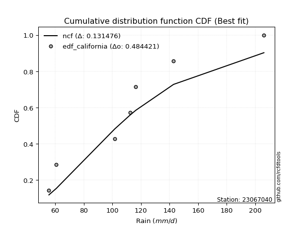</img>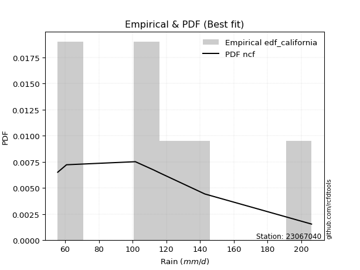</img>

</div>


### 2. Empirical - EDF Hazen (1930)

Hazen method for plotting positions is a formula used to estimate the empirical cumulative probability distribution of flood events or other hydrological data. This formula often results in biased estimations, particularly when extrapolating to extreme events (high return periods).

<div align="center">


$P=(m-0.5)/n$


</div>


**2.1. Empirical values**

<div align="center">

|                | 0                   | 1                   | 2                   | 3         | 4                  | 5                  | 6                  |
|:---------------|:--------------------|:--------------------|:--------------------|:----------|:-------------------|:-------------------|:-------------------|
| date           | 2023                | 2025                | 2021                | 2020      | 2022               | 2019               | 2024               |
| x              | 55.6                | 60.8                | 101.6               | 112.4     | 116.4              | 142.8              | 206.0              |
| m              | 1                   | 2                   | 3                   | 4         | 5                  | 6                  | 7                  |
| empirical_dist | edf_hazen           | edf_hazen           | edf_hazen           | edf_hazen | edf_hazen          | edf_hazen          | edf_hazen          |
| empirical      | 0.07142857142857142 | 0.21428571428571427 | 0.35714285714285715 | 0.5       | 0.6428571428571429 | 0.7857142857142857 | 0.9285714285714286 |
| empirical_tr   | 1.0769230769230769  | 1.2727272727272727  | 1.5555555555555558  | 2.0       | 2.8000000000000003 | 4.666666666666666  | 14.000000000000007 |

</div>


**2.2. Kolmogorov-Smirnov fit test (sorted by Δ)**


<div align="center">

|                | 0                   | 1                   | 2                   | 3                   | 4                   | 5                   | 6                   | 7                   | 8                   | 9                   | 10                  | 11                  | 12                  | 13                    | 14                  | 15                  | 16                  | 17                  | 18                  | 19                  | 20                  | 21                  | 22                  | 23                  | 24                  | 25                  | 26                  | 27                  | 28                  | 29                  | 30                  | 31                  | 32                  | 33                  | 34                  | 35                  | 36                  | 37                  | 38                  | 39                  | 40                  | 41                  | 42                  | 43                  | 44                  | 45                  | 46                  | 47                  | 48                  | 49                  | 50                  | 51                  | 52                  | 53                  | 54                  | 55                  | 56                  | 57                  | 58                  | 59                  | 60                  | 61                  | 62                  | 63                  | 64                  | 65                  | 66                  | 67                  | 68                  | 69                  | 70                  | 71                  | 72                  | 73                  | 74                  | 75                  | 76                  | 77                  | 78                  | 79                  | 80                  | 81                  | 82                  | 83                  | 84                  | 85                  | 86                  | 87                  | 88                  | 89                  |
|:---------------|:--------------------|:--------------------|:--------------------|:--------------------|:--------------------|:--------------------|:--------------------|:--------------------|:--------------------|:--------------------|:--------------------|:--------------------|:--------------------|:----------------------|:--------------------|:--------------------|:--------------------|:--------------------|:--------------------|:--------------------|:--------------------|:--------------------|:--------------------|:--------------------|:--------------------|:--------------------|:--------------------|:--------------------|:--------------------|:--------------------|:--------------------|:--------------------|:--------------------|:--------------------|:--------------------|:--------------------|:--------------------|:--------------------|:--------------------|:--------------------|:--------------------|:--------------------|:--------------------|:--------------------|:--------------------|:--------------------|:--------------------|:--------------------|:--------------------|:--------------------|:--------------------|:--------------------|:--------------------|:--------------------|:--------------------|:--------------------|:--------------------|:--------------------|:--------------------|:--------------------|:--------------------|:--------------------|:--------------------|:--------------------|:--------------------|:--------------------|:--------------------|:--------------------|:--------------------|:--------------------|:--------------------|:--------------------|:--------------------|:--------------------|:--------------------|:--------------------|:--------------------|:--------------------|:--------------------|:--------------------|:--------------------|:--------------------|:--------------------|:--------------------|:--------------------|:--------------------|:--------------------|:--------------------|:--------------------|:--------------------|
| station        | 23067040            | 23067040            | 23067040            | 23067040            | 23067040            | 23067040            | 23067040            | 23067040            | 23067040            | 23067040            | 23067040            | 23067040            | 23067040            | 23067040              | 23067040            | 23067040            | 23067040            | 23067040            | 23067040            | 23067040            | 23067040            | 23067040            | 23067040            | 23067040            | 23067040            | 23067040            | 23067040            | 23067040            | 23067040            | 23067040            | 23067040            | 23067040            | 23067040            | 23067040            | 23067040            | 23067040            | 23067040            | 23067040            | 23067040            | 23067040            | 23067040            | 23067040            | 23067040            | 23067040            | 23067040            | 23067040            | 23067040            | 23067040            | 23067040            | 23067040            | 23067040            | 23067040            | 23067040            | 23067040            | 23067040            | 23067040            | 23067040            | 23067040            | 23067040            | 23067040            | 23067040            | 23067040            | 23067040            | 23067040            | 23067040            | 23067040            | 23067040            | 23067040            | 23067040            | 23067040            | 23067040            | 23067040            | 23067040            | 23067040            | 23067040            | 23067040            | 23067040            | 23067040            | 23067040            | 23067040            | 23067040            | 23067040            | 23067040            | 23067040            | 23067040            | 23067040            | 23067040            | 23067040            | 23067040            | 23067040            |
| empirical_dist | edf_hazen           | edf_hazen           | edf_hazen           | edf_hazen           | edf_hazen           | edf_hazen           | edf_hazen           | edf_hazen           | edf_hazen           | edf_hazen           | edf_hazen           | edf_hazen           | edf_hazen           | edf_hazen             | edf_hazen           | edf_hazen           | edf_hazen           | edf_hazen           | edf_hazen           | edf_hazen           | edf_hazen           | edf_hazen           | edf_hazen           | edf_hazen           | edf_hazen           | edf_hazen           | edf_hazen           | edf_hazen           | edf_hazen           | edf_hazen           | edf_hazen           | edf_hazen           | edf_hazen           | edf_hazen           | edf_hazen           | edf_hazen           | edf_hazen           | edf_hazen           | edf_hazen           | edf_hazen           | edf_hazen           | edf_hazen           | edf_hazen           | edf_hazen           | edf_hazen           | edf_hazen           | edf_hazen           | edf_hazen           | edf_hazen           | edf_hazen           | edf_hazen           | edf_hazen           | edf_hazen           | edf_hazen           | edf_hazen           | edf_hazen           | edf_hazen           | edf_hazen           | edf_hazen           | edf_hazen           | edf_hazen           | edf_hazen           | edf_hazen           | edf_hazen           | edf_hazen           | edf_hazen           | edf_hazen           | edf_hazen           | edf_hazen           | edf_hazen           | edf_hazen           | edf_hazen           | edf_hazen           | edf_hazen           | edf_hazen           | edf_hazen           | edf_hazen           | edf_hazen           | edf_hazen           | edf_hazen           | edf_hazen           | edf_hazen           | edf_hazen           | edf_hazen           | edf_hazen           | edf_hazen           | edf_hazen           | edf_hazen           | edf_hazen           | edf_hazen           |
| p_dist         | maxwell             | rayleigh            | pearson3            | laplace_asymmetric  | logmielke           | loggenlogistic      | exponnorm           | genlogistic         | logloggamma         | loggumbel_l         | alpha               | kstwobign           | laplace             | loglaplace_asymmetric | nct                 | hypsecant           | logpearson3         | logfisk             | fisk                | logistic            | invgamma            | gumbel_r            | t                   | crystalball         | norm                | logexponnorm        | logjohnsonsu        | logt                | lognorm             | lognorm             | logcrystalball      | logf                | lognct              | logfatiguelife      | rice                | logncf              | loglogistic         | halfnorm            | ncf                 | logerlang           | loggamma            | loggamma            | loghypsecant        | loglaplace          | logbetaprime        | truncnorm           | johnsonsu           | loginvgamma         | betaprime           | logalpha            | logrice             | logweibull_min      | moyal               | invgauss            | loggompertz         | loginvgauss         | gompertz            | logmaxwell          | lograyleigh         | mielke              | halflogistic        | loginvweibull       | gumbel_l            | loggumbel_r         | genexpon            | expon               | logchi2             | logkstwobign        | loghalfnorm         | f                   | gibrat              | wald                | logmoyal            | loghalflogistic     | loggenexpon         | logexpon            | weibull_min         | logwald             | loggibrat           | erlang              | pareto              | gamma               | logtruncnorm        | logpareto           | loglognorm          | nakagami            | lognakagami         | fatiguelife         | invweibull          | chi2                |
| delta          | 0.0877781807185638  | 0.0886624056506839  | 0.09409283794468105 | 0.10207103431487378 | 0.10472518204428088 | 0.10607105048051241 | 0.10800579866075244 | 0.10858036943900147 | 0.10868341303099238 | 0.10912911941721071 | 0.10934714539715476 | 0.11031999381398168 | 0.1111569050698328  | 0.1116730744294925    | 0.11262520692585248 | 0.11393461432058005 | 0.11428550310054841 | 0.11455213436881362 | 0.11528904011002948 | 0.1166152784552067  | 0.11673673771567222 | 0.11892270002606808 | 0.11976084266435028 | 0.11976139041224243 | 0.11976140044723249 | 0.12037411745506188 | 0.1203749837775529  | 0.12037531719185796 | 0.12037539295721073 | 0.12037539295721073 | 0.12037539639919637 | 0.12117205748715698 | 0.12139707573798258 | 0.12161655195466164 | 0.12188446640486121 | 0.12202551730020555 | 0.12242269890662624 | 0.12353605456637712 | 0.1244593940938522  | 0.12491391654619532 | 0.12609373844329158 | 0.12609373844329158 | 0.12729740194397635 | 0.13050127438012235 | 0.13153065140739928 | 0.1343565245481977  | 0.13539370530824674 | 0.13705348721291194 | 0.13992394285694082 | 0.14211531201074956 | 0.14258890979993122 | 0.1431929621656967  | 0.14713292696573793 | 0.14878033108442118 | 0.14899021561255754 | 0.1500591081843629  | 0.15088574493325815 | 0.15417999025476664 | 0.16564043641971443 | 0.16638959039759832 | 0.17397125911057904 | 0.18181169108633904 | 0.18906284352565406 | 0.1897156820919686  | 0.18997258713635418 | 0.1900653305628897  | 0.19552498388138495 | 0.19764045994323326 | 0.19792758690171336 | 0.21323316710911694 | 0.21428571428571427 | 0.21428571428571427 | 0.21555536663836344 | 0.2213365336589998  | 0.2288108739678863  | 0.260625866350318   | 0.2659083315385968  | 0.28748477689410795 | 0.3067859867905734  | 0.3226245153519683  | 0.3343127256976869  | 0.34007753906786636 | 0.3571377751127913  | 0.36038988779764136 | 0.385304981220025   | 0.43733361060888515 | 0.4376157978635446  | 0.46803988408115077 | 0.47543635076658647 | 0.5700768526698381  |
| deltao         | 0.48442053926100004 | 0.48442053926100004 | 0.48442053926100004 | 0.48442053926100004 | 0.48442053926100004 | 0.48442053926100004 | 0.48442053926100004 | 0.48442053926100004 | 0.48442053926100004 | 0.48442053926100004 | 0.48442053926100004 | 0.48442053926100004 | 0.48442053926100004 | 0.48442053926100004   | 0.48442053926100004 | 0.48442053926100004 | 0.48442053926100004 | 0.48442053926100004 | 0.48442053926100004 | 0.48442053926100004 | 0.48442053926100004 | 0.48442053926100004 | 0.48442053926100004 | 0.48442053926100004 | 0.48442053926100004 | 0.48442053926100004 | 0.48442053926100004 | 0.48442053926100004 | 0.48442053926100004 | 0.48442053926100004 | 0.48442053926100004 | 0.48442053926100004 | 0.48442053926100004 | 0.48442053926100004 | 0.48442053926100004 | 0.48442053926100004 | 0.48442053926100004 | 0.48442053926100004 | 0.48442053926100004 | 0.48442053926100004 | 0.48442053926100004 | 0.48442053926100004 | 0.48442053926100004 | 0.48442053926100004 | 0.48442053926100004 | 0.48442053926100004 | 0.48442053926100004 | 0.48442053926100004 | 0.48442053926100004 | 0.48442053926100004 | 0.48442053926100004 | 0.48442053926100004 | 0.48442053926100004 | 0.48442053926100004 | 0.48442053926100004 | 0.48442053926100004 | 0.48442053926100004 | 0.48442053926100004 | 0.48442053926100004 | 0.48442053926100004 | 0.48442053926100004 | 0.48442053926100004 | 0.48442053926100004 | 0.48442053926100004 | 0.48442053926100004 | 0.48442053926100004 | 0.48442053926100004 | 0.48442053926100004 | 0.48442053926100004 | 0.48442053926100004 | 0.48442053926100004 | 0.48442053926100004 | 0.48442053926100004 | 0.48442053926100004 | 0.48442053926100004 | 0.48442053926100004 | 0.48442053926100004 | 0.48442053926100004 | 0.48442053926100004 | 0.48442053926100004 | 0.48442053926100004 | 0.48442053926100004 | 0.48442053926100004 | 0.48442053926100004 | 0.48442053926100004 | 0.48442053926100004 | 0.48442053926100004 | 0.48442053926100004 | 0.48442053926100004 | 0.48442053926100004 |
| eval           | Δo > Δ              | Δo > Δ              | Δo > Δ              | Δo > Δ              | Δo > Δ              | Δo > Δ              | Δo > Δ              | Δo > Δ              | Δo > Δ              | Δo > Δ              | Δo > Δ              | Δo > Δ              | Δo > Δ              | Δo > Δ                | Δo > Δ              | Δo > Δ              | Δo > Δ              | Δo > Δ              | Δo > Δ              | Δo > Δ              | Δo > Δ              | Δo > Δ              | Δo > Δ              | Δo > Δ              | Δo > Δ              | Δo > Δ              | Δo > Δ              | Δo > Δ              | Δo > Δ              | Δo > Δ              | Δo > Δ              | Δo > Δ              | Δo > Δ              | Δo > Δ              | Δo > Δ              | Δo > Δ              | Δo > Δ              | Δo > Δ              | Δo > Δ              | Δo > Δ              | Δo > Δ              | Δo > Δ              | Δo > Δ              | Δo > Δ              | Δo > Δ              | Δo > Δ              | Δo > Δ              | Δo > Δ              | Δo > Δ              | Δo > Δ              | Δo > Δ              | Δo > Δ              | Δo > Δ              | Δo > Δ              | Δo > Δ              | Δo > Δ              | Δo > Δ              | Δo > Δ              | Δo > Δ              | Δo > Δ              | Δo > Δ              | Δo > Δ              | Δo > Δ              | Δo > Δ              | Δo > Δ              | Δo > Δ              | Δo > Δ              | Δo > Δ              | Δo > Δ              | Δo > Δ              | Δo > Δ              | Δo > Δ              | Δo > Δ              | Δo > Δ              | Δo > Δ              | Δo > Δ              | Δo > Δ              | Δo > Δ              | Δo > Δ              | Δo > Δ              | Δo > Δ              | Δo > Δ              | Δo > Δ              | Δo > Δ              | Δo > Δ              | Δo > Δ              | Δo > Δ              | Δo > Δ              | Δo > Δ              | Δo <= Δ             |
| fit            | 1                   | 1                   | 1                   | 1                   | 1                   | 1                   | 1                   | 1                   | 1                   | 1                   | 1                   | 1                   | 1                   | 1                     | 1                   | 1                   | 1                   | 1                   | 1                   | 1                   | 1                   | 1                   | 1                   | 1                   | 1                   | 1                   | 1                   | 1                   | 1                   | 1                   | 1                   | 1                   | 1                   | 1                   | 1                   | 1                   | 1                   | 1                   | 1                   | 1                   | 1                   | 1                   | 1                   | 1                   | 1                   | 1                   | 1                   | 1                   | 1                   | 1                   | 1                   | 1                   | 1                   | 1                   | 1                   | 1                   | 1                   | 1                   | 1                   | 1                   | 1                   | 1                   | 1                   | 1                   | 1                   | 1                   | 1                   | 1                   | 1                   | 1                   | 1                   | 1                   | 1                   | 1                   | 1                   | 1                   | 1                   | 1                   | 1                   | 1                   | 1                   | 1                   | 1                   | 1                   | 1                   | 1                   | 1                   | 1                   | 1                   | 0                   |
| n              | 7                   | 7                   | 7                   | 7                   | 7                   | 7                   | 7                   | 7                   | 7                   | 7                   | 7                   | 7                   | 7                   | 7                     | 7                   | 7                   | 7                   | 7                   | 7                   | 7                   | 7                   | 7                   | 7                   | 7                   | 7                   | 7                   | 7                   | 7                   | 7                   | 7                   | 7                   | 7                   | 7                   | 7                   | 7                   | 7                   | 7                   | 7                   | 7                   | 7                   | 7                   | 7                   | 7                   | 7                   | 7                   | 7                   | 7                   | 7                   | 7                   | 7                   | 7                   | 7                   | 7                   | 7                   | 7                   | 7                   | 7                   | 7                   | 7                   | 7                   | 7                   | 7                   | 7                   | 7                   | 7                   | 7                   | 7                   | 7                   | 7                   | 7                   | 7                   | 7                   | 7                   | 7                   | 7                   | 7                   | 7                   | 7                   | 7                   | 7                   | 7                   | 7                   | 7                   | 7                   | 7                   | 7                   | 7                   | 7                   | 7                   | 7                   |
| best_fit       | 1                   | 0                   | 0                   | 0                   | 0                   | 0                   | 0                   | 0                   | 0                   | 0                   | 0                   | 0                   | 0                   | 0                     | 0                   | 0                   | 0                   | 0                   | 0                   | 0                   | 0                   | 0                   | 0                   | 0                   | 0                   | 0                   | 0                   | 0                   | 0                   | 0                   | 0                   | 0                   | 0                   | 0                   | 0                   | 0                   | 0                   | 0                   | 0                   | 0                   | 0                   | 0                   | 0                   | 0                   | 0                   | 0                   | 0                   | 0                   | 0                   | 0                   | 0                   | 0                   | 0                   | 0                   | 0                   | 0                   | 0                   | 0                   | 0                   | 0                   | 0                   | 0                   | 0                   | 0                   | 0                   | 0                   | 0                   | 0                   | 0                   | 0                   | 0                   | 0                   | 0                   | 0                   | 0                   | 0                   | 0                   | 0                   | 0                   | 0                   | 0                   | 0                   | 0                   | 0                   | 0                   | 0                   | 0                   | 0                   | 0                   | 0                   |
| best_fit_sort  | 1                   | 2                   | 3                   | 4                   | 5                   | 6                   | 7                   | 8                   | 9                   | 10                  | 11                  | 12                  | 13                  | 14                    | 15                  | 16                  | 17                  | 18                  | 19                  | 20                  | 21                  | 22                  | 23                  | 24                  | 25                  | 26                  | 27                  | 28                  | 29                  | 30                  | 31                  | 32                  | 33                  | 34                  | 35                  | 36                  | 37                  | 38                  | 39                  | 40                  | 41                  | 42                  | 43                  | 44                  | 45                  | 46                  | 47                  | 48                  | 49                  | 50                  | 51                  | 52                  | 53                  | 54                  | 55                  | 56                  | 57                  | 58                  | 59                  | 60                  | 61                  | 62                  | 63                  | 64                  | 65                  | 66                  | 67                  | 68                  | 69                  | 70                  | 71                  | 72                  | 73                  | 74                  | 75                  | 76                  | 77                  | 78                  | 79                  | 80                  | 81                  | 82                  | 83                  | 84                  | 85                  | 86                  | 87                  | 88                  | 89                  | 90                  |

</div>


<div align="center">

</img>

</div>


**2.3. Best fit**

<div align="center">

|   id |   station | empirical_dist   | p_dist   |     delta |   deltao | eval   |   fit |   n |   best_fit |   best_fit_sort |
|-----:|----------:|:-----------------|:---------|----------:|---------:|:-------|------:|----:|-----------:|----------------:|
|    0 |  23067040 | edf_hazen        | maxwell  | 0.0877782 | 0.484421 | Δo > Δ |     1 |   7 |          1 |               1 |

</div>


<div align="center">

</img></img>

</div>


### 3. Empirical - EDF Weibull (1939)

Weibull plotting position formula is an empirical method used to estimate the non-exceedance probability or plotting position for a set of observed data, is often recommended or widely used in practice, particularly in flood frequency analysis.

<div align="center">


$P=m/(n+1)$


</div>


**3.1. Empirical values**

<div align="center">

|                | 0                  | 1                  | 2           | 3           | 4                  | 5           | 6           |
|:---------------|:-------------------|:-------------------|:------------|:------------|:-------------------|:------------|:------------|
| date           | 2023               | 2025               | 2021        | 2020        | 2022               | 2019        | 2024        |
| x              | 55.6               | 60.8               | 101.6       | 112.4       | 116.4              | 142.8       | 206.0       |
| m              | 1                  | 2                  | 3           | 4           | 5                  | 6           | 7           |
| empirical_dist | edf_weibull        | edf_weibull        | edf_weibull | edf_weibull | edf_weibull        | edf_weibull | edf_weibull |
| empirical      | 0.125              | 0.25               | 0.375       | 0.5         | 0.625              | 0.75        | 0.875       |
| empirical_tr   | 1.1428571428571428 | 1.3333333333333333 | 1.6         | 2.0         | 2.6666666666666665 | 4.0         | 8.0         |

</div>


**3.2. Kolmogorov-Smirnov fit test (sorted by Δ)**


<div align="center">

|                | 0                   | 1                   | 2                   | 3                   | 4                   | 5                   | 6                   | 7                   | 8                   | 9                   | 10                  | 11                  | 12                  | 13                  | 14                  | 15                  | 16                  | 17                  | 18                  | 19                  | 20                  | 21                  | 22                  | 23                  | 24                  | 25                  | 26                  | 27                  | 28                  | 29                  | 30                  | 31                  | 32                  | 33                  | 34                  | 35                  | 36                  | 37                    | 38                  | 39                  | 40                  | 41                  | 42                  | 43                  | 44                  | 45                  | 46                  | 47                  | 48                  | 49                  | 50                  | 51                  | 52                  | 53                  | 54                  | 55                  | 56                  | 57                  | 58                  | 59                  | 60                  | 61                  | 62                  | 63                  | 64                  | 65                  | 66                  | 67                  | 68                  | 69                  | 70                  | 71                  | 72                  | 73                  | 74                  | 75                  | 76                  | 77                  | 78                  | 79                  | 80                  | 81                  | 82                  | 83                  | 84                  | 85                  | 86                  | 87                  | 88                  | 89                  |
|:---------------|:--------------------|:--------------------|:--------------------|:--------------------|:--------------------|:--------------------|:--------------------|:--------------------|:--------------------|:--------------------|:--------------------|:--------------------|:--------------------|:--------------------|:--------------------|:--------------------|:--------------------|:--------------------|:--------------------|:--------------------|:--------------------|:--------------------|:--------------------|:--------------------|:--------------------|:--------------------|:--------------------|:--------------------|:--------------------|:--------------------|:--------------------|:--------------------|:--------------------|:--------------------|:--------------------|:--------------------|:--------------------|:----------------------|:--------------------|:--------------------|:--------------------|:--------------------|:--------------------|:--------------------|:--------------------|:--------------------|:--------------------|:--------------------|:--------------------|:--------------------|:--------------------|:--------------------|:--------------------|:--------------------|:--------------------|:--------------------|:--------------------|:--------------------|:--------------------|:--------------------|:--------------------|:--------------------|:--------------------|:--------------------|:--------------------|:--------------------|:--------------------|:--------------------|:--------------------|:--------------------|:--------------------|:--------------------|:--------------------|:--------------------|:--------------------|:--------------------|:--------------------|:--------------------|:--------------------|:--------------------|:--------------------|:--------------------|:--------------------|:--------------------|:--------------------|:--------------------|:--------------------|:--------------------|:--------------------|:--------------------|
| station        | 23067040            | 23067040            | 23067040            | 23067040            | 23067040            | 23067040            | 23067040            | 23067040            | 23067040            | 23067040            | 23067040            | 23067040            | 23067040            | 23067040            | 23067040            | 23067040            | 23067040            | 23067040            | 23067040            | 23067040            | 23067040            | 23067040            | 23067040            | 23067040            | 23067040            | 23067040            | 23067040            | 23067040            | 23067040            | 23067040            | 23067040            | 23067040            | 23067040            | 23067040            | 23067040            | 23067040            | 23067040            | 23067040              | 23067040            | 23067040            | 23067040            | 23067040            | 23067040            | 23067040            | 23067040            | 23067040            | 23067040            | 23067040            | 23067040            | 23067040            | 23067040            | 23067040            | 23067040            | 23067040            | 23067040            | 23067040            | 23067040            | 23067040            | 23067040            | 23067040            | 23067040            | 23067040            | 23067040            | 23067040            | 23067040            | 23067040            | 23067040            | 23067040            | 23067040            | 23067040            | 23067040            | 23067040            | 23067040            | 23067040            | 23067040            | 23067040            | 23067040            | 23067040            | 23067040            | 23067040            | 23067040            | 23067040            | 23067040            | 23067040            | 23067040            | 23067040            | 23067040            | 23067040            | 23067040            | 23067040            |
| empirical_dist | edf_weibull         | edf_weibull         | edf_weibull         | edf_weibull         | edf_weibull         | edf_weibull         | edf_weibull         | edf_weibull         | edf_weibull         | edf_weibull         | edf_weibull         | edf_weibull         | edf_weibull         | edf_weibull         | edf_weibull         | edf_weibull         | edf_weibull         | edf_weibull         | edf_weibull         | edf_weibull         | edf_weibull         | edf_weibull         | edf_weibull         | edf_weibull         | edf_weibull         | edf_weibull         | edf_weibull         | edf_weibull         | edf_weibull         | edf_weibull         | edf_weibull         | edf_weibull         | edf_weibull         | edf_weibull         | edf_weibull         | edf_weibull         | edf_weibull         | edf_weibull           | edf_weibull         | edf_weibull         | edf_weibull         | edf_weibull         | edf_weibull         | edf_weibull         | edf_weibull         | edf_weibull         | edf_weibull         | edf_weibull         | edf_weibull         | edf_weibull         | edf_weibull         | edf_weibull         | edf_weibull         | edf_weibull         | edf_weibull         | edf_weibull         | edf_weibull         | edf_weibull         | edf_weibull         | edf_weibull         | edf_weibull         | edf_weibull         | edf_weibull         | edf_weibull         | edf_weibull         | edf_weibull         | edf_weibull         | edf_weibull         | edf_weibull         | edf_weibull         | edf_weibull         | edf_weibull         | edf_weibull         | edf_weibull         | edf_weibull         | edf_weibull         | edf_weibull         | edf_weibull         | edf_weibull         | edf_weibull         | edf_weibull         | edf_weibull         | edf_weibull         | edf_weibull         | edf_weibull         | edf_weibull         | edf_weibull         | edf_weibull         | edf_weibull         | edf_weibull         |
| p_dist         | ncf                 | logbetaprime        | t                   | norm                | crystalball         | maxwell             | rayleigh            | truncnorm           | pearson3            | logistic            | laplace_asymmetric  | logmielke           | hypsecant           | loggenlogistic      | exponnorm           | logloggamma         | genlogistic         | loggumbel_l         | alpha               | logpearson3         | kstwobign           | lognct              | logncf              | logcrystalball      | lognorm             | lognorm             | logt                | logexponnorm        | logjohnsonsu        | invgamma            | loggamma            | loggamma            | laplace             | loginvgamma         | logf                | logfatiguelife      | nct                 | loglaplace_asymmetric | logerlang           | invgauss            | mielke              | johnsonsu           | loginvgauss         | logfisk             | halfnorm            | fisk                | logalpha            | betaprime           | gumbel_r            | logweibull_min      | logmaxwell          | rice                | loglogistic         | logrice             | loghypsecant        | lograyleigh         | loginvweibull       | logchi2             | loglaplace          | gumbel_l            | genexpon            | expon               | logkstwobign        | moyal               | loggompertz         | gompertz            | loggumbel_r         | f                   | halflogistic        | loggenexpon         | logmoyal            | loghalfnorm         | logexpon            | weibull_min         | gibrat              | loghalflogistic     | wald                | logwald             | loggibrat           | erlang              | pareto              | gamma               | logpareto           | loglognorm          | logtruncnorm        | nakagami            | lognakagami         | invweibull          | fatiguelife         | chi2                |
| delta          | 0.10660225123670936 | 0.11367350855025643 | 0.11784330294048037 | 0.11784446279151661 | 0.1178444630720702  | 0.12028439788846498 | 0.1226259932967036  | 0.12413381142631186 | 0.1298071236589668  | 0.1333631128212029  | 0.1377853200291595  | 0.1404394677585666  | 0.14083215108043373 | 0.14178533619479813 | 0.14372008437503817 | 0.14396544340835035 | 0.1442946551532872  | 0.14484340513149643 | 0.1450614311114405  | 0.14521215869687348 | 0.14603427952826742 | 0.14625721691782195 | 0.14637112538582575 | 0.14673197027977414 | 0.14673197083296924 | 0.14673197083296924 | 0.14673253071689385 | 0.14673290100590713 | 0.14673380239407574 | 0.1468008518581284  | 0.1468566690092556  | 0.1468566690092556  | 0.14687119078411853 | 0.14690703051536141 | 0.14694609465485223 | 0.1472091920998571  | 0.1472515375592401  | 0.14738736014377823   | 0.14762278924591285 | 0.14787232282873766 | 0.14853244754045547 | 0.14883211232954846 | 0.1498449892398535  | 0.15026642008309934 | 0.1505299883933212  | 0.1510033258243152  | 0.15180350074082222 | 0.15208620816958857 | 0.1546369857403538  | 0.15646688659024177 | 0.1566079243845096  | 0.15759875211914692 | 0.15813698462091197 | 0.16158684966457465 | 0.16301168765826207 | 0.16334250772003828 | 0.1639545482291962  | 0.16621174310353748 | 0.16621556009440808 | 0.17120570066851115 | 0.17211544427921133 | 0.17220818770574686 | 0.1797833170860904  | 0.18284721268002369 | 0.18470450132684324 | 0.18660003064754388 | 0.1914132917357746  | 0.1953760242519741  | 0.20968554482486473 | 0.21095373111074345 | 0.21884361863118798 | 0.22091383742360066 | 0.24276872349317513 | 0.24805118868145393 | 0.25                | 0.25                | 0.25                | 0.2696276340369651  | 0.28892884393343055 | 0.30476737249482544 | 0.31236111503486286 | 0.3222203962107235  | 0.32467560208335566 | 0.3495906955057393  | 0.37499491796993417 | 0.4194764677517423  | 0.41975865500640175 | 0.42186492219515787 | 0.4501827412240079  | 0.5522197098126952  |
| deltao         | 0.48442053926100004 | 0.48442053926100004 | 0.48442053926100004 | 0.48442053926100004 | 0.48442053926100004 | 0.48442053926100004 | 0.48442053926100004 | 0.48442053926100004 | 0.48442053926100004 | 0.48442053926100004 | 0.48442053926100004 | 0.48442053926100004 | 0.48442053926100004 | 0.48442053926100004 | 0.48442053926100004 | 0.48442053926100004 | 0.48442053926100004 | 0.48442053926100004 | 0.48442053926100004 | 0.48442053926100004 | 0.48442053926100004 | 0.48442053926100004 | 0.48442053926100004 | 0.48442053926100004 | 0.48442053926100004 | 0.48442053926100004 | 0.48442053926100004 | 0.48442053926100004 | 0.48442053926100004 | 0.48442053926100004 | 0.48442053926100004 | 0.48442053926100004 | 0.48442053926100004 | 0.48442053926100004 | 0.48442053926100004 | 0.48442053926100004 | 0.48442053926100004 | 0.48442053926100004   | 0.48442053926100004 | 0.48442053926100004 | 0.48442053926100004 | 0.48442053926100004 | 0.48442053926100004 | 0.48442053926100004 | 0.48442053926100004 | 0.48442053926100004 | 0.48442053926100004 | 0.48442053926100004 | 0.48442053926100004 | 0.48442053926100004 | 0.48442053926100004 | 0.48442053926100004 | 0.48442053926100004 | 0.48442053926100004 | 0.48442053926100004 | 0.48442053926100004 | 0.48442053926100004 | 0.48442053926100004 | 0.48442053926100004 | 0.48442053926100004 | 0.48442053926100004 | 0.48442053926100004 | 0.48442053926100004 | 0.48442053926100004 | 0.48442053926100004 | 0.48442053926100004 | 0.48442053926100004 | 0.48442053926100004 | 0.48442053926100004 | 0.48442053926100004 | 0.48442053926100004 | 0.48442053926100004 | 0.48442053926100004 | 0.48442053926100004 | 0.48442053926100004 | 0.48442053926100004 | 0.48442053926100004 | 0.48442053926100004 | 0.48442053926100004 | 0.48442053926100004 | 0.48442053926100004 | 0.48442053926100004 | 0.48442053926100004 | 0.48442053926100004 | 0.48442053926100004 | 0.48442053926100004 | 0.48442053926100004 | 0.48442053926100004 | 0.48442053926100004 | 0.48442053926100004 |
| eval           | Δo > Δ              | Δo > Δ              | Δo > Δ              | Δo > Δ              | Δo > Δ              | Δo > Δ              | Δo > Δ              | Δo > Δ              | Δo > Δ              | Δo > Δ              | Δo > Δ              | Δo > Δ              | Δo > Δ              | Δo > Δ              | Δo > Δ              | Δo > Δ              | Δo > Δ              | Δo > Δ              | Δo > Δ              | Δo > Δ              | Δo > Δ              | Δo > Δ              | Δo > Δ              | Δo > Δ              | Δo > Δ              | Δo > Δ              | Δo > Δ              | Δo > Δ              | Δo > Δ              | Δo > Δ              | Δo > Δ              | Δo > Δ              | Δo > Δ              | Δo > Δ              | Δo > Δ              | Δo > Δ              | Δo > Δ              | Δo > Δ                | Δo > Δ              | Δo > Δ              | Δo > Δ              | Δo > Δ              | Δo > Δ              | Δo > Δ              | Δo > Δ              | Δo > Δ              | Δo > Δ              | Δo > Δ              | Δo > Δ              | Δo > Δ              | Δo > Δ              | Δo > Δ              | Δo > Δ              | Δo > Δ              | Δo > Δ              | Δo > Δ              | Δo > Δ              | Δo > Δ              | Δo > Δ              | Δo > Δ              | Δo > Δ              | Δo > Δ              | Δo > Δ              | Δo > Δ              | Δo > Δ              | Δo > Δ              | Δo > Δ              | Δo > Δ              | Δo > Δ              | Δo > Δ              | Δo > Δ              | Δo > Δ              | Δo > Δ              | Δo > Δ              | Δo > Δ              | Δo > Δ              | Δo > Δ              | Δo > Δ              | Δo > Δ              | Δo > Δ              | Δo > Δ              | Δo > Δ              | Δo > Δ              | Δo > Δ              | Δo > Δ              | Δo > Δ              | Δo > Δ              | Δo > Δ              | Δo > Δ              | Δo <= Δ             |
| fit            | 1                   | 1                   | 1                   | 1                   | 1                   | 1                   | 1                   | 1                   | 1                   | 1                   | 1                   | 1                   | 1                   | 1                   | 1                   | 1                   | 1                   | 1                   | 1                   | 1                   | 1                   | 1                   | 1                   | 1                   | 1                   | 1                   | 1                   | 1                   | 1                   | 1                   | 1                   | 1                   | 1                   | 1                   | 1                   | 1                   | 1                   | 1                     | 1                   | 1                   | 1                   | 1                   | 1                   | 1                   | 1                   | 1                   | 1                   | 1                   | 1                   | 1                   | 1                   | 1                   | 1                   | 1                   | 1                   | 1                   | 1                   | 1                   | 1                   | 1                   | 1                   | 1                   | 1                   | 1                   | 1                   | 1                   | 1                   | 1                   | 1                   | 1                   | 1                   | 1                   | 1                   | 1                   | 1                   | 1                   | 1                   | 1                   | 1                   | 1                   | 1                   | 1                   | 1                   | 1                   | 1                   | 1                   | 1                   | 1                   | 1                   | 0                   |
| n              | 7                   | 7                   | 7                   | 7                   | 7                   | 7                   | 7                   | 7                   | 7                   | 7                   | 7                   | 7                   | 7                   | 7                   | 7                   | 7                   | 7                   | 7                   | 7                   | 7                   | 7                   | 7                   | 7                   | 7                   | 7                   | 7                   | 7                   | 7                   | 7                   | 7                   | 7                   | 7                   | 7                   | 7                   | 7                   | 7                   | 7                   | 7                     | 7                   | 7                   | 7                   | 7                   | 7                   | 7                   | 7                   | 7                   | 7                   | 7                   | 7                   | 7                   | 7                   | 7                   | 7                   | 7                   | 7                   | 7                   | 7                   | 7                   | 7                   | 7                   | 7                   | 7                   | 7                   | 7                   | 7                   | 7                   | 7                   | 7                   | 7                   | 7                   | 7                   | 7                   | 7                   | 7                   | 7                   | 7                   | 7                   | 7                   | 7                   | 7                   | 7                   | 7                   | 7                   | 7                   | 7                   | 7                   | 7                   | 7                   | 7                   | 7                   |
| best_fit       | 1                   | 0                   | 0                   | 0                   | 0                   | 0                   | 0                   | 0                   | 0                   | 0                   | 0                   | 0                   | 0                   | 0                   | 0                   | 0                   | 0                   | 0                   | 0                   | 0                   | 0                   | 0                   | 0                   | 0                   | 0                   | 0                   | 0                   | 0                   | 0                   | 0                   | 0                   | 0                   | 0                   | 0                   | 0                   | 0                   | 0                   | 0                     | 0                   | 0                   | 0                   | 0                   | 0                   | 0                   | 0                   | 0                   | 0                   | 0                   | 0                   | 0                   | 0                   | 0                   | 0                   | 0                   | 0                   | 0                   | 0                   | 0                   | 0                   | 0                   | 0                   | 0                   | 0                   | 0                   | 0                   | 0                   | 0                   | 0                   | 0                   | 0                   | 0                   | 0                   | 0                   | 0                   | 0                   | 0                   | 0                   | 0                   | 0                   | 0                   | 0                   | 0                   | 0                   | 0                   | 0                   | 0                   | 0                   | 0                   | 0                   | 0                   |
| best_fit_sort  | 1                   | 2                   | 3                   | 4                   | 5                   | 6                   | 7                   | 8                   | 9                   | 10                  | 11                  | 12                  | 13                  | 14                  | 15                  | 16                  | 17                  | 18                  | 19                  | 20                  | 21                  | 22                  | 23                  | 24                  | 25                  | 26                  | 27                  | 28                  | 29                  | 30                  | 31                  | 32                  | 33                  | 34                  | 35                  | 36                  | 37                  | 38                    | 39                  | 40                  | 41                  | 42                  | 43                  | 44                  | 45                  | 46                  | 47                  | 48                  | 49                  | 50                  | 51                  | 52                  | 53                  | 54                  | 55                  | 56                  | 57                  | 58                  | 59                  | 60                  | 61                  | 62                  | 63                  | 64                  | 65                  | 66                  | 67                  | 68                  | 69                  | 70                  | 71                  | 72                  | 73                  | 74                  | 75                  | 76                  | 77                  | 78                  | 79                  | 80                  | 81                  | 82                  | 83                  | 84                  | 85                  | 86                  | 87                  | 88                  | 89                  | 90                  |

</div>


<div align="center">

</img>

</div>


**3.3. Best fit**

<div align="center">

|   id |   station | empirical_dist   | p_dist   |    delta |   deltao | eval   |   fit |   n |   best_fit |   best_fit_sort |
|-----:|----------:|:-----------------|:---------|---------:|---------:|:-------|------:|----:|-----------:|----------------:|
|    0 |  23067040 | edf_weibull      | ncf      | 0.106602 | 0.484421 | Δo > Δ |     1 |   7 |          1 |               1 |

</div>


<div align="center">

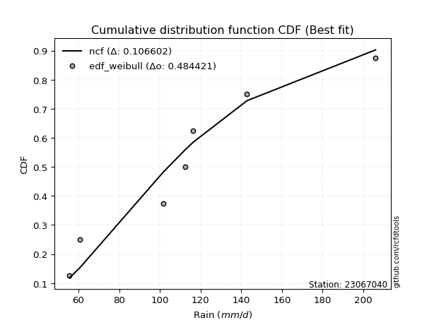</img></img>

</div>


### 4. Empirical - EDF Beard (1943)

The Beard formula (or Beard´s plotting position formula) in hydrology is used to estimate the empirical non-exceedance probability _(P)_ of a flood event (or other extreme hydrological data point) within a given dataset.

<div align="center">


$P=(m-0.31)/(n+0.38)$


</div>


**4.1. Empirical values**

<div align="center">

|                | 0                   | 1                   | 2                   | 3         | 4                  | 5                  | 6                  |
|:---------------|:--------------------|:--------------------|:--------------------|:----------|:-------------------|:-------------------|:-------------------|
| date           | 2023                | 2025                | 2021                | 2020      | 2022               | 2019               | 2024               |
| x              | 55.6                | 60.8                | 101.6               | 112.4     | 116.4              | 142.8              | 206.0              |
| m              | 1                   | 2                   | 3                   | 4         | 5                  | 6                  | 7                  |
| empirical_dist | edf_beard           | edf_beard           | edf_beard           | edf_beard | edf_beard          | edf_beard          | edf_beard          |
| empirical      | 0.09349593495934959 | 0.22899728997289973 | 0.36449864498644985 | 0.5       | 0.6355013550135502 | 0.7710027100271003 | 0.9065040650406505 |
| empirical_tr   | 1.1031390134529149  | 1.29701230228471    | 1.5735607675906182  | 2.0       | 2.743494423791822  | 4.366863905325444  | 10.695652173913055 |

</div>


**4.2. Kolmogorov-Smirnov fit test (sorted by Δ)**


<div align="center">

|                | 0                   | 1                   | 2                   | 3                   | 4                   | 5                   | 6                   | 7                   | 8                   | 9                   | 10                  | 11                  | 12                  | 13                  | 14                  | 15                  | 16                  | 17                  | 18                  | 19                  | 20                  | 21                  | 22                  | 23                  | 24                  | 25                  | 26                  | 27                  | 28                  | 29                  | 30                  | 31                  | 32                  | 33                  | 34                  | 35                    | 36                  | 37                  | 38                  | 39                  | 40                  | 41                  | 42                  | 43                  | 44                  | 45                  | 46                  | 47                  | 48                  | 49                  | 50                  | 51                  | 52                  | 53                  | 54                  | 55                  | 56                  | 57                  | 58                  | 59                  | 60                  | 61                  | 62                  | 63                  | 64                  | 65                  | 66                  | 67                  | 68                  | 69                  | 70                  | 71                  | 72                  | 73                  | 74                  | 75                  | 76                  | 77                  | 78                  | 79                  | 80                  | 81                  | 82                  | 83                  | 84                  | 85                  | 86                  | 87                  | 88                  | 89                  |
|:---------------|:--------------------|:--------------------|:--------------------|:--------------------|:--------------------|:--------------------|:--------------------|:--------------------|:--------------------|:--------------------|:--------------------|:--------------------|:--------------------|:--------------------|:--------------------|:--------------------|:--------------------|:--------------------|:--------------------|:--------------------|:--------------------|:--------------------|:--------------------|:--------------------|:--------------------|:--------------------|:--------------------|:--------------------|:--------------------|:--------------------|:--------------------|:--------------------|:--------------------|:--------------------|:--------------------|:----------------------|:--------------------|:--------------------|:--------------------|:--------------------|:--------------------|:--------------------|:--------------------|:--------------------|:--------------------|:--------------------|:--------------------|:--------------------|:--------------------|:--------------------|:--------------------|:--------------------|:--------------------|:--------------------|:--------------------|:--------------------|:--------------------|:--------------------|:--------------------|:--------------------|:--------------------|:--------------------|:--------------------|:--------------------|:--------------------|:--------------------|:--------------------|:--------------------|:--------------------|:--------------------|:--------------------|:--------------------|:--------------------|:--------------------|:--------------------|:--------------------|:--------------------|:--------------------|:--------------------|:--------------------|:--------------------|:--------------------|:--------------------|:--------------------|:--------------------|:--------------------|:--------------------|:--------------------|:--------------------|:--------------------|
| station        | 23067040            | 23067040            | 23067040            | 23067040            | 23067040            | 23067040            | 23067040            | 23067040            | 23067040            | 23067040            | 23067040            | 23067040            | 23067040            | 23067040            | 23067040            | 23067040            | 23067040            | 23067040            | 23067040            | 23067040            | 23067040            | 23067040            | 23067040            | 23067040            | 23067040            | 23067040            | 23067040            | 23067040            | 23067040            | 23067040            | 23067040            | 23067040            | 23067040            | 23067040            | 23067040            | 23067040              | 23067040            | 23067040            | 23067040            | 23067040            | 23067040            | 23067040            | 23067040            | 23067040            | 23067040            | 23067040            | 23067040            | 23067040            | 23067040            | 23067040            | 23067040            | 23067040            | 23067040            | 23067040            | 23067040            | 23067040            | 23067040            | 23067040            | 23067040            | 23067040            | 23067040            | 23067040            | 23067040            | 23067040            | 23067040            | 23067040            | 23067040            | 23067040            | 23067040            | 23067040            | 23067040            | 23067040            | 23067040            | 23067040            | 23067040            | 23067040            | 23067040            | 23067040            | 23067040            | 23067040            | 23067040            | 23067040            | 23067040            | 23067040            | 23067040            | 23067040            | 23067040            | 23067040            | 23067040            | 23067040            |
| empirical_dist | edf_beard           | edf_beard           | edf_beard           | edf_beard           | edf_beard           | edf_beard           | edf_beard           | edf_beard           | edf_beard           | edf_beard           | edf_beard           | edf_beard           | edf_beard           | edf_beard           | edf_beard           | edf_beard           | edf_beard           | edf_beard           | edf_beard           | edf_beard           | edf_beard           | edf_beard           | edf_beard           | edf_beard           | edf_beard           | edf_beard           | edf_beard           | edf_beard           | edf_beard           | edf_beard           | edf_beard           | edf_beard           | edf_beard           | edf_beard           | edf_beard           | edf_beard             | edf_beard           | edf_beard           | edf_beard           | edf_beard           | edf_beard           | edf_beard           | edf_beard           | edf_beard           | edf_beard           | edf_beard           | edf_beard           | edf_beard           | edf_beard           | edf_beard           | edf_beard           | edf_beard           | edf_beard           | edf_beard           | edf_beard           | edf_beard           | edf_beard           | edf_beard           | edf_beard           | edf_beard           | edf_beard           | edf_beard           | edf_beard           | edf_beard           | edf_beard           | edf_beard           | edf_beard           | edf_beard           | edf_beard           | edf_beard           | edf_beard           | edf_beard           | edf_beard           | edf_beard           | edf_beard           | edf_beard           | edf_beard           | edf_beard           | edf_beard           | edf_beard           | edf_beard           | edf_beard           | edf_beard           | edf_beard           | edf_beard           | edf_beard           | edf_beard           | edf_beard           | edf_beard           | edf_beard           |
| p_dist         | maxwell             | rayleigh            | pearson3            | logistic            | t                   | crystalball         | norm                | laplace_asymmetric  | ncf                 | logmielke           | hypsecant           | loggenlogistic      | exponnorm           | logloggamma         | genlogistic         | loggumbel_l         | alpha               | logbetaprime        | logpearson3         | kstwobign           | lognct              | logncf              | logcrystalball      | lognorm             | lognorm             | logt                | logexponnorm        | logjohnsonsu        | invgamma            | loggamma            | loggamma            | laplace             | logf                | logfatiguelife      | nct                 | loglaplace_asymmetric | logerlang           | truncnorm           | johnsonsu           | logfisk             | halfnorm            | loginvgamma         | fisk                | betaprime           | gumbel_r            | logalpha            | logweibull_min      | rice                | loglogistic         | logrice             | invgauss            | loghypsecant        | loginvgauss         | loglaplace          | logmaxwell          | lograyleigh         | mielke              | moyal               | loggompertz         | gompertz            | loginvweibull       | logchi2             | gumbel_l            | loggumbel_r         | genexpon            | expon               | halflogistic        | logkstwobign        | loghalfnorm         | f                   | logmoyal            | loggenexpon         | loghalflogistic     | wald                | gibrat              | logexpon            | weibull_min         | logwald             | loggibrat           | erlang              | pareto              | gamma               | logpareto           | logtruncnorm        | loglognorm          | nakagami            | lognakagami         | invweibull          | fatiguelife         | chi2                |
| delta          | 0.09928168786136471 | 0.10162328326960332 | 0.1088044136318665  | 0.11236040279410262 | 0.11240505482075758 | 0.11240560256864973 | 0.11240561260363979 | 0.11678261000205924 | 0.1171036062502595  | 0.11943675773146634 | 0.11982944105333347 | 0.12078262616769786 | 0.12271737434793789 | 0.12296273338125008 | 0.12329194512618692 | 0.12384069510439616 | 0.12405872108434021 | 0.12417486356380658 | 0.12420944866977321 | 0.12503156950116712 | 0.1252545068907217  | 0.1253684153587255  | 0.12572926025267384 | 0.12572926080586896 | 0.12572926080586896 | 0.12572982068979355 | 0.12573019097880683 | 0.12573109236697547 | 0.12579814183102814 | 0.12585395898215535 | 0.12585395898215535 | 0.12586848075701826 | 0.12594338462775195 | 0.12620648207275684 | 0.12624882753213984 | 0.12638465011667793   | 0.12662007921881258 | 0.127000736704605   | 0.12803791746465404 | 0.12926371005599907 | 0.1295272783662209  | 0.12969769936931924 | 0.13000061579721495 | 0.13256815501334812 | 0.13363427571325354 | 0.13475952416715686 | 0.13583717432210402 | 0.13659604209204668 | 0.1371342745938117  | 0.1405841396374744  | 0.14142454324082848 | 0.1420089776311618  | 0.1427033203407702  | 0.1452128500673078  | 0.14682420241117394 | 0.15828464857612173 | 0.15903380255400562 | 0.16184450265292338 | 0.163701791299743   | 0.1655973206204436  | 0.17445590324274635 | 0.17671309811708763 | 0.18170705568206136 | 0.1823598942483759  | 0.18261679929276148 | 0.182709542719297   | 0.1886828347977645  | 0.19028467209964056 | 0.19991112739650038 | 0.20587737926552424 | 0.20819957879477075 | 0.2214550861242936  | 0.22899728997289973 | 0.22899728997289973 | 0.22899728997289973 | 0.2532700785067253  | 0.2585525436950041  | 0.28012898905051525 | 0.2994301989469807  | 0.3152687275083756  | 0.322862470048413   | 0.33272175122427367 | 0.34567831211045597 | 0.364493562956384   | 0.3705934055328396  | 0.42997782276529245 | 0.4302600100199519  | 0.4533689872358084  | 0.46068409623755807 | 0.5627210648262453  |
| deltao         | 0.48442053926100004 | 0.48442053926100004 | 0.48442053926100004 | 0.48442053926100004 | 0.48442053926100004 | 0.48442053926100004 | 0.48442053926100004 | 0.48442053926100004 | 0.48442053926100004 | 0.48442053926100004 | 0.48442053926100004 | 0.48442053926100004 | 0.48442053926100004 | 0.48442053926100004 | 0.48442053926100004 | 0.48442053926100004 | 0.48442053926100004 | 0.48442053926100004 | 0.48442053926100004 | 0.48442053926100004 | 0.48442053926100004 | 0.48442053926100004 | 0.48442053926100004 | 0.48442053926100004 | 0.48442053926100004 | 0.48442053926100004 | 0.48442053926100004 | 0.48442053926100004 | 0.48442053926100004 | 0.48442053926100004 | 0.48442053926100004 | 0.48442053926100004 | 0.48442053926100004 | 0.48442053926100004 | 0.48442053926100004 | 0.48442053926100004   | 0.48442053926100004 | 0.48442053926100004 | 0.48442053926100004 | 0.48442053926100004 | 0.48442053926100004 | 0.48442053926100004 | 0.48442053926100004 | 0.48442053926100004 | 0.48442053926100004 | 0.48442053926100004 | 0.48442053926100004 | 0.48442053926100004 | 0.48442053926100004 | 0.48442053926100004 | 0.48442053926100004 | 0.48442053926100004 | 0.48442053926100004 | 0.48442053926100004 | 0.48442053926100004 | 0.48442053926100004 | 0.48442053926100004 | 0.48442053926100004 | 0.48442053926100004 | 0.48442053926100004 | 0.48442053926100004 | 0.48442053926100004 | 0.48442053926100004 | 0.48442053926100004 | 0.48442053926100004 | 0.48442053926100004 | 0.48442053926100004 | 0.48442053926100004 | 0.48442053926100004 | 0.48442053926100004 | 0.48442053926100004 | 0.48442053926100004 | 0.48442053926100004 | 0.48442053926100004 | 0.48442053926100004 | 0.48442053926100004 | 0.48442053926100004 | 0.48442053926100004 | 0.48442053926100004 | 0.48442053926100004 | 0.48442053926100004 | 0.48442053926100004 | 0.48442053926100004 | 0.48442053926100004 | 0.48442053926100004 | 0.48442053926100004 | 0.48442053926100004 | 0.48442053926100004 | 0.48442053926100004 | 0.48442053926100004 |
| eval           | Δo > Δ              | Δo > Δ              | Δo > Δ              | Δo > Δ              | Δo > Δ              | Δo > Δ              | Δo > Δ              | Δo > Δ              | Δo > Δ              | Δo > Δ              | Δo > Δ              | Δo > Δ              | Δo > Δ              | Δo > Δ              | Δo > Δ              | Δo > Δ              | Δo > Δ              | Δo > Δ              | Δo > Δ              | Δo > Δ              | Δo > Δ              | Δo > Δ              | Δo > Δ              | Δo > Δ              | Δo > Δ              | Δo > Δ              | Δo > Δ              | Δo > Δ              | Δo > Δ              | Δo > Δ              | Δo > Δ              | Δo > Δ              | Δo > Δ              | Δo > Δ              | Δo > Δ              | Δo > Δ                | Δo > Δ              | Δo > Δ              | Δo > Δ              | Δo > Δ              | Δo > Δ              | Δo > Δ              | Δo > Δ              | Δo > Δ              | Δo > Δ              | Δo > Δ              | Δo > Δ              | Δo > Δ              | Δo > Δ              | Δo > Δ              | Δo > Δ              | Δo > Δ              | Δo > Δ              | Δo > Δ              | Δo > Δ              | Δo > Δ              | Δo > Δ              | Δo > Δ              | Δo > Δ              | Δo > Δ              | Δo > Δ              | Δo > Δ              | Δo > Δ              | Δo > Δ              | Δo > Δ              | Δo > Δ              | Δo > Δ              | Δo > Δ              | Δo > Δ              | Δo > Δ              | Δo > Δ              | Δo > Δ              | Δo > Δ              | Δo > Δ              | Δo > Δ              | Δo > Δ              | Δo > Δ              | Δo > Δ              | Δo > Δ              | Δo > Δ              | Δo > Δ              | Δo > Δ              | Δo > Δ              | Δo > Δ              | Δo > Δ              | Δo > Δ              | Δo > Δ              | Δo > Δ              | Δo > Δ              | Δo <= Δ             |
| fit            | 1                   | 1                   | 1                   | 1                   | 1                   | 1                   | 1                   | 1                   | 1                   | 1                   | 1                   | 1                   | 1                   | 1                   | 1                   | 1                   | 1                   | 1                   | 1                   | 1                   | 1                   | 1                   | 1                   | 1                   | 1                   | 1                   | 1                   | 1                   | 1                   | 1                   | 1                   | 1                   | 1                   | 1                   | 1                   | 1                     | 1                   | 1                   | 1                   | 1                   | 1                   | 1                   | 1                   | 1                   | 1                   | 1                   | 1                   | 1                   | 1                   | 1                   | 1                   | 1                   | 1                   | 1                   | 1                   | 1                   | 1                   | 1                   | 1                   | 1                   | 1                   | 1                   | 1                   | 1                   | 1                   | 1                   | 1                   | 1                   | 1                   | 1                   | 1                   | 1                   | 1                   | 1                   | 1                   | 1                   | 1                   | 1                   | 1                   | 1                   | 1                   | 1                   | 1                   | 1                   | 1                   | 1                   | 1                   | 1                   | 1                   | 0                   |
| n              | 7                   | 7                   | 7                   | 7                   | 7                   | 7                   | 7                   | 7                   | 7                   | 7                   | 7                   | 7                   | 7                   | 7                   | 7                   | 7                   | 7                   | 7                   | 7                   | 7                   | 7                   | 7                   | 7                   | 7                   | 7                   | 7                   | 7                   | 7                   | 7                   | 7                   | 7                   | 7                   | 7                   | 7                   | 7                   | 7                     | 7                   | 7                   | 7                   | 7                   | 7                   | 7                   | 7                   | 7                   | 7                   | 7                   | 7                   | 7                   | 7                   | 7                   | 7                   | 7                   | 7                   | 7                   | 7                   | 7                   | 7                   | 7                   | 7                   | 7                   | 7                   | 7                   | 7                   | 7                   | 7                   | 7                   | 7                   | 7                   | 7                   | 7                   | 7                   | 7                   | 7                   | 7                   | 7                   | 7                   | 7                   | 7                   | 7                   | 7                   | 7                   | 7                   | 7                   | 7                   | 7                   | 7                   | 7                   | 7                   | 7                   | 7                   |
| best_fit       | 1                   | 0                   | 0                   | 0                   | 0                   | 0                   | 0                   | 0                   | 0                   | 0                   | 0                   | 0                   | 0                   | 0                   | 0                   | 0                   | 0                   | 0                   | 0                   | 0                   | 0                   | 0                   | 0                   | 0                   | 0                   | 0                   | 0                   | 0                   | 0                   | 0                   | 0                   | 0                   | 0                   | 0                   | 0                   | 0                     | 0                   | 0                   | 0                   | 0                   | 0                   | 0                   | 0                   | 0                   | 0                   | 0                   | 0                   | 0                   | 0                   | 0                   | 0                   | 0                   | 0                   | 0                   | 0                   | 0                   | 0                   | 0                   | 0                   | 0                   | 0                   | 0                   | 0                   | 0                   | 0                   | 0                   | 0                   | 0                   | 0                   | 0                   | 0                   | 0                   | 0                   | 0                   | 0                   | 0                   | 0                   | 0                   | 0                   | 0                   | 0                   | 0                   | 0                   | 0                   | 0                   | 0                   | 0                   | 0                   | 0                   | 0                   |
| best_fit_sort  | 1                   | 2                   | 3                   | 4                   | 5                   | 6                   | 7                   | 8                   | 9                   | 10                  | 11                  | 12                  | 13                  | 14                  | 15                  | 16                  | 17                  | 18                  | 19                  | 20                  | 21                  | 22                  | 23                  | 24                  | 25                  | 26                  | 27                  | 28                  | 29                  | 30                  | 31                  | 32                  | 33                  | 34                  | 35                  | 36                    | 37                  | 38                  | 39                  | 40                  | 41                  | 42                  | 43                  | 44                  | 45                  | 46                  | 47                  | 48                  | 49                  | 50                  | 51                  | 52                  | 53                  | 54                  | 55                  | 56                  | 57                  | 58                  | 59                  | 60                  | 61                  | 62                  | 63                  | 64                  | 65                  | 66                  | 67                  | 68                  | 69                  | 70                  | 71                  | 72                  | 73                  | 74                  | 75                  | 76                  | 77                  | 78                  | 79                  | 80                  | 81                  | 82                  | 83                  | 84                  | 85                  | 86                  | 87                  | 88                  | 89                  | 90                  |

</div>


<div align="center">

</img>

</div>


**4.3. Best fit**

<div align="center">

|   id |   station | empirical_dist   | p_dist   |     delta |   deltao | eval   |   fit |   n |   best_fit |   best_fit_sort |
|-----:|----------:|:-----------------|:---------|----------:|---------:|:-------|------:|----:|-----------:|----------------:|
|    0 |  23067040 | edf_beard        | maxwell  | 0.0992817 | 0.484421 | Δo > Δ |     1 |   7 |          1 |               1 |

</div>


<div align="center">

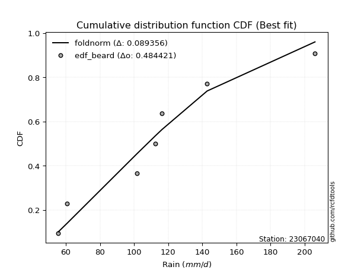</img></img>

</div>


### 5. Empirical - EDF Chegodayev (1955)

The Chegodayev formula is an empirical plotting position formula used in hydrological frequency analysis to estimate the exceedance probability or return period of a specific event from a set of observed data. It is primarily used for plotting observed data points on probability paper to fit a theoretical distribution, particularly for analyzing extreme events like maximum flood flows or rainfall intensities. The constant _b_ value in the generalized plotting position formula is 0.3.

<div align="center">


$P=(m-b)/(n+1-2b)$


</div>


**5.1. Empirical values**

<div align="center">

|                | 0                   | 1                   | 2                   | 3              | 4                  | 5                  | 6                  |
|:---------------|:--------------------|:--------------------|:--------------------|:---------------|:-------------------|:-------------------|:-------------------|
| date           | 2023                | 2025                | 2021                | 2020           | 2022               | 2019               | 2024               |
| x              | 55.6                | 60.8                | 101.6               | 112.4          | 116.4              | 142.8              | 206.0              |
| m              | 1                   | 2                   | 3                   | 4              | 5                  | 6                  | 7                  |
| empirical_dist | edf_chegodayev      | edf_chegodayev      | edf_chegodayev      | edf_chegodayev | edf_chegodayev     | edf_chegodayev     | edf_chegodayev     |
| empirical      | 0.09459459459459459 | 0.22972972972972971 | 0.36486486486486486 | 0.5            | 0.6351351351351351 | 0.7702702702702703 | 0.9054054054054054 |
| empirical_tr   | 1.1044776119402986  | 1.2982456140350878  | 1.574468085106383   | 2.0            | 2.7407407407407405 | 4.352941176470589  | 10.571428571428568 |

</div>


**5.2. Kolmogorov-Smirnov fit test (sorted by Δ)**


<div align="center">

|                | 0                   | 1                   | 2                   | 3                   | 4                   | 5                   | 6                   | 7                   | 8                   | 9                   | 10                  | 11                  | 12                  | 13                  | 14                  | 15                  | 16                  | 17                  | 18                  | 19                  | 20                  | 21                  | 22                  | 23                  | 24                  | 25                  | 26                  | 27                  | 28                  | 29                  | 30                  | 31                  | 32                  | 33                  | 34                  | 35                  | 36                    | 37                  | 38                  | 39                  | 40                  | 41                  | 42                  | 43                  | 44                  | 45                  | 46                  | 47                  | 48                  | 49                  | 50                  | 51                  | 52                  | 53                  | 54                  | 55                  | 56                  | 57                  | 58                  | 59                  | 60                  | 61                  | 62                  | 63                  | 64                  | 65                  | 66                  | 67                  | 68                  | 69                  | 70                  | 71                  | 72                  | 73                  | 74                  | 75                  | 76                  | 77                  | 78                  | 79                  | 80                  | 81                  | 82                  | 83                  | 84                  | 85                  | 86                  | 87                  | 88                  | 89                  |
|:---------------|:--------------------|:--------------------|:--------------------|:--------------------|:--------------------|:--------------------|:--------------------|:--------------------|:--------------------|:--------------------|:--------------------|:--------------------|:--------------------|:--------------------|:--------------------|:--------------------|:--------------------|:--------------------|:--------------------|:--------------------|:--------------------|:--------------------|:--------------------|:--------------------|:--------------------|:--------------------|:--------------------|:--------------------|:--------------------|:--------------------|:--------------------|:--------------------|:--------------------|:--------------------|:--------------------|:--------------------|:----------------------|:--------------------|:--------------------|:--------------------|:--------------------|:--------------------|:--------------------|:--------------------|:--------------------|:--------------------|:--------------------|:--------------------|:--------------------|:--------------------|:--------------------|:--------------------|:--------------------|:--------------------|:--------------------|:--------------------|:--------------------|:--------------------|:--------------------|:--------------------|:--------------------|:--------------------|:--------------------|:--------------------|:--------------------|:--------------------|:--------------------|:--------------------|:--------------------|:--------------------|:--------------------|:--------------------|:--------------------|:--------------------|:--------------------|:--------------------|:--------------------|:--------------------|:--------------------|:--------------------|:--------------------|:--------------------|:--------------------|:--------------------|:--------------------|:--------------------|:--------------------|:--------------------|:--------------------|:--------------------|
| station        | 23067040            | 23067040            | 23067040            | 23067040            | 23067040            | 23067040            | 23067040            | 23067040            | 23067040            | 23067040            | 23067040            | 23067040            | 23067040            | 23067040            | 23067040            | 23067040            | 23067040            | 23067040            | 23067040            | 23067040            | 23067040            | 23067040            | 23067040            | 23067040            | 23067040            | 23067040            | 23067040            | 23067040            | 23067040            | 23067040            | 23067040            | 23067040            | 23067040            | 23067040            | 23067040            | 23067040            | 23067040              | 23067040            | 23067040            | 23067040            | 23067040            | 23067040            | 23067040            | 23067040            | 23067040            | 23067040            | 23067040            | 23067040            | 23067040            | 23067040            | 23067040            | 23067040            | 23067040            | 23067040            | 23067040            | 23067040            | 23067040            | 23067040            | 23067040            | 23067040            | 23067040            | 23067040            | 23067040            | 23067040            | 23067040            | 23067040            | 23067040            | 23067040            | 23067040            | 23067040            | 23067040            | 23067040            | 23067040            | 23067040            | 23067040            | 23067040            | 23067040            | 23067040            | 23067040            | 23067040            | 23067040            | 23067040            | 23067040            | 23067040            | 23067040            | 23067040            | 23067040            | 23067040            | 23067040            | 23067040            |
| empirical_dist | edf_chegodayev      | edf_chegodayev      | edf_chegodayev      | edf_chegodayev      | edf_chegodayev      | edf_chegodayev      | edf_chegodayev      | edf_chegodayev      | edf_chegodayev      | edf_chegodayev      | edf_chegodayev      | edf_chegodayev      | edf_chegodayev      | edf_chegodayev      | edf_chegodayev      | edf_chegodayev      | edf_chegodayev      | edf_chegodayev      | edf_chegodayev      | edf_chegodayev      | edf_chegodayev      | edf_chegodayev      | edf_chegodayev      | edf_chegodayev      | edf_chegodayev      | edf_chegodayev      | edf_chegodayev      | edf_chegodayev      | edf_chegodayev      | edf_chegodayev      | edf_chegodayev      | edf_chegodayev      | edf_chegodayev      | edf_chegodayev      | edf_chegodayev      | edf_chegodayev      | edf_chegodayev        | edf_chegodayev      | edf_chegodayev      | edf_chegodayev      | edf_chegodayev      | edf_chegodayev      | edf_chegodayev      | edf_chegodayev      | edf_chegodayev      | edf_chegodayev      | edf_chegodayev      | edf_chegodayev      | edf_chegodayev      | edf_chegodayev      | edf_chegodayev      | edf_chegodayev      | edf_chegodayev      | edf_chegodayev      | edf_chegodayev      | edf_chegodayev      | edf_chegodayev      | edf_chegodayev      | edf_chegodayev      | edf_chegodayev      | edf_chegodayev      | edf_chegodayev      | edf_chegodayev      | edf_chegodayev      | edf_chegodayev      | edf_chegodayev      | edf_chegodayev      | edf_chegodayev      | edf_chegodayev      | edf_chegodayev      | edf_chegodayev      | edf_chegodayev      | edf_chegodayev      | edf_chegodayev      | edf_chegodayev      | edf_chegodayev      | edf_chegodayev      | edf_chegodayev      | edf_chegodayev      | edf_chegodayev      | edf_chegodayev      | edf_chegodayev      | edf_chegodayev      | edf_chegodayev      | edf_chegodayev      | edf_chegodayev      | edf_chegodayev      | edf_chegodayev      | edf_chegodayev      | edf_chegodayev      |
| p_dist         | maxwell             | rayleigh            | pearson3            | t                   | crystalball         | norm                | logistic            | ncf                 | laplace_asymmetric  | logmielke           | hypsecant           | loggenlogistic      | exponnorm           | logloggamma         | logbetaprime        | genlogistic         | loggumbel_l         | alpha               | logpearson3         | kstwobign           | lognct              | logncf              | logcrystalball      | lognorm             | lognorm             | logt                | logexponnorm        | logjohnsonsu        | invgamma            | loggamma            | loggamma            | laplace             | truncnorm           | logf                | logfatiguelife      | nct                 | loglaplace_asymmetric | logerlang           | johnsonsu           | loginvgamma         | logfisk             | halfnorm            | fisk                | betaprime           | gumbel_r            | logalpha            | logweibull_min      | rice                | loglogistic         | invgauss            | logrice             | loginvgauss         | loghypsecant        | loglaplace          | logmaxwell          | lograyleigh         | mielke              | moyal               | loggompertz         | gompertz            | loginvweibull       | logchi2             | gumbel_l            | loggumbel_r         | genexpon            | expon               | halflogistic        | logkstwobign        | loghalfnorm         | f                   | logmoyal            | loggenexpon         | loghalflogistic     | wald                | gibrat              | logexpon            | weibull_min         | logwald             | loggibrat           | erlang              | pareto              | gamma               | logpareto           | logtruncnorm        | loglognorm          | nakagami            | lognakagami         | invweibull          | fatiguelife         | chi2                |
| delta          | 0.1000141276181947  | 0.10235572302643331 | 0.1095368533886965  | 0.11203883494234246 | 0.11203938269023461 | 0.11203939272522467 | 0.1130928425509326  | 0.1167373863718445  | 0.11751504975888923 | 0.12016919748829633 | 0.12056188081016346 | 0.12151506592452785 | 0.12344981410476788 | 0.12369517313808007 | 0.12380864368539157 | 0.12402438488301691 | 0.12457313486122615 | 0.1247911608411702  | 0.1249418884266032  | 0.12576400925799713 | 0.12598694664755167 | 0.12610085511555547 | 0.12646170000950385 | 0.12646170056269895 | 0.12646170056269895 | 0.12646226044662356 | 0.12646263073563685 | 0.12646353212380546 | 0.12653058158785813 | 0.1265863987389853  | 0.1265863987389853  | 0.12660092051384825 | 0.12663451682618987 | 0.12667582438458194 | 0.12693892182958683 | 0.1269812672889698  | 0.12711708987350795   | 0.12735251897564256 | 0.12856184205927818 | 0.12933147949090423 | 0.12999614981282906 | 0.13025971812305093 | 0.1307330555540449  | 0.1322019351349331  | 0.13436671547008353 | 0.13439330428874185 | 0.1361966163199715  | 0.13732848184887664 | 0.13786671435064168 | 0.14105832336241347 | 0.14131657939430436 | 0.1423371004623552  | 0.1427414173879918  | 0.1459452898241378  | 0.14645798253275893 | 0.15791842869770673 | 0.1586675826755906  | 0.1625769424097534  | 0.16443423105657295 | 0.1663297603772736  | 0.17408968336433134 | 0.17634687823867262 | 0.18134083580364624 | 0.1819936743699609  | 0.18225057941434647 | 0.182343322840882   | 0.18941527455459445 | 0.18991845222122555 | 0.20064356715333037 | 0.20551115938710923 | 0.20783335891635574 | 0.2210888662458786  | 0.22972972972972971 | 0.22972972972972971 | 0.22972972972972971 | 0.2529038586283103  | 0.25818632381658907 | 0.27976276917210025 | 0.2990639790685657  | 0.3149025076299606  | 0.322496250169998   | 0.33235553134585866 | 0.34494587235362595 | 0.36485978283479903 | 0.3698609657760096  | 0.42961160288687744 | 0.4298937901415369  | 0.45227032760056324 | 0.46031787635914306 | 0.5623548449478304  |
| deltao         | 0.48442053926100004 | 0.48442053926100004 | 0.48442053926100004 | 0.48442053926100004 | 0.48442053926100004 | 0.48442053926100004 | 0.48442053926100004 | 0.48442053926100004 | 0.48442053926100004 | 0.48442053926100004 | 0.48442053926100004 | 0.48442053926100004 | 0.48442053926100004 | 0.48442053926100004 | 0.48442053926100004 | 0.48442053926100004 | 0.48442053926100004 | 0.48442053926100004 | 0.48442053926100004 | 0.48442053926100004 | 0.48442053926100004 | 0.48442053926100004 | 0.48442053926100004 | 0.48442053926100004 | 0.48442053926100004 | 0.48442053926100004 | 0.48442053926100004 | 0.48442053926100004 | 0.48442053926100004 | 0.48442053926100004 | 0.48442053926100004 | 0.48442053926100004 | 0.48442053926100004 | 0.48442053926100004 | 0.48442053926100004 | 0.48442053926100004 | 0.48442053926100004   | 0.48442053926100004 | 0.48442053926100004 | 0.48442053926100004 | 0.48442053926100004 | 0.48442053926100004 | 0.48442053926100004 | 0.48442053926100004 | 0.48442053926100004 | 0.48442053926100004 | 0.48442053926100004 | 0.48442053926100004 | 0.48442053926100004 | 0.48442053926100004 | 0.48442053926100004 | 0.48442053926100004 | 0.48442053926100004 | 0.48442053926100004 | 0.48442053926100004 | 0.48442053926100004 | 0.48442053926100004 | 0.48442053926100004 | 0.48442053926100004 | 0.48442053926100004 | 0.48442053926100004 | 0.48442053926100004 | 0.48442053926100004 | 0.48442053926100004 | 0.48442053926100004 | 0.48442053926100004 | 0.48442053926100004 | 0.48442053926100004 | 0.48442053926100004 | 0.48442053926100004 | 0.48442053926100004 | 0.48442053926100004 | 0.48442053926100004 | 0.48442053926100004 | 0.48442053926100004 | 0.48442053926100004 | 0.48442053926100004 | 0.48442053926100004 | 0.48442053926100004 | 0.48442053926100004 | 0.48442053926100004 | 0.48442053926100004 | 0.48442053926100004 | 0.48442053926100004 | 0.48442053926100004 | 0.48442053926100004 | 0.48442053926100004 | 0.48442053926100004 | 0.48442053926100004 | 0.48442053926100004 |
| eval           | Δo > Δ              | Δo > Δ              | Δo > Δ              | Δo > Δ              | Δo > Δ              | Δo > Δ              | Δo > Δ              | Δo > Δ              | Δo > Δ              | Δo > Δ              | Δo > Δ              | Δo > Δ              | Δo > Δ              | Δo > Δ              | Δo > Δ              | Δo > Δ              | Δo > Δ              | Δo > Δ              | Δo > Δ              | Δo > Δ              | Δo > Δ              | Δo > Δ              | Δo > Δ              | Δo > Δ              | Δo > Δ              | Δo > Δ              | Δo > Δ              | Δo > Δ              | Δo > Δ              | Δo > Δ              | Δo > Δ              | Δo > Δ              | Δo > Δ              | Δo > Δ              | Δo > Δ              | Δo > Δ              | Δo > Δ                | Δo > Δ              | Δo > Δ              | Δo > Δ              | Δo > Δ              | Δo > Δ              | Δo > Δ              | Δo > Δ              | Δo > Δ              | Δo > Δ              | Δo > Δ              | Δo > Δ              | Δo > Δ              | Δo > Δ              | Δo > Δ              | Δo > Δ              | Δo > Δ              | Δo > Δ              | Δo > Δ              | Δo > Δ              | Δo > Δ              | Δo > Δ              | Δo > Δ              | Δo > Δ              | Δo > Δ              | Δo > Δ              | Δo > Δ              | Δo > Δ              | Δo > Δ              | Δo > Δ              | Δo > Δ              | Δo > Δ              | Δo > Δ              | Δo > Δ              | Δo > Δ              | Δo > Δ              | Δo > Δ              | Δo > Δ              | Δo > Δ              | Δo > Δ              | Δo > Δ              | Δo > Δ              | Δo > Δ              | Δo > Δ              | Δo > Δ              | Δo > Δ              | Δo > Δ              | Δo > Δ              | Δo > Δ              | Δo > Δ              | Δo > Δ              | Δo > Δ              | Δo > Δ              | Δo <= Δ             |
| fit            | 1                   | 1                   | 1                   | 1                   | 1                   | 1                   | 1                   | 1                   | 1                   | 1                   | 1                   | 1                   | 1                   | 1                   | 1                   | 1                   | 1                   | 1                   | 1                   | 1                   | 1                   | 1                   | 1                   | 1                   | 1                   | 1                   | 1                   | 1                   | 1                   | 1                   | 1                   | 1                   | 1                   | 1                   | 1                   | 1                   | 1                     | 1                   | 1                   | 1                   | 1                   | 1                   | 1                   | 1                   | 1                   | 1                   | 1                   | 1                   | 1                   | 1                   | 1                   | 1                   | 1                   | 1                   | 1                   | 1                   | 1                   | 1                   | 1                   | 1                   | 1                   | 1                   | 1                   | 1                   | 1                   | 1                   | 1                   | 1                   | 1                   | 1                   | 1                   | 1                   | 1                   | 1                   | 1                   | 1                   | 1                   | 1                   | 1                   | 1                   | 1                   | 1                   | 1                   | 1                   | 1                   | 1                   | 1                   | 1                   | 1                   | 0                   |
| n              | 7                   | 7                   | 7                   | 7                   | 7                   | 7                   | 7                   | 7                   | 7                   | 7                   | 7                   | 7                   | 7                   | 7                   | 7                   | 7                   | 7                   | 7                   | 7                   | 7                   | 7                   | 7                   | 7                   | 7                   | 7                   | 7                   | 7                   | 7                   | 7                   | 7                   | 7                   | 7                   | 7                   | 7                   | 7                   | 7                   | 7                     | 7                   | 7                   | 7                   | 7                   | 7                   | 7                   | 7                   | 7                   | 7                   | 7                   | 7                   | 7                   | 7                   | 7                   | 7                   | 7                   | 7                   | 7                   | 7                   | 7                   | 7                   | 7                   | 7                   | 7                   | 7                   | 7                   | 7                   | 7                   | 7                   | 7                   | 7                   | 7                   | 7                   | 7                   | 7                   | 7                   | 7                   | 7                   | 7                   | 7                   | 7                   | 7                   | 7                   | 7                   | 7                   | 7                   | 7                   | 7                   | 7                   | 7                   | 7                   | 7                   | 7                   |
| best_fit       | 1                   | 0                   | 0                   | 0                   | 0                   | 0                   | 0                   | 0                   | 0                   | 0                   | 0                   | 0                   | 0                   | 0                   | 0                   | 0                   | 0                   | 0                   | 0                   | 0                   | 0                   | 0                   | 0                   | 0                   | 0                   | 0                   | 0                   | 0                   | 0                   | 0                   | 0                   | 0                   | 0                   | 0                   | 0                   | 0                   | 0                     | 0                   | 0                   | 0                   | 0                   | 0                   | 0                   | 0                   | 0                   | 0                   | 0                   | 0                   | 0                   | 0                   | 0                   | 0                   | 0                   | 0                   | 0                   | 0                   | 0                   | 0                   | 0                   | 0                   | 0                   | 0                   | 0                   | 0                   | 0                   | 0                   | 0                   | 0                   | 0                   | 0                   | 0                   | 0                   | 0                   | 0                   | 0                   | 0                   | 0                   | 0                   | 0                   | 0                   | 0                   | 0                   | 0                   | 0                   | 0                   | 0                   | 0                   | 0                   | 0                   | 0                   |
| best_fit_sort  | 1                   | 2                   | 3                   | 4                   | 5                   | 6                   | 7                   | 8                   | 9                   | 10                  | 11                  | 12                  | 13                  | 14                  | 15                  | 16                  | 17                  | 18                  | 19                  | 20                  | 21                  | 22                  | 23                  | 24                  | 25                  | 26                  | 27                  | 28                  | 29                  | 30                  | 31                  | 32                  | 33                  | 34                  | 35                  | 36                  | 37                    | 38                  | 39                  | 40                  | 41                  | 42                  | 43                  | 44                  | 45                  | 46                  | 47                  | 48                  | 49                  | 50                  | 51                  | 52                  | 53                  | 54                  | 55                  | 56                  | 57                  | 58                  | 59                  | 60                  | 61                  | 62                  | 63                  | 64                  | 65                  | 66                  | 67                  | 68                  | 69                  | 70                  | 71                  | 72                  | 73                  | 74                  | 75                  | 76                  | 77                  | 78                  | 79                  | 80                  | 81                  | 82                  | 83                  | 84                  | 85                  | 86                  | 87                  | 88                  | 89                  | 90                  |

</div>


<div align="center">

</img>

</div>


**5.3. Best fit**

<div align="center">

|   id |   station | empirical_dist   | p_dist   |    delta |   deltao | eval   |   fit |   n |   best_fit |   best_fit_sort |
|-----:|----------:|:-----------------|:---------|---------:|---------:|:-------|------:|----:|-----------:|----------------:|
|    0 |  23067040 | edf_chegodayev   | maxwell  | 0.100014 | 0.484421 | Δo > Δ |     1 |   7 |          1 |               1 |

</div>


<div align="center">

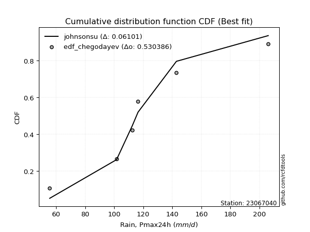</img>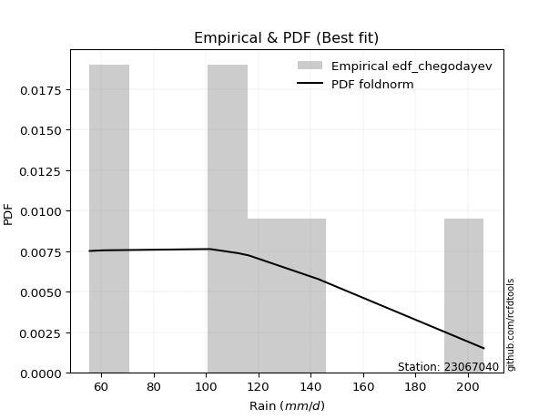</img>

</div>


### 6. Empirical - EDF Blom (1958)

The Blom formula is a specific "plotting position" formula used in hydrology and statistical analysis to estimate the empirical cumulative probability (or non-exceedance probability) of a data series. It is particularly recommended for data that are approximately normally distributed. The constant _a_ is set to 0.375 (or 3/8).

<div align="center">


$P=(m-a)/(n+1-2a)$


</div>


**6.1. Empirical values**

<div align="center">

|                | 0                   | 1                   | 2                  | 3        | 4                  | 5                  | 6                  |
|:---------------|:--------------------|:--------------------|:-------------------|:---------|:-------------------|:-------------------|:-------------------|
| date           | 2023                | 2025                | 2021               | 2020     | 2022               | 2019               | 2024               |
| x              | 55.6                | 60.8                | 101.6              | 112.4    | 116.4              | 142.8              | 206.0              |
| m              | 1                   | 2                   | 3                  | 4        | 5                  | 6                  | 7                  |
| empirical_dist | edf_blom            | edf_blom            | edf_blom           | edf_blom | edf_blom           | edf_blom           | edf_blom           |
| empirical      | 0.08620689655172414 | 0.22413793103448276 | 0.3620689655172414 | 0.5      | 0.6379310344827587 | 0.7758620689655172 | 0.9137931034482759 |
| empirical_tr   | 1.0943396226415094  | 1.288888888888889   | 1.5675675675675675 | 2.0      | 2.7619047619047623 | 4.461538461538462  | 11.600000000000007 |

</div>


**6.2. Kolmogorov-Smirnov fit test (sorted by Δ)**


<div align="center">

|                | 0                   | 1                   | 2                   | 3                   | 4                   | 5                   | 6                   | 7                   | 8                   | 9                   | 10                  | 11                  | 12                  | 13                  | 14                  | 15                  | 16                  | 17                  | 18                  | 19                  | 20                  | 21                  | 22                  | 23                  | 24                  | 25                  | 26                  | 27                  | 28                  | 29                  | 30                  | 31                  | 32                  | 33                  | 34                    | 35                  | 36                  | 37                  | 38                  | 39                  | 40                  | 41                  | 42                  | 43                  | 44                  | 45                  | 46                  | 47                  | 48                  | 49                  | 50                  | 51                  | 52                  | 53                  | 54                  | 55                  | 56                  | 57                  | 58                  | 59                  | 60                  | 61                  | 62                  | 63                  | 64                  | 65                  | 66                  | 67                  | 68                  | 69                  | 70                  | 71                  | 72                  | 73                  | 74                  | 75                  | 76                  | 77                  | 78                  | 79                  | 80                  | 81                  | 82                  | 83                  | 84                  | 85                  | 86                  | 87                  | 88                  | 89                  |
|:---------------|:--------------------|:--------------------|:--------------------|:--------------------|:--------------------|:--------------------|:--------------------|:--------------------|:--------------------|:--------------------|:--------------------|:--------------------|:--------------------|:--------------------|:--------------------|:--------------------|:--------------------|:--------------------|:--------------------|:--------------------|:--------------------|:--------------------|:--------------------|:--------------------|:--------------------|:--------------------|:--------------------|:--------------------|:--------------------|:--------------------|:--------------------|:--------------------|:--------------------|:--------------------|:----------------------|:--------------------|:--------------------|:--------------------|:--------------------|:--------------------|:--------------------|:--------------------|:--------------------|:--------------------|:--------------------|:--------------------|:--------------------|:--------------------|:--------------------|:--------------------|:--------------------|:--------------------|:--------------------|:--------------------|:--------------------|:--------------------|:--------------------|:--------------------|:--------------------|:--------------------|:--------------------|:--------------------|:--------------------|:--------------------|:--------------------|:--------------------|:--------------------|:--------------------|:--------------------|:--------------------|:--------------------|:--------------------|:--------------------|:--------------------|:--------------------|:--------------------|:--------------------|:--------------------|:--------------------|:--------------------|:--------------------|:--------------------|:--------------------|:--------------------|:--------------------|:--------------------|:--------------------|:--------------------|:--------------------|:--------------------|
| station        | 23067040            | 23067040            | 23067040            | 23067040            | 23067040            | 23067040            | 23067040            | 23067040            | 23067040            | 23067040            | 23067040            | 23067040            | 23067040            | 23067040            | 23067040            | 23067040            | 23067040            | 23067040            | 23067040            | 23067040            | 23067040            | 23067040            | 23067040            | 23067040            | 23067040            | 23067040            | 23067040            | 23067040            | 23067040            | 23067040            | 23067040            | 23067040            | 23067040            | 23067040            | 23067040              | 23067040            | 23067040            | 23067040            | 23067040            | 23067040            | 23067040            | 23067040            | 23067040            | 23067040            | 23067040            | 23067040            | 23067040            | 23067040            | 23067040            | 23067040            | 23067040            | 23067040            | 23067040            | 23067040            | 23067040            | 23067040            | 23067040            | 23067040            | 23067040            | 23067040            | 23067040            | 23067040            | 23067040            | 23067040            | 23067040            | 23067040            | 23067040            | 23067040            | 23067040            | 23067040            | 23067040            | 23067040            | 23067040            | 23067040            | 23067040            | 23067040            | 23067040            | 23067040            | 23067040            | 23067040            | 23067040            | 23067040            | 23067040            | 23067040            | 23067040            | 23067040            | 23067040            | 23067040            | 23067040            | 23067040            |
| empirical_dist | edf_blom            | edf_blom            | edf_blom            | edf_blom            | edf_blom            | edf_blom            | edf_blom            | edf_blom            | edf_blom            | edf_blom            | edf_blom            | edf_blom            | edf_blom            | edf_blom            | edf_blom            | edf_blom            | edf_blom            | edf_blom            | edf_blom            | edf_blom            | edf_blom            | edf_blom            | edf_blom            | edf_blom            | edf_blom            | edf_blom            | edf_blom            | edf_blom            | edf_blom            | edf_blom            | edf_blom            | edf_blom            | edf_blom            | edf_blom            | edf_blom              | edf_blom            | edf_blom            | edf_blom            | edf_blom            | edf_blom            | edf_blom            | edf_blom            | edf_blom            | edf_blom            | edf_blom            | edf_blom            | edf_blom            | edf_blom            | edf_blom            | edf_blom            | edf_blom            | edf_blom            | edf_blom            | edf_blom            | edf_blom            | edf_blom            | edf_blom            | edf_blom            | edf_blom            | edf_blom            | edf_blom            | edf_blom            | edf_blom            | edf_blom            | edf_blom            | edf_blom            | edf_blom            | edf_blom            | edf_blom            | edf_blom            | edf_blom            | edf_blom            | edf_blom            | edf_blom            | edf_blom            | edf_blom            | edf_blom            | edf_blom            | edf_blom            | edf_blom            | edf_blom            | edf_blom            | edf_blom            | edf_blom            | edf_blom            | edf_blom            | edf_blom            | edf_blom            | edf_blom            | edf_blom            |
| p_dist         | maxwell             | rayleigh            | pearson3            | logistic            | laplace_asymmetric  | logmielke           | t                   | crystalball         | norm                | hypsecant           | loggenlogistic      | exponnorm           | logloggamma         | genlogistic         | loggumbel_l         | alpha               | logpearson3         | ncf                 | kstwobign           | lognct              | logncf              | logcrystalball      | lognorm             | lognorm             | logt                | logexponnorm        | logjohnsonsu        | invgamma            | laplace             | logf                | loggamma            | loggamma            | logfatiguelife      | nct                 | loglaplace_asymmetric | logerlang           | logfisk             | halfnorm            | fisk                | logbetaprime        | gumbel_r            | truncnorm           | johnsonsu           | rice                | loginvgamma         | loglogistic         | betaprime           | loghypsecant        | logalpha            | logrice             | logweibull_min      | loglaplace          | invgauss            | loginvgauss         | logmaxwell          | moyal               | loggompertz         | lograyleigh         | gompertz            | mielke              | loginvweibull       | logchi2             | halflogistic        | gumbel_l            | loggumbel_r         | genexpon            | expon               | logkstwobign        | loghalfnorm         | f                   | logmoyal            | loggenexpon         | loghalflogistic     | wald                | gibrat              | logexpon            | weibull_min         | logwald             | loggibrat           | erlang              | pareto              | gamma               | logpareto           | logtruncnorm        | loglognorm          | nakagami            | lognakagami         | invweibull          | fatiguelife         | chi2                |
| delta          | 0.09442232892294775 | 0.09676392433118636 | 0.10394505469344954 | 0.11168917008082246 | 0.11192325106364227 | 0.11457739879304937 | 0.11483473428996605 | 0.1148352820378582  | 0.11483529207284826 | 0.11497008211491651 | 0.1159232672292809  | 0.11785801540952093 | 0.11810337444283311 | 0.11843258618776996 | 0.1189813361659792  | 0.11919936214592325 | 0.11935008973135625 | 0.11953328571946797 | 0.12017221056275017 | 0.12039514795230473 | 0.12050905642030853 | 0.12086990131425689 | 0.120869901867452   | 0.120869901867452   | 0.1208704617513766  | 0.12087083204038988 | 0.1208717334285585  | 0.12093878289261117 | 0.1210091218186013  | 0.12108402568933499 | 0.12116763006890735 | 0.12116763006890735 | 0.12134712313433987 | 0.12138946859372286 | 0.12152529117826098   | 0.12176072028039561 | 0.12440435111758211 | 0.12466791942780396 | 0.12514125685879796 | 0.12660454303301505 | 0.12877491677483657 | 0.12943041617381346 | 0.1304675969338625  | 0.13173668315362969 | 0.1321273788385277  | 0.13227491565539473 | 0.1349978344825566  | 0.13714961869274483 | 0.13718920363636533 | 0.137662801425547   | 0.13826685379131248 | 0.14035349112889084 | 0.14385422271003695 | 0.14513299980997868 | 0.1492538818803824  | 0.15698514371450645 | 0.158842432361326   | 0.1607143280453302  | 0.16073796168202664 | 0.1614634820232141  | 0.17688558271195481 | 0.18074665875823226 | 0.1838234758593475  | 0.18413673515126983 | 0.18478957371758437 | 0.18504647876196995 | 0.18513922218850548 | 0.19271435156884903 | 0.19505176845808342 | 0.2083070587347327  | 0.2106292582639792  | 0.22388476559350207 | 0.22413793103448276 | 0.22413793103448276 | 0.22413793103448276 | 0.25569975797593375 | 0.26098222316421255 | 0.2825586685197237  | 0.30185987841618916 | 0.31769840697758406 | 0.3252921495176215  | 0.33515143069348213 | 0.3505376710488729  | 0.36206388348717555 | 0.37545276447125653 | 0.4324075022345009  | 0.43268968948916037 | 0.4606580256434338  | 0.46311377570676654 | 0.5651507442954538  |
| deltao         | 0.48442053926100004 | 0.48442053926100004 | 0.48442053926100004 | 0.48442053926100004 | 0.48442053926100004 | 0.48442053926100004 | 0.48442053926100004 | 0.48442053926100004 | 0.48442053926100004 | 0.48442053926100004 | 0.48442053926100004 | 0.48442053926100004 | 0.48442053926100004 | 0.48442053926100004 | 0.48442053926100004 | 0.48442053926100004 | 0.48442053926100004 | 0.48442053926100004 | 0.48442053926100004 | 0.48442053926100004 | 0.48442053926100004 | 0.48442053926100004 | 0.48442053926100004 | 0.48442053926100004 | 0.48442053926100004 | 0.48442053926100004 | 0.48442053926100004 | 0.48442053926100004 | 0.48442053926100004 | 0.48442053926100004 | 0.48442053926100004 | 0.48442053926100004 | 0.48442053926100004 | 0.48442053926100004 | 0.48442053926100004   | 0.48442053926100004 | 0.48442053926100004 | 0.48442053926100004 | 0.48442053926100004 | 0.48442053926100004 | 0.48442053926100004 | 0.48442053926100004 | 0.48442053926100004 | 0.48442053926100004 | 0.48442053926100004 | 0.48442053926100004 | 0.48442053926100004 | 0.48442053926100004 | 0.48442053926100004 | 0.48442053926100004 | 0.48442053926100004 | 0.48442053926100004 | 0.48442053926100004 | 0.48442053926100004 | 0.48442053926100004 | 0.48442053926100004 | 0.48442053926100004 | 0.48442053926100004 | 0.48442053926100004 | 0.48442053926100004 | 0.48442053926100004 | 0.48442053926100004 | 0.48442053926100004 | 0.48442053926100004 | 0.48442053926100004 | 0.48442053926100004 | 0.48442053926100004 | 0.48442053926100004 | 0.48442053926100004 | 0.48442053926100004 | 0.48442053926100004 | 0.48442053926100004 | 0.48442053926100004 | 0.48442053926100004 | 0.48442053926100004 | 0.48442053926100004 | 0.48442053926100004 | 0.48442053926100004 | 0.48442053926100004 | 0.48442053926100004 | 0.48442053926100004 | 0.48442053926100004 | 0.48442053926100004 | 0.48442053926100004 | 0.48442053926100004 | 0.48442053926100004 | 0.48442053926100004 | 0.48442053926100004 | 0.48442053926100004 | 0.48442053926100004 |
| eval           | Δo > Δ              | Δo > Δ              | Δo > Δ              | Δo > Δ              | Δo > Δ              | Δo > Δ              | Δo > Δ              | Δo > Δ              | Δo > Δ              | Δo > Δ              | Δo > Δ              | Δo > Δ              | Δo > Δ              | Δo > Δ              | Δo > Δ              | Δo > Δ              | Δo > Δ              | Δo > Δ              | Δo > Δ              | Δo > Δ              | Δo > Δ              | Δo > Δ              | Δo > Δ              | Δo > Δ              | Δo > Δ              | Δo > Δ              | Δo > Δ              | Δo > Δ              | Δo > Δ              | Δo > Δ              | Δo > Δ              | Δo > Δ              | Δo > Δ              | Δo > Δ              | Δo > Δ                | Δo > Δ              | Δo > Δ              | Δo > Δ              | Δo > Δ              | Δo > Δ              | Δo > Δ              | Δo > Δ              | Δo > Δ              | Δo > Δ              | Δo > Δ              | Δo > Δ              | Δo > Δ              | Δo > Δ              | Δo > Δ              | Δo > Δ              | Δo > Δ              | Δo > Δ              | Δo > Δ              | Δo > Δ              | Δo > Δ              | Δo > Δ              | Δo > Δ              | Δo > Δ              | Δo > Δ              | Δo > Δ              | Δo > Δ              | Δo > Δ              | Δo > Δ              | Δo > Δ              | Δo > Δ              | Δo > Δ              | Δo > Δ              | Δo > Δ              | Δo > Δ              | Δo > Δ              | Δo > Δ              | Δo > Δ              | Δo > Δ              | Δo > Δ              | Δo > Δ              | Δo > Δ              | Δo > Δ              | Δo > Δ              | Δo > Δ              | Δo > Δ              | Δo > Δ              | Δo > Δ              | Δo > Δ              | Δo > Δ              | Δo > Δ              | Δo > Δ              | Δo > Δ              | Δo > Δ              | Δo > Δ              | Δo <= Δ             |
| fit            | 1                   | 1                   | 1                   | 1                   | 1                   | 1                   | 1                   | 1                   | 1                   | 1                   | 1                   | 1                   | 1                   | 1                   | 1                   | 1                   | 1                   | 1                   | 1                   | 1                   | 1                   | 1                   | 1                   | 1                   | 1                   | 1                   | 1                   | 1                   | 1                   | 1                   | 1                   | 1                   | 1                   | 1                   | 1                     | 1                   | 1                   | 1                   | 1                   | 1                   | 1                   | 1                   | 1                   | 1                   | 1                   | 1                   | 1                   | 1                   | 1                   | 1                   | 1                   | 1                   | 1                   | 1                   | 1                   | 1                   | 1                   | 1                   | 1                   | 1                   | 1                   | 1                   | 1                   | 1                   | 1                   | 1                   | 1                   | 1                   | 1                   | 1                   | 1                   | 1                   | 1                   | 1                   | 1                   | 1                   | 1                   | 1                   | 1                   | 1                   | 1                   | 1                   | 1                   | 1                   | 1                   | 1                   | 1                   | 1                   | 1                   | 0                   |
| n              | 7                   | 7                   | 7                   | 7                   | 7                   | 7                   | 7                   | 7                   | 7                   | 7                   | 7                   | 7                   | 7                   | 7                   | 7                   | 7                   | 7                   | 7                   | 7                   | 7                   | 7                   | 7                   | 7                   | 7                   | 7                   | 7                   | 7                   | 7                   | 7                   | 7                   | 7                   | 7                   | 7                   | 7                   | 7                     | 7                   | 7                   | 7                   | 7                   | 7                   | 7                   | 7                   | 7                   | 7                   | 7                   | 7                   | 7                   | 7                   | 7                   | 7                   | 7                   | 7                   | 7                   | 7                   | 7                   | 7                   | 7                   | 7                   | 7                   | 7                   | 7                   | 7                   | 7                   | 7                   | 7                   | 7                   | 7                   | 7                   | 7                   | 7                   | 7                   | 7                   | 7                   | 7                   | 7                   | 7                   | 7                   | 7                   | 7                   | 7                   | 7                   | 7                   | 7                   | 7                   | 7                   | 7                   | 7                   | 7                   | 7                   | 7                   |
| best_fit       | 1                   | 0                   | 0                   | 0                   | 0                   | 0                   | 0                   | 0                   | 0                   | 0                   | 0                   | 0                   | 0                   | 0                   | 0                   | 0                   | 0                   | 0                   | 0                   | 0                   | 0                   | 0                   | 0                   | 0                   | 0                   | 0                   | 0                   | 0                   | 0                   | 0                   | 0                   | 0                   | 0                   | 0                   | 0                     | 0                   | 0                   | 0                   | 0                   | 0                   | 0                   | 0                   | 0                   | 0                   | 0                   | 0                   | 0                   | 0                   | 0                   | 0                   | 0                   | 0                   | 0                   | 0                   | 0                   | 0                   | 0                   | 0                   | 0                   | 0                   | 0                   | 0                   | 0                   | 0                   | 0                   | 0                   | 0                   | 0                   | 0                   | 0                   | 0                   | 0                   | 0                   | 0                   | 0                   | 0                   | 0                   | 0                   | 0                   | 0                   | 0                   | 0                   | 0                   | 0                   | 0                   | 0                   | 0                   | 0                   | 0                   | 0                   |
| best_fit_sort  | 1                   | 2                   | 3                   | 4                   | 5                   | 6                   | 7                   | 8                   | 9                   | 10                  | 11                  | 12                  | 13                  | 14                  | 15                  | 16                  | 17                  | 18                  | 19                  | 20                  | 21                  | 22                  | 23                  | 24                  | 25                  | 26                  | 27                  | 28                  | 29                  | 30                  | 31                  | 32                  | 33                  | 34                  | 35                    | 36                  | 37                  | 38                  | 39                  | 40                  | 41                  | 42                  | 43                  | 44                  | 45                  | 46                  | 47                  | 48                  | 49                  | 50                  | 51                  | 52                  | 53                  | 54                  | 55                  | 56                  | 57                  | 58                  | 59                  | 60                  | 61                  | 62                  | 63                  | 64                  | 65                  | 66                  | 67                  | 68                  | 69                  | 70                  | 71                  | 72                  | 73                  | 74                  | 75                  | 76                  | 77                  | 78                  | 79                  | 80                  | 81                  | 82                  | 83                  | 84                  | 85                  | 86                  | 87                  | 88                  | 89                  | 90                  |

</div>


<div align="center">

</img>

</div>


**6.3. Best fit**

<div align="center">

|   id |   station | empirical_dist   | p_dist   |     delta |   deltao | eval   |   fit |   n |   best_fit |   best_fit_sort |
|-----:|----------:|:-----------------|:---------|----------:|---------:|:-------|------:|----:|-----------:|----------------:|
|    0 |  23067040 | edf_blom         | maxwell  | 0.0944223 | 0.484421 | Δo > Δ |     1 |   7 |          1 |               1 |

</div>


<div align="center">

</img>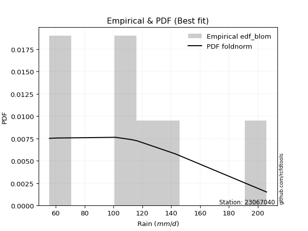</img>

</div>


### 7. Empirical - EDF Tukey (1962)

In hydrology, the Tukey formula is used as a plotting position formula to estimate the empirical probability or frequency of a flood event (or other hydrological data). The formula parameter is given as _c=0.333_ (or 1/3).

<div align="center">


$P=(m-c)/(n+1-2c)$


</div>


**7.1. Empirical values**

<div align="center">

|                | 0                   | 1                   | 2                   | 3         | 4                  | 5                  | 6                  |
|:---------------|:--------------------|:--------------------|:--------------------|:----------|:-------------------|:-------------------|:-------------------|
| date           | 2023                | 2025                | 2021                | 2020      | 2022               | 2019               | 2024               |
| x              | 55.6                | 60.8                | 101.6               | 112.4     | 116.4              | 142.8              | 206.0              |
| m              | 1                   | 2                   | 3                   | 4         | 5                  | 6                  | 7                  |
| empirical_dist | edf_tukey           | edf_tukey           | edf_tukey           | edf_tukey | edf_tukey          | edf_tukey          | edf_tukey          |
| empirical      | 0.09090909090909091 | 0.22727272727272727 | 0.36363636363636365 | 0.5       | 0.6363636363636364 | 0.7727272727272727 | 0.9090909090909091 |
| empirical_tr   | 1.1                 | 1.2941176470588236  | 1.5714285714285714  | 2.0       | 2.75               | 4.3999999999999995 | 10.999999999999996 |

</div>


**7.2. Kolmogorov-Smirnov fit test (sorted by Δ)**


<div align="center">

|                | 0                   | 1                   | 2                   | 3                   | 4                   | 5                   | 6                   | 7                   | 8                   | 9                   | 10                  | 11                  | 12                  | 13                  | 14                  | 15                  | 16                  | 17                  | 18                  | 19                  | 20                  | 21                  | 22                  | 23                  | 24                  | 25                  | 26                  | 27                  | 28                  | 29                  | 30                  | 31                  | 32                  | 33                  | 34                    | 35                  | 36                  | 37                  | 38                  | 39                  | 40                  | 41                  | 42                  | 43                  | 44                  | 45                  | 46                  | 47                  | 48                  | 49                  | 50                  | 51                  | 52                  | 53                  | 54                  | 55                  | 56                  | 57                  | 58                  | 59                  | 60                  | 61                  | 62                  | 63                  | 64                  | 65                  | 66                  | 67                  | 68                  | 69                  | 70                  | 71                  | 72                  | 73                  | 74                  | 75                  | 76                  | 77                  | 78                  | 79                  | 80                  | 81                  | 82                  | 83                  | 84                  | 85                  | 86                  | 87                  | 88                  | 89                  |
|:---------------|:--------------------|:--------------------|:--------------------|:--------------------|:--------------------|:--------------------|:--------------------|:--------------------|:--------------------|:--------------------|:--------------------|:--------------------|:--------------------|:--------------------|:--------------------|:--------------------|:--------------------|:--------------------|:--------------------|:--------------------|:--------------------|:--------------------|:--------------------|:--------------------|:--------------------|:--------------------|:--------------------|:--------------------|:--------------------|:--------------------|:--------------------|:--------------------|:--------------------|:--------------------|:----------------------|:--------------------|:--------------------|:--------------------|:--------------------|:--------------------|:--------------------|:--------------------|:--------------------|:--------------------|:--------------------|:--------------------|:--------------------|:--------------------|:--------------------|:--------------------|:--------------------|:--------------------|:--------------------|:--------------------|:--------------------|:--------------------|:--------------------|:--------------------|:--------------------|:--------------------|:--------------------|:--------------------|:--------------------|:--------------------|:--------------------|:--------------------|:--------------------|:--------------------|:--------------------|:--------------------|:--------------------|:--------------------|:--------------------|:--------------------|:--------------------|:--------------------|:--------------------|:--------------------|:--------------------|:--------------------|:--------------------|:--------------------|:--------------------|:--------------------|:--------------------|:--------------------|:--------------------|:--------------------|:--------------------|:--------------------|
| station        | 23067040            | 23067040            | 23067040            | 23067040            | 23067040            | 23067040            | 23067040            | 23067040            | 23067040            | 23067040            | 23067040            | 23067040            | 23067040            | 23067040            | 23067040            | 23067040            | 23067040            | 23067040            | 23067040            | 23067040            | 23067040            | 23067040            | 23067040            | 23067040            | 23067040            | 23067040            | 23067040            | 23067040            | 23067040            | 23067040            | 23067040            | 23067040            | 23067040            | 23067040            | 23067040              | 23067040            | 23067040            | 23067040            | 23067040            | 23067040            | 23067040            | 23067040            | 23067040            | 23067040            | 23067040            | 23067040            | 23067040            | 23067040            | 23067040            | 23067040            | 23067040            | 23067040            | 23067040            | 23067040            | 23067040            | 23067040            | 23067040            | 23067040            | 23067040            | 23067040            | 23067040            | 23067040            | 23067040            | 23067040            | 23067040            | 23067040            | 23067040            | 23067040            | 23067040            | 23067040            | 23067040            | 23067040            | 23067040            | 23067040            | 23067040            | 23067040            | 23067040            | 23067040            | 23067040            | 23067040            | 23067040            | 23067040            | 23067040            | 23067040            | 23067040            | 23067040            | 23067040            | 23067040            | 23067040            | 23067040            |
| empirical_dist | edf_tukey           | edf_tukey           | edf_tukey           | edf_tukey           | edf_tukey           | edf_tukey           | edf_tukey           | edf_tukey           | edf_tukey           | edf_tukey           | edf_tukey           | edf_tukey           | edf_tukey           | edf_tukey           | edf_tukey           | edf_tukey           | edf_tukey           | edf_tukey           | edf_tukey           | edf_tukey           | edf_tukey           | edf_tukey           | edf_tukey           | edf_tukey           | edf_tukey           | edf_tukey           | edf_tukey           | edf_tukey           | edf_tukey           | edf_tukey           | edf_tukey           | edf_tukey           | edf_tukey           | edf_tukey           | edf_tukey             | edf_tukey           | edf_tukey           | edf_tukey           | edf_tukey           | edf_tukey           | edf_tukey           | edf_tukey           | edf_tukey           | edf_tukey           | edf_tukey           | edf_tukey           | edf_tukey           | edf_tukey           | edf_tukey           | edf_tukey           | edf_tukey           | edf_tukey           | edf_tukey           | edf_tukey           | edf_tukey           | edf_tukey           | edf_tukey           | edf_tukey           | edf_tukey           | edf_tukey           | edf_tukey           | edf_tukey           | edf_tukey           | edf_tukey           | edf_tukey           | edf_tukey           | edf_tukey           | edf_tukey           | edf_tukey           | edf_tukey           | edf_tukey           | edf_tukey           | edf_tukey           | edf_tukey           | edf_tukey           | edf_tukey           | edf_tukey           | edf_tukey           | edf_tukey           | edf_tukey           | edf_tukey           | edf_tukey           | edf_tukey           | edf_tukey           | edf_tukey           | edf_tukey           | edf_tukey           | edf_tukey           | edf_tukey           | edf_tukey           |
| p_dist         | maxwell             | rayleigh            | pearson3            | logistic            | t                   | crystalball         | norm                | laplace_asymmetric  | logmielke           | ncf                 | hypsecant           | loggenlogistic      | exponnorm           | logloggamma         | genlogistic         | loggumbel_l         | alpha               | logpearson3         | kstwobign           | lognct              | logncf              | logcrystalball      | lognorm             | lognorm             | logt                | logexponnorm        | logjohnsonsu        | invgamma            | loggamma            | loggamma            | laplace             | logf                | logfatiguelife      | nct                 | loglaplace_asymmetric | logerlang           | logbetaprime        | logfisk             | halfnorm            | truncnorm           | fisk                | johnsonsu           | loginvgamma         | gumbel_r            | betaprime           | rice                | loglogistic         | logalpha            | logweibull_min      | logrice             | loghypsecant        | invgauss            | loglaplace          | loginvgauss         | logmaxwell          | lograyleigh         | mielke              | moyal               | loggompertz         | gompertz            | loginvweibull       | logchi2             | gumbel_l            | loggumbel_r         | genexpon            | expon               | halflogistic        | logkstwobign        | loghalfnorm         | f                   | logmoyal            | loggenexpon         | loghalflogistic     | wald                | gibrat              | logexpon            | weibull_min         | logwald             | loggibrat           | erlang              | pareto              | gamma               | logpareto           | logtruncnorm        | loglognorm          | nakagami            | lognakagami         | invweibull          | fatiguelife         | chi2                |
| delta          | 0.09755712516119225 | 0.09989872056943086 | 0.10707985093169405 | 0.11063584009393015 | 0.11326733617084372 | 0.11326788391873588 | 0.11326789395372594 | 0.11505804730188678 | 0.11771219503129388 | 0.11796588760034571 | 0.11810487835316101 | 0.1190580634675254  | 0.12099281164776543 | 0.12123817068107762 | 0.12156738242601446 | 0.1221161324042237  | 0.12233415838416775 | 0.12248488596960075 | 0.12330700680099467 | 0.12352994419054923 | 0.12364385265855303 | 0.12400469755250139 | 0.1240046981056965  | 0.1240046981056965  | 0.1240052579896211  | 0.12400562827863439 | 0.124006529666803   | 0.12407357913085568 | 0.12412939628198287 | 0.12412939628198287 | 0.1241439180568458  | 0.12421882192757949 | 0.12448191937258438 | 0.12452426483196737 | 0.12466008741650549   | 0.12489551651864012 | 0.12503714491389278 | 0.1275391473558266  | 0.12780271566604845 | 0.12786301805469114 | 0.1282760530970425  | 0.12890019881474024 | 0.13055998071940544 | 0.13190971301308108 | 0.13343043636343432 | 0.13487147939187422 | 0.13540971189363923 | 0.13562180551724307 | 0.13669945567219022 | 0.13885957693730194 | 0.14028441493098934 | 0.14228682459091468 | 0.14348828736713534 | 0.14356560169085641 | 0.14768648376126015 | 0.15914692992620794 | 0.15989608390409182 | 0.16011993995275092 | 0.16197722859957053 | 0.16387275792027114 | 0.17531818459283255 | 0.17757537946717383 | 0.1825693370321475  | 0.1832221755984621  | 0.18347908064284768 | 0.18357182406938322 | 0.18695827209759203 | 0.19114695344972676 | 0.19818656469632792 | 0.20673966061561044 | 0.20906186014485695 | 0.2223173674743798  | 0.22727272727272727 | 0.22727272727272727 | 0.22727272727272727 | 0.2541323598568115  | 0.2594148250450903  | 0.28099127040060146 | 0.3002924802970669  | 0.3161310088584618  | 0.3237247513984992  | 0.33358403257435987 | 0.34740287481062837 | 0.3636312816062978  | 0.372317968233012   | 0.43084010411537865 | 0.4311222913700381  | 0.4559558312860669  | 0.4615463775876443  | 0.5635833461763315  |
| deltao         | 0.48442053926100004 | 0.48442053926100004 | 0.48442053926100004 | 0.48442053926100004 | 0.48442053926100004 | 0.48442053926100004 | 0.48442053926100004 | 0.48442053926100004 | 0.48442053926100004 | 0.48442053926100004 | 0.48442053926100004 | 0.48442053926100004 | 0.48442053926100004 | 0.48442053926100004 | 0.48442053926100004 | 0.48442053926100004 | 0.48442053926100004 | 0.48442053926100004 | 0.48442053926100004 | 0.48442053926100004 | 0.48442053926100004 | 0.48442053926100004 | 0.48442053926100004 | 0.48442053926100004 | 0.48442053926100004 | 0.48442053926100004 | 0.48442053926100004 | 0.48442053926100004 | 0.48442053926100004 | 0.48442053926100004 | 0.48442053926100004 | 0.48442053926100004 | 0.48442053926100004 | 0.48442053926100004 | 0.48442053926100004   | 0.48442053926100004 | 0.48442053926100004 | 0.48442053926100004 | 0.48442053926100004 | 0.48442053926100004 | 0.48442053926100004 | 0.48442053926100004 | 0.48442053926100004 | 0.48442053926100004 | 0.48442053926100004 | 0.48442053926100004 | 0.48442053926100004 | 0.48442053926100004 | 0.48442053926100004 | 0.48442053926100004 | 0.48442053926100004 | 0.48442053926100004 | 0.48442053926100004 | 0.48442053926100004 | 0.48442053926100004 | 0.48442053926100004 | 0.48442053926100004 | 0.48442053926100004 | 0.48442053926100004 | 0.48442053926100004 | 0.48442053926100004 | 0.48442053926100004 | 0.48442053926100004 | 0.48442053926100004 | 0.48442053926100004 | 0.48442053926100004 | 0.48442053926100004 | 0.48442053926100004 | 0.48442053926100004 | 0.48442053926100004 | 0.48442053926100004 | 0.48442053926100004 | 0.48442053926100004 | 0.48442053926100004 | 0.48442053926100004 | 0.48442053926100004 | 0.48442053926100004 | 0.48442053926100004 | 0.48442053926100004 | 0.48442053926100004 | 0.48442053926100004 | 0.48442053926100004 | 0.48442053926100004 | 0.48442053926100004 | 0.48442053926100004 | 0.48442053926100004 | 0.48442053926100004 | 0.48442053926100004 | 0.48442053926100004 | 0.48442053926100004 |
| eval           | Δo > Δ              | Δo > Δ              | Δo > Δ              | Δo > Δ              | Δo > Δ              | Δo > Δ              | Δo > Δ              | Δo > Δ              | Δo > Δ              | Δo > Δ              | Δo > Δ              | Δo > Δ              | Δo > Δ              | Δo > Δ              | Δo > Δ              | Δo > Δ              | Δo > Δ              | Δo > Δ              | Δo > Δ              | Δo > Δ              | Δo > Δ              | Δo > Δ              | Δo > Δ              | Δo > Δ              | Δo > Δ              | Δo > Δ              | Δo > Δ              | Δo > Δ              | Δo > Δ              | Δo > Δ              | Δo > Δ              | Δo > Δ              | Δo > Δ              | Δo > Δ              | Δo > Δ                | Δo > Δ              | Δo > Δ              | Δo > Δ              | Δo > Δ              | Δo > Δ              | Δo > Δ              | Δo > Δ              | Δo > Δ              | Δo > Δ              | Δo > Δ              | Δo > Δ              | Δo > Δ              | Δo > Δ              | Δo > Δ              | Δo > Δ              | Δo > Δ              | Δo > Δ              | Δo > Δ              | Δo > Δ              | Δo > Δ              | Δo > Δ              | Δo > Δ              | Δo > Δ              | Δo > Δ              | Δo > Δ              | Δo > Δ              | Δo > Δ              | Δo > Δ              | Δo > Δ              | Δo > Δ              | Δo > Δ              | Δo > Δ              | Δo > Δ              | Δo > Δ              | Δo > Δ              | Δo > Δ              | Δo > Δ              | Δo > Δ              | Δo > Δ              | Δo > Δ              | Δo > Δ              | Δo > Δ              | Δo > Δ              | Δo > Δ              | Δo > Δ              | Δo > Δ              | Δo > Δ              | Δo > Δ              | Δo > Δ              | Δo > Δ              | Δo > Δ              | Δo > Δ              | Δo > Δ              | Δo > Δ              | Δo <= Δ             |
| fit            | 1                   | 1                   | 1                   | 1                   | 1                   | 1                   | 1                   | 1                   | 1                   | 1                   | 1                   | 1                   | 1                   | 1                   | 1                   | 1                   | 1                   | 1                   | 1                   | 1                   | 1                   | 1                   | 1                   | 1                   | 1                   | 1                   | 1                   | 1                   | 1                   | 1                   | 1                   | 1                   | 1                   | 1                   | 1                     | 1                   | 1                   | 1                   | 1                   | 1                   | 1                   | 1                   | 1                   | 1                   | 1                   | 1                   | 1                   | 1                   | 1                   | 1                   | 1                   | 1                   | 1                   | 1                   | 1                   | 1                   | 1                   | 1                   | 1                   | 1                   | 1                   | 1                   | 1                   | 1                   | 1                   | 1                   | 1                   | 1                   | 1                   | 1                   | 1                   | 1                   | 1                   | 1                   | 1                   | 1                   | 1                   | 1                   | 1                   | 1                   | 1                   | 1                   | 1                   | 1                   | 1                   | 1                   | 1                   | 1                   | 1                   | 0                   |
| n              | 7                   | 7                   | 7                   | 7                   | 7                   | 7                   | 7                   | 7                   | 7                   | 7                   | 7                   | 7                   | 7                   | 7                   | 7                   | 7                   | 7                   | 7                   | 7                   | 7                   | 7                   | 7                   | 7                   | 7                   | 7                   | 7                   | 7                   | 7                   | 7                   | 7                   | 7                   | 7                   | 7                   | 7                   | 7                     | 7                   | 7                   | 7                   | 7                   | 7                   | 7                   | 7                   | 7                   | 7                   | 7                   | 7                   | 7                   | 7                   | 7                   | 7                   | 7                   | 7                   | 7                   | 7                   | 7                   | 7                   | 7                   | 7                   | 7                   | 7                   | 7                   | 7                   | 7                   | 7                   | 7                   | 7                   | 7                   | 7                   | 7                   | 7                   | 7                   | 7                   | 7                   | 7                   | 7                   | 7                   | 7                   | 7                   | 7                   | 7                   | 7                   | 7                   | 7                   | 7                   | 7                   | 7                   | 7                   | 7                   | 7                   | 7                   |
| best_fit       | 1                   | 0                   | 0                   | 0                   | 0                   | 0                   | 0                   | 0                   | 0                   | 0                   | 0                   | 0                   | 0                   | 0                   | 0                   | 0                   | 0                   | 0                   | 0                   | 0                   | 0                   | 0                   | 0                   | 0                   | 0                   | 0                   | 0                   | 0                   | 0                   | 0                   | 0                   | 0                   | 0                   | 0                   | 0                     | 0                   | 0                   | 0                   | 0                   | 0                   | 0                   | 0                   | 0                   | 0                   | 0                   | 0                   | 0                   | 0                   | 0                   | 0                   | 0                   | 0                   | 0                   | 0                   | 0                   | 0                   | 0                   | 0                   | 0                   | 0                   | 0                   | 0                   | 0                   | 0                   | 0                   | 0                   | 0                   | 0                   | 0                   | 0                   | 0                   | 0                   | 0                   | 0                   | 0                   | 0                   | 0                   | 0                   | 0                   | 0                   | 0                   | 0                   | 0                   | 0                   | 0                   | 0                   | 0                   | 0                   | 0                   | 0                   |
| best_fit_sort  | 1                   | 2                   | 3                   | 4                   | 5                   | 6                   | 7                   | 8                   | 9                   | 10                  | 11                  | 12                  | 13                  | 14                  | 15                  | 16                  | 17                  | 18                  | 19                  | 20                  | 21                  | 22                  | 23                  | 24                  | 25                  | 26                  | 27                  | 28                  | 29                  | 30                  | 31                  | 32                  | 33                  | 34                  | 35                    | 36                  | 37                  | 38                  | 39                  | 40                  | 41                  | 42                  | 43                  | 44                  | 45                  | 46                  | 47                  | 48                  | 49                  | 50                  | 51                  | 52                  | 53                  | 54                  | 55                  | 56                  | 57                  | 58                  | 59                  | 60                  | 61                  | 62                  | 63                  | 64                  | 65                  | 66                  | 67                  | 68                  | 69                  | 70                  | 71                  | 72                  | 73                  | 74                  | 75                  | 76                  | 77                  | 78                  | 79                  | 80                  | 81                  | 82                  | 83                  | 84                  | 85                  | 86                  | 87                  | 88                  | 89                  | 90                  |

</div>


<div align="center">

</img>

</div>


**7.3. Best fit**

<div align="center">

|   id |   station | empirical_dist   | p_dist   |     delta |   deltao | eval   |   fit |   n |   best_fit |   best_fit_sort |
|-----:|----------:|:-----------------|:---------|----------:|---------:|:-------|------:|----:|-----------:|----------------:|
|    0 |  23067040 | edf_tukey        | maxwell  | 0.0975571 | 0.484421 | Δo > Δ |     1 |   7 |          1 |               1 |

</div>


<div align="center">

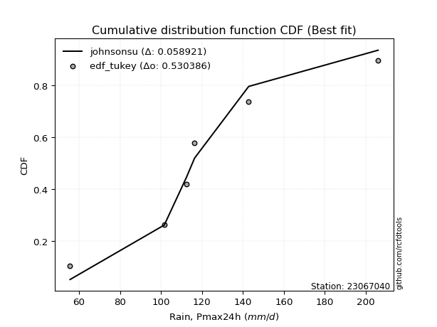</img>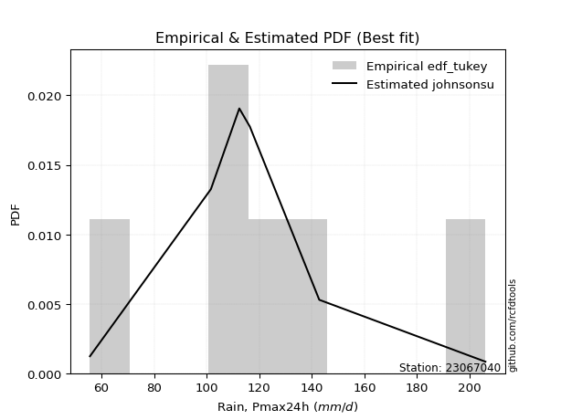</img>

</div>


### 8. Empirical - EDF Gringorten (1963)

Gringorten plotting position formula is essential for estimating the probability and return periods of extreme events like floods and heavy rainfall. The constant _a=0.44_.

<div align="center">


$P=(m-a)/(n+1-2a)$


</div>


**8.1. Empirical values**

<div align="center">

|                | 0                   | 1                   | 2                  | 3              | 4                  | 5                  | 6                  |
|:---------------|:--------------------|:--------------------|:-------------------|:---------------|:-------------------|:-------------------|:-------------------|
| date           | 2023                | 2025                | 2021               | 2020           | 2022               | 2019               | 2024               |
| x              | 55.6                | 60.8                | 101.6              | 112.4          | 116.4              | 142.8              | 206.0              |
| m              | 1                   | 2                   | 3                  | 4              | 5                  | 6                  | 7                  |
| empirical_dist | edf_gringorten      | edf_gringorten      | edf_gringorten     | edf_gringorten | edf_gringorten     | edf_gringorten     | edf_gringorten     |
| empirical      | 0.07865168539325844 | 0.21910112359550563 | 0.3595505617977528 | 0.5            | 0.6404494382022471 | 0.7808988764044943 | 0.9213483146067415 |
| empirical_tr   | 1.0853658536585364  | 1.2805755395683454  | 1.5614035087719298 | 2.0            | 2.781249999999999  | 4.564102564102562  | 12.714285714285701 |

</div>


**8.2. Kolmogorov-Smirnov fit test (sorted by Δ)**


<div align="center">

|                | 0                   | 1                   | 2                   | 3                   | 4                   | 5                   | 6                   | 7                   | 8                   | 9                   | 10                  | 11                  | 12                  | 13                  | 14                  | 15                  | 16                  | 17                  | 18                    | 19                  | 20                  | 21                  | 22                  | 23                  | 24                  | 25                  | 26                  | 27                  | 28                  | 29                  | 30                  | 31                  | 32                  | 33                  | 34                  | 35                  | 36                  | 37                  | 38                  | 39                  | 40                  | 41                  | 42                  | 43                  | 44                  | 45                  | 46                  | 47                  | 48                  | 49                  | 50                  | 51                  | 52                  | 53                  | 54                  | 55                  | 56                  | 57                  | 58                  | 59                  | 60                  | 61                  | 62                  | 63                  | 64                  | 65                  | 66                  | 67                  | 68                  | 69                  | 70                  | 71                  | 72                  | 73                  | 74                  | 75                  | 76                  | 77                  | 78                  | 79                  | 80                  | 81                  | 82                  | 83                  | 84                  | 85                  | 86                  | 87                  | 88                  | 89                  |
|:---------------|:--------------------|:--------------------|:--------------------|:--------------------|:--------------------|:--------------------|:--------------------|:--------------------|:--------------------|:--------------------|:--------------------|:--------------------|:--------------------|:--------------------|:--------------------|:--------------------|:--------------------|:--------------------|:----------------------|:--------------------|:--------------------|:--------------------|:--------------------|:--------------------|:--------------------|:--------------------|:--------------------|:--------------------|:--------------------|:--------------------|:--------------------|:--------------------|:--------------------|:--------------------|:--------------------|:--------------------|:--------------------|:--------------------|:--------------------|:--------------------|:--------------------|:--------------------|:--------------------|:--------------------|:--------------------|:--------------------|:--------------------|:--------------------|:--------------------|:--------------------|:--------------------|:--------------------|:--------------------|:--------------------|:--------------------|:--------------------|:--------------------|:--------------------|:--------------------|:--------------------|:--------------------|:--------------------|:--------------------|:--------------------|:--------------------|:--------------------|:--------------------|:--------------------|:--------------------|:--------------------|:--------------------|:--------------------|:--------------------|:--------------------|:--------------------|:--------------------|:--------------------|:--------------------|:--------------------|:--------------------|:--------------------|:--------------------|:--------------------|:--------------------|:--------------------|:--------------------|:--------------------|:--------------------|:--------------------|:--------------------|
| station        | 23067040            | 23067040            | 23067040            | 23067040            | 23067040            | 23067040            | 23067040            | 23067040            | 23067040            | 23067040            | 23067040            | 23067040            | 23067040            | 23067040            | 23067040            | 23067040            | 23067040            | 23067040            | 23067040              | 23067040            | 23067040            | 23067040            | 23067040            | 23067040            | 23067040            | 23067040            | 23067040            | 23067040            | 23067040            | 23067040            | 23067040            | 23067040            | 23067040            | 23067040            | 23067040            | 23067040            | 23067040            | 23067040            | 23067040            | 23067040            | 23067040            | 23067040            | 23067040            | 23067040            | 23067040            | 23067040            | 23067040            | 23067040            | 23067040            | 23067040            | 23067040            | 23067040            | 23067040            | 23067040            | 23067040            | 23067040            | 23067040            | 23067040            | 23067040            | 23067040            | 23067040            | 23067040            | 23067040            | 23067040            | 23067040            | 23067040            | 23067040            | 23067040            | 23067040            | 23067040            | 23067040            | 23067040            | 23067040            | 23067040            | 23067040            | 23067040            | 23067040            | 23067040            | 23067040            | 23067040            | 23067040            | 23067040            | 23067040            | 23067040            | 23067040            | 23067040            | 23067040            | 23067040            | 23067040            | 23067040            |
| empirical_dist | edf_gringorten      | edf_gringorten      | edf_gringorten      | edf_gringorten      | edf_gringorten      | edf_gringorten      | edf_gringorten      | edf_gringorten      | edf_gringorten      | edf_gringorten      | edf_gringorten      | edf_gringorten      | edf_gringorten      | edf_gringorten      | edf_gringorten      | edf_gringorten      | edf_gringorten      | edf_gringorten      | edf_gringorten        | edf_gringorten      | edf_gringorten      | edf_gringorten      | edf_gringorten      | edf_gringorten      | edf_gringorten      | edf_gringorten      | edf_gringorten      | edf_gringorten      | edf_gringorten      | edf_gringorten      | edf_gringorten      | edf_gringorten      | edf_gringorten      | edf_gringorten      | edf_gringorten      | edf_gringorten      | edf_gringorten      | edf_gringorten      | edf_gringorten      | edf_gringorten      | edf_gringorten      | edf_gringorten      | edf_gringorten      | edf_gringorten      | edf_gringorten      | edf_gringorten      | edf_gringorten      | edf_gringorten      | edf_gringorten      | edf_gringorten      | edf_gringorten      | edf_gringorten      | edf_gringorten      | edf_gringorten      | edf_gringorten      | edf_gringorten      | edf_gringorten      | edf_gringorten      | edf_gringorten      | edf_gringorten      | edf_gringorten      | edf_gringorten      | edf_gringorten      | edf_gringorten      | edf_gringorten      | edf_gringorten      | edf_gringorten      | edf_gringorten      | edf_gringorten      | edf_gringorten      | edf_gringorten      | edf_gringorten      | edf_gringorten      | edf_gringorten      | edf_gringorten      | edf_gringorten      | edf_gringorten      | edf_gringorten      | edf_gringorten      | edf_gringorten      | edf_gringorten      | edf_gringorten      | edf_gringorten      | edf_gringorten      | edf_gringorten      | edf_gringorten      | edf_gringorten      | edf_gringorten      | edf_gringorten      | edf_gringorten      |
| p_dist         | maxwell             | rayleigh            | pearson3            | laplace_asymmetric  | logmielke           | loggenlogistic      | hypsecant           | exponnorm           | logloggamma         | genlogistic         | loggumbel_l         | alpha               | logistic            | logpearson3         | kstwobign           | invgamma            | laplace             | nct                 | loglaplace_asymmetric | t                   | crystalball         | norm                | logexponnorm        | logjohnsonsu        | logt                | lognorm             | lognorm             | logcrystalball      | logf                | lognct              | logfatiguelife      | logfisk             | logncf              | fisk                | halfnorm            | ncf                 | logerlang           | loggamma            | loggamma            | gumbel_r            | rice                | loglogistic         | logbetaprime        | truncnorm           | loghypsecant        | johnsonsu           | loginvgamma         | loglaplace          | betaprime           | logalpha            | logrice             | logweibull_min      | invgauss            | loginvgauss         | logmaxwell          | moyal               | loggompertz         | gompertz            | lograyleigh         | mielke              | halflogistic        | loginvweibull       | gumbel_l            | loggumbel_r         | genexpon            | expon               | logchi2             | logkstwobign        | loghalfnorm         | f                   | logmoyal            | loghalflogistic     | wald                | gibrat              | loggenexpon         | logexpon            | weibull_min         | logwald             | loggibrat           | erlang              | pareto              | gamma               | logpareto           | logtruncnorm        | loglognorm          | nakagami            | lognakagami         | fatiguelife         | invweibull          | chi2                |
| delta          | 0.08938552148397061 | 0.09172711689220922 | 0.0989082472544724  | 0.10688644362466514 | 0.10954059135407224 | 0.11088645979030376 | 0.11152690966568424 | 0.11282120797054379 | 0.11306656700385598 | 0.11339577874879282 | 0.11394452872700206 | 0.11416255470694611 | 0.11420757380031088 | 0.11431328229237911 | 0.11513540312377303 | 0.11590197545363404 | 0.11597231437962416 | 0.11635266115474573 | 0.11648848373928385   | 0.11735313800945446 | 0.11735368575734662 | 0.11735369579233668 | 0.11796641280016623 | 0.11796727912265725 | 0.11796761253696231 | 0.11796768830231508 | 0.11796768830231508 | 0.11796769174430072 | 0.11876435283226133 | 0.11898937108308694 | 0.119208847299766   | 0.11936754367860497 | 0.1196178126453099  | 0.12010444941982083 | 0.12112834991148147 | 0.12205168943895656 | 0.12250621189129968 | 0.12368603378839593 | 0.12368603378839593 | 0.12373810933585944 | 0.12669987571465258 | 0.1272381082164176  | 0.12912294675250363 | 0.13194881989330187 | 0.1321128112537677  | 0.1329860006533511  | 0.1346457825580163  | 0.1353166836899137  | 0.13751623820204517 | 0.1397076073558539  | 0.14018120514503557 | 0.14078525751080107 | 0.14637262642952553 | 0.14765140352946726 | 0.151772285599871   | 0.15194833627552928 | 0.1538056249223489  | 0.1557011542430495  | 0.16323273176481878 | 0.16398188574270267 | 0.1787866684203704  | 0.1794039864314434  | 0.18665513887075824 | 0.18730797743707295 | 0.18756488248145853 | 0.18765762590799406 | 0.18830186991669784 | 0.1952327552883376  | 0.1955198822468177  | 0.2108254624542213  | 0.2131476619834678  | 0.21910112359550563 | 0.21910112359550563 | 0.21910112359550563 | 0.22640316931299065 | 0.25821816169542233 | 0.26350062688370113 | 0.2850770722392123  | 0.30437828213567775 | 0.32021681069707264 | 0.3294973163878956  | 0.3376698344129707  | 0.35557447848785007 | 0.35954547976768697 | 0.3804895719102337  | 0.4349259059539895  | 0.43520809320864895 | 0.4656321794262551  | 0.46821323680189936 | 0.5676691480149424  |
| deltao         | 0.48442053926100004 | 0.48442053926100004 | 0.48442053926100004 | 0.48442053926100004 | 0.48442053926100004 | 0.48442053926100004 | 0.48442053926100004 | 0.48442053926100004 | 0.48442053926100004 | 0.48442053926100004 | 0.48442053926100004 | 0.48442053926100004 | 0.48442053926100004 | 0.48442053926100004 | 0.48442053926100004 | 0.48442053926100004 | 0.48442053926100004 | 0.48442053926100004 | 0.48442053926100004   | 0.48442053926100004 | 0.48442053926100004 | 0.48442053926100004 | 0.48442053926100004 | 0.48442053926100004 | 0.48442053926100004 | 0.48442053926100004 | 0.48442053926100004 | 0.48442053926100004 | 0.48442053926100004 | 0.48442053926100004 | 0.48442053926100004 | 0.48442053926100004 | 0.48442053926100004 | 0.48442053926100004 | 0.48442053926100004 | 0.48442053926100004 | 0.48442053926100004 | 0.48442053926100004 | 0.48442053926100004 | 0.48442053926100004 | 0.48442053926100004 | 0.48442053926100004 | 0.48442053926100004 | 0.48442053926100004 | 0.48442053926100004 | 0.48442053926100004 | 0.48442053926100004 | 0.48442053926100004 | 0.48442053926100004 | 0.48442053926100004 | 0.48442053926100004 | 0.48442053926100004 | 0.48442053926100004 | 0.48442053926100004 | 0.48442053926100004 | 0.48442053926100004 | 0.48442053926100004 | 0.48442053926100004 | 0.48442053926100004 | 0.48442053926100004 | 0.48442053926100004 | 0.48442053926100004 | 0.48442053926100004 | 0.48442053926100004 | 0.48442053926100004 | 0.48442053926100004 | 0.48442053926100004 | 0.48442053926100004 | 0.48442053926100004 | 0.48442053926100004 | 0.48442053926100004 | 0.48442053926100004 | 0.48442053926100004 | 0.48442053926100004 | 0.48442053926100004 | 0.48442053926100004 | 0.48442053926100004 | 0.48442053926100004 | 0.48442053926100004 | 0.48442053926100004 | 0.48442053926100004 | 0.48442053926100004 | 0.48442053926100004 | 0.48442053926100004 | 0.48442053926100004 | 0.48442053926100004 | 0.48442053926100004 | 0.48442053926100004 | 0.48442053926100004 | 0.48442053926100004 |
| eval           | Δo > Δ              | Δo > Δ              | Δo > Δ              | Δo > Δ              | Δo > Δ              | Δo > Δ              | Δo > Δ              | Δo > Δ              | Δo > Δ              | Δo > Δ              | Δo > Δ              | Δo > Δ              | Δo > Δ              | Δo > Δ              | Δo > Δ              | Δo > Δ              | Δo > Δ              | Δo > Δ              | Δo > Δ                | Δo > Δ              | Δo > Δ              | Δo > Δ              | Δo > Δ              | Δo > Δ              | Δo > Δ              | Δo > Δ              | Δo > Δ              | Δo > Δ              | Δo > Δ              | Δo > Δ              | Δo > Δ              | Δo > Δ              | Δo > Δ              | Δo > Δ              | Δo > Δ              | Δo > Δ              | Δo > Δ              | Δo > Δ              | Δo > Δ              | Δo > Δ              | Δo > Δ              | Δo > Δ              | Δo > Δ              | Δo > Δ              | Δo > Δ              | Δo > Δ              | Δo > Δ              | Δo > Δ              | Δo > Δ              | Δo > Δ              | Δo > Δ              | Δo > Δ              | Δo > Δ              | Δo > Δ              | Δo > Δ              | Δo > Δ              | Δo > Δ              | Δo > Δ              | Δo > Δ              | Δo > Δ              | Δo > Δ              | Δo > Δ              | Δo > Δ              | Δo > Δ              | Δo > Δ              | Δo > Δ              | Δo > Δ              | Δo > Δ              | Δo > Δ              | Δo > Δ              | Δo > Δ              | Δo > Δ              | Δo > Δ              | Δo > Δ              | Δo > Δ              | Δo > Δ              | Δo > Δ              | Δo > Δ              | Δo > Δ              | Δo > Δ              | Δo > Δ              | Δo > Δ              | Δo > Δ              | Δo > Δ              | Δo > Δ              | Δo > Δ              | Δo > Δ              | Δo > Δ              | Δo > Δ              | Δo <= Δ             |
| fit            | 1                   | 1                   | 1                   | 1                   | 1                   | 1                   | 1                   | 1                   | 1                   | 1                   | 1                   | 1                   | 1                   | 1                   | 1                   | 1                   | 1                   | 1                   | 1                     | 1                   | 1                   | 1                   | 1                   | 1                   | 1                   | 1                   | 1                   | 1                   | 1                   | 1                   | 1                   | 1                   | 1                   | 1                   | 1                   | 1                   | 1                   | 1                   | 1                   | 1                   | 1                   | 1                   | 1                   | 1                   | 1                   | 1                   | 1                   | 1                   | 1                   | 1                   | 1                   | 1                   | 1                   | 1                   | 1                   | 1                   | 1                   | 1                   | 1                   | 1                   | 1                   | 1                   | 1                   | 1                   | 1                   | 1                   | 1                   | 1                   | 1                   | 1                   | 1                   | 1                   | 1                   | 1                   | 1                   | 1                   | 1                   | 1                   | 1                   | 1                   | 1                   | 1                   | 1                   | 1                   | 1                   | 1                   | 1                   | 1                   | 1                   | 0                   |
| n              | 7                   | 7                   | 7                   | 7                   | 7                   | 7                   | 7                   | 7                   | 7                   | 7                   | 7                   | 7                   | 7                   | 7                   | 7                   | 7                   | 7                   | 7                   | 7                     | 7                   | 7                   | 7                   | 7                   | 7                   | 7                   | 7                   | 7                   | 7                   | 7                   | 7                   | 7                   | 7                   | 7                   | 7                   | 7                   | 7                   | 7                   | 7                   | 7                   | 7                   | 7                   | 7                   | 7                   | 7                   | 7                   | 7                   | 7                   | 7                   | 7                   | 7                   | 7                   | 7                   | 7                   | 7                   | 7                   | 7                   | 7                   | 7                   | 7                   | 7                   | 7                   | 7                   | 7                   | 7                   | 7                   | 7                   | 7                   | 7                   | 7                   | 7                   | 7                   | 7                   | 7                   | 7                   | 7                   | 7                   | 7                   | 7                   | 7                   | 7                   | 7                   | 7                   | 7                   | 7                   | 7                   | 7                   | 7                   | 7                   | 7                   | 7                   |
| best_fit       | 1                   | 0                   | 0                   | 0                   | 0                   | 0                   | 0                   | 0                   | 0                   | 0                   | 0                   | 0                   | 0                   | 0                   | 0                   | 0                   | 0                   | 0                   | 0                     | 0                   | 0                   | 0                   | 0                   | 0                   | 0                   | 0                   | 0                   | 0                   | 0                   | 0                   | 0                   | 0                   | 0                   | 0                   | 0                   | 0                   | 0                   | 0                   | 0                   | 0                   | 0                   | 0                   | 0                   | 0                   | 0                   | 0                   | 0                   | 0                   | 0                   | 0                   | 0                   | 0                   | 0                   | 0                   | 0                   | 0                   | 0                   | 0                   | 0                   | 0                   | 0                   | 0                   | 0                   | 0                   | 0                   | 0                   | 0                   | 0                   | 0                   | 0                   | 0                   | 0                   | 0                   | 0                   | 0                   | 0                   | 0                   | 0                   | 0                   | 0                   | 0                   | 0                   | 0                   | 0                   | 0                   | 0                   | 0                   | 0                   | 0                   | 0                   |
| best_fit_sort  | 1                   | 2                   | 3                   | 4                   | 5                   | 6                   | 7                   | 8                   | 9                   | 10                  | 11                  | 12                  | 13                  | 14                  | 15                  | 16                  | 17                  | 18                  | 19                    | 20                  | 21                  | 22                  | 23                  | 24                  | 25                  | 26                  | 27                  | 28                  | 29                  | 30                  | 31                  | 32                  | 33                  | 34                  | 35                  | 36                  | 37                  | 38                  | 39                  | 40                  | 41                  | 42                  | 43                  | 44                  | 45                  | 46                  | 47                  | 48                  | 49                  | 50                  | 51                  | 52                  | 53                  | 54                  | 55                  | 56                  | 57                  | 58                  | 59                  | 60                  | 61                  | 62                  | 63                  | 64                  | 65                  | 66                  | 67                  | 68                  | 69                  | 70                  | 71                  | 72                  | 73                  | 74                  | 75                  | 76                  | 77                  | 78                  | 79                  | 80                  | 81                  | 82                  | 83                  | 84                  | 85                  | 86                  | 87                  | 88                  | 89                  | 90                  |

</div>


<div align="center">

</img>

</div>


**8.3. Best fit**

<div align="center">

|   id |   station | empirical_dist   | p_dist   |     delta |   deltao | eval   |   fit |   n |   best_fit |   best_fit_sort |
|-----:|----------:|:-----------------|:---------|----------:|---------:|:-------|------:|----:|-----------:|----------------:|
|    0 |  23067040 | edf_gringorten   | maxwell  | 0.0893855 | 0.484421 | Δo > Δ |     1 |   7 |          1 |               1 |

</div>


<div align="center">

</img>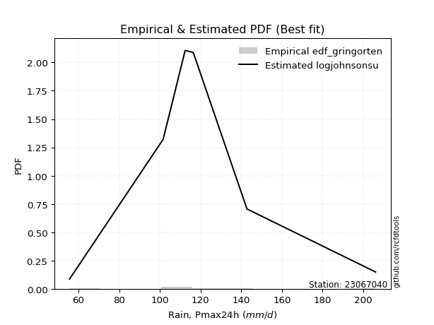</img>

</div>


### 9. Empirical - EDF Filliben (1975)

The specific values of the constants (0.3175) (often denoted as $alpha$) and (0.365) are derived from a method proposed by James J. Filliben in a 1975 paper. This particular formula is the mean value of the $i$-th order statistic of the normal distribution and is considered a robust and effective plotting position formula for the normal probability plot correlation coefficient test for normality.

<div align="center">


$P=(m-0.3175)/(n+0.365)$


</div>


**9.1. Empirical values**

<div align="center">

|                | 0                   | 1                   | 2                   | 3            | 4                  | 5                  | 6                  |
|:---------------|:--------------------|:--------------------|:--------------------|:-------------|:-------------------|:-------------------|:-------------------|
| date           | 2023                | 2025                | 2021                | 2020         | 2022               | 2019               | 2024               |
| x              | 55.6                | 60.8                | 101.6               | 112.4        | 116.4              | 142.8              | 206.0              |
| m              | 1                   | 2                   | 3                   | 4            | 5                  | 6                  | 7                  |
| empirical_dist | edf_filliben        | edf_filliben        | edf_filliben        | edf_filliben | edf_filliben       | edf_filliben       | edf_filliben       |
| empirical      | 0.09266802443991853 | 0.22844534962661237 | 0.36422267481330617 | 0.5          | 0.6357773251866938 | 0.7715546503733877 | 0.9073319755600815 |
| empirical_tr   | 1.1021324354657687  | 1.2960844698636163  | 1.5728777362520021  | 2.0          | 2.7455731593662627 | 4.377414561664191  | 10.791208791208794 |

</div>


**9.2. Kolmogorov-Smirnov fit test (sorted by Δ)**


<div align="center">

|                | 0                   | 1                   | 2                   | 3                   | 4                   | 5                   | 6                   | 7                   | 8                   | 9                   | 10                  | 11                  | 12                  | 13                  | 14                  | 15                  | 16                  | 17                  | 18                  | 19                  | 20                  | 21                  | 22                  | 23                  | 24                  | 25                  | 26                  | 27                  | 28                  | 29                  | 30                  | 31                  | 32                  | 33                  | 34                  | 35                    | 36                  | 37                  | 38                  | 39                  | 40                  | 41                  | 42                  | 43                  | 44                  | 45                  | 46                  | 47                  | 48                  | 49                  | 50                  | 51                  | 52                  | 53                  | 54                  | 55                  | 56                  | 57                  | 58                  | 59                  | 60                  | 61                  | 62                  | 63                  | 64                  | 65                  | 66                  | 67                  | 68                  | 69                  | 70                  | 71                  | 72                  | 73                  | 74                  | 75                  | 76                  | 77                  | 78                  | 79                  | 80                  | 81                  | 82                  | 83                  | 84                  | 85                  | 86                  | 87                  | 88                  | 89                  |
|:---------------|:--------------------|:--------------------|:--------------------|:--------------------|:--------------------|:--------------------|:--------------------|:--------------------|:--------------------|:--------------------|:--------------------|:--------------------|:--------------------|:--------------------|:--------------------|:--------------------|:--------------------|:--------------------|:--------------------|:--------------------|:--------------------|:--------------------|:--------------------|:--------------------|:--------------------|:--------------------|:--------------------|:--------------------|:--------------------|:--------------------|:--------------------|:--------------------|:--------------------|:--------------------|:--------------------|:----------------------|:--------------------|:--------------------|:--------------------|:--------------------|:--------------------|:--------------------|:--------------------|:--------------------|:--------------------|:--------------------|:--------------------|:--------------------|:--------------------|:--------------------|:--------------------|:--------------------|:--------------------|:--------------------|:--------------------|:--------------------|:--------------------|:--------------------|:--------------------|:--------------------|:--------------------|:--------------------|:--------------------|:--------------------|:--------------------|:--------------------|:--------------------|:--------------------|:--------------------|:--------------------|:--------------------|:--------------------|:--------------------|:--------------------|:--------------------|:--------------------|:--------------------|:--------------------|:--------------------|:--------------------|:--------------------|:--------------------|:--------------------|:--------------------|:--------------------|:--------------------|:--------------------|:--------------------|:--------------------|:--------------------|
| station        | 23067040            | 23067040            | 23067040            | 23067040            | 23067040            | 23067040            | 23067040            | 23067040            | 23067040            | 23067040            | 23067040            | 23067040            | 23067040            | 23067040            | 23067040            | 23067040            | 23067040            | 23067040            | 23067040            | 23067040            | 23067040            | 23067040            | 23067040            | 23067040            | 23067040            | 23067040            | 23067040            | 23067040            | 23067040            | 23067040            | 23067040            | 23067040            | 23067040            | 23067040            | 23067040            | 23067040              | 23067040            | 23067040            | 23067040            | 23067040            | 23067040            | 23067040            | 23067040            | 23067040            | 23067040            | 23067040            | 23067040            | 23067040            | 23067040            | 23067040            | 23067040            | 23067040            | 23067040            | 23067040            | 23067040            | 23067040            | 23067040            | 23067040            | 23067040            | 23067040            | 23067040            | 23067040            | 23067040            | 23067040            | 23067040            | 23067040            | 23067040            | 23067040            | 23067040            | 23067040            | 23067040            | 23067040            | 23067040            | 23067040            | 23067040            | 23067040            | 23067040            | 23067040            | 23067040            | 23067040            | 23067040            | 23067040            | 23067040            | 23067040            | 23067040            | 23067040            | 23067040            | 23067040            | 23067040            | 23067040            |
| empirical_dist | edf_filliben        | edf_filliben        | edf_filliben        | edf_filliben        | edf_filliben        | edf_filliben        | edf_filliben        | edf_filliben        | edf_filliben        | edf_filliben        | edf_filliben        | edf_filliben        | edf_filliben        | edf_filliben        | edf_filliben        | edf_filliben        | edf_filliben        | edf_filliben        | edf_filliben        | edf_filliben        | edf_filliben        | edf_filliben        | edf_filliben        | edf_filliben        | edf_filliben        | edf_filliben        | edf_filliben        | edf_filliben        | edf_filliben        | edf_filliben        | edf_filliben        | edf_filliben        | edf_filliben        | edf_filliben        | edf_filliben        | edf_filliben          | edf_filliben        | edf_filliben        | edf_filliben        | edf_filliben        | edf_filliben        | edf_filliben        | edf_filliben        | edf_filliben        | edf_filliben        | edf_filliben        | edf_filliben        | edf_filliben        | edf_filliben        | edf_filliben        | edf_filliben        | edf_filliben        | edf_filliben        | edf_filliben        | edf_filliben        | edf_filliben        | edf_filliben        | edf_filliben        | edf_filliben        | edf_filliben        | edf_filliben        | edf_filliben        | edf_filliben        | edf_filliben        | edf_filliben        | edf_filliben        | edf_filliben        | edf_filliben        | edf_filliben        | edf_filliben        | edf_filliben        | edf_filliben        | edf_filliben        | edf_filliben        | edf_filliben        | edf_filliben        | edf_filliben        | edf_filliben        | edf_filliben        | edf_filliben        | edf_filliben        | edf_filliben        | edf_filliben        | edf_filliben        | edf_filliben        | edf_filliben        | edf_filliben        | edf_filliben        | edf_filliben        | edf_filliben        |
| p_dist         | maxwell             | rayleigh            | pearson3            | logistic            | t                   | crystalball         | norm                | laplace_asymmetric  | ncf                 | logmielke           | hypsecant           | loggenlogistic      | exponnorm           | logloggamma         | genlogistic         | loggumbel_l         | alpha               | logpearson3         | logbetaprime        | kstwobign           | lognct              | logncf              | logcrystalball      | lognorm             | lognorm             | logt                | logexponnorm        | logjohnsonsu        | invgamma            | loggamma            | loggamma            | laplace             | logf                | logfatiguelife      | nct                 | loglaplace_asymmetric | logerlang           | truncnorm           | johnsonsu           | logfisk             | halfnorm            | fisk                | loginvgamma         | betaprime           | gumbel_r            | logalpha            | rice                | logweibull_min      | loglogistic         | logrice             | loghypsecant        | invgauss            | loginvgauss         | loglaplace          | logmaxwell          | lograyleigh         | mielke              | moyal               | loggompertz         | gompertz            | loginvweibull       | logchi2             | gumbel_l            | loggumbel_r         | genexpon            | expon               | halflogistic        | logkstwobign        | loghalfnorm         | f                   | logmoyal            | loggenexpon         | loghalflogistic     | wald                | gibrat              | logexpon            | weibull_min         | logwald             | loggibrat           | erlang              | pareto              | gamma               | logpareto           | logtruncnorm        | loglognorm          | nakagami            | lognakagami         | invweibull          | fatiguelife         | chi2                |
| delta          | 0.09872974751507735 | 0.10107134292331596 | 0.10825247328557915 | 0.11180846244781525 | 0.1126810249939012  | 0.11268157274179336 | 0.11268158277678342 | 0.11623066965577188 | 0.11737957642340319 | 0.11888481738517898 | 0.11927750070704611 | 0.1202306858214105  | 0.12216543400165053 | 0.12241079303496272 | 0.12274000477989956 | 0.1232887547581088  | 0.12350678073805285 | 0.12365750832348585 | 0.12445083373695026 | 0.12447962915487977 | 0.12470256654443433 | 0.12481647501243813 | 0.12517731990638647 | 0.1251773204595816  | 0.1251773204595816  | 0.1251778803435062  | 0.12517825063251947 | 0.1251791520206881  | 0.12524620148474078 | 0.12530201863586798 | 0.12530201863586798 | 0.1253165404107309  | 0.1253914442814646  | 0.12565454172646948 | 0.12569688718585248 | 0.12583270977039057   | 0.12606813887252521 | 0.1272767068777486  | 0.12831388763779772 | 0.1287117697097117  | 0.12897533801993355 | 0.12944867545092759 | 0.12997366954246292 | 0.1328441251864918  | 0.13308233536696618 | 0.13503549434030054 | 0.13604410174575932 | 0.1361131444952477  | 0.13658233424752433 | 0.14003219929118704 | 0.14145703728487444 | 0.14170051341397216 | 0.1429792905139139  | 0.14466090972102044 | 0.14710017258431762 | 0.15856061874926541 | 0.1593097727271493  | 0.16129256230663602 | 0.16314985095345563 | 0.16504538027415624 | 0.17473187341589003 | 0.1769890682902313  | 0.18198302585520498 | 0.18263586442151958 | 0.18289276946590516 | 0.1829855128924407  | 0.18813089445147713 | 0.19056064227278424 | 0.19935918705021302 | 0.20615334943866792 | 0.20847554896791443 | 0.22173105629743728 | 0.22844534962661237 | 0.22844534962661237 | 0.22844534962661237 | 0.25354604867986896 | 0.25882851386814776 | 0.28040495922365893 | 0.2997061691201244  | 0.31554469768151927 | 0.3231384402215567  | 0.33299772139741735 | 0.3462302524567433  | 0.36421759278324034 | 0.37114534587912695 | 0.43025379293843613 | 0.4305359801930956  | 0.45419689775523936 | 0.46096006641070175 | 0.562997034999389   |
| deltao         | 0.48442053926100004 | 0.48442053926100004 | 0.48442053926100004 | 0.48442053926100004 | 0.48442053926100004 | 0.48442053926100004 | 0.48442053926100004 | 0.48442053926100004 | 0.48442053926100004 | 0.48442053926100004 | 0.48442053926100004 | 0.48442053926100004 | 0.48442053926100004 | 0.48442053926100004 | 0.48442053926100004 | 0.48442053926100004 | 0.48442053926100004 | 0.48442053926100004 | 0.48442053926100004 | 0.48442053926100004 | 0.48442053926100004 | 0.48442053926100004 | 0.48442053926100004 | 0.48442053926100004 | 0.48442053926100004 | 0.48442053926100004 | 0.48442053926100004 | 0.48442053926100004 | 0.48442053926100004 | 0.48442053926100004 | 0.48442053926100004 | 0.48442053926100004 | 0.48442053926100004 | 0.48442053926100004 | 0.48442053926100004 | 0.48442053926100004   | 0.48442053926100004 | 0.48442053926100004 | 0.48442053926100004 | 0.48442053926100004 | 0.48442053926100004 | 0.48442053926100004 | 0.48442053926100004 | 0.48442053926100004 | 0.48442053926100004 | 0.48442053926100004 | 0.48442053926100004 | 0.48442053926100004 | 0.48442053926100004 | 0.48442053926100004 | 0.48442053926100004 | 0.48442053926100004 | 0.48442053926100004 | 0.48442053926100004 | 0.48442053926100004 | 0.48442053926100004 | 0.48442053926100004 | 0.48442053926100004 | 0.48442053926100004 | 0.48442053926100004 | 0.48442053926100004 | 0.48442053926100004 | 0.48442053926100004 | 0.48442053926100004 | 0.48442053926100004 | 0.48442053926100004 | 0.48442053926100004 | 0.48442053926100004 | 0.48442053926100004 | 0.48442053926100004 | 0.48442053926100004 | 0.48442053926100004 | 0.48442053926100004 | 0.48442053926100004 | 0.48442053926100004 | 0.48442053926100004 | 0.48442053926100004 | 0.48442053926100004 | 0.48442053926100004 | 0.48442053926100004 | 0.48442053926100004 | 0.48442053926100004 | 0.48442053926100004 | 0.48442053926100004 | 0.48442053926100004 | 0.48442053926100004 | 0.48442053926100004 | 0.48442053926100004 | 0.48442053926100004 | 0.48442053926100004 |
| eval           | Δo > Δ              | Δo > Δ              | Δo > Δ              | Δo > Δ              | Δo > Δ              | Δo > Δ              | Δo > Δ              | Δo > Δ              | Δo > Δ              | Δo > Δ              | Δo > Δ              | Δo > Δ              | Δo > Δ              | Δo > Δ              | Δo > Δ              | Δo > Δ              | Δo > Δ              | Δo > Δ              | Δo > Δ              | Δo > Δ              | Δo > Δ              | Δo > Δ              | Δo > Δ              | Δo > Δ              | Δo > Δ              | Δo > Δ              | Δo > Δ              | Δo > Δ              | Δo > Δ              | Δo > Δ              | Δo > Δ              | Δo > Δ              | Δo > Δ              | Δo > Δ              | Δo > Δ              | Δo > Δ                | Δo > Δ              | Δo > Δ              | Δo > Δ              | Δo > Δ              | Δo > Δ              | Δo > Δ              | Δo > Δ              | Δo > Δ              | Δo > Δ              | Δo > Δ              | Δo > Δ              | Δo > Δ              | Δo > Δ              | Δo > Δ              | Δo > Δ              | Δo > Δ              | Δo > Δ              | Δo > Δ              | Δo > Δ              | Δo > Δ              | Δo > Δ              | Δo > Δ              | Δo > Δ              | Δo > Δ              | Δo > Δ              | Δo > Δ              | Δo > Δ              | Δo > Δ              | Δo > Δ              | Δo > Δ              | Δo > Δ              | Δo > Δ              | Δo > Δ              | Δo > Δ              | Δo > Δ              | Δo > Δ              | Δo > Δ              | Δo > Δ              | Δo > Δ              | Δo > Δ              | Δo > Δ              | Δo > Δ              | Δo > Δ              | Δo > Δ              | Δo > Δ              | Δo > Δ              | Δo > Δ              | Δo > Δ              | Δo > Δ              | Δo > Δ              | Δo > Δ              | Δo > Δ              | Δo > Δ              | Δo <= Δ             |
| fit            | 1                   | 1                   | 1                   | 1                   | 1                   | 1                   | 1                   | 1                   | 1                   | 1                   | 1                   | 1                   | 1                   | 1                   | 1                   | 1                   | 1                   | 1                   | 1                   | 1                   | 1                   | 1                   | 1                   | 1                   | 1                   | 1                   | 1                   | 1                   | 1                   | 1                   | 1                   | 1                   | 1                   | 1                   | 1                   | 1                     | 1                   | 1                   | 1                   | 1                   | 1                   | 1                   | 1                   | 1                   | 1                   | 1                   | 1                   | 1                   | 1                   | 1                   | 1                   | 1                   | 1                   | 1                   | 1                   | 1                   | 1                   | 1                   | 1                   | 1                   | 1                   | 1                   | 1                   | 1                   | 1                   | 1                   | 1                   | 1                   | 1                   | 1                   | 1                   | 1                   | 1                   | 1                   | 1                   | 1                   | 1                   | 1                   | 1                   | 1                   | 1                   | 1                   | 1                   | 1                   | 1                   | 1                   | 1                   | 1                   | 1                   | 0                   |
| n              | 7                   | 7                   | 7                   | 7                   | 7                   | 7                   | 7                   | 7                   | 7                   | 7                   | 7                   | 7                   | 7                   | 7                   | 7                   | 7                   | 7                   | 7                   | 7                   | 7                   | 7                   | 7                   | 7                   | 7                   | 7                   | 7                   | 7                   | 7                   | 7                   | 7                   | 7                   | 7                   | 7                   | 7                   | 7                   | 7                     | 7                   | 7                   | 7                   | 7                   | 7                   | 7                   | 7                   | 7                   | 7                   | 7                   | 7                   | 7                   | 7                   | 7                   | 7                   | 7                   | 7                   | 7                   | 7                   | 7                   | 7                   | 7                   | 7                   | 7                   | 7                   | 7                   | 7                   | 7                   | 7                   | 7                   | 7                   | 7                   | 7                   | 7                   | 7                   | 7                   | 7                   | 7                   | 7                   | 7                   | 7                   | 7                   | 7                   | 7                   | 7                   | 7                   | 7                   | 7                   | 7                   | 7                   | 7                   | 7                   | 7                   | 7                   |
| best_fit       | 1                   | 0                   | 0                   | 0                   | 0                   | 0                   | 0                   | 0                   | 0                   | 0                   | 0                   | 0                   | 0                   | 0                   | 0                   | 0                   | 0                   | 0                   | 0                   | 0                   | 0                   | 0                   | 0                   | 0                   | 0                   | 0                   | 0                   | 0                   | 0                   | 0                   | 0                   | 0                   | 0                   | 0                   | 0                   | 0                     | 0                   | 0                   | 0                   | 0                   | 0                   | 0                   | 0                   | 0                   | 0                   | 0                   | 0                   | 0                   | 0                   | 0                   | 0                   | 0                   | 0                   | 0                   | 0                   | 0                   | 0                   | 0                   | 0                   | 0                   | 0                   | 0                   | 0                   | 0                   | 0                   | 0                   | 0                   | 0                   | 0                   | 0                   | 0                   | 0                   | 0                   | 0                   | 0                   | 0                   | 0                   | 0                   | 0                   | 0                   | 0                   | 0                   | 0                   | 0                   | 0                   | 0                   | 0                   | 0                   | 0                   | 0                   |
| best_fit_sort  | 1                   | 2                   | 3                   | 4                   | 5                   | 6                   | 7                   | 8                   | 9                   | 10                  | 11                  | 12                  | 13                  | 14                  | 15                  | 16                  | 17                  | 18                  | 19                  | 20                  | 21                  | 22                  | 23                  | 24                  | 25                  | 26                  | 27                  | 28                  | 29                  | 30                  | 31                  | 32                  | 33                  | 34                  | 35                  | 36                    | 37                  | 38                  | 39                  | 40                  | 41                  | 42                  | 43                  | 44                  | 45                  | 46                  | 47                  | 48                  | 49                  | 50                  | 51                  | 52                  | 53                  | 54                  | 55                  | 56                  | 57                  | 58                  | 59                  | 60                  | 61                  | 62                  | 63                  | 64                  | 65                  | 66                  | 67                  | 68                  | 69                  | 70                  | 71                  | 72                  | 73                  | 74                  | 75                  | 76                  | 77                  | 78                  | 79                  | 80                  | 81                  | 82                  | 83                  | 84                  | 85                  | 86                  | 87                  | 88                  | 89                  | 90                  |

</div>


<div align="center">

</img>

</div>


**9.3. Best fit**

<div align="center">

|   id |   station | empirical_dist   | p_dist   |     delta |   deltao | eval   |   fit |   n |   best_fit |   best_fit_sort |
|-----:|----------:|:-----------------|:---------|----------:|---------:|:-------|------:|----:|-----------:|----------------:|
|    0 |  23067040 | edf_filliben     | maxwell  | 0.0987297 | 0.484421 | Δo > Δ |     1 |   7 |          1 |               1 |

</div>


<div align="center">

</img>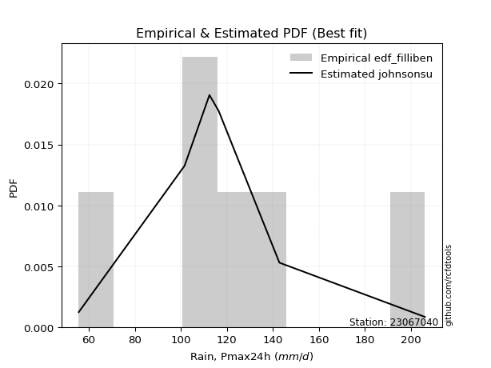</img>

</div>


### 10. Empirical - EDF Jenkinson (1977)

The Jenkinson formula in hydrology is an empirical plotting position formula used to estimate the non-exceedance probability _(P)_ or return period _(T)_ of a given ordered observation within a sample. It is a widely used method in the frequency analysis of extreme events such as floods and rainfall, as it provides a distribution-free way to plot data. _a≈0.31_ and _b≈0.38_ are constants derived to approximate the median of the probability distribution for the given rank.

<div align="center">


$P=(m-a)/(n+b)$


</div>


**10.1. Empirical values**

<div align="center">

|                | 0                   | 1                   | 2                   | 3             | 4                  | 5                  | 6                  |
|:---------------|:--------------------|:--------------------|:--------------------|:--------------|:-------------------|:-------------------|:-------------------|
| date           | 2023                | 2025                | 2021                | 2020          | 2022               | 2019               | 2024               |
| x              | 55.6                | 60.8                | 101.6               | 112.4         | 116.4              | 142.8              | 206.0              |
| m              | 1                   | 2                   | 3                   | 4             | 5                  | 6                  | 7                  |
| empirical_dist | edf_jenkinson       | edf_jenkinson       | edf_jenkinson       | edf_jenkinson | edf_jenkinson      | edf_jenkinson      | edf_jenkinson      |
| empirical      | 0.09349593495934959 | 0.22899728997289973 | 0.36449864498644985 | 0.5           | 0.6355013550135502 | 0.7710027100271003 | 0.9065040650406505 |
| empirical_tr   | 1.1031390134529149  | 1.29701230228471    | 1.5735607675906182  | 2.0           | 2.743494423791822  | 4.366863905325444  | 10.695652173913055 |

</div>


**10.2. Kolmogorov-Smirnov fit test (sorted by Δ)**


<div align="center">

|                | 0                   | 1                   | 2                   | 3                   | 4                   | 5                   | 6                   | 7                   | 8                   | 9                   | 10                  | 11                  | 12                  | 13                  | 14                  | 15                  | 16                  | 17                  | 18                  | 19                  | 20                  | 21                  | 22                  | 23                  | 24                  | 25                  | 26                  | 27                  | 28                  | 29                  | 30                  | 31                  | 32                  | 33                  | 34                  | 35                    | 36                  | 37                  | 38                  | 39                  | 40                  | 41                  | 42                  | 43                  | 44                  | 45                  | 46                  | 47                  | 48                  | 49                  | 50                  | 51                  | 52                  | 53                  | 54                  | 55                  | 56                  | 57                  | 58                  | 59                  | 60                  | 61                  | 62                  | 63                  | 64                  | 65                  | 66                  | 67                  | 68                  | 69                  | 70                  | 71                  | 72                  | 73                  | 74                  | 75                  | 76                  | 77                  | 78                  | 79                  | 80                  | 81                  | 82                  | 83                  | 84                  | 85                  | 86                  | 87                  | 88                  | 89                  |
|:---------------|:--------------------|:--------------------|:--------------------|:--------------------|:--------------------|:--------------------|:--------------------|:--------------------|:--------------------|:--------------------|:--------------------|:--------------------|:--------------------|:--------------------|:--------------------|:--------------------|:--------------------|:--------------------|:--------------------|:--------------------|:--------------------|:--------------------|:--------------------|:--------------------|:--------------------|:--------------------|:--------------------|:--------------------|:--------------------|:--------------------|:--------------------|:--------------------|:--------------------|:--------------------|:--------------------|:----------------------|:--------------------|:--------------------|:--------------------|:--------------------|:--------------------|:--------------------|:--------------------|:--------------------|:--------------------|:--------------------|:--------------------|:--------------------|:--------------------|:--------------------|:--------------------|:--------------------|:--------------------|:--------------------|:--------------------|:--------------------|:--------------------|:--------------------|:--------------------|:--------------------|:--------------------|:--------------------|:--------------------|:--------------------|:--------------------|:--------------------|:--------------------|:--------------------|:--------------------|:--------------------|:--------------------|:--------------------|:--------------------|:--------------------|:--------------------|:--------------------|:--------------------|:--------------------|:--------------------|:--------------------|:--------------------|:--------------------|:--------------------|:--------------------|:--------------------|:--------------------|:--------------------|:--------------------|:--------------------|:--------------------|
| station        | 23067040            | 23067040            | 23067040            | 23067040            | 23067040            | 23067040            | 23067040            | 23067040            | 23067040            | 23067040            | 23067040            | 23067040            | 23067040            | 23067040            | 23067040            | 23067040            | 23067040            | 23067040            | 23067040            | 23067040            | 23067040            | 23067040            | 23067040            | 23067040            | 23067040            | 23067040            | 23067040            | 23067040            | 23067040            | 23067040            | 23067040            | 23067040            | 23067040            | 23067040            | 23067040            | 23067040              | 23067040            | 23067040            | 23067040            | 23067040            | 23067040            | 23067040            | 23067040            | 23067040            | 23067040            | 23067040            | 23067040            | 23067040            | 23067040            | 23067040            | 23067040            | 23067040            | 23067040            | 23067040            | 23067040            | 23067040            | 23067040            | 23067040            | 23067040            | 23067040            | 23067040            | 23067040            | 23067040            | 23067040            | 23067040            | 23067040            | 23067040            | 23067040            | 23067040            | 23067040            | 23067040            | 23067040            | 23067040            | 23067040            | 23067040            | 23067040            | 23067040            | 23067040            | 23067040            | 23067040            | 23067040            | 23067040            | 23067040            | 23067040            | 23067040            | 23067040            | 23067040            | 23067040            | 23067040            | 23067040            |
| empirical_dist | edf_jenkinson       | edf_jenkinson       | edf_jenkinson       | edf_jenkinson       | edf_jenkinson       | edf_jenkinson       | edf_jenkinson       | edf_jenkinson       | edf_jenkinson       | edf_jenkinson       | edf_jenkinson       | edf_jenkinson       | edf_jenkinson       | edf_jenkinson       | edf_jenkinson       | edf_jenkinson       | edf_jenkinson       | edf_jenkinson       | edf_jenkinson       | edf_jenkinson       | edf_jenkinson       | edf_jenkinson       | edf_jenkinson       | edf_jenkinson       | edf_jenkinson       | edf_jenkinson       | edf_jenkinson       | edf_jenkinson       | edf_jenkinson       | edf_jenkinson       | edf_jenkinson       | edf_jenkinson       | edf_jenkinson       | edf_jenkinson       | edf_jenkinson       | edf_jenkinson         | edf_jenkinson       | edf_jenkinson       | edf_jenkinson       | edf_jenkinson       | edf_jenkinson       | edf_jenkinson       | edf_jenkinson       | edf_jenkinson       | edf_jenkinson       | edf_jenkinson       | edf_jenkinson       | edf_jenkinson       | edf_jenkinson       | edf_jenkinson       | edf_jenkinson       | edf_jenkinson       | edf_jenkinson       | edf_jenkinson       | edf_jenkinson       | edf_jenkinson       | edf_jenkinson       | edf_jenkinson       | edf_jenkinson       | edf_jenkinson       | edf_jenkinson       | edf_jenkinson       | edf_jenkinson       | edf_jenkinson       | edf_jenkinson       | edf_jenkinson       | edf_jenkinson       | edf_jenkinson       | edf_jenkinson       | edf_jenkinson       | edf_jenkinson       | edf_jenkinson       | edf_jenkinson       | edf_jenkinson       | edf_jenkinson       | edf_jenkinson       | edf_jenkinson       | edf_jenkinson       | edf_jenkinson       | edf_jenkinson       | edf_jenkinson       | edf_jenkinson       | edf_jenkinson       | edf_jenkinson       | edf_jenkinson       | edf_jenkinson       | edf_jenkinson       | edf_jenkinson       | edf_jenkinson       | edf_jenkinson       |
| p_dist         | maxwell             | rayleigh            | pearson3            | logistic            | t                   | crystalball         | norm                | laplace_asymmetric  | ncf                 | logmielke           | hypsecant           | loggenlogistic      | exponnorm           | logloggamma         | genlogistic         | loggumbel_l         | alpha               | logbetaprime        | logpearson3         | kstwobign           | lognct              | logncf              | logcrystalball      | lognorm             | lognorm             | logt                | logexponnorm        | logjohnsonsu        | invgamma            | loggamma            | loggamma            | laplace             | logf                | logfatiguelife      | nct                 | loglaplace_asymmetric | logerlang           | truncnorm           | johnsonsu           | logfisk             | halfnorm            | loginvgamma         | fisk                | betaprime           | gumbel_r            | logalpha            | logweibull_min      | rice                | loglogistic         | logrice             | invgauss            | loghypsecant        | loginvgauss         | loglaplace          | logmaxwell          | lograyleigh         | mielke              | moyal               | loggompertz         | gompertz            | loginvweibull       | logchi2             | gumbel_l            | loggumbel_r         | genexpon            | expon               | halflogistic        | logkstwobign        | loghalfnorm         | f                   | logmoyal            | loggenexpon         | loghalflogistic     | wald                | gibrat              | logexpon            | weibull_min         | logwald             | loggibrat           | erlang              | pareto              | gamma               | logpareto           | logtruncnorm        | loglognorm          | nakagami            | lognakagami         | invweibull          | fatiguelife         | chi2                |
| delta          | 0.09928168786136471 | 0.10162328326960332 | 0.1088044136318665  | 0.11236040279410262 | 0.11240505482075758 | 0.11240560256864973 | 0.11240561260363979 | 0.11678261000205924 | 0.1171036062502595  | 0.11943675773146634 | 0.11982944105333347 | 0.12078262616769786 | 0.12271737434793789 | 0.12296273338125008 | 0.12329194512618692 | 0.12384069510439616 | 0.12405872108434021 | 0.12417486356380658 | 0.12420944866977321 | 0.12503156950116712 | 0.1252545068907217  | 0.1253684153587255  | 0.12572926025267384 | 0.12572926080586896 | 0.12572926080586896 | 0.12572982068979355 | 0.12573019097880683 | 0.12573109236697547 | 0.12579814183102814 | 0.12585395898215535 | 0.12585395898215535 | 0.12586848075701826 | 0.12594338462775195 | 0.12620648207275684 | 0.12624882753213984 | 0.12638465011667793   | 0.12662007921881258 | 0.127000736704605   | 0.12803791746465404 | 0.12926371005599907 | 0.1295272783662209  | 0.12969769936931924 | 0.13000061579721495 | 0.13256815501334812 | 0.13363427571325354 | 0.13475952416715686 | 0.13583717432210402 | 0.13659604209204668 | 0.1371342745938117  | 0.1405841396374744  | 0.14142454324082848 | 0.1420089776311618  | 0.1427033203407702  | 0.1452128500673078  | 0.14682420241117394 | 0.15828464857612173 | 0.15903380255400562 | 0.16184450265292338 | 0.163701791299743   | 0.1655973206204436  | 0.17445590324274635 | 0.17671309811708763 | 0.18170705568206136 | 0.1823598942483759  | 0.18261679929276148 | 0.182709542719297   | 0.1886828347977645  | 0.19028467209964056 | 0.19991112739650038 | 0.20587737926552424 | 0.20819957879477075 | 0.2214550861242936  | 0.22899728997289973 | 0.22899728997289973 | 0.22899728997289973 | 0.2532700785067253  | 0.2585525436950041  | 0.28012898905051525 | 0.2994301989469807  | 0.3152687275083756  | 0.322862470048413   | 0.33272175122427367 | 0.34567831211045597 | 0.364493562956384   | 0.3705934055328396  | 0.42997782276529245 | 0.4302600100199519  | 0.4533689872358084  | 0.46068409623755807 | 0.5627210648262453  |
| deltao         | 0.48442053926100004 | 0.48442053926100004 | 0.48442053926100004 | 0.48442053926100004 | 0.48442053926100004 | 0.48442053926100004 | 0.48442053926100004 | 0.48442053926100004 | 0.48442053926100004 | 0.48442053926100004 | 0.48442053926100004 | 0.48442053926100004 | 0.48442053926100004 | 0.48442053926100004 | 0.48442053926100004 | 0.48442053926100004 | 0.48442053926100004 | 0.48442053926100004 | 0.48442053926100004 | 0.48442053926100004 | 0.48442053926100004 | 0.48442053926100004 | 0.48442053926100004 | 0.48442053926100004 | 0.48442053926100004 | 0.48442053926100004 | 0.48442053926100004 | 0.48442053926100004 | 0.48442053926100004 | 0.48442053926100004 | 0.48442053926100004 | 0.48442053926100004 | 0.48442053926100004 | 0.48442053926100004 | 0.48442053926100004 | 0.48442053926100004   | 0.48442053926100004 | 0.48442053926100004 | 0.48442053926100004 | 0.48442053926100004 | 0.48442053926100004 | 0.48442053926100004 | 0.48442053926100004 | 0.48442053926100004 | 0.48442053926100004 | 0.48442053926100004 | 0.48442053926100004 | 0.48442053926100004 | 0.48442053926100004 | 0.48442053926100004 | 0.48442053926100004 | 0.48442053926100004 | 0.48442053926100004 | 0.48442053926100004 | 0.48442053926100004 | 0.48442053926100004 | 0.48442053926100004 | 0.48442053926100004 | 0.48442053926100004 | 0.48442053926100004 | 0.48442053926100004 | 0.48442053926100004 | 0.48442053926100004 | 0.48442053926100004 | 0.48442053926100004 | 0.48442053926100004 | 0.48442053926100004 | 0.48442053926100004 | 0.48442053926100004 | 0.48442053926100004 | 0.48442053926100004 | 0.48442053926100004 | 0.48442053926100004 | 0.48442053926100004 | 0.48442053926100004 | 0.48442053926100004 | 0.48442053926100004 | 0.48442053926100004 | 0.48442053926100004 | 0.48442053926100004 | 0.48442053926100004 | 0.48442053926100004 | 0.48442053926100004 | 0.48442053926100004 | 0.48442053926100004 | 0.48442053926100004 | 0.48442053926100004 | 0.48442053926100004 | 0.48442053926100004 | 0.48442053926100004 |
| eval           | Δo > Δ              | Δo > Δ              | Δo > Δ              | Δo > Δ              | Δo > Δ              | Δo > Δ              | Δo > Δ              | Δo > Δ              | Δo > Δ              | Δo > Δ              | Δo > Δ              | Δo > Δ              | Δo > Δ              | Δo > Δ              | Δo > Δ              | Δo > Δ              | Δo > Δ              | Δo > Δ              | Δo > Δ              | Δo > Δ              | Δo > Δ              | Δo > Δ              | Δo > Δ              | Δo > Δ              | Δo > Δ              | Δo > Δ              | Δo > Δ              | Δo > Δ              | Δo > Δ              | Δo > Δ              | Δo > Δ              | Δo > Δ              | Δo > Δ              | Δo > Δ              | Δo > Δ              | Δo > Δ                | Δo > Δ              | Δo > Δ              | Δo > Δ              | Δo > Δ              | Δo > Δ              | Δo > Δ              | Δo > Δ              | Δo > Δ              | Δo > Δ              | Δo > Δ              | Δo > Δ              | Δo > Δ              | Δo > Δ              | Δo > Δ              | Δo > Δ              | Δo > Δ              | Δo > Δ              | Δo > Δ              | Δo > Δ              | Δo > Δ              | Δo > Δ              | Δo > Δ              | Δo > Δ              | Δo > Δ              | Δo > Δ              | Δo > Δ              | Δo > Δ              | Δo > Δ              | Δo > Δ              | Δo > Δ              | Δo > Δ              | Δo > Δ              | Δo > Δ              | Δo > Δ              | Δo > Δ              | Δo > Δ              | Δo > Δ              | Δo > Δ              | Δo > Δ              | Δo > Δ              | Δo > Δ              | Δo > Δ              | Δo > Δ              | Δo > Δ              | Δo > Δ              | Δo > Δ              | Δo > Δ              | Δo > Δ              | Δo > Δ              | Δo > Δ              | Δo > Δ              | Δo > Δ              | Δo > Δ              | Δo <= Δ             |
| fit            | 1                   | 1                   | 1                   | 1                   | 1                   | 1                   | 1                   | 1                   | 1                   | 1                   | 1                   | 1                   | 1                   | 1                   | 1                   | 1                   | 1                   | 1                   | 1                   | 1                   | 1                   | 1                   | 1                   | 1                   | 1                   | 1                   | 1                   | 1                   | 1                   | 1                   | 1                   | 1                   | 1                   | 1                   | 1                   | 1                     | 1                   | 1                   | 1                   | 1                   | 1                   | 1                   | 1                   | 1                   | 1                   | 1                   | 1                   | 1                   | 1                   | 1                   | 1                   | 1                   | 1                   | 1                   | 1                   | 1                   | 1                   | 1                   | 1                   | 1                   | 1                   | 1                   | 1                   | 1                   | 1                   | 1                   | 1                   | 1                   | 1                   | 1                   | 1                   | 1                   | 1                   | 1                   | 1                   | 1                   | 1                   | 1                   | 1                   | 1                   | 1                   | 1                   | 1                   | 1                   | 1                   | 1                   | 1                   | 1                   | 1                   | 0                   |
| n              | 7                   | 7                   | 7                   | 7                   | 7                   | 7                   | 7                   | 7                   | 7                   | 7                   | 7                   | 7                   | 7                   | 7                   | 7                   | 7                   | 7                   | 7                   | 7                   | 7                   | 7                   | 7                   | 7                   | 7                   | 7                   | 7                   | 7                   | 7                   | 7                   | 7                   | 7                   | 7                   | 7                   | 7                   | 7                   | 7                     | 7                   | 7                   | 7                   | 7                   | 7                   | 7                   | 7                   | 7                   | 7                   | 7                   | 7                   | 7                   | 7                   | 7                   | 7                   | 7                   | 7                   | 7                   | 7                   | 7                   | 7                   | 7                   | 7                   | 7                   | 7                   | 7                   | 7                   | 7                   | 7                   | 7                   | 7                   | 7                   | 7                   | 7                   | 7                   | 7                   | 7                   | 7                   | 7                   | 7                   | 7                   | 7                   | 7                   | 7                   | 7                   | 7                   | 7                   | 7                   | 7                   | 7                   | 7                   | 7                   | 7                   | 7                   |
| best_fit       | 1                   | 0                   | 0                   | 0                   | 0                   | 0                   | 0                   | 0                   | 0                   | 0                   | 0                   | 0                   | 0                   | 0                   | 0                   | 0                   | 0                   | 0                   | 0                   | 0                   | 0                   | 0                   | 0                   | 0                   | 0                   | 0                   | 0                   | 0                   | 0                   | 0                   | 0                   | 0                   | 0                   | 0                   | 0                   | 0                     | 0                   | 0                   | 0                   | 0                   | 0                   | 0                   | 0                   | 0                   | 0                   | 0                   | 0                   | 0                   | 0                   | 0                   | 0                   | 0                   | 0                   | 0                   | 0                   | 0                   | 0                   | 0                   | 0                   | 0                   | 0                   | 0                   | 0                   | 0                   | 0                   | 0                   | 0                   | 0                   | 0                   | 0                   | 0                   | 0                   | 0                   | 0                   | 0                   | 0                   | 0                   | 0                   | 0                   | 0                   | 0                   | 0                   | 0                   | 0                   | 0                   | 0                   | 0                   | 0                   | 0                   | 0                   |
| best_fit_sort  | 1                   | 2                   | 3                   | 4                   | 5                   | 6                   | 7                   | 8                   | 9                   | 10                  | 11                  | 12                  | 13                  | 14                  | 15                  | 16                  | 17                  | 18                  | 19                  | 20                  | 21                  | 22                  | 23                  | 24                  | 25                  | 26                  | 27                  | 28                  | 29                  | 30                  | 31                  | 32                  | 33                  | 34                  | 35                  | 36                    | 37                  | 38                  | 39                  | 40                  | 41                  | 42                  | 43                  | 44                  | 45                  | 46                  | 47                  | 48                  | 49                  | 50                  | 51                  | 52                  | 53                  | 54                  | 55                  | 56                  | 57                  | 58                  | 59                  | 60                  | 61                  | 62                  | 63                  | 64                  | 65                  | 66                  | 67                  | 68                  | 69                  | 70                  | 71                  | 72                  | 73                  | 74                  | 75                  | 76                  | 77                  | 78                  | 79                  | 80                  | 81                  | 82                  | 83                  | 84                  | 85                  | 86                  | 87                  | 88                  | 89                  | 90                  |

</div>


<div align="center">

</img>

</div>


**10.3. Best fit**

<div align="center">

|   id |   station | empirical_dist   | p_dist   |     delta |   deltao | eval   |   fit |   n |   best_fit |   best_fit_sort |
|-----:|----------:|:-----------------|:---------|----------:|---------:|:-------|------:|----:|-----------:|----------------:|
|    0 |  23067040 | edf_jenkinson    | maxwell  | 0.0992817 | 0.484421 | Δo > Δ |     1 |   7 |          1 |               1 |

</div>


<div align="center">

</img></img>

</div>


### 11. Empirical - EDF Cunnane (1978)

Cunnane´s work in statistical hydrology has focused on the performance and evaluation of different probability distributions (such as GEV, Gumbel, Lognormal) for flood frequency estimation. _b_ is a constant, typically set to 0.4.

<div align="center">


$P=(m-b)/(n+1-2b)$


</div>


**11.1. Empirical values**

<div align="center">

|                | 0                   | 1                   | 2                  | 3           | 4                  | 5                  | 6                  |
|:---------------|:--------------------|:--------------------|:-------------------|:------------|:-------------------|:-------------------|:-------------------|
| date           | 2023                | 2025                | 2021               | 2020        | 2022               | 2019               | 2024               |
| x              | 55.6                | 60.8                | 101.6              | 112.4       | 116.4              | 142.8              | 206.0              |
| m              | 1                   | 2                   | 3                  | 4           | 5                  | 6                  | 7                  |
| empirical_dist | edf_cunnane         | edf_cunnane         | edf_cunnane        | edf_cunnane | edf_cunnane        | edf_cunnane        | edf_cunnane        |
| empirical      | 0.08333333333333333 | 0.22222222222222224 | 0.3611111111111111 | 0.5         | 0.6388888888888888 | 0.7777777777777777 | 0.9166666666666666 |
| empirical_tr   | 1.090909090909091   | 1.2857142857142856  | 1.565217391304348  | 2.0         | 2.7692307692307687 | 4.499999999999998  | 11.999999999999995 |

</div>


**11.2. Kolmogorov-Smirnov fit test (sorted by Δ)**


<div align="center">

|                | 0                   | 1                   | 2                   | 3                   | 4                   | 5                   | 6                   | 7                   | 8                   | 9                   | 10                  | 11                  | 12                  | 13                  | 14                  | 15                  | 16                  | 17                  | 18                  | 19                  | 20                  | 21                  | 22                  | 23                  | 24                  | 25                  | 26                  | 27                  | 28                  | 29                  | 30                  | 31                    | 32                  | 33                  | 34                  | 35                  | 36                  | 37                  | 38                  | 39                  | 40                  | 41                  | 42                  | 43                  | 44                  | 45                  | 46                  | 47                  | 48                  | 49                  | 50                  | 51                  | 52                  | 53                  | 54                  | 55                  | 56                  | 57                  | 58                  | 59                  | 60                  | 61                  | 62                  | 63                  | 64                  | 65                  | 66                  | 67                  | 68                  | 69                  | 70                  | 71                  | 72                  | 73                  | 74                  | 75                  | 76                  | 77                  | 78                  | 79                  | 80                  | 81                  | 82                  | 83                  | 84                  | 85                  | 86                  | 87                  | 88                  | 89                  |
|:---------------|:--------------------|:--------------------|:--------------------|:--------------------|:--------------------|:--------------------|:--------------------|:--------------------|:--------------------|:--------------------|:--------------------|:--------------------|:--------------------|:--------------------|:--------------------|:--------------------|:--------------------|:--------------------|:--------------------|:--------------------|:--------------------|:--------------------|:--------------------|:--------------------|:--------------------|:--------------------|:--------------------|:--------------------|:--------------------|:--------------------|:--------------------|:----------------------|:--------------------|:--------------------|:--------------------|:--------------------|:--------------------|:--------------------|:--------------------|:--------------------|:--------------------|:--------------------|:--------------------|:--------------------|:--------------------|:--------------------|:--------------------|:--------------------|:--------------------|:--------------------|:--------------------|:--------------------|:--------------------|:--------------------|:--------------------|:--------------------|:--------------------|:--------------------|:--------------------|:--------------------|:--------------------|:--------------------|:--------------------|:--------------------|:--------------------|:--------------------|:--------------------|:--------------------|:--------------------|:--------------------|:--------------------|:--------------------|:--------------------|:--------------------|:--------------------|:--------------------|:--------------------|:--------------------|:--------------------|:--------------------|:--------------------|:--------------------|:--------------------|:--------------------|:--------------------|:--------------------|:--------------------|:--------------------|:--------------------|:--------------------|
| station        | 23067040            | 23067040            | 23067040            | 23067040            | 23067040            | 23067040            | 23067040            | 23067040            | 23067040            | 23067040            | 23067040            | 23067040            | 23067040            | 23067040            | 23067040            | 23067040            | 23067040            | 23067040            | 23067040            | 23067040            | 23067040            | 23067040            | 23067040            | 23067040            | 23067040            | 23067040            | 23067040            | 23067040            | 23067040            | 23067040            | 23067040            | 23067040              | 23067040            | 23067040            | 23067040            | 23067040            | 23067040            | 23067040            | 23067040            | 23067040            | 23067040            | 23067040            | 23067040            | 23067040            | 23067040            | 23067040            | 23067040            | 23067040            | 23067040            | 23067040            | 23067040            | 23067040            | 23067040            | 23067040            | 23067040            | 23067040            | 23067040            | 23067040            | 23067040            | 23067040            | 23067040            | 23067040            | 23067040            | 23067040            | 23067040            | 23067040            | 23067040            | 23067040            | 23067040            | 23067040            | 23067040            | 23067040            | 23067040            | 23067040            | 23067040            | 23067040            | 23067040            | 23067040            | 23067040            | 23067040            | 23067040            | 23067040            | 23067040            | 23067040            | 23067040            | 23067040            | 23067040            | 23067040            | 23067040            | 23067040            |
| empirical_dist | edf_cunnane         | edf_cunnane         | edf_cunnane         | edf_cunnane         | edf_cunnane         | edf_cunnane         | edf_cunnane         | edf_cunnane         | edf_cunnane         | edf_cunnane         | edf_cunnane         | edf_cunnane         | edf_cunnane         | edf_cunnane         | edf_cunnane         | edf_cunnane         | edf_cunnane         | edf_cunnane         | edf_cunnane         | edf_cunnane         | edf_cunnane         | edf_cunnane         | edf_cunnane         | edf_cunnane         | edf_cunnane         | edf_cunnane         | edf_cunnane         | edf_cunnane         | edf_cunnane         | edf_cunnane         | edf_cunnane         | edf_cunnane           | edf_cunnane         | edf_cunnane         | edf_cunnane         | edf_cunnane         | edf_cunnane         | edf_cunnane         | edf_cunnane         | edf_cunnane         | edf_cunnane         | edf_cunnane         | edf_cunnane         | edf_cunnane         | edf_cunnane         | edf_cunnane         | edf_cunnane         | edf_cunnane         | edf_cunnane         | edf_cunnane         | edf_cunnane         | edf_cunnane         | edf_cunnane         | edf_cunnane         | edf_cunnane         | edf_cunnane         | edf_cunnane         | edf_cunnane         | edf_cunnane         | edf_cunnane         | edf_cunnane         | edf_cunnane         | edf_cunnane         | edf_cunnane         | edf_cunnane         | edf_cunnane         | edf_cunnane         | edf_cunnane         | edf_cunnane         | edf_cunnane         | edf_cunnane         | edf_cunnane         | edf_cunnane         | edf_cunnane         | edf_cunnane         | edf_cunnane         | edf_cunnane         | edf_cunnane         | edf_cunnane         | edf_cunnane         | edf_cunnane         | edf_cunnane         | edf_cunnane         | edf_cunnane         | edf_cunnane         | edf_cunnane         | edf_cunnane         | edf_cunnane         | edf_cunnane         | edf_cunnane         |
| p_dist         | maxwell             | rayleigh            | pearson3            | laplace_asymmetric  | logistic            | logmielke           | hypsecant           | loggenlogistic      | t                   | crystalball         | norm                | exponnorm           | logloggamma         | genlogistic         | loggumbel_l         | alpha               | logpearson3         | kstwobign           | lognct              | logncf              | logcrystalball      | lognorm             | lognorm             | logt                | logexponnorm        | logjohnsonsu        | invgamma            | laplace             | logf                | logfatiguelife      | nct                 | loglaplace_asymmetric | ncf                 | logerlang           | loggamma            | loggamma            | logfisk             | halfnorm            | fisk                | gumbel_r            | logbetaprime        | rice                | loglogistic         | truncnorm           | johnsonsu           | loginvgamma         | loghypsecant        | betaprime           | logalpha            | loglaplace          | logrice             | logweibull_min      | invgauss            | loginvgauss         | logmaxwell          | moyal               | loggompertz         | gompertz            | lograyleigh         | mielke              | loginvweibull       | halflogistic        | logchi2             | gumbel_l            | loggumbel_r         | genexpon            | expon               | logkstwobign        | loghalfnorm         | f                   | logmoyal            | loghalflogistic     | wald                | gibrat              | loggenexpon         | logexpon            | weibull_min         | logwald             | loggibrat           | erlang              | pareto              | gamma               | logpareto           | logtruncnorm        | loglognorm          | nakagami            | lognakagami         | invweibull          | fatiguelife         | chi2                |
| delta          | 0.09250662011068722 | 0.09484821551892583 | 0.10202934588118902 | 0.11000754225138175 | 0.11264702448695263 | 0.11266168998078885 | 0.11305437330265598 | 0.11400755841702037 | 0.11579258869609621 | 0.11579313644398836 | 0.11579314647897843 | 0.1159423065972604  | 0.11618766563057259 | 0.11651687737550943 | 0.11706562735371867 | 0.11728365333366272 | 0.11743438091909572 | 0.11825650175048964 | 0.1184794391400442  | 0.118593347608048   | 0.11895419250199636 | 0.11895419305519148 | 0.11895419305519148 | 0.11895475293911607 | 0.11895512322812936 | 0.11895602461629798 | 0.11902307408035065 | 0.11909341300634077 | 0.11916831687707446 | 0.11943141432207935 | 0.11947375978146234 | 0.11960958236600046   | 0.12049114012559825 | 0.12094566257794137 | 0.12212548447503763 | 0.12212548447503763 | 0.12248864230532158 | 0.12275221061554344 | 0.12322554804653744 | 0.12685920796257605 | 0.12756239743914533 | 0.1298209743413692  | 0.1303592068431342  | 0.13038827057994362 | 0.13142545133999278 | 0.13308523324465799 | 0.1352339098804843  | 0.13595568888868687 | 0.1381470580424956  | 0.13843778231663031 | 0.13862065583167726 | 0.13922470819744276 | 0.14481207711616723 | 0.14609085421610896 | 0.1502117362865127  | 0.1550694349022459  | 0.1569267235490655  | 0.15882225286976612 | 0.16167218245146048 | 0.16242133642934437 | 0.1778434371180851  | 0.181907767047087   | 0.18362022197662298 | 0.1850945895574     | 0.18574742812371464 | 0.18600433316810022 | 0.18609707659463576 | 0.1936722059749793  | 0.1939593329334594  | 0.20926491314086298 | 0.2115871126701095  | 0.22222222222222224 | 0.22222222222222224 | 0.22222222222222224 | 0.22484261999963234 | 0.256657612382064   | 0.2619400775703428  | 0.283516522925854   | 0.30281773282231944 | 0.31865626138371433 | 0.326376217761179   | 0.3361092850996124  | 0.35245337986113345 | 0.3611060290810453  | 0.3773684732835171  | 0.4333653566406312  | 0.43364754389529064 | 0.4635315888618245  | 0.4640716301128968  | 0.5661085987015841  |
| deltao         | 0.48442053926100004 | 0.48442053926100004 | 0.48442053926100004 | 0.48442053926100004 | 0.48442053926100004 | 0.48442053926100004 | 0.48442053926100004 | 0.48442053926100004 | 0.48442053926100004 | 0.48442053926100004 | 0.48442053926100004 | 0.48442053926100004 | 0.48442053926100004 | 0.48442053926100004 | 0.48442053926100004 | 0.48442053926100004 | 0.48442053926100004 | 0.48442053926100004 | 0.48442053926100004 | 0.48442053926100004 | 0.48442053926100004 | 0.48442053926100004 | 0.48442053926100004 | 0.48442053926100004 | 0.48442053926100004 | 0.48442053926100004 | 0.48442053926100004 | 0.48442053926100004 | 0.48442053926100004 | 0.48442053926100004 | 0.48442053926100004 | 0.48442053926100004   | 0.48442053926100004 | 0.48442053926100004 | 0.48442053926100004 | 0.48442053926100004 | 0.48442053926100004 | 0.48442053926100004 | 0.48442053926100004 | 0.48442053926100004 | 0.48442053926100004 | 0.48442053926100004 | 0.48442053926100004 | 0.48442053926100004 | 0.48442053926100004 | 0.48442053926100004 | 0.48442053926100004 | 0.48442053926100004 | 0.48442053926100004 | 0.48442053926100004 | 0.48442053926100004 | 0.48442053926100004 | 0.48442053926100004 | 0.48442053926100004 | 0.48442053926100004 | 0.48442053926100004 | 0.48442053926100004 | 0.48442053926100004 | 0.48442053926100004 | 0.48442053926100004 | 0.48442053926100004 | 0.48442053926100004 | 0.48442053926100004 | 0.48442053926100004 | 0.48442053926100004 | 0.48442053926100004 | 0.48442053926100004 | 0.48442053926100004 | 0.48442053926100004 | 0.48442053926100004 | 0.48442053926100004 | 0.48442053926100004 | 0.48442053926100004 | 0.48442053926100004 | 0.48442053926100004 | 0.48442053926100004 | 0.48442053926100004 | 0.48442053926100004 | 0.48442053926100004 | 0.48442053926100004 | 0.48442053926100004 | 0.48442053926100004 | 0.48442053926100004 | 0.48442053926100004 | 0.48442053926100004 | 0.48442053926100004 | 0.48442053926100004 | 0.48442053926100004 | 0.48442053926100004 | 0.48442053926100004 |
| eval           | Δo > Δ              | Δo > Δ              | Δo > Δ              | Δo > Δ              | Δo > Δ              | Δo > Δ              | Δo > Δ              | Δo > Δ              | Δo > Δ              | Δo > Δ              | Δo > Δ              | Δo > Δ              | Δo > Δ              | Δo > Δ              | Δo > Δ              | Δo > Δ              | Δo > Δ              | Δo > Δ              | Δo > Δ              | Δo > Δ              | Δo > Δ              | Δo > Δ              | Δo > Δ              | Δo > Δ              | Δo > Δ              | Δo > Δ              | Δo > Δ              | Δo > Δ              | Δo > Δ              | Δo > Δ              | Δo > Δ              | Δo > Δ                | Δo > Δ              | Δo > Δ              | Δo > Δ              | Δo > Δ              | Δo > Δ              | Δo > Δ              | Δo > Δ              | Δo > Δ              | Δo > Δ              | Δo > Δ              | Δo > Δ              | Δo > Δ              | Δo > Δ              | Δo > Δ              | Δo > Δ              | Δo > Δ              | Δo > Δ              | Δo > Δ              | Δo > Δ              | Δo > Δ              | Δo > Δ              | Δo > Δ              | Δo > Δ              | Δo > Δ              | Δo > Δ              | Δo > Δ              | Δo > Δ              | Δo > Δ              | Δo > Δ              | Δo > Δ              | Δo > Δ              | Δo > Δ              | Δo > Δ              | Δo > Δ              | Δo > Δ              | Δo > Δ              | Δo > Δ              | Δo > Δ              | Δo > Δ              | Δo > Δ              | Δo > Δ              | Δo > Δ              | Δo > Δ              | Δo > Δ              | Δo > Δ              | Δo > Δ              | Δo > Δ              | Δo > Δ              | Δo > Δ              | Δo > Δ              | Δo > Δ              | Δo > Δ              | Δo > Δ              | Δo > Δ              | Δo > Δ              | Δo > Δ              | Δo > Δ              | Δo <= Δ             |
| fit            | 1                   | 1                   | 1                   | 1                   | 1                   | 1                   | 1                   | 1                   | 1                   | 1                   | 1                   | 1                   | 1                   | 1                   | 1                   | 1                   | 1                   | 1                   | 1                   | 1                   | 1                   | 1                   | 1                   | 1                   | 1                   | 1                   | 1                   | 1                   | 1                   | 1                   | 1                   | 1                     | 1                   | 1                   | 1                   | 1                   | 1                   | 1                   | 1                   | 1                   | 1                   | 1                   | 1                   | 1                   | 1                   | 1                   | 1                   | 1                   | 1                   | 1                   | 1                   | 1                   | 1                   | 1                   | 1                   | 1                   | 1                   | 1                   | 1                   | 1                   | 1                   | 1                   | 1                   | 1                   | 1                   | 1                   | 1                   | 1                   | 1                   | 1                   | 1                   | 1                   | 1                   | 1                   | 1                   | 1                   | 1                   | 1                   | 1                   | 1                   | 1                   | 1                   | 1                   | 1                   | 1                   | 1                   | 1                   | 1                   | 1                   | 0                   |
| n              | 7                   | 7                   | 7                   | 7                   | 7                   | 7                   | 7                   | 7                   | 7                   | 7                   | 7                   | 7                   | 7                   | 7                   | 7                   | 7                   | 7                   | 7                   | 7                   | 7                   | 7                   | 7                   | 7                   | 7                   | 7                   | 7                   | 7                   | 7                   | 7                   | 7                   | 7                   | 7                     | 7                   | 7                   | 7                   | 7                   | 7                   | 7                   | 7                   | 7                   | 7                   | 7                   | 7                   | 7                   | 7                   | 7                   | 7                   | 7                   | 7                   | 7                   | 7                   | 7                   | 7                   | 7                   | 7                   | 7                   | 7                   | 7                   | 7                   | 7                   | 7                   | 7                   | 7                   | 7                   | 7                   | 7                   | 7                   | 7                   | 7                   | 7                   | 7                   | 7                   | 7                   | 7                   | 7                   | 7                   | 7                   | 7                   | 7                   | 7                   | 7                   | 7                   | 7                   | 7                   | 7                   | 7                   | 7                   | 7                   | 7                   | 7                   |
| best_fit       | 1                   | 0                   | 0                   | 0                   | 0                   | 0                   | 0                   | 0                   | 0                   | 0                   | 0                   | 0                   | 0                   | 0                   | 0                   | 0                   | 0                   | 0                   | 0                   | 0                   | 0                   | 0                   | 0                   | 0                   | 0                   | 0                   | 0                   | 0                   | 0                   | 0                   | 0                   | 0                     | 0                   | 0                   | 0                   | 0                   | 0                   | 0                   | 0                   | 0                   | 0                   | 0                   | 0                   | 0                   | 0                   | 0                   | 0                   | 0                   | 0                   | 0                   | 0                   | 0                   | 0                   | 0                   | 0                   | 0                   | 0                   | 0                   | 0                   | 0                   | 0                   | 0                   | 0                   | 0                   | 0                   | 0                   | 0                   | 0                   | 0                   | 0                   | 0                   | 0                   | 0                   | 0                   | 0                   | 0                   | 0                   | 0                   | 0                   | 0                   | 0                   | 0                   | 0                   | 0                   | 0                   | 0                   | 0                   | 0                   | 0                   | 0                   |
| best_fit_sort  | 1                   | 2                   | 3                   | 4                   | 5                   | 6                   | 7                   | 8                   | 9                   | 10                  | 11                  | 12                  | 13                  | 14                  | 15                  | 16                  | 17                  | 18                  | 19                  | 20                  | 21                  | 22                  | 23                  | 24                  | 25                  | 26                  | 27                  | 28                  | 29                  | 30                  | 31                  | 32                    | 33                  | 34                  | 35                  | 36                  | 37                  | 38                  | 39                  | 40                  | 41                  | 42                  | 43                  | 44                  | 45                  | 46                  | 47                  | 48                  | 49                  | 50                  | 51                  | 52                  | 53                  | 54                  | 55                  | 56                  | 57                  | 58                  | 59                  | 60                  | 61                  | 62                  | 63                  | 64                  | 65                  | 66                  | 67                  | 68                  | 69                  | 70                  | 71                  | 72                  | 73                  | 74                  | 75                  | 76                  | 77                  | 78                  | 79                  | 80                  | 81                  | 82                  | 83                  | 84                  | 85                  | 86                  | 87                  | 88                  | 89                  | 90                  |

</div>


<div align="center">

</img>

</div>


**11.3. Best fit**

<div align="center">

|   id |   station | empirical_dist   | p_dist   |     delta |   deltao | eval   |   fit |   n |   best_fit |   best_fit_sort |
|-----:|----------:|:-----------------|:---------|----------:|---------:|:-------|------:|----:|-----------:|----------------:|
|    0 |  23067040 | edf_cunnane      | maxwell  | 0.0925066 | 0.484421 | Δo > Δ |     1 |   7 |          1 |               1 |

</div>


<div align="center">

</img>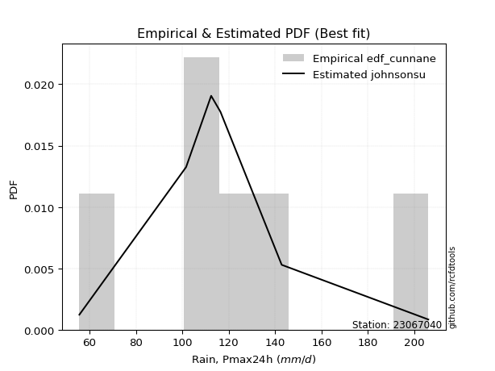</img>

</div>


### 12. Empirical - EDF Adamowski (1981)

The Adamowski formula in hydrology refers to a specific plotting position formula used for estimating the non-parametric empirical distribution of hydrological events (like flood peaks) to calculate their return periods. This formula provides an alternative to traditional parametric methods (like the Gumbel or Log Pearson Type III distributions). 

<div align="center">


$P=(m-0.25)/(n+0.5)$


</div>


**12.1. Empirical values**

<div align="center">

|                | 0                  | 1                   | 2                   | 3             | 4                  | 5                  | 6                  |
|:---------------|:-------------------|:--------------------|:--------------------|:--------------|:-------------------|:-------------------|:-------------------|
| date           | 2023               | 2025                | 2021                | 2020          | 2022               | 2019               | 2024               |
| x              | 55.6               | 60.8                | 101.6               | 112.4         | 116.4              | 142.8              | 206.0              |
| m              | 1                  | 2                   | 3                   | 4             | 5                  | 6                  | 7                  |
| empirical_dist | edf_adamowski      | edf_adamowski       | edf_adamowski       | edf_adamowski | edf_adamowski      | edf_adamowski      | edf_adamowski      |
| empirical      | 0.1                | 0.23333333333333334 | 0.36666666666666664 | 0.5           | 0.6333333333333333 | 0.7666666666666667 | 0.9                |
| empirical_tr   | 1.1111111111111112 | 1.3043478260869565  | 1.5789473684210527  | 2.0           | 2.727272727272727  | 4.2857142857142865 | 10.000000000000002 |

</div>


**12.2. Kolmogorov-Smirnov fit test (sorted by Δ)**


<div align="center">

|                | 0                   | 1                   | 2                   | 3                   | 4                   | 5                   | 6                   | 7                   | 8                   | 9                   | 10                  | 11                  | 12                  | 13                  | 14                  | 15                  | 16                  | 17                  | 18                  | 19                  | 20                  | 21                  | 22                  | 23                  | 24                  | 25                  | 26                  | 27                  | 28                  | 29                  | 30                  | 31                  | 32                  | 33                  | 34                  | 35                  | 36                  | 37                    | 38                  | 39                  | 40                  | 41                  | 42                  | 43                  | 44                  | 45                  | 46                  | 47                  | 48                  | 49                  | 50                  | 51                  | 52                  | 53                  | 54                  | 55                  | 56                  | 57                  | 58                  | 59                  | 60                  | 61                  | 62                  | 63                  | 64                  | 65                  | 66                  | 67                  | 68                  | 69                  | 70                  | 71                  | 72                  | 73                  | 74                  | 75                  | 76                  | 77                  | 78                  | 79                  | 80                  | 81                  | 82                  | 83                  | 84                  | 85                  | 86                  | 87                  | 88                  | 89                  |
|:---------------|:--------------------|:--------------------|:--------------------|:--------------------|:--------------------|:--------------------|:--------------------|:--------------------|:--------------------|:--------------------|:--------------------|:--------------------|:--------------------|:--------------------|:--------------------|:--------------------|:--------------------|:--------------------|:--------------------|:--------------------|:--------------------|:--------------------|:--------------------|:--------------------|:--------------------|:--------------------|:--------------------|:--------------------|:--------------------|:--------------------|:--------------------|:--------------------|:--------------------|:--------------------|:--------------------|:--------------------|:--------------------|:----------------------|:--------------------|:--------------------|:--------------------|:--------------------|:--------------------|:--------------------|:--------------------|:--------------------|:--------------------|:--------------------|:--------------------|:--------------------|:--------------------|:--------------------|:--------------------|:--------------------|:--------------------|:--------------------|:--------------------|:--------------------|:--------------------|:--------------------|:--------------------|:--------------------|:--------------------|:--------------------|:--------------------|:--------------------|:--------------------|:--------------------|:--------------------|:--------------------|:--------------------|:--------------------|:--------------------|:--------------------|:--------------------|:--------------------|:--------------------|:--------------------|:--------------------|:--------------------|:--------------------|:--------------------|:--------------------|:--------------------|:--------------------|:--------------------|:--------------------|:--------------------|:--------------------|:--------------------|
| station        | 23067040            | 23067040            | 23067040            | 23067040            | 23067040            | 23067040            | 23067040            | 23067040            | 23067040            | 23067040            | 23067040            | 23067040            | 23067040            | 23067040            | 23067040            | 23067040            | 23067040            | 23067040            | 23067040            | 23067040            | 23067040            | 23067040            | 23067040            | 23067040            | 23067040            | 23067040            | 23067040            | 23067040            | 23067040            | 23067040            | 23067040            | 23067040            | 23067040            | 23067040            | 23067040            | 23067040            | 23067040            | 23067040              | 23067040            | 23067040            | 23067040            | 23067040            | 23067040            | 23067040            | 23067040            | 23067040            | 23067040            | 23067040            | 23067040            | 23067040            | 23067040            | 23067040            | 23067040            | 23067040            | 23067040            | 23067040            | 23067040            | 23067040            | 23067040            | 23067040            | 23067040            | 23067040            | 23067040            | 23067040            | 23067040            | 23067040            | 23067040            | 23067040            | 23067040            | 23067040            | 23067040            | 23067040            | 23067040            | 23067040            | 23067040            | 23067040            | 23067040            | 23067040            | 23067040            | 23067040            | 23067040            | 23067040            | 23067040            | 23067040            | 23067040            | 23067040            | 23067040            | 23067040            | 23067040            | 23067040            |
| empirical_dist | edf_adamowski       | edf_adamowski       | edf_adamowski       | edf_adamowski       | edf_adamowski       | edf_adamowski       | edf_adamowski       | edf_adamowski       | edf_adamowski       | edf_adamowski       | edf_adamowski       | edf_adamowski       | edf_adamowski       | edf_adamowski       | edf_adamowski       | edf_adamowski       | edf_adamowski       | edf_adamowski       | edf_adamowski       | edf_adamowski       | edf_adamowski       | edf_adamowski       | edf_adamowski       | edf_adamowski       | edf_adamowski       | edf_adamowski       | edf_adamowski       | edf_adamowski       | edf_adamowski       | edf_adamowski       | edf_adamowski       | edf_adamowski       | edf_adamowski       | edf_adamowski       | edf_adamowski       | edf_adamowski       | edf_adamowski       | edf_adamowski         | edf_adamowski       | edf_adamowski       | edf_adamowski       | edf_adamowski       | edf_adamowski       | edf_adamowski       | edf_adamowski       | edf_adamowski       | edf_adamowski       | edf_adamowski       | edf_adamowski       | edf_adamowski       | edf_adamowski       | edf_adamowski       | edf_adamowski       | edf_adamowski       | edf_adamowski       | edf_adamowski       | edf_adamowski       | edf_adamowski       | edf_adamowski       | edf_adamowski       | edf_adamowski       | edf_adamowski       | edf_adamowski       | edf_adamowski       | edf_adamowski       | edf_adamowski       | edf_adamowski       | edf_adamowski       | edf_adamowski       | edf_adamowski       | edf_adamowski       | edf_adamowski       | edf_adamowski       | edf_adamowski       | edf_adamowski       | edf_adamowski       | edf_adamowski       | edf_adamowski       | edf_adamowski       | edf_adamowski       | edf_adamowski       | edf_adamowski       | edf_adamowski       | edf_adamowski       | edf_adamowski       | edf_adamowski       | edf_adamowski       | edf_adamowski       | edf_adamowski       | edf_adamowski       |
| p_dist         | maxwell             | rayleigh            | t                   | crystalball         | norm                | pearson3            | ncf                 | logistic            | laplace_asymmetric  | logbetaprime        | logmielke           | hypsecant           | truncnorm           | loggenlogistic      | exponnorm           | logloggamma         | genlogistic         | loggumbel_l         | alpha               | logpearson3         | kstwobign           | lognct              | logncf              | logcrystalball      | lognorm             | lognorm             | logt                | logexponnorm        | logjohnsonsu        | invgamma            | loggamma            | loggamma            | laplace             | loginvgamma         | logf                | logfatiguelife      | nct                 | loglaplace_asymmetric | logerlang           | johnsonsu           | logfisk             | halfnorm            | fisk                | logalpha            | betaprime           | gumbel_r            | invgauss            | logweibull_min      | loginvgauss         | rice                | loglogistic         | logmaxwell          | logrice             | loghypsecant        | loglaplace          | lograyleigh         | mielke              | moyal               | loggompertz         | gompertz            | loginvweibull       | logchi2             | gumbel_l            | loggumbel_r         | genexpon            | expon               | logkstwobign        | halflogistic        | f                   | loghalfnorm         | logmoyal            | loggenexpon         | loghalflogistic     | wald                | gibrat              | logexpon            | weibull_min         | logwald             | loggibrat           | erlang              | pareto              | gamma               | logpareto           | loglognorm          | logtruncnorm        | nakagami            | lognakagami         | invweibull          | fatiguelife         | chi2                |
| delta          | 0.10361773122179832 | 0.10595932663003693 | 0.11023703314054067 | 0.11023758088843283 | 0.11023759092342289 | 0.11314045699230012 | 0.11493558457004271 | 0.11669644615453623 | 0.12111865336249285 | 0.12200684188358979 | 0.12377280109189995 | 0.12416548441376708 | 0.12483271502438809 | 0.12511866952813147 | 0.1270534177083715  | 0.1272987767416837  | 0.12762798848662055 | 0.12817673846482977 | 0.12839476444477382 | 0.12854549203020682 | 0.12936761286160076 | 0.1295905502511553  | 0.1297044587191591  | 0.13006530361310747 | 0.13006530416630258 | 0.13006530416630258 | 0.1300658640502272  | 0.13006623433924047 | 0.13006713572740908 | 0.13013418519146175 | 0.13019000234258893 | 0.13019000234258893 | 0.13020452411745187 | 0.13024036384869475 | 0.13027942798818556 | 0.13054252543319045 | 0.13058487089257342 | 0.13072069347711157   | 0.1309561225792462  | 0.1321654456628818  | 0.13359975341643268 | 0.13386332172665455 | 0.13433665915764853 | 0.13513683407415555 | 0.1354195415029219  | 0.13797031907368715 | 0.1392565215606117  | 0.1398002199235751  | 0.14053529866055342 | 0.14093208545248026 | 0.1414703179542453  | 0.14465618073095715 | 0.144920182997908   | 0.1463450209915954  | 0.14954889342774141 | 0.15611662689590494 | 0.15686578087378883 | 0.16618054601335702 | 0.16803783466017658 | 0.16993336398087722 | 0.17228788156252955 | 0.17454507643687084 | 0.17953903400184446 | 0.1801918725681591  | 0.1804487776125447  | 0.18054152103908022 | 0.18811665041942377 | 0.19301887815819807 | 0.20370935758530745 | 0.204247170756934   | 0.20603155711455395 | 0.2192870644440768  | 0.23333333333333334 | 0.23333333333333334 | 0.23333333333333334 | 0.2511020568265085  | 0.2563845220147873  | 0.27796096737029846 | 0.2972621772667639  | 0.3131007058281588  | 0.3206944483681962  | 0.3305537295440569  | 0.3413422687500223  | 0.36625736217240595 | 0.3666615846366008  | 0.42780980108507566 | 0.4280919883397351  | 0.4468649221951579  | 0.4585160745573413  | 0.5605530431460286  |
| deltao         | 0.48442053926100004 | 0.48442053926100004 | 0.48442053926100004 | 0.48442053926100004 | 0.48442053926100004 | 0.48442053926100004 | 0.48442053926100004 | 0.48442053926100004 | 0.48442053926100004 | 0.48442053926100004 | 0.48442053926100004 | 0.48442053926100004 | 0.48442053926100004 | 0.48442053926100004 | 0.48442053926100004 | 0.48442053926100004 | 0.48442053926100004 | 0.48442053926100004 | 0.48442053926100004 | 0.48442053926100004 | 0.48442053926100004 | 0.48442053926100004 | 0.48442053926100004 | 0.48442053926100004 | 0.48442053926100004 | 0.48442053926100004 | 0.48442053926100004 | 0.48442053926100004 | 0.48442053926100004 | 0.48442053926100004 | 0.48442053926100004 | 0.48442053926100004 | 0.48442053926100004 | 0.48442053926100004 | 0.48442053926100004 | 0.48442053926100004 | 0.48442053926100004 | 0.48442053926100004   | 0.48442053926100004 | 0.48442053926100004 | 0.48442053926100004 | 0.48442053926100004 | 0.48442053926100004 | 0.48442053926100004 | 0.48442053926100004 | 0.48442053926100004 | 0.48442053926100004 | 0.48442053926100004 | 0.48442053926100004 | 0.48442053926100004 | 0.48442053926100004 | 0.48442053926100004 | 0.48442053926100004 | 0.48442053926100004 | 0.48442053926100004 | 0.48442053926100004 | 0.48442053926100004 | 0.48442053926100004 | 0.48442053926100004 | 0.48442053926100004 | 0.48442053926100004 | 0.48442053926100004 | 0.48442053926100004 | 0.48442053926100004 | 0.48442053926100004 | 0.48442053926100004 | 0.48442053926100004 | 0.48442053926100004 | 0.48442053926100004 | 0.48442053926100004 | 0.48442053926100004 | 0.48442053926100004 | 0.48442053926100004 | 0.48442053926100004 | 0.48442053926100004 | 0.48442053926100004 | 0.48442053926100004 | 0.48442053926100004 | 0.48442053926100004 | 0.48442053926100004 | 0.48442053926100004 | 0.48442053926100004 | 0.48442053926100004 | 0.48442053926100004 | 0.48442053926100004 | 0.48442053926100004 | 0.48442053926100004 | 0.48442053926100004 | 0.48442053926100004 | 0.48442053926100004 |
| eval           | Δo > Δ              | Δo > Δ              | Δo > Δ              | Δo > Δ              | Δo > Δ              | Δo > Δ              | Δo > Δ              | Δo > Δ              | Δo > Δ              | Δo > Δ              | Δo > Δ              | Δo > Δ              | Δo > Δ              | Δo > Δ              | Δo > Δ              | Δo > Δ              | Δo > Δ              | Δo > Δ              | Δo > Δ              | Δo > Δ              | Δo > Δ              | Δo > Δ              | Δo > Δ              | Δo > Δ              | Δo > Δ              | Δo > Δ              | Δo > Δ              | Δo > Δ              | Δo > Δ              | Δo > Δ              | Δo > Δ              | Δo > Δ              | Δo > Δ              | Δo > Δ              | Δo > Δ              | Δo > Δ              | Δo > Δ              | Δo > Δ                | Δo > Δ              | Δo > Δ              | Δo > Δ              | Δo > Δ              | Δo > Δ              | Δo > Δ              | Δo > Δ              | Δo > Δ              | Δo > Δ              | Δo > Δ              | Δo > Δ              | Δo > Δ              | Δo > Δ              | Δo > Δ              | Δo > Δ              | Δo > Δ              | Δo > Δ              | Δo > Δ              | Δo > Δ              | Δo > Δ              | Δo > Δ              | Δo > Δ              | Δo > Δ              | Δo > Δ              | Δo > Δ              | Δo > Δ              | Δo > Δ              | Δo > Δ              | Δo > Δ              | Δo > Δ              | Δo > Δ              | Δo > Δ              | Δo > Δ              | Δo > Δ              | Δo > Δ              | Δo > Δ              | Δo > Δ              | Δo > Δ              | Δo > Δ              | Δo > Δ              | Δo > Δ              | Δo > Δ              | Δo > Δ              | Δo > Δ              | Δo > Δ              | Δo > Δ              | Δo > Δ              | Δo > Δ              | Δo > Δ              | Δo > Δ              | Δo > Δ              | Δo <= Δ             |
| fit            | 1                   | 1                   | 1                   | 1                   | 1                   | 1                   | 1                   | 1                   | 1                   | 1                   | 1                   | 1                   | 1                   | 1                   | 1                   | 1                   | 1                   | 1                   | 1                   | 1                   | 1                   | 1                   | 1                   | 1                   | 1                   | 1                   | 1                   | 1                   | 1                   | 1                   | 1                   | 1                   | 1                   | 1                   | 1                   | 1                   | 1                   | 1                     | 1                   | 1                   | 1                   | 1                   | 1                   | 1                   | 1                   | 1                   | 1                   | 1                   | 1                   | 1                   | 1                   | 1                   | 1                   | 1                   | 1                   | 1                   | 1                   | 1                   | 1                   | 1                   | 1                   | 1                   | 1                   | 1                   | 1                   | 1                   | 1                   | 1                   | 1                   | 1                   | 1                   | 1                   | 1                   | 1                   | 1                   | 1                   | 1                   | 1                   | 1                   | 1                   | 1                   | 1                   | 1                   | 1                   | 1                   | 1                   | 1                   | 1                   | 1                   | 0                   |
| n              | 7                   | 7                   | 7                   | 7                   | 7                   | 7                   | 7                   | 7                   | 7                   | 7                   | 7                   | 7                   | 7                   | 7                   | 7                   | 7                   | 7                   | 7                   | 7                   | 7                   | 7                   | 7                   | 7                   | 7                   | 7                   | 7                   | 7                   | 7                   | 7                   | 7                   | 7                   | 7                   | 7                   | 7                   | 7                   | 7                   | 7                   | 7                     | 7                   | 7                   | 7                   | 7                   | 7                   | 7                   | 7                   | 7                   | 7                   | 7                   | 7                   | 7                   | 7                   | 7                   | 7                   | 7                   | 7                   | 7                   | 7                   | 7                   | 7                   | 7                   | 7                   | 7                   | 7                   | 7                   | 7                   | 7                   | 7                   | 7                   | 7                   | 7                   | 7                   | 7                   | 7                   | 7                   | 7                   | 7                   | 7                   | 7                   | 7                   | 7                   | 7                   | 7                   | 7                   | 7                   | 7                   | 7                   | 7                   | 7                   | 7                   | 7                   |
| best_fit       | 1                   | 0                   | 0                   | 0                   | 0                   | 0                   | 0                   | 0                   | 0                   | 0                   | 0                   | 0                   | 0                   | 0                   | 0                   | 0                   | 0                   | 0                   | 0                   | 0                   | 0                   | 0                   | 0                   | 0                   | 0                   | 0                   | 0                   | 0                   | 0                   | 0                   | 0                   | 0                   | 0                   | 0                   | 0                   | 0                   | 0                   | 0                     | 0                   | 0                   | 0                   | 0                   | 0                   | 0                   | 0                   | 0                   | 0                   | 0                   | 0                   | 0                   | 0                   | 0                   | 0                   | 0                   | 0                   | 0                   | 0                   | 0                   | 0                   | 0                   | 0                   | 0                   | 0                   | 0                   | 0                   | 0                   | 0                   | 0                   | 0                   | 0                   | 0                   | 0                   | 0                   | 0                   | 0                   | 0                   | 0                   | 0                   | 0                   | 0                   | 0                   | 0                   | 0                   | 0                   | 0                   | 0                   | 0                   | 0                   | 0                   | 0                   |
| best_fit_sort  | 1                   | 2                   | 3                   | 4                   | 5                   | 6                   | 7                   | 8                   | 9                   | 10                  | 11                  | 12                  | 13                  | 14                  | 15                  | 16                  | 17                  | 18                  | 19                  | 20                  | 21                  | 22                  | 23                  | 24                  | 25                  | 26                  | 27                  | 28                  | 29                  | 30                  | 31                  | 32                  | 33                  | 34                  | 35                  | 36                  | 37                  | 38                    | 39                  | 40                  | 41                  | 42                  | 43                  | 44                  | 45                  | 46                  | 47                  | 48                  | 49                  | 50                  | 51                  | 52                  | 53                  | 54                  | 55                  | 56                  | 57                  | 58                  | 59                  | 60                  | 61                  | 62                  | 63                  | 64                  | 65                  | 66                  | 67                  | 68                  | 69                  | 70                  | 71                  | 72                  | 73                  | 74                  | 75                  | 76                  | 77                  | 78                  | 79                  | 80                  | 81                  | 82                  | 83                  | 84                  | 85                  | 86                  | 87                  | 88                  | 89                  | 90                  |

</div>


<div align="center">

</img>

</div>


**12.3. Best fit**

<div align="center">

|   id |   station | empirical_dist   | p_dist   |    delta |   deltao | eval   |   fit |   n |   best_fit |   best_fit_sort |
|-----:|----------:|:-----------------|:---------|---------:|---------:|:-------|------:|----:|-----------:|----------------:|
|    0 |  23067040 | edf_adamowski    | maxwell  | 0.103618 | 0.484421 | Δo > Δ |     1 |   7 |          1 |               1 |

</div>


<div align="center">

</img></img>

</div>


## C. Best fit & Estimate extreme values for specific return periods - Tr


### 1. Best fit (ordered by delta Δ)

<div align="center">

|   id |   station | empirical_dist   | p_dist   |     delta |   deltao | eval   |   fit |   n |   best_fit |   best_fit_sort |
|-----:|----------:|:-----------------|:---------|----------:|---------:|:-------|------:|----:|-----------:|----------------:|
|    0 |  23067040 | edf_hazen        | maxwell  | 0.0877782 | 0.484421 | Δo > Δ |     1 |   7 |          1 |               1 |
|    1 |  23067040 | edf_gringorten   | maxwell  | 0.0893855 | 0.484421 | Δo > Δ |     1 |   7 |          1 |               2 |
|    2 |  23067040 | edf_cunnane      | maxwell  | 0.0925066 | 0.484421 | Δo > Δ |     1 |   7 |          1 |               3 |
|    3 |  23067040 | edf_blom         | maxwell  | 0.0944223 | 0.484421 | Δo > Δ |     1 |   7 |          1 |               4 |
|    4 |  23067040 | edf_tukey        | maxwell  | 0.0975571 | 0.484421 | Δo > Δ |     1 |   7 |          1 |               5 |
|    5 |  23067040 | edf_filliben     | maxwell  | 0.0987297 | 0.484421 | Δo > Δ |     1 |   7 |          1 |               6 |
|    6 |  23067040 | edf_beard        | maxwell  | 0.0992817 | 0.484421 | Δo > Δ |     1 |   7 |          1 |               7 |
|    7 |  23067040 | edf_jenkinson    | maxwell  | 0.0992817 | 0.484421 | Δo > Δ |     1 |   7 |          1 |               8 |
|    8 |  23067040 | edf_chegodayev   | maxwell  | 0.100014  | 0.484421 | Δo > Δ |     1 |   7 |          1 |               9 |
|    9 |  23067040 | edf_adamowski    | maxwell  | 0.103618  | 0.484421 | Δo > Δ |     1 |   7 |          1 |              10 |
|   10 |  23067040 | edf_weibull      | ncf      | 0.106602  | 0.484421 | Δo > Δ |     1 |   7 |          1 |              11 |
|   11 |  23067040 | edf_california   | ncf      | 0.131476  | 0.484421 | Δo > Δ |     1 |   7 |          1 |              12 |

</div>

:file_folder:Tables: [bestfit_23067040.csv](table/bestfit_23067040.csv) | [extreme_23067040.csv](table/extreme_23067040.csv)


### 2. Extreme values

In hydrology, a return period (or recurrence interval $Tr$) is the statistical average time between extreme events like floods or droughts of a specific magnitude, indicating how rare an event is, with a 100-year flood, for example, having a 1% chance of occurring in any given year, not that it happens exactly every century. It is a key tool for infrastructure design (like bridges or dams) and risk assessment, calculated from historical data to determine the probability of future events, although it is important to remember it is statistical average, and events can cluster or be missed.

> risk_rate: assuming the return period as the project useful life.

|   id |      tr |   prob_l |     prob_g |   alpha |   betaprime |     chi2 |   crystalball |   erlang |    expon |   exponnorm |        f |   fatiguelife |    fisk |    gamma |   genexpon |   genlogistic |   gibrat |   gompertz |   gumbel_l |   gumbel_r |   halflogistic |   halfnorm |   hypsecant |   invgamma |   invgauss |       invweibull |   johnsonsu |   kstwobign |   laplace |   laplace_asymmetric |   loggamma |   logistic |   lognorm |   maxwell |    mielke |   moyal |   nakagami |     ncf |     nct |    norm |           pareto |   pearson3 |   rayleigh |    rice |       t |   truncnorm |     wald |      weibull_min |   logalpha |   logbetaprime |          logchi2 |   logcrystalball |   logerlang |   logexpon |   logexponnorm |    logf |   logfatiguelife |   logfisk |   loggenexpon |   loggenlogistic |   loggibrat |   loggompertz |   loggumbel_l |   loggumbel_r |   loghalflogistic |   loghalfnorm |   loghypsecant |   loginvgamma |   loginvgauss |   loginvweibull |   logjohnsonsu |   logkstwobign |   loglaplace |   loglaplace_asymmetric |   logloggamma |   loglogistic |    loglognorm |   logmaxwell |   logmielke |   logmoyal |   lognakagami |   logncf |   lognct |         logpareto |   logpearson3 |   lograyleigh |   logrice |    logt |   logtruncnorm |   logwald |   logweibull_min |   station |   n |   risk_rate |
|-----:|--------:|---------:|-----------:|--------:|------------:|---------:|--------------:|---------:|---------:|------------:|---------:|--------------:|--------:|---------:|-----------:|--------------:|---------:|-----------:|-----------:|-----------:|---------------:|-----------:|------------:|-----------:|-----------:|-----------------:|------------:|------------:|----------:|---------------------:|-----------:|-----------:|----------:|----------:|----------:|--------:|-----------:|--------:|--------:|--------:|-----------------:|-----------:|-----------:|--------:|--------:|------------:|---------:|-----------------:|-----------:|---------------:|-----------------:|-----------------:|------------:|-----------:|---------------:|--------:|-----------------:|----------:|--------------:|-----------------:|------------:|--------------:|--------------:|--------------:|------------------:|--------------:|---------------:|--------------:|--------------:|----------------:|---------------:|---------------:|-------------:|------------------------:|--------------:|--------------:|--------------:|-------------:|------------:|-----------:|--------------:|---------:|---------:|------------------:|--------------:|--------------:|----------:|--------:|---------------:|----------:|-----------------:|----------:|----:|------------:|
|    0 |    2    | 0.5      | 0.5        | 105.648 |     101.915 |  56.5661 |       113.657 |  83.5174 |  95.8421 |     105.975 |  91.6129 |       55.6003 | 105.088 |  76.1408 |    95.8525 |       105.409 |  99.4436 |    103.609 |    121.436 |    105.878 |        102.011 |    103.964 |     113.657 |    104.431 |    100.935 |   2215.27        |     102.422 |     105.84  |   113.657 |              112.883 |    103.437 |    113.657 |   104.067 |   109.607 |   98.9747 | 103.367 |    57.6038 | 104.073 | 104.779 | 113.657 |     58.4191      |    108.727 |    108.171 | 110.362 | 113.657 |     115.325 |  98.3075 |     62.9159      |    101.68  |        103.172 |     92.0338      |          104.067 |     103.566 |    85.857  |        104.067 | 103.977 |          103.932 |   105.485 |       90.914  |          107.667 |     91.5901 |       101.523 |       111.601 |        97.041 |           93.7265 |       95.3865 |        104.067 |       102.238 |       100.808 |         97.0979 |        104.067 |         95.259 |      104.067 |                 107.92  |       105.377 |       104.067 |  55.8439      |      100.348 |     108.182 |    94.8757 |        57.491 |  103.886 |  103.962 |     57.5172       |       104.749 |       99.0612 |   101.63  | 104.067 |        119.994 |   90.6583 |          101.563 |  23067040 |   7 |    0.75     |
|    1 |    2.33 | 0.570815 | 0.429185   | 113.656 |     109.946 |  57.6018 |       122.107 |  89.711  | 104.709  |     113.65  | 101.669  |       57.2751 | 112.993 |  83.3614 |   104.721  |       113.448 | 103.724  |    112.507 |    128.788 |    113.708 |        110.061 |    113.084 |     120.42  |    112.534 |    109.301 | 152358           |     110.662 |     114.158 |   118.771 |              118.352 |    111.637 |    121.102 |   112.276 |   118.386 |  107.267  | 110.779 |    60.4933 | 114.216 | 112.635 | 122.107 |     62.6248      |    117.173 |    117.08  | 118.65  | 122.107 |     124.283 | 103.848  |     76.9482      |    109.722 |        113.693 |    110.036       |          112.276 |     111.77  |    94.4826 |        112.276 | 112.176 |          112.152 |   113.294 |       99.5215 |          115.322 |     95.1814 |       110.175 |       119.222 |       104.114 |          100.758  |      103.532  |        110.586 |       110.456 |       109.009 |        105.597  |        112.276 |        103.614 |      108.96  |                 113.245 |       113.626 |       111.267 |  57.6943      |      108.584 |     115.833 |   101.41   |        59.996 |  112.093 |  112.201 |     60.5152       |       112.985 |      107.317  |   109.926 | 112.276 |        124.214 |   95.2864 |          109.856 |  23067040 |   7 |    0.729209 |
|    2 |    5    | 0.8      | 0.2        | 148.464 |     147.476 |  70.1392 |       153.51  | 120.735  | 149.039  |     147.601 | 155.654  |       92.8471 | 149.961 | 125.465  |   149.064  |       148.368 | 128.368  |    150.843 |    152.538 |    147.724 |        146.487 |    151.65  |     147.546 |    148.553 |    148.512 |      1.63173e+13 |     148.619 |     149.491 |   144.337 |              145.698 |    148.638 |    149.848 |   148.878 |   152.94  |  150.62   | 145.111 |   103.86   | 161.679 | 147.656 | 153.51  |    701.821       |    151.391 |    152.746 | 151.831 | 153.51  |     156.154 | 134.866  |    734.639       |    147.354 |        164.591 |    312.959       |          148.878 |     148.784 |   152.484  |        148.878 | 148.788 |          148.991 |   149.266 |      148.893  |          148.227 |    118.773  |       149.186 |       147.584 |       141.336 |          139.774  |      146.412  |        141.11  |       148.572 |       148.411 |        152.044  |        148.877 |        148.089 |      137.1   |                 140.816 |       149.338 |       144.06  |   2.47428e+46 |      148.117 |     148.063 |   138.057  |       104.276 |  148.77  |  149.074 | 150839            |       149.142 |      147.86   |   148.617 | 148.878 |        145.543 |  125.916  |          148.437 |  23067040 |   7 |    0.67232  |
|    3 |   10    | 0.9      | 0.1        | 177.187 |     181.263 |  90.3613 |       174.341 | 148.941  | 189.282  |     176.871 | 207.689  |      141.963  | 185.191 | 168.651  |   189.316  |       176.805 | 156.459  |    179.171 |    165.761 |    175.43  |        176.737 |    180.188 |     169.207 |    178.867 |    182.846 |      5.66132e+19 |     181.713 |     176.392 |   167.546 |              170.521 |    180.154 |    171.019 |   179.524 |   177.256 |  197.278  | 175.004 |   169.057  | 204.459 | 177.821 | 174.341 |  38997.2         |    176.629 |    178.176 | 175.49  | 174.341 |     174.895 | 167.782  |   4716.15        |    181.194 |        212.099 |    916.825       |          179.524 |     180.31  |   235.464  |        179.524 | 179.507 |          180.063 |   182.876 |      204.985  |          176.686 |    152.874  |       180.479 |       166.203 |       181.289 |          183.433  |      189.211  |        171.429 |       182.359 |       185.113 |        204.604  |        179.523 |        194.363 |      168.89  |                 171.617 |       178.012 |       174.244 | inf           |      184.289 |     175.556 |   180.595  |       224.772 |  179.581 |  180.113 |      2.45051e+211 |       178.742 |      185.818  |   182.563 | 179.524 |        163.811 |  169.255  |          182.107 |  23067040 |   7 |    0.651322 |
|    4 |   15    | 0.933333 | 0.0666667  | 193.718 |     201.684 | 104.875  |       184.737 | 165.452  | 212.822  |     193.939 | 238.915  |      174.085  | 207.911 | 195.18   |   212.862  |       192.848 | 175.834  |    193.693 |    171.749 |    191.062 |        193.857 |    195.039 |     181.568 |    196.405 |    202.839 |      2.77257e+23 |     201.16  |     190.674 |   181.122 |              185.042 |    198.44  |    182.554 |   197.101 |   189.733 |  229.429  | 192.352 |   209.314  | 230.33  | 195.719 | 184.737 | 428258           |    190.002 |    191.279 | 187.68  | 184.737 |     182.958 | 188.92   |  11205.9         |    201.598 |        241.317 |   1775.44        |          197.101 |     198.603 |   303.604  |        197.101 | 197.152 |          197.975 |   204.272 |      243.889  |          194.088 |    181.946  |       197.538 |       175.391 |       208.627 |          213.936  |      216.223  |        191.569 |       202.51  |       207.745 |        241.917  |        197.1   |        224.545 |      190.802 |                 192.669 |       194.003 |       193.273 | inf           |      206.151 |     192.404 |   211.059  |       357.557 |  197.292 |  197.979 |    inf            |       195.46  |      209.036  |   202.525 | 197.1   |        173.211 |  204.66   |          201.802 |  23067040 |   7 |    0.644736 |
|    5 |   20    | 0.95     | 0.05       | 205.489 |     216.606 | 116.066  |       191.544 | 177.17   | 229.524  |     206.048 | 261.333  |      197.868  | 225.285 | 214.411  |   229.569  |       204.081 | 191.033  |    203.256 |    175.477 |    202.006 |        205.851 |    204.941 |     190.289 |    208.897 |    217.041 |      1.06292e+26 |     215.103 |     200.294 |   190.754 |              195.344 |    211.465 |    190.526 |   209.534 |   198.013 |  254.927  | 204.638 |   237.387  | 249.24  | 208.696 | 191.544 |      2.34653e+06 |    199.046 |    199.988 | 195.782 | 191.544 |     187.614 | 204.671  |  19246.9         |    216.477 |        262.841 |   2867.21        |          209.534 |     211.633 |   363.602  |        209.534 | 209.644 |          210.682 |   220.507 |      274.629  |          207.016 |    208.57   |       209.194 |       181.365 |       230.187 |          238.281  |      236.342  |        207.184 |       217.103 |       224.466 |        272.022  |        209.533 |        247.477 |      208.052 |                 209.154 |       205.127 |       207.626 | inf           |      222.075 |     204.982 |   235.695  |       493.321 |  209.837 |  210.644 |    inf            |       207.177 |      226.051  |   216.834 | 209.533 |        179.084 |  235.78   |          215.867 |  23067040 |   7 |    0.641514 |
|    6 |   25    | 0.96     | 0.04       | 214.688 |     228.467 | 125.172  |       196.556 | 186.261  | 242.479  |     215.44  | 278.848  |      216.765  | 239.582 | 229.523  |   242.527  |       212.733 | 203.704  |    210.302 |    178.129 |    210.437 |        215.092 |    212.308 |     197.038 |    218.648 |    228.078 |      1.03888e+28 |     226.027 |     207.5   |   198.226 |              203.335 |    221.625 |    196.625 |   219.185 |   204.161 |  276.445  | 214.161 |   258.667  | 264.274 | 218.965 | 196.556 |      8.77913e+06 |    205.849 |    206.459 | 201.802 | 196.556 |     190.686 | 217.288  |  28298.7         |    228.286 |        280.036 |   4178.85        |          219.185 |     221.797 |   418.19   |        219.185 | 219.347 |          220.567 |   233.792 |      300.435  |          217.444 |    233.72   |       218.01  |       185.739 |       248.301 |          258.911  |      252.517  |        220.137 |       228.625 |       237.858 |        297.742  |        219.184 |        266.176 |      222.499 |                 222.906 |       213.661 |       219.322 | inf           |      234.686 |     215.181 |   256.751  |       629.266 |  219.584 |  220.49  |    inf            |       216.212 |      239.584  |   228.043 | 219.184 |        183.135 |  264.086  |          226.851 |  23067040 |   7 |    0.639603 |
|    7 |   50    | 0.98     | 0.02       | 243.904 |     267.155 | 155.358  |       210.906 | 214.509  | 282.721  |     244.614 | 333.85   |      277.393  | 289.328 | 277.338  |   282.78   |       239.386 | 248.368  |    230.409 |    185.329 |    236.407 |        243.564 |    233.721 |     217.963 |    249.463 |    262.525 |      1.40285e+34 |     260.706 |     228.661 |   221.435 |              228.159 |    253.659 |    215.259 |   249.351 |   221.989 |  354.653  | 243.724 |   321.484  | 313.323 | 252.28  | 210.906 |      5.28994e+08 |    226.019 |    225.243 | 219.277 | 210.907 |     197.686 | 258.482  |  80674.4         |    266.674 |        336.505 |  13768.4         |          249.351 |     253.842 |   645.765  |        249.351 | 249.709 |          251.579 |   279.549 |      392.903  |          252.507 |    349.129  |       244.311 |       198.153 |       313.561 |          334.397  |      306.093  |        265.674 |       265.728 |       282.084 |        393.284  |        249.349 |        329.654 |      274.092 |                 271.661 |       239.797 |       259.297 | inf           |      275.461 |     249.883 |   334.872  |      1288.85  |  250.102 |  251.349 |    inf            |       244.132 |      283.633  |   263.602 | 249.351 |        192.885 |  382.393  |          261.507 |  23067040 |   7 |    0.63583  |
|    8 |   75    | 0.986667 | 0.0133333  | 261.615 |     291.247 | 174.08   |       218.606 | 231.036  | 306.261  |     261.679 | 366.374  |      313.906  | 322.767 | 305.803  |   306.326  |       254.877 | 278.534  |    241.103 |    188.97  |    251.501 |        260.115 |    245.378 |     230.191 |    267.972 |    282.811 |      5.13167e+37 |     281.599 |     240.303 |   235.011 |              242.679 |    272.819 |    226.021 |   267.214 |   231.682 |  409.817  | 261.013 |   355.887  | 343.876 | 272.944 | 218.606 |      5.81681e+09 |    237.267 |    235.462 | 228.784 | 218.607 |     200.358 | 283.831  | 137076           |    290.478 |        371.877 |  28006.3         |          267.214 |     273.01  |   832.64   |        267.214 | 267.71  |          270.023 |   309.95  |      456.795  |          275.197 |    457.827  |       259.038 |       204.743 |       359.109 |          388.017  |      339.893  |        296.53  |       288.475 |       309.995 |        462.337  |        267.212 |        370.822 |      309.653 |                 304.986 |       254.912 |       285.624 | inf           |      300.528 |     272.72  |   391.15   |      1907.85  |  268.208 |  269.679 |    inf            |       260.445 |      310.91   |   285.005 | 267.214 |        196.788 |  480.216  |          282.222 |  23067040 |   7 |    0.634587 |
|    9 |  100    | 0.99     | 0.01       | 274.533 |     309.068 | 187.744  |       223.814 | 242.765  | 322.963  |     273.788 | 389.583  |      340.178  | 348.734 | 326.18   |   323.032  |       265.842 | 301.903  |    248.283 |    191.352 |    262.185 |        271.83  |    253.318 |     238.866 |    281.364 |    297.269 |      1.70682e+40 |     296.725 |     248.28  |   244.643 |              252.982 |    286.635 |    233.62  |   280.016 |   238.284 |  453.94   | 273.278 |   379.306  | 366.481 | 288.211 | 223.814 |      3.18751e+10 |    245.046 |    242.424 | 235.26  | 223.815 |     201.775 | 302.312  | 193901           |    308.036 |        398.108 |  46562           |          280.016 |     286.831 |   997.184  |        280.016 | 280.622 |          283.276 |   333.385 |      507.125  |          292.41  |    564.795  |       269.23  |       209.172 |       395.291 |          431.088  |      365.032  |        320.566 |       305.132 |       330.802 |        518.419  |        280.014 |        401.959 |      337.648 |                 331.081 |       265.59  |       305.807 | inf           |      318.896 |     290.258 |   436.723  |      2491.63  |  281.199 |  282.841 |    inf            |       272.04  |      330.98   |   300.489 | 280.015 |        198.897 |  566.974  |          297.143 |  23067040 |   7 |    0.633968 |
|   10 |  200    | 0.995    | 0.005      | 307.099 |     354.733 | 221.728  |       235.628 | 271.027  | 363.205  |     302.962 | 445.899  |      404.488  | 420.059 | 375.786  |   363.285  |       292.201 | 365.48   |    264.371 |    196.528 |    287.869 |        299.993 |    271.48  |     259.762 |    314.639 |    332.33  |      1.97317e+46 |     334.284 |     266.652 |   267.852 |              277.805 |    320.767 |    251.847 |   311.374 |   253.389 |  580.361  | 302.829 |   432.661  | 424.417 | 327.326 | 235.628 |      1.92067e+12 |    263.202 |    258.353 | 250.08  | 235.628 |     204.02  | 348.348  | 412106           |    352.826 |        465.455 | 160545           |          311.374 |     320.977 |  1539.84   |        311.374 | 312.283 |          315.859 |   397.081 |      647.822  |          338.161 |    999.963  |       293.016 |       219.131 |       497.903 |          555.226  |      429.739  |        386.78  |       347.179 |       384.659 |        682.68   |        311.372 |        483.986 |      415.941 |                 403.497 |       291.233 |       360.226 | inf           |      365.253 |     337.804 |   569.539  |      4577.75  |  313.074 |  315.166 |    inf            |       300.121 |      381.913  |   338.903 | 311.374 |        202.29  |  857.48   |          333.92  |  23067040 |   7 |    0.633042 |
|   11 |  250    | 0.996    | 0.004      | 318.08  |     370.317 | 232.94   |       239.238 | 280.127  | 376.16   |     312.354 | 464.136  |      425.447  | 445.976 | 391.887  |   376.243  |       300.675 | 388.292  |    269.226 |    198.052 |    296.126 |        309.047 |    277.067 |     266.489 |    325.684 |    343.684 |      1.75518e+48 |     346.729 |     272.338 |   275.323 |              285.797 |    332.028 |    257.699 |   321.641 |   258.039 |  628.039  | 312.342 |   448.995  | 444.192 | 340.685 | 239.238 |      7.18599e+12 |    268.893 |    263.257 | 254.642 | 239.238 |     204.488 | 363.578  | 514463           |    368.048 |        488.455 | 239944           |          321.641 |     332.243 |  1771.02   |        321.641 | 322.659 |          326.562 |   420.008 |      699.653  |          354.304 |   1227.44   |       300.464 |       222.151 |       536.249 |          602.285  |      451.865  |        410.88  |       361.328 |       403.197 |        745.842  |        321.638 |        512.617 |      444.824 |                 430.027 |       299.478 |       379.674 | inf           |      380.837 |     354.909 |   620.365  |      5514.98  |  323.525 |  325.774 |    inf            |       309.218 |      399.116  |   351.62  | 321.64  |        203.005 |  983.243  |          346.021 |  23067040 |   7 |    0.632858 |
|   12 |  500    | 0.998    | 0.002      | 354.009 |     421.734 | 268.456  |       249.944 | 308.397  | 416.402  |     341.528 | 521.078  |      491.195  | 537.152 | 442.245  |   416.496  |       326.976 | 467.129  |    283.437 |    202.418 |    321.754 |        337.149 |    293.726 |     287.385 |    361.135 |    379.158 |      1.96838e+54 |     386.552 |     289.378 |   298.532 |              310.62  |    367.929 |    275.847 |   354.119 |   271.914 |  802.39   | 341.892 |   497.431  | 509.452 | 384.848 | 249.944 |      4.33e+14    |    286.168 |    277.887 | 268.253 | 249.944 |     205.445 | 412.004  | 971758           |    418.046 |        564.306 | 843264           |          354.119 |     368.16  |  2734.8    |        354.119 | 355.517 |          360.534 |   499.874 |      884.228  |          409.411 |   2492.52   |       323.02  |       231.039 |       675.112 |          775.297  |      524.829  |        495.742 |       407.335 |       464.86  |        981.574  |        354.116 |        608.964 |      547.968 |                 524.086 |       325.108 |       446.921 | inf           |      431.403 |     414.606 |   809.025  |      9582.58  |  356.637 |  359.414 |    inf            |       337.705 |      455.19   |   392.278 | 354.118 |        204.475 | 1519.33   |          384.474 |  23067040 |   7 |    0.632489 |
|   13 |  750    | 0.998667 | 0.00133333 | 376.476 |     454.082 | 289.646  |       255.891 | 324.935  | 439.943  |     358.593 | 554.576  |      530.041  | 598.946 | 471.912  |   440.042  |       342.352 | 519.266  |    291.204 |    204.751 |    336.736 |        353.577 |    303.032 |     299.608 |    382.732 |    400.046 |      6.77338e+57 |     410.7   |     298.95  |   312.108 |              325.14  |    389.61  |    286.449 |   373.557 |   279.674 |  925.919  | 359.178 |   524.306  | 550.518 | 412.719 | 255.891 |      4.76126e+15 |    296.022 |    286.068 | 275.864 | 255.892 |     205.77  | 441.039  |      1.36515e+06 |    449.331 |        611.945 |      1.76834e+06 |          373.557 |     389.852 |  3526.21   |        373.557 | 375.205 |          380.946 |   553.39  |     1010.88   |          445.478 |   3981.91   |       335.846 |       235.935 |       772.398 |          898.626  |      570.605  |        553.291 |       435.773 |       503.998 |       1152.53   |        373.554 |        670.829 |      619.062 |                 588.375 |       340.135 |       491.593 | inf           |      462.559 |     454.775 |   944.967  |     13021.9   |  376.489 |  379.605 |    inf            |       354.551 |      489.913  |   416.907 | 373.556 |        204.977 | 1972.26   |          407.596 |  23067040 |   7 |    0.632366 |
|   14 | 1000    | 0.999    | 0.001      | 393.153 |     478.126 | 304.84   |       259.986 | 336.67   | 456.645  |     370.702 | 578.42   |      557.751  | 647.084 | 493.041  |   456.749  |       353.259 | 559.165  |    296.496 |    206.322 |    347.364 |        365.231 |    309.459 |     308.28  |    398.468 |    414.927 |      2.18535e+60 |     428.23  |     305.582 |   321.74  |              335.443 |    405.313 |    293.969 |   387.558 |   285.038 | 1024.9    | 371.442 |   542.789  | 581.047 | 433.488 | 259.986 |      2.60909e+16 |    302.915 |    291.722 | 281.124 | 259.986 |     205.934 | 461.925  |      1.71607e+06 |    472.503 |        647.294 |      2.99669e+06 |          387.558 |     405.563 |  4223.04   |        387.557 | 389.396 |          395.683 |   594.778 |     1110.23   |          472.962 |   5698.81   |       344.795 |       239.288 |       849.793 |          997.826  |      604.528  |        598.13  |       456.673 |       533.241 |       1291.56   |        387.554 |        717.337 |      675.03  |                 638.717 |       350.821 |       525.954 | inf           |      485.397 |     485.967 |  1055.06   |     16080.3   |  390.802 |  394.172 |    inf            |       366.592 |      515.444  |   434.775 | 387.556 |        205.231 | 2379.44   |          424.292 |  23067040 |   7 |    0.632305 |

<div align="center">

</img>

</div>


<div align="center">

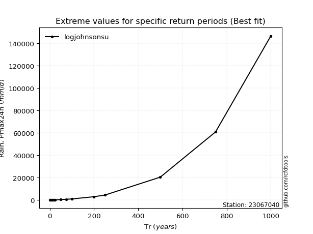</img>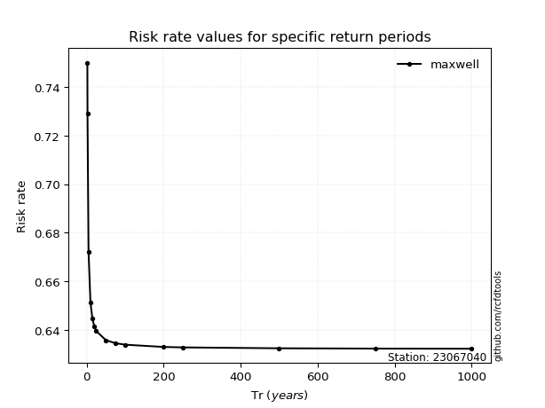</img>

</div>


<sub>**APP DISCLAIMER**: NO WARRANTY - This software is provided by [github.com/rcfdtools](https://github.com/rcfdtools) "as is", without any express or implied warranty, including warranties of merchantability, fitness for a particular purpose, or non-infringement. There is no guarantee that the software will be error-free or operate without interruption. LIMITATION OF LIABILITY - Neither the authors nor copyright holders will be liable for claims or damages arising from the software or its use. You are responsible for determining if the software is appropriate for your use and assume all associated risks, including errors, legal compliance, and data loss. NO PROFESSIONAL ADVICE - The software provides general information and does not offer professional advice. It should not replace consultation with professional advisors.</sub>