<div align="center">


</div>

# Station (rain, Pmax24h): 23067060

Probable Maximum Precipitation (PMP) is the greatest amount of rainfall for a specific duration that is meteorologically possible for a given location, acting as a "worst-case" scenario for extreme storms, crucial for designing safety-critical infrastructure like bridges, river deviations, dams, spillways, and nuclear plants to prevent catastrophic failure. PMP is calculated by hydrologists using meteorological data to determine the upper limit of extreme rainfall, often leading to the Probable Maximum Flood (PMF) for flood control design, and is increasingly being studied for climate change impacts.

<div align="center">

</img>

</div>


## A. General information


### 1. General running parameters

• app_version: _v20251225_. • runtime: _2025-12-26 14:29:50.888910_. • Python version: _3.14.0_. • SciPy version: _1.16.3_. • Pandas version: _2.3.3_. • NumPy version: _2.3.5_. • Stations dataset (station_dataset_file): _dataset/pmax24h_in/automatic_colombia.csv_. • Stations catalog (station_catalog_file): _dataset/CNE_IDEAM.xls_. • Plot only fit distributions with Δo > Δ (plot_only_fit): _True_. • Eval low extreme values, if False, evaluates high extreme values (low_extreme): _False_. • Eval every SciPy distribution as logarithmic (pdist_logarithmic_on): _True_. • Standard deviation normalized (ddof): _1.0_. • Return periods to eval in years (Tr): _[2, 2.33, 5, 10, 15, 20, 25, 50, 75, 100, 200, 250, 500, 750, 1000]_. • Minimum data sample per station, 0 means any (minimum_sample): _5_. • Z-Score threshold to adjust a value, 0 means disable (zscore): _3.5_. • Avoid zeros, e.g. rain = 0 (avoid_zeros): _True_. • Avoid null values (avoid_nans): _True_. [:file_folder:Dataset file.](../../dataset/pmax24h_in/automatic_colombia.csv)


### 2. Station info and location

|   id |   CODIGO | NOMBRE           | CATEGORIA    | TECNOLOGIA                              | ESTADO   | FECHA_INSTALACION   |   FECHA_SUSPENSION |   ALTITUD |   LATITUD |   LONGITUD | DEPARTAMENTO   | MUNICIPIO   | AREA_OPERATIVA                            | ENTIDAD                                                     | AREA_HIDROGRAFICA   | ZONA_HIDROGRAFICA   | SUBZONA_HIDROGRAFICA   | CORRIENTE   | OBSERVACION                                                                                                                                                                                                                                                                                                                                                                                                                                                                                                                                                                                                                                                                                                                                                                                                                                                                                                                                                                                                                                                                                                                                                                                                                                     | SUBRED                                          | Catalogo   |
|-----:|---------:|:-----------------|:-------------|:----------------------------------------|:---------|:--------------------|-------------------:|----------:|----------:|-----------:|:---------------|:------------|:------------------------------------------|:------------------------------------------------------------|:--------------------|:--------------------|:-----------------------|:------------|:------------------------------------------------------------------------------------------------------------------------------------------------------------------------------------------------------------------------------------------------------------------------------------------------------------------------------------------------------------------------------------------------------------------------------------------------------------------------------------------------------------------------------------------------------------------------------------------------------------------------------------------------------------------------------------------------------------------------------------------------------------------------------------------------------------------------------------------------------------------------------------------------------------------------------------------------------------------------------------------------------------------------------------------------------------------------------------------------------------------------------------------------------------------------------------------------------------------------------------------------|:------------------------------------------------|:-----------|
|    0 | 23067060 | TOBIA [23067060] | Limnigráfica | Automática con Telemetría, Convencional | Activa   | 15/12/1986          |                nan |       620 |   5.12556 |   -74.4471 | Cundinamarca   | La Peña     | Area Operativa 11 - Cundinamarca-Amazonas | INSTITUTO DE HIDROLOGIA METEOROLOGIA Y ESTUDIOS AMBIENTALES | Magdalena Cauca     | Medio Magdalena     | Río Negro              | Negro       | Cambio de tecnología por instalación o repotenciación de estaciones proyecto Fondo de Adaptación|22/08/2022$Migracion$Se Cambia Estado por orden de la Coordinación de Planeacion Operativa Decisión tomada en la Reunión de la RED 19/08/2022|23/08/2022$Migracion$Cambio de tecnología por instalación o repotenciación de estaciones proyecto Fondo de Adaptación|22/08/2022$Migracion$Se Cambia Estado por orden de la Coordinación de Planeacion Operativa Decisión tomada en la Reunión de la RED 19/08/2022|23/08/2022$Migracion$Cambio de tecnología por instalación o repotenciación de estaciones proyecto Fondo de Adaptación|22/08/2022$Migracion$Se Cambia Estado por orden de la Coordinación de Planeacion Operativa Decisión tomada en la Reunión de la RED 19/08/2022|23/08/2022$Migracion$Cambio de tecnología por instalación o repotenciación de estaciones proyecto Fondo de Adaptación|22/08/2022$Migracion$Se Cambia Estado por orden de la Coordinación de Planeacion Operativa Decisión tomada en la Reunión de la RED 19/08/2022|27/06/2025$mvelez$La estación fue actualizada en sus coordenadas luego de la reunión con el grupo de automatización 17/06/2025 se realiza el cambio bajo el memorando 20253180105293 | RED ALERTAS - AREA OPERATIVA 11,Magdalena Medio | CNE_IDEAM  |

<div align="center">

Map location in: [:earth_americas:Google](http://maps.google.com/maps?q=5.125561,-74.447149) [:earth_americas:OSM](https://www.openstreetmap.org/#map=18/5.125561/-74.447149&layers=P) [:earth_americas:Bing](https://www.bing.com/maps?cp=5.125561~-74.447149&lvl=18) [:earth_americas:Apple](https://maps.apple.com/frame?center=5.125561%2C-74.447149&span=0.003%2C0.006)

</div>


<div align="center">

```geojson
{
  "type": "Feature",
  "geometry": {
    "type": "Point", 
    "coordinates": [-74.447149, 5.125561]
  }, 
  "properties": {
    "Name": "23067060"
  }
}
```

</div>


### 3. Discrete values table and plot

|               |           0 |           1 |          2 |           3 |          4 |           5 |          6 |           7 |             8 |          9 |          10 |         11 |
|:--------------|------------:|------------:|-----------:|------------:|-----------:|------------:|-----------:|------------:|--------------:|-----------:|------------:|-----------:|
| Date          | 2014        | 2015        | 2016       | 2017        | 2018       | 2019        | 2020       | 2021        | 2022          | 2023       | 2024        | 2025       |
| Value         |   62.8      |   66.5      |   11.3     |   26.9      |   83.8     |   61.8      |   55.8     |   39.1      |   43.2        |    7.4     |   56.8      |    2       |
| Value_initial |   62.8      |   66.5      |   11.3     |   26.9      |   83.8     |   61.8      |   55.8     |   39.1      |   43.2        |    7.4     |   56.8      |    2       |
| count         |   12        |   12        |   12       |   12        |   12       |   12        |   12       |   12        |   12          |   12       |   12        |   12       |
| mean          |   43.1167   |   43.1167   |   43.1167  |   43.1167   |   43.1167  |   43.1167   |   43.1167  |   43.1167   |   43.1167     |   43.1167  |   43.1167   |   43.1167  |
| std           |   26.1885   |   26.1885   |   26.1885  |   26.1885   |   26.1885  |   26.1885   |   26.1885  |   26.1885   |   26.1885     |   26.1885  |   26.1885   |   26.1885  |
| zscore        |    0.751603 |    0.892887 |   -1.21491 |   -0.619229 |    1.55348 |    0.713418 |    0.48431 |   -0.153375 |    0.00318206 |   -1.36383 |    0.522495 |   -1.57003 |

<div align="center">

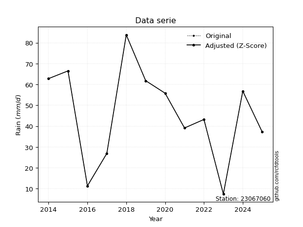</img>

</div>

> If Z-Score is active, values out of range or outliers are replaced with the station mean value.


### 4. Active continuous probability distributions from SciPy (45 of 104 available)

[scipy.stats](https://docs.scipy.org/doc/scipy/reference/stats.html) is a Python´s powerful submodule within the SciPy library for comprehensive statistical analysis, offering over 130 probability distributions (like Normal, Poisson), functions for descriptive stats (mean, variance), hypothesis testing (t-tests, chi-square), random variable generation, and statistical tests, making it essential for data science, modeling, and research. It provides tools to explore, model, and draw conclusions from data efficiently, working seamlessly with NumPy.

<div align="center">

|   id | p_dist             |   n_parameter | fit_method   | label                                                                       | active   | ref                                                                                                        |
|-----:|:-------------------|--------------:|:-------------|:----------------------------------------------------------------------------|:---------|:-----------------------------------------------------------------------------------------------------------|
|    0 | alpha              |             3 | MLE          | Alpha                                                                       | True     | [:mortar_board:](https://docs.scipy.org/doc/scipy/reference/generated/scipy.stats.alpha.html)              |
|    1 | betaprime          |             4 | MLE          | Beta prime                                                                  | True     | [:mortar_board:](https://docs.scipy.org/doc/scipy/reference/generated/scipy.stats.betaprime.html)          |
|    2 | chi2               |             3 | MLE          | Chi²                                                                        | True     | [:mortar_board:](https://docs.scipy.org/doc/scipy/reference/generated/scipy.stats.chi2.html)               |
|    3 | crystalball        |             4 | MLE          | Crystalball                                                                 | True     | [:mortar_board:](https://docs.scipy.org/doc/scipy/reference/generated/scipy.stats.crystalball.html)        |
|    4 | erlang             |             3 | MLE          | Erlang                                                                      | True     | [:mortar_board:](https://docs.scipy.org/doc/scipy/reference/generated/scipy.stats.erlang.html)             |
|    5 | expon              |             2 | MLE          | Exponential                                                                 | True     | [:mortar_board:](https://docs.scipy.org/doc/scipy/reference/generated/scipy.stats.expon.html)              |
|    6 | exponnorm          |             3 | MLE          | Exponentially modified Normal                                               | True     | [:mortar_board:](https://docs.scipy.org/doc/scipy/reference/generated/scipy.stats.exponnorm.html)          |
|    7 | f                  |             4 | MLE          | F                                                                           | True     | [:mortar_board:](https://docs.scipy.org/doc/scipy/reference/generated/scipy.stats.f.html)                  |
|    8 | fatiguelife        |             3 | MLE          | Fatigue-life (Birnbaum-Saunders)                                            | True     | [:mortar_board:](https://docs.scipy.org/doc/scipy/reference/generated/scipy.stats.fatiguelife.html)        |
|    9 | fisk               |             3 | MLE          | Fisk                                                                        | True     | [:mortar_board:](https://docs.scipy.org/doc/scipy/reference/generated/scipy.stats.fisk.html)               |
|   10 | gamma              |             3 | MLE          | Gamma                                                                       | True     | [:mortar_board:](https://docs.scipy.org/doc/scipy/reference/generated/scipy.stats.gamma.html)              |
|   11 | genexpon           |             5 | MLE          | Generalized exponential                                                     | True     | [:mortar_board:](https://docs.scipy.org/doc/scipy/reference/generated/scipy.stats.genexpon.html)           |
|   12 | genlogistic        |             3 | MLE          | Generalized logistic                                                        | True     | [:mortar_board:](https://docs.scipy.org/doc/scipy/reference/generated/scipy.stats.genlogistic.html)        |
|   13 | gibrat             |             2 | MM           | Gibrat                                                                      | True     | [:mortar_board:](https://docs.scipy.org/doc/scipy/reference/generated/scipy.stats.gibrat.html)             |
|   14 | gompertz           |             3 | MLE          | Gompertz (or truncated Gumbel)                                              | True     | [:mortar_board:](https://docs.scipy.org/doc/scipy/reference/generated/scipy.stats.gompertz.html)           |
|   15 | gumbel_l           |             2 | MM           | Gumbel Left Skew                                                            | True     | [:mortar_board:](https://docs.scipy.org/doc/scipy/reference/generated/scipy.stats.gumbel_l.html)           |
|   16 | gumbel_r           |             2 | MM           | Gumbel Right Skew                                                           | True     | [:mortar_board:](https://docs.scipy.org/doc/scipy/reference/generated/scipy.stats.gumbel_r.html)           |
|   17 | halflogistic       |             2 | MM           | Half-logistic                                                               | True     | [:mortar_board:](https://docs.scipy.org/doc/scipy/reference/generated/scipy.stats.halflogistic.html)       |
|   18 | halfnorm           |             2 | MM           | Half Normal                                                                 | True     | [:mortar_board:](https://docs.scipy.org/doc/scipy/reference/generated/scipy.stats.halfnorm.html)           |
|   19 | hypsecant          |             2 | MM           | hyperbolic secant                                                           | True     | [:mortar_board:](https://docs.scipy.org/doc/scipy/reference/generated/scipy.stats.hypsecant.html)          |
|   20 | invgamma           |             3 | MLE          | Inverted gamma                                                              | True     | [:mortar_board:](https://docs.scipy.org/doc/scipy/reference/generated/scipy.stats.invgamma.html)           |
|   21 | invgauss           |             3 | MLE          | Inverse Gaussian                                                            | True     | [:mortar_board:](https://docs.scipy.org/doc/scipy/reference/generated/scipy.stats.invgauss.html)           |
|   22 | invweibull         |             3 | MLE          | Inverted Weibull                                                            | True     | [:mortar_board:](https://docs.scipy.org/doc/scipy/reference/generated/scipy.stats.invweibull.html)         |
|   23 | johnsonsu          |             4 | MLE          | Johnson Su                                                                  | True     | [:mortar_board:](https://docs.scipy.org/doc/scipy/reference/generated/scipy.stats.johnsonsu.html)          |
|   24 | kstwobign          |             2 | MLE          | Limiting distribution of scaled Kolmogorov-Smirnov two-sided test statistic | True     | [:mortar_board:](https://docs.scipy.org/doc/scipy/reference/generated/scipy.stats.kstwobign.html)          |
|   25 | laplace            |             2 | MM           | Laplace                                                                     | True     | [:mortar_board:](https://docs.scipy.org/doc/scipy/reference/generated/scipy.stats.laplace.html)            |
|   26 | laplace_asymmetric |             3 | MLE          | Asymmetric Laplace                                                          | True     | [:mortar_board:](https://docs.scipy.org/doc/scipy/reference/generated/scipy.stats.laplace_asymmetric.html) |
|   27 | loggamma           |             3 | MLE          | Log gamma                                                                   | True     | [:mortar_board:](https://docs.scipy.org/doc/scipy/reference/generated/scipy.stats.loggamma.html)           |
|   28 | logistic           |             2 | MM           | Logistic (or Sech-squared)                                                  | True     | [:mortar_board:](https://docs.scipy.org/doc/scipy/reference/generated/scipy.stats.logistic.html)           |
|   29 | lognorm            |             3 | MLE          | Log Normal                                                                  | True     | [:mortar_board:](https://docs.scipy.org/doc/scipy/reference/generated/scipy.stats.lognorm.html)            |
|   30 | maxwell            |             2 | MM           | Maxwell                                                                     | True     | [:mortar_board:](https://docs.scipy.org/doc/scipy/reference/generated/scipy.stats.maxwell.html)            |
|   31 | mielke             |             4 | MLE          | Mielke Beta-Kappa / Dagum                                                   | True     | [:mortar_board:](https://docs.scipy.org/doc/scipy/reference/generated/scipy.stats.mielke.html)             |
|   32 | moyal              |             2 | MM           | Moyal                                                                       | True     | [:mortar_board:](https://docs.scipy.org/doc/scipy/reference/generated/scipy.stats.moyal.html)              |
|   33 | nakagami           |             3 | MLE          | Nakagami                                                                    | True     | [:mortar_board:](https://docs.scipy.org/doc/scipy/reference/generated/scipy.stats.nakagami.html)           |
|   34 | ncf                |             5 | MLE          | Non-central F distribution                                                  | True     | [:mortar_board:](https://docs.scipy.org/doc/scipy/reference/generated/scipy.stats.ncf.html)                |
|   35 | nct                |             4 | MLE          | Non-central Student’s t                                                     | True     | [:mortar_board:](https://docs.scipy.org/doc/scipy/reference/generated/scipy.stats.nct.html)                |
|   36 | norm               |             2 | MM           | Normal                                                                      | True     | [:mortar_board:](https://docs.scipy.org/doc/scipy/reference/generated/scipy.stats.norm.html)               |
|   37 | pareto             |             3 | MLE          | Pareto                                                                      | True     | [:mortar_board:](https://docs.scipy.org/doc/scipy/reference/generated/scipy.stats.pareto.html)             |
|   38 | pearson3           |             3 | MM           | Pearson type III                                                            | True     | [:mortar_board:](https://docs.scipy.org/doc/scipy/reference/generated/scipy.stats.pearson3.html)           |
|   39 | rayleigh           |             2 | MM           | Rayleigh                                                                    | True     | [:mortar_board:](https://docs.scipy.org/doc/scipy/reference/generated/scipy.stats.rayleigh.html)           |
|   40 | rice               |             3 | MLE          | Rice                                                                        | True     | [:mortar_board:](https://docs.scipy.org/doc/scipy/reference/generated/scipy.stats.rice.html)               |
|   41 | t                  |             3 | MLE          | Student’s t                                                                 | True     | [:mortar_board:](https://docs.scipy.org/doc/scipy/reference/generated/scipy.stats.t.html)                  |
|   42 | truncnorm          |             4 | MLE          | Truncated normal                                                            | True     | [:mortar_board:](https://docs.scipy.org/doc/scipy/reference/generated/scipy.stats.truncnorm.html)          |
|   43 | wald               |             2 | MM           | Wald                                                                        | True     | [:mortar_board:](https://docs.scipy.org/doc/scipy/reference/generated/scipy.stats.wald.html)               |
|   44 | weibull_min        |             3 | MLE          | Weibull minimum                                                             | True     | [:mortar_board:](https://docs.scipy.org/doc/scipy/reference/generated/scipy.stats.weibull_min.html)        |

</div>

> **n_parameter:** # arguments & localization & scale.
>
> **Fit methods:** (MLE) maximum likelihood, (MM) L-moments.
>
>**Inactive:** foldnorm, gennorm, norminvgauss, powernorm, powerlognorm, skewnorm, genextreme, anglit, arcsine, argus, beta, bradford, burr, burr12, cauchy, cosine, halfcauchy, foldcauchy, skewcauchy, wrapcauchy, dgamma, gengamma, exponweib, exponpow, truncexpon, gausshyper, genhalflogistic, genhyperbolic, geninvgauss, halfgennorm, johnsonsb, kappa4, kappa3, ksone, kstwo, loglaplace, levy, levy_l, levy_stable, ncx2, genpareto, truncpareto, lomax, powerlaw, rdist, rel_breitwigner, recipinvgauss, semicircular, studentized_range, trapezoid, triang, truncweibull_min, tukeylambda, uniform, loguniform, vonmises, vonmises_line, weibull_max, dweibull, 


## B. Probability distributions vs. Empirical distributions

A continuous probability distribution (CPD) describes probabilities for variables that can take any value within a range (like rain any time), unlike discrete variables with specific outcomes (like temperature). It uses a Probability Density Function (PDF), a curve where the total area under it equals 1, and the probability of the variable falling within an interval (a to b) is found by calculating the area under the curve between those points. A key feature is that the probability of hitting any single exact value is zero, so probabilities are always expressed for ranges, e.g., $P(a ≤ X ≤ b)$.

<div align="center">

Distributions parameters
|    |   station | p_dist                |   n |               loc |            scale | shape                  | shape1             | shape2                 | shape3   |
|---:|----------:|:----------------------|----:|------------------:|-----------------:|:-----------------------|:-------------------|:-----------------------|:---------|
|  0 |  23067060 | alpha                 |  12 |      -0.0141314   |      6.60456     | 5.110049678833317e-10  |                    |                        |          |
|  1 |  23067060 | betaprime             |  12 |    -672.44        |  49419.3         | 822.5004122259056      | 56812.87650325365  |                        |          |
|  2 |  23067060 | chi2                  |  12 |       2           |      4.94324     | 0.6604697488260338     |                    |                        |          |
|  3 |  23067060 | crystalball           |  12 |      43.1167      |     25.0736      | 3486.992435891445      | 1735.227943331177  |                        |          |
|  4 |  23067060 | erlang                |  12 |    -397.64        |      1.46749     | 300.39040877865716     |                    |                        |          |
|  5 |  23067060 | expon                 |  12 |       2           |     41.1167      |                        |                    |                        |          |
|  6 |  23067060 | exponnorm             |  12 |      43.0939      |     25.0735      | 0.0009081614237563398  |                    |                        |          |
|  7 |  23067060 | f                     |  12 |   -3983.83        |   4026.96        | 52636.147019330936     | 2112330.6083206814 |                        |          |
|  8 |  23067060 | fatiguelife           |  12 |       2           |      1.56015e-05 | 1484.4032986941893     |                    |                        |          |
|  9 |  23067060 | fisk                  |  12 |      -1.07159e+06 |      1.07164e+06 | 71064.88841607724      |                    |                        |          |
| 10 |  23067060 | gamma                 |  12 |    -398.198       |      1.45394     | 303.4515379298639      |                    |                        |          |
| 11 |  23067060 | genexpon              |  12 |       0.484472    |      2.40067     | 1.002922015397472e-09  | 0.057667362974387  | 2.308762079084998      |          |
| 12 |  23067060 | genlogistic           |  12 |      66.3535      |      7.27226     | 0.279348926433034      |                    |                        |          |
| 13 |  23067060 | gibrat                |  12 |      23.9887      |     11.6017      |                        |                    |                        |          |
| 14 |  23067060 | gompertz              |  12 |    -107.072       |      6.81038     | 7.236481386290635e-12  |                    |                        |          |
| 15 |  23067060 | gumbel_l              |  12 |      54.4011      |     19.5498      |                        |                    |                        |          |
| 16 |  23067060 | gumbel_r              |  12 |      31.8322      |     19.5498      |                        |                    |                        |          |
| 17 |  23067060 | halflogistic          |  12 |      13.3987      |     21.437       |                        |                    |                        |          |
| 18 |  23067060 | halfnorm              |  12 |       9.92914     |     41.5944      |                        |                    |                        |          |
| 19 |  23067060 | hypsecant             |  12 |      43.1167      |     15.9623      |                        |                    |                        |          |
| 20 |  23067060 | invgamma              |  12 |    -231.987       |  30213.4         | 110.88994567310525     |                    |                        |          |
| 21 |  23067060 | invgauss              |  12 |     -51.4244      |   1030.28        | 0.09048280026816274    |                    |                        |          |
| 22 |  23067060 | invweibull            |  12 |      -1.45305e+09 |      1.45305e+09 | 60463964.475054175     |                    |                        |          |
| 23 |  23067060 | johnsonsu             |  12 |     146.4         |     13.2551      | 11.191444724037247     | 4.113582202655705  |                        |          |
| 24 |  23067060 | kstwobign             |  12 |     -52.7255      |    109.248       |                        |                    |                        |          |
| 25 |  23067060 | laplace               |  12 |      43.1167      |     17.7297      |                        |                    |                        |          |
| 26 |  23067060 | laplace_asymmetric    |  12 |      62.8         |     15.7707      | 1.802794132260695      |                    |                        |          |
| 27 |  23067060 | loggamma              |  12 |      20.2118      |     35.5616      | 2.3829683522433767     |                    |                        |          |
| 28 |  23067060 | logistic              |  12 |      43.1167      |     13.8238      |                        |                    |                        |          |
| 29 |  23067060 | lognorm               |  12 |       2           |      1.38073     | 10.78473444460178      |                    |                        |          |
| 30 |  23067060 | maxwell               |  12 |     -16.2971      |     37.2321      |                        |                    |                        |          |
| 31 |  23067060 | mielke                |  12 |       2           |     81.9228      | 0.755914930231486      | 815.1062306766995  |                        |          |
| 32 |  23067060 | moyal                 |  12 |      28.778       |     11.2871      |                        |                    |                        |          |
| 33 |  23067060 | nakagami              |  12 |       2           |     50.5183      | 0.3458488948719266     |                    |                        |          |
| 34 |  23067060 | ncf                   |  12 |       0.239736    |      0.0191926   | 0.005320324542802015   | 48.13824256312694  | 11.854550450193745     |          |
| 35 |  23067060 | nct                   |  12 |   -1651.35        |     24.9525      | 225681.11738583882     | 67.90740244783458  |                        |          |
| 36 |  23067060 | norm                  |  12 |      43.1167      |     25.0736      |                        |                    |                        |          |
| 37 |  23067060 | pareto                |  12 |       1.99978     |      0.000217569 | 0.09091948730061974    |                    |                        |          |
| 38 |  23067060 | pearson3              |  12 |      43.1167      |     25.0736      | -0.2788205855929843    |                    |                        |          |
| 39 |  23067060 | rayleigh              |  12 |      -4.8505      |     38.2723      |                        |                    |                        |          |
| 40 |  23067060 | rice                  |  12 |     -10.2729      |     28.7856      | 1.4828134581442383     |                    |                        |          |
| 41 |  23067060 | t                     |  12 |      43.1173      |     25.0728      | 27545398.854545113     |                    |                        |          |
| 42 |  23067060 | truncnorm             |  12 |       4.48496     |      3.36827     | -2.909472982850262     | 23.547678123170265 |                        |          |
| 43 |  23067060 | wald                  |  12 |      18.0432      |     25.0735      |                        |                    |                        |          |
| 44 |  23067060 | weibull_min           |  12 |     -67.2761      |    120.277       | 5.242656168166199      |                    |                        |          |
| 45 |  23067060 | logalpha              |  12 |     -18.5048      |    405.978       | 18.623116655591915     |                    |                        |          |
| 46 |  23067060 | logbetaprime          |  12 |     -22.5778      |    187.781       | 611.5802421618362      | 4423.39545048109   |                        |          |
| 47 |  23067060 | logchi2               |  12 |     -13.869       |      0.03667     | 470.6673968227351      |                    |                        |          |
| 48 |  23067060 | logcrystalball        |  12 |       3.39953     |      1.08053     | 7.021738871286378      | 4425.357581574621  |                        |          |
| 49 |  23067060 | logerlang             |  12 |     -16.1826      |      0.0672093   | 290.9783947145904      |                    |                        |          |
| 50 |  23067060 | logexpon              |  12 |       0.693147    |      2.70638     |                        |                    |                        |          |
| 51 |  23067060 | logexponnorm          |  12 |       3.39881     |      1.08052     | 0.0006689768967255772  |                    |                        |          |
| 52 |  23067060 | logf                  |  12 |   -3071.9         |   3075.29        | 47723531.45735692      | 24331246.561520666 |                        |          |
| 53 |  23067060 | logfatiguelife        |  12 |    -825.249       |    828.655       | 0.0013028082345599126  |                    |                        |          |
| 54 |  23067060 | logfisk               |  12 |      -1.01542e+08 |      1.01542e+08 | 187373411.25912425     |                    |                        |          |
| 55 |  23067060 | loggamma              |  12 |     -15.3108      |      0.0698179   | 267.5465189881463      |                    |                        |          |
| 56 |  23067060 | loggenexpon           |  12 |       0.683477    |      0.0102203   | 0.0007195651001216962  | 1.7435327925144903 | 1.1311379003345598e-05 |          |
| 57 |  23067060 | loggenlogistic        |  12 |       4.42854     |      9.49117e-06 | 9.25268010461129e-06   |                    |                        |          |
| 58 |  23067060 | loggibrat             |  12 |       2.57524     |      0.499958    |                        |                    |                        |          |
| 59 |  23067060 | loggompertz           |  12 |       0.693147    |      0.690921    | 0.010564363854960332   |                    |                        |          |
| 60 |  23067060 | loggumbel_l           |  12 |       3.88582     |      0.842488    |                        |                    |                        |          |
| 61 |  23067060 | loggumbel_r           |  12 |       2.91323     |      0.842488    |                        |                    |                        |          |
| 62 |  23067060 | loghalflogistic       |  12 |       2.11886     |      0.92381     |                        |                    |                        |          |
| 63 |  23067060 | loghalfnorm           |  12 |       1.9693      |      1.79252     |                        |                    |                        |          |
| 64 |  23067060 | loghypsecant          |  12 |       3.39953     |      0.687888    |                        |                    |                        |          |
| 65 |  23067060 | loginvgamma           |  12 |     -19.035       |   8343           | 373.2546687963993      |                    |                        |          |
| 66 |  23067060 | loginvgauss           |  12 |      -8.45392     |   1135.43        | 0.010416004454449585   |                    |                        |          |
| 67 |  23067060 | loginvweibull         |  12 |      -1.18562e+08 |      1.18562e+08 | 90596672.341737        |                    |                        |          |
| 68 |  23067060 | logjohnsonsu          |  12 |       4.52192     |      0.0045031   | 5.843027060207037      | 1.0143648333528024 |                        |          |
| 69 |  23067060 | logkstwobign          |  12 |      -1.98157     |      6.16969     |                        |                    |                        |          |
| 70 |  23067060 | loglaplace            |  12 |       3.39953     |      0.764052    |                        |                    |                        |          |
| 71 |  23067060 | loglaplace_asymmetric |  12 |       4.1972      |      0.3691      | 2.552150724839107      |                    |                        |          |
| 72 |  23067060 | logloggamma           |  12 |       4.42848     |      2.30155e-06 | 2.2366543292054562e-06 |                    |                        |          |
| 73 |  23067060 | loglogistic           |  12 |       3.39953     |      0.595729    |                        |                    |                        |          |
| 74 |  23067060 | loglognorm            |  12 | -106467           | 106471           | 1.0148689760608991e-05 |                    |                        |          |
| 75 |  23067060 | logmaxwell            |  12 |       0.839155    |      1.60448     |                        |                    |                        |          |
| 76 |  23067060 | logmielke             |  12 |      -2.97555e+07 |      2.97556e+07 | 28616745.19916303      | 14058966232.871393 |                        |          |
| 77 |  23067060 | logmoyal              |  12 |       2.78161     |      0.48641     |                        |                    |                        |          |
| 78 |  23067060 | lognakagami           |  12 |       0.891852    |      2.83043     | 3.063935286478576      |                    |                        |          |
| 79 |  23067060 | logncf                |  12 |      -0.277224    |      2.19208e-06 | 2.7694020845682557e-05 | 128.32421949417844 | 46.225075099447245     |          |
| 80 |  23067060 | lognct                |  12 |     -80.0678      |      1.06774     | 118304.14610085706     | 78.1709751131371   |                        |          |
| 81 |  23067060 | lognorm               |  12 |       3.39953     |      1.08053     |                        |                    |                        |          |
| 82 |  23067060 | logpareto             |  12 |       0.69313     |      1.73958e-05 | 0.09091620278345708    |                    |                        |          |
| 83 |  23067060 | logpearson3           |  12 |       3.39953     |      1.08053     | -1.3560533816806752    |                    |                        |          |
| 84 |  23067060 | lograyleigh           |  12 |       1.33241     |      1.64932     |                        |                    |                        |          |
| 85 |  23067060 | logrice               |  12 |    -605.581       |      1.08007     | 563.8357807494674      |                    |                        |          |
| 86 |  23067060 | logt                  |  12 |       4.02737     |      0.270329    | 0.8964515903128865     |                    |                        |          |
| 87 |  23067060 | logtruncnorm          |  12 |       0.965109    |      2.78542     | -0.09763764303335769   | 23.00478488140636  |                        |          |
| 88 |  23067060 | logwald               |  12 |       2.31897     |      1.08055     |                        |                    |                        |          |
| 89 |  23067060 | logweibull_min        |  12 |      -7.33087e+07 |      7.33087e+07 | 110595746.03896356     |                    |                        |          |

</div>

> **loc** (Location parameter): This shifts the distribution along the x-axis. For many common distributions, like the normal (Gaussian) distribution, loc represents the mean $μ$. For others, like the uniform distribution, it might represent the minimum value, or for the beta distribution, the left end of the support interval.
>
> **scale** (Scale parameter): This determines the width or spread of the distribution. For the normal distribution, scale represents the standard deviation $σ$. For a uniform distribution, it defines the length of the interval (from $loc$ to $loc + scale$).
>
> **shape** (Shape parameters): Refers to parameters that define the specific form of a probability distribution, distinct from its location (loc) and scale (scale). These parameters are required arguments for most distribution functions. For example, a normal (Gaussian) distribution is fully defined by its location (mean) and scale (standard deviation), so it has no specific shape parameters beyond loc and scale. However, other distributions have intrinsic properties that need specification, as Gamma distribution that takes a shape parameter, often named $a$ or $alpha$.


### 0. Cumulative distribution values - CDF (90 evaluated)

> Ordered by x ascending and calculating $log(f(x))$ separately. 

|   id |   Station |   date |    x |   count |    mean |     std |      zscore |   Value_initial |   station |   m |      alpha |   alpha_pdf |   betaprime |   betaprime_pdf |        chi2 |    chi2_pdf |   crystalball |   crystalball_pdf |    erlang |   erlang_pdf |    expon |   expon_pdf |   exponnorm |   exponnorm_pdf |         f |      f_pdf |   fatiguelife |   fatiguelife_pdf |      fisk |   fisk_pdf |     gamma |   gamma_pdf |   genexpon |   genexpon_pdf |   genlogistic |   genlogistic_pdf |    gibrat |   gibrat_pdf |    gompertz |   gompertz_pdf |   gumbel_l |   gumbel_l_pdf |   gumbel_r |   gumbel_r_pdf |   halflogistic |   halflogistic_pdf |   halfnorm |   halfnorm_pdf |   hypsecant |   hypsecant_pdf |   invgamma |   invgamma_pdf |   invgauss |   invgauss_pdf |   invweibull |   invweibull_pdf |   johnsonsu |   johnsonsu_pdf |   kstwobign |   kstwobign_pdf |   laplace |   laplace_pdf |   laplace_asymmetric |   laplace_asymmetric_pdf |   loggamma |   loggamma_pdf |   logistic |   logistic_pdf |    lognorm |   lognorm_pdf |   maxwell |   maxwell_pdf |      mielke |   mielke_pdf |      moyal |   moyal_pdf |    nakagami |   nakagami_pdf |        ncf |    ncf_pdf |       nct |    nct_pdf |      norm |   norm_pdf |   pareto |    pareto_pdf |   pearson3 |   pearson3_pdf |   rayleigh |   rayleigh_pdf |      rice |   rice_pdf |         t |      t_pdf |   truncnorm |   truncnorm_pdf |     wald |   wald_pdf |   weibull_min |   weibull_min_pdf |   logalpha |   logalpha_pdf |   logbetaprime |   logbetaprime_pdf |    logchi2 |   logchi2_pdf |   logcrystalball |   logcrystalball_pdf |   logerlang |   logerlang_pdf |   logexpon |   logexpon_pdf |   logexponnorm |   logexponnorm_pdf |       logf |   logf_pdf |   logfatiguelife |   logfatiguelife_pdf |   logfisk |   logfisk_pdf |   loggenexpon |   loggenexpon_pdf |   loggenlogistic |   loggenlogistic_pdf |   loggibrat |   loggibrat_pdf |   loggompertz |   loggompertz_pdf |   loggumbel_l |   loggumbel_l_pdf |   loggumbel_r |   loggumbel_r_pdf |   loghalflogistic |   loghalflogistic_pdf |   loghalfnorm |   loghalfnorm_pdf |   loghypsecant |   loghypsecant_pdf |   loginvgamma |   loginvgamma_pdf |   loginvgauss |   loginvgauss_pdf |   loginvweibull |   loginvweibull_pdf |   logjohnsonsu |   logjohnsonsu_pdf |   logkstwobign |   logkstwobign_pdf |   loglaplace |   loglaplace_pdf |   loglaplace_asymmetric |   loglaplace_asymmetric_pdf |   logloggamma |   logloggamma_pdf |   loglogistic |   loglogistic_pdf |   loglognorm |   loglognorm_pdf |   logmaxwell |   logmaxwell_pdf |   logmielke |   logmielke_pdf |   logmoyal |   logmoyal_pdf |   lognakagami |   lognakagami_pdf |      logncf |   logncf_pdf |     lognct |   lognct_pdf |   logpareto |   logpareto_pdf |   logpearson3 |   logpearson3_pdf |   lograyleigh |   lograyleigh_pdf |    logrice |   logrice_pdf |      logt |   logt_pdf |   logtruncnorm |   logtruncnorm_pdf |    logwald |   logwald_pdf |   logweibull_min |   logweibull_min_pdf |
|-----:|----------:|-------:|-----:|--------:|--------:|--------:|------------:|----------------:|----------:|----:|-----------:|------------:|------------:|----------------:|------------:|------------:|--------------:|------------------:|----------:|-------------:|---------:|------------:|------------:|----------------:|----------:|-----------:|--------------:|------------------:|----------:|-----------:|----------:|------------:|-----------:|---------------:|--------------:|------------------:|----------:|-------------:|------------:|---------------:|-----------:|---------------:|-----------:|---------------:|---------------:|-------------------:|-----------:|---------------:|------------:|----------------:|-----------:|---------------:|-----------:|---------------:|-------------:|-----------------:|------------:|----------------:|------------:|----------------:|----------:|--------------:|---------------------:|-------------------------:|-----------:|---------------:|-----------:|---------------:|-----------:|--------------:|----------:|--------------:|------------:|-------------:|-----------:|------------:|------------:|---------------:|-----------:|-----------:|----------:|-----------:|----------:|-----------:|---------:|--------------:|-----------:|---------------:|-----------:|---------------:|----------:|-----------:|----------:|-----------:|------------:|----------------:|---------:|-----------:|--------------:|------------------:|-----------:|---------------:|---------------:|-------------------:|-----------:|--------------:|-----------------:|---------------------:|------------:|----------------:|-----------:|---------------:|---------------:|-------------------:|-----------:|-----------:|-----------------:|---------------------:|----------:|--------------:|--------------:|------------------:|-----------------:|---------------------:|------------:|----------------:|--------------:|------------------:|--------------:|------------------:|--------------:|------------------:|------------------:|----------------------:|--------------:|------------------:|---------------:|-------------------:|--------------:|------------------:|--------------:|------------------:|----------------:|--------------------:|---------------:|-------------------:|---------------:|-------------------:|-------------:|-----------------:|------------------------:|----------------------------:|--------------:|------------------:|--------------:|------------------:|-------------:|-----------------:|-------------:|-----------------:|------------:|----------------:|-----------:|---------------:|--------------:|------------------:|------------:|-------------:|-----------:|-------------:|------------:|----------------:|--------------:|------------------:|--------------:|------------------:|-----------:|--------------:|----------:|-----------:|---------------:|-------------------:|-----------:|--------------:|-----------------:|---------------------:|
|    0 |  23067060 |   2025 |  2   |      12 | 43.1167 | 26.1885 | -1.57003    |             2   |  23067060 |   1 | 0.00104134 | 0.0060078   |   0.0490796 |      0.00420909 | 3.55656e-06 | 5.28947e+09 |     0.050519  |        0.00414732 | 0.0491595 |   0.00427155 | 0        |  0.024321   |   0.0505186 |      0.0041473  | 0.0504479 | 0.00416242 |     0.0491933 |       3.24551e+10 | 0.0562011 | 0.00351762 | 0.0492062 |  0.00429129 |  0.0170948 |     0.0181137  |     0.0844116 |        0.00324203 | 0         |   0          | 6.53076e-05 |    9.5891e-06  |  0.0662402 |     0.0032735  |  0.0100561 |     0.00236596 |       0        |         0          |  0         |     0          |   0.0483463 |      0.00301714 |  0.0468596 |     0.0046381  |  0.040176  |     0.00565651 |    0.0390147 |       0.00526625 |   0.0677758 |      0.0037153  |   0.0366529 |      0.00591597 | 0.0491817 |    0.00277397 |            0.0901076 |               0.00316931 | 0.00725234 |      0.0195277 |  0.0485985 |     0.00334472 | 0.00612824 |     0.0160333 | 0.0293743 |    0.00458682 | 1.06183e-10 |  15.334      | 0.00105776 | 0.000543115 | 7.66583e-13 |  2388          | 0.00748585 | 0.00333543 | 0.0505462 | 0.00415008 | 0.050519  | 0.00414732 | 0        | 417.889       |  0.057634  |     0.00401543 |  0.0158918 |     0.00460253 | 0.030386  | 0.00496626 | 0.0505114 | 0.00414694 |    0.228936 |    0.0903858    | 0        | 0          |     0.0539365 |        0.00396968 |  0.0058048 |      0.0181876 |     0.00636585 |          0.0173581 | 0.00598529 |     0.0169002 |       0.00612824 |            0.0160333 |  0.00745026 |       0.0198229 |   0        |       0.369497 |     0.00612777 |          0.0160324 | 0.00623483 |   0.016253 |       0.00590787 |             0.015586 | 0.0045924 |    0.00843532 |   0.000689392 |         0.0721814 |           0      |            0.0255536 |    0        |       0         |   1.13684e-09 |         0.0152903 |     0.0223514 |         0.0262316 |   8.78164e-07 |        1.4536e-05 |          0        |              0        |     0         |          0        |      0.0124499 |          0.0180941 |    0.00655395 |         0.0187771 |    0.00662871 |         0.0200851 |      0.00669842 |           0.0256224 |       0.04433  |          0.0248105 |     0.00815242 |          0.0369667 |    0.0144756 |        0.0189459 |               0.0210125 |                   0.0223063 |     0.0265161 |         0.0257685 |     0.0105297 |         0.0174891 |   0.00612807 |        0.0160333 |    0         |         0        |   0.0273281 |       0.0262822 | 1.1532e-17 |    8.79646e-16 |     0         |         0         | 0.000873629 |   0.00538363 | 0.00614246 |    0.0160783 |    0        |   5226.34       |     0.0250686 |         0.0283829 |     0         |          0        | 0.00610904 |     0.0159957 | 0.03288   |  0.0088063 |    1.97632e-10 |           0.264515 | 0          |      0        |       0.00848994 |            0.0127537 |
|    1 |  23067060 |   2023 |  7.4 |      12 | 43.1167 | 26.1885 | -1.36383    |             7.4 |  23067060 |   2 | 0.373032   | 0.0644687   |   0.0762471 |      0.00590543 | 0.809576    | 0.0324684   |     0.0771544 |        0.00576865 | 0.0767348 |   0.00599276 | 0.123075 |  0.0213277  |   0.0771539 |      0.00576863 | 0.0771895 | 0.00579279 |     0.65407   |       0.0135344   | 0.0785027 | 0.00479735 | 0.0769268 |  0.0060274  |  0.131662  |     0.0208316  |     0.103865  |        0.00398855 | 0         |   0          | 0.000144312 |    2.11884e-05 |  0.0863794 |     0.00422186 |  0.0305175 |     0.0054471  |       0        |         0          |  0         |     0          |   0.0676829 |      0.00420829 |  0.0771925 |     0.006647   |  0.0786459 |     0.00861445 |    0.0749445 |       0.00808025 |   0.0906991 |      0.00481169 |   0.0775445 |      0.00921635 | 0.0666927 |    0.00376164 |            0.108955  |               0.00383223 | 0.113665   |      0.177332  |  0.070194  |     0.00472134 | 0.0978586  |     0.159866  | 0.060812  |    0.00708948 | 0.128014    |   0.0179199  | 0.00993745 | 0.00328424  | 0.16529     |     0.0211102  | 0.0360514  | 0.00730157 | 0.0771987 | 0.00577216 | 0.0771544 | 0.00576865 | 0.601502 |   0.00670921  |  0.0829406 |     0.00540172 |  0.0499382 |     0.0079458  | 0.0631534 | 0.00716748 | 0.0771447 | 0.00576827 |    0.806251 |    0.0815923    | 0        | 0          |     0.0788943 |        0.00531432 |  0.12008   |      0.193218  |     0.105744   |          0.169976  | 0.106132   |     0.172261  |       0.0978586  |            0.159866  |  0.113788   |       0.176394  |   0.383333 |       0.227857 |     0.0978558  |          0.159865  | 0.0985177  |   0.160312 |       0.0963406  |             0.158451 | 0.0490548 |    0.0860792  |   0.226404    |         0.246833  |           0      |            0.0914907 |    0        |       0         |   0.0578754   |         0.0956988 |     0.101309  |         0.113942  |   0.052277    |        0.183124   |          0        |              0        |     0.0143219 |          0.445048 |      0.08294   |          0.119212  |    0.114864   |         0.181756  |    0.123241   |         0.191631  |      0.158493   |           0.223089  |       0.100556 |          0.0709164 |     0.201181   |          0.248515  |    0.0802244 |        0.104999  |               0.0842686 |                   0.0894573 |     0.0945562 |         0.09189   |     0.0873217 |         0.13378   |   0.0978595  |        0.159869  |    0.0865882 |         0.200741 |   0.0961756 |       0.0924947 | 0.0257588  |    0.152227    |     0.0107701 |         0.0527494 | 0.0983253   |   0.196631   | 0.0980774  |    0.160126  |    0.639698 |      0.0250371  |     0.105132  |         0.110524  |     0.0789882 |          0.226531 | 0.0977575  |     0.159814  | 0.0512429 |  0.0224411 |    0.341387    |           0.248004 | 0          |      0        |       0.0595255  |            0.0870745 |
|    2 |  23067060 |   2016 | 11.3 |      12 | 43.1167 | 26.1885 | -1.21491    |            11.3 |  23067060 |   3 | 0.559392   | 0.0347174   |   0.101968  |      0.00730508 | 0.896878    | 0.0152061   |     0.102232  |        0.00711288 | 0.10282   |   0.00740311 | 0.20243  |  0.0193977  |   0.102232  |      0.00711287 | 0.102373  | 0.00714255 |     0.698511  |       0.00974451  | 0.0993711 | 0.00593509 | 0.103171  |  0.00745026 |  0.209292  |     0.0189933  |     0.120644  |        0.00463189 | 0         |   0          | 0.000255846 |    3.75622e-05 |  0.104421  |     0.00505218 |  0.0573617 |     0.00838687 |       0        |         0          |  0.0262918 |     0.0191721  |   0.086211  |      0.00533512 |  0.106201  |     0.00824177 |  0.116366  |     0.0107024  |    0.110486  |       0.0101277  |   0.111244  |      0.00574416 |   0.117813  |      0.0113789  | 0.0831017 |    0.00468715 |            0.124974  |               0.00439567 | 0.205982   |      0.258272  |  0.0909913 |     0.00598331 | 0.183508   |     0.245793  | 0.0920894 |    0.0089457  | 0.193072    |   0.0156931  | 0.0300855  | 0.00729514  | 0.240261    |     0.0177146  | 0.0701198  | 0.0101286  | 0.102291  | 0.00711677 | 0.102232  | 0.00711288 | 0.620719 |   0.00370788  |  0.106229  |     0.00656208 |  0.0851889 |     0.0100867  | 0.0941697 | 0.00873181 | 0.102221  | 0.00711253 |    0.97844  |    0.0153229    | 0        | 0          |     0.101761  |        0.00643177 |  0.219418  |      0.273998  |     0.195365   |          0.253451  | 0.196846   |     0.256099  |       0.183508   |            0.245793  |  0.205539   |       0.256579  |   0.472624 |       0.194864 |     0.183504   |          0.245793  | 0.18429    |   0.245881 |       0.18141    |             0.24454  | 0.101254  |    0.167922   |   0.335464    |         0.265059  |           0      |            0.138231  |    0        |       0         |   0.112147    |         0.166429  |     0.16184   |         0.175639  |   0.1677      |        0.355425   |          0.16409  |              0.526664 |     0.200591  |          0.430978 |      0.151424  |          0.211919  |    0.20909    |         0.26233   |    0.220948   |         0.267933  |      0.263695   |           0.268588  |       0.137443 |          0.106315  |     0.31251    |          0.27215   |    0.139613  |        0.182728  |               0.132079  |                   0.140211  |     0.142677  |         0.138654  |     0.162984  |         0.228998  |   0.18351    |        0.245795  |    0.193102  |         0.298038 |   0.144502  |       0.138972  | 0.149      |    0.417826    |     0.0571641 |         0.180349  | 0.201859    |   0.28859    | 0.18383    |    0.245997  |    0.648764 |      0.0184406  |     0.162745  |         0.164637  |     0.196952  |          0.322486 | 0.183397   |     0.245807  | 0.0630516 |  0.0346937 |    0.443073    |           0.231678 | 0.00363992 |      0.189127 |       0.109729   |            0.156107  |
|    3 |  23067060 |   2017 | 26.9 |      12 | 43.1167 | 26.1885 | -0.619229   |            26.9 |  23067060 |   4 | 0.806151   | 0.00705907  |   0.262675  |      0.0131783  | 0.986726    | 0.00162281  |     0.258892  |        0.0129081  | 0.264722  |   0.0131975  | 0.45425  |  0.0132732  |   0.258892  |      0.0129081  | 0.259517  | 0.0129306  |     0.802634  |       0.00474638  | 0.236909  | 0.0119887  | 0.266178  |  0.0132861  |  0.456409  |     0.0130578  |     0.219423  |        0.00839172 | 0.0833998 |   0.0526934  | 0.00252516  |    0.000370312 |  0.217252  |     0.00980728 |  0.276106  |     0.0181762  |       0.304894 |         0.021156   |  0.316732  |     0.0176505  |   0.22115   |      0.0127665  |  0.282859  |     0.0139936  |  0.330552  |     0.0156167  |    0.316326  |       0.0151503  |   0.236398  |      0.0105483  |   0.337179  |      0.0154338  | 0.200326  |    0.0112989  |            0.216329  |               0.00760885 | 0.48134    |      0.349875  |  0.236295  |     0.0130543  | 0.460412   |     0.36739   | 0.281782  |    0.0147163  | 0.406478    |   0.0123399  | 0.277147   | 0.0212815   | 0.466215    |     0.0121637  | 0.290077   | 0.0164992  | 0.259007  | 0.0129103  | 0.258892  | 0.0129081  | 0.653204 |   0.00126627  |  0.250016  |     0.0119614  |  0.291152  |     0.0153651  | 0.274234  | 0.0139516  | 0.258878  | 0.0129081  |    1        |    2.86919e-11  | 0.22246  | 0.0419229  |     0.242204  |        0.0116998  |  0.499073  |      0.340894  |     0.471297   |          0.356178  | 0.473788   |     0.355132  |       0.460412   |            0.36739   |  0.479318   |       0.348448  |   0.617228 |       0.141433 |     0.46041    |          0.367393  | 0.459551   |   0.36647  |       0.457759   |             0.367512 | 0.35826   |    0.424247   |   0.561969    |         0.246272  |           0      |            0.321968  |    0.640725 |       0.521499  |   0.358465    |         0.421972  |     0.389977  |         0.35788   |   0.528455    |        0.400062   |          0.561495 |              0.370597 |     0.539467  |          0.339015 |      0.450503  |          0.457152  |    0.484526   |         0.34505   |    0.493551   |         0.333179  |      0.503057   |           0.264104  |       0.290988 |          0.282789  |     0.541906   |          0.24426   |    0.434433  |        0.568591  |               0.331665  |                   0.352087  |     0.33144   |         0.322095  |     0.455051  |         0.416263  |   0.460414   |        0.367388  |    0.49459   |         0.361229 |   0.332762  |       0.320026  | 0.554061   |    0.407358    |     0.362908  |         0.487598  | 0.491537    |   0.343836   | 0.460727   |    0.367133  |    0.661494 |      0.0118414  |     0.372964  |         0.331411  |     0.506339  |          0.355641 | 0.460385   |     0.367546  | 0.12347   |  0.139717  |    0.625642    |           0.187484 | 0.625308   |      0.429613 |       0.349562   |            0.422054  |
|    4 |  23067060 |   2021 | 39.1 |      12 | 43.1167 | 26.1885 | -0.153375   |            39.1 |  23067060 |   5 | 0.865912   | 0.00339567  |   0.442379  |      0.0157691  | 0.996887    | 0.000361709 |     0.436364  |        0.015708   | 0.443669  |   0.0156238  | 0.594369 |  0.00986538 |   0.436364  |      0.0157081  | 0.437021  | 0.0156875  |     0.850562  |       0.00325621  | 0.4108    | 0.016051   | 0.446179  |  0.0156992  |  0.594493  |     0.0097408  |     0.348751  |        0.013088   | 0.604222  |   0.0254942  | 0.01505     |    0.00219314  |  0.366935  |     0.0148046  |  0.501816  |     0.0176991  |       0.536666 |         0.0166066  |  0.516895  |     0.0150004  |   0.420734  |      0.0193262  |  0.466129  |     0.0154633  |  0.519549  |     0.0147968  |    0.500185  |       0.0144192  |   0.390521  |      0.0146038  |   0.520176  |      0.0141198  | 0.39864   |    0.0224843  |            0.332256  |               0.0116863  | 0.610028   |      0.332413  |  0.427866  |     0.0177084  | 0.59744    |     0.358141  | 0.470766  |    0.0156834  | 0.549468    |   0.0111954  | 0.526719   | 0.0183119   | 0.598979    |     0.00970867 | 0.489629   | 0.01556    | 0.436478  | 0.0157057  | 0.436364  | 0.015708   | 0.665552 |   0.000819615 |  0.41862   |     0.0153429  |  0.482823  |     0.015518   | 0.456866  | 0.0155051  | 0.436352  | 0.0157084  |    1        |    1.38311e-24  | 0.595698 | 0.0203607  |     0.408594  |        0.0153095  |  0.622429  |      0.313851  |     0.602941   |          0.341463  | 0.604688   |     0.338675  |       0.59744    |            0.358141  |  0.607636   |       0.331905  |   0.666631 |       0.123179 |     0.597439   |          0.358144  | 0.597465   |   0.357157 |       0.594957   |             0.358905 | 0.526775  |    0.459995   |   0.649677    |         0.221622  |           0      |            0.463614  |    0.78237  |       0.269739  |   0.537126    |         0.523131  |     0.537196  |         0.423233  |   0.664209    |        0.322576   |          0.684448 |              0.287684 |     0.656164  |          0.284378 |      0.620386  |          0.430033  |    0.61078    |         0.324641  |    0.614609   |         0.309538  |      0.596743   |           0.235413  |       0.427506 |          0.465026  |     0.628169   |          0.216308  |    0.647276  |        0.461649  |               0.493316  |                   0.523692  |     0.476705  |         0.463263  |     0.610047  |         0.399325  |   0.597441   |        0.358137  |    0.624189  |         0.326945 |   0.476806  |       0.458557  | 0.687069   |    0.304648    |     0.548785  |         0.48877   | 0.614422    |   0.309028   | 0.597628   |    0.357739  |    0.665606 |      0.010226   |     0.512348  |         0.412423  |     0.632506  |          0.315273 | 0.597471   |     0.358289  | 0.213601  |  0.407498  |    0.691777    |           0.166086 | 0.750748   |      0.258824 |       0.530537   |            0.535551  |
|    5 |  23067060 |   2022 | 43.2 |      12 | 43.1167 | 26.1885 |  0.00318206 |            43.2 |  23067060 |   6 | 0.87853    | 0.00278908  |   0.507386  |      0.0158711  | 0.998061    | 0.000222723 |     0.501326  |        0.0159108  | 0.507982  |   0.0156802  | 0.632865 |  0.00892909 |   0.501326  |      0.0159108  | 0.501866  | 0.0158747  |     0.863186  |       0.00291107  | 0.477822  | 0.016546   | 0.51077   |  0.0157395  |  0.632527  |     0.00882718 |     0.406271  |        0.0149853  | 0.692991  |   0.018286   | 0.0273074   |    0.00395442  |  0.43099   |     0.0164115  |  0.57174   |     0.0163502  |       0.601242 |         0.0148927  |  0.576224  |     0.0139306  |   0.501662  |      0.0199411  |  0.529057  |     0.0151714  |  0.578439  |     0.0138947  |    0.557599  |       0.0135531  |   0.452656  |      0.0156613  |   0.576268  |      0.0132189  | 0.502345  |    0.0280691  |            0.383797  |               0.0134991  | 0.642682   |      0.322168  |  0.501507  |     0.0180846  | 0.6327     |     0.348591  | 0.534323  |    0.015264   | 0.594777    |   0.0109126  | 0.597578   | 0.0162315   | 0.637316    |     0.00899977 | 0.551436   | 0.0145532  | 0.501428  | 0.0159069  | 0.501326  | 0.0159108  | 0.668724 |   0.000731051 |  0.482783  |     0.0158924  |  0.545305  |     0.0149159  | 0.520241  | 0.0153522  | 0.501316  | 0.0159113  |    1        |    2.43437e-30  | 0.669424 | 0.0158318  |     0.472937  |        0.0160185  |  0.653156  |      0.302177  |     0.636512   |          0.331458  | 0.637965   |     0.328388  |       0.6327     |            0.348591  |  0.640253   |       0.32193   |   0.678691 |       0.118723 |     0.632699   |          0.348594  | 0.632625   |   0.347649 |       0.6303     |             0.349493 | 0.572292  |    0.451675   |   0.671402    |         0.214044  |           0      |            0.510946  |    0.807218 |       0.229961  |   0.589976    |         0.535349  |     0.579899  |         0.432454  |   0.695249    |        0.29996    |          0.712087 |              0.266793 |     0.683774  |          0.269373 |      0.66202   |          0.404075  |    0.642641   |         0.314082  |    0.644961   |         0.298952  |      0.619779   |           0.226563  |       0.477248 |          0.534346  |     0.64934    |          0.208284  |    0.690434  |        0.405164  |               0.548402  |                   0.582169  |     0.525213  |         0.510404  |     0.649058  |         0.382358  |   0.632701   |        0.348587  |    0.656131  |         0.313465 |   0.524796  |       0.504711  | 0.716164   |    0.279134    |     0.596753  |         0.472277  | 0.644601    |   0.296058   | 0.632847   |    0.348174  |    0.666608 |      0.0098645  |     0.554424  |         0.431106  |     0.663253  |          0.30124  | 0.632745   |     0.348727  | 0.26246   |  0.58483   |    0.708051    |           0.160316 | 0.774995   |      0.22827  |       0.584771   |            0.550582  |
|    6 |  23067060 |   2020 | 55.8 |      12 | 43.1167 | 26.1885 |  0.48431    |            55.8 |  23067060 |   7 | 0.905805   | 0.00167979  |   0.697392  |      0.0137258  | 0.999535    | 5.20781e-05 |     0.693517  |        0.0140001  | 0.69522   |   0.0135099  | 0.729767 |  0.00657234 |   0.693518  |      0.0140001  | 0.693405  | 0.0139409  |     0.894532  |       0.0021209   | 0.678479  | 0.014466   | 0.698341  |  0.0135013  |  0.728495  |     0.00652191 |     0.628641  |        0.0195643  | 0.843434  |   0.0075405  | 0.161471    |    0.0216831   |  0.658422  |     0.0187683  |  0.745673  |     0.0111935  |       0.756925 |         0.00996093 |  0.729892  |     0.0104427  |   0.729866  |      0.0149638  |  0.705123  |     0.0123925  |  0.731813  |     0.0103485  |    0.707671  |       0.0101822  |   0.659728  |      0.0164663  |   0.722847  |      0.00999929 | 0.755495  |    0.0137907  |            0.597819  |               0.0210268  | 0.720936   |      0.287602  |  0.714533  |     0.0147554  | 0.717649   |     0.312795  | 0.710214  |    0.0123247  | 0.727701    |   0.0102245  | 0.762584   | 0.0102011   | 0.738092    |     0.00704784 | 0.711286   | 0.0107417  | 0.69355   | 0.0139939  | 0.693517  | 0.0140001  | 0.676664 |   0.000546421 |  0.681351  |     0.0149427  |  0.715111  |     0.0117962  | 0.701357  | 0.0129716  | 0.693514  | 0.0140006  |    1        |    4.72605e-52  | 0.811931 | 0.00790907 |     0.676382  |        0.0155522  |  0.726068  |      0.266438  |     0.717131   |          0.296572  | 0.717749   |     0.293226  |       0.717649   |            0.312795  |  0.718532   |       0.288017  |   0.707684 |       0.10801  |     0.717649   |          0.312798  | 0.717356   |   0.312056 |       0.715518   |             0.313969 | 0.682108  |    0.400123   |   0.723569    |         0.193374  |           0      |            0.655741  |    0.855974 |       0.156851  |   0.726374    |         0.517437  |     0.691217  |         0.430696  |   0.764709    |        0.243494   |          0.773879 |              0.217096 |     0.7478    |          0.23109  |      0.755179  |          0.321836  |    0.718822   |         0.279715  |    0.717407   |         0.265992  |      0.674749   |           0.202843  |       0.641365 |          0.757734  |     0.699971   |          0.187331  |    0.778548  |        0.289838  |               0.719604  |                   0.763912  |     0.673523  |         0.654531  |     0.73972   |         0.323191  |   0.717649   |        0.312792  |    0.731388  |         0.273601 |   0.671255  |       0.645564  | 0.779874   |    0.220446    |     0.709805  |         0.4064    | 0.715695    |   0.258777   | 0.717689   |    0.312393  |    0.669024 |      0.00904004 |     0.669587  |         0.464447  |     0.735367  |          0.261627 | 0.717724   |     0.312891  | 0.493554  |  1.15147   |    0.747189    |           0.145553 | 0.82522    |      0.167992 |       0.725585   |            0.535337  |
|    7 |  23067060 |   2024 | 56.8 |      12 | 43.1167 | 26.1885 |  0.522495   |            56.8 |  23067060 |   8 | 0.907456   | 0.00162157  |   0.710969  |      0.0134269  | 0.999584    | 4.64911e-05 |     0.707373  |        0.0137096  | 0.708585  |   0.0132173  | 0.73626  |  0.00641442 |   0.707374  |      0.0137096  | 0.707202  | 0.0136508  |     0.896628  |       0.00207112  | 0.69277   | 0.0141142  | 0.711695  |  0.0132032  |  0.734939  |     0.00636711 |     0.648243  |        0.0196252  | 0.850742  |   0.00708258 | 0.184505    |    0.0244227   |  0.677145  |     0.0186705  |  0.756666  |     0.0107922  |       0.766711 |         0.00961315 |  0.740196  |     0.0101665  |   0.744519  |      0.0143414  |  0.717366  |     0.0120916  |  0.742014  |     0.0100546  |    0.717715  |       0.00990584 |   0.676125  |      0.0163228  |   0.732716  |      0.0097403  | 0.768904  |    0.0130344  |            0.61922   |               0.0217796  | 0.72602    |      0.284847  |  0.729056  |     0.0142894  | 0.723178   |     0.309806  | 0.722388  |    0.0120226  | 0.737903    |   0.0101787  | 0.772582   | 0.00979691  | 0.745069    |     0.00690555 | 0.721874   | 0.0104334  | 0.7074    | 0.0137034  | 0.707373  | 0.0137096  | 0.677205 |   0.000535552 |  0.696172  |     0.0146962  |  0.72676   |     0.0115004  | 0.714187  | 0.0126869  | 0.707371  | 0.01371    |    1        |    4.90942e-54  | 0.819643 | 0.00751894 |     0.691825  |        0.0153274  |  0.730777  |      0.263732  |     0.722373   |          0.29375   | 0.722932   |     0.290408  |       0.723178   |            0.309806  |  0.723624   |       0.285303  |   0.709596 |       0.107304 |     0.723179   |          0.309809  | 0.722873   |   0.309085 |       0.721068   |             0.310994 | 0.689173  |    0.395283   |   0.72699     |         0.191892  |           0      |            0.667195  |    0.858725 |       0.15294   |   0.735528    |         0.513151  |     0.698852  |         0.428996  |   0.769001    |        0.239752   |          0.777706 |              0.213882 |     0.751881  |          0.228471 |      0.760843  |          0.315869  |    0.723766   |         0.277026  |    0.722109   |         0.263469  |      0.678337   |           0.201173  |       0.654975 |          0.774747  |     0.703285   |          0.185873  |    0.783637  |        0.283178  |               0.733301  |                   0.778453  |     0.68525   |         0.665927  |     0.74542   |         0.31855   |   0.723178   |        0.309803  |    0.736221  |         0.270638 |   0.68282   |       0.656687  | 0.783757   |    0.21676     |     0.716975  |         0.4009    | 0.720268    |   0.256055   | 0.723212   |    0.309407  |    0.669184 |      0.00898771 |     0.677847  |         0.465636  |     0.739989  |          0.258756 | 0.723256   |     0.309898  | 0.514005  |  1.14953   |    0.749766    |           0.144535 | 0.828173   |      0.164582 |       0.735055   |            0.5309    |
|    8 |  23067060 |   2019 | 61.8 |      12 | 43.1167 | 26.1885 |  0.713418   |            61.8 |  23067060 |   9 | 0.914912   | 0.00137129  |   0.774034  |      0.0117568  | 0.999762    | 2.64443e-05 |     0.771907  |        0.0120539  | 0.770708  |   0.0115932  | 0.766459 |  0.00567996 |   0.771908  |      0.0120539  | 0.771456  | 0.0120021  |     0.906401  |       0.00184358  | 0.758536  | 0.0121459  | 0.773683  |  0.0115542  |  0.764937  |     0.00564652 |     0.744859  |        0.0186442  | 0.881289  |   0.00525032 | 0.346232    |    0.0407984   |  0.767773  |     0.0173435  |  0.805808  |     0.00889942 |       0.810649 |         0.00799664 |  0.787626  |     0.00881465 |   0.808499  |      0.0112863  |  0.773913  |     0.010511   |  0.788671  |     0.00862016 |    0.763854  |       0.0085623  |   0.75503   |      0.0151005  |   0.778234  |      0.00847702 | 0.825693  |    0.00983138 |            0.73828   |               0.0259672  | 0.749485   |      0.271286  |  0.794381  |     0.0118159  | 0.748695   |     0.294905  | 0.778599  |    0.0104484  | 0.78825     |   0.00996404 | 0.816863   | 0.00796868  | 0.777865    |     0.00621991 | 0.77027    | 0.00894087 | 0.771904  | 0.0120483  | 0.771907  | 0.0120539  | 0.679757 |   0.000486893 |  0.765995  |     0.0131522  |  0.780495  |     0.00998801 | 0.773825  | 0.011138   | 0.771906  | 0.0120542  |    1        |    1.58304e-64  | 0.852955 | 0.00588655 |     0.764954  |        0.0138235  |  0.752476  |      0.250612  |     0.746574   |          0.2798    | 0.746853   |     0.276521  |       0.748695   |            0.294905  |  0.747135   |       0.27193   |   0.718509 |       0.10401  |     0.748695   |          0.294907  | 0.748333   |   0.294274 |       0.746688   |             0.296149 | 0.721504  |    0.370782   |   0.742881    |         0.184803  |           0      |            0.72439   |    0.870894 |       0.135947  |   0.777789    |         0.487148  |     0.734612  |         0.417874  |   0.788491    |        0.222404   |          0.79512  |              0.199058 |     0.770635  |          0.216144 |      0.786305  |          0.287839  |    0.746587   |         0.263855  |    0.743822   |         0.251188  |      0.694975   |           0.193239  |       0.723672 |          0.852342  |     0.718675   |          0.178969  |    0.806256  |        0.253574  |               0.802008  |                   0.851391  |     0.743799  |         0.722826  |     0.77135   |         0.296056  |   0.748694   |        0.294901  |    0.758454  |         0.256353 |   0.740532  |       0.712191  | 0.801327   |    0.199949    |     0.749662  |         0.373715  | 0.741321    |   0.243014   | 0.748696   |    0.294527  |    0.669932 |      0.00874687 |     0.717289  |         0.468576  |     0.76124   |          0.245012 | 0.748779   |     0.29498   | 0.606584  |  1.0155    |    0.761756    |           0.139719 | 0.841409   |      0.149492 |       0.778763   |            0.503491  |
|    9 |  23067060 |   2014 | 62.8 |      12 | 43.1167 | 26.1885 |  0.751603   |            62.8 |  23067060 |  10 | 0.916261   | 0.00132822  |   0.785612  |      0.011397   | 0.999787    | 2.36363e-05 |     0.78378   |        0.0116916  | 0.782127  |   0.011245   | 0.772071 |  0.00554348 |   0.783781  |      0.0116916  | 0.783279  | 0.0116421  |     0.908223  |       0.00180195  | 0.770473  | 0.0117271  | 0.785061  |  0.0112015  |  0.770516  |     0.0055125  |     0.763275  |        0.0181719  | 0.886392  |   0.00495802 | 0.388733    |    0.0441794   |  0.784903  |     0.0169072  |  0.814531  |     0.00854718 |       0.818496 |         0.00769847 |  0.796309  |     0.00855182 |   0.819497  |      0.0107117  |  0.784262  |     0.0101867  |  0.797152  |     0.00834338 |    0.772286  |       0.008304   |   0.769962  |      0.0147582  |   0.786589  |      0.00823261 | 0.835252  |    0.00929221 |            0.76471   |               0.0268968  | 0.753819   |      0.268627  |  0.805945  |     0.0113137  | 0.753405   |     0.29195   | 0.788886  |    0.0101269  | 0.798194    |   0.00992379 | 0.824667   | 0.00764074  | 0.784018    |     0.00608788 | 0.779067   | 0.0086551  | 0.783772  | 0.0116862  | 0.78378   | 0.0116916  | 0.68024  |   0.000478163 |  0.778968  |     0.0127899  |  0.790331  |     0.0096836  | 0.784799  | 0.0108101  | 0.78378   | 0.011692   |    1        |    9.69048e-67  | 0.858703 | 0.00561385 |     0.778594  |        0.0134547  |  0.756479  |      0.248075  |     0.751043   |          0.277055  | 0.75127    |     0.273794  |       0.753405   |            0.29195   |  0.751479   |       0.269304  |   0.720174 |       0.103395 |     0.753405   |          0.291953  | 0.753033   |   0.291338 |       0.751418   |             0.293204 | 0.727416  |    0.365884   |   0.745837    |         0.183446  |           0      |            0.735814  |    0.873052 |       0.132986  |   0.785561    |         0.48116   |     0.741298  |         0.415182  |   0.792035    |        0.219187   |          0.798293 |              0.196321 |     0.774086  |          0.213821 |      0.790883  |          0.282598  |    0.750802   |         0.261285  |    0.747835   |         0.248804  |      0.698064   |           0.191732  |       0.737461 |          0.865652  |     0.721538   |          0.17766   |    0.810284  |        0.248302  |               0.815791  |                   0.866023  |     0.755493  |         0.73419   |     0.776068  |         0.291721  |   0.753404   |        0.291947  |    0.762547  |         0.253604 |   0.752053  |       0.72327   | 0.804512   |    0.19688     |     0.755618  |         0.368381  | 0.745202    |   0.240518   | 0.7534     |    0.291577  |    0.670072 |      0.00870244 |     0.72481   |         0.468578  |     0.765152  |          0.242383 | 0.753491   |     0.292022  | 0.622556  |  0.974114  |    0.763992    |           0.138806 | 0.843787   |      0.146815 |       0.786794   |            0.497107  |
|   10 |  23067060 |   2015 | 66.5 |      12 | 43.1167 | 26.1885 |  0.892887   |            66.5 |  23067060 |  11 | 0.920904   | 0.00118526  |   0.825261  |      0.0100277  | 0.999858    | 1.56265e-05 |     0.824484  |        0.0103     | 0.821299  |   0.0099228  | 0.791686 |  0.00506642 |   0.824485  |      0.0103     | 0.823818  | 0.0102608  |     0.914619  |       0.00165784  | 0.810973  | 0.0101655  | 0.824045  |  0.00986545 |  0.790032  |     0.0050437  |     0.826272  |        0.01571    | 0.902963  |   0.00403838 | 0.571488    |    0.053321    |  0.843835  |     0.0148326  |  0.843859  |     0.00732808 |       0.84504  |         0.00666856 |  0.826189  |     0.00760737 |   0.855416  |      0.00874956 |  0.819732  |     0.00898829 |  0.826181  |     0.00735831 |    0.801294  |       0.00738644 |   0.821875  |      0.0132398  |   0.815416  |      0.00735816 | 0.866283  |    0.007542   |            0.84586   |               0.0176202  | 0.768922   |      0.258972  |  0.844425  |     0.00950328 | 0.769811   |     0.281146  | 0.824156  |    0.0089403  | 0.834646    |   0.00978172 | 0.850835   | 0.00653028  | 0.80566     |     0.00561398 | 0.809196   | 0.00764306 | 0.824457  | 0.0102955  | 0.824484  | 0.0103     | 0.681953 |   0.000448319 |  0.823649  |     0.0113362  |  0.82409   |     0.00856878 | 0.822514  | 0.00957187 | 0.824485  | 0.0103002  |    1        |    2.91648e-75  | 0.877781 | 0.00472892 |     0.825634  |        0.0119352  |  0.77042   |      0.238946  |     0.766619   |          0.267064  | 0.766661   |     0.263889  |       0.769811   |            0.281146  |  0.766624   |       0.259763  |   0.726031 |       0.101231 |     0.769812   |          0.281148  | 0.769405   |   0.2806   |       0.767896   |             0.282429 | 0.747852  |    0.347962   |   0.7562      |         0.178592  |           0      |            0.778046  |    0.880376 |       0.123059  |   0.81244     |         0.457205  |     0.764759  |         0.404074  |   0.804259    |        0.207949   |          0.809258 |              0.186782 |     0.786091  |          0.205605 |      0.806533  |          0.264249  |    0.765494   |         0.25198   |    0.761833   |         0.240204  |      0.708887   |           0.186371  |       0.788211 |          0.904696  |     0.731575   |          0.173008  |    0.823979  |        0.230378  |               0.866906  |                   0.920284  |     0.798714  |         0.776192  |     0.792324  |         0.276211  |   0.76981    |        0.281143  |    0.776783  |         0.243746 |   0.794619  |       0.764207  | 0.815476   |    0.186261    |     0.776155  |         0.349054  | 0.758716    |   0.231602   | 0.769785   |    0.280792  |    0.670566 |      0.00854746 |     0.751601  |         0.466949  |     0.778759  |          0.232996 | 0.7699     |     0.281207  | 0.673801  |  0.815093  |    0.771845    |           0.135564 | 0.851929   |      0.13773  |       0.814538   |            0.471426  |
|   11 |  23067060 |   2018 | 83.8 |      12 | 43.1167 | 26.1885 |  1.55348    |            83.8 |  23067060 |  12 | 0.937192   | 0.000747827 |   0.945641  |      0.00422515 | 0.999979    | 2.31628e-06 |     0.947658  |        0.0042659  | 0.941742  |   0.00431594 | 0.863231 |  0.00332637 |   0.947659  |      0.00426588 | 0.946814  | 0.0042812  |     0.938531  |       0.00114464  | 0.93109   | 0.00425469 | 0.943259  |  0.00424429 |  0.861429  |     0.00332866 |     0.976013  |        0.00312101 | 0.949502  |   0.00173803 | 0.999979    |    3.3919e-05  |  0.988877  |     0.00255959 |  0.932327  |     0.00334174 |       0.927759 |         0.0032482  |  0.924264  |     0.00396277 |   0.950329  |      0.00309918 |  0.931174  |     0.00420882 |  0.919842  |     0.00375798 |    0.89777   |       0.00402871 |   0.971866  |      0.00414688 |   0.911996  |      0.00402567 | 0.949601  |    0.00284261 |            0.978667  |               0.00243862 | 0.824131   |      0.218249  |  0.949931  |     0.00344057 | 0.829508   |     0.234628  | 0.935021  |    0.00417374 | 0.998628    |   0.00712864 | 0.930363   | 0.00307698  | 0.885525    |     0.00370253 | 0.907231   | 0.00399157 | 0.9476    | 0.00426649 | 0.947658  | 0.0042659  | 0.68875  |   0.000345949 |  0.956981  |     0.00433089 |  0.931618  |     0.00413859 | 0.940174  | 0.00430566 | 0.947661  | 0.00426586 |    1        |    4.65193e-122 | 0.935249 | 0.00226788 |     0.96328   |        0.00421075 |  0.821354  |      0.201592  |     0.823512   |          0.224641  | 0.822881   |     0.222048  |       0.829508   |            0.234628  |  0.822062   |       0.219402  |   0.748466 |       0.092941 |     0.829509   |          0.234629  | 0.829008   |   0.234361 |       0.827897   |             0.23596  | 0.819635  |    0.272794   |   0.79522     |         0.158913  |           0.9999 |            0.974755  |    0.904926 |       0.0912559 |   0.90397     |         0.327131  |     0.851057  |         0.336642  |   0.847428    |        0.16652    |          0.848291 |              0.151764 |     0.829901  |          0.173696 |      0.859664  |          0.197465  |    0.819291   |         0.213117  |    0.813277   |         0.20464   |      0.74951    |           0.165136  |       0.98043  |          0.515153  |     0.769437   |          0.154586  |    0.869944  |        0.170219  |               0.973098  |                   0.186015  |     0.999959  |         0.971762  |     0.849046  |         0.215143  |   0.829506   |        0.234625  |    0.82852   |         0.203833 |   0.992467  |       0.931232  | 0.854015   |    0.148377    |     0.847667  |         0.26959   | 0.808127    |   0.195962   | 0.82941    |    0.23437   |    0.672474 |      0.00797188 |     0.856171  |         0.427732  |     0.828273  |          0.195449 | 0.829606   |     0.234643  | 0.801558  |  0.355499  |    0.801696    |           0.122691 | 0.880082   |      0.107305 |       0.908208   |            0.330723  |

An Empirical Distribution Function (EDF) is a step-function estimate of a true cumulative distribution function (CDF) based on observed sample data, representing the proportion of data points less than or equal to a given value. It is calculated by ordering your data and jumping up by $1/n$ (where $n$ is sample size) at each unique data point, allowing analysis without assuming an underlying population distribution, and it gets closer to the true CDF as the sample size grows.


### 1. Empirical - EDF California (1923)

California´s estimates the true probability distribution of water-related data (like rainfall, streamflow) using observed samples, crucial for risk assessment.

<div align="center">


$P=m/n$


</div>


**1.1. Empirical values**

<div align="center">

|                | 0                   | 1                   | 2                  | 3                  | 4                  | 5              | 6                  | 7                  | 8              | 9                  | 10                 | 11             |
|:---------------|:--------------------|:--------------------|:-------------------|:-------------------|:-------------------|:---------------|:-------------------|:-------------------|:---------------|:-------------------|:-------------------|:---------------|
| date           | 2025                | 2023                | 2016               | 2017               | 2021               | 2022           | 2020               | 2024               | 2019           | 2014               | 2015               | 2018           |
| x              | 2.0                 | 7.4                 | 11.3               | 26.9               | 39.1               | 43.2           | 55.8               | 56.8               | 61.8           | 62.8               | 66.5               | 83.8           |
| m              | 1                   | 2                   | 3                  | 4                  | 5                  | 6              | 7                  | 8                  | 9              | 10                 | 11                 | 12             |
| empirical_dist | edf_california      | edf_california      | edf_california     | edf_california     | edf_california     | edf_california | edf_california     | edf_california     | edf_california | edf_california     | edf_california     | edf_california |
| empirical      | 0.08333333333333333 | 0.16666666666666666 | 0.25               | 0.3333333333333333 | 0.4166666666666667 | 0.5            | 0.5833333333333334 | 0.6666666666666666 | 0.75           | 0.8333333333333334 | 0.9166666666666666 | 1.0            |
| empirical_tr   | 1.090909090909091   | 1.2                 | 1.3333333333333333 | 1.4999999999999998 | 1.7142857142857144 | 2.0            | 2.4000000000000004 | 2.9999999999999996 | 4.0            | 6.000000000000002  | 11.999999999999995 | inf            |

</div>


**1.2. Kolmogorov-Smirnov fit test (sorted by Δ)**


<div align="center">

|                | 0                   | 1                   | 2                   | 3                   | 4                   | 5                     | 6                   | 7                   | 8                   | 9                   | 10                  | 11                  | 12                  | 13                  | 14                  | 15                  | 16                  | 17                  | 18                  | 19                  | 20                  | 21                  | 22                  | 23                  | 24                  | 25                  | 26                  | 27                  | 28                  | 29                  | 30                  | 31                  | 32                  | 33                  | 34                  | 35                  | 36                  | 37                  | 38                  | 39                  | 40                  | 41                  | 42                  | 43                  | 44                  | 45                  | 46                  | 47                  | 48                  | 49                  | 50                  | 51                  | 52                  | 53                  | 54                  | 55                  | 56                  | 57                  | 58                  | 59                  | 60                  | 61                  | 62                  | 63                  | 64                  | 65                  | 66                  | 67                  | 68                  | 69                  | 70                  | 71                  | 72                  | 73                  | 74                  | 75                  | 76                  | 77                  | 78                  | 79                  | 80                  | 81                  | 82                  | 83                  | 84                  | 85                  | 86                  | 87                  | 88                  | 89                  |
|:---------------|:--------------------|:--------------------|:--------------------|:--------------------|:--------------------|:----------------------|:--------------------|:--------------------|:--------------------|:--------------------|:--------------------|:--------------------|:--------------------|:--------------------|:--------------------|:--------------------|:--------------------|:--------------------|:--------------------|:--------------------|:--------------------|:--------------------|:--------------------|:--------------------|:--------------------|:--------------------|:--------------------|:--------------------|:--------------------|:--------------------|:--------------------|:--------------------|:--------------------|:--------------------|:--------------------|:--------------------|:--------------------|:--------------------|:--------------------|:--------------------|:--------------------|:--------------------|:--------------------|:--------------------|:--------------------|:--------------------|:--------------------|:--------------------|:--------------------|:--------------------|:--------------------|:--------------------|:--------------------|:--------------------|:--------------------|:--------------------|:--------------------|:--------------------|:--------------------|:--------------------|:--------------------|:--------------------|:--------------------|:--------------------|:--------------------|:--------------------|:--------------------|:--------------------|:--------------------|:--------------------|:--------------------|:--------------------|:--------------------|:--------------------|:--------------------|:--------------------|:--------------------|:--------------------|:--------------------|:--------------------|:--------------------|:--------------------|:--------------------|:--------------------|:--------------------|:--------------------|:--------------------|:--------------------|:--------------------|:--------------------|
| station        | 23067060            | 23067060            | 23067060            | 23067060            | 23067060            | 23067060              | 23067060            | 23067060            | 23067060            | 23067060            | 23067060            | 23067060            | 23067060            | 23067060            | 23067060            | 23067060            | 23067060            | 23067060            | 23067060            | 23067060            | 23067060            | 23067060            | 23067060            | 23067060            | 23067060            | 23067060            | 23067060            | 23067060            | 23067060            | 23067060            | 23067060            | 23067060            | 23067060            | 23067060            | 23067060            | 23067060            | 23067060            | 23067060            | 23067060            | 23067060            | 23067060            | 23067060            | 23067060            | 23067060            | 23067060            | 23067060            | 23067060            | 23067060            | 23067060            | 23067060            | 23067060            | 23067060            | 23067060            | 23067060            | 23067060            | 23067060            | 23067060            | 23067060            | 23067060            | 23067060            | 23067060            | 23067060            | 23067060            | 23067060            | 23067060            | 23067060            | 23067060            | 23067060            | 23067060            | 23067060            | 23067060            | 23067060            | 23067060            | 23067060            | 23067060            | 23067060            | 23067060            | 23067060            | 23067060            | 23067060            | 23067060            | 23067060            | 23067060            | 23067060            | 23067060            | 23067060            | 23067060            | 23067060            | 23067060            | 23067060            |
| empirical_dist | edf_california      | edf_california      | edf_california      | edf_california      | edf_california      | edf_california        | edf_california      | edf_california      | edf_california      | edf_california      | edf_california      | edf_california      | edf_california      | edf_california      | edf_california      | edf_california      | edf_california      | edf_california      | edf_california      | edf_california      | edf_california      | edf_california      | edf_california      | edf_california      | edf_california      | edf_california      | edf_california      | edf_california      | edf_california      | edf_california      | edf_california      | edf_california      | edf_california      | edf_california      | edf_california      | edf_california      | edf_california      | edf_california      | edf_california      | edf_california      | edf_california      | edf_california      | edf_california      | edf_california      | edf_california      | edf_california      | edf_california      | edf_california      | edf_california      | edf_california      | edf_california      | edf_california      | edf_california      | edf_california      | edf_california      | edf_california      | edf_california      | edf_california      | edf_california      | edf_california      | edf_california      | edf_california      | edf_california      | edf_california      | edf_california      | edf_california      | edf_california      | edf_california      | edf_california      | edf_california      | edf_california      | edf_california      | edf_california      | edf_california      | edf_california      | edf_california      | edf_california      | edf_california      | edf_california      | edf_california      | edf_california      | edf_california      | edf_california      | edf_california      | edf_california      | edf_california      | edf_california      | edf_california      | edf_california      | edf_california      |
| p_dist         | logloggamma         | logmielke           | laplace_asymmetric  | logjohnsonsu        | genlogistic         | loglaplace_asymmetric | johnsonsu           | kstwobign           | invweibull          | logweibull_min      | loggompertz         | pearson3            | invgamma            | mielke              | gumbel_l            | gamma               | erlang              | f                   | nct                 | crystalball         | norm                | exponnorm           | t                   | betaprime           | weibull_min         | invgauss            | fisk                | loggumbel_l         | rice                | maxwell             | logistic            | hypsecant           | rayleigh            | logpearson3         | laplace             | expon               | genexpon            | logfatiguelife      | ncf                 | logfisk             | logexponnorm        | logcrystalball      | lognorm             | lognorm             | loglognorm          | logf                | logrice             | lognct              | nakagami            | logbetaprime        | logchi2             | logerlang           | gumbel_r            | lognakagami         | loggamma            | loggamma            | loglogistic         | loginvgamma         | logncf              | loginvgauss         | loghypsecant        | logalpha            | logmaxwell          | lograyleigh         | moyal               | halfnorm            | logkstwobign        | loglaplace          | loggenexpon         | loghalfnorm         | logt                | loggumbel_r         | wald                | halflogistic        | loginvweibull       | gibrat              | loghalflogistic     | logmoyal            | logexpon            | logtruncnorm        | logwald             | loggibrat           | pareto              | alpha               | logpareto           | gompertz            | fatiguelife         | chi2                | truncnorm           | loggenlogistic      |
| delta          | 0.11795263601250594 | 0.12204770187472447 | 0.12502555527102696 | 0.12845572336712674 | 0.12935629333234955 | 0.1362702364885856    | 0.13875600291580253 | 0.13951337264982333 | 0.13951431971389688 | 0.1422515235101589  | 0.14304111390540541 | 0.14377074620119196 | 0.14379852107906463 | 0.1443678527484128  | 0.14557871282193147 | 0.14682923112738855 | 0.14718035622066877 | 0.1476270971266385  | 0.14770882462228108 | 0.14776757032686122 | 0.14776757590490497 | 0.14776812955784702 | 0.14777867818985843 | 0.14803227779825678 | 0.1482388861034036  | 0.14847933986752526 | 0.15062890080373892 | 0.15190726495618867 | 0.15583025304342046 | 0.1579105566028467  | 0.15900867322676943 | 0.16378901224627748 | 0.16481110374536956 | 0.16506559964621614 | 0.17216182076924058 | 0.17770196783358122 | 0.17782677529202467 | 0.17829067150187544 | 0.17988021495740564 | 0.1803653303474747  | 0.18077233985366853 | 0.1807732420626424  | 0.18077325413534034 | 0.18077325413534034 | 0.18077444132002213 | 0.18079819068548925 | 0.1808047116897173  | 0.18096127777262455 | 0.18231192692976267 | 0.18627479877674774 | 0.18802106061017726 | 0.19096947366725409 | 0.19263830957959543 | 0.19283586471289763 | 0.1933608803827191  | 0.1933608803827191  | 0.19338080210726555 | 0.19411298349421308 | 0.1977554981880632  | 0.1979427383689109  | 0.20371935391623025 | 0.2057618515771134  | 0.20752241437567537 | 0.21583936400077303 | 0.21991449872874239 | 0.22370818652997326 | 0.2305634320416815  | 0.2306097801659968  | 0.23301063356431367 | 0.23949727463954734 | 0.24286614542752527 | 0.2475427133892774  | 0.25                | 0.25                | 0.2504895926126871  | 0.2601001823567033  | 0.26778100098225205 | 0.270402072184256   | 0.28389466576454897 | 0.2923082123053478  | 0.3340813645169404  | 0.3657030225727694  | 0.434835781821167   | 0.4728181208346251  | 0.47303097411988704 | 0.482162078267805   | 0.48740382241577396 | 0.6533924825273449  | 0.7284400059329834  | 0.9166666666666666  |
| deltao         | 0.36218414519599995 | 0.36218414519599995 | 0.36218414519599995 | 0.36218414519599995 | 0.36218414519599995 | 0.36218414519599995   | 0.36218414519599995 | 0.36218414519599995 | 0.36218414519599995 | 0.36218414519599995 | 0.36218414519599995 | 0.36218414519599995 | 0.36218414519599995 | 0.36218414519599995 | 0.36218414519599995 | 0.36218414519599995 | 0.36218414519599995 | 0.36218414519599995 | 0.36218414519599995 | 0.36218414519599995 | 0.36218414519599995 | 0.36218414519599995 | 0.36218414519599995 | 0.36218414519599995 | 0.36218414519599995 | 0.36218414519599995 | 0.36218414519599995 | 0.36218414519599995 | 0.36218414519599995 | 0.36218414519599995 | 0.36218414519599995 | 0.36218414519599995 | 0.36218414519599995 | 0.36218414519599995 | 0.36218414519599995 | 0.36218414519599995 | 0.36218414519599995 | 0.36218414519599995 | 0.36218414519599995 | 0.36218414519599995 | 0.36218414519599995 | 0.36218414519599995 | 0.36218414519599995 | 0.36218414519599995 | 0.36218414519599995 | 0.36218414519599995 | 0.36218414519599995 | 0.36218414519599995 | 0.36218414519599995 | 0.36218414519599995 | 0.36218414519599995 | 0.36218414519599995 | 0.36218414519599995 | 0.36218414519599995 | 0.36218414519599995 | 0.36218414519599995 | 0.36218414519599995 | 0.36218414519599995 | 0.36218414519599995 | 0.36218414519599995 | 0.36218414519599995 | 0.36218414519599995 | 0.36218414519599995 | 0.36218414519599995 | 0.36218414519599995 | 0.36218414519599995 | 0.36218414519599995 | 0.36218414519599995 | 0.36218414519599995 | 0.36218414519599995 | 0.36218414519599995 | 0.36218414519599995 | 0.36218414519599995 | 0.36218414519599995 | 0.36218414519599995 | 0.36218414519599995 | 0.36218414519599995 | 0.36218414519599995 | 0.36218414519599995 | 0.36218414519599995 | 0.36218414519599995 | 0.36218414519599995 | 0.36218414519599995 | 0.36218414519599995 | 0.36218414519599995 | 0.36218414519599995 | 0.36218414519599995 | 0.36218414519599995 | 0.36218414519599995 | 0.36218414519599995 |
| eval           | Δo > Δ              | Δo > Δ              | Δo > Δ              | Δo > Δ              | Δo > Δ              | Δo > Δ                | Δo > Δ              | Δo > Δ              | Δo > Δ              | Δo > Δ              | Δo > Δ              | Δo > Δ              | Δo > Δ              | Δo > Δ              | Δo > Δ              | Δo > Δ              | Δo > Δ              | Δo > Δ              | Δo > Δ              | Δo > Δ              | Δo > Δ              | Δo > Δ              | Δo > Δ              | Δo > Δ              | Δo > Δ              | Δo > Δ              | Δo > Δ              | Δo > Δ              | Δo > Δ              | Δo > Δ              | Δo > Δ              | Δo > Δ              | Δo > Δ              | Δo > Δ              | Δo > Δ              | Δo > Δ              | Δo > Δ              | Δo > Δ              | Δo > Δ              | Δo > Δ              | Δo > Δ              | Δo > Δ              | Δo > Δ              | Δo > Δ              | Δo > Δ              | Δo > Δ              | Δo > Δ              | Δo > Δ              | Δo > Δ              | Δo > Δ              | Δo > Δ              | Δo > Δ              | Δo > Δ              | Δo > Δ              | Δo > Δ              | Δo > Δ              | Δo > Δ              | Δo > Δ              | Δo > Δ              | Δo > Δ              | Δo > Δ              | Δo > Δ              | Δo > Δ              | Δo > Δ              | Δo > Δ              | Δo > Δ              | Δo > Δ              | Δo > Δ              | Δo > Δ              | Δo > Δ              | Δo > Δ              | Δo > Δ              | Δo > Δ              | Δo > Δ              | Δo > Δ              | Δo > Δ              | Δo > Δ              | Δo > Δ              | Δo > Δ              | Δo > Δ              | Δo > Δ              | Δo <= Δ             | Δo <= Δ             | Δo <= Δ             | Δo <= Δ             | Δo <= Δ             | Δo <= Δ             | Δo <= Δ             | Δo <= Δ             | Δo <= Δ             |
| fit            | 1                   | 1                   | 1                   | 1                   | 1                   | 1                     | 1                   | 1                   | 1                   | 1                   | 1                   | 1                   | 1                   | 1                   | 1                   | 1                   | 1                   | 1                   | 1                   | 1                   | 1                   | 1                   | 1                   | 1                   | 1                   | 1                   | 1                   | 1                   | 1                   | 1                   | 1                   | 1                   | 1                   | 1                   | 1                   | 1                   | 1                   | 1                   | 1                   | 1                   | 1                   | 1                   | 1                   | 1                   | 1                   | 1                   | 1                   | 1                   | 1                   | 1                   | 1                   | 1                   | 1                   | 1                   | 1                   | 1                   | 1                   | 1                   | 1                   | 1                   | 1                   | 1                   | 1                   | 1                   | 1                   | 1                   | 1                   | 1                   | 1                   | 1                   | 1                   | 1                   | 1                   | 1                   | 1                   | 1                   | 1                   | 1                   | 1                   | 1                   | 1                   | 0                   | 0                   | 0                   | 0                   | 0                   | 0                   | 0                   | 0                   | 0                   |
| n              | 12                  | 12                  | 12                  | 12                  | 12                  | 12                    | 12                  | 12                  | 12                  | 12                  | 12                  | 12                  | 12                  | 12                  | 12                  | 12                  | 12                  | 12                  | 12                  | 12                  | 12                  | 12                  | 12                  | 12                  | 12                  | 12                  | 12                  | 12                  | 12                  | 12                  | 12                  | 12                  | 12                  | 12                  | 12                  | 12                  | 12                  | 12                  | 12                  | 12                  | 12                  | 12                  | 12                  | 12                  | 12                  | 12                  | 12                  | 12                  | 12                  | 12                  | 12                  | 12                  | 12                  | 12                  | 12                  | 12                  | 12                  | 12                  | 12                  | 12                  | 12                  | 12                  | 12                  | 12                  | 12                  | 12                  | 12                  | 12                  | 12                  | 12                  | 12                  | 12                  | 12                  | 12                  | 12                  | 12                  | 12                  | 12                  | 12                  | 12                  | 12                  | 12                  | 12                  | 12                  | 12                  | 12                  | 12                  | 12                  | 12                  | 12                  |
| best_fit       | 1                   | 0                   | 0                   | 0                   | 0                   | 0                     | 0                   | 0                   | 0                   | 0                   | 0                   | 0                   | 0                   | 0                   | 0                   | 0                   | 0                   | 0                   | 0                   | 0                   | 0                   | 0                   | 0                   | 0                   | 0                   | 0                   | 0                   | 0                   | 0                   | 0                   | 0                   | 0                   | 0                   | 0                   | 0                   | 0                   | 0                   | 0                   | 0                   | 0                   | 0                   | 0                   | 0                   | 0                   | 0                   | 0                   | 0                   | 0                   | 0                   | 0                   | 0                   | 0                   | 0                   | 0                   | 0                   | 0                   | 0                   | 0                   | 0                   | 0                   | 0                   | 0                   | 0                   | 0                   | 0                   | 0                   | 0                   | 0                   | 0                   | 0                   | 0                   | 0                   | 0                   | 0                   | 0                   | 0                   | 0                   | 0                   | 0                   | 0                   | 0                   | 0                   | 0                   | 0                   | 0                   | 0                   | 0                   | 0                   | 0                   | 0                   |
| best_fit_sort  | 1                   | 2                   | 3                   | 4                   | 5                   | 6                     | 7                   | 8                   | 9                   | 10                  | 11                  | 12                  | 13                  | 14                  | 15                  | 16                  | 17                  | 18                  | 19                  | 20                  | 21                  | 22                  | 23                  | 24                  | 25                  | 26                  | 27                  | 28                  | 29                  | 30                  | 31                  | 32                  | 33                  | 34                  | 35                  | 36                  | 37                  | 38                  | 39                  | 40                  | 41                  | 42                  | 43                  | 44                  | 45                  | 46                  | 47                  | 48                  | 49                  | 50                  | 51                  | 52                  | 53                  | 54                  | 55                  | 56                  | 57                  | 58                  | 59                  | 60                  | 61                  | 62                  | 63                  | 64                  | 65                  | 66                  | 67                  | 68                  | 69                  | 70                  | 71                  | 72                  | 73                  | 74                  | 75                  | 76                  | 77                  | 78                  | 79                  | 80                  | 81                  | 82                  | 83                  | 84                  | 85                  | 86                  | 87                  | 88                  | 89                  | 90                  |

</div>


<div align="center">

</img>

</div>


**1.3. Best fit**

<div align="center">

|   id |   station | empirical_dist   | p_dist      |    delta |   deltao | eval   |   fit |   n |   best_fit |   best_fit_sort |
|-----:|----------:|:-----------------|:------------|---------:|---------:|:-------|------:|----:|-----------:|----------------:|
|    0 |  23067060 | edf_california   | logloggamma | 0.117953 | 0.362184 | Δo > Δ |     1 |  12 |          1 |               1 |

</div>


<div align="center">

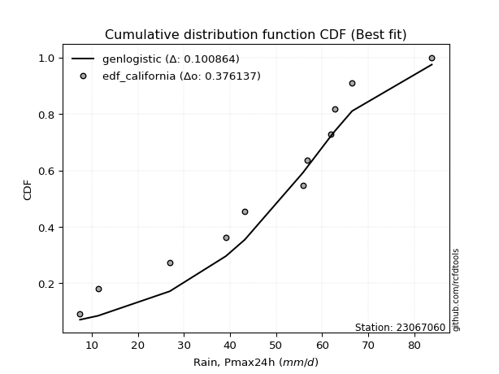</img>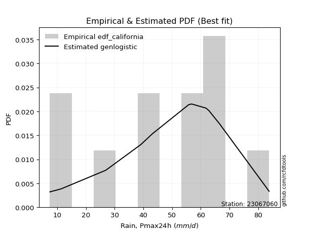</img>

</div>


### 2. Empirical - EDF Hazen (1930)

Hazen method for plotting positions is a formula used to estimate the empirical cumulative probability distribution of flood events or other hydrological data. This formula often results in biased estimations, particularly when extrapolating to extreme events (high return periods).

<div align="center">


$P=(m-0.5)/n$


</div>


**2.1. Empirical values**

<div align="center">

|                | 0                    | 1                  | 2                   | 3                  | 4         | 5                  | 6                  | 7                  | 8                  | 9                  | 10        | 11                 |
|:---------------|:---------------------|:-------------------|:--------------------|:-------------------|:----------|:-------------------|:-------------------|:-------------------|:-------------------|:-------------------|:----------|:-------------------|
| date           | 2025                 | 2023               | 2016                | 2017               | 2021      | 2022               | 2020               | 2024               | 2019               | 2014               | 2015      | 2018               |
| x              | 2.0                  | 7.4                | 11.3                | 26.9               | 39.1      | 43.2               | 55.8               | 56.8               | 61.8               | 62.8               | 66.5      | 83.8               |
| m              | 1                    | 2                  | 3                   | 4                  | 5         | 6                  | 7                  | 8                  | 9                  | 10                 | 11        | 12                 |
| empirical_dist | edf_hazen            | edf_hazen          | edf_hazen           | edf_hazen          | edf_hazen | edf_hazen          | edf_hazen          | edf_hazen          | edf_hazen          | edf_hazen          | edf_hazen | edf_hazen          |
| empirical      | 0.041666666666666664 | 0.125              | 0.20833333333333334 | 0.2916666666666667 | 0.375     | 0.4583333333333333 | 0.5416666666666666 | 0.625              | 0.7083333333333334 | 0.7916666666666666 | 0.875     | 0.9583333333333334 |
| empirical_tr   | 1.0434782608695652   | 1.1428571428571428 | 1.2631578947368423  | 1.411764705882353  | 1.6       | 1.8461538461538458 | 2.1818181818181817 | 2.6666666666666665 | 3.428571428571429  | 4.799999999999999  | 8.0       | 24.00000000000002  |

</div>


**2.2. Kolmogorov-Smirnov fit test (sorted by Δ)**


<div align="center">

|                | 0                   | 1                   | 2                   | 3                   | 4                   | 5                   | 6                   | 7                   | 8                   | 9                   | 10                  | 11                  | 12                  | 13                  | 14                  | 15                  | 16                  | 17                  | 18                  | 19                  | 20                  | 21                  | 22                  | 23                  | 24                  | 25                  | 26                  | 27                  | 28                  | 29                  | 30                    | 31                  | 32                  | 33                  | 34                  | 35                  | 36                  | 37                  | 38                  | 39                  | 40                  | 41                  | 42                  | 43                  | 44                  | 45                  | 46                  | 47                  | 48                  | 49                  | 50                  | 51                  | 52                  | 53                  | 54                  | 55                  | 56                  | 57                  | 58                  | 59                  | 60                  | 61                  | 62                  | 63                  | 64                  | 65                  | 66                  | 67                  | 68                  | 69                  | 70                  | 71                  | 72                  | 73                  | 74                  | 75                  | 76                  | 77                  | 78                  | 79                  | 80                  | 81                  | 82                  | 83                  | 84                  | 85                  | 86                  | 87                  | 88                  | 89                  |
|:---------------|:--------------------|:--------------------|:--------------------|:--------------------|:--------------------|:--------------------|:--------------------|:--------------------|:--------------------|:--------------------|:--------------------|:--------------------|:--------------------|:--------------------|:--------------------|:--------------------|:--------------------|:--------------------|:--------------------|:--------------------|:--------------------|:--------------------|:--------------------|:--------------------|:--------------------|:--------------------|:--------------------|:--------------------|:--------------------|:--------------------|:----------------------|:--------------------|:--------------------|:--------------------|:--------------------|:--------------------|:--------------------|:--------------------|:--------------------|:--------------------|:--------------------|:--------------------|:--------------------|:--------------------|:--------------------|:--------------------|:--------------------|:--------------------|:--------------------|:--------------------|:--------------------|:--------------------|:--------------------|:--------------------|:--------------------|:--------------------|:--------------------|:--------------------|:--------------------|:--------------------|:--------------------|:--------------------|:--------------------|:--------------------|:--------------------|:--------------------|:--------------------|:--------------------|:--------------------|:--------------------|:--------------------|:--------------------|:--------------------|:--------------------|:--------------------|:--------------------|:--------------------|:--------------------|:--------------------|:--------------------|:--------------------|:--------------------|:--------------------|:--------------------|:--------------------|:--------------------|:--------------------|:--------------------|:--------------------|:--------------------|
| station        | 23067060            | 23067060            | 23067060            | 23067060            | 23067060            | 23067060            | 23067060            | 23067060            | 23067060            | 23067060            | 23067060            | 23067060            | 23067060            | 23067060            | 23067060            | 23067060            | 23067060            | 23067060            | 23067060            | 23067060            | 23067060            | 23067060            | 23067060            | 23067060            | 23067060            | 23067060            | 23067060            | 23067060            | 23067060            | 23067060            | 23067060              | 23067060            | 23067060            | 23067060            | 23067060            | 23067060            | 23067060            | 23067060            | 23067060            | 23067060            | 23067060            | 23067060            | 23067060            | 23067060            | 23067060            | 23067060            | 23067060            | 23067060            | 23067060            | 23067060            | 23067060            | 23067060            | 23067060            | 23067060            | 23067060            | 23067060            | 23067060            | 23067060            | 23067060            | 23067060            | 23067060            | 23067060            | 23067060            | 23067060            | 23067060            | 23067060            | 23067060            | 23067060            | 23067060            | 23067060            | 23067060            | 23067060            | 23067060            | 23067060            | 23067060            | 23067060            | 23067060            | 23067060            | 23067060            | 23067060            | 23067060            | 23067060            | 23067060            | 23067060            | 23067060            | 23067060            | 23067060            | 23067060            | 23067060            | 23067060            |
| empirical_dist | edf_hazen           | edf_hazen           | edf_hazen           | edf_hazen           | edf_hazen           | edf_hazen           | edf_hazen           | edf_hazen           | edf_hazen           | edf_hazen           | edf_hazen           | edf_hazen           | edf_hazen           | edf_hazen           | edf_hazen           | edf_hazen           | edf_hazen           | edf_hazen           | edf_hazen           | edf_hazen           | edf_hazen           | edf_hazen           | edf_hazen           | edf_hazen           | edf_hazen           | edf_hazen           | edf_hazen           | edf_hazen           | edf_hazen           | edf_hazen           | edf_hazen             | edf_hazen           | edf_hazen           | edf_hazen           | edf_hazen           | edf_hazen           | edf_hazen           | edf_hazen           | edf_hazen           | edf_hazen           | edf_hazen           | edf_hazen           | edf_hazen           | edf_hazen           | edf_hazen           | edf_hazen           | edf_hazen           | edf_hazen           | edf_hazen           | edf_hazen           | edf_hazen           | edf_hazen           | edf_hazen           | edf_hazen           | edf_hazen           | edf_hazen           | edf_hazen           | edf_hazen           | edf_hazen           | edf_hazen           | edf_hazen           | edf_hazen           | edf_hazen           | edf_hazen           | edf_hazen           | edf_hazen           | edf_hazen           | edf_hazen           | edf_hazen           | edf_hazen           | edf_hazen           | edf_hazen           | edf_hazen           | edf_hazen           | edf_hazen           | edf_hazen           | edf_hazen           | edf_hazen           | edf_hazen           | edf_hazen           | edf_hazen           | edf_hazen           | edf_hazen           | edf_hazen           | edf_hazen           | edf_hazen           | edf_hazen           | edf_hazen           | edf_hazen           | edf_hazen           |
| p_dist         | laplace_asymmetric  | genlogistic         | logjohnsonsu        | gumbel_l            | johnsonsu           | logmielke           | logloggamma         | weibull_min         | fisk                | logpearson3         | pearson3            | f                   | logfisk             | t                   | crystalball         | norm                | exponnorm           | nct                 | erlang              | betaprime           | gamma               | rice                | loggumbel_l         | invgamma            | invweibull          | maxwell             | ncf                 | logistic            | rayleigh            | lognakagami         | loglaplace_asymmetric | kstwobign           | logweibull_min      | loggompertz         | mielke              | hypsecant           | halfnorm            | invgauss            | logt                | gumbel_r            | laplace             | halflogistic        | expon               | genexpon            | logfatiguelife      | moyal               | loginvweibull       | logexponnorm        | logcrystalball      | lognorm             | lognorm             | loglognorm          | logf                | logrice             | lognct              | nakagami            | logbetaprime        | logchi2             | logerlang           | loggamma            | loggamma            | loglogistic         | loginvgamma         | logncf              | loginvgauss         | loghypsecant        | logalpha            | logmaxwell          | logkstwobign        | lograyleigh         | wald                | loglaplace          | loggenexpon         | loghalfnorm         | loggumbel_r         | gibrat              | loghalflogistic     | logmoyal            | logexpon            | logtruncnorm        | logwald             | loggibrat           | gompertz            | pareto              | alpha               | logpareto           | fatiguelife         | chi2                | truncnorm           | loggenlogistic      |
| delta          | 0.0833588886043603  | 0.0876896266656829  | 0.09969808731161867 | 0.11675496596622204 | 0.11806116756199847 | 0.12958801756011618 | 0.13185591698599275 | 0.13471582826026185 | 0.13681193859777863 | 0.1373477872784289  | 0.13968423776818395 | 0.1517385881637655  | 0.15177511533248922 | 0.15184748579455498 | 0.15185062789435244 | 0.15185062814444938 | 0.1518512641618931  | 0.1518834834922863  | 0.15355319334004103 | 0.15572486251050788 | 0.15667454080374554 | 0.15969070602466573 | 0.16219647117609992 | 0.16345676401899623 | 0.166004473892304   | 0.16854706604319614 | 0.16961979640516756 | 0.1728660752142469  | 0.17344429279949314 | 0.17378520793485375 | 0.17793690315525235   | 0.18118003931649007 | 0.18391819017682565 | 0.18470778057207216 | 0.18603451941507954 | 0.18819912799340954 | 0.18822510881096555 | 0.190146006534192   | 0.20119947876085864 | 0.2040065288368743  | 0.21382848743590732 | 0.2152583819850874  | 0.2193686345002479  | 0.21949344195869136 | 0.21995733816854213 | 0.220917651547608   | 0.22174282431746006 | 0.22243900652033521 | 0.22243990872930908 | 0.22243992080200703 | 0.22243992080200703 | 0.2224411079866888  | 0.22246485735215593 | 0.22247137835638398 | 0.22262794443929124 | 0.22397859359642935 | 0.22794146544341443 | 0.22968772727684394 | 0.23263614033392077 | 0.23502754704938578 | 0.23502754704938578 | 0.23504746877393223 | 0.23577965016087976 | 0.2394221648547299  | 0.2396094050355776  | 0.24538602058289694 | 0.2474285182437801  | 0.24918908104234205 | 0.2531691102544801  | 0.2575060306674397  | 0.2702648211540106  | 0.2722764468326635  | 0.27467730023098036 | 0.281163941306214   | 0.2892093800559441  | 0.30176684902337003 | 0.30944766764891873 | 0.3120687388509227  | 0.3255613324312156  | 0.33397487897201444 | 0.3757480311836071  | 0.40736968923943606 | 0.44049541160113836 | 0.47650244848783363 | 0.5144847875012917  | 0.5146976407865537  | 0.5290704890824406  | 0.6950591491940115  | 0.77010667259965    | 0.875               |
| deltao         | 0.36218414519599995 | 0.36218414519599995 | 0.36218414519599995 | 0.36218414519599995 | 0.36218414519599995 | 0.36218414519599995 | 0.36218414519599995 | 0.36218414519599995 | 0.36218414519599995 | 0.36218414519599995 | 0.36218414519599995 | 0.36218414519599995 | 0.36218414519599995 | 0.36218414519599995 | 0.36218414519599995 | 0.36218414519599995 | 0.36218414519599995 | 0.36218414519599995 | 0.36218414519599995 | 0.36218414519599995 | 0.36218414519599995 | 0.36218414519599995 | 0.36218414519599995 | 0.36218414519599995 | 0.36218414519599995 | 0.36218414519599995 | 0.36218414519599995 | 0.36218414519599995 | 0.36218414519599995 | 0.36218414519599995 | 0.36218414519599995   | 0.36218414519599995 | 0.36218414519599995 | 0.36218414519599995 | 0.36218414519599995 | 0.36218414519599995 | 0.36218414519599995 | 0.36218414519599995 | 0.36218414519599995 | 0.36218414519599995 | 0.36218414519599995 | 0.36218414519599995 | 0.36218414519599995 | 0.36218414519599995 | 0.36218414519599995 | 0.36218414519599995 | 0.36218414519599995 | 0.36218414519599995 | 0.36218414519599995 | 0.36218414519599995 | 0.36218414519599995 | 0.36218414519599995 | 0.36218414519599995 | 0.36218414519599995 | 0.36218414519599995 | 0.36218414519599995 | 0.36218414519599995 | 0.36218414519599995 | 0.36218414519599995 | 0.36218414519599995 | 0.36218414519599995 | 0.36218414519599995 | 0.36218414519599995 | 0.36218414519599995 | 0.36218414519599995 | 0.36218414519599995 | 0.36218414519599995 | 0.36218414519599995 | 0.36218414519599995 | 0.36218414519599995 | 0.36218414519599995 | 0.36218414519599995 | 0.36218414519599995 | 0.36218414519599995 | 0.36218414519599995 | 0.36218414519599995 | 0.36218414519599995 | 0.36218414519599995 | 0.36218414519599995 | 0.36218414519599995 | 0.36218414519599995 | 0.36218414519599995 | 0.36218414519599995 | 0.36218414519599995 | 0.36218414519599995 | 0.36218414519599995 | 0.36218414519599995 | 0.36218414519599995 | 0.36218414519599995 | 0.36218414519599995 |
| eval           | Δo > Δ              | Δo > Δ              | Δo > Δ              | Δo > Δ              | Δo > Δ              | Δo > Δ              | Δo > Δ              | Δo > Δ              | Δo > Δ              | Δo > Δ              | Δo > Δ              | Δo > Δ              | Δo > Δ              | Δo > Δ              | Δo > Δ              | Δo > Δ              | Δo > Δ              | Δo > Δ              | Δo > Δ              | Δo > Δ              | Δo > Δ              | Δo > Δ              | Δo > Δ              | Δo > Δ              | Δo > Δ              | Δo > Δ              | Δo > Δ              | Δo > Δ              | Δo > Δ              | Δo > Δ              | Δo > Δ                | Δo > Δ              | Δo > Δ              | Δo > Δ              | Δo > Δ              | Δo > Δ              | Δo > Δ              | Δo > Δ              | Δo > Δ              | Δo > Δ              | Δo > Δ              | Δo > Δ              | Δo > Δ              | Δo > Δ              | Δo > Δ              | Δo > Δ              | Δo > Δ              | Δo > Δ              | Δo > Δ              | Δo > Δ              | Δo > Δ              | Δo > Δ              | Δo > Δ              | Δo > Δ              | Δo > Δ              | Δo > Δ              | Δo > Δ              | Δo > Δ              | Δo > Δ              | Δo > Δ              | Δo > Δ              | Δo > Δ              | Δo > Δ              | Δo > Δ              | Δo > Δ              | Δo > Δ              | Δo > Δ              | Δo > Δ              | Δo > Δ              | Δo > Δ              | Δo > Δ              | Δo > Δ              | Δo > Δ              | Δo > Δ              | Δo > Δ              | Δo > Δ              | Δo > Δ              | Δo > Δ              | Δo > Δ              | Δo > Δ              | Δo <= Δ             | Δo <= Δ             | Δo <= Δ             | Δo <= Δ             | Δo <= Δ             | Δo <= Δ             | Δo <= Δ             | Δo <= Δ             | Δo <= Δ             | Δo <= Δ             |
| fit            | 1                   | 1                   | 1                   | 1                   | 1                   | 1                   | 1                   | 1                   | 1                   | 1                   | 1                   | 1                   | 1                   | 1                   | 1                   | 1                   | 1                   | 1                   | 1                   | 1                   | 1                   | 1                   | 1                   | 1                   | 1                   | 1                   | 1                   | 1                   | 1                   | 1                   | 1                     | 1                   | 1                   | 1                   | 1                   | 1                   | 1                   | 1                   | 1                   | 1                   | 1                   | 1                   | 1                   | 1                   | 1                   | 1                   | 1                   | 1                   | 1                   | 1                   | 1                   | 1                   | 1                   | 1                   | 1                   | 1                   | 1                   | 1                   | 1                   | 1                   | 1                   | 1                   | 1                   | 1                   | 1                   | 1                   | 1                   | 1                   | 1                   | 1                   | 1                   | 1                   | 1                   | 1                   | 1                   | 1                   | 1                   | 1                   | 1                   | 1                   | 0                   | 0                   | 0                   | 0                   | 0                   | 0                   | 0                   | 0                   | 0                   | 0                   |
| n              | 12                  | 12                  | 12                  | 12                  | 12                  | 12                  | 12                  | 12                  | 12                  | 12                  | 12                  | 12                  | 12                  | 12                  | 12                  | 12                  | 12                  | 12                  | 12                  | 12                  | 12                  | 12                  | 12                  | 12                  | 12                  | 12                  | 12                  | 12                  | 12                  | 12                  | 12                    | 12                  | 12                  | 12                  | 12                  | 12                  | 12                  | 12                  | 12                  | 12                  | 12                  | 12                  | 12                  | 12                  | 12                  | 12                  | 12                  | 12                  | 12                  | 12                  | 12                  | 12                  | 12                  | 12                  | 12                  | 12                  | 12                  | 12                  | 12                  | 12                  | 12                  | 12                  | 12                  | 12                  | 12                  | 12                  | 12                  | 12                  | 12                  | 12                  | 12                  | 12                  | 12                  | 12                  | 12                  | 12                  | 12                  | 12                  | 12                  | 12                  | 12                  | 12                  | 12                  | 12                  | 12                  | 12                  | 12                  | 12                  | 12                  | 12                  |
| best_fit       | 1                   | 0                   | 0                   | 0                   | 0                   | 0                   | 0                   | 0                   | 0                   | 0                   | 0                   | 0                   | 0                   | 0                   | 0                   | 0                   | 0                   | 0                   | 0                   | 0                   | 0                   | 0                   | 0                   | 0                   | 0                   | 0                   | 0                   | 0                   | 0                   | 0                   | 0                     | 0                   | 0                   | 0                   | 0                   | 0                   | 0                   | 0                   | 0                   | 0                   | 0                   | 0                   | 0                   | 0                   | 0                   | 0                   | 0                   | 0                   | 0                   | 0                   | 0                   | 0                   | 0                   | 0                   | 0                   | 0                   | 0                   | 0                   | 0                   | 0                   | 0                   | 0                   | 0                   | 0                   | 0                   | 0                   | 0                   | 0                   | 0                   | 0                   | 0                   | 0                   | 0                   | 0                   | 0                   | 0                   | 0                   | 0                   | 0                   | 0                   | 0                   | 0                   | 0                   | 0                   | 0                   | 0                   | 0                   | 0                   | 0                   | 0                   |
| best_fit_sort  | 1                   | 2                   | 3                   | 4                   | 5                   | 6                   | 7                   | 8                   | 9                   | 10                  | 11                  | 12                  | 13                  | 14                  | 15                  | 16                  | 17                  | 18                  | 19                  | 20                  | 21                  | 22                  | 23                  | 24                  | 25                  | 26                  | 27                  | 28                  | 29                  | 30                  | 31                    | 32                  | 33                  | 34                  | 35                  | 36                  | 37                  | 38                  | 39                  | 40                  | 41                  | 42                  | 43                  | 44                  | 45                  | 46                  | 47                  | 48                  | 49                  | 50                  | 51                  | 52                  | 53                  | 54                  | 55                  | 56                  | 57                  | 58                  | 59                  | 60                  | 61                  | 62                  | 63                  | 64                  | 65                  | 66                  | 67                  | 68                  | 69                  | 70                  | 71                  | 72                  | 73                  | 74                  | 75                  | 76                  | 77                  | 78                  | 79                  | 80                  | 81                  | 82                  | 83                  | 84                  | 85                  | 86                  | 87                  | 88                  | 89                  | 90                  |

</div>


<div align="center">

</img>

</div>


**2.3. Best fit**

<div align="center">

|   id |   station | empirical_dist   | p_dist             |     delta |   deltao | eval   |   fit |   n |   best_fit |   best_fit_sort |
|-----:|----------:|:-----------------|:-------------------|----------:|---------:|:-------|------:|----:|-----------:|----------------:|
|    0 |  23067060 | edf_hazen        | laplace_asymmetric | 0.0833589 | 0.362184 | Δo > Δ |     1 |  12 |          1 |               1 |

</div>


<div align="center">

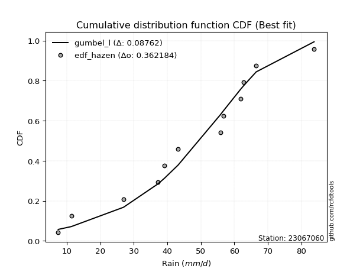</img></img>

</div>


### 3. Empirical - EDF Weibull (1939)

Weibull plotting position formula is an empirical method used to estimate the non-exceedance probability or plotting position for a set of observed data, is often recommended or widely used in practice, particularly in flood frequency analysis.

<div align="center">


$P=m/(n+1)$


</div>


**3.1. Empirical values**

<div align="center">

|                | 0                   | 1                   | 2                   | 3                  | 4                   | 5                   | 6                  | 7                  | 8                  | 9                  | 10                 | 11                 |
|:---------------|:--------------------|:--------------------|:--------------------|:-------------------|:--------------------|:--------------------|:-------------------|:-------------------|:-------------------|:-------------------|:-------------------|:-------------------|
| date           | 2025                | 2023                | 2016                | 2017               | 2021                | 2022                | 2020               | 2024               | 2019               | 2014               | 2015               | 2018               |
| x              | 2.0                 | 7.4                 | 11.3                | 26.9               | 39.1                | 43.2                | 55.8               | 56.8               | 61.8               | 62.8               | 66.5               | 83.8               |
| m              | 1                   | 2                   | 3                   | 4                  | 5                   | 6                   | 7                  | 8                  | 9                  | 10                 | 11                 | 12                 |
| empirical_dist | edf_weibull         | edf_weibull         | edf_weibull         | edf_weibull        | edf_weibull         | edf_weibull         | edf_weibull        | edf_weibull        | edf_weibull        | edf_weibull        | edf_weibull        | edf_weibull        |
| empirical      | 0.07692307692307693 | 0.15384615384615385 | 0.23076923076923078 | 0.3076923076923077 | 0.38461538461538464 | 0.46153846153846156 | 0.5384615384615384 | 0.6153846153846154 | 0.6923076923076923 | 0.7692307692307693 | 0.8461538461538461 | 0.9230769230769231 |
| empirical_tr   | 1.0833333333333333  | 1.1818181818181819  | 1.3                 | 1.4444444444444444 | 1.625               | 1.8571428571428572  | 2.1666666666666665 | 2.6                | 3.25               | 4.333333333333334  | 6.5                | 13.000000000000009 |

</div>


**3.2. Kolmogorov-Smirnov fit test (sorted by Δ)**


<div align="center">

|                | 0                   | 1                   | 2                   | 3                   | 4                   | 5                   | 6                   | 7                   | 8                   | 9                   | 10                  | 11                  | 12                  | 13                  | 14                  | 15                  | 16                  | 17                  | 18                  | 19                  | 20                  | 21                  | 22                  | 23                  | 24                  | 25                  | 26                  | 27                  | 28                  | 29                  | 30                    | 31                  | 32                  | 33                  | 34                  | 35                  | 36                  | 37                  | 38                  | 39                  | 40                  | 41                  | 42                  | 43                  | 44                  | 45                  | 46                  | 47                  | 48                  | 49                  | 50                  | 51                  | 52                  | 53                  | 54                  | 55                  | 56                  | 57                  | 58                  | 59                  | 60                  | 61                  | 62                  | 63                  | 64                  | 65                  | 66                  | 67                  | 68                  | 69                  | 70                  | 71                  | 72                  | 73                  | 74                  | 75                  | 76                  | 77                  | 78                  | 79                  | 80                  | 81                  | 82                  | 83                  | 84                  | 85                  | 86                  | 87                  | 88                  | 89                  |
|:---------------|:--------------------|:--------------------|:--------------------|:--------------------|:--------------------|:--------------------|:--------------------|:--------------------|:--------------------|:--------------------|:--------------------|:--------------------|:--------------------|:--------------------|:--------------------|:--------------------|:--------------------|:--------------------|:--------------------|:--------------------|:--------------------|:--------------------|:--------------------|:--------------------|:--------------------|:--------------------|:--------------------|:--------------------|:--------------------|:--------------------|:----------------------|:--------------------|:--------------------|:--------------------|:--------------------|:--------------------|:--------------------|:--------------------|:--------------------|:--------------------|:--------------------|:--------------------|:--------------------|:--------------------|:--------------------|:--------------------|:--------------------|:--------------------|:--------------------|:--------------------|:--------------------|:--------------------|:--------------------|:--------------------|:--------------------|:--------------------|:--------------------|:--------------------|:--------------------|:--------------------|:--------------------|:--------------------|:--------------------|:--------------------|:--------------------|:--------------------|:--------------------|:--------------------|:--------------------|:--------------------|:--------------------|:--------------------|:--------------------|:--------------------|:--------------------|:--------------------|:--------------------|:--------------------|:--------------------|:--------------------|:--------------------|:--------------------|:--------------------|:--------------------|:--------------------|:--------------------|:--------------------|:--------------------|:--------------------|:--------------------|
| station        | 23067060            | 23067060            | 23067060            | 23067060            | 23067060            | 23067060            | 23067060            | 23067060            | 23067060            | 23067060            | 23067060            | 23067060            | 23067060            | 23067060            | 23067060            | 23067060            | 23067060            | 23067060            | 23067060            | 23067060            | 23067060            | 23067060            | 23067060            | 23067060            | 23067060            | 23067060            | 23067060            | 23067060            | 23067060            | 23067060            | 23067060              | 23067060            | 23067060            | 23067060            | 23067060            | 23067060            | 23067060            | 23067060            | 23067060            | 23067060            | 23067060            | 23067060            | 23067060            | 23067060            | 23067060            | 23067060            | 23067060            | 23067060            | 23067060            | 23067060            | 23067060            | 23067060            | 23067060            | 23067060            | 23067060            | 23067060            | 23067060            | 23067060            | 23067060            | 23067060            | 23067060            | 23067060            | 23067060            | 23067060            | 23067060            | 23067060            | 23067060            | 23067060            | 23067060            | 23067060            | 23067060            | 23067060            | 23067060            | 23067060            | 23067060            | 23067060            | 23067060            | 23067060            | 23067060            | 23067060            | 23067060            | 23067060            | 23067060            | 23067060            | 23067060            | 23067060            | 23067060            | 23067060            | 23067060            | 23067060            |
| empirical_dist | edf_weibull         | edf_weibull         | edf_weibull         | edf_weibull         | edf_weibull         | edf_weibull         | edf_weibull         | edf_weibull         | edf_weibull         | edf_weibull         | edf_weibull         | edf_weibull         | edf_weibull         | edf_weibull         | edf_weibull         | edf_weibull         | edf_weibull         | edf_weibull         | edf_weibull         | edf_weibull         | edf_weibull         | edf_weibull         | edf_weibull         | edf_weibull         | edf_weibull         | edf_weibull         | edf_weibull         | edf_weibull         | edf_weibull         | edf_weibull         | edf_weibull           | edf_weibull         | edf_weibull         | edf_weibull         | edf_weibull         | edf_weibull         | edf_weibull         | edf_weibull         | edf_weibull         | edf_weibull         | edf_weibull         | edf_weibull         | edf_weibull         | edf_weibull         | edf_weibull         | edf_weibull         | edf_weibull         | edf_weibull         | edf_weibull         | edf_weibull         | edf_weibull         | edf_weibull         | edf_weibull         | edf_weibull         | edf_weibull         | edf_weibull         | edf_weibull         | edf_weibull         | edf_weibull         | edf_weibull         | edf_weibull         | edf_weibull         | edf_weibull         | edf_weibull         | edf_weibull         | edf_weibull         | edf_weibull         | edf_weibull         | edf_weibull         | edf_weibull         | edf_weibull         | edf_weibull         | edf_weibull         | edf_weibull         | edf_weibull         | edf_weibull         | edf_weibull         | edf_weibull         | edf_weibull         | edf_weibull         | edf_weibull         | edf_weibull         | edf_weibull         | edf_weibull         | edf_weibull         | edf_weibull         | edf_weibull         | edf_weibull         | edf_weibull         | edf_weibull         |
| p_dist         | logjohnsonsu        | laplace_asymmetric  | genlogistic         | johnsonsu           | gumbel_l            | logpearson3         | logmielke           | logloggamma         | weibull_min         | fisk                | pearson3            | logfisk             | loggumbel_l         | f                   | t                   | crystalball         | norm                | exponnorm           | nct                 | erlang              | betaprime           | gamma               | rice                | invgamma            | invweibull          | maxwell             | ncf                 | lognakagami         | logistic            | rayleigh            | loglaplace_asymmetric | kstwobign           | logweibull_min      | loggompertz         | mielke              | hypsecant           | invgauss            | logt                | halfnorm            | gumbel_r            | expon               | genexpon            | logfatiguelife      | loginvweibull       | logexponnorm        | logcrystalball      | lognorm             | lognorm             | loglognorm          | logf                | logrice             | lognct              | nakagami            | laplace             | logbetaprime        | logchi2             | logerlang           | moyal               | loggamma            | loggamma            | loglogistic         | loginvgamma         | logncf              | loginvgauss         | halflogistic        | loghypsecant        | logalpha            | logmaxwell          | logkstwobign        | lograyleigh         | loglaplace          | loggenexpon         | loghalfnorm         | wald                | loggumbel_r         | loghalflogistic     | logmoyal            | gibrat              | logexpon            | logtruncnorm        | logwald             | loggibrat           | gompertz            | pareto              | logpareto           | alpha               | fatiguelife         | chi2                | truncnorm           | loggenlogistic      |
| delta          | 0.10290321551674686 | 0.10579478604025774 | 0.11012552410158034 | 0.12126629576712666 | 0.12634794359116225 | 0.13112532739491056 | 0.13279314576524437 | 0.13506104519112094 | 0.13792095646539004 | 0.14001706680290682 | 0.14288936597331214 | 0.14364662734932632 | 0.15275547574088577 | 0.1549437163688937  | 0.15505261399968318 | 0.15505575609948063 | 0.15505575634957758 | 0.1550563923670213  | 0.1550886116974145  | 0.15675832154516922 | 0.15892999071563607 | 0.15987966900887374 | 0.16289583422979392 | 0.16666189222412442 | 0.1692096020974322  | 0.17175219424832433 | 0.17282492461029575 | 0.1736050954821284  | 0.1760712034193751  | 0.17664942100462133 | 0.18114203136038054   | 0.18438516752161827 | 0.18712331838195384 | 0.18791290877720035 | 0.18923964762020773 | 0.19140425619853774 | 0.1933511347393202  | 0.19907881263035837 | 0.20447741729920405 | 0.2072116570420025  | 0.20975324988486327 | 0.20987805734330672 | 0.2103419535531575  | 0.21212743970207543 | 0.21282362190495058 | 0.21282452411392444 | 0.2128245361866224  | 0.2128245361866224  | 0.21282572337130418 | 0.2128494727367713  | 0.21285599374099934 | 0.2130125598239066  | 0.21436320898104472 | 0.21703361564103552 | 0.2183260808280298  | 0.2200723426614593  | 0.22302075571853613 | 0.2241227797527362  | 0.22541216243400114 | 0.22541216243400114 | 0.2254320841585476  | 0.22616426554549512 | 0.22980678023934525 | 0.22999402042019296 | 0.23076923076923078 | 0.2357706359675123  | 0.23781313362839546 | 0.23957369642695742 | 0.24355372563909544 | 0.24789064605205507 | 0.26266106221727886 | 0.2650619156155957  | 0.2715485566908294  | 0.2734699493591388  | 0.27959399544055946 | 0.2998322830335341  | 0.30245335423553804 | 0.3049719772284982  | 0.3095356914055746  | 0.3179492379463734  | 0.3661326465682225  | 0.3977543046240514  | 0.4342310181099597  | 0.4476562946416798  | 0.4858514869403998  | 0.4984591464756507  | 0.5002243352362867  | 0.6790335081683705  | 0.7476707751637526  | 0.8461538461538461  |
| deltao         | 0.36218414519599995 | 0.36218414519599995 | 0.36218414519599995 | 0.36218414519599995 | 0.36218414519599995 | 0.36218414519599995 | 0.36218414519599995 | 0.36218414519599995 | 0.36218414519599995 | 0.36218414519599995 | 0.36218414519599995 | 0.36218414519599995 | 0.36218414519599995 | 0.36218414519599995 | 0.36218414519599995 | 0.36218414519599995 | 0.36218414519599995 | 0.36218414519599995 | 0.36218414519599995 | 0.36218414519599995 | 0.36218414519599995 | 0.36218414519599995 | 0.36218414519599995 | 0.36218414519599995 | 0.36218414519599995 | 0.36218414519599995 | 0.36218414519599995 | 0.36218414519599995 | 0.36218414519599995 | 0.36218414519599995 | 0.36218414519599995   | 0.36218414519599995 | 0.36218414519599995 | 0.36218414519599995 | 0.36218414519599995 | 0.36218414519599995 | 0.36218414519599995 | 0.36218414519599995 | 0.36218414519599995 | 0.36218414519599995 | 0.36218414519599995 | 0.36218414519599995 | 0.36218414519599995 | 0.36218414519599995 | 0.36218414519599995 | 0.36218414519599995 | 0.36218414519599995 | 0.36218414519599995 | 0.36218414519599995 | 0.36218414519599995 | 0.36218414519599995 | 0.36218414519599995 | 0.36218414519599995 | 0.36218414519599995 | 0.36218414519599995 | 0.36218414519599995 | 0.36218414519599995 | 0.36218414519599995 | 0.36218414519599995 | 0.36218414519599995 | 0.36218414519599995 | 0.36218414519599995 | 0.36218414519599995 | 0.36218414519599995 | 0.36218414519599995 | 0.36218414519599995 | 0.36218414519599995 | 0.36218414519599995 | 0.36218414519599995 | 0.36218414519599995 | 0.36218414519599995 | 0.36218414519599995 | 0.36218414519599995 | 0.36218414519599995 | 0.36218414519599995 | 0.36218414519599995 | 0.36218414519599995 | 0.36218414519599995 | 0.36218414519599995 | 0.36218414519599995 | 0.36218414519599995 | 0.36218414519599995 | 0.36218414519599995 | 0.36218414519599995 | 0.36218414519599995 | 0.36218414519599995 | 0.36218414519599995 | 0.36218414519599995 | 0.36218414519599995 | 0.36218414519599995 |
| eval           | Δo > Δ              | Δo > Δ              | Δo > Δ              | Δo > Δ              | Δo > Δ              | Δo > Δ              | Δo > Δ              | Δo > Δ              | Δo > Δ              | Δo > Δ              | Δo > Δ              | Δo > Δ              | Δo > Δ              | Δo > Δ              | Δo > Δ              | Δo > Δ              | Δo > Δ              | Δo > Δ              | Δo > Δ              | Δo > Δ              | Δo > Δ              | Δo > Δ              | Δo > Δ              | Δo > Δ              | Δo > Δ              | Δo > Δ              | Δo > Δ              | Δo > Δ              | Δo > Δ              | Δo > Δ              | Δo > Δ                | Δo > Δ              | Δo > Δ              | Δo > Δ              | Δo > Δ              | Δo > Δ              | Δo > Δ              | Δo > Δ              | Δo > Δ              | Δo > Δ              | Δo > Δ              | Δo > Δ              | Δo > Δ              | Δo > Δ              | Δo > Δ              | Δo > Δ              | Δo > Δ              | Δo > Δ              | Δo > Δ              | Δo > Δ              | Δo > Δ              | Δo > Δ              | Δo > Δ              | Δo > Δ              | Δo > Δ              | Δo > Δ              | Δo > Δ              | Δo > Δ              | Δo > Δ              | Δo > Δ              | Δo > Δ              | Δo > Δ              | Δo > Δ              | Δo > Δ              | Δo > Δ              | Δo > Δ              | Δo > Δ              | Δo > Δ              | Δo > Δ              | Δo > Δ              | Δo > Δ              | Δo > Δ              | Δo > Δ              | Δo > Δ              | Δo > Δ              | Δo > Δ              | Δo > Δ              | Δo > Δ              | Δo > Δ              | Δo > Δ              | Δo <= Δ             | Δo <= Δ             | Δo <= Δ             | Δo <= Δ             | Δo <= Δ             | Δo <= Δ             | Δo <= Δ             | Δo <= Δ             | Δo <= Δ             | Δo <= Δ             |
| fit            | 1                   | 1                   | 1                   | 1                   | 1                   | 1                   | 1                   | 1                   | 1                   | 1                   | 1                   | 1                   | 1                   | 1                   | 1                   | 1                   | 1                   | 1                   | 1                   | 1                   | 1                   | 1                   | 1                   | 1                   | 1                   | 1                   | 1                   | 1                   | 1                   | 1                   | 1                     | 1                   | 1                   | 1                   | 1                   | 1                   | 1                   | 1                   | 1                   | 1                   | 1                   | 1                   | 1                   | 1                   | 1                   | 1                   | 1                   | 1                   | 1                   | 1                   | 1                   | 1                   | 1                   | 1                   | 1                   | 1                   | 1                   | 1                   | 1                   | 1                   | 1                   | 1                   | 1                   | 1                   | 1                   | 1                   | 1                   | 1                   | 1                   | 1                   | 1                   | 1                   | 1                   | 1                   | 1                   | 1                   | 1                   | 1                   | 1                   | 1                   | 0                   | 0                   | 0                   | 0                   | 0                   | 0                   | 0                   | 0                   | 0                   | 0                   |
| n              | 12                  | 12                  | 12                  | 12                  | 12                  | 12                  | 12                  | 12                  | 12                  | 12                  | 12                  | 12                  | 12                  | 12                  | 12                  | 12                  | 12                  | 12                  | 12                  | 12                  | 12                  | 12                  | 12                  | 12                  | 12                  | 12                  | 12                  | 12                  | 12                  | 12                  | 12                    | 12                  | 12                  | 12                  | 12                  | 12                  | 12                  | 12                  | 12                  | 12                  | 12                  | 12                  | 12                  | 12                  | 12                  | 12                  | 12                  | 12                  | 12                  | 12                  | 12                  | 12                  | 12                  | 12                  | 12                  | 12                  | 12                  | 12                  | 12                  | 12                  | 12                  | 12                  | 12                  | 12                  | 12                  | 12                  | 12                  | 12                  | 12                  | 12                  | 12                  | 12                  | 12                  | 12                  | 12                  | 12                  | 12                  | 12                  | 12                  | 12                  | 12                  | 12                  | 12                  | 12                  | 12                  | 12                  | 12                  | 12                  | 12                  | 12                  |
| best_fit       | 1                   | 0                   | 0                   | 0                   | 0                   | 0                   | 0                   | 0                   | 0                   | 0                   | 0                   | 0                   | 0                   | 0                   | 0                   | 0                   | 0                   | 0                   | 0                   | 0                   | 0                   | 0                   | 0                   | 0                   | 0                   | 0                   | 0                   | 0                   | 0                   | 0                   | 0                     | 0                   | 0                   | 0                   | 0                   | 0                   | 0                   | 0                   | 0                   | 0                   | 0                   | 0                   | 0                   | 0                   | 0                   | 0                   | 0                   | 0                   | 0                   | 0                   | 0                   | 0                   | 0                   | 0                   | 0                   | 0                   | 0                   | 0                   | 0                   | 0                   | 0                   | 0                   | 0                   | 0                   | 0                   | 0                   | 0                   | 0                   | 0                   | 0                   | 0                   | 0                   | 0                   | 0                   | 0                   | 0                   | 0                   | 0                   | 0                   | 0                   | 0                   | 0                   | 0                   | 0                   | 0                   | 0                   | 0                   | 0                   | 0                   | 0                   |
| best_fit_sort  | 1                   | 2                   | 3                   | 4                   | 5                   | 6                   | 7                   | 8                   | 9                   | 10                  | 11                  | 12                  | 13                  | 14                  | 15                  | 16                  | 17                  | 18                  | 19                  | 20                  | 21                  | 22                  | 23                  | 24                  | 25                  | 26                  | 27                  | 28                  | 29                  | 30                  | 31                    | 32                  | 33                  | 34                  | 35                  | 36                  | 37                  | 38                  | 39                  | 40                  | 41                  | 42                  | 43                  | 44                  | 45                  | 46                  | 47                  | 48                  | 49                  | 50                  | 51                  | 52                  | 53                  | 54                  | 55                  | 56                  | 57                  | 58                  | 59                  | 60                  | 61                  | 62                  | 63                  | 64                  | 65                  | 66                  | 67                  | 68                  | 69                  | 70                  | 71                  | 72                  | 73                  | 74                  | 75                  | 76                  | 77                  | 78                  | 79                  | 80                  | 81                  | 82                  | 83                  | 84                  | 85                  | 86                  | 87                  | 88                  | 89                  | 90                  |

</div>


<div align="center">

</img>

</div>


**3.3. Best fit**

<div align="center">

|   id |   station | empirical_dist   | p_dist       |    delta |   deltao | eval   |   fit |   n |   best_fit |   best_fit_sort |
|-----:|----------:|:-----------------|:-------------|---------:|---------:|:-------|------:|----:|-----------:|----------------:|
|    0 |  23067060 | edf_weibull      | logjohnsonsu | 0.102903 | 0.362184 | Δo > Δ |     1 |  12 |          1 |               1 |

</div>


<div align="center">

</img>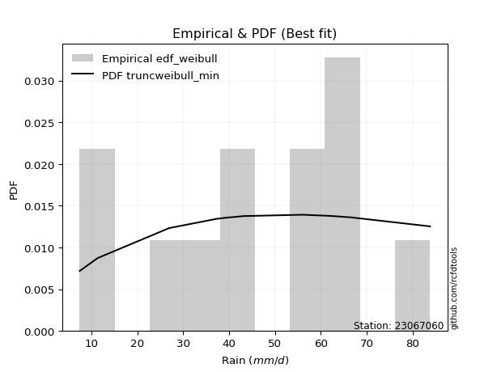</img>

</div>


### 4. Empirical - EDF Beard (1943)

The Beard formula (or Beard´s plotting position formula) in hydrology is used to estimate the empirical non-exceedance probability _(P)_ of a flood event (or other extreme hydrological data point) within a given dataset.

<div align="center">


$P=(m-0.31)/(n+0.38)$


</div>


**4.1. Empirical values**

<div align="center">

|                | 0                    | 1                   | 2                   | 3                  | 4                  | 5                  | 6                  | 7                  | 8                  | 9                  | 10                 | 11                 |
|:---------------|:---------------------|:--------------------|:--------------------|:-------------------|:-------------------|:-------------------|:-------------------|:-------------------|:-------------------|:-------------------|:-------------------|:-------------------|
| date           | 2025                 | 2023                | 2016                | 2017               | 2021               | 2022               | 2020               | 2024               | 2019               | 2014               | 2015               | 2018               |
| x              | 2.0                  | 7.4                 | 11.3                | 26.9               | 39.1               | 43.2               | 55.8               | 56.8               | 61.8               | 62.8               | 66.5               | 83.8               |
| m              | 1                    | 2                   | 3                   | 4                  | 5                  | 6                  | 7                  | 8                  | 9                  | 10                 | 11                 | 12                 |
| empirical_dist | edf_beard            | edf_beard           | edf_beard           | edf_beard          | edf_beard          | edf_beard          | edf_beard          | edf_beard          | edf_beard          | edf_beard          | edf_beard          | edf_beard          |
| empirical      | 0.055735056542810975 | 0.13651050080775443 | 0.21728594507269788 | 0.2980613893376413 | 0.3788368336025848 | 0.4596122778675283 | 0.5403877221324718 | 0.6211631663974152 | 0.7019386106623585 | 0.7827140549273021 | 0.8634894991922455 | 0.9442649434571889 |
| empirical_tr   | 1.0590248075278015   | 1.1580916744621141  | 1.2776057791537667  | 1.424626006904488  | 1.6098829648894668 | 1.850523168908819  | 2.1757469244288226 | 2.6396588486140726 | 3.3550135501355    | 4.6022304832713745 | 7.325443786982245  | 17.942028985507218 |

</div>


**4.2. Kolmogorov-Smirnov fit test (sorted by Δ)**


<div align="center">

|                | 0                   | 1                   | 2                   | 3                   | 4                   | 5                   | 6                   | 7                   | 8                   | 9                   | 10                  | 11                  | 12                  | 13                  | 14                  | 15                  | 16                  | 17                  | 18                  | 19                  | 20                  | 21                  | 22                  | 23                  | 24                  | 25                  | 26                  | 27                  | 28                  | 29                  | 30                    | 31                  | 32                  | 33                  | 34                  | 35                  | 36                  | 37                  | 38                  | 39                  | 40                  | 41                  | 42                  | 43                  | 44                  | 45                  | 46                  | 47                  | 48                  | 49                  | 50                  | 51                  | 52                  | 53                  | 54                  | 55                  | 56                  | 57                  | 58                  | 59                  | 60                  | 61                  | 62                  | 63                  | 64                  | 65                  | 66                  | 67                  | 68                  | 69                  | 70                  | 71                  | 72                  | 73                  | 74                  | 75                  | 76                  | 77                  | 78                  | 79                  | 80                  | 81                  | 82                  | 83                  | 84                  | 85                  | 86                  | 87                  | 88                  | 89                  |
|:---------------|:--------------------|:--------------------|:--------------------|:--------------------|:--------------------|:--------------------|:--------------------|:--------------------|:--------------------|:--------------------|:--------------------|:--------------------|:--------------------|:--------------------|:--------------------|:--------------------|:--------------------|:--------------------|:--------------------|:--------------------|:--------------------|:--------------------|:--------------------|:--------------------|:--------------------|:--------------------|:--------------------|:--------------------|:--------------------|:--------------------|:----------------------|:--------------------|:--------------------|:--------------------|:--------------------|:--------------------|:--------------------|:--------------------|:--------------------|:--------------------|:--------------------|:--------------------|:--------------------|:--------------------|:--------------------|:--------------------|:--------------------|:--------------------|:--------------------|:--------------------|:--------------------|:--------------------|:--------------------|:--------------------|:--------------------|:--------------------|:--------------------|:--------------------|:--------------------|:--------------------|:--------------------|:--------------------|:--------------------|:--------------------|:--------------------|:--------------------|:--------------------|:--------------------|:--------------------|:--------------------|:--------------------|:--------------------|:--------------------|:--------------------|:--------------------|:--------------------|:--------------------|:--------------------|:--------------------|:--------------------|:--------------------|:--------------------|:--------------------|:--------------------|:--------------------|:--------------------|:--------------------|:--------------------|:--------------------|:--------------------|
| station        | 23067060            | 23067060            | 23067060            | 23067060            | 23067060            | 23067060            | 23067060            | 23067060            | 23067060            | 23067060            | 23067060            | 23067060            | 23067060            | 23067060            | 23067060            | 23067060            | 23067060            | 23067060            | 23067060            | 23067060            | 23067060            | 23067060            | 23067060            | 23067060            | 23067060            | 23067060            | 23067060            | 23067060            | 23067060            | 23067060            | 23067060              | 23067060            | 23067060            | 23067060            | 23067060            | 23067060            | 23067060            | 23067060            | 23067060            | 23067060            | 23067060            | 23067060            | 23067060            | 23067060            | 23067060            | 23067060            | 23067060            | 23067060            | 23067060            | 23067060            | 23067060            | 23067060            | 23067060            | 23067060            | 23067060            | 23067060            | 23067060            | 23067060            | 23067060            | 23067060            | 23067060            | 23067060            | 23067060            | 23067060            | 23067060            | 23067060            | 23067060            | 23067060            | 23067060            | 23067060            | 23067060            | 23067060            | 23067060            | 23067060            | 23067060            | 23067060            | 23067060            | 23067060            | 23067060            | 23067060            | 23067060            | 23067060            | 23067060            | 23067060            | 23067060            | 23067060            | 23067060            | 23067060            | 23067060            | 23067060            |
| empirical_dist | edf_beard           | edf_beard           | edf_beard           | edf_beard           | edf_beard           | edf_beard           | edf_beard           | edf_beard           | edf_beard           | edf_beard           | edf_beard           | edf_beard           | edf_beard           | edf_beard           | edf_beard           | edf_beard           | edf_beard           | edf_beard           | edf_beard           | edf_beard           | edf_beard           | edf_beard           | edf_beard           | edf_beard           | edf_beard           | edf_beard           | edf_beard           | edf_beard           | edf_beard           | edf_beard           | edf_beard             | edf_beard           | edf_beard           | edf_beard           | edf_beard           | edf_beard           | edf_beard           | edf_beard           | edf_beard           | edf_beard           | edf_beard           | edf_beard           | edf_beard           | edf_beard           | edf_beard           | edf_beard           | edf_beard           | edf_beard           | edf_beard           | edf_beard           | edf_beard           | edf_beard           | edf_beard           | edf_beard           | edf_beard           | edf_beard           | edf_beard           | edf_beard           | edf_beard           | edf_beard           | edf_beard           | edf_beard           | edf_beard           | edf_beard           | edf_beard           | edf_beard           | edf_beard           | edf_beard           | edf_beard           | edf_beard           | edf_beard           | edf_beard           | edf_beard           | edf_beard           | edf_beard           | edf_beard           | edf_beard           | edf_beard           | edf_beard           | edf_beard           | edf_beard           | edf_beard           | edf_beard           | edf_beard           | edf_beard           | edf_beard           | edf_beard           | edf_beard           | edf_beard           | edf_beard           |
| p_dist         | laplace_asymmetric  | genlogistic         | logjohnsonsu        | gumbel_l            | johnsonsu           | logmielke           | logloggamma         | logpearson3         | weibull_min         | fisk                | pearson3            | logfisk             | f                   | t                   | crystalball         | norm                | exponnorm           | nct                 | erlang              | betaprime           | gamma               | loggumbel_l         | rice                | invgamma            | invweibull          | maxwell             | lognakagami         | ncf                 | logistic            | rayleigh            | loglaplace_asymmetric | kstwobign           | logweibull_min      | loggompertz         | mielke              | hypsecant           | halfnorm            | invgauss            | logt                | gumbel_r            | laplace             | expon               | genexpon            | logfatiguelife      | halflogistic        | loginvweibull       | logexponnorm        | logcrystalball      | lognorm             | lognorm             | loglognorm          | logf                | logrice             | lognct              | nakagami            | moyal               | logbetaprime        | logchi2             | logerlang           | loggamma            | loggamma            | loglogistic         | loginvgamma         | logncf              | loginvgauss         | loghypsecant        | logalpha            | logmaxwell          | logkstwobign        | lograyleigh         | loglaplace          | loggenexpon         | wald                | loghalfnorm         | loggumbel_r         | gibrat              | loghalflogistic     | logmoyal            | logexpon            | logtruncnorm        | logwald             | loggibrat           | gompertz            | pareto              | logpareto           | alpha               | fatiguelife         | chi2                | truncnorm           | loggenlogistic      |
| delta          | 0.09231150034372484 | 0.09664223840504745 | 0.10097703184581353 | 0.1180339105004169  | 0.11934011209619333 | 0.13086696209431103 | 0.1331348615201876  | 0.1335109536758441  | 0.1359947727944567  | 0.13809088313197349 | 0.1409631823023788  | 0.14793828172990442 | 0.15301753269796037 | 0.15312643032874984 | 0.1531295724285473  | 0.15312957267864424 | 0.15313020869608795 | 0.15316242802648117 | 0.1548321378742359  | 0.15700380704470274 | 0.1579534853379404  | 0.15835963757351512 | 0.1609696505588606  | 0.16473570855319108 | 0.16728341842649885 | 0.169826010577391   | 0.16994837433226895 | 0.17089874093936241 | 0.17414501974844177 | 0.174723237333688   | 0.1792158476894472    | 0.18245898385068493 | 0.1851971347110205  | 0.18598672510626701 | 0.1873134639492744  | 0.1894780725276044  | 0.19099413160267115 | 0.19142495106838686 | 0.1971526289594251  | 0.20528547337106917 | 0.21510743197010218 | 0.2155318008976631  | 0.21565660835610656 | 0.21612050456595733 | 0.21728594507269788 | 0.21790599071487526 | 0.21860217291775041 | 0.21860307512672428 | 0.21860308719942223 | 0.21860308719942223 | 0.218604274384104   | 0.21862802374957113 | 0.21863454475379918 | 0.21879111083670644 | 0.22014175999384455 | 0.22219659608180287 | 0.22410463184082963 | 0.22585089367425915 | 0.22879930673133597 | 0.23119071344680098 | 0.23119071344680098 | 0.23121063517134743 | 0.23194281655829496 | 0.2355853312521451  | 0.2357725714329928  | 0.24154918698031214 | 0.2435916846411953  | 0.24535224743975725 | 0.24933227665189528 | 0.2536691970648549  | 0.2684396132300787  | 0.27084046662839556 | 0.2715437656882055  | 0.2773271077036292  | 0.2853725464533593  | 0.3030457935575649  | 0.30561083404633393 | 0.3082319052483379  | 0.31916660976024097 | 0.3275801563010398  | 0.3719111975810223  | 0.40353285563685126 | 0.43665857799855357 | 0.46499194768007923 | 0.5031871399787993  | 0.508090064830317   | 0.5175599882746862  | 0.6886644265230368  | 0.7611540608602856  | 0.8634894991922455  |
| deltao         | 0.36218414519599995 | 0.36218414519599995 | 0.36218414519599995 | 0.36218414519599995 | 0.36218414519599995 | 0.36218414519599995 | 0.36218414519599995 | 0.36218414519599995 | 0.36218414519599995 | 0.36218414519599995 | 0.36218414519599995 | 0.36218414519599995 | 0.36218414519599995 | 0.36218414519599995 | 0.36218414519599995 | 0.36218414519599995 | 0.36218414519599995 | 0.36218414519599995 | 0.36218414519599995 | 0.36218414519599995 | 0.36218414519599995 | 0.36218414519599995 | 0.36218414519599995 | 0.36218414519599995 | 0.36218414519599995 | 0.36218414519599995 | 0.36218414519599995 | 0.36218414519599995 | 0.36218414519599995 | 0.36218414519599995 | 0.36218414519599995   | 0.36218414519599995 | 0.36218414519599995 | 0.36218414519599995 | 0.36218414519599995 | 0.36218414519599995 | 0.36218414519599995 | 0.36218414519599995 | 0.36218414519599995 | 0.36218414519599995 | 0.36218414519599995 | 0.36218414519599995 | 0.36218414519599995 | 0.36218414519599995 | 0.36218414519599995 | 0.36218414519599995 | 0.36218414519599995 | 0.36218414519599995 | 0.36218414519599995 | 0.36218414519599995 | 0.36218414519599995 | 0.36218414519599995 | 0.36218414519599995 | 0.36218414519599995 | 0.36218414519599995 | 0.36218414519599995 | 0.36218414519599995 | 0.36218414519599995 | 0.36218414519599995 | 0.36218414519599995 | 0.36218414519599995 | 0.36218414519599995 | 0.36218414519599995 | 0.36218414519599995 | 0.36218414519599995 | 0.36218414519599995 | 0.36218414519599995 | 0.36218414519599995 | 0.36218414519599995 | 0.36218414519599995 | 0.36218414519599995 | 0.36218414519599995 | 0.36218414519599995 | 0.36218414519599995 | 0.36218414519599995 | 0.36218414519599995 | 0.36218414519599995 | 0.36218414519599995 | 0.36218414519599995 | 0.36218414519599995 | 0.36218414519599995 | 0.36218414519599995 | 0.36218414519599995 | 0.36218414519599995 | 0.36218414519599995 | 0.36218414519599995 | 0.36218414519599995 | 0.36218414519599995 | 0.36218414519599995 | 0.36218414519599995 |
| eval           | Δo > Δ              | Δo > Δ              | Δo > Δ              | Δo > Δ              | Δo > Δ              | Δo > Δ              | Δo > Δ              | Δo > Δ              | Δo > Δ              | Δo > Δ              | Δo > Δ              | Δo > Δ              | Δo > Δ              | Δo > Δ              | Δo > Δ              | Δo > Δ              | Δo > Δ              | Δo > Δ              | Δo > Δ              | Δo > Δ              | Δo > Δ              | Δo > Δ              | Δo > Δ              | Δo > Δ              | Δo > Δ              | Δo > Δ              | Δo > Δ              | Δo > Δ              | Δo > Δ              | Δo > Δ              | Δo > Δ                | Δo > Δ              | Δo > Δ              | Δo > Δ              | Δo > Δ              | Δo > Δ              | Δo > Δ              | Δo > Δ              | Δo > Δ              | Δo > Δ              | Δo > Δ              | Δo > Δ              | Δo > Δ              | Δo > Δ              | Δo > Δ              | Δo > Δ              | Δo > Δ              | Δo > Δ              | Δo > Δ              | Δo > Δ              | Δo > Δ              | Δo > Δ              | Δo > Δ              | Δo > Δ              | Δo > Δ              | Δo > Δ              | Δo > Δ              | Δo > Δ              | Δo > Δ              | Δo > Δ              | Δo > Δ              | Δo > Δ              | Δo > Δ              | Δo > Δ              | Δo > Δ              | Δo > Δ              | Δo > Δ              | Δo > Δ              | Δo > Δ              | Δo > Δ              | Δo > Δ              | Δo > Δ              | Δo > Δ              | Δo > Δ              | Δo > Δ              | Δo > Δ              | Δo > Δ              | Δo > Δ              | Δo > Δ              | Δo > Δ              | Δo <= Δ             | Δo <= Δ             | Δo <= Δ             | Δo <= Δ             | Δo <= Δ             | Δo <= Δ             | Δo <= Δ             | Δo <= Δ             | Δo <= Δ             | Δo <= Δ             |
| fit            | 1                   | 1                   | 1                   | 1                   | 1                   | 1                   | 1                   | 1                   | 1                   | 1                   | 1                   | 1                   | 1                   | 1                   | 1                   | 1                   | 1                   | 1                   | 1                   | 1                   | 1                   | 1                   | 1                   | 1                   | 1                   | 1                   | 1                   | 1                   | 1                   | 1                   | 1                     | 1                   | 1                   | 1                   | 1                   | 1                   | 1                   | 1                   | 1                   | 1                   | 1                   | 1                   | 1                   | 1                   | 1                   | 1                   | 1                   | 1                   | 1                   | 1                   | 1                   | 1                   | 1                   | 1                   | 1                   | 1                   | 1                   | 1                   | 1                   | 1                   | 1                   | 1                   | 1                   | 1                   | 1                   | 1                   | 1                   | 1                   | 1                   | 1                   | 1                   | 1                   | 1                   | 1                   | 1                   | 1                   | 1                   | 1                   | 1                   | 1                   | 0                   | 0                   | 0                   | 0                   | 0                   | 0                   | 0                   | 0                   | 0                   | 0                   |
| n              | 12                  | 12                  | 12                  | 12                  | 12                  | 12                  | 12                  | 12                  | 12                  | 12                  | 12                  | 12                  | 12                  | 12                  | 12                  | 12                  | 12                  | 12                  | 12                  | 12                  | 12                  | 12                  | 12                  | 12                  | 12                  | 12                  | 12                  | 12                  | 12                  | 12                  | 12                    | 12                  | 12                  | 12                  | 12                  | 12                  | 12                  | 12                  | 12                  | 12                  | 12                  | 12                  | 12                  | 12                  | 12                  | 12                  | 12                  | 12                  | 12                  | 12                  | 12                  | 12                  | 12                  | 12                  | 12                  | 12                  | 12                  | 12                  | 12                  | 12                  | 12                  | 12                  | 12                  | 12                  | 12                  | 12                  | 12                  | 12                  | 12                  | 12                  | 12                  | 12                  | 12                  | 12                  | 12                  | 12                  | 12                  | 12                  | 12                  | 12                  | 12                  | 12                  | 12                  | 12                  | 12                  | 12                  | 12                  | 12                  | 12                  | 12                  |
| best_fit       | 1                   | 0                   | 0                   | 0                   | 0                   | 0                   | 0                   | 0                   | 0                   | 0                   | 0                   | 0                   | 0                   | 0                   | 0                   | 0                   | 0                   | 0                   | 0                   | 0                   | 0                   | 0                   | 0                   | 0                   | 0                   | 0                   | 0                   | 0                   | 0                   | 0                   | 0                     | 0                   | 0                   | 0                   | 0                   | 0                   | 0                   | 0                   | 0                   | 0                   | 0                   | 0                   | 0                   | 0                   | 0                   | 0                   | 0                   | 0                   | 0                   | 0                   | 0                   | 0                   | 0                   | 0                   | 0                   | 0                   | 0                   | 0                   | 0                   | 0                   | 0                   | 0                   | 0                   | 0                   | 0                   | 0                   | 0                   | 0                   | 0                   | 0                   | 0                   | 0                   | 0                   | 0                   | 0                   | 0                   | 0                   | 0                   | 0                   | 0                   | 0                   | 0                   | 0                   | 0                   | 0                   | 0                   | 0                   | 0                   | 0                   | 0                   |
| best_fit_sort  | 1                   | 2                   | 3                   | 4                   | 5                   | 6                   | 7                   | 8                   | 9                   | 10                  | 11                  | 12                  | 13                  | 14                  | 15                  | 16                  | 17                  | 18                  | 19                  | 20                  | 21                  | 22                  | 23                  | 24                  | 25                  | 26                  | 27                  | 28                  | 29                  | 30                  | 31                    | 32                  | 33                  | 34                  | 35                  | 36                  | 37                  | 38                  | 39                  | 40                  | 41                  | 42                  | 43                  | 44                  | 45                  | 46                  | 47                  | 48                  | 49                  | 50                  | 51                  | 52                  | 53                  | 54                  | 55                  | 56                  | 57                  | 58                  | 59                  | 60                  | 61                  | 62                  | 63                  | 64                  | 65                  | 66                  | 67                  | 68                  | 69                  | 70                  | 71                  | 72                  | 73                  | 74                  | 75                  | 76                  | 77                  | 78                  | 79                  | 80                  | 81                  | 82                  | 83                  | 84                  | 85                  | 86                  | 87                  | 88                  | 89                  | 90                  |

</div>


<div align="center">

</img>

</div>


**4.3. Best fit**

<div align="center">

|   id |   station | empirical_dist   | p_dist             |     delta |   deltao | eval   |   fit |   n |   best_fit |   best_fit_sort |
|-----:|----------:|:-----------------|:-------------------|----------:|---------:|:-------|------:|----:|-----------:|----------------:|
|    0 |  23067060 | edf_beard        | laplace_asymmetric | 0.0923115 | 0.362184 | Δo > Δ |     1 |  12 |          1 |               1 |

</div>


<div align="center">

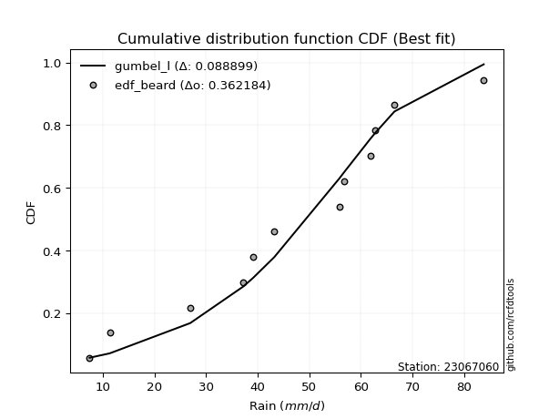</img>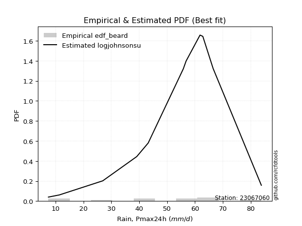</img>

</div>


### 5. Empirical - EDF Chegodayev (1955)

The Chegodayev formula is an empirical plotting position formula used in hydrological frequency analysis to estimate the exceedance probability or return period of a specific event from a set of observed data. It is primarily used for plotting observed data points on probability paper to fit a theoretical distribution, particularly for analyzing extreme events like maximum flood flows or rainfall intensities. The constant _b_ value in the generalized plotting position formula is 0.3.

<div align="center">


$P=(m-b)/(n+1-2b)$


</div>


**5.1. Empirical values**

<div align="center">

|                | 0                  | 1                   | 2                   | 3                   | 4                  | 5                  | 6                  | 7                  | 8                  | 9                 | 10                 | 11                 |
|:---------------|:-------------------|:--------------------|:--------------------|:--------------------|:-------------------|:-------------------|:-------------------|:-------------------|:-------------------|:------------------|:-------------------|:-------------------|
| date           | 2025               | 2023                | 2016                | 2017                | 2021               | 2022               | 2020               | 2024               | 2019               | 2014              | 2015               | 2018               |
| x              | 2.0                | 7.4                 | 11.3                | 26.9                | 39.1               | 43.2               | 55.8               | 56.8               | 61.8               | 62.8              | 66.5               | 83.8               |
| m              | 1                  | 2                   | 3                   | 4                   | 5                  | 6                  | 7                  | 8                  | 9                  | 10                | 11                 | 12                 |
| empirical_dist | edf_chegodayev     | edf_chegodayev      | edf_chegodayev      | edf_chegodayev      | edf_chegodayev     | edf_chegodayev     | edf_chegodayev     | edf_chegodayev     | edf_chegodayev     | edf_chegodayev    | edf_chegodayev     | edf_chegodayev     |
| empirical      | 0.0564516129032258 | 0.13709677419354838 | 0.21774193548387097 | 0.29838709677419356 | 0.3790322580645161 | 0.4596774193548387 | 0.5403225806451613 | 0.6209677419354839 | 0.7016129032258064 | 0.782258064516129 | 0.8629032258064515 | 0.9435483870967741 |
| empirical_tr   | 1.0598290598290598 | 1.158878504672897   | 1.2783505154639176  | 1.425287356321839   | 1.6103896103896105 | 1.8507462686567164 | 2.1754385964912277 | 2.6382978723404253 | 3.3513513513513504 | 4.592592592592592 | 7.294117647058818  | 17.714285714285694 |

</div>


**5.2. Kolmogorov-Smirnov fit test (sorted by Δ)**


<div align="center">

|                | 0                   | 1                   | 2                   | 3                   | 4                   | 5                   | 6                   | 7                   | 8                   | 9                   | 10                  | 11                  | 12                  | 13                  | 14                  | 15                  | 16                  | 17                  | 18                  | 19                  | 20                  | 21                  | 22                  | 23                  | 24                  | 25                  | 26                  | 27                  | 28                  | 29                  | 30                    | 31                  | 32                  | 33                  | 34                  | 35                  | 36                  | 37                  | 38                  | 39                  | 40                  | 41                  | 42                  | 43                  | 44                  | 45                  | 46                  | 47                  | 48                  | 49                  | 50                  | 51                  | 52                  | 53                  | 54                  | 55                  | 56                  | 57                  | 58                  | 59                  | 60                  | 61                  | 62                  | 63                  | 64                  | 65                  | 66                  | 67                  | 68                  | 69                  | 70                  | 71                  | 72                  | 73                  | 74                  | 75                  | 76                  | 77                  | 78                  | 79                  | 80                  | 81                  | 82                  | 83                  | 84                  | 85                  | 86                  | 87                  | 88                  | 89                  |
|:---------------|:--------------------|:--------------------|:--------------------|:--------------------|:--------------------|:--------------------|:--------------------|:--------------------|:--------------------|:--------------------|:--------------------|:--------------------|:--------------------|:--------------------|:--------------------|:--------------------|:--------------------|:--------------------|:--------------------|:--------------------|:--------------------|:--------------------|:--------------------|:--------------------|:--------------------|:--------------------|:--------------------|:--------------------|:--------------------|:--------------------|:----------------------|:--------------------|:--------------------|:--------------------|:--------------------|:--------------------|:--------------------|:--------------------|:--------------------|:--------------------|:--------------------|:--------------------|:--------------------|:--------------------|:--------------------|:--------------------|:--------------------|:--------------------|:--------------------|:--------------------|:--------------------|:--------------------|:--------------------|:--------------------|:--------------------|:--------------------|:--------------------|:--------------------|:--------------------|:--------------------|:--------------------|:--------------------|:--------------------|:--------------------|:--------------------|:--------------------|:--------------------|:--------------------|:--------------------|:--------------------|:--------------------|:--------------------|:--------------------|:--------------------|:--------------------|:--------------------|:--------------------|:--------------------|:--------------------|:--------------------|:--------------------|:--------------------|:--------------------|:--------------------|:--------------------|:--------------------|:--------------------|:--------------------|:--------------------|:--------------------|
| station        | 23067060            | 23067060            | 23067060            | 23067060            | 23067060            | 23067060            | 23067060            | 23067060            | 23067060            | 23067060            | 23067060            | 23067060            | 23067060            | 23067060            | 23067060            | 23067060            | 23067060            | 23067060            | 23067060            | 23067060            | 23067060            | 23067060            | 23067060            | 23067060            | 23067060            | 23067060            | 23067060            | 23067060            | 23067060            | 23067060            | 23067060              | 23067060            | 23067060            | 23067060            | 23067060            | 23067060            | 23067060            | 23067060            | 23067060            | 23067060            | 23067060            | 23067060            | 23067060            | 23067060            | 23067060            | 23067060            | 23067060            | 23067060            | 23067060            | 23067060            | 23067060            | 23067060            | 23067060            | 23067060            | 23067060            | 23067060            | 23067060            | 23067060            | 23067060            | 23067060            | 23067060            | 23067060            | 23067060            | 23067060            | 23067060            | 23067060            | 23067060            | 23067060            | 23067060            | 23067060            | 23067060            | 23067060            | 23067060            | 23067060            | 23067060            | 23067060            | 23067060            | 23067060            | 23067060            | 23067060            | 23067060            | 23067060            | 23067060            | 23067060            | 23067060            | 23067060            | 23067060            | 23067060            | 23067060            | 23067060            |
| empirical_dist | edf_chegodayev      | edf_chegodayev      | edf_chegodayev      | edf_chegodayev      | edf_chegodayev      | edf_chegodayev      | edf_chegodayev      | edf_chegodayev      | edf_chegodayev      | edf_chegodayev      | edf_chegodayev      | edf_chegodayev      | edf_chegodayev      | edf_chegodayev      | edf_chegodayev      | edf_chegodayev      | edf_chegodayev      | edf_chegodayev      | edf_chegodayev      | edf_chegodayev      | edf_chegodayev      | edf_chegodayev      | edf_chegodayev      | edf_chegodayev      | edf_chegodayev      | edf_chegodayev      | edf_chegodayev      | edf_chegodayev      | edf_chegodayev      | edf_chegodayev      | edf_chegodayev        | edf_chegodayev      | edf_chegodayev      | edf_chegodayev      | edf_chegodayev      | edf_chegodayev      | edf_chegodayev      | edf_chegodayev      | edf_chegodayev      | edf_chegodayev      | edf_chegodayev      | edf_chegodayev      | edf_chegodayev      | edf_chegodayev      | edf_chegodayev      | edf_chegodayev      | edf_chegodayev      | edf_chegodayev      | edf_chegodayev      | edf_chegodayev      | edf_chegodayev      | edf_chegodayev      | edf_chegodayev      | edf_chegodayev      | edf_chegodayev      | edf_chegodayev      | edf_chegodayev      | edf_chegodayev      | edf_chegodayev      | edf_chegodayev      | edf_chegodayev      | edf_chegodayev      | edf_chegodayev      | edf_chegodayev      | edf_chegodayev      | edf_chegodayev      | edf_chegodayev      | edf_chegodayev      | edf_chegodayev      | edf_chegodayev      | edf_chegodayev      | edf_chegodayev      | edf_chegodayev      | edf_chegodayev      | edf_chegodayev      | edf_chegodayev      | edf_chegodayev      | edf_chegodayev      | edf_chegodayev      | edf_chegodayev      | edf_chegodayev      | edf_chegodayev      | edf_chegodayev      | edf_chegodayev      | edf_chegodayev      | edf_chegodayev      | edf_chegodayev      | edf_chegodayev      | edf_chegodayev      | edf_chegodayev      |
| p_dist         | laplace_asymmetric  | genlogistic         | logjohnsonsu        | gumbel_l            | johnsonsu           | logmielke           | logloggamma         | logpearson3         | weibull_min         | fisk                | pearson3            | logfisk             | f                   | t                   | crystalball         | norm                | exponnorm           | nct                 | erlang              | betaprime           | gamma               | loggumbel_l         | rice                | invgamma            | invweibull          | lognakagami         | maxwell             | ncf                 | logistic            | rayleigh            | loglaplace_asymmetric | kstwobign           | logweibull_min      | loggompertz         | mielke              | hypsecant           | halfnorm            | invgauss            | logt                | gumbel_r            | laplace             | expon               | genexpon            | logfatiguelife      | loginvweibull       | halflogistic        | logexponnorm        | logcrystalball      | lognorm             | lognorm             | loglognorm          | logf                | logrice             | lognct              | nakagami            | moyal               | logbetaprime        | logchi2             | logerlang           | loggamma            | loggamma            | loglogistic         | loginvgamma         | logncf              | loginvgauss         | loghypsecant        | logalpha            | logmaxwell          | logkstwobign        | lograyleigh         | loglaplace          | loggenexpon         | wald                | loghalfnorm         | loggumbel_r         | gibrat              | loghalflogistic     | logmoyal            | logexpon            | logtruncnorm        | logwald             | loggibrat           | gompertz            | pareto              | logpareto           | alpha               | fatiguelife         | chi2                | truncnorm           | loggenlogistic      |
| delta          | 0.09276749075489793 | 0.09709822881622053 | 0.10104217333312404 | 0.11809905198772741 | 0.11940525358350385 | 0.13093210358162155 | 0.13320000300749812 | 0.13331552921391276 | 0.13605991428176722 | 0.138156024619284   | 0.14102832378968932 | 0.1477428572679731  | 0.15308267418527088 | 0.15319157181606036 | 0.15319471391585782 | 0.15319471416595476 | 0.15319535018339847 | 0.15322756951379168 | 0.1548972793615464  | 0.15706894853201325 | 0.15801862682525092 | 0.1581642131115838  | 0.1610347920461711  | 0.1648008500405016  | 0.16734855991380937 | 0.16975294987033762 | 0.1698911520647015  | 0.17096388242667293 | 0.17421016123575228 | 0.1747883788209985  | 0.17928098917675772   | 0.18252412533799545 | 0.18526227619833102 | 0.18605186659357753 | 0.1873786054365849  | 0.18954321401491492 | 0.19145012201384423 | 0.19149009255569738 | 0.1972177704467355  | 0.2053506148583797  | 0.2151725734574127  | 0.21533637643573178 | 0.21546118389417523 | 0.215925080104026   | 0.21771056625294394 | 0.21774193548387097 | 0.2184067484558191  | 0.21840765066479295 | 0.2184076627374909  | 0.2184076627374909  | 0.2184088499221727  | 0.2184325992876398  | 0.21843912029186785 | 0.2185956863747751  | 0.21994633553191323 | 0.22226173756911338 | 0.2239092073788983  | 0.22565546921232782 | 0.22860388226940465 | 0.23099528898486965 | 0.23099528898486965 | 0.2310152107094161  | 0.23174739209636364 | 0.23538990679021377 | 0.23557714697106147 | 0.2413537625183808  | 0.24339626017926397 | 0.24515682297782593 | 0.24913685218996395 | 0.2534737726029236  | 0.2682441887681474  | 0.27064504216646423 | 0.271608907175516   | 0.2771316832416979  | 0.285177121991428   | 0.3031109350448754  | 0.3054154095844026  | 0.30803648078640655 | 0.3188409023236887  | 0.32725444886448757 | 0.371715773119091   | 0.40333743117491994 | 0.43646315353662224 | 0.46440567429428525 | 0.5026008665930053  | 0.5077643573937649  | 0.5169737148888922  | 0.6883387190864847  | 0.7606980704491124  | 0.8629032258064515  |
| deltao         | 0.36218414519599995 | 0.36218414519599995 | 0.36218414519599995 | 0.36218414519599995 | 0.36218414519599995 | 0.36218414519599995 | 0.36218414519599995 | 0.36218414519599995 | 0.36218414519599995 | 0.36218414519599995 | 0.36218414519599995 | 0.36218414519599995 | 0.36218414519599995 | 0.36218414519599995 | 0.36218414519599995 | 0.36218414519599995 | 0.36218414519599995 | 0.36218414519599995 | 0.36218414519599995 | 0.36218414519599995 | 0.36218414519599995 | 0.36218414519599995 | 0.36218414519599995 | 0.36218414519599995 | 0.36218414519599995 | 0.36218414519599995 | 0.36218414519599995 | 0.36218414519599995 | 0.36218414519599995 | 0.36218414519599995 | 0.36218414519599995   | 0.36218414519599995 | 0.36218414519599995 | 0.36218414519599995 | 0.36218414519599995 | 0.36218414519599995 | 0.36218414519599995 | 0.36218414519599995 | 0.36218414519599995 | 0.36218414519599995 | 0.36218414519599995 | 0.36218414519599995 | 0.36218414519599995 | 0.36218414519599995 | 0.36218414519599995 | 0.36218414519599995 | 0.36218414519599995 | 0.36218414519599995 | 0.36218414519599995 | 0.36218414519599995 | 0.36218414519599995 | 0.36218414519599995 | 0.36218414519599995 | 0.36218414519599995 | 0.36218414519599995 | 0.36218414519599995 | 0.36218414519599995 | 0.36218414519599995 | 0.36218414519599995 | 0.36218414519599995 | 0.36218414519599995 | 0.36218414519599995 | 0.36218414519599995 | 0.36218414519599995 | 0.36218414519599995 | 0.36218414519599995 | 0.36218414519599995 | 0.36218414519599995 | 0.36218414519599995 | 0.36218414519599995 | 0.36218414519599995 | 0.36218414519599995 | 0.36218414519599995 | 0.36218414519599995 | 0.36218414519599995 | 0.36218414519599995 | 0.36218414519599995 | 0.36218414519599995 | 0.36218414519599995 | 0.36218414519599995 | 0.36218414519599995 | 0.36218414519599995 | 0.36218414519599995 | 0.36218414519599995 | 0.36218414519599995 | 0.36218414519599995 | 0.36218414519599995 | 0.36218414519599995 | 0.36218414519599995 | 0.36218414519599995 |
| eval           | Δo > Δ              | Δo > Δ              | Δo > Δ              | Δo > Δ              | Δo > Δ              | Δo > Δ              | Δo > Δ              | Δo > Δ              | Δo > Δ              | Δo > Δ              | Δo > Δ              | Δo > Δ              | Δo > Δ              | Δo > Δ              | Δo > Δ              | Δo > Δ              | Δo > Δ              | Δo > Δ              | Δo > Δ              | Δo > Δ              | Δo > Δ              | Δo > Δ              | Δo > Δ              | Δo > Δ              | Δo > Δ              | Δo > Δ              | Δo > Δ              | Δo > Δ              | Δo > Δ              | Δo > Δ              | Δo > Δ                | Δo > Δ              | Δo > Δ              | Δo > Δ              | Δo > Δ              | Δo > Δ              | Δo > Δ              | Δo > Δ              | Δo > Δ              | Δo > Δ              | Δo > Δ              | Δo > Δ              | Δo > Δ              | Δo > Δ              | Δo > Δ              | Δo > Δ              | Δo > Δ              | Δo > Δ              | Δo > Δ              | Δo > Δ              | Δo > Δ              | Δo > Δ              | Δo > Δ              | Δo > Δ              | Δo > Δ              | Δo > Δ              | Δo > Δ              | Δo > Δ              | Δo > Δ              | Δo > Δ              | Δo > Δ              | Δo > Δ              | Δo > Δ              | Δo > Δ              | Δo > Δ              | Δo > Δ              | Δo > Δ              | Δo > Δ              | Δo > Δ              | Δo > Δ              | Δo > Δ              | Δo > Δ              | Δo > Δ              | Δo > Δ              | Δo > Δ              | Δo > Δ              | Δo > Δ              | Δo > Δ              | Δo > Δ              | Δo > Δ              | Δo <= Δ             | Δo <= Δ             | Δo <= Δ             | Δo <= Δ             | Δo <= Δ             | Δo <= Δ             | Δo <= Δ             | Δo <= Δ             | Δo <= Δ             | Δo <= Δ             |
| fit            | 1                   | 1                   | 1                   | 1                   | 1                   | 1                   | 1                   | 1                   | 1                   | 1                   | 1                   | 1                   | 1                   | 1                   | 1                   | 1                   | 1                   | 1                   | 1                   | 1                   | 1                   | 1                   | 1                   | 1                   | 1                   | 1                   | 1                   | 1                   | 1                   | 1                   | 1                     | 1                   | 1                   | 1                   | 1                   | 1                   | 1                   | 1                   | 1                   | 1                   | 1                   | 1                   | 1                   | 1                   | 1                   | 1                   | 1                   | 1                   | 1                   | 1                   | 1                   | 1                   | 1                   | 1                   | 1                   | 1                   | 1                   | 1                   | 1                   | 1                   | 1                   | 1                   | 1                   | 1                   | 1                   | 1                   | 1                   | 1                   | 1                   | 1                   | 1                   | 1                   | 1                   | 1                   | 1                   | 1                   | 1                   | 1                   | 1                   | 1                   | 0                   | 0                   | 0                   | 0                   | 0                   | 0                   | 0                   | 0                   | 0                   | 0                   |
| n              | 12                  | 12                  | 12                  | 12                  | 12                  | 12                  | 12                  | 12                  | 12                  | 12                  | 12                  | 12                  | 12                  | 12                  | 12                  | 12                  | 12                  | 12                  | 12                  | 12                  | 12                  | 12                  | 12                  | 12                  | 12                  | 12                  | 12                  | 12                  | 12                  | 12                  | 12                    | 12                  | 12                  | 12                  | 12                  | 12                  | 12                  | 12                  | 12                  | 12                  | 12                  | 12                  | 12                  | 12                  | 12                  | 12                  | 12                  | 12                  | 12                  | 12                  | 12                  | 12                  | 12                  | 12                  | 12                  | 12                  | 12                  | 12                  | 12                  | 12                  | 12                  | 12                  | 12                  | 12                  | 12                  | 12                  | 12                  | 12                  | 12                  | 12                  | 12                  | 12                  | 12                  | 12                  | 12                  | 12                  | 12                  | 12                  | 12                  | 12                  | 12                  | 12                  | 12                  | 12                  | 12                  | 12                  | 12                  | 12                  | 12                  | 12                  |
| best_fit       | 1                   | 0                   | 0                   | 0                   | 0                   | 0                   | 0                   | 0                   | 0                   | 0                   | 0                   | 0                   | 0                   | 0                   | 0                   | 0                   | 0                   | 0                   | 0                   | 0                   | 0                   | 0                   | 0                   | 0                   | 0                   | 0                   | 0                   | 0                   | 0                   | 0                   | 0                     | 0                   | 0                   | 0                   | 0                   | 0                   | 0                   | 0                   | 0                   | 0                   | 0                   | 0                   | 0                   | 0                   | 0                   | 0                   | 0                   | 0                   | 0                   | 0                   | 0                   | 0                   | 0                   | 0                   | 0                   | 0                   | 0                   | 0                   | 0                   | 0                   | 0                   | 0                   | 0                   | 0                   | 0                   | 0                   | 0                   | 0                   | 0                   | 0                   | 0                   | 0                   | 0                   | 0                   | 0                   | 0                   | 0                   | 0                   | 0                   | 0                   | 0                   | 0                   | 0                   | 0                   | 0                   | 0                   | 0                   | 0                   | 0                   | 0                   |
| best_fit_sort  | 1                   | 2                   | 3                   | 4                   | 5                   | 6                   | 7                   | 8                   | 9                   | 10                  | 11                  | 12                  | 13                  | 14                  | 15                  | 16                  | 17                  | 18                  | 19                  | 20                  | 21                  | 22                  | 23                  | 24                  | 25                  | 26                  | 27                  | 28                  | 29                  | 30                  | 31                    | 32                  | 33                  | 34                  | 35                  | 36                  | 37                  | 38                  | 39                  | 40                  | 41                  | 42                  | 43                  | 44                  | 45                  | 46                  | 47                  | 48                  | 49                  | 50                  | 51                  | 52                  | 53                  | 54                  | 55                  | 56                  | 57                  | 58                  | 59                  | 60                  | 61                  | 62                  | 63                  | 64                  | 65                  | 66                  | 67                  | 68                  | 69                  | 70                  | 71                  | 72                  | 73                  | 74                  | 75                  | 76                  | 77                  | 78                  | 79                  | 80                  | 81                  | 82                  | 83                  | 84                  | 85                  | 86                  | 87                  | 88                  | 89                  | 90                  |

</div>


<div align="center">

</img>

</div>


**5.3. Best fit**

<div align="center">

|   id |   station | empirical_dist   | p_dist             |     delta |   deltao | eval   |   fit |   n |   best_fit |   best_fit_sort |
|-----:|----------:|:-----------------|:-------------------|----------:|---------:|:-------|------:|----:|-----------:|----------------:|
|    0 |  23067060 | edf_chegodayev   | laplace_asymmetric | 0.0927675 | 0.362184 | Δo > Δ |     1 |  12 |          1 |               1 |

</div>


<div align="center">

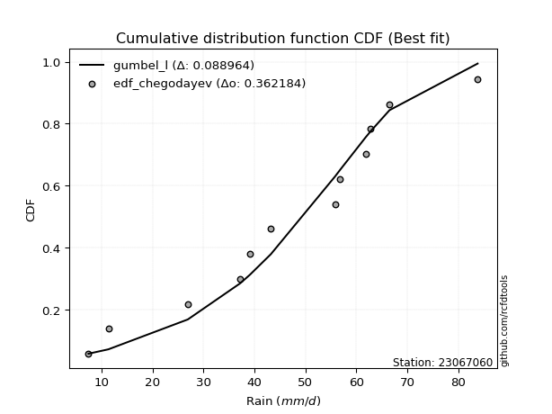</img></img>

</div>


### 6. Empirical - EDF Blom (1958)

The Blom formula is a specific "plotting position" formula used in hydrology and statistical analysis to estimate the empirical cumulative probability (or non-exceedance probability) of a data series. It is particularly recommended for data that are approximately normally distributed. The constant _a_ is set to 0.375 (or 3/8).

<div align="center">


$P=(m-a)/(n+1-2a)$


</div>


**6.1. Empirical values**

<div align="center">

|                | 0                   | 1                  | 2                   | 3                   | 4                   | 5                   | 6                  | 7                  | 8                  | 9                  | 10                 | 11                 |
|:---------------|:--------------------|:-------------------|:--------------------|:--------------------|:--------------------|:--------------------|:-------------------|:-------------------|:-------------------|:-------------------|:-------------------|:-------------------|
| date           | 2025                | 2023               | 2016                | 2017                | 2021                | 2022                | 2020               | 2024               | 2019               | 2014               | 2015               | 2018               |
| x              | 2.0                 | 7.4                | 11.3                | 26.9                | 39.1                | 43.2                | 55.8               | 56.8               | 61.8               | 62.8               | 66.5               | 83.8               |
| m              | 1                   | 2                  | 3                   | 4                   | 5                   | 6                   | 7                  | 8                  | 9                  | 10                 | 11                 | 12                 |
| empirical_dist | edf_blom            | edf_blom           | edf_blom            | edf_blom            | edf_blom            | edf_blom            | edf_blom           | edf_blom           | edf_blom           | edf_blom           | edf_blom           | edf_blom           |
| empirical      | 0.05102040816326531 | 0.1326530612244898 | 0.21428571428571427 | 0.29591836734693877 | 0.37755102040816324 | 0.45918367346938777 | 0.5408163265306123 | 0.6224489795918368 | 0.7040816326530612 | 0.7857142857142857 | 0.8673469387755102 | 0.9489795918367347 |
| empirical_tr   | 1.053763440860215   | 1.1529411764705884 | 1.2727272727272727  | 1.4202898550724639  | 1.6065573770491803  | 1.8490566037735847  | 2.177777777777778  | 2.6486486486486487 | 3.3793103448275863 | 4.666666666666666  | 7.5384615384615365 | 19.60000000000002  |

</div>


**6.2. Kolmogorov-Smirnov fit test (sorted by Δ)**


<div align="center">

|                | 0                   | 1                   | 2                   | 3                   | 4                   | 5                   | 6                   | 7                   | 8                   | 9                   | 10                  | 11                  | 12                  | 13                  | 14                  | 15                  | 16                  | 17                  | 18                  | 19                  | 20                  | 21                  | 22                  | 23                  | 24                  | 25                  | 26                  | 27                  | 28                  | 29                  | 30                    | 31                  | 32                  | 33                  | 34                  | 35                  | 36                  | 37                  | 38                  | 39                  | 40                  | 41                  | 42                  | 43                  | 44                  | 45                  | 46                  | 47                  | 48                  | 49                  | 50                  | 51                  | 52                  | 53                  | 54                  | 55                  | 56                  | 57                  | 58                  | 59                  | 60                  | 61                  | 62                  | 63                  | 64                  | 65                  | 66                  | 67                  | 68                  | 69                  | 70                  | 71                  | 72                  | 73                  | 74                  | 75                  | 76                  | 77                  | 78                  | 79                  | 80                  | 81                  | 82                  | 83                  | 84                  | 85                  | 86                  | 87                  | 88                  | 89                  |
|:---------------|:--------------------|:--------------------|:--------------------|:--------------------|:--------------------|:--------------------|:--------------------|:--------------------|:--------------------|:--------------------|:--------------------|:--------------------|:--------------------|:--------------------|:--------------------|:--------------------|:--------------------|:--------------------|:--------------------|:--------------------|:--------------------|:--------------------|:--------------------|:--------------------|:--------------------|:--------------------|:--------------------|:--------------------|:--------------------|:--------------------|:----------------------|:--------------------|:--------------------|:--------------------|:--------------------|:--------------------|:--------------------|:--------------------|:--------------------|:--------------------|:--------------------|:--------------------|:--------------------|:--------------------|:--------------------|:--------------------|:--------------------|:--------------------|:--------------------|:--------------------|:--------------------|:--------------------|:--------------------|:--------------------|:--------------------|:--------------------|:--------------------|:--------------------|:--------------------|:--------------------|:--------------------|:--------------------|:--------------------|:--------------------|:--------------------|:--------------------|:--------------------|:--------------------|:--------------------|:--------------------|:--------------------|:--------------------|:--------------------|:--------------------|:--------------------|:--------------------|:--------------------|:--------------------|:--------------------|:--------------------|:--------------------|:--------------------|:--------------------|:--------------------|:--------------------|:--------------------|:--------------------|:--------------------|:--------------------|:--------------------|
| station        | 23067060            | 23067060            | 23067060            | 23067060            | 23067060            | 23067060            | 23067060            | 23067060            | 23067060            | 23067060            | 23067060            | 23067060            | 23067060            | 23067060            | 23067060            | 23067060            | 23067060            | 23067060            | 23067060            | 23067060            | 23067060            | 23067060            | 23067060            | 23067060            | 23067060            | 23067060            | 23067060            | 23067060            | 23067060            | 23067060            | 23067060              | 23067060            | 23067060            | 23067060            | 23067060            | 23067060            | 23067060            | 23067060            | 23067060            | 23067060            | 23067060            | 23067060            | 23067060            | 23067060            | 23067060            | 23067060            | 23067060            | 23067060            | 23067060            | 23067060            | 23067060            | 23067060            | 23067060            | 23067060            | 23067060            | 23067060            | 23067060            | 23067060            | 23067060            | 23067060            | 23067060            | 23067060            | 23067060            | 23067060            | 23067060            | 23067060            | 23067060            | 23067060            | 23067060            | 23067060            | 23067060            | 23067060            | 23067060            | 23067060            | 23067060            | 23067060            | 23067060            | 23067060            | 23067060            | 23067060            | 23067060            | 23067060            | 23067060            | 23067060            | 23067060            | 23067060            | 23067060            | 23067060            | 23067060            | 23067060            |
| empirical_dist | edf_blom            | edf_blom            | edf_blom            | edf_blom            | edf_blom            | edf_blom            | edf_blom            | edf_blom            | edf_blom            | edf_blom            | edf_blom            | edf_blom            | edf_blom            | edf_blom            | edf_blom            | edf_blom            | edf_blom            | edf_blom            | edf_blom            | edf_blom            | edf_blom            | edf_blom            | edf_blom            | edf_blom            | edf_blom            | edf_blom            | edf_blom            | edf_blom            | edf_blom            | edf_blom            | edf_blom              | edf_blom            | edf_blom            | edf_blom            | edf_blom            | edf_blom            | edf_blom            | edf_blom            | edf_blom            | edf_blom            | edf_blom            | edf_blom            | edf_blom            | edf_blom            | edf_blom            | edf_blom            | edf_blom            | edf_blom            | edf_blom            | edf_blom            | edf_blom            | edf_blom            | edf_blom            | edf_blom            | edf_blom            | edf_blom            | edf_blom            | edf_blom            | edf_blom            | edf_blom            | edf_blom            | edf_blom            | edf_blom            | edf_blom            | edf_blom            | edf_blom            | edf_blom            | edf_blom            | edf_blom            | edf_blom            | edf_blom            | edf_blom            | edf_blom            | edf_blom            | edf_blom            | edf_blom            | edf_blom            | edf_blom            | edf_blom            | edf_blom            | edf_blom            | edf_blom            | edf_blom            | edf_blom            | edf_blom            | edf_blom            | edf_blom            | edf_blom            | edf_blom            | edf_blom            |
| p_dist         | laplace_asymmetric  | genlogistic         | logjohnsonsu        | gumbel_l            | johnsonsu           | logmielke           | logloggamma         | logpearson3         | weibull_min         | fisk                | pearson3            | logfisk             | f                   | t                   | crystalball         | norm                | exponnorm           | nct                 | erlang              | betaprime           | gamma               | loggumbel_l         | rice                | invgamma            | invweibull          | maxwell             | ncf                 | lognakagami         | logistic            | rayleigh            | loglaplace_asymmetric | kstwobign           | logweibull_min      | loggompertz         | mielke              | hypsecant           | halfnorm            | invgauss            | logt                | gumbel_r            | laplace             | halflogistic        | expon               | genexpon            | logfatiguelife      | loginvweibull       | logexponnorm        | logcrystalball      | lognorm             | lognorm             | loglognorm          | logf                | logrice             | lognct              | nakagami            | moyal               | logbetaprime        | logchi2             | logerlang           | loggamma            | loggamma            | loglogistic         | loginvgamma         | logncf              | loginvgauss         | loghypsecant        | logalpha            | logmaxwell          | logkstwobign        | lograyleigh         | loglaplace          | wald                | loggenexpon         | loghalfnorm         | loggumbel_r         | gibrat              | loghalflogistic     | logmoyal            | logexpon            | logtruncnorm        | logwald             | loggibrat           | gompertz            | pareto              | logpareto           | alpha               | fatiguelife         | chi2                | truncnorm           | loggenlogistic      |
| delta          | 0.08931126955674124 | 0.09364200761806384 | 0.100548427447673   | 0.11760530610227637 | 0.11891150769805281 | 0.13043835769617051 | 0.1327062571220471  | 0.13479676687026565 | 0.1355661683963162  | 0.13766227873383297 | 0.1405345779042383  | 0.14922409492432598 | 0.15258892829981985 | 0.15269782593060932 | 0.15270096803040678 | 0.15270096828050372 | 0.15270160429794744 | 0.15273382362834065 | 0.15440353347609537 | 0.15657520264656222 | 0.15752488093979988 | 0.15964545076793668 | 0.16054104616072007 | 0.16430710415505057 | 0.16685481402835833 | 0.16939740617925048 | 0.1704701365412219  | 0.1712341875266905  | 0.17371641535030125 | 0.17429463293554748 | 0.17878724329130669   | 0.1820303794525444  | 0.18476853031287999 | 0.1855581207081265  | 0.18688485955113388 | 0.18904946812946388 | 0.1890754489470199  | 0.19099634667024634 | 0.19672402456128457 | 0.20485686897292865 | 0.21467882757196166 | 0.21610872212114174 | 0.21681761409208467 | 0.21694242155052812 | 0.2174063177603789  | 0.21919180390929682 | 0.21988798611217197 | 0.21988888832114584 | 0.2198889003938438  | 0.2198889003938438  | 0.21989008757852557 | 0.2199138369439927  | 0.21992035794822073 | 0.220076924031128   | 0.2214275731882661  | 0.22176799168366235 | 0.22539044503525119 | 0.2271367068686807  | 0.23008511992575753 | 0.23247652664122254 | 0.23247652664122254 | 0.232496448365769   | 0.23322862975271652 | 0.23687114444656665 | 0.23705838462741435 | 0.2428350001747337  | 0.24487749783561685 | 0.2466380606341788  | 0.25061808984631684 | 0.25495501025927647 | 0.26972542642450026 | 0.27111516129006497 | 0.2721262798228171  | 0.2786129208980508  | 0.28665835964778086 | 0.30261718915942437 | 0.3068966472407555  | 0.30951771844275944 | 0.3213096317509435  | 0.32972317829174236 | 0.37319701077544387 | 0.4048186688312728  | 0.4379443911929751  | 0.4688493872633438  | 0.5070445795620638  | 0.5102330868210196  | 0.5214174278579508  | 0.6908074485137394  | 0.7641542916472691  | 0.8673469387755102  |
| deltao         | 0.36218414519599995 | 0.36218414519599995 | 0.36218414519599995 | 0.36218414519599995 | 0.36218414519599995 | 0.36218414519599995 | 0.36218414519599995 | 0.36218414519599995 | 0.36218414519599995 | 0.36218414519599995 | 0.36218414519599995 | 0.36218414519599995 | 0.36218414519599995 | 0.36218414519599995 | 0.36218414519599995 | 0.36218414519599995 | 0.36218414519599995 | 0.36218414519599995 | 0.36218414519599995 | 0.36218414519599995 | 0.36218414519599995 | 0.36218414519599995 | 0.36218414519599995 | 0.36218414519599995 | 0.36218414519599995 | 0.36218414519599995 | 0.36218414519599995 | 0.36218414519599995 | 0.36218414519599995 | 0.36218414519599995 | 0.36218414519599995   | 0.36218414519599995 | 0.36218414519599995 | 0.36218414519599995 | 0.36218414519599995 | 0.36218414519599995 | 0.36218414519599995 | 0.36218414519599995 | 0.36218414519599995 | 0.36218414519599995 | 0.36218414519599995 | 0.36218414519599995 | 0.36218414519599995 | 0.36218414519599995 | 0.36218414519599995 | 0.36218414519599995 | 0.36218414519599995 | 0.36218414519599995 | 0.36218414519599995 | 0.36218414519599995 | 0.36218414519599995 | 0.36218414519599995 | 0.36218414519599995 | 0.36218414519599995 | 0.36218414519599995 | 0.36218414519599995 | 0.36218414519599995 | 0.36218414519599995 | 0.36218414519599995 | 0.36218414519599995 | 0.36218414519599995 | 0.36218414519599995 | 0.36218414519599995 | 0.36218414519599995 | 0.36218414519599995 | 0.36218414519599995 | 0.36218414519599995 | 0.36218414519599995 | 0.36218414519599995 | 0.36218414519599995 | 0.36218414519599995 | 0.36218414519599995 | 0.36218414519599995 | 0.36218414519599995 | 0.36218414519599995 | 0.36218414519599995 | 0.36218414519599995 | 0.36218414519599995 | 0.36218414519599995 | 0.36218414519599995 | 0.36218414519599995 | 0.36218414519599995 | 0.36218414519599995 | 0.36218414519599995 | 0.36218414519599995 | 0.36218414519599995 | 0.36218414519599995 | 0.36218414519599995 | 0.36218414519599995 | 0.36218414519599995 |
| eval           | Δo > Δ              | Δo > Δ              | Δo > Δ              | Δo > Δ              | Δo > Δ              | Δo > Δ              | Δo > Δ              | Δo > Δ              | Δo > Δ              | Δo > Δ              | Δo > Δ              | Δo > Δ              | Δo > Δ              | Δo > Δ              | Δo > Δ              | Δo > Δ              | Δo > Δ              | Δo > Δ              | Δo > Δ              | Δo > Δ              | Δo > Δ              | Δo > Δ              | Δo > Δ              | Δo > Δ              | Δo > Δ              | Δo > Δ              | Δo > Δ              | Δo > Δ              | Δo > Δ              | Δo > Δ              | Δo > Δ                | Δo > Δ              | Δo > Δ              | Δo > Δ              | Δo > Δ              | Δo > Δ              | Δo > Δ              | Δo > Δ              | Δo > Δ              | Δo > Δ              | Δo > Δ              | Δo > Δ              | Δo > Δ              | Δo > Δ              | Δo > Δ              | Δo > Δ              | Δo > Δ              | Δo > Δ              | Δo > Δ              | Δo > Δ              | Δo > Δ              | Δo > Δ              | Δo > Δ              | Δo > Δ              | Δo > Δ              | Δo > Δ              | Δo > Δ              | Δo > Δ              | Δo > Δ              | Δo > Δ              | Δo > Δ              | Δo > Δ              | Δo > Δ              | Δo > Δ              | Δo > Δ              | Δo > Δ              | Δo > Δ              | Δo > Δ              | Δo > Δ              | Δo > Δ              | Δo > Δ              | Δo > Δ              | Δo > Δ              | Δo > Δ              | Δo > Δ              | Δo > Δ              | Δo > Δ              | Δo > Δ              | Δo > Δ              | Δo > Δ              | Δo <= Δ             | Δo <= Δ             | Δo <= Δ             | Δo <= Δ             | Δo <= Δ             | Δo <= Δ             | Δo <= Δ             | Δo <= Δ             | Δo <= Δ             | Δo <= Δ             |
| fit            | 1                   | 1                   | 1                   | 1                   | 1                   | 1                   | 1                   | 1                   | 1                   | 1                   | 1                   | 1                   | 1                   | 1                   | 1                   | 1                   | 1                   | 1                   | 1                   | 1                   | 1                   | 1                   | 1                   | 1                   | 1                   | 1                   | 1                   | 1                   | 1                   | 1                   | 1                     | 1                   | 1                   | 1                   | 1                   | 1                   | 1                   | 1                   | 1                   | 1                   | 1                   | 1                   | 1                   | 1                   | 1                   | 1                   | 1                   | 1                   | 1                   | 1                   | 1                   | 1                   | 1                   | 1                   | 1                   | 1                   | 1                   | 1                   | 1                   | 1                   | 1                   | 1                   | 1                   | 1                   | 1                   | 1                   | 1                   | 1                   | 1                   | 1                   | 1                   | 1                   | 1                   | 1                   | 1                   | 1                   | 1                   | 1                   | 1                   | 1                   | 0                   | 0                   | 0                   | 0                   | 0                   | 0                   | 0                   | 0                   | 0                   | 0                   |
| n              | 12                  | 12                  | 12                  | 12                  | 12                  | 12                  | 12                  | 12                  | 12                  | 12                  | 12                  | 12                  | 12                  | 12                  | 12                  | 12                  | 12                  | 12                  | 12                  | 12                  | 12                  | 12                  | 12                  | 12                  | 12                  | 12                  | 12                  | 12                  | 12                  | 12                  | 12                    | 12                  | 12                  | 12                  | 12                  | 12                  | 12                  | 12                  | 12                  | 12                  | 12                  | 12                  | 12                  | 12                  | 12                  | 12                  | 12                  | 12                  | 12                  | 12                  | 12                  | 12                  | 12                  | 12                  | 12                  | 12                  | 12                  | 12                  | 12                  | 12                  | 12                  | 12                  | 12                  | 12                  | 12                  | 12                  | 12                  | 12                  | 12                  | 12                  | 12                  | 12                  | 12                  | 12                  | 12                  | 12                  | 12                  | 12                  | 12                  | 12                  | 12                  | 12                  | 12                  | 12                  | 12                  | 12                  | 12                  | 12                  | 12                  | 12                  |
| best_fit       | 1                   | 0                   | 0                   | 0                   | 0                   | 0                   | 0                   | 0                   | 0                   | 0                   | 0                   | 0                   | 0                   | 0                   | 0                   | 0                   | 0                   | 0                   | 0                   | 0                   | 0                   | 0                   | 0                   | 0                   | 0                   | 0                   | 0                   | 0                   | 0                   | 0                   | 0                     | 0                   | 0                   | 0                   | 0                   | 0                   | 0                   | 0                   | 0                   | 0                   | 0                   | 0                   | 0                   | 0                   | 0                   | 0                   | 0                   | 0                   | 0                   | 0                   | 0                   | 0                   | 0                   | 0                   | 0                   | 0                   | 0                   | 0                   | 0                   | 0                   | 0                   | 0                   | 0                   | 0                   | 0                   | 0                   | 0                   | 0                   | 0                   | 0                   | 0                   | 0                   | 0                   | 0                   | 0                   | 0                   | 0                   | 0                   | 0                   | 0                   | 0                   | 0                   | 0                   | 0                   | 0                   | 0                   | 0                   | 0                   | 0                   | 0                   |
| best_fit_sort  | 1                   | 2                   | 3                   | 4                   | 5                   | 6                   | 7                   | 8                   | 9                   | 10                  | 11                  | 12                  | 13                  | 14                  | 15                  | 16                  | 17                  | 18                  | 19                  | 20                  | 21                  | 22                  | 23                  | 24                  | 25                  | 26                  | 27                  | 28                  | 29                  | 30                  | 31                    | 32                  | 33                  | 34                  | 35                  | 36                  | 37                  | 38                  | 39                  | 40                  | 41                  | 42                  | 43                  | 44                  | 45                  | 46                  | 47                  | 48                  | 49                  | 50                  | 51                  | 52                  | 53                  | 54                  | 55                  | 56                  | 57                  | 58                  | 59                  | 60                  | 61                  | 62                  | 63                  | 64                  | 65                  | 66                  | 67                  | 68                  | 69                  | 70                  | 71                  | 72                  | 73                  | 74                  | 75                  | 76                  | 77                  | 78                  | 79                  | 80                  | 81                  | 82                  | 83                  | 84                  | 85                  | 86                  | 87                  | 88                  | 89                  | 90                  |

</div>


<div align="center">

</img>

</div>


**6.3. Best fit**

<div align="center">

|   id |   station | empirical_dist   | p_dist             |     delta |   deltao | eval   |   fit |   n |   best_fit |   best_fit_sort |
|-----:|----------:|:-----------------|:-------------------|----------:|---------:|:-------|------:|----:|-----------:|----------------:|
|    0 |  23067060 | edf_blom         | laplace_asymmetric | 0.0893113 | 0.362184 | Δo > Δ |     1 |  12 |          1 |               1 |

</div>


<div align="center">

</img>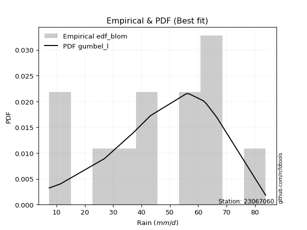</img>

</div>


### 7. Empirical - EDF Tukey (1962)

In hydrology, the Tukey formula is used as a plotting position formula to estimate the empirical probability or frequency of a flood event (or other hydrological data). The formula parameter is given as _c=0.333_ (or 1/3).

<div align="center">


$P=(m-c)/(n+1-2c)$


</div>


**7.1. Empirical values**

<div align="center">

|                | 0                   | 1                   | 2                   | 3                  | 4                  | 5                  | 6                  | 7                  | 8                  | 9                  | 10                 | 11                 |
|:---------------|:--------------------|:--------------------|:--------------------|:-------------------|:-------------------|:-------------------|:-------------------|:-------------------|:-------------------|:-------------------|:-------------------|:-------------------|
| date           | 2025                | 2023                | 2016                | 2017               | 2021               | 2022               | 2020               | 2024               | 2019               | 2014               | 2015               | 2018               |
| x              | 2.0                 | 7.4                 | 11.3                | 26.9               | 39.1               | 43.2               | 55.8               | 56.8               | 61.8               | 62.8               | 66.5               | 83.8               |
| m              | 1                   | 2                   | 3                   | 4                  | 5                  | 6                  | 7                  | 8                  | 9                  | 10                 | 11                 | 12                 |
| empirical_dist | edf_tukey           | edf_tukey           | edf_tukey           | edf_tukey          | edf_tukey          | edf_tukey          | edf_tukey          | edf_tukey          | edf_tukey          | edf_tukey          | edf_tukey          | edf_tukey          |
| empirical      | 0.05405405405405406 | 0.13513513513513514 | 0.21621621621621623 | 0.2972972972972973 | 0.3783783783783784 | 0.4594594594594595 | 0.5405405405405406 | 0.6216216216216216 | 0.7027027027027027 | 0.7837837837837838 | 0.8648648648648649 | 0.9459459459459459 |
| empirical_tr   | 1.0571428571428572  | 1.15625             | 1.2758620689655173  | 1.4230769230769231 | 1.608695652173913  | 1.8499999999999999 | 2.1764705882352944 | 2.642857142857143  | 3.363636363636364  | 4.625              | 7.400000000000003  | 18.5               |

</div>


**7.2. Kolmogorov-Smirnov fit test (sorted by Δ)**


<div align="center">

|                | 0                   | 1                   | 2                   | 3                   | 4                   | 5                   | 6                   | 7                   | 8                   | 9                   | 10                  | 11                  | 12                  | 13                  | 14                  | 15                  | 16                  | 17                  | 18                  | 19                  | 20                  | 21                  | 22                  | 23                  | 24                  | 25                  | 26                  | 27                  | 28                  | 29                  | 30                    | 31                  | 32                  | 33                  | 34                  | 35                  | 36                  | 37                  | 38                  | 39                  | 40                  | 41                  | 42                  | 43                  | 44                  | 45                  | 46                  | 47                  | 48                  | 49                  | 50                  | 51                  | 52                  | 53                  | 54                  | 55                  | 56                  | 57                  | 58                  | 59                  | 60                  | 61                  | 62                  | 63                  | 64                  | 65                  | 66                  | 67                  | 68                  | 69                  | 70                  | 71                  | 72                  | 73                  | 74                  | 75                  | 76                  | 77                  | 78                  | 79                  | 80                  | 81                  | 82                  | 83                  | 84                  | 85                  | 86                  | 87                  | 88                  | 89                  |
|:---------------|:--------------------|:--------------------|:--------------------|:--------------------|:--------------------|:--------------------|:--------------------|:--------------------|:--------------------|:--------------------|:--------------------|:--------------------|:--------------------|:--------------------|:--------------------|:--------------------|:--------------------|:--------------------|:--------------------|:--------------------|:--------------------|:--------------------|:--------------------|:--------------------|:--------------------|:--------------------|:--------------------|:--------------------|:--------------------|:--------------------|:----------------------|:--------------------|:--------------------|:--------------------|:--------------------|:--------------------|:--------------------|:--------------------|:--------------------|:--------------------|:--------------------|:--------------------|:--------------------|:--------------------|:--------------------|:--------------------|:--------------------|:--------------------|:--------------------|:--------------------|:--------------------|:--------------------|:--------------------|:--------------------|:--------------------|:--------------------|:--------------------|:--------------------|:--------------------|:--------------------|:--------------------|:--------------------|:--------------------|:--------------------|:--------------------|:--------------------|:--------------------|:--------------------|:--------------------|:--------------------|:--------------------|:--------------------|:--------------------|:--------------------|:--------------------|:--------------------|:--------------------|:--------------------|:--------------------|:--------------------|:--------------------|:--------------------|:--------------------|:--------------------|:--------------------|:--------------------|:--------------------|:--------------------|:--------------------|:--------------------|
| station        | 23067060            | 23067060            | 23067060            | 23067060            | 23067060            | 23067060            | 23067060            | 23067060            | 23067060            | 23067060            | 23067060            | 23067060            | 23067060            | 23067060            | 23067060            | 23067060            | 23067060            | 23067060            | 23067060            | 23067060            | 23067060            | 23067060            | 23067060            | 23067060            | 23067060            | 23067060            | 23067060            | 23067060            | 23067060            | 23067060            | 23067060              | 23067060            | 23067060            | 23067060            | 23067060            | 23067060            | 23067060            | 23067060            | 23067060            | 23067060            | 23067060            | 23067060            | 23067060            | 23067060            | 23067060            | 23067060            | 23067060            | 23067060            | 23067060            | 23067060            | 23067060            | 23067060            | 23067060            | 23067060            | 23067060            | 23067060            | 23067060            | 23067060            | 23067060            | 23067060            | 23067060            | 23067060            | 23067060            | 23067060            | 23067060            | 23067060            | 23067060            | 23067060            | 23067060            | 23067060            | 23067060            | 23067060            | 23067060            | 23067060            | 23067060            | 23067060            | 23067060            | 23067060            | 23067060            | 23067060            | 23067060            | 23067060            | 23067060            | 23067060            | 23067060            | 23067060            | 23067060            | 23067060            | 23067060            | 23067060            |
| empirical_dist | edf_tukey           | edf_tukey           | edf_tukey           | edf_tukey           | edf_tukey           | edf_tukey           | edf_tukey           | edf_tukey           | edf_tukey           | edf_tukey           | edf_tukey           | edf_tukey           | edf_tukey           | edf_tukey           | edf_tukey           | edf_tukey           | edf_tukey           | edf_tukey           | edf_tukey           | edf_tukey           | edf_tukey           | edf_tukey           | edf_tukey           | edf_tukey           | edf_tukey           | edf_tukey           | edf_tukey           | edf_tukey           | edf_tukey           | edf_tukey           | edf_tukey             | edf_tukey           | edf_tukey           | edf_tukey           | edf_tukey           | edf_tukey           | edf_tukey           | edf_tukey           | edf_tukey           | edf_tukey           | edf_tukey           | edf_tukey           | edf_tukey           | edf_tukey           | edf_tukey           | edf_tukey           | edf_tukey           | edf_tukey           | edf_tukey           | edf_tukey           | edf_tukey           | edf_tukey           | edf_tukey           | edf_tukey           | edf_tukey           | edf_tukey           | edf_tukey           | edf_tukey           | edf_tukey           | edf_tukey           | edf_tukey           | edf_tukey           | edf_tukey           | edf_tukey           | edf_tukey           | edf_tukey           | edf_tukey           | edf_tukey           | edf_tukey           | edf_tukey           | edf_tukey           | edf_tukey           | edf_tukey           | edf_tukey           | edf_tukey           | edf_tukey           | edf_tukey           | edf_tukey           | edf_tukey           | edf_tukey           | edf_tukey           | edf_tukey           | edf_tukey           | edf_tukey           | edf_tukey           | edf_tukey           | edf_tukey           | edf_tukey           | edf_tukey           | edf_tukey           |
| p_dist         | laplace_asymmetric  | genlogistic         | logjohnsonsu        | gumbel_l            | johnsonsu           | logmielke           | logloggamma         | logpearson3         | weibull_min         | fisk                | pearson3            | logfisk             | f                   | t                   | crystalball         | norm                | exponnorm           | nct                 | erlang              | betaprime           | gamma               | loggumbel_l         | rice                | invgamma            | invweibull          | maxwell             | lognakagami         | ncf                 | logistic            | rayleigh            | loglaplace_asymmetric | kstwobign           | logweibull_min      | loggompertz         | mielke              | hypsecant           | halfnorm            | invgauss            | logt                | gumbel_r            | laplace             | expon               | genexpon            | halflogistic        | logfatiguelife      | loginvweibull       | logexponnorm        | logcrystalball      | lognorm             | lognorm             | loglognorm          | logf                | logrice             | lognct              | nakagami            | moyal               | logbetaprime        | logchi2             | logerlang           | loggamma            | loggamma            | loglogistic         | loginvgamma         | logncf              | loginvgauss         | loghypsecant        | logalpha            | logmaxwell          | logkstwobign        | lograyleigh         | loglaplace          | loggenexpon         | wald                | loghalfnorm         | loggumbel_r         | gibrat              | loghalflogistic     | logmoyal            | logexpon            | logtruncnorm        | logwald             | loggibrat           | gompertz            | pareto              | logpareto           | alpha               | fatiguelife         | chi2                | truncnorm           | loggenlogistic      |
| delta          | 0.09124177148724319 | 0.09557250954856579 | 0.10082421343774473 | 0.1178810920923481  | 0.11918729368812453 | 0.13071414368624223 | 0.1329820431121188  | 0.1339694089000505  | 0.1358419543863879  | 0.13793806472390469 | 0.14081036389431    | 0.14839673695411082 | 0.15286471428989157 | 0.15297361192068104 | 0.1529767540204785  | 0.15297675427057544 | 0.15297739028801915 | 0.15300960961841237 | 0.1546793194661671  | 0.15685098863663394 | 0.1578006669298716  | 0.15881809279772152 | 0.1608168321507918  | 0.16458289014512228 | 0.16713060001843005 | 0.1696731921693222  | 0.17040682955647535 | 0.17074592253129361 | 0.17399220134037297 | 0.1745704189256192  | 0.1790630292813784    | 0.18230616544261613 | 0.1850443163029517  | 0.18583390669819821 | 0.1871606455412056  | 0.1893252541195356  | 0.1899244027461895  | 0.19127213266031806 | 0.1969998105513563  | 0.20513265496300037 | 0.21495461356203338 | 0.2159902561218695  | 0.21611506358031296 | 0.21638450811121346 | 0.21657895979016373 | 0.21836444593908166 | 0.21906062814195681 | 0.21906153035093068 | 0.21906154242362863 | 0.21906154242362863 | 0.2190627296083104  | 0.21908647897377753 | 0.21909299997800558 | 0.21924956606091284 | 0.22060021521805095 | 0.22204377767373407 | 0.22456308706503603 | 0.22630934889846555 | 0.22925776195554237 | 0.23164916867100738 | 0.23164916867100738 | 0.23166909039555383 | 0.23240127178250136 | 0.2360437864763515  | 0.2362310266571992  | 0.24200764220451854 | 0.2440501398654017  | 0.24581070266396365 | 0.24979073187610168 | 0.2541276522890613  | 0.2688980684542851  | 0.27129892185260196 | 0.2713909472801367  | 0.2777855629278356  | 0.2858310016775657  | 0.3028929751494961  | 0.30606928927054033 | 0.3086903604725443  | 0.31993070180058497 | 0.3283442483413838  | 0.3723696528052287  | 0.40399131086105766 | 0.43711703322275997 | 0.4663673133526985  | 0.5045625056514185  | 0.508854156870661   | 0.5189353539473054  | 0.6894285185633808  | 0.7622237897167672  | 0.8648648648648649  |
| deltao         | 0.36218414519599995 | 0.36218414519599995 | 0.36218414519599995 | 0.36218414519599995 | 0.36218414519599995 | 0.36218414519599995 | 0.36218414519599995 | 0.36218414519599995 | 0.36218414519599995 | 0.36218414519599995 | 0.36218414519599995 | 0.36218414519599995 | 0.36218414519599995 | 0.36218414519599995 | 0.36218414519599995 | 0.36218414519599995 | 0.36218414519599995 | 0.36218414519599995 | 0.36218414519599995 | 0.36218414519599995 | 0.36218414519599995 | 0.36218414519599995 | 0.36218414519599995 | 0.36218414519599995 | 0.36218414519599995 | 0.36218414519599995 | 0.36218414519599995 | 0.36218414519599995 | 0.36218414519599995 | 0.36218414519599995 | 0.36218414519599995   | 0.36218414519599995 | 0.36218414519599995 | 0.36218414519599995 | 0.36218414519599995 | 0.36218414519599995 | 0.36218414519599995 | 0.36218414519599995 | 0.36218414519599995 | 0.36218414519599995 | 0.36218414519599995 | 0.36218414519599995 | 0.36218414519599995 | 0.36218414519599995 | 0.36218414519599995 | 0.36218414519599995 | 0.36218414519599995 | 0.36218414519599995 | 0.36218414519599995 | 0.36218414519599995 | 0.36218414519599995 | 0.36218414519599995 | 0.36218414519599995 | 0.36218414519599995 | 0.36218414519599995 | 0.36218414519599995 | 0.36218414519599995 | 0.36218414519599995 | 0.36218414519599995 | 0.36218414519599995 | 0.36218414519599995 | 0.36218414519599995 | 0.36218414519599995 | 0.36218414519599995 | 0.36218414519599995 | 0.36218414519599995 | 0.36218414519599995 | 0.36218414519599995 | 0.36218414519599995 | 0.36218414519599995 | 0.36218414519599995 | 0.36218414519599995 | 0.36218414519599995 | 0.36218414519599995 | 0.36218414519599995 | 0.36218414519599995 | 0.36218414519599995 | 0.36218414519599995 | 0.36218414519599995 | 0.36218414519599995 | 0.36218414519599995 | 0.36218414519599995 | 0.36218414519599995 | 0.36218414519599995 | 0.36218414519599995 | 0.36218414519599995 | 0.36218414519599995 | 0.36218414519599995 | 0.36218414519599995 | 0.36218414519599995 |
| eval           | Δo > Δ              | Δo > Δ              | Δo > Δ              | Δo > Δ              | Δo > Δ              | Δo > Δ              | Δo > Δ              | Δo > Δ              | Δo > Δ              | Δo > Δ              | Δo > Δ              | Δo > Δ              | Δo > Δ              | Δo > Δ              | Δo > Δ              | Δo > Δ              | Δo > Δ              | Δo > Δ              | Δo > Δ              | Δo > Δ              | Δo > Δ              | Δo > Δ              | Δo > Δ              | Δo > Δ              | Δo > Δ              | Δo > Δ              | Δo > Δ              | Δo > Δ              | Δo > Δ              | Δo > Δ              | Δo > Δ                | Δo > Δ              | Δo > Δ              | Δo > Δ              | Δo > Δ              | Δo > Δ              | Δo > Δ              | Δo > Δ              | Δo > Δ              | Δo > Δ              | Δo > Δ              | Δo > Δ              | Δo > Δ              | Δo > Δ              | Δo > Δ              | Δo > Δ              | Δo > Δ              | Δo > Δ              | Δo > Δ              | Δo > Δ              | Δo > Δ              | Δo > Δ              | Δo > Δ              | Δo > Δ              | Δo > Δ              | Δo > Δ              | Δo > Δ              | Δo > Δ              | Δo > Δ              | Δo > Δ              | Δo > Δ              | Δo > Δ              | Δo > Δ              | Δo > Δ              | Δo > Δ              | Δo > Δ              | Δo > Δ              | Δo > Δ              | Δo > Δ              | Δo > Δ              | Δo > Δ              | Δo > Δ              | Δo > Δ              | Δo > Δ              | Δo > Δ              | Δo > Δ              | Δo > Δ              | Δo > Δ              | Δo > Δ              | Δo > Δ              | Δo <= Δ             | Δo <= Δ             | Δo <= Δ             | Δo <= Δ             | Δo <= Δ             | Δo <= Δ             | Δo <= Δ             | Δo <= Δ             | Δo <= Δ             | Δo <= Δ             |
| fit            | 1                   | 1                   | 1                   | 1                   | 1                   | 1                   | 1                   | 1                   | 1                   | 1                   | 1                   | 1                   | 1                   | 1                   | 1                   | 1                   | 1                   | 1                   | 1                   | 1                   | 1                   | 1                   | 1                   | 1                   | 1                   | 1                   | 1                   | 1                   | 1                   | 1                   | 1                     | 1                   | 1                   | 1                   | 1                   | 1                   | 1                   | 1                   | 1                   | 1                   | 1                   | 1                   | 1                   | 1                   | 1                   | 1                   | 1                   | 1                   | 1                   | 1                   | 1                   | 1                   | 1                   | 1                   | 1                   | 1                   | 1                   | 1                   | 1                   | 1                   | 1                   | 1                   | 1                   | 1                   | 1                   | 1                   | 1                   | 1                   | 1                   | 1                   | 1                   | 1                   | 1                   | 1                   | 1                   | 1                   | 1                   | 1                   | 1                   | 1                   | 0                   | 0                   | 0                   | 0                   | 0                   | 0                   | 0                   | 0                   | 0                   | 0                   |
| n              | 12                  | 12                  | 12                  | 12                  | 12                  | 12                  | 12                  | 12                  | 12                  | 12                  | 12                  | 12                  | 12                  | 12                  | 12                  | 12                  | 12                  | 12                  | 12                  | 12                  | 12                  | 12                  | 12                  | 12                  | 12                  | 12                  | 12                  | 12                  | 12                  | 12                  | 12                    | 12                  | 12                  | 12                  | 12                  | 12                  | 12                  | 12                  | 12                  | 12                  | 12                  | 12                  | 12                  | 12                  | 12                  | 12                  | 12                  | 12                  | 12                  | 12                  | 12                  | 12                  | 12                  | 12                  | 12                  | 12                  | 12                  | 12                  | 12                  | 12                  | 12                  | 12                  | 12                  | 12                  | 12                  | 12                  | 12                  | 12                  | 12                  | 12                  | 12                  | 12                  | 12                  | 12                  | 12                  | 12                  | 12                  | 12                  | 12                  | 12                  | 12                  | 12                  | 12                  | 12                  | 12                  | 12                  | 12                  | 12                  | 12                  | 12                  |
| best_fit       | 1                   | 0                   | 0                   | 0                   | 0                   | 0                   | 0                   | 0                   | 0                   | 0                   | 0                   | 0                   | 0                   | 0                   | 0                   | 0                   | 0                   | 0                   | 0                   | 0                   | 0                   | 0                   | 0                   | 0                   | 0                   | 0                   | 0                   | 0                   | 0                   | 0                   | 0                     | 0                   | 0                   | 0                   | 0                   | 0                   | 0                   | 0                   | 0                   | 0                   | 0                   | 0                   | 0                   | 0                   | 0                   | 0                   | 0                   | 0                   | 0                   | 0                   | 0                   | 0                   | 0                   | 0                   | 0                   | 0                   | 0                   | 0                   | 0                   | 0                   | 0                   | 0                   | 0                   | 0                   | 0                   | 0                   | 0                   | 0                   | 0                   | 0                   | 0                   | 0                   | 0                   | 0                   | 0                   | 0                   | 0                   | 0                   | 0                   | 0                   | 0                   | 0                   | 0                   | 0                   | 0                   | 0                   | 0                   | 0                   | 0                   | 0                   |
| best_fit_sort  | 1                   | 2                   | 3                   | 4                   | 5                   | 6                   | 7                   | 8                   | 9                   | 10                  | 11                  | 12                  | 13                  | 14                  | 15                  | 16                  | 17                  | 18                  | 19                  | 20                  | 21                  | 22                  | 23                  | 24                  | 25                  | 26                  | 27                  | 28                  | 29                  | 30                  | 31                    | 32                  | 33                  | 34                  | 35                  | 36                  | 37                  | 38                  | 39                  | 40                  | 41                  | 42                  | 43                  | 44                  | 45                  | 46                  | 47                  | 48                  | 49                  | 50                  | 51                  | 52                  | 53                  | 54                  | 55                  | 56                  | 57                  | 58                  | 59                  | 60                  | 61                  | 62                  | 63                  | 64                  | 65                  | 66                  | 67                  | 68                  | 69                  | 70                  | 71                  | 72                  | 73                  | 74                  | 75                  | 76                  | 77                  | 78                  | 79                  | 80                  | 81                  | 82                  | 83                  | 84                  | 85                  | 86                  | 87                  | 88                  | 89                  | 90                  |

</div>


<div align="center">

</img>

</div>


**7.3. Best fit**

<div align="center">

|   id |   station | empirical_dist   | p_dist             |     delta |   deltao | eval   |   fit |   n |   best_fit |   best_fit_sort |
|-----:|----------:|:-----------------|:-------------------|----------:|---------:|:-------|------:|----:|-----------:|----------------:|
|    0 |  23067060 | edf_tukey        | laplace_asymmetric | 0.0912418 | 0.362184 | Δo > Δ |     1 |  12 |          1 |               1 |

</div>


<div align="center">

</img></img>

</div>


### 8. Empirical - EDF Gringorten (1963)

Gringorten plotting position formula is essential for estimating the probability and return periods of extreme events like floods and heavy rainfall. The constant _a=0.44_.

<div align="center">


$P=(m-a)/(n+1-2a)$


</div>


**8.1. Empirical values**

<div align="center">

|                | 0                   | 1                   | 2                   | 3                   | 4                   | 5                   | 6                  | 7                  | 8                  | 9                  | 10                 | 11                 |
|:---------------|:--------------------|:--------------------|:--------------------|:--------------------|:--------------------|:--------------------|:-------------------|:-------------------|:-------------------|:-------------------|:-------------------|:-------------------|
| date           | 2025                | 2023                | 2016                | 2017                | 2021                | 2022                | 2020               | 2024               | 2019               | 2014               | 2015               | 2018               |
| x              | 2.0                 | 7.4                 | 11.3                | 26.9                | 39.1                | 43.2                | 55.8               | 56.8               | 61.8               | 62.8               | 66.5               | 83.8               |
| m              | 1                   | 2                   | 3                   | 4                   | 5                   | 6                   | 7                  | 8                  | 9                  | 10                 | 11                 | 12                 |
| empirical_dist | edf_gringorten      | edf_gringorten      | edf_gringorten      | edf_gringorten      | edf_gringorten      | edf_gringorten      | edf_gringorten     | edf_gringorten     | edf_gringorten     | edf_gringorten     | edf_gringorten     | edf_gringorten     |
| empirical      | 0.04620462046204621 | 0.12871287128712872 | 0.21122112211221125 | 0.29372937293729373 | 0.37623762376237624 | 0.45874587458745875 | 0.5412541254125413 | 0.6237623762376238 | 0.7062706270627064 | 0.7887788778877889 | 0.8712871287128714 | 0.9537953795379539 |
| empirical_tr   | 1.0484429065743945  | 1.1477272727272727  | 1.2677824267782427  | 1.4158878504672898  | 1.6031746031746033  | 1.8475609756097562  | 2.179856115107914  | 2.6578947368421053 | 3.4044943820224733 | 4.734375000000003  | 7.769230769230775  | 21.642857142857192 |

</div>


**8.2. Kolmogorov-Smirnov fit test (sorted by Δ)**


<div align="center">

|                | 0                   | 1                   | 2                   | 3                   | 4                   | 5                   | 6                   | 7                   | 8                   | 9                   | 10                  | 11                  | 12                  | 13                  | 14                  | 15                  | 16                  | 17                  | 18                  | 19                  | 20                  | 21                  | 22                  | 23                  | 24                  | 25                  | 26                  | 27                  | 28                  | 29                  | 30                    | 31                  | 32                  | 33                  | 34                  | 35                  | 36                  | 37                  | 38                  | 39                  | 40                  | 41                  | 42                  | 43                  | 44                  | 45                  | 46                  | 47                  | 48                  | 49                  | 50                  | 51                  | 52                  | 53                  | 54                  | 55                  | 56                  | 57                  | 58                  | 59                  | 60                  | 61                  | 62                  | 63                  | 64                  | 65                  | 66                  | 67                  | 68                  | 69                  | 70                  | 71                  | 72                  | 73                  | 74                  | 75                  | 76                  | 77                  | 78                  | 79                  | 80                  | 81                  | 82                  | 83                  | 84                  | 85                  | 86                  | 87                  | 88                  | 89                  |
|:---------------|:--------------------|:--------------------|:--------------------|:--------------------|:--------------------|:--------------------|:--------------------|:--------------------|:--------------------|:--------------------|:--------------------|:--------------------|:--------------------|:--------------------|:--------------------|:--------------------|:--------------------|:--------------------|:--------------------|:--------------------|:--------------------|:--------------------|:--------------------|:--------------------|:--------------------|:--------------------|:--------------------|:--------------------|:--------------------|:--------------------|:----------------------|:--------------------|:--------------------|:--------------------|:--------------------|:--------------------|:--------------------|:--------------------|:--------------------|:--------------------|:--------------------|:--------------------|:--------------------|:--------------------|:--------------------|:--------------------|:--------------------|:--------------------|:--------------------|:--------------------|:--------------------|:--------------------|:--------------------|:--------------------|:--------------------|:--------------------|:--------------------|:--------------------|:--------------------|:--------------------|:--------------------|:--------------------|:--------------------|:--------------------|:--------------------|:--------------------|:--------------------|:--------------------|:--------------------|:--------------------|:--------------------|:--------------------|:--------------------|:--------------------|:--------------------|:--------------------|:--------------------|:--------------------|:--------------------|:--------------------|:--------------------|:--------------------|:--------------------|:--------------------|:--------------------|:--------------------|:--------------------|:--------------------|:--------------------|:--------------------|
| station        | 23067060            | 23067060            | 23067060            | 23067060            | 23067060            | 23067060            | 23067060            | 23067060            | 23067060            | 23067060            | 23067060            | 23067060            | 23067060            | 23067060            | 23067060            | 23067060            | 23067060            | 23067060            | 23067060            | 23067060            | 23067060            | 23067060            | 23067060            | 23067060            | 23067060            | 23067060            | 23067060            | 23067060            | 23067060            | 23067060            | 23067060              | 23067060            | 23067060            | 23067060            | 23067060            | 23067060            | 23067060            | 23067060            | 23067060            | 23067060            | 23067060            | 23067060            | 23067060            | 23067060            | 23067060            | 23067060            | 23067060            | 23067060            | 23067060            | 23067060            | 23067060            | 23067060            | 23067060            | 23067060            | 23067060            | 23067060            | 23067060            | 23067060            | 23067060            | 23067060            | 23067060            | 23067060            | 23067060            | 23067060            | 23067060            | 23067060            | 23067060            | 23067060            | 23067060            | 23067060            | 23067060            | 23067060            | 23067060            | 23067060            | 23067060            | 23067060            | 23067060            | 23067060            | 23067060            | 23067060            | 23067060            | 23067060            | 23067060            | 23067060            | 23067060            | 23067060            | 23067060            | 23067060            | 23067060            | 23067060            |
| empirical_dist | edf_gringorten      | edf_gringorten      | edf_gringorten      | edf_gringorten      | edf_gringorten      | edf_gringorten      | edf_gringorten      | edf_gringorten      | edf_gringorten      | edf_gringorten      | edf_gringorten      | edf_gringorten      | edf_gringorten      | edf_gringorten      | edf_gringorten      | edf_gringorten      | edf_gringorten      | edf_gringorten      | edf_gringorten      | edf_gringorten      | edf_gringorten      | edf_gringorten      | edf_gringorten      | edf_gringorten      | edf_gringorten      | edf_gringorten      | edf_gringorten      | edf_gringorten      | edf_gringorten      | edf_gringorten      | edf_gringorten        | edf_gringorten      | edf_gringorten      | edf_gringorten      | edf_gringorten      | edf_gringorten      | edf_gringorten      | edf_gringorten      | edf_gringorten      | edf_gringorten      | edf_gringorten      | edf_gringorten      | edf_gringorten      | edf_gringorten      | edf_gringorten      | edf_gringorten      | edf_gringorten      | edf_gringorten      | edf_gringorten      | edf_gringorten      | edf_gringorten      | edf_gringorten      | edf_gringorten      | edf_gringorten      | edf_gringorten      | edf_gringorten      | edf_gringorten      | edf_gringorten      | edf_gringorten      | edf_gringorten      | edf_gringorten      | edf_gringorten      | edf_gringorten      | edf_gringorten      | edf_gringorten      | edf_gringorten      | edf_gringorten      | edf_gringorten      | edf_gringorten      | edf_gringorten      | edf_gringorten      | edf_gringorten      | edf_gringorten      | edf_gringorten      | edf_gringorten      | edf_gringorten      | edf_gringorten      | edf_gringorten      | edf_gringorten      | edf_gringorten      | edf_gringorten      | edf_gringorten      | edf_gringorten      | edf_gringorten      | edf_gringorten      | edf_gringorten      | edf_gringorten      | edf_gringorten      | edf_gringorten      | edf_gringorten      |
| p_dist         | laplace_asymmetric  | genlogistic         | logjohnsonsu        | gumbel_l            | johnsonsu           | logmielke           | logloggamma         | weibull_min         | logpearson3         | fisk                | pearson3            | logfisk             | f                   | t                   | crystalball         | norm                | exponnorm           | nct                 | erlang              | betaprime           | gamma               | rice                | loggumbel_l         | invgamma            | invweibull          | maxwell             | ncf                 | lognakagami         | logistic            | rayleigh            | loglaplace_asymmetric | kstwobign           | logweibull_min      | loggompertz         | mielke              | hypsecant           | halfnorm            | invgauss            | logt                | gumbel_r            | laplace             | halflogistic        | expon               | genexpon            | logfatiguelife      | loginvweibull       | logexponnorm        | logcrystalball      | lognorm             | lognorm             | loglognorm          | logf                | logrice             | moyal               | lognct              | nakagami            | logbetaprime        | logchi2             | logerlang           | loggamma            | loggamma            | loglogistic         | loginvgamma         | logncf              | loginvgauss         | loghypsecant        | logalpha            | logmaxwell          | logkstwobign        | lograyleigh         | wald                | loglaplace          | loggenexpon         | loghalfnorm         | loggumbel_r         | gibrat              | loghalflogistic     | logmoyal            | logexpon            | logtruncnorm        | logwald             | loggibrat           | gompertz            | pareto              | logpareto           | alpha               | fatiguelife         | chi2                | truncnorm           | loggenlogistic      |
| delta          | 0.08624667738323821 | 0.09057741544456081 | 0.10011062856574404 | 0.11716750722034741 | 0.11847370881612385 | 0.13000055881424155 | 0.13226845824011813 | 0.13512836951438723 | 0.13611016351605265 | 0.137224479851904   | 0.14009677902230933 | 0.15053749157011298 | 0.15215112941789088 | 0.15226002704868036 | 0.15226316914847782 | 0.15226316939857476 | 0.15226380541601847 | 0.15229602474641168 | 0.1539657345941664  | 0.15613740376463325 | 0.15708708205787092 | 0.1601032472787911  | 0.16095884741372368 | 0.1638693052731216  | 0.16641701514642937 | 0.1689596072973215  | 0.17003233765929293 | 0.1725475841724775  | 0.17327861646837228 | 0.17385683405361851 | 0.17834944440937772   | 0.18159258057061545 | 0.18433073143095102 | 0.18512032182619753 | 0.1864470606692049  | 0.18861166924753492 | 0.18863765006509092 | 0.19055854778831738 | 0.19748660747373004 | 0.2044190700909997  | 0.2142410286900327  | 0.21567092323921278 | 0.21813101073787167 | 0.21825581819631512 | 0.2187197144061659  | 0.22050520055508382 | 0.22120138275795898 | 0.22120228496693284 | 0.2212022970396308  | 0.2212022970396308  | 0.22120348422431257 | 0.2212272335897797  | 0.22123375459400774 | 0.22133019280173338 | 0.221390320676915   | 0.22274096983405312 | 0.2267038416810382  | 0.2284501035144677  | 0.23139851657154453 | 0.23378992328700954 | 0.23378992328700954 | 0.233809845011556   | 0.23454202639850352 | 0.23818454109235365 | 0.23837178127320136 | 0.2441483968205207  | 0.24619089448140385 | 0.24795145727996581 | 0.25193148649210384 | 0.2562684069050635  | 0.270677362408136   | 0.27103882307028726 | 0.2734396764686041  | 0.2799263175438378  | 0.28797175629356786 | 0.3021793902774954  | 0.3082100438865425  | 0.31083111508854644 | 0.32349862616058855 | 0.3319121727013874  | 0.3745104074212309  | 0.4061320654770598  | 0.4392577878387621  | 0.4727895772007049  | 0.510984769499425   | 0.5124220812306647  | 0.5253576177953119  | 0.6929964429233845  | 0.7672188838207722  | 0.8712871287128714  |
| deltao         | 0.36218414519599995 | 0.36218414519599995 | 0.36218414519599995 | 0.36218414519599995 | 0.36218414519599995 | 0.36218414519599995 | 0.36218414519599995 | 0.36218414519599995 | 0.36218414519599995 | 0.36218414519599995 | 0.36218414519599995 | 0.36218414519599995 | 0.36218414519599995 | 0.36218414519599995 | 0.36218414519599995 | 0.36218414519599995 | 0.36218414519599995 | 0.36218414519599995 | 0.36218414519599995 | 0.36218414519599995 | 0.36218414519599995 | 0.36218414519599995 | 0.36218414519599995 | 0.36218414519599995 | 0.36218414519599995 | 0.36218414519599995 | 0.36218414519599995 | 0.36218414519599995 | 0.36218414519599995 | 0.36218414519599995 | 0.36218414519599995   | 0.36218414519599995 | 0.36218414519599995 | 0.36218414519599995 | 0.36218414519599995 | 0.36218414519599995 | 0.36218414519599995 | 0.36218414519599995 | 0.36218414519599995 | 0.36218414519599995 | 0.36218414519599995 | 0.36218414519599995 | 0.36218414519599995 | 0.36218414519599995 | 0.36218414519599995 | 0.36218414519599995 | 0.36218414519599995 | 0.36218414519599995 | 0.36218414519599995 | 0.36218414519599995 | 0.36218414519599995 | 0.36218414519599995 | 0.36218414519599995 | 0.36218414519599995 | 0.36218414519599995 | 0.36218414519599995 | 0.36218414519599995 | 0.36218414519599995 | 0.36218414519599995 | 0.36218414519599995 | 0.36218414519599995 | 0.36218414519599995 | 0.36218414519599995 | 0.36218414519599995 | 0.36218414519599995 | 0.36218414519599995 | 0.36218414519599995 | 0.36218414519599995 | 0.36218414519599995 | 0.36218414519599995 | 0.36218414519599995 | 0.36218414519599995 | 0.36218414519599995 | 0.36218414519599995 | 0.36218414519599995 | 0.36218414519599995 | 0.36218414519599995 | 0.36218414519599995 | 0.36218414519599995 | 0.36218414519599995 | 0.36218414519599995 | 0.36218414519599995 | 0.36218414519599995 | 0.36218414519599995 | 0.36218414519599995 | 0.36218414519599995 | 0.36218414519599995 | 0.36218414519599995 | 0.36218414519599995 | 0.36218414519599995 |
| eval           | Δo > Δ              | Δo > Δ              | Δo > Δ              | Δo > Δ              | Δo > Δ              | Δo > Δ              | Δo > Δ              | Δo > Δ              | Δo > Δ              | Δo > Δ              | Δo > Δ              | Δo > Δ              | Δo > Δ              | Δo > Δ              | Δo > Δ              | Δo > Δ              | Δo > Δ              | Δo > Δ              | Δo > Δ              | Δo > Δ              | Δo > Δ              | Δo > Δ              | Δo > Δ              | Δo > Δ              | Δo > Δ              | Δo > Δ              | Δo > Δ              | Δo > Δ              | Δo > Δ              | Δo > Δ              | Δo > Δ                | Δo > Δ              | Δo > Δ              | Δo > Δ              | Δo > Δ              | Δo > Δ              | Δo > Δ              | Δo > Δ              | Δo > Δ              | Δo > Δ              | Δo > Δ              | Δo > Δ              | Δo > Δ              | Δo > Δ              | Δo > Δ              | Δo > Δ              | Δo > Δ              | Δo > Δ              | Δo > Δ              | Δo > Δ              | Δo > Δ              | Δo > Δ              | Δo > Δ              | Δo > Δ              | Δo > Δ              | Δo > Δ              | Δo > Δ              | Δo > Δ              | Δo > Δ              | Δo > Δ              | Δo > Δ              | Δo > Δ              | Δo > Δ              | Δo > Δ              | Δo > Δ              | Δo > Δ              | Δo > Δ              | Δo > Δ              | Δo > Δ              | Δo > Δ              | Δo > Δ              | Δo > Δ              | Δo > Δ              | Δo > Δ              | Δo > Δ              | Δo > Δ              | Δo > Δ              | Δo > Δ              | Δo > Δ              | Δo > Δ              | Δo <= Δ             | Δo <= Δ             | Δo <= Δ             | Δo <= Δ             | Δo <= Δ             | Δo <= Δ             | Δo <= Δ             | Δo <= Δ             | Δo <= Δ             | Δo <= Δ             |
| fit            | 1                   | 1                   | 1                   | 1                   | 1                   | 1                   | 1                   | 1                   | 1                   | 1                   | 1                   | 1                   | 1                   | 1                   | 1                   | 1                   | 1                   | 1                   | 1                   | 1                   | 1                   | 1                   | 1                   | 1                   | 1                   | 1                   | 1                   | 1                   | 1                   | 1                   | 1                     | 1                   | 1                   | 1                   | 1                   | 1                   | 1                   | 1                   | 1                   | 1                   | 1                   | 1                   | 1                   | 1                   | 1                   | 1                   | 1                   | 1                   | 1                   | 1                   | 1                   | 1                   | 1                   | 1                   | 1                   | 1                   | 1                   | 1                   | 1                   | 1                   | 1                   | 1                   | 1                   | 1                   | 1                   | 1                   | 1                   | 1                   | 1                   | 1                   | 1                   | 1                   | 1                   | 1                   | 1                   | 1                   | 1                   | 1                   | 1                   | 1                   | 0                   | 0                   | 0                   | 0                   | 0                   | 0                   | 0                   | 0                   | 0                   | 0                   |
| n              | 12                  | 12                  | 12                  | 12                  | 12                  | 12                  | 12                  | 12                  | 12                  | 12                  | 12                  | 12                  | 12                  | 12                  | 12                  | 12                  | 12                  | 12                  | 12                  | 12                  | 12                  | 12                  | 12                  | 12                  | 12                  | 12                  | 12                  | 12                  | 12                  | 12                  | 12                    | 12                  | 12                  | 12                  | 12                  | 12                  | 12                  | 12                  | 12                  | 12                  | 12                  | 12                  | 12                  | 12                  | 12                  | 12                  | 12                  | 12                  | 12                  | 12                  | 12                  | 12                  | 12                  | 12                  | 12                  | 12                  | 12                  | 12                  | 12                  | 12                  | 12                  | 12                  | 12                  | 12                  | 12                  | 12                  | 12                  | 12                  | 12                  | 12                  | 12                  | 12                  | 12                  | 12                  | 12                  | 12                  | 12                  | 12                  | 12                  | 12                  | 12                  | 12                  | 12                  | 12                  | 12                  | 12                  | 12                  | 12                  | 12                  | 12                  |
| best_fit       | 1                   | 0                   | 0                   | 0                   | 0                   | 0                   | 0                   | 0                   | 0                   | 0                   | 0                   | 0                   | 0                   | 0                   | 0                   | 0                   | 0                   | 0                   | 0                   | 0                   | 0                   | 0                   | 0                   | 0                   | 0                   | 0                   | 0                   | 0                   | 0                   | 0                   | 0                     | 0                   | 0                   | 0                   | 0                   | 0                   | 0                   | 0                   | 0                   | 0                   | 0                   | 0                   | 0                   | 0                   | 0                   | 0                   | 0                   | 0                   | 0                   | 0                   | 0                   | 0                   | 0                   | 0                   | 0                   | 0                   | 0                   | 0                   | 0                   | 0                   | 0                   | 0                   | 0                   | 0                   | 0                   | 0                   | 0                   | 0                   | 0                   | 0                   | 0                   | 0                   | 0                   | 0                   | 0                   | 0                   | 0                   | 0                   | 0                   | 0                   | 0                   | 0                   | 0                   | 0                   | 0                   | 0                   | 0                   | 0                   | 0                   | 0                   |
| best_fit_sort  | 1                   | 2                   | 3                   | 4                   | 5                   | 6                   | 7                   | 8                   | 9                   | 10                  | 11                  | 12                  | 13                  | 14                  | 15                  | 16                  | 17                  | 18                  | 19                  | 20                  | 21                  | 22                  | 23                  | 24                  | 25                  | 26                  | 27                  | 28                  | 29                  | 30                  | 31                    | 32                  | 33                  | 34                  | 35                  | 36                  | 37                  | 38                  | 39                  | 40                  | 41                  | 42                  | 43                  | 44                  | 45                  | 46                  | 47                  | 48                  | 49                  | 50                  | 51                  | 52                  | 53                  | 54                  | 55                  | 56                  | 57                  | 58                  | 59                  | 60                  | 61                  | 62                  | 63                  | 64                  | 65                  | 66                  | 67                  | 68                  | 69                  | 70                  | 71                  | 72                  | 73                  | 74                  | 75                  | 76                  | 77                  | 78                  | 79                  | 80                  | 81                  | 82                  | 83                  | 84                  | 85                  | 86                  | 87                  | 88                  | 89                  | 90                  |

</div>


<div align="center">

</img>

</div>


**8.3. Best fit**

<div align="center">

|   id |   station | empirical_dist   | p_dist             |     delta |   deltao | eval   |   fit |   n |   best_fit |   best_fit_sort |
|-----:|----------:|:-----------------|:-------------------|----------:|---------:|:-------|------:|----:|-----------:|----------------:|
|    0 |  23067060 | edf_gringorten   | laplace_asymmetric | 0.0862467 | 0.362184 | Δo > Δ |     1 |  12 |          1 |               1 |

</div>


<div align="center">

</img></img>

</div>


### 9. Empirical - EDF Filliben (1975)

The specific values of the constants (0.3175) (often denoted as $alpha$) and (0.365) are derived from a method proposed by James J. Filliben in a 1975 paper. This particular formula is the mean value of the $i$-th order statistic of the normal distribution and is considered a robust and effective plotting position formula for the normal probability plot correlation coefficient test for normality.

<div align="center">


$P=(m-0.3175)/(n+0.365)$


</div>


**9.1. Empirical values**

<div align="center">

|                | 0                   | 1                   | 2                   | 3                   | 4                  | 5                  | 6                  | 7                  | 8                  | 9                  | 10                 | 11                 |
|:---------------|:--------------------|:--------------------|:--------------------|:--------------------|:-------------------|:-------------------|:-------------------|:-------------------|:-------------------|:-------------------|:-------------------|:-------------------|
| date           | 2025                | 2023                | 2016                | 2017                | 2021               | 2022               | 2020               | 2024               | 2019               | 2014               | 2015               | 2018               |
| x              | 2.0                 | 7.4                 | 11.3                | 26.9                | 39.1               | 43.2               | 55.8               | 56.8               | 61.8               | 62.8               | 66.5               | 83.8               |
| m              | 1                   | 2                   | 3                   | 4                   | 5                  | 6                  | 7                  | 8                  | 9                  | 10                 | 11                 | 12                 |
| empirical_dist | edf_filliben        | edf_filliben        | edf_filliben        | edf_filliben        | edf_filliben       | edf_filliben       | edf_filliben       | edf_filliben       | edf_filliben       | edf_filliben       | edf_filliben       | edf_filliben       |
| empirical      | 0.05519611807521229 | 0.13606955115244643 | 0.21694298422968056 | 0.29781641730691466 | 0.3786898503841488 | 0.4595632834613829 | 0.540436716538617  | 0.6213101496158512 | 0.7021835826930852 | 0.7830570157703194 | 0.8639304488475535 | 0.9448038819247876 |
| empirical_tr   | 1.0584207147442757  | 1.1575005850690383  | 1.2770462174025305  | 1.4241289951050964  | 1.609502115196876  | 1.8503554059109617 | 2.1759788825340958 | 2.6406833956219966 | 3.357773251866937  | 4.6095060577819185 | 7.349182763744426  | 18.117216117216078 |

</div>


**9.2. Kolmogorov-Smirnov fit test (sorted by Δ)**


<div align="center">

|                | 0                   | 1                   | 2                   | 3                   | 4                   | 5                   | 6                   | 7                   | 8                   | 9                   | 10                  | 11                  | 12                  | 13                  | 14                  | 15                  | 16                  | 17                  | 18                  | 19                  | 20                  | 21                  | 22                  | 23                  | 24                  | 25                  | 26                  | 27                  | 28                  | 29                  | 30                    | 31                  | 32                  | 33                  | 34                  | 35                  | 36                  | 37                  | 38                  | 39                  | 40                  | 41                  | 42                  | 43                  | 44                  | 45                  | 46                  | 47                  | 48                  | 49                  | 50                  | 51                  | 52                  | 53                  | 54                  | 55                  | 56                  | 57                  | 58                  | 59                  | 60                  | 61                  | 62                  | 63                  | 64                  | 65                  | 66                  | 67                  | 68                  | 69                  | 70                  | 71                  | 72                  | 73                  | 74                  | 75                  | 76                  | 77                  | 78                  | 79                  | 80                  | 81                  | 82                  | 83                  | 84                  | 85                  | 86                  | 87                  | 88                  | 89                  |
|:---------------|:--------------------|:--------------------|:--------------------|:--------------------|:--------------------|:--------------------|:--------------------|:--------------------|:--------------------|:--------------------|:--------------------|:--------------------|:--------------------|:--------------------|:--------------------|:--------------------|:--------------------|:--------------------|:--------------------|:--------------------|:--------------------|:--------------------|:--------------------|:--------------------|:--------------------|:--------------------|:--------------------|:--------------------|:--------------------|:--------------------|:----------------------|:--------------------|:--------------------|:--------------------|:--------------------|:--------------------|:--------------------|:--------------------|:--------------------|:--------------------|:--------------------|:--------------------|:--------------------|:--------------------|:--------------------|:--------------------|:--------------------|:--------------------|:--------------------|:--------------------|:--------------------|:--------------------|:--------------------|:--------------------|:--------------------|:--------------------|:--------------------|:--------------------|:--------------------|:--------------------|:--------------------|:--------------------|:--------------------|:--------------------|:--------------------|:--------------------|:--------------------|:--------------------|:--------------------|:--------------------|:--------------------|:--------------------|:--------------------|:--------------------|:--------------------|:--------------------|:--------------------|:--------------------|:--------------------|:--------------------|:--------------------|:--------------------|:--------------------|:--------------------|:--------------------|:--------------------|:--------------------|:--------------------|:--------------------|:--------------------|
| station        | 23067060            | 23067060            | 23067060            | 23067060            | 23067060            | 23067060            | 23067060            | 23067060            | 23067060            | 23067060            | 23067060            | 23067060            | 23067060            | 23067060            | 23067060            | 23067060            | 23067060            | 23067060            | 23067060            | 23067060            | 23067060            | 23067060            | 23067060            | 23067060            | 23067060            | 23067060            | 23067060            | 23067060            | 23067060            | 23067060            | 23067060              | 23067060            | 23067060            | 23067060            | 23067060            | 23067060            | 23067060            | 23067060            | 23067060            | 23067060            | 23067060            | 23067060            | 23067060            | 23067060            | 23067060            | 23067060            | 23067060            | 23067060            | 23067060            | 23067060            | 23067060            | 23067060            | 23067060            | 23067060            | 23067060            | 23067060            | 23067060            | 23067060            | 23067060            | 23067060            | 23067060            | 23067060            | 23067060            | 23067060            | 23067060            | 23067060            | 23067060            | 23067060            | 23067060            | 23067060            | 23067060            | 23067060            | 23067060            | 23067060            | 23067060            | 23067060            | 23067060            | 23067060            | 23067060            | 23067060            | 23067060            | 23067060            | 23067060            | 23067060            | 23067060            | 23067060            | 23067060            | 23067060            | 23067060            | 23067060            |
| empirical_dist | edf_filliben        | edf_filliben        | edf_filliben        | edf_filliben        | edf_filliben        | edf_filliben        | edf_filliben        | edf_filliben        | edf_filliben        | edf_filliben        | edf_filliben        | edf_filliben        | edf_filliben        | edf_filliben        | edf_filliben        | edf_filliben        | edf_filliben        | edf_filliben        | edf_filliben        | edf_filliben        | edf_filliben        | edf_filliben        | edf_filliben        | edf_filliben        | edf_filliben        | edf_filliben        | edf_filliben        | edf_filliben        | edf_filliben        | edf_filliben        | edf_filliben          | edf_filliben        | edf_filliben        | edf_filliben        | edf_filliben        | edf_filliben        | edf_filliben        | edf_filliben        | edf_filliben        | edf_filliben        | edf_filliben        | edf_filliben        | edf_filliben        | edf_filliben        | edf_filliben        | edf_filliben        | edf_filliben        | edf_filliben        | edf_filliben        | edf_filliben        | edf_filliben        | edf_filliben        | edf_filliben        | edf_filliben        | edf_filliben        | edf_filliben        | edf_filliben        | edf_filliben        | edf_filliben        | edf_filliben        | edf_filliben        | edf_filliben        | edf_filliben        | edf_filliben        | edf_filliben        | edf_filliben        | edf_filliben        | edf_filliben        | edf_filliben        | edf_filliben        | edf_filliben        | edf_filliben        | edf_filliben        | edf_filliben        | edf_filliben        | edf_filliben        | edf_filliben        | edf_filliben        | edf_filliben        | edf_filliben        | edf_filliben        | edf_filliben        | edf_filliben        | edf_filliben        | edf_filliben        | edf_filliben        | edf_filliben        | edf_filliben        | edf_filliben        | edf_filliben        |
| p_dist         | laplace_asymmetric  | genlogistic         | logjohnsonsu        | gumbel_l            | johnsonsu           | logmielke           | logloggamma         | logpearson3         | weibull_min         | fisk                | pearson3            | logfisk             | f                   | t                   | crystalball         | norm                | exponnorm           | nct                 | erlang              | betaprime           | gamma               | loggumbel_l         | rice                | invgamma            | invweibull          | maxwell             | lognakagami         | ncf                 | logistic            | rayleigh            | loglaplace_asymmetric | kstwobign           | logweibull_min      | loggompertz         | mielke              | hypsecant           | halfnorm            | invgauss            | logt                | gumbel_r            | laplace             | expon               | genexpon            | logfatiguelife      | halflogistic        | loginvweibull       | logexponnorm        | logcrystalball      | lognorm             | lognorm             | loglognorm          | logf                | logrice             | lognct              | nakagami            | moyal               | logbetaprime        | logchi2             | logerlang           | loggamma            | loggamma            | loglogistic         | loginvgamma         | logncf              | loginvgauss         | loghypsecant        | logalpha            | logmaxwell          | logkstwobign        | lograyleigh         | loglaplace          | loggenexpon         | wald                | loghalfnorm         | loggumbel_r         | gibrat              | loghalflogistic     | logmoyal            | logexpon            | logtruncnorm        | logwald             | loggibrat           | gompertz            | pareto              | logpareto           | alpha               | fatiguelife         | chi2                | truncnorm           | loggenlogistic      |
| delta          | 0.09196853950070752 | 0.09629927756203012 | 0.10092803743966827 | 0.11798491609427164 | 0.11929111769004808 | 0.13081796768816578 | 0.13308586711404236 | 0.13365793689428007 | 0.13594577838831146 | 0.13804188872582823 | 0.14091418789623356 | 0.1480852649483404  | 0.15296853829181511 | 0.1530774359226046  | 0.15308057802240205 | 0.153080578272499   | 0.1530812142899427  | 0.15311343362033591 | 0.15478314346809063 | 0.15695481263855748 | 0.15790449093179515 | 0.1585066207919511  | 0.16092065615271534 | 0.16468671414704583 | 0.1672344240203536  | 0.16977701617124574 | 0.17009535755070493 | 0.17084974653321716 | 0.1740960253422965  | 0.17467424292754274 | 0.17916685328330195   | 0.18240998944453968 | 0.18514814030487525 | 0.18593773070012176 | 0.18726446954312914 | 0.18942907812145915 | 0.19065117075965382 | 0.1913759566622416  | 0.19710363455327973 | 0.20523647896492392 | 0.21505843756395693 | 0.2156787841160991  | 0.21580359157454254 | 0.2162674877843933  | 0.21694298422968056 | 0.21805297393331124 | 0.2187491561361864  | 0.21875005834516026 | 0.2187500704178582  | 0.2187500704178582  | 0.21875125760254    | 0.2187750069680071  | 0.21878152797223516 | 0.21893809405514242 | 0.22028874321228054 | 0.2221476016756576  | 0.2242516150592656  | 0.22599787689269513 | 0.22894628994977195 | 0.23133769666523696 | 0.23133769666523696 | 0.23135761838978341 | 0.23208979977673094 | 0.23573231447058107 | 0.23591955465142878 | 0.24169617019874812 | 0.24373866785963128 | 0.24549923065819323 | 0.24947925987033126 | 0.2538161802832909  | 0.2685865964485147  | 0.27098744984683154 | 0.27149477128206023 | 0.2774740909220652  | 0.2855195296717953  | 0.30299679915141964 | 0.3057578172647699  | 0.30837888846677386 | 0.3194115817909676  | 0.32782512833176647 | 0.3720581807994583  | 0.40367983885528724 | 0.43680556121698955 | 0.4654328973353872  | 0.5036280896341072  | 0.5083350368610438  | 0.5180009379299941  | 0.6889093985537635  | 0.7614970217033028  | 0.8639304488475535  |
| deltao         | 0.36218414519599995 | 0.36218414519599995 | 0.36218414519599995 | 0.36218414519599995 | 0.36218414519599995 | 0.36218414519599995 | 0.36218414519599995 | 0.36218414519599995 | 0.36218414519599995 | 0.36218414519599995 | 0.36218414519599995 | 0.36218414519599995 | 0.36218414519599995 | 0.36218414519599995 | 0.36218414519599995 | 0.36218414519599995 | 0.36218414519599995 | 0.36218414519599995 | 0.36218414519599995 | 0.36218414519599995 | 0.36218414519599995 | 0.36218414519599995 | 0.36218414519599995 | 0.36218414519599995 | 0.36218414519599995 | 0.36218414519599995 | 0.36218414519599995 | 0.36218414519599995 | 0.36218414519599995 | 0.36218414519599995 | 0.36218414519599995   | 0.36218414519599995 | 0.36218414519599995 | 0.36218414519599995 | 0.36218414519599995 | 0.36218414519599995 | 0.36218414519599995 | 0.36218414519599995 | 0.36218414519599995 | 0.36218414519599995 | 0.36218414519599995 | 0.36218414519599995 | 0.36218414519599995 | 0.36218414519599995 | 0.36218414519599995 | 0.36218414519599995 | 0.36218414519599995 | 0.36218414519599995 | 0.36218414519599995 | 0.36218414519599995 | 0.36218414519599995 | 0.36218414519599995 | 0.36218414519599995 | 0.36218414519599995 | 0.36218414519599995 | 0.36218414519599995 | 0.36218414519599995 | 0.36218414519599995 | 0.36218414519599995 | 0.36218414519599995 | 0.36218414519599995 | 0.36218414519599995 | 0.36218414519599995 | 0.36218414519599995 | 0.36218414519599995 | 0.36218414519599995 | 0.36218414519599995 | 0.36218414519599995 | 0.36218414519599995 | 0.36218414519599995 | 0.36218414519599995 | 0.36218414519599995 | 0.36218414519599995 | 0.36218414519599995 | 0.36218414519599995 | 0.36218414519599995 | 0.36218414519599995 | 0.36218414519599995 | 0.36218414519599995 | 0.36218414519599995 | 0.36218414519599995 | 0.36218414519599995 | 0.36218414519599995 | 0.36218414519599995 | 0.36218414519599995 | 0.36218414519599995 | 0.36218414519599995 | 0.36218414519599995 | 0.36218414519599995 | 0.36218414519599995 |
| eval           | Δo > Δ              | Δo > Δ              | Δo > Δ              | Δo > Δ              | Δo > Δ              | Δo > Δ              | Δo > Δ              | Δo > Δ              | Δo > Δ              | Δo > Δ              | Δo > Δ              | Δo > Δ              | Δo > Δ              | Δo > Δ              | Δo > Δ              | Δo > Δ              | Δo > Δ              | Δo > Δ              | Δo > Δ              | Δo > Δ              | Δo > Δ              | Δo > Δ              | Δo > Δ              | Δo > Δ              | Δo > Δ              | Δo > Δ              | Δo > Δ              | Δo > Δ              | Δo > Δ              | Δo > Δ              | Δo > Δ                | Δo > Δ              | Δo > Δ              | Δo > Δ              | Δo > Δ              | Δo > Δ              | Δo > Δ              | Δo > Δ              | Δo > Δ              | Δo > Δ              | Δo > Δ              | Δo > Δ              | Δo > Δ              | Δo > Δ              | Δo > Δ              | Δo > Δ              | Δo > Δ              | Δo > Δ              | Δo > Δ              | Δo > Δ              | Δo > Δ              | Δo > Δ              | Δo > Δ              | Δo > Δ              | Δo > Δ              | Δo > Δ              | Δo > Δ              | Δo > Δ              | Δo > Δ              | Δo > Δ              | Δo > Δ              | Δo > Δ              | Δo > Δ              | Δo > Δ              | Δo > Δ              | Δo > Δ              | Δo > Δ              | Δo > Δ              | Δo > Δ              | Δo > Δ              | Δo > Δ              | Δo > Δ              | Δo > Δ              | Δo > Δ              | Δo > Δ              | Δo > Δ              | Δo > Δ              | Δo > Δ              | Δo > Δ              | Δo > Δ              | Δo <= Δ             | Δo <= Δ             | Δo <= Δ             | Δo <= Δ             | Δo <= Δ             | Δo <= Δ             | Δo <= Δ             | Δo <= Δ             | Δo <= Δ             | Δo <= Δ             |
| fit            | 1                   | 1                   | 1                   | 1                   | 1                   | 1                   | 1                   | 1                   | 1                   | 1                   | 1                   | 1                   | 1                   | 1                   | 1                   | 1                   | 1                   | 1                   | 1                   | 1                   | 1                   | 1                   | 1                   | 1                   | 1                   | 1                   | 1                   | 1                   | 1                   | 1                   | 1                     | 1                   | 1                   | 1                   | 1                   | 1                   | 1                   | 1                   | 1                   | 1                   | 1                   | 1                   | 1                   | 1                   | 1                   | 1                   | 1                   | 1                   | 1                   | 1                   | 1                   | 1                   | 1                   | 1                   | 1                   | 1                   | 1                   | 1                   | 1                   | 1                   | 1                   | 1                   | 1                   | 1                   | 1                   | 1                   | 1                   | 1                   | 1                   | 1                   | 1                   | 1                   | 1                   | 1                   | 1                   | 1                   | 1                   | 1                   | 1                   | 1                   | 0                   | 0                   | 0                   | 0                   | 0                   | 0                   | 0                   | 0                   | 0                   | 0                   |
| n              | 12                  | 12                  | 12                  | 12                  | 12                  | 12                  | 12                  | 12                  | 12                  | 12                  | 12                  | 12                  | 12                  | 12                  | 12                  | 12                  | 12                  | 12                  | 12                  | 12                  | 12                  | 12                  | 12                  | 12                  | 12                  | 12                  | 12                  | 12                  | 12                  | 12                  | 12                    | 12                  | 12                  | 12                  | 12                  | 12                  | 12                  | 12                  | 12                  | 12                  | 12                  | 12                  | 12                  | 12                  | 12                  | 12                  | 12                  | 12                  | 12                  | 12                  | 12                  | 12                  | 12                  | 12                  | 12                  | 12                  | 12                  | 12                  | 12                  | 12                  | 12                  | 12                  | 12                  | 12                  | 12                  | 12                  | 12                  | 12                  | 12                  | 12                  | 12                  | 12                  | 12                  | 12                  | 12                  | 12                  | 12                  | 12                  | 12                  | 12                  | 12                  | 12                  | 12                  | 12                  | 12                  | 12                  | 12                  | 12                  | 12                  | 12                  |
| best_fit       | 1                   | 0                   | 0                   | 0                   | 0                   | 0                   | 0                   | 0                   | 0                   | 0                   | 0                   | 0                   | 0                   | 0                   | 0                   | 0                   | 0                   | 0                   | 0                   | 0                   | 0                   | 0                   | 0                   | 0                   | 0                   | 0                   | 0                   | 0                   | 0                   | 0                   | 0                     | 0                   | 0                   | 0                   | 0                   | 0                   | 0                   | 0                   | 0                   | 0                   | 0                   | 0                   | 0                   | 0                   | 0                   | 0                   | 0                   | 0                   | 0                   | 0                   | 0                   | 0                   | 0                   | 0                   | 0                   | 0                   | 0                   | 0                   | 0                   | 0                   | 0                   | 0                   | 0                   | 0                   | 0                   | 0                   | 0                   | 0                   | 0                   | 0                   | 0                   | 0                   | 0                   | 0                   | 0                   | 0                   | 0                   | 0                   | 0                   | 0                   | 0                   | 0                   | 0                   | 0                   | 0                   | 0                   | 0                   | 0                   | 0                   | 0                   |
| best_fit_sort  | 1                   | 2                   | 3                   | 4                   | 5                   | 6                   | 7                   | 8                   | 9                   | 10                  | 11                  | 12                  | 13                  | 14                  | 15                  | 16                  | 17                  | 18                  | 19                  | 20                  | 21                  | 22                  | 23                  | 24                  | 25                  | 26                  | 27                  | 28                  | 29                  | 30                  | 31                    | 32                  | 33                  | 34                  | 35                  | 36                  | 37                  | 38                  | 39                  | 40                  | 41                  | 42                  | 43                  | 44                  | 45                  | 46                  | 47                  | 48                  | 49                  | 50                  | 51                  | 52                  | 53                  | 54                  | 55                  | 56                  | 57                  | 58                  | 59                  | 60                  | 61                  | 62                  | 63                  | 64                  | 65                  | 66                  | 67                  | 68                  | 69                  | 70                  | 71                  | 72                  | 73                  | 74                  | 75                  | 76                  | 77                  | 78                  | 79                  | 80                  | 81                  | 82                  | 83                  | 84                  | 85                  | 86                  | 87                  | 88                  | 89                  | 90                  |

</div>


<div align="center">

</img>

</div>


**9.3. Best fit**

<div align="center">

|   id |   station | empirical_dist   | p_dist             |     delta |   deltao | eval   |   fit |   n |   best_fit |   best_fit_sort |
|-----:|----------:|:-----------------|:-------------------|----------:|---------:|:-------|------:|----:|-----------:|----------------:|
|    0 |  23067060 | edf_filliben     | laplace_asymmetric | 0.0919685 | 0.362184 | Δo > Δ |     1 |  12 |          1 |               1 |

</div>


<div align="center">

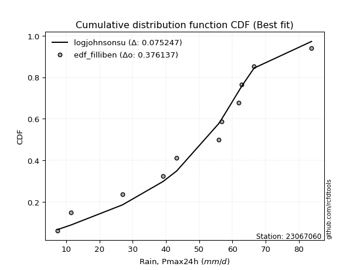</img></img>

</div>


### 10. Empirical - EDF Jenkinson (1977)

The Jenkinson formula in hydrology is an empirical plotting position formula used to estimate the non-exceedance probability _(P)_ or return period _(T)_ of a given ordered observation within a sample. It is a widely used method in the frequency analysis of extreme events such as floods and rainfall, as it provides a distribution-free way to plot data. _a≈0.31_ and _b≈0.38_ are constants derived to approximate the median of the probability distribution for the given rank.

<div align="center">


$P=(m-a)/(n+b)$


</div>


**10.1. Empirical values**

<div align="center">

|                | 0                    | 1                   | 2                   | 3                  | 4                  | 5                  | 6                  | 7                  | 8                  | 9                  | 10                 | 11                 |
|:---------------|:---------------------|:--------------------|:--------------------|:-------------------|:-------------------|:-------------------|:-------------------|:-------------------|:-------------------|:-------------------|:-------------------|:-------------------|
| date           | 2025                 | 2023                | 2016                | 2017               | 2021               | 2022               | 2020               | 2024               | 2019               | 2014               | 2015               | 2018               |
| x              | 2.0                  | 7.4                 | 11.3                | 26.9               | 39.1               | 43.2               | 55.8               | 56.8               | 61.8               | 62.8               | 66.5               | 83.8               |
| m              | 1                    | 2                   | 3                   | 4                  | 5                  | 6                  | 7                  | 8                  | 9                  | 10                 | 11                 | 12                 |
| empirical_dist | edf_jenkinson        | edf_jenkinson       | edf_jenkinson       | edf_jenkinson      | edf_jenkinson      | edf_jenkinson      | edf_jenkinson      | edf_jenkinson      | edf_jenkinson      | edf_jenkinson      | edf_jenkinson      | edf_jenkinson      |
| empirical      | 0.055735056542810975 | 0.13651050080775443 | 0.21728594507269788 | 0.2980613893376413 | 0.3788368336025848 | 0.4596122778675283 | 0.5403877221324718 | 0.6211631663974152 | 0.7019386106623585 | 0.7827140549273021 | 0.8634894991922455 | 0.9442649434571889 |
| empirical_tr   | 1.0590248075278015   | 1.1580916744621141  | 1.2776057791537667  | 1.424626006904488  | 1.6098829648894668 | 1.850523168908819  | 2.1757469244288226 | 2.6396588486140726 | 3.3550135501355    | 4.6022304832713745 | 7.325443786982245  | 17.942028985507218 |

</div>


**10.2. Kolmogorov-Smirnov fit test (sorted by Δ)**


<div align="center">

|                | 0                   | 1                   | 2                   | 3                   | 4                   | 5                   | 6                   | 7                   | 8                   | 9                   | 10                  | 11                  | 12                  | 13                  | 14                  | 15                  | 16                  | 17                  | 18                  | 19                  | 20                  | 21                  | 22                  | 23                  | 24                  | 25                  | 26                  | 27                  | 28                  | 29                  | 30                    | 31                  | 32                  | 33                  | 34                  | 35                  | 36                  | 37                  | 38                  | 39                  | 40                  | 41                  | 42                  | 43                  | 44                  | 45                  | 46                  | 47                  | 48                  | 49                  | 50                  | 51                  | 52                  | 53                  | 54                  | 55                  | 56                  | 57                  | 58                  | 59                  | 60                  | 61                  | 62                  | 63                  | 64                  | 65                  | 66                  | 67                  | 68                  | 69                  | 70                  | 71                  | 72                  | 73                  | 74                  | 75                  | 76                  | 77                  | 78                  | 79                  | 80                  | 81                  | 82                  | 83                  | 84                  | 85                  | 86                  | 87                  | 88                  | 89                  |
|:---------------|:--------------------|:--------------------|:--------------------|:--------------------|:--------------------|:--------------------|:--------------------|:--------------------|:--------------------|:--------------------|:--------------------|:--------------------|:--------------------|:--------------------|:--------------------|:--------------------|:--------------------|:--------------------|:--------------------|:--------------------|:--------------------|:--------------------|:--------------------|:--------------------|:--------------------|:--------------------|:--------------------|:--------------------|:--------------------|:--------------------|:----------------------|:--------------------|:--------------------|:--------------------|:--------------------|:--------------------|:--------------------|:--------------------|:--------------------|:--------------------|:--------------------|:--------------------|:--------------------|:--------------------|:--------------------|:--------------------|:--------------------|:--------------------|:--------------------|:--------------------|:--------------------|:--------------------|:--------------------|:--------------------|:--------------------|:--------------------|:--------------------|:--------------------|:--------------------|:--------------------|:--------------------|:--------------------|:--------------------|:--------------------|:--------------------|:--------------------|:--------------------|:--------------------|:--------------------|:--------------------|:--------------------|:--------------------|:--------------------|:--------------------|:--------------------|:--------------------|:--------------------|:--------------------|:--------------------|:--------------------|:--------------------|:--------------------|:--------------------|:--------------------|:--------------------|:--------------------|:--------------------|:--------------------|:--------------------|:--------------------|
| station        | 23067060            | 23067060            | 23067060            | 23067060            | 23067060            | 23067060            | 23067060            | 23067060            | 23067060            | 23067060            | 23067060            | 23067060            | 23067060            | 23067060            | 23067060            | 23067060            | 23067060            | 23067060            | 23067060            | 23067060            | 23067060            | 23067060            | 23067060            | 23067060            | 23067060            | 23067060            | 23067060            | 23067060            | 23067060            | 23067060            | 23067060              | 23067060            | 23067060            | 23067060            | 23067060            | 23067060            | 23067060            | 23067060            | 23067060            | 23067060            | 23067060            | 23067060            | 23067060            | 23067060            | 23067060            | 23067060            | 23067060            | 23067060            | 23067060            | 23067060            | 23067060            | 23067060            | 23067060            | 23067060            | 23067060            | 23067060            | 23067060            | 23067060            | 23067060            | 23067060            | 23067060            | 23067060            | 23067060            | 23067060            | 23067060            | 23067060            | 23067060            | 23067060            | 23067060            | 23067060            | 23067060            | 23067060            | 23067060            | 23067060            | 23067060            | 23067060            | 23067060            | 23067060            | 23067060            | 23067060            | 23067060            | 23067060            | 23067060            | 23067060            | 23067060            | 23067060            | 23067060            | 23067060            | 23067060            | 23067060            |
| empirical_dist | edf_jenkinson       | edf_jenkinson       | edf_jenkinson       | edf_jenkinson       | edf_jenkinson       | edf_jenkinson       | edf_jenkinson       | edf_jenkinson       | edf_jenkinson       | edf_jenkinson       | edf_jenkinson       | edf_jenkinson       | edf_jenkinson       | edf_jenkinson       | edf_jenkinson       | edf_jenkinson       | edf_jenkinson       | edf_jenkinson       | edf_jenkinson       | edf_jenkinson       | edf_jenkinson       | edf_jenkinson       | edf_jenkinson       | edf_jenkinson       | edf_jenkinson       | edf_jenkinson       | edf_jenkinson       | edf_jenkinson       | edf_jenkinson       | edf_jenkinson       | edf_jenkinson         | edf_jenkinson       | edf_jenkinson       | edf_jenkinson       | edf_jenkinson       | edf_jenkinson       | edf_jenkinson       | edf_jenkinson       | edf_jenkinson       | edf_jenkinson       | edf_jenkinson       | edf_jenkinson       | edf_jenkinson       | edf_jenkinson       | edf_jenkinson       | edf_jenkinson       | edf_jenkinson       | edf_jenkinson       | edf_jenkinson       | edf_jenkinson       | edf_jenkinson       | edf_jenkinson       | edf_jenkinson       | edf_jenkinson       | edf_jenkinson       | edf_jenkinson       | edf_jenkinson       | edf_jenkinson       | edf_jenkinson       | edf_jenkinson       | edf_jenkinson       | edf_jenkinson       | edf_jenkinson       | edf_jenkinson       | edf_jenkinson       | edf_jenkinson       | edf_jenkinson       | edf_jenkinson       | edf_jenkinson       | edf_jenkinson       | edf_jenkinson       | edf_jenkinson       | edf_jenkinson       | edf_jenkinson       | edf_jenkinson       | edf_jenkinson       | edf_jenkinson       | edf_jenkinson       | edf_jenkinson       | edf_jenkinson       | edf_jenkinson       | edf_jenkinson       | edf_jenkinson       | edf_jenkinson       | edf_jenkinson       | edf_jenkinson       | edf_jenkinson       | edf_jenkinson       | edf_jenkinson       | edf_jenkinson       |
| p_dist         | laplace_asymmetric  | genlogistic         | logjohnsonsu        | gumbel_l            | johnsonsu           | logmielke           | logloggamma         | logpearson3         | weibull_min         | fisk                | pearson3            | logfisk             | f                   | t                   | crystalball         | norm                | exponnorm           | nct                 | erlang              | betaprime           | gamma               | loggumbel_l         | rice                | invgamma            | invweibull          | maxwell             | lognakagami         | ncf                 | logistic            | rayleigh            | loglaplace_asymmetric | kstwobign           | logweibull_min      | loggompertz         | mielke              | hypsecant           | halfnorm            | invgauss            | logt                | gumbel_r            | laplace             | expon               | genexpon            | logfatiguelife      | halflogistic        | loginvweibull       | logexponnorm        | logcrystalball      | lognorm             | lognorm             | loglognorm          | logf                | logrice             | lognct              | nakagami            | moyal               | logbetaprime        | logchi2             | logerlang           | loggamma            | loggamma            | loglogistic         | loginvgamma         | logncf              | loginvgauss         | loghypsecant        | logalpha            | logmaxwell          | logkstwobign        | lograyleigh         | loglaplace          | loggenexpon         | wald                | loghalfnorm         | loggumbel_r         | gibrat              | loghalflogistic     | logmoyal            | logexpon            | logtruncnorm        | logwald             | loggibrat           | gompertz            | pareto              | logpareto           | alpha               | fatiguelife         | chi2                | truncnorm           | loggenlogistic      |
| delta          | 0.09231150034372484 | 0.09664223840504745 | 0.10097703184581353 | 0.1180339105004169  | 0.11934011209619333 | 0.13086696209431103 | 0.1331348615201876  | 0.1335109536758441  | 0.1359947727944567  | 0.13809088313197349 | 0.1409631823023788  | 0.14793828172990442 | 0.15301753269796037 | 0.15312643032874984 | 0.1531295724285473  | 0.15312957267864424 | 0.15313020869608795 | 0.15316242802648117 | 0.1548321378742359  | 0.15700380704470274 | 0.1579534853379404  | 0.15835963757351512 | 0.1609696505588606  | 0.16473570855319108 | 0.16728341842649885 | 0.169826010577391   | 0.16994837433226895 | 0.17089874093936241 | 0.17414501974844177 | 0.174723237333688   | 0.1792158476894472    | 0.18245898385068493 | 0.1851971347110205  | 0.18598672510626701 | 0.1873134639492744  | 0.1894780725276044  | 0.19099413160267115 | 0.19142495106838686 | 0.1971526289594251  | 0.20528547337106917 | 0.21510743197010218 | 0.2155318008976631  | 0.21565660835610656 | 0.21612050456595733 | 0.21728594507269788 | 0.21790599071487526 | 0.21860217291775041 | 0.21860307512672428 | 0.21860308719942223 | 0.21860308719942223 | 0.218604274384104   | 0.21862802374957113 | 0.21863454475379918 | 0.21879111083670644 | 0.22014175999384455 | 0.22219659608180287 | 0.22410463184082963 | 0.22585089367425915 | 0.22879930673133597 | 0.23119071344680098 | 0.23119071344680098 | 0.23121063517134743 | 0.23194281655829496 | 0.2355853312521451  | 0.2357725714329928  | 0.24154918698031214 | 0.2435916846411953  | 0.24535224743975725 | 0.24933227665189528 | 0.2536691970648549  | 0.2684396132300787  | 0.27084046662839556 | 0.2715437656882055  | 0.2773271077036292  | 0.2853725464533593  | 0.3030457935575649  | 0.30561083404633393 | 0.3082319052483379  | 0.31916660976024097 | 0.3275801563010398  | 0.3719111975810223  | 0.40353285563685126 | 0.43665857799855357 | 0.46499194768007923 | 0.5031871399787993  | 0.508090064830317   | 0.5175599882746862  | 0.6886644265230368  | 0.7611540608602856  | 0.8634894991922455  |
| deltao         | 0.36218414519599995 | 0.36218414519599995 | 0.36218414519599995 | 0.36218414519599995 | 0.36218414519599995 | 0.36218414519599995 | 0.36218414519599995 | 0.36218414519599995 | 0.36218414519599995 | 0.36218414519599995 | 0.36218414519599995 | 0.36218414519599995 | 0.36218414519599995 | 0.36218414519599995 | 0.36218414519599995 | 0.36218414519599995 | 0.36218414519599995 | 0.36218414519599995 | 0.36218414519599995 | 0.36218414519599995 | 0.36218414519599995 | 0.36218414519599995 | 0.36218414519599995 | 0.36218414519599995 | 0.36218414519599995 | 0.36218414519599995 | 0.36218414519599995 | 0.36218414519599995 | 0.36218414519599995 | 0.36218414519599995 | 0.36218414519599995   | 0.36218414519599995 | 0.36218414519599995 | 0.36218414519599995 | 0.36218414519599995 | 0.36218414519599995 | 0.36218414519599995 | 0.36218414519599995 | 0.36218414519599995 | 0.36218414519599995 | 0.36218414519599995 | 0.36218414519599995 | 0.36218414519599995 | 0.36218414519599995 | 0.36218414519599995 | 0.36218414519599995 | 0.36218414519599995 | 0.36218414519599995 | 0.36218414519599995 | 0.36218414519599995 | 0.36218414519599995 | 0.36218414519599995 | 0.36218414519599995 | 0.36218414519599995 | 0.36218414519599995 | 0.36218414519599995 | 0.36218414519599995 | 0.36218414519599995 | 0.36218414519599995 | 0.36218414519599995 | 0.36218414519599995 | 0.36218414519599995 | 0.36218414519599995 | 0.36218414519599995 | 0.36218414519599995 | 0.36218414519599995 | 0.36218414519599995 | 0.36218414519599995 | 0.36218414519599995 | 0.36218414519599995 | 0.36218414519599995 | 0.36218414519599995 | 0.36218414519599995 | 0.36218414519599995 | 0.36218414519599995 | 0.36218414519599995 | 0.36218414519599995 | 0.36218414519599995 | 0.36218414519599995 | 0.36218414519599995 | 0.36218414519599995 | 0.36218414519599995 | 0.36218414519599995 | 0.36218414519599995 | 0.36218414519599995 | 0.36218414519599995 | 0.36218414519599995 | 0.36218414519599995 | 0.36218414519599995 | 0.36218414519599995 |
| eval           | Δo > Δ              | Δo > Δ              | Δo > Δ              | Δo > Δ              | Δo > Δ              | Δo > Δ              | Δo > Δ              | Δo > Δ              | Δo > Δ              | Δo > Δ              | Δo > Δ              | Δo > Δ              | Δo > Δ              | Δo > Δ              | Δo > Δ              | Δo > Δ              | Δo > Δ              | Δo > Δ              | Δo > Δ              | Δo > Δ              | Δo > Δ              | Δo > Δ              | Δo > Δ              | Δo > Δ              | Δo > Δ              | Δo > Δ              | Δo > Δ              | Δo > Δ              | Δo > Δ              | Δo > Δ              | Δo > Δ                | Δo > Δ              | Δo > Δ              | Δo > Δ              | Δo > Δ              | Δo > Δ              | Δo > Δ              | Δo > Δ              | Δo > Δ              | Δo > Δ              | Δo > Δ              | Δo > Δ              | Δo > Δ              | Δo > Δ              | Δo > Δ              | Δo > Δ              | Δo > Δ              | Δo > Δ              | Δo > Δ              | Δo > Δ              | Δo > Δ              | Δo > Δ              | Δo > Δ              | Δo > Δ              | Δo > Δ              | Δo > Δ              | Δo > Δ              | Δo > Δ              | Δo > Δ              | Δo > Δ              | Δo > Δ              | Δo > Δ              | Δo > Δ              | Δo > Δ              | Δo > Δ              | Δo > Δ              | Δo > Δ              | Δo > Δ              | Δo > Δ              | Δo > Δ              | Δo > Δ              | Δo > Δ              | Δo > Δ              | Δo > Δ              | Δo > Δ              | Δo > Δ              | Δo > Δ              | Δo > Δ              | Δo > Δ              | Δo > Δ              | Δo <= Δ             | Δo <= Δ             | Δo <= Δ             | Δo <= Δ             | Δo <= Δ             | Δo <= Δ             | Δo <= Δ             | Δo <= Δ             | Δo <= Δ             | Δo <= Δ             |
| fit            | 1                   | 1                   | 1                   | 1                   | 1                   | 1                   | 1                   | 1                   | 1                   | 1                   | 1                   | 1                   | 1                   | 1                   | 1                   | 1                   | 1                   | 1                   | 1                   | 1                   | 1                   | 1                   | 1                   | 1                   | 1                   | 1                   | 1                   | 1                   | 1                   | 1                   | 1                     | 1                   | 1                   | 1                   | 1                   | 1                   | 1                   | 1                   | 1                   | 1                   | 1                   | 1                   | 1                   | 1                   | 1                   | 1                   | 1                   | 1                   | 1                   | 1                   | 1                   | 1                   | 1                   | 1                   | 1                   | 1                   | 1                   | 1                   | 1                   | 1                   | 1                   | 1                   | 1                   | 1                   | 1                   | 1                   | 1                   | 1                   | 1                   | 1                   | 1                   | 1                   | 1                   | 1                   | 1                   | 1                   | 1                   | 1                   | 1                   | 1                   | 0                   | 0                   | 0                   | 0                   | 0                   | 0                   | 0                   | 0                   | 0                   | 0                   |
| n              | 12                  | 12                  | 12                  | 12                  | 12                  | 12                  | 12                  | 12                  | 12                  | 12                  | 12                  | 12                  | 12                  | 12                  | 12                  | 12                  | 12                  | 12                  | 12                  | 12                  | 12                  | 12                  | 12                  | 12                  | 12                  | 12                  | 12                  | 12                  | 12                  | 12                  | 12                    | 12                  | 12                  | 12                  | 12                  | 12                  | 12                  | 12                  | 12                  | 12                  | 12                  | 12                  | 12                  | 12                  | 12                  | 12                  | 12                  | 12                  | 12                  | 12                  | 12                  | 12                  | 12                  | 12                  | 12                  | 12                  | 12                  | 12                  | 12                  | 12                  | 12                  | 12                  | 12                  | 12                  | 12                  | 12                  | 12                  | 12                  | 12                  | 12                  | 12                  | 12                  | 12                  | 12                  | 12                  | 12                  | 12                  | 12                  | 12                  | 12                  | 12                  | 12                  | 12                  | 12                  | 12                  | 12                  | 12                  | 12                  | 12                  | 12                  |
| best_fit       | 1                   | 0                   | 0                   | 0                   | 0                   | 0                   | 0                   | 0                   | 0                   | 0                   | 0                   | 0                   | 0                   | 0                   | 0                   | 0                   | 0                   | 0                   | 0                   | 0                   | 0                   | 0                   | 0                   | 0                   | 0                   | 0                   | 0                   | 0                   | 0                   | 0                   | 0                     | 0                   | 0                   | 0                   | 0                   | 0                   | 0                   | 0                   | 0                   | 0                   | 0                   | 0                   | 0                   | 0                   | 0                   | 0                   | 0                   | 0                   | 0                   | 0                   | 0                   | 0                   | 0                   | 0                   | 0                   | 0                   | 0                   | 0                   | 0                   | 0                   | 0                   | 0                   | 0                   | 0                   | 0                   | 0                   | 0                   | 0                   | 0                   | 0                   | 0                   | 0                   | 0                   | 0                   | 0                   | 0                   | 0                   | 0                   | 0                   | 0                   | 0                   | 0                   | 0                   | 0                   | 0                   | 0                   | 0                   | 0                   | 0                   | 0                   |
| best_fit_sort  | 1                   | 2                   | 3                   | 4                   | 5                   | 6                   | 7                   | 8                   | 9                   | 10                  | 11                  | 12                  | 13                  | 14                  | 15                  | 16                  | 17                  | 18                  | 19                  | 20                  | 21                  | 22                  | 23                  | 24                  | 25                  | 26                  | 27                  | 28                  | 29                  | 30                  | 31                    | 32                  | 33                  | 34                  | 35                  | 36                  | 37                  | 38                  | 39                  | 40                  | 41                  | 42                  | 43                  | 44                  | 45                  | 46                  | 47                  | 48                  | 49                  | 50                  | 51                  | 52                  | 53                  | 54                  | 55                  | 56                  | 57                  | 58                  | 59                  | 60                  | 61                  | 62                  | 63                  | 64                  | 65                  | 66                  | 67                  | 68                  | 69                  | 70                  | 71                  | 72                  | 73                  | 74                  | 75                  | 76                  | 77                  | 78                  | 79                  | 80                  | 81                  | 82                  | 83                  | 84                  | 85                  | 86                  | 87                  | 88                  | 89                  | 90                  |

</div>


<div align="center">

</img>

</div>


**10.3. Best fit**

<div align="center">

|   id |   station | empirical_dist   | p_dist             |     delta |   deltao | eval   |   fit |   n |   best_fit |   best_fit_sort |
|-----:|----------:|:-----------------|:-------------------|----------:|---------:|:-------|------:|----:|-----------:|----------------:|
|    0 |  23067060 | edf_jenkinson    | laplace_asymmetric | 0.0923115 | 0.362184 | Δo > Δ |     1 |  12 |          1 |               1 |

</div>


<div align="center">

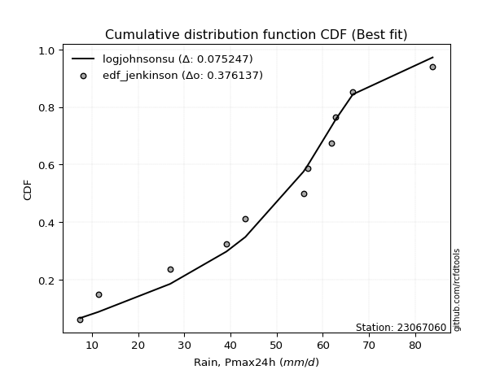</img>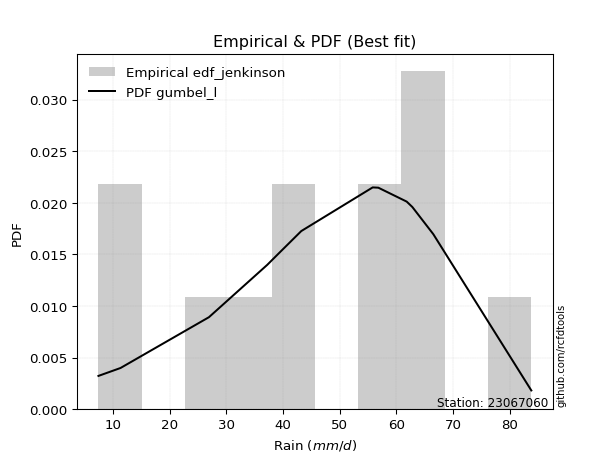</img>

</div>


### 11. Empirical - EDF Cunnane (1978)

Cunnane´s work in statistical hydrology has focused on the performance and evaluation of different probability distributions (such as GEV, Gumbel, Lognormal) for flood frequency estimation. _b_ is a constant, typically set to 0.4.

<div align="center">


$P=(m-b)/(n+1-2b)$


</div>


**11.1. Empirical values**

<div align="center">

|                | 0                   | 1                   | 2                   | 3                  | 4                  | 5                   | 6                  | 7                  | 8                  | 9                  | 10                 | 11                 |
|:---------------|:--------------------|:--------------------|:--------------------|:-------------------|:-------------------|:--------------------|:-------------------|:-------------------|:-------------------|:-------------------|:-------------------|:-------------------|
| date           | 2025                | 2023                | 2016                | 2017               | 2021               | 2022                | 2020               | 2024               | 2019               | 2014               | 2015               | 2018               |
| x              | 2.0                 | 7.4                 | 11.3                | 26.9               | 39.1               | 43.2                | 55.8               | 56.8               | 61.8               | 62.8               | 66.5               | 83.8               |
| m              | 1                   | 2                   | 3                   | 4                  | 5                  | 6                   | 7                  | 8                  | 9                  | 10                 | 11                 | 12                 |
| empirical_dist | edf_cunnane         | edf_cunnane         | edf_cunnane         | edf_cunnane        | edf_cunnane        | edf_cunnane         | edf_cunnane        | edf_cunnane        | edf_cunnane        | edf_cunnane        | edf_cunnane        | edf_cunnane        |
| empirical      | 0.04918032786885246 | 0.13114754098360656 | 0.21311475409836067 | 0.2950819672131148 | 0.3770491803278688 | 0.45901639344262296 | 0.5409836065573771 | 0.6229508196721312 | 0.7049180327868853 | 0.7868852459016393 | 0.8688524590163935 | 0.9508196721311476 |
| empirical_tr   | 1.0517241379310345  | 1.150943396226415   | 1.2708333333333333  | 1.418604651162791  | 1.6052631578947367 | 1.8484848484848486  | 2.178571428571429  | 2.6521739130434785 | 3.388888888888889  | 4.692307692307692  | 7.625000000000004  | 20.333333333333357 |

</div>


**11.2. Kolmogorov-Smirnov fit test (sorted by Δ)**


<div align="center">

|                | 0                   | 1                   | 2                   | 3                   | 4                   | 5                   | 6                   | 7                   | 8                   | 9                   | 10                  | 11                  | 12                  | 13                  | 14                  | 15                  | 16                  | 17                  | 18                  | 19                  | 20                  | 21                  | 22                  | 23                  | 24                  | 25                  | 26                  | 27                  | 28                  | 29                  | 30                    | 31                  | 32                  | 33                  | 34                  | 35                  | 36                  | 37                  | 38                  | 39                  | 40                  | 41                  | 42                  | 43                  | 44                  | 45                  | 46                  | 47                  | 48                  | 49                  | 50                  | 51                  | 52                  | 53                  | 54                  | 55                  | 56                  | 57                  | 58                  | 59                  | 60                  | 61                  | 62                  | 63                  | 64                  | 65                  | 66                  | 67                  | 68                  | 69                  | 70                  | 71                  | 72                  | 73                  | 74                  | 75                  | 76                  | 77                  | 78                  | 79                  | 80                  | 81                  | 82                  | 83                  | 84                  | 85                  | 86                  | 87                  | 88                  | 89                  |
|:---------------|:--------------------|:--------------------|:--------------------|:--------------------|:--------------------|:--------------------|:--------------------|:--------------------|:--------------------|:--------------------|:--------------------|:--------------------|:--------------------|:--------------------|:--------------------|:--------------------|:--------------------|:--------------------|:--------------------|:--------------------|:--------------------|:--------------------|:--------------------|:--------------------|:--------------------|:--------------------|:--------------------|:--------------------|:--------------------|:--------------------|:----------------------|:--------------------|:--------------------|:--------------------|:--------------------|:--------------------|:--------------------|:--------------------|:--------------------|:--------------------|:--------------------|:--------------------|:--------------------|:--------------------|:--------------------|:--------------------|:--------------------|:--------------------|:--------------------|:--------------------|:--------------------|:--------------------|:--------------------|:--------------------|:--------------------|:--------------------|:--------------------|:--------------------|:--------------------|:--------------------|:--------------------|:--------------------|:--------------------|:--------------------|:--------------------|:--------------------|:--------------------|:--------------------|:--------------------|:--------------------|:--------------------|:--------------------|:--------------------|:--------------------|:--------------------|:--------------------|:--------------------|:--------------------|:--------------------|:--------------------|:--------------------|:--------------------|:--------------------|:--------------------|:--------------------|:--------------------|:--------------------|:--------------------|:--------------------|:--------------------|
| station        | 23067060            | 23067060            | 23067060            | 23067060            | 23067060            | 23067060            | 23067060            | 23067060            | 23067060            | 23067060            | 23067060            | 23067060            | 23067060            | 23067060            | 23067060            | 23067060            | 23067060            | 23067060            | 23067060            | 23067060            | 23067060            | 23067060            | 23067060            | 23067060            | 23067060            | 23067060            | 23067060            | 23067060            | 23067060            | 23067060            | 23067060              | 23067060            | 23067060            | 23067060            | 23067060            | 23067060            | 23067060            | 23067060            | 23067060            | 23067060            | 23067060            | 23067060            | 23067060            | 23067060            | 23067060            | 23067060            | 23067060            | 23067060            | 23067060            | 23067060            | 23067060            | 23067060            | 23067060            | 23067060            | 23067060            | 23067060            | 23067060            | 23067060            | 23067060            | 23067060            | 23067060            | 23067060            | 23067060            | 23067060            | 23067060            | 23067060            | 23067060            | 23067060            | 23067060            | 23067060            | 23067060            | 23067060            | 23067060            | 23067060            | 23067060            | 23067060            | 23067060            | 23067060            | 23067060            | 23067060            | 23067060            | 23067060            | 23067060            | 23067060            | 23067060            | 23067060            | 23067060            | 23067060            | 23067060            | 23067060            |
| empirical_dist | edf_cunnane         | edf_cunnane         | edf_cunnane         | edf_cunnane         | edf_cunnane         | edf_cunnane         | edf_cunnane         | edf_cunnane         | edf_cunnane         | edf_cunnane         | edf_cunnane         | edf_cunnane         | edf_cunnane         | edf_cunnane         | edf_cunnane         | edf_cunnane         | edf_cunnane         | edf_cunnane         | edf_cunnane         | edf_cunnane         | edf_cunnane         | edf_cunnane         | edf_cunnane         | edf_cunnane         | edf_cunnane         | edf_cunnane         | edf_cunnane         | edf_cunnane         | edf_cunnane         | edf_cunnane         | edf_cunnane           | edf_cunnane         | edf_cunnane         | edf_cunnane         | edf_cunnane         | edf_cunnane         | edf_cunnane         | edf_cunnane         | edf_cunnane         | edf_cunnane         | edf_cunnane         | edf_cunnane         | edf_cunnane         | edf_cunnane         | edf_cunnane         | edf_cunnane         | edf_cunnane         | edf_cunnane         | edf_cunnane         | edf_cunnane         | edf_cunnane         | edf_cunnane         | edf_cunnane         | edf_cunnane         | edf_cunnane         | edf_cunnane         | edf_cunnane         | edf_cunnane         | edf_cunnane         | edf_cunnane         | edf_cunnane         | edf_cunnane         | edf_cunnane         | edf_cunnane         | edf_cunnane         | edf_cunnane         | edf_cunnane         | edf_cunnane         | edf_cunnane         | edf_cunnane         | edf_cunnane         | edf_cunnane         | edf_cunnane         | edf_cunnane         | edf_cunnane         | edf_cunnane         | edf_cunnane         | edf_cunnane         | edf_cunnane         | edf_cunnane         | edf_cunnane         | edf_cunnane         | edf_cunnane         | edf_cunnane         | edf_cunnane         | edf_cunnane         | edf_cunnane         | edf_cunnane         | edf_cunnane         | edf_cunnane         |
| p_dist         | laplace_asymmetric  | genlogistic         | logjohnsonsu        | gumbel_l            | johnsonsu           | logmielke           | logloggamma         | logpearson3         | weibull_min         | fisk                | pearson3            | logfisk             | f                   | t                   | crystalball         | norm                | exponnorm           | nct                 | erlang              | betaprime           | gamma               | loggumbel_l         | rice                | invgamma            | invweibull          | maxwell             | ncf                 | lognakagami         | logistic            | rayleigh            | loglaplace_asymmetric | kstwobign           | logweibull_min      | loggompertz         | mielke              | hypsecant           | halfnorm            | invgauss            | logt                | gumbel_r            | laplace             | halflogistic        | expon               | genexpon            | logfatiguelife      | loginvweibull       | logexponnorm        | logcrystalball      | lognorm             | lognorm             | loglognorm          | logf                | logrice             | lognct              | moyal               | nakagami            | logbetaprime        | logchi2             | logerlang           | loggamma            | loggamma            | loglogistic         | loginvgamma         | logncf              | loginvgauss         | loghypsecant        | logalpha            | logmaxwell          | logkstwobign        | lograyleigh         | loglaplace          | wald                | loggenexpon         | loghalfnorm         | loggumbel_r         | gibrat              | loghalflogistic     | logmoyal            | logexpon            | logtruncnorm        | logwald             | loggibrat           | gompertz            | pareto              | logpareto           | alpha               | fatiguelife         | chi2                | truncnorm           | loggenlogistic      |
| delta          | 0.08814030936938763 | 0.09247104743071023 | 0.1003811474209082  | 0.11743802607551157 | 0.118744227671288   | 0.1302710776694057  | 0.13253897709528228 | 0.13529860695056006 | 0.13539888836955138 | 0.13749499870706816 | 0.14036729787747348 | 0.1497259350046204  | 0.15242164827305504 | 0.15253054590384452 | 0.15253368800364198 | 0.15253368825373892 | 0.15253432427118263 | 0.15256654360157584 | 0.15423625344933056 | 0.1564079226197974  | 0.15735760091303508 | 0.1601472908482311  | 0.16037376613395526 | 0.16413982412828576 | 0.16668753400159353 | 0.16923012615248567 | 0.1703028565144571  | 0.17173602760698492 | 0.17354913532353644 | 0.17412735290878267 | 0.17861996326454188   | 0.1818630994257796  | 0.18460125028611518 | 0.1853908406813617  | 0.18671757952436907 | 0.18888218810269908 | 0.18890816892025508 | 0.19082906664348154 | 0.19655674453451977 | 0.20468958894616385 | 0.21451154754519686 | 0.21594144209437693 | 0.21731945417237908 | 0.21744426163082253 | 0.2179081578406733  | 0.21969364398959124 | 0.2203898261924664  | 0.22039072840144025 | 0.2203907404741382  | 0.2203907404741382  | 0.22039192765881999 | 0.2204156770242871  | 0.22042219802851515 | 0.2205787641114224  | 0.22160071165689754 | 0.22192941326856053 | 0.2258922851155456  | 0.22763854694897512 | 0.23058696000605194 | 0.23297836672151695 | 0.23297836672151695 | 0.2329982884460634  | 0.23373046983301093 | 0.23737298452686106 | 0.23756022470770877 | 0.2433368402550281  | 0.24537933791591127 | 0.24713990071447323 | 0.25111992992661125 | 0.2554568503395709  | 0.27022726650479467 | 0.27094788126330016 | 0.27262811990311153 | 0.2791147609783452  | 0.28716019972807527 | 0.30244990913265957 | 0.3073984873210499  | 0.31001955852305385 | 0.3221460318847675  | 0.3305595784255663  | 0.3736988508557383  | 0.40532050891156723 | 0.43844623127326954 | 0.47035490750422704 | 0.5085500998029471  | 0.5110694869548436  | 0.522922948098834   | 0.6916438486475633  | 0.7653252518346227  | 0.8688524590163935  |
| deltao         | 0.36218414519599995 | 0.36218414519599995 | 0.36218414519599995 | 0.36218414519599995 | 0.36218414519599995 | 0.36218414519599995 | 0.36218414519599995 | 0.36218414519599995 | 0.36218414519599995 | 0.36218414519599995 | 0.36218414519599995 | 0.36218414519599995 | 0.36218414519599995 | 0.36218414519599995 | 0.36218414519599995 | 0.36218414519599995 | 0.36218414519599995 | 0.36218414519599995 | 0.36218414519599995 | 0.36218414519599995 | 0.36218414519599995 | 0.36218414519599995 | 0.36218414519599995 | 0.36218414519599995 | 0.36218414519599995 | 0.36218414519599995 | 0.36218414519599995 | 0.36218414519599995 | 0.36218414519599995 | 0.36218414519599995 | 0.36218414519599995   | 0.36218414519599995 | 0.36218414519599995 | 0.36218414519599995 | 0.36218414519599995 | 0.36218414519599995 | 0.36218414519599995 | 0.36218414519599995 | 0.36218414519599995 | 0.36218414519599995 | 0.36218414519599995 | 0.36218414519599995 | 0.36218414519599995 | 0.36218414519599995 | 0.36218414519599995 | 0.36218414519599995 | 0.36218414519599995 | 0.36218414519599995 | 0.36218414519599995 | 0.36218414519599995 | 0.36218414519599995 | 0.36218414519599995 | 0.36218414519599995 | 0.36218414519599995 | 0.36218414519599995 | 0.36218414519599995 | 0.36218414519599995 | 0.36218414519599995 | 0.36218414519599995 | 0.36218414519599995 | 0.36218414519599995 | 0.36218414519599995 | 0.36218414519599995 | 0.36218414519599995 | 0.36218414519599995 | 0.36218414519599995 | 0.36218414519599995 | 0.36218414519599995 | 0.36218414519599995 | 0.36218414519599995 | 0.36218414519599995 | 0.36218414519599995 | 0.36218414519599995 | 0.36218414519599995 | 0.36218414519599995 | 0.36218414519599995 | 0.36218414519599995 | 0.36218414519599995 | 0.36218414519599995 | 0.36218414519599995 | 0.36218414519599995 | 0.36218414519599995 | 0.36218414519599995 | 0.36218414519599995 | 0.36218414519599995 | 0.36218414519599995 | 0.36218414519599995 | 0.36218414519599995 | 0.36218414519599995 | 0.36218414519599995 |
| eval           | Δo > Δ              | Δo > Δ              | Δo > Δ              | Δo > Δ              | Δo > Δ              | Δo > Δ              | Δo > Δ              | Δo > Δ              | Δo > Δ              | Δo > Δ              | Δo > Δ              | Δo > Δ              | Δo > Δ              | Δo > Δ              | Δo > Δ              | Δo > Δ              | Δo > Δ              | Δo > Δ              | Δo > Δ              | Δo > Δ              | Δo > Δ              | Δo > Δ              | Δo > Δ              | Δo > Δ              | Δo > Δ              | Δo > Δ              | Δo > Δ              | Δo > Δ              | Δo > Δ              | Δo > Δ              | Δo > Δ                | Δo > Δ              | Δo > Δ              | Δo > Δ              | Δo > Δ              | Δo > Δ              | Δo > Δ              | Δo > Δ              | Δo > Δ              | Δo > Δ              | Δo > Δ              | Δo > Δ              | Δo > Δ              | Δo > Δ              | Δo > Δ              | Δo > Δ              | Δo > Δ              | Δo > Δ              | Δo > Δ              | Δo > Δ              | Δo > Δ              | Δo > Δ              | Δo > Δ              | Δo > Δ              | Δo > Δ              | Δo > Δ              | Δo > Δ              | Δo > Δ              | Δo > Δ              | Δo > Δ              | Δo > Δ              | Δo > Δ              | Δo > Δ              | Δo > Δ              | Δo > Δ              | Δo > Δ              | Δo > Δ              | Δo > Δ              | Δo > Δ              | Δo > Δ              | Δo > Δ              | Δo > Δ              | Δo > Δ              | Δo > Δ              | Δo > Δ              | Δo > Δ              | Δo > Δ              | Δo > Δ              | Δo > Δ              | Δo > Δ              | Δo <= Δ             | Δo <= Δ             | Δo <= Δ             | Δo <= Δ             | Δo <= Δ             | Δo <= Δ             | Δo <= Δ             | Δo <= Δ             | Δo <= Δ             | Δo <= Δ             |
| fit            | 1                   | 1                   | 1                   | 1                   | 1                   | 1                   | 1                   | 1                   | 1                   | 1                   | 1                   | 1                   | 1                   | 1                   | 1                   | 1                   | 1                   | 1                   | 1                   | 1                   | 1                   | 1                   | 1                   | 1                   | 1                   | 1                   | 1                   | 1                   | 1                   | 1                   | 1                     | 1                   | 1                   | 1                   | 1                   | 1                   | 1                   | 1                   | 1                   | 1                   | 1                   | 1                   | 1                   | 1                   | 1                   | 1                   | 1                   | 1                   | 1                   | 1                   | 1                   | 1                   | 1                   | 1                   | 1                   | 1                   | 1                   | 1                   | 1                   | 1                   | 1                   | 1                   | 1                   | 1                   | 1                   | 1                   | 1                   | 1                   | 1                   | 1                   | 1                   | 1                   | 1                   | 1                   | 1                   | 1                   | 1                   | 1                   | 1                   | 1                   | 0                   | 0                   | 0                   | 0                   | 0                   | 0                   | 0                   | 0                   | 0                   | 0                   |
| n              | 12                  | 12                  | 12                  | 12                  | 12                  | 12                  | 12                  | 12                  | 12                  | 12                  | 12                  | 12                  | 12                  | 12                  | 12                  | 12                  | 12                  | 12                  | 12                  | 12                  | 12                  | 12                  | 12                  | 12                  | 12                  | 12                  | 12                  | 12                  | 12                  | 12                  | 12                    | 12                  | 12                  | 12                  | 12                  | 12                  | 12                  | 12                  | 12                  | 12                  | 12                  | 12                  | 12                  | 12                  | 12                  | 12                  | 12                  | 12                  | 12                  | 12                  | 12                  | 12                  | 12                  | 12                  | 12                  | 12                  | 12                  | 12                  | 12                  | 12                  | 12                  | 12                  | 12                  | 12                  | 12                  | 12                  | 12                  | 12                  | 12                  | 12                  | 12                  | 12                  | 12                  | 12                  | 12                  | 12                  | 12                  | 12                  | 12                  | 12                  | 12                  | 12                  | 12                  | 12                  | 12                  | 12                  | 12                  | 12                  | 12                  | 12                  |
| best_fit       | 1                   | 0                   | 0                   | 0                   | 0                   | 0                   | 0                   | 0                   | 0                   | 0                   | 0                   | 0                   | 0                   | 0                   | 0                   | 0                   | 0                   | 0                   | 0                   | 0                   | 0                   | 0                   | 0                   | 0                   | 0                   | 0                   | 0                   | 0                   | 0                   | 0                   | 0                     | 0                   | 0                   | 0                   | 0                   | 0                   | 0                   | 0                   | 0                   | 0                   | 0                   | 0                   | 0                   | 0                   | 0                   | 0                   | 0                   | 0                   | 0                   | 0                   | 0                   | 0                   | 0                   | 0                   | 0                   | 0                   | 0                   | 0                   | 0                   | 0                   | 0                   | 0                   | 0                   | 0                   | 0                   | 0                   | 0                   | 0                   | 0                   | 0                   | 0                   | 0                   | 0                   | 0                   | 0                   | 0                   | 0                   | 0                   | 0                   | 0                   | 0                   | 0                   | 0                   | 0                   | 0                   | 0                   | 0                   | 0                   | 0                   | 0                   |
| best_fit_sort  | 1                   | 2                   | 3                   | 4                   | 5                   | 6                   | 7                   | 8                   | 9                   | 10                  | 11                  | 12                  | 13                  | 14                  | 15                  | 16                  | 17                  | 18                  | 19                  | 20                  | 21                  | 22                  | 23                  | 24                  | 25                  | 26                  | 27                  | 28                  | 29                  | 30                  | 31                    | 32                  | 33                  | 34                  | 35                  | 36                  | 37                  | 38                  | 39                  | 40                  | 41                  | 42                  | 43                  | 44                  | 45                  | 46                  | 47                  | 48                  | 49                  | 50                  | 51                  | 52                  | 53                  | 54                  | 55                  | 56                  | 57                  | 58                  | 59                  | 60                  | 61                  | 62                  | 63                  | 64                  | 65                  | 66                  | 67                  | 68                  | 69                  | 70                  | 71                  | 72                  | 73                  | 74                  | 75                  | 76                  | 77                  | 78                  | 79                  | 80                  | 81                  | 82                  | 83                  | 84                  | 85                  | 86                  | 87                  | 88                  | 89                  | 90                  |

</div>


<div align="center">

</img>

</div>


**11.3. Best fit**

<div align="center">

|   id |   station | empirical_dist   | p_dist             |     delta |   deltao | eval   |   fit |   n |   best_fit |   best_fit_sort |
|-----:|----------:|:-----------------|:-------------------|----------:|---------:|:-------|------:|----:|-----------:|----------------:|
|    0 |  23067060 | edf_cunnane      | laplace_asymmetric | 0.0881403 | 0.362184 | Δo > Δ |     1 |  12 |          1 |               1 |

</div>


<div align="center">

</img>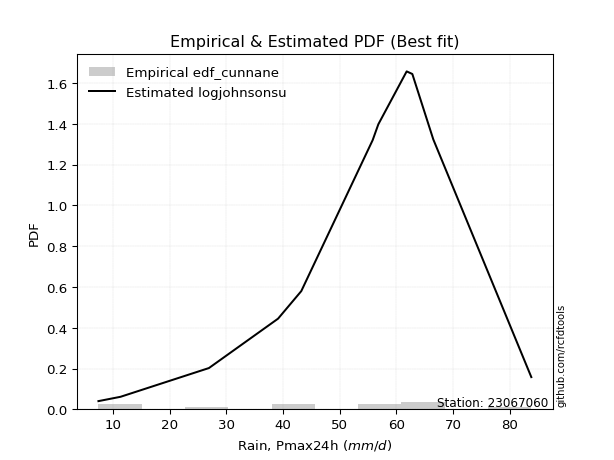</img>

</div>


### 12. Empirical - EDF Adamowski (1981)

The Adamowski formula in hydrology refers to a specific plotting position formula used for estimating the non-parametric empirical distribution of hydrological events (like flood peaks) to calculate their return periods. This formula provides an alternative to traditional parametric methods (like the Gumbel or Log Pearson Type III distributions). 

<div align="center">


$P=(m-0.25)/(n+0.5)$


</div>


**12.1. Empirical values**

<div align="center">

|                | 0                  | 1                  | 2                 | 3                  | 4                  | 5                  | 6                 | 7                  | 8                 | 9                 | 10                | 11                 |
|:---------------|:-------------------|:-------------------|:------------------|:-------------------|:-------------------|:-------------------|:------------------|:-------------------|:------------------|:------------------|:------------------|:-------------------|
| date           | 2025               | 2023               | 2016              | 2017               | 2021               | 2022               | 2020              | 2024               | 2019              | 2014              | 2015              | 2018               |
| x              | 2.0                | 7.4                | 11.3              | 26.9               | 39.1               | 43.2               | 55.8              | 56.8               | 61.8              | 62.8              | 66.5              | 83.8               |
| m              | 1                  | 2                  | 3                 | 4                  | 5                  | 6                  | 7                 | 8                  | 9                 | 10                | 11                | 12                 |
| empirical_dist | edf_adamowski      | edf_adamowski      | edf_adamowski     | edf_adamowski      | edf_adamowski      | edf_adamowski      | edf_adamowski     | edf_adamowski      | edf_adamowski     | edf_adamowski     | edf_adamowski     | edf_adamowski      |
| empirical      | 0.06               | 0.14               | 0.22              | 0.3                | 0.38               | 0.46               | 0.54              | 0.62               | 0.7               | 0.78              | 0.86              | 0.94               |
| empirical_tr   | 1.0638297872340425 | 1.1627906976744187 | 1.282051282051282 | 1.4285714285714286 | 1.6129032258064517 | 1.8518518518518516 | 2.173913043478261 | 2.6315789473684212 | 3.333333333333333 | 4.545454545454546 | 7.142857142857142 | 16.666666666666654 |

</div>


**12.2. Kolmogorov-Smirnov fit test (sorted by Δ)**


<div align="center">

|                | 0                   | 1                   | 2                   | 3                   | 4                   | 5                   | 6                   | 7                   | 8                   | 9                   | 10                  | 11                  | 12                  | 13                  | 14                  | 15                  | 16                  | 17                  | 18                  | 19                  | 20                  | 21                  | 22                  | 23                  | 24                  | 25                  | 26                  | 27                  | 28                  | 29                  | 30                    | 31                  | 32                  | 33                  | 34                  | 35                  | 36                  | 37                  | 38                  | 39                  | 40                  | 41                  | 42                  | 43                  | 44                  | 45                  | 46                  | 47                  | 48                  | 49                  | 50                  | 51                  | 52                  | 53                  | 54                  | 55                  | 56                  | 57                  | 58                  | 59                  | 60                  | 61                  | 62                  | 63                  | 64                  | 65                  | 66                  | 67                  | 68                  | 69                  | 70                  | 71                  | 72                  | 73                  | 74                  | 75                  | 76                  | 77                  | 78                  | 79                  | 80                  | 81                  | 82                  | 83                  | 84                  | 85                  | 86                  | 87                  | 88                  | 89                  |
|:---------------|:--------------------|:--------------------|:--------------------|:--------------------|:--------------------|:--------------------|:--------------------|:--------------------|:--------------------|:--------------------|:--------------------|:--------------------|:--------------------|:--------------------|:--------------------|:--------------------|:--------------------|:--------------------|:--------------------|:--------------------|:--------------------|:--------------------|:--------------------|:--------------------|:--------------------|:--------------------|:--------------------|:--------------------|:--------------------|:--------------------|:----------------------|:--------------------|:--------------------|:--------------------|:--------------------|:--------------------|:--------------------|:--------------------|:--------------------|:--------------------|:--------------------|:--------------------|:--------------------|:--------------------|:--------------------|:--------------------|:--------------------|:--------------------|:--------------------|:--------------------|:--------------------|:--------------------|:--------------------|:--------------------|:--------------------|:--------------------|:--------------------|:--------------------|:--------------------|:--------------------|:--------------------|:--------------------|:--------------------|:--------------------|:--------------------|:--------------------|:--------------------|:--------------------|:--------------------|:--------------------|:--------------------|:--------------------|:--------------------|:--------------------|:--------------------|:--------------------|:--------------------|:--------------------|:--------------------|:--------------------|:--------------------|:--------------------|:--------------------|:--------------------|:--------------------|:--------------------|:--------------------|:--------------------|:--------------------|:--------------------|
| station        | 23067060            | 23067060            | 23067060            | 23067060            | 23067060            | 23067060            | 23067060            | 23067060            | 23067060            | 23067060            | 23067060            | 23067060            | 23067060            | 23067060            | 23067060            | 23067060            | 23067060            | 23067060            | 23067060            | 23067060            | 23067060            | 23067060            | 23067060            | 23067060            | 23067060            | 23067060            | 23067060            | 23067060            | 23067060            | 23067060            | 23067060              | 23067060            | 23067060            | 23067060            | 23067060            | 23067060            | 23067060            | 23067060            | 23067060            | 23067060            | 23067060            | 23067060            | 23067060            | 23067060            | 23067060            | 23067060            | 23067060            | 23067060            | 23067060            | 23067060            | 23067060            | 23067060            | 23067060            | 23067060            | 23067060            | 23067060            | 23067060            | 23067060            | 23067060            | 23067060            | 23067060            | 23067060            | 23067060            | 23067060            | 23067060            | 23067060            | 23067060            | 23067060            | 23067060            | 23067060            | 23067060            | 23067060            | 23067060            | 23067060            | 23067060            | 23067060            | 23067060            | 23067060            | 23067060            | 23067060            | 23067060            | 23067060            | 23067060            | 23067060            | 23067060            | 23067060            | 23067060            | 23067060            | 23067060            | 23067060            |
| empirical_dist | edf_adamowski       | edf_adamowski       | edf_adamowski       | edf_adamowski       | edf_adamowski       | edf_adamowski       | edf_adamowski       | edf_adamowski       | edf_adamowski       | edf_adamowski       | edf_adamowski       | edf_adamowski       | edf_adamowski       | edf_adamowski       | edf_adamowski       | edf_adamowski       | edf_adamowski       | edf_adamowski       | edf_adamowski       | edf_adamowski       | edf_adamowski       | edf_adamowski       | edf_adamowski       | edf_adamowski       | edf_adamowski       | edf_adamowski       | edf_adamowski       | edf_adamowski       | edf_adamowski       | edf_adamowski       | edf_adamowski         | edf_adamowski       | edf_adamowski       | edf_adamowski       | edf_adamowski       | edf_adamowski       | edf_adamowski       | edf_adamowski       | edf_adamowski       | edf_adamowski       | edf_adamowski       | edf_adamowski       | edf_adamowski       | edf_adamowski       | edf_adamowski       | edf_adamowski       | edf_adamowski       | edf_adamowski       | edf_adamowski       | edf_adamowski       | edf_adamowski       | edf_adamowski       | edf_adamowski       | edf_adamowski       | edf_adamowski       | edf_adamowski       | edf_adamowski       | edf_adamowski       | edf_adamowski       | edf_adamowski       | edf_adamowski       | edf_adamowski       | edf_adamowski       | edf_adamowski       | edf_adamowski       | edf_adamowski       | edf_adamowski       | edf_adamowski       | edf_adamowski       | edf_adamowski       | edf_adamowski       | edf_adamowski       | edf_adamowski       | edf_adamowski       | edf_adamowski       | edf_adamowski       | edf_adamowski       | edf_adamowski       | edf_adamowski       | edf_adamowski       | edf_adamowski       | edf_adamowski       | edf_adamowski       | edf_adamowski       | edf_adamowski       | edf_adamowski       | edf_adamowski       | edf_adamowski       | edf_adamowski       | edf_adamowski       |
| p_dist         | laplace_asymmetric  | genlogistic         | logjohnsonsu        | gumbel_l            | johnsonsu           | logmielke           | logpearson3         | logloggamma         | weibull_min         | fisk                | pearson3            | logfisk             | f                   | t                   | crystalball         | norm                | exponnorm           | nct                 | erlang              | loggumbel_l         | betaprime           | gamma               | rice                | invgamma            | invweibull          | lognakagami         | maxwell             | ncf                 | logistic            | rayleigh            | loglaplace_asymmetric | kstwobign           | logweibull_min      | loggompertz         | mielke              | hypsecant           | invgauss            | halfnorm            | logt                | gumbel_r            | expon               | genexpon            | logfatiguelife      | laplace             | loginvweibull       | logexponnorm        | logcrystalball      | lognorm             | lognorm             | loglognorm          | logf                | logrice             | lognct              | nakagami            | halflogistic        | moyal               | logbetaprime        | logchi2             | logerlang           | loggamma            | loggamma            | loglogistic         | loginvgamma         | logncf              | loginvgauss         | loghypsecant        | logalpha            | logmaxwell          | logkstwobign        | lograyleigh         | loglaplace          | loggenexpon         | wald                | loghalfnorm         | loggumbel_r         | gibrat              | loghalflogistic     | logmoyal            | logexpon            | logtruncnorm        | logwald             | loggibrat           | gompertz            | pareto              | logpareto           | alpha               | fatiguelife         | chi2                | truncnorm           | loggenlogistic      |
| delta          | 0.09502555527102696 | 0.09935629333234956 | 0.10136475397828526 | 0.11842163263288863 | 0.11972783422866506 | 0.13125468422678277 | 0.13234778727842889 | 0.13352258365265934 | 0.13638249492692844 | 0.13847860526444522 | 0.14135090443485054 | 0.14677511533248921 | 0.1534052548304321  | 0.15351415246122158 | 0.15351729456101904 | 0.15351729481111598 | 0.1535179308285597  | 0.1535501501589529  | 0.15521986000670762 | 0.15719647117609992 | 0.15739152917717447 | 0.15834120747041214 | 0.16135737269133232 | 0.16512343068566282 | 0.1676711405589706  | 0.16980465237286269 | 0.17021373270986273 | 0.17128646307183415 | 0.1745327418809135  | 0.17511095946615973 | 0.17960356982191894   | 0.18284670598315667 | 0.18558485684349224 | 0.18637444723873875 | 0.18770118608174613 | 0.18986579466007614 | 0.1918126732008586  | 0.19370818652997326 | 0.19754035109189683 | 0.2056731955035409  | 0.2143686345002479  | 0.21449344195869136 | 0.21495733816854212 | 0.21549515410257392 | 0.21674282431746006 | 0.2174390065203352  | 0.21743990872930907 | 0.21743992080200703 | 0.21743992080200703 | 0.2174411079866888  | 0.21746485735215593 | 0.21747137835638397 | 0.21762794443929123 | 0.21897859359642935 | 0.22                | 0.2225843182142746  | 0.22294146544341442 | 0.22468772727684394 | 0.22763614033392077 | 0.23002754704938577 | 0.23002754704938577 | 0.23004746877393223 | 0.23077965016087976 | 0.2344221648547299  | 0.2346094050355776  | 0.24038602058289693 | 0.2424285182437801  | 0.24418908104234205 | 0.24816911025448007 | 0.2525060306674397  | 0.2672764468326635  | 0.26967730023098035 | 0.2719314878206772  | 0.276163941306214   | 0.2842093800559441  | 0.3034335156900366  | 0.30444766764891873 | 0.3070687388509227  | 0.3172279990978823  | 0.32564154563868114 | 0.3707480311836071  | 0.40236968923943606 | 0.43549541160113836 | 0.4615024484878336  | 0.49969764078655365 | 0.5061514541679584  | 0.5140704890824406  | 0.6867258158606782  | 0.7584400059329834  | 0.86                |
| deltao         | 0.36218414519599995 | 0.36218414519599995 | 0.36218414519599995 | 0.36218414519599995 | 0.36218414519599995 | 0.36218414519599995 | 0.36218414519599995 | 0.36218414519599995 | 0.36218414519599995 | 0.36218414519599995 | 0.36218414519599995 | 0.36218414519599995 | 0.36218414519599995 | 0.36218414519599995 | 0.36218414519599995 | 0.36218414519599995 | 0.36218414519599995 | 0.36218414519599995 | 0.36218414519599995 | 0.36218414519599995 | 0.36218414519599995 | 0.36218414519599995 | 0.36218414519599995 | 0.36218414519599995 | 0.36218414519599995 | 0.36218414519599995 | 0.36218414519599995 | 0.36218414519599995 | 0.36218414519599995 | 0.36218414519599995 | 0.36218414519599995   | 0.36218414519599995 | 0.36218414519599995 | 0.36218414519599995 | 0.36218414519599995 | 0.36218414519599995 | 0.36218414519599995 | 0.36218414519599995 | 0.36218414519599995 | 0.36218414519599995 | 0.36218414519599995 | 0.36218414519599995 | 0.36218414519599995 | 0.36218414519599995 | 0.36218414519599995 | 0.36218414519599995 | 0.36218414519599995 | 0.36218414519599995 | 0.36218414519599995 | 0.36218414519599995 | 0.36218414519599995 | 0.36218414519599995 | 0.36218414519599995 | 0.36218414519599995 | 0.36218414519599995 | 0.36218414519599995 | 0.36218414519599995 | 0.36218414519599995 | 0.36218414519599995 | 0.36218414519599995 | 0.36218414519599995 | 0.36218414519599995 | 0.36218414519599995 | 0.36218414519599995 | 0.36218414519599995 | 0.36218414519599995 | 0.36218414519599995 | 0.36218414519599995 | 0.36218414519599995 | 0.36218414519599995 | 0.36218414519599995 | 0.36218414519599995 | 0.36218414519599995 | 0.36218414519599995 | 0.36218414519599995 | 0.36218414519599995 | 0.36218414519599995 | 0.36218414519599995 | 0.36218414519599995 | 0.36218414519599995 | 0.36218414519599995 | 0.36218414519599995 | 0.36218414519599995 | 0.36218414519599995 | 0.36218414519599995 | 0.36218414519599995 | 0.36218414519599995 | 0.36218414519599995 | 0.36218414519599995 | 0.36218414519599995 |
| eval           | Δo > Δ              | Δo > Δ              | Δo > Δ              | Δo > Δ              | Δo > Δ              | Δo > Δ              | Δo > Δ              | Δo > Δ              | Δo > Δ              | Δo > Δ              | Δo > Δ              | Δo > Δ              | Δo > Δ              | Δo > Δ              | Δo > Δ              | Δo > Δ              | Δo > Δ              | Δo > Δ              | Δo > Δ              | Δo > Δ              | Δo > Δ              | Δo > Δ              | Δo > Δ              | Δo > Δ              | Δo > Δ              | Δo > Δ              | Δo > Δ              | Δo > Δ              | Δo > Δ              | Δo > Δ              | Δo > Δ                | Δo > Δ              | Δo > Δ              | Δo > Δ              | Δo > Δ              | Δo > Δ              | Δo > Δ              | Δo > Δ              | Δo > Δ              | Δo > Δ              | Δo > Δ              | Δo > Δ              | Δo > Δ              | Δo > Δ              | Δo > Δ              | Δo > Δ              | Δo > Δ              | Δo > Δ              | Δo > Δ              | Δo > Δ              | Δo > Δ              | Δo > Δ              | Δo > Δ              | Δo > Δ              | Δo > Δ              | Δo > Δ              | Δo > Δ              | Δo > Δ              | Δo > Δ              | Δo > Δ              | Δo > Δ              | Δo > Δ              | Δo > Δ              | Δo > Δ              | Δo > Δ              | Δo > Δ              | Δo > Δ              | Δo > Δ              | Δo > Δ              | Δo > Δ              | Δo > Δ              | Δo > Δ              | Δo > Δ              | Δo > Δ              | Δo > Δ              | Δo > Δ              | Δo > Δ              | Δo > Δ              | Δo > Δ              | Δo > Δ              | Δo <= Δ             | Δo <= Δ             | Δo <= Δ             | Δo <= Δ             | Δo <= Δ             | Δo <= Δ             | Δo <= Δ             | Δo <= Δ             | Δo <= Δ             | Δo <= Δ             |
| fit            | 1                   | 1                   | 1                   | 1                   | 1                   | 1                   | 1                   | 1                   | 1                   | 1                   | 1                   | 1                   | 1                   | 1                   | 1                   | 1                   | 1                   | 1                   | 1                   | 1                   | 1                   | 1                   | 1                   | 1                   | 1                   | 1                   | 1                   | 1                   | 1                   | 1                   | 1                     | 1                   | 1                   | 1                   | 1                   | 1                   | 1                   | 1                   | 1                   | 1                   | 1                   | 1                   | 1                   | 1                   | 1                   | 1                   | 1                   | 1                   | 1                   | 1                   | 1                   | 1                   | 1                   | 1                   | 1                   | 1                   | 1                   | 1                   | 1                   | 1                   | 1                   | 1                   | 1                   | 1                   | 1                   | 1                   | 1                   | 1                   | 1                   | 1                   | 1                   | 1                   | 1                   | 1                   | 1                   | 1                   | 1                   | 1                   | 1                   | 1                   | 0                   | 0                   | 0                   | 0                   | 0                   | 0                   | 0                   | 0                   | 0                   | 0                   |
| n              | 12                  | 12                  | 12                  | 12                  | 12                  | 12                  | 12                  | 12                  | 12                  | 12                  | 12                  | 12                  | 12                  | 12                  | 12                  | 12                  | 12                  | 12                  | 12                  | 12                  | 12                  | 12                  | 12                  | 12                  | 12                  | 12                  | 12                  | 12                  | 12                  | 12                  | 12                    | 12                  | 12                  | 12                  | 12                  | 12                  | 12                  | 12                  | 12                  | 12                  | 12                  | 12                  | 12                  | 12                  | 12                  | 12                  | 12                  | 12                  | 12                  | 12                  | 12                  | 12                  | 12                  | 12                  | 12                  | 12                  | 12                  | 12                  | 12                  | 12                  | 12                  | 12                  | 12                  | 12                  | 12                  | 12                  | 12                  | 12                  | 12                  | 12                  | 12                  | 12                  | 12                  | 12                  | 12                  | 12                  | 12                  | 12                  | 12                  | 12                  | 12                  | 12                  | 12                  | 12                  | 12                  | 12                  | 12                  | 12                  | 12                  | 12                  |
| best_fit       | 1                   | 0                   | 0                   | 0                   | 0                   | 0                   | 0                   | 0                   | 0                   | 0                   | 0                   | 0                   | 0                   | 0                   | 0                   | 0                   | 0                   | 0                   | 0                   | 0                   | 0                   | 0                   | 0                   | 0                   | 0                   | 0                   | 0                   | 0                   | 0                   | 0                   | 0                     | 0                   | 0                   | 0                   | 0                   | 0                   | 0                   | 0                   | 0                   | 0                   | 0                   | 0                   | 0                   | 0                   | 0                   | 0                   | 0                   | 0                   | 0                   | 0                   | 0                   | 0                   | 0                   | 0                   | 0                   | 0                   | 0                   | 0                   | 0                   | 0                   | 0                   | 0                   | 0                   | 0                   | 0                   | 0                   | 0                   | 0                   | 0                   | 0                   | 0                   | 0                   | 0                   | 0                   | 0                   | 0                   | 0                   | 0                   | 0                   | 0                   | 0                   | 0                   | 0                   | 0                   | 0                   | 0                   | 0                   | 0                   | 0                   | 0                   |
| best_fit_sort  | 1                   | 2                   | 3                   | 4                   | 5                   | 6                   | 7                   | 8                   | 9                   | 10                  | 11                  | 12                  | 13                  | 14                  | 15                  | 16                  | 17                  | 18                  | 19                  | 20                  | 21                  | 22                  | 23                  | 24                  | 25                  | 26                  | 27                  | 28                  | 29                  | 30                  | 31                    | 32                  | 33                  | 34                  | 35                  | 36                  | 37                  | 38                  | 39                  | 40                  | 41                  | 42                  | 43                  | 44                  | 45                  | 46                  | 47                  | 48                  | 49                  | 50                  | 51                  | 52                  | 53                  | 54                  | 55                  | 56                  | 57                  | 58                  | 59                  | 60                  | 61                  | 62                  | 63                  | 64                  | 65                  | 66                  | 67                  | 68                  | 69                  | 70                  | 71                  | 72                  | 73                  | 74                  | 75                  | 76                  | 77                  | 78                  | 79                  | 80                  | 81                  | 82                  | 83                  | 84                  | 85                  | 86                  | 87                  | 88                  | 89                  | 90                  |

</div>


<div align="center">

</img>

</div>


**12.3. Best fit**

<div align="center">

|   id |   station | empirical_dist   | p_dist             |     delta |   deltao | eval   |   fit |   n |   best_fit |   best_fit_sort |
|-----:|----------:|:-----------------|:-------------------|----------:|---------:|:-------|------:|----:|-----------:|----------------:|
|    0 |  23067060 | edf_adamowski    | laplace_asymmetric | 0.0950256 | 0.362184 | Δo > Δ |     1 |  12 |          1 |               1 |

</div>


<div align="center">

</img>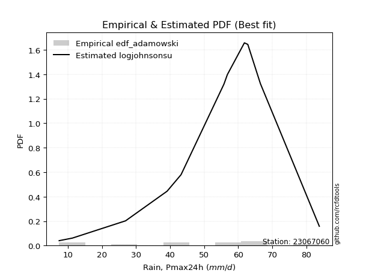</img>

</div>


## C. Best fit & Estimate extreme values for specific return periods - Tr


### 1. Best fit (ordered by delta Δ)

<div align="center">

|   id |   station | empirical_dist   | p_dist             |     delta |   deltao | eval   |   fit |   n |   best_fit |   best_fit_sort |
|-----:|----------:|:-----------------|:-------------------|----------:|---------:|:-------|------:|----:|-----------:|----------------:|
|    0 |  23067060 | edf_hazen        | laplace_asymmetric | 0.0833589 | 0.362184 | Δo > Δ |     1 |  12 |          1 |               1 |
|    1 |  23067060 | edf_gringorten   | laplace_asymmetric | 0.0862467 | 0.362184 | Δo > Δ |     1 |  12 |          1 |               2 |
|    2 |  23067060 | edf_cunnane      | laplace_asymmetric | 0.0881403 | 0.362184 | Δo > Δ |     1 |  12 |          1 |               3 |
|    3 |  23067060 | edf_blom         | laplace_asymmetric | 0.0893113 | 0.362184 | Δo > Δ |     1 |  12 |          1 |               4 |
|    4 |  23067060 | edf_tukey        | laplace_asymmetric | 0.0912418 | 0.362184 | Δo > Δ |     1 |  12 |          1 |               5 |
|    5 |  23067060 | edf_filliben     | laplace_asymmetric | 0.0919685 | 0.362184 | Δo > Δ |     1 |  12 |          1 |               6 |
|    6 |  23067060 | edf_beard        | laplace_asymmetric | 0.0923115 | 0.362184 | Δo > Δ |     1 |  12 |          1 |               7 |
|    7 |  23067060 | edf_jenkinson    | laplace_asymmetric | 0.0923115 | 0.362184 | Δo > Δ |     1 |  12 |          1 |               8 |
|    8 |  23067060 | edf_chegodayev   | laplace_asymmetric | 0.0927675 | 0.362184 | Δo > Δ |     1 |  12 |          1 |               9 |
|    9 |  23067060 | edf_adamowski    | laplace_asymmetric | 0.0950256 | 0.362184 | Δo > Δ |     1 |  12 |          1 |              10 |
|   10 |  23067060 | edf_weibull      | logjohnsonsu       | 0.102903  | 0.362184 | Δo > Δ |     1 |  12 |          1 |              11 |
|   11 |  23067060 | edf_california   | logloggamma        | 0.117953  | 0.362184 | Δo > Δ |     1 |  12 |          1 |              12 |

</div>

:file_folder:Tables: [bestfit_23067060.csv](table/bestfit_23067060.csv) | [extreme_23067060.csv](table/extreme_23067060.csv)


### 2. Extreme values

In hydrology, a return period (or recurrence interval $Tr$) is the statistical average time between extreme events like floods or droughts of a specific magnitude, indicating how rare an event is, with a 100-year flood, for example, having a 1% chance of occurring in any given year, not that it happens exactly every century. It is a key tool for infrastructure design (like bridges or dams) and risk assessment, calculated from historical data to determine the probability of future events, although it is important to remember it is statistical average, and events can cluster or be missed.

> risk_rate: assuming the return period as the project useful life.

|   id |      tr |   prob_l |     prob_g |      alpha |   betaprime |     chi2 |   crystalball |   erlang |    expon |   exponnorm |        f |   fatiguelife |     fisk |    gamma |   genexpon |   genlogistic |   gibrat |   gompertz |   gumbel_l |   gumbel_r |   halflogistic |   halfnorm |   hypsecant |   invgamma |   invgauss |   invweibull |   johnsonsu |   kstwobign |   laplace |   laplace_asymmetric |   loggamma |   logistic |   lognorm |   maxwell |   mielke |    moyal |   nakagami |      ncf |      nct |     norm |          pareto |   pearson3 |   rayleigh |     rice |        t |   truncnorm |     wald |   weibull_min |   logalpha |   logbetaprime |   logchi2 |   logcrystalball |   logerlang |         logexpon |   logexponnorm |     logf |   logfatiguelife |   logfisk |   loggenexpon |   loggenlogistic |   loggibrat |   loggompertz |   loggumbel_l |   loggumbel_r |   loghalflogistic |   loghalfnorm |   loghypsecant |   loginvgamma |   loginvgauss |   loginvweibull |   logjohnsonsu |   logkstwobign |   loglaplace |   loglaplace_asymmetric |   logloggamma |   loglogistic |   loglognorm |   logmaxwell |   logmielke |   logmoyal |   lognakagami |    logncf |   lognct |   logpareto |   logpearson3 |   lograyleigh |   logrice |             logt |   logtruncnorm |    logwald |   logweibull_min |   station |   n |   risk_rate |
|-----:|--------:|---------:|-----------:|-----------:|------------:|---------:|--------------:|---------:|---------:|------------:|---------:|--------------:|---------:|---------:|-----------:|--------------:|---------:|-----------:|-----------:|-----------:|---------------:|-----------:|------------:|-----------:|-----------:|-------------:|------------:|------------:|----------:|---------------------:|-----------:|-----------:|----------:|----------:|---------:|---------:|-----------:|---------:|---------:|---------:|----------------:|-----------:|-----------:|---------:|---------:|------------:|---------:|--------------:|-----------:|---------------:|----------:|-----------------:|------------:|-----------------:|---------------:|---------:|-----------------:|----------:|--------------:|-----------------:|------------:|--------------:|--------------:|--------------:|------------------:|--------------:|---------------:|--------------:|--------------:|----------------:|---------------:|---------------:|-------------:|------------------------:|--------------:|--------------:|-------------:|-------------:|------------:|-----------:|--------------:|----------:|---------:|------------:|--------------:|--------------:|----------:|-----------------:|---------------:|-----------:|-----------------:|----------:|----:|------------:|
|    0 |    2    | 0.5      | 0.5        |    9.77781 |     42.7348 |  2.92297 |       43.1167 |  42.6912 |  30.4999 |     43.1167 |  43.0825 |       2.00002 |  44.5386 |  42.5163 |    30.3798 |       48.9441 |  35.5904 |    65.1313 |    47.2359 |    38.9975 |        36.9496 |    37.9841 |     43.1167 |    41.297  |    37.7896 |      39.0872 |     46.166  |     37.685  |   43.1167 |              50.7199 |    28.3739 |    43.1167 |   29.9499 |   40.9722 |   2      |  37.6677 |    29.7532 |  39.7697 |  43.1102 |  43.1167 |     2.44497     |    44.2805 |    40.2116 |  41.8855 |  43.1173 |     4.4926  |  34.9889 |       44.8794 |    26.9732 |        29.1562 |   28.9606 |          29.9499 |     28.5451 |     13.0536      |        29.9501 |  29.9254 |          30.1638 |   36.8932 |       21.0456 |         inf      |     21.6541 |       36.3881 |       35.7676 |       25.0785 |           22.9604 |       24.0068 |        29.9499 |       28.1349 |       27.4261 |         26.5909 |        45.0242 |        22.744  |      29.9499 |                 39.5988 |       41.0675 |       29.9499 |      29.9498 |      27.3063 |     41.0796 |    23.6818 |       35.4251 |   27.5717 |  29.9268 |     2.07246 |       37.9384 |       26.4256 |   29.9508 |     56.1132      |        14.5374 |    21.0995 |          36.9085 |  23067060 |  12 |    0.75     |
|    1 |    2.33 | 0.570815 | 0.429185   |   11.6372  |     47.2271 |  3.43059 |       47.5911 |  47.2426 |  36.7793 |     47.591  |  47.5686 |       3.09476 |  48.839  |  47.0485 |    36.7375 |       52.8066 |  37.857  |    66.4874 |    51.1286 |    43.1435 |        41.2124 |    42.8132 |     46.6975 |    45.9868 |    42.6539 |      44.1837 |     50.4592 |     42.789  |   45.8244 |              54.4858 |    34.8083 |    47.0589 |   36.3193 |   45.6208 |  41.0187 |  41.5924 |    36.2737 |  44.5488 |  47.5859 |  47.5911 |     4.38786     |    48.7009 |    44.929  |  46.5306 |  47.5915 |     5.0927  |  37.9228 |       49.2211 |    33.3066 |        35.6256 |   35.4215 |          36.3193 |     35.0456 |     19.7349      |        36.3194 |  36.3062 |          36.5732 |   43.059  |       27.888  |         inf      |     23.8759 |       41.6768 |       42.3005 |       29.9846 |           27.5905 |       29.5607 |        34.9473 |       34.64   |       34.0371 |         35.0966 |        50.5266 |        30.3425 |      33.6568 |                 44.8613 |       47.0644 |       35.4959 |      36.3191 |      33.3629 |     47.1456 |    28.0458 |       40.915  |   34.0767 |  36.2976 |     2.42089 |       44.8615 |       32.3828 |   36.3172 |     59.7391      |        20.3148 |    23.9433 |          42.1161 |  23067060 |  12 |    0.729209 |
|    2 |    5    | 0.8      | 0.2        |   26.0551  |     64.0891 |  7.11453 |       64.2191 |  64.4312 |  68.1747 |     64.219  |  64.2703 |      26.3503  |  65.4437 |  64.1633 |    68.5247 |       64.8904 |  50.9061 |    70.8683 |    63.7045 |    61.1557 |        60.5006 |    63.2345 |     61.0611 |    64.385  |    63.1432 |      66.3253 |     64.8914 |     64.4699 |   59.3622 |              64.2216 |    75.3737 |    62.2805 |   74.3606 |   63.9173 |  62.9821 |  59.7722 |    65.503  |  65.321  |  64.2205 |  64.2191 | 10604           |    64.4864 |    63.8146 |  64.2378 |  64.2191 |     7.32413 |  54.3468 |       64.4293 |    75.6904 |        75.7894 |   75.9015 |          74.3606 |     76.0705 |    155.851       |        74.3603 |  74.4927 |          74.8688 |   78.2019 |       86.3803 |         inf      |     41.8965 |       64.7377 |       72.7298 |       65.1642 |           63.3504 |       71.2721 |        64.8992 |       76.7814 |       78.6548 |        117.197  |        67.3691 |       103.23   |      60.3174 |                 61.6542 |       66.6102 |       68.4006 |      74.3609 |      73.3991 |     66.9683 |    61.3925 |       71.3769 |   80.4475 |  74.3788 |   inf       |       73.8351 |       73.0755 |   74.3334 |     83.4362      |        82.6534 |    48.5932 |          64.5105 |  23067060 |  12 |    0.67232  |
|    3 |   10    | 0.9      | 0.1        |   52.5443  |     75.4207 | 11.5091  |       75.2497 |  76.0736 |  96.6746 |     75.2496 |  75.3758 |      58.4602  |  77.6726 |  75.7545 |    97.3802 |       72.0301 |  65.7806 |    73.3075 |    70.7062 |    75.8264 |        76.5186 |    78.3458 |     72.5309 |    77.4914 |    79.0272 |      84.3593 |     73.2731 |     80.977  |   71.6515 |              70.2851 |   127.282  |    73.4906 |  119.616  |   76.7934 |  73.2643 |  75.6005 |    87.9248 |  82.051  |  75.2574 |  75.2497 |     2.16939e+07 |    74.4086 |    77.2805 |  76.2391 |  75.2494 |     8.80505 |  71.7766 |       73.7411 |   135.078  |       126.173  |  127.36   |         119.616  |    128.609  |   1017.21        |       119.615  | 120.003  |         120.462  |  121.36   |      193.821  |         inf      |     79.535  |       82.8007 |       98.3454 |      122.626  |          126.339  |      136.692  |       106.391  |      132.912  |      141.484  |        312.913  |        75.181  |       262.222  |     102.434  |                 69.3071 |       75.193  |      110.883  |     119.617  |     127.842  |     75.6933 |   121.438  |      104.927  |  152.137  | 119.733  |   inf       |       93.2893 |      130.555  |  119.547  |    144.177       |       231.547  |   102.989  |          81.7959 |  23067060 |  12 |    0.651322 |
|    4 |   15    | 0.933333 | 0.0666667  |   78.939   |     81.1192 | 14.3605  |       80.7542 |  81.9555 | 113.346  |     80.7541 |  80.9255 |      79.4606  |  84.3355 |  81.6101 |   114.26   |       75.607  |  76.0404 |    74.4121 |    73.8771 |    84.1035 |        85.5834 |    86.2097 |     79.0766 |    84.32   |    87.6962 |      94.5339 |     77.1371 |     89.7403 |   78.8403 |              73.8321 |   165.885  |    79.5984 |  151.638  |   83.4    |  76.7767 |  84.7865 |    99.6925 |  91.4019 |  80.7656 |  80.7542 |     1.87552e+09 |    79.1989 |    84.2187 |  82.2786 |  80.7537 |     9.54418 |  82.9692 |       78.1721 |   182.367  |       163.153  |  165.489  |         151.638  |    167.69   |   3047.75        |       151.637  | 152.244  |         152.745  |  154.192  |      294.052  |         inf      |    123.758  |       92.5759 |      112.746  |      175.183  |          186.719  |      191.833  |       141.063  |      175.902  |      191.493  |        544.571  |        78.1964 |       430.133  |     139.633  |                 73.4928 |       78.0602 |      144.27   |     151.641  |     169.949  |     78.6105 |   180.417  |      127.707  |  213.687  | 151.85   |   inf       |      102.265  |      176.055  |  151.536  |    252.561       |       395.049  |   166.829  |          91.0801 |  23067060 |  12 |    0.644736 |
|    5 |   20    | 0.95     | 0.05       |  105.31    |     84.8668 | 16.4749  |       84.359  |  85.8334 | 125.175  |     84.3589 |  84.5626 |      95.0089  |  88.9407 |  85.4707 |   126.236  |       78.0014 |  84.0884 |    75.0997 |    75.8509 |    89.8989 |        91.9344 |    91.4527 |     83.6943 |    88.9003 |    93.6537 |     101.658  |     79.5599 |     95.6436 |   83.9408 |              76.3487 |   197.554  |    83.8199 |  177.123  |   87.7845 |  78.5482 |  91.2922 |   107.556  |  97.9187 |  84.373  |  84.359  |     4.43905e+10 |    82.2784 |    88.8303 |  86.2483 |  84.3584 |    10.0282  |  91.3099 |       81.0001 |   222.916  |       193.251  |  196.707  |         177.123  |    199.752  |   6639.13        |       177.121  | 177.921  |         178.448  |  181.943  |      387.972  |         inf      |    175.063  |       99.2386 |      122.755  |      224.883  |          245.5    |      240.464  |       172.122  |      211.837  |      234.304  |        802.672  |        79.8965 |       600.33   |     173.959  |                 76.615  |       79.495  |      173.056  |     177.127  |     205.295  |     80.0706 |   238.8    |      145.447  |  269.147  | 177.422  |   inf       |      107.738  |      214.762  |  176.992  |    450.381       |       563.762  |   238.989  |          97.3839 |  23067060 |  12 |    0.641514 |
|    6 |   25    | 0.96     | 0.04       |  131.673   |     87.6335 | 18.1582  |       87.0126 |  88.7013 | 134.349  |     87.0125 |  87.2415 |     107.363   |  92.4637 |  88.3256 |   135.525  |       79.802  |  90.7977 |    75.5889 |    77.2554 |    94.3628 |        96.8276 |    95.3536 |     87.2681 |    92.3284 |    98.1846 |     107.145  |     81.2911 |    100.065  |   87.897  |              78.3008 |   224.809  |    87.0494 |  198.582  |   91.0396 |  79.616  |  96.3348 |   113.413  | 102.925  |  87.0286 |  87.0126 |     5.16628e+11 |    84.5164 |    92.2567 |  89.1772 |  87.0119 |    10.3846  |  97.9906 |       83.0461 |   258.988  |       219.01   |  223.54   |         198.582  |    227.347  |  12144.7         |       198.579  | 199.551  |         200.097  |  206.499  |      476.719  |         inf      |    233.754  |      104.271  |      130.415  |      272.586  |          303.131  |      284.485  |       200.78   |      243.196  |      272.318  |       1082.22   |        81.0226 |       770.62   |     206.296  |                 79.1278 |       80.3562 |      198.897  |     198.586  |     236.21   |     80.9472 |   296.764  |      160.171  |  320.351  | 198.962  |   inf       |      111.532  |      248.934  |  198.424  |    815.59        |       734.343  |   318.723  |         102.134  |  23067060 |  12 |    0.639603 |
|    7 |   50    | 0.98     | 0.02       |  263.442   |     95.594  | 23.5816  |       94.6114 |  96.9761 | 162.849  |     94.6113 |  94.9193 |     146.999   | 103.228  |  96.5627 |   164.381  |       85.1906 | 114.448  |    76.9171 |    81.0681 |   108.114  |       111.904  |   106.692  |     98.3481 |   102.417  |   111.861  |     124.049  |     86.0139 |    113.05   |  100.186  |              84.3643 |   326.462  |    96.9163 |  275.522  |  100.48   |  81.7623 | 111.989  |   130.449  | 118.305  |  94.6337 |  94.6114 |     1.05713e+15 |    90.7908 |   102.203  |  97.5918 |  94.6105 |    11.4051  | 119.803  |       88.7432 |   402.173  |       314.114  |  323.4    |         275.522  |    330.259  |  79266.2         |       275.518  | 277.175  |         277.77   |  304.022  |      867.085  |         inf      |    647.713  |      119.264  |      153.703  |      493.027  |          580.495  |      463.738  |       323.661  |      363.212  |      422.483  |       2717.04   |        83.7304 |      1604.37   |     350.344  |                 87.4712 |       82.0794 |      304.294  |     275.531  |     354.796  |     82.7014 |   582.629  |      211.747  |  538.662  | 276.24   |   inf       |      121.188  |      382.148  |  275.266  |  18775.4         |      1581.76   |   815.941  |         116.228  |  23067060 |  12 |    0.63583  |
|    8 |   75    | 0.986667 | 0.0133333  |  395.193   |     99.8884 | 26.8636  |       98.6888 | 101.454  | 179.521  |     98.6886 |  99.043  |     170.87    | 109.445  | 101.02   |   181.26   |       88.253  | 130.422  |    77.5888 |    82.996  |   116.107  |       120.668  |   112.864  |    104.823  |   108.002  |   119.64   |     133.874  |     88.4113 |    120.194  |  107.375  |              87.9113 |   399.534  |   102.615  |  328.448  |  105.612  |  82.4809 | 121.143  |   139.724  | 127.238  |  98.7147 |  98.6888 |     9.13927e+16 |    94.0759 |   107.614  | 102.121  |  98.6877 |    11.9527  | 133.226  |       91.7059 |   512.719  |       381.723  |  395.027  |         328.448  |    404.227  | 237497           |       328.443  | 330.621  |         331.238  |  380.128  |     1200.78   |         inf      |   1289.23   |      127.652  |      167.019  |      695.765  |          846.88   |      605.052  |       427.835  |      452.055  |      537.616  |       4639.42   |        84.9098 |      2401.71   |     477.57   |                 92.7538 |       82.654  |      389.001  |     328.46   |     442.626  |     83.2867 |   864.414  |      246.39   |  721.412  | 329.434  |   inf       |      125.597  |      482.506  |  328.117  | 523509           |      2400.52   |  1455.04   |         124.08   |  23067060 |  12 |    0.634587 |
|    9 |  100    | 0.99     | 0.01       |  526.94    |    102.802  | 29.2317  |      101.446  | 104.498  | 191.349  |    101.446  | 101.834  |     188.045   | 113.834  | 104.05   |   193.236  |       90.4015 | 142.796  |    78.0281 |    84.2571 |   121.764  |       126.871  |   117.069  |    109.416  |   111.849  |   125.08   |     140.828  |     89.9812 |    125.089  |  112.476  |              90.4279 |   458.351  |   106.639  |  369.896  |  109.108  |  82.8408 | 127.638  |   146.04   | 133.568  | 101.475  | 101.446  |     2.16312e+18 |    96.2658 |   111.3    | 105.19   | 101.445  |    12.323   | 143.012  |       93.6741 |   605.907  |       435.769  |  452.609  |         369.896  |    463.757  | 517356           |       369.889  | 372.499  |         373.13   |  445.073  |     1499.05   |         inf      |   2197.43   |      133.455  |      176.347  |      887.846  |         1106.41   |      725.253  |       521.482  |      524.923  |      634.152  |       6775.24   |        85.6148 |      3166.44   |     594.972  |                 96.6943 |       82.9413 |      462.65   |     369.911  |     514.595  |     83.5803 |  1143.6    |      273.159  |  883.822  | 371.11   |   inf       |      128.272  |      565.584  |  369.504  |      1.66618e+07 |      3188.87   |  2218.37   |         129.5    |  23067060 |  12 |    0.633968 |
|   10 |  200    | 0.995    | 0.005      | 1053.91    |    109.439  | 35.0488  |      107.702  | 111.448  | 219.849  |    107.702  | 108.169  |     230.089   | 124.363  | 110.968  |   222.092  |       95.5265 | 176.461  |    78.9829 |    86.9982 |   135.364  |       141.784  |   126.686  |    120.481  |   120.791  |   137.968  |     157.546  |     93.3944 |    136.362  |  124.765  |              96.4915 |   627.231  |   116.29   |  484.343  |  117.107  |  83.3818 | 143.286  |   160.479  | 148.842  | 107.737  | 107.702  |     4.42621e+21 |   101.138  |   119.735  | 112.165  | 107.701  |    13.1632  | 167.388  |       98.0366 |   892.492  |       589.447  |  617.673  |         484.343  |    634.646  |      3.37669e+06 |       484.333  | 488.226  |         488.883  |  649.759  |     2490.85   |          83.3787 |   9374.88   |      147      |      198.458  |     1595.41   |         2103.85   |     1097.68   |       840.103  |      739.991  |      928.311  |      16838.6    |        86.9736 |      5985.2    |    1010.41   |                106.89   |       83.3724 |      701.275  |     484.367  |     726.369  |     84.0338 |  2244.55   |      345.797  | 1424.76   | 486.258  |   inf       |      133.456  |      813.51   |  483.773  |      4.0552e+13  |      6102.25   |  6342.56   |         142.113  |  23067060 |  12 |    0.633042 |
|   11 |  250    | 0.996    | 0.004      | 1317.4     |    111.474  | 36.9502  |      109.613  | 113.584  | 229.024  |    109.613  | 110.106  |     243.791   | 127.743  | 113.094  |   231.381  |       97.166  | 188.54   |    79.2639 |    87.8047 |   139.736  |       146.578  |   129.645  |    124.043  |   123.585  |   142.06   |     162.921  |     94.398  |    139.851  |  128.721  |              98.4435 |   690.748  |   119.389  |  525.933  |  119.569  |  83.4909 | 148.323  |   164.918  | 153.776  | 109.65   | 109.613  |     5.15134e+22 |   102.601  |   122.332  | 114.3    | 109.612  |    13.4199  | 175.453  |       99.3425 |  1007.05   |       646.758  |  679.672  |         525.933  |    698.902  |      6.17684e+06 |       525.922  | 530.309  |         530.973  |  733.68   |     2912.38   |          83.4647 |  15777.2    |      151.242  |      205.477  |     1926.2    |         2586.68   |     1246.95   |       979.485  |      822.877  |     1044.86   |      22563.9    |        87.3302 |      7288.71   |    1198.24   |                110.396  |       83.4586 |      801.457  |     525.961  |     807.675  |     84.1326 |  2788.73   |      371.818  | 1656.59   | 528.124  |   inf       |      134.808  |      909.824  |  525.296  |      9.11947e+16 |      7449.8    |  8978.4    |         146.052  |  23067060 |  12 |    0.632858 |
|   12 |  500    | 0.998    | 0.002      | 2634.82    |    117.532  | 42.9299  |      115.282  | 119.954  | 257.524  |    115.282  | 115.855  |     286.774   | 138.227  | 119.434  |   260.236  |      102.24   | 230.285  |    80.0693 |    90.1166 |   153.307  |       161.459  |   138.466  |    135.108  |   132.043  |   154.631  |     179.602  |     97.2704 |    150.307  |  141.01   |             104.507  |   921.016  |   128.998  |  671.473  |  126.916  |  83.7184 | 163.97   |   178.145  | 169.197  | 115.325  | 115.282  |     1.05407e+26 |   106.868  |   130.079  | 120.641  | 115.281  |    14.1813  | 201.095  |      103.144  |  1450.7    |       852.733  |  904.156  |         671.473  |    931.787  |      4.03151e+07 |       671.457  | 677.677  |         678.358  | 1069.34   |     4643.92   |          83.6366 |  95345.9    |      164.095  |      227.004  |     3456.86   |         4911.79   |     1823.65   |      1577.89   |     1131.27   |     1491.3    |      55967.4    |        88.25   |     13155      |    2034.91   |                122.036  |       83.6311 |     1212.64   |     671.514  |    1108.51   |     84.365  |  5473.39   |      461.668  | 2626.48   | 674.714  |   inf       |      138.229  |     1270.43   |  670.588  |      5.09577e+34 |     13501.2    | 27109.4    |         157.962  |  23067060 |  12 |    0.632489 |
|   13 |  750    | 0.998667 | 0.00133333 | 3952.24    |    120.911  | 46.4724  |      118.432  | 123.516  | 274.195  |    118.431  | 119.051  |     312.17    | 144.352  | 122.979  |   277.116  |      105.2    | 257.892  |    80.4997 |    91.3522 |   161.24   |       170.158  |   143.393  |    141.58   |   136.857  |   161.899  |     189.354  |     98.8014 |    156.181  |  148.199  |             108.054  |  1081.79   |   134.613  |  769.072  |  131.025  |  83.8055 | 173.123  |   185.528  | 178.298  | 118.478  | 118.432  |     9.11284e+27 |   109.193  |   134.411  | 124.168  | 118.43   |    14.6043  | 216.47   |      105.211  |  1784.94   |       995.14   | 1060.68   |         769.072  |   1094.33   |      1.20792e+08 |       769.054  | 776.578  |         777.27   | 1332.6    |     6028.71   |          83.6939 | 313319      |      171.407  |      239.419  |     4865.85   |         7145.76   |     2255.13   |      2085.49   |     1353.12   |     1823.15   |      95185.7    |        88.6828 |     18329.7    |    2773.89   |                129.406  |       83.6886 |     1544.57   |     769.123  |    1323.26   |     84.4708 |  8120.11   |      521.069  | 3424.2    | 773.079  |   inf       |      139.784  |     1531.18   |  768.014  |      3.60465e+53 |     18817.1    | 52586      |         164.72   |  23067060 |  12 |    0.632366 |
|   14 | 1000    | 0.999    | 0.001      | 5269.66    |    123.243  | 49.0032  |      120.6    | 125.977  | 286.024  |    120.6    | 121.252  |     330.286   | 148.695  | 125.428  |   289.092  |      107.298  | 279.019  |    80.7894 |    92.1839 |   166.867  |       176.328  |   146.797  |    146.172  |   140.22   |   167.023  |     196.272  |     99.8296 |    160.25   |  153.3    |             110.571  |  1209.05   |   138.594  |  844.397  |  133.865  |  83.8561 | 179.618  |   190.624  | 184.8    | 120.649  | 120.6    |     2.15686e+29 |   110.774  |   137.405  | 126.598  | 120.598  |    14.8955  | 227.529  |      106.616  |  2062.84   |      1107.17   | 1184.49   |         844.397  |   1222.96   |      2.63129e+08 |       844.376  | 852.944  |         853.644  | 1557.71   |     7220.33   |          83.7226 | 778717      |      176.511  |      248.155  |     6201.25   |         9322.55   |     2611.36   |      2541.86   |     1532.12   |     2096.51   |     138730      |        88.9523 |     23065.3    |    3455.8    |                134.904  |       83.7173 |     1833.68   |     844.456  |    1495.54   |     84.5383 | 10742.5    |      566.532  | 4126.43   | 849.025  |   inf       |      140.724  |     1742.03   |  843.201  |      1.44601e+73 |     23664.5    | 84694.7    |         169.431  |  23067060 |  12 |    0.632305 |

<div align="center">

</img>

</div>


<div align="center">

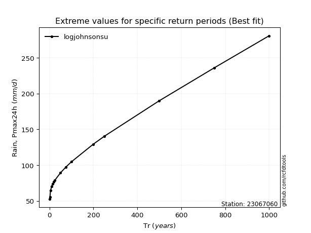</img>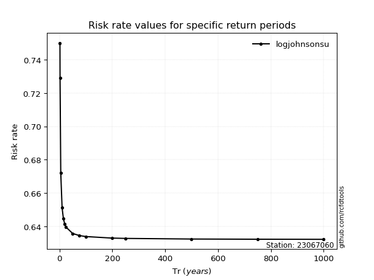</img>

</div>


<sub>**APP DISCLAIMER**: NO WARRANTY - This software is provided by [github.com/rcfdtools](https://github.com/rcfdtools) "as is", without any express or implied warranty, including warranties of merchantability, fitness for a particular purpose, or non-infringement. There is no guarantee that the software will be error-free or operate without interruption. LIMITATION OF LIABILITY - Neither the authors nor copyright holders will be liable for claims or damages arising from the software or its use. You are responsible for determining if the software is appropriate for your use and assume all associated risks, including errors, legal compliance, and data loss. NO PROFESSIONAL ADVICE - The software provides general information and does not offer professional advice. It should not replace consultation with professional advisors.</sub>