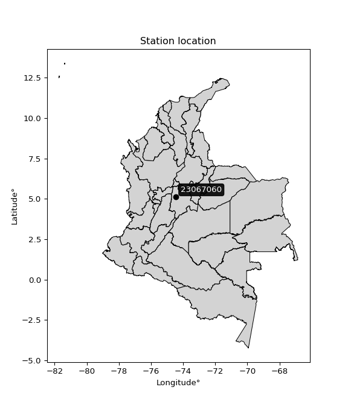

<div align="center">


</div>

# PMP Station (rain, Pmax24h): 23067060

Probable Maximum Precipitation (PMP) is the greatest amount of rainfall for a specific duration that is meteorologically possible for a given location, acting as a "worst-case" scenario for extreme storms, crucial for designing safety-critical infrastructure like bridges, river deviations, dams, spillways, and nuclear plants to prevent catastrophic failure. PMP is calculated by hydrologists using meteorological data to determine the upper limit of extreme rainfall, often leading to the Probable Maximum Flood (PMF) for flood control design, and is increasingly being studied for climate change impacts.

<div align="center">

</img>

</div>


## A. General information


### 1. General running parameters

• app_version: _v20251228_. • runtime: _2025-12-28 08:43:48.795225_. • Python version: _3.14.0_. • SciPy version: _1.16.3_. • Pandas version: _2.3.3_. • NumPy version: _2.3.5_. • Stations dataset (station_dataset_file): _dataset/pmax24h_in/automatic_colombia_2003_2024.csv_. • Stations catalog (station_catalog_file): _dataset/CNE_IDEAM.xls_. • Minimum year to eval til year_max (date_min): _1900_. • Maximum year to eval since year_min (date_max): _2024_. • Creates, save and include plots into reports (create_plot): _False_. • Plot only fit distributions with Δo > Δ (plot_only_fit): _True_. • Eval low extreme values, if False, evaluates high extreme values (low_extreme): _False_. • Eval every SciPy distribution as logarithmic (pdist_logarithmic_on): _True_. • Standard deviation normalized (ddof): _1.0_. • Return periods to eval in years (Tr): _[2, 2.33, 5, 10, 15, 20, 25, 50, 75, 100, 200, 250, 500, 750, 1000]_. • Minimum data sample per station, 0 means any (minimum_sample): _5_. • Z-Score maximum threshold to adjust a value, 0 means disable (zscore_max): _3.5_. • Z-Score minimum threshold to adjust a value, 0 means disable (zscore_min): _-2.5_. • Avoid zeros, e.g. rain = 0 (avoid_zeros): _True_. • Avoid null values (avoid_nans): _True_. [:file_folder:Dataset file.](../../dataset/pmax24h_in/automatic_colombia_2003_2024.csv)

> Delta Degrees of Freedom (DDOF): is a parameter used in the formulas for calculating variance and standard deviation. When ddof=0, the divisor is $N$ (the total number of observations) and this is used when your data set is the entire population. When ddof=1, the divisor is $N-1$ and this is used when your data set is a sample drawn from a larger population. Using $N-1$ provides an unbiased estimate of the population variance (known as Bessel´s correction).


### 2. Station info and location

|   id |   CODIGO | NOMBRE           | CATEGORIA    | TECNOLOGIA                              | ESTADO   | FECHA_INSTALACION   |   FECHA_SUSPENSION |   ALTITUD |   LATITUD |   LONGITUD | DEPARTAMENTO   | MUNICIPIO   | AREA_OPERATIVA                            | ENTIDAD                                                     | AREA_HIDROGRAFICA   | ZONA_HIDROGRAFICA   | SUBZONA_HIDROGRAFICA   | CORRIENTE   | Catalogo   |
|-----:|---------:|:-----------------|:-------------|:----------------------------------------|:---------|:--------------------|-------------------:|----------:|----------:|-----------:|:---------------|:------------|:------------------------------------------|:------------------------------------------------------------|:--------------------|:--------------------|:-----------------------|:------------|:-----------|
|    0 | 23067060 | TOBIA [23067060] | Limnigráfica | Automática con Telemetría, Convencional | Activa   | 15/12/1986          |                nan |       620 |   5.12556 |   -74.4471 | Cundinamarca   | La Peña     | Area Operativa 11 - Cundinamarca-Amazonas | INSTITUTO DE HIDROLOGIA METEOROLOGIA Y ESTUDIOS AMBIENTALES | Magdalena Cauca     | Medio Magdalena     | Río Negro              | Negro       | CNE_IDEAM  |

<div align="center">

Map location in: [:earth_americas:Google](http://maps.google.com/maps?q=5.125561,-74.447149) [:earth_americas:OSM](https://www.openstreetmap.org/#map=18/5.125561/-74.447149&layers=P) [:earth_americas:Bing](https://www.bing.com/maps?cp=5.125561~-74.447149&lvl=18) [:earth_americas:Apple](https://maps.apple.com/frame?center=5.125561%2C-74.447149&span=0.003%2C0.006)

</div>


<div align="center">

```geojson
{
  "type": "Feature",
  "geometry": {
    "type": "Point", 
    "coordinates": [-74.447149, 5.125561]
  }, 
  "properties": {
    "Name": "23067060"
  }
}
```

</div>


### 3. Discrete values table and plot

|               |           0 |           1 |          2 |           3 |          4 |         5 |           6 |           7 |           8 |          9 |          10 |
|:--------------|------------:|------------:|-----------:|------------:|-----------:|----------:|------------:|------------:|------------:|-----------:|------------:|
| Date          | 2014        | 2015        | 2016       | 2017        | 2018       | 2019      | 2020        | 2021        | 2022        | 2023       | 2024        |
| Value         |   62.8      |   66.5      |   11.3     |   26.9      |   83.8     |   61.8    |   55.8      |   39.1      |   43.2      |    7.4     |   56.8      |
| Value_initial |   62.8      |   66.5      |   11.3     |   26.9      |   83.8     |   61.8    |   55.8      |   39.1      |   43.2      |    7.4     |   56.8      |
| count         |   11        |   11        |   11       |   11        |   11       |   11      |   11        |   11        |   11        |   11       |   11        |
| mean          |   46.8545   |   46.8545   |   46.8545  |   46.8545   |   46.8545  |   46.8545 |   46.8545   |   46.8545   |   46.8545   |   46.8545  |   46.8545   |
| std           |   23.8745   |   23.8745   |   23.8745  |   23.8745   |   23.8745  |   23.8745 |   23.8745   |   23.8745   |   23.8745   |   23.8745  |   23.8745   |
| zscore        |    0.667886 |    0.822863 |   -1.48923 |   -0.835809 |    1.54748 |    0.626  |    0.374686 |   -0.324804 |   -0.153073 |   -1.65258 |    0.416572 |

> The initial value (value_initial) correspond to the initial obtained or null completed value, and value (value) is adjusted only when the initial value is outside the valid range definite through the Z-Score value. If Z-Score is active, values out of range or outliers are replaced with the station mean value


### 4. Active continuous probability distributions from SciPy (44 of 104 available)

[scipy.stats](https://docs.scipy.org/doc/scipy/reference/stats.html) is a Python´s powerful submodule within the SciPy library for comprehensive statistical analysis, offering over 130 probability distributions (like Normal, Poisson), functions for descriptive stats (mean, variance), hypothesis testing (t-tests, chi-square), random variable generation, and statistical tests, making it essential for data science, modeling, and research. It provides tools to explore, model, and draw conclusions from data efficiently, working seamlessly with NumPy.

<div align="center">

|   id | p_dist             |   n_parameter | fit_method   | label                                                                       | active   | ref                                                                                                        |
|-----:|:-------------------|--------------:|:-------------|:----------------------------------------------------------------------------|:---------|:-----------------------------------------------------------------------------------------------------------|
|    0 | alpha              |             3 | MLE          | Alpha                                                                       | True     | [:mortar_board:](https://docs.scipy.org/doc/scipy/reference/generated/scipy.stats.alpha.html)              |
|    1 | betaprime          |             4 | MLE          | Beta prime                                                                  | True     | [:mortar_board:](https://docs.scipy.org/doc/scipy/reference/generated/scipy.stats.betaprime.html)          |
|    2 | chi2               |             3 | MLE          | Chi²                                                                        | True     | [:mortar_board:](https://docs.scipy.org/doc/scipy/reference/generated/scipy.stats.chi2.html)               |
|    3 | crystalball        |             4 | MLE          | Crystalball                                                                 | True     | [:mortar_board:](https://docs.scipy.org/doc/scipy/reference/generated/scipy.stats.crystalball.html)        |
|    4 | erlang             |             3 | MLE          | Erlang                                                                      | True     | [:mortar_board:](https://docs.scipy.org/doc/scipy/reference/generated/scipy.stats.erlang.html)             |
|    5 | expon              |             2 | MLE          | Exponential                                                                 | True     | [:mortar_board:](https://docs.scipy.org/doc/scipy/reference/generated/scipy.stats.expon.html)              |
|    6 | exponnorm          |             3 | MLE          | Exponentially modified Normal                                               | True     | [:mortar_board:](https://docs.scipy.org/doc/scipy/reference/generated/scipy.stats.exponnorm.html)          |
|    7 | f                  |             4 | MLE          | F                                                                           | True     | [:mortar_board:](https://docs.scipy.org/doc/scipy/reference/generated/scipy.stats.f.html)                  |
|    8 | fatiguelife        |             3 | MLE          | Fatigue-life (Birnbaum-Saunders)                                            | True     | [:mortar_board:](https://docs.scipy.org/doc/scipy/reference/generated/scipy.stats.fatiguelife.html)        |
|    9 | fisk               |             3 | MLE          | Fisk                                                                        | True     | [:mortar_board:](https://docs.scipy.org/doc/scipy/reference/generated/scipy.stats.fisk.html)               |
|   10 | gamma              |             3 | MLE          | Gamma                                                                       | True     | [:mortar_board:](https://docs.scipy.org/doc/scipy/reference/generated/scipy.stats.gamma.html)              |
|   11 | genexpon           |             5 | MLE          | Generalized exponential                                                     | True     | [:mortar_board:](https://docs.scipy.org/doc/scipy/reference/generated/scipy.stats.genexpon.html)           |
|   12 | genlogistic        |             3 | MLE          | Generalized logistic                                                        | True     | [:mortar_board:](https://docs.scipy.org/doc/scipy/reference/generated/scipy.stats.genlogistic.html)        |
|   13 | gibrat             |             2 | MM           | Gibrat                                                                      | True     | [:mortar_board:](https://docs.scipy.org/doc/scipy/reference/generated/scipy.stats.gibrat.html)             |
|   14 | gompertz           |             3 | MLE          | Gompertz (or truncated Gumbel)                                              | True     | [:mortar_board:](https://docs.scipy.org/doc/scipy/reference/generated/scipy.stats.gompertz.html)           |
|   15 | gumbel_l           |             2 | MM           | Gumbel Left Skew                                                            | True     | [:mortar_board:](https://docs.scipy.org/doc/scipy/reference/generated/scipy.stats.gumbel_l.html)           |
|   16 | gumbel_r           |             2 | MM           | Gumbel Right Skew                                                           | True     | [:mortar_board:](https://docs.scipy.org/doc/scipy/reference/generated/scipy.stats.gumbel_r.html)           |
|   17 | halflogistic       |             2 | MM           | Half-logistic                                                               | True     | [:mortar_board:](https://docs.scipy.org/doc/scipy/reference/generated/scipy.stats.halflogistic.html)       |
|   18 | halfnorm           |             2 | MM           | Half Normal                                                                 | True     | [:mortar_board:](https://docs.scipy.org/doc/scipy/reference/generated/scipy.stats.halfnorm.html)           |
|   19 | hypsecant          |             2 | MM           | hyperbolic secant                                                           | True     | [:mortar_board:](https://docs.scipy.org/doc/scipy/reference/generated/scipy.stats.hypsecant.html)          |
|   20 | invgamma           |             3 | MLE          | Inverted gamma                                                              | True     | [:mortar_board:](https://docs.scipy.org/doc/scipy/reference/generated/scipy.stats.invgamma.html)           |
|   21 | invgauss           |             3 | MLE          | Inverse Gaussian                                                            | True     | [:mortar_board:](https://docs.scipy.org/doc/scipy/reference/generated/scipy.stats.invgauss.html)           |
|   22 | invweibull         |             3 | MLE          | Inverted Weibull                                                            | True     | [:mortar_board:](https://docs.scipy.org/doc/scipy/reference/generated/scipy.stats.invweibull.html)         |
|   23 | johnsonsu          |             4 | MLE          | Johnson Su                                                                  | True     | [:mortar_board:](https://docs.scipy.org/doc/scipy/reference/generated/scipy.stats.johnsonsu.html)          |
|   24 | kstwobign          |             2 | MLE          | Limiting distribution of scaled Kolmogorov-Smirnov two-sided test statistic | True     | [:mortar_board:](https://docs.scipy.org/doc/scipy/reference/generated/scipy.stats.kstwobign.html)          |
|   25 | laplace            |             2 | MM           | Laplace                                                                     | True     | [:mortar_board:](https://docs.scipy.org/doc/scipy/reference/generated/scipy.stats.laplace.html)            |
|   26 | laplace_asymmetric |             3 | MLE          | Asymmetric Laplace                                                          | True     | [:mortar_board:](https://docs.scipy.org/doc/scipy/reference/generated/scipy.stats.laplace_asymmetric.html) |
|   27 | loggamma           |             3 | MLE          | Log gamma                                                                   | True     | [:mortar_board:](https://docs.scipy.org/doc/scipy/reference/generated/scipy.stats.loggamma.html)           |
|   28 | logistic           |             2 | MM           | Logistic (or Sech-squared)                                                  | True     | [:mortar_board:](https://docs.scipy.org/doc/scipy/reference/generated/scipy.stats.logistic.html)           |
|   29 | lognorm            |             3 | MLE          | Log Normal                                                                  | True     | [:mortar_board:](https://docs.scipy.org/doc/scipy/reference/generated/scipy.stats.lognorm.html)            |
|   30 | maxwell            |             2 | MM           | Maxwell                                                                     | True     | [:mortar_board:](https://docs.scipy.org/doc/scipy/reference/generated/scipy.stats.maxwell.html)            |
|   31 | mielke             |             4 | MLE          | Mielke Beta-Kappa / Dagum                                                   | True     | [:mortar_board:](https://docs.scipy.org/doc/scipy/reference/generated/scipy.stats.mielke.html)             |
|   32 | moyal              |             2 | MM           | Moyal                                                                       | True     | [:mortar_board:](https://docs.scipy.org/doc/scipy/reference/generated/scipy.stats.moyal.html)              |
|   33 | nakagami           |             3 | MLE          | Nakagami                                                                    | True     | [:mortar_board:](https://docs.scipy.org/doc/scipy/reference/generated/scipy.stats.nakagami.html)           |
|   34 | ncf                |             5 | MLE          | Non-central F distribution                                                  | True     | [:mortar_board:](https://docs.scipy.org/doc/scipy/reference/generated/scipy.stats.ncf.html)                |
|   35 | nct                |             4 | MLE          | Non-central Student’s t                                                     | True     | [:mortar_board:](https://docs.scipy.org/doc/scipy/reference/generated/scipy.stats.nct.html)                |
|   36 | norm               |             2 | MM           | Normal                                                                      | True     | [:mortar_board:](https://docs.scipy.org/doc/scipy/reference/generated/scipy.stats.norm.html)               |
|   37 | pearson3           |             3 | MM           | Pearson type III                                                            | True     | [:mortar_board:](https://docs.scipy.org/doc/scipy/reference/generated/scipy.stats.pearson3.html)           |
|   38 | rayleigh           |             2 | MM           | Rayleigh                                                                    | True     | [:mortar_board:](https://docs.scipy.org/doc/scipy/reference/generated/scipy.stats.rayleigh.html)           |
|   39 | rice               |             3 | MLE          | Rice                                                                        | True     | [:mortar_board:](https://docs.scipy.org/doc/scipy/reference/generated/scipy.stats.rice.html)               |
|   40 | t                  |             3 | MLE          | Student’s t                                                                 | True     | [:mortar_board:](https://docs.scipy.org/doc/scipy/reference/generated/scipy.stats.t.html)                  |
|   41 | truncnorm          |             4 | MLE          | Truncated normal                                                            | True     | [:mortar_board:](https://docs.scipy.org/doc/scipy/reference/generated/scipy.stats.truncnorm.html)          |
|   42 | wald               |             2 | MM           | Wald                                                                        | True     | [:mortar_board:](https://docs.scipy.org/doc/scipy/reference/generated/scipy.stats.wald.html)               |
|   43 | weibull_min        |             3 | MLE          | Weibull minimum                                                             | True     | [:mortar_board:](https://docs.scipy.org/doc/scipy/reference/generated/scipy.stats.weibull_min.html)        |

</div>

> **n_parameter:** # arguments & localization & scale.
>
> **Fit methods:** (MLE) maximum likelihood, (MM) L-moments.
>
>**Inactive:** foldnorm, gennorm, norminvgauss, powernorm, powerlognorm, skewnorm, genextreme, anglit, arcsine, argus, beta, bradford, burr, burr12, cauchy, cosine, halfcauchy, foldcauchy, skewcauchy, wrapcauchy, dgamma, gengamma, exponweib, exponpow, truncexpon, gausshyper, genhalflogistic, genhyperbolic, geninvgauss, halfgennorm, johnsonsb, kappa4, kappa3, ksone, kstwo, loglaplace, levy, levy_l, levy_stable, ncx2, pareto, genpareto, truncpareto, lomax, powerlaw, rdist, rel_breitwigner, recipinvgauss, semicircular, studentized_range, trapezoid, triang, truncweibull_min, tukeylambda, uniform, loguniform, vonmises, vonmises_line, weibull_max, dweibull, 


## B. Probability distributions vs. Empirical distributions

A continuous probability distribution (CPD) describes probabilities for variables that can take any value within a range (like rain any time), unlike discrete variables with specific outcomes (like temperature). It uses a Probability Density Function (PDF), a curve where the total area under it equals 1, and the probability of the variable falling within an interval (a to b) is found by calculating the area under the curve between those points. A key feature is that the probability of hitting any single exact value is zero, so probabilities are always expressed for ranges, e.g., $P(a ≤ X ≤ b)$.

<div align="center">

Distributions parameters from station values
|    |   station | p_dist                |   n |             loc |           scale | shape                  | shape1              | shape2                 | shape3   |
|---:|----------:|:----------------------|----:|----------------:|----------------:|:-----------------------|:--------------------|:-----------------------|:---------|
|  0 |  23067060 | alpha                 |  11 |    -0.0524398   |    19.2202      | 4.111376078957437e-11  |                     |                        |          |
|  1 |  23067060 | betaprime             |  11 |  -689.655       | 68458.3         | 1039.7593038851019     | 96669.71088093083   |                        |          |
|  2 |  23067060 | chi2                  |  11 |  -230.732       |     0.984475    | 281.7256600223735      |                     |                        |          |
|  3 |  23067060 | crystalball           |  11 |    46.8545      |    22.7635      | 4219.3798471414875     | 1887.3426052511008  |                        |          |
|  4 |  23067060 | erlang                |  11 |  -319.822       |     1.44109     | 254.30758876252042     |                     |                        |          |
|  5 |  23067060 | expon                 |  11 |     7.4         |    39.4545      |                        |                     |                        |          |
|  6 |  23067060 | exponnorm             |  11 |    46.8358      |    22.7636      | 0.0008243803894506822  |                     |                        |          |
|  7 |  23067060 | f                     |  11 | -3838.53        |  3885.21        | 62514.201867038006     | 797451.6942611905   |                        |          |
|  8 |  23067060 | fatiguelife           |  11 | -2782.51        |  2829.36        | 0.008025902056703657   |                     |                        |          |
|  9 |  23067060 | fisk                  |  11 |    -1.74743e+09 |     1.74743e+09 | 130290220.15455194     |                     |                        |          |
| 10 |  23067060 | gamma                 |  11 |  -318.294       |     1.45354     | 251.08526299364496     |                     |                        |          |
| 11 |  23067060 | genexpon              |  11 |    -0.518384    |     2.64406     | 2.7613532219035012e-08 | 0.17266875184638183 | 0.036938237520935155   |          |
| 12 |  23067060 | genlogistic           |  11 |    65.8058      |     7.20169     | 0.3257108924670584     |                     |                        |          |
| 13 |  23067060 | gibrat                |  11 |    29.4889      |    10.5328      |                        |                     |                        |          |
| 14 |  23067060 | gompertz              |  11 |    -0.0126593   |     2.95135     | 5.102214470355481e-12  |                     |                        |          |
| 15 |  23067060 | gumbel_l              |  11 |    57.0993      |    17.7486      |                        |                     |                        |          |
| 16 |  23067060 | gumbel_r              |  11 |    36.6098      |    17.7486      |                        |                     |                        |          |
| 17 |  23067060 | halflogistic          |  11 |    19.8745      |    19.462       |                        |                     |                        |          |
| 18 |  23067060 | halfnorm              |  11 |    16.7247      |    37.7622      |                        |                     |                        |          |
| 19 |  23067060 | hypsecant             |  11 |    46.8545      |    14.4917      |                        |                     |                        |          |
| 20 |  23067060 | invgamma              |  11 |  -220.177       | 34707.4         | 130.77366413820894     |                     |                        |          |
| 21 |  23067060 | invgauss              |  11 |   -94.1139      |  4486.54        | 0.03146788565755812    |                     |                        |          |
| 22 |  23067060 | invweibull            |  11 |    -2.12137e+09 |     2.12137e+09 | 93834841.44027102      |                     |                        |          |
| 23 |  23067060 | johnsonsu             |  11 |   140.696       |    13.2651      | 10.889242728350453     | 4.147108271249909   |                        |          |
| 24 |  23067060 | kstwobign             |  11 |   -43.6895      |   103.321       |                        |                     |                        |          |
| 25 |  23067060 | laplace               |  11 |    46.8545      |    16.0962      |                        |                     |                        |          |
| 26 |  23067060 | laplace_asymmetric    |  11 |    62.8         |    14.5707      | 1.6870884798596766     |                     |                        |          |
| 27 |  23067060 | loggamma              |  11 |    30.0278      |    30.712       | 2.2062843044817164     |                     |                        |          |
| 28 |  23067060 | logistic              |  11 |    46.8545      |    12.5502      |                        |                     |                        |          |
| 29 |  23067060 | lognorm               |  11 |     7.4         |     1.08663     | 11.013499319172714     |                     |                        |          |
| 30 |  23067060 | maxwell               |  11 |    -7.0853      |    33.8018      |                        |                     |                        |          |
| 31 |  23067060 | mielke                |  11 |    -0.477762    |    76.6154      | 1.45170775083542       | 13.026754391495109  |                        |          |
| 32 |  23067060 | moyal                 |  11 |    33.8369      |    10.2472      |                        |                     |                        |          |
| 33 |  23067060 | nakagami              |  11 |     7.4         |    49.0157      | 0.37657471714051793    |                     |                        |          |
| 34 |  23067060 | ncf                   |  11 |    -0.0480214   |     1.32249e-05 | 3.5904195368920545e-06 | 5.727993669578502   | 10.81194810615666      |          |
| 35 |  23067060 | nct                   |  11 |  1605.28        |    22.7285      | 680617.6850548037      | -68.56676620371431  |                        |          |
| 36 |  23067060 | norm                  |  11 |    46.8545      |    22.7635      |                        |                     |                        |          |
| 37 |  23067060 | pearson3              |  11 |    46.8545      |    22.7635      | -0.3677914794970457    |                     |                        |          |
| 38 |  23067060 | rayleigh              |  11 |     3.30671     |    34.7461      |                        |                     |                        |          |
| 39 |  23067060 | rice                  |  11 |    -4.82055     |    25.4795      | 1.7062704306948908     |                     |                        |          |
| 40 |  23067060 | t                     |  11 |    46.8546      |    22.7632      | 47623790.85053326      |                     |                        |          |
| 41 |  23067060 | truncnorm             |  11 |    46.8545      |    22.7635      | -81.23388775312674     | 505.29383758831153  |                        |          |
| 42 |  23067060 | wald                  |  11 |    24.0911      |    22.7635      |                        |                     |                        |          |
| 43 |  23067060 | weibull_min           |  11 |   -81.0418      |   137.251       | 6.750740152767182      |                     |                        |          |
| 44 |  23067060 | logalpha              |  11 |   -17.2936      |   556.731       | 26.631247065776435     |                     |                        |          |
| 45 |  23067060 | logbetaprime          |  11 |   -12.4652      |   578.92        | 455.3530701372583      | 16376.696745119189  |                        |          |
| 46 |  23067060 | logchi2               |  11 |     2.00148     |     0.981194    | 1.0962204858951705     |                     |                        |          |
| 47 |  23067060 | logcrystalball        |  11 |     3.64556     |     0.739793    | 38.73877385674872      | 7.189421420046804   |                        |          |
| 48 |  23067060 | logerlang             |  11 |   -10.4842      |     0.0423951   | 333.13561456212483     |                     |                        |          |
| 49 |  23067060 | logexpon              |  11 |     2.00148     |     1.64408     |                        |                     |                        |          |
| 50 |  23067060 | logexponnorm          |  11 |     3.64515     |     0.739793    | 0.0005590978535988066  |                     |                        |          |
| 51 |  23067060 | logf                  |  11 |  -914.301       |   917.95        | 10413954.889507208     | 4360139.135141265   |                        |          |
| 52 |  23067060 | logfatiguelife        |  11 |  -498.097       |   501.742       | 0.001475101582286266   |                     |                        |          |
| 53 |  23067060 | logfisk               |  11 |    -6.3645e+07  |     6.3645e+07  | 160017761.6502987      |                     |                        |          |
| 54 |  23067060 | loggamma              |  11 |    -9.57578     |     0.043966    | 300.5489681135011      |                     |                        |          |
| 55 |  23067060 | loggenexpon           |  11 |     1.86811     |     0.0327719   | 0.0020432458088221655  | 7.460488387011844   | 6.916643539572377e-05  |          |
| 56 |  23067060 | loggenlogistic        |  11 |     4.3353      |     0.0767218   | 0.10925981373988666    |                     |                        |          |
| 57 |  23067060 | loggibrat             |  11 |     3.08116     |     0.342324    |                        |                     |                        |          |
| 58 |  23067060 | loggompertz           |  11 |     2.00148     |     0.510889    | 0.022537014980616832   |                     |                        |          |
| 59 |  23067060 | loggumbel_l           |  11 |     3.97851     |     0.576815    |                        |                     |                        |          |
| 60 |  23067060 | loggumbel_r           |  11 |     3.31261     |     0.576815    |                        |                     |                        |          |
| 61 |  23067060 | loghalflogistic       |  11 |     2.7687      |     0.632517    |                        |                     |                        |          |
| 62 |  23067060 | loghalfnorm           |  11 |     2.66638     |     1.22722     |                        |                     |                        |          |
| 63 |  23067060 | loghypsecant          |  11 |     3.64556     |     0.470967    |                        |                     |                        |          |
| 64 |  23067060 | loginvgamma           |  11 |   -14.5617      | 10010.5         | 551.2142404395686      |                     |                        |          |
| 65 |  23067060 | loginvgauss           |  11 |    -4.71529     |   914           | 0.009123090096321715   |                     |                        |          |
| 66 |  23067060 | loginvweibull         |  11 |    -4.32143e+08 |     4.32143e+08 | 531446271.075813       |                     |                        |          |
| 67 |  23067060 | logjohnsonsu          |  11 |     4.1828      |     0.122393    | 0.9308316385755888     | 0.6811659470945568  |                        |          |
| 68 |  23067060 | logkstwobign          |  11 |     0.189514    |     3.94918     |                        |                     |                        |          |
| 69 |  23067060 | loglaplace            |  11 |     3.64556     |     0.523113    |                        |                     |                        |          |
| 70 |  23067060 | loglaplace_asymmetric |  11 |     4.13996     |     0.32357     | 2.0224032113224695     |                     |                        |          |
| 71 |  23067060 | logloggamma           |  11 |     4.40709     |     0.101858    | 0.1406649828031524     |                     |                        |          |
| 72 |  23067060 | loglogistic           |  11 |     3.64556     |     0.40787     |                        |                     |                        |          |
| 73 |  23067060 | loglognorm            |  11 |     2.00148     |     0.0637738   | 10.318831642095386     |                     |                        |          |
| 74 |  23067060 | logmaxwell            |  11 |     1.89256     |     1.09853     |                        |                     |                        |          |
| 75 |  23067060 | logmielke             |  11 |    -9.04877e+06 |     9.04877e+06 | 11390054.67850136      | 2267521837.503202   |                        |          |
| 76 |  23067060 | logmoyal              |  11 |     3.2225      |     0.333024    |                        |                     |                        |          |
| 77 |  23067060 | lognakagami           |  11 |  -770.423       |   774.067       | 272350.55887825007     |                     |                        |          |
| 78 |  23067060 | logncf                |  11 |   -16.6509      |    20.2869      | 2120.2025504412295     | 3893.531063415901   | 0.00020999117713851835 |          |
| 79 |  23067060 | lognct                |  11 |   -45.4404      |     0.700124    | 19618.469941603238     | 70.10668385425114   |                        |          |
| 80 |  23067060 | lognorm               |  11 |     3.64556     |     0.739794    |                        |                     |                        |          |
| 81 |  23067060 | logpearson3           |  11 |     3.64556     |     0.739795    | -1.1929873289984871    |                     |                        |          |
| 82 |  23067060 | lograyleigh           |  11 |     2.23026     |     1.12924     |                        |                     |                        |          |
| 83 |  23067060 | logrice               |  11 |  -215.83        |     0.739884    | 296.6333855906662      |                     |                        |          |
| 84 |  23067060 | logt                  |  11 |     4.02179     |     0.265799    | 1.1778066535416198     |                     |                        |          |
| 85 |  23067060 | logtruncnorm          |  11 |    -0.0187274   |     2.67944     | 0.7537823328799945     | 1.659738908897705   |                        |          |
| 86 |  23067060 | logwald               |  11 |     2.90579     |     0.739772    |                        |                     |                        |          |
| 87 |  23067060 | logweibull_min        |  11 |     2.00148     |     1.62801     | 0.76179583298747       |                     |                        |          |

</div>

> **loc** (Location parameter): This shifts the distribution along the x-axis. For many common distributions, like the normal (Gaussian) distribution, loc represents the mean $μ$. For others, like the uniform distribution, it might represent the minimum value, or for the beta distribution, the left end of the support interval.
>
> **scale** (Scale parameter): This determines the width or spread of the distribution. For the normal distribution, scale represents the standard deviation $σ$. For a uniform distribution, it defines the length of the interval (from $loc$ to $loc + scale$).
>
> **shape** (Shape parameters): Refers to parameters that define the specific form of a probability distribution, distinct from its location (loc) and scale (scale). These parameters are required arguments for most distribution functions. For example, a normal (Gaussian) distribution is fully defined by its location (mean) and scale (standard deviation), so it has no specific shape parameters beyond loc and scale. However, other distributions have intrinsic properties that need specification, as Gamma distribution that takes a shape parameter, often named $a$ or $alpha$.


### 0. Cumulative distribution values - CDF (88 evaluated)

Cumulative Distribution Function (CDF), denoted as $F$<sub>$X$</sub>$(x)$, is a function that gives the probability that a random variable $X$ will take a value less than or equal to a specific value, $x$ (i.e., $(P(X≥x)$. It essentially "accumulates" probabilities from a given point up to the far right (positive infinity), providing a complete picture of the distribution´s probabilities for both discrete (like rain) and continuous (like temperature) variables, helping to find probabilities over ranges or above certain values.

<div align="center">

CDF ordered by x ascending and calculating $log(f(x))$ separately
|   id |   Station |   date |    x |   count |    mean |     std |    zscore |   Value_initial |   station |   m |      alpha |   alpha_pdf |   betaprime |   betaprime_pdf |      chi2 |   chi2_pdf |   crystalball |   crystalball_pdf |    erlang |   erlang_pdf |     expon |   expon_pdf |   exponnorm |   exponnorm_pdf |         f |      f_pdf |   fatiguelife |   fatiguelife_pdf |      fisk |   fisk_pdf |     gamma |   gamma_pdf |   genexpon |   genexpon_pdf |   genlogistic |   genlogistic_pdf |   gibrat |   gibrat_pdf |    gompertz |   gompertz_pdf |   gumbel_l |   gumbel_l_pdf |   gumbel_r |   gumbel_r_pdf |   halflogistic |   halflogistic_pdf |   halfnorm |   halfnorm_pdf |   hypsecant |   hypsecant_pdf |   invgamma |   invgamma_pdf |   invgauss |   invgauss_pdf |   invweibull |   invweibull_pdf |   johnsonsu |   johnsonsu_pdf |   kstwobign |   kstwobign_pdf |   laplace |   laplace_pdf |   laplace_asymmetric |   laplace_asymmetric_pdf |   loggamma |   loggamma_pdf |   logistic |   logistic_pdf |   lognorm |   lognorm_pdf |   maxwell |   maxwell_pdf |    mielke |   mielke_pdf |       moyal |   moyal_pdf |   nakagami |   nakagami_pdf |       ncf |    ncf_pdf |       nct |    nct_pdf |      norm |   norm_pdf |   pearson3 |   pearson3_pdf |   rayleigh |   rayleigh_pdf |      rice |   rice_pdf |         t |      t_pdf |   truncnorm |   truncnorm_pdf |      wald |   wald_pdf |   weibull_min |   weibull_min_pdf |   logalpha |   logalpha_pdf |   logbetaprime |   logbetaprime_pdf |     logchi2 |   logchi2_pdf |   logcrystalball |   logcrystalball_pdf |   logerlang |   logerlang_pdf |   logexpon |   logexpon_pdf |   logexponnorm |   logexponnorm_pdf |      logf |   logf_pdf |   logfatiguelife |   logfatiguelife_pdf |   logfisk |   logfisk_pdf |   loggenexpon |   loggenexpon_pdf |   loggenlogistic |   loggenlogistic_pdf |   loggibrat |   loggibrat_pdf |   loggompertz |   loggompertz_pdf |   loggumbel_l |   loggumbel_l_pdf |   loggumbel_r |   loggumbel_r_pdf |   loghalflogistic |   loghalflogistic_pdf |   loghalfnorm |   loghalfnorm_pdf |   loghypsecant |   loghypsecant_pdf |   loginvgamma |   loginvgamma_pdf |   loginvgauss |   loginvgauss_pdf |   loginvweibull |   loginvweibull_pdf |   logjohnsonsu |   logjohnsonsu_pdf |   logkstwobign |   logkstwobign_pdf |   loglaplace |   loglaplace_pdf |   loglaplace_asymmetric |   loglaplace_asymmetric_pdf |   logloggamma |   logloggamma_pdf |   loglogistic |   loglogistic_pdf |   loglognorm |   loglognorm_pdf |   logmaxwell |   logmaxwell_pdf |   logmielke |   logmielke_pdf |    logmoyal |   logmoyal_pdf |   lognakagami |   lognakagami_pdf |    logncf |   logncf_pdf |   lognct |   lognct_pdf |   logpearson3 |   logpearson3_pdf |   lograyleigh |   lograyleigh_pdf |   logrice |   logrice_pdf |      logt |   logt_pdf |   logtruncnorm |   logtruncnorm_pdf |   logwald |   logwald_pdf |   logweibull_min |   logweibull_min_pdf |
|-----:|----------:|-------:|-----:|--------:|--------:|--------:|----------:|----------------:|----------:|----:|-----------:|------------:|------------:|----------------:|----------:|-----------:|--------------:|------------------:|----------:|-------------:|----------:|------------:|------------:|----------------:|----------:|-----------:|--------------:|------------------:|----------:|-----------:|----------:|------------:|-----------:|---------------:|--------------:|------------------:|---------:|-------------:|------------:|---------------:|-----------:|---------------:|-----------:|---------------:|---------------:|-------------------:|-----------:|---------------:|------------:|----------------:|-----------:|---------------:|-----------:|---------------:|-------------:|-----------------:|------------:|----------------:|------------:|----------------:|----------:|--------------:|---------------------:|-------------------------:|-----------:|---------------:|-----------:|---------------:|----------:|--------------:|----------:|--------------:|----------:|-------------:|------------:|------------:|-----------:|---------------:|----------:|-----------:|----------:|-----------:|----------:|-----------:|-----------:|---------------:|-----------:|---------------:|----------:|-----------:|----------:|-----------:|------------:|----------------:|----------:|-----------:|--------------:|------------------:|-----------:|---------------:|---------------:|-------------------:|------------:|--------------:|-----------------:|---------------------:|------------:|----------------:|-----------:|---------------:|---------------:|-------------------:|----------:|-----------:|-----------------:|---------------------:|----------:|--------------:|--------------:|------------------:|-----------------:|---------------------:|------------:|----------------:|--------------:|------------------:|--------------:|------------------:|--------------:|------------------:|------------------:|----------------------:|--------------:|------------------:|---------------:|-------------------:|--------------:|------------------:|--------------:|------------------:|----------------:|--------------------:|---------------:|-------------------:|---------------:|-------------------:|-------------:|-----------------:|------------------------:|----------------------------:|--------------:|------------------:|--------------:|------------------:|-------------:|-----------------:|-------------:|-----------------:|------------:|----------------:|------------:|---------------:|--------------:|------------------:|----------:|-------------:|---------:|-------------:|--------------:|------------------:|--------------:|------------------:|----------:|--------------:|----------:|-----------:|---------------:|-------------------:|----------:|--------------:|-----------------:|---------------------:|
|    0 |  23067060 |   2023 |  7.4 |      11 | 46.8545 | 23.8745 | -1.65258  |             7.4 |  23067060 |   1 | 0.00990738 |  0.00992547 |   0.0416374 |      0.00402386 | 0.0412632 | 0.00418832 |     0.0415265 |        0.00390243 | 0.039858  |   0.00403332 | 0         |  0.0253456  |   0.0415274 |      0.00390248 | 0.0422017 | 0.00397257 |     0.0400822 |        0.00385502 | 0.0449424 | 0.00320036 | 0.0401466 |  0.00404945 |  0.0271989 |     0.00665288 |     0.0712459 |        0.00322127 | 0        |   0          | 5.77817e-11 |    2.13068e-11 |  0.0589876 |     0.0032235  | 0.00560048 |     0.00163607 |       0        |         0          |   0        |     0          |   0.0417696 |      0.00287405 |  0.0333812 |     0.00393266 |  0.0369422 |     0.00456502 |    0.0331384 |       0.00499412 |   0.0588229 |      0.00363111 |   0.0326285 |      0.00580636 | 0.0430963 |    0.00267742 |            0.0777104 |               0.00316126 |  0.013091  |      0.0482752 |  0.0413383 |     0.00315768 | 0.0131298 |     0.0456398 | 0.0198144 |    0.00395456 | 0.0367992 |   0.00678133 | 0.000280518 | 0.000192758 | 1.9159e-13 |   162.463      | 0.0581832 | 0.0108201  | 0.0415527 | 0.00390301 | 0.0415265 | 0.00390243 |  0.0508076 |     0.00382048 | 0.00691505 |     0.00336702 | 0.027481  | 0.00459665 | 0.0415248 | 0.00390234 |   0.0415265 |      0.00390243 | 0         | 0          |     0.0501703 |        0.00373177 |  0.0131323 |      0.0504984 |      0.014079  |          0.0504554 | 2.99138e-09 |   3.69207e+06 |        0.0131297 |            0.0456394 |   0.0144183 |       0.0513722 |   0        |       0.608242 |      0.0131297 |          0.0456396 | 0.0129882 |  0.0452631 |        0.0130944 |            0.0456629 | 0.0113731 |     0.0282693 |     0.0125097 |          0.124839 |        0.036023  |            0.0513004 |    0        |        0        |   2.18136e-08 |         0.0441134 |     0.0319469 |         0.0544907 |   6.07306e-05 |        0.00102223 |          0        |              0        |      0        |          0        |      0.0193948 |          0.0411552 |     0.0135617 |         0.0507599 |     0.0130835 |         0.0528385 |       0.0116423 |           0.0637578 |      0.0663012 |          0.0401443 |      0.0155714 |          0.0921301 |    0.0215792 |        0.0412515 |               0.030604  |                   0.0467673 |     0.0385345 |         0.0532161 |     0.0174485 |         0.0420332 |   0.00079132 |      5.92537e+11 |  0.000258475 |       0.00710527 |   0.0464587 |       0.0584795 | 3.99939e-10 |    2.40592e-08 |     0.0133794 |         0.0463065 | 0.0143589 |    0.0507842 | 0.01324  |    0.0461208 |     0.0336287 |         0.0581511 |     0         |          0        | 0.0131398 |     0.0456644 | 0.0302778 |  0.0174091 |    0.000312454 |           0.633048 |  0        |      0        |      1.39081e-12 |          2385.81     |
|    1 |  23067060 |   2016 | 11.3 |      11 | 46.8545 | 23.8745 | -1.48923  |            11.3 |  23067060 |   2 | 0.0904471  |  0.028385   |   0.0598483 |      0.00535336 | 0.0602838 | 0.00560461 |     0.0591542 |        0.00517518 | 0.0582075 |   0.00541683 | 0.0941195 |  0.0229601  |   0.0591553 |      0.00517522 | 0.0601391 | 0.00526374 |     0.0575501 |        0.00514167 | 0.0592116 | 0.00415347 | 0.0585579 |  0.00543204 |  0.0585628 |     0.00935705 |     0.0849831 |        0.00384155 | 0        |   0          | 2.30636e-10 |    7.98745e-11 |  0.0729429 |     0.00395611 | 0.0155751  |     0.00365239 |       0        |         0          |   0        |     0          |   0.0546128 |      0.0037501  |  0.051631  |     0.00547259 |  0.0580515 |     0.00629979 |    0.056857  |       0.00721094 |   0.0746219 |      0.0044958  |   0.0604588 |      0.00847781 | 0.0549119 |    0.00341148 |            0.0910712 |               0.00370477 |  0.0521865 |      0.149309  |  0.0555669 |     0.00418156 | 0.0494578 |     0.138204  | 0.0391917 |    0.00602311 | 0.0659772 |   0.00813224 | 0.00267185  | 0.00128656  | 0.115685   |     0.0223019  | 0.105769  | 0.0133735  | 0.0591819 | 0.00517529 | 0.0591543 | 0.00517518 |  0.0676779 |     0.00486059 | 0.0261141  |     0.00644793 | 0.0485564 | 0.00622637 | 0.0591522 | 0.00517509 |   0.0591543 |      0.00517518 | 0         | 0          |     0.0665608 |        0.00470033 |  0.0544852 |      0.158103  |      0.0542065 |          0.151687  | 0.450663    |   0.506567    |        0.0494575 |            0.138203  |   0.0549945 |       0.15265   |   0.227005 |       0.470168 |      0.0494577 |          0.138204  | 0.0490764 |  0.137429  |        0.0494921 |            0.138556  | 0.0322724 |     0.0785215 |     0.103386  |          0.295581 |        0.0658258 |            0.0937428 |    0        |        0        |   0.0286567   |         0.0981296 |     0.0654007 |         0.109591  |   0.00945996  |        0.0764369  |          0        |              0        |      0        |          0        |      0.0475739 |          0.100638  |     0.0546616 |         0.156464  |     0.0570203 |         0.168527  |       0.0709428 |           0.23084   |      0.0873522 |          0.0613884 |      0.0941587 |          0.282301  |    0.0484711 |        0.0926588 |               0.0584417 |                   0.0893072 |     0.069142  |         0.0954849 |     0.0477426 |         0.111465  |   0.57277    |      0.0898052   |  0.0282054   |       0.151617   |   0.0791558 |       0.0996366 | 0.000925177 |    0.016448    |     0.0501023 |         0.139367  | 0.0543773 |    0.150451  | 0.04993  |    0.139457  |     0.0688594 |         0.11386   |     0.0147301 |          0.150313 | 0.0494811 |     0.138239  | 0.0397466 |  0.0286766 |    0.251934    |           0.554988 |  0        |      0        |      0.301203    |             0.450692 |
|    2 |  23067060 |   2017 | 26.9 |      11 | 46.8545 | 23.8745 | -0.835809 |            26.9 |  23067060 |   3 | 0.475775   |  0.016371   |   0.195222  |      0.0122401  | 0.20145   | 0.0126381  |     0.190351  |        0.0119346  | 0.196345  |   0.0125005  | 0.389965  |  0.0154617  |   0.190352  |      0.0119346  | 0.193101  | 0.0120536  |     0.18892   |        0.0119929  | 0.16764   | 0.010404   | 0.196786  |  0.0124919  |  0.261426  |     0.0153483  |     0.171863  |        0.00773797 | 0        |   0          | 4.6552e-08  |    1.57749e-08 |  0.166739  |     0.00856373 | 0.177606   |     0.0172936  |       0.178558 |         0.024872   |   0.212423 |     0.0203759  |   0.157361  |      0.0104218  |  0.19573   |     0.0130976  |  0.216188  |     0.0137509  |    0.237384  |       0.0151001  |   0.180729  |      0.00952256 |   0.261014  |      0.0158487  | 0.144735  |    0.00899186 |            0.171786  |               0.00698825 |  0.33043   |      0.483827  |  0.169386  |     0.0112106  | 0.316415  |     0.481102  | 0.201383  |    0.0143943  | 0.224494  |   0.0119038  | 0.160672    | 0.0204167   | 0.382801   |     0.0141564  | 0.335373  | 0.0142751  | 0.190357  | 0.0119316  | 0.190351  | 0.0119346  |  0.185647  |     0.0106338  | 0.20589    |     0.0155187  | 0.19953   | 0.0130689  | 0.190348  | 0.0119346  |   0.190351  |      0.0119346  | 0.0114019 | 0.0179667  |     0.179281  |        0.0101411  |  0.339704  |      0.481211  |      0.332794  |          0.482099  | 0.721872    |   0.19675     |        0.316414  |            0.481102  |   0.332209  |       0.477078  |   0.543892 |       0.277424 |      0.316415  |          0.481102  | 0.315093  |  0.479997  |        0.317005  |            0.481608  | 0.22792   |     0.442434  |     0.437547  |          0.419315 |        0.22637   |            0.322374  |    0.314178 |        1.68195  |   0.228432    |         0.42569   |     0.262313  |         0.389086  |   0.354815    |        0.63737    |          0.391661 |              0.669232 |      0.389868 |          0.570904 |      0.280829  |          0.521883  |     0.338857  |         0.483934  |     0.353077  |         0.486484  |       0.402273  |           0.450497  |      0.185006  |          0.202245  |      0.432317  |          0.417685  |    0.254416  |        0.486349  |               0.219955  |                   0.336123  |     0.229048  |         0.31631   |     0.295975  |         0.510883  |   0.614651   |      0.0287095   |  0.345851    |       0.52363    |   0.23584   |       0.296861  | 0.367726    |    0.719209    |     0.317759  |         0.480849  | 0.328653  |    0.474111  | 0.317867 |    0.480904  |     0.2628    |         0.370078  |     0.357324  |          0.535164 | 0.316446  |     0.481065  | 0.0954828 |  0.139598  |    0.6621      |           0.392039 |  0.38419  |      1.14842  |      0.567366    |             0.213956 |
|    3 |  23067060 |   2021 | 39.1 |      11 | 46.8545 | 23.8745 | -0.324804 |            39.1 |  23067060 |   4 | 0.623493   |  0.00886849 |   0.374238  |      0.0166215  | 0.383395  | 0.0166364  |     0.366681  |        0.0165376  | 0.378178  |   0.0167736  | 0.552221  |  0.0113492  |   0.366681  |      0.0165375  | 0.370483  | 0.0165752  |     0.36618   |        0.0166159  | 0.33341   | 0.0165711  | 0.378349  |  0.0167399  |  0.451369  |     0.0152289  |     0.296498  |        0.0130888  | 0.463516 |   0.041335   | 2.90555e-06 |    9.84482e-07 |  0.304218  |     0.0142193  | 0.419332   |     0.0205334  |       0.457326 |         0.0203179  |   0.446506 |     0.0177273  |   0.337262  |      0.0191564  |  0.383195  |     0.0169642  |  0.404901  |     0.016472   |    0.43243   |       0.0160354  |   0.327856  |      0.01462    |   0.45794   |      0.0157257  | 0.308847  |    0.0191876  |            0.28218   |               0.0114791  |  0.522289  |      0.521801  |  0.350263  |     0.0181335  | 0.511086  |     0.539053  | 0.399521  |    0.0173273  | 0.383307  |   0.0140571  | 0.439216    | 0.0223281   | 0.537842   |     0.0113852  | 0.491784  | 0.0112623  | 0.366639  | 0.0165333  | 0.366681  | 0.0165376  |  0.346485  |     0.0155548  | 0.411743   |     0.0174404  | 0.383791  | 0.0166239  | 0.366679  | 0.0165377  |   0.366681  |      0.0165376  | 0.488891  | 0.0299768  |     0.334403  |        0.0152244  |  0.527624  |      0.504361  |      0.523925  |          0.519924  | 0.785122    |   0.144946    |        0.511086  |            0.539054  |   0.521201  |       0.514139  |   0.636693 |       0.220979 |      0.511086  |          0.539054  | 0.509485  |  0.538583  |        0.511725  |            0.538768  | 0.430507  |     0.616413  |     0.588423  |          0.380541 |        0.385585  |            0.549024  |    0.70395  |        0.590801 |   0.430822    |         0.652969  |     0.441128  |         0.563735  |   0.581701    |        0.546388   |          0.610302 |              0.496059 |      0.58472  |          0.466565 |      0.513892  |          0.67522   |     0.528782  |         0.511858  |     0.54041   |         0.496341  |       0.562762  |           0.397876  |      0.297473  |          0.444327  |      0.579555  |          0.36405   |    0.519271  |        0.918976  |               0.389531  |                   0.595259  |     0.383882  |         0.529819  |     0.5126    |         0.612552  |   0.624046   |      0.0220932   |  0.54366     |       0.514266   |   0.377631  |       0.47534   | 0.607439    |    0.539339    |     0.512107  |         0.537677  | 0.517029  |    0.513987  | 0.512072 |    0.536858  |     0.431503  |         0.532188  |     0.554425  |          0.501717 | 0.511097  |     0.538988  | 0.19137   |  0.450971  |    0.796356    |           0.326734 |  0.678962 |      0.517359 |      0.638357    |             0.16833  |
|    4 |  23067060 |   2022 | 43.2 |      11 | 46.8545 | 23.8745 | -0.153073 |            43.2 |  23067060 |   5 | 0.656774   |  0.00742672 |   0.443873  |      0.0172595  | 0.452712  | 0.0170891  |     0.436226  |        0.0173011  | 0.448256  |   0.0173207  | 0.596417  |  0.0102291  |   0.436226  |      0.017301   | 0.440095  | 0.0172952  |     0.436019  |        0.0173642  | 0.404416  | 0.0179591  | 0.448279  |  0.017283   |  0.512499  |     0.014551   |     0.354797  |        0.01538    | 0.603998 |   0.0281021  | 1.16559e-05 |    3.94933e-06 |  0.366805  |     0.016303   | 0.501661   |     0.0194979  |       0.536521 |         0.0182958  |   0.516763 |     0.0165251  |   0.420565  |      0.0212846  |  0.453514  |     0.0172444  |  0.472462  |     0.0164047  |    0.49694   |       0.0153712  |   0.39108   |      0.016184   |   0.52085   |      0.0149195  | 0.398443  |    0.0247538  |            0.333397  |               0.0135626  |  0.573858  |      0.511073  |  0.427711  |     0.0195037  | 0.564577  |     0.532181  | 0.470629  |    0.0172756  | 0.442253  |   0.0146893  | 0.526559    | 0.0201749   | 0.582855   |     0.0105794  | 0.535817  | 0.0102253  | 0.436168  | 0.0172972  | 0.436226  | 0.0173011  |  0.412862  |     0.0167619  | 0.482687   |     0.0170938  | 0.452897  | 0.0170077  | 0.436225  | 0.0173013  |   0.436226  |      0.0173011  | 0.595521  | 0.0224392  |     0.399845  |        0.0166495  |  0.577332  |      0.491359  |      0.575316  |          0.509398  | 0.799031    |   0.13419     |        0.564577  |            0.532182  |   0.572036  |       0.504085  |   0.658073 |       0.207974 |      0.564577  |          0.532181  | 0.56291   |  0.531956  |        0.565177  |            0.531686  | 0.492733  |     0.628423  |     0.625565  |          0.36407  |        0.444399  |            0.632493  |    0.755908 |        0.458221 |   0.498367    |         0.699517  |     0.499245  |         0.600437  |   0.633951    |        0.500931   |          0.657404 |              0.448857 |      0.62969  |          0.435242 |      0.580423  |          0.654407  |     0.579267  |         0.499385  |     0.58918   |         0.48068   |       0.601368  |           0.376101  |      0.34809   |          0.579443  |      0.614937  |          0.345414  |    0.602705  |        0.759482  |               0.453651  |                   0.693243  |     0.440497  |         0.607343  |     0.573194  |         0.599806  |   0.626183   |      0.0208071   |  0.593958    |       0.493474   |   0.428134  |       0.53891   | 0.658272    |    0.480475    |     0.565452  |         0.530646  | 0.567891  |    0.504754  | 0.565326 |    0.529651  |     0.486577  |         0.571659  |     0.603298  |          0.477707 | 0.564582  |     0.532116  | 0.245882  |  0.655638  |    0.82811     |           0.310218 |  0.72578  |      0.42534  |      0.654647    |             0.158535 |
|    5 |  23067060 |   2020 | 55.8 |      11 | 46.8545 | 23.8745 |  0.374686 |            55.8 |  23067060 |   6 | 0.730753   |  0.00463338 |   0.657724  |      0.0158682  | 0.661522  | 0.0153139  |     0.652831  |        0.0162233  | 0.661062  |   0.015664   | 0.70675   |  0.00743262 |   0.65283   |      0.0162232  | 0.655832  | 0.0161033  |     0.652943  |        0.0162096  | 0.634685  | 0.0172877  | 0.660639  |  0.0156358  |  0.677503  |     0.0114715  |     0.591547  |        0.0214163  | 0.820034 |   0.0099718  | 0.000832669 |    0.000282014 |  0.605213  |     0.0206731  | 0.712354   |     0.0136133  |       0.727298 |         0.0121015  |   0.699225 |     0.01237    |   0.68508   |      0.0183555  |  0.660826  |     0.0149699  |  0.665598  |     0.0137481  |    0.669982  |       0.0118691  |   0.614615  |      0.0184543  |   0.688107  |      0.0114925  | 0.713179  |    0.0178192  |            0.55663   |               0.0226437  |  0.697666  |      0.449078  |  0.671014  |     0.0175898  | 0.694462  |     0.473852  | 0.674163  |    0.0144758  | 0.637733  |   0.0161601  | 0.732022    | 0.0125726   | 0.701594   |     0.00831602 | 0.646513  | 0.0074671  | 0.652741  | 0.0162224  | 0.652831  | 0.0162233  |  0.6335    |     0.0173693  | 0.680567   |     0.013889   | 0.660714  | 0.0152892  | 0.652831  | 0.0162234  |   0.652831  |      0.0162233  | 0.787837  | 0.0100852  |     0.624712  |        0.0181447  |  0.695846  |      0.428683  |      0.698777  |          0.448048  | 0.830263    |   0.110789    |        0.694461  |            0.473853  |   0.694404  |       0.445036  |   0.707365 |       0.177993 |      0.694462  |          0.473853  | 0.692822  |  0.4743    |        0.694882  |            0.472999  | 0.648944  |     0.572779  |     0.712593  |          0.314642 |        0.638706  |            0.894557  |    0.843939 |        0.254474 |   0.684368    |         0.726369  |     0.659688  |         0.63594   |   0.746428    |        0.378453   |          0.757593 |              0.336791 |      0.730597 |          0.353301 |      0.730874  |          0.505743  |     0.69981   |         0.436022  |     0.704398  |         0.414416  |       0.689887  |           0.314956  |      0.575247  |          1.31957   |      0.696903  |          0.294754  |    0.756424  |        0.465627  |               0.670773  |                   1.02504   |     0.625644  |         0.846935  |     0.715528  |         0.499051  |   0.631145   |      0.0180931   |  0.711045    |       0.417033   |   0.590867  |       0.743748  | 0.763272    |    0.344804    |     0.694928  |         0.472285  | 0.690669  |    0.447451  | 0.694521 |    0.471166  |     0.642833  |         0.638285  |     0.715905  |          0.399124 | 0.694451  |     0.473803  | 0.499976  |  1.23391   |    0.902274    |           0.269832 |  0.812467 |      0.267144 |      0.692339    |             0.136748 |
|    6 |  23067060 |   2024 | 56.8 |      11 | 46.8545 | 23.8745 |  0.416572 |            56.8 |  23067060 |   7 | 0.735309   |  0.00448106 |   0.673441  |      0.0155637  | 0.676681  | 0.0150015  |     0.66891   |        0.0159302  | 0.67657   |   0.015347   | 0.714089  |  0.0072466  |   0.668908  |      0.0159301  | 0.671788  | 0.0158052  |     0.669005  |        0.0159112  | 0.651793  | 0.0169223  | 0.676119  |  0.0153207  |  0.688837  |     0.0111967  |     0.61304   |        0.0215538  | 0.829654 |   0.00927769 | 0.00116829  |    0.000395618 |  0.625917  |     0.0207243  | 0.725715   |     0.0131088  |       0.739175 |         0.011654   |   0.711426 |     0.0120315  |   0.703082  |      0.0176442  |  0.675631  |     0.0146359  |  0.679188  |     0.0134306  |    0.681694  |       0.011554   |   0.633038  |      0.018385   |   0.699454  |      0.0111997  | 0.730456  |    0.0167458  |            0.579741  |               0.0235838  |  0.705592  |      0.443295  |  0.688359  |     0.0170931  | 0.702826  |     0.467967  | 0.688468  |    0.0141336  | 0.653918  |   0.0162071  | 0.744326    | 0.0120393   | 0.709827   |     0.00814828 | 0.653886  | 0.0072801  | 0.668819  | 0.0159297  | 0.66891   | 0.0159302  |  0.650777  |     0.0171794  | 0.694285   |     0.0135458  | 0.675855  | 0.0149906  | 0.66891   | 0.0159304  |   0.66891   |      0.0159302  | 0.797636  | 0.00952101 |     0.642793  |        0.0180091  |  0.703411  |      0.423126  |      0.706685  |          0.442308  | 0.832218    |   0.109357    |        0.702826  |            0.467968  |   0.70226   |       0.439496  |   0.710509 |       0.17608  |      0.702827  |          0.467967  | 0.701196  |  0.46846   |        0.703231  |            0.467101  | 0.65905   |     0.564954  |     0.718149  |          0.310954 |        0.654761  |            0.913114  |    0.848374 |        0.245036 |   0.697227    |         0.721426  |     0.670969  |         0.634089  |   0.753077    |        0.370246   |          0.763512 |              0.329674 |      0.736823 |          0.347662 |      0.739745  |          0.493054  |     0.707504  |         0.430314  |     0.71171   |         0.40879   |       0.695443  |           0.310633  |      0.599374  |          1.3972    |      0.702107  |          0.291195  |    0.764556  |        0.450082  |               0.689229  |                   1.05324   |     0.640842  |         0.864213  |     0.724308  |         0.489582  |   0.631465   |      0.0179303   |  0.718398    |       0.410884   |   0.604226  |       0.760564  | 0.769323    |    0.336522    |     0.703265  |         0.466416  | 0.698568  |    0.442003  | 0.702838 |    0.465308  |     0.654186  |         0.639975  |     0.722941  |          0.393099 | 0.702815  |     0.467919  | 0.521863  |  1.22884   |    0.907043    |           0.267142 |  0.81714  |      0.259119 |      0.694756    |             0.135391 |
|    7 |  23067060 |   2019 | 61.8 |      11 | 46.8545 | 23.8745 |  0.626    |            61.8 |  23067060 |   8 | 0.755996   |  0.00381958 |   0.746893  |      0.0137427  | 0.747323  | 0.0131964  |     0.744266  |        0.0141276  | 0.748832  |   0.0134919  | 0.74812   |  0.00638406 |   0.744265  |      0.0141275  | 0.746478  | 0.0139892  |     0.744213  |        0.0140891  | 0.731007  | 0.0146614  | 0.748276  |  0.0134764  |  0.74137   |     0.00981801 |     0.719795  |        0.0206908  | 0.868838 |   0.00658754 | 0.00634132  |    0.00214179  |  0.728348  |     0.0199467  | 0.785144   |     0.0107004  |       0.792126 |         0.00957088 |   0.76739  |     0.010363   |   0.781966  |      0.0138963  |  0.744278  |     0.0127798  |  0.742162  |     0.0117354  |    0.735543  |       0.00999312 |   0.72288   |      0.0173618  |   0.751818  |      0.00975312 | 0.802429  |    0.0122744  |            0.710508  |               0.0289035  |  0.741773  |      0.413948  |  0.766895  |     0.0142442  | 0.741051  |     0.437537  | 0.754602  |    0.0122896  | 0.734886  |   0.0160506  | 0.798317    | 0.00962861  | 0.748517   |     0.00733501 | 0.688074  | 0.0064139  | 0.744177  | 0.0141285  | 0.744266  | 0.0141276  |  0.733366  |     0.0157194  | 0.757559   |     0.0117462  | 0.746615  | 0.0132526  | 0.744268  | 0.0141277  |   0.744266  |      0.0141276  | 0.839156  | 0.00721701 |     0.730011  |        0.0167073  |  0.73795   |      0.395272  |      0.742792  |          0.413147  | 0.841166    |   0.102853    |        0.74105   |            0.437538  |   0.738171  |       0.41132   |   0.72499  |       0.167273 |      0.741051  |          0.437538  | 0.73947   |  0.438236  |        0.741381  |            0.436639  | 0.704991  |     0.522905  |     0.743636  |          0.293178 |        0.735075  |            0.984237  |    0.867329 |        0.205742 |   0.756673    |         0.683887  |     0.723814  |         0.616078  |   0.782705    |        0.332451   |          0.789941 |              0.29722  |      0.765033 |          0.321162 |      0.778794  |          0.432782  |     0.742614  |         0.401588  |     0.745034  |         0.380897  |       0.720787  |           0.290224  |      0.730568  |          1.65643   |      0.725964  |          0.274367  |    0.799624  |        0.383045  |               0.78407   |                   1.19817   |     0.716991  |         0.937669  |     0.763647  |         0.442519  |   0.632947   |      0.0171947   |  0.751804    |       0.380829   |   0.671924  |       0.845778  | 0.796121    |    0.299352    |     0.741363  |         0.436094  | 0.734707  |    0.414202  | 0.740846 |    0.435073  |     0.708297  |         0.640643  |     0.754883  |          0.363996 | 0.741036  |     0.437498  | 0.620676  |  1.08506   |    0.929048    |           0.254575 |  0.837512 |      0.224797 |      0.705914    |             0.129188 |
|    8 |  23067060 |   2014 | 62.8 |      11 | 46.8545 | 23.8745 |  0.667886 |            62.8 |  23067060 |   9 | 0.759758   |  0.00370465 |   0.760431  |      0.0133316  | 0.760322  | 0.0127988  |     0.758188  |        0.0137127  | 0.762119  |   0.0130798  | 0.754424  |  0.00622428 |   0.758186  |      0.0137126  | 0.760261  | 0.0135741  |     0.758095  |        0.0136719  | 0.745414  | 0.0141496  | 0.761549  |  0.0130666  |  0.751052  |     0.00954492 |     0.740241  |        0.0201829  | 0.875215 |   0.00617229 | 0.00888739  |    0.00299788  |  0.748111  |     0.0195675  | 0.795618   |     0.0102491  |       0.801504 |         0.00918693 |   0.77759  |     0.010037   |   0.795493  |      0.013161   |  0.75686   |     0.0123832  |  0.753722  |     0.0113836  |    0.745383  |       0.00968863 |   0.740075  |      0.0170213  |   0.761429  |      0.00947046 | 0.81433   |    0.011535   |            0.740008  |               0.0301035  |  0.748371  |      0.408062  |  0.780835  |     0.0136358  | 0.748024  |     0.43134   | 0.766699  |    0.0119037  | 0.75087   |   0.0159093  | 0.807729    | 0.00919795  | 0.755773   |     0.0071775  | 0.694407  | 0.00625394 | 0.758099  | 0.0137138  | 0.758188  | 0.0137127  |  0.748895  |     0.0153339  | 0.769121   |     0.0113773  | 0.759675  | 0.0128668  | 0.758189  | 0.0137128  |   0.758188  |      0.0137127  | 0.846183  | 0.00684155 |     0.746532  |        0.016327   |  0.74425   |      0.389742  |      0.749376  |          0.407292  | 0.842807    |   0.101668    |        0.748024  |            0.431341  |   0.744728  |       0.405656  |   0.727662 |       0.165648 |      0.748025  |          0.431341  | 0.746455  |  0.432076  |        0.74834   |            0.43044   | 0.713314  |     0.514151  |     0.748314  |          0.28976  |        0.750937  |            0.991679  |    0.870579 |        0.199181 |   0.767573    |         0.674102  |     0.733662  |         0.610876  |   0.787985    |        0.325508   |          0.794664 |              0.291303 |      0.770148 |          0.316184 |      0.78565   |          0.421501  |     0.749014  |         0.395867  |     0.751104  |         0.375412  |       0.725415  |           0.286378  |      0.757097  |          1.64367   |      0.730342  |          0.271186  |    0.805679  |        0.371469  |               0.803541  |                   1.22793   |     0.732132  |         0.948591  |     0.770677  |         0.43331   |   0.633221   |      0.0170614   |  0.75787     |       0.37499    |   0.685638  |       0.86304   | 0.800872    |    0.292683    |     0.748314  |         0.429923  | 0.741311  |    0.408598  | 0.74778  |    0.428923  |     0.71857   |         0.63925   |     0.760681  |          0.358399 | 0.748009  |     0.431303  | 0.637753  |  1.04214   |    0.933115    |           0.252223 |  0.841073 |      0.21891  |      0.707979    |             0.128051 |
|    9 |  23067060 |   2015 | 66.5 |      11 | 46.8545 | 23.8745 |  0.822863 |            66.5 |  23067060 |  10 | 0.772736   |  0.00332092 |   0.806825  |      0.0117289  | 0.80487   | 0.01127    |     0.805938  |        0.0120764  | 0.807595  |   0.0114882  | 0.776407  |  0.00566711 |   0.805937  |      0.0120764  | 0.807506  | 0.0119431  |     0.805685  |        0.0120319  | 0.794158  | 0.0121886  | 0.806991  |  0.0114832  |  0.784524  |     0.00855425 |     0.810223  |        0.0174396  | 0.895573 |   0.00489357 | 0.0307891   |    0.0102699   |  0.817015  |     0.0175097  | 0.830595   |     0.00868629 |       0.833001 |         0.00786429 |   0.812538 |     0.00886338 |   0.839387  |      0.0106188  |  0.799918  |     0.0108866  |  0.793421  |     0.0100758  |    0.779196  |       0.00859908 |   0.800215  |      0.015394   |   0.794574  |      0.00845386 | 0.852459  |    0.00916619 |            0.830603  |               0.0196138  |  0.771117  |      0.386451  |  0.827121  |     0.0113937  | 0.772066  |     0.408377  | 0.808077  |    0.0104617  | 0.808157  |   0.014926   | 0.83901     | 0.00774786  | 0.781273   |     0.00661004 | 0.716502  | 0.00569824 | 0.805855  | 0.0120783  | 0.805938  | 0.0120764  |  0.802682  |     0.0136873  | 0.80869    |     0.0100137  | 0.804544  | 0.0113722  | 0.80594   | 0.0120765  |   0.805938  |      0.0120764  | 0.869194  | 0.00564327 |     0.803916  |        0.0146169  |  0.765987  |      0.369567  |      0.772081  |          0.385784  | 0.848509    |   0.0975731   |        0.772066  |            0.408377  |   0.767359  |       0.384832  |   0.736982 |       0.159979 |      0.772066  |          0.408377  | 0.770543  |  0.409237  |        0.77233   |            0.407482  | 0.741823  |     0.481527  |     0.764552  |          0.27751  |        0.807851  |            0.987263  |    0.881355 |        0.177809 |   0.805022    |         0.63254   |     0.768002  |         0.587632  |   0.805926    |        0.301465   |          0.810751 |              0.270888 |      0.787744 |          0.298636 |      0.808648  |          0.382262  |     0.771081  |         0.374954  |     0.772028  |         0.355521  |       0.741419  |           0.272798  |      0.843943  |          1.32301   |      0.745544  |          0.25992   |    0.825823  |        0.332963  |               0.862634  |                   0.858574  |     0.787241  |         0.971916  |     0.794537  |         0.400246  |   0.634185   |      0.016602    |  0.778737    |       0.353978   |   0.736868  |       0.927526  | 0.816969    |    0.26993     |     0.772277  |         0.407059  | 0.764115  |    0.387954  | 0.771689 |    0.406154  |     0.754929  |         0.629821  |     0.780625  |          0.338379 | 0.772049  |     0.408346  | 0.692702  |  0.875971  |    0.947317    |           0.243941 |  0.853035 |      0.199386 |      0.715196    |             0.124103 |
|   10 |  23067060 |   2018 | 83.8 |      11 | 46.8545 | 23.8745 |  1.54748  |            83.8 |  23067060 |  11 | 0.818702   |  0.0021245  |   0.945292  |      0.00466805 | 0.939768  | 0.0047028  |     0.947707  |        0.00469534 | 0.943552  |   0.00463362 | 0.855779  |  0.00365538 |   0.947706  |      0.00469539 | 0.947692  | 0.00465286 |     0.946998  |        0.00469614 | 0.933397  | 0.00463524 | 0.943104  |  0.00465106 |  0.896809  |     0.00466391 |     0.974598  |        0.00334801 | 0.949522 |   0.00191344 | 0.999983    |    6.29811e-05 |  0.988906  |     0.00281358 | 0.932365   |     0.00367886 |       0.927796 |         0.00357607 |   0.924309 |     0.0043628  |   0.950364  |      0.00341128 |  0.931643  |     0.00474165 |  0.91917   |     0.00479599 |    0.890413  |       0.00457151 |   0.972628  |      0.0044755  |   0.904825  |      0.00454504 | 0.949634  |    0.00312907 |            0.977146  |               0.00264622 |  0.849897  |      0.294415  |  0.949971  |     0.00378691 | 0.855025  |     0.308054  | 0.935068  |    0.00459455 | 0.972115  |   0.00375319 | 0.930398    | 0.00338754  | 0.874782   |     0.00429644 | 0.796757  | 0.00373637 | 0.94767   | 0.00469788 | 0.947707  | 0.00469534 |  0.960554  |     0.00475313 | 0.931666   |     0.00455602 | 0.941239  | 0.00476176 | 0.947708  | 0.00469528 |   0.947707  |      0.00469534 | 0.935275  | 0.00249689 |     0.968058  |        0.00450495 |  0.841698  |      0.285084  |      0.85074   |          0.293981  | 0.86932     |   0.0828909   |        0.855024  |            0.308055  |   0.846102  |       0.295583  |   0.77149  |       0.138989 |      0.855025  |          0.308054  | 0.853747  |  0.309281  |        0.855098  |            0.307334  | 0.837104  |     0.342842  |     0.822996  |          0.228189 |        0.971984  |            0.316991  |    0.914669 |        0.115835 |   0.924496    |         0.385154  |     0.887129  |         0.426878  |   0.865451    |        0.216813   |          0.864781 |              0.199325 |      0.848942 |          0.231932 |      0.880646  |          0.247527  |     0.847642  |         0.286966  |     0.84476   |         0.273709  |       0.798407  |           0.221056  |      0.972336  |          0.157877  |      0.800528  |          0.216214  |    0.888051  |        0.214006  |               0.967625  |                   0.202353  |     0.97538   |         0.442686  |     0.872073  |         0.273522  |   0.637829   |      0.0149696   |  0.850756    |       0.269539   |   0.985535  |       1.17232   | 0.870078    |    0.193331    |     0.854987  |         0.307243  | 0.843624  |    0.298959  | 0.854248 |    0.306873  |     0.889193  |         0.507053  |     0.849622  |          0.259221 | 0.855003  |     0.308048  | 0.829602  |  0.374772  |    0.999998    |           0.212176 |  0.891671 |      0.139127 |      0.742181    |             0.109696 |


</div>

An Empirical Distribution Function (EDF) is a step-function estimate of a true cumulative distribution function (CDF) based on observed sample data, representing the proportion of data points less than or equal to a given value. It is calculated by ordering your data and jumping up by $1/n$ (where $n$ is sample size) at each unique data point, allowing analysis without assuming an underlying population distribution, and it gets closer to the true CDF as the sample size grows.


### 1. Empirical - EDF California (1923)

California´s estimates the true probability distribution of water-related data (like rainfall, streamflow) using observed samples, crucial for risk assessment.

<div align="center">


$P=m/n$


</div>


**1.1. Empirical values**

<div align="center">

|                | 0                   | 1                   | 2                  | 3                   | 4                   | 5                  | 6                  | 7                  | 8                  | 9                  | 10             |
|:---------------|:--------------------|:--------------------|:-------------------|:--------------------|:--------------------|:-------------------|:-------------------|:-------------------|:-------------------|:-------------------|:---------------|
| date           | 2023                | 2016                | 2017               | 2021                | 2022                | 2020               | 2024               | 2019               | 2014               | 2015               | 2018           |
| x              | 7.4                 | 11.3                | 26.9               | 39.1                | 43.2                | 55.8               | 56.8               | 61.8               | 62.8               | 66.5               | 83.8           |
| m              | 1                   | 2                   | 3                  | 4                   | 5                   | 6                  | 7                  | 8                  | 9                  | 10                 | 11             |
| empirical_dist | edf_california      | edf_california      | edf_california     | edf_california      | edf_california      | edf_california     | edf_california     | edf_california     | edf_california     | edf_california     | edf_california |
| empirical      | 0.09090909090909091 | 0.18181818181818182 | 0.2727272727272727 | 0.36363636363636365 | 0.45454545454545453 | 0.5454545454545454 | 0.6363636363636364 | 0.7272727272727273 | 0.8181818181818182 | 0.9090909090909091 | 1.0            |
| empirical_tr   | 1.1                 | 1.2222222222222223  | 1.375              | 1.5714285714285714  | 1.8333333333333335  | 2.1999999999999997 | 2.75               | 3.666666666666667  | 5.500000000000002  | 10.999999999999996 | inf            |

</div>


**1.2. Kolmogorov-Smirnov fit test (sorted by Δ)**


<div align="center">

|                | 0                   | 1                   | 2                   | 3                   | 4                   | 5                   | 6                   | 7                   | 8                   | 9                   | 10                  | 11                  | 12                  | 13                  | 14                  | 15                  | 16                  | 17                  | 18                  | 19                  | 20                  | 21                  | 22                  | 23                  | 24                    | 25                  | 26                  | 27                  | 28                  | 29                  | 30                  | 31                  | 32                  | 33                  | 34                  | 35                  | 36                  | 37                  | 38                  | 39                  | 40                  | 41                  | 42                  | 43                  | 44                  | 45                  | 46                  | 47                  | 48                  | 49                  | 50                  | 51                  | 52                  | 53                  | 54                  | 55                  | 56                  | 57                  | 58                  | 59                  | 60                  | 61                  | 62                  | 63                  | 64                  | 65                  | 66                  | 67                  | 68                  | 69                  | 70                  | 71                  | 72                  | 73                  | 74                  | 75                  | 76                  | 77                  | 78                  | 79                  | 80                  | 81                  | 82                  | 83                  | 84                  | 85                  | 86                  | 87                  |
|:---------------|:--------------------|:--------------------|:--------------------|:--------------------|:--------------------|:--------------------|:--------------------|:--------------------|:--------------------|:--------------------|:--------------------|:--------------------|:--------------------|:--------------------|:--------------------|:--------------------|:--------------------|:--------------------|:--------------------|:--------------------|:--------------------|:--------------------|:--------------------|:--------------------|:----------------------|:--------------------|:--------------------|:--------------------|:--------------------|:--------------------|:--------------------|:--------------------|:--------------------|:--------------------|:--------------------|:--------------------|:--------------------|:--------------------|:--------------------|:--------------------|:--------------------|:--------------------|:--------------------|:--------------------|:--------------------|:--------------------|:--------------------|:--------------------|:--------------------|:--------------------|:--------------------|:--------------------|:--------------------|:--------------------|:--------------------|:--------------------|:--------------------|:--------------------|:--------------------|:--------------------|:--------------------|:--------------------|:--------------------|:--------------------|:--------------------|:--------------------|:--------------------|:--------------------|:--------------------|:--------------------|:--------------------|:--------------------|:--------------------|:--------------------|:--------------------|:--------------------|:--------------------|:--------------------|:--------------------|:--------------------|:--------------------|:--------------------|:--------------------|:--------------------|:--------------------|:--------------------|:--------------------|:--------------------|
| station        | 23067060            | 23067060            | 23067060            | 23067060            | 23067060            | 23067060            | 23067060            | 23067060            | 23067060            | 23067060            | 23067060            | 23067060            | 23067060            | 23067060            | 23067060            | 23067060            | 23067060            | 23067060            | 23067060            | 23067060            | 23067060            | 23067060            | 23067060            | 23067060            | 23067060              | 23067060            | 23067060            | 23067060            | 23067060            | 23067060            | 23067060            | 23067060            | 23067060            | 23067060            | 23067060            | 23067060            | 23067060            | 23067060            | 23067060            | 23067060            | 23067060            | 23067060            | 23067060            | 23067060            | 23067060            | 23067060            | 23067060            | 23067060            | 23067060            | 23067060            | 23067060            | 23067060            | 23067060            | 23067060            | 23067060            | 23067060            | 23067060            | 23067060            | 23067060            | 23067060            | 23067060            | 23067060            | 23067060            | 23067060            | 23067060            | 23067060            | 23067060            | 23067060            | 23067060            | 23067060            | 23067060            | 23067060            | 23067060            | 23067060            | 23067060            | 23067060            | 23067060            | 23067060            | 23067060            | 23067060            | 23067060            | 23067060            | 23067060            | 23067060            | 23067060            | 23067060            | 23067060            | 23067060            |
| empirical_dist | edf_california      | edf_california      | edf_california      | edf_california      | edf_california      | edf_california      | edf_california      | edf_california      | edf_california      | edf_california      | edf_california      | edf_california      | edf_california      | edf_california      | edf_california      | edf_california      | edf_california      | edf_california      | edf_california      | edf_california      | edf_california      | edf_california      | edf_california      | edf_california      | edf_california        | edf_california      | edf_california      | edf_california      | edf_california      | edf_california      | edf_california      | edf_california      | edf_california      | edf_california      | edf_california      | edf_california      | edf_california      | edf_california      | edf_california      | edf_california      | edf_california      | edf_california      | edf_california      | edf_california      | edf_california      | edf_california      | edf_california      | edf_california      | edf_california      | edf_california      | edf_california      | edf_california      | edf_california      | edf_california      | edf_california      | edf_california      | edf_california      | edf_california      | edf_california      | edf_california      | edf_california      | edf_california      | edf_california      | edf_california      | edf_california      | edf_california      | edf_california      | edf_california      | edf_california      | edf_california      | edf_california      | edf_california      | edf_california      | edf_california      | edf_california      | edf_california      | edf_california      | edf_california      | edf_california      | edf_california      | edf_california      | edf_california      | edf_california      | edf_california      | edf_california      | edf_california      | edf_california      | edf_california      |
| p_dist         | genlogistic         | logjohnsonsu        | gumbel_l            | johnsonsu           | pearson3            | weibull_min         | mielke              | loggenlogistic      | laplace_asymmetric  | chi2                | f                   | logloggamma         | betaprime           | fisk                | nct                 | exponnorm           | norm                | truncnorm           | crystalball         | t                   | gamma               | erlang              | invgauss            | fatiguelife         | loglaplace_asymmetric | logistic            | invweibull          | invgamma            | genexpon            | rice                | hypsecant           | loggumbel_l         | maxwell             | kstwobign           | logf                | logrice             | logcrystalball      | lognorm             | lognorm             | logexponnorm        | lognct              | logfatiguelife      | lognakagami         | loggompertz         | logpearson3         | rayleigh            | logncf              | logerlang           | loggamma            | loggamma            | logbetaprime        | logalpha            | loginvgamma         | gumbel_r            | logfisk             | laplace             | loglogistic         | logmielke           | nakagami            | loginvgauss         | logmaxwell          | halfnorm            | halflogistic        | loghypsecant        | moyal               | expon               | lograyleigh         | loginvweibull       | ncf                 | loglaplace          | logkstwobign        | logt                | loggumbel_r         | loghalfnorm         | loggenexpon         | logmoyal            | loghalflogistic     | alpha               | wald                | logexpon            | gibrat              | logweibull_min      | logwald             | loggibrat           | loglognorm          | logtruncnorm        | logchi2             | gompertz            |
| delta          | 0.10086436106895524 | 0.10645508871723619 | 0.10887524820102246 | 0.10887608972885665 | 0.11414031523401688 | 0.1152574082109278  | 0.11584099833652836 | 0.11599235501994039 | 0.12114882680965838 | 0.12153433802875724 | 0.12167912589883847 | 0.12184994729433096 | 0.12196988580239854 | 0.12260657347465126 | 0.12263627480166442 | 0.12266283417230237 | 0.12266392912100535 | 0.12266392936987806 | 0.1226639331577467  | 0.12266601549136541 | 0.1232602626349759  | 0.12361063926498184 | 0.12376671661970953 | 0.12426808314171037 | 0.12531796408319917   | 0.12625125560156517 | 0.12989480112545915 | 0.13018716476873457 | 0.13204802073326727 | 0.13326174451070283 | 0.1396255547825389  | 0.14108848900131843 | 0.14262645851572295 | 0.14265294263465833 | 0.1473678575931212  | 0.14899666100150866 | 0.14900668202656142 | 0.14900700241663112 | 0.14900700241663112 | 0.1490072084018299  | 0.14906620829754402 | 0.1494271648694515  | 0.149473635810077   | 0.15316147036464475 | 0.15416168263355057 | 0.15570412883027382 | 0.15637566576036066 | 0.1575643077025709  | 0.1586529926174055  | 0.1586529926174055  | 0.1602888046192109  | 0.16398769966481175 | 0.1651453178971114  | 0.1668997623497116  | 0.16726744522176273 | 0.16772438274041468 | 0.1700730293280348  | 0.1722227824681567  | 0.17420538780362615 | 0.17677365898017428 | 0.18002386017261907 | 0.18181818181818182 | 0.18184307507611097 | 0.18541977598122572 | 0.18656711460435305 | 0.18858497190461765 | 0.19078838467025738 | 0.20159321250287454 | 0.20324348198788966 | 0.21096960514765373 | 0.21591854909645247 | 0.2163886041795534  | 0.2180648795735648  | 0.2210833628060439  | 0.22478622432185158 | 0.24380232057694562 | 0.2466653941905208  | 0.25985635356863757 | 0.2613253323168791  | 0.2730562844227894  | 0.27457995431163695 | 0.2946391686608554  | 0.31532557079473833 | 0.34031383236379265 | 0.3909518627470255  | 0.43271966329954925 | 0.44914510134586183 | 0.8783017919114204  |
| deltao         | 0.37613735880099997 | 0.37613735880099997 | 0.37613735880099997 | 0.37613735880099997 | 0.37613735880099997 | 0.37613735880099997 | 0.37613735880099997 | 0.37613735880099997 | 0.37613735880099997 | 0.37613735880099997 | 0.37613735880099997 | 0.37613735880099997 | 0.37613735880099997 | 0.37613735880099997 | 0.37613735880099997 | 0.37613735880099997 | 0.37613735880099997 | 0.37613735880099997 | 0.37613735880099997 | 0.37613735880099997 | 0.37613735880099997 | 0.37613735880099997 | 0.37613735880099997 | 0.37613735880099997 | 0.37613735880099997   | 0.37613735880099997 | 0.37613735880099997 | 0.37613735880099997 | 0.37613735880099997 | 0.37613735880099997 | 0.37613735880099997 | 0.37613735880099997 | 0.37613735880099997 | 0.37613735880099997 | 0.37613735880099997 | 0.37613735880099997 | 0.37613735880099997 | 0.37613735880099997 | 0.37613735880099997 | 0.37613735880099997 | 0.37613735880099997 | 0.37613735880099997 | 0.37613735880099997 | 0.37613735880099997 | 0.37613735880099997 | 0.37613735880099997 | 0.37613735880099997 | 0.37613735880099997 | 0.37613735880099997 | 0.37613735880099997 | 0.37613735880099997 | 0.37613735880099997 | 0.37613735880099997 | 0.37613735880099997 | 0.37613735880099997 | 0.37613735880099997 | 0.37613735880099997 | 0.37613735880099997 | 0.37613735880099997 | 0.37613735880099997 | 0.37613735880099997 | 0.37613735880099997 | 0.37613735880099997 | 0.37613735880099997 | 0.37613735880099997 | 0.37613735880099997 | 0.37613735880099997 | 0.37613735880099997 | 0.37613735880099997 | 0.37613735880099997 | 0.37613735880099997 | 0.37613735880099997 | 0.37613735880099997 | 0.37613735880099997 | 0.37613735880099997 | 0.37613735880099997 | 0.37613735880099997 | 0.37613735880099997 | 0.37613735880099997 | 0.37613735880099997 | 0.37613735880099997 | 0.37613735880099997 | 0.37613735880099997 | 0.37613735880099997 | 0.37613735880099997 | 0.37613735880099997 | 0.37613735880099997 | 0.37613735880099997 |
| eval           | Δo > Δ              | Δo > Δ              | Δo > Δ              | Δo > Δ              | Δo > Δ              | Δo > Δ              | Δo > Δ              | Δo > Δ              | Δo > Δ              | Δo > Δ              | Δo > Δ              | Δo > Δ              | Δo > Δ              | Δo > Δ              | Δo > Δ              | Δo > Δ              | Δo > Δ              | Δo > Δ              | Δo > Δ              | Δo > Δ              | Δo > Δ              | Δo > Δ              | Δo > Δ              | Δo > Δ              | Δo > Δ                | Δo > Δ              | Δo > Δ              | Δo > Δ              | Δo > Δ              | Δo > Δ              | Δo > Δ              | Δo > Δ              | Δo > Δ              | Δo > Δ              | Δo > Δ              | Δo > Δ              | Δo > Δ              | Δo > Δ              | Δo > Δ              | Δo > Δ              | Δo > Δ              | Δo > Δ              | Δo > Δ              | Δo > Δ              | Δo > Δ              | Δo > Δ              | Δo > Δ              | Δo > Δ              | Δo > Δ              | Δo > Δ              | Δo > Δ              | Δo > Δ              | Δo > Δ              | Δo > Δ              | Δo > Δ              | Δo > Δ              | Δo > Δ              | Δo > Δ              | Δo > Δ              | Δo > Δ              | Δo > Δ              | Δo > Δ              | Δo > Δ              | Δo > Δ              | Δo > Δ              | Δo > Δ              | Δo > Δ              | Δo > Δ              | Δo > Δ              | Δo > Δ              | Δo > Δ              | Δo > Δ              | Δo > Δ              | Δo > Δ              | Δo > Δ              | Δo > Δ              | Δo > Δ              | Δo > Δ              | Δo > Δ              | Δo > Δ              | Δo > Δ              | Δo > Δ              | Δo > Δ              | Δo > Δ              | Δo <= Δ             | Δo <= Δ             | Δo <= Δ             | Δo <= Δ             |
| fit            | 1                   | 1                   | 1                   | 1                   | 1                   | 1                   | 1                   | 1                   | 1                   | 1                   | 1                   | 1                   | 1                   | 1                   | 1                   | 1                   | 1                   | 1                   | 1                   | 1                   | 1                   | 1                   | 1                   | 1                   | 1                     | 1                   | 1                   | 1                   | 1                   | 1                   | 1                   | 1                   | 1                   | 1                   | 1                   | 1                   | 1                   | 1                   | 1                   | 1                   | 1                   | 1                   | 1                   | 1                   | 1                   | 1                   | 1                   | 1                   | 1                   | 1                   | 1                   | 1                   | 1                   | 1                   | 1                   | 1                   | 1                   | 1                   | 1                   | 1                   | 1                   | 1                   | 1                   | 1                   | 1                   | 1                   | 1                   | 1                   | 1                   | 1                   | 1                   | 1                   | 1                   | 1                   | 1                   | 1                   | 1                   | 1                   | 1                   | 1                   | 1                   | 1                   | 1                   | 1                   | 0                   | 0                   | 0                   | 0                   |
| n              | 11                  | 11                  | 11                  | 11                  | 11                  | 11                  | 11                  | 11                  | 11                  | 11                  | 11                  | 11                  | 11                  | 11                  | 11                  | 11                  | 11                  | 11                  | 11                  | 11                  | 11                  | 11                  | 11                  | 11                  | 11                    | 11                  | 11                  | 11                  | 11                  | 11                  | 11                  | 11                  | 11                  | 11                  | 11                  | 11                  | 11                  | 11                  | 11                  | 11                  | 11                  | 11                  | 11                  | 11                  | 11                  | 11                  | 11                  | 11                  | 11                  | 11                  | 11                  | 11                  | 11                  | 11                  | 11                  | 11                  | 11                  | 11                  | 11                  | 11                  | 11                  | 11                  | 11                  | 11                  | 11                  | 11                  | 11                  | 11                  | 11                  | 11                  | 11                  | 11                  | 11                  | 11                  | 11                  | 11                  | 11                  | 11                  | 11                  | 11                  | 11                  | 11                  | 11                  | 11                  | 11                  | 11                  | 11                  | 11                  |
| best_fit       | 1                   | 0                   | 0                   | 0                   | 0                   | 0                   | 0                   | 0                   | 0                   | 0                   | 0                   | 0                   | 0                   | 0                   | 0                   | 0                   | 0                   | 0                   | 0                   | 0                   | 0                   | 0                   | 0                   | 0                   | 0                     | 0                   | 0                   | 0                   | 0                   | 0                   | 0                   | 0                   | 0                   | 0                   | 0                   | 0                   | 0                   | 0                   | 0                   | 0                   | 0                   | 0                   | 0                   | 0                   | 0                   | 0                   | 0                   | 0                   | 0                   | 0                   | 0                   | 0                   | 0                   | 0                   | 0                   | 0                   | 0                   | 0                   | 0                   | 0                   | 0                   | 0                   | 0                   | 0                   | 0                   | 0                   | 0                   | 0                   | 0                   | 0                   | 0                   | 0                   | 0                   | 0                   | 0                   | 0                   | 0                   | 0                   | 0                   | 0                   | 0                   | 0                   | 0                   | 0                   | 0                   | 0                   | 0                   | 0                   |
| best_fit_sort  | 1                   | 2                   | 3                   | 4                   | 5                   | 6                   | 7                   | 8                   | 9                   | 10                  | 11                  | 12                  | 13                  | 14                  | 15                  | 16                  | 17                  | 18                  | 19                  | 20                  | 21                  | 22                  | 23                  | 24                  | 25                    | 26                  | 27                  | 28                  | 29                  | 30                  | 31                  | 32                  | 33                  | 34                  | 35                  | 36                  | 37                  | 38                  | 39                  | 40                  | 41                  | 42                  | 43                  | 44                  | 45                  | 46                  | 47                  | 48                  | 49                  | 50                  | 51                  | 52                  | 53                  | 54                  | 55                  | 56                  | 57                  | 58                  | 59                  | 60                  | 61                  | 62                  | 63                  | 64                  | 65                  | 66                  | 67                  | 68                  | 69                  | 70                  | 71                  | 72                  | 73                  | 74                  | 75                  | 76                  | 77                  | 78                  | 79                  | 80                  | 81                  | 82                  | 83                  | 84                  | 85                  | 86                  | 87                  | 88                  |

</div>


**1.3. Best fit**

<div align="center">

|   id |   station | empirical_dist   | p_dist      |    delta |   deltao | eval   |   fit |   n |   best_fit |   best_fit_sort |
|-----:|----------:|:-----------------|:------------|---------:|---------:|:-------|------:|----:|-----------:|----------------:|
|    0 |  23067060 | edf_california   | genlogistic | 0.100864 | 0.376137 | Δo > Δ |     1 |  11 |          1 |               1 |

</div>


### 2. Empirical - EDF Hazen (1930)

Hazen method for plotting positions is a formula used to estimate the empirical cumulative probability distribution of flood events or other hydrological data. This formula often results in biased estimations, particularly when extrapolating to extreme events (high return periods).

<div align="center">


$P=(m-0.5)/n$


</div>


**2.1. Empirical values**

<div align="center">

|                | 0                    | 1                   | 2                   | 3                  | 4                  | 5         | 6                  | 7                  | 8                  | 9                  | 10                 |
|:---------------|:---------------------|:--------------------|:--------------------|:-------------------|:-------------------|:----------|:-------------------|:-------------------|:-------------------|:-------------------|:-------------------|
| date           | 2023                 | 2016                | 2017                | 2021               | 2022               | 2020      | 2024               | 2019               | 2014               | 2015               | 2018               |
| x              | 7.4                  | 11.3                | 26.9                | 39.1               | 43.2               | 55.8      | 56.8               | 61.8               | 62.8               | 66.5               | 83.8               |
| m              | 1                    | 2                   | 3                   | 4                  | 5                  | 6         | 7                  | 8                  | 9                  | 10                 | 11                 |
| empirical_dist | edf_hazen            | edf_hazen           | edf_hazen           | edf_hazen          | edf_hazen          | edf_hazen | edf_hazen          | edf_hazen          | edf_hazen          | edf_hazen          | edf_hazen          |
| empirical      | 0.045454545454545456 | 0.13636363636363635 | 0.22727272727272727 | 0.3181818181818182 | 0.4090909090909091 | 0.5       | 0.5909090909090909 | 0.6818181818181818 | 0.7727272727272727 | 0.8636363636363636 | 0.9545454545454546 |
| empirical_tr   | 1.0476190476190477   | 1.1578947368421053  | 1.2941176470588236  | 1.4666666666666666 | 1.6923076923076925 | 2.0       | 2.4444444444444446 | 3.1428571428571423 | 4.3999999999999995 | 7.333333333333334  | 22.00000000000002  |

</div>


**2.2. Kolmogorov-Smirnov fit test (sorted by Δ)**


<div align="center">

|                | 0                   | 1                   | 2                   | 3                   | 4                   | 5                   | 6                   | 7                   | 8                   | 9                   | 10                  | 11                  | 12                  | 13                  | 14                  | 15                  | 16                  | 17                  | 18                  | 19                  | 20                  | 21                  | 22                  | 23                  | 24                  | 25                  | 26                  | 27                  | 28                  | 29                  | 30                  | 31                    | 32                  | 33                  | 34                  | 35                  | 36                  | 37                  | 38                  | 39                  | 40                  | 41                  | 42                  | 43                  | 44                  | 45                  | 46                  | 47                  | 48                  | 49                  | 50                  | 51                  | 52                  | 53                  | 54                  | 55                  | 56                  | 57                  | 58                  | 59                  | 60                  | 61                  | 62                  | 63                  | 64                  | 65                  | 66                  | 67                  | 68                  | 69                  | 70                  | 71                  | 72                  | 73                  | 74                  | 75                  | 76                  | 77                  | 78                  | 79                  | 80                  | 81                  | 82                  | 83                  | 84                  | 85                  | 86                  | 87                  |
|:---------------|:--------------------|:--------------------|:--------------------|:--------------------|:--------------------|:--------------------|:--------------------|:--------------------|:--------------------|:--------------------|:--------------------|:--------------------|:--------------------|:--------------------|:--------------------|:--------------------|:--------------------|:--------------------|:--------------------|:--------------------|:--------------------|:--------------------|:--------------------|:--------------------|:--------------------|:--------------------|:--------------------|:--------------------|:--------------------|:--------------------|:--------------------|:----------------------|:--------------------|:--------------------|:--------------------|:--------------------|:--------------------|:--------------------|:--------------------|:--------------------|:--------------------|:--------------------|:--------------------|:--------------------|:--------------------|:--------------------|:--------------------|:--------------------|:--------------------|:--------------------|:--------------------|:--------------------|:--------------------|:--------------------|:--------------------|:--------------------|:--------------------|:--------------------|:--------------------|:--------------------|:--------------------|:--------------------|:--------------------|:--------------------|:--------------------|:--------------------|:--------------------|:--------------------|:--------------------|:--------------------|:--------------------|:--------------------|:--------------------|:--------------------|:--------------------|:--------------------|:--------------------|:--------------------|:--------------------|:--------------------|:--------------------|:--------------------|:--------------------|:--------------------|:--------------------|:--------------------|:--------------------|:--------------------|
| station        | 23067060            | 23067060            | 23067060            | 23067060            | 23067060            | 23067060            | 23067060            | 23067060            | 23067060            | 23067060            | 23067060            | 23067060            | 23067060            | 23067060            | 23067060            | 23067060            | 23067060            | 23067060            | 23067060            | 23067060            | 23067060            | 23067060            | 23067060            | 23067060            | 23067060            | 23067060            | 23067060            | 23067060            | 23067060            | 23067060            | 23067060            | 23067060              | 23067060            | 23067060            | 23067060            | 23067060            | 23067060            | 23067060            | 23067060            | 23067060            | 23067060            | 23067060            | 23067060            | 23067060            | 23067060            | 23067060            | 23067060            | 23067060            | 23067060            | 23067060            | 23067060            | 23067060            | 23067060            | 23067060            | 23067060            | 23067060            | 23067060            | 23067060            | 23067060            | 23067060            | 23067060            | 23067060            | 23067060            | 23067060            | 23067060            | 23067060            | 23067060            | 23067060            | 23067060            | 23067060            | 23067060            | 23067060            | 23067060            | 23067060            | 23067060            | 23067060            | 23067060            | 23067060            | 23067060            | 23067060            | 23067060            | 23067060            | 23067060            | 23067060            | 23067060            | 23067060            | 23067060            | 23067060            |
| empirical_dist | edf_hazen           | edf_hazen           | edf_hazen           | edf_hazen           | edf_hazen           | edf_hazen           | edf_hazen           | edf_hazen           | edf_hazen           | edf_hazen           | edf_hazen           | edf_hazen           | edf_hazen           | edf_hazen           | edf_hazen           | edf_hazen           | edf_hazen           | edf_hazen           | edf_hazen           | edf_hazen           | edf_hazen           | edf_hazen           | edf_hazen           | edf_hazen           | edf_hazen           | edf_hazen           | edf_hazen           | edf_hazen           | edf_hazen           | edf_hazen           | edf_hazen           | edf_hazen             | edf_hazen           | edf_hazen           | edf_hazen           | edf_hazen           | edf_hazen           | edf_hazen           | edf_hazen           | edf_hazen           | edf_hazen           | edf_hazen           | edf_hazen           | edf_hazen           | edf_hazen           | edf_hazen           | edf_hazen           | edf_hazen           | edf_hazen           | edf_hazen           | edf_hazen           | edf_hazen           | edf_hazen           | edf_hazen           | edf_hazen           | edf_hazen           | edf_hazen           | edf_hazen           | edf_hazen           | edf_hazen           | edf_hazen           | edf_hazen           | edf_hazen           | edf_hazen           | edf_hazen           | edf_hazen           | edf_hazen           | edf_hazen           | edf_hazen           | edf_hazen           | edf_hazen           | edf_hazen           | edf_hazen           | edf_hazen           | edf_hazen           | edf_hazen           | edf_hazen           | edf_hazen           | edf_hazen           | edf_hazen           | edf_hazen           | edf_hazen           | edf_hazen           | edf_hazen           | edf_hazen           | edf_hazen           | edf_hazen           | edf_hazen           |
| p_dist         | logjohnsonsu        | laplace_asymmetric  | genlogistic         | gumbel_l            | johnsonsu           | weibull_min         | logloggamma         | logmielke           | pearson3            | fisk                | mielke              | loggenlogistic      | logpearson3         | logfisk             | nct                 | exponnorm           | crystalball         | truncnorm           | norm                | t                   | fatiguelife         | f                   | betaprime           | loggumbel_l         | gamma               | rice                | invgamma            | erlang              | chi2                | invgauss            | invweibull          | loglaplace_asymmetric | logt                | logistic            | ncf                 | maxwell             | genexpon            | rayleigh            | loggompertz         | hypsecant           | kstwobign           | logf                | logrice             | logcrystalball      | lognorm             | lognorm             | logexponnorm        | lognct              | logfatiguelife      | lognakagami         | logncf              | halfnorm            | logerlang           | loggamma            | loggamma            | logbetaprime        | logalpha            | loginvgamma         | gumbel_r            | laplace             | loglogistic         | nakagami            | loginvgauss         | logmaxwell          | halflogistic        | loghypsecant        | moyal               | expon               | lograyleigh         | loginvweibull       | loglaplace          | logkstwobign        | loggumbel_r         | loghalfnorm         | loggenexpon         | wald                | logmoyal            | loghalflogistic     | alpha               | logexpon            | gibrat              | logweibull_min      | logwald             | loggibrat           | loglognorm          | logtruncnorm        | logchi2             | gompertz            |
| delta          | 0.07524661060259696 | 0.07569428135511297 | 0.091547122342441   | 0.10521295767390526 | 0.11461485841217378 | 0.12471237311670946 | 0.1256442072138937  | 0.12676823701361128 | 0.13349969695978714 | 0.13468542124601812 | 0.13773305474515352 | 0.13870627204376884 | 0.1428326175806871  | 0.1489444458365604  | 0.15274058244694855 | 0.15282968622975324 | 0.15283074014869924 | 0.15283074580179723 | 0.15283075158052506 | 0.15283141612482054 | 0.15294273480120468 | 0.15583210720091945 | 0.15772358303933953 | 0.159688182672708   | 0.16063870847213246 | 0.16071352424538432 | 0.16082645067606827 | 0.1610624682009988  | 0.16152167010900953 | 0.16559771388047606 | 0.16998242250832774 | 0.1707725095377446    | 0.170934058725008   | 0.1710143638846161  | 0.17360217339774547 | 0.1741625970132853  | 0.17750256618781268 | 0.1805666877161538  | 0.1843675074615998  | 0.18508010023708432 | 0.18810748808920374 | 0.19282240304766662 | 0.19445120645605407 | 0.19446122748110684 | 0.19446154787117653 | 0.19446154787117653 | 0.19446175385637532 | 0.19452075375208944 | 0.19488171032399693 | 0.1949281812646224  | 0.1988475850088966  | 0.1992252969762618  | 0.20301885315711637 | 0.20410753807195098 | 0.20410753807195098 | 0.20574335007375638 | 0.20944224511935722 | 0.21059986335165687 | 0.21235430780425701 | 0.2131789281949601  | 0.21552757478258022 | 0.21965993325817162 | 0.22222820443471974 | 0.22547840562716454 | 0.22729762053065639 | 0.23087432143577113 | 0.23202166005889846 | 0.23403951735916312 | 0.23624293012480285 | 0.24458022260947793 | 0.25642415060219914 | 0.26137309455099794 | 0.26351942502811027 | 0.2665379082605894  | 0.27024076977639705 | 0.2878366349351499  | 0.2892568660314911  | 0.2921199396450663  | 0.30531089902318304 | 0.31851082987733487 | 0.32003449976618237 | 0.3400937141154008  | 0.3607801162492838  | 0.3857683778183381  | 0.43640640820157095 | 0.4781742087540947  | 0.49459964680040724 | 0.832847246456875   |
| deltao         | 0.37613735880099997 | 0.37613735880099997 | 0.37613735880099997 | 0.37613735880099997 | 0.37613735880099997 | 0.37613735880099997 | 0.37613735880099997 | 0.37613735880099997 | 0.37613735880099997 | 0.37613735880099997 | 0.37613735880099997 | 0.37613735880099997 | 0.37613735880099997 | 0.37613735880099997 | 0.37613735880099997 | 0.37613735880099997 | 0.37613735880099997 | 0.37613735880099997 | 0.37613735880099997 | 0.37613735880099997 | 0.37613735880099997 | 0.37613735880099997 | 0.37613735880099997 | 0.37613735880099997 | 0.37613735880099997 | 0.37613735880099997 | 0.37613735880099997 | 0.37613735880099997 | 0.37613735880099997 | 0.37613735880099997 | 0.37613735880099997 | 0.37613735880099997   | 0.37613735880099997 | 0.37613735880099997 | 0.37613735880099997 | 0.37613735880099997 | 0.37613735880099997 | 0.37613735880099997 | 0.37613735880099997 | 0.37613735880099997 | 0.37613735880099997 | 0.37613735880099997 | 0.37613735880099997 | 0.37613735880099997 | 0.37613735880099997 | 0.37613735880099997 | 0.37613735880099997 | 0.37613735880099997 | 0.37613735880099997 | 0.37613735880099997 | 0.37613735880099997 | 0.37613735880099997 | 0.37613735880099997 | 0.37613735880099997 | 0.37613735880099997 | 0.37613735880099997 | 0.37613735880099997 | 0.37613735880099997 | 0.37613735880099997 | 0.37613735880099997 | 0.37613735880099997 | 0.37613735880099997 | 0.37613735880099997 | 0.37613735880099997 | 0.37613735880099997 | 0.37613735880099997 | 0.37613735880099997 | 0.37613735880099997 | 0.37613735880099997 | 0.37613735880099997 | 0.37613735880099997 | 0.37613735880099997 | 0.37613735880099997 | 0.37613735880099997 | 0.37613735880099997 | 0.37613735880099997 | 0.37613735880099997 | 0.37613735880099997 | 0.37613735880099997 | 0.37613735880099997 | 0.37613735880099997 | 0.37613735880099997 | 0.37613735880099997 | 0.37613735880099997 | 0.37613735880099997 | 0.37613735880099997 | 0.37613735880099997 | 0.37613735880099997 |
| eval           | Δo > Δ              | Δo > Δ              | Δo > Δ              | Δo > Δ              | Δo > Δ              | Δo > Δ              | Δo > Δ              | Δo > Δ              | Δo > Δ              | Δo > Δ              | Δo > Δ              | Δo > Δ              | Δo > Δ              | Δo > Δ              | Δo > Δ              | Δo > Δ              | Δo > Δ              | Δo > Δ              | Δo > Δ              | Δo > Δ              | Δo > Δ              | Δo > Δ              | Δo > Δ              | Δo > Δ              | Δo > Δ              | Δo > Δ              | Δo > Δ              | Δo > Δ              | Δo > Δ              | Δo > Δ              | Δo > Δ              | Δo > Δ                | Δo > Δ              | Δo > Δ              | Δo > Δ              | Δo > Δ              | Δo > Δ              | Δo > Δ              | Δo > Δ              | Δo > Δ              | Δo > Δ              | Δo > Δ              | Δo > Δ              | Δo > Δ              | Δo > Δ              | Δo > Δ              | Δo > Δ              | Δo > Δ              | Δo > Δ              | Δo > Δ              | Δo > Δ              | Δo > Δ              | Δo > Δ              | Δo > Δ              | Δo > Δ              | Δo > Δ              | Δo > Δ              | Δo > Δ              | Δo > Δ              | Δo > Δ              | Δo > Δ              | Δo > Δ              | Δo > Δ              | Δo > Δ              | Δo > Δ              | Δo > Δ              | Δo > Δ              | Δo > Δ              | Δo > Δ              | Δo > Δ              | Δo > Δ              | Δo > Δ              | Δo > Δ              | Δo > Δ              | Δo > Δ              | Δo > Δ              | Δo > Δ              | Δo > Δ              | Δo > Δ              | Δo > Δ              | Δo > Δ              | Δo > Δ              | Δo > Δ              | Δo <= Δ             | Δo <= Δ             | Δo <= Δ             | Δo <= Δ             | Δo <= Δ             |
| fit            | 1                   | 1                   | 1                   | 1                   | 1                   | 1                   | 1                   | 1                   | 1                   | 1                   | 1                   | 1                   | 1                   | 1                   | 1                   | 1                   | 1                   | 1                   | 1                   | 1                   | 1                   | 1                   | 1                   | 1                   | 1                   | 1                   | 1                   | 1                   | 1                   | 1                   | 1                   | 1                     | 1                   | 1                   | 1                   | 1                   | 1                   | 1                   | 1                   | 1                   | 1                   | 1                   | 1                   | 1                   | 1                   | 1                   | 1                   | 1                   | 1                   | 1                   | 1                   | 1                   | 1                   | 1                   | 1                   | 1                   | 1                   | 1                   | 1                   | 1                   | 1                   | 1                   | 1                   | 1                   | 1                   | 1                   | 1                   | 1                   | 1                   | 1                   | 1                   | 1                   | 1                   | 1                   | 1                   | 1                   | 1                   | 1                   | 1                   | 1                   | 1                   | 1                   | 1                   | 0                   | 0                   | 0                   | 0                   | 0                   |
| n              | 11                  | 11                  | 11                  | 11                  | 11                  | 11                  | 11                  | 11                  | 11                  | 11                  | 11                  | 11                  | 11                  | 11                  | 11                  | 11                  | 11                  | 11                  | 11                  | 11                  | 11                  | 11                  | 11                  | 11                  | 11                  | 11                  | 11                  | 11                  | 11                  | 11                  | 11                  | 11                    | 11                  | 11                  | 11                  | 11                  | 11                  | 11                  | 11                  | 11                  | 11                  | 11                  | 11                  | 11                  | 11                  | 11                  | 11                  | 11                  | 11                  | 11                  | 11                  | 11                  | 11                  | 11                  | 11                  | 11                  | 11                  | 11                  | 11                  | 11                  | 11                  | 11                  | 11                  | 11                  | 11                  | 11                  | 11                  | 11                  | 11                  | 11                  | 11                  | 11                  | 11                  | 11                  | 11                  | 11                  | 11                  | 11                  | 11                  | 11                  | 11                  | 11                  | 11                  | 11                  | 11                  | 11                  | 11                  | 11                  |
| best_fit       | 1                   | 0                   | 0                   | 0                   | 0                   | 0                   | 0                   | 0                   | 0                   | 0                   | 0                   | 0                   | 0                   | 0                   | 0                   | 0                   | 0                   | 0                   | 0                   | 0                   | 0                   | 0                   | 0                   | 0                   | 0                   | 0                   | 0                   | 0                   | 0                   | 0                   | 0                   | 0                     | 0                   | 0                   | 0                   | 0                   | 0                   | 0                   | 0                   | 0                   | 0                   | 0                   | 0                   | 0                   | 0                   | 0                   | 0                   | 0                   | 0                   | 0                   | 0                   | 0                   | 0                   | 0                   | 0                   | 0                   | 0                   | 0                   | 0                   | 0                   | 0                   | 0                   | 0                   | 0                   | 0                   | 0                   | 0                   | 0                   | 0                   | 0                   | 0                   | 0                   | 0                   | 0                   | 0                   | 0                   | 0                   | 0                   | 0                   | 0                   | 0                   | 0                   | 0                   | 0                   | 0                   | 0                   | 0                   | 0                   |
| best_fit_sort  | 1                   | 2                   | 3                   | 4                   | 5                   | 6                   | 7                   | 8                   | 9                   | 10                  | 11                  | 12                  | 13                  | 14                  | 15                  | 16                  | 17                  | 18                  | 19                  | 20                  | 21                  | 22                  | 23                  | 24                  | 25                  | 26                  | 27                  | 28                  | 29                  | 30                  | 31                  | 32                    | 33                  | 34                  | 35                  | 36                  | 37                  | 38                  | 39                  | 40                  | 41                  | 42                  | 43                  | 44                  | 45                  | 46                  | 47                  | 48                  | 49                  | 50                  | 51                  | 52                  | 53                  | 54                  | 55                  | 56                  | 57                  | 58                  | 59                  | 60                  | 61                  | 62                  | 63                  | 64                  | 65                  | 66                  | 67                  | 68                  | 69                  | 70                  | 71                  | 72                  | 73                  | 74                  | 75                  | 76                  | 77                  | 78                  | 79                  | 80                  | 81                  | 82                  | 83                  | 84                  | 85                  | 86                  | 87                  | 88                  |

</div>


**2.3. Best fit**

<div align="center">

|   id |   station | empirical_dist   | p_dist       |     delta |   deltao | eval   |   fit |   n |   best_fit |   best_fit_sort |
|-----:|----------:|:-----------------|:-------------|----------:|---------:|:-------|------:|----:|-----------:|----------------:|
|    0 |  23067060 | edf_hazen        | logjohnsonsu | 0.0752466 | 0.376137 | Δo > Δ |     1 |  11 |          1 |               1 |

</div>


### 3. Empirical - EDF Weibull (1939)

Weibull plotting position formula is an empirical method used to estimate the non-exceedance probability or plotting position for a set of observed data, is often recommended or widely used in practice, particularly in flood frequency analysis.

<div align="center">


$P=m/(n+1)$


</div>


**3.1. Empirical values**

<div align="center">

|                | 0                   | 1                   | 2                  | 3                  | 4                  | 5           | 6                  | 7                  | 8           | 9                  | 10                 |
|:---------------|:--------------------|:--------------------|:-------------------|:-------------------|:-------------------|:------------|:-------------------|:-------------------|:------------|:-------------------|:-------------------|
| date           | 2023                | 2016                | 2017               | 2021               | 2022               | 2020        | 2024               | 2019               | 2014        | 2015               | 2018               |
| x              | 7.4                 | 11.3                | 26.9               | 39.1               | 43.2               | 55.8        | 56.8               | 61.8               | 62.8        | 66.5               | 83.8               |
| m              | 1                   | 2                   | 3                  | 4                  | 5                  | 6           | 7                  | 8                  | 9           | 10                 | 11                 |
| empirical_dist | edf_weibull         | edf_weibull         | edf_weibull        | edf_weibull        | edf_weibull        | edf_weibull | edf_weibull        | edf_weibull        | edf_weibull | edf_weibull        | edf_weibull        |
| empirical      | 0.08333333333333333 | 0.16666666666666666 | 0.25               | 0.3333333333333333 | 0.4166666666666667 | 0.5         | 0.5833333333333334 | 0.6666666666666666 | 0.75        | 0.8333333333333334 | 0.9166666666666666 |
| empirical_tr   | 1.090909090909091   | 1.2                 | 1.3333333333333333 | 1.4999999999999998 | 1.7142857142857144 | 2.0         | 2.4000000000000004 | 2.9999999999999996 | 4.0         | 6.000000000000002  | 11.999999999999995 |

</div>


**3.2. Kolmogorov-Smirnov fit test (sorted by Δ)**


<div align="center">

|                | 0                   | 1                   | 2                   | 3                   | 4                   | 5                   | 6                   | 7                   | 8                   | 9                   | 10                  | 11                  | 12                  | 13                  | 14                  | 15                  | 16                  | 17                  | 18                  | 19                  | 20                  | 21                  | 22                  | 23                  | 24                  | 25                  | 26                  | 27                  | 28                  | 29                  | 30                  | 31                  | 32                    | 33                  | 34                  | 35                  | 36                  | 37                  | 38                  | 39                  | 40                  | 41                  | 42                  | 43                  | 44                  | 45                  | 46                  | 47                  | 48                  | 49                  | 50                  | 51                  | 52                  | 53                  | 54                  | 55                  | 56                  | 57                  | 58                  | 59                  | 60                  | 61                  | 62                  | 63                  | 64                  | 65                  | 66                  | 67                  | 68                  | 69                  | 70                  | 71                  | 72                  | 73                  | 74                  | 75                  | 76                  | 77                  | 78                  | 79                  | 80                  | 81                  | 82                  | 83                  | 84                  | 85                  | 86                  | 87                  |
|:---------------|:--------------------|:--------------------|:--------------------|:--------------------|:--------------------|:--------------------|:--------------------|:--------------------|:--------------------|:--------------------|:--------------------|:--------------------|:--------------------|:--------------------|:--------------------|:--------------------|:--------------------|:--------------------|:--------------------|:--------------------|:--------------------|:--------------------|:--------------------|:--------------------|:--------------------|:--------------------|:--------------------|:--------------------|:--------------------|:--------------------|:--------------------|:--------------------|:----------------------|:--------------------|:--------------------|:--------------------|:--------------------|:--------------------|:--------------------|:--------------------|:--------------------|:--------------------|:--------------------|:--------------------|:--------------------|:--------------------|:--------------------|:--------------------|:--------------------|:--------------------|:--------------------|:--------------------|:--------------------|:--------------------|:--------------------|:--------------------|:--------------------|:--------------------|:--------------------|:--------------------|:--------------------|:--------------------|:--------------------|:--------------------|:--------------------|:--------------------|:--------------------|:--------------------|:--------------------|:--------------------|:--------------------|:--------------------|:--------------------|:--------------------|:--------------------|:--------------------|:--------------------|:--------------------|:--------------------|:--------------------|:--------------------|:--------------------|:--------------------|:--------------------|:--------------------|:--------------------|:--------------------|:--------------------|
| station        | 23067060            | 23067060            | 23067060            | 23067060            | 23067060            | 23067060            | 23067060            | 23067060            | 23067060            | 23067060            | 23067060            | 23067060            | 23067060            | 23067060            | 23067060            | 23067060            | 23067060            | 23067060            | 23067060            | 23067060            | 23067060            | 23067060            | 23067060            | 23067060            | 23067060            | 23067060            | 23067060            | 23067060            | 23067060            | 23067060            | 23067060            | 23067060            | 23067060              | 23067060            | 23067060            | 23067060            | 23067060            | 23067060            | 23067060            | 23067060            | 23067060            | 23067060            | 23067060            | 23067060            | 23067060            | 23067060            | 23067060            | 23067060            | 23067060            | 23067060            | 23067060            | 23067060            | 23067060            | 23067060            | 23067060            | 23067060            | 23067060            | 23067060            | 23067060            | 23067060            | 23067060            | 23067060            | 23067060            | 23067060            | 23067060            | 23067060            | 23067060            | 23067060            | 23067060            | 23067060            | 23067060            | 23067060            | 23067060            | 23067060            | 23067060            | 23067060            | 23067060            | 23067060            | 23067060            | 23067060            | 23067060            | 23067060            | 23067060            | 23067060            | 23067060            | 23067060            | 23067060            | 23067060            |
| empirical_dist | edf_weibull         | edf_weibull         | edf_weibull         | edf_weibull         | edf_weibull         | edf_weibull         | edf_weibull         | edf_weibull         | edf_weibull         | edf_weibull         | edf_weibull         | edf_weibull         | edf_weibull         | edf_weibull         | edf_weibull         | edf_weibull         | edf_weibull         | edf_weibull         | edf_weibull         | edf_weibull         | edf_weibull         | edf_weibull         | edf_weibull         | edf_weibull         | edf_weibull         | edf_weibull         | edf_weibull         | edf_weibull         | edf_weibull         | edf_weibull         | edf_weibull         | edf_weibull         | edf_weibull           | edf_weibull         | edf_weibull         | edf_weibull         | edf_weibull         | edf_weibull         | edf_weibull         | edf_weibull         | edf_weibull         | edf_weibull         | edf_weibull         | edf_weibull         | edf_weibull         | edf_weibull         | edf_weibull         | edf_weibull         | edf_weibull         | edf_weibull         | edf_weibull         | edf_weibull         | edf_weibull         | edf_weibull         | edf_weibull         | edf_weibull         | edf_weibull         | edf_weibull         | edf_weibull         | edf_weibull         | edf_weibull         | edf_weibull         | edf_weibull         | edf_weibull         | edf_weibull         | edf_weibull         | edf_weibull         | edf_weibull         | edf_weibull         | edf_weibull         | edf_weibull         | edf_weibull         | edf_weibull         | edf_weibull         | edf_weibull         | edf_weibull         | edf_weibull         | edf_weibull         | edf_weibull         | edf_weibull         | edf_weibull         | edf_weibull         | edf_weibull         | edf_weibull         | edf_weibull         | edf_weibull         | edf_weibull         | edf_weibull         |
| p_dist         | logjohnsonsu        | laplace_asymmetric  | genlogistic         | logmielke           | gumbel_l            | johnsonsu           | weibull_min         | logloggamma         | pearson3            | fisk                | mielke              | loggenlogistic      | logpearson3         | logfisk             | nct                 | exponnorm           | crystalball         | truncnorm           | norm                | t                   | fatiguelife         | f                   | betaprime           | ncf                 | loggumbel_l         | gamma               | rice                | invgamma            | erlang              | chi2                | invgauss            | invweibull          | loglaplace_asymmetric | logt                | logistic            | maxwell             | genexpon            | rayleigh            | loggompertz         | hypsecant           | kstwobign           | logncf              | logf                | logerlang           | logrice             | logcrystalball      | lognorm             | lognorm             | logexponnorm        | lognct              | logfatiguelife      | lognakagami         | logalpha            | loggamma            | loggamma            | logbetaprime        | halfnorm            | loginvgamma         | nakagami            | loginvgauss         | logmaxwell          | gumbel_r            | laplace             | loglogistic         | expon               | lograyleigh         | halflogistic        | loginvweibull       | loghypsecant        | moyal               | logkstwobign        | loggumbel_r         | loghalfnorm         | loggenexpon         | loglaplace          | logmoyal            | loghalflogistic     | wald                | alpha               | logexpon            | logweibull_min      | gibrat              | logwald             | loggibrat           | loglognorm          | logtruncnorm        | logchi2             | gompertz            |
| delta          | 0.07931442809333625 | 0.08327003893087054 | 0.091547122342441   | 0.09646520671058101 | 0.10521295767390526 | 0.11461485841217378 | 0.12471237311670946 | 0.1256442072138937  | 0.13349969695978714 | 0.13468542124601812 | 0.13773305474515352 | 0.13870627204376884 | 0.1428326175806871  | 0.1489444458365604  | 0.15274058244694855 | 0.15282968622975324 | 0.15283074014869924 | 0.15283074580179723 | 0.15283075158052506 | 0.15283141612482054 | 0.15294273480120468 | 0.15583210720091945 | 0.15772358303933953 | 0.15845065824623034 | 0.159688182672708   | 0.16063870847213246 | 0.16071352424538432 | 0.16082645067606827 | 0.1610624682009988  | 0.16152167010900953 | 0.16559771388047606 | 0.16998242250832774 | 0.1707725095377446    | 0.17078416712225453 | 0.1710143638846161  | 0.1741625970132853  | 0.17750256618781268 | 0.1805666877161538  | 0.1843675074615998  | 0.18508010023708432 | 0.18810748808920374 | 0.19066866291690587 | 0.19282240304766662 | 0.19440426197946004 | 0.19445120645605407 | 0.19446122748110684 | 0.19446154787117653 | 0.19446154787117653 | 0.19446175385637532 | 0.19452075375208944 | 0.19488171032399693 | 0.1949281812646224  | 0.1958460007172489  | 0.19766602283688361 | 0.19766602283688361 | 0.19877735223138515 | 0.1992252969762618  | 0.19980969820796546 | 0.2045084181066565  | 0.2070766892832046  | 0.21104487594897248 | 0.21235430780425701 | 0.2131789281949601  | 0.21552757478258022 | 0.21888800220764798 | 0.22109141497328771 | 0.22729762053065639 | 0.2294287074579628  | 0.23087432143577113 | 0.23202166005889846 | 0.2462215793994828  | 0.24836790987659513 | 0.25138639310907424 | 0.2550892546248819  | 0.25642415060219914 | 0.27410535087997595 | 0.27696842449355114 | 0.2878366349351499  | 0.2901593838716679  | 0.30335931472581973 | 0.3173664413881281  | 0.32003449976618237 | 0.34562860109776866 | 0.370616862666823   | 0.4061033778985407  | 0.4630226936025796  | 0.47187237407313454 | 0.8025442161538447  |
| deltao         | 0.37613735880099997 | 0.37613735880099997 | 0.37613735880099997 | 0.37613735880099997 | 0.37613735880099997 | 0.37613735880099997 | 0.37613735880099997 | 0.37613735880099997 | 0.37613735880099997 | 0.37613735880099997 | 0.37613735880099997 | 0.37613735880099997 | 0.37613735880099997 | 0.37613735880099997 | 0.37613735880099997 | 0.37613735880099997 | 0.37613735880099997 | 0.37613735880099997 | 0.37613735880099997 | 0.37613735880099997 | 0.37613735880099997 | 0.37613735880099997 | 0.37613735880099997 | 0.37613735880099997 | 0.37613735880099997 | 0.37613735880099997 | 0.37613735880099997 | 0.37613735880099997 | 0.37613735880099997 | 0.37613735880099997 | 0.37613735880099997 | 0.37613735880099997 | 0.37613735880099997   | 0.37613735880099997 | 0.37613735880099997 | 0.37613735880099997 | 0.37613735880099997 | 0.37613735880099997 | 0.37613735880099997 | 0.37613735880099997 | 0.37613735880099997 | 0.37613735880099997 | 0.37613735880099997 | 0.37613735880099997 | 0.37613735880099997 | 0.37613735880099997 | 0.37613735880099997 | 0.37613735880099997 | 0.37613735880099997 | 0.37613735880099997 | 0.37613735880099997 | 0.37613735880099997 | 0.37613735880099997 | 0.37613735880099997 | 0.37613735880099997 | 0.37613735880099997 | 0.37613735880099997 | 0.37613735880099997 | 0.37613735880099997 | 0.37613735880099997 | 0.37613735880099997 | 0.37613735880099997 | 0.37613735880099997 | 0.37613735880099997 | 0.37613735880099997 | 0.37613735880099997 | 0.37613735880099997 | 0.37613735880099997 | 0.37613735880099997 | 0.37613735880099997 | 0.37613735880099997 | 0.37613735880099997 | 0.37613735880099997 | 0.37613735880099997 | 0.37613735880099997 | 0.37613735880099997 | 0.37613735880099997 | 0.37613735880099997 | 0.37613735880099997 | 0.37613735880099997 | 0.37613735880099997 | 0.37613735880099997 | 0.37613735880099997 | 0.37613735880099997 | 0.37613735880099997 | 0.37613735880099997 | 0.37613735880099997 | 0.37613735880099997 |
| eval           | Δo > Δ              | Δo > Δ              | Δo > Δ              | Δo > Δ              | Δo > Δ              | Δo > Δ              | Δo > Δ              | Δo > Δ              | Δo > Δ              | Δo > Δ              | Δo > Δ              | Δo > Δ              | Δo > Δ              | Δo > Δ              | Δo > Δ              | Δo > Δ              | Δo > Δ              | Δo > Δ              | Δo > Δ              | Δo > Δ              | Δo > Δ              | Δo > Δ              | Δo > Δ              | Δo > Δ              | Δo > Δ              | Δo > Δ              | Δo > Δ              | Δo > Δ              | Δo > Δ              | Δo > Δ              | Δo > Δ              | Δo > Δ              | Δo > Δ                | Δo > Δ              | Δo > Δ              | Δo > Δ              | Δo > Δ              | Δo > Δ              | Δo > Δ              | Δo > Δ              | Δo > Δ              | Δo > Δ              | Δo > Δ              | Δo > Δ              | Δo > Δ              | Δo > Δ              | Δo > Δ              | Δo > Δ              | Δo > Δ              | Δo > Δ              | Δo > Δ              | Δo > Δ              | Δo > Δ              | Δo > Δ              | Δo > Δ              | Δo > Δ              | Δo > Δ              | Δo > Δ              | Δo > Δ              | Δo > Δ              | Δo > Δ              | Δo > Δ              | Δo > Δ              | Δo > Δ              | Δo > Δ              | Δo > Δ              | Δo > Δ              | Δo > Δ              | Δo > Δ              | Δo > Δ              | Δo > Δ              | Δo > Δ              | Δo > Δ              | Δo > Δ              | Δo > Δ              | Δo > Δ              | Δo > Δ              | Δo > Δ              | Δo > Δ              | Δo > Δ              | Δo > Δ              | Δo > Δ              | Δo > Δ              | Δo > Δ              | Δo <= Δ             | Δo <= Δ             | Δo <= Δ             | Δo <= Δ             |
| fit            | 1                   | 1                   | 1                   | 1                   | 1                   | 1                   | 1                   | 1                   | 1                   | 1                   | 1                   | 1                   | 1                   | 1                   | 1                   | 1                   | 1                   | 1                   | 1                   | 1                   | 1                   | 1                   | 1                   | 1                   | 1                   | 1                   | 1                   | 1                   | 1                   | 1                   | 1                   | 1                   | 1                     | 1                   | 1                   | 1                   | 1                   | 1                   | 1                   | 1                   | 1                   | 1                   | 1                   | 1                   | 1                   | 1                   | 1                   | 1                   | 1                   | 1                   | 1                   | 1                   | 1                   | 1                   | 1                   | 1                   | 1                   | 1                   | 1                   | 1                   | 1                   | 1                   | 1                   | 1                   | 1                   | 1                   | 1                   | 1                   | 1                   | 1                   | 1                   | 1                   | 1                   | 1                   | 1                   | 1                   | 1                   | 1                   | 1                   | 1                   | 1                   | 1                   | 1                   | 1                   | 0                   | 0                   | 0                   | 0                   |
| n              | 11                  | 11                  | 11                  | 11                  | 11                  | 11                  | 11                  | 11                  | 11                  | 11                  | 11                  | 11                  | 11                  | 11                  | 11                  | 11                  | 11                  | 11                  | 11                  | 11                  | 11                  | 11                  | 11                  | 11                  | 11                  | 11                  | 11                  | 11                  | 11                  | 11                  | 11                  | 11                  | 11                    | 11                  | 11                  | 11                  | 11                  | 11                  | 11                  | 11                  | 11                  | 11                  | 11                  | 11                  | 11                  | 11                  | 11                  | 11                  | 11                  | 11                  | 11                  | 11                  | 11                  | 11                  | 11                  | 11                  | 11                  | 11                  | 11                  | 11                  | 11                  | 11                  | 11                  | 11                  | 11                  | 11                  | 11                  | 11                  | 11                  | 11                  | 11                  | 11                  | 11                  | 11                  | 11                  | 11                  | 11                  | 11                  | 11                  | 11                  | 11                  | 11                  | 11                  | 11                  | 11                  | 11                  | 11                  | 11                  |
| best_fit       | 1                   | 0                   | 0                   | 0                   | 0                   | 0                   | 0                   | 0                   | 0                   | 0                   | 0                   | 0                   | 0                   | 0                   | 0                   | 0                   | 0                   | 0                   | 0                   | 0                   | 0                   | 0                   | 0                   | 0                   | 0                   | 0                   | 0                   | 0                   | 0                   | 0                   | 0                   | 0                   | 0                     | 0                   | 0                   | 0                   | 0                   | 0                   | 0                   | 0                   | 0                   | 0                   | 0                   | 0                   | 0                   | 0                   | 0                   | 0                   | 0                   | 0                   | 0                   | 0                   | 0                   | 0                   | 0                   | 0                   | 0                   | 0                   | 0                   | 0                   | 0                   | 0                   | 0                   | 0                   | 0                   | 0                   | 0                   | 0                   | 0                   | 0                   | 0                   | 0                   | 0                   | 0                   | 0                   | 0                   | 0                   | 0                   | 0                   | 0                   | 0                   | 0                   | 0                   | 0                   | 0                   | 0                   | 0                   | 0                   |
| best_fit_sort  | 1                   | 2                   | 3                   | 4                   | 5                   | 6                   | 7                   | 8                   | 9                   | 10                  | 11                  | 12                  | 13                  | 14                  | 15                  | 16                  | 17                  | 18                  | 19                  | 20                  | 21                  | 22                  | 23                  | 24                  | 25                  | 26                  | 27                  | 28                  | 29                  | 30                  | 31                  | 32                  | 33                    | 34                  | 35                  | 36                  | 37                  | 38                  | 39                  | 40                  | 41                  | 42                  | 43                  | 44                  | 45                  | 46                  | 47                  | 48                  | 49                  | 50                  | 51                  | 52                  | 53                  | 54                  | 55                  | 56                  | 57                  | 58                  | 59                  | 60                  | 61                  | 62                  | 63                  | 64                  | 65                  | 66                  | 67                  | 68                  | 69                  | 70                  | 71                  | 72                  | 73                  | 74                  | 75                  | 76                  | 77                  | 78                  | 79                  | 80                  | 81                  | 82                  | 83                  | 84                  | 85                  | 86                  | 87                  | 88                  |

</div>


**3.3. Best fit**

<div align="center">

|   id |   station | empirical_dist   | p_dist       |     delta |   deltao | eval   |   fit |   n |   best_fit |   best_fit_sort |
|-----:|----------:|:-----------------|:-------------|----------:|---------:|:-------|------:|----:|-----------:|----------------:|
|    0 |  23067060 | edf_weibull      | logjohnsonsu | 0.0793144 | 0.376137 | Δo > Δ |     1 |  11 |          1 |               1 |

</div>


### 4. Empirical - EDF Beard (1943)

The Beard formula (or Beard´s plotting position formula) in hydrology is used to estimate the empirical non-exceedance probability _(P)_ of a flood event (or other extreme hydrological data point) within a given dataset.

<div align="center">


$P=(m-0.31)/(n+0.38)$


</div>


**4.1. Empirical values**

<div align="center">

|                | 0                    | 1                 | 2                   | 3                  | 4                  | 5         | 6                  | 7                  | 8                  | 9                  | 10                 |
|:---------------|:---------------------|:------------------|:--------------------|:-------------------|:-------------------|:----------|:-------------------|:-------------------|:-------------------|:-------------------|:-------------------|
| date           | 2023                 | 2016              | 2017                | 2021               | 2022               | 2020      | 2024               | 2019               | 2014               | 2015               | 2018               |
| x              | 7.4                  | 11.3              | 26.9                | 39.1               | 43.2               | 55.8      | 56.8               | 61.8               | 62.8               | 66.5               | 83.8               |
| m              | 1                    | 2                 | 3                   | 4                  | 5                  | 6         | 7                  | 8                  | 9                  | 10                 | 11                 |
| empirical_dist | edf_beard            | edf_beard         | edf_beard           | edf_beard          | edf_beard          | edf_beard | edf_beard          | edf_beard          | edf_beard          | edf_beard          | edf_beard          |
| empirical      | 0.060632688927943754 | 0.148506151142355 | 0.23637961335676624 | 0.3242530755711775 | 0.4121265377855888 | 0.5       | 0.5878734622144113 | 0.6757469244288224 | 0.7636203866432336 | 0.8514938488576449 | 0.9393673110720562 |
| empirical_tr   | 1.0645463049579045   | 1.174406604747162 | 1.3095512082853855  | 1.4798439531859557 | 1.7010463378176381 | 2.0       | 2.4264392324093818 | 3.0840108401084008 | 4.230483271375462  | 6.733727810650883  | 16.49275362318839  |

</div>


**4.2. Kolmogorov-Smirnov fit test (sorted by Δ)**


<div align="center">

|                | 0                   | 1                   | 2                   | 3                   | 4                   | 5                   | 6                   | 7                   | 8                   | 9                   | 10                  | 11                  | 12                  | 13                  | 14                  | 15                  | 16                  | 17                  | 18                  | 19                  | 20                  | 21                  | 22                  | 23                  | 24                  | 25                  | 26                  | 27                  | 28                  | 29                  | 30                  | 31                  | 32                  | 33                    | 34                  | 35                  | 36                  | 37                  | 38                  | 39                  | 40                  | 41                  | 42                  | 43                  | 44                  | 45                  | 46                  | 47                  | 48                  | 49                  | 50                  | 51                  | 52                  | 53                  | 54                  | 55                  | 56                  | 57                  | 58                  | 59                  | 60                  | 61                  | 62                  | 63                  | 64                  | 65                  | 66                  | 67                  | 68                  | 69                  | 70                  | 71                  | 72                  | 73                  | 74                  | 75                  | 76                  | 77                  | 78                  | 79                  | 80                  | 81                  | 82                  | 83                  | 84                  | 85                  | 86                  | 87                  |
|:---------------|:--------------------|:--------------------|:--------------------|:--------------------|:--------------------|:--------------------|:--------------------|:--------------------|:--------------------|:--------------------|:--------------------|:--------------------|:--------------------|:--------------------|:--------------------|:--------------------|:--------------------|:--------------------|:--------------------|:--------------------|:--------------------|:--------------------|:--------------------|:--------------------|:--------------------|:--------------------|:--------------------|:--------------------|:--------------------|:--------------------|:--------------------|:--------------------|:--------------------|:----------------------|:--------------------|:--------------------|:--------------------|:--------------------|:--------------------|:--------------------|:--------------------|:--------------------|:--------------------|:--------------------|:--------------------|:--------------------|:--------------------|:--------------------|:--------------------|:--------------------|:--------------------|:--------------------|:--------------------|:--------------------|:--------------------|:--------------------|:--------------------|:--------------------|:--------------------|:--------------------|:--------------------|:--------------------|:--------------------|:--------------------|:--------------------|:--------------------|:--------------------|:--------------------|:--------------------|:--------------------|:--------------------|:--------------------|:--------------------|:--------------------|:--------------------|:--------------------|:--------------------|:--------------------|:--------------------|:--------------------|:--------------------|:--------------------|:--------------------|:--------------------|:--------------------|:--------------------|:--------------------|:--------------------|
| station        | 23067060            | 23067060            | 23067060            | 23067060            | 23067060            | 23067060            | 23067060            | 23067060            | 23067060            | 23067060            | 23067060            | 23067060            | 23067060            | 23067060            | 23067060            | 23067060            | 23067060            | 23067060            | 23067060            | 23067060            | 23067060            | 23067060            | 23067060            | 23067060            | 23067060            | 23067060            | 23067060            | 23067060            | 23067060            | 23067060            | 23067060            | 23067060            | 23067060            | 23067060              | 23067060            | 23067060            | 23067060            | 23067060            | 23067060            | 23067060            | 23067060            | 23067060            | 23067060            | 23067060            | 23067060            | 23067060            | 23067060            | 23067060            | 23067060            | 23067060            | 23067060            | 23067060            | 23067060            | 23067060            | 23067060            | 23067060            | 23067060            | 23067060            | 23067060            | 23067060            | 23067060            | 23067060            | 23067060            | 23067060            | 23067060            | 23067060            | 23067060            | 23067060            | 23067060            | 23067060            | 23067060            | 23067060            | 23067060            | 23067060            | 23067060            | 23067060            | 23067060            | 23067060            | 23067060            | 23067060            | 23067060            | 23067060            | 23067060            | 23067060            | 23067060            | 23067060            | 23067060            | 23067060            |
| empirical_dist | edf_beard           | edf_beard           | edf_beard           | edf_beard           | edf_beard           | edf_beard           | edf_beard           | edf_beard           | edf_beard           | edf_beard           | edf_beard           | edf_beard           | edf_beard           | edf_beard           | edf_beard           | edf_beard           | edf_beard           | edf_beard           | edf_beard           | edf_beard           | edf_beard           | edf_beard           | edf_beard           | edf_beard           | edf_beard           | edf_beard           | edf_beard           | edf_beard           | edf_beard           | edf_beard           | edf_beard           | edf_beard           | edf_beard           | edf_beard             | edf_beard           | edf_beard           | edf_beard           | edf_beard           | edf_beard           | edf_beard           | edf_beard           | edf_beard           | edf_beard           | edf_beard           | edf_beard           | edf_beard           | edf_beard           | edf_beard           | edf_beard           | edf_beard           | edf_beard           | edf_beard           | edf_beard           | edf_beard           | edf_beard           | edf_beard           | edf_beard           | edf_beard           | edf_beard           | edf_beard           | edf_beard           | edf_beard           | edf_beard           | edf_beard           | edf_beard           | edf_beard           | edf_beard           | edf_beard           | edf_beard           | edf_beard           | edf_beard           | edf_beard           | edf_beard           | edf_beard           | edf_beard           | edf_beard           | edf_beard           | edf_beard           | edf_beard           | edf_beard           | edf_beard           | edf_beard           | edf_beard           | edf_beard           | edf_beard           | edf_beard           | edf_beard           | edf_beard           |
| p_dist         | logjohnsonsu        | laplace_asymmetric  | genlogistic         | gumbel_l            | johnsonsu           | logmielke           | weibull_min         | logloggamma         | pearson3            | fisk                | mielke              | loggenlogistic      | logpearson3         | logfisk             | nct                 | exponnorm           | crystalball         | truncnorm           | norm                | t                   | fatiguelife         | f                   | betaprime           | loggumbel_l         | gamma               | rice                | invgamma            | erlang              | chi2                | invgauss            | logt                | ncf                 | invweibull          | loglaplace_asymmetric | logistic            | maxwell             | genexpon            | rayleigh            | loggompertz         | hypsecant           | kstwobign           | logncf              | logf                | logrice             | logcrystalball      | lognorm             | lognorm             | logexponnorm        | lognct              | logfatiguelife      | lognakagami         | logerlang           | loggamma            | loggamma            | halfnorm            | logbetaprime        | logalpha            | loginvgamma         | gumbel_r            | laplace             | nakagami            | loglogistic         | loginvgauss         | logmaxwell          | halflogistic        | expon               | lograyleigh         | loghypsecant        | moyal               | loginvweibull       | logkstwobign        | loglaplace          | loggumbel_r         | loghalfnorm         | loggenexpon         | logmoyal            | loghalflogistic     | wald                | alpha               | logexpon            | gibrat              | logweibull_min      | logwald             | loggibrat           | loglognorm          | logtruncnorm        | logchi2             | gompertz            |
| delta          | 0.07524661060259696 | 0.07872991004979263 | 0.091547122342441   | 0.10521295767390526 | 0.11461485841217378 | 0.11462572223489254 | 0.12471237311670946 | 0.1256442072138937  | 0.13349969695978714 | 0.13468542124601812 | 0.13773305474515352 | 0.13870627204376884 | 0.1428326175806871  | 0.1489444458365604  | 0.15274058244694855 | 0.15282968622975324 | 0.15283074014869924 | 0.15283074580179723 | 0.15283075158052506 | 0.15283141612482054 | 0.15294273480120468 | 0.15583210720091945 | 0.15772358303933953 | 0.159688182672708   | 0.16063870847213246 | 0.16071352424538432 | 0.16082645067606827 | 0.1610624682009988  | 0.16152167010900953 | 0.16559771388047606 | 0.16624403824117662 | 0.16753091600838615 | 0.16998242250832774 | 0.1707725095377446    | 0.1710143638846161  | 0.1741625970132853  | 0.17750256618781268 | 0.1805666877161538  | 0.1843675074615998  | 0.18508010023708432 | 0.18810748808920374 | 0.19277632761953728 | 0.19282240304766662 | 0.19445120645605407 | 0.19446122748110684 | 0.19446154787117653 | 0.19446154787117653 | 0.19446175385637532 | 0.19452075375208944 | 0.19488171032399693 | 0.1949281812646224  | 0.19694759576775706 | 0.19803628068259166 | 0.19803628068259166 | 0.1992252969762618  | 0.19967209268439706 | 0.2033709877299979  | 0.20452860596229755 | 0.21235430780425701 | 0.2131789281949601  | 0.2135886758688123  | 0.21552757478258022 | 0.21615694704536043 | 0.21940714823780522 | 0.22729762053065639 | 0.2279682599698038  | 0.23017167273544353 | 0.23087432143577113 | 0.23202166005889846 | 0.2385089652201186  | 0.2553018371616386  | 0.25642415060219914 | 0.25744816763875095 | 0.26046665087123005 | 0.26416951238703773 | 0.28318560864213177 | 0.28604868225570695 | 0.2878366349351499  | 0.2992396416338237  | 0.31243957248797555 | 0.32003449976618237 | 0.3309868280313618  | 0.3547088588599245  | 0.3796971204289788  | 0.4242638934228523  | 0.4721029513647354  | 0.48549276071636827 | 0.8207047316781563  |
| deltao         | 0.37613735880099997 | 0.37613735880099997 | 0.37613735880099997 | 0.37613735880099997 | 0.37613735880099997 | 0.37613735880099997 | 0.37613735880099997 | 0.37613735880099997 | 0.37613735880099997 | 0.37613735880099997 | 0.37613735880099997 | 0.37613735880099997 | 0.37613735880099997 | 0.37613735880099997 | 0.37613735880099997 | 0.37613735880099997 | 0.37613735880099997 | 0.37613735880099997 | 0.37613735880099997 | 0.37613735880099997 | 0.37613735880099997 | 0.37613735880099997 | 0.37613735880099997 | 0.37613735880099997 | 0.37613735880099997 | 0.37613735880099997 | 0.37613735880099997 | 0.37613735880099997 | 0.37613735880099997 | 0.37613735880099997 | 0.37613735880099997 | 0.37613735880099997 | 0.37613735880099997 | 0.37613735880099997   | 0.37613735880099997 | 0.37613735880099997 | 0.37613735880099997 | 0.37613735880099997 | 0.37613735880099997 | 0.37613735880099997 | 0.37613735880099997 | 0.37613735880099997 | 0.37613735880099997 | 0.37613735880099997 | 0.37613735880099997 | 0.37613735880099997 | 0.37613735880099997 | 0.37613735880099997 | 0.37613735880099997 | 0.37613735880099997 | 0.37613735880099997 | 0.37613735880099997 | 0.37613735880099997 | 0.37613735880099997 | 0.37613735880099997 | 0.37613735880099997 | 0.37613735880099997 | 0.37613735880099997 | 0.37613735880099997 | 0.37613735880099997 | 0.37613735880099997 | 0.37613735880099997 | 0.37613735880099997 | 0.37613735880099997 | 0.37613735880099997 | 0.37613735880099997 | 0.37613735880099997 | 0.37613735880099997 | 0.37613735880099997 | 0.37613735880099997 | 0.37613735880099997 | 0.37613735880099997 | 0.37613735880099997 | 0.37613735880099997 | 0.37613735880099997 | 0.37613735880099997 | 0.37613735880099997 | 0.37613735880099997 | 0.37613735880099997 | 0.37613735880099997 | 0.37613735880099997 | 0.37613735880099997 | 0.37613735880099997 | 0.37613735880099997 | 0.37613735880099997 | 0.37613735880099997 | 0.37613735880099997 | 0.37613735880099997 |
| eval           | Δo > Δ              | Δo > Δ              | Δo > Δ              | Δo > Δ              | Δo > Δ              | Δo > Δ              | Δo > Δ              | Δo > Δ              | Δo > Δ              | Δo > Δ              | Δo > Δ              | Δo > Δ              | Δo > Δ              | Δo > Δ              | Δo > Δ              | Δo > Δ              | Δo > Δ              | Δo > Δ              | Δo > Δ              | Δo > Δ              | Δo > Δ              | Δo > Δ              | Δo > Δ              | Δo > Δ              | Δo > Δ              | Δo > Δ              | Δo > Δ              | Δo > Δ              | Δo > Δ              | Δo > Δ              | Δo > Δ              | Δo > Δ              | Δo > Δ              | Δo > Δ                | Δo > Δ              | Δo > Δ              | Δo > Δ              | Δo > Δ              | Δo > Δ              | Δo > Δ              | Δo > Δ              | Δo > Δ              | Δo > Δ              | Δo > Δ              | Δo > Δ              | Δo > Δ              | Δo > Δ              | Δo > Δ              | Δo > Δ              | Δo > Δ              | Δo > Δ              | Δo > Δ              | Δo > Δ              | Δo > Δ              | Δo > Δ              | Δo > Δ              | Δo > Δ              | Δo > Δ              | Δo > Δ              | Δo > Δ              | Δo > Δ              | Δo > Δ              | Δo > Δ              | Δo > Δ              | Δo > Δ              | Δo > Δ              | Δo > Δ              | Δo > Δ              | Δo > Δ              | Δo > Δ              | Δo > Δ              | Δo > Δ              | Δo > Δ              | Δo > Δ              | Δo > Δ              | Δo > Δ              | Δo > Δ              | Δo > Δ              | Δo > Δ              | Δo > Δ              | Δo > Δ              | Δo > Δ              | Δo > Δ              | Δo <= Δ             | Δo <= Δ             | Δo <= Δ             | Δo <= Δ             | Δo <= Δ             |
| fit            | 1                   | 1                   | 1                   | 1                   | 1                   | 1                   | 1                   | 1                   | 1                   | 1                   | 1                   | 1                   | 1                   | 1                   | 1                   | 1                   | 1                   | 1                   | 1                   | 1                   | 1                   | 1                   | 1                   | 1                   | 1                   | 1                   | 1                   | 1                   | 1                   | 1                   | 1                   | 1                   | 1                   | 1                     | 1                   | 1                   | 1                   | 1                   | 1                   | 1                   | 1                   | 1                   | 1                   | 1                   | 1                   | 1                   | 1                   | 1                   | 1                   | 1                   | 1                   | 1                   | 1                   | 1                   | 1                   | 1                   | 1                   | 1                   | 1                   | 1                   | 1                   | 1                   | 1                   | 1                   | 1                   | 1                   | 1                   | 1                   | 1                   | 1                   | 1                   | 1                   | 1                   | 1                   | 1                   | 1                   | 1                   | 1                   | 1                   | 1                   | 1                   | 1                   | 1                   | 0                   | 0                   | 0                   | 0                   | 0                   |
| n              | 11                  | 11                  | 11                  | 11                  | 11                  | 11                  | 11                  | 11                  | 11                  | 11                  | 11                  | 11                  | 11                  | 11                  | 11                  | 11                  | 11                  | 11                  | 11                  | 11                  | 11                  | 11                  | 11                  | 11                  | 11                  | 11                  | 11                  | 11                  | 11                  | 11                  | 11                  | 11                  | 11                  | 11                    | 11                  | 11                  | 11                  | 11                  | 11                  | 11                  | 11                  | 11                  | 11                  | 11                  | 11                  | 11                  | 11                  | 11                  | 11                  | 11                  | 11                  | 11                  | 11                  | 11                  | 11                  | 11                  | 11                  | 11                  | 11                  | 11                  | 11                  | 11                  | 11                  | 11                  | 11                  | 11                  | 11                  | 11                  | 11                  | 11                  | 11                  | 11                  | 11                  | 11                  | 11                  | 11                  | 11                  | 11                  | 11                  | 11                  | 11                  | 11                  | 11                  | 11                  | 11                  | 11                  | 11                  | 11                  |
| best_fit       | 1                   | 0                   | 0                   | 0                   | 0                   | 0                   | 0                   | 0                   | 0                   | 0                   | 0                   | 0                   | 0                   | 0                   | 0                   | 0                   | 0                   | 0                   | 0                   | 0                   | 0                   | 0                   | 0                   | 0                   | 0                   | 0                   | 0                   | 0                   | 0                   | 0                   | 0                   | 0                   | 0                   | 0                     | 0                   | 0                   | 0                   | 0                   | 0                   | 0                   | 0                   | 0                   | 0                   | 0                   | 0                   | 0                   | 0                   | 0                   | 0                   | 0                   | 0                   | 0                   | 0                   | 0                   | 0                   | 0                   | 0                   | 0                   | 0                   | 0                   | 0                   | 0                   | 0                   | 0                   | 0                   | 0                   | 0                   | 0                   | 0                   | 0                   | 0                   | 0                   | 0                   | 0                   | 0                   | 0                   | 0                   | 0                   | 0                   | 0                   | 0                   | 0                   | 0                   | 0                   | 0                   | 0                   | 0                   | 0                   |
| best_fit_sort  | 1                   | 2                   | 3                   | 4                   | 5                   | 6                   | 7                   | 8                   | 9                   | 10                  | 11                  | 12                  | 13                  | 14                  | 15                  | 16                  | 17                  | 18                  | 19                  | 20                  | 21                  | 22                  | 23                  | 24                  | 25                  | 26                  | 27                  | 28                  | 29                  | 30                  | 31                  | 32                  | 33                  | 34                    | 35                  | 36                  | 37                  | 38                  | 39                  | 40                  | 41                  | 42                  | 43                  | 44                  | 45                  | 46                  | 47                  | 48                  | 49                  | 50                  | 51                  | 52                  | 53                  | 54                  | 55                  | 56                  | 57                  | 58                  | 59                  | 60                  | 61                  | 62                  | 63                  | 64                  | 65                  | 66                  | 67                  | 68                  | 69                  | 70                  | 71                  | 72                  | 73                  | 74                  | 75                  | 76                  | 77                  | 78                  | 79                  | 80                  | 81                  | 82                  | 83                  | 84                  | 85                  | 86                  | 87                  | 88                  |

</div>


**4.3. Best fit**

<div align="center">

|   id |   station | empirical_dist   | p_dist       |     delta |   deltao | eval   |   fit |   n |   best_fit |   best_fit_sort |
|-----:|----------:|:-----------------|:-------------|----------:|---------:|:-------|------:|----:|-----------:|----------------:|
|    0 |  23067060 | edf_beard        | logjohnsonsu | 0.0752466 | 0.376137 | Δo > Δ |     1 |  11 |          1 |               1 |

</div>


### 5. Empirical - EDF Chegodayev (1955)

The Chegodayev formula is an empirical plotting position formula used in hydrological frequency analysis to estimate the exceedance probability or return period of a specific event from a set of observed data. It is primarily used for plotting observed data points on probability paper to fit a theoretical distribution, particularly for analyzing extreme events like maximum flood flows or rainfall intensities. The constant _b_ value in the generalized plotting position formula is 0.3.

<div align="center">


$P=(m-b)/(n+1-2b)$


</div>


**5.1. Empirical values**

<div align="center">

|                | 0                   | 1                   | 2                  | 3                   | 4                   | 5              | 6                  | 7                  | 8                  | 9                 | 10                 |
|:---------------|:--------------------|:--------------------|:-------------------|:--------------------|:--------------------|:---------------|:-------------------|:-------------------|:-------------------|:------------------|:-------------------|
| date           | 2023                | 2016                | 2017               | 2021                | 2022                | 2020           | 2024               | 2019               | 2014               | 2015              | 2018               |
| x              | 7.4                 | 11.3                | 26.9               | 39.1                | 43.2                | 55.8           | 56.8               | 61.8               | 62.8               | 66.5              | 83.8               |
| m              | 1                   | 2                   | 3                  | 4                   | 5                   | 6              | 7                  | 8                  | 9                  | 10                | 11                 |
| empirical_dist | edf_chegodayev      | edf_chegodayev      | edf_chegodayev     | edf_chegodayev      | edf_chegodayev      | edf_chegodayev | edf_chegodayev     | edf_chegodayev     | edf_chegodayev     | edf_chegodayev    | edf_chegodayev     |
| empirical      | 0.06140350877192982 | 0.14912280701754385 | 0.2368421052631579 | 0.32456140350877194 | 0.41228070175438597 | 0.5            | 0.5877192982456141 | 0.6754385964912281 | 0.763157894736842  | 0.850877192982456 | 0.9385964912280701 |
| empirical_tr   | 1.0654205607476634  | 1.175257731958763   | 1.310344827586207  | 1.4805194805194806  | 1.7014925373134326  | 2.0            | 2.425531914893617  | 3.081081081081081  | 4.2222222222222205 | 6.70588235294117  | 16.285714285714263 |

</div>


**5.2. Kolmogorov-Smirnov fit test (sorted by Δ)**


<div align="center">

|                | 0                   | 1                   | 2                   | 3                   | 4                   | 5                   | 6                   | 7                   | 8                   | 9                   | 10                  | 11                  | 12                  | 13                  | 14                  | 15                  | 16                  | 17                  | 18                  | 19                  | 20                  | 21                  | 22                  | 23                  | 24                  | 25                  | 26                  | 27                  | 28                  | 29                  | 30                  | 31                  | 32                  | 33                    | 34                  | 35                  | 36                  | 37                  | 38                  | 39                  | 40                  | 41                  | 42                  | 43                  | 44                  | 45                  | 46                  | 47                  | 48                  | 49                  | 50                  | 51                  | 52                  | 53                  | 54                  | 55                  | 56                  | 57                  | 58                  | 59                  | 60                  | 61                  | 62                  | 63                  | 64                  | 65                  | 66                  | 67                  | 68                  | 69                  | 70                  | 71                  | 72                  | 73                  | 74                  | 75                  | 76                  | 77                  | 78                  | 79                  | 80                  | 81                  | 82                  | 83                  | 84                  | 85                  | 86                  | 87                  |
|:---------------|:--------------------|:--------------------|:--------------------|:--------------------|:--------------------|:--------------------|:--------------------|:--------------------|:--------------------|:--------------------|:--------------------|:--------------------|:--------------------|:--------------------|:--------------------|:--------------------|:--------------------|:--------------------|:--------------------|:--------------------|:--------------------|:--------------------|:--------------------|:--------------------|:--------------------|:--------------------|:--------------------|:--------------------|:--------------------|:--------------------|:--------------------|:--------------------|:--------------------|:----------------------|:--------------------|:--------------------|:--------------------|:--------------------|:--------------------|:--------------------|:--------------------|:--------------------|:--------------------|:--------------------|:--------------------|:--------------------|:--------------------|:--------------------|:--------------------|:--------------------|:--------------------|:--------------------|:--------------------|:--------------------|:--------------------|:--------------------|:--------------------|:--------------------|:--------------------|:--------------------|:--------------------|:--------------------|:--------------------|:--------------------|:--------------------|:--------------------|:--------------------|:--------------------|:--------------------|:--------------------|:--------------------|:--------------------|:--------------------|:--------------------|:--------------------|:--------------------|:--------------------|:--------------------|:--------------------|:--------------------|:--------------------|:--------------------|:--------------------|:--------------------|:--------------------|:--------------------|:--------------------|:--------------------|
| station        | 23067060            | 23067060            | 23067060            | 23067060            | 23067060            | 23067060            | 23067060            | 23067060            | 23067060            | 23067060            | 23067060            | 23067060            | 23067060            | 23067060            | 23067060            | 23067060            | 23067060            | 23067060            | 23067060            | 23067060            | 23067060            | 23067060            | 23067060            | 23067060            | 23067060            | 23067060            | 23067060            | 23067060            | 23067060            | 23067060            | 23067060            | 23067060            | 23067060            | 23067060              | 23067060            | 23067060            | 23067060            | 23067060            | 23067060            | 23067060            | 23067060            | 23067060            | 23067060            | 23067060            | 23067060            | 23067060            | 23067060            | 23067060            | 23067060            | 23067060            | 23067060            | 23067060            | 23067060            | 23067060            | 23067060            | 23067060            | 23067060            | 23067060            | 23067060            | 23067060            | 23067060            | 23067060            | 23067060            | 23067060            | 23067060            | 23067060            | 23067060            | 23067060            | 23067060            | 23067060            | 23067060            | 23067060            | 23067060            | 23067060            | 23067060            | 23067060            | 23067060            | 23067060            | 23067060            | 23067060            | 23067060            | 23067060            | 23067060            | 23067060            | 23067060            | 23067060            | 23067060            | 23067060            |
| empirical_dist | edf_chegodayev      | edf_chegodayev      | edf_chegodayev      | edf_chegodayev      | edf_chegodayev      | edf_chegodayev      | edf_chegodayev      | edf_chegodayev      | edf_chegodayev      | edf_chegodayev      | edf_chegodayev      | edf_chegodayev      | edf_chegodayev      | edf_chegodayev      | edf_chegodayev      | edf_chegodayev      | edf_chegodayev      | edf_chegodayev      | edf_chegodayev      | edf_chegodayev      | edf_chegodayev      | edf_chegodayev      | edf_chegodayev      | edf_chegodayev      | edf_chegodayev      | edf_chegodayev      | edf_chegodayev      | edf_chegodayev      | edf_chegodayev      | edf_chegodayev      | edf_chegodayev      | edf_chegodayev      | edf_chegodayev      | edf_chegodayev        | edf_chegodayev      | edf_chegodayev      | edf_chegodayev      | edf_chegodayev      | edf_chegodayev      | edf_chegodayev      | edf_chegodayev      | edf_chegodayev      | edf_chegodayev      | edf_chegodayev      | edf_chegodayev      | edf_chegodayev      | edf_chegodayev      | edf_chegodayev      | edf_chegodayev      | edf_chegodayev      | edf_chegodayev      | edf_chegodayev      | edf_chegodayev      | edf_chegodayev      | edf_chegodayev      | edf_chegodayev      | edf_chegodayev      | edf_chegodayev      | edf_chegodayev      | edf_chegodayev      | edf_chegodayev      | edf_chegodayev      | edf_chegodayev      | edf_chegodayev      | edf_chegodayev      | edf_chegodayev      | edf_chegodayev      | edf_chegodayev      | edf_chegodayev      | edf_chegodayev      | edf_chegodayev      | edf_chegodayev      | edf_chegodayev      | edf_chegodayev      | edf_chegodayev      | edf_chegodayev      | edf_chegodayev      | edf_chegodayev      | edf_chegodayev      | edf_chegodayev      | edf_chegodayev      | edf_chegodayev      | edf_chegodayev      | edf_chegodayev      | edf_chegodayev      | edf_chegodayev      | edf_chegodayev      | edf_chegodayev      |
| p_dist         | logjohnsonsu        | laplace_asymmetric  | genlogistic         | gumbel_l            | logmielke           | johnsonsu           | weibull_min         | logloggamma         | pearson3            | fisk                | mielke              | loggenlogistic      | logpearson3         | logfisk             | nct                 | exponnorm           | crystalball         | truncnorm           | norm                | t                   | fatiguelife         | f                   | betaprime           | loggumbel_l         | gamma               | rice                | invgamma            | erlang              | chi2                | invgauss            | logt                | ncf                 | invweibull          | loglaplace_asymmetric | logistic            | maxwell             | genexpon            | rayleigh            | loggompertz         | hypsecant           | kstwobign           | logncf              | logf                | logrice             | logcrystalball      | lognorm             | lognorm             | logexponnorm        | lognct              | logfatiguelife      | lognakagami         | logerlang           | loggamma            | loggamma            | halfnorm            | logbetaprime        | logalpha            | loginvgamma         | gumbel_r            | laplace             | nakagami            | loglogistic         | loginvgauss         | logmaxwell          | halflogistic        | expon               | lograyleigh         | loghypsecant        | moyal               | loginvweibull       | logkstwobign        | loglaplace          | loggumbel_r         | loghalfnorm         | loggenexpon         | logmoyal            | loghalflogistic     | wald                | alpha               | logexpon            | gibrat              | logweibull_min      | logwald             | loggibrat           | loglognorm          | logtruncnorm        | logchi2             | gompertz            |
| delta          | 0.07524661060259696 | 0.07888407401858982 | 0.091547122342441   | 0.10521295767390526 | 0.11400906635970365 | 0.11461485841217378 | 0.12471237311670946 | 0.1256442072138937  | 0.13349969695978714 | 0.13468542124601812 | 0.13773305474515352 | 0.13870627204376884 | 0.1428326175806871  | 0.1489444458365604  | 0.15274058244694855 | 0.15282968622975324 | 0.15283074014869924 | 0.15283074580179723 | 0.15283075158052506 | 0.15283141612482054 | 0.15294273480120468 | 0.15583210720091945 | 0.15772358303933953 | 0.159688182672708   | 0.16063870847213246 | 0.16071352424538432 | 0.16082645067606827 | 0.1610624682009988  | 0.16152167010900953 | 0.16559771388047606 | 0.1663982022099738  | 0.1672225880707917  | 0.16998242250832774 | 0.1707725095377446    | 0.1710143638846161  | 0.1741625970132853  | 0.17750256618781268 | 0.1805666877161538  | 0.1843675074615998  | 0.18508010023708432 | 0.18810748808920374 | 0.19246799968194284 | 0.19282240304766662 | 0.19445120645605407 | 0.19446122748110684 | 0.19446154787117653 | 0.19446154787117653 | 0.19446175385637532 | 0.19452075375208944 | 0.19488171032399693 | 0.1949281812646224  | 0.1966392678301626  | 0.19772795274499722 | 0.19772795274499722 | 0.1992252969762618  | 0.19936376474680262 | 0.20306265979240345 | 0.2042202780247031  | 0.21235430780425701 | 0.2131789281949601  | 0.21328034793121786 | 0.21552757478258022 | 0.21584861910776598 | 0.21909882030021077 | 0.22729762053065639 | 0.22765993203220936 | 0.2298633447978491  | 0.23087432143577113 | 0.23202166005889846 | 0.23820063728252416 | 0.2549935092240442  | 0.25642415060219914 | 0.2571398397011565  | 0.2601583229336356  | 0.2638611844494433  | 0.2828772807045373  | 0.2857403543181125  | 0.2878366349351499  | 0.2989313136962293  | 0.3121312445503811  | 0.32003449976618237 | 0.3305243361249702  | 0.35440053092233004 | 0.37938879249138435 | 0.4236472375476634  | 0.47179462342714096 | 0.48503026880997663 | 0.8200880758029674  |
| deltao         | 0.37613735880099997 | 0.37613735880099997 | 0.37613735880099997 | 0.37613735880099997 | 0.37613735880099997 | 0.37613735880099997 | 0.37613735880099997 | 0.37613735880099997 | 0.37613735880099997 | 0.37613735880099997 | 0.37613735880099997 | 0.37613735880099997 | 0.37613735880099997 | 0.37613735880099997 | 0.37613735880099997 | 0.37613735880099997 | 0.37613735880099997 | 0.37613735880099997 | 0.37613735880099997 | 0.37613735880099997 | 0.37613735880099997 | 0.37613735880099997 | 0.37613735880099997 | 0.37613735880099997 | 0.37613735880099997 | 0.37613735880099997 | 0.37613735880099997 | 0.37613735880099997 | 0.37613735880099997 | 0.37613735880099997 | 0.37613735880099997 | 0.37613735880099997 | 0.37613735880099997 | 0.37613735880099997   | 0.37613735880099997 | 0.37613735880099997 | 0.37613735880099997 | 0.37613735880099997 | 0.37613735880099997 | 0.37613735880099997 | 0.37613735880099997 | 0.37613735880099997 | 0.37613735880099997 | 0.37613735880099997 | 0.37613735880099997 | 0.37613735880099997 | 0.37613735880099997 | 0.37613735880099997 | 0.37613735880099997 | 0.37613735880099997 | 0.37613735880099997 | 0.37613735880099997 | 0.37613735880099997 | 0.37613735880099997 | 0.37613735880099997 | 0.37613735880099997 | 0.37613735880099997 | 0.37613735880099997 | 0.37613735880099997 | 0.37613735880099997 | 0.37613735880099997 | 0.37613735880099997 | 0.37613735880099997 | 0.37613735880099997 | 0.37613735880099997 | 0.37613735880099997 | 0.37613735880099997 | 0.37613735880099997 | 0.37613735880099997 | 0.37613735880099997 | 0.37613735880099997 | 0.37613735880099997 | 0.37613735880099997 | 0.37613735880099997 | 0.37613735880099997 | 0.37613735880099997 | 0.37613735880099997 | 0.37613735880099997 | 0.37613735880099997 | 0.37613735880099997 | 0.37613735880099997 | 0.37613735880099997 | 0.37613735880099997 | 0.37613735880099997 | 0.37613735880099997 | 0.37613735880099997 | 0.37613735880099997 | 0.37613735880099997 |
| eval           | Δo > Δ              | Δo > Δ              | Δo > Δ              | Δo > Δ              | Δo > Δ              | Δo > Δ              | Δo > Δ              | Δo > Δ              | Δo > Δ              | Δo > Δ              | Δo > Δ              | Δo > Δ              | Δo > Δ              | Δo > Δ              | Δo > Δ              | Δo > Δ              | Δo > Δ              | Δo > Δ              | Δo > Δ              | Δo > Δ              | Δo > Δ              | Δo > Δ              | Δo > Δ              | Δo > Δ              | Δo > Δ              | Δo > Δ              | Δo > Δ              | Δo > Δ              | Δo > Δ              | Δo > Δ              | Δo > Δ              | Δo > Δ              | Δo > Δ              | Δo > Δ                | Δo > Δ              | Δo > Δ              | Δo > Δ              | Δo > Δ              | Δo > Δ              | Δo > Δ              | Δo > Δ              | Δo > Δ              | Δo > Δ              | Δo > Δ              | Δo > Δ              | Δo > Δ              | Δo > Δ              | Δo > Δ              | Δo > Δ              | Δo > Δ              | Δo > Δ              | Δo > Δ              | Δo > Δ              | Δo > Δ              | Δo > Δ              | Δo > Δ              | Δo > Δ              | Δo > Δ              | Δo > Δ              | Δo > Δ              | Δo > Δ              | Δo > Δ              | Δo > Δ              | Δo > Δ              | Δo > Δ              | Δo > Δ              | Δo > Δ              | Δo > Δ              | Δo > Δ              | Δo > Δ              | Δo > Δ              | Δo > Δ              | Δo > Δ              | Δo > Δ              | Δo > Δ              | Δo > Δ              | Δo > Δ              | Δo > Δ              | Δo > Δ              | Δo > Δ              | Δo > Δ              | Δo > Δ              | Δo > Δ              | Δo <= Δ             | Δo <= Δ             | Δo <= Δ             | Δo <= Δ             | Δo <= Δ             |
| fit            | 1                   | 1                   | 1                   | 1                   | 1                   | 1                   | 1                   | 1                   | 1                   | 1                   | 1                   | 1                   | 1                   | 1                   | 1                   | 1                   | 1                   | 1                   | 1                   | 1                   | 1                   | 1                   | 1                   | 1                   | 1                   | 1                   | 1                   | 1                   | 1                   | 1                   | 1                   | 1                   | 1                   | 1                     | 1                   | 1                   | 1                   | 1                   | 1                   | 1                   | 1                   | 1                   | 1                   | 1                   | 1                   | 1                   | 1                   | 1                   | 1                   | 1                   | 1                   | 1                   | 1                   | 1                   | 1                   | 1                   | 1                   | 1                   | 1                   | 1                   | 1                   | 1                   | 1                   | 1                   | 1                   | 1                   | 1                   | 1                   | 1                   | 1                   | 1                   | 1                   | 1                   | 1                   | 1                   | 1                   | 1                   | 1                   | 1                   | 1                   | 1                   | 1                   | 1                   | 0                   | 0                   | 0                   | 0                   | 0                   |
| n              | 11                  | 11                  | 11                  | 11                  | 11                  | 11                  | 11                  | 11                  | 11                  | 11                  | 11                  | 11                  | 11                  | 11                  | 11                  | 11                  | 11                  | 11                  | 11                  | 11                  | 11                  | 11                  | 11                  | 11                  | 11                  | 11                  | 11                  | 11                  | 11                  | 11                  | 11                  | 11                  | 11                  | 11                    | 11                  | 11                  | 11                  | 11                  | 11                  | 11                  | 11                  | 11                  | 11                  | 11                  | 11                  | 11                  | 11                  | 11                  | 11                  | 11                  | 11                  | 11                  | 11                  | 11                  | 11                  | 11                  | 11                  | 11                  | 11                  | 11                  | 11                  | 11                  | 11                  | 11                  | 11                  | 11                  | 11                  | 11                  | 11                  | 11                  | 11                  | 11                  | 11                  | 11                  | 11                  | 11                  | 11                  | 11                  | 11                  | 11                  | 11                  | 11                  | 11                  | 11                  | 11                  | 11                  | 11                  | 11                  |
| best_fit       | 1                   | 0                   | 0                   | 0                   | 0                   | 0                   | 0                   | 0                   | 0                   | 0                   | 0                   | 0                   | 0                   | 0                   | 0                   | 0                   | 0                   | 0                   | 0                   | 0                   | 0                   | 0                   | 0                   | 0                   | 0                   | 0                   | 0                   | 0                   | 0                   | 0                   | 0                   | 0                   | 0                   | 0                     | 0                   | 0                   | 0                   | 0                   | 0                   | 0                   | 0                   | 0                   | 0                   | 0                   | 0                   | 0                   | 0                   | 0                   | 0                   | 0                   | 0                   | 0                   | 0                   | 0                   | 0                   | 0                   | 0                   | 0                   | 0                   | 0                   | 0                   | 0                   | 0                   | 0                   | 0                   | 0                   | 0                   | 0                   | 0                   | 0                   | 0                   | 0                   | 0                   | 0                   | 0                   | 0                   | 0                   | 0                   | 0                   | 0                   | 0                   | 0                   | 0                   | 0                   | 0                   | 0                   | 0                   | 0                   |
| best_fit_sort  | 1                   | 2                   | 3                   | 4                   | 5                   | 6                   | 7                   | 8                   | 9                   | 10                  | 11                  | 12                  | 13                  | 14                  | 15                  | 16                  | 17                  | 18                  | 19                  | 20                  | 21                  | 22                  | 23                  | 24                  | 25                  | 26                  | 27                  | 28                  | 29                  | 30                  | 31                  | 32                  | 33                  | 34                    | 35                  | 36                  | 37                  | 38                  | 39                  | 40                  | 41                  | 42                  | 43                  | 44                  | 45                  | 46                  | 47                  | 48                  | 49                  | 50                  | 51                  | 52                  | 53                  | 54                  | 55                  | 56                  | 57                  | 58                  | 59                  | 60                  | 61                  | 62                  | 63                  | 64                  | 65                  | 66                  | 67                  | 68                  | 69                  | 70                  | 71                  | 72                  | 73                  | 74                  | 75                  | 76                  | 77                  | 78                  | 79                  | 80                  | 81                  | 82                  | 83                  | 84                  | 85                  | 86                  | 87                  | 88                  |

</div>


**5.3. Best fit**

<div align="center">

|   id |   station | empirical_dist   | p_dist       |     delta |   deltao | eval   |   fit |   n |   best_fit |   best_fit_sort |
|-----:|----------:|:-----------------|:-------------|----------:|---------:|:-------|------:|----:|-----------:|----------------:|
|    0 |  23067060 | edf_chegodayev   | logjohnsonsu | 0.0752466 | 0.376137 | Δo > Δ |     1 |  11 |          1 |               1 |

</div>


### 6. Empirical - EDF Blom (1958)

The Blom formula is a specific "plotting position" formula used in hydrology and statistical analysis to estimate the empirical cumulative probability (or non-exceedance probability) of a data series. It is particularly recommended for data that are approximately normally distributed. The constant _a_ is set to 0.375 (or 3/8).

<div align="center">


$P=(m-a)/(n+1-2a)$


</div>


**6.1. Empirical values**

<div align="center">

|                | 0                   | 1                   | 2                   | 3                   | 4                  | 5        | 6                  | 7                  | 8                  | 9                  | 10                 |
|:---------------|:--------------------|:--------------------|:--------------------|:--------------------|:-------------------|:---------|:-------------------|:-------------------|:-------------------|:-------------------|:-------------------|
| date           | 2023                | 2016                | 2017                | 2021                | 2022               | 2020     | 2024               | 2019               | 2014               | 2015               | 2018               |
| x              | 7.4                 | 11.3                | 26.9                | 39.1                | 43.2               | 55.8     | 56.8               | 61.8               | 62.8               | 66.5               | 83.8               |
| m              | 1                   | 2                   | 3                   | 4                   | 5                  | 6        | 7                  | 8                  | 9                  | 10                 | 11                 |
| empirical_dist | edf_blom            | edf_blom            | edf_blom            | edf_blom            | edf_blom           | edf_blom | edf_blom           | edf_blom           | edf_blom           | edf_blom           | edf_blom           |
| empirical      | 0.05555555555555555 | 0.14444444444444443 | 0.23333333333333334 | 0.32222222222222224 | 0.4111111111111111 | 0.5      | 0.5888888888888889 | 0.6777777777777778 | 0.7666666666666667 | 0.8555555555555555 | 0.9444444444444444 |
| empirical_tr   | 1.0588235294117647  | 1.1688311688311688  | 1.3043478260869565  | 1.4754098360655736  | 1.6981132075471697 | 2.0      | 2.4324324324324325 | 3.1034482758620694 | 4.2857142857142865 | 6.923076923076921  | 17.999999999999993 |

</div>


**6.2. Kolmogorov-Smirnov fit test (sorted by Δ)**


<div align="center">

|                | 0                   | 1                   | 2                   | 3                   | 4                   | 5                   | 6                   | 7                   | 8                   | 9                   | 10                  | 11                  | 12                  | 13                  | 14                  | 15                  | 16                  | 17                  | 18                  | 19                  | 20                  | 21                  | 22                  | 23                  | 24                  | 25                  | 26                  | 27                  | 28                  | 29                  | 30                  | 31                  | 32                  | 33                    | 34                  | 35                  | 36                  | 37                  | 38                  | 39                  | 40                  | 41                  | 42                  | 43                  | 44                  | 45                  | 46                  | 47                  | 48                  | 49                  | 50                  | 51                  | 52                  | 53                  | 54                  | 55                  | 56                  | 57                  | 58                  | 59                  | 60                  | 61                  | 62                  | 63                  | 64                  | 65                  | 66                  | 67                  | 68                  | 69                  | 70                  | 71                  | 72                  | 73                  | 74                  | 75                  | 76                  | 77                  | 78                  | 79                  | 80                  | 81                  | 82                  | 83                  | 84                  | 85                  | 86                  | 87                  |
|:---------------|:--------------------|:--------------------|:--------------------|:--------------------|:--------------------|:--------------------|:--------------------|:--------------------|:--------------------|:--------------------|:--------------------|:--------------------|:--------------------|:--------------------|:--------------------|:--------------------|:--------------------|:--------------------|:--------------------|:--------------------|:--------------------|:--------------------|:--------------------|:--------------------|:--------------------|:--------------------|:--------------------|:--------------------|:--------------------|:--------------------|:--------------------|:--------------------|:--------------------|:----------------------|:--------------------|:--------------------|:--------------------|:--------------------|:--------------------|:--------------------|:--------------------|:--------------------|:--------------------|:--------------------|:--------------------|:--------------------|:--------------------|:--------------------|:--------------------|:--------------------|:--------------------|:--------------------|:--------------------|:--------------------|:--------------------|:--------------------|:--------------------|:--------------------|:--------------------|:--------------------|:--------------------|:--------------------|:--------------------|:--------------------|:--------------------|:--------------------|:--------------------|:--------------------|:--------------------|:--------------------|:--------------------|:--------------------|:--------------------|:--------------------|:--------------------|:--------------------|:--------------------|:--------------------|:--------------------|:--------------------|:--------------------|:--------------------|:--------------------|:--------------------|:--------------------|:--------------------|:--------------------|:--------------------|
| station        | 23067060            | 23067060            | 23067060            | 23067060            | 23067060            | 23067060            | 23067060            | 23067060            | 23067060            | 23067060            | 23067060            | 23067060            | 23067060            | 23067060            | 23067060            | 23067060            | 23067060            | 23067060            | 23067060            | 23067060            | 23067060            | 23067060            | 23067060            | 23067060            | 23067060            | 23067060            | 23067060            | 23067060            | 23067060            | 23067060            | 23067060            | 23067060            | 23067060            | 23067060              | 23067060            | 23067060            | 23067060            | 23067060            | 23067060            | 23067060            | 23067060            | 23067060            | 23067060            | 23067060            | 23067060            | 23067060            | 23067060            | 23067060            | 23067060            | 23067060            | 23067060            | 23067060            | 23067060            | 23067060            | 23067060            | 23067060            | 23067060            | 23067060            | 23067060            | 23067060            | 23067060            | 23067060            | 23067060            | 23067060            | 23067060            | 23067060            | 23067060            | 23067060            | 23067060            | 23067060            | 23067060            | 23067060            | 23067060            | 23067060            | 23067060            | 23067060            | 23067060            | 23067060            | 23067060            | 23067060            | 23067060            | 23067060            | 23067060            | 23067060            | 23067060            | 23067060            | 23067060            | 23067060            |
| empirical_dist | edf_blom            | edf_blom            | edf_blom            | edf_blom            | edf_blom            | edf_blom            | edf_blom            | edf_blom            | edf_blom            | edf_blom            | edf_blom            | edf_blom            | edf_blom            | edf_blom            | edf_blom            | edf_blom            | edf_blom            | edf_blom            | edf_blom            | edf_blom            | edf_blom            | edf_blom            | edf_blom            | edf_blom            | edf_blom            | edf_blom            | edf_blom            | edf_blom            | edf_blom            | edf_blom            | edf_blom            | edf_blom            | edf_blom            | edf_blom              | edf_blom            | edf_blom            | edf_blom            | edf_blom            | edf_blom            | edf_blom            | edf_blom            | edf_blom            | edf_blom            | edf_blom            | edf_blom            | edf_blom            | edf_blom            | edf_blom            | edf_blom            | edf_blom            | edf_blom            | edf_blom            | edf_blom            | edf_blom            | edf_blom            | edf_blom            | edf_blom            | edf_blom            | edf_blom            | edf_blom            | edf_blom            | edf_blom            | edf_blom            | edf_blom            | edf_blom            | edf_blom            | edf_blom            | edf_blom            | edf_blom            | edf_blom            | edf_blom            | edf_blom            | edf_blom            | edf_blom            | edf_blom            | edf_blom            | edf_blom            | edf_blom            | edf_blom            | edf_blom            | edf_blom            | edf_blom            | edf_blom            | edf_blom            | edf_blom            | edf_blom            | edf_blom            | edf_blom            |
| p_dist         | logjohnsonsu        | laplace_asymmetric  | genlogistic         | gumbel_l            | johnsonsu           | logmielke           | weibull_min         | logloggamma         | pearson3            | fisk                | mielke              | loggenlogistic      | logpearson3         | logfisk             | nct                 | exponnorm           | crystalball         | truncnorm           | norm                | t                   | fatiguelife         | f                   | betaprime           | loggumbel_l         | gamma               | rice                | invgamma            | erlang              | chi2                | logt                | invgauss            | ncf                 | invweibull          | loglaplace_asymmetric | logistic            | maxwell             | genexpon            | rayleigh            | loggompertz         | hypsecant           | kstwobign           | logf                | logrice             | logcrystalball      | lognorm             | lognorm             | logexponnorm        | lognct              | logncf              | logfatiguelife      | lognakagami         | logerlang           | halfnorm            | loggamma            | loggamma            | logbetaprime        | logalpha            | loginvgamma         | gumbel_r            | laplace             | loglogistic         | nakagami            | loginvgauss         | logmaxwell          | halflogistic        | expon               | loghypsecant        | moyal               | lograyleigh         | loginvweibull       | loglaplace          | logkstwobign        | loggumbel_r         | loghalfnorm         | loggenexpon         | logmoyal            | wald                | loghalflogistic     | alpha               | logexpon            | gibrat              | logweibull_min      | logwald             | loggibrat           | loglognorm          | logtruncnorm        | logchi2             | gompertz            |
| delta          | 0.07524661060259696 | 0.07771448337531495 | 0.091547122342441   | 0.10521295767390526 | 0.11461485841217378 | 0.11868742893280315 | 0.12471237311670946 | 0.1256442072138937  | 0.13349969695978714 | 0.13468542124601812 | 0.13773305474515352 | 0.13870627204376884 | 0.1428326175806871  | 0.1489444458365604  | 0.15274058244694855 | 0.15282968622975324 | 0.15283074014869924 | 0.15283074580179723 | 0.15283075158052506 | 0.15283141612482054 | 0.15294273480120468 | 0.15583210720091945 | 0.15772358303933953 | 0.159688182672708   | 0.16063870847213246 | 0.16071352424538432 | 0.16082645067606827 | 0.1610624682009988  | 0.16152167010900953 | 0.16522861156669894 | 0.16559771388047606 | 0.1695617693573414  | 0.16998242250832774 | 0.1707725095377446    | 0.1710143638846161  | 0.1741625970132853  | 0.17750256618781268 | 0.1805666877161538  | 0.1843675074615998  | 0.18508010023708432 | 0.18810748808920374 | 0.19282240304766662 | 0.19445120645605407 | 0.19446122748110684 | 0.19446154787117653 | 0.19446154787117653 | 0.19446175385637532 | 0.19452075375208944 | 0.19480718096849253 | 0.19488171032399693 | 0.1949281812646224  | 0.1989784491167123  | 0.1992252969762618  | 0.2000671340315469  | 0.2000671340315469  | 0.20170294603335231 | 0.20540184107895315 | 0.2065594593112528  | 0.21235430780425701 | 0.2131789281949601  | 0.21552757478258022 | 0.21561952921776756 | 0.21818780039431568 | 0.22143800158676047 | 0.22729762053065639 | 0.22999911331875905 | 0.23087432143577113 | 0.23202166005889846 | 0.23220252608439879 | 0.24053981856907386 | 0.25642415060219914 | 0.2573326905105939  | 0.2594790209877062  | 0.2624975042201853  | 0.266200365735993   | 0.285216461991087   | 0.2878366349351499  | 0.2880795356046622  | 0.30127049498277897 | 0.3144704258369308  | 0.32003449976618237 | 0.33403310805479475 | 0.35673971220887973 | 0.38172797377793405 | 0.4283256001207629  | 0.47413380471369065 | 0.4885390407398012  | 0.8247664383760669  |
| deltao         | 0.37613735880099997 | 0.37613735880099997 | 0.37613735880099997 | 0.37613735880099997 | 0.37613735880099997 | 0.37613735880099997 | 0.37613735880099997 | 0.37613735880099997 | 0.37613735880099997 | 0.37613735880099997 | 0.37613735880099997 | 0.37613735880099997 | 0.37613735880099997 | 0.37613735880099997 | 0.37613735880099997 | 0.37613735880099997 | 0.37613735880099997 | 0.37613735880099997 | 0.37613735880099997 | 0.37613735880099997 | 0.37613735880099997 | 0.37613735880099997 | 0.37613735880099997 | 0.37613735880099997 | 0.37613735880099997 | 0.37613735880099997 | 0.37613735880099997 | 0.37613735880099997 | 0.37613735880099997 | 0.37613735880099997 | 0.37613735880099997 | 0.37613735880099997 | 0.37613735880099997 | 0.37613735880099997   | 0.37613735880099997 | 0.37613735880099997 | 0.37613735880099997 | 0.37613735880099997 | 0.37613735880099997 | 0.37613735880099997 | 0.37613735880099997 | 0.37613735880099997 | 0.37613735880099997 | 0.37613735880099997 | 0.37613735880099997 | 0.37613735880099997 | 0.37613735880099997 | 0.37613735880099997 | 0.37613735880099997 | 0.37613735880099997 | 0.37613735880099997 | 0.37613735880099997 | 0.37613735880099997 | 0.37613735880099997 | 0.37613735880099997 | 0.37613735880099997 | 0.37613735880099997 | 0.37613735880099997 | 0.37613735880099997 | 0.37613735880099997 | 0.37613735880099997 | 0.37613735880099997 | 0.37613735880099997 | 0.37613735880099997 | 0.37613735880099997 | 0.37613735880099997 | 0.37613735880099997 | 0.37613735880099997 | 0.37613735880099997 | 0.37613735880099997 | 0.37613735880099997 | 0.37613735880099997 | 0.37613735880099997 | 0.37613735880099997 | 0.37613735880099997 | 0.37613735880099997 | 0.37613735880099997 | 0.37613735880099997 | 0.37613735880099997 | 0.37613735880099997 | 0.37613735880099997 | 0.37613735880099997 | 0.37613735880099997 | 0.37613735880099997 | 0.37613735880099997 | 0.37613735880099997 | 0.37613735880099997 | 0.37613735880099997 |
| eval           | Δo > Δ              | Δo > Δ              | Δo > Δ              | Δo > Δ              | Δo > Δ              | Δo > Δ              | Δo > Δ              | Δo > Δ              | Δo > Δ              | Δo > Δ              | Δo > Δ              | Δo > Δ              | Δo > Δ              | Δo > Δ              | Δo > Δ              | Δo > Δ              | Δo > Δ              | Δo > Δ              | Δo > Δ              | Δo > Δ              | Δo > Δ              | Δo > Δ              | Δo > Δ              | Δo > Δ              | Δo > Δ              | Δo > Δ              | Δo > Δ              | Δo > Δ              | Δo > Δ              | Δo > Δ              | Δo > Δ              | Δo > Δ              | Δo > Δ              | Δo > Δ                | Δo > Δ              | Δo > Δ              | Δo > Δ              | Δo > Δ              | Δo > Δ              | Δo > Δ              | Δo > Δ              | Δo > Δ              | Δo > Δ              | Δo > Δ              | Δo > Δ              | Δo > Δ              | Δo > Δ              | Δo > Δ              | Δo > Δ              | Δo > Δ              | Δo > Δ              | Δo > Δ              | Δo > Δ              | Δo > Δ              | Δo > Δ              | Δo > Δ              | Δo > Δ              | Δo > Δ              | Δo > Δ              | Δo > Δ              | Δo > Δ              | Δo > Δ              | Δo > Δ              | Δo > Δ              | Δo > Δ              | Δo > Δ              | Δo > Δ              | Δo > Δ              | Δo > Δ              | Δo > Δ              | Δo > Δ              | Δo > Δ              | Δo > Δ              | Δo > Δ              | Δo > Δ              | Δo > Δ              | Δo > Δ              | Δo > Δ              | Δo > Δ              | Δo > Δ              | Δo > Δ              | Δo > Δ              | Δo > Δ              | Δo <= Δ             | Δo <= Δ             | Δo <= Δ             | Δo <= Δ             | Δo <= Δ             |
| fit            | 1                   | 1                   | 1                   | 1                   | 1                   | 1                   | 1                   | 1                   | 1                   | 1                   | 1                   | 1                   | 1                   | 1                   | 1                   | 1                   | 1                   | 1                   | 1                   | 1                   | 1                   | 1                   | 1                   | 1                   | 1                   | 1                   | 1                   | 1                   | 1                   | 1                   | 1                   | 1                   | 1                   | 1                     | 1                   | 1                   | 1                   | 1                   | 1                   | 1                   | 1                   | 1                   | 1                   | 1                   | 1                   | 1                   | 1                   | 1                   | 1                   | 1                   | 1                   | 1                   | 1                   | 1                   | 1                   | 1                   | 1                   | 1                   | 1                   | 1                   | 1                   | 1                   | 1                   | 1                   | 1                   | 1                   | 1                   | 1                   | 1                   | 1                   | 1                   | 1                   | 1                   | 1                   | 1                   | 1                   | 1                   | 1                   | 1                   | 1                   | 1                   | 1                   | 1                   | 0                   | 0                   | 0                   | 0                   | 0                   |
| n              | 11                  | 11                  | 11                  | 11                  | 11                  | 11                  | 11                  | 11                  | 11                  | 11                  | 11                  | 11                  | 11                  | 11                  | 11                  | 11                  | 11                  | 11                  | 11                  | 11                  | 11                  | 11                  | 11                  | 11                  | 11                  | 11                  | 11                  | 11                  | 11                  | 11                  | 11                  | 11                  | 11                  | 11                    | 11                  | 11                  | 11                  | 11                  | 11                  | 11                  | 11                  | 11                  | 11                  | 11                  | 11                  | 11                  | 11                  | 11                  | 11                  | 11                  | 11                  | 11                  | 11                  | 11                  | 11                  | 11                  | 11                  | 11                  | 11                  | 11                  | 11                  | 11                  | 11                  | 11                  | 11                  | 11                  | 11                  | 11                  | 11                  | 11                  | 11                  | 11                  | 11                  | 11                  | 11                  | 11                  | 11                  | 11                  | 11                  | 11                  | 11                  | 11                  | 11                  | 11                  | 11                  | 11                  | 11                  | 11                  |
| best_fit       | 1                   | 0                   | 0                   | 0                   | 0                   | 0                   | 0                   | 0                   | 0                   | 0                   | 0                   | 0                   | 0                   | 0                   | 0                   | 0                   | 0                   | 0                   | 0                   | 0                   | 0                   | 0                   | 0                   | 0                   | 0                   | 0                   | 0                   | 0                   | 0                   | 0                   | 0                   | 0                   | 0                   | 0                     | 0                   | 0                   | 0                   | 0                   | 0                   | 0                   | 0                   | 0                   | 0                   | 0                   | 0                   | 0                   | 0                   | 0                   | 0                   | 0                   | 0                   | 0                   | 0                   | 0                   | 0                   | 0                   | 0                   | 0                   | 0                   | 0                   | 0                   | 0                   | 0                   | 0                   | 0                   | 0                   | 0                   | 0                   | 0                   | 0                   | 0                   | 0                   | 0                   | 0                   | 0                   | 0                   | 0                   | 0                   | 0                   | 0                   | 0                   | 0                   | 0                   | 0                   | 0                   | 0                   | 0                   | 0                   |
| best_fit_sort  | 1                   | 2                   | 3                   | 4                   | 5                   | 6                   | 7                   | 8                   | 9                   | 10                  | 11                  | 12                  | 13                  | 14                  | 15                  | 16                  | 17                  | 18                  | 19                  | 20                  | 21                  | 22                  | 23                  | 24                  | 25                  | 26                  | 27                  | 28                  | 29                  | 30                  | 31                  | 32                  | 33                  | 34                    | 35                  | 36                  | 37                  | 38                  | 39                  | 40                  | 41                  | 42                  | 43                  | 44                  | 45                  | 46                  | 47                  | 48                  | 49                  | 50                  | 51                  | 52                  | 53                  | 54                  | 55                  | 56                  | 57                  | 58                  | 59                  | 60                  | 61                  | 62                  | 63                  | 64                  | 65                  | 66                  | 67                  | 68                  | 69                  | 70                  | 71                  | 72                  | 73                  | 74                  | 75                  | 76                  | 77                  | 78                  | 79                  | 80                  | 81                  | 82                  | 83                  | 84                  | 85                  | 86                  | 87                  | 88                  |

</div>


**6.3. Best fit**

<div align="center">

|   id |   station | empirical_dist   | p_dist       |     delta |   deltao | eval   |   fit |   n |   best_fit |   best_fit_sort |
|-----:|----------:|:-----------------|:-------------|----------:|---------:|:-------|------:|----:|-----------:|----------------:|
|    0 |  23067060 | edf_blom         | logjohnsonsu | 0.0752466 | 0.376137 | Δo > Δ |     1 |  11 |          1 |               1 |

</div>


### 7. Empirical - EDF Tukey (1962)

In hydrology, the Tukey formula is used as a plotting position formula to estimate the empirical probability or frequency of a flood event (or other hydrological data). The formula parameter is given as _c=0.333_ (or 1/3).

<div align="center">


$P=(m-c)/(n+1-2c)$


</div>


**7.1. Empirical values**

<div align="center">

|                | 0                    | 1                   | 2                   | 3                  | 4                  | 5         | 6                  | 7                  | 8                  | 9                  | 10                 |
|:---------------|:---------------------|:--------------------|:--------------------|:-------------------|:-------------------|:----------|:-------------------|:-------------------|:-------------------|:-------------------|:-------------------|
| date           | 2023                 | 2016                | 2017                | 2021               | 2022               | 2020      | 2024               | 2019               | 2014               | 2015               | 2018               |
| x              | 7.4                  | 11.3                | 26.9                | 39.1               | 43.2               | 55.8      | 56.8               | 61.8               | 62.8               | 66.5               | 83.8               |
| m              | 1                    | 2                   | 3                   | 4                  | 5                  | 6         | 7                  | 8                  | 9                  | 10                 | 11                 |
| empirical_dist | edf_tukey            | edf_tukey           | edf_tukey           | edf_tukey          | edf_tukey          | edf_tukey | edf_tukey          | edf_tukey          | edf_tukey          | edf_tukey          | edf_tukey          |
| empirical      | 0.058823529411764705 | 0.14705882352941177 | 0.23529411764705882 | 0.3235294117647059 | 0.4117647058823529 | 0.5       | 0.5882352941176471 | 0.6764705882352942 | 0.7647058823529411 | 0.8529411764705882 | 0.9411764705882353 |
| empirical_tr   | 1.0625               | 1.1724137931034484  | 1.3076923076923077  | 1.4782608695652173 | 1.7                | 2.0       | 2.428571428571429  | 3.0909090909090913 | 4.249999999999999  | 6.799999999999999  | 16.999999999999996 |

</div>


**7.2. Kolmogorov-Smirnov fit test (sorted by Δ)**


<div align="center">

|                | 0                   | 1                   | 2                   | 3                   | 4                   | 5                   | 6                   | 7                   | 8                   | 9                   | 10                  | 11                  | 12                  | 13                  | 14                  | 15                  | 16                  | 17                  | 18                  | 19                  | 20                  | 21                  | 22                  | 23                  | 24                  | 25                  | 26                  | 27                  | 28                  | 29                  | 30                  | 31                  | 32                  | 33                    | 34                  | 35                  | 36                  | 37                  | 38                  | 39                  | 40                  | 41                  | 42                  | 43                  | 44                  | 45                  | 46                  | 47                  | 48                  | 49                  | 50                  | 51                  | 52                  | 53                  | 54                  | 55                  | 56                  | 57                  | 58                  | 59                  | 60                  | 61                  | 62                  | 63                  | 64                  | 65                  | 66                  | 67                  | 68                  | 69                  | 70                  | 71                  | 72                  | 73                  | 74                  | 75                  | 76                  | 77                  | 78                  | 79                  | 80                  | 81                  | 82                  | 83                  | 84                  | 85                  | 86                  | 87                  |
|:---------------|:--------------------|:--------------------|:--------------------|:--------------------|:--------------------|:--------------------|:--------------------|:--------------------|:--------------------|:--------------------|:--------------------|:--------------------|:--------------------|:--------------------|:--------------------|:--------------------|:--------------------|:--------------------|:--------------------|:--------------------|:--------------------|:--------------------|:--------------------|:--------------------|:--------------------|:--------------------|:--------------------|:--------------------|:--------------------|:--------------------|:--------------------|:--------------------|:--------------------|:----------------------|:--------------------|:--------------------|:--------------------|:--------------------|:--------------------|:--------------------|:--------------------|:--------------------|:--------------------|:--------------------|:--------------------|:--------------------|:--------------------|:--------------------|:--------------------|:--------------------|:--------------------|:--------------------|:--------------------|:--------------------|:--------------------|:--------------------|:--------------------|:--------------------|:--------------------|:--------------------|:--------------------|:--------------------|:--------------------|:--------------------|:--------------------|:--------------------|:--------------------|:--------------------|:--------------------|:--------------------|:--------------------|:--------------------|:--------------------|:--------------------|:--------------------|:--------------------|:--------------------|:--------------------|:--------------------|:--------------------|:--------------------|:--------------------|:--------------------|:--------------------|:--------------------|:--------------------|:--------------------|:--------------------|
| station        | 23067060            | 23067060            | 23067060            | 23067060            | 23067060            | 23067060            | 23067060            | 23067060            | 23067060            | 23067060            | 23067060            | 23067060            | 23067060            | 23067060            | 23067060            | 23067060            | 23067060            | 23067060            | 23067060            | 23067060            | 23067060            | 23067060            | 23067060            | 23067060            | 23067060            | 23067060            | 23067060            | 23067060            | 23067060            | 23067060            | 23067060            | 23067060            | 23067060            | 23067060              | 23067060            | 23067060            | 23067060            | 23067060            | 23067060            | 23067060            | 23067060            | 23067060            | 23067060            | 23067060            | 23067060            | 23067060            | 23067060            | 23067060            | 23067060            | 23067060            | 23067060            | 23067060            | 23067060            | 23067060            | 23067060            | 23067060            | 23067060            | 23067060            | 23067060            | 23067060            | 23067060            | 23067060            | 23067060            | 23067060            | 23067060            | 23067060            | 23067060            | 23067060            | 23067060            | 23067060            | 23067060            | 23067060            | 23067060            | 23067060            | 23067060            | 23067060            | 23067060            | 23067060            | 23067060            | 23067060            | 23067060            | 23067060            | 23067060            | 23067060            | 23067060            | 23067060            | 23067060            | 23067060            |
| empirical_dist | edf_tukey           | edf_tukey           | edf_tukey           | edf_tukey           | edf_tukey           | edf_tukey           | edf_tukey           | edf_tukey           | edf_tukey           | edf_tukey           | edf_tukey           | edf_tukey           | edf_tukey           | edf_tukey           | edf_tukey           | edf_tukey           | edf_tukey           | edf_tukey           | edf_tukey           | edf_tukey           | edf_tukey           | edf_tukey           | edf_tukey           | edf_tukey           | edf_tukey           | edf_tukey           | edf_tukey           | edf_tukey           | edf_tukey           | edf_tukey           | edf_tukey           | edf_tukey           | edf_tukey           | edf_tukey             | edf_tukey           | edf_tukey           | edf_tukey           | edf_tukey           | edf_tukey           | edf_tukey           | edf_tukey           | edf_tukey           | edf_tukey           | edf_tukey           | edf_tukey           | edf_tukey           | edf_tukey           | edf_tukey           | edf_tukey           | edf_tukey           | edf_tukey           | edf_tukey           | edf_tukey           | edf_tukey           | edf_tukey           | edf_tukey           | edf_tukey           | edf_tukey           | edf_tukey           | edf_tukey           | edf_tukey           | edf_tukey           | edf_tukey           | edf_tukey           | edf_tukey           | edf_tukey           | edf_tukey           | edf_tukey           | edf_tukey           | edf_tukey           | edf_tukey           | edf_tukey           | edf_tukey           | edf_tukey           | edf_tukey           | edf_tukey           | edf_tukey           | edf_tukey           | edf_tukey           | edf_tukey           | edf_tukey           | edf_tukey           | edf_tukey           | edf_tukey           | edf_tukey           | edf_tukey           | edf_tukey           | edf_tukey           |
| p_dist         | logjohnsonsu        | laplace_asymmetric  | genlogistic         | gumbel_l            | johnsonsu           | logmielke           | weibull_min         | logloggamma         | pearson3            | fisk                | mielke              | loggenlogistic      | logpearson3         | logfisk             | nct                 | exponnorm           | crystalball         | truncnorm           | norm                | t                   | fatiguelife         | f                   | betaprime           | loggumbel_l         | gamma               | rice                | invgamma            | erlang              | chi2                | invgauss            | logt                | ncf                 | invweibull          | loglaplace_asymmetric | logistic            | maxwell             | genexpon            | rayleigh            | loggompertz         | hypsecant           | kstwobign           | logf                | logncf              | logrice             | logcrystalball      | lognorm             | lognorm             | logexponnorm        | lognct              | logfatiguelife      | lognakagami         | logerlang           | loggamma            | loggamma            | halfnorm            | logbetaprime        | logalpha            | loginvgamma         | gumbel_r            | laplace             | nakagami            | loglogistic         | loginvgauss         | logmaxwell          | halflogistic        | expon               | loghypsecant        | lograyleigh         | moyal               | loginvweibull       | logkstwobign        | loglaplace          | loggumbel_r         | loghalfnorm         | loggenexpon         | logmoyal            | loghalflogistic     | wald                | alpha               | logexpon            | gibrat              | logweibull_min      | logwald             | loggibrat           | loglognorm          | logtruncnorm        | logchi2             | gompertz            |
| delta          | 0.07524661060259696 | 0.07836807814655677 | 0.091547122342441   | 0.10521295767390526 | 0.11461485841217378 | 0.11607304984783584 | 0.12471237311670946 | 0.1256442072138937  | 0.13349969695978714 | 0.13468542124601812 | 0.13773305474515352 | 0.13870627204376884 | 0.1428326175806871  | 0.1489444458365604  | 0.15274058244694855 | 0.15282968622975324 | 0.15283074014869924 | 0.15283074580179723 | 0.15283075158052506 | 0.15283141612482054 | 0.15294273480120468 | 0.15583210720091945 | 0.15772358303933953 | 0.159688182672708   | 0.16063870847213246 | 0.16071352424538432 | 0.16082645067606827 | 0.1610624682009988  | 0.16152167010900953 | 0.16559771388047606 | 0.16588220633794076 | 0.16825457981485775 | 0.16998242250832774 | 0.1707725095377446    | 0.1710143638846161  | 0.1741625970132853  | 0.17750256618781268 | 0.1805666877161538  | 0.1843675074615998  | 0.18508010023708432 | 0.18810748808920374 | 0.19282240304766662 | 0.19349999142600888 | 0.19445120645605407 | 0.19446122748110684 | 0.19446154787117653 | 0.19446154787117653 | 0.19446175385637532 | 0.19452075375208944 | 0.19488171032399693 | 0.1949281812646224  | 0.19767125957422865 | 0.19875994448906326 | 0.19875994448906326 | 0.1992252969762618  | 0.20039575649086866 | 0.2040946515364695  | 0.20525226976876915 | 0.21235430780425701 | 0.2131789281949601  | 0.2143123396752839  | 0.21552757478258022 | 0.21688061085183202 | 0.2201308120442768  | 0.22729762053065639 | 0.2286919237762754  | 0.23087432143577113 | 0.23089533654191513 | 0.23202166005889846 | 0.2392326290265902  | 0.2560255009681102  | 0.25642415060219914 | 0.25817183144522254 | 0.26119031467770165 | 0.2648931761935093  | 0.28390927244860337 | 0.28677234606217855 | 0.2878366349351499  | 0.2999633054402953  | 0.31316323629444714 | 0.32003449976618237 | 0.33207232374106926 | 0.3554325226663961  | 0.3804207842354504  | 0.4257112210357955  | 0.472826615171207   | 0.4865782564260757  | 0.8221520592910996  |
| deltao         | 0.37613735880099997 | 0.37613735880099997 | 0.37613735880099997 | 0.37613735880099997 | 0.37613735880099997 | 0.37613735880099997 | 0.37613735880099997 | 0.37613735880099997 | 0.37613735880099997 | 0.37613735880099997 | 0.37613735880099997 | 0.37613735880099997 | 0.37613735880099997 | 0.37613735880099997 | 0.37613735880099997 | 0.37613735880099997 | 0.37613735880099997 | 0.37613735880099997 | 0.37613735880099997 | 0.37613735880099997 | 0.37613735880099997 | 0.37613735880099997 | 0.37613735880099997 | 0.37613735880099997 | 0.37613735880099997 | 0.37613735880099997 | 0.37613735880099997 | 0.37613735880099997 | 0.37613735880099997 | 0.37613735880099997 | 0.37613735880099997 | 0.37613735880099997 | 0.37613735880099997 | 0.37613735880099997   | 0.37613735880099997 | 0.37613735880099997 | 0.37613735880099997 | 0.37613735880099997 | 0.37613735880099997 | 0.37613735880099997 | 0.37613735880099997 | 0.37613735880099997 | 0.37613735880099997 | 0.37613735880099997 | 0.37613735880099997 | 0.37613735880099997 | 0.37613735880099997 | 0.37613735880099997 | 0.37613735880099997 | 0.37613735880099997 | 0.37613735880099997 | 0.37613735880099997 | 0.37613735880099997 | 0.37613735880099997 | 0.37613735880099997 | 0.37613735880099997 | 0.37613735880099997 | 0.37613735880099997 | 0.37613735880099997 | 0.37613735880099997 | 0.37613735880099997 | 0.37613735880099997 | 0.37613735880099997 | 0.37613735880099997 | 0.37613735880099997 | 0.37613735880099997 | 0.37613735880099997 | 0.37613735880099997 | 0.37613735880099997 | 0.37613735880099997 | 0.37613735880099997 | 0.37613735880099997 | 0.37613735880099997 | 0.37613735880099997 | 0.37613735880099997 | 0.37613735880099997 | 0.37613735880099997 | 0.37613735880099997 | 0.37613735880099997 | 0.37613735880099997 | 0.37613735880099997 | 0.37613735880099997 | 0.37613735880099997 | 0.37613735880099997 | 0.37613735880099997 | 0.37613735880099997 | 0.37613735880099997 | 0.37613735880099997 |
| eval           | Δo > Δ              | Δo > Δ              | Δo > Δ              | Δo > Δ              | Δo > Δ              | Δo > Δ              | Δo > Δ              | Δo > Δ              | Δo > Δ              | Δo > Δ              | Δo > Δ              | Δo > Δ              | Δo > Δ              | Δo > Δ              | Δo > Δ              | Δo > Δ              | Δo > Δ              | Δo > Δ              | Δo > Δ              | Δo > Δ              | Δo > Δ              | Δo > Δ              | Δo > Δ              | Δo > Δ              | Δo > Δ              | Δo > Δ              | Δo > Δ              | Δo > Δ              | Δo > Δ              | Δo > Δ              | Δo > Δ              | Δo > Δ              | Δo > Δ              | Δo > Δ                | Δo > Δ              | Δo > Δ              | Δo > Δ              | Δo > Δ              | Δo > Δ              | Δo > Δ              | Δo > Δ              | Δo > Δ              | Δo > Δ              | Δo > Δ              | Δo > Δ              | Δo > Δ              | Δo > Δ              | Δo > Δ              | Δo > Δ              | Δo > Δ              | Δo > Δ              | Δo > Δ              | Δo > Δ              | Δo > Δ              | Δo > Δ              | Δo > Δ              | Δo > Δ              | Δo > Δ              | Δo > Δ              | Δo > Δ              | Δo > Δ              | Δo > Δ              | Δo > Δ              | Δo > Δ              | Δo > Δ              | Δo > Δ              | Δo > Δ              | Δo > Δ              | Δo > Δ              | Δo > Δ              | Δo > Δ              | Δo > Δ              | Δo > Δ              | Δo > Δ              | Δo > Δ              | Δo > Δ              | Δo > Δ              | Δo > Δ              | Δo > Δ              | Δo > Δ              | Δo > Δ              | Δo > Δ              | Δo > Δ              | Δo <= Δ             | Δo <= Δ             | Δo <= Δ             | Δo <= Δ             | Δo <= Δ             |
| fit            | 1                   | 1                   | 1                   | 1                   | 1                   | 1                   | 1                   | 1                   | 1                   | 1                   | 1                   | 1                   | 1                   | 1                   | 1                   | 1                   | 1                   | 1                   | 1                   | 1                   | 1                   | 1                   | 1                   | 1                   | 1                   | 1                   | 1                   | 1                   | 1                   | 1                   | 1                   | 1                   | 1                   | 1                     | 1                   | 1                   | 1                   | 1                   | 1                   | 1                   | 1                   | 1                   | 1                   | 1                   | 1                   | 1                   | 1                   | 1                   | 1                   | 1                   | 1                   | 1                   | 1                   | 1                   | 1                   | 1                   | 1                   | 1                   | 1                   | 1                   | 1                   | 1                   | 1                   | 1                   | 1                   | 1                   | 1                   | 1                   | 1                   | 1                   | 1                   | 1                   | 1                   | 1                   | 1                   | 1                   | 1                   | 1                   | 1                   | 1                   | 1                   | 1                   | 1                   | 0                   | 0                   | 0                   | 0                   | 0                   |
| n              | 11                  | 11                  | 11                  | 11                  | 11                  | 11                  | 11                  | 11                  | 11                  | 11                  | 11                  | 11                  | 11                  | 11                  | 11                  | 11                  | 11                  | 11                  | 11                  | 11                  | 11                  | 11                  | 11                  | 11                  | 11                  | 11                  | 11                  | 11                  | 11                  | 11                  | 11                  | 11                  | 11                  | 11                    | 11                  | 11                  | 11                  | 11                  | 11                  | 11                  | 11                  | 11                  | 11                  | 11                  | 11                  | 11                  | 11                  | 11                  | 11                  | 11                  | 11                  | 11                  | 11                  | 11                  | 11                  | 11                  | 11                  | 11                  | 11                  | 11                  | 11                  | 11                  | 11                  | 11                  | 11                  | 11                  | 11                  | 11                  | 11                  | 11                  | 11                  | 11                  | 11                  | 11                  | 11                  | 11                  | 11                  | 11                  | 11                  | 11                  | 11                  | 11                  | 11                  | 11                  | 11                  | 11                  | 11                  | 11                  |
| best_fit       | 1                   | 0                   | 0                   | 0                   | 0                   | 0                   | 0                   | 0                   | 0                   | 0                   | 0                   | 0                   | 0                   | 0                   | 0                   | 0                   | 0                   | 0                   | 0                   | 0                   | 0                   | 0                   | 0                   | 0                   | 0                   | 0                   | 0                   | 0                   | 0                   | 0                   | 0                   | 0                   | 0                   | 0                     | 0                   | 0                   | 0                   | 0                   | 0                   | 0                   | 0                   | 0                   | 0                   | 0                   | 0                   | 0                   | 0                   | 0                   | 0                   | 0                   | 0                   | 0                   | 0                   | 0                   | 0                   | 0                   | 0                   | 0                   | 0                   | 0                   | 0                   | 0                   | 0                   | 0                   | 0                   | 0                   | 0                   | 0                   | 0                   | 0                   | 0                   | 0                   | 0                   | 0                   | 0                   | 0                   | 0                   | 0                   | 0                   | 0                   | 0                   | 0                   | 0                   | 0                   | 0                   | 0                   | 0                   | 0                   |
| best_fit_sort  | 1                   | 2                   | 3                   | 4                   | 5                   | 6                   | 7                   | 8                   | 9                   | 10                  | 11                  | 12                  | 13                  | 14                  | 15                  | 16                  | 17                  | 18                  | 19                  | 20                  | 21                  | 22                  | 23                  | 24                  | 25                  | 26                  | 27                  | 28                  | 29                  | 30                  | 31                  | 32                  | 33                  | 34                    | 35                  | 36                  | 37                  | 38                  | 39                  | 40                  | 41                  | 42                  | 43                  | 44                  | 45                  | 46                  | 47                  | 48                  | 49                  | 50                  | 51                  | 52                  | 53                  | 54                  | 55                  | 56                  | 57                  | 58                  | 59                  | 60                  | 61                  | 62                  | 63                  | 64                  | 65                  | 66                  | 67                  | 68                  | 69                  | 70                  | 71                  | 72                  | 73                  | 74                  | 75                  | 76                  | 77                  | 78                  | 79                  | 80                  | 81                  | 82                  | 83                  | 84                  | 85                  | 86                  | 87                  | 88                  |

</div>


**7.3. Best fit**

<div align="center">

|   id |   station | empirical_dist   | p_dist       |     delta |   deltao | eval   |   fit |   n |   best_fit |   best_fit_sort |
|-----:|----------:|:-----------------|:-------------|----------:|---------:|:-------|------:|----:|-----------:|----------------:|
|    0 |  23067060 | edf_tukey        | logjohnsonsu | 0.0752466 | 0.376137 | Δo > Δ |     1 |  11 |          1 |               1 |

</div>


### 8. Empirical - EDF Gringorten (1963)

Gringorten plotting position formula is essential for estimating the probability and return periods of extreme events like floods and heavy rainfall. The constant _a=0.44_.

<div align="center">


$P=(m-a)/(n+1-2a)$


</div>


**8.1. Empirical values**

<div align="center">

|                | 0                   | 1                   | 2                  | 3                   | 4                   | 5              | 6                  | 7                  | 8                  | 9                  | 10                 |
|:---------------|:--------------------|:--------------------|:-------------------|:--------------------|:--------------------|:---------------|:-------------------|:-------------------|:-------------------|:-------------------|:-------------------|
| date           | 2023                | 2016                | 2017               | 2021                | 2022                | 2020           | 2024               | 2019               | 2014               | 2015               | 2018               |
| x              | 7.4                 | 11.3                | 26.9               | 39.1                | 43.2                | 55.8           | 56.8               | 61.8               | 62.8               | 66.5               | 83.8               |
| m              | 1                   | 2                   | 3                  | 4                   | 5                   | 6              | 7                  | 8                  | 9                  | 10                 | 11                 |
| empirical_dist | edf_gringorten      | edf_gringorten      | edf_gringorten     | edf_gringorten      | edf_gringorten      | edf_gringorten | edf_gringorten     | edf_gringorten     | edf_gringorten     | edf_gringorten     | edf_gringorten     |
| empirical      | 0.05035971223021583 | 0.14028776978417268 | 0.2302158273381295 | 0.32014388489208634 | 0.41007194244604317 | 0.5            | 0.5899280575539568 | 0.6798561151079137 | 0.7697841726618706 | 0.8597122302158274 | 0.9496402877697843 |
| empirical_tr   | 1.053030303030303   | 1.1631799163179917  | 1.2990654205607477 | 1.470899470899471   | 1.6951219512195121  | 2.0            | 2.43859649122807   | 3.1235955056179776 | 4.343750000000002  | 7.128205128205133  | 19.857142857142893 |

</div>


**8.2. Kolmogorov-Smirnov fit test (sorted by Δ)**


<div align="center">

|                | 0                   | 1                   | 2                   | 3                   | 4                   | 5                   | 6                   | 7                   | 8                   | 9                   | 10                  | 11                  | 12                  | 13                  | 14                  | 15                  | 16                  | 17                  | 18                  | 19                  | 20                  | 21                  | 22                  | 23                  | 24                  | 25                  | 26                  | 27                  | 28                  | 29                  | 30                  | 31                  | 32                    | 33                  | 34                  | 35                  | 36                  | 37                  | 38                  | 39                  | 40                  | 41                  | 42                  | 43                  | 44                  | 45                  | 46                  | 47                  | 48                  | 49                  | 50                  | 51                  | 52                  | 53                  | 54                  | 55                  | 56                  | 57                  | 58                  | 59                  | 60                  | 61                  | 62                  | 63                  | 64                  | 65                  | 66                  | 67                  | 68                  | 69                  | 70                  | 71                  | 72                  | 73                  | 74                  | 75                  | 76                  | 77                  | 78                  | 79                  | 80                  | 81                  | 82                  | 83                  | 84                  | 85                  | 86                  | 87                  |
|:---------------|:--------------------|:--------------------|:--------------------|:--------------------|:--------------------|:--------------------|:--------------------|:--------------------|:--------------------|:--------------------|:--------------------|:--------------------|:--------------------|:--------------------|:--------------------|:--------------------|:--------------------|:--------------------|:--------------------|:--------------------|:--------------------|:--------------------|:--------------------|:--------------------|:--------------------|:--------------------|:--------------------|:--------------------|:--------------------|:--------------------|:--------------------|:--------------------|:----------------------|:--------------------|:--------------------|:--------------------|:--------------------|:--------------------|:--------------------|:--------------------|:--------------------|:--------------------|:--------------------|:--------------------|:--------------------|:--------------------|:--------------------|:--------------------|:--------------------|:--------------------|:--------------------|:--------------------|:--------------------|:--------------------|:--------------------|:--------------------|:--------------------|:--------------------|:--------------------|:--------------------|:--------------------|:--------------------|:--------------------|:--------------------|:--------------------|:--------------------|:--------------------|:--------------------|:--------------------|:--------------------|:--------------------|:--------------------|:--------------------|:--------------------|:--------------------|:--------------------|:--------------------|:--------------------|:--------------------|:--------------------|:--------------------|:--------------------|:--------------------|:--------------------|:--------------------|:--------------------|:--------------------|:--------------------|
| station        | 23067060            | 23067060            | 23067060            | 23067060            | 23067060            | 23067060            | 23067060            | 23067060            | 23067060            | 23067060            | 23067060            | 23067060            | 23067060            | 23067060            | 23067060            | 23067060            | 23067060            | 23067060            | 23067060            | 23067060            | 23067060            | 23067060            | 23067060            | 23067060            | 23067060            | 23067060            | 23067060            | 23067060            | 23067060            | 23067060            | 23067060            | 23067060            | 23067060              | 23067060            | 23067060            | 23067060            | 23067060            | 23067060            | 23067060            | 23067060            | 23067060            | 23067060            | 23067060            | 23067060            | 23067060            | 23067060            | 23067060            | 23067060            | 23067060            | 23067060            | 23067060            | 23067060            | 23067060            | 23067060            | 23067060            | 23067060            | 23067060            | 23067060            | 23067060            | 23067060            | 23067060            | 23067060            | 23067060            | 23067060            | 23067060            | 23067060            | 23067060            | 23067060            | 23067060            | 23067060            | 23067060            | 23067060            | 23067060            | 23067060            | 23067060            | 23067060            | 23067060            | 23067060            | 23067060            | 23067060            | 23067060            | 23067060            | 23067060            | 23067060            | 23067060            | 23067060            | 23067060            | 23067060            |
| empirical_dist | edf_gringorten      | edf_gringorten      | edf_gringorten      | edf_gringorten      | edf_gringorten      | edf_gringorten      | edf_gringorten      | edf_gringorten      | edf_gringorten      | edf_gringorten      | edf_gringorten      | edf_gringorten      | edf_gringorten      | edf_gringorten      | edf_gringorten      | edf_gringorten      | edf_gringorten      | edf_gringorten      | edf_gringorten      | edf_gringorten      | edf_gringorten      | edf_gringorten      | edf_gringorten      | edf_gringorten      | edf_gringorten      | edf_gringorten      | edf_gringorten      | edf_gringorten      | edf_gringorten      | edf_gringorten      | edf_gringorten      | edf_gringorten      | edf_gringorten        | edf_gringorten      | edf_gringorten      | edf_gringorten      | edf_gringorten      | edf_gringorten      | edf_gringorten      | edf_gringorten      | edf_gringorten      | edf_gringorten      | edf_gringorten      | edf_gringorten      | edf_gringorten      | edf_gringorten      | edf_gringorten      | edf_gringorten      | edf_gringorten      | edf_gringorten      | edf_gringorten      | edf_gringorten      | edf_gringorten      | edf_gringorten      | edf_gringorten      | edf_gringorten      | edf_gringorten      | edf_gringorten      | edf_gringorten      | edf_gringorten      | edf_gringorten      | edf_gringorten      | edf_gringorten      | edf_gringorten      | edf_gringorten      | edf_gringorten      | edf_gringorten      | edf_gringorten      | edf_gringorten      | edf_gringorten      | edf_gringorten      | edf_gringorten      | edf_gringorten      | edf_gringorten      | edf_gringorten      | edf_gringorten      | edf_gringorten      | edf_gringorten      | edf_gringorten      | edf_gringorten      | edf_gringorten      | edf_gringorten      | edf_gringorten      | edf_gringorten      | edf_gringorten      | edf_gringorten      | edf_gringorten      | edf_gringorten      |
| p_dist         | logjohnsonsu        | laplace_asymmetric  | genlogistic         | gumbel_l            | johnsonsu           | logmielke           | weibull_min         | logloggamma         | pearson3            | fisk                | mielke              | loggenlogistic      | logpearson3         | logfisk             | nct                 | exponnorm           | crystalball         | truncnorm           | norm                | t                   | fatiguelife         | f                   | betaprime           | loggumbel_l         | gamma               | rice                | invgamma            | erlang              | chi2                | invgauss            | logt                | invweibull          | loglaplace_asymmetric | logistic            | ncf                 | maxwell             | genexpon            | rayleigh            | loggompertz         | hypsecant           | kstwobign           | logf                | logrice             | logcrystalball      | lognorm             | lognorm             | logexponnorm        | lognct              | logfatiguelife      | lognakagami         | logncf              | halfnorm            | logerlang           | loggamma            | loggamma            | logbetaprime        | logalpha            | loginvgamma         | gumbel_r            | laplace             | loglogistic         | nakagami            | loginvgauss         | logmaxwell          | halflogistic        | loghypsecant        | moyal               | expon               | lograyleigh         | loginvweibull       | loglaplace          | logkstwobign        | loggumbel_r         | loghalfnorm         | loggenexpon         | logmoyal            | wald                | loghalflogistic     | alpha               | logexpon            | gibrat              | logweibull_min      | logwald             | loggibrat           | loglognorm          | logtruncnorm        | logchi2             | gompertz            |
| delta          | 0.07524661060259696 | 0.07667531471024702 | 0.091547122342441   | 0.10521295767390526 | 0.11461485841217378 | 0.12284410359307507 | 0.12471237311670946 | 0.1256442072138937  | 0.13349969695978714 | 0.13468542124601812 | 0.13773305474515352 | 0.13870627204376884 | 0.1428326175806871  | 0.1489444458365604  | 0.15274058244694855 | 0.15282968622975324 | 0.15283074014869924 | 0.15283074580179723 | 0.15283075158052506 | 0.15283141612482054 | 0.15294273480120468 | 0.15583210720091945 | 0.15772358303933953 | 0.159688182672708   | 0.16063870847213246 | 0.16071352424538432 | 0.16082645067606827 | 0.1610624682009988  | 0.16152167010900953 | 0.16559771388047606 | 0.16700992530447178 | 0.16998242250832774 | 0.1707725095377446    | 0.1710143638846161  | 0.1716401066874773  | 0.1741625970132853  | 0.17750256618781268 | 0.1805666877161538  | 0.1843675074615998  | 0.18508010023708432 | 0.18810748808920374 | 0.19282240304766662 | 0.19445120645605407 | 0.19446122748110684 | 0.19446154787117653 | 0.19446154787117653 | 0.19446175385637532 | 0.19452075375208944 | 0.19488171032399693 | 0.1949281812646224  | 0.19688551829862844 | 0.1992252969762618  | 0.2010567864468482  | 0.20214547136168282 | 0.20214547136168282 | 0.20378128336348822 | 0.20748017840908906 | 0.2086377966413887  | 0.21235430780425701 | 0.2131789281949601  | 0.21552757478258022 | 0.21769786654790346 | 0.22026613772445158 | 0.22351633891689637 | 0.22729762053065639 | 0.23087432143577113 | 0.23202166005889846 | 0.23207745064889496 | 0.2342808634145347  | 0.24261815589920976 | 0.25642415060219914 | 0.2594110278407298  | 0.2615573583178421  | 0.2645758415503212  | 0.2682787030661289  | 0.2872947993212229  | 0.2878366349351499  | 0.2901578729347981  | 0.3033488323129149  | 0.3165487631670667  | 0.32003449976618237 | 0.3371506140499986  | 0.35881804953901564 | 0.38380631110806995 | 0.4324822747810346  | 0.47621214204382656 | 0.49165654673500503 | 0.8289231130363388  |
| deltao         | 0.37613735880099997 | 0.37613735880099997 | 0.37613735880099997 | 0.37613735880099997 | 0.37613735880099997 | 0.37613735880099997 | 0.37613735880099997 | 0.37613735880099997 | 0.37613735880099997 | 0.37613735880099997 | 0.37613735880099997 | 0.37613735880099997 | 0.37613735880099997 | 0.37613735880099997 | 0.37613735880099997 | 0.37613735880099997 | 0.37613735880099997 | 0.37613735880099997 | 0.37613735880099997 | 0.37613735880099997 | 0.37613735880099997 | 0.37613735880099997 | 0.37613735880099997 | 0.37613735880099997 | 0.37613735880099997 | 0.37613735880099997 | 0.37613735880099997 | 0.37613735880099997 | 0.37613735880099997 | 0.37613735880099997 | 0.37613735880099997 | 0.37613735880099997 | 0.37613735880099997   | 0.37613735880099997 | 0.37613735880099997 | 0.37613735880099997 | 0.37613735880099997 | 0.37613735880099997 | 0.37613735880099997 | 0.37613735880099997 | 0.37613735880099997 | 0.37613735880099997 | 0.37613735880099997 | 0.37613735880099997 | 0.37613735880099997 | 0.37613735880099997 | 0.37613735880099997 | 0.37613735880099997 | 0.37613735880099997 | 0.37613735880099997 | 0.37613735880099997 | 0.37613735880099997 | 0.37613735880099997 | 0.37613735880099997 | 0.37613735880099997 | 0.37613735880099997 | 0.37613735880099997 | 0.37613735880099997 | 0.37613735880099997 | 0.37613735880099997 | 0.37613735880099997 | 0.37613735880099997 | 0.37613735880099997 | 0.37613735880099997 | 0.37613735880099997 | 0.37613735880099997 | 0.37613735880099997 | 0.37613735880099997 | 0.37613735880099997 | 0.37613735880099997 | 0.37613735880099997 | 0.37613735880099997 | 0.37613735880099997 | 0.37613735880099997 | 0.37613735880099997 | 0.37613735880099997 | 0.37613735880099997 | 0.37613735880099997 | 0.37613735880099997 | 0.37613735880099997 | 0.37613735880099997 | 0.37613735880099997 | 0.37613735880099997 | 0.37613735880099997 | 0.37613735880099997 | 0.37613735880099997 | 0.37613735880099997 | 0.37613735880099997 |
| eval           | Δo > Δ              | Δo > Δ              | Δo > Δ              | Δo > Δ              | Δo > Δ              | Δo > Δ              | Δo > Δ              | Δo > Δ              | Δo > Δ              | Δo > Δ              | Δo > Δ              | Δo > Δ              | Δo > Δ              | Δo > Δ              | Δo > Δ              | Δo > Δ              | Δo > Δ              | Δo > Δ              | Δo > Δ              | Δo > Δ              | Δo > Δ              | Δo > Δ              | Δo > Δ              | Δo > Δ              | Δo > Δ              | Δo > Δ              | Δo > Δ              | Δo > Δ              | Δo > Δ              | Δo > Δ              | Δo > Δ              | Δo > Δ              | Δo > Δ                | Δo > Δ              | Δo > Δ              | Δo > Δ              | Δo > Δ              | Δo > Δ              | Δo > Δ              | Δo > Δ              | Δo > Δ              | Δo > Δ              | Δo > Δ              | Δo > Δ              | Δo > Δ              | Δo > Δ              | Δo > Δ              | Δo > Δ              | Δo > Δ              | Δo > Δ              | Δo > Δ              | Δo > Δ              | Δo > Δ              | Δo > Δ              | Δo > Δ              | Δo > Δ              | Δo > Δ              | Δo > Δ              | Δo > Δ              | Δo > Δ              | Δo > Δ              | Δo > Δ              | Δo > Δ              | Δo > Δ              | Δo > Δ              | Δo > Δ              | Δo > Δ              | Δo > Δ              | Δo > Δ              | Δo > Δ              | Δo > Δ              | Δo > Δ              | Δo > Δ              | Δo > Δ              | Δo > Δ              | Δo > Δ              | Δo > Δ              | Δo > Δ              | Δo > Δ              | Δo > Δ              | Δo > Δ              | Δo > Δ              | Δo > Δ              | Δo <= Δ             | Δo <= Δ             | Δo <= Δ             | Δo <= Δ             | Δo <= Δ             |
| fit            | 1                   | 1                   | 1                   | 1                   | 1                   | 1                   | 1                   | 1                   | 1                   | 1                   | 1                   | 1                   | 1                   | 1                   | 1                   | 1                   | 1                   | 1                   | 1                   | 1                   | 1                   | 1                   | 1                   | 1                   | 1                   | 1                   | 1                   | 1                   | 1                   | 1                   | 1                   | 1                   | 1                     | 1                   | 1                   | 1                   | 1                   | 1                   | 1                   | 1                   | 1                   | 1                   | 1                   | 1                   | 1                   | 1                   | 1                   | 1                   | 1                   | 1                   | 1                   | 1                   | 1                   | 1                   | 1                   | 1                   | 1                   | 1                   | 1                   | 1                   | 1                   | 1                   | 1                   | 1                   | 1                   | 1                   | 1                   | 1                   | 1                   | 1                   | 1                   | 1                   | 1                   | 1                   | 1                   | 1                   | 1                   | 1                   | 1                   | 1                   | 1                   | 1                   | 1                   | 0                   | 0                   | 0                   | 0                   | 0                   |
| n              | 11                  | 11                  | 11                  | 11                  | 11                  | 11                  | 11                  | 11                  | 11                  | 11                  | 11                  | 11                  | 11                  | 11                  | 11                  | 11                  | 11                  | 11                  | 11                  | 11                  | 11                  | 11                  | 11                  | 11                  | 11                  | 11                  | 11                  | 11                  | 11                  | 11                  | 11                  | 11                  | 11                    | 11                  | 11                  | 11                  | 11                  | 11                  | 11                  | 11                  | 11                  | 11                  | 11                  | 11                  | 11                  | 11                  | 11                  | 11                  | 11                  | 11                  | 11                  | 11                  | 11                  | 11                  | 11                  | 11                  | 11                  | 11                  | 11                  | 11                  | 11                  | 11                  | 11                  | 11                  | 11                  | 11                  | 11                  | 11                  | 11                  | 11                  | 11                  | 11                  | 11                  | 11                  | 11                  | 11                  | 11                  | 11                  | 11                  | 11                  | 11                  | 11                  | 11                  | 11                  | 11                  | 11                  | 11                  | 11                  |
| best_fit       | 1                   | 0                   | 0                   | 0                   | 0                   | 0                   | 0                   | 0                   | 0                   | 0                   | 0                   | 0                   | 0                   | 0                   | 0                   | 0                   | 0                   | 0                   | 0                   | 0                   | 0                   | 0                   | 0                   | 0                   | 0                   | 0                   | 0                   | 0                   | 0                   | 0                   | 0                   | 0                   | 0                     | 0                   | 0                   | 0                   | 0                   | 0                   | 0                   | 0                   | 0                   | 0                   | 0                   | 0                   | 0                   | 0                   | 0                   | 0                   | 0                   | 0                   | 0                   | 0                   | 0                   | 0                   | 0                   | 0                   | 0                   | 0                   | 0                   | 0                   | 0                   | 0                   | 0                   | 0                   | 0                   | 0                   | 0                   | 0                   | 0                   | 0                   | 0                   | 0                   | 0                   | 0                   | 0                   | 0                   | 0                   | 0                   | 0                   | 0                   | 0                   | 0                   | 0                   | 0                   | 0                   | 0                   | 0                   | 0                   |
| best_fit_sort  | 1                   | 2                   | 3                   | 4                   | 5                   | 6                   | 7                   | 8                   | 9                   | 10                  | 11                  | 12                  | 13                  | 14                  | 15                  | 16                  | 17                  | 18                  | 19                  | 20                  | 21                  | 22                  | 23                  | 24                  | 25                  | 26                  | 27                  | 28                  | 29                  | 30                  | 31                  | 32                  | 33                    | 34                  | 35                  | 36                  | 37                  | 38                  | 39                  | 40                  | 41                  | 42                  | 43                  | 44                  | 45                  | 46                  | 47                  | 48                  | 49                  | 50                  | 51                  | 52                  | 53                  | 54                  | 55                  | 56                  | 57                  | 58                  | 59                  | 60                  | 61                  | 62                  | 63                  | 64                  | 65                  | 66                  | 67                  | 68                  | 69                  | 70                  | 71                  | 72                  | 73                  | 74                  | 75                  | 76                  | 77                  | 78                  | 79                  | 80                  | 81                  | 82                  | 83                  | 84                  | 85                  | 86                  | 87                  | 88                  |

</div>


**8.3. Best fit**

<div align="center">

|   id |   station | empirical_dist   | p_dist       |     delta |   deltao | eval   |   fit |   n |   best_fit |   best_fit_sort |
|-----:|----------:|:-----------------|:-------------|----------:|---------:|:-------|------:|----:|-----------:|----------------:|
|    0 |  23067060 | edf_gringorten   | logjohnsonsu | 0.0752466 | 0.376137 | Δo > Δ |     1 |  11 |          1 |               1 |

</div>


### 9. Empirical - EDF Filliben (1975)

The specific values of the constants (0.3175) (often denoted as $alpha$) and (0.365) are derived from a method proposed by James J. Filliben in a 1975 paper. This particular formula is the mean value of the $i$-th order statistic of the normal distribution and is considered a robust and effective plotting position formula for the normal probability plot correlation coefficient test for normality.

<div align="center">


$P=(m-0.3175)/(n+0.365)$


</div>


**9.1. Empirical values**

<div align="center">

|                | 0                    | 1                   | 2                   | 3                  | 4                   | 5            | 6                  | 7                  | 8                  | 9                  | 10                 |
|:---------------|:---------------------|:--------------------|:--------------------|:-------------------|:--------------------|:-------------|:-------------------|:-------------------|:-------------------|:-------------------|:-------------------|
| date           | 2023                 | 2016                | 2017                | 2021               | 2022                | 2020         | 2024               | 2019               | 2014               | 2015               | 2018               |
| x              | 7.4                  | 11.3                | 26.9                | 39.1               | 43.2                | 55.8         | 56.8               | 61.8               | 62.8               | 66.5               | 83.8               |
| m              | 1                    | 2                   | 3                   | 4                  | 5                   | 6            | 7                  | 8                  | 9                  | 10                 | 11                 |
| empirical_dist | edf_filliben         | edf_filliben        | edf_filliben        | edf_filliben       | edf_filliben        | edf_filliben | edf_filliben       | edf_filliben       | edf_filliben       | edf_filliben       | edf_filliben       |
| empirical      | 0.060052793664760226 | 0.14804223493180818 | 0.23603167619885615 | 0.3240211174659041 | 0.41201055873295206 | 0.5          | 0.587989441267048  | 0.6759788825340959 | 0.7639683238011438 | 0.8519577650681918 | 0.9399472063352396 |
| empirical_tr   | 1.063889538965598    | 1.173767105602892   | 1.3089547941261157  | 1.4793361535958347 | 1.7007108118219232  | 2.0          | 2.4271222637479983 | 3.08621860149355   | 4.236719478098787  | 6.754829123328378  | 16.652014652014618 |

</div>


**9.2. Kolmogorov-Smirnov fit test (sorted by Δ)**


<div align="center">

|                | 0                   | 1                   | 2                   | 3                   | 4                   | 5                   | 6                   | 7                   | 8                   | 9                   | 10                  | 11                  | 12                  | 13                  | 14                  | 15                  | 16                  | 17                  | 18                  | 19                  | 20                  | 21                  | 22                  | 23                  | 24                  | 25                  | 26                  | 27                  | 28                  | 29                  | 30                  | 31                  | 32                  | 33                    | 34                  | 35                  | 36                  | 37                  | 38                  | 39                  | 40                  | 41                  | 42                  | 43                  | 44                  | 45                  | 46                  | 47                  | 48                  | 49                  | 50                  | 51                  | 52                  | 53                  | 54                  | 55                  | 56                  | 57                  | 58                  | 59                  | 60                  | 61                  | 62                  | 63                  | 64                  | 65                  | 66                  | 67                  | 68                  | 69                  | 70                  | 71                  | 72                  | 73                  | 74                  | 75                  | 76                  | 77                  | 78                  | 79                  | 80                  | 81                  | 82                  | 83                  | 84                  | 85                  | 86                  | 87                  |
|:---------------|:--------------------|:--------------------|:--------------------|:--------------------|:--------------------|:--------------------|:--------------------|:--------------------|:--------------------|:--------------------|:--------------------|:--------------------|:--------------------|:--------------------|:--------------------|:--------------------|:--------------------|:--------------------|:--------------------|:--------------------|:--------------------|:--------------------|:--------------------|:--------------------|:--------------------|:--------------------|:--------------------|:--------------------|:--------------------|:--------------------|:--------------------|:--------------------|:--------------------|:----------------------|:--------------------|:--------------------|:--------------------|:--------------------|:--------------------|:--------------------|:--------------------|:--------------------|:--------------------|:--------------------|:--------------------|:--------------------|:--------------------|:--------------------|:--------------------|:--------------------|:--------------------|:--------------------|:--------------------|:--------------------|:--------------------|:--------------------|:--------------------|:--------------------|:--------------------|:--------------------|:--------------------|:--------------------|:--------------------|:--------------------|:--------------------|:--------------------|:--------------------|:--------------------|:--------------------|:--------------------|:--------------------|:--------------------|:--------------------|:--------------------|:--------------------|:--------------------|:--------------------|:--------------------|:--------------------|:--------------------|:--------------------|:--------------------|:--------------------|:--------------------|:--------------------|:--------------------|:--------------------|:--------------------|
| station        | 23067060            | 23067060            | 23067060            | 23067060            | 23067060            | 23067060            | 23067060            | 23067060            | 23067060            | 23067060            | 23067060            | 23067060            | 23067060            | 23067060            | 23067060            | 23067060            | 23067060            | 23067060            | 23067060            | 23067060            | 23067060            | 23067060            | 23067060            | 23067060            | 23067060            | 23067060            | 23067060            | 23067060            | 23067060            | 23067060            | 23067060            | 23067060            | 23067060            | 23067060              | 23067060            | 23067060            | 23067060            | 23067060            | 23067060            | 23067060            | 23067060            | 23067060            | 23067060            | 23067060            | 23067060            | 23067060            | 23067060            | 23067060            | 23067060            | 23067060            | 23067060            | 23067060            | 23067060            | 23067060            | 23067060            | 23067060            | 23067060            | 23067060            | 23067060            | 23067060            | 23067060            | 23067060            | 23067060            | 23067060            | 23067060            | 23067060            | 23067060            | 23067060            | 23067060            | 23067060            | 23067060            | 23067060            | 23067060            | 23067060            | 23067060            | 23067060            | 23067060            | 23067060            | 23067060            | 23067060            | 23067060            | 23067060            | 23067060            | 23067060            | 23067060            | 23067060            | 23067060            | 23067060            |
| empirical_dist | edf_filliben        | edf_filliben        | edf_filliben        | edf_filliben        | edf_filliben        | edf_filliben        | edf_filliben        | edf_filliben        | edf_filliben        | edf_filliben        | edf_filliben        | edf_filliben        | edf_filliben        | edf_filliben        | edf_filliben        | edf_filliben        | edf_filliben        | edf_filliben        | edf_filliben        | edf_filliben        | edf_filliben        | edf_filliben        | edf_filliben        | edf_filliben        | edf_filliben        | edf_filliben        | edf_filliben        | edf_filliben        | edf_filliben        | edf_filliben        | edf_filliben        | edf_filliben        | edf_filliben        | edf_filliben          | edf_filliben        | edf_filliben        | edf_filliben        | edf_filliben        | edf_filliben        | edf_filliben        | edf_filliben        | edf_filliben        | edf_filliben        | edf_filliben        | edf_filliben        | edf_filliben        | edf_filliben        | edf_filliben        | edf_filliben        | edf_filliben        | edf_filliben        | edf_filliben        | edf_filliben        | edf_filliben        | edf_filliben        | edf_filliben        | edf_filliben        | edf_filliben        | edf_filliben        | edf_filliben        | edf_filliben        | edf_filliben        | edf_filliben        | edf_filliben        | edf_filliben        | edf_filliben        | edf_filliben        | edf_filliben        | edf_filliben        | edf_filliben        | edf_filliben        | edf_filliben        | edf_filliben        | edf_filliben        | edf_filliben        | edf_filliben        | edf_filliben        | edf_filliben        | edf_filliben        | edf_filliben        | edf_filliben        | edf_filliben        | edf_filliben        | edf_filliben        | edf_filliben        | edf_filliben        | edf_filliben        | edf_filliben        |
| p_dist         | logjohnsonsu        | laplace_asymmetric  | genlogistic         | gumbel_l            | johnsonsu           | logmielke           | weibull_min         | logloggamma         | pearson3            | fisk                | mielke              | loggenlogistic      | logpearson3         | logfisk             | nct                 | exponnorm           | crystalball         | truncnorm           | norm                | t                   | fatiguelife         | f                   | betaprime           | loggumbel_l         | gamma               | rice                | invgamma            | erlang              | chi2                | invgauss            | logt                | ncf                 | invweibull          | loglaplace_asymmetric | logistic            | maxwell             | genexpon            | rayleigh            | loggompertz         | hypsecant           | kstwobign           | logf                | logncf              | logrice             | logcrystalball      | lognorm             | lognorm             | logexponnorm        | lognct              | logfatiguelife      | lognakagami         | logerlang           | loggamma            | loggamma            | halfnorm            | logbetaprime        | logalpha            | loginvgamma         | gumbel_r            | laplace             | nakagami            | loglogistic         | loginvgauss         | logmaxwell          | halflogistic        | expon               | lograyleigh         | loghypsecant        | moyal               | loginvweibull       | logkstwobign        | loglaplace          | loggumbel_r         | loghalfnorm         | loggenexpon         | logmoyal            | loghalflogistic     | wald                | alpha               | logexpon            | gibrat              | logweibull_min      | logwald             | loggibrat           | loglognorm          | logtruncnorm        | logchi2             | gompertz            |
| delta          | 0.07524661060259696 | 0.07861393099715591 | 0.091547122342441   | 0.10521295767390526 | 0.11461485841217378 | 0.1150896384454394  | 0.12471237311670946 | 0.1256442072138937  | 0.13349969695978714 | 0.13468542124601812 | 0.13773305474515352 | 0.13870627204376884 | 0.1428326175806871  | 0.1489444458365604  | 0.15274058244694855 | 0.15282968622975324 | 0.15283074014869924 | 0.15283074580179723 | 0.15283075158052506 | 0.15283141612482054 | 0.15294273480120468 | 0.15583210720091945 | 0.15772358303933953 | 0.159688182672708   | 0.16063870847213246 | 0.16071352424538432 | 0.16082645067606827 | 0.1610624682009988  | 0.16152167010900953 | 0.16559771388047606 | 0.1661280591885399  | 0.16776287411365953 | 0.16998242250832774 | 0.1707725095377446    | 0.1710143638846161  | 0.1741625970132853  | 0.17750256618781268 | 0.1805666877161538  | 0.1843675074615998  | 0.18508010023708432 | 0.18810748808920374 | 0.19282240304766662 | 0.19300828572481066 | 0.19445120645605407 | 0.19446122748110684 | 0.19446154787117653 | 0.19446154787117653 | 0.19446175385637532 | 0.19452075375208944 | 0.19488171032399693 | 0.1949281812646224  | 0.19717955387303043 | 0.19826823878786504 | 0.19826823878786504 | 0.1992252969762618  | 0.19990405078967044 | 0.20360294583527128 | 0.20476056406757093 | 0.21235430780425701 | 0.2131789281949601  | 0.21382063397408568 | 0.21552757478258022 | 0.2163889051506338  | 0.2196391063430786  | 0.22729762053065639 | 0.22820021807507718 | 0.2304036308407169  | 0.23087432143577113 | 0.23202166005889846 | 0.23874092332539198 | 0.255533795266912   | 0.25642415060219914 | 0.2576801257440243  | 0.26069860897650343 | 0.2644014704923111  | 0.28341756674740515 | 0.28628064036098033 | 0.2878366349351499  | 0.2994715997390971  | 0.3126715305932489  | 0.32003449976618237 | 0.33133476518927196 | 0.35494081696519786 | 0.3799290785342522  | 0.4247278096333991  | 0.4723349094700088  | 0.4858406978742784  | 0.8211686478887031  |
| deltao         | 0.37613735880099997 | 0.37613735880099997 | 0.37613735880099997 | 0.37613735880099997 | 0.37613735880099997 | 0.37613735880099997 | 0.37613735880099997 | 0.37613735880099997 | 0.37613735880099997 | 0.37613735880099997 | 0.37613735880099997 | 0.37613735880099997 | 0.37613735880099997 | 0.37613735880099997 | 0.37613735880099997 | 0.37613735880099997 | 0.37613735880099997 | 0.37613735880099997 | 0.37613735880099997 | 0.37613735880099997 | 0.37613735880099997 | 0.37613735880099997 | 0.37613735880099997 | 0.37613735880099997 | 0.37613735880099997 | 0.37613735880099997 | 0.37613735880099997 | 0.37613735880099997 | 0.37613735880099997 | 0.37613735880099997 | 0.37613735880099997 | 0.37613735880099997 | 0.37613735880099997 | 0.37613735880099997   | 0.37613735880099997 | 0.37613735880099997 | 0.37613735880099997 | 0.37613735880099997 | 0.37613735880099997 | 0.37613735880099997 | 0.37613735880099997 | 0.37613735880099997 | 0.37613735880099997 | 0.37613735880099997 | 0.37613735880099997 | 0.37613735880099997 | 0.37613735880099997 | 0.37613735880099997 | 0.37613735880099997 | 0.37613735880099997 | 0.37613735880099997 | 0.37613735880099997 | 0.37613735880099997 | 0.37613735880099997 | 0.37613735880099997 | 0.37613735880099997 | 0.37613735880099997 | 0.37613735880099997 | 0.37613735880099997 | 0.37613735880099997 | 0.37613735880099997 | 0.37613735880099997 | 0.37613735880099997 | 0.37613735880099997 | 0.37613735880099997 | 0.37613735880099997 | 0.37613735880099997 | 0.37613735880099997 | 0.37613735880099997 | 0.37613735880099997 | 0.37613735880099997 | 0.37613735880099997 | 0.37613735880099997 | 0.37613735880099997 | 0.37613735880099997 | 0.37613735880099997 | 0.37613735880099997 | 0.37613735880099997 | 0.37613735880099997 | 0.37613735880099997 | 0.37613735880099997 | 0.37613735880099997 | 0.37613735880099997 | 0.37613735880099997 | 0.37613735880099997 | 0.37613735880099997 | 0.37613735880099997 | 0.37613735880099997 |
| eval           | Δo > Δ              | Δo > Δ              | Δo > Δ              | Δo > Δ              | Δo > Δ              | Δo > Δ              | Δo > Δ              | Δo > Δ              | Δo > Δ              | Δo > Δ              | Δo > Δ              | Δo > Δ              | Δo > Δ              | Δo > Δ              | Δo > Δ              | Δo > Δ              | Δo > Δ              | Δo > Δ              | Δo > Δ              | Δo > Δ              | Δo > Δ              | Δo > Δ              | Δo > Δ              | Δo > Δ              | Δo > Δ              | Δo > Δ              | Δo > Δ              | Δo > Δ              | Δo > Δ              | Δo > Δ              | Δo > Δ              | Δo > Δ              | Δo > Δ              | Δo > Δ                | Δo > Δ              | Δo > Δ              | Δo > Δ              | Δo > Δ              | Δo > Δ              | Δo > Δ              | Δo > Δ              | Δo > Δ              | Δo > Δ              | Δo > Δ              | Δo > Δ              | Δo > Δ              | Δo > Δ              | Δo > Δ              | Δo > Δ              | Δo > Δ              | Δo > Δ              | Δo > Δ              | Δo > Δ              | Δo > Δ              | Δo > Δ              | Δo > Δ              | Δo > Δ              | Δo > Δ              | Δo > Δ              | Δo > Δ              | Δo > Δ              | Δo > Δ              | Δo > Δ              | Δo > Δ              | Δo > Δ              | Δo > Δ              | Δo > Δ              | Δo > Δ              | Δo > Δ              | Δo > Δ              | Δo > Δ              | Δo > Δ              | Δo > Δ              | Δo > Δ              | Δo > Δ              | Δo > Δ              | Δo > Δ              | Δo > Δ              | Δo > Δ              | Δo > Δ              | Δo > Δ              | Δo > Δ              | Δo > Δ              | Δo <= Δ             | Δo <= Δ             | Δo <= Δ             | Δo <= Δ             | Δo <= Δ             |
| fit            | 1                   | 1                   | 1                   | 1                   | 1                   | 1                   | 1                   | 1                   | 1                   | 1                   | 1                   | 1                   | 1                   | 1                   | 1                   | 1                   | 1                   | 1                   | 1                   | 1                   | 1                   | 1                   | 1                   | 1                   | 1                   | 1                   | 1                   | 1                   | 1                   | 1                   | 1                   | 1                   | 1                   | 1                     | 1                   | 1                   | 1                   | 1                   | 1                   | 1                   | 1                   | 1                   | 1                   | 1                   | 1                   | 1                   | 1                   | 1                   | 1                   | 1                   | 1                   | 1                   | 1                   | 1                   | 1                   | 1                   | 1                   | 1                   | 1                   | 1                   | 1                   | 1                   | 1                   | 1                   | 1                   | 1                   | 1                   | 1                   | 1                   | 1                   | 1                   | 1                   | 1                   | 1                   | 1                   | 1                   | 1                   | 1                   | 1                   | 1                   | 1                   | 1                   | 1                   | 0                   | 0                   | 0                   | 0                   | 0                   |
| n              | 11                  | 11                  | 11                  | 11                  | 11                  | 11                  | 11                  | 11                  | 11                  | 11                  | 11                  | 11                  | 11                  | 11                  | 11                  | 11                  | 11                  | 11                  | 11                  | 11                  | 11                  | 11                  | 11                  | 11                  | 11                  | 11                  | 11                  | 11                  | 11                  | 11                  | 11                  | 11                  | 11                  | 11                    | 11                  | 11                  | 11                  | 11                  | 11                  | 11                  | 11                  | 11                  | 11                  | 11                  | 11                  | 11                  | 11                  | 11                  | 11                  | 11                  | 11                  | 11                  | 11                  | 11                  | 11                  | 11                  | 11                  | 11                  | 11                  | 11                  | 11                  | 11                  | 11                  | 11                  | 11                  | 11                  | 11                  | 11                  | 11                  | 11                  | 11                  | 11                  | 11                  | 11                  | 11                  | 11                  | 11                  | 11                  | 11                  | 11                  | 11                  | 11                  | 11                  | 11                  | 11                  | 11                  | 11                  | 11                  |
| best_fit       | 1                   | 0                   | 0                   | 0                   | 0                   | 0                   | 0                   | 0                   | 0                   | 0                   | 0                   | 0                   | 0                   | 0                   | 0                   | 0                   | 0                   | 0                   | 0                   | 0                   | 0                   | 0                   | 0                   | 0                   | 0                   | 0                   | 0                   | 0                   | 0                   | 0                   | 0                   | 0                   | 0                   | 0                     | 0                   | 0                   | 0                   | 0                   | 0                   | 0                   | 0                   | 0                   | 0                   | 0                   | 0                   | 0                   | 0                   | 0                   | 0                   | 0                   | 0                   | 0                   | 0                   | 0                   | 0                   | 0                   | 0                   | 0                   | 0                   | 0                   | 0                   | 0                   | 0                   | 0                   | 0                   | 0                   | 0                   | 0                   | 0                   | 0                   | 0                   | 0                   | 0                   | 0                   | 0                   | 0                   | 0                   | 0                   | 0                   | 0                   | 0                   | 0                   | 0                   | 0                   | 0                   | 0                   | 0                   | 0                   |
| best_fit_sort  | 1                   | 2                   | 3                   | 4                   | 5                   | 6                   | 7                   | 8                   | 9                   | 10                  | 11                  | 12                  | 13                  | 14                  | 15                  | 16                  | 17                  | 18                  | 19                  | 20                  | 21                  | 22                  | 23                  | 24                  | 25                  | 26                  | 27                  | 28                  | 29                  | 30                  | 31                  | 32                  | 33                  | 34                    | 35                  | 36                  | 37                  | 38                  | 39                  | 40                  | 41                  | 42                  | 43                  | 44                  | 45                  | 46                  | 47                  | 48                  | 49                  | 50                  | 51                  | 52                  | 53                  | 54                  | 55                  | 56                  | 57                  | 58                  | 59                  | 60                  | 61                  | 62                  | 63                  | 64                  | 65                  | 66                  | 67                  | 68                  | 69                  | 70                  | 71                  | 72                  | 73                  | 74                  | 75                  | 76                  | 77                  | 78                  | 79                  | 80                  | 81                  | 82                  | 83                  | 84                  | 85                  | 86                  | 87                  | 88                  |

</div>


**9.3. Best fit**

<div align="center">

|   id |   station | empirical_dist   | p_dist       |     delta |   deltao | eval   |   fit |   n |   best_fit |   best_fit_sort |
|-----:|----------:|:-----------------|:-------------|----------:|---------:|:-------|------:|----:|-----------:|----------------:|
|    0 |  23067060 | edf_filliben     | logjohnsonsu | 0.0752466 | 0.376137 | Δo > Δ |     1 |  11 |          1 |               1 |

</div>


### 10. Empirical - EDF Jenkinson (1977)

The Jenkinson formula in hydrology is an empirical plotting position formula used to estimate the non-exceedance probability _(P)_ or return period _(T)_ of a given ordered observation within a sample. It is a widely used method in the frequency analysis of extreme events such as floods and rainfall, as it provides a distribution-free way to plot data. _a≈0.31_ and _b≈0.38_ are constants derived to approximate the median of the probability distribution for the given rank.

<div align="center">


$P=(m-a)/(n+b)$


</div>


**10.1. Empirical values**

<div align="center">

|                | 0                    | 1                 | 2                   | 3                  | 4                  | 5             | 6                  | 7                  | 8                  | 9                  | 10                 |
|:---------------|:---------------------|:------------------|:--------------------|:-------------------|:-------------------|:--------------|:-------------------|:-------------------|:-------------------|:-------------------|:-------------------|
| date           | 2023                 | 2016              | 2017                | 2021               | 2022               | 2020          | 2024               | 2019               | 2014               | 2015               | 2018               |
| x              | 7.4                  | 11.3              | 26.9                | 39.1               | 43.2               | 55.8          | 56.8               | 61.8               | 62.8               | 66.5               | 83.8               |
| m              | 1                    | 2                 | 3                   | 4                  | 5                  | 6             | 7                  | 8                  | 9                  | 10                 | 11                 |
| empirical_dist | edf_jenkinson        | edf_jenkinson     | edf_jenkinson       | edf_jenkinson      | edf_jenkinson      | edf_jenkinson | edf_jenkinson      | edf_jenkinson      | edf_jenkinson      | edf_jenkinson      | edf_jenkinson      |
| empirical      | 0.060632688927943754 | 0.148506151142355 | 0.23637961335676624 | 0.3242530755711775 | 0.4121265377855888 | 0.5           | 0.5878734622144113 | 0.6757469244288224 | 0.7636203866432336 | 0.8514938488576449 | 0.9393673110720562 |
| empirical_tr   | 1.0645463049579045   | 1.174406604747162 | 1.3095512082853855  | 1.4798439531859557 | 1.7010463378176381 | 2.0           | 2.4264392324093818 | 3.0840108401084008 | 4.230483271375462  | 6.733727810650883  | 16.49275362318839  |

</div>


**10.2. Kolmogorov-Smirnov fit test (sorted by Δ)**


<div align="center">

|                | 0                   | 1                   | 2                   | 3                   | 4                   | 5                   | 6                   | 7                   | 8                   | 9                   | 10                  | 11                  | 12                  | 13                  | 14                  | 15                  | 16                  | 17                  | 18                  | 19                  | 20                  | 21                  | 22                  | 23                  | 24                  | 25                  | 26                  | 27                  | 28                  | 29                  | 30                  | 31                  | 32                  | 33                    | 34                  | 35                  | 36                  | 37                  | 38                  | 39                  | 40                  | 41                  | 42                  | 43                  | 44                  | 45                  | 46                  | 47                  | 48                  | 49                  | 50                  | 51                  | 52                  | 53                  | 54                  | 55                  | 56                  | 57                  | 58                  | 59                  | 60                  | 61                  | 62                  | 63                  | 64                  | 65                  | 66                  | 67                  | 68                  | 69                  | 70                  | 71                  | 72                  | 73                  | 74                  | 75                  | 76                  | 77                  | 78                  | 79                  | 80                  | 81                  | 82                  | 83                  | 84                  | 85                  | 86                  | 87                  |
|:---------------|:--------------------|:--------------------|:--------------------|:--------------------|:--------------------|:--------------------|:--------------------|:--------------------|:--------------------|:--------------------|:--------------------|:--------------------|:--------------------|:--------------------|:--------------------|:--------------------|:--------------------|:--------------------|:--------------------|:--------------------|:--------------------|:--------------------|:--------------------|:--------------------|:--------------------|:--------------------|:--------------------|:--------------------|:--------------------|:--------------------|:--------------------|:--------------------|:--------------------|:----------------------|:--------------------|:--------------------|:--------------------|:--------------------|:--------------------|:--------------------|:--------------------|:--------------------|:--------------------|:--------------------|:--------------------|:--------------------|:--------------------|:--------------------|:--------------------|:--------------------|:--------------------|:--------------------|:--------------------|:--------------------|:--------------------|:--------------------|:--------------------|:--------------------|:--------------------|:--------------------|:--------------------|:--------------------|:--------------------|:--------------------|:--------------------|:--------------------|:--------------------|:--------------------|:--------------------|:--------------------|:--------------------|:--------------------|:--------------------|:--------------------|:--------------------|:--------------------|:--------------------|:--------------------|:--------------------|:--------------------|:--------------------|:--------------------|:--------------------|:--------------------|:--------------------|:--------------------|:--------------------|:--------------------|
| station        | 23067060            | 23067060            | 23067060            | 23067060            | 23067060            | 23067060            | 23067060            | 23067060            | 23067060            | 23067060            | 23067060            | 23067060            | 23067060            | 23067060            | 23067060            | 23067060            | 23067060            | 23067060            | 23067060            | 23067060            | 23067060            | 23067060            | 23067060            | 23067060            | 23067060            | 23067060            | 23067060            | 23067060            | 23067060            | 23067060            | 23067060            | 23067060            | 23067060            | 23067060              | 23067060            | 23067060            | 23067060            | 23067060            | 23067060            | 23067060            | 23067060            | 23067060            | 23067060            | 23067060            | 23067060            | 23067060            | 23067060            | 23067060            | 23067060            | 23067060            | 23067060            | 23067060            | 23067060            | 23067060            | 23067060            | 23067060            | 23067060            | 23067060            | 23067060            | 23067060            | 23067060            | 23067060            | 23067060            | 23067060            | 23067060            | 23067060            | 23067060            | 23067060            | 23067060            | 23067060            | 23067060            | 23067060            | 23067060            | 23067060            | 23067060            | 23067060            | 23067060            | 23067060            | 23067060            | 23067060            | 23067060            | 23067060            | 23067060            | 23067060            | 23067060            | 23067060            | 23067060            | 23067060            |
| empirical_dist | edf_jenkinson       | edf_jenkinson       | edf_jenkinson       | edf_jenkinson       | edf_jenkinson       | edf_jenkinson       | edf_jenkinson       | edf_jenkinson       | edf_jenkinson       | edf_jenkinson       | edf_jenkinson       | edf_jenkinson       | edf_jenkinson       | edf_jenkinson       | edf_jenkinson       | edf_jenkinson       | edf_jenkinson       | edf_jenkinson       | edf_jenkinson       | edf_jenkinson       | edf_jenkinson       | edf_jenkinson       | edf_jenkinson       | edf_jenkinson       | edf_jenkinson       | edf_jenkinson       | edf_jenkinson       | edf_jenkinson       | edf_jenkinson       | edf_jenkinson       | edf_jenkinson       | edf_jenkinson       | edf_jenkinson       | edf_jenkinson         | edf_jenkinson       | edf_jenkinson       | edf_jenkinson       | edf_jenkinson       | edf_jenkinson       | edf_jenkinson       | edf_jenkinson       | edf_jenkinson       | edf_jenkinson       | edf_jenkinson       | edf_jenkinson       | edf_jenkinson       | edf_jenkinson       | edf_jenkinson       | edf_jenkinson       | edf_jenkinson       | edf_jenkinson       | edf_jenkinson       | edf_jenkinson       | edf_jenkinson       | edf_jenkinson       | edf_jenkinson       | edf_jenkinson       | edf_jenkinson       | edf_jenkinson       | edf_jenkinson       | edf_jenkinson       | edf_jenkinson       | edf_jenkinson       | edf_jenkinson       | edf_jenkinson       | edf_jenkinson       | edf_jenkinson       | edf_jenkinson       | edf_jenkinson       | edf_jenkinson       | edf_jenkinson       | edf_jenkinson       | edf_jenkinson       | edf_jenkinson       | edf_jenkinson       | edf_jenkinson       | edf_jenkinson       | edf_jenkinson       | edf_jenkinson       | edf_jenkinson       | edf_jenkinson       | edf_jenkinson       | edf_jenkinson       | edf_jenkinson       | edf_jenkinson       | edf_jenkinson       | edf_jenkinson       | edf_jenkinson       |
| p_dist         | logjohnsonsu        | laplace_asymmetric  | genlogistic         | gumbel_l            | johnsonsu           | logmielke           | weibull_min         | logloggamma         | pearson3            | fisk                | mielke              | loggenlogistic      | logpearson3         | logfisk             | nct                 | exponnorm           | crystalball         | truncnorm           | norm                | t                   | fatiguelife         | f                   | betaprime           | loggumbel_l         | gamma               | rice                | invgamma            | erlang              | chi2                | invgauss            | logt                | ncf                 | invweibull          | loglaplace_asymmetric | logistic            | maxwell             | genexpon            | rayleigh            | loggompertz         | hypsecant           | kstwobign           | logncf              | logf                | logrice             | logcrystalball      | lognorm             | lognorm             | logexponnorm        | lognct              | logfatiguelife      | lognakagami         | logerlang           | loggamma            | loggamma            | halfnorm            | logbetaprime        | logalpha            | loginvgamma         | gumbel_r            | laplace             | nakagami            | loglogistic         | loginvgauss         | logmaxwell          | halflogistic        | expon               | lograyleigh         | loghypsecant        | moyal               | loginvweibull       | logkstwobign        | loglaplace          | loggumbel_r         | loghalfnorm         | loggenexpon         | logmoyal            | loghalflogistic     | wald                | alpha               | logexpon            | gibrat              | logweibull_min      | logwald             | loggibrat           | loglognorm          | logtruncnorm        | logchi2             | gompertz            |
| delta          | 0.07524661060259696 | 0.07872991004979263 | 0.091547122342441   | 0.10521295767390526 | 0.11461485841217378 | 0.11462572223489254 | 0.12471237311670946 | 0.1256442072138937  | 0.13349969695978714 | 0.13468542124601812 | 0.13773305474515352 | 0.13870627204376884 | 0.1428326175806871  | 0.1489444458365604  | 0.15274058244694855 | 0.15282968622975324 | 0.15283074014869924 | 0.15283074580179723 | 0.15283075158052506 | 0.15283141612482054 | 0.15294273480120468 | 0.15583210720091945 | 0.15772358303933953 | 0.159688182672708   | 0.16063870847213246 | 0.16071352424538432 | 0.16082645067606827 | 0.1610624682009988  | 0.16152167010900953 | 0.16559771388047606 | 0.16624403824117662 | 0.16753091600838615 | 0.16998242250832774 | 0.1707725095377446    | 0.1710143638846161  | 0.1741625970132853  | 0.17750256618781268 | 0.1805666877161538  | 0.1843675074615998  | 0.18508010023708432 | 0.18810748808920374 | 0.19277632761953728 | 0.19282240304766662 | 0.19445120645605407 | 0.19446122748110684 | 0.19446154787117653 | 0.19446154787117653 | 0.19446175385637532 | 0.19452075375208944 | 0.19488171032399693 | 0.1949281812646224  | 0.19694759576775706 | 0.19803628068259166 | 0.19803628068259166 | 0.1992252969762618  | 0.19967209268439706 | 0.2033709877299979  | 0.20452860596229755 | 0.21235430780425701 | 0.2131789281949601  | 0.2135886758688123  | 0.21552757478258022 | 0.21615694704536043 | 0.21940714823780522 | 0.22729762053065639 | 0.2279682599698038  | 0.23017167273544353 | 0.23087432143577113 | 0.23202166005889846 | 0.2385089652201186  | 0.2553018371616386  | 0.25642415060219914 | 0.25744816763875095 | 0.26046665087123005 | 0.26416951238703773 | 0.28318560864213177 | 0.28604868225570695 | 0.2878366349351499  | 0.2992396416338237  | 0.31243957248797555 | 0.32003449976618237 | 0.3309868280313618  | 0.3547088588599245  | 0.3796971204289788  | 0.4242638934228523  | 0.4721029513647354  | 0.48549276071636827 | 0.8207047316781563  |
| deltao         | 0.37613735880099997 | 0.37613735880099997 | 0.37613735880099997 | 0.37613735880099997 | 0.37613735880099997 | 0.37613735880099997 | 0.37613735880099997 | 0.37613735880099997 | 0.37613735880099997 | 0.37613735880099997 | 0.37613735880099997 | 0.37613735880099997 | 0.37613735880099997 | 0.37613735880099997 | 0.37613735880099997 | 0.37613735880099997 | 0.37613735880099997 | 0.37613735880099997 | 0.37613735880099997 | 0.37613735880099997 | 0.37613735880099997 | 0.37613735880099997 | 0.37613735880099997 | 0.37613735880099997 | 0.37613735880099997 | 0.37613735880099997 | 0.37613735880099997 | 0.37613735880099997 | 0.37613735880099997 | 0.37613735880099997 | 0.37613735880099997 | 0.37613735880099997 | 0.37613735880099997 | 0.37613735880099997   | 0.37613735880099997 | 0.37613735880099997 | 0.37613735880099997 | 0.37613735880099997 | 0.37613735880099997 | 0.37613735880099997 | 0.37613735880099997 | 0.37613735880099997 | 0.37613735880099997 | 0.37613735880099997 | 0.37613735880099997 | 0.37613735880099997 | 0.37613735880099997 | 0.37613735880099997 | 0.37613735880099997 | 0.37613735880099997 | 0.37613735880099997 | 0.37613735880099997 | 0.37613735880099997 | 0.37613735880099997 | 0.37613735880099997 | 0.37613735880099997 | 0.37613735880099997 | 0.37613735880099997 | 0.37613735880099997 | 0.37613735880099997 | 0.37613735880099997 | 0.37613735880099997 | 0.37613735880099997 | 0.37613735880099997 | 0.37613735880099997 | 0.37613735880099997 | 0.37613735880099997 | 0.37613735880099997 | 0.37613735880099997 | 0.37613735880099997 | 0.37613735880099997 | 0.37613735880099997 | 0.37613735880099997 | 0.37613735880099997 | 0.37613735880099997 | 0.37613735880099997 | 0.37613735880099997 | 0.37613735880099997 | 0.37613735880099997 | 0.37613735880099997 | 0.37613735880099997 | 0.37613735880099997 | 0.37613735880099997 | 0.37613735880099997 | 0.37613735880099997 | 0.37613735880099997 | 0.37613735880099997 | 0.37613735880099997 |
| eval           | Δo > Δ              | Δo > Δ              | Δo > Δ              | Δo > Δ              | Δo > Δ              | Δo > Δ              | Δo > Δ              | Δo > Δ              | Δo > Δ              | Δo > Δ              | Δo > Δ              | Δo > Δ              | Δo > Δ              | Δo > Δ              | Δo > Δ              | Δo > Δ              | Δo > Δ              | Δo > Δ              | Δo > Δ              | Δo > Δ              | Δo > Δ              | Δo > Δ              | Δo > Δ              | Δo > Δ              | Δo > Δ              | Δo > Δ              | Δo > Δ              | Δo > Δ              | Δo > Δ              | Δo > Δ              | Δo > Δ              | Δo > Δ              | Δo > Δ              | Δo > Δ                | Δo > Δ              | Δo > Δ              | Δo > Δ              | Δo > Δ              | Δo > Δ              | Δo > Δ              | Δo > Δ              | Δo > Δ              | Δo > Δ              | Δo > Δ              | Δo > Δ              | Δo > Δ              | Δo > Δ              | Δo > Δ              | Δo > Δ              | Δo > Δ              | Δo > Δ              | Δo > Δ              | Δo > Δ              | Δo > Δ              | Δo > Δ              | Δo > Δ              | Δo > Δ              | Δo > Δ              | Δo > Δ              | Δo > Δ              | Δo > Δ              | Δo > Δ              | Δo > Δ              | Δo > Δ              | Δo > Δ              | Δo > Δ              | Δo > Δ              | Δo > Δ              | Δo > Δ              | Δo > Δ              | Δo > Δ              | Δo > Δ              | Δo > Δ              | Δo > Δ              | Δo > Δ              | Δo > Δ              | Δo > Δ              | Δo > Δ              | Δo > Δ              | Δo > Δ              | Δo > Δ              | Δo > Δ              | Δo > Δ              | Δo <= Δ             | Δo <= Δ             | Δo <= Δ             | Δo <= Δ             | Δo <= Δ             |
| fit            | 1                   | 1                   | 1                   | 1                   | 1                   | 1                   | 1                   | 1                   | 1                   | 1                   | 1                   | 1                   | 1                   | 1                   | 1                   | 1                   | 1                   | 1                   | 1                   | 1                   | 1                   | 1                   | 1                   | 1                   | 1                   | 1                   | 1                   | 1                   | 1                   | 1                   | 1                   | 1                   | 1                   | 1                     | 1                   | 1                   | 1                   | 1                   | 1                   | 1                   | 1                   | 1                   | 1                   | 1                   | 1                   | 1                   | 1                   | 1                   | 1                   | 1                   | 1                   | 1                   | 1                   | 1                   | 1                   | 1                   | 1                   | 1                   | 1                   | 1                   | 1                   | 1                   | 1                   | 1                   | 1                   | 1                   | 1                   | 1                   | 1                   | 1                   | 1                   | 1                   | 1                   | 1                   | 1                   | 1                   | 1                   | 1                   | 1                   | 1                   | 1                   | 1                   | 1                   | 0                   | 0                   | 0                   | 0                   | 0                   |
| n              | 11                  | 11                  | 11                  | 11                  | 11                  | 11                  | 11                  | 11                  | 11                  | 11                  | 11                  | 11                  | 11                  | 11                  | 11                  | 11                  | 11                  | 11                  | 11                  | 11                  | 11                  | 11                  | 11                  | 11                  | 11                  | 11                  | 11                  | 11                  | 11                  | 11                  | 11                  | 11                  | 11                  | 11                    | 11                  | 11                  | 11                  | 11                  | 11                  | 11                  | 11                  | 11                  | 11                  | 11                  | 11                  | 11                  | 11                  | 11                  | 11                  | 11                  | 11                  | 11                  | 11                  | 11                  | 11                  | 11                  | 11                  | 11                  | 11                  | 11                  | 11                  | 11                  | 11                  | 11                  | 11                  | 11                  | 11                  | 11                  | 11                  | 11                  | 11                  | 11                  | 11                  | 11                  | 11                  | 11                  | 11                  | 11                  | 11                  | 11                  | 11                  | 11                  | 11                  | 11                  | 11                  | 11                  | 11                  | 11                  |
| best_fit       | 1                   | 0                   | 0                   | 0                   | 0                   | 0                   | 0                   | 0                   | 0                   | 0                   | 0                   | 0                   | 0                   | 0                   | 0                   | 0                   | 0                   | 0                   | 0                   | 0                   | 0                   | 0                   | 0                   | 0                   | 0                   | 0                   | 0                   | 0                   | 0                   | 0                   | 0                   | 0                   | 0                   | 0                     | 0                   | 0                   | 0                   | 0                   | 0                   | 0                   | 0                   | 0                   | 0                   | 0                   | 0                   | 0                   | 0                   | 0                   | 0                   | 0                   | 0                   | 0                   | 0                   | 0                   | 0                   | 0                   | 0                   | 0                   | 0                   | 0                   | 0                   | 0                   | 0                   | 0                   | 0                   | 0                   | 0                   | 0                   | 0                   | 0                   | 0                   | 0                   | 0                   | 0                   | 0                   | 0                   | 0                   | 0                   | 0                   | 0                   | 0                   | 0                   | 0                   | 0                   | 0                   | 0                   | 0                   | 0                   |
| best_fit_sort  | 1                   | 2                   | 3                   | 4                   | 5                   | 6                   | 7                   | 8                   | 9                   | 10                  | 11                  | 12                  | 13                  | 14                  | 15                  | 16                  | 17                  | 18                  | 19                  | 20                  | 21                  | 22                  | 23                  | 24                  | 25                  | 26                  | 27                  | 28                  | 29                  | 30                  | 31                  | 32                  | 33                  | 34                    | 35                  | 36                  | 37                  | 38                  | 39                  | 40                  | 41                  | 42                  | 43                  | 44                  | 45                  | 46                  | 47                  | 48                  | 49                  | 50                  | 51                  | 52                  | 53                  | 54                  | 55                  | 56                  | 57                  | 58                  | 59                  | 60                  | 61                  | 62                  | 63                  | 64                  | 65                  | 66                  | 67                  | 68                  | 69                  | 70                  | 71                  | 72                  | 73                  | 74                  | 75                  | 76                  | 77                  | 78                  | 79                  | 80                  | 81                  | 82                  | 83                  | 84                  | 85                  | 86                  | 87                  | 88                  |

</div>


**10.3. Best fit**

<div align="center">

|   id |   station | empirical_dist   | p_dist       |     delta |   deltao | eval   |   fit |   n |   best_fit |   best_fit_sort |
|-----:|----------:|:-----------------|:-------------|----------:|---------:|:-------|------:|----:|-----------:|----------------:|
|    0 |  23067060 | edf_jenkinson    | logjohnsonsu | 0.0752466 | 0.376137 | Δo > Δ |     1 |  11 |          1 |               1 |

</div>


### 11. Empirical - EDF Cunnane (1978)

Cunnane´s work in statistical hydrology has focused on the performance and evaluation of different probability distributions (such as GEV, Gumbel, Lognormal) for flood frequency estimation. _b_ is a constant, typically set to 0.4.

<div align="center">


$P=(m-b)/(n+1-2b)$


</div>


**11.1. Empirical values**

<div align="center">

|                | 0                    | 1                   | 2                   | 3                   | 4                  | 5           | 6                  | 7                  | 8                  | 9                  | 10                 |
|:---------------|:---------------------|:--------------------|:--------------------|:--------------------|:-------------------|:------------|:-------------------|:-------------------|:-------------------|:-------------------|:-------------------|
| date           | 2023                 | 2016                | 2017                | 2021                | 2022               | 2020        | 2024               | 2019               | 2014               | 2015               | 2018               |
| x              | 7.4                  | 11.3                | 26.9                | 39.1                | 43.2               | 55.8        | 56.8               | 61.8               | 62.8               | 66.5               | 83.8               |
| m              | 1                    | 2                   | 3                   | 4                   | 5                  | 6           | 7                  | 8                  | 9                  | 10                 | 11                 |
| empirical_dist | edf_cunnane          | edf_cunnane         | edf_cunnane         | edf_cunnane         | edf_cunnane        | edf_cunnane | edf_cunnane        | edf_cunnane        | edf_cunnane        | edf_cunnane        | edf_cunnane        |
| empirical      | 0.053571428571428575 | 0.14285714285714288 | 0.23214285714285718 | 0.32142857142857145 | 0.4107142857142857 | 0.5         | 0.5892857142857143 | 0.6785714285714286 | 0.7678571428571429 | 0.8571428571428572 | 0.9464285714285715 |
| empirical_tr   | 1.0566037735849056   | 1.1666666666666667  | 1.302325581395349   | 1.4736842105263157  | 1.696969696969697  | 2.0         | 2.4347826086956523 | 3.1111111111111116 | 4.307692307692308  | 7.0000000000000036 | 18.666666666666693 |

</div>


**11.2. Kolmogorov-Smirnov fit test (sorted by Δ)**


<div align="center">

|                | 0                   | 1                   | 2                   | 3                   | 4                   | 5                   | 6                   | 7                   | 8                   | 9                   | 10                  | 11                  | 12                  | 13                  | 14                  | 15                  | 16                  | 17                  | 18                  | 19                  | 20                  | 21                  | 22                  | 23                  | 24                  | 25                  | 26                  | 27                  | 28                  | 29                  | 30                  | 31                  | 32                  | 33                    | 34                  | 35                  | 36                  | 37                  | 38                  | 39                  | 40                  | 41                  | 42                  | 43                  | 44                  | 45                  | 46                  | 47                  | 48                  | 49                  | 50                  | 51                  | 52                  | 53                  | 54                  | 55                  | 56                  | 57                  | 58                  | 59                  | 60                  | 61                  | 62                  | 63                  | 64                  | 65                  | 66                  | 67                  | 68                  | 69                  | 70                  | 71                  | 72                  | 73                  | 74                  | 75                  | 76                  | 77                  | 78                  | 79                  | 80                  | 81                  | 82                  | 83                  | 84                  | 85                  | 86                  | 87                  |
|:---------------|:--------------------|:--------------------|:--------------------|:--------------------|:--------------------|:--------------------|:--------------------|:--------------------|:--------------------|:--------------------|:--------------------|:--------------------|:--------------------|:--------------------|:--------------------|:--------------------|:--------------------|:--------------------|:--------------------|:--------------------|:--------------------|:--------------------|:--------------------|:--------------------|:--------------------|:--------------------|:--------------------|:--------------------|:--------------------|:--------------------|:--------------------|:--------------------|:--------------------|:----------------------|:--------------------|:--------------------|:--------------------|:--------------------|:--------------------|:--------------------|:--------------------|:--------------------|:--------------------|:--------------------|:--------------------|:--------------------|:--------------------|:--------------------|:--------------------|:--------------------|:--------------------|:--------------------|:--------------------|:--------------------|:--------------------|:--------------------|:--------------------|:--------------------|:--------------------|:--------------------|:--------------------|:--------------------|:--------------------|:--------------------|:--------------------|:--------------------|:--------------------|:--------------------|:--------------------|:--------------------|:--------------------|:--------------------|:--------------------|:--------------------|:--------------------|:--------------------|:--------------------|:--------------------|:--------------------|:--------------------|:--------------------|:--------------------|:--------------------|:--------------------|:--------------------|:--------------------|:--------------------|:--------------------|
| station        | 23067060            | 23067060            | 23067060            | 23067060            | 23067060            | 23067060            | 23067060            | 23067060            | 23067060            | 23067060            | 23067060            | 23067060            | 23067060            | 23067060            | 23067060            | 23067060            | 23067060            | 23067060            | 23067060            | 23067060            | 23067060            | 23067060            | 23067060            | 23067060            | 23067060            | 23067060            | 23067060            | 23067060            | 23067060            | 23067060            | 23067060            | 23067060            | 23067060            | 23067060              | 23067060            | 23067060            | 23067060            | 23067060            | 23067060            | 23067060            | 23067060            | 23067060            | 23067060            | 23067060            | 23067060            | 23067060            | 23067060            | 23067060            | 23067060            | 23067060            | 23067060            | 23067060            | 23067060            | 23067060            | 23067060            | 23067060            | 23067060            | 23067060            | 23067060            | 23067060            | 23067060            | 23067060            | 23067060            | 23067060            | 23067060            | 23067060            | 23067060            | 23067060            | 23067060            | 23067060            | 23067060            | 23067060            | 23067060            | 23067060            | 23067060            | 23067060            | 23067060            | 23067060            | 23067060            | 23067060            | 23067060            | 23067060            | 23067060            | 23067060            | 23067060            | 23067060            | 23067060            | 23067060            |
| empirical_dist | edf_cunnane         | edf_cunnane         | edf_cunnane         | edf_cunnane         | edf_cunnane         | edf_cunnane         | edf_cunnane         | edf_cunnane         | edf_cunnane         | edf_cunnane         | edf_cunnane         | edf_cunnane         | edf_cunnane         | edf_cunnane         | edf_cunnane         | edf_cunnane         | edf_cunnane         | edf_cunnane         | edf_cunnane         | edf_cunnane         | edf_cunnane         | edf_cunnane         | edf_cunnane         | edf_cunnane         | edf_cunnane         | edf_cunnane         | edf_cunnane         | edf_cunnane         | edf_cunnane         | edf_cunnane         | edf_cunnane         | edf_cunnane         | edf_cunnane         | edf_cunnane           | edf_cunnane         | edf_cunnane         | edf_cunnane         | edf_cunnane         | edf_cunnane         | edf_cunnane         | edf_cunnane         | edf_cunnane         | edf_cunnane         | edf_cunnane         | edf_cunnane         | edf_cunnane         | edf_cunnane         | edf_cunnane         | edf_cunnane         | edf_cunnane         | edf_cunnane         | edf_cunnane         | edf_cunnane         | edf_cunnane         | edf_cunnane         | edf_cunnane         | edf_cunnane         | edf_cunnane         | edf_cunnane         | edf_cunnane         | edf_cunnane         | edf_cunnane         | edf_cunnane         | edf_cunnane         | edf_cunnane         | edf_cunnane         | edf_cunnane         | edf_cunnane         | edf_cunnane         | edf_cunnane         | edf_cunnane         | edf_cunnane         | edf_cunnane         | edf_cunnane         | edf_cunnane         | edf_cunnane         | edf_cunnane         | edf_cunnane         | edf_cunnane         | edf_cunnane         | edf_cunnane         | edf_cunnane         | edf_cunnane         | edf_cunnane         | edf_cunnane         | edf_cunnane         | edf_cunnane         | edf_cunnane         |
| p_dist         | logjohnsonsu        | laplace_asymmetric  | genlogistic         | gumbel_l            | johnsonsu           | logmielke           | weibull_min         | logloggamma         | pearson3            | fisk                | mielke              | loggenlogistic      | logpearson3         | logfisk             | nct                 | exponnorm           | crystalball         | truncnorm           | norm                | t                   | fatiguelife         | f                   | betaprime           | loggumbel_l         | gamma               | rice                | invgamma            | erlang              | chi2                | logt                | invgauss            | invweibull          | ncf                 | loglaplace_asymmetric | logistic            | maxwell             | genexpon            | rayleigh            | loggompertz         | hypsecant           | kstwobign           | logf                | logrice             | logcrystalball      | lognorm             | lognorm             | logexponnorm        | lognct              | logfatiguelife      | lognakagami         | logncf              | halfnorm            | logerlang           | loggamma            | loggamma            | logbetaprime        | logalpha            | loginvgamma         | gumbel_r            | laplace             | loglogistic         | nakagami            | loginvgauss         | logmaxwell          | halflogistic        | expon               | loghypsecant        | moyal               | lograyleigh         | loginvweibull       | loglaplace          | logkstwobign        | loggumbel_r         | loghalfnorm         | loggenexpon         | logmoyal            | wald                | loghalflogistic     | alpha               | logexpon            | gibrat              | logweibull_min      | logwald             | loggibrat           | loglognorm          | logtruncnorm        | logchi2             | gompertz            |
| delta          | 0.07524661060259696 | 0.07731765797848955 | 0.091547122342441   | 0.10521295767390526 | 0.11461485841217378 | 0.12027473052010484 | 0.12471237311670946 | 0.1256442072138937  | 0.13349969695978714 | 0.13468542124601812 | 0.13773305474515352 | 0.13870627204376884 | 0.1428326175806871  | 0.1489444458365604  | 0.15274058244694855 | 0.15282968622975324 | 0.15283074014869924 | 0.15283074580179723 | 0.15283075158052506 | 0.15283141612482054 | 0.15294273480120468 | 0.15583210720091945 | 0.15772358303933953 | 0.159688182672708   | 0.16063870847213246 | 0.16071352424538432 | 0.16082645067606827 | 0.1610624682009988  | 0.16152167010900953 | 0.16483178616987354 | 0.16559771388047606 | 0.16998242250832774 | 0.1703554201509922  | 0.1707725095377446    | 0.1710143638846161  | 0.1741625970132853  | 0.17750256618781268 | 0.1805666877161538  | 0.1843675074615998  | 0.18508010023708432 | 0.18810748808920374 | 0.19282240304766662 | 0.19445120645605407 | 0.19446122748110684 | 0.19446154787117653 | 0.19446154787117653 | 0.19446175385637532 | 0.19452075375208944 | 0.19488171032399693 | 0.1949281812646224  | 0.19560083176214332 | 0.1992252969762618  | 0.1997720999103631  | 0.2008607848251977  | 0.2008607848251977  | 0.2024965968270031  | 0.20619549187260394 | 0.2073531101049036  | 0.21235430780425701 | 0.2131789281949601  | 0.21552757478258022 | 0.21641318001141835 | 0.21898145118796647 | 0.22223165238041126 | 0.22729762053065639 | 0.23079276411240984 | 0.23087432143577113 | 0.23202166005889846 | 0.23299617687804958 | 0.24133346936272465 | 0.25642415060219914 | 0.25812634130424467 | 0.260272671781357   | 0.2632911550138361  | 0.2669940165296438  | 0.2860101127847378  | 0.2878366349351499  | 0.288873186398313   | 0.30206414577642976 | 0.3152640766305816  | 0.32003449976618237 | 0.3352235842452709  | 0.3575333630025305  | 0.38252162457158484 | 0.4299129017080644  | 0.47492745550734144 | 0.48972951693027733 | 0.8263537399633686  |
| deltao         | 0.37613735880099997 | 0.37613735880099997 | 0.37613735880099997 | 0.37613735880099997 | 0.37613735880099997 | 0.37613735880099997 | 0.37613735880099997 | 0.37613735880099997 | 0.37613735880099997 | 0.37613735880099997 | 0.37613735880099997 | 0.37613735880099997 | 0.37613735880099997 | 0.37613735880099997 | 0.37613735880099997 | 0.37613735880099997 | 0.37613735880099997 | 0.37613735880099997 | 0.37613735880099997 | 0.37613735880099997 | 0.37613735880099997 | 0.37613735880099997 | 0.37613735880099997 | 0.37613735880099997 | 0.37613735880099997 | 0.37613735880099997 | 0.37613735880099997 | 0.37613735880099997 | 0.37613735880099997 | 0.37613735880099997 | 0.37613735880099997 | 0.37613735880099997 | 0.37613735880099997 | 0.37613735880099997   | 0.37613735880099997 | 0.37613735880099997 | 0.37613735880099997 | 0.37613735880099997 | 0.37613735880099997 | 0.37613735880099997 | 0.37613735880099997 | 0.37613735880099997 | 0.37613735880099997 | 0.37613735880099997 | 0.37613735880099997 | 0.37613735880099997 | 0.37613735880099997 | 0.37613735880099997 | 0.37613735880099997 | 0.37613735880099997 | 0.37613735880099997 | 0.37613735880099997 | 0.37613735880099997 | 0.37613735880099997 | 0.37613735880099997 | 0.37613735880099997 | 0.37613735880099997 | 0.37613735880099997 | 0.37613735880099997 | 0.37613735880099997 | 0.37613735880099997 | 0.37613735880099997 | 0.37613735880099997 | 0.37613735880099997 | 0.37613735880099997 | 0.37613735880099997 | 0.37613735880099997 | 0.37613735880099997 | 0.37613735880099997 | 0.37613735880099997 | 0.37613735880099997 | 0.37613735880099997 | 0.37613735880099997 | 0.37613735880099997 | 0.37613735880099997 | 0.37613735880099997 | 0.37613735880099997 | 0.37613735880099997 | 0.37613735880099997 | 0.37613735880099997 | 0.37613735880099997 | 0.37613735880099997 | 0.37613735880099997 | 0.37613735880099997 | 0.37613735880099997 | 0.37613735880099997 | 0.37613735880099997 | 0.37613735880099997 |
| eval           | Δo > Δ              | Δo > Δ              | Δo > Δ              | Δo > Δ              | Δo > Δ              | Δo > Δ              | Δo > Δ              | Δo > Δ              | Δo > Δ              | Δo > Δ              | Δo > Δ              | Δo > Δ              | Δo > Δ              | Δo > Δ              | Δo > Δ              | Δo > Δ              | Δo > Δ              | Δo > Δ              | Δo > Δ              | Δo > Δ              | Δo > Δ              | Δo > Δ              | Δo > Δ              | Δo > Δ              | Δo > Δ              | Δo > Δ              | Δo > Δ              | Δo > Δ              | Δo > Δ              | Δo > Δ              | Δo > Δ              | Δo > Δ              | Δo > Δ              | Δo > Δ                | Δo > Δ              | Δo > Δ              | Δo > Δ              | Δo > Δ              | Δo > Δ              | Δo > Δ              | Δo > Δ              | Δo > Δ              | Δo > Δ              | Δo > Δ              | Δo > Δ              | Δo > Δ              | Δo > Δ              | Δo > Δ              | Δo > Δ              | Δo > Δ              | Δo > Δ              | Δo > Δ              | Δo > Δ              | Δo > Δ              | Δo > Δ              | Δo > Δ              | Δo > Δ              | Δo > Δ              | Δo > Δ              | Δo > Δ              | Δo > Δ              | Δo > Δ              | Δo > Δ              | Δo > Δ              | Δo > Δ              | Δo > Δ              | Δo > Δ              | Δo > Δ              | Δo > Δ              | Δo > Δ              | Δo > Δ              | Δo > Δ              | Δo > Δ              | Δo > Δ              | Δo > Δ              | Δo > Δ              | Δo > Δ              | Δo > Δ              | Δo > Δ              | Δo > Δ              | Δo > Δ              | Δo > Δ              | Δo > Δ              | Δo <= Δ             | Δo <= Δ             | Δo <= Δ             | Δo <= Δ             | Δo <= Δ             |
| fit            | 1                   | 1                   | 1                   | 1                   | 1                   | 1                   | 1                   | 1                   | 1                   | 1                   | 1                   | 1                   | 1                   | 1                   | 1                   | 1                   | 1                   | 1                   | 1                   | 1                   | 1                   | 1                   | 1                   | 1                   | 1                   | 1                   | 1                   | 1                   | 1                   | 1                   | 1                   | 1                   | 1                   | 1                     | 1                   | 1                   | 1                   | 1                   | 1                   | 1                   | 1                   | 1                   | 1                   | 1                   | 1                   | 1                   | 1                   | 1                   | 1                   | 1                   | 1                   | 1                   | 1                   | 1                   | 1                   | 1                   | 1                   | 1                   | 1                   | 1                   | 1                   | 1                   | 1                   | 1                   | 1                   | 1                   | 1                   | 1                   | 1                   | 1                   | 1                   | 1                   | 1                   | 1                   | 1                   | 1                   | 1                   | 1                   | 1                   | 1                   | 1                   | 1                   | 1                   | 0                   | 0                   | 0                   | 0                   | 0                   |
| n              | 11                  | 11                  | 11                  | 11                  | 11                  | 11                  | 11                  | 11                  | 11                  | 11                  | 11                  | 11                  | 11                  | 11                  | 11                  | 11                  | 11                  | 11                  | 11                  | 11                  | 11                  | 11                  | 11                  | 11                  | 11                  | 11                  | 11                  | 11                  | 11                  | 11                  | 11                  | 11                  | 11                  | 11                    | 11                  | 11                  | 11                  | 11                  | 11                  | 11                  | 11                  | 11                  | 11                  | 11                  | 11                  | 11                  | 11                  | 11                  | 11                  | 11                  | 11                  | 11                  | 11                  | 11                  | 11                  | 11                  | 11                  | 11                  | 11                  | 11                  | 11                  | 11                  | 11                  | 11                  | 11                  | 11                  | 11                  | 11                  | 11                  | 11                  | 11                  | 11                  | 11                  | 11                  | 11                  | 11                  | 11                  | 11                  | 11                  | 11                  | 11                  | 11                  | 11                  | 11                  | 11                  | 11                  | 11                  | 11                  |
| best_fit       | 1                   | 0                   | 0                   | 0                   | 0                   | 0                   | 0                   | 0                   | 0                   | 0                   | 0                   | 0                   | 0                   | 0                   | 0                   | 0                   | 0                   | 0                   | 0                   | 0                   | 0                   | 0                   | 0                   | 0                   | 0                   | 0                   | 0                   | 0                   | 0                   | 0                   | 0                   | 0                   | 0                   | 0                     | 0                   | 0                   | 0                   | 0                   | 0                   | 0                   | 0                   | 0                   | 0                   | 0                   | 0                   | 0                   | 0                   | 0                   | 0                   | 0                   | 0                   | 0                   | 0                   | 0                   | 0                   | 0                   | 0                   | 0                   | 0                   | 0                   | 0                   | 0                   | 0                   | 0                   | 0                   | 0                   | 0                   | 0                   | 0                   | 0                   | 0                   | 0                   | 0                   | 0                   | 0                   | 0                   | 0                   | 0                   | 0                   | 0                   | 0                   | 0                   | 0                   | 0                   | 0                   | 0                   | 0                   | 0                   |
| best_fit_sort  | 1                   | 2                   | 3                   | 4                   | 5                   | 6                   | 7                   | 8                   | 9                   | 10                  | 11                  | 12                  | 13                  | 14                  | 15                  | 16                  | 17                  | 18                  | 19                  | 20                  | 21                  | 22                  | 23                  | 24                  | 25                  | 26                  | 27                  | 28                  | 29                  | 30                  | 31                  | 32                  | 33                  | 34                    | 35                  | 36                  | 37                  | 38                  | 39                  | 40                  | 41                  | 42                  | 43                  | 44                  | 45                  | 46                  | 47                  | 48                  | 49                  | 50                  | 51                  | 52                  | 53                  | 54                  | 55                  | 56                  | 57                  | 58                  | 59                  | 60                  | 61                  | 62                  | 63                  | 64                  | 65                  | 66                  | 67                  | 68                  | 69                  | 70                  | 71                  | 72                  | 73                  | 74                  | 75                  | 76                  | 77                  | 78                  | 79                  | 80                  | 81                  | 82                  | 83                  | 84                  | 85                  | 86                  | 87                  | 88                  |

</div>


**11.3. Best fit**

<div align="center">

|   id |   station | empirical_dist   | p_dist       |     delta |   deltao | eval   |   fit |   n |   best_fit |   best_fit_sort |
|-----:|----------:|:-----------------|:-------------|----------:|---------:|:-------|------:|----:|-----------:|----------------:|
|    0 |  23067060 | edf_cunnane      | logjohnsonsu | 0.0752466 | 0.376137 | Δo > Δ |     1 |  11 |          1 |               1 |

</div>


### 12. Empirical - EDF Adamowski (1981)

The Adamowski formula in hydrology refers to a specific plotting position formula used for estimating the non-parametric empirical distribution of hydrological events (like flood peaks) to calculate their return periods. This formula provides an alternative to traditional parametric methods (like the Gumbel or Log Pearson Type III distributions). 

<div align="center">


$P=(m-0.25)/(n+0.5)$


</div>


**12.1. Empirical values**

<div align="center">

|                | 0                   | 1                   | 2                  | 3                   | 4                   | 5             | 6                  | 7                  | 8                  | 9                  | 10                 |
|:---------------|:--------------------|:--------------------|:-------------------|:--------------------|:--------------------|:--------------|:-------------------|:-------------------|:-------------------|:-------------------|:-------------------|
| date           | 2023                | 2016                | 2017               | 2021                | 2022                | 2020          | 2024               | 2019               | 2014               | 2015               | 2018               |
| x              | 7.4                 | 11.3                | 26.9               | 39.1                | 43.2                | 55.8          | 56.8               | 61.8               | 62.8               | 66.5               | 83.8               |
| m              | 1                   | 2                   | 3                  | 4                   | 5                   | 6             | 7                  | 8                  | 9                  | 10                 | 11                 |
| empirical_dist | edf_adamowski       | edf_adamowski       | edf_adamowski      | edf_adamowski       | edf_adamowski       | edf_adamowski | edf_adamowski      | edf_adamowski      | edf_adamowski      | edf_adamowski      | edf_adamowski      |
| empirical      | 0.06521739130434782 | 0.15217391304347827 | 0.2391304347826087 | 0.32608695652173914 | 0.41304347826086957 | 0.5           | 0.5869565217391305 | 0.6739130434782609 | 0.7608695652173914 | 0.8478260869565217 | 0.9347826086956522 |
| empirical_tr   | 1.069767441860465   | 1.1794871794871795  | 1.3142857142857143 | 1.4838709677419355  | 1.703703703703704   | 2.0           | 2.421052631578948  | 3.0666666666666664 | 4.1818181818181825 | 6.571428571428571  | 15.333333333333343 |

</div>


**12.2. Kolmogorov-Smirnov fit test (sorted by Δ)**


<div align="center">

|                | 0                   | 1                   | 2                   | 3                   | 4                   | 5                   | 6                   | 7                   | 8                   | 9                   | 10                  | 11                  | 12                  | 13                  | 14                  | 15                  | 16                  | 17                  | 18                  | 19                  | 20                  | 21                  | 22                  | 23                  | 24                  | 25                  | 26                  | 27                  | 28                  | 29                  | 30                  | 31                  | 32                  | 33                    | 34                  | 35                  | 36                  | 37                  | 38                  | 39                  | 40                  | 41                  | 42                  | 43                  | 44                  | 45                  | 46                  | 47                  | 48                  | 49                  | 50                  | 51                  | 52                  | 53                  | 54                  | 55                  | 56                  | 57                  | 58                  | 59                  | 60                  | 61                  | 62                  | 63                  | 64                  | 65                  | 66                  | 67                  | 68                  | 69                  | 70                  | 71                  | 72                  | 73                  | 74                  | 75                  | 76                  | 77                  | 78                  | 79                  | 80                  | 81                  | 82                  | 83                  | 84                  | 85                  | 86                  | 87                  |
|:---------------|:--------------------|:--------------------|:--------------------|:--------------------|:--------------------|:--------------------|:--------------------|:--------------------|:--------------------|:--------------------|:--------------------|:--------------------|:--------------------|:--------------------|:--------------------|:--------------------|:--------------------|:--------------------|:--------------------|:--------------------|:--------------------|:--------------------|:--------------------|:--------------------|:--------------------|:--------------------|:--------------------|:--------------------|:--------------------|:--------------------|:--------------------|:--------------------|:--------------------|:----------------------|:--------------------|:--------------------|:--------------------|:--------------------|:--------------------|:--------------------|:--------------------|:--------------------|:--------------------|:--------------------|:--------------------|:--------------------|:--------------------|:--------------------|:--------------------|:--------------------|:--------------------|:--------------------|:--------------------|:--------------------|:--------------------|:--------------------|:--------------------|:--------------------|:--------------------|:--------------------|:--------------------|:--------------------|:--------------------|:--------------------|:--------------------|:--------------------|:--------------------|:--------------------|:--------------------|:--------------------|:--------------------|:--------------------|:--------------------|:--------------------|:--------------------|:--------------------|:--------------------|:--------------------|:--------------------|:--------------------|:--------------------|:--------------------|:--------------------|:--------------------|:--------------------|:--------------------|:--------------------|:--------------------|
| station        | 23067060            | 23067060            | 23067060            | 23067060            | 23067060            | 23067060            | 23067060            | 23067060            | 23067060            | 23067060            | 23067060            | 23067060            | 23067060            | 23067060            | 23067060            | 23067060            | 23067060            | 23067060            | 23067060            | 23067060            | 23067060            | 23067060            | 23067060            | 23067060            | 23067060            | 23067060            | 23067060            | 23067060            | 23067060            | 23067060            | 23067060            | 23067060            | 23067060            | 23067060              | 23067060            | 23067060            | 23067060            | 23067060            | 23067060            | 23067060            | 23067060            | 23067060            | 23067060            | 23067060            | 23067060            | 23067060            | 23067060            | 23067060            | 23067060            | 23067060            | 23067060            | 23067060            | 23067060            | 23067060            | 23067060            | 23067060            | 23067060            | 23067060            | 23067060            | 23067060            | 23067060            | 23067060            | 23067060            | 23067060            | 23067060            | 23067060            | 23067060            | 23067060            | 23067060            | 23067060            | 23067060            | 23067060            | 23067060            | 23067060            | 23067060            | 23067060            | 23067060            | 23067060            | 23067060            | 23067060            | 23067060            | 23067060            | 23067060            | 23067060            | 23067060            | 23067060            | 23067060            | 23067060            |
| empirical_dist | edf_adamowski       | edf_adamowski       | edf_adamowski       | edf_adamowski       | edf_adamowski       | edf_adamowski       | edf_adamowski       | edf_adamowski       | edf_adamowski       | edf_adamowski       | edf_adamowski       | edf_adamowski       | edf_adamowski       | edf_adamowski       | edf_adamowski       | edf_adamowski       | edf_adamowski       | edf_adamowski       | edf_adamowski       | edf_adamowski       | edf_adamowski       | edf_adamowski       | edf_adamowski       | edf_adamowski       | edf_adamowski       | edf_adamowski       | edf_adamowski       | edf_adamowski       | edf_adamowski       | edf_adamowski       | edf_adamowski       | edf_adamowski       | edf_adamowski       | edf_adamowski         | edf_adamowski       | edf_adamowski       | edf_adamowski       | edf_adamowski       | edf_adamowski       | edf_adamowski       | edf_adamowski       | edf_adamowski       | edf_adamowski       | edf_adamowski       | edf_adamowski       | edf_adamowski       | edf_adamowski       | edf_adamowski       | edf_adamowski       | edf_adamowski       | edf_adamowski       | edf_adamowski       | edf_adamowski       | edf_adamowski       | edf_adamowski       | edf_adamowski       | edf_adamowski       | edf_adamowski       | edf_adamowski       | edf_adamowski       | edf_adamowski       | edf_adamowski       | edf_adamowski       | edf_adamowski       | edf_adamowski       | edf_adamowski       | edf_adamowski       | edf_adamowski       | edf_adamowski       | edf_adamowski       | edf_adamowski       | edf_adamowski       | edf_adamowski       | edf_adamowski       | edf_adamowski       | edf_adamowski       | edf_adamowski       | edf_adamowski       | edf_adamowski       | edf_adamowski       | edf_adamowski       | edf_adamowski       | edf_adamowski       | edf_adamowski       | edf_adamowski       | edf_adamowski       | edf_adamowski       | edf_adamowski       |
| p_dist         | logjohnsonsu        | laplace_asymmetric  | genlogistic         | gumbel_l            | logmielke           | johnsonsu           | weibull_min         | logloggamma         | pearson3            | fisk                | mielke              | loggenlogistic      | logpearson3         | logfisk             | nct                 | exponnorm           | crystalball         | truncnorm           | norm                | t                   | fatiguelife         | f                   | betaprime           | loggumbel_l         | gamma               | rice                | invgamma            | erlang              | chi2                | invgauss            | ncf                 | logt                | invweibull          | loglaplace_asymmetric | logistic            | maxwell             | genexpon            | rayleigh            | loggompertz         | hypsecant           | kstwobign           | logncf              | logf                | logrice             | logcrystalball      | lognorm             | lognorm             | logexponnorm        | lognct              | logfatiguelife      | lognakagami         | logerlang           | loggamma            | loggamma            | logbetaprime        | halfnorm            | logalpha            | loginvgamma         | nakagami            | gumbel_r            | laplace             | loginvgauss         | loglogistic         | logmaxwell          | expon               | halflogistic        | lograyleigh         | loghypsecant        | moyal               | loginvweibull       | logkstwobign        | loggumbel_r         | loglaplace          | loghalfnorm         | loggenexpon         | logmoyal            | loghalflogistic     | wald                | alpha               | logexpon            | gibrat              | logweibull_min      | logwald             | loggibrat           | loglognorm          | logtruncnorm        | logchi2             | gompertz            |
| delta          | 0.07524661060259696 | 0.07964685052507342 | 0.091547122342441   | 0.10521295767390526 | 0.11095796033376937 | 0.11461485841217378 | 0.12471237311670946 | 0.1256442072138937  | 0.13349969695978714 | 0.13468542124601812 | 0.13773305474515352 | 0.13870627204376884 | 0.1428326175806871  | 0.1489444458365604  | 0.15274058244694855 | 0.15282968622975324 | 0.15283074014869924 | 0.15283074580179723 | 0.15283075158052506 | 0.15283141612482054 | 0.15294273480120468 | 0.15583210720091945 | 0.15772358303933953 | 0.159688182672708   | 0.16063870847213246 | 0.16071352424538432 | 0.16082645067606827 | 0.1610624682009988  | 0.16152167010900953 | 0.16559771388047606 | 0.16569703505782452 | 0.1671609787164574  | 0.16998242250832774 | 0.1707725095377446    | 0.1710143638846161  | 0.1741625970132853  | 0.17750256618781268 | 0.1805666877161538  | 0.1843675074615998  | 0.18508010023708432 | 0.18810748808920374 | 0.19094244666897564 | 0.19282240304766662 | 0.19445120645605407 | 0.19446122748110684 | 0.19446154787117653 | 0.19446154787117653 | 0.19446175385637532 | 0.19452075375208944 | 0.19488171032399693 | 0.1949281812646224  | 0.19511371481719542 | 0.19766602283688361 | 0.19766602283688361 | 0.19877735223138515 | 0.1992252969762618  | 0.20153710677943626 | 0.2026947250117359  | 0.21175479491825067 | 0.21235430780425701 | 0.2131789281949601  | 0.2143230660947988  | 0.21552757478258022 | 0.21757326728724358 | 0.22613437901924216 | 0.22729762053065639 | 0.2283377917848819  | 0.23087432143577113 | 0.23202166005889846 | 0.23667508426955697 | 0.253467956211077   | 0.2556142866881893  | 0.25642415060219914 | 0.2586327699206684  | 0.2623356314364761  | 0.28135172769157013 | 0.2842148013051453  | 0.2878366349351499  | 0.2974057606832621  | 0.3106056915374139  | 0.32003449976618237 | 0.3282360066055194  | 0.35287497790936284 | 0.37786323947841716 | 0.42059613152172903 | 0.47026907041417376 | 0.48274193929052583 | 0.8170369697770331  |
| deltao         | 0.37613735880099997 | 0.37613735880099997 | 0.37613735880099997 | 0.37613735880099997 | 0.37613735880099997 | 0.37613735880099997 | 0.37613735880099997 | 0.37613735880099997 | 0.37613735880099997 | 0.37613735880099997 | 0.37613735880099997 | 0.37613735880099997 | 0.37613735880099997 | 0.37613735880099997 | 0.37613735880099997 | 0.37613735880099997 | 0.37613735880099997 | 0.37613735880099997 | 0.37613735880099997 | 0.37613735880099997 | 0.37613735880099997 | 0.37613735880099997 | 0.37613735880099997 | 0.37613735880099997 | 0.37613735880099997 | 0.37613735880099997 | 0.37613735880099997 | 0.37613735880099997 | 0.37613735880099997 | 0.37613735880099997 | 0.37613735880099997 | 0.37613735880099997 | 0.37613735880099997 | 0.37613735880099997   | 0.37613735880099997 | 0.37613735880099997 | 0.37613735880099997 | 0.37613735880099997 | 0.37613735880099997 | 0.37613735880099997 | 0.37613735880099997 | 0.37613735880099997 | 0.37613735880099997 | 0.37613735880099997 | 0.37613735880099997 | 0.37613735880099997 | 0.37613735880099997 | 0.37613735880099997 | 0.37613735880099997 | 0.37613735880099997 | 0.37613735880099997 | 0.37613735880099997 | 0.37613735880099997 | 0.37613735880099997 | 0.37613735880099997 | 0.37613735880099997 | 0.37613735880099997 | 0.37613735880099997 | 0.37613735880099997 | 0.37613735880099997 | 0.37613735880099997 | 0.37613735880099997 | 0.37613735880099997 | 0.37613735880099997 | 0.37613735880099997 | 0.37613735880099997 | 0.37613735880099997 | 0.37613735880099997 | 0.37613735880099997 | 0.37613735880099997 | 0.37613735880099997 | 0.37613735880099997 | 0.37613735880099997 | 0.37613735880099997 | 0.37613735880099997 | 0.37613735880099997 | 0.37613735880099997 | 0.37613735880099997 | 0.37613735880099997 | 0.37613735880099997 | 0.37613735880099997 | 0.37613735880099997 | 0.37613735880099997 | 0.37613735880099997 | 0.37613735880099997 | 0.37613735880099997 | 0.37613735880099997 | 0.37613735880099997 |
| eval           | Δo > Δ              | Δo > Δ              | Δo > Δ              | Δo > Δ              | Δo > Δ              | Δo > Δ              | Δo > Δ              | Δo > Δ              | Δo > Δ              | Δo > Δ              | Δo > Δ              | Δo > Δ              | Δo > Δ              | Δo > Δ              | Δo > Δ              | Δo > Δ              | Δo > Δ              | Δo > Δ              | Δo > Δ              | Δo > Δ              | Δo > Δ              | Δo > Δ              | Δo > Δ              | Δo > Δ              | Δo > Δ              | Δo > Δ              | Δo > Δ              | Δo > Δ              | Δo > Δ              | Δo > Δ              | Δo > Δ              | Δo > Δ              | Δo > Δ              | Δo > Δ                | Δo > Δ              | Δo > Δ              | Δo > Δ              | Δo > Δ              | Δo > Δ              | Δo > Δ              | Δo > Δ              | Δo > Δ              | Δo > Δ              | Δo > Δ              | Δo > Δ              | Δo > Δ              | Δo > Δ              | Δo > Δ              | Δo > Δ              | Δo > Δ              | Δo > Δ              | Δo > Δ              | Δo > Δ              | Δo > Δ              | Δo > Δ              | Δo > Δ              | Δo > Δ              | Δo > Δ              | Δo > Δ              | Δo > Δ              | Δo > Δ              | Δo > Δ              | Δo > Δ              | Δo > Δ              | Δo > Δ              | Δo > Δ              | Δo > Δ              | Δo > Δ              | Δo > Δ              | Δo > Δ              | Δo > Δ              | Δo > Δ              | Δo > Δ              | Δo > Δ              | Δo > Δ              | Δo > Δ              | Δo > Δ              | Δo > Δ              | Δo > Δ              | Δo > Δ              | Δo > Δ              | Δo > Δ              | Δo > Δ              | Δo <= Δ             | Δo <= Δ             | Δo <= Δ             | Δo <= Δ             | Δo <= Δ             |
| fit            | 1                   | 1                   | 1                   | 1                   | 1                   | 1                   | 1                   | 1                   | 1                   | 1                   | 1                   | 1                   | 1                   | 1                   | 1                   | 1                   | 1                   | 1                   | 1                   | 1                   | 1                   | 1                   | 1                   | 1                   | 1                   | 1                   | 1                   | 1                   | 1                   | 1                   | 1                   | 1                   | 1                   | 1                     | 1                   | 1                   | 1                   | 1                   | 1                   | 1                   | 1                   | 1                   | 1                   | 1                   | 1                   | 1                   | 1                   | 1                   | 1                   | 1                   | 1                   | 1                   | 1                   | 1                   | 1                   | 1                   | 1                   | 1                   | 1                   | 1                   | 1                   | 1                   | 1                   | 1                   | 1                   | 1                   | 1                   | 1                   | 1                   | 1                   | 1                   | 1                   | 1                   | 1                   | 1                   | 1                   | 1                   | 1                   | 1                   | 1                   | 1                   | 1                   | 1                   | 0                   | 0                   | 0                   | 0                   | 0                   |
| n              | 11                  | 11                  | 11                  | 11                  | 11                  | 11                  | 11                  | 11                  | 11                  | 11                  | 11                  | 11                  | 11                  | 11                  | 11                  | 11                  | 11                  | 11                  | 11                  | 11                  | 11                  | 11                  | 11                  | 11                  | 11                  | 11                  | 11                  | 11                  | 11                  | 11                  | 11                  | 11                  | 11                  | 11                    | 11                  | 11                  | 11                  | 11                  | 11                  | 11                  | 11                  | 11                  | 11                  | 11                  | 11                  | 11                  | 11                  | 11                  | 11                  | 11                  | 11                  | 11                  | 11                  | 11                  | 11                  | 11                  | 11                  | 11                  | 11                  | 11                  | 11                  | 11                  | 11                  | 11                  | 11                  | 11                  | 11                  | 11                  | 11                  | 11                  | 11                  | 11                  | 11                  | 11                  | 11                  | 11                  | 11                  | 11                  | 11                  | 11                  | 11                  | 11                  | 11                  | 11                  | 11                  | 11                  | 11                  | 11                  |
| best_fit       | 1                   | 0                   | 0                   | 0                   | 0                   | 0                   | 0                   | 0                   | 0                   | 0                   | 0                   | 0                   | 0                   | 0                   | 0                   | 0                   | 0                   | 0                   | 0                   | 0                   | 0                   | 0                   | 0                   | 0                   | 0                   | 0                   | 0                   | 0                   | 0                   | 0                   | 0                   | 0                   | 0                   | 0                     | 0                   | 0                   | 0                   | 0                   | 0                   | 0                   | 0                   | 0                   | 0                   | 0                   | 0                   | 0                   | 0                   | 0                   | 0                   | 0                   | 0                   | 0                   | 0                   | 0                   | 0                   | 0                   | 0                   | 0                   | 0                   | 0                   | 0                   | 0                   | 0                   | 0                   | 0                   | 0                   | 0                   | 0                   | 0                   | 0                   | 0                   | 0                   | 0                   | 0                   | 0                   | 0                   | 0                   | 0                   | 0                   | 0                   | 0                   | 0                   | 0                   | 0                   | 0                   | 0                   | 0                   | 0                   |
| best_fit_sort  | 1                   | 2                   | 3                   | 4                   | 5                   | 6                   | 7                   | 8                   | 9                   | 10                  | 11                  | 12                  | 13                  | 14                  | 15                  | 16                  | 17                  | 18                  | 19                  | 20                  | 21                  | 22                  | 23                  | 24                  | 25                  | 26                  | 27                  | 28                  | 29                  | 30                  | 31                  | 32                  | 33                  | 34                    | 35                  | 36                  | 37                  | 38                  | 39                  | 40                  | 41                  | 42                  | 43                  | 44                  | 45                  | 46                  | 47                  | 48                  | 49                  | 50                  | 51                  | 52                  | 53                  | 54                  | 55                  | 56                  | 57                  | 58                  | 59                  | 60                  | 61                  | 62                  | 63                  | 64                  | 65                  | 66                  | 67                  | 68                  | 69                  | 70                  | 71                  | 72                  | 73                  | 74                  | 75                  | 76                  | 77                  | 78                  | 79                  | 80                  | 81                  | 82                  | 83                  | 84                  | 85                  | 86                  | 87                  | 88                  |

</div>


**12.3. Best fit**

<div align="center">

|   id |   station | empirical_dist   | p_dist       |     delta |   deltao | eval   |   fit |   n |   best_fit |   best_fit_sort |
|-----:|----------:|:-----------------|:-------------|----------:|---------:|:-------|------:|----:|-----------:|----------------:|
|    0 |  23067060 | edf_adamowski    | logjohnsonsu | 0.0752466 | 0.376137 | Δo > Δ |     1 |  11 |          1 |               1 |

</div>


## C. Best fit & Estimate extreme values for specific return periods - Tr


### 1. Best fit (ordered by delta Δ)

<div align="center">

|   id |   station | empirical_dist   | p_dist       |     delta |   deltao | eval   |   fit |   n |   best_fit |   best_fit_sort |
|-----:|----------:|:-----------------|:-------------|----------:|---------:|:-------|------:|----:|-----------:|----------------:|
|    0 |  23067060 | edf_adamowski    | logjohnsonsu | 0.0752466 | 0.376137 | Δo > Δ |     1 |  11 |          1 |               1 |
|    1 |  23067060 | edf_cunnane      | logjohnsonsu | 0.0752466 | 0.376137 | Δo > Δ |     1 |  11 |          1 |               2 |
|    2 |  23067060 | edf_jenkinson    | logjohnsonsu | 0.0752466 | 0.376137 | Δo > Δ |     1 |  11 |          1 |               3 |
|    3 |  23067060 | edf_filliben     | logjohnsonsu | 0.0752466 | 0.376137 | Δo > Δ |     1 |  11 |          1 |               4 |
|    4 |  23067060 | edf_gringorten   | logjohnsonsu | 0.0752466 | 0.376137 | Δo > Δ |     1 |  11 |          1 |               5 |
|    5 |  23067060 | edf_tukey        | logjohnsonsu | 0.0752466 | 0.376137 | Δo > Δ |     1 |  11 |          1 |               6 |
|    6 |  23067060 | edf_blom         | logjohnsonsu | 0.0752466 | 0.376137 | Δo > Δ |     1 |  11 |          1 |               7 |
|    7 |  23067060 | edf_chegodayev   | logjohnsonsu | 0.0752466 | 0.376137 | Δo > Δ |     1 |  11 |          1 |               8 |
|    8 |  23067060 | edf_beard        | logjohnsonsu | 0.0752466 | 0.376137 | Δo > Δ |     1 |  11 |          1 |               9 |
|    9 |  23067060 | edf_hazen        | logjohnsonsu | 0.0752466 | 0.376137 | Δo > Δ |     1 |  11 |          1 |              10 |
|   10 |  23067060 | edf_weibull      | logjohnsonsu | 0.0793144 | 0.376137 | Δo > Δ |     1 |  11 |          1 |              11 |
|   11 |  23067060 | edf_california   | genlogistic  | 0.100864  | 0.376137 | Δo > Δ |     1 |  11 |          1 |              12 |

</div>

:file_folder:Tables: [bestfit_23067060.csv](table/bestfit_23067060.csv) | [extreme_23067060.csv](table/extreme_23067060.csv)


### 2. Extreme values

In hydrology, a return period (or recurrence interval $Tr$) is the statistical average time between extreme events like floods or droughts of a specific magnitude, indicating how rare an event is, with a 100-year flood, for example, having a 1% chance of occurring in any given year, not that it happens exactly every century. It is a key tool for infrastructure design (like bridges or dams) and risk assessment, calculated from historical data to determine the probability of future events, although it is important to remember it is statistical average, and events can cluster or be missed.

> risk_rate: assuming the return period as the project useful life.

|   id |      tr |   prob_l |     prob_g |      alpha |   betaprime |     chi2 |   crystalball |   erlang |    expon |   exponnorm |        f |   fatiguelife |     fisk |    gamma |   genexpon |   genlogistic |   gibrat |   gompertz |   gumbel_l |   gumbel_r |   halflogistic |   halfnorm |   hypsecant |   invgamma |   invgauss |   invweibull |   johnsonsu |   kstwobign |   laplace |   laplace_asymmetric |   loggamma |   logistic |   lognorm |   maxwell |   mielke |    moyal |   nakagami |      ncf |      nct |     norm |   pearson3 |   rayleigh |     rice |        t |   truncnorm |     wald |   weibull_min |   logalpha |   logbetaprime |     logchi2 |   logcrystalball |   logerlang |    logexpon |   logexponnorm |     logf |   logfatiguelife |   logfisk |   loggenexpon |   loggenlogistic |   loggibrat |   loggompertz |   loggumbel_l |   loggumbel_r |   loghalflogistic |   loghalfnorm |   loghypsecant |   loginvgamma |   loginvgauss |   loginvweibull |   logjohnsonsu |   logkstwobign |   loglaplace |   loglaplace_asymmetric |   logloggamma |   loglogistic |     loglognorm |   logmaxwell |   logmielke |   logmoyal |   lognakagami |   logncf |   lognct |   logpearson3 |   lograyleigh |   logrice |             logt |   logtruncnorm |   logwald |   logweibull_min |   station |   n |   risk_rate |
|-----:|--------:|---------:|-----------:|-----------:|------------:|---------:|--------------:|---------:|---------:|------------:|---------:|--------------:|---------:|---------:|-----------:|--------------:|---------:|-----------:|-----------:|-----------:|---------------:|-----------:|------------:|-----------:|-----------:|-------------:|------------:|------------:|----------:|---------------------:|-----------:|-----------:|----------:|----------:|---------:|---------:|-----------:|---------:|---------:|---------:|-----------:|-----------:|---------:|---------:|------------:|---------:|--------------:|-----------:|---------------:|------------:|-----------------:|------------:|------------:|---------------:|---------:|-----------------:|----------:|--------------:|-----------------:|------------:|--------------:|--------------:|--------------:|------------------:|--------------:|---------------:|--------------:|--------------:|----------------:|---------------:|---------------:|-------------:|------------------------:|--------------:|--------------:|---------------:|-------------:|------------:|-----------:|--------------:|---------:|---------:|--------------:|--------------:|----------:|-----------------:|---------------:|----------:|-----------------:|----------:|----:|------------:|
|    0 |    2    | 0.5      | 0.5        |    28.4434 |     46.4352 |  45.9634 |       46.8545 |  46.1787 |  34.7478 |     46.8546 |  46.6386 |       46.8553 |  48.3917 |  46.1839 |    42.3458 |       51.3928 |  40.0217 |    75.6447 |    50.5942 |    43.1149 |        41.2557 |    42.1949 |     46.8545 |    45.9018 |    44.8864 |      43.3994 |     49.5484 |     41.8166 |   46.8545 |              53.1625 |    37.4683 |    46.8545 |   38.3043 |   44.9077 |  47.0579 |  41.9076 |    35.8702 |  39.8357 |  46.8586 |  46.8545 |    48.2471 |    44.2172 |  45.9675 |  46.8546 |     46.8545 |  39.4756 |       48.9559 |    37.0246 |        37.3453 |     12.5546 |          38.3043 |     37.5234 |     23.1286 |        38.3043 |  38.4167 |          38.2585 |   43.7024 |       31.2719 |          46.9324 |     30.676  |       43.3009 |       43.2544 |       33.9207 |           31.9316 |       32.9217 |        38.3043 |       36.9699 |       36.067  |         33.5831 |        52.3741 |        31.7455 |      38.3043 |                 46.0395 |       47.3625 |       38.3043 |   7.8873       |      35.9558 |     48.8676 |    32.6155 |       38.2297 |  37.8274 |  38.2309 |       44.2187 |       35.1577 |   38.3034 |     55.8011      |        18.4021 |   30.1372 |     20.2416      |  23067060 |  11 |    0.75     |
|    1 |    2.33 | 0.570815 | 0.429185   |    33.8545 |     50.5389 |  50.1487 |       50.9167 |  50.2919 |  40.7733 |     50.9167 |  50.7125 |       50.9105 |  52.2165 |  50.3063 |    47.3296 |       54.8273 |  42.0795 |    76.2324 |    54.1283 |    46.8789 |        45.1257 |    46.579  |     50.1055 |    50.102  |    49.3393 |      48.1939 |     53.4287 |     46.6438 |   49.3128 |              56.4186 |    42.9438 |    50.4336 |   43.7101 |   49.128  |  51.6175 |  45.4707 |    42.0735 |  46.7737 |  50.9215 |  50.9167 |    52.2382 |    48.4999 |  50.1773 |  50.9167 |     50.9167 |  42.1392 |       52.8474 |    42.6321 |        42.8205 |     15.0747 |          43.7101 |     43.0956 |     29.73   |        43.71   |  43.8479 |          43.6611 |   48.9515 |       37.3477 |          51.5235 |     32.7977 |       47.7982 |       48.5189 |       38.3346 |           36.2113 |       37.9629 |        42.5727 |       42.477  |       41.592  |         39.9038 |        55.6119 |        38.1779 |      41.49   |                 50.2082 |       52.1636 |       43.0291 |  11.0629       |      41.2415 |     54.2903 |    36.6198 |       43.6393 |  43.4512 |  43.6506 |       49.7631 |       40.4081 |   43.7097 |     59.1469      |        21.5572 |   32.8622 |     27.3396      |  23067060 |  11 |    0.729209 |
|    2 |    5    | 0.8      | 0.2        |    75.8126 |     65.9244 |  66.0713 |       66.0128 |  65.847  |  70.8996 |     66.0129 |  65.8789 |       66.0316 |  66.9844 |  65.8981 |    68.3619 |       65.9223 |  53.9263 |    78.1309 |    65.5456 |    63.2316 |        62.6368 |    65.1189 |     63.1458 |    66.5076 |    67.1606 |      69.0233 |     66.486  |     67.1485 |   61.6033 |              65.0657 |    71.8798 |    64.2528 |   71.3921 |   65.7387 |  65.9571 |  61.9755 |    69.4295 |  84.6771 |  66.0196 |  66.0128 |    66.3047 |    65.6456 |  66.1033 |  66.0126 |     66.0128 |  57.05   |       66.2333 |    73.2446 |        71.6948 |     43.5141 |          71.3922 |     72.6662 |    104.327  |        71.3921 |  71.6674 |          71.354  |   75.852  |       76.0933 |          65.9745 |     48.2016 |       65.9767 |       70.3164 |       65.2224 |           63.9746 |       69.3474 |        65.0406 |       72.0644 |       72.1845 |         84.4082 |        64.5039 |        83.596  |      61.8607 |                 62.6188 |       67.3783 |       67.4232 |   3.80304e+164 |      70.7592 |     70.9878 |    62.6135 |       71.369  |  73.2778 |  71.4919 |       71.5195 |       70.5457 |   71.3958 |     78.177       |        39.5398 |   53.3513 |    154.787       |  23067060 |  11 |    0.67232  |
|    3 |   10    | 0.9      | 0.1        |   152.9    |     76.2485 |  76.9574 |       76.0271 |  76.4018 |  98.2474 |     76.0273 |  75.9631 |       76.1071 |  77.8605 |  76.4792 |    84.4936 |       72.7377 |  67.4304 |    79.1879 |    71.9022 |    76.5506 |        77.1791 |    78.838  |     73.5588 |    78.1274 |    80.1507 |      85.9886 |     74.0801 |     82.7602 |   72.7604 |              71.0521 |   101.89   |    74.4301 |   98.8541 |   77.4286 |  73.5158 |  76.3455 |    90.2069 | 126.817  |  76.0347 |  76.0271 |    74.9846 |    77.8708 |  76.8332 |  76.0269 |     76.0271 |  72.874  |       74.2577 |   106.532  |       101.537  |    128.433  |          98.8541 |    103.481  |    326.072  |        98.854  |  99.2978 |          98.866  |  104.723  |      126.466  |          73.5631 |     74.7602 |       79.0553 |       86.4521 |      100.551  |          102.628  |      108.308  |        91.234  |      103.49   |      106.094  |        155.38   |        70.0102 |       151.822  |      88.8971 |                 69.965  |       74.9636 |       93.8542 | inf            |     103.461  |     77.9509 |    99.8825 |       98.9126 | 104.334  |  99.2337 |       85.6403 |      104.96   |   98.863  |    112.213       |        55.3329 |   89.2238 |    960.097       |  23067060 |  11 |    0.651322 |
|    4 |   15    | 0.933333 | 0.0666667  |   229.712  |     81.4357 |  82.4872 |       81.0245 |  81.7396 | 114.245  |     81.0247 |  81.0024 |       81.1482 |  83.7862 |  81.8308 |    93.2031 |       76.2067 |  76.7449 |    79.6666 |    74.781  |    84.0651 |        85.4087 |    85.9773 |     79.5014 |    84.1602 |    87      |      95.5603 |     77.5841 |     91.0482 |   79.2868 |              74.554  |   121.529  |    79.9751 |  116.286  |   83.4264 |  77.0489 |  84.6852 |   101.087  | 156.139  |  81.0323 |  81.0245 |    79.1262 |    84.1697 |  82.2214 |  81.0242 |     81.0245 |  83.0354 |       78.0342 |   129.063  |       121.016  |    249.406  |         116.286  |    123.702  |    635.07   |       116.286  | 116.851  |         116.347  |  124.843  |      164.327  |          77.0978 |    101.191  |       85.8215 |       94.9308 |      128.365  |          134.099  |      136.592  |       110.671  |      124.405  |      129.341  |        219.235  |        73.5276 |       208.407  |     109.901  |                 74.6542 |       78.1284 |      112.388  | inf            |     125.728  |     80.236  |   130.978  |      116.41   | 124.703  | 116.896  |       92.2089 |      128.804  |  116.299  |    153.714       |        62.8543 |  124.136  |   3045.8         |  23067060 |  11 |    0.644736 |
|    5 |   20    | 0.95     | 0.05       |   306.456  |     84.8454 |  86.1438 |       84.2971 |  85.2609 | 125.595  |     84.2974 |  84.3049 |       84.4543 |  87.882  |  85.3613 |    99.1488 |       78.5433 |  84.0514 |    79.9646 |    76.5729 |    89.3266 |        91.1746 |    90.7372 |     83.6937 |    88.1989 |    91.6219 |     102.262  |     79.7823 |     96.6312 |   83.9174 |              77.0386 |   136.506  |    83.8077 |  129.336  |   87.407  |  79.3618 |  90.5916 |   108.353  | 179.463  |  84.3051 |  84.2971 |    81.771  |    88.3565 |  85.76   |  84.2968 |     84.2971 |  90.6077 |       80.4311 |   146.609  |       135.845  |    403.364  |         129.336  |    139.145  |   1019.13   |       129.336  | 129.997  |         129.442  |  140.966  |      195.579  |          79.4081 |    128.314  |       90.3277 |      100.623  |      152.302  |          161.737  |      159.444  |       126.824  |      140.521  |      147.583  |        278.996  |        76.395  |       257.983  |     127.75   |                 78.1707 |       80.0169 |      127.295  | inf            |     143.091  |     81.3722 |   158.694  |      129.515  | 140.254  | 130.142  |       96.2693 |      147.579  |  129.352  |    206.248       |        67.238  |  158.771  |   7148.31        |  23067060 |  11 |    0.641514 |
|    6 |   25    | 0.96     | 0.04       |   383.174  |     87.3619 |  88.8534 |       86.7062 |  87.8661 | 134.399  |     86.7065 |  86.7374 |       86.8905 |  91.0152 |  87.9734 |   103.65   |       80.3062 |  90.1425 |    80.1766 |    77.848  |    93.3793 |        95.617  |    94.2788 |     86.9382 |    91.2173 |    95.0944 |     107.424  |     81.3536 |    100.813  |   87.5092 |              78.9658 |   148.756  |    86.7396 |  139.869  |   90.3622 |  81.0874 |  95.1696 |   113.763  | 199.171  |  86.7142 |  86.7062 |    83.6841 |    91.4671 |  88.3694 |  86.7059 |     86.7062 |  96.6729 |       82.1587 |   161.184  |       147.961  |    588.417  |         139.869  |    151.79   |   1470.82   |       139.869  | 140.612  |         140.016  |  154.692  |      222.594  |          81.13   |    156.405  |       93.6799 |      104.881  |      173.743  |          186.858  |      178.892  |       140.928  |      153.804  |      162.817  |        335.919  |        78.9132 |       302.698  |     143.567  |                 81.0119 |       81.3246 |      140.021  | inf            |     157.516  |     82.052  |   184.152  |      140.096  | 152.985  | 140.847  |       99.1205 |      163.279  |  139.888  |    273.144       |        70.1061 |  193.363  |  14106.2         |  23067060 |  11 |    0.639603 |
|    7 |   50    | 0.98     | 0.02       |   766.641  |     94.5985 |  96.6972 |       93.605  |  95.3874 | 161.747  |     93.6053 |  93.7088 |       93.8782 | 100.588  |  95.515  |   117.131  |       85.6034 | 111.614  |    80.7522 |    81.3094 |   105.864  |       109.305  |   104.573  |     96.9973 |   100.08   |   105.374  |     123.326  |     85.6426 |    113.093  |   98.6662 |              84.9522 |   190.62   |    95.6975 |  175.022  |   98.9328 |  86.2544 | 109.382  |   129.497  | 270.856  |  93.613  |  93.605  |    89.0057 |   100.497  |  95.8606 |  93.6046 |     93.605  | 116.476  |       86.9422 |   212.399  |       189.268  |   1941.99   |         175.022  |    195.073  |   4597.02   |       175.022  | 176.058  |         175.334  |  205.475  |      324.09   |          86.2798 |    314.28   |      103.429  |      117.368  |      260.685  |          291.546  |      249.965  |       195.422  |      199.821  |      216.857  |        595.165  |        89.0509 |       484.011  |     206.314  |                 90.5131 |       84.735  |      187.339  | inf            |     208.109  |     83.4131 |   292.259  |      175.427  | 196.547  | 176.656  |      106.574  |      218.968  |  175.05   |    997.067       |        76.4634 |  368.017  | 127770           |  23067060 |  11 |    0.63583  |
|    8 |   75    | 0.986667 | 0.0133333  |  1150.06   |     98.5    | 100.958  |       97.3066 |  99.4606 | 177.745  |     97.307  |  97.4531 |       97.6345 | 106.117  |  99.5995 |   124.734  |       88.6234 | 126.116  |    81.0433 |    83.0597 |   113.12   |       117.261  |   110.176  |    102.876  |   104.974  |   111.099  |     132.569  |     87.8214 |    119.85   |  105.193  |              88.4541 |   217.996  |   100.871  |  197.396  |  103.592  |  89.2341 | 117.693  |   138.062  | 321.403  |  97.3145 |  97.3066 |    91.7663 |   105.409  |  99.8905 |  97.3062 |     97.3066 | 128.662  |       89.4142 |   246.987  |       216.209  |   3951.69   |         197.396  |    223.426  |   8953.34   |       197.396  | 198.634  |         197.833  |  242.085  |      397.604  |          89.2466 |    503.512  |      108.744  |      124.238  |      330.015  |          377.582  |      299.895  |       236.561  |      230.391  |      253.738  |        829.887  |        97.2709 |       626.63   |     255.061  |                 96.5794 |       86.3887 |      221.641  | inf            |     242.136  |     83.8815 |   382.886  |      197.928  | 225.075  | 199.508  |      110.113  |      256.872  |  197.43   |   3282.93        |        78.7901 |  546.836  | 492093           |  23067060 |  11 |    0.634587 |
|    9 |  100    | 0.99     | 0.01       |  1533.46   |    101.146  | 103.86   |       99.8103 | 102.23   | 189.095  |     99.8106 |  99.987  |      100.178  | 110.021  | 102.377  |   130.026  |       90.7448 | 137.35   |    81.2337 |    84.2046 |   118.256  |       122.893  |   113.994  |    107.046  |   108.34   |   115.055  |     139.111  |     89.2487 |    124.479  |  109.823  |              90.9387 |   238.816  |   104.524  |  214.129  |  106.766  |  91.3577 | 123.589  |   143.897  | 361.806  |  99.8181 |  99.8103 |    93.5964 |   108.756  | 102.62   |  99.8098 |     99.8103 | 137.546  |       91.0508 |   273.835  |       236.664  |   6570.19   |         214.129  |    245.012  |  14367.9    |       214.129  | 215.525  |         214.669  |  271.797  |      457.034  |          91.3602 |    725.398  |      112.369  |      128.948  |      389.962  |          453.416  |      339.506  |       270.894  |      253.873  |      282.547  |       1050.04   |       104.55   |       747.919  |     296.484  |                101.129  |       87.4471 |      249.578  | inf            |     268.445  |     84.1313 |   463.757  |      214.762  | 246.788  | 216.625  |      112.32   |      286.389  |  214.168  |  10170.7         |        79.9966 |  729.883  |      1.31284e+06 |  23067060 |  11 |    0.633968 |
|   10 |  200    | 0.995    | 0.005      |  3067.02   |    107.171  | 110.504  |      105.489  | 108.558  | 216.443  |    105.49   | 105.739  |      105.955  | 119.385  | 108.722  |   142.486  |       95.8107 | 167.913  |    81.6475 |    86.6931 |   130.603  |       136.432  |   122.724  |    117.092  |   116.147  |   124.286  |     154.838  |     92.3537 |    135.141  |  120.98   |              96.9251 |   294.111  |   113.286  |  257.532  |  114.028  |  96.5654 | 137.795  |   157.235  | 477.405  | 105.497  | 105.489  |    97.6381 |   116.414  | 108.82   | 105.489  |    105.489  | 159.677  |       94.6625 |   347.265  |       290.86   |  22642.2    |         257.532  |    302.417  |  44906.8    |       257.532  | 259.365  |         258.375  |  358.794  |      628.639  |          96.5413 |   1958.74   |      120.674  |      139.81   |      582.494  |          704.033  |      450.893  |       375.48   |      317.131  |      362.04   |       1848.74   |       129.294  |      1124.2    |     426.063  |                112.989  |       89.6898 |      331.803  | inf            |     339.895  |     84.5748 |   735.863  |      258.448  | 304.521  | 261.125  |      116.766  |      367.318  |  257.585  | 663459           |        81.863  | 1498.31   |      1.50978e+07 |  23067060 |  11 |    0.633042 |
|   11 |  250    | 0.996    | 0.004      |  3833.8    |    109.018  | 112.552  |      107.225  | 110.504  | 225.247  |    107.225  | 107.498  |      107.723  | 122.391  | 110.674  |   146.422  |       97.4325 | 178.879  |    81.7692 |    87.4253 |   134.572  |       140.784  |   125.41   |    120.325  |   118.582  |   127.179  |     159.895  |     93.2671 |    138.441  |  124.572  |              98.8523 |   313.556  |   116.099  |  272.475  |  116.263  |  98.2802 | 142.368  |   161.336  | 520.94   | 107.232  | 107.225  |    98.8431 |   118.771  | 110.718  | 107.224  |    107.225  | 166.999  |       95.7395 |   373.782  |       309.878  |  33829.2    |         272.475  |    322.627  |  64809.7    |       272.474  | 274.466  |         273.434  |  392.25   |      693.471  |          98.247  |   2797.46   |      123.233  |      143.177  |      662.699  |          811.014  |      492.02   |       417.09   |      339.663  |      390.967  |       2217.46   |       140.297  |      1275.32   |     478.816  |                117.096  |       90.3357 |      363.567  | inf            |     365.505  |     84.689  |   853.777  |      273.496  | 324.843  | 276.477  |      117.973  |      396.564  |  272.532  |      4.70294e+06 |        82.2447 | 1900.79   |      3.38861e+07 |  23067060 |  11 |    0.632858 |
|   12 |  500    | 0.998    | 0.002      |  7667.68   |    114.512  | 118.671  |      112.371  | 116.309  | 252.595  |    112.372  | 112.718  |      112.972  | 131.714  | 116.496  |   158.459  |      102.454  | 216.778  |    82.1183 |    89.5243 |   146.893  |       154.294  |   133.419  |    130.37   |   125.94   |   135.959  |     175.588  |     95.8829 |    148.329  |  135.729  |             104.839  |   379.508  |   124.824  |  322.083  |  122.933  | 103.758  | 156.574  |   173.558  | 679.88   | 112.378  | 112.371  |   102.335  |   125.805  | 116.351  | 112.371  |    112.371  | 190.278  |       98.8636 |   466.223  |       374.235  | 118721      |         322.082  |    391.246  | 202562      |       322.082  | 324.626  |         323.461  |  517.179  |      929.469  |         103.694  |   9587.51   |      130.878  |      153.284  |      989.022  |         1258.08   |      638.28   |       578.106  |      417.1    |      492.581  |       3899.33   |       189.922  |      1861.08   |     688.084  |                130.829  |       92.1558 |      482.748  | inf            |     453.979  |     84.9984 |  1354.71   |      323.471  | 393.83   | 327.546  |      121.154  |      498.408  |  322.157  |      4.1754e+10  |        83.0168 | 4050.43   |      4.45259e+08 |  23067060 |  11 |    0.632489 |
|   13 |  750    | 0.998667 | 0.00133333 | 11501.6    |    117.576  | 122.102  |      115.23   | 119.556  | 268.592  |    115.231  | 115.62   |      115.892  | 137.161  | 119.752  |   165.384  |      105.384  | 241.842  |    82.3048 |    90.6461 |   154.095  |       162.191  |   137.893  |    136.246  |   130.119  |   140.969  |     184.762  |     97.2779 |    153.884  |  142.256  |             108.341  |   422.248  |   129.921  |  353.444  |  126.664  | 107.081  | 164.883  |   180.382  | 792.273  | 115.237  | 115.23   |   104.223  |   129.738  | 119.484  | 115.23   |    115.23   | 204.236  |      100.556  |   528.084  |       415.833  | 248690      |         353.443  |    435.768  | 394518      |       353.443  | 356.356  |         355.114  |  607.847  |     1094.92   |         106.999  |  21651.3    |      135.158  |      158.975  |     1249.86   |         1626.23   |      738.167  |       699.747  |      468.061  |      561.163  |       5423.7    |       235.877  |      2301.33   |     850.662  |                139.597  |       93.1107 |      569.72   | inf            |     512.496  |     85.16   |  1774.73   |      355.08   | 438.584  | 359.907  |      122.676  |      566.366  |  353.529  |      1.8527e+14  |        83.2768 | 6375.31   |      2.09688e+09 |  23067060 |  11 |    0.632366 |
|   14 | 1000    | 0.999    | 0.001      | 15335.4    |    119.689  | 124.476  |      117.199  | 121.8    | 279.942  |    117.199  | 117.618  |      117.905  | 141.024  | 122.004  |   170.253  |      107.46   | 261.022  |    82.4303 |    91.4011 |   159.204  |       167.793  |   140.982  |    140.415  |   133.035  |   144.473  |     191.269  |     98.2152 |    157.733  |  146.886  |             110.825  |   454.568  |   133.535  |  376.793  |  129.242  | 109.497  | 170.779  |   185.093  | 882.217  | 117.205  | 117.199  |   105.501  |   132.455  | 121.642  | 117.198  |    117.199  | 214.277  |      101.704  |   575.828  |       447.238  | 421074      |         376.793  |    469.459  | 633105      |       376.792  | 379.989  |         378.694  |  681.624  |     1226.18   |         109.401  |  40384.2    |      138.117  |      162.924  |     1475.6    |         1950.99   |      816.136  |       801.278  |      506.975  |      614.371  |       6854.06   |       280.728  |      2666.02   |     988.813  |                146.173  |       93.747  |      640.736  | inf            |     557.292  |     85.2696 |  2149.55   |      378.621  | 472.448  | 384.037  |      123.628  |      618.669  |  376.887  |      5.39765e+17 |        83.4073 | 8835.07   |      6.41171e+09 |  23067060 |  11 |    0.632305 |

<sub>**APP DISCLAIMER**: NO WARRANTY - This software is provided by [github.com/rcfdtools](https://github.com/rcfdtools) "as is", without any express or implied warranty, including warranties of merchantability, fitness for a particular purpose, or non-infringement. There is no guarantee that the software will be error-free or operate without interruption. LIMITATION OF LIABILITY - Neither the authors nor copyright holders will be liable for claims or damages arising from the software or its use. You are responsible for determining if the software is appropriate for your use and assume all associated risks, including errors, legal compliance, and data loss. NO PROFESSIONAL ADVICE - The software provides general information and does not offer professional advice. It should not replace consultation with professional advisors.</sub>