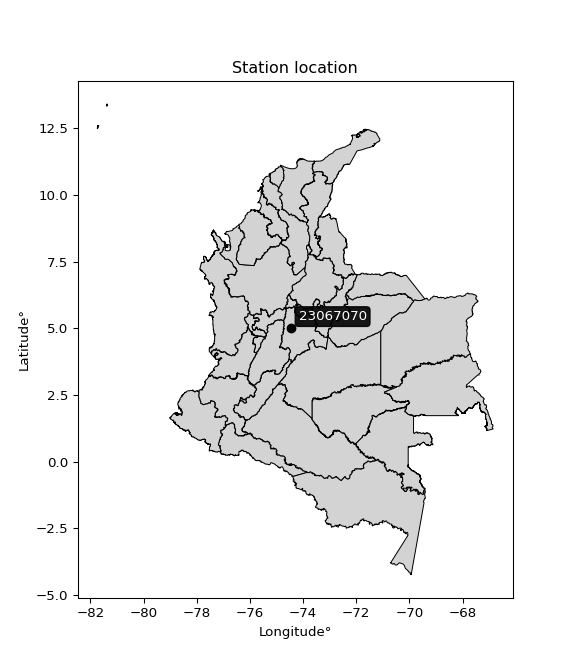

<div align="center">


</div>

# PMax24h Station (Rain, Pmax24h): 23067070

Maximum Precipitation in 24 hours (PMax24h) is the greatest amount of rainfall for a specific duration that is meteorologically possible for a given location, acting as a "worst-case" scenario for extreme storms, crucial for designing safety-critical infrastructure like bridges, river deviations, dams, spillways, and nuclear plants to prevent catastrophic failure. The PMax24h is related with the Probable Maximum Precipitation (PMP) and it is calculated by hydrologists using meteorological data to determine the upper limit of extreme rainfall, often leading to the Probable Maximum Flood (PMF) for flood control design, and is increasingly being studied for climate change impacts. Probable Maximum Precipitation (PMP) is the theoretical upper limit of rainfall, a deterministic estimate for extreme events, while probability distributions (like GEV, Gumbel) describe the likelihood and frequency of various precipitation amounts, including rare ones, showing how often events occur, with PMP representing the extreme end of these distributions, used for critical infrastructure design to ensure safety against the worst conceivable weather, unlike standard statistical forecasts which cover typical probabilities.

The most common probability distributions in hydrology, used for analyzing floods, rainfall, and streamflow, include the Normal, Log-Normal, Gumbel, Gamma (including Log-Pearson Type III), and Generalized Extreme Value (GEV) distributions, often chosen based on the data´s skewness and whether modeling extremes or general conditions, with Gumbel and GEV popular for extreme events like floods, while the Normal distribution serves as a baseline, though often requiring transformations for skewed hydrological data. These distributions help in designing water infrastructure, managing water resources, and forecasting hydrologic events.

> Hydrological data often isn´t perfectly normal (it´s skewed), so different distributions are needed for different applications, such as: **Flood Frequency Analysis**: Using Gumbel, GEV, or Log-Pearson Type III for predicting extreme flood magnitudes and their return periods, **Rainfall Analysis**: Normal for annual totals, but Log-Normal, Weibull, or GEV for intensity or extreme daily rainfall, **Streamflow Modeling**: Gamma and Log-Normal for maximum flows, GEV for minimum flows, and Kappa for daily flows.

<div align="center">

</img>

</div>


## A. General information


### 1. General running parameters

• app_version: _v20260225_. • runtime: _2026-02-27 14:50:08.749431_. • Python version: _3.14.0_. • SciPy version: _1.16.3_. • Pandas version: _2.3.3_. • NumPy version: _2.3.5_. • Stations dataset (station_dataset_file): _dataset/pmax24h_in/automatic_colombia_2003_2025.csv_. • Stations catalog (station_catalog_file): _dataset/CNE.xls_. • Minimum year to eval til year_max (date_min): _1900_. • Maximum year to eval since year_min (date_max): _2025_. • Creates, save and include plots into reports (create_plot): _False_. • Plot only fit distributions with Δo > Δ (plot_only_fit): _True_. • Plot only simple graphs avoiding multiple CDFs and multiple Extreme values plots (plot_only_simple): _False_. • Eval low extreme values, if False, evaluates high extreme values (low_extreme): _False_. • Eval every SciPy distribution as logarithmic (pdist_logarithmic_on): _True_. • Standard deviation normalized (ddof): _1.0_. • Return periods to eval in years (Tr): _[2, 2.33, 5, 10, 15, 20, 25, 50, 75, 100, 200, 250, 500, 750, 1000]_. • Minimum data sample per station, 0 means any (minimum_sample): _5_. • Z-Score maximum threshold to adjust a value, 0 means disable (zscore_max): _3.5_. • Z-Score minimum threshold to adjust a value, 0 means disable (zscore_min): _-2.5_. • Avoid zeros, e.g. rain = 0 (avoid_zeros): _True_. • Avoid null values (avoid_nans): _True_. 

:file_folder:Table: [dataset.csv](../../dataset/pmax24h_in/automatic_colombia_2003_2025.csv)

> Delta Degrees of Freedom (DDOF): is a parameter used in the formulas for calculating variance and standard deviation. When ddof=0, the divisor is $N$ (the total number of observations) and this is used when your data set is the entire population. When ddof=1, the divisor is $N-1$ and this is used when your data set is a sample drawn from a larger population. Using $N-1$ provides an unbiased estimate of the population variance (known as Bessel´s correction).


### 2. Station info and location

|   id |   CODIGO | NOMBRE             | CATEGORIA    | TECNOLOGIA                              | ESTADO   | FECHA_INSTALACION   |   FECHA_SUSPENSION |   ALTITUD |   LATITUD |   LONGITUD | DEPARTAMENTO   | MUNICIPIO   | AREA_OPERATIVA                            | ENTIDAD                                                     | AREA_HIDROGRAFICA   | ZONA_HIDROGRAFICA   | SUBZONA_HIDROGRAFICA   | CORRIENTE   | Catalogo   |   Version |
|-----:|---------:|:-------------------|:-------------|:----------------------------------------|:---------|:--------------------|-------------------:|----------:|----------:|-----------:|:---------------|:------------|:------------------------------------------|:------------------------------------------------------------|:--------------------|:--------------------|:-----------------------|:------------|:-----------|----------:|
|    0 | 23067070 | VILLETA [23067070] | Limnigráfica | Automática con Telemetría, Convencional | Activa   | 15/08/1974          |                nan |       878 |   5.00566 |   -74.4715 | Cundinamarca   | Villeta     | Area Operativa 11 - Cundinamarca-Amazonas | INSTITUTO DE HIDROLOGIA METEOROLOGIA Y ESTUDIOS AMBIENTALES | Magdalena Cauca     | Medio Magdalena     | Río Negro              | Villeta     | CNE_IDEAM  |  20251226 |

<div align="center">

Dynamic map: [:earth_americas:Google](http://maps.google.com/maps?q=5.005664,-74.471465) [:earth_americas:OSM](https://www.openstreetmap.org/#map=18/5.005664/-74.471465&layers=P) [:earth_americas:Bing](https://www.bing.com/maps?cp=5.005664~-74.471465&lvl=18) [:earth_americas:Apple](https://maps.apple.com/frame?center=5.005664%2C-74.471465&span=0.003%2C0.006)

</div>


<div align="center">

```geojson
{
  "type": "Feature",
  "geometry": {
    "type": "Point", 
    "coordinates": [-74.471465, 5.005664]
  }, 
  "properties": {
    "Name": "23067070"
  }
}
```

</div>


### 3. Discrete values table and plot

<div align="center">

|               |           0 |          1 |           2 |           3 |          4 |         5 |           6 |
|:--------------|------------:|-----------:|------------:|------------:|-----------:|----------:|------------:|
| Date          | 2019        | 2020       | 2021        | 2022        | 2023       | 2024      | 2025        |
| Value         |   64.2      |   78.8     |   53.6      |   46        |   33       |   10.8    |   64.2      |
| Value_initial |   64.2      |   78.8     |   53.6      |   46        |   33       |   10.8    |   64.2      |
| count         |    7        |    7       |    7        |    7        |    7       |    7      |    7        |
| mean          |   50.0857   |   50.0857  |   50.0857   |   50.0857   |   50.0857  |   50.0857 |   50.0857   |
| std           |   22.6836   |   22.6836  |   22.6836   |   22.6836   |   22.6836  |   22.6836 |   22.6836   |
| zscore        |    0.622225 |    1.26586 |    0.154926 |   -0.180118 |   -0.75322 |   -1.7319 |    0.622225 |


</div>


> The initial value (value_initial) correspond to the initial obtained or null completed value, and value (value) is adjusted only when the initial value is outside the valid range (outlier) definite through the Z-Score value. If Z-Score is active, values out of range or outliers are replaced with the station mean value. A Z-Score (or standard score) measures how many standard deviations a data point is from the mean of a dataset, indicating its relative position; positive scores mean above the mean, negative mean below, and a score of zero is exactly at the mean, allowing for comparison of values from different distributions. It´s calculated using the formula $z=(x–μ)/σ$, where $x$ is the data point, $μ$ is the mean, and $σ$ is the standard deviation, helping identify outliers and understand probability.
>
> <sub>**Note**: In this study, "completing" (filling gaps in) and "extending" (forecasting or lengthening the historical record) rainfall data series are avoided for certain critical analyses because they introduce artificial bias and uncertainty, which can distort the statistics of rare events (extremes), alter day-to-day variability, and compromise the integrity and homogeneity of the original data. Some reasons against Completing/Extending rainfall data are: **Distortion of Extremes and Variability**: The primary issue is that most gap-filling or extension methods rely on averaging or regression with nearby stations, which inherently smooths the data. Rainfall is highly variable in space and time, with a large percentage of zero values and occasional large storms. Infilling methods often underestimate the highest values and overestimate the lowest (zero) values, which severely distorts analyses focused on flood frequency, drought severity, and intensity-duration-frequency (IDF) curves, **Loss of Data Homogeneity**: Infilled or extended data are synthetic estimates, not actual measurements. Combining these estimates with observed data can violate the assumption of data homogeneity, which requires that the data properties do not change over time. Inhomogeneity can lead to incorrect conclusions about long-term trends or changes in climate patterns, **Propagation of Errors**: Errors and biases from the original data (e.g., wind-induced undercatch, instrument errors, site changes) or the data used for imputation can propagate through the analysis, leading to unreliable hydrological models and inaccurate predictions, **Compromised Statistical Integrity**: For statistical analyses, especially those involving the frequency of events, using artificial data can introduce time bias or autocorrelation that doesn´t exist in reality, making it difficult to assess the true probability of events, **Difficulty in Validation**: It is difficult to accurately validate the quality of filled or extended data, especially for past periods where ground-truth measurements are unavailable. The reliability of imputation techniques heavily depends on the density of the surrounding station network and the complexity of the local topography.</sub>


### 4. Active continuous probability distributions from SciPy (80 of 104 available)

A Probability Density Function (PDF) describes the relative likelihood of a continuous random variable falling within a specific range, where the total area under its curve equals 1, and the area over any interval gives the actual probability for that range. Unlike discrete probabilities (like rolling a die), a PDF shows density, not direct probability for a single point (which is zero), with higher points indicating higher likelihood, often visualized as a bell curve for normal distributions.

A log of a probability density function (log-PDF) is simply the logarithm of the PDF´s value, denoted as $log(f(x))$, useful for converting multiplication of probabilities into addition, improving numerical stability with tiny numbers, and connecting to information theory concepts like entropy. Instead of dealing with very small probabilities (e.g., 0.000001), log-PDFs use negative numbers (e.g., $log(0.00001) ≈ -11.51$ that are easier for computers to handle, preventing underflow errors and simplifying complex calculations. In this study, each active probability distribution from SciPy is also evaluated in the $log$ form.

[scipy.stats](https://docs.scipy.org/doc/scipy/reference/stats.html) is a Python´s powerful submodule within the SciPy library for comprehensive statistical analysis, offering over 130 probability distributions (like Normal, Poisson, etc.), functions for descriptive stats (mean, variance), hypothesis testing (t-tests, chi-square), random variable generation, and statistical tests, making it essential for data science, modeling, and research. It provides tools to explore, model, and draw conclusions from data efficiently, working seamlessly with [NumPy](https://numpy.org/).

<div align="center">

|   id | p_dist           |   n_parameter | fit_method   | label                                                                       | active   | ref                                                                                                      |
|-----:|:-----------------|--------------:|:-------------|:----------------------------------------------------------------------------|:---------|:---------------------------------------------------------------------------------------------------------|
|    0 | alpha            |             3 | MLE          | Alpha                                                                       | True     | [:mortar_board:](https://docs.scipy.org/doc/scipy/reference/generated/scipy.stats.alpha.html)            |
|    1 | anglit           |             2 | MM           | Anglit                                                                      | True     | [:mortar_board:](https://docs.scipy.org/doc/scipy/reference/generated/scipy.stats.anglit.html)           |
|    2 | arcsine          |             2 | MM           | Arcsine                                                                     | True     | [:mortar_board:](https://docs.scipy.org/doc/scipy/reference/generated/scipy.stats.arcsine.html)          |
|    3 | argus            |             3 | MLE          | Argus                                                                       | True     | [:mortar_board:](https://docs.scipy.org/doc/scipy/reference/generated/scipy.stats.argus.html)            |
|    4 | beta             |             4 | MLE          | Beta                                                                        | True     | [:mortar_board:](https://docs.scipy.org/doc/scipy/reference/generated/scipy.stats.beta.html)             |
|    5 | betaprime        |             4 | MLE          | Beta prime                                                                  | True     | [:mortar_board:](https://docs.scipy.org/doc/scipy/reference/generated/scipy.stats.betaprime.html)        |
|    6 | bradford         |             3 | MLE          | Bradford                                                                    | True     | [:mortar_board:](https://docs.scipy.org/doc/scipy/reference/generated/scipy.stats.bradford.html)         |
|    7 | burr             |             4 | MLE          | Burr (Type III)                                                             | True     | [:mortar_board:](https://docs.scipy.org/doc/scipy/reference/generated/scipy.stats.burr.html)             |
|    8 | burr12           |             4 | MLE          | Burr (Type III) 12                                                          | True     | [:mortar_board:](https://docs.scipy.org/doc/scipy/reference/generated/scipy.stats.burr12.html)           |
|    9 | cosine           |             2 | MLE          | Cosine                                                                      | True     | [:mortar_board:](https://docs.scipy.org/doc/scipy/reference/generated/scipy.stats.cosine.html)           |
|   10 | crystalball      |             4 | MLE          | Crystalball                                                                 | True     | [:mortar_board:](https://docs.scipy.org/doc/scipy/reference/generated/scipy.stats.crystalball.html)      |
|   11 | dgamma           |             3 | MLE          | Double gamma                                                                | True     | [:mortar_board:](https://docs.scipy.org/doc/scipy/reference/generated/scipy.stats.dgamma.html)           |
|   12 | dweibull         |             3 | MLE          | Double Weibull                                                              | True     | [:mortar_board:](https://docs.scipy.org/doc/scipy/reference/generated/scipy.stats.dweibull.html)         |
|   13 | erlang           |             3 | MLE          | Erlang                                                                      | True     | [:mortar_board:](https://docs.scipy.org/doc/scipy/reference/generated/scipy.stats.erlang.html)           |
|   14 | exponnorm        |             3 | MLE          | Exponentially modified Normal                                               | True     | [:mortar_board:](https://docs.scipy.org/doc/scipy/reference/generated/scipy.stats.exponnorm.html)        |
|   15 | exponpow         |             3 | MLE          | Exponential power                                                           | True     | [:mortar_board:](https://docs.scipy.org/doc/scipy/reference/generated/scipy.stats.exponpow.html)         |
|   16 | exponweib        |             4 | MLE          | Exponentiated Weibull                                                       | True     | [:mortar_board:](https://docs.scipy.org/doc/scipy/reference/generated/scipy.stats.exponweib.html)        |
|   17 | f                |             4 | MLE          | F                                                                           | True     | [:mortar_board:](https://docs.scipy.org/doc/scipy/reference/generated/scipy.stats.f.html)                |
|   18 | fatiguelife      |             3 | MLE          | Fatigue-life (Birnbaum-Saunders)                                            | True     | [:mortar_board:](https://docs.scipy.org/doc/scipy/reference/generated/scipy.stats.fatiguelife.html)      |
|   19 | foldnorm         |             3 | MM           | Fold Normal                                                                 | True     | [:mortar_board:](https://docs.scipy.org/doc/scipy/reference/generated/scipy.stats.foldnorm.html)         |
|   20 | gamma            |             3 | MLE          | Gamma                                                                       | True     | [:mortar_board:](https://docs.scipy.org/doc/scipy/reference/generated/scipy.stats.gamma.html)            |
|   21 | gausshyper       |             6 | MLE          | Gauss hypergeometric                                                        | True     | [:mortar_board:](https://docs.scipy.org/doc/scipy/reference/generated/scipy.stats.gausshyper.html)       |
|   22 | genexpon         |             5 | MLE          | Generalized exponential                                                     | True     | [:mortar_board:](https://docs.scipy.org/doc/scipy/reference/generated/scipy.stats.genexpon.html)         |
|   23 | genextreme       |             3 | MLE          | Generalized exponential                                                     | True     | [:mortar_board:](https://docs.scipy.org/doc/scipy/reference/generated/scipy.stats.genextreme.html)       |
|   24 | gengamma         |             4 | MLE          | Generalized gamma                                                           | True     | [:mortar_board:](https://docs.scipy.org/doc/scipy/reference/generated/scipy.stats.gengamma.html)         |
|   25 | genhalflogistic  |             3 | MLE          | Generalized half-logistic                                                   | True     | [:mortar_board:](https://docs.scipy.org/doc/scipy/reference/generated/scipy.stats.genhalflogistic.html)  |
|   26 | genlogistic      |             3 | MLE          | Generalized logistic                                                        | True     | [:mortar_board:](https://docs.scipy.org/doc/scipy/reference/generated/scipy.stats.genlogistic.html)      |
|   27 | gennorm          |             3 | MLE          | Generalized Normal                                                          | True     | [:mortar_board:](https://docs.scipy.org/doc/scipy/reference/generated/scipy.stats.gennorm.html)          |
|   28 | genpareto        |             3 | MLE          | Generalized Pareto                                                          | True     | [:mortar_board:](https://docs.scipy.org/doc/scipy/reference/generated/scipy.stats.genpareto.html)        |
|   29 | gompertz         |             3 | MLE          | Gompertz (or truncated Gumbel)                                              | True     | [:mortar_board:](https://docs.scipy.org/doc/scipy/reference/generated/scipy.stats.gompertz.html)         |
|   30 | gumbel_l         |             2 | MM           | Gumbel Left Skew                                                            | True     | [:mortar_board:](https://docs.scipy.org/doc/scipy/reference/generated/scipy.stats.gumbel_l.html)         |
|   31 | gumbel_r         |             2 | MM           | Gumbel Right Skew                                                           | True     | [:mortar_board:](https://docs.scipy.org/doc/scipy/reference/generated/scipy.stats.gumbel_r.html)         |
|   32 | halfgennorm      |             3 | MLE          | Upper half of a generalized normal                                          | True     | [:mortar_board:](https://docs.scipy.org/doc/scipy/reference/generated/scipy.stats.halfgennorm.html)      |
|   33 | halflogistic     |             2 | MM           | Half-logistic                                                               | True     | [:mortar_board:](https://docs.scipy.org/doc/scipy/reference/generated/scipy.stats.halflogistic.html)     |
|   34 | halfnorm         |             2 | MM           | Half Normal                                                                 | True     | [:mortar_board:](https://docs.scipy.org/doc/scipy/reference/generated/scipy.stats.halfnorm.html)         |
|   35 | hypsecant        |             2 | MM           | hyperbolic secant                                                           | True     | [:mortar_board:](https://docs.scipy.org/doc/scipy/reference/generated/scipy.stats.hypsecant.html)        |
|   36 | invgamma         |             3 | MLE          | Inverted gamma                                                              | True     | [:mortar_board:](https://docs.scipy.org/doc/scipy/reference/generated/scipy.stats.invgamma.html)         |
|   37 | invgauss         |             3 | MLE          | Inverse Gaussian                                                            | True     | [:mortar_board:](https://docs.scipy.org/doc/scipy/reference/generated/scipy.stats.invgauss.html)         |
|   38 | invweibull       |             3 | MLE          | Inverted Weibull                                                            | True     | [:mortar_board:](https://docs.scipy.org/doc/scipy/reference/generated/scipy.stats.invweibull.html)       |
|   39 | johnsonsb        |             4 | MLE          | Johnson SB                                                                  | True     | [:mortar_board:](https://docs.scipy.org/doc/scipy/reference/generated/scipy.stats.johnsonsb.html)        |
|   40 | johnsonsu        |             4 | MLE          | Johnson Su                                                                  | True     | [:mortar_board:](https://docs.scipy.org/doc/scipy/reference/generated/scipy.stats.johnsonsu.html)        |
|   41 | kappa3           |             3 | MLE          | Kappa 3                                                                     | True     | [:mortar_board:](https://docs.scipy.org/doc/scipy/reference/generated/scipy.stats.kappa3.html)           |
|   42 | kappa4           |             4 | MLE          | Kappa 4                                                                     | True     | [:mortar_board:](https://docs.scipy.org/doc/scipy/reference/generated/scipy.stats.kappa4.html)           |
|   43 | ksone            |             3 | MLE          | Kolmogorov-Smirnov one-sided test statistic distribution                    | True     | [:mortar_board:](https://docs.scipy.org/doc/scipy/reference/generated/scipy.stats.ksone.html)            |
|   44 | kstwobign        |             2 | MLE          | Limiting distribution of scaled Kolmogorov-Smirnov two-sided test statistic | True     | [:mortar_board:](https://docs.scipy.org/doc/scipy/reference/generated/scipy.stats.kstwobign.html)        |
|   45 | laplace          |             2 | MM           | Laplace                                                                     | True     | [:mortar_board:](https://docs.scipy.org/doc/scipy/reference/generated/scipy.stats.laplace.html)          |
|   46 | levy_l           |             2 | MLE          | Left-skewed Levy                                                            | True     | [:mortar_board:](https://docs.scipy.org/doc/scipy/reference/generated/scipy.stats.levy_l.html)           |
|   47 | loggamma         |             3 | MLE          | Log gamma                                                                   | True     | [:mortar_board:](https://docs.scipy.org/doc/scipy/reference/generated/scipy.stats.loggamma.html)         |
|   48 | logistic         |             2 | MM           | Logistic (or Sech-squared)                                                  | True     | [:mortar_board:](https://docs.scipy.org/doc/scipy/reference/generated/scipy.stats.logistic.html)         |
|   49 | loglaplace       |             3 | MLE          | Log-Laplace                                                                 | True     | [:mortar_board:](https://docs.scipy.org/doc/scipy/reference/generated/scipy.stats.loglaplace.html)       |
|   50 | lomax            |             3 | MLE          | Lomax (Pareto of the second kind)                                           | True     | [:mortar_board:](https://docs.scipy.org/doc/scipy/reference/generated/scipy.stats.lomax.html)            |
|   51 | maxwell          |             2 | MM           | Maxwell                                                                     | True     | [:mortar_board:](https://docs.scipy.org/doc/scipy/reference/generated/scipy.stats.maxwell.html)          |
|   52 | mielke           |             4 | MLE          | Mielke Beta-Kappa / Dagum                                                   | True     | [:mortar_board:](https://docs.scipy.org/doc/scipy/reference/generated/scipy.stats.mielke.html)           |
|   53 | moyal            |             2 | MM           | Moyal                                                                       | True     | [:mortar_board:](https://docs.scipy.org/doc/scipy/reference/generated/scipy.stats.moyal.html)            |
|   54 | nakagami         |             3 | MLE          | Nakagami                                                                    | True     | [:mortar_board:](https://docs.scipy.org/doc/scipy/reference/generated/scipy.stats.nakagami.html)         |
|   55 | ncf              |             5 | MLE          | Non-central F distribution                                                  | True     | [:mortar_board:](https://docs.scipy.org/doc/scipy/reference/generated/scipy.stats.ncf.html)              |
|   56 | nct              |             4 | MLE          | Non-central Student’s t                                                     | True     | [:mortar_board:](https://docs.scipy.org/doc/scipy/reference/generated/scipy.stats.nct.html)              |
|   57 | norm             |             2 | MM           | Normal                                                                      | True     | [:mortar_board:](https://docs.scipy.org/doc/scipy/reference/generated/scipy.stats.norm.html)             |
|   58 | pearson3         |             3 | MM           | Pearson type III                                                            | True     | [:mortar_board:](https://docs.scipy.org/doc/scipy/reference/generated/scipy.stats.pearson3.html)         |
|   59 | powerlaw         |             3 | MLE          | Power-function                                                              | True     | [:mortar_board:](https://docs.scipy.org/doc/scipy/reference/generated/scipy.stats.powerlaw.html)         |
|   60 | rayleigh         |             2 | MM           | Rayleigh                                                                    | True     | [:mortar_board:](https://docs.scipy.org/doc/scipy/reference/generated/scipy.stats.rayleigh.html)         |
|   61 | rdist            |             3 | MLE          | R-distributed (symmetric beta)                                              | True     | [:mortar_board:](https://docs.scipy.org/doc/scipy/reference/generated/scipy.stats.rdist.html)            |
|   62 | rice             |             3 | MLE          | Rice                                                                        | True     | [:mortar_board:](https://docs.scipy.org/doc/scipy/reference/generated/scipy.stats.rice.html)             |
|   63 | semicircular     |             2 | MM           | Semicircular                                                                | True     | [:mortar_board:](https://docs.scipy.org/doc/scipy/reference/generated/scipy.stats.semicircular.html)     |
|   64 | skewnorm         |             3 | MLE          | Skew normal                                                                 | True     | [:mortar_board:](https://docs.scipy.org/doc/scipy/reference/generated/scipy.stats.skewnorm.html)         |
|   65 | t                |             3 | MLE          | Student’s t                                                                 | True     | [:mortar_board:](https://docs.scipy.org/doc/scipy/reference/generated/scipy.stats.t.html)                |
|   66 | trapezoid        |             4 | MLE          | Trapezoid                                                                   | True     | [:mortar_board:](https://docs.scipy.org/doc/scipy/reference/generated/scipy.stats.trapezoid.html)        |
|   67 | triang           |             3 | MLE          | Triangular                                                                  | True     | [:mortar_board:](https://docs.scipy.org/doc/scipy/reference/generated/scipy.stats.triang.html)           |
|   68 | truncexpon       |             3 | MLE          | Truncated exponential                                                       | True     | [:mortar_board:](https://docs.scipy.org/doc/scipy/reference/generated/scipy.stats.truncexpon.html)       |
|   69 | truncnorm        |             4 | MLE          | Truncated normal                                                            | True     | [:mortar_board:](https://docs.scipy.org/doc/scipy/reference/generated/scipy.stats.truncnorm.html)        |
|   70 | truncpareto      |             4 | MLE          | Upper truncated Pareto                                                      | True     | [:mortar_board:](https://docs.scipy.org/doc/scipy/reference/generated/scipy.stats.truncpareto.html)      |
|   71 | truncweibull_min |             5 | MLE          | Doubly truncated Weibull minimum                                            | True     | [:mortar_board:](https://docs.scipy.org/doc/scipy/reference/generated/scipy.stats.truncweibull_min.html) |
|   72 | tukeylambda      |             3 | MLE          | Tukey-Lamdba                                                                | True     | [:mortar_board:](https://docs.scipy.org/doc/scipy/reference/generated/scipy.stats.tukeylambda.html)      |
|   73 | uniform          |             2 | MLE          | Uniform                                                                     | True     | [:mortar_board:](https://docs.scipy.org/doc/scipy/reference/generated/scipy.stats.uniform.html)          |
|   74 | vonmises         |             3 | MLE          | Von Mises                                                                   | True     | [:mortar_board:](https://docs.scipy.org/doc/scipy/reference/generated/scipy.stats.vonmises.html)         |
|   75 | vonmises_line    |             3 | MLE          | Von Mises line                                                              | True     | [:mortar_board:](https://docs.scipy.org/doc/scipy/reference/generated/scipy.stats.vonmises_line.html)    |
|   76 | wald             |             2 | MM           | Wald                                                                        | True     | [:mortar_board:](https://docs.scipy.org/doc/scipy/reference/generated/scipy.stats.wald.html)             |
|   77 | weibull_max      |             3 | MLE          | Weibull maximum                                                             | True     | [:mortar_board:](https://docs.scipy.org/doc/scipy/reference/generated/scipy.stats.weibull_max.html)      |
|   78 | weibull_min      |             3 | MLE          | Weibull minimum                                                             | True     | [:mortar_board:](https://docs.scipy.org/doc/scipy/reference/generated/scipy.stats.weibull_min.html)      |
|   79 | wrapcauchy       |             3 | MLE          | Wrapped  Cauchy                                                             | True     | [:mortar_board:](https://docs.scipy.org/doc/scipy/reference/generated/scipy.stats.wrapcauchy.html)       |

</div>

> **n_parameter:** # arguments & localization & scale.
>
> **Fit methods:** (MLE) maximum likelihood, (MM) L-moments.
>
>**Inactive** (With the only purpose of prevent loops, zero divisions, infinite values, over high estimated values or horizontal trending for recurrence intervals estimations, the follow distributions were disabled.)**:** lognorm, norminvgauss, powernorm, powerlognorm, cauchy, halfcauchy, foldcauchy, skewcauchy, chi2, expon, fisk, genhyperbolic, geninvgauss, gibrat, kstwo, laplace_asymmetric, levy, levy_stable, ncx2, pareto, rel_breitwigner, recipinvgauss, studentized_range, loguniform, 


## B. Probability (PDF) vs. Empirical (EDF) distributions functions

A continuous probability distribution (CPD) describes probabilities for variables that can take any value within a range (like rain any time), unlike discrete variables with specific outcomes (like temperature). It uses a Probability Density Function (PDF), a curve where the total area under it equals 1, and the probability of the variable falling within an interval (a to b) is found by calculating the area under the curve between those points. A key feature is that the probability of hitting any single exact value is zero, so probabilities are always expressed for ranges, e.g., $P(a ≤ X ≤ b)$.

<div align="center">

Distributions parameters from station values
|     |   station | p_dist              |   n |             loc |           scale | shape                  | shape1                | shape2                 | shape3             |
|----:|----------:|:--------------------|----:|----------------:|----------------:|:-----------------------|:----------------------|:-----------------------|:-------------------|
|   0 |  23067070 | alpha               |   7 |    -0.0664631   |    25.422       | 6.616190624852232e-10  |                       |                        |                    |
|   1 |  23067070 | anglit              |   7 |    50.0857      |    61.4361      |                        |                       |                        |                    |
|   2 |  23067070 | arcsine             |   7 |    20.3859      |    59.3995      |                        |                       |                        |                    |
|   3 |  23067070 | argus               |   7 |    -5.12046     |    86.7337      | 1.343416212885966      |                       |                        |                    |
|   4 |  23067070 | beta                |   7 |    -8.97201     |    87.772       | 2.4488163532973175     | 0.2990575185788379    |                        |                    |
|   5 |  23067070 | betaprime           |   7 |  -544.625       | 30031.3         | 792.2910318543072      | 40008.50738828897     |                        |                    |
|   6 |  23067070 | bradford            |   7 |    10.8         |    68.0001      | 1.017688957080734      |                       |                        |                    |
|   7 |  23067070 | burr                |   7 |    -8.38182     |    87.8339      | 466.50669508249274     | 0.004298185144456661  |                        |                    |
|   8 |  23067070 | burr12              |   7 |    -1.31138     |    11.9752      | 373.4555438561533      | 0.002024166716180523  |                        |                    |
|   9 |  23067070 | cosine              |   7 |    48.2407      |    17.7796      |                        |                       |                        |                    |
|  10 |  23067070 | crystalball         |   7 |    50.0857      |    21.0009      | 5904.760658156461      | 93.41247182063677     |                        |                    |
|  11 |  23067070 | dgamma              |   7 |    50.0716      |     9.59077     | 1.801265285368276      |                       |                        |                    |
|  12 |  23067070 | dweibull            |   7 |    49.8943      |    19.1171      | 1.4577585305052139     |                       |                        |                    |
|  13 |  23067070 | erlang              |   7 |  -293.71        |     1.3185      | 260.61476839498107     |                       |                        |                    |
|  14 |  23067070 | exponnorm           |   7 |    50.0675      |    21.0009      | 0.0008593101550622374  |                       |                        |                    |
|  15 |  23067070 | exponpow            |   7 |    10.8         |     6.45272     | 0.21013177051583126    |                       |                        |                    |
|  16 |  23067070 | exponweib           |   7 |    -5.30987e+08 |     5.30987e+08 | 18.63556583314506      | 8269509.401035946     |                        |                    |
|  17 |  23067070 | f                   |   7 | -5135.46        |  5185.49        | 134003.01127566685     | 1251287.3195232982    |                        |                    |
|  18 |  23067070 | fatiguelife         |   7 |    10.8         |     0.000149495 | 461.85649421726544     |                       |                        |                    |
|  19 |  23067070 | foldnorm            |   7 |    55.4549      |     0.16025     | 0.1884236653426148     |                       |                        |                    |
|  20 |  23067070 | gamma               |   7 |  -284.72        |     1.36652     | 244.87967365079123     |                       |                        |                    |
|  21 |  23067070 | gausshyper          |   7 |     4.93215     |    73.8679      | 1.2802154085827064     | 0.7447305175313894    | 0.9253546319854462     | 0.8330127747252636 |
|  22 |  23067070 | genexpon            |   7 |     3.61691     |     2.26536     | 2.565575566730241e-07  | 0.9320971181571502    | 0.004372580790269524   |                    |
|  23 |  23067070 | genextreme          |   7 |    47.6263      |    24.6771      | 0.7467218997638456     |                       |                        |                    |
|  24 |  23067070 | gengamma            |   7 |   -89.2273      |     2.54406     | 41.97489508455415      | 0.9341212803861179    |                        |                    |
|  25 |  23067070 | genhalflogistic     |   7 |    10.5641      |    69.8546      | 1.0237215028238644     |                       |                        |                    |
|  26 |  23067070 | genlogistic         |   7 |    69.1848      |     5.9575      | 0.2794461725443798     |                       |                        |                    |
|  27 |  23067070 | gennorm             |   7 |    44.8003      |    34.0129      | 22625.207990810246     |                       |                        |                    |
|  28 |  23067070 | genpareto           |   7 |    -0.161789    |   116.41        | -1.474254156806341     |                       |                        |                    |
|  29 |  23067070 | gompertz            |   7 |    10.6844      |    18.3001      | 0.06937017421091637    |                       |                        |                    |
|  30 |  23067070 | gumbel_l            |   7 |    59.5372      |    16.3743      |                        |                       |                        |                    |
|  31 |  23067070 | gumbel_r            |   7 |    40.6342      |    16.3743      |                        |                       |                        |                    |
|  32 |  23067070 | halfgennorm         |   7 |    10.8         |     0.467369    | 0.3055671970742051     |                       |                        |                    |
|  33 |  23067070 | halflogistic        |   7 |    25.1948      |    17.955       |                        |                       |                        |                    |
|  34 |  23067070 | halfnorm            |   7 |    22.2887      |    34.8383      |                        |                       |                        |                    |
|  35 |  23067070 | hypsecant           |   7 |    50.0857      |    13.3696      |                        |                       |                        |                    |
|  36 |  23067070 | invgamma            |   7 |  -219.874       | 41574           | 155.08924218536066     |                       |                        |                    |
|  37 |  23067070 | invgauss            |   7 |   -88.7552      |  4989.57        | 0.027740985852980567   |                       |                        |                    |
|  38 |  23067070 | invweibull          |   7 |    10.8         |     1.66004     | 0.08240981609049644    |                       |                        |                    |
|  39 |  23067070 | johnsonsb           |   7 |    10.7989      |    68.0011      | -0.23377098368941523   | 0.09594328488135366   |                        |                    |
|  40 |  23067070 | johnsonsu           |   7 |   105.032       |     3.15306     | 8.952873188793092      | 2.574208213070296     |                        |                    |
|  41 |  23067070 | kappa3              |   7 |    10.8         |    67.9627      | 3448.90690761278       |                       |                        |                    |
|  42 |  23067070 | kappa4              |   7 |     4.06776     |    75.943       | 1.0973181789898274     | 1.0095351008789015    |                        |                    |
|  43 |  23067070 | ksone               |   7 |     4           |    81.6         | 1.0                    |                       |                        |                    |
|  44 |  23067070 | kstwobign           |   7 |   -38.3165      |   101.008       |                        |                       |                        |                    |
|  45 |  23067070 | laplace             |   7 |    50.0857      |    14.8499      |                        |                       |                        |                    |
|  46 |  23067070 | levy_l              |   7 |    81.5006      |    11.9727      |                        |                       |                        |                    |
|  47 |  23067070 | loggamma            |   7 |    64.2685      |    14.6853      | 0.7996656617638687     |                       |                        |                    |
|  48 |  23067070 | logistic            |   7 |    50.0857      |    11.5784      |                        |                       |                        |                    |
|  49 |  23067070 | loglaplace          |   7 |    -0.201235    |    53.8012      | 2.3600777673520135     |                       |                        |                    |
|  50 |  23067070 | lomax               |   7 |    10.8         |     8.20667e+09 | 203208592.94698668     |                       |                        |                    |
|  51 |  23067070 | maxwell             |   7 |     0.322367    |    31.1846      |                        |                       |                        |                    |
|  52 |  23067070 | mielke              |   7 |    -4.63787     |    83.6797      | 1.868003490227811      | 1674.0641847229108    |                        |                    |
|  53 |  23067070 | moyal               |   7 |    38.076       |     9.45373     |                        |                       |                        |                    |
|  54 |  23067070 | nakagami            |   7 |    33           |    29.0712      | 0.25092465020428506    |                       |                        |                    |
|  55 |  23067070 | ncf                 |   7 |  -275.681       |   310.922       | 451.5710021611235      | 154811.68172309437    | 21.216495828772402     |                    |
|  56 |  23067070 | nct                 |   7 | -1472.73        |    20.9124      | 298121.4773534415      | 72.81875012174748     |                        |                    |
|  57 |  23067070 | norm                |   7 |    50.0857      |    21.0009      |                        |                       |                        |                    |
|  58 |  23067070 | pearson3            |   7 |    50.0857      |    21.001       | -0.5605866085792232    |                       |                        |                    |
|  59 |  23067070 | powerlaw            |   7 |    10.8         |    68           | 0.17111584104293884    |                       |                        |                    |
|  60 |  23067070 | rayleigh            |   7 |     9.90974     |    32.0558      |                        |                       |                        |                    |
|  61 |  23067070 | rdist               |   7 |     5.24915     |    40.7509      | 0.9994208721476155     |                       |                        |                    |
|  62 |  23067070 | rice                |   7 |    -2.45392     |    22.8505      | 2.0325677055070352     |                       |                        |                    |
|  63 |  23067070 | semicircular        |   7 |    50.0857      |    42.0018      |                        |                       |                        |                    |
|  64 |  23067070 | skewnorm            |   7 |    78.8         |    35.5768      | -11357286.256066032    |                       |                        |                    |
|  65 |  23067070 | t                   |   7 |    50.0859      |    21.0009      | 229385120.7682389      |                       |                        |                    |
|  66 |  23067070 | trapezoid           |   7 |    -9.77953     |    89.0993      | 1.0                    | 1.0                   |                        |                    |
|  67 |  23067070 | triang              |   7 |    -9.80908     |    88.6091      | 0.9999999890453699     |                       |                        |                    |
|  68 |  23067070 | truncexpon          |   7 |     4.74832     |   102.291       | 0.7239295108561504     |                       |                        |                    |
|  69 |  23067070 | truncnorm           |   7 |    50.0857      |    21.0009      | -151.50832664934944    | 790.3992098646634     |                        |                    |
|  70 |  23067070 | truncpareto         |   7 |    10.7586      |     0.0414423   | 0.16786696353821556    | 1641.8336347737863    |                        |                    |
|  71 |  23067070 | truncweibull_min    |   7 |     5.46414     |   134.04        | 1.4593661838639007     | 4.810953431199177e-07 | 0.5471175283968226     |                    |
|  72 |  23067070 | tukeylambda         |   7 |     2.10131     |    91.9267      | 1.1985435445791408     |                       |                        |                    |
|  73 |  23067070 | uniform             |   7 |    10.8         |    68           |                        |                       |                        |                    |
|  74 |  23067070 | vonmises            |   7 |     2.30299     |     1           | 1.0590895312393673     |                       |                        |                    |
|  75 |  23067070 | vonmises_line       |   7 |    43.5471      |    11.2214      | 1.4931152298325301e-05 |                       |                        |                    |
|  76 |  23067070 | wald                |   7 |    29.0847      |    21.001       |                        |                       |                        |                    |
|  77 |  23067070 | weibull_max         |   7 |    78.8         |     1.51275     | 0.33571640954789306    |                       |                        |                    |
|  78 |  23067070 | weibull_min         |   7 |  -644.284       |   704.005       | 41.152661592721316     |                       |                        |                    |
|  79 |  23067070 | wrapcauchy          |   7 |    10.7999      |    10.8225      | 0.04632529954529235    |                       |                        |                    |
|  80 |  23067070 | logalpha            |   7 |   -15.8722      |   572.8         | 29.227234837870043     |                       |                        |                    |
|  81 |  23067070 | loganglit           |   7 |     3.76817     |     1.82355     |                        |                       |                        |                    |
|  82 |  23067070 | logarcsine          |   7 |     2.8866      |     1.76313     |                        |                       |                        |                    |
|  83 |  23067070 | logargus            |   7 |     1.51959     |     2.89125     | 2.7179365462163103     |                       |                        |                    |
|  84 |  23067070 | logbeta             |   7 |     2.17848     |     2.18843     | 0.864117352576985      | 0.22504908686344022   |                        |                    |
|  85 |  23067070 | logbetaprime        |   7 |   -17.3727      |   168.588       | 1208.532037619063      | 9637.449680880301     |                        |                    |
|  86 |  23067070 | logbradford         |   7 |     2.3772      |     1.99507     | 9.870677150396315e-06  |                       |                        |                    |
|  87 |  23067070 | logburr             |   7 |    -2.47116e+07 |     2.47116e+07 | 2202877003.1219482     | 0.01806832604717475   |                        |                    |
|  88 |  23067070 | logburr12           |   7 |  -989.421       |   998.303       | 2647.3827428185014     | 397547.99019196467    |                        |                    |
|  89 |  23067070 | logcosine           |   7 |     3.6413      |     0.558293    |                        |                       |                        |                    |
|  90 |  23067070 | logcrystalball      |   7 |     3.76818     |     0.623352    | 9.63542411230399       | 2.218282669084785     |                        |                    |
|  91 |  23067070 | logdgamma           |   7 |     3.98155     |     0.501607    | 0.8248578577823059     |                       |                        |                    |
|  92 |  23067070 | logdweibull         |   7 |     3.98155     |     0.451795    | 0.9844577549687007     |                       |                        |                    |
|  93 |  23067070 | logerlang           |   7 |    -7.53865     |     0.0386031   | 292.6125600248779      |                       |                        |                    |
|  94 |  23067070 | logexponnorm        |   7 |     3.76775     |     0.62335     | 0.000667737472336674   |                       |                        |                    |
|  95 |  23067070 | logexponpow         |   7 |     2.37955     |     1.35522     | 0.6298473663545883     |                       |                        |                    |
|  96 |  23067070 | logexponweib        |   7 |     2.37955     |     1.44654     | 0.49249974232176374    | 1.1255615372305767    |                        |                    |
|  97 |  23067070 | logf                |   7 |  -769.884       |   773.651       | 49681729.74854185      | 3239709.3659181725    |                        |                    |
|  98 |  23067070 | logfatiguelife      |   7 |  -418.298       |   422.064       | 0.0014709656349977617  |                       |                        |                    |
|  99 |  23067070 | logfoldnorm         |   7 |     0.227836    |     0.58883     | 6.01860562287599       |                       |                        |                    |
| 100 |  23067070 | loggamma            |   7 |    -7.69764     |     0.0371614   | 308.2901462854734      |                       |                        |                    |
| 101 |  23067070 | loggausshyper       |   7 |     2.1018      |     2.26512     | 1.2966699898801903     | 0.49027835518447915   | 1.0034816629152175     | 0.2618879080417438 |
| 102 |  23067070 | loggenexpon         |   7 |     2.37897     |     0.0060832   | 0.001329894710987069   | 1.0059904793388568    | 2.1949797375336843e-05 |                    |
| 103 |  23067070 | loggenextreme       |   7 |     3.76658     |     0.668473    | 1.113509667733633      |                       |                        |                    |
| 104 |  23067070 | loggengamma         |   7 |     2.37955     |     1.75139     | 0.21551525354598253    | 1.1932986634070124    |                        |                    |
| 105 |  23067070 | loggenhalflogistic  |   7 |     2.37597     |     2.10231     | 1.0559382376560102     |                       |                        |                    |
| 106 |  23067070 | loggenlogistic      |   7 |     4.36695     |     2.98888e-06 | 4.973550523421959e-06  |                       |                        |                    |
| 107 |  23067070 | loggennorm          |   7 |     3.98155     |     0.00247459  | 0.2847643785459855     |                       |                        |                    |
| 108 |  23067070 | loggenpareto        |   7 |    -0.0052711   |    12.3357      | -2.8214155647153074    |                       |                        |                    |
| 109 |  23067070 | loggompertz         |   7 |     2.30259     |     0.406719    | 0.014858897360385814   |                       |                        |                    |
| 110 |  23067070 | loggumbel_l         |   7 |     4.04871     |     0.486025    |                        |                       |                        |                    |
| 111 |  23067070 | loggumbel_r         |   7 |     3.48763     |     0.486025    |                        |                       |                        |                    |
| 112 |  23067070 | loghalfgennorm      |   7 |     2.37918     |     1.98875     | 14168.84138357763      |                       |                        |                    |
| 113 |  23067070 | loghalflogistic     |   7 |     3.02937     |     0.532931    |                        |                       |                        |                    |
| 114 |  23067070 | loghalfnorm         |   7 |     2.94317     |     1.03399     |                        |                       |                        |                    |
| 115 |  23067070 | loghypsecant        |   7 |     3.76817     |     0.396838    |                        |                       |                        |                    |
| 116 |  23067070 | loginvgamma         |   7 |   -12.9643      | 11037.6         | 660.5160906689443      |                       |                        |                    |
| 117 |  23067070 | loginvgauss         |   7 |    -3.56255     |   825.415       | 0.008851345408106621   |                       |                        |                    |
| 118 |  23067070 | loginvweibull       |   7 |    -1.11803e+08 |     1.11803e+08 | 147322998.68461013     |                       |                        |                    |
| 119 |  23067070 | logjohnsonsb        |   7 |     2.37955     |     1.98737     | 1.0422906861163281     | 0.15336389240226134   |                        |                    |
| 120 |  23067070 | logjohnsonsu        |   7 |     4.44671     |     0.00252663  | 6.140693415711976      | 1.0457423348520454    |                        |                    |
| 121 |  23067070 | logkappa3           |   7 |     2.37955     |     1.96972     | 217.55111717329112     |                       |                        |                    |
| 122 |  23067070 | logkappa4           |   7 |     2.24142     |     2.26184     | 1.020335653917129      | 1.0641486273624547    |                        |                    |
| 123 |  23067070 | logksone            |   7 |     2.18081     |     2.38484     | 1.0                    |                       |                        |                    |
| 124 |  23067070 | logkstwobign        |   7 |     0.73357     |     3.47065     |                        |                       |                        |                    |
| 125 |  23067070 | loglaplace          |   7 |     3.76817     |     0.440776    |                        |                       |                        |                    |
| 126 |  23067070 | loglevy_l           |   7 |     4.40958     |     0.188386    |                        |                       |                        |                    |
| 127 |  23067070 | logloggamma         |   7 |     4.36692     |     4.8888e-07  | 8.157838369240614e-07  |                       |                        |                    |
| 128 |  23067070 | loglogistic         |   7 |     3.76817     |     0.343671    |                        |                       |                        |                    |
| 129 |  23067070 | logloglaplace       |   7 |    -0.0829288   |     4.06448     | 8.296713220139324      |                       |                        |                    |
| 130 |  23067070 | loglomax            |   7 |     2.37955     |    49.4715      | 35.59050211634323      |                       |                        |                    |
| 131 |  23067070 | logmaxwell          |   7 |     2.29109     |     0.925623    |                        |                       |                        |                    |
| 132 |  23067070 | logmielke           |   7 |    -1.65979e+07 |     1.65979e+07 | 27274744.135549925     | 21250446659.21202     |                        |                    |
| 133 |  23067070 | logmoyal            |   7 |     3.41169     |     0.280607    |                        |                       |                        |                    |
| 134 |  23067070 | lognakagami         |   7 |     3.49651     |     0.79114     | 0.07285867809805868    |                       |                        |                    |
| 135 |  23067070 | logncf              |   7 |    -9.33958     |    13.0958      | 1243.8267589699153     | 1810.7155507516654    | 0.263288941645797      |                    |
| 136 |  23067070 | lognct              |   7 |   -32.7275      |     0.593065    | 15823.208351002568     | 61.53240581485683     |                        |                    |
| 137 |  23067070 | lognorm             |   7 |     3.76817     |     0.623351    |                        |                       |                        |                    |
| 138 |  23067070 | logpearson3         |   7 |     3.76817     |     0.623353    | -1.3866032410480955    |                       |                        |                    |
| 139 |  23067070 | logpowerlaw         |   7 |     2.37955     |     1.98737     | 0.18735323874957258    |                       |                        |                    |
| 140 |  23067070 | lograyleigh         |   7 |     2.57571     |     0.951445    |                        |                       |                        |                    |
| 141 |  23067070 | logrdist            |   7 |     3.23882     |     1.1281      | 1.039457740116704      |                       |                        |                    |
| 142 |  23067070 | logrice             |   7 | -1096.88        |     0.623764    | 1764.5273289322513     |                       |                        |                    |
| 143 |  23067070 | logsemicircular     |   7 |     3.76816     |     1.24671     |                        |                       |                        |                    |
| 144 |  23067070 | logskewnorm         |   7 |     4.36691     |     0.86438     | -13315551.109745644    |                       |                        |                    |
| 145 |  23067070 | logt                |   7 |     4.0274      |     0.266636    | 1.4888226092966566     |                       |                        |                    |
| 146 |  23067070 | logtrapezoid        |   7 |     2.00506     |     2.64465     | 1.0                    | 1.0                   |                        |                    |
| 147 |  23067070 | logtriang           |   7 |     2.03725     |     2.3315      | 0.9992123418131251     |                       |                        |                    |
| 148 |  23067070 | logtruncexpon       |   7 |     2.3787      |     3.15835     | 0.629507900119427      |                       |                        |                    |
| 149 |  23067070 | logtruncnorm        |   7 |    -0.150841    |     1.51886     | 2.401371267147691      | 3.006918599220581     |                        |                    |
| 150 |  23067070 | logtruncpareto      |   7 |     2.37802     |     0.00152516  | 0.16780387386495793    | 1304.0508013237534    |                        |                    |
| 151 |  23067070 | logtruncweibull_min |   7 |     2.37576     |     2.56369     | 0.9607231306208434     | 0.0014784292991864988 | 0.7766751845802911     |                    |
| 152 |  23067070 | logtukeylambda      |   7 |     3.37329     |     1.02513     | 1.031586341315766      |                       |                        |                    |
| 153 |  23067070 | loguniform          |   7 |     2.37955     |     1.98737     |                        |                       |                        |                    |
| 154 |  23067070 | logvonmises         |   7 |    -2.45442     |     1           | 3.285833901003454      |                       |                        |                    |
| 155 |  23067070 | logvonmises_line    |   7 |     3.9137      |     0.488335    | 1.3919964777622522     |                       |                        |                    |
| 156 |  23067070 | logwald             |   7 |     3.14484     |     0.623324    |                        |                       |                        |                    |
| 157 |  23067070 | logweibull_max      |   7 |     4.36691     |     0.586616    | 0.9671060510177811     |                       |                        |                    |
| 158 |  23067070 | logweibull_min      |   7 |     2.37955     |     1.11308     | 0.9067084536278553     |                       |                        |                    |
| 159 |  23067070 | logwrapcauchy       |   7 |     2.37955     |     0.316299    | 0.5                    |                       |                        |                    |

</div>

> **loc** (Location parameter): This shifts the distribution along the x-axis. For many common distributions, like the normal (Gaussian) distribution, loc represents the mean $μ$. For others, like the uniform distribution, it might represent the minimum value, or for the beta distribution, the left end of the support interval.
>
> **scale** (Scale parameter): This determines the width or spread of the distribution. For the normal distribution, scale represents the standard deviation $σ$. For a uniform distribution, it defines the length of the interval (from $loc$ to $loc + scale$).
>
> **shape** (Shape parameters): Refers to parameters that define the specific form of a probability distribution, distinct from its location (loc) and scale (scale). These parameters are required arguments for most distribution functions. For example, a normal (Gaussian) distribution is fully defined by its location (mean) and scale (standard deviation), so it has no specific shape parameters beyond loc and scale. However, other distributions have intrinsic properties that need specification, as Gamma distribution that takes a shape parameter, often named $a$ or $alpha$.


### 0. Cumulative distribution values - CDF (160 evaluated)

Cumulative Distribution Function (CDF), denoted as $F$<sub>$X$</sub>$(x)$, is a function that gives the probability that a random variable $X$ will take a value less than or equal to a specific value, $x$ (i.e., $(P(X≥x)$. It essentially "accumulates" probabilities from a given point up to the far right (positive infinity), providing a complete picture of the distribution´s probabilities for both discrete (like rain) and continuous (like temperature) variables, helping to find probabilities over ranges or above certain values. Each station is evaluated separately ordering the $x$ values ascending, calculating the CDF and PDF values for the activated distributions and their logarithmic forms.

<div align="center">

CDF ordered by x ascending and calculating $log(f(x))$ separately
|   id |   Station |   date |    x |   count |    mean |     std |    zscore |   Value_initial |   station |   m |     alpha |   alpha_pdf |   anglit |   anglit_pdf |   arcsine |   arcsine_pdf |     argus |   argus_pdf |       beta |    beta_pdf |   betaprime |   betaprime_pdf |    bradford |   bradford_pdf |      burr |    burr_pdf |     burr12 |   burr12_pdf |    cosine |   cosine_pdf |   crystalball |   crystalball_pdf |    dgamma |   dgamma_pdf |   dweibull |   dweibull_pdf |    erlang |   erlang_pdf |   exponnorm |   exponnorm_pdf |    exponpow |   exponpow_pdf |   exponweib |   exponweib_pdf |         f |      f_pdf |   fatiguelife |   fatiguelife_pdf |   foldnorm |   foldnorm_pdf |     gamma |   gamma_pdf |   gausshyper |   gausshyper_pdf |   genexpon |   genexpon_pdf |   genextreme |   genextreme_pdf |   gengamma |   gengamma_pdf |   genhalflogistic |   genhalflogistic_pdf |   genlogistic |   genlogistic_pdf |     gennorm |   gennorm_pdf |   genpareto |   genpareto_pdf |    gompertz |   gompertz_pdf |   gumbel_l |   gumbel_l_pdf |   gumbel_r |   gumbel_r_pdf |   halfgennorm |   halfgennorm_pdf |   halflogistic |   halflogistic_pdf |   halfnorm |   halfnorm_pdf |   hypsecant |   hypsecant_pdf |   invgamma |   invgamma_pdf |   invgauss |   invgauss_pdf |   invweibull |   invweibull_pdf |   johnsonsb |   johnsonsb_pdf |   johnsonsu |   johnsonsu_pdf |      kappa3 |   kappa3_pdf |      kappa4 |   kappa4_pdf |     ksone |   ksone_pdf |   kstwobign |   kstwobign_pdf |   laplace |   laplace_pdf |   levy_l |   levy_l_pdf |   loggamma |   loggamma_pdf |   logistic |   logistic_pdf |   loglaplace |   loglaplace_pdf |       lomax |   lomax_pdf |   maxwell |   maxwell_pdf |    mielke |   mielke_pdf |       moyal |   moyal_pdf |    nakagami |    nakagami_pdf |       ncf |    ncf_pdf |       nct |    nct_pdf |      norm |   norm_pdf |   pearson3 |   pearson3_pdf |   powerlaw |   powerlaw_pdf |    rayleigh |   rayleigh_pdf |    rdist |       rdist_pdf |      rice |   rice_pdf |   semicircular |   semicircular_pdf |   skewnorm |   skewnorm_pdf |         t |      t_pdf |   trapezoid |   trapezoid_pdf |    triang |   triang_pdf |   truncexpon |   truncexpon_pdf |   truncnorm |   truncnorm_pdf |   truncpareto |   truncpareto_pdf |   truncweibull_min |   truncweibull_min_pdf |   tukeylambda |   tukeylambda_pdf |   uniform |   uniform_pdf |   vonmises |   vonmises_pdf |   vonmises_line |   vonmises_line_pdf |      wald |   wald_pdf |   weibull_max |   weibull_max_pdf |   weibull_min |   weibull_min_pdf |   wrapcauchy |   wrapcauchy_pdf |   logalpha |   logalpha_pdf |   loganglit |   loganglit_pdf |   logarcsine |   logarcsine_pdf |   logargus |   logargus_pdf |   logbeta |   logbeta_pdf |   logbetaprime |   logbetaprime_pdf |   logbradford |   logbradford_pdf |   logburr |   logburr_pdf |   logburr12 |   logburr12_pdf |   logcosine |   logcosine_pdf |   logcrystalball |   logcrystalball_pdf |   logdgamma |   logdgamma_pdf |   logdweibull |   logdweibull_pdf |   logerlang |   logerlang_pdf |   logexponnorm |   logexponnorm_pdf |   logexponpow |   logexponpow_pdf |   logexponweib |   logexponweib_pdf |      logf |   logf_pdf |   logfatiguelife |   logfatiguelife_pdf |   logfoldnorm |   logfoldnorm_pdf |   loggausshyper |   loggausshyper_pdf |   loggenexpon |   loggenexpon_pdf |   loggenextreme |   loggenextreme_pdf |   loggengamma |   loggengamma_pdf |   loggenhalflogistic |   loggenhalflogistic_pdf |   loggenlogistic |   loggenlogistic_pdf |   loggennorm |   loggennorm_pdf |   loggenpareto |   loggenpareto_pdf |   loggompertz |   loggompertz_pdf |   loggumbel_l |   loggumbel_l_pdf |   loggumbel_r |   loggumbel_r_pdf |   loghalfgennorm |   loghalfgennorm_pdf |   loghalflogistic |   loghalflogistic_pdf |   loghalfnorm |   loghalfnorm_pdf |   loghypsecant |   loghypsecant_pdf |   loginvgamma |   loginvgamma_pdf |   loginvgauss |   loginvgauss_pdf |   loginvweibull |   loginvweibull_pdf |   logjohnsonsb |   logjohnsonsb_pdf |   logjohnsonsu |   logjohnsonsu_pdf |   logkappa3 |   logkappa3_pdf |   logkappa4 |   logkappa4_pdf |   logksone |   logksone_pdf |   logkstwobign |   logkstwobign_pdf |   loglevy_l |   loglevy_l_pdf |   logloggamma |   logloggamma_pdf |   loglogistic |   loglogistic_pdf |   logloglaplace |   logloglaplace_pdf |    loglomax |   loglomax_pdf |   logmaxwell |   logmaxwell_pdf |   logmielke |   logmielke_pdf |    logmoyal |   logmoyal_pdf |   lognakagami |   lognakagami_pdf |    logncf |   logncf_pdf |    lognct |   lognct_pdf |   lognorm |   lognorm_pdf |   logpearson3 |   logpearson3_pdf |   logpowerlaw |   logpowerlaw_pdf |   lograyleigh |   lograyleigh_pdf |   logrdist |   logrdist_pdf |   logrice |   logrice_pdf |   logsemicircular |   logsemicircular_pdf |   logskewnorm |   logskewnorm_pdf |      logt |   logt_pdf |   logtrapezoid |   logtrapezoid_pdf |   logtriang |   logtriang_pdf |   logtruncexpon |   logtruncexpon_pdf |   logtruncnorm |   logtruncnorm_pdf |   logtruncpareto |   logtruncpareto_pdf |   logtruncweibull_min |   logtruncweibull_min_pdf |   logtukeylambda |   logtukeylambda_pdf |   loguniform |   loguniform_pdf |   logvonmises |   logvonmises_pdf |   logvonmises_line |   logvonmises_line_pdf |   logwald |   logwald_pdf |   logweibull_max |   logweibull_max_pdf |   logweibull_min |   logweibull_min_pdf |   logwrapcauchy |   logwrapcauchy_pdf |
|-----:|----------:|-------:|-----:|--------:|--------:|--------:|----------:|----------------:|----------:|----:|----------:|------------:|---------:|-------------:|----------:|--------------:|----------:|------------:|-----------:|------------:|------------:|----------------:|------------:|---------------:|----------:|------------:|-----------:|-------------:|----------:|-------------:|--------------:|------------------:|----------:|-------------:|-----------:|---------------:|----------:|-------------:|------------:|----------------:|------------:|---------------:|------------:|----------------:|----------:|-----------:|--------------:|------------------:|-----------:|---------------:|----------:|------------:|-------------:|-----------------:|-----------:|---------------:|-------------:|-----------------:|-----------:|---------------:|------------------:|----------------------:|--------------:|------------------:|------------:|--------------:|------------:|----------------:|------------:|---------------:|-----------:|---------------:|-----------:|---------------:|--------------:|------------------:|---------------:|-------------------:|-----------:|---------------:|------------:|----------------:|-----------:|---------------:|-----------:|---------------:|-------------:|-----------------:|------------:|----------------:|------------:|----------------:|------------:|-------------:|------------:|-------------:|----------:|------------:|------------:|----------------:|----------:|--------------:|---------:|-------------:|-----------:|---------------:|-----------:|---------------:|-------------:|-----------------:|------------:|------------:|----------:|--------------:|----------:|-------------:|------------:|------------:|------------:|----------------:|----------:|-----------:|----------:|-----------:|----------:|-----------:|-----------:|---------------:|-----------:|---------------:|------------:|---------------:|---------:|----------------:|----------:|-----------:|---------------:|-------------------:|-----------:|---------------:|----------:|-----------:|------------:|----------------:|----------:|-------------:|-------------:|-----------------:|------------:|----------------:|--------------:|------------------:|-------------------:|-----------------------:|--------------:|------------------:|----------:|--------------:|-----------:|---------------:|----------------:|--------------------:|----------:|-----------:|--------------:|------------------:|--------------:|------------------:|-------------:|-----------------:|-----------:|---------------:|------------:|----------------:|-------------:|-----------------:|-----------:|---------------:|----------:|--------------:|---------------:|-------------------:|--------------:|------------------:|----------:|--------------:|------------:|----------------:|------------:|----------------:|-----------------:|---------------------:|------------:|----------------:|--------------:|------------------:|------------:|----------------:|---------------:|-------------------:|--------------:|------------------:|---------------:|-------------------:|----------:|-----------:|-----------------:|---------------------:|--------------:|------------------:|----------------:|--------------------:|--------------:|------------------:|----------------:|--------------------:|--------------:|------------------:|---------------------:|-------------------------:|-----------------:|---------------------:|-------------:|-----------------:|---------------:|-------------------:|--------------:|------------------:|--------------:|------------------:|--------------:|------------------:|-----------------:|---------------------:|------------------:|----------------------:|--------------:|------------------:|---------------:|-------------------:|--------------:|------------------:|--------------:|------------------:|----------------:|--------------------:|---------------:|-------------------:|---------------:|-------------------:|------------:|----------------:|------------:|----------------:|-----------:|---------------:|---------------:|-------------------:|------------:|----------------:|--------------:|------------------:|--------------:|------------------:|----------------:|--------------------:|------------:|---------------:|-------------:|-----------------:|------------:|----------------:|------------:|---------------:|--------------:|------------------:|----------:|-------------:|----------:|-------------:|----------:|--------------:|--------------:|------------------:|--------------:|------------------:|--------------:|------------------:|-----------:|---------------:|----------:|--------------:|------------------:|----------------------:|--------------:|------------------:|----------:|-----------:|---------------:|-------------------:|------------:|----------------:|----------------:|--------------------:|---------------:|-------------------:|-----------------:|---------------------:|----------------------:|--------------------------:|-----------------:|---------------------:|-------------:|-----------------:|--------------:|------------------:|-------------------:|-----------------------:|----------:|--------------:|-----------------:|---------------------:|-----------------:|---------------------:|----------------:|--------------------:|
|    0 |  23067070 |   2024 | 10.8 |       7 | 50.0857 | 22.6836 | -1.7319   |            10.8 |  23067070 |   1 | 0.0193102 |  0.0111297  | 0.021148 |   0.00468382 |  0        |     0         | 0.0344652 |  0.00435824 | 0.00500967 | 0.000655421 |   0.0305529 |      0.00339176 | 9.70893e-07 |      0.0213205 | 0.0473221 | nan         | 0.00854167 |   0.0609889  | 0.0279341 |   0.00438748 |     0.0306956 |        0.00330208 | 0.0328677 |   0.00288449 |  0.0292903 |     0.00309891 | 0.0292949 |   0.00339814 |   0.0306961 |      0.00330213 | 0.000537409 |    6.35721e+10 |   0.0346471 |      0.00358155 | 0.0310775 | 0.00334228 |     0.0549308 |       3.24035e+08 |          0 |              0 | 0.0297749 |  0.00343635 |    0.0393093 |       0.00843748 |  0.0201888 |     0.00555112 |    0.0655022 |       0.00342182 |  0.0328019 |     0.00400869 |        0.00169174 |            0.00718254 |     0.0646576 |        0.0030327  | 0.000172733 |     0.0146973 |   0.0964082 |      0.00901345 | 0.000439667 |     0.00381306 |  0.0496966 |     0.00295833 | 0.00206162 |    0.000778633 |   7.65608e-14 |        0.25057    |       0        |         0          |   0        |     0          |   0.0336766 |      0.0025142  |  0.0258719 |     0.00341546 |  0.0279469 |     0.00393569 |  1.88426e-06 |      4.80131e+07 |   0.0982258 |     15.0321     |   0.0573134 |      0.00313747 | 8.42241e-14 |    0.0146792 | 2.88655e-15 |    0.342662  | 0.0833333 |   0.0122549 |   0.0279436 |      0.00536781 | 0.0354841 |    0.00238952 | 0.319304 |   0.00213353 |   0.014405 |      0.0610814 |  0.0325145 |     0.00271689 |    0.0214175 |        0.0485905 | 4.10196e-12 |  0.0247614  | 0.0097528 |    0.00272982 | 0.0425426 |   0.00514772 | 2.31917e-05 | 2.30823e-05 | 0           |      0          | 0.0316554 | 0.00357538 | 0.0307056 | 0.00330377 | 0.0306956 | 0.00330208 |  0.0438549 |     0.00334666 | 0.00145342 |    1.40007e+11 | 0.000385573 |    0.000866036 | 0.543476 |      0.00788149 | 0.0231303 | 0.00374894 |     0.00977384 |         0.00536204 |  0.0559588 |     0.00360971 | 0.0306946 | 0.003302   |   0.0533485 |      0.00518462 | 0.0540954 |   0.00524967 |     0.11151  |       0.0178866  |   0.0306956 |      0.00330208 |      0        |        5.69363    |          0.0265499 |             0.00722861 |      0.554311 |        0.00624749 |  0        |     0.0147059 |    1.95408 |      0.0648402 |        0.035541 |           0.014183  | 0         | 0          |     0.0276535 |       0.000489853 |     0.0503085 |        0.00307954 |   9.5298e-07 |        0.0161346 |  0.0155409 |      0.0671285 | 0.000571378 |        0.026209 |     0        |         0        |  0.0216721 |      0.0577796 |  0.032656 |   0.146132    |       0.013941 |          0.0579576 |    0.00117643 |          0.501237 | 0.0393099 |     0.0633153 |   0.0121056 |       0.0321168 |   0.0174804 |        0.103785 |        0.0129508 |            0.0535264 |   0.0140942 |       0.0293314 |     0.0154533 |         0.0330167 |   0.0154708 |        0.064251 |      0.0129513 |          0.0535284 |   1.76646e-10 |     250535        |    2.51548e-09 |        3.13997e+06 | 0.0134061 |  0.0549224 |        0.0126491 |            0.0528317 |    0.00902987 |         0.0413993 |       0.0350829 |         0.166427    |   0.000124992 |          0.218931 |       0.0533885 |           0.0706914 |   0.000106683 |       6.17806e+10 |          0.000850963 |                 0.238261 |         0        |            0.0609417 |    0.0412124 |        0.0308524 |       0.243802 |        0.134862    |    0.00309038 |         0.0440072 |     0.0317332 |         0.0642442 |    5.6826e-05 |        0.00114295 |         0        |             0.502849 |          0        |              0        |      0        |          0        |      0.0192335 |          0.0484374 |     0.0126287 |         0.0562686 |     0.0155488 |         0.0703196 |       0.0188514 |           0.0986456 |    2.84761e-05 |        2.08951e+09 |      0.0550213 |          0.0562925 | 2.86725e-12 |        0.495279 |   0.0448407 |        0.472843 |  0.0833333 |       0.419315 |      0.0219244 |           0.132803 |    0.239352 |       0.0571517 |     0.0362872 |         0.0605517 |     0.0172839 |         0.0494227 |      0.00782225 |           0.0263552 | 3.25874e-14 |       0.719414 |  0.000231512 |       0.00783704 |   0.0379374 |       0.0623414 | 3.15212e-10 |    2.27658e-08 |     0         |       0           | 0.0167839 |     0.067794 | 0.0132876 |    0.0547867 | 0.0129513 |     0.0535281 |     0.0353977 |          0.067871 |    0.00116888 |        4.9313e+11 |      0        |          0        |   0.21841  |    0.43969     | 0.0130009 |      0.05367  |          0        |              0        |     0.0214947 |         0.0656665 | 0.0244175 |  0.0214682 |      0.0200506 |           0.107084 |   0.0215716 |        0.12604  |     0.000570947 |            0.677596 |    0           |           0        |         0        |          157.195     |           9.63179e-10 |                  0.891862 |      7.10543e-15 |             0.718667 |     0        |         0.503178 |       1.01241 |         0.0384252 |        6.49276e-10 |              0.0523917 |  0        |      0        |        0.0385975 |            0.0611292 |       1.0903e-14 |            22.2609   |        0        |            1.50954  |
|    1 |  23067070 |   2023 | 33   |       7 | 50.0857 | 22.6836 | -0.75322  |            33   |  23067070 |   2 | 0.442004  |  0.0138046  | 0.236014 |   0.0138235  |  0.304893 |     0.0131029 | 0.203396  |  0.0110115  | 0.0378992  | 0.00257314  |   0.212651  |      0.0138791  | 0.408669    |      0.0160034 | 0.221115  |   0.010714  | 0.548748   |   0.00994183 | 0.243249  |   0.0148108  |     0.207946  |        0.013644   | 0.203536  |   0.0149775  |  0.216913  |     0.0156306  | 0.215618  |   0.0142202  |   0.207948  |      0.0136441  | 0.929794    |    0.00315003  |   0.218138  |      0.0137185  | 0.209607  | 0.0136906  |     0.797961  |       0.00529319  |          0 |              0 | 0.216737  |  0.0142101  |    0.273779  |       0.0119052  |  0.2857    |     0.016205   |    0.195243  |       0.00895903 |  0.238701  |     0.0147414  |        0.1923     |            0.0102697  |     0.183059  |        0.00856694 | 0.5         |     0.0147007 |   0.308894  |      0.0102355  | 0.152501    |     0.0108755  |  0.17944   |     0.00991067 | 0.203117   |    0.0197726   |   0.569414    |        0.00968413 |       0.213996 |         0.0265721  |   0.241504 |     0.0218452  |   0.17298   |      0.0123108  |  0.223546  |     0.0150034  |  0.244966  |     0.0155879  |  0.445935    |      0.00133685  |   0.380851  |      0.00244474 |   0.187624  |      0.00961362 | 0.325879    |    0.0146792 | 0.355654    |    0.0146284 | 0.355392  |   0.0122549 |   0.29886   |      0.0165512  | 0.158229  |    0.0106553  | 0.380703 |   0.00361228 |   0.349692 |      0.576279  |  0.186085  |     0.013081   |    0.269964  |        0.612475  | 0.422879    |  0.0142903  | 0.222455  |    0.016225   | 0.224808  |   0.0111574  | 0.190887    | 0.0234647   | 1.14102e-08 | 805891          | 0.220918  | 0.0141875  | 0.208022  | 0.0136469  | 0.207946  | 0.013644   |  0.197442  |     0.0115233  | 0.825679   |    0.00636427  | 0.228506    |    0.017336    | 0.738368 |      0.0106643  | 0.217334  | 0.0142864  |     0.248363   |         0.0138462  |  0.197971  |     0.00979261 | 0.207942  | 0.0136439  |   0.230528  |      0.0107775  | 0.233408  |   0.0109046  |     0.46846  |       0.0143971  |   0.207946  |      0.013644   |      0.91625  |        0.00369353 |          0.278436  |             0.0140363  |      0.693659 |        0.00632231 |  0.326471 |     0.0147059 |    5.2672  |      0.271499  |        0.350406 |           0.0141833 | 0.0519356 | 0.0399901  |     0.043189  |       0.000994741 |     0.184082  |        0.0100859  |   0.339266   |        0.0140428 |  0.364594  |      0.573699  | 0.353222    |        0.52422  |     0.400288 |         0.379544 |  0.221625  |      0.411719  |  0.216338 |   0.214609    |       0.338993 |          0.572757  |    0.561038   |          0.501235 | 0.237587  |     0.382674  |   0.213166  |       0.502948  |   0.417908  |        0.560614 |        0.331484  |            0.582013  |   0.15151   |       0.335185  |     0.171093  |         0.372398  |   0.35265   |        0.571228 |      0.331491  |          0.582019  |   0.759205    |          0.291376 |    0.729068    |        0.24329     | 0.333093  |  0.579658  |        0.332083  |            0.585159  |    0.320081   |         0.607389  |       0.325107  |         0.363516    |   0.460126    |          0.47731  |       0.247585  |           0.356611  |   0.887607    |       0.125026    |          0.372899    |                 0.468367 |         0        |            0.390942  |    0.127663  |        0.190761  |       0.435646 |        0.229807    |    0.232751   |         0.52783   |     0.274614  |         0.479165  |    0.374602   |        0.756789   |         0        |             0.502849 |          0.412214 |              0.778787 |      0.40745  |          0.668711 |      0.29736   |          0.644993  |     0.34423   |         0.577639  |     0.374868  |         0.571625  |       0.401955  |           0.482735  |    0.860049    |        0.0697617   |      0.216171  |          0.322583  | 0.553208    |        0.495279 |   0.565577  |        0.472004 |  0.551692  |       0.419315 |      0.449477  |           0.470688 |    0.350334 |       0.179009  |     0.233999  |         0.390469  |     0.31207   |         0.624673  |      0.17421    |           0.403798  | 0.548248    |       0.317821 |  0.362163    |       0.626106   |   0.237794  |       0.39076   | 0.389932    |    0.844645    |     0.0051434 |       1.68769e+12 | 0.350074  |     0.5533   | 0.333795  |    0.580606  | 0.33149   |     0.582017  |     0.26552   |          0.43631  |    0.89767    |        0.15057    |      0.373939 |          0.636815 |   0.57532  |    0.297365    | 0.331599  |      0.581708 |          0.362387 |              0.498369 |     0.313949  |         0.555968  | 0.11328   |  0.253762  |      0.318036  |           0.42648  |   0.392045  |        0.53732  |     0.638063    |            0.475752 |    3.67201e-09 |           2.14622  |         0.956523 |            0.0708458 |           0.667306    |                  0.454937 |      0.561436    |             0.498656 |     0.562031 |         0.503178 |       1.28395 |         0.576139  |        0.196527    |              0.525802  |  0.418682 |      1.27634  |        0.231161  |            0.376182  |       0.633281   |             0.29863  |        0.520913 |            0.173509 |
|    2 |  23067070 |   2022 | 46   |       7 | 50.0857 | 22.6836 | -0.180118 |            46   |  23067070 |   3 | 0.581048  |  0.00820821 | 0.433692 |   0.0161333  |  0.456072 |     0.0108205 | 0.374077  |  0.0152636  | 0.0844683  | 0.00480695  |   0.428383  |      0.0184813  | 0.602856    |      0.0139641 | 0.382397  |   0.0140995 | 0.646047   |   0.00565542 | 0.459937  |   0.0178321  |     0.422873  |        0.0186403  | 0.451279  |   0.0184211  |  0.453174  |     0.0166809  | 0.434993  |   0.018633   |   0.422876  |      0.0186404  | 0.958067    |    0.00149157  |   0.429671  |      0.0180212  | 0.424606  | 0.0185981  |     0.853285  |       0.00342846  |          0 |              0 | 0.435499  |  0.0185545  |    0.436091  |       0.0130808  |  0.500556  |     0.0161422  |    0.344229  |       0.0141785  |  0.454729  |     0.0175771  |        0.343261   |            0.0131361  |     0.335154  |        0.0154065  | 0.5         |     0.0147007 |   0.448944  |      0.0113959  | 0.33533     |     0.0173552  |  0.354336  |     0.0172503  | 0.486469   |    0.0214079   |   0.667552    |        0.00592032 |       0.522208 |         0.0202534  |   0.503881 |     0.0181675  |   0.404205  |      0.0227384  |  0.448645  |     0.0185788  |  0.468649  |     0.0177828  |  0.459562    |      0.000836508 |   0.410215  |      0.00219696 |   0.353851  |      0.0161927  | 0.516709    |    0.0146792 | 0.541959    |    0.0140846 | 0.514706  |   0.0122549 |   0.511234  |      0.0154067  | 0.379735  |    0.0255716  | 0.438581 |   0.00551339 |   0.550024 |      0.6041    |  0.412686  |     0.0209335  |    0.564103  |        0.988932  | 0.581719    |  0.0103572  | 0.457237  |    0.0187776  | 0.391296  |   0.0144347  | 0.510767    | 0.0223554   | 0.515658    |      0.019122   | 0.437922  | 0.0183258  | 0.422958  | 0.0186382  | 0.422873  | 0.0186403  |  0.388087  |     0.0175727  | 0.893443   |    0.00434324  | 0.469416    |    0.0186351   | 1        | 374326          | 0.434954  | 0.0183745  |     0.438171   |         0.0150851  |  0.356555  |     0.0146622  | 0.422869  | 0.0186403  |   0.391923  |      0.0140526  | 0.396691  |   0.014216   |     0.644217 |       0.0126789  |   0.422873  |      0.0186403  |      0.952636 |        0.00215772 |          0.471885  |             0.0155489  |      0.77644  |        0.00642267 |  0.517647 |     0.0147059 |    7.40076 |      0.338071  |        0.53479  |           0.0141834 | 0.577676  | 0.0256689  |     0.0602646 |       0.00173266  |     0.359094  |        0.0169981  |   0.516088   |        0.0134107 |  0.560552  |      0.581971  | 0.533139    |        0.547175 |     0.521853 |         0.361927 |  0.408612  |      0.743917  |  0.300015 |   0.302088    |       0.540431 |          0.613887  |    0.727515   |          0.501234 | 0.40565   |     0.653368  |   0.440728  |       0.866256  |   0.605815  |        0.554248 |        0.538637  |            0.636992  |   0.325011  |       0.795528  |     0.354397  |         0.78534   |   0.550767  |        0.596675 |      0.538646  |          0.636992  |   0.840859    |          0.204762 |    0.798255    |        0.17751     | 0.539078  |  0.632777  |        0.540199  |            0.639224  |    0.538472   |         0.674364  |       0.462915  |         0.478913    |   0.610476    |          0.421225 |       0.403873  |           0.61093   |   0.921618    |       0.0832751   |          0.550678    |                 0.612928 |         0        |            0.679417  |    0.244244  |        0.672124  |       0.524036 |        0.313405    |    0.461134   |         0.838862  |     0.470516  |         0.692709  |    0.609102   |        0.621314   |         0        |             0.502849 |          0.635081 |              0.559803 |      0.608202 |          0.534785 |      0.548321  |          0.792891  |     0.545106  |         0.605629  |     0.567601  |         0.566082  |       0.555234  |           0.430466  |    0.883795    |        0.07641     |      0.368645  |          0.63806   | 0.717707    |        0.495279 |   0.72404   |        0.483444 |  0.690961  |       0.419315 |      0.595826  |           0.404779 |    0.430953 |       0.332525  |     0.407296  |         0.679647  |     0.543879  |         0.721837  |      0.363747   |           0.771532  | 0.642108    |       0.250146 |  0.56975     |       0.598594   |   0.410424  |       0.674438  | 0.634278    |    0.603972    |     0.755527  |       0.327528    | 0.541838  |     0.578592 | 0.539871  |    0.632306  | 0.538643  |     0.636991  |     0.44627   |          0.656155 |    0.942538   |        0.12186    |      0.579821 |          0.581559 |   0.679506 |    0.337846    | 0.538623  |      0.636573 |          0.53087  |              0.510038 |     0.533465  |         0.760376  | 0.277874  |  0.860258  |      0.475457  |           0.521455 |   0.590817  |        0.659617 |     0.788052    |            0.428263 |    0.55072     |           1.23947  |         0.976683 |            0.0522928 |           0.808391    |                  0.39626  |      0.727269    |             0.500306 |     0.729153 |         0.503178 |       1.49991 |         0.689565  |        0.428386    |              0.830211  |  0.704149 |      0.554641 |        0.398444  |            0.658744  |       0.719232   |             0.223151 |        0.59052  |            0.273346 |
|    3 |  23067070 |   2021 | 53.6 |       7 | 50.0857 | 22.6836 |  0.154926 |            53.6 |  23067070 |   4 | 0.635712  |  0.0062953  | 0.557078 |   0.0161707  |  0.537753 |     0.0107934 | 0.499319  |  0.0176551  | 0.128642   | 0.0069757   |   0.569779  |      0.0183367  | 0.705216    |      0.012996  | 0.497081  |   0.0160807 | 0.683744   |   0.00435373 | 0.595224  |   0.0174995  |     0.566449  |        0.0187323  | 0.538988  |   0.0173815  |  0.543706  |     0.0164185  | 0.576687  |   0.0182629  |   0.566452  |      0.0187323  | 0.967586    |    0.00104897  |   0.567327  |      0.0178381  | 0.56767   | 0.0186442  |     0.876672  |       0.00275992  |          0 |              0 | 0.576544  |  0.0181762  |    0.538554  |       0.0139201  |  0.617461  |     0.0144759  |    0.465023  |       0.0176121  |  0.585885  |     0.016641   |        0.451452   |            0.0154314  |     0.472015  |        0.0206325  | 0.5         |     0.0147007 |   0.539163  |      0.0124044  | 0.48028     |     0.0205568  |  0.501359  |     0.021191   | 0.635711   |    0.0175875   |   0.707631    |        0.00470126 |       0.658981 |         0.0157545  |   0.631219 |     0.0152925  |   0.582723  |      0.023009   |  0.587514  |     0.0176075  |  0.599435  |     0.0163575  |  0.465308    |      0.000685439 |   0.427419  |      0.00237311 |   0.491722  |      0.0199256  | 0.628272    |    0.0146792 | 0.648169    |    0.0138754 | 0.607843  |   0.0122549 |   0.620923  |      0.013374   | 0.605368  |    0.0265748  | 0.487579 |   0.00755795 |   0.639857 |      0.566092  |  0.575303  |     0.0211022  |    0.691876  |        0.699048  | 0.653471    |  0.00858055 | 0.595692  |    0.0173537  | 0.5081    |   0.0162975  | 0.659959    | 0.0168537   | 0.640165    |      0.0140933  | 0.577073  | 0.0179221  | 0.566505  | 0.0187273  | 0.566449  | 0.0187323  |  0.530315  |     0.019517   | 0.923835   |    0.00369352  | 0.604976    |    0.0167956   | 1        |      0          | 0.5748    | 0.0180633  |     0.553204   |         0.0151038  |  0.478743  |     0.0174512  | 0.566445  | 0.0187324  |   0.505998  |      0.0159673  | 0.51209   |   0.0161519  |     0.737084 |       0.011771   |   0.566449  |      0.0187323  |      0.967245 |        0.0017177  |          0.591972  |             0.0160092  |      0.825582 |        0.00651521 |  0.629412 |     0.0147059 |    8.8082  |      0.210783  |        0.642583 |           0.0141833 | 0.72727   | 0.0148821  |     0.0764497 |       0.00261861  |     0.502484  |        0.0204813  |   0.619034   |        0.0137681 |  0.646651  |      0.540107  | 0.61595     |        0.533432 |     0.57782  |         0.37214  |  0.538077  |      0.953885  |  0.352029 |   0.386699    |       0.632091 |          0.579822  |    0.804157   |          0.501233 | 0.518933  |     0.835829  |   0.582502  |       0.971843  |   0.688098  |        0.518825 |        0.633937  |            0.603579  |   0.5       |     379.383     |     0.5       |         1.86412   |   0.639505  |        0.559387 |      0.633946  |          0.603576  |   0.869679    |          0.172942 |    0.823585    |        0.154418    | 0.633742  |  0.599603  |        0.635759  |            0.604699  |    0.639179   |         0.635856  |       0.542816  |         0.573837    |   0.672124    |          0.384311 |       0.510894  |           0.799599  |   0.933289    |       0.0698395   |          0.651321    |                 0.707485 |         0        |            0.876271  |    0.5       |       17.0833    |       0.5772   |        0.388864    |    0.596365   |         0.91511   |     0.581443  |         0.750042  |    0.696318   |        0.518557   |         0        |             0.502849 |          0.713042 |              0.461196 |      0.684739 |          0.466048 |      0.66346   |          0.698658  |     0.635149  |         0.567315  |     0.651055  |         0.521925  |       0.618167  |           0.391799  |    0.896311    |        0.0889593   |      0.484752  |          0.896208  | 0.793439    |        0.495279 |   0.798594  |        0.492299 |  0.755078  |       0.419315 |      0.654819  |           0.366443 |    0.492938 |       0.496196  |     0.525681  |         0.877193  |     0.650421  |         0.661601  |      0.5        |           1.02064   | 0.678332    |       0.224154 |  0.657249    |       0.54248    |   0.527664  |       0.867094  | 0.717159    |    0.482318    |     0.79761   |       0.233578    | 0.62811   |     0.545583 | 0.634416  |    0.598532  | 0.633943  |     0.603576  |     0.554155  |          0.751988 |    0.96042    |        0.11232    |      0.664329 |          0.521292 |   0.73412  |    0.380747    | 0.633863  |      0.603221 |          0.608428 |              0.503104 |     0.655722  |         0.835746  | 0.441952  |  1.24567   |      0.558534  |           0.565179 |   0.695982  |        0.715919 |     0.851977    |            0.408023 |    0.717047    |           0.947288 |         0.984222 |            0.0465175 |           0.867127    |                  0.372286 |      0.803892    |             0.502059 |     0.806093 |         0.503178 |       1.60402 |         0.663672  |        0.557274    |              0.836583  |  0.77581  |      0.393959 |        0.513723  |            0.858722  |       0.751218   |             0.195887 |        0.641871 |            0.417087 |
|    4 |  23067070 |   2025 | 64.2 |       7 | 50.0857 | 22.6836 |  0.622225 |            64.2 |  23067070 |   5 | 0.692421  |  0.00454153 | 0.721741 |   0.0145889  |  0.657636 |     0.012181  | 0.700722  |  0.02003    | 0.229017   | 0.0128296   |   0.747825  |      0.014725   | 0.836714    |      0.0118501 | 0.682192  |   0.0188461 | 0.723247   |   0.00319346 | 0.767294  |   0.0145326  |     0.749234  |        0.0151561  | 0.748663  |   0.017493   |  0.740361  |     0.0173379  | 0.752665  |   0.0144458  |   0.749237  |      0.0151561  | 0.976583    |    0.000683017 |   0.740934  |      0.0144317  | 0.74943   | 0.015064   |     0.902175  |       0.0020925   |          1 |              0 | 0.751763  |  0.0143966  |    0.694871  |       0.0157854  |  0.753966  |     0.0111719  |    0.674596  |       0.0215873  |  0.744921  |     0.0130587  |        0.637001   |            0.0198788  |     0.715781  |        0.0234277  | 0.5         |     0.0147007 |   0.681759  |      0.0147853  | 0.705488    |     0.0207897  |  0.735375  |     0.021485   | 0.788897   |    0.0114241   |   0.75098     |        0.00355977 |       0.795484 |         0.0102257  |   0.771032 |     0.0111074  |   0.78683   |      0.014779   |  0.754451  |     0.0135326  |  0.753259  |     0.0124433  |  0.471785    |      0.00054696  |   0.456462  |      0.00331849 |   0.716321  |      0.0212925  | 0.783872    |    0.0146792 | 0.794085    |    0.0136724 | 0.737745  |   0.0122549 |   0.745671  |      0.0101586  | 0.806719  |    0.0130156  | 0.594528 |   0.0135719  |   0.735555 |      0.49      |  0.771891  |     0.0152072  |    0.795391  |        0.464201  | 0.733467    |  0.00659972 | 0.758921  |    0.0131736  | 0.694396  |   0.0188433  | 0.801692    | 0.0102696   | 0.764842    |      0.00973649 | 0.750028  | 0.0142436  | 0.74923   | 0.0151507  | 0.749233  | 0.0151561  |  0.733845  |     0.0179483  | 0.959485   |    0.00307459  | 0.761687    |    0.0125909   | 1        |      0          | 0.749875  | 0.0144791  |     0.709832   |         0.0142755  |  0.681527  |     0.0206159  | 0.749231  | 0.0151563  |   0.689405  |      0.0186377  | 0.697611  |   0.018852   |     0.85561  |       0.0106123  |   0.749233  |      0.0151561  |      0.983216 |        0.00132683 |          0.763377  |             0.0162644  |      0.895651 |        0.00672821 |  0.785294 |     0.0147059 |   10.2131  |      0.229525  |        0.792926 |           0.0141831 | 0.841683  | 0.00767584 |     0.117581  |       0.00578758  |     0.726987  |        0.0205876  |   0.770772   |        0.0149468 |  0.737665  |      0.465037  | 0.709319    |        0.498014 |     0.647418 |         0.403589 |  0.732799  |      1.19056   |  0.439148 |   0.622758    |       0.730447 |          0.505123  |    0.894607   |          0.501233 | 0.693968  |     1.11775   |   0.756543  |       0.916472  |   0.776274  |        0.454891 |        0.736238  |            0.524205  |   0.696001  |       0.731486  |     0.666563  |         0.736994  |   0.734157  |        0.485263 |      0.736245  |          0.524198  |   0.897898    |          0.140708 |    0.849311    |        0.13139     | 0.735414  |  0.52133   |        0.738132  |            0.523897  |    0.746247   |         0.543936  |       0.663599  |         0.799861    |   0.737182    |          0.336183 |       0.683276  |           1.14051   |   0.944698    |       0.0570988   |          0.791961    |                 0.861475 |         0        |            1.18317   |    0.77287   |        0.574875  |       0.662004 |        0.584631    |    0.758812   |         0.852175  |     0.717059  |         0.734978  |    0.779043   |        0.400224   |         0        |             0.502849 |          0.786675 |              0.35759  |      0.761509 |          0.385213 |      0.774019  |          0.522811  |     0.731054  |         0.491157  |     0.738835  |         0.448016  |       0.684405  |           0.341982  |    0.915286    |        0.129525    |      0.682656  |          1.30888   | 0.882814    |        0.495279 |   0.888864  |        0.510293 |  0.830745  |       0.419315 |      0.716732  |           0.319721 |    0.616961 |       0.96082   |     0.71039   |         1.18541   |     0.758774  |         0.53259   |      0.651306   |           0.681522  | 0.716279    |       0.197014 |  0.747617    |       0.456668   |   0.709808  |       1.16641   | 0.792822    |    0.36075     |     0.833886  |       0.174015    | 0.720905  |     0.478754 | 0.735854  |    0.519889  | 0.736243  |     0.5242    |     0.697172  |          0.820837 |    0.979819   |        0.102988   |      0.750888 |          0.436526 |   0.811287 |    0.493369    | 0.736111  |      0.523987 |          0.697713 |              0.48449  |     0.81261   |         0.897495  | 0.660872  |  1.04865   |      0.665179  |           0.61678  |   0.831168  |        0.782365 |     0.923542    |            0.385364 |    0.862796    |           0.680821 |         0.992106 |            0.0410705 |           0.931913    |                  0.346107 |      0.8948      |             0.506001 |     0.896894 |         0.503178 |       1.71661 |         0.575539  |        0.698702    |              0.710975  |  0.835032 |      0.271682 |        0.696557  |            1.18878   |       0.784016   |             0.168378 |        0.748854 |            0.833798 |
|    5 |  23067070 |   2019 | 64.2 |       7 | 50.0857 | 22.6836 |  0.622225 |            64.2 |  23067070 |   6 | 0.692421  |  0.00454153 | 0.721741 |   0.0145889  |  0.657636 |     0.012181  | 0.700722  |  0.02003    | 0.229017   | 0.0128296   |   0.747825  |      0.014725   | 0.836714    |      0.0118501 | 0.682192  |   0.0188461 | 0.723247   |   0.00319346 | 0.767294  |   0.0145326  |     0.749234  |        0.0151561  | 0.748663  |   0.017493   |  0.740361  |     0.0173379  | 0.752665  |   0.0144458  |   0.749237  |      0.0151561  | 0.976583    |    0.000683017 |   0.740934  |      0.0144317  | 0.74943   | 0.015064   |     0.902175  |       0.0020925   |          1 |              0 | 0.751763  |  0.0143966  |    0.694871  |       0.0157854  |  0.753966  |     0.0111719  |    0.674596  |       0.0215873  |  0.744921  |     0.0130587  |        0.637001   |            0.0198788  |     0.715781  |        0.0234277  | 0.5         |     0.0147007 |   0.681759  |      0.0147853  | 0.705488    |     0.0207897  |  0.735375  |     0.021485   | 0.788897   |    0.0114241   |   0.75098     |        0.00355977 |       0.795484 |         0.0102257  |   0.771032 |     0.0111074  |   0.78683   |      0.014779   |  0.754451  |     0.0135326  |  0.753259  |     0.0124433  |  0.471785    |      0.00054696  |   0.456462  |      0.00331849 |   0.716321  |      0.0212925  | 0.783872    |    0.0146792 | 0.794085    |    0.0136724 | 0.737745  |   0.0122549 |   0.745671  |      0.0101586  | 0.806719  |    0.0130156  | 0.594528 |   0.0135719  |   0.735555 |      0.49      |  0.771891  |     0.0152072  |    0.795391  |        0.464201  | 0.733467    |  0.00659972 | 0.758921  |    0.0131736  | 0.694396  |   0.0188433  | 0.801692    | 0.0102696   | 0.764842    |      0.00973649 | 0.750028  | 0.0142436  | 0.74923   | 0.0151507  | 0.749233  | 0.0151561  |  0.733845  |     0.0179483  | 0.959485   |    0.00307459  | 0.761687    |    0.0125909   | 1        |      0          | 0.749875  | 0.0144791  |     0.709832   |         0.0142755  |  0.681527  |     0.0206159  | 0.749231  | 0.0151563  |   0.689405  |      0.0186377  | 0.697611  |   0.018852   |     0.85561  |       0.0106123  |   0.749233  |      0.0151561  |      0.983216 |        0.00132683 |          0.763377  |             0.0162644  |      0.895651 |        0.00672821 |  0.785294 |     0.0147059 |   10.2131  |      0.229525  |        0.792926 |           0.0141831 | 0.841683  | 0.00767584 |     0.117581  |       0.00578758  |     0.726987  |        0.0205876  |   0.770772   |        0.0149468 |  0.737665  |      0.465037  | 0.709319    |        0.498014 |     0.647418 |         0.403589 |  0.732799  |      1.19056   |  0.439148 |   0.622758    |       0.730447 |          0.505123  |    0.894607   |          0.501233 | 0.693968  |     1.11775   |   0.756543  |       0.916472  |   0.776274  |        0.454891 |        0.736238  |            0.524205  |   0.696001  |       0.731486  |     0.666563  |         0.736994  |   0.734157  |        0.485263 |      0.736245  |          0.524198  |   0.897898    |          0.140708 |    0.849311    |        0.13139     | 0.735414  |  0.52133   |        0.738132  |            0.523897  |    0.746247   |         0.543936  |       0.663599  |         0.799861    |   0.737182    |          0.336183 |       0.683276  |           1.14051   |   0.944698    |       0.0570988   |          0.791961    |                 0.861475 |         0        |            1.18317   |    0.77287   |        0.574875  |       0.662004 |        0.584631    |    0.758812   |         0.852175  |     0.717059  |         0.734978  |    0.779043   |        0.400224   |         0        |             0.502849 |          0.786675 |              0.35759  |      0.761509 |          0.385213 |      0.774019  |          0.522811  |     0.731054  |         0.491157  |     0.738835  |         0.448016  |       0.684405  |           0.341982  |    0.915286    |        0.129525    |      0.682656  |          1.30888   | 0.882814    |        0.495279 |   0.888864  |        0.510293 |  0.830745  |       0.419315 |      0.716732  |           0.319721 |    0.616961 |       0.96082   |     0.71039   |         1.18541   |     0.758774  |         0.53259   |      0.651306   |           0.681522  | 0.716279    |       0.197014 |  0.747617    |       0.456668   |   0.709808  |       1.16641   | 0.792822    |    0.36075     |     0.833886  |       0.174015    | 0.720905  |     0.478754 | 0.735854  |    0.519889  | 0.736243  |     0.5242    |     0.697172  |          0.820837 |    0.979819   |        0.102988   |      0.750888 |          0.436526 |   0.811287 |    0.493369    | 0.736111  |      0.523987 |          0.697713 |              0.48449  |     0.81261   |         0.897495  | 0.660872  |  1.04865   |      0.665179  |           0.61678  |   0.831168  |        0.782365 |     0.923542    |            0.385364 |    0.862796    |           0.680821 |         0.992106 |            0.0410705 |           0.931913    |                  0.346107 |      0.8948      |             0.506001 |     0.896894 |         0.503178 |       1.71661 |         0.575539  |        0.698702    |              0.710975  |  0.835032 |      0.271682 |        0.696557  |            1.18878   |       0.784016   |             0.168378 |        0.748854 |            0.833798 |
|    6 |  23067070 |   2020 | 78.8 |       7 | 50.0857 | 22.6836 |  1.26586  |            78.8 |  23067070 |   7 | 0.747194  |  0.00309601 | 0.902231 |   0.00966865 |  0.917771 |     0.0419533 | 0.973985  |  0.0133299  | 0.999976   | 7.24267e+08 |   0.909175  |      0.00742108 | 1           |      0.0105668 | 0.985041  |   0.0219758 | 0.762293   |   0.00224301 | 0.930968  |   0.00763167 |     0.914232  |        0.00745968 | 0.918922  |   0.00674069 |  0.919559  |     0.00741203 | 0.910131  |   0.00722223 |   0.914234  |      0.00745959 | 0.984339    |    0.000409341 |   0.901481  |      0.00758413 | 0.913599  | 0.00744306 |     0.927892  |       0.0014749   |          1 |              0 | 0.909058  |  0.00724245 |    1         |     100.779      |  0.882327  |     0.00654023 |    0.978811  |       0.0149837  |  0.891386  |     0.00712115 |        1          |            0.0670706  |     0.950527  |        0.007403   | 0.999818    |     0.0146985 |   1         |   1165.35       | 0.939148    |     0.00953904 |  0.960941  |     0.00773506 | 0.907361   |    0.00538703  |   0.795128    |        0.00256923 |       0.903832 |         0.00509851 |   0.895218 |     0.00614502 |   0.92601   |      0.00548447 |  0.902457  |     0.0069322  |  0.891664  |     0.00671612 |  0.478827    |      0.000427338 |   0.999369  |      1.4008e+10 |   0.955956  |      0.00907671 | 0.998188    |    0.014651  | 0.993119    |    0.0138173 | 0.916667  |   0.0122549 |   0.864118  |      0.00623339 | 0.927689  |    0.00486944 | 0.964757 |   0.0338942  |   0.825061 |      0.381587  |  0.922727  |     0.00615819 |    0.871463  |        0.291615  | 0.814328    |  0.00459749 | 0.903516  |    0.00682982 | 0.9946    |   0.0220932  | 0.907624    | 0.00486379  | 0.875922    |      0.00575966 | 0.906566  | 0.00727786 | 0.914181  | 0.00745899 | 0.914232  | 0.00745969 |  0.933041  |     0.00856496 | 1          |    0.00251641  | 0.900665    |    0.00665957  | 1        |      0          | 0.909146  | 0.007374   |     0.898421   |         0.0110618  |  1         |     0.0224271  | 0.914231  | 0.00745978 |   0.988366  |      0.0223159  | 0.999999  |   0.022571   |     1        |       0.00920075 |   0.914232  |      0.00745969 |      1        |        0.00100072 |          1         |             0.0160577  |      1        |        0.0108614  |  1        |     0.0147059 |   12.8219  |      0.198051  |        0.999998 |           0.014183  | 0.918681  | 0.00351408 |     0.99998   |       4.61531e+08 |     0.950485  |        0.00846959 |   1          |        0.0161346 |  0.822681  |      0.363478  | 0.805246    |        0.43433  |     0.737668 |         0.491951 |  0.972152  |      0.902261  |  0.999714 |   1.32485e+11 |       0.822871 |          0.394377  |    0.997314   |          0.501232 | 0.963017  |     1.35841   |   0.912734  |       0.566945  |   0.860195  |        0.361414 |        0.831601  |            0.403497  |   0.810778  |       0.425681  |     0.787374  |         0.464457  |   0.822979  |        0.379664 |      0.831607  |          0.403489  |   0.923499    |          0.110172 |    0.873938    |        0.109679    | 0.830367  |  0.402394  |        0.833293  |            0.401931  |    0.843925   |         0.406529  |       1         |         2.25954e+07 |   0.800281    |          0.279724 |       1         |          63.2857    |   0.955183    |       0.0457115   |          1           |                 6.66079  |         0.999938 |            1.66391   |    0.850421  |        0.253678  |       0.999998 |        1.61662e+09 |    0.905906   |         0.55022   |     0.854064  |         0.577886  |    0.848916   |        0.286092   |         0.999531 |             0.502483 |          0.849651 |              0.260909 |      0.831469 |          0.299035 |      0.861426  |          0.33827   |     0.820841  |         0.38328   |     0.820824  |         0.351392  |       0.748656  |           0.285568  |    0.999455    |      294.621       |      0.964468  |          1.02474   | 0.984159    |        0.479856 |   1         |        4.04863  |  0.916667  |       0.419315 |      0.776903  |           0.26805  |    0.964386 |       2.16033   |     0.999988  |         1.66866   |     0.850967  |         0.369021  |      0.764181   |           0.439684  | 0.753839    |       0.170252 |  0.830341    |       0.350675   |   0.993968  |       1.6187    | 0.855341    |    0.254917    |     0.865061  |       0.133379    | 0.809308  |     0.381951 | 0.830513  |    0.401056  | 0.831605  |     0.403491  |     0.862151  |          0.751835 |    1          |        0.0942721  |      0.830027 |          0.336324 |   1        |    4.90809e+06 | 0.831449  |      0.403465 |          0.793547 |              0.447894 |     1         |         0.923071  | 0.816912  |  0.510369  |      0.797566  |           0.675374 |   0.999212  |        0.857816 |     1           |            0.361156 |    0.978373    |           0.45995  |         1        |            0.0361731 |           1           |                  0.318865 |      0.999936    |             0.561567 |     1        |         0.503178 |       1.82037 |         0.433394  |        0.821687    |              0.485445  |  0.881046 |      0.184259 |        1         |            5.06529   |       0.815752   |             0.142186 |        1        |            1.50954  |


</div>

An Empirical Distribution Function (EDF) is a step-function estimate of a true cumulative distribution function (CDF) based on observed sample data, representing the proportion of data points less than or equal to a given value. It is calculated by ordering your data and jumping up by $1/n$ (where $n$ is sample size) at each unique data point, allowing analysis without assuming an underlying population distribution, and it gets closer to the true CDF as the sample size grows. For the empirical probability calculations, the parameter $m$ correspond to the order number which means the position of the $x$ values in an ascending order list.

The Kolmogorov-Smirnov (K-S) test is a non-parametric statistical test used to determine if a sample data set comes from a specific theoretical distribution (one-sample) or if two different samples come from the same underlying distribution (two-sample), by comparing their cumulative distribution functions (CDFs). It calculates the maximum vertical difference (D statistic) between these functions, with a small p-value indicating a significant difference and rejection of the null hypothesis (that the data/samples match).


### 1. EDF California (1923)

California´s estimates the true probability distribution of water-related data (like rainfall, streamflow) using observed samples, crucial for risk assessment.

<div align="center">


$P=m/n$


</div>


**1.1. Empirical values**

<div align="center">

|                | 0                   | 1                  | 2                   | 3                  | 4                  | 5                  | 6              |
|:---------------|:--------------------|:-------------------|:--------------------|:-------------------|:-------------------|:-------------------|:---------------|
| date           | 2024                | 2023               | 2022                | 2021               | 2025               | 2019               | 2020           |
| x              | 10.8                | 33.0               | 46.0                | 53.6               | 64.2               | 64.2               | 78.8           |
| m              | 1                   | 2                  | 3                   | 4                  | 5                  | 6                  | 7              |
| empirical_dist | edf_california      | edf_california     | edf_california      | edf_california     | edf_california     | edf_california     | edf_california |
| empirical      | 0.14285714285714285 | 0.2857142857142857 | 0.42857142857142855 | 0.5714285714285714 | 0.7142857142857143 | 0.8571428571428571 | 1.0            |
| empirical_tr   | 1.1666666666666665  | 1.4                | 1.75                | 2.333333333333333  | 3.5                | 6.999999999999997  | inf            |

</div>


**1.2. Kolmogorov-Smirnov fit test (sorted by Δ)**


<div align="center">

|                | 0                   | 1                   | 2                   | 3                   | 4                   | 5                   | 6                   | 7                   | 8                   | 9                   | 10                  | 11                  | 12                  | 13                  | 14                  | 15                  | 16                  | 17                  | 18                  | 19                  | 20                  | 21                  | 22                  | 23                  | 24                  | 25                  | 26                  | 27                  | 28                  | 29                  | 30                  | 31                  | 32                  | 33                  | 34                  | 35                  | 36                  | 37                  | 38                  | 39                  | 40                  | 41                  | 42                  | 43                  | 44                  | 45                  | 46                  | 47                  | 48                  | 49                  | 50                  | 51                  | 52                  | 53                  | 54                  | 55                  | 56                  | 57                  | 58                  | 59                  | 60                  | 61                  | 62                  | 63                  | 64                  | 65                  | 66                  | 67                  | 68                  | 69                  | 70                  | 71                  | 72                  | 73                  | 74                  | 75                  | 76                  | 77                  | 78                  | 79                  | 80                  | 81                  | 82                  | 83                  | 84                  | 85                  | 86                  | 87                  | 88                  | 89                  | 90                  | 91                  | 92                  | 93                  | 94                  | 95                  | 96                  | 97                  | 98                  | 99                  | 100                 | 101                 | 102                 | 103                 | 104                 | 105                 | 106                 | 107                 | 108                 | 109                 | 110                 | 111                 | 112                 | 113                 | 114                 | 115                 | 116                 | 117                 | 118                 | 119                 | 120                 | 121                 | 122                 | 123                 | 124                 | 125                 | 126                 | 127                 | 128                 | 129                 | 130                 | 131                 | 132                 | 133                 | 134                 | 135                 | 136                 | 137                 | 138                 | 139                 | 140                 | 141                 | 142                 | 143                 | 144                 | 145                 | 146                 | 147                 | 148                 | 149                 | 150                 | 151                 | 152                 | 153                 | 154                 | 155                 | 156                 | 157                 | 158                 | 159                 |
|:---------------|:--------------------|:--------------------|:--------------------|:--------------------|:--------------------|:--------------------|:--------------------|:--------------------|:--------------------|:--------------------|:--------------------|:--------------------|:--------------------|:--------------------|:--------------------|:--------------------|:--------------------|:--------------------|:--------------------|:--------------------|:--------------------|:--------------------|:--------------------|:--------------------|:--------------------|:--------------------|:--------------------|:--------------------|:--------------------|:--------------------|:--------------------|:--------------------|:--------------------|:--------------------|:--------------------|:--------------------|:--------------------|:--------------------|:--------------------|:--------------------|:--------------------|:--------------------|:--------------------|:--------------------|:--------------------|:--------------------|:--------------------|:--------------------|:--------------------|:--------------------|:--------------------|:--------------------|:--------------------|:--------------------|:--------------------|:--------------------|:--------------------|:--------------------|:--------------------|:--------------------|:--------------------|:--------------------|:--------------------|:--------------------|:--------------------|:--------------------|:--------------------|:--------------------|:--------------------|:--------------------|:--------------------|:--------------------|:--------------------|:--------------------|:--------------------|:--------------------|:--------------------|:--------------------|:--------------------|:--------------------|:--------------------|:--------------------|:--------------------|:--------------------|:--------------------|:--------------------|:--------------------|:--------------------|:--------------------|:--------------------|:--------------------|:--------------------|:--------------------|:--------------------|:--------------------|:--------------------|:--------------------|:--------------------|:--------------------|:--------------------|:--------------------|:--------------------|:--------------------|:--------------------|:--------------------|:--------------------|:--------------------|:--------------------|:--------------------|:--------------------|:--------------------|:--------------------|:--------------------|:--------------------|:--------------------|:--------------------|:--------------------|:--------------------|:--------------------|:--------------------|:--------------------|:--------------------|:--------------------|:--------------------|:--------------------|:--------------------|:--------------------|:--------------------|:--------------------|:--------------------|:--------------------|:--------------------|:--------------------|:--------------------|:--------------------|:--------------------|:--------------------|:--------------------|:--------------------|:--------------------|:--------------------|:--------------------|:--------------------|:--------------------|:--------------------|:--------------------|:--------------------|:--------------------|:--------------------|:--------------------|:--------------------|:--------------------|:--------------------|:--------------------|:--------------------|:--------------------|:--------------------|:--------------------|:--------------------|:--------------------|
| station        | 23067070            | 23067070            | 23067070            | 23067070            | 23067070            | 23067070            | 23067070            | 23067070            | 23067070            | 23067070            | 23067070            | 23067070            | 23067070            | 23067070            | 23067070            | 23067070            | 23067070            | 23067070            | 23067070            | 23067070            | 23067070            | 23067070            | 23067070            | 23067070            | 23067070            | 23067070            | 23067070            | 23067070            | 23067070            | 23067070            | 23067070            | 23067070            | 23067070            | 23067070            | 23067070            | 23067070            | 23067070            | 23067070            | 23067070            | 23067070            | 23067070            | 23067070            | 23067070            | 23067070            | 23067070            | 23067070            | 23067070            | 23067070            | 23067070            | 23067070            | 23067070            | 23067070            | 23067070            | 23067070            | 23067070            | 23067070            | 23067070            | 23067070            | 23067070            | 23067070            | 23067070            | 23067070            | 23067070            | 23067070            | 23067070            | 23067070            | 23067070            | 23067070            | 23067070            | 23067070            | 23067070            | 23067070            | 23067070            | 23067070            | 23067070            | 23067070            | 23067070            | 23067070            | 23067070            | 23067070            | 23067070            | 23067070            | 23067070            | 23067070            | 23067070            | 23067070            | 23067070            | 23067070            | 23067070            | 23067070            | 23067070            | 23067070            | 23067070            | 23067070            | 23067070            | 23067070            | 23067070            | 23067070            | 23067070            | 23067070            | 23067070            | 23067070            | 23067070            | 23067070            | 23067070            | 23067070            | 23067070            | 23067070            | 23067070            | 23067070            | 23067070            | 23067070            | 23067070            | 23067070            | 23067070            | 23067070            | 23067070            | 23067070            | 23067070            | 23067070            | 23067070            | 23067070            | 23067070            | 23067070            | 23067070            | 23067070            | 23067070            | 23067070            | 23067070            | 23067070            | 23067070            | 23067070            | 23067070            | 23067070            | 23067070            | 23067070            | 23067070            | 23067070            | 23067070            | 23067070            | 23067070            | 23067070            | 23067070            | 23067070            | 23067070            | 23067070            | 23067070            | 23067070            | 23067070            | 23067070            | 23067070            | 23067070            | 23067070            | 23067070            | 23067070            | 23067070            | 23067070            | 23067070            | 23067070            | 23067070            |
| empirical_dist | edf_california      | edf_california      | edf_california      | edf_california      | edf_california      | edf_california      | edf_california      | edf_california      | edf_california      | edf_california      | edf_california      | edf_california      | edf_california      | edf_california      | edf_california      | edf_california      | edf_california      | edf_california      | edf_california      | edf_california      | edf_california      | edf_california      | edf_california      | edf_california      | edf_california      | edf_california      | edf_california      | edf_california      | edf_california      | edf_california      | edf_california      | edf_california      | edf_california      | edf_california      | edf_california      | edf_california      | edf_california      | edf_california      | edf_california      | edf_california      | edf_california      | edf_california      | edf_california      | edf_california      | edf_california      | edf_california      | edf_california      | edf_california      | edf_california      | edf_california      | edf_california      | edf_california      | edf_california      | edf_california      | edf_california      | edf_california      | edf_california      | edf_california      | edf_california      | edf_california      | edf_california      | edf_california      | edf_california      | edf_california      | edf_california      | edf_california      | edf_california      | edf_california      | edf_california      | edf_california      | edf_california      | edf_california      | edf_california      | edf_california      | edf_california      | edf_california      | edf_california      | edf_california      | edf_california      | edf_california      | edf_california      | edf_california      | edf_california      | edf_california      | edf_california      | edf_california      | edf_california      | edf_california      | edf_california      | edf_california      | edf_california      | edf_california      | edf_california      | edf_california      | edf_california      | edf_california      | edf_california      | edf_california      | edf_california      | edf_california      | edf_california      | edf_california      | edf_california      | edf_california      | edf_california      | edf_california      | edf_california      | edf_california      | edf_california      | edf_california      | edf_california      | edf_california      | edf_california      | edf_california      | edf_california      | edf_california      | edf_california      | edf_california      | edf_california      | edf_california      | edf_california      | edf_california      | edf_california      | edf_california      | edf_california      | edf_california      | edf_california      | edf_california      | edf_california      | edf_california      | edf_california      | edf_california      | edf_california      | edf_california      | edf_california      | edf_california      | edf_california      | edf_california      | edf_california      | edf_california      | edf_california      | edf_california      | edf_california      | edf_california      | edf_california      | edf_california      | edf_california      | edf_california      | edf_california      | edf_california      | edf_california      | edf_california      | edf_california      | edf_california      | edf_california      | edf_california      | edf_california      | edf_california      | edf_california      | edf_california      |
| p_dist         | vonmises_line       | dgamma              | logistic            | ncf                 | f                   | nct                 | exponnorm           | norm                | crystalball         | truncnorm           | t                   | gengamma            | betaprime           | hypsecant           | gamma               | erlang              | invgauss            | cosine              | exponweib           | truncweibull_min    | dweibull            | invgamma            | ksone               | rice                | logskewnorm         | gumbel_l            | genexpon            | pearson3            | logargus            | laplace             | weibull_min         | logburr12           | maxwell             | anglit              | loglaplace          | loglaplace          | kstwobign           | loghypsecant        | loggompertz         | gumbel_r            | johnsonsu           | genlogistic         | loggenhalflogistic  | rayleigh            | moyal               | wrapcauchy          | kappa3              | kappa4              | halfnorm            | uniform             | halflogistic        | loggumbel_l         | logloggamma         | semicircular        | logmielke           | loglogistic         | gompertz            | logfoldnorm         | argus               | triang              | logpearson3         | logweibull_max      | logtriang           | gausshyper          | mielke              | logburr             | logfatiguelife      | trapezoid           | logexponnorm        | lognorm             | logcrystalball      | logrice             | lognct              | logf                | logmaxwell          | lograyleigh         | loggenextreme       | bradford            | logjohnsonsu        | loggamma            | loggamma            | burr                | genpareto           | skewnorm            | logerlang           | logbetaprime        | logcosine           | logalpha            | logvonmises_line    | loginvgamma         | loginvgauss         | loghalfnorm         | loggumbel_r         | genextreme          | loggennorm          | lomax               | logdgamma           | logncf              | loggausshyper       | loganglit           | loggenpareto        | logt                | arcsine             | loggenexpon         | logtrapezoid        | logmoyal            | logsemicircular     | loghalflogistic     | logdweibull         | truncexpon          | genhalflogistic     | logkstwobign        | wald                | logwrapcauchy       | logloglaplace       | loglevy_l           | loginvweibull       | alpha               | logarcsine          | loglomax            | levy_l              | burr12              | logksone            | logwald             | halfgennorm         | nakagami            | logtruncnorm        | logkappa3           | logrdist            | logkappa4           | logtukeylambda      | logbradford         | loguniform          | lognakagami         | logweibull_min      | gennorm             | logtruncexpon       | logtruncweibull_min | johnsonsb           | tukeylambda         | logbeta             | logexponweib        | logexponpow         | fatiguelife         | invweibull          | powerlaw            | rdist               | foldnorm            | logjohnsonsb        | loggengamma         | logpowerlaw         | beta                | truncpareto         | exponpow            | logtruncpareto      | weibull_max         | loggenlogistic      | loghalfgennorm      | logvonmises         | vonmises            |
| delta          | 0.1073161415606252  | 0.10998944735003563 | 0.11034264876064634 | 0.11120173840757822 | 0.11177960570701179 | 0.1121515253870264  | 0.11216108132289421 | 0.11216151196487853 | 0.11216151653638506 | 0.11216151832932642 | 0.11216253230683487 | 0.11222220917553438 | 0.11230424294650358 | 0.11273414435387971 | 0.11308221378436578 | 0.11356220039392263 | 0.11491025906764937 | 0.11492303740901672 | 0.11620839084661505 | 0.1163072441943599  | 0.11678146045290105 | 0.11698527348282187 | 0.11939775910364137 | 0.11972684620398275 | 0.12136249152793752 | 0.12176752071906771 | 0.12266838805716036 | 0.12329831623097798 | 0.12434341445826436 | 0.1274848196214963  | 0.13015617273513658 | 0.13075152672742113 | 0.133104342987737   | 0.13540229496025968 | 0.13553136731135101 | 0.13553136731135101 | 0.13588227351737725 | 0.13857430367876455 | 0.13976675940529662 | 0.14079552301458936 | 0.14082219145313235 | 0.14136172628882127 | 0.14200618019418207 | 0.14247157011940037 | 0.1428339511415371  | 0.14285618987709392 | 0.14285714285705864 | 0.14285714285713996 | 0.14285714285714285 | 0.14285714285714285 | 0.14285714285714285 | 0.1459362730005258  | 0.1467524760321467  | 0.14731063652864085 | 0.14733455106566806 | 0.14903286355077539 | 0.15165500397023257 | 0.1560747522678685  | 0.15642124055866324 | 0.15953213381268494 | 0.1599712795917606  | 0.16058561824277806 | 0.16224552287916044 | 0.16227210125955593 | 0.16274728292817342 | 0.1631747820414018  | 0.16670748840482452 | 0.16773810796331623 | 0.16839263931729942 | 0.16839455214689036 | 0.1683987714906856  | 0.16855125417196626 | 0.1694865753587398  | 0.16963340132701465 | 0.16965859136054207 | 0.16997317539984214 | 0.17386638140932043 | 0.17428458993774593 | 0.17448721243572451 | 0.17493914720959192 | 0.17493914720959192 | 0.17495109149743837 | 0.1753837175464662  | 0.17561549542765953 | 0.1770209175068257  | 0.1771285402162952  | 0.17724405186605668 | 0.17731853481627247 | 0.17831325351379057 | 0.17915869687995856 | 0.17917639763203774 | 0.17963080720041663 | 0.1805304803734074  | 0.1825465532026772  | 0.18432734051928523 | 0.18567170736204774 | 0.18922207206899921 | 0.19069155403761728 | 0.1935435084326973  | 0.1947537488720702  | 0.19513899923315858 | 0.19627052085624774 | 0.19950698089698393 | 0.19971853520477367 | 0.2024340228186544  | 0.20570702327135343 | 0.20645325013047522 | 0.20650924409189703 | 0.21262627956167135 | 0.21564560888628964 | 0.22014215095260536 | 0.2230972287840054  | 0.23377871629939886 | 0.23519829764414502 | 0.23581922125189425 | 0.24018168102543636 | 0.2513435004930197  | 0.2528062300419739  | 0.2623321616332248  | 0.26253328766381223 | 0.26261445914777803 | 0.2630336901875068  | 0.26597806421580616 | 0.2755777913547712  | 0.28369982696973006 | 0.28571427430409    | 0.28571428204227917 | 0.28913561069148835 | 0.2896055263895242  | 0.2954682166539299  | 0.2986971328365036  | 0.29894307317732455 | 0.30058194996768234 | 0.32695547343072434 | 0.34756663045524194 | 0.3571428571428571  | 0.3594805034734652  | 0.38159170245243546 | 0.40068072143976174 | 0.41145362519228307 | 0.4179947881458432  | 0.4433540611416833  | 0.4734909181822494  | 0.5122464811751998  | 0.5211730020463503  | 0.5399642935296318  | 0.5714285646504715  | 0.5714285714285714  | 0.574334980789327   | 0.6018930694098429  | 0.611955794492247   | 0.6281255968505988  | 0.6305354481031747  | 0.6440800933995019  | 0.6708085367830154  | 0.7395623499876391  | 0.8571428571428571  | 0.8571428571428571  | 1.0713401772191735  | 11.821948449090577  |
| deltao         | 0.48442053926100004 | 0.48442053926100004 | 0.48442053926100004 | 0.48442053926100004 | 0.48442053926100004 | 0.48442053926100004 | 0.48442053926100004 | 0.48442053926100004 | 0.48442053926100004 | 0.48442053926100004 | 0.48442053926100004 | 0.48442053926100004 | 0.48442053926100004 | 0.48442053926100004 | 0.48442053926100004 | 0.48442053926100004 | 0.48442053926100004 | 0.48442053926100004 | 0.48442053926100004 | 0.48442053926100004 | 0.48442053926100004 | 0.48442053926100004 | 0.48442053926100004 | 0.48442053926100004 | 0.48442053926100004 | 0.48442053926100004 | 0.48442053926100004 | 0.48442053926100004 | 0.48442053926100004 | 0.48442053926100004 | 0.48442053926100004 | 0.48442053926100004 | 0.48442053926100004 | 0.48442053926100004 | 0.48442053926100004 | 0.48442053926100004 | 0.48442053926100004 | 0.48442053926100004 | 0.48442053926100004 | 0.48442053926100004 | 0.48442053926100004 | 0.48442053926100004 | 0.48442053926100004 | 0.48442053926100004 | 0.48442053926100004 | 0.48442053926100004 | 0.48442053926100004 | 0.48442053926100004 | 0.48442053926100004 | 0.48442053926100004 | 0.48442053926100004 | 0.48442053926100004 | 0.48442053926100004 | 0.48442053926100004 | 0.48442053926100004 | 0.48442053926100004 | 0.48442053926100004 | 0.48442053926100004 | 0.48442053926100004 | 0.48442053926100004 | 0.48442053926100004 | 0.48442053926100004 | 0.48442053926100004 | 0.48442053926100004 | 0.48442053926100004 | 0.48442053926100004 | 0.48442053926100004 | 0.48442053926100004 | 0.48442053926100004 | 0.48442053926100004 | 0.48442053926100004 | 0.48442053926100004 | 0.48442053926100004 | 0.48442053926100004 | 0.48442053926100004 | 0.48442053926100004 | 0.48442053926100004 | 0.48442053926100004 | 0.48442053926100004 | 0.48442053926100004 | 0.48442053926100004 | 0.48442053926100004 | 0.48442053926100004 | 0.48442053926100004 | 0.48442053926100004 | 0.48442053926100004 | 0.48442053926100004 | 0.48442053926100004 | 0.48442053926100004 | 0.48442053926100004 | 0.48442053926100004 | 0.48442053926100004 | 0.48442053926100004 | 0.48442053926100004 | 0.48442053926100004 | 0.48442053926100004 | 0.48442053926100004 | 0.48442053926100004 | 0.48442053926100004 | 0.48442053926100004 | 0.48442053926100004 | 0.48442053926100004 | 0.48442053926100004 | 0.48442053926100004 | 0.48442053926100004 | 0.48442053926100004 | 0.48442053926100004 | 0.48442053926100004 | 0.48442053926100004 | 0.48442053926100004 | 0.48442053926100004 | 0.48442053926100004 | 0.48442053926100004 | 0.48442053926100004 | 0.48442053926100004 | 0.48442053926100004 | 0.48442053926100004 | 0.48442053926100004 | 0.48442053926100004 | 0.48442053926100004 | 0.48442053926100004 | 0.48442053926100004 | 0.48442053926100004 | 0.48442053926100004 | 0.48442053926100004 | 0.48442053926100004 | 0.48442053926100004 | 0.48442053926100004 | 0.48442053926100004 | 0.48442053926100004 | 0.48442053926100004 | 0.48442053926100004 | 0.48442053926100004 | 0.48442053926100004 | 0.48442053926100004 | 0.48442053926100004 | 0.48442053926100004 | 0.48442053926100004 | 0.48442053926100004 | 0.48442053926100004 | 0.48442053926100004 | 0.48442053926100004 | 0.48442053926100004 | 0.48442053926100004 | 0.48442053926100004 | 0.48442053926100004 | 0.48442053926100004 | 0.48442053926100004 | 0.48442053926100004 | 0.48442053926100004 | 0.48442053926100004 | 0.48442053926100004 | 0.48442053926100004 | 0.48442053926100004 | 0.48442053926100004 | 0.48442053926100004 | 0.48442053926100004 | 0.48442053926100004 | 0.48442053926100004 | 0.48442053926100004 |
| eval           | Δo > Δ              | Δo > Δ              | Δo > Δ              | Δo > Δ              | Δo > Δ              | Δo > Δ              | Δo > Δ              | Δo > Δ              | Δo > Δ              | Δo > Δ              | Δo > Δ              | Δo > Δ              | Δo > Δ              | Δo > Δ              | Δo > Δ              | Δo > Δ              | Δo > Δ              | Δo > Δ              | Δo > Δ              | Δo > Δ              | Δo > Δ              | Δo > Δ              | Δo > Δ              | Δo > Δ              | Δo > Δ              | Δo > Δ              | Δo > Δ              | Δo > Δ              | Δo > Δ              | Δo > Δ              | Δo > Δ              | Δo > Δ              | Δo > Δ              | Δo > Δ              | Δo > Δ              | Δo > Δ              | Δo > Δ              | Δo > Δ              | Δo > Δ              | Δo > Δ              | Δo > Δ              | Δo > Δ              | Δo > Δ              | Δo > Δ              | Δo > Δ              | Δo > Δ              | Δo > Δ              | Δo > Δ              | Δo > Δ              | Δo > Δ              | Δo > Δ              | Δo > Δ              | Δo > Δ              | Δo > Δ              | Δo > Δ              | Δo > Δ              | Δo > Δ              | Δo > Δ              | Δo > Δ              | Δo > Δ              | Δo > Δ              | Δo > Δ              | Δo > Δ              | Δo > Δ              | Δo > Δ              | Δo > Δ              | Δo > Δ              | Δo > Δ              | Δo > Δ              | Δo > Δ              | Δo > Δ              | Δo > Δ              | Δo > Δ              | Δo > Δ              | Δo > Δ              | Δo > Δ              | Δo > Δ              | Δo > Δ              | Δo > Δ              | Δo > Δ              | Δo > Δ              | Δo > Δ              | Δo > Δ              | Δo > Δ              | Δo > Δ              | Δo > Δ              | Δo > Δ              | Δo > Δ              | Δo > Δ              | Δo > Δ              | Δo > Δ              | Δo > Δ              | Δo > Δ              | Δo > Δ              | Δo > Δ              | Δo > Δ              | Δo > Δ              | Δo > Δ              | Δo > Δ              | Δo > Δ              | Δo > Δ              | Δo > Δ              | Δo > Δ              | Δo > Δ              | Δo > Δ              | Δo > Δ              | Δo > Δ              | Δo > Δ              | Δo > Δ              | Δo > Δ              | Δo > Δ              | Δo > Δ              | Δo > Δ              | Δo > Δ              | Δo > Δ              | Δo > Δ              | Δo > Δ              | Δo > Δ              | Δo > Δ              | Δo > Δ              | Δo > Δ              | Δo > Δ              | Δo > Δ              | Δo > Δ              | Δo > Δ              | Δo > Δ              | Δo > Δ              | Δo > Δ              | Δo > Δ              | Δo > Δ              | Δo > Δ              | Δo > Δ              | Δo > Δ              | Δo > Δ              | Δo > Δ              | Δo > Δ              | Δo > Δ              | Δo > Δ              | Δo > Δ              | Δo > Δ              | Δo > Δ              | Δo > Δ              | Δo > Δ              | Δo <= Δ             | Δo <= Δ             | Δo <= Δ             | Δo <= Δ             | Δo <= Δ             | Δo <= Δ             | Δo <= Δ             | Δo <= Δ             | Δo <= Δ             | Δo <= Δ             | Δo <= Δ             | Δo <= Δ             | Δo <= Δ             | Δo <= Δ             | Δo <= Δ             | Δo <= Δ             | Δo <= Δ             |
| fit            | 1                   | 1                   | 1                   | 1                   | 1                   | 1                   | 1                   | 1                   | 1                   | 1                   | 1                   | 1                   | 1                   | 1                   | 1                   | 1                   | 1                   | 1                   | 1                   | 1                   | 1                   | 1                   | 1                   | 1                   | 1                   | 1                   | 1                   | 1                   | 1                   | 1                   | 1                   | 1                   | 1                   | 1                   | 1                   | 1                   | 1                   | 1                   | 1                   | 1                   | 1                   | 1                   | 1                   | 1                   | 1                   | 1                   | 1                   | 1                   | 1                   | 1                   | 1                   | 1                   | 1                   | 1                   | 1                   | 1                   | 1                   | 1                   | 1                   | 1                   | 1                   | 1                   | 1                   | 1                   | 1                   | 1                   | 1                   | 1                   | 1                   | 1                   | 1                   | 1                   | 1                   | 1                   | 1                   | 1                   | 1                   | 1                   | 1                   | 1                   | 1                   | 1                   | 1                   | 1                   | 1                   | 1                   | 1                   | 1                   | 1                   | 1                   | 1                   | 1                   | 1                   | 1                   | 1                   | 1                   | 1                   | 1                   | 1                   | 1                   | 1                   | 1                   | 1                   | 1                   | 1                   | 1                   | 1                   | 1                   | 1                   | 1                   | 1                   | 1                   | 1                   | 1                   | 1                   | 1                   | 1                   | 1                   | 1                   | 1                   | 1                   | 1                   | 1                   | 1                   | 1                   | 1                   | 1                   | 1                   | 1                   | 1                   | 1                   | 1                   | 1                   | 1                   | 1                   | 1                   | 1                   | 1                   | 1                   | 1                   | 1                   | 1                   | 1                   | 0                   | 0                   | 0                   | 0                   | 0                   | 0                   | 0                   | 0                   | 0                   | 0                   | 0                   | 0                   | 0                   | 0                   | 0                   | 0                   | 0                   |
| n              | 7                   | 7                   | 7                   | 7                   | 7                   | 7                   | 7                   | 7                   | 7                   | 7                   | 7                   | 7                   | 7                   | 7                   | 7                   | 7                   | 7                   | 7                   | 7                   | 7                   | 7                   | 7                   | 7                   | 7                   | 7                   | 7                   | 7                   | 7                   | 7                   | 7                   | 7                   | 7                   | 7                   | 7                   | 7                   | 7                   | 7                   | 7                   | 7                   | 7                   | 7                   | 7                   | 7                   | 7                   | 7                   | 7                   | 7                   | 7                   | 7                   | 7                   | 7                   | 7                   | 7                   | 7                   | 7                   | 7                   | 7                   | 7                   | 7                   | 7                   | 7                   | 7                   | 7                   | 7                   | 7                   | 7                   | 7                   | 7                   | 7                   | 7                   | 7                   | 7                   | 7                   | 7                   | 7                   | 7                   | 7                   | 7                   | 7                   | 7                   | 7                   | 7                   | 7                   | 7                   | 7                   | 7                   | 7                   | 7                   | 7                   | 7                   | 7                   | 7                   | 7                   | 7                   | 7                   | 7                   | 7                   | 7                   | 7                   | 7                   | 7                   | 7                   | 7                   | 7                   | 7                   | 7                   | 7                   | 7                   | 7                   | 7                   | 7                   | 7                   | 7                   | 7                   | 7                   | 7                   | 7                   | 7                   | 7                   | 7                   | 7                   | 7                   | 7                   | 7                   | 7                   | 7                   | 7                   | 7                   | 7                   | 7                   | 7                   | 7                   | 7                   | 7                   | 7                   | 7                   | 7                   | 7                   | 7                   | 7                   | 7                   | 7                   | 7                   | 7                   | 7                   | 7                   | 7                   | 7                   | 7                   | 7                   | 7                   | 7                   | 7                   | 7                   | 7                   | 7                   | 7                   | 7                   | 7                   | 7                   |
| best_fit       | 1                   | 0                   | 0                   | 0                   | 0                   | 0                   | 0                   | 0                   | 0                   | 0                   | 0                   | 0                   | 0                   | 0                   | 0                   | 0                   | 0                   | 0                   | 0                   | 0                   | 0                   | 0                   | 0                   | 0                   | 0                   | 0                   | 0                   | 0                   | 0                   | 0                   | 0                   | 0                   | 0                   | 0                   | 0                   | 0                   | 0                   | 0                   | 0                   | 0                   | 0                   | 0                   | 0                   | 0                   | 0                   | 0                   | 0                   | 0                   | 0                   | 0                   | 0                   | 0                   | 0                   | 0                   | 0                   | 0                   | 0                   | 0                   | 0                   | 0                   | 0                   | 0                   | 0                   | 0                   | 0                   | 0                   | 0                   | 0                   | 0                   | 0                   | 0                   | 0                   | 0                   | 0                   | 0                   | 0                   | 0                   | 0                   | 0                   | 0                   | 0                   | 0                   | 0                   | 0                   | 0                   | 0                   | 0                   | 0                   | 0                   | 0                   | 0                   | 0                   | 0                   | 0                   | 0                   | 0                   | 0                   | 0                   | 0                   | 0                   | 0                   | 0                   | 0                   | 0                   | 0                   | 0                   | 0                   | 0                   | 0                   | 0                   | 0                   | 0                   | 0                   | 0                   | 0                   | 0                   | 0                   | 0                   | 0                   | 0                   | 0                   | 0                   | 0                   | 0                   | 0                   | 0                   | 0                   | 0                   | 0                   | 0                   | 0                   | 0                   | 0                   | 0                   | 0                   | 0                   | 0                   | 0                   | 0                   | 0                   | 0                   | 0                   | 0                   | 0                   | 0                   | 0                   | 0                   | 0                   | 0                   | 0                   | 0                   | 0                   | 0                   | 0                   | 0                   | 0                   | 0                   | 0                   | 0                   | 0                   |
| best_fit_sort  | 1                   | 2                   | 3                   | 4                   | 5                   | 6                   | 7                   | 8                   | 9                   | 10                  | 11                  | 12                  | 13                  | 14                  | 15                  | 16                  | 17                  | 18                  | 19                  | 20                  | 21                  | 22                  | 23                  | 24                  | 25                  | 26                  | 27                  | 28                  | 29                  | 30                  | 31                  | 32                  | 33                  | 34                  | 35                  | 36                  | 37                  | 38                  | 39                  | 40                  | 41                  | 42                  | 43                  | 44                  | 45                  | 46                  | 47                  | 48                  | 49                  | 50                  | 51                  | 52                  | 53                  | 54                  | 55                  | 56                  | 57                  | 58                  | 59                  | 60                  | 61                  | 62                  | 63                  | 64                  | 65                  | 66                  | 67                  | 68                  | 69                  | 70                  | 71                  | 72                  | 73                  | 74                  | 75                  | 76                  | 77                  | 78                  | 79                  | 80                  | 81                  | 82                  | 83                  | 84                  | 85                  | 86                  | 87                  | 88                  | 89                  | 90                  | 91                  | 92                  | 93                  | 94                  | 95                  | 96                  | 97                  | 98                  | 99                  | 100                 | 101                 | 102                 | 103                 | 104                 | 105                 | 106                 | 107                 | 108                 | 109                 | 110                 | 111                 | 112                 | 113                 | 114                 | 115                 | 116                 | 117                 | 118                 | 119                 | 120                 | 121                 | 122                 | 123                 | 124                 | 125                 | 126                 | 127                 | 128                 | 129                 | 130                 | 131                 | 132                 | 133                 | 134                 | 135                 | 136                 | 137                 | 138                 | 139                 | 140                 | 141                 | 142                 | 143                 | 144                 | 145                 | 146                 | 147                 | 148                 | 149                 | 150                 | 151                 | 152                 | 153                 | 154                 | 155                 | 156                 | 157                 | 158                 | 159                 | 160                 |

</div>


**1.3. Best fit**

<div align="center">

|   id |   station | empirical_dist   | p_dist        |    delta |   deltao | eval   |   fit |   n |   best_fit |   best_fit_sort |
|-----:|----------:|:-----------------|:--------------|---------:|---------:|:-------|------:|----:|-----------:|----------------:|
|    0 |  23067070 | edf_california   | vonmises_line | 0.107316 | 0.484421 | Δo > Δ |     1 |   7 |          1 |               1 |

</div>


### 2. EDF Hazen (1930)

Hazen method for plotting positions is a formula used to estimate the empirical cumulative probability distribution of flood events or other hydrological data. This formula often results in biased estimations, particularly when extrapolating to extreme events (high return periods).

<div align="center">


$P=(m-0.5)/n$


</div>


**2.1. Empirical values**

<div align="center">

|                | 0                   | 1                   | 2                   | 3         | 4                  | 5                  | 6                  |
|:---------------|:--------------------|:--------------------|:--------------------|:----------|:-------------------|:-------------------|:-------------------|
| date           | 2024                | 2023                | 2022                | 2021      | 2025               | 2019               | 2020               |
| x              | 10.8                | 33.0                | 46.0                | 53.6      | 64.2               | 64.2               | 78.8               |
| m              | 1                   | 2                   | 3                   | 4         | 5                  | 6                  | 7                  |
| empirical_dist | edf_hazen           | edf_hazen           | edf_hazen           | edf_hazen | edf_hazen          | edf_hazen          | edf_hazen          |
| empirical      | 0.07142857142857142 | 0.21428571428571427 | 0.35714285714285715 | 0.5       | 0.6428571428571429 | 0.7857142857142857 | 0.9285714285714286 |
| empirical_tr   | 1.0769230769230769  | 1.2727272727272727  | 1.5555555555555558  | 2.0       | 2.8000000000000003 | 4.666666666666666  | 14.000000000000007 |

</div>


**2.2. Kolmogorov-Smirnov fit test (sorted by Δ)**


<div align="center">

|                | 0                   | 1                   | 2                   | 3                   | 4                   | 5                   | 6                   | 7                   | 8                   | 9                   | 10                  | 11                  | 12                  | 13                  | 14                  | 15                  | 16                  | 17                  | 18                  | 19                  | 20                  | 21                  | 22                  | 23                  | 24                  | 25                  | 26                  | 27                  | 28                  | 29                  | 30                  | 31                  | 32                  | 33                  | 34                  | 35                  | 36                  | 37                  | 38                  | 39                  | 40                  | 41                  | 42                  | 43                  | 44                  | 45                  | 46                  | 47                  | 48                  | 49                  | 50                  | 51                  | 52                  | 53                  | 54                  | 55                  | 56                  | 57                  | 58                  | 59                  | 60                  | 61                  | 62                  | 63                  | 64                  | 65                  | 66                  | 67                  | 68                  | 69                  | 70                  | 71                  | 72                  | 73                  | 74                  | 75                  | 76                  | 77                  | 78                  | 79                  | 80                  | 81                  | 82                  | 83                  | 84                  | 85                  | 86                  | 87                  | 88                  | 89                  | 90                  | 91                  | 92                  | 93                  | 94                  | 95                  | 96                  | 97                  | 98                  | 99                  | 100                 | 101                 | 102                 | 103                 | 104                 | 105                 | 106                 | 107                 | 108                 | 109                 | 110                 | 111                 | 112                 | 113                 | 114                 | 115                 | 116                 | 117                 | 118                 | 119                 | 120                 | 121                 | 122                 | 123                 | 124                 | 125                 | 126                 | 127                 | 128                 | 129                 | 130                 | 131                 | 132                 | 133                 | 134                 | 135                 | 136                 | 137                 | 138                 | 139                 | 140                 | 141                 | 142                 | 143                 | 144                 | 145                 | 146                 | 147                 | 148                 | 149                 | 150                 | 151                 | 152                 | 153                 | 154                 | 155                 | 156                 | 157                 | 158                 | 159                 |
|:---------------|:--------------------|:--------------------|:--------------------|:--------------------|:--------------------|:--------------------|:--------------------|:--------------------|:--------------------|:--------------------|:--------------------|:--------------------|:--------------------|:--------------------|:--------------------|:--------------------|:--------------------|:--------------------|:--------------------|:--------------------|:--------------------|:--------------------|:--------------------|:--------------------|:--------------------|:--------------------|:--------------------|:--------------------|:--------------------|:--------------------|:--------------------|:--------------------|:--------------------|:--------------------|:--------------------|:--------------------|:--------------------|:--------------------|:--------------------|:--------------------|:--------------------|:--------------------|:--------------------|:--------------------|:--------------------|:--------------------|:--------------------|:--------------------|:--------------------|:--------------------|:--------------------|:--------------------|:--------------------|:--------------------|:--------------------|:--------------------|:--------------------|:--------------------|:--------------------|:--------------------|:--------------------|:--------------------|:--------------------|:--------------------|:--------------------|:--------------------|:--------------------|:--------------------|:--------------------|:--------------------|:--------------------|:--------------------|:--------------------|:--------------------|:--------------------|:--------------------|:--------------------|:--------------------|:--------------------|:--------------------|:--------------------|:--------------------|:--------------------|:--------------------|:--------------------|:--------------------|:--------------------|:--------------------|:--------------------|:--------------------|:--------------------|:--------------------|:--------------------|:--------------------|:--------------------|:--------------------|:--------------------|:--------------------|:--------------------|:--------------------|:--------------------|:--------------------|:--------------------|:--------------------|:--------------------|:--------------------|:--------------------|:--------------------|:--------------------|:--------------------|:--------------------|:--------------------|:--------------------|:--------------------|:--------------------|:--------------------|:--------------------|:--------------------|:--------------------|:--------------------|:--------------------|:--------------------|:--------------------|:--------------------|:--------------------|:--------------------|:--------------------|:--------------------|:--------------------|:--------------------|:--------------------|:--------------------|:--------------------|:--------------------|:--------------------|:--------------------|:--------------------|:--------------------|:--------------------|:--------------------|:--------------------|:--------------------|:--------------------|:--------------------|:--------------------|:--------------------|:--------------------|:--------------------|:--------------------|:--------------------|:--------------------|:--------------------|:--------------------|:--------------------|:--------------------|:--------------------|:--------------------|:--------------------|:--------------------|:--------------------|
| station        | 23067070            | 23067070            | 23067070            | 23067070            | 23067070            | 23067070            | 23067070            | 23067070            | 23067070            | 23067070            | 23067070            | 23067070            | 23067070            | 23067070            | 23067070            | 23067070            | 23067070            | 23067070            | 23067070            | 23067070            | 23067070            | 23067070            | 23067070            | 23067070            | 23067070            | 23067070            | 23067070            | 23067070            | 23067070            | 23067070            | 23067070            | 23067070            | 23067070            | 23067070            | 23067070            | 23067070            | 23067070            | 23067070            | 23067070            | 23067070            | 23067070            | 23067070            | 23067070            | 23067070            | 23067070            | 23067070            | 23067070            | 23067070            | 23067070            | 23067070            | 23067070            | 23067070            | 23067070            | 23067070            | 23067070            | 23067070            | 23067070            | 23067070            | 23067070            | 23067070            | 23067070            | 23067070            | 23067070            | 23067070            | 23067070            | 23067070            | 23067070            | 23067070            | 23067070            | 23067070            | 23067070            | 23067070            | 23067070            | 23067070            | 23067070            | 23067070            | 23067070            | 23067070            | 23067070            | 23067070            | 23067070            | 23067070            | 23067070            | 23067070            | 23067070            | 23067070            | 23067070            | 23067070            | 23067070            | 23067070            | 23067070            | 23067070            | 23067070            | 23067070            | 23067070            | 23067070            | 23067070            | 23067070            | 23067070            | 23067070            | 23067070            | 23067070            | 23067070            | 23067070            | 23067070            | 23067070            | 23067070            | 23067070            | 23067070            | 23067070            | 23067070            | 23067070            | 23067070            | 23067070            | 23067070            | 23067070            | 23067070            | 23067070            | 23067070            | 23067070            | 23067070            | 23067070            | 23067070            | 23067070            | 23067070            | 23067070            | 23067070            | 23067070            | 23067070            | 23067070            | 23067070            | 23067070            | 23067070            | 23067070            | 23067070            | 23067070            | 23067070            | 23067070            | 23067070            | 23067070            | 23067070            | 23067070            | 23067070            | 23067070            | 23067070            | 23067070            | 23067070            | 23067070            | 23067070            | 23067070            | 23067070            | 23067070            | 23067070            | 23067070            | 23067070            | 23067070            | 23067070            | 23067070            | 23067070            | 23067070            |
| empirical_dist | edf_hazen           | edf_hazen           | edf_hazen           | edf_hazen           | edf_hazen           | edf_hazen           | edf_hazen           | edf_hazen           | edf_hazen           | edf_hazen           | edf_hazen           | edf_hazen           | edf_hazen           | edf_hazen           | edf_hazen           | edf_hazen           | edf_hazen           | edf_hazen           | edf_hazen           | edf_hazen           | edf_hazen           | edf_hazen           | edf_hazen           | edf_hazen           | edf_hazen           | edf_hazen           | edf_hazen           | edf_hazen           | edf_hazen           | edf_hazen           | edf_hazen           | edf_hazen           | edf_hazen           | edf_hazen           | edf_hazen           | edf_hazen           | edf_hazen           | edf_hazen           | edf_hazen           | edf_hazen           | edf_hazen           | edf_hazen           | edf_hazen           | edf_hazen           | edf_hazen           | edf_hazen           | edf_hazen           | edf_hazen           | edf_hazen           | edf_hazen           | edf_hazen           | edf_hazen           | edf_hazen           | edf_hazen           | edf_hazen           | edf_hazen           | edf_hazen           | edf_hazen           | edf_hazen           | edf_hazen           | edf_hazen           | edf_hazen           | edf_hazen           | edf_hazen           | edf_hazen           | edf_hazen           | edf_hazen           | edf_hazen           | edf_hazen           | edf_hazen           | edf_hazen           | edf_hazen           | edf_hazen           | edf_hazen           | edf_hazen           | edf_hazen           | edf_hazen           | edf_hazen           | edf_hazen           | edf_hazen           | edf_hazen           | edf_hazen           | edf_hazen           | edf_hazen           | edf_hazen           | edf_hazen           | edf_hazen           | edf_hazen           | edf_hazen           | edf_hazen           | edf_hazen           | edf_hazen           | edf_hazen           | edf_hazen           | edf_hazen           | edf_hazen           | edf_hazen           | edf_hazen           | edf_hazen           | edf_hazen           | edf_hazen           | edf_hazen           | edf_hazen           | edf_hazen           | edf_hazen           | edf_hazen           | edf_hazen           | edf_hazen           | edf_hazen           | edf_hazen           | edf_hazen           | edf_hazen           | edf_hazen           | edf_hazen           | edf_hazen           | edf_hazen           | edf_hazen           | edf_hazen           | edf_hazen           | edf_hazen           | edf_hazen           | edf_hazen           | edf_hazen           | edf_hazen           | edf_hazen           | edf_hazen           | edf_hazen           | edf_hazen           | edf_hazen           | edf_hazen           | edf_hazen           | edf_hazen           | edf_hazen           | edf_hazen           | edf_hazen           | edf_hazen           | edf_hazen           | edf_hazen           | edf_hazen           | edf_hazen           | edf_hazen           | edf_hazen           | edf_hazen           | edf_hazen           | edf_hazen           | edf_hazen           | edf_hazen           | edf_hazen           | edf_hazen           | edf_hazen           | edf_hazen           | edf_hazen           | edf_hazen           | edf_hazen           | edf_hazen           | edf_hazen           | edf_hazen           | edf_hazen           | edf_hazen           | edf_hazen           |
| p_dist         | genlogistic         | johnsonsu           | logloggamma         | logmielke           | anglit              | gompertz            | semicircular        | weibull_min         | argus               | triang              | logpearson3         | logweibull_max      | logargus            | gausshyper          | pearson3            | mielke              | logburr             | gumbel_l            | trapezoid           | dweibull            | exponweib           | gengamma            | loggenextreme       | logjohnsonsu        | burr                | genpareto           | skewnorm            | betaprime           | dgamma              | nct                 | t                   | truncnorm           | norm                | crystalball         | exponnorm           | f                   | logvonmises_line    | rice                | ncf                 | gamma               | erlang              | genextreme          | invgauss            | invgamma            | loggumbel_l         | logburr12           | loggompertz         | maxwell             | logdgamma           | rayleigh            | truncweibull_min    | loggausshyper       | cosine              | logt                | arcsine             | logistic            | loggennorm          | logtrapezoid        | logdweibull         | genexpon            | hypsecant           | gumbel_r            | halfnorm            | genhalflogistic     | kstwobign           | ksone               | wrapcauchy          | kappa3              | moyal               | uniform             | laplace             | logloglaplace       | halflogistic        | loglevy_l           | logsemicircular     | loganglit           | logskewnorm         | vonmises_line       | logfoldnorm         | logrice             | logcrystalball      | lognorm             | logexponnorm        | logf                | lognct              | logfatiguelife      | logbetaprime        | logncf              | kappa4              | loglogistic         | loginvgamma         | logarcsine          | loghypsecant        | loggamma            | loggamma            | loggenhalflogistic  | logerlang           | loginvweibull       | logalpha            | loglaplace          | loglaplace          | loginvgauss         | logmaxwell          | nakagami            | logtruncnorm        | loggenpareto        | lograyleigh         | lomax               | wald                | alpha               | logtriang           | logkstwobign        | bradford            | levy_l              | logcosine           | loghalfnorm         | loggumbel_r         | loggenexpon         | logmoyal            | loghalflogistic     | gennorm             | truncexpon          | logwrapcauchy       | johnsonsb           | loglomax            | burr12              | logksone            | logbeta             | logwald             | halfgennorm         | logkappa3           | logrdist            | logkappa4           | logtukeylambda      | logbradford         | loguniform          | lognakagami         | logweibull_min      | logtruncexpon       | invweibull          | logtruncweibull_min | tukeylambda         | foldnorm            | logexponweib        | logexponpow         | beta                | fatiguelife         | powerlaw            | rdist               | logjohnsonsb        | weibull_max         | loggengamma         | logpowerlaw         | truncpareto         | exponpow            | logtruncpareto      | loggenlogistic      | loghalfgennorm      | logvonmises         | vonmises            |
| delta          | 0.07292398799689292 | 0.07346352283258184 | 0.0753239046035753  | 0.07590597963709667 | 0.0788834193254545  | 0.08022643254166117 | 0.08102795980446376 | 0.08412954155057761 | 0.08499266913009185 | 0.08810356238411354 | 0.08912754323458522 | 0.08915704681420666 | 0.08994229982744983 | 0.09084352983098454 | 0.09098739805473621 | 0.09131871149960202 | 0.09174621061283039 | 0.09251819356664648 | 0.09630953653474483 | 0.09750425383281314 | 0.09807732343909914 | 0.10206350511017981 | 0.10243780998074903 | 0.10305864100715312 | 0.10352252006886697 | 0.1039551461178948  | 0.10418692399908813 | 0.10496811647358573 | 0.10580601067920381 | 0.10637273998457386 | 0.10637341297599201 | 0.10637633291741211 | 0.1063763484440251  | 0.10637641708932077 | 0.10637947114811996 | 0.10657320333411635 | 0.10688468208521917 | 0.10701810196409745 | 0.10717038995259065 | 0.10890629052270251 | 0.10980754917390834 | 0.11111798177410581 | 0.11150601681792965 | 0.11159384699010089 | 0.1133736130078255  | 0.11368589981488553 | 0.11595510259593977 | 0.11606381270380783 | 0.11779350064042782 | 0.11882998004194245 | 0.12051950516762455 | 0.1221149370041259  | 0.12443714653008175 | 0.12484194942767635 | 0.12807840946841254 | 0.1290334703154955  | 0.13001269163866935 | 0.13100545139008302 | 0.14119770813309995 | 0.14341272010936296 | 0.14397312857261924 | 0.14603990506721376 | 0.14673765775597408 | 0.14871357952403397 | 0.15409069240986178 | 0.15756302521008408 | 0.1589447500629329  | 0.15956658500619486 | 0.1599589362986762  | 0.1605042016806723  | 0.16386206731854658 | 0.16439064982332285 | 0.16506503895706554 | 0.16875310959686496 | 0.17372716444651065 | 0.17599624528334606 | 0.17632190501203088 | 0.1776470655747881  | 0.18132879810129027 | 0.18147980408520054 | 0.18149406047885103 | 0.1815003858615442  | 0.1815027128364592  | 0.18193506429457168 | 0.182728400457617   | 0.18305619763858144 | 0.18328766569664684 | 0.1846954876234636  | 0.18481581074362236 | 0.1867359658842344  | 0.18796339707991222 | 0.19090359020465342 | 0.19117858032483986 | 0.19288153776050804 | 0.19288153776050804 | 0.19353541895229526 | 0.19362365519204067 | 0.19809148644136582 | 0.20340925493992584 | 0.2069599387399224  | 0.2069599387399224  | 0.21045827488801522 | 0.2126076237632329  | 0.21428570287551857 | 0.21993888828315633 | 0.22136060086181533 | 0.22267844590782465 | 0.22457591168254482 | 0.22727018475766436 | 0.22771806032306488 | 0.23367409430773184 | 0.23868294591802425 | 0.24571316136631732 | 0.24787549873846834 | 0.24867262329462808 | 0.25105937862898803 | 0.2519590518019788  | 0.2533333573450763  | 0.2771355946999248  | 0.2779378155204684  | 0.2857142857142857  | 0.28707418031486104 | 0.3066268690727164  | 0.32925215001119035 | 0.33396185909238363 | 0.33446226161607817 | 0.33740663564437756 | 0.3465662167172718  | 0.34700636278334257 | 0.35512839839830146 | 0.36056418212005975 | 0.3610340978180956  | 0.3668967880825013  | 0.370125704265075   | 0.37037164460589594 | 0.37201052139625373 | 0.39838404485929574 | 0.41899520188381334 | 0.4309090749020366  | 0.44974443061777897 | 0.45302027388100685 | 0.4828821966208545  | 0.5                 | 0.5147826325702547  | 0.5449194896108208  | 0.5566970254220274  | 0.5836750526037712  | 0.6113928649582032  | 0.6428571360790429  | 0.6457635522178984  | 0.6681337785590677  | 0.6733216408384143  | 0.6833843659208184  | 0.7019640195317461  | 0.7155086648280733  | 0.7422371082115868  | 0.7857142857142857  | 0.7857142857142857  | 1.142768748647745   | 11.893377020519148  |
| deltao         | 0.48442053926100004 | 0.48442053926100004 | 0.48442053926100004 | 0.48442053926100004 | 0.48442053926100004 | 0.48442053926100004 | 0.48442053926100004 | 0.48442053926100004 | 0.48442053926100004 | 0.48442053926100004 | 0.48442053926100004 | 0.48442053926100004 | 0.48442053926100004 | 0.48442053926100004 | 0.48442053926100004 | 0.48442053926100004 | 0.48442053926100004 | 0.48442053926100004 | 0.48442053926100004 | 0.48442053926100004 | 0.48442053926100004 | 0.48442053926100004 | 0.48442053926100004 | 0.48442053926100004 | 0.48442053926100004 | 0.48442053926100004 | 0.48442053926100004 | 0.48442053926100004 | 0.48442053926100004 | 0.48442053926100004 | 0.48442053926100004 | 0.48442053926100004 | 0.48442053926100004 | 0.48442053926100004 | 0.48442053926100004 | 0.48442053926100004 | 0.48442053926100004 | 0.48442053926100004 | 0.48442053926100004 | 0.48442053926100004 | 0.48442053926100004 | 0.48442053926100004 | 0.48442053926100004 | 0.48442053926100004 | 0.48442053926100004 | 0.48442053926100004 | 0.48442053926100004 | 0.48442053926100004 | 0.48442053926100004 | 0.48442053926100004 | 0.48442053926100004 | 0.48442053926100004 | 0.48442053926100004 | 0.48442053926100004 | 0.48442053926100004 | 0.48442053926100004 | 0.48442053926100004 | 0.48442053926100004 | 0.48442053926100004 | 0.48442053926100004 | 0.48442053926100004 | 0.48442053926100004 | 0.48442053926100004 | 0.48442053926100004 | 0.48442053926100004 | 0.48442053926100004 | 0.48442053926100004 | 0.48442053926100004 | 0.48442053926100004 | 0.48442053926100004 | 0.48442053926100004 | 0.48442053926100004 | 0.48442053926100004 | 0.48442053926100004 | 0.48442053926100004 | 0.48442053926100004 | 0.48442053926100004 | 0.48442053926100004 | 0.48442053926100004 | 0.48442053926100004 | 0.48442053926100004 | 0.48442053926100004 | 0.48442053926100004 | 0.48442053926100004 | 0.48442053926100004 | 0.48442053926100004 | 0.48442053926100004 | 0.48442053926100004 | 0.48442053926100004 | 0.48442053926100004 | 0.48442053926100004 | 0.48442053926100004 | 0.48442053926100004 | 0.48442053926100004 | 0.48442053926100004 | 0.48442053926100004 | 0.48442053926100004 | 0.48442053926100004 | 0.48442053926100004 | 0.48442053926100004 | 0.48442053926100004 | 0.48442053926100004 | 0.48442053926100004 | 0.48442053926100004 | 0.48442053926100004 | 0.48442053926100004 | 0.48442053926100004 | 0.48442053926100004 | 0.48442053926100004 | 0.48442053926100004 | 0.48442053926100004 | 0.48442053926100004 | 0.48442053926100004 | 0.48442053926100004 | 0.48442053926100004 | 0.48442053926100004 | 0.48442053926100004 | 0.48442053926100004 | 0.48442053926100004 | 0.48442053926100004 | 0.48442053926100004 | 0.48442053926100004 | 0.48442053926100004 | 0.48442053926100004 | 0.48442053926100004 | 0.48442053926100004 | 0.48442053926100004 | 0.48442053926100004 | 0.48442053926100004 | 0.48442053926100004 | 0.48442053926100004 | 0.48442053926100004 | 0.48442053926100004 | 0.48442053926100004 | 0.48442053926100004 | 0.48442053926100004 | 0.48442053926100004 | 0.48442053926100004 | 0.48442053926100004 | 0.48442053926100004 | 0.48442053926100004 | 0.48442053926100004 | 0.48442053926100004 | 0.48442053926100004 | 0.48442053926100004 | 0.48442053926100004 | 0.48442053926100004 | 0.48442053926100004 | 0.48442053926100004 | 0.48442053926100004 | 0.48442053926100004 | 0.48442053926100004 | 0.48442053926100004 | 0.48442053926100004 | 0.48442053926100004 | 0.48442053926100004 | 0.48442053926100004 | 0.48442053926100004 | 0.48442053926100004 | 0.48442053926100004 |
| eval           | Δo > Δ              | Δo > Δ              | Δo > Δ              | Δo > Δ              | Δo > Δ              | Δo > Δ              | Δo > Δ              | Δo > Δ              | Δo > Δ              | Δo > Δ              | Δo > Δ              | Δo > Δ              | Δo > Δ              | Δo > Δ              | Δo > Δ              | Δo > Δ              | Δo > Δ              | Δo > Δ              | Δo > Δ              | Δo > Δ              | Δo > Δ              | Δo > Δ              | Δo > Δ              | Δo > Δ              | Δo > Δ              | Δo > Δ              | Δo > Δ              | Δo > Δ              | Δo > Δ              | Δo > Δ              | Δo > Δ              | Δo > Δ              | Δo > Δ              | Δo > Δ              | Δo > Δ              | Δo > Δ              | Δo > Δ              | Δo > Δ              | Δo > Δ              | Δo > Δ              | Δo > Δ              | Δo > Δ              | Δo > Δ              | Δo > Δ              | Δo > Δ              | Δo > Δ              | Δo > Δ              | Δo > Δ              | Δo > Δ              | Δo > Δ              | Δo > Δ              | Δo > Δ              | Δo > Δ              | Δo > Δ              | Δo > Δ              | Δo > Δ              | Δo > Δ              | Δo > Δ              | Δo > Δ              | Δo > Δ              | Δo > Δ              | Δo > Δ              | Δo > Δ              | Δo > Δ              | Δo > Δ              | Δo > Δ              | Δo > Δ              | Δo > Δ              | Δo > Δ              | Δo > Δ              | Δo > Δ              | Δo > Δ              | Δo > Δ              | Δo > Δ              | Δo > Δ              | Δo > Δ              | Δo > Δ              | Δo > Δ              | Δo > Δ              | Δo > Δ              | Δo > Δ              | Δo > Δ              | Δo > Δ              | Δo > Δ              | Δo > Δ              | Δo > Δ              | Δo > Δ              | Δo > Δ              | Δo > Δ              | Δo > Δ              | Δo > Δ              | Δo > Δ              | Δo > Δ              | Δo > Δ              | Δo > Δ              | Δo > Δ              | Δo > Δ              | Δo > Δ              | Δo > Δ              | Δo > Δ              | Δo > Δ              | Δo > Δ              | Δo > Δ              | Δo > Δ              | Δo > Δ              | Δo > Δ              | Δo > Δ              | Δo > Δ              | Δo > Δ              | Δo > Δ              | Δo > Δ              | Δo > Δ              | Δo > Δ              | Δo > Δ              | Δo > Δ              | Δo > Δ              | Δo > Δ              | Δo > Δ              | Δo > Δ              | Δo > Δ              | Δo > Δ              | Δo > Δ              | Δo > Δ              | Δo > Δ              | Δo > Δ              | Δo > Δ              | Δo > Δ              | Δo > Δ              | Δo > Δ              | Δo > Δ              | Δo > Δ              | Δo > Δ              | Δo > Δ              | Δo > Δ              | Δo > Δ              | Δo > Δ              | Δo > Δ              | Δo > Δ              | Δo > Δ              | Δo > Δ              | Δo > Δ              | Δo > Δ              | Δo <= Δ             | Δo <= Δ             | Δo <= Δ             | Δo <= Δ             | Δo <= Δ             | Δo <= Δ             | Δo <= Δ             | Δo <= Δ             | Δo <= Δ             | Δo <= Δ             | Δo <= Δ             | Δo <= Δ             | Δo <= Δ             | Δo <= Δ             | Δo <= Δ             | Δo <= Δ             | Δo <= Δ             | Δo <= Δ             |
| fit            | 1                   | 1                   | 1                   | 1                   | 1                   | 1                   | 1                   | 1                   | 1                   | 1                   | 1                   | 1                   | 1                   | 1                   | 1                   | 1                   | 1                   | 1                   | 1                   | 1                   | 1                   | 1                   | 1                   | 1                   | 1                   | 1                   | 1                   | 1                   | 1                   | 1                   | 1                   | 1                   | 1                   | 1                   | 1                   | 1                   | 1                   | 1                   | 1                   | 1                   | 1                   | 1                   | 1                   | 1                   | 1                   | 1                   | 1                   | 1                   | 1                   | 1                   | 1                   | 1                   | 1                   | 1                   | 1                   | 1                   | 1                   | 1                   | 1                   | 1                   | 1                   | 1                   | 1                   | 1                   | 1                   | 1                   | 1                   | 1                   | 1                   | 1                   | 1                   | 1                   | 1                   | 1                   | 1                   | 1                   | 1                   | 1                   | 1                   | 1                   | 1                   | 1                   | 1                   | 1                   | 1                   | 1                   | 1                   | 1                   | 1                   | 1                   | 1                   | 1                   | 1                   | 1                   | 1                   | 1                   | 1                   | 1                   | 1                   | 1                   | 1                   | 1                   | 1                   | 1                   | 1                   | 1                   | 1                   | 1                   | 1                   | 1                   | 1                   | 1                   | 1                   | 1                   | 1                   | 1                   | 1                   | 1                   | 1                   | 1                   | 1                   | 1                   | 1                   | 1                   | 1                   | 1                   | 1                   | 1                   | 1                   | 1                   | 1                   | 1                   | 1                   | 1                   | 1                   | 1                   | 1                   | 1                   | 1                   | 1                   | 1                   | 1                   | 0                   | 0                   | 0                   | 0                   | 0                   | 0                   | 0                   | 0                   | 0                   | 0                   | 0                   | 0                   | 0                   | 0                   | 0                   | 0                   | 0                   | 0                   |
| n              | 7                   | 7                   | 7                   | 7                   | 7                   | 7                   | 7                   | 7                   | 7                   | 7                   | 7                   | 7                   | 7                   | 7                   | 7                   | 7                   | 7                   | 7                   | 7                   | 7                   | 7                   | 7                   | 7                   | 7                   | 7                   | 7                   | 7                   | 7                   | 7                   | 7                   | 7                   | 7                   | 7                   | 7                   | 7                   | 7                   | 7                   | 7                   | 7                   | 7                   | 7                   | 7                   | 7                   | 7                   | 7                   | 7                   | 7                   | 7                   | 7                   | 7                   | 7                   | 7                   | 7                   | 7                   | 7                   | 7                   | 7                   | 7                   | 7                   | 7                   | 7                   | 7                   | 7                   | 7                   | 7                   | 7                   | 7                   | 7                   | 7                   | 7                   | 7                   | 7                   | 7                   | 7                   | 7                   | 7                   | 7                   | 7                   | 7                   | 7                   | 7                   | 7                   | 7                   | 7                   | 7                   | 7                   | 7                   | 7                   | 7                   | 7                   | 7                   | 7                   | 7                   | 7                   | 7                   | 7                   | 7                   | 7                   | 7                   | 7                   | 7                   | 7                   | 7                   | 7                   | 7                   | 7                   | 7                   | 7                   | 7                   | 7                   | 7                   | 7                   | 7                   | 7                   | 7                   | 7                   | 7                   | 7                   | 7                   | 7                   | 7                   | 7                   | 7                   | 7                   | 7                   | 7                   | 7                   | 7                   | 7                   | 7                   | 7                   | 7                   | 7                   | 7                   | 7                   | 7                   | 7                   | 7                   | 7                   | 7                   | 7                   | 7                   | 7                   | 7                   | 7                   | 7                   | 7                   | 7                   | 7                   | 7                   | 7                   | 7                   | 7                   | 7                   | 7                   | 7                   | 7                   | 7                   | 7                   | 7                   |
| best_fit       | 1                   | 0                   | 0                   | 0                   | 0                   | 0                   | 0                   | 0                   | 0                   | 0                   | 0                   | 0                   | 0                   | 0                   | 0                   | 0                   | 0                   | 0                   | 0                   | 0                   | 0                   | 0                   | 0                   | 0                   | 0                   | 0                   | 0                   | 0                   | 0                   | 0                   | 0                   | 0                   | 0                   | 0                   | 0                   | 0                   | 0                   | 0                   | 0                   | 0                   | 0                   | 0                   | 0                   | 0                   | 0                   | 0                   | 0                   | 0                   | 0                   | 0                   | 0                   | 0                   | 0                   | 0                   | 0                   | 0                   | 0                   | 0                   | 0                   | 0                   | 0                   | 0                   | 0                   | 0                   | 0                   | 0                   | 0                   | 0                   | 0                   | 0                   | 0                   | 0                   | 0                   | 0                   | 0                   | 0                   | 0                   | 0                   | 0                   | 0                   | 0                   | 0                   | 0                   | 0                   | 0                   | 0                   | 0                   | 0                   | 0                   | 0                   | 0                   | 0                   | 0                   | 0                   | 0                   | 0                   | 0                   | 0                   | 0                   | 0                   | 0                   | 0                   | 0                   | 0                   | 0                   | 0                   | 0                   | 0                   | 0                   | 0                   | 0                   | 0                   | 0                   | 0                   | 0                   | 0                   | 0                   | 0                   | 0                   | 0                   | 0                   | 0                   | 0                   | 0                   | 0                   | 0                   | 0                   | 0                   | 0                   | 0                   | 0                   | 0                   | 0                   | 0                   | 0                   | 0                   | 0                   | 0                   | 0                   | 0                   | 0                   | 0                   | 0                   | 0                   | 0                   | 0                   | 0                   | 0                   | 0                   | 0                   | 0                   | 0                   | 0                   | 0                   | 0                   | 0                   | 0                   | 0                   | 0                   | 0                   |
| best_fit_sort  | 1                   | 2                   | 3                   | 4                   | 5                   | 6                   | 7                   | 8                   | 9                   | 10                  | 11                  | 12                  | 13                  | 14                  | 15                  | 16                  | 17                  | 18                  | 19                  | 20                  | 21                  | 22                  | 23                  | 24                  | 25                  | 26                  | 27                  | 28                  | 29                  | 30                  | 31                  | 32                  | 33                  | 34                  | 35                  | 36                  | 37                  | 38                  | 39                  | 40                  | 41                  | 42                  | 43                  | 44                  | 45                  | 46                  | 47                  | 48                  | 49                  | 50                  | 51                  | 52                  | 53                  | 54                  | 55                  | 56                  | 57                  | 58                  | 59                  | 60                  | 61                  | 62                  | 63                  | 64                  | 65                  | 66                  | 67                  | 68                  | 69                  | 70                  | 71                  | 72                  | 73                  | 74                  | 75                  | 76                  | 77                  | 78                  | 79                  | 80                  | 81                  | 82                  | 83                  | 84                  | 85                  | 86                  | 87                  | 88                  | 89                  | 90                  | 91                  | 92                  | 93                  | 94                  | 95                  | 96                  | 97                  | 98                  | 99                  | 100                 | 101                 | 102                 | 103                 | 104                 | 105                 | 106                 | 107                 | 108                 | 109                 | 110                 | 111                 | 112                 | 113                 | 114                 | 115                 | 116                 | 117                 | 118                 | 119                 | 120                 | 121                 | 122                 | 123                 | 124                 | 125                 | 126                 | 127                 | 128                 | 129                 | 130                 | 131                 | 132                 | 133                 | 134                 | 135                 | 136                 | 137                 | 138                 | 139                 | 140                 | 141                 | 142                 | 143                 | 144                 | 145                 | 146                 | 147                 | 148                 | 149                 | 150                 | 151                 | 152                 | 153                 | 154                 | 155                 | 156                 | 157                 | 158                 | 159                 | 160                 |

</div>


**2.3. Best fit**

<div align="center">

|   id |   station | empirical_dist   | p_dist      |    delta |   deltao | eval   |   fit |   n |   best_fit |   best_fit_sort |
|-----:|----------:|:-----------------|:------------|---------:|---------:|:-------|------:|----:|-----------:|----------------:|
|    0 |  23067070 | edf_hazen        | genlogistic | 0.072924 | 0.484421 | Δo > Δ |     1 |   7 |          1 |               1 |

</div>


### 3. EDF Weibull (1939)

Weibull plotting position formula is an empirical method used to estimate the non-exceedance probability or plotting position for a set of observed data, is often recommended or widely used in practice, particularly in flood frequency analysis.

<div align="center">


$P=m/(n+1)$


</div>


**3.1. Empirical values**

<div align="center">

|                | 0                  | 1                  | 2           | 3           | 4                  | 5           | 6           |
|:---------------|:-------------------|:-------------------|:------------|:------------|:-------------------|:------------|:------------|
| date           | 2024               | 2023               | 2022        | 2021        | 2025               | 2019        | 2020        |
| x              | 10.8               | 33.0               | 46.0        | 53.6        | 64.2               | 64.2        | 78.8        |
| m              | 1                  | 2                  | 3           | 4           | 5                  | 6           | 7           |
| empirical_dist | edf_weibull        | edf_weibull        | edf_weibull | edf_weibull | edf_weibull        | edf_weibull | edf_weibull |
| empirical      | 0.125              | 0.25               | 0.375       | 0.5         | 0.625              | 0.75        | 0.875       |
| empirical_tr   | 1.1428571428571428 | 1.3333333333333333 | 1.6         | 2.0         | 2.6666666666666665 | 4.0         | 8.0         |

</div>


**3.2. Kolmogorov-Smirnov fit test (sorted by Δ)**


<div align="center">

|                | 0                   | 1                   | 2                   | 3                   | 4                   | 5                   | 6                   | 7                   | 8                   | 9                   | 10                  | 11                  | 12                  | 13                  | 14                  | 15                  | 16                  | 17                  | 18                  | 19                  | 20                  | 21                  | 22                  | 23                  | 24                  | 25                  | 26                  | 27                  | 28                  | 29                  | 30                  | 31                  | 32                  | 33                  | 34                  | 35                  | 36                  | 37                  | 38                  | 39                  | 40                  | 41                  | 42                  | 43                  | 44                  | 45                  | 46                  | 47                  | 48                  | 49                  | 50                  | 51                  | 52                  | 53                  | 54                  | 55                  | 56                  | 57                  | 58                  | 59                  | 60                  | 61                  | 62                  | 63                  | 64                  | 65                  | 66                  | 67                  | 68                  | 69                  | 70                  | 71                  | 72                  | 73                  | 74                  | 75                  | 76                  | 77                  | 78                  | 79                  | 80                  | 81                  | 82                  | 83                  | 84                  | 85                  | 86                  | 87                  | 88                  | 89                  | 90                  | 91                  | 92                  | 93                  | 94                  | 95                  | 96                  | 97                  | 98                  | 99                  | 100                 | 101                 | 102                 | 103                 | 104                 | 105                 | 106                 | 107                 | 108                 | 109                 | 110                 | 111                 | 112                 | 113                 | 114                 | 115                 | 116                 | 117                 | 118                 | 119                 | 120                 | 121                 | 122                 | 123                 | 124                 | 125                 | 126                 | 127                 | 128                 | 129                 | 130                 | 131                 | 132                 | 133                 | 134                 | 135                 | 136                 | 137                 | 138                 | 139                 | 140                 | 141                 | 142                 | 143                 | 144                 | 145                 | 146                 | 147                 | 148                 | 149                 | 150                 | 151                 | 152                 | 153                 | 154                 | 155                 | 156                 | 157                 | 158                 | 159                 |
|:---------------|:--------------------|:--------------------|:--------------------|:--------------------|:--------------------|:--------------------|:--------------------|:--------------------|:--------------------|:--------------------|:--------------------|:--------------------|:--------------------|:--------------------|:--------------------|:--------------------|:--------------------|:--------------------|:--------------------|:--------------------|:--------------------|:--------------------|:--------------------|:--------------------|:--------------------|:--------------------|:--------------------|:--------------------|:--------------------|:--------------------|:--------------------|:--------------------|:--------------------|:--------------------|:--------------------|:--------------------|:--------------------|:--------------------|:--------------------|:--------------------|:--------------------|:--------------------|:--------------------|:--------------------|:--------------------|:--------------------|:--------------------|:--------------------|:--------------------|:--------------------|:--------------------|:--------------------|:--------------------|:--------------------|:--------------------|:--------------------|:--------------------|:--------------------|:--------------------|:--------------------|:--------------------|:--------------------|:--------------------|:--------------------|:--------------------|:--------------------|:--------------------|:--------------------|:--------------------|:--------------------|:--------------------|:--------------------|:--------------------|:--------------------|:--------------------|:--------------------|:--------------------|:--------------------|:--------------------|:--------------------|:--------------------|:--------------------|:--------------------|:--------------------|:--------------------|:--------------------|:--------------------|:--------------------|:--------------------|:--------------------|:--------------------|:--------------------|:--------------------|:--------------------|:--------------------|:--------------------|:--------------------|:--------------------|:--------------------|:--------------------|:--------------------|:--------------------|:--------------------|:--------------------|:--------------------|:--------------------|:--------------------|:--------------------|:--------------------|:--------------------|:--------------------|:--------------------|:--------------------|:--------------------|:--------------------|:--------------------|:--------------------|:--------------------|:--------------------|:--------------------|:--------------------|:--------------------|:--------------------|:--------------------|:--------------------|:--------------------|:--------------------|:--------------------|:--------------------|:--------------------|:--------------------|:--------------------|:--------------------|:--------------------|:--------------------|:--------------------|:--------------------|:--------------------|:--------------------|:--------------------|:--------------------|:--------------------|:--------------------|:--------------------|:--------------------|:--------------------|:--------------------|:--------------------|:--------------------|:--------------------|:--------------------|:--------------------|:--------------------|:--------------------|:--------------------|:--------------------|:--------------------|:--------------------|:--------------------|:--------------------|
| station        | 23067070            | 23067070            | 23067070            | 23067070            | 23067070            | 23067070            | 23067070            | 23067070            | 23067070            | 23067070            | 23067070            | 23067070            | 23067070            | 23067070            | 23067070            | 23067070            | 23067070            | 23067070            | 23067070            | 23067070            | 23067070            | 23067070            | 23067070            | 23067070            | 23067070            | 23067070            | 23067070            | 23067070            | 23067070            | 23067070            | 23067070            | 23067070            | 23067070            | 23067070            | 23067070            | 23067070            | 23067070            | 23067070            | 23067070            | 23067070            | 23067070            | 23067070            | 23067070            | 23067070            | 23067070            | 23067070            | 23067070            | 23067070            | 23067070            | 23067070            | 23067070            | 23067070            | 23067070            | 23067070            | 23067070            | 23067070            | 23067070            | 23067070            | 23067070            | 23067070            | 23067070            | 23067070            | 23067070            | 23067070            | 23067070            | 23067070            | 23067070            | 23067070            | 23067070            | 23067070            | 23067070            | 23067070            | 23067070            | 23067070            | 23067070            | 23067070            | 23067070            | 23067070            | 23067070            | 23067070            | 23067070            | 23067070            | 23067070            | 23067070            | 23067070            | 23067070            | 23067070            | 23067070            | 23067070            | 23067070            | 23067070            | 23067070            | 23067070            | 23067070            | 23067070            | 23067070            | 23067070            | 23067070            | 23067070            | 23067070            | 23067070            | 23067070            | 23067070            | 23067070            | 23067070            | 23067070            | 23067070            | 23067070            | 23067070            | 23067070            | 23067070            | 23067070            | 23067070            | 23067070            | 23067070            | 23067070            | 23067070            | 23067070            | 23067070            | 23067070            | 23067070            | 23067070            | 23067070            | 23067070            | 23067070            | 23067070            | 23067070            | 23067070            | 23067070            | 23067070            | 23067070            | 23067070            | 23067070            | 23067070            | 23067070            | 23067070            | 23067070            | 23067070            | 23067070            | 23067070            | 23067070            | 23067070            | 23067070            | 23067070            | 23067070            | 23067070            | 23067070            | 23067070            | 23067070            | 23067070            | 23067070            | 23067070            | 23067070            | 23067070            | 23067070            | 23067070            | 23067070            | 23067070            | 23067070            | 23067070            |
| empirical_dist | edf_weibull         | edf_weibull         | edf_weibull         | edf_weibull         | edf_weibull         | edf_weibull         | edf_weibull         | edf_weibull         | edf_weibull         | edf_weibull         | edf_weibull         | edf_weibull         | edf_weibull         | edf_weibull         | edf_weibull         | edf_weibull         | edf_weibull         | edf_weibull         | edf_weibull         | edf_weibull         | edf_weibull         | edf_weibull         | edf_weibull         | edf_weibull         | edf_weibull         | edf_weibull         | edf_weibull         | edf_weibull         | edf_weibull         | edf_weibull         | edf_weibull         | edf_weibull         | edf_weibull         | edf_weibull         | edf_weibull         | edf_weibull         | edf_weibull         | edf_weibull         | edf_weibull         | edf_weibull         | edf_weibull         | edf_weibull         | edf_weibull         | edf_weibull         | edf_weibull         | edf_weibull         | edf_weibull         | edf_weibull         | edf_weibull         | edf_weibull         | edf_weibull         | edf_weibull         | edf_weibull         | edf_weibull         | edf_weibull         | edf_weibull         | edf_weibull         | edf_weibull         | edf_weibull         | edf_weibull         | edf_weibull         | edf_weibull         | edf_weibull         | edf_weibull         | edf_weibull         | edf_weibull         | edf_weibull         | edf_weibull         | edf_weibull         | edf_weibull         | edf_weibull         | edf_weibull         | edf_weibull         | edf_weibull         | edf_weibull         | edf_weibull         | edf_weibull         | edf_weibull         | edf_weibull         | edf_weibull         | edf_weibull         | edf_weibull         | edf_weibull         | edf_weibull         | edf_weibull         | edf_weibull         | edf_weibull         | edf_weibull         | edf_weibull         | edf_weibull         | edf_weibull         | edf_weibull         | edf_weibull         | edf_weibull         | edf_weibull         | edf_weibull         | edf_weibull         | edf_weibull         | edf_weibull         | edf_weibull         | edf_weibull         | edf_weibull         | edf_weibull         | edf_weibull         | edf_weibull         | edf_weibull         | edf_weibull         | edf_weibull         | edf_weibull         | edf_weibull         | edf_weibull         | edf_weibull         | edf_weibull         | edf_weibull         | edf_weibull         | edf_weibull         | edf_weibull         | edf_weibull         | edf_weibull         | edf_weibull         | edf_weibull         | edf_weibull         | edf_weibull         | edf_weibull         | edf_weibull         | edf_weibull         | edf_weibull         | edf_weibull         | edf_weibull         | edf_weibull         | edf_weibull         | edf_weibull         | edf_weibull         | edf_weibull         | edf_weibull         | edf_weibull         | edf_weibull         | edf_weibull         | edf_weibull         | edf_weibull         | edf_weibull         | edf_weibull         | edf_weibull         | edf_weibull         | edf_weibull         | edf_weibull         | edf_weibull         | edf_weibull         | edf_weibull         | edf_weibull         | edf_weibull         | edf_weibull         | edf_weibull         | edf_weibull         | edf_weibull         | edf_weibull         | edf_weibull         | edf_weibull         | edf_weibull         | edf_weibull         |
| p_dist         | logburr             | logjohnsonsu        | logpearson3         | genlogistic         | johnsonsu           | loggumbel_l         | argus               | weibull_min         | genextreme          | anglit              | logtrapezoid        | logargus            | pearson3            | logdweibull         | burr                | gumbel_l            | logdgamma           | trapezoid           | semicircular        | dweibull            | exponweib           | logloglaplace       | logmielke           | mielke              | gengamma            | betaprime           | dgamma              | nct                 | t                   | truncnorm           | norm                | crystalball         | exponnorm           | f                   | gompertz            | rice                | logloggamma         | triang              | skewnorm            | logvonmises_line    | genpareto           | loggausshyper       | logweibull_max      | loggenextreme       | genhalflogistic     | arcsine             | gausshyper          | ncf                 | gamma               | erlang              | invgauss            | genexpon            | invgamma            | logburr12           | loglevy_l           | loggompertz         | maxwell             | kstwobign           | rayleigh            | logt                | truncweibull_min    | ksone               | cosine              | wrapcauchy          | halfnorm            | logistic            | loggennorm          | logarcsine          | logsemicircular     | loganglit           | kappa3              | uniform             | hypsecant           | logfoldnorm         | logrice             | logcrystalball      | lognorm             | logexponnorm        | gumbel_r            | logf                | lognct              | logfatiguelife      | logbetaprime        | logncf              | vonmises_line       | loglogistic         | kappa4              | loginvgamma         | halflogistic        | loghypsecant        | loggamma            | loggamma            | loggenhalflogistic  | logerlang           | moyal               | loginvweibull       | laplace             | logalpha            | loggenpareto        | logskewnorm         | loglaplace          | loglaplace          | loginvgauss         | levy_l              | logmaxwell          | lograyleigh         | alpha               | lomax               | logtriang           | logkstwobign        | wald                | bradford            | logcosine           | loghalfnorm         | loggumbel_r         | loggenexpon         | nakagami            | logtruncnorm        | gennorm             | logmoyal            | loghalflogistic     | truncexpon          | logwrapcauchy       | johnsonsb           | loglomax            | burr12              | logbeta             | logksone            | halfgennorm         | logrdist            | logwald             | logkappa3           | logkappa4           | logtukeylambda      | logbradford         | loguniform          | lognakagami         | logweibull_min      | invweibull          | logtruncexpon       | logtruncweibull_min | tukeylambda         | logexponweib        | foldnorm            | logexponpow         | beta                | fatiguelife         | powerlaw            | logjohnsonsb        | rdist               | weibull_max         | loggengamma         | logpowerlaw         | truncpareto         | exponpow            | logtruncpareto      | loggenlogistic      | loghalfgennorm      | logvonmises         | vonmises            |
| delta          | 0.0880171040472475  | 0.08946770421534711 | 0.08960229617828233 | 0.09078113085403583 | 0.09132066568972474 | 0.09551647015068265 | 0.09898548507972915 | 0.10198668440772052 | 0.10381113198488112 | 0.10385195778686426 | 0.10494943495984418 | 0.10779944268459274 | 0.10884454091187912 | 0.10954665360615069 | 0.11004096352287074 | 0.11037533642378938 | 0.11090582974617522 | 0.11336618019992462 | 0.11522616105861905 | 0.11536139668995604 | 0.11593446629624204 | 0.1171777519433373  | 0.11896826587009235 | 0.11959959926683605 | 0.11992064796732271 | 0.12282525933072863 | 0.12366315353634671 | 0.12422988284171677 | 0.12423055583313491 | 0.12423347577455501 | 0.12423349130116801 | 0.12423355994646368 | 0.12423661400526287 | 0.12443034619125926 | 0.12456033287672535 | 0.12487524482124035 | 0.12498825638129074 | 0.12499907204827332 | 0.12499965413531977 | 0.12499999935072373 | 0.12499999998493894 | 0.12499999999475697 | 0.12499999999999534 | 0.12499999999999534 | 0.12499999999999956 | 0.125               | 0.12500000000188827 | 0.12502753280973355 | 0.1267634333798454  | 0.12766469203105124 | 0.1282592651246871  | 0.12896591987434936 | 0.1294509898472438  | 0.13154304267202843 | 0.13303882388257926 | 0.13381224545308268 | 0.13392095556095074 | 0.13623354955271894 | 0.13668712289908536 | 0.1367199110866981  | 0.13837664802476746 | 0.13970588235294124 | 0.14229428938722466 | 0.14577161088356816 | 0.14603180781171987 | 0.1468906131726384  | 0.14786983449581226 | 0.15028843625261207 | 0.1558700215893678  | 0.15813910242620322 | 0.15887171053289328 | 0.16029411764705892 | 0.16183027142976214 | 0.16347165524414742 | 0.1636226612280577  | 0.16363691762170818 | 0.16364324300440136 | 0.16364556997931634 | 0.16389704792435666 | 0.16407792143742883 | 0.16487125760047416 | 0.1651990547814386  | 0.165430522839504   | 0.16683834476632076 | 0.1679255448160486  | 0.16887882302709156 | 0.16908547359851733 | 0.17010625422276937 | 0.17048431062028335 | 0.17332143746769701 | 0.1750243949033652  | 0.1750243949033652  | 0.1756782760951524  | 0.17576651233489782 | 0.17669217319976815 | 0.18023434358422297 | 0.18171921017568948 | 0.185552112082783   | 0.1856463151475296  | 0.18761015446740037 | 0.19187649827591802 | 0.19187649827591802 | 0.19260113203087237 | 0.19430407016703977 | 0.19475048090609004 | 0.2048213030506818  | 0.20604845021086493 | 0.20671876882540197 | 0.215816951450589   | 0.2208258030608814  | 0.22727018475766436 | 0.22785601850917447 | 0.23081548043748523 | 0.23320223577184518 | 0.23410190894483596 | 0.23547621448793343 | 0.2499999885898043  | 0.2499999963279935  | 0.25                | 0.259278451842782   | 0.2600806726633256  | 0.2692170374577182  | 0.2709125833584307  | 0.29353786429690465 | 0.29824757337809793 | 0.2987479759017925  | 0.3108519310029861  | 0.3159611487825924  | 0.31941411268401576 | 0.3253198121038099  | 0.3291492199261997  | 0.3427070392629169  | 0.34903964522535846 | 0.35226856140793217 | 0.3525145017487531  | 0.3541533785391109  | 0.3805269020021529  | 0.38328091616952764 | 0.39617300204635036 | 0.41305193204489377 | 0.4333909779025942  | 0.44365891463855434 | 0.479068346855969   | 0.5                 | 0.5092052038965351  | 0.5209827397077417  | 0.5479607668894855  | 0.5756785792439175  | 0.6100492665036127  | 0.6249999932219     | 0.632419492844782   | 0.6376073551241286  | 0.6476700802065327  | 0.6662497338174604  | 0.6797943791137876  | 0.7065228224973011  | 0.75                | 0.75                | 1.1249116057906021  | 11.946948449090577  |
| deltao         | 0.48442053926100004 | 0.48442053926100004 | 0.48442053926100004 | 0.48442053926100004 | 0.48442053926100004 | 0.48442053926100004 | 0.48442053926100004 | 0.48442053926100004 | 0.48442053926100004 | 0.48442053926100004 | 0.48442053926100004 | 0.48442053926100004 | 0.48442053926100004 | 0.48442053926100004 | 0.48442053926100004 | 0.48442053926100004 | 0.48442053926100004 | 0.48442053926100004 | 0.48442053926100004 | 0.48442053926100004 | 0.48442053926100004 | 0.48442053926100004 | 0.48442053926100004 | 0.48442053926100004 | 0.48442053926100004 | 0.48442053926100004 | 0.48442053926100004 | 0.48442053926100004 | 0.48442053926100004 | 0.48442053926100004 | 0.48442053926100004 | 0.48442053926100004 | 0.48442053926100004 | 0.48442053926100004 | 0.48442053926100004 | 0.48442053926100004 | 0.48442053926100004 | 0.48442053926100004 | 0.48442053926100004 | 0.48442053926100004 | 0.48442053926100004 | 0.48442053926100004 | 0.48442053926100004 | 0.48442053926100004 | 0.48442053926100004 | 0.48442053926100004 | 0.48442053926100004 | 0.48442053926100004 | 0.48442053926100004 | 0.48442053926100004 | 0.48442053926100004 | 0.48442053926100004 | 0.48442053926100004 | 0.48442053926100004 | 0.48442053926100004 | 0.48442053926100004 | 0.48442053926100004 | 0.48442053926100004 | 0.48442053926100004 | 0.48442053926100004 | 0.48442053926100004 | 0.48442053926100004 | 0.48442053926100004 | 0.48442053926100004 | 0.48442053926100004 | 0.48442053926100004 | 0.48442053926100004 | 0.48442053926100004 | 0.48442053926100004 | 0.48442053926100004 | 0.48442053926100004 | 0.48442053926100004 | 0.48442053926100004 | 0.48442053926100004 | 0.48442053926100004 | 0.48442053926100004 | 0.48442053926100004 | 0.48442053926100004 | 0.48442053926100004 | 0.48442053926100004 | 0.48442053926100004 | 0.48442053926100004 | 0.48442053926100004 | 0.48442053926100004 | 0.48442053926100004 | 0.48442053926100004 | 0.48442053926100004 | 0.48442053926100004 | 0.48442053926100004 | 0.48442053926100004 | 0.48442053926100004 | 0.48442053926100004 | 0.48442053926100004 | 0.48442053926100004 | 0.48442053926100004 | 0.48442053926100004 | 0.48442053926100004 | 0.48442053926100004 | 0.48442053926100004 | 0.48442053926100004 | 0.48442053926100004 | 0.48442053926100004 | 0.48442053926100004 | 0.48442053926100004 | 0.48442053926100004 | 0.48442053926100004 | 0.48442053926100004 | 0.48442053926100004 | 0.48442053926100004 | 0.48442053926100004 | 0.48442053926100004 | 0.48442053926100004 | 0.48442053926100004 | 0.48442053926100004 | 0.48442053926100004 | 0.48442053926100004 | 0.48442053926100004 | 0.48442053926100004 | 0.48442053926100004 | 0.48442053926100004 | 0.48442053926100004 | 0.48442053926100004 | 0.48442053926100004 | 0.48442053926100004 | 0.48442053926100004 | 0.48442053926100004 | 0.48442053926100004 | 0.48442053926100004 | 0.48442053926100004 | 0.48442053926100004 | 0.48442053926100004 | 0.48442053926100004 | 0.48442053926100004 | 0.48442053926100004 | 0.48442053926100004 | 0.48442053926100004 | 0.48442053926100004 | 0.48442053926100004 | 0.48442053926100004 | 0.48442053926100004 | 0.48442053926100004 | 0.48442053926100004 | 0.48442053926100004 | 0.48442053926100004 | 0.48442053926100004 | 0.48442053926100004 | 0.48442053926100004 | 0.48442053926100004 | 0.48442053926100004 | 0.48442053926100004 | 0.48442053926100004 | 0.48442053926100004 | 0.48442053926100004 | 0.48442053926100004 | 0.48442053926100004 | 0.48442053926100004 | 0.48442053926100004 | 0.48442053926100004 | 0.48442053926100004 | 0.48442053926100004 |
| eval           | Δo > Δ              | Δo > Δ              | Δo > Δ              | Δo > Δ              | Δo > Δ              | Δo > Δ              | Δo > Δ              | Δo > Δ              | Δo > Δ              | Δo > Δ              | Δo > Δ              | Δo > Δ              | Δo > Δ              | Δo > Δ              | Δo > Δ              | Δo > Δ              | Δo > Δ              | Δo > Δ              | Δo > Δ              | Δo > Δ              | Δo > Δ              | Δo > Δ              | Δo > Δ              | Δo > Δ              | Δo > Δ              | Δo > Δ              | Δo > Δ              | Δo > Δ              | Δo > Δ              | Δo > Δ              | Δo > Δ              | Δo > Δ              | Δo > Δ              | Δo > Δ              | Δo > Δ              | Δo > Δ              | Δo > Δ              | Δo > Δ              | Δo > Δ              | Δo > Δ              | Δo > Δ              | Δo > Δ              | Δo > Δ              | Δo > Δ              | Δo > Δ              | Δo > Δ              | Δo > Δ              | Δo > Δ              | Δo > Δ              | Δo > Δ              | Δo > Δ              | Δo > Δ              | Δo > Δ              | Δo > Δ              | Δo > Δ              | Δo > Δ              | Δo > Δ              | Δo > Δ              | Δo > Δ              | Δo > Δ              | Δo > Δ              | Δo > Δ              | Δo > Δ              | Δo > Δ              | Δo > Δ              | Δo > Δ              | Δo > Δ              | Δo > Δ              | Δo > Δ              | Δo > Δ              | Δo > Δ              | Δo > Δ              | Δo > Δ              | Δo > Δ              | Δo > Δ              | Δo > Δ              | Δo > Δ              | Δo > Δ              | Δo > Δ              | Δo > Δ              | Δo > Δ              | Δo > Δ              | Δo > Δ              | Δo > Δ              | Δo > Δ              | Δo > Δ              | Δo > Δ              | Δo > Δ              | Δo > Δ              | Δo > Δ              | Δo > Δ              | Δo > Δ              | Δo > Δ              | Δo > Δ              | Δo > Δ              | Δo > Δ              | Δo > Δ              | Δo > Δ              | Δo > Δ              | Δo > Δ              | Δo > Δ              | Δo > Δ              | Δo > Δ              | Δo > Δ              | Δo > Δ              | Δo > Δ              | Δo > Δ              | Δo > Δ              | Δo > Δ              | Δo > Δ              | Δo > Δ              | Δo > Δ              | Δo > Δ              | Δo > Δ              | Δo > Δ              | Δo > Δ              | Δo > Δ              | Δo > Δ              | Δo > Δ              | Δo > Δ              | Δo > Δ              | Δo > Δ              | Δo > Δ              | Δo > Δ              | Δo > Δ              | Δo > Δ              | Δo > Δ              | Δo > Δ              | Δo > Δ              | Δo > Δ              | Δo > Δ              | Δo > Δ              | Δo > Δ              | Δo > Δ              | Δo > Δ              | Δo > Δ              | Δo > Δ              | Δo > Δ              | Δo > Δ              | Δo > Δ              | Δo > Δ              | Δo > Δ              | Δo > Δ              | Δo <= Δ             | Δo <= Δ             | Δo <= Δ             | Δo <= Δ             | Δo <= Δ             | Δo <= Δ             | Δo <= Δ             | Δo <= Δ             | Δo <= Δ             | Δo <= Δ             | Δo <= Δ             | Δo <= Δ             | Δo <= Δ             | Δo <= Δ             | Δo <= Δ             | Δo <= Δ             | Δo <= Δ             |
| fit            | 1                   | 1                   | 1                   | 1                   | 1                   | 1                   | 1                   | 1                   | 1                   | 1                   | 1                   | 1                   | 1                   | 1                   | 1                   | 1                   | 1                   | 1                   | 1                   | 1                   | 1                   | 1                   | 1                   | 1                   | 1                   | 1                   | 1                   | 1                   | 1                   | 1                   | 1                   | 1                   | 1                   | 1                   | 1                   | 1                   | 1                   | 1                   | 1                   | 1                   | 1                   | 1                   | 1                   | 1                   | 1                   | 1                   | 1                   | 1                   | 1                   | 1                   | 1                   | 1                   | 1                   | 1                   | 1                   | 1                   | 1                   | 1                   | 1                   | 1                   | 1                   | 1                   | 1                   | 1                   | 1                   | 1                   | 1                   | 1                   | 1                   | 1                   | 1                   | 1                   | 1                   | 1                   | 1                   | 1                   | 1                   | 1                   | 1                   | 1                   | 1                   | 1                   | 1                   | 1                   | 1                   | 1                   | 1                   | 1                   | 1                   | 1                   | 1                   | 1                   | 1                   | 1                   | 1                   | 1                   | 1                   | 1                   | 1                   | 1                   | 1                   | 1                   | 1                   | 1                   | 1                   | 1                   | 1                   | 1                   | 1                   | 1                   | 1                   | 1                   | 1                   | 1                   | 1                   | 1                   | 1                   | 1                   | 1                   | 1                   | 1                   | 1                   | 1                   | 1                   | 1                   | 1                   | 1                   | 1                   | 1                   | 1                   | 1                   | 1                   | 1                   | 1                   | 1                   | 1                   | 1                   | 1                   | 1                   | 1                   | 1                   | 1                   | 1                   | 0                   | 0                   | 0                   | 0                   | 0                   | 0                   | 0                   | 0                   | 0                   | 0                   | 0                   | 0                   | 0                   | 0                   | 0                   | 0                   | 0                   |
| n              | 7                   | 7                   | 7                   | 7                   | 7                   | 7                   | 7                   | 7                   | 7                   | 7                   | 7                   | 7                   | 7                   | 7                   | 7                   | 7                   | 7                   | 7                   | 7                   | 7                   | 7                   | 7                   | 7                   | 7                   | 7                   | 7                   | 7                   | 7                   | 7                   | 7                   | 7                   | 7                   | 7                   | 7                   | 7                   | 7                   | 7                   | 7                   | 7                   | 7                   | 7                   | 7                   | 7                   | 7                   | 7                   | 7                   | 7                   | 7                   | 7                   | 7                   | 7                   | 7                   | 7                   | 7                   | 7                   | 7                   | 7                   | 7                   | 7                   | 7                   | 7                   | 7                   | 7                   | 7                   | 7                   | 7                   | 7                   | 7                   | 7                   | 7                   | 7                   | 7                   | 7                   | 7                   | 7                   | 7                   | 7                   | 7                   | 7                   | 7                   | 7                   | 7                   | 7                   | 7                   | 7                   | 7                   | 7                   | 7                   | 7                   | 7                   | 7                   | 7                   | 7                   | 7                   | 7                   | 7                   | 7                   | 7                   | 7                   | 7                   | 7                   | 7                   | 7                   | 7                   | 7                   | 7                   | 7                   | 7                   | 7                   | 7                   | 7                   | 7                   | 7                   | 7                   | 7                   | 7                   | 7                   | 7                   | 7                   | 7                   | 7                   | 7                   | 7                   | 7                   | 7                   | 7                   | 7                   | 7                   | 7                   | 7                   | 7                   | 7                   | 7                   | 7                   | 7                   | 7                   | 7                   | 7                   | 7                   | 7                   | 7                   | 7                   | 7                   | 7                   | 7                   | 7                   | 7                   | 7                   | 7                   | 7                   | 7                   | 7                   | 7                   | 7                   | 7                   | 7                   | 7                   | 7                   | 7                   | 7                   |
| best_fit       | 1                   | 0                   | 0                   | 0                   | 0                   | 0                   | 0                   | 0                   | 0                   | 0                   | 0                   | 0                   | 0                   | 0                   | 0                   | 0                   | 0                   | 0                   | 0                   | 0                   | 0                   | 0                   | 0                   | 0                   | 0                   | 0                   | 0                   | 0                   | 0                   | 0                   | 0                   | 0                   | 0                   | 0                   | 0                   | 0                   | 0                   | 0                   | 0                   | 0                   | 0                   | 0                   | 0                   | 0                   | 0                   | 0                   | 0                   | 0                   | 0                   | 0                   | 0                   | 0                   | 0                   | 0                   | 0                   | 0                   | 0                   | 0                   | 0                   | 0                   | 0                   | 0                   | 0                   | 0                   | 0                   | 0                   | 0                   | 0                   | 0                   | 0                   | 0                   | 0                   | 0                   | 0                   | 0                   | 0                   | 0                   | 0                   | 0                   | 0                   | 0                   | 0                   | 0                   | 0                   | 0                   | 0                   | 0                   | 0                   | 0                   | 0                   | 0                   | 0                   | 0                   | 0                   | 0                   | 0                   | 0                   | 0                   | 0                   | 0                   | 0                   | 0                   | 0                   | 0                   | 0                   | 0                   | 0                   | 0                   | 0                   | 0                   | 0                   | 0                   | 0                   | 0                   | 0                   | 0                   | 0                   | 0                   | 0                   | 0                   | 0                   | 0                   | 0                   | 0                   | 0                   | 0                   | 0                   | 0                   | 0                   | 0                   | 0                   | 0                   | 0                   | 0                   | 0                   | 0                   | 0                   | 0                   | 0                   | 0                   | 0                   | 0                   | 0                   | 0                   | 0                   | 0                   | 0                   | 0                   | 0                   | 0                   | 0                   | 0                   | 0                   | 0                   | 0                   | 0                   | 0                   | 0                   | 0                   | 0                   |
| best_fit_sort  | 1                   | 2                   | 3                   | 4                   | 5                   | 6                   | 7                   | 8                   | 9                   | 10                  | 11                  | 12                  | 13                  | 14                  | 15                  | 16                  | 17                  | 18                  | 19                  | 20                  | 21                  | 22                  | 23                  | 24                  | 25                  | 26                  | 27                  | 28                  | 29                  | 30                  | 31                  | 32                  | 33                  | 34                  | 35                  | 36                  | 37                  | 38                  | 39                  | 40                  | 41                  | 42                  | 43                  | 44                  | 45                  | 46                  | 47                  | 48                  | 49                  | 50                  | 51                  | 52                  | 53                  | 54                  | 55                  | 56                  | 57                  | 58                  | 59                  | 60                  | 61                  | 62                  | 63                  | 64                  | 65                  | 66                  | 67                  | 68                  | 69                  | 70                  | 71                  | 72                  | 73                  | 74                  | 75                  | 76                  | 77                  | 78                  | 79                  | 80                  | 81                  | 82                  | 83                  | 84                  | 85                  | 86                  | 87                  | 88                  | 89                  | 90                  | 91                  | 92                  | 93                  | 94                  | 95                  | 96                  | 97                  | 98                  | 99                  | 100                 | 101                 | 102                 | 103                 | 104                 | 105                 | 106                 | 107                 | 108                 | 109                 | 110                 | 111                 | 112                 | 113                 | 114                 | 115                 | 116                 | 117                 | 118                 | 119                 | 120                 | 121                 | 122                 | 123                 | 124                 | 125                 | 126                 | 127                 | 128                 | 129                 | 130                 | 131                 | 132                 | 133                 | 134                 | 135                 | 136                 | 137                 | 138                 | 139                 | 140                 | 141                 | 142                 | 143                 | 144                 | 145                 | 146                 | 147                 | 148                 | 149                 | 150                 | 151                 | 152                 | 153                 | 154                 | 155                 | 156                 | 157                 | 158                 | 159                 | 160                 |

</div>


**3.3. Best fit**

<div align="center">

|   id |   station | empirical_dist   | p_dist   |     delta |   deltao | eval   |   fit |   n |   best_fit |   best_fit_sort |
|-----:|----------:|:-----------------|:---------|----------:|---------:|:-------|------:|----:|-----------:|----------------:|
|    0 |  23067070 | edf_weibull      | logburr  | 0.0880171 | 0.484421 | Δo > Δ |     1 |   7 |          1 |               1 |

</div>


### 4. EDF Beard (1943)

The Beard formula (or Beard´s plotting position formula) in hydrology is used to estimate the empirical non-exceedance probability _(P)_ of a flood event (or other extreme hydrological data point) within a given dataset.

<div align="center">


$P=(m-0.31)/(n+0.38)$


</div>


**4.1. Empirical values**

<div align="center">

|                | 0                   | 1                   | 2                   | 3         | 4                  | 5                  | 6                  |
|:---------------|:--------------------|:--------------------|:--------------------|:----------|:-------------------|:-------------------|:-------------------|
| date           | 2024                | 2023                | 2022                | 2021      | 2025               | 2019               | 2020               |
| x              | 10.8                | 33.0                | 46.0                | 53.6      | 64.2               | 64.2               | 78.8               |
| m              | 1                   | 2                   | 3                   | 4         | 5                  | 6                  | 7                  |
| empirical_dist | edf_beard           | edf_beard           | edf_beard           | edf_beard | edf_beard          | edf_beard          | edf_beard          |
| empirical      | 0.09349593495934959 | 0.22899728997289973 | 0.36449864498644985 | 0.5       | 0.6355013550135502 | 0.7710027100271003 | 0.9065040650406505 |
| empirical_tr   | 1.1031390134529149  | 1.29701230228471    | 1.5735607675906182  | 2.0       | 2.743494423791822  | 4.366863905325444  | 10.695652173913055 |

</div>


**4.2. Kolmogorov-Smirnov fit test (sorted by Δ)**


<div align="center">

|                | 0                   | 1                   | 2                   | 3                   | 4                   | 5                   | 6                   | 7                   | 8                   | 9                   | 10                  | 11                  | 12                  | 13                  | 14                  | 15                  | 16                  | 17                  | 18                  | 19                  | 20                  | 21                  | 22                  | 23                  | 24                  | 25                  | 26                  | 27                  | 28                  | 29                  | 30                  | 31                  | 32                  | 33                  | 34                  | 35                  | 36                  | 37                  | 38                  | 39                  | 40                  | 41                  | 42                  | 43                  | 44                  | 45                  | 46                  | 47                  | 48                  | 49                  | 50                  | 51                  | 52                  | 53                  | 54                  | 55                  | 56                  | 57                  | 58                  | 59                  | 60                  | 61                  | 62                  | 63                  | 64                  | 65                  | 66                  | 67                  | 68                  | 69                  | 70                  | 71                  | 72                  | 73                  | 74                  | 75                  | 76                  | 77                  | 78                  | 79                  | 80                  | 81                  | 82                  | 83                  | 84                  | 85                  | 86                  | 87                  | 88                  | 89                  | 90                  | 91                  | 92                  | 93                  | 94                  | 95                  | 96                  | 97                  | 98                  | 99                  | 100                 | 101                 | 102                 | 103                 | 104                 | 105                 | 106                 | 107                 | 108                 | 109                 | 110                 | 111                 | 112                 | 113                 | 114                 | 115                 | 116                 | 117                 | 118                 | 119                 | 120                 | 121                 | 122                 | 123                 | 124                 | 125                 | 126                 | 127                 | 128                 | 129                 | 130                 | 131                 | 132                 | 133                 | 134                 | 135                 | 136                 | 137                 | 138                 | 139                 | 140                 | 141                 | 142                 | 143                 | 144                 | 145                 | 146                 | 147                 | 148                 | 149                 | 150                 | 151                 | 152                 | 153                 | 154                 | 155                 | 156                 | 157                 | 158                 | 159                 |
|:---------------|:--------------------|:--------------------|:--------------------|:--------------------|:--------------------|:--------------------|:--------------------|:--------------------|:--------------------|:--------------------|:--------------------|:--------------------|:--------------------|:--------------------|:--------------------|:--------------------|:--------------------|:--------------------|:--------------------|:--------------------|:--------------------|:--------------------|:--------------------|:--------------------|:--------------------|:--------------------|:--------------------|:--------------------|:--------------------|:--------------------|:--------------------|:--------------------|:--------------------|:--------------------|:--------------------|:--------------------|:--------------------|:--------------------|:--------------------|:--------------------|:--------------------|:--------------------|:--------------------|:--------------------|:--------------------|:--------------------|:--------------------|:--------------------|:--------------------|:--------------------|:--------------------|:--------------------|:--------------------|:--------------------|:--------------------|:--------------------|:--------------------|:--------------------|:--------------------|:--------------------|:--------------------|:--------------------|:--------------------|:--------------------|:--------------------|:--------------------|:--------------------|:--------------------|:--------------------|:--------------------|:--------------------|:--------------------|:--------------------|:--------------------|:--------------------|:--------------------|:--------------------|:--------------------|:--------------------|:--------------------|:--------------------|:--------------------|:--------------------|:--------------------|:--------------------|:--------------------|:--------------------|:--------------------|:--------------------|:--------------------|:--------------------|:--------------------|:--------------------|:--------------------|:--------------------|:--------------------|:--------------------|:--------------------|:--------------------|:--------------------|:--------------------|:--------------------|:--------------------|:--------------------|:--------------------|:--------------------|:--------------------|:--------------------|:--------------------|:--------------------|:--------------------|:--------------------|:--------------------|:--------------------|:--------------------|:--------------------|:--------------------|:--------------------|:--------------------|:--------------------|:--------------------|:--------------------|:--------------------|:--------------------|:--------------------|:--------------------|:--------------------|:--------------------|:--------------------|:--------------------|:--------------------|:--------------------|:--------------------|:--------------------|:--------------------|:--------------------|:--------------------|:--------------------|:--------------------|:--------------------|:--------------------|:--------------------|:--------------------|:--------------------|:--------------------|:--------------------|:--------------------|:--------------------|:--------------------|:--------------------|:--------------------|:--------------------|:--------------------|:--------------------|:--------------------|:--------------------|:--------------------|:--------------------|:--------------------|:--------------------|
| station        | 23067070            | 23067070            | 23067070            | 23067070            | 23067070            | 23067070            | 23067070            | 23067070            | 23067070            | 23067070            | 23067070            | 23067070            | 23067070            | 23067070            | 23067070            | 23067070            | 23067070            | 23067070            | 23067070            | 23067070            | 23067070            | 23067070            | 23067070            | 23067070            | 23067070            | 23067070            | 23067070            | 23067070            | 23067070            | 23067070            | 23067070            | 23067070            | 23067070            | 23067070            | 23067070            | 23067070            | 23067070            | 23067070            | 23067070            | 23067070            | 23067070            | 23067070            | 23067070            | 23067070            | 23067070            | 23067070            | 23067070            | 23067070            | 23067070            | 23067070            | 23067070            | 23067070            | 23067070            | 23067070            | 23067070            | 23067070            | 23067070            | 23067070            | 23067070            | 23067070            | 23067070            | 23067070            | 23067070            | 23067070            | 23067070            | 23067070            | 23067070            | 23067070            | 23067070            | 23067070            | 23067070            | 23067070            | 23067070            | 23067070            | 23067070            | 23067070            | 23067070            | 23067070            | 23067070            | 23067070            | 23067070            | 23067070            | 23067070            | 23067070            | 23067070            | 23067070            | 23067070            | 23067070            | 23067070            | 23067070            | 23067070            | 23067070            | 23067070            | 23067070            | 23067070            | 23067070            | 23067070            | 23067070            | 23067070            | 23067070            | 23067070            | 23067070            | 23067070            | 23067070            | 23067070            | 23067070            | 23067070            | 23067070            | 23067070            | 23067070            | 23067070            | 23067070            | 23067070            | 23067070            | 23067070            | 23067070            | 23067070            | 23067070            | 23067070            | 23067070            | 23067070            | 23067070            | 23067070            | 23067070            | 23067070            | 23067070            | 23067070            | 23067070            | 23067070            | 23067070            | 23067070            | 23067070            | 23067070            | 23067070            | 23067070            | 23067070            | 23067070            | 23067070            | 23067070            | 23067070            | 23067070            | 23067070            | 23067070            | 23067070            | 23067070            | 23067070            | 23067070            | 23067070            | 23067070            | 23067070            | 23067070            | 23067070            | 23067070            | 23067070            | 23067070            | 23067070            | 23067070            | 23067070            | 23067070            | 23067070            |
| empirical_dist | edf_beard           | edf_beard           | edf_beard           | edf_beard           | edf_beard           | edf_beard           | edf_beard           | edf_beard           | edf_beard           | edf_beard           | edf_beard           | edf_beard           | edf_beard           | edf_beard           | edf_beard           | edf_beard           | edf_beard           | edf_beard           | edf_beard           | edf_beard           | edf_beard           | edf_beard           | edf_beard           | edf_beard           | edf_beard           | edf_beard           | edf_beard           | edf_beard           | edf_beard           | edf_beard           | edf_beard           | edf_beard           | edf_beard           | edf_beard           | edf_beard           | edf_beard           | edf_beard           | edf_beard           | edf_beard           | edf_beard           | edf_beard           | edf_beard           | edf_beard           | edf_beard           | edf_beard           | edf_beard           | edf_beard           | edf_beard           | edf_beard           | edf_beard           | edf_beard           | edf_beard           | edf_beard           | edf_beard           | edf_beard           | edf_beard           | edf_beard           | edf_beard           | edf_beard           | edf_beard           | edf_beard           | edf_beard           | edf_beard           | edf_beard           | edf_beard           | edf_beard           | edf_beard           | edf_beard           | edf_beard           | edf_beard           | edf_beard           | edf_beard           | edf_beard           | edf_beard           | edf_beard           | edf_beard           | edf_beard           | edf_beard           | edf_beard           | edf_beard           | edf_beard           | edf_beard           | edf_beard           | edf_beard           | edf_beard           | edf_beard           | edf_beard           | edf_beard           | edf_beard           | edf_beard           | edf_beard           | edf_beard           | edf_beard           | edf_beard           | edf_beard           | edf_beard           | edf_beard           | edf_beard           | edf_beard           | edf_beard           | edf_beard           | edf_beard           | edf_beard           | edf_beard           | edf_beard           | edf_beard           | edf_beard           | edf_beard           | edf_beard           | edf_beard           | edf_beard           | edf_beard           | edf_beard           | edf_beard           | edf_beard           | edf_beard           | edf_beard           | edf_beard           | edf_beard           | edf_beard           | edf_beard           | edf_beard           | edf_beard           | edf_beard           | edf_beard           | edf_beard           | edf_beard           | edf_beard           | edf_beard           | edf_beard           | edf_beard           | edf_beard           | edf_beard           | edf_beard           | edf_beard           | edf_beard           | edf_beard           | edf_beard           | edf_beard           | edf_beard           | edf_beard           | edf_beard           | edf_beard           | edf_beard           | edf_beard           | edf_beard           | edf_beard           | edf_beard           | edf_beard           | edf_beard           | edf_beard           | edf_beard           | edf_beard           | edf_beard           | edf_beard           | edf_beard           | edf_beard           | edf_beard           | edf_beard           | edf_beard           |
| p_dist         | argus               | logburr             | genlogistic         | johnsonsu           | logpearson3         | trapezoid           | semicircular        | anglit              | logmielke           | mielke              | logjohnsonsu        | burr                | weibull_min         | gompertz            | logloggamma         | triang              | skewnorm            | logvonmises_line    | genpareto           | loggenextreme       | logweibull_max      | gausshyper          | logdgamma           | genextreme          | logargus            | pearson3            | gumbel_l            | dweibull            | exponweib           | loggumbel_l         | loggausshyper       | gengamma            | logtrapezoid        | betaprime           | dgamma              | arcsine             | nct                 | t                   | truncnorm           | norm                | crystalball         | exponnorm           | f                   | rice                | ncf                 | logt                | gamma               | erlang              | invgauss            | invgamma            | logdweibull         | logburr12           | loggompertz         | maxwell             | rayleigh            | truncweibull_min    | cosine              | genhalflogistic     | genexpon            | logistic            | loggennorm          | halfnorm            | logloglaplace       | kstwobign           | ksone               | hypsecant           | wrapcauchy          | kappa3              | uniform             | gumbel_r            | loglevy_l           | halflogistic        | moyal               | logsemicircular     | loganglit           | vonmises_line       | laplace             | logarcsine          | logfoldnorm         | logrice             | logcrystalball      | lognorm             | logexponnorm        | logf                | lognct              | logfatiguelife      | logbetaprime        | logskewnorm         | logncf              | kappa4              | loglogistic         | loginvgamma         | loghypsecant        | loggamma            | loggamma            | loggenhalflogistic  | logerlang           | loginvweibull       | logalpha            | loglaplace          | loglaplace          | loginvgauss         | logmaxwell          | loggenpareto        | lograyleigh         | alpha               | lomax               | levy_l              | logtriang           | wald                | nakagami            | logtruncnorm        | logkstwobign        | bradford            | logcosine           | loghalfnorm         | loggumbel_r         | loggenexpon         | logmoyal            | loghalflogistic     | gennorm             | truncexpon          | logwrapcauchy       | johnsonsb           | loglomax            | burr12              | logksone            | logbeta             | logwald             | halfgennorm         | logrdist            | logkappa3           | logkappa4           | logtukeylambda      | logbradford         | loguniform          | lognakagami         | logweibull_min      | logtruncexpon       | invweibull          | logtruncweibull_min | tukeylambda         | foldnorm            | logexponweib        | logexponpow         | beta                | fatiguelife         | powerlaw            | logjohnsonsb        | rdist               | weibull_max         | loggengamma         | logpowerlaw         | truncpareto         | exponpow            | logtruncpareto      | loggenlogistic      | loghalfgennorm      | logvonmises         | vonmises            |
| delta          | 0.07028109344290645 | 0.077034634925645   | 0.08027977584048562 | 0.08081931067617454 | 0.08177175539099252 | 0.08186211515927411 | 0.08372209601796864 | 0.0862392071690472  | 0.08746420082944184 | 0.08809553422618555 | 0.08834706531996772 | 0.08881094438168158 | 0.09148532939417031 | 0.09305626783607494 | 0.09348419134064023 | 0.09349500700762281 | 0.09349558909466926 | 0.09349593431007332 | 0.09349593494428843 | 0.09349593495934483 | 0.09349593495934483 | 0.09349593496123776 | 0.09572613710964972 | 0.09640640608692042 | 0.09729808767104253 | 0.09834318589832891 | 0.09987398141023918 | 0.10486004167640584 | 0.10543311128269184 | 0.1060178251642328  | 0.1074033613169405  | 0.1094192929537725  | 0.11095795278051568 | 0.11232390431717842 | 0.11316179852279651 | 0.11336683378122714 | 0.11372852782816656 | 0.11372920081958471 | 0.1137321207610048  | 0.1137321362876178  | 0.11373220493291347 | 0.11373525899171266 | 0.11392899117770905 | 0.11437388980769014 | 0.11452617779618335 | 0.11571720105959782 | 0.11626207836629521 | 0.11716333701750103 | 0.1177579101111369  | 0.11894963483369358 | 0.11913034460232186 | 0.12104168765847823 | 0.12331089043953247 | 0.12341960054740053 | 0.12618576788553515 | 0.12787529301121725 | 0.13179293437367445 | 0.13400200383684857 | 0.13605693226577026 | 0.1363892581590882  | 0.13736847948226205 | 0.13938186991238138 | 0.14232328629254476 | 0.1467349045662691  | 0.1502072373664914  | 0.15132891641621193 | 0.1515889622193402  | 0.15221079716260216 | 0.1531484138370796  | 0.15339569291080646 | 0.15404153390967956 | 0.15998295560673315 | 0.16619081818621795 | 0.16637137660291795 | 0.16864045743975337 | 0.1702912777311954  | 0.17121785516213928 | 0.17129114627971234 | 0.17397301025769757 | 0.17412401624160784 | 0.17413827263525833 | 0.1741445980179515  | 0.1741469249928665  | 0.17457927645097898 | 0.17537261261402431 | 0.17570040979498874 | 0.17593187785305414 | 0.17710879945385016 | 0.1773396997798709  | 0.17746002290002966 | 0.1793801780406417  | 0.18060760923631952 | 0.18382279248124717 | 0.18552574991691534 | 0.18552574991691534 | 0.18617963110870256 | 0.18626786734844797 | 0.19073569859777312 | 0.19605346709633314 | 0.1996041508963297  | 0.1996041508963297  | 0.20310248704442252 | 0.2052518359196402  | 0.20664902517462988 | 0.21532265806423195 | 0.21654980522441508 | 0.21722012383895212 | 0.22580813520769016 | 0.22631830646413914 | 0.22727018475766436 | 0.22899727856270402 | 0.22899728630089322 | 0.23132715807443155 | 0.23835737352272462 | 0.24131683545103538 | 0.24370359078539533 | 0.2446032639583861  | 0.24597756950148358 | 0.2697798068563321  | 0.2705820276768757  | 0.2710027100271003  | 0.27971839247126834 | 0.291915293385531   | 0.31454057432400495 | 0.31925028340519823 | 0.3197506859288928  | 0.32646250379614256 | 0.3318546410300864  | 0.33965057493974987 | 0.34041682271111606 | 0.3463225221309102  | 0.35320839427646705 | 0.3595410002389086  | 0.3627699164214823  | 0.36301585676230325 | 0.36465473355266104 | 0.39102825701570304 | 0.40428362619662794 | 0.4235532870584439  | 0.4276770670870009  | 0.4438923329161443  | 0.46466162466565464 | 0.5                 | 0.5000710568830693  | 0.5302079139236354  | 0.541985449734842   | 0.5689634769165858  | 0.5966812892710178  | 0.631051976530713   | 0.6355013482354501  | 0.6534222028718824  | 0.6586100651512289  | 0.668672790233633   | 0.6872524438445607  | 0.7007970891408879  | 0.7275255325244014  | 0.7710027100271003  | 0.7710027100271003  | 1.1354129608041523  | 11.915444384049927  |
| deltao         | 0.48442053926100004 | 0.48442053926100004 | 0.48442053926100004 | 0.48442053926100004 | 0.48442053926100004 | 0.48442053926100004 | 0.48442053926100004 | 0.48442053926100004 | 0.48442053926100004 | 0.48442053926100004 | 0.48442053926100004 | 0.48442053926100004 | 0.48442053926100004 | 0.48442053926100004 | 0.48442053926100004 | 0.48442053926100004 | 0.48442053926100004 | 0.48442053926100004 | 0.48442053926100004 | 0.48442053926100004 | 0.48442053926100004 | 0.48442053926100004 | 0.48442053926100004 | 0.48442053926100004 | 0.48442053926100004 | 0.48442053926100004 | 0.48442053926100004 | 0.48442053926100004 | 0.48442053926100004 | 0.48442053926100004 | 0.48442053926100004 | 0.48442053926100004 | 0.48442053926100004 | 0.48442053926100004 | 0.48442053926100004 | 0.48442053926100004 | 0.48442053926100004 | 0.48442053926100004 | 0.48442053926100004 | 0.48442053926100004 | 0.48442053926100004 | 0.48442053926100004 | 0.48442053926100004 | 0.48442053926100004 | 0.48442053926100004 | 0.48442053926100004 | 0.48442053926100004 | 0.48442053926100004 | 0.48442053926100004 | 0.48442053926100004 | 0.48442053926100004 | 0.48442053926100004 | 0.48442053926100004 | 0.48442053926100004 | 0.48442053926100004 | 0.48442053926100004 | 0.48442053926100004 | 0.48442053926100004 | 0.48442053926100004 | 0.48442053926100004 | 0.48442053926100004 | 0.48442053926100004 | 0.48442053926100004 | 0.48442053926100004 | 0.48442053926100004 | 0.48442053926100004 | 0.48442053926100004 | 0.48442053926100004 | 0.48442053926100004 | 0.48442053926100004 | 0.48442053926100004 | 0.48442053926100004 | 0.48442053926100004 | 0.48442053926100004 | 0.48442053926100004 | 0.48442053926100004 | 0.48442053926100004 | 0.48442053926100004 | 0.48442053926100004 | 0.48442053926100004 | 0.48442053926100004 | 0.48442053926100004 | 0.48442053926100004 | 0.48442053926100004 | 0.48442053926100004 | 0.48442053926100004 | 0.48442053926100004 | 0.48442053926100004 | 0.48442053926100004 | 0.48442053926100004 | 0.48442053926100004 | 0.48442053926100004 | 0.48442053926100004 | 0.48442053926100004 | 0.48442053926100004 | 0.48442053926100004 | 0.48442053926100004 | 0.48442053926100004 | 0.48442053926100004 | 0.48442053926100004 | 0.48442053926100004 | 0.48442053926100004 | 0.48442053926100004 | 0.48442053926100004 | 0.48442053926100004 | 0.48442053926100004 | 0.48442053926100004 | 0.48442053926100004 | 0.48442053926100004 | 0.48442053926100004 | 0.48442053926100004 | 0.48442053926100004 | 0.48442053926100004 | 0.48442053926100004 | 0.48442053926100004 | 0.48442053926100004 | 0.48442053926100004 | 0.48442053926100004 | 0.48442053926100004 | 0.48442053926100004 | 0.48442053926100004 | 0.48442053926100004 | 0.48442053926100004 | 0.48442053926100004 | 0.48442053926100004 | 0.48442053926100004 | 0.48442053926100004 | 0.48442053926100004 | 0.48442053926100004 | 0.48442053926100004 | 0.48442053926100004 | 0.48442053926100004 | 0.48442053926100004 | 0.48442053926100004 | 0.48442053926100004 | 0.48442053926100004 | 0.48442053926100004 | 0.48442053926100004 | 0.48442053926100004 | 0.48442053926100004 | 0.48442053926100004 | 0.48442053926100004 | 0.48442053926100004 | 0.48442053926100004 | 0.48442053926100004 | 0.48442053926100004 | 0.48442053926100004 | 0.48442053926100004 | 0.48442053926100004 | 0.48442053926100004 | 0.48442053926100004 | 0.48442053926100004 | 0.48442053926100004 | 0.48442053926100004 | 0.48442053926100004 | 0.48442053926100004 | 0.48442053926100004 | 0.48442053926100004 | 0.48442053926100004 | 0.48442053926100004 |
| eval           | Δo > Δ              | Δo > Δ              | Δo > Δ              | Δo > Δ              | Δo > Δ              | Δo > Δ              | Δo > Δ              | Δo > Δ              | Δo > Δ              | Δo > Δ              | Δo > Δ              | Δo > Δ              | Δo > Δ              | Δo > Δ              | Δo > Δ              | Δo > Δ              | Δo > Δ              | Δo > Δ              | Δo > Δ              | Δo > Δ              | Δo > Δ              | Δo > Δ              | Δo > Δ              | Δo > Δ              | Δo > Δ              | Δo > Δ              | Δo > Δ              | Δo > Δ              | Δo > Δ              | Δo > Δ              | Δo > Δ              | Δo > Δ              | Δo > Δ              | Δo > Δ              | Δo > Δ              | Δo > Δ              | Δo > Δ              | Δo > Δ              | Δo > Δ              | Δo > Δ              | Δo > Δ              | Δo > Δ              | Δo > Δ              | Δo > Δ              | Δo > Δ              | Δo > Δ              | Δo > Δ              | Δo > Δ              | Δo > Δ              | Δo > Δ              | Δo > Δ              | Δo > Δ              | Δo > Δ              | Δo > Δ              | Δo > Δ              | Δo > Δ              | Δo > Δ              | Δo > Δ              | Δo > Δ              | Δo > Δ              | Δo > Δ              | Δo > Δ              | Δo > Δ              | Δo > Δ              | Δo > Δ              | Δo > Δ              | Δo > Δ              | Δo > Δ              | Δo > Δ              | Δo > Δ              | Δo > Δ              | Δo > Δ              | Δo > Δ              | Δo > Δ              | Δo > Δ              | Δo > Δ              | Δo > Δ              | Δo > Δ              | Δo > Δ              | Δo > Δ              | Δo > Δ              | Δo > Δ              | Δo > Δ              | Δo > Δ              | Δo > Δ              | Δo > Δ              | Δo > Δ              | Δo > Δ              | Δo > Δ              | Δo > Δ              | Δo > Δ              | Δo > Δ              | Δo > Δ              | Δo > Δ              | Δo > Δ              | Δo > Δ              | Δo > Δ              | Δo > Δ              | Δo > Δ              | Δo > Δ              | Δo > Δ              | Δo > Δ              | Δo > Δ              | Δo > Δ              | Δo > Δ              | Δo > Δ              | Δo > Δ              | Δo > Δ              | Δo > Δ              | Δo > Δ              | Δo > Δ              | Δo > Δ              | Δo > Δ              | Δo > Δ              | Δo > Δ              | Δo > Δ              | Δo > Δ              | Δo > Δ              | Δo > Δ              | Δo > Δ              | Δo > Δ              | Δo > Δ              | Δo > Δ              | Δo > Δ              | Δo > Δ              | Δo > Δ              | Δo > Δ              | Δo > Δ              | Δo > Δ              | Δo > Δ              | Δo > Δ              | Δo > Δ              | Δo > Δ              | Δo > Δ              | Δo > Δ              | Δo > Δ              | Δo > Δ              | Δo > Δ              | Δo > Δ              | Δo > Δ              | Δo > Δ              | Δo > Δ              | Δo <= Δ             | Δo <= Δ             | Δo <= Δ             | Δo <= Δ             | Δo <= Δ             | Δo <= Δ             | Δo <= Δ             | Δo <= Δ             | Δo <= Δ             | Δo <= Δ             | Δo <= Δ             | Δo <= Δ             | Δo <= Δ             | Δo <= Δ             | Δo <= Δ             | Δo <= Δ             | Δo <= Δ             | Δo <= Δ             |
| fit            | 1                   | 1                   | 1                   | 1                   | 1                   | 1                   | 1                   | 1                   | 1                   | 1                   | 1                   | 1                   | 1                   | 1                   | 1                   | 1                   | 1                   | 1                   | 1                   | 1                   | 1                   | 1                   | 1                   | 1                   | 1                   | 1                   | 1                   | 1                   | 1                   | 1                   | 1                   | 1                   | 1                   | 1                   | 1                   | 1                   | 1                   | 1                   | 1                   | 1                   | 1                   | 1                   | 1                   | 1                   | 1                   | 1                   | 1                   | 1                   | 1                   | 1                   | 1                   | 1                   | 1                   | 1                   | 1                   | 1                   | 1                   | 1                   | 1                   | 1                   | 1                   | 1                   | 1                   | 1                   | 1                   | 1                   | 1                   | 1                   | 1                   | 1                   | 1                   | 1                   | 1                   | 1                   | 1                   | 1                   | 1                   | 1                   | 1                   | 1                   | 1                   | 1                   | 1                   | 1                   | 1                   | 1                   | 1                   | 1                   | 1                   | 1                   | 1                   | 1                   | 1                   | 1                   | 1                   | 1                   | 1                   | 1                   | 1                   | 1                   | 1                   | 1                   | 1                   | 1                   | 1                   | 1                   | 1                   | 1                   | 1                   | 1                   | 1                   | 1                   | 1                   | 1                   | 1                   | 1                   | 1                   | 1                   | 1                   | 1                   | 1                   | 1                   | 1                   | 1                   | 1                   | 1                   | 1                   | 1                   | 1                   | 1                   | 1                   | 1                   | 1                   | 1                   | 1                   | 1                   | 1                   | 1                   | 1                   | 1                   | 1                   | 1                   | 0                   | 0                   | 0                   | 0                   | 0                   | 0                   | 0                   | 0                   | 0                   | 0                   | 0                   | 0                   | 0                   | 0                   | 0                   | 0                   | 0                   | 0                   |
| n              | 7                   | 7                   | 7                   | 7                   | 7                   | 7                   | 7                   | 7                   | 7                   | 7                   | 7                   | 7                   | 7                   | 7                   | 7                   | 7                   | 7                   | 7                   | 7                   | 7                   | 7                   | 7                   | 7                   | 7                   | 7                   | 7                   | 7                   | 7                   | 7                   | 7                   | 7                   | 7                   | 7                   | 7                   | 7                   | 7                   | 7                   | 7                   | 7                   | 7                   | 7                   | 7                   | 7                   | 7                   | 7                   | 7                   | 7                   | 7                   | 7                   | 7                   | 7                   | 7                   | 7                   | 7                   | 7                   | 7                   | 7                   | 7                   | 7                   | 7                   | 7                   | 7                   | 7                   | 7                   | 7                   | 7                   | 7                   | 7                   | 7                   | 7                   | 7                   | 7                   | 7                   | 7                   | 7                   | 7                   | 7                   | 7                   | 7                   | 7                   | 7                   | 7                   | 7                   | 7                   | 7                   | 7                   | 7                   | 7                   | 7                   | 7                   | 7                   | 7                   | 7                   | 7                   | 7                   | 7                   | 7                   | 7                   | 7                   | 7                   | 7                   | 7                   | 7                   | 7                   | 7                   | 7                   | 7                   | 7                   | 7                   | 7                   | 7                   | 7                   | 7                   | 7                   | 7                   | 7                   | 7                   | 7                   | 7                   | 7                   | 7                   | 7                   | 7                   | 7                   | 7                   | 7                   | 7                   | 7                   | 7                   | 7                   | 7                   | 7                   | 7                   | 7                   | 7                   | 7                   | 7                   | 7                   | 7                   | 7                   | 7                   | 7                   | 7                   | 7                   | 7                   | 7                   | 7                   | 7                   | 7                   | 7                   | 7                   | 7                   | 7                   | 7                   | 7                   | 7                   | 7                   | 7                   | 7                   | 7                   |
| best_fit       | 1                   | 0                   | 0                   | 0                   | 0                   | 0                   | 0                   | 0                   | 0                   | 0                   | 0                   | 0                   | 0                   | 0                   | 0                   | 0                   | 0                   | 0                   | 0                   | 0                   | 0                   | 0                   | 0                   | 0                   | 0                   | 0                   | 0                   | 0                   | 0                   | 0                   | 0                   | 0                   | 0                   | 0                   | 0                   | 0                   | 0                   | 0                   | 0                   | 0                   | 0                   | 0                   | 0                   | 0                   | 0                   | 0                   | 0                   | 0                   | 0                   | 0                   | 0                   | 0                   | 0                   | 0                   | 0                   | 0                   | 0                   | 0                   | 0                   | 0                   | 0                   | 0                   | 0                   | 0                   | 0                   | 0                   | 0                   | 0                   | 0                   | 0                   | 0                   | 0                   | 0                   | 0                   | 0                   | 0                   | 0                   | 0                   | 0                   | 0                   | 0                   | 0                   | 0                   | 0                   | 0                   | 0                   | 0                   | 0                   | 0                   | 0                   | 0                   | 0                   | 0                   | 0                   | 0                   | 0                   | 0                   | 0                   | 0                   | 0                   | 0                   | 0                   | 0                   | 0                   | 0                   | 0                   | 0                   | 0                   | 0                   | 0                   | 0                   | 0                   | 0                   | 0                   | 0                   | 0                   | 0                   | 0                   | 0                   | 0                   | 0                   | 0                   | 0                   | 0                   | 0                   | 0                   | 0                   | 0                   | 0                   | 0                   | 0                   | 0                   | 0                   | 0                   | 0                   | 0                   | 0                   | 0                   | 0                   | 0                   | 0                   | 0                   | 0                   | 0                   | 0                   | 0                   | 0                   | 0                   | 0                   | 0                   | 0                   | 0                   | 0                   | 0                   | 0                   | 0                   | 0                   | 0                   | 0                   | 0                   |
| best_fit_sort  | 1                   | 2                   | 3                   | 4                   | 5                   | 6                   | 7                   | 8                   | 9                   | 10                  | 11                  | 12                  | 13                  | 14                  | 15                  | 16                  | 17                  | 18                  | 19                  | 20                  | 21                  | 22                  | 23                  | 24                  | 25                  | 26                  | 27                  | 28                  | 29                  | 30                  | 31                  | 32                  | 33                  | 34                  | 35                  | 36                  | 37                  | 38                  | 39                  | 40                  | 41                  | 42                  | 43                  | 44                  | 45                  | 46                  | 47                  | 48                  | 49                  | 50                  | 51                  | 52                  | 53                  | 54                  | 55                  | 56                  | 57                  | 58                  | 59                  | 60                  | 61                  | 62                  | 63                  | 64                  | 65                  | 66                  | 67                  | 68                  | 69                  | 70                  | 71                  | 72                  | 73                  | 74                  | 75                  | 76                  | 77                  | 78                  | 79                  | 80                  | 81                  | 82                  | 83                  | 84                  | 85                  | 86                  | 87                  | 88                  | 89                  | 90                  | 91                  | 92                  | 93                  | 94                  | 95                  | 96                  | 97                  | 98                  | 99                  | 100                 | 101                 | 102                 | 103                 | 104                 | 105                 | 106                 | 107                 | 108                 | 109                 | 110                 | 111                 | 112                 | 113                 | 114                 | 115                 | 116                 | 117                 | 118                 | 119                 | 120                 | 121                 | 122                 | 123                 | 124                 | 125                 | 126                 | 127                 | 128                 | 129                 | 130                 | 131                 | 132                 | 133                 | 134                 | 135                 | 136                 | 137                 | 138                 | 139                 | 140                 | 141                 | 142                 | 143                 | 144                 | 145                 | 146                 | 147                 | 148                 | 149                 | 150                 | 151                 | 152                 | 153                 | 154                 | 155                 | 156                 | 157                 | 158                 | 159                 | 160                 |

</div>


**4.3. Best fit**

<div align="center">

|   id |   station | empirical_dist   | p_dist   |     delta |   deltao | eval   |   fit |   n |   best_fit |   best_fit_sort |
|-----:|----------:|:-----------------|:---------|----------:|---------:|:-------|------:|----:|-----------:|----------------:|
|    0 |  23067070 | edf_beard        | argus    | 0.0702811 | 0.484421 | Δo > Δ |     1 |   7 |          1 |               1 |

</div>


### 5. EDF Chegodayev (1955)

The Chegodayev formula is an empirical plotting position formula used in hydrological frequency analysis to estimate the exceedance probability or return period of a specific event from a set of observed data. It is primarily used for plotting observed data points on probability paper to fit a theoretical distribution, particularly for analyzing extreme events like maximum flood flows or rainfall intensities. The constant _b_ value in the generalized plotting position formula is 0.3.

<div align="center">


$P=(m-b)/(n+1-2b)$


</div>


**5.1. Empirical values**

<div align="center">

|                | 0                   | 1                   | 2                   | 3              | 4                  | 5                  | 6                  |
|:---------------|:--------------------|:--------------------|:--------------------|:---------------|:-------------------|:-------------------|:-------------------|
| date           | 2024                | 2023                | 2022                | 2021           | 2025               | 2019               | 2020               |
| x              | 10.8                | 33.0                | 46.0                | 53.6           | 64.2               | 64.2               | 78.8               |
| m              | 1                   | 2                   | 3                   | 4              | 5                  | 6                  | 7                  |
| empirical_dist | edf_chegodayev      | edf_chegodayev      | edf_chegodayev      | edf_chegodayev | edf_chegodayev     | edf_chegodayev     | edf_chegodayev     |
| empirical      | 0.09459459459459459 | 0.22972972972972971 | 0.36486486486486486 | 0.5            | 0.6351351351351351 | 0.7702702702702703 | 0.9054054054054054 |
| empirical_tr   | 1.1044776119402986  | 1.2982456140350878  | 1.574468085106383   | 2.0            | 2.7407407407407405 | 4.352941176470589  | 10.571428571428568 |

</div>


**5.2. Kolmogorov-Smirnov fit test (sorted by Δ)**


<div align="center">

|                | 0                   | 1                   | 2                   | 3                   | 4                   | 5                   | 6                   | 7                   | 8                   | 9                   | 10                  | 11                  | 12                  | 13                  | 14                  | 15                  | 16                  | 17                  | 18                  | 19                  | 20                  | 21                  | 22                  | 23                  | 24                  | 25                  | 26                  | 27                  | 28                  | 29                  | 30                  | 31                  | 32                  | 33                  | 34                  | 35                  | 36                  | 37                  | 38                  | 39                  | 40                  | 41                  | 42                  | 43                  | 44                  | 45                  | 46                  | 47                  | 48                  | 49                  | 50                  | 51                  | 52                  | 53                  | 54                  | 55                  | 56                  | 57                  | 58                  | 59                  | 60                  | 61                  | 62                  | 63                  | 64                  | 65                  | 66                  | 67                  | 68                  | 69                  | 70                  | 71                  | 72                  | 73                  | 74                  | 75                  | 76                  | 77                  | 78                  | 79                  | 80                  | 81                  | 82                  | 83                  | 84                  | 85                  | 86                  | 87                  | 88                  | 89                  | 90                  | 91                  | 92                  | 93                  | 94                  | 95                  | 96                  | 97                  | 98                  | 99                  | 100                 | 101                 | 102                 | 103                 | 104                 | 105                 | 106                 | 107                 | 108                 | 109                 | 110                 | 111                 | 112                 | 113                 | 114                 | 115                 | 116                 | 117                 | 118                 | 119                 | 120                 | 121                 | 122                 | 123                 | 124                 | 125                 | 126                 | 127                 | 128                 | 129                 | 130                 | 131                 | 132                 | 133                 | 134                 | 135                 | 136                 | 137                 | 138                 | 139                 | 140                 | 141                 | 142                 | 143                 | 144                 | 145                 | 146                 | 147                 | 148                 | 149                 | 150                 | 151                 | 152                 | 153                 | 154                 | 155                 | 156                 | 157                 | 158                 | 159                 |
|:---------------|:--------------------|:--------------------|:--------------------|:--------------------|:--------------------|:--------------------|:--------------------|:--------------------|:--------------------|:--------------------|:--------------------|:--------------------|:--------------------|:--------------------|:--------------------|:--------------------|:--------------------|:--------------------|:--------------------|:--------------------|:--------------------|:--------------------|:--------------------|:--------------------|:--------------------|:--------------------|:--------------------|:--------------------|:--------------------|:--------------------|:--------------------|:--------------------|:--------------------|:--------------------|:--------------------|:--------------------|:--------------------|:--------------------|:--------------------|:--------------------|:--------------------|:--------------------|:--------------------|:--------------------|:--------------------|:--------------------|:--------------------|:--------------------|:--------------------|:--------------------|:--------------------|:--------------------|:--------------------|:--------------------|:--------------------|:--------------------|:--------------------|:--------------------|:--------------------|:--------------------|:--------------------|:--------------------|:--------------------|:--------------------|:--------------------|:--------------------|:--------------------|:--------------------|:--------------------|:--------------------|:--------------------|:--------------------|:--------------------|:--------------------|:--------------------|:--------------------|:--------------------|:--------------------|:--------------------|:--------------------|:--------------------|:--------------------|:--------------------|:--------------------|:--------------------|:--------------------|:--------------------|:--------------------|:--------------------|:--------------------|:--------------------|:--------------------|:--------------------|:--------------------|:--------------------|:--------------------|:--------------------|:--------------------|:--------------------|:--------------------|:--------------------|:--------------------|:--------------------|:--------------------|:--------------------|:--------------------|:--------------------|:--------------------|:--------------------|:--------------------|:--------------------|:--------------------|:--------------------|:--------------------|:--------------------|:--------------------|:--------------------|:--------------------|:--------------------|:--------------------|:--------------------|:--------------------|:--------------------|:--------------------|:--------------------|:--------------------|:--------------------|:--------------------|:--------------------|:--------------------|:--------------------|:--------------------|:--------------------|:--------------------|:--------------------|:--------------------|:--------------------|:--------------------|:--------------------|:--------------------|:--------------------|:--------------------|:--------------------|:--------------------|:--------------------|:--------------------|:--------------------|:--------------------|:--------------------|:--------------------|:--------------------|:--------------------|:--------------------|:--------------------|:--------------------|:--------------------|:--------------------|:--------------------|:--------------------|:--------------------|
| station        | 23067070            | 23067070            | 23067070            | 23067070            | 23067070            | 23067070            | 23067070            | 23067070            | 23067070            | 23067070            | 23067070            | 23067070            | 23067070            | 23067070            | 23067070            | 23067070            | 23067070            | 23067070            | 23067070            | 23067070            | 23067070            | 23067070            | 23067070            | 23067070            | 23067070            | 23067070            | 23067070            | 23067070            | 23067070            | 23067070            | 23067070            | 23067070            | 23067070            | 23067070            | 23067070            | 23067070            | 23067070            | 23067070            | 23067070            | 23067070            | 23067070            | 23067070            | 23067070            | 23067070            | 23067070            | 23067070            | 23067070            | 23067070            | 23067070            | 23067070            | 23067070            | 23067070            | 23067070            | 23067070            | 23067070            | 23067070            | 23067070            | 23067070            | 23067070            | 23067070            | 23067070            | 23067070            | 23067070            | 23067070            | 23067070            | 23067070            | 23067070            | 23067070            | 23067070            | 23067070            | 23067070            | 23067070            | 23067070            | 23067070            | 23067070            | 23067070            | 23067070            | 23067070            | 23067070            | 23067070            | 23067070            | 23067070            | 23067070            | 23067070            | 23067070            | 23067070            | 23067070            | 23067070            | 23067070            | 23067070            | 23067070            | 23067070            | 23067070            | 23067070            | 23067070            | 23067070            | 23067070            | 23067070            | 23067070            | 23067070            | 23067070            | 23067070            | 23067070            | 23067070            | 23067070            | 23067070            | 23067070            | 23067070            | 23067070            | 23067070            | 23067070            | 23067070            | 23067070            | 23067070            | 23067070            | 23067070            | 23067070            | 23067070            | 23067070            | 23067070            | 23067070            | 23067070            | 23067070            | 23067070            | 23067070            | 23067070            | 23067070            | 23067070            | 23067070            | 23067070            | 23067070            | 23067070            | 23067070            | 23067070            | 23067070            | 23067070            | 23067070            | 23067070            | 23067070            | 23067070            | 23067070            | 23067070            | 23067070            | 23067070            | 23067070            | 23067070            | 23067070            | 23067070            | 23067070            | 23067070            | 23067070            | 23067070            | 23067070            | 23067070            | 23067070            | 23067070            | 23067070            | 23067070            | 23067070            | 23067070            |
| empirical_dist | edf_chegodayev      | edf_chegodayev      | edf_chegodayev      | edf_chegodayev      | edf_chegodayev      | edf_chegodayev      | edf_chegodayev      | edf_chegodayev      | edf_chegodayev      | edf_chegodayev      | edf_chegodayev      | edf_chegodayev      | edf_chegodayev      | edf_chegodayev      | edf_chegodayev      | edf_chegodayev      | edf_chegodayev      | edf_chegodayev      | edf_chegodayev      | edf_chegodayev      | edf_chegodayev      | edf_chegodayev      | edf_chegodayev      | edf_chegodayev      | edf_chegodayev      | edf_chegodayev      | edf_chegodayev      | edf_chegodayev      | edf_chegodayev      | edf_chegodayev      | edf_chegodayev      | edf_chegodayev      | edf_chegodayev      | edf_chegodayev      | edf_chegodayev      | edf_chegodayev      | edf_chegodayev      | edf_chegodayev      | edf_chegodayev      | edf_chegodayev      | edf_chegodayev      | edf_chegodayev      | edf_chegodayev      | edf_chegodayev      | edf_chegodayev      | edf_chegodayev      | edf_chegodayev      | edf_chegodayev      | edf_chegodayev      | edf_chegodayev      | edf_chegodayev      | edf_chegodayev      | edf_chegodayev      | edf_chegodayev      | edf_chegodayev      | edf_chegodayev      | edf_chegodayev      | edf_chegodayev      | edf_chegodayev      | edf_chegodayev      | edf_chegodayev      | edf_chegodayev      | edf_chegodayev      | edf_chegodayev      | edf_chegodayev      | edf_chegodayev      | edf_chegodayev      | edf_chegodayev      | edf_chegodayev      | edf_chegodayev      | edf_chegodayev      | edf_chegodayev      | edf_chegodayev      | edf_chegodayev      | edf_chegodayev      | edf_chegodayev      | edf_chegodayev      | edf_chegodayev      | edf_chegodayev      | edf_chegodayev      | edf_chegodayev      | edf_chegodayev      | edf_chegodayev      | edf_chegodayev      | edf_chegodayev      | edf_chegodayev      | edf_chegodayev      | edf_chegodayev      | edf_chegodayev      | edf_chegodayev      | edf_chegodayev      | edf_chegodayev      | edf_chegodayev      | edf_chegodayev      | edf_chegodayev      | edf_chegodayev      | edf_chegodayev      | edf_chegodayev      | edf_chegodayev      | edf_chegodayev      | edf_chegodayev      | edf_chegodayev      | edf_chegodayev      | edf_chegodayev      | edf_chegodayev      | edf_chegodayev      | edf_chegodayev      | edf_chegodayev      | edf_chegodayev      | edf_chegodayev      | edf_chegodayev      | edf_chegodayev      | edf_chegodayev      | edf_chegodayev      | edf_chegodayev      | edf_chegodayev      | edf_chegodayev      | edf_chegodayev      | edf_chegodayev      | edf_chegodayev      | edf_chegodayev      | edf_chegodayev      | edf_chegodayev      | edf_chegodayev      | edf_chegodayev      | edf_chegodayev      | edf_chegodayev      | edf_chegodayev      | edf_chegodayev      | edf_chegodayev      | edf_chegodayev      | edf_chegodayev      | edf_chegodayev      | edf_chegodayev      | edf_chegodayev      | edf_chegodayev      | edf_chegodayev      | edf_chegodayev      | edf_chegodayev      | edf_chegodayev      | edf_chegodayev      | edf_chegodayev      | edf_chegodayev      | edf_chegodayev      | edf_chegodayev      | edf_chegodayev      | edf_chegodayev      | edf_chegodayev      | edf_chegodayev      | edf_chegodayev      | edf_chegodayev      | edf_chegodayev      | edf_chegodayev      | edf_chegodayev      | edf_chegodayev      | edf_chegodayev      | edf_chegodayev      | edf_chegodayev      | edf_chegodayev      | edf_chegodayev      |
| p_dist         | argus               | logburr             | genlogistic         | johnsonsu           | logpearson3         | trapezoid           | semicircular        | anglit              | logjohnsonsu        | burr                | logmielke           | mielke              | weibull_min         | gompertz            | logloggamma         | triang              | skewnorm            | logvonmises_line    | genpareto           | loggenextreme       | logweibull_max      | gausshyper          | logdgamma           | genextreme          | logargus            | pearson3            | gumbel_l            | dweibull            | loggumbel_l         | exponweib           | loggausshyper       | gengamma            | logtrapezoid        | arcsine             | betaprime           | dgamma              | nct                 | t                   | truncnorm           | norm                | crystalball         | exponnorm           | f                   | rice                | ncf                 | logt                | gamma               | erlang              | logdweibull         | invgauss            | invgamma            | logburr12           | loggompertz         | maxwell             | rayleigh            | truncweibull_min    | cosine              | genhalflogistic     | genexpon            | logistic            | loggennorm          | halfnorm            | logloglaplace       | kstwobign           | ksone               | wrapcauchy          | hypsecant           | kappa3              | uniform             | loglevy_l           | gumbel_r            | halflogistic        | logsemicircular     | moyal               | loganglit           | vonmises_line       | logarcsine          | laplace             | logfoldnorm         | logrice             | logcrystalball      | lognorm             | logexponnorm        | logf                | lognct              | logfatiguelife      | logbetaprime        | logncf              | kappa4              | logskewnorm         | loglogistic         | loginvgamma         | loghypsecant        | loggamma            | loggamma            | loggenhalflogistic  | logerlang           | loginvweibull       | logalpha            | loglaplace          | loglaplace          | loginvgauss         | logmaxwell          | loggenpareto        | lograyleigh         | alpha               | lomax               | levy_l              | logtriang           | wald                | nakagami            | logtruncnorm        | logkstwobign        | bradford            | logcosine           | loghalfnorm         | loggumbel_r         | loggenexpon         | logmoyal            | loghalflogistic     | gennorm             | truncexpon          | logwrapcauchy       | johnsonsb           | loglomax            | burr12              | logksone            | logbeta             | logwald             | halfgennorm         | logrdist            | logkappa3           | logkappa4           | logtukeylambda      | logbradford         | loguniform          | lognakagami         | logweibull_min      | logtruncexpon       | invweibull          | logtruncweibull_min | tukeylambda         | logexponweib        | foldnorm            | logexponpow         | beta                | fatiguelife         | powerlaw            | logjohnsonsb        | rdist               | weibull_max         | loggengamma         | logpowerlaw         | truncpareto         | exponpow            | logtruncpareto      | loggenlogistic      | loghalfgennorm      | logvonmises         | vonmises            |
| delta          | 0.06954865368607643 | 0.07630219516881498 | 0.08064599571890074 | 0.08118553055458966 | 0.08140553551257751 | 0.08296077479451924 | 0.08482075565321363 | 0.08660542704746232 | 0.0876146255631377  | 0.08807850462485156 | 0.08856286046468698 | 0.08919419386143068 | 0.09185154927258543 | 0.09415492747131994 | 0.09458285097588537 | 0.09459366664286795 | 0.0945942487299144  | 0.09459459394531831 | 0.09459459457953356 | 0.09459459459458996 | 0.09459459459458996 | 0.0945945945964829  | 0.09462747747440459 | 0.0956739663300904  | 0.09766430754945765 | 0.09870940577674403 | 0.1002402012886543  | 0.10522626155482095 | 0.1056516052858178  | 0.10579933116110696 | 0.10667092156011049 | 0.10978551283218763 | 0.11059173290210067 | 0.11263439402439712 | 0.11269012419559354 | 0.11352801840121163 | 0.11409474770658168 | 0.11409542069799983 | 0.11409834063941993 | 0.11409835616603292 | 0.11409842481132859 | 0.11410147887012778 | 0.11429521105612417 | 0.11474010968610526 | 0.11489239767459847 | 0.11644964081642781 | 0.11662829824471033 | 0.11752955689591615 | 0.11803168496707672 | 0.11812412998955202 | 0.1193158547121087  | 0.12140790753689334 | 0.12367711031794759 | 0.12378582042581565 | 0.12655198776395027 | 0.12824151288963237 | 0.13215915425208957 | 0.13326956408001855 | 0.13569071238735525 | 0.13675547803750332 | 0.13773469936067717 | 0.13901565003396638 | 0.14122462665729962 | 0.14636868468785408 | 0.14984101748807638 | 0.1512227423409252  | 0.15169513629462705 | 0.15184457728418715 | 0.1527821939586646  | 0.15330909415284955 | 0.15376191278922158 | 0.16034917548514827 | 0.16600515672450294 | 0.16655703806463307 | 0.16827423756133836 | 0.1699250578527804  | 0.17055870652288235 | 0.1715840750405544  | 0.17360679037928256 | 0.17375779636319283 | 0.17377205275684332 | 0.1737783781395365  | 0.17378070511445148 | 0.17421305657256397 | 0.1750063927356093  | 0.17533418991657373 | 0.17556565797463913 | 0.1769734799014559  | 0.17709380302161465 | 0.17747501933226528 | 0.1790139581622267  | 0.1802413893579045  | 0.18345657260283216 | 0.18515953003850033 | 0.18515953003850033 | 0.18581341123028755 | 0.18590164747003296 | 0.1903694787193581  | 0.19568724721791814 | 0.1992379310179147  | 0.1992379310179147  | 0.2027362671660075  | 0.20488561604122518 | 0.2059165854177999  | 0.21495643818581694 | 0.21618358534600007 | 0.2168539039605371  | 0.2247094755724452  | 0.22595208658572413 | 0.22727018475766436 | 0.229729718319534   | 0.2297297260577232  | 0.23096093819601654 | 0.23799115364430962 | 0.24095061557262037 | 0.24333737090698032 | 0.2442370440799711  | 0.24561134962306858 | 0.2694135869779171  | 0.2702158077984607  | 0.2702702702702703  | 0.27935217259285333 | 0.291182853628701   | 0.31380813456717493 | 0.3185178436483682  | 0.31901824617206276 | 0.32609628391772755 | 0.33112220127325637 | 0.33928435506133486 | 0.33968438295428605 | 0.3455900823740802  | 0.35284217439805204 | 0.3591747803604936  | 0.3624036965430673  | 0.36264963688388824 | 0.36428851367424603 | 0.39066203713728803 | 0.4035511864397979  | 0.4231870671800289  | 0.42657840745175574 | 0.4435261130377293  | 0.4639291849088246  | 0.4993386171262393  | 0.5                 | 0.5294754741668054  | 0.541253009978012   | 0.5682310371597558  | 0.5959488495141878  | 0.630319536773883   | 0.6351351283570352  | 0.6526897631150523  | 0.6578776253943989  | 0.667940350476803   | 0.6865200040877307  | 0.7000646493840579  | 0.7267930927675714  | 0.7702702702702703  | 0.7702702702702703  | 1.1350467409257372  | 11.916543043685172  |
| deltao         | 0.48442053926100004 | 0.48442053926100004 | 0.48442053926100004 | 0.48442053926100004 | 0.48442053926100004 | 0.48442053926100004 | 0.48442053926100004 | 0.48442053926100004 | 0.48442053926100004 | 0.48442053926100004 | 0.48442053926100004 | 0.48442053926100004 | 0.48442053926100004 | 0.48442053926100004 | 0.48442053926100004 | 0.48442053926100004 | 0.48442053926100004 | 0.48442053926100004 | 0.48442053926100004 | 0.48442053926100004 | 0.48442053926100004 | 0.48442053926100004 | 0.48442053926100004 | 0.48442053926100004 | 0.48442053926100004 | 0.48442053926100004 | 0.48442053926100004 | 0.48442053926100004 | 0.48442053926100004 | 0.48442053926100004 | 0.48442053926100004 | 0.48442053926100004 | 0.48442053926100004 | 0.48442053926100004 | 0.48442053926100004 | 0.48442053926100004 | 0.48442053926100004 | 0.48442053926100004 | 0.48442053926100004 | 0.48442053926100004 | 0.48442053926100004 | 0.48442053926100004 | 0.48442053926100004 | 0.48442053926100004 | 0.48442053926100004 | 0.48442053926100004 | 0.48442053926100004 | 0.48442053926100004 | 0.48442053926100004 | 0.48442053926100004 | 0.48442053926100004 | 0.48442053926100004 | 0.48442053926100004 | 0.48442053926100004 | 0.48442053926100004 | 0.48442053926100004 | 0.48442053926100004 | 0.48442053926100004 | 0.48442053926100004 | 0.48442053926100004 | 0.48442053926100004 | 0.48442053926100004 | 0.48442053926100004 | 0.48442053926100004 | 0.48442053926100004 | 0.48442053926100004 | 0.48442053926100004 | 0.48442053926100004 | 0.48442053926100004 | 0.48442053926100004 | 0.48442053926100004 | 0.48442053926100004 | 0.48442053926100004 | 0.48442053926100004 | 0.48442053926100004 | 0.48442053926100004 | 0.48442053926100004 | 0.48442053926100004 | 0.48442053926100004 | 0.48442053926100004 | 0.48442053926100004 | 0.48442053926100004 | 0.48442053926100004 | 0.48442053926100004 | 0.48442053926100004 | 0.48442053926100004 | 0.48442053926100004 | 0.48442053926100004 | 0.48442053926100004 | 0.48442053926100004 | 0.48442053926100004 | 0.48442053926100004 | 0.48442053926100004 | 0.48442053926100004 | 0.48442053926100004 | 0.48442053926100004 | 0.48442053926100004 | 0.48442053926100004 | 0.48442053926100004 | 0.48442053926100004 | 0.48442053926100004 | 0.48442053926100004 | 0.48442053926100004 | 0.48442053926100004 | 0.48442053926100004 | 0.48442053926100004 | 0.48442053926100004 | 0.48442053926100004 | 0.48442053926100004 | 0.48442053926100004 | 0.48442053926100004 | 0.48442053926100004 | 0.48442053926100004 | 0.48442053926100004 | 0.48442053926100004 | 0.48442053926100004 | 0.48442053926100004 | 0.48442053926100004 | 0.48442053926100004 | 0.48442053926100004 | 0.48442053926100004 | 0.48442053926100004 | 0.48442053926100004 | 0.48442053926100004 | 0.48442053926100004 | 0.48442053926100004 | 0.48442053926100004 | 0.48442053926100004 | 0.48442053926100004 | 0.48442053926100004 | 0.48442053926100004 | 0.48442053926100004 | 0.48442053926100004 | 0.48442053926100004 | 0.48442053926100004 | 0.48442053926100004 | 0.48442053926100004 | 0.48442053926100004 | 0.48442053926100004 | 0.48442053926100004 | 0.48442053926100004 | 0.48442053926100004 | 0.48442053926100004 | 0.48442053926100004 | 0.48442053926100004 | 0.48442053926100004 | 0.48442053926100004 | 0.48442053926100004 | 0.48442053926100004 | 0.48442053926100004 | 0.48442053926100004 | 0.48442053926100004 | 0.48442053926100004 | 0.48442053926100004 | 0.48442053926100004 | 0.48442053926100004 | 0.48442053926100004 | 0.48442053926100004 | 0.48442053926100004 | 0.48442053926100004 |
| eval           | Δo > Δ              | Δo > Δ              | Δo > Δ              | Δo > Δ              | Δo > Δ              | Δo > Δ              | Δo > Δ              | Δo > Δ              | Δo > Δ              | Δo > Δ              | Δo > Δ              | Δo > Δ              | Δo > Δ              | Δo > Δ              | Δo > Δ              | Δo > Δ              | Δo > Δ              | Δo > Δ              | Δo > Δ              | Δo > Δ              | Δo > Δ              | Δo > Δ              | Δo > Δ              | Δo > Δ              | Δo > Δ              | Δo > Δ              | Δo > Δ              | Δo > Δ              | Δo > Δ              | Δo > Δ              | Δo > Δ              | Δo > Δ              | Δo > Δ              | Δo > Δ              | Δo > Δ              | Δo > Δ              | Δo > Δ              | Δo > Δ              | Δo > Δ              | Δo > Δ              | Δo > Δ              | Δo > Δ              | Δo > Δ              | Δo > Δ              | Δo > Δ              | Δo > Δ              | Δo > Δ              | Δo > Δ              | Δo > Δ              | Δo > Δ              | Δo > Δ              | Δo > Δ              | Δo > Δ              | Δo > Δ              | Δo > Δ              | Δo > Δ              | Δo > Δ              | Δo > Δ              | Δo > Δ              | Δo > Δ              | Δo > Δ              | Δo > Δ              | Δo > Δ              | Δo > Δ              | Δo > Δ              | Δo > Δ              | Δo > Δ              | Δo > Δ              | Δo > Δ              | Δo > Δ              | Δo > Δ              | Δo > Δ              | Δo > Δ              | Δo > Δ              | Δo > Δ              | Δo > Δ              | Δo > Δ              | Δo > Δ              | Δo > Δ              | Δo > Δ              | Δo > Δ              | Δo > Δ              | Δo > Δ              | Δo > Δ              | Δo > Δ              | Δo > Δ              | Δo > Δ              | Δo > Δ              | Δo > Δ              | Δo > Δ              | Δo > Δ              | Δo > Δ              | Δo > Δ              | Δo > Δ              | Δo > Δ              | Δo > Δ              | Δo > Δ              | Δo > Δ              | Δo > Δ              | Δo > Δ              | Δo > Δ              | Δo > Δ              | Δo > Δ              | Δo > Δ              | Δo > Δ              | Δo > Δ              | Δo > Δ              | Δo > Δ              | Δo > Δ              | Δo > Δ              | Δo > Δ              | Δo > Δ              | Δo > Δ              | Δo > Δ              | Δo > Δ              | Δo > Δ              | Δo > Δ              | Δo > Δ              | Δo > Δ              | Δo > Δ              | Δo > Δ              | Δo > Δ              | Δo > Δ              | Δo > Δ              | Δo > Δ              | Δo > Δ              | Δo > Δ              | Δo > Δ              | Δo > Δ              | Δo > Δ              | Δo > Δ              | Δo > Δ              | Δo > Δ              | Δo > Δ              | Δo > Δ              | Δo > Δ              | Δo > Δ              | Δo > Δ              | Δo > Δ              | Δo > Δ              | Δo > Δ              | Δo > Δ              | Δo <= Δ             | Δo <= Δ             | Δo <= Δ             | Δo <= Δ             | Δo <= Δ             | Δo <= Δ             | Δo <= Δ             | Δo <= Δ             | Δo <= Δ             | Δo <= Δ             | Δo <= Δ             | Δo <= Δ             | Δo <= Δ             | Δo <= Δ             | Δo <= Δ             | Δo <= Δ             | Δo <= Δ             | Δo <= Δ             |
| fit            | 1                   | 1                   | 1                   | 1                   | 1                   | 1                   | 1                   | 1                   | 1                   | 1                   | 1                   | 1                   | 1                   | 1                   | 1                   | 1                   | 1                   | 1                   | 1                   | 1                   | 1                   | 1                   | 1                   | 1                   | 1                   | 1                   | 1                   | 1                   | 1                   | 1                   | 1                   | 1                   | 1                   | 1                   | 1                   | 1                   | 1                   | 1                   | 1                   | 1                   | 1                   | 1                   | 1                   | 1                   | 1                   | 1                   | 1                   | 1                   | 1                   | 1                   | 1                   | 1                   | 1                   | 1                   | 1                   | 1                   | 1                   | 1                   | 1                   | 1                   | 1                   | 1                   | 1                   | 1                   | 1                   | 1                   | 1                   | 1                   | 1                   | 1                   | 1                   | 1                   | 1                   | 1                   | 1                   | 1                   | 1                   | 1                   | 1                   | 1                   | 1                   | 1                   | 1                   | 1                   | 1                   | 1                   | 1                   | 1                   | 1                   | 1                   | 1                   | 1                   | 1                   | 1                   | 1                   | 1                   | 1                   | 1                   | 1                   | 1                   | 1                   | 1                   | 1                   | 1                   | 1                   | 1                   | 1                   | 1                   | 1                   | 1                   | 1                   | 1                   | 1                   | 1                   | 1                   | 1                   | 1                   | 1                   | 1                   | 1                   | 1                   | 1                   | 1                   | 1                   | 1                   | 1                   | 1                   | 1                   | 1                   | 1                   | 1                   | 1                   | 1                   | 1                   | 1                   | 1                   | 1                   | 1                   | 1                   | 1                   | 1                   | 1                   | 0                   | 0                   | 0                   | 0                   | 0                   | 0                   | 0                   | 0                   | 0                   | 0                   | 0                   | 0                   | 0                   | 0                   | 0                   | 0                   | 0                   | 0                   |
| n              | 7                   | 7                   | 7                   | 7                   | 7                   | 7                   | 7                   | 7                   | 7                   | 7                   | 7                   | 7                   | 7                   | 7                   | 7                   | 7                   | 7                   | 7                   | 7                   | 7                   | 7                   | 7                   | 7                   | 7                   | 7                   | 7                   | 7                   | 7                   | 7                   | 7                   | 7                   | 7                   | 7                   | 7                   | 7                   | 7                   | 7                   | 7                   | 7                   | 7                   | 7                   | 7                   | 7                   | 7                   | 7                   | 7                   | 7                   | 7                   | 7                   | 7                   | 7                   | 7                   | 7                   | 7                   | 7                   | 7                   | 7                   | 7                   | 7                   | 7                   | 7                   | 7                   | 7                   | 7                   | 7                   | 7                   | 7                   | 7                   | 7                   | 7                   | 7                   | 7                   | 7                   | 7                   | 7                   | 7                   | 7                   | 7                   | 7                   | 7                   | 7                   | 7                   | 7                   | 7                   | 7                   | 7                   | 7                   | 7                   | 7                   | 7                   | 7                   | 7                   | 7                   | 7                   | 7                   | 7                   | 7                   | 7                   | 7                   | 7                   | 7                   | 7                   | 7                   | 7                   | 7                   | 7                   | 7                   | 7                   | 7                   | 7                   | 7                   | 7                   | 7                   | 7                   | 7                   | 7                   | 7                   | 7                   | 7                   | 7                   | 7                   | 7                   | 7                   | 7                   | 7                   | 7                   | 7                   | 7                   | 7                   | 7                   | 7                   | 7                   | 7                   | 7                   | 7                   | 7                   | 7                   | 7                   | 7                   | 7                   | 7                   | 7                   | 7                   | 7                   | 7                   | 7                   | 7                   | 7                   | 7                   | 7                   | 7                   | 7                   | 7                   | 7                   | 7                   | 7                   | 7                   | 7                   | 7                   | 7                   |
| best_fit       | 1                   | 0                   | 0                   | 0                   | 0                   | 0                   | 0                   | 0                   | 0                   | 0                   | 0                   | 0                   | 0                   | 0                   | 0                   | 0                   | 0                   | 0                   | 0                   | 0                   | 0                   | 0                   | 0                   | 0                   | 0                   | 0                   | 0                   | 0                   | 0                   | 0                   | 0                   | 0                   | 0                   | 0                   | 0                   | 0                   | 0                   | 0                   | 0                   | 0                   | 0                   | 0                   | 0                   | 0                   | 0                   | 0                   | 0                   | 0                   | 0                   | 0                   | 0                   | 0                   | 0                   | 0                   | 0                   | 0                   | 0                   | 0                   | 0                   | 0                   | 0                   | 0                   | 0                   | 0                   | 0                   | 0                   | 0                   | 0                   | 0                   | 0                   | 0                   | 0                   | 0                   | 0                   | 0                   | 0                   | 0                   | 0                   | 0                   | 0                   | 0                   | 0                   | 0                   | 0                   | 0                   | 0                   | 0                   | 0                   | 0                   | 0                   | 0                   | 0                   | 0                   | 0                   | 0                   | 0                   | 0                   | 0                   | 0                   | 0                   | 0                   | 0                   | 0                   | 0                   | 0                   | 0                   | 0                   | 0                   | 0                   | 0                   | 0                   | 0                   | 0                   | 0                   | 0                   | 0                   | 0                   | 0                   | 0                   | 0                   | 0                   | 0                   | 0                   | 0                   | 0                   | 0                   | 0                   | 0                   | 0                   | 0                   | 0                   | 0                   | 0                   | 0                   | 0                   | 0                   | 0                   | 0                   | 0                   | 0                   | 0                   | 0                   | 0                   | 0                   | 0                   | 0                   | 0                   | 0                   | 0                   | 0                   | 0                   | 0                   | 0                   | 0                   | 0                   | 0                   | 0                   | 0                   | 0                   | 0                   |
| best_fit_sort  | 1                   | 2                   | 3                   | 4                   | 5                   | 6                   | 7                   | 8                   | 9                   | 10                  | 11                  | 12                  | 13                  | 14                  | 15                  | 16                  | 17                  | 18                  | 19                  | 20                  | 21                  | 22                  | 23                  | 24                  | 25                  | 26                  | 27                  | 28                  | 29                  | 30                  | 31                  | 32                  | 33                  | 34                  | 35                  | 36                  | 37                  | 38                  | 39                  | 40                  | 41                  | 42                  | 43                  | 44                  | 45                  | 46                  | 47                  | 48                  | 49                  | 50                  | 51                  | 52                  | 53                  | 54                  | 55                  | 56                  | 57                  | 58                  | 59                  | 60                  | 61                  | 62                  | 63                  | 64                  | 65                  | 66                  | 67                  | 68                  | 69                  | 70                  | 71                  | 72                  | 73                  | 74                  | 75                  | 76                  | 77                  | 78                  | 79                  | 80                  | 81                  | 82                  | 83                  | 84                  | 85                  | 86                  | 87                  | 88                  | 89                  | 90                  | 91                  | 92                  | 93                  | 94                  | 95                  | 96                  | 97                  | 98                  | 99                  | 100                 | 101                 | 102                 | 103                 | 104                 | 105                 | 106                 | 107                 | 108                 | 109                 | 110                 | 111                 | 112                 | 113                 | 114                 | 115                 | 116                 | 117                 | 118                 | 119                 | 120                 | 121                 | 122                 | 123                 | 124                 | 125                 | 126                 | 127                 | 128                 | 129                 | 130                 | 131                 | 132                 | 133                 | 134                 | 135                 | 136                 | 137                 | 138                 | 139                 | 140                 | 141                 | 142                 | 143                 | 144                 | 145                 | 146                 | 147                 | 148                 | 149                 | 150                 | 151                 | 152                 | 153                 | 154                 | 155                 | 156                 | 157                 | 158                 | 159                 | 160                 |

</div>


**5.3. Best fit**

<div align="center">

|   id |   station | empirical_dist   | p_dist   |     delta |   deltao | eval   |   fit |   n |   best_fit |   best_fit_sort |
|-----:|----------:|:-----------------|:---------|----------:|---------:|:-------|------:|----:|-----------:|----------------:|
|    0 |  23067070 | edf_chegodayev   | argus    | 0.0695487 | 0.484421 | Δo > Δ |     1 |   7 |          1 |               1 |

</div>


### 6. EDF Blom (1958)

The Blom formula is a specific "plotting position" formula used in hydrology and statistical analysis to estimate the empirical cumulative probability (or non-exceedance probability) of a data series. It is particularly recommended for data that are approximately normally distributed. The constant _a_ is set to 0.375 (or 3/8).

<div align="center">


$P=(m-a)/(n+1-2a)$


</div>


**6.1. Empirical values**

<div align="center">

|                | 0                   | 1                   | 2                  | 3        | 4                  | 5                  | 6                  |
|:---------------|:--------------------|:--------------------|:-------------------|:---------|:-------------------|:-------------------|:-------------------|
| date           | 2024                | 2023                | 2022               | 2021     | 2025               | 2019               | 2020               |
| x              | 10.8                | 33.0                | 46.0               | 53.6     | 64.2               | 64.2               | 78.8               |
| m              | 1                   | 2                   | 3                  | 4        | 5                  | 6                  | 7                  |
| empirical_dist | edf_blom            | edf_blom            | edf_blom           | edf_blom | edf_blom           | edf_blom           | edf_blom           |
| empirical      | 0.08620689655172414 | 0.22413793103448276 | 0.3620689655172414 | 0.5      | 0.6379310344827587 | 0.7758620689655172 | 0.9137931034482759 |
| empirical_tr   | 1.0943396226415094  | 1.288888888888889   | 1.5675675675675675 | 2.0      | 2.7619047619047623 | 4.461538461538462  | 11.600000000000007 |

</div>


**6.2. Kolmogorov-Smirnov fit test (sorted by Δ)**


<div align="center">

|                | 0                   | 1                   | 2                   | 3                   | 4                   | 5                   | 6                   | 7                   | 8                   | 9                   | 10                  | 11                  | 12                  | 13                  | 14                  | 15                  | 16                  | 17                  | 18                  | 19                  | 20                  | 21                  | 22                  | 23                  | 24                  | 25                  | 26                  | 27                  | 28                  | 29                  | 30                  | 31                  | 32                  | 33                  | 34                  | 35                  | 36                  | 37                  | 38                  | 39                  | 40                  | 41                  | 42                  | 43                  | 44                  | 45                  | 46                  | 47                  | 48                  | 49                  | 50                  | 51                  | 52                  | 53                  | 54                  | 55                  | 56                  | 57                  | 58                  | 59                  | 60                  | 61                  | 62                  | 63                  | 64                  | 65                  | 66                  | 67                  | 68                  | 69                  | 70                  | 71                  | 72                  | 73                  | 74                  | 75                  | 76                  | 77                  | 78                  | 79                  | 80                  | 81                  | 82                  | 83                  | 84                  | 85                  | 86                  | 87                  | 88                  | 89                  | 90                  | 91                  | 92                  | 93                  | 94                  | 95                  | 96                  | 97                  | 98                  | 99                  | 100                 | 101                 | 102                 | 103                 | 104                 | 105                 | 106                 | 107                 | 108                 | 109                 | 110                 | 111                 | 112                 | 113                 | 114                 | 115                 | 116                 | 117                 | 118                 | 119                 | 120                 | 121                 | 122                 | 123                 | 124                 | 125                 | 126                 | 127                 | 128                 | 129                 | 130                 | 131                 | 132                 | 133                 | 134                 | 135                 | 136                 | 137                 | 138                 | 139                 | 140                 | 141                 | 142                 | 143                 | 144                 | 145                 | 146                 | 147                 | 148                 | 149                 | 150                 | 151                 | 152                 | 153                 | 154                 | 155                 | 156                 | 157                 | 158                 | 159                 |
|:---------------|:--------------------|:--------------------|:--------------------|:--------------------|:--------------------|:--------------------|:--------------------|:--------------------|:--------------------|:--------------------|:--------------------|:--------------------|:--------------------|:--------------------|:--------------------|:--------------------|:--------------------|:--------------------|:--------------------|:--------------------|:--------------------|:--------------------|:--------------------|:--------------------|:--------------------|:--------------------|:--------------------|:--------------------|:--------------------|:--------------------|:--------------------|:--------------------|:--------------------|:--------------------|:--------------------|:--------------------|:--------------------|:--------------------|:--------------------|:--------------------|:--------------------|:--------------------|:--------------------|:--------------------|:--------------------|:--------------------|:--------------------|:--------------------|:--------------------|:--------------------|:--------------------|:--------------------|:--------------------|:--------------------|:--------------------|:--------------------|:--------------------|:--------------------|:--------------------|:--------------------|:--------------------|:--------------------|:--------------------|:--------------------|:--------------------|:--------------------|:--------------------|:--------------------|:--------------------|:--------------------|:--------------------|:--------------------|:--------------------|:--------------------|:--------------------|:--------------------|:--------------------|:--------------------|:--------------------|:--------------------|:--------------------|:--------------------|:--------------------|:--------------------|:--------------------|:--------------------|:--------------------|:--------------------|:--------------------|:--------------------|:--------------------|:--------------------|:--------------------|:--------------------|:--------------------|:--------------------|:--------------------|:--------------------|:--------------------|:--------------------|:--------------------|:--------------------|:--------------------|:--------------------|:--------------------|:--------------------|:--------------------|:--------------------|:--------------------|:--------------------|:--------------------|:--------------------|:--------------------|:--------------------|:--------------------|:--------------------|:--------------------|:--------------------|:--------------------|:--------------------|:--------------------|:--------------------|:--------------------|:--------------------|:--------------------|:--------------------|:--------------------|:--------------------|:--------------------|:--------------------|:--------------------|:--------------------|:--------------------|:--------------------|:--------------------|:--------------------|:--------------------|:--------------------|:--------------------|:--------------------|:--------------------|:--------------------|:--------------------|:--------------------|:--------------------|:--------------------|:--------------------|:--------------------|:--------------------|:--------------------|:--------------------|:--------------------|:--------------------|:--------------------|:--------------------|:--------------------|:--------------------|:--------------------|:--------------------|:--------------------|
| station        | 23067070            | 23067070            | 23067070            | 23067070            | 23067070            | 23067070            | 23067070            | 23067070            | 23067070            | 23067070            | 23067070            | 23067070            | 23067070            | 23067070            | 23067070            | 23067070            | 23067070            | 23067070            | 23067070            | 23067070            | 23067070            | 23067070            | 23067070            | 23067070            | 23067070            | 23067070            | 23067070            | 23067070            | 23067070            | 23067070            | 23067070            | 23067070            | 23067070            | 23067070            | 23067070            | 23067070            | 23067070            | 23067070            | 23067070            | 23067070            | 23067070            | 23067070            | 23067070            | 23067070            | 23067070            | 23067070            | 23067070            | 23067070            | 23067070            | 23067070            | 23067070            | 23067070            | 23067070            | 23067070            | 23067070            | 23067070            | 23067070            | 23067070            | 23067070            | 23067070            | 23067070            | 23067070            | 23067070            | 23067070            | 23067070            | 23067070            | 23067070            | 23067070            | 23067070            | 23067070            | 23067070            | 23067070            | 23067070            | 23067070            | 23067070            | 23067070            | 23067070            | 23067070            | 23067070            | 23067070            | 23067070            | 23067070            | 23067070            | 23067070            | 23067070            | 23067070            | 23067070            | 23067070            | 23067070            | 23067070            | 23067070            | 23067070            | 23067070            | 23067070            | 23067070            | 23067070            | 23067070            | 23067070            | 23067070            | 23067070            | 23067070            | 23067070            | 23067070            | 23067070            | 23067070            | 23067070            | 23067070            | 23067070            | 23067070            | 23067070            | 23067070            | 23067070            | 23067070            | 23067070            | 23067070            | 23067070            | 23067070            | 23067070            | 23067070            | 23067070            | 23067070            | 23067070            | 23067070            | 23067070            | 23067070            | 23067070            | 23067070            | 23067070            | 23067070            | 23067070            | 23067070            | 23067070            | 23067070            | 23067070            | 23067070            | 23067070            | 23067070            | 23067070            | 23067070            | 23067070            | 23067070            | 23067070            | 23067070            | 23067070            | 23067070            | 23067070            | 23067070            | 23067070            | 23067070            | 23067070            | 23067070            | 23067070            | 23067070            | 23067070            | 23067070            | 23067070            | 23067070            | 23067070            | 23067070            | 23067070            |
| empirical_dist | edf_blom            | edf_blom            | edf_blom            | edf_blom            | edf_blom            | edf_blom            | edf_blom            | edf_blom            | edf_blom            | edf_blom            | edf_blom            | edf_blom            | edf_blom            | edf_blom            | edf_blom            | edf_blom            | edf_blom            | edf_blom            | edf_blom            | edf_blom            | edf_blom            | edf_blom            | edf_blom            | edf_blom            | edf_blom            | edf_blom            | edf_blom            | edf_blom            | edf_blom            | edf_blom            | edf_blom            | edf_blom            | edf_blom            | edf_blom            | edf_blom            | edf_blom            | edf_blom            | edf_blom            | edf_blom            | edf_blom            | edf_blom            | edf_blom            | edf_blom            | edf_blom            | edf_blom            | edf_blom            | edf_blom            | edf_blom            | edf_blom            | edf_blom            | edf_blom            | edf_blom            | edf_blom            | edf_blom            | edf_blom            | edf_blom            | edf_blom            | edf_blom            | edf_blom            | edf_blom            | edf_blom            | edf_blom            | edf_blom            | edf_blom            | edf_blom            | edf_blom            | edf_blom            | edf_blom            | edf_blom            | edf_blom            | edf_blom            | edf_blom            | edf_blom            | edf_blom            | edf_blom            | edf_blom            | edf_blom            | edf_blom            | edf_blom            | edf_blom            | edf_blom            | edf_blom            | edf_blom            | edf_blom            | edf_blom            | edf_blom            | edf_blom            | edf_blom            | edf_blom            | edf_blom            | edf_blom            | edf_blom            | edf_blom            | edf_blom            | edf_blom            | edf_blom            | edf_blom            | edf_blom            | edf_blom            | edf_blom            | edf_blom            | edf_blom            | edf_blom            | edf_blom            | edf_blom            | edf_blom            | edf_blom            | edf_blom            | edf_blom            | edf_blom            | edf_blom            | edf_blom            | edf_blom            | edf_blom            | edf_blom            | edf_blom            | edf_blom            | edf_blom            | edf_blom            | edf_blom            | edf_blom            | edf_blom            | edf_blom            | edf_blom            | edf_blom            | edf_blom            | edf_blom            | edf_blom            | edf_blom            | edf_blom            | edf_blom            | edf_blom            | edf_blom            | edf_blom            | edf_blom            | edf_blom            | edf_blom            | edf_blom            | edf_blom            | edf_blom            | edf_blom            | edf_blom            | edf_blom            | edf_blom            | edf_blom            | edf_blom            | edf_blom            | edf_blom            | edf_blom            | edf_blom            | edf_blom            | edf_blom            | edf_blom            | edf_blom            | edf_blom            | edf_blom            | edf_blom            | edf_blom            | edf_blom            | edf_blom            |
| p_dist         | argus               | semicircular        | genlogistic         | johnsonsu           | logmielke           | mielke              | logburr             | anglit              | logpearson3         | gompertz            | logloggamma         | triang              | logweibull_max      | gausshyper          | trapezoid           | weibull_min         | logvonmises_line    | loggenextreme       | logjohnsonsu        | burr                | genpareto           | skewnorm            | logargus            | pearson3            | gumbel_l            | genextreme          | dweibull            | exponweib           | logdgamma           | gengamma            | loggumbel_l         | betaprime           | dgamma              | nct                 | t                   | truncnorm           | norm                | crystalball         | exponnorm           | f                   | rice                | ncf                 | loggausshyper       | gamma               | erlang              | logt                | invgauss            | logtrapezoid        | invgamma            | arcsine             | logburr12           | loggompertz         | maxwell             | rayleigh            | truncweibull_min    | logdweibull         | cosine              | logistic            | loggennorm          | genexpon            | genhalflogistic     | halfnorm            | hypsecant           | kstwobign           | logloglaplace       | gumbel_r            | ksone               | wrapcauchy          | kappa3              | uniform             | loglevy_l           | halflogistic        | moyal               | laplace             | logsemicircular     | loganglit           | vonmises_line       | logskewnorm         | logarcsine          | logfoldnorm         | logrice             | logcrystalball      | lognorm             | logexponnorm        | logf                | lognct              | logfatiguelife      | logbetaprime        | logncf              | kappa4              | loglogistic         | loginvgamma         | loghypsecant        | loggamma            | loggamma            | loggenhalflogistic  | logerlang           | loginvweibull       | logalpha            | loglaplace          | loglaplace          | loginvgauss         | logmaxwell          | loggenpareto        | lograyleigh         | alpha               | lomax               | nakagami            | logtruncnorm        | wald                | logtriang           | levy_l              | logkstwobign        | bradford            | logcosine           | loghalfnorm         | loggumbel_r         | loggenexpon         | logmoyal            | loghalflogistic     | gennorm             | truncexpon          | logwrapcauchy       | johnsonsb           | loglomax            | burr12              | logksone            | logbeta             | logwald             | halfgennorm         | logrdist            | logkappa3           | logkappa4           | logtukeylambda      | logbradford         | loguniform          | lognakagami         | logweibull_min      | logtruncexpon       | invweibull          | logtruncweibull_min | tukeylambda         | foldnorm            | logexponweib        | logexponpow         | beta                | fatiguelife         | powerlaw            | logjohnsonsb        | rdist               | weibull_max         | loggengamma         | logpowerlaw         | truncpareto         | exponpow            | logtruncpareto      | loggenlogistic      | loghalfgennorm      | logvonmises         | vonmises            |
| delta          | 0.07514045238132339 | 0.07643305761034319 | 0.07785009637127716 | 0.07838963120696607 | 0.08017516242181644 | 0.08146649475083356 | 0.08189399386406193 | 0.08380952769983874 | 0.08420143486020099 | 0.0857672294284495  | 0.08619515293301483 | 0.0862059685999974  | 0.08620689655171943 | 0.08620689655361236 | 0.08645731978597637 | 0.08905564992496184 | 0.09210635696206648 | 0.09258559323198057 | 0.09320642425838466 | 0.09367030332009851 | 0.09410292936912634 | 0.09433470725031967 | 0.09486840820183406 | 0.09591350642912044 | 0.09744430194103071 | 0.10126576502533735 | 0.10243036220719737 | 0.10300343181348337 | 0.10301517551727513 | 0.10698961348456404 | 0.10844750463344127 | 0.10989422484796996 | 0.11073211905358804 | 0.11129884835895809 | 0.11129952135037624 | 0.11130244129179634 | 0.11130245681840933 | 0.111302525463705   | 0.1113055795225042  | 0.11149931170850058 | 0.11194421033848168 | 0.11209649832697488 | 0.11226272025535744 | 0.11383239889708674 | 0.11473365754829257 | 0.11498973267890789 | 0.11532823064192843 | 0.11622712626693033 | 0.11651995536448512 | 0.11822619271964407 | 0.11861200818926976 | 0.120881210970324   | 0.12098992107819206 | 0.12375608841632668 | 0.12544561354200878 | 0.12641938300994726 | 0.12936325490446599 | 0.13395957868987973 | 0.13493880001305358 | 0.13848661173497873 | 0.1388613627752655  | 0.14181154938158985 | 0.14889923694700347 | 0.14916458403547755 | 0.14961232470017016 | 0.150966013441598   | 0.15263691683569985 | 0.15401864168854867 | 0.15464047663181063 | 0.15557809330628808 | 0.1589008928480965  | 0.1601389305826813  | 0.16376113871700948 | 0.1687881756929308  | 0.16880105607212642 | 0.17107013690896183 | 0.17272095720040387 | 0.1746791199846417  | 0.1761505052181293  | 0.17640268972690604 | 0.1765536957108163  | 0.1765679521044668  | 0.17657427748715998 | 0.17657660446207496 | 0.17700895592018745 | 0.17780229208323278 | 0.1781300892641972  | 0.1783615573222626  | 0.17976937924907938 | 0.17988970236923812 | 0.18180985750985018 | 0.183037288705528   | 0.18625247195045563 | 0.1879554293861238  | 0.1879554293861238  | 0.18860931057791103 | 0.18869754681765644 | 0.19316537806698159 | 0.1984831465655416  | 0.20203383036553818 | 0.20203383036553818 | 0.205532166513631   | 0.20768151538884866 | 0.21150838411304684 | 0.21775233753344042 | 0.21897948469362355 | 0.21964980330816058 | 0.22413791962428706 | 0.22486499665754056 | 0.22727018475766436 | 0.2287479859333476  | 0.23309717361531562 | 0.23375683754364002 | 0.2407870529919331  | 0.24374651492024385 | 0.2461332702546038  | 0.24703294342759458 | 0.24840724897069205 | 0.2722094863255406  | 0.2730117071460842  | 0.27586206896551724 | 0.2821480719404768  | 0.29677465232394795 | 0.3193999332624219  | 0.32410964234361517 | 0.3246100448673097  | 0.328892183265351   | 0.3367139999685033  | 0.34208025440895834 | 0.345276181649533   | 0.35118188106932713 | 0.3556380737456755  | 0.3619706797081171  | 0.3651995958906908  | 0.3654455362315117  | 0.3670844130218695  | 0.3934579364849115  | 0.4091429851350449  | 0.4259829665276524  | 0.4349661054946263  | 0.4463220123853528  | 0.4695209836040716  | 0.5                 | 0.5049304158214862  | 0.5350672728620524  | 0.5468448086732589  | 0.5738228358550027  | 0.6015406482094348  | 0.6359113354691299  | 0.6379310277046586  | 0.6582815618102993  | 0.6634694240896458  | 0.67353214917205    | 0.6921118027829777  | 0.7056564480793048  | 0.7323848914628184  | 0.7758620689655172  | 0.7758620689655172  | 1.1378426402733608  | 11.908155345642301  |
| deltao         | 0.48442053926100004 | 0.48442053926100004 | 0.48442053926100004 | 0.48442053926100004 | 0.48442053926100004 | 0.48442053926100004 | 0.48442053926100004 | 0.48442053926100004 | 0.48442053926100004 | 0.48442053926100004 | 0.48442053926100004 | 0.48442053926100004 | 0.48442053926100004 | 0.48442053926100004 | 0.48442053926100004 | 0.48442053926100004 | 0.48442053926100004 | 0.48442053926100004 | 0.48442053926100004 | 0.48442053926100004 | 0.48442053926100004 | 0.48442053926100004 | 0.48442053926100004 | 0.48442053926100004 | 0.48442053926100004 | 0.48442053926100004 | 0.48442053926100004 | 0.48442053926100004 | 0.48442053926100004 | 0.48442053926100004 | 0.48442053926100004 | 0.48442053926100004 | 0.48442053926100004 | 0.48442053926100004 | 0.48442053926100004 | 0.48442053926100004 | 0.48442053926100004 | 0.48442053926100004 | 0.48442053926100004 | 0.48442053926100004 | 0.48442053926100004 | 0.48442053926100004 | 0.48442053926100004 | 0.48442053926100004 | 0.48442053926100004 | 0.48442053926100004 | 0.48442053926100004 | 0.48442053926100004 | 0.48442053926100004 | 0.48442053926100004 | 0.48442053926100004 | 0.48442053926100004 | 0.48442053926100004 | 0.48442053926100004 | 0.48442053926100004 | 0.48442053926100004 | 0.48442053926100004 | 0.48442053926100004 | 0.48442053926100004 | 0.48442053926100004 | 0.48442053926100004 | 0.48442053926100004 | 0.48442053926100004 | 0.48442053926100004 | 0.48442053926100004 | 0.48442053926100004 | 0.48442053926100004 | 0.48442053926100004 | 0.48442053926100004 | 0.48442053926100004 | 0.48442053926100004 | 0.48442053926100004 | 0.48442053926100004 | 0.48442053926100004 | 0.48442053926100004 | 0.48442053926100004 | 0.48442053926100004 | 0.48442053926100004 | 0.48442053926100004 | 0.48442053926100004 | 0.48442053926100004 | 0.48442053926100004 | 0.48442053926100004 | 0.48442053926100004 | 0.48442053926100004 | 0.48442053926100004 | 0.48442053926100004 | 0.48442053926100004 | 0.48442053926100004 | 0.48442053926100004 | 0.48442053926100004 | 0.48442053926100004 | 0.48442053926100004 | 0.48442053926100004 | 0.48442053926100004 | 0.48442053926100004 | 0.48442053926100004 | 0.48442053926100004 | 0.48442053926100004 | 0.48442053926100004 | 0.48442053926100004 | 0.48442053926100004 | 0.48442053926100004 | 0.48442053926100004 | 0.48442053926100004 | 0.48442053926100004 | 0.48442053926100004 | 0.48442053926100004 | 0.48442053926100004 | 0.48442053926100004 | 0.48442053926100004 | 0.48442053926100004 | 0.48442053926100004 | 0.48442053926100004 | 0.48442053926100004 | 0.48442053926100004 | 0.48442053926100004 | 0.48442053926100004 | 0.48442053926100004 | 0.48442053926100004 | 0.48442053926100004 | 0.48442053926100004 | 0.48442053926100004 | 0.48442053926100004 | 0.48442053926100004 | 0.48442053926100004 | 0.48442053926100004 | 0.48442053926100004 | 0.48442053926100004 | 0.48442053926100004 | 0.48442053926100004 | 0.48442053926100004 | 0.48442053926100004 | 0.48442053926100004 | 0.48442053926100004 | 0.48442053926100004 | 0.48442053926100004 | 0.48442053926100004 | 0.48442053926100004 | 0.48442053926100004 | 0.48442053926100004 | 0.48442053926100004 | 0.48442053926100004 | 0.48442053926100004 | 0.48442053926100004 | 0.48442053926100004 | 0.48442053926100004 | 0.48442053926100004 | 0.48442053926100004 | 0.48442053926100004 | 0.48442053926100004 | 0.48442053926100004 | 0.48442053926100004 | 0.48442053926100004 | 0.48442053926100004 | 0.48442053926100004 | 0.48442053926100004 | 0.48442053926100004 | 0.48442053926100004 | 0.48442053926100004 |
| eval           | Δo > Δ              | Δo > Δ              | Δo > Δ              | Δo > Δ              | Δo > Δ              | Δo > Δ              | Δo > Δ              | Δo > Δ              | Δo > Δ              | Δo > Δ              | Δo > Δ              | Δo > Δ              | Δo > Δ              | Δo > Δ              | Δo > Δ              | Δo > Δ              | Δo > Δ              | Δo > Δ              | Δo > Δ              | Δo > Δ              | Δo > Δ              | Δo > Δ              | Δo > Δ              | Δo > Δ              | Δo > Δ              | Δo > Δ              | Δo > Δ              | Δo > Δ              | Δo > Δ              | Δo > Δ              | Δo > Δ              | Δo > Δ              | Δo > Δ              | Δo > Δ              | Δo > Δ              | Δo > Δ              | Δo > Δ              | Δo > Δ              | Δo > Δ              | Δo > Δ              | Δo > Δ              | Δo > Δ              | Δo > Δ              | Δo > Δ              | Δo > Δ              | Δo > Δ              | Δo > Δ              | Δo > Δ              | Δo > Δ              | Δo > Δ              | Δo > Δ              | Δo > Δ              | Δo > Δ              | Δo > Δ              | Δo > Δ              | Δo > Δ              | Δo > Δ              | Δo > Δ              | Δo > Δ              | Δo > Δ              | Δo > Δ              | Δo > Δ              | Δo > Δ              | Δo > Δ              | Δo > Δ              | Δo > Δ              | Δo > Δ              | Δo > Δ              | Δo > Δ              | Δo > Δ              | Δo > Δ              | Δo > Δ              | Δo > Δ              | Δo > Δ              | Δo > Δ              | Δo > Δ              | Δo > Δ              | Δo > Δ              | Δo > Δ              | Δo > Δ              | Δo > Δ              | Δo > Δ              | Δo > Δ              | Δo > Δ              | Δo > Δ              | Δo > Δ              | Δo > Δ              | Δo > Δ              | Δo > Δ              | Δo > Δ              | Δo > Δ              | Δo > Δ              | Δo > Δ              | Δo > Δ              | Δo > Δ              | Δo > Δ              | Δo > Δ              | Δo > Δ              | Δo > Δ              | Δo > Δ              | Δo > Δ              | Δo > Δ              | Δo > Δ              | Δo > Δ              | Δo > Δ              | Δo > Δ              | Δo > Δ              | Δo > Δ              | Δo > Δ              | Δo > Δ              | Δo > Δ              | Δo > Δ              | Δo > Δ              | Δo > Δ              | Δo > Δ              | Δo > Δ              | Δo > Δ              | Δo > Δ              | Δo > Δ              | Δo > Δ              | Δo > Δ              | Δo > Δ              | Δo > Δ              | Δo > Δ              | Δo > Δ              | Δo > Δ              | Δo > Δ              | Δo > Δ              | Δo > Δ              | Δo > Δ              | Δo > Δ              | Δo > Δ              | Δo > Δ              | Δo > Δ              | Δo > Δ              | Δo > Δ              | Δo > Δ              | Δo > Δ              | Δo > Δ              | Δo > Δ              | Δo > Δ              | Δo > Δ              | Δo <= Δ             | Δo <= Δ             | Δo <= Δ             | Δo <= Δ             | Δo <= Δ             | Δo <= Δ             | Δo <= Δ             | Δo <= Δ             | Δo <= Δ             | Δo <= Δ             | Δo <= Δ             | Δo <= Δ             | Δo <= Δ             | Δo <= Δ             | Δo <= Δ             | Δo <= Δ             | Δo <= Δ             | Δo <= Δ             |
| fit            | 1                   | 1                   | 1                   | 1                   | 1                   | 1                   | 1                   | 1                   | 1                   | 1                   | 1                   | 1                   | 1                   | 1                   | 1                   | 1                   | 1                   | 1                   | 1                   | 1                   | 1                   | 1                   | 1                   | 1                   | 1                   | 1                   | 1                   | 1                   | 1                   | 1                   | 1                   | 1                   | 1                   | 1                   | 1                   | 1                   | 1                   | 1                   | 1                   | 1                   | 1                   | 1                   | 1                   | 1                   | 1                   | 1                   | 1                   | 1                   | 1                   | 1                   | 1                   | 1                   | 1                   | 1                   | 1                   | 1                   | 1                   | 1                   | 1                   | 1                   | 1                   | 1                   | 1                   | 1                   | 1                   | 1                   | 1                   | 1                   | 1                   | 1                   | 1                   | 1                   | 1                   | 1                   | 1                   | 1                   | 1                   | 1                   | 1                   | 1                   | 1                   | 1                   | 1                   | 1                   | 1                   | 1                   | 1                   | 1                   | 1                   | 1                   | 1                   | 1                   | 1                   | 1                   | 1                   | 1                   | 1                   | 1                   | 1                   | 1                   | 1                   | 1                   | 1                   | 1                   | 1                   | 1                   | 1                   | 1                   | 1                   | 1                   | 1                   | 1                   | 1                   | 1                   | 1                   | 1                   | 1                   | 1                   | 1                   | 1                   | 1                   | 1                   | 1                   | 1                   | 1                   | 1                   | 1                   | 1                   | 1                   | 1                   | 1                   | 1                   | 1                   | 1                   | 1                   | 1                   | 1                   | 1                   | 1                   | 1                   | 1                   | 1                   | 0                   | 0                   | 0                   | 0                   | 0                   | 0                   | 0                   | 0                   | 0                   | 0                   | 0                   | 0                   | 0                   | 0                   | 0                   | 0                   | 0                   | 0                   |
| n              | 7                   | 7                   | 7                   | 7                   | 7                   | 7                   | 7                   | 7                   | 7                   | 7                   | 7                   | 7                   | 7                   | 7                   | 7                   | 7                   | 7                   | 7                   | 7                   | 7                   | 7                   | 7                   | 7                   | 7                   | 7                   | 7                   | 7                   | 7                   | 7                   | 7                   | 7                   | 7                   | 7                   | 7                   | 7                   | 7                   | 7                   | 7                   | 7                   | 7                   | 7                   | 7                   | 7                   | 7                   | 7                   | 7                   | 7                   | 7                   | 7                   | 7                   | 7                   | 7                   | 7                   | 7                   | 7                   | 7                   | 7                   | 7                   | 7                   | 7                   | 7                   | 7                   | 7                   | 7                   | 7                   | 7                   | 7                   | 7                   | 7                   | 7                   | 7                   | 7                   | 7                   | 7                   | 7                   | 7                   | 7                   | 7                   | 7                   | 7                   | 7                   | 7                   | 7                   | 7                   | 7                   | 7                   | 7                   | 7                   | 7                   | 7                   | 7                   | 7                   | 7                   | 7                   | 7                   | 7                   | 7                   | 7                   | 7                   | 7                   | 7                   | 7                   | 7                   | 7                   | 7                   | 7                   | 7                   | 7                   | 7                   | 7                   | 7                   | 7                   | 7                   | 7                   | 7                   | 7                   | 7                   | 7                   | 7                   | 7                   | 7                   | 7                   | 7                   | 7                   | 7                   | 7                   | 7                   | 7                   | 7                   | 7                   | 7                   | 7                   | 7                   | 7                   | 7                   | 7                   | 7                   | 7                   | 7                   | 7                   | 7                   | 7                   | 7                   | 7                   | 7                   | 7                   | 7                   | 7                   | 7                   | 7                   | 7                   | 7                   | 7                   | 7                   | 7                   | 7                   | 7                   | 7                   | 7                   | 7                   |
| best_fit       | 1                   | 0                   | 0                   | 0                   | 0                   | 0                   | 0                   | 0                   | 0                   | 0                   | 0                   | 0                   | 0                   | 0                   | 0                   | 0                   | 0                   | 0                   | 0                   | 0                   | 0                   | 0                   | 0                   | 0                   | 0                   | 0                   | 0                   | 0                   | 0                   | 0                   | 0                   | 0                   | 0                   | 0                   | 0                   | 0                   | 0                   | 0                   | 0                   | 0                   | 0                   | 0                   | 0                   | 0                   | 0                   | 0                   | 0                   | 0                   | 0                   | 0                   | 0                   | 0                   | 0                   | 0                   | 0                   | 0                   | 0                   | 0                   | 0                   | 0                   | 0                   | 0                   | 0                   | 0                   | 0                   | 0                   | 0                   | 0                   | 0                   | 0                   | 0                   | 0                   | 0                   | 0                   | 0                   | 0                   | 0                   | 0                   | 0                   | 0                   | 0                   | 0                   | 0                   | 0                   | 0                   | 0                   | 0                   | 0                   | 0                   | 0                   | 0                   | 0                   | 0                   | 0                   | 0                   | 0                   | 0                   | 0                   | 0                   | 0                   | 0                   | 0                   | 0                   | 0                   | 0                   | 0                   | 0                   | 0                   | 0                   | 0                   | 0                   | 0                   | 0                   | 0                   | 0                   | 0                   | 0                   | 0                   | 0                   | 0                   | 0                   | 0                   | 0                   | 0                   | 0                   | 0                   | 0                   | 0                   | 0                   | 0                   | 0                   | 0                   | 0                   | 0                   | 0                   | 0                   | 0                   | 0                   | 0                   | 0                   | 0                   | 0                   | 0                   | 0                   | 0                   | 0                   | 0                   | 0                   | 0                   | 0                   | 0                   | 0                   | 0                   | 0                   | 0                   | 0                   | 0                   | 0                   | 0                   | 0                   |
| best_fit_sort  | 1                   | 2                   | 3                   | 4                   | 5                   | 6                   | 7                   | 8                   | 9                   | 10                  | 11                  | 12                  | 13                  | 14                  | 15                  | 16                  | 17                  | 18                  | 19                  | 20                  | 21                  | 22                  | 23                  | 24                  | 25                  | 26                  | 27                  | 28                  | 29                  | 30                  | 31                  | 32                  | 33                  | 34                  | 35                  | 36                  | 37                  | 38                  | 39                  | 40                  | 41                  | 42                  | 43                  | 44                  | 45                  | 46                  | 47                  | 48                  | 49                  | 50                  | 51                  | 52                  | 53                  | 54                  | 55                  | 56                  | 57                  | 58                  | 59                  | 60                  | 61                  | 62                  | 63                  | 64                  | 65                  | 66                  | 67                  | 68                  | 69                  | 70                  | 71                  | 72                  | 73                  | 74                  | 75                  | 76                  | 77                  | 78                  | 79                  | 80                  | 81                  | 82                  | 83                  | 84                  | 85                  | 86                  | 87                  | 88                  | 89                  | 90                  | 91                  | 92                  | 93                  | 94                  | 95                  | 96                  | 97                  | 98                  | 99                  | 100                 | 101                 | 102                 | 103                 | 104                 | 105                 | 106                 | 107                 | 108                 | 109                 | 110                 | 111                 | 112                 | 113                 | 114                 | 115                 | 116                 | 117                 | 118                 | 119                 | 120                 | 121                 | 122                 | 123                 | 124                 | 125                 | 126                 | 127                 | 128                 | 129                 | 130                 | 131                 | 132                 | 133                 | 134                 | 135                 | 136                 | 137                 | 138                 | 139                 | 140                 | 141                 | 142                 | 143                 | 144                 | 145                 | 146                 | 147                 | 148                 | 149                 | 150                 | 151                 | 152                 | 153                 | 154                 | 155                 | 156                 | 157                 | 158                 | 159                 | 160                 |

</div>


**6.3. Best fit**

<div align="center">

|   id |   station | empirical_dist   | p_dist   |     delta |   deltao | eval   |   fit |   n |   best_fit |   best_fit_sort |
|-----:|----------:|:-----------------|:---------|----------:|---------:|:-------|------:|----:|-----------:|----------------:|
|    0 |  23067070 | edf_blom         | argus    | 0.0751405 | 0.484421 | Δo > Δ |     1 |   7 |          1 |               1 |

</div>


### 7. EDF Tukey (1962)

In hydrology, the Tukey formula is used as a plotting position formula to estimate the empirical probability or frequency of a flood event (or other hydrological data). The formula parameter is given as _c=0.333_ (or 1/3).

<div align="center">


$P=(m-c)/(n+1-2c)$


</div>


**7.1. Empirical values**

<div align="center">

|                | 0                   | 1                   | 2                   | 3         | 4                  | 5                  | 6                  |
|:---------------|:--------------------|:--------------------|:--------------------|:----------|:-------------------|:-------------------|:-------------------|
| date           | 2024                | 2023                | 2022                | 2021      | 2025               | 2019               | 2020               |
| x              | 10.8                | 33.0                | 46.0                | 53.6      | 64.2               | 64.2               | 78.8               |
| m              | 1                   | 2                   | 3                   | 4         | 5                  | 6                  | 7                  |
| empirical_dist | edf_tukey           | edf_tukey           | edf_tukey           | edf_tukey | edf_tukey          | edf_tukey          | edf_tukey          |
| empirical      | 0.09090909090909091 | 0.22727272727272727 | 0.36363636363636365 | 0.5       | 0.6363636363636364 | 0.7727272727272727 | 0.9090909090909091 |
| empirical_tr   | 1.1                 | 1.2941176470588236  | 1.5714285714285714  | 2.0       | 2.75               | 4.3999999999999995 | 10.999999999999996 |

</div>


**7.2. Kolmogorov-Smirnov fit test (sorted by Δ)**


<div align="center">

|                | 0                   | 1                   | 2                   | 3                   | 4                   | 5                   | 6                   | 7                   | 8                   | 9                   | 10                  | 11                  | 12                  | 13                  | 14                  | 15                  | 16                  | 17                  | 18                  | 19                  | 20                  | 21                  | 22                  | 23                  | 24                  | 25                  | 26                  | 27                  | 28                  | 29                  | 30                  | 31                  | 32                  | 33                  | 34                  | 35                  | 36                  | 37                  | 38                  | 39                  | 40                  | 41                  | 42                  | 43                  | 44                  | 45                  | 46                  | 47                  | 48                  | 49                  | 50                  | 51                  | 52                  | 53                  | 54                  | 55                  | 56                  | 57                  | 58                  | 59                  | 60                  | 61                  | 62                  | 63                  | 64                  | 65                  | 66                  | 67                  | 68                  | 69                  | 70                  | 71                  | 72                  | 73                  | 74                  | 75                  | 76                  | 77                  | 78                  | 79                  | 80                  | 81                  | 82                  | 83                  | 84                  | 85                  | 86                  | 87                  | 88                  | 89                  | 90                  | 91                  | 92                  | 93                  | 94                  | 95                  | 96                  | 97                  | 98                  | 99                  | 100                 | 101                 | 102                 | 103                 | 104                 | 105                 | 106                 | 107                 | 108                 | 109                 | 110                 | 111                 | 112                 | 113                 | 114                 | 115                 | 116                 | 117                 | 118                 | 119                 | 120                 | 121                 | 122                 | 123                 | 124                 | 125                 | 126                 | 127                 | 128                 | 129                 | 130                 | 131                 | 132                 | 133                 | 134                 | 135                 | 136                 | 137                 | 138                 | 139                 | 140                 | 141                 | 142                 | 143                 | 144                 | 145                 | 146                 | 147                 | 148                 | 149                 | 150                 | 151                 | 152                 | 153                 | 154                 | 155                 | 156                 | 157                 | 158                 | 159                 |
|:---------------|:--------------------|:--------------------|:--------------------|:--------------------|:--------------------|:--------------------|:--------------------|:--------------------|:--------------------|:--------------------|:--------------------|:--------------------|:--------------------|:--------------------|:--------------------|:--------------------|:--------------------|:--------------------|:--------------------|:--------------------|:--------------------|:--------------------|:--------------------|:--------------------|:--------------------|:--------------------|:--------------------|:--------------------|:--------------------|:--------------------|:--------------------|:--------------------|:--------------------|:--------------------|:--------------------|:--------------------|:--------------------|:--------------------|:--------------------|:--------------------|:--------------------|:--------------------|:--------------------|:--------------------|:--------------------|:--------------------|:--------------------|:--------------------|:--------------------|:--------------------|:--------------------|:--------------------|:--------------------|:--------------------|:--------------------|:--------------------|:--------------------|:--------------------|:--------------------|:--------------------|:--------------------|:--------------------|:--------------------|:--------------------|:--------------------|:--------------------|:--------------------|:--------------------|:--------------------|:--------------------|:--------------------|:--------------------|:--------------------|:--------------------|:--------------------|:--------------------|:--------------------|:--------------------|:--------------------|:--------------------|:--------------------|:--------------------|:--------------------|:--------------------|:--------------------|:--------------------|:--------------------|:--------------------|:--------------------|:--------------------|:--------------------|:--------------------|:--------------------|:--------------------|:--------------------|:--------------------|:--------------------|:--------------------|:--------------------|:--------------------|:--------------------|:--------------------|:--------------------|:--------------------|:--------------------|:--------------------|:--------------------|:--------------------|:--------------------|:--------------------|:--------------------|:--------------------|:--------------------|:--------------------|:--------------------|:--------------------|:--------------------|:--------------------|:--------------------|:--------------------|:--------------------|:--------------------|:--------------------|:--------------------|:--------------------|:--------------------|:--------------------|:--------------------|:--------------------|:--------------------|:--------------------|:--------------------|:--------------------|:--------------------|:--------------------|:--------------------|:--------------------|:--------------------|:--------------------|:--------------------|:--------------------|:--------------------|:--------------------|:--------------------|:--------------------|:--------------------|:--------------------|:--------------------|:--------------------|:--------------------|:--------------------|:--------------------|:--------------------|:--------------------|:--------------------|:--------------------|:--------------------|:--------------------|:--------------------|:--------------------|
| station        | 23067070            | 23067070            | 23067070            | 23067070            | 23067070            | 23067070            | 23067070            | 23067070            | 23067070            | 23067070            | 23067070            | 23067070            | 23067070            | 23067070            | 23067070            | 23067070            | 23067070            | 23067070            | 23067070            | 23067070            | 23067070            | 23067070            | 23067070            | 23067070            | 23067070            | 23067070            | 23067070            | 23067070            | 23067070            | 23067070            | 23067070            | 23067070            | 23067070            | 23067070            | 23067070            | 23067070            | 23067070            | 23067070            | 23067070            | 23067070            | 23067070            | 23067070            | 23067070            | 23067070            | 23067070            | 23067070            | 23067070            | 23067070            | 23067070            | 23067070            | 23067070            | 23067070            | 23067070            | 23067070            | 23067070            | 23067070            | 23067070            | 23067070            | 23067070            | 23067070            | 23067070            | 23067070            | 23067070            | 23067070            | 23067070            | 23067070            | 23067070            | 23067070            | 23067070            | 23067070            | 23067070            | 23067070            | 23067070            | 23067070            | 23067070            | 23067070            | 23067070            | 23067070            | 23067070            | 23067070            | 23067070            | 23067070            | 23067070            | 23067070            | 23067070            | 23067070            | 23067070            | 23067070            | 23067070            | 23067070            | 23067070            | 23067070            | 23067070            | 23067070            | 23067070            | 23067070            | 23067070            | 23067070            | 23067070            | 23067070            | 23067070            | 23067070            | 23067070            | 23067070            | 23067070            | 23067070            | 23067070            | 23067070            | 23067070            | 23067070            | 23067070            | 23067070            | 23067070            | 23067070            | 23067070            | 23067070            | 23067070            | 23067070            | 23067070            | 23067070            | 23067070            | 23067070            | 23067070            | 23067070            | 23067070            | 23067070            | 23067070            | 23067070            | 23067070            | 23067070            | 23067070            | 23067070            | 23067070            | 23067070            | 23067070            | 23067070            | 23067070            | 23067070            | 23067070            | 23067070            | 23067070            | 23067070            | 23067070            | 23067070            | 23067070            | 23067070            | 23067070            | 23067070            | 23067070            | 23067070            | 23067070            | 23067070            | 23067070            | 23067070            | 23067070            | 23067070            | 23067070            | 23067070            | 23067070            | 23067070            |
| empirical_dist | edf_tukey           | edf_tukey           | edf_tukey           | edf_tukey           | edf_tukey           | edf_tukey           | edf_tukey           | edf_tukey           | edf_tukey           | edf_tukey           | edf_tukey           | edf_tukey           | edf_tukey           | edf_tukey           | edf_tukey           | edf_tukey           | edf_tukey           | edf_tukey           | edf_tukey           | edf_tukey           | edf_tukey           | edf_tukey           | edf_tukey           | edf_tukey           | edf_tukey           | edf_tukey           | edf_tukey           | edf_tukey           | edf_tukey           | edf_tukey           | edf_tukey           | edf_tukey           | edf_tukey           | edf_tukey           | edf_tukey           | edf_tukey           | edf_tukey           | edf_tukey           | edf_tukey           | edf_tukey           | edf_tukey           | edf_tukey           | edf_tukey           | edf_tukey           | edf_tukey           | edf_tukey           | edf_tukey           | edf_tukey           | edf_tukey           | edf_tukey           | edf_tukey           | edf_tukey           | edf_tukey           | edf_tukey           | edf_tukey           | edf_tukey           | edf_tukey           | edf_tukey           | edf_tukey           | edf_tukey           | edf_tukey           | edf_tukey           | edf_tukey           | edf_tukey           | edf_tukey           | edf_tukey           | edf_tukey           | edf_tukey           | edf_tukey           | edf_tukey           | edf_tukey           | edf_tukey           | edf_tukey           | edf_tukey           | edf_tukey           | edf_tukey           | edf_tukey           | edf_tukey           | edf_tukey           | edf_tukey           | edf_tukey           | edf_tukey           | edf_tukey           | edf_tukey           | edf_tukey           | edf_tukey           | edf_tukey           | edf_tukey           | edf_tukey           | edf_tukey           | edf_tukey           | edf_tukey           | edf_tukey           | edf_tukey           | edf_tukey           | edf_tukey           | edf_tukey           | edf_tukey           | edf_tukey           | edf_tukey           | edf_tukey           | edf_tukey           | edf_tukey           | edf_tukey           | edf_tukey           | edf_tukey           | edf_tukey           | edf_tukey           | edf_tukey           | edf_tukey           | edf_tukey           | edf_tukey           | edf_tukey           | edf_tukey           | edf_tukey           | edf_tukey           | edf_tukey           | edf_tukey           | edf_tukey           | edf_tukey           | edf_tukey           | edf_tukey           | edf_tukey           | edf_tukey           | edf_tukey           | edf_tukey           | edf_tukey           | edf_tukey           | edf_tukey           | edf_tukey           | edf_tukey           | edf_tukey           | edf_tukey           | edf_tukey           | edf_tukey           | edf_tukey           | edf_tukey           | edf_tukey           | edf_tukey           | edf_tukey           | edf_tukey           | edf_tukey           | edf_tukey           | edf_tukey           | edf_tukey           | edf_tukey           | edf_tukey           | edf_tukey           | edf_tukey           | edf_tukey           | edf_tukey           | edf_tukey           | edf_tukey           | edf_tukey           | edf_tukey           | edf_tukey           | edf_tukey           | edf_tukey           | edf_tukey           | edf_tukey           |
| p_dist         | argus               | logburr             | genlogistic         | johnsonsu           | semicircular        | logpearson3         | trapezoid           | logmielke           | anglit              | mielke              | logjohnsonsu        | gompertz            | burr                | weibull_min         | logloggamma         | triang              | logvonmises_line    | logweibull_max      | loggenextreme       | gausshyper          | genpareto           | skewnorm            | logargus            | pearson3            | genextreme          | logdgamma           | gumbel_l            | dweibull            | exponweib           | loggumbel_l         | gengamma            | loggausshyper       | betaprime           | logtrapezoid        | dgamma              | nct                 | t                   | truncnorm           | norm                | crystalball         | exponnorm           | f                   | rice                | ncf                 | logt                | arcsine             | gamma               | erlang              | invgauss            | invgamma            | logburr12           | logdweibull         | loggompertz         | maxwell             | rayleigh            | truncweibull_min    | cosine              | logistic            | genhalflogistic     | loggennorm          | genexpon            | halfnorm            | logloglaplace       | kstwobign           | hypsecant           | ksone               | wrapcauchy          | gumbel_r            | kappa3              | uniform             | loglevy_l           | halflogistic        | moyal               | logsemicircular     | loganglit           | laplace             | vonmises_line       | logarcsine          | logfoldnorm         | logrice             | logcrystalball      | lognorm             | logexponnorm        | logf                | lognct              | logskewnorm         | logfatiguelife      | logbetaprime        | logncf              | kappa4              | loglogistic         | loginvgamma         | loghypsecant        | loggamma            | loggamma            | loggenhalflogistic  | logerlang           | loginvweibull       | logalpha            | loglaplace          | loglaplace          | loginvgauss         | logmaxwell          | loggenpareto        | lograyleigh         | alpha               | lomax               | logtriang           | wald                | nakagami            | logtruncnorm        | levy_l              | logkstwobign        | bradford            | logcosine           | loghalfnorm         | loggumbel_r         | loggenexpon         | logmoyal            | loghalflogistic     | gennorm             | truncexpon          | logwrapcauchy       | johnsonsb           | loglomax            | burr12              | logksone            | logbeta             | logwald             | halfgennorm         | logrdist            | logkappa3           | logkappa4           | logtukeylambda      | logbradford         | loguniform          | lognakagami         | logweibull_min      | logtruncexpon       | invweibull          | logtruncweibull_min | tukeylambda         | foldnorm            | logexponweib        | logexponpow         | beta                | fatiguelife         | powerlaw            | logjohnsonsb        | rdist               | weibull_max         | loggengamma         | logpowerlaw         | truncpareto         | exponpow            | logtruncpareto      | loggenlogistic      | loghalfgennorm      | logvonmises         | vonmises            |
| delta          | 0.07200565614307886 | 0.0787591976258174  | 0.07941749449039948 | 0.07995702932608839 | 0.08113525196770996 | 0.08263403674107872 | 0.08332252354773184 | 0.08487735677918329 | 0.08537692581896106 | 0.085508690175927   | 0.09007162802014013 | 0.09046942378581627 | 0.09053550708185398 | 0.09062304804408416 | 0.09089734729038168 | 0.09090816295736426 | 0.09090909025981464 | 0.09090909090908628 | 0.09090909090908628 | 0.0909090909109792  | 0.09096813313088181 | 0.09119991101207514 | 0.09643580632095639 | 0.09748090454824276 | 0.09813096878709282 | 0.09831298115990827 | 0.09901170006015303 | 0.10399776032631969 | 0.10457082993260569 | 0.106880106514319   | 0.10855701160368636 | 0.10912792401711291 | 0.11146162296709228 | 0.11182023413060188 | 0.11229951717271036 | 0.11286624647808041 | 0.11286691946949856 | 0.11286983941091866 | 0.11286985493753166 | 0.11286992358282733 | 0.11287297764162652 | 0.1130667098276229  | 0.113511608457604   | 0.1136638964460972  | 0.11399263835942536 | 0.11509139648139954 | 0.11539979701620906 | 0.11630105566741489 | 0.11689562876105075 | 0.11808735348360744 | 0.12017940630839208 | 0.12171718865258041 | 0.12244860908944633 | 0.12255731919731438 | 0.125323486535449   | 0.1270130116611311  | 0.1309306530235883  | 0.13552697680900205 | 0.13572656653702098 | 0.1365061981321759  | 0.13691921361585646 | 0.1402441512624676  | 0.1449101303428033  | 0.1475971859163553  | 0.1504666350661258  | 0.1510695187165776  | 0.1524512435694264  | 0.1525334115607203  | 0.15307307851268837 | 0.1540106951871658  | 0.15576609660985197 | 0.159120674256647   | 0.1653285368361318  | 0.16723365795300416 | 0.16950273878983957 | 0.17035557381205313 | 0.1711535590812816  | 0.1730157089798848  | 0.17483529160778377 | 0.17498629759169404 | 0.17500055398534453 | 0.17500687936803772 | 0.1750092063429527  | 0.17544155780106518 | 0.17623489396411052 | 0.17624651810376402 | 0.17656269114507495 | 0.17679415920314034 | 0.1782019811299571  | 0.17832230425011586 | 0.18024245939072792 | 0.18146989058640572 | 0.18468507383133337 | 0.18638803126700154 | 0.18638803126700154 | 0.18704191245878876 | 0.18713014869853417 | 0.19159797994785932 | 0.19691574844641935 | 0.20046643224641592 | 0.20046643224641592 | 0.20396476839450872 | 0.2061141172697264  | 0.20837358787480234 | 0.21618493941431816 | 0.21741208657450128 | 0.21808240518903832 | 0.22718058781422534 | 0.22727018475766436 | 0.22727271586253156 | 0.22727272360072076 | 0.22839497925794885 | 0.23218943942451775 | 0.23921965487281083 | 0.24217911680112159 | 0.24456587213548153 | 0.2454655453084723  | 0.2468398508515698  | 0.27064208820641833 | 0.2714443090269619  | 0.2727272727272727  | 0.28058067382135454 | 0.2936398560857034  | 0.31626513702417736 | 0.32097484610537064 | 0.3214752486290652  | 0.32732478514622876 | 0.3335792037302588  | 0.3405128562898361  | 0.34214138541128847 | 0.3480470848310826  | 0.35407067562655326 | 0.3604032815889948  | 0.3636321977715685  | 0.36387813811238945 | 0.36551701490274724 | 0.39189053836578924 | 0.40600818889680035 | 0.4244155684085301  | 0.4302639111372594  | 0.44475461426623053 | 0.46638618736582704 | 0.5                 | 0.5017956195832417  | 0.5319324766238078  | 0.5437100124350144  | 0.5706880396167582  | 0.5984058519711902  | 0.6327765392308854  | 0.6363636295855364  | 0.6551467655720548  | 0.6603346278514013  | 0.6703973529338054  | 0.6889770065447332  | 0.7025216518410603  | 0.7292500952245738  | 0.7727272727272727  | 0.7727272727272727  | 1.1362752421542384  | 11.912857539999669  |
| deltao         | 0.48442053926100004 | 0.48442053926100004 | 0.48442053926100004 | 0.48442053926100004 | 0.48442053926100004 | 0.48442053926100004 | 0.48442053926100004 | 0.48442053926100004 | 0.48442053926100004 | 0.48442053926100004 | 0.48442053926100004 | 0.48442053926100004 | 0.48442053926100004 | 0.48442053926100004 | 0.48442053926100004 | 0.48442053926100004 | 0.48442053926100004 | 0.48442053926100004 | 0.48442053926100004 | 0.48442053926100004 | 0.48442053926100004 | 0.48442053926100004 | 0.48442053926100004 | 0.48442053926100004 | 0.48442053926100004 | 0.48442053926100004 | 0.48442053926100004 | 0.48442053926100004 | 0.48442053926100004 | 0.48442053926100004 | 0.48442053926100004 | 0.48442053926100004 | 0.48442053926100004 | 0.48442053926100004 | 0.48442053926100004 | 0.48442053926100004 | 0.48442053926100004 | 0.48442053926100004 | 0.48442053926100004 | 0.48442053926100004 | 0.48442053926100004 | 0.48442053926100004 | 0.48442053926100004 | 0.48442053926100004 | 0.48442053926100004 | 0.48442053926100004 | 0.48442053926100004 | 0.48442053926100004 | 0.48442053926100004 | 0.48442053926100004 | 0.48442053926100004 | 0.48442053926100004 | 0.48442053926100004 | 0.48442053926100004 | 0.48442053926100004 | 0.48442053926100004 | 0.48442053926100004 | 0.48442053926100004 | 0.48442053926100004 | 0.48442053926100004 | 0.48442053926100004 | 0.48442053926100004 | 0.48442053926100004 | 0.48442053926100004 | 0.48442053926100004 | 0.48442053926100004 | 0.48442053926100004 | 0.48442053926100004 | 0.48442053926100004 | 0.48442053926100004 | 0.48442053926100004 | 0.48442053926100004 | 0.48442053926100004 | 0.48442053926100004 | 0.48442053926100004 | 0.48442053926100004 | 0.48442053926100004 | 0.48442053926100004 | 0.48442053926100004 | 0.48442053926100004 | 0.48442053926100004 | 0.48442053926100004 | 0.48442053926100004 | 0.48442053926100004 | 0.48442053926100004 | 0.48442053926100004 | 0.48442053926100004 | 0.48442053926100004 | 0.48442053926100004 | 0.48442053926100004 | 0.48442053926100004 | 0.48442053926100004 | 0.48442053926100004 | 0.48442053926100004 | 0.48442053926100004 | 0.48442053926100004 | 0.48442053926100004 | 0.48442053926100004 | 0.48442053926100004 | 0.48442053926100004 | 0.48442053926100004 | 0.48442053926100004 | 0.48442053926100004 | 0.48442053926100004 | 0.48442053926100004 | 0.48442053926100004 | 0.48442053926100004 | 0.48442053926100004 | 0.48442053926100004 | 0.48442053926100004 | 0.48442053926100004 | 0.48442053926100004 | 0.48442053926100004 | 0.48442053926100004 | 0.48442053926100004 | 0.48442053926100004 | 0.48442053926100004 | 0.48442053926100004 | 0.48442053926100004 | 0.48442053926100004 | 0.48442053926100004 | 0.48442053926100004 | 0.48442053926100004 | 0.48442053926100004 | 0.48442053926100004 | 0.48442053926100004 | 0.48442053926100004 | 0.48442053926100004 | 0.48442053926100004 | 0.48442053926100004 | 0.48442053926100004 | 0.48442053926100004 | 0.48442053926100004 | 0.48442053926100004 | 0.48442053926100004 | 0.48442053926100004 | 0.48442053926100004 | 0.48442053926100004 | 0.48442053926100004 | 0.48442053926100004 | 0.48442053926100004 | 0.48442053926100004 | 0.48442053926100004 | 0.48442053926100004 | 0.48442053926100004 | 0.48442053926100004 | 0.48442053926100004 | 0.48442053926100004 | 0.48442053926100004 | 0.48442053926100004 | 0.48442053926100004 | 0.48442053926100004 | 0.48442053926100004 | 0.48442053926100004 | 0.48442053926100004 | 0.48442053926100004 | 0.48442053926100004 | 0.48442053926100004 | 0.48442053926100004 | 0.48442053926100004 |
| eval           | Δo > Δ              | Δo > Δ              | Δo > Δ              | Δo > Δ              | Δo > Δ              | Δo > Δ              | Δo > Δ              | Δo > Δ              | Δo > Δ              | Δo > Δ              | Δo > Δ              | Δo > Δ              | Δo > Δ              | Δo > Δ              | Δo > Δ              | Δo > Δ              | Δo > Δ              | Δo > Δ              | Δo > Δ              | Δo > Δ              | Δo > Δ              | Δo > Δ              | Δo > Δ              | Δo > Δ              | Δo > Δ              | Δo > Δ              | Δo > Δ              | Δo > Δ              | Δo > Δ              | Δo > Δ              | Δo > Δ              | Δo > Δ              | Δo > Δ              | Δo > Δ              | Δo > Δ              | Δo > Δ              | Δo > Δ              | Δo > Δ              | Δo > Δ              | Δo > Δ              | Δo > Δ              | Δo > Δ              | Δo > Δ              | Δo > Δ              | Δo > Δ              | Δo > Δ              | Δo > Δ              | Δo > Δ              | Δo > Δ              | Δo > Δ              | Δo > Δ              | Δo > Δ              | Δo > Δ              | Δo > Δ              | Δo > Δ              | Δo > Δ              | Δo > Δ              | Δo > Δ              | Δo > Δ              | Δo > Δ              | Δo > Δ              | Δo > Δ              | Δo > Δ              | Δo > Δ              | Δo > Δ              | Δo > Δ              | Δo > Δ              | Δo > Δ              | Δo > Δ              | Δo > Δ              | Δo > Δ              | Δo > Δ              | Δo > Δ              | Δo > Δ              | Δo > Δ              | Δo > Δ              | Δo > Δ              | Δo > Δ              | Δo > Δ              | Δo > Δ              | Δo > Δ              | Δo > Δ              | Δo > Δ              | Δo > Δ              | Δo > Δ              | Δo > Δ              | Δo > Δ              | Δo > Δ              | Δo > Δ              | Δo > Δ              | Δo > Δ              | Δo > Δ              | Δo > Δ              | Δo > Δ              | Δo > Δ              | Δo > Δ              | Δo > Δ              | Δo > Δ              | Δo > Δ              | Δo > Δ              | Δo > Δ              | Δo > Δ              | Δo > Δ              | Δo > Δ              | Δo > Δ              | Δo > Δ              | Δo > Δ              | Δo > Δ              | Δo > Δ              | Δo > Δ              | Δo > Δ              | Δo > Δ              | Δo > Δ              | Δo > Δ              | Δo > Δ              | Δo > Δ              | Δo > Δ              | Δo > Δ              | Δo > Δ              | Δo > Δ              | Δo > Δ              | Δo > Δ              | Δo > Δ              | Δo > Δ              | Δo > Δ              | Δo > Δ              | Δo > Δ              | Δo > Δ              | Δo > Δ              | Δo > Δ              | Δo > Δ              | Δo > Δ              | Δo > Δ              | Δo > Δ              | Δo > Δ              | Δo > Δ              | Δo > Δ              | Δo > Δ              | Δo > Δ              | Δo > Δ              | Δo > Δ              | Δo > Δ              | Δo <= Δ             | Δo <= Δ             | Δo <= Δ             | Δo <= Δ             | Δo <= Δ             | Δo <= Δ             | Δo <= Δ             | Δo <= Δ             | Δo <= Δ             | Δo <= Δ             | Δo <= Δ             | Δo <= Δ             | Δo <= Δ             | Δo <= Δ             | Δo <= Δ             | Δo <= Δ             | Δo <= Δ             | Δo <= Δ             |
| fit            | 1                   | 1                   | 1                   | 1                   | 1                   | 1                   | 1                   | 1                   | 1                   | 1                   | 1                   | 1                   | 1                   | 1                   | 1                   | 1                   | 1                   | 1                   | 1                   | 1                   | 1                   | 1                   | 1                   | 1                   | 1                   | 1                   | 1                   | 1                   | 1                   | 1                   | 1                   | 1                   | 1                   | 1                   | 1                   | 1                   | 1                   | 1                   | 1                   | 1                   | 1                   | 1                   | 1                   | 1                   | 1                   | 1                   | 1                   | 1                   | 1                   | 1                   | 1                   | 1                   | 1                   | 1                   | 1                   | 1                   | 1                   | 1                   | 1                   | 1                   | 1                   | 1                   | 1                   | 1                   | 1                   | 1                   | 1                   | 1                   | 1                   | 1                   | 1                   | 1                   | 1                   | 1                   | 1                   | 1                   | 1                   | 1                   | 1                   | 1                   | 1                   | 1                   | 1                   | 1                   | 1                   | 1                   | 1                   | 1                   | 1                   | 1                   | 1                   | 1                   | 1                   | 1                   | 1                   | 1                   | 1                   | 1                   | 1                   | 1                   | 1                   | 1                   | 1                   | 1                   | 1                   | 1                   | 1                   | 1                   | 1                   | 1                   | 1                   | 1                   | 1                   | 1                   | 1                   | 1                   | 1                   | 1                   | 1                   | 1                   | 1                   | 1                   | 1                   | 1                   | 1                   | 1                   | 1                   | 1                   | 1                   | 1                   | 1                   | 1                   | 1                   | 1                   | 1                   | 1                   | 1                   | 1                   | 1                   | 1                   | 1                   | 1                   | 0                   | 0                   | 0                   | 0                   | 0                   | 0                   | 0                   | 0                   | 0                   | 0                   | 0                   | 0                   | 0                   | 0                   | 0                   | 0                   | 0                   | 0                   |
| n              | 7                   | 7                   | 7                   | 7                   | 7                   | 7                   | 7                   | 7                   | 7                   | 7                   | 7                   | 7                   | 7                   | 7                   | 7                   | 7                   | 7                   | 7                   | 7                   | 7                   | 7                   | 7                   | 7                   | 7                   | 7                   | 7                   | 7                   | 7                   | 7                   | 7                   | 7                   | 7                   | 7                   | 7                   | 7                   | 7                   | 7                   | 7                   | 7                   | 7                   | 7                   | 7                   | 7                   | 7                   | 7                   | 7                   | 7                   | 7                   | 7                   | 7                   | 7                   | 7                   | 7                   | 7                   | 7                   | 7                   | 7                   | 7                   | 7                   | 7                   | 7                   | 7                   | 7                   | 7                   | 7                   | 7                   | 7                   | 7                   | 7                   | 7                   | 7                   | 7                   | 7                   | 7                   | 7                   | 7                   | 7                   | 7                   | 7                   | 7                   | 7                   | 7                   | 7                   | 7                   | 7                   | 7                   | 7                   | 7                   | 7                   | 7                   | 7                   | 7                   | 7                   | 7                   | 7                   | 7                   | 7                   | 7                   | 7                   | 7                   | 7                   | 7                   | 7                   | 7                   | 7                   | 7                   | 7                   | 7                   | 7                   | 7                   | 7                   | 7                   | 7                   | 7                   | 7                   | 7                   | 7                   | 7                   | 7                   | 7                   | 7                   | 7                   | 7                   | 7                   | 7                   | 7                   | 7                   | 7                   | 7                   | 7                   | 7                   | 7                   | 7                   | 7                   | 7                   | 7                   | 7                   | 7                   | 7                   | 7                   | 7                   | 7                   | 7                   | 7                   | 7                   | 7                   | 7                   | 7                   | 7                   | 7                   | 7                   | 7                   | 7                   | 7                   | 7                   | 7                   | 7                   | 7                   | 7                   | 7                   |
| best_fit       | 1                   | 0                   | 0                   | 0                   | 0                   | 0                   | 0                   | 0                   | 0                   | 0                   | 0                   | 0                   | 0                   | 0                   | 0                   | 0                   | 0                   | 0                   | 0                   | 0                   | 0                   | 0                   | 0                   | 0                   | 0                   | 0                   | 0                   | 0                   | 0                   | 0                   | 0                   | 0                   | 0                   | 0                   | 0                   | 0                   | 0                   | 0                   | 0                   | 0                   | 0                   | 0                   | 0                   | 0                   | 0                   | 0                   | 0                   | 0                   | 0                   | 0                   | 0                   | 0                   | 0                   | 0                   | 0                   | 0                   | 0                   | 0                   | 0                   | 0                   | 0                   | 0                   | 0                   | 0                   | 0                   | 0                   | 0                   | 0                   | 0                   | 0                   | 0                   | 0                   | 0                   | 0                   | 0                   | 0                   | 0                   | 0                   | 0                   | 0                   | 0                   | 0                   | 0                   | 0                   | 0                   | 0                   | 0                   | 0                   | 0                   | 0                   | 0                   | 0                   | 0                   | 0                   | 0                   | 0                   | 0                   | 0                   | 0                   | 0                   | 0                   | 0                   | 0                   | 0                   | 0                   | 0                   | 0                   | 0                   | 0                   | 0                   | 0                   | 0                   | 0                   | 0                   | 0                   | 0                   | 0                   | 0                   | 0                   | 0                   | 0                   | 0                   | 0                   | 0                   | 0                   | 0                   | 0                   | 0                   | 0                   | 0                   | 0                   | 0                   | 0                   | 0                   | 0                   | 0                   | 0                   | 0                   | 0                   | 0                   | 0                   | 0                   | 0                   | 0                   | 0                   | 0                   | 0                   | 0                   | 0                   | 0                   | 0                   | 0                   | 0                   | 0                   | 0                   | 0                   | 0                   | 0                   | 0                   | 0                   |
| best_fit_sort  | 1                   | 2                   | 3                   | 4                   | 5                   | 6                   | 7                   | 8                   | 9                   | 10                  | 11                  | 12                  | 13                  | 14                  | 15                  | 16                  | 17                  | 18                  | 19                  | 20                  | 21                  | 22                  | 23                  | 24                  | 25                  | 26                  | 27                  | 28                  | 29                  | 30                  | 31                  | 32                  | 33                  | 34                  | 35                  | 36                  | 37                  | 38                  | 39                  | 40                  | 41                  | 42                  | 43                  | 44                  | 45                  | 46                  | 47                  | 48                  | 49                  | 50                  | 51                  | 52                  | 53                  | 54                  | 55                  | 56                  | 57                  | 58                  | 59                  | 60                  | 61                  | 62                  | 63                  | 64                  | 65                  | 66                  | 67                  | 68                  | 69                  | 70                  | 71                  | 72                  | 73                  | 74                  | 75                  | 76                  | 77                  | 78                  | 79                  | 80                  | 81                  | 82                  | 83                  | 84                  | 85                  | 86                  | 87                  | 88                  | 89                  | 90                  | 91                  | 92                  | 93                  | 94                  | 95                  | 96                  | 97                  | 98                  | 99                  | 100                 | 101                 | 102                 | 103                 | 104                 | 105                 | 106                 | 107                 | 108                 | 109                 | 110                 | 111                 | 112                 | 113                 | 114                 | 115                 | 116                 | 117                 | 118                 | 119                 | 120                 | 121                 | 122                 | 123                 | 124                 | 125                 | 126                 | 127                 | 128                 | 129                 | 130                 | 131                 | 132                 | 133                 | 134                 | 135                 | 136                 | 137                 | 138                 | 139                 | 140                 | 141                 | 142                 | 143                 | 144                 | 145                 | 146                 | 147                 | 148                 | 149                 | 150                 | 151                 | 152                 | 153                 | 154                 | 155                 | 156                 | 157                 | 158                 | 159                 | 160                 |

</div>


**7.3. Best fit**

<div align="center">

|   id |   station | empirical_dist   | p_dist   |     delta |   deltao | eval   |   fit |   n |   best_fit |   best_fit_sort |
|-----:|----------:|:-----------------|:---------|----------:|---------:|:-------|------:|----:|-----------:|----------------:|
|    0 |  23067070 | edf_tukey        | argus    | 0.0720057 | 0.484421 | Δo > Δ |     1 |   7 |          1 |               1 |

</div>


### 8. EDF Gringorten (1963)

Gringorten plotting position formula is essential for estimating the probability and return periods of extreme events like floods and heavy rainfall. The constant _a=0.44_.

<div align="center">


$P=(m-a)/(n+1-2a)$


</div>


**8.1. Empirical values**

<div align="center">

|                | 0                   | 1                   | 2                  | 3              | 4                  | 5                  | 6                  |
|:---------------|:--------------------|:--------------------|:-------------------|:---------------|:-------------------|:-------------------|:-------------------|
| date           | 2024                | 2023                | 2022               | 2021           | 2025               | 2019               | 2020               |
| x              | 10.8                | 33.0                | 46.0               | 53.6           | 64.2               | 64.2               | 78.8               |
| m              | 1                   | 2                   | 3                  | 4              | 5                  | 6                  | 7                  |
| empirical_dist | edf_gringorten      | edf_gringorten      | edf_gringorten     | edf_gringorten | edf_gringorten     | edf_gringorten     | edf_gringorten     |
| empirical      | 0.07865168539325844 | 0.21910112359550563 | 0.3595505617977528 | 0.5            | 0.6404494382022471 | 0.7808988764044943 | 0.9213483146067415 |
| empirical_tr   | 1.0853658536585364  | 1.2805755395683454  | 1.5614035087719298 | 2.0            | 2.781249999999999  | 4.564102564102562  | 12.714285714285701 |

</div>


**8.2. Kolmogorov-Smirnov fit test (sorted by Δ)**


<div align="center">

|                | 0                   | 1                   | 2                   | 3                   | 4                   | 5                   | 6                   | 7                   | 8                   | 9                   | 10                  | 11                  | 12                  | 13                  | 14                  | 15                  | 16                  | 17                  | 18                  | 19                  | 20                  | 21                  | 22                  | 23                  | 24                  | 25                  | 26                  | 27                  | 28                  | 29                  | 30                  | 31                  | 32                  | 33                  | 34                  | 35                  | 36                  | 37                  | 38                  | 39                  | 40                  | 41                  | 42                  | 43                  | 44                  | 45                  | 46                  | 47                  | 48                  | 49                  | 50                  | 51                  | 52                  | 53                  | 54                  | 55                  | 56                  | 57                  | 58                  | 59                  | 60                  | 61                  | 62                  | 63                  | 64                  | 65                  | 66                  | 67                  | 68                  | 69                  | 70                  | 71                  | 72                  | 73                  | 74                  | 75                  | 76                  | 77                  | 78                  | 79                  | 80                  | 81                  | 82                  | 83                  | 84                  | 85                  | 86                  | 87                  | 88                  | 89                  | 90                  | 91                  | 92                  | 93                  | 94                  | 95                  | 96                  | 97                  | 98                  | 99                  | 100                 | 101                 | 102                 | 103                 | 104                 | 105                 | 106                 | 107                 | 108                 | 109                 | 110                 | 111                 | 112                 | 113                 | 114                 | 115                 | 116                 | 117                 | 118                 | 119                 | 120                 | 121                 | 122                 | 123                 | 124                 | 125                 | 126                 | 127                 | 128                 | 129                 | 130                 | 131                 | 132                 | 133                 | 134                 | 135                 | 136                 | 137                 | 138                 | 139                 | 140                 | 141                 | 142                 | 143                 | 144                 | 145                 | 146                 | 147                 | 148                 | 149                 | 150                 | 151                 | 152                 | 153                 | 154                 | 155                 | 156                 | 157                 | 158                 | 159                 |
|:---------------|:--------------------|:--------------------|:--------------------|:--------------------|:--------------------|:--------------------|:--------------------|:--------------------|:--------------------|:--------------------|:--------------------|:--------------------|:--------------------|:--------------------|:--------------------|:--------------------|:--------------------|:--------------------|:--------------------|:--------------------|:--------------------|:--------------------|:--------------------|:--------------------|:--------------------|:--------------------|:--------------------|:--------------------|:--------------------|:--------------------|:--------------------|:--------------------|:--------------------|:--------------------|:--------------------|:--------------------|:--------------------|:--------------------|:--------------------|:--------------------|:--------------------|:--------------------|:--------------------|:--------------------|:--------------------|:--------------------|:--------------------|:--------------------|:--------------------|:--------------------|:--------------------|:--------------------|:--------------------|:--------------------|:--------------------|:--------------------|:--------------------|:--------------------|:--------------------|:--------------------|:--------------------|:--------------------|:--------------------|:--------------------|:--------------------|:--------------------|:--------------------|:--------------------|:--------------------|:--------------------|:--------------------|:--------------------|:--------------------|:--------------------|:--------------------|:--------------------|:--------------------|:--------------------|:--------------------|:--------------------|:--------------------|:--------------------|:--------------------|:--------------------|:--------------------|:--------------------|:--------------------|:--------------------|:--------------------|:--------------------|:--------------------|:--------------------|:--------------------|:--------------------|:--------------------|:--------------------|:--------------------|:--------------------|:--------------------|:--------------------|:--------------------|:--------------------|:--------------------|:--------------------|:--------------------|:--------------------|:--------------------|:--------------------|:--------------------|:--------------------|:--------------------|:--------------------|:--------------------|:--------------------|:--------------------|:--------------------|:--------------------|:--------------------|:--------------------|:--------------------|:--------------------|:--------------------|:--------------------|:--------------------|:--------------------|:--------------------|:--------------------|:--------------------|:--------------------|:--------------------|:--------------------|:--------------------|:--------------------|:--------------------|:--------------------|:--------------------|:--------------------|:--------------------|:--------------------|:--------------------|:--------------------|:--------------------|:--------------------|:--------------------|:--------------------|:--------------------|:--------------------|:--------------------|:--------------------|:--------------------|:--------------------|:--------------------|:--------------------|:--------------------|:--------------------|:--------------------|:--------------------|:--------------------|:--------------------|:--------------------|
| station        | 23067070            | 23067070            | 23067070            | 23067070            | 23067070            | 23067070            | 23067070            | 23067070            | 23067070            | 23067070            | 23067070            | 23067070            | 23067070            | 23067070            | 23067070            | 23067070            | 23067070            | 23067070            | 23067070            | 23067070            | 23067070            | 23067070            | 23067070            | 23067070            | 23067070            | 23067070            | 23067070            | 23067070            | 23067070            | 23067070            | 23067070            | 23067070            | 23067070            | 23067070            | 23067070            | 23067070            | 23067070            | 23067070            | 23067070            | 23067070            | 23067070            | 23067070            | 23067070            | 23067070            | 23067070            | 23067070            | 23067070            | 23067070            | 23067070            | 23067070            | 23067070            | 23067070            | 23067070            | 23067070            | 23067070            | 23067070            | 23067070            | 23067070            | 23067070            | 23067070            | 23067070            | 23067070            | 23067070            | 23067070            | 23067070            | 23067070            | 23067070            | 23067070            | 23067070            | 23067070            | 23067070            | 23067070            | 23067070            | 23067070            | 23067070            | 23067070            | 23067070            | 23067070            | 23067070            | 23067070            | 23067070            | 23067070            | 23067070            | 23067070            | 23067070            | 23067070            | 23067070            | 23067070            | 23067070            | 23067070            | 23067070            | 23067070            | 23067070            | 23067070            | 23067070            | 23067070            | 23067070            | 23067070            | 23067070            | 23067070            | 23067070            | 23067070            | 23067070            | 23067070            | 23067070            | 23067070            | 23067070            | 23067070            | 23067070            | 23067070            | 23067070            | 23067070            | 23067070            | 23067070            | 23067070            | 23067070            | 23067070            | 23067070            | 23067070            | 23067070            | 23067070            | 23067070            | 23067070            | 23067070            | 23067070            | 23067070            | 23067070            | 23067070            | 23067070            | 23067070            | 23067070            | 23067070            | 23067070            | 23067070            | 23067070            | 23067070            | 23067070            | 23067070            | 23067070            | 23067070            | 23067070            | 23067070            | 23067070            | 23067070            | 23067070            | 23067070            | 23067070            | 23067070            | 23067070            | 23067070            | 23067070            | 23067070            | 23067070            | 23067070            | 23067070            | 23067070            | 23067070            | 23067070            | 23067070            | 23067070            |
| empirical_dist | edf_gringorten      | edf_gringorten      | edf_gringorten      | edf_gringorten      | edf_gringorten      | edf_gringorten      | edf_gringorten      | edf_gringorten      | edf_gringorten      | edf_gringorten      | edf_gringorten      | edf_gringorten      | edf_gringorten      | edf_gringorten      | edf_gringorten      | edf_gringorten      | edf_gringorten      | edf_gringorten      | edf_gringorten      | edf_gringorten      | edf_gringorten      | edf_gringorten      | edf_gringorten      | edf_gringorten      | edf_gringorten      | edf_gringorten      | edf_gringorten      | edf_gringorten      | edf_gringorten      | edf_gringorten      | edf_gringorten      | edf_gringorten      | edf_gringorten      | edf_gringorten      | edf_gringorten      | edf_gringorten      | edf_gringorten      | edf_gringorten      | edf_gringorten      | edf_gringorten      | edf_gringorten      | edf_gringorten      | edf_gringorten      | edf_gringorten      | edf_gringorten      | edf_gringorten      | edf_gringorten      | edf_gringorten      | edf_gringorten      | edf_gringorten      | edf_gringorten      | edf_gringorten      | edf_gringorten      | edf_gringorten      | edf_gringorten      | edf_gringorten      | edf_gringorten      | edf_gringorten      | edf_gringorten      | edf_gringorten      | edf_gringorten      | edf_gringorten      | edf_gringorten      | edf_gringorten      | edf_gringorten      | edf_gringorten      | edf_gringorten      | edf_gringorten      | edf_gringorten      | edf_gringorten      | edf_gringorten      | edf_gringorten      | edf_gringorten      | edf_gringorten      | edf_gringorten      | edf_gringorten      | edf_gringorten      | edf_gringorten      | edf_gringorten      | edf_gringorten      | edf_gringorten      | edf_gringorten      | edf_gringorten      | edf_gringorten      | edf_gringorten      | edf_gringorten      | edf_gringorten      | edf_gringorten      | edf_gringorten      | edf_gringorten      | edf_gringorten      | edf_gringorten      | edf_gringorten      | edf_gringorten      | edf_gringorten      | edf_gringorten      | edf_gringorten      | edf_gringorten      | edf_gringorten      | edf_gringorten      | edf_gringorten      | edf_gringorten      | edf_gringorten      | edf_gringorten      | edf_gringorten      | edf_gringorten      | edf_gringorten      | edf_gringorten      | edf_gringorten      | edf_gringorten      | edf_gringorten      | edf_gringorten      | edf_gringorten      | edf_gringorten      | edf_gringorten      | edf_gringorten      | edf_gringorten      | edf_gringorten      | edf_gringorten      | edf_gringorten      | edf_gringorten      | edf_gringorten      | edf_gringorten      | edf_gringorten      | edf_gringorten      | edf_gringorten      | edf_gringorten      | edf_gringorten      | edf_gringorten      | edf_gringorten      | edf_gringorten      | edf_gringorten      | edf_gringorten      | edf_gringorten      | edf_gringorten      | edf_gringorten      | edf_gringorten      | edf_gringorten      | edf_gringorten      | edf_gringorten      | edf_gringorten      | edf_gringorten      | edf_gringorten      | edf_gringorten      | edf_gringorten      | edf_gringorten      | edf_gringorten      | edf_gringorten      | edf_gringorten      | edf_gringorten      | edf_gringorten      | edf_gringorten      | edf_gringorten      | edf_gringorten      | edf_gringorten      | edf_gringorten      | edf_gringorten      | edf_gringorten      | edf_gringorten      | edf_gringorten      |
| p_dist         | logmielke           | genlogistic         | johnsonsu           | gompertz            | semicircular        | logloggamma         | argus               | anglit              | triang              | logweibull_max      | gausshyper          | mielke              | weibull_min         | logpearson3         | logburr             | trapezoid           | logargus            | pearson3            | gumbel_l            | loggenextreme       | logjohnsonsu        | burr                | genpareto           | skewnorm            | logvonmises_line    | dweibull            | exponweib           | gengamma            | genextreme          | betaprime           | dgamma              | nct                 | t                   | truncnorm           | norm                | crystalball         | exponnorm           | f                   | rice                | ncf                 | logdgamma           | loggumbel_l         | gamma               | erlang              | invgauss            | invgamma            | logburr12           | loggausshyper       | loggompertz         | maxwell             | logt                | rayleigh            | truncweibull_min    | arcsine             | logtrapezoid        | cosine              | logistic            | loggennorm          | logdweibull         | genexpon            | genhalflogistic     | halfnorm            | hypsecant           | gumbel_r            | kstwobign           | ksone               | wrapcauchy          | kappa3              | logloglaplace       | uniform             | moyal               | halflogistic        | loglevy_l           | laplace             | logsemicircular     | loganglit           | logskewnorm         | vonmises_line       | logfoldnorm         | logrice             | logcrystalball      | lognorm             | logexponnorm        | logf                | lognct              | logfatiguelife      | logbetaprime        | logncf              | kappa4              | logarcsine          | loglogistic         | loginvgamma         | loghypsecant        | loggamma            | loggamma            | loggenhalflogistic  | logerlang           | loginvweibull       | logalpha            | loglaplace          | loglaplace          | loginvgauss         | logmaxwell          | loggenpareto        | nakagami            | lograyleigh         | lomax               | logtruncnorm        | alpha               | wald                | logtriang           | logkstwobign        | levy_l              | bradford            | logcosine           | loghalfnorm         | loggumbel_r         | loggenexpon         | logmoyal            | loghalflogistic     | gennorm             | truncexpon          | logwrapcauchy       | johnsonsb           | loglomax            | burr12              | logksone            | logbeta             | logwald             | halfgennorm         | logrdist            | logkappa3           | logkappa4           | logtukeylambda      | logbradford         | loguniform          | lognakagami         | logweibull_min      | logtruncexpon       | invweibull          | logtruncweibull_min | tukeylambda         | foldnorm            | logexponweib        | logexponpow         | beta                | fatiguelife         | powerlaw            | rdist               | logjohnsonsb        | weibull_max         | loggengamma         | logpowerlaw         | truncpareto         | exponpow            | logtruncpareto      | loggenlogistic      | loghalfgennorm      | logvonmises         | vonmises            |
| delta          | 0.07261995126335086 | 0.07533169265178874 | 0.07587122748747765 | 0.0782120182699838  | 0.07862025514956811 | 0.07863994177454925 | 0.08017725982030044 | 0.08129112398035032 | 0.08328815307432214 | 0.08434163750441526 | 0.08602812052119313 | 0.08650330218981062 | 0.08653724620547343 | 0.08671983857968957 | 0.08693080130303898 | 0.09149412722495343 | 0.09235000448234565 | 0.09339510270963203 | 0.0949258982215423  | 0.09762240067095762 | 0.09824323169736171 | 0.09870711075907557 | 0.0991397368081034  | 0.09937151468929672 | 0.09966156812053206 | 0.09991195848770895 | 0.10048502809399495 | 0.10447120976507562 | 0.1063025724643144  | 0.10737582112848154 | 0.10821371533409962 | 0.10878044463946968 | 0.10878111763088782 | 0.10878403757230792 | 0.10878405309892092 | 0.10878412174421659 | 0.10878717580301578 | 0.10898090798901217 | 0.10942580661899326 | 0.10957809460748646 | 0.1105703866757407  | 0.11096590835292985 | 0.11131399517759832 | 0.11221525382880415 | 0.11280982692244002 | 0.1140015516449967  | 0.11609360446978134 | 0.1172995276943345  | 0.11836280725083559 | 0.11847151735870365 | 0.12002654011788494 | 0.12123768469683827 | 0.12292720982252037 | 0.12326300015862113 | 0.1237823374253959  | 0.12684485118497757 | 0.13144117497039132 | 0.13242039629356517 | 0.13397459416841284 | 0.1410050154544673  | 0.14389817021424256 | 0.14432995310107843 | 0.14638083322751505 | 0.14844760972210957 | 0.15168298775496614 | 0.15515532055518844 | 0.15653704540803726 | 0.1571588803512992  | 0.15716753585863574 | 0.15809649702577666 | 0.16124273499752106 | 0.1626573343021699  | 0.16393770028707355 | 0.1662697719734424  | 0.171319459791615   | 0.17358854062845042 | 0.17391420035713523 | 0.17523936091989245 | 0.17892109344639462 | 0.1790720994303049  | 0.17908635582395538 | 0.17909268120664856 | 0.17909500818156354 | 0.17952735963967603 | 0.18032069580272136 | 0.1806484929836858  | 0.1808799610417512  | 0.18228778296856796 | 0.1824081060887267  | 0.1836804762399663  | 0.18432826122933876 | 0.18555569242501657 | 0.18877087566994422 | 0.1904738331056124  | 0.1904738331056124  | 0.1911277142973996  | 0.19121595053714502 | 0.19568378178647017 | 0.2010015502850302  | 0.20455223408502676 | 0.20455223408502676 | 0.20805057023311957 | 0.21019991910833724 | 0.21654519155202398 | 0.21910111218530992 | 0.220270741252929   | 0.22216820702764917 | 0.22234659293805215 | 0.22290265101327353 | 0.22727018475766436 | 0.2312663896528362  | 0.2362752412631286  | 0.2406523847737813  | 0.24330545671142167 | 0.24626491863973243 | 0.24865167397409238 | 0.24955134714708316 | 0.25092565269018063 | 0.2747278900450292  | 0.2755301108655728  | 0.2808988764044944  | 0.2846664756599654  | 0.3018114597629251  | 0.32443674070139894 | 0.32914644978259233 | 0.3296468523062869  | 0.33259122633458627 | 0.3417508074074804  | 0.3445986581284469  | 0.35031298908851016 | 0.3562186885083043  | 0.3581564774651641  | 0.36448908342760566 | 0.36771799961017937 | 0.3679639399510003  | 0.3696028167413581  | 0.3959763402044001  | 0.41417979257402204 | 0.42850137024714097 | 0.44252131665309186 | 0.4488404161048414  | 0.47565908265616746 | 0.5                 | 0.5099672232604634  | 0.5401040803010295  | 0.551881616112236   | 0.5788596432939799  | 0.6065774556484119  | 0.6404494314241472  | 0.6409481429081071  | 0.6633183692492763  | 0.668506231528623   | 0.6785689566110271  | 0.6971486102219548  | 0.710693255518282   | 0.7374216989017955  | 0.7808988764044943  | 0.7808988764044943  | 1.1403610439928493  | 11.900600134483836  |
| deltao         | 0.48442053926100004 | 0.48442053926100004 | 0.48442053926100004 | 0.48442053926100004 | 0.48442053926100004 | 0.48442053926100004 | 0.48442053926100004 | 0.48442053926100004 | 0.48442053926100004 | 0.48442053926100004 | 0.48442053926100004 | 0.48442053926100004 | 0.48442053926100004 | 0.48442053926100004 | 0.48442053926100004 | 0.48442053926100004 | 0.48442053926100004 | 0.48442053926100004 | 0.48442053926100004 | 0.48442053926100004 | 0.48442053926100004 | 0.48442053926100004 | 0.48442053926100004 | 0.48442053926100004 | 0.48442053926100004 | 0.48442053926100004 | 0.48442053926100004 | 0.48442053926100004 | 0.48442053926100004 | 0.48442053926100004 | 0.48442053926100004 | 0.48442053926100004 | 0.48442053926100004 | 0.48442053926100004 | 0.48442053926100004 | 0.48442053926100004 | 0.48442053926100004 | 0.48442053926100004 | 0.48442053926100004 | 0.48442053926100004 | 0.48442053926100004 | 0.48442053926100004 | 0.48442053926100004 | 0.48442053926100004 | 0.48442053926100004 | 0.48442053926100004 | 0.48442053926100004 | 0.48442053926100004 | 0.48442053926100004 | 0.48442053926100004 | 0.48442053926100004 | 0.48442053926100004 | 0.48442053926100004 | 0.48442053926100004 | 0.48442053926100004 | 0.48442053926100004 | 0.48442053926100004 | 0.48442053926100004 | 0.48442053926100004 | 0.48442053926100004 | 0.48442053926100004 | 0.48442053926100004 | 0.48442053926100004 | 0.48442053926100004 | 0.48442053926100004 | 0.48442053926100004 | 0.48442053926100004 | 0.48442053926100004 | 0.48442053926100004 | 0.48442053926100004 | 0.48442053926100004 | 0.48442053926100004 | 0.48442053926100004 | 0.48442053926100004 | 0.48442053926100004 | 0.48442053926100004 | 0.48442053926100004 | 0.48442053926100004 | 0.48442053926100004 | 0.48442053926100004 | 0.48442053926100004 | 0.48442053926100004 | 0.48442053926100004 | 0.48442053926100004 | 0.48442053926100004 | 0.48442053926100004 | 0.48442053926100004 | 0.48442053926100004 | 0.48442053926100004 | 0.48442053926100004 | 0.48442053926100004 | 0.48442053926100004 | 0.48442053926100004 | 0.48442053926100004 | 0.48442053926100004 | 0.48442053926100004 | 0.48442053926100004 | 0.48442053926100004 | 0.48442053926100004 | 0.48442053926100004 | 0.48442053926100004 | 0.48442053926100004 | 0.48442053926100004 | 0.48442053926100004 | 0.48442053926100004 | 0.48442053926100004 | 0.48442053926100004 | 0.48442053926100004 | 0.48442053926100004 | 0.48442053926100004 | 0.48442053926100004 | 0.48442053926100004 | 0.48442053926100004 | 0.48442053926100004 | 0.48442053926100004 | 0.48442053926100004 | 0.48442053926100004 | 0.48442053926100004 | 0.48442053926100004 | 0.48442053926100004 | 0.48442053926100004 | 0.48442053926100004 | 0.48442053926100004 | 0.48442053926100004 | 0.48442053926100004 | 0.48442053926100004 | 0.48442053926100004 | 0.48442053926100004 | 0.48442053926100004 | 0.48442053926100004 | 0.48442053926100004 | 0.48442053926100004 | 0.48442053926100004 | 0.48442053926100004 | 0.48442053926100004 | 0.48442053926100004 | 0.48442053926100004 | 0.48442053926100004 | 0.48442053926100004 | 0.48442053926100004 | 0.48442053926100004 | 0.48442053926100004 | 0.48442053926100004 | 0.48442053926100004 | 0.48442053926100004 | 0.48442053926100004 | 0.48442053926100004 | 0.48442053926100004 | 0.48442053926100004 | 0.48442053926100004 | 0.48442053926100004 | 0.48442053926100004 | 0.48442053926100004 | 0.48442053926100004 | 0.48442053926100004 | 0.48442053926100004 | 0.48442053926100004 | 0.48442053926100004 | 0.48442053926100004 | 0.48442053926100004 |
| eval           | Δo > Δ              | Δo > Δ              | Δo > Δ              | Δo > Δ              | Δo > Δ              | Δo > Δ              | Δo > Δ              | Δo > Δ              | Δo > Δ              | Δo > Δ              | Δo > Δ              | Δo > Δ              | Δo > Δ              | Δo > Δ              | Δo > Δ              | Δo > Δ              | Δo > Δ              | Δo > Δ              | Δo > Δ              | Δo > Δ              | Δo > Δ              | Δo > Δ              | Δo > Δ              | Δo > Δ              | Δo > Δ              | Δo > Δ              | Δo > Δ              | Δo > Δ              | Δo > Δ              | Δo > Δ              | Δo > Δ              | Δo > Δ              | Δo > Δ              | Δo > Δ              | Δo > Δ              | Δo > Δ              | Δo > Δ              | Δo > Δ              | Δo > Δ              | Δo > Δ              | Δo > Δ              | Δo > Δ              | Δo > Δ              | Δo > Δ              | Δo > Δ              | Δo > Δ              | Δo > Δ              | Δo > Δ              | Δo > Δ              | Δo > Δ              | Δo > Δ              | Δo > Δ              | Δo > Δ              | Δo > Δ              | Δo > Δ              | Δo > Δ              | Δo > Δ              | Δo > Δ              | Δo > Δ              | Δo > Δ              | Δo > Δ              | Δo > Δ              | Δo > Δ              | Δo > Δ              | Δo > Δ              | Δo > Δ              | Δo > Δ              | Δo > Δ              | Δo > Δ              | Δo > Δ              | Δo > Δ              | Δo > Δ              | Δo > Δ              | Δo > Δ              | Δo > Δ              | Δo > Δ              | Δo > Δ              | Δo > Δ              | Δo > Δ              | Δo > Δ              | Δo > Δ              | Δo > Δ              | Δo > Δ              | Δo > Δ              | Δo > Δ              | Δo > Δ              | Δo > Δ              | Δo > Δ              | Δo > Δ              | Δo > Δ              | Δo > Δ              | Δo > Δ              | Δo > Δ              | Δo > Δ              | Δo > Δ              | Δo > Δ              | Δo > Δ              | Δo > Δ              | Δo > Δ              | Δo > Δ              | Δo > Δ              | Δo > Δ              | Δo > Δ              | Δo > Δ              | Δo > Δ              | Δo > Δ              | Δo > Δ              | Δo > Δ              | Δo > Δ              | Δo > Δ              | Δo > Δ              | Δo > Δ              | Δo > Δ              | Δo > Δ              | Δo > Δ              | Δo > Δ              | Δo > Δ              | Δo > Δ              | Δo > Δ              | Δo > Δ              | Δo > Δ              | Δo > Δ              | Δo > Δ              | Δo > Δ              | Δo > Δ              | Δo > Δ              | Δo > Δ              | Δo > Δ              | Δo > Δ              | Δo > Δ              | Δo > Δ              | Δo > Δ              | Δo > Δ              | Δo > Δ              | Δo > Δ              | Δo > Δ              | Δo > Δ              | Δo > Δ              | Δo > Δ              | Δo > Δ              | Δo > Δ              | Δo > Δ              | Δo <= Δ             | Δo <= Δ             | Δo <= Δ             | Δo <= Δ             | Δo <= Δ             | Δo <= Δ             | Δo <= Δ             | Δo <= Δ             | Δo <= Δ             | Δo <= Δ             | Δo <= Δ             | Δo <= Δ             | Δo <= Δ             | Δo <= Δ             | Δo <= Δ             | Δo <= Δ             | Δo <= Δ             | Δo <= Δ             |
| fit            | 1                   | 1                   | 1                   | 1                   | 1                   | 1                   | 1                   | 1                   | 1                   | 1                   | 1                   | 1                   | 1                   | 1                   | 1                   | 1                   | 1                   | 1                   | 1                   | 1                   | 1                   | 1                   | 1                   | 1                   | 1                   | 1                   | 1                   | 1                   | 1                   | 1                   | 1                   | 1                   | 1                   | 1                   | 1                   | 1                   | 1                   | 1                   | 1                   | 1                   | 1                   | 1                   | 1                   | 1                   | 1                   | 1                   | 1                   | 1                   | 1                   | 1                   | 1                   | 1                   | 1                   | 1                   | 1                   | 1                   | 1                   | 1                   | 1                   | 1                   | 1                   | 1                   | 1                   | 1                   | 1                   | 1                   | 1                   | 1                   | 1                   | 1                   | 1                   | 1                   | 1                   | 1                   | 1                   | 1                   | 1                   | 1                   | 1                   | 1                   | 1                   | 1                   | 1                   | 1                   | 1                   | 1                   | 1                   | 1                   | 1                   | 1                   | 1                   | 1                   | 1                   | 1                   | 1                   | 1                   | 1                   | 1                   | 1                   | 1                   | 1                   | 1                   | 1                   | 1                   | 1                   | 1                   | 1                   | 1                   | 1                   | 1                   | 1                   | 1                   | 1                   | 1                   | 1                   | 1                   | 1                   | 1                   | 1                   | 1                   | 1                   | 1                   | 1                   | 1                   | 1                   | 1                   | 1                   | 1                   | 1                   | 1                   | 1                   | 1                   | 1                   | 1                   | 1                   | 1                   | 1                   | 1                   | 1                   | 1                   | 1                   | 1                   | 0                   | 0                   | 0                   | 0                   | 0                   | 0                   | 0                   | 0                   | 0                   | 0                   | 0                   | 0                   | 0                   | 0                   | 0                   | 0                   | 0                   | 0                   |
| n              | 7                   | 7                   | 7                   | 7                   | 7                   | 7                   | 7                   | 7                   | 7                   | 7                   | 7                   | 7                   | 7                   | 7                   | 7                   | 7                   | 7                   | 7                   | 7                   | 7                   | 7                   | 7                   | 7                   | 7                   | 7                   | 7                   | 7                   | 7                   | 7                   | 7                   | 7                   | 7                   | 7                   | 7                   | 7                   | 7                   | 7                   | 7                   | 7                   | 7                   | 7                   | 7                   | 7                   | 7                   | 7                   | 7                   | 7                   | 7                   | 7                   | 7                   | 7                   | 7                   | 7                   | 7                   | 7                   | 7                   | 7                   | 7                   | 7                   | 7                   | 7                   | 7                   | 7                   | 7                   | 7                   | 7                   | 7                   | 7                   | 7                   | 7                   | 7                   | 7                   | 7                   | 7                   | 7                   | 7                   | 7                   | 7                   | 7                   | 7                   | 7                   | 7                   | 7                   | 7                   | 7                   | 7                   | 7                   | 7                   | 7                   | 7                   | 7                   | 7                   | 7                   | 7                   | 7                   | 7                   | 7                   | 7                   | 7                   | 7                   | 7                   | 7                   | 7                   | 7                   | 7                   | 7                   | 7                   | 7                   | 7                   | 7                   | 7                   | 7                   | 7                   | 7                   | 7                   | 7                   | 7                   | 7                   | 7                   | 7                   | 7                   | 7                   | 7                   | 7                   | 7                   | 7                   | 7                   | 7                   | 7                   | 7                   | 7                   | 7                   | 7                   | 7                   | 7                   | 7                   | 7                   | 7                   | 7                   | 7                   | 7                   | 7                   | 7                   | 7                   | 7                   | 7                   | 7                   | 7                   | 7                   | 7                   | 7                   | 7                   | 7                   | 7                   | 7                   | 7                   | 7                   | 7                   | 7                   | 7                   |
| best_fit       | 1                   | 0                   | 0                   | 0                   | 0                   | 0                   | 0                   | 0                   | 0                   | 0                   | 0                   | 0                   | 0                   | 0                   | 0                   | 0                   | 0                   | 0                   | 0                   | 0                   | 0                   | 0                   | 0                   | 0                   | 0                   | 0                   | 0                   | 0                   | 0                   | 0                   | 0                   | 0                   | 0                   | 0                   | 0                   | 0                   | 0                   | 0                   | 0                   | 0                   | 0                   | 0                   | 0                   | 0                   | 0                   | 0                   | 0                   | 0                   | 0                   | 0                   | 0                   | 0                   | 0                   | 0                   | 0                   | 0                   | 0                   | 0                   | 0                   | 0                   | 0                   | 0                   | 0                   | 0                   | 0                   | 0                   | 0                   | 0                   | 0                   | 0                   | 0                   | 0                   | 0                   | 0                   | 0                   | 0                   | 0                   | 0                   | 0                   | 0                   | 0                   | 0                   | 0                   | 0                   | 0                   | 0                   | 0                   | 0                   | 0                   | 0                   | 0                   | 0                   | 0                   | 0                   | 0                   | 0                   | 0                   | 0                   | 0                   | 0                   | 0                   | 0                   | 0                   | 0                   | 0                   | 0                   | 0                   | 0                   | 0                   | 0                   | 0                   | 0                   | 0                   | 0                   | 0                   | 0                   | 0                   | 0                   | 0                   | 0                   | 0                   | 0                   | 0                   | 0                   | 0                   | 0                   | 0                   | 0                   | 0                   | 0                   | 0                   | 0                   | 0                   | 0                   | 0                   | 0                   | 0                   | 0                   | 0                   | 0                   | 0                   | 0                   | 0                   | 0                   | 0                   | 0                   | 0                   | 0                   | 0                   | 0                   | 0                   | 0                   | 0                   | 0                   | 0                   | 0                   | 0                   | 0                   | 0                   | 0                   |
| best_fit_sort  | 1                   | 2                   | 3                   | 4                   | 5                   | 6                   | 7                   | 8                   | 9                   | 10                  | 11                  | 12                  | 13                  | 14                  | 15                  | 16                  | 17                  | 18                  | 19                  | 20                  | 21                  | 22                  | 23                  | 24                  | 25                  | 26                  | 27                  | 28                  | 29                  | 30                  | 31                  | 32                  | 33                  | 34                  | 35                  | 36                  | 37                  | 38                  | 39                  | 40                  | 41                  | 42                  | 43                  | 44                  | 45                  | 46                  | 47                  | 48                  | 49                  | 50                  | 51                  | 52                  | 53                  | 54                  | 55                  | 56                  | 57                  | 58                  | 59                  | 60                  | 61                  | 62                  | 63                  | 64                  | 65                  | 66                  | 67                  | 68                  | 69                  | 70                  | 71                  | 72                  | 73                  | 74                  | 75                  | 76                  | 77                  | 78                  | 79                  | 80                  | 81                  | 82                  | 83                  | 84                  | 85                  | 86                  | 87                  | 88                  | 89                  | 90                  | 91                  | 92                  | 93                  | 94                  | 95                  | 96                  | 97                  | 98                  | 99                  | 100                 | 101                 | 102                 | 103                 | 104                 | 105                 | 106                 | 107                 | 108                 | 109                 | 110                 | 111                 | 112                 | 113                 | 114                 | 115                 | 116                 | 117                 | 118                 | 119                 | 120                 | 121                 | 122                 | 123                 | 124                 | 125                 | 126                 | 127                 | 128                 | 129                 | 130                 | 131                 | 132                 | 133                 | 134                 | 135                 | 136                 | 137                 | 138                 | 139                 | 140                 | 141                 | 142                 | 143                 | 144                 | 145                 | 146                 | 147                 | 148                 | 149                 | 150                 | 151                 | 152                 | 153                 | 154                 | 155                 | 156                 | 157                 | 158                 | 159                 | 160                 |

</div>


**8.3. Best fit**

<div align="center">

|   id |   station | empirical_dist   | p_dist    |   delta |   deltao | eval   |   fit |   n |   best_fit |   best_fit_sort |
|-----:|----------:|:-----------------|:----------|--------:|---------:|:-------|------:|----:|-----------:|----------------:|
|    0 |  23067070 | edf_gringorten   | logmielke | 0.07262 | 0.484421 | Δo > Δ |     1 |   7 |          1 |               1 |

</div>


### 9. EDF Filliben (1975)

The specific values of the constants (0.3175) (often denoted as $alpha$) and (0.365) are derived from a method proposed by James J. Filliben in a 1975 paper. This particular formula is the mean value of the $i$-th order statistic of the normal distribution and is considered a robust and effective plotting position formula for the normal probability plot correlation coefficient test for normality.

<div align="center">


$P=(m-0.3175)/(n+0.365)$


</div>


**9.1. Empirical values**

<div align="center">

|                | 0                   | 1                   | 2                   | 3            | 4                  | 5                  | 6                  |
|:---------------|:--------------------|:--------------------|:--------------------|:-------------|:-------------------|:-------------------|:-------------------|
| date           | 2024                | 2023                | 2022                | 2021         | 2025               | 2019               | 2020               |
| x              | 10.8                | 33.0                | 46.0                | 53.6         | 64.2               | 64.2               | 78.8               |
| m              | 1                   | 2                   | 3                   | 4            | 5                  | 6                  | 7                  |
| empirical_dist | edf_filliben        | edf_filliben        | edf_filliben        | edf_filliben | edf_filliben       | edf_filliben       | edf_filliben       |
| empirical      | 0.09266802443991853 | 0.22844534962661237 | 0.36422267481330617 | 0.5          | 0.6357773251866938 | 0.7715546503733877 | 0.9073319755600815 |
| empirical_tr   | 1.1021324354657687  | 1.2960844698636163  | 1.5728777362520021  | 2.0          | 2.7455731593662627 | 4.377414561664191  | 10.791208791208794 |

</div>


**9.2. Kolmogorov-Smirnov fit test (sorted by Δ)**


<div align="center">

|                | 0                   | 1                   | 2                   | 3                   | 4                   | 5                   | 6                   | 7                   | 8                   | 9                   | 10                  | 11                  | 12                  | 13                  | 14                  | 15                  | 16                  | 17                  | 18                  | 19                  | 20                  | 21                  | 22                  | 23                  | 24                  | 25                  | 26                  | 27                  | 28                  | 29                  | 30                  | 31                  | 32                  | 33                  | 34                  | 35                  | 36                  | 37                  | 38                  | 39                  | 40                  | 41                  | 42                  | 43                  | 44                  | 45                  | 46                  | 47                  | 48                  | 49                  | 50                  | 51                  | 52                  | 53                  | 54                  | 55                  | 56                  | 57                  | 58                  | 59                  | 60                  | 61                  | 62                  | 63                  | 64                  | 65                  | 66                  | 67                  | 68                  | 69                  | 70                  | 71                  | 72                  | 73                  | 74                  | 75                  | 76                  | 77                  | 78                  | 79                  | 80                  | 81                  | 82                  | 83                  | 84                  | 85                  | 86                  | 87                  | 88                  | 89                  | 90                  | 91                  | 92                  | 93                  | 94                  | 95                  | 96                  | 97                  | 98                  | 99                  | 100                 | 101                 | 102                 | 103                 | 104                 | 105                 | 106                 | 107                 | 108                 | 109                 | 110                 | 111                 | 112                 | 113                 | 114                 | 115                 | 116                 | 117                 | 118                 | 119                 | 120                 | 121                 | 122                 | 123                 | 124                 | 125                 | 126                 | 127                 | 128                 | 129                 | 130                 | 131                 | 132                 | 133                 | 134                 | 135                 | 136                 | 137                 | 138                 | 139                 | 140                 | 141                 | 142                 | 143                 | 144                 | 145                 | 146                 | 147                 | 148                 | 149                 | 150                 | 151                 | 152                 | 153                 | 154                 | 155                 | 156                 | 157                 | 158                 | 159                 |
|:---------------|:--------------------|:--------------------|:--------------------|:--------------------|:--------------------|:--------------------|:--------------------|:--------------------|:--------------------|:--------------------|:--------------------|:--------------------|:--------------------|:--------------------|:--------------------|:--------------------|:--------------------|:--------------------|:--------------------|:--------------------|:--------------------|:--------------------|:--------------------|:--------------------|:--------------------|:--------------------|:--------------------|:--------------------|:--------------------|:--------------------|:--------------------|:--------------------|:--------------------|:--------------------|:--------------------|:--------------------|:--------------------|:--------------------|:--------------------|:--------------------|:--------------------|:--------------------|:--------------------|:--------------------|:--------------------|:--------------------|:--------------------|:--------------------|:--------------------|:--------------------|:--------------------|:--------------------|:--------------------|:--------------------|:--------------------|:--------------------|:--------------------|:--------------------|:--------------------|:--------------------|:--------------------|:--------------------|:--------------------|:--------------------|:--------------------|:--------------------|:--------------------|:--------------------|:--------------------|:--------------------|:--------------------|:--------------------|:--------------------|:--------------------|:--------------------|:--------------------|:--------------------|:--------------------|:--------------------|:--------------------|:--------------------|:--------------------|:--------------------|:--------------------|:--------------------|:--------------------|:--------------------|:--------------------|:--------------------|:--------------------|:--------------------|:--------------------|:--------------------|:--------------------|:--------------------|:--------------------|:--------------------|:--------------------|:--------------------|:--------------------|:--------------------|:--------------------|:--------------------|:--------------------|:--------------------|:--------------------|:--------------------|:--------------------|:--------------------|:--------------------|:--------------------|:--------------------|:--------------------|:--------------------|:--------------------|:--------------------|:--------------------|:--------------------|:--------------------|:--------------------|:--------------------|:--------------------|:--------------------|:--------------------|:--------------------|:--------------------|:--------------------|:--------------------|:--------------------|:--------------------|:--------------------|:--------------------|:--------------------|:--------------------|:--------------------|:--------------------|:--------------------|:--------------------|:--------------------|:--------------------|:--------------------|:--------------------|:--------------------|:--------------------|:--------------------|:--------------------|:--------------------|:--------------------|:--------------------|:--------------------|:--------------------|:--------------------|:--------------------|:--------------------|:--------------------|:--------------------|:--------------------|:--------------------|:--------------------|:--------------------|
| station        | 23067070            | 23067070            | 23067070            | 23067070            | 23067070            | 23067070            | 23067070            | 23067070            | 23067070            | 23067070            | 23067070            | 23067070            | 23067070            | 23067070            | 23067070            | 23067070            | 23067070            | 23067070            | 23067070            | 23067070            | 23067070            | 23067070            | 23067070            | 23067070            | 23067070            | 23067070            | 23067070            | 23067070            | 23067070            | 23067070            | 23067070            | 23067070            | 23067070            | 23067070            | 23067070            | 23067070            | 23067070            | 23067070            | 23067070            | 23067070            | 23067070            | 23067070            | 23067070            | 23067070            | 23067070            | 23067070            | 23067070            | 23067070            | 23067070            | 23067070            | 23067070            | 23067070            | 23067070            | 23067070            | 23067070            | 23067070            | 23067070            | 23067070            | 23067070            | 23067070            | 23067070            | 23067070            | 23067070            | 23067070            | 23067070            | 23067070            | 23067070            | 23067070            | 23067070            | 23067070            | 23067070            | 23067070            | 23067070            | 23067070            | 23067070            | 23067070            | 23067070            | 23067070            | 23067070            | 23067070            | 23067070            | 23067070            | 23067070            | 23067070            | 23067070            | 23067070            | 23067070            | 23067070            | 23067070            | 23067070            | 23067070            | 23067070            | 23067070            | 23067070            | 23067070            | 23067070            | 23067070            | 23067070            | 23067070            | 23067070            | 23067070            | 23067070            | 23067070            | 23067070            | 23067070            | 23067070            | 23067070            | 23067070            | 23067070            | 23067070            | 23067070            | 23067070            | 23067070            | 23067070            | 23067070            | 23067070            | 23067070            | 23067070            | 23067070            | 23067070            | 23067070            | 23067070            | 23067070            | 23067070            | 23067070            | 23067070            | 23067070            | 23067070            | 23067070            | 23067070            | 23067070            | 23067070            | 23067070            | 23067070            | 23067070            | 23067070            | 23067070            | 23067070            | 23067070            | 23067070            | 23067070            | 23067070            | 23067070            | 23067070            | 23067070            | 23067070            | 23067070            | 23067070            | 23067070            | 23067070            | 23067070            | 23067070            | 23067070            | 23067070            | 23067070            | 23067070            | 23067070            | 23067070            | 23067070            | 23067070            |
| empirical_dist | edf_filliben        | edf_filliben        | edf_filliben        | edf_filliben        | edf_filliben        | edf_filliben        | edf_filliben        | edf_filliben        | edf_filliben        | edf_filliben        | edf_filliben        | edf_filliben        | edf_filliben        | edf_filliben        | edf_filliben        | edf_filliben        | edf_filliben        | edf_filliben        | edf_filliben        | edf_filliben        | edf_filliben        | edf_filliben        | edf_filliben        | edf_filliben        | edf_filliben        | edf_filliben        | edf_filliben        | edf_filliben        | edf_filliben        | edf_filliben        | edf_filliben        | edf_filliben        | edf_filliben        | edf_filliben        | edf_filliben        | edf_filliben        | edf_filliben        | edf_filliben        | edf_filliben        | edf_filliben        | edf_filliben        | edf_filliben        | edf_filliben        | edf_filliben        | edf_filliben        | edf_filliben        | edf_filliben        | edf_filliben        | edf_filliben        | edf_filliben        | edf_filliben        | edf_filliben        | edf_filliben        | edf_filliben        | edf_filliben        | edf_filliben        | edf_filliben        | edf_filliben        | edf_filliben        | edf_filliben        | edf_filliben        | edf_filliben        | edf_filliben        | edf_filliben        | edf_filliben        | edf_filliben        | edf_filliben        | edf_filliben        | edf_filliben        | edf_filliben        | edf_filliben        | edf_filliben        | edf_filliben        | edf_filliben        | edf_filliben        | edf_filliben        | edf_filliben        | edf_filliben        | edf_filliben        | edf_filliben        | edf_filliben        | edf_filliben        | edf_filliben        | edf_filliben        | edf_filliben        | edf_filliben        | edf_filliben        | edf_filliben        | edf_filliben        | edf_filliben        | edf_filliben        | edf_filliben        | edf_filliben        | edf_filliben        | edf_filliben        | edf_filliben        | edf_filliben        | edf_filliben        | edf_filliben        | edf_filliben        | edf_filliben        | edf_filliben        | edf_filliben        | edf_filliben        | edf_filliben        | edf_filliben        | edf_filliben        | edf_filliben        | edf_filliben        | edf_filliben        | edf_filliben        | edf_filliben        | edf_filliben        | edf_filliben        | edf_filliben        | edf_filliben        | edf_filliben        | edf_filliben        | edf_filliben        | edf_filliben        | edf_filliben        | edf_filliben        | edf_filliben        | edf_filliben        | edf_filliben        | edf_filliben        | edf_filliben        | edf_filliben        | edf_filliben        | edf_filliben        | edf_filliben        | edf_filliben        | edf_filliben        | edf_filliben        | edf_filliben        | edf_filliben        | edf_filliben        | edf_filliben        | edf_filliben        | edf_filliben        | edf_filliben        | edf_filliben        | edf_filliben        | edf_filliben        | edf_filliben        | edf_filliben        | edf_filliben        | edf_filliben        | edf_filliben        | edf_filliben        | edf_filliben        | edf_filliben        | edf_filliben        | edf_filliben        | edf_filliben        | edf_filliben        | edf_filliben        | edf_filliben        | edf_filliben        | edf_filliben        |
| p_dist         | argus               | logburr             | genlogistic         | johnsonsu           | logpearson3         | trapezoid           | semicircular        | anglit              | logmielke           | mielke              | logjohnsonsu        | burr                | weibull_min         | gompertz            | logloggamma         | triang              | skewnorm            | logvonmises_line    | genpareto           | loggenextreme       | logweibull_max      | gausshyper          | logdgamma           | genextreme          | logargus            | pearson3            | gumbel_l            | dweibull            | exponweib           | loggumbel_l         | loggausshyper       | gengamma            | logtrapezoid        | betaprime           | dgamma              | nct                 | t                   | truncnorm           | norm                | crystalball         | exponnorm           | f                   | arcsine             | rice                | ncf                 | logt                | gamma               | erlang              | invgauss            | invgamma            | logdweibull         | logburr12           | loggompertz         | maxwell             | rayleigh            | truncweibull_min    | cosine              | genhalflogistic     | logistic            | genexpon            | loggennorm          | halfnorm            | logloglaplace       | kstwobign           | ksone               | hypsecant           | wrapcauchy          | kappa3              | gumbel_r            | uniform             | loglevy_l           | halflogistic        | moyal               | logsemicircular     | loganglit           | vonmises_line       | laplace             | logarcsine          | logfoldnorm         | logrice             | logcrystalball      | lognorm             | logexponnorm        | logf                | lognct              | logfatiguelife      | logbetaprime        | logskewnorm         | logncf              | kappa4              | loglogistic         | loginvgamma         | loghypsecant        | loggamma            | loggamma            | loggenhalflogistic  | logerlang           | loginvweibull       | logalpha            | loglaplace          | loglaplace          | loginvgauss         | logmaxwell          | loggenpareto        | lograyleigh         | alpha               | lomax               | logtriang           | levy_l              | wald                | nakagami            | logtruncnorm        | logkstwobign        | bradford            | logcosine           | loghalfnorm         | loggumbel_r         | loggenexpon         | logmoyal            | loghalflogistic     | gennorm             | truncexpon          | logwrapcauchy       | johnsonsb           | loglomax            | burr12              | logksone            | logbeta             | logwald             | halfgennorm         | logrdist            | logkappa3           | logkappa4           | logtukeylambda      | logbradford         | loguniform          | lognakagami         | logweibull_min      | logtruncexpon       | invweibull          | logtruncweibull_min | tukeylambda         | foldnorm            | logexponweib        | logexponpow         | beta                | fatiguelife         | powerlaw            | logjohnsonsb        | rdist               | weibull_max         | loggengamma         | logpowerlaw         | truncpareto         | exponpow            | logtruncpareto      | loggenlogistic      | loghalfgennorm      | logvonmises         | vonmises            |
| delta          | 0.07083303378919381 | 0.07758657527193236 | 0.080003805667342   | 0.08054334050303091 | 0.0820477255641362  | 0.0821499011938468  | 0.08289418549853758 | 0.08596323699590358 | 0.08663629031001086 | 0.08726762370675456 | 0.08889900566625508 | 0.08936288472796894 | 0.09120935922102669 | 0.09222835731664389 | 0.09265628082120925 | 0.09266709648819182 | 0.09266767857523828 | 0.09266802379064226 | 0.09266802442485744 | 0.09266802443991384 | 0.09266802443991384 | 0.09266802444180677 | 0.09655404762908071 | 0.09695834643320778 | 0.09702211749789891 | 0.09806721572518529 | 0.09959801123709555 | 0.10458407150326221 | 0.10515714110954821 | 0.10629379533737648 | 0.10795530166322787 | 0.10914332278062888 | 0.11123392295365936 | 0.1120479341440348  | 0.11288582834965288 | 0.11345255765502293 | 0.11345323064644108 | 0.11345615058786118 | 0.11345616611447418 | 0.11345623475976985 | 0.11345928881856904 | 0.11365302100456542 | 0.1139187741275145  | 0.11409791963454652 | 0.11425020762303972 | 0.11516526071331046 | 0.11598610819315158 | 0.11688736684435741 | 0.11748193993799327 | 0.11867366466054996 | 0.11995825512175284 | 0.1207657174853346  | 0.12303492026638885 | 0.12314363037425691 | 0.12590979771239152 | 0.12759932283807363 | 0.13151696420053083 | 0.13455394418313593 | 0.13611328798594458 | 0.13633290243891394 | 0.13709250930911843 | 0.13965784008552506 | 0.14315119681197574 | 0.14701087473941277 | 0.15048320753963507 | 0.1510529462430683  | 0.1518649323924839  | 0.15248676733574584 | 0.15311972273766283 | 0.1534243840102233  | 0.15459347425596692 | 0.15970698543358952 | 0.16591484801307432 | 0.16664734677606163 | 0.16891642761289705 | 0.17056724790433908 | 0.17094188498899565 | 0.1718430866259997  | 0.17424898043084125 | 0.17439998641475152 | 0.174414242808402   | 0.1744205681910952  | 0.17442289516601017 | 0.17485524662412266 | 0.175648582787168   | 0.17597637996813242 | 0.17620784802619782 | 0.17683282928070654 | 0.1776156699530146  | 0.17773599307317334 | 0.1796561482137854  | 0.1808835794094632  | 0.18409876265439085 | 0.18580172009005902 | 0.18580172009005902 | 0.18645560128184624 | 0.18654383752159165 | 0.1910116687709168  | 0.19632943726947683 | 0.1998801210694734  | 0.1998801210694734  | 0.2033784572175662  | 0.20552780609278387 | 0.20720096552091724 | 0.21559862823737563 | 0.21682577539755876 | 0.2174960940120958  | 0.22659427663728282 | 0.22663604572712123 | 0.22727018475766436 | 0.22844533821641666 | 0.22844534595460586 | 0.23160312824757523 | 0.2386333436958683  | 0.24159280562417906 | 0.243979560958539   | 0.2448792341315298  | 0.24625353967462726 | 0.2700557770294758  | 0.2708579978500194  | 0.27155465037338766 | 0.279994362644412   | 0.2924672337318184  | 0.3150925146702923  | 0.3198022237514856  | 0.32030262627518014 | 0.32673847396928624 | 0.33240658137637374 | 0.33992654511289355 | 0.3409687630574034  | 0.34687446247719755 | 0.35348436444961073 | 0.3598169704120523  | 0.363045886594626   | 0.3632918269354469  | 0.3649307037258047  | 0.3913042271888467  | 0.4048355665429153  | 0.4238292572315876  | 0.42850497760643186 | 0.444168303089288   | 0.465213565011942   | 0.5                 | 0.5006229972293567  | 0.5307598542699228  | 0.5425373900811293  | 0.5695154172628731  | 0.5972332296173052  | 0.6316039168770003  | 0.6357773184085939  | 0.6539741432181697  | 0.6591620054975162  | 0.6692247305799204  | 0.6878043841908481  | 0.7013490294871753  | 0.7280774728706888  | 0.7715546503733877  | 0.7715546503733877  | 1.135688930977296   | 11.914616473530495  |
| deltao         | 0.48442053926100004 | 0.48442053926100004 | 0.48442053926100004 | 0.48442053926100004 | 0.48442053926100004 | 0.48442053926100004 | 0.48442053926100004 | 0.48442053926100004 | 0.48442053926100004 | 0.48442053926100004 | 0.48442053926100004 | 0.48442053926100004 | 0.48442053926100004 | 0.48442053926100004 | 0.48442053926100004 | 0.48442053926100004 | 0.48442053926100004 | 0.48442053926100004 | 0.48442053926100004 | 0.48442053926100004 | 0.48442053926100004 | 0.48442053926100004 | 0.48442053926100004 | 0.48442053926100004 | 0.48442053926100004 | 0.48442053926100004 | 0.48442053926100004 | 0.48442053926100004 | 0.48442053926100004 | 0.48442053926100004 | 0.48442053926100004 | 0.48442053926100004 | 0.48442053926100004 | 0.48442053926100004 | 0.48442053926100004 | 0.48442053926100004 | 0.48442053926100004 | 0.48442053926100004 | 0.48442053926100004 | 0.48442053926100004 | 0.48442053926100004 | 0.48442053926100004 | 0.48442053926100004 | 0.48442053926100004 | 0.48442053926100004 | 0.48442053926100004 | 0.48442053926100004 | 0.48442053926100004 | 0.48442053926100004 | 0.48442053926100004 | 0.48442053926100004 | 0.48442053926100004 | 0.48442053926100004 | 0.48442053926100004 | 0.48442053926100004 | 0.48442053926100004 | 0.48442053926100004 | 0.48442053926100004 | 0.48442053926100004 | 0.48442053926100004 | 0.48442053926100004 | 0.48442053926100004 | 0.48442053926100004 | 0.48442053926100004 | 0.48442053926100004 | 0.48442053926100004 | 0.48442053926100004 | 0.48442053926100004 | 0.48442053926100004 | 0.48442053926100004 | 0.48442053926100004 | 0.48442053926100004 | 0.48442053926100004 | 0.48442053926100004 | 0.48442053926100004 | 0.48442053926100004 | 0.48442053926100004 | 0.48442053926100004 | 0.48442053926100004 | 0.48442053926100004 | 0.48442053926100004 | 0.48442053926100004 | 0.48442053926100004 | 0.48442053926100004 | 0.48442053926100004 | 0.48442053926100004 | 0.48442053926100004 | 0.48442053926100004 | 0.48442053926100004 | 0.48442053926100004 | 0.48442053926100004 | 0.48442053926100004 | 0.48442053926100004 | 0.48442053926100004 | 0.48442053926100004 | 0.48442053926100004 | 0.48442053926100004 | 0.48442053926100004 | 0.48442053926100004 | 0.48442053926100004 | 0.48442053926100004 | 0.48442053926100004 | 0.48442053926100004 | 0.48442053926100004 | 0.48442053926100004 | 0.48442053926100004 | 0.48442053926100004 | 0.48442053926100004 | 0.48442053926100004 | 0.48442053926100004 | 0.48442053926100004 | 0.48442053926100004 | 0.48442053926100004 | 0.48442053926100004 | 0.48442053926100004 | 0.48442053926100004 | 0.48442053926100004 | 0.48442053926100004 | 0.48442053926100004 | 0.48442053926100004 | 0.48442053926100004 | 0.48442053926100004 | 0.48442053926100004 | 0.48442053926100004 | 0.48442053926100004 | 0.48442053926100004 | 0.48442053926100004 | 0.48442053926100004 | 0.48442053926100004 | 0.48442053926100004 | 0.48442053926100004 | 0.48442053926100004 | 0.48442053926100004 | 0.48442053926100004 | 0.48442053926100004 | 0.48442053926100004 | 0.48442053926100004 | 0.48442053926100004 | 0.48442053926100004 | 0.48442053926100004 | 0.48442053926100004 | 0.48442053926100004 | 0.48442053926100004 | 0.48442053926100004 | 0.48442053926100004 | 0.48442053926100004 | 0.48442053926100004 | 0.48442053926100004 | 0.48442053926100004 | 0.48442053926100004 | 0.48442053926100004 | 0.48442053926100004 | 0.48442053926100004 | 0.48442053926100004 | 0.48442053926100004 | 0.48442053926100004 | 0.48442053926100004 | 0.48442053926100004 | 0.48442053926100004 | 0.48442053926100004 |
| eval           | Δo > Δ              | Δo > Δ              | Δo > Δ              | Δo > Δ              | Δo > Δ              | Δo > Δ              | Δo > Δ              | Δo > Δ              | Δo > Δ              | Δo > Δ              | Δo > Δ              | Δo > Δ              | Δo > Δ              | Δo > Δ              | Δo > Δ              | Δo > Δ              | Δo > Δ              | Δo > Δ              | Δo > Δ              | Δo > Δ              | Δo > Δ              | Δo > Δ              | Δo > Δ              | Δo > Δ              | Δo > Δ              | Δo > Δ              | Δo > Δ              | Δo > Δ              | Δo > Δ              | Δo > Δ              | Δo > Δ              | Δo > Δ              | Δo > Δ              | Δo > Δ              | Δo > Δ              | Δo > Δ              | Δo > Δ              | Δo > Δ              | Δo > Δ              | Δo > Δ              | Δo > Δ              | Δo > Δ              | Δo > Δ              | Δo > Δ              | Δo > Δ              | Δo > Δ              | Δo > Δ              | Δo > Δ              | Δo > Δ              | Δo > Δ              | Δo > Δ              | Δo > Δ              | Δo > Δ              | Δo > Δ              | Δo > Δ              | Δo > Δ              | Δo > Δ              | Δo > Δ              | Δo > Δ              | Δo > Δ              | Δo > Δ              | Δo > Δ              | Δo > Δ              | Δo > Δ              | Δo > Δ              | Δo > Δ              | Δo > Δ              | Δo > Δ              | Δo > Δ              | Δo > Δ              | Δo > Δ              | Δo > Δ              | Δo > Δ              | Δo > Δ              | Δo > Δ              | Δo > Δ              | Δo > Δ              | Δo > Δ              | Δo > Δ              | Δo > Δ              | Δo > Δ              | Δo > Δ              | Δo > Δ              | Δo > Δ              | Δo > Δ              | Δo > Δ              | Δo > Δ              | Δo > Δ              | Δo > Δ              | Δo > Δ              | Δo > Δ              | Δo > Δ              | Δo > Δ              | Δo > Δ              | Δo > Δ              | Δo > Δ              | Δo > Δ              | Δo > Δ              | Δo > Δ              | Δo > Δ              | Δo > Δ              | Δo > Δ              | Δo > Δ              | Δo > Δ              | Δo > Δ              | Δo > Δ              | Δo > Δ              | Δo > Δ              | Δo > Δ              | Δo > Δ              | Δo > Δ              | Δo > Δ              | Δo > Δ              | Δo > Δ              | Δo > Δ              | Δo > Δ              | Δo > Δ              | Δo > Δ              | Δo > Δ              | Δo > Δ              | Δo > Δ              | Δo > Δ              | Δo > Δ              | Δo > Δ              | Δo > Δ              | Δo > Δ              | Δo > Δ              | Δo > Δ              | Δo > Δ              | Δo > Δ              | Δo > Δ              | Δo > Δ              | Δo > Δ              | Δo > Δ              | Δo > Δ              | Δo > Δ              | Δo > Δ              | Δo > Δ              | Δo > Δ              | Δo > Δ              | Δo > Δ              | Δo > Δ              | Δo <= Δ             | Δo <= Δ             | Δo <= Δ             | Δo <= Δ             | Δo <= Δ             | Δo <= Δ             | Δo <= Δ             | Δo <= Δ             | Δo <= Δ             | Δo <= Δ             | Δo <= Δ             | Δo <= Δ             | Δo <= Δ             | Δo <= Δ             | Δo <= Δ             | Δo <= Δ             | Δo <= Δ             | Δo <= Δ             |
| fit            | 1                   | 1                   | 1                   | 1                   | 1                   | 1                   | 1                   | 1                   | 1                   | 1                   | 1                   | 1                   | 1                   | 1                   | 1                   | 1                   | 1                   | 1                   | 1                   | 1                   | 1                   | 1                   | 1                   | 1                   | 1                   | 1                   | 1                   | 1                   | 1                   | 1                   | 1                   | 1                   | 1                   | 1                   | 1                   | 1                   | 1                   | 1                   | 1                   | 1                   | 1                   | 1                   | 1                   | 1                   | 1                   | 1                   | 1                   | 1                   | 1                   | 1                   | 1                   | 1                   | 1                   | 1                   | 1                   | 1                   | 1                   | 1                   | 1                   | 1                   | 1                   | 1                   | 1                   | 1                   | 1                   | 1                   | 1                   | 1                   | 1                   | 1                   | 1                   | 1                   | 1                   | 1                   | 1                   | 1                   | 1                   | 1                   | 1                   | 1                   | 1                   | 1                   | 1                   | 1                   | 1                   | 1                   | 1                   | 1                   | 1                   | 1                   | 1                   | 1                   | 1                   | 1                   | 1                   | 1                   | 1                   | 1                   | 1                   | 1                   | 1                   | 1                   | 1                   | 1                   | 1                   | 1                   | 1                   | 1                   | 1                   | 1                   | 1                   | 1                   | 1                   | 1                   | 1                   | 1                   | 1                   | 1                   | 1                   | 1                   | 1                   | 1                   | 1                   | 1                   | 1                   | 1                   | 1                   | 1                   | 1                   | 1                   | 1                   | 1                   | 1                   | 1                   | 1                   | 1                   | 1                   | 1                   | 1                   | 1                   | 1                   | 1                   | 0                   | 0                   | 0                   | 0                   | 0                   | 0                   | 0                   | 0                   | 0                   | 0                   | 0                   | 0                   | 0                   | 0                   | 0                   | 0                   | 0                   | 0                   |
| n              | 7                   | 7                   | 7                   | 7                   | 7                   | 7                   | 7                   | 7                   | 7                   | 7                   | 7                   | 7                   | 7                   | 7                   | 7                   | 7                   | 7                   | 7                   | 7                   | 7                   | 7                   | 7                   | 7                   | 7                   | 7                   | 7                   | 7                   | 7                   | 7                   | 7                   | 7                   | 7                   | 7                   | 7                   | 7                   | 7                   | 7                   | 7                   | 7                   | 7                   | 7                   | 7                   | 7                   | 7                   | 7                   | 7                   | 7                   | 7                   | 7                   | 7                   | 7                   | 7                   | 7                   | 7                   | 7                   | 7                   | 7                   | 7                   | 7                   | 7                   | 7                   | 7                   | 7                   | 7                   | 7                   | 7                   | 7                   | 7                   | 7                   | 7                   | 7                   | 7                   | 7                   | 7                   | 7                   | 7                   | 7                   | 7                   | 7                   | 7                   | 7                   | 7                   | 7                   | 7                   | 7                   | 7                   | 7                   | 7                   | 7                   | 7                   | 7                   | 7                   | 7                   | 7                   | 7                   | 7                   | 7                   | 7                   | 7                   | 7                   | 7                   | 7                   | 7                   | 7                   | 7                   | 7                   | 7                   | 7                   | 7                   | 7                   | 7                   | 7                   | 7                   | 7                   | 7                   | 7                   | 7                   | 7                   | 7                   | 7                   | 7                   | 7                   | 7                   | 7                   | 7                   | 7                   | 7                   | 7                   | 7                   | 7                   | 7                   | 7                   | 7                   | 7                   | 7                   | 7                   | 7                   | 7                   | 7                   | 7                   | 7                   | 7                   | 7                   | 7                   | 7                   | 7                   | 7                   | 7                   | 7                   | 7                   | 7                   | 7                   | 7                   | 7                   | 7                   | 7                   | 7                   | 7                   | 7                   | 7                   |
| best_fit       | 1                   | 0                   | 0                   | 0                   | 0                   | 0                   | 0                   | 0                   | 0                   | 0                   | 0                   | 0                   | 0                   | 0                   | 0                   | 0                   | 0                   | 0                   | 0                   | 0                   | 0                   | 0                   | 0                   | 0                   | 0                   | 0                   | 0                   | 0                   | 0                   | 0                   | 0                   | 0                   | 0                   | 0                   | 0                   | 0                   | 0                   | 0                   | 0                   | 0                   | 0                   | 0                   | 0                   | 0                   | 0                   | 0                   | 0                   | 0                   | 0                   | 0                   | 0                   | 0                   | 0                   | 0                   | 0                   | 0                   | 0                   | 0                   | 0                   | 0                   | 0                   | 0                   | 0                   | 0                   | 0                   | 0                   | 0                   | 0                   | 0                   | 0                   | 0                   | 0                   | 0                   | 0                   | 0                   | 0                   | 0                   | 0                   | 0                   | 0                   | 0                   | 0                   | 0                   | 0                   | 0                   | 0                   | 0                   | 0                   | 0                   | 0                   | 0                   | 0                   | 0                   | 0                   | 0                   | 0                   | 0                   | 0                   | 0                   | 0                   | 0                   | 0                   | 0                   | 0                   | 0                   | 0                   | 0                   | 0                   | 0                   | 0                   | 0                   | 0                   | 0                   | 0                   | 0                   | 0                   | 0                   | 0                   | 0                   | 0                   | 0                   | 0                   | 0                   | 0                   | 0                   | 0                   | 0                   | 0                   | 0                   | 0                   | 0                   | 0                   | 0                   | 0                   | 0                   | 0                   | 0                   | 0                   | 0                   | 0                   | 0                   | 0                   | 0                   | 0                   | 0                   | 0                   | 0                   | 0                   | 0                   | 0                   | 0                   | 0                   | 0                   | 0                   | 0                   | 0                   | 0                   | 0                   | 0                   | 0                   |
| best_fit_sort  | 1                   | 2                   | 3                   | 4                   | 5                   | 6                   | 7                   | 8                   | 9                   | 10                  | 11                  | 12                  | 13                  | 14                  | 15                  | 16                  | 17                  | 18                  | 19                  | 20                  | 21                  | 22                  | 23                  | 24                  | 25                  | 26                  | 27                  | 28                  | 29                  | 30                  | 31                  | 32                  | 33                  | 34                  | 35                  | 36                  | 37                  | 38                  | 39                  | 40                  | 41                  | 42                  | 43                  | 44                  | 45                  | 46                  | 47                  | 48                  | 49                  | 50                  | 51                  | 52                  | 53                  | 54                  | 55                  | 56                  | 57                  | 58                  | 59                  | 60                  | 61                  | 62                  | 63                  | 64                  | 65                  | 66                  | 67                  | 68                  | 69                  | 70                  | 71                  | 72                  | 73                  | 74                  | 75                  | 76                  | 77                  | 78                  | 79                  | 80                  | 81                  | 82                  | 83                  | 84                  | 85                  | 86                  | 87                  | 88                  | 89                  | 90                  | 91                  | 92                  | 93                  | 94                  | 95                  | 96                  | 97                  | 98                  | 99                  | 100                 | 101                 | 102                 | 103                 | 104                 | 105                 | 106                 | 107                 | 108                 | 109                 | 110                 | 111                 | 112                 | 113                 | 114                 | 115                 | 116                 | 117                 | 118                 | 119                 | 120                 | 121                 | 122                 | 123                 | 124                 | 125                 | 126                 | 127                 | 128                 | 129                 | 130                 | 131                 | 132                 | 133                 | 134                 | 135                 | 136                 | 137                 | 138                 | 139                 | 140                 | 141                 | 142                 | 143                 | 144                 | 145                 | 146                 | 147                 | 148                 | 149                 | 150                 | 151                 | 152                 | 153                 | 154                 | 155                 | 156                 | 157                 | 158                 | 159                 | 160                 |

</div>


**9.3. Best fit**

<div align="center">

|   id |   station | empirical_dist   | p_dist   |    delta |   deltao | eval   |   fit |   n |   best_fit |   best_fit_sort |
|-----:|----------:|:-----------------|:---------|---------:|---------:|:-------|------:|----:|-----------:|----------------:|
|    0 |  23067070 | edf_filliben     | argus    | 0.070833 | 0.484421 | Δo > Δ |     1 |   7 |          1 |               1 |

</div>


### 10. EDF Jenkinson (1977)

The Jenkinson formula in hydrology is an empirical plotting position formula used to estimate the non-exceedance probability _(P)_ or return period _(T)_ of a given ordered observation within a sample. It is a widely used method in the frequency analysis of extreme events such as floods and rainfall, as it provides a distribution-free way to plot data. _a≈0.31_ and _b≈0.38_ are constants derived to approximate the median of the probability distribution for the given rank.

<div align="center">


$P=(m-a)/(n+b)$


</div>


**10.1. Empirical values**

<div align="center">

|                | 0                   | 1                   | 2                   | 3             | 4                  | 5                  | 6                  |
|:---------------|:--------------------|:--------------------|:--------------------|:--------------|:-------------------|:-------------------|:-------------------|
| date           | 2024                | 2023                | 2022                | 2021          | 2025               | 2019               | 2020               |
| x              | 10.8                | 33.0                | 46.0                | 53.6          | 64.2               | 64.2               | 78.8               |
| m              | 1                   | 2                   | 3                   | 4             | 5                  | 6                  | 7                  |
| empirical_dist | edf_jenkinson       | edf_jenkinson       | edf_jenkinson       | edf_jenkinson | edf_jenkinson      | edf_jenkinson      | edf_jenkinson      |
| empirical      | 0.09349593495934959 | 0.22899728997289973 | 0.36449864498644985 | 0.5           | 0.6355013550135502 | 0.7710027100271003 | 0.9065040650406505 |
| empirical_tr   | 1.1031390134529149  | 1.29701230228471    | 1.5735607675906182  | 2.0           | 2.743494423791822  | 4.366863905325444  | 10.695652173913055 |

</div>


**10.2. Kolmogorov-Smirnov fit test (sorted by Δ)**


<div align="center">

|                | 0                   | 1                   | 2                   | 3                   | 4                   | 5                   | 6                   | 7                   | 8                   | 9                   | 10                  | 11                  | 12                  | 13                  | 14                  | 15                  | 16                  | 17                  | 18                  | 19                  | 20                  | 21                  | 22                  | 23                  | 24                  | 25                  | 26                  | 27                  | 28                  | 29                  | 30                  | 31                  | 32                  | 33                  | 34                  | 35                  | 36                  | 37                  | 38                  | 39                  | 40                  | 41                  | 42                  | 43                  | 44                  | 45                  | 46                  | 47                  | 48                  | 49                  | 50                  | 51                  | 52                  | 53                  | 54                  | 55                  | 56                  | 57                  | 58                  | 59                  | 60                  | 61                  | 62                  | 63                  | 64                  | 65                  | 66                  | 67                  | 68                  | 69                  | 70                  | 71                  | 72                  | 73                  | 74                  | 75                  | 76                  | 77                  | 78                  | 79                  | 80                  | 81                  | 82                  | 83                  | 84                  | 85                  | 86                  | 87                  | 88                  | 89                  | 90                  | 91                  | 92                  | 93                  | 94                  | 95                  | 96                  | 97                  | 98                  | 99                  | 100                 | 101                 | 102                 | 103                 | 104                 | 105                 | 106                 | 107                 | 108                 | 109                 | 110                 | 111                 | 112                 | 113                 | 114                 | 115                 | 116                 | 117                 | 118                 | 119                 | 120                 | 121                 | 122                 | 123                 | 124                 | 125                 | 126                 | 127                 | 128                 | 129                 | 130                 | 131                 | 132                 | 133                 | 134                 | 135                 | 136                 | 137                 | 138                 | 139                 | 140                 | 141                 | 142                 | 143                 | 144                 | 145                 | 146                 | 147                 | 148                 | 149                 | 150                 | 151                 | 152                 | 153                 | 154                 | 155                 | 156                 | 157                 | 158                 | 159                 |
|:---------------|:--------------------|:--------------------|:--------------------|:--------------------|:--------------------|:--------------------|:--------------------|:--------------------|:--------------------|:--------------------|:--------------------|:--------------------|:--------------------|:--------------------|:--------------------|:--------------------|:--------------------|:--------------------|:--------------------|:--------------------|:--------------------|:--------------------|:--------------------|:--------------------|:--------------------|:--------------------|:--------------------|:--------------------|:--------------------|:--------------------|:--------------------|:--------------------|:--------------------|:--------------------|:--------------------|:--------------------|:--------------------|:--------------------|:--------------------|:--------------------|:--------------------|:--------------------|:--------------------|:--------------------|:--------------------|:--------------------|:--------------------|:--------------------|:--------------------|:--------------------|:--------------------|:--------------------|:--------------------|:--------------------|:--------------------|:--------------------|:--------------------|:--------------------|:--------------------|:--------------------|:--------------------|:--------------------|:--------------------|:--------------------|:--------------------|:--------------------|:--------------------|:--------------------|:--------------------|:--------------------|:--------------------|:--------------------|:--------------------|:--------------------|:--------------------|:--------------------|:--------------------|:--------------------|:--------------------|:--------------------|:--------------------|:--------------------|:--------------------|:--------------------|:--------------------|:--------------------|:--------------------|:--------------------|:--------------------|:--------------------|:--------------------|:--------------------|:--------------------|:--------------------|:--------------------|:--------------------|:--------------------|:--------------------|:--------------------|:--------------------|:--------------------|:--------------------|:--------------------|:--------------------|:--------------------|:--------------------|:--------------------|:--------------------|:--------------------|:--------------------|:--------------------|:--------------------|:--------------------|:--------------------|:--------------------|:--------------------|:--------------------|:--------------------|:--------------------|:--------------------|:--------------------|:--------------------|:--------------------|:--------------------|:--------------------|:--------------------|:--------------------|:--------------------|:--------------------|:--------------------|:--------------------|:--------------------|:--------------------|:--------------------|:--------------------|:--------------------|:--------------------|:--------------------|:--------------------|:--------------------|:--------------------|:--------------------|:--------------------|:--------------------|:--------------------|:--------------------|:--------------------|:--------------------|:--------------------|:--------------------|:--------------------|:--------------------|:--------------------|:--------------------|:--------------------|:--------------------|:--------------------|:--------------------|:--------------------|:--------------------|
| station        | 23067070            | 23067070            | 23067070            | 23067070            | 23067070            | 23067070            | 23067070            | 23067070            | 23067070            | 23067070            | 23067070            | 23067070            | 23067070            | 23067070            | 23067070            | 23067070            | 23067070            | 23067070            | 23067070            | 23067070            | 23067070            | 23067070            | 23067070            | 23067070            | 23067070            | 23067070            | 23067070            | 23067070            | 23067070            | 23067070            | 23067070            | 23067070            | 23067070            | 23067070            | 23067070            | 23067070            | 23067070            | 23067070            | 23067070            | 23067070            | 23067070            | 23067070            | 23067070            | 23067070            | 23067070            | 23067070            | 23067070            | 23067070            | 23067070            | 23067070            | 23067070            | 23067070            | 23067070            | 23067070            | 23067070            | 23067070            | 23067070            | 23067070            | 23067070            | 23067070            | 23067070            | 23067070            | 23067070            | 23067070            | 23067070            | 23067070            | 23067070            | 23067070            | 23067070            | 23067070            | 23067070            | 23067070            | 23067070            | 23067070            | 23067070            | 23067070            | 23067070            | 23067070            | 23067070            | 23067070            | 23067070            | 23067070            | 23067070            | 23067070            | 23067070            | 23067070            | 23067070            | 23067070            | 23067070            | 23067070            | 23067070            | 23067070            | 23067070            | 23067070            | 23067070            | 23067070            | 23067070            | 23067070            | 23067070            | 23067070            | 23067070            | 23067070            | 23067070            | 23067070            | 23067070            | 23067070            | 23067070            | 23067070            | 23067070            | 23067070            | 23067070            | 23067070            | 23067070            | 23067070            | 23067070            | 23067070            | 23067070            | 23067070            | 23067070            | 23067070            | 23067070            | 23067070            | 23067070            | 23067070            | 23067070            | 23067070            | 23067070            | 23067070            | 23067070            | 23067070            | 23067070            | 23067070            | 23067070            | 23067070            | 23067070            | 23067070            | 23067070            | 23067070            | 23067070            | 23067070            | 23067070            | 23067070            | 23067070            | 23067070            | 23067070            | 23067070            | 23067070            | 23067070            | 23067070            | 23067070            | 23067070            | 23067070            | 23067070            | 23067070            | 23067070            | 23067070            | 23067070            | 23067070            | 23067070            | 23067070            |
| empirical_dist | edf_jenkinson       | edf_jenkinson       | edf_jenkinson       | edf_jenkinson       | edf_jenkinson       | edf_jenkinson       | edf_jenkinson       | edf_jenkinson       | edf_jenkinson       | edf_jenkinson       | edf_jenkinson       | edf_jenkinson       | edf_jenkinson       | edf_jenkinson       | edf_jenkinson       | edf_jenkinson       | edf_jenkinson       | edf_jenkinson       | edf_jenkinson       | edf_jenkinson       | edf_jenkinson       | edf_jenkinson       | edf_jenkinson       | edf_jenkinson       | edf_jenkinson       | edf_jenkinson       | edf_jenkinson       | edf_jenkinson       | edf_jenkinson       | edf_jenkinson       | edf_jenkinson       | edf_jenkinson       | edf_jenkinson       | edf_jenkinson       | edf_jenkinson       | edf_jenkinson       | edf_jenkinson       | edf_jenkinson       | edf_jenkinson       | edf_jenkinson       | edf_jenkinson       | edf_jenkinson       | edf_jenkinson       | edf_jenkinson       | edf_jenkinson       | edf_jenkinson       | edf_jenkinson       | edf_jenkinson       | edf_jenkinson       | edf_jenkinson       | edf_jenkinson       | edf_jenkinson       | edf_jenkinson       | edf_jenkinson       | edf_jenkinson       | edf_jenkinson       | edf_jenkinson       | edf_jenkinson       | edf_jenkinson       | edf_jenkinson       | edf_jenkinson       | edf_jenkinson       | edf_jenkinson       | edf_jenkinson       | edf_jenkinson       | edf_jenkinson       | edf_jenkinson       | edf_jenkinson       | edf_jenkinson       | edf_jenkinson       | edf_jenkinson       | edf_jenkinson       | edf_jenkinson       | edf_jenkinson       | edf_jenkinson       | edf_jenkinson       | edf_jenkinson       | edf_jenkinson       | edf_jenkinson       | edf_jenkinson       | edf_jenkinson       | edf_jenkinson       | edf_jenkinson       | edf_jenkinson       | edf_jenkinson       | edf_jenkinson       | edf_jenkinson       | edf_jenkinson       | edf_jenkinson       | edf_jenkinson       | edf_jenkinson       | edf_jenkinson       | edf_jenkinson       | edf_jenkinson       | edf_jenkinson       | edf_jenkinson       | edf_jenkinson       | edf_jenkinson       | edf_jenkinson       | edf_jenkinson       | edf_jenkinson       | edf_jenkinson       | edf_jenkinson       | edf_jenkinson       | edf_jenkinson       | edf_jenkinson       | edf_jenkinson       | edf_jenkinson       | edf_jenkinson       | edf_jenkinson       | edf_jenkinson       | edf_jenkinson       | edf_jenkinson       | edf_jenkinson       | edf_jenkinson       | edf_jenkinson       | edf_jenkinson       | edf_jenkinson       | edf_jenkinson       | edf_jenkinson       | edf_jenkinson       | edf_jenkinson       | edf_jenkinson       | edf_jenkinson       | edf_jenkinson       | edf_jenkinson       | edf_jenkinson       | edf_jenkinson       | edf_jenkinson       | edf_jenkinson       | edf_jenkinson       | edf_jenkinson       | edf_jenkinson       | edf_jenkinson       | edf_jenkinson       | edf_jenkinson       | edf_jenkinson       | edf_jenkinson       | edf_jenkinson       | edf_jenkinson       | edf_jenkinson       | edf_jenkinson       | edf_jenkinson       | edf_jenkinson       | edf_jenkinson       | edf_jenkinson       | edf_jenkinson       | edf_jenkinson       | edf_jenkinson       | edf_jenkinson       | edf_jenkinson       | edf_jenkinson       | edf_jenkinson       | edf_jenkinson       | edf_jenkinson       | edf_jenkinson       | edf_jenkinson       | edf_jenkinson       | edf_jenkinson       | edf_jenkinson       |
| p_dist         | argus               | logburr             | genlogistic         | johnsonsu           | logpearson3         | trapezoid           | semicircular        | anglit              | logmielke           | mielke              | logjohnsonsu        | burr                | weibull_min         | gompertz            | logloggamma         | triang              | skewnorm            | logvonmises_line    | genpareto           | loggenextreme       | logweibull_max      | gausshyper          | logdgamma           | genextreme          | logargus            | pearson3            | gumbel_l            | dweibull            | exponweib           | loggumbel_l         | loggausshyper       | gengamma            | logtrapezoid        | betaprime           | dgamma              | arcsine             | nct                 | t                   | truncnorm           | norm                | crystalball         | exponnorm           | f                   | rice                | ncf                 | logt                | gamma               | erlang              | invgauss            | invgamma            | logdweibull         | logburr12           | loggompertz         | maxwell             | rayleigh            | truncweibull_min    | cosine              | genhalflogistic     | genexpon            | logistic            | loggennorm          | halfnorm            | logloglaplace       | kstwobign           | ksone               | hypsecant           | wrapcauchy          | kappa3              | uniform             | gumbel_r            | loglevy_l           | halflogistic        | moyal               | logsemicircular     | loganglit           | vonmises_line       | laplace             | logarcsine          | logfoldnorm         | logrice             | logcrystalball      | lognorm             | logexponnorm        | logf                | lognct              | logfatiguelife      | logbetaprime        | logskewnorm         | logncf              | kappa4              | loglogistic         | loginvgamma         | loghypsecant        | loggamma            | loggamma            | loggenhalflogistic  | logerlang           | loginvweibull       | logalpha            | loglaplace          | loglaplace          | loginvgauss         | logmaxwell          | loggenpareto        | lograyleigh         | alpha               | lomax               | levy_l              | logtriang           | wald                | nakagami            | logtruncnorm        | logkstwobign        | bradford            | logcosine           | loghalfnorm         | loggumbel_r         | loggenexpon         | logmoyal            | loghalflogistic     | gennorm             | truncexpon          | logwrapcauchy       | johnsonsb           | loglomax            | burr12              | logksone            | logbeta             | logwald             | halfgennorm         | logrdist            | logkappa3           | logkappa4           | logtukeylambda      | logbradford         | loguniform          | lognakagami         | logweibull_min      | logtruncexpon       | invweibull          | logtruncweibull_min | tukeylambda         | foldnorm            | logexponweib        | logexponpow         | beta                | fatiguelife         | powerlaw            | logjohnsonsb        | rdist               | weibull_max         | loggengamma         | logpowerlaw         | truncpareto         | exponpow            | logtruncpareto      | loggenlogistic      | loghalfgennorm      | logvonmises         | vonmises            |
| delta          | 0.07028109344290645 | 0.077034634925645   | 0.08027977584048562 | 0.08081931067617454 | 0.08177175539099252 | 0.08186211515927411 | 0.08372209601796864 | 0.0862392071690472  | 0.08746420082944184 | 0.08809553422618555 | 0.08834706531996772 | 0.08881094438168158 | 0.09148532939417031 | 0.09305626783607494 | 0.09348419134064023 | 0.09349500700762281 | 0.09349558909466926 | 0.09349593431007332 | 0.09349593494428843 | 0.09349593495934483 | 0.09349593495934483 | 0.09349593496123776 | 0.09572613710964972 | 0.09640640608692042 | 0.09729808767104253 | 0.09834318589832891 | 0.09987398141023918 | 0.10486004167640584 | 0.10543311128269184 | 0.1060178251642328  | 0.1074033613169405  | 0.1094192929537725  | 0.11095795278051568 | 0.11232390431717842 | 0.11316179852279651 | 0.11336683378122714 | 0.11372852782816656 | 0.11372920081958471 | 0.1137321207610048  | 0.1137321362876178  | 0.11373220493291347 | 0.11373525899171266 | 0.11392899117770905 | 0.11437388980769014 | 0.11452617779618335 | 0.11571720105959782 | 0.11626207836629521 | 0.11716333701750103 | 0.1177579101111369  | 0.11894963483369358 | 0.11913034460232186 | 0.12104168765847823 | 0.12331089043953247 | 0.12341960054740053 | 0.12618576788553515 | 0.12787529301121725 | 0.13179293437367445 | 0.13400200383684857 | 0.13605693226577026 | 0.1363892581590882  | 0.13736847948226205 | 0.13938186991238138 | 0.14232328629254476 | 0.1467349045662691  | 0.1502072373664914  | 0.15132891641621193 | 0.1515889622193402  | 0.15221079716260216 | 0.1531484138370796  | 0.15339569291080646 | 0.15404153390967956 | 0.15998295560673315 | 0.16619081818621795 | 0.16637137660291795 | 0.16864045743975337 | 0.1702912777311954  | 0.17121785516213928 | 0.17129114627971234 | 0.17397301025769757 | 0.17412401624160784 | 0.17413827263525833 | 0.1741445980179515  | 0.1741469249928665  | 0.17457927645097898 | 0.17537261261402431 | 0.17570040979498874 | 0.17593187785305414 | 0.17710879945385016 | 0.1773396997798709  | 0.17746002290002966 | 0.1793801780406417  | 0.18060760923631952 | 0.18382279248124717 | 0.18552574991691534 | 0.18552574991691534 | 0.18617963110870256 | 0.18626786734844797 | 0.19073569859777312 | 0.19605346709633314 | 0.1996041508963297  | 0.1996041508963297  | 0.20310248704442252 | 0.2052518359196402  | 0.20664902517462988 | 0.21532265806423195 | 0.21654980522441508 | 0.21722012383895212 | 0.22580813520769016 | 0.22631830646413914 | 0.22727018475766436 | 0.22899727856270402 | 0.22899728630089322 | 0.23132715807443155 | 0.23835737352272462 | 0.24131683545103538 | 0.24370359078539533 | 0.2446032639583861  | 0.24597756950148358 | 0.2697798068563321  | 0.2705820276768757  | 0.2710027100271003  | 0.27971839247126834 | 0.291915293385531   | 0.31454057432400495 | 0.31925028340519823 | 0.3197506859288928  | 0.32646250379614256 | 0.3318546410300864  | 0.33965057493974987 | 0.34041682271111606 | 0.3463225221309102  | 0.35320839427646705 | 0.3595410002389086  | 0.3627699164214823  | 0.36301585676230325 | 0.36465473355266104 | 0.39102825701570304 | 0.40428362619662794 | 0.4235532870584439  | 0.4276770670870009  | 0.4438923329161443  | 0.46466162466565464 | 0.5                 | 0.5000710568830693  | 0.5302079139236354  | 0.541985449734842   | 0.5689634769165858  | 0.5966812892710178  | 0.631051976530713   | 0.6355013482354501  | 0.6534222028718824  | 0.6586100651512289  | 0.668672790233633   | 0.6872524438445607  | 0.7007970891408879  | 0.7275255325244014  | 0.7710027100271003  | 0.7710027100271003  | 1.1354129608041523  | 11.915444384049927  |
| deltao         | 0.48442053926100004 | 0.48442053926100004 | 0.48442053926100004 | 0.48442053926100004 | 0.48442053926100004 | 0.48442053926100004 | 0.48442053926100004 | 0.48442053926100004 | 0.48442053926100004 | 0.48442053926100004 | 0.48442053926100004 | 0.48442053926100004 | 0.48442053926100004 | 0.48442053926100004 | 0.48442053926100004 | 0.48442053926100004 | 0.48442053926100004 | 0.48442053926100004 | 0.48442053926100004 | 0.48442053926100004 | 0.48442053926100004 | 0.48442053926100004 | 0.48442053926100004 | 0.48442053926100004 | 0.48442053926100004 | 0.48442053926100004 | 0.48442053926100004 | 0.48442053926100004 | 0.48442053926100004 | 0.48442053926100004 | 0.48442053926100004 | 0.48442053926100004 | 0.48442053926100004 | 0.48442053926100004 | 0.48442053926100004 | 0.48442053926100004 | 0.48442053926100004 | 0.48442053926100004 | 0.48442053926100004 | 0.48442053926100004 | 0.48442053926100004 | 0.48442053926100004 | 0.48442053926100004 | 0.48442053926100004 | 0.48442053926100004 | 0.48442053926100004 | 0.48442053926100004 | 0.48442053926100004 | 0.48442053926100004 | 0.48442053926100004 | 0.48442053926100004 | 0.48442053926100004 | 0.48442053926100004 | 0.48442053926100004 | 0.48442053926100004 | 0.48442053926100004 | 0.48442053926100004 | 0.48442053926100004 | 0.48442053926100004 | 0.48442053926100004 | 0.48442053926100004 | 0.48442053926100004 | 0.48442053926100004 | 0.48442053926100004 | 0.48442053926100004 | 0.48442053926100004 | 0.48442053926100004 | 0.48442053926100004 | 0.48442053926100004 | 0.48442053926100004 | 0.48442053926100004 | 0.48442053926100004 | 0.48442053926100004 | 0.48442053926100004 | 0.48442053926100004 | 0.48442053926100004 | 0.48442053926100004 | 0.48442053926100004 | 0.48442053926100004 | 0.48442053926100004 | 0.48442053926100004 | 0.48442053926100004 | 0.48442053926100004 | 0.48442053926100004 | 0.48442053926100004 | 0.48442053926100004 | 0.48442053926100004 | 0.48442053926100004 | 0.48442053926100004 | 0.48442053926100004 | 0.48442053926100004 | 0.48442053926100004 | 0.48442053926100004 | 0.48442053926100004 | 0.48442053926100004 | 0.48442053926100004 | 0.48442053926100004 | 0.48442053926100004 | 0.48442053926100004 | 0.48442053926100004 | 0.48442053926100004 | 0.48442053926100004 | 0.48442053926100004 | 0.48442053926100004 | 0.48442053926100004 | 0.48442053926100004 | 0.48442053926100004 | 0.48442053926100004 | 0.48442053926100004 | 0.48442053926100004 | 0.48442053926100004 | 0.48442053926100004 | 0.48442053926100004 | 0.48442053926100004 | 0.48442053926100004 | 0.48442053926100004 | 0.48442053926100004 | 0.48442053926100004 | 0.48442053926100004 | 0.48442053926100004 | 0.48442053926100004 | 0.48442053926100004 | 0.48442053926100004 | 0.48442053926100004 | 0.48442053926100004 | 0.48442053926100004 | 0.48442053926100004 | 0.48442053926100004 | 0.48442053926100004 | 0.48442053926100004 | 0.48442053926100004 | 0.48442053926100004 | 0.48442053926100004 | 0.48442053926100004 | 0.48442053926100004 | 0.48442053926100004 | 0.48442053926100004 | 0.48442053926100004 | 0.48442053926100004 | 0.48442053926100004 | 0.48442053926100004 | 0.48442053926100004 | 0.48442053926100004 | 0.48442053926100004 | 0.48442053926100004 | 0.48442053926100004 | 0.48442053926100004 | 0.48442053926100004 | 0.48442053926100004 | 0.48442053926100004 | 0.48442053926100004 | 0.48442053926100004 | 0.48442053926100004 | 0.48442053926100004 | 0.48442053926100004 | 0.48442053926100004 | 0.48442053926100004 | 0.48442053926100004 | 0.48442053926100004 | 0.48442053926100004 |
| eval           | Δo > Δ              | Δo > Δ              | Δo > Δ              | Δo > Δ              | Δo > Δ              | Δo > Δ              | Δo > Δ              | Δo > Δ              | Δo > Δ              | Δo > Δ              | Δo > Δ              | Δo > Δ              | Δo > Δ              | Δo > Δ              | Δo > Δ              | Δo > Δ              | Δo > Δ              | Δo > Δ              | Δo > Δ              | Δo > Δ              | Δo > Δ              | Δo > Δ              | Δo > Δ              | Δo > Δ              | Δo > Δ              | Δo > Δ              | Δo > Δ              | Δo > Δ              | Δo > Δ              | Δo > Δ              | Δo > Δ              | Δo > Δ              | Δo > Δ              | Δo > Δ              | Δo > Δ              | Δo > Δ              | Δo > Δ              | Δo > Δ              | Δo > Δ              | Δo > Δ              | Δo > Δ              | Δo > Δ              | Δo > Δ              | Δo > Δ              | Δo > Δ              | Δo > Δ              | Δo > Δ              | Δo > Δ              | Δo > Δ              | Δo > Δ              | Δo > Δ              | Δo > Δ              | Δo > Δ              | Δo > Δ              | Δo > Δ              | Δo > Δ              | Δo > Δ              | Δo > Δ              | Δo > Δ              | Δo > Δ              | Δo > Δ              | Δo > Δ              | Δo > Δ              | Δo > Δ              | Δo > Δ              | Δo > Δ              | Δo > Δ              | Δo > Δ              | Δo > Δ              | Δo > Δ              | Δo > Δ              | Δo > Δ              | Δo > Δ              | Δo > Δ              | Δo > Δ              | Δo > Δ              | Δo > Δ              | Δo > Δ              | Δo > Δ              | Δo > Δ              | Δo > Δ              | Δo > Δ              | Δo > Δ              | Δo > Δ              | Δo > Δ              | Δo > Δ              | Δo > Δ              | Δo > Δ              | Δo > Δ              | Δo > Δ              | Δo > Δ              | Δo > Δ              | Δo > Δ              | Δo > Δ              | Δo > Δ              | Δo > Δ              | Δo > Δ              | Δo > Δ              | Δo > Δ              | Δo > Δ              | Δo > Δ              | Δo > Δ              | Δo > Δ              | Δo > Δ              | Δo > Δ              | Δo > Δ              | Δo > Δ              | Δo > Δ              | Δo > Δ              | Δo > Δ              | Δo > Δ              | Δo > Δ              | Δo > Δ              | Δo > Δ              | Δo > Δ              | Δo > Δ              | Δo > Δ              | Δo > Δ              | Δo > Δ              | Δo > Δ              | Δo > Δ              | Δo > Δ              | Δo > Δ              | Δo > Δ              | Δo > Δ              | Δo > Δ              | Δo > Δ              | Δo > Δ              | Δo > Δ              | Δo > Δ              | Δo > Δ              | Δo > Δ              | Δo > Δ              | Δo > Δ              | Δo > Δ              | Δo > Δ              | Δo > Δ              | Δo > Δ              | Δo > Δ              | Δo > Δ              | Δo > Δ              | Δo > Δ              | Δo <= Δ             | Δo <= Δ             | Δo <= Δ             | Δo <= Δ             | Δo <= Δ             | Δo <= Δ             | Δo <= Δ             | Δo <= Δ             | Δo <= Δ             | Δo <= Δ             | Δo <= Δ             | Δo <= Δ             | Δo <= Δ             | Δo <= Δ             | Δo <= Δ             | Δo <= Δ             | Δo <= Δ             | Δo <= Δ             |
| fit            | 1                   | 1                   | 1                   | 1                   | 1                   | 1                   | 1                   | 1                   | 1                   | 1                   | 1                   | 1                   | 1                   | 1                   | 1                   | 1                   | 1                   | 1                   | 1                   | 1                   | 1                   | 1                   | 1                   | 1                   | 1                   | 1                   | 1                   | 1                   | 1                   | 1                   | 1                   | 1                   | 1                   | 1                   | 1                   | 1                   | 1                   | 1                   | 1                   | 1                   | 1                   | 1                   | 1                   | 1                   | 1                   | 1                   | 1                   | 1                   | 1                   | 1                   | 1                   | 1                   | 1                   | 1                   | 1                   | 1                   | 1                   | 1                   | 1                   | 1                   | 1                   | 1                   | 1                   | 1                   | 1                   | 1                   | 1                   | 1                   | 1                   | 1                   | 1                   | 1                   | 1                   | 1                   | 1                   | 1                   | 1                   | 1                   | 1                   | 1                   | 1                   | 1                   | 1                   | 1                   | 1                   | 1                   | 1                   | 1                   | 1                   | 1                   | 1                   | 1                   | 1                   | 1                   | 1                   | 1                   | 1                   | 1                   | 1                   | 1                   | 1                   | 1                   | 1                   | 1                   | 1                   | 1                   | 1                   | 1                   | 1                   | 1                   | 1                   | 1                   | 1                   | 1                   | 1                   | 1                   | 1                   | 1                   | 1                   | 1                   | 1                   | 1                   | 1                   | 1                   | 1                   | 1                   | 1                   | 1                   | 1                   | 1                   | 1                   | 1                   | 1                   | 1                   | 1                   | 1                   | 1                   | 1                   | 1                   | 1                   | 1                   | 1                   | 0                   | 0                   | 0                   | 0                   | 0                   | 0                   | 0                   | 0                   | 0                   | 0                   | 0                   | 0                   | 0                   | 0                   | 0                   | 0                   | 0                   | 0                   |
| n              | 7                   | 7                   | 7                   | 7                   | 7                   | 7                   | 7                   | 7                   | 7                   | 7                   | 7                   | 7                   | 7                   | 7                   | 7                   | 7                   | 7                   | 7                   | 7                   | 7                   | 7                   | 7                   | 7                   | 7                   | 7                   | 7                   | 7                   | 7                   | 7                   | 7                   | 7                   | 7                   | 7                   | 7                   | 7                   | 7                   | 7                   | 7                   | 7                   | 7                   | 7                   | 7                   | 7                   | 7                   | 7                   | 7                   | 7                   | 7                   | 7                   | 7                   | 7                   | 7                   | 7                   | 7                   | 7                   | 7                   | 7                   | 7                   | 7                   | 7                   | 7                   | 7                   | 7                   | 7                   | 7                   | 7                   | 7                   | 7                   | 7                   | 7                   | 7                   | 7                   | 7                   | 7                   | 7                   | 7                   | 7                   | 7                   | 7                   | 7                   | 7                   | 7                   | 7                   | 7                   | 7                   | 7                   | 7                   | 7                   | 7                   | 7                   | 7                   | 7                   | 7                   | 7                   | 7                   | 7                   | 7                   | 7                   | 7                   | 7                   | 7                   | 7                   | 7                   | 7                   | 7                   | 7                   | 7                   | 7                   | 7                   | 7                   | 7                   | 7                   | 7                   | 7                   | 7                   | 7                   | 7                   | 7                   | 7                   | 7                   | 7                   | 7                   | 7                   | 7                   | 7                   | 7                   | 7                   | 7                   | 7                   | 7                   | 7                   | 7                   | 7                   | 7                   | 7                   | 7                   | 7                   | 7                   | 7                   | 7                   | 7                   | 7                   | 7                   | 7                   | 7                   | 7                   | 7                   | 7                   | 7                   | 7                   | 7                   | 7                   | 7                   | 7                   | 7                   | 7                   | 7                   | 7                   | 7                   | 7                   |
| best_fit       | 1                   | 0                   | 0                   | 0                   | 0                   | 0                   | 0                   | 0                   | 0                   | 0                   | 0                   | 0                   | 0                   | 0                   | 0                   | 0                   | 0                   | 0                   | 0                   | 0                   | 0                   | 0                   | 0                   | 0                   | 0                   | 0                   | 0                   | 0                   | 0                   | 0                   | 0                   | 0                   | 0                   | 0                   | 0                   | 0                   | 0                   | 0                   | 0                   | 0                   | 0                   | 0                   | 0                   | 0                   | 0                   | 0                   | 0                   | 0                   | 0                   | 0                   | 0                   | 0                   | 0                   | 0                   | 0                   | 0                   | 0                   | 0                   | 0                   | 0                   | 0                   | 0                   | 0                   | 0                   | 0                   | 0                   | 0                   | 0                   | 0                   | 0                   | 0                   | 0                   | 0                   | 0                   | 0                   | 0                   | 0                   | 0                   | 0                   | 0                   | 0                   | 0                   | 0                   | 0                   | 0                   | 0                   | 0                   | 0                   | 0                   | 0                   | 0                   | 0                   | 0                   | 0                   | 0                   | 0                   | 0                   | 0                   | 0                   | 0                   | 0                   | 0                   | 0                   | 0                   | 0                   | 0                   | 0                   | 0                   | 0                   | 0                   | 0                   | 0                   | 0                   | 0                   | 0                   | 0                   | 0                   | 0                   | 0                   | 0                   | 0                   | 0                   | 0                   | 0                   | 0                   | 0                   | 0                   | 0                   | 0                   | 0                   | 0                   | 0                   | 0                   | 0                   | 0                   | 0                   | 0                   | 0                   | 0                   | 0                   | 0                   | 0                   | 0                   | 0                   | 0                   | 0                   | 0                   | 0                   | 0                   | 0                   | 0                   | 0                   | 0                   | 0                   | 0                   | 0                   | 0                   | 0                   | 0                   | 0                   |
| best_fit_sort  | 1                   | 2                   | 3                   | 4                   | 5                   | 6                   | 7                   | 8                   | 9                   | 10                  | 11                  | 12                  | 13                  | 14                  | 15                  | 16                  | 17                  | 18                  | 19                  | 20                  | 21                  | 22                  | 23                  | 24                  | 25                  | 26                  | 27                  | 28                  | 29                  | 30                  | 31                  | 32                  | 33                  | 34                  | 35                  | 36                  | 37                  | 38                  | 39                  | 40                  | 41                  | 42                  | 43                  | 44                  | 45                  | 46                  | 47                  | 48                  | 49                  | 50                  | 51                  | 52                  | 53                  | 54                  | 55                  | 56                  | 57                  | 58                  | 59                  | 60                  | 61                  | 62                  | 63                  | 64                  | 65                  | 66                  | 67                  | 68                  | 69                  | 70                  | 71                  | 72                  | 73                  | 74                  | 75                  | 76                  | 77                  | 78                  | 79                  | 80                  | 81                  | 82                  | 83                  | 84                  | 85                  | 86                  | 87                  | 88                  | 89                  | 90                  | 91                  | 92                  | 93                  | 94                  | 95                  | 96                  | 97                  | 98                  | 99                  | 100                 | 101                 | 102                 | 103                 | 104                 | 105                 | 106                 | 107                 | 108                 | 109                 | 110                 | 111                 | 112                 | 113                 | 114                 | 115                 | 116                 | 117                 | 118                 | 119                 | 120                 | 121                 | 122                 | 123                 | 124                 | 125                 | 126                 | 127                 | 128                 | 129                 | 130                 | 131                 | 132                 | 133                 | 134                 | 135                 | 136                 | 137                 | 138                 | 139                 | 140                 | 141                 | 142                 | 143                 | 144                 | 145                 | 146                 | 147                 | 148                 | 149                 | 150                 | 151                 | 152                 | 153                 | 154                 | 155                 | 156                 | 157                 | 158                 | 159                 | 160                 |

</div>


**10.3. Best fit**

<div align="center">

|   id |   station | empirical_dist   | p_dist   |     delta |   deltao | eval   |   fit |   n |   best_fit |   best_fit_sort |
|-----:|----------:|:-----------------|:---------|----------:|---------:|:-------|------:|----:|-----------:|----------------:|
|    0 |  23067070 | edf_jenkinson    | argus    | 0.0702811 | 0.484421 | Δo > Δ |     1 |   7 |          1 |               1 |

</div>


### 11. EDF Cunnane (1978)

Cunnane´s work in statistical hydrology has focused on the performance and evaluation of different probability distributions (such as GEV, Gumbel, Lognormal) for flood frequency estimation. _b_ is a constant, typically set to 0.4.

<div align="center">


$P=(m-b)/(n+1-2b)$


</div>


**11.1. Empirical values**

<div align="center">

|                | 0                   | 1                   | 2                  | 3           | 4                  | 5                  | 6                  |
|:---------------|:--------------------|:--------------------|:-------------------|:------------|:-------------------|:-------------------|:-------------------|
| date           | 2024                | 2023                | 2022               | 2021        | 2025               | 2019               | 2020               |
| x              | 10.8                | 33.0                | 46.0               | 53.6        | 64.2               | 64.2               | 78.8               |
| m              | 1                   | 2                   | 3                  | 4           | 5                  | 6                  | 7                  |
| empirical_dist | edf_cunnane         | edf_cunnane         | edf_cunnane        | edf_cunnane | edf_cunnane        | edf_cunnane        | edf_cunnane        |
| empirical      | 0.08333333333333333 | 0.22222222222222224 | 0.3611111111111111 | 0.5         | 0.6388888888888888 | 0.7777777777777777 | 0.9166666666666666 |
| empirical_tr   | 1.090909090909091   | 1.2857142857142856  | 1.565217391304348  | 2.0         | 2.7692307692307687 | 4.499999999999998  | 11.999999999999995 |

</div>


**11.2. Kolmogorov-Smirnov fit test (sorted by Δ)**


<div align="center">

|                | 0                   | 1                   | 2                   | 3                   | 4                   | 5                   | 6                   | 7                   | 8                   | 9                   | 10                  | 11                  | 12                  | 13                  | 14                  | 15                  | 16                  | 17                  | 18                  | 19                  | 20                  | 21                  | 22                  | 23                  | 24                  | 25                  | 26                  | 27                  | 28                  | 29                  | 30                  | 31                  | 32                  | 33                  | 34                  | 35                  | 36                  | 37                  | 38                  | 39                  | 40                  | 41                  | 42                  | 43                  | 44                  | 45                  | 46                  | 47                  | 48                  | 49                  | 50                  | 51                  | 52                  | 53                  | 54                  | 55                  | 56                  | 57                  | 58                  | 59                  | 60                  | 61                  | 62                  | 63                  | 64                  | 65                  | 66                  | 67                  | 68                  | 69                  | 70                  | 71                  | 72                  | 73                  | 74                  | 75                  | 76                  | 77                  | 78                  | 79                  | 80                  | 81                  | 82                  | 83                  | 84                  | 85                  | 86                  | 87                  | 88                  | 89                  | 90                  | 91                  | 92                  | 93                  | 94                  | 95                  | 96                  | 97                  | 98                  | 99                  | 100                 | 101                 | 102                 | 103                 | 104                 | 105                 | 106                 | 107                 | 108                 | 109                 | 110                 | 111                 | 112                 | 113                 | 114                 | 115                 | 116                 | 117                 | 118                 | 119                 | 120                 | 121                 | 122                 | 123                 | 124                 | 125                 | 126                 | 127                 | 128                 | 129                 | 130                 | 131                 | 132                 | 133                 | 134                 | 135                 | 136                 | 137                 | 138                 | 139                 | 140                 | 141                 | 142                 | 143                 | 144                 | 145                 | 146                 | 147                 | 148                 | 149                 | 150                 | 151                 | 152                 | 153                 | 154                 | 155                 | 156                 | 157                 | 158                 | 159                 |
|:---------------|:--------------------|:--------------------|:--------------------|:--------------------|:--------------------|:--------------------|:--------------------|:--------------------|:--------------------|:--------------------|:--------------------|:--------------------|:--------------------|:--------------------|:--------------------|:--------------------|:--------------------|:--------------------|:--------------------|:--------------------|:--------------------|:--------------------|:--------------------|:--------------------|:--------------------|:--------------------|:--------------------|:--------------------|:--------------------|:--------------------|:--------------------|:--------------------|:--------------------|:--------------------|:--------------------|:--------------------|:--------------------|:--------------------|:--------------------|:--------------------|:--------------------|:--------------------|:--------------------|:--------------------|:--------------------|:--------------------|:--------------------|:--------------------|:--------------------|:--------------------|:--------------------|:--------------------|:--------------------|:--------------------|:--------------------|:--------------------|:--------------------|:--------------------|:--------------------|:--------------------|:--------------------|:--------------------|:--------------------|:--------------------|:--------------------|:--------------------|:--------------------|:--------------------|:--------------------|:--------------------|:--------------------|:--------------------|:--------------------|:--------------------|:--------------------|:--------------------|:--------------------|:--------------------|:--------------------|:--------------------|:--------------------|:--------------------|:--------------------|:--------------------|:--------------------|:--------------------|:--------------------|:--------------------|:--------------------|:--------------------|:--------------------|:--------------------|:--------------------|:--------------------|:--------------------|:--------------------|:--------------------|:--------------------|:--------------------|:--------------------|:--------------------|:--------------------|:--------------------|:--------------------|:--------------------|:--------------------|:--------------------|:--------------------|:--------------------|:--------------------|:--------------------|:--------------------|:--------------------|:--------------------|:--------------------|:--------------------|:--------------------|:--------------------|:--------------------|:--------------------|:--------------------|:--------------------|:--------------------|:--------------------|:--------------------|:--------------------|:--------------------|:--------------------|:--------------------|:--------------------|:--------------------|:--------------------|:--------------------|:--------------------|:--------------------|:--------------------|:--------------------|:--------------------|:--------------------|:--------------------|:--------------------|:--------------------|:--------------------|:--------------------|:--------------------|:--------------------|:--------------------|:--------------------|:--------------------|:--------------------|:--------------------|:--------------------|:--------------------|:--------------------|:--------------------|:--------------------|:--------------------|:--------------------|:--------------------|:--------------------|
| station        | 23067070            | 23067070            | 23067070            | 23067070            | 23067070            | 23067070            | 23067070            | 23067070            | 23067070            | 23067070            | 23067070            | 23067070            | 23067070            | 23067070            | 23067070            | 23067070            | 23067070            | 23067070            | 23067070            | 23067070            | 23067070            | 23067070            | 23067070            | 23067070            | 23067070            | 23067070            | 23067070            | 23067070            | 23067070            | 23067070            | 23067070            | 23067070            | 23067070            | 23067070            | 23067070            | 23067070            | 23067070            | 23067070            | 23067070            | 23067070            | 23067070            | 23067070            | 23067070            | 23067070            | 23067070            | 23067070            | 23067070            | 23067070            | 23067070            | 23067070            | 23067070            | 23067070            | 23067070            | 23067070            | 23067070            | 23067070            | 23067070            | 23067070            | 23067070            | 23067070            | 23067070            | 23067070            | 23067070            | 23067070            | 23067070            | 23067070            | 23067070            | 23067070            | 23067070            | 23067070            | 23067070            | 23067070            | 23067070            | 23067070            | 23067070            | 23067070            | 23067070            | 23067070            | 23067070            | 23067070            | 23067070            | 23067070            | 23067070            | 23067070            | 23067070            | 23067070            | 23067070            | 23067070            | 23067070            | 23067070            | 23067070            | 23067070            | 23067070            | 23067070            | 23067070            | 23067070            | 23067070            | 23067070            | 23067070            | 23067070            | 23067070            | 23067070            | 23067070            | 23067070            | 23067070            | 23067070            | 23067070            | 23067070            | 23067070            | 23067070            | 23067070            | 23067070            | 23067070            | 23067070            | 23067070            | 23067070            | 23067070            | 23067070            | 23067070            | 23067070            | 23067070            | 23067070            | 23067070            | 23067070            | 23067070            | 23067070            | 23067070            | 23067070            | 23067070            | 23067070            | 23067070            | 23067070            | 23067070            | 23067070            | 23067070            | 23067070            | 23067070            | 23067070            | 23067070            | 23067070            | 23067070            | 23067070            | 23067070            | 23067070            | 23067070            | 23067070            | 23067070            | 23067070            | 23067070            | 23067070            | 23067070            | 23067070            | 23067070            | 23067070            | 23067070            | 23067070            | 23067070            | 23067070            | 23067070            | 23067070            |
| empirical_dist | edf_cunnane         | edf_cunnane         | edf_cunnane         | edf_cunnane         | edf_cunnane         | edf_cunnane         | edf_cunnane         | edf_cunnane         | edf_cunnane         | edf_cunnane         | edf_cunnane         | edf_cunnane         | edf_cunnane         | edf_cunnane         | edf_cunnane         | edf_cunnane         | edf_cunnane         | edf_cunnane         | edf_cunnane         | edf_cunnane         | edf_cunnane         | edf_cunnane         | edf_cunnane         | edf_cunnane         | edf_cunnane         | edf_cunnane         | edf_cunnane         | edf_cunnane         | edf_cunnane         | edf_cunnane         | edf_cunnane         | edf_cunnane         | edf_cunnane         | edf_cunnane         | edf_cunnane         | edf_cunnane         | edf_cunnane         | edf_cunnane         | edf_cunnane         | edf_cunnane         | edf_cunnane         | edf_cunnane         | edf_cunnane         | edf_cunnane         | edf_cunnane         | edf_cunnane         | edf_cunnane         | edf_cunnane         | edf_cunnane         | edf_cunnane         | edf_cunnane         | edf_cunnane         | edf_cunnane         | edf_cunnane         | edf_cunnane         | edf_cunnane         | edf_cunnane         | edf_cunnane         | edf_cunnane         | edf_cunnane         | edf_cunnane         | edf_cunnane         | edf_cunnane         | edf_cunnane         | edf_cunnane         | edf_cunnane         | edf_cunnane         | edf_cunnane         | edf_cunnane         | edf_cunnane         | edf_cunnane         | edf_cunnane         | edf_cunnane         | edf_cunnane         | edf_cunnane         | edf_cunnane         | edf_cunnane         | edf_cunnane         | edf_cunnane         | edf_cunnane         | edf_cunnane         | edf_cunnane         | edf_cunnane         | edf_cunnane         | edf_cunnane         | edf_cunnane         | edf_cunnane         | edf_cunnane         | edf_cunnane         | edf_cunnane         | edf_cunnane         | edf_cunnane         | edf_cunnane         | edf_cunnane         | edf_cunnane         | edf_cunnane         | edf_cunnane         | edf_cunnane         | edf_cunnane         | edf_cunnane         | edf_cunnane         | edf_cunnane         | edf_cunnane         | edf_cunnane         | edf_cunnane         | edf_cunnane         | edf_cunnane         | edf_cunnane         | edf_cunnane         | edf_cunnane         | edf_cunnane         | edf_cunnane         | edf_cunnane         | edf_cunnane         | edf_cunnane         | edf_cunnane         | edf_cunnane         | edf_cunnane         | edf_cunnane         | edf_cunnane         | edf_cunnane         | edf_cunnane         | edf_cunnane         | edf_cunnane         | edf_cunnane         | edf_cunnane         | edf_cunnane         | edf_cunnane         | edf_cunnane         | edf_cunnane         | edf_cunnane         | edf_cunnane         | edf_cunnane         | edf_cunnane         | edf_cunnane         | edf_cunnane         | edf_cunnane         | edf_cunnane         | edf_cunnane         | edf_cunnane         | edf_cunnane         | edf_cunnane         | edf_cunnane         | edf_cunnane         | edf_cunnane         | edf_cunnane         | edf_cunnane         | edf_cunnane         | edf_cunnane         | edf_cunnane         | edf_cunnane         | edf_cunnane         | edf_cunnane         | edf_cunnane         | edf_cunnane         | edf_cunnane         | edf_cunnane         | edf_cunnane         | edf_cunnane         | edf_cunnane         |
| p_dist         | genlogistic         | argus               | semicircular        | logmielke           | johnsonsu           | anglit              | gompertz            | logloggamma         | triang              | logweibull_max      | gausshyper          | mielke              | logburr             | logpearson3         | weibull_min         | trapezoid           | logargus            | loggenextreme       | pearson3            | logvonmises_line    | logjohnsonsu        | burr                | genpareto           | skewnorm            | gumbel_l            | dweibull            | exponweib           | genextreme          | logdgamma           | gengamma            | betaprime           | loggumbel_l         | dgamma              | nct                 | t                   | truncnorm           | norm                | crystalball         | exponnorm           | f                   | rice                | ncf                 | gamma               | erlang              | loggausshyper       | invgauss            | invgamma            | logt                | logburr12           | logtrapezoid        | loggompertz         | maxwell             | arcsine             | rayleigh            | truncweibull_min    | cosine              | logdweibull         | logistic            | loggennorm          | genexpon            | genhalflogistic     | halfnorm            | hypsecant           | gumbel_r            | kstwobign           | logloglaplace       | ksone               | wrapcauchy          | kappa3              | uniform             | loglevy_l           | halflogistic        | moyal               | laplace             | logsemicircular     | loganglit           | vonmises_line       | logskewnorm         | logfoldnorm         | logrice             | logcrystalball      | lognorm             | logexponnorm        | logf                | lognct              | logarcsine          | logfatiguelife      | logbetaprime        | logncf              | kappa4              | loglogistic         | loginvgamma         | loghypsecant        | loggamma            | loggamma            | loggenhalflogistic  | logerlang           | loginvweibull       | logalpha            | loglaplace          | loglaplace          | loginvgauss         | logmaxwell          | loggenpareto        | lograyleigh         | alpha               | lomax               | nakagami            | logtruncnorm        | wald                | logtriang           | logkstwobign        | levy_l              | bradford            | logcosine           | loghalfnorm         | loggumbel_r         | loggenexpon         | logmoyal            | loghalflogistic     | gennorm             | truncexpon          | logwrapcauchy       | johnsonsb           | loglomax            | burr12              | logksone            | logbeta             | logwald             | halfgennorm         | logrdist            | logkappa3           | logkappa4           | logtukeylambda      | logbradford         | loguniform          | lognakagami         | logweibull_min      | logtruncexpon       | invweibull          | logtruncweibull_min | tukeylambda         | foldnorm            | logexponweib        | logexponpow         | beta                | fatiguelife         | powerlaw            | logjohnsonsb        | rdist               | weibull_max         | loggengamma         | logpowerlaw         | truncpareto         | exponpow            | logtruncpareto      | loggenlogistic      | loghalfgennorm      | logvonmises         | vonmises            |
| delta          | 0.07689224196514699 | 0.07705616119358383 | 0.0770597058362098  | 0.07730159920342572 | 0.0774317768008359  | 0.08285167329370857 | 0.08289366621005868 | 0.08332158971462411 | 0.08333240538160669 | 0.08333333333332871 | 0.08333333333522164 | 0.083382203563094   | 0.08380970267632237 | 0.08515928926633126 | 0.08809779551883168 | 0.08837302859823681 | 0.0939105537957039  | 0.09450130204424101 | 0.09495565202299028 | 0.0949799201804572  | 0.0951221330706451  | 0.09558601213235896 | 0.09601863818138678 | 0.09625041606258011 | 0.09648644753490054 | 0.1014725078010672  | 0.1020455774073532  | 0.10318147383759779 | 0.10588873873566584 | 0.10603175907843387 | 0.10893637044183979 | 0.10940535903957155 | 0.10977426464745788 | 0.11034099395282793 | 0.11034166694424608 | 0.11034458688566617 | 0.11034460241227917 | 0.11034467105757484 | 0.11034772511637403 | 0.11054145730237042 | 0.11098635593235151 | 0.11113864392084472 | 0.11287454449095657 | 0.1137758031421624  | 0.11417842906761788 | 0.11437037623579827 | 0.11556210095835495 | 0.11690544149116833 | 0.11765415378313959 | 0.11910068948532104 | 0.11992335656419384 | 0.1200320666720619  | 0.12014190153190452 | 0.12279823401019652 | 0.12448775913587862 | 0.12840540049833582 | 0.12929294622833798 | 0.13300172428374957 | 0.13398094560692342 | 0.139444466141109   | 0.14077707158752595 | 0.14276940378772013 | 0.1479413825408733  | 0.15000815903546783 | 0.15012243844160783 | 0.15248588791856088 | 0.15359477124183013 | 0.15497649609467895 | 0.1555983310379409  | 0.15653594771241836 | 0.16081660166035694 | 0.16109678498881158 | 0.16280328431087931 | 0.16783032128680064 | 0.1697589104782567  | 0.1720279913150921  | 0.17367881160653414 | 0.17372126557851153 | 0.1773605441330363  | 0.17751155011694658 | 0.17752580651059707 | 0.17753213189329026 | 0.17753445886820524 | 0.17796681032631773 | 0.17876014648936306 | 0.17899882829989144 | 0.1790879436703275  | 0.17931941172839289 | 0.18072723365520965 | 0.1808475567753684  | 0.18276771191598046 | 0.18399514311165827 | 0.1872103263565859  | 0.18891328379225408 | 0.18891328379225408 | 0.1895671649840413  | 0.1896554012237867  | 0.19412323247311186 | 0.1994410009716719  | 0.20299168477166846 | 0.20299168477166846 | 0.20649002091976126 | 0.20863936979497893 | 0.21342409292530737 | 0.2187101919395707  | 0.21993733909975383 | 0.22060765771429086 | 0.22222221081202653 | 0.2239071422514104  | 0.22727018475766436 | 0.22970584033947788 | 0.2347146919497703  | 0.23597073683370645 | 0.24174490739806337 | 0.24470436932637413 | 0.24709112466073407 | 0.24799079783372485 | 0.24936510337682233 | 0.27316734073167087 | 0.27396956155221447 | 0.2777777777777778  | 0.2831059263466071  | 0.2986903611362085  | 0.32131564207468233 | 0.3260253511558757  | 0.32652575367957026 | 0.3298500376714813  | 0.33862970878076376 | 0.3430381088150886  | 0.34719189046179355 | 0.3530975898815877  | 0.3565959281518058  | 0.36292853411424736 | 0.36615745029682106 | 0.366403390637642   | 0.3680422674279998  | 0.3944157908910418  | 0.41105869394730543 | 0.42694082093378266 | 0.437839668713017   | 0.44727986679148307 | 0.4714366924163321  | 0.5                 | 0.5068461246337468  | 0.5369829816743129  | 0.5487605174855194  | 0.5757385446672633  | 0.6034563570216953  | 0.6378270442813905  | 0.638888882110789   | 0.6601972706225597  | 0.6653851329019064  | 0.6754478579843105  | 0.6940275115952382  | 0.7075721568915654  | 0.7343006002750789  | 0.7777777777777777  | 0.7777777777777777  | 1.138800494679491   | 11.905281782423911  |
| deltao         | 0.48442053926100004 | 0.48442053926100004 | 0.48442053926100004 | 0.48442053926100004 | 0.48442053926100004 | 0.48442053926100004 | 0.48442053926100004 | 0.48442053926100004 | 0.48442053926100004 | 0.48442053926100004 | 0.48442053926100004 | 0.48442053926100004 | 0.48442053926100004 | 0.48442053926100004 | 0.48442053926100004 | 0.48442053926100004 | 0.48442053926100004 | 0.48442053926100004 | 0.48442053926100004 | 0.48442053926100004 | 0.48442053926100004 | 0.48442053926100004 | 0.48442053926100004 | 0.48442053926100004 | 0.48442053926100004 | 0.48442053926100004 | 0.48442053926100004 | 0.48442053926100004 | 0.48442053926100004 | 0.48442053926100004 | 0.48442053926100004 | 0.48442053926100004 | 0.48442053926100004 | 0.48442053926100004 | 0.48442053926100004 | 0.48442053926100004 | 0.48442053926100004 | 0.48442053926100004 | 0.48442053926100004 | 0.48442053926100004 | 0.48442053926100004 | 0.48442053926100004 | 0.48442053926100004 | 0.48442053926100004 | 0.48442053926100004 | 0.48442053926100004 | 0.48442053926100004 | 0.48442053926100004 | 0.48442053926100004 | 0.48442053926100004 | 0.48442053926100004 | 0.48442053926100004 | 0.48442053926100004 | 0.48442053926100004 | 0.48442053926100004 | 0.48442053926100004 | 0.48442053926100004 | 0.48442053926100004 | 0.48442053926100004 | 0.48442053926100004 | 0.48442053926100004 | 0.48442053926100004 | 0.48442053926100004 | 0.48442053926100004 | 0.48442053926100004 | 0.48442053926100004 | 0.48442053926100004 | 0.48442053926100004 | 0.48442053926100004 | 0.48442053926100004 | 0.48442053926100004 | 0.48442053926100004 | 0.48442053926100004 | 0.48442053926100004 | 0.48442053926100004 | 0.48442053926100004 | 0.48442053926100004 | 0.48442053926100004 | 0.48442053926100004 | 0.48442053926100004 | 0.48442053926100004 | 0.48442053926100004 | 0.48442053926100004 | 0.48442053926100004 | 0.48442053926100004 | 0.48442053926100004 | 0.48442053926100004 | 0.48442053926100004 | 0.48442053926100004 | 0.48442053926100004 | 0.48442053926100004 | 0.48442053926100004 | 0.48442053926100004 | 0.48442053926100004 | 0.48442053926100004 | 0.48442053926100004 | 0.48442053926100004 | 0.48442053926100004 | 0.48442053926100004 | 0.48442053926100004 | 0.48442053926100004 | 0.48442053926100004 | 0.48442053926100004 | 0.48442053926100004 | 0.48442053926100004 | 0.48442053926100004 | 0.48442053926100004 | 0.48442053926100004 | 0.48442053926100004 | 0.48442053926100004 | 0.48442053926100004 | 0.48442053926100004 | 0.48442053926100004 | 0.48442053926100004 | 0.48442053926100004 | 0.48442053926100004 | 0.48442053926100004 | 0.48442053926100004 | 0.48442053926100004 | 0.48442053926100004 | 0.48442053926100004 | 0.48442053926100004 | 0.48442053926100004 | 0.48442053926100004 | 0.48442053926100004 | 0.48442053926100004 | 0.48442053926100004 | 0.48442053926100004 | 0.48442053926100004 | 0.48442053926100004 | 0.48442053926100004 | 0.48442053926100004 | 0.48442053926100004 | 0.48442053926100004 | 0.48442053926100004 | 0.48442053926100004 | 0.48442053926100004 | 0.48442053926100004 | 0.48442053926100004 | 0.48442053926100004 | 0.48442053926100004 | 0.48442053926100004 | 0.48442053926100004 | 0.48442053926100004 | 0.48442053926100004 | 0.48442053926100004 | 0.48442053926100004 | 0.48442053926100004 | 0.48442053926100004 | 0.48442053926100004 | 0.48442053926100004 | 0.48442053926100004 | 0.48442053926100004 | 0.48442053926100004 | 0.48442053926100004 | 0.48442053926100004 | 0.48442053926100004 | 0.48442053926100004 | 0.48442053926100004 | 0.48442053926100004 |
| eval           | Δo > Δ              | Δo > Δ              | Δo > Δ              | Δo > Δ              | Δo > Δ              | Δo > Δ              | Δo > Δ              | Δo > Δ              | Δo > Δ              | Δo > Δ              | Δo > Δ              | Δo > Δ              | Δo > Δ              | Δo > Δ              | Δo > Δ              | Δo > Δ              | Δo > Δ              | Δo > Δ              | Δo > Δ              | Δo > Δ              | Δo > Δ              | Δo > Δ              | Δo > Δ              | Δo > Δ              | Δo > Δ              | Δo > Δ              | Δo > Δ              | Δo > Δ              | Δo > Δ              | Δo > Δ              | Δo > Δ              | Δo > Δ              | Δo > Δ              | Δo > Δ              | Δo > Δ              | Δo > Δ              | Δo > Δ              | Δo > Δ              | Δo > Δ              | Δo > Δ              | Δo > Δ              | Δo > Δ              | Δo > Δ              | Δo > Δ              | Δo > Δ              | Δo > Δ              | Δo > Δ              | Δo > Δ              | Δo > Δ              | Δo > Δ              | Δo > Δ              | Δo > Δ              | Δo > Δ              | Δo > Δ              | Δo > Δ              | Δo > Δ              | Δo > Δ              | Δo > Δ              | Δo > Δ              | Δo > Δ              | Δo > Δ              | Δo > Δ              | Δo > Δ              | Δo > Δ              | Δo > Δ              | Δo > Δ              | Δo > Δ              | Δo > Δ              | Δo > Δ              | Δo > Δ              | Δo > Δ              | Δo > Δ              | Δo > Δ              | Δo > Δ              | Δo > Δ              | Δo > Δ              | Δo > Δ              | Δo > Δ              | Δo > Δ              | Δo > Δ              | Δo > Δ              | Δo > Δ              | Δo > Δ              | Δo > Δ              | Δo > Δ              | Δo > Δ              | Δo > Δ              | Δo > Δ              | Δo > Δ              | Δo > Δ              | Δo > Δ              | Δo > Δ              | Δo > Δ              | Δo > Δ              | Δo > Δ              | Δo > Δ              | Δo > Δ              | Δo > Δ              | Δo > Δ              | Δo > Δ              | Δo > Δ              | Δo > Δ              | Δo > Δ              | Δo > Δ              | Δo > Δ              | Δo > Δ              | Δo > Δ              | Δo > Δ              | Δo > Δ              | Δo > Δ              | Δo > Δ              | Δo > Δ              | Δo > Δ              | Δo > Δ              | Δo > Δ              | Δo > Δ              | Δo > Δ              | Δo > Δ              | Δo > Δ              | Δo > Δ              | Δo > Δ              | Δo > Δ              | Δo > Δ              | Δo > Δ              | Δo > Δ              | Δo > Δ              | Δo > Δ              | Δo > Δ              | Δo > Δ              | Δo > Δ              | Δo > Δ              | Δo > Δ              | Δo > Δ              | Δo > Δ              | Δo > Δ              | Δo > Δ              | Δo > Δ              | Δo > Δ              | Δo > Δ              | Δo > Δ              | Δo > Δ              | Δo > Δ              | Δo <= Δ             | Δo <= Δ             | Δo <= Δ             | Δo <= Δ             | Δo <= Δ             | Δo <= Δ             | Δo <= Δ             | Δo <= Δ             | Δo <= Δ             | Δo <= Δ             | Δo <= Δ             | Δo <= Δ             | Δo <= Δ             | Δo <= Δ             | Δo <= Δ             | Δo <= Δ             | Δo <= Δ             | Δo <= Δ             |
| fit            | 1                   | 1                   | 1                   | 1                   | 1                   | 1                   | 1                   | 1                   | 1                   | 1                   | 1                   | 1                   | 1                   | 1                   | 1                   | 1                   | 1                   | 1                   | 1                   | 1                   | 1                   | 1                   | 1                   | 1                   | 1                   | 1                   | 1                   | 1                   | 1                   | 1                   | 1                   | 1                   | 1                   | 1                   | 1                   | 1                   | 1                   | 1                   | 1                   | 1                   | 1                   | 1                   | 1                   | 1                   | 1                   | 1                   | 1                   | 1                   | 1                   | 1                   | 1                   | 1                   | 1                   | 1                   | 1                   | 1                   | 1                   | 1                   | 1                   | 1                   | 1                   | 1                   | 1                   | 1                   | 1                   | 1                   | 1                   | 1                   | 1                   | 1                   | 1                   | 1                   | 1                   | 1                   | 1                   | 1                   | 1                   | 1                   | 1                   | 1                   | 1                   | 1                   | 1                   | 1                   | 1                   | 1                   | 1                   | 1                   | 1                   | 1                   | 1                   | 1                   | 1                   | 1                   | 1                   | 1                   | 1                   | 1                   | 1                   | 1                   | 1                   | 1                   | 1                   | 1                   | 1                   | 1                   | 1                   | 1                   | 1                   | 1                   | 1                   | 1                   | 1                   | 1                   | 1                   | 1                   | 1                   | 1                   | 1                   | 1                   | 1                   | 1                   | 1                   | 1                   | 1                   | 1                   | 1                   | 1                   | 1                   | 1                   | 1                   | 1                   | 1                   | 1                   | 1                   | 1                   | 1                   | 1                   | 1                   | 1                   | 1                   | 1                   | 0                   | 0                   | 0                   | 0                   | 0                   | 0                   | 0                   | 0                   | 0                   | 0                   | 0                   | 0                   | 0                   | 0                   | 0                   | 0                   | 0                   | 0                   |
| n              | 7                   | 7                   | 7                   | 7                   | 7                   | 7                   | 7                   | 7                   | 7                   | 7                   | 7                   | 7                   | 7                   | 7                   | 7                   | 7                   | 7                   | 7                   | 7                   | 7                   | 7                   | 7                   | 7                   | 7                   | 7                   | 7                   | 7                   | 7                   | 7                   | 7                   | 7                   | 7                   | 7                   | 7                   | 7                   | 7                   | 7                   | 7                   | 7                   | 7                   | 7                   | 7                   | 7                   | 7                   | 7                   | 7                   | 7                   | 7                   | 7                   | 7                   | 7                   | 7                   | 7                   | 7                   | 7                   | 7                   | 7                   | 7                   | 7                   | 7                   | 7                   | 7                   | 7                   | 7                   | 7                   | 7                   | 7                   | 7                   | 7                   | 7                   | 7                   | 7                   | 7                   | 7                   | 7                   | 7                   | 7                   | 7                   | 7                   | 7                   | 7                   | 7                   | 7                   | 7                   | 7                   | 7                   | 7                   | 7                   | 7                   | 7                   | 7                   | 7                   | 7                   | 7                   | 7                   | 7                   | 7                   | 7                   | 7                   | 7                   | 7                   | 7                   | 7                   | 7                   | 7                   | 7                   | 7                   | 7                   | 7                   | 7                   | 7                   | 7                   | 7                   | 7                   | 7                   | 7                   | 7                   | 7                   | 7                   | 7                   | 7                   | 7                   | 7                   | 7                   | 7                   | 7                   | 7                   | 7                   | 7                   | 7                   | 7                   | 7                   | 7                   | 7                   | 7                   | 7                   | 7                   | 7                   | 7                   | 7                   | 7                   | 7                   | 7                   | 7                   | 7                   | 7                   | 7                   | 7                   | 7                   | 7                   | 7                   | 7                   | 7                   | 7                   | 7                   | 7                   | 7                   | 7                   | 7                   | 7                   |
| best_fit       | 1                   | 0                   | 0                   | 0                   | 0                   | 0                   | 0                   | 0                   | 0                   | 0                   | 0                   | 0                   | 0                   | 0                   | 0                   | 0                   | 0                   | 0                   | 0                   | 0                   | 0                   | 0                   | 0                   | 0                   | 0                   | 0                   | 0                   | 0                   | 0                   | 0                   | 0                   | 0                   | 0                   | 0                   | 0                   | 0                   | 0                   | 0                   | 0                   | 0                   | 0                   | 0                   | 0                   | 0                   | 0                   | 0                   | 0                   | 0                   | 0                   | 0                   | 0                   | 0                   | 0                   | 0                   | 0                   | 0                   | 0                   | 0                   | 0                   | 0                   | 0                   | 0                   | 0                   | 0                   | 0                   | 0                   | 0                   | 0                   | 0                   | 0                   | 0                   | 0                   | 0                   | 0                   | 0                   | 0                   | 0                   | 0                   | 0                   | 0                   | 0                   | 0                   | 0                   | 0                   | 0                   | 0                   | 0                   | 0                   | 0                   | 0                   | 0                   | 0                   | 0                   | 0                   | 0                   | 0                   | 0                   | 0                   | 0                   | 0                   | 0                   | 0                   | 0                   | 0                   | 0                   | 0                   | 0                   | 0                   | 0                   | 0                   | 0                   | 0                   | 0                   | 0                   | 0                   | 0                   | 0                   | 0                   | 0                   | 0                   | 0                   | 0                   | 0                   | 0                   | 0                   | 0                   | 0                   | 0                   | 0                   | 0                   | 0                   | 0                   | 0                   | 0                   | 0                   | 0                   | 0                   | 0                   | 0                   | 0                   | 0                   | 0                   | 0                   | 0                   | 0                   | 0                   | 0                   | 0                   | 0                   | 0                   | 0                   | 0                   | 0                   | 0                   | 0                   | 0                   | 0                   | 0                   | 0                   | 0                   |
| best_fit_sort  | 1                   | 2                   | 3                   | 4                   | 5                   | 6                   | 7                   | 8                   | 9                   | 10                  | 11                  | 12                  | 13                  | 14                  | 15                  | 16                  | 17                  | 18                  | 19                  | 20                  | 21                  | 22                  | 23                  | 24                  | 25                  | 26                  | 27                  | 28                  | 29                  | 30                  | 31                  | 32                  | 33                  | 34                  | 35                  | 36                  | 37                  | 38                  | 39                  | 40                  | 41                  | 42                  | 43                  | 44                  | 45                  | 46                  | 47                  | 48                  | 49                  | 50                  | 51                  | 52                  | 53                  | 54                  | 55                  | 56                  | 57                  | 58                  | 59                  | 60                  | 61                  | 62                  | 63                  | 64                  | 65                  | 66                  | 67                  | 68                  | 69                  | 70                  | 71                  | 72                  | 73                  | 74                  | 75                  | 76                  | 77                  | 78                  | 79                  | 80                  | 81                  | 82                  | 83                  | 84                  | 85                  | 86                  | 87                  | 88                  | 89                  | 90                  | 91                  | 92                  | 93                  | 94                  | 95                  | 96                  | 97                  | 98                  | 99                  | 100                 | 101                 | 102                 | 103                 | 104                 | 105                 | 106                 | 107                 | 108                 | 109                 | 110                 | 111                 | 112                 | 113                 | 114                 | 115                 | 116                 | 117                 | 118                 | 119                 | 120                 | 121                 | 122                 | 123                 | 124                 | 125                 | 126                 | 127                 | 128                 | 129                 | 130                 | 131                 | 132                 | 133                 | 134                 | 135                 | 136                 | 137                 | 138                 | 139                 | 140                 | 141                 | 142                 | 143                 | 144                 | 145                 | 146                 | 147                 | 148                 | 149                 | 150                 | 151                 | 152                 | 153                 | 154                 | 155                 | 156                 | 157                 | 158                 | 159                 | 160                 |

</div>


**11.3. Best fit**

<div align="center">

|   id |   station | empirical_dist   | p_dist      |     delta |   deltao | eval   |   fit |   n |   best_fit |   best_fit_sort |
|-----:|----------:|:-----------------|:------------|----------:|---------:|:-------|------:|----:|-----------:|----------------:|
|    0 |  23067070 | edf_cunnane      | genlogistic | 0.0768922 | 0.484421 | Δo > Δ |     1 |   7 |          1 |               1 |

</div>


### 12. EDF Adamowski (1981)

The Adamowski formula in hydrology refers to a specific plotting position formula used for estimating the non-parametric empirical distribution of hydrological events (like flood peaks) to calculate their return periods. This formula provides an alternative to traditional parametric methods (like the Gumbel or Log Pearson Type III distributions). 

<div align="center">


$P=(m-0.25)/(n+0.5)$


</div>


**12.1. Empirical values**

<div align="center">

|                | 0                  | 1                   | 2                   | 3             | 4                  | 5                  | 6                  |
|:---------------|:-------------------|:--------------------|:--------------------|:--------------|:-------------------|:-------------------|:-------------------|
| date           | 2024               | 2023                | 2022                | 2021          | 2025               | 2019               | 2020               |
| x              | 10.8               | 33.0                | 46.0                | 53.6          | 64.2               | 64.2               | 78.8               |
| m              | 1                  | 2                   | 3                   | 4             | 5                  | 6                  | 7                  |
| empirical_dist | edf_adamowski      | edf_adamowski       | edf_adamowski       | edf_adamowski | edf_adamowski      | edf_adamowski      | edf_adamowski      |
| empirical      | 0.1                | 0.23333333333333334 | 0.36666666666666664 | 0.5           | 0.6333333333333333 | 0.7666666666666667 | 0.9                |
| empirical_tr   | 1.1111111111111112 | 1.3043478260869565  | 1.5789473684210527  | 2.0           | 2.727272727272727  | 4.2857142857142865 | 10.000000000000002 |

</div>


**12.2. Kolmogorov-Smirnov fit test (sorted by Δ)**


<div align="center">

|                | 0                   | 1                   | 2                   | 3                   | 4                   | 5                   | 6                   | 7                   | 8                   | 9                   | 10                  | 11                  | 12                  | 13                  | 14                  | 15                  | 16                  | 17                  | 18                  | 19                  | 20                  | 21                  | 22                  | 23                  | 24                  | 25                  | 26                  | 27                  | 28                  | 29                  | 30                  | 31                  | 32                  | 33                  | 34                  | 35                  | 36                  | 37                  | 38                  | 39                  | 40                  | 41                  | 42                  | 43                  | 44                  | 45                  | 46                  | 47                  | 48                  | 49                  | 50                  | 51                  | 52                  | 53                  | 54                  | 55                  | 56                  | 57                  | 58                  | 59                  | 60                  | 61                  | 62                  | 63                  | 64                  | 65                  | 66                  | 67                  | 68                  | 69                  | 70                  | 71                  | 72                  | 73                  | 74                  | 75                  | 76                  | 77                  | 78                  | 79                  | 80                  | 81                  | 82                  | 83                  | 84                  | 85                  | 86                  | 87                  | 88                  | 89                  | 90                  | 91                  | 92                  | 93                  | 94                  | 95                  | 96                  | 97                  | 98                  | 99                  | 100                 | 101                 | 102                 | 103                 | 104                 | 105                 | 106                 | 107                 | 108                 | 109                 | 110                 | 111                 | 112                 | 113                 | 114                 | 115                 | 116                 | 117                 | 118                 | 119                 | 120                 | 121                 | 122                 | 123                 | 124                 | 125                 | 126                 | 127                 | 128                 | 129                 | 130                 | 131                 | 132                 | 133                 | 134                 | 135                 | 136                 | 137                 | 138                 | 139                 | 140                 | 141                 | 142                 | 143                 | 144                 | 145                 | 146                 | 147                 | 148                 | 149                 | 150                 | 151                 | 152                 | 153                 | 154                 | 155                 | 156                 | 157                 | 158                 | 159                 |
|:---------------|:--------------------|:--------------------|:--------------------|:--------------------|:--------------------|:--------------------|:--------------------|:--------------------|:--------------------|:--------------------|:--------------------|:--------------------|:--------------------|:--------------------|:--------------------|:--------------------|:--------------------|:--------------------|:--------------------|:--------------------|:--------------------|:--------------------|:--------------------|:--------------------|:--------------------|:--------------------|:--------------------|:--------------------|:--------------------|:--------------------|:--------------------|:--------------------|:--------------------|:--------------------|:--------------------|:--------------------|:--------------------|:--------------------|:--------------------|:--------------------|:--------------------|:--------------------|:--------------------|:--------------------|:--------------------|:--------------------|:--------------------|:--------------------|:--------------------|:--------------------|:--------------------|:--------------------|:--------------------|:--------------------|:--------------------|:--------------------|:--------------------|:--------------------|:--------------------|:--------------------|:--------------------|:--------------------|:--------------------|:--------------------|:--------------------|:--------------------|:--------------------|:--------------------|:--------------------|:--------------------|:--------------------|:--------------------|:--------------------|:--------------------|:--------------------|:--------------------|:--------------------|:--------------------|:--------------------|:--------------------|:--------------------|:--------------------|:--------------------|:--------------------|:--------------------|:--------------------|:--------------------|:--------------------|:--------------------|:--------------------|:--------------------|:--------------------|:--------------------|:--------------------|:--------------------|:--------------------|:--------------------|:--------------------|:--------------------|:--------------------|:--------------------|:--------------------|:--------------------|:--------------------|:--------------------|:--------------------|:--------------------|:--------------------|:--------------------|:--------------------|:--------------------|:--------------------|:--------------------|:--------------------|:--------------------|:--------------------|:--------------------|:--------------------|:--------------------|:--------------------|:--------------------|:--------------------|:--------------------|:--------------------|:--------------------|:--------------------|:--------------------|:--------------------|:--------------------|:--------------------|:--------------------|:--------------------|:--------------------|:--------------------|:--------------------|:--------------------|:--------------------|:--------------------|:--------------------|:--------------------|:--------------------|:--------------------|:--------------------|:--------------------|:--------------------|:--------------------|:--------------------|:--------------------|:--------------------|:--------------------|:--------------------|:--------------------|:--------------------|:--------------------|:--------------------|:--------------------|:--------------------|:--------------------|:--------------------|:--------------------|
| station        | 23067070            | 23067070            | 23067070            | 23067070            | 23067070            | 23067070            | 23067070            | 23067070            | 23067070            | 23067070            | 23067070            | 23067070            | 23067070            | 23067070            | 23067070            | 23067070            | 23067070            | 23067070            | 23067070            | 23067070            | 23067070            | 23067070            | 23067070            | 23067070            | 23067070            | 23067070            | 23067070            | 23067070            | 23067070            | 23067070            | 23067070            | 23067070            | 23067070            | 23067070            | 23067070            | 23067070            | 23067070            | 23067070            | 23067070            | 23067070            | 23067070            | 23067070            | 23067070            | 23067070            | 23067070            | 23067070            | 23067070            | 23067070            | 23067070            | 23067070            | 23067070            | 23067070            | 23067070            | 23067070            | 23067070            | 23067070            | 23067070            | 23067070            | 23067070            | 23067070            | 23067070            | 23067070            | 23067070            | 23067070            | 23067070            | 23067070            | 23067070            | 23067070            | 23067070            | 23067070            | 23067070            | 23067070            | 23067070            | 23067070            | 23067070            | 23067070            | 23067070            | 23067070            | 23067070            | 23067070            | 23067070            | 23067070            | 23067070            | 23067070            | 23067070            | 23067070            | 23067070            | 23067070            | 23067070            | 23067070            | 23067070            | 23067070            | 23067070            | 23067070            | 23067070            | 23067070            | 23067070            | 23067070            | 23067070            | 23067070            | 23067070            | 23067070            | 23067070            | 23067070            | 23067070            | 23067070            | 23067070            | 23067070            | 23067070            | 23067070            | 23067070            | 23067070            | 23067070            | 23067070            | 23067070            | 23067070            | 23067070            | 23067070            | 23067070            | 23067070            | 23067070            | 23067070            | 23067070            | 23067070            | 23067070            | 23067070            | 23067070            | 23067070            | 23067070            | 23067070            | 23067070            | 23067070            | 23067070            | 23067070            | 23067070            | 23067070            | 23067070            | 23067070            | 23067070            | 23067070            | 23067070            | 23067070            | 23067070            | 23067070            | 23067070            | 23067070            | 23067070            | 23067070            | 23067070            | 23067070            | 23067070            | 23067070            | 23067070            | 23067070            | 23067070            | 23067070            | 23067070            | 23067070            | 23067070            | 23067070            |
| empirical_dist | edf_adamowski       | edf_adamowski       | edf_adamowski       | edf_adamowski       | edf_adamowski       | edf_adamowski       | edf_adamowski       | edf_adamowski       | edf_adamowski       | edf_adamowski       | edf_adamowski       | edf_adamowski       | edf_adamowski       | edf_adamowski       | edf_adamowski       | edf_adamowski       | edf_adamowski       | edf_adamowski       | edf_adamowski       | edf_adamowski       | edf_adamowski       | edf_adamowski       | edf_adamowski       | edf_adamowski       | edf_adamowski       | edf_adamowski       | edf_adamowski       | edf_adamowski       | edf_adamowski       | edf_adamowski       | edf_adamowski       | edf_adamowski       | edf_adamowski       | edf_adamowski       | edf_adamowski       | edf_adamowski       | edf_adamowski       | edf_adamowski       | edf_adamowski       | edf_adamowski       | edf_adamowski       | edf_adamowski       | edf_adamowski       | edf_adamowski       | edf_adamowski       | edf_adamowski       | edf_adamowski       | edf_adamowski       | edf_adamowski       | edf_adamowski       | edf_adamowski       | edf_adamowski       | edf_adamowski       | edf_adamowski       | edf_adamowski       | edf_adamowski       | edf_adamowski       | edf_adamowski       | edf_adamowski       | edf_adamowski       | edf_adamowski       | edf_adamowski       | edf_adamowski       | edf_adamowski       | edf_adamowski       | edf_adamowski       | edf_adamowski       | edf_adamowski       | edf_adamowski       | edf_adamowski       | edf_adamowski       | edf_adamowski       | edf_adamowski       | edf_adamowski       | edf_adamowski       | edf_adamowski       | edf_adamowski       | edf_adamowski       | edf_adamowski       | edf_adamowski       | edf_adamowski       | edf_adamowski       | edf_adamowski       | edf_adamowski       | edf_adamowski       | edf_adamowski       | edf_adamowski       | edf_adamowski       | edf_adamowski       | edf_adamowski       | edf_adamowski       | edf_adamowski       | edf_adamowski       | edf_adamowski       | edf_adamowski       | edf_adamowski       | edf_adamowski       | edf_adamowski       | edf_adamowski       | edf_adamowski       | edf_adamowski       | edf_adamowski       | edf_adamowski       | edf_adamowski       | edf_adamowski       | edf_adamowski       | edf_adamowski       | edf_adamowski       | edf_adamowski       | edf_adamowski       | edf_adamowski       | edf_adamowski       | edf_adamowski       | edf_adamowski       | edf_adamowski       | edf_adamowski       | edf_adamowski       | edf_adamowski       | edf_adamowski       | edf_adamowski       | edf_adamowski       | edf_adamowski       | edf_adamowski       | edf_adamowski       | edf_adamowski       | edf_adamowski       | edf_adamowski       | edf_adamowski       | edf_adamowski       | edf_adamowski       | edf_adamowski       | edf_adamowski       | edf_adamowski       | edf_adamowski       | edf_adamowski       | edf_adamowski       | edf_adamowski       | edf_adamowski       | edf_adamowski       | edf_adamowski       | edf_adamowski       | edf_adamowski       | edf_adamowski       | edf_adamowski       | edf_adamowski       | edf_adamowski       | edf_adamowski       | edf_adamowski       | edf_adamowski       | edf_adamowski       | edf_adamowski       | edf_adamowski       | edf_adamowski       | edf_adamowski       | edf_adamowski       | edf_adamowski       | edf_adamowski       | edf_adamowski       | edf_adamowski       | edf_adamowski       |
| p_dist         | logburr             | argus               | logpearson3         | genlogistic         | johnsonsu           | logjohnsonsu        | burr                | trapezoid           | anglit              | logdgamma           | semicircular        | genextreme          | weibull_min         | logmielke           | mielke              | logargus            | gompertz            | logloggamma         | triang              | skewnorm            | logvonmises_line    | genpareto           | logweibull_max      | loggenextreme       | gausshyper          | pearson3            | gumbel_l            | loggausshyper       | loggumbel_l         | dweibull            | exponweib           | logtrapezoid        | arcsine             | gengamma            | logdweibull         | betaprime           | dgamma              | nct                 | t                   | truncnorm           | norm                | crystalball         | exponnorm           | f                   | rice                | ncf                 | gamma               | erlang              | invgauss            | logt                | invgamma            | logburr12           | loggompertz         | maxwell             | rayleigh            | genhalflogistic     | truncweibull_min    | genexpon            | cosine              | logloglaplace       | halfnorm            | logistic            | loggennorm          | kstwobign           | ksone               | wrapcauchy          | loglevy_l           | kappa3              | uniform             | hypsecant           | gumbel_r            | halflogistic        | logsemicircular     | loganglit           | logarcsine          | vonmises_line       | moyal               | logfoldnorm         | logrice             | logcrystalball      | lognorm             | logexponnorm        | logf                | lognct              | laplace             | logfatiguelife      | logbetaprime        | logncf              | kappa4              | loglogistic         | loginvgamma         | logskewnorm         | loghypsecant        | loggamma            | loggamma            | loggenhalflogistic  | logerlang           | loginvweibull       | logalpha            | loglaplace          | loglaplace          | loginvgauss         | loggenpareto        | logmaxwell          | lograyleigh         | alpha               | lomax               | levy_l              | logtriang           | wald                | logkstwobign        | nakagami            | logtruncnorm        | bradford            | logcosine           | loghalfnorm         | loggumbel_r         | loggenexpon         | gennorm             | logmoyal            | loghalflogistic     | truncexpon          | logwrapcauchy       | johnsonsb           | loglomax            | burr12              | logksone            | logbeta             | halfgennorm         | logwald             | logrdist            | logkappa3           | logkappa4           | logtukeylambda      | logbradford         | loguniform          | lognakagami         | logweibull_min      | invweibull          | logtruncexpon       | logtruncweibull_min | tukeylambda         | logexponweib        | foldnorm            | logexponpow         | beta                | fatiguelife         | powerlaw            | logjohnsonsb        | rdist               | weibull_max         | loggengamma         | logpowerlaw         | truncpareto         | exponpow            | logtruncpareto      | loggenlogistic      | loghalfgennorm      | logvonmises         | vonmises            |
| delta          | 0.07269859156521141 | 0.07398548507972913 | 0.07960373371077573 | 0.08244779752070253 | 0.08298733235639144 | 0.08401102195953414 | 0.08504096352287072 | 0.0883661801999246  | 0.08840722884926411 | 0.08922207206899924 | 0.09022616105861905 | 0.09207036272648683 | 0.09365335107438721 | 0.09396826587009233 | 0.09459959926683603 | 0.09946610935125944 | 0.09956033287672536 | 0.09998825638129072 | 0.0999990720482733  | 0.09999965413531975 | 0.09999999935072373 | 0.09999999998493891 | 0.09999999999999531 | 0.09999999999999531 | 0.10000000000188825 | 0.10051120757854581 | 0.10204200309045608 | 0.10306731795650692 | 0.10384980348401601 | 0.10702806335662274 | 0.10760113296290874 | 0.10878993110029889 | 0.10903079042079356 | 0.11158731463398941 | 0.11262627956167137 | 0.11449192599739533 | 0.11532982020301341 | 0.11589654950838346 | 0.11589722249980161 | 0.11590014244122171 | 0.1159001579678347  | 0.11590022661313037 | 0.11590328067192956 | 0.11609701285792595 | 0.11654191148790705 | 0.11669419947640025 | 0.11843010004651211 | 0.11933135869771794 | 0.1199259317913538  | 0.12005324442003143 | 0.12111765651391049 | 0.12320970933869513 | 0.12547891211974938 | 0.12558762222761743 | 0.12835378956575205 | 0.129665960476415   | 0.13004331469143415 | 0.13388891058555347 | 0.13396095605389136 | 0.13581922125189427 | 0.13769847447838657 | 0.1385572798393051  | 0.13953650116247895 | 0.1445668828860523  | 0.1480392156862746  | 0.14942094053912341 | 0.14970549054924598 | 0.15053837719955998 | 0.15196078431372562 | 0.15349693809642884 | 0.15556371459102336 | 0.16215097728695005 | 0.16420335492270116 | 0.16647243575953657 | 0.16695510291927873 | 0.1681232560509786  | 0.16835883986643485 | 0.17180498857748078 | 0.17195599456139105 | 0.17197025095504154 | 0.17197657633773472 | 0.1719789033126497  | 0.1724112547707622  | 0.17320459093380752 | 0.17338587684235618 | 0.17353238811477195 | 0.17376385617283735 | 0.17517167809965412 | 0.17529200121981287 | 0.17721215636042492 | 0.17843958755610273 | 0.17927682113406707 | 0.18165477080103037 | 0.18335772823669855 | 0.18335772823669855 | 0.18401160942848577 | 0.18409984566823118 | 0.18856767691755633 | 0.19388544541611635 | 0.19743612921611292 | 0.19743612921611292 | 0.20093446536420573 | 0.20231298181419627 | 0.2030838142394234  | 0.21315463638401516 | 0.2143817835441983  | 0.21505210215873533 | 0.21930407016703976 | 0.22415028478392235 | 0.22727018475766436 | 0.22915913639421476 | 0.23333332192313763 | 0.23333332966132683 | 0.23618935184250783 | 0.2391488137708186  | 0.24153556910517854 | 0.24243524227816932 | 0.2438095478212668  | 0.2666666666666667  | 0.26761178517611534 | 0.26841400599665893 | 0.27755037079105155 | 0.2875792500250974  | 0.31020453096357137 | 0.3149142400447646  | 0.31541464256845914 | 0.32429448211592576 | 0.3275185976696528  | 0.3360807793506824  | 0.3374825532595331  | 0.34198647877047655 | 0.35104037259625026 | 0.3573729785586918  | 0.3606018947412655  | 0.36084783508208645 | 0.36248671187244424 | 0.38886023533548625 | 0.3999475828361943  | 0.4211730020463504  | 0.4213852653782271  | 0.44172431123592754 | 0.460325581305221   | 0.49573501352263566 | 0.5                 | 0.5258718705632017  | 0.5376494063744084  | 0.5646274335561521  | 0.5923452459105842  | 0.6267159331702794  | 0.6333333265552334  | 0.6490861595114488  | 0.6542740217907952  | 0.6643367468731993  | 0.682916400484127   | 0.6964610457804543  | 0.7231894891639679  | 0.7666666666666667  | 0.7666666666666667  | 1.1332449391239354  | 11.921948449090577  |
| deltao         | 0.48442053926100004 | 0.48442053926100004 | 0.48442053926100004 | 0.48442053926100004 | 0.48442053926100004 | 0.48442053926100004 | 0.48442053926100004 | 0.48442053926100004 | 0.48442053926100004 | 0.48442053926100004 | 0.48442053926100004 | 0.48442053926100004 | 0.48442053926100004 | 0.48442053926100004 | 0.48442053926100004 | 0.48442053926100004 | 0.48442053926100004 | 0.48442053926100004 | 0.48442053926100004 | 0.48442053926100004 | 0.48442053926100004 | 0.48442053926100004 | 0.48442053926100004 | 0.48442053926100004 | 0.48442053926100004 | 0.48442053926100004 | 0.48442053926100004 | 0.48442053926100004 | 0.48442053926100004 | 0.48442053926100004 | 0.48442053926100004 | 0.48442053926100004 | 0.48442053926100004 | 0.48442053926100004 | 0.48442053926100004 | 0.48442053926100004 | 0.48442053926100004 | 0.48442053926100004 | 0.48442053926100004 | 0.48442053926100004 | 0.48442053926100004 | 0.48442053926100004 | 0.48442053926100004 | 0.48442053926100004 | 0.48442053926100004 | 0.48442053926100004 | 0.48442053926100004 | 0.48442053926100004 | 0.48442053926100004 | 0.48442053926100004 | 0.48442053926100004 | 0.48442053926100004 | 0.48442053926100004 | 0.48442053926100004 | 0.48442053926100004 | 0.48442053926100004 | 0.48442053926100004 | 0.48442053926100004 | 0.48442053926100004 | 0.48442053926100004 | 0.48442053926100004 | 0.48442053926100004 | 0.48442053926100004 | 0.48442053926100004 | 0.48442053926100004 | 0.48442053926100004 | 0.48442053926100004 | 0.48442053926100004 | 0.48442053926100004 | 0.48442053926100004 | 0.48442053926100004 | 0.48442053926100004 | 0.48442053926100004 | 0.48442053926100004 | 0.48442053926100004 | 0.48442053926100004 | 0.48442053926100004 | 0.48442053926100004 | 0.48442053926100004 | 0.48442053926100004 | 0.48442053926100004 | 0.48442053926100004 | 0.48442053926100004 | 0.48442053926100004 | 0.48442053926100004 | 0.48442053926100004 | 0.48442053926100004 | 0.48442053926100004 | 0.48442053926100004 | 0.48442053926100004 | 0.48442053926100004 | 0.48442053926100004 | 0.48442053926100004 | 0.48442053926100004 | 0.48442053926100004 | 0.48442053926100004 | 0.48442053926100004 | 0.48442053926100004 | 0.48442053926100004 | 0.48442053926100004 | 0.48442053926100004 | 0.48442053926100004 | 0.48442053926100004 | 0.48442053926100004 | 0.48442053926100004 | 0.48442053926100004 | 0.48442053926100004 | 0.48442053926100004 | 0.48442053926100004 | 0.48442053926100004 | 0.48442053926100004 | 0.48442053926100004 | 0.48442053926100004 | 0.48442053926100004 | 0.48442053926100004 | 0.48442053926100004 | 0.48442053926100004 | 0.48442053926100004 | 0.48442053926100004 | 0.48442053926100004 | 0.48442053926100004 | 0.48442053926100004 | 0.48442053926100004 | 0.48442053926100004 | 0.48442053926100004 | 0.48442053926100004 | 0.48442053926100004 | 0.48442053926100004 | 0.48442053926100004 | 0.48442053926100004 | 0.48442053926100004 | 0.48442053926100004 | 0.48442053926100004 | 0.48442053926100004 | 0.48442053926100004 | 0.48442053926100004 | 0.48442053926100004 | 0.48442053926100004 | 0.48442053926100004 | 0.48442053926100004 | 0.48442053926100004 | 0.48442053926100004 | 0.48442053926100004 | 0.48442053926100004 | 0.48442053926100004 | 0.48442053926100004 | 0.48442053926100004 | 0.48442053926100004 | 0.48442053926100004 | 0.48442053926100004 | 0.48442053926100004 | 0.48442053926100004 | 0.48442053926100004 | 0.48442053926100004 | 0.48442053926100004 | 0.48442053926100004 | 0.48442053926100004 | 0.48442053926100004 | 0.48442053926100004 | 0.48442053926100004 |
| eval           | Δo > Δ              | Δo > Δ              | Δo > Δ              | Δo > Δ              | Δo > Δ              | Δo > Δ              | Δo > Δ              | Δo > Δ              | Δo > Δ              | Δo > Δ              | Δo > Δ              | Δo > Δ              | Δo > Δ              | Δo > Δ              | Δo > Δ              | Δo > Δ              | Δo > Δ              | Δo > Δ              | Δo > Δ              | Δo > Δ              | Δo > Δ              | Δo > Δ              | Δo > Δ              | Δo > Δ              | Δo > Δ              | Δo > Δ              | Δo > Δ              | Δo > Δ              | Δo > Δ              | Δo > Δ              | Δo > Δ              | Δo > Δ              | Δo > Δ              | Δo > Δ              | Δo > Δ              | Δo > Δ              | Δo > Δ              | Δo > Δ              | Δo > Δ              | Δo > Δ              | Δo > Δ              | Δo > Δ              | Δo > Δ              | Δo > Δ              | Δo > Δ              | Δo > Δ              | Δo > Δ              | Δo > Δ              | Δo > Δ              | Δo > Δ              | Δo > Δ              | Δo > Δ              | Δo > Δ              | Δo > Δ              | Δo > Δ              | Δo > Δ              | Δo > Δ              | Δo > Δ              | Δo > Δ              | Δo > Δ              | Δo > Δ              | Δo > Δ              | Δo > Δ              | Δo > Δ              | Δo > Δ              | Δo > Δ              | Δo > Δ              | Δo > Δ              | Δo > Δ              | Δo > Δ              | Δo > Δ              | Δo > Δ              | Δo > Δ              | Δo > Δ              | Δo > Δ              | Δo > Δ              | Δo > Δ              | Δo > Δ              | Δo > Δ              | Δo > Δ              | Δo > Δ              | Δo > Δ              | Δo > Δ              | Δo > Δ              | Δo > Δ              | Δo > Δ              | Δo > Δ              | Δo > Δ              | Δo > Δ              | Δo > Δ              | Δo > Δ              | Δo > Δ              | Δo > Δ              | Δo > Δ              | Δo > Δ              | Δo > Δ              | Δo > Δ              | Δo > Δ              | Δo > Δ              | Δo > Δ              | Δo > Δ              | Δo > Δ              | Δo > Δ              | Δo > Δ              | Δo > Δ              | Δo > Δ              | Δo > Δ              | Δo > Δ              | Δo > Δ              | Δo > Δ              | Δo > Δ              | Δo > Δ              | Δo > Δ              | Δo > Δ              | Δo > Δ              | Δo > Δ              | Δo > Δ              | Δo > Δ              | Δo > Δ              | Δo > Δ              | Δo > Δ              | Δo > Δ              | Δo > Δ              | Δo > Δ              | Δo > Δ              | Δo > Δ              | Δo > Δ              | Δo > Δ              | Δo > Δ              | Δo > Δ              | Δo > Δ              | Δo > Δ              | Δo > Δ              | Δo > Δ              | Δo > Δ              | Δo > Δ              | Δo > Δ              | Δo > Δ              | Δo > Δ              | Δo > Δ              | Δo > Δ              | Δo > Δ              | Δo <= Δ             | Δo <= Δ             | Δo <= Δ             | Δo <= Δ             | Δo <= Δ             | Δo <= Δ             | Δo <= Δ             | Δo <= Δ             | Δo <= Δ             | Δo <= Δ             | Δo <= Δ             | Δo <= Δ             | Δo <= Δ             | Δo <= Δ             | Δo <= Δ             | Δo <= Δ             | Δo <= Δ             | Δo <= Δ             |
| fit            | 1                   | 1                   | 1                   | 1                   | 1                   | 1                   | 1                   | 1                   | 1                   | 1                   | 1                   | 1                   | 1                   | 1                   | 1                   | 1                   | 1                   | 1                   | 1                   | 1                   | 1                   | 1                   | 1                   | 1                   | 1                   | 1                   | 1                   | 1                   | 1                   | 1                   | 1                   | 1                   | 1                   | 1                   | 1                   | 1                   | 1                   | 1                   | 1                   | 1                   | 1                   | 1                   | 1                   | 1                   | 1                   | 1                   | 1                   | 1                   | 1                   | 1                   | 1                   | 1                   | 1                   | 1                   | 1                   | 1                   | 1                   | 1                   | 1                   | 1                   | 1                   | 1                   | 1                   | 1                   | 1                   | 1                   | 1                   | 1                   | 1                   | 1                   | 1                   | 1                   | 1                   | 1                   | 1                   | 1                   | 1                   | 1                   | 1                   | 1                   | 1                   | 1                   | 1                   | 1                   | 1                   | 1                   | 1                   | 1                   | 1                   | 1                   | 1                   | 1                   | 1                   | 1                   | 1                   | 1                   | 1                   | 1                   | 1                   | 1                   | 1                   | 1                   | 1                   | 1                   | 1                   | 1                   | 1                   | 1                   | 1                   | 1                   | 1                   | 1                   | 1                   | 1                   | 1                   | 1                   | 1                   | 1                   | 1                   | 1                   | 1                   | 1                   | 1                   | 1                   | 1                   | 1                   | 1                   | 1                   | 1                   | 1                   | 1                   | 1                   | 1                   | 1                   | 1                   | 1                   | 1                   | 1                   | 1                   | 1                   | 1                   | 1                   | 0                   | 0                   | 0                   | 0                   | 0                   | 0                   | 0                   | 0                   | 0                   | 0                   | 0                   | 0                   | 0                   | 0                   | 0                   | 0                   | 0                   | 0                   |
| n              | 7                   | 7                   | 7                   | 7                   | 7                   | 7                   | 7                   | 7                   | 7                   | 7                   | 7                   | 7                   | 7                   | 7                   | 7                   | 7                   | 7                   | 7                   | 7                   | 7                   | 7                   | 7                   | 7                   | 7                   | 7                   | 7                   | 7                   | 7                   | 7                   | 7                   | 7                   | 7                   | 7                   | 7                   | 7                   | 7                   | 7                   | 7                   | 7                   | 7                   | 7                   | 7                   | 7                   | 7                   | 7                   | 7                   | 7                   | 7                   | 7                   | 7                   | 7                   | 7                   | 7                   | 7                   | 7                   | 7                   | 7                   | 7                   | 7                   | 7                   | 7                   | 7                   | 7                   | 7                   | 7                   | 7                   | 7                   | 7                   | 7                   | 7                   | 7                   | 7                   | 7                   | 7                   | 7                   | 7                   | 7                   | 7                   | 7                   | 7                   | 7                   | 7                   | 7                   | 7                   | 7                   | 7                   | 7                   | 7                   | 7                   | 7                   | 7                   | 7                   | 7                   | 7                   | 7                   | 7                   | 7                   | 7                   | 7                   | 7                   | 7                   | 7                   | 7                   | 7                   | 7                   | 7                   | 7                   | 7                   | 7                   | 7                   | 7                   | 7                   | 7                   | 7                   | 7                   | 7                   | 7                   | 7                   | 7                   | 7                   | 7                   | 7                   | 7                   | 7                   | 7                   | 7                   | 7                   | 7                   | 7                   | 7                   | 7                   | 7                   | 7                   | 7                   | 7                   | 7                   | 7                   | 7                   | 7                   | 7                   | 7                   | 7                   | 7                   | 7                   | 7                   | 7                   | 7                   | 7                   | 7                   | 7                   | 7                   | 7                   | 7                   | 7                   | 7                   | 7                   | 7                   | 7                   | 7                   | 7                   |
| best_fit       | 1                   | 0                   | 0                   | 0                   | 0                   | 0                   | 0                   | 0                   | 0                   | 0                   | 0                   | 0                   | 0                   | 0                   | 0                   | 0                   | 0                   | 0                   | 0                   | 0                   | 0                   | 0                   | 0                   | 0                   | 0                   | 0                   | 0                   | 0                   | 0                   | 0                   | 0                   | 0                   | 0                   | 0                   | 0                   | 0                   | 0                   | 0                   | 0                   | 0                   | 0                   | 0                   | 0                   | 0                   | 0                   | 0                   | 0                   | 0                   | 0                   | 0                   | 0                   | 0                   | 0                   | 0                   | 0                   | 0                   | 0                   | 0                   | 0                   | 0                   | 0                   | 0                   | 0                   | 0                   | 0                   | 0                   | 0                   | 0                   | 0                   | 0                   | 0                   | 0                   | 0                   | 0                   | 0                   | 0                   | 0                   | 0                   | 0                   | 0                   | 0                   | 0                   | 0                   | 0                   | 0                   | 0                   | 0                   | 0                   | 0                   | 0                   | 0                   | 0                   | 0                   | 0                   | 0                   | 0                   | 0                   | 0                   | 0                   | 0                   | 0                   | 0                   | 0                   | 0                   | 0                   | 0                   | 0                   | 0                   | 0                   | 0                   | 0                   | 0                   | 0                   | 0                   | 0                   | 0                   | 0                   | 0                   | 0                   | 0                   | 0                   | 0                   | 0                   | 0                   | 0                   | 0                   | 0                   | 0                   | 0                   | 0                   | 0                   | 0                   | 0                   | 0                   | 0                   | 0                   | 0                   | 0                   | 0                   | 0                   | 0                   | 0                   | 0                   | 0                   | 0                   | 0                   | 0                   | 0                   | 0                   | 0                   | 0                   | 0                   | 0                   | 0                   | 0                   | 0                   | 0                   | 0                   | 0                   | 0                   |
| best_fit_sort  | 1                   | 2                   | 3                   | 4                   | 5                   | 6                   | 7                   | 8                   | 9                   | 10                  | 11                  | 12                  | 13                  | 14                  | 15                  | 16                  | 17                  | 18                  | 19                  | 20                  | 21                  | 22                  | 23                  | 24                  | 25                  | 26                  | 27                  | 28                  | 29                  | 30                  | 31                  | 32                  | 33                  | 34                  | 35                  | 36                  | 37                  | 38                  | 39                  | 40                  | 41                  | 42                  | 43                  | 44                  | 45                  | 46                  | 47                  | 48                  | 49                  | 50                  | 51                  | 52                  | 53                  | 54                  | 55                  | 56                  | 57                  | 58                  | 59                  | 60                  | 61                  | 62                  | 63                  | 64                  | 65                  | 66                  | 67                  | 68                  | 69                  | 70                  | 71                  | 72                  | 73                  | 74                  | 75                  | 76                  | 77                  | 78                  | 79                  | 80                  | 81                  | 82                  | 83                  | 84                  | 85                  | 86                  | 87                  | 88                  | 89                  | 90                  | 91                  | 92                  | 93                  | 94                  | 95                  | 96                  | 97                  | 98                  | 99                  | 100                 | 101                 | 102                 | 103                 | 104                 | 105                 | 106                 | 107                 | 108                 | 109                 | 110                 | 111                 | 112                 | 113                 | 114                 | 115                 | 116                 | 117                 | 118                 | 119                 | 120                 | 121                 | 122                 | 123                 | 124                 | 125                 | 126                 | 127                 | 128                 | 129                 | 130                 | 131                 | 132                 | 133                 | 134                 | 135                 | 136                 | 137                 | 138                 | 139                 | 140                 | 141                 | 142                 | 143                 | 144                 | 145                 | 146                 | 147                 | 148                 | 149                 | 150                 | 151                 | 152                 | 153                 | 154                 | 155                 | 156                 | 157                 | 158                 | 159                 | 160                 |

</div>


**12.3. Best fit**

<div align="center">

|   id |   station | empirical_dist   | p_dist   |     delta |   deltao | eval   |   fit |   n |   best_fit |   best_fit_sort |
|-----:|----------:|:-----------------|:---------|----------:|---------:|:-------|------:|----:|-----------:|----------------:|
|    0 |  23067070 | edf_adamowski    | logburr  | 0.0726986 | 0.484421 | Δo > Δ |     1 |   7 |          1 |               1 |

</div>


## C. Best fit & Estimate extreme values for specific return periods - Tr

Best fit in probability distribution analysis means finding the theoretical distribution (like Normal, Poisson, Exponential, etc.) that most accurately mirrors your real-world data´s patterns (shape, center, spread) for better predictions, using methods like visual checks (Q-Q plots), goodness-of-fit tests (Kolmogorov-Smirnov, Chi-Squared), and information criteria (AIC) to score and select the simplest, most representative model.


### 1. Best fit (ordered by delta Δ)

:file_folder:Table: [bestfit_23067070.csv](table/bestfit_23067070.csv)

<div align="center">

|   id |   station | empirical_dist   | p_dist        |     delta |   deltao | eval   |   fit |   n |   best_fit |   best_fit_sort |
|-----:|----------:|:-----------------|:--------------|----------:|---------:|:-------|------:|----:|-----------:|----------------:|
|    0 |  23067070 | edf_chegodayev   | argus         | 0.0695487 | 0.484421 | Δo > Δ |     1 |   7 |          1 |               1 |
|    1 |  23067070 | edf_jenkinson    | argus         | 0.0702811 | 0.484421 | Δo > Δ |     1 |   7 |          1 |               2 |
|    2 |  23067070 | edf_beard        | argus         | 0.0702811 | 0.484421 | Δo > Δ |     1 |   7 |          1 |               3 |
|    3 |  23067070 | edf_filliben     | argus         | 0.070833  | 0.484421 | Δo > Δ |     1 |   7 |          1 |               4 |
|    4 |  23067070 | edf_tukey        | argus         | 0.0720057 | 0.484421 | Δo > Δ |     1 |   7 |          1 |               5 |
|    5 |  23067070 | edf_gringorten   | logmielke     | 0.07262   | 0.484421 | Δo > Δ |     1 |   7 |          1 |               6 |
|    6 |  23067070 | edf_adamowski    | logburr       | 0.0726986 | 0.484421 | Δo > Δ |     1 |   7 |          1 |               7 |
|    7 |  23067070 | edf_hazen        | genlogistic   | 0.072924  | 0.484421 | Δo > Δ |     1 |   7 |          1 |               8 |
|    8 |  23067070 | edf_blom         | argus         | 0.0751405 | 0.484421 | Δo > Δ |     1 |   7 |          1 |               9 |
|    9 |  23067070 | edf_cunnane      | genlogistic   | 0.0768922 | 0.484421 | Δo > Δ |     1 |   7 |          1 |              10 |
|   10 |  23067070 | edf_weibull      | logburr       | 0.0880171 | 0.484421 | Δo > Δ |     1 |   7 |          1 |              11 |
|   11 |  23067070 | edf_california   | vonmises_line | 0.107316  | 0.484421 | Δo > Δ |     1 |   7 |          1 |              12 |

</div>


### 2. Extreme values and % difference analysis

In hydrology, a return period (or recurrence interval $Tr$) is the statistical average time between extreme events like floods or droughts of a specific magnitude, indicating how rare an event is, with a 100-year flood, for example, having a 1% chance of occurring in any given year, not that it happens exactly every century. It is a key tool for infrastructure design (like bridges or dams) and risk assessment, calculated from historical data to determine the probability of future events, although it is important to remember it is statistical average, and events can cluster or be missed.

The extreme value porcentage difference is evaluated as $pdiff = 1 - (ETrBf / ETr) * 100$, where _ETrBf_ correspond to the bestfit extreme value for a specific recurrence interval and _ETr_ correspond to the extreme value for one of the most used PDFsused in hydrology.

> risk_rate: assuming the return period as the project useful life.

:file_folder:Table: [extreme_23067070.csv](table/extreme_23067070.csv), all PDFs.  
:file_folder:Table: [extremepdiff_23067070.csv](table/extremepdiff_23067070.csv), % difference between bestfit and most used PDFs in Hydrology.

<div align="center">

Extreme values table for only best fit PDFs
|   id |      tr |   prob_l |     prob_g |      alpha |   anglit |   arcsine |   argus |    beta |   betaprime |   bradford |    burr |   burr12 |   cosine |   crystalball |   dgamma |   dweibull |   erlang |   exponnorm |   exponpow |   exponweib |        f |   fatiguelife |   foldnorm |    gamma |   gausshyper |   genexpon |   genextreme |   gengamma |   genhalflogistic |   genlogistic |   gennorm |   genpareto |   gompertz |   gumbel_l |   gumbel_r |   halfgennorm |   halflogistic |   halfnorm |   hypsecant |   invgamma |   invgauss |     invweibull |   johnsonsb |   johnsonsu |   kappa3 |   kappa4 |   ksone |   kstwobign |   laplace |   levy_l |   loggamma |   logistic |   loglaplace |    lomax |   maxwell |   mielke |    moyal |   nakagami |      ncf |      nct |     norm |   pearson3 |   powerlaw |   rayleigh |    rdist |     rice |   semicircular |   skewnorm |        t |   trapezoid |   triang |   truncexpon |   truncnorm |   truncpareto |   truncweibull_min |   tukeylambda |   uniform |   vonmises |   vonmises_line |     wald |   weibull_max |   weibull_min |   wrapcauchy |   logalpha |   loganglit |   logarcsine |   logargus |   logbeta |   logbetaprime |   logbradford |   logburr |   logburr12 |   logcosine |   logcrystalball |   logdgamma |   logdweibull |   logerlang |   logexponnorm |   logexponpow |   logexponweib |     logf |   logfatiguelife |   logfoldnorm |   loggausshyper |   loggenexpon |   loggenextreme |   loggengamma |   loggenhalflogistic |   loggenlogistic |       loggennorm |   loggenpareto |   loggompertz |   loggumbel_l |   loggumbel_r |   loghalfgennorm |   loghalflogistic |   loghalfnorm |   loghypsecant |   loginvgamma |   loginvgauss |   loginvweibull |   logjohnsonsb |   logjohnsonsu |   logkappa3 |   logkappa4 |   logksone |   logkstwobign |   loglevy_l |   logloggamma |   loglogistic |   logloglaplace |    loglomax |   logmaxwell |   logmielke |   logmoyal |   lognakagami |   logncf |   lognct |   lognorm |   logpearson3 |   logpowerlaw |   lograyleigh |   logrdist |   logrice |   logsemicircular |   logskewnorm |             logt |   logtrapezoid |   logtriang |   logtruncexpon |   logtruncnorm |   logtruncpareto |   logtruncweibull_min |   logtukeylambda |   loguniform |   logvonmises |   logvonmises_line |   logwald |   logweibull_max |   logweibull_min |   logwrapcauchy |   station |   n |   risk_rate |
|-----:|--------:|---------:|-----------:|-----------:|---------:|----------:|--------:|--------:|------------:|-----------:|--------:|---------:|---------:|--------------:|---------:|-----------:|---------:|------------:|-----------:|------------:|---------:|--------------:|-----------:|---------:|-------------:|-----------:|-------------:|-----------:|------------------:|--------------:|----------:|------------:|-----------:|-----------:|-----------:|--------------:|---------------:|-----------:|------------:|-----------:|-----------:|---------------:|------------:|------------:|---------:|---------:|--------:|------------:|----------:|---------:|-----------:|-----------:|-------------:|---------:|----------:|---------:|---------:|-----------:|---------:|---------:|---------:|-----------:|-----------:|-----------:|---------:|---------:|---------------:|-----------:|---------:|------------:|---------:|-------------:|------------:|--------------:|-------------------:|--------------:|----------:|-----------:|----------------:|---------:|--------------:|--------------:|-------------:|-----------:|------------:|-------------:|-----------:|----------:|---------------:|--------------:|----------:|------------:|------------:|-----------------:|------------:|--------------:|------------:|---------------:|--------------:|---------------:|---------:|-----------------:|--------------:|----------------:|--------------:|----------------:|--------------:|---------------------:|-----------------:|-----------------:|---------------:|--------------:|--------------:|--------------:|-----------------:|------------------:|--------------:|---------------:|--------------:|--------------:|----------------:|---------------:|---------------:|------------:|------------:|-----------:|---------------:|------------:|--------------:|--------------:|----------------:|------------:|-------------:|------------:|-----------:|--------------:|---------:|---------:|----------:|--------------:|--------------:|--------------:|-----------:|----------:|------------------:|--------------:|-----------------:|---------------:|------------:|----------------:|---------------:|-----------------:|----------------------:|-----------------:|-------------:|--------------:|-------------------:|----------:|-----------------:|-----------------:|----------------:|----------:|----:|------------:|
|    0 |    2    | 0.5      | 0.5        |    37.6242 |  50.0857 |   50.0857 | 53.6386 | 75.8437 |     49.8417 |    38.8939 | 53.7812 |  28.646  |  48.2407 |       50.0857 |  50.0716 |    49.8943 |  49.4695 |     50.0855 |    11.105  |     49.8727 |  50.0064 |       10.8001 |    55.5649 |  49.4579 |      50.7958 |    45.9656 |      55.5387 |    48.5813 |           56.6398 |       54.9284 |   44.8003 |     50.3801 |    54.5527 |    53.5358 |    46.6356 |       26.8422 |        44.9204 |    45.7868 |     50.0857 |    48.7679 |    47.771  |  152.581       |     73.3308 |     54.0137 |  10.8    |  43.0312 | 44.8    |     45.2747 |   50.0857 |  55.1833 |    42.371  |    50.0857 |      43.3006 |  38.7931 |   48.2896 |  53.1012 |  45.5218 |    45.1964 |  49.3717 |  50.0819 |  50.0857 |    52.0384 |    11.9838 |    47.6525 |  5.24915 |  49.5202 |        50.0857 |    54.8038 |  50.0859 |     53.2232 |  52.847  |      35.2145 |     50.0857 |       11.3271 |            47.8003 |       2.10131 |   44.8    |    2.30299 |         43.5471 |  43.278  |       78.2923 |       53.4786 |      44.8    |    41.5101 |     43.3006 |      43.3006 |    51.4368 |   69.6424 |        43.081  |       29.2165 |   52.3774 |     49.1454 |     38.1414 |          43.301  |     53.6    |       53.6    |     42.2764 |        43.3004 |       17.621  |        17.2442 |  43.2527 |          43.2057 |       43.4569 |         49.553  |       35.9058 |         52.8656 |       11.7581 |              42.217  |         inf      |     53.6         |        42.452  |       48.139  |       47.9699 |       39.0858 |          10.796  |           37.1458 |       38.1142 |        43.3006 |       42.7214 |       40.9074 |         40.62   |        10.824  |        54.5026 |     29.6386 |     28.706  |    29.1726 |        36.8107 |     54.3522 |       52.0151 |       43.3006 |         53.6    |     28.5734 |      41.0526 |     51.8719 |    37.8147 |       33.6474 |  42.8104 |  43.1985 |   43.3006 |       49.7693 |       11.3441 |       40.2839 |    25.5035 |   43.3003 |           43.3005 |       43.9872 |     56.1146      |        48.1883 |     39.8538 |         25      |        44.2164 |          10.9999 |               23.4527 |          29.1742 |      29.1726 |     0.0859134 |            50.0838 |   35.3788 |          52.7382 |          22.7036 |         29.1726 |  23067070 |   7 |    0.75     |
|    1 |    2.33 | 0.570815 | 0.429185   |    44.7812 |  54.451  |   56.6388 | 57.5259 | 77.0531 |     53.6565 |    43.7311 | 58.0264 |  35.3529 |  52.2127 |       53.8333 |  55.2909 |    55.1616 |  53.2791 |     53.8331 |    11.4282 |     53.7957 |  53.7689 |       11.8158 |    55.5838 |  53.2854 |      55.8927 |    50.4657 |      59.2199 |    52.6999 |           60.7214 |       58.0918 |   44.8003 |     56.1097 |    57.8936 |    56.7963 |    50.1082 |       33.1452 |        48.4908 |    49.8315 |     53.0849 |    52.658  |    51.8754 | 1869.64        |     77.8865 |     57.4374 |  10.8    |  48.0534 | 50.5785 |     49.9938 |   52.3536 |  62.3452 |    47.6186 |    53.3876 |      46.3157 |  44.9608 |   52.1831 |  57.344  |  48.809  |    49.0845 |  53.2515 |  53.8304 |  53.8333 |    55.6665 |    13.3673 |    51.6037 | 14.244   |  53.3797 |        54.7676 |    58.6333 |  53.8336 |     57.5371 |  57.1372 |      40.3686 |     53.8333 |       11.6821 |            52.276  |      13.441   |   49.6155 |    2.50513 |         48.54   |  45.7354 |       78.53   |       56.863  |      50.0658 |    46.8209 |     49.2908 |      52.5979 |    55.4246 |   73.9982 |        48.3479 |       33.6501 |   56.8668 |     52.9579 |     43.2079 |          48.3958 |     56.1019 |       57.3132 |     47.5794 |        48.3952 |       20.1373 |        20.0984 |  48.3783 |          48.2683 |       48.2718 |         56.1879 |       41.9574 |         57.4957 |       12.4802 |              47.5139 |         inf      |     54.3689      |        52.7153 |       52.1192 |       52.8444 |       43.3295 |          10.796  |           41.2985 |       42.9756 |        47.3321 |       48.0072 |       46.2622 |         47.7131 |        10.8768 |        58.4752 |     34.1943 |     33.3682 |    34.5398 |        43.2907 |     60.8355 |       56.3123 |       47.7593 |         57.804  |     35.4954 |      46.0819 |     56.2263 |    41.6904 |       34.6302 |  48.3783 |  48.3192 |   48.3953 |       54.7912 |       11.9319 |       45.2963 |    32.5031 |   48.3985 |           49.7561 |       48.2762 |     59.3559      |        54.771  |     44.6144 |         28.7383 |        46.7627 |          11.1327 |               26.9354 |          33.6266 |      33.5812 |     0.0952624 |            54.4777 |   38.0556 |          57.0777 |          27.2483 |         42.5389 |  23067070 |   7 |    0.729209 |
|    2 |    5    | 0.8      | 0.2        |   100.278  |  69.8528 |   74.1133 | 69.1272 | 78.6668 |     67.9794 |    61.1414 | 70.2016 | inf      |  66.5262 |       67.7605 |  67.3808 |    67.8986 |  67.6829 |     67.7603 |    16.0907 |     68.5989 |  67.7687 |       33.3881 |    55.6639 |  67.765  |      70.468  |    68.6111 |      69.8913 |    68.7467 |           71.6033 |       67.9892 |   44.8003 |     71.4386 |    68.9954 |    67.3295 |    65.1947 |       80.7342 |        64.646  |    66.9359 |     65.1155 |    67.7897 |    68.2282 |    1.33262e+08 |     78.7991 |     68.2739 |  10.8    |  64.6327 | 69.28   |     70.0393 |   63.6925 |  74.2107 |    74.0006 |    66.1368 |      64.8479 |  75.7979 |   67.5077 |  69.6198 |  64.0359 |    68.0575 |  67.9402 |  67.7622 |  67.7605 |    68.0839 |    29.2573 |    67.4218 | 38.2242  |  67.8834 |        70.7448 |    69.7867 |  67.7607 |     69.9133 |  69.4453 |      59.0897 |     67.7605 |       17.0068 |            66.4512 |      49.6571  |   65.2    |    3.29628 |         64.6988 |  59.4918 |       78.7826 |       67.909  |      66.1396 |    74.2184 |     77.8586 |      88.3553 |    67.8605 |   78.6331 |        74.5262 |       53.1573 |   70.1251 |     67.4177 |     67.7266 |          73.1712 |     76.888  |       81.0409 |     74.3488 |        73.1701 |       38.394  |        46.4566 |  73.3564 |          72.8796 |       71.3317 |         73.4231 |       78.7208 |         70.3811 |       20.2578 |              64.7985 |         inf      |     67.7528      |        75.2103 |       67.4794 |       72.2404 |       67.8048 |          10.796  |           66.7088 |       71.3989 |        67.6456 |       74.7754 |       74.4305 |         96.0069 |        16.4833 |        69.8378 |     54.3148 |     53.7532 |    59.6612 |        86.2033 |     73.323  |       68.9372 |       69.7276 |         86.1558 |    106.49   |      72.6235 |     69.0475 |    65.5122 |       54.1567 |  76.9315 |  73.3157 |   73.1705 |       72.7835 |       19.7573 |       72.4372 |    62.7137 |   73.1953 |           79.9478 |       63.3025 |     76.3794      |        79.0843 |     61.6692 |         47.3073 |        58.9604 |          13.212  |               45.0403 |          53.1861 |      52.9548 |     0.14064   |            75.5147 |   57.2454 |          69.5833 |          70.8725 |         67.8028 |  23067070 |   7 |    0.67232  |
|    3 |   10    | 0.9      | 0.1        |   202.239  |  78.5704 |   78.3319 | 74.2682 | 78.7869 |     77.608  |    69.661  | 74.9559 | inf      |  75.174  |       76.9995 |  76.254  |    76.3913 |  77.4538 |     76.9992 |    25.846  |     78.6058 |  77.071  |       63.174  |    55.7231 |  77.5941 |      75.4976 |    81.677  |      74.5169 |    80.0492 |           75.4509 |       73.8375 |   44.8003 |     76.1505 |    75.3205 |    73.194  |    77.4825 |      149.773  |        78.0622 |    79.5927 |     74.7223 |    78.4491 |    80.0819 |    1.20063e+12 |     78.8    |     74.0716 |  72.1111 |  71.9715 | 77.44   |     85.3014 |   73.9857 |  77.0753 |    99.7431 |    75.5261 |      88.0203 | 103.791  |   78.2924 |  74.4527 |  77.2932 |    83.3594 |  77.9209 |  77.0054 |  76.9995 |    75.4267 |    47.5369 |    78.7004 | 44.0089  |  77.6037 |        78.943  |    74.3294 |  76.9996 |     74.7475 |  74.2529 |      68.4708 |     76.9995 |       29.067  |            72.6051 |      64.8455  |   72      |    3.90297 |         71.7495 |  74.0905 |       78.7981 |       74.1342 |      72.568  |   101.97   |    100.852  |     100.141  |    73.6676 |   78.7923 |        99.6628 |       64.8945 |   75.4478 |     77.1182 |     88.8567 |          96.2581 |    105.272  |      111.516  |    100.604  |        96.2566 |       65.175  |       102.843  |  96.7022 |          95.8095 |       92.4239 |         77.459  |      123.696  |         75.0324 |       36.6886 |              72.0989 |         inf      |    104.131       |        78.2819 |       77.9733 |       85.976  |       97.6471 |          10.796  |           99.3402 |      103.952  |        89.9659 |      101.196  |      103.729  |        169.681  |        55.8036 |        74.8171 |     66.4668 |     65.6118 |    75.7293 |       145.637  |     76.7036 |       73.9789 |       92.1382 |        127.953  |    294.709  |     100.023  |     74.1783 |    97.1001 |      107.392  | 105.536  |  96.7304 |   96.2571 |       83.0358 |       33.5175 |      101.239  |    74.0879 |   96.3073 |          101.974  |       70.6893 |    101.071       |        91.2865 |     69.9817 |         60.4306 |        68.0104 |          19.072  |               58.643  |          64.863  |      64.5975 |     0.184365  |            96.8238 |   88.2919 |          74.4153 |         176.296  |         73.6014 |  23067070 |   7 |    0.651322 |
|    4 |   15    | 0.933333 | 0.0666667  |   303.836  |  82.293  |   79.1365 | 76.1493 | 78.7966 |     82.451  |    72.6363 | 76.4813 | inf      |  79.1131 |       81.6099 |  81.1362 |    80.8068 |  82.3944 |     81.6097 |    34.1682 |     83.641  |  81.7176 |       82.6545 |    55.7539 |  82.5662 |      76.8812 |    88.4512 |      76.1857 |    85.8895 |           76.6277 |       76.7676 |   44.8003 |     77.3427 |    78.2084 |    75.8498 |    84.4151 |      202.976  |        85.6546 |    86.1793 |     80.2048 |    83.9648 |    86.3123 |    2.04466e+14 |     78.8    |     76.6162 |  74.3818 |  74.4226 | 80.16   |     93.4037 |   80.0068 |  77.9407 |   115.977  |    80.6418 |     105.245  | 120.166  |   83.8259 |  76.0076 |  84.9872 |    91.4811 |  82.9726 |  81.6183 |  81.6099 |    78.8342 |    56.2364 |    84.5116 | 45.1114  |  82.4755 |        82.14   |    75.824  |  81.61   |     76.2986 |  75.7955 |      71.7993 |     81.6099 |       38.2433 |            74.6637 |      69.7262  |   74.2667 |    4.23566 |         74.0997 |  83.4652 |       78.7995 |       76.9713 |      74.6579 |   119.938  |    112.634  |     102.562  |    75.8442 |   78.7987 |       115.342  |       69.3569 |   77.1874 |     81.9595 |    100.556  |         110.375  |    127.114  |      134.558  |    117.214  |       110.373  |       86.6155 |       163.793  | 111.004  |         109.83   |      105.178  |         78.2108 |      156.228  |         76.427  |       53.6339 |              74.4439 |         inf      |    150.766       |        78.6346 |       83.258  |       93.0279 |      119.957  |          10.796  |          124.45   |      126.396  |       105.865  |      118      |      123.036  |        233.978  |        71.6576 |        76.7062 |     71.0941 |     69.9582 |    81.9952 |       192.389  |     77.7551 |       75.6089 |      107.247  |        163.827  |    539.531  |     117.877  |     75.8382 |   122.012  |      164.241  | 123.889  | 111.097  |  110.373  |       87.4077 |       42.7211 |      120.297  |    76.5939 |  110.441  |          112.125  |       73.3034 |    125.627       |        95.5875 |     72.8793 |         65.8588 |        72.0441 |          24.9921 |               64.4642 |          69.2649 |      69.0218 |     0.212449  |           111.526  |  116.617  |          75.9412 |         304.658  |         75.3517 |  23067070 |   7 |    0.644736 |
|    5 |   20    | 0.95     | 0.05       |   405.344  |  84.4828 |   79.4198 | 77.1652 | 78.7987 |     85.6364 |    74.1503 | 77.2337 | inf      |  81.5356 |       84.6291 |  84.514  |    83.7706 |  85.6534 |     84.6289 |    41.2249 |     86.9476 |  84.7622 |       97.0773 |    55.7744 |  85.8467 |      77.4952 |    92.9698 |      77.0768 |    89.7873 |           77.196  |       78.7291 |   44.8003 |     77.8464 |    80.012  |    77.503  |    89.2692 |      246.944  |        90.9741 |    90.5706 |     84.0724 |    87.6504 |    90.5094 |    7.46205e+15 |     78.8    |     78.1694 |  75.5172 |  75.6472 | 81.52   |     98.8617 |   84.2788 |  78.3839 |   128.099  |    84.1776 |     119.473  | 131.784  |   87.4983 |  76.7753 |  90.4362 |    96.9246 |  86.3066 |  84.6394 |  84.6291 |    80.9755 |    61.1878 |    88.3742 | 45.4995  |  85.6723 |        83.9133 |    76.5691 |  84.6293 |     77.0638 |  76.5564 |      73.5051 |     84.6291 |       44.8025 |            75.6951 |      72.1111  |   75.4    |    4.45547 |         75.2748 |  90.4512 |       78.7998 |       78.743  |      75.6968 |   133.574  |    120.199  |     103.428  |    77.0319 |   78.7996 |       126.974  |       71.7019 |   78.0736 |     85.1255 |    108.504  |         120.723  |    145.505  |      153.797  |    129.64   |       120.721  |      104.907  |       227.522  | 121.5    |         120.109  |      114.47   |         78.4718 |      182.49   |         77.0869 |       70.8047 |              75.5899 |         inf      |    208.027       |        78.7265 |       86.7294 |       97.7065 |      138.548  |          71.4082 |          145.735  |      143.991  |       118.743  |      130.616  |      137.842  |        293.007  |        75.8372 |        77.7653 |     73.5272 |     72.1875 |    85.3199 |       232.074  |     78.2992 |       76.4152 |      119.115  |        196.691  |    832.095  |     131.453  |     76.6595 |   143.431  |      220.966  | 137.733  | 121.65   |  120.722  |       89.9762 |       48.9569 |      134.91   |    77.5219 |  120.803  |          118.184  |       74.6426 |    151.827       |        97.7833 |     74.3527 |         68.8147 |        74.341  |          30.2261 |               67.6818 |          71.5652 |      71.3462 |     0.233913  |           123.232  |  143.487  |          76.6857 |         451.487  |         76.2141 |  23067070 |   7 |    0.641514 |
|    6 |   25    | 0.96     | 0.04       |   506.816  |  85.9668 |   79.5513 | 77.8141 | 78.7994 |     87.9883 |    75.0673 | 77.682  | inf      |  83.2345 |       86.8517 |  87.0952 |    85.9897 |  88.0644 |     86.8515 |    47.3391 |     89.3841 |  87.0042 |      108.537  |    55.7897 |  88.2739 |      77.8326 |    96.3353 |      77.6407 |    92.6939 |           77.5302 |       80.2041 |   44.8003 |     78.1137 |    81.298  |    78.6794 |    93.0081 |      284.787  |        95.0725 |    93.838  |     87.0657 |    90.4015 |    93.6591 |    1.19176e+17 |     78.8    |     79.259  |  76.1985 |  76.3812 | 82.336  |    102.95   |   87.5925 |  78.662  |   137.871  |    86.8825 |     131.821  | 140.796  |   90.2246 |  77.233  |  94.6598 |   100.983  |  88.7739 |  86.8633 |  86.8517 |    82.5069 |    64.3676 |    91.244  | 45.6796  |  88.0285 |        85.0637 |    77.0157 |  86.8519 |     77.5196 |  77.0098 |      74.5424 |     86.8517 |       49.6143 |            76.3148 |      73.5185  |   76.08   |    4.61167 |         75.9799 |  96.0468 |       78.7999 |       80.0063 |      76.3186 |   144.697  |    125.611  |     103.832  |    77.7951 |   78.7999 |       136.306  |       73.1468 |   78.6269 |     87.4527 |    114.449  |         128.956  |    161.682  |      170.626  |    139.669  |       128.954  |      121.062  |       293.227  | 129.856  |         128.287  |      121.83   |         78.5917 |      204.839  |         77.4682 |       88.1198 |              76.2662 |         inf      |    276.922       |        78.7608 |       89.2886 |      101.178  |      154.809  |          72.8425 |          164.587  |      158.654  |       129.776  |      140.827  |      150.011  |        348.446  |        77.2854 |        78.4649 |     75.0269 |     73.5367 |    87.3791 |       267.075  |     78.6427 |       76.8962 |      129.072  |        227.665  |   1167.27   |     142.533  |     77.1495 |   162.588  |      276.726  | 148.976  | 130.058  |  128.954  |       91.7156 |       53.4004 |      146.905  |    77.965  |  129.047  |          122.29   |       75.4569 |    180.342       |        99.1154 |     75.2446 |         70.6724 |        75.8266 |          34.7046 |               69.7213 |          72.9767 |      72.7783 |     0.251617  |           133.018  |  169.411  |          77.1256 |         614.228  |         76.7298 |  23067070 |   7 |    0.639603 |
|    7 |   50    | 0.98     | 0.02       |  1014.02   |  89.6199 |   79.7269 | 79.2676 | 78.7999 |     94.7559 |    76.9205 | 78.5732 | inf      |  87.6829 |       93.2163 |  94.9467 |    92.5226 |  95.0243 |     93.2161 |    69.734  |     96.3597 |  93.4285 |      145.304  |    55.8341 |  95.2824 |      78.4184 |   106.145  |      78.8799 |   101.193  |           78.1819 |       84.6185 |   44.8003 |     78.553  |    84.7984 |    81.8727 |   104.526  |      424.523  |       107.7    |   103.335  |     96.346  |    98.4621 |   102.966  |    6.06857e+20 |     78.8    |     82.1442 |  77.5609 |  77.8454 | 83.968  |    114.955  |   97.8857 |  79.2883 |   170.444  |    95.1468 |     178.925  | 168.789  |   98.1316 |  78.1417 | 107.771  |   112.8    |  95.9008 |  93.2322 |  93.2163 |    86.6855 |    71.2274 |    99.5746 | 45.9199  |  94.788  |        87.6917 |    77.9081 |  93.2164 |     78.4243 |  77.9095 |      76.649  |     93.2163 |       61.839  |            77.556  |      76.2596  |   77.44   |    4.99017 |         77.39   | 114.317  |       78.8    |       83.4469 |      77.5601 |   182.573  |    139.997  |     104.375  |    79.518  |   78.8    |       167.155  |       76.1245 |   79.8955 |     94.0962 |    131.606  |         155.771  |    224.913  |      235.783  |    173.176  |       155.768  |      183.86   |       639.768  | 157.109  |         154.927  |      145.631  |         78.7493 |      286.56   |         78.1887 |      175.925  |              77.584  |         inf      |    839.5         |        78.7945 |       96.6274 |      111.238  |      217.906  |          75.798  |          239.427  |      210.311  |       170.932  |      175.11   |      191.994  |        594.248  |        78.5866 |        80.1429 |     78.1273 |     76.2369 |    91.6478 |       403.441  |     79.4214 |       77.8523 |      164.955  |        367.989  |   3386.14   |     180.236  |     78.1237 |   239.942  |      537.855  | 186.933  | 157.512  |  155.769  |       95.995  |       64.3129 |      188.113  |    78.5789 |  155.9    |          132.211  |       77.1109 |    371.566       |       101.813  |     77.0464 |         74.5906 |        79.0802 |          49.093  |               74.0664 |          75.8657 |      75.7293 |     0.314114  |           165.259  |  291.367  |          77.9864 |        1619.78   |         77.7616 |  23067070 |   7 |    0.63583  |
|    8 |   75    | 0.986667 | 0.0133333  |  1521.15   |  91.2276 |   79.7594 | 79.8373 | 78.8    |     98.4074 |    77.5441 | 78.8745 | inf      |  89.8073 |       96.6313 |  99.4488 |    96.1371 |  98.7931 |     96.6311 |    85.0799 |    100.092  |  96.8779 |      167.447  |    55.8583 |  99.0786 |      78.5786 |   111.507  |      79.3518 |   105.862  |           78.3933 |       87.1271 |   77.9054 |     78.6641 |    86.5732 |    83.4876 |   111.22   |      522.863  |       115.041  |   108.505  |    101.769  |   102.902  |   108.138  |    8.66315e+22 |     78.8    |     83.559  |  78.0151 |  78.3315 | 84.512  |    121.56   |  103.907  |  79.5456 |   191.172  |    99.9199 |     213.938  | 185.164  |  102.43   |  78.4427 | 115.439  |   119.234  |  99.7626 |  96.6498 |  96.6314 |    88.804  |    73.6697 |   104.107  | 45.9644  |  98.4218 |        88.7415 |    78.2055 |  96.6315 |     78.7238 |  78.2073 |      77.361  |     96.6314 |       66.8761 |            77.9703 |      77.142   |   77.8933 |    5.13561 |         77.8601 | 125.559  |       78.8    |       85.1929 |      77.9735 |   207.276  |    146.84   |     104.476  |    80.1984 |   78.8    |       186.599  |       77.1438 |   80.4577 |     97.6457 |    140.685  |         172.388  |    273.206  |      285.043  |    194.55   |       172.385  |      230.835  |      1003.88   | 174.023  |         171.439  |      160.265  |         78.7778 |      344.051  |         78.4117 |      264.871  |              78.0081 |         inf      |   1901.12        |        78.7982 |      100.567  |      116.7    |      265.808  |          76.8096 |          297.712  |      245.188  |       200.787  |      197.114  |      219.784  |        810.434  |        78.726  |        80.8728 |     79.2173 |     77.1254 |    93.1165 |       506.227  |     79.7437 |       78.1692 |      190.062  |        496.761  |   6374.95   |     204.766  |     78.4467 |   301.263  |      774.059  | 211.438  | 174.576  |  172.386  |       97.8796 |       68.6834 |      215.199  |    78.6985 |  172.543  |          136.395  |       77.6699 |    678.854       |       102.722  |     77.6523 |         75.9601 |        80.26   |          56.5501 |               75.599  |          76.8457 |      76.7394 |     0.35757   |           182.62   |  406.777  |          78.266  |        2880.62   |         78.1067 |  23067070 |   7 |    0.634587 |
|    9 |  100    | 0.99     | 0.01       |  2028.26   |  92.1836 |   79.7708 | 80.1537 | 78.8    |    100.885  |    77.857  | 79.0319 | inf      |  91.1388 |       98.9411 | 102.611  |    98.6246 | 101.356  |     98.9409 |    96.9058 |    102.609  |  99.2119 |      183.38   |    55.8747 | 101.66   |      78.6495 |   115.17   |      79.6086 |   109.063  |           78.4976 |       88.8872 |   78.1321 |     78.7111 |    87.7356 |    84.5438 |   115.959  |      600.559  |       120.236  |   112.026  |    105.616  |   105.951  |   111.709  |    2.90143e+24 |     78.8    |     84.467  |  78.2422 |  78.5739 | 84.784  |    126.086  |  108.179  |  79.6961 |   206.681  |   103.29   |     242.862  | 196.782  |  105.359  |  78.5928 | 120.879  |   123.615  | 102.389  |  98.9613 |  98.9411 |    90.1889 |    74.9211 |   107.194  | 45.98    | 100.882  |        89.3294 |    78.3541 |  98.9413 |     78.8732 |  78.3559 |      77.7189 |     98.9411 |       69.6111 |            78.1776 |      77.5742  |   78.12   |    5.21117 |         78.0951 | 133.756  |       78.8    |       86.3373 |      78.1802 |   226.05   |    151.066  |     104.511  |    80.5775 |   78.8    |       201.062  |       77.6585 |   80.813  |    100.04   |    146.691  |         184.622  |    313.793  |      326.183  |    210.566  |       184.618  |      269.458  |      1378.39   | 186.485  |         183.596  |      170.988  |         78.7877 |      389.719  |         78.5185 |      354.458  |              78.2159 |         inf      |   3685.96        |        78.7992 |      103.232  |      120.416  |      305.947  |          77.3205 |          347.35   |      272.203  |       225.075  |      213.668  |      241.095  |       1009.46   |        78.7639 |        81.3091 |     79.7991 |     77.5635 |    93.8597 |       591.395  |     79.9327 |       78.3274 |      210.057  |        620.218  |  10030.8    |     223.359  |     78.6079 |   354.052  |      991.761  | 229.938  | 187.16   |  184.62   |       99.0017 |       71.0307 |      235.853  |    78.7417 |  184.795  |          138.796  |       77.9509 |   1161.75        |       103.179  |     77.9563 |         76.6573 |        80.8698 |          61.0432 |               76.3819 |          77.3379 |      77.2494 |     0.392534  |           193.106  |  518.817  |          78.4037 |        4348.82   |         78.2796 |  23067070 |   7 |    0.633968 |
|   10 |  200    | 0.995    | 0.005      |  4056.66   |  93.9897 |   79.7818 | 80.7008 | 78.8    |    106.529  |    78.3277 | 79.3029 | inf      |  93.8461 |      104.18   | 110.141  |   104.394  | 107.209  |    104.18   |   128.373  |    108.285  | 104.509  |      222.38   |    55.9124 | 107.559  |      78.7407 |   123.584  |      80.0401 |   116.454  |           78.6516 |       93.0856 |   78.4723 |     78.768  |    90.2658 |    86.8397 |   127.35   |      816.451  |       132.727  |   120.081  |    114.884  |   113.01   |   120.027  |    1.34496e+28 |     78.8    |     86.3898 |  78.5828 |  78.9359 | 85.192  |    136.509  |  118.472  |  79.9811 |   246.97   |   111.374  |     329.644  | 224.775  |  112.058  |  78.8182 | 133.985  |   133.622  | 108.393  | 104.205  | 104.18   |    93.1902 |    76.837  |   114.259  | 45.995   | 106.469  |        90.3543 |    78.5771 | 104.181  |     79.0968 |  78.5782 |      78.258  |    104.18   |       74.011  |            78.4887 |      78.2067  |   78.46   |    5.32704 |         78.4476 | 154.173  |       78.8    |       88.8308 |      78.4901 |   275.91   |    159.386  |     104.545  |    81.2352 |   78.8    |       238.324  |       78.437  |   81.5824 |    105.447  |    159.707  |         215.686  |    438.714  |      451.655  |    252.256  |       215.682  |      383.25   |      2933.72   | 218.17   |         214.473  |      198.045  |         78.797  |      518.428  |         78.6701 |      716.023  |              78.5192 |         inf      |  24602.8         |        78.7999 |      109.271  |      128.908  |      429.028  |          78.0932 |          503.242  |      345.714  |       296.345  |      257.006  |      298.412  |       1711.47   |        78.793  |        82.1508 |     80.826  |     78.2061 |    94.9856 |       846.1    |     80.292  |       78.5642 |      267.02   |       1093.98   |  30356      |     272.497  |     78.8505 |   522.413  |     1744.3    | 278.598  | 219.194  |  215.684  |      101.128  |       74.7723 |      290.877  |    78.7846 |  215.911  |          143.084  |       78.3743 |   7089.61        |       103.866  |     78.4136 |         77.7189 |        81.8108 |          69.0015 |               77.5778 |          78.0771 |      78.0209 |     0.496344  |           211.292  |  951.032  |          78.6067 |       11857.8    |         78.5394 |  23067070 |   7 |    0.633042 |
|   11 |  250    | 0.996    | 0.004      |  5070.86   |  94.4493 |   79.7831 | 80.8283 | 78.8    |    108.26   |    78.422  | 79.3707 | inf      |  94.5883 |      105.782  | 112.543  |   106.192  | 109.01   |    105.781  |   139.341  |    110.009  | 106.129  |      235.091  |    55.924  | 109.373  |      78.756  |   126.182  |      80.1375 |   118.749  |           78.682  |       94.4287 |   78.5403 |     78.777  |    91.0112 |    87.5151 |   131.012  |      895.021  |       136.742  |   122.559  |    117.868  |   115.208  |   122.631  |    2.02912e+29 |     78.8    |     86.9417 |  78.6509 |  79.008  | 85.2736 |    139.735  |  121.786  |  80.0553 |   260.866  |   113.969  |     363.715  | 233.787  |  114.12   |  78.8639 | 138.204  |   136.696  | 110.24   | 105.807  | 105.782  |    94.0693 |    77.2258 |   116.434  | 45.9968  | 108.178  |        90.5948 |    78.6217 | 105.782  |     79.1414 |  78.6226 |      78.3662 |    105.782  |       74.9365 |            78.551  |      78.3299  |   78.528  |    5.35046 |         78.5181 | 160.927  |       78.8    |       89.566  |      78.5521 |   293.458  |    161.575  |     104.549  |    81.3889 |   78.8    |       251.081  |       78.5937 |   81.8139 |    107.094  |    163.473  |         226.184  |    488.863  |      501.63   |    266.661  |       226.18   |      426.874  |      3732.21   | 228.889  |         224.91   |      207.138  |         78.7981 |      566.057  |         78.6987 |      897.834  |              78.5782 |         inf      |  49960           |        78.7999 |      111.115  |      131.519  |      478.291  |          78.2486 |          566.943  |      372.098  |       323.785  |      272.062  |      318.81   |       2028.05   |        78.7958 |        82.372  |     81.0887 |     78.3313 |    95.2124 |       945.277  |     80.3857 |       78.6115 |      288.403  |       1326.89   |  43557.8    |     289.697  |     78.9002 |   592.109  |     2073.42   | 295.569  | 230.044  |  226.181  |      101.671  |       75.5541 |      310.272  |    78.79   |  226.427  |          144.109  |       78.4593 |  15539.9         |       104.003  |     78.5052 |         77.9336 |        82.003  |          70.7984 |               77.8201 |          78.2248 |      78.1761 |     0.537667  |           215.277  | 1162.15   |          78.6466 |       16426.3    |         78.5915 |  23067070 |   7 |    0.632858 |
|   12 |  500    | 0.998    | 0.002      | 10141.8    |  95.5891 |   79.7849 | 81.1208 | 78.8    |    113.413  |    78.6109 | 79.5504 | inf      |  96.5633 |      110.53   | 119.944  |   111.619  | 114.379  |    110.529  |   175.799  |    115.081  | 110.933  |      274.963  |    55.9585 | 114.786  |      78.7827 |   133.961  |      80.3544 |   125.655  |           78.742  |       98.5855 |   78.6763 |     78.7917 |    93.15   |    89.4516 |   142.378  |     1169.08   |       149.206  |   129.947  |    127.135  |   121.838  |   130.523  |    9.23491e+32 |     78.8    |     88.4868 |  78.7872 |  79.1517 | 85.4368 |    149.402  |  132.079  |  80.2468 |   307.114  |   122.018  |     493.683  | 261.78   |  120.274  |  78.9613 | 151.309  |   145.849  | 115.752  | 110.56   | 110.53   |    96.5736 |    78.0091 |   122.923  | 45.9992  | 113.25   |        91.1484 |    78.7108 | 110.53   |     79.2307 |  78.7114 |      78.5829 |    110.53   |       76.8353 |            78.6755 |      78.5715  |   78.664  |    5.39747 |         78.6592 | 182.405  |       78.8    |       91.6779 |      78.676  |   353.075  |    167.135  |     104.555  |    81.7419 |   78.8    |       293.221  |       78.9079 |   82.5062 |    111.957  |    173.932  |         260.417  |    684.839  |      695.289  |    314.688  |       260.412  |      587.518  |      7828.28   | 263.879  |         258.951  |      236.635  |         78.7995 |      735.887  |         78.7532 |     1810.62   |              78.6934 |          78.7082 | 625920           |        78.8    |      116.576  |      139.3    |      670.211  |          78.5605 |          820.728  |      463.328  |       426.303  |      322.54   |      388.886  |       3434.49   |        78.7991 |        82.9435 |     81.7966 |     78.5755 |    95.6676 |      1317.7    |     80.6284 |       78.7061 |      366.23   |       2500.79   | 135680      |     347.752  |     79.0084 |   873.665  |     3461.48   | 352.687  | 265.502  |  260.414  |      103.024  |       77.1529 |      376.169  |    78.7974 |  260.721  |          146.496  |       78.6295 | 438920           |       104.279  |     78.6887 |         78.3652 |        82.3913 |          74.6276 |               78.3079 |          78.5191 |      78.4874 |     0.702734  |           223.571  | 2198.42   |          78.7251 |       45588.8    |         78.6957 |  23067070 |   7 |    0.632489 |
|   13 |  750    | 0.998667 | 0.00133333 | 15212.8    |  96.0937 |   79.7852 | 81.2381 | 78.8    |    116.288  |    78.6739 | 79.6425 | inf      |  97.5204 |      113.167  | 124.238  |   114.694  | 117.383  |    113.167  |   198.685  |    117.87   | 113.604  |      298.521  |    55.9777 | 117.813  |      78.7899 |   138.327  |      80.4378 |   129.557  |           78.7617 |      101.01   |   78.7217 |     78.7954 |    94.2943 |    90.4865 |   149.023  |     1351.5    |       156.492  |   134.075  |    132.556  |   125.596  |   135.02   |    1.27048e+35 |     78.8    |     89.2892 |  78.8328 |  79.1993 | 85.4912 |    154.833  |  138.1    |  80.3377 |   336.452  |   126.72   |     590.289  | 278.155  |  123.715  |  79.0001 | 158.976  |   150.954  | 118.836  | 113.2    | 113.167  |    97.8999 |    78.2719 |   126.551  | 45.9996  | 116.071  |        91.3712 |    78.7406 | 113.167  |     79.2604 |  78.7409 |      78.6552 |    113.167  |       77.4827 |            78.717  |      78.65    |   78.7093 |    5.41317 |         78.7062 | 195.282  |       78.8    |       92.8091 |      78.7174 |   391.819  |    169.657  |     104.556  |    81.8837 |   78.8    |       319.723  |       79.0129 |   82.9001 |    114.646  |    179.239  |         281.624  |    834.569  |      841.851  |    345.215  |       281.619  |      701.269  |     12018.4    | 285.582  |         280.046  |      254.798  |         78.7998 |      852.248  |         78.7702 |     2725.18   |              78.7305 |          78.7398 |      3.50779e+06 |        78.8    |      119.604  |      143.645  |      816.332  |          78.6647 |         1018.88   |      523.709  |       500.724  |      354.841  |      435.009  |       4673.12   |        78.7996 |        83.2131 |     82.1654 |     78.6541 |    95.8199 |      1588.02   |     80.7438 |       78.7376 |      421.086  |       3715.97   | 266472      |     385.155  |     79.0528 |  1096.91   |     4599.97   | 389.391  | 287.525  |  281.621  |      103.627  |       77.6965 |      418.943  |    78.7988 |  281.968  |          147.468  |       78.6863 |      7.27992e+06 |       104.371  |     78.7499 |         78.5098 |        82.522  |          75.9784 |               78.4715 |          78.6167 |      78.5915 |     0.833559  |           226.425  | 3221.82   |          78.7508 |       83289.9    |         78.7304 |  23067070 |   7 |    0.632366 |
|   14 | 1000    | 0.999    | 0.001      | 20283.7    |  96.3944 |   79.7853 | 81.3038 | 78.8    |    118.271  |    78.7054 | 79.7045 | inf      |  98.1242 |      114.983  | 127.271  |   116.835  | 119.459  |    114.983  |   215.57   |    119.778  | 115.443  |      315.325  |    55.991  | 119.907  |      78.7932 |   141.351  |      80.4834 |   132.271  |           78.7715 |      102.729  |   78.7444 |     78.797  |    95.0649 |    91.183  |   153.736  |     1491.32   |       161.66   |   136.925  |    136.402  |   128.216  |   138.163  |    4.17746e+36 |     78.8    |     89.8198 |  78.8559 |  79.223  | 85.5184 |    158.595  |  142.372  |  80.3948 |   358.348  |   130.055  |     670.092  | 289.773  |  126.094  |  79.0232 | 164.415  |   154.475  | 120.968  | 115.018  | 114.983  |    98.7865 |    78.4036 |   129.059  | 45.9998  | 118.013  |        91.4964 |    78.7554 | 114.984  |     79.2752 |  78.7557 |      78.6914 |    114.983  |       77.8092 |            78.7377 |      78.6886  |   78.732  |    5.42102 |         78.7297 | 204.545  |       78.8    |       93.5714 |      78.738  |   421.182  |    171.178  |     104.556  |    81.9633 |   78.8    |       339.396  |       79.0655 |   83.177  |    116.492  |    182.669  |         297.222  |    960.463  |      964.338  |    368.027  |       297.216  |      791.911  |     16259.6    | 301.556  |         295.563  |      268.108  |         78.7999 |      943.272  |         78.7784 |     3639.47   |              78.7487 |          78.7556 |      1.33897e+07 |        78.8    |      121.687  |      146.646  |      938.913  |          78.7168 |         1187.8    |      569.943  |       561.279  |      379.084  |      470.241  |       5814.04   |        78.7998 |        83.3812 |     82.4156 |     78.6925 |    95.8961 |      1807.17   |     80.8163 |       78.7533 |      464.899  |       4980.84   | 432184      |     413.333  |     79.0798 |  1289.1    |     5593.43   | 417.008  | 303.748  |  297.218  |      103.989  |       77.9703 |      451.312  |    78.7993 |  297.595  |          148.017  |       78.7147 |      8.96525e+07 |       104.417  |     78.7805 |         78.5822 |        82.5876 |          76.6685 |               78.5534 |          78.6652 |      78.6436 |     0.944384  |           227.868  | 4241.34   |          78.7634 |      128028      |         78.7478 |  23067070 |   7 |    0.632305 |


</div>


<sub>**APP DISCLAIMER**: NO WARRANTY - This software is provided by [github.com/rcfdtools](https://github.com/rcfdtools) "as is", without any express or implied warranty, including warranties of merchantability, fitness for a particular purpose, or non-infringement. There is no guarantee that the software will be error-free or operate without interruption. LIMITATION OF LIABILITY - Neither the authors nor copyright holders will be liable for claims or damages arising from the software or its use. You are responsible for determining if the software is appropriate for your use and assume all associated risks, including errors, legal compliance, and data loss. NO PROFESSIONAL ADVICE - The software provides general information and does not offer professional advice. It should not replace consultation with professional advisors.</sub>