<div align="center">


</div>

# Station (rain, Pmax24h): 23067070

Probable Maximum Precipitation (PMP) is the greatest amount of rainfall for a specific duration that is meteorologically possible for a given location, acting as a "worst-case" scenario for extreme storms, crucial for designing safety-critical infrastructure like bridges, river deviations, dams, spillways, and nuclear plants to prevent catastrophic failure. PMP is calculated by hydrologists using meteorological data to determine the upper limit of extreme rainfall, often leading to the Probable Maximum Flood (PMF) for flood control design, and is increasingly being studied for climate change impacts.

<div align="center">

</img>

</div>


## A. General information


### 1. General running parameters

• app_version: _v20251225_. • runtime: _2025-12-26 14:29:50.888910_. • Python version: _3.14.0_. • SciPy version: _1.16.3_. • Pandas version: _2.3.3_. • NumPy version: _2.3.5_. • Stations dataset (station_dataset_file): _dataset/pmax24h_in/automatic_colombia.csv_. • Stations catalog (station_catalog_file): _dataset/CNE_IDEAM.xls_. • Plot only fit distributions with Δo > Δ (plot_only_fit): _True_. • Eval low extreme values, if False, evaluates high extreme values (low_extreme): _False_. • Eval every SciPy distribution as logarithmic (pdist_logarithmic_on): _True_. • Standard deviation normalized (ddof): _1.0_. • Return periods to eval in years (Tr): _[2, 2.33, 5, 10, 15, 20, 25, 50, 75, 100, 200, 250, 500, 750, 1000]_. • Minimum data sample per station, 0 means any (minimum_sample): _5_. • Z-Score threshold to adjust a value, 0 means disable (zscore): _3.5_. • Avoid zeros, e.g. rain = 0 (avoid_zeros): _True_. • Avoid null values (avoid_nans): _True_. [:file_folder:Dataset file.](../../dataset/pmax24h_in/automatic_colombia.csv)


### 2. Station info and location

|   id |   CODIGO | NOMBRE             | CATEGORIA    | TECNOLOGIA                              | ESTADO   | FECHA_INSTALACION   |   FECHA_SUSPENSION |   ALTITUD |   LATITUD |   LONGITUD | DEPARTAMENTO   | MUNICIPIO   | AREA_OPERATIVA                            | ENTIDAD                                                     | AREA_HIDROGRAFICA   | ZONA_HIDROGRAFICA   | SUBZONA_HIDROGRAFICA   | CORRIENTE   | OBSERVACION                                                                                                                                                                                                                                                                                   | SUBRED                                          | Catalogo   |
|-----:|---------:|:-------------------|:-------------|:----------------------------------------|:---------|:--------------------|-------------------:|----------:|----------:|-----------:|:---------------|:------------|:------------------------------------------|:------------------------------------------------------------|:--------------------|:--------------------|:-----------------------|:------------|:----------------------------------------------------------------------------------------------------------------------------------------------------------------------------------------------------------------------------------------------------------------------------------------------|:------------------------------------------------|:-----------|
|    0 | 23067070 | VILLETA [23067070] | Limnigráfica | Automática con Telemetría, Convencional | Activa   | 15/08/1974          |                nan |       878 |   5.00566 |   -74.4715 | Cundinamarca   | Villeta     | Area Operativa 11 - Cundinamarca-Amazonas | INSTITUTO DE HIDROLOGIA METEOROLOGIA Y ESTUDIOS AMBIENTALES | Magdalena Cauca     | Medio Magdalena     | Río Negro              | Villeta     | Cambio de tecnología por instalación o repotenciación de estaciones proyecto Fondo de Adaptación|18/08/2022$Migracion$Cambio de tecnología por instalación o repotenciación de estaciones proyecto Fondo de Adaptación                                                                        | Magdalena Medio,RED ALERTAS - AREA OPERATIVA 11 | CNE_IDEAM  |
|      |          |                    |              |                                         |          |                     |                    |           |           |            |                |             |                                           |                                                             |                     |                     |                        |             | Actualizada Tecnologia. Tipo de Transmision y Estado por solicitud de la coordinadora del AO. (23032023)|27/06/2025$mvelez$La estación fue actualizada en sus coordenadas luego de la reunión con el grupo de automatización 17/06/2025 se realiza el cambio bajo el memorando 20253180105293 |                                                 |            |

<div align="center">

Map location in: [:earth_americas:Google](http://maps.google.com/maps?q=5.005664,-74.471465) [:earth_americas:OSM](https://www.openstreetmap.org/#map=18/5.005664/-74.471465&layers=P) [:earth_americas:Bing](https://www.bing.com/maps?cp=5.005664~-74.471465&lvl=18) [:earth_americas:Apple](https://maps.apple.com/frame?center=5.005664%2C-74.471465&span=0.003%2C0.006)

</div>


<div align="center">

```geojson
{
  "type": "Feature",
  "geometry": {
    "type": "Point", 
    "coordinates": [-74.471465, 5.005664]
  }, 
  "properties": {
    "Name": "23067070"
  }
}
```

</div>


### 3. Discrete values table and plot

|               |           0 |          1 |           2 |           3 |           4 |          5 |          6 |
|:--------------|------------:|-----------:|------------:|------------:|------------:|-----------:|-----------:|
| Date          | 2019        | 2020       | 2021        | 2022        | 2023        | 2024       | 2025       |
| Value         |   64.2      |   78.8     |   53.6      |   46        |   33        |   10.8     |   13.6     |
| Value_initial |   64.2      |   78.8     |   53.6      |   46        |   33        |   10.8     |   13.6     |
| count         |    7        |    7       |    7        |    7        |    7        |    7       |    7       |
| mean          |   42.8571   |   42.8571  |   42.8571   |   42.8571   |   42.8571   |   42.8571  |   42.8571  |
| std           |   25.3426   |   25.3426  |   25.3426   |   25.3426   |   25.3426   |   25.3426  |   25.3426  |
| zscore        |    0.842172 |    1.41828 |    0.423904 |    0.124015 |   -0.388955 |   -1.26495 |   -1.15446 |

<div align="center">

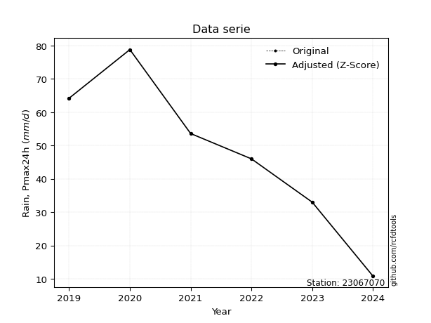</img>

</div>

> If Z-Score is active, values out of range or outliers are replaced with the station mean value.


### 4. Active continuous probability distributions from SciPy (45 of 104 available)

[scipy.stats](https://docs.scipy.org/doc/scipy/reference/stats.html) is a Python´s powerful submodule within the SciPy library for comprehensive statistical analysis, offering over 130 probability distributions (like Normal, Poisson), functions for descriptive stats (mean, variance), hypothesis testing (t-tests, chi-square), random variable generation, and statistical tests, making it essential for data science, modeling, and research. It provides tools to explore, model, and draw conclusions from data efficiently, working seamlessly with NumPy.

<div align="center">

|   id | p_dist             |   n_parameter | fit_method   | label                                                                       | active   | ref                                                                                                        |
|-----:|:-------------------|--------------:|:-------------|:----------------------------------------------------------------------------|:---------|:-----------------------------------------------------------------------------------------------------------|
|    0 | alpha              |             3 | MLE          | Alpha                                                                       | True     | [:mortar_board:](https://docs.scipy.org/doc/scipy/reference/generated/scipy.stats.alpha.html)              |
|    1 | betaprime          |             4 | MLE          | Beta prime                                                                  | True     | [:mortar_board:](https://docs.scipy.org/doc/scipy/reference/generated/scipy.stats.betaprime.html)          |
|    2 | chi2               |             3 | MLE          | Chi²                                                                        | True     | [:mortar_board:](https://docs.scipy.org/doc/scipy/reference/generated/scipy.stats.chi2.html)               |
|    3 | crystalball        |             4 | MLE          | Crystalball                                                                 | True     | [:mortar_board:](https://docs.scipy.org/doc/scipy/reference/generated/scipy.stats.crystalball.html)        |
|    4 | erlang             |             3 | MLE          | Erlang                                                                      | True     | [:mortar_board:](https://docs.scipy.org/doc/scipy/reference/generated/scipy.stats.erlang.html)             |
|    5 | expon              |             2 | MLE          | Exponential                                                                 | True     | [:mortar_board:](https://docs.scipy.org/doc/scipy/reference/generated/scipy.stats.expon.html)              |
|    6 | exponnorm          |             3 | MLE          | Exponentially modified Normal                                               | True     | [:mortar_board:](https://docs.scipy.org/doc/scipy/reference/generated/scipy.stats.exponnorm.html)          |
|    7 | f                  |             4 | MLE          | F                                                                           | True     | [:mortar_board:](https://docs.scipy.org/doc/scipy/reference/generated/scipy.stats.f.html)                  |
|    8 | fatiguelife        |             3 | MLE          | Fatigue-life (Birnbaum-Saunders)                                            | True     | [:mortar_board:](https://docs.scipy.org/doc/scipy/reference/generated/scipy.stats.fatiguelife.html)        |
|    9 | fisk               |             3 | MLE          | Fisk                                                                        | True     | [:mortar_board:](https://docs.scipy.org/doc/scipy/reference/generated/scipy.stats.fisk.html)               |
|   10 | gamma              |             3 | MLE          | Gamma                                                                       | True     | [:mortar_board:](https://docs.scipy.org/doc/scipy/reference/generated/scipy.stats.gamma.html)              |
|   11 | genexpon           |             5 | MLE          | Generalized exponential                                                     | True     | [:mortar_board:](https://docs.scipy.org/doc/scipy/reference/generated/scipy.stats.genexpon.html)           |
|   12 | genlogistic        |             3 | MLE          | Generalized logistic                                                        | True     | [:mortar_board:](https://docs.scipy.org/doc/scipy/reference/generated/scipy.stats.genlogistic.html)        |
|   13 | gibrat             |             2 | MM           | Gibrat                                                                      | True     | [:mortar_board:](https://docs.scipy.org/doc/scipy/reference/generated/scipy.stats.gibrat.html)             |
|   14 | gompertz           |             3 | MLE          | Gompertz (or truncated Gumbel)                                              | True     | [:mortar_board:](https://docs.scipy.org/doc/scipy/reference/generated/scipy.stats.gompertz.html)           |
|   15 | gumbel_l           |             2 | MM           | Gumbel Left Skew                                                            | True     | [:mortar_board:](https://docs.scipy.org/doc/scipy/reference/generated/scipy.stats.gumbel_l.html)           |
|   16 | gumbel_r           |             2 | MM           | Gumbel Right Skew                                                           | True     | [:mortar_board:](https://docs.scipy.org/doc/scipy/reference/generated/scipy.stats.gumbel_r.html)           |
|   17 | halflogistic       |             2 | MM           | Half-logistic                                                               | True     | [:mortar_board:](https://docs.scipy.org/doc/scipy/reference/generated/scipy.stats.halflogistic.html)       |
|   18 | halfnorm           |             2 | MM           | Half Normal                                                                 | True     | [:mortar_board:](https://docs.scipy.org/doc/scipy/reference/generated/scipy.stats.halfnorm.html)           |
|   19 | hypsecant          |             2 | MM           | hyperbolic secant                                                           | True     | [:mortar_board:](https://docs.scipy.org/doc/scipy/reference/generated/scipy.stats.hypsecant.html)          |
|   20 | invgamma           |             3 | MLE          | Inverted gamma                                                              | True     | [:mortar_board:](https://docs.scipy.org/doc/scipy/reference/generated/scipy.stats.invgamma.html)           |
|   21 | invgauss           |             3 | MLE          | Inverse Gaussian                                                            | True     | [:mortar_board:](https://docs.scipy.org/doc/scipy/reference/generated/scipy.stats.invgauss.html)           |
|   22 | invweibull         |             3 | MLE          | Inverted Weibull                                                            | True     | [:mortar_board:](https://docs.scipy.org/doc/scipy/reference/generated/scipy.stats.invweibull.html)         |
|   23 | johnsonsu          |             4 | MLE          | Johnson Su                                                                  | True     | [:mortar_board:](https://docs.scipy.org/doc/scipy/reference/generated/scipy.stats.johnsonsu.html)          |
|   24 | kstwobign          |             2 | MLE          | Limiting distribution of scaled Kolmogorov-Smirnov two-sided test statistic | True     | [:mortar_board:](https://docs.scipy.org/doc/scipy/reference/generated/scipy.stats.kstwobign.html)          |
|   25 | laplace            |             2 | MM           | Laplace                                                                     | True     | [:mortar_board:](https://docs.scipy.org/doc/scipy/reference/generated/scipy.stats.laplace.html)            |
|   26 | laplace_asymmetric |             3 | MLE          | Asymmetric Laplace                                                          | True     | [:mortar_board:](https://docs.scipy.org/doc/scipy/reference/generated/scipy.stats.laplace_asymmetric.html) |
|   27 | loggamma           |             3 | MLE          | Log gamma                                                                   | True     | [:mortar_board:](https://docs.scipy.org/doc/scipy/reference/generated/scipy.stats.loggamma.html)           |
|   28 | logistic           |             2 | MM           | Logistic (or Sech-squared)                                                  | True     | [:mortar_board:](https://docs.scipy.org/doc/scipy/reference/generated/scipy.stats.logistic.html)           |
|   29 | lognorm            |             3 | MLE          | Log Normal                                                                  | True     | [:mortar_board:](https://docs.scipy.org/doc/scipy/reference/generated/scipy.stats.lognorm.html)            |
|   30 | maxwell            |             2 | MM           | Maxwell                                                                     | True     | [:mortar_board:](https://docs.scipy.org/doc/scipy/reference/generated/scipy.stats.maxwell.html)            |
|   31 | mielke             |             4 | MLE          | Mielke Beta-Kappa / Dagum                                                   | True     | [:mortar_board:](https://docs.scipy.org/doc/scipy/reference/generated/scipy.stats.mielke.html)             |
|   32 | moyal              |             2 | MM           | Moyal                                                                       | True     | [:mortar_board:](https://docs.scipy.org/doc/scipy/reference/generated/scipy.stats.moyal.html)              |
|   33 | nakagami           |             3 | MLE          | Nakagami                                                                    | True     | [:mortar_board:](https://docs.scipy.org/doc/scipy/reference/generated/scipy.stats.nakagami.html)           |
|   34 | ncf                |             5 | MLE          | Non-central F distribution                                                  | True     | [:mortar_board:](https://docs.scipy.org/doc/scipy/reference/generated/scipy.stats.ncf.html)                |
|   35 | nct                |             4 | MLE          | Non-central Student’s t                                                     | True     | [:mortar_board:](https://docs.scipy.org/doc/scipy/reference/generated/scipy.stats.nct.html)                |
|   36 | norm               |             2 | MM           | Normal                                                                      | True     | [:mortar_board:](https://docs.scipy.org/doc/scipy/reference/generated/scipy.stats.norm.html)               |
|   37 | pareto             |             3 | MLE          | Pareto                                                                      | True     | [:mortar_board:](https://docs.scipy.org/doc/scipy/reference/generated/scipy.stats.pareto.html)             |
|   38 | pearson3           |             3 | MM           | Pearson type III                                                            | True     | [:mortar_board:](https://docs.scipy.org/doc/scipy/reference/generated/scipy.stats.pearson3.html)           |
|   39 | rayleigh           |             2 | MM           | Rayleigh                                                                    | True     | [:mortar_board:](https://docs.scipy.org/doc/scipy/reference/generated/scipy.stats.rayleigh.html)           |
|   40 | rice               |             3 | MLE          | Rice                                                                        | True     | [:mortar_board:](https://docs.scipy.org/doc/scipy/reference/generated/scipy.stats.rice.html)               |
|   41 | t                  |             3 | MLE          | Student’s t                                                                 | True     | [:mortar_board:](https://docs.scipy.org/doc/scipy/reference/generated/scipy.stats.t.html)                  |
|   42 | truncnorm          |             4 | MLE          | Truncated normal                                                            | True     | [:mortar_board:](https://docs.scipy.org/doc/scipy/reference/generated/scipy.stats.truncnorm.html)          |
|   43 | wald               |             2 | MM           | Wald                                                                        | True     | [:mortar_board:](https://docs.scipy.org/doc/scipy/reference/generated/scipy.stats.wald.html)               |
|   44 | weibull_min        |             3 | MLE          | Weibull minimum                                                             | True     | [:mortar_board:](https://docs.scipy.org/doc/scipy/reference/generated/scipy.stats.weibull_min.html)        |

</div>

> **n_parameter:** # arguments & localization & scale.
>
> **Fit methods:** (MLE) maximum likelihood, (MM) L-moments.
>
>**Inactive:** foldnorm, gennorm, norminvgauss, powernorm, powerlognorm, skewnorm, genextreme, anglit, arcsine, argus, beta, bradford, burr, burr12, cauchy, cosine, halfcauchy, foldcauchy, skewcauchy, wrapcauchy, dgamma, gengamma, exponweib, exponpow, truncexpon, gausshyper, genhalflogistic, genhyperbolic, geninvgauss, halfgennorm, johnsonsb, kappa4, kappa3, ksone, kstwo, loglaplace, levy, levy_l, levy_stable, ncx2, genpareto, truncpareto, lomax, powerlaw, rdist, rel_breitwigner, recipinvgauss, semicircular, studentized_range, trapezoid, triang, truncweibull_min, tukeylambda, uniform, loguniform, vonmises, vonmises_line, weibull_max, dweibull, 


## B. Probability distributions vs. Empirical distributions

A continuous probability distribution (CPD) describes probabilities for variables that can take any value within a range (like rain any time), unlike discrete variables with specific outcomes (like temperature). It uses a Probability Density Function (PDF), a curve where the total area under it equals 1, and the probability of the variable falling within an interval (a to b) is found by calculating the area under the curve between those points. A key feature is that the probability of hitting any single exact value is zero, so probabilities are always expressed for ranges, e.g., $P(a ≤ X ≤ b)$.

<div align="center">

Distributions parameters
|    |   station | p_dist                |   n |             loc |          scale | shape                  | shape1                 | shape2               | shape3   |
|---:|----------:|:----------------------|----:|----------------:|---------------:|:-----------------------|:-----------------------|:---------------------|:---------|
|  0 |  23067070 | alpha                 |   7 |    -0.0596895   |   20.9333      | 8.778774248696202e-09  |                        |                      |          |
|  1 |  23067070 | betaprime             |   7 |   -27.4834      | 4464.09        | 8.32292808969314       | 528.2936291125955      |                      |          |
|  2 |  23067070 | chi2                  |   7 |    10.8         |   12.6644      | 1.656781675899372      |                        |                      |          |
|  3 |  23067070 | crystalball           |   7 |    42.8571      |   23.4627      | 3722.0677320730038     | 2061.015000196156      |                      |          |
|  4 |  23067070 | erlang                |   7 | -2842.34        |    0.190831    | 15119.1154556726       |                        |                      |          |
|  5 |  23067070 | expon                 |   7 |    10.8         |   32.0571      |                        |                        |                      |          |
|  6 |  23067070 | exponnorm             |   7 |    42.8207      |   23.4627      | 0.0015528016692867293  |                        |                      |          |
|  7 |  23067070 | f                     |   7 |    10.7998      |   33.2355      | 1.7372881918486014     | 70.19839634178345      |                      |          |
|  8 |  23067070 | fatiguelife           |   7 |    10.8         |    1.20735e-05 | 1678.1097005508648     |                        |                      |          |
|  9 |  23067070 | fisk                  |   7 |    -5.64441e+08 |    5.64441e+08 | 39480189.83041121      |                        |                      |          |
| 10 |  23067070 | gamma                 |   7 | -2840.02        |    0.19101     | 15092.81790973687      |                        |                      |          |
| 11 |  23067070 | genexpon              |   7 |    10.8         |    2.97737     | 0.09288103797832262    | 2.1045705768991584e-09 | 1.4722964984960272   |          |
| 12 |  23067070 | genlogistic           |   7 |   -87.6766      |   21.0327      | 285.29516730821183     |                        |                      |          |
| 13 |  23067070 | gibrat                |   7 |    24.958       |   10.8564      |                        |                        |                      |          |
| 14 |  23067070 | gompertz              |   7 |    10.8         |   41.7568      | 0.6622530426342357     |                        |                      |          |
| 15 |  23067070 | gumbel_l              |   7 |    53.4166      |   18.2938      |                        |                        |                      |          |
| 16 |  23067070 | gumbel_r              |   7 |    32.2977      |   18.2938      |                        |                        |                      |          |
| 17 |  23067070 | halflogistic          |   7 |    15.0483      |   20.0598      |                        |                        |                      |          |
| 18 |  23067070 | halfnorm              |   7 |    11.8017      |   38.9222      |                        |                        |                      |          |
| 19 |  23067070 | hypsecant             |   7 |    42.8571      |   14.9368      |                        |                        |                      |          |
| 20 |  23067070 | invgamma              |   7 |  -136.514       | 9768.98        | 55.5714116650897       |                        |                      |          |
| 21 |  23067070 | invgauss              |   7 |   -61.3863      | 1878.8         | 0.0555757612152062     |                        |                      |          |
| 22 |  23067070 | invweibull            |   7 |    10.8         |    1.48402     | 0.056302621429285986   |                        |                      |          |
| 23 |  23067070 | johnsonsu             |   7 |    -1.27852e+08 |    1.05305e+08 | -7242209.671308344     | 7065741.757886089      |                      |          |
| 24 |  23067070 | kstwobign             |   7 |   -40.9248      |   95.5234      |                        |                        |                      |          |
| 25 |  23067070 | laplace               |   7 |    42.8571      |   16.5907      |                        |                        |                      |          |
| 26 |  23067070 | laplace_asymmetric    |   7 |    53.6         |   18.7364      | 1.3269664004876467     |                        |                      |          |
| 27 |  23067070 | loggamma              |   7 | -2504.67        |  435.979       | 345.387855310845       |                        |                      |          |
| 28 |  23067070 | logistic              |   7 |    42.8571      |   12.9357      |                        |                        |                      |          |
| 29 |  23067070 | lognorm               |   7 |    10.8         |    0.129295    | 13.067764287248327     |                        |                      |          |
| 30 |  23067070 | maxwell               |   7 |   -12.7397      |   34.8401      |                        |                        |                      |          |
| 31 |  23067070 | mielke                |   7 |    -2.47417     |   82.1687      | 1.2904769204858368     | 325.0306140698507      |                      |          |
| 32 |  23067070 | moyal                 |   7 |    29.4396      |   10.5619      |                        |                        |                      |          |
| 33 |  23067070 | nakagami              |   7 |    10.8         |   44.9367      | 0.2557596298583553     |                        |                      |          |
| 34 |  23067070 | ncf                   |   7 |    10.8         |    9.87004     | 0.699543355333899      | 3723.091205227862      | 2.4603774219340733   |          |
| 35 |  23067070 | nct                   |   7 | -1315.99        |   23.4444      | 1017497.7747574099     | 57.96017196731688      |                      |          |
| 36 |  23067070 | norm                  |   7 |    42.8571      |   23.4627      |                        |                        |                      |          |
| 37 |  23067070 | pareto                |   7 |    10.7732      |    0.0268054   | 0.16919430047596676    |                        |                      |          |
| 38 |  23067070 | pearson3              |   7 |    42.8572      |   23.4627      | -0.016766253698268323  |                        |                      |          |
| 39 |  23067070 | rayleigh              |   7 |    -2.02843     |   35.8135      |                        |                        |                      |          |
| 40 |  23067070 | rice                  |   7 |    -2.31292     |   28.4446      | 1.0964191406813157     |                        |                      |          |
| 41 |  23067070 | t                     |   7 |    42.8571      |   23.4627      | 2782232863.780777      |                        |                      |          |
| 42 |  23067070 | truncnorm             |   7 |    42.8571      |   23.4627      | -163.4827249636489     | 673.6985449210537      |                      |          |
| 43 |  23067070 | wald                  |   7 |    19.3944      |   23.4627      |                        |                        |                      |          |
| 44 |  23067070 | weibull_min           |   7 |    10.8         |   31.1113      | 0.8579278120863052     |                        |                      |          |
| 45 |  23067070 | logalpha              |   7 |    -9.98613     |  250.781       | 18.59284756471348      |                        |                      |          |
| 46 |  23067070 | logbetaprime          |   7 |   -10.1738      |   63.227       | 425.9778029420472      | 1963.0331389407847     |                      |          |
| 47 |  23067070 | logchi2               |   7 |     2.37955     |    0.906708    | 1.1130825835243146     |                        |                      |          |
| 48 |  23067070 | logcrystalball        |   7 |     3.54646     |    0.71334     | 747.0155287643067      | 15.95406199418792      |                      |          |
| 49 |  23067070 | logerlang             |   7 |    -7.52667     |    0.0487852   | 226.84166189974349     |                        |                      |          |
| 50 |  23067070 | logexpon              |   7 |     2.37955     |    1.16692     |                        |                        |                      |          |
| 51 |  23067070 | logexponnorm          |   7 |     3.54588     |    0.71334     | 0.000805591174862984   |                        |                      |          |
| 52 |  23067070 | logf                  |   7 |  -503.906       |  507.453       | 2539631.8253192855     | 1669134.0849572439     |                      |          |
| 53 |  23067070 | logfatiguelife        |   7 |  -159.911       |  163.456       | 0.004355960277009328   |                        |                      |          |
| 54 |  23067070 | logfisk               |   7 |    -7.41229e+07 |    7.41229e+07 | 175402048.26279777     |                        |                      |          |
| 55 |  23067070 | loggamma              |   7 |    -7.28611     |    0.0491722   | 220.20203317750565     |                        |                      |          |
| 56 |  23067070 | loggenexpon           |   7 |     2.37805     |    0.905071    | 0.380646443984767      | 43.09926103153962      | 0.010312736289135122 |          |
| 57 |  23067070 | loggenlogistic        |   7 |     4.36694     |    3.13349e-06 | 3.82195884196416e-06   |                        |                      |          |
| 58 |  23067070 | loggibrat             |   7 |     3.00228     |    0.330061    |                        |                        |                      |          |
| 59 |  23067070 | loggompertz           |   7 |     2.37955     |    0.711511    | 0.15231738216964275    |                        |                      |          |
| 60 |  23067070 | loggumbel_l           |   7 |     3.8675      |    0.556189    |                        |                        |                      |          |
| 61 |  23067070 | loggumbel_r           |   7 |     3.22542     |    0.556189    |                        |                        |                      |          |
| 62 |  23067070 | loghalflogistic       |   7 |     2.70102     |    0.609858    |                        |                        |                      |          |
| 63 |  23067070 | loghalfnorm           |   7 |     2.60229     |    1.18335     |                        |                        |                      |          |
| 64 |  23067070 | loghypsecant          |   7 |     3.54646     |    0.454126    |                        |                        |                      |          |
| 65 |  23067070 | loginvgamma           |   7 |   -10.5152      | 5265.73        | 375.3918066143301      |                        |                      |          |
| 66 |  23067070 | loginvgauss           |   7 |    -2.42156     |  369.853       | 0.01612717432550699    |                        |                      |          |
| 67 |  23067070 | loginvweibull         |   7 |    -7.56593e+07 |    7.56593e+07 | 102564398.22196004     |                        |                      |          |
| 68 |  23067070 | logjohnsonsu          |   7 |     4.52671     |    0.00574019  | 6.470600965603474      | 1.173162778212006      |                      |          |
| 69 |  23067070 | logkstwobign          |   7 |     0.70934     |    3.22769     |                        |                        |                      |          |
| 70 |  23067070 | loglaplace            |   7 |     3.54646     |    0.504407    |                        |                        |                      |          |
| 71 |  23067070 | loglaplace_asymmetric |   7 |     4.36691     |    0.0144567   | 56.73449024022102      |                        |                      |          |
| 72 |  23067070 | logloggamma           |   7 |     4.36694     |    1.95803e-06 | 2.4043299536776913e-06 |                        |                      |          |
| 73 |  23067070 | loglogistic           |   7 |     3.54646     |    0.393285    |                        |                        |                      |          |
| 74 |  23067070 | loglognorm            |   7 |     2.37955     |    0.00713388  | 12.432465823362223     |                        |                      |          |
| 75 |  23067070 | logmaxwell            |   7 |     1.85615     |    1.05925     |                        |                        |                      |          |
| 76 |  23067070 | logmielke             |   7 |     2.37955     |    2.00193     | 0.5600469830002166     | 261.0739579384193      |                      |          |
| 77 |  23067070 | logmoyal              |   7 |     3.13853     |    0.321116    |                        |                        |                      |          |
| 78 |  23067070 | lognakagami           |   7 |     2.37955     |    1.71807     | 0.147599532695242      |                        |                      |          |
| 79 |  23067070 | logncf                |   7 |   -70.4828      |   72.9915      | 53134.04241329363      | 35026.40498544929      | 745.010901356089     |          |
| 80 |  23067070 | lognct                |   7 |   -31.5476      |    0.688983    | 16949.44478585074      | 50.93165078510779      |                      |          |
| 81 |  23067070 | lognorm               |   7 |     3.54646     |    0.71334     |                        |                        |                      |          |
| 82 |  23067070 | logpareto             |   7 |     2.37844     |    0.00110768  | 0.16830339121696267    |                        |                      |          |
| 83 |  23067070 | logpearson3           |   7 |     3.54646     |    0.713338    | -0.5981102815216894    |                        |                      |          |
| 84 |  23067070 | lograyleigh           |   7 |     2.1818      |    1.08884     |                        |                        |                      |          |
| 85 |  23067070 | logrice               |   7 |     1.96082     |    0.803533    | 1.6377426659870662     |                        |                      |          |
| 86 |  23067070 | logt                  |   7 |     3.54646     |    0.713341    | 15099376604.080856     |                        |                      |          |
| 87 |  23067070 | logtruncnorm          |   7 |    -0.230967    |    1.59305     | 2.3398067531524074     | 2.889431144846271      |                      |          |
| 88 |  23067070 | logwald               |   7 |     2.83308     |    0.713375    |                        |                        |                      |          |
| 89 |  23067070 | logweibull_min        |   7 |    -4.32479e+07 |    4.32479e+07 | 81310619.39219394      |                        |                      |          |

</div>

> **loc** (Location parameter): This shifts the distribution along the x-axis. For many common distributions, like the normal (Gaussian) distribution, loc represents the mean $μ$. For others, like the uniform distribution, it might represent the minimum value, or for the beta distribution, the left end of the support interval.
>
> **scale** (Scale parameter): This determines the width or spread of the distribution. For the normal distribution, scale represents the standard deviation $σ$. For a uniform distribution, it defines the length of the interval (from $loc$ to $loc + scale$).
>
> **shape** (Shape parameters): Refers to parameters that define the specific form of a probability distribution, distinct from its location (loc) and scale (scale). These parameters are required arguments for most distribution functions. For example, a normal (Gaussian) distribution is fully defined by its location (mean) and scale (standard deviation), so it has no specific shape parameters beyond loc and scale. However, other distributions have intrinsic properties that need specification, as Gamma distribution that takes a shape parameter, often named $a$ or $alpha$.


### 0. Cumulative distribution values - CDF (90 evaluated)

> Ordered by x ascending and calculating $log(f(x))$ separately. 

|   id |   Station |   date |    x |   count |    mean |     std |    zscore |   Value_initial |   station |   m |     alpha |   alpha_pdf |   betaprime |   betaprime_pdf |       chi2 |    chi2_pdf |   crystalball |   crystalball_pdf |    erlang |   erlang_pdf |     expon |   expon_pdf |   exponnorm |   exponnorm_pdf |           f |      f_pdf |   fatiguelife |   fatiguelife_pdf |      fisk |   fisk_pdf |     gamma |   gamma_pdf |    genexpon |   genexpon_pdf |   genlogistic |   genlogistic_pdf |   gibrat |   gibrat_pdf |    gompertz |   gompertz_pdf |   gumbel_l |   gumbel_l_pdf |   gumbel_r |   gumbel_r_pdf |   halflogistic |   halflogistic_pdf |   halfnorm |   halfnorm_pdf |   hypsecant |   hypsecant_pdf |   invgamma |   invgamma_pdf |   invgauss |   invgauss_pdf |   invweibull |   invweibull_pdf |   johnsonsu |   johnsonsu_pdf |   kstwobign |   kstwobign_pdf |   laplace |   laplace_pdf |   laplace_asymmetric |   laplace_asymmetric_pdf |   loggamma |   loggamma_pdf |   logistic |   logistic_pdf |   lognorm |   lognorm_pdf |   maxwell |   maxwell_pdf |    mielke |   mielke_pdf |     moyal |   moyal_pdf |    nakagami |    nakagami_pdf |         ncf |         ncf_pdf |      nct |    nct_pdf |      norm |   norm_pdf |   pareto |   pareto_pdf |   pearson3 |   pearson3_pdf |   rayleigh |   rayleigh_pdf |      rice |   rice_pdf |         t |      t_pdf |   truncnorm |   truncnorm_pdf |     wald |   wald_pdf |   weibull_min |   weibull_min_pdf |   logalpha |   logalpha_pdf |   logbetaprime |   logbetaprime_pdf |     logchi2 |   logchi2_pdf |   logcrystalball |   logcrystalball_pdf |   logerlang |   logerlang_pdf |   logexpon |   logexpon_pdf |   logexponnorm |   logexponnorm_pdf |      logf |   logf_pdf |   logfatiguelife |   logfatiguelife_pdf |   logfisk |   logfisk_pdf |   loggenexpon |   loggenexpon_pdf |   loggenlogistic |   loggenlogistic_pdf |   loggibrat |   loggibrat_pdf |   loggompertz |   loggompertz_pdf |   loggumbel_l |   loggumbel_l_pdf |   loggumbel_r |   loggumbel_r_pdf |   loghalflogistic |   loghalflogistic_pdf |   loghalfnorm |   loghalfnorm_pdf |   loghypsecant |   loghypsecant_pdf |   loginvgamma |   loginvgamma_pdf |   loginvgauss |   loginvgauss_pdf |   loginvweibull |   loginvweibull_pdf |   logjohnsonsu |   logjohnsonsu_pdf |   logkstwobign |   logkstwobign_pdf |   loglaplace |   loglaplace_pdf |   loglaplace_asymmetric |   loglaplace_asymmetric_pdf |   logloggamma |   logloggamma_pdf |   loglogistic |   loglogistic_pdf |   loglognorm |   loglognorm_pdf |   logmaxwell |   logmaxwell_pdf |   logmielke |   logmielke_pdf |   logmoyal |   logmoyal_pdf |   lognakagami |   lognakagami_pdf |    logncf |   logncf_pdf |    lognct |   lognct_pdf |   logpareto |   logpareto_pdf |   logpearson3 |   logpearson3_pdf |   lograyleigh |   lograyleigh_pdf |   logrice |   logrice_pdf |      logt |   logt_pdf |   logtruncnorm |   logtruncnorm_pdf |   logwald |   logwald_pdf |   logweibull_min |   logweibull_min_pdf |
|-----:|----------:|-------:|-----:|--------:|--------:|--------:|----------:|----------------:|----------:|----:|----------:|------------:|------------:|----------------:|-----------:|------------:|--------------:|------------------:|----------:|-------------:|----------:|------------:|------------:|----------------:|------------:|-----------:|--------------:|------------------:|----------:|-----------:|----------:|------------:|------------:|---------------:|--------------:|------------------:|---------:|-------------:|------------:|---------------:|-----------:|---------------:|-----------:|---------------:|---------------:|-------------------:|-----------:|---------------:|------------:|----------------:|-----------:|---------------:|-----------:|---------------:|-------------:|-----------------:|------------:|----------------:|------------:|----------------:|----------:|--------------:|---------------------:|-------------------------:|-----------:|---------------:|-----------:|---------------:|----------:|--------------:|----------:|--------------:|----------:|-------------:|----------:|------------:|------------:|----------------:|------------:|----------------:|---------:|-----------:|----------:|-----------:|---------:|-------------:|-----------:|---------------:|-----------:|---------------:|----------:|-----------:|----------:|-----------:|------------:|----------------:|---------:|-----------:|--------------:|------------------:|-----------:|---------------:|---------------:|-------------------:|------------:|--------------:|-----------------:|---------------------:|------------:|----------------:|-----------:|---------------:|---------------:|-------------------:|----------:|-----------:|-----------------:|---------------------:|----------:|--------------:|--------------:|------------------:|-----------------:|---------------------:|------------:|----------------:|--------------:|------------------:|--------------:|------------------:|--------------:|------------------:|------------------:|----------------------:|--------------:|------------------:|---------------:|-------------------:|--------------:|------------------:|--------------:|------------------:|----------------:|--------------------:|---------------:|-------------------:|---------------:|-------------------:|-------------:|-----------------:|------------------------:|----------------------------:|--------------:|------------------:|--------------:|------------------:|-------------:|-----------------:|-------------:|-----------------:|------------:|----------------:|-----------:|---------------:|--------------:|------------------:|----------:|-------------:|----------:|-------------:|------------:|----------------:|--------------:|------------------:|--------------:|------------------:|----------:|--------------:|----------:|-----------:|---------------:|-------------------:|----------:|--------------:|-----------------:|---------------------:|
|    0 |  23067070 |   2024 | 10.8 |       7 | 42.8571 | 25.3426 | -1.26495  |            10.8 |  23067070 |   1 | 0.0539032 |  0.0220948  |   0.0712993 |      0.00841131 | 4.4191e-14 | 20.6081     |     0.0859223 |        0.00668599 | 0.0855905 |   0.00671599 | 0         |  0.0311943  |    0.085922 |      0.00668599 | 2.68834e-05 | 0.117849   |     0.0435934 |       5.39166e+10 | 0.0944118 | 0.00598023 | 0.0855942 |  0.00671581 | 4.04011e-08 |     0.0311957  |     0.0721079 |        0.00897382 | 0        |   0          | 3.75068e-12 |     0.0158598  |  0.0927508 |     0.00482731 |  0.0392198 |     0.00694312 |       0        |         0          |  0         |     0          |   0.0741034 |      0.00491643 |  0.0805293 |     0.00802235 |  0.0708703 |     0.00816029 |  0.000987254 |      2.16556e+11 |    0.085735 |      0.00668093 |   0.0688925 |      0.00987629 | 0.0724116 |    0.0043646  |             0.11404  |               0.00458681 |  0.0514583 |       0.156026 |  0.077401  |     0.00552039 | 0.0509357 |      0.146733 | 0.0716613 |    0.00832096 | 0.0951329 |   0.00924855 | 0.0156625 |  0.00492228 | 3.17176e-09 | 913338          | 1.27176e-05 | 645232          | 0.08594  | 0.00668724 | 0.0859223 | 0.00668599 | 0        |  6.31196     |  0.0862972 |     0.0066571  |  0.0621394 |     0.00938033 | 0.0570181 | 0.00850782 | 0.0859225 | 0.00668602 |   0.0859223 |      0.00668599 | 0        | 0          |    1.1597e-14 |        5.60101    |  0.0457434 |       0.157518 |      0.0509772 |           0.1531   | 2.30536e-09 |   2.88913e+06 |        0.0509357 |             0.146733 |   0.0530845 |        0.158525 |   0        |       0.85696  |      0.0509361 |           0.146734 | 0.0510196 |   0.146928 |        0.0502734 |             0.146529 | 0.0495128 |      0.111364 |   0.000629478 |          0.421117 |         0        |             0.10802  |    0        |        0        |   6.63196e-09 |          0.214076 |     0.0665689 |          0.115612 |     0.0102953 |         0.0847048 |          0        |              0        |     0         |          0        |      0.0486494 |           0.106711 |     0.0473217 |          0.152533 |     0.0492226 |          0.168394 |       0.0516801 |            0.20756  |      0.0980278 |          0.0945012 |      0.0483339 |           0.237726 |    0.0494603 |        0.0980562 |                0.088624 |                    0.108052 |     0.0871272 |          0.106986 |     0.0489345 |          0.118336 |    0.0072261 |      3.62992e+12 |    0.0298359 |         0.162778 | 3.20642e-06 |     5789.63     | 0.00111333 |      0.0199276 |   2.02139e-05 |       1.34367e+10 | 0.0532569 |     0.153074 | 0.0512832 |     0.147887 |    0        |     151.942     |      0.063926 |          0.134802 |     0.016356  |          0.164065 | 0.0362527 |      0.176307 | 0.0509362 |   0.146734 |    0           |           0        |  0        |      0        |        0.0581847 |             0.106147 |
|    1 |  23067070 |   2025 | 13.6 |       7 | 42.8571 | 25.3426 | -1.15446  |            13.6 |  23067070 |   2 | 0.125403  |  0.0276645  |   0.0972258 |      0.0101034  | 0.163452   |  0.0454964  |     0.106206  |        0.00781423 | 0.105972  |   0.00785441 | 0.0836382 |  0.0285853  |    0.106205 |      0.00781423 | 0.104592    | 0.0311629  |     0.612933  |       0.0196193   | 0.112538  | 0.00698572 | 0.105975  |  0.00785409 | 0.0836417   |     0.0285864  |     0.0999441 |        0.0109002  | 0        |   0          | 0.0448912   |     0.0161984  |  0.10724   |     0.00553587 |  0.0621032 |     0.00943391 |       0        |         0          |  0.0368513 |     0.0204776  |   0.0891994 |      0.00589392 |  0.105091  |     0.0095257  |  0.0960757 |     0.00984408 |  0.381026    |      0.00739268  |    0.106006 |      0.00781044 |   0.0995714 |      0.0120035  | 0.0857243 |    0.00516703 |             0.127634 |               0.00513358 |  0.0980528 |       0.251761 |  0.0943416 |     0.00660509 | 0.0946443 |      0.236286 | 0.0970887 |    0.00983578 | 0.121786  |   0.00977729 | 0.0342876 |  0.00851009 | 0.188405    |      0.0343916  | 0.15531     |      0.0225677  | 0.106227 | 0.00781556 | 0.106206  | 0.00781423 | 0.545318 |  0.0272143   |  0.106485  |     0.00777501 |  0.0908229 |     0.0110782  | 0.0831071 | 0.0101082  | 0.106206  | 0.00781425 |   0.106206  |      0.00781423 | 0        | 0          |    0.119012   |        0.034204   |  0.0940111 |       0.265094 |      0.0966499 |           0.246675 | 0.341157    |   0.758499    |        0.0946443 |             0.236286 |   0.100201  |        0.253634 |   0.179261 |       0.703341 |      0.0946448 |           0.236286 | 0.0947671 |   0.236401 |        0.0940288 |             0.236948 | 0.0824708 |      0.179061 |   0.10611     |          0.48833  |         0        |             0.143092 |    0        |        0        |   0.0566162   |          0.279231 |     0.0990152 |          0.168905 |     0.0486373 |         0.264385  |          0        |              0        |     0.0052481 |          0.674246 |      0.080548  |           0.175482 |     0.0935306 |          0.252184 |     0.100163  |          0.276553 |       0.114458  |            0.336318 |      0.1231    |          0.124658  |      0.121347  |           0.390404 |    0.0781155 |        0.154866  |                0.117385 |                    0.143119 |     0.115635  |          0.141992 |     0.0846369 |          0.196991 |    0.610089  |      0.133865    |    0.0825595 |         0.296208 | 0.298034    |        0.724059 | 0.0227878  |      0.21173   |   0.446095    |       0.56993     | 0.0986627 |     0.244477 | 0.0953119 |     0.237877 |    0.593115 |       0.295643  |      0.102229 |          0.200592 |     0.0744364 |          0.334344 | 0.089032  |      0.282378 | 0.0946449 |   0.236286 |    0           |           0        |  0        |      0        |        0.0883209 |             0.158494 |
|    2 |  23067070 |   2023 | 33   |       7 | 42.8571 | 25.3426 | -0.388955 |            33   |  23067070 |   3 | 0.526605  |  0.012506   |   0.379513  |      0.0171043  | 0.663201   |  0.0148262  |     0.337199  |        0.015567   | 0.338084  |   0.0156172  | 0.499683  |  0.015607   |    0.337199 |      0.015567   | 0.50428     | 0.014189   |     0.790469  |       0.00523818  | 0.330013  | 0.0154653  | 0.338071  |  0.0156159  | 0.499698    |     0.0156072  |     0.399358  |        0.0174006  | 0.38206  |   0.0474235  | 0.371694    |     0.0169575  |  0.27933   |     0.0129045  |  0.382     |     0.0200949  |       0.419803 |         0.0205327  |  0.413994  |     0.0176738  |   0.303712  |      0.0173854  |  0.375494  |     0.0168782  |  0.376399  |     0.0172031  |  0.423706    |      0.000922762 |    0.337066 |      0.0155782  |   0.412857  |      0.0174237  | 0.276019  |    0.016637   |             0.278511 |               0.011202   |  0.484222  |       0.547768 |  0.31821   |     0.0167716  | 0.472086  |      0.55789  | 0.368291  |    0.0166733  | 0.338253  |   0.0123049  | 0.398171  |  0.0223336  | 0.536628    |      0.0117634  | 0.421031    |      0.0106101  | 0.337242 | 0.0155675  | 0.337199  | 0.015567   | 0.67924  |  0.00244168  |  0.336358  |     0.0155155  |  0.380176  |     0.0169276  | 0.358535  | 0.0168255  | 0.3372    | 0.015567   |   0.337199  |      0.015567   | 0.431022 | 0.0330697  |    0.526978   |        0.0136847  |  0.497015  |       0.550356 |      0.477365  |           0.544605 | 0.700304    |   0.231073    |        0.472086  |             0.55789  |   0.485269  |        0.543935 |   0.61603  |       0.329047 |      0.472087  |           0.55789  | 0.471683  |   0.556548 |        0.473051  |             0.559193 | 0.422723  |      0.577461 |   0.5544      |          0.456113 |         0        |             0.421868 |    0.656788 |        0.744038 |   0.439936    |          0.576209 |     0.401441  |          0.552328 |     0.541062  |         0.597516  |          0.573141 |              0.550546 |     0.550154  |          0.50679  |      0.465056  |           0.696709 |     0.48454   |          0.551397 |     0.50055   |          0.531895 |       0.521124  |            0.460435 |      0.33312   |          0.413947  |      0.55498   |           0.459779 |    0.452856  |        0.897797  |                0.345927 |                    0.421762 |     0.34341   |          0.421684 |     0.468288  |          0.633115 |    0.657804  |      0.0264507   |    0.506029  |         0.544585 | 0.721237    |        0.36163  | 0.56685    |      0.603883  |   0.70541     |       0.176549    | 0.480001  |     0.553368 | 0.473559  |     0.556942 |    0.687818 |       0.0469928 |      0.432794 |          0.54241  |     0.517585  |          0.534958 | 0.488954  |      0.543504 | 0.472086  |   0.557889 |    8.82082e-05 |           2.10078  |  0.638639 |      0.621918 |        0.387087  |             0.564109 |
|    3 |  23067070 |   2022 | 46   |       7 | 42.8571 | 25.3426 |  0.124015 |            46   |  23067070 |   4 | 0.649482  |  0.0071004  |   0.594523  |      0.0152631  | 0.808197   |  0.00819924 |     0.553279  |        0.0168514  | 0.554389  |   0.0168314  | 0.666476  |  0.0104041  |    0.55328  |      0.0168514  | 0.655813    | 0.00949743 |     0.845542  |       0.00343604  | 0.550123  | 0.0173107  | 0.554361  |  0.0168305  | 0.666492    |     0.010404   |     0.609516  |        0.014335   | 0.74594  |   0.0152309  | 0.583697    |     0.0153393  |  0.486599  |     0.0187103  |  0.623235  |     0.0161085  |       0.647792 |         0.0144659  |  0.620399  |     0.013935   |   0.566487  |      0.0208472  |  0.592172  |     0.0156533  |  0.593425  |     0.0154295  |  0.433131    |      0.000579673 |    0.553327 |      0.0168659  |   0.620906  |      0.0141422  | 0.586287  |    0.0249365  |             0.469811 |               0.0188963  |  0.659914  |       0.49347  |  0.560443  |     0.019044   | 0.653791  |      0.517171 | 0.583452  |    0.0157151  | 0.50609   |   0.0134731  | 0.647964  |  0.0155391  | 0.666855    |      0.00854476 | 0.545239    |      0.00858435 | 0.553318 | 0.0168503  | 0.553279  | 0.0168514  | 0.703283 |  0.00142513  |  0.552194  |     0.0168701  |  0.593119  |     0.015236   | 0.576675  | 0.0160472  | 0.553281  | 0.0168514  |   0.553279  |      0.0168514  | 0.716583 | 0.0139703  |    0.671017   |        0.00891432 |  0.669925  |       0.475921 |      0.652875  |           0.495488 | 0.766488    |   0.171424    |        0.653791  |             0.517171 |   0.659737  |        0.490278 |   0.711141 |       0.247541 |      0.653792  |           0.517171 | 0.652956  |   0.516064 |        0.654883  |             0.516634 | 0.616412  |      0.559523 |   0.692049    |          0.369907 |         0        |             0.632576 |    0.820625 |        0.316844 |   0.63766     |          0.594549 |     0.606437  |          0.659854 |     0.71316   |         0.433457  |          0.728016 |              0.38533  |     0.699959  |          0.394103 |      0.686166  |           0.584428 |     0.660385  |          0.491021 |     0.667218  |          0.458818 |       0.660021  |            0.371746 |      0.510078  |          0.670224  |      0.692251  |           0.36449  |    0.714232  |        0.566542  |                0.51862  |                    0.632313 |     0.516339  |          0.63403  |     0.672055  |          0.560401 |    0.665462  |      0.0202109   |    0.675019  |         0.461303 | 0.834442    |        0.322496 | 0.732765   |      0.400183  |   0.757731    |       0.140823    | 0.659106  |     0.506961 | 0.654707  |     0.514966 |    0.70119  |       0.0346785 |      0.62227  |          0.578277 |     0.681389  |          0.442571 | 0.662396  |      0.486015 | 0.653791  |   0.51717  |    0.548743    |           1.26206  |  0.788431 |      0.320715 |        0.599108  |             0.688947 |
|    4 |  23067070 |   2021 | 53.6 |       7 | 42.8571 | 25.3426 |  0.423904 |            53.6 |  23067070 |   5 | 0.696454  |  0.00537569 |   0.701437  |      0.0127831  | 0.861154   |  0.00587344 |     0.676477  |        0.0153112  | 0.67729   |   0.0152562  | 0.736872  |  0.00820808 |    0.676477 |      0.0153112  | 0.720464    | 0.00759535 |     0.869064  |       0.00278656  | 0.67541   | 0.0153343  | 0.677256  |  0.0152558  | 0.736888    |     0.00820796 |     0.708192  |        0.0116108  | 0.834007 |   0.00870045 | 0.693788    |     0.0135352  |  0.635808  |     0.0201085  |  0.731914  |     0.0124865  |       0.744686 |         0.0111029  |  0.717129  |     0.0115164  |   0.71142   |      0.0167801  |  0.702405  |     0.0132294  |  0.701429  |     0.0128979  |  0.437116    |      0.00047586  |    0.676622 |      0.0153217  |   0.718624  |      0.0115608  | 0.73833   |    0.0157721  |             0.637791 |               0.0256527  |  0.731451  |       0.440043 |  0.696457  |     0.0163428  | 0.729046  |      0.464335 | 0.695173  |    0.0135502  | 0.610737  |   0.0140553  | 0.750012  |  0.0114393  | 0.726539    |      0.00720476 | 0.606601    |      0.0075801  | 0.676505 | 0.0153095  | 0.676477  | 0.0153112  | 0.71293  |  0.00113412  |  0.675683  |     0.015366   |  0.70071   |     0.0129806  | 0.691302  | 0.0139686  | 0.676478  | 0.0153111  |   0.676477  |      0.0153112  | 0.802119 | 0.00898934 |    0.73146    |        0.00707719 |  0.738404  |       0.418263 |      0.724874  |           0.444    | 0.791072    |   0.150706    |        0.729046  |             0.464335 |   0.730847  |        0.437687 |   0.746617 |       0.217139 |      0.729047  |           0.464334 | 0.728069  |   0.463609 |        0.730003  |             0.463146 | 0.697661  |      0.499138 |   0.745313    |          0.326693 |         0        |             0.762272 |    0.861598 |        0.225521 |   0.726121    |          0.557136 |     0.707001  |          0.64669  |     0.773528  |         0.35714   |          0.78175  |              0.318818 |     0.756208  |          0.341843 |      0.766796  |           0.4688   |     0.731405  |          0.435927 |     0.733367  |          0.40511  |       0.713409  |            0.326592 |      0.623734  |          0.816837  |      0.744492  |           0.318987 |    0.788962  |        0.418387  |                0.624905 |                    0.761899 |     0.622985  |          0.764985 |     0.751437  |          0.474921 |    0.668395  |      0.0182183   |    0.741343  |         0.405105 | 0.882664    |        0.308572 | 0.787847   |      0.32244   |   0.778275    |       0.128185    | 0.732746  |     0.453678 | 0.729614  |     0.46204  |    0.706188 |       0.030846  |      0.708862 |          0.549109 |     0.744885  |          0.387274 | 0.732889  |      0.434032 | 0.729046  |   0.464334 |    0.719686    |           0.983675 |  0.83127  |      0.243902 |        0.704329  |             0.67736  |
|    5 |  23067070 |   2019 | 64.2 |       7 | 42.8571 | 25.3426 |  0.842172 |            64.2 |  23067070 |   6 | 0.744605  |  0.0038358  |   0.81678   |      0.00900545 | 0.911104   |  0.00372092 |     0.818496  |        0.0112422  | 0.818645  |   0.0111805  | 0.810956  |  0.00589709 |    0.818497 |      0.0112422  | 0.789867    | 0.00560909 |     0.89494   |       0.00213462  | 0.813692  | 0.0106036  | 0.818612  |  0.011181   | 0.81097     |     0.00589692 |     0.811804  |        0.00804446 | 0.900603 |   0.00445249 | 0.82037     |     0.0102345  |  0.835197  |     0.0162427  |  0.839592  |     0.00802424 |       0.84116  |         0.00728944 |  0.821772  |     0.0082832  |   0.850301  |      0.00965675 |  0.821674  |     0.00926969 |  0.817516  |     0.00903429 |  0.441617    |      0.000380558 |    0.818707 |      0.0112438  |   0.822682  |      0.00815431 | 0.861874  |    0.00832556 |             0.829028 |               0.0121087  |  0.804207  |       0.36496  |  0.83888   |     0.0104486  | 0.805904  |      0.385413 | 0.818961  |    0.00974996 | 0.763644  |   0.0147803  | 0.847032  |  0.0071521  | 0.794551    |      0.00568311 | 0.680194    |      0.00633367 | 0.818507 | 0.0112407  | 0.818496  | 0.0112422  | 0.723473 |  0.000875717 |  0.818372  |     0.0113046  |  0.819112  |     0.00934028 | 0.819431  | 0.0101161  | 0.818498  | 0.0112421  |   0.818496  |      0.0112422  | 0.875025 | 0.00518812 |    0.795994   |        0.00521005 |  0.807148  |       0.343097 |      0.798494  |           0.370414 | 0.816355    |   0.130124    |        0.805904  |             0.385413 |   0.803279  |        0.363717 |   0.782921 |       0.186028 |      0.805905  |           0.385412 | 0.804846  |   0.385247 |        0.806605  |             0.383835 | 0.779577  |      0.406629 |   0.799685    |          0.276188 |         0        |             0.949947 |    0.895561 |        0.156186 |   0.819659    |          0.472763 |     0.816965  |          0.558816 |     0.83057   |         0.277225  |          0.832983 |              0.250992 |     0.812515  |          0.282868 |      0.839357  |           0.338915 |     0.80335   |          0.360336 |     0.800246  |          0.335663 |       0.767652  |            0.275164 |      0.78432   |          0.941517  |      0.797378  |           0.267765 |    0.852433  |        0.292555  |                0.778691 |                    0.949397 |     0.77752   |          0.954743 |     0.827088  |          0.363638 |    0.671504  |      0.0163122   |    0.808047  |         0.333881 | 0.937037    |        0.294417 | 0.838988   |      0.247276  |   0.800216    |       0.115319    | 0.807766  |     0.375975 | 0.806079  |     0.383417 |    0.711416 |       0.0272318 |      0.801948 |          0.476103 |     0.808662  |          0.319582 | 0.804784  |      0.361469 | 0.805904  |   0.385412 |    0.872773    |           0.7244   |  0.869174 |      0.180107 |        0.81926   |             0.581313 |
|    6 |  23067070 |   2020 | 78.8 |       7 | 42.8571 | 25.3426 |  1.41828  |            78.8 |  23067070 |   7 | 0.790663  |  0.00259278 |   0.915372  |      0.00477295 | 0.951595   |  0.00200587 |     0.937228  |        0.00525944 | 0.936787  |   0.00524438 | 0.880114  |  0.00373977 |    0.937229 |      0.00525942 | 0.857114    | 0.00373788 |     0.921351  |       0.00152612  | 0.923818  | 0.00492267 | 0.936765  |  0.00524535 | 0.880125    |     0.00373958 |     0.90108   |        0.00446168 | 0.945345 |   0.00205583 | 0.93364     |     0.00536342 |  0.981775  |     0.00398983 |  0.924307  |     0.00397693 |       0.920002 |         0.00382846 |  0.91481   |     0.00465945 |   0.942766  |      0.00381113 |  0.921745  |     0.00473415 |  0.916015  |     0.00474514 |  0.446523    |      0.000298086 |    0.937394 |      0.00525322 |   0.913597  |      0.00453366 | 0.942708  |    0.00345325 |             0.939206 |               0.00430558 |  0.86986   |       0.276275 |  0.941507  |     0.00425731 | 0.87496   |      0.288642 | 0.924957  |    0.00501047 | 0.985864  |   0.0152198  | 0.923008  |  0.00363344 | 0.864955    |      0.00403474 | 0.761707    |      0.00488164 | 0.937224 | 0.00525899 | 0.937228  | 0.00525944 | 0.734549 |  0.000660223 |  0.937697  |     0.00527405 |  0.921673  |     0.0049361  | 0.928835  | 0.00509964 | 0.937229  | 0.0052594  |   0.937228  |      0.00525944 | 0.929853 | 0.00265516 |    0.858562   |        0.00349023 |  0.868747  |       0.259233 |      0.865343  |           0.282302 | 0.840969    |   0.110745    |        0.87496   |             0.288642 |   0.868797  |        0.27616  |   0.817881 |       0.156069 |      0.874961  |           0.288641 | 0.873933  |   0.289087 |        0.875336  |             0.287131 | 0.851712  |      0.298868 |   0.850661    |          0.222154 |         0.999965 |             1.21953  |    0.922103 |        0.106766 |   0.90323     |          0.338347 |     0.914092  |          0.379114 |     0.879472  |         0.203085  |          0.877732 |              0.18823  |     0.864095  |          0.221795 |      0.896391  |           0.224144 |     0.868139  |          0.272705 |     0.860975  |          0.257987 |       0.818495  |            0.222232 |      0.960341  |          0.627874  |      0.846725  |           0.214958 |    0.901698  |        0.194886  |                0.999689 |                    1.21884  |     0.999969  |          1.22789  |     0.88955   |          0.249821 |    0.674662  |      0.014573    |    0.868277  |         0.254992 | 0.995623    |        0.244262 | 0.882592   |      0.181487  |   0.822527    |       0.102759    | 0.875166  |     0.282081 | 0.874792  |     0.287332 |    0.71665  |       0.0239826 |      0.887633 |          0.355425 |     0.866502  |          0.246048 | 0.869998  |      0.27534  | 0.87496   |   0.288641 |    0.997426    |           0.503897 |  0.900661 |      0.13041  |        0.919112  |             0.382428 |

An Empirical Distribution Function (EDF) is a step-function estimate of a true cumulative distribution function (CDF) based on observed sample data, representing the proportion of data points less than or equal to a given value. It is calculated by ordering your data and jumping up by $1/n$ (where $n$ is sample size) at each unique data point, allowing analysis without assuming an underlying population distribution, and it gets closer to the true CDF as the sample size grows.


### 1. Empirical - EDF California (1923)

California´s estimates the true probability distribution of water-related data (like rainfall, streamflow) using observed samples, crucial for risk assessment.

<div align="center">


$P=m/n$


</div>


**1.1. Empirical values**

<div align="center">

|                | 0                   | 1                  | 2                   | 3                  | 4                  | 5                  | 6              |
|:---------------|:--------------------|:-------------------|:--------------------|:-------------------|:-------------------|:-------------------|:---------------|
| date           | 2024                | 2025               | 2023                | 2022               | 2021               | 2019               | 2020           |
| x              | 10.8                | 13.6               | 33.0                | 46.0               | 53.6               | 64.2               | 78.8           |
| m              | 1                   | 2                  | 3                   | 4                  | 5                  | 6                  | 7              |
| empirical_dist | edf_california      | edf_california     | edf_california      | edf_california     | edf_california     | edf_california     | edf_california |
| empirical      | 0.14285714285714285 | 0.2857142857142857 | 0.42857142857142855 | 0.5714285714285714 | 0.7142857142857143 | 0.8571428571428571 | 1.0            |
| empirical_tr   | 1.1666666666666665  | 1.4                | 1.75                | 2.333333333333333  | 3.5                | 6.999999999999997  | inf            |

</div>


**1.2. Kolmogorov-Smirnov fit test (sorted by Δ)**


<div align="center">

|                | 0                   | 1                   | 2                   | 3                   | 4                   | 5                   | 6                     | 7                   | 8                   | 9                   | 10                  | 11                  | 12                  | 13                  | 14                  | 15                  | 16                  | 17                  | 18                  | 19                  | 20                  | 21                  | 22                  | 23                  | 24                  | 25                  | 26                  | 27                  | 28                  | 29                  | 30                  | 31                  | 32                  | 33                  | 34                  | 35                  | 36                  | 37                  | 38                  | 39                  | 40                  | 41                  | 42                  | 43                  | 44                  | 45                  | 46                  | 47                  | 48                  | 49                  | 50                  | 51                  | 52                  | 53                  | 54                  | 55                  | 56                  | 57                  | 58                  | 59                  | 60                  | 61                  | 62                  | 63                  | 64                  | 65                  | 66                  | 67                  | 68                  | 69                  | 70                  | 71                  | 72                  | 73                  | 74                  | 75                  | 76                  | 77                  | 78                  | 79                  | 80                  | 81                  | 82                  | 83                  | 84                  | 85                  | 86                  | 87                  | 88                  | 89                  |
|:---------------|:--------------------|:--------------------|:--------------------|:--------------------|:--------------------|:--------------------|:----------------------|:--------------------|:--------------------|:--------------------|:--------------------|:--------------------|:--------------------|:--------------------|:--------------------|:--------------------|:--------------------|:--------------------|:--------------------|:--------------------|:--------------------|:--------------------|:--------------------|:--------------------|:--------------------|:--------------------|:--------------------|:--------------------|:--------------------|:--------------------|:--------------------|:--------------------|:--------------------|:--------------------|:--------------------|:--------------------|:--------------------|:--------------------|:--------------------|:--------------------|:--------------------|:--------------------|:--------------------|:--------------------|:--------------------|:--------------------|:--------------------|:--------------------|:--------------------|:--------------------|:--------------------|:--------------------|:--------------------|:--------------------|:--------------------|:--------------------|:--------------------|:--------------------|:--------------------|:--------------------|:--------------------|:--------------------|:--------------------|:--------------------|:--------------------|:--------------------|:--------------------|:--------------------|:--------------------|:--------------------|:--------------------|:--------------------|:--------------------|:--------------------|:--------------------|:--------------------|:--------------------|:--------------------|:--------------------|:--------------------|:--------------------|:--------------------|:--------------------|:--------------------|:--------------------|:--------------------|:--------------------|:--------------------|:--------------------|:--------------------|
| station        | 23067070            | 23067070            | 23067070            | 23067070            | 23067070            | 23067070            | 23067070              | 23067070            | 23067070            | 23067070            | 23067070            | 23067070            | 23067070            | 23067070            | 23067070            | 23067070            | 23067070            | 23067070            | 23067070            | 23067070            | 23067070            | 23067070            | 23067070            | 23067070            | 23067070            | 23067070            | 23067070            | 23067070            | 23067070            | 23067070            | 23067070            | 23067070            | 23067070            | 23067070            | 23067070            | 23067070            | 23067070            | 23067070            | 23067070            | 23067070            | 23067070            | 23067070            | 23067070            | 23067070            | 23067070            | 23067070            | 23067070            | 23067070            | 23067070            | 23067070            | 23067070            | 23067070            | 23067070            | 23067070            | 23067070            | 23067070            | 23067070            | 23067070            | 23067070            | 23067070            | 23067070            | 23067070            | 23067070            | 23067070            | 23067070            | 23067070            | 23067070            | 23067070            | 23067070            | 23067070            | 23067070            | 23067070            | 23067070            | 23067070            | 23067070            | 23067070            | 23067070            | 23067070            | 23067070            | 23067070            | 23067070            | 23067070            | 23067070            | 23067070            | 23067070            | 23067070            | 23067070            | 23067070            | 23067070            | 23067070            |
| empirical_dist | edf_california      | edf_california      | edf_california      | edf_california      | edf_california      | edf_california      | edf_california        | edf_california      | edf_california      | edf_california      | edf_california      | edf_california      | edf_california      | edf_california      | edf_california      | edf_california      | edf_california      | edf_california      | edf_california      | edf_california      | edf_california      | edf_california      | edf_california      | edf_california      | edf_california      | edf_california      | edf_california      | edf_california      | edf_california      | edf_california      | edf_california      | edf_california      | edf_california      | edf_california      | edf_california      | edf_california      | edf_california      | edf_california      | edf_california      | edf_california      | edf_california      | edf_california      | edf_california      | edf_california      | edf_california      | edf_california      | edf_california      | edf_california      | edf_california      | edf_california      | edf_california      | edf_california      | edf_california      | edf_california      | edf_california      | edf_california      | edf_california      | edf_california      | edf_california      | edf_california      | edf_california      | edf_california      | edf_california      | edf_california      | edf_california      | edf_california      | edf_california      | edf_california      | edf_california      | edf_california      | edf_california      | edf_california      | edf_california      | edf_california      | edf_california      | edf_california      | edf_california      | edf_california      | edf_california      | edf_california      | edf_california      | edf_california      | edf_california      | edf_california      | edf_california      | edf_california      | edf_california      | edf_california      | edf_california      | edf_california      |
| p_dist         | nakagami            | laplace_asymmetric  | logjohnsonsu        | mielke              | logkstwobign        | weibull_min         | loglaplace_asymmetric | logloggamma         | fisk                | gumbel_l            | pearson3            | nct                 | t                   | truncnorm           | crystalball         | norm                | exponnorm           | loggenexpon         | johnsonsu           | gamma               | erlang              | invgamma            | f                   | loginvweibull       | logpearson3         | logerlang           | loginvgauss         | genlogistic         | kstwobign           | loggumbel_l         | logncf              | logexpon            | loggamma            | loggamma            | betaprime           | maxwell             | logbetaprime        | invgauss            | lognct              | logf                | logt                | logexponnorm        | logcrystalball      | lognorm             | lognorm             | logistic            | logfatiguelife      | logalpha            | loginvgamma         | rayleigh            | hypsecant           | logrice             | logweibull_min      | laplace             | loglogistic         | genexpon            | expon               | rice                | logmaxwell          | logfisk             | loghypsecant        | loglaplace          | alpha               | lograyleigh         | gumbel_r            | loggompertz         | chi2                | loggumbel_r         | ncf                 | gompertz            | halfnorm            | moyal               | logmoyal            | pareto              | logchi2             | lognakagami         | loghalfnorm         | gibrat              | loggibrat           | wald                | halflogistic        | logwald             | loghalflogistic     | logmielke           | logpareto           | loglognorm          | fatiguelife         | logtruncnorm        | invweibull          | loggenlogistic      |
| delta          | 0.14285713968538638 | 0.15808007962565643 | 0.1626146568102772  | 0.16392841528969238 | 0.1643673883031923  | 0.16670269216277764 | 0.16832889161518824   | 0.17007947625998232 | 0.17317588674065265 | 0.17847468511991568 | 0.17922921074161474 | 0.17948730094403853 | 0.17950834159000123 | 0.17950866219030343 | 0.17950866735824222 | 0.17950867148202804 | 0.17950891550724082 | 0.17960432445362923 | 0.17970842753275446 | 0.17973906051933636 | 0.17974216393989628 | 0.18062378256521044 | 0.18112262515652933 | 0.18150514478703283 | 0.1834852949617114  | 0.18551362296483964 | 0.18555159453082407 | 0.1857701498965495  | 0.1861428659307653  | 0.18669912877054687 | 0.18705163054236845 | 0.18745882072815118 | 0.18766144396421586 | 0.18766144396421586 | 0.18848847332186142 | 0.18862559458778627 | 0.1890644132497514  | 0.1896385666521493  | 0.19040239182408655 | 0.1909471687859092  | 0.191069406193984   | 0.19106949574377086 | 0.19106998847220874 | 0.19107002706342358 | 0.19107002706342358 | 0.19137267980943928 | 0.19168553303148012 | 0.19170319182493717 | 0.19218367691331062 | 0.19489142932030235 | 0.1965148915971081  | 0.19668228227210688 | 0.19739340044849932 | 0.19998995046251422 | 0.20107738217425886 | 0.20207255529436063 | 0.20207607252317594 | 0.20260715632546417 | 0.20315475432184765 | 0.20324348034752546 | 0.20516632044768296 | 0.2075987729191161  | 0.2093369694852958  | 0.21127792378669227 | 0.22361108475527508 | 0.22909810481004356 | 0.23676862759729422 | 0.23707701925251148 | 0.23829339189427456 | 0.24082304300524637 | 0.24886301483501636 | 0.25142671611886286 | 0.26292645613020327 | 0.2654514148194721  | 0.27173290254334254 | 0.2768387556942042  | 0.2804661905645273  | 0.2857142857142857  | 0.2857142857142857  | 0.2857142857142857  | 0.2857142857142857  | 0.2857142857142857  | 0.2857142857142857  | 0.29266562966940685 | 0.3074007793911063  | 0.32533798728867647 | 0.3618979225538613  | 0.42848322040188025 | 0.5534770296178462  | 0.8571428571428571  |
| deltao         | 0.48442053926100004 | 0.48442053926100004 | 0.48442053926100004 | 0.48442053926100004 | 0.48442053926100004 | 0.48442053926100004 | 0.48442053926100004   | 0.48442053926100004 | 0.48442053926100004 | 0.48442053926100004 | 0.48442053926100004 | 0.48442053926100004 | 0.48442053926100004 | 0.48442053926100004 | 0.48442053926100004 | 0.48442053926100004 | 0.48442053926100004 | 0.48442053926100004 | 0.48442053926100004 | 0.48442053926100004 | 0.48442053926100004 | 0.48442053926100004 | 0.48442053926100004 | 0.48442053926100004 | 0.48442053926100004 | 0.48442053926100004 | 0.48442053926100004 | 0.48442053926100004 | 0.48442053926100004 | 0.48442053926100004 | 0.48442053926100004 | 0.48442053926100004 | 0.48442053926100004 | 0.48442053926100004 | 0.48442053926100004 | 0.48442053926100004 | 0.48442053926100004 | 0.48442053926100004 | 0.48442053926100004 | 0.48442053926100004 | 0.48442053926100004 | 0.48442053926100004 | 0.48442053926100004 | 0.48442053926100004 | 0.48442053926100004 | 0.48442053926100004 | 0.48442053926100004 | 0.48442053926100004 | 0.48442053926100004 | 0.48442053926100004 | 0.48442053926100004 | 0.48442053926100004 | 0.48442053926100004 | 0.48442053926100004 | 0.48442053926100004 | 0.48442053926100004 | 0.48442053926100004 | 0.48442053926100004 | 0.48442053926100004 | 0.48442053926100004 | 0.48442053926100004 | 0.48442053926100004 | 0.48442053926100004 | 0.48442053926100004 | 0.48442053926100004 | 0.48442053926100004 | 0.48442053926100004 | 0.48442053926100004 | 0.48442053926100004 | 0.48442053926100004 | 0.48442053926100004 | 0.48442053926100004 | 0.48442053926100004 | 0.48442053926100004 | 0.48442053926100004 | 0.48442053926100004 | 0.48442053926100004 | 0.48442053926100004 | 0.48442053926100004 | 0.48442053926100004 | 0.48442053926100004 | 0.48442053926100004 | 0.48442053926100004 | 0.48442053926100004 | 0.48442053926100004 | 0.48442053926100004 | 0.48442053926100004 | 0.48442053926100004 | 0.48442053926100004 | 0.48442053926100004 |
| eval           | Δo > Δ              | Δo > Δ              | Δo > Δ              | Δo > Δ              | Δo > Δ              | Δo > Δ              | Δo > Δ                | Δo > Δ              | Δo > Δ              | Δo > Δ              | Δo > Δ              | Δo > Δ              | Δo > Δ              | Δo > Δ              | Δo > Δ              | Δo > Δ              | Δo > Δ              | Δo > Δ              | Δo > Δ              | Δo > Δ              | Δo > Δ              | Δo > Δ              | Δo > Δ              | Δo > Δ              | Δo > Δ              | Δo > Δ              | Δo > Δ              | Δo > Δ              | Δo > Δ              | Δo > Δ              | Δo > Δ              | Δo > Δ              | Δo > Δ              | Δo > Δ              | Δo > Δ              | Δo > Δ              | Δo > Δ              | Δo > Δ              | Δo > Δ              | Δo > Δ              | Δo > Δ              | Δo > Δ              | Δo > Δ              | Δo > Δ              | Δo > Δ              | Δo > Δ              | Δo > Δ              | Δo > Δ              | Δo > Δ              | Δo > Δ              | Δo > Δ              | Δo > Δ              | Δo > Δ              | Δo > Δ              | Δo > Δ              | Δo > Δ              | Δo > Δ              | Δo > Δ              | Δo > Δ              | Δo > Δ              | Δo > Δ              | Δo > Δ              | Δo > Δ              | Δo > Δ              | Δo > Δ              | Δo > Δ              | Δo > Δ              | Δo > Δ              | Δo > Δ              | Δo > Δ              | Δo > Δ              | Δo > Δ              | Δo > Δ              | Δo > Δ              | Δo > Δ              | Δo > Δ              | Δo > Δ              | Δo > Δ              | Δo > Δ              | Δo > Δ              | Δo > Δ              | Δo > Δ              | Δo > Δ              | Δo > Δ              | Δo > Δ              | Δo > Δ              | Δo > Δ              | Δo > Δ              | Δo <= Δ             | Δo <= Δ             |
| fit            | 1                   | 1                   | 1                   | 1                   | 1                   | 1                   | 1                     | 1                   | 1                   | 1                   | 1                   | 1                   | 1                   | 1                   | 1                   | 1                   | 1                   | 1                   | 1                   | 1                   | 1                   | 1                   | 1                   | 1                   | 1                   | 1                   | 1                   | 1                   | 1                   | 1                   | 1                   | 1                   | 1                   | 1                   | 1                   | 1                   | 1                   | 1                   | 1                   | 1                   | 1                   | 1                   | 1                   | 1                   | 1                   | 1                   | 1                   | 1                   | 1                   | 1                   | 1                   | 1                   | 1                   | 1                   | 1                   | 1                   | 1                   | 1                   | 1                   | 1                   | 1                   | 1                   | 1                   | 1                   | 1                   | 1                   | 1                   | 1                   | 1                   | 1                   | 1                   | 1                   | 1                   | 1                   | 1                   | 1                   | 1                   | 1                   | 1                   | 1                   | 1                   | 1                   | 1                   | 1                   | 1                   | 1                   | 1                   | 1                   | 0                   | 0                   |
| n              | 7                   | 7                   | 7                   | 7                   | 7                   | 7                   | 7                     | 7                   | 7                   | 7                   | 7                   | 7                   | 7                   | 7                   | 7                   | 7                   | 7                   | 7                   | 7                   | 7                   | 7                   | 7                   | 7                   | 7                   | 7                   | 7                   | 7                   | 7                   | 7                   | 7                   | 7                   | 7                   | 7                   | 7                   | 7                   | 7                   | 7                   | 7                   | 7                   | 7                   | 7                   | 7                   | 7                   | 7                   | 7                   | 7                   | 7                   | 7                   | 7                   | 7                   | 7                   | 7                   | 7                   | 7                   | 7                   | 7                   | 7                   | 7                   | 7                   | 7                   | 7                   | 7                   | 7                   | 7                   | 7                   | 7                   | 7                   | 7                   | 7                   | 7                   | 7                   | 7                   | 7                   | 7                   | 7                   | 7                   | 7                   | 7                   | 7                   | 7                   | 7                   | 7                   | 7                   | 7                   | 7                   | 7                   | 7                   | 7                   | 7                   | 7                   |
| best_fit       | 1                   | 0                   | 0                   | 0                   | 0                   | 0                   | 0                     | 0                   | 0                   | 0                   | 0                   | 0                   | 0                   | 0                   | 0                   | 0                   | 0                   | 0                   | 0                   | 0                   | 0                   | 0                   | 0                   | 0                   | 0                   | 0                   | 0                   | 0                   | 0                   | 0                   | 0                   | 0                   | 0                   | 0                   | 0                   | 0                   | 0                   | 0                   | 0                   | 0                   | 0                   | 0                   | 0                   | 0                   | 0                   | 0                   | 0                   | 0                   | 0                   | 0                   | 0                   | 0                   | 0                   | 0                   | 0                   | 0                   | 0                   | 0                   | 0                   | 0                   | 0                   | 0                   | 0                   | 0                   | 0                   | 0                   | 0                   | 0                   | 0                   | 0                   | 0                   | 0                   | 0                   | 0                   | 0                   | 0                   | 0                   | 0                   | 0                   | 0                   | 0                   | 0                   | 0                   | 0                   | 0                   | 0                   | 0                   | 0                   | 0                   | 0                   |
| best_fit_sort  | 1                   | 2                   | 3                   | 4                   | 5                   | 6                   | 7                     | 8                   | 9                   | 10                  | 11                  | 12                  | 13                  | 14                  | 15                  | 16                  | 17                  | 18                  | 19                  | 20                  | 21                  | 22                  | 23                  | 24                  | 25                  | 26                  | 27                  | 28                  | 29                  | 30                  | 31                  | 32                  | 33                  | 34                  | 35                  | 36                  | 37                  | 38                  | 39                  | 40                  | 41                  | 42                  | 43                  | 44                  | 45                  | 46                  | 47                  | 48                  | 49                  | 50                  | 51                  | 52                  | 53                  | 54                  | 55                  | 56                  | 57                  | 58                  | 59                  | 60                  | 61                  | 62                  | 63                  | 64                  | 65                  | 66                  | 67                  | 68                  | 69                  | 70                  | 71                  | 72                  | 73                  | 74                  | 75                  | 76                  | 77                  | 78                  | 79                  | 80                  | 81                  | 82                  | 83                  | 84                  | 85                  | 86                  | 87                  | 88                  | 89                  | 90                  |

</div>


<div align="center">

</img>

</div>


**1.3. Best fit**

<div align="center">

|   id |   station | empirical_dist   | p_dist   |    delta |   deltao | eval   |   fit |   n |   best_fit |   best_fit_sort |
|-----:|----------:|:-----------------|:---------|---------:|---------:|:-------|------:|----:|-----------:|----------------:|
|    0 |  23067070 | edf_california   | nakagami | 0.142857 | 0.484421 | Δo > Δ |     1 |   7 |          1 |               1 |

</div>


<div align="center">

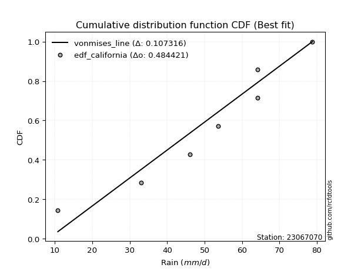</img>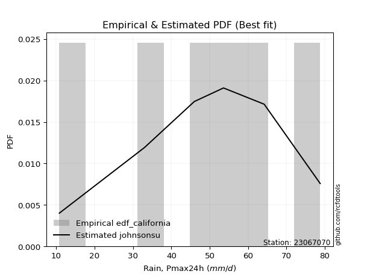</img>

</div>


### 2. Empirical - EDF Hazen (1930)

Hazen method for plotting positions is a formula used to estimate the empirical cumulative probability distribution of flood events or other hydrological data. This formula often results in biased estimations, particularly when extrapolating to extreme events (high return periods).

<div align="center">


$P=(m-0.5)/n$


</div>


**2.1. Empirical values**

<div align="center">

|                | 0                   | 1                   | 2                   | 3         | 4                  | 5                  | 6                  |
|:---------------|:--------------------|:--------------------|:--------------------|:----------|:-------------------|:-------------------|:-------------------|
| date           | 2024                | 2025                | 2023                | 2022      | 2021               | 2019               | 2020               |
| x              | 10.8                | 13.6                | 33.0                | 46.0      | 53.6               | 64.2               | 78.8               |
| m              | 1                   | 2                   | 3                   | 4         | 5                  | 6                  | 7                  |
| empirical_dist | edf_hazen           | edf_hazen           | edf_hazen           | edf_hazen | edf_hazen          | edf_hazen          | edf_hazen          |
| empirical      | 0.07142857142857142 | 0.21428571428571427 | 0.35714285714285715 | 0.5       | 0.6428571428571429 | 0.7857142857142857 | 0.9285714285714286 |
| empirical_tr   | 1.0769230769230769  | 1.2727272727272727  | 1.5555555555555558  | 2.0       | 2.8000000000000003 | 4.666666666666666  | 14.000000000000007 |

</div>


**2.2. Kolmogorov-Smirnov fit test (sorted by Δ)**


<div align="center">

|                | 0                   | 1                   | 2                   | 3                     | 4                   | 5                   | 6                   | 7                   | 8                   | 9                   | 10                  | 11                  | 12                  | 13                  | 14                  | 15                  | 16                  | 17                  | 18                  | 19                  | 20                  | 21                  | 22                  | 23                  | 24                  | 25                  | 26                  | 27                  | 28                  | 29                  | 30                  | 31                  | 32                  | 33                  | 34                  | 35                  | 36                  | 37                  | 38                  | 39                  | 40                  | 41                  | 42                  | 43                  | 44                  | 45                  | 46                  | 47                  | 48                  | 49                  | 50                  | 51                  | 52                  | 53                  | 54                  | 55                  | 56                  | 57                  | 58                  | 59                  | 60                  | 61                  | 62                  | 63                  | 64                  | 65                  | 66                  | 67                  | 68                  | 69                  | 70                  | 71                  | 72                  | 73                  | 74                  | 75                  | 76                  | 77                  | 78                  | 79                  | 80                  | 81                  | 82                  | 83                  | 84                  | 85                  | 86                  | 87                  | 88                  | 89                  |
|:---------------|:--------------------|:--------------------|:--------------------|:----------------------|:--------------------|:--------------------|:--------------------|:--------------------|:--------------------|:--------------------|:--------------------|:--------------------|:--------------------|:--------------------|:--------------------|:--------------------|:--------------------|:--------------------|:--------------------|:--------------------|:--------------------|:--------------------|:--------------------|:--------------------|:--------------------|:--------------------|:--------------------|:--------------------|:--------------------|:--------------------|:--------------------|:--------------------|:--------------------|:--------------------|:--------------------|:--------------------|:--------------------|:--------------------|:--------------------|:--------------------|:--------------------|:--------------------|:--------------------|:--------------------|:--------------------|:--------------------|:--------------------|:--------------------|:--------------------|:--------------------|:--------------------|:--------------------|:--------------------|:--------------------|:--------------------|:--------------------|:--------------------|:--------------------|:--------------------|:--------------------|:--------------------|:--------------------|:--------------------|:--------------------|:--------------------|:--------------------|:--------------------|:--------------------|:--------------------|:--------------------|:--------------------|:--------------------|:--------------------|:--------------------|:--------------------|:--------------------|:--------------------|:--------------------|:--------------------|:--------------------|:--------------------|:--------------------|:--------------------|:--------------------|:--------------------|:--------------------|:--------------------|:--------------------|:--------------------|:--------------------|
| station        | 23067070            | 23067070            | 23067070            | 23067070              | 23067070            | 23067070            | 23067070            | 23067070            | 23067070            | 23067070            | 23067070            | 23067070            | 23067070            | 23067070            | 23067070            | 23067070            | 23067070            | 23067070            | 23067070            | 23067070            | 23067070            | 23067070            | 23067070            | 23067070            | 23067070            | 23067070            | 23067070            | 23067070            | 23067070            | 23067070            | 23067070            | 23067070            | 23067070            | 23067070            | 23067070            | 23067070            | 23067070            | 23067070            | 23067070            | 23067070            | 23067070            | 23067070            | 23067070            | 23067070            | 23067070            | 23067070            | 23067070            | 23067070            | 23067070            | 23067070            | 23067070            | 23067070            | 23067070            | 23067070            | 23067070            | 23067070            | 23067070            | 23067070            | 23067070            | 23067070            | 23067070            | 23067070            | 23067070            | 23067070            | 23067070            | 23067070            | 23067070            | 23067070            | 23067070            | 23067070            | 23067070            | 23067070            | 23067070            | 23067070            | 23067070            | 23067070            | 23067070            | 23067070            | 23067070            | 23067070            | 23067070            | 23067070            | 23067070            | 23067070            | 23067070            | 23067070            | 23067070            | 23067070            | 23067070            | 23067070            |
| empirical_dist | edf_hazen           | edf_hazen           | edf_hazen           | edf_hazen             | edf_hazen           | edf_hazen           | edf_hazen           | edf_hazen           | edf_hazen           | edf_hazen           | edf_hazen           | edf_hazen           | edf_hazen           | edf_hazen           | edf_hazen           | edf_hazen           | edf_hazen           | edf_hazen           | edf_hazen           | edf_hazen           | edf_hazen           | edf_hazen           | edf_hazen           | edf_hazen           | edf_hazen           | edf_hazen           | edf_hazen           | edf_hazen           | edf_hazen           | edf_hazen           | edf_hazen           | edf_hazen           | edf_hazen           | edf_hazen           | edf_hazen           | edf_hazen           | edf_hazen           | edf_hazen           | edf_hazen           | edf_hazen           | edf_hazen           | edf_hazen           | edf_hazen           | edf_hazen           | edf_hazen           | edf_hazen           | edf_hazen           | edf_hazen           | edf_hazen           | edf_hazen           | edf_hazen           | edf_hazen           | edf_hazen           | edf_hazen           | edf_hazen           | edf_hazen           | edf_hazen           | edf_hazen           | edf_hazen           | edf_hazen           | edf_hazen           | edf_hazen           | edf_hazen           | edf_hazen           | edf_hazen           | edf_hazen           | edf_hazen           | edf_hazen           | edf_hazen           | edf_hazen           | edf_hazen           | edf_hazen           | edf_hazen           | edf_hazen           | edf_hazen           | edf_hazen           | edf_hazen           | edf_hazen           | edf_hazen           | edf_hazen           | edf_hazen           | edf_hazen           | edf_hazen           | edf_hazen           | edf_hazen           | edf_hazen           | edf_hazen           | edf_hazen           | edf_hazen           | edf_hazen           |
| p_dist         | laplace_asymmetric  | logjohnsonsu        | mielke              | loglaplace_asymmetric | logloggamma         | fisk                | gumbel_l            | pearson3            | nct                 | t                   | truncnorm           | crystalball         | norm                | exponnorm           | johnsonsu           | gamma               | erlang              | invgamma            | genlogistic         | loggumbel_l         | betaprime           | maxwell             | invgauss            | logistic            | kstwobign           | logpearson3         | rayleigh            | hypsecant           | logweibull_min      | laplace             | rice                | logfisk             | gumbel_r            | logbetaprime        | logf                | logcrystalball      | lognorm             | lognorm             | logt                | logexponnorm        | lognct              | logfatiguelife      | f                   | loggompertz         | logncf              | logerlang           | loggamma            | loggamma            | loginvgamma         | logrice             | loginvweibull       | expon               | genexpon            | ncf                 | loginvgauss         | gompertz            | alpha               | logalpha            | weibull_min         | loglogistic         | logmaxwell          | halfnorm            | nakagami            | moyal               | lograyleigh         | loghypsecant        | loggenexpon         | logkstwobign        | loghalfnorm         | loggumbel_r         | loglaplace          | halflogistic        | wald                | loghalflogistic     | logmoyal            | gibrat              | logexpon            | logwald             | chi2                | loggibrat           | pareto              | logchi2             | lognakagami         | logtruncnorm        | logmielke           | logpareto           | loglognorm          | fatiguelife         | invweibull          | loggenlogistic      |
| delta          | 0.086651508197085   | 0.09118608538170578 | 0.09249984386112096 | 0.09690032018661682   | 0.0986509048314109  | 0.10174731531208124 | 0.10704611369134426 | 0.10780063931304333 | 0.1080587295154671  | 0.10807977016142982 | 0.10808009076173199 | 0.1080800959296708  | 0.10808010005345661 | 0.1080803440786694  | 0.10827985610418303 | 0.10831048909076495 | 0.10831359251132484 | 0.109195211136639   | 0.11434157846797806 | 0.11527055734197544 | 0.11705990189328999 | 0.11719702315921485 | 0.11820999522357788 | 0.11994410838086786 | 0.1209056140690612  | 0.12227025185944451 | 0.12346285789173092 | 0.12508632016853669 | 0.1259648290199279  | 0.12856137903394282 | 0.13117858489689274 | 0.13181490891895403 | 0.15218251332670366 | 0.15287465504584985 | 0.15295621302102402 | 0.15379093546581124 | 0.15379100411527313 | 0.15379100411527313 | 0.15379143830595132 | 0.15379194806730911 | 0.1547072972133734  | 0.15488331772407138 | 0.1558130748679718  | 0.15766953338147213 | 0.15910565262298748 | 0.15973738510939062 | 0.15991441000425088 | 0.15991441000425088 | 0.1603850660347308  | 0.16239600330594828 | 0.16398136230679966 | 0.16647558759349068 | 0.16649152866678496 | 0.16686482046570317 | 0.1672179678344019  | 0.16939447157667492 | 0.16946240198648427 | 0.1699245572696062  | 0.17101658084220506 | 0.1720551908168133  | 0.17501926700446602 | 0.17743444340644493 | 0.17948562992438605 | 0.1799981446902914  | 0.18138860158216086 | 0.18616589541508488 | 0.1972570672215777  | 0.1978372654403961  | 0.20903761913595592 | 0.21315959916884375 | 0.2142322450344819  | 0.21428571428571427 | 0.21658278243018914 | 0.228015533606596   | 0.23276526210645487 | 0.24594003974252843 | 0.2588873921567226  | 0.28843092312337415 | 0.3081971990258656  | 0.3206254497369434  | 0.33103269290887927 | 0.34316147397191393 | 0.3482673271227756  | 0.35705464897330885 | 0.36409420109797824 | 0.3788293508196777  | 0.3958029671554212  | 0.43332649398243267 | 0.48204845818927483 | 0.7857142857142857  |
| deltao         | 0.48442053926100004 | 0.48442053926100004 | 0.48442053926100004 | 0.48442053926100004   | 0.48442053926100004 | 0.48442053926100004 | 0.48442053926100004 | 0.48442053926100004 | 0.48442053926100004 | 0.48442053926100004 | 0.48442053926100004 | 0.48442053926100004 | 0.48442053926100004 | 0.48442053926100004 | 0.48442053926100004 | 0.48442053926100004 | 0.48442053926100004 | 0.48442053926100004 | 0.48442053926100004 | 0.48442053926100004 | 0.48442053926100004 | 0.48442053926100004 | 0.48442053926100004 | 0.48442053926100004 | 0.48442053926100004 | 0.48442053926100004 | 0.48442053926100004 | 0.48442053926100004 | 0.48442053926100004 | 0.48442053926100004 | 0.48442053926100004 | 0.48442053926100004 | 0.48442053926100004 | 0.48442053926100004 | 0.48442053926100004 | 0.48442053926100004 | 0.48442053926100004 | 0.48442053926100004 | 0.48442053926100004 | 0.48442053926100004 | 0.48442053926100004 | 0.48442053926100004 | 0.48442053926100004 | 0.48442053926100004 | 0.48442053926100004 | 0.48442053926100004 | 0.48442053926100004 | 0.48442053926100004 | 0.48442053926100004 | 0.48442053926100004 | 0.48442053926100004 | 0.48442053926100004 | 0.48442053926100004 | 0.48442053926100004 | 0.48442053926100004 | 0.48442053926100004 | 0.48442053926100004 | 0.48442053926100004 | 0.48442053926100004 | 0.48442053926100004 | 0.48442053926100004 | 0.48442053926100004 | 0.48442053926100004 | 0.48442053926100004 | 0.48442053926100004 | 0.48442053926100004 | 0.48442053926100004 | 0.48442053926100004 | 0.48442053926100004 | 0.48442053926100004 | 0.48442053926100004 | 0.48442053926100004 | 0.48442053926100004 | 0.48442053926100004 | 0.48442053926100004 | 0.48442053926100004 | 0.48442053926100004 | 0.48442053926100004 | 0.48442053926100004 | 0.48442053926100004 | 0.48442053926100004 | 0.48442053926100004 | 0.48442053926100004 | 0.48442053926100004 | 0.48442053926100004 | 0.48442053926100004 | 0.48442053926100004 | 0.48442053926100004 | 0.48442053926100004 | 0.48442053926100004 |
| eval           | Δo > Δ              | Δo > Δ              | Δo > Δ              | Δo > Δ                | Δo > Δ              | Δo > Δ              | Δo > Δ              | Δo > Δ              | Δo > Δ              | Δo > Δ              | Δo > Δ              | Δo > Δ              | Δo > Δ              | Δo > Δ              | Δo > Δ              | Δo > Δ              | Δo > Δ              | Δo > Δ              | Δo > Δ              | Δo > Δ              | Δo > Δ              | Δo > Δ              | Δo > Δ              | Δo > Δ              | Δo > Δ              | Δo > Δ              | Δo > Δ              | Δo > Δ              | Δo > Δ              | Δo > Δ              | Δo > Δ              | Δo > Δ              | Δo > Δ              | Δo > Δ              | Δo > Δ              | Δo > Δ              | Δo > Δ              | Δo > Δ              | Δo > Δ              | Δo > Δ              | Δo > Δ              | Δo > Δ              | Δo > Δ              | Δo > Δ              | Δo > Δ              | Δo > Δ              | Δo > Δ              | Δo > Δ              | Δo > Δ              | Δo > Δ              | Δo > Δ              | Δo > Δ              | Δo > Δ              | Δo > Δ              | Δo > Δ              | Δo > Δ              | Δo > Δ              | Δo > Δ              | Δo > Δ              | Δo > Δ              | Δo > Δ              | Δo > Δ              | Δo > Δ              | Δo > Δ              | Δo > Δ              | Δo > Δ              | Δo > Δ              | Δo > Δ              | Δo > Δ              | Δo > Δ              | Δo > Δ              | Δo > Δ              | Δo > Δ              | Δo > Δ              | Δo > Δ              | Δo > Δ              | Δo > Δ              | Δo > Δ              | Δo > Δ              | Δo > Δ              | Δo > Δ              | Δo > Δ              | Δo > Δ              | Δo > Δ              | Δo > Δ              | Δo > Δ              | Δo > Δ              | Δo > Δ              | Δo > Δ              | Δo <= Δ             |
| fit            | 1                   | 1                   | 1                   | 1                     | 1                   | 1                   | 1                   | 1                   | 1                   | 1                   | 1                   | 1                   | 1                   | 1                   | 1                   | 1                   | 1                   | 1                   | 1                   | 1                   | 1                   | 1                   | 1                   | 1                   | 1                   | 1                   | 1                   | 1                   | 1                   | 1                   | 1                   | 1                   | 1                   | 1                   | 1                   | 1                   | 1                   | 1                   | 1                   | 1                   | 1                   | 1                   | 1                   | 1                   | 1                   | 1                   | 1                   | 1                   | 1                   | 1                   | 1                   | 1                   | 1                   | 1                   | 1                   | 1                   | 1                   | 1                   | 1                   | 1                   | 1                   | 1                   | 1                   | 1                   | 1                   | 1                   | 1                   | 1                   | 1                   | 1                   | 1                   | 1                   | 1                   | 1                   | 1                   | 1                   | 1                   | 1                   | 1                   | 1                   | 1                   | 1                   | 1                   | 1                   | 1                   | 1                   | 1                   | 1                   | 1                   | 0                   |
| n              | 7                   | 7                   | 7                   | 7                     | 7                   | 7                   | 7                   | 7                   | 7                   | 7                   | 7                   | 7                   | 7                   | 7                   | 7                   | 7                   | 7                   | 7                   | 7                   | 7                   | 7                   | 7                   | 7                   | 7                   | 7                   | 7                   | 7                   | 7                   | 7                   | 7                   | 7                   | 7                   | 7                   | 7                   | 7                   | 7                   | 7                   | 7                   | 7                   | 7                   | 7                   | 7                   | 7                   | 7                   | 7                   | 7                   | 7                   | 7                   | 7                   | 7                   | 7                   | 7                   | 7                   | 7                   | 7                   | 7                   | 7                   | 7                   | 7                   | 7                   | 7                   | 7                   | 7                   | 7                   | 7                   | 7                   | 7                   | 7                   | 7                   | 7                   | 7                   | 7                   | 7                   | 7                   | 7                   | 7                   | 7                   | 7                   | 7                   | 7                   | 7                   | 7                   | 7                   | 7                   | 7                   | 7                   | 7                   | 7                   | 7                   | 7                   |
| best_fit       | 1                   | 0                   | 0                   | 0                     | 0                   | 0                   | 0                   | 0                   | 0                   | 0                   | 0                   | 0                   | 0                   | 0                   | 0                   | 0                   | 0                   | 0                   | 0                   | 0                   | 0                   | 0                   | 0                   | 0                   | 0                   | 0                   | 0                   | 0                   | 0                   | 0                   | 0                   | 0                   | 0                   | 0                   | 0                   | 0                   | 0                   | 0                   | 0                   | 0                   | 0                   | 0                   | 0                   | 0                   | 0                   | 0                   | 0                   | 0                   | 0                   | 0                   | 0                   | 0                   | 0                   | 0                   | 0                   | 0                   | 0                   | 0                   | 0                   | 0                   | 0                   | 0                   | 0                   | 0                   | 0                   | 0                   | 0                   | 0                   | 0                   | 0                   | 0                   | 0                   | 0                   | 0                   | 0                   | 0                   | 0                   | 0                   | 0                   | 0                   | 0                   | 0                   | 0                   | 0                   | 0                   | 0                   | 0                   | 0                   | 0                   | 0                   |
| best_fit_sort  | 1                   | 2                   | 3                   | 4                     | 5                   | 6                   | 7                   | 8                   | 9                   | 10                  | 11                  | 12                  | 13                  | 14                  | 15                  | 16                  | 17                  | 18                  | 19                  | 20                  | 21                  | 22                  | 23                  | 24                  | 25                  | 26                  | 27                  | 28                  | 29                  | 30                  | 31                  | 32                  | 33                  | 34                  | 35                  | 36                  | 37                  | 38                  | 39                  | 40                  | 41                  | 42                  | 43                  | 44                  | 45                  | 46                  | 47                  | 48                  | 49                  | 50                  | 51                  | 52                  | 53                  | 54                  | 55                  | 56                  | 57                  | 58                  | 59                  | 60                  | 61                  | 62                  | 63                  | 64                  | 65                  | 66                  | 67                  | 68                  | 69                  | 70                  | 71                  | 72                  | 73                  | 74                  | 75                  | 76                  | 77                  | 78                  | 79                  | 80                  | 81                  | 82                  | 83                  | 84                  | 85                  | 86                  | 87                  | 88                  | 89                  | 90                  |

</div>


<div align="center">

</img>

</div>


**2.3. Best fit**

<div align="center">

|   id |   station | empirical_dist   | p_dist             |     delta |   deltao | eval   |   fit |   n |   best_fit |   best_fit_sort |
|-----:|----------:|:-----------------|:-------------------|----------:|---------:|:-------|------:|----:|-----------:|----------------:|
|    0 |  23067070 | edf_hazen        | laplace_asymmetric | 0.0866515 | 0.484421 | Δo > Δ |     1 |   7 |          1 |               1 |

</div>


<div align="center">

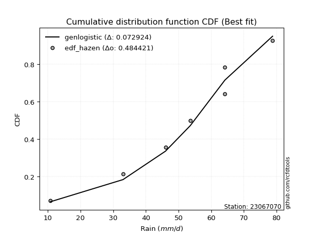</img>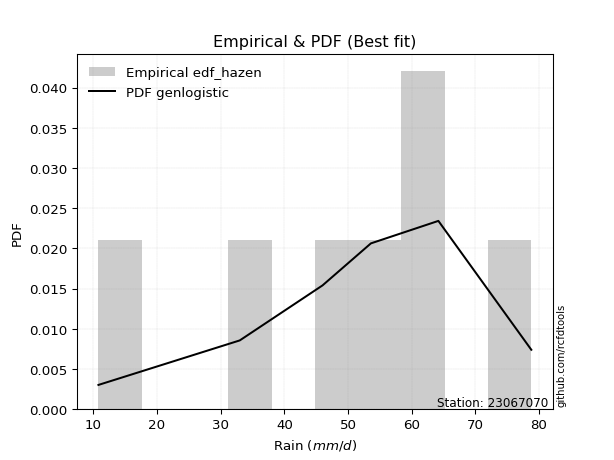</img>

</div>


### 3. Empirical - EDF Weibull (1939)

Weibull plotting position formula is an empirical method used to estimate the non-exceedance probability or plotting position for a set of observed data, is often recommended or widely used in practice, particularly in flood frequency analysis.

<div align="center">


$P=m/(n+1)$


</div>


**3.1. Empirical values**

<div align="center">

|                | 0                  | 1                  | 2           | 3           | 4                  | 5           | 6           |
|:---------------|:-------------------|:-------------------|:------------|:------------|:-------------------|:------------|:------------|
| date           | 2024               | 2025               | 2023        | 2022        | 2021               | 2019        | 2020        |
| x              | 10.8               | 13.6               | 33.0        | 46.0        | 53.6               | 64.2        | 78.8        |
| m              | 1                  | 2                  | 3           | 4           | 5                  | 6           | 7           |
| empirical_dist | edf_weibull        | edf_weibull        | edf_weibull | edf_weibull | edf_weibull        | edf_weibull | edf_weibull |
| empirical      | 0.125              | 0.25               | 0.375       | 0.5         | 0.625              | 0.75        | 0.875       |
| empirical_tr   | 1.1428571428571428 | 1.3333333333333333 | 1.6         | 2.0         | 2.6666666666666665 | 4.0         | 8.0         |

</div>


**3.2. Kolmogorov-Smirnov fit test (sorted by Δ)**


<div align="center">

|                | 0                   | 1                   | 2                   | 3                   | 4                     | 5                   | 6                   | 7                   | 8                   | 9                   | 10                  | 11                  | 12                  | 13                  | 14                  | 15                  | 16                  | 17                  | 18                  | 19                  | 20                  | 21                  | 22                  | 23                  | 24                  | 25                  | 26                  | 27                  | 28                  | 29                  | 30                  | 31                  | 32                  | 33                  | 34                  | 35                  | 36                  | 37                  | 38                  | 39                  | 40                  | 41                  | 42                  | 43                  | 44                  | 45                  | 46                  | 47                  | 48                  | 49                  | 50                  | 51                  | 52                  | 53                  | 54                  | 55                  | 56                  | 57                  | 58                  | 59                  | 60                  | 61                  | 62                  | 63                  | 64                  | 65                  | 66                  | 67                  | 68                  | 69                  | 70                  | 71                  | 72                  | 73                  | 74                  | 75                  | 76                  | 77                  | 78                  | 79                  | 80                  | 81                  | 82                  | 83                  | 84                  | 85                  | 86                  | 87                  | 88                  | 89                  |
|:---------------|:--------------------|:--------------------|:--------------------|:--------------------|:----------------------|:--------------------|:--------------------|:--------------------|:--------------------|:--------------------|:--------------------|:--------------------|:--------------------|:--------------------|:--------------------|:--------------------|:--------------------|:--------------------|:--------------------|:--------------------|:--------------------|:--------------------|:--------------------|:--------------------|:--------------------|:--------------------|:--------------------|:--------------------|:--------------------|:--------------------|:--------------------|:--------------------|:--------------------|:--------------------|:--------------------|:--------------------|:--------------------|:--------------------|:--------------------|:--------------------|:--------------------|:--------------------|:--------------------|:--------------------|:--------------------|:--------------------|:--------------------|:--------------------|:--------------------|:--------------------|:--------------------|:--------------------|:--------------------|:--------------------|:--------------------|:--------------------|:--------------------|:--------------------|:--------------------|:--------------------|:--------------------|:--------------------|:--------------------|:--------------------|:--------------------|:--------------------|:--------------------|:--------------------|:--------------------|:--------------------|:--------------------|:--------------------|:--------------------|:--------------------|:--------------------|:--------------------|:--------------------|:--------------------|:--------------------|:--------------------|:--------------------|:--------------------|:--------------------|:--------------------|:--------------------|:--------------------|:--------------------|:--------------------|:--------------------|:--------------------|
| station        | 23067070            | 23067070            | 23067070            | 23067070            | 23067070              | 23067070            | 23067070            | 23067070            | 23067070            | 23067070            | 23067070            | 23067070            | 23067070            | 23067070            | 23067070            | 23067070            | 23067070            | 23067070            | 23067070            | 23067070            | 23067070            | 23067070            | 23067070            | 23067070            | 23067070            | 23067070            | 23067070            | 23067070            | 23067070            | 23067070            | 23067070            | 23067070            | 23067070            | 23067070            | 23067070            | 23067070            | 23067070            | 23067070            | 23067070            | 23067070            | 23067070            | 23067070            | 23067070            | 23067070            | 23067070            | 23067070            | 23067070            | 23067070            | 23067070            | 23067070            | 23067070            | 23067070            | 23067070            | 23067070            | 23067070            | 23067070            | 23067070            | 23067070            | 23067070            | 23067070            | 23067070            | 23067070            | 23067070            | 23067070            | 23067070            | 23067070            | 23067070            | 23067070            | 23067070            | 23067070            | 23067070            | 23067070            | 23067070            | 23067070            | 23067070            | 23067070            | 23067070            | 23067070            | 23067070            | 23067070            | 23067070            | 23067070            | 23067070            | 23067070            | 23067070            | 23067070            | 23067070            | 23067070            | 23067070            | 23067070            |
| empirical_dist | edf_weibull         | edf_weibull         | edf_weibull         | edf_weibull         | edf_weibull           | edf_weibull         | edf_weibull         | edf_weibull         | edf_weibull         | edf_weibull         | edf_weibull         | edf_weibull         | edf_weibull         | edf_weibull         | edf_weibull         | edf_weibull         | edf_weibull         | edf_weibull         | edf_weibull         | edf_weibull         | edf_weibull         | edf_weibull         | edf_weibull         | edf_weibull         | edf_weibull         | edf_weibull         | edf_weibull         | edf_weibull         | edf_weibull         | edf_weibull         | edf_weibull         | edf_weibull         | edf_weibull         | edf_weibull         | edf_weibull         | edf_weibull         | edf_weibull         | edf_weibull         | edf_weibull         | edf_weibull         | edf_weibull         | edf_weibull         | edf_weibull         | edf_weibull         | edf_weibull         | edf_weibull         | edf_weibull         | edf_weibull         | edf_weibull         | edf_weibull         | edf_weibull         | edf_weibull         | edf_weibull         | edf_weibull         | edf_weibull         | edf_weibull         | edf_weibull         | edf_weibull         | edf_weibull         | edf_weibull         | edf_weibull         | edf_weibull         | edf_weibull         | edf_weibull         | edf_weibull         | edf_weibull         | edf_weibull         | edf_weibull         | edf_weibull         | edf_weibull         | edf_weibull         | edf_weibull         | edf_weibull         | edf_weibull         | edf_weibull         | edf_weibull         | edf_weibull         | edf_weibull         | edf_weibull         | edf_weibull         | edf_weibull         | edf_weibull         | edf_weibull         | edf_weibull         | edf_weibull         | edf_weibull         | edf_weibull         | edf_weibull         | edf_weibull         | edf_weibull         |
| p_dist         | laplace_asymmetric  | ncf                 | logjohnsonsu        | mielke              | loglaplace_asymmetric | logloggamma         | fisk                | gumbel_l            | pearson3            | nct                 | t                   | truncnorm           | crystalball         | norm                | exponnorm           | johnsonsu           | gamma               | erlang              | invgamma            | logpearson3         | genlogistic         | kstwobign           | loggumbel_l         | alpha               | betaprime           | maxwell             | logbetaprime        | invgauss            | lognct              | logf                | logt                | logexponnorm        | logcrystalball      | lognorm             | lognorm             | logistic            | f                   | logfatiguelife      | logncf              | rayleigh            | logerlang           | loggamma            | loggamma            | loginvweibull       | loginvgamma         | hypsecant           | logweibull_min      | logrice             | laplace             | expon               | genexpon            | nakagami            | rice                | loginvgauss         | logfisk             | logalpha            | weibull_min         | loglogistic         | logmaxwell          | lograyleigh         | loghypsecant        | gumbel_r            | loggenexpon         | logkstwobign        | loggompertz         | gompertz            | halfnorm            | loggumbel_r         | loglaplace          | moyal               | logmoyal            | logexpon            | loghalfnorm         | halflogistic        | gibrat              | wald                | loghalflogistic     | logwald             | pareto              | chi2                | loggibrat           | logchi2             | lognakagami         | logpareto           | logmielke           | loglognorm          | logtruncnorm        | fatiguelife         | invweibull          | loggenlogistic      |
| delta          | 0.12236579391137073 | 0.12498728240526341 | 0.1269003710959915  | 0.12821412957540668 | 0.13261460590090254   | 0.13436519054569662 | 0.13746160102636695 | 0.14276039940562998 | 0.14351492502732904 | 0.14377301522975283 | 0.14379405587571553 | 0.14379437647601773 | 0.14379438164395653 | 0.14379438576774234 | 0.14379462979295513 | 0.14399414181846876 | 0.14402477480505066 | 0.14402787822561058 | 0.14490949685092475 | 0.1477710092474257  | 0.1500558641822638  | 0.1504285802164796  | 0.15098484305626117 | 0.15160525912934142 | 0.15277418760757572 | 0.15291130887350057 | 0.1533501275354657  | 0.1539242809378636  | 0.1547072972133734  | 0.1552328830716235  | 0.1553551204796983  | 0.15535521002948516 | 0.15535570275792304 | 0.15535574134913788 | 0.15535574134913788 | 0.15565839409515358 | 0.1558130748679718  | 0.15597124731719442 | 0.15910565262298748 | 0.15917714360601665 | 0.15973738510939062 | 0.15991441000425088 | 0.15991441000425088 | 0.16002101409176417 | 0.1603850660347308  | 0.1608006058828224  | 0.16167911473421362 | 0.16239600330594828 | 0.16427566474822852 | 0.16647558759349068 | 0.16649152866678496 | 0.16685542370093975 | 0.16689287061117847 | 0.1672179678344019  | 0.16752919463323976 | 0.1699245572696062  | 0.17101658084220506 | 0.1720551908168133  | 0.17501926700446602 | 0.18138860158216086 | 0.18616589541508488 | 0.18789679904098938 | 0.19204899298751776 | 0.1922511397356429  | 0.19338381909575786 | 0.20510875729096067 | 0.21314872912073066 | 0.21315959916884375 | 0.2142322450344819  | 0.21571243040457716 | 0.23276526210645487 | 0.24103024929957972 | 0.24475190485024165 | 0.25                | 0.25                | 0.25                | 0.25                | 0.28843092312337415 | 0.304240041789158   | 0.3081971990258656  | 0.3206254497369434  | 0.3253043311147711  | 0.33041018426563273 | 0.343115065105392   | 0.3462370582408354  | 0.3600886814411355  | 0.3749117918304517  | 0.4154693511252898  | 0.42847702961784623 | 0.75                |
| deltao         | 0.48442053926100004 | 0.48442053926100004 | 0.48442053926100004 | 0.48442053926100004 | 0.48442053926100004   | 0.48442053926100004 | 0.48442053926100004 | 0.48442053926100004 | 0.48442053926100004 | 0.48442053926100004 | 0.48442053926100004 | 0.48442053926100004 | 0.48442053926100004 | 0.48442053926100004 | 0.48442053926100004 | 0.48442053926100004 | 0.48442053926100004 | 0.48442053926100004 | 0.48442053926100004 | 0.48442053926100004 | 0.48442053926100004 | 0.48442053926100004 | 0.48442053926100004 | 0.48442053926100004 | 0.48442053926100004 | 0.48442053926100004 | 0.48442053926100004 | 0.48442053926100004 | 0.48442053926100004 | 0.48442053926100004 | 0.48442053926100004 | 0.48442053926100004 | 0.48442053926100004 | 0.48442053926100004 | 0.48442053926100004 | 0.48442053926100004 | 0.48442053926100004 | 0.48442053926100004 | 0.48442053926100004 | 0.48442053926100004 | 0.48442053926100004 | 0.48442053926100004 | 0.48442053926100004 | 0.48442053926100004 | 0.48442053926100004 | 0.48442053926100004 | 0.48442053926100004 | 0.48442053926100004 | 0.48442053926100004 | 0.48442053926100004 | 0.48442053926100004 | 0.48442053926100004 | 0.48442053926100004 | 0.48442053926100004 | 0.48442053926100004 | 0.48442053926100004 | 0.48442053926100004 | 0.48442053926100004 | 0.48442053926100004 | 0.48442053926100004 | 0.48442053926100004 | 0.48442053926100004 | 0.48442053926100004 | 0.48442053926100004 | 0.48442053926100004 | 0.48442053926100004 | 0.48442053926100004 | 0.48442053926100004 | 0.48442053926100004 | 0.48442053926100004 | 0.48442053926100004 | 0.48442053926100004 | 0.48442053926100004 | 0.48442053926100004 | 0.48442053926100004 | 0.48442053926100004 | 0.48442053926100004 | 0.48442053926100004 | 0.48442053926100004 | 0.48442053926100004 | 0.48442053926100004 | 0.48442053926100004 | 0.48442053926100004 | 0.48442053926100004 | 0.48442053926100004 | 0.48442053926100004 | 0.48442053926100004 | 0.48442053926100004 | 0.48442053926100004 | 0.48442053926100004 |
| eval           | Δo > Δ              | Δo > Δ              | Δo > Δ              | Δo > Δ              | Δo > Δ                | Δo > Δ              | Δo > Δ              | Δo > Δ              | Δo > Δ              | Δo > Δ              | Δo > Δ              | Δo > Δ              | Δo > Δ              | Δo > Δ              | Δo > Δ              | Δo > Δ              | Δo > Δ              | Δo > Δ              | Δo > Δ              | Δo > Δ              | Δo > Δ              | Δo > Δ              | Δo > Δ              | Δo > Δ              | Δo > Δ              | Δo > Δ              | Δo > Δ              | Δo > Δ              | Δo > Δ              | Δo > Δ              | Δo > Δ              | Δo > Δ              | Δo > Δ              | Δo > Δ              | Δo > Δ              | Δo > Δ              | Δo > Δ              | Δo > Δ              | Δo > Δ              | Δo > Δ              | Δo > Δ              | Δo > Δ              | Δo > Δ              | Δo > Δ              | Δo > Δ              | Δo > Δ              | Δo > Δ              | Δo > Δ              | Δo > Δ              | Δo > Δ              | Δo > Δ              | Δo > Δ              | Δo > Δ              | Δo > Δ              | Δo > Δ              | Δo > Δ              | Δo > Δ              | Δo > Δ              | Δo > Δ              | Δo > Δ              | Δo > Δ              | Δo > Δ              | Δo > Δ              | Δo > Δ              | Δo > Δ              | Δo > Δ              | Δo > Δ              | Δo > Δ              | Δo > Δ              | Δo > Δ              | Δo > Δ              | Δo > Δ              | Δo > Δ              | Δo > Δ              | Δo > Δ              | Δo > Δ              | Δo > Δ              | Δo > Δ              | Δo > Δ              | Δo > Δ              | Δo > Δ              | Δo > Δ              | Δo > Δ              | Δo > Δ              | Δo > Δ              | Δo > Δ              | Δo > Δ              | Δo > Δ              | Δo > Δ              | Δo <= Δ             |
| fit            | 1                   | 1                   | 1                   | 1                   | 1                     | 1                   | 1                   | 1                   | 1                   | 1                   | 1                   | 1                   | 1                   | 1                   | 1                   | 1                   | 1                   | 1                   | 1                   | 1                   | 1                   | 1                   | 1                   | 1                   | 1                   | 1                   | 1                   | 1                   | 1                   | 1                   | 1                   | 1                   | 1                   | 1                   | 1                   | 1                   | 1                   | 1                   | 1                   | 1                   | 1                   | 1                   | 1                   | 1                   | 1                   | 1                   | 1                   | 1                   | 1                   | 1                   | 1                   | 1                   | 1                   | 1                   | 1                   | 1                   | 1                   | 1                   | 1                   | 1                   | 1                   | 1                   | 1                   | 1                   | 1                   | 1                   | 1                   | 1                   | 1                   | 1                   | 1                   | 1                   | 1                   | 1                   | 1                   | 1                   | 1                   | 1                   | 1                   | 1                   | 1                   | 1                   | 1                   | 1                   | 1                   | 1                   | 1                   | 1                   | 1                   | 0                   |
| n              | 7                   | 7                   | 7                   | 7                   | 7                     | 7                   | 7                   | 7                   | 7                   | 7                   | 7                   | 7                   | 7                   | 7                   | 7                   | 7                   | 7                   | 7                   | 7                   | 7                   | 7                   | 7                   | 7                   | 7                   | 7                   | 7                   | 7                   | 7                   | 7                   | 7                   | 7                   | 7                   | 7                   | 7                   | 7                   | 7                   | 7                   | 7                   | 7                   | 7                   | 7                   | 7                   | 7                   | 7                   | 7                   | 7                   | 7                   | 7                   | 7                   | 7                   | 7                   | 7                   | 7                   | 7                   | 7                   | 7                   | 7                   | 7                   | 7                   | 7                   | 7                   | 7                   | 7                   | 7                   | 7                   | 7                   | 7                   | 7                   | 7                   | 7                   | 7                   | 7                   | 7                   | 7                   | 7                   | 7                   | 7                   | 7                   | 7                   | 7                   | 7                   | 7                   | 7                   | 7                   | 7                   | 7                   | 7                   | 7                   | 7                   | 7                   |
| best_fit       | 1                   | 0                   | 0                   | 0                   | 0                     | 0                   | 0                   | 0                   | 0                   | 0                   | 0                   | 0                   | 0                   | 0                   | 0                   | 0                   | 0                   | 0                   | 0                   | 0                   | 0                   | 0                   | 0                   | 0                   | 0                   | 0                   | 0                   | 0                   | 0                   | 0                   | 0                   | 0                   | 0                   | 0                   | 0                   | 0                   | 0                   | 0                   | 0                   | 0                   | 0                   | 0                   | 0                   | 0                   | 0                   | 0                   | 0                   | 0                   | 0                   | 0                   | 0                   | 0                   | 0                   | 0                   | 0                   | 0                   | 0                   | 0                   | 0                   | 0                   | 0                   | 0                   | 0                   | 0                   | 0                   | 0                   | 0                   | 0                   | 0                   | 0                   | 0                   | 0                   | 0                   | 0                   | 0                   | 0                   | 0                   | 0                   | 0                   | 0                   | 0                   | 0                   | 0                   | 0                   | 0                   | 0                   | 0                   | 0                   | 0                   | 0                   |
| best_fit_sort  | 1                   | 2                   | 3                   | 4                   | 5                     | 6                   | 7                   | 8                   | 9                   | 10                  | 11                  | 12                  | 13                  | 14                  | 15                  | 16                  | 17                  | 18                  | 19                  | 20                  | 21                  | 22                  | 23                  | 24                  | 25                  | 26                  | 27                  | 28                  | 29                  | 30                  | 31                  | 32                  | 33                  | 34                  | 35                  | 36                  | 37                  | 38                  | 39                  | 40                  | 41                  | 42                  | 43                  | 44                  | 45                  | 46                  | 47                  | 48                  | 49                  | 50                  | 51                  | 52                  | 53                  | 54                  | 55                  | 56                  | 57                  | 58                  | 59                  | 60                  | 61                  | 62                  | 63                  | 64                  | 65                  | 66                  | 67                  | 68                  | 69                  | 70                  | 71                  | 72                  | 73                  | 74                  | 75                  | 76                  | 77                  | 78                  | 79                  | 80                  | 81                  | 82                  | 83                  | 84                  | 85                  | 86                  | 87                  | 88                  | 89                  | 90                  |

</div>


<div align="center">

</img>

</div>


**3.3. Best fit**

<div align="center">

|   id |   station | empirical_dist   | p_dist             |    delta |   deltao | eval   |   fit |   n |   best_fit |   best_fit_sort |
|-----:|----------:|:-----------------|:-------------------|---------:|---------:|:-------|------:|----:|-----------:|----------------:|
|    0 |  23067070 | edf_weibull      | laplace_asymmetric | 0.122366 | 0.484421 | Δo > Δ |     1 |   7 |          1 |               1 |

</div>


<div align="center">

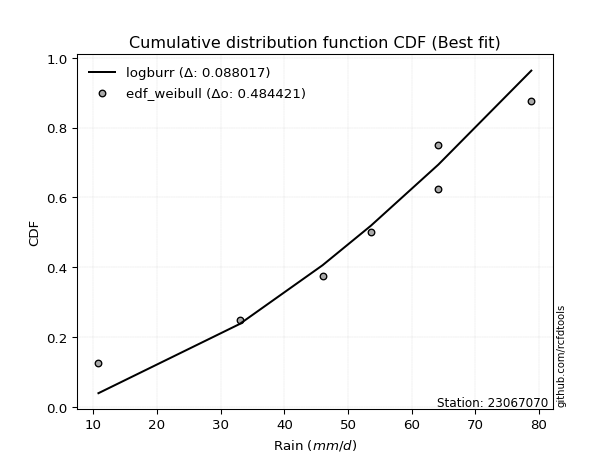</img></img>

</div>


### 4. Empirical - EDF Beard (1943)

The Beard formula (or Beard´s plotting position formula) in hydrology is used to estimate the empirical non-exceedance probability _(P)_ of a flood event (or other extreme hydrological data point) within a given dataset.

<div align="center">


$P=(m-0.31)/(n+0.38)$


</div>


**4.1. Empirical values**

<div align="center">

|                | 0                   | 1                   | 2                   | 3         | 4                  | 5                  | 6                  |
|:---------------|:--------------------|:--------------------|:--------------------|:----------|:-------------------|:-------------------|:-------------------|
| date           | 2024                | 2025                | 2023                | 2022      | 2021               | 2019               | 2020               |
| x              | 10.8                | 13.6                | 33.0                | 46.0      | 53.6               | 64.2               | 78.8               |
| m              | 1                   | 2                   | 3                   | 4         | 5                  | 6                  | 7                  |
| empirical_dist | edf_beard           | edf_beard           | edf_beard           | edf_beard | edf_beard          | edf_beard          | edf_beard          |
| empirical      | 0.09349593495934959 | 0.22899728997289973 | 0.36449864498644985 | 0.5       | 0.6355013550135502 | 0.7710027100271003 | 0.9065040650406505 |
| empirical_tr   | 1.1031390134529149  | 1.29701230228471    | 1.5735607675906182  | 2.0       | 2.743494423791822  | 4.366863905325444  | 10.695652173913055 |

</div>


**4.2. Kolmogorov-Smirnov fit test (sorted by Δ)**


<div align="center">

|                | 0                   | 1                   | 2                   | 3                     | 4                   | 5                   | 6                   | 7                   | 8                   | 9                   | 10                  | 11                  | 12                  | 13                  | 14                  | 15                  | 16                  | 17                  | 18                  | 19                  | 20                  | 21                  | 22                  | 23                  | 24                  | 25                  | 26                  | 27                  | 28                  | 29                  | 30                  | 31                  | 32                  | 33                  | 34                  | 35                  | 36                  | 37                  | 38                  | 39                  | 40                  | 41                  | 42                  | 43                  | 44                  | 45                  | 46                  | 47                  | 48                  | 49                  | 50                  | 51                  | 52                  | 53                  | 54                  | 55                  | 56                  | 57                  | 58                  | 59                  | 60                  | 61                  | 62                  | 63                  | 64                  | 65                  | 66                  | 67                  | 68                  | 69                  | 70                  | 71                  | 72                  | 73                  | 74                  | 75                  | 76                  | 77                  | 78                  | 79                  | 80                  | 81                  | 82                  | 83                  | 84                  | 85                  | 86                  | 87                  | 88                  | 89                  |
|:---------------|:--------------------|:--------------------|:--------------------|:----------------------|:--------------------|:--------------------|:--------------------|:--------------------|:--------------------|:--------------------|:--------------------|:--------------------|:--------------------|:--------------------|:--------------------|:--------------------|:--------------------|:--------------------|:--------------------|:--------------------|:--------------------|:--------------------|:--------------------|:--------------------|:--------------------|:--------------------|:--------------------|:--------------------|:--------------------|:--------------------|:--------------------|:--------------------|:--------------------|:--------------------|:--------------------|:--------------------|:--------------------|:--------------------|:--------------------|:--------------------|:--------------------|:--------------------|:--------------------|:--------------------|:--------------------|:--------------------|:--------------------|:--------------------|:--------------------|:--------------------|:--------------------|:--------------------|:--------------------|:--------------------|:--------------------|:--------------------|:--------------------|:--------------------|:--------------------|:--------------------|:--------------------|:--------------------|:--------------------|:--------------------|:--------------------|:--------------------|:--------------------|:--------------------|:--------------------|:--------------------|:--------------------|:--------------------|:--------------------|:--------------------|:--------------------|:--------------------|:--------------------|:--------------------|:--------------------|:--------------------|:--------------------|:--------------------|:--------------------|:--------------------|:--------------------|:--------------------|:--------------------|:--------------------|:--------------------|:--------------------|
| station        | 23067070            | 23067070            | 23067070            | 23067070              | 23067070            | 23067070            | 23067070            | 23067070            | 23067070            | 23067070            | 23067070            | 23067070            | 23067070            | 23067070            | 23067070            | 23067070            | 23067070            | 23067070            | 23067070            | 23067070            | 23067070            | 23067070            | 23067070            | 23067070            | 23067070            | 23067070            | 23067070            | 23067070            | 23067070            | 23067070            | 23067070            | 23067070            | 23067070            | 23067070            | 23067070            | 23067070            | 23067070            | 23067070            | 23067070            | 23067070            | 23067070            | 23067070            | 23067070            | 23067070            | 23067070            | 23067070            | 23067070            | 23067070            | 23067070            | 23067070            | 23067070            | 23067070            | 23067070            | 23067070            | 23067070            | 23067070            | 23067070            | 23067070            | 23067070            | 23067070            | 23067070            | 23067070            | 23067070            | 23067070            | 23067070            | 23067070            | 23067070            | 23067070            | 23067070            | 23067070            | 23067070            | 23067070            | 23067070            | 23067070            | 23067070            | 23067070            | 23067070            | 23067070            | 23067070            | 23067070            | 23067070            | 23067070            | 23067070            | 23067070            | 23067070            | 23067070            | 23067070            | 23067070            | 23067070            | 23067070            |
| empirical_dist | edf_beard           | edf_beard           | edf_beard           | edf_beard             | edf_beard           | edf_beard           | edf_beard           | edf_beard           | edf_beard           | edf_beard           | edf_beard           | edf_beard           | edf_beard           | edf_beard           | edf_beard           | edf_beard           | edf_beard           | edf_beard           | edf_beard           | edf_beard           | edf_beard           | edf_beard           | edf_beard           | edf_beard           | edf_beard           | edf_beard           | edf_beard           | edf_beard           | edf_beard           | edf_beard           | edf_beard           | edf_beard           | edf_beard           | edf_beard           | edf_beard           | edf_beard           | edf_beard           | edf_beard           | edf_beard           | edf_beard           | edf_beard           | edf_beard           | edf_beard           | edf_beard           | edf_beard           | edf_beard           | edf_beard           | edf_beard           | edf_beard           | edf_beard           | edf_beard           | edf_beard           | edf_beard           | edf_beard           | edf_beard           | edf_beard           | edf_beard           | edf_beard           | edf_beard           | edf_beard           | edf_beard           | edf_beard           | edf_beard           | edf_beard           | edf_beard           | edf_beard           | edf_beard           | edf_beard           | edf_beard           | edf_beard           | edf_beard           | edf_beard           | edf_beard           | edf_beard           | edf_beard           | edf_beard           | edf_beard           | edf_beard           | edf_beard           | edf_beard           | edf_beard           | edf_beard           | edf_beard           | edf_beard           | edf_beard           | edf_beard           | edf_beard           | edf_beard           | edf_beard           | edf_beard           |
| p_dist         | laplace_asymmetric  | logjohnsonsu        | mielke              | loglaplace_asymmetric | logloggamma         | fisk                | gumbel_l            | pearson3            | nct                 | t                   | truncnorm           | crystalball         | norm                | exponnorm           | johnsonsu           | gamma               | erlang              | invgamma            | logpearson3         | genlogistic         | kstwobign           | loggumbel_l         | betaprime           | maxwell             | invgauss            | logistic            | rayleigh            | hypsecant           | logweibull_min      | laplace             | ncf                 | rice                | logfisk             | logbetaprime        | logf                | logcrystalball      | lognorm             | lognorm             | logt                | logexponnorm        | lognct              | logfatiguelife      | f                   | logncf              | logerlang           | loggamma            | loggamma            | loginvweibull       | loginvgamma         | alpha               | logrice             | expon               | genexpon            | gumbel_r            | loginvgauss         | logalpha            | weibull_min         | loglogistic         | nakagami            | loggompertz         | logmaxwell          | lograyleigh         | gompertz            | loghypsecant        | loggenexpon         | halfnorm            | logkstwobign        | moyal               | loggumbel_r         | loglaplace          | loghalfnorm         | halflogistic        | loghalflogistic     | wald                | logmoyal            | gibrat              | logexpon            | logwald             | chi2                | pareto              | loggibrat           | logchi2             | lognakagami         | logmielke           | logpareto           | logtruncnorm        | loglognorm          | fatiguelife         | invweibull          | loggenlogistic      |
| delta          | 0.10136308388427046 | 0.10589766106889123 | 0.10721141954830642 | 0.11161189587380227   | 0.11336248051859635 | 0.11645889099926669 | 0.12175768937852971 | 0.12251221500022878 | 0.12277030520265256 | 0.12279134584861527 | 0.12279166644891744 | 0.12279167161685625 | 0.12279167574064206 | 0.12279191976585485 | 0.12299143179136848 | 0.1230220647779504  | 0.1230251681985103  | 0.12390678682382446 | 0.12676829922032543 | 0.1290531541551635  | 0.12942587018937932 | 0.1299821330291609  | 0.13177147758047544 | 0.1319085988464003  | 0.13292157091076334 | 0.1346556840680533  | 0.13817443357891637 | 0.13979789585572214 | 0.14067640470711334 | 0.14327295472112828 | 0.14479745693492507 | 0.1458901605840782  | 0.14652648460613948 | 0.15287465504584985 | 0.15295621302102402 | 0.15379093546581124 | 0.15379100411527313 | 0.15379100411527313 | 0.15379143830595132 | 0.15379194806730911 | 0.1547072972133734  | 0.15488331772407138 | 0.1558130748679718  | 0.15910565262298748 | 0.15973738510939062 | 0.15991441000425088 | 0.15991441000425088 | 0.16002101409176417 | 0.1603850660347308  | 0.16210661414289157 | 0.16239600330594828 | 0.16647558759349068 | 0.16649152866678496 | 0.1668940890138891  | 0.1672179678344019  | 0.1699245572696062  | 0.17101658084220506 | 0.1720551908168133  | 0.17212984208079335 | 0.17238110906865758 | 0.17501926700446602 | 0.18138860158216086 | 0.18410604726386037 | 0.18616589541508488 | 0.19204899298751776 | 0.19214601909363038 | 0.1922511397356429  | 0.19470972037747686 | 0.21315959916884375 | 0.2142322450344819  | 0.22374919482314137 | 0.22899728997289973 | 0.22899728997289973 | 0.22899728997289973 | 0.23276526210645487 | 0.24594003974252843 | 0.2515316043131299  | 0.28843092312337415 | 0.3081971990258656  | 0.31632111722169387 | 0.3206254497369434  | 0.33580568612832123 | 0.3409115392791829  | 0.35673841325438554 | 0.3641177751324923  | 0.36441043681690155 | 0.3810913914682358  | 0.42597070613883997 | 0.45998109465849674 | 0.7710027100271003  |
| deltao         | 0.48442053926100004 | 0.48442053926100004 | 0.48442053926100004 | 0.48442053926100004   | 0.48442053926100004 | 0.48442053926100004 | 0.48442053926100004 | 0.48442053926100004 | 0.48442053926100004 | 0.48442053926100004 | 0.48442053926100004 | 0.48442053926100004 | 0.48442053926100004 | 0.48442053926100004 | 0.48442053926100004 | 0.48442053926100004 | 0.48442053926100004 | 0.48442053926100004 | 0.48442053926100004 | 0.48442053926100004 | 0.48442053926100004 | 0.48442053926100004 | 0.48442053926100004 | 0.48442053926100004 | 0.48442053926100004 | 0.48442053926100004 | 0.48442053926100004 | 0.48442053926100004 | 0.48442053926100004 | 0.48442053926100004 | 0.48442053926100004 | 0.48442053926100004 | 0.48442053926100004 | 0.48442053926100004 | 0.48442053926100004 | 0.48442053926100004 | 0.48442053926100004 | 0.48442053926100004 | 0.48442053926100004 | 0.48442053926100004 | 0.48442053926100004 | 0.48442053926100004 | 0.48442053926100004 | 0.48442053926100004 | 0.48442053926100004 | 0.48442053926100004 | 0.48442053926100004 | 0.48442053926100004 | 0.48442053926100004 | 0.48442053926100004 | 0.48442053926100004 | 0.48442053926100004 | 0.48442053926100004 | 0.48442053926100004 | 0.48442053926100004 | 0.48442053926100004 | 0.48442053926100004 | 0.48442053926100004 | 0.48442053926100004 | 0.48442053926100004 | 0.48442053926100004 | 0.48442053926100004 | 0.48442053926100004 | 0.48442053926100004 | 0.48442053926100004 | 0.48442053926100004 | 0.48442053926100004 | 0.48442053926100004 | 0.48442053926100004 | 0.48442053926100004 | 0.48442053926100004 | 0.48442053926100004 | 0.48442053926100004 | 0.48442053926100004 | 0.48442053926100004 | 0.48442053926100004 | 0.48442053926100004 | 0.48442053926100004 | 0.48442053926100004 | 0.48442053926100004 | 0.48442053926100004 | 0.48442053926100004 | 0.48442053926100004 | 0.48442053926100004 | 0.48442053926100004 | 0.48442053926100004 | 0.48442053926100004 | 0.48442053926100004 | 0.48442053926100004 | 0.48442053926100004 |
| eval           | Δo > Δ              | Δo > Δ              | Δo > Δ              | Δo > Δ                | Δo > Δ              | Δo > Δ              | Δo > Δ              | Δo > Δ              | Δo > Δ              | Δo > Δ              | Δo > Δ              | Δo > Δ              | Δo > Δ              | Δo > Δ              | Δo > Δ              | Δo > Δ              | Δo > Δ              | Δo > Δ              | Δo > Δ              | Δo > Δ              | Δo > Δ              | Δo > Δ              | Δo > Δ              | Δo > Δ              | Δo > Δ              | Δo > Δ              | Δo > Δ              | Δo > Δ              | Δo > Δ              | Δo > Δ              | Δo > Δ              | Δo > Δ              | Δo > Δ              | Δo > Δ              | Δo > Δ              | Δo > Δ              | Δo > Δ              | Δo > Δ              | Δo > Δ              | Δo > Δ              | Δo > Δ              | Δo > Δ              | Δo > Δ              | Δo > Δ              | Δo > Δ              | Δo > Δ              | Δo > Δ              | Δo > Δ              | Δo > Δ              | Δo > Δ              | Δo > Δ              | Δo > Δ              | Δo > Δ              | Δo > Δ              | Δo > Δ              | Δo > Δ              | Δo > Δ              | Δo > Δ              | Δo > Δ              | Δo > Δ              | Δo > Δ              | Δo > Δ              | Δo > Δ              | Δo > Δ              | Δo > Δ              | Δo > Δ              | Δo > Δ              | Δo > Δ              | Δo > Δ              | Δo > Δ              | Δo > Δ              | Δo > Δ              | Δo > Δ              | Δo > Δ              | Δo > Δ              | Δo > Δ              | Δo > Δ              | Δo > Δ              | Δo > Δ              | Δo > Δ              | Δo > Δ              | Δo > Δ              | Δo > Δ              | Δo > Δ              | Δo > Δ              | Δo > Δ              | Δo > Δ              | Δo > Δ              | Δo > Δ              | Δo <= Δ             |
| fit            | 1                   | 1                   | 1                   | 1                     | 1                   | 1                   | 1                   | 1                   | 1                   | 1                   | 1                   | 1                   | 1                   | 1                   | 1                   | 1                   | 1                   | 1                   | 1                   | 1                   | 1                   | 1                   | 1                   | 1                   | 1                   | 1                   | 1                   | 1                   | 1                   | 1                   | 1                   | 1                   | 1                   | 1                   | 1                   | 1                   | 1                   | 1                   | 1                   | 1                   | 1                   | 1                   | 1                   | 1                   | 1                   | 1                   | 1                   | 1                   | 1                   | 1                   | 1                   | 1                   | 1                   | 1                   | 1                   | 1                   | 1                   | 1                   | 1                   | 1                   | 1                   | 1                   | 1                   | 1                   | 1                   | 1                   | 1                   | 1                   | 1                   | 1                   | 1                   | 1                   | 1                   | 1                   | 1                   | 1                   | 1                   | 1                   | 1                   | 1                   | 1                   | 1                   | 1                   | 1                   | 1                   | 1                   | 1                   | 1                   | 1                   | 0                   |
| n              | 7                   | 7                   | 7                   | 7                     | 7                   | 7                   | 7                   | 7                   | 7                   | 7                   | 7                   | 7                   | 7                   | 7                   | 7                   | 7                   | 7                   | 7                   | 7                   | 7                   | 7                   | 7                   | 7                   | 7                   | 7                   | 7                   | 7                   | 7                   | 7                   | 7                   | 7                   | 7                   | 7                   | 7                   | 7                   | 7                   | 7                   | 7                   | 7                   | 7                   | 7                   | 7                   | 7                   | 7                   | 7                   | 7                   | 7                   | 7                   | 7                   | 7                   | 7                   | 7                   | 7                   | 7                   | 7                   | 7                   | 7                   | 7                   | 7                   | 7                   | 7                   | 7                   | 7                   | 7                   | 7                   | 7                   | 7                   | 7                   | 7                   | 7                   | 7                   | 7                   | 7                   | 7                   | 7                   | 7                   | 7                   | 7                   | 7                   | 7                   | 7                   | 7                   | 7                   | 7                   | 7                   | 7                   | 7                   | 7                   | 7                   | 7                   |
| best_fit       | 1                   | 0                   | 0                   | 0                     | 0                   | 0                   | 0                   | 0                   | 0                   | 0                   | 0                   | 0                   | 0                   | 0                   | 0                   | 0                   | 0                   | 0                   | 0                   | 0                   | 0                   | 0                   | 0                   | 0                   | 0                   | 0                   | 0                   | 0                   | 0                   | 0                   | 0                   | 0                   | 0                   | 0                   | 0                   | 0                   | 0                   | 0                   | 0                   | 0                   | 0                   | 0                   | 0                   | 0                   | 0                   | 0                   | 0                   | 0                   | 0                   | 0                   | 0                   | 0                   | 0                   | 0                   | 0                   | 0                   | 0                   | 0                   | 0                   | 0                   | 0                   | 0                   | 0                   | 0                   | 0                   | 0                   | 0                   | 0                   | 0                   | 0                   | 0                   | 0                   | 0                   | 0                   | 0                   | 0                   | 0                   | 0                   | 0                   | 0                   | 0                   | 0                   | 0                   | 0                   | 0                   | 0                   | 0                   | 0                   | 0                   | 0                   |
| best_fit_sort  | 1                   | 2                   | 3                   | 4                     | 5                   | 6                   | 7                   | 8                   | 9                   | 10                  | 11                  | 12                  | 13                  | 14                  | 15                  | 16                  | 17                  | 18                  | 19                  | 20                  | 21                  | 22                  | 23                  | 24                  | 25                  | 26                  | 27                  | 28                  | 29                  | 30                  | 31                  | 32                  | 33                  | 34                  | 35                  | 36                  | 37                  | 38                  | 39                  | 40                  | 41                  | 42                  | 43                  | 44                  | 45                  | 46                  | 47                  | 48                  | 49                  | 50                  | 51                  | 52                  | 53                  | 54                  | 55                  | 56                  | 57                  | 58                  | 59                  | 60                  | 61                  | 62                  | 63                  | 64                  | 65                  | 66                  | 67                  | 68                  | 69                  | 70                  | 71                  | 72                  | 73                  | 74                  | 75                  | 76                  | 77                  | 78                  | 79                  | 80                  | 81                  | 82                  | 83                  | 84                  | 85                  | 86                  | 87                  | 88                  | 89                  | 90                  |

</div>


<div align="center">

</img>

</div>


**4.3. Best fit**

<div align="center">

|   id |   station | empirical_dist   | p_dist             |    delta |   deltao | eval   |   fit |   n |   best_fit |   best_fit_sort |
|-----:|----------:|:-----------------|:-------------------|---------:|---------:|:-------|------:|----:|-----------:|----------------:|
|    0 |  23067070 | edf_beard        | laplace_asymmetric | 0.101363 | 0.484421 | Δo > Δ |     1 |   7 |          1 |               1 |

</div>


<div align="center">

</img></img>

</div>


### 5. Empirical - EDF Chegodayev (1955)

The Chegodayev formula is an empirical plotting position formula used in hydrological frequency analysis to estimate the exceedance probability or return period of a specific event from a set of observed data. It is primarily used for plotting observed data points on probability paper to fit a theoretical distribution, particularly for analyzing extreme events like maximum flood flows or rainfall intensities. The constant _b_ value in the generalized plotting position formula is 0.3.

<div align="center">


$P=(m-b)/(n+1-2b)$


</div>


**5.1. Empirical values**

<div align="center">

|                | 0                   | 1                   | 2                   | 3              | 4                  | 5                  | 6                  |
|:---------------|:--------------------|:--------------------|:--------------------|:---------------|:-------------------|:-------------------|:-------------------|
| date           | 2024                | 2025                | 2023                | 2022           | 2021               | 2019               | 2020               |
| x              | 10.8                | 13.6                | 33.0                | 46.0           | 53.6               | 64.2               | 78.8               |
| m              | 1                   | 2                   | 3                   | 4              | 5                  | 6                  | 7                  |
| empirical_dist | edf_chegodayev      | edf_chegodayev      | edf_chegodayev      | edf_chegodayev | edf_chegodayev     | edf_chegodayev     | edf_chegodayev     |
| empirical      | 0.09459459459459459 | 0.22972972972972971 | 0.36486486486486486 | 0.5            | 0.6351351351351351 | 0.7702702702702703 | 0.9054054054054054 |
| empirical_tr   | 1.1044776119402986  | 1.2982456140350878  | 1.574468085106383   | 2.0            | 2.7407407407407405 | 4.352941176470589  | 10.571428571428568 |

</div>


**5.2. Kolmogorov-Smirnov fit test (sorted by Δ)**


<div align="center">

|                | 0                   | 1                   | 2                   | 3                     | 4                   | 5                   | 6                   | 7                   | 8                   | 9                   | 10                  | 11                  | 12                  | 13                  | 14                  | 15                  | 16                  | 17                  | 18                  | 19                  | 20                  | 21                  | 22                  | 23                  | 24                  | 25                  | 26                  | 27                  | 28                  | 29                  | 30                  | 31                  | 32                  | 33                  | 34                  | 35                  | 36                  | 37                  | 38                  | 39                  | 40                  | 41                  | 42                  | 43                  | 44                  | 45                  | 46                  | 47                  | 48                  | 49                  | 50                  | 51                  | 52                  | 53                  | 54                  | 55                  | 56                  | 57                  | 58                  | 59                  | 60                  | 61                  | 62                  | 63                  | 64                  | 65                  | 66                  | 67                  | 68                  | 69                  | 70                  | 71                  | 72                  | 73                  | 74                  | 75                  | 76                  | 77                  | 78                  | 79                  | 80                  | 81                  | 82                  | 83                  | 84                  | 85                  | 86                  | 87                  | 88                  | 89                  |
|:---------------|:--------------------|:--------------------|:--------------------|:----------------------|:--------------------|:--------------------|:--------------------|:--------------------|:--------------------|:--------------------|:--------------------|:--------------------|:--------------------|:--------------------|:--------------------|:--------------------|:--------------------|:--------------------|:--------------------|:--------------------|:--------------------|:--------------------|:--------------------|:--------------------|:--------------------|:--------------------|:--------------------|:--------------------|:--------------------|:--------------------|:--------------------|:--------------------|:--------------------|:--------------------|:--------------------|:--------------------|:--------------------|:--------------------|:--------------------|:--------------------|:--------------------|:--------------------|:--------------------|:--------------------|:--------------------|:--------------------|:--------------------|:--------------------|:--------------------|:--------------------|:--------------------|:--------------------|:--------------------|:--------------------|:--------------------|:--------------------|:--------------------|:--------------------|:--------------------|:--------------------|:--------------------|:--------------------|:--------------------|:--------------------|:--------------------|:--------------------|:--------------------|:--------------------|:--------------------|:--------------------|:--------------------|:--------------------|:--------------------|:--------------------|:--------------------|:--------------------|:--------------------|:--------------------|:--------------------|:--------------------|:--------------------|:--------------------|:--------------------|:--------------------|:--------------------|:--------------------|:--------------------|:--------------------|:--------------------|:--------------------|
| station        | 23067070            | 23067070            | 23067070            | 23067070              | 23067070            | 23067070            | 23067070            | 23067070            | 23067070            | 23067070            | 23067070            | 23067070            | 23067070            | 23067070            | 23067070            | 23067070            | 23067070            | 23067070            | 23067070            | 23067070            | 23067070            | 23067070            | 23067070            | 23067070            | 23067070            | 23067070            | 23067070            | 23067070            | 23067070            | 23067070            | 23067070            | 23067070            | 23067070            | 23067070            | 23067070            | 23067070            | 23067070            | 23067070            | 23067070            | 23067070            | 23067070            | 23067070            | 23067070            | 23067070            | 23067070            | 23067070            | 23067070            | 23067070            | 23067070            | 23067070            | 23067070            | 23067070            | 23067070            | 23067070            | 23067070            | 23067070            | 23067070            | 23067070            | 23067070            | 23067070            | 23067070            | 23067070            | 23067070            | 23067070            | 23067070            | 23067070            | 23067070            | 23067070            | 23067070            | 23067070            | 23067070            | 23067070            | 23067070            | 23067070            | 23067070            | 23067070            | 23067070            | 23067070            | 23067070            | 23067070            | 23067070            | 23067070            | 23067070            | 23067070            | 23067070            | 23067070            | 23067070            | 23067070            | 23067070            | 23067070            |
| empirical_dist | edf_chegodayev      | edf_chegodayev      | edf_chegodayev      | edf_chegodayev        | edf_chegodayev      | edf_chegodayev      | edf_chegodayev      | edf_chegodayev      | edf_chegodayev      | edf_chegodayev      | edf_chegodayev      | edf_chegodayev      | edf_chegodayev      | edf_chegodayev      | edf_chegodayev      | edf_chegodayev      | edf_chegodayev      | edf_chegodayev      | edf_chegodayev      | edf_chegodayev      | edf_chegodayev      | edf_chegodayev      | edf_chegodayev      | edf_chegodayev      | edf_chegodayev      | edf_chegodayev      | edf_chegodayev      | edf_chegodayev      | edf_chegodayev      | edf_chegodayev      | edf_chegodayev      | edf_chegodayev      | edf_chegodayev      | edf_chegodayev      | edf_chegodayev      | edf_chegodayev      | edf_chegodayev      | edf_chegodayev      | edf_chegodayev      | edf_chegodayev      | edf_chegodayev      | edf_chegodayev      | edf_chegodayev      | edf_chegodayev      | edf_chegodayev      | edf_chegodayev      | edf_chegodayev      | edf_chegodayev      | edf_chegodayev      | edf_chegodayev      | edf_chegodayev      | edf_chegodayev      | edf_chegodayev      | edf_chegodayev      | edf_chegodayev      | edf_chegodayev      | edf_chegodayev      | edf_chegodayev      | edf_chegodayev      | edf_chegodayev      | edf_chegodayev      | edf_chegodayev      | edf_chegodayev      | edf_chegodayev      | edf_chegodayev      | edf_chegodayev      | edf_chegodayev      | edf_chegodayev      | edf_chegodayev      | edf_chegodayev      | edf_chegodayev      | edf_chegodayev      | edf_chegodayev      | edf_chegodayev      | edf_chegodayev      | edf_chegodayev      | edf_chegodayev      | edf_chegodayev      | edf_chegodayev      | edf_chegodayev      | edf_chegodayev      | edf_chegodayev      | edf_chegodayev      | edf_chegodayev      | edf_chegodayev      | edf_chegodayev      | edf_chegodayev      | edf_chegodayev      | edf_chegodayev      | edf_chegodayev      |
| p_dist         | laplace_asymmetric  | logjohnsonsu        | mielke              | loglaplace_asymmetric | logloggamma         | fisk                | gumbel_l            | pearson3            | nct                 | t                   | truncnorm           | crystalball         | norm                | exponnorm           | johnsonsu           | gamma               | erlang              | invgamma            | logpearson3         | genlogistic         | kstwobign           | loggumbel_l         | betaprime           | maxwell             | invgauss            | logistic            | rayleigh            | hypsecant           | logweibull_min      | ncf                 | laplace             | rice                | logfisk             | logbetaprime        | logf                | logcrystalball      | lognorm             | lognorm             | logt                | logexponnorm        | lognct              | logfatiguelife      | f                   | logncf              | logerlang           | loggamma            | loggamma            | loginvweibull       | loginvgamma         | alpha               | logrice             | expon               | genexpon            | loginvgauss         | gumbel_r            | logalpha            | weibull_min         | nakagami            | loglogistic         | loggompertz         | logmaxwell          | lograyleigh         | gompertz            | loghypsecant        | loggenexpon         | logkstwobign        | halfnorm            | moyal               | loggumbel_r         | loglaplace          | loghalfnorm         | halflogistic        | loghalflogistic     | wald                | logmoyal            | gibrat              | logexpon            | logwald             | chi2                | pareto              | loggibrat           | logchi2             | lognakagami         | logmielke           | logpareto           | logtruncnorm        | loglognorm          | fatiguelife         | invweibull          | loggenlogistic      |
| delta          | 0.10209552364110044 | 0.10663010082572122 | 0.1079438593051364  | 0.11234433563063226   | 0.11409492027542634 | 0.11719133075609668 | 0.1224901291353597  | 0.12324465475705877 | 0.12350274495948255 | 0.12352378560544526 | 0.12352410620574743 | 0.12352411137368624 | 0.12352411549747205 | 0.12352435952268484 | 0.12372387154819847 | 0.12375450453478039 | 0.12375760795534028 | 0.12463922658065445 | 0.12750073897715541 | 0.1297855939119935  | 0.1301583099462093  | 0.13071457278599088 | 0.13250391733730543 | 0.1326410386032303  | 0.1336540106675933  | 0.1353881238248833  | 0.13890687333574636 | 0.14053033561255213 | 0.14140884446394333 | 0.14369879729967994 | 0.14400539447795824 | 0.14662260034090818 | 0.14725892436296947 | 0.15287465504584985 | 0.15295621302102402 | 0.15379093546581124 | 0.15379100411527313 | 0.15379100411527313 | 0.15379143830595132 | 0.15379194806730911 | 0.1547072972133734  | 0.15488331772407138 | 0.1558130748679718  | 0.15910565262298748 | 0.15973738510939062 | 0.15991441000425088 | 0.15991441000425088 | 0.16002101409176417 | 0.1603850660347308  | 0.16174039426447656 | 0.16239600330594828 | 0.16647558759349068 | 0.16649152866678496 | 0.1672179678344019  | 0.1676265287707191  | 0.1699245572696062  | 0.17101658084220506 | 0.17176362220237834 | 0.1720551908168133  | 0.17311354882548757 | 0.17501926700446602 | 0.18138860158216086 | 0.1848384870206904  | 0.18616589541508488 | 0.19204899298751776 | 0.1922511397356429  | 0.19287845885046037 | 0.19544216013430687 | 0.21315959916884375 | 0.2142322450344819  | 0.22448163457997136 | 0.22972972972972971 | 0.22972972972972971 | 0.22972972972972971 | 0.23276526210645487 | 0.24594003974252843 | 0.25116538443471487 | 0.28843092312337415 | 0.3081971990258656  | 0.31558867746486385 | 0.3206254497369434  | 0.3354394662499062  | 0.3405453194007679  | 0.35637219337597054 | 0.3633853353756623  | 0.36477665669531656 | 0.38035895171140577 | 0.42560448626042496 | 0.4588824350232516  | 0.7702702702702703  |
| deltao         | 0.48442053926100004 | 0.48442053926100004 | 0.48442053926100004 | 0.48442053926100004   | 0.48442053926100004 | 0.48442053926100004 | 0.48442053926100004 | 0.48442053926100004 | 0.48442053926100004 | 0.48442053926100004 | 0.48442053926100004 | 0.48442053926100004 | 0.48442053926100004 | 0.48442053926100004 | 0.48442053926100004 | 0.48442053926100004 | 0.48442053926100004 | 0.48442053926100004 | 0.48442053926100004 | 0.48442053926100004 | 0.48442053926100004 | 0.48442053926100004 | 0.48442053926100004 | 0.48442053926100004 | 0.48442053926100004 | 0.48442053926100004 | 0.48442053926100004 | 0.48442053926100004 | 0.48442053926100004 | 0.48442053926100004 | 0.48442053926100004 | 0.48442053926100004 | 0.48442053926100004 | 0.48442053926100004 | 0.48442053926100004 | 0.48442053926100004 | 0.48442053926100004 | 0.48442053926100004 | 0.48442053926100004 | 0.48442053926100004 | 0.48442053926100004 | 0.48442053926100004 | 0.48442053926100004 | 0.48442053926100004 | 0.48442053926100004 | 0.48442053926100004 | 0.48442053926100004 | 0.48442053926100004 | 0.48442053926100004 | 0.48442053926100004 | 0.48442053926100004 | 0.48442053926100004 | 0.48442053926100004 | 0.48442053926100004 | 0.48442053926100004 | 0.48442053926100004 | 0.48442053926100004 | 0.48442053926100004 | 0.48442053926100004 | 0.48442053926100004 | 0.48442053926100004 | 0.48442053926100004 | 0.48442053926100004 | 0.48442053926100004 | 0.48442053926100004 | 0.48442053926100004 | 0.48442053926100004 | 0.48442053926100004 | 0.48442053926100004 | 0.48442053926100004 | 0.48442053926100004 | 0.48442053926100004 | 0.48442053926100004 | 0.48442053926100004 | 0.48442053926100004 | 0.48442053926100004 | 0.48442053926100004 | 0.48442053926100004 | 0.48442053926100004 | 0.48442053926100004 | 0.48442053926100004 | 0.48442053926100004 | 0.48442053926100004 | 0.48442053926100004 | 0.48442053926100004 | 0.48442053926100004 | 0.48442053926100004 | 0.48442053926100004 | 0.48442053926100004 | 0.48442053926100004 |
| eval           | Δo > Δ              | Δo > Δ              | Δo > Δ              | Δo > Δ                | Δo > Δ              | Δo > Δ              | Δo > Δ              | Δo > Δ              | Δo > Δ              | Δo > Δ              | Δo > Δ              | Δo > Δ              | Δo > Δ              | Δo > Δ              | Δo > Δ              | Δo > Δ              | Δo > Δ              | Δo > Δ              | Δo > Δ              | Δo > Δ              | Δo > Δ              | Δo > Δ              | Δo > Δ              | Δo > Δ              | Δo > Δ              | Δo > Δ              | Δo > Δ              | Δo > Δ              | Δo > Δ              | Δo > Δ              | Δo > Δ              | Δo > Δ              | Δo > Δ              | Δo > Δ              | Δo > Δ              | Δo > Δ              | Δo > Δ              | Δo > Δ              | Δo > Δ              | Δo > Δ              | Δo > Δ              | Δo > Δ              | Δo > Δ              | Δo > Δ              | Δo > Δ              | Δo > Δ              | Δo > Δ              | Δo > Δ              | Δo > Δ              | Δo > Δ              | Δo > Δ              | Δo > Δ              | Δo > Δ              | Δo > Δ              | Δo > Δ              | Δo > Δ              | Δo > Δ              | Δo > Δ              | Δo > Δ              | Δo > Δ              | Δo > Δ              | Δo > Δ              | Δo > Δ              | Δo > Δ              | Δo > Δ              | Δo > Δ              | Δo > Δ              | Δo > Δ              | Δo > Δ              | Δo > Δ              | Δo > Δ              | Δo > Δ              | Δo > Δ              | Δo > Δ              | Δo > Δ              | Δo > Δ              | Δo > Δ              | Δo > Δ              | Δo > Δ              | Δo > Δ              | Δo > Δ              | Δo > Δ              | Δo > Δ              | Δo > Δ              | Δo > Δ              | Δo > Δ              | Δo > Δ              | Δo > Δ              | Δo > Δ              | Δo <= Δ             |
| fit            | 1                   | 1                   | 1                   | 1                     | 1                   | 1                   | 1                   | 1                   | 1                   | 1                   | 1                   | 1                   | 1                   | 1                   | 1                   | 1                   | 1                   | 1                   | 1                   | 1                   | 1                   | 1                   | 1                   | 1                   | 1                   | 1                   | 1                   | 1                   | 1                   | 1                   | 1                   | 1                   | 1                   | 1                   | 1                   | 1                   | 1                   | 1                   | 1                   | 1                   | 1                   | 1                   | 1                   | 1                   | 1                   | 1                   | 1                   | 1                   | 1                   | 1                   | 1                   | 1                   | 1                   | 1                   | 1                   | 1                   | 1                   | 1                   | 1                   | 1                   | 1                   | 1                   | 1                   | 1                   | 1                   | 1                   | 1                   | 1                   | 1                   | 1                   | 1                   | 1                   | 1                   | 1                   | 1                   | 1                   | 1                   | 1                   | 1                   | 1                   | 1                   | 1                   | 1                   | 1                   | 1                   | 1                   | 1                   | 1                   | 1                   | 0                   |
| n              | 7                   | 7                   | 7                   | 7                     | 7                   | 7                   | 7                   | 7                   | 7                   | 7                   | 7                   | 7                   | 7                   | 7                   | 7                   | 7                   | 7                   | 7                   | 7                   | 7                   | 7                   | 7                   | 7                   | 7                   | 7                   | 7                   | 7                   | 7                   | 7                   | 7                   | 7                   | 7                   | 7                   | 7                   | 7                   | 7                   | 7                   | 7                   | 7                   | 7                   | 7                   | 7                   | 7                   | 7                   | 7                   | 7                   | 7                   | 7                   | 7                   | 7                   | 7                   | 7                   | 7                   | 7                   | 7                   | 7                   | 7                   | 7                   | 7                   | 7                   | 7                   | 7                   | 7                   | 7                   | 7                   | 7                   | 7                   | 7                   | 7                   | 7                   | 7                   | 7                   | 7                   | 7                   | 7                   | 7                   | 7                   | 7                   | 7                   | 7                   | 7                   | 7                   | 7                   | 7                   | 7                   | 7                   | 7                   | 7                   | 7                   | 7                   |
| best_fit       | 1                   | 0                   | 0                   | 0                     | 0                   | 0                   | 0                   | 0                   | 0                   | 0                   | 0                   | 0                   | 0                   | 0                   | 0                   | 0                   | 0                   | 0                   | 0                   | 0                   | 0                   | 0                   | 0                   | 0                   | 0                   | 0                   | 0                   | 0                   | 0                   | 0                   | 0                   | 0                   | 0                   | 0                   | 0                   | 0                   | 0                   | 0                   | 0                   | 0                   | 0                   | 0                   | 0                   | 0                   | 0                   | 0                   | 0                   | 0                   | 0                   | 0                   | 0                   | 0                   | 0                   | 0                   | 0                   | 0                   | 0                   | 0                   | 0                   | 0                   | 0                   | 0                   | 0                   | 0                   | 0                   | 0                   | 0                   | 0                   | 0                   | 0                   | 0                   | 0                   | 0                   | 0                   | 0                   | 0                   | 0                   | 0                   | 0                   | 0                   | 0                   | 0                   | 0                   | 0                   | 0                   | 0                   | 0                   | 0                   | 0                   | 0                   |
| best_fit_sort  | 1                   | 2                   | 3                   | 4                     | 5                   | 6                   | 7                   | 8                   | 9                   | 10                  | 11                  | 12                  | 13                  | 14                  | 15                  | 16                  | 17                  | 18                  | 19                  | 20                  | 21                  | 22                  | 23                  | 24                  | 25                  | 26                  | 27                  | 28                  | 29                  | 30                  | 31                  | 32                  | 33                  | 34                  | 35                  | 36                  | 37                  | 38                  | 39                  | 40                  | 41                  | 42                  | 43                  | 44                  | 45                  | 46                  | 47                  | 48                  | 49                  | 50                  | 51                  | 52                  | 53                  | 54                  | 55                  | 56                  | 57                  | 58                  | 59                  | 60                  | 61                  | 62                  | 63                  | 64                  | 65                  | 66                  | 67                  | 68                  | 69                  | 70                  | 71                  | 72                  | 73                  | 74                  | 75                  | 76                  | 77                  | 78                  | 79                  | 80                  | 81                  | 82                  | 83                  | 84                  | 85                  | 86                  | 87                  | 88                  | 89                  | 90                  |

</div>


<div align="center">

</img>

</div>


**5.3. Best fit**

<div align="center">

|   id |   station | empirical_dist   | p_dist             |    delta |   deltao | eval   |   fit |   n |   best_fit |   best_fit_sort |
|-----:|----------:|:-----------------|:-------------------|---------:|---------:|:-------|------:|----:|-----------:|----------------:|
|    0 |  23067070 | edf_chegodayev   | laplace_asymmetric | 0.102096 | 0.484421 | Δo > Δ |     1 |   7 |          1 |               1 |

</div>


<div align="center">

</img></img>

</div>


### 6. Empirical - EDF Blom (1958)

The Blom formula is a specific "plotting position" formula used in hydrology and statistical analysis to estimate the empirical cumulative probability (or non-exceedance probability) of a data series. It is particularly recommended for data that are approximately normally distributed. The constant _a_ is set to 0.375 (or 3/8).

<div align="center">


$P=(m-a)/(n+1-2a)$


</div>


**6.1. Empirical values**

<div align="center">

|                | 0                   | 1                   | 2                  | 3        | 4                  | 5                  | 6                  |
|:---------------|:--------------------|:--------------------|:-------------------|:---------|:-------------------|:-------------------|:-------------------|
| date           | 2024                | 2025                | 2023               | 2022     | 2021               | 2019               | 2020               |
| x              | 10.8                | 13.6                | 33.0               | 46.0     | 53.6               | 64.2               | 78.8               |
| m              | 1                   | 2                   | 3                  | 4        | 5                  | 6                  | 7                  |
| empirical_dist | edf_blom            | edf_blom            | edf_blom           | edf_blom | edf_blom           | edf_blom           | edf_blom           |
| empirical      | 0.08620689655172414 | 0.22413793103448276 | 0.3620689655172414 | 0.5      | 0.6379310344827587 | 0.7758620689655172 | 0.9137931034482759 |
| empirical_tr   | 1.0943396226415094  | 1.288888888888889   | 1.5675675675675675 | 2.0      | 2.7619047619047623 | 4.461538461538462  | 11.600000000000007 |

</div>


**6.2. Kolmogorov-Smirnov fit test (sorted by Δ)**


<div align="center">

|                | 0                   | 1                   | 2                   | 3                     | 4                   | 5                   | 6                   | 7                   | 8                   | 9                   | 10                  | 11                  | 12                  | 13                  | 14                  | 15                  | 16                  | 17                  | 18                  | 19                  | 20                  | 21                  | 22                  | 23                  | 24                  | 25                  | 26                  | 27                  | 28                  | 29                  | 30                  | 31                  | 32                  | 33                  | 34                  | 35                  | 36                  | 37                  | 38                  | 39                  | 40                  | 41                  | 42                  | 43                  | 44                  | 45                  | 46                  | 47                  | 48                  | 49                  | 50                  | 51                  | 52                  | 53                  | 54                  | 55                  | 56                  | 57                  | 58                  | 59                  | 60                  | 61                  | 62                  | 63                  | 64                  | 65                  | 66                  | 67                  | 68                  | 69                  | 70                  | 71                  | 72                  | 73                  | 74                  | 75                  | 76                  | 77                  | 78                  | 79                  | 80                  | 81                  | 82                  | 83                  | 84                  | 85                  | 86                  | 87                  | 88                  | 89                  |
|:---------------|:--------------------|:--------------------|:--------------------|:----------------------|:--------------------|:--------------------|:--------------------|:--------------------|:--------------------|:--------------------|:--------------------|:--------------------|:--------------------|:--------------------|:--------------------|:--------------------|:--------------------|:--------------------|:--------------------|:--------------------|:--------------------|:--------------------|:--------------------|:--------------------|:--------------------|:--------------------|:--------------------|:--------------------|:--------------------|:--------------------|:--------------------|:--------------------|:--------------------|:--------------------|:--------------------|:--------------------|:--------------------|:--------------------|:--------------------|:--------------------|:--------------------|:--------------------|:--------------------|:--------------------|:--------------------|:--------------------|:--------------------|:--------------------|:--------------------|:--------------------|:--------------------|:--------------------|:--------------------|:--------------------|:--------------------|:--------------------|:--------------------|:--------------------|:--------------------|:--------------------|:--------------------|:--------------------|:--------------------|:--------------------|:--------------------|:--------------------|:--------------------|:--------------------|:--------------------|:--------------------|:--------------------|:--------------------|:--------------------|:--------------------|:--------------------|:--------------------|:--------------------|:--------------------|:--------------------|:--------------------|:--------------------|:--------------------|:--------------------|:--------------------|:--------------------|:--------------------|:--------------------|:--------------------|:--------------------|:--------------------|
| station        | 23067070            | 23067070            | 23067070            | 23067070              | 23067070            | 23067070            | 23067070            | 23067070            | 23067070            | 23067070            | 23067070            | 23067070            | 23067070            | 23067070            | 23067070            | 23067070            | 23067070            | 23067070            | 23067070            | 23067070            | 23067070            | 23067070            | 23067070            | 23067070            | 23067070            | 23067070            | 23067070            | 23067070            | 23067070            | 23067070            | 23067070            | 23067070            | 23067070            | 23067070            | 23067070            | 23067070            | 23067070            | 23067070            | 23067070            | 23067070            | 23067070            | 23067070            | 23067070            | 23067070            | 23067070            | 23067070            | 23067070            | 23067070            | 23067070            | 23067070            | 23067070            | 23067070            | 23067070            | 23067070            | 23067070            | 23067070            | 23067070            | 23067070            | 23067070            | 23067070            | 23067070            | 23067070            | 23067070            | 23067070            | 23067070            | 23067070            | 23067070            | 23067070            | 23067070            | 23067070            | 23067070            | 23067070            | 23067070            | 23067070            | 23067070            | 23067070            | 23067070            | 23067070            | 23067070            | 23067070            | 23067070            | 23067070            | 23067070            | 23067070            | 23067070            | 23067070            | 23067070            | 23067070            | 23067070            | 23067070            |
| empirical_dist | edf_blom            | edf_blom            | edf_blom            | edf_blom              | edf_blom            | edf_blom            | edf_blom            | edf_blom            | edf_blom            | edf_blom            | edf_blom            | edf_blom            | edf_blom            | edf_blom            | edf_blom            | edf_blom            | edf_blom            | edf_blom            | edf_blom            | edf_blom            | edf_blom            | edf_blom            | edf_blom            | edf_blom            | edf_blom            | edf_blom            | edf_blom            | edf_blom            | edf_blom            | edf_blom            | edf_blom            | edf_blom            | edf_blom            | edf_blom            | edf_blom            | edf_blom            | edf_blom            | edf_blom            | edf_blom            | edf_blom            | edf_blom            | edf_blom            | edf_blom            | edf_blom            | edf_blom            | edf_blom            | edf_blom            | edf_blom            | edf_blom            | edf_blom            | edf_blom            | edf_blom            | edf_blom            | edf_blom            | edf_blom            | edf_blom            | edf_blom            | edf_blom            | edf_blom            | edf_blom            | edf_blom            | edf_blom            | edf_blom            | edf_blom            | edf_blom            | edf_blom            | edf_blom            | edf_blom            | edf_blom            | edf_blom            | edf_blom            | edf_blom            | edf_blom            | edf_blom            | edf_blom            | edf_blom            | edf_blom            | edf_blom            | edf_blom            | edf_blom            | edf_blom            | edf_blom            | edf_blom            | edf_blom            | edf_blom            | edf_blom            | edf_blom            | edf_blom            | edf_blom            | edf_blom            |
| p_dist         | laplace_asymmetric  | logjohnsonsu        | mielke              | loglaplace_asymmetric | logloggamma         | fisk                | gumbel_l            | pearson3            | nct                 | t                   | truncnorm           | crystalball         | norm                | exponnorm           | johnsonsu           | gamma               | erlang              | invgamma            | logpearson3         | genlogistic         | kstwobign           | loggumbel_l         | betaprime           | maxwell             | invgauss            | logistic            | rayleigh            | hypsecant           | logweibull_min      | laplace             | rice                | logfisk             | ncf                 | logbetaprime        | logf                | logcrystalball      | lognorm             | lognorm             | logt                | logexponnorm        | lognct              | logfatiguelife      | f                   | logncf              | logerlang           | loggamma            | loggamma            | loginvweibull       | loginvgamma         | gumbel_r            | logrice             | alpha               | expon               | genexpon            | loginvgauss         | loggompertz         | logalpha            | weibull_min         | loglogistic         | nakagami            | logmaxwell          | gompertz            | lograyleigh         | loghypsecant        | halfnorm            | moyal               | loggenexpon         | logkstwobign        | loggumbel_r         | loglaplace          | loghalfnorm         | halflogistic        | wald                | loghalflogistic     | logmoyal            | gibrat              | logexpon            | logwald             | chi2                | loggibrat           | pareto              | logchi2             | lognakagami         | logmielke           | logtruncnorm        | logpareto           | loglognorm          | fatiguelife         | invweibull          | loggenlogistic      |
| delta          | 0.09650372494585349 | 0.10103830213047427 | 0.10235206060988945 | 0.1067525369353853    | 0.10850312158017938 | 0.11159953206084973 | 0.11689833044011275 | 0.11765285606181182 | 0.1179109462642356  | 0.11793198691019831 | 0.11793230751050048 | 0.11793231267843929 | 0.1179323168022251  | 0.11793256082743789 | 0.11813207285295152 | 0.11816270583953344 | 0.11816580926009333 | 0.1190474278854075  | 0.12227025185944451 | 0.12419379521674655 | 0.12456651125096235 | 0.12512277409074393 | 0.12691211864205848 | 0.12704923990798334 | 0.12806221197234635 | 0.12979632512963635 | 0.1333150746404994  | 0.13493853691730517 | 0.13581704576869638 | 0.13841359578271129 | 0.14103080164566123 | 0.14166712566772252 | 0.15208649534255048 | 0.15287465504584985 | 0.15295621302102402 | 0.15379093546581124 | 0.15379100411527313 | 0.15379100411527313 | 0.15379143830595132 | 0.15379194806730911 | 0.1547072972133734  | 0.15488331772407138 | 0.1558130748679718  | 0.15910565262298748 | 0.15973738510939062 | 0.15991441000425088 | 0.15991441000425088 | 0.16002101409176417 | 0.1603850660347308  | 0.16203473007547214 | 0.16239600330594828 | 0.16453629361210004 | 0.16647558759349068 | 0.16649152866678496 | 0.1672179678344019  | 0.16752175013024062 | 0.1699245572696062  | 0.17101658084220506 | 0.1720551908168133  | 0.17455952155000182 | 0.17501926700446602 | 0.17924668832544344 | 0.18138860158216086 | 0.18616589541508488 | 0.18728666015521342 | 0.18985036143905992 | 0.19233095884719348 | 0.19291115706601186 | 0.21315959916884375 | 0.2142322450344819  | 0.2188898358847244  | 0.22413793103448276 | 0.22413793103448276 | 0.228015533606596   | 0.23276526210645487 | 0.24594003974252843 | 0.25396128378233834 | 0.28843092312337415 | 0.3081971990258656  | 0.3206254497369434  | 0.3211804761601108  | 0.3382353655975297  | 0.34334121874839135 | 0.359168092723594   | 0.3619807573476931  | 0.36897713407090926 | 0.3859507504066527  | 0.42840038560804844 | 0.46727013306612214 | 0.7758620689655172  |
| deltao         | 0.48442053926100004 | 0.48442053926100004 | 0.48442053926100004 | 0.48442053926100004   | 0.48442053926100004 | 0.48442053926100004 | 0.48442053926100004 | 0.48442053926100004 | 0.48442053926100004 | 0.48442053926100004 | 0.48442053926100004 | 0.48442053926100004 | 0.48442053926100004 | 0.48442053926100004 | 0.48442053926100004 | 0.48442053926100004 | 0.48442053926100004 | 0.48442053926100004 | 0.48442053926100004 | 0.48442053926100004 | 0.48442053926100004 | 0.48442053926100004 | 0.48442053926100004 | 0.48442053926100004 | 0.48442053926100004 | 0.48442053926100004 | 0.48442053926100004 | 0.48442053926100004 | 0.48442053926100004 | 0.48442053926100004 | 0.48442053926100004 | 0.48442053926100004 | 0.48442053926100004 | 0.48442053926100004 | 0.48442053926100004 | 0.48442053926100004 | 0.48442053926100004 | 0.48442053926100004 | 0.48442053926100004 | 0.48442053926100004 | 0.48442053926100004 | 0.48442053926100004 | 0.48442053926100004 | 0.48442053926100004 | 0.48442053926100004 | 0.48442053926100004 | 0.48442053926100004 | 0.48442053926100004 | 0.48442053926100004 | 0.48442053926100004 | 0.48442053926100004 | 0.48442053926100004 | 0.48442053926100004 | 0.48442053926100004 | 0.48442053926100004 | 0.48442053926100004 | 0.48442053926100004 | 0.48442053926100004 | 0.48442053926100004 | 0.48442053926100004 | 0.48442053926100004 | 0.48442053926100004 | 0.48442053926100004 | 0.48442053926100004 | 0.48442053926100004 | 0.48442053926100004 | 0.48442053926100004 | 0.48442053926100004 | 0.48442053926100004 | 0.48442053926100004 | 0.48442053926100004 | 0.48442053926100004 | 0.48442053926100004 | 0.48442053926100004 | 0.48442053926100004 | 0.48442053926100004 | 0.48442053926100004 | 0.48442053926100004 | 0.48442053926100004 | 0.48442053926100004 | 0.48442053926100004 | 0.48442053926100004 | 0.48442053926100004 | 0.48442053926100004 | 0.48442053926100004 | 0.48442053926100004 | 0.48442053926100004 | 0.48442053926100004 | 0.48442053926100004 | 0.48442053926100004 |
| eval           | Δo > Δ              | Δo > Δ              | Δo > Δ              | Δo > Δ                | Δo > Δ              | Δo > Δ              | Δo > Δ              | Δo > Δ              | Δo > Δ              | Δo > Δ              | Δo > Δ              | Δo > Δ              | Δo > Δ              | Δo > Δ              | Δo > Δ              | Δo > Δ              | Δo > Δ              | Δo > Δ              | Δo > Δ              | Δo > Δ              | Δo > Δ              | Δo > Δ              | Δo > Δ              | Δo > Δ              | Δo > Δ              | Δo > Δ              | Δo > Δ              | Δo > Δ              | Δo > Δ              | Δo > Δ              | Δo > Δ              | Δo > Δ              | Δo > Δ              | Δo > Δ              | Δo > Δ              | Δo > Δ              | Δo > Δ              | Δo > Δ              | Δo > Δ              | Δo > Δ              | Δo > Δ              | Δo > Δ              | Δo > Δ              | Δo > Δ              | Δo > Δ              | Δo > Δ              | Δo > Δ              | Δo > Δ              | Δo > Δ              | Δo > Δ              | Δo > Δ              | Δo > Δ              | Δo > Δ              | Δo > Δ              | Δo > Δ              | Δo > Δ              | Δo > Δ              | Δo > Δ              | Δo > Δ              | Δo > Δ              | Δo > Δ              | Δo > Δ              | Δo > Δ              | Δo > Δ              | Δo > Δ              | Δo > Δ              | Δo > Δ              | Δo > Δ              | Δo > Δ              | Δo > Δ              | Δo > Δ              | Δo > Δ              | Δo > Δ              | Δo > Δ              | Δo > Δ              | Δo > Δ              | Δo > Δ              | Δo > Δ              | Δo > Δ              | Δo > Δ              | Δo > Δ              | Δo > Δ              | Δo > Δ              | Δo > Δ              | Δo > Δ              | Δo > Δ              | Δo > Δ              | Δo > Δ              | Δo > Δ              | Δo <= Δ             |
| fit            | 1                   | 1                   | 1                   | 1                     | 1                   | 1                   | 1                   | 1                   | 1                   | 1                   | 1                   | 1                   | 1                   | 1                   | 1                   | 1                   | 1                   | 1                   | 1                   | 1                   | 1                   | 1                   | 1                   | 1                   | 1                   | 1                   | 1                   | 1                   | 1                   | 1                   | 1                   | 1                   | 1                   | 1                   | 1                   | 1                   | 1                   | 1                   | 1                   | 1                   | 1                   | 1                   | 1                   | 1                   | 1                   | 1                   | 1                   | 1                   | 1                   | 1                   | 1                   | 1                   | 1                   | 1                   | 1                   | 1                   | 1                   | 1                   | 1                   | 1                   | 1                   | 1                   | 1                   | 1                   | 1                   | 1                   | 1                   | 1                   | 1                   | 1                   | 1                   | 1                   | 1                   | 1                   | 1                   | 1                   | 1                   | 1                   | 1                   | 1                   | 1                   | 1                   | 1                   | 1                   | 1                   | 1                   | 1                   | 1                   | 1                   | 0                   |
| n              | 7                   | 7                   | 7                   | 7                     | 7                   | 7                   | 7                   | 7                   | 7                   | 7                   | 7                   | 7                   | 7                   | 7                   | 7                   | 7                   | 7                   | 7                   | 7                   | 7                   | 7                   | 7                   | 7                   | 7                   | 7                   | 7                   | 7                   | 7                   | 7                   | 7                   | 7                   | 7                   | 7                   | 7                   | 7                   | 7                   | 7                   | 7                   | 7                   | 7                   | 7                   | 7                   | 7                   | 7                   | 7                   | 7                   | 7                   | 7                   | 7                   | 7                   | 7                   | 7                   | 7                   | 7                   | 7                   | 7                   | 7                   | 7                   | 7                   | 7                   | 7                   | 7                   | 7                   | 7                   | 7                   | 7                   | 7                   | 7                   | 7                   | 7                   | 7                   | 7                   | 7                   | 7                   | 7                   | 7                   | 7                   | 7                   | 7                   | 7                   | 7                   | 7                   | 7                   | 7                   | 7                   | 7                   | 7                   | 7                   | 7                   | 7                   |
| best_fit       | 1                   | 0                   | 0                   | 0                     | 0                   | 0                   | 0                   | 0                   | 0                   | 0                   | 0                   | 0                   | 0                   | 0                   | 0                   | 0                   | 0                   | 0                   | 0                   | 0                   | 0                   | 0                   | 0                   | 0                   | 0                   | 0                   | 0                   | 0                   | 0                   | 0                   | 0                   | 0                   | 0                   | 0                   | 0                   | 0                   | 0                   | 0                   | 0                   | 0                   | 0                   | 0                   | 0                   | 0                   | 0                   | 0                   | 0                   | 0                   | 0                   | 0                   | 0                   | 0                   | 0                   | 0                   | 0                   | 0                   | 0                   | 0                   | 0                   | 0                   | 0                   | 0                   | 0                   | 0                   | 0                   | 0                   | 0                   | 0                   | 0                   | 0                   | 0                   | 0                   | 0                   | 0                   | 0                   | 0                   | 0                   | 0                   | 0                   | 0                   | 0                   | 0                   | 0                   | 0                   | 0                   | 0                   | 0                   | 0                   | 0                   | 0                   |
| best_fit_sort  | 1                   | 2                   | 3                   | 4                     | 5                   | 6                   | 7                   | 8                   | 9                   | 10                  | 11                  | 12                  | 13                  | 14                  | 15                  | 16                  | 17                  | 18                  | 19                  | 20                  | 21                  | 22                  | 23                  | 24                  | 25                  | 26                  | 27                  | 28                  | 29                  | 30                  | 31                  | 32                  | 33                  | 34                  | 35                  | 36                  | 37                  | 38                  | 39                  | 40                  | 41                  | 42                  | 43                  | 44                  | 45                  | 46                  | 47                  | 48                  | 49                  | 50                  | 51                  | 52                  | 53                  | 54                  | 55                  | 56                  | 57                  | 58                  | 59                  | 60                  | 61                  | 62                  | 63                  | 64                  | 65                  | 66                  | 67                  | 68                  | 69                  | 70                  | 71                  | 72                  | 73                  | 74                  | 75                  | 76                  | 77                  | 78                  | 79                  | 80                  | 81                  | 82                  | 83                  | 84                  | 85                  | 86                  | 87                  | 88                  | 89                  | 90                  |

</div>


<div align="center">

</img>

</div>


**6.3. Best fit**

<div align="center">

|   id |   station | empirical_dist   | p_dist             |     delta |   deltao | eval   |   fit |   n |   best_fit |   best_fit_sort |
|-----:|----------:|:-----------------|:-------------------|----------:|---------:|:-------|------:|----:|-----------:|----------------:|
|    0 |  23067070 | edf_blom         | laplace_asymmetric | 0.0965037 | 0.484421 | Δo > Δ |     1 |   7 |          1 |               1 |

</div>


<div align="center">

</img>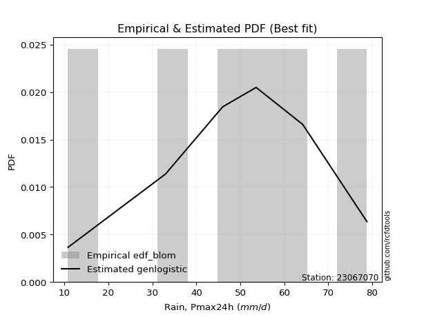</img>

</div>


### 7. Empirical - EDF Tukey (1962)

In hydrology, the Tukey formula is used as a plotting position formula to estimate the empirical probability or frequency of a flood event (or other hydrological data). The formula parameter is given as _c=0.333_ (or 1/3).

<div align="center">


$P=(m-c)/(n+1-2c)$


</div>


**7.1. Empirical values**

<div align="center">

|                | 0                   | 1                   | 2                   | 3         | 4                  | 5                  | 6                  |
|:---------------|:--------------------|:--------------------|:--------------------|:----------|:-------------------|:-------------------|:-------------------|
| date           | 2024                | 2025                | 2023                | 2022      | 2021               | 2019               | 2020               |
| x              | 10.8                | 13.6                | 33.0                | 46.0      | 53.6               | 64.2               | 78.8               |
| m              | 1                   | 2                   | 3                   | 4         | 5                  | 6                  | 7                  |
| empirical_dist | edf_tukey           | edf_tukey           | edf_tukey           | edf_tukey | edf_tukey          | edf_tukey          | edf_tukey          |
| empirical      | 0.09090909090909091 | 0.22727272727272727 | 0.36363636363636365 | 0.5       | 0.6363636363636364 | 0.7727272727272727 | 0.9090909090909091 |
| empirical_tr   | 1.1                 | 1.2941176470588236  | 1.5714285714285714  | 2.0       | 2.75               | 4.3999999999999995 | 10.999999999999996 |

</div>


**7.2. Kolmogorov-Smirnov fit test (sorted by Δ)**


<div align="center">

|                | 0                   | 1                   | 2                   | 3                     | 4                   | 5                   | 6                   | 7                   | 8                   | 9                   | 10                  | 11                  | 12                  | 13                  | 14                  | 15                  | 16                  | 17                  | 18                  | 19                  | 20                  | 21                  | 22                  | 23                  | 24                  | 25                  | 26                  | 27                  | 28                  | 29                  | 30                  | 31                  | 32                  | 33                  | 34                  | 35                  | 36                  | 37                  | 38                  | 39                  | 40                  | 41                  | 42                  | 43                  | 44                  | 45                  | 46                  | 47                  | 48                  | 49                  | 50                  | 51                  | 52                  | 53                  | 54                  | 55                  | 56                  | 57                  | 58                  | 59                  | 60                  | 61                  | 62                  | 63                  | 64                  | 65                  | 66                  | 67                  | 68                  | 69                  | 70                  | 71                  | 72                  | 73                  | 74                  | 75                  | 76                  | 77                  | 78                  | 79                  | 80                  | 81                  | 82                  | 83                  | 84                  | 85                  | 86                  | 87                  | 88                  | 89                  |
|:---------------|:--------------------|:--------------------|:--------------------|:----------------------|:--------------------|:--------------------|:--------------------|:--------------------|:--------------------|:--------------------|:--------------------|:--------------------|:--------------------|:--------------------|:--------------------|:--------------------|:--------------------|:--------------------|:--------------------|:--------------------|:--------------------|:--------------------|:--------------------|:--------------------|:--------------------|:--------------------|:--------------------|:--------------------|:--------------------|:--------------------|:--------------------|:--------------------|:--------------------|:--------------------|:--------------------|:--------------------|:--------------------|:--------------------|:--------------------|:--------------------|:--------------------|:--------------------|:--------------------|:--------------------|:--------------------|:--------------------|:--------------------|:--------------------|:--------------------|:--------------------|:--------------------|:--------------------|:--------------------|:--------------------|:--------------------|:--------------------|:--------------------|:--------------------|:--------------------|:--------------------|:--------------------|:--------------------|:--------------------|:--------------------|:--------------------|:--------------------|:--------------------|:--------------------|:--------------------|:--------------------|:--------------------|:--------------------|:--------------------|:--------------------|:--------------------|:--------------------|:--------------------|:--------------------|:--------------------|:--------------------|:--------------------|:--------------------|:--------------------|:--------------------|:--------------------|:--------------------|:--------------------|:--------------------|:--------------------|:--------------------|
| station        | 23067070            | 23067070            | 23067070            | 23067070              | 23067070            | 23067070            | 23067070            | 23067070            | 23067070            | 23067070            | 23067070            | 23067070            | 23067070            | 23067070            | 23067070            | 23067070            | 23067070            | 23067070            | 23067070            | 23067070            | 23067070            | 23067070            | 23067070            | 23067070            | 23067070            | 23067070            | 23067070            | 23067070            | 23067070            | 23067070            | 23067070            | 23067070            | 23067070            | 23067070            | 23067070            | 23067070            | 23067070            | 23067070            | 23067070            | 23067070            | 23067070            | 23067070            | 23067070            | 23067070            | 23067070            | 23067070            | 23067070            | 23067070            | 23067070            | 23067070            | 23067070            | 23067070            | 23067070            | 23067070            | 23067070            | 23067070            | 23067070            | 23067070            | 23067070            | 23067070            | 23067070            | 23067070            | 23067070            | 23067070            | 23067070            | 23067070            | 23067070            | 23067070            | 23067070            | 23067070            | 23067070            | 23067070            | 23067070            | 23067070            | 23067070            | 23067070            | 23067070            | 23067070            | 23067070            | 23067070            | 23067070            | 23067070            | 23067070            | 23067070            | 23067070            | 23067070            | 23067070            | 23067070            | 23067070            | 23067070            |
| empirical_dist | edf_tukey           | edf_tukey           | edf_tukey           | edf_tukey             | edf_tukey           | edf_tukey           | edf_tukey           | edf_tukey           | edf_tukey           | edf_tukey           | edf_tukey           | edf_tukey           | edf_tukey           | edf_tukey           | edf_tukey           | edf_tukey           | edf_tukey           | edf_tukey           | edf_tukey           | edf_tukey           | edf_tukey           | edf_tukey           | edf_tukey           | edf_tukey           | edf_tukey           | edf_tukey           | edf_tukey           | edf_tukey           | edf_tukey           | edf_tukey           | edf_tukey           | edf_tukey           | edf_tukey           | edf_tukey           | edf_tukey           | edf_tukey           | edf_tukey           | edf_tukey           | edf_tukey           | edf_tukey           | edf_tukey           | edf_tukey           | edf_tukey           | edf_tukey           | edf_tukey           | edf_tukey           | edf_tukey           | edf_tukey           | edf_tukey           | edf_tukey           | edf_tukey           | edf_tukey           | edf_tukey           | edf_tukey           | edf_tukey           | edf_tukey           | edf_tukey           | edf_tukey           | edf_tukey           | edf_tukey           | edf_tukey           | edf_tukey           | edf_tukey           | edf_tukey           | edf_tukey           | edf_tukey           | edf_tukey           | edf_tukey           | edf_tukey           | edf_tukey           | edf_tukey           | edf_tukey           | edf_tukey           | edf_tukey           | edf_tukey           | edf_tukey           | edf_tukey           | edf_tukey           | edf_tukey           | edf_tukey           | edf_tukey           | edf_tukey           | edf_tukey           | edf_tukey           | edf_tukey           | edf_tukey           | edf_tukey           | edf_tukey           | edf_tukey           | edf_tukey           |
| p_dist         | laplace_asymmetric  | logjohnsonsu        | mielke              | loglaplace_asymmetric | logloggamma         | fisk                | gumbel_l            | pearson3            | nct                 | t                   | truncnorm           | crystalball         | norm                | exponnorm           | johnsonsu           | gamma               | erlang              | invgamma            | logpearson3         | genlogistic         | kstwobign           | loggumbel_l         | betaprime           | maxwell             | invgauss            | logistic            | rayleigh            | hypsecant           | logweibull_min      | laplace             | rice                | logfisk             | ncf                 | logbetaprime        | logf                | logcrystalball      | lognorm             | lognorm             | logt                | logexponnorm        | lognct              | logfatiguelife      | f                   | logncf              | logerlang           | loggamma            | loggamma            | loginvweibull       | loginvgamma         | logrice             | alpha               | gumbel_r            | expon               | genexpon            | loginvgauss         | logalpha            | loggompertz         | weibull_min         | loglogistic         | nakagami            | logmaxwell          | lograyleigh         | gompertz            | loghypsecant        | halfnorm            | loggenexpon         | logkstwobign        | moyal               | loggumbel_r         | loglaplace          | loghalfnorm         | halflogistic        | wald                | loghalflogistic     | logmoyal            | gibrat              | logexpon            | logwald             | chi2                | pareto              | loggibrat           | logchi2             | lognakagami         | logmielke           | logtruncnorm        | logpareto           | loglognorm          | fatiguelife         | invweibull          | loggenlogistic      |
| delta          | 0.099638521184098   | 0.10417309836871877 | 0.10548685684813396 | 0.10988733317362981   | 0.11163791781842389 | 0.11473432829909423 | 0.12003312667835725 | 0.12078765230005632 | 0.1210457425024801  | 0.12106678314844281 | 0.12106710374874498 | 0.12106710891668379 | 0.1210671130404696  | 0.12106735706568239 | 0.12126686909119602 | 0.12129750207777794 | 0.12130060549833784 | 0.122182224123652   | 0.12504373652015296 | 0.12732859145499104 | 0.12770130748920686 | 0.12825757032898844 | 0.13004691488030298 | 0.13018403614622784 | 0.13119700821059088 | 0.13293112136788085 | 0.1364498708787439  | 0.13807333315554968 | 0.13895184200694088 | 0.14154839202095582 | 0.14416559788390573 | 0.14480192190596702 | 0.14738430098518362 | 0.15287465504584985 | 0.15295621302102402 | 0.15379093546581124 | 0.15379100411527313 | 0.15379100411527313 | 0.15379143830595132 | 0.15379194806730911 | 0.1547072972133734  | 0.15488331772407138 | 0.1558130748679718  | 0.15910565262298748 | 0.15973738510939062 | 0.15991441000425088 | 0.15991441000425088 | 0.16002101409176417 | 0.1603850660347308  | 0.16239600330594828 | 0.16296889549297777 | 0.16516952631371665 | 0.16647558759349068 | 0.16649152866678496 | 0.1672179678344019  | 0.1699245572696062  | 0.17065654636848512 | 0.17101658084220506 | 0.1720551908168133  | 0.17299212343087955 | 0.17501926700446602 | 0.18138860158216086 | 0.1823814845636879  | 0.18616589541508488 | 0.19042145639345792 | 0.19204899298751776 | 0.1922511397356429  | 0.1929851576773044  | 0.21315959916884375 | 0.2142322450344819  | 0.2220246321229689  | 0.22727272727272727 | 0.22727272727272727 | 0.228015533606596   | 0.23276526210645487 | 0.24594003974252843 | 0.2523938856632161  | 0.28843092312337415 | 0.3081971990258656  | 0.3180456799218663  | 0.3206254497369434  | 0.33666796747840744 | 0.3417738206292691  | 0.35760069460447175 | 0.36354815546681535 | 0.36584233783266473 | 0.3828159541684082  | 0.4268329874889262  | 0.4625679387087553  | 0.7727272727272727  |
| deltao         | 0.48442053926100004 | 0.48442053926100004 | 0.48442053926100004 | 0.48442053926100004   | 0.48442053926100004 | 0.48442053926100004 | 0.48442053926100004 | 0.48442053926100004 | 0.48442053926100004 | 0.48442053926100004 | 0.48442053926100004 | 0.48442053926100004 | 0.48442053926100004 | 0.48442053926100004 | 0.48442053926100004 | 0.48442053926100004 | 0.48442053926100004 | 0.48442053926100004 | 0.48442053926100004 | 0.48442053926100004 | 0.48442053926100004 | 0.48442053926100004 | 0.48442053926100004 | 0.48442053926100004 | 0.48442053926100004 | 0.48442053926100004 | 0.48442053926100004 | 0.48442053926100004 | 0.48442053926100004 | 0.48442053926100004 | 0.48442053926100004 | 0.48442053926100004 | 0.48442053926100004 | 0.48442053926100004 | 0.48442053926100004 | 0.48442053926100004 | 0.48442053926100004 | 0.48442053926100004 | 0.48442053926100004 | 0.48442053926100004 | 0.48442053926100004 | 0.48442053926100004 | 0.48442053926100004 | 0.48442053926100004 | 0.48442053926100004 | 0.48442053926100004 | 0.48442053926100004 | 0.48442053926100004 | 0.48442053926100004 | 0.48442053926100004 | 0.48442053926100004 | 0.48442053926100004 | 0.48442053926100004 | 0.48442053926100004 | 0.48442053926100004 | 0.48442053926100004 | 0.48442053926100004 | 0.48442053926100004 | 0.48442053926100004 | 0.48442053926100004 | 0.48442053926100004 | 0.48442053926100004 | 0.48442053926100004 | 0.48442053926100004 | 0.48442053926100004 | 0.48442053926100004 | 0.48442053926100004 | 0.48442053926100004 | 0.48442053926100004 | 0.48442053926100004 | 0.48442053926100004 | 0.48442053926100004 | 0.48442053926100004 | 0.48442053926100004 | 0.48442053926100004 | 0.48442053926100004 | 0.48442053926100004 | 0.48442053926100004 | 0.48442053926100004 | 0.48442053926100004 | 0.48442053926100004 | 0.48442053926100004 | 0.48442053926100004 | 0.48442053926100004 | 0.48442053926100004 | 0.48442053926100004 | 0.48442053926100004 | 0.48442053926100004 | 0.48442053926100004 | 0.48442053926100004 |
| eval           | Δo > Δ              | Δo > Δ              | Δo > Δ              | Δo > Δ                | Δo > Δ              | Δo > Δ              | Δo > Δ              | Δo > Δ              | Δo > Δ              | Δo > Δ              | Δo > Δ              | Δo > Δ              | Δo > Δ              | Δo > Δ              | Δo > Δ              | Δo > Δ              | Δo > Δ              | Δo > Δ              | Δo > Δ              | Δo > Δ              | Δo > Δ              | Δo > Δ              | Δo > Δ              | Δo > Δ              | Δo > Δ              | Δo > Δ              | Δo > Δ              | Δo > Δ              | Δo > Δ              | Δo > Δ              | Δo > Δ              | Δo > Δ              | Δo > Δ              | Δo > Δ              | Δo > Δ              | Δo > Δ              | Δo > Δ              | Δo > Δ              | Δo > Δ              | Δo > Δ              | Δo > Δ              | Δo > Δ              | Δo > Δ              | Δo > Δ              | Δo > Δ              | Δo > Δ              | Δo > Δ              | Δo > Δ              | Δo > Δ              | Δo > Δ              | Δo > Δ              | Δo > Δ              | Δo > Δ              | Δo > Δ              | Δo > Δ              | Δo > Δ              | Δo > Δ              | Δo > Δ              | Δo > Δ              | Δo > Δ              | Δo > Δ              | Δo > Δ              | Δo > Δ              | Δo > Δ              | Δo > Δ              | Δo > Δ              | Δo > Δ              | Δo > Δ              | Δo > Δ              | Δo > Δ              | Δo > Δ              | Δo > Δ              | Δo > Δ              | Δo > Δ              | Δo > Δ              | Δo > Δ              | Δo > Δ              | Δo > Δ              | Δo > Δ              | Δo > Δ              | Δo > Δ              | Δo > Δ              | Δo > Δ              | Δo > Δ              | Δo > Δ              | Δo > Δ              | Δo > Δ              | Δo > Δ              | Δo > Δ              | Δo <= Δ             |
| fit            | 1                   | 1                   | 1                   | 1                     | 1                   | 1                   | 1                   | 1                   | 1                   | 1                   | 1                   | 1                   | 1                   | 1                   | 1                   | 1                   | 1                   | 1                   | 1                   | 1                   | 1                   | 1                   | 1                   | 1                   | 1                   | 1                   | 1                   | 1                   | 1                   | 1                   | 1                   | 1                   | 1                   | 1                   | 1                   | 1                   | 1                   | 1                   | 1                   | 1                   | 1                   | 1                   | 1                   | 1                   | 1                   | 1                   | 1                   | 1                   | 1                   | 1                   | 1                   | 1                   | 1                   | 1                   | 1                   | 1                   | 1                   | 1                   | 1                   | 1                   | 1                   | 1                   | 1                   | 1                   | 1                   | 1                   | 1                   | 1                   | 1                   | 1                   | 1                   | 1                   | 1                   | 1                   | 1                   | 1                   | 1                   | 1                   | 1                   | 1                   | 1                   | 1                   | 1                   | 1                   | 1                   | 1                   | 1                   | 1                   | 1                   | 0                   |
| n              | 7                   | 7                   | 7                   | 7                     | 7                   | 7                   | 7                   | 7                   | 7                   | 7                   | 7                   | 7                   | 7                   | 7                   | 7                   | 7                   | 7                   | 7                   | 7                   | 7                   | 7                   | 7                   | 7                   | 7                   | 7                   | 7                   | 7                   | 7                   | 7                   | 7                   | 7                   | 7                   | 7                   | 7                   | 7                   | 7                   | 7                   | 7                   | 7                   | 7                   | 7                   | 7                   | 7                   | 7                   | 7                   | 7                   | 7                   | 7                   | 7                   | 7                   | 7                   | 7                   | 7                   | 7                   | 7                   | 7                   | 7                   | 7                   | 7                   | 7                   | 7                   | 7                   | 7                   | 7                   | 7                   | 7                   | 7                   | 7                   | 7                   | 7                   | 7                   | 7                   | 7                   | 7                   | 7                   | 7                   | 7                   | 7                   | 7                   | 7                   | 7                   | 7                   | 7                   | 7                   | 7                   | 7                   | 7                   | 7                   | 7                   | 7                   |
| best_fit       | 1                   | 0                   | 0                   | 0                     | 0                   | 0                   | 0                   | 0                   | 0                   | 0                   | 0                   | 0                   | 0                   | 0                   | 0                   | 0                   | 0                   | 0                   | 0                   | 0                   | 0                   | 0                   | 0                   | 0                   | 0                   | 0                   | 0                   | 0                   | 0                   | 0                   | 0                   | 0                   | 0                   | 0                   | 0                   | 0                   | 0                   | 0                   | 0                   | 0                   | 0                   | 0                   | 0                   | 0                   | 0                   | 0                   | 0                   | 0                   | 0                   | 0                   | 0                   | 0                   | 0                   | 0                   | 0                   | 0                   | 0                   | 0                   | 0                   | 0                   | 0                   | 0                   | 0                   | 0                   | 0                   | 0                   | 0                   | 0                   | 0                   | 0                   | 0                   | 0                   | 0                   | 0                   | 0                   | 0                   | 0                   | 0                   | 0                   | 0                   | 0                   | 0                   | 0                   | 0                   | 0                   | 0                   | 0                   | 0                   | 0                   | 0                   |
| best_fit_sort  | 1                   | 2                   | 3                   | 4                     | 5                   | 6                   | 7                   | 8                   | 9                   | 10                  | 11                  | 12                  | 13                  | 14                  | 15                  | 16                  | 17                  | 18                  | 19                  | 20                  | 21                  | 22                  | 23                  | 24                  | 25                  | 26                  | 27                  | 28                  | 29                  | 30                  | 31                  | 32                  | 33                  | 34                  | 35                  | 36                  | 37                  | 38                  | 39                  | 40                  | 41                  | 42                  | 43                  | 44                  | 45                  | 46                  | 47                  | 48                  | 49                  | 50                  | 51                  | 52                  | 53                  | 54                  | 55                  | 56                  | 57                  | 58                  | 59                  | 60                  | 61                  | 62                  | 63                  | 64                  | 65                  | 66                  | 67                  | 68                  | 69                  | 70                  | 71                  | 72                  | 73                  | 74                  | 75                  | 76                  | 77                  | 78                  | 79                  | 80                  | 81                  | 82                  | 83                  | 84                  | 85                  | 86                  | 87                  | 88                  | 89                  | 90                  |

</div>


<div align="center">

</img>

</div>


**7.3. Best fit**

<div align="center">

|   id |   station | empirical_dist   | p_dist             |     delta |   deltao | eval   |   fit |   n |   best_fit |   best_fit_sort |
|-----:|----------:|:-----------------|:-------------------|----------:|---------:|:-------|------:|----:|-----------:|----------------:|
|    0 |  23067070 | edf_tukey        | laplace_asymmetric | 0.0996385 | 0.484421 | Δo > Δ |     1 |   7 |          1 |               1 |

</div>


<div align="center">

</img></img>

</div>


### 8. Empirical - EDF Gringorten (1963)

Gringorten plotting position formula is essential for estimating the probability and return periods of extreme events like floods and heavy rainfall. The constant _a=0.44_.

<div align="center">


$P=(m-a)/(n+1-2a)$


</div>


**8.1. Empirical values**

<div align="center">

|                | 0                   | 1                   | 2                  | 3              | 4                  | 5                  | 6                  |
|:---------------|:--------------------|:--------------------|:-------------------|:---------------|:-------------------|:-------------------|:-------------------|
| date           | 2024                | 2025                | 2023               | 2022           | 2021               | 2019               | 2020               |
| x              | 10.8                | 13.6                | 33.0               | 46.0           | 53.6               | 64.2               | 78.8               |
| m              | 1                   | 2                   | 3                  | 4              | 5                  | 6                  | 7                  |
| empirical_dist | edf_gringorten      | edf_gringorten      | edf_gringorten     | edf_gringorten | edf_gringorten     | edf_gringorten     | edf_gringorten     |
| empirical      | 0.07865168539325844 | 0.21910112359550563 | 0.3595505617977528 | 0.5            | 0.6404494382022471 | 0.7808988764044943 | 0.9213483146067415 |
| empirical_tr   | 1.0853658536585364  | 1.2805755395683454  | 1.5614035087719298 | 2.0            | 2.781249999999999  | 4.564102564102562  | 12.714285714285701 |

</div>


**8.2. Kolmogorov-Smirnov fit test (sorted by Δ)**


<div align="center">

|                | 0                   | 1                   | 2                   | 3                     | 4                   | 5                   | 6                   | 7                   | 8                   | 9                   | 10                  | 11                  | 12                  | 13                  | 14                  | 15                  | 16                  | 17                  | 18                  | 19                  | 20                  | 21                  | 22                  | 23                  | 24                  | 25                  | 26                  | 27                  | 28                  | 29                  | 30                  | 31                  | 32                  | 33                  | 34                  | 35                  | 36                  | 37                  | 38                  | 39                  | 40                  | 41                  | 42                  | 43                  | 44                  | 45                  | 46                  | 47                  | 48                  | 49                  | 50                  | 51                  | 52                  | 53                  | 54                  | 55                  | 56                  | 57                  | 58                  | 59                  | 60                  | 61                  | 62                  | 63                  | 64                  | 65                  | 66                  | 67                  | 68                  | 69                  | 70                  | 71                  | 72                  | 73                  | 74                  | 75                  | 76                  | 77                  | 78                  | 79                  | 80                  | 81                  | 82                  | 83                  | 84                  | 85                  | 86                  | 87                  | 88                  | 89                  |
|:---------------|:--------------------|:--------------------|:--------------------|:----------------------|:--------------------|:--------------------|:--------------------|:--------------------|:--------------------|:--------------------|:--------------------|:--------------------|:--------------------|:--------------------|:--------------------|:--------------------|:--------------------|:--------------------|:--------------------|:--------------------|:--------------------|:--------------------|:--------------------|:--------------------|:--------------------|:--------------------|:--------------------|:--------------------|:--------------------|:--------------------|:--------------------|:--------------------|:--------------------|:--------------------|:--------------------|:--------------------|:--------------------|:--------------------|:--------------------|:--------------------|:--------------------|:--------------------|:--------------------|:--------------------|:--------------------|:--------------------|:--------------------|:--------------------|:--------------------|:--------------------|:--------------------|:--------------------|:--------------------|:--------------------|:--------------------|:--------------------|:--------------------|:--------------------|:--------------------|:--------------------|:--------------------|:--------------------|:--------------------|:--------------------|:--------------------|:--------------------|:--------------------|:--------------------|:--------------------|:--------------------|:--------------------|:--------------------|:--------------------|:--------------------|:--------------------|:--------------------|:--------------------|:--------------------|:--------------------|:--------------------|:--------------------|:--------------------|:--------------------|:--------------------|:--------------------|:--------------------|:--------------------|:--------------------|:--------------------|:--------------------|
| station        | 23067070            | 23067070            | 23067070            | 23067070              | 23067070            | 23067070            | 23067070            | 23067070            | 23067070            | 23067070            | 23067070            | 23067070            | 23067070            | 23067070            | 23067070            | 23067070            | 23067070            | 23067070            | 23067070            | 23067070            | 23067070            | 23067070            | 23067070            | 23067070            | 23067070            | 23067070            | 23067070            | 23067070            | 23067070            | 23067070            | 23067070            | 23067070            | 23067070            | 23067070            | 23067070            | 23067070            | 23067070            | 23067070            | 23067070            | 23067070            | 23067070            | 23067070            | 23067070            | 23067070            | 23067070            | 23067070            | 23067070            | 23067070            | 23067070            | 23067070            | 23067070            | 23067070            | 23067070            | 23067070            | 23067070            | 23067070            | 23067070            | 23067070            | 23067070            | 23067070            | 23067070            | 23067070            | 23067070            | 23067070            | 23067070            | 23067070            | 23067070            | 23067070            | 23067070            | 23067070            | 23067070            | 23067070            | 23067070            | 23067070            | 23067070            | 23067070            | 23067070            | 23067070            | 23067070            | 23067070            | 23067070            | 23067070            | 23067070            | 23067070            | 23067070            | 23067070            | 23067070            | 23067070            | 23067070            | 23067070            |
| empirical_dist | edf_gringorten      | edf_gringorten      | edf_gringorten      | edf_gringorten        | edf_gringorten      | edf_gringorten      | edf_gringorten      | edf_gringorten      | edf_gringorten      | edf_gringorten      | edf_gringorten      | edf_gringorten      | edf_gringorten      | edf_gringorten      | edf_gringorten      | edf_gringorten      | edf_gringorten      | edf_gringorten      | edf_gringorten      | edf_gringorten      | edf_gringorten      | edf_gringorten      | edf_gringorten      | edf_gringorten      | edf_gringorten      | edf_gringorten      | edf_gringorten      | edf_gringorten      | edf_gringorten      | edf_gringorten      | edf_gringorten      | edf_gringorten      | edf_gringorten      | edf_gringorten      | edf_gringorten      | edf_gringorten      | edf_gringorten      | edf_gringorten      | edf_gringorten      | edf_gringorten      | edf_gringorten      | edf_gringorten      | edf_gringorten      | edf_gringorten      | edf_gringorten      | edf_gringorten      | edf_gringorten      | edf_gringorten      | edf_gringorten      | edf_gringorten      | edf_gringorten      | edf_gringorten      | edf_gringorten      | edf_gringorten      | edf_gringorten      | edf_gringorten      | edf_gringorten      | edf_gringorten      | edf_gringorten      | edf_gringorten      | edf_gringorten      | edf_gringorten      | edf_gringorten      | edf_gringorten      | edf_gringorten      | edf_gringorten      | edf_gringorten      | edf_gringorten      | edf_gringorten      | edf_gringorten      | edf_gringorten      | edf_gringorten      | edf_gringorten      | edf_gringorten      | edf_gringorten      | edf_gringorten      | edf_gringorten      | edf_gringorten      | edf_gringorten      | edf_gringorten      | edf_gringorten      | edf_gringorten      | edf_gringorten      | edf_gringorten      | edf_gringorten      | edf_gringorten      | edf_gringorten      | edf_gringorten      | edf_gringorten      | edf_gringorten      |
| p_dist         | laplace_asymmetric  | logjohnsonsu        | mielke              | loglaplace_asymmetric | logloggamma         | fisk                | gumbel_l            | pearson3            | nct                 | t                   | truncnorm           | crystalball         | norm                | exponnorm           | johnsonsu           | gamma               | erlang              | invgamma            | genlogistic         | loggumbel_l         | kstwobign           | betaprime           | maxwell             | logpearson3         | invgauss            | logistic            | rayleigh            | hypsecant           | logweibull_min      | laplace             | rice                | logfisk             | logbetaprime        | logf                | logcrystalball      | lognorm             | lognorm             | logt                | logexponnorm        | lognct              | logfatiguelife      | f                   | gumbel_r            | logncf              | ncf                 | logerlang           | loggamma            | loggamma            | loginvgamma         | loginvweibull       | logrice             | loggompertz         | expon               | genexpon            | alpha               | loginvgauss         | logalpha            | weibull_min         | loglogistic         | gompertz            | logmaxwell          | nakagami            | lograyleigh         | halfnorm            | moyal               | loghypsecant        | loggenexpon         | logkstwobign        | loggumbel_r         | loghalfnorm         | loglaplace          | halflogistic        | wald                | loghalflogistic     | logmoyal            | gibrat              | logexpon            | logwald             | chi2                | loggibrat           | pareto              | logchi2             | lognakagami         | logtruncnorm        | logmielke           | logpareto           | loglognorm          | fatiguelife         | invweibull          | loggenlogistic      |
| delta          | 0.09146691750687636 | 0.09600149469149713 | 0.09731525317091232 | 0.10171572949640817   | 0.10346631414120225 | 0.10656272462187259 | 0.11186152300113561 | 0.11261604862283468 | 0.11287413882525846 | 0.11289517947122117 | 0.11289550007152334 | 0.11289550523946215 | 0.11289550936324796 | 0.11289575338846075 | 0.11309526541397438 | 0.1131258984005563  | 0.1131290018211162  | 0.11401062044643036 | 0.11915698777776941 | 0.1200859666517668  | 0.1209056140690612  | 0.12187531120308134 | 0.1220124324690062  | 0.12227025185944451 | 0.12302540453336923 | 0.12475951769065921 | 0.12827826720152227 | 0.12990172947832804 | 0.13078023832971925 | 0.13337678834373418 | 0.1359939942066841  | 0.13663031822874538 | 0.15287465504584985 | 0.15295621302102402 | 0.15379093546581124 | 0.15379100411527313 | 0.15379100411527313 | 0.15379143830595132 | 0.15379194806730911 | 0.1547072972133734  | 0.15488331772407138 | 0.1558130748679718  | 0.156997922636495   | 0.15910565262298748 | 0.15964170650101606 | 0.15973738510939062 | 0.15991441000425088 | 0.15991441000425088 | 0.1603850660347308  | 0.161573657651904   | 0.16239600330594828 | 0.16248494269126348 | 0.16647558759349068 | 0.16649152866678496 | 0.16705469733158862 | 0.1672179678344019  | 0.1699245572696062  | 0.17101658084220506 | 0.1720551908168133  | 0.17420988088646627 | 0.17501926700446602 | 0.1770779252694904  | 0.18138860158216086 | 0.18224985271623628 | 0.18481355400008276 | 0.18616589541508488 | 0.19484936256668206 | 0.19542956078550044 | 0.21315959916884375 | 0.21385302844574727 | 0.2142322450344819  | 0.21910112359550563 | 0.21910112359550563 | 0.228015533606596   | 0.23276526210645487 | 0.24594003974252843 | 0.2564796875018269  | 0.28843092312337415 | 0.3081971990258656  | 0.3206254497369434  | 0.32621728359908797 | 0.3407537693170183  | 0.34585962246787993 | 0.3594623536282045  | 0.3616864964430826  | 0.3740139415098864  | 0.3909875578456299  | 0.430918789327537   | 0.4748253442245877  | 0.7808988764044943  |
| deltao         | 0.48442053926100004 | 0.48442053926100004 | 0.48442053926100004 | 0.48442053926100004   | 0.48442053926100004 | 0.48442053926100004 | 0.48442053926100004 | 0.48442053926100004 | 0.48442053926100004 | 0.48442053926100004 | 0.48442053926100004 | 0.48442053926100004 | 0.48442053926100004 | 0.48442053926100004 | 0.48442053926100004 | 0.48442053926100004 | 0.48442053926100004 | 0.48442053926100004 | 0.48442053926100004 | 0.48442053926100004 | 0.48442053926100004 | 0.48442053926100004 | 0.48442053926100004 | 0.48442053926100004 | 0.48442053926100004 | 0.48442053926100004 | 0.48442053926100004 | 0.48442053926100004 | 0.48442053926100004 | 0.48442053926100004 | 0.48442053926100004 | 0.48442053926100004 | 0.48442053926100004 | 0.48442053926100004 | 0.48442053926100004 | 0.48442053926100004 | 0.48442053926100004 | 0.48442053926100004 | 0.48442053926100004 | 0.48442053926100004 | 0.48442053926100004 | 0.48442053926100004 | 0.48442053926100004 | 0.48442053926100004 | 0.48442053926100004 | 0.48442053926100004 | 0.48442053926100004 | 0.48442053926100004 | 0.48442053926100004 | 0.48442053926100004 | 0.48442053926100004 | 0.48442053926100004 | 0.48442053926100004 | 0.48442053926100004 | 0.48442053926100004 | 0.48442053926100004 | 0.48442053926100004 | 0.48442053926100004 | 0.48442053926100004 | 0.48442053926100004 | 0.48442053926100004 | 0.48442053926100004 | 0.48442053926100004 | 0.48442053926100004 | 0.48442053926100004 | 0.48442053926100004 | 0.48442053926100004 | 0.48442053926100004 | 0.48442053926100004 | 0.48442053926100004 | 0.48442053926100004 | 0.48442053926100004 | 0.48442053926100004 | 0.48442053926100004 | 0.48442053926100004 | 0.48442053926100004 | 0.48442053926100004 | 0.48442053926100004 | 0.48442053926100004 | 0.48442053926100004 | 0.48442053926100004 | 0.48442053926100004 | 0.48442053926100004 | 0.48442053926100004 | 0.48442053926100004 | 0.48442053926100004 | 0.48442053926100004 | 0.48442053926100004 | 0.48442053926100004 | 0.48442053926100004 |
| eval           | Δo > Δ              | Δo > Δ              | Δo > Δ              | Δo > Δ                | Δo > Δ              | Δo > Δ              | Δo > Δ              | Δo > Δ              | Δo > Δ              | Δo > Δ              | Δo > Δ              | Δo > Δ              | Δo > Δ              | Δo > Δ              | Δo > Δ              | Δo > Δ              | Δo > Δ              | Δo > Δ              | Δo > Δ              | Δo > Δ              | Δo > Δ              | Δo > Δ              | Δo > Δ              | Δo > Δ              | Δo > Δ              | Δo > Δ              | Δo > Δ              | Δo > Δ              | Δo > Δ              | Δo > Δ              | Δo > Δ              | Δo > Δ              | Δo > Δ              | Δo > Δ              | Δo > Δ              | Δo > Δ              | Δo > Δ              | Δo > Δ              | Δo > Δ              | Δo > Δ              | Δo > Δ              | Δo > Δ              | Δo > Δ              | Δo > Δ              | Δo > Δ              | Δo > Δ              | Δo > Δ              | Δo > Δ              | Δo > Δ              | Δo > Δ              | Δo > Δ              | Δo > Δ              | Δo > Δ              | Δo > Δ              | Δo > Δ              | Δo > Δ              | Δo > Δ              | Δo > Δ              | Δo > Δ              | Δo > Δ              | Δo > Δ              | Δo > Δ              | Δo > Δ              | Δo > Δ              | Δo > Δ              | Δo > Δ              | Δo > Δ              | Δo > Δ              | Δo > Δ              | Δo > Δ              | Δo > Δ              | Δo > Δ              | Δo > Δ              | Δo > Δ              | Δo > Δ              | Δo > Δ              | Δo > Δ              | Δo > Δ              | Δo > Δ              | Δo > Δ              | Δo > Δ              | Δo > Δ              | Δo > Δ              | Δo > Δ              | Δo > Δ              | Δo > Δ              | Δo > Δ              | Δo > Δ              | Δo > Δ              | Δo <= Δ             |
| fit            | 1                   | 1                   | 1                   | 1                     | 1                   | 1                   | 1                   | 1                   | 1                   | 1                   | 1                   | 1                   | 1                   | 1                   | 1                   | 1                   | 1                   | 1                   | 1                   | 1                   | 1                   | 1                   | 1                   | 1                   | 1                   | 1                   | 1                   | 1                   | 1                   | 1                   | 1                   | 1                   | 1                   | 1                   | 1                   | 1                   | 1                   | 1                   | 1                   | 1                   | 1                   | 1                   | 1                   | 1                   | 1                   | 1                   | 1                   | 1                   | 1                   | 1                   | 1                   | 1                   | 1                   | 1                   | 1                   | 1                   | 1                   | 1                   | 1                   | 1                   | 1                   | 1                   | 1                   | 1                   | 1                   | 1                   | 1                   | 1                   | 1                   | 1                   | 1                   | 1                   | 1                   | 1                   | 1                   | 1                   | 1                   | 1                   | 1                   | 1                   | 1                   | 1                   | 1                   | 1                   | 1                   | 1                   | 1                   | 1                   | 1                   | 0                   |
| n              | 7                   | 7                   | 7                   | 7                     | 7                   | 7                   | 7                   | 7                   | 7                   | 7                   | 7                   | 7                   | 7                   | 7                   | 7                   | 7                   | 7                   | 7                   | 7                   | 7                   | 7                   | 7                   | 7                   | 7                   | 7                   | 7                   | 7                   | 7                   | 7                   | 7                   | 7                   | 7                   | 7                   | 7                   | 7                   | 7                   | 7                   | 7                   | 7                   | 7                   | 7                   | 7                   | 7                   | 7                   | 7                   | 7                   | 7                   | 7                   | 7                   | 7                   | 7                   | 7                   | 7                   | 7                   | 7                   | 7                   | 7                   | 7                   | 7                   | 7                   | 7                   | 7                   | 7                   | 7                   | 7                   | 7                   | 7                   | 7                   | 7                   | 7                   | 7                   | 7                   | 7                   | 7                   | 7                   | 7                   | 7                   | 7                   | 7                   | 7                   | 7                   | 7                   | 7                   | 7                   | 7                   | 7                   | 7                   | 7                   | 7                   | 7                   |
| best_fit       | 1                   | 0                   | 0                   | 0                     | 0                   | 0                   | 0                   | 0                   | 0                   | 0                   | 0                   | 0                   | 0                   | 0                   | 0                   | 0                   | 0                   | 0                   | 0                   | 0                   | 0                   | 0                   | 0                   | 0                   | 0                   | 0                   | 0                   | 0                   | 0                   | 0                   | 0                   | 0                   | 0                   | 0                   | 0                   | 0                   | 0                   | 0                   | 0                   | 0                   | 0                   | 0                   | 0                   | 0                   | 0                   | 0                   | 0                   | 0                   | 0                   | 0                   | 0                   | 0                   | 0                   | 0                   | 0                   | 0                   | 0                   | 0                   | 0                   | 0                   | 0                   | 0                   | 0                   | 0                   | 0                   | 0                   | 0                   | 0                   | 0                   | 0                   | 0                   | 0                   | 0                   | 0                   | 0                   | 0                   | 0                   | 0                   | 0                   | 0                   | 0                   | 0                   | 0                   | 0                   | 0                   | 0                   | 0                   | 0                   | 0                   | 0                   |
| best_fit_sort  | 1                   | 2                   | 3                   | 4                     | 5                   | 6                   | 7                   | 8                   | 9                   | 10                  | 11                  | 12                  | 13                  | 14                  | 15                  | 16                  | 17                  | 18                  | 19                  | 20                  | 21                  | 22                  | 23                  | 24                  | 25                  | 26                  | 27                  | 28                  | 29                  | 30                  | 31                  | 32                  | 33                  | 34                  | 35                  | 36                  | 37                  | 38                  | 39                  | 40                  | 41                  | 42                  | 43                  | 44                  | 45                  | 46                  | 47                  | 48                  | 49                  | 50                  | 51                  | 52                  | 53                  | 54                  | 55                  | 56                  | 57                  | 58                  | 59                  | 60                  | 61                  | 62                  | 63                  | 64                  | 65                  | 66                  | 67                  | 68                  | 69                  | 70                  | 71                  | 72                  | 73                  | 74                  | 75                  | 76                  | 77                  | 78                  | 79                  | 80                  | 81                  | 82                  | 83                  | 84                  | 85                  | 86                  | 87                  | 88                  | 89                  | 90                  |

</div>


<div align="center">

</img>

</div>


**8.3. Best fit**

<div align="center">

|   id |   station | empirical_dist   | p_dist             |     delta |   deltao | eval   |   fit |   n |   best_fit |   best_fit_sort |
|-----:|----------:|:-----------------|:-------------------|----------:|---------:|:-------|------:|----:|-----------:|----------------:|
|    0 |  23067070 | edf_gringorten   | laplace_asymmetric | 0.0914669 | 0.484421 | Δo > Δ |     1 |   7 |          1 |               1 |

</div>


<div align="center">

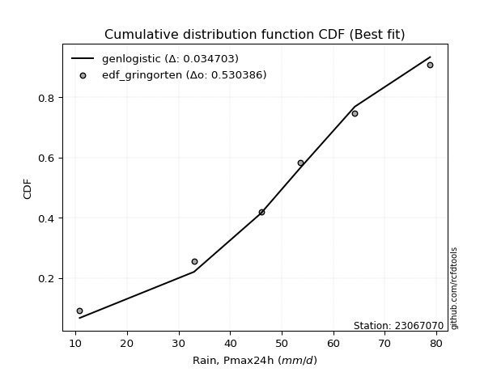</img>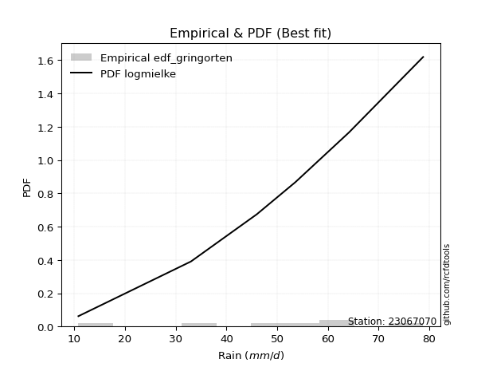</img>

</div>


### 9. Empirical - EDF Filliben (1975)

The specific values of the constants (0.3175) (often denoted as $alpha$) and (0.365) are derived from a method proposed by James J. Filliben in a 1975 paper. This particular formula is the mean value of the $i$-th order statistic of the normal distribution and is considered a robust and effective plotting position formula for the normal probability plot correlation coefficient test for normality.

<div align="center">


$P=(m-0.3175)/(n+0.365)$


</div>


**9.1. Empirical values**

<div align="center">

|                | 0                   | 1                   | 2                   | 3            | 4                  | 5                  | 6                  |
|:---------------|:--------------------|:--------------------|:--------------------|:-------------|:-------------------|:-------------------|:-------------------|
| date           | 2024                | 2025                | 2023                | 2022         | 2021               | 2019               | 2020               |
| x              | 10.8                | 13.6                | 33.0                | 46.0         | 53.6               | 64.2               | 78.8               |
| m              | 1                   | 2                   | 3                   | 4            | 5                  | 6                  | 7                  |
| empirical_dist | edf_filliben        | edf_filliben        | edf_filliben        | edf_filliben | edf_filliben       | edf_filliben       | edf_filliben       |
| empirical      | 0.09266802443991853 | 0.22844534962661237 | 0.36422267481330617 | 0.5          | 0.6357773251866938 | 0.7715546503733877 | 0.9073319755600815 |
| empirical_tr   | 1.1021324354657687  | 1.2960844698636163  | 1.5728777362520021  | 2.0          | 2.7455731593662627 | 4.377414561664191  | 10.791208791208794 |

</div>


**9.2. Kolmogorov-Smirnov fit test (sorted by Δ)**


<div align="center">

|                | 0                   | 1                   | 2                   | 3                     | 4                   | 5                   | 6                   | 7                   | 8                   | 9                   | 10                  | 11                  | 12                  | 13                  | 14                  | 15                  | 16                  | 17                  | 18                  | 19                  | 20                  | 21                  | 22                  | 23                  | 24                  | 25                  | 26                  | 27                  | 28                  | 29                  | 30                  | 31                  | 32                  | 33                  | 34                  | 35                  | 36                  | 37                  | 38                  | 39                  | 40                  | 41                  | 42                  | 43                  | 44                  | 45                  | 46                  | 47                  | 48                  | 49                  | 50                  | 51                  | 52                  | 53                  | 54                  | 55                  | 56                  | 57                  | 58                  | 59                  | 60                  | 61                  | 62                  | 63                  | 64                  | 65                  | 66                  | 67                  | 68                  | 69                  | 70                  | 71                  | 72                  | 73                  | 74                  | 75                  | 76                  | 77                  | 78                  | 79                  | 80                  | 81                  | 82                  | 83                  | 84                  | 85                  | 86                  | 87                  | 88                  | 89                  |
|:---------------|:--------------------|:--------------------|:--------------------|:----------------------|:--------------------|:--------------------|:--------------------|:--------------------|:--------------------|:--------------------|:--------------------|:--------------------|:--------------------|:--------------------|:--------------------|:--------------------|:--------------------|:--------------------|:--------------------|:--------------------|:--------------------|:--------------------|:--------------------|:--------------------|:--------------------|:--------------------|:--------------------|:--------------------|:--------------------|:--------------------|:--------------------|:--------------------|:--------------------|:--------------------|:--------------------|:--------------------|:--------------------|:--------------------|:--------------------|:--------------------|:--------------------|:--------------------|:--------------------|:--------------------|:--------------------|:--------------------|:--------------------|:--------------------|:--------------------|:--------------------|:--------------------|:--------------------|:--------------------|:--------------------|:--------------------|:--------------------|:--------------------|:--------------------|:--------------------|:--------------------|:--------------------|:--------------------|:--------------------|:--------------------|:--------------------|:--------------------|:--------------------|:--------------------|:--------------------|:--------------------|:--------------------|:--------------------|:--------------------|:--------------------|:--------------------|:--------------------|:--------------------|:--------------------|:--------------------|:--------------------|:--------------------|:--------------------|:--------------------|:--------------------|:--------------------|:--------------------|:--------------------|:--------------------|:--------------------|:--------------------|
| station        | 23067070            | 23067070            | 23067070            | 23067070              | 23067070            | 23067070            | 23067070            | 23067070            | 23067070            | 23067070            | 23067070            | 23067070            | 23067070            | 23067070            | 23067070            | 23067070            | 23067070            | 23067070            | 23067070            | 23067070            | 23067070            | 23067070            | 23067070            | 23067070            | 23067070            | 23067070            | 23067070            | 23067070            | 23067070            | 23067070            | 23067070            | 23067070            | 23067070            | 23067070            | 23067070            | 23067070            | 23067070            | 23067070            | 23067070            | 23067070            | 23067070            | 23067070            | 23067070            | 23067070            | 23067070            | 23067070            | 23067070            | 23067070            | 23067070            | 23067070            | 23067070            | 23067070            | 23067070            | 23067070            | 23067070            | 23067070            | 23067070            | 23067070            | 23067070            | 23067070            | 23067070            | 23067070            | 23067070            | 23067070            | 23067070            | 23067070            | 23067070            | 23067070            | 23067070            | 23067070            | 23067070            | 23067070            | 23067070            | 23067070            | 23067070            | 23067070            | 23067070            | 23067070            | 23067070            | 23067070            | 23067070            | 23067070            | 23067070            | 23067070            | 23067070            | 23067070            | 23067070            | 23067070            | 23067070            | 23067070            |
| empirical_dist | edf_filliben        | edf_filliben        | edf_filliben        | edf_filliben          | edf_filliben        | edf_filliben        | edf_filliben        | edf_filliben        | edf_filliben        | edf_filliben        | edf_filliben        | edf_filliben        | edf_filliben        | edf_filliben        | edf_filliben        | edf_filliben        | edf_filliben        | edf_filliben        | edf_filliben        | edf_filliben        | edf_filliben        | edf_filliben        | edf_filliben        | edf_filliben        | edf_filliben        | edf_filliben        | edf_filliben        | edf_filliben        | edf_filliben        | edf_filliben        | edf_filliben        | edf_filliben        | edf_filliben        | edf_filliben        | edf_filliben        | edf_filliben        | edf_filliben        | edf_filliben        | edf_filliben        | edf_filliben        | edf_filliben        | edf_filliben        | edf_filliben        | edf_filliben        | edf_filliben        | edf_filliben        | edf_filliben        | edf_filliben        | edf_filliben        | edf_filliben        | edf_filliben        | edf_filliben        | edf_filliben        | edf_filliben        | edf_filliben        | edf_filliben        | edf_filliben        | edf_filliben        | edf_filliben        | edf_filliben        | edf_filliben        | edf_filliben        | edf_filliben        | edf_filliben        | edf_filliben        | edf_filliben        | edf_filliben        | edf_filliben        | edf_filliben        | edf_filliben        | edf_filliben        | edf_filliben        | edf_filliben        | edf_filliben        | edf_filliben        | edf_filliben        | edf_filliben        | edf_filliben        | edf_filliben        | edf_filliben        | edf_filliben        | edf_filliben        | edf_filliben        | edf_filliben        | edf_filliben        | edf_filliben        | edf_filliben        | edf_filliben        | edf_filliben        | edf_filliben        |
| p_dist         | laplace_asymmetric  | logjohnsonsu        | mielke              | loglaplace_asymmetric | logloggamma         | fisk                | gumbel_l            | pearson3            | nct                 | t                   | truncnorm           | crystalball         | norm                | exponnorm           | johnsonsu           | gamma               | erlang              | invgamma            | logpearson3         | genlogistic         | kstwobign           | loggumbel_l         | betaprime           | maxwell             | invgauss            | logistic            | rayleigh            | hypsecant           | logweibull_min      | laplace             | rice                | ncf                 | logfisk             | logbetaprime        | logf                | logcrystalball      | lognorm             | lognorm             | logt                | logexponnorm        | lognct              | logfatiguelife      | f                   | logncf              | logerlang           | loggamma            | loggamma            | loginvweibull       | loginvgamma         | alpha               | logrice             | gumbel_r            | expon               | genexpon            | loginvgauss         | logalpha            | weibull_min         | loggompertz         | loglogistic         | nakagami            | logmaxwell          | lograyleigh         | gompertz            | loghypsecant        | halfnorm            | loggenexpon         | logkstwobign        | moyal               | loggumbel_r         | loglaplace          | loghalfnorm         | halflogistic        | loghalflogistic     | wald                | logmoyal            | gibrat              | logexpon            | logwald             | chi2                | pareto              | loggibrat           | logchi2             | lognakagami         | logmielke           | logtruncnorm        | logpareto           | loglognorm          | fatiguelife         | invweibull          | loggenlogistic      |
| delta          | 0.1008111435379831  | 0.10534572072260387 | 0.10665947920201906 | 0.11105995552751491   | 0.11281054017230899 | 0.11590695065297933 | 0.12120574903224235 | 0.12196027465394142 | 0.1222183648563652  | 0.12223940550232791 | 0.12223972610263008 | 0.12223973127056889 | 0.1222397353943547  | 0.12223997941956749 | 0.12243949144508112 | 0.12247012443166304 | 0.12247322785222294 | 0.1233548464775371  | 0.12621635887403806 | 0.12850121380887614 | 0.12887392984309196 | 0.12943019268287353 | 0.13121953723418808 | 0.13135665850011294 | 0.13236963056447598 | 0.13410374372176595 | 0.137622493232629   | 0.13924595550943478 | 0.14012446436082598 | 0.14272101437484092 | 0.14533822023779083 | 0.14562536745435606 | 0.14597454425985212 | 0.15287465504584985 | 0.15295621302102402 | 0.15379093546581124 | 0.15379100411527313 | 0.15379100411527313 | 0.15379143830595132 | 0.15379194806730911 | 0.1547072972133734  | 0.15488331772407138 | 0.1558130748679718  | 0.15910565262298748 | 0.15973738510939062 | 0.15991441000425088 | 0.15991441000425088 | 0.16002101409176417 | 0.1603850660347308  | 0.16238258431603525 | 0.16239600330594828 | 0.16634214866760175 | 0.16647558759349068 | 0.16649152866678496 | 0.1672179678344019  | 0.1699245572696062  | 0.17101658084220506 | 0.17182916872237022 | 0.1720551908168133  | 0.17240581225393703 | 0.17501926700446602 | 0.18138860158216086 | 0.183554106917573   | 0.18616589541508488 | 0.19159407874734302 | 0.19204899298751776 | 0.1922511397356429  | 0.1941577800311895  | 0.21315959916884375 | 0.2142322450344819  | 0.223197254476854   | 0.22844534962661237 | 0.22844534962661237 | 0.22844534962661237 | 0.23276526210645487 | 0.24594003974252843 | 0.25180757448627356 | 0.28843092312337415 | 0.3081971990258656  | 0.31687305756798123 | 0.3206254497369434  | 0.3360816563014649  | 0.34118750945232657 | 0.3570143834275292  | 0.36413446664375787 | 0.3646697154787797  | 0.38164333181452315 | 0.42624667631198365 | 0.4608090051779277  | 0.7715546503733877  |
| deltao         | 0.48442053926100004 | 0.48442053926100004 | 0.48442053926100004 | 0.48442053926100004   | 0.48442053926100004 | 0.48442053926100004 | 0.48442053926100004 | 0.48442053926100004 | 0.48442053926100004 | 0.48442053926100004 | 0.48442053926100004 | 0.48442053926100004 | 0.48442053926100004 | 0.48442053926100004 | 0.48442053926100004 | 0.48442053926100004 | 0.48442053926100004 | 0.48442053926100004 | 0.48442053926100004 | 0.48442053926100004 | 0.48442053926100004 | 0.48442053926100004 | 0.48442053926100004 | 0.48442053926100004 | 0.48442053926100004 | 0.48442053926100004 | 0.48442053926100004 | 0.48442053926100004 | 0.48442053926100004 | 0.48442053926100004 | 0.48442053926100004 | 0.48442053926100004 | 0.48442053926100004 | 0.48442053926100004 | 0.48442053926100004 | 0.48442053926100004 | 0.48442053926100004 | 0.48442053926100004 | 0.48442053926100004 | 0.48442053926100004 | 0.48442053926100004 | 0.48442053926100004 | 0.48442053926100004 | 0.48442053926100004 | 0.48442053926100004 | 0.48442053926100004 | 0.48442053926100004 | 0.48442053926100004 | 0.48442053926100004 | 0.48442053926100004 | 0.48442053926100004 | 0.48442053926100004 | 0.48442053926100004 | 0.48442053926100004 | 0.48442053926100004 | 0.48442053926100004 | 0.48442053926100004 | 0.48442053926100004 | 0.48442053926100004 | 0.48442053926100004 | 0.48442053926100004 | 0.48442053926100004 | 0.48442053926100004 | 0.48442053926100004 | 0.48442053926100004 | 0.48442053926100004 | 0.48442053926100004 | 0.48442053926100004 | 0.48442053926100004 | 0.48442053926100004 | 0.48442053926100004 | 0.48442053926100004 | 0.48442053926100004 | 0.48442053926100004 | 0.48442053926100004 | 0.48442053926100004 | 0.48442053926100004 | 0.48442053926100004 | 0.48442053926100004 | 0.48442053926100004 | 0.48442053926100004 | 0.48442053926100004 | 0.48442053926100004 | 0.48442053926100004 | 0.48442053926100004 | 0.48442053926100004 | 0.48442053926100004 | 0.48442053926100004 | 0.48442053926100004 | 0.48442053926100004 |
| eval           | Δo > Δ              | Δo > Δ              | Δo > Δ              | Δo > Δ                | Δo > Δ              | Δo > Δ              | Δo > Δ              | Δo > Δ              | Δo > Δ              | Δo > Δ              | Δo > Δ              | Δo > Δ              | Δo > Δ              | Δo > Δ              | Δo > Δ              | Δo > Δ              | Δo > Δ              | Δo > Δ              | Δo > Δ              | Δo > Δ              | Δo > Δ              | Δo > Δ              | Δo > Δ              | Δo > Δ              | Δo > Δ              | Δo > Δ              | Δo > Δ              | Δo > Δ              | Δo > Δ              | Δo > Δ              | Δo > Δ              | Δo > Δ              | Δo > Δ              | Δo > Δ              | Δo > Δ              | Δo > Δ              | Δo > Δ              | Δo > Δ              | Δo > Δ              | Δo > Δ              | Δo > Δ              | Δo > Δ              | Δo > Δ              | Δo > Δ              | Δo > Δ              | Δo > Δ              | Δo > Δ              | Δo > Δ              | Δo > Δ              | Δo > Δ              | Δo > Δ              | Δo > Δ              | Δo > Δ              | Δo > Δ              | Δo > Δ              | Δo > Δ              | Δo > Δ              | Δo > Δ              | Δo > Δ              | Δo > Δ              | Δo > Δ              | Δo > Δ              | Δo > Δ              | Δo > Δ              | Δo > Δ              | Δo > Δ              | Δo > Δ              | Δo > Δ              | Δo > Δ              | Δo > Δ              | Δo > Δ              | Δo > Δ              | Δo > Δ              | Δo > Δ              | Δo > Δ              | Δo > Δ              | Δo > Δ              | Δo > Δ              | Δo > Δ              | Δo > Δ              | Δo > Δ              | Δo > Δ              | Δo > Δ              | Δo > Δ              | Δo > Δ              | Δo > Δ              | Δo > Δ              | Δo > Δ              | Δo > Δ              | Δo <= Δ             |
| fit            | 1                   | 1                   | 1                   | 1                     | 1                   | 1                   | 1                   | 1                   | 1                   | 1                   | 1                   | 1                   | 1                   | 1                   | 1                   | 1                   | 1                   | 1                   | 1                   | 1                   | 1                   | 1                   | 1                   | 1                   | 1                   | 1                   | 1                   | 1                   | 1                   | 1                   | 1                   | 1                   | 1                   | 1                   | 1                   | 1                   | 1                   | 1                   | 1                   | 1                   | 1                   | 1                   | 1                   | 1                   | 1                   | 1                   | 1                   | 1                   | 1                   | 1                   | 1                   | 1                   | 1                   | 1                   | 1                   | 1                   | 1                   | 1                   | 1                   | 1                   | 1                   | 1                   | 1                   | 1                   | 1                   | 1                   | 1                   | 1                   | 1                   | 1                   | 1                   | 1                   | 1                   | 1                   | 1                   | 1                   | 1                   | 1                   | 1                   | 1                   | 1                   | 1                   | 1                   | 1                   | 1                   | 1                   | 1                   | 1                   | 1                   | 0                   |
| n              | 7                   | 7                   | 7                   | 7                     | 7                   | 7                   | 7                   | 7                   | 7                   | 7                   | 7                   | 7                   | 7                   | 7                   | 7                   | 7                   | 7                   | 7                   | 7                   | 7                   | 7                   | 7                   | 7                   | 7                   | 7                   | 7                   | 7                   | 7                   | 7                   | 7                   | 7                   | 7                   | 7                   | 7                   | 7                   | 7                   | 7                   | 7                   | 7                   | 7                   | 7                   | 7                   | 7                   | 7                   | 7                   | 7                   | 7                   | 7                   | 7                   | 7                   | 7                   | 7                   | 7                   | 7                   | 7                   | 7                   | 7                   | 7                   | 7                   | 7                   | 7                   | 7                   | 7                   | 7                   | 7                   | 7                   | 7                   | 7                   | 7                   | 7                   | 7                   | 7                   | 7                   | 7                   | 7                   | 7                   | 7                   | 7                   | 7                   | 7                   | 7                   | 7                   | 7                   | 7                   | 7                   | 7                   | 7                   | 7                   | 7                   | 7                   |
| best_fit       | 1                   | 0                   | 0                   | 0                     | 0                   | 0                   | 0                   | 0                   | 0                   | 0                   | 0                   | 0                   | 0                   | 0                   | 0                   | 0                   | 0                   | 0                   | 0                   | 0                   | 0                   | 0                   | 0                   | 0                   | 0                   | 0                   | 0                   | 0                   | 0                   | 0                   | 0                   | 0                   | 0                   | 0                   | 0                   | 0                   | 0                   | 0                   | 0                   | 0                   | 0                   | 0                   | 0                   | 0                   | 0                   | 0                   | 0                   | 0                   | 0                   | 0                   | 0                   | 0                   | 0                   | 0                   | 0                   | 0                   | 0                   | 0                   | 0                   | 0                   | 0                   | 0                   | 0                   | 0                   | 0                   | 0                   | 0                   | 0                   | 0                   | 0                   | 0                   | 0                   | 0                   | 0                   | 0                   | 0                   | 0                   | 0                   | 0                   | 0                   | 0                   | 0                   | 0                   | 0                   | 0                   | 0                   | 0                   | 0                   | 0                   | 0                   |
| best_fit_sort  | 1                   | 2                   | 3                   | 4                     | 5                   | 6                   | 7                   | 8                   | 9                   | 10                  | 11                  | 12                  | 13                  | 14                  | 15                  | 16                  | 17                  | 18                  | 19                  | 20                  | 21                  | 22                  | 23                  | 24                  | 25                  | 26                  | 27                  | 28                  | 29                  | 30                  | 31                  | 32                  | 33                  | 34                  | 35                  | 36                  | 37                  | 38                  | 39                  | 40                  | 41                  | 42                  | 43                  | 44                  | 45                  | 46                  | 47                  | 48                  | 49                  | 50                  | 51                  | 52                  | 53                  | 54                  | 55                  | 56                  | 57                  | 58                  | 59                  | 60                  | 61                  | 62                  | 63                  | 64                  | 65                  | 66                  | 67                  | 68                  | 69                  | 70                  | 71                  | 72                  | 73                  | 74                  | 75                  | 76                  | 77                  | 78                  | 79                  | 80                  | 81                  | 82                  | 83                  | 84                  | 85                  | 86                  | 87                  | 88                  | 89                  | 90                  |

</div>


<div align="center">

</img>

</div>


**9.3. Best fit**

<div align="center">

|   id |   station | empirical_dist   | p_dist             |    delta |   deltao | eval   |   fit |   n |   best_fit |   best_fit_sort |
|-----:|----------:|:-----------------|:-------------------|---------:|---------:|:-------|------:|----:|-----------:|----------------:|
|    0 |  23067070 | edf_filliben     | laplace_asymmetric | 0.100811 | 0.484421 | Δo > Δ |     1 |   7 |          1 |               1 |

</div>


<div align="center">

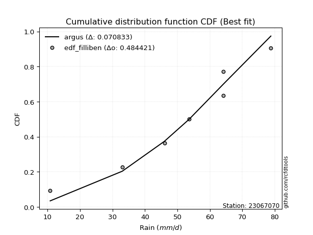</img></img>

</div>


### 10. Empirical - EDF Jenkinson (1977)

The Jenkinson formula in hydrology is an empirical plotting position formula used to estimate the non-exceedance probability _(P)_ or return period _(T)_ of a given ordered observation within a sample. It is a widely used method in the frequency analysis of extreme events such as floods and rainfall, as it provides a distribution-free way to plot data. _a≈0.31_ and _b≈0.38_ are constants derived to approximate the median of the probability distribution for the given rank.

<div align="center">


$P=(m-a)/(n+b)$


</div>


**10.1. Empirical values**

<div align="center">

|                | 0                   | 1                   | 2                   | 3             | 4                  | 5                  | 6                  |
|:---------------|:--------------------|:--------------------|:--------------------|:--------------|:-------------------|:-------------------|:-------------------|
| date           | 2024                | 2025                | 2023                | 2022          | 2021               | 2019               | 2020               |
| x              | 10.8                | 13.6                | 33.0                | 46.0          | 53.6               | 64.2               | 78.8               |
| m              | 1                   | 2                   | 3                   | 4             | 5                  | 6                  | 7                  |
| empirical_dist | edf_jenkinson       | edf_jenkinson       | edf_jenkinson       | edf_jenkinson | edf_jenkinson      | edf_jenkinson      | edf_jenkinson      |
| empirical      | 0.09349593495934959 | 0.22899728997289973 | 0.36449864498644985 | 0.5           | 0.6355013550135502 | 0.7710027100271003 | 0.9065040650406505 |
| empirical_tr   | 1.1031390134529149  | 1.29701230228471    | 1.5735607675906182  | 2.0           | 2.743494423791822  | 4.366863905325444  | 10.695652173913055 |

</div>


**10.2. Kolmogorov-Smirnov fit test (sorted by Δ)**


<div align="center">

|                | 0                   | 1                   | 2                   | 3                     | 4                   | 5                   | 6                   | 7                   | 8                   | 9                   | 10                  | 11                  | 12                  | 13                  | 14                  | 15                  | 16                  | 17                  | 18                  | 19                  | 20                  | 21                  | 22                  | 23                  | 24                  | 25                  | 26                  | 27                  | 28                  | 29                  | 30                  | 31                  | 32                  | 33                  | 34                  | 35                  | 36                  | 37                  | 38                  | 39                  | 40                  | 41                  | 42                  | 43                  | 44                  | 45                  | 46                  | 47                  | 48                  | 49                  | 50                  | 51                  | 52                  | 53                  | 54                  | 55                  | 56                  | 57                  | 58                  | 59                  | 60                  | 61                  | 62                  | 63                  | 64                  | 65                  | 66                  | 67                  | 68                  | 69                  | 70                  | 71                  | 72                  | 73                  | 74                  | 75                  | 76                  | 77                  | 78                  | 79                  | 80                  | 81                  | 82                  | 83                  | 84                  | 85                  | 86                  | 87                  | 88                  | 89                  |
|:---------------|:--------------------|:--------------------|:--------------------|:----------------------|:--------------------|:--------------------|:--------------------|:--------------------|:--------------------|:--------------------|:--------------------|:--------------------|:--------------------|:--------------------|:--------------------|:--------------------|:--------------------|:--------------------|:--------------------|:--------------------|:--------------------|:--------------------|:--------------------|:--------------------|:--------------------|:--------------------|:--------------------|:--------------------|:--------------------|:--------------------|:--------------------|:--------------------|:--------------------|:--------------------|:--------------------|:--------------------|:--------------------|:--------------------|:--------------------|:--------------------|:--------------------|:--------------------|:--------------------|:--------------------|:--------------------|:--------------------|:--------------------|:--------------------|:--------------------|:--------------------|:--------------------|:--------------------|:--------------------|:--------------------|:--------------------|:--------------------|:--------------------|:--------------------|:--------------------|:--------------------|:--------------------|:--------------------|:--------------------|:--------------------|:--------------------|:--------------------|:--------------------|:--------------------|:--------------------|:--------------------|:--------------------|:--------------------|:--------------------|:--------------------|:--------------------|:--------------------|:--------------------|:--------------------|:--------------------|:--------------------|:--------------------|:--------------------|:--------------------|:--------------------|:--------------------|:--------------------|:--------------------|:--------------------|:--------------------|:--------------------|
| station        | 23067070            | 23067070            | 23067070            | 23067070              | 23067070            | 23067070            | 23067070            | 23067070            | 23067070            | 23067070            | 23067070            | 23067070            | 23067070            | 23067070            | 23067070            | 23067070            | 23067070            | 23067070            | 23067070            | 23067070            | 23067070            | 23067070            | 23067070            | 23067070            | 23067070            | 23067070            | 23067070            | 23067070            | 23067070            | 23067070            | 23067070            | 23067070            | 23067070            | 23067070            | 23067070            | 23067070            | 23067070            | 23067070            | 23067070            | 23067070            | 23067070            | 23067070            | 23067070            | 23067070            | 23067070            | 23067070            | 23067070            | 23067070            | 23067070            | 23067070            | 23067070            | 23067070            | 23067070            | 23067070            | 23067070            | 23067070            | 23067070            | 23067070            | 23067070            | 23067070            | 23067070            | 23067070            | 23067070            | 23067070            | 23067070            | 23067070            | 23067070            | 23067070            | 23067070            | 23067070            | 23067070            | 23067070            | 23067070            | 23067070            | 23067070            | 23067070            | 23067070            | 23067070            | 23067070            | 23067070            | 23067070            | 23067070            | 23067070            | 23067070            | 23067070            | 23067070            | 23067070            | 23067070            | 23067070            | 23067070            |
| empirical_dist | edf_jenkinson       | edf_jenkinson       | edf_jenkinson       | edf_jenkinson         | edf_jenkinson       | edf_jenkinson       | edf_jenkinson       | edf_jenkinson       | edf_jenkinson       | edf_jenkinson       | edf_jenkinson       | edf_jenkinson       | edf_jenkinson       | edf_jenkinson       | edf_jenkinson       | edf_jenkinson       | edf_jenkinson       | edf_jenkinson       | edf_jenkinson       | edf_jenkinson       | edf_jenkinson       | edf_jenkinson       | edf_jenkinson       | edf_jenkinson       | edf_jenkinson       | edf_jenkinson       | edf_jenkinson       | edf_jenkinson       | edf_jenkinson       | edf_jenkinson       | edf_jenkinson       | edf_jenkinson       | edf_jenkinson       | edf_jenkinson       | edf_jenkinson       | edf_jenkinson       | edf_jenkinson       | edf_jenkinson       | edf_jenkinson       | edf_jenkinson       | edf_jenkinson       | edf_jenkinson       | edf_jenkinson       | edf_jenkinson       | edf_jenkinson       | edf_jenkinson       | edf_jenkinson       | edf_jenkinson       | edf_jenkinson       | edf_jenkinson       | edf_jenkinson       | edf_jenkinson       | edf_jenkinson       | edf_jenkinson       | edf_jenkinson       | edf_jenkinson       | edf_jenkinson       | edf_jenkinson       | edf_jenkinson       | edf_jenkinson       | edf_jenkinson       | edf_jenkinson       | edf_jenkinson       | edf_jenkinson       | edf_jenkinson       | edf_jenkinson       | edf_jenkinson       | edf_jenkinson       | edf_jenkinson       | edf_jenkinson       | edf_jenkinson       | edf_jenkinson       | edf_jenkinson       | edf_jenkinson       | edf_jenkinson       | edf_jenkinson       | edf_jenkinson       | edf_jenkinson       | edf_jenkinson       | edf_jenkinson       | edf_jenkinson       | edf_jenkinson       | edf_jenkinson       | edf_jenkinson       | edf_jenkinson       | edf_jenkinson       | edf_jenkinson       | edf_jenkinson       | edf_jenkinson       | edf_jenkinson       |
| p_dist         | laplace_asymmetric  | logjohnsonsu        | mielke              | loglaplace_asymmetric | logloggamma         | fisk                | gumbel_l            | pearson3            | nct                 | t                   | truncnorm           | crystalball         | norm                | exponnorm           | johnsonsu           | gamma               | erlang              | invgamma            | logpearson3         | genlogistic         | kstwobign           | loggumbel_l         | betaprime           | maxwell             | invgauss            | logistic            | rayleigh            | hypsecant           | logweibull_min      | laplace             | ncf                 | rice                | logfisk             | logbetaprime        | logf                | logcrystalball      | lognorm             | lognorm             | logt                | logexponnorm        | lognct              | logfatiguelife      | f                   | logncf              | logerlang           | loggamma            | loggamma            | loginvweibull       | loginvgamma         | alpha               | logrice             | expon               | genexpon            | gumbel_r            | loginvgauss         | logalpha            | weibull_min         | loglogistic         | nakagami            | loggompertz         | logmaxwell          | lograyleigh         | gompertz            | loghypsecant        | loggenexpon         | halfnorm            | logkstwobign        | moyal               | loggumbel_r         | loglaplace          | loghalfnorm         | halflogistic        | loghalflogistic     | wald                | logmoyal            | gibrat              | logexpon            | logwald             | chi2                | pareto              | loggibrat           | logchi2             | lognakagami         | logmielke           | logpareto           | logtruncnorm        | loglognorm          | fatiguelife         | invweibull          | loggenlogistic      |
| delta          | 0.10136308388427046 | 0.10589766106889123 | 0.10721141954830642 | 0.11161189587380227   | 0.11336248051859635 | 0.11645889099926669 | 0.12175768937852971 | 0.12251221500022878 | 0.12277030520265256 | 0.12279134584861527 | 0.12279166644891744 | 0.12279167161685625 | 0.12279167574064206 | 0.12279191976585485 | 0.12299143179136848 | 0.1230220647779504  | 0.1230251681985103  | 0.12390678682382446 | 0.12676829922032543 | 0.1290531541551635  | 0.12942587018937932 | 0.1299821330291609  | 0.13177147758047544 | 0.1319085988464003  | 0.13292157091076334 | 0.1346556840680533  | 0.13817443357891637 | 0.13979789585572214 | 0.14067640470711334 | 0.14327295472112828 | 0.14479745693492507 | 0.1458901605840782  | 0.14652648460613948 | 0.15287465504584985 | 0.15295621302102402 | 0.15379093546581124 | 0.15379100411527313 | 0.15379100411527313 | 0.15379143830595132 | 0.15379194806730911 | 0.1547072972133734  | 0.15488331772407138 | 0.1558130748679718  | 0.15910565262298748 | 0.15973738510939062 | 0.15991441000425088 | 0.15991441000425088 | 0.16002101409176417 | 0.1603850660347308  | 0.16210661414289157 | 0.16239600330594828 | 0.16647558759349068 | 0.16649152866678496 | 0.1668940890138891  | 0.1672179678344019  | 0.1699245572696062  | 0.17101658084220506 | 0.1720551908168133  | 0.17212984208079335 | 0.17238110906865758 | 0.17501926700446602 | 0.18138860158216086 | 0.18410604726386037 | 0.18616589541508488 | 0.19204899298751776 | 0.19214601909363038 | 0.1922511397356429  | 0.19470972037747686 | 0.21315959916884375 | 0.2142322450344819  | 0.22374919482314137 | 0.22899728997289973 | 0.22899728997289973 | 0.22899728997289973 | 0.23276526210645487 | 0.24594003974252843 | 0.2515316043131299  | 0.28843092312337415 | 0.3081971990258656  | 0.31632111722169387 | 0.3206254497369434  | 0.33580568612832123 | 0.3409115392791829  | 0.35673841325438554 | 0.3641177751324923  | 0.36441043681690155 | 0.3810913914682358  | 0.42597070613883997 | 0.45998109465849674 | 0.7710027100271003  |
| deltao         | 0.48442053926100004 | 0.48442053926100004 | 0.48442053926100004 | 0.48442053926100004   | 0.48442053926100004 | 0.48442053926100004 | 0.48442053926100004 | 0.48442053926100004 | 0.48442053926100004 | 0.48442053926100004 | 0.48442053926100004 | 0.48442053926100004 | 0.48442053926100004 | 0.48442053926100004 | 0.48442053926100004 | 0.48442053926100004 | 0.48442053926100004 | 0.48442053926100004 | 0.48442053926100004 | 0.48442053926100004 | 0.48442053926100004 | 0.48442053926100004 | 0.48442053926100004 | 0.48442053926100004 | 0.48442053926100004 | 0.48442053926100004 | 0.48442053926100004 | 0.48442053926100004 | 0.48442053926100004 | 0.48442053926100004 | 0.48442053926100004 | 0.48442053926100004 | 0.48442053926100004 | 0.48442053926100004 | 0.48442053926100004 | 0.48442053926100004 | 0.48442053926100004 | 0.48442053926100004 | 0.48442053926100004 | 0.48442053926100004 | 0.48442053926100004 | 0.48442053926100004 | 0.48442053926100004 | 0.48442053926100004 | 0.48442053926100004 | 0.48442053926100004 | 0.48442053926100004 | 0.48442053926100004 | 0.48442053926100004 | 0.48442053926100004 | 0.48442053926100004 | 0.48442053926100004 | 0.48442053926100004 | 0.48442053926100004 | 0.48442053926100004 | 0.48442053926100004 | 0.48442053926100004 | 0.48442053926100004 | 0.48442053926100004 | 0.48442053926100004 | 0.48442053926100004 | 0.48442053926100004 | 0.48442053926100004 | 0.48442053926100004 | 0.48442053926100004 | 0.48442053926100004 | 0.48442053926100004 | 0.48442053926100004 | 0.48442053926100004 | 0.48442053926100004 | 0.48442053926100004 | 0.48442053926100004 | 0.48442053926100004 | 0.48442053926100004 | 0.48442053926100004 | 0.48442053926100004 | 0.48442053926100004 | 0.48442053926100004 | 0.48442053926100004 | 0.48442053926100004 | 0.48442053926100004 | 0.48442053926100004 | 0.48442053926100004 | 0.48442053926100004 | 0.48442053926100004 | 0.48442053926100004 | 0.48442053926100004 | 0.48442053926100004 | 0.48442053926100004 | 0.48442053926100004 |
| eval           | Δo > Δ              | Δo > Δ              | Δo > Δ              | Δo > Δ                | Δo > Δ              | Δo > Δ              | Δo > Δ              | Δo > Δ              | Δo > Δ              | Δo > Δ              | Δo > Δ              | Δo > Δ              | Δo > Δ              | Δo > Δ              | Δo > Δ              | Δo > Δ              | Δo > Δ              | Δo > Δ              | Δo > Δ              | Δo > Δ              | Δo > Δ              | Δo > Δ              | Δo > Δ              | Δo > Δ              | Δo > Δ              | Δo > Δ              | Δo > Δ              | Δo > Δ              | Δo > Δ              | Δo > Δ              | Δo > Δ              | Δo > Δ              | Δo > Δ              | Δo > Δ              | Δo > Δ              | Δo > Δ              | Δo > Δ              | Δo > Δ              | Δo > Δ              | Δo > Δ              | Δo > Δ              | Δo > Δ              | Δo > Δ              | Δo > Δ              | Δo > Δ              | Δo > Δ              | Δo > Δ              | Δo > Δ              | Δo > Δ              | Δo > Δ              | Δo > Δ              | Δo > Δ              | Δo > Δ              | Δo > Δ              | Δo > Δ              | Δo > Δ              | Δo > Δ              | Δo > Δ              | Δo > Δ              | Δo > Δ              | Δo > Δ              | Δo > Δ              | Δo > Δ              | Δo > Δ              | Δo > Δ              | Δo > Δ              | Δo > Δ              | Δo > Δ              | Δo > Δ              | Δo > Δ              | Δo > Δ              | Δo > Δ              | Δo > Δ              | Δo > Δ              | Δo > Δ              | Δo > Δ              | Δo > Δ              | Δo > Δ              | Δo > Δ              | Δo > Δ              | Δo > Δ              | Δo > Δ              | Δo > Δ              | Δo > Δ              | Δo > Δ              | Δo > Δ              | Δo > Δ              | Δo > Δ              | Δo > Δ              | Δo <= Δ             |
| fit            | 1                   | 1                   | 1                   | 1                     | 1                   | 1                   | 1                   | 1                   | 1                   | 1                   | 1                   | 1                   | 1                   | 1                   | 1                   | 1                   | 1                   | 1                   | 1                   | 1                   | 1                   | 1                   | 1                   | 1                   | 1                   | 1                   | 1                   | 1                   | 1                   | 1                   | 1                   | 1                   | 1                   | 1                   | 1                   | 1                   | 1                   | 1                   | 1                   | 1                   | 1                   | 1                   | 1                   | 1                   | 1                   | 1                   | 1                   | 1                   | 1                   | 1                   | 1                   | 1                   | 1                   | 1                   | 1                   | 1                   | 1                   | 1                   | 1                   | 1                   | 1                   | 1                   | 1                   | 1                   | 1                   | 1                   | 1                   | 1                   | 1                   | 1                   | 1                   | 1                   | 1                   | 1                   | 1                   | 1                   | 1                   | 1                   | 1                   | 1                   | 1                   | 1                   | 1                   | 1                   | 1                   | 1                   | 1                   | 1                   | 1                   | 0                   |
| n              | 7                   | 7                   | 7                   | 7                     | 7                   | 7                   | 7                   | 7                   | 7                   | 7                   | 7                   | 7                   | 7                   | 7                   | 7                   | 7                   | 7                   | 7                   | 7                   | 7                   | 7                   | 7                   | 7                   | 7                   | 7                   | 7                   | 7                   | 7                   | 7                   | 7                   | 7                   | 7                   | 7                   | 7                   | 7                   | 7                   | 7                   | 7                   | 7                   | 7                   | 7                   | 7                   | 7                   | 7                   | 7                   | 7                   | 7                   | 7                   | 7                   | 7                   | 7                   | 7                   | 7                   | 7                   | 7                   | 7                   | 7                   | 7                   | 7                   | 7                   | 7                   | 7                   | 7                   | 7                   | 7                   | 7                   | 7                   | 7                   | 7                   | 7                   | 7                   | 7                   | 7                   | 7                   | 7                   | 7                   | 7                   | 7                   | 7                   | 7                   | 7                   | 7                   | 7                   | 7                   | 7                   | 7                   | 7                   | 7                   | 7                   | 7                   |
| best_fit       | 1                   | 0                   | 0                   | 0                     | 0                   | 0                   | 0                   | 0                   | 0                   | 0                   | 0                   | 0                   | 0                   | 0                   | 0                   | 0                   | 0                   | 0                   | 0                   | 0                   | 0                   | 0                   | 0                   | 0                   | 0                   | 0                   | 0                   | 0                   | 0                   | 0                   | 0                   | 0                   | 0                   | 0                   | 0                   | 0                   | 0                   | 0                   | 0                   | 0                   | 0                   | 0                   | 0                   | 0                   | 0                   | 0                   | 0                   | 0                   | 0                   | 0                   | 0                   | 0                   | 0                   | 0                   | 0                   | 0                   | 0                   | 0                   | 0                   | 0                   | 0                   | 0                   | 0                   | 0                   | 0                   | 0                   | 0                   | 0                   | 0                   | 0                   | 0                   | 0                   | 0                   | 0                   | 0                   | 0                   | 0                   | 0                   | 0                   | 0                   | 0                   | 0                   | 0                   | 0                   | 0                   | 0                   | 0                   | 0                   | 0                   | 0                   |
| best_fit_sort  | 1                   | 2                   | 3                   | 4                     | 5                   | 6                   | 7                   | 8                   | 9                   | 10                  | 11                  | 12                  | 13                  | 14                  | 15                  | 16                  | 17                  | 18                  | 19                  | 20                  | 21                  | 22                  | 23                  | 24                  | 25                  | 26                  | 27                  | 28                  | 29                  | 30                  | 31                  | 32                  | 33                  | 34                  | 35                  | 36                  | 37                  | 38                  | 39                  | 40                  | 41                  | 42                  | 43                  | 44                  | 45                  | 46                  | 47                  | 48                  | 49                  | 50                  | 51                  | 52                  | 53                  | 54                  | 55                  | 56                  | 57                  | 58                  | 59                  | 60                  | 61                  | 62                  | 63                  | 64                  | 65                  | 66                  | 67                  | 68                  | 69                  | 70                  | 71                  | 72                  | 73                  | 74                  | 75                  | 76                  | 77                  | 78                  | 79                  | 80                  | 81                  | 82                  | 83                  | 84                  | 85                  | 86                  | 87                  | 88                  | 89                  | 90                  |

</div>


<div align="center">

</img>

</div>


**10.3. Best fit**

<div align="center">

|   id |   station | empirical_dist   | p_dist             |    delta |   deltao | eval   |   fit |   n |   best_fit |   best_fit_sort |
|-----:|----------:|:-----------------|:-------------------|---------:|---------:|:-------|------:|----:|-----------:|----------------:|
|    0 |  23067070 | edf_jenkinson    | laplace_asymmetric | 0.101363 | 0.484421 | Δo > Δ |     1 |   7 |          1 |               1 |

</div>


<div align="center">

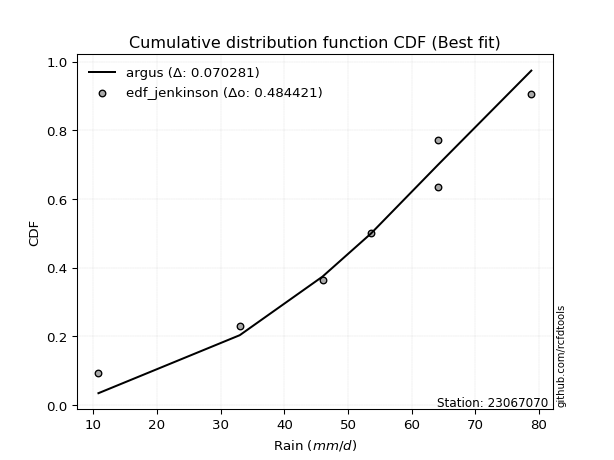</img>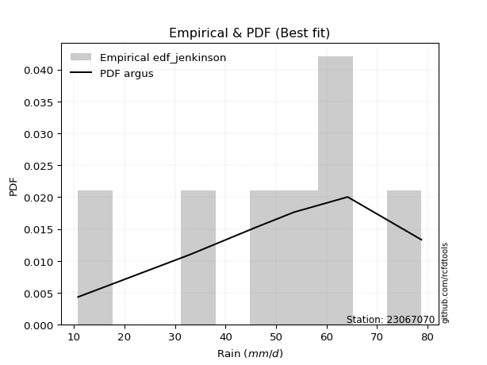</img>

</div>


### 11. Empirical - EDF Cunnane (1978)

Cunnane´s work in statistical hydrology has focused on the performance and evaluation of different probability distributions (such as GEV, Gumbel, Lognormal) for flood frequency estimation. _b_ is a constant, typically set to 0.4.

<div align="center">


$P=(m-b)/(n+1-2b)$


</div>


**11.1. Empirical values**

<div align="center">

|                | 0                   | 1                   | 2                  | 3           | 4                  | 5                  | 6                  |
|:---------------|:--------------------|:--------------------|:-------------------|:------------|:-------------------|:-------------------|:-------------------|
| date           | 2024                | 2025                | 2023               | 2022        | 2021               | 2019               | 2020               |
| x              | 10.8                | 13.6                | 33.0               | 46.0        | 53.6               | 64.2               | 78.8               |
| m              | 1                   | 2                   | 3                  | 4           | 5                  | 6                  | 7                  |
| empirical_dist | edf_cunnane         | edf_cunnane         | edf_cunnane        | edf_cunnane | edf_cunnane        | edf_cunnane        | edf_cunnane        |
| empirical      | 0.08333333333333333 | 0.22222222222222224 | 0.3611111111111111 | 0.5         | 0.6388888888888888 | 0.7777777777777777 | 0.9166666666666666 |
| empirical_tr   | 1.090909090909091   | 1.2857142857142856  | 1.565217391304348  | 2.0         | 2.7692307692307687 | 4.499999999999998  | 11.999999999999995 |

</div>


**11.2. Kolmogorov-Smirnov fit test (sorted by Δ)**


<div align="center">

|                | 0                   | 1                   | 2                   | 3                     | 4                   | 5                   | 6                   | 7                   | 8                   | 9                   | 10                  | 11                  | 12                  | 13                  | 14                  | 15                  | 16                  | 17                  | 18                  | 19                  | 20                  | 21                  | 22                  | 23                  | 24                  | 25                  | 26                  | 27                  | 28                  | 29                  | 30                  | 31                  | 32                  | 33                  | 34                  | 35                  | 36                  | 37                  | 38                  | 39                  | 40                  | 41                  | 42                  | 43                  | 44                  | 45                  | 46                  | 47                  | 48                  | 49                  | 50                  | 51                  | 52                  | 53                  | 54                  | 55                  | 56                  | 57                  | 58                  | 59                  | 60                  | 61                  | 62                  | 63                  | 64                  | 65                  | 66                  | 67                  | 68                  | 69                  | 70                  | 71                  | 72                  | 73                  | 74                  | 75                  | 76                  | 77                  | 78                  | 79                  | 80                  | 81                  | 82                  | 83                  | 84                  | 85                  | 86                  | 87                  | 88                  | 89                  |
|:---------------|:--------------------|:--------------------|:--------------------|:----------------------|:--------------------|:--------------------|:--------------------|:--------------------|:--------------------|:--------------------|:--------------------|:--------------------|:--------------------|:--------------------|:--------------------|:--------------------|:--------------------|:--------------------|:--------------------|:--------------------|:--------------------|:--------------------|:--------------------|:--------------------|:--------------------|:--------------------|:--------------------|:--------------------|:--------------------|:--------------------|:--------------------|:--------------------|:--------------------|:--------------------|:--------------------|:--------------------|:--------------------|:--------------------|:--------------------|:--------------------|:--------------------|:--------------------|:--------------------|:--------------------|:--------------------|:--------------------|:--------------------|:--------------------|:--------------------|:--------------------|:--------------------|:--------------------|:--------------------|:--------------------|:--------------------|:--------------------|:--------------------|:--------------------|:--------------------|:--------------------|:--------------------|:--------------------|:--------------------|:--------------------|:--------------------|:--------------------|:--------------------|:--------------------|:--------------------|:--------------------|:--------------------|:--------------------|:--------------------|:--------------------|:--------------------|:--------------------|:--------------------|:--------------------|:--------------------|:--------------------|:--------------------|:--------------------|:--------------------|:--------------------|:--------------------|:--------------------|:--------------------|:--------------------|:--------------------|:--------------------|
| station        | 23067070            | 23067070            | 23067070            | 23067070              | 23067070            | 23067070            | 23067070            | 23067070            | 23067070            | 23067070            | 23067070            | 23067070            | 23067070            | 23067070            | 23067070            | 23067070            | 23067070            | 23067070            | 23067070            | 23067070            | 23067070            | 23067070            | 23067070            | 23067070            | 23067070            | 23067070            | 23067070            | 23067070            | 23067070            | 23067070            | 23067070            | 23067070            | 23067070            | 23067070            | 23067070            | 23067070            | 23067070            | 23067070            | 23067070            | 23067070            | 23067070            | 23067070            | 23067070            | 23067070            | 23067070            | 23067070            | 23067070            | 23067070            | 23067070            | 23067070            | 23067070            | 23067070            | 23067070            | 23067070            | 23067070            | 23067070            | 23067070            | 23067070            | 23067070            | 23067070            | 23067070            | 23067070            | 23067070            | 23067070            | 23067070            | 23067070            | 23067070            | 23067070            | 23067070            | 23067070            | 23067070            | 23067070            | 23067070            | 23067070            | 23067070            | 23067070            | 23067070            | 23067070            | 23067070            | 23067070            | 23067070            | 23067070            | 23067070            | 23067070            | 23067070            | 23067070            | 23067070            | 23067070            | 23067070            | 23067070            |
| empirical_dist | edf_cunnane         | edf_cunnane         | edf_cunnane         | edf_cunnane           | edf_cunnane         | edf_cunnane         | edf_cunnane         | edf_cunnane         | edf_cunnane         | edf_cunnane         | edf_cunnane         | edf_cunnane         | edf_cunnane         | edf_cunnane         | edf_cunnane         | edf_cunnane         | edf_cunnane         | edf_cunnane         | edf_cunnane         | edf_cunnane         | edf_cunnane         | edf_cunnane         | edf_cunnane         | edf_cunnane         | edf_cunnane         | edf_cunnane         | edf_cunnane         | edf_cunnane         | edf_cunnane         | edf_cunnane         | edf_cunnane         | edf_cunnane         | edf_cunnane         | edf_cunnane         | edf_cunnane         | edf_cunnane         | edf_cunnane         | edf_cunnane         | edf_cunnane         | edf_cunnane         | edf_cunnane         | edf_cunnane         | edf_cunnane         | edf_cunnane         | edf_cunnane         | edf_cunnane         | edf_cunnane         | edf_cunnane         | edf_cunnane         | edf_cunnane         | edf_cunnane         | edf_cunnane         | edf_cunnane         | edf_cunnane         | edf_cunnane         | edf_cunnane         | edf_cunnane         | edf_cunnane         | edf_cunnane         | edf_cunnane         | edf_cunnane         | edf_cunnane         | edf_cunnane         | edf_cunnane         | edf_cunnane         | edf_cunnane         | edf_cunnane         | edf_cunnane         | edf_cunnane         | edf_cunnane         | edf_cunnane         | edf_cunnane         | edf_cunnane         | edf_cunnane         | edf_cunnane         | edf_cunnane         | edf_cunnane         | edf_cunnane         | edf_cunnane         | edf_cunnane         | edf_cunnane         | edf_cunnane         | edf_cunnane         | edf_cunnane         | edf_cunnane         | edf_cunnane         | edf_cunnane         | edf_cunnane         | edf_cunnane         | edf_cunnane         |
| p_dist         | laplace_asymmetric  | logjohnsonsu        | mielke              | loglaplace_asymmetric | logloggamma         | fisk                | gumbel_l            | pearson3            | nct                 | t                   | truncnorm           | crystalball         | norm                | exponnorm           | johnsonsu           | gamma               | erlang              | invgamma            | logpearson3         | genlogistic         | kstwobign           | loggumbel_l         | betaprime           | maxwell             | invgauss            | logistic            | rayleigh            | hypsecant           | logweibull_min      | laplace             | rice                | logfisk             | logbetaprime        | logf                | logcrystalball      | lognorm             | lognorm             | logt                | logexponnorm        | lognct              | logfatiguelife      | ncf                 | f                   | logncf              | logerlang           | loggamma            | loggamma            | loginvweibull       | gumbel_r            | loginvgamma         | logrice             | alpha               | loggompertz         | expon               | genexpon            | loginvgauss         | logalpha            | weibull_min         | loglogistic         | logmaxwell          | nakagami            | gompertz            | lograyleigh         | halfnorm            | loghypsecant        | moyal               | loggenexpon         | logkstwobign        | loggumbel_r         | loglaplace          | loghalfnorm         | halflogistic        | wald                | loghalflogistic     | logmoyal            | gibrat              | logexpon            | logwald             | chi2                | loggibrat           | pareto              | logchi2             | lognakagami         | logmielke           | logtruncnorm        | logpareto           | loglognorm          | fatiguelife         | invweibull          | loggenlogistic      |
| delta          | 0.09458801613359297 | 0.09912259331821374 | 0.10043635179762893 | 0.10483682812312478   | 0.10658741276791886 | 0.1096838232485892  | 0.11498262162785222 | 0.1157371472495513  | 0.11599523745197507 | 0.11601627809793778 | 0.11601659869823995 | 0.11601660386617876 | 0.11601660798996458 | 0.11601685201517736 | 0.116216364040691   | 0.11624699702727291 | 0.11625010044783281 | 0.11713171907314697 | 0.12227025185944451 | 0.12227808640448602 | 0.12265080243870183 | 0.12320706527848341 | 0.12499640982979796 | 0.1251335310957228  | 0.12614650316008585 | 0.12788061631737582 | 0.13139936582823888 | 0.13302282810504465 | 0.13390133695643586 | 0.1364978869704508  | 0.1391150928334007  | 0.139751416855462   | 0.15287465504584985 | 0.15295621302102402 | 0.15379093546581124 | 0.15379100411527313 | 0.15379100411527313 | 0.15379143830595132 | 0.15379194806730911 | 0.1547072972133734  | 0.15488331772407138 | 0.1549600585609412  | 0.1558130748679718  | 0.15910565262298748 | 0.15973738510939062 | 0.15991441000425088 | 0.15991441000425088 | 0.16002101409176417 | 0.16011902126321162 | 0.1603850660347308  | 0.16239600330594828 | 0.1654941480182303  | 0.1656060413179801  | 0.16647558759349068 | 0.16649152866678496 | 0.1672179678344019  | 0.1699245572696062  | 0.17101658084220506 | 0.1720551908168133  | 0.17501926700446602 | 0.1755173759561321  | 0.17733097951318288 | 0.18138860158216086 | 0.1853709513429529  | 0.18616589541508488 | 0.18793465262679937 | 0.19328881325332375 | 0.19386901147214214 | 0.21315959916884375 | 0.2142322450344819  | 0.21697412707246388 | 0.22222222222222224 | 0.22222222222222224 | 0.228015533606596   | 0.23276526210645487 | 0.24594003974252843 | 0.2549191381884686  | 0.28843092312337415 | 0.3081971990258656  | 0.3206254497369434  | 0.32309618497237136 | 0.33919322000366    | 0.34429907315452163 | 0.3601259471297243  | 0.3610229029415628  | 0.3708928428831698  | 0.3878664592189133  | 0.4293582400141787  | 0.47014369628451286 | 0.7777777777777777  |
| deltao         | 0.48442053926100004 | 0.48442053926100004 | 0.48442053926100004 | 0.48442053926100004   | 0.48442053926100004 | 0.48442053926100004 | 0.48442053926100004 | 0.48442053926100004 | 0.48442053926100004 | 0.48442053926100004 | 0.48442053926100004 | 0.48442053926100004 | 0.48442053926100004 | 0.48442053926100004 | 0.48442053926100004 | 0.48442053926100004 | 0.48442053926100004 | 0.48442053926100004 | 0.48442053926100004 | 0.48442053926100004 | 0.48442053926100004 | 0.48442053926100004 | 0.48442053926100004 | 0.48442053926100004 | 0.48442053926100004 | 0.48442053926100004 | 0.48442053926100004 | 0.48442053926100004 | 0.48442053926100004 | 0.48442053926100004 | 0.48442053926100004 | 0.48442053926100004 | 0.48442053926100004 | 0.48442053926100004 | 0.48442053926100004 | 0.48442053926100004 | 0.48442053926100004 | 0.48442053926100004 | 0.48442053926100004 | 0.48442053926100004 | 0.48442053926100004 | 0.48442053926100004 | 0.48442053926100004 | 0.48442053926100004 | 0.48442053926100004 | 0.48442053926100004 | 0.48442053926100004 | 0.48442053926100004 | 0.48442053926100004 | 0.48442053926100004 | 0.48442053926100004 | 0.48442053926100004 | 0.48442053926100004 | 0.48442053926100004 | 0.48442053926100004 | 0.48442053926100004 | 0.48442053926100004 | 0.48442053926100004 | 0.48442053926100004 | 0.48442053926100004 | 0.48442053926100004 | 0.48442053926100004 | 0.48442053926100004 | 0.48442053926100004 | 0.48442053926100004 | 0.48442053926100004 | 0.48442053926100004 | 0.48442053926100004 | 0.48442053926100004 | 0.48442053926100004 | 0.48442053926100004 | 0.48442053926100004 | 0.48442053926100004 | 0.48442053926100004 | 0.48442053926100004 | 0.48442053926100004 | 0.48442053926100004 | 0.48442053926100004 | 0.48442053926100004 | 0.48442053926100004 | 0.48442053926100004 | 0.48442053926100004 | 0.48442053926100004 | 0.48442053926100004 | 0.48442053926100004 | 0.48442053926100004 | 0.48442053926100004 | 0.48442053926100004 | 0.48442053926100004 | 0.48442053926100004 |
| eval           | Δo > Δ              | Δo > Δ              | Δo > Δ              | Δo > Δ                | Δo > Δ              | Δo > Δ              | Δo > Δ              | Δo > Δ              | Δo > Δ              | Δo > Δ              | Δo > Δ              | Δo > Δ              | Δo > Δ              | Δo > Δ              | Δo > Δ              | Δo > Δ              | Δo > Δ              | Δo > Δ              | Δo > Δ              | Δo > Δ              | Δo > Δ              | Δo > Δ              | Δo > Δ              | Δo > Δ              | Δo > Δ              | Δo > Δ              | Δo > Δ              | Δo > Δ              | Δo > Δ              | Δo > Δ              | Δo > Δ              | Δo > Δ              | Δo > Δ              | Δo > Δ              | Δo > Δ              | Δo > Δ              | Δo > Δ              | Δo > Δ              | Δo > Δ              | Δo > Δ              | Δo > Δ              | Δo > Δ              | Δo > Δ              | Δo > Δ              | Δo > Δ              | Δo > Δ              | Δo > Δ              | Δo > Δ              | Δo > Δ              | Δo > Δ              | Δo > Δ              | Δo > Δ              | Δo > Δ              | Δo > Δ              | Δo > Δ              | Δo > Δ              | Δo > Δ              | Δo > Δ              | Δo > Δ              | Δo > Δ              | Δo > Δ              | Δo > Δ              | Δo > Δ              | Δo > Δ              | Δo > Δ              | Δo > Δ              | Δo > Δ              | Δo > Δ              | Δo > Δ              | Δo > Δ              | Δo > Δ              | Δo > Δ              | Δo > Δ              | Δo > Δ              | Δo > Δ              | Δo > Δ              | Δo > Δ              | Δo > Δ              | Δo > Δ              | Δo > Δ              | Δo > Δ              | Δo > Δ              | Δo > Δ              | Δo > Δ              | Δo > Δ              | Δo > Δ              | Δo > Δ              | Δo > Δ              | Δo > Δ              | Δo <= Δ             |
| fit            | 1                   | 1                   | 1                   | 1                     | 1                   | 1                   | 1                   | 1                   | 1                   | 1                   | 1                   | 1                   | 1                   | 1                   | 1                   | 1                   | 1                   | 1                   | 1                   | 1                   | 1                   | 1                   | 1                   | 1                   | 1                   | 1                   | 1                   | 1                   | 1                   | 1                   | 1                   | 1                   | 1                   | 1                   | 1                   | 1                   | 1                   | 1                   | 1                   | 1                   | 1                   | 1                   | 1                   | 1                   | 1                   | 1                   | 1                   | 1                   | 1                   | 1                   | 1                   | 1                   | 1                   | 1                   | 1                   | 1                   | 1                   | 1                   | 1                   | 1                   | 1                   | 1                   | 1                   | 1                   | 1                   | 1                   | 1                   | 1                   | 1                   | 1                   | 1                   | 1                   | 1                   | 1                   | 1                   | 1                   | 1                   | 1                   | 1                   | 1                   | 1                   | 1                   | 1                   | 1                   | 1                   | 1                   | 1                   | 1                   | 1                   | 0                   |
| n              | 7                   | 7                   | 7                   | 7                     | 7                   | 7                   | 7                   | 7                   | 7                   | 7                   | 7                   | 7                   | 7                   | 7                   | 7                   | 7                   | 7                   | 7                   | 7                   | 7                   | 7                   | 7                   | 7                   | 7                   | 7                   | 7                   | 7                   | 7                   | 7                   | 7                   | 7                   | 7                   | 7                   | 7                   | 7                   | 7                   | 7                   | 7                   | 7                   | 7                   | 7                   | 7                   | 7                   | 7                   | 7                   | 7                   | 7                   | 7                   | 7                   | 7                   | 7                   | 7                   | 7                   | 7                   | 7                   | 7                   | 7                   | 7                   | 7                   | 7                   | 7                   | 7                   | 7                   | 7                   | 7                   | 7                   | 7                   | 7                   | 7                   | 7                   | 7                   | 7                   | 7                   | 7                   | 7                   | 7                   | 7                   | 7                   | 7                   | 7                   | 7                   | 7                   | 7                   | 7                   | 7                   | 7                   | 7                   | 7                   | 7                   | 7                   |
| best_fit       | 1                   | 0                   | 0                   | 0                     | 0                   | 0                   | 0                   | 0                   | 0                   | 0                   | 0                   | 0                   | 0                   | 0                   | 0                   | 0                   | 0                   | 0                   | 0                   | 0                   | 0                   | 0                   | 0                   | 0                   | 0                   | 0                   | 0                   | 0                   | 0                   | 0                   | 0                   | 0                   | 0                   | 0                   | 0                   | 0                   | 0                   | 0                   | 0                   | 0                   | 0                   | 0                   | 0                   | 0                   | 0                   | 0                   | 0                   | 0                   | 0                   | 0                   | 0                   | 0                   | 0                   | 0                   | 0                   | 0                   | 0                   | 0                   | 0                   | 0                   | 0                   | 0                   | 0                   | 0                   | 0                   | 0                   | 0                   | 0                   | 0                   | 0                   | 0                   | 0                   | 0                   | 0                   | 0                   | 0                   | 0                   | 0                   | 0                   | 0                   | 0                   | 0                   | 0                   | 0                   | 0                   | 0                   | 0                   | 0                   | 0                   | 0                   |
| best_fit_sort  | 1                   | 2                   | 3                   | 4                     | 5                   | 6                   | 7                   | 8                   | 9                   | 10                  | 11                  | 12                  | 13                  | 14                  | 15                  | 16                  | 17                  | 18                  | 19                  | 20                  | 21                  | 22                  | 23                  | 24                  | 25                  | 26                  | 27                  | 28                  | 29                  | 30                  | 31                  | 32                  | 33                  | 34                  | 35                  | 36                  | 37                  | 38                  | 39                  | 40                  | 41                  | 42                  | 43                  | 44                  | 45                  | 46                  | 47                  | 48                  | 49                  | 50                  | 51                  | 52                  | 53                  | 54                  | 55                  | 56                  | 57                  | 58                  | 59                  | 60                  | 61                  | 62                  | 63                  | 64                  | 65                  | 66                  | 67                  | 68                  | 69                  | 70                  | 71                  | 72                  | 73                  | 74                  | 75                  | 76                  | 77                  | 78                  | 79                  | 80                  | 81                  | 82                  | 83                  | 84                  | 85                  | 86                  | 87                  | 88                  | 89                  | 90                  |

</div>


<div align="center">

</img>

</div>


**11.3. Best fit**

<div align="center">

|   id |   station | empirical_dist   | p_dist             |    delta |   deltao | eval   |   fit |   n |   best_fit |   best_fit_sort |
|-----:|----------:|:-----------------|:-------------------|---------:|---------:|:-------|------:|----:|-----------:|----------------:|
|    0 |  23067070 | edf_cunnane      | laplace_asymmetric | 0.094588 | 0.484421 | Δo > Δ |     1 |   7 |          1 |               1 |

</div>


<div align="center">

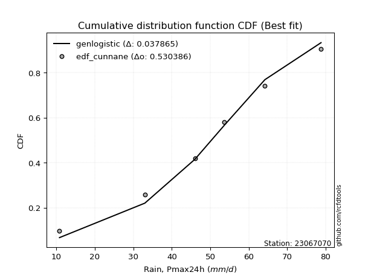</img>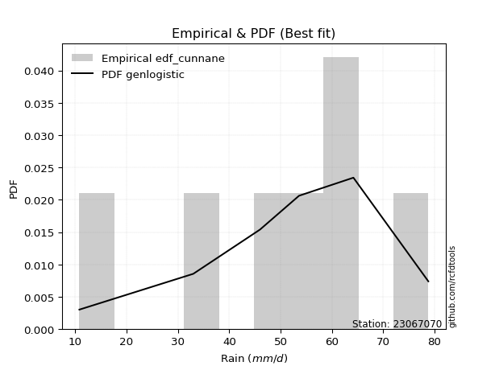</img>

</div>


### 12. Empirical - EDF Adamowski (1981)

The Adamowski formula in hydrology refers to a specific plotting position formula used for estimating the non-parametric empirical distribution of hydrological events (like flood peaks) to calculate their return periods. This formula provides an alternative to traditional parametric methods (like the Gumbel or Log Pearson Type III distributions). 

<div align="center">


$P=(m-0.25)/(n+0.5)$


</div>


**12.1. Empirical values**

<div align="center">

|                | 0                  | 1                   | 2                   | 3             | 4                  | 5                  | 6                  |
|:---------------|:-------------------|:--------------------|:--------------------|:--------------|:-------------------|:-------------------|:-------------------|
| date           | 2024               | 2025                | 2023                | 2022          | 2021               | 2019               | 2020               |
| x              | 10.8               | 13.6                | 33.0                | 46.0          | 53.6               | 64.2               | 78.8               |
| m              | 1                  | 2                   | 3                   | 4             | 5                  | 6                  | 7                  |
| empirical_dist | edf_adamowski      | edf_adamowski       | edf_adamowski       | edf_adamowski | edf_adamowski      | edf_adamowski      | edf_adamowski      |
| empirical      | 0.1                | 0.23333333333333334 | 0.36666666666666664 | 0.5           | 0.6333333333333333 | 0.7666666666666667 | 0.9                |
| empirical_tr   | 1.1111111111111112 | 1.3043478260869565  | 1.5789473684210527  | 2.0           | 2.727272727272727  | 4.2857142857142865 | 10.000000000000002 |

</div>


**12.2. Kolmogorov-Smirnov fit test (sorted by Δ)**


<div align="center">

|                | 0                   | 1                   | 2                   | 3                     | 4                   | 5                   | 6                   | 7                   | 8                   | 9                   | 10                  | 11                  | 12                  | 13                  | 14                  | 15                  | 16                  | 17                  | 18                  | 19                  | 20                  | 21                  | 22                  | 23                  | 24                  | 25                  | 26                  | 27                  | 28                  | 29                  | 30                  | 31                  | 32                  | 33                  | 34                  | 35                  | 36                  | 37                  | 38                  | 39                  | 40                  | 41                  | 42                  | 43                  | 44                  | 45                  | 46                  | 47                  | 48                  | 49                  | 50                  | 51                  | 52                  | 53                  | 54                  | 55                  | 56                  | 57                  | 58                  | 59                  | 60                  | 61                  | 62                  | 63                  | 64                  | 65                  | 66                  | 67                  | 68                  | 69                  | 70                  | 71                  | 72                  | 73                  | 74                  | 75                  | 76                  | 77                  | 78                  | 79                  | 80                  | 81                  | 82                  | 83                  | 84                  | 85                  | 86                  | 87                  | 88                  | 89                  |
|:---------------|:--------------------|:--------------------|:--------------------|:----------------------|:--------------------|:--------------------|:--------------------|:--------------------|:--------------------|:--------------------|:--------------------|:--------------------|:--------------------|:--------------------|:--------------------|:--------------------|:--------------------|:--------------------|:--------------------|:--------------------|:--------------------|:--------------------|:--------------------|:--------------------|:--------------------|:--------------------|:--------------------|:--------------------|:--------------------|:--------------------|:--------------------|:--------------------|:--------------------|:--------------------|:--------------------|:--------------------|:--------------------|:--------------------|:--------------------|:--------------------|:--------------------|:--------------------|:--------------------|:--------------------|:--------------------|:--------------------|:--------------------|:--------------------|:--------------------|:--------------------|:--------------------|:--------------------|:--------------------|:--------------------|:--------------------|:--------------------|:--------------------|:--------------------|:--------------------|:--------------------|:--------------------|:--------------------|:--------------------|:--------------------|:--------------------|:--------------------|:--------------------|:--------------------|:--------------------|:--------------------|:--------------------|:--------------------|:--------------------|:--------------------|:--------------------|:--------------------|:--------------------|:--------------------|:--------------------|:--------------------|:--------------------|:--------------------|:--------------------|:--------------------|:--------------------|:--------------------|:--------------------|:--------------------|:--------------------|:--------------------|
| station        | 23067070            | 23067070            | 23067070            | 23067070              | 23067070            | 23067070            | 23067070            | 23067070            | 23067070            | 23067070            | 23067070            | 23067070            | 23067070            | 23067070            | 23067070            | 23067070            | 23067070            | 23067070            | 23067070            | 23067070            | 23067070            | 23067070            | 23067070            | 23067070            | 23067070            | 23067070            | 23067070            | 23067070            | 23067070            | 23067070            | 23067070            | 23067070            | 23067070            | 23067070            | 23067070            | 23067070            | 23067070            | 23067070            | 23067070            | 23067070            | 23067070            | 23067070            | 23067070            | 23067070            | 23067070            | 23067070            | 23067070            | 23067070            | 23067070            | 23067070            | 23067070            | 23067070            | 23067070            | 23067070            | 23067070            | 23067070            | 23067070            | 23067070            | 23067070            | 23067070            | 23067070            | 23067070            | 23067070            | 23067070            | 23067070            | 23067070            | 23067070            | 23067070            | 23067070            | 23067070            | 23067070            | 23067070            | 23067070            | 23067070            | 23067070            | 23067070            | 23067070            | 23067070            | 23067070            | 23067070            | 23067070            | 23067070            | 23067070            | 23067070            | 23067070            | 23067070            | 23067070            | 23067070            | 23067070            | 23067070            |
| empirical_dist | edf_adamowski       | edf_adamowski       | edf_adamowski       | edf_adamowski         | edf_adamowski       | edf_adamowski       | edf_adamowski       | edf_adamowski       | edf_adamowski       | edf_adamowski       | edf_adamowski       | edf_adamowski       | edf_adamowski       | edf_adamowski       | edf_adamowski       | edf_adamowski       | edf_adamowski       | edf_adamowski       | edf_adamowski       | edf_adamowski       | edf_adamowski       | edf_adamowski       | edf_adamowski       | edf_adamowski       | edf_adamowski       | edf_adamowski       | edf_adamowski       | edf_adamowski       | edf_adamowski       | edf_adamowski       | edf_adamowski       | edf_adamowski       | edf_adamowski       | edf_adamowski       | edf_adamowski       | edf_adamowski       | edf_adamowski       | edf_adamowski       | edf_adamowski       | edf_adamowski       | edf_adamowski       | edf_adamowski       | edf_adamowski       | edf_adamowski       | edf_adamowski       | edf_adamowski       | edf_adamowski       | edf_adamowski       | edf_adamowski       | edf_adamowski       | edf_adamowski       | edf_adamowski       | edf_adamowski       | edf_adamowski       | edf_adamowski       | edf_adamowski       | edf_adamowski       | edf_adamowski       | edf_adamowski       | edf_adamowski       | edf_adamowski       | edf_adamowski       | edf_adamowski       | edf_adamowski       | edf_adamowski       | edf_adamowski       | edf_adamowski       | edf_adamowski       | edf_adamowski       | edf_adamowski       | edf_adamowski       | edf_adamowski       | edf_adamowski       | edf_adamowski       | edf_adamowski       | edf_adamowski       | edf_adamowski       | edf_adamowski       | edf_adamowski       | edf_adamowski       | edf_adamowski       | edf_adamowski       | edf_adamowski       | edf_adamowski       | edf_adamowski       | edf_adamowski       | edf_adamowski       | edf_adamowski       | edf_adamowski       | edf_adamowski       |
| p_dist         | laplace_asymmetric  | logjohnsonsu        | mielke              | loglaplace_asymmetric | logloggamma         | fisk                | gumbel_l            | pearson3            | nct                 | t                   | truncnorm           | crystalball         | norm                | exponnorm           | johnsonsu           | gamma               | erlang              | invgamma            | logpearson3         | genlogistic         | kstwobign           | loggumbel_l         | betaprime           | maxwell             | invgauss            | ncf                 | logistic            | rayleigh            | hypsecant           | logweibull_min      | laplace             | rice                | logfisk             | logbetaprime        | logf                | logcrystalball      | lognorm             | lognorm             | logt                | logexponnorm        | lognct              | logfatiguelife      | f                   | logncf              | logerlang           | loggamma            | loggamma            | alpha               | loginvweibull       | loginvgamma         | logrice             | expon               | genexpon            | loginvgauss         | logalpha            | nakagami            | weibull_min         | gumbel_r            | loglogistic         | logmaxwell          | loggompertz         | lograyleigh         | loghypsecant        | gompertz            | loggenexpon         | logkstwobign        | halfnorm            | moyal               | loggumbel_r         | loglaplace          | loghalfnorm         | logmoyal            | loghalflogistic     | wald                | halflogistic        | gibrat              | logexpon            | logwald             | chi2                | pareto              | loggibrat           | logchi2             | lognakagami         | logmielke           | logpareto           | logtruncnorm        | loglognorm          | fatiguelife         | invweibull          | loggenlogistic      |
| delta          | 0.10569912724470407 | 0.11023370442932484 | 0.11154746290874003 | 0.11594793923423588   | 0.11769852387902996 | 0.1207949343597003  | 0.12609373273896332 | 0.12684825836066238 | 0.12710634856308617 | 0.12712738920904887 | 0.12712770980935106 | 0.12712771497728986 | 0.12712771910107568 | 0.12712796312628846 | 0.1273274751518021  | 0.127358108138384   | 0.12736121155894392 | 0.12824283018425808 | 0.13110434258075904 | 0.13338919751559714 | 0.13376191354981293 | 0.1343181763895945  | 0.13610752094090905 | 0.1362446422068339  | 0.13725761427119693 | 0.1382933918942746  | 0.13899172742848692 | 0.14251047693934998 | 0.14413393921615575 | 0.14501244806754696 | 0.14760899808156186 | 0.1502262039445118  | 0.1508625279665731  | 0.15287465504584985 | 0.15295621302102402 | 0.15379093546581124 | 0.15379100411527313 | 0.15379100411527313 | 0.15379143830595132 | 0.15379194806730911 | 0.1547072972133734  | 0.15488331772407138 | 0.1558130748679718  | 0.15910565262298748 | 0.15973738510939062 | 0.15991441000425088 | 0.15991441000425088 | 0.15993859246267478 | 0.16002101409176417 | 0.1603850660347308  | 0.16239600330594828 | 0.16647558759349068 | 0.16649152866678496 | 0.1672179678344019  | 0.1699245572696062  | 0.16996182040057656 | 0.17101658084220506 | 0.17123013237432272 | 0.1720551908168133  | 0.17501926700446602 | 0.1767171524290912  | 0.18138860158216086 | 0.18616589541508488 | 0.188442090624294   | 0.19204899298751776 | 0.1922511397356429  | 0.196482062454064   | 0.1990457637379105  | 0.21315959916884375 | 0.2142322450344819  | 0.22808523818357498 | 0.23276526210645487 | 0.23333333333333334 | 0.23333333333333334 | 0.23333333333333334 | 0.24594003974252843 | 0.24936358263291308 | 0.28843092312337415 | 0.3081971990258656  | 0.31257337512249134 | 0.3206254497369434  | 0.33363766444810444 | 0.3387435175989661  | 0.35457039157416875 | 0.3597817317720587  | 0.36657845849711834 | 0.37675534810780215 | 0.4238026844586232  | 0.45347702961784625 | 0.7666666666666667  |
| deltao         | 0.48442053926100004 | 0.48442053926100004 | 0.48442053926100004 | 0.48442053926100004   | 0.48442053926100004 | 0.48442053926100004 | 0.48442053926100004 | 0.48442053926100004 | 0.48442053926100004 | 0.48442053926100004 | 0.48442053926100004 | 0.48442053926100004 | 0.48442053926100004 | 0.48442053926100004 | 0.48442053926100004 | 0.48442053926100004 | 0.48442053926100004 | 0.48442053926100004 | 0.48442053926100004 | 0.48442053926100004 | 0.48442053926100004 | 0.48442053926100004 | 0.48442053926100004 | 0.48442053926100004 | 0.48442053926100004 | 0.48442053926100004 | 0.48442053926100004 | 0.48442053926100004 | 0.48442053926100004 | 0.48442053926100004 | 0.48442053926100004 | 0.48442053926100004 | 0.48442053926100004 | 0.48442053926100004 | 0.48442053926100004 | 0.48442053926100004 | 0.48442053926100004 | 0.48442053926100004 | 0.48442053926100004 | 0.48442053926100004 | 0.48442053926100004 | 0.48442053926100004 | 0.48442053926100004 | 0.48442053926100004 | 0.48442053926100004 | 0.48442053926100004 | 0.48442053926100004 | 0.48442053926100004 | 0.48442053926100004 | 0.48442053926100004 | 0.48442053926100004 | 0.48442053926100004 | 0.48442053926100004 | 0.48442053926100004 | 0.48442053926100004 | 0.48442053926100004 | 0.48442053926100004 | 0.48442053926100004 | 0.48442053926100004 | 0.48442053926100004 | 0.48442053926100004 | 0.48442053926100004 | 0.48442053926100004 | 0.48442053926100004 | 0.48442053926100004 | 0.48442053926100004 | 0.48442053926100004 | 0.48442053926100004 | 0.48442053926100004 | 0.48442053926100004 | 0.48442053926100004 | 0.48442053926100004 | 0.48442053926100004 | 0.48442053926100004 | 0.48442053926100004 | 0.48442053926100004 | 0.48442053926100004 | 0.48442053926100004 | 0.48442053926100004 | 0.48442053926100004 | 0.48442053926100004 | 0.48442053926100004 | 0.48442053926100004 | 0.48442053926100004 | 0.48442053926100004 | 0.48442053926100004 | 0.48442053926100004 | 0.48442053926100004 | 0.48442053926100004 | 0.48442053926100004 |
| eval           | Δo > Δ              | Δo > Δ              | Δo > Δ              | Δo > Δ                | Δo > Δ              | Δo > Δ              | Δo > Δ              | Δo > Δ              | Δo > Δ              | Δo > Δ              | Δo > Δ              | Δo > Δ              | Δo > Δ              | Δo > Δ              | Δo > Δ              | Δo > Δ              | Δo > Δ              | Δo > Δ              | Δo > Δ              | Δo > Δ              | Δo > Δ              | Δo > Δ              | Δo > Δ              | Δo > Δ              | Δo > Δ              | Δo > Δ              | Δo > Δ              | Δo > Δ              | Δo > Δ              | Δo > Δ              | Δo > Δ              | Δo > Δ              | Δo > Δ              | Δo > Δ              | Δo > Δ              | Δo > Δ              | Δo > Δ              | Δo > Δ              | Δo > Δ              | Δo > Δ              | Δo > Δ              | Δo > Δ              | Δo > Δ              | Δo > Δ              | Δo > Δ              | Δo > Δ              | Δo > Δ              | Δo > Δ              | Δo > Δ              | Δo > Δ              | Δo > Δ              | Δo > Δ              | Δo > Δ              | Δo > Δ              | Δo > Δ              | Δo > Δ              | Δo > Δ              | Δo > Δ              | Δo > Δ              | Δo > Δ              | Δo > Δ              | Δo > Δ              | Δo > Δ              | Δo > Δ              | Δo > Δ              | Δo > Δ              | Δo > Δ              | Δo > Δ              | Δo > Δ              | Δo > Δ              | Δo > Δ              | Δo > Δ              | Δo > Δ              | Δo > Δ              | Δo > Δ              | Δo > Δ              | Δo > Δ              | Δo > Δ              | Δo > Δ              | Δo > Δ              | Δo > Δ              | Δo > Δ              | Δo > Δ              | Δo > Δ              | Δo > Δ              | Δo > Δ              | Δo > Δ              | Δo > Δ              | Δo > Δ              | Δo <= Δ             |
| fit            | 1                   | 1                   | 1                   | 1                     | 1                   | 1                   | 1                   | 1                   | 1                   | 1                   | 1                   | 1                   | 1                   | 1                   | 1                   | 1                   | 1                   | 1                   | 1                   | 1                   | 1                   | 1                   | 1                   | 1                   | 1                   | 1                   | 1                   | 1                   | 1                   | 1                   | 1                   | 1                   | 1                   | 1                   | 1                   | 1                   | 1                   | 1                   | 1                   | 1                   | 1                   | 1                   | 1                   | 1                   | 1                   | 1                   | 1                   | 1                   | 1                   | 1                   | 1                   | 1                   | 1                   | 1                   | 1                   | 1                   | 1                   | 1                   | 1                   | 1                   | 1                   | 1                   | 1                   | 1                   | 1                   | 1                   | 1                   | 1                   | 1                   | 1                   | 1                   | 1                   | 1                   | 1                   | 1                   | 1                   | 1                   | 1                   | 1                   | 1                   | 1                   | 1                   | 1                   | 1                   | 1                   | 1                   | 1                   | 1                   | 1                   | 0                   |
| n              | 7                   | 7                   | 7                   | 7                     | 7                   | 7                   | 7                   | 7                   | 7                   | 7                   | 7                   | 7                   | 7                   | 7                   | 7                   | 7                   | 7                   | 7                   | 7                   | 7                   | 7                   | 7                   | 7                   | 7                   | 7                   | 7                   | 7                   | 7                   | 7                   | 7                   | 7                   | 7                   | 7                   | 7                   | 7                   | 7                   | 7                   | 7                   | 7                   | 7                   | 7                   | 7                   | 7                   | 7                   | 7                   | 7                   | 7                   | 7                   | 7                   | 7                   | 7                   | 7                   | 7                   | 7                   | 7                   | 7                   | 7                   | 7                   | 7                   | 7                   | 7                   | 7                   | 7                   | 7                   | 7                   | 7                   | 7                   | 7                   | 7                   | 7                   | 7                   | 7                   | 7                   | 7                   | 7                   | 7                   | 7                   | 7                   | 7                   | 7                   | 7                   | 7                   | 7                   | 7                   | 7                   | 7                   | 7                   | 7                   | 7                   | 7                   |
| best_fit       | 1                   | 0                   | 0                   | 0                     | 0                   | 0                   | 0                   | 0                   | 0                   | 0                   | 0                   | 0                   | 0                   | 0                   | 0                   | 0                   | 0                   | 0                   | 0                   | 0                   | 0                   | 0                   | 0                   | 0                   | 0                   | 0                   | 0                   | 0                   | 0                   | 0                   | 0                   | 0                   | 0                   | 0                   | 0                   | 0                   | 0                   | 0                   | 0                   | 0                   | 0                   | 0                   | 0                   | 0                   | 0                   | 0                   | 0                   | 0                   | 0                   | 0                   | 0                   | 0                   | 0                   | 0                   | 0                   | 0                   | 0                   | 0                   | 0                   | 0                   | 0                   | 0                   | 0                   | 0                   | 0                   | 0                   | 0                   | 0                   | 0                   | 0                   | 0                   | 0                   | 0                   | 0                   | 0                   | 0                   | 0                   | 0                   | 0                   | 0                   | 0                   | 0                   | 0                   | 0                   | 0                   | 0                   | 0                   | 0                   | 0                   | 0                   |
| best_fit_sort  | 1                   | 2                   | 3                   | 4                     | 5                   | 6                   | 7                   | 8                   | 9                   | 10                  | 11                  | 12                  | 13                  | 14                  | 15                  | 16                  | 17                  | 18                  | 19                  | 20                  | 21                  | 22                  | 23                  | 24                  | 25                  | 26                  | 27                  | 28                  | 29                  | 30                  | 31                  | 32                  | 33                  | 34                  | 35                  | 36                  | 37                  | 38                  | 39                  | 40                  | 41                  | 42                  | 43                  | 44                  | 45                  | 46                  | 47                  | 48                  | 49                  | 50                  | 51                  | 52                  | 53                  | 54                  | 55                  | 56                  | 57                  | 58                  | 59                  | 60                  | 61                  | 62                  | 63                  | 64                  | 65                  | 66                  | 67                  | 68                  | 69                  | 70                  | 71                  | 72                  | 73                  | 74                  | 75                  | 76                  | 77                  | 78                  | 79                  | 80                  | 81                  | 82                  | 83                  | 84                  | 85                  | 86                  | 87                  | 88                  | 89                  | 90                  |

</div>


<div align="center">

</img>

</div>


**12.3. Best fit**

<div align="center">

|   id |   station | empirical_dist   | p_dist             |    delta |   deltao | eval   |   fit |   n |   best_fit |   best_fit_sort |
|-----:|----------:|:-----------------|:-------------------|---------:|---------:|:-------|------:|----:|-----------:|----------------:|
|    0 |  23067070 | edf_adamowski    | laplace_asymmetric | 0.105699 | 0.484421 | Δo > Δ |     1 |   7 |          1 |               1 |

</div>


<div align="center">

</img>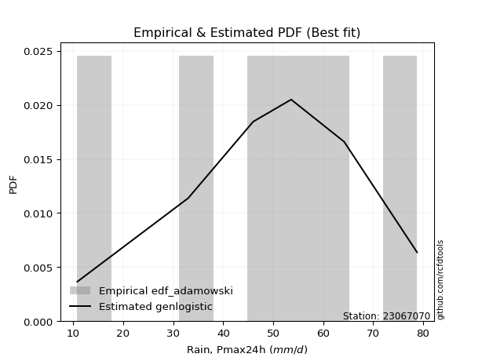</img>

</div>


## C. Best fit & Estimate extreme values for specific return periods - Tr


### 1. Best fit (ordered by delta Δ)

<div align="center">

|   id |   station | empirical_dist   | p_dist             |     delta |   deltao | eval   |   fit |   n |   best_fit |   best_fit_sort |
|-----:|----------:|:-----------------|:-------------------|----------:|---------:|:-------|------:|----:|-----------:|----------------:|
|    0 |  23067070 | edf_hazen        | laplace_asymmetric | 0.0866515 | 0.484421 | Δo > Δ |     1 |   7 |          1 |               1 |
|    1 |  23067070 | edf_gringorten   | laplace_asymmetric | 0.0914669 | 0.484421 | Δo > Δ |     1 |   7 |          1 |               2 |
|    2 |  23067070 | edf_cunnane      | laplace_asymmetric | 0.094588  | 0.484421 | Δo > Δ |     1 |   7 |          1 |               3 |
|    3 |  23067070 | edf_blom         | laplace_asymmetric | 0.0965037 | 0.484421 | Δo > Δ |     1 |   7 |          1 |               4 |
|    4 |  23067070 | edf_tukey        | laplace_asymmetric | 0.0996385 | 0.484421 | Δo > Δ |     1 |   7 |          1 |               5 |
|    5 |  23067070 | edf_filliben     | laplace_asymmetric | 0.100811  | 0.484421 | Δo > Δ |     1 |   7 |          1 |               6 |
|    6 |  23067070 | edf_beard        | laplace_asymmetric | 0.101363  | 0.484421 | Δo > Δ |     1 |   7 |          1 |               7 |
|    7 |  23067070 | edf_jenkinson    | laplace_asymmetric | 0.101363  | 0.484421 | Δo > Δ |     1 |   7 |          1 |               8 |
|    8 |  23067070 | edf_chegodayev   | laplace_asymmetric | 0.102096  | 0.484421 | Δo > Δ |     1 |   7 |          1 |               9 |
|    9 |  23067070 | edf_adamowski    | laplace_asymmetric | 0.105699  | 0.484421 | Δo > Δ |     1 |   7 |          1 |              10 |
|   10 |  23067070 | edf_weibull      | laplace_asymmetric | 0.122366  | 0.484421 | Δo > Δ |     1 |   7 |          1 |              11 |
|   11 |  23067070 | edf_california   | nakagami           | 0.142857  | 0.484421 | Δo > Δ |     1 |   7 |          1 |              12 |

</div>

:file_folder:Tables: [bestfit_23067070.csv](table/bestfit_23067070.csv) | [extreme_23067070.csv](table/extreme_23067070.csv)


### 2. Extreme values

In hydrology, a return period (or recurrence interval $Tr$) is the statistical average time between extreme events like floods or droughts of a specific magnitude, indicating how rare an event is, with a 100-year flood, for example, having a 1% chance of occurring in any given year, not that it happens exactly every century. It is a key tool for infrastructure design (like bridges or dams) and risk assessment, calculated from historical data to determine the probability of future events, although it is important to remember it is statistical average, and events can cluster or be missed.

> risk_rate: assuming the return period as the project useful life.

|   id |      tr |   prob_l |     prob_g |      alpha |   betaprime |     chi2 |   crystalball |   erlang |    expon |   exponnorm |        f |   fatiguelife |     fisk |    gamma |   genexpon |   genlogistic |   gibrat |   gompertz |   gumbel_l |   gumbel_r |   halflogistic |   halfnorm |   hypsecant |   invgamma |   invgauss |      invweibull |   johnsonsu |   kstwobign |   laplace |   laplace_asymmetric |   loggamma |   logistic |   lognorm |   maxwell |   mielke |    moyal |   nakagami |      ncf |      nct |     norm |           pareto |   pearson3 |   rayleigh |     rice |        t |   truncnorm |     wald |   weibull_min |   logalpha |   logbetaprime |     logchi2 |   logcrystalball |   logerlang |   logexpon |   logexponnorm |     logf |   logfatiguelife |   logfisk |   loggenexpon |   loggenlogistic |   loggibrat |   loggompertz |   loggumbel_l |   loggumbel_r |   loghalflogistic |   loghalfnorm |   loghypsecant |   loginvgamma |   loginvgauss |   loginvweibull |   logjohnsonsu |   logkstwobign |   loglaplace |   loglaplace_asymmetric |   logloggamma |   loglogistic |     loglognorm |   logmaxwell |   logmielke |   logmoyal |   lognakagami |   logncf |   lognct |     logpareto |   logpearson3 |   lograyleigh |   logrice |     logt |   logtruncnorm |   logwald |   logweibull_min |   station |   n |   risk_rate |
|-----:|--------:|---------:|-----------:|-----------:|------------:|---------:|--------------:|---------:|---------:|------------:|---------:|--------------:|---------:|---------:|-----------:|--------------:|---------:|-----------:|-----------:|-----------:|---------------:|-----------:|------------:|-----------:|-----------:|----------------:|------------:|------------:|----------:|---------------------:|-----------:|-----------:|----------:|----------:|---------:|---------:|-----------:|---------:|---------:|---------:|-----------------:|-----------:|-----------:|---------:|---------:|------------:|---------:|--------------:|-----------:|---------------:|------------:|-----------------:|------------:|-----------:|---------------:|---------:|-----------------:|----------:|--------------:|-----------------:|------------:|--------------:|--------------:|--------------:|------------------:|--------------:|---------------:|--------------:|--------------:|----------------:|---------------:|---------------:|-------------:|------------------------:|--------------:|--------------:|---------------:|-------------:|------------:|-----------:|--------------:|---------:|---------:|--------------:|--------------:|--------------:|----------:|---------:|---------------:|----------:|-----------------:|----------:|----:|------------:|
|    0 |    2    | 0.5      | 0.5        |    30.976  |     40.0926 |  24.1814 |       42.8571 |  42.7899 |  33.0203 |     42.8571 |  32.6998 |       10.8    |  43.1239 |  42.7913 |    33.0194 |       38.9152 |  35.8144 |    40.7064 |    46.7117 |    39.0026 |        37.0863 |    38.0543 |     42.8571 |    40.3374 |    40.2184 |  1007.5         |     42.8571 |     38.1279 |   42.8571 |              47.5484 |    33.9647 |    42.8571 |   34.6903 |   40.8505 |  45.5473 |  37.7582 |    30.0165 |  40.9423 |  42.8547 |  42.8571 |     12.3854      |    42.9227 |    40.1388 |  41.3417 |  42.8571 |     42.8571 |  35.2515 |       31.0948 |    33.1796 |        34.4006 |     17.8418 |          34.6903 |     33.9063 |    24.2494 |        34.6903 |  34.7196 |          34.627  |   37.6445 |       29.384  |         inf      |     28.0039 |       36.5624 |       39.0035 |       30.8541 |           29.1082 |       29.9773 |        34.6903 |       33.9391 |       32.9659 |         31.535  |        45.3062 |        29.3853 |      34.6903 |                 44.641  |       44.8111 |       34.6903 |  10.8773       |      32.6372 |     19.3024 |    29.7086 |       15.1693 |  34.2138 |  34.6022 |  11.5481      |       37.2325 |       31.9386 |   33.678  |  34.6903 |        44.3079 |   27.5281 |          39.7056 |  23067070 |   7 |    0.75     |
|    1 |    2.33 | 0.570815 | 0.429185   |    36.8694 |     44.468  |  27.5479 |       47.0441 |  46.9791 |  37.9161 |     47.044  |  38.0785 |       11.8827 |  47.2011 |  46.9808 |    37.9149 |       43.3805 |  37.9353 |    45.1647 |    50.3544 |    42.8823 |        41.0752 |    42.5731 |     46.2079 |    44.6503 |    44.5537 | 43105.6         |     47.0404 |     42.5907 |   45.3909 |              50.8416 |    38.7039 |    46.5461 |   39.3997 |   45.2004 |  50.7382 |  41.4308 |    36.0263 |  49.0539 |  47.0418 |  47.0441 |     14.749       |    47.1075 |    44.553  |  45.6357 |  47.044  |     47.0441 |  37.9969 |       36.3966 |    37.8127 |        39.2279 |     21.1807 |          39.3997 |     38.6724 |    28.9799 |        39.3996 |  39.4459 |          39.3203 |   42.4659 |       34.2207 |         inf      |     29.8692 |       41.1477 |       43.5714 |       34.7168 |           32.8612 |       34.3921 |        38.4107 |       38.6569 |       37.7438 |         36.8753 |        50.1036 |        34.1681 |      37.4683 |                 49.7641 |       49.9152 |       38.8077 |  11.5321       |      37.2519 |     22.5373 |    33.2181 |       18.4234 |  38.912  |  39.3116 |  12.7705      |       42.0982 |       36.5259 |   38.4275 |  39.3996 |        46.8233 |   29.9246 |          44.1416 |  23067070 |   7 |    0.729209 |
|    2 |    5    | 0.8      | 0.2        |    82.5672 |     62.3987 |  45.0218 |       62.6039 |  62.5829 |  62.394  |     62.6038 |  66.0541 |       34.8829 |  62.9435 |  62.5858 |    62.3917 |       62.7715 |  50.1461 |    62.2708 |    62.1224 |    59.7373 |        59.1243 |    61.6825 |     59.6488 |    61.9614 |    62.3293 |     5.51239e+11 |     62.5865 |     61.5479 |   58.059  |              61.9858 |    63.4691 |    60.7898 |   63.2328 |   62.3214 |  66.6468 |  58.4426 |    65.1693 |  87.276  |  62.6028 |  62.6039 |    373.341       |    62.6227 |    62.2254 |  62.3437 |  62.6038 |     62.6039 |  53.3658 |       64.9773 |    62.8927 |        64.4621 |     56.9562 |          63.2328 |     63.6269 |    70.6419 |        63.2327 |  63.4034 |          63.1159 |   67.6279 |       64.2734 |         inf      |     43.2962 |       61.6453 |       62.3139 |       57.9552 |           56.8843 |       61.4858 |        57.7995 |       63.6092 |       64.1529 |         72.7625 |        65.2768 |        64.835  |      55.0722 |                 65.6375 |       65.7076 |       59.8397 |   3.20435e+109 |      62.6922 |     41.4123 |    55.7183 |       64.0797 |  62.9032 |  63.1996 |   7.51183e+07 |       63.9384 |       62.5094 |   63.3623 |  63.2328 |        58.5178 |   47.7494 |          62.15   |  23067070 |   7 |    0.67232  |
|    3 |   10    | 0.9      | 0.1        |   166.525  |     75.8047 |  61.3913 |       72.9258 |  72.965  |  84.6143 |     72.9258 |  92.5561 |       66.6403 |  74.5372 |  72.9686 |    84.6111 |       78.5593 |  64.0651 |    73.3905 |    68.6743 |    73.4655 |        74.1132 |    75.8231 |     70.3817 |    74.673  |    75.6739 |     3.38702e+17 |     72.8995 |     75.9814 |   69.5588 |              71.7728 |    88.8297 |    71.2797 |   86.5431 |   74.3703 |  73.2524 |  73.254  |    88.5873 | 119.581  |  72.9258 |  72.9258 |  21817.3         |    72.8834 |    74.8261 |  73.8677 |  72.9257 |     72.9258 |  69.6758 |       93.0462 |    90.0579 |        90.309  |    155.79   |          86.5432 |     89.2398 |   158.613  |        86.543  |  86.887  |          86.4577 |   95.2695 |      101.97   |         inf      |     66.1045 |       78.0586 |       76.0493 |       87.9747 |           89.7217 |       94.5112 |        80.1014 |       89.6631 |       93.5016 |        126.567  |        72.7841 |       105.588  |      78.1222 |                 72.2948 |       72.3225 |       82.3186 | inf            |      90.4286 |     56.722  |    87.4111 |      207.404  |  86.6648 |  86.64   | inf           |       81.6867 |       91.6904 |   88.7948 |  86.5432 |        66.7444 |   78.4033 |          75.1919 |  23067070 |   7 |    0.651322 |
|    4 |   15    | 0.933333 | 0.0666667  |   250.184  |     82.9628 |  71.0934 |       78.0767 |  78.1551 |  97.6124 |     78.0766 | 108.445  |       87.4102 |  80.854  |  78.1591 |    97.6086 |       87.4655 |  73.6657 |    78.7429 |    71.6414 |    81.2108 |        82.5957 |    83.1818 |     76.5069 |    81.4207 |    82.8284 |     6.24637e+20 |     78.0458 |     83.6438 |   76.2857 |              77.4979 |   105.309  |    76.9951 |  101.215  |   80.5525 |  75.4169 |  81.85   |   101.007  | 137.768  |  78.0774 |  78.0767 | 239535           |    77.9942 |    81.3186 |  79.7049 |  78.0766 |     78.0767 |  80.1494 |      110.162  |   108.476  |       107.105  |    288.488  |         101.215  |    105.905  |   254.579  |       101.215  | 101.689  |         101.181  |  114.827  |      129.663  |         inf      |     88.5104 |       87.0274 |       83.2288 |      111.334  |          116.117  |      118.208  |        96.4976 |      106.845  |      113.711  |        172.966  |        75.818  |       136.791  |      95.8509 |                 74.4837 |       74.4965 |       97.9407 | inf            |     109.127  |     63.3986 |   113.518  |      395.452  | 101.749  | 101.427  | inf           |       91.461  |      111.699  |  105.202  | 101.215  |        70.271  |  107.803  |          81.9668 |  23067070 |   7 |    0.644736 |
|    5 |   20    | 0.95     | 0.05       |   333.768  |     87.8231 |  78.0179 |       81.4499 |  81.5573 | 106.835  |     81.4498 | 119.876  |      102.788  |  85.22   |  81.5616 |   106.83   |       93.7012 |  81.1967 |    82.1632 |    73.4884 |    86.6339 |        88.5387 |    88.0879 |     80.8279 |    85.9946 |    87.6992 |     1.20855e+23 |     81.4161 |     88.8055 |   81.0585 |              81.5599 |   117.827  |    80.9455 |  112.146  |   84.6554 |  76.4926 |  87.9377 |   109.329  | 150.424  |  81.451  |  81.4499 |      1.31156e+06 |    81.3377 |    85.634  |  83.5521 |  81.4497 |     81.4499 |  87.9543 |      122.571  |   122.853  |       119.864  |    450.66   |         112.146  |    118.574  |   356.136  |       112.146  | 112.728  |         112.166  |  130.644  |      152.225  |         inf      |    111.284  |       93.1685 |       88.036  |      131.29   |          139.111  |      137.222  |       110.045  |      120.021  |      129.625  |        215.244  |        77.5734 |       162.856  |     110.819  |                 75.5729 |       75.5781 |      110.439  | inf            |     123.625  |     67.1058 |   136.599  |      611.835  | 113.045  | 112.459  | inf           |       98.1693 |      127.359  |  117.597  | 112.146  |        72.2382 |  136.676  |          86.4886 |  23067070 |   7 |    0.641514 |
|    6 |   25    | 0.96     | 0.04       |   417.324  |     91.4893 |  83.4084 |       83.933  |  84.0635 | 113.988  |     83.9329 | 128.829  |      115.006  |  88.56   |  84.0679 |   113.983  |       98.5041 |  87.475  |    84.6358 |    74.8027 |    90.8111 |        93.1175 |    91.7382 |     84.1721 |    89.4429 |    91.3805 |     6.97548e+24 |     83.897  |     92.6718 |   84.7606 |              84.7106 |   128.04   |    83.9674 |  120.94   |   87.7013 |  77.1359 |  92.6563 |   115.534  | 160.118  |  83.9345 |  83.933  |      4.90408e+06 |    83.7972 |    88.8402 |  86.3952 |  83.9329 |     83.933  |  94.2058 |      132.334  |   134.824  |       130.274  |    639.655  |         120.94   |    128.915  |   462.063  |       120.94   | 121.613  |         121.012  |  144.199  |      171.551  |         inf      |    134.687  |       97.8207 |       91.6251 |      149.069  |          159.889  |      153.329  |       121.822  |      130.846  |      142.954  |        254.732  |        78.7572 |       185.584  |     124.022  |                 76.2247 |       76.2253 |      121.067  | inf            |     135.621  |     69.4597 |   157.671  |      848.165  | 122.167  | 121.343  | inf           |      103.254  |      140.399  |  127.665  | 120.94   |        73.4943 |  165.288  |          89.8575 |  23067070 |   7 |    0.639603 |
|    7 |   50    | 0.98     | 0.02       |   834.97   |    102.409  | 100.24   |       91.0437 |  91.2481 | 136.208  |     91.0436 | 157.103  |      154.207  |  98.7646 |  91.2531 |   136.203  |      113.299  | 109.606  |    91.4973 |    78.3704 |   103.679  |       107.226  |   102.348  |     94.5403 |    99.7156 |   102.383  |     1.85924e+30 |     91.0015 |    104.025  |   96.2604 |              94.4976 |   162.793  |    93.2005 |  150.127  |   96.5352 |  78.4197 | 107.305  |   133.597  | 189.647  |  91.0463 |  91.0437 |      2.94954e+08 |    90.8324 |    98.1473 |  94.5813 |  91.0435 |     91.0437 | 114.617  |      163.353  |   177.119  |       165.696  |   1934.94   |         150.127  |    164.134  |  1037.48   |       150.127  | 151.137  |         150.426  |  194.966  |      243.037  |         inf      |    263.959  |      111.74   |      102.123  |      220.442  |          245.524  |      211.698  |       166.966  |      168.163  |      190.515  |        427.989  |        81.6873 |       272.361  |     175.93   |                 77.5248 |       77.5161 |      160.301  | inf            |     177.406  |     74.4813 |   246.134  |     2200.94   | 152.641  | 150.88   | inf           |      118.44   |      186.318  |  161.625  | 150.127  |        76.2005 |  307.442  |          99.679  |  23067070 |   7 |    0.63583  |
|    8 |   75    | 0.986667 | 0.0133333  |  1252.56   |    108.528  | 110.136  |       94.8591 |  95.108  | 149.206  |     94.8589 | 173.958  |      177.816  | 104.658  |  95.1132 |   149.2    |      121.899  | 124.553  |    95.0437 |    80.1745 |   111.158  |       115.427  |   108.124  |    100.599  |   105.482  |   108.575  |     2.64848e+33 |     94.8135 |    110.272  |  102.987  |             100.223  |   185.417  |    98.5332 |  168.592  |  101.338  |  78.8529 | 115.871  |   143.432  | 206.573  |  94.8623 |  94.8591 |      3.23979e+09 |    94.6022 |   103.211  |  98.9972 |  94.8589 |     94.8591 | 127.177  |      181.937  |   205.898  |       188.756  |   3737.25   |         168.592  |    187.082  |  1665.18   |       168.592  | 169.837  |         169.073  |  232.07   |      293.972  |         inf      |    415.81   |      119.562  |      107.881  |      276.727  |          315.046  |      252.336  |       200.739  |      192.829  |      223.215  |        578.647  |        83.0084 |       336.365  |     215.855  |                 77.9571 |       77.9452 |      188.516  | inf            |     205.298  |     76.2548 |   319.359  |     3700.53   | 172.065  | 169.604  | inf           |      126.929  |      217.326  |  183.494  | 168.592  |        77.1663 |  450.417  |         105.047  |  23067070 |   7 |    0.634587 |
|    9 |  100    | 0.99     | 0.01       |  1670.13   |    112.772  | 117.175  |       97.4396 |  97.7206 | 158.429  |     97.4395 | 186.056  |      194.803  | 108.819  |  97.726  |   158.422  |      127.985  | 136.132  |    97.3889 |    81.3546 |   116.452  |       121.231  |   112.059  |    104.897  |   109.487  |   112.879  |     4.51893e+35 |     97.3918 |    114.551  |  107.76   |             104.285  |   202.58   |   102.298  |  182.352  |  104.609  |  79.0778 | 121.949  |   150.128  | 218.45   |  97.4433 |  97.4396 |      1.77399e+10 |    97.1501 |   106.66   | 101.992  |  97.4394 |     97.4396 | 136.335  |      195.3    |   228.36   |       206.248  |   5985.39   |         182.352  |    204.5    |  2329.46   |       182.352  | 183.784  |         182.988  |  262.443  |      334.75   |         inf      |    591.263  |      124.988  |      111.821  |      325.048  |          375.849  |      284.401  |       228.761  |      211.723  |      248.887  |        716.337  |        83.814  |       388.701  |     249.564  |                 78.173  |       78.1596 |      211.379  | inf            |     226.766  |     77.1646 |   384.17   |     5270.26   | 186.607  | 183.575  | inf           |      132.786  |      241.357  |  199.965  | 182.352  |        77.6623 |  595.027  |         108.714  |  23067070 |   7 |    0.633968 |
|   10 |  200    | 0.995    | 0.005      |  3340.39   |    122.715  | 134.188  |      103.293  | 103.652  | 180.649  |    103.293  | 215.674  |      236.385  | 118.801  | 103.658  |   180.642  |      142.617  | 167.635  |   102.551  |    83.9195 |   129.178  |       135.186  |   121.058  |    115.252  |   118.901  |   122.998  |     1.04974e+41 |    103.24   |    124.409  |  119.26   |             114.072  |   248.008  |   111.33   |  217.871  |  112.094  |  79.4598 | 136.591  |   165.426  | 246.674  | 103.298  | 103.293  |      1.06696e+12 |   102.924  |   114.553  | 108.807  | 103.293  |    103.293  | 159.145  |      228.056  |   290.342  |       252.551  |  18825.3    |         217.871  |    250.636  |  5230.35   |       217.871  | 219.823  |         218.975  |  352.51   |      450.95   |         inf      |   1540.73   |      137.688  |      120.891  |      478.613  |          574.464  |      373.897  |       313.4    |      262.448  |      320.271  |       1196.7    |        85.4071 |       542.339  |     354.016  |                 78.4967 |       78.4809 |      278.172  | inf            |     284.71   |     78.6031 |   599.598  |    11808.3    | 224.389  | 219.701  | inf           |      146.364  |      306.816  |  243.094  | 217.871  |        78.4232 | 1190.53   |         117.131  |  23067070 |   7 |    0.633042 |
|   11 |  250    | 0.996    | 0.004      |  4175.51   |    125.842  | 139.678  |      105.082  | 105.467  | 187.802  |    105.082  | 225.349  |      249.936  | 122.006  | 105.473  |   187.795  |      147.321  | 178.938  |   104.086  |    84.6742 |   133.27   |       139.672  |   123.826  |    118.585  |   121.872  |   126.191  |     5.57429e+42 |    105.027  |    127.46   |  122.962  |             117.222  |   263.938  |   114.229  |  230.048  |  114.398  |  79.554  | 141.305  |   170.126  | 255.655  | 105.087  | 105.082  |      3.98953e+12 |   104.686  |   116.983  | 110.895  | 105.082  |    105.082  | 166.692  |      238.758  |   312.919  |       268.788  |  27302.4    |         230.048  |    266.824  |  6786.04   |       230.048  | 232.19   |         231.334  |  387.533  |      494.365  |         inf      |   2172.55   |      141.676  |      123.696  |      542.008  |          658.411  |      406.73   |       346.825  |      280.466  |      346.434  |       1411.35   |        85.8354 |       601.227  |     396.192  |                 78.5614 |       78.5452 |      303.807  | inf            |     305.368  |     78.9234 |   691.989  |    15124.1    | 237.418  | 232.106  | inf           |      150.581  |      330.339  |  258.067  | 230.048  |        78.5779 | 1497.56   |         119.73   |  23067070 |   7 |    0.632858 |
|   12 |  500    | 0.998    | 0.002      |  8351.1    |    135.362  | 156.767  |      110.387  | 110.852  | 210.023  |    110.387  | 255.836  |      292.447  | 131.944  | 110.858  |   210.014  |      161.921  | 218.001  |   108.522  |    86.8376 |   145.968  |       153.597  |   132.08   |    128.938  |   130.954  |   135.94   |     1.26056e+48 |    110.328  |    136.602  |  134.462  |             127.01   |   317.823  |   123.221  |  270.31   |  121.273  |  79.8013 | 155.947  |   184.119  | 283.266  | 110.393  | 110.387  |      2.39949e+14 |   109.909  |   124.232  | 117.101  | 110.386  |    110.387  | 190.687  |      272.45   |   392.402  |       323.713  |  87290.9    |         270.31   |    321.614  | 15236.8    |       270.309  | 273.118  |         272.268  |  519.863  |      650.684  |          78.673  |   7124.37   |      153.784  |      132.106  |      797.402  |         1005.42   |      522.75   |       475.136  |      342.242  |      439.064  |       2355.15   |        86.9639 |       818.835  |     562.014  |                 78.6908 |       78.6736 |      399.329  | inf            |     376.357  |     79.6908 |  1080.02   |    31561.7    | 280.75   | 273.186  | inf           |      163.221  |      411.794  |  308.178  | 270.31   |        78.8899 | 3106.19   |         127.503  |  23067070 |   7 |    0.632489 |
|   13 |  750    | 0.998667 | 0.00133333 | 12526.7    |    140.813  | 166.786  |      113.334  | 113.846  | 223.021  |    113.333  | 273.975  |      317.565  | 137.751  | 113.852  |   223.011  |      170.456  | 243.835  |   110.914  |    87.9939 |   153.392  |       161.737  |   136.692  |    134.995  |   136.179  |   141.539  |     1.70108e+51 |    113.272  |    141.738  |  141.189  |             132.735  |   352.643  |   128.475  |  295.646  |  125.118  |  79.9268 | 164.512  |   191.924  | 299.239  | 113.34   | 113.334  |      2.63561e+15 |   112.808  |   128.286  | 120.556  | 113.333  |    113.334  | 205.073  |      292.453  |   446.241  |       359.205  | 173067      |         295.646  |    357.042  | 24455.5    |       295.645  | 298.902  |         298.081  |  617.199  |      758.973  |          78.7161 |  15626.1    |      160.69   |      136.833  |      999.305  |         1287.74   |      601.424  |       571.197  |      382.797  |      502.172  |       3177.05   |        87.5086 |       974.009  |     689.555  |                 78.7339 |       78.7164 |      468.488  | inf            |     423.03   |     80.0467 |  1401.27   |    47532      | 308.204  | 299.086  | inf           |      170.305  |      465.806  |  340.149  | 295.646  |        78.9947 | 4810.6    |         131.862  |  23067070 |   7 |    0.632366 |
|   14 | 1000    | 0.999    | 0.001      | 16702.3    |    144.633  | 173.902  |      115.362  | 115.908  | 232.243  |    115.362  | 286.982  |      335.481  | 141.869  | 115.915  |   232.233  |      176.51   | 263.605  |   112.532  |    88.7721 |   158.658  |       167.511  |   139.876  |    139.292  |   139.855  |   145.472  |     2.82533e+53 |    115.299  |    145.296  |  145.962  |             136.797  |   378.929  |   132.201  |  314.457  |  127.776  |  80.011  | 170.589  |   197.308  | 310.499  | 115.37   | 115.362  |      1.44316e+16 |   114.802  |   131.088  | 122.938  | 115.362  |    115.362  | 215.422  |      306.77   |   488.135  |       386      | 281763      |         314.457  |    383.798  | 34211.3    |       314.457  | 318.059  |         317.271  |  697.083  |      844.266  |          78.7376 |  28502.2    |      165.518  |      140.109  |     1172.81   |         1534.85   |      662.566  |       650.914  |      413.725  |      551.436  |       3928.63   |        87.853  |      1098.44   |     797.24   |                 78.7554 |       78.7378 |      524.677  | inf            |     458.63   |     80.2761 |  1685.63   |    63025.1    | 328.675  | 318.338  | inf           |      175.198  |      507.218  |  364.087  | 314.458  |        79.0473 | 6589.48   |         134.879  |  23067070 |   7 |    0.632305 |

<div align="center">

</img>

</div>


<div align="center">

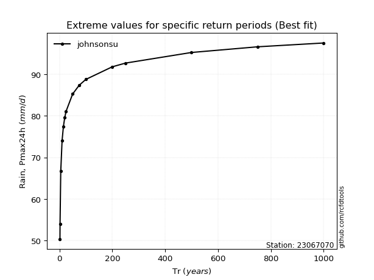</img>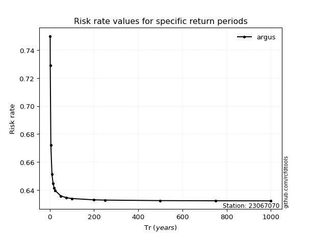</img>

</div>


<sub>**APP DISCLAIMER**: NO WARRANTY - This software is provided by [github.com/rcfdtools](https://github.com/rcfdtools) "as is", without any express or implied warranty, including warranties of merchantability, fitness for a particular purpose, or non-infringement. There is no guarantee that the software will be error-free or operate without interruption. LIMITATION OF LIABILITY - Neither the authors nor copyright holders will be liable for claims or damages arising from the software or its use. You are responsible for determining if the software is appropriate for your use and assume all associated risks, including errors, legal compliance, and data loss. NO PROFESSIONAL ADVICE - The software provides general information and does not offer professional advice. It should not replace consultation with professional advisors.</sub>