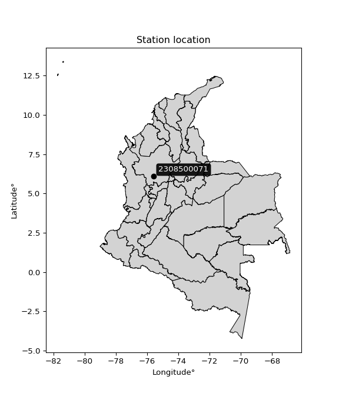

<div align="center">


</div>

# PMP Station (Rain, Pmax24h): 2308500071

Probable Maximum Precipitation (PMP) is the greatest amount of rainfall for a specific duration that is meteorologically possible for a given location, acting as a "worst-case" scenario for extreme storms, crucial for designing safety-critical infrastructure like bridges, river deviations, dams, spillways, and nuclear plants to prevent catastrophic failure. PMP is calculated by hydrologists using meteorological data to determine the upper limit of extreme rainfall, often leading to the Probable Maximum Flood (PMF) for flood control design, and is increasingly being studied for climate change impacts. Probable Maximum Precipitation (PMP) is the theoretical upper limit of rainfall, a deterministic estimate for extreme events, while probability distributions (like GEV, Gumbel) describe the likelihood and frequency of various precipitation amounts, including rare ones, showing how often events occur, with PMP representing the extreme end of these distributions, used for critical infrastructure design to ensure safety against the worst conceivable weather, unlike standard statistical forecasts which cover typical probabilities.

The most common probability distributions in hydrology, used for analyzing floods, rainfall, and streamflow, include the Normal, Log-Normal, Gumbel, Gamma (including Log-Pearson Type III), and Generalized Extreme Value (GEV) distributions, often chosen based on the data´s skewness and whether modeling extremes or general conditions, with Gumbel and GEV popular for extreme events like floods, while the Normal distribution serves as a baseline, though often requiring transformations for skewed hydrological data. These distributions help in designing water infrastructure, managing water resources, and forecasting hydrologic events.

> Hydrological data often isn´t perfectly normal (it´s skewed), so different distributions are needed for different applications, such as: **Flood Frequency Analysis**: Using Gumbel, GEV, or Log-Pearson Type III for predicting extreme flood magnitudes and their return periods, **Rainfall Analysis**: Normal for annual totals, but Log-Normal, Weibull, or GEV for intensity or extreme daily rainfall, **Streamflow Modeling**: Gamma and Log-Normal for maximum flows, GEV for minimum flows, and Kappa for daily flows.

<div align="center">

</img>

</div>


## A. General information


### 1. General running parameters

• app_version: _v20260108_. • runtime: _2026-01-09 11:32:22.148588_. • Python version: _3.14.0_. • SciPy version: _1.16.3_. • Pandas version: _2.3.3_. • NumPy version: _2.3.5_. • Stations dataset (station_dataset_file): _dataset/pmax24h_in/automatic_colombia_2003_2024.csv_. • Stations catalog (station_catalog_file): _dataset/CNE.xls_. • Minimum year to eval til year_max (date_min): _1900_. • Maximum year to eval since year_min (date_max): _2024_. • Creates, save and include plots into reports (create_plot): _False_. • Plot only fit distributions with Δo > Δ (plot_only_fit): _True_. • Plot only simple graphs avoiding multiple CDFs and multiple Extreme values plots (plot_only_simple): _True_. • Eval low extreme values, if False, evaluates high extreme values (low_extreme): _False_. • Eval every SciPy distribution as logarithmic (pdist_logarithmic_on): _True_. • Standard deviation normalized (ddof): _1.0_. • Return periods to eval in years (Tr): _[2, 2.33, 5, 10, 15, 20, 25, 50, 75, 100, 200, 250, 500, 750, 1000]_. • Minimum data sample per station, 0 means any (minimum_sample): _5_. • Z-Score maximum threshold to adjust a value, 0 means disable (zscore_max): _3.5_. • Z-Score minimum threshold to adjust a value, 0 means disable (zscore_min): _-2.5_. • Avoid zeros, e.g. rain = 0 (avoid_zeros): _True_. • Avoid null values (avoid_nans): _True_. 

:file_folder:Table: [dataset.csv](../../dataset/pmax24h_in/automatic_colombia_2003_2024.csv)

> Delta Degrees of Freedom (DDOF): is a parameter used in the formulas for calculating variance and standard deviation. When ddof=0, the divisor is $N$ (the total number of observations) and this is used when your data set is the entire population. When ddof=1, the divisor is $N-1$ and this is used when your data set is a sample drawn from a larger population. Using $N-1$ provides an unbiased estimate of the population variance (known as Bessel´s correction).


### 2. Station info and location

|   id |     CODIGO | NOMBRE              | CATEGORIA               | TECNOLOGIA                | ESTADO   | FECHA_INSTALACION   |   FECHA_SUSPENSION |   ALTITUD |   LATITUD |   LONGITUD | DEPARTAMENTO   | MUNICIPIO   | AREA_OPERATIVA                      | ENTIDAD                                                     | AREA_HIDROGRAFICA   | ZONA_HIDROGRAFICA   | SUBZONA_HIDROGRAFICA   |   CORRIENTE | Catalogo   |   Version |
|-----:|-----------:|:--------------------|:------------------------|:--------------------------|:---------|:--------------------|-------------------:|----------:|----------:|-----------:|:---------------|:------------|:------------------------------------|:------------------------------------------------------------|:--------------------|:--------------------|:-----------------------|------------:|:-----------|----------:|
|    0 | 2308500071 | RETIRO [2308500071] | Climatológica Principal | Automática con Telemetría | Activa   | 29/04/2017          |                nan |      2590 |   6.08211 |   -75.5664 | Antioquia      | Retiro      | Area Operativa 01 - Antioquia-Chocó | INSTITUTO DE HIDROLOGIA METEOROLOGIA Y ESTUDIOS AMBIENTALES | Magdalena Cauca     | Medio Magdalena     | Río Nare               |         nan | CNE_IDEAM  |  20251226 |

<div align="center">

Dynamic map: [:earth_americas:Google](http://maps.google.com/maps?q=6.08211,-75.56640167) [:earth_americas:OSM](https://www.openstreetmap.org/#map=18/6.08211/-75.56640167&layers=P) [:earth_americas:Bing](https://www.bing.com/maps?cp=6.08211~-75.56640167&lvl=18) [:earth_americas:Apple](https://maps.apple.com/frame?center=6.08211%2C-75.56640167&span=0.003%2C0.006)

</div>


<div align="center">

```geojson
{
  "type": "Feature",
  "geometry": {
    "type": "Point", 
    "coordinates": [-75.56640167, 6.08211]
  }, 
  "properties": {
    "Name": "2308500071"
  }
}
```

</div>


### 3. Discrete values table and plot

<div align="center">

|               |           0 |          1 |           2 |          3 |           4 |
|:--------------|------------:|-----------:|------------:|-----------:|------------:|
| Date          | 2019        | 2020       | 2021        | 2022       | 2023        |
| Value         |   57.8      |   18.8     |   51        |   68.8     |   40        |
| Value_initial |   57.8      |   18.8     |   51        |   68.8     |   40        |
| count         |    5        |    5       |    5        |    5       |    5        |
| mean          |   47.28     |   47.28    |   47.28     |   47.28    |   47.28     |
| std           |   19.0508   |   19.0508  |   19.0508   |   19.0508  |   19.0508   |
| zscore        |    0.552209 |   -1.49495 |    0.195268 |    1.12961 |   -0.382137 |


</div>


> The initial value (value_initial) correspond to the initial obtained or null completed value, and value (value) is adjusted only when the initial value is outside the valid range (outlier) definite through the Z-Score value. If Z-Score is active, values out of range or outliers are replaced with the station mean value. A Z-Score (or standard score) measures how many standard deviations a data point is from the mean of a dataset, indicating its relative position; positive scores mean above the mean, negative mean below, and a score of zero is exactly at the mean, allowing for comparison of values from different distributions. It´s calculated using the formula $z=(x–μ)/σ$, where $x$ is the data point, $μ$ is the mean, and $σ$ is the standard deviation, helping identify outliers and understand probability.
>
> <sub>**Note**: In this study, "completing" (filling gaps in) and "extending" (forecasting or lengthening the historical record) rainfall data series are avoided for certain critical analyses because they introduce artificial bias and uncertainty, which can distort the statistics of rare events (extremes), alter day-to-day variability, and compromise the integrity and homogeneity of the original data. Some reasons against Completing/Extending rainfall data are: **Distortion of Extremes and Variability**: The primary issue is that most gap-filling or extension methods rely on averaging or regression with nearby stations, which inherently smooths the data. Rainfall is highly variable in space and time, with a large percentage of zero values and occasional large storms. Infilling methods often underestimate the highest values and overestimate the lowest (zero) values, which severely distorts analyses focused on flood frequency, drought severity, and intensity-duration-frequency (IDF) curves, **Loss of Data Homogeneity**: Infilled or extended data are synthetic estimates, not actual measurements. Combining these estimates with observed data can violate the assumption of data homogeneity, which requires that the data properties do not change over time. Inhomogeneity can lead to incorrect conclusions about long-term trends or changes in climate patterns, **Propagation of Errors**: Errors and biases from the original data (e.g., wind-induced undercatch, instrument errors, site changes) or the data used for imputation can propagate through the analysis, leading to unreliable hydrological models and inaccurate predictions, **Compromised Statistical Integrity**: For statistical analyses, especially those involving the frequency of events, using artificial data can introduce time bias or autocorrelation that doesn´t exist in reality, making it difficult to assess the true probability of events, **Difficulty in Validation**: It is difficult to accurately validate the quality of filled or extended data, especially for past periods where ground-truth measurements are unavailable. The reliability of imputation techniques heavily depends on the density of the surrounding station network and the complexity of the local topography.</sub>


### 4. Active continuous probability distributions from SciPy (45 of 104 available)

A Probability Density Function (PDF) describes the relative likelihood of a continuous random variable falling within a specific range, where the total area under its curve equals 1, and the area over any interval gives the actual probability for that range. Unlike discrete probabilities (like rolling a die), a PDF shows density, not direct probability for a single point (which is zero), with higher points indicating higher likelihood, often visualized as a bell curve for normal distributions.

A log of a probability density function (log-PDF) is simply the logarithm of the PDF´s value, denoted as $log(f(x))$, useful for converting multiplication of probabilities into addition, improving numerical stability with tiny numbers, and connecting to information theory concepts like entropy. Instead of dealing with very small probabilities (e.g., 0.000001), log-PDFs use negative numbers (e.g., $log(0.00001) ≈ -11.51$ that are easier for computers to handle, preventing underflow errors and simplifying complex calculations. In this study, each active probability distribution from SciPy is also evaluated in the $log$ form.

[scipy.stats](https://docs.scipy.org/doc/scipy/reference/stats.html) is a Python´s powerful submodule within the SciPy library for comprehensive statistical analysis, offering over 130 probability distributions (like Normal, Poisson), functions for descriptive stats (mean, variance), hypothesis testing (t-tests, chi-square), random variable generation, and statistical tests, making it essential for data science, modeling, and research. It provides tools to explore, model, and draw conclusions from data efficiently, working seamlessly with NumPy.

<div align="center">

|   id | p_dist             |   n_parameter | fit_method   | label                                                                       | active   | ref                                                                                                        |
|-----:|:-------------------|--------------:|:-------------|:----------------------------------------------------------------------------|:---------|:-----------------------------------------------------------------------------------------------------------|
|    0 | alpha              |             3 | MLE          | Alpha                                                                       | True     | [:mortar_board:](https://docs.scipy.org/doc/scipy/reference/generated/scipy.stats.alpha.html)              |
|    1 | betaprime          |             4 | MLE          | Beta prime                                                                  | True     | [:mortar_board:](https://docs.scipy.org/doc/scipy/reference/generated/scipy.stats.betaprime.html)          |
|    2 | chi2               |             3 | MLE          | Chi²                                                                        | True     | [:mortar_board:](https://docs.scipy.org/doc/scipy/reference/generated/scipy.stats.chi2.html)               |
|    3 | crystalball        |             4 | MLE          | Crystalball                                                                 | True     | [:mortar_board:](https://docs.scipy.org/doc/scipy/reference/generated/scipy.stats.crystalball.html)        |
|    4 | dweibull           |             3 | MLE          | Double Weibull                                                              | True     | [:mortar_board:](https://docs.scipy.org/doc/scipy/reference/generated/scipy.stats.dweibull.html)           |
|    5 | erlang             |             3 | MLE          | Erlang                                                                      | True     | [:mortar_board:](https://docs.scipy.org/doc/scipy/reference/generated/scipy.stats.erlang.html)             |
|    6 | expon              |             2 | MLE          | Exponential                                                                 | True     | [:mortar_board:](https://docs.scipy.org/doc/scipy/reference/generated/scipy.stats.expon.html)              |
|    7 | exponnorm          |             3 | MLE          | Exponentially modified Normal                                               | True     | [:mortar_board:](https://docs.scipy.org/doc/scipy/reference/generated/scipy.stats.exponnorm.html)          |
|    8 | f                  |             4 | MLE          | F                                                                           | True     | [:mortar_board:](https://docs.scipy.org/doc/scipy/reference/generated/scipy.stats.f.html)                  |
|    9 | fatiguelife        |             3 | MLE          | Fatigue-life (Birnbaum-Saunders)                                            | True     | [:mortar_board:](https://docs.scipy.org/doc/scipy/reference/generated/scipy.stats.fatiguelife.html)        |
|   10 | fisk               |             3 | MLE          | Fisk                                                                        | True     | [:mortar_board:](https://docs.scipy.org/doc/scipy/reference/generated/scipy.stats.fisk.html)               |
|   11 | gamma              |             3 | MLE          | Gamma                                                                       | True     | [:mortar_board:](https://docs.scipy.org/doc/scipy/reference/generated/scipy.stats.gamma.html)              |
|   12 | genexpon           |             5 | MLE          | Generalized exponential                                                     | True     | [:mortar_board:](https://docs.scipy.org/doc/scipy/reference/generated/scipy.stats.genexpon.html)           |
|   13 | genlogistic        |             3 | MLE          | Generalized logistic                                                        | True     | [:mortar_board:](https://docs.scipy.org/doc/scipy/reference/generated/scipy.stats.genlogistic.html)        |
|   14 | gibrat             |             2 | MM           | Gibrat                                                                      | True     | [:mortar_board:](https://docs.scipy.org/doc/scipy/reference/generated/scipy.stats.gibrat.html)             |
|   15 | gompertz           |             3 | MLE          | Gompertz (or truncated Gumbel)                                              | True     | [:mortar_board:](https://docs.scipy.org/doc/scipy/reference/generated/scipy.stats.gompertz.html)           |
|   16 | gumbel_l           |             2 | MM           | Gumbel Left Skew                                                            | True     | [:mortar_board:](https://docs.scipy.org/doc/scipy/reference/generated/scipy.stats.gumbel_l.html)           |
|   17 | gumbel_r           |             2 | MM           | Gumbel Right Skew                                                           | True     | [:mortar_board:](https://docs.scipy.org/doc/scipy/reference/generated/scipy.stats.gumbel_r.html)           |
|   18 | halflogistic       |             2 | MM           | Half-logistic                                                               | True     | [:mortar_board:](https://docs.scipy.org/doc/scipy/reference/generated/scipy.stats.halflogistic.html)       |
|   19 | halfnorm           |             2 | MM           | Half Normal                                                                 | True     | [:mortar_board:](https://docs.scipy.org/doc/scipy/reference/generated/scipy.stats.halfnorm.html)           |
|   20 | hypsecant          |             2 | MM           | hyperbolic secant                                                           | True     | [:mortar_board:](https://docs.scipy.org/doc/scipy/reference/generated/scipy.stats.hypsecant.html)          |
|   21 | invgamma           |             3 | MLE          | Inverted gamma                                                              | True     | [:mortar_board:](https://docs.scipy.org/doc/scipy/reference/generated/scipy.stats.invgamma.html)           |
|   22 | invgauss           |             3 | MLE          | Inverse Gaussian                                                            | True     | [:mortar_board:](https://docs.scipy.org/doc/scipy/reference/generated/scipy.stats.invgauss.html)           |
|   23 | invweibull         |             3 | MLE          | Inverted Weibull                                                            | True     | [:mortar_board:](https://docs.scipy.org/doc/scipy/reference/generated/scipy.stats.invweibull.html)         |
|   24 | kappa4             |             4 | MLE          | Kappa 4                                                                     | True     | [:mortar_board:](https://docs.scipy.org/doc/scipy/reference/generated/scipy.stats.kappa4.html)             |
|   25 | kstwobign          |             2 | MLE          | Limiting distribution of scaled Kolmogorov-Smirnov two-sided test statistic | True     | [:mortar_board:](https://docs.scipy.org/doc/scipy/reference/generated/scipy.stats.kstwobign.html)          |
|   26 | laplace            |             2 | MM           | Laplace                                                                     | True     | [:mortar_board:](https://docs.scipy.org/doc/scipy/reference/generated/scipy.stats.laplace.html)            |
|   27 | laplace_asymmetric |             3 | MLE          | Asymmetric Laplace                                                          | True     | [:mortar_board:](https://docs.scipy.org/doc/scipy/reference/generated/scipy.stats.laplace_asymmetric.html) |
|   28 | loggamma           |             3 | MLE          | Log gamma                                                                   | True     | [:mortar_board:](https://docs.scipy.org/doc/scipy/reference/generated/scipy.stats.loggamma.html)           |
|   29 | logistic           |             2 | MM           | Logistic (or Sech-squared)                                                  | True     | [:mortar_board:](https://docs.scipy.org/doc/scipy/reference/generated/scipy.stats.logistic.html)           |
|   30 | lognorm            |             3 | MLE          | Log Normal                                                                  | True     | [:mortar_board:](https://docs.scipy.org/doc/scipy/reference/generated/scipy.stats.lognorm.html)            |
|   31 | maxwell            |             2 | MM           | Maxwell                                                                     | True     | [:mortar_board:](https://docs.scipy.org/doc/scipy/reference/generated/scipy.stats.maxwell.html)            |
|   32 | mielke             |             4 | MLE          | Mielke Beta-Kappa / Dagum                                                   | True     | [:mortar_board:](https://docs.scipy.org/doc/scipy/reference/generated/scipy.stats.mielke.html)             |
|   33 | moyal              |             2 | MM           | Moyal                                                                       | True     | [:mortar_board:](https://docs.scipy.org/doc/scipy/reference/generated/scipy.stats.moyal.html)              |
|   34 | nakagami           |             3 | MLE          | Nakagami                                                                    | True     | [:mortar_board:](https://docs.scipy.org/doc/scipy/reference/generated/scipy.stats.nakagami.html)           |
|   35 | ncf                |             5 | MLE          | Non-central F distribution                                                  | True     | [:mortar_board:](https://docs.scipy.org/doc/scipy/reference/generated/scipy.stats.ncf.html)                |
|   36 | nct                |             4 | MLE          | Non-central Student’s t                                                     | True     | [:mortar_board:](https://docs.scipy.org/doc/scipy/reference/generated/scipy.stats.nct.html)                |
|   37 | norm               |             2 | MM           | Normal                                                                      | True     | [:mortar_board:](https://docs.scipy.org/doc/scipy/reference/generated/scipy.stats.norm.html)               |
|   38 | pearson3           |             3 | MM           | Pearson type III                                                            | True     | [:mortar_board:](https://docs.scipy.org/doc/scipy/reference/generated/scipy.stats.pearson3.html)           |
|   39 | rayleigh           |             2 | MM           | Rayleigh                                                                    | True     | [:mortar_board:](https://docs.scipy.org/doc/scipy/reference/generated/scipy.stats.rayleigh.html)           |
|   40 | rice               |             3 | MLE          | Rice                                                                        | True     | [:mortar_board:](https://docs.scipy.org/doc/scipy/reference/generated/scipy.stats.rice.html)               |
|   41 | t                  |             3 | MLE          | Student’s t                                                                 | True     | [:mortar_board:](https://docs.scipy.org/doc/scipy/reference/generated/scipy.stats.t.html)                  |
|   42 | truncnorm          |             4 | MLE          | Truncated normal                                                            | True     | [:mortar_board:](https://docs.scipy.org/doc/scipy/reference/generated/scipy.stats.truncnorm.html)          |
|   43 | wald               |             2 | MM           | Wald                                                                        | True     | [:mortar_board:](https://docs.scipy.org/doc/scipy/reference/generated/scipy.stats.wald.html)               |
|   44 | weibull_min        |             3 | MLE          | Weibull minimum                                                             | True     | [:mortar_board:](https://docs.scipy.org/doc/scipy/reference/generated/scipy.stats.weibull_min.html)        |

</div>

> **n_parameter:** # arguments & localization & scale.
>
> **Fit methods:** (MLE) maximum likelihood, (MM) L-moments.
>
>**Inactive** (With the only purpose of prevent loops, zero divisions, infinite values, over high estimated values or horizontal trending for recurrence intervals estimations, the follow distributions were disabled.)**:** foldnorm, gennorm, norminvgauss, powernorm, powerlognorm, skewnorm, genextreme, anglit, arcsine, argus, beta, bradford, burr, burr12, cauchy, cosine, halfcauchy, foldcauchy, skewcauchy, wrapcauchy, dgamma, gengamma, exponweib, exponpow, truncexpon, gausshyper, genhalflogistic, genhyperbolic, geninvgauss, halfgennorm, johnsonsb, johnsonsu, kappa3, ksone, kstwo, loglaplace, levy, levy_l, levy_stable, ncx2, pareto, genpareto, truncpareto, lomax, powerlaw, rdist, rel_breitwigner, recipinvgauss, semicircular, studentized_range, trapezoid, triang, truncweibull_min, tukeylambda, uniform, loguniform, vonmises, vonmises_line, weibull_max, 


## B. Probability (PDF) vs. Empirical (EDF) distributions functions

A continuous probability distribution (CPD) describes probabilities for variables that can take any value within a range (like rain any time), unlike discrete variables with specific outcomes (like temperature). It uses a Probability Density Function (PDF), a curve where the total area under it equals 1, and the probability of the variable falling within an interval (a to b) is found by calculating the area under the curve between those points. A key feature is that the probability of hitting any single exact value is zero, so probabilities are always expressed for ranges, e.g., $P(a ≤ X ≤ b)$.

<div align="center">

Distributions parameters from station values
|    |    station | p_dist                |   n |             loc |           scale | shape                 | shape1                 | shape2                 | shape3   |
|---:|-----------:|:----------------------|----:|----------------:|----------------:|:----------------------|:-----------------------|:-----------------------|:---------|
|  0 | 2308500071 | alpha                 |   5 |  -320.872       |  7588.17        | 20.671933436838003    |                        |                        |          |
|  1 | 2308500071 | betaprime             |   5 |  -396.308       | 25362.8         | 671.5153997416944     | 38418.0669075527       |                        |          |
|  2 | 2308500071 | chi2                  |   5 |    18.8         |    16.5426      | 0.2813594128019111    |                        |                        |          |
|  3 | 2308500071 | crystalball           |   5 |    47.28        |    17.0395      | 4569.04062021727      | 207.67828945336248     |                        |          |
|  4 | 2308500071 | dweibull              |   5 |    45.5922      |    16.5105      | 1.7261609232427229    |                        |                        |          |
|  5 | 2308500071 | erlang                |   5 |  -239.827       |     1.04082     | 275.6566266248336     |                        |                        |          |
|  6 | 2308500071 | expon                 |   5 |    18.8         |    28.48        |                       |                        |                        |          |
|  7 | 2308500071 | exponnorm             |   5 |    47.2705      |    17.0396      | 0.0005628714239919741 |                        |                        |          |
|  8 | 2308500071 | f                     |   5 | -3246.57        |  3293.91        | 81729.31309369582     | 872104.197762683       |                        |          |
|  9 | 2308500071 | fatiguelife           |   5 |    18.8         |     2.99948e-06 | 2914.057755947041     |                        |                        |          |
| 10 | 2308500071 | fisk                  |   5 |    -5.42484e+07 |     5.42484e+07 | 5416761.705021348     |                        |                        |          |
| 11 | 2308500071 | gamma                 |   5 |  -239.044       |     1.04356     | 274.40268109772376    |                        |                        |          |
| 12 | 2308500071 | genexpon              |   5 |    18.8         |     2.79739     | 0.09797304638421026   | 0.00030311840743845093 | 0.3932800074716887     |          |
| 13 | 2308500071 | genlogistic           |   5 |    64.7444      |     4.26401     | 0.22750146869619414   |                        |                        |          |
| 14 | 2308500071 | gibrat                |   5 |    34.281       |     7.88429     |                       |                        |                        |          |
| 15 | 2308500071 | gompertz              |   5 |    11.5166      |    16.2698      | 0.06736689450067265   |                        |                        |          |
| 16 | 2308500071 | gumbel_l              |   5 |    54.9487      |    13.2857      |                       |                        |                        |          |
| 17 | 2308500071 | gumbel_r              |   5 |    39.6113      |    13.2857      |                       |                        |                        |          |
| 18 | 2308500071 | halflogistic          |   5 |    27.0841      |    14.5682      |                       |                        |                        |          |
| 19 | 2308500071 | halfnorm              |   5 |    24.7263      |    28.2668      |                       |                        |                        |          |
| 20 | 2308500071 | hypsecant             |   5 |    47.28        |    10.8477      |                       |                        |                        |          |
| 21 | 2308500071 | invgamma              |   5 |  -153.173       | 24227.1         | 122.01365996406321    |                        |                        |          |
| 22 | 2308500071 | invgauss              |   5 |   -69.6329      |  4787.25        | 0.02439854061095645   |                        |                        |          |
| 23 | 2308500071 | invweibull            |   5 |    18.8         |     1.55001     | 0.04366716518702839   |                        |                        |          |
| 24 | 2308500071 | kappa4                |   5 |    18.7917      |    55.1015      | 0.9916183039463028    | 1.1018455641933391     |                        |          |
| 25 | 2308500071 | kstwobign             |   5 |   -21.7335      |    78.7116      |                       |                        |                        |          |
| 26 | 2308500071 | laplace               |   5 |    47.28        |    12.0488      |                       |                        |                        |          |
| 27 | 2308500071 | laplace_asymmetric    |   5 |    51           |    13.1692      | 1.1511748806356223    |                        |                        |          |
| 28 | 2308500071 | loggamma              |   5 |    65.1304      |     7.76987     | 0.43942836728043455   |                        |                        |          |
| 29 | 2308500071 | logistic              |   5 |    47.28        |     9.39439     |                       |                        |                        |          |
| 30 | 2308500071 | lognorm               |   5 |    18.8         |     0.0216251   | 14.721255281239372    |                        |                        |          |
| 31 | 2308500071 | maxwell               |   5 |     6.90347     |    25.3022      |                       |                        |                        |          |
| 32 | 2308500071 | mielke                |   5 |    -5.94048     |    74.9485      | 2.454125998552014     | 1790.880207497119      |                        |          |
| 33 | 2308500071 | moyal                 |   5 |    37.5357      |     7.67048     |                       |                        |                        |          |
| 34 | 2308500071 | nakagami              |   5 |    40           |    15.3526      | 0.1914097731264392    |                        |                        |          |
| 35 | 2308500071 | ncf                   |   5 |    -3.44573     |    16.8475      | 8.4245281285629       | 695.4491450712894      | 16.89106419356014      |          |
| 36 | 2308500071 | nct                   |   5 |  -977.7         |    16.9747      | 223089.55417808145    | 60.382856191879114     |                        |          |
| 37 | 2308500071 | norm                  |   5 |    47.28        |    17.0395      |                       |                        |                        |          |
| 38 | 2308500071 | pearson3              |   5 |    47.28        |    17.0396      | -0.49743625324954     |                        |                        |          |
| 39 | 2308500071 | rayleigh              |   5 |    14.6824      |    26.0091      |                       |                        |                        |          |
| 40 | 2308500071 | rice                  |   5 |     7.91034     |    18.9379      | 1.7695572762911338    |                        |                        |          |
| 41 | 2308500071 | t                     |   5 |    47.2803      |    17.0395      | 47551026.62983382     |                        |                        |          |
| 42 | 2308500071 | truncnorm             |   5 |   160.579       |    52.2368      | -425.11738850801436   | -1.7569858534436333    |                        |          |
| 43 | 2308500071 | wald                  |   5 |    30.2405      |    17.0395      |                       |                        |                        |          |
| 44 | 2308500071 | weibull_min           |   5 | -5115.24        |  5170.54        | 376.8600299363254     |                        |                        |          |
| 45 | 2308500071 | logalpha              |   5 |    -8.0471      |   292.64        | 24.83491968756747     |                        |                        |          |
| 46 | 2308500071 | logbetaprime          |   5 |   -37.5506      |    90.2138      | 11891.408709943116    | 25961.80401939113      |                        |          |
| 47 | 2308500071 | logchi2               |   5 |     2.93386     |     0.947581    | 1.0931864188400586    |                        |                        |          |
| 48 | 2308500071 | logcrystalball        |   5 |     3.76854     |     0.453202    | 48.162778591351895    | 6.518554639066966      |                        |          |
| 49 | 2308500071 | logdweibull           |   5 |     3.93183     |     0.350353    | 0.7742224676709768    |                        |                        |          |
| 50 | 2308500071 | logerlang             |   5 |    -3.45502     |     0.0318185   | 227.07464676927157    |                        |                        |          |
| 51 | 2308500071 | logexpon              |   5 |     2.93386     |     0.834694    |                       |                        |                        |          |
| 52 | 2308500071 | logexponnorm          |   5 |     3.76824     |     0.453206    | 0.0006809647519740098 |                        |                        |          |
| 53 | 2308500071 | logf                  |   5 |  -832.469       |   836.239       | 24642774.21804121     | 9345768.025513846      |                        |          |
| 54 | 2308500071 | logfatiguelife        |   5 |  -259.585       |   263.352       | 0.0017247974248859816 |                        |                        |          |
| 55 | 2308500071 | logfisk               |   5 |    -8.13096e+07 |     8.13096e+07 | 322643347.6620688     |                        |                        |          |
| 56 | 2308500071 | loggamma              |   5 |    -3.83593     |     0.0293942   | 258.774521282452      |                        |                        |          |
| 57 | 2308500071 | loggenexpon           |   5 |     2.92958     |     0.00513606  | 0.0025744793422474927 | 2.5987387717960257     | 1.2949649334232853e-05 |          |
| 58 | 2308500071 | loggenlogistic        |   5 |     4.23125     |     4.4148e-07  | 9.605012336854378e-07 |                        |                        |          |
| 59 | 2308500071 | loggibrat             |   5 |     3.42278     |     0.209718    |                       |                        |                        |          |
| 60 | 2308500071 | loggompertz           |   5 |     2.93386     |     0.364085    | 0.06536925592458076   |                        |                        |          |
| 61 | 2308500071 | loggumbel_l           |   5 |     3.97252     |     0.353361    |                       |                        |                        |          |
| 62 | 2308500071 | loggumbel_r           |   5 |     3.56459     |     0.353361    |                       |                        |                        |          |
| 63 | 2308500071 | loghalflogistic       |   5 |     3.23139     |     0.387477    |                       |                        |                        |          |
| 64 | 2308500071 | loghalfnorm           |   5 |     3.16871     |     0.75179     |                       |                        |                        |          |
| 65 | 2308500071 | loghypsecant          |   5 |     3.76855     |     0.288518    |                       |                        |                        |          |
| 66 | 2308500071 | loginvgamma           |   5 |    -9.46609     | 10561.3         | 799.082127889217      |                        |                        |          |
| 67 | 2308500071 | loginvgauss           |   5 |    -0.860627    |   405.288       | 0.01140636494780714   |                        |                        |          |
| 68 | 2308500071 | loginvweibull         |   5 |    -5.63338e+07 |     5.63338e+07 | 113187224.72162858    |                        |                        |          |
| 69 | 2308500071 | logkappa4             |   5 |     2.84614     |     1.53354     | 1.060869266545064     | 1.1070593739843146     |                        |          |
| 70 | 2308500071 | logkstwobign          |   5 |     1.77924     |     2.2676      |                       |                        |                        |          |
| 71 | 2308500071 | loglaplace            |   5 |     3.76855     |     0.320463    |                       |                        |                        |          |
| 72 | 2308500071 | loglaplace_asymmetric |   5 |     4.05699     |     0.246036    | 1.7452667038605212    |                        |                        |          |
| 73 | 2308500071 | logloggamma           |   5 |     4.23122     |     1.56058e-06 | 3.367083738352782e-06 |                        |                        |          |
| 74 | 2308500071 | loglogistic           |   5 |     3.76855     |     0.249864    |                       |                        |                        |          |
| 75 | 2308500071 | loglognorm            |   5 |     2.93386     |     0.000866177 | 14.150659516282643    |                        |                        |          |
| 76 | 2308500071 | logmaxwell            |   5 |     2.69465     |     0.672967    |                       |                        |                        |          |
| 77 | 2308500071 | logmielke             |   5 |    -1.50829e+07 |     1.50829e+07 | 32342802.117997784    | 19314214946.003895     |                        |          |
| 78 | 2308500071 | logmoyal              |   5 |     3.50938     |     0.204013    |                       |                        |                        |          |
| 79 | 2308500071 | lognakagami           |   5 |     3.68888     |     0.301641    | 0.051049961292386134  |                        |                        |          |
| 80 | 2308500071 | logncf                |   5 |    -3.7422      |     7.50545     | 583.0815753204943     | 1746.4080400298772     | 1.3081169823214374e-07 |          |
| 81 | 2308500071 | lognct                |   5 |     2.07799     |     0.450965    | 5942.765832599502     | 3.750153263602339      |                        |          |
| 82 | 2308500071 | lognorm               |   5 |     3.76855     |     0.453203    |                       |                        |                        |          |
| 83 | 2308500071 | logpearson3           |   5 |     3.76855     |     0.453203    | -0.9769215750105662   |                        |                        |          |
| 84 | 2308500071 | lograyleigh           |   5 |     2.90155     |     0.691769    |                       |                        |                        |          |
| 85 | 2308500071 | logrice               |   5 |     2.6051      |     0.491932    | 2.1076722537227184    |                        |                        |          |
| 86 | 2308500071 | logt                  |   5 |     3.93048     |     0.267319    | 2.0622600157820914    |                        |                        |          |
| 87 | 2308500071 | logtruncnorm          |   5 |    -0.149211    |     1.23765     | 3.101114659547118     | 3.539303982402357      |                        |          |
| 88 | 2308500071 | logwald               |   5 |     3.31538     |     0.45317     |                       |                        |                        |          |
| 89 | 2308500071 | logweibull_min        |   5 |    -2.41865e+07 |     2.41865e+07 | 77638867.84571283     |                        |                        |          |

</div>

> **loc** (Location parameter): This shifts the distribution along the x-axis. For many common distributions, like the normal (Gaussian) distribution, loc represents the mean $μ$. For others, like the uniform distribution, it might represent the minimum value, or for the beta distribution, the left end of the support interval.
>
> **scale** (Scale parameter): This determines the width or spread of the distribution. For the normal distribution, scale represents the standard deviation $σ$. For a uniform distribution, it defines the length of the interval (from $loc$ to $loc + scale$).
>
> **shape** (Shape parameters): Refers to parameters that define the specific form of a probability distribution, distinct from its location (loc) and scale (scale). These parameters are required arguments for most distribution functions. For example, a normal (Gaussian) distribution is fully defined by its location (mean) and scale (standard deviation), so it has no specific shape parameters beyond loc and scale. However, other distributions have intrinsic properties that need specification, as Gamma distribution that takes a shape parameter, often named $a$ or $alpha$.


### 0. Cumulative distribution values - CDF (90 evaluated)

Cumulative Distribution Function (CDF), denoted as $F$<sub>$X$</sub>$(x)$, is a function that gives the probability that a random variable $X$ will take a value less than or equal to a specific value, $x$ (i.e., $(P(X≥x)$. It essentially "accumulates" probabilities from a given point up to the far right (positive infinity), providing a complete picture of the distribution´s probabilities for both discrete (like rain) and continuous (like temperature) variables, helping to find probabilities over ranges or above certain values. Each station is evaluated separately ordering the $x$ values ascending, calculating the CDF and PDF values for the activated distributions and their logarithmic forms.

<div align="center">

CDF ordered by x ascending and calculating $log(f(x))$ separately
|   id |    Station |   date |    x |   count |   mean |     std |    zscore |   Value_initial |    station |   m |     alpha |   alpha_pdf |   betaprime |   betaprime_pdf |       chi2 |    chi2_pdf |   crystalball |   crystalball_pdf |   dweibull |   dweibull_pdf |    erlang |   erlang_pdf |    expon |   expon_pdf |   exponnorm |   exponnorm_pdf |        f |      f_pdf |   fatiguelife |   fatiguelife_pdf |      fisk |   fisk_pdf |     gamma |   gamma_pdf |    genexpon |   genexpon_pdf |   genlogistic |   genlogistic_pdf |   gibrat |   gibrat_pdf |   gompertz |   gompertz_pdf |   gumbel_l |   gumbel_l_pdf |   gumbel_r |   gumbel_r_pdf |   halflogistic |   halflogistic_pdf |   halfnorm |   halfnorm_pdf |   hypsecant |   hypsecant_pdf |   invgamma |   invgamma_pdf |   invgauss |   invgauss_pdf |   invweibull |   invweibull_pdf |     kappa4 |   kappa4_pdf |   kstwobign |   kstwobign_pdf |   laplace |   laplace_pdf |   laplace_asymmetric |   laplace_asymmetric_pdf |   loggamma |   loggamma_pdf |   logistic |   logistic_pdf |   lognorm |   lognorm_pdf |   maxwell |   maxwell_pdf |    mielke |   mielke_pdf |       moyal |   moyal_pdf |    nakagami |   nakagami_pdf |       ncf |    ncf_pdf |       nct |    nct_pdf |      norm |   norm_pdf |   pearson3 |   pearson3_pdf |   rayleigh |   rayleigh_pdf |      rice |   rice_pdf |        t |      t_pdf |   truncnorm |   truncnorm_pdf |     wald |   wald_pdf |   weibull_min |   weibull_min_pdf |   logalpha |   logalpha_pdf |   logbetaprime |   logbetaprime_pdf |     logchi2 |   logchi2_pdf |   logcrystalball |   logcrystalball_pdf |   logdweibull |   logdweibull_pdf |   logerlang |   logerlang_pdf |   logexpon |   logexpon_pdf |   logexponnorm |   logexponnorm_pdf |      logf |   logf_pdf |   logfatiguelife |   logfatiguelife_pdf |   logfisk |   logfisk_pdf |   loggenexpon |   loggenexpon_pdf |   loggenlogistic |   loggenlogistic_pdf |   loggibrat |   loggibrat_pdf |   loggompertz |   loggompertz_pdf |   loggumbel_l |   loggumbel_l_pdf |   loggumbel_r |   loggumbel_r_pdf |   loghalflogistic |   loghalflogistic_pdf |   loghalfnorm |   loghalfnorm_pdf |   loghypsecant |   loghypsecant_pdf |   loginvgamma |   loginvgamma_pdf |   loginvgauss |   loginvgauss_pdf |   loginvweibull |   loginvweibull_pdf |   logkappa4 |   logkappa4_pdf |   logkstwobign |   logkstwobign_pdf |   loglaplace |   loglaplace_pdf |   loglaplace_asymmetric |   loglaplace_asymmetric_pdf |   logloggamma |   logloggamma_pdf |   loglogistic |   loglogistic_pdf |   loglognorm |   loglognorm_pdf |   logmaxwell |   logmaxwell_pdf |   logmielke |   logmielke_pdf |    logmoyal |   logmoyal_pdf |   lognakagami |   lognakagami_pdf |    logncf |   logncf_pdf |    lognct |   lognct_pdf |   logpearson3 |   logpearson3_pdf |   lograyleigh |   lograyleigh_pdf |   logrice |   logrice_pdf |      logt |   logt_pdf |   logtruncnorm |   logtruncnorm_pdf |   logwald |   logwald_pdf |   logweibull_min |   logweibull_min_pdf |
|-----:|-----------:|-------:|-----:|--------:|-------:|--------:|----------:|----------------:|-----------:|----:|----------:|------------:|------------:|----------------:|-----------:|------------:|--------------:|------------------:|-----------:|---------------:|----------:|-------------:|---------:|------------:|------------:|----------------:|---------:|-----------:|--------------:|------------------:|----------:|-----------:|----------:|------------:|------------:|---------------:|--------------:|------------------:|---------:|-------------:|-----------:|---------------:|-----------:|---------------:|-----------:|---------------:|---------------:|-------------------:|-----------:|---------------:|------------:|----------------:|-----------:|---------------:|-----------:|---------------:|-------------:|-----------------:|-----------:|-------------:|------------:|----------------:|----------:|--------------:|---------------------:|-------------------------:|-----------:|---------------:|-----------:|---------------:|----------:|--------------:|----------:|--------------:|----------:|-------------:|------------:|------------:|------------:|---------------:|----------:|-----------:|----------:|-----------:|----------:|-----------:|-----------:|---------------:|-----------:|---------------:|----------:|-----------:|---------:|-----------:|------------:|----------------:|---------:|-----------:|--------------:|------------------:|-----------:|---------------:|---------------:|-------------------:|------------:|--------------:|-----------------:|---------------------:|--------------:|------------------:|------------:|----------------:|-----------:|---------------:|---------------:|-------------------:|----------:|-----------:|-----------------:|---------------------:|----------:|--------------:|--------------:|------------------:|-----------------:|---------------------:|------------:|----------------:|--------------:|------------------:|--------------:|------------------:|--------------:|------------------:|------------------:|----------------------:|--------------:|------------------:|---------------:|-------------------:|--------------:|------------------:|--------------:|------------------:|----------------:|--------------------:|------------:|----------------:|---------------:|-------------------:|-------------:|-----------------:|------------------------:|----------------------------:|--------------:|------------------:|--------------:|------------------:|-------------:|-----------------:|-------------:|-----------------:|------------:|----------------:|------------:|---------------:|--------------:|------------------:|----------:|-------------:|----------:|-------------:|--------------:|------------------:|--------------:|------------------:|----------:|--------------:|----------:|-----------:|---------------:|-------------------:|----------:|--------------:|-----------------:|---------------------:|
|    0 | 2308500071 |   2020 | 18.8 |       5 |  47.28 | 19.0508 | -1.49495  |            18.8 | 2308500071 |   1 | 0.0476825 |  0.00653062 |   0.0485628 |      0.00610561 | 0.00605501 | 2.39765e+11 |     0.0473206 |        0.00579201 |  0.0498128 |     0.00740177 | 0.0471178 |   0.00610051 | 0        |  0.0351124  |   0.0473202 |      0.00579195 | 0.046617 | 0.00575857 |     0.0551706 |       6.42523e+11 | 0.0483761 | 0.00459673 | 0.0457776 |  0.00596315 | 4.06797e-07 |     0.035023   |     0.0861799 |        0.00459794 | 0        |   0          |  0.0373247 |      0.0062368 |  0.0636977 |     0.00463842 | 0.00831575 |      0.0029979 |       0        |         0          |   0        |     0          |   0.0460159 |      0.00422724 |  0.0487891 |     0.00681731 |  0.0431801 |     0.00672323 |    0.0128052 |      6.85898e+11 | 0.00819521 |    0.0174323 |   0.0464392 |      0.00951438 | 0.0470345 |    0.00390368 |            0.0681365 |               0.00449447 |  0.0345376 |       0.174744 |  0.0460186 |     0.0046731  | 0.0327546 |      0.161447 | 0.0258811 |    0.00624166 | 0.0658711 |   0.00653406 | 0.000694997 | 0.000560702 | 0           |     0          | 0.0375881 | 0.00706654 | 0.0473306 | 0.00579406 | 0.0473206 | 0.00579201 |  0.0589008 |     0.00547385 |  0.0124535 |     0.00601107 | 0.0360213 | 0.00686232 | 0.047319 | 0.00579185 |   0.0841899 |      0.00486539 | 0        | 0          |      0.066938 |        0.00474528 |  0.0347721 |       0.186525 |      0.0326288 |           0.162284 | 3.22058e-09 |   3.96395e+06 |        0.0327558 |             0.161452 |     0.0527576 |         0.0920459 |   0.0363997 |        0.180697 |   0        |       1.19804  |      0.0327557 |           0.161451 | 0.0328721 |   0.161713 |        0.0331444 |             0.163177 | 0.0267283 |      0.103225 |    0.00215192 |          0.505619 |         0        |             0.129336 |    0        |        0        |   4.29352e-08 |          0.179544 |     0.0515241 |          0.141989 |    0.00258189 |         0.0435421 |          0        |              0        |      0        |          0        |      0.0352375 |           0.121883 |     0.0332818 |          0.172657 |     0.0358235 |          0.195582 |       0.0382848 |            0.250976 | 9.13762e-16 |        5.401    |      0.0422317 |           0.311519 |    0.0369644 |         0.115347 |                0.055051 |                    0.128205 |     0.0608605 |          0.131311 |     0.0342045 |          0.13221  |    0.0227587 |      8.59432e+12 |    0.0115015 |         0.140627 |   0.0614244 |        0.131715 | 4.16676e-05 |     0.00180753 |     0         |       0           | 0.0443312 |     0.203227 | 0.0320052 |     0.159196 |     0.0521206 |          0.154086 |    0.00109012 |         0.0674428 | 0.0273338 |      0.184016 | 0.0309997 |  0.0578282 |    0           |           0        |  0        |      0        |        0.0355685 |             0.11212  |
|    1 | 2308500071 |   2023 | 40   |       5 |  47.28 | 19.0508 | -0.382137 |            40   | 2308500071 |   2 | 0.361155  |  0.0218231  |   0.346036  |      0.0216061  | 0.935829   | 0.00350799  |     0.334602  |        0.0213705  |  0.428502  |     0.0204104  | 0.347119  |   0.0217267  | 0.524972 |  0.0166793  |   0.334599  |      0.0213704  | 0.333751 | 0.021382   |     0.819199  |       0.00566179  | 0.296855  | 0.0208421  | 0.342188  |  0.0216157  | 0.524817    |     0.0166912  |     0.266896  |        0.0141971  | 0.374075 |   0.0662529  |  0.274265  |      0.0173044 |  0.277181  |     0.0176599  | 0.378641   |      0.0276782 |       0.416367 |         0.0283713  |   0.411037 |     0.0243929  |   0.300816  |      0.0237836  |  0.368679  |     0.021759   |  0.371033  |     0.0221473  |    0.409811  |      0.000753003 | 0.395953   |    0.0189503 |   0.430115  |      0.02098    | 0.273253  |    0.0226789  |            0.275868  |               0.018197   |  0.439362  |       0.839869 |  0.315413  |     0.0229848  | 0.430227  |      0.866775 | 0.365506  |    0.0229346  | 0.300838  |   0.0160707  | 0.394435    | 0.0308208   | 1.06698e-06 |     5.7486e+07 | 0.381698  | 0.0222178  | 0.334649  | 0.0213687  | 0.334602  | 0.0213705  |  0.310194  |     0.0193339  |  0.377347  |     0.0233033  | 0.350231  | 0.0216876  | 0.334596 | 0.0213704  |   0.265854  |      0.0134815  | 0.425464 | 0.0460567  |      0.279202 |        0.0172512  |  0.460021  |       0.843368 |      0.429714  |           0.859824 | 0.595236    |   0.33075     |        0.430234  |             0.866779 |     0.235432  |         0.565097  |   0.441175  |        0.829114 |   0.595276 |       0.484877 |      0.430228  |           0.86677  | 0.429646  |   0.864526 |        0.431964  |             0.865738 | 0.354584  |      0.908112 |    0.526744   |          0.695209 |         0        |             0.668524 |    0.594106 |        1.45729  |   0.36531     |          0.906467 |     0.361175  |          0.810144 |    0.494871   |         0.985171  |          0.530141 |              0.927732 |      0.511004 |          0.835387 |      0.413198  |           1.06249  |     0.442538  |          0.849658 |     0.461478  |          0.818417 |       0.488836  |            0.702975 | 0.564418    |        0.739256 |      0.522663  |           0.678539 |    0.389941  |         1.2168   |                0.319445 |                    0.743936 |     0.310321  |          0.669542 |     0.420954  |          0.975538 |    0.683836  |      0.0333016   |    0.464627  |         0.868908 |   0.31008   |        0.664916 | 0.519519    |     1.02356    |     0.0270137 |       6.21068e+12 | 0.445984  |     0.784904 | 0.429312  |     0.87026  |     0.369362  |          0.783197 |    0.476744   |         0.860894  | 0.441905  |      0.85128  | 0.229504  |  0.796222  |    4.61256e-07 |           3.44578  |  0.587625 |      1.15469  |        0.335531  |             0.871879 |
|    2 | 2308500071 |   2021 | 51   |       5 |  47.28 | 19.0508 |  0.195268 |            51   | 2308500071 |   3 | 0.605118  |  0.0211263  |   0.595946  |      0.0223097  | 0.963338   | 0.00175664  |     0.586408  |        0.0228614  |  0.567762  |     0.0200929  | 0.597071  |   0.0221955  | 0.677166 |  0.0113355  |   0.586405  |      0.0228614  | 0.585581 | 0.0228518  |     0.86957   |       0.00370182  | 0.558738  | 0.0246183  | 0.591929  |  0.0222696  | 0.677118    |     0.0113429  |     0.476064  |        0.0244272  | 0.773876 |   0.0179891  |  0.501122  |      0.0233884 |  0.52426   |     0.0266016  | 0.6542     |      0.020895  |       0.675517 |         0.0186597  |   0.647364 |     0.0183256  |   0.607079  |      0.0276988  |  0.608812  |     0.0205789  |  0.612157  |     0.0203932  |    0.416476  |      0.000494717 | 0.609145   |    0.0198838 |   0.639609  |      0.0166195  | 0.632816  |    0.0304748  |            0.56993   |               0.0375942  |  0.640348  |       0.779874 |  0.597722  |     0.0255951  | 0.640677  |      0.82496  | 0.614094  |    0.0209761  | 0.509472  |   0.0219582  | 0.677592    | 0.0198329   | 0.686092    |     0.0219805  | 0.617388  | 0.0195278  | 0.586402  | 0.0228543  | 0.586408  | 0.0228614  |  0.555272  |     0.0240281  |  0.622764  |     0.0202525  | 0.596932  | 0.0218066  | 0.586402 | 0.0228615  |   0.455244  |      0.0214395  | 0.742643 | 0.0170733  |      0.518583 |        0.0256718  |  0.657385  |       0.749431 |      0.638113  |           0.816324 | 0.665966    |   0.256385    |        0.640684  |             0.824956 |     0.5       |      2551.21      |   0.639379  |        0.769215 |   0.697481 |       0.362431 |      0.640677  |           0.824955 | 0.639637  |   0.823575 |        0.641843  |             0.821653 | 0.59027   |      0.959686 |    0.681003   |          0.567253 |         0        |             1.13415  |    0.812401 |        0.52892  |   0.612504    |          1.07858  |     0.589849  |          1.03446  |    0.702079   |         0.702772  |          0.718162 |              0.624867 |      0.689925 |          0.634023 |      0.671224  |           0.947454 |     0.645043  |          0.781882 |     0.652142  |          0.723172 |       0.644492  |            0.568854 | 0.747112    |        0.769706 |      0.671627  |           0.542431 |    0.699601  |         0.937391 |                0.562487 |                    1.30994  |     0.524152  |          1.1309   |     0.657789  |          0.900902 |    0.690817  |      0.0249532   |    0.663293  |         0.739493 |   0.522063  |        1.11948  | 0.72251     |     0.65197    |     0.86227   |       0.351132    | 0.633131  |     0.727853 | 0.640661  |     0.82834  |     0.5862    |          0.972881 |    0.670133   |         0.710185  | 0.645607  |      0.790227 | 0.501782  |  1.32712   |    0.623632    |           1.83886  |  0.780168 |      0.52903  |        0.589995  |             1.17343  |
|    3 | 2308500071 |   2019 | 57.8 |       5 |  47.28 | 19.0508 |  0.552209 |            57.8 | 2308500071 |   4 | 0.736647  |  0.0172782  |   0.736476  |      0.0186203  | 0.973295   | 0.00121316  |     0.731511  |        0.0193501  |  0.723894  |     0.0231835  | 0.736536  |   0.0184407  | 0.745736 |  0.00892781 |   0.731508  |      0.0193502  | 0.730596 | 0.0193373  |     0.892031  |       0.00294333  | 0.714028  | 0.0203888  | 0.732204  |  0.018596   | 0.74573     |     0.00893276 |     0.662808  |        0.0295631  | 0.862789 |   0.00933484 |  0.66417   |      0.0239133 |  0.710438  |     0.0270125  | 0.775421   |      0.0148452 |       0.783437 |         0.0132558  |   0.75802  |     0.0142358  |   0.76928   |      0.019455   |  0.736555  |     0.0167538  |  0.738011  |     0.0164231  |    0.419527  |      0.000408022 | 0.747284   |    0.020824  |   0.741025  |      0.0132107  | 0.791176  |    0.0173315  |            0.762651  |               0.0207476  |  0.732042  |       0.679597 |  0.753955  |     0.0197466  | 0.737756  |      0.718886 | 0.743493  |    0.0168731  | 0.671983  |   0.0258726  | 0.789556    | 0.0133952   | 0.805437    |     0.0139303  | 0.737271  | 0.0156019  | 0.731456  | 0.0193439  | 0.731511  | 0.0193501  |  0.714992  |     0.0222464  |  0.74694   |     0.0161297  | 0.734283  | 0.0182365  | 0.731505 | 0.0193503  |   0.622376  |      0.0279338  | 0.832565 | 0.0101171  |      0.698833 |        0.0263303  |  0.744715  |       0.641766 |      0.734236  |           0.712577 | 0.696195    |   0.227481    |        0.737762  |             0.718878 |     0.681413  |         0.888213  |   0.729915  |        0.671987 |   0.739606 |       0.311963 |      0.737756  |           0.718882 | 0.7366    |   0.718453 |        0.738492  |             0.715441 | 0.703024  |      0.828462 |    0.747188   |          0.489819 |         0        |             1.48913  |    0.865771 |        0.341001 |   0.744316    |          1.00366  |     0.719182  |          1.00932  |    0.780197   |         0.548028  |          0.787703 |              0.489738 |      0.762616 |          0.528071 |      0.775526  |           0.715123 |     0.736706  |          0.677229 |     0.736606  |          0.622882 |       0.710621  |            0.487758 | 0.845405    |        0.804968 |      0.734766  |           0.466642 |    0.796729  |         0.634305 |                0.75284  |                    1.75324  |     0.686655  |          1.48151  |     0.76031   |          0.729352 |    0.693753  |      0.0220796   |    0.748935  |         0.626092 |   0.682785  |        1.46412  | 0.793862    |     0.493814   |     0.897814  |       0.231629    | 0.719204  |     0.642874 | 0.7381    |     0.721183 |     0.708695  |          0.967906 |    0.752143   |         0.598449  | 0.738449  |      0.687274 | 0.65929   |  1.13335   |    0.819041    |           1.31071  |  0.835818 |      0.371558 |        0.736171  |             1.12845  |
|    4 | 2308500071 |   2022 | 68.8 |       5 |  47.28 | 19.0508 |  1.12961  |            68.8 | 2308500071 |   5 | 0.884681  |  0.00971904 |   0.895181  |      0.0101873  | 0.983533   | 0.00070275  |     0.896696  |        0.0105462  |  0.917344  |     0.0110657  | 0.893686  |   0.0101139  | 0.8272   |  0.00606743 |   0.896694  |      0.0105463  | 0.895781 | 0.0105633  |     0.919405  |       0.00209463  | 0.882196  | 0.0103772  | 0.891252  |  0.0102808  | 0.827231    |     0.0060696  |     0.928382  |        0.0138028  | 0.930114 |   0.00388482 |  0.890354  |      0.0153511 |  0.94137   |     0.0125176  | 0.894818   |      0.0074852 |       0.892023 |         0.00701167 |   0.881051 |     0.00837056 |   0.912984  |      0.00792203 |  0.880662  |     0.00955529 |  0.878989  |     0.00936595 |    0.423477  |      0.000317788 | 1          |    0.541437  |   0.858166  |      0.00828148 | 0.916192  |    0.00695577 |            0.909262  |               0.00793179 |  0.835429  |       0.503937 |  0.908106  |     0.00888288 | 0.846338  |      0.522781 | 0.887624  |    0.00946929 | 0.993193  |   0.0323886  | 0.896334    | 0.00671932  | 0.915471    |     0.00682658 | 0.872114  | 0.00910327 | 0.896607  | 0.0105464  | 0.896696  | 0.0105462  |  0.910035  |     0.0122787  |  0.885214  |     0.00918278 | 0.891207  | 0.0102336  | 0.896693 | 0.0105464  |   1         |      0.0413468  | 0.910543 | 0.00483488 |      0.930901 |        0.0134232  |  0.841585  |       0.469232 |      0.842175  |           0.521921 | 0.732837    |   0.194369    |        0.846342  |             0.522772 |     0.793722  |         0.472313  |   0.832445  |        0.501751 |   0.788658 |       0.253197 |      0.846337  |           0.52278  | 0.845225  |   0.52366  |        0.846537  |             0.520235 | 0.825352  |      0.571983 |    0.823061   |          0.382021 |         0.999896 |             2.17541  |    0.911384 |        0.19857  |   0.893631    |          0.67377  |     0.874994  |          0.735612 |    0.859332   |         0.368674  |          0.859167 |              0.337867 |      0.842428 |          0.390949 |      0.873611  |           0.426642 |     0.839291  |          0.497635 |     0.831371  |          0.464097 |       0.786059  |            0.380191 | 0.999693    |        1.55032  |      0.807215  |           0.366725 |    0.881974  |         0.368299 |                0.928175 |                    0.509496 |     0.99996   |          2.15749  |     0.864317  |          0.469348 |    0.69732   |      0.0190152   |    0.843167  |         0.456051 |   0.992019  |        2.10946  | 0.864623    |     0.328584   |     0.930234  |       0.149639    | 0.818501  |     0.493822 | 0.846925  |     0.523306 |     0.863567  |          0.770444 |    0.842331   |         0.438091  | 0.842658  |      0.505364 | 0.812771  |  0.637873  |    1           |           0.804344 |  0.887747 |      0.236773 |        0.902792  |             0.727333 |


</div>

An Empirical Distribution Function (EDF) is a step-function estimate of a true cumulative distribution function (CDF) based on observed sample data, representing the proportion of data points less than or equal to a given value. It is calculated by ordering your data and jumping up by $1/n$ (where $n$ is sample size) at each unique data point, allowing analysis without assuming an underlying population distribution, and it gets closer to the true CDF as the sample size grows. For the empirical probability calculations, the parameter $m$ correspond to the order number which means the position of the $x$ values in an ascending order list.

The Kolmogorov-Smirnov (K-S) test is a non-parametric statistical test used to determine if a sample data set comes from a specific theoretical distribution (one-sample) or if two different samples come from the same underlying distribution (two-sample), by comparing their cumulative distribution functions (CDFs). It calculates the maximum vertical difference (D statistic) between these functions, with a small p-value indicating a significant difference and rejection of the null hypothesis (that the data/samples match).


### 1. EDF California (1923)

California´s estimates the true probability distribution of water-related data (like rainfall, streamflow) using observed samples, crucial for risk assessment.

<div align="center">


$P=m/n$


</div>


**1.1. Empirical values**

<div align="center">

|                | 0              | 1                  | 2              | 3                 | 4              |
|:---------------|:---------------|:-------------------|:---------------|:------------------|:---------------|
| date           | 2020           | 2023               | 2021           | 2019              | 2022           |
| x              | 18.8           | 40.0               | 51.0           | 57.8              | 68.8           |
| m              | 1              | 2                  | 3              | 4                 | 5              |
| empirical_dist | edf_california | edf_california     | edf_california | edf_california    | edf_california |
| empirical      | 0.2            | 0.4                | 0.6            | 0.8               | 1.0            |
| empirical_tr   | 1.25           | 1.6666666666666667 | 2.5            | 5.000000000000001 | inf            |

</div>


**1.2. Kolmogorov-Smirnov fit test (sorted by Δ)**


<div align="center">

|                | 0                   | 1                  | 2                  | 3                   | 4                  | 5                   | 6                   | 7                   | 8                     | 9                   | 10                  | 11                 | 12                  | 13                 | 14                  | 15                  | 16                  | 17                 | 18                  | 19                  | 20                  | 21                 | 22                  | 23                  | 24                 | 25                  | 26                  | 27                  | 28                 | 29                 | 30                 | 31                  | 32                  | 33                  | 34                  | 35                  | 36                 | 37                 | 38                 | 39                 | 40                  | 41                 | 42                  | 43                  | 44                 | 45                 | 46                 | 47                  | 48                  | 49                  | 50                  | 51                  | 52                  | 53                  | 54                 | 55                  | 56                 | 57                 | 58                  | 59                  | 60                  | 61                  | 62                  | 63                  | 64                 | 65                  | 66                  | 67                  | 68                 | 69                 | 70                 | 71                 | 72                 | 73                 | 74                 | 75                 | 76                 | 77                 | 78                  | 79                 | 80                  | 81                 | 82                 | 83                  | 84                 | 85                 | 86                  | 87                 | 88                 | 89                 |
|:---------------|:--------------------|:-------------------|:-------------------|:--------------------|:-------------------|:--------------------|:--------------------|:--------------------|:----------------------|:--------------------|:--------------------|:-------------------|:--------------------|:-------------------|:--------------------|:--------------------|:--------------------|:-------------------|:--------------------|:--------------------|:--------------------|:-------------------|:--------------------|:--------------------|:-------------------|:--------------------|:--------------------|:--------------------|:-------------------|:-------------------|:-------------------|:--------------------|:--------------------|:--------------------|:--------------------|:--------------------|:-------------------|:-------------------|:-------------------|:-------------------|:--------------------|:-------------------|:--------------------|:--------------------|:-------------------|:-------------------|:-------------------|:--------------------|:--------------------|:--------------------|:--------------------|:--------------------|:--------------------|:--------------------|:-------------------|:--------------------|:-------------------|:-------------------|:--------------------|:--------------------|:--------------------|:--------------------|:--------------------|:--------------------|:-------------------|:--------------------|:--------------------|:--------------------|:-------------------|:-------------------|:-------------------|:-------------------|:-------------------|:-------------------|:-------------------|:-------------------|:-------------------|:-------------------|:--------------------|:-------------------|:--------------------|:-------------------|:-------------------|:--------------------|:-------------------|:-------------------|:--------------------|:-------------------|:-------------------|:-------------------|
| station        | 2308500071          | 2308500071         | 2308500071         | 2308500071          | 2308500071         | 2308500071          | 2308500071          | 2308500071          | 2308500071            | 2308500071          | 2308500071          | 2308500071         | 2308500071          | 2308500071         | 2308500071          | 2308500071          | 2308500071          | 2308500071         | 2308500071          | 2308500071          | 2308500071          | 2308500071         | 2308500071          | 2308500071          | 2308500071         | 2308500071          | 2308500071          | 2308500071          | 2308500071         | 2308500071         | 2308500071         | 2308500071          | 2308500071          | 2308500071          | 2308500071          | 2308500071          | 2308500071         | 2308500071         | 2308500071         | 2308500071         | 2308500071          | 2308500071         | 2308500071          | 2308500071          | 2308500071         | 2308500071         | 2308500071         | 2308500071          | 2308500071          | 2308500071          | 2308500071          | 2308500071          | 2308500071          | 2308500071          | 2308500071         | 2308500071          | 2308500071         | 2308500071         | 2308500071          | 2308500071          | 2308500071          | 2308500071          | 2308500071          | 2308500071          | 2308500071         | 2308500071          | 2308500071          | 2308500071          | 2308500071         | 2308500071         | 2308500071         | 2308500071         | 2308500071         | 2308500071         | 2308500071         | 2308500071         | 2308500071         | 2308500071         | 2308500071          | 2308500071         | 2308500071          | 2308500071         | 2308500071         | 2308500071          | 2308500071         | 2308500071         | 2308500071          | 2308500071         | 2308500071         | 2308500071         |
| empirical_dist | edf_california      | edf_california     | edf_california     | edf_california      | edf_california     | edf_california      | edf_california      | edf_california      | edf_california        | edf_california      | edf_california      | edf_california     | edf_california      | edf_california     | edf_california      | edf_california      | edf_california      | edf_california     | edf_california      | edf_california      | edf_california      | edf_california     | edf_california      | edf_california      | edf_california     | edf_california      | edf_california      | edf_california      | edf_california     | edf_california     | edf_california     | edf_california      | edf_california      | edf_california      | edf_california      | edf_california      | edf_california     | edf_california     | edf_california     | edf_california     | edf_california      | edf_california     | edf_california      | edf_california      | edf_california     | edf_california     | edf_california     | edf_california      | edf_california      | edf_california      | edf_california      | edf_california      | edf_california      | edf_california      | edf_california     | edf_california      | edf_california     | edf_california     | edf_california      | edf_california      | edf_california      | edf_california      | edf_california      | edf_california      | edf_california     | edf_california      | edf_california      | edf_california      | edf_california     | edf_california     | edf_california     | edf_california     | edf_california     | edf_california     | edf_california     | edf_california     | edf_california     | edf_california     | edf_california      | edf_california     | edf_california      | edf_california     | edf_california     | edf_california      | edf_california     | edf_california     | edf_california      | edf_california     | edf_california     | edf_california     |
| p_dist         | laplace_asymmetric  | weibull_min        | mielke             | gumbel_l            | genlogistic        | logmielke           | logloggamma         | pearson3            | loglaplace_asymmetric | logpearson3         | loggumbel_l         | dweibull           | invgamma            | betaprime          | fisk                | alpha               | nct                 | norm               | crystalball         | exponnorm           | t                   | erlang             | laplace             | f                   | kstwobign          | logistic            | hypsecant           | gamma               | invgauss           | ncf                | gompertz           | loglaplace          | rice                | logweibull_min      | loghypsecant        | logalpha            | loggamma           | loggamma           | loglogistic        | loginvgamma        | logfatiguelife      | logf               | logcrystalball      | logexponnorm        | lognorm            | lognorm            | logbetaprime       | logerlang           | lognct              | loginvgauss         | logrice             | maxwell             | logfisk             | truncnorm           | logncf             | logt                | rayleigh           | logmaxwell         | gumbel_r            | kappa4              | logkstwobign        | loggumbel_r         | loggenexpon         | lograyleigh         | moyal              | logmoyal            | genexpon            | loggompertz         | logkappa4          | logwald            | wald               | loghalfnorm        | loghalflogistic    | halfnorm           | expon              | gibrat             | halflogistic       | logdweibull        | logexpon            | loggibrat          | loginvweibull       | logchi2            | loglognorm         | lognakagami         | nakagami           | logtruncnorm       | fatiguelife         | chi2               | invweibull         | loggenlogistic     |
| delta          | 0.13186348114362723 | 0.133061994998678  | 0.1341289400234897 | 0.13630231659658465 | 0.1371916989326205 | 0.13857561307696473 | 0.13913951287416465 | 0.14109917672735697 | 0.14494899807152095   | 0.14787937348663532 | 0.14847592459984266 | 0.1501871938973946 | 0.15121090448784058 | 0.1514371888692408 | 0.15162391137347483 | 0.15231748074838272 | 0.15266939198083695 | 0.1526793975045345 | 0.15267939887681392 | 0.15267983094920268 | 0.15268102785233925 | 0.1528821556331936 | 0.15296552383580692 | 0.15338299355896712 | 0.1535607850365167 | 0.15398137567186704 | 0.15398405095247925 | 0.15422237643384007 | 0.1568198745975492 | 0.1624119299355752 | 0.1626753401336579 | 0.16303555036290895 | 0.16397871906488792 | 0.16443147073447517 | 0.16476252277051823 | 0.16522787772445074 | 0.1654624103748691 | 0.1654624103748691 | 0.1657955131661225 | 0.1667181779145488 | 0.16685556801659757 | 0.1671279085942443 | 0.16724423985242598 | 0.16724429996161835 | 0.1672453596872923 | 0.1672453596872923 | 0.1673712345862465 | 0.16755485267124026 | 0.16799475625551313 | 0.16862915493199393 | 0.17266624256472068 | 0.17411886866295034 | 0.17464796651317926 | 0.17762407319478823 | 0.1814988470458786 | 0.18722911806349385 | 0.1875464943178372 | 0.1884985049791727 | 0.19168425314124668 | 0.19180478688997155 | 0.19278492380341217 | 0.19741811066414386 | 0.19784807870771196 | 0.19890988047404057 | 0.1993050027901362 | 0.19995833237751004 | 0.19999959320272162 | 0.19999995706482668 | 0.1999999999999991 | 0.2                | 0.2                | 0.2                | 0.2                | 0.2                | 0.2                | 0.2                | 0.2                | 0.2062779290487433 | 0.21134183684165486 | 0.2124013262201836 | 0.21394101999520132 | 0.2671634327004858 | 0.3026804179494712 | 0.37298631070948285 | 0.3999989330158027 | 0.3999995387443477 | 0.41919939970889386 | 0.5358292811061598 | 0.576522644493968  | 0.8                |
| deltao         | 0.5865427407550001  | 0.5865427407550001 | 0.5865427407550001 | 0.5865427407550001  | 0.5865427407550001 | 0.5865427407550001  | 0.5865427407550001  | 0.5865427407550001  | 0.5865427407550001    | 0.5865427407550001  | 0.5865427407550001  | 0.5865427407550001 | 0.5865427407550001  | 0.5865427407550001 | 0.5865427407550001  | 0.5865427407550001  | 0.5865427407550001  | 0.5865427407550001 | 0.5865427407550001  | 0.5865427407550001  | 0.5865427407550001  | 0.5865427407550001 | 0.5865427407550001  | 0.5865427407550001  | 0.5865427407550001 | 0.5865427407550001  | 0.5865427407550001  | 0.5865427407550001  | 0.5865427407550001 | 0.5865427407550001 | 0.5865427407550001 | 0.5865427407550001  | 0.5865427407550001  | 0.5865427407550001  | 0.5865427407550001  | 0.5865427407550001  | 0.5865427407550001 | 0.5865427407550001 | 0.5865427407550001 | 0.5865427407550001 | 0.5865427407550001  | 0.5865427407550001 | 0.5865427407550001  | 0.5865427407550001  | 0.5865427407550001 | 0.5865427407550001 | 0.5865427407550001 | 0.5865427407550001  | 0.5865427407550001  | 0.5865427407550001  | 0.5865427407550001  | 0.5865427407550001  | 0.5865427407550001  | 0.5865427407550001  | 0.5865427407550001 | 0.5865427407550001  | 0.5865427407550001 | 0.5865427407550001 | 0.5865427407550001  | 0.5865427407550001  | 0.5865427407550001  | 0.5865427407550001  | 0.5865427407550001  | 0.5865427407550001  | 0.5865427407550001 | 0.5865427407550001  | 0.5865427407550001  | 0.5865427407550001  | 0.5865427407550001 | 0.5865427407550001 | 0.5865427407550001 | 0.5865427407550001 | 0.5865427407550001 | 0.5865427407550001 | 0.5865427407550001 | 0.5865427407550001 | 0.5865427407550001 | 0.5865427407550001 | 0.5865427407550001  | 0.5865427407550001 | 0.5865427407550001  | 0.5865427407550001 | 0.5865427407550001 | 0.5865427407550001  | 0.5865427407550001 | 0.5865427407550001 | 0.5865427407550001  | 0.5865427407550001 | 0.5865427407550001 | 0.5865427407550001 |
| eval           | Δo > Δ              | Δo > Δ             | Δo > Δ             | Δo > Δ              | Δo > Δ             | Δo > Δ              | Δo > Δ              | Δo > Δ              | Δo > Δ                | Δo > Δ              | Δo > Δ              | Δo > Δ             | Δo > Δ              | Δo > Δ             | Δo > Δ              | Δo > Δ              | Δo > Δ              | Δo > Δ             | Δo > Δ              | Δo > Δ              | Δo > Δ              | Δo > Δ             | Δo > Δ              | Δo > Δ              | Δo > Δ             | Δo > Δ              | Δo > Δ              | Δo > Δ              | Δo > Δ             | Δo > Δ             | Δo > Δ             | Δo > Δ              | Δo > Δ              | Δo > Δ              | Δo > Δ              | Δo > Δ              | Δo > Δ             | Δo > Δ             | Δo > Δ             | Δo > Δ             | Δo > Δ              | Δo > Δ             | Δo > Δ              | Δo > Δ              | Δo > Δ             | Δo > Δ             | Δo > Δ             | Δo > Δ              | Δo > Δ              | Δo > Δ              | Δo > Δ              | Δo > Δ              | Δo > Δ              | Δo > Δ              | Δo > Δ             | Δo > Δ              | Δo > Δ             | Δo > Δ             | Δo > Δ              | Δo > Δ              | Δo > Δ              | Δo > Δ              | Δo > Δ              | Δo > Δ              | Δo > Δ             | Δo > Δ              | Δo > Δ              | Δo > Δ              | Δo > Δ             | Δo > Δ             | Δo > Δ             | Δo > Δ             | Δo > Δ             | Δo > Δ             | Δo > Δ             | Δo > Δ             | Δo > Δ             | Δo > Δ             | Δo > Δ              | Δo > Δ             | Δo > Δ              | Δo > Δ             | Δo > Δ             | Δo > Δ              | Δo > Δ             | Δo > Δ             | Δo > Δ              | Δo > Δ             | Δo > Δ             | Δo <= Δ            |
| fit            | 1                   | 1                  | 1                  | 1                   | 1                  | 1                   | 1                   | 1                   | 1                     | 1                   | 1                   | 1                  | 1                   | 1                  | 1                   | 1                   | 1                   | 1                  | 1                   | 1                   | 1                   | 1                  | 1                   | 1                   | 1                  | 1                   | 1                   | 1                   | 1                  | 1                  | 1                  | 1                   | 1                   | 1                   | 1                   | 1                   | 1                  | 1                  | 1                  | 1                  | 1                   | 1                  | 1                   | 1                   | 1                  | 1                  | 1                  | 1                   | 1                   | 1                   | 1                   | 1                   | 1                   | 1                   | 1                  | 1                   | 1                  | 1                  | 1                   | 1                   | 1                   | 1                   | 1                   | 1                   | 1                  | 1                   | 1                   | 1                   | 1                  | 1                  | 1                  | 1                  | 1                  | 1                  | 1                  | 1                  | 1                  | 1                  | 1                   | 1                  | 1                   | 1                  | 1                  | 1                   | 1                  | 1                  | 1                   | 1                  | 1                  | 0                  |
| n              | 5                   | 5                  | 5                  | 5                   | 5                  | 5                   | 5                   | 5                   | 5                     | 5                   | 5                   | 5                  | 5                   | 5                  | 5                   | 5                   | 5                   | 5                  | 5                   | 5                   | 5                   | 5                  | 5                   | 5                   | 5                  | 5                   | 5                   | 5                   | 5                  | 5                  | 5                  | 5                   | 5                   | 5                   | 5                   | 5                   | 5                  | 5                  | 5                  | 5                  | 5                   | 5                  | 5                   | 5                   | 5                  | 5                  | 5                  | 5                   | 5                   | 5                   | 5                   | 5                   | 5                   | 5                   | 5                  | 5                   | 5                  | 5                  | 5                   | 5                   | 5                   | 5                   | 5                   | 5                   | 5                  | 5                   | 5                   | 5                   | 5                  | 5                  | 5                  | 5                  | 5                  | 5                  | 5                  | 5                  | 5                  | 5                  | 5                   | 5                  | 5                   | 5                  | 5                  | 5                   | 5                  | 5                  | 5                   | 5                  | 5                  | 5                  |
| best_fit       | 1                   | 0                  | 0                  | 0                   | 0                  | 0                   | 0                   | 0                   | 0                     | 0                   | 0                   | 0                  | 0                   | 0                  | 0                   | 0                   | 0                   | 0                  | 0                   | 0                   | 0                   | 0                  | 0                   | 0                   | 0                  | 0                   | 0                   | 0                   | 0                  | 0                  | 0                  | 0                   | 0                   | 0                   | 0                   | 0                   | 0                  | 0                  | 0                  | 0                  | 0                   | 0                  | 0                   | 0                   | 0                  | 0                  | 0                  | 0                   | 0                   | 0                   | 0                   | 0                   | 0                   | 0                   | 0                  | 0                   | 0                  | 0                  | 0                   | 0                   | 0                   | 0                   | 0                   | 0                   | 0                  | 0                   | 0                   | 0                   | 0                  | 0                  | 0                  | 0                  | 0                  | 0                  | 0                  | 0                  | 0                  | 0                  | 0                   | 0                  | 0                   | 0                  | 0                  | 0                   | 0                  | 0                  | 0                   | 0                  | 0                  | 0                  |
| best_fit_sort  | 1                   | 2                  | 3                  | 4                   | 5                  | 6                   | 7                   | 8                   | 9                     | 10                  | 11                  | 12                 | 13                  | 14                 | 15                  | 16                  | 17                  | 18                 | 19                  | 20                  | 21                  | 22                 | 23                  | 24                  | 25                 | 26                  | 27                  | 28                  | 29                 | 30                 | 31                 | 32                  | 33                  | 34                  | 35                  | 36                  | 37                 | 38                 | 39                 | 40                 | 41                  | 42                 | 43                  | 44                  | 45                 | 46                 | 47                 | 48                  | 49                  | 50                  | 51                  | 52                  | 53                  | 54                  | 55                 | 56                  | 57                 | 58                 | 59                  | 60                  | 61                  | 62                  | 63                  | 64                  | 65                 | 66                  | 67                  | 68                  | 69                 | 70                 | 71                 | 72                 | 73                 | 74                 | 75                 | 76                 | 77                 | 78                 | 79                  | 80                 | 81                  | 82                 | 83                 | 84                  | 85                 | 86                 | 87                  | 88                 | 89                 | 90                 |

</div>


**1.3. Best fit**

<div align="center">

|   id |    station | empirical_dist   | p_dist             |    delta |   deltao | eval   |   fit |   n |   best_fit |   best_fit_sort |
|-----:|-----------:|:-----------------|:-------------------|---------:|---------:|:-------|------:|----:|-----------:|----------------:|
|    0 | 2308500071 | edf_california   | laplace_asymmetric | 0.131863 | 0.586543 | Δo > Δ |     1 |   5 |          1 |               1 |

</div>


### 2. EDF Hazen (1930)

Hazen method for plotting positions is a formula used to estimate the empirical cumulative probability distribution of flood events or other hydrological data. This formula often results in biased estimations, particularly when extrapolating to extreme events (high return periods).

<div align="center">


$P=(m-0.5)/n$


</div>


**2.1. Empirical values**

<div align="center">

|                | 0                  | 1                  | 2         | 3                 | 4                  |
|:---------------|:-------------------|:-------------------|:----------|:------------------|:-------------------|
| date           | 2020               | 2023               | 2021      | 2019              | 2022               |
| x              | 18.8               | 40.0               | 51.0      | 57.8              | 68.8               |
| m              | 1                  | 2                  | 3         | 4                 | 5                  |
| empirical_dist | edf_hazen          | edf_hazen          | edf_hazen | edf_hazen         | edf_hazen          |
| empirical      | 0.1                | 0.3                | 0.5       | 0.7               | 0.9                |
| empirical_tr   | 1.1111111111111112 | 1.4285714285714286 | 2.0       | 3.333333333333333 | 10.000000000000002 |

</div>


**2.2. Kolmogorov-Smirnov fit test (sorted by Δ)**


<div align="center">

|                | 0                   | 1                   | 2                   | 3                   | 4                   | 5                     | 6                   | 7                   | 8                  | 9                   | 10                  | 11                  | 12                  | 13                  | 14                  | 15                  | 16                  | 17                  | 18                  | 19                  | 20                 | 21                  | 22                  | 23                 | 24                  | 25                 | 26                  | 27                  | 28                  | 29                  | 30                  | 31                  | 32                  | 33                  | 34                  | 35                  | 36                 | 37                  | 38                  | 39                 | 40                 | 41                  | 42                  | 43                  | 44                  | 45                  | 46                  | 47                  | 48                  | 49                  | 50                 | 51                  | 52                  | 53                  | 54                 | 55                  | 56                  | 57                  | 58                 | 59                  | 60                 | 61                  | 62                 | 63                  | 64                  | 65                  | 66                 | 67                 | 68                 | 69                  | 70                 | 71                  | 72                  | 73                 | 74                  | 75                 | 76                  | 77                 | 78                 | 79                 | 80                 | 81                  | 82                  | 83                 | 84                 | 85                  | 86                 | 87                 | 88                 | 89                 |
|:---------------|:--------------------|:--------------------|:--------------------|:--------------------|:--------------------|:----------------------|:--------------------|:--------------------|:-------------------|:--------------------|:--------------------|:--------------------|:--------------------|:--------------------|:--------------------|:--------------------|:--------------------|:--------------------|:--------------------|:--------------------|:-------------------|:--------------------|:--------------------|:-------------------|:--------------------|:-------------------|:--------------------|:--------------------|:--------------------|:--------------------|:--------------------|:--------------------|:--------------------|:--------------------|:--------------------|:--------------------|:-------------------|:--------------------|:--------------------|:-------------------|:-------------------|:--------------------|:--------------------|:--------------------|:--------------------|:--------------------|:--------------------|:--------------------|:--------------------|:--------------------|:-------------------|:--------------------|:--------------------|:--------------------|:-------------------|:--------------------|:--------------------|:--------------------|:-------------------|:--------------------|:-------------------|:--------------------|:-------------------|:--------------------|:--------------------|:--------------------|:-------------------|:-------------------|:-------------------|:--------------------|:-------------------|:--------------------|:--------------------|:-------------------|:--------------------|:-------------------|:--------------------|:-------------------|:-------------------|:-------------------|:-------------------|:--------------------|:--------------------|:-------------------|:-------------------|:--------------------|:-------------------|:-------------------|:-------------------|:-------------------|
| station        | 2308500071          | 2308500071          | 2308500071          | 2308500071          | 2308500071          | 2308500071            | 2308500071          | 2308500071          | 2308500071         | 2308500071          | 2308500071          | 2308500071          | 2308500071          | 2308500071          | 2308500071          | 2308500071          | 2308500071          | 2308500071          | 2308500071          | 2308500071          | 2308500071         | 2308500071          | 2308500071          | 2308500071         | 2308500071          | 2308500071         | 2308500071          | 2308500071          | 2308500071          | 2308500071          | 2308500071          | 2308500071          | 2308500071          | 2308500071          | 2308500071          | 2308500071          | 2308500071         | 2308500071          | 2308500071          | 2308500071         | 2308500071         | 2308500071          | 2308500071          | 2308500071          | 2308500071          | 2308500071          | 2308500071          | 2308500071          | 2308500071          | 2308500071          | 2308500071         | 2308500071          | 2308500071          | 2308500071          | 2308500071         | 2308500071          | 2308500071          | 2308500071          | 2308500071         | 2308500071          | 2308500071         | 2308500071          | 2308500071         | 2308500071          | 2308500071          | 2308500071          | 2308500071         | 2308500071         | 2308500071         | 2308500071          | 2308500071         | 2308500071          | 2308500071          | 2308500071         | 2308500071          | 2308500071         | 2308500071          | 2308500071         | 2308500071         | 2308500071         | 2308500071         | 2308500071          | 2308500071          | 2308500071         | 2308500071         | 2308500071          | 2308500071         | 2308500071         | 2308500071         | 2308500071         |
| empirical_dist | edf_hazen           | edf_hazen           | edf_hazen           | edf_hazen           | edf_hazen           | edf_hazen             | edf_hazen           | edf_hazen           | edf_hazen          | edf_hazen           | edf_hazen           | edf_hazen           | edf_hazen           | edf_hazen           | edf_hazen           | edf_hazen           | edf_hazen           | edf_hazen           | edf_hazen           | edf_hazen           | edf_hazen          | edf_hazen           | edf_hazen           | edf_hazen          | edf_hazen           | edf_hazen          | edf_hazen           | edf_hazen           | edf_hazen           | edf_hazen           | edf_hazen           | edf_hazen           | edf_hazen           | edf_hazen           | edf_hazen           | edf_hazen           | edf_hazen          | edf_hazen           | edf_hazen           | edf_hazen          | edf_hazen          | edf_hazen           | edf_hazen           | edf_hazen           | edf_hazen           | edf_hazen           | edf_hazen           | edf_hazen           | edf_hazen           | edf_hazen           | edf_hazen          | edf_hazen           | edf_hazen           | edf_hazen           | edf_hazen          | edf_hazen           | edf_hazen           | edf_hazen           | edf_hazen          | edf_hazen           | edf_hazen          | edf_hazen           | edf_hazen          | edf_hazen           | edf_hazen           | edf_hazen           | edf_hazen          | edf_hazen          | edf_hazen          | edf_hazen           | edf_hazen          | edf_hazen           | edf_hazen           | edf_hazen          | edf_hazen           | edf_hazen          | edf_hazen           | edf_hazen          | edf_hazen          | edf_hazen          | edf_hazen          | edf_hazen           | edf_hazen           | edf_hazen          | edf_hazen          | edf_hazen           | edf_hazen          | edf_hazen          | edf_hazen          | edf_hazen          |
| p_dist         | weibull_min         | genlogistic         | gumbel_l            | pearson3            | fisk                | loglaplace_asymmetric | gompertz            | laplace_asymmetric  | f                  | logpearson3         | nct                 | t                   | exponnorm           | crystalball         | norm                | logt                | loggumbel_l         | logweibull_min      | logfisk             | gamma               | logmielke          | mielke              | betaprime           | rice               | erlang              | logistic           | logloggamma         | truncnorm           | alpha               | logdweibull         | hypsecant           | invgamma            | kappa4              | invgauss            | loggompertz         | maxwell             | ncf                | rayleigh            | dweibull            | laplace            | logbetaprime       | kstwobign           | logf                | loggamma            | loggamma            | lognct              | lognorm             | lognorm             | logexponnorm        | logcrystalball      | logerlang          | logfatiguelife      | loginvgamma         | logrice             | logncf             | halfnorm            | gumbel_r            | loglogistic         | logalpha           | loginvgauss         | logmaxwell         | loghypsecant        | halflogistic       | lograyleigh         | moyal               | loginvweibull       | loglaplace         | loggumbel_r        | loghalfnorm        | logmoyal            | logkstwobign       | genexpon            | expon               | loggenexpon        | loghalflogistic     | wald               | logkappa4           | gibrat             | logwald            | logchi2            | logexpon           | nakagami            | logtruncnorm        | loggibrat          | lognakagami        | loglognorm          | invweibull         | fatiguelife        | chi2               | loggenlogistic     |
| delta          | 0.03306199499867797 | 0.03719169893262042 | 0.04137016708141206 | 0.05527181170675888 | 0.05873750356071539 | 0.062486726704811923  | 0.06267534013365789 | 0.06993013530322123 | 0.0855809310962321 | 0.08620047484302451 | 0.08640169239962225 | 0.08640212629705757 | 0.08640528822359228 | 0.08640849136132966 | 0.08640849655342142 | 0.08722911806349387 | 0.08984882582331499 | 0.08999537755398812 | 0.09026978497301097 | 0.09192867073866595 | 0.0920188509115123 | 0.09319273942039641 | 0.09594589234048634 | 0.0969320159464    | 0.09707106997229697 | 0.0977217169642346 | 0.09995992859127378 | 0.09999991498031457 | 0.10511752513349071 | 0.10627792904874334 | 0.10707925647121563 | 0.10881223119710426 | 0.10914453283002334 | 0.11215687201324698 | 0.11250378150457285 | 0.11409355056701576 | 0.1173877968332212 | 0.12276382413821363 | 0.12850185655289514 | 0.1328160942297154 | 0.1381126521760201 | 0.13960852875680008 | 0.13963669734521722 | 0.14034837198005312 | 0.14034837198005312 | 0.14066059361786798 | 0.14067682876674803 | 0.14067682876674803 | 0.14067701241458297 | 0.14068372760902081 | 0.1411746123468018 | 0.14184306546791625 | 0.14504251894416864 | 0.14560743314353397 | 0.1459839270105165 | 0.14736364245564526 | 0.15420041458063538 | 0.15778857166353244 | 0.1600213192288592 | 0.16147840104833905 | 0.1646269712871704 | 0.17122423519567542 | 0.1755173640055513 | 0.17674446162533702 | 0.17759241115241264 | 0.18883596325407054 | 0.1996010335863201 | 0.2020785595617226 | 0.2110040549118039 | 0.22251023219238153 | 0.2226631625830225 | 0.22481672218295096 | 0.22497223426261664 | 0.2267441365654846 | 0.23014112495937117 | 0.2426429239666127 | 0.26441801306096074 | 0.2738762226402611 | 0.287625475027904  | 0.2952357592804376 | 0.2952760802195589 | 0.29999893301580266 | 0.29999953874434765 | 0.3124013262201836 | 0.3622702823045012 | 0.38383578444573246 | 0.4765226444939679 | 0.519199399708894  | 0.6358292811061599 | 0.7                |
| deltao         | 0.5865427407550001  | 0.5865427407550001  | 0.5865427407550001  | 0.5865427407550001  | 0.5865427407550001  | 0.5865427407550001    | 0.5865427407550001  | 0.5865427407550001  | 0.5865427407550001 | 0.5865427407550001  | 0.5865427407550001  | 0.5865427407550001  | 0.5865427407550001  | 0.5865427407550001  | 0.5865427407550001  | 0.5865427407550001  | 0.5865427407550001  | 0.5865427407550001  | 0.5865427407550001  | 0.5865427407550001  | 0.5865427407550001 | 0.5865427407550001  | 0.5865427407550001  | 0.5865427407550001 | 0.5865427407550001  | 0.5865427407550001 | 0.5865427407550001  | 0.5865427407550001  | 0.5865427407550001  | 0.5865427407550001  | 0.5865427407550001  | 0.5865427407550001  | 0.5865427407550001  | 0.5865427407550001  | 0.5865427407550001  | 0.5865427407550001  | 0.5865427407550001 | 0.5865427407550001  | 0.5865427407550001  | 0.5865427407550001 | 0.5865427407550001 | 0.5865427407550001  | 0.5865427407550001  | 0.5865427407550001  | 0.5865427407550001  | 0.5865427407550001  | 0.5865427407550001  | 0.5865427407550001  | 0.5865427407550001  | 0.5865427407550001  | 0.5865427407550001 | 0.5865427407550001  | 0.5865427407550001  | 0.5865427407550001  | 0.5865427407550001 | 0.5865427407550001  | 0.5865427407550001  | 0.5865427407550001  | 0.5865427407550001 | 0.5865427407550001  | 0.5865427407550001 | 0.5865427407550001  | 0.5865427407550001 | 0.5865427407550001  | 0.5865427407550001  | 0.5865427407550001  | 0.5865427407550001 | 0.5865427407550001 | 0.5865427407550001 | 0.5865427407550001  | 0.5865427407550001 | 0.5865427407550001  | 0.5865427407550001  | 0.5865427407550001 | 0.5865427407550001  | 0.5865427407550001 | 0.5865427407550001  | 0.5865427407550001 | 0.5865427407550001 | 0.5865427407550001 | 0.5865427407550001 | 0.5865427407550001  | 0.5865427407550001  | 0.5865427407550001 | 0.5865427407550001 | 0.5865427407550001  | 0.5865427407550001 | 0.5865427407550001 | 0.5865427407550001 | 0.5865427407550001 |
| eval           | Δo > Δ              | Δo > Δ              | Δo > Δ              | Δo > Δ              | Δo > Δ              | Δo > Δ                | Δo > Δ              | Δo > Δ              | Δo > Δ             | Δo > Δ              | Δo > Δ              | Δo > Δ              | Δo > Δ              | Δo > Δ              | Δo > Δ              | Δo > Δ              | Δo > Δ              | Δo > Δ              | Δo > Δ              | Δo > Δ              | Δo > Δ             | Δo > Δ              | Δo > Δ              | Δo > Δ             | Δo > Δ              | Δo > Δ             | Δo > Δ              | Δo > Δ              | Δo > Δ              | Δo > Δ              | Δo > Δ              | Δo > Δ              | Δo > Δ              | Δo > Δ              | Δo > Δ              | Δo > Δ              | Δo > Δ             | Δo > Δ              | Δo > Δ              | Δo > Δ             | Δo > Δ             | Δo > Δ              | Δo > Δ              | Δo > Δ              | Δo > Δ              | Δo > Δ              | Δo > Δ              | Δo > Δ              | Δo > Δ              | Δo > Δ              | Δo > Δ             | Δo > Δ              | Δo > Δ              | Δo > Δ              | Δo > Δ             | Δo > Δ              | Δo > Δ              | Δo > Δ              | Δo > Δ             | Δo > Δ              | Δo > Δ             | Δo > Δ              | Δo > Δ             | Δo > Δ              | Δo > Δ              | Δo > Δ              | Δo > Δ             | Δo > Δ             | Δo > Δ             | Δo > Δ              | Δo > Δ             | Δo > Δ              | Δo > Δ              | Δo > Δ             | Δo > Δ              | Δo > Δ             | Δo > Δ              | Δo > Δ             | Δo > Δ             | Δo > Δ             | Δo > Δ             | Δo > Δ              | Δo > Δ              | Δo > Δ             | Δo > Δ             | Δo > Δ              | Δo > Δ             | Δo > Δ             | Δo <= Δ            | Δo <= Δ            |
| fit            | 1                   | 1                   | 1                   | 1                   | 1                   | 1                     | 1                   | 1                   | 1                  | 1                   | 1                   | 1                   | 1                   | 1                   | 1                   | 1                   | 1                   | 1                   | 1                   | 1                   | 1                  | 1                   | 1                   | 1                  | 1                   | 1                  | 1                   | 1                   | 1                   | 1                   | 1                   | 1                   | 1                   | 1                   | 1                   | 1                   | 1                  | 1                   | 1                   | 1                  | 1                  | 1                   | 1                   | 1                   | 1                   | 1                   | 1                   | 1                   | 1                   | 1                   | 1                  | 1                   | 1                   | 1                   | 1                  | 1                   | 1                   | 1                   | 1                  | 1                   | 1                  | 1                   | 1                  | 1                   | 1                   | 1                   | 1                  | 1                  | 1                  | 1                   | 1                  | 1                   | 1                   | 1                  | 1                   | 1                  | 1                   | 1                  | 1                  | 1                  | 1                  | 1                   | 1                   | 1                  | 1                  | 1                   | 1                  | 1                  | 0                  | 0                  |
| n              | 5                   | 5                   | 5                   | 5                   | 5                   | 5                     | 5                   | 5                   | 5                  | 5                   | 5                   | 5                   | 5                   | 5                   | 5                   | 5                   | 5                   | 5                   | 5                   | 5                   | 5                  | 5                   | 5                   | 5                  | 5                   | 5                  | 5                   | 5                   | 5                   | 5                   | 5                   | 5                   | 5                   | 5                   | 5                   | 5                   | 5                  | 5                   | 5                   | 5                  | 5                  | 5                   | 5                   | 5                   | 5                   | 5                   | 5                   | 5                   | 5                   | 5                   | 5                  | 5                   | 5                   | 5                   | 5                  | 5                   | 5                   | 5                   | 5                  | 5                   | 5                  | 5                   | 5                  | 5                   | 5                   | 5                   | 5                  | 5                  | 5                  | 5                   | 5                  | 5                   | 5                   | 5                  | 5                   | 5                  | 5                   | 5                  | 5                  | 5                  | 5                  | 5                   | 5                   | 5                  | 5                  | 5                   | 5                  | 5                  | 5                  | 5                  |
| best_fit       | 1                   | 0                   | 0                   | 0                   | 0                   | 0                     | 0                   | 0                   | 0                  | 0                   | 0                   | 0                   | 0                   | 0                   | 0                   | 0                   | 0                   | 0                   | 0                   | 0                   | 0                  | 0                   | 0                   | 0                  | 0                   | 0                  | 0                   | 0                   | 0                   | 0                   | 0                   | 0                   | 0                   | 0                   | 0                   | 0                   | 0                  | 0                   | 0                   | 0                  | 0                  | 0                   | 0                   | 0                   | 0                   | 0                   | 0                   | 0                   | 0                   | 0                   | 0                  | 0                   | 0                   | 0                   | 0                  | 0                   | 0                   | 0                   | 0                  | 0                   | 0                  | 0                   | 0                  | 0                   | 0                   | 0                   | 0                  | 0                  | 0                  | 0                   | 0                  | 0                   | 0                   | 0                  | 0                   | 0                  | 0                   | 0                  | 0                  | 0                  | 0                  | 0                   | 0                   | 0                  | 0                  | 0                   | 0                  | 0                  | 0                  | 0                  |
| best_fit_sort  | 1                   | 2                   | 3                   | 4                   | 5                   | 6                     | 7                   | 8                   | 9                  | 10                  | 11                  | 12                  | 13                  | 14                  | 15                  | 16                  | 17                  | 18                  | 19                  | 20                  | 21                 | 22                  | 23                  | 24                 | 25                  | 26                 | 27                  | 28                  | 29                  | 30                  | 31                  | 32                  | 33                  | 34                  | 35                  | 36                  | 37                 | 38                  | 39                  | 40                 | 41                 | 42                  | 43                  | 44                  | 45                  | 46                  | 47                  | 48                  | 49                  | 50                  | 51                 | 52                  | 53                  | 54                  | 55                 | 56                  | 57                  | 58                  | 59                 | 60                  | 61                 | 62                  | 63                 | 64                  | 65                  | 66                  | 67                 | 68                 | 69                 | 70                  | 71                 | 72                  | 73                  | 74                 | 75                  | 76                 | 77                  | 78                 | 79                 | 80                 | 81                 | 82                  | 83                  | 84                 | 85                 | 86                  | 87                 | 88                 | 89                 | 90                 |

</div>


**2.3. Best fit**

<div align="center">

|   id |    station | empirical_dist   | p_dist      |    delta |   deltao | eval   |   fit |   n |   best_fit |   best_fit_sort |
|-----:|-----------:|:-----------------|:------------|---------:|---------:|:-------|------:|----:|-----------:|----------------:|
|    0 | 2308500071 | edf_hazen        | weibull_min | 0.033062 | 0.586543 | Δo > Δ |     1 |   5 |          1 |               1 |

</div>


### 3. EDF Weibull (1939)

Weibull plotting position formula is an empirical method used to estimate the non-exceedance probability or plotting position for a set of observed data, is often recommended or widely used in practice, particularly in flood frequency analysis.

<div align="center">


$P=m/(n+1)$


</div>


**3.1. Empirical values**

<div align="center">

|                | 0                   | 1                  | 2           | 3                  | 4                  |
|:---------------|:--------------------|:-------------------|:------------|:-------------------|:-------------------|
| date           | 2020                | 2023               | 2021        | 2019               | 2022               |
| x              | 18.8                | 40.0               | 51.0        | 57.8               | 68.8               |
| m              | 1                   | 2                  | 3           | 4                  | 5                  |
| empirical_dist | edf_weibull         | edf_weibull        | edf_weibull | edf_weibull        | edf_weibull        |
| empirical      | 0.16666666666666666 | 0.3333333333333333 | 0.5         | 0.6666666666666666 | 0.8333333333333334 |
| empirical_tr   | 1.2                 | 1.4999999999999998 | 2.0         | 2.9999999999999996 | 6.000000000000002  |

</div>


**3.2. Kolmogorov-Smirnov fit test (sorted by Δ)**


<div align="center">

|                | 0                   | 1                   | 2                   | 3                   | 4                   | 5                     | 6                   | 7                   | 8                  | 9                   | 10                  | 11                  | 12                  | 13                  | 14                  | 15                  | 16                  | 17                  | 18                 | 19                  | 20                  | 21                  | 22                 | 23                  | 24                  | 25                  | 26                  | 27                  | 28                  | 29                 | 30                 | 31                  | 32                 | 33                  | 34                  | 35                  | 36                  | 37                  | 38                  | 39                  | 40                  | 41                  | 42                  | 43                  | 44                 | 45                  | 46                  | 47                  | 48                  | 49                  | 50                 | 51                 | 52                  | 53                  | 54                  | 55                  | 56                 | 57                  | 58                  | 59                  | 60                 | 61                  | 62                  | 63                  | 64                 | 65                  | 66                  | 67                  | 68                  | 69                  | 70                  | 71                 | 72                 | 73                  | 74                  | 75                 | 76                  | 77                 | 78                 | 79                 | 80                 | 81                 | 82                 | 83                 | 84                  | 85                 | 86                  | 87                  | 88                 | 89                 |
|:---------------|:--------------------|:--------------------|:--------------------|:--------------------|:--------------------|:----------------------|:--------------------|:--------------------|:-------------------|:--------------------|:--------------------|:--------------------|:--------------------|:--------------------|:--------------------|:--------------------|:--------------------|:--------------------|:-------------------|:--------------------|:--------------------|:--------------------|:-------------------|:--------------------|:--------------------|:--------------------|:--------------------|:--------------------|:--------------------|:-------------------|:-------------------|:--------------------|:-------------------|:--------------------|:--------------------|:--------------------|:--------------------|:--------------------|:--------------------|:--------------------|:--------------------|:--------------------|:--------------------|:--------------------|:-------------------|:--------------------|:--------------------|:--------------------|:--------------------|:--------------------|:-------------------|:-------------------|:--------------------|:--------------------|:--------------------|:--------------------|:-------------------|:--------------------|:--------------------|:--------------------|:-------------------|:--------------------|:--------------------|:--------------------|:-------------------|:--------------------|:--------------------|:--------------------|:--------------------|:--------------------|:--------------------|:-------------------|:-------------------|:--------------------|:--------------------|:-------------------|:--------------------|:-------------------|:-------------------|:-------------------|:-------------------|:-------------------|:-------------------|:-------------------|:--------------------|:-------------------|:--------------------|:--------------------|:-------------------|:-------------------|
| station        | 2308500071          | 2308500071          | 2308500071          | 2308500071          | 2308500071          | 2308500071            | 2308500071          | 2308500071          | 2308500071         | 2308500071          | 2308500071          | 2308500071          | 2308500071          | 2308500071          | 2308500071          | 2308500071          | 2308500071          | 2308500071          | 2308500071         | 2308500071          | 2308500071          | 2308500071          | 2308500071         | 2308500071          | 2308500071          | 2308500071          | 2308500071          | 2308500071          | 2308500071          | 2308500071         | 2308500071         | 2308500071          | 2308500071         | 2308500071          | 2308500071          | 2308500071          | 2308500071          | 2308500071          | 2308500071          | 2308500071          | 2308500071          | 2308500071          | 2308500071          | 2308500071          | 2308500071         | 2308500071          | 2308500071          | 2308500071          | 2308500071          | 2308500071          | 2308500071         | 2308500071         | 2308500071          | 2308500071          | 2308500071          | 2308500071          | 2308500071         | 2308500071          | 2308500071          | 2308500071          | 2308500071         | 2308500071          | 2308500071          | 2308500071          | 2308500071         | 2308500071          | 2308500071          | 2308500071          | 2308500071          | 2308500071          | 2308500071          | 2308500071         | 2308500071         | 2308500071          | 2308500071          | 2308500071         | 2308500071          | 2308500071         | 2308500071         | 2308500071         | 2308500071         | 2308500071         | 2308500071         | 2308500071         | 2308500071          | 2308500071         | 2308500071          | 2308500071          | 2308500071         | 2308500071         |
| empirical_dist | edf_weibull         | edf_weibull         | edf_weibull         | edf_weibull         | edf_weibull         | edf_weibull           | edf_weibull         | edf_weibull         | edf_weibull        | edf_weibull         | edf_weibull         | edf_weibull         | edf_weibull         | edf_weibull         | edf_weibull         | edf_weibull         | edf_weibull         | edf_weibull         | edf_weibull        | edf_weibull         | edf_weibull         | edf_weibull         | edf_weibull        | edf_weibull         | edf_weibull         | edf_weibull         | edf_weibull         | edf_weibull         | edf_weibull         | edf_weibull        | edf_weibull        | edf_weibull         | edf_weibull        | edf_weibull         | edf_weibull         | edf_weibull         | edf_weibull         | edf_weibull         | edf_weibull         | edf_weibull         | edf_weibull         | edf_weibull         | edf_weibull         | edf_weibull         | edf_weibull        | edf_weibull         | edf_weibull         | edf_weibull         | edf_weibull         | edf_weibull         | edf_weibull        | edf_weibull        | edf_weibull         | edf_weibull         | edf_weibull         | edf_weibull         | edf_weibull        | edf_weibull         | edf_weibull         | edf_weibull         | edf_weibull        | edf_weibull         | edf_weibull         | edf_weibull         | edf_weibull        | edf_weibull         | edf_weibull         | edf_weibull         | edf_weibull         | edf_weibull         | edf_weibull         | edf_weibull        | edf_weibull        | edf_weibull         | edf_weibull         | edf_weibull        | edf_weibull         | edf_weibull        | edf_weibull        | edf_weibull        | edf_weibull        | edf_weibull        | edf_weibull        | edf_weibull        | edf_weibull         | edf_weibull        | edf_weibull         | edf_weibull         | edf_weibull        | edf_weibull        |
| p_dist         | genlogistic         | laplace_asymmetric  | weibull_min         | pearson3            | gumbel_l            | loglaplace_asymmetric | logdweibull         | logpearson3         | loggumbel_l        | dweibull            | invgamma            | betaprime           | fisk                | alpha               | nct                 | norm                | crystalball         | exponnorm           | t                  | erlang              | f                   | logistic            | hypsecant          | gamma               | invgauss            | ncf                 | gompertz            | rice                | logweibull_min      | laplace            | logncf             | logt                | logbetaprime       | logerlang           | kstwobign           | logf                | logfisk             | loggamma            | loggamma            | lognct              | lognorm             | lognorm             | logexponnorm        | logcrystalball      | maxwell            | logfatiguelife      | loginvgamma         | logrice             | loginvgauss         | rayleigh            | loginvweibull      | logalpha           | loglogistic         | gumbel_r            | logmielke           | mielke              | logmaxwell         | logloggamma         | truncnorm           | loggompertz         | kappa4             | halfnorm            | lograyleigh         | loghypsecant        | halflogistic       | moyal               | logkstwobign        | loghalfnorm         | genexpon            | expon               | loggenexpon         | loglaplace         | loggumbel_r        | loghalflogistic     | logmoyal            | wald               | logkappa4           | logchi2            | logexpon           | gibrat             | logwald            | loggibrat          | nakagami           | logtruncnorm       | loglognorm          | lognakagami        | invweibull          | fatiguelife         | chi2               | loggenlogistic     |
| delta          | 0.09504835440503534 | 0.09853014781029386 | 0.09972866166534462 | 0.10776584339402362 | 0.10803683374807871 | 0.11161566473818758   | 0.11390902356568307 | 0.11454604015330197 | 0.1151425912665093 | 0.11685386056406123 | 0.11787757115450723 | 0.11810385553590742 | 0.11829057804014148 | 0.11898414741504937 | 0.11933605864750359 | 0.11934606417120114 | 0.11934606554348058 | 0.11934649761586932 | 0.1193476945190059 | 0.11954882229986025 | 0.12004966022563375 | 0.12064804233853368 | 0.1206507176191459 | 0.12088904310050673 | 0.12348654126421585 | 0.12907859660224186 | 0.12934200680032454 | 0.13064538573155457 | 0.13109813740114185 | 0.1328160942297154 | 0.1331305412431688 | 0.13566701508378984 | 0.1381126521760201 | 0.13937854992097165 | 0.13960852875680008 | 0.13963669734521722 | 0.13993838772497774 | 0.14034837198005312 | 0.14034837198005312 | 0.14066059361786798 | 0.14067682876674803 | 0.14067682876674803 | 0.14067701241458297 | 0.14068372760902081 | 0.140785535329617  | 0.14184306546791625 | 0.14504251894416864 | 0.14560743314353397 | 0.15214154854747297 | 0.15421316098450386 | 0.1555026299207372 | 0.1573847733858994 | 0.15778857166353244 | 0.15835091980791333 | 0.15868551757817895 | 0.15985940608706306 | 0.163293062796537  | 0.16662659525794044 | 0.16666658164698123 | 0.16666662373149332 | 0.1666666666666633 | 0.16666666666666666 | 0.17013293767816506 | 0.17122423519567542 | 0.1755173640055513 | 0.17759241115241264 | 0.18932982924968916 | 0.18992457220858905 | 0.19148338884961763 | 0.19163890092928332 | 0.19341080323215126 | 0.1996010335863201 | 0.2020785595617226 | 0.21816187623998728 | 0.22251023219238153 | 0.2426429239666127 | 0.24711157457422683 | 0.2619024259471043 | 0.2619427468862256 | 0.2738762226402611 | 0.2801682302170362 | 0.3124013262201836 | 0.333332266349136  | 0.333332872077681  | 0.35050245111239914 | 0.3622702823045012 | 0.40985597782730127 | 0.48586606637556057 | 0.6024959477728264 | 0.6666666666666666 |
| deltao         | 0.5865427407550001  | 0.5865427407550001  | 0.5865427407550001  | 0.5865427407550001  | 0.5865427407550001  | 0.5865427407550001    | 0.5865427407550001  | 0.5865427407550001  | 0.5865427407550001 | 0.5865427407550001  | 0.5865427407550001  | 0.5865427407550001  | 0.5865427407550001  | 0.5865427407550001  | 0.5865427407550001  | 0.5865427407550001  | 0.5865427407550001  | 0.5865427407550001  | 0.5865427407550001 | 0.5865427407550001  | 0.5865427407550001  | 0.5865427407550001  | 0.5865427407550001 | 0.5865427407550001  | 0.5865427407550001  | 0.5865427407550001  | 0.5865427407550001  | 0.5865427407550001  | 0.5865427407550001  | 0.5865427407550001 | 0.5865427407550001 | 0.5865427407550001  | 0.5865427407550001 | 0.5865427407550001  | 0.5865427407550001  | 0.5865427407550001  | 0.5865427407550001  | 0.5865427407550001  | 0.5865427407550001  | 0.5865427407550001  | 0.5865427407550001  | 0.5865427407550001  | 0.5865427407550001  | 0.5865427407550001  | 0.5865427407550001 | 0.5865427407550001  | 0.5865427407550001  | 0.5865427407550001  | 0.5865427407550001  | 0.5865427407550001  | 0.5865427407550001 | 0.5865427407550001 | 0.5865427407550001  | 0.5865427407550001  | 0.5865427407550001  | 0.5865427407550001  | 0.5865427407550001 | 0.5865427407550001  | 0.5865427407550001  | 0.5865427407550001  | 0.5865427407550001 | 0.5865427407550001  | 0.5865427407550001  | 0.5865427407550001  | 0.5865427407550001 | 0.5865427407550001  | 0.5865427407550001  | 0.5865427407550001  | 0.5865427407550001  | 0.5865427407550001  | 0.5865427407550001  | 0.5865427407550001 | 0.5865427407550001 | 0.5865427407550001  | 0.5865427407550001  | 0.5865427407550001 | 0.5865427407550001  | 0.5865427407550001 | 0.5865427407550001 | 0.5865427407550001 | 0.5865427407550001 | 0.5865427407550001 | 0.5865427407550001 | 0.5865427407550001 | 0.5865427407550001  | 0.5865427407550001 | 0.5865427407550001  | 0.5865427407550001  | 0.5865427407550001 | 0.5865427407550001 |
| eval           | Δo > Δ              | Δo > Δ              | Δo > Δ              | Δo > Δ              | Δo > Δ              | Δo > Δ                | Δo > Δ              | Δo > Δ              | Δo > Δ             | Δo > Δ              | Δo > Δ              | Δo > Δ              | Δo > Δ              | Δo > Δ              | Δo > Δ              | Δo > Δ              | Δo > Δ              | Δo > Δ              | Δo > Δ             | Δo > Δ              | Δo > Δ              | Δo > Δ              | Δo > Δ             | Δo > Δ              | Δo > Δ              | Δo > Δ              | Δo > Δ              | Δo > Δ              | Δo > Δ              | Δo > Δ             | Δo > Δ             | Δo > Δ              | Δo > Δ             | Δo > Δ              | Δo > Δ              | Δo > Δ              | Δo > Δ              | Δo > Δ              | Δo > Δ              | Δo > Δ              | Δo > Δ              | Δo > Δ              | Δo > Δ              | Δo > Δ              | Δo > Δ             | Δo > Δ              | Δo > Δ              | Δo > Δ              | Δo > Δ              | Δo > Δ              | Δo > Δ             | Δo > Δ             | Δo > Δ              | Δo > Δ              | Δo > Δ              | Δo > Δ              | Δo > Δ             | Δo > Δ              | Δo > Δ              | Δo > Δ              | Δo > Δ             | Δo > Δ              | Δo > Δ              | Δo > Δ              | Δo > Δ             | Δo > Δ              | Δo > Δ              | Δo > Δ              | Δo > Δ              | Δo > Δ              | Δo > Δ              | Δo > Δ             | Δo > Δ             | Δo > Δ              | Δo > Δ              | Δo > Δ             | Δo > Δ              | Δo > Δ             | Δo > Δ             | Δo > Δ             | Δo > Δ             | Δo > Δ             | Δo > Δ             | Δo > Δ             | Δo > Δ              | Δo > Δ             | Δo > Δ              | Δo > Δ              | Δo <= Δ            | Δo <= Δ            |
| fit            | 1                   | 1                   | 1                   | 1                   | 1                   | 1                     | 1                   | 1                   | 1                  | 1                   | 1                   | 1                   | 1                   | 1                   | 1                   | 1                   | 1                   | 1                   | 1                  | 1                   | 1                   | 1                   | 1                  | 1                   | 1                   | 1                   | 1                   | 1                   | 1                   | 1                  | 1                  | 1                   | 1                  | 1                   | 1                   | 1                   | 1                   | 1                   | 1                   | 1                   | 1                   | 1                   | 1                   | 1                   | 1                  | 1                   | 1                   | 1                   | 1                   | 1                   | 1                  | 1                  | 1                   | 1                   | 1                   | 1                   | 1                  | 1                   | 1                   | 1                   | 1                  | 1                   | 1                   | 1                   | 1                  | 1                   | 1                   | 1                   | 1                   | 1                   | 1                   | 1                  | 1                  | 1                   | 1                   | 1                  | 1                   | 1                  | 1                  | 1                  | 1                  | 1                  | 1                  | 1                  | 1                   | 1                  | 1                   | 1                   | 0                  | 0                  |
| n              | 5                   | 5                   | 5                   | 5                   | 5                   | 5                     | 5                   | 5                   | 5                  | 5                   | 5                   | 5                   | 5                   | 5                   | 5                   | 5                   | 5                   | 5                   | 5                  | 5                   | 5                   | 5                   | 5                  | 5                   | 5                   | 5                   | 5                   | 5                   | 5                   | 5                  | 5                  | 5                   | 5                  | 5                   | 5                   | 5                   | 5                   | 5                   | 5                   | 5                   | 5                   | 5                   | 5                   | 5                   | 5                  | 5                   | 5                   | 5                   | 5                   | 5                   | 5                  | 5                  | 5                   | 5                   | 5                   | 5                   | 5                  | 5                   | 5                   | 5                   | 5                  | 5                   | 5                   | 5                   | 5                  | 5                   | 5                   | 5                   | 5                   | 5                   | 5                   | 5                  | 5                  | 5                   | 5                   | 5                  | 5                   | 5                  | 5                  | 5                  | 5                  | 5                  | 5                  | 5                  | 5                   | 5                  | 5                   | 5                   | 5                  | 5                  |
| best_fit       | 1                   | 0                   | 0                   | 0                   | 0                   | 0                     | 0                   | 0                   | 0                  | 0                   | 0                   | 0                   | 0                   | 0                   | 0                   | 0                   | 0                   | 0                   | 0                  | 0                   | 0                   | 0                   | 0                  | 0                   | 0                   | 0                   | 0                   | 0                   | 0                   | 0                  | 0                  | 0                   | 0                  | 0                   | 0                   | 0                   | 0                   | 0                   | 0                   | 0                   | 0                   | 0                   | 0                   | 0                   | 0                  | 0                   | 0                   | 0                   | 0                   | 0                   | 0                  | 0                  | 0                   | 0                   | 0                   | 0                   | 0                  | 0                   | 0                   | 0                   | 0                  | 0                   | 0                   | 0                   | 0                  | 0                   | 0                   | 0                   | 0                   | 0                   | 0                   | 0                  | 0                  | 0                   | 0                   | 0                  | 0                   | 0                  | 0                  | 0                  | 0                  | 0                  | 0                  | 0                  | 0                   | 0                  | 0                   | 0                   | 0                  | 0                  |
| best_fit_sort  | 1                   | 2                   | 3                   | 4                   | 5                   | 6                     | 7                   | 8                   | 9                  | 10                  | 11                  | 12                  | 13                  | 14                  | 15                  | 16                  | 17                  | 18                  | 19                 | 20                  | 21                  | 22                  | 23                 | 24                  | 25                  | 26                  | 27                  | 28                  | 29                  | 30                 | 31                 | 32                  | 33                 | 34                  | 35                  | 36                  | 37                  | 38                  | 39                  | 40                  | 41                  | 42                  | 43                  | 44                  | 45                 | 46                  | 47                  | 48                  | 49                  | 50                  | 51                 | 52                 | 53                  | 54                  | 55                  | 56                  | 57                 | 58                  | 59                  | 60                  | 61                 | 62                  | 63                  | 64                  | 65                 | 66                  | 67                  | 68                  | 69                  | 70                  | 71                  | 72                 | 73                 | 74                  | 75                  | 76                 | 77                  | 78                 | 79                 | 80                 | 81                 | 82                 | 83                 | 84                 | 85                  | 86                 | 87                  | 88                  | 89                 | 90                 |

</div>


**3.3. Best fit**

<div align="center">

|   id |    station | empirical_dist   | p_dist      |     delta |   deltao | eval   |   fit |   n |   best_fit |   best_fit_sort |
|-----:|-----------:|:-----------------|:------------|----------:|---------:|:-------|------:|----:|-----------:|----------------:|
|    0 | 2308500071 | edf_weibull      | genlogistic | 0.0950484 | 0.586543 | Δo > Δ |     1 |   5 |          1 |               1 |

</div>


### 4. EDF Beard (1943)

The Beard formula (or Beard´s plotting position formula) in hydrology is used to estimate the empirical non-exceedance probability _(P)_ of a flood event (or other extreme hydrological data point) within a given dataset.

<div align="center">


$P=(m-0.31)/(n+0.38)$


</div>


**4.1. Empirical values**

<div align="center">

|                | 0                   | 1                  | 2         | 3                  | 4                  |
|:---------------|:--------------------|:-------------------|:----------|:-------------------|:-------------------|
| date           | 2020                | 2023               | 2021      | 2019               | 2022               |
| x              | 18.8                | 40.0               | 51.0      | 57.8               | 68.8               |
| m              | 1                   | 2                  | 3         | 4                  | 5                  |
| empirical_dist | edf_beard           | edf_beard          | edf_beard | edf_beard          | edf_beard          |
| empirical      | 0.12825278810408922 | 0.3141263940520446 | 0.5       | 0.6858736059479554 | 0.8717472118959109 |
| empirical_tr   | 1.1471215351812367  | 1.4579945799457996 | 2.0       | 3.183431952662722  | 7.797101449275368  |

</div>


**4.2. Kolmogorov-Smirnov fit test (sorted by Δ)**


<div align="center">

|                | 0                   | 1                   | 2                   | 3                   | 4                     | 5                   | 6                   | 7                   | 8                  | 9                   | 10                  | 11                  | 12                  | 13                  | 14                  | 15                  | 16                 | 17                  | 18                  | 19                  | 20                 | 21                  | 22                 | 23                 | 24                 | 25                  | 26                  | 27                  | 28                  | 29                  | 30                  | 31                 | 32                  | 33                  | 34                  | 35                  | 36                  | 37                  | 38                 | 39                 | 40                 | 41                 | 42                  | 43                  | 44                  | 45                  | 46                  | 47                  | 48                  | 49                  | 50                  | 51                  | 52                  | 53                  | 54                  | 55                  | 56                  | 57                  | 58                 | 59                  | 60                 | 61                  | 62                  | 63                 | 64                 | 65                  | 66                  | 67                 | 68                 | 69                  | 70                  | 71                 | 72                  | 73                  | 74                  | 75                 | 76                 | 77                 | 78                 | 79                  | 80                 | 81                 | 82                 | 83                 | 84                 | 85                  | 86                  | 87                 | 88                 | 89                 |
|:---------------|:--------------------|:--------------------|:--------------------|:--------------------|:----------------------|:--------------------|:--------------------|:--------------------|:-------------------|:--------------------|:--------------------|:--------------------|:--------------------|:--------------------|:--------------------|:--------------------|:-------------------|:--------------------|:--------------------|:--------------------|:-------------------|:--------------------|:-------------------|:-------------------|:-------------------|:--------------------|:--------------------|:--------------------|:--------------------|:--------------------|:--------------------|:-------------------|:--------------------|:--------------------|:--------------------|:--------------------|:--------------------|:--------------------|:-------------------|:-------------------|:-------------------|:-------------------|:--------------------|:--------------------|:--------------------|:--------------------|:--------------------|:--------------------|:--------------------|:--------------------|:--------------------|:--------------------|:--------------------|:--------------------|:--------------------|:--------------------|:--------------------|:--------------------|:-------------------|:--------------------|:-------------------|:--------------------|:--------------------|:-------------------|:-------------------|:--------------------|:--------------------|:-------------------|:-------------------|:--------------------|:--------------------|:-------------------|:--------------------|:--------------------|:--------------------|:-------------------|:-------------------|:-------------------|:-------------------|:--------------------|:-------------------|:-------------------|:-------------------|:-------------------|:-------------------|:--------------------|:--------------------|:-------------------|:-------------------|:-------------------|
| station        | 2308500071          | 2308500071          | 2308500071          | 2308500071          | 2308500071            | 2308500071          | 2308500071          | 2308500071          | 2308500071         | 2308500071          | 2308500071          | 2308500071          | 2308500071          | 2308500071          | 2308500071          | 2308500071          | 2308500071         | 2308500071          | 2308500071          | 2308500071          | 2308500071         | 2308500071          | 2308500071         | 2308500071         | 2308500071         | 2308500071          | 2308500071          | 2308500071          | 2308500071          | 2308500071          | 2308500071          | 2308500071         | 2308500071          | 2308500071          | 2308500071          | 2308500071          | 2308500071          | 2308500071          | 2308500071         | 2308500071         | 2308500071         | 2308500071         | 2308500071          | 2308500071          | 2308500071          | 2308500071          | 2308500071          | 2308500071          | 2308500071          | 2308500071          | 2308500071          | 2308500071          | 2308500071          | 2308500071          | 2308500071          | 2308500071          | 2308500071          | 2308500071          | 2308500071         | 2308500071          | 2308500071         | 2308500071          | 2308500071          | 2308500071         | 2308500071         | 2308500071          | 2308500071          | 2308500071         | 2308500071         | 2308500071          | 2308500071          | 2308500071         | 2308500071          | 2308500071          | 2308500071          | 2308500071         | 2308500071         | 2308500071         | 2308500071         | 2308500071          | 2308500071         | 2308500071         | 2308500071         | 2308500071         | 2308500071         | 2308500071          | 2308500071          | 2308500071         | 2308500071         | 2308500071         |
| empirical_dist | edf_beard           | edf_beard           | edf_beard           | edf_beard           | edf_beard             | edf_beard           | edf_beard           | edf_beard           | edf_beard          | edf_beard           | edf_beard           | edf_beard           | edf_beard           | edf_beard           | edf_beard           | edf_beard           | edf_beard          | edf_beard           | edf_beard           | edf_beard           | edf_beard          | edf_beard           | edf_beard          | edf_beard          | edf_beard          | edf_beard           | edf_beard           | edf_beard           | edf_beard           | edf_beard           | edf_beard           | edf_beard          | edf_beard           | edf_beard           | edf_beard           | edf_beard           | edf_beard           | edf_beard           | edf_beard          | edf_beard          | edf_beard          | edf_beard          | edf_beard           | edf_beard           | edf_beard           | edf_beard           | edf_beard           | edf_beard           | edf_beard           | edf_beard           | edf_beard           | edf_beard           | edf_beard           | edf_beard           | edf_beard           | edf_beard           | edf_beard           | edf_beard           | edf_beard          | edf_beard           | edf_beard          | edf_beard           | edf_beard           | edf_beard          | edf_beard          | edf_beard           | edf_beard           | edf_beard          | edf_beard          | edf_beard           | edf_beard           | edf_beard          | edf_beard           | edf_beard           | edf_beard           | edf_beard          | edf_beard          | edf_beard          | edf_beard          | edf_beard           | edf_beard          | edf_beard          | edf_beard          | edf_beard          | edf_beard          | edf_beard           | edf_beard           | edf_beard          | edf_beard          | edf_beard          |
| p_dist         | genlogistic         | weibull_min         | pearson3            | gumbel_l            | loglaplace_asymmetric | laplace_asymmetric  | logdweibull         | fisk                | f                  | logpearson3         | nct                 | t                   | exponnorm           | crystalball         | norm                | loggumbel_l         | gompertz           | gamma               | logweibull_min      | betaprime           | rice               | erlang              | logt               | logistic           | logfisk            | alpha               | hypsecant           | invgamma            | invgauss            | maxwell             | dweibull            | ncf                | logmielke           | mielke              | rayleigh            | logloggamma         | truncnorm           | loggompertz         | kappa4             | laplace            | logncf             | logbetaprime       | logerlang           | kstwobign           | logf                | loggamma            | loggamma            | lognct              | lognorm             | lognorm             | logexponnorm        | logcrystalball      | logfatiguelife      | loginvgamma         | logrice             | halfnorm            | loginvgauss         | gumbel_r            | logalpha           | loglogistic         | logmaxwell         | lograyleigh         | loghypsecant        | loginvweibull      | halflogistic       | moyal               | loghalfnorm         | loglaplace         | loggumbel_r        | logkstwobign        | genexpon            | expon              | loggenexpon         | loghalflogistic     | logmoyal            | wald               | logkappa4          | gibrat             | logwald            | logchi2             | logexpon           | loggibrat          | nakagami           | logtruncnorm       | lognakagami        | loglognorm          | invweibull          | fatiguelife        | chi2               | loggenlogistic     |
| delta          | 0.05663447584245784 | 0.06131478310276718 | 0.06935196483144618 | 0.06962295518550121 | 0.07320178617561014   | 0.07677730849634301 | 0.07869422410752083 | 0.07987669947756404 | 0.0855809310962321 | 0.08620047484302451 | 0.08640169239962225 | 0.08640212629705757 | 0.08640528822359228 | 0.08640849136132966 | 0.08640849655342142 | 0.08984882582331499 | 0.0909281282377471 | 0.09192867073866595 | 0.09268425883856439 | 0.09594589234048634 | 0.0969320159464    | 0.09707106997229697 | 0.0972531365212124 | 0.0977217169642346 | 0.1015245091624003 | 0.10511752513349071 | 0.10707925647121563 | 0.10881223119710426 | 0.11215687201324698 | 0.11409355056701576 | 0.11437546250085051 | 0.1173877968332212 | 0.12027163901560145 | 0.12144552752448556 | 0.12276382413821363 | 0.12821271669536294 | 0.12825270308440373 | 0.12825274516891588 | 0.1282527881040858 | 0.1328160942297154 | 0.1331305412431688 | 0.1381126521760201 | 0.13937854992097165 | 0.13960852875680008 | 0.13963669734521722 | 0.14034837198005312 | 0.14034837198005312 | 0.14066059361786798 | 0.14067682876674803 | 0.14067682876674803 | 0.14067701241458297 | 0.14068372760902081 | 0.14184306546791625 | 0.14504251894416864 | 0.14560743314353397 | 0.14736364245564526 | 0.15214154854747297 | 0.15420041458063538 | 0.1573847733858994 | 0.15778857166353244 | 0.163293062796537  | 0.17013293767816506 | 0.17122423519567542 | 0.1747095692020259 | 0.1755173640055513 | 0.17759241115241264 | 0.19687766085975927 | 0.1996010335863201 | 0.2020785595617226 | 0.20853676853097786 | 0.21069032813090632 | 0.210845840210572  | 0.21261774251343996 | 0.21816187623998728 | 0.22251023219238153 | 0.2426429239666127 | 0.2502916190089161 | 0.2738762226402611 | 0.2801682302170362 | 0.28110936522839297 | 0.2811496861675143 | 0.3124013262201836 | 0.3141253270678473 | 0.3141259327963923 | 0.3622702823045012 | 0.36970939039368783 | 0.44826985638987876 | 0.5050730056568493 | 0.6217028870541152 | 0.6858736059479554 |
| deltao         | 0.5865427407550001  | 0.5865427407550001  | 0.5865427407550001  | 0.5865427407550001  | 0.5865427407550001    | 0.5865427407550001  | 0.5865427407550001  | 0.5865427407550001  | 0.5865427407550001 | 0.5865427407550001  | 0.5865427407550001  | 0.5865427407550001  | 0.5865427407550001  | 0.5865427407550001  | 0.5865427407550001  | 0.5865427407550001  | 0.5865427407550001 | 0.5865427407550001  | 0.5865427407550001  | 0.5865427407550001  | 0.5865427407550001 | 0.5865427407550001  | 0.5865427407550001 | 0.5865427407550001 | 0.5865427407550001 | 0.5865427407550001  | 0.5865427407550001  | 0.5865427407550001  | 0.5865427407550001  | 0.5865427407550001  | 0.5865427407550001  | 0.5865427407550001 | 0.5865427407550001  | 0.5865427407550001  | 0.5865427407550001  | 0.5865427407550001  | 0.5865427407550001  | 0.5865427407550001  | 0.5865427407550001 | 0.5865427407550001 | 0.5865427407550001 | 0.5865427407550001 | 0.5865427407550001  | 0.5865427407550001  | 0.5865427407550001  | 0.5865427407550001  | 0.5865427407550001  | 0.5865427407550001  | 0.5865427407550001  | 0.5865427407550001  | 0.5865427407550001  | 0.5865427407550001  | 0.5865427407550001  | 0.5865427407550001  | 0.5865427407550001  | 0.5865427407550001  | 0.5865427407550001  | 0.5865427407550001  | 0.5865427407550001 | 0.5865427407550001  | 0.5865427407550001 | 0.5865427407550001  | 0.5865427407550001  | 0.5865427407550001 | 0.5865427407550001 | 0.5865427407550001  | 0.5865427407550001  | 0.5865427407550001 | 0.5865427407550001 | 0.5865427407550001  | 0.5865427407550001  | 0.5865427407550001 | 0.5865427407550001  | 0.5865427407550001  | 0.5865427407550001  | 0.5865427407550001 | 0.5865427407550001 | 0.5865427407550001 | 0.5865427407550001 | 0.5865427407550001  | 0.5865427407550001 | 0.5865427407550001 | 0.5865427407550001 | 0.5865427407550001 | 0.5865427407550001 | 0.5865427407550001  | 0.5865427407550001  | 0.5865427407550001 | 0.5865427407550001 | 0.5865427407550001 |
| eval           | Δo > Δ              | Δo > Δ              | Δo > Δ              | Δo > Δ              | Δo > Δ                | Δo > Δ              | Δo > Δ              | Δo > Δ              | Δo > Δ             | Δo > Δ              | Δo > Δ              | Δo > Δ              | Δo > Δ              | Δo > Δ              | Δo > Δ              | Δo > Δ              | Δo > Δ             | Δo > Δ              | Δo > Δ              | Δo > Δ              | Δo > Δ             | Δo > Δ              | Δo > Δ             | Δo > Δ             | Δo > Δ             | Δo > Δ              | Δo > Δ              | Δo > Δ              | Δo > Δ              | Δo > Δ              | Δo > Δ              | Δo > Δ             | Δo > Δ              | Δo > Δ              | Δo > Δ              | Δo > Δ              | Δo > Δ              | Δo > Δ              | Δo > Δ             | Δo > Δ             | Δo > Δ             | Δo > Δ             | Δo > Δ              | Δo > Δ              | Δo > Δ              | Δo > Δ              | Δo > Δ              | Δo > Δ              | Δo > Δ              | Δo > Δ              | Δo > Δ              | Δo > Δ              | Δo > Δ              | Δo > Δ              | Δo > Δ              | Δo > Δ              | Δo > Δ              | Δo > Δ              | Δo > Δ             | Δo > Δ              | Δo > Δ             | Δo > Δ              | Δo > Δ              | Δo > Δ             | Δo > Δ             | Δo > Δ              | Δo > Δ              | Δo > Δ             | Δo > Δ             | Δo > Δ              | Δo > Δ              | Δo > Δ             | Δo > Δ              | Δo > Δ              | Δo > Δ              | Δo > Δ             | Δo > Δ             | Δo > Δ             | Δo > Δ             | Δo > Δ              | Δo > Δ             | Δo > Δ             | Δo > Δ             | Δo > Δ             | Δo > Δ             | Δo > Δ              | Δo > Δ              | Δo > Δ             | Δo <= Δ            | Δo <= Δ            |
| fit            | 1                   | 1                   | 1                   | 1                   | 1                     | 1                   | 1                   | 1                   | 1                  | 1                   | 1                   | 1                   | 1                   | 1                   | 1                   | 1                   | 1                  | 1                   | 1                   | 1                   | 1                  | 1                   | 1                  | 1                  | 1                  | 1                   | 1                   | 1                   | 1                   | 1                   | 1                   | 1                  | 1                   | 1                   | 1                   | 1                   | 1                   | 1                   | 1                  | 1                  | 1                  | 1                  | 1                   | 1                   | 1                   | 1                   | 1                   | 1                   | 1                   | 1                   | 1                   | 1                   | 1                   | 1                   | 1                   | 1                   | 1                   | 1                   | 1                  | 1                   | 1                  | 1                   | 1                   | 1                  | 1                  | 1                   | 1                   | 1                  | 1                  | 1                   | 1                   | 1                  | 1                   | 1                   | 1                   | 1                  | 1                  | 1                  | 1                  | 1                   | 1                  | 1                  | 1                  | 1                  | 1                  | 1                   | 1                   | 1                  | 0                  | 0                  |
| n              | 5                   | 5                   | 5                   | 5                   | 5                     | 5                   | 5                   | 5                   | 5                  | 5                   | 5                   | 5                   | 5                   | 5                   | 5                   | 5                   | 5                  | 5                   | 5                   | 5                   | 5                  | 5                   | 5                  | 5                  | 5                  | 5                   | 5                   | 5                   | 5                   | 5                   | 5                   | 5                  | 5                   | 5                   | 5                   | 5                   | 5                   | 5                   | 5                  | 5                  | 5                  | 5                  | 5                   | 5                   | 5                   | 5                   | 5                   | 5                   | 5                   | 5                   | 5                   | 5                   | 5                   | 5                   | 5                   | 5                   | 5                   | 5                   | 5                  | 5                   | 5                  | 5                   | 5                   | 5                  | 5                  | 5                   | 5                   | 5                  | 5                  | 5                   | 5                   | 5                  | 5                   | 5                   | 5                   | 5                  | 5                  | 5                  | 5                  | 5                   | 5                  | 5                  | 5                  | 5                  | 5                  | 5                   | 5                   | 5                  | 5                  | 5                  |
| best_fit       | 1                   | 0                   | 0                   | 0                   | 0                     | 0                   | 0                   | 0                   | 0                  | 0                   | 0                   | 0                   | 0                   | 0                   | 0                   | 0                   | 0                  | 0                   | 0                   | 0                   | 0                  | 0                   | 0                  | 0                  | 0                  | 0                   | 0                   | 0                   | 0                   | 0                   | 0                   | 0                  | 0                   | 0                   | 0                   | 0                   | 0                   | 0                   | 0                  | 0                  | 0                  | 0                  | 0                   | 0                   | 0                   | 0                   | 0                   | 0                   | 0                   | 0                   | 0                   | 0                   | 0                   | 0                   | 0                   | 0                   | 0                   | 0                   | 0                  | 0                   | 0                  | 0                   | 0                   | 0                  | 0                  | 0                   | 0                   | 0                  | 0                  | 0                   | 0                   | 0                  | 0                   | 0                   | 0                   | 0                  | 0                  | 0                  | 0                  | 0                   | 0                  | 0                  | 0                  | 0                  | 0                  | 0                   | 0                   | 0                  | 0                  | 0                  |
| best_fit_sort  | 1                   | 2                   | 3                   | 4                   | 5                     | 6                   | 7                   | 8                   | 9                  | 10                  | 11                  | 12                  | 13                  | 14                  | 15                  | 16                  | 17                 | 18                  | 19                  | 20                  | 21                 | 22                  | 23                 | 24                 | 25                 | 26                  | 27                  | 28                  | 29                  | 30                  | 31                  | 32                 | 33                  | 34                  | 35                  | 36                  | 37                  | 38                  | 39                 | 40                 | 41                 | 42                 | 43                  | 44                  | 45                  | 46                  | 47                  | 48                  | 49                  | 50                  | 51                  | 52                  | 53                  | 54                  | 55                  | 56                  | 57                  | 58                  | 59                 | 60                  | 61                 | 62                  | 63                  | 64                 | 65                 | 66                  | 67                  | 68                 | 69                 | 70                  | 71                  | 72                 | 73                  | 74                  | 75                  | 76                 | 77                 | 78                 | 79                 | 80                  | 81                 | 82                 | 83                 | 84                 | 85                 | 86                  | 87                  | 88                 | 89                 | 90                 |

</div>


**4.3. Best fit**

<div align="center">

|   id |    station | empirical_dist   | p_dist      |     delta |   deltao | eval   |   fit |   n |   best_fit |   best_fit_sort |
|-----:|-----------:|:-----------------|:------------|----------:|---------:|:-------|------:|----:|-----------:|----------------:|
|    0 | 2308500071 | edf_beard        | genlogistic | 0.0566345 | 0.586543 | Δo > Δ |     1 |   5 |          1 |               1 |

</div>


### 5. EDF Chegodayev (1955)

The Chegodayev formula is an empirical plotting position formula used in hydrological frequency analysis to estimate the exceedance probability or return period of a specific event from a set of observed data. It is primarily used for plotting observed data points on probability paper to fit a theoretical distribution, particularly for analyzing extreme events like maximum flood flows or rainfall intensities. The constant _b_ value in the generalized plotting position formula is 0.3.

<div align="center">


$P=(m-b)/(n+1-2b)$


</div>


**5.1. Empirical values**

<div align="center">

|                | 0                   | 1                   | 2              | 3                  | 4                  |
|:---------------|:--------------------|:--------------------|:---------------|:-------------------|:-------------------|
| date           | 2020                | 2023                | 2021           | 2019               | 2022               |
| x              | 18.8                | 40.0                | 51.0           | 57.8               | 68.8               |
| m              | 1                   | 2                   | 3              | 4                  | 5                  |
| empirical_dist | edf_chegodayev      | edf_chegodayev      | edf_chegodayev | edf_chegodayev     | edf_chegodayev     |
| empirical      | 0.12962962962962962 | 0.31481481481481477 | 0.5            | 0.6851851851851851 | 0.8703703703703703 |
| empirical_tr   | 1.148936170212766   | 1.4594594594594594  | 2.0            | 3.1764705882352935 | 7.714285714285713  |

</div>


**5.2. Kolmogorov-Smirnov fit test (sorted by Δ)**


<div align="center">

|                | 0                   | 1                   | 2                   | 3                   | 4                     | 5                   | 6                   | 7                   | 8                  | 9                   | 10                  | 11                  | 12                  | 13                  | 14                  | 15                  | 16                  | 17                 | 18                 | 19                  | 20                 | 21                  | 22                 | 23                 | 24                  | 25                  | 26                  | 27                  | 28                  | 29                  | 30                  | 31                 | 32                  | 33                  | 34                  | 35                  | 36                  | 37                 | 38                  | 39                 | 40                 | 41                 | 42                  | 43                  | 44                  | 45                  | 46                  | 47                  | 48                  | 49                  | 50                  | 51                  | 52                  | 53                  | 54                  | 55                  | 56                  | 57                  | 58                 | 59                  | 60                 | 61                  | 62                  | 63                  | 64                 | 65                  | 66                  | 67                 | 68                 | 69                 | 70                  | 71                  | 72                 | 73                  | 74                  | 75                 | 76                  | 77                 | 78                 | 79                 | 80                  | 81                 | 82                  | 83                  | 84                 | 85                 | 86                  | 87                 | 88                 | 89                 |
|:---------------|:--------------------|:--------------------|:--------------------|:--------------------|:----------------------|:--------------------|:--------------------|:--------------------|:-------------------|:--------------------|:--------------------|:--------------------|:--------------------|:--------------------|:--------------------|:--------------------|:--------------------|:-------------------|:-------------------|:--------------------|:-------------------|:--------------------|:-------------------|:-------------------|:--------------------|:--------------------|:--------------------|:--------------------|:--------------------|:--------------------|:--------------------|:-------------------|:--------------------|:--------------------|:--------------------|:--------------------|:--------------------|:-------------------|:--------------------|:-------------------|:-------------------|:-------------------|:--------------------|:--------------------|:--------------------|:--------------------|:--------------------|:--------------------|:--------------------|:--------------------|:--------------------|:--------------------|:--------------------|:--------------------|:--------------------|:--------------------|:--------------------|:--------------------|:-------------------|:--------------------|:-------------------|:--------------------|:--------------------|:--------------------|:-------------------|:--------------------|:--------------------|:-------------------|:-------------------|:-------------------|:--------------------|:--------------------|:-------------------|:--------------------|:--------------------|:-------------------|:--------------------|:-------------------|:-------------------|:-------------------|:--------------------|:-------------------|:--------------------|:--------------------|:-------------------|:-------------------|:--------------------|:-------------------|:-------------------|:-------------------|
| station        | 2308500071          | 2308500071          | 2308500071          | 2308500071          | 2308500071            | 2308500071          | 2308500071          | 2308500071          | 2308500071         | 2308500071          | 2308500071          | 2308500071          | 2308500071          | 2308500071          | 2308500071          | 2308500071          | 2308500071          | 2308500071         | 2308500071         | 2308500071          | 2308500071         | 2308500071          | 2308500071         | 2308500071         | 2308500071          | 2308500071          | 2308500071          | 2308500071          | 2308500071          | 2308500071          | 2308500071          | 2308500071         | 2308500071          | 2308500071          | 2308500071          | 2308500071          | 2308500071          | 2308500071         | 2308500071          | 2308500071         | 2308500071         | 2308500071         | 2308500071          | 2308500071          | 2308500071          | 2308500071          | 2308500071          | 2308500071          | 2308500071          | 2308500071          | 2308500071          | 2308500071          | 2308500071          | 2308500071          | 2308500071          | 2308500071          | 2308500071          | 2308500071          | 2308500071         | 2308500071          | 2308500071         | 2308500071          | 2308500071          | 2308500071          | 2308500071         | 2308500071          | 2308500071          | 2308500071         | 2308500071         | 2308500071         | 2308500071          | 2308500071          | 2308500071         | 2308500071          | 2308500071          | 2308500071         | 2308500071          | 2308500071         | 2308500071         | 2308500071         | 2308500071          | 2308500071         | 2308500071          | 2308500071          | 2308500071         | 2308500071         | 2308500071          | 2308500071         | 2308500071         | 2308500071         |
| empirical_dist | edf_chegodayev      | edf_chegodayev      | edf_chegodayev      | edf_chegodayev      | edf_chegodayev        | edf_chegodayev      | edf_chegodayev      | edf_chegodayev      | edf_chegodayev     | edf_chegodayev      | edf_chegodayev      | edf_chegodayev      | edf_chegodayev      | edf_chegodayev      | edf_chegodayev      | edf_chegodayev      | edf_chegodayev      | edf_chegodayev     | edf_chegodayev     | edf_chegodayev      | edf_chegodayev     | edf_chegodayev      | edf_chegodayev     | edf_chegodayev     | edf_chegodayev      | edf_chegodayev      | edf_chegodayev      | edf_chegodayev      | edf_chegodayev      | edf_chegodayev      | edf_chegodayev      | edf_chegodayev     | edf_chegodayev      | edf_chegodayev      | edf_chegodayev      | edf_chegodayev      | edf_chegodayev      | edf_chegodayev     | edf_chegodayev      | edf_chegodayev     | edf_chegodayev     | edf_chegodayev     | edf_chegodayev      | edf_chegodayev      | edf_chegodayev      | edf_chegodayev      | edf_chegodayev      | edf_chegodayev      | edf_chegodayev      | edf_chegodayev      | edf_chegodayev      | edf_chegodayev      | edf_chegodayev      | edf_chegodayev      | edf_chegodayev      | edf_chegodayev      | edf_chegodayev      | edf_chegodayev      | edf_chegodayev     | edf_chegodayev      | edf_chegodayev     | edf_chegodayev      | edf_chegodayev      | edf_chegodayev      | edf_chegodayev     | edf_chegodayev      | edf_chegodayev      | edf_chegodayev     | edf_chegodayev     | edf_chegodayev     | edf_chegodayev      | edf_chegodayev      | edf_chegodayev     | edf_chegodayev      | edf_chegodayev      | edf_chegodayev     | edf_chegodayev      | edf_chegodayev     | edf_chegodayev     | edf_chegodayev     | edf_chegodayev      | edf_chegodayev     | edf_chegodayev      | edf_chegodayev      | edf_chegodayev     | edf_chegodayev     | edf_chegodayev      | edf_chegodayev     | edf_chegodayev     | edf_chegodayev     |
| p_dist         | genlogistic         | weibull_min         | pearson3            | gumbel_l            | loglaplace_asymmetric | laplace_asymmetric  | logdweibull         | fisk                | f                  | logpearson3         | nct                 | t                   | exponnorm           | crystalball         | norm                | loggumbel_l         | gamma               | gompertz           | logweibull_min     | betaprime           | rice               | erlang              | logistic           | logt               | logfisk             | alpha               | hypsecant           | invgamma            | invgauss            | dweibull            | maxwell             | ncf                | logmielke           | rayleigh            | mielke              | logloggamma         | truncnorm           | loggompertz        | kappa4              | laplace            | logncf             | logbetaprime       | logerlang           | kstwobign           | logf                | loggamma            | loggamma            | lognct              | lognorm             | lognorm             | logexponnorm        | logcrystalball      | logfatiguelife      | loginvgamma         | logrice             | halfnorm            | loginvgauss         | gumbel_r            | logalpha           | loglogistic         | logmaxwell         | lograyleigh         | loghypsecant        | loginvweibull       | halflogistic       | moyal               | loghalfnorm         | loglaplace         | loggumbel_r        | logkstwobign       | genexpon            | expon               | loggenexpon        | loghalflogistic     | logmoyal            | wald               | logkappa4           | gibrat             | logwald            | logchi2            | logexpon            | loggibrat          | nakagami            | logtruncnorm        | lognakagami        | loglognorm         | invweibull          | fatiguelife        | chi2               | loggenlogistic     |
| delta          | 0.05801131736799836 | 0.06269162462830759 | 0.07072880635698658 | 0.07099979671104173 | 0.07457862770115055   | 0.07746572925911333 | 0.07938264487029098 | 0.08125354100310445 | 0.0855809310962321 | 0.08620047484302451 | 0.08640169239962225 | 0.08640212629705757 | 0.08640528822359228 | 0.08640849136132966 | 0.08640849655342142 | 0.08984882582331499 | 0.09192867073866595 | 0.0923049697632875 | 0.0940611003641048 | 0.09594589234048634 | 0.0969320159464    | 0.09707106997229697 | 0.0977217169642346 | 0.0986299780467528 | 0.10290135068794071 | 0.10511752513349071 | 0.10707925647121563 | 0.10881223119710426 | 0.11215687201324698 | 0.11368704173808036 | 0.11409355056701576 | 0.1173877968332212 | 0.12164848054114197 | 0.12276382413821363 | 0.12282236905002608 | 0.12958955822090346 | 0.12962954460994425 | 0.1296295866944563 | 0.12962962962962632 | 0.1328160942297154 | 0.1331305412431688 | 0.1381126521760201 | 0.13937854992097165 | 0.13960852875680008 | 0.13963669734521722 | 0.14034837198005312 | 0.14034837198005312 | 0.14066059361786798 | 0.14067682876674803 | 0.14067682876674803 | 0.14067701241458297 | 0.14068372760902081 | 0.14184306546791625 | 0.14504251894416864 | 0.14560743314353397 | 0.14736364245564526 | 0.15214154854747297 | 0.15420041458063538 | 0.1573847733858994 | 0.15778857166353244 | 0.163293062796537  | 0.17013293767816506 | 0.17122423519567542 | 0.17402114843925576 | 0.1755173640055513 | 0.17759241115241264 | 0.19618924009698913 | 0.1996010335863201 | 0.2020785595617226 | 0.2078483477682077 | 0.21000190736813618 | 0.21015741944780186 | 0.2119293217506698 | 0.21816187623998728 | 0.22251023219238153 | 0.2426429239666127 | 0.24960319824614596 | 0.2738762226402611 | 0.2801682302170362 | 0.2804209444656228 | 0.28046126540474414 | 0.3124013262201836 | 0.31481374783061744 | 0.31481435355916243 | 0.3622702823045012 | 0.3690209696309177 | 0.44689301486433824 | 0.5043845848940791 | 0.621014466291345  | 0.6851851851851851 |
| deltao         | 0.5865427407550001  | 0.5865427407550001  | 0.5865427407550001  | 0.5865427407550001  | 0.5865427407550001    | 0.5865427407550001  | 0.5865427407550001  | 0.5865427407550001  | 0.5865427407550001 | 0.5865427407550001  | 0.5865427407550001  | 0.5865427407550001  | 0.5865427407550001  | 0.5865427407550001  | 0.5865427407550001  | 0.5865427407550001  | 0.5865427407550001  | 0.5865427407550001 | 0.5865427407550001 | 0.5865427407550001  | 0.5865427407550001 | 0.5865427407550001  | 0.5865427407550001 | 0.5865427407550001 | 0.5865427407550001  | 0.5865427407550001  | 0.5865427407550001  | 0.5865427407550001  | 0.5865427407550001  | 0.5865427407550001  | 0.5865427407550001  | 0.5865427407550001 | 0.5865427407550001  | 0.5865427407550001  | 0.5865427407550001  | 0.5865427407550001  | 0.5865427407550001  | 0.5865427407550001 | 0.5865427407550001  | 0.5865427407550001 | 0.5865427407550001 | 0.5865427407550001 | 0.5865427407550001  | 0.5865427407550001  | 0.5865427407550001  | 0.5865427407550001  | 0.5865427407550001  | 0.5865427407550001  | 0.5865427407550001  | 0.5865427407550001  | 0.5865427407550001  | 0.5865427407550001  | 0.5865427407550001  | 0.5865427407550001  | 0.5865427407550001  | 0.5865427407550001  | 0.5865427407550001  | 0.5865427407550001  | 0.5865427407550001 | 0.5865427407550001  | 0.5865427407550001 | 0.5865427407550001  | 0.5865427407550001  | 0.5865427407550001  | 0.5865427407550001 | 0.5865427407550001  | 0.5865427407550001  | 0.5865427407550001 | 0.5865427407550001 | 0.5865427407550001 | 0.5865427407550001  | 0.5865427407550001  | 0.5865427407550001 | 0.5865427407550001  | 0.5865427407550001  | 0.5865427407550001 | 0.5865427407550001  | 0.5865427407550001 | 0.5865427407550001 | 0.5865427407550001 | 0.5865427407550001  | 0.5865427407550001 | 0.5865427407550001  | 0.5865427407550001  | 0.5865427407550001 | 0.5865427407550001 | 0.5865427407550001  | 0.5865427407550001 | 0.5865427407550001 | 0.5865427407550001 |
| eval           | Δo > Δ              | Δo > Δ              | Δo > Δ              | Δo > Δ              | Δo > Δ                | Δo > Δ              | Δo > Δ              | Δo > Δ              | Δo > Δ             | Δo > Δ              | Δo > Δ              | Δo > Δ              | Δo > Δ              | Δo > Δ              | Δo > Δ              | Δo > Δ              | Δo > Δ              | Δo > Δ             | Δo > Δ             | Δo > Δ              | Δo > Δ             | Δo > Δ              | Δo > Δ             | Δo > Δ             | Δo > Δ              | Δo > Δ              | Δo > Δ              | Δo > Δ              | Δo > Δ              | Δo > Δ              | Δo > Δ              | Δo > Δ             | Δo > Δ              | Δo > Δ              | Δo > Δ              | Δo > Δ              | Δo > Δ              | Δo > Δ             | Δo > Δ              | Δo > Δ             | Δo > Δ             | Δo > Δ             | Δo > Δ              | Δo > Δ              | Δo > Δ              | Δo > Δ              | Δo > Δ              | Δo > Δ              | Δo > Δ              | Δo > Δ              | Δo > Δ              | Δo > Δ              | Δo > Δ              | Δo > Δ              | Δo > Δ              | Δo > Δ              | Δo > Δ              | Δo > Δ              | Δo > Δ             | Δo > Δ              | Δo > Δ             | Δo > Δ              | Δo > Δ              | Δo > Δ              | Δo > Δ             | Δo > Δ              | Δo > Δ              | Δo > Δ             | Δo > Δ             | Δo > Δ             | Δo > Δ              | Δo > Δ              | Δo > Δ             | Δo > Δ              | Δo > Δ              | Δo > Δ             | Δo > Δ              | Δo > Δ             | Δo > Δ             | Δo > Δ             | Δo > Δ              | Δo > Δ             | Δo > Δ              | Δo > Δ              | Δo > Δ             | Δo > Δ             | Δo > Δ              | Δo > Δ             | Δo <= Δ            | Δo <= Δ            |
| fit            | 1                   | 1                   | 1                   | 1                   | 1                     | 1                   | 1                   | 1                   | 1                  | 1                   | 1                   | 1                   | 1                   | 1                   | 1                   | 1                   | 1                   | 1                  | 1                  | 1                   | 1                  | 1                   | 1                  | 1                  | 1                   | 1                   | 1                   | 1                   | 1                   | 1                   | 1                   | 1                  | 1                   | 1                   | 1                   | 1                   | 1                   | 1                  | 1                   | 1                  | 1                  | 1                  | 1                   | 1                   | 1                   | 1                   | 1                   | 1                   | 1                   | 1                   | 1                   | 1                   | 1                   | 1                   | 1                   | 1                   | 1                   | 1                   | 1                  | 1                   | 1                  | 1                   | 1                   | 1                   | 1                  | 1                   | 1                   | 1                  | 1                  | 1                  | 1                   | 1                   | 1                  | 1                   | 1                   | 1                  | 1                   | 1                  | 1                  | 1                  | 1                   | 1                  | 1                   | 1                   | 1                  | 1                  | 1                   | 1                  | 0                  | 0                  |
| n              | 5                   | 5                   | 5                   | 5                   | 5                     | 5                   | 5                   | 5                   | 5                  | 5                   | 5                   | 5                   | 5                   | 5                   | 5                   | 5                   | 5                   | 5                  | 5                  | 5                   | 5                  | 5                   | 5                  | 5                  | 5                   | 5                   | 5                   | 5                   | 5                   | 5                   | 5                   | 5                  | 5                   | 5                   | 5                   | 5                   | 5                   | 5                  | 5                   | 5                  | 5                  | 5                  | 5                   | 5                   | 5                   | 5                   | 5                   | 5                   | 5                   | 5                   | 5                   | 5                   | 5                   | 5                   | 5                   | 5                   | 5                   | 5                   | 5                  | 5                   | 5                  | 5                   | 5                   | 5                   | 5                  | 5                   | 5                   | 5                  | 5                  | 5                  | 5                   | 5                   | 5                  | 5                   | 5                   | 5                  | 5                   | 5                  | 5                  | 5                  | 5                   | 5                  | 5                   | 5                   | 5                  | 5                  | 5                   | 5                  | 5                  | 5                  |
| best_fit       | 1                   | 0                   | 0                   | 0                   | 0                     | 0                   | 0                   | 0                   | 0                  | 0                   | 0                   | 0                   | 0                   | 0                   | 0                   | 0                   | 0                   | 0                  | 0                  | 0                   | 0                  | 0                   | 0                  | 0                  | 0                   | 0                   | 0                   | 0                   | 0                   | 0                   | 0                   | 0                  | 0                   | 0                   | 0                   | 0                   | 0                   | 0                  | 0                   | 0                  | 0                  | 0                  | 0                   | 0                   | 0                   | 0                   | 0                   | 0                   | 0                   | 0                   | 0                   | 0                   | 0                   | 0                   | 0                   | 0                   | 0                   | 0                   | 0                  | 0                   | 0                  | 0                   | 0                   | 0                   | 0                  | 0                   | 0                   | 0                  | 0                  | 0                  | 0                   | 0                   | 0                  | 0                   | 0                   | 0                  | 0                   | 0                  | 0                  | 0                  | 0                   | 0                  | 0                   | 0                   | 0                  | 0                  | 0                   | 0                  | 0                  | 0                  |
| best_fit_sort  | 1                   | 2                   | 3                   | 4                   | 5                     | 6                   | 7                   | 8                   | 9                  | 10                  | 11                  | 12                  | 13                  | 14                  | 15                  | 16                  | 17                  | 18                 | 19                 | 20                  | 21                 | 22                  | 23                 | 24                 | 25                  | 26                  | 27                  | 28                  | 29                  | 30                  | 31                  | 32                 | 33                  | 34                  | 35                  | 36                  | 37                  | 38                 | 39                  | 40                 | 41                 | 42                 | 43                  | 44                  | 45                  | 46                  | 47                  | 48                  | 49                  | 50                  | 51                  | 52                  | 53                  | 54                  | 55                  | 56                  | 57                  | 58                  | 59                 | 60                  | 61                 | 62                  | 63                  | 64                  | 65                 | 66                  | 67                  | 68                 | 69                 | 70                 | 71                  | 72                  | 73                 | 74                  | 75                  | 76                 | 77                  | 78                 | 79                 | 80                 | 81                  | 82                 | 83                  | 84                  | 85                 | 86                 | 87                  | 88                 | 89                 | 90                 |

</div>


**5.3. Best fit**

<div align="center">

|   id |    station | empirical_dist   | p_dist      |     delta |   deltao | eval   |   fit |   n |   best_fit |   best_fit_sort |
|-----:|-----------:|:-----------------|:------------|----------:|---------:|:-------|------:|----:|-----------:|----------------:|
|    0 | 2308500071 | edf_chegodayev   | genlogistic | 0.0580113 | 0.586543 | Δo > Δ |     1 |   5 |          1 |               1 |

</div>


### 6. EDF Blom (1958)

The Blom formula is a specific "plotting position" formula used in hydrology and statistical analysis to estimate the empirical cumulative probability (or non-exceedance probability) of a data series. It is particularly recommended for data that are approximately normally distributed. The constant _a_ is set to 0.375 (or 3/8).

<div align="center">


$P=(m-a)/(n+1-2a)$


</div>


**6.1. Empirical values**

<div align="center">

|                | 0                   | 1                   | 2        | 3                  | 4                  |
|:---------------|:--------------------|:--------------------|:---------|:-------------------|:-------------------|
| date           | 2020                | 2023                | 2021     | 2019               | 2022               |
| x              | 18.8                | 40.0                | 51.0     | 57.8               | 68.8               |
| m              | 1                   | 2                   | 3        | 4                  | 5                  |
| empirical_dist | edf_blom            | edf_blom            | edf_blom | edf_blom           | edf_blom           |
| empirical      | 0.11904761904761904 | 0.30952380952380953 | 0.5      | 0.6904761904761905 | 0.8809523809523809 |
| empirical_tr   | 1.135135135135135   | 1.4482758620689655  | 2.0      | 3.230769230769231  | 8.399999999999999  |

</div>


**6.2. Kolmogorov-Smirnov fit test (sorted by Δ)**


<div align="center">

|                | 0                   | 1                    | 2                    | 3                   | 4                     | 5                   | 6                   | 7                   | 8                  | 9                   | 10                  | 11                  | 12                  | 13                  | 14                  | 15                  | 16                  | 17                  | 18                  | 19                  | 20                  | 21                  | 22                 | 23                  | 24                 | 25                  | 26                  | 27                  | 28                  | 29                  | 30                 | 31                  | 32                 | 33                 | 34                  | 35                  | 36                  | 37                  | 38                  | 39                 | 40                  | 41                 | 42                  | 43                  | 44                  | 45                  | 46                  | 47                  | 48                  | 49                  | 50                  | 51                  | 52                  | 53                  | 54                  | 55                  | 56                  | 57                  | 58                 | 59                  | 60                 | 61                  | 62                  | 63                 | 64                  | 65                 | 66                 | 67                  | 68                 | 69                  | 70                 | 71                 | 72                  | 73                  | 74                  | 75                 | 76                 | 77                 | 78                 | 79                  | 80                 | 81                 | 82                 | 83                 | 84                 | 85                 | 86                 | 87                 | 88                 | 89                 |
|:---------------|:--------------------|:---------------------|:---------------------|:--------------------|:----------------------|:--------------------|:--------------------|:--------------------|:-------------------|:--------------------|:--------------------|:--------------------|:--------------------|:--------------------|:--------------------|:--------------------|:--------------------|:--------------------|:--------------------|:--------------------|:--------------------|:--------------------|:-------------------|:--------------------|:-------------------|:--------------------|:--------------------|:--------------------|:--------------------|:--------------------|:-------------------|:--------------------|:-------------------|:-------------------|:--------------------|:--------------------|:--------------------|:--------------------|:--------------------|:-------------------|:--------------------|:-------------------|:--------------------|:--------------------|:--------------------|:--------------------|:--------------------|:--------------------|:--------------------|:--------------------|:--------------------|:--------------------|:--------------------|:--------------------|:--------------------|:--------------------|:--------------------|:--------------------|:-------------------|:--------------------|:-------------------|:--------------------|:--------------------|:-------------------|:--------------------|:-------------------|:-------------------|:--------------------|:-------------------|:--------------------|:-------------------|:-------------------|:--------------------|:--------------------|:--------------------|:-------------------|:-------------------|:-------------------|:-------------------|:--------------------|:-------------------|:-------------------|:-------------------|:-------------------|:-------------------|:-------------------|:-------------------|:-------------------|:-------------------|:-------------------|
| station        | 2308500071          | 2308500071           | 2308500071           | 2308500071          | 2308500071            | 2308500071          | 2308500071          | 2308500071          | 2308500071         | 2308500071          | 2308500071          | 2308500071          | 2308500071          | 2308500071          | 2308500071          | 2308500071          | 2308500071          | 2308500071          | 2308500071          | 2308500071          | 2308500071          | 2308500071          | 2308500071         | 2308500071          | 2308500071         | 2308500071          | 2308500071          | 2308500071          | 2308500071          | 2308500071          | 2308500071         | 2308500071          | 2308500071         | 2308500071         | 2308500071          | 2308500071          | 2308500071          | 2308500071          | 2308500071          | 2308500071         | 2308500071          | 2308500071         | 2308500071          | 2308500071          | 2308500071          | 2308500071          | 2308500071          | 2308500071          | 2308500071          | 2308500071          | 2308500071          | 2308500071          | 2308500071          | 2308500071          | 2308500071          | 2308500071          | 2308500071          | 2308500071          | 2308500071         | 2308500071          | 2308500071         | 2308500071          | 2308500071          | 2308500071         | 2308500071          | 2308500071         | 2308500071         | 2308500071          | 2308500071         | 2308500071          | 2308500071         | 2308500071         | 2308500071          | 2308500071          | 2308500071          | 2308500071         | 2308500071         | 2308500071         | 2308500071         | 2308500071          | 2308500071         | 2308500071         | 2308500071         | 2308500071         | 2308500071         | 2308500071         | 2308500071         | 2308500071         | 2308500071         | 2308500071         |
| empirical_dist | edf_blom            | edf_blom             | edf_blom             | edf_blom            | edf_blom              | edf_blom            | edf_blom            | edf_blom            | edf_blom           | edf_blom            | edf_blom            | edf_blom            | edf_blom            | edf_blom            | edf_blom            | edf_blom            | edf_blom            | edf_blom            | edf_blom            | edf_blom            | edf_blom            | edf_blom            | edf_blom           | edf_blom            | edf_blom           | edf_blom            | edf_blom            | edf_blom            | edf_blom            | edf_blom            | edf_blom           | edf_blom            | edf_blom           | edf_blom           | edf_blom            | edf_blom            | edf_blom            | edf_blom            | edf_blom            | edf_blom           | edf_blom            | edf_blom           | edf_blom            | edf_blom            | edf_blom            | edf_blom            | edf_blom            | edf_blom            | edf_blom            | edf_blom            | edf_blom            | edf_blom            | edf_blom            | edf_blom            | edf_blom            | edf_blom            | edf_blom            | edf_blom            | edf_blom           | edf_blom            | edf_blom           | edf_blom            | edf_blom            | edf_blom           | edf_blom            | edf_blom           | edf_blom           | edf_blom            | edf_blom           | edf_blom            | edf_blom           | edf_blom           | edf_blom            | edf_blom            | edf_blom            | edf_blom           | edf_blom           | edf_blom           | edf_blom           | edf_blom            | edf_blom           | edf_blom           | edf_blom           | edf_blom           | edf_blom           | edf_blom           | edf_blom           | edf_blom           | edf_blom           | edf_blom           |
| p_dist         | genlogistic         | weibull_min          | pearson3             | gumbel_l            | loglaplace_asymmetric | fisk                | laplace_asymmetric  | gompertz            | f                  | logpearson3         | nct                 | t                   | exponnorm           | crystalball         | norm                | logdweibull         | logt                | loggumbel_l         | logweibull_min      | gamma               | logfisk             | betaprime           | rice               | erlang              | logistic           | alpha               | hypsecant           | invgamma            | logmielke           | invgauss            | mielke             | maxwell             | ncf                | dweibull           | logloggamma         | truncnorm           | loggompertz         | kappa4              | rayleigh            | laplace            | logncf              | logbetaprime       | logerlang           | kstwobign           | logf                | loggamma            | loggamma            | lognct              | lognorm             | lognorm             | logexponnorm        | logcrystalball      | logfatiguelife      | loginvgamma         | logrice             | halfnorm            | loginvgauss         | gumbel_r            | logalpha           | loglogistic         | logmaxwell         | lograyleigh         | loghypsecant        | halflogistic       | moyal               | loginvweibull      | loglaplace         | loghalfnorm         | loggumbel_r        | logkstwobign        | genexpon           | expon              | loggenexpon         | loghalflogistic     | logmoyal            | wald               | logkappa4          | gibrat             | logwald            | logchi2             | logexpon           | nakagami           | logtruncnorm       | loggibrat          | lognakagami        | loglognorm         | invweibull         | fatiguelife        | chi2               | loggenlogistic     |
| delta          | 0.04742930678598778 | 0.052109614046297006 | 0.060146795774975996 | 0.06041778612903115 | 0.06399661711913997   | 0.07067153042109386 | 0.07217472396810798 | 0.08172295918127692 | 0.0855809310962321 | 0.08620047484302451 | 0.08640169239962225 | 0.08640212629705757 | 0.08640528822359228 | 0.08640849136132966 | 0.08640849655342142 | 0.08723031000112424 | 0.08804796746474222 | 0.08984882582331499 | 0.08999537755398812 | 0.09192867073866595 | 0.09231934010593013 | 0.09594589234048634 | 0.0969320159464    | 0.09707106997229697 | 0.0977217169642346 | 0.10511752513349071 | 0.10707925647121563 | 0.10881223119710426 | 0.11106646995913139 | 0.11215687201324698 | 0.1122403584680155 | 0.11409355056701576 | 0.1173877968332212 | 0.1189780470290856 | 0.11900754763889287 | 0.11904753402793367 | 0.11904757611244571 | 0.11904761904761574 | 0.12276382413821363 | 0.1328160942297154 | 0.13646011748670694 | 0.1381126521760201 | 0.13937854992097165 | 0.13960852875680008 | 0.13963669734521722 | 0.14034837198005312 | 0.14034837198005312 | 0.14066059361786798 | 0.14067682876674803 | 0.14067682876674803 | 0.14067701241458297 | 0.14068372760902081 | 0.14184306546791625 | 0.14504251894416864 | 0.14560743314353397 | 0.14736364245564526 | 0.15214154854747297 | 0.15420041458063538 | 0.1573847733858994 | 0.15778857166353244 | 0.163293062796537  | 0.17013293767816506 | 0.17122423519567542 | 0.1755173640055513 | 0.17759241115241264 | 0.179312153730261  | 0.1996010335863201 | 0.20148024538799436 | 0.2020785595617226 | 0.21313935305921294 | 0.2152929126591414 | 0.2154484247388071 | 0.21722032704167504 | 0.22061731543556162 | 0.22251023219238153 | 0.2426429239666127 | 0.2548942035371512 | 0.2738762226402611 | 0.2801682302170362 | 0.28571194975662806 | 0.2857522706957494 | 0.3095227425396122 | 0.3095233482681572 | 0.3124013262201836 | 0.3622702823045012 | 0.3743119749219229 | 0.4574750254463488 | 0.5096755901850843 | 0.6263054715823503 | 0.6904761904761905 |
| deltao         | 0.5865427407550001  | 0.5865427407550001   | 0.5865427407550001   | 0.5865427407550001  | 0.5865427407550001    | 0.5865427407550001  | 0.5865427407550001  | 0.5865427407550001  | 0.5865427407550001 | 0.5865427407550001  | 0.5865427407550001  | 0.5865427407550001  | 0.5865427407550001  | 0.5865427407550001  | 0.5865427407550001  | 0.5865427407550001  | 0.5865427407550001  | 0.5865427407550001  | 0.5865427407550001  | 0.5865427407550001  | 0.5865427407550001  | 0.5865427407550001  | 0.5865427407550001 | 0.5865427407550001  | 0.5865427407550001 | 0.5865427407550001  | 0.5865427407550001  | 0.5865427407550001  | 0.5865427407550001  | 0.5865427407550001  | 0.5865427407550001 | 0.5865427407550001  | 0.5865427407550001 | 0.5865427407550001 | 0.5865427407550001  | 0.5865427407550001  | 0.5865427407550001  | 0.5865427407550001  | 0.5865427407550001  | 0.5865427407550001 | 0.5865427407550001  | 0.5865427407550001 | 0.5865427407550001  | 0.5865427407550001  | 0.5865427407550001  | 0.5865427407550001  | 0.5865427407550001  | 0.5865427407550001  | 0.5865427407550001  | 0.5865427407550001  | 0.5865427407550001  | 0.5865427407550001  | 0.5865427407550001  | 0.5865427407550001  | 0.5865427407550001  | 0.5865427407550001  | 0.5865427407550001  | 0.5865427407550001  | 0.5865427407550001 | 0.5865427407550001  | 0.5865427407550001 | 0.5865427407550001  | 0.5865427407550001  | 0.5865427407550001 | 0.5865427407550001  | 0.5865427407550001 | 0.5865427407550001 | 0.5865427407550001  | 0.5865427407550001 | 0.5865427407550001  | 0.5865427407550001 | 0.5865427407550001 | 0.5865427407550001  | 0.5865427407550001  | 0.5865427407550001  | 0.5865427407550001 | 0.5865427407550001 | 0.5865427407550001 | 0.5865427407550001 | 0.5865427407550001  | 0.5865427407550001 | 0.5865427407550001 | 0.5865427407550001 | 0.5865427407550001 | 0.5865427407550001 | 0.5865427407550001 | 0.5865427407550001 | 0.5865427407550001 | 0.5865427407550001 | 0.5865427407550001 |
| eval           | Δo > Δ              | Δo > Δ               | Δo > Δ               | Δo > Δ              | Δo > Δ                | Δo > Δ              | Δo > Δ              | Δo > Δ              | Δo > Δ             | Δo > Δ              | Δo > Δ              | Δo > Δ              | Δo > Δ              | Δo > Δ              | Δo > Δ              | Δo > Δ              | Δo > Δ              | Δo > Δ              | Δo > Δ              | Δo > Δ              | Δo > Δ              | Δo > Δ              | Δo > Δ             | Δo > Δ              | Δo > Δ             | Δo > Δ              | Δo > Δ              | Δo > Δ              | Δo > Δ              | Δo > Δ              | Δo > Δ             | Δo > Δ              | Δo > Δ             | Δo > Δ             | Δo > Δ              | Δo > Δ              | Δo > Δ              | Δo > Δ              | Δo > Δ              | Δo > Δ             | Δo > Δ              | Δo > Δ             | Δo > Δ              | Δo > Δ              | Δo > Δ              | Δo > Δ              | Δo > Δ              | Δo > Δ              | Δo > Δ              | Δo > Δ              | Δo > Δ              | Δo > Δ              | Δo > Δ              | Δo > Δ              | Δo > Δ              | Δo > Δ              | Δo > Δ              | Δo > Δ              | Δo > Δ             | Δo > Δ              | Δo > Δ             | Δo > Δ              | Δo > Δ              | Δo > Δ             | Δo > Δ              | Δo > Δ             | Δo > Δ             | Δo > Δ              | Δo > Δ             | Δo > Δ              | Δo > Δ             | Δo > Δ             | Δo > Δ              | Δo > Δ              | Δo > Δ              | Δo > Δ             | Δo > Δ             | Δo > Δ             | Δo > Δ             | Δo > Δ              | Δo > Δ             | Δo > Δ             | Δo > Δ             | Δo > Δ             | Δo > Δ             | Δo > Δ             | Δo > Δ             | Δo > Δ             | Δo <= Δ            | Δo <= Δ            |
| fit            | 1                   | 1                    | 1                    | 1                   | 1                     | 1                   | 1                   | 1                   | 1                  | 1                   | 1                   | 1                   | 1                   | 1                   | 1                   | 1                   | 1                   | 1                   | 1                   | 1                   | 1                   | 1                   | 1                  | 1                   | 1                  | 1                   | 1                   | 1                   | 1                   | 1                   | 1                  | 1                   | 1                  | 1                  | 1                   | 1                   | 1                   | 1                   | 1                   | 1                  | 1                   | 1                  | 1                   | 1                   | 1                   | 1                   | 1                   | 1                   | 1                   | 1                   | 1                   | 1                   | 1                   | 1                   | 1                   | 1                   | 1                   | 1                   | 1                  | 1                   | 1                  | 1                   | 1                   | 1                  | 1                   | 1                  | 1                  | 1                   | 1                  | 1                   | 1                  | 1                  | 1                   | 1                   | 1                   | 1                  | 1                  | 1                  | 1                  | 1                   | 1                  | 1                  | 1                  | 1                  | 1                  | 1                  | 1                  | 1                  | 0                  | 0                  |
| n              | 5                   | 5                    | 5                    | 5                   | 5                     | 5                   | 5                   | 5                   | 5                  | 5                   | 5                   | 5                   | 5                   | 5                   | 5                   | 5                   | 5                   | 5                   | 5                   | 5                   | 5                   | 5                   | 5                  | 5                   | 5                  | 5                   | 5                   | 5                   | 5                   | 5                   | 5                  | 5                   | 5                  | 5                  | 5                   | 5                   | 5                   | 5                   | 5                   | 5                  | 5                   | 5                  | 5                   | 5                   | 5                   | 5                   | 5                   | 5                   | 5                   | 5                   | 5                   | 5                   | 5                   | 5                   | 5                   | 5                   | 5                   | 5                   | 5                  | 5                   | 5                  | 5                   | 5                   | 5                  | 5                   | 5                  | 5                  | 5                   | 5                  | 5                   | 5                  | 5                  | 5                   | 5                   | 5                   | 5                  | 5                  | 5                  | 5                  | 5                   | 5                  | 5                  | 5                  | 5                  | 5                  | 5                  | 5                  | 5                  | 5                  | 5                  |
| best_fit       | 1                   | 0                    | 0                    | 0                   | 0                     | 0                   | 0                   | 0                   | 0                  | 0                   | 0                   | 0                   | 0                   | 0                   | 0                   | 0                   | 0                   | 0                   | 0                   | 0                   | 0                   | 0                   | 0                  | 0                   | 0                  | 0                   | 0                   | 0                   | 0                   | 0                   | 0                  | 0                   | 0                  | 0                  | 0                   | 0                   | 0                   | 0                   | 0                   | 0                  | 0                   | 0                  | 0                   | 0                   | 0                   | 0                   | 0                   | 0                   | 0                   | 0                   | 0                   | 0                   | 0                   | 0                   | 0                   | 0                   | 0                   | 0                   | 0                  | 0                   | 0                  | 0                   | 0                   | 0                  | 0                   | 0                  | 0                  | 0                   | 0                  | 0                   | 0                  | 0                  | 0                   | 0                   | 0                   | 0                  | 0                  | 0                  | 0                  | 0                   | 0                  | 0                  | 0                  | 0                  | 0                  | 0                  | 0                  | 0                  | 0                  | 0                  |
| best_fit_sort  | 1                   | 2                    | 3                    | 4                   | 5                     | 6                   | 7                   | 8                   | 9                  | 10                  | 11                  | 12                  | 13                  | 14                  | 15                  | 16                  | 17                  | 18                  | 19                  | 20                  | 21                  | 22                  | 23                 | 24                  | 25                 | 26                  | 27                  | 28                  | 29                  | 30                  | 31                 | 32                  | 33                 | 34                 | 35                  | 36                  | 37                  | 38                  | 39                  | 40                 | 41                  | 42                 | 43                  | 44                  | 45                  | 46                  | 47                  | 48                  | 49                  | 50                  | 51                  | 52                  | 53                  | 54                  | 55                  | 56                  | 57                  | 58                  | 59                 | 60                  | 61                 | 62                  | 63                  | 64                 | 65                  | 66                 | 67                 | 68                  | 69                 | 70                  | 71                 | 72                 | 73                  | 74                  | 75                  | 76                 | 77                 | 78                 | 79                 | 80                  | 81                 | 82                 | 83                 | 84                 | 85                 | 86                 | 87                 | 88                 | 89                 | 90                 |

</div>


**6.3. Best fit**

<div align="center">

|   id |    station | empirical_dist   | p_dist      |     delta |   deltao | eval   |   fit |   n |   best_fit |   best_fit_sort |
|-----:|-----------:|:-----------------|:------------|----------:|---------:|:-------|------:|----:|-----------:|----------------:|
|    0 | 2308500071 | edf_blom         | genlogistic | 0.0474293 | 0.586543 | Δo > Δ |     1 |   5 |          1 |               1 |

</div>


### 7. EDF Tukey (1962)

In hydrology, the Tukey formula is used as a plotting position formula to estimate the empirical probability or frequency of a flood event (or other hydrological data). The formula parameter is given as _c=0.333_ (or 1/3).

<div align="center">


$P=(m-c)/(n+1-2c)$


</div>


**7.1. Empirical values**

<div align="center">

|                | 0                  | 1                  | 2         | 3         | 4         |
|:---------------|:-------------------|:-------------------|:----------|:----------|:----------|
| date           | 2020               | 2023               | 2021      | 2019      | 2022      |
| x              | 18.8               | 40.0               | 51.0      | 57.8      | 68.8      |
| m              | 1                  | 2                  | 3         | 4         | 5         |
| empirical_dist | edf_tukey          | edf_tukey          | edf_tukey | edf_tukey | edf_tukey |
| empirical      | 0.125              | 0.3125             | 0.5       | 0.6875    | 0.875     |
| empirical_tr   | 1.1428571428571428 | 1.4545454545454546 | 2.0       | 3.2       | 8.0       |

</div>


**7.2. Kolmogorov-Smirnov fit test (sorted by Δ)**


<div align="center">

|                | 0                   | 1                    | 2                   | 3                   | 4                     | 5                   | 6                   | 7                   | 8                  | 9                   | 10                  | 11                  | 12                  | 13                  | 14                  | 15                  | 16                  | 17                  | 18                  | 19                  | 20                  | 21                 | 22                  | 23                 | 24                  | 25                  | 26                  | 27                  | 28                  | 29                  | 30                  | 31                  | 32                 | 33                  | 34                  | 35                 | 36                 | 37                  | 38                  | 39                 | 40                  | 41                 | 42                  | 43                  | 44                  | 45                  | 46                  | 47                  | 48                  | 49                  | 50                  | 51                  | 52                  | 53                  | 54                  | 55                  | 56                  | 57                  | 58                 | 59                  | 60                 | 61                  | 62                  | 63                 | 64                  | 65                  | 66                 | 67                 | 68                 | 69                  | 70                  | 71                  | 72                  | 73                  | 74                  | 75                 | 76                  | 77                 | 78                 | 79                 | 80                 | 81                 | 82                  | 83                  | 84                 | 85                  | 86                 | 87                 | 88                 | 89                 |
|:---------------|:--------------------|:---------------------|:--------------------|:--------------------|:----------------------|:--------------------|:--------------------|:--------------------|:-------------------|:--------------------|:--------------------|:--------------------|:--------------------|:--------------------|:--------------------|:--------------------|:--------------------|:--------------------|:--------------------|:--------------------|:--------------------|:-------------------|:--------------------|:-------------------|:--------------------|:--------------------|:--------------------|:--------------------|:--------------------|:--------------------|:--------------------|:--------------------|:-------------------|:--------------------|:--------------------|:-------------------|:-------------------|:--------------------|:--------------------|:-------------------|:--------------------|:-------------------|:--------------------|:--------------------|:--------------------|:--------------------|:--------------------|:--------------------|:--------------------|:--------------------|:--------------------|:--------------------|:--------------------|:--------------------|:--------------------|:--------------------|:--------------------|:--------------------|:-------------------|:--------------------|:-------------------|:--------------------|:--------------------|:-------------------|:--------------------|:--------------------|:-------------------|:-------------------|:-------------------|:--------------------|:--------------------|:--------------------|:--------------------|:--------------------|:--------------------|:-------------------|:--------------------|:-------------------|:-------------------|:-------------------|:-------------------|:-------------------|:--------------------|:--------------------|:-------------------|:--------------------|:-------------------|:-------------------|:-------------------|:-------------------|
| station        | 2308500071          | 2308500071           | 2308500071          | 2308500071          | 2308500071            | 2308500071          | 2308500071          | 2308500071          | 2308500071         | 2308500071          | 2308500071          | 2308500071          | 2308500071          | 2308500071          | 2308500071          | 2308500071          | 2308500071          | 2308500071          | 2308500071          | 2308500071          | 2308500071          | 2308500071         | 2308500071          | 2308500071         | 2308500071          | 2308500071          | 2308500071          | 2308500071          | 2308500071          | 2308500071          | 2308500071          | 2308500071          | 2308500071         | 2308500071          | 2308500071          | 2308500071         | 2308500071         | 2308500071          | 2308500071          | 2308500071         | 2308500071          | 2308500071         | 2308500071          | 2308500071          | 2308500071          | 2308500071          | 2308500071          | 2308500071          | 2308500071          | 2308500071          | 2308500071          | 2308500071          | 2308500071          | 2308500071          | 2308500071          | 2308500071          | 2308500071          | 2308500071          | 2308500071         | 2308500071          | 2308500071         | 2308500071          | 2308500071          | 2308500071         | 2308500071          | 2308500071          | 2308500071         | 2308500071         | 2308500071         | 2308500071          | 2308500071          | 2308500071          | 2308500071          | 2308500071          | 2308500071          | 2308500071         | 2308500071          | 2308500071         | 2308500071         | 2308500071         | 2308500071         | 2308500071         | 2308500071          | 2308500071          | 2308500071         | 2308500071          | 2308500071         | 2308500071         | 2308500071         | 2308500071         |
| empirical_dist | edf_tukey           | edf_tukey            | edf_tukey           | edf_tukey           | edf_tukey             | edf_tukey           | edf_tukey           | edf_tukey           | edf_tukey          | edf_tukey           | edf_tukey           | edf_tukey           | edf_tukey           | edf_tukey           | edf_tukey           | edf_tukey           | edf_tukey           | edf_tukey           | edf_tukey           | edf_tukey           | edf_tukey           | edf_tukey          | edf_tukey           | edf_tukey          | edf_tukey           | edf_tukey           | edf_tukey           | edf_tukey           | edf_tukey           | edf_tukey           | edf_tukey           | edf_tukey           | edf_tukey          | edf_tukey           | edf_tukey           | edf_tukey          | edf_tukey          | edf_tukey           | edf_tukey           | edf_tukey          | edf_tukey           | edf_tukey          | edf_tukey           | edf_tukey           | edf_tukey           | edf_tukey           | edf_tukey           | edf_tukey           | edf_tukey           | edf_tukey           | edf_tukey           | edf_tukey           | edf_tukey           | edf_tukey           | edf_tukey           | edf_tukey           | edf_tukey           | edf_tukey           | edf_tukey          | edf_tukey           | edf_tukey          | edf_tukey           | edf_tukey           | edf_tukey          | edf_tukey           | edf_tukey           | edf_tukey          | edf_tukey          | edf_tukey          | edf_tukey           | edf_tukey           | edf_tukey           | edf_tukey           | edf_tukey           | edf_tukey           | edf_tukey          | edf_tukey           | edf_tukey          | edf_tukey          | edf_tukey          | edf_tukey          | edf_tukey          | edf_tukey           | edf_tukey           | edf_tukey          | edf_tukey           | edf_tukey          | edf_tukey          | edf_tukey          | edf_tukey          |
| p_dist         | genlogistic         | weibull_min          | pearson3            | gumbel_l            | loglaplace_asymmetric | laplace_asymmetric  | fisk                | logdweibull         | f                  | logpearson3         | nct                 | t                   | exponnorm           | crystalball         | norm                | gompertz            | loggumbel_l         | logweibull_min      | gamma               | logt                | betaprime           | rice               | erlang              | logistic           | logfisk             | alpha               | hypsecant           | invgamma            | invgauss            | maxwell             | dweibull            | logmielke           | ncf                | mielke              | rayleigh            | logloggamma        | truncnorm          | loggompertz         | kappa4              | laplace            | logncf              | logbetaprime       | logerlang           | kstwobign           | logf                | loggamma            | loggamma            | lognct              | lognorm             | lognorm             | logexponnorm        | logcrystalball      | logfatiguelife      | loginvgamma         | logrice             | halfnorm            | loginvgauss         | gumbel_r            | logalpha           | loglogistic         | logmaxwell         | lograyleigh         | loghypsecant        | halflogistic       | loginvweibull       | moyal               | loghalfnorm        | loglaplace         | loggumbel_r        | logkstwobign        | genexpon            | expon               | loggenexpon         | loghalflogistic     | logmoyal            | wald               | logkappa4           | gibrat             | logwald            | logchi2            | logexpon           | loggibrat          | nakagami            | logtruncnorm        | lognakagami        | loglognorm          | invweibull         | fatiguelife        | chi2               | loggenlogistic     |
| delta          | 0.05338168773836871 | 0.058061994998677965 | 0.06609917672735696 | 0.06637016708141208 | 0.06994899807152093   | 0.07515091444429844 | 0.07662391137347482 | 0.08127792904874331 | 0.0855809310962321 | 0.08620047484302451 | 0.08640169239962225 | 0.08640212629705757 | 0.08640528822359228 | 0.08640849136132966 | 0.08640849655342142 | 0.08767534013365788 | 0.08984882582331499 | 0.08999537755398812 | 0.09192867073866595 | 0.09400034841712318 | 0.09594589234048634 | 0.0969320159464    | 0.09707106997229697 | 0.0977217169642346 | 0.09827172105831108 | 0.10511752513349071 | 0.10707925647121563 | 0.10881223119710426 | 0.11215687201324698 | 0.11409355056701576 | 0.11600185655289513 | 0.11701885091151232 | 0.1173877968332212 | 0.11819273942039643 | 0.12276382413821363 | 0.1249599285912738 | 0.1249999149803146 | 0.12499995706482667 | 0.12499999999999667 | 0.1328160942297154 | 0.13348392701051648 | 0.1381126521760201 | 0.13937854992097165 | 0.13960852875680008 | 0.13963669734521722 | 0.14034837198005312 | 0.14034837198005312 | 0.14066059361786798 | 0.14067682876674803 | 0.14067682876674803 | 0.14067701241458297 | 0.14068372760902081 | 0.14184306546791625 | 0.14504251894416864 | 0.14560743314353397 | 0.14736364245564526 | 0.15214154854747297 | 0.15420041458063538 | 0.1573847733858994 | 0.15778857166353244 | 0.163293062796537  | 0.17013293767816506 | 0.17122423519567542 | 0.1755173640055513 | 0.17633596325407053 | 0.17759241115241264 | 0.1985040549118039 | 0.1996010335863201 | 0.2020785595617226 | 0.21016316258302248 | 0.21231672218295095 | 0.21247223426261663 | 0.21424413656548458 | 0.21816187623998728 | 0.22251023219238153 | 0.2426429239666127 | 0.25191801306096073 | 0.2738762226402611 | 0.2801682302170362 | 0.2827357592804376 | 0.2827760802195589 | 0.3124013262201836 | 0.31249893301580267 | 0.31249953874434766 | 0.3622702823045012 | 0.37133578444573245 | 0.4515226444939679 | 0.5066993997088939 | 0.6233292811061598 | 0.6875             |
| deltao         | 0.5865427407550001  | 0.5865427407550001   | 0.5865427407550001  | 0.5865427407550001  | 0.5865427407550001    | 0.5865427407550001  | 0.5865427407550001  | 0.5865427407550001  | 0.5865427407550001 | 0.5865427407550001  | 0.5865427407550001  | 0.5865427407550001  | 0.5865427407550001  | 0.5865427407550001  | 0.5865427407550001  | 0.5865427407550001  | 0.5865427407550001  | 0.5865427407550001  | 0.5865427407550001  | 0.5865427407550001  | 0.5865427407550001  | 0.5865427407550001 | 0.5865427407550001  | 0.5865427407550001 | 0.5865427407550001  | 0.5865427407550001  | 0.5865427407550001  | 0.5865427407550001  | 0.5865427407550001  | 0.5865427407550001  | 0.5865427407550001  | 0.5865427407550001  | 0.5865427407550001 | 0.5865427407550001  | 0.5865427407550001  | 0.5865427407550001 | 0.5865427407550001 | 0.5865427407550001  | 0.5865427407550001  | 0.5865427407550001 | 0.5865427407550001  | 0.5865427407550001 | 0.5865427407550001  | 0.5865427407550001  | 0.5865427407550001  | 0.5865427407550001  | 0.5865427407550001  | 0.5865427407550001  | 0.5865427407550001  | 0.5865427407550001  | 0.5865427407550001  | 0.5865427407550001  | 0.5865427407550001  | 0.5865427407550001  | 0.5865427407550001  | 0.5865427407550001  | 0.5865427407550001  | 0.5865427407550001  | 0.5865427407550001 | 0.5865427407550001  | 0.5865427407550001 | 0.5865427407550001  | 0.5865427407550001  | 0.5865427407550001 | 0.5865427407550001  | 0.5865427407550001  | 0.5865427407550001 | 0.5865427407550001 | 0.5865427407550001 | 0.5865427407550001  | 0.5865427407550001  | 0.5865427407550001  | 0.5865427407550001  | 0.5865427407550001  | 0.5865427407550001  | 0.5865427407550001 | 0.5865427407550001  | 0.5865427407550001 | 0.5865427407550001 | 0.5865427407550001 | 0.5865427407550001 | 0.5865427407550001 | 0.5865427407550001  | 0.5865427407550001  | 0.5865427407550001 | 0.5865427407550001  | 0.5865427407550001 | 0.5865427407550001 | 0.5865427407550001 | 0.5865427407550001 |
| eval           | Δo > Δ              | Δo > Δ               | Δo > Δ              | Δo > Δ              | Δo > Δ                | Δo > Δ              | Δo > Δ              | Δo > Δ              | Δo > Δ             | Δo > Δ              | Δo > Δ              | Δo > Δ              | Δo > Δ              | Δo > Δ              | Δo > Δ              | Δo > Δ              | Δo > Δ              | Δo > Δ              | Δo > Δ              | Δo > Δ              | Δo > Δ              | Δo > Δ             | Δo > Δ              | Δo > Δ             | Δo > Δ              | Δo > Δ              | Δo > Δ              | Δo > Δ              | Δo > Δ              | Δo > Δ              | Δo > Δ              | Δo > Δ              | Δo > Δ             | Δo > Δ              | Δo > Δ              | Δo > Δ             | Δo > Δ             | Δo > Δ              | Δo > Δ              | Δo > Δ             | Δo > Δ              | Δo > Δ             | Δo > Δ              | Δo > Δ              | Δo > Δ              | Δo > Δ              | Δo > Δ              | Δo > Δ              | Δo > Δ              | Δo > Δ              | Δo > Δ              | Δo > Δ              | Δo > Δ              | Δo > Δ              | Δo > Δ              | Δo > Δ              | Δo > Δ              | Δo > Δ              | Δo > Δ             | Δo > Δ              | Δo > Δ             | Δo > Δ              | Δo > Δ              | Δo > Δ             | Δo > Δ              | Δo > Δ              | Δo > Δ             | Δo > Δ             | Δo > Δ             | Δo > Δ              | Δo > Δ              | Δo > Δ              | Δo > Δ              | Δo > Δ              | Δo > Δ              | Δo > Δ             | Δo > Δ              | Δo > Δ             | Δo > Δ             | Δo > Δ             | Δo > Δ             | Δo > Δ             | Δo > Δ              | Δo > Δ              | Δo > Δ             | Δo > Δ              | Δo > Δ             | Δo > Δ             | Δo <= Δ            | Δo <= Δ            |
| fit            | 1                   | 1                    | 1                   | 1                   | 1                     | 1                   | 1                   | 1                   | 1                  | 1                   | 1                   | 1                   | 1                   | 1                   | 1                   | 1                   | 1                   | 1                   | 1                   | 1                   | 1                   | 1                  | 1                   | 1                  | 1                   | 1                   | 1                   | 1                   | 1                   | 1                   | 1                   | 1                   | 1                  | 1                   | 1                   | 1                  | 1                  | 1                   | 1                   | 1                  | 1                   | 1                  | 1                   | 1                   | 1                   | 1                   | 1                   | 1                   | 1                   | 1                   | 1                   | 1                   | 1                   | 1                   | 1                   | 1                   | 1                   | 1                   | 1                  | 1                   | 1                  | 1                   | 1                   | 1                  | 1                   | 1                   | 1                  | 1                  | 1                  | 1                   | 1                   | 1                   | 1                   | 1                   | 1                   | 1                  | 1                   | 1                  | 1                  | 1                  | 1                  | 1                  | 1                   | 1                   | 1                  | 1                   | 1                  | 1                  | 0                  | 0                  |
| n              | 5                   | 5                    | 5                   | 5                   | 5                     | 5                   | 5                   | 5                   | 5                  | 5                   | 5                   | 5                   | 5                   | 5                   | 5                   | 5                   | 5                   | 5                   | 5                   | 5                   | 5                   | 5                  | 5                   | 5                  | 5                   | 5                   | 5                   | 5                   | 5                   | 5                   | 5                   | 5                   | 5                  | 5                   | 5                   | 5                  | 5                  | 5                   | 5                   | 5                  | 5                   | 5                  | 5                   | 5                   | 5                   | 5                   | 5                   | 5                   | 5                   | 5                   | 5                   | 5                   | 5                   | 5                   | 5                   | 5                   | 5                   | 5                   | 5                  | 5                   | 5                  | 5                   | 5                   | 5                  | 5                   | 5                   | 5                  | 5                  | 5                  | 5                   | 5                   | 5                   | 5                   | 5                   | 5                   | 5                  | 5                   | 5                  | 5                  | 5                  | 5                  | 5                  | 5                   | 5                   | 5                  | 5                   | 5                  | 5                  | 5                  | 5                  |
| best_fit       | 1                   | 0                    | 0                   | 0                   | 0                     | 0                   | 0                   | 0                   | 0                  | 0                   | 0                   | 0                   | 0                   | 0                   | 0                   | 0                   | 0                   | 0                   | 0                   | 0                   | 0                   | 0                  | 0                   | 0                  | 0                   | 0                   | 0                   | 0                   | 0                   | 0                   | 0                   | 0                   | 0                  | 0                   | 0                   | 0                  | 0                  | 0                   | 0                   | 0                  | 0                   | 0                  | 0                   | 0                   | 0                   | 0                   | 0                   | 0                   | 0                   | 0                   | 0                   | 0                   | 0                   | 0                   | 0                   | 0                   | 0                   | 0                   | 0                  | 0                   | 0                  | 0                   | 0                   | 0                  | 0                   | 0                   | 0                  | 0                  | 0                  | 0                   | 0                   | 0                   | 0                   | 0                   | 0                   | 0                  | 0                   | 0                  | 0                  | 0                  | 0                  | 0                  | 0                   | 0                   | 0                  | 0                   | 0                  | 0                  | 0                  | 0                  |
| best_fit_sort  | 1                   | 2                    | 3                   | 4                   | 5                     | 6                   | 7                   | 8                   | 9                  | 10                  | 11                  | 12                  | 13                  | 14                  | 15                  | 16                  | 17                  | 18                  | 19                  | 20                  | 21                  | 22                 | 23                  | 24                 | 25                  | 26                  | 27                  | 28                  | 29                  | 30                  | 31                  | 32                  | 33                 | 34                  | 35                  | 36                 | 37                 | 38                  | 39                  | 40                 | 41                  | 42                 | 43                  | 44                  | 45                  | 46                  | 47                  | 48                  | 49                  | 50                  | 51                  | 52                  | 53                  | 54                  | 55                  | 56                  | 57                  | 58                  | 59                 | 60                  | 61                 | 62                  | 63                  | 64                 | 65                  | 66                  | 67                 | 68                 | 69                 | 70                  | 71                  | 72                  | 73                  | 74                  | 75                  | 76                 | 77                  | 78                 | 79                 | 80                 | 81                 | 82                 | 83                  | 84                  | 85                 | 86                  | 87                 | 88                 | 89                 | 90                 |

</div>


**7.3. Best fit**

<div align="center">

|   id |    station | empirical_dist   | p_dist      |     delta |   deltao | eval   |   fit |   n |   best_fit |   best_fit_sort |
|-----:|-----------:|:-----------------|:------------|----------:|---------:|:-------|------:|----:|-----------:|----------------:|
|    0 | 2308500071 | edf_tukey        | genlogistic | 0.0533817 | 0.586543 | Δo > Δ |     1 |   5 |          1 |               1 |

</div>


### 8. EDF Gringorten (1963)

Gringorten plotting position formula is essential for estimating the probability and return periods of extreme events like floods and heavy rainfall. The constant _a=0.44_.

<div align="center">


$P=(m-a)/(n+1-2a)$


</div>


**8.1. Empirical values**

<div align="center">

|                | 0                   | 1                  | 2              | 3                 | 4                  |
|:---------------|:--------------------|:-------------------|:---------------|:------------------|:-------------------|
| date           | 2020                | 2023               | 2021           | 2019              | 2022               |
| x              | 18.8                | 40.0               | 51.0           | 57.8              | 68.8               |
| m              | 1                   | 2                  | 3              | 4                 | 5                  |
| empirical_dist | edf_gringorten      | edf_gringorten     | edf_gringorten | edf_gringorten    | edf_gringorten     |
| empirical      | 0.10937500000000001 | 0.3046875          | 0.5            | 0.6953125         | 0.8906249999999999 |
| empirical_tr   | 1.1228070175438596  | 1.4382022471910112 | 2.0            | 3.282051282051282 | 9.142857142857133  |

</div>


**8.2. Kolmogorov-Smirnov fit test (sorted by Δ)**


<div align="center">

|                | 0                   | 1                   | 2                   | 3                   | 4                   | 5                     | 6                   | 7                   | 8                   | 9                  | 10                  | 11                  | 12                  | 13                  | 14                  | 15                  | 16                  | 17                  | 18                  | 19                  | 20                  | 21                 | 22                 | 23                  | 24                 | 25                  | 26                  | 27                  | 28                  | 29                  | 30                  | 31                  | 32                  | 33                  | 34                  | 35                  | 36                 | 37                  | 38                  | 39                 | 40                 | 41                  | 42                  | 43                  | 44                  | 45                  | 46                  | 47                  | 48                  | 49                  | 50                  | 51                  | 52                  | 53                  | 54                  | 55                  | 56                  | 57                  | 58                 | 59                  | 60                 | 61                  | 62                 | 63                 | 64                  | 65                  | 66                 | 67                 | 68                 | 69                  | 70                  | 71                  | 72                  | 73                  | 74                  | 75                 | 76                  | 77                 | 78                  | 79                 | 80                 | 81                  | 82                  | 83                 | 84                 | 85                  | 86                 | 87                 | 88                 | 89                 |
|:---------------|:--------------------|:--------------------|:--------------------|:--------------------|:--------------------|:----------------------|:--------------------|:--------------------|:--------------------|:-------------------|:--------------------|:--------------------|:--------------------|:--------------------|:--------------------|:--------------------|:--------------------|:--------------------|:--------------------|:--------------------|:--------------------|:-------------------|:-------------------|:--------------------|:-------------------|:--------------------|:--------------------|:--------------------|:--------------------|:--------------------|:--------------------|:--------------------|:--------------------|:--------------------|:--------------------|:--------------------|:-------------------|:--------------------|:--------------------|:-------------------|:-------------------|:--------------------|:--------------------|:--------------------|:--------------------|:--------------------|:--------------------|:--------------------|:--------------------|:--------------------|:--------------------|:--------------------|:--------------------|:--------------------|:--------------------|:--------------------|:--------------------|:--------------------|:-------------------|:--------------------|:-------------------|:--------------------|:-------------------|:-------------------|:--------------------|:--------------------|:-------------------|:-------------------|:-------------------|:--------------------|:--------------------|:--------------------|:--------------------|:--------------------|:--------------------|:-------------------|:--------------------|:-------------------|:--------------------|:-------------------|:-------------------|:--------------------|:--------------------|:-------------------|:-------------------|:--------------------|:-------------------|:-------------------|:-------------------|:-------------------|
| station        | 2308500071          | 2308500071          | 2308500071          | 2308500071          | 2308500071          | 2308500071            | 2308500071          | 2308500071          | 2308500071          | 2308500071         | 2308500071          | 2308500071          | 2308500071          | 2308500071          | 2308500071          | 2308500071          | 2308500071          | 2308500071          | 2308500071          | 2308500071          | 2308500071          | 2308500071         | 2308500071         | 2308500071          | 2308500071         | 2308500071          | 2308500071          | 2308500071          | 2308500071          | 2308500071          | 2308500071          | 2308500071          | 2308500071          | 2308500071          | 2308500071          | 2308500071          | 2308500071         | 2308500071          | 2308500071          | 2308500071         | 2308500071         | 2308500071          | 2308500071          | 2308500071          | 2308500071          | 2308500071          | 2308500071          | 2308500071          | 2308500071          | 2308500071          | 2308500071          | 2308500071          | 2308500071          | 2308500071          | 2308500071          | 2308500071          | 2308500071          | 2308500071          | 2308500071         | 2308500071          | 2308500071         | 2308500071          | 2308500071         | 2308500071         | 2308500071          | 2308500071          | 2308500071         | 2308500071         | 2308500071         | 2308500071          | 2308500071          | 2308500071          | 2308500071          | 2308500071          | 2308500071          | 2308500071         | 2308500071          | 2308500071         | 2308500071          | 2308500071         | 2308500071         | 2308500071          | 2308500071          | 2308500071         | 2308500071         | 2308500071          | 2308500071         | 2308500071         | 2308500071         | 2308500071         |
| empirical_dist | edf_gringorten      | edf_gringorten      | edf_gringorten      | edf_gringorten      | edf_gringorten      | edf_gringorten        | edf_gringorten      | edf_gringorten      | edf_gringorten      | edf_gringorten     | edf_gringorten      | edf_gringorten      | edf_gringorten      | edf_gringorten      | edf_gringorten      | edf_gringorten      | edf_gringorten      | edf_gringorten      | edf_gringorten      | edf_gringorten      | edf_gringorten      | edf_gringorten     | edf_gringorten     | edf_gringorten      | edf_gringorten     | edf_gringorten      | edf_gringorten      | edf_gringorten      | edf_gringorten      | edf_gringorten      | edf_gringorten      | edf_gringorten      | edf_gringorten      | edf_gringorten      | edf_gringorten      | edf_gringorten      | edf_gringorten     | edf_gringorten      | edf_gringorten      | edf_gringorten     | edf_gringorten     | edf_gringorten      | edf_gringorten      | edf_gringorten      | edf_gringorten      | edf_gringorten      | edf_gringorten      | edf_gringorten      | edf_gringorten      | edf_gringorten      | edf_gringorten      | edf_gringorten      | edf_gringorten      | edf_gringorten      | edf_gringorten      | edf_gringorten      | edf_gringorten      | edf_gringorten      | edf_gringorten     | edf_gringorten      | edf_gringorten     | edf_gringorten      | edf_gringorten     | edf_gringorten     | edf_gringorten      | edf_gringorten      | edf_gringorten     | edf_gringorten     | edf_gringorten     | edf_gringorten      | edf_gringorten      | edf_gringorten      | edf_gringorten      | edf_gringorten      | edf_gringorten      | edf_gringorten     | edf_gringorten      | edf_gringorten     | edf_gringorten      | edf_gringorten     | edf_gringorten     | edf_gringorten      | edf_gringorten      | edf_gringorten     | edf_gringorten     | edf_gringorten      | edf_gringorten     | edf_gringorten     | edf_gringorten     | edf_gringorten     |
| p_dist         | genlogistic         | weibull_min         | gumbel_l            | pearson3            | fisk                | loglaplace_asymmetric | laplace_asymmetric  | gompertz            | logt                | f                  | logpearson3         | nct                 | t                   | exponnorm           | crystalball         | norm                | loggumbel_l         | logweibull_min      | logfisk             | gamma               | betaprime           | logdweibull        | rice               | erlang              | logistic           | logmielke           | mielke              | alpha               | hypsecant           | invgamma            | logloggamma         | truncnorm           | kappa4              | invgauss            | loggompertz         | maxwell             | ncf                | rayleigh            | dweibull            | laplace            | logbetaprime       | logerlang           | kstwobign           | logf                | loggamma            | loggamma            | lognct              | lognorm             | lognorm             | logexponnorm        | logcrystalball      | logncf              | logfatiguelife      | loginvgamma         | logrice             | halfnorm            | gumbel_r            | loginvgauss         | logalpha           | loglogistic         | logmaxwell         | loghypsecant        | lograyleigh        | halflogistic       | moyal               | loginvweibull       | loglaplace         | loggumbel_r        | loghalfnorm        | logkstwobign        | genexpon            | expon               | loggenexpon         | logmoyal            | loghalflogistic     | wald               | logkappa4           | gibrat             | logwald             | logchi2            | logexpon           | nakagami            | logtruncnorm        | loggibrat          | lognakagami        | loglognorm          | invweibull         | fatiguelife        | chi2               | loggenlogistic     |
| delta          | 0.03779167712532655 | 0.04243699499867798 | 0.05074516708141219 | 0.05527181170675888 | 0.06099891137347484 | 0.062486726704811923  | 0.06993013530322123 | 0.07205034013365788 | 0.07837534841712318 | 0.0855809310962321 | 0.08620047484302451 | 0.08640169239962225 | 0.08640212629705757 | 0.08640528822359228 | 0.08640849136132966 | 0.08640849655342142 | 0.08984882582331499 | 0.08999537755398812 | 0.09026978497301097 | 0.09192867073866595 | 0.09594589234048634 | 0.0969029290487432 | 0.0969320159464    | 0.09707106997229697 | 0.0977217169642346 | 0.10139385091151243 | 0.10256773942039654 | 0.10511752513349071 | 0.10707925647121563 | 0.10881223119710426 | 0.10933492859127392 | 0.10937491498031471 | 0.10937499999999678 | 0.11215687201324698 | 0.11250378150457285 | 0.11409355056701576 | 0.1173877968332212 | 0.12276382413821363 | 0.12381435655289513 | 0.1328160942297154 | 0.1381126521760201 | 0.13937854992097165 | 0.13960852875680008 | 0.13963669734521722 | 0.14034837198005312 | 0.14034837198005312 | 0.14066059361786798 | 0.14067682876674803 | 0.14067682876674803 | 0.14067701241458297 | 0.14068372760902081 | 0.14129642701051648 | 0.14184306546791625 | 0.14504251894416864 | 0.14560743314353397 | 0.14736364245564526 | 0.15420041458063538 | 0.15679090104833904 | 0.1573847733858994 | 0.15778857166353244 | 0.163293062796537  | 0.17122423519567542 | 0.172056961625337  | 0.1755173640055513 | 0.17759241115241264 | 0.18414846325407053 | 0.1996010335863201 | 0.2020785595617226 | 0.2063165549118039 | 0.21797566258302248 | 0.22012922218295095 | 0.22028473426261663 | 0.22205663656548458 | 0.22251023219238153 | 0.22545362495937116 | 0.2426429239666127 | 0.25973051306096073 | 0.2738762226402611 | 0.28293797502790397 | 0.2905482592804376 | 0.2905885802195589 | 0.30468643301580267 | 0.30468703874434766 | 0.3124013262201836 | 0.3622702823045012 | 0.37914828444573245 | 0.4671476444939678 | 0.5145118997088939 | 0.6311417811061598 | 0.6953125          |
| deltao         | 0.5865427407550001  | 0.5865427407550001  | 0.5865427407550001  | 0.5865427407550001  | 0.5865427407550001  | 0.5865427407550001    | 0.5865427407550001  | 0.5865427407550001  | 0.5865427407550001  | 0.5865427407550001 | 0.5865427407550001  | 0.5865427407550001  | 0.5865427407550001  | 0.5865427407550001  | 0.5865427407550001  | 0.5865427407550001  | 0.5865427407550001  | 0.5865427407550001  | 0.5865427407550001  | 0.5865427407550001  | 0.5865427407550001  | 0.5865427407550001 | 0.5865427407550001 | 0.5865427407550001  | 0.5865427407550001 | 0.5865427407550001  | 0.5865427407550001  | 0.5865427407550001  | 0.5865427407550001  | 0.5865427407550001  | 0.5865427407550001  | 0.5865427407550001  | 0.5865427407550001  | 0.5865427407550001  | 0.5865427407550001  | 0.5865427407550001  | 0.5865427407550001 | 0.5865427407550001  | 0.5865427407550001  | 0.5865427407550001 | 0.5865427407550001 | 0.5865427407550001  | 0.5865427407550001  | 0.5865427407550001  | 0.5865427407550001  | 0.5865427407550001  | 0.5865427407550001  | 0.5865427407550001  | 0.5865427407550001  | 0.5865427407550001  | 0.5865427407550001  | 0.5865427407550001  | 0.5865427407550001  | 0.5865427407550001  | 0.5865427407550001  | 0.5865427407550001  | 0.5865427407550001  | 0.5865427407550001  | 0.5865427407550001 | 0.5865427407550001  | 0.5865427407550001 | 0.5865427407550001  | 0.5865427407550001 | 0.5865427407550001 | 0.5865427407550001  | 0.5865427407550001  | 0.5865427407550001 | 0.5865427407550001 | 0.5865427407550001 | 0.5865427407550001  | 0.5865427407550001  | 0.5865427407550001  | 0.5865427407550001  | 0.5865427407550001  | 0.5865427407550001  | 0.5865427407550001 | 0.5865427407550001  | 0.5865427407550001 | 0.5865427407550001  | 0.5865427407550001 | 0.5865427407550001 | 0.5865427407550001  | 0.5865427407550001  | 0.5865427407550001 | 0.5865427407550001 | 0.5865427407550001  | 0.5865427407550001 | 0.5865427407550001 | 0.5865427407550001 | 0.5865427407550001 |
| eval           | Δo > Δ              | Δo > Δ              | Δo > Δ              | Δo > Δ              | Δo > Δ              | Δo > Δ                | Δo > Δ              | Δo > Δ              | Δo > Δ              | Δo > Δ             | Δo > Δ              | Δo > Δ              | Δo > Δ              | Δo > Δ              | Δo > Δ              | Δo > Δ              | Δo > Δ              | Δo > Δ              | Δo > Δ              | Δo > Δ              | Δo > Δ              | Δo > Δ             | Δo > Δ             | Δo > Δ              | Δo > Δ             | Δo > Δ              | Δo > Δ              | Δo > Δ              | Δo > Δ              | Δo > Δ              | Δo > Δ              | Δo > Δ              | Δo > Δ              | Δo > Δ              | Δo > Δ              | Δo > Δ              | Δo > Δ             | Δo > Δ              | Δo > Δ              | Δo > Δ             | Δo > Δ             | Δo > Δ              | Δo > Δ              | Δo > Δ              | Δo > Δ              | Δo > Δ              | Δo > Δ              | Δo > Δ              | Δo > Δ              | Δo > Δ              | Δo > Δ              | Δo > Δ              | Δo > Δ              | Δo > Δ              | Δo > Δ              | Δo > Δ              | Δo > Δ              | Δo > Δ              | Δo > Δ             | Δo > Δ              | Δo > Δ             | Δo > Δ              | Δo > Δ             | Δo > Δ             | Δo > Δ              | Δo > Δ              | Δo > Δ             | Δo > Δ             | Δo > Δ             | Δo > Δ              | Δo > Δ              | Δo > Δ              | Δo > Δ              | Δo > Δ              | Δo > Δ              | Δo > Δ             | Δo > Δ              | Δo > Δ             | Δo > Δ              | Δo > Δ             | Δo > Δ             | Δo > Δ              | Δo > Δ              | Δo > Δ             | Δo > Δ             | Δo > Δ              | Δo > Δ             | Δo > Δ             | Δo <= Δ            | Δo <= Δ            |
| fit            | 1                   | 1                   | 1                   | 1                   | 1                   | 1                     | 1                   | 1                   | 1                   | 1                  | 1                   | 1                   | 1                   | 1                   | 1                   | 1                   | 1                   | 1                   | 1                   | 1                   | 1                   | 1                  | 1                  | 1                   | 1                  | 1                   | 1                   | 1                   | 1                   | 1                   | 1                   | 1                   | 1                   | 1                   | 1                   | 1                   | 1                  | 1                   | 1                   | 1                  | 1                  | 1                   | 1                   | 1                   | 1                   | 1                   | 1                   | 1                   | 1                   | 1                   | 1                   | 1                   | 1                   | 1                   | 1                   | 1                   | 1                   | 1                   | 1                  | 1                   | 1                  | 1                   | 1                  | 1                  | 1                   | 1                   | 1                  | 1                  | 1                  | 1                   | 1                   | 1                   | 1                   | 1                   | 1                   | 1                  | 1                   | 1                  | 1                   | 1                  | 1                  | 1                   | 1                   | 1                  | 1                  | 1                   | 1                  | 1                  | 0                  | 0                  |
| n              | 5                   | 5                   | 5                   | 5                   | 5                   | 5                     | 5                   | 5                   | 5                   | 5                  | 5                   | 5                   | 5                   | 5                   | 5                   | 5                   | 5                   | 5                   | 5                   | 5                   | 5                   | 5                  | 5                  | 5                   | 5                  | 5                   | 5                   | 5                   | 5                   | 5                   | 5                   | 5                   | 5                   | 5                   | 5                   | 5                   | 5                  | 5                   | 5                   | 5                  | 5                  | 5                   | 5                   | 5                   | 5                   | 5                   | 5                   | 5                   | 5                   | 5                   | 5                   | 5                   | 5                   | 5                   | 5                   | 5                   | 5                   | 5                   | 5                  | 5                   | 5                  | 5                   | 5                  | 5                  | 5                   | 5                   | 5                  | 5                  | 5                  | 5                   | 5                   | 5                   | 5                   | 5                   | 5                   | 5                  | 5                   | 5                  | 5                   | 5                  | 5                  | 5                   | 5                   | 5                  | 5                  | 5                   | 5                  | 5                  | 5                  | 5                  |
| best_fit       | 1                   | 0                   | 0                   | 0                   | 0                   | 0                     | 0                   | 0                   | 0                   | 0                  | 0                   | 0                   | 0                   | 0                   | 0                   | 0                   | 0                   | 0                   | 0                   | 0                   | 0                   | 0                  | 0                  | 0                   | 0                  | 0                   | 0                   | 0                   | 0                   | 0                   | 0                   | 0                   | 0                   | 0                   | 0                   | 0                   | 0                  | 0                   | 0                   | 0                  | 0                  | 0                   | 0                   | 0                   | 0                   | 0                   | 0                   | 0                   | 0                   | 0                   | 0                   | 0                   | 0                   | 0                   | 0                   | 0                   | 0                   | 0                   | 0                  | 0                   | 0                  | 0                   | 0                  | 0                  | 0                   | 0                   | 0                  | 0                  | 0                  | 0                   | 0                   | 0                   | 0                   | 0                   | 0                   | 0                  | 0                   | 0                  | 0                   | 0                  | 0                  | 0                   | 0                   | 0                  | 0                  | 0                   | 0                  | 0                  | 0                  | 0                  |
| best_fit_sort  | 1                   | 2                   | 3                   | 4                   | 5                   | 6                     | 7                   | 8                   | 9                   | 10                 | 11                  | 12                  | 13                  | 14                  | 15                  | 16                  | 17                  | 18                  | 19                  | 20                  | 21                  | 22                 | 23                 | 24                  | 25                 | 26                  | 27                  | 28                  | 29                  | 30                  | 31                  | 32                  | 33                  | 34                  | 35                  | 36                  | 37                 | 38                  | 39                  | 40                 | 41                 | 42                  | 43                  | 44                  | 45                  | 46                  | 47                  | 48                  | 49                  | 50                  | 51                  | 52                  | 53                  | 54                  | 55                  | 56                  | 57                  | 58                  | 59                 | 60                  | 61                 | 62                  | 63                 | 64                 | 65                  | 66                  | 67                 | 68                 | 69                 | 70                  | 71                  | 72                  | 73                  | 74                  | 75                  | 76                 | 77                  | 78                 | 79                  | 80                 | 81                 | 82                  | 83                  | 84                 | 85                 | 86                  | 87                 | 88                 | 89                 | 90                 |

</div>


**8.3. Best fit**

<div align="center">

|   id |    station | empirical_dist   | p_dist      |     delta |   deltao | eval   |   fit |   n |   best_fit |   best_fit_sort |
|-----:|-----------:|:-----------------|:------------|----------:|---------:|:-------|------:|----:|-----------:|----------------:|
|    0 | 2308500071 | edf_gringorten   | genlogistic | 0.0377917 | 0.586543 | Δo > Δ |     1 |   5 |          1 |               1 |

</div>


### 9. EDF Filliben (1975)

The specific values of the constants (0.3175) (often denoted as $alpha$) and (0.365) are derived from a method proposed by James J. Filliben in a 1975 paper. This particular formula is the mean value of the $i$-th order statistic of the normal distribution and is considered a robust and effective plotting position formula for the normal probability plot correlation coefficient test for normality.

<div align="center">


$P=(m-0.3175)/(n+0.365)$


</div>


**9.1. Empirical values**

<div align="center">

|                | 0                   | 1                  | 2            | 3                  | 4                  |
|:---------------|:--------------------|:-------------------|:-------------|:-------------------|:-------------------|
| date           | 2020                | 2023               | 2021         | 2019               | 2022               |
| x              | 18.8                | 40.0               | 51.0         | 57.8               | 68.8               |
| m              | 1                   | 2                  | 3            | 4                  | 5                  |
| empirical_dist | edf_filliben        | edf_filliben       | edf_filliben | edf_filliben       | edf_filliben       |
| empirical      | 0.12721342031686858 | 0.3136067101584343 | 0.5          | 0.6863932898415657 | 0.8727865796831314 |
| empirical_tr   | 1.1457554725040042  | 1.456890699253225  | 2.0          | 3.188707280832095  | 7.860805860805863  |

</div>


**9.2. Kolmogorov-Smirnov fit test (sorted by Δ)**


<div align="center">

|                | 0                   | 1                    | 2                   | 3                   | 4                     | 5                   | 6                  | 7                   | 8                  | 9                   | 10                  | 11                  | 12                  | 13                  | 14                  | 15                  | 16                  | 17                  | 18                  | 19                  | 20                  | 21                 | 22                  | 23                 | 24                  | 25                  | 26                  | 27                  | 28                  | 29                  | 30                  | 31                 | 32                  | 33                  | 34                  | 35                  | 36                  | 37                  | 38                  | 39                 | 40                 | 41                 | 42                  | 43                  | 44                  | 45                  | 46                  | 47                  | 48                  | 49                  | 50                  | 51                  | 52                  | 53                  | 54                  | 55                  | 56                  | 57                  | 58                 | 59                  | 60                 | 61                  | 62                  | 63                  | 64                 | 65                  | 66                  | 67                 | 68                 | 69                 | 70                  | 71                  | 72                 | 73                  | 74                  | 75                 | 76                  | 77                 | 78                 | 79                 | 80                  | 81                 | 82                  | 83                  | 84                 | 85                 | 86                  | 87                 | 88                 | 89                 |
|:---------------|:--------------------|:---------------------|:--------------------|:--------------------|:----------------------|:--------------------|:-------------------|:--------------------|:-------------------|:--------------------|:--------------------|:--------------------|:--------------------|:--------------------|:--------------------|:--------------------|:--------------------|:--------------------|:--------------------|:--------------------|:--------------------|:-------------------|:--------------------|:-------------------|:--------------------|:--------------------|:--------------------|:--------------------|:--------------------|:--------------------|:--------------------|:-------------------|:--------------------|:--------------------|:--------------------|:--------------------|:--------------------|:--------------------|:--------------------|:-------------------|:-------------------|:-------------------|:--------------------|:--------------------|:--------------------|:--------------------|:--------------------|:--------------------|:--------------------|:--------------------|:--------------------|:--------------------|:--------------------|:--------------------|:--------------------|:--------------------|:--------------------|:--------------------|:-------------------|:--------------------|:-------------------|:--------------------|:--------------------|:--------------------|:-------------------|:--------------------|:--------------------|:-------------------|:-------------------|:-------------------|:--------------------|:--------------------|:-------------------|:--------------------|:--------------------|:-------------------|:--------------------|:-------------------|:-------------------|:-------------------|:--------------------|:-------------------|:--------------------|:--------------------|:-------------------|:-------------------|:--------------------|:-------------------|:-------------------|:-------------------|
| station        | 2308500071          | 2308500071           | 2308500071          | 2308500071          | 2308500071            | 2308500071          | 2308500071         | 2308500071          | 2308500071         | 2308500071          | 2308500071          | 2308500071          | 2308500071          | 2308500071          | 2308500071          | 2308500071          | 2308500071          | 2308500071          | 2308500071          | 2308500071          | 2308500071          | 2308500071         | 2308500071          | 2308500071         | 2308500071          | 2308500071          | 2308500071          | 2308500071          | 2308500071          | 2308500071          | 2308500071          | 2308500071         | 2308500071          | 2308500071          | 2308500071          | 2308500071          | 2308500071          | 2308500071          | 2308500071          | 2308500071         | 2308500071         | 2308500071         | 2308500071          | 2308500071          | 2308500071          | 2308500071          | 2308500071          | 2308500071          | 2308500071          | 2308500071          | 2308500071          | 2308500071          | 2308500071          | 2308500071          | 2308500071          | 2308500071          | 2308500071          | 2308500071          | 2308500071         | 2308500071          | 2308500071         | 2308500071          | 2308500071          | 2308500071          | 2308500071         | 2308500071          | 2308500071          | 2308500071         | 2308500071         | 2308500071         | 2308500071          | 2308500071          | 2308500071         | 2308500071          | 2308500071          | 2308500071         | 2308500071          | 2308500071         | 2308500071         | 2308500071         | 2308500071          | 2308500071         | 2308500071          | 2308500071          | 2308500071         | 2308500071         | 2308500071          | 2308500071         | 2308500071         | 2308500071         |
| empirical_dist | edf_filliben        | edf_filliben         | edf_filliben        | edf_filliben        | edf_filliben          | edf_filliben        | edf_filliben       | edf_filliben        | edf_filliben       | edf_filliben        | edf_filliben        | edf_filliben        | edf_filliben        | edf_filliben        | edf_filliben        | edf_filliben        | edf_filliben        | edf_filliben        | edf_filliben        | edf_filliben        | edf_filliben        | edf_filliben       | edf_filliben        | edf_filliben       | edf_filliben        | edf_filliben        | edf_filliben        | edf_filliben        | edf_filliben        | edf_filliben        | edf_filliben        | edf_filliben       | edf_filliben        | edf_filliben        | edf_filliben        | edf_filliben        | edf_filliben        | edf_filliben        | edf_filliben        | edf_filliben       | edf_filliben       | edf_filliben       | edf_filliben        | edf_filliben        | edf_filliben        | edf_filliben        | edf_filliben        | edf_filliben        | edf_filliben        | edf_filliben        | edf_filliben        | edf_filliben        | edf_filliben        | edf_filliben        | edf_filliben        | edf_filliben        | edf_filliben        | edf_filliben        | edf_filliben       | edf_filliben        | edf_filliben       | edf_filliben        | edf_filliben        | edf_filliben        | edf_filliben       | edf_filliben        | edf_filliben        | edf_filliben       | edf_filliben       | edf_filliben       | edf_filliben        | edf_filliben        | edf_filliben       | edf_filliben        | edf_filliben        | edf_filliben       | edf_filliben        | edf_filliben       | edf_filliben       | edf_filliben       | edf_filliben        | edf_filliben       | edf_filliben        | edf_filliben        | edf_filliben       | edf_filliben       | edf_filliben        | edf_filliben       | edf_filliben       | edf_filliben       |
| p_dist         | genlogistic         | weibull_min          | pearson3            | gumbel_l            | loglaplace_asymmetric | laplace_asymmetric  | fisk               | logdweibull         | f                  | logpearson3         | nct                 | t                   | exponnorm           | crystalball         | norm                | loggumbel_l         | gompertz            | logweibull_min      | gamma               | betaprime           | logt                | rice               | erlang              | logistic           | logfisk             | alpha               | hypsecant           | invgamma            | invgauss            | maxwell             | dweibull            | ncf                | logmielke           | mielke              | rayleigh            | logloggamma         | truncnorm           | loggompertz         | kappa4              | laplace            | logncf             | logbetaprime       | logerlang           | kstwobign           | logf                | loggamma            | loggamma            | lognct              | lognorm             | lognorm             | logexponnorm        | logcrystalball      | logfatiguelife      | loginvgamma         | logrice             | halfnorm            | loginvgauss         | gumbel_r            | logalpha           | loglogistic         | logmaxwell         | lograyleigh         | loghypsecant        | loginvweibull       | halflogistic       | moyal               | loghalfnorm         | loglaplace         | loggumbel_r        | logkstwobign       | genexpon            | expon               | loggenexpon        | loghalflogistic     | logmoyal            | wald               | logkappa4           | gibrat             | logwald            | logchi2            | logexpon            | loggibrat          | nakagami            | logtruncnorm        | lognakagami        | loglognorm         | invweibull          | fatiguelife        | chi2               | loggenlogistic     |
| delta          | 0.05559510805523726 | 0.060275415315546546 | 0.06831259704422554 | 0.06858358739828063 | 0.07216241838838951   | 0.07625762460273278 | 0.0788373316903434 | 0.07906450873187476 | 0.0855809310962321 | 0.08620047484302451 | 0.08640169239962225 | 0.08640212629705757 | 0.08640528822359228 | 0.08640849136132966 | 0.08640849655342142 | 0.08984882582331499 | 0.08988876045052646 | 0.09164489105134375 | 0.09192867073866595 | 0.09594589234048634 | 0.09621376873399176 | 0.0969320159464    | 0.09707106997229697 | 0.0977217169642346 | 0.10048514137517967 | 0.10511752513349071 | 0.10707925647121563 | 0.10881223119710426 | 0.11215687201324698 | 0.11409355056701576 | 0.11489514639446086 | 0.1173877968332212 | 0.11923227122838087 | 0.12040615973726498 | 0.12276382413821363 | 0.12717334890814236 | 0.12721333529718315 | 0.12721337738169525 | 0.12721342031686522 | 0.1328160942297154 | 0.1331305412431688 | 0.1381126521760201 | 0.13937854992097165 | 0.13960852875680008 | 0.13963669734521722 | 0.14034837198005312 | 0.14034837198005312 | 0.14066059361786798 | 0.14067682876674803 | 0.14067682876674803 | 0.14067701241458297 | 0.14068372760902081 | 0.14184306546791625 | 0.14504251894416864 | 0.14560743314353397 | 0.14736364245564526 | 0.15214154854747297 | 0.15420041458063538 | 0.1573847733858994 | 0.15778857166353244 | 0.163293062796537  | 0.17013293767816506 | 0.17122423519567542 | 0.17522925309563625 | 0.1755173640055513 | 0.17759241115241264 | 0.19739734475336962 | 0.1996010335863201 | 0.2020785595617226 | 0.2090564524245882 | 0.21121001202451667 | 0.21136552410418236 | 0.2131374264070503 | 0.21816187623998728 | 0.22251023219238153 | 0.2426429239666127 | 0.25081130290252646 | 0.2738762226402611 | 0.2801682302170362 | 0.2816290491220033 | 0.28166937006112464 | 0.3124013262201836 | 0.31360564317423695 | 0.31360624890278194 | 0.3622702823045012 | 0.3702290742872982 | 0.44930922417709934 | 0.5055926895504597 | 0.6222225709477256 | 0.6863932898415657 |
| deltao         | 0.5865427407550001  | 0.5865427407550001   | 0.5865427407550001  | 0.5865427407550001  | 0.5865427407550001    | 0.5865427407550001  | 0.5865427407550001 | 0.5865427407550001  | 0.5865427407550001 | 0.5865427407550001  | 0.5865427407550001  | 0.5865427407550001  | 0.5865427407550001  | 0.5865427407550001  | 0.5865427407550001  | 0.5865427407550001  | 0.5865427407550001  | 0.5865427407550001  | 0.5865427407550001  | 0.5865427407550001  | 0.5865427407550001  | 0.5865427407550001 | 0.5865427407550001  | 0.5865427407550001 | 0.5865427407550001  | 0.5865427407550001  | 0.5865427407550001  | 0.5865427407550001  | 0.5865427407550001  | 0.5865427407550001  | 0.5865427407550001  | 0.5865427407550001 | 0.5865427407550001  | 0.5865427407550001  | 0.5865427407550001  | 0.5865427407550001  | 0.5865427407550001  | 0.5865427407550001  | 0.5865427407550001  | 0.5865427407550001 | 0.5865427407550001 | 0.5865427407550001 | 0.5865427407550001  | 0.5865427407550001  | 0.5865427407550001  | 0.5865427407550001  | 0.5865427407550001  | 0.5865427407550001  | 0.5865427407550001  | 0.5865427407550001  | 0.5865427407550001  | 0.5865427407550001  | 0.5865427407550001  | 0.5865427407550001  | 0.5865427407550001  | 0.5865427407550001  | 0.5865427407550001  | 0.5865427407550001  | 0.5865427407550001 | 0.5865427407550001  | 0.5865427407550001 | 0.5865427407550001  | 0.5865427407550001  | 0.5865427407550001  | 0.5865427407550001 | 0.5865427407550001  | 0.5865427407550001  | 0.5865427407550001 | 0.5865427407550001 | 0.5865427407550001 | 0.5865427407550001  | 0.5865427407550001  | 0.5865427407550001 | 0.5865427407550001  | 0.5865427407550001  | 0.5865427407550001 | 0.5865427407550001  | 0.5865427407550001 | 0.5865427407550001 | 0.5865427407550001 | 0.5865427407550001  | 0.5865427407550001 | 0.5865427407550001  | 0.5865427407550001  | 0.5865427407550001 | 0.5865427407550001 | 0.5865427407550001  | 0.5865427407550001 | 0.5865427407550001 | 0.5865427407550001 |
| eval           | Δo > Δ              | Δo > Δ               | Δo > Δ              | Δo > Δ              | Δo > Δ                | Δo > Δ              | Δo > Δ             | Δo > Δ              | Δo > Δ             | Δo > Δ              | Δo > Δ              | Δo > Δ              | Δo > Δ              | Δo > Δ              | Δo > Δ              | Δo > Δ              | Δo > Δ              | Δo > Δ              | Δo > Δ              | Δo > Δ              | Δo > Δ              | Δo > Δ             | Δo > Δ              | Δo > Δ             | Δo > Δ              | Δo > Δ              | Δo > Δ              | Δo > Δ              | Δo > Δ              | Δo > Δ              | Δo > Δ              | Δo > Δ             | Δo > Δ              | Δo > Δ              | Δo > Δ              | Δo > Δ              | Δo > Δ              | Δo > Δ              | Δo > Δ              | Δo > Δ             | Δo > Δ             | Δo > Δ             | Δo > Δ              | Δo > Δ              | Δo > Δ              | Δo > Δ              | Δo > Δ              | Δo > Δ              | Δo > Δ              | Δo > Δ              | Δo > Δ              | Δo > Δ              | Δo > Δ              | Δo > Δ              | Δo > Δ              | Δo > Δ              | Δo > Δ              | Δo > Δ              | Δo > Δ             | Δo > Δ              | Δo > Δ             | Δo > Δ              | Δo > Δ              | Δo > Δ              | Δo > Δ             | Δo > Δ              | Δo > Δ              | Δo > Δ             | Δo > Δ             | Δo > Δ             | Δo > Δ              | Δo > Δ              | Δo > Δ             | Δo > Δ              | Δo > Δ              | Δo > Δ             | Δo > Δ              | Δo > Δ             | Δo > Δ             | Δo > Δ             | Δo > Δ              | Δo > Δ             | Δo > Δ              | Δo > Δ              | Δo > Δ             | Δo > Δ             | Δo > Δ              | Δo > Δ             | Δo <= Δ            | Δo <= Δ            |
| fit            | 1                   | 1                    | 1                   | 1                   | 1                     | 1                   | 1                  | 1                   | 1                  | 1                   | 1                   | 1                   | 1                   | 1                   | 1                   | 1                   | 1                   | 1                   | 1                   | 1                   | 1                   | 1                  | 1                   | 1                  | 1                   | 1                   | 1                   | 1                   | 1                   | 1                   | 1                   | 1                  | 1                   | 1                   | 1                   | 1                   | 1                   | 1                   | 1                   | 1                  | 1                  | 1                  | 1                   | 1                   | 1                   | 1                   | 1                   | 1                   | 1                   | 1                   | 1                   | 1                   | 1                   | 1                   | 1                   | 1                   | 1                   | 1                   | 1                  | 1                   | 1                  | 1                   | 1                   | 1                   | 1                  | 1                   | 1                   | 1                  | 1                  | 1                  | 1                   | 1                   | 1                  | 1                   | 1                   | 1                  | 1                   | 1                  | 1                  | 1                  | 1                   | 1                  | 1                   | 1                   | 1                  | 1                  | 1                   | 1                  | 0                  | 0                  |
| n              | 5                   | 5                    | 5                   | 5                   | 5                     | 5                   | 5                  | 5                   | 5                  | 5                   | 5                   | 5                   | 5                   | 5                   | 5                   | 5                   | 5                   | 5                   | 5                   | 5                   | 5                   | 5                  | 5                   | 5                  | 5                   | 5                   | 5                   | 5                   | 5                   | 5                   | 5                   | 5                  | 5                   | 5                   | 5                   | 5                   | 5                   | 5                   | 5                   | 5                  | 5                  | 5                  | 5                   | 5                   | 5                   | 5                   | 5                   | 5                   | 5                   | 5                   | 5                   | 5                   | 5                   | 5                   | 5                   | 5                   | 5                   | 5                   | 5                  | 5                   | 5                  | 5                   | 5                   | 5                   | 5                  | 5                   | 5                   | 5                  | 5                  | 5                  | 5                   | 5                   | 5                  | 5                   | 5                   | 5                  | 5                   | 5                  | 5                  | 5                  | 5                   | 5                  | 5                   | 5                   | 5                  | 5                  | 5                   | 5                  | 5                  | 5                  |
| best_fit       | 1                   | 0                    | 0                   | 0                   | 0                     | 0                   | 0                  | 0                   | 0                  | 0                   | 0                   | 0                   | 0                   | 0                   | 0                   | 0                   | 0                   | 0                   | 0                   | 0                   | 0                   | 0                  | 0                   | 0                  | 0                   | 0                   | 0                   | 0                   | 0                   | 0                   | 0                   | 0                  | 0                   | 0                   | 0                   | 0                   | 0                   | 0                   | 0                   | 0                  | 0                  | 0                  | 0                   | 0                   | 0                   | 0                   | 0                   | 0                   | 0                   | 0                   | 0                   | 0                   | 0                   | 0                   | 0                   | 0                   | 0                   | 0                   | 0                  | 0                   | 0                  | 0                   | 0                   | 0                   | 0                  | 0                   | 0                   | 0                  | 0                  | 0                  | 0                   | 0                   | 0                  | 0                   | 0                   | 0                  | 0                   | 0                  | 0                  | 0                  | 0                   | 0                  | 0                   | 0                   | 0                  | 0                  | 0                   | 0                  | 0                  | 0                  |
| best_fit_sort  | 1                   | 2                    | 3                   | 4                   | 5                     | 6                   | 7                  | 8                   | 9                  | 10                  | 11                  | 12                  | 13                  | 14                  | 15                  | 16                  | 17                  | 18                  | 19                  | 20                  | 21                  | 22                 | 23                  | 24                 | 25                  | 26                  | 27                  | 28                  | 29                  | 30                  | 31                  | 32                 | 33                  | 34                  | 35                  | 36                  | 37                  | 38                  | 39                  | 40                 | 41                 | 42                 | 43                  | 44                  | 45                  | 46                  | 47                  | 48                  | 49                  | 50                  | 51                  | 52                  | 53                  | 54                  | 55                  | 56                  | 57                  | 58                  | 59                 | 60                  | 61                 | 62                  | 63                  | 64                  | 65                 | 66                  | 67                  | 68                 | 69                 | 70                 | 71                  | 72                  | 73                 | 74                  | 75                  | 76                 | 77                  | 78                 | 79                 | 80                 | 81                  | 82                 | 83                  | 84                  | 85                 | 86                 | 87                  | 88                 | 89                 | 90                 |

</div>


**9.3. Best fit**

<div align="center">

|   id |    station | empirical_dist   | p_dist      |     delta |   deltao | eval   |   fit |   n |   best_fit |   best_fit_sort |
|-----:|-----------:|:-----------------|:------------|----------:|---------:|:-------|------:|----:|-----------:|----------------:|
|    0 | 2308500071 | edf_filliben     | genlogistic | 0.0555951 | 0.586543 | Δo > Δ |     1 |   5 |          1 |               1 |

</div>


### 10. EDF Jenkinson (1977)

The Jenkinson formula in hydrology is an empirical plotting position formula used to estimate the non-exceedance probability _(P)_ or return period _(T)_ of a given ordered observation within a sample. It is a widely used method in the frequency analysis of extreme events such as floods and rainfall, as it provides a distribution-free way to plot data. _a≈0.31_ and _b≈0.38_ are constants derived to approximate the median of the probability distribution for the given rank.

<div align="center">


$P=(m-a)/(n+b)$


</div>


**10.1. Empirical values**

<div align="center">

|                | 0                   | 1                  | 2             | 3                  | 4                  |
|:---------------|:--------------------|:-------------------|:--------------|:-------------------|:-------------------|
| date           | 2020                | 2023               | 2021          | 2019               | 2022               |
| x              | 18.8                | 40.0               | 51.0          | 57.8               | 68.8               |
| m              | 1                   | 2                  | 3             | 4                  | 5                  |
| empirical_dist | edf_jenkinson       | edf_jenkinson      | edf_jenkinson | edf_jenkinson      | edf_jenkinson      |
| empirical      | 0.12825278810408922 | 0.3141263940520446 | 0.5           | 0.6858736059479554 | 0.8717472118959109 |
| empirical_tr   | 1.1471215351812367  | 1.4579945799457996 | 2.0           | 3.183431952662722  | 7.797101449275368  |

</div>


**10.2. Kolmogorov-Smirnov fit test (sorted by Δ)**


<div align="center">

|                | 0                   | 1                   | 2                   | 3                   | 4                     | 5                   | 6                   | 7                   | 8                  | 9                   | 10                  | 11                  | 12                  | 13                  | 14                  | 15                  | 16                 | 17                  | 18                  | 19                  | 20                 | 21                  | 22                 | 23                 | 24                 | 25                  | 26                  | 27                  | 28                  | 29                  | 30                  | 31                 | 32                  | 33                  | 34                  | 35                  | 36                  | 37                  | 38                 | 39                 | 40                 | 41                 | 42                  | 43                  | 44                  | 45                  | 46                  | 47                  | 48                  | 49                  | 50                  | 51                  | 52                  | 53                  | 54                  | 55                  | 56                  | 57                  | 58                 | 59                  | 60                 | 61                  | 62                  | 63                 | 64                 | 65                  | 66                  | 67                 | 68                 | 69                  | 70                  | 71                 | 72                  | 73                  | 74                  | 75                 | 76                 | 77                 | 78                 | 79                  | 80                 | 81                 | 82                 | 83                 | 84                 | 85                  | 86                  | 87                 | 88                 | 89                 |
|:---------------|:--------------------|:--------------------|:--------------------|:--------------------|:----------------------|:--------------------|:--------------------|:--------------------|:-------------------|:--------------------|:--------------------|:--------------------|:--------------------|:--------------------|:--------------------|:--------------------|:-------------------|:--------------------|:--------------------|:--------------------|:-------------------|:--------------------|:-------------------|:-------------------|:-------------------|:--------------------|:--------------------|:--------------------|:--------------------|:--------------------|:--------------------|:-------------------|:--------------------|:--------------------|:--------------------|:--------------------|:--------------------|:--------------------|:-------------------|:-------------------|:-------------------|:-------------------|:--------------------|:--------------------|:--------------------|:--------------------|:--------------------|:--------------------|:--------------------|:--------------------|:--------------------|:--------------------|:--------------------|:--------------------|:--------------------|:--------------------|:--------------------|:--------------------|:-------------------|:--------------------|:-------------------|:--------------------|:--------------------|:-------------------|:-------------------|:--------------------|:--------------------|:-------------------|:-------------------|:--------------------|:--------------------|:-------------------|:--------------------|:--------------------|:--------------------|:-------------------|:-------------------|:-------------------|:-------------------|:--------------------|:-------------------|:-------------------|:-------------------|:-------------------|:-------------------|:--------------------|:--------------------|:-------------------|:-------------------|:-------------------|
| station        | 2308500071          | 2308500071          | 2308500071          | 2308500071          | 2308500071            | 2308500071          | 2308500071          | 2308500071          | 2308500071         | 2308500071          | 2308500071          | 2308500071          | 2308500071          | 2308500071          | 2308500071          | 2308500071          | 2308500071         | 2308500071          | 2308500071          | 2308500071          | 2308500071         | 2308500071          | 2308500071         | 2308500071         | 2308500071         | 2308500071          | 2308500071          | 2308500071          | 2308500071          | 2308500071          | 2308500071          | 2308500071         | 2308500071          | 2308500071          | 2308500071          | 2308500071          | 2308500071          | 2308500071          | 2308500071         | 2308500071         | 2308500071         | 2308500071         | 2308500071          | 2308500071          | 2308500071          | 2308500071          | 2308500071          | 2308500071          | 2308500071          | 2308500071          | 2308500071          | 2308500071          | 2308500071          | 2308500071          | 2308500071          | 2308500071          | 2308500071          | 2308500071          | 2308500071         | 2308500071          | 2308500071         | 2308500071          | 2308500071          | 2308500071         | 2308500071         | 2308500071          | 2308500071          | 2308500071         | 2308500071         | 2308500071          | 2308500071          | 2308500071         | 2308500071          | 2308500071          | 2308500071          | 2308500071         | 2308500071         | 2308500071         | 2308500071         | 2308500071          | 2308500071         | 2308500071         | 2308500071         | 2308500071         | 2308500071         | 2308500071          | 2308500071          | 2308500071         | 2308500071         | 2308500071         |
| empirical_dist | edf_jenkinson       | edf_jenkinson       | edf_jenkinson       | edf_jenkinson       | edf_jenkinson         | edf_jenkinson       | edf_jenkinson       | edf_jenkinson       | edf_jenkinson      | edf_jenkinson       | edf_jenkinson       | edf_jenkinson       | edf_jenkinson       | edf_jenkinson       | edf_jenkinson       | edf_jenkinson       | edf_jenkinson      | edf_jenkinson       | edf_jenkinson       | edf_jenkinson       | edf_jenkinson      | edf_jenkinson       | edf_jenkinson      | edf_jenkinson      | edf_jenkinson      | edf_jenkinson       | edf_jenkinson       | edf_jenkinson       | edf_jenkinson       | edf_jenkinson       | edf_jenkinson       | edf_jenkinson      | edf_jenkinson       | edf_jenkinson       | edf_jenkinson       | edf_jenkinson       | edf_jenkinson       | edf_jenkinson       | edf_jenkinson      | edf_jenkinson      | edf_jenkinson      | edf_jenkinson      | edf_jenkinson       | edf_jenkinson       | edf_jenkinson       | edf_jenkinson       | edf_jenkinson       | edf_jenkinson       | edf_jenkinson       | edf_jenkinson       | edf_jenkinson       | edf_jenkinson       | edf_jenkinson       | edf_jenkinson       | edf_jenkinson       | edf_jenkinson       | edf_jenkinson       | edf_jenkinson       | edf_jenkinson      | edf_jenkinson       | edf_jenkinson      | edf_jenkinson       | edf_jenkinson       | edf_jenkinson      | edf_jenkinson      | edf_jenkinson       | edf_jenkinson       | edf_jenkinson      | edf_jenkinson      | edf_jenkinson       | edf_jenkinson       | edf_jenkinson      | edf_jenkinson       | edf_jenkinson       | edf_jenkinson       | edf_jenkinson      | edf_jenkinson      | edf_jenkinson      | edf_jenkinson      | edf_jenkinson       | edf_jenkinson      | edf_jenkinson      | edf_jenkinson      | edf_jenkinson      | edf_jenkinson      | edf_jenkinson       | edf_jenkinson       | edf_jenkinson      | edf_jenkinson      | edf_jenkinson      |
| p_dist         | genlogistic         | weibull_min         | pearson3            | gumbel_l            | loglaplace_asymmetric | laplace_asymmetric  | logdweibull         | fisk                | f                  | logpearson3         | nct                 | t                   | exponnorm           | crystalball         | norm                | loggumbel_l         | gompertz           | gamma               | logweibull_min      | betaprime           | rice               | erlang              | logt               | logistic           | logfisk            | alpha               | hypsecant           | invgamma            | invgauss            | maxwell             | dweibull            | ncf                | logmielke           | mielke              | rayleigh            | logloggamma         | truncnorm           | loggompertz         | kappa4             | laplace            | logncf             | logbetaprime       | logerlang           | kstwobign           | logf                | loggamma            | loggamma            | lognct              | lognorm             | lognorm             | logexponnorm        | logcrystalball      | logfatiguelife      | loginvgamma         | logrice             | halfnorm            | loginvgauss         | gumbel_r            | logalpha           | loglogistic         | logmaxwell         | lograyleigh         | loghypsecant        | loginvweibull      | halflogistic       | moyal               | loghalfnorm         | loglaplace         | loggumbel_r        | logkstwobign        | genexpon            | expon              | loggenexpon         | loghalflogistic     | logmoyal            | wald               | logkappa4          | gibrat             | logwald            | logchi2             | logexpon           | loggibrat          | nakagami           | logtruncnorm       | lognakagami        | loglognorm          | invweibull          | fatiguelife        | chi2               | loggenlogistic     |
| delta          | 0.05663447584245784 | 0.06131478310276718 | 0.06935196483144618 | 0.06962295518550121 | 0.07320178617561014   | 0.07677730849634301 | 0.07869422410752083 | 0.07987669947756404 | 0.0855809310962321 | 0.08620047484302451 | 0.08640169239962225 | 0.08640212629705757 | 0.08640528822359228 | 0.08640849136132966 | 0.08640849655342142 | 0.08984882582331499 | 0.0909281282377471 | 0.09192867073866595 | 0.09268425883856439 | 0.09594589234048634 | 0.0969320159464    | 0.09707106997229697 | 0.0972531365212124 | 0.0977217169642346 | 0.1015245091624003 | 0.10511752513349071 | 0.10707925647121563 | 0.10881223119710426 | 0.11215687201324698 | 0.11409355056701576 | 0.11437546250085051 | 0.1173877968332212 | 0.12027163901560145 | 0.12144552752448556 | 0.12276382413821363 | 0.12821271669536294 | 0.12825270308440373 | 0.12825274516891588 | 0.1282527881040858 | 0.1328160942297154 | 0.1331305412431688 | 0.1381126521760201 | 0.13937854992097165 | 0.13960852875680008 | 0.13963669734521722 | 0.14034837198005312 | 0.14034837198005312 | 0.14066059361786798 | 0.14067682876674803 | 0.14067682876674803 | 0.14067701241458297 | 0.14068372760902081 | 0.14184306546791625 | 0.14504251894416864 | 0.14560743314353397 | 0.14736364245564526 | 0.15214154854747297 | 0.15420041458063538 | 0.1573847733858994 | 0.15778857166353244 | 0.163293062796537  | 0.17013293767816506 | 0.17122423519567542 | 0.1747095692020259 | 0.1755173640055513 | 0.17759241115241264 | 0.19687766085975927 | 0.1996010335863201 | 0.2020785595617226 | 0.20853676853097786 | 0.21069032813090632 | 0.210845840210572  | 0.21261774251343996 | 0.21816187623998728 | 0.22251023219238153 | 0.2426429239666127 | 0.2502916190089161 | 0.2738762226402611 | 0.2801682302170362 | 0.28110936522839297 | 0.2811496861675143 | 0.3124013262201836 | 0.3141253270678473 | 0.3141259327963923 | 0.3622702823045012 | 0.36970939039368783 | 0.44826985638987876 | 0.5050730056568493 | 0.6217028870541152 | 0.6858736059479554 |
| deltao         | 0.5865427407550001  | 0.5865427407550001  | 0.5865427407550001  | 0.5865427407550001  | 0.5865427407550001    | 0.5865427407550001  | 0.5865427407550001  | 0.5865427407550001  | 0.5865427407550001 | 0.5865427407550001  | 0.5865427407550001  | 0.5865427407550001  | 0.5865427407550001  | 0.5865427407550001  | 0.5865427407550001  | 0.5865427407550001  | 0.5865427407550001 | 0.5865427407550001  | 0.5865427407550001  | 0.5865427407550001  | 0.5865427407550001 | 0.5865427407550001  | 0.5865427407550001 | 0.5865427407550001 | 0.5865427407550001 | 0.5865427407550001  | 0.5865427407550001  | 0.5865427407550001  | 0.5865427407550001  | 0.5865427407550001  | 0.5865427407550001  | 0.5865427407550001 | 0.5865427407550001  | 0.5865427407550001  | 0.5865427407550001  | 0.5865427407550001  | 0.5865427407550001  | 0.5865427407550001  | 0.5865427407550001 | 0.5865427407550001 | 0.5865427407550001 | 0.5865427407550001 | 0.5865427407550001  | 0.5865427407550001  | 0.5865427407550001  | 0.5865427407550001  | 0.5865427407550001  | 0.5865427407550001  | 0.5865427407550001  | 0.5865427407550001  | 0.5865427407550001  | 0.5865427407550001  | 0.5865427407550001  | 0.5865427407550001  | 0.5865427407550001  | 0.5865427407550001  | 0.5865427407550001  | 0.5865427407550001  | 0.5865427407550001 | 0.5865427407550001  | 0.5865427407550001 | 0.5865427407550001  | 0.5865427407550001  | 0.5865427407550001 | 0.5865427407550001 | 0.5865427407550001  | 0.5865427407550001  | 0.5865427407550001 | 0.5865427407550001 | 0.5865427407550001  | 0.5865427407550001  | 0.5865427407550001 | 0.5865427407550001  | 0.5865427407550001  | 0.5865427407550001  | 0.5865427407550001 | 0.5865427407550001 | 0.5865427407550001 | 0.5865427407550001 | 0.5865427407550001  | 0.5865427407550001 | 0.5865427407550001 | 0.5865427407550001 | 0.5865427407550001 | 0.5865427407550001 | 0.5865427407550001  | 0.5865427407550001  | 0.5865427407550001 | 0.5865427407550001 | 0.5865427407550001 |
| eval           | Δo > Δ              | Δo > Δ              | Δo > Δ              | Δo > Δ              | Δo > Δ                | Δo > Δ              | Δo > Δ              | Δo > Δ              | Δo > Δ             | Δo > Δ              | Δo > Δ              | Δo > Δ              | Δo > Δ              | Δo > Δ              | Δo > Δ              | Δo > Δ              | Δo > Δ             | Δo > Δ              | Δo > Δ              | Δo > Δ              | Δo > Δ             | Δo > Δ              | Δo > Δ             | Δo > Δ             | Δo > Δ             | Δo > Δ              | Δo > Δ              | Δo > Δ              | Δo > Δ              | Δo > Δ              | Δo > Δ              | Δo > Δ             | Δo > Δ              | Δo > Δ              | Δo > Δ              | Δo > Δ              | Δo > Δ              | Δo > Δ              | Δo > Δ             | Δo > Δ             | Δo > Δ             | Δo > Δ             | Δo > Δ              | Δo > Δ              | Δo > Δ              | Δo > Δ              | Δo > Δ              | Δo > Δ              | Δo > Δ              | Δo > Δ              | Δo > Δ              | Δo > Δ              | Δo > Δ              | Δo > Δ              | Δo > Δ              | Δo > Δ              | Δo > Δ              | Δo > Δ              | Δo > Δ             | Δo > Δ              | Δo > Δ             | Δo > Δ              | Δo > Δ              | Δo > Δ             | Δo > Δ             | Δo > Δ              | Δo > Δ              | Δo > Δ             | Δo > Δ             | Δo > Δ              | Δo > Δ              | Δo > Δ             | Δo > Δ              | Δo > Δ              | Δo > Δ              | Δo > Δ             | Δo > Δ             | Δo > Δ             | Δo > Δ             | Δo > Δ              | Δo > Δ             | Δo > Δ             | Δo > Δ             | Δo > Δ             | Δo > Δ             | Δo > Δ              | Δo > Δ              | Δo > Δ             | Δo <= Δ            | Δo <= Δ            |
| fit            | 1                   | 1                   | 1                   | 1                   | 1                     | 1                   | 1                   | 1                   | 1                  | 1                   | 1                   | 1                   | 1                   | 1                   | 1                   | 1                   | 1                  | 1                   | 1                   | 1                   | 1                  | 1                   | 1                  | 1                  | 1                  | 1                   | 1                   | 1                   | 1                   | 1                   | 1                   | 1                  | 1                   | 1                   | 1                   | 1                   | 1                   | 1                   | 1                  | 1                  | 1                  | 1                  | 1                   | 1                   | 1                   | 1                   | 1                   | 1                   | 1                   | 1                   | 1                   | 1                   | 1                   | 1                   | 1                   | 1                   | 1                   | 1                   | 1                  | 1                   | 1                  | 1                   | 1                   | 1                  | 1                  | 1                   | 1                   | 1                  | 1                  | 1                   | 1                   | 1                  | 1                   | 1                   | 1                   | 1                  | 1                  | 1                  | 1                  | 1                   | 1                  | 1                  | 1                  | 1                  | 1                  | 1                   | 1                   | 1                  | 0                  | 0                  |
| n              | 5                   | 5                   | 5                   | 5                   | 5                     | 5                   | 5                   | 5                   | 5                  | 5                   | 5                   | 5                   | 5                   | 5                   | 5                   | 5                   | 5                  | 5                   | 5                   | 5                   | 5                  | 5                   | 5                  | 5                  | 5                  | 5                   | 5                   | 5                   | 5                   | 5                   | 5                   | 5                  | 5                   | 5                   | 5                   | 5                   | 5                   | 5                   | 5                  | 5                  | 5                  | 5                  | 5                   | 5                   | 5                   | 5                   | 5                   | 5                   | 5                   | 5                   | 5                   | 5                   | 5                   | 5                   | 5                   | 5                   | 5                   | 5                   | 5                  | 5                   | 5                  | 5                   | 5                   | 5                  | 5                  | 5                   | 5                   | 5                  | 5                  | 5                   | 5                   | 5                  | 5                   | 5                   | 5                   | 5                  | 5                  | 5                  | 5                  | 5                   | 5                  | 5                  | 5                  | 5                  | 5                  | 5                   | 5                   | 5                  | 5                  | 5                  |
| best_fit       | 1                   | 0                   | 0                   | 0                   | 0                     | 0                   | 0                   | 0                   | 0                  | 0                   | 0                   | 0                   | 0                   | 0                   | 0                   | 0                   | 0                  | 0                   | 0                   | 0                   | 0                  | 0                   | 0                  | 0                  | 0                  | 0                   | 0                   | 0                   | 0                   | 0                   | 0                   | 0                  | 0                   | 0                   | 0                   | 0                   | 0                   | 0                   | 0                  | 0                  | 0                  | 0                  | 0                   | 0                   | 0                   | 0                   | 0                   | 0                   | 0                   | 0                   | 0                   | 0                   | 0                   | 0                   | 0                   | 0                   | 0                   | 0                   | 0                  | 0                   | 0                  | 0                   | 0                   | 0                  | 0                  | 0                   | 0                   | 0                  | 0                  | 0                   | 0                   | 0                  | 0                   | 0                   | 0                   | 0                  | 0                  | 0                  | 0                  | 0                   | 0                  | 0                  | 0                  | 0                  | 0                  | 0                   | 0                   | 0                  | 0                  | 0                  |
| best_fit_sort  | 1                   | 2                   | 3                   | 4                   | 5                     | 6                   | 7                   | 8                   | 9                  | 10                  | 11                  | 12                  | 13                  | 14                  | 15                  | 16                  | 17                 | 18                  | 19                  | 20                  | 21                 | 22                  | 23                 | 24                 | 25                 | 26                  | 27                  | 28                  | 29                  | 30                  | 31                  | 32                 | 33                  | 34                  | 35                  | 36                  | 37                  | 38                  | 39                 | 40                 | 41                 | 42                 | 43                  | 44                  | 45                  | 46                  | 47                  | 48                  | 49                  | 50                  | 51                  | 52                  | 53                  | 54                  | 55                  | 56                  | 57                  | 58                  | 59                 | 60                  | 61                 | 62                  | 63                  | 64                 | 65                 | 66                  | 67                  | 68                 | 69                 | 70                  | 71                  | 72                 | 73                  | 74                  | 75                  | 76                 | 77                 | 78                 | 79                 | 80                  | 81                 | 82                 | 83                 | 84                 | 85                 | 86                  | 87                  | 88                 | 89                 | 90                 |

</div>


**10.3. Best fit**

<div align="center">

|   id |    station | empirical_dist   | p_dist      |     delta |   deltao | eval   |   fit |   n |   best_fit |   best_fit_sort |
|-----:|-----------:|:-----------------|:------------|----------:|---------:|:-------|------:|----:|-----------:|----------------:|
|    0 | 2308500071 | edf_jenkinson    | genlogistic | 0.0566345 | 0.586543 | Δo > Δ |     1 |   5 |          1 |               1 |

</div>


### 11. EDF Cunnane (1978)

Cunnane´s work in statistical hydrology has focused on the performance and evaluation of different probability distributions (such as GEV, Gumbel, Lognormal) for flood frequency estimation. _b_ is a constant, typically set to 0.4.

<div align="center">


$P=(m-b)/(n+1-2b)$


</div>


**11.1. Empirical values**

<div align="center">

|                | 0                   | 1                  | 2           | 3                  | 4                  |
|:---------------|:--------------------|:-------------------|:------------|:-------------------|:-------------------|
| date           | 2020                | 2023               | 2021        | 2019               | 2022               |
| x              | 18.8                | 40.0               | 51.0        | 57.8               | 68.8               |
| m              | 1                   | 2                  | 3           | 4                  | 5                  |
| empirical_dist | edf_cunnane         | edf_cunnane        | edf_cunnane | edf_cunnane        | edf_cunnane        |
| empirical      | 0.11538461538461538 | 0.3076923076923077 | 0.5         | 0.6923076923076923 | 0.8846153846153845 |
| empirical_tr   | 1.1304347826086958  | 1.4444444444444444 | 2.0         | 3.25               | 8.666666666666655  |

</div>


**11.2. Kolmogorov-Smirnov fit test (sorted by Δ)**


<div align="center">

|                | 0                   | 1                   | 2                   | 3                   | 4                     | 5                  | 6                   | 7                   | 8                   | 9                  | 10                  | 11                  | 12                  | 13                  | 14                  | 15                  | 16                  | 17                  | 18                  | 19                  | 20                  | 21                  | 22                 | 23                  | 24                 | 25                  | 26                  | 27                  | 28                  | 29                  | 30                  | 31                  | 32                  | 33                  | 34                  | 35                 | 36                 | 37                  | 38                  | 39                 | 40                 | 41                  | 42                  | 43                  | 44                  | 45                  | 46                  | 47                  | 48                  | 49                  | 50                  | 51                  | 52                  | 53                  | 54                  | 55                  | 56                  | 57                  | 58                 | 59                  | 60                 | 61                  | 62                  | 63                 | 64                  | 65                  | 66                 | 67                 | 68                  | 69                  | 70                  | 71                  | 72                  | 73                  | 74                  | 75                 | 76                 | 77                 | 78                 | 79                 | 80                 | 81                 | 82                  | 83                 | 84                 | 85                  | 86                  | 87                 | 88                 | 89                 |
|:---------------|:--------------------|:--------------------|:--------------------|:--------------------|:----------------------|:-------------------|:--------------------|:--------------------|:--------------------|:-------------------|:--------------------|:--------------------|:--------------------|:--------------------|:--------------------|:--------------------|:--------------------|:--------------------|:--------------------|:--------------------|:--------------------|:--------------------|:-------------------|:--------------------|:-------------------|:--------------------|:--------------------|:--------------------|:--------------------|:--------------------|:--------------------|:--------------------|:--------------------|:--------------------|:--------------------|:-------------------|:-------------------|:--------------------|:--------------------|:-------------------|:-------------------|:--------------------|:--------------------|:--------------------|:--------------------|:--------------------|:--------------------|:--------------------|:--------------------|:--------------------|:--------------------|:--------------------|:--------------------|:--------------------|:--------------------|:--------------------|:--------------------|:--------------------|:-------------------|:--------------------|:-------------------|:--------------------|:--------------------|:-------------------|:--------------------|:--------------------|:-------------------|:-------------------|:--------------------|:--------------------|:--------------------|:--------------------|:--------------------|:--------------------|:--------------------|:-------------------|:-------------------|:-------------------|:-------------------|:-------------------|:-------------------|:-------------------|:--------------------|:-------------------|:-------------------|:--------------------|:--------------------|:-------------------|:-------------------|:-------------------|
| station        | 2308500071          | 2308500071          | 2308500071          | 2308500071          | 2308500071            | 2308500071         | 2308500071          | 2308500071          | 2308500071          | 2308500071         | 2308500071          | 2308500071          | 2308500071          | 2308500071          | 2308500071          | 2308500071          | 2308500071          | 2308500071          | 2308500071          | 2308500071          | 2308500071          | 2308500071          | 2308500071         | 2308500071          | 2308500071         | 2308500071          | 2308500071          | 2308500071          | 2308500071          | 2308500071          | 2308500071          | 2308500071          | 2308500071          | 2308500071          | 2308500071          | 2308500071         | 2308500071         | 2308500071          | 2308500071          | 2308500071         | 2308500071         | 2308500071          | 2308500071          | 2308500071          | 2308500071          | 2308500071          | 2308500071          | 2308500071          | 2308500071          | 2308500071          | 2308500071          | 2308500071          | 2308500071          | 2308500071          | 2308500071          | 2308500071          | 2308500071          | 2308500071          | 2308500071         | 2308500071          | 2308500071         | 2308500071          | 2308500071          | 2308500071         | 2308500071          | 2308500071          | 2308500071         | 2308500071         | 2308500071          | 2308500071          | 2308500071          | 2308500071          | 2308500071          | 2308500071          | 2308500071          | 2308500071         | 2308500071         | 2308500071         | 2308500071         | 2308500071         | 2308500071         | 2308500071         | 2308500071          | 2308500071         | 2308500071         | 2308500071          | 2308500071          | 2308500071         | 2308500071         | 2308500071         |
| empirical_dist | edf_cunnane         | edf_cunnane         | edf_cunnane         | edf_cunnane         | edf_cunnane           | edf_cunnane        | edf_cunnane         | edf_cunnane         | edf_cunnane         | edf_cunnane        | edf_cunnane         | edf_cunnane         | edf_cunnane         | edf_cunnane         | edf_cunnane         | edf_cunnane         | edf_cunnane         | edf_cunnane         | edf_cunnane         | edf_cunnane         | edf_cunnane         | edf_cunnane         | edf_cunnane        | edf_cunnane         | edf_cunnane        | edf_cunnane         | edf_cunnane         | edf_cunnane         | edf_cunnane         | edf_cunnane         | edf_cunnane         | edf_cunnane         | edf_cunnane         | edf_cunnane         | edf_cunnane         | edf_cunnane        | edf_cunnane        | edf_cunnane         | edf_cunnane         | edf_cunnane        | edf_cunnane        | edf_cunnane         | edf_cunnane         | edf_cunnane         | edf_cunnane         | edf_cunnane         | edf_cunnane         | edf_cunnane         | edf_cunnane         | edf_cunnane         | edf_cunnane         | edf_cunnane         | edf_cunnane         | edf_cunnane         | edf_cunnane         | edf_cunnane         | edf_cunnane         | edf_cunnane         | edf_cunnane        | edf_cunnane         | edf_cunnane        | edf_cunnane         | edf_cunnane         | edf_cunnane        | edf_cunnane         | edf_cunnane         | edf_cunnane        | edf_cunnane        | edf_cunnane         | edf_cunnane         | edf_cunnane         | edf_cunnane         | edf_cunnane         | edf_cunnane         | edf_cunnane         | edf_cunnane        | edf_cunnane        | edf_cunnane        | edf_cunnane        | edf_cunnane        | edf_cunnane        | edf_cunnane        | edf_cunnane         | edf_cunnane        | edf_cunnane        | edf_cunnane         | edf_cunnane         | edf_cunnane        | edf_cunnane        | edf_cunnane        |
| p_dist         | genlogistic         | weibull_min         | pearson3            | gumbel_l            | loglaplace_asymmetric | fisk               | laplace_asymmetric  | gompertz            | logt                | f                  | logpearson3         | nct                 | t                   | exponnorm           | crystalball         | norm                | loggumbel_l         | logweibull_min      | logfisk             | logdweibull         | gamma               | betaprime           | rice               | erlang              | logistic           | alpha               | hypsecant           | logmielke           | mielke              | invgamma            | invgauss            | maxwell             | logloggamma         | truncnorm           | loggompertz         | kappa4             | ncf                | dweibull            | rayleigh            | laplace            | logbetaprime       | logncf              | logerlang           | kstwobign           | logf                | loggamma            | loggamma            | lognct              | lognorm             | lognorm             | logexponnorm        | logcrystalball      | logfatiguelife      | loginvgamma         | logrice             | halfnorm            | loginvgauss         | gumbel_r            | logalpha           | loglogistic         | logmaxwell         | lograyleigh         | loghypsecant        | halflogistic       | moyal               | loginvweibull       | loglaplace         | loggumbel_r        | loghalfnorm         | logkstwobign        | genexpon            | expon               | loggenexpon         | loghalflogistic     | logmoyal            | wald               | logkappa4          | gibrat             | logwald            | logchi2            | logexpon           | nakagami           | logtruncnorm        | loggibrat          | lognakagami        | loglognorm          | invweibull          | fatiguelife        | chi2               | loggenlogistic     |
| delta          | 0.04376630312298424 | 0.04844661038329334 | 0.05648379211197233 | 0.05675478246602761 | 0.062486726704811923  | 0.0670085267580902 | 0.07034322213660615 | 0.07805995551827324 | 0.08438496380173854 | 0.0855809310962321 | 0.08620047484302451 | 0.08640169239962225 | 0.08640212629705757 | 0.08640528822359228 | 0.08640849136132966 | 0.08640849655342142 | 0.08984882582331499 | 0.08999537755398812 | 0.09026978497301097 | 0.09089331366412778 | 0.09192867073866595 | 0.09594589234048634 | 0.0969320159464    | 0.09707106997229697 | 0.0977217169642346 | 0.10511752513349071 | 0.10707925647121563 | 0.10740346629612785 | 0.10857735480501196 | 0.10881223119710426 | 0.11215687201324698 | 0.11409355056701576 | 0.11534454397588934 | 0.11538453036493013 | 0.11538457244944204 | 0.1153846153846122 | 0.1173877968332212 | 0.12080954886058742 | 0.12276382413821363 | 0.1328160942297154 | 0.1381126521760201 | 0.13829161931820877 | 0.13937854992097165 | 0.13960852875680008 | 0.13963669734521722 | 0.14034837198005312 | 0.14034837198005312 | 0.14066059361786798 | 0.14067682876674803 | 0.14067682876674803 | 0.14067701241458297 | 0.14068372760902081 | 0.14184306546791625 | 0.14504251894416864 | 0.14560743314353397 | 0.14736364245564526 | 0.15378609335603133 | 0.15420041458063538 | 0.1573847733858994 | 0.15778857166353244 | 0.163293062796537  | 0.17013293767816506 | 0.17122423519567542 | 0.1755173640055513 | 0.17759241115241264 | 0.18114365556176282 | 0.1996010335863201 | 0.2020785595617226 | 0.20331174721949619 | 0.21497085489071477 | 0.21712441449064324 | 0.21727992657030892 | 0.21905182887317687 | 0.22244881726706345 | 0.22251023219238153 | 0.2426429239666127 | 0.256725705368653  | 0.2738762226402611 | 0.2801682302170362 | 0.2875434515881299 | 0.2875837725272512 | 0.3076912407081104 | 0.30769184643665537 | 0.3124013262201836 | 0.3622702823045012 | 0.37614347675342474 | 0.46113802910935237 | 0.5115070920165862 | 0.6281369734138521 | 0.6923076923076923 |
| deltao         | 0.5865427407550001  | 0.5865427407550001  | 0.5865427407550001  | 0.5865427407550001  | 0.5865427407550001    | 0.5865427407550001 | 0.5865427407550001  | 0.5865427407550001  | 0.5865427407550001  | 0.5865427407550001 | 0.5865427407550001  | 0.5865427407550001  | 0.5865427407550001  | 0.5865427407550001  | 0.5865427407550001  | 0.5865427407550001  | 0.5865427407550001  | 0.5865427407550001  | 0.5865427407550001  | 0.5865427407550001  | 0.5865427407550001  | 0.5865427407550001  | 0.5865427407550001 | 0.5865427407550001  | 0.5865427407550001 | 0.5865427407550001  | 0.5865427407550001  | 0.5865427407550001  | 0.5865427407550001  | 0.5865427407550001  | 0.5865427407550001  | 0.5865427407550001  | 0.5865427407550001  | 0.5865427407550001  | 0.5865427407550001  | 0.5865427407550001 | 0.5865427407550001 | 0.5865427407550001  | 0.5865427407550001  | 0.5865427407550001 | 0.5865427407550001 | 0.5865427407550001  | 0.5865427407550001  | 0.5865427407550001  | 0.5865427407550001  | 0.5865427407550001  | 0.5865427407550001  | 0.5865427407550001  | 0.5865427407550001  | 0.5865427407550001  | 0.5865427407550001  | 0.5865427407550001  | 0.5865427407550001  | 0.5865427407550001  | 0.5865427407550001  | 0.5865427407550001  | 0.5865427407550001  | 0.5865427407550001  | 0.5865427407550001 | 0.5865427407550001  | 0.5865427407550001 | 0.5865427407550001  | 0.5865427407550001  | 0.5865427407550001 | 0.5865427407550001  | 0.5865427407550001  | 0.5865427407550001 | 0.5865427407550001 | 0.5865427407550001  | 0.5865427407550001  | 0.5865427407550001  | 0.5865427407550001  | 0.5865427407550001  | 0.5865427407550001  | 0.5865427407550001  | 0.5865427407550001 | 0.5865427407550001 | 0.5865427407550001 | 0.5865427407550001 | 0.5865427407550001 | 0.5865427407550001 | 0.5865427407550001 | 0.5865427407550001  | 0.5865427407550001 | 0.5865427407550001 | 0.5865427407550001  | 0.5865427407550001  | 0.5865427407550001 | 0.5865427407550001 | 0.5865427407550001 |
| eval           | Δo > Δ              | Δo > Δ              | Δo > Δ              | Δo > Δ              | Δo > Δ                | Δo > Δ             | Δo > Δ              | Δo > Δ              | Δo > Δ              | Δo > Δ             | Δo > Δ              | Δo > Δ              | Δo > Δ              | Δo > Δ              | Δo > Δ              | Δo > Δ              | Δo > Δ              | Δo > Δ              | Δo > Δ              | Δo > Δ              | Δo > Δ              | Δo > Δ              | Δo > Δ             | Δo > Δ              | Δo > Δ             | Δo > Δ              | Δo > Δ              | Δo > Δ              | Δo > Δ              | Δo > Δ              | Δo > Δ              | Δo > Δ              | Δo > Δ              | Δo > Δ              | Δo > Δ              | Δo > Δ             | Δo > Δ             | Δo > Δ              | Δo > Δ              | Δo > Δ             | Δo > Δ             | Δo > Δ              | Δo > Δ              | Δo > Δ              | Δo > Δ              | Δo > Δ              | Δo > Δ              | Δo > Δ              | Δo > Δ              | Δo > Δ              | Δo > Δ              | Δo > Δ              | Δo > Δ              | Δo > Δ              | Δo > Δ              | Δo > Δ              | Δo > Δ              | Δo > Δ              | Δo > Δ             | Δo > Δ              | Δo > Δ             | Δo > Δ              | Δo > Δ              | Δo > Δ             | Δo > Δ              | Δo > Δ              | Δo > Δ             | Δo > Δ             | Δo > Δ              | Δo > Δ              | Δo > Δ              | Δo > Δ              | Δo > Δ              | Δo > Δ              | Δo > Δ              | Δo > Δ             | Δo > Δ             | Δo > Δ             | Δo > Δ             | Δo > Δ             | Δo > Δ             | Δo > Δ             | Δo > Δ              | Δo > Δ             | Δo > Δ             | Δo > Δ              | Δo > Δ              | Δo > Δ             | Δo <= Δ            | Δo <= Δ            |
| fit            | 1                   | 1                   | 1                   | 1                   | 1                     | 1                  | 1                   | 1                   | 1                   | 1                  | 1                   | 1                   | 1                   | 1                   | 1                   | 1                   | 1                   | 1                   | 1                   | 1                   | 1                   | 1                   | 1                  | 1                   | 1                  | 1                   | 1                   | 1                   | 1                   | 1                   | 1                   | 1                   | 1                   | 1                   | 1                   | 1                  | 1                  | 1                   | 1                   | 1                  | 1                  | 1                   | 1                   | 1                   | 1                   | 1                   | 1                   | 1                   | 1                   | 1                   | 1                   | 1                   | 1                   | 1                   | 1                   | 1                   | 1                   | 1                   | 1                  | 1                   | 1                  | 1                   | 1                   | 1                  | 1                   | 1                   | 1                  | 1                  | 1                   | 1                   | 1                   | 1                   | 1                   | 1                   | 1                   | 1                  | 1                  | 1                  | 1                  | 1                  | 1                  | 1                  | 1                   | 1                  | 1                  | 1                   | 1                   | 1                  | 0                  | 0                  |
| n              | 5                   | 5                   | 5                   | 5                   | 5                     | 5                  | 5                   | 5                   | 5                   | 5                  | 5                   | 5                   | 5                   | 5                   | 5                   | 5                   | 5                   | 5                   | 5                   | 5                   | 5                   | 5                   | 5                  | 5                   | 5                  | 5                   | 5                   | 5                   | 5                   | 5                   | 5                   | 5                   | 5                   | 5                   | 5                   | 5                  | 5                  | 5                   | 5                   | 5                  | 5                  | 5                   | 5                   | 5                   | 5                   | 5                   | 5                   | 5                   | 5                   | 5                   | 5                   | 5                   | 5                   | 5                   | 5                   | 5                   | 5                   | 5                   | 5                  | 5                   | 5                  | 5                   | 5                   | 5                  | 5                   | 5                   | 5                  | 5                  | 5                   | 5                   | 5                   | 5                   | 5                   | 5                   | 5                   | 5                  | 5                  | 5                  | 5                  | 5                  | 5                  | 5                  | 5                   | 5                  | 5                  | 5                   | 5                   | 5                  | 5                  | 5                  |
| best_fit       | 1                   | 0                   | 0                   | 0                   | 0                     | 0                  | 0                   | 0                   | 0                   | 0                  | 0                   | 0                   | 0                   | 0                   | 0                   | 0                   | 0                   | 0                   | 0                   | 0                   | 0                   | 0                   | 0                  | 0                   | 0                  | 0                   | 0                   | 0                   | 0                   | 0                   | 0                   | 0                   | 0                   | 0                   | 0                   | 0                  | 0                  | 0                   | 0                   | 0                  | 0                  | 0                   | 0                   | 0                   | 0                   | 0                   | 0                   | 0                   | 0                   | 0                   | 0                   | 0                   | 0                   | 0                   | 0                   | 0                   | 0                   | 0                   | 0                  | 0                   | 0                  | 0                   | 0                   | 0                  | 0                   | 0                   | 0                  | 0                  | 0                   | 0                   | 0                   | 0                   | 0                   | 0                   | 0                   | 0                  | 0                  | 0                  | 0                  | 0                  | 0                  | 0                  | 0                   | 0                  | 0                  | 0                   | 0                   | 0                  | 0                  | 0                  |
| best_fit_sort  | 1                   | 2                   | 3                   | 4                   | 5                     | 6                  | 7                   | 8                   | 9                   | 10                 | 11                  | 12                  | 13                  | 14                  | 15                  | 16                  | 17                  | 18                  | 19                  | 20                  | 21                  | 22                  | 23                 | 24                  | 25                 | 26                  | 27                  | 28                  | 29                  | 30                  | 31                  | 32                  | 33                  | 34                  | 35                  | 36                 | 37                 | 38                  | 39                  | 40                 | 41                 | 42                  | 43                  | 44                  | 45                  | 46                  | 47                  | 48                  | 49                  | 50                  | 51                  | 52                  | 53                  | 54                  | 55                  | 56                  | 57                  | 58                  | 59                 | 60                  | 61                 | 62                  | 63                  | 64                 | 65                  | 66                  | 67                 | 68                 | 69                  | 70                  | 71                  | 72                  | 73                  | 74                  | 75                  | 76                 | 77                 | 78                 | 79                 | 80                 | 81                 | 82                 | 83                  | 84                 | 85                 | 86                  | 87                  | 88                 | 89                 | 90                 |

</div>


**11.3. Best fit**

<div align="center">

|   id |    station | empirical_dist   | p_dist      |     delta |   deltao | eval   |   fit |   n |   best_fit |   best_fit_sort |
|-----:|-----------:|:-----------------|:------------|----------:|---------:|:-------|------:|----:|-----------:|----------------:|
|    0 | 2308500071 | edf_cunnane      | genlogistic | 0.0437663 | 0.586543 | Δo > Δ |     1 |   5 |          1 |               1 |

</div>


### 12. EDF Adamowski (1981)

The Adamowski formula in hydrology refers to a specific plotting position formula used for estimating the non-parametric empirical distribution of hydrological events (like flood peaks) to calculate their return periods. This formula provides an alternative to traditional parametric methods (like the Gumbel or Log Pearson Type III distributions). 

<div align="center">


$P=(m-0.25)/(n+0.5)$


</div>


**12.1. Empirical values**

<div align="center">

|                | 0                   | 1                  | 2             | 3                  | 4                  |
|:---------------|:--------------------|:-------------------|:--------------|:-------------------|:-------------------|
| date           | 2020                | 2023               | 2021          | 2019               | 2022               |
| x              | 18.8                | 40.0               | 51.0          | 57.8               | 68.8               |
| m              | 1                   | 2                  | 3             | 4                  | 5                  |
| empirical_dist | edf_adamowski       | edf_adamowski      | edf_adamowski | edf_adamowski      | edf_adamowski      |
| empirical      | 0.13636363636363635 | 0.3181818181818182 | 0.5           | 0.6818181818181818 | 0.8636363636363636 |
| empirical_tr   | 1.1578947368421053  | 1.4666666666666666 | 2.0           | 3.1428571428571423 | 7.333333333333334  |

</div>


**12.2. Kolmogorov-Smirnov fit test (sorted by Δ)**


<div align="center">

|                | 0                   | 1                   | 2                   | 3                   | 4                   | 5                     | 6                   | 7                   | 8                   | 9                   | 10                  | 11                  | 12                  | 13                 | 14                  | 15                  | 16                  | 17                  | 18                  | 19                 | 20                  | 21                  | 22                  | 23                  | 24                  | 25                  | 26                  | 27                  | 28                  | 29                  | 30                  | 31                 | 32                  | 33                  | 34                  | 35                 | 36                 | 37                  | 38                  | 39                  | 40                  | 41                 | 42                  | 43                  | 44                  | 45                  | 46                  | 47                  | 48                  | 49                  | 50                  | 51                  | 52                  | 53                  | 54                  | 55                  | 56                  | 57                  | 58                 | 59                  | 60                 | 61                  | 62                  | 63                  | 64                 | 65                  | 66                  | 67                 | 68                 | 69                 | 70                  | 71                  | 72                 | 73                  | 74                  | 75                 | 76                  | 77                 | 78                 | 79                  | 80                 | 81                 | 82                  | 83                  | 84                 | 85                 | 86                  | 87                 | 88                 | 89                 |
|:---------------|:--------------------|:--------------------|:--------------------|:--------------------|:--------------------|:----------------------|:--------------------|:--------------------|:--------------------|:--------------------|:--------------------|:--------------------|:--------------------|:-------------------|:--------------------|:--------------------|:--------------------|:--------------------|:--------------------|:-------------------|:--------------------|:--------------------|:--------------------|:--------------------|:--------------------|:--------------------|:--------------------|:--------------------|:--------------------|:--------------------|:--------------------|:-------------------|:--------------------|:--------------------|:--------------------|:-------------------|:-------------------|:--------------------|:--------------------|:--------------------|:--------------------|:-------------------|:--------------------|:--------------------|:--------------------|:--------------------|:--------------------|:--------------------|:--------------------|:--------------------|:--------------------|:--------------------|:--------------------|:--------------------|:--------------------|:--------------------|:--------------------|:--------------------|:-------------------|:--------------------|:-------------------|:--------------------|:--------------------|:--------------------|:-------------------|:--------------------|:--------------------|:-------------------|:-------------------|:-------------------|:--------------------|:--------------------|:-------------------|:--------------------|:--------------------|:-------------------|:--------------------|:-------------------|:-------------------|:--------------------|:-------------------|:-------------------|:--------------------|:--------------------|:-------------------|:-------------------|:--------------------|:-------------------|:-------------------|:-------------------|
| station        | 2308500071          | 2308500071          | 2308500071          | 2308500071          | 2308500071          | 2308500071            | 2308500071          | 2308500071          | 2308500071          | 2308500071          | 2308500071          | 2308500071          | 2308500071          | 2308500071         | 2308500071          | 2308500071          | 2308500071          | 2308500071          | 2308500071          | 2308500071         | 2308500071          | 2308500071          | 2308500071          | 2308500071          | 2308500071          | 2308500071          | 2308500071          | 2308500071          | 2308500071          | 2308500071          | 2308500071          | 2308500071         | 2308500071          | 2308500071          | 2308500071          | 2308500071         | 2308500071         | 2308500071          | 2308500071          | 2308500071          | 2308500071          | 2308500071         | 2308500071          | 2308500071          | 2308500071          | 2308500071          | 2308500071          | 2308500071          | 2308500071          | 2308500071          | 2308500071          | 2308500071          | 2308500071          | 2308500071          | 2308500071          | 2308500071          | 2308500071          | 2308500071          | 2308500071         | 2308500071          | 2308500071         | 2308500071          | 2308500071          | 2308500071          | 2308500071         | 2308500071          | 2308500071          | 2308500071         | 2308500071         | 2308500071         | 2308500071          | 2308500071          | 2308500071         | 2308500071          | 2308500071          | 2308500071         | 2308500071          | 2308500071         | 2308500071         | 2308500071          | 2308500071         | 2308500071         | 2308500071          | 2308500071          | 2308500071         | 2308500071         | 2308500071          | 2308500071         | 2308500071         | 2308500071         |
| empirical_dist | edf_adamowski       | edf_adamowski       | edf_adamowski       | edf_adamowski       | edf_adamowski       | edf_adamowski         | edf_adamowski       | edf_adamowski       | edf_adamowski       | edf_adamowski       | edf_adamowski       | edf_adamowski       | edf_adamowski       | edf_adamowski      | edf_adamowski       | edf_adamowski       | edf_adamowski       | edf_adamowski       | edf_adamowski       | edf_adamowski      | edf_adamowski       | edf_adamowski       | edf_adamowski       | edf_adamowski       | edf_adamowski       | edf_adamowski       | edf_adamowski       | edf_adamowski       | edf_adamowski       | edf_adamowski       | edf_adamowski       | edf_adamowski      | edf_adamowski       | edf_adamowski       | edf_adamowski       | edf_adamowski      | edf_adamowski      | edf_adamowski       | edf_adamowski       | edf_adamowski       | edf_adamowski       | edf_adamowski      | edf_adamowski       | edf_adamowski       | edf_adamowski       | edf_adamowski       | edf_adamowski       | edf_adamowski       | edf_adamowski       | edf_adamowski       | edf_adamowski       | edf_adamowski       | edf_adamowski       | edf_adamowski       | edf_adamowski       | edf_adamowski       | edf_adamowski       | edf_adamowski       | edf_adamowski      | edf_adamowski       | edf_adamowski      | edf_adamowski       | edf_adamowski       | edf_adamowski       | edf_adamowski      | edf_adamowski       | edf_adamowski       | edf_adamowski      | edf_adamowski      | edf_adamowski      | edf_adamowski       | edf_adamowski       | edf_adamowski      | edf_adamowski       | edf_adamowski       | edf_adamowski      | edf_adamowski       | edf_adamowski      | edf_adamowski      | edf_adamowski       | edf_adamowski      | edf_adamowski      | edf_adamowski       | edf_adamowski       | edf_adamowski      | edf_adamowski      | edf_adamowski       | edf_adamowski      | edf_adamowski      | edf_adamowski      |
| p_dist         | genlogistic         | weibull_min         | pearson3            | gumbel_l            | laplace_asymmetric  | loglaplace_asymmetric | logdweibull         | logpearson3         | fisk                | nct                 | norm                | crystalball         | exponnorm           | t                  | f                   | loggumbel_l         | gamma               | betaprime           | erlang              | logistic           | gompertz            | rice                | logweibull_min      | alpha               | logt                | hypsecant           | invgamma            | logfisk             | dweibull            | invgauss            | maxwell             | ncf                | rayleigh            | logmielke           | mielke              | laplace            | logncf             | logloggamma         | truncnorm           | loggompertz         | kappa4              | logbetaprime       | logerlang           | kstwobign           | logf                | loggamma            | loggamma            | lognct              | lognorm             | lognorm             | logexponnorm        | logcrystalball      | logfatiguelife      | loginvgamma         | logrice             | halfnorm            | loginvgauss         | gumbel_r            | logalpha           | loglogistic         | logmaxwell         | lograyleigh         | loginvweibull       | loghypsecant        | halflogistic       | moyal               | loghalfnorm         | loglaplace         | loggumbel_r        | logkstwobign       | genexpon            | expon               | loggenexpon        | loghalflogistic     | logmoyal            | wald               | logkappa4           | gibrat             | logchi2            | logexpon            | logwald            | loggibrat          | nakagami            | logtruncnorm        | lognakagami        | loglognorm         | invweibull          | fatiguelife        | chi2               | loggenlogistic     |
| delta          | 0.06474532410200506 | 0.06942563136231432 | 0.07746281309099332 | 0.07773380344504843 | 0.08083273262611668 | 0.08131263443515728   | 0.08360599326265276 | 0.08620047484302451 | 0.08798754773711118 | 0.08903302834447328 | 0.08904303386817083 | 0.08904303524045028 | 0.08904346731283902 | 0.0890446642159756 | 0.08974662992260345 | 0.08984882582331499 | 0.09192867073866595 | 0.09594589234048634 | 0.09707106997229697 | 0.0977217169642346 | 0.09903897649729423 | 0.10034235542852427 | 0.10079510709811153 | 0.10511752513349071 | 0.10536398478075953 | 0.10707925647121563 | 0.10881223119710426 | 0.10963535742194744 | 0.11032003837107696 | 0.11215687201324698 | 0.11409355056701576 | 0.1173877968332212 | 0.12391013068147354 | 0.12838248727514867 | 0.12955637578403278 | 0.1328160942297154 | 0.1331305412431688 | 0.13632356495491016 | 0.13636355134395095 | 0.13636359342846302 | 0.13636363636363302 | 0.1381126521760201 | 0.13937854992097165 | 0.13960852875680008 | 0.13963669734521722 | 0.14034837198005312 | 0.14034837198005312 | 0.14066059361786798 | 0.14067682876674803 | 0.14067682876674803 | 0.14067701241458297 | 0.14068372760902081 | 0.14184306546791625 | 0.14504251894416864 | 0.14560743314353397 | 0.14736364245564526 | 0.15214154854747297 | 0.15420041458063538 | 0.1573847733858994 | 0.15778857166353244 | 0.163293062796537  | 0.17013293767816506 | 0.17065414507225235 | 0.17122423519567542 | 0.1755173640055513 | 0.17759241115241264 | 0.19282223672998572 | 0.1996010335863201 | 0.2020785595617226 | 0.2044813444012043 | 0.20663490400113277 | 0.20679041608079846 | 0.2085623183836664 | 0.21816187623998728 | 0.22251023219238153 | 0.2426429239666127 | 0.24711157457422683 | 0.2738762226402611 | 0.2770539410986194 | 0.27709426203774074 | 0.2801682302170362 | 0.3124013262201836 | 0.31818075119762085 | 0.31818135692616584 | 0.3622702823045012 | 0.3656539662639143 | 0.44015900813033154 | 0.5010175815270757 | 0.6176474629243416 | 0.6818181818181818 |
| deltao         | 0.5865427407550001  | 0.5865427407550001  | 0.5865427407550001  | 0.5865427407550001  | 0.5865427407550001  | 0.5865427407550001    | 0.5865427407550001  | 0.5865427407550001  | 0.5865427407550001  | 0.5865427407550001  | 0.5865427407550001  | 0.5865427407550001  | 0.5865427407550001  | 0.5865427407550001 | 0.5865427407550001  | 0.5865427407550001  | 0.5865427407550001  | 0.5865427407550001  | 0.5865427407550001  | 0.5865427407550001 | 0.5865427407550001  | 0.5865427407550001  | 0.5865427407550001  | 0.5865427407550001  | 0.5865427407550001  | 0.5865427407550001  | 0.5865427407550001  | 0.5865427407550001  | 0.5865427407550001  | 0.5865427407550001  | 0.5865427407550001  | 0.5865427407550001 | 0.5865427407550001  | 0.5865427407550001  | 0.5865427407550001  | 0.5865427407550001 | 0.5865427407550001 | 0.5865427407550001  | 0.5865427407550001  | 0.5865427407550001  | 0.5865427407550001  | 0.5865427407550001 | 0.5865427407550001  | 0.5865427407550001  | 0.5865427407550001  | 0.5865427407550001  | 0.5865427407550001  | 0.5865427407550001  | 0.5865427407550001  | 0.5865427407550001  | 0.5865427407550001  | 0.5865427407550001  | 0.5865427407550001  | 0.5865427407550001  | 0.5865427407550001  | 0.5865427407550001  | 0.5865427407550001  | 0.5865427407550001  | 0.5865427407550001 | 0.5865427407550001  | 0.5865427407550001 | 0.5865427407550001  | 0.5865427407550001  | 0.5865427407550001  | 0.5865427407550001 | 0.5865427407550001  | 0.5865427407550001  | 0.5865427407550001 | 0.5865427407550001 | 0.5865427407550001 | 0.5865427407550001  | 0.5865427407550001  | 0.5865427407550001 | 0.5865427407550001  | 0.5865427407550001  | 0.5865427407550001 | 0.5865427407550001  | 0.5865427407550001 | 0.5865427407550001 | 0.5865427407550001  | 0.5865427407550001 | 0.5865427407550001 | 0.5865427407550001  | 0.5865427407550001  | 0.5865427407550001 | 0.5865427407550001 | 0.5865427407550001  | 0.5865427407550001 | 0.5865427407550001 | 0.5865427407550001 |
| eval           | Δo > Δ              | Δo > Δ              | Δo > Δ              | Δo > Δ              | Δo > Δ              | Δo > Δ                | Δo > Δ              | Δo > Δ              | Δo > Δ              | Δo > Δ              | Δo > Δ              | Δo > Δ              | Δo > Δ              | Δo > Δ             | Δo > Δ              | Δo > Δ              | Δo > Δ              | Δo > Δ              | Δo > Δ              | Δo > Δ             | Δo > Δ              | Δo > Δ              | Δo > Δ              | Δo > Δ              | Δo > Δ              | Δo > Δ              | Δo > Δ              | Δo > Δ              | Δo > Δ              | Δo > Δ              | Δo > Δ              | Δo > Δ             | Δo > Δ              | Δo > Δ              | Δo > Δ              | Δo > Δ             | Δo > Δ             | Δo > Δ              | Δo > Δ              | Δo > Δ              | Δo > Δ              | Δo > Δ             | Δo > Δ              | Δo > Δ              | Δo > Δ              | Δo > Δ              | Δo > Δ              | Δo > Δ              | Δo > Δ              | Δo > Δ              | Δo > Δ              | Δo > Δ              | Δo > Δ              | Δo > Δ              | Δo > Δ              | Δo > Δ              | Δo > Δ              | Δo > Δ              | Δo > Δ             | Δo > Δ              | Δo > Δ             | Δo > Δ              | Δo > Δ              | Δo > Δ              | Δo > Δ             | Δo > Δ              | Δo > Δ              | Δo > Δ             | Δo > Δ             | Δo > Δ             | Δo > Δ              | Δo > Δ              | Δo > Δ             | Δo > Δ              | Δo > Δ              | Δo > Δ             | Δo > Δ              | Δo > Δ             | Δo > Δ             | Δo > Δ              | Δo > Δ             | Δo > Δ             | Δo > Δ              | Δo > Δ              | Δo > Δ             | Δo > Δ             | Δo > Δ              | Δo > Δ             | Δo <= Δ            | Δo <= Δ            |
| fit            | 1                   | 1                   | 1                   | 1                   | 1                   | 1                     | 1                   | 1                   | 1                   | 1                   | 1                   | 1                   | 1                   | 1                  | 1                   | 1                   | 1                   | 1                   | 1                   | 1                  | 1                   | 1                   | 1                   | 1                   | 1                   | 1                   | 1                   | 1                   | 1                   | 1                   | 1                   | 1                  | 1                   | 1                   | 1                   | 1                  | 1                  | 1                   | 1                   | 1                   | 1                   | 1                  | 1                   | 1                   | 1                   | 1                   | 1                   | 1                   | 1                   | 1                   | 1                   | 1                   | 1                   | 1                   | 1                   | 1                   | 1                   | 1                   | 1                  | 1                   | 1                  | 1                   | 1                   | 1                   | 1                  | 1                   | 1                   | 1                  | 1                  | 1                  | 1                   | 1                   | 1                  | 1                   | 1                   | 1                  | 1                   | 1                  | 1                  | 1                   | 1                  | 1                  | 1                   | 1                   | 1                  | 1                  | 1                   | 1                  | 0                  | 0                  |
| n              | 5                   | 5                   | 5                   | 5                   | 5                   | 5                     | 5                   | 5                   | 5                   | 5                   | 5                   | 5                   | 5                   | 5                  | 5                   | 5                   | 5                   | 5                   | 5                   | 5                  | 5                   | 5                   | 5                   | 5                   | 5                   | 5                   | 5                   | 5                   | 5                   | 5                   | 5                   | 5                  | 5                   | 5                   | 5                   | 5                  | 5                  | 5                   | 5                   | 5                   | 5                   | 5                  | 5                   | 5                   | 5                   | 5                   | 5                   | 5                   | 5                   | 5                   | 5                   | 5                   | 5                   | 5                   | 5                   | 5                   | 5                   | 5                   | 5                  | 5                   | 5                  | 5                   | 5                   | 5                   | 5                  | 5                   | 5                   | 5                  | 5                  | 5                  | 5                   | 5                   | 5                  | 5                   | 5                   | 5                  | 5                   | 5                  | 5                  | 5                   | 5                  | 5                  | 5                   | 5                   | 5                  | 5                  | 5                   | 5                  | 5                  | 5                  |
| best_fit       | 1                   | 0                   | 0                   | 0                   | 0                   | 0                     | 0                   | 0                   | 0                   | 0                   | 0                   | 0                   | 0                   | 0                  | 0                   | 0                   | 0                   | 0                   | 0                   | 0                  | 0                   | 0                   | 0                   | 0                   | 0                   | 0                   | 0                   | 0                   | 0                   | 0                   | 0                   | 0                  | 0                   | 0                   | 0                   | 0                  | 0                  | 0                   | 0                   | 0                   | 0                   | 0                  | 0                   | 0                   | 0                   | 0                   | 0                   | 0                   | 0                   | 0                   | 0                   | 0                   | 0                   | 0                   | 0                   | 0                   | 0                   | 0                   | 0                  | 0                   | 0                  | 0                   | 0                   | 0                   | 0                  | 0                   | 0                   | 0                  | 0                  | 0                  | 0                   | 0                   | 0                  | 0                   | 0                   | 0                  | 0                   | 0                  | 0                  | 0                   | 0                  | 0                  | 0                   | 0                   | 0                  | 0                  | 0                   | 0                  | 0                  | 0                  |
| best_fit_sort  | 1                   | 2                   | 3                   | 4                   | 5                   | 6                     | 7                   | 8                   | 9                   | 10                  | 11                  | 12                  | 13                  | 14                 | 15                  | 16                  | 17                  | 18                  | 19                  | 20                 | 21                  | 22                  | 23                  | 24                  | 25                  | 26                  | 27                  | 28                  | 29                  | 30                  | 31                  | 32                 | 33                  | 34                  | 35                  | 36                 | 37                 | 38                  | 39                  | 40                  | 41                  | 42                 | 43                  | 44                  | 45                  | 46                  | 47                  | 48                  | 49                  | 50                  | 51                  | 52                  | 53                  | 54                  | 55                  | 56                  | 57                  | 58                  | 59                 | 60                  | 61                 | 62                  | 63                  | 64                  | 65                 | 66                  | 67                  | 68                 | 69                 | 70                 | 71                  | 72                  | 73                 | 74                  | 75                  | 76                 | 77                  | 78                 | 79                 | 80                  | 81                 | 82                 | 83                  | 84                  | 85                 | 86                 | 87                  | 88                 | 89                 | 90                 |

</div>


**12.3. Best fit**

<div align="center">

|   id |    station | empirical_dist   | p_dist      |     delta |   deltao | eval   |   fit |   n |   best_fit |   best_fit_sort |
|-----:|-----------:|:-----------------|:------------|----------:|---------:|:-------|------:|----:|-----------:|----------------:|
|    0 | 2308500071 | edf_adamowski    | genlogistic | 0.0647453 | 0.586543 | Δo > Δ |     1 |   5 |          1 |               1 |

</div>


## C. Best fit & Estimate extreme values for specific return periods - Tr

Best fit in probability distribution analysis means finding the theoretical distribution (like Normal, Poisson, Exponential) that most accurately mirrors your real-world data´s patterns (shape, center, spread) for better predictions, using methods like visual checks (Q-Q plots), goodness-of-fit tests (Kolmogorov-Smirnov, Chi-Squared), and information criteria (AIC) to score and select the simplest, most representative model.


### 1. Best fit (ordered by delta Δ)

:file_folder:Table: [bestfit_2308500071.csv](table/bestfit_2308500071.csv)

<div align="center">

|   id |    station | empirical_dist   | p_dist             |     delta |   deltao | eval   |   fit |   n |   best_fit |   best_fit_sort |
|-----:|-----------:|:-----------------|:-------------------|----------:|---------:|:-------|------:|----:|-----------:|----------------:|
|    0 | 2308500071 | edf_hazen        | weibull_min        | 0.033062  | 0.586543 | Δo > Δ |     1 |   5 |          1 |               1 |
|    1 | 2308500071 | edf_gringorten   | genlogistic        | 0.0377917 | 0.586543 | Δo > Δ |     1 |   5 |          1 |               2 |
|    2 | 2308500071 | edf_cunnane      | genlogistic        | 0.0437663 | 0.586543 | Δo > Δ |     1 |   5 |          1 |               3 |
|    3 | 2308500071 | edf_blom         | genlogistic        | 0.0474293 | 0.586543 | Δo > Δ |     1 |   5 |          1 |               4 |
|    4 | 2308500071 | edf_tukey        | genlogistic        | 0.0533817 | 0.586543 | Δo > Δ |     1 |   5 |          1 |               5 |
|    5 | 2308500071 | edf_filliben     | genlogistic        | 0.0555951 | 0.586543 | Δo > Δ |     1 |   5 |          1 |               6 |
|    6 | 2308500071 | edf_beard        | genlogistic        | 0.0566345 | 0.586543 | Δo > Δ |     1 |   5 |          1 |               7 |
|    7 | 2308500071 | edf_jenkinson    | genlogistic        | 0.0566345 | 0.586543 | Δo > Δ |     1 |   5 |          1 |               8 |
|    8 | 2308500071 | edf_chegodayev   | genlogistic        | 0.0580113 | 0.586543 | Δo > Δ |     1 |   5 |          1 |               9 |
|    9 | 2308500071 | edf_adamowski    | genlogistic        | 0.0647453 | 0.586543 | Δo > Δ |     1 |   5 |          1 |              10 |
|   10 | 2308500071 | edf_weibull      | genlogistic        | 0.0950484 | 0.586543 | Δo > Δ |     1 |   5 |          1 |              11 |
|   11 | 2308500071 | edf_california   | laplace_asymmetric | 0.131863  | 0.586543 | Δo > Δ |     1 |   5 |          1 |              12 |

</div>


### 2. Extreme values and % difference analysis

In hydrology, a return period (or recurrence interval $Tr$) is the statistical average time between extreme events like floods or droughts of a specific magnitude, indicating how rare an event is, with a 100-year flood, for example, having a 1% chance of occurring in any given year, not that it happens exactly every century. It is a key tool for infrastructure design (like bridges or dams) and risk assessment, calculated from historical data to determine the probability of future events, although it is important to remember it is statistical average, and events can cluster or be missed.

The extreme value porcentage difference is evaluated as $pdiff = 1 - (ETrBf / ETr) * 100$, where _ETrBf_ correspond to the bestfit extreme value for a specific recurrence interval and _ETr_ correspond to the extreme value for one of the most used PDFsused in hydrology.

> risk_rate: assuming the return period as the project useful life.

:file_folder:Table: [extreme_2308500071.csv](table/extreme_2308500071.csv), all PDFs.  
:file_folder:Table: [extremepdiff_2308500071.csv](table/extremepdiff_2308500071.csv), % difference between bestfit and most used PDFs in Hydrology.

<div align="center">

Extreme values table for only best fit PDFs
|   id |      tr |   prob_l |     prob_g |    alpha |   betaprime |     chi2 |   crystalball |   dweibull |   erlang |    expon |   exponnorm |        f |   fatiguelife |     fisk |    gamma |   genexpon |   genlogistic |   gibrat |   gompertz |   gumbel_l |   gumbel_r |   halflogistic |   halfnorm |   hypsecant |   invgamma |   invgauss |       invweibull |   kappa4 |   kstwobign |   laplace |   laplace_asymmetric |   loggamma |   logistic |   lognorm |   maxwell |   mielke |    moyal |   nakagami |      ncf |     nct |    norm |   pearson3 |   rayleigh |     rice |       t |   truncnorm |     wald |   weibull_min |   logalpha |   logbetaprime |     logchi2 |   logcrystalball |   logdweibull |   logerlang |   logexpon |   logexponnorm |     logf |   logfatiguelife |   logfisk |   loggenexpon |   loggenlogistic |   loggibrat |   loggompertz |   loggumbel_l |   loggumbel_r |   loghalflogistic |   loghalfnorm |   loghypsecant |   loginvgamma |   loginvgauss |   loginvweibull |   logkappa4 |   logkstwobign |   loglaplace |   loglaplace_asymmetric |   logloggamma |   loglogistic |    loglognorm |   logmaxwell |   logmielke |   logmoyal |   lognakagami |   logncf |   lognct |   logpearson3 |   lograyleigh |   logrice |       logt |   logtruncnorm |   logwald |   logweibull_min |    station |   n |   risk_rate |
|-----:|--------:|---------:|-----------:|---------:|------------:|---------:|--------------:|-----------:|---------:|---------:|------------:|---------:|--------------:|---------:|---------:|-----------:|--------------:|---------:|-----------:|-----------:|-----------:|---------------:|-----------:|------------:|-----------:|-----------:|-----------------:|---------:|------------:|----------:|---------------------:|-----------:|-----------:|----------:|----------:|---------:|---------:|-----------:|---------:|--------:|--------:|-----------:|-----------:|---------:|--------:|------------:|---------:|--------------:|-----------:|---------------:|------------:|-----------------:|--------------:|------------:|-----------:|---------------:|---------:|-----------------:|----------:|--------------:|-----------------:|------------:|--------------:|--------------:|--------------:|------------------:|--------------:|---------------:|--------------:|--------------:|----------------:|------------:|---------------:|-------------:|------------------------:|--------------:|--------------:|--------------:|-------------:|------------:|-----------:|--------------:|---------:|---------:|--------------:|--------------:|----------:|-----------:|---------------:|----------:|-----------------:|-----------:|----:|------------:|
|    0 |    2    | 0.5      | 0.5        |  46.2038 |     46.7967 |  18.9506 |       47.28   |    45.5922 |  46.7349 |  38.5408 |     47.2801 |  47.3144 |       18.8    |  48.6361 |  46.9647 |    38.5507 |       51.9605 |  42.1653 |    50.952  |    50.0793 |    44.4807 |        43.089  |    43.792  |     47.28   |    45.931  |    45.7641 |   6865.98        |  45.4339 |     43.4062 |   47.28   |              49.0155 |    42.9806 |    47.28   |   43.3172 |   45.8227 |  50.5662 |  43.577  |    44.6566 |  45.3437 | 47.2792 | 47.28   |    48.6874 |    45.3058 |  46.6676 | 47.2803 |     53.0051 |  41.7565 |       50.2708 |    41.9431 |        43.3732 |     31.2437 |          43.3169 |       51      |     42.9289 |    33.5294 |        43.3172 |  43.3522 |          43.2377 |   46.5172 |       38.5066 |              inf |     37.807  |       45.8944 |       46.6655 |       40.2092 |           38.748  |       39.4797 |        43.3172 |       42.7885 |       41.9318 |         40.6433 |     36.6499 |        38.7003 |      43.3172 |                 48.4853 |       49.897  |       43.3172 |  18.8163      |      41.6704 |     49.9833 |    39.2543 |       40.046  |  42.8429 |  43.3477 |       46.5816 |       41.1014 |   42.812  |    50.9316 |        47.9402 |   37.3994 |          47.1529 | 2308500071 |   5 |    0.75     |
|    1 |    2.33 | 0.570815 | 0.429185   |  49.4002 |     49.8825 |  19.1887 |       50.3207 |    51.151  |  49.8275 |  42.8903 |     50.3209 |  50.3564 |       19.6111 |  51.4921 |  50.0584 |    42.8985 |       54.6146 |  43.7056 |    53.9294 |    52.7248 |    47.2982 |        45.9859 |    47.0737 |     49.7135 |    49.1863 |    49.016  | 880501           |  49.0624 |     47.0836 |   49.1201 |              51.0236 |    46.7763 |    49.9591 |   46.9661 |   48.9818 |  53.6999 |  46.2441 |    46.6313 |  48.6809 | 50.3208 | 50.3207 |    51.6467 |    48.5116 |  49.813  | 50.321  |     55.8865 |  43.7503 |       53.0008 |    45.6771 |        47.0666 |     37.2633 |          46.9657 |       52.6022 |     46.7761 |    38.088  |        46.966  |  47.0151 |          46.8889 |   49.9833 |       42.6747 |              inf |     39.3882 |       49.0642 |       50.0672 |       43.3383 |           41.8516 |       43.0803 |        46.2136 |       46.5304 |       45.8037 |         45.1679 |     40.3475 |        43.0254 |      45.49   |                 51.3229 |       53.0563 |       46.5165 |  19.0045      |      45.3229 |     53.1682 |    42.1401 |       40.1687 |  46.9252 |  46.983  |       50.1975 |       44.7597 |   46.5354 |    53.7517 |        49.6077 |   39.4361 |          50.1705 | 2308500071 |   5 |    0.729209 |
|    2 |    5    | 0.8      | 0.2        |  61.7829 |     61.4778 |  23.5947 |       61.6208 |    61.2874 |  61.5151 |  64.6368 |     61.621  |  61.6789 |       36.8417 |  62.5197 |  61.7507 |    64.6338 |       62.5662 |  52.5735 |    63.8158 |    61.2711 |    59.539  |        59.0938 |    60.9517 |     59.4747 |    61.9239 |    61.9164 |      1.28257e+15 |  60.302  |     62.7043 |   58.3202 |              59.7587 |    64.4171 |    60.3034 |   63.4325 |   61.4157 |  62.4939 |  58.5988 |    57.4145 |  62.2073 | 61.6254 | 61.6208 |    61.8744 |    61.346  |  61.6925 | 61.6211 |     63.5113 |  54.9118 |       61.8302 |    63.4115 |        63.8477 |    103.539  |          63.4319 |       69.7397 |     64.7335 |    72.0417 |        63.4326 |  63.552  |          63.3882 |   65.9688 |       64.9409 |              inf |     49.8665 |       61.2357 |       62.8453 |       60.0157 |           59.3093 |       62.3129 |        59.9132 |       63.9403 |       64.5604 |         71.4463 |     54.5908 |        67.4785 |      58.1013 |                 59.5512 |       62.0412 |       61.2483 |   1.58807e+57 |      63.0874 |     62.2322 |    58.5334 |       44.8835 |  66.3489 |  63.38   |       63.7401 |       62.9704 |   63.6427 |    67.4858 |        56.9824 |   53.0653 |          61.3027 | 2308500071 |   5 |    0.67232  |
|    3 |   10    | 0.9      | 0.1        |  70.4646 |     69.2813 |  32.464  |       69.117  |    67.3438 |  69.4387 |  84.3776 |     69.1172 |  69.2055 |       60.6326 |  70.6411 |  69.6777 |    84.364  |       67.0013 |  62.682  |    69.4448 |    66.0294 |    69.5089 |        69.9794 |    71.2211 |     67.2694 |    70.967  |    71.2177 |      3.72822e+22 |  64.8426 |     74.5975 |   66.6717 |              67.6881 |    80.0355 |    67.9216 |   77.4284 |   70.1661 |  65.8584 |  69.3554 |    66.6914 |  72.1781 | 69.1257 | 69.117  |    68.0098 |    70.4971 |  69.686  | 69.1173 |     66.2764 |  66.7568 |       66.7525 |    79.6353 |        78.2472 |    294.134  |          77.4277 |       97.4792 |     80.7232 |   128.485  |        77.4286 |  77.6226 |          77.4376 |   80.9269 |       88.0252 |              inf |     65.2502 |       69.465  |       71.3238 |       78.2397 |           79.2252 |       81.8833 |        73.7154 |       79.3919 |       82.17   |        103.797  |     61.7751 |        95.0536 |      72.5529 |                 65.664  |       65.5222 |       75.0052 | inf           |      79.6192 |     65.7461 |    77.9208 |       58.3555 |  84.0934 |  77.3105 |       72.3608 |       80.3233 |   78.4863 |    83.7561 |        61.8498 |   72.7146 |          68.5386 | 2308500071 |   5 |    0.651322 |
|    4 |   15    | 0.933333 | 0.0666667  |  74.946  |     73.2089 |  39.3059 |       72.8578 |    70.3677 |  73.4438 |  95.9253 |     72.858  |  72.966  |       76.1924 |  75.066  |  73.6848 |    95.9054 |       69.1692 |  69.6543 |    72.0143 |    68.1843 |    75.1339 |        76.1397 |    76.5653 |     71.7177 |    75.6689 |    76.0917 |      6.05761e+26 |  66.2689 |     80.9114 |   71.5571 |              72.3266 |    89.3219 |    72.0723 |   85.5283 |   74.6558 |  66.9303 |  75.5981 |    71.686  |  77.4577 | 72.8688 | 72.8578 |    70.8843 |    75.2122 |  73.6982 | 72.8581 |     67.142  |  74.363  |       68.9833 |    89.5102 |        86.6334 |    558.043  |          85.5275 |      121.239  |     90.2649 |   180.233  |        85.5286 |  85.7712 |          85.5783 |   90.4586 |      103.053  |              inf |     78.5464 |       73.5797 |       75.5311 |       90.8659 |           93.3301 |       94.3894 |        82.9738 |       88.599  |       93.066  |        128.144  |     64.2277 |       114.016  |      82.6201 |                 69.5267 |       66.636  |       83.76   | inf           |      89.7178 |     66.8706 |    91.9947 |       70.2751 |  94.86   |  85.3709 |       76.4248 |       91.0553 |   87.1788 |    97.1186 |        63.8656 |   89.0176 |          72.0907 | 2308500071 |   5 |    0.644736 |
|    5 |   20    | 0.95     | 0.05       |  77.9368 |     75.793  |  44.7243 |       75.3075 |    72.3592 |  76.0852 | 104.118  |     75.3077 |  75.4304 |       87.7124 |  78.1244 |  76.3274 |   104.094  |       70.6064 |  75.1236 |    73.6189 |    69.5256 |    79.0723 |        80.4557 |    80.1283 |     74.8558 |    78.819  |    79.3697 |      5.37768e+29 |  66.9566 |     85.1646 |   75.0233 |              75.6176 |    96.03   |    74.9412 |   91.2865 |   77.6355 |  67.4578 |  80.0192 |    75.046  |  81.0263 | 75.3202 | 75.3075 |    72.7006 |    78.3462 |  76.3326 | 75.3078 |     67.5653 |  80.0313 |       70.3723 |    96.7474 |        92.6174 |    887.482  |          91.2857 |      142.69   |     97.1718 |   229.15   |        91.2869 |  91.5664 |          91.3695 |   97.6952 |      114.464  |              inf |     90.8464 |       76.2717 |       78.2743 |      100.901  |          104.683  |      103.772  |        90.1964 |       95.2595 |      101.128  |        148.517  |     65.445  |       128.878  |      90.5991 |                 72.4043 |       67.1849 |       90.4014 | inf           |      97.1173 |     67.4249 |   103.474  |       80.4046 | 102.73   |  91.1007 |       78.9765 |       98.9705 |   93.3984 |   109.422  |        64.9728 |  103.501  |          74.3941 | 2308500071 |   5 |    0.641514 |
|    6 |   25    | 0.96     | 0.04       |  80.1675 |     77.7014 |  49.1966 |       77.1109 |    73.8327 |  78.039  | 110.474  |     77.1111 |  77.2453 |       96.8656 |  80.464  |  78.2822 |   110.446  |       71.6815 |  79.6831 |    74.763  |    70.4801 |    82.106  |        83.7811 |    82.7793 |     77.2845 |    81.1747 |    81.8269 |      1.00359e+32 |  67.3585 |     88.3505 |   77.7119 |              78.1703 |   101.315  |    77.1359 |   95.7717 |   79.8476 |  67.7716 |  83.4461 |    77.5552 |  83.7099 | 77.1249 | 77.1109 |    74.0046 |    80.6746 |  78.275  | 77.1111 |     67.8164 |  84.5713 |       71.361  |   102.51   |        97.2908 |   1277.68   |          95.7708 |      162.59   |    102.621  |   276.064  |        95.772  |  96.0815 |          95.8827 |  103.62   |      123.768  |              inf |    102.56   |       78.2508 |       80.2869 |      109.379  |          114.364  |      111.352  |        96.2149 |      100.513  |      107.589  |        166.392  |     66.1668 |       141.267  |      97.315  |                 74.7182 |       67.5118 |       95.8354 | inf           |     103.003  |     67.7549 |   113.348  |       89.1934 | 108.983  |  95.5635 |       80.7933 |      105.294  |   98.2645 |   121.229  |        65.6735 |  116.784  |          76.0779 | 2308500071 |   5 |    0.639603 |
|    7 |   50    | 0.98     | 0.02       |  86.6955 |     83.1952 |  64.2959 |       82.2749 |    78.0923 |  83.678  | 130.214  |     82.2751 |  82.4466 |      126.233  |  87.6124 |  83.9241 |   130.176  |       74.8783 |  95.7554 |    77.8768 |    73.0711 |    91.4512 |        94.0269 |    90.4848 |     84.8143 |    88.0982 |    89.0746 |      9.93817e+38 |  68.1284 |     97.7056 |   86.0635 |              86.0998 |   118.26   |    83.8413 |  109.872  |   86.263  |  68.3936 |  94.0845 |    84.8682 |  91.6628 | 82.2929 | 82.2749 |    77.5868 |    87.4338 |  83.8506 | 82.2752 |     68.3123 |  99.3948 |       74.0457 |   121.341  |       112.051  |   4045.14   |         109.871  |      249.059  |    120.139  |   492.355  |       109.872  | 110.283  |         110.083  |  124.04   |      155.355  |              inf |    157.27   |       83.9011 |       86.0148 |      140.243  |          150.189  |      136.679  |       117.549  |      117.392  |      128.946  |        236.141  |     67.5704 |       184.964  |     121.52   |                 82.3879 |       68.1601 |      114.546  | inf           |     122.167  |     68.4096 |   150.418  |      121.695  | 129.325  | 109.593  |       85.6803 |      126.031  |  113.676  |   178.802  |        67.167  |  173.22   |          80.8432 | 2308500071 |   5 |    0.63583  |
|    8 |   75    | 0.986667 | 0.0133333  |  90.2866 |     86.1605 |  73.8021 |       85.0458 |    80.4046 |  86.7308 | 141.762  |     85.046  |  85.2399 |      143.919  |  91.741  |  86.9785 |   141.717  |       76.686  | 106.611  |    79.4554 |    74.3813 |    96.8829 |        99.9828 |    94.6794 |     89.2146 |    91.9249 |    93.0948 |      1.15745e+43 |  68.3704 |    102.853  |   90.9488 |              90.7382 |   128.591  |    87.714  |  118.275  |   89.751  |  68.5992 | 100.306  |    88.851  |  96.0954 | 85.0662 | 85.0458 |    79.4175 |    91.1111 |  86.8494 | 85.0461 |     68.4758 | 108.516  |       75.4038 |   133.081  |       120.894  |   8030.68   |         118.274  |      323.861  |    130.848  |   690.654  |       118.276  | 118.75   |         118.555  |  137.62   |      175.848  |              inf |    209.917  |       86.9194 |       89.0651 |      162.041  |          175.969  |      152.81   |       132.144  |      127.708  |      142.431  |        289.431  |     68.0167 |       214.529  |     138.382  |                 87.2344 |       68.3746 |      126.974  | inf           |     134.043  |     68.6262 |   177.484  |      144.461  | 141.934  | 117.954  |       88.0961 |      138.98   |  122.935  |   238.965  |        67.6947 |  220.777  |          83.3655 | 2308500071 |   5 |    0.634587 |
|    9 |  100    | 0.99     | 0.01       |  92.7516 |     88.1732 |  80.7866 |       86.9199 |    81.9796 |  88.8063 | 149.955  |     86.9201 |  87.1301 |      156.645  |  94.6559 |  89.0551 |   149.906  |       77.9517 | 115.02   |    80.4893 |    75.2383 |   100.727  |       104.198  |    97.5369 |     92.336  |    94.5587 |    95.8667 |      8.73781e+45 |  68.4871 |    106.379  |   94.4151 |              94.0293 |   136.126  |    90.4483 |  124.32   |   92.1268 |  68.7017 | 104.719  |    91.562  |  99.1596 | 86.9419 | 86.9199 |    80.6202 |    93.6163 |  88.8802 | 86.9202 |     68.5572 | 115.167  |       76.2924 |   141.766  |       127.276  |  13118.6    |         124.319  |      392.281  |    138.674  |   878.104  |       124.321  | 124.844  |         124.652  |  148.093  |      191.353  |              inf |    262.537  |       88.9547 |       91.1186 |      179.486  |          196.847  |      164.876  |       143.583  |      135.246  |      152.483  |        334.265  |     68.2328 |       237.47   |     151.746  |                 90.8449 |       68.4815 |      136.552  | inf           |     142.786  |     68.7344 |   199.591  |      162.377  | 151.225  | 123.969  |       89.6444 |      148.556  |  129.628  |   304.194  |        67.9646 |  263.493  |          85.0577 | 2308500071 |   5 |    0.633968 |
|   10 |  200    | 0.995    | 0.005      |  98.454  |     92.7595 |  98.2813 |       91.1709 |    85.586  |  93.5463 | 169.696  |     91.1711 |  91.4206 |      187.796  | 101.648  |  93.7979 |   169.636  |       80.9655 | 137.898  |    82.7398 |    77.1011 |   109.97   |       114.333  |   104.072  |     99.8557 |   100.673  |   102.315  |      7.24705e+52 |  68.6542 |    114.502  |  102.767  |             101.959  |   155.037  |    97.0073 |  139.202  |   97.5623 |  68.8562 | 115.353  |    97.7509 | 106.31   | 91.1969 | 91.1709 |    83.2439 |    99.3485 |  93.4937 | 91.1712 |     68.6788 | 131.733  |       78.2242 |   164.005  |       143.058  |  43312.6    |         139.2    |      632.998  |    158.36   |  1566.08   |       139.203  | 139.851  |         139.677  |  176.583  |      232.222  |              inf |    482.48   |       93.5512 |       95.7467 |      229.503  |          257.747  |      196.176  |       175.373  |      154.209  |      178.49   |        472.561  |     68.5426 |       300.08   |     189.49   |                100.17   |       68.6416 |      162.578  | inf           |     164.995  |     68.8987 |   264.833  |      211.937  | 174.87   | 138.777  |       92.8941 |      173.023  |  146.211  |   634.422  |        68.3774 |  409.362  |          88.8552 | 2308500071 |   5 |    0.633042 |
|   11 |  250    | 0.996    | 0.004      | 100.228  |     94.1669 | 104.083  |       92.47   |    86.6975 |  95.0038 | 176.051  |     92.4702 |  92.7325 |      197.948  | 103.893  |  95.2562 |   175.988  |       81.9286 | 146.107  |    83.4027 |    77.6492 |   112.941  |       117.591  |   106.083  |    102.276  |   102.581  |   104.331  |      1.21462e+55 |  68.686  |    117.016  |  105.455  |             104.511  |   161.365  |    99.1131 |  144.096  |   99.2355 |  68.888  | 118.776  |    99.651  | 108.551  | 92.4973 | 92.47   |    84.0172 |   101.113  |  94.9053 | 92.4703 |     68.7031 | 137.213  |       78.7928 |   171.585  |       148.27   |  63819.3    |         144.094  |      741.888  |    164.961  |  1886.71   |       144.096  | 144.789  |         144.621  |  186.845  |      246.493  |              inf |    600.215  |       94.9499 |       97.1527 |      248.376  |          281.079  |      206.951  |       187.035  |      160.57   |      187.436  |        528.201  |     68.6015 |       322.617  |     203.537  |                103.371  |       68.6736 |      171.943  | inf           |     172.504  |     68.9333 |   290.078  |      229.927  | 182.882  | 143.647  |       93.814  |      181.337  |  151.695  |   850.391  |        68.4611 |  473.596  |          90.0045 | 2308500071 |   5 |    0.632858 |
|   12 |  500    | 0.998    | 0.002      | 105.579  |     98.3566 | 122.531  |       96.3225 |    90.0193 |  99.3506 | 195.792  |     96.3228 |  96.6253 |      229.796  | 110.855  |  99.6055 |   195.718  |       84.9073 | 174.476  |    85.3049 |    79.2203 |   122.163  |       127.703  |   112.077  |    109.796  |   108.352  |   110.434  |      9.73081e+61 |  68.7469 |    124.549  |  113.807  |             112.441  |   181.817  |   105.644  |  159.643  |  104.228  |  68.958  | 129.41   |   105.304  | 115.351  | 96.3538 | 96.3225 |    86.2337 |   106.378  |  99.0958 | 96.3228 |     68.7516 | 154.639  |       80.4229 |   196.551  |       164.892  | 214454      |         159.642  |     1231.15   |    186.34   |  3364.9    |       159.644  | 160.48   |         160.341  |  222.62   |      294.545  |              inf |   1276.52   |       99.0803 |      101.299  |      317.422  |          367.823  |      242.722  |       228.443  |      181.176  |      217.162  |        746.174  |     68.7144 |       400.811  |     254.163  |                113.982  |       68.7375 |      204.559  | inf           |     197.002  |     69.0121 |   384.896  |      292.666  | 209.103  | 159.12   |       96.3407 |      208.593  |  169.213  |  2653.98   |        68.6297 |  752.804  |          93.3822 | 2308500071 |   5 |    0.632489 |
|   13 |  750    | 0.998667 | 0.00133333 | 108.61   |    100.694  | 133.579  |       98.4626 |    91.8811 | 101.781  | 207.34   |     98.4629 |  98.7892 |      248.612  | 114.922  | 102.038  |   207.259  |       86.6439 | 193.237  |    86.3225 |    80.06   |   127.555  |       133.615  |   115.426  |    114.194  |   111.633  |   113.907  |      1.05693e+66 |  68.766  |    128.781  |  118.692  |             117.079  |   194.366  |   109.459  |  168.994  |  107.021  |  68.9871 | 135.63   |   108.453  | 119.229  | 98.4962 | 98.4626 |    87.416  |   109.322  | 101.426  | 98.4629 |     68.7677 | 165.088  |       81.2944 |   212.215  |       174.936  | 437897      |         168.992  |     1670.49   |    199.49   |  4720.13   |       168.995  | 169.921  |         169.804  |  246.612  |      325.416  |              inf |   2102.63   |      101.363  |      103.586  |      366.363  |          430.454  |      265.333  |       256.793  |      193.856  |      236.001  |        913.174  |     68.7498 |       452.781  |     289.429  |                120.687  |       68.7587 |      226.407  | inf           |     212.191  |     69.0465 |   454.144  |      334.509  | 225.425  | 168.427  |       97.616  |      225.583  |  179.814  |  6300.05   |        68.6863 |  993.941  |          95.2391 | 2308500071 |   5 |    0.632366 |
|   14 | 1000    | 0.999    | 0.001      | 110.723  |    102.308  | 141.516  |       99.9361 |    93.1697 | 103.461  | 215.533  |     99.9363 | 100.28   |      262.035  | 117.807  | 103.719  |   215.448  |       87.8744 | 207.595  |    87.0078 |    80.6252 |   131.379  |       137.809  |   117.739  |    117.315  |   113.923  |   116.332  |      7.70666e+68 |  68.7753 |    131.713  |  122.158  |             120.37   |   203.544  |   112.165  |  175.748  |  108.951  |  69.005  | 140.043  |   110.624  | 121.941  | 99.9713 | 99.9361 |    88.2101 |   111.356  | 103.032  | 99.9364 |     68.7758 | 172.603  |       81.881  |   223.835  |       182.213  | 728071      |         175.747  |     2082.12   |    209.121  |  6001.23   |       175.75   | 176.743  |         176.643  |  265.177  |      348.632  |              inf |   3080.49   |      102.93   |      105.155  |      405.588  |          481.244  |      282.166  |       279.017  |      203.147  |      250.061  |       1053.83   |     68.7668 |       492.687  |     317.381  |                125.682  |       68.7694 |      243.301  | inf           |     223.369  |     69.068  |   510.707  |      366.667  | 237.471  | 175.15   |       98.4418 |      238.126  |  187.499  | 13000.6    |        68.7147 | 1213.86   |          96.5096 | 2308500071 |   5 |    0.632305 |


</div>


<sub>**APP DISCLAIMER**: NO WARRANTY - This software is provided by [github.com/rcfdtools](https://github.com/rcfdtools) "as is", without any express or implied warranty, including warranties of merchantability, fitness for a particular purpose, or non-infringement. There is no guarantee that the software will be error-free or operate without interruption. LIMITATION OF LIABILITY - Neither the authors nor copyright holders will be liable for claims or damages arising from the software or its use. You are responsible for determining if the software is appropriate for your use and assume all associated risks, including errors, legal compliance, and data loss. NO PROFESSIONAL ADVICE - The software provides general information and does not offer professional advice. It should not replace consultation with professional advisors.</sub>