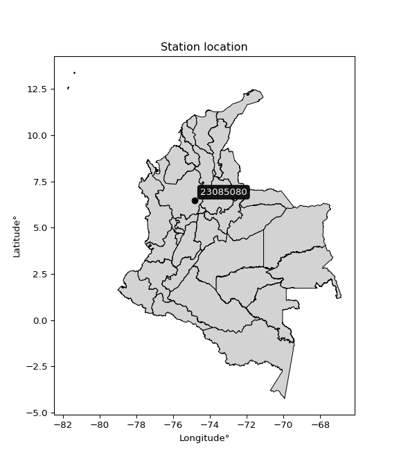

<div align="center">


</div>

# PMP Station (Rain, Pmax24h): 23085080

Probable Maximum Precipitation (PMP) is the greatest amount of rainfall for a specific duration that is meteorologically possible for a given location, acting as a "worst-case" scenario for extreme storms, crucial for designing safety-critical infrastructure like bridges, river deviations, dams, spillways, and nuclear plants to prevent catastrophic failure. PMP is calculated by hydrologists using meteorological data to determine the upper limit of extreme rainfall, often leading to the Probable Maximum Flood (PMF) for flood control design, and is increasingly being studied for climate change impacts. Probable Maximum Precipitation (PMP) is the theoretical upper limit of rainfall, a deterministic estimate for extreme events, while probability distributions (like GEV, Gumbel) describe the likelihood and frequency of various precipitation amounts, including rare ones, showing how often events occur, with PMP representing the extreme end of these distributions, used for critical infrastructure design to ensure safety against the worst conceivable weather, unlike standard statistical forecasts which cover typical probabilities.

The most common probability distributions in hydrology, used for analyzing floods, rainfall, and streamflow, include the Normal, Log-Normal, Gumbel, Gamma (including Log-Pearson Type III), and Generalized Extreme Value (GEV) distributions, often chosen based on the data´s skewness and whether modeling extremes or general conditions, with Gumbel and GEV popular for extreme events like floods, while the Normal distribution serves as a baseline, though often requiring transformations for skewed hydrological data. These distributions help in designing water infrastructure, managing water resources, and forecasting hydrologic events.

> Hydrological data often isn´t perfectly normal (it´s skewed), so different distributions are needed for different applications, such as: **Flood Frequency Analysis**: Using Gumbel, GEV, or Log-Pearson Type III for predicting extreme flood magnitudes and their return periods, **Rainfall Analysis**: Normal for annual totals, but Log-Normal, Weibull, or GEV for intensity or extreme daily rainfall, **Streamflow Modeling**: Gamma and Log-Normal for maximum flows, GEV for minimum flows, and Kappa for daily flows.

<div align="center">

</img>

</div>


## A. General information


### 1. General running parameters

• app_version: _v20260108_. • runtime: _2026-01-08 18:05:13.093906_. • Python version: _3.14.0_. • SciPy version: _1.16.3_. • Pandas version: _2.3.3_. • NumPy version: _2.3.5_. • Stations dataset (station_dataset_file): _dataset/pmax24h_in/automatic_colombia_2003_2024.csv_. • Stations catalog (station_catalog_file): _dataset/CNE.xls_. • Minimum year to eval til year_max (date_min): _1900_. • Maximum year to eval since year_min (date_max): _2024_. • Creates, save and include plots into reports (create_plot): _False_. • Plot only fit distributions with Δo > Δ (plot_only_fit): _True_. • Plot only simple graphs avoiding multiple CDFs and multiple Extreme values plots (plot_only_simple): _False_. • Eval low extreme values, if False, evaluates high extreme values (low_extreme): _False_. • Eval every SciPy distribution as logarithmic (pdist_logarithmic_on): _True_. • Standard deviation normalized (ddof): _1.0_. • Return periods to eval in years (Tr): _[2, 2.33, 5, 10, 15, 20, 25, 50, 75, 100, 200, 250, 500, 750, 1000]_. • Minimum data sample per station, 0 means any (minimum_sample): _5_. • Z-Score maximum threshold to adjust a value, 0 means disable (zscore_max): _3.5_. • Z-Score minimum threshold to adjust a value, 0 means disable (zscore_min): _-2.5_. • Avoid zeros, e.g. rain = 0 (avoid_zeros): _True_. • Avoid null values (avoid_nans): _True_. 

:file_folder:Table: [dataset.csv](../../dataset/pmax24h_in/automatic_colombia_2003_2024.csv)

> Delta Degrees of Freedom (DDOF): is a parameter used in the formulas for calculating variance and standard deviation. When ddof=0, the divisor is $N$ (the total number of observations) and this is used when your data set is the entire population. When ddof=1, the divisor is $N-1$ and this is used when your data set is a sample drawn from a larger population. Using $N-1$ provides an unbiased estimate of the population variance (known as Bessel´s correction).


### 2. Station info and location

|   id |   CODIGO | NOMBRE                                | CATEGORIA               | TECNOLOGIA                | ESTADO   | FECHA_INSTALACION   |   FECHA_SUSPENSION |   ALTITUD |   LATITUD |   LONGITUD | DEPARTAMENTO   | MUNICIPIO   | AREA_OPERATIVA                      | ENTIDAD                                                     | AREA_HIDROGRAFICA   | ZONA_HIDROGRAFICA   | SUBZONA_HIDROGRAFICA   |   CORRIENTE | Catalogo   |   Version |
|-----:|---------:|:--------------------------------------|:------------------------|:--------------------------|:---------|:--------------------|-------------------:|----------:|----------:|-----------:|:---------------|:------------|:------------------------------------|:------------------------------------------------------------|:--------------------|:--------------------|:-----------------------|------------:|:-----------|----------:|
|    0 | 23085080 | GRANJA EXPERIMENTAL EL NUS [23085080] | Climatológica Principal | Automática con Telemetría | Activa   | 15/05/1972          |                nan |       859 |   6.48358 |   -74.8367 | Antioquia      | San Roque   | Area Operativa 01 - Antioquia-Chocó | INSTITUTO DE HIDROLOGIA METEOROLOGIA Y ESTUDIOS AMBIENTALES | Magdalena Cauca     | Medio Magdalena     | Río Nare               |         nan | CNE_IDEAM  |  20251226 |

<div align="center">

Dynamic map: [:earth_americas:Google](http://maps.google.com/maps?q=6.483583333,-74.83669444) [:earth_americas:OSM](https://www.openstreetmap.org/#map=18/6.483583333/-74.83669444&layers=P) [:earth_americas:Bing](https://www.bing.com/maps?cp=6.483583333~-74.83669444&lvl=18) [:earth_americas:Apple](https://maps.apple.com/frame?center=6.483583333%2C-74.83669444&span=0.003%2C0.006)

</div>


<div align="center">

```geojson
{
  "type": "Feature",
  "geometry": {
    "type": "Point", 
    "coordinates": [-74.83669444, 6.483583333]
  }, 
  "properties": {
    "Name": "23085080"
  }
}
```

</div>


### 3. Discrete values table and plot

<div align="center">

|               |          0 |            1 |           2 |           3 |          4 |
|:--------------|-----------:|-------------:|------------:|------------:|-----------:|
| Date          | 2019       | 2020         | 2021        | 2022        | 2024       |
| Value         |  177       |   97         |   64.8      |   58.6      |   64.4     |
| Value_initial |  177       |   97         |   64.8      |   58.6      |   64.4     |
| count         |    5       |    5         |    5        |    5        |    5       |
| mean          |   92.36    |   92.36      |   92.36     |   92.36     |   92.36    |
| std           |   49.6652  |   49.6652    |   49.6652   |   49.6652   |   49.6652  |
| zscore        |    1.70421 |    0.0934257 |   -0.554916 |   -0.679752 |   -0.56297 |


</div>


> The initial value (value_initial) correspond to the initial obtained or null completed value, and value (value) is adjusted only when the initial value is outside the valid range (outlier) definite through the Z-Score value. If Z-Score is active, values out of range or outliers are replaced with the station mean value. A Z-Score (or standard score) measures how many standard deviations a data point is from the mean of a dataset, indicating its relative position; positive scores mean above the mean, negative mean below, and a score of zero is exactly at the mean, allowing for comparison of values from different distributions. It´s calculated using the formula $z=(x–μ)/σ$, where $x$ is the data point, $μ$ is the mean, and $σ$ is the standard deviation, helping identify outliers and understand probability.
>
> <sub>**Note**: In this study, "completing" (filling gaps in) and "extending" (forecasting or lengthening the historical record) rainfall data series are avoided for certain critical analyses because they introduce artificial bias and uncertainty, which can distort the statistics of rare events (extremes), alter day-to-day variability, and compromise the integrity and homogeneity of the original data. Some reasons against Completing/Extending rainfall data are: **Distortion of Extremes and Variability**: The primary issue is that most gap-filling or extension methods rely on averaging or regression with nearby stations, which inherently smooths the data. Rainfall is highly variable in space and time, with a large percentage of zero values and occasional large storms. Infilling methods often underestimate the highest values and overestimate the lowest (zero) values, which severely distorts analyses focused on flood frequency, drought severity, and intensity-duration-frequency (IDF) curves, **Loss of Data Homogeneity**: Infilled or extended data are synthetic estimates, not actual measurements. Combining these estimates with observed data can violate the assumption of data homogeneity, which requires that the data properties do not change over time. Inhomogeneity can lead to incorrect conclusions about long-term trends or changes in climate patterns, **Propagation of Errors**: Errors and biases from the original data (e.g., wind-induced undercatch, instrument errors, site changes) or the data used for imputation can propagate through the analysis, leading to unreliable hydrological models and inaccurate predictions, **Compromised Statistical Integrity**: For statistical analyses, especially those involving the frequency of events, using artificial data can introduce time bias or autocorrelation that doesn´t exist in reality, making it difficult to assess the true probability of events, **Difficulty in Validation**: It is difficult to accurately validate the quality of filled or extended data, especially for past periods where ground-truth measurements are unavailable. The reliability of imputation techniques heavily depends on the density of the surrounding station network and the complexity of the local topography.</sub>


### 4. Active continuous probability distributions from SciPy (43 of 104 available)

A Probability Density Function (PDF) describes the relative likelihood of a continuous random variable falling within a specific range, where the total area under its curve equals 1, and the area over any interval gives the actual probability for that range. Unlike discrete probabilities (like rolling a die), a PDF shows density, not direct probability for a single point (which is zero), with higher points indicating higher likelihood, often visualized as a bell curve for normal distributions.

A log of a probability density function (log-PDF) is simply the logarithm of the PDF´s value, denoted as $log(f(x))$, useful for converting multiplication of probabilities into addition, improving numerical stability with tiny numbers, and connecting to information theory concepts like entropy. Instead of dealing with very small probabilities (e.g., 0.000001), log-PDFs use negative numbers (e.g., $log(0.00001) ≈ -11.51$ that are easier for computers to handle, preventing underflow errors and simplifying complex calculations. In this study, each active probability distribution from SciPy is also evaluated in the $log$ form.

[scipy.stats](https://docs.scipy.org/doc/scipy/reference/stats.html) is a Python´s powerful submodule within the SciPy library for comprehensive statistical analysis, offering over 130 probability distributions (like Normal, Poisson), functions for descriptive stats (mean, variance), hypothesis testing (t-tests, chi-square), random variable generation, and statistical tests, making it essential for data science, modeling, and research. It provides tools to explore, model, and draw conclusions from data efficiently, working seamlessly with NumPy.

<div align="center">

|   id | p_dist             |   n_parameter | fit_method   | label                                                                       | active   | ref                                                                                                        |
|-----:|:-------------------|--------------:|:-------------|:----------------------------------------------------------------------------|:---------|:-----------------------------------------------------------------------------------------------------------|
|    0 | alpha              |             3 | MLE          | Alpha                                                                       | True     | [:mortar_board:](https://docs.scipy.org/doc/scipy/reference/generated/scipy.stats.alpha.html)              |
|    1 | betaprime          |             4 | MLE          | Beta prime                                                                  | True     | [:mortar_board:](https://docs.scipy.org/doc/scipy/reference/generated/scipy.stats.betaprime.html)          |
|    2 | chi2               |             3 | MLE          | Chi²                                                                        | True     | [:mortar_board:](https://docs.scipy.org/doc/scipy/reference/generated/scipy.stats.chi2.html)               |
|    3 | crystalball        |             4 | MLE          | Crystalball                                                                 | True     | [:mortar_board:](https://docs.scipy.org/doc/scipy/reference/generated/scipy.stats.crystalball.html)        |
|    4 | erlang             |             3 | MLE          | Erlang                                                                      | True     | [:mortar_board:](https://docs.scipy.org/doc/scipy/reference/generated/scipy.stats.erlang.html)             |
|    5 | expon              |             2 | MLE          | Exponential                                                                 | True     | [:mortar_board:](https://docs.scipy.org/doc/scipy/reference/generated/scipy.stats.expon.html)              |
|    6 | exponnorm          |             3 | MLE          | Exponentially modified Normal                                               | True     | [:mortar_board:](https://docs.scipy.org/doc/scipy/reference/generated/scipy.stats.exponnorm.html)          |
|    7 | f                  |             4 | MLE          | F                                                                           | True     | [:mortar_board:](https://docs.scipy.org/doc/scipy/reference/generated/scipy.stats.f.html)                  |
|    8 | fatiguelife        |             3 | MLE          | Fatigue-life (Birnbaum-Saunders)                                            | True     | [:mortar_board:](https://docs.scipy.org/doc/scipy/reference/generated/scipy.stats.fatiguelife.html)        |
|    9 | fisk               |             3 | MLE          | Fisk                                                                        | True     | [:mortar_board:](https://docs.scipy.org/doc/scipy/reference/generated/scipy.stats.fisk.html)               |
|   10 | gamma              |             3 | MLE          | Gamma                                                                       | True     | [:mortar_board:](https://docs.scipy.org/doc/scipy/reference/generated/scipy.stats.gamma.html)              |
|   11 | genexpon           |             5 | MLE          | Generalized exponential                                                     | True     | [:mortar_board:](https://docs.scipy.org/doc/scipy/reference/generated/scipy.stats.genexpon.html)           |
|   12 | genlogistic        |             3 | MLE          | Generalized logistic                                                        | True     | [:mortar_board:](https://docs.scipy.org/doc/scipy/reference/generated/scipy.stats.genlogistic.html)        |
|   13 | gibrat             |             2 | MM           | Gibrat                                                                      | True     | [:mortar_board:](https://docs.scipy.org/doc/scipy/reference/generated/scipy.stats.gibrat.html)             |
|   14 | gompertz           |             3 | MLE          | Gompertz (or truncated Gumbel)                                              | True     | [:mortar_board:](https://docs.scipy.org/doc/scipy/reference/generated/scipy.stats.gompertz.html)           |
|   15 | gumbel_l           |             2 | MM           | Gumbel Left Skew                                                            | True     | [:mortar_board:](https://docs.scipy.org/doc/scipy/reference/generated/scipy.stats.gumbel_l.html)           |
|   16 | gumbel_r           |             2 | MM           | Gumbel Right Skew                                                           | True     | [:mortar_board:](https://docs.scipy.org/doc/scipy/reference/generated/scipy.stats.gumbel_r.html)           |
|   17 | halflogistic       |             2 | MM           | Half-logistic                                                               | True     | [:mortar_board:](https://docs.scipy.org/doc/scipy/reference/generated/scipy.stats.halflogistic.html)       |
|   18 | halfnorm           |             2 | MM           | Half Normal                                                                 | True     | [:mortar_board:](https://docs.scipy.org/doc/scipy/reference/generated/scipy.stats.halfnorm.html)           |
|   19 | hypsecant          |             2 | MM           | hyperbolic secant                                                           | True     | [:mortar_board:](https://docs.scipy.org/doc/scipy/reference/generated/scipy.stats.hypsecant.html)          |
|   20 | invgamma           |             3 | MLE          | Inverted gamma                                                              | True     | [:mortar_board:](https://docs.scipy.org/doc/scipy/reference/generated/scipy.stats.invgamma.html)           |
|   21 | invgauss           |             3 | MLE          | Inverse Gaussian                                                            | True     | [:mortar_board:](https://docs.scipy.org/doc/scipy/reference/generated/scipy.stats.invgauss.html)           |
|   22 | invweibull         |             3 | MLE          | Inverted Weibull                                                            | True     | [:mortar_board:](https://docs.scipy.org/doc/scipy/reference/generated/scipy.stats.invweibull.html)         |
|   23 | kstwobign          |             2 | MLE          | Limiting distribution of scaled Kolmogorov-Smirnov two-sided test statistic | True     | [:mortar_board:](https://docs.scipy.org/doc/scipy/reference/generated/scipy.stats.kstwobign.html)          |
|   24 | laplace            |             2 | MM           | Laplace                                                                     | True     | [:mortar_board:](https://docs.scipy.org/doc/scipy/reference/generated/scipy.stats.laplace.html)            |
|   25 | laplace_asymmetric |             3 | MLE          | Asymmetric Laplace                                                          | True     | [:mortar_board:](https://docs.scipy.org/doc/scipy/reference/generated/scipy.stats.laplace_asymmetric.html) |
|   26 | loggamma           |             3 | MLE          | Log gamma                                                                   | True     | [:mortar_board:](https://docs.scipy.org/doc/scipy/reference/generated/scipy.stats.loggamma.html)           |
|   27 | logistic           |             2 | MM           | Logistic (or Sech-squared)                                                  | True     | [:mortar_board:](https://docs.scipy.org/doc/scipy/reference/generated/scipy.stats.logistic.html)           |
|   28 | lognorm            |             3 | MLE          | Log Normal                                                                  | True     | [:mortar_board:](https://docs.scipy.org/doc/scipy/reference/generated/scipy.stats.lognorm.html)            |
|   29 | maxwell            |             2 | MM           | Maxwell                                                                     | True     | [:mortar_board:](https://docs.scipy.org/doc/scipy/reference/generated/scipy.stats.maxwell.html)            |
|   30 | mielke             |             4 | MLE          | Mielke Beta-Kappa / Dagum                                                   | True     | [:mortar_board:](https://docs.scipy.org/doc/scipy/reference/generated/scipy.stats.mielke.html)             |
|   31 | moyal              |             2 | MM           | Moyal                                                                       | True     | [:mortar_board:](https://docs.scipy.org/doc/scipy/reference/generated/scipy.stats.moyal.html)              |
|   32 | nakagami           |             3 | MLE          | Nakagami                                                                    | True     | [:mortar_board:](https://docs.scipy.org/doc/scipy/reference/generated/scipy.stats.nakagami.html)           |
|   33 | ncf                |             5 | MLE          | Non-central F distribution                                                  | True     | [:mortar_board:](https://docs.scipy.org/doc/scipy/reference/generated/scipy.stats.ncf.html)                |
|   34 | nct                |             4 | MLE          | Non-central Student’s t                                                     | True     | [:mortar_board:](https://docs.scipy.org/doc/scipy/reference/generated/scipy.stats.nct.html)                |
|   35 | norm               |             2 | MM           | Normal                                                                      | True     | [:mortar_board:](https://docs.scipy.org/doc/scipy/reference/generated/scipy.stats.norm.html)               |
|   36 | pearson3           |             3 | MM           | Pearson type III                                                            | True     | [:mortar_board:](https://docs.scipy.org/doc/scipy/reference/generated/scipy.stats.pearson3.html)           |
|   37 | rayleigh           |             2 | MM           | Rayleigh                                                                    | True     | [:mortar_board:](https://docs.scipy.org/doc/scipy/reference/generated/scipy.stats.rayleigh.html)           |
|   38 | rice               |             3 | MLE          | Rice                                                                        | True     | [:mortar_board:](https://docs.scipy.org/doc/scipy/reference/generated/scipy.stats.rice.html)               |
|   39 | t                  |             3 | MLE          | Student’s t                                                                 | True     | [:mortar_board:](https://docs.scipy.org/doc/scipy/reference/generated/scipy.stats.t.html)                  |
|   40 | truncnorm          |             4 | MLE          | Truncated normal                                                            | True     | [:mortar_board:](https://docs.scipy.org/doc/scipy/reference/generated/scipy.stats.truncnorm.html)          |
|   41 | wald               |             2 | MM           | Wald                                                                        | True     | [:mortar_board:](https://docs.scipy.org/doc/scipy/reference/generated/scipy.stats.wald.html)               |
|   42 | weibull_min        |             3 | MLE          | Weibull minimum                                                             | True     | [:mortar_board:](https://docs.scipy.org/doc/scipy/reference/generated/scipy.stats.weibull_min.html)        |

</div>

> **n_parameter:** # arguments & localization & scale.
>
> **Fit methods:** (MLE) maximum likelihood, (MM) L-moments.
>
>**Inactive** (With the only purpose of prevent loops, zero divisions, infinite values, over high estimated values or horizontal trending for recurrence intervals estimations, the follow distributions were disabled.)**:** foldnorm, gennorm, norminvgauss, powernorm, powerlognorm, skewnorm, genextreme, anglit, arcsine, argus, beta, bradford, burr, burr12, cauchy, cosine, halfcauchy, foldcauchy, skewcauchy, wrapcauchy, dgamma, gengamma, exponweib, exponpow, truncexpon, gausshyper, genhalflogistic, genhyperbolic, geninvgauss, halfgennorm, johnsonsb, johnsonsu, kappa4, kappa3, ksone, kstwo, loglaplace, levy, levy_l, levy_stable, ncx2, pareto, genpareto, truncpareto, lomax, powerlaw, rdist, rel_breitwigner, recipinvgauss, semicircular, studentized_range, trapezoid, triang, truncweibull_min, tukeylambda, uniform, loguniform, vonmises, vonmises_line, weibull_max, dweibull, 


## B. Probability (PDF) vs. Empirical (EDF) distributions functions

A continuous probability distribution (CPD) describes probabilities for variables that can take any value within a range (like rain any time), unlike discrete variables with specific outcomes (like temperature). It uses a Probability Density Function (PDF), a curve where the total area under it equals 1, and the probability of the variable falling within an interval (a to b) is found by calculating the area under the curve between those points. A key feature is that the probability of hitting any single exact value is zero, so probabilities are always expressed for ranges, e.g., $P(a ≤ X ≤ b)$.

<div align="center">

Distributions parameters from station values
|    |   station | p_dist                |   n |             loc |          scale | shape                  | shape1                | shape2                | shape3   |
|---:|----------:|:----------------------|----:|----------------:|---------------:|:-----------------------|:----------------------|:----------------------|:---------|
|  0 |  23085080 | alpha                 |   5 |      53.4897    |    9.52552     | 5.0338687696962334e-09 |                       |                       |          |
|  1 |  23085080 | betaprime             |   5 |      -1.15983   |    2.27474     | 254.29678830458556     | 7.261533823902745     |                       |          |
|  2 |  23085080 | chi2                  |   5 |      58.6       |   35.8458      | 0.6517903049235784     |                       |                       |          |
|  3 |  23085080 | crystalball           |   5 |      92.36      |   44.4219      | 6632.176374041265      | 5505.402310040493     |                       |          |
|  4 |  23085080 | erlang                |   5 |      58.6       |   38.0232      | 0.5683378962816679     |                       |                       |          |
|  5 |  23085080 | expon                 |   5 |      58.6       |   33.76        |                        |                       |                       |          |
|  6 |  23085080 | exponnorm             |   5 |      58.5586    |    0.0128786   | 2625.322858922534      |                       |                       |          |
|  7 |  23085080 | f                     |   5 |      56.9402    |    5.57571     | 5604.823664296401      | 1.3591202293951086    |                       |          |
|  8 |  23085080 | fatiguelife           |   5 |      58.6       |    4.07484e-06 | 3041.130772248209      |                       |                       |          |
|  9 |  23085080 | fisk                  |   5 |      58.6       |   37.2329      | 0.7960138616144472     |                       |                       |          |
| 10 |  23085080 | gamma                 |   5 |      58.6       |   37.2275      | 0.13239935398855646    |                       |                       |          |
| 11 |  23085080 | genexpon              |   5 |      58.6       |  277.285       | 8.213423837844568      | 8.943839017657336e-12 | 0.8636751260096143    |          |
| 12 |  23085080 | genlogistic           |   5 |    -134.925     |   26.7203      | 2452.864319093507      |                       |                       |          |
| 13 |  23085080 | gibrat                |   5 |      58.4717    |   20.5543      |                        |                       |                       |          |
| 14 |  23085080 | gompertz              |   5 |      58.6       |    1.83352e+06 | 54287.591284235416     |                       |                       |          |
| 15 |  23085080 | gumbel_l              |   5 |     112.352     |   34.6356      |                        |                       |                       |          |
| 16 |  23085080 | gumbel_r              |   5 |      72.3678    |   34.6356      |                        |                       |                       |          |
| 17 |  23085080 | halflogistic          |   5 |      39.7098    |   37.9791      |                        |                       |                       |          |
| 18 |  23085080 | halfnorm              |   5 |      33.5629    |   73.6913      |                        |                       |                       |          |
| 19 |  23085080 | hypsecant             |   5 |      92.36      |   28.2798      |                        |                       |                       |          |
| 20 |  23085080 | invgamma              |   5 |      56.9395    |    3.78888     | 0.6795629755007111     |                       |                       |          |
| 21 |  23085080 | invgauss              |   5 |      57.1216    |    5.98409     | 5.888694365308963      |                       |                       |          |
| 22 |  23085080 | invweibull            |   5 |      58.6       |    1.28871     | 0.044831527593810885   |                       |                       |          |
| 23 |  23085080 | kstwobign             |   5 |     -25.0948    |  136.204       |                        |                       |                       |          |
| 24 |  23085080 | laplace               |   5 |      92.36      |   31.411       |                        |                       |                       |          |
| 25 |  23085080 | laplace_asymmetric    |   5 |      58.6       |    0.00194348  | 5.757304057197709e-05  |                       |                       |          |
| 26 |  23085080 | loggamma              |   5 |  -15830.5       | 2089.96        | 2036.3746573965882     |                       |                       |          |
| 27 |  23085080 | logistic              |   5 |      92.36      |   24.4911      |                        |                       |                       |          |
| 28 |  23085080 | lognorm               |   5 |      58.6       |    0.0163312   | 14.277163451446066     |                       |                       |          |
| 29 |  23085080 | maxwell               |   5 |     -12.9012    |   65.9627      |                        |                       |                       |          |
| 30 |  23085080 | mielke                |   5 |      47.5714    |    0.646774    | 446.2196807104067      | 1.6637458566996486    |                       |          |
| 31 |  23085080 | moyal                 |   5 |      66.9567    |   19.9969      |                        |                       |                       |          |
| 32 |  23085080 | nakagami              |   5 |      58.6       |   61.2643      | 0.05342634025529583    |                       |                       |          |
| 33 |  23085080 | ncf                   |   5 |      -0.0216972 |    4.87988e-05 | 2.3026320431254143e-06 | 6.0475251603359       | 3.051851098448494     |          |
| 34 |  23085080 | nct                   |   5 |      -0.312794  |    1.2336      | 4.322774288378948      | 60.42693562205273     |                       |          |
| 35 |  23085080 | norm                  |   5 |      92.36      |   44.4219      |                        |                       |                       |          |
| 36 |  23085080 | pearson3              |   5 |      92.36      |   44.4219      | 1.1982519409317507     |                       |                       |          |
| 37 |  23085080 | rayleigh              |   5 |       7.37837   |   67.8055      |                        |                       |                       |          |
| 38 |  23085080 | rice                  |   5 |      26.4417    |   56.2073      | 0.0011191213004186963  |                       |                       |          |
| 39 |  23085080 | t                     |   5 |      92.3541    |   44.4176      | 9053.083928879518      |                       |                       |          |
| 40 |  23085080 | truncnorm             |   5 | -152488         | 2600.87        | 58.65194443428396      | 67352.94731116631     |                       |          |
| 41 |  23085080 | wald                  |   5 |      47.9381    |   44.4219      |                        |                       |                       |          |
| 42 |  23085080 | weibull_min           |   5 |      58.6       |   38.5946      | 0.13468353764254853    |                       |                       |          |
| 43 |  23085080 | logalpha              |   5 |       3.99406   |    0.145333    | 0.00447454547645643    |                       |                       |          |
| 44 |  23085080 | logbetaprime          |   5 |      -2.26949   |    2.49659     | 903.6948682417797      | 337.8121773247117     |                       |          |
| 45 |  23085080 | logchi2               |   5 |       4.07073   |    0.980917    | 1.0584061287542972     |                       |                       |          |
| 46 |  23085080 | logcrystalball        |   5 |       4.4316    |    0.410811    | 7.9299447303849835     | 6.451406855180034     |                       |          |
| 47 |  23085080 | logerlang             |   5 |       4.07073   |    0.252928    | 0.6140926303604695     |                       |                       |          |
| 48 |  23085080 | logexpon              |   5 |       4.07073   |    0.360868    |                        |                       |                       |          |
| 49 |  23085080 | logexponnorm          |   5 |       4.07037   |    0.00011321  | 3186.0572373780833     |                       |                       |          |
| 50 |  23085080 | logf                  |   5 |       4.02773   |    0.124598    | 1153.6719774424575     | 2.0036499087968407    |                       |          |
| 51 |  23085080 | logfatiguelife        |   5 |       4.07073   |    1.09077e-06 | 699.3381750588226      |                       |                       |          |
| 52 |  23085080 | logfisk               |   5 |       4.07073   |    0.31432     | 0.365094372849096      |                       |                       |          |
| 53 |  23085080 | loggamma              |   5 |       4.07073   |    0.239824    | 0.8990893380406835     |                       |                       |          |
| 54 |  23085080 | loggenexpon           |   5 |       4.07073   |    0.469392    | 1.3002768792787        | 0.5268308476447643    | 1.119361391162357e-05 |          |
| 55 |  23085080 | loggenlogistic        |   5 |       2.20582   |    0.270332    | 1927.2588216792465     |                       |                       |          |
| 56 |  23085080 | loggibrat             |   5 |       4.11816   |    0.19011     |                        |                       |                       |          |
| 57 |  23085080 | loggompertz           |   5 |       4.07073   |    6.43971e+11 | 1732955351489.3647     |                       |                       |          |
| 58 |  23085080 | loggumbel_l           |   5 |       4.61649   |    0.320308    |                        |                       |                       |          |
| 59 |  23085080 | loggumbel_r           |   5 |       4.24672   |    0.320308    |                        |                       |                       |          |
| 60 |  23085080 | loghalflogistic       |   5 |       3.9447    |    0.351229    |                        |                       |                       |          |
| 61 |  23085080 | loghalfnorm           |   5 |       3.88785   |    0.681492    |                        |                       |                       |          |
| 62 |  23085080 | loghypsecant          |   5 |       4.4316    |    0.26153     |                        |                       |                       |          |
| 63 |  23085080 | loginvgamma           |   5 |       4.02763   |    0.124813    | 1.0018008699988132     |                       |                       |          |
| 64 |  23085080 | loginvgauss           |   5 |       4.0413    |    0.125967    | 3.0984258598364463     |                       |                       |          |
| 65 |  23085080 | loginvweibull         |   5 |       4.04076   |    0.10462     | 0.8626141468167519     |                       |                       |          |
| 66 |  23085080 | logkstwobign          |   5 |       3.28589   |    1.32119     |                        |                       |                       |          |
| 67 |  23085080 | loglaplace            |   5 |       4.4316    |    0.290487    |                        |                       |                       |          |
| 68 |  23085080 | loglaplace_asymmetric |   5 |       4.07073   |    6.2132e-05  | 0.0001721883499437647  |                       |                       |          |
| 69 |  23085080 | logloggamma           |   5 |     -85.6676    |   13.0569      | 993.1598928643928      |                       |                       |          |
| 70 |  23085080 | loglogistic           |   5 |       4.4316    |    0.226492    |                        |                       |                       |          |
| 71 |  23085080 | loglognorm            |   5 |       4.07073   |    0.00034226  | 13.372078210828457     |                       |                       |          |
| 72 |  23085080 | logmaxwell            |   5 |       3.45815   |    0.610019    |                        |                       |                       |          |
| 73 |  23085080 | logmielke             |   5 |       4.04409   |    0.00528133  | 12.561074310526756     | 0.8894178853355443    |                       |          |
| 74 |  23085080 | logmoyal              |   5 |       4.19668   |    0.18493     |                        |                       |                       |          |
| 75 |  23085080 | lognakagami           |   5 |       4.07073   |    0.788206    | 0.1938223990511903     |                       |                       |          |
| 76 |  23085080 | logncf                |   5 |       3.82498   |    0.238237    | 198.6780915896619      | 5.728090449503057     | 126.48944001101525    |          |
| 77 |  23085080 | lognct                |   5 |       0.191439  |    0.0685756   | 62.9832655896993       | 61.02878586791702     |                       |          |
| 78 |  23085080 | lognorm               |   5 |       4.4316    |    0.410811    |                        |                       |                       |          |
| 79 |  23085080 | logpearson3           |   5 |       4.4316    |    0.41081     | 0.958094291522868      |                       |                       |          |
| 80 |  23085080 | lograyleigh           |   5 |       3.6457    |    0.627061    |                        |                       |                       |          |
| 81 |  23085080 | logrice               |   5 |       3.79926   |    0.533209    | 0.0012215608372600998  |                       |                       |          |
| 82 |  23085080 | logt                  |   5 |       4.4316    |    0.410811    | 20767819293.724022     |                       |                       |          |
| 83 |  23085080 | logtruncnorm          |   5 |      -3.81743   |    1.71548     | 4.596177130026867      | 5.243325142567272     |                       |          |
| 84 |  23085080 | logwald               |   5 |       4.02079   |    0.410811    |                        |                       |                       |          |
| 85 |  23085080 | logweibull_min        |   5 |       4.07073   |    0.250554    | 0.7779179576670192     |                       |                       |          |

</div>

> **loc** (Location parameter): This shifts the distribution along the x-axis. For many common distributions, like the normal (Gaussian) distribution, loc represents the mean $μ$. For others, like the uniform distribution, it might represent the minimum value, or for the beta distribution, the left end of the support interval.
>
> **scale** (Scale parameter): This determines the width or spread of the distribution. For the normal distribution, scale represents the standard deviation $σ$. For a uniform distribution, it defines the length of the interval (from $loc$ to $loc + scale$).
>
> **shape** (Shape parameters): Refers to parameters that define the specific form of a probability distribution, distinct from its location (loc) and scale (scale). These parameters are required arguments for most distribution functions. For example, a normal (Gaussian) distribution is fully defined by its location (mean) and scale (standard deviation), so it has no specific shape parameters beyond loc and scale. However, other distributions have intrinsic properties that need specification, as Gamma distribution that takes a shape parameter, often named $a$ or $alpha$.


### 0. Cumulative distribution values - CDF (86 evaluated)

Cumulative Distribution Function (CDF), denoted as $F$<sub>$X$</sub>$(x)$, is a function that gives the probability that a random variable $X$ will take a value less than or equal to a specific value, $x$ (i.e., $(P(X≥x)$. It essentially "accumulates" probabilities from a given point up to the far right (positive infinity), providing a complete picture of the distribution´s probabilities for both discrete (like rain) and continuous (like temperature) variables, helping to find probabilities over ranges or above certain values. Each station is evaluated separately ordering the $x$ values ascending, calculating the CDF and PDF values for the activated distributions and their logarithmic forms.

<div align="center">

CDF ordered by x ascending and calculating $log(f(x))$ separately
|   id |   Station |   date |     x |   count |   mean |     std |     zscore |   Value_initial |   station |   m |     alpha |   alpha_pdf |   betaprime |   betaprime_pdf |        chi2 |    chi2_pdf |   crystalball |   crystalball_pdf |     erlang |      erlang_pdf |    expon |   expon_pdf |   exponnorm |   exponnorm_pdf |         f |       f_pdf |   fatiguelife |   fatiguelife_pdf |        fisk |    fisk_pdf |      gamma |   gamma_pdf |    genexpon |   genexpon_pdf |   genlogistic |   genlogistic_pdf |      gibrat |   gibrat_pdf |    gompertz |   gompertz_pdf |   gumbel_l |   gumbel_l_pdf |   gumbel_r |   gumbel_r_pdf |   halflogistic |   halflogistic_pdf |   halfnorm |   halfnorm_pdf |   hypsecant |   hypsecant_pdf |   invgamma |   invgamma_pdf |   invgauss |   invgauss_pdf |   invweibull |   invweibull_pdf |   kstwobign |   kstwobign_pdf |   laplace |   laplace_pdf |   laplace_asymmetric |   laplace_asymmetric_pdf |    loggamma |   loggamma_pdf |   logistic |   logistic_pdf |   lognorm |   lognorm_pdf |   maxwell |   maxwell_pdf |   mielke |   mielke_pdf |    moyal |   moyal_pdf |   nakagami |   nakagami_pdf |      ncf |    ncf_pdf |      nct |     nct_pdf |     norm |   norm_pdf |   pearson3 |   pearson3_pdf |   rayleigh |   rayleigh_pdf |     rice |   rice_pdf |        t |      t_pdf |   truncnorm |   truncnorm_pdf |     wald |    wald_pdf |   weibull_min |   weibull_min_pdf |   logalpha |   logalpha_pdf |   logbetaprime |   logbetaprime_pdf |     logchi2 |   logchi2_pdf |   logcrystalball |   logcrystalball_pdf |   logerlang |   logerlang_pdf |   logexpon |   logexpon_pdf |   logexponnorm |   logexponnorm_pdf |      logf |   logf_pdf |   logfatiguelife |   logfatiguelife_pdf |    logfisk |   logfisk_pdf |   loggenexpon |   loggenexpon_pdf |   loggenlogistic |   loggenlogistic_pdf |   loggibrat |   loggibrat_pdf |   loggompertz |   loggompertz_pdf |   loggumbel_l |   loggumbel_l_pdf |   loggumbel_r |   loggumbel_r_pdf |   loghalflogistic |   loghalflogistic_pdf |   loghalfnorm |   loghalfnorm_pdf |   loghypsecant |   loghypsecant_pdf |   loginvgamma |   loginvgamma_pdf |   loginvgauss |   loginvgauss_pdf |   loginvweibull |   loginvweibull_pdf |   logkstwobign |   logkstwobign_pdf |   loglaplace |   loglaplace_pdf |   loglaplace_asymmetric |   loglaplace_asymmetric_pdf |   logloggamma |   logloggamma_pdf |   loglogistic |   loglogistic_pdf |   loglognorm |   loglognorm_pdf |   logmaxwell |   logmaxwell_pdf |   logmielke |   logmielke_pdf |   logmoyal |   logmoyal_pdf |   lognakagami |   lognakagami_pdf |   logncf |   logncf_pdf |   lognct |   lognct_pdf |   logpearson3 |   logpearson3_pdf |   lograyleigh |   lograyleigh_pdf |   logrice |   logrice_pdf |     logt |   logt_pdf |   logtruncnorm |   logtruncnorm_pdf |   logwald |   logwald_pdf |   logweibull_min |   logweibull_min_pdf |
|-----:|----------:|-------:|------:|--------:|-------:|--------:|-----------:|----------------:|----------:|----:|----------:|------------:|------------:|----------------:|------------:|------------:|--------------:|------------------:|-----------:|----------------:|---------:|------------:|------------:|----------------:|----------:|------------:|--------------:|------------------:|------------:|------------:|-----------:|------------:|------------:|---------------:|--------------:|------------------:|------------:|-------------:|------------:|---------------:|-----------:|---------------:|-----------:|---------------:|---------------:|-------------------:|-----------:|---------------:|------------:|----------------:|-----------:|---------------:|-----------:|---------------:|-------------:|-----------------:|------------:|----------------:|----------:|--------------:|---------------------:|-------------------------:|------------:|---------------:|-----------:|---------------:|----------:|--------------:|----------:|--------------:|---------:|-------------:|---------:|------------:|-----------:|---------------:|---------:|-----------:|---------:|------------:|---------:|-----------:|-----------:|---------------:|-----------:|---------------:|---------:|-----------:|---------:|-----------:|------------:|----------------:|---------:|------------:|--------------:|------------------:|-----------:|---------------:|---------------:|-------------------:|------------:|--------------:|-----------------:|---------------------:|------------:|----------------:|-----------:|---------------:|---------------:|-------------------:|----------:|-----------:|-----------------:|---------------------:|-----------:|--------------:|--------------:|------------------:|-----------------:|---------------------:|------------:|----------------:|--------------:|------------------:|--------------:|------------------:|--------------:|------------------:|------------------:|----------------------:|--------------:|------------------:|---------------:|-------------------:|--------------:|------------------:|--------------:|------------------:|----------------:|--------------------:|---------------:|-------------------:|-------------:|-----------------:|------------------------:|----------------------------:|--------------:|------------------:|--------------:|------------------:|-------------:|-----------------:|-------------:|-----------------:|------------:|----------------:|-----------:|---------------:|--------------:|------------------:|---------:|-------------:|---------:|-------------:|--------------:|------------------:|--------------:|------------------:|----------:|--------------:|---------:|-----------:|---------------:|-------------------:|----------:|--------------:|-----------------:|---------------------:|
|    0 |  23085080 |   2022 |  58.6 |       5 |  92.36 | 49.6652 | -0.679752  |            58.6 |  23085080 |   1 | 0.0623248 | 0.051224    |    0.180068 |     0.0127357   | 6.80977e-06 | 3.12335e+08 |      0.223631 |        0.00672812 | 1.2923e-09 | 103367          | 0        | 0.0296209   |   0.0012224 |     0.0295209   | 0.0531995 | 0.0808887   |     0.0502996 |       5.20584e+11 | 3.07037e-13 | 34.397      | 0.00883238 | 1.64579e+11 | 3.15703e-15 |    0.0296209   |      0.173044 |       0.0113564   | 1.92174e-07 |  7.88033e-06 | 2.84435e-13 |    0.0296085   |   0.190904 |    0.00494858  |   0.2258   |     0.00970141 |       0.243689 |         0.0123833  |   0.265961 |     0.0102202  |    0.18734  |      0.00624864 |  0.0531995 |    0.0808877   |  0.0522815 |    0.08472     |    0.0128109 |      3.52214e+11 |    0.155453 |      0.0102799  |  0.170686 |    0.00543396 |          3.39889e-09 |               0.0296237  | 1.10144e-13 |    111.497     |   0.201256 |     0.0065637  |  0.189855 |      0.660251 |  0.240989 |    0.00789821 |      nan |          nan | 0.217806 |  0.0115053  |  0.0174447 |    2.62337e+11 | 0.566536 | 0.0042311  | 0.166394 | 0.0144483   | 0.223631 | 0.00672812 |   0.2384   |     0.0104723  |   0.248233 |     0.00837541 | 0.150978 | 0.00864224 | 0.223659 | 0.00672874 |  3.1921e-05 |      0.0225567  | 0.102428 | 0.0229302   |    0.00757032 |       1.42951e+11 |  0.0584226 |       3.28845  |       0.20374  |           0.705452 | 8.54364e-09 |   5.09056e+06 |         0.189855 |             0.660251 | 1.48487e-09 |     1.02665e+06 |   0        |       2.77109  |      0.0010205 |           2.76803  | 0.0554591 |  3.72332   |        0.0433801 |          1.03658e+11 | 4.8785e-06 |   2.00535e+09 |   4.95982e-07 |          2.77013  |         0.143131 |             1.02876  |    0        |       0         |   4.78026e-15 |          2.69105  |      0.166384 |         0.473618  |      0.176888 |          0.956618 |          0.177523 |              1.37871  |      0.211576 |          1.12938  |       0.156929 |           0.576027 |     0.0554653 |         3.72373   |     0.0527592 |          4.50089  |       0.0528976 |           4.47437   |       0.127932 |           0.976711 |     0.144362 |         0.496964 |             1.06551e-05 |                    2.7713   |      0.192383 |          0.65385  |      0.168921 |          0.619831 |    0.0230209 |      4.59147e+12 |     0.200785 |         0.79664  |   0.0495516 |       4.47747   |   0.159824 |       1.12908  |   1.26942e-06 |       5.54038e+08 | 0.155154 |     1.86474  | 0.180129 |     0.782635 |      0.18989  |          0.952803 |      0.205245 |          0.859091 |  0.121561 |      0.838777 | 0.189855 |   0.66025  |       0.010229 |           2.87518  | 0.0106687 |      0.958821 |      5.73816e-12 |         5025.81      |
|    1 |  23085080 |   2024 |  64.4 |       5 |  92.36 | 49.6652 | -0.56297   |            64.4 |  23085080 |   2 | 0.382622  | 0.0436146   |    0.257691 |     0.0138604   | 0.483398    | 0.0255472   |      0.264537 |        0.00736692 | 0.365402   |      0.0324532  | 0.157853 | 0.0249451   |   0.158667  |     0.0248838   | 0.42573   | 0.0382229   |     0.652583  |       0.0124927   | 0.185419    |  0.0207291  | 0.817963   | 0.0162626   | 0.157853    |    0.0249451   |      0.24365  |       0.0128719   | 0.106872    |  0.0310669   | 0.157793    |    0.0249365   |   0.221553 |    0.00562905  |   0.284035 |     0.0103218  |       0.314066 |         0.0118666  |   0.324392 |     0.00991971 |    0.22676  |      0.00735722 |  0.425728  |    0.038223    |  0.428301  |    0.0383668   |    0.392669  |      0.00283724  |    0.21901  |      0.0115387  |  0.2053   |    0.00653594 |          0.157867    |               0.0249471  | 0.37574     |      2.89029   |   0.242019 |     0.00749032 |  0.258269 |      0.786851 |  0.288203 |    0.00835992 |      nan |          nan | 0.286417 |  0.0120489  |  0.683949  |    0.0125946   | 0.590268 | 0.00395558 | 0.255056 | 0.0158437   | 0.264537 | 0.00736692 |   0.299969 |     0.0107024  |   0.297848 |     0.00870844 | 0.203902 | 0.00956506 | 0.264569 | 0.00736764 |  0.122666   |      0.0197912  | 0.240567 | 0.0233264   |    0.539165   |       0.00829037  |  0.396609  |       2.763    |       0.275878 |           0.818814 | 0.222463    |   1.20864     |         0.258269 |             0.786851 | 0.532361    |     2.73204     |   0.230129 |       2.13338  |      0.231013  |           2.13197  | 0.404191  |  2.66598   |        0.66298   |          0.813726    | 0.391921   |   0.921911    |   0.23006     |          2.13284  |         0.253773 |             1.28686  |    0.080991 |       3.19579   |   0.224291    |          2.08747  |      0.216779 |         0.597464  |      0.275228 |          1.10858  |          0.303872 |              1.29212  |      0.315879 |          1.07779  |       0.220534 |           0.777384 |     0.404212  |         2.66597   |     0.420907  |          2.56396  |       0.422522  |           2.52501   |       0.232341 |           1.20804  |     0.199781 |         0.687744 |             0.230155    |                    2.13349  |      0.260045 |          0.777537 |      0.235665 |          0.795291 |    0.662845  |      0.289392    |     0.281071 |         0.897539 |   0.429317  |       2.58961   |   0.276119 |       1.29839  |   0.347265    |       1.42301     | 0.336437 |     1.85384  | 0.261421 |     0.932466 |      0.285489 |          1.05779  |      0.29041  |          0.937352 |  0.209739 |      1.01691  | 0.258269 |   0.786851 |       0.249868 |           2.22915  | 0.220433  |      2.56233  |      0.373676    |            2.41546   |
|    2 |  23085080 |   2021 |  64.8 |       5 |  92.36 | 49.6652 | -0.554916  |            64.8 |  23085080 |   3 | 0.399677  | 0.0416732   |    0.263243 |     0.0139013   | 0.49336     | 0.0242882   |      0.267492 |        0.0074085  | 0.378129   |      0.0312023  | 0.167772 | 0.0246513   |   0.168562  |     0.0245911   | 0.440553  | 0.0359295   |     0.657484  |       0.012019    | 0.193571    |  0.0200418  | 0.824247   | 0.0151843   | 0.167772    |    0.0246513   |      0.248814 |       0.0129495   | 0.11939     |  0.0314972   | 0.167709    |    0.0246429   |   0.223815 |    0.0056779   |   0.28817  |     0.0103518  |       0.318805 |         0.0118271  |   0.328355 |     0.00989705 |    0.229719 |      0.00743608 |  0.440551  |    0.0359296   |  0.443196  |    0.0361398   |    0.393767  |      0.00265366  |    0.223638 |      0.0116039  |  0.207931 |    0.0066197  |          0.167787    |               0.0246532  | 0.393351    |      2.79862   |   0.245028 |     0.00755334 |  0.263165 |      0.794492 |  0.291552 |    0.0083867  |      nan |          nan | 0.291239 |  0.012064   |  0.688838  |    0.0118655   | 0.591847 | 0.00393726 | 0.261401 | 0.0158804   | 0.267492 | 0.0074085  |   0.304251 |     0.0107064  |   0.301335 |     0.00872598 | 0.207739 | 0.00961927 | 0.267524 | 0.00740922 |  0.130547   |      0.0196134  | 0.249858 | 0.0231288   |    0.542375   |       0.00777098  |  0.413326  |       2.63754  |       0.280968 |           0.825229 | 0.229824    |   1.16932     |         0.263165 |             0.794492 | 0.548868    |     2.60139     |   0.243227 |       2.09709  |      0.244102  |           2.09569  | 0.4203    |  2.53835   |        0.667924  |          0.783716    | 0.397464   |   0.869388    |   0.243154    |          2.09656  |         0.261774 |             1.29739  |    0.101232 |       3.33182   |   0.23711     |          2.05297  |      0.220505 |         0.606228  |      0.282111 |          1.11455  |          0.311851 |              1.28513  |      0.322541 |          1.07377  |       0.225391 |           0.791584 |     0.42032   |         2.53834   |     0.436379  |          2.43518  |       0.437733  |           2.38954   |       0.23985  |           1.21733  |     0.204085 |         0.702561 |             0.243253    |                    2.0972   |      0.264883 |          0.785033 |      0.240625 |          0.80676  |    0.664579  |      0.27103     |     0.286644 |         0.902602 |   0.444909  |       2.44838   |   0.28417  |       1.30201  |   0.355904    |       1.36819     | 0.347853 |     1.83319  | 0.26722  |     0.940552 |      0.29205  |          1.06153  |      0.296225 |          0.940753 |  0.216063 |      1.02585  | 0.263164 |   0.794492 |       0.263556 |           2.19201  | 0.236207  |      2.53176  |      0.388352    |            2.3258    |
|    3 |  23085080 |   2020 |  97   |       5 |  92.36 | 49.6652 |  0.0934257 |            97   |  23085080 |   4 | 0.826708  | 0.00391955  |    0.661262 |     0.00924146  | 0.808864    | 0.00453402  |      0.541595 |        0.0089319  | 0.817901   |      0.00608911 | 0.679361 | 0.00949759  |   0.679209  |     0.00948792  | 0.785746  | 0.00343409  |     0.843615  |       0.00315038  | 0.506142    |  0.0051816  | 0.968738   | 0.00131421  | 0.679361    |    0.00949759  |      0.659062 |       0.010283    | 0.735104    |  0.00849968  | 0.679213    |    0.00949822  |   0.473733 |    0.009754    |   0.611975 |     0.00867659 |       0.637668 |         0.00781192 |   0.610679 |     0.00747488 |    0.551994 |      0.0111059  |  0.785745  |    0.00343411  |  0.807507  |    0.00387023  |    0.423655  |      0.000424791 |    0.602295 |      0.0102149  |  0.568663 |    0.013732   |          0.679397    |               0.00949746 | 0.897527    |      0.442377  |   0.547223 |     0.0101168  |  0.636213 |      0.913939 |  0.572522 |    0.0083804  |      nan |          nan | 0.637069 |  0.00842113 |  0.836161  |    0.00228081  | 0.697747 | 0.00272125 | 0.685301 | 0.00894851  | 0.541595 | 0.0089319  |   0.618865 |     0.00816092 |   0.582514 |     0.00813812 | 0.545209 | 0.0101572  | 0.541651 | 0.00893238 |  0.579515   |      0.00948745 | 0.706706 | 0.00769923  |    0.63187    |       0.00129029  |  0.802957  |       0.332508 |       0.645529 |           0.849144 | 0.503629    |   0.445763    |         0.636213 |             0.913939 | 0.93731     |     0.283413    |   0.752555 |       0.685694 |      0.752975  |           0.684862 | 0.796721  |  0.331428  |        0.834466  |          0.239872    | 0.542985   |   0.179768    |   0.752435    |          0.68579  |         0.739737 |             0.824853 |    0.809511 |       0.59532   |   0.742368    |          0.693299 |      0.584268 |         1.1392    |      0.698265 |          0.782954 |          0.714771 |              0.696273 |      0.686486 |          0.704527 |       0.666084 |           1.05516  |     0.796729  |         0.331411  |     0.809173  |          0.357731 |       0.782616  |           0.309905  |       0.702809 |           0.868973 |     0.694497 |         1.05169  |             0.752587    |                    0.685664 |      0.634462 |          0.910845 |      0.652908 |          1.00056  |    0.707301  |      0.0510129   |     0.659288 |         0.820687 |   0.792857  |       0.305952  |   0.71897  |       0.727598 |   0.656718    |       0.472599    | 0.784825 |     0.529481 | 0.671838 |     0.883382 |      0.687606 |          0.773052 |      0.666286 |          0.788453 |  0.65268  |      0.947304 | 0.636213 |   0.913939 |       0.797285 |           0.713251 | 0.777284  |      0.592951 |      0.821342    |            0.474953  |
|    4 |  23085080 |   2019 | 177   |       5 |  92.36 | 49.6652 |  1.70421   |           177   |  23085080 |   5 | 0.938525  | 0.000496742 |    0.961638 |     0.000973217 | 0.96156     | 0.000695354 |      0.971634 |        0.0014621  | 0.984374   |      0.00045679 | 0.970017 | 0.000888136 |   0.969896  |     0.000890378 | 0.895789  | 0.000578843 |     0.961844  |       0.000620716 | 0.715223    |  0.00136935 | 0.998244   | 5.76919e-05 | 0.970017    |    0.000888136 |      0.979331 |       0.000765463 | 0.96012     |  0.000725256 | 0.969976    |    0.000889025 |   0.998444 |    0.000290449 |   0.952414 |     0.00134068 |       0.947571 |         0.00134427 |   0.9484   |     0.00162861 |    0.968107 |      0.00112588 |  0.895789  |    0.000578845 |  0.932721  |    0.000643816 |    0.44195   |      0.000136645 |    0.975522 |      0.00106663 |  0.966215 |    0.00107557 |          0.970027    |               0.00088792 | 0.992163    |      0.0332838 |   0.969408 |     0.00121089 |  0.965037 |      0.18793  |  0.959583 |    0.00158981 |      nan |          nan | 0.949105 |  0.00127086 |  0.934981  |    0.00069787  | 0.843468 | 0.0011738  | 0.958541 | 0.000891983 | 0.971634 | 0.0014621  |   0.949732 |     0.00141208 |   0.956237 |     0.00161456 | 0.972333 | 0.0013185  | 0.971639 | 0.00146155 |  0.930877   |      0.00156045 | 0.949285 | 0.000970898 |    0.687443   |       0.000413485 |  0.902473  |       0.082112 |       0.953539 |           0.20132  | 0.69382     |   0.226655    |         0.965037 |             0.18793  | 0.995431    |     0.019412    |   0.953263 |       0.129514 |      0.95338   |           0.129252 | 0.897515  |  0.0846293 |        0.924994  |          0.0921735   | 0.612808   |   0.0783665   |   0.953213    |          0.129606 |         0.967939 |             0.116676 |    0.956967 |       0.0864204 |   0.948938    |          0.137409 |      0.996782 |         0.0576646 |      0.946551 |          0.162326 |          0.941723 |              0.161088 |      0.941297 |          0.196097 |       0.963102 |           0.14077  |     0.897518  |         0.0846252 |     0.921442  |          0.095702 |       0.879976  |           0.0854828 |       0.966654 |           0.14444  |     0.961467 |         0.132649 |             0.953275    |                    0.12949  |      0.964984 |          0.190135 |      0.963991 |          0.153263 |    0.727163  |      0.0224854   |     0.952552 |         0.196626 |   0.888002  |       0.0825231 |   0.943576 |       0.152301 |   0.851311    |       0.216004    | 0.936579 |     0.106539 | 0.961653 |     0.165562 |      0.946009 |          0.176701 |      0.949128 |          0.198006 |  0.964352 |      0.172639 | 0.965036 |   0.187931 |       0.999854 |           0.120693 | 0.94509   |      0.114825 |      0.95812     |            0.0935137 |


</div>

An Empirical Distribution Function (EDF) is a step-function estimate of a true cumulative distribution function (CDF) based on observed sample data, representing the proportion of data points less than or equal to a given value. It is calculated by ordering your data and jumping up by $1/n$ (where $n$ is sample size) at each unique data point, allowing analysis without assuming an underlying population distribution, and it gets closer to the true CDF as the sample size grows. For the empirical probability calculations, the parameter $m$ correspond to the order number which means the position of the $x$ values in an ascending order list.

The Kolmogorov-Smirnov (K-S) test is a non-parametric statistical test used to determine if a sample data set comes from a specific theoretical distribution (one-sample) or if two different samples come from the same underlying distribution (two-sample), by comparing their cumulative distribution functions (CDFs). It calculates the maximum vertical difference (D statistic) between these functions, with a small p-value indicating a significant difference and rejection of the null hypothesis (that the data/samples match).


### 1. EDF California (1923)

California´s estimates the true probability distribution of water-related data (like rainfall, streamflow) using observed samples, crucial for risk assessment.

<div align="center">


$P=m/n$


</div>


**1.1. Empirical values**

<div align="center">

|                | 0              | 1                  | 2              | 3                 | 4              |
|:---------------|:---------------|:-------------------|:---------------|:------------------|:---------------|
| date           | 2022           | 2024               | 2021           | 2020              | 2019           |
| x              | 58.6           | 64.4               | 64.8           | 97.0              | 177.0          |
| m              | 1              | 2                  | 3              | 4                 | 5              |
| empirical_dist | edf_california | edf_california     | edf_california | edf_california    | edf_california |
| empirical      | 0.2            | 0.4                | 0.6            | 0.8               | 1.0            |
| empirical_tr   | 1.25           | 1.6666666666666667 | 2.5            | 5.000000000000001 | inf            |

</div>


**1.2. Kolmogorov-Smirnov fit test (sorted by Δ)**


<div align="center">

|                | 0                   | 1                   | 2                   | 3                   | 4                   | 5                  | 6                   | 7                  | 8                  | 9                  | 10                  | 11                  | 12                  | 13                  | 14                  | 15                  | 16                  | 17                 | 18                  | 19                 | 20                  | 21                 | 22                  | 23                 | 24                  | 25                  | 26                 | 27                 | 28                 | 29                  | 30                 | 31                 | 32                 | 33                  | 34                 | 35                  | 36                  | 37                  | 38                  | 39                  | 40                  | 41                 | 42                 | 43                 | 44                  | 45                  | 46                  | 47                  | 48                 | 49                 | 50                 | 51                  | 52                 | 53                 | 54                 | 55                    | 56                  | 57                  | 58                 | 59                 | 60                  | 61                 | 62                  | 63                 | 64                 | 65                 | 66                 | 67                  | 68                 | 69                  | 70                  | 71                  | 72                  | 73                  | 74                 | 75                 | 76                  | 77                 | 78                  | 79                  | 80                 | 81                 | 82                 | 83                 | 84                 | 85                 |
|:---------------|:--------------------|:--------------------|:--------------------|:--------------------|:--------------------|:-------------------|:--------------------|:-------------------|:-------------------|:-------------------|:--------------------|:--------------------|:--------------------|:--------------------|:--------------------|:--------------------|:--------------------|:-------------------|:--------------------|:-------------------|:--------------------|:-------------------|:--------------------|:-------------------|:--------------------|:--------------------|:-------------------|:-------------------|:-------------------|:--------------------|:-------------------|:-------------------|:-------------------|:--------------------|:-------------------|:--------------------|:--------------------|:--------------------|:--------------------|:--------------------|:--------------------|:-------------------|:-------------------|:-------------------|:--------------------|:--------------------|:--------------------|:--------------------|:-------------------|:-------------------|:-------------------|:--------------------|:-------------------|:-------------------|:-------------------|:----------------------|:--------------------|:--------------------|:-------------------|:-------------------|:--------------------|:-------------------|:--------------------|:-------------------|:-------------------|:-------------------|:-------------------|:--------------------|:-------------------|:--------------------|:--------------------|:--------------------|:--------------------|:--------------------|:-------------------|:-------------------|:--------------------|:-------------------|:--------------------|:--------------------|:-------------------|:-------------------|:-------------------|:-------------------|:-------------------|:-------------------|
| station        | 23085080            | 23085080            | 23085080            | 23085080            | 23085080            | 23085080           | 23085080            | 23085080           | 23085080           | 23085080           | 23085080            | 23085080            | 23085080            | 23085080            | 23085080            | 23085080            | 23085080            | 23085080           | 23085080            | 23085080           | 23085080            | 23085080           | 23085080            | 23085080           | 23085080            | 23085080            | 23085080           | 23085080           | 23085080           | 23085080            | 23085080           | 23085080           | 23085080           | 23085080            | 23085080           | 23085080            | 23085080            | 23085080            | 23085080            | 23085080            | 23085080            | 23085080           | 23085080           | 23085080           | 23085080            | 23085080            | 23085080            | 23085080            | 23085080           | 23085080           | 23085080           | 23085080            | 23085080           | 23085080           | 23085080           | 23085080              | 23085080            | 23085080            | 23085080           | 23085080           | 23085080            | 23085080           | 23085080            | 23085080           | 23085080           | 23085080           | 23085080           | 23085080            | 23085080           | 23085080            | 23085080            | 23085080            | 23085080            | 23085080            | 23085080           | 23085080           | 23085080            | 23085080           | 23085080            | 23085080            | 23085080           | 23085080           | 23085080           | 23085080           | 23085080           | 23085080           |
| empirical_dist | edf_california      | edf_california      | edf_california      | edf_california      | edf_california      | edf_california     | edf_california      | edf_california     | edf_california     | edf_california     | edf_california      | edf_california      | edf_california      | edf_california      | edf_california      | edf_california      | edf_california      | edf_california     | edf_california      | edf_california     | edf_california      | edf_california     | edf_california      | edf_california     | edf_california      | edf_california      | edf_california     | edf_california     | edf_california     | edf_california      | edf_california     | edf_california     | edf_california     | edf_california      | edf_california     | edf_california      | edf_california      | edf_california      | edf_california      | edf_california      | edf_california      | edf_california     | edf_california     | edf_california     | edf_california      | edf_california      | edf_california      | edf_california      | edf_california     | edf_california     | edf_california     | edf_california      | edf_california     | edf_california     | edf_california     | edf_california        | edf_california      | edf_california      | edf_california     | edf_california     | edf_california      | edf_california     | edf_california      | edf_california     | edf_california     | edf_california     | edf_california     | edf_california      | edf_california     | edf_california      | edf_california      | edf_california      | edf_california      | edf_california      | edf_california     | edf_california     | edf_california      | edf_california     | edf_california      | edf_california      | edf_california     | edf_california     | edf_california     | edf_california     | edf_california     | edf_california     |
| p_dist         | logmielke           | invgauss            | f                   | invgamma            | loginvweibull       | loginvgauss        | loginvgamma         | logf               | logalpha           | chi2               | logerlang           | alpha               | loggamma            | loggamma            | logweibull_min      | erlang              | lognakagami         | logncf             | fatiguelife         | logfatiguelife     | halfnorm            | loglognorm         | loghalfnorm         | halflogistic       | nakagami            | loghalflogistic     | pearson3           | rayleigh           | lograyleigh        | logpearson3         | maxwell            | moyal              | gumbel_r           | weibull_min         | logmaxwell         | logmoyal            | loggumbel_r         | logbetaprime        | t                   | norm                | crystalball         | lognct             | logloggamma        | logtruncnorm       | betaprime           | lognorm             | lognorm             | logcrystalball      | logt               | loggenlogistic     | nct                | wald                | genlogistic        | logistic           | logexponnorm       | loglaplace_asymmetric | logexpon            | loggenexpon         | loglogistic        | logkstwobign       | loggompertz         | logwald            | ncf                 | logchi2            | hypsecant          | loghypsecant       | gumbel_l           | kstwobign           | loggumbel_l        | logrice             | logfisk             | laplace             | rice                | loglaplace          | fisk               | gamma              | exponnorm           | laplace_asymmetric | genexpon            | expon               | gompertz           | truncnorm          | gibrat             | loggibrat          | invweibull         | mielke             |
| delta          | 0.15509102326284818 | 0.15680413654203312 | 0.15944689555476843 | 0.15944888039921778 | 0.16226747864270463 | 0.1636208152141816 | 0.17967955391971713 | 0.1797004298013003 | 0.1866736786526012 | 0.1999931902259809 | 0.19999999851512612 | 0.20032252637133874 | 0.20664931148788723 | 0.20664931148788723 | 0.21164819349426234 | 0.22187096327353856 | 0.24409609144309752 | 0.2521469589999154 | 0.25258332026746066 | 0.2629799116545264 | 0.27164462517981486 | 0.2728366989290155 | 0.27745926370594776 | 0.2811951191848963 | 0.28394879022159536 | 0.28814900479075073 | 0.2957489468871015 | 0.2986650034984946 | 0.3037754948627215 | 0.30794975923167195 | 0.3084479882260412 | 0.3087608104120456 | 0.3118304115243485 | 0.31255749719123704 | 0.313355508919578  | 0.31583020591070643 | 0.31788915919904415 | 0.31903217520539345 | 0.33247582261378117 | 0.33250774816930195 | 0.33250774890632034 | 0.3327802355849531 | 0.3351168839548355 | 0.3364441229542838 | 0.33675671291705334 | 0.33683516170988237 | 0.33683516170988237 | 0.33683516404221353 | 0.3368355740166793 | 0.3382258298032195 | 0.3385986810257471 | 0.35014195275585147 | 0.3511859756477249 | 0.3549720783732586 | 0.3558984122601979 | 0.3567474002347043    | 0.35677333633211306 | 0.35684641819541046 | 0.3593752232789766 | 0.3601497472208785 | 0.36289033082260436 | 0.3637926764243706 | 0.36653561461226086 | 0.3701764562295718 | 0.3702812655525564 | 0.3746088192430238 | 0.3761854789447716 | 0.37636176163237856 | 0.379494717919969  | 0.38393688786789604 | 0.38719230369301894 | 0.39206852352383526 | 0.39226105087178353 | 0.39591513710509285 | 0.4064285290921461 | 0.4179625758940678 | 0.43143842643944197 | 0.4322128253913995 | 0.43222762380980795 | 0.43222762395082653 | 0.4322913344213401 | 0.4694531286332075 | 0.4806096272686854 | 0.4987680008460454 | 0.5580496865521161 | nan                |
| deltao         | 0.5865427407550001  | 0.5865427407550001  | 0.5865427407550001  | 0.5865427407550001  | 0.5865427407550001  | 0.5865427407550001 | 0.5865427407550001  | 0.5865427407550001 | 0.5865427407550001 | 0.5865427407550001 | 0.5865427407550001  | 0.5865427407550001  | 0.5865427407550001  | 0.5865427407550001  | 0.5865427407550001  | 0.5865427407550001  | 0.5865427407550001  | 0.5865427407550001 | 0.5865427407550001  | 0.5865427407550001 | 0.5865427407550001  | 0.5865427407550001 | 0.5865427407550001  | 0.5865427407550001 | 0.5865427407550001  | 0.5865427407550001  | 0.5865427407550001 | 0.5865427407550001 | 0.5865427407550001 | 0.5865427407550001  | 0.5865427407550001 | 0.5865427407550001 | 0.5865427407550001 | 0.5865427407550001  | 0.5865427407550001 | 0.5865427407550001  | 0.5865427407550001  | 0.5865427407550001  | 0.5865427407550001  | 0.5865427407550001  | 0.5865427407550001  | 0.5865427407550001 | 0.5865427407550001 | 0.5865427407550001 | 0.5865427407550001  | 0.5865427407550001  | 0.5865427407550001  | 0.5865427407550001  | 0.5865427407550001 | 0.5865427407550001 | 0.5865427407550001 | 0.5865427407550001  | 0.5865427407550001 | 0.5865427407550001 | 0.5865427407550001 | 0.5865427407550001    | 0.5865427407550001  | 0.5865427407550001  | 0.5865427407550001 | 0.5865427407550001 | 0.5865427407550001  | 0.5865427407550001 | 0.5865427407550001  | 0.5865427407550001 | 0.5865427407550001 | 0.5865427407550001 | 0.5865427407550001 | 0.5865427407550001  | 0.5865427407550001 | 0.5865427407550001  | 0.5865427407550001  | 0.5865427407550001  | 0.5865427407550001  | 0.5865427407550001  | 0.5865427407550001 | 0.5865427407550001 | 0.5865427407550001  | 0.5865427407550001 | 0.5865427407550001  | 0.5865427407550001  | 0.5865427407550001 | 0.5865427407550001 | 0.5865427407550001 | 0.5865427407550001 | 0.5865427407550001 | 0.5865427407550001 |
| eval           | Δo > Δ              | Δo > Δ              | Δo > Δ              | Δo > Δ              | Δo > Δ              | Δo > Δ             | Δo > Δ              | Δo > Δ             | Δo > Δ             | Δo > Δ             | Δo > Δ              | Δo > Δ              | Δo > Δ              | Δo > Δ              | Δo > Δ              | Δo > Δ              | Δo > Δ              | Δo > Δ             | Δo > Δ              | Δo > Δ             | Δo > Δ              | Δo > Δ             | Δo > Δ              | Δo > Δ             | Δo > Δ              | Δo > Δ              | Δo > Δ             | Δo > Δ             | Δo > Δ             | Δo > Δ              | Δo > Δ             | Δo > Δ             | Δo > Δ             | Δo > Δ              | Δo > Δ             | Δo > Δ              | Δo > Δ              | Δo > Δ              | Δo > Δ              | Δo > Δ              | Δo > Δ              | Δo > Δ             | Δo > Δ             | Δo > Δ             | Δo > Δ              | Δo > Δ              | Δo > Δ              | Δo > Δ              | Δo > Δ             | Δo > Δ             | Δo > Δ             | Δo > Δ              | Δo > Δ             | Δo > Δ             | Δo > Δ             | Δo > Δ                | Δo > Δ              | Δo > Δ              | Δo > Δ             | Δo > Δ             | Δo > Δ              | Δo > Δ             | Δo > Δ              | Δo > Δ             | Δo > Δ             | Δo > Δ             | Δo > Δ             | Δo > Δ              | Δo > Δ             | Δo > Δ              | Δo > Δ              | Δo > Δ              | Δo > Δ              | Δo > Δ              | Δo > Δ             | Δo > Δ             | Δo > Δ              | Δo > Δ             | Δo > Δ              | Δo > Δ              | Δo > Δ             | Δo > Δ             | Δo > Δ             | Δo > Δ             | Δo > Δ             | Δo <= Δ            |
| fit            | 1                   | 1                   | 1                   | 1                   | 1                   | 1                  | 1                   | 1                  | 1                  | 1                  | 1                   | 1                   | 1                   | 1                   | 1                   | 1                   | 1                   | 1                  | 1                   | 1                  | 1                   | 1                  | 1                   | 1                  | 1                   | 1                   | 1                  | 1                  | 1                  | 1                   | 1                  | 1                  | 1                  | 1                   | 1                  | 1                   | 1                   | 1                   | 1                   | 1                   | 1                   | 1                  | 1                  | 1                  | 1                   | 1                   | 1                   | 1                   | 1                  | 1                  | 1                  | 1                   | 1                  | 1                  | 1                  | 1                     | 1                   | 1                   | 1                  | 1                  | 1                   | 1                  | 1                   | 1                  | 1                  | 1                  | 1                  | 1                   | 1                  | 1                   | 1                   | 1                   | 1                   | 1                   | 1                  | 1                  | 1                   | 1                  | 1                   | 1                   | 1                  | 1                  | 1                  | 1                  | 1                  | 0                  |
| n              | 5                   | 5                   | 5                   | 5                   | 5                   | 5                  | 5                   | 5                  | 5                  | 5                  | 5                   | 5                   | 5                   | 5                   | 5                   | 5                   | 5                   | 5                  | 5                   | 5                  | 5                   | 5                  | 5                   | 5                  | 5                   | 5                   | 5                  | 5                  | 5                  | 5                   | 5                  | 5                  | 5                  | 5                   | 5                  | 5                   | 5                   | 5                   | 5                   | 5                   | 5                   | 5                  | 5                  | 5                  | 5                   | 5                   | 5                   | 5                   | 5                  | 5                  | 5                  | 5                   | 5                  | 5                  | 5                  | 5                     | 5                   | 5                   | 5                  | 5                  | 5                   | 5                  | 5                   | 5                  | 5                  | 5                  | 5                  | 5                   | 5                  | 5                   | 5                   | 5                   | 5                   | 5                   | 5                  | 5                  | 5                   | 5                  | 5                   | 5                   | 5                  | 5                  | 5                  | 5                  | 5                  | 5                  |
| best_fit       | 1                   | 0                   | 0                   | 0                   | 0                   | 0                  | 0                   | 0                  | 0                  | 0                  | 0                   | 0                   | 0                   | 0                   | 0                   | 0                   | 0                   | 0                  | 0                   | 0                  | 0                   | 0                  | 0                   | 0                  | 0                   | 0                   | 0                  | 0                  | 0                  | 0                   | 0                  | 0                  | 0                  | 0                   | 0                  | 0                   | 0                   | 0                   | 0                   | 0                   | 0                   | 0                  | 0                  | 0                  | 0                   | 0                   | 0                   | 0                   | 0                  | 0                  | 0                  | 0                   | 0                  | 0                  | 0                  | 0                     | 0                   | 0                   | 0                  | 0                  | 0                   | 0                  | 0                   | 0                  | 0                  | 0                  | 0                  | 0                   | 0                  | 0                   | 0                   | 0                   | 0                   | 0                   | 0                  | 0                  | 0                   | 0                  | 0                   | 0                   | 0                  | 0                  | 0                  | 0                  | 0                  | 0                  |
| best_fit_sort  | 1                   | 2                   | 3                   | 4                   | 5                   | 6                  | 7                   | 8                  | 9                  | 10                 | 11                  | 12                  | 13                  | 14                  | 15                  | 16                  | 17                  | 18                 | 19                  | 20                 | 21                  | 22                 | 23                  | 24                 | 25                  | 26                  | 27                 | 28                 | 29                 | 30                  | 31                 | 32                 | 33                 | 34                  | 35                 | 36                  | 37                  | 38                  | 39                  | 40                  | 41                  | 42                 | 43                 | 44                 | 45                  | 46                  | 47                  | 48                  | 49                 | 50                 | 51                 | 52                  | 53                 | 54                 | 55                 | 56                    | 57                  | 58                  | 59                 | 60                 | 61                  | 62                 | 63                  | 64                 | 65                 | 66                 | 67                 | 68                  | 69                 | 70                  | 71                  | 72                  | 73                  | 74                  | 75                 | 76                 | 77                  | 78                 | 79                  | 80                  | 81                 | 82                 | 83                 | 84                 | 85                 | 86                 |

</div>


**1.3. Best fit**

<div align="center">

|   id |   station | empirical_dist   | p_dist    |    delta |   deltao | eval   |   fit |   n |   best_fit |   best_fit_sort |
|-----:|----------:|:-----------------|:----------|---------:|---------:|:-------|------:|----:|-----------:|----------------:|
|    0 |  23085080 | edf_california   | logmielke | 0.155091 | 0.586543 | Δo > Δ |     1 |   5 |          1 |               1 |

</div>


### 2. EDF Hazen (1930)

Hazen method for plotting positions is a formula used to estimate the empirical cumulative probability distribution of flood events or other hydrological data. This formula often results in biased estimations, particularly when extrapolating to extreme events (high return periods).

<div align="center">


$P=(m-0.5)/n$


</div>


**2.1. Empirical values**

<div align="center">

|                | 0                  | 1                  | 2         | 3                 | 4                  |
|:---------------|:-------------------|:-------------------|:----------|:------------------|:-------------------|
| date           | 2022               | 2024               | 2021      | 2020              | 2019               |
| x              | 58.6               | 64.4               | 64.8      | 97.0              | 177.0              |
| m              | 1                  | 2                  | 3         | 4                 | 5                  |
| empirical_dist | edf_hazen          | edf_hazen          | edf_hazen | edf_hazen         | edf_hazen          |
| empirical      | 0.1                | 0.3                | 0.5       | 0.7               | 0.9                |
| empirical_tr   | 1.1111111111111112 | 1.4285714285714286 | 2.0       | 3.333333333333333 | 10.000000000000002 |

</div>


**2.2. Kolmogorov-Smirnov fit test (sorted by Δ)**


<div align="center">

|                | 0                   | 1                   | 2                   | 3                   | 4                   | 5                   | 6                   | 7                   | 8                   | 9                   | 10                  | 11                  | 12                  | 13                  | 14                  | 15                  | 16                  | 17                  | 18                  | 19                  | 20                 | 21                 | 22                  | 23                 | 24                  | 25                  | 26                  | 27                 | 28                 | 29                  | 30                  | 31                  | 32                 | 33                  | 34                  | 35                  | 36                  | 37                 | 38                  | 39                 | 40                 | 41                  | 42                  | 43                  | 44                  | 45                 | 46                  | 47                 | 48                  | 49                  | 50                  | 51                    | 52                 | 53                 | 54                 | 55                 | 56                 | 57                 | 58                 | 59                  | 60                 | 61                  | 62                 | 63                  | 64                  | 65                  | 66                 | 67                  | 68                 | 69                  | 70                 | 71                 | 72                  | 73                  | 74                 | 75                 | 76                 | 77                 | 78                 | 79                 | 80                 | 81                 | 82                  | 83                 | 84                 | 85                 |
|:---------------|:--------------------|:--------------------|:--------------------|:--------------------|:--------------------|:--------------------|:--------------------|:--------------------|:--------------------|:--------------------|:--------------------|:--------------------|:--------------------|:--------------------|:--------------------|:--------------------|:--------------------|:--------------------|:--------------------|:--------------------|:-------------------|:-------------------|:--------------------|:-------------------|:--------------------|:--------------------|:--------------------|:-------------------|:-------------------|:--------------------|:--------------------|:--------------------|:-------------------|:--------------------|:--------------------|:--------------------|:--------------------|:-------------------|:--------------------|:-------------------|:-------------------|:--------------------|:--------------------|:--------------------|:--------------------|:-------------------|:--------------------|:-------------------|:--------------------|:--------------------|:--------------------|:----------------------|:-------------------|:-------------------|:-------------------|:-------------------|:-------------------|:-------------------|:-------------------|:--------------------|:-------------------|:--------------------|:-------------------|:--------------------|:--------------------|:--------------------|:-------------------|:--------------------|:-------------------|:--------------------|:-------------------|:-------------------|:--------------------|:--------------------|:-------------------|:-------------------|:-------------------|:-------------------|:-------------------|:-------------------|:-------------------|:-------------------|:--------------------|:-------------------|:-------------------|:-------------------|
| station        | 23085080            | 23085080            | 23085080            | 23085080            | 23085080            | 23085080            | 23085080            | 23085080            | 23085080            | 23085080            | 23085080            | 23085080            | 23085080            | 23085080            | 23085080            | 23085080            | 23085080            | 23085080            | 23085080            | 23085080            | 23085080           | 23085080           | 23085080            | 23085080           | 23085080            | 23085080            | 23085080            | 23085080           | 23085080           | 23085080            | 23085080            | 23085080            | 23085080           | 23085080            | 23085080            | 23085080            | 23085080            | 23085080           | 23085080            | 23085080           | 23085080           | 23085080            | 23085080            | 23085080            | 23085080            | 23085080           | 23085080            | 23085080           | 23085080            | 23085080            | 23085080            | 23085080              | 23085080           | 23085080           | 23085080           | 23085080           | 23085080           | 23085080           | 23085080           | 23085080            | 23085080           | 23085080            | 23085080           | 23085080            | 23085080            | 23085080            | 23085080           | 23085080            | 23085080           | 23085080            | 23085080           | 23085080           | 23085080            | 23085080            | 23085080           | 23085080           | 23085080           | 23085080           | 23085080           | 23085080           | 23085080           | 23085080           | 23085080            | 23085080           | 23085080           | 23085080           |
| empirical_dist | edf_hazen           | edf_hazen           | edf_hazen           | edf_hazen           | edf_hazen           | edf_hazen           | edf_hazen           | edf_hazen           | edf_hazen           | edf_hazen           | edf_hazen           | edf_hazen           | edf_hazen           | edf_hazen           | edf_hazen           | edf_hazen           | edf_hazen           | edf_hazen           | edf_hazen           | edf_hazen           | edf_hazen          | edf_hazen          | edf_hazen           | edf_hazen          | edf_hazen           | edf_hazen           | edf_hazen           | edf_hazen          | edf_hazen          | edf_hazen           | edf_hazen           | edf_hazen           | edf_hazen          | edf_hazen           | edf_hazen           | edf_hazen           | edf_hazen           | edf_hazen          | edf_hazen           | edf_hazen          | edf_hazen          | edf_hazen           | edf_hazen           | edf_hazen           | edf_hazen           | edf_hazen          | edf_hazen           | edf_hazen          | edf_hazen           | edf_hazen           | edf_hazen           | edf_hazen             | edf_hazen          | edf_hazen          | edf_hazen          | edf_hazen          | edf_hazen          | edf_hazen          | edf_hazen          | edf_hazen           | edf_hazen          | edf_hazen           | edf_hazen          | edf_hazen           | edf_hazen           | edf_hazen           | edf_hazen          | edf_hazen           | edf_hazen          | edf_hazen           | edf_hazen          | edf_hazen          | edf_hazen           | edf_hazen           | edf_hazen          | edf_hazen          | edf_hazen          | edf_hazen          | edf_hazen          | edf_hazen          | edf_hazen          | edf_hazen          | edf_hazen           | edf_hazen          | edf_hazen          | edf_hazen          |
| p_dist         | logalpha            | logf                | loginvgamma         | loginvgauss         | logweibull_min      | erlang              | loginvweibull       | invgamma            | f                   | alpha               | invgauss            | logmielke           | lognakagami         | logncf              | halfnorm            | loghalfnorm         | halflogistic        | chi2                | loghalflogistic     | pearson3            | loggamma           | loggamma           | rayleigh            | lograyleigh        | logpearson3         | maxwell             | moyal               | gumbel_r           | logmaxwell         | logmoyal            | loggumbel_r         | logbetaprime        | t                  | norm                | crystalball         | lognct              | logloggamma         | logtruncnorm       | betaprime           | lognorm            | lognorm            | logcrystalball      | logt                | logerlang           | loggenlogistic      | nct                | weibull_min         | wald               | genlogistic         | logistic            | logexponnorm        | loglaplace_asymmetric | logexpon           | loggenexpon        | loglogistic        | logkstwobign       | loggompertz        | logwald            | logchi2            | hypsecant           | loghypsecant       | gumbel_l            | kstwobign          | loggumbel_l         | logrice             | logfisk             | laplace            | rice                | loglaplace         | fisk                | exponnorm          | laplace_asymmetric | genexpon            | expon               | gompertz           | fatiguelife        | loglognorm         | logfatiguelife     | truncnorm          | gibrat             | nakagami           | loggibrat          | invweibull          | ncf                | gamma              | mielke             |
| delta          | 0.10295656503919204 | 0.10419083166251569 | 0.10421180724523055 | 0.12090687864759286 | 0.12134200369423642 | 0.12187096327353858 | 0.12252249530673259 | 0.12572766688804965 | 0.12572966816308223 | 0.12670803536813968 | 0.12830147581289542 | 0.12931709562959098 | 0.14409609144309754 | 0.15214695899991543 | 0.17164462517981488 | 0.17745926370594778 | 0.18119511918489634 | 0.18339781149196843 | 0.18814900479075075 | 0.19574894688710154 | 0.1975273692147621 | 0.1975273692147621 | 0.19866500349849464 | 0.2037754948627215 | 0.20794975923167197 | 0.20844798822604121 | 0.20876081041204564 | 0.2118304115243485 | 0.213355508919578  | 0.21583020591070645 | 0.21788915919904417 | 0.21903217520539348 | 0.2324758226137812 | 0.23250774816930198 | 0.23250774890632037 | 0.23278023558495314 | 0.23511688395483554 | 0.2364441229542838 | 0.23675671291705336 | 0.2368351617098824 | 0.2368351617098824 | 0.23683516404221355 | 0.23683557401667932 | 0.23730984848005965 | 0.23822582980321955 | 0.2385986810257471 | 0.23916506918640762 | 0.2501419527558515 | 0.25118597564772494 | 0.25497207837325864 | 0.25589841226019794 | 0.2567474002347043    | 0.2567733363321131 | 0.2568464181954105 | 0.2593752232789766 | 0.2601497472208785 | 0.2628903308226044 | 0.2637926764243706 | 0.2701764562295718 | 0.27028126555255644 | 0.2746088192430238 | 0.27618547894477163 | 0.2763617616323786 | 0.27949471791996905 | 0.28393688786789606 | 0.28719230369301896 | 0.2920685235238353 | 0.29226105087178356 | 0.2959151371050929 | 0.30642852909214613 | 0.331438426439442  | 0.3322128253913995 | 0.33222762380980797 | 0.33222762395082656 | 0.3322913344213401 | 0.3525833202674607 | 0.3628454579111457 | 0.3629799116545264 | 0.3694531286332075 | 0.3806096272686854 | 0.3839487902215954 | 0.3987680008460454 | 0.45804968655211614 | 0.4665356146122609 | 0.5179625758940678 | nan                |
| deltao         | 0.5865427407550001  | 0.5865427407550001  | 0.5865427407550001  | 0.5865427407550001  | 0.5865427407550001  | 0.5865427407550001  | 0.5865427407550001  | 0.5865427407550001  | 0.5865427407550001  | 0.5865427407550001  | 0.5865427407550001  | 0.5865427407550001  | 0.5865427407550001  | 0.5865427407550001  | 0.5865427407550001  | 0.5865427407550001  | 0.5865427407550001  | 0.5865427407550001  | 0.5865427407550001  | 0.5865427407550001  | 0.5865427407550001 | 0.5865427407550001 | 0.5865427407550001  | 0.5865427407550001 | 0.5865427407550001  | 0.5865427407550001  | 0.5865427407550001  | 0.5865427407550001 | 0.5865427407550001 | 0.5865427407550001  | 0.5865427407550001  | 0.5865427407550001  | 0.5865427407550001 | 0.5865427407550001  | 0.5865427407550001  | 0.5865427407550001  | 0.5865427407550001  | 0.5865427407550001 | 0.5865427407550001  | 0.5865427407550001 | 0.5865427407550001 | 0.5865427407550001  | 0.5865427407550001  | 0.5865427407550001  | 0.5865427407550001  | 0.5865427407550001 | 0.5865427407550001  | 0.5865427407550001 | 0.5865427407550001  | 0.5865427407550001  | 0.5865427407550001  | 0.5865427407550001    | 0.5865427407550001 | 0.5865427407550001 | 0.5865427407550001 | 0.5865427407550001 | 0.5865427407550001 | 0.5865427407550001 | 0.5865427407550001 | 0.5865427407550001  | 0.5865427407550001 | 0.5865427407550001  | 0.5865427407550001 | 0.5865427407550001  | 0.5865427407550001  | 0.5865427407550001  | 0.5865427407550001 | 0.5865427407550001  | 0.5865427407550001 | 0.5865427407550001  | 0.5865427407550001 | 0.5865427407550001 | 0.5865427407550001  | 0.5865427407550001  | 0.5865427407550001 | 0.5865427407550001 | 0.5865427407550001 | 0.5865427407550001 | 0.5865427407550001 | 0.5865427407550001 | 0.5865427407550001 | 0.5865427407550001 | 0.5865427407550001  | 0.5865427407550001 | 0.5865427407550001 | 0.5865427407550001 |
| eval           | Δo > Δ              | Δo > Δ              | Δo > Δ              | Δo > Δ              | Δo > Δ              | Δo > Δ              | Δo > Δ              | Δo > Δ              | Δo > Δ              | Δo > Δ              | Δo > Δ              | Δo > Δ              | Δo > Δ              | Δo > Δ              | Δo > Δ              | Δo > Δ              | Δo > Δ              | Δo > Δ              | Δo > Δ              | Δo > Δ              | Δo > Δ             | Δo > Δ             | Δo > Δ              | Δo > Δ             | Δo > Δ              | Δo > Δ              | Δo > Δ              | Δo > Δ             | Δo > Δ             | Δo > Δ              | Δo > Δ              | Δo > Δ              | Δo > Δ             | Δo > Δ              | Δo > Δ              | Δo > Δ              | Δo > Δ              | Δo > Δ             | Δo > Δ              | Δo > Δ             | Δo > Δ             | Δo > Δ              | Δo > Δ              | Δo > Δ              | Δo > Δ              | Δo > Δ             | Δo > Δ              | Δo > Δ             | Δo > Δ              | Δo > Δ              | Δo > Δ              | Δo > Δ                | Δo > Δ             | Δo > Δ             | Δo > Δ             | Δo > Δ             | Δo > Δ             | Δo > Δ             | Δo > Δ             | Δo > Δ              | Δo > Δ             | Δo > Δ              | Δo > Δ             | Δo > Δ              | Δo > Δ              | Δo > Δ              | Δo > Δ             | Δo > Δ              | Δo > Δ             | Δo > Δ              | Δo > Δ             | Δo > Δ             | Δo > Δ              | Δo > Δ              | Δo > Δ             | Δo > Δ             | Δo > Δ             | Δo > Δ             | Δo > Δ             | Δo > Δ             | Δo > Δ             | Δo > Δ             | Δo > Δ              | Δo > Δ             | Δo > Δ             | Δo <= Δ            |
| fit            | 1                   | 1                   | 1                   | 1                   | 1                   | 1                   | 1                   | 1                   | 1                   | 1                   | 1                   | 1                   | 1                   | 1                   | 1                   | 1                   | 1                   | 1                   | 1                   | 1                   | 1                  | 1                  | 1                   | 1                  | 1                   | 1                   | 1                   | 1                  | 1                  | 1                   | 1                   | 1                   | 1                  | 1                   | 1                   | 1                   | 1                   | 1                  | 1                   | 1                  | 1                  | 1                   | 1                   | 1                   | 1                   | 1                  | 1                   | 1                  | 1                   | 1                   | 1                   | 1                     | 1                  | 1                  | 1                  | 1                  | 1                  | 1                  | 1                  | 1                   | 1                  | 1                   | 1                  | 1                   | 1                   | 1                   | 1                  | 1                   | 1                  | 1                   | 1                  | 1                  | 1                   | 1                   | 1                  | 1                  | 1                  | 1                  | 1                  | 1                  | 1                  | 1                  | 1                   | 1                  | 1                  | 0                  |
| n              | 5                   | 5                   | 5                   | 5                   | 5                   | 5                   | 5                   | 5                   | 5                   | 5                   | 5                   | 5                   | 5                   | 5                   | 5                   | 5                   | 5                   | 5                   | 5                   | 5                   | 5                  | 5                  | 5                   | 5                  | 5                   | 5                   | 5                   | 5                  | 5                  | 5                   | 5                   | 5                   | 5                  | 5                   | 5                   | 5                   | 5                   | 5                  | 5                   | 5                  | 5                  | 5                   | 5                   | 5                   | 5                   | 5                  | 5                   | 5                  | 5                   | 5                   | 5                   | 5                     | 5                  | 5                  | 5                  | 5                  | 5                  | 5                  | 5                  | 5                   | 5                  | 5                   | 5                  | 5                   | 5                   | 5                   | 5                  | 5                   | 5                  | 5                   | 5                  | 5                  | 5                   | 5                   | 5                  | 5                  | 5                  | 5                  | 5                  | 5                  | 5                  | 5                  | 5                   | 5                  | 5                  | 5                  |
| best_fit       | 1                   | 0                   | 0                   | 0                   | 0                   | 0                   | 0                   | 0                   | 0                   | 0                   | 0                   | 0                   | 0                   | 0                   | 0                   | 0                   | 0                   | 0                   | 0                   | 0                   | 0                  | 0                  | 0                   | 0                  | 0                   | 0                   | 0                   | 0                  | 0                  | 0                   | 0                   | 0                   | 0                  | 0                   | 0                   | 0                   | 0                   | 0                  | 0                   | 0                  | 0                  | 0                   | 0                   | 0                   | 0                   | 0                  | 0                   | 0                  | 0                   | 0                   | 0                   | 0                     | 0                  | 0                  | 0                  | 0                  | 0                  | 0                  | 0                  | 0                   | 0                  | 0                   | 0                  | 0                   | 0                   | 0                   | 0                  | 0                   | 0                  | 0                   | 0                  | 0                  | 0                   | 0                   | 0                  | 0                  | 0                  | 0                  | 0                  | 0                  | 0                  | 0                  | 0                   | 0                  | 0                  | 0                  |
| best_fit_sort  | 1                   | 2                   | 3                   | 4                   | 5                   | 6                   | 7                   | 8                   | 9                   | 10                  | 11                  | 12                  | 13                  | 14                  | 15                  | 16                  | 17                  | 18                  | 19                  | 20                  | 21                 | 22                 | 23                  | 24                 | 25                  | 26                  | 27                  | 28                 | 29                 | 30                  | 31                  | 32                  | 33                 | 34                  | 35                  | 36                  | 37                  | 38                 | 39                  | 40                 | 41                 | 42                  | 43                  | 44                  | 45                  | 46                 | 47                  | 48                 | 49                  | 50                  | 51                  | 52                    | 53                 | 54                 | 55                 | 56                 | 57                 | 58                 | 59                 | 60                  | 61                 | 62                  | 63                 | 64                  | 65                  | 66                  | 67                 | 68                  | 69                 | 70                  | 71                 | 72                 | 73                  | 74                  | 75                 | 76                 | 77                 | 78                 | 79                 | 80                 | 81                 | 82                 | 83                  | 84                 | 85                 | 86                 |

</div>


**2.3. Best fit**

<div align="center">

|   id |   station | empirical_dist   | p_dist   |    delta |   deltao | eval   |   fit |   n |   best_fit |   best_fit_sort |
|-----:|----------:|:-----------------|:---------|---------:|---------:|:-------|------:|----:|-----------:|----------------:|
|    0 |  23085080 | edf_hazen        | logalpha | 0.102957 | 0.586543 | Δo > Δ |     1 |   5 |          1 |               1 |

</div>


### 3. EDF Weibull (1939)

Weibull plotting position formula is an empirical method used to estimate the non-exceedance probability or plotting position for a set of observed data, is often recommended or widely used in practice, particularly in flood frequency analysis.

<div align="center">


$P=m/(n+1)$


</div>


**3.1. Empirical values**

<div align="center">

|                | 0                   | 1                  | 2           | 3                  | 4                  |
|:---------------|:--------------------|:-------------------|:------------|:-------------------|:-------------------|
| date           | 2022                | 2024               | 2021        | 2020               | 2019               |
| x              | 58.6                | 64.4               | 64.8        | 97.0               | 177.0              |
| m              | 1                   | 2                  | 3           | 4                  | 5                  |
| empirical_dist | edf_weibull         | edf_weibull        | edf_weibull | edf_weibull        | edf_weibull        |
| empirical      | 0.16666666666666666 | 0.3333333333333333 | 0.5         | 0.6666666666666666 | 0.8333333333333334 |
| empirical_tr   | 1.2                 | 1.4999999999999998 | 2.0         | 2.9999999999999996 | 6.000000000000002  |

</div>


**3.2. Kolmogorov-Smirnov fit test (sorted by Δ)**


<div align="center">

|                | 0                   | 1                   | 2                   | 3                  | 4                  | 5                   | 6                   | 7                   | 8                  | 9                   | 10                 | 11                  | 12                  | 13                  | 14                 | 15                  | 16                  | 17                  | 18                  | 19                  | 20                  | 21                 | 22                 | 23                  | 24                  | 25                  | 26                 | 27                 | 28                  | 29                  | 30                  | 31                 | 32                  | 33                  | 34                 | 35                  | 36                  | 37                  | 38                  | 39                 | 40                  | 41                 | 42                 | 43                  | 44                  | 45                  | 46                 | 47                 | 48                  | 49                  | 50                  | 51                    | 52                 | 53                 | 54                 | 55                 | 56                 | 57                 | 58                 | 59                  | 60                 | 61                 | 62                  | 63                 | 64                  | 65                  | 66                 | 67                  | 68                 | 69                  | 70                  | 71                  | 72                 | 73                 | 74                 | 75                  | 76                  | 77                 | 78                  | 79                 | 80                 | 81                 | 82                 | 83                  | 84                  | 85                 |
|:---------------|:--------------------|:--------------------|:--------------------|:-------------------|:-------------------|:--------------------|:--------------------|:--------------------|:-------------------|:--------------------|:-------------------|:--------------------|:--------------------|:--------------------|:-------------------|:--------------------|:--------------------|:--------------------|:--------------------|:--------------------|:--------------------|:-------------------|:-------------------|:--------------------|:--------------------|:--------------------|:-------------------|:-------------------|:--------------------|:--------------------|:--------------------|:-------------------|:--------------------|:--------------------|:-------------------|:--------------------|:--------------------|:--------------------|:--------------------|:-------------------|:--------------------|:-------------------|:-------------------|:--------------------|:--------------------|:--------------------|:-------------------|:-------------------|:--------------------|:--------------------|:--------------------|:----------------------|:-------------------|:-------------------|:-------------------|:-------------------|:-------------------|:-------------------|:-------------------|:--------------------|:-------------------|:-------------------|:--------------------|:-------------------|:--------------------|:--------------------|:-------------------|:--------------------|:-------------------|:--------------------|:--------------------|:--------------------|:-------------------|:-------------------|:-------------------|:--------------------|:--------------------|:-------------------|:--------------------|:-------------------|:-------------------|:-------------------|:-------------------|:--------------------|:--------------------|:-------------------|
| station        | 23085080            | 23085080            | 23085080            | 23085080           | 23085080           | 23085080            | 23085080            | 23085080            | 23085080           | 23085080            | 23085080           | 23085080            | 23085080            | 23085080            | 23085080           | 23085080            | 23085080            | 23085080            | 23085080            | 23085080            | 23085080            | 23085080           | 23085080           | 23085080            | 23085080            | 23085080            | 23085080           | 23085080           | 23085080            | 23085080            | 23085080            | 23085080           | 23085080            | 23085080            | 23085080           | 23085080            | 23085080            | 23085080            | 23085080            | 23085080           | 23085080            | 23085080           | 23085080           | 23085080            | 23085080            | 23085080            | 23085080           | 23085080           | 23085080            | 23085080            | 23085080            | 23085080              | 23085080           | 23085080           | 23085080           | 23085080           | 23085080           | 23085080           | 23085080           | 23085080            | 23085080           | 23085080           | 23085080            | 23085080           | 23085080            | 23085080            | 23085080           | 23085080            | 23085080           | 23085080            | 23085080            | 23085080            | 23085080           | 23085080           | 23085080           | 23085080            | 23085080            | 23085080           | 23085080            | 23085080           | 23085080           | 23085080           | 23085080           | 23085080            | 23085080            | 23085080           |
| empirical_dist | edf_weibull         | edf_weibull         | edf_weibull         | edf_weibull        | edf_weibull        | edf_weibull         | edf_weibull         | edf_weibull         | edf_weibull        | edf_weibull         | edf_weibull        | edf_weibull         | edf_weibull         | edf_weibull         | edf_weibull        | edf_weibull         | edf_weibull         | edf_weibull         | edf_weibull         | edf_weibull         | edf_weibull         | edf_weibull        | edf_weibull        | edf_weibull         | edf_weibull         | edf_weibull         | edf_weibull        | edf_weibull        | edf_weibull         | edf_weibull         | edf_weibull         | edf_weibull        | edf_weibull         | edf_weibull         | edf_weibull        | edf_weibull         | edf_weibull         | edf_weibull         | edf_weibull         | edf_weibull        | edf_weibull         | edf_weibull        | edf_weibull        | edf_weibull         | edf_weibull         | edf_weibull         | edf_weibull        | edf_weibull        | edf_weibull         | edf_weibull         | edf_weibull         | edf_weibull           | edf_weibull        | edf_weibull        | edf_weibull        | edf_weibull        | edf_weibull        | edf_weibull        | edf_weibull        | edf_weibull         | edf_weibull        | edf_weibull        | edf_weibull         | edf_weibull        | edf_weibull         | edf_weibull         | edf_weibull        | edf_weibull         | edf_weibull        | edf_weibull         | edf_weibull         | edf_weibull         | edf_weibull        | edf_weibull        | edf_weibull        | edf_weibull         | edf_weibull         | edf_weibull        | edf_weibull         | edf_weibull        | edf_weibull        | edf_weibull        | edf_weibull        | edf_weibull         | edf_weibull         | edf_weibull        |
| p_dist         | loginvweibull       | invgamma            | f                   | logmielke          | logf               | loginvgamma         | logalpha            | invgauss            | loginvgauss        | logncf              | alpha              | chi2                | lognakagami         | erlang              | logweibull_min     | halfnorm            | loghalfnorm         | halflogistic        | loghalflogistic     | pearson3            | rayleigh            | lograyleigh        | weibull_min        | logpearson3         | maxwell             | moyal               | gumbel_r           | logmaxwell         | logmoyal            | loggumbel_r         | logbetaprime        | logfisk            | loggamma            | loggamma            | t                  | norm                | crystalball         | lognct              | logloggamma         | logtruncnorm       | betaprime           | lognorm            | lognorm            | logcrystalball      | logt                | loggenlogistic      | nct                | wald               | genlogistic         | logistic            | logexponnorm        | loglaplace_asymmetric | logexpon           | loggenexpon        | loglogistic        | logkstwobign       | loggompertz        | logwald            | logchi2            | hypsecant           | logerlang          | loghypsecant       | gumbel_l            | kstwobign          | loggumbel_l         | logrice             | laplace            | rice                | loglaplace         | fisk                | fatiguelife         | loglognorm          | logfatiguelife     | exponnorm          | laplace_asymmetric | genexpon            | expon               | gompertz           | nakagami            | truncnorm          | gibrat             | invweibull         | loggibrat          | ncf                 | gamma               | mielke             |
| delta          | 0.11594948057997034 | 0.11907878808934069 | 0.11907934261237285 | 0.1261904180574135 | 0.1300540632356969 | 0.13006227022907646 | 0.13628989837252536 | 0.14084030875501108 | 0.142506552920317  | 0.15214695899991543 | 0.160041368701473  | 0.16665985689264753 | 0.16666539724495796 | 0.16666666537436592 | 0.1666666666609285 | 0.17164462517981488 | 0.17745926370594778 | 0.18119511918489634 | 0.18814900479075075 | 0.19574894688710154 | 0.19866500349849464 | 0.2037754948627215 | 0.2058317358530743 | 0.20794975923167197 | 0.20844798822604121 | 0.20876081041204564 | 0.2118304115243485 | 0.213355508919578  | 0.21583020591070645 | 0.21788915919904417 | 0.21903217520539348 | 0.2205256370263523 | 0.23086070254809543 | 0.23086070254809543 | 0.2324758226137812 | 0.23250774816930198 | 0.23250774890632037 | 0.23278023558495314 | 0.23511688395483554 | 0.2364441229542838 | 0.23675671291705336 | 0.2368351617098824 | 0.2368351617098824 | 0.23683516404221355 | 0.23683557401667932 | 0.23822582980321955 | 0.2385986810257471 | 0.2501419527558515 | 0.25118597564772494 | 0.25497207837325864 | 0.25589841226019794 | 0.2567474002347043    | 0.2567733363321131 | 0.2568464181954105 | 0.2593752232789766 | 0.2601497472208785 | 0.2628903308226044 | 0.2637926764243706 | 0.2701764562295718 | 0.27028126555255644 | 0.270643181813393  | 0.2746088192430238 | 0.27618547894477163 | 0.2763617616323786 | 0.27949471791996905 | 0.28393688786789606 | 0.2920685235238353 | 0.29226105087178356 | 0.2959151371050929 | 0.30642852909214613 | 0.31924998693412737 | 0.32951212457781237 | 0.3296465783211931 | 0.331438426439442  | 0.3322128253913995 | 0.33222762380980797 | 0.33222762395082656 | 0.3322913344213401 | 0.35061545688826207 | 0.3694531286332075 | 0.3806096272686854 | 0.3913830198854495 | 0.3987680008460454 | 0.39986894794559424 | 0.48462924256073453 | nan                |
| deltao         | 0.5865427407550001  | 0.5865427407550001  | 0.5865427407550001  | 0.5865427407550001 | 0.5865427407550001 | 0.5865427407550001  | 0.5865427407550001  | 0.5865427407550001  | 0.5865427407550001 | 0.5865427407550001  | 0.5865427407550001 | 0.5865427407550001  | 0.5865427407550001  | 0.5865427407550001  | 0.5865427407550001 | 0.5865427407550001  | 0.5865427407550001  | 0.5865427407550001  | 0.5865427407550001  | 0.5865427407550001  | 0.5865427407550001  | 0.5865427407550001 | 0.5865427407550001 | 0.5865427407550001  | 0.5865427407550001  | 0.5865427407550001  | 0.5865427407550001 | 0.5865427407550001 | 0.5865427407550001  | 0.5865427407550001  | 0.5865427407550001  | 0.5865427407550001 | 0.5865427407550001  | 0.5865427407550001  | 0.5865427407550001 | 0.5865427407550001  | 0.5865427407550001  | 0.5865427407550001  | 0.5865427407550001  | 0.5865427407550001 | 0.5865427407550001  | 0.5865427407550001 | 0.5865427407550001 | 0.5865427407550001  | 0.5865427407550001  | 0.5865427407550001  | 0.5865427407550001 | 0.5865427407550001 | 0.5865427407550001  | 0.5865427407550001  | 0.5865427407550001  | 0.5865427407550001    | 0.5865427407550001 | 0.5865427407550001 | 0.5865427407550001 | 0.5865427407550001 | 0.5865427407550001 | 0.5865427407550001 | 0.5865427407550001 | 0.5865427407550001  | 0.5865427407550001 | 0.5865427407550001 | 0.5865427407550001  | 0.5865427407550001 | 0.5865427407550001  | 0.5865427407550001  | 0.5865427407550001 | 0.5865427407550001  | 0.5865427407550001 | 0.5865427407550001  | 0.5865427407550001  | 0.5865427407550001  | 0.5865427407550001 | 0.5865427407550001 | 0.5865427407550001 | 0.5865427407550001  | 0.5865427407550001  | 0.5865427407550001 | 0.5865427407550001  | 0.5865427407550001 | 0.5865427407550001 | 0.5865427407550001 | 0.5865427407550001 | 0.5865427407550001  | 0.5865427407550001  | 0.5865427407550001 |
| eval           | Δo > Δ              | Δo > Δ              | Δo > Δ              | Δo > Δ             | Δo > Δ             | Δo > Δ              | Δo > Δ              | Δo > Δ              | Δo > Δ             | Δo > Δ              | Δo > Δ             | Δo > Δ              | Δo > Δ              | Δo > Δ              | Δo > Δ             | Δo > Δ              | Δo > Δ              | Δo > Δ              | Δo > Δ              | Δo > Δ              | Δo > Δ              | Δo > Δ             | Δo > Δ             | Δo > Δ              | Δo > Δ              | Δo > Δ              | Δo > Δ             | Δo > Δ             | Δo > Δ              | Δo > Δ              | Δo > Δ              | Δo > Δ             | Δo > Δ              | Δo > Δ              | Δo > Δ             | Δo > Δ              | Δo > Δ              | Δo > Δ              | Δo > Δ              | Δo > Δ             | Δo > Δ              | Δo > Δ             | Δo > Δ             | Δo > Δ              | Δo > Δ              | Δo > Δ              | Δo > Δ             | Δo > Δ             | Δo > Δ              | Δo > Δ              | Δo > Δ              | Δo > Δ                | Δo > Δ             | Δo > Δ             | Δo > Δ             | Δo > Δ             | Δo > Δ             | Δo > Δ             | Δo > Δ             | Δo > Δ              | Δo > Δ             | Δo > Δ             | Δo > Δ              | Δo > Δ             | Δo > Δ              | Δo > Δ              | Δo > Δ             | Δo > Δ              | Δo > Δ             | Δo > Δ              | Δo > Δ              | Δo > Δ              | Δo > Δ             | Δo > Δ             | Δo > Δ             | Δo > Δ              | Δo > Δ              | Δo > Δ             | Δo > Δ              | Δo > Δ             | Δo > Δ             | Δo > Δ             | Δo > Δ             | Δo > Δ              | Δo > Δ              | Δo <= Δ            |
| fit            | 1                   | 1                   | 1                   | 1                  | 1                  | 1                   | 1                   | 1                   | 1                  | 1                   | 1                  | 1                   | 1                   | 1                   | 1                  | 1                   | 1                   | 1                   | 1                   | 1                   | 1                   | 1                  | 1                  | 1                   | 1                   | 1                   | 1                  | 1                  | 1                   | 1                   | 1                   | 1                  | 1                   | 1                   | 1                  | 1                   | 1                   | 1                   | 1                   | 1                  | 1                   | 1                  | 1                  | 1                   | 1                   | 1                   | 1                  | 1                  | 1                   | 1                   | 1                   | 1                     | 1                  | 1                  | 1                  | 1                  | 1                  | 1                  | 1                  | 1                   | 1                  | 1                  | 1                   | 1                  | 1                   | 1                   | 1                  | 1                   | 1                  | 1                   | 1                   | 1                   | 1                  | 1                  | 1                  | 1                   | 1                   | 1                  | 1                   | 1                  | 1                  | 1                  | 1                  | 1                   | 1                   | 0                  |
| n              | 5                   | 5                   | 5                   | 5                  | 5                  | 5                   | 5                   | 5                   | 5                  | 5                   | 5                  | 5                   | 5                   | 5                   | 5                  | 5                   | 5                   | 5                   | 5                   | 5                   | 5                   | 5                  | 5                  | 5                   | 5                   | 5                   | 5                  | 5                  | 5                   | 5                   | 5                   | 5                  | 5                   | 5                   | 5                  | 5                   | 5                   | 5                   | 5                   | 5                  | 5                   | 5                  | 5                  | 5                   | 5                   | 5                   | 5                  | 5                  | 5                   | 5                   | 5                   | 5                     | 5                  | 5                  | 5                  | 5                  | 5                  | 5                  | 5                  | 5                   | 5                  | 5                  | 5                   | 5                  | 5                   | 5                   | 5                  | 5                   | 5                  | 5                   | 5                   | 5                   | 5                  | 5                  | 5                  | 5                   | 5                   | 5                  | 5                   | 5                  | 5                  | 5                  | 5                  | 5                   | 5                   | 5                  |
| best_fit       | 1                   | 0                   | 0                   | 0                  | 0                  | 0                   | 0                   | 0                   | 0                  | 0                   | 0                  | 0                   | 0                   | 0                   | 0                  | 0                   | 0                   | 0                   | 0                   | 0                   | 0                   | 0                  | 0                  | 0                   | 0                   | 0                   | 0                  | 0                  | 0                   | 0                   | 0                   | 0                  | 0                   | 0                   | 0                  | 0                   | 0                   | 0                   | 0                   | 0                  | 0                   | 0                  | 0                  | 0                   | 0                   | 0                   | 0                  | 0                  | 0                   | 0                   | 0                   | 0                     | 0                  | 0                  | 0                  | 0                  | 0                  | 0                  | 0                  | 0                   | 0                  | 0                  | 0                   | 0                  | 0                   | 0                   | 0                  | 0                   | 0                  | 0                   | 0                   | 0                   | 0                  | 0                  | 0                  | 0                   | 0                   | 0                  | 0                   | 0                  | 0                  | 0                  | 0                  | 0                   | 0                   | 0                  |
| best_fit_sort  | 1                   | 2                   | 3                   | 4                  | 5                  | 6                   | 7                   | 8                   | 9                  | 10                  | 11                 | 12                  | 13                  | 14                  | 15                 | 16                  | 17                  | 18                  | 19                  | 20                  | 21                  | 22                 | 23                 | 24                  | 25                  | 26                  | 27                 | 28                 | 29                  | 30                  | 31                  | 32                 | 33                  | 34                  | 35                 | 36                  | 37                  | 38                  | 39                  | 40                 | 41                  | 42                 | 43                 | 44                  | 45                  | 46                  | 47                 | 48                 | 49                  | 50                  | 51                  | 52                    | 53                 | 54                 | 55                 | 56                 | 57                 | 58                 | 59                 | 60                  | 61                 | 62                 | 63                  | 64                 | 65                  | 66                  | 67                 | 68                  | 69                 | 70                  | 71                  | 72                  | 73                 | 74                 | 75                 | 76                  | 77                  | 78                 | 79                  | 80                 | 81                 | 82                 | 83                 | 84                  | 85                  | 86                 |

</div>


**3.3. Best fit**

<div align="center">

|   id |   station | empirical_dist   | p_dist        |    delta |   deltao | eval   |   fit |   n |   best_fit |   best_fit_sort |
|-----:|----------:|:-----------------|:--------------|---------:|---------:|:-------|------:|----:|-----------:|----------------:|
|    0 |  23085080 | edf_weibull      | loginvweibull | 0.115949 | 0.586543 | Δo > Δ |     1 |   5 |          1 |               1 |

</div>


### 4. EDF Beard (1943)

The Beard formula (or Beard´s plotting position formula) in hydrology is used to estimate the empirical non-exceedance probability _(P)_ of a flood event (or other extreme hydrological data point) within a given dataset.

<div align="center">


$P=(m-0.31)/(n+0.38)$


</div>


**4.1. Empirical values**

<div align="center">

|                | 0                   | 1                  | 2         | 3                  | 4                  |
|:---------------|:--------------------|:-------------------|:----------|:-------------------|:-------------------|
| date           | 2022                | 2024               | 2021      | 2020               | 2019               |
| x              | 58.6                | 64.4               | 64.8      | 97.0               | 177.0              |
| m              | 1                   | 2                  | 3         | 4                  | 5                  |
| empirical_dist | edf_beard           | edf_beard          | edf_beard | edf_beard          | edf_beard          |
| empirical      | 0.12825278810408922 | 0.3141263940520446 | 0.5       | 0.6858736059479554 | 0.8717472118959109 |
| empirical_tr   | 1.1471215351812367  | 1.4579945799457996 | 2.0       | 3.183431952662722  | 7.797101449275368  |

</div>


**4.2. Kolmogorov-Smirnov fit test (sorted by Δ)**


<div align="center">

|                | 0                   | 1                  | 2                   | 3                   | 4                  | 5                   | 6                   | 7                   | 8                  | 9                   | 10                  | 11                 | 12                  | 13                  | 14                 | 15                  | 16                  | 17                  | 18                  | 19                  | 20                  | 21                 | 22                  | 23                  | 24                  | 25                  | 26                  | 27                 | 28                 | 29                  | 30                  | 31                  | 32                 | 33                 | 34                  | 35                  | 36                  | 37                  | 38                 | 39                  | 40                 | 41                 | 42                  | 43                  | 44                  | 45                 | 46                 | 47                  | 48                  | 49                  | 50                  | 51                    | 52                 | 53                 | 54                 | 55                 | 56                 | 57                 | 58                 | 59                 | 60                  | 61                 | 62                  | 63                 | 64                  | 65                  | 66                 | 67                  | 68                 | 69                  | 70                 | 71                 | 72                  | 73                  | 74                 | 75                  | 76                  | 77                 | 78                 | 79                  | 80                 | 81                 | 82                 | 83                  | 84                 | 85                 |
|:---------------|:--------------------|:-------------------|:--------------------|:--------------------|:-------------------|:--------------------|:--------------------|:--------------------|:-------------------|:--------------------|:--------------------|:-------------------|:--------------------|:--------------------|:-------------------|:--------------------|:--------------------|:--------------------|:--------------------|:--------------------|:--------------------|:-------------------|:--------------------|:--------------------|:--------------------|:--------------------|:--------------------|:-------------------|:-------------------|:--------------------|:--------------------|:--------------------|:-------------------|:-------------------|:--------------------|:--------------------|:--------------------|:--------------------|:-------------------|:--------------------|:-------------------|:-------------------|:--------------------|:--------------------|:--------------------|:-------------------|:-------------------|:--------------------|:--------------------|:--------------------|:--------------------|:----------------------|:-------------------|:-------------------|:-------------------|:-------------------|:-------------------|:-------------------|:-------------------|:-------------------|:--------------------|:-------------------|:--------------------|:-------------------|:--------------------|:--------------------|:-------------------|:--------------------|:-------------------|:--------------------|:-------------------|:-------------------|:--------------------|:--------------------|:-------------------|:--------------------|:--------------------|:-------------------|:-------------------|:--------------------|:-------------------|:-------------------|:-------------------|:--------------------|:-------------------|:-------------------|
| station        | 23085080            | 23085080           | 23085080            | 23085080            | 23085080           | 23085080            | 23085080            | 23085080            | 23085080           | 23085080            | 23085080            | 23085080           | 23085080            | 23085080            | 23085080           | 23085080            | 23085080            | 23085080            | 23085080            | 23085080            | 23085080            | 23085080           | 23085080            | 23085080            | 23085080            | 23085080            | 23085080            | 23085080           | 23085080           | 23085080            | 23085080            | 23085080            | 23085080           | 23085080           | 23085080            | 23085080            | 23085080            | 23085080            | 23085080           | 23085080            | 23085080           | 23085080           | 23085080            | 23085080            | 23085080            | 23085080           | 23085080           | 23085080            | 23085080            | 23085080            | 23085080            | 23085080              | 23085080           | 23085080           | 23085080           | 23085080           | 23085080           | 23085080           | 23085080           | 23085080           | 23085080            | 23085080           | 23085080            | 23085080           | 23085080            | 23085080            | 23085080           | 23085080            | 23085080           | 23085080            | 23085080           | 23085080           | 23085080            | 23085080            | 23085080           | 23085080            | 23085080            | 23085080           | 23085080           | 23085080            | 23085080           | 23085080           | 23085080           | 23085080            | 23085080           | 23085080           |
| empirical_dist | edf_beard           | edf_beard          | edf_beard           | edf_beard           | edf_beard          | edf_beard           | edf_beard           | edf_beard           | edf_beard          | edf_beard           | edf_beard           | edf_beard          | edf_beard           | edf_beard           | edf_beard          | edf_beard           | edf_beard           | edf_beard           | edf_beard           | edf_beard           | edf_beard           | edf_beard          | edf_beard           | edf_beard           | edf_beard           | edf_beard           | edf_beard           | edf_beard          | edf_beard          | edf_beard           | edf_beard           | edf_beard           | edf_beard          | edf_beard          | edf_beard           | edf_beard           | edf_beard           | edf_beard           | edf_beard          | edf_beard           | edf_beard          | edf_beard          | edf_beard           | edf_beard           | edf_beard           | edf_beard          | edf_beard          | edf_beard           | edf_beard           | edf_beard           | edf_beard           | edf_beard             | edf_beard          | edf_beard          | edf_beard          | edf_beard          | edf_beard          | edf_beard          | edf_beard          | edf_beard          | edf_beard           | edf_beard          | edf_beard           | edf_beard          | edf_beard           | edf_beard           | edf_beard          | edf_beard           | edf_beard          | edf_beard           | edf_beard          | edf_beard          | edf_beard           | edf_beard           | edf_beard          | edf_beard           | edf_beard           | edf_beard          | edf_beard          | edf_beard           | edf_beard          | edf_beard          | edf_beard          | edf_beard           | edf_beard          | edf_beard          |
| p_dist         | loginvweibull       | logf               | loginvgamma         | invgamma            | f                  | logmielke           | logalpha            | invgauss            | loginvgauss        | erlang              | logweibull_min      | alpha              | lognakagami         | logncf              | chi2               | halfnorm            | loghalfnorm         | halflogistic        | loghalflogistic     | pearson3            | rayleigh            | lograyleigh        | logpearson3         | maxwell             | moyal               | loggamma            | loggamma            | gumbel_r           | logmaxwell         | logmoyal            | loggumbel_r         | logbetaprime        | weibull_min        | t                  | norm                | crystalball         | lognct              | logloggamma         | logtruncnorm       | betaprime           | lognorm            | lognorm            | logcrystalball      | logt                | loggenlogistic      | nct                | wald               | genlogistic         | logerlang           | logistic            | logexponnorm        | loglaplace_asymmetric | logexpon           | loggenexpon        | logfisk            | loglogistic        | logkstwobign       | loggompertz        | logwald            | logchi2            | hypsecant           | loghypsecant       | gumbel_l            | kstwobign          | loggumbel_l         | logrice             | laplace            | rice                | loglaplace         | fisk                | exponnorm          | laplace_asymmetric | genexpon            | expon               | gompertz           | fatiguelife         | loglognorm          | logfatiguelife     | truncnorm          | nakagami            | gibrat             | loggibrat          | invweibull         | ncf                 | gamma              | mielke             |
| delta          | 0.10839610125468796 | 0.1108471239544081 | 0.11085533094778766 | 0.11160127283600502 | 0.1116032741110376 | 0.11519070157754635 | 0.11708295909123656 | 0.12163336947372227 | 0.1232996136390282 | 0.13202761210335168 | 0.13546839774628094 | 0.1408344294201842 | 0.14409609144309754 | 0.15214695899991543 | 0.1692714174399238 | 0.17164462517981488 | 0.17745926370594778 | 0.18119511918489634 | 0.18814900479075075 | 0.19574894688710154 | 0.19866500349849464 | 0.2037754948627215 | 0.20794975923167197 | 0.20844798822604121 | 0.20876081041204564 | 0.21165376326680663 | 0.21165376326680663 | 0.2118304115243485 | 0.213355508919578  | 0.21583020591070645 | 0.21788915919904417 | 0.21903217520539348 | 0.225038675134363  | 0.2324758226137812 | 0.23250774816930198 | 0.23250774890632037 | 0.23278023558495314 | 0.23511688395483554 | 0.2364441229542838 | 0.23675671291705336 | 0.2368351617098824 | 0.2368351617098824 | 0.23683516404221355 | 0.23683557401667932 | 0.23822582980321955 | 0.2385986810257471 | 0.2501419527558515 | 0.25118597564772494 | 0.25143624253210417 | 0.25497207837325864 | 0.25589841226019794 | 0.2567474002347043    | 0.2567733363321131 | 0.2568464181954105 | 0.2589395155889298 | 0.2593752232789766 | 0.2601497472208785 | 0.2628903308226044 | 0.2637926764243706 | 0.2701764562295718 | 0.27028126555255644 | 0.2746088192430238 | 0.27618547894477163 | 0.2763617616323786 | 0.27949471791996905 | 0.28393688786789606 | 0.2920685235238353 | 0.29226105087178356 | 0.2959151371050929 | 0.30642852909214613 | 0.331438426439442  | 0.3322128253913995 | 0.33222762380980797 | 0.33222762395082656 | 0.3322913344213401 | 0.33845692621541607 | 0.34871906385910106 | 0.3488535176024818 | 0.3694531286332075 | 0.36982239616955076 | 0.3806096272686854 | 0.3987680008460454 | 0.429796898448027  | 0.43828282650817163 | 0.5038361818420232 | nan                |
| deltao         | 0.5865427407550001  | 0.5865427407550001 | 0.5865427407550001  | 0.5865427407550001  | 0.5865427407550001 | 0.5865427407550001  | 0.5865427407550001  | 0.5865427407550001  | 0.5865427407550001 | 0.5865427407550001  | 0.5865427407550001  | 0.5865427407550001 | 0.5865427407550001  | 0.5865427407550001  | 0.5865427407550001 | 0.5865427407550001  | 0.5865427407550001  | 0.5865427407550001  | 0.5865427407550001  | 0.5865427407550001  | 0.5865427407550001  | 0.5865427407550001 | 0.5865427407550001  | 0.5865427407550001  | 0.5865427407550001  | 0.5865427407550001  | 0.5865427407550001  | 0.5865427407550001 | 0.5865427407550001 | 0.5865427407550001  | 0.5865427407550001  | 0.5865427407550001  | 0.5865427407550001 | 0.5865427407550001 | 0.5865427407550001  | 0.5865427407550001  | 0.5865427407550001  | 0.5865427407550001  | 0.5865427407550001 | 0.5865427407550001  | 0.5865427407550001 | 0.5865427407550001 | 0.5865427407550001  | 0.5865427407550001  | 0.5865427407550001  | 0.5865427407550001 | 0.5865427407550001 | 0.5865427407550001  | 0.5865427407550001  | 0.5865427407550001  | 0.5865427407550001  | 0.5865427407550001    | 0.5865427407550001 | 0.5865427407550001 | 0.5865427407550001 | 0.5865427407550001 | 0.5865427407550001 | 0.5865427407550001 | 0.5865427407550001 | 0.5865427407550001 | 0.5865427407550001  | 0.5865427407550001 | 0.5865427407550001  | 0.5865427407550001 | 0.5865427407550001  | 0.5865427407550001  | 0.5865427407550001 | 0.5865427407550001  | 0.5865427407550001 | 0.5865427407550001  | 0.5865427407550001 | 0.5865427407550001 | 0.5865427407550001  | 0.5865427407550001  | 0.5865427407550001 | 0.5865427407550001  | 0.5865427407550001  | 0.5865427407550001 | 0.5865427407550001 | 0.5865427407550001  | 0.5865427407550001 | 0.5865427407550001 | 0.5865427407550001 | 0.5865427407550001  | 0.5865427407550001 | 0.5865427407550001 |
| eval           | Δo > Δ              | Δo > Δ             | Δo > Δ              | Δo > Δ              | Δo > Δ             | Δo > Δ              | Δo > Δ              | Δo > Δ              | Δo > Δ             | Δo > Δ              | Δo > Δ              | Δo > Δ             | Δo > Δ              | Δo > Δ              | Δo > Δ             | Δo > Δ              | Δo > Δ              | Δo > Δ              | Δo > Δ              | Δo > Δ              | Δo > Δ              | Δo > Δ             | Δo > Δ              | Δo > Δ              | Δo > Δ              | Δo > Δ              | Δo > Δ              | Δo > Δ             | Δo > Δ             | Δo > Δ              | Δo > Δ              | Δo > Δ              | Δo > Δ             | Δo > Δ             | Δo > Δ              | Δo > Δ              | Δo > Δ              | Δo > Δ              | Δo > Δ             | Δo > Δ              | Δo > Δ             | Δo > Δ             | Δo > Δ              | Δo > Δ              | Δo > Δ              | Δo > Δ             | Δo > Δ             | Δo > Δ              | Δo > Δ              | Δo > Δ              | Δo > Δ              | Δo > Δ                | Δo > Δ             | Δo > Δ             | Δo > Δ             | Δo > Δ             | Δo > Δ             | Δo > Δ             | Δo > Δ             | Δo > Δ             | Δo > Δ              | Δo > Δ             | Δo > Δ              | Δo > Δ             | Δo > Δ              | Δo > Δ              | Δo > Δ             | Δo > Δ              | Δo > Δ             | Δo > Δ              | Δo > Δ             | Δo > Δ             | Δo > Δ              | Δo > Δ              | Δo > Δ             | Δo > Δ              | Δo > Δ              | Δo > Δ             | Δo > Δ             | Δo > Δ              | Δo > Δ             | Δo > Δ             | Δo > Δ             | Δo > Δ              | Δo > Δ             | Δo <= Δ            |
| fit            | 1                   | 1                  | 1                   | 1                   | 1                  | 1                   | 1                   | 1                   | 1                  | 1                   | 1                   | 1                  | 1                   | 1                   | 1                  | 1                   | 1                   | 1                   | 1                   | 1                   | 1                   | 1                  | 1                   | 1                   | 1                   | 1                   | 1                   | 1                  | 1                  | 1                   | 1                   | 1                   | 1                  | 1                  | 1                   | 1                   | 1                   | 1                   | 1                  | 1                   | 1                  | 1                  | 1                   | 1                   | 1                   | 1                  | 1                  | 1                   | 1                   | 1                   | 1                   | 1                     | 1                  | 1                  | 1                  | 1                  | 1                  | 1                  | 1                  | 1                  | 1                   | 1                  | 1                   | 1                  | 1                   | 1                   | 1                  | 1                   | 1                  | 1                   | 1                  | 1                  | 1                   | 1                   | 1                  | 1                   | 1                   | 1                  | 1                  | 1                   | 1                  | 1                  | 1                  | 1                   | 1                  | 0                  |
| n              | 5                   | 5                  | 5                   | 5                   | 5                  | 5                   | 5                   | 5                   | 5                  | 5                   | 5                   | 5                  | 5                   | 5                   | 5                  | 5                   | 5                   | 5                   | 5                   | 5                   | 5                   | 5                  | 5                   | 5                   | 5                   | 5                   | 5                   | 5                  | 5                  | 5                   | 5                   | 5                   | 5                  | 5                  | 5                   | 5                   | 5                   | 5                   | 5                  | 5                   | 5                  | 5                  | 5                   | 5                   | 5                   | 5                  | 5                  | 5                   | 5                   | 5                   | 5                   | 5                     | 5                  | 5                  | 5                  | 5                  | 5                  | 5                  | 5                  | 5                  | 5                   | 5                  | 5                   | 5                  | 5                   | 5                   | 5                  | 5                   | 5                  | 5                   | 5                  | 5                  | 5                   | 5                   | 5                  | 5                   | 5                   | 5                  | 5                  | 5                   | 5                  | 5                  | 5                  | 5                   | 5                  | 5                  |
| best_fit       | 1                   | 0                  | 0                   | 0                   | 0                  | 0                   | 0                   | 0                   | 0                  | 0                   | 0                   | 0                  | 0                   | 0                   | 0                  | 0                   | 0                   | 0                   | 0                   | 0                   | 0                   | 0                  | 0                   | 0                   | 0                   | 0                   | 0                   | 0                  | 0                  | 0                   | 0                   | 0                   | 0                  | 0                  | 0                   | 0                   | 0                   | 0                   | 0                  | 0                   | 0                  | 0                  | 0                   | 0                   | 0                   | 0                  | 0                  | 0                   | 0                   | 0                   | 0                   | 0                     | 0                  | 0                  | 0                  | 0                  | 0                  | 0                  | 0                  | 0                  | 0                   | 0                  | 0                   | 0                  | 0                   | 0                   | 0                  | 0                   | 0                  | 0                   | 0                  | 0                  | 0                   | 0                   | 0                  | 0                   | 0                   | 0                  | 0                  | 0                   | 0                  | 0                  | 0                  | 0                   | 0                  | 0                  |
| best_fit_sort  | 1                   | 2                  | 3                   | 4                   | 5                  | 6                   | 7                   | 8                   | 9                  | 10                  | 11                  | 12                 | 13                  | 14                  | 15                 | 16                  | 17                  | 18                  | 19                  | 20                  | 21                  | 22                 | 23                  | 24                  | 25                  | 26                  | 27                  | 28                 | 29                 | 30                  | 31                  | 32                  | 33                 | 34                 | 35                  | 36                  | 37                  | 38                  | 39                 | 40                  | 41                 | 42                 | 43                  | 44                  | 45                  | 46                 | 47                 | 48                  | 49                  | 50                  | 51                  | 52                    | 53                 | 54                 | 55                 | 56                 | 57                 | 58                 | 59                 | 60                 | 61                  | 62                 | 63                  | 64                 | 65                  | 66                  | 67                 | 68                  | 69                 | 70                  | 71                 | 72                 | 73                  | 74                  | 75                 | 76                  | 77                  | 78                 | 79                 | 80                  | 81                 | 82                 | 83                 | 84                  | 85                 | 86                 |

</div>


**4.3. Best fit**

<div align="center">

|   id |   station | empirical_dist   | p_dist        |    delta |   deltao | eval   |   fit |   n |   best_fit |   best_fit_sort |
|-----:|----------:|:-----------------|:--------------|---------:|---------:|:-------|------:|----:|-----------:|----------------:|
|    0 |  23085080 | edf_beard        | loginvweibull | 0.108396 | 0.586543 | Δo > Δ |     1 |   5 |          1 |               1 |

</div>


### 5. EDF Chegodayev (1955)

The Chegodayev formula is an empirical plotting position formula used in hydrological frequency analysis to estimate the exceedance probability or return period of a specific event from a set of observed data. It is primarily used for plotting observed data points on probability paper to fit a theoretical distribution, particularly for analyzing extreme events like maximum flood flows or rainfall intensities. The constant _b_ value in the generalized plotting position formula is 0.3.

<div align="center">


$P=(m-b)/(n+1-2b)$


</div>


**5.1. Empirical values**

<div align="center">

|                | 0                   | 1                   | 2              | 3                  | 4                  |
|:---------------|:--------------------|:--------------------|:---------------|:-------------------|:-------------------|
| date           | 2022                | 2024                | 2021           | 2020               | 2019               |
| x              | 58.6                | 64.4                | 64.8           | 97.0               | 177.0              |
| m              | 1                   | 2                   | 3              | 4                  | 5                  |
| empirical_dist | edf_chegodayev      | edf_chegodayev      | edf_chegodayev | edf_chegodayev     | edf_chegodayev     |
| empirical      | 0.12962962962962962 | 0.31481481481481477 | 0.5            | 0.6851851851851851 | 0.8703703703703703 |
| empirical_tr   | 1.148936170212766   | 1.4594594594594594  | 2.0            | 3.1764705882352935 | 7.714285714285713  |

</div>


**5.2. Kolmogorov-Smirnov fit test (sorted by Δ)**


<div align="center">

|                | 0                   | 1                   | 2                   | 3                   | 4                   | 5                  | 6                   | 7                   | 8                   | 9                  | 10                  | 11                  | 12                  | 13                  | 14                  | 15                  | 16                  | 17                  | 18                  | 19                  | 20                  | 21                 | 22                  | 23                  | 24                  | 25                 | 26                  | 27                  | 28                 | 29                  | 30                  | 31                  | 32                  | 33                 | 34                  | 35                  | 36                  | 37                  | 38                 | 39                  | 40                 | 41                 | 42                  | 43                  | 44                  | 45                 | 46                 | 47                  | 48                 | 49                  | 50                  | 51                    | 52                 | 53                 | 54                 | 55                 | 56                 | 57                 | 58                 | 59                 | 60                  | 61                 | 62                  | 63                 | 64                  | 65                  | 66                 | 67                  | 68                 | 69                  | 70                 | 71                 | 72                  | 73                  | 74                 | 75                 | 76                 | 77                  | 78                 | 79                 | 80                 | 81                 | 82                  | 83                 | 84                 | 85                 |
|:---------------|:--------------------|:--------------------|:--------------------|:--------------------|:--------------------|:-------------------|:--------------------|:--------------------|:--------------------|:-------------------|:--------------------|:--------------------|:--------------------|:--------------------|:--------------------|:--------------------|:--------------------|:--------------------|:--------------------|:--------------------|:--------------------|:-------------------|:--------------------|:--------------------|:--------------------|:-------------------|:--------------------|:--------------------|:-------------------|:--------------------|:--------------------|:--------------------|:--------------------|:-------------------|:--------------------|:--------------------|:--------------------|:--------------------|:-------------------|:--------------------|:-------------------|:-------------------|:--------------------|:--------------------|:--------------------|:-------------------|:-------------------|:--------------------|:-------------------|:--------------------|:--------------------|:----------------------|:-------------------|:-------------------|:-------------------|:-------------------|:-------------------|:-------------------|:-------------------|:-------------------|:--------------------|:-------------------|:--------------------|:-------------------|:--------------------|:--------------------|:-------------------|:--------------------|:-------------------|:--------------------|:-------------------|:-------------------|:--------------------|:--------------------|:-------------------|:-------------------|:-------------------|:--------------------|:-------------------|:-------------------|:-------------------|:-------------------|:--------------------|:-------------------|:-------------------|:-------------------|
| station        | 23085080            | 23085080            | 23085080            | 23085080            | 23085080            | 23085080           | 23085080            | 23085080            | 23085080            | 23085080           | 23085080            | 23085080            | 23085080            | 23085080            | 23085080            | 23085080            | 23085080            | 23085080            | 23085080            | 23085080            | 23085080            | 23085080           | 23085080            | 23085080            | 23085080            | 23085080           | 23085080            | 23085080            | 23085080           | 23085080            | 23085080            | 23085080            | 23085080            | 23085080           | 23085080            | 23085080            | 23085080            | 23085080            | 23085080           | 23085080            | 23085080           | 23085080           | 23085080            | 23085080            | 23085080            | 23085080           | 23085080           | 23085080            | 23085080           | 23085080            | 23085080            | 23085080              | 23085080           | 23085080           | 23085080           | 23085080           | 23085080           | 23085080           | 23085080           | 23085080           | 23085080            | 23085080           | 23085080            | 23085080           | 23085080            | 23085080            | 23085080           | 23085080            | 23085080           | 23085080            | 23085080           | 23085080           | 23085080            | 23085080            | 23085080           | 23085080           | 23085080           | 23085080            | 23085080           | 23085080           | 23085080           | 23085080           | 23085080            | 23085080           | 23085080           | 23085080           |
| empirical_dist | edf_chegodayev      | edf_chegodayev      | edf_chegodayev      | edf_chegodayev      | edf_chegodayev      | edf_chegodayev     | edf_chegodayev      | edf_chegodayev      | edf_chegodayev      | edf_chegodayev     | edf_chegodayev      | edf_chegodayev      | edf_chegodayev      | edf_chegodayev      | edf_chegodayev      | edf_chegodayev      | edf_chegodayev      | edf_chegodayev      | edf_chegodayev      | edf_chegodayev      | edf_chegodayev      | edf_chegodayev     | edf_chegodayev      | edf_chegodayev      | edf_chegodayev      | edf_chegodayev     | edf_chegodayev      | edf_chegodayev      | edf_chegodayev     | edf_chegodayev      | edf_chegodayev      | edf_chegodayev      | edf_chegodayev      | edf_chegodayev     | edf_chegodayev      | edf_chegodayev      | edf_chegodayev      | edf_chegodayev      | edf_chegodayev     | edf_chegodayev      | edf_chegodayev     | edf_chegodayev     | edf_chegodayev      | edf_chegodayev      | edf_chegodayev      | edf_chegodayev     | edf_chegodayev     | edf_chegodayev      | edf_chegodayev     | edf_chegodayev      | edf_chegodayev      | edf_chegodayev        | edf_chegodayev     | edf_chegodayev     | edf_chegodayev     | edf_chegodayev     | edf_chegodayev     | edf_chegodayev     | edf_chegodayev     | edf_chegodayev     | edf_chegodayev      | edf_chegodayev     | edf_chegodayev      | edf_chegodayev     | edf_chegodayev      | edf_chegodayev      | edf_chegodayev     | edf_chegodayev      | edf_chegodayev     | edf_chegodayev      | edf_chegodayev     | edf_chegodayev     | edf_chegodayev      | edf_chegodayev      | edf_chegodayev     | edf_chegodayev     | edf_chegodayev     | edf_chegodayev      | edf_chegodayev     | edf_chegodayev     | edf_chegodayev     | edf_chegodayev     | edf_chegodayev      | edf_chegodayev     | edf_chegodayev     | edf_chegodayev     |
| p_dist         | loginvweibull       | invgamma            | f                   | logf                | loginvgamma         | logmielke          | logalpha            | invgauss            | loginvgauss         | erlang             | logweibull_min      | alpha               | lognakagami         | logncf              | chi2                | halfnorm            | loghalfnorm         | halflogistic        | loghalflogistic     | pearson3            | rayleigh            | lograyleigh        | logpearson3         | maxwell             | moyal               | gumbel_r           | loggamma            | loggamma            | logmaxwell         | logmoyal            | loggumbel_r         | logbetaprime        | weibull_min         | t                  | norm                | crystalball         | lognct              | logloggamma         | logtruncnorm       | betaprime           | lognorm            | lognorm            | logcrystalball      | logt                | loggenlogistic      | nct                | wald               | genlogistic         | logerlang          | logistic            | logexponnorm        | loglaplace_asymmetric | logexpon           | loggenexpon        | logfisk            | loglogistic        | logkstwobign       | loggompertz        | logwald            | logchi2            | hypsecant           | loghypsecant       | gumbel_l            | kstwobign          | loggumbel_l         | logrice             | laplace            | rice                | loglaplace         | fisk                | exponnorm          | laplace_asymmetric | genexpon            | expon               | gompertz           | fatiguelife        | loglognorm         | logfatiguelife      | nakagami           | truncnorm          | gibrat             | loggibrat          | invweibull          | ncf                | gamma              | mielke             |
| delta          | 0.10770768049191781 | 0.11091285207323487 | 0.11091485334826745 | 0.11153554471717841 | 0.11154375171055797 | 0.1145022808147762 | 0.11777137985400687 | 0.12232179023649259 | 0.12398803440179851 | 0.132716032866122  | 0.13615681850905126 | 0.14152285018295452 | 0.14409609144309754 | 0.15214695899991543 | 0.16858299667715365 | 0.17164462517981488 | 0.17745926370594778 | 0.18119511918489634 | 0.18814900479075075 | 0.19574894688710154 | 0.19866500349849464 | 0.2037754948627215 | 0.20794975923167197 | 0.20844798822604121 | 0.20876081041204564 | 0.2118304115243485 | 0.21234218402957694 | 0.21234218402957694 | 0.213355508919578  | 0.21583020591070645 | 0.21788915919904417 | 0.21903217520539348 | 0.22435025437159284 | 0.2324758226137812 | 0.23250774816930198 | 0.23250774890632037 | 0.23278023558495314 | 0.23511688395483554 | 0.2364441229542838 | 0.23675671291705336 | 0.2368351617098824 | 0.2368351617098824 | 0.23683516404221355 | 0.23683557401667932 | 0.23822582980321955 | 0.2385986810257471 | 0.2501419527558515 | 0.25118597564772494 | 0.2521246632948745 | 0.25497207837325864 | 0.25589841226019794 | 0.2567474002347043    | 0.2567733363321131 | 0.2568464181954105 | 0.2575626740633893 | 0.2593752232789766 | 0.2601497472208785 | 0.2628903308226044 | 0.2637926764243706 | 0.2701764562295718 | 0.27028126555255644 | 0.2746088192430238 | 0.27618547894477163 | 0.2763617616323786 | 0.27949471791996905 | 0.28393688786789606 | 0.2920685235238353 | 0.29226105087178356 | 0.2959151371050929 | 0.30642852909214613 | 0.331438426439442  | 0.3322128253913995 | 0.33222762380980797 | 0.33222762395082656 | 0.3322913344213401 | 0.3377685054526459 | 0.3480306430963309 | 0.34816509683971164 | 0.3691339754067806 | 0.3694531286332075 | 0.3806096272686854 | 0.3987680008460454 | 0.42842005692248647 | 0.4369059849826312 | 0.5031477610792531 | nan                |
| deltao         | 0.5865427407550001  | 0.5865427407550001  | 0.5865427407550001  | 0.5865427407550001  | 0.5865427407550001  | 0.5865427407550001 | 0.5865427407550001  | 0.5865427407550001  | 0.5865427407550001  | 0.5865427407550001 | 0.5865427407550001  | 0.5865427407550001  | 0.5865427407550001  | 0.5865427407550001  | 0.5865427407550001  | 0.5865427407550001  | 0.5865427407550001  | 0.5865427407550001  | 0.5865427407550001  | 0.5865427407550001  | 0.5865427407550001  | 0.5865427407550001 | 0.5865427407550001  | 0.5865427407550001  | 0.5865427407550001  | 0.5865427407550001 | 0.5865427407550001  | 0.5865427407550001  | 0.5865427407550001 | 0.5865427407550001  | 0.5865427407550001  | 0.5865427407550001  | 0.5865427407550001  | 0.5865427407550001 | 0.5865427407550001  | 0.5865427407550001  | 0.5865427407550001  | 0.5865427407550001  | 0.5865427407550001 | 0.5865427407550001  | 0.5865427407550001 | 0.5865427407550001 | 0.5865427407550001  | 0.5865427407550001  | 0.5865427407550001  | 0.5865427407550001 | 0.5865427407550001 | 0.5865427407550001  | 0.5865427407550001 | 0.5865427407550001  | 0.5865427407550001  | 0.5865427407550001    | 0.5865427407550001 | 0.5865427407550001 | 0.5865427407550001 | 0.5865427407550001 | 0.5865427407550001 | 0.5865427407550001 | 0.5865427407550001 | 0.5865427407550001 | 0.5865427407550001  | 0.5865427407550001 | 0.5865427407550001  | 0.5865427407550001 | 0.5865427407550001  | 0.5865427407550001  | 0.5865427407550001 | 0.5865427407550001  | 0.5865427407550001 | 0.5865427407550001  | 0.5865427407550001 | 0.5865427407550001 | 0.5865427407550001  | 0.5865427407550001  | 0.5865427407550001 | 0.5865427407550001 | 0.5865427407550001 | 0.5865427407550001  | 0.5865427407550001 | 0.5865427407550001 | 0.5865427407550001 | 0.5865427407550001 | 0.5865427407550001  | 0.5865427407550001 | 0.5865427407550001 | 0.5865427407550001 |
| eval           | Δo > Δ              | Δo > Δ              | Δo > Δ              | Δo > Δ              | Δo > Δ              | Δo > Δ             | Δo > Δ              | Δo > Δ              | Δo > Δ              | Δo > Δ             | Δo > Δ              | Δo > Δ              | Δo > Δ              | Δo > Δ              | Δo > Δ              | Δo > Δ              | Δo > Δ              | Δo > Δ              | Δo > Δ              | Δo > Δ              | Δo > Δ              | Δo > Δ             | Δo > Δ              | Δo > Δ              | Δo > Δ              | Δo > Δ             | Δo > Δ              | Δo > Δ              | Δo > Δ             | Δo > Δ              | Δo > Δ              | Δo > Δ              | Δo > Δ              | Δo > Δ             | Δo > Δ              | Δo > Δ              | Δo > Δ              | Δo > Δ              | Δo > Δ             | Δo > Δ              | Δo > Δ             | Δo > Δ             | Δo > Δ              | Δo > Δ              | Δo > Δ              | Δo > Δ             | Δo > Δ             | Δo > Δ              | Δo > Δ             | Δo > Δ              | Δo > Δ              | Δo > Δ                | Δo > Δ             | Δo > Δ             | Δo > Δ             | Δo > Δ             | Δo > Δ             | Δo > Δ             | Δo > Δ             | Δo > Δ             | Δo > Δ              | Δo > Δ             | Δo > Δ              | Δo > Δ             | Δo > Δ              | Δo > Δ              | Δo > Δ             | Δo > Δ              | Δo > Δ             | Δo > Δ              | Δo > Δ             | Δo > Δ             | Δo > Δ              | Δo > Δ              | Δo > Δ             | Δo > Δ             | Δo > Δ             | Δo > Δ              | Δo > Δ             | Δo > Δ             | Δo > Δ             | Δo > Δ             | Δo > Δ              | Δo > Δ             | Δo > Δ             | Δo <= Δ            |
| fit            | 1                   | 1                   | 1                   | 1                   | 1                   | 1                  | 1                   | 1                   | 1                   | 1                  | 1                   | 1                   | 1                   | 1                   | 1                   | 1                   | 1                   | 1                   | 1                   | 1                   | 1                   | 1                  | 1                   | 1                   | 1                   | 1                  | 1                   | 1                   | 1                  | 1                   | 1                   | 1                   | 1                   | 1                  | 1                   | 1                   | 1                   | 1                   | 1                  | 1                   | 1                  | 1                  | 1                   | 1                   | 1                   | 1                  | 1                  | 1                   | 1                  | 1                   | 1                   | 1                     | 1                  | 1                  | 1                  | 1                  | 1                  | 1                  | 1                  | 1                  | 1                   | 1                  | 1                   | 1                  | 1                   | 1                   | 1                  | 1                   | 1                  | 1                   | 1                  | 1                  | 1                   | 1                   | 1                  | 1                  | 1                  | 1                   | 1                  | 1                  | 1                  | 1                  | 1                   | 1                  | 1                  | 0                  |
| n              | 5                   | 5                   | 5                   | 5                   | 5                   | 5                  | 5                   | 5                   | 5                   | 5                  | 5                   | 5                   | 5                   | 5                   | 5                   | 5                   | 5                   | 5                   | 5                   | 5                   | 5                   | 5                  | 5                   | 5                   | 5                   | 5                  | 5                   | 5                   | 5                  | 5                   | 5                   | 5                   | 5                   | 5                  | 5                   | 5                   | 5                   | 5                   | 5                  | 5                   | 5                  | 5                  | 5                   | 5                   | 5                   | 5                  | 5                  | 5                   | 5                  | 5                   | 5                   | 5                     | 5                  | 5                  | 5                  | 5                  | 5                  | 5                  | 5                  | 5                  | 5                   | 5                  | 5                   | 5                  | 5                   | 5                   | 5                  | 5                   | 5                  | 5                   | 5                  | 5                  | 5                   | 5                   | 5                  | 5                  | 5                  | 5                   | 5                  | 5                  | 5                  | 5                  | 5                   | 5                  | 5                  | 5                  |
| best_fit       | 1                   | 0                   | 0                   | 0                   | 0                   | 0                  | 0                   | 0                   | 0                   | 0                  | 0                   | 0                   | 0                   | 0                   | 0                   | 0                   | 0                   | 0                   | 0                   | 0                   | 0                   | 0                  | 0                   | 0                   | 0                   | 0                  | 0                   | 0                   | 0                  | 0                   | 0                   | 0                   | 0                   | 0                  | 0                   | 0                   | 0                   | 0                   | 0                  | 0                   | 0                  | 0                  | 0                   | 0                   | 0                   | 0                  | 0                  | 0                   | 0                  | 0                   | 0                   | 0                     | 0                  | 0                  | 0                  | 0                  | 0                  | 0                  | 0                  | 0                  | 0                   | 0                  | 0                   | 0                  | 0                   | 0                   | 0                  | 0                   | 0                  | 0                   | 0                  | 0                  | 0                   | 0                   | 0                  | 0                  | 0                  | 0                   | 0                  | 0                  | 0                  | 0                  | 0                   | 0                  | 0                  | 0                  |
| best_fit_sort  | 1                   | 2                   | 3                   | 4                   | 5                   | 6                  | 7                   | 8                   | 9                   | 10                 | 11                  | 12                  | 13                  | 14                  | 15                  | 16                  | 17                  | 18                  | 19                  | 20                  | 21                  | 22                 | 23                  | 24                  | 25                  | 26                 | 27                  | 28                  | 29                 | 30                  | 31                  | 32                  | 33                  | 34                 | 35                  | 36                  | 37                  | 38                  | 39                 | 40                  | 41                 | 42                 | 43                  | 44                  | 45                  | 46                 | 47                 | 48                  | 49                 | 50                  | 51                  | 52                    | 53                 | 54                 | 55                 | 56                 | 57                 | 58                 | 59                 | 60                 | 61                  | 62                 | 63                  | 64                 | 65                  | 66                  | 67                 | 68                  | 69                 | 70                  | 71                 | 72                 | 73                  | 74                  | 75                 | 76                 | 77                 | 78                  | 79                 | 80                 | 81                 | 82                 | 83                  | 84                 | 85                 | 86                 |

</div>


**5.3. Best fit**

<div align="center">

|   id |   station | empirical_dist   | p_dist        |    delta |   deltao | eval   |   fit |   n |   best_fit |   best_fit_sort |
|-----:|----------:|:-----------------|:--------------|---------:|---------:|:-------|------:|----:|-----------:|----------------:|
|    0 |  23085080 | edf_chegodayev   | loginvweibull | 0.107708 | 0.586543 | Δo > Δ |     1 |   5 |          1 |               1 |

</div>


### 6. EDF Blom (1958)

The Blom formula is a specific "plotting position" formula used in hydrology and statistical analysis to estimate the empirical cumulative probability (or non-exceedance probability) of a data series. It is particularly recommended for data that are approximately normally distributed. The constant _a_ is set to 0.375 (or 3/8).

<div align="center">


$P=(m-a)/(n+1-2a)$


</div>


**6.1. Empirical values**

<div align="center">

|                | 0                   | 1                   | 2        | 3                  | 4                  |
|:---------------|:--------------------|:--------------------|:---------|:-------------------|:-------------------|
| date           | 2022                | 2024                | 2021     | 2020               | 2019               |
| x              | 58.6                | 64.4                | 64.8     | 97.0               | 177.0              |
| m              | 1                   | 2                   | 3        | 4                  | 5                  |
| empirical_dist | edf_blom            | edf_blom            | edf_blom | edf_blom           | edf_blom           |
| empirical      | 0.11904761904761904 | 0.30952380952380953 | 0.5      | 0.6904761904761905 | 0.8809523809523809 |
| empirical_tr   | 1.135135135135135   | 1.4482758620689655  | 2.0      | 3.230769230769231  | 8.399999999999999  |

</div>


**6.2. Kolmogorov-Smirnov fit test (sorted by Δ)**


<div align="center">

|                | 0                   | 1                   | 2                   | 3                   | 4                  | 5                   | 6                   | 7                   | 8                   | 9                   | 10                 | 11                  | 12                  | 13                  | 14                  | 15                 | 16                  | 17                  | 18                  | 19                  | 20                  | 21                 | 22                 | 23                 | 24                  | 25                  | 26                  | 27                 | 28                 | 29                  | 30                  | 31                  | 32                  | 33                 | 34                  | 35                  | 36                  | 37                  | 38                 | 39                  | 40                 | 41                 | 42                  | 43                  | 44                  | 45                 | 46                  | 47                 | 48                  | 49                  | 50                  | 51                    | 52                 | 53                 | 54                 | 55                 | 56                 | 57                 | 58                  | 59                 | 60                  | 61                 | 62                  | 63                 | 64                  | 65                  | 66                 | 67                  | 68                 | 69                  | 70                 | 71                 | 72                  | 73                  | 74                 | 75                  | 76                  | 77                 | 78                 | 79                  | 80                 | 81                 | 82                  | 83                 | 84                 | 85                 |
|:---------------|:--------------------|:--------------------|:--------------------|:--------------------|:-------------------|:--------------------|:--------------------|:--------------------|:--------------------|:--------------------|:-------------------|:--------------------|:--------------------|:--------------------|:--------------------|:-------------------|:--------------------|:--------------------|:--------------------|:--------------------|:--------------------|:-------------------|:-------------------|:-------------------|:--------------------|:--------------------|:--------------------|:-------------------|:-------------------|:--------------------|:--------------------|:--------------------|:--------------------|:-------------------|:--------------------|:--------------------|:--------------------|:--------------------|:-------------------|:--------------------|:-------------------|:-------------------|:--------------------|:--------------------|:--------------------|:-------------------|:--------------------|:-------------------|:--------------------|:--------------------|:--------------------|:----------------------|:-------------------|:-------------------|:-------------------|:-------------------|:-------------------|:-------------------|:--------------------|:-------------------|:--------------------|:-------------------|:--------------------|:-------------------|:--------------------|:--------------------|:-------------------|:--------------------|:-------------------|:--------------------|:-------------------|:-------------------|:--------------------|:--------------------|:-------------------|:--------------------|:--------------------|:-------------------|:-------------------|:--------------------|:-------------------|:-------------------|:--------------------|:-------------------|:-------------------|:-------------------|
| station        | 23085080            | 23085080            | 23085080            | 23085080            | 23085080           | 23085080            | 23085080            | 23085080            | 23085080            | 23085080            | 23085080           | 23085080            | 23085080            | 23085080            | 23085080            | 23085080           | 23085080            | 23085080            | 23085080            | 23085080            | 23085080            | 23085080           | 23085080           | 23085080           | 23085080            | 23085080            | 23085080            | 23085080           | 23085080           | 23085080            | 23085080            | 23085080            | 23085080            | 23085080           | 23085080            | 23085080            | 23085080            | 23085080            | 23085080           | 23085080            | 23085080           | 23085080           | 23085080            | 23085080            | 23085080            | 23085080           | 23085080            | 23085080           | 23085080            | 23085080            | 23085080            | 23085080              | 23085080           | 23085080           | 23085080           | 23085080           | 23085080           | 23085080           | 23085080            | 23085080           | 23085080            | 23085080           | 23085080            | 23085080           | 23085080            | 23085080            | 23085080           | 23085080            | 23085080           | 23085080            | 23085080           | 23085080           | 23085080            | 23085080            | 23085080           | 23085080            | 23085080            | 23085080           | 23085080           | 23085080            | 23085080           | 23085080           | 23085080            | 23085080           | 23085080           | 23085080           |
| empirical_dist | edf_blom            | edf_blom            | edf_blom            | edf_blom            | edf_blom           | edf_blom            | edf_blom            | edf_blom            | edf_blom            | edf_blom            | edf_blom           | edf_blom            | edf_blom            | edf_blom            | edf_blom            | edf_blom           | edf_blom            | edf_blom            | edf_blom            | edf_blom            | edf_blom            | edf_blom           | edf_blom           | edf_blom           | edf_blom            | edf_blom            | edf_blom            | edf_blom           | edf_blom           | edf_blom            | edf_blom            | edf_blom            | edf_blom            | edf_blom           | edf_blom            | edf_blom            | edf_blom            | edf_blom            | edf_blom           | edf_blom            | edf_blom           | edf_blom           | edf_blom            | edf_blom            | edf_blom            | edf_blom           | edf_blom            | edf_blom           | edf_blom            | edf_blom            | edf_blom            | edf_blom              | edf_blom           | edf_blom           | edf_blom           | edf_blom           | edf_blom           | edf_blom           | edf_blom            | edf_blom           | edf_blom            | edf_blom           | edf_blom            | edf_blom           | edf_blom            | edf_blom            | edf_blom           | edf_blom            | edf_blom           | edf_blom            | edf_blom           | edf_blom           | edf_blom            | edf_blom            | edf_blom           | edf_blom            | edf_blom            | edf_blom           | edf_blom           | edf_blom            | edf_blom           | edf_blom           | edf_blom            | edf_blom           | edf_blom           | edf_blom           |
| p_dist         | logf                | loginvgamma         | logalpha            | loginvweibull       | invgamma           | f                   | loginvgauss         | invgauss            | logmielke           | erlang              | logweibull_min     | alpha               | lognakagami         | logncf              | halfnorm            | chi2               | loghalfnorm         | halflogistic        | loghalflogistic     | pearson3            | rayleigh            | lograyleigh        | loggamma           | loggamma           | logpearson3         | maxwell             | moyal               | gumbel_r           | logmaxwell         | logmoyal            | loggumbel_r         | logbetaprime        | weibull_min         | t                  | norm                | crystalball         | lognct              | logloggamma         | logtruncnorm       | betaprime           | lognorm            | lognorm            | logcrystalball      | logt                | loggenlogistic      | nct                | logerlang           | wald               | genlogistic         | logistic            | logexponnorm        | loglaplace_asymmetric | logexpon           | loggenexpon        | loglogistic        | logkstwobign       | loggompertz        | logwald            | logfisk             | logchi2            | hypsecant           | loghypsecant       | gumbel_l            | kstwobign          | loggumbel_l         | logrice             | laplace            | rice                | loglaplace         | fisk                | exponnorm          | laplace_asymmetric | genexpon            | expon               | gompertz           | fatiguelife         | loglognorm          | logfatiguelife     | truncnorm          | nakagami            | gibrat             | loggibrat          | invweibull          | ncf                | gamma              | mielke             |
| delta          | 0.10624453942617307 | 0.10625274641955262 | 0.11248037456300153 | 0.11299868578292305 | 0.1162038573642401 | 0.11620585863927269 | 0.11869702911079316 | 0.11877766628908587 | 0.11979328610578144 | 0.12742502757511665 | 0.1308658132180459 | 0.13623184489194917 | 0.14409609144309754 | 0.15214695899991543 | 0.17164462517981488 | 0.1738740019681589 | 0.17745926370594778 | 0.18119511918489634 | 0.18814900479075075 | 0.19574894688710154 | 0.19866500349849464 | 0.2037754948627215 | 0.2070511787385716 | 0.2070511787385716 | 0.20794975923167197 | 0.20844798822604121 | 0.20876081041204564 | 0.2118304115243485 | 0.213355508919578  | 0.21583020591070645 | 0.21788915919904417 | 0.21903217520539348 | 0.22964125966259807 | 0.2324758226137812 | 0.23250774816930198 | 0.23250774890632037 | 0.23278023558495314 | 0.23511688395483554 | 0.2364441229542838 | 0.23675671291705336 | 0.2368351617098824 | 0.2368351617098824 | 0.23683516404221355 | 0.23683557401667932 | 0.23822582980321955 | 0.2385986810257471 | 0.24683365800386914 | 0.2501419527558515 | 0.25118597564772494 | 0.25497207837325864 | 0.25589841226019794 | 0.2567474002347043    | 0.2567733363321131 | 0.2568464181954105 | 0.2593752232789766 | 0.2601497472208785 | 0.2628903308226044 | 0.2637926764243706 | 0.26814468464539987 | 0.2701764562295718 | 0.27028126555255644 | 0.2746088192430238 | 0.27618547894477163 | 0.2763617616323786 | 0.27949471791996905 | 0.28393688786789606 | 0.2920685235238353 | 0.29226105087178356 | 0.2959151371050929 | 0.30642852909214613 | 0.331438426439442  | 0.3322128253913995 | 0.33222762380980797 | 0.33222762395082656 | 0.3322913344213401 | 0.34305951074365115 | 0.35332164838733615 | 0.3534561021307169 | 0.3694531286332075 | 0.37442498069778585 | 0.3806096272686854 | 0.3987680008460454 | 0.43900206750449705 | 0.4474879955646418 | 0.5084387663702583 | nan                |
| deltao         | 0.5865427407550001  | 0.5865427407550001  | 0.5865427407550001  | 0.5865427407550001  | 0.5865427407550001 | 0.5865427407550001  | 0.5865427407550001  | 0.5865427407550001  | 0.5865427407550001  | 0.5865427407550001  | 0.5865427407550001 | 0.5865427407550001  | 0.5865427407550001  | 0.5865427407550001  | 0.5865427407550001  | 0.5865427407550001 | 0.5865427407550001  | 0.5865427407550001  | 0.5865427407550001  | 0.5865427407550001  | 0.5865427407550001  | 0.5865427407550001 | 0.5865427407550001 | 0.5865427407550001 | 0.5865427407550001  | 0.5865427407550001  | 0.5865427407550001  | 0.5865427407550001 | 0.5865427407550001 | 0.5865427407550001  | 0.5865427407550001  | 0.5865427407550001  | 0.5865427407550001  | 0.5865427407550001 | 0.5865427407550001  | 0.5865427407550001  | 0.5865427407550001  | 0.5865427407550001  | 0.5865427407550001 | 0.5865427407550001  | 0.5865427407550001 | 0.5865427407550001 | 0.5865427407550001  | 0.5865427407550001  | 0.5865427407550001  | 0.5865427407550001 | 0.5865427407550001  | 0.5865427407550001 | 0.5865427407550001  | 0.5865427407550001  | 0.5865427407550001  | 0.5865427407550001    | 0.5865427407550001 | 0.5865427407550001 | 0.5865427407550001 | 0.5865427407550001 | 0.5865427407550001 | 0.5865427407550001 | 0.5865427407550001  | 0.5865427407550001 | 0.5865427407550001  | 0.5865427407550001 | 0.5865427407550001  | 0.5865427407550001 | 0.5865427407550001  | 0.5865427407550001  | 0.5865427407550001 | 0.5865427407550001  | 0.5865427407550001 | 0.5865427407550001  | 0.5865427407550001 | 0.5865427407550001 | 0.5865427407550001  | 0.5865427407550001  | 0.5865427407550001 | 0.5865427407550001  | 0.5865427407550001  | 0.5865427407550001 | 0.5865427407550001 | 0.5865427407550001  | 0.5865427407550001 | 0.5865427407550001 | 0.5865427407550001  | 0.5865427407550001 | 0.5865427407550001 | 0.5865427407550001 |
| eval           | Δo > Δ              | Δo > Δ              | Δo > Δ              | Δo > Δ              | Δo > Δ             | Δo > Δ              | Δo > Δ              | Δo > Δ              | Δo > Δ              | Δo > Δ              | Δo > Δ             | Δo > Δ              | Δo > Δ              | Δo > Δ              | Δo > Δ              | Δo > Δ             | Δo > Δ              | Δo > Δ              | Δo > Δ              | Δo > Δ              | Δo > Δ              | Δo > Δ             | Δo > Δ             | Δo > Δ             | Δo > Δ              | Δo > Δ              | Δo > Δ              | Δo > Δ             | Δo > Δ             | Δo > Δ              | Δo > Δ              | Δo > Δ              | Δo > Δ              | Δo > Δ             | Δo > Δ              | Δo > Δ              | Δo > Δ              | Δo > Δ              | Δo > Δ             | Δo > Δ              | Δo > Δ             | Δo > Δ             | Δo > Δ              | Δo > Δ              | Δo > Δ              | Δo > Δ             | Δo > Δ              | Δo > Δ             | Δo > Δ              | Δo > Δ              | Δo > Δ              | Δo > Δ                | Δo > Δ             | Δo > Δ             | Δo > Δ             | Δo > Δ             | Δo > Δ             | Δo > Δ             | Δo > Δ              | Δo > Δ             | Δo > Δ              | Δo > Δ             | Δo > Δ              | Δo > Δ             | Δo > Δ              | Δo > Δ              | Δo > Δ             | Δo > Δ              | Δo > Δ             | Δo > Δ              | Δo > Δ             | Δo > Δ             | Δo > Δ              | Δo > Δ              | Δo > Δ             | Δo > Δ              | Δo > Δ              | Δo > Δ             | Δo > Δ             | Δo > Δ              | Δo > Δ             | Δo > Δ             | Δo > Δ              | Δo > Δ             | Δo > Δ             | Δo <= Δ            |
| fit            | 1                   | 1                   | 1                   | 1                   | 1                  | 1                   | 1                   | 1                   | 1                   | 1                   | 1                  | 1                   | 1                   | 1                   | 1                   | 1                  | 1                   | 1                   | 1                   | 1                   | 1                   | 1                  | 1                  | 1                  | 1                   | 1                   | 1                   | 1                  | 1                  | 1                   | 1                   | 1                   | 1                   | 1                  | 1                   | 1                   | 1                   | 1                   | 1                  | 1                   | 1                  | 1                  | 1                   | 1                   | 1                   | 1                  | 1                   | 1                  | 1                   | 1                   | 1                   | 1                     | 1                  | 1                  | 1                  | 1                  | 1                  | 1                  | 1                   | 1                  | 1                   | 1                  | 1                   | 1                  | 1                   | 1                   | 1                  | 1                   | 1                  | 1                   | 1                  | 1                  | 1                   | 1                   | 1                  | 1                   | 1                   | 1                  | 1                  | 1                   | 1                  | 1                  | 1                   | 1                  | 1                  | 0                  |
| n              | 5                   | 5                   | 5                   | 5                   | 5                  | 5                   | 5                   | 5                   | 5                   | 5                   | 5                  | 5                   | 5                   | 5                   | 5                   | 5                  | 5                   | 5                   | 5                   | 5                   | 5                   | 5                  | 5                  | 5                  | 5                   | 5                   | 5                   | 5                  | 5                  | 5                   | 5                   | 5                   | 5                   | 5                  | 5                   | 5                   | 5                   | 5                   | 5                  | 5                   | 5                  | 5                  | 5                   | 5                   | 5                   | 5                  | 5                   | 5                  | 5                   | 5                   | 5                   | 5                     | 5                  | 5                  | 5                  | 5                  | 5                  | 5                  | 5                   | 5                  | 5                   | 5                  | 5                   | 5                  | 5                   | 5                   | 5                  | 5                   | 5                  | 5                   | 5                  | 5                  | 5                   | 5                   | 5                  | 5                   | 5                   | 5                  | 5                  | 5                   | 5                  | 5                  | 5                   | 5                  | 5                  | 5                  |
| best_fit       | 1                   | 0                   | 0                   | 0                   | 0                  | 0                   | 0                   | 0                   | 0                   | 0                   | 0                  | 0                   | 0                   | 0                   | 0                   | 0                  | 0                   | 0                   | 0                   | 0                   | 0                   | 0                  | 0                  | 0                  | 0                   | 0                   | 0                   | 0                  | 0                  | 0                   | 0                   | 0                   | 0                   | 0                  | 0                   | 0                   | 0                   | 0                   | 0                  | 0                   | 0                  | 0                  | 0                   | 0                   | 0                   | 0                  | 0                   | 0                  | 0                   | 0                   | 0                   | 0                     | 0                  | 0                  | 0                  | 0                  | 0                  | 0                  | 0                   | 0                  | 0                   | 0                  | 0                   | 0                  | 0                   | 0                   | 0                  | 0                   | 0                  | 0                   | 0                  | 0                  | 0                   | 0                   | 0                  | 0                   | 0                   | 0                  | 0                  | 0                   | 0                  | 0                  | 0                   | 0                  | 0                  | 0                  |
| best_fit_sort  | 1                   | 2                   | 3                   | 4                   | 5                  | 6                   | 7                   | 8                   | 9                   | 10                  | 11                 | 12                  | 13                  | 14                  | 15                  | 16                 | 17                  | 18                  | 19                  | 20                  | 21                  | 22                 | 23                 | 24                 | 25                  | 26                  | 27                  | 28                 | 29                 | 30                  | 31                  | 32                  | 33                  | 34                 | 35                  | 36                  | 37                  | 38                  | 39                 | 40                  | 41                 | 42                 | 43                  | 44                  | 45                  | 46                 | 47                  | 48                 | 49                  | 50                  | 51                  | 52                    | 53                 | 54                 | 55                 | 56                 | 57                 | 58                 | 59                  | 60                 | 61                  | 62                 | 63                  | 64                 | 65                  | 66                  | 67                 | 68                  | 69                 | 70                  | 71                 | 72                 | 73                  | 74                  | 75                 | 76                  | 77                  | 78                 | 79                 | 80                  | 81                 | 82                 | 83                  | 84                 | 85                 | 86                 |

</div>


**6.3. Best fit**

<div align="center">

|   id |   station | empirical_dist   | p_dist   |    delta |   deltao | eval   |   fit |   n |   best_fit |   best_fit_sort |
|-----:|----------:|:-----------------|:---------|---------:|---------:|:-------|------:|----:|-----------:|----------------:|
|    0 |  23085080 | edf_blom         | logf     | 0.106245 | 0.586543 | Δo > Δ |     1 |   5 |          1 |               1 |

</div>


### 7. EDF Tukey (1962)

In hydrology, the Tukey formula is used as a plotting position formula to estimate the empirical probability or frequency of a flood event (or other hydrological data). The formula parameter is given as _c=0.333_ (or 1/3).

<div align="center">


$P=(m-c)/(n+1-2c)$


</div>


**7.1. Empirical values**

<div align="center">

|                | 0                  | 1                  | 2         | 3         | 4         |
|:---------------|:-------------------|:-------------------|:----------|:----------|:----------|
| date           | 2022               | 2024               | 2021      | 2020      | 2019      |
| x              | 58.6               | 64.4               | 64.8      | 97.0      | 177.0     |
| m              | 1                  | 2                  | 3         | 4         | 5         |
| empirical_dist | edf_tukey          | edf_tukey          | edf_tukey | edf_tukey | edf_tukey |
| empirical      | 0.125              | 0.3125             | 0.5       | 0.6875    | 0.875     |
| empirical_tr   | 1.1428571428571428 | 1.4545454545454546 | 2.0       | 3.2       | 8.0       |

</div>


**7.2. Kolmogorov-Smirnov fit test (sorted by Δ)**


<div align="center">

|                | 0                   | 1                   | 2                   | 3                   | 4                   | 5                  | 6                   | 7                   | 8                   | 9                  | 10                  | 11                  | 12                  | 13                  | 14                  | 15                  | 16                  | 17                  | 18                  | 19                  | 20                  | 21                 | 22                  | 23                  | 24                  | 25                  | 26                  | 27                 | 28                 | 29                  | 30                  | 31                  | 32                 | 33                 | 34                  | 35                  | 36                  | 37                  | 38                 | 39                  | 40                 | 41                 | 42                  | 43                  | 44                  | 45                 | 46                 | 47                 | 48                  | 49                  | 50                  | 51                    | 52                 | 53                 | 54                 | 55                 | 56                  | 57                 | 58                 | 59                 | 60                  | 61                 | 62                  | 63                 | 64                  | 65                  | 66                 | 67                  | 68                 | 69                  | 70                 | 71                 | 72                  | 73                  | 74                 | 75                 | 76                 | 77                 | 78                 | 79                 | 80                 | 81                 | 82                 | 83                 | 84                 | 85                 |
|:---------------|:--------------------|:--------------------|:--------------------|:--------------------|:--------------------|:-------------------|:--------------------|:--------------------|:--------------------|:-------------------|:--------------------|:--------------------|:--------------------|:--------------------|:--------------------|:--------------------|:--------------------|:--------------------|:--------------------|:--------------------|:--------------------|:-------------------|:--------------------|:--------------------|:--------------------|:--------------------|:--------------------|:-------------------|:-------------------|:--------------------|:--------------------|:--------------------|:-------------------|:-------------------|:--------------------|:--------------------|:--------------------|:--------------------|:-------------------|:--------------------|:-------------------|:-------------------|:--------------------|:--------------------|:--------------------|:-------------------|:-------------------|:-------------------|:--------------------|:--------------------|:--------------------|:----------------------|:-------------------|:-------------------|:-------------------|:-------------------|:--------------------|:-------------------|:-------------------|:-------------------|:--------------------|:-------------------|:--------------------|:-------------------|:--------------------|:--------------------|:-------------------|:--------------------|:-------------------|:--------------------|:-------------------|:-------------------|:--------------------|:--------------------|:-------------------|:-------------------|:-------------------|:-------------------|:-------------------|:-------------------|:-------------------|:-------------------|:-------------------|:-------------------|:-------------------|:-------------------|
| station        | 23085080            | 23085080            | 23085080            | 23085080            | 23085080            | 23085080           | 23085080            | 23085080            | 23085080            | 23085080           | 23085080            | 23085080            | 23085080            | 23085080            | 23085080            | 23085080            | 23085080            | 23085080            | 23085080            | 23085080            | 23085080            | 23085080           | 23085080            | 23085080            | 23085080            | 23085080            | 23085080            | 23085080           | 23085080           | 23085080            | 23085080            | 23085080            | 23085080           | 23085080           | 23085080            | 23085080            | 23085080            | 23085080            | 23085080           | 23085080            | 23085080           | 23085080           | 23085080            | 23085080            | 23085080            | 23085080           | 23085080           | 23085080           | 23085080            | 23085080            | 23085080            | 23085080              | 23085080           | 23085080           | 23085080           | 23085080           | 23085080            | 23085080           | 23085080           | 23085080           | 23085080            | 23085080           | 23085080            | 23085080           | 23085080            | 23085080            | 23085080           | 23085080            | 23085080           | 23085080            | 23085080           | 23085080           | 23085080            | 23085080            | 23085080           | 23085080           | 23085080           | 23085080           | 23085080           | 23085080           | 23085080           | 23085080           | 23085080           | 23085080           | 23085080           | 23085080           |
| empirical_dist | edf_tukey           | edf_tukey           | edf_tukey           | edf_tukey           | edf_tukey           | edf_tukey          | edf_tukey           | edf_tukey           | edf_tukey           | edf_tukey          | edf_tukey           | edf_tukey           | edf_tukey           | edf_tukey           | edf_tukey           | edf_tukey           | edf_tukey           | edf_tukey           | edf_tukey           | edf_tukey           | edf_tukey           | edf_tukey          | edf_tukey           | edf_tukey           | edf_tukey           | edf_tukey           | edf_tukey           | edf_tukey          | edf_tukey          | edf_tukey           | edf_tukey           | edf_tukey           | edf_tukey          | edf_tukey          | edf_tukey           | edf_tukey           | edf_tukey           | edf_tukey           | edf_tukey          | edf_tukey           | edf_tukey          | edf_tukey          | edf_tukey           | edf_tukey           | edf_tukey           | edf_tukey          | edf_tukey          | edf_tukey          | edf_tukey           | edf_tukey           | edf_tukey           | edf_tukey             | edf_tukey          | edf_tukey          | edf_tukey          | edf_tukey          | edf_tukey           | edf_tukey          | edf_tukey          | edf_tukey          | edf_tukey           | edf_tukey          | edf_tukey           | edf_tukey          | edf_tukey           | edf_tukey           | edf_tukey          | edf_tukey           | edf_tukey          | edf_tukey           | edf_tukey          | edf_tukey          | edf_tukey           | edf_tukey           | edf_tukey          | edf_tukey          | edf_tukey          | edf_tukey          | edf_tukey          | edf_tukey          | edf_tukey          | edf_tukey          | edf_tukey          | edf_tukey          | edf_tukey          | edf_tukey          |
| p_dist         | logf                | loginvgamma         | loginvweibull       | invgamma            | f                   | logalpha           | logmielke           | invgauss            | loginvgauss         | erlang             | logweibull_min      | alpha               | lognakagami         | logncf              | chi2                | halfnorm            | loghalfnorm         | halflogistic        | loghalflogistic     | pearson3            | rayleigh            | lograyleigh        | logpearson3         | maxwell             | moyal               | loggamma            | loggamma            | gumbel_r           | logmaxwell         | logmoyal            | loggumbel_r         | logbetaprime        | weibull_min        | t                  | norm                | crystalball         | lognct              | logloggamma         | logtruncnorm       | betaprime           | lognorm            | lognorm            | logcrystalball      | logt                | loggenlogistic      | nct                | logerlang          | wald               | genlogistic         | logistic            | logexponnorm        | loglaplace_asymmetric | logexpon           | loggenexpon        | loglogistic        | logkstwobign       | logfisk             | loggompertz        | logwald            | logchi2            | hypsecant           | loghypsecant       | gumbel_l            | kstwobign          | loggumbel_l         | logrice             | laplace            | rice                | loglaplace         | fisk                | exponnorm          | laplace_asymmetric | genexpon            | expon               | gompertz           | fatiguelife        | loglognorm         | logfatiguelife     | truncnorm          | nakagami           | gibrat             | loggibrat          | invweibull         | ncf                | gamma              | mielke             |
| delta          | 0.10922072990236353 | 0.10922893689574309 | 0.11002249530673258 | 0.11322766688804964 | 0.11322966816308222 | 0.115456565039192  | 0.11681709562959097 | 0.12000697542167771 | 0.12167321958698363 | 0.1304012180513071 | 0.13384200369423638 | 0.13920803536813964 | 0.14409609144309754 | 0.15214695899991543 | 0.17089781149196842 | 0.17164462517981488 | 0.17745926370594778 | 0.18119511918489634 | 0.18814900479075075 | 0.19574894688710154 | 0.19866500349849464 | 0.2037754948627215 | 0.20794975923167197 | 0.20844798822604121 | 0.20876081041204564 | 0.21002736921476206 | 0.21002736921476206 | 0.2118304115243485 | 0.213355508919578  | 0.21583020591070645 | 0.21788915919904417 | 0.21903217520539348 | 0.2266650691864076 | 0.2324758226137812 | 0.23250774816930198 | 0.23250774890632037 | 0.23278023558495314 | 0.23511688395483554 | 0.2364441229542838 | 0.23675671291705336 | 0.2368351617098824 | 0.2368351617098824 | 0.23683516404221355 | 0.23683557401667932 | 0.23822582980321955 | 0.2385986810257471 | 0.2498098484800596 | 0.2501419527558515 | 0.25118597564772494 | 0.25497207837325864 | 0.25589841226019794 | 0.2567474002347043    | 0.2567733363321131 | 0.2568464181954105 | 0.2593752232789766 | 0.2601497472208785 | 0.26219230369301894 | 0.2628903308226044 | 0.2637926764243706 | 0.2701764562295718 | 0.27028126555255644 | 0.2746088192430238 | 0.27618547894477163 | 0.2763617616323786 | 0.27949471791996905 | 0.28393688786789606 | 0.2920685235238353 | 0.29226105087178356 | 0.2959151371050929 | 0.30642852909214613 | 0.331438426439442  | 0.3322128253913995 | 0.33222762380980797 | 0.33222762395082656 | 0.3322913344213401 | 0.3400833202674607 | 0.3503454579111457 | 0.3504799116545264 | 0.3694531286332075 | 0.3714487902215954 | 0.3806096272686854 | 0.3987680008460454 | 0.4330496865521161 | 0.4415356146122609 | 0.5054625758940678 | nan                |
| deltao         | 0.5865427407550001  | 0.5865427407550001  | 0.5865427407550001  | 0.5865427407550001  | 0.5865427407550001  | 0.5865427407550001 | 0.5865427407550001  | 0.5865427407550001  | 0.5865427407550001  | 0.5865427407550001 | 0.5865427407550001  | 0.5865427407550001  | 0.5865427407550001  | 0.5865427407550001  | 0.5865427407550001  | 0.5865427407550001  | 0.5865427407550001  | 0.5865427407550001  | 0.5865427407550001  | 0.5865427407550001  | 0.5865427407550001  | 0.5865427407550001 | 0.5865427407550001  | 0.5865427407550001  | 0.5865427407550001  | 0.5865427407550001  | 0.5865427407550001  | 0.5865427407550001 | 0.5865427407550001 | 0.5865427407550001  | 0.5865427407550001  | 0.5865427407550001  | 0.5865427407550001 | 0.5865427407550001 | 0.5865427407550001  | 0.5865427407550001  | 0.5865427407550001  | 0.5865427407550001  | 0.5865427407550001 | 0.5865427407550001  | 0.5865427407550001 | 0.5865427407550001 | 0.5865427407550001  | 0.5865427407550001  | 0.5865427407550001  | 0.5865427407550001 | 0.5865427407550001 | 0.5865427407550001 | 0.5865427407550001  | 0.5865427407550001  | 0.5865427407550001  | 0.5865427407550001    | 0.5865427407550001 | 0.5865427407550001 | 0.5865427407550001 | 0.5865427407550001 | 0.5865427407550001  | 0.5865427407550001 | 0.5865427407550001 | 0.5865427407550001 | 0.5865427407550001  | 0.5865427407550001 | 0.5865427407550001  | 0.5865427407550001 | 0.5865427407550001  | 0.5865427407550001  | 0.5865427407550001 | 0.5865427407550001  | 0.5865427407550001 | 0.5865427407550001  | 0.5865427407550001 | 0.5865427407550001 | 0.5865427407550001  | 0.5865427407550001  | 0.5865427407550001 | 0.5865427407550001 | 0.5865427407550001 | 0.5865427407550001 | 0.5865427407550001 | 0.5865427407550001 | 0.5865427407550001 | 0.5865427407550001 | 0.5865427407550001 | 0.5865427407550001 | 0.5865427407550001 | 0.5865427407550001 |
| eval           | Δo > Δ              | Δo > Δ              | Δo > Δ              | Δo > Δ              | Δo > Δ              | Δo > Δ             | Δo > Δ              | Δo > Δ              | Δo > Δ              | Δo > Δ             | Δo > Δ              | Δo > Δ              | Δo > Δ              | Δo > Δ              | Δo > Δ              | Δo > Δ              | Δo > Δ              | Δo > Δ              | Δo > Δ              | Δo > Δ              | Δo > Δ              | Δo > Δ             | Δo > Δ              | Δo > Δ              | Δo > Δ              | Δo > Δ              | Δo > Δ              | Δo > Δ             | Δo > Δ             | Δo > Δ              | Δo > Δ              | Δo > Δ              | Δo > Δ             | Δo > Δ             | Δo > Δ              | Δo > Δ              | Δo > Δ              | Δo > Δ              | Δo > Δ             | Δo > Δ              | Δo > Δ             | Δo > Δ             | Δo > Δ              | Δo > Δ              | Δo > Δ              | Δo > Δ             | Δo > Δ             | Δo > Δ             | Δo > Δ              | Δo > Δ              | Δo > Δ              | Δo > Δ                | Δo > Δ             | Δo > Δ             | Δo > Δ             | Δo > Δ             | Δo > Δ              | Δo > Δ             | Δo > Δ             | Δo > Δ             | Δo > Δ              | Δo > Δ             | Δo > Δ              | Δo > Δ             | Δo > Δ              | Δo > Δ              | Δo > Δ             | Δo > Δ              | Δo > Δ             | Δo > Δ              | Δo > Δ             | Δo > Δ             | Δo > Δ              | Δo > Δ              | Δo > Δ             | Δo > Δ             | Δo > Δ             | Δo > Δ             | Δo > Δ             | Δo > Δ             | Δo > Δ             | Δo > Δ             | Δo > Δ             | Δo > Δ             | Δo > Δ             | Δo <= Δ            |
| fit            | 1                   | 1                   | 1                   | 1                   | 1                   | 1                  | 1                   | 1                   | 1                   | 1                  | 1                   | 1                   | 1                   | 1                   | 1                   | 1                   | 1                   | 1                   | 1                   | 1                   | 1                   | 1                  | 1                   | 1                   | 1                   | 1                   | 1                   | 1                  | 1                  | 1                   | 1                   | 1                   | 1                  | 1                  | 1                   | 1                   | 1                   | 1                   | 1                  | 1                   | 1                  | 1                  | 1                   | 1                   | 1                   | 1                  | 1                  | 1                  | 1                   | 1                   | 1                   | 1                     | 1                  | 1                  | 1                  | 1                  | 1                   | 1                  | 1                  | 1                  | 1                   | 1                  | 1                   | 1                  | 1                   | 1                   | 1                  | 1                   | 1                  | 1                   | 1                  | 1                  | 1                   | 1                   | 1                  | 1                  | 1                  | 1                  | 1                  | 1                  | 1                  | 1                  | 1                  | 1                  | 1                  | 0                  |
| n              | 5                   | 5                   | 5                   | 5                   | 5                   | 5                  | 5                   | 5                   | 5                   | 5                  | 5                   | 5                   | 5                   | 5                   | 5                   | 5                   | 5                   | 5                   | 5                   | 5                   | 5                   | 5                  | 5                   | 5                   | 5                   | 5                   | 5                   | 5                  | 5                  | 5                   | 5                   | 5                   | 5                  | 5                  | 5                   | 5                   | 5                   | 5                   | 5                  | 5                   | 5                  | 5                  | 5                   | 5                   | 5                   | 5                  | 5                  | 5                  | 5                   | 5                   | 5                   | 5                     | 5                  | 5                  | 5                  | 5                  | 5                   | 5                  | 5                  | 5                  | 5                   | 5                  | 5                   | 5                  | 5                   | 5                   | 5                  | 5                   | 5                  | 5                   | 5                  | 5                  | 5                   | 5                   | 5                  | 5                  | 5                  | 5                  | 5                  | 5                  | 5                  | 5                  | 5                  | 5                  | 5                  | 5                  |
| best_fit       | 1                   | 0                   | 0                   | 0                   | 0                   | 0                  | 0                   | 0                   | 0                   | 0                  | 0                   | 0                   | 0                   | 0                   | 0                   | 0                   | 0                   | 0                   | 0                   | 0                   | 0                   | 0                  | 0                   | 0                   | 0                   | 0                   | 0                   | 0                  | 0                  | 0                   | 0                   | 0                   | 0                  | 0                  | 0                   | 0                   | 0                   | 0                   | 0                  | 0                   | 0                  | 0                  | 0                   | 0                   | 0                   | 0                  | 0                  | 0                  | 0                   | 0                   | 0                   | 0                     | 0                  | 0                  | 0                  | 0                  | 0                   | 0                  | 0                  | 0                  | 0                   | 0                  | 0                   | 0                  | 0                   | 0                   | 0                  | 0                   | 0                  | 0                   | 0                  | 0                  | 0                   | 0                   | 0                  | 0                  | 0                  | 0                  | 0                  | 0                  | 0                  | 0                  | 0                  | 0                  | 0                  | 0                  |
| best_fit_sort  | 1                   | 2                   | 3                   | 4                   | 5                   | 6                  | 7                   | 8                   | 9                   | 10                 | 11                  | 12                  | 13                  | 14                  | 15                  | 16                  | 17                  | 18                  | 19                  | 20                  | 21                  | 22                 | 23                  | 24                  | 25                  | 26                  | 27                  | 28                 | 29                 | 30                  | 31                  | 32                  | 33                 | 34                 | 35                  | 36                  | 37                  | 38                  | 39                 | 40                  | 41                 | 42                 | 43                  | 44                  | 45                  | 46                 | 47                 | 48                 | 49                  | 50                  | 51                  | 52                    | 53                 | 54                 | 55                 | 56                 | 57                  | 58                 | 59                 | 60                 | 61                  | 62                 | 63                  | 64                 | 65                  | 66                  | 67                 | 68                  | 69                 | 70                  | 71                 | 72                 | 73                  | 74                  | 75                 | 76                 | 77                 | 78                 | 79                 | 80                 | 81                 | 82                 | 83                 | 84                 | 85                 | 86                 |

</div>


**7.3. Best fit**

<div align="center">

|   id |   station | empirical_dist   | p_dist   |    delta |   deltao | eval   |   fit |   n |   best_fit |   best_fit_sort |
|-----:|----------:|:-----------------|:---------|---------:|---------:|:-------|------:|----:|-----------:|----------------:|
|    0 |  23085080 | edf_tukey        | logf     | 0.109221 | 0.586543 | Δo > Δ |     1 |   5 |          1 |               1 |

</div>


### 8. EDF Gringorten (1963)

Gringorten plotting position formula is essential for estimating the probability and return periods of extreme events like floods and heavy rainfall. The constant _a=0.44_.

<div align="center">


$P=(m-a)/(n+1-2a)$


</div>


**8.1. Empirical values**

<div align="center">

|                | 0                   | 1                  | 2              | 3                 | 4                  |
|:---------------|:--------------------|:-------------------|:---------------|:------------------|:-------------------|
| date           | 2022                | 2024               | 2021           | 2020              | 2019               |
| x              | 58.6                | 64.4               | 64.8           | 97.0              | 177.0              |
| m              | 1                   | 2                  | 3              | 4                 | 5                  |
| empirical_dist | edf_gringorten      | edf_gringorten     | edf_gringorten | edf_gringorten    | edf_gringorten     |
| empirical      | 0.10937500000000001 | 0.3046875          | 0.5            | 0.6953125         | 0.8906249999999999 |
| empirical_tr   | 1.1228070175438596  | 1.4382022471910112 | 2.0            | 3.282051282051282 | 9.142857142857133  |

</div>


**8.2. Kolmogorov-Smirnov fit test (sorted by Δ)**


<div align="center">

|                | 0                   | 1                   | 2                  | 3                   | 4                   | 5                   | 6                   | 7                   | 8                  | 9                   | 10                  | 11                  | 12                  | 13                  | 14                  | 15                  | 16                  | 17                  | 18                  | 19                  | 20                  | 21                  | 22                  | 23                 | 24                  | 25                  | 26                  | 27                 | 28                 | 29                  | 30                  | 31                  | 32                 | 33                  | 34                  | 35                  | 36                 | 37                  | 38                 | 39                  | 40                 | 41                 | 42                  | 43                  | 44                  | 45                 | 46                 | 47                 | 48                  | 49                  | 50                  | 51                    | 52                 | 53                 | 54                 | 55                 | 56                 | 57                 | 58                 | 59                  | 60                 | 61                  | 62                 | 63                 | 64                  | 65                  | 66                 | 67                  | 68                 | 69                  | 70                 | 71                 | 72                  | 73                  | 74                 | 75                 | 76                 | 77                 | 78                 | 79                 | 80                 | 81                 | 82                 | 83                 | 84                 | 85                 |
|:---------------|:--------------------|:--------------------|:-------------------|:--------------------|:--------------------|:--------------------|:--------------------|:--------------------|:-------------------|:--------------------|:--------------------|:--------------------|:--------------------|:--------------------|:--------------------|:--------------------|:--------------------|:--------------------|:--------------------|:--------------------|:--------------------|:--------------------|:--------------------|:-------------------|:--------------------|:--------------------|:--------------------|:-------------------|:-------------------|:--------------------|:--------------------|:--------------------|:-------------------|:--------------------|:--------------------|:--------------------|:-------------------|:--------------------|:-------------------|:--------------------|:-------------------|:-------------------|:--------------------|:--------------------|:--------------------|:-------------------|:-------------------|:-------------------|:--------------------|:--------------------|:--------------------|:----------------------|:-------------------|:-------------------|:-------------------|:-------------------|:-------------------|:-------------------|:-------------------|:--------------------|:-------------------|:--------------------|:-------------------|:-------------------|:--------------------|:--------------------|:-------------------|:--------------------|:-------------------|:--------------------|:-------------------|:-------------------|:--------------------|:--------------------|:-------------------|:-------------------|:-------------------|:-------------------|:-------------------|:-------------------|:-------------------|:-------------------|:-------------------|:-------------------|:-------------------|:-------------------|
| station        | 23085080            | 23085080            | 23085080           | 23085080            | 23085080            | 23085080            | 23085080            | 23085080            | 23085080           | 23085080            | 23085080            | 23085080            | 23085080            | 23085080            | 23085080            | 23085080            | 23085080            | 23085080            | 23085080            | 23085080            | 23085080            | 23085080            | 23085080            | 23085080           | 23085080            | 23085080            | 23085080            | 23085080           | 23085080           | 23085080            | 23085080            | 23085080            | 23085080           | 23085080            | 23085080            | 23085080            | 23085080           | 23085080            | 23085080           | 23085080            | 23085080           | 23085080           | 23085080            | 23085080            | 23085080            | 23085080           | 23085080           | 23085080           | 23085080            | 23085080            | 23085080            | 23085080              | 23085080           | 23085080           | 23085080           | 23085080           | 23085080           | 23085080           | 23085080           | 23085080            | 23085080           | 23085080            | 23085080           | 23085080           | 23085080            | 23085080            | 23085080           | 23085080            | 23085080           | 23085080            | 23085080           | 23085080           | 23085080            | 23085080            | 23085080           | 23085080           | 23085080           | 23085080           | 23085080           | 23085080           | 23085080           | 23085080           | 23085080           | 23085080           | 23085080           | 23085080           |
| empirical_dist | edf_gringorten      | edf_gringorten      | edf_gringorten     | edf_gringorten      | edf_gringorten      | edf_gringorten      | edf_gringorten      | edf_gringorten      | edf_gringorten     | edf_gringorten      | edf_gringorten      | edf_gringorten      | edf_gringorten      | edf_gringorten      | edf_gringorten      | edf_gringorten      | edf_gringorten      | edf_gringorten      | edf_gringorten      | edf_gringorten      | edf_gringorten      | edf_gringorten      | edf_gringorten      | edf_gringorten     | edf_gringorten      | edf_gringorten      | edf_gringorten      | edf_gringorten     | edf_gringorten     | edf_gringorten      | edf_gringorten      | edf_gringorten      | edf_gringorten     | edf_gringorten      | edf_gringorten      | edf_gringorten      | edf_gringorten     | edf_gringorten      | edf_gringorten     | edf_gringorten      | edf_gringorten     | edf_gringorten     | edf_gringorten      | edf_gringorten      | edf_gringorten      | edf_gringorten     | edf_gringorten     | edf_gringorten     | edf_gringorten      | edf_gringorten      | edf_gringorten      | edf_gringorten        | edf_gringorten     | edf_gringorten     | edf_gringorten     | edf_gringorten     | edf_gringorten     | edf_gringorten     | edf_gringorten     | edf_gringorten      | edf_gringorten     | edf_gringorten      | edf_gringorten     | edf_gringorten     | edf_gringorten      | edf_gringorten      | edf_gringorten     | edf_gringorten      | edf_gringorten     | edf_gringorten      | edf_gringorten     | edf_gringorten     | edf_gringorten      | edf_gringorten      | edf_gringorten     | edf_gringorten     | edf_gringorten     | edf_gringorten     | edf_gringorten     | edf_gringorten     | edf_gringorten     | edf_gringorten     | edf_gringorten     | edf_gringorten     | edf_gringorten     | edf_gringorten     |
| p_dist         | logf                | loginvgamma         | logalpha           | loginvgauss         | loginvweibull       | invgamma            | f                   | erlang              | invgauss           | logmielke           | logweibull_min      | alpha               | lognakagami         | logncf              | halfnorm            | loghalfnorm         | chi2                | halflogistic        | loghalflogistic     | pearson3            | rayleigh            | loggamma            | loggamma            | lograyleigh        | logpearson3         | maxwell             | moyal               | gumbel_r           | logmaxwell         | logmoyal            | loggumbel_r         | logbetaprime        | t                  | norm                | crystalball         | lognct              | weibull_min        | logloggamma         | logtruncnorm       | betaprime           | lognorm            | lognorm            | logcrystalball      | logt                | loggenlogistic      | nct                | logerlang          | wald               | genlogistic         | logistic            | logexponnorm        | loglaplace_asymmetric | logexpon           | loggenexpon        | loglogistic        | logkstwobign       | loggompertz        | logwald            | logchi2            | hypsecant           | loghypsecant       | gumbel_l            | kstwobign          | logfisk            | loggumbel_l         | logrice             | laplace            | rice                | loglaplace         | fisk                | exponnorm          | laplace_asymmetric | genexpon            | expon               | gompertz           | fatiguelife        | loglognorm         | logfatiguelife     | truncnorm          | nakagami           | gibrat             | loggibrat          | invweibull         | ncf                | gamma              | mielke             |
| delta          | 0.10140822990236353 | 0.10141643689574309 | 0.107644065039192  | 0.11621937864759285 | 0.11783499530673258 | 0.12104016688804964 | 0.12104216816308222 | 0.12258871805130711 | 0.1236139758128954 | 0.12462959562959097 | 0.12602950369423638 | 0.13139553536813964 | 0.14409609144309754 | 0.15214695899991543 | 0.17164462517981488 | 0.17745926370594778 | 0.17871031149196842 | 0.18119511918489634 | 0.18814900479075075 | 0.19574894688710154 | 0.19866500349849464 | 0.20221486921476206 | 0.20221486921476206 | 0.2037754948627215 | 0.20794975923167197 | 0.20844798822604121 | 0.20876081041204564 | 0.2118304115243485 | 0.213355508919578  | 0.21583020591070645 | 0.21788915919904417 | 0.21903217520539348 | 0.2324758226137812 | 0.23250774816930198 | 0.23250774890632037 | 0.23278023558495314 | 0.2344775691864076 | 0.23511688395483554 | 0.2364441229542838 | 0.23675671291705336 | 0.2368351617098824 | 0.2368351617098824 | 0.23683516404221355 | 0.23683557401667932 | 0.23822582980321955 | 0.2385986810257471 | 0.2419973484800596 | 0.2501419527558515 | 0.25118597564772494 | 0.25497207837325864 | 0.25589841226019794 | 0.2567474002347043    | 0.2567733363321131 | 0.2568464181954105 | 0.2593752232789766 | 0.2601497472208785 | 0.2628903308226044 | 0.2637926764243706 | 0.2701764562295718 | 0.27028126555255644 | 0.2746088192430238 | 0.27618547894477163 | 0.2763617616323786 | 0.2778173036930188 | 0.27949471791996905 | 0.28393688786789606 | 0.2920685235238353 | 0.29226105087178356 | 0.2959151371050929 | 0.30642852909214613 | 0.331438426439442  | 0.3322128253913995 | 0.33222762380980797 | 0.33222762395082656 | 0.3322913344213401 | 0.3478958202674607 | 0.3581579579111457 | 0.3582924116545264 | 0.3694531286332075 | 0.3792612902215954 | 0.3806096272686854 | 0.3987680008460454 | 0.448674686552116  | 0.4571606146122609 | 0.5132750758940678 | nan                |
| deltao         | 0.5865427407550001  | 0.5865427407550001  | 0.5865427407550001 | 0.5865427407550001  | 0.5865427407550001  | 0.5865427407550001  | 0.5865427407550001  | 0.5865427407550001  | 0.5865427407550001 | 0.5865427407550001  | 0.5865427407550001  | 0.5865427407550001  | 0.5865427407550001  | 0.5865427407550001  | 0.5865427407550001  | 0.5865427407550001  | 0.5865427407550001  | 0.5865427407550001  | 0.5865427407550001  | 0.5865427407550001  | 0.5865427407550001  | 0.5865427407550001  | 0.5865427407550001  | 0.5865427407550001 | 0.5865427407550001  | 0.5865427407550001  | 0.5865427407550001  | 0.5865427407550001 | 0.5865427407550001 | 0.5865427407550001  | 0.5865427407550001  | 0.5865427407550001  | 0.5865427407550001 | 0.5865427407550001  | 0.5865427407550001  | 0.5865427407550001  | 0.5865427407550001 | 0.5865427407550001  | 0.5865427407550001 | 0.5865427407550001  | 0.5865427407550001 | 0.5865427407550001 | 0.5865427407550001  | 0.5865427407550001  | 0.5865427407550001  | 0.5865427407550001 | 0.5865427407550001 | 0.5865427407550001 | 0.5865427407550001  | 0.5865427407550001  | 0.5865427407550001  | 0.5865427407550001    | 0.5865427407550001 | 0.5865427407550001 | 0.5865427407550001 | 0.5865427407550001 | 0.5865427407550001 | 0.5865427407550001 | 0.5865427407550001 | 0.5865427407550001  | 0.5865427407550001 | 0.5865427407550001  | 0.5865427407550001 | 0.5865427407550001 | 0.5865427407550001  | 0.5865427407550001  | 0.5865427407550001 | 0.5865427407550001  | 0.5865427407550001 | 0.5865427407550001  | 0.5865427407550001 | 0.5865427407550001 | 0.5865427407550001  | 0.5865427407550001  | 0.5865427407550001 | 0.5865427407550001 | 0.5865427407550001 | 0.5865427407550001 | 0.5865427407550001 | 0.5865427407550001 | 0.5865427407550001 | 0.5865427407550001 | 0.5865427407550001 | 0.5865427407550001 | 0.5865427407550001 | 0.5865427407550001 |
| eval           | Δo > Δ              | Δo > Δ              | Δo > Δ             | Δo > Δ              | Δo > Δ              | Δo > Δ              | Δo > Δ              | Δo > Δ              | Δo > Δ             | Δo > Δ              | Δo > Δ              | Δo > Δ              | Δo > Δ              | Δo > Δ              | Δo > Δ              | Δo > Δ              | Δo > Δ              | Δo > Δ              | Δo > Δ              | Δo > Δ              | Δo > Δ              | Δo > Δ              | Δo > Δ              | Δo > Δ             | Δo > Δ              | Δo > Δ              | Δo > Δ              | Δo > Δ             | Δo > Δ             | Δo > Δ              | Δo > Δ              | Δo > Δ              | Δo > Δ             | Δo > Δ              | Δo > Δ              | Δo > Δ              | Δo > Δ             | Δo > Δ              | Δo > Δ             | Δo > Δ              | Δo > Δ             | Δo > Δ             | Δo > Δ              | Δo > Δ              | Δo > Δ              | Δo > Δ             | Δo > Δ             | Δo > Δ             | Δo > Δ              | Δo > Δ              | Δo > Δ              | Δo > Δ                | Δo > Δ             | Δo > Δ             | Δo > Δ             | Δo > Δ             | Δo > Δ             | Δo > Δ             | Δo > Δ             | Δo > Δ              | Δo > Δ             | Δo > Δ              | Δo > Δ             | Δo > Δ             | Δo > Δ              | Δo > Δ              | Δo > Δ             | Δo > Δ              | Δo > Δ             | Δo > Δ              | Δo > Δ             | Δo > Δ             | Δo > Δ              | Δo > Δ              | Δo > Δ             | Δo > Δ             | Δo > Δ             | Δo > Δ             | Δo > Δ             | Δo > Δ             | Δo > Δ             | Δo > Δ             | Δo > Δ             | Δo > Δ             | Δo > Δ             | Δo <= Δ            |
| fit            | 1                   | 1                   | 1                  | 1                   | 1                   | 1                   | 1                   | 1                   | 1                  | 1                   | 1                   | 1                   | 1                   | 1                   | 1                   | 1                   | 1                   | 1                   | 1                   | 1                   | 1                   | 1                   | 1                   | 1                  | 1                   | 1                   | 1                   | 1                  | 1                  | 1                   | 1                   | 1                   | 1                  | 1                   | 1                   | 1                   | 1                  | 1                   | 1                  | 1                   | 1                  | 1                  | 1                   | 1                   | 1                   | 1                  | 1                  | 1                  | 1                   | 1                   | 1                   | 1                     | 1                  | 1                  | 1                  | 1                  | 1                  | 1                  | 1                  | 1                   | 1                  | 1                   | 1                  | 1                  | 1                   | 1                   | 1                  | 1                   | 1                  | 1                   | 1                  | 1                  | 1                   | 1                   | 1                  | 1                  | 1                  | 1                  | 1                  | 1                  | 1                  | 1                  | 1                  | 1                  | 1                  | 0                  |
| n              | 5                   | 5                   | 5                  | 5                   | 5                   | 5                   | 5                   | 5                   | 5                  | 5                   | 5                   | 5                   | 5                   | 5                   | 5                   | 5                   | 5                   | 5                   | 5                   | 5                   | 5                   | 5                   | 5                   | 5                  | 5                   | 5                   | 5                   | 5                  | 5                  | 5                   | 5                   | 5                   | 5                  | 5                   | 5                   | 5                   | 5                  | 5                   | 5                  | 5                   | 5                  | 5                  | 5                   | 5                   | 5                   | 5                  | 5                  | 5                  | 5                   | 5                   | 5                   | 5                     | 5                  | 5                  | 5                  | 5                  | 5                  | 5                  | 5                  | 5                   | 5                  | 5                   | 5                  | 5                  | 5                   | 5                   | 5                  | 5                   | 5                  | 5                   | 5                  | 5                  | 5                   | 5                   | 5                  | 5                  | 5                  | 5                  | 5                  | 5                  | 5                  | 5                  | 5                  | 5                  | 5                  | 5                  |
| best_fit       | 1                   | 0                   | 0                  | 0                   | 0                   | 0                   | 0                   | 0                   | 0                  | 0                   | 0                   | 0                   | 0                   | 0                   | 0                   | 0                   | 0                   | 0                   | 0                   | 0                   | 0                   | 0                   | 0                   | 0                  | 0                   | 0                   | 0                   | 0                  | 0                  | 0                   | 0                   | 0                   | 0                  | 0                   | 0                   | 0                   | 0                  | 0                   | 0                  | 0                   | 0                  | 0                  | 0                   | 0                   | 0                   | 0                  | 0                  | 0                  | 0                   | 0                   | 0                   | 0                     | 0                  | 0                  | 0                  | 0                  | 0                  | 0                  | 0                  | 0                   | 0                  | 0                   | 0                  | 0                  | 0                   | 0                   | 0                  | 0                   | 0                  | 0                   | 0                  | 0                  | 0                   | 0                   | 0                  | 0                  | 0                  | 0                  | 0                  | 0                  | 0                  | 0                  | 0                  | 0                  | 0                  | 0                  |
| best_fit_sort  | 1                   | 2                   | 3                  | 4                   | 5                   | 6                   | 7                   | 8                   | 9                  | 10                  | 11                  | 12                  | 13                  | 14                  | 15                  | 16                  | 17                  | 18                  | 19                  | 20                  | 21                  | 22                  | 23                  | 24                 | 25                  | 26                  | 27                  | 28                 | 29                 | 30                  | 31                  | 32                  | 33                 | 34                  | 35                  | 36                  | 37                 | 38                  | 39                 | 40                  | 41                 | 42                 | 43                  | 44                  | 45                  | 46                 | 47                 | 48                 | 49                  | 50                  | 51                  | 52                    | 53                 | 54                 | 55                 | 56                 | 57                 | 58                 | 59                 | 60                  | 61                 | 62                  | 63                 | 64                 | 65                  | 66                  | 67                 | 68                  | 69                 | 70                  | 71                 | 72                 | 73                  | 74                  | 75                 | 76                 | 77                 | 78                 | 79                 | 80                 | 81                 | 82                 | 83                 | 84                 | 85                 | 86                 |

</div>


**8.3. Best fit**

<div align="center">

|   id |   station | empirical_dist   | p_dist   |    delta |   deltao | eval   |   fit |   n |   best_fit |   best_fit_sort |
|-----:|----------:|:-----------------|:---------|---------:|---------:|:-------|------:|----:|-----------:|----------------:|
|    0 |  23085080 | edf_gringorten   | logf     | 0.101408 | 0.586543 | Δo > Δ |     1 |   5 |          1 |               1 |

</div>


### 9. EDF Filliben (1975)

The specific values of the constants (0.3175) (often denoted as $alpha$) and (0.365) are derived from a method proposed by James J. Filliben in a 1975 paper. This particular formula is the mean value of the $i$-th order statistic of the normal distribution and is considered a robust and effective plotting position formula for the normal probability plot correlation coefficient test for normality.

<div align="center">


$P=(m-0.3175)/(n+0.365)$


</div>


**9.1. Empirical values**

<div align="center">

|                | 0                   | 1                  | 2            | 3                  | 4                  |
|:---------------|:--------------------|:-------------------|:-------------|:-------------------|:-------------------|
| date           | 2022                | 2024               | 2021         | 2020               | 2019               |
| x              | 58.6                | 64.4               | 64.8         | 97.0               | 177.0              |
| m              | 1                   | 2                  | 3            | 4                  | 5                  |
| empirical_dist | edf_filliben        | edf_filliben       | edf_filliben | edf_filliben       | edf_filliben       |
| empirical      | 0.12721342031686858 | 0.3136067101584343 | 0.5          | 0.6863932898415657 | 0.8727865796831314 |
| empirical_tr   | 1.1457554725040042  | 1.456890699253225  | 2.0          | 3.188707280832095  | 7.860805860805863  |

</div>


**9.2. Kolmogorov-Smirnov fit test (sorted by Δ)**


<div align="center">

|                | 0                  | 1                   | 2                   | 3                   | 4                   | 5                  | 6                   | 7                   | 8                   | 9                   | 10                 | 11                  | 12                  | 13                  | 14                  | 15                  | 16                  | 17                  | 18                  | 19                  | 20                  | 21                 | 22                  | 23                  | 24                  | 25                 | 26                 | 27                 | 28                 | 29                  | 30                  | 31                  | 32                  | 33                 | 34                  | 35                  | 36                  | 37                  | 38                 | 39                  | 40                 | 41                 | 42                  | 43                  | 44                  | 45                 | 46                 | 47                  | 48                  | 49                  | 50                  | 51                    | 52                 | 53                 | 54                 | 55                 | 56                 | 57                 | 58                 | 59                 | 60                  | 61                 | 62                  | 63                 | 64                  | 65                  | 66                 | 67                  | 68                 | 69                  | 70                 | 71                 | 72                  | 73                  | 74                 | 75                 | 76                 | 77                  | 78                 | 79                 | 80                 | 81                 | 82                  | 83                 | 84                 | 85                 |
|:---------------|:-------------------|:--------------------|:--------------------|:--------------------|:--------------------|:-------------------|:--------------------|:--------------------|:--------------------|:--------------------|:-------------------|:--------------------|:--------------------|:--------------------|:--------------------|:--------------------|:--------------------|:--------------------|:--------------------|:--------------------|:--------------------|:-------------------|:--------------------|:--------------------|:--------------------|:-------------------|:-------------------|:-------------------|:-------------------|:--------------------|:--------------------|:--------------------|:--------------------|:-------------------|:--------------------|:--------------------|:--------------------|:--------------------|:-------------------|:--------------------|:-------------------|:-------------------|:--------------------|:--------------------|:--------------------|:-------------------|:-------------------|:--------------------|:--------------------|:--------------------|:--------------------|:----------------------|:-------------------|:-------------------|:-------------------|:-------------------|:-------------------|:-------------------|:-------------------|:-------------------|:--------------------|:-------------------|:--------------------|:-------------------|:--------------------|:--------------------|:-------------------|:--------------------|:-------------------|:--------------------|:-------------------|:-------------------|:--------------------|:--------------------|:-------------------|:-------------------|:-------------------|:--------------------|:-------------------|:-------------------|:-------------------|:-------------------|:--------------------|:-------------------|:-------------------|:-------------------|
| station        | 23085080           | 23085080            | 23085080            | 23085080            | 23085080            | 23085080           | 23085080            | 23085080            | 23085080            | 23085080            | 23085080           | 23085080            | 23085080            | 23085080            | 23085080            | 23085080            | 23085080            | 23085080            | 23085080            | 23085080            | 23085080            | 23085080           | 23085080            | 23085080            | 23085080            | 23085080           | 23085080           | 23085080           | 23085080           | 23085080            | 23085080            | 23085080            | 23085080            | 23085080           | 23085080            | 23085080            | 23085080            | 23085080            | 23085080           | 23085080            | 23085080           | 23085080           | 23085080            | 23085080            | 23085080            | 23085080           | 23085080           | 23085080            | 23085080            | 23085080            | 23085080            | 23085080              | 23085080           | 23085080           | 23085080           | 23085080           | 23085080           | 23085080           | 23085080           | 23085080           | 23085080            | 23085080           | 23085080            | 23085080           | 23085080            | 23085080            | 23085080           | 23085080            | 23085080           | 23085080            | 23085080           | 23085080           | 23085080            | 23085080            | 23085080           | 23085080           | 23085080           | 23085080            | 23085080           | 23085080           | 23085080           | 23085080           | 23085080            | 23085080           | 23085080           | 23085080           |
| empirical_dist | edf_filliben       | edf_filliben        | edf_filliben        | edf_filliben        | edf_filliben        | edf_filliben       | edf_filliben        | edf_filliben        | edf_filliben        | edf_filliben        | edf_filliben       | edf_filliben        | edf_filliben        | edf_filliben        | edf_filliben        | edf_filliben        | edf_filliben        | edf_filliben        | edf_filliben        | edf_filliben        | edf_filliben        | edf_filliben       | edf_filliben        | edf_filliben        | edf_filliben        | edf_filliben       | edf_filliben       | edf_filliben       | edf_filliben       | edf_filliben        | edf_filliben        | edf_filliben        | edf_filliben        | edf_filliben       | edf_filliben        | edf_filliben        | edf_filliben        | edf_filliben        | edf_filliben       | edf_filliben        | edf_filliben       | edf_filliben       | edf_filliben        | edf_filliben        | edf_filliben        | edf_filliben       | edf_filliben       | edf_filliben        | edf_filliben        | edf_filliben        | edf_filliben        | edf_filliben          | edf_filliben       | edf_filliben       | edf_filliben       | edf_filliben       | edf_filliben       | edf_filliben       | edf_filliben       | edf_filliben       | edf_filliben        | edf_filliben       | edf_filliben        | edf_filliben       | edf_filliben        | edf_filliben        | edf_filliben       | edf_filliben        | edf_filliben       | edf_filliben        | edf_filliben       | edf_filliben       | edf_filliben        | edf_filliben        | edf_filliben       | edf_filliben       | edf_filliben       | edf_filliben        | edf_filliben       | edf_filliben       | edf_filliben       | edf_filliben       | edf_filliben        | edf_filliben       | edf_filliben       | edf_filliben       |
| p_dist         | loginvweibull      | logf                | loginvgamma         | invgamma            | f                   | logmielke          | logalpha            | invgauss            | loginvgauss         | erlang              | logweibull_min     | alpha               | lognakagami         | logncf              | chi2                | halfnorm            | loghalfnorm         | halflogistic        | loghalflogistic     | pearson3            | rayleigh            | lograyleigh        | logpearson3         | maxwell             | moyal               | loggamma           | loggamma           | gumbel_r           | logmaxwell         | logmoyal            | loggumbel_r         | logbetaprime        | weibull_min         | t                  | norm                | crystalball         | lognct              | logloggamma         | logtruncnorm       | betaprime           | lognorm            | lognorm            | logcrystalball      | logt                | loggenlogistic      | nct                | wald               | logerlang           | genlogistic         | logistic            | logexponnorm        | loglaplace_asymmetric | logexpon           | loggenexpon        | loglogistic        | logfisk            | logkstwobign       | loggompertz        | logwald            | logchi2            | hypsecant           | loghypsecant       | gumbel_l            | kstwobign          | loggumbel_l         | logrice             | laplace            | rice                | loglaplace         | fisk                | exponnorm          | laplace_asymmetric | genexpon            | expon               | gompertz           | fatiguelife        | loglognorm         | logfatiguelife      | truncnorm          | nakagami           | gibrat             | loggibrat          | invweibull          | ncf                | gamma              | mielke             |
| delta          | 0.1089157851482983 | 0.11032744006079787 | 0.11033564705417742 | 0.11212095672961536 | 0.11212295800464794 | 0.1157103854711567 | 0.11656327519762633 | 0.12111368558011204 | 0.12277992974541796 | 0.13150792820974144 | 0.1349487138526707 | 0.14031474552657397 | 0.14409609144309754 | 0.15214695899991543 | 0.16979110133353414 | 0.17164462517981488 | 0.17745926370594778 | 0.18119511918489634 | 0.18814900479075075 | 0.19574894688710154 | 0.19866500349849464 | 0.2037754948627215 | 0.20794975923167197 | 0.20844798822604121 | 0.20876081041204564 | 0.2111340793731964 | 0.2111340793731964 | 0.2118304115243485 | 0.213355508919578  | 0.21583020591070645 | 0.21788915919904417 | 0.21903217520539348 | 0.22555835902797333 | 0.2324758226137812 | 0.23250774816930198 | 0.23250774890632037 | 0.23278023558495314 | 0.23511688395483554 | 0.2364441229542838 | 0.23675671291705336 | 0.2368351617098824 | 0.2368351617098824 | 0.23683516404221355 | 0.23683557401667932 | 0.23822582980321955 | 0.2385986810257471 | 0.2501419527558515 | 0.25091655863849394 | 0.25118597564772494 | 0.25497207837325864 | 0.25589841226019794 | 0.2567474002347043    | 0.2567733363321131 | 0.2568464181954105 | 0.2593752232789766 | 0.2599788833761504 | 0.2601497472208785 | 0.2628903308226044 | 0.2637926764243706 | 0.2701764562295718 | 0.27028126555255644 | 0.2746088192430238 | 0.27618547894477163 | 0.2763617616323786 | 0.27949471791996905 | 0.28393688786789606 | 0.2920685235238353 | 0.29226105087178356 | 0.2959151371050929 | 0.30642852909214613 | 0.331438426439442  | 0.3322128253913995 | 0.33222762380980797 | 0.33222762395082656 | 0.3322913344213401 | 0.3389766101090264 | 0.3492387477527114 | 0.34937320149609213 | 0.3694531286332075 | 0.3703420800631611 | 0.3806096272686854 | 0.3987680008460454 | 0.43083626623524757 | 0.4393221942953923 | 0.5043558657356335 | nan                |
| deltao         | 0.5865427407550001 | 0.5865427407550001  | 0.5865427407550001  | 0.5865427407550001  | 0.5865427407550001  | 0.5865427407550001 | 0.5865427407550001  | 0.5865427407550001  | 0.5865427407550001  | 0.5865427407550001  | 0.5865427407550001 | 0.5865427407550001  | 0.5865427407550001  | 0.5865427407550001  | 0.5865427407550001  | 0.5865427407550001  | 0.5865427407550001  | 0.5865427407550001  | 0.5865427407550001  | 0.5865427407550001  | 0.5865427407550001  | 0.5865427407550001 | 0.5865427407550001  | 0.5865427407550001  | 0.5865427407550001  | 0.5865427407550001 | 0.5865427407550001 | 0.5865427407550001 | 0.5865427407550001 | 0.5865427407550001  | 0.5865427407550001  | 0.5865427407550001  | 0.5865427407550001  | 0.5865427407550001 | 0.5865427407550001  | 0.5865427407550001  | 0.5865427407550001  | 0.5865427407550001  | 0.5865427407550001 | 0.5865427407550001  | 0.5865427407550001 | 0.5865427407550001 | 0.5865427407550001  | 0.5865427407550001  | 0.5865427407550001  | 0.5865427407550001 | 0.5865427407550001 | 0.5865427407550001  | 0.5865427407550001  | 0.5865427407550001  | 0.5865427407550001  | 0.5865427407550001    | 0.5865427407550001 | 0.5865427407550001 | 0.5865427407550001 | 0.5865427407550001 | 0.5865427407550001 | 0.5865427407550001 | 0.5865427407550001 | 0.5865427407550001 | 0.5865427407550001  | 0.5865427407550001 | 0.5865427407550001  | 0.5865427407550001 | 0.5865427407550001  | 0.5865427407550001  | 0.5865427407550001 | 0.5865427407550001  | 0.5865427407550001 | 0.5865427407550001  | 0.5865427407550001 | 0.5865427407550001 | 0.5865427407550001  | 0.5865427407550001  | 0.5865427407550001 | 0.5865427407550001 | 0.5865427407550001 | 0.5865427407550001  | 0.5865427407550001 | 0.5865427407550001 | 0.5865427407550001 | 0.5865427407550001 | 0.5865427407550001  | 0.5865427407550001 | 0.5865427407550001 | 0.5865427407550001 |
| eval           | Δo > Δ             | Δo > Δ              | Δo > Δ              | Δo > Δ              | Δo > Δ              | Δo > Δ             | Δo > Δ              | Δo > Δ              | Δo > Δ              | Δo > Δ              | Δo > Δ             | Δo > Δ              | Δo > Δ              | Δo > Δ              | Δo > Δ              | Δo > Δ              | Δo > Δ              | Δo > Δ              | Δo > Δ              | Δo > Δ              | Δo > Δ              | Δo > Δ             | Δo > Δ              | Δo > Δ              | Δo > Δ              | Δo > Δ             | Δo > Δ             | Δo > Δ             | Δo > Δ             | Δo > Δ              | Δo > Δ              | Δo > Δ              | Δo > Δ              | Δo > Δ             | Δo > Δ              | Δo > Δ              | Δo > Δ              | Δo > Δ              | Δo > Δ             | Δo > Δ              | Δo > Δ             | Δo > Δ             | Δo > Δ              | Δo > Δ              | Δo > Δ              | Δo > Δ             | Δo > Δ             | Δo > Δ              | Δo > Δ              | Δo > Δ              | Δo > Δ              | Δo > Δ                | Δo > Δ             | Δo > Δ             | Δo > Δ             | Δo > Δ             | Δo > Δ             | Δo > Δ             | Δo > Δ             | Δo > Δ             | Δo > Δ              | Δo > Δ             | Δo > Δ              | Δo > Δ             | Δo > Δ              | Δo > Δ              | Δo > Δ             | Δo > Δ              | Δo > Δ             | Δo > Δ              | Δo > Δ             | Δo > Δ             | Δo > Δ              | Δo > Δ              | Δo > Δ             | Δo > Δ             | Δo > Δ             | Δo > Δ              | Δo > Δ             | Δo > Δ             | Δo > Δ             | Δo > Δ             | Δo > Δ              | Δo > Δ             | Δo > Δ             | Δo <= Δ            |
| fit            | 1                  | 1                   | 1                   | 1                   | 1                   | 1                  | 1                   | 1                   | 1                   | 1                   | 1                  | 1                   | 1                   | 1                   | 1                   | 1                   | 1                   | 1                   | 1                   | 1                   | 1                   | 1                  | 1                   | 1                   | 1                   | 1                  | 1                  | 1                  | 1                  | 1                   | 1                   | 1                   | 1                   | 1                  | 1                   | 1                   | 1                   | 1                   | 1                  | 1                   | 1                  | 1                  | 1                   | 1                   | 1                   | 1                  | 1                  | 1                   | 1                   | 1                   | 1                   | 1                     | 1                  | 1                  | 1                  | 1                  | 1                  | 1                  | 1                  | 1                  | 1                   | 1                  | 1                   | 1                  | 1                   | 1                   | 1                  | 1                   | 1                  | 1                   | 1                  | 1                  | 1                   | 1                   | 1                  | 1                  | 1                  | 1                   | 1                  | 1                  | 1                  | 1                  | 1                   | 1                  | 1                  | 0                  |
| n              | 5                  | 5                   | 5                   | 5                   | 5                   | 5                  | 5                   | 5                   | 5                   | 5                   | 5                  | 5                   | 5                   | 5                   | 5                   | 5                   | 5                   | 5                   | 5                   | 5                   | 5                   | 5                  | 5                   | 5                   | 5                   | 5                  | 5                  | 5                  | 5                  | 5                   | 5                   | 5                   | 5                   | 5                  | 5                   | 5                   | 5                   | 5                   | 5                  | 5                   | 5                  | 5                  | 5                   | 5                   | 5                   | 5                  | 5                  | 5                   | 5                   | 5                   | 5                   | 5                     | 5                  | 5                  | 5                  | 5                  | 5                  | 5                  | 5                  | 5                  | 5                   | 5                  | 5                   | 5                  | 5                   | 5                   | 5                  | 5                   | 5                  | 5                   | 5                  | 5                  | 5                   | 5                   | 5                  | 5                  | 5                  | 5                   | 5                  | 5                  | 5                  | 5                  | 5                   | 5                  | 5                  | 5                  |
| best_fit       | 1                  | 0                   | 0                   | 0                   | 0                   | 0                  | 0                   | 0                   | 0                   | 0                   | 0                  | 0                   | 0                   | 0                   | 0                   | 0                   | 0                   | 0                   | 0                   | 0                   | 0                   | 0                  | 0                   | 0                   | 0                   | 0                  | 0                  | 0                  | 0                  | 0                   | 0                   | 0                   | 0                   | 0                  | 0                   | 0                   | 0                   | 0                   | 0                  | 0                   | 0                  | 0                  | 0                   | 0                   | 0                   | 0                  | 0                  | 0                   | 0                   | 0                   | 0                   | 0                     | 0                  | 0                  | 0                  | 0                  | 0                  | 0                  | 0                  | 0                  | 0                   | 0                  | 0                   | 0                  | 0                   | 0                   | 0                  | 0                   | 0                  | 0                   | 0                  | 0                  | 0                   | 0                   | 0                  | 0                  | 0                  | 0                   | 0                  | 0                  | 0                  | 0                  | 0                   | 0                  | 0                  | 0                  |
| best_fit_sort  | 1                  | 2                   | 3                   | 4                   | 5                   | 6                  | 7                   | 8                   | 9                   | 10                  | 11                 | 12                  | 13                  | 14                  | 15                  | 16                  | 17                  | 18                  | 19                  | 20                  | 21                  | 22                 | 23                  | 24                  | 25                  | 26                 | 27                 | 28                 | 29                 | 30                  | 31                  | 32                  | 33                  | 34                 | 35                  | 36                  | 37                  | 38                  | 39                 | 40                  | 41                 | 42                 | 43                  | 44                  | 45                  | 46                 | 47                 | 48                  | 49                  | 50                  | 51                  | 52                    | 53                 | 54                 | 55                 | 56                 | 57                 | 58                 | 59                 | 60                 | 61                  | 62                 | 63                  | 64                 | 65                  | 66                  | 67                 | 68                  | 69                 | 70                  | 71                 | 72                 | 73                  | 74                  | 75                 | 76                 | 77                 | 78                  | 79                 | 80                 | 81                 | 82                 | 83                  | 84                 | 85                 | 86                 |

</div>


**9.3. Best fit**

<div align="center">

|   id |   station | empirical_dist   | p_dist        |    delta |   deltao | eval   |   fit |   n |   best_fit |   best_fit_sort |
|-----:|----------:|:-----------------|:--------------|---------:|---------:|:-------|------:|----:|-----------:|----------------:|
|    0 |  23085080 | edf_filliben     | loginvweibull | 0.108916 | 0.586543 | Δo > Δ |     1 |   5 |          1 |               1 |

</div>


### 10. EDF Jenkinson (1977)

The Jenkinson formula in hydrology is an empirical plotting position formula used to estimate the non-exceedance probability _(P)_ or return period _(T)_ of a given ordered observation within a sample. It is a widely used method in the frequency analysis of extreme events such as floods and rainfall, as it provides a distribution-free way to plot data. _a≈0.31_ and _b≈0.38_ are constants derived to approximate the median of the probability distribution for the given rank.

<div align="center">


$P=(m-a)/(n+b)$


</div>


**10.1. Empirical values**

<div align="center">

|                | 0                   | 1                  | 2             | 3                  | 4                  |
|:---------------|:--------------------|:-------------------|:--------------|:-------------------|:-------------------|
| date           | 2022                | 2024               | 2021          | 2020               | 2019               |
| x              | 58.6                | 64.4               | 64.8          | 97.0               | 177.0              |
| m              | 1                   | 2                  | 3             | 4                  | 5                  |
| empirical_dist | edf_jenkinson       | edf_jenkinson      | edf_jenkinson | edf_jenkinson      | edf_jenkinson      |
| empirical      | 0.12825278810408922 | 0.3141263940520446 | 0.5           | 0.6858736059479554 | 0.8717472118959109 |
| empirical_tr   | 1.1471215351812367  | 1.4579945799457996 | 2.0           | 3.183431952662722  | 7.797101449275368  |

</div>


**10.2. Kolmogorov-Smirnov fit test (sorted by Δ)**


<div align="center">

|                | 0                   | 1                  | 2                   | 3                   | 4                  | 5                   | 6                   | 7                   | 8                  | 9                   | 10                  | 11                 | 12                  | 13                  | 14                 | 15                  | 16                  | 17                  | 18                  | 19                  | 20                  | 21                 | 22                  | 23                  | 24                  | 25                  | 26                  | 27                 | 28                 | 29                  | 30                  | 31                  | 32                 | 33                 | 34                  | 35                  | 36                  | 37                  | 38                 | 39                  | 40                 | 41                 | 42                  | 43                  | 44                  | 45                 | 46                 | 47                  | 48                  | 49                  | 50                  | 51                    | 52                 | 53                 | 54                 | 55                 | 56                 | 57                 | 58                 | 59                 | 60                  | 61                 | 62                  | 63                 | 64                  | 65                  | 66                 | 67                  | 68                 | 69                  | 70                 | 71                 | 72                  | 73                  | 74                 | 75                  | 76                  | 77                 | 78                 | 79                  | 80                 | 81                 | 82                 | 83                  | 84                 | 85                 |
|:---------------|:--------------------|:-------------------|:--------------------|:--------------------|:-------------------|:--------------------|:--------------------|:--------------------|:-------------------|:--------------------|:--------------------|:-------------------|:--------------------|:--------------------|:-------------------|:--------------------|:--------------------|:--------------------|:--------------------|:--------------------|:--------------------|:-------------------|:--------------------|:--------------------|:--------------------|:--------------------|:--------------------|:-------------------|:-------------------|:--------------------|:--------------------|:--------------------|:-------------------|:-------------------|:--------------------|:--------------------|:--------------------|:--------------------|:-------------------|:--------------------|:-------------------|:-------------------|:--------------------|:--------------------|:--------------------|:-------------------|:-------------------|:--------------------|:--------------------|:--------------------|:--------------------|:----------------------|:-------------------|:-------------------|:-------------------|:-------------------|:-------------------|:-------------------|:-------------------|:-------------------|:--------------------|:-------------------|:--------------------|:-------------------|:--------------------|:--------------------|:-------------------|:--------------------|:-------------------|:--------------------|:-------------------|:-------------------|:--------------------|:--------------------|:-------------------|:--------------------|:--------------------|:-------------------|:-------------------|:--------------------|:-------------------|:-------------------|:-------------------|:--------------------|:-------------------|:-------------------|
| station        | 23085080            | 23085080           | 23085080            | 23085080            | 23085080           | 23085080            | 23085080            | 23085080            | 23085080           | 23085080            | 23085080            | 23085080           | 23085080            | 23085080            | 23085080           | 23085080            | 23085080            | 23085080            | 23085080            | 23085080            | 23085080            | 23085080           | 23085080            | 23085080            | 23085080            | 23085080            | 23085080            | 23085080           | 23085080           | 23085080            | 23085080            | 23085080            | 23085080           | 23085080           | 23085080            | 23085080            | 23085080            | 23085080            | 23085080           | 23085080            | 23085080           | 23085080           | 23085080            | 23085080            | 23085080            | 23085080           | 23085080           | 23085080            | 23085080            | 23085080            | 23085080            | 23085080              | 23085080           | 23085080           | 23085080           | 23085080           | 23085080           | 23085080           | 23085080           | 23085080           | 23085080            | 23085080           | 23085080            | 23085080           | 23085080            | 23085080            | 23085080           | 23085080            | 23085080           | 23085080            | 23085080           | 23085080           | 23085080            | 23085080            | 23085080           | 23085080            | 23085080            | 23085080           | 23085080           | 23085080            | 23085080           | 23085080           | 23085080           | 23085080            | 23085080           | 23085080           |
| empirical_dist | edf_jenkinson       | edf_jenkinson      | edf_jenkinson       | edf_jenkinson       | edf_jenkinson      | edf_jenkinson       | edf_jenkinson       | edf_jenkinson       | edf_jenkinson      | edf_jenkinson       | edf_jenkinson       | edf_jenkinson      | edf_jenkinson       | edf_jenkinson       | edf_jenkinson      | edf_jenkinson       | edf_jenkinson       | edf_jenkinson       | edf_jenkinson       | edf_jenkinson       | edf_jenkinson       | edf_jenkinson      | edf_jenkinson       | edf_jenkinson       | edf_jenkinson       | edf_jenkinson       | edf_jenkinson       | edf_jenkinson      | edf_jenkinson      | edf_jenkinson       | edf_jenkinson       | edf_jenkinson       | edf_jenkinson      | edf_jenkinson      | edf_jenkinson       | edf_jenkinson       | edf_jenkinson       | edf_jenkinson       | edf_jenkinson      | edf_jenkinson       | edf_jenkinson      | edf_jenkinson      | edf_jenkinson       | edf_jenkinson       | edf_jenkinson       | edf_jenkinson      | edf_jenkinson      | edf_jenkinson       | edf_jenkinson       | edf_jenkinson       | edf_jenkinson       | edf_jenkinson         | edf_jenkinson      | edf_jenkinson      | edf_jenkinson      | edf_jenkinson      | edf_jenkinson      | edf_jenkinson      | edf_jenkinson      | edf_jenkinson      | edf_jenkinson       | edf_jenkinson      | edf_jenkinson       | edf_jenkinson      | edf_jenkinson       | edf_jenkinson       | edf_jenkinson      | edf_jenkinson       | edf_jenkinson      | edf_jenkinson       | edf_jenkinson      | edf_jenkinson      | edf_jenkinson       | edf_jenkinson       | edf_jenkinson      | edf_jenkinson       | edf_jenkinson       | edf_jenkinson      | edf_jenkinson      | edf_jenkinson       | edf_jenkinson      | edf_jenkinson      | edf_jenkinson      | edf_jenkinson       | edf_jenkinson      | edf_jenkinson      |
| p_dist         | loginvweibull       | logf               | loginvgamma         | invgamma            | f                  | logmielke           | logalpha            | invgauss            | loginvgauss        | erlang              | logweibull_min      | alpha              | lognakagami         | logncf              | chi2               | halfnorm            | loghalfnorm         | halflogistic        | loghalflogistic     | pearson3            | rayleigh            | lograyleigh        | logpearson3         | maxwell             | moyal               | loggamma            | loggamma            | gumbel_r           | logmaxwell         | logmoyal            | loggumbel_r         | logbetaprime        | weibull_min        | t                  | norm                | crystalball         | lognct              | logloggamma         | logtruncnorm       | betaprime           | lognorm            | lognorm            | logcrystalball      | logt                | loggenlogistic      | nct                | wald               | genlogistic         | logerlang           | logistic            | logexponnorm        | loglaplace_asymmetric | logexpon           | loggenexpon        | logfisk            | loglogistic        | logkstwobign       | loggompertz        | logwald            | logchi2            | hypsecant           | loghypsecant       | gumbel_l            | kstwobign          | loggumbel_l         | logrice             | laplace            | rice                | loglaplace         | fisk                | exponnorm          | laplace_asymmetric | genexpon            | expon               | gompertz           | fatiguelife         | loglognorm          | logfatiguelife     | truncnorm          | nakagami            | gibrat             | loggibrat          | invweibull         | ncf                 | gamma              | mielke             |
| delta          | 0.10839610125468796 | 0.1108471239544081 | 0.11085533094778766 | 0.11160127283600502 | 0.1116032741110376 | 0.11519070157754635 | 0.11708295909123656 | 0.12163336947372227 | 0.1232996136390282 | 0.13202761210335168 | 0.13546839774628094 | 0.1408344294201842 | 0.14409609144309754 | 0.15214695899991543 | 0.1692714174399238 | 0.17164462517981488 | 0.17745926370594778 | 0.18119511918489634 | 0.18814900479075075 | 0.19574894688710154 | 0.19866500349849464 | 0.2037754948627215 | 0.20794975923167197 | 0.20844798822604121 | 0.20876081041204564 | 0.21165376326680663 | 0.21165376326680663 | 0.2118304115243485 | 0.213355508919578  | 0.21583020591070645 | 0.21788915919904417 | 0.21903217520539348 | 0.225038675134363  | 0.2324758226137812 | 0.23250774816930198 | 0.23250774890632037 | 0.23278023558495314 | 0.23511688395483554 | 0.2364441229542838 | 0.23675671291705336 | 0.2368351617098824 | 0.2368351617098824 | 0.23683516404221355 | 0.23683557401667932 | 0.23822582980321955 | 0.2385986810257471 | 0.2501419527558515 | 0.25118597564772494 | 0.25143624253210417 | 0.25497207837325864 | 0.25589841226019794 | 0.2567474002347043    | 0.2567733363321131 | 0.2568464181954105 | 0.2589395155889298 | 0.2593752232789766 | 0.2601497472208785 | 0.2628903308226044 | 0.2637926764243706 | 0.2701764562295718 | 0.27028126555255644 | 0.2746088192430238 | 0.27618547894477163 | 0.2763617616323786 | 0.27949471791996905 | 0.28393688786789606 | 0.2920685235238353 | 0.29226105087178356 | 0.2959151371050929 | 0.30642852909214613 | 0.331438426439442  | 0.3322128253913995 | 0.33222762380980797 | 0.33222762395082656 | 0.3322913344213401 | 0.33845692621541607 | 0.34871906385910106 | 0.3488535176024818 | 0.3694531286332075 | 0.36982239616955076 | 0.3806096272686854 | 0.3987680008460454 | 0.429796898448027  | 0.43828282650817163 | 0.5038361818420232 | nan                |
| deltao         | 0.5865427407550001  | 0.5865427407550001 | 0.5865427407550001  | 0.5865427407550001  | 0.5865427407550001 | 0.5865427407550001  | 0.5865427407550001  | 0.5865427407550001  | 0.5865427407550001 | 0.5865427407550001  | 0.5865427407550001  | 0.5865427407550001 | 0.5865427407550001  | 0.5865427407550001  | 0.5865427407550001 | 0.5865427407550001  | 0.5865427407550001  | 0.5865427407550001  | 0.5865427407550001  | 0.5865427407550001  | 0.5865427407550001  | 0.5865427407550001 | 0.5865427407550001  | 0.5865427407550001  | 0.5865427407550001  | 0.5865427407550001  | 0.5865427407550001  | 0.5865427407550001 | 0.5865427407550001 | 0.5865427407550001  | 0.5865427407550001  | 0.5865427407550001  | 0.5865427407550001 | 0.5865427407550001 | 0.5865427407550001  | 0.5865427407550001  | 0.5865427407550001  | 0.5865427407550001  | 0.5865427407550001 | 0.5865427407550001  | 0.5865427407550001 | 0.5865427407550001 | 0.5865427407550001  | 0.5865427407550001  | 0.5865427407550001  | 0.5865427407550001 | 0.5865427407550001 | 0.5865427407550001  | 0.5865427407550001  | 0.5865427407550001  | 0.5865427407550001  | 0.5865427407550001    | 0.5865427407550001 | 0.5865427407550001 | 0.5865427407550001 | 0.5865427407550001 | 0.5865427407550001 | 0.5865427407550001 | 0.5865427407550001 | 0.5865427407550001 | 0.5865427407550001  | 0.5865427407550001 | 0.5865427407550001  | 0.5865427407550001 | 0.5865427407550001  | 0.5865427407550001  | 0.5865427407550001 | 0.5865427407550001  | 0.5865427407550001 | 0.5865427407550001  | 0.5865427407550001 | 0.5865427407550001 | 0.5865427407550001  | 0.5865427407550001  | 0.5865427407550001 | 0.5865427407550001  | 0.5865427407550001  | 0.5865427407550001 | 0.5865427407550001 | 0.5865427407550001  | 0.5865427407550001 | 0.5865427407550001 | 0.5865427407550001 | 0.5865427407550001  | 0.5865427407550001 | 0.5865427407550001 |
| eval           | Δo > Δ              | Δo > Δ             | Δo > Δ              | Δo > Δ              | Δo > Δ             | Δo > Δ              | Δo > Δ              | Δo > Δ              | Δo > Δ             | Δo > Δ              | Δo > Δ              | Δo > Δ             | Δo > Δ              | Δo > Δ              | Δo > Δ             | Δo > Δ              | Δo > Δ              | Δo > Δ              | Δo > Δ              | Δo > Δ              | Δo > Δ              | Δo > Δ             | Δo > Δ              | Δo > Δ              | Δo > Δ              | Δo > Δ              | Δo > Δ              | Δo > Δ             | Δo > Δ             | Δo > Δ              | Δo > Δ              | Δo > Δ              | Δo > Δ             | Δo > Δ             | Δo > Δ              | Δo > Δ              | Δo > Δ              | Δo > Δ              | Δo > Δ             | Δo > Δ              | Δo > Δ             | Δo > Δ             | Δo > Δ              | Δo > Δ              | Δo > Δ              | Δo > Δ             | Δo > Δ             | Δo > Δ              | Δo > Δ              | Δo > Δ              | Δo > Δ              | Δo > Δ                | Δo > Δ             | Δo > Δ             | Δo > Δ             | Δo > Δ             | Δo > Δ             | Δo > Δ             | Δo > Δ             | Δo > Δ             | Δo > Δ              | Δo > Δ             | Δo > Δ              | Δo > Δ             | Δo > Δ              | Δo > Δ              | Δo > Δ             | Δo > Δ              | Δo > Δ             | Δo > Δ              | Δo > Δ             | Δo > Δ             | Δo > Δ              | Δo > Δ              | Δo > Δ             | Δo > Δ              | Δo > Δ              | Δo > Δ             | Δo > Δ             | Δo > Δ              | Δo > Δ             | Δo > Δ             | Δo > Δ             | Δo > Δ              | Δo > Δ             | Δo <= Δ            |
| fit            | 1                   | 1                  | 1                   | 1                   | 1                  | 1                   | 1                   | 1                   | 1                  | 1                   | 1                   | 1                  | 1                   | 1                   | 1                  | 1                   | 1                   | 1                   | 1                   | 1                   | 1                   | 1                  | 1                   | 1                   | 1                   | 1                   | 1                   | 1                  | 1                  | 1                   | 1                   | 1                   | 1                  | 1                  | 1                   | 1                   | 1                   | 1                   | 1                  | 1                   | 1                  | 1                  | 1                   | 1                   | 1                   | 1                  | 1                  | 1                   | 1                   | 1                   | 1                   | 1                     | 1                  | 1                  | 1                  | 1                  | 1                  | 1                  | 1                  | 1                  | 1                   | 1                  | 1                   | 1                  | 1                   | 1                   | 1                  | 1                   | 1                  | 1                   | 1                  | 1                  | 1                   | 1                   | 1                  | 1                   | 1                   | 1                  | 1                  | 1                   | 1                  | 1                  | 1                  | 1                   | 1                  | 0                  |
| n              | 5                   | 5                  | 5                   | 5                   | 5                  | 5                   | 5                   | 5                   | 5                  | 5                   | 5                   | 5                  | 5                   | 5                   | 5                  | 5                   | 5                   | 5                   | 5                   | 5                   | 5                   | 5                  | 5                   | 5                   | 5                   | 5                   | 5                   | 5                  | 5                  | 5                   | 5                   | 5                   | 5                  | 5                  | 5                   | 5                   | 5                   | 5                   | 5                  | 5                   | 5                  | 5                  | 5                   | 5                   | 5                   | 5                  | 5                  | 5                   | 5                   | 5                   | 5                   | 5                     | 5                  | 5                  | 5                  | 5                  | 5                  | 5                  | 5                  | 5                  | 5                   | 5                  | 5                   | 5                  | 5                   | 5                   | 5                  | 5                   | 5                  | 5                   | 5                  | 5                  | 5                   | 5                   | 5                  | 5                   | 5                   | 5                  | 5                  | 5                   | 5                  | 5                  | 5                  | 5                   | 5                  | 5                  |
| best_fit       | 1                   | 0                  | 0                   | 0                   | 0                  | 0                   | 0                   | 0                   | 0                  | 0                   | 0                   | 0                  | 0                   | 0                   | 0                  | 0                   | 0                   | 0                   | 0                   | 0                   | 0                   | 0                  | 0                   | 0                   | 0                   | 0                   | 0                   | 0                  | 0                  | 0                   | 0                   | 0                   | 0                  | 0                  | 0                   | 0                   | 0                   | 0                   | 0                  | 0                   | 0                  | 0                  | 0                   | 0                   | 0                   | 0                  | 0                  | 0                   | 0                   | 0                   | 0                   | 0                     | 0                  | 0                  | 0                  | 0                  | 0                  | 0                  | 0                  | 0                  | 0                   | 0                  | 0                   | 0                  | 0                   | 0                   | 0                  | 0                   | 0                  | 0                   | 0                  | 0                  | 0                   | 0                   | 0                  | 0                   | 0                   | 0                  | 0                  | 0                   | 0                  | 0                  | 0                  | 0                   | 0                  | 0                  |
| best_fit_sort  | 1                   | 2                  | 3                   | 4                   | 5                  | 6                   | 7                   | 8                   | 9                  | 10                  | 11                  | 12                 | 13                  | 14                  | 15                 | 16                  | 17                  | 18                  | 19                  | 20                  | 21                  | 22                 | 23                  | 24                  | 25                  | 26                  | 27                  | 28                 | 29                 | 30                  | 31                  | 32                  | 33                 | 34                 | 35                  | 36                  | 37                  | 38                  | 39                 | 40                  | 41                 | 42                 | 43                  | 44                  | 45                  | 46                 | 47                 | 48                  | 49                  | 50                  | 51                  | 52                    | 53                 | 54                 | 55                 | 56                 | 57                 | 58                 | 59                 | 60                 | 61                  | 62                 | 63                  | 64                 | 65                  | 66                  | 67                 | 68                  | 69                 | 70                  | 71                 | 72                 | 73                  | 74                  | 75                 | 76                  | 77                  | 78                 | 79                 | 80                  | 81                 | 82                 | 83                 | 84                  | 85                 | 86                 |

</div>


**10.3. Best fit**

<div align="center">

|   id |   station | empirical_dist   | p_dist        |    delta |   deltao | eval   |   fit |   n |   best_fit |   best_fit_sort |
|-----:|----------:|:-----------------|:--------------|---------:|---------:|:-------|------:|----:|-----------:|----------------:|
|    0 |  23085080 | edf_jenkinson    | loginvweibull | 0.108396 | 0.586543 | Δo > Δ |     1 |   5 |          1 |               1 |

</div>


### 11. EDF Cunnane (1978)

Cunnane´s work in statistical hydrology has focused on the performance and evaluation of different probability distributions (such as GEV, Gumbel, Lognormal) for flood frequency estimation. _b_ is a constant, typically set to 0.4.

<div align="center">


$P=(m-b)/(n+1-2b)$


</div>


**11.1. Empirical values**

<div align="center">

|                | 0                   | 1                  | 2           | 3                  | 4                  |
|:---------------|:--------------------|:-------------------|:------------|:-------------------|:-------------------|
| date           | 2022                | 2024               | 2021        | 2020               | 2019               |
| x              | 58.6                | 64.4               | 64.8        | 97.0               | 177.0              |
| m              | 1                   | 2                  | 3           | 4                  | 5                  |
| empirical_dist | edf_cunnane         | edf_cunnane        | edf_cunnane | edf_cunnane        | edf_cunnane        |
| empirical      | 0.11538461538461538 | 0.3076923076923077 | 0.5         | 0.6923076923076923 | 0.8846153846153845 |
| empirical_tr   | 1.1304347826086958  | 1.4444444444444444 | 2.0         | 3.25               | 8.666666666666655  |

</div>


**11.2. Kolmogorov-Smirnov fit test (sorted by Δ)**


<div align="center">

|                | 0                   | 1                  | 2                  | 3                   | 4                   | 5                   | 6                   | 7                  | 8                   | 9                   | 10                 | 11                  | 12                  | 13                  | 14                  | 15                 | 16                  | 17                  | 18                  | 19                  | 20                  | 21                 | 22                  | 23                  | 24                  | 25                  | 26                  | 27                 | 28                 | 29                  | 30                  | 31                  | 32                 | 33                 | 34                  | 35                  | 36                  | 37                  | 38                 | 39                  | 40                 | 41                 | 42                  | 43                  | 44                  | 45                 | 46                 | 47                 | 48                  | 49                  | 50                  | 51                    | 52                 | 53                 | 54                 | 55                 | 56                 | 57                 | 58                 | 59                  | 60                 | 61                 | 62                  | 63                 | 64                  | 65                  | 66                 | 67                  | 68                 | 69                  | 70                 | 71                 | 72                  | 73                  | 74                 | 75                 | 76                 | 77                 | 78                 | 79                 | 80                 | 81                 | 82                 | 83                 | 84                 | 85                 |
|:---------------|:--------------------|:-------------------|:-------------------|:--------------------|:--------------------|:--------------------|:--------------------|:-------------------|:--------------------|:--------------------|:-------------------|:--------------------|:--------------------|:--------------------|:--------------------|:-------------------|:--------------------|:--------------------|:--------------------|:--------------------|:--------------------|:-------------------|:--------------------|:--------------------|:--------------------|:--------------------|:--------------------|:-------------------|:-------------------|:--------------------|:--------------------|:--------------------|:-------------------|:-------------------|:--------------------|:--------------------|:--------------------|:--------------------|:-------------------|:--------------------|:-------------------|:-------------------|:--------------------|:--------------------|:--------------------|:-------------------|:-------------------|:-------------------|:--------------------|:--------------------|:--------------------|:----------------------|:-------------------|:-------------------|:-------------------|:-------------------|:-------------------|:-------------------|:-------------------|:--------------------|:-------------------|:-------------------|:--------------------|:-------------------|:--------------------|:--------------------|:-------------------|:--------------------|:-------------------|:--------------------|:-------------------|:-------------------|:--------------------|:--------------------|:-------------------|:-------------------|:-------------------|:-------------------|:-------------------|:-------------------|:-------------------|:-------------------|:-------------------|:-------------------|:-------------------|:-------------------|
| station        | 23085080            | 23085080           | 23085080           | 23085080            | 23085080            | 23085080            | 23085080            | 23085080           | 23085080            | 23085080            | 23085080           | 23085080            | 23085080            | 23085080            | 23085080            | 23085080           | 23085080            | 23085080            | 23085080            | 23085080            | 23085080            | 23085080           | 23085080            | 23085080            | 23085080            | 23085080            | 23085080            | 23085080           | 23085080           | 23085080            | 23085080            | 23085080            | 23085080           | 23085080           | 23085080            | 23085080            | 23085080            | 23085080            | 23085080           | 23085080            | 23085080           | 23085080           | 23085080            | 23085080            | 23085080            | 23085080           | 23085080           | 23085080           | 23085080            | 23085080            | 23085080            | 23085080              | 23085080           | 23085080           | 23085080           | 23085080           | 23085080           | 23085080           | 23085080           | 23085080            | 23085080           | 23085080           | 23085080            | 23085080           | 23085080            | 23085080            | 23085080           | 23085080            | 23085080           | 23085080            | 23085080           | 23085080           | 23085080            | 23085080            | 23085080           | 23085080           | 23085080           | 23085080           | 23085080           | 23085080           | 23085080           | 23085080           | 23085080           | 23085080           | 23085080           | 23085080           |
| empirical_dist | edf_cunnane         | edf_cunnane        | edf_cunnane        | edf_cunnane         | edf_cunnane         | edf_cunnane         | edf_cunnane         | edf_cunnane        | edf_cunnane         | edf_cunnane         | edf_cunnane        | edf_cunnane         | edf_cunnane         | edf_cunnane         | edf_cunnane         | edf_cunnane        | edf_cunnane         | edf_cunnane         | edf_cunnane         | edf_cunnane         | edf_cunnane         | edf_cunnane        | edf_cunnane         | edf_cunnane         | edf_cunnane         | edf_cunnane         | edf_cunnane         | edf_cunnane        | edf_cunnane        | edf_cunnane         | edf_cunnane         | edf_cunnane         | edf_cunnane        | edf_cunnane        | edf_cunnane         | edf_cunnane         | edf_cunnane         | edf_cunnane         | edf_cunnane        | edf_cunnane         | edf_cunnane        | edf_cunnane        | edf_cunnane         | edf_cunnane         | edf_cunnane         | edf_cunnane        | edf_cunnane        | edf_cunnane        | edf_cunnane         | edf_cunnane         | edf_cunnane         | edf_cunnane           | edf_cunnane        | edf_cunnane        | edf_cunnane        | edf_cunnane        | edf_cunnane        | edf_cunnane        | edf_cunnane        | edf_cunnane         | edf_cunnane        | edf_cunnane        | edf_cunnane         | edf_cunnane        | edf_cunnane         | edf_cunnane         | edf_cunnane        | edf_cunnane         | edf_cunnane        | edf_cunnane         | edf_cunnane        | edf_cunnane        | edf_cunnane         | edf_cunnane         | edf_cunnane        | edf_cunnane        | edf_cunnane        | edf_cunnane        | edf_cunnane        | edf_cunnane        | edf_cunnane        | edf_cunnane        | edf_cunnane        | edf_cunnane        | edf_cunnane        | edf_cunnane        |
| p_dist         | logf                | loginvgamma        | logalpha           | loginvweibull       | loginvgauss         | invgamma            | f                   | invgauss           | logmielke           | erlang              | logweibull_min     | alpha               | lognakagami         | logncf              | halfnorm            | chi2               | loghalfnorm         | halflogistic        | loghalflogistic     | pearson3            | rayleigh            | lograyleigh        | loggamma            | loggamma            | logpearson3         | maxwell             | moyal               | gumbel_r           | logmaxwell         | logmoyal            | loggumbel_r         | logbetaprime        | weibull_min        | t                  | norm                | crystalball         | lognct              | logloggamma         | logtruncnorm       | betaprime           | lognorm            | lognorm            | logcrystalball      | logt                | loggenlogistic      | nct                | logerlang          | wald               | genlogistic         | logistic            | logexponnorm        | loglaplace_asymmetric | logexpon           | loggenexpon        | loglogistic        | logkstwobign       | loggompertz        | logwald            | logchi2            | hypsecant           | logfisk            | loghypsecant       | gumbel_l            | kstwobign          | loggumbel_l         | logrice             | laplace            | rice                | loglaplace         | fisk                | exponnorm          | laplace_asymmetric | genexpon            | expon               | gompertz           | fatiguelife        | loglognorm         | logfatiguelife     | truncnorm          | nakagami           | gibrat             | loggibrat          | invweibull         | ncf                | gamma              | mielke             |
| delta          | 0.10441303759467124 | 0.1044212445880508 | 0.1106488727314997 | 0.11483018761442487 | 0.11686552727929134 | 0.11803535919574193 | 0.11803736047077451 | 0.1206091681205877 | 0.12162478793728326 | 0.12559352574361482 | 0.1290343113865441 | 0.13440034306044735 | 0.14409609144309754 | 0.15214695899991543 | 0.17164462517981488 | 0.1757055037996607 | 0.17745926370594778 | 0.18119511918489634 | 0.18814900479075075 | 0.19574894688710154 | 0.19866500349849464 | 0.2037754948627215 | 0.20521967690706977 | 0.20521967690706977 | 0.20794975923167197 | 0.20844798822604121 | 0.20876081041204564 | 0.2118304115243485 | 0.213355508919578  | 0.21583020591070645 | 0.21788915919904417 | 0.21903217520539348 | 0.2314727614940999 | 0.2324758226137812 | 0.23250774816930198 | 0.23250774890632037 | 0.23278023558495314 | 0.23511688395483554 | 0.2364441229542838 | 0.23675671291705336 | 0.2368351617098824 | 0.2368351617098824 | 0.23683516404221355 | 0.23683557401667932 | 0.23822582980321955 | 0.2385986810257471 | 0.2450021561723673 | 0.2501419527558515 | 0.25118597564772494 | 0.25497207837325864 | 0.25589841226019794 | 0.2567474002347043    | 0.2567733363321131 | 0.2568464181954105 | 0.2593752232789766 | 0.2601497472208785 | 0.2628903308226044 | 0.2637926764243706 | 0.2701764562295718 | 0.27028126555255644 | 0.2718076883084034 | 0.2746088192430238 | 0.27618547894477163 | 0.2763617616323786 | 0.27949471791996905 | 0.28393688786789606 | 0.2920685235238353 | 0.29226105087178356 | 0.2959151371050929 | 0.30642852909214613 | 0.331438426439442  | 0.3322128253913995 | 0.33222762380980797 | 0.33222762395082656 | 0.3322913344213401 | 0.344891012575153  | 0.355153150218838  | 0.3552876039622187 | 0.3694531286332075 | 0.3762564825292877 | 0.3806096272686854 | 0.3987680008460454 | 0.4426650711675006 | 0.4511509992276455 | 0.5102702682017601 | nan                |
| deltao         | 0.5865427407550001  | 0.5865427407550001 | 0.5865427407550001 | 0.5865427407550001  | 0.5865427407550001  | 0.5865427407550001  | 0.5865427407550001  | 0.5865427407550001 | 0.5865427407550001  | 0.5865427407550001  | 0.5865427407550001 | 0.5865427407550001  | 0.5865427407550001  | 0.5865427407550001  | 0.5865427407550001  | 0.5865427407550001 | 0.5865427407550001  | 0.5865427407550001  | 0.5865427407550001  | 0.5865427407550001  | 0.5865427407550001  | 0.5865427407550001 | 0.5865427407550001  | 0.5865427407550001  | 0.5865427407550001  | 0.5865427407550001  | 0.5865427407550001  | 0.5865427407550001 | 0.5865427407550001 | 0.5865427407550001  | 0.5865427407550001  | 0.5865427407550001  | 0.5865427407550001 | 0.5865427407550001 | 0.5865427407550001  | 0.5865427407550001  | 0.5865427407550001  | 0.5865427407550001  | 0.5865427407550001 | 0.5865427407550001  | 0.5865427407550001 | 0.5865427407550001 | 0.5865427407550001  | 0.5865427407550001  | 0.5865427407550001  | 0.5865427407550001 | 0.5865427407550001 | 0.5865427407550001 | 0.5865427407550001  | 0.5865427407550001  | 0.5865427407550001  | 0.5865427407550001    | 0.5865427407550001 | 0.5865427407550001 | 0.5865427407550001 | 0.5865427407550001 | 0.5865427407550001 | 0.5865427407550001 | 0.5865427407550001 | 0.5865427407550001  | 0.5865427407550001 | 0.5865427407550001 | 0.5865427407550001  | 0.5865427407550001 | 0.5865427407550001  | 0.5865427407550001  | 0.5865427407550001 | 0.5865427407550001  | 0.5865427407550001 | 0.5865427407550001  | 0.5865427407550001 | 0.5865427407550001 | 0.5865427407550001  | 0.5865427407550001  | 0.5865427407550001 | 0.5865427407550001 | 0.5865427407550001 | 0.5865427407550001 | 0.5865427407550001 | 0.5865427407550001 | 0.5865427407550001 | 0.5865427407550001 | 0.5865427407550001 | 0.5865427407550001 | 0.5865427407550001 | 0.5865427407550001 |
| eval           | Δo > Δ              | Δo > Δ             | Δo > Δ             | Δo > Δ              | Δo > Δ              | Δo > Δ              | Δo > Δ              | Δo > Δ             | Δo > Δ              | Δo > Δ              | Δo > Δ             | Δo > Δ              | Δo > Δ              | Δo > Δ              | Δo > Δ              | Δo > Δ             | Δo > Δ              | Δo > Δ              | Δo > Δ              | Δo > Δ              | Δo > Δ              | Δo > Δ             | Δo > Δ              | Δo > Δ              | Δo > Δ              | Δo > Δ              | Δo > Δ              | Δo > Δ             | Δo > Δ             | Δo > Δ              | Δo > Δ              | Δo > Δ              | Δo > Δ             | Δo > Δ             | Δo > Δ              | Δo > Δ              | Δo > Δ              | Δo > Δ              | Δo > Δ             | Δo > Δ              | Δo > Δ             | Δo > Δ             | Δo > Δ              | Δo > Δ              | Δo > Δ              | Δo > Δ             | Δo > Δ             | Δo > Δ             | Δo > Δ              | Δo > Δ              | Δo > Δ              | Δo > Δ                | Δo > Δ             | Δo > Δ             | Δo > Δ             | Δo > Δ             | Δo > Δ             | Δo > Δ             | Δo > Δ             | Δo > Δ              | Δo > Δ             | Δo > Δ             | Δo > Δ              | Δo > Δ             | Δo > Δ              | Δo > Δ              | Δo > Δ             | Δo > Δ              | Δo > Δ             | Δo > Δ              | Δo > Δ             | Δo > Δ             | Δo > Δ              | Δo > Δ              | Δo > Δ             | Δo > Δ             | Δo > Δ             | Δo > Δ             | Δo > Δ             | Δo > Δ             | Δo > Δ             | Δo > Δ             | Δo > Δ             | Δo > Δ             | Δo > Δ             | Δo <= Δ            |
| fit            | 1                   | 1                  | 1                  | 1                   | 1                   | 1                   | 1                   | 1                  | 1                   | 1                   | 1                  | 1                   | 1                   | 1                   | 1                   | 1                  | 1                   | 1                   | 1                   | 1                   | 1                   | 1                  | 1                   | 1                   | 1                   | 1                   | 1                   | 1                  | 1                  | 1                   | 1                   | 1                   | 1                  | 1                  | 1                   | 1                   | 1                   | 1                   | 1                  | 1                   | 1                  | 1                  | 1                   | 1                   | 1                   | 1                  | 1                  | 1                  | 1                   | 1                   | 1                   | 1                     | 1                  | 1                  | 1                  | 1                  | 1                  | 1                  | 1                  | 1                   | 1                  | 1                  | 1                   | 1                  | 1                   | 1                   | 1                  | 1                   | 1                  | 1                   | 1                  | 1                  | 1                   | 1                   | 1                  | 1                  | 1                  | 1                  | 1                  | 1                  | 1                  | 1                  | 1                  | 1                  | 1                  | 0                  |
| n              | 5                   | 5                  | 5                  | 5                   | 5                   | 5                   | 5                   | 5                  | 5                   | 5                   | 5                  | 5                   | 5                   | 5                   | 5                   | 5                  | 5                   | 5                   | 5                   | 5                   | 5                   | 5                  | 5                   | 5                   | 5                   | 5                   | 5                   | 5                  | 5                  | 5                   | 5                   | 5                   | 5                  | 5                  | 5                   | 5                   | 5                   | 5                   | 5                  | 5                   | 5                  | 5                  | 5                   | 5                   | 5                   | 5                  | 5                  | 5                  | 5                   | 5                   | 5                   | 5                     | 5                  | 5                  | 5                  | 5                  | 5                  | 5                  | 5                  | 5                   | 5                  | 5                  | 5                   | 5                  | 5                   | 5                   | 5                  | 5                   | 5                  | 5                   | 5                  | 5                  | 5                   | 5                   | 5                  | 5                  | 5                  | 5                  | 5                  | 5                  | 5                  | 5                  | 5                  | 5                  | 5                  | 5                  |
| best_fit       | 1                   | 0                  | 0                  | 0                   | 0                   | 0                   | 0                   | 0                  | 0                   | 0                   | 0                  | 0                   | 0                   | 0                   | 0                   | 0                  | 0                   | 0                   | 0                   | 0                   | 0                   | 0                  | 0                   | 0                   | 0                   | 0                   | 0                   | 0                  | 0                  | 0                   | 0                   | 0                   | 0                  | 0                  | 0                   | 0                   | 0                   | 0                   | 0                  | 0                   | 0                  | 0                  | 0                   | 0                   | 0                   | 0                  | 0                  | 0                  | 0                   | 0                   | 0                   | 0                     | 0                  | 0                  | 0                  | 0                  | 0                  | 0                  | 0                  | 0                   | 0                  | 0                  | 0                   | 0                  | 0                   | 0                   | 0                  | 0                   | 0                  | 0                   | 0                  | 0                  | 0                   | 0                   | 0                  | 0                  | 0                  | 0                  | 0                  | 0                  | 0                  | 0                  | 0                  | 0                  | 0                  | 0                  |
| best_fit_sort  | 1                   | 2                  | 3                  | 4                   | 5                   | 6                   | 7                   | 8                  | 9                   | 10                  | 11                 | 12                  | 13                  | 14                  | 15                  | 16                 | 17                  | 18                  | 19                  | 20                  | 21                  | 22                 | 23                  | 24                  | 25                  | 26                  | 27                  | 28                 | 29                 | 30                  | 31                  | 32                  | 33                 | 34                 | 35                  | 36                  | 37                  | 38                  | 39                 | 40                  | 41                 | 42                 | 43                  | 44                  | 45                  | 46                 | 47                 | 48                 | 49                  | 50                  | 51                  | 52                    | 53                 | 54                 | 55                 | 56                 | 57                 | 58                 | 59                 | 60                  | 61                 | 62                 | 63                  | 64                 | 65                  | 66                  | 67                 | 68                  | 69                 | 70                  | 71                 | 72                 | 73                  | 74                  | 75                 | 76                 | 77                 | 78                 | 79                 | 80                 | 81                 | 82                 | 83                 | 84                 | 85                 | 86                 |

</div>


**11.3. Best fit**

<div align="center">

|   id |   station | empirical_dist   | p_dist   |    delta |   deltao | eval   |   fit |   n |   best_fit |   best_fit_sort |
|-----:|----------:|:-----------------|:---------|---------:|---------:|:-------|------:|----:|-----------:|----------------:|
|    0 |  23085080 | edf_cunnane      | logf     | 0.104413 | 0.586543 | Δo > Δ |     1 |   5 |          1 |               1 |

</div>


### 12. EDF Adamowski (1981)

The Adamowski formula in hydrology refers to a specific plotting position formula used for estimating the non-parametric empirical distribution of hydrological events (like flood peaks) to calculate their return periods. This formula provides an alternative to traditional parametric methods (like the Gumbel or Log Pearson Type III distributions). 

<div align="center">


$P=(m-0.25)/(n+0.5)$


</div>


**12.1. Empirical values**

<div align="center">

|                | 0                   | 1                  | 2             | 3                  | 4                  |
|:---------------|:--------------------|:-------------------|:--------------|:-------------------|:-------------------|
| date           | 2022                | 2024               | 2021          | 2020               | 2019               |
| x              | 58.6                | 64.4               | 64.8          | 97.0               | 177.0              |
| m              | 1                   | 2                  | 3             | 4                  | 5                  |
| empirical_dist | edf_adamowski       | edf_adamowski      | edf_adamowski | edf_adamowski      | edf_adamowski      |
| empirical      | 0.13636363636363635 | 0.3181818181818182 | 0.5           | 0.6818181818181818 | 0.8636363636363636 |
| empirical_tr   | 1.1578947368421053  | 1.4666666666666666 | 2.0           | 3.1428571428571423 | 7.333333333333334  |

</div>


**12.2. Kolmogorov-Smirnov fit test (sorted by Δ)**


<div align="center">

|                | 0                  | 1                   | 2                   | 3                  | 4                   | 5                   | 6                   | 7                   | 8                   | 9                   | 10                 | 11                  | 12                  | 13                  | 14                  | 15                  | 16                  | 17                  | 18                  | 19                  | 20                  | 21                 | 22                  | 23                  | 24                  | 25                 | 26                 | 27                 | 28                 | 29                  | 30                  | 31                  | 32                  | 33                 | 34                  | 35                  | 36                  | 37                  | 38                 | 39                  | 40                 | 41                 | 42                  | 43                  | 44                  | 45                 | 46                 | 47                 | 48                  | 49                  | 50                  | 51                  | 52                    | 53                 | 54                 | 55                 | 56                 | 57                 | 58                 | 59                 | 60                  | 61                 | 62                  | 63                 | 64                  | 65                  | 66                 | 67                  | 68                 | 69                  | 70                 | 71                 | 72                  | 73                  | 74                 | 75                 | 76                 | 77                  | 78                 | 79                 | 80                 | 81                 | 82                  | 83                 | 84                  | 85                 |
|:---------------|:-------------------|:--------------------|:--------------------|:-------------------|:--------------------|:--------------------|:--------------------|:--------------------|:--------------------|:--------------------|:-------------------|:--------------------|:--------------------|:--------------------|:--------------------|:--------------------|:--------------------|:--------------------|:--------------------|:--------------------|:--------------------|:-------------------|:--------------------|:--------------------|:--------------------|:-------------------|:-------------------|:-------------------|:-------------------|:--------------------|:--------------------|:--------------------|:--------------------|:-------------------|:--------------------|:--------------------|:--------------------|:--------------------|:-------------------|:--------------------|:-------------------|:-------------------|:--------------------|:--------------------|:--------------------|:-------------------|:-------------------|:-------------------|:--------------------|:--------------------|:--------------------|:--------------------|:----------------------|:-------------------|:-------------------|:-------------------|:-------------------|:-------------------|:-------------------|:-------------------|:--------------------|:-------------------|:--------------------|:-------------------|:--------------------|:--------------------|:-------------------|:--------------------|:-------------------|:--------------------|:-------------------|:-------------------|:--------------------|:--------------------|:-------------------|:-------------------|:-------------------|:--------------------|:-------------------|:-------------------|:-------------------|:-------------------|:--------------------|:-------------------|:--------------------|:-------------------|
| station        | 23085080           | 23085080            | 23085080            | 23085080           | 23085080            | 23085080            | 23085080            | 23085080            | 23085080            | 23085080            | 23085080           | 23085080            | 23085080            | 23085080            | 23085080            | 23085080            | 23085080            | 23085080            | 23085080            | 23085080            | 23085080            | 23085080           | 23085080            | 23085080            | 23085080            | 23085080           | 23085080           | 23085080           | 23085080           | 23085080            | 23085080            | 23085080            | 23085080            | 23085080           | 23085080            | 23085080            | 23085080            | 23085080            | 23085080           | 23085080            | 23085080           | 23085080           | 23085080            | 23085080            | 23085080            | 23085080           | 23085080           | 23085080           | 23085080            | 23085080            | 23085080            | 23085080            | 23085080              | 23085080           | 23085080           | 23085080           | 23085080           | 23085080           | 23085080           | 23085080           | 23085080            | 23085080           | 23085080            | 23085080           | 23085080            | 23085080            | 23085080           | 23085080            | 23085080           | 23085080            | 23085080           | 23085080           | 23085080            | 23085080            | 23085080           | 23085080           | 23085080           | 23085080            | 23085080           | 23085080           | 23085080           | 23085080           | 23085080            | 23085080           | 23085080            | 23085080           |
| empirical_dist | edf_adamowski      | edf_adamowski       | edf_adamowski       | edf_adamowski      | edf_adamowski       | edf_adamowski       | edf_adamowski       | edf_adamowski       | edf_adamowski       | edf_adamowski       | edf_adamowski      | edf_adamowski       | edf_adamowski       | edf_adamowski       | edf_adamowski       | edf_adamowski       | edf_adamowski       | edf_adamowski       | edf_adamowski       | edf_adamowski       | edf_adamowski       | edf_adamowski      | edf_adamowski       | edf_adamowski       | edf_adamowski       | edf_adamowski      | edf_adamowski      | edf_adamowski      | edf_adamowski      | edf_adamowski       | edf_adamowski       | edf_adamowski       | edf_adamowski       | edf_adamowski      | edf_adamowski       | edf_adamowski       | edf_adamowski       | edf_adamowski       | edf_adamowski      | edf_adamowski       | edf_adamowski      | edf_adamowski      | edf_adamowski       | edf_adamowski       | edf_adamowski       | edf_adamowski      | edf_adamowski      | edf_adamowski      | edf_adamowski       | edf_adamowski       | edf_adamowski       | edf_adamowski       | edf_adamowski         | edf_adamowski      | edf_adamowski      | edf_adamowski      | edf_adamowski      | edf_adamowski      | edf_adamowski      | edf_adamowski      | edf_adamowski       | edf_adamowski      | edf_adamowski       | edf_adamowski      | edf_adamowski       | edf_adamowski       | edf_adamowski      | edf_adamowski       | edf_adamowski      | edf_adamowski       | edf_adamowski      | edf_adamowski      | edf_adamowski       | edf_adamowski       | edf_adamowski      | edf_adamowski      | edf_adamowski      | edf_adamowski       | edf_adamowski      | edf_adamowski      | edf_adamowski      | edf_adamowski      | edf_adamowski       | edf_adamowski      | edf_adamowski       | edf_adamowski      |
| p_dist         | loginvweibull      | invgamma            | f                   | logmielke          | logf                | loginvgamma         | logalpha            | invgauss            | loginvgauss         | erlang              | logweibull_min     | lognakagami         | alpha               | logncf              | chi2                | halfnorm            | loghalfnorm         | halflogistic        | loghalflogistic     | pearson3            | rayleigh            | lograyleigh        | logpearson3         | maxwell             | moyal               | gumbel_r           | logmaxwell         | loggamma           | loggamma           | logmoyal            | loggumbel_r         | logbetaprime        | weibull_min         | t                  | norm                | crystalball         | lognct              | logloggamma         | logtruncnorm       | betaprime           | lognorm            | lognorm            | logcrystalball      | logt                | loggenlogistic      | nct                | wald               | logfisk            | genlogistic         | logistic            | logerlang           | logexponnorm        | loglaplace_asymmetric | logexpon           | loggenexpon        | loglogistic        | logkstwobign       | loggompertz        | logwald            | logchi2            | hypsecant           | loghypsecant       | gumbel_l            | kstwobign          | loggumbel_l         | logrice             | laplace            | rice                | loglaplace         | fisk                | exponnorm          | laplace_asymmetric | genexpon            | expon               | gompertz           | fatiguelife        | loglognorm         | logfatiguelife      | nakagami           | truncnorm          | gibrat             | loggibrat          | invweibull          | ncf                | gamma               | mielke             |
| delta          | 0.1043406771249144 | 0.10754584870623146 | 0.10754784998126404 | 0.1111352774477728 | 0.11490254808418177 | 0.11491075507756132 | 0.12113838322101023 | 0.12568879360349594 | 0.12735503776880186 | 0.13636363507133561 | 0.1395238218760546 | 0.14409609144309754 | 0.14488985354995787 | 0.15214695899991543 | 0.16521599331015024 | 0.17164462517981488 | 0.17745926370594778 | 0.18119511918489634 | 0.18814900479075075 | 0.19574894688710154 | 0.19866500349849464 | 0.2037754948627215 | 0.20794975923167197 | 0.20844798822604121 | 0.20876081041204564 | 0.2118304115243485 | 0.213355508919578  | 0.2157091873965803 | 0.2157091873965803 | 0.21583020591070645 | 0.21788915919904417 | 0.21903217520539348 | 0.22098325100458943 | 0.2324758226137812 | 0.23250774816930198 | 0.23250774890632037 | 0.23278023558495314 | 0.23511688395483554 | 0.2364441229542838 | 0.23675671291705336 | 0.2368351617098824 | 0.2368351617098824 | 0.23683516404221355 | 0.23683557401667932 | 0.23822582980321955 | 0.2385986810257471 | 0.2501419527558515 | 0.2508286673293826 | 0.25118597564772494 | 0.25497207837325864 | 0.25549166666187784 | 0.25589841226019794 | 0.2567474002347043    | 0.2567733363321131 | 0.2568464181954105 | 0.2593752232789766 | 0.2601497472208785 | 0.2628903308226044 | 0.2637926764243706 | 0.2701764562295718 | 0.27028126555255644 | 0.2746088192430238 | 0.27618547894477163 | 0.2763617616323786 | 0.27949471791996905 | 0.28393688786789606 | 0.2920685235238353 | 0.29226105087178356 | 0.2959151371050929 | 0.30642852909214613 | 0.331438426439442  | 0.3322128253913995 | 0.33222762380980797 | 0.33222762395082656 | 0.3322913344213401 | 0.3344015020856425 | 0.3446636397293275 | 0.34479809347270823 | 0.3657669720397772 | 0.3694531286332075 | 0.3806096272686854 | 0.3987680008460454 | 0.42168605018847977 | 0.4301719782486245 | 0.49978075771224967 | nan                |
| deltao         | 0.5865427407550001 | 0.5865427407550001  | 0.5865427407550001  | 0.5865427407550001 | 0.5865427407550001  | 0.5865427407550001  | 0.5865427407550001  | 0.5865427407550001  | 0.5865427407550001  | 0.5865427407550001  | 0.5865427407550001 | 0.5865427407550001  | 0.5865427407550001  | 0.5865427407550001  | 0.5865427407550001  | 0.5865427407550001  | 0.5865427407550001  | 0.5865427407550001  | 0.5865427407550001  | 0.5865427407550001  | 0.5865427407550001  | 0.5865427407550001 | 0.5865427407550001  | 0.5865427407550001  | 0.5865427407550001  | 0.5865427407550001 | 0.5865427407550001 | 0.5865427407550001 | 0.5865427407550001 | 0.5865427407550001  | 0.5865427407550001  | 0.5865427407550001  | 0.5865427407550001  | 0.5865427407550001 | 0.5865427407550001  | 0.5865427407550001  | 0.5865427407550001  | 0.5865427407550001  | 0.5865427407550001 | 0.5865427407550001  | 0.5865427407550001 | 0.5865427407550001 | 0.5865427407550001  | 0.5865427407550001  | 0.5865427407550001  | 0.5865427407550001 | 0.5865427407550001 | 0.5865427407550001 | 0.5865427407550001  | 0.5865427407550001  | 0.5865427407550001  | 0.5865427407550001  | 0.5865427407550001    | 0.5865427407550001 | 0.5865427407550001 | 0.5865427407550001 | 0.5865427407550001 | 0.5865427407550001 | 0.5865427407550001 | 0.5865427407550001 | 0.5865427407550001  | 0.5865427407550001 | 0.5865427407550001  | 0.5865427407550001 | 0.5865427407550001  | 0.5865427407550001  | 0.5865427407550001 | 0.5865427407550001  | 0.5865427407550001 | 0.5865427407550001  | 0.5865427407550001 | 0.5865427407550001 | 0.5865427407550001  | 0.5865427407550001  | 0.5865427407550001 | 0.5865427407550001 | 0.5865427407550001 | 0.5865427407550001  | 0.5865427407550001 | 0.5865427407550001 | 0.5865427407550001 | 0.5865427407550001 | 0.5865427407550001  | 0.5865427407550001 | 0.5865427407550001  | 0.5865427407550001 |
| eval           | Δo > Δ             | Δo > Δ              | Δo > Δ              | Δo > Δ             | Δo > Δ              | Δo > Δ              | Δo > Δ              | Δo > Δ              | Δo > Δ              | Δo > Δ              | Δo > Δ             | Δo > Δ              | Δo > Δ              | Δo > Δ              | Δo > Δ              | Δo > Δ              | Δo > Δ              | Δo > Δ              | Δo > Δ              | Δo > Δ              | Δo > Δ              | Δo > Δ             | Δo > Δ              | Δo > Δ              | Δo > Δ              | Δo > Δ             | Δo > Δ             | Δo > Δ             | Δo > Δ             | Δo > Δ              | Δo > Δ              | Δo > Δ              | Δo > Δ              | Δo > Δ             | Δo > Δ              | Δo > Δ              | Δo > Δ              | Δo > Δ              | Δo > Δ             | Δo > Δ              | Δo > Δ             | Δo > Δ             | Δo > Δ              | Δo > Δ              | Δo > Δ              | Δo > Δ             | Δo > Δ             | Δo > Δ             | Δo > Δ              | Δo > Δ              | Δo > Δ              | Δo > Δ              | Δo > Δ                | Δo > Δ             | Δo > Δ             | Δo > Δ             | Δo > Δ             | Δo > Δ             | Δo > Δ             | Δo > Δ             | Δo > Δ              | Δo > Δ             | Δo > Δ              | Δo > Δ             | Δo > Δ              | Δo > Δ              | Δo > Δ             | Δo > Δ              | Δo > Δ             | Δo > Δ              | Δo > Δ             | Δo > Δ             | Δo > Δ              | Δo > Δ              | Δo > Δ             | Δo > Δ             | Δo > Δ             | Δo > Δ              | Δo > Δ             | Δo > Δ             | Δo > Δ             | Δo > Δ             | Δo > Δ              | Δo > Δ             | Δo > Δ              | Δo <= Δ            |
| fit            | 1                  | 1                   | 1                   | 1                  | 1                   | 1                   | 1                   | 1                   | 1                   | 1                   | 1                  | 1                   | 1                   | 1                   | 1                   | 1                   | 1                   | 1                   | 1                   | 1                   | 1                   | 1                  | 1                   | 1                   | 1                   | 1                  | 1                  | 1                  | 1                  | 1                   | 1                   | 1                   | 1                   | 1                  | 1                   | 1                   | 1                   | 1                   | 1                  | 1                   | 1                  | 1                  | 1                   | 1                   | 1                   | 1                  | 1                  | 1                  | 1                   | 1                   | 1                   | 1                   | 1                     | 1                  | 1                  | 1                  | 1                  | 1                  | 1                  | 1                  | 1                   | 1                  | 1                   | 1                  | 1                   | 1                   | 1                  | 1                   | 1                  | 1                   | 1                  | 1                  | 1                   | 1                   | 1                  | 1                  | 1                  | 1                   | 1                  | 1                  | 1                  | 1                  | 1                   | 1                  | 1                   | 0                  |
| n              | 5                  | 5                   | 5                   | 5                  | 5                   | 5                   | 5                   | 5                   | 5                   | 5                   | 5                  | 5                   | 5                   | 5                   | 5                   | 5                   | 5                   | 5                   | 5                   | 5                   | 5                   | 5                  | 5                   | 5                   | 5                   | 5                  | 5                  | 5                  | 5                  | 5                   | 5                   | 5                   | 5                   | 5                  | 5                   | 5                   | 5                   | 5                   | 5                  | 5                   | 5                  | 5                  | 5                   | 5                   | 5                   | 5                  | 5                  | 5                  | 5                   | 5                   | 5                   | 5                   | 5                     | 5                  | 5                  | 5                  | 5                  | 5                  | 5                  | 5                  | 5                   | 5                  | 5                   | 5                  | 5                   | 5                   | 5                  | 5                   | 5                  | 5                   | 5                  | 5                  | 5                   | 5                   | 5                  | 5                  | 5                  | 5                   | 5                  | 5                  | 5                  | 5                  | 5                   | 5                  | 5                   | 5                  |
| best_fit       | 1                  | 0                   | 0                   | 0                  | 0                   | 0                   | 0                   | 0                   | 0                   | 0                   | 0                  | 0                   | 0                   | 0                   | 0                   | 0                   | 0                   | 0                   | 0                   | 0                   | 0                   | 0                  | 0                   | 0                   | 0                   | 0                  | 0                  | 0                  | 0                  | 0                   | 0                   | 0                   | 0                   | 0                  | 0                   | 0                   | 0                   | 0                   | 0                  | 0                   | 0                  | 0                  | 0                   | 0                   | 0                   | 0                  | 0                  | 0                  | 0                   | 0                   | 0                   | 0                   | 0                     | 0                  | 0                  | 0                  | 0                  | 0                  | 0                  | 0                  | 0                   | 0                  | 0                   | 0                  | 0                   | 0                   | 0                  | 0                   | 0                  | 0                   | 0                  | 0                  | 0                   | 0                   | 0                  | 0                  | 0                  | 0                   | 0                  | 0                  | 0                  | 0                  | 0                   | 0                  | 0                   | 0                  |
| best_fit_sort  | 1                  | 2                   | 3                   | 4                  | 5                   | 6                   | 7                   | 8                   | 9                   | 10                  | 11                 | 12                  | 13                  | 14                  | 15                  | 16                  | 17                  | 18                  | 19                  | 20                  | 21                  | 22                 | 23                  | 24                  | 25                  | 26                 | 27                 | 28                 | 29                 | 30                  | 31                  | 32                  | 33                  | 34                 | 35                  | 36                  | 37                  | 38                  | 39                 | 40                  | 41                 | 42                 | 43                  | 44                  | 45                  | 46                 | 47                 | 48                 | 49                  | 50                  | 51                  | 52                  | 53                    | 54                 | 55                 | 56                 | 57                 | 58                 | 59                 | 60                 | 61                  | 62                 | 63                  | 64                 | 65                  | 66                  | 67                 | 68                  | 69                 | 70                  | 71                 | 72                 | 73                  | 74                  | 75                 | 76                 | 77                 | 78                  | 79                 | 80                 | 81                 | 82                 | 83                  | 84                 | 85                  | 86                 |

</div>


**12.3. Best fit**

<div align="center">

|   id |   station | empirical_dist   | p_dist        |    delta |   deltao | eval   |   fit |   n |   best_fit |   best_fit_sort |
|-----:|----------:|:-----------------|:--------------|---------:|---------:|:-------|------:|----:|-----------:|----------------:|
|    0 |  23085080 | edf_adamowski    | loginvweibull | 0.104341 | 0.586543 | Δo > Δ |     1 |   5 |          1 |               1 |

</div>


## C. Best fit & Estimate extreme values for specific return periods - Tr

Best fit in probability distribution analysis means finding the theoretical distribution (like Normal, Poisson, Exponential) that most accurately mirrors your real-world data´s patterns (shape, center, spread) for better predictions, using methods like visual checks (Q-Q plots), goodness-of-fit tests (Kolmogorov-Smirnov, Chi-Squared), and information criteria (AIC) to score and select the simplest, most representative model.


### 1. Best fit (ordered by delta Δ)

:file_folder:Table: [bestfit_23085080.csv](table/bestfit_23085080.csv)

<div align="center">

|   id |   station | empirical_dist   | p_dist        |    delta |   deltao | eval   |   fit |   n |   best_fit |   best_fit_sort |
|-----:|----------:|:-----------------|:--------------|---------:|---------:|:-------|------:|----:|-----------:|----------------:|
|    0 |  23085080 | edf_gringorten   | logf          | 0.101408 | 0.586543 | Δo > Δ |     1 |   5 |          1 |               1 |
|    1 |  23085080 | edf_hazen        | logalpha      | 0.102957 | 0.586543 | Δo > Δ |     1 |   5 |          1 |               2 |
|    2 |  23085080 | edf_adamowski    | loginvweibull | 0.104341 | 0.586543 | Δo > Δ |     1 |   5 |          1 |               3 |
|    3 |  23085080 | edf_cunnane      | logf          | 0.104413 | 0.586543 | Δo > Δ |     1 |   5 |          1 |               4 |
|    4 |  23085080 | edf_blom         | logf          | 0.106245 | 0.586543 | Δo > Δ |     1 |   5 |          1 |               5 |
|    5 |  23085080 | edf_chegodayev   | loginvweibull | 0.107708 | 0.586543 | Δo > Δ |     1 |   5 |          1 |               6 |
|    6 |  23085080 | edf_beard        | loginvweibull | 0.108396 | 0.586543 | Δo > Δ |     1 |   5 |          1 |               7 |
|    7 |  23085080 | edf_jenkinson    | loginvweibull | 0.108396 | 0.586543 | Δo > Δ |     1 |   5 |          1 |               8 |
|    8 |  23085080 | edf_filliben     | loginvweibull | 0.108916 | 0.586543 | Δo > Δ |     1 |   5 |          1 |               9 |
|    9 |  23085080 | edf_tukey        | logf          | 0.109221 | 0.586543 | Δo > Δ |     1 |   5 |          1 |              10 |
|   10 |  23085080 | edf_weibull      | loginvweibull | 0.115949 | 0.586543 | Δo > Δ |     1 |   5 |          1 |              11 |
|   11 |  23085080 | edf_california   | logmielke     | 0.155091 | 0.586543 | Δo > Δ |     1 |   5 |          1 |              12 |

</div>


### 2. Extreme values and % difference analysis

In hydrology, a return period (or recurrence interval $Tr$) is the statistical average time between extreme events like floods or droughts of a specific magnitude, indicating how rare an event is, with a 100-year flood, for example, having a 1% chance of occurring in any given year, not that it happens exactly every century. It is a key tool for infrastructure design (like bridges or dams) and risk assessment, calculated from historical data to determine the probability of future events, although it is important to remember it is statistical average, and events can cluster or be missed.

> risk_rate: assuming the return period as the project useful life.

:file_folder:Table: [extreme_23085080.csv](table/extreme_23085080.csv), all PDFs.  
:file_folder:Table: [extremepdiff_23085080.csv](table/extremepdiff_23085080.csv), % difference between bestfit and most used PDFs in Hydrology.

<div align="center">

Extreme values table for only best fit PDFs
|   id |      tr |   prob_l |     prob_g |     alpha |   betaprime |     chi2 |   crystalball |   erlang |    expon |   exponnorm |           f |   fatiguelife |        fisk |    gamma |   genexpon |   genlogistic |   gibrat |   gompertz |   gumbel_l |   gumbel_r |   halflogistic |   halfnorm |   hypsecant |    invgamma |   invgauss |       invweibull |   kstwobign |   laplace |   laplace_asymmetric |   loggamma |   logistic |   lognorm |   maxwell |    mielke |    moyal |   nakagami |       ncf |      nct |    norm |   pearson3 |   rayleigh |     rice |        t |   truncnorm |     wald |      weibull_min |         logalpha |   logbetaprime |          logchi2 |   logcrystalball |   logerlang |   logexpon |   logexponnorm |             logf |   logfatiguelife |        logfisk |   loggenexpon |   loggenlogistic |   loggibrat |   loggompertz |   loggumbel_l |   loggumbel_r |   loghalflogistic |   loghalfnorm |   loghypsecant |      loginvgamma |   loginvgauss |     loginvweibull |   logkstwobign |   loglaplace |   loglaplace_asymmetric |   logloggamma |   loglogistic |    loglognorm |   logmaxwell |         logmielke |   logmoyal |   lognakagami |     logncf |   lognct |   logpearson3 |   lograyleigh |   logrice |     logt |   logtruncnorm |   logwald |   logweibull_min |   station |   n |   risk_rate |
|-----:|--------:|---------:|-----------:|----------:|------------:|---------:|--------------:|---------:|---------:|------------:|------------:|--------------:|------------:|---------:|-----------:|--------------:|---------:|-----------:|-----------:|-----------:|---------------:|-----------:|------------:|------------:|-----------:|-----------------:|------------:|----------:|---------------------:|-----------:|-----------:|----------:|----------:|----------:|---------:|-----------:|----------:|---------:|--------:|-----------:|-----------:|---------:|---------:|------------:|---------:|-----------------:|-----------------:|---------------:|-----------------:|-----------------:|------------:|-----------:|---------------:|-----------------:|-----------------:|---------------:|--------------:|-----------------:|------------:|--------------:|--------------:|--------------:|------------------:|--------------:|---------------:|-----------------:|--------------:|------------------:|---------------:|-------------:|------------------------:|--------------:|--------------:|--------------:|-------------:|------------------:|-----------:|--------------:|-----------:|---------:|--------------:|--------------:|----------:|---------:|---------------:|----------:|-----------------:|----------:|----:|------------:|
|    0 |    2    | 0.5      | 0.5        |   67.6122 |     82.1895 |  65.078  |        92.36  |  69.5243 |  82.0006 |     81.9943 |     66.6929 |       58.6    |     95.8329 |  58.7237 |    82.0006 |       83.4164 |  79.026  |    82.0103 |    99.6578 |    85.0622 |        81.4341 |    83.2669 |     92.36   |     66.6929 |    66.5757 |   4636.44        |     87.6241 |   92.36   |              81.9984 |    67.6021 |    92.36   |   84.0661 |   88.5608 |   70.7839 |  82.7062 |    58.9091 |   44.1529 |  80.502  |  92.36  |    83.7022 |    87.2133 |  92.6208 |  92.3541 |     89.3236 |  77.9603 |     61.1391      |     67.2891      |        82.5474 |     96.2181      |          84.0661 |     63.6762 |    75.254  |        75.2172 |     67.1718      |          58.6001 |  80.2426       |       75.2606 |          77.4478 |     74.3118 |       75.8161 |       89.9355 |       78.5797 |           75.9869 |       77.2858 |        84.0661 |     67.1711      |       66.7251 |     66.7374       |        79.7797 |      84.0661 |                 75.2521 |       84.1458 |       84.0661 |  58.6201      |      81.1637 |     66.4432       |    76.8861 |       74.7398 |    71.0679 |  81.3389 |       78.8046 |       80.1585 |   83.6855 |  84.0661 |        73.6308 |   73.5845 |          68.5218 |  23085080 |   5 |    0.75     |
|    1 |    2.33 | 0.570815 | 0.429185   |   70.294  |     88.1582 |  68.689  |       100.287 |  73.1938 |  87.1565 |     87.1579 |     69.7986 |       59.8001 |    111.874  |  58.9381 |    87.1565 |       89.0838 |  83.0416 |    87.1682 |   106.554  |    92.4075 |        88.9863 |    91.8223 |     98.7041 |     69.7987 |    69.542  | 518965           |     93.9875 |   97.1571 |              87.1537 |    69.9336 |    99.3443 |   90.4604 |   96.7965 |   73.9435 |  89.6595 |    59.6676 |   59.6175 |  86.0343 | 100.287 |    91.3476 |    95.5708 |  99.5487 | 100.281  |     96.0924 |  83.1582 |     69.7369      |     70.0899      |        89.1169 |    114.814       |          90.4604 |     65.3677 |    79.5179 |        79.4768 |     70.0797      |          59.6041 | 116.417        |       79.5263 |          82.0184 |     77.1237 |       80.2432 |       95.8585 |       84.103  |           81.4837 |       83.6491 |        89.1457 |     70.0788      |       69.5983 |     69.781        |        84.8594 |      87.8795 |                 79.5155 |       90.5975 |       89.6751 |  58.8185      |      87.5869 |     69.2951       |    81.9926 |       82.7454 |    74.931  |  87.1681 |       84.6952 |       86.5997 |   89.3702 |  90.4605 |        77.3284 |   77.2081 |          71.7208 |  23085080 |   5 |    0.729209 |
|    2 |    5    | 0.8      | 0.2        |   91.0884 |    115.931  |  95.1033 |       129.746 |  94.2124 | 112.935  |    112.975  |    101.52   |       85.2941 |    271.057  |  63.3955 |   112.935  |      113.704  | 106.16   |   112.957  |   128.835  |   124.319  |       123.158  |   128.002  |    124.152  |    101.52   |    95.1297 |      4.36977e+14 |    121.018  |  121.142  |             112.929  |    83.1434 |   126.312  |  118.789  |  129.212  |   93.4716 | 121.868  |    83.8469 |  145.466  | 113.099  | 129.746 |   124.912  |   129.03   | 127.285  | 129.739  |    129.93   | 112.256  |   1380.03        |     96.1538      |       119.527  |    323.541       |         118.789  |     75.6961 |   104.745  |       104.677  |     97.9803      |          85.5076 |   7.1151e+07   |      104.766  |         105.218  |     95.5108 |      106.57   |      117.792  |      112.974  |          111.768  |      116.888  |       112.799  |     97.9779      |       94.6342 |    103.143        |       110.299  |     109.703  |                104.74   |      119.075  |      115.075  |   1.75327e+13 |     118.203  |     99.3796       |   110.442  |      143.728  |    99.9568 | 114.655  |      114.986  |      118.005  |  116.268  | 118.789  |        97.3719 |  101.048  |          93.0063 |  23085080 |   5 |    0.67232  |
|    3 |   10    | 0.9      | 0.1        |  129.293  |    140.794  | 126.775  |       149.289 | 115.486  | 136.335  |    136.41   |    184.655  |      120.495  |    647.041  |  72.9019 |   136.335  |      133.757  | 132.513  |   136.366  |   141.239  |   150.311  |       151.537  |   154.774  |    144.472  |    184.655  |   139.964  |      8.12906e+21 |    141.598  |  142.914  |             136.328  |    97.5505 |   146.172  |  142.32   |  152.024  |  119.642  | 149.91   |   137.477  |  240.98   | 139.249  | 149.289 |   151.907  |   152.887  | 147.061  | 149.282  |    160.641  | 143.136  |  18934.6         |    171.877       |       146.414  |    940.405       |         142.32   |     87.5833 |   134.513  |       134.41   |    182.408       |         140.736  |   7.12032e+57  |      134.552  |         128.884  |    121.873  |      137.88   |      132.11   |      143.671  |          145.31   |      149.726  |       136.119  |    182.401       |      146.543  |    235.51         |       134.669  |     134.172  |                134.504  |      142.596  |      138.277  | inf           |     145.965  |    208.557        |   143.14   |      230.731  |   137.607  | 139.736  |      145.771  |      147.135  |  140.261  | 142.32   |       116.81   |  134.447  |         121.846  |  23085080 |   5 |    0.651322 |
|    4 |   15    | 0.933333 | 0.0666667  |  167.361  |    155.768  | 147.361  |       159.041 | 128.488  | 150.024  |    150.119  |    290.733  |      143.517  |   1083.69   |  80.3748 |   150.024  |      145.07   | 150.69   |   150.06   |   146.857  |   164.975  |       167.597  |   168.706  |    156.069  |    290.733  |   177.958  |      1.02678e+26 |    152.524  |  155.65   |             150.015  |   107.182  |   156.993  |  155.752  |  163.728  |  140.531  | 166.185  |   174.669  |  307.027  | 155.89   | 159.041 |   166.855  |   165.179  | 157.25   | 159.035  |    178.603  | 162.965  |  62997.8         |    306.595       |       162.425  |   1813.02        |         155.752  |     95.6911 |   155.708  |       155.577  |    339.097       |         194.956  |   7.62204e+189 |      155.761  |         144.513  |    144.186  |      160.301  |      139.155  |      164.538  |          168.576  |      170.315  |       151.529  |    339.082       |      203.385  |    579.499        |       149.725  |     150.944  |                155.695  |      155.97   |      152.83   | inf           |     162.652  |    461.018        |   166.389  |      297.641  |   171.861  | 155.041  |      165.851  |      164.849  |  154.496  | 155.752  |       127.933  |  161.508  |         144.382  |  23085080 |   5 |    0.644736 |
|    5 |   20    | 0.95     | 0.05       |  205.395  |    166.688  | 162.638  |       165.427 | 137.893  | 159.736  |    159.846  |    415.148  |      160.561  |   1563.03   |  86.3338 |   159.736  |      152.991  | 164.948  |   159.775  |   150.354  |   175.242  |       178.849  |   177.995  |    164.25   |    415.147  |   210.495  |      7.64183e+28 |    159.884  |  164.687  |             159.726  |   114.612  |   164.472  |  165.228  |  171.496  |  158.664  | 177.711  |   201.453  |  359.293  | 168.449  | 165.427 |   177.19   |   173.349  | 164.023  | 165.422  |    191.346  | 177.742  | 133249           |    546.624       |       174.009  |   2918.82        |         165.228  |    102.001  |   172.742  |       172.588  |    630.018       |         248.155  | inf            |      172.806  |         156.571  |    164.511  |      178.387  |      143.729  |      180.927  |          187.063  |      185.592  |       163.438  |    629.992       |      264.687  |   1501.41         |       160.805  |     164.1    |                172.726  |      165.382  |      163.775  | inf           |     174.767  |   1055.71         |   185.105  |      353.242  |   205.091  | 166.292  |      181.188  |      177.787  |  164.748  | 165.228  |       135.383  |  185.159  |         163.6    |  23085080 |   5 |    0.641514 |
|    6 |   25    | 0.96     | 0.04       |  243.417  |    175.356  | 174.805  |       170.129 | 145.273  | 167.269  |    167.39   |    555.262  |      174.104  |   2076.18   |  91.2704 |   167.269  |      159.092  | 176.835  |   167.312  |   152.842  |   183.151  |       187.518  |   184.906  |    170.581  |    555.26   |   238.92   |      1.24502e+31 |    165.397  |  171.696  |             167.259  |   120.741  |   170.194  |  172.57   |  177.263  |  175.008  | 186.645  |   222.035  |  403.278  | 178.671  | 170.129 |   185.078  |   179.419  | 169.055  | 170.124  |    201.229  | 189.578  | 227116           |    974.371       |       183.149  |   4243.94        |         172.57   |    107.233  |   187.228  |       187.053  |   1170.11        |         300.593  | inf            |      187.302  |         166.54   |    183.63   |      193.81   |      147.075  |      194.656  |          202.677  |      197.841  |       173.294  |   1170.06        |      330.198  |   4048.72         |       169.638  |     175.089  |                187.208  |      172.662  |      172.674  | inf           |     184.34   |   2483.9          |   201.047  |      401.432  |   238.126  | 175.274  |      193.766  |      188.053  |  172.804  | 172.57   |       140.79   |  206.576  |         180.685  |  23085080 |   5 |    0.639603 |
|    7 |   50    | 0.98     | 0.02       |  433.463  |    203.556  | 214.027  |       183.591 | 168.584  | 190.67   |    190.826  |   1442.89   |      217.556  |   5004.57   | 108.013  |   190.67   |      177.888  | 218.735  |   190.72   |   159.597  |   207.514  |       214.228  |   204.994  |    190.211  |   1442.87   |   344.321  |      8.11399e+37 |    181.585  |  193.468  |             190.657  |   142.017  |   187.675  |  195.45   |  193.988  |  242.07   | 214.379  |   283.54   |  561.992  | 213.473  | 183.591 |   208.994  |   197.041  | 183.662  | 183.59   |    231.925  | 228.223  | 966100           |  17518.8         |       212.551  |  13881.1         |         195.45   |    125.537  |   240.437  |       240.184  |  25777.3         |         556.037  | inf            |      240.553  |         201.419  |    270.552  |      250.749  |      156.555  |      243.846  |          259.468  |      238.231  |       207.79   |  25777.9         |      715.39   | 874335            |       198.481  |     214.143  |                240.408  |      195.278  |      202.972  | inf           |     215.176  | 236233            |   259.829  |      582.739  |   409.905  | 204.809  |      237.08   |      221.336  |  198.487  | 195.45   |       154.897  |  295.318  |         249.033  |  23085080 |   5 |    0.63583  |
|    8 |   75    | 0.986667 | 0.0133333  |  623.483  |    221.067  | 237.774  |       190.815 | 182.438  | 204.358  |    204.535  |   2575.71   |      243.724  |   8360.29   | 118.593  |   204.358  |      188.812  | 247.035  |   204.414  |   163.013  |   221.674  |       229.755  |   215.93   |    201.683  |   2575.68   |   417.158  |      7.41012e+41 |    190.492  |  206.204  |             204.344  |   156.202  |   197.771  |  208.953  |  203.082  |  296.253  | 230.597  |   317.444  |  672.849  | 236.264  | 190.815 |   222.65   |   206.627  | 191.609  | 190.816  |    249.879  | 252.003  |      2.00915e+06 | 314852           |       230.554  |  28116.7         |         208.953  |    137.834  |   278.322  |       278.009  | 566120           |         805.338  | inf            |      278.47   |         224.958  |    351.502  |      291.525  |      161.579  |      277.965  |          299.533  |      263.583  |       231.046  | 566186           |     1187.45   |      3.02217e+08  |       216.392  |     240.911  |                278.284  |      208.578  |      222.836  | inf           |     234.053  |      3.05944e+07  |   301.874  |      713.878  |   601.153  | 223.377  |      265.75   |      241.855  |  214.029  | 208.953  |       161.068  |  367.959  |         302.821  |  23085080 |   5 |    0.634587 |
|    9 |  100    | 0.99     | 0.01       |  813.496  |    233.998  | 254.912  |       195.701 | 192.347  | 214.071  |    214.262  |   3904.42   |      262.553  |  12025      | 126.379  |   214.071  |      196.544  | 268.957  |   214.129  |   165.247  |   231.697  |       240.745  |   223.379  |    209.82   |   3904.36   |   473.384  |      4.70955e+44 |    196.594  |  215.241  |             214.055  |   167.134  |   204.899  |  218.61   |  209.275  |  343.494  | 242.103  |   340.551  |  760.914  | 253.667  | 195.701 |   232.216  |   213.158  | 197.023  | 195.703  |    262.615  | 269.341  |      3.24346e+06 |      5.65804e+06 |       243.726  |  46606.9         |         218.61   |    147.349  |   308.769  |       308.406  |      1.24089e+07 |        1051.32   | inf            |      308.944  |         243.262  |    430.514  |      324.416  |      164.952  |      304.96   |          331.576  |      282.381  |       249.104  |      1.24118e+07 |     1738.43   |      1.4484e+11   |       229.588  |     261.908  |                308.725  |      218.069  |      238.021  | inf           |     247.851  |      4.89388e+09  |   335.768  |      819.648  |   816.403  | 237.196  |      287.761  |      256.913  |  225.309  | 218.611  |       164.554  |  431.951  |         349.023  |  23085080 |   5 |    0.633968 |
|   10 |  200    | 0.995    | 0.005      | 1573.53   |    267.052  | 297.023  |       206.783 | 216.447  | 237.471  |    237.697  |  10730.7    |      308.643  |  28824.8    | 145.915  |   237.471  |      215.132  | 328.6    |   237.537  |   170.103  |   255.791  |       267.165  |   240.417  |    229.424  |  10730.5    |   622.717  |      2.58252e+51 |    210.65   |  237.013  |             237.454  |   196.775  |   221.999  |  242.204  |  223.445  |  497.116  | 269.826  |   393.195  | 1010.6    | 300.339  | 206.783 |   254.911  |   228.102  | 209.41   | 206.79   |    293.299  | 312.528  |      9.18582e+06 |      5.89917e+11 |       276.944  | 159563           |         242.204  |    173.289  |   396.521  |       396.006  |      2.83063e+12 |        2018.74   | inf            |      396.779  |         293.594  |    747.423  |      419.727  |      172.529  |      381.079  |          423.346  |      330.571  |       298.618  |      2.83312e+12 |     4648.9    |      6.66784e+22  |       263.124  |     320.328  |                396.455  |      241.184  |      278.8    | inf           |     282.555  |      1.26904e+19  |   433.892  |     1123.61   |  1959.69   | 272.922  |      347.157  |      294.989  |  253.404  | 242.204  |       170.411  |  644.002  |         496.488  |  23085080 |   5 |    0.633042 |
|   11 |  250    | 0.996    | 0.004      | 1953.55   |    278.308  | 310.789  |       210.17  | 224.264  | 245.005  |    245.242  |  14880.4    |      323.664  |  38180.5    | 152.401  |   245.005  |      221.108  | 350.001  |   245.073  |   171.532  |   263.537  |       275.659  |   245.658  |    235.735  |  14880.1    |   674.546  |      3.78926e+53 |    215      |  244.022  |             244.986  |   207.409  |   227.488  |  249.91   |  227.807  |  561.796  | 278.75   |   409.299  | 1103.87   | 316.941  | 210.17  |   262.124  |   232.702  | 213.224  | 210.179  |    303.176  | 326.815  |      1.24779e+07 |      1.90473e+14 |       288.112  | 237936           |         249.91   |    182.637  |   429.772  |       429.197  |      1.34552e+15 |        2497.03   | inf            |      430.062  |         311.892  |    911.02   |      456.014  |      174.824  |      409.379  |          457.941  |      346.99   |       316.564  |      1.34722e+15 |     6494.04   |      1.14803e+29  |       274.464  |     341.779  |                429.698  |      248.713  |      293.319  | inf           |     294.186  |      1.15812e+24  |   471.221  |     1237.86   |  2725.21   | 285.214  |      368.379  |      307.809  |  262.739  | 249.91   |       171.688  |  734.971  |         557.763  |  23085080 |   5 |    0.632858 |
|   12 |  500    | 0.998    | 0.002      | 3853.62   |    315.366  | 354.092  |       220.213 | 248.696  | 268.405  |    268.678  |  41169      |      370.785  |  91352.4    | 173.045  |   268.405  |      239.656  | 423.959  |   268.481  |   175.628  |   287.58   |       302.022  |   261.286  |    255.337  |  41168      |   845.636  |      2.00891e+60 |    228.035  |  265.795  |             268.385  |   244.295  |   244.513  |  274.234  |  240.824  |  828.031  | 306.472  |   456.993  | 1441.45   | 374.094  | 220.213 |   284.289  |   246.427  | 224.601  | 220.228  |    333.852  | 372.245  |      3.00245e+07 |      6.68357e+26 |       324.391  | 830363           |         274.234  |    215.201  |   551.912  |       551.107  |      3.17597e+28 |        4865.23   | inf            |      552.331  |         376.271  |   1805.55   |      589.986  |      181.574  |      511.313  |          584.377  |      400.944  |       379.482  |      3.18723e+28 |    19229.1    |      6.45671e+62  |       311.458  |     418.014  |                551.805  |      272.409  |      343.335  | inf           |     331.818  |      2.78831e+50  |   608.925  |     1651.18   |  9083.02   | 326.122  |      441.692  |      349.467  |  292.684  | 274.234  |       174.363  | 1118.74   |         807.446  |  23085080 |   5 |    0.632489 |
|   13 |  750    | 0.998667 | 0.00133333 | 5753.69   |    338.621  | 379.75   |       225.793 | 263.08   | 282.094  |    282.387  |  74719.9    |      398.625  | 152121      | 185.418  |   282.094  |      250.499  | 472.87   |   282.174  |   177.817  |   301.635  |       317.434  |   270.017  |    266.804  |  74717.9    |   952.001  |      1.71411e+64 |    235.358  |  278.531  |             282.072  |   268.873  |   254.46   |  288.755  |  248.104  | 1043.61   | 322.688  |   483.416  | 1677.81   | 411.884  | 225.793 |   297.105  |   254.102  | 230.963  | 225.811  |    351.793  | 399.483  |      4.80042e+07 |      2.34512e+39 |       346.793  |      1.73419e+06 |         288.755  |    237.006  |   638.875  |       637.897  |      7.27973e+41 |        7215.37   | inf            |      639.39   |         419.897  |   2838.44   |      685.927  |      185.287  |      582.287  |          673.895  |      434.658  |       421.934  |      7.32501e+41 |    37371.8    |      3.05264e+99  |       334.387  |     470.266  |                638.743  |      286.508  |      376.415  | inf           |     354.927  |      3.95237e+78  |   707.446  |     1938.7    | 21278.3    | 352.125  |      490.31   |      375.173  |  310.893  | 288.755  |       175.292  | 1439.23   |        1008.17   |  23085080 |   5 |    0.632366 |
|   14 | 1000    | 0.999    | 0.001      | 7653.75   |    355.88   | 398.081  |       229.634 | 273.321  | 291.806  |    292.113  | 114072      |      418.485  | 218412      | 194.31   |   291.806  |      258.191  | 510.3    |   291.889  |   179.29   |   311.605  |       328.366  |   276.046  |    274.94   | 114069      |  1029.95   |      1.05318e+67 |    240.432  |  287.567  |             291.783  |   287.81   |   261.514  |  299.197  |  253.136  | 1231.75   | 334.193  |   501.568  | 1865.77   | 440.875  | 229.634 |   306.139  |   259.406  | 235.36   | 229.655  |    364.522  | 419.077  |      6.58334e+07 |      8.22844e+51 |       363.246  |      2.93035e+06 |         299.197  |    253.856  |   708.765  |       707.644  |      1.63714e+55 |        9557.57   | inf            |      709.36   |         453.876  |   4012.63   |      763.318  |      187.829  |      638.527  |          745.589  |      459.583  |       454.904  |      1.65212e+55 |    60586.2    |      1.57383e+138 |       351.254  |     511.254  |                708.613  |      296.626  |      401.789  | inf           |     371.833  |      9.17435e+107 |   786.87   |     2165.6    | 42053      | 371.583  |      527.654  |      394.034  |  324.134  | 299.197  |       175.765  | 1725.13   |        1183      |  23085080 |   5 |    0.632305 |


</div>


<sub>**APP DISCLAIMER**: NO WARRANTY - This software is provided by [github.com/rcfdtools](https://github.com/rcfdtools) "as is", without any express or implied warranty, including warranties of merchantability, fitness for a particular purpose, or non-infringement. There is no guarantee that the software will be error-free or operate without interruption. LIMITATION OF LIABILITY - Neither the authors nor copyright holders will be liable for claims or damages arising from the software or its use. You are responsible for determining if the software is appropriate for your use and assume all associated risks, including errors, legal compliance, and data loss. NO PROFESSIONAL ADVICE - The software provides general information and does not offer professional advice. It should not replace consultation with professional advisors.</sub>