<div align="center">


</div>

# Station (rain, Pmax24h): 23085080

Probable Maximum Precipitation (PMP) is the greatest amount of rainfall for a specific duration that is meteorologically possible for a given location, acting as a "worst-case" scenario for extreme storms, crucial for designing safety-critical infrastructure like bridges, river deviations, dams, spillways, and nuclear plants to prevent catastrophic failure. PMP is calculated by hydrologists using meteorological data to determine the upper limit of extreme rainfall, often leading to the Probable Maximum Flood (PMF) for flood control design, and is increasingly being studied for climate change impacts.

<div align="center">

</img>

</div>


## A. General information


### 1. General running parameters

• app_version: _v20251225_. • runtime: _2025-12-26 14:29:50.888910_. • Python version: _3.14.0_. • SciPy version: _1.16.3_. • Pandas version: _2.3.3_. • NumPy version: _2.3.5_. • Stations dataset (station_dataset_file): _dataset/pmax24h_in/automatic_colombia.csv_. • Stations catalog (station_catalog_file): _dataset/CNE_IDEAM.xls_. • Plot only fit distributions with Δo > Δ (plot_only_fit): _True_. • Eval low extreme values, if False, evaluates high extreme values (low_extreme): _False_. • Eval every SciPy distribution as logarithmic (pdist_logarithmic_on): _True_. • Standard deviation normalized (ddof): _1.0_. • Return periods to eval in years (Tr): _[2, 2.33, 5, 10, 15, 20, 25, 50, 75, 100, 200, 250, 500, 750, 1000]_. • Minimum data sample per station, 0 means any (minimum_sample): _5_. • Z-Score threshold to adjust a value, 0 means disable (zscore): _3.5_. • Avoid zeros, e.g. rain = 0 (avoid_zeros): _True_. • Avoid null values (avoid_nans): _True_. [:file_folder:Dataset file.](../../dataset/pmax24h_in/automatic_colombia.csv)


### 2. Station info and location

|   id |   CODIGO | NOMBRE                                | CATEGORIA               | TECNOLOGIA                | ESTADO   | FECHA_INSTALACION   |   FECHA_SUSPENSION |   ALTITUD |   LATITUD |   LONGITUD | DEPARTAMENTO   | MUNICIPIO   | AREA_OPERATIVA                      | ENTIDAD                                                     | AREA_HIDROGRAFICA   | ZONA_HIDROGRAFICA   | SUBZONA_HIDROGRAFICA   |   CORRIENTE | OBSERVACION                                                                                 | SUBRED                          | Catalogo   |
|-----:|---------:|:--------------------------------------|:------------------------|:--------------------------|:---------|:--------------------|-------------------:|----------:|----------:|-----------:|:---------------|:------------|:------------------------------------|:------------------------------------------------------------|:--------------------|:--------------------|:-----------------------|------------:|:--------------------------------------------------------------------------------------------|:--------------------------------|:-----------|
|    0 | 23085080 | GRANJA EXPERIMENTAL EL NUS [23085080] | Climatológica Principal | Automática con Telemetría | Activa   | 15/05/1972          |                nan |       859 |   6.48358 |   -74.8367 | Antioquia      | San Roque   | Area Operativa 01 - Antioquia-Chocó | INSTITUTO DE HIDROLOGIA METEOROLOGIA Y ESTUDIOS AMBIENTALES | Magdalena Cauca     | Medio Magdalena     | Río Nare               |         nan | ESTACION ACTIVADA NUEVAMENTE EN SU COMPONENTE CONVENCIONAL POR SOLICITUD DEL AO. (10012023) | RED ALERTAS - AREA OPERATIVA 01 | CNE_IDEAM  |

<div align="center">

Map location in: [:earth_americas:Google](http://maps.google.com/maps?q=6.483583333,-74.83669444) [:earth_americas:OSM](https://www.openstreetmap.org/#map=18/6.483583333/-74.83669444&layers=P) [:earth_americas:Bing](https://www.bing.com/maps?cp=6.483583333~-74.83669444&lvl=18) [:earth_americas:Apple](https://maps.apple.com/frame?center=6.483583333%2C-74.83669444&span=0.003%2C0.006)

</div>


<div align="center">

```geojson
{
  "type": "Feature",
  "geometry": {
    "type": "Point", 
    "coordinates": [-74.83669444, 6.483583333]
  }, 
  "properties": {
    "Name": "23085080"
  }
}
```

</div>


### 3. Discrete values table and plot

|               |          0 |           1 |           2 |           3 |           4 |           5 |
|:--------------|-----------:|------------:|------------:|------------:|------------:|------------:|
| Date          | 2019       | 2020        | 2021        | 2022        | 2024        | 2025        |
| Value         |  177       |   97        |   64.8      |   58.6      |   64.4      |   74.2      |
| Value_initial |  177       |   97        |   64.8      |   58.6      |   64.4      |   74.2      |
| count         |    6       |    6        |    6        |    6        |    6        |    6        |
| mean          |   89.3333  |   89.3333   |   89.3333   |   89.3333   |   89.3333   |   89.3333   |
| std           |   45.0363  |   45.0363   |   45.0363   |   45.0363   |   45.0363   |   45.0363   |
| zscore        |    1.94658 |    0.170233 |   -0.544746 |   -0.682413 |   -0.553628 |   -0.336025 |

<div align="center">

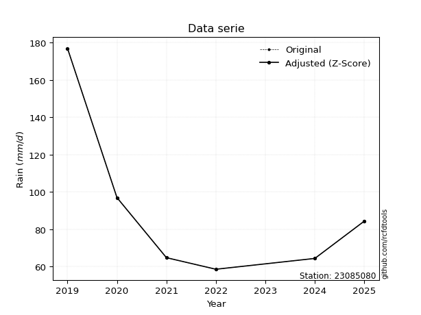</img>

</div>

> If Z-Score is active, values out of range or outliers are replaced with the station mean value.


### 4. Active continuous probability distributions from SciPy (45 of 104 available)

[scipy.stats](https://docs.scipy.org/doc/scipy/reference/stats.html) is a Python´s powerful submodule within the SciPy library for comprehensive statistical analysis, offering over 130 probability distributions (like Normal, Poisson), functions for descriptive stats (mean, variance), hypothesis testing (t-tests, chi-square), random variable generation, and statistical tests, making it essential for data science, modeling, and research. It provides tools to explore, model, and draw conclusions from data efficiently, working seamlessly with NumPy.

<div align="center">

|   id | p_dist             |   n_parameter | fit_method   | label                                                                       | active   | ref                                                                                                        |
|-----:|:-------------------|--------------:|:-------------|:----------------------------------------------------------------------------|:---------|:-----------------------------------------------------------------------------------------------------------|
|    0 | alpha              |             3 | MLE          | Alpha                                                                       | True     | [:mortar_board:](https://docs.scipy.org/doc/scipy/reference/generated/scipy.stats.alpha.html)              |
|    1 | betaprime          |             4 | MLE          | Beta prime                                                                  | True     | [:mortar_board:](https://docs.scipy.org/doc/scipy/reference/generated/scipy.stats.betaprime.html)          |
|    2 | chi2               |             3 | MLE          | Chi²                                                                        | True     | [:mortar_board:](https://docs.scipy.org/doc/scipy/reference/generated/scipy.stats.chi2.html)               |
|    3 | crystalball        |             4 | MLE          | Crystalball                                                                 | True     | [:mortar_board:](https://docs.scipy.org/doc/scipy/reference/generated/scipy.stats.crystalball.html)        |
|    4 | erlang             |             3 | MLE          | Erlang                                                                      | True     | [:mortar_board:](https://docs.scipy.org/doc/scipy/reference/generated/scipy.stats.erlang.html)             |
|    5 | expon              |             2 | MLE          | Exponential                                                                 | True     | [:mortar_board:](https://docs.scipy.org/doc/scipy/reference/generated/scipy.stats.expon.html)              |
|    6 | exponnorm          |             3 | MLE          | Exponentially modified Normal                                               | True     | [:mortar_board:](https://docs.scipy.org/doc/scipy/reference/generated/scipy.stats.exponnorm.html)          |
|    7 | f                  |             4 | MLE          | F                                                                           | True     | [:mortar_board:](https://docs.scipy.org/doc/scipy/reference/generated/scipy.stats.f.html)                  |
|    8 | fatiguelife        |             3 | MLE          | Fatigue-life (Birnbaum-Saunders)                                            | True     | [:mortar_board:](https://docs.scipy.org/doc/scipy/reference/generated/scipy.stats.fatiguelife.html)        |
|    9 | fisk               |             3 | MLE          | Fisk                                                                        | True     | [:mortar_board:](https://docs.scipy.org/doc/scipy/reference/generated/scipy.stats.fisk.html)               |
|   10 | gamma              |             3 | MLE          | Gamma                                                                       | True     | [:mortar_board:](https://docs.scipy.org/doc/scipy/reference/generated/scipy.stats.gamma.html)              |
|   11 | genexpon           |             5 | MLE          | Generalized exponential                                                     | True     | [:mortar_board:](https://docs.scipy.org/doc/scipy/reference/generated/scipy.stats.genexpon.html)           |
|   12 | genlogistic        |             3 | MLE          | Generalized logistic                                                        | True     | [:mortar_board:](https://docs.scipy.org/doc/scipy/reference/generated/scipy.stats.genlogistic.html)        |
|   13 | gibrat             |             2 | MM           | Gibrat                                                                      | True     | [:mortar_board:](https://docs.scipy.org/doc/scipy/reference/generated/scipy.stats.gibrat.html)             |
|   14 | gompertz           |             3 | MLE          | Gompertz (or truncated Gumbel)                                              | True     | [:mortar_board:](https://docs.scipy.org/doc/scipy/reference/generated/scipy.stats.gompertz.html)           |
|   15 | gumbel_l           |             2 | MM           | Gumbel Left Skew                                                            | True     | [:mortar_board:](https://docs.scipy.org/doc/scipy/reference/generated/scipy.stats.gumbel_l.html)           |
|   16 | gumbel_r           |             2 | MM           | Gumbel Right Skew                                                           | True     | [:mortar_board:](https://docs.scipy.org/doc/scipy/reference/generated/scipy.stats.gumbel_r.html)           |
|   17 | halflogistic       |             2 | MM           | Half-logistic                                                               | True     | [:mortar_board:](https://docs.scipy.org/doc/scipy/reference/generated/scipy.stats.halflogistic.html)       |
|   18 | halfnorm           |             2 | MM           | Half Normal                                                                 | True     | [:mortar_board:](https://docs.scipy.org/doc/scipy/reference/generated/scipy.stats.halfnorm.html)           |
|   19 | hypsecant          |             2 | MM           | hyperbolic secant                                                           | True     | [:mortar_board:](https://docs.scipy.org/doc/scipy/reference/generated/scipy.stats.hypsecant.html)          |
|   20 | invgamma           |             3 | MLE          | Inverted gamma                                                              | True     | [:mortar_board:](https://docs.scipy.org/doc/scipy/reference/generated/scipy.stats.invgamma.html)           |
|   21 | invgauss           |             3 | MLE          | Inverse Gaussian                                                            | True     | [:mortar_board:](https://docs.scipy.org/doc/scipy/reference/generated/scipy.stats.invgauss.html)           |
|   22 | invweibull         |             3 | MLE          | Inverted Weibull                                                            | True     | [:mortar_board:](https://docs.scipy.org/doc/scipy/reference/generated/scipy.stats.invweibull.html)         |
|   23 | johnsonsu          |             4 | MLE          | Johnson Su                                                                  | True     | [:mortar_board:](https://docs.scipy.org/doc/scipy/reference/generated/scipy.stats.johnsonsu.html)          |
|   24 | kstwobign          |             2 | MLE          | Limiting distribution of scaled Kolmogorov-Smirnov two-sided test statistic | True     | [:mortar_board:](https://docs.scipy.org/doc/scipy/reference/generated/scipy.stats.kstwobign.html)          |
|   25 | laplace            |             2 | MM           | Laplace                                                                     | True     | [:mortar_board:](https://docs.scipy.org/doc/scipy/reference/generated/scipy.stats.laplace.html)            |
|   26 | laplace_asymmetric |             3 | MLE          | Asymmetric Laplace                                                          | True     | [:mortar_board:](https://docs.scipy.org/doc/scipy/reference/generated/scipy.stats.laplace_asymmetric.html) |
|   27 | loggamma           |             3 | MLE          | Log gamma                                                                   | True     | [:mortar_board:](https://docs.scipy.org/doc/scipy/reference/generated/scipy.stats.loggamma.html)           |
|   28 | logistic           |             2 | MM           | Logistic (or Sech-squared)                                                  | True     | [:mortar_board:](https://docs.scipy.org/doc/scipy/reference/generated/scipy.stats.logistic.html)           |
|   29 | lognorm            |             3 | MLE          | Log Normal                                                                  | True     | [:mortar_board:](https://docs.scipy.org/doc/scipy/reference/generated/scipy.stats.lognorm.html)            |
|   30 | maxwell            |             2 | MM           | Maxwell                                                                     | True     | [:mortar_board:](https://docs.scipy.org/doc/scipy/reference/generated/scipy.stats.maxwell.html)            |
|   31 | mielke             |             4 | MLE          | Mielke Beta-Kappa / Dagum                                                   | True     | [:mortar_board:](https://docs.scipy.org/doc/scipy/reference/generated/scipy.stats.mielke.html)             |
|   32 | moyal              |             2 | MM           | Moyal                                                                       | True     | [:mortar_board:](https://docs.scipy.org/doc/scipy/reference/generated/scipy.stats.moyal.html)              |
|   33 | nakagami           |             3 | MLE          | Nakagami                                                                    | True     | [:mortar_board:](https://docs.scipy.org/doc/scipy/reference/generated/scipy.stats.nakagami.html)           |
|   34 | ncf                |             5 | MLE          | Non-central F distribution                                                  | True     | [:mortar_board:](https://docs.scipy.org/doc/scipy/reference/generated/scipy.stats.ncf.html)                |
|   35 | nct                |             4 | MLE          | Non-central Student’s t                                                     | True     | [:mortar_board:](https://docs.scipy.org/doc/scipy/reference/generated/scipy.stats.nct.html)                |
|   36 | norm               |             2 | MM           | Normal                                                                      | True     | [:mortar_board:](https://docs.scipy.org/doc/scipy/reference/generated/scipy.stats.norm.html)               |
|   37 | pareto             |             3 | MLE          | Pareto                                                                      | True     | [:mortar_board:](https://docs.scipy.org/doc/scipy/reference/generated/scipy.stats.pareto.html)             |
|   38 | pearson3           |             3 | MM           | Pearson type III                                                            | True     | [:mortar_board:](https://docs.scipy.org/doc/scipy/reference/generated/scipy.stats.pearson3.html)           |
|   39 | rayleigh           |             2 | MM           | Rayleigh                                                                    | True     | [:mortar_board:](https://docs.scipy.org/doc/scipy/reference/generated/scipy.stats.rayleigh.html)           |
|   40 | rice               |             3 | MLE          | Rice                                                                        | True     | [:mortar_board:](https://docs.scipy.org/doc/scipy/reference/generated/scipy.stats.rice.html)               |
|   41 | t                  |             3 | MLE          | Student’s t                                                                 | True     | [:mortar_board:](https://docs.scipy.org/doc/scipy/reference/generated/scipy.stats.t.html)                  |
|   42 | truncnorm          |             4 | MLE          | Truncated normal                                                            | True     | [:mortar_board:](https://docs.scipy.org/doc/scipy/reference/generated/scipy.stats.truncnorm.html)          |
|   43 | wald               |             2 | MM           | Wald                                                                        | True     | [:mortar_board:](https://docs.scipy.org/doc/scipy/reference/generated/scipy.stats.wald.html)               |
|   44 | weibull_min        |             3 | MLE          | Weibull minimum                                                             | True     | [:mortar_board:](https://docs.scipy.org/doc/scipy/reference/generated/scipy.stats.weibull_min.html)        |

</div>

> **n_parameter:** # arguments & localization & scale.
>
> **Fit methods:** (MLE) maximum likelihood, (MM) L-moments.
>
>**Inactive:** foldnorm, gennorm, norminvgauss, powernorm, powerlognorm, skewnorm, genextreme, anglit, arcsine, argus, beta, bradford, burr, burr12, cauchy, cosine, halfcauchy, foldcauchy, skewcauchy, wrapcauchy, dgamma, gengamma, exponweib, exponpow, truncexpon, gausshyper, genhalflogistic, genhyperbolic, geninvgauss, halfgennorm, johnsonsb, kappa4, kappa3, ksone, kstwo, loglaplace, levy, levy_l, levy_stable, ncx2, genpareto, truncpareto, lomax, powerlaw, rdist, rel_breitwigner, recipinvgauss, semicircular, studentized_range, trapezoid, triang, truncweibull_min, tukeylambda, uniform, loguniform, vonmises, vonmises_line, weibull_max, dweibull, 


## B. Probability distributions vs. Empirical distributions

A continuous probability distribution (CPD) describes probabilities for variables that can take any value within a range (like rain any time), unlike discrete variables with specific outcomes (like temperature). It uses a Probability Density Function (PDF), a curve where the total area under it equals 1, and the probability of the variable falling within an interval (a to b) is found by calculating the area under the curve between those points. A key feature is that the probability of hitting any single exact value is zero, so probabilities are always expressed for ranges, e.g., $P(a ≤ X ≤ b)$.

<div align="center">

Distributions parameters
|    |   station | p_dist                |   n |            loc |          scale | shape                  | shape1                 | shape2             | shape3   |
|---:|----------:|:----------------------|----:|---------------:|---------------:|:-----------------------|:-----------------------|:-------------------|:---------|
|  0 |  23085080 | alpha                 |   6 |      52.9873   |   10.9851      | 6.636396664194159e-06  |                        |                    |          |
|  1 |  23085080 | betaprime             |   6 |       9.1974   |    0.527382    | 944.5747375062604      | 7.236606746976186      |                    |          |
|  2 |  23085080 | chi2                  |   6 |      58.6      |   11.7222      | 1.5324487696112796     |                        |                    |          |
|  3 |  23085080 | crystalball           |   6 |      89.3333   |   41.1123      | 6120.020960713411      | 6786.462106758236      |                    |          |
|  4 |  23085080 | erlang                |   6 |      58.6      |   36.9747      | 0.9295173943518267     |                        |                    |          |
|  5 |  23085080 | expon                 |   6 |      58.6      |   30.7333      |                        |                        |                    |          |
|  6 |  23085080 | exponnorm             |   6 |      58.5657   |    0.0103684   | 2958.6640200783095     |                        |                    |          |
|  7 |  23085080 | f                     |   6 |      58.6      |   30.063       | 0.9891133464217703     | 3.1897861395885307     |                    |          |
|  8 |  23085080 | fatiguelife           |   6 |      58.6      |    9.04956e-06 | 1781.9102085101642     |                        |                    |          |
|  9 |  23085080 | fisk                  |   6 |      58.6      |   27.5628      | 0.5613593041161504     |                        |                    |          |
| 10 |  23085080 | gamma                 |   6 |      58.6      |   31.7472      | 0.5622404196982531     |                        |                    |          |
| 11 |  23085080 | genexpon              |   6 |      58.6      |   37.802       | 1.2300042616786566     | 1.0120295859659997e-10 | 1.7809549527518844 |          |
| 12 |  23085080 | genlogistic           |   6 |    -101.278    |   23.0289      | 1910.8305592986499     |                        |                    |          |
| 13 |  23085080 | gibrat                |   6 |      57.9698   |   19.0229      |                        |                        |                    |          |
| 14 |  23085080 | gompertz              |   6 |      58.6      |    3.62542e+13 | 994007802755.7517      |                        |                    |          |
| 15 |  23085080 | gumbel_l              |   6 |     107.836    |   32.0551      |                        |                        |                    |          |
| 16 |  23085080 | gumbel_r              |   6 |      70.8306   |   32.0551      |                        |                        |                    |          |
| 17 |  23085080 | halflogistic          |   6 |      40.6057   |   35.1496      |                        |                        |                    |          |
| 18 |  23085080 | halfnorm              |   6 |      34.9167   |   68.2011      |                        |                        |                    |          |
| 19 |  23085080 | hypsecant             |   6 |      89.3333   |   26.1729      |                        |                        |                    |          |
| 20 |  23085080 | invgamma              |   6 |      55.4711   |    9.65535     | 1.0049497925750013     |                        |                    |          |
| 21 |  23085080 | invgauss              |   6 |      56.5109   |    9.48164     | 3.461683670751254      |                        |                    |          |
| 22 |  23085080 | invweibull            |   6 |      58.6      |    1.24563     | 0.047723577675730905   |                        |                    |          |
| 23 |  23085080 | johnsonsu             |   6 |      58.6      |    6.13756e-10 | -1.6053663583960684    | 0.10173509083047313    |                    |          |
| 24 |  23085080 | kstwobign             |   6 |     -15.5874   |  122.365       |                        |                        |                    |          |
| 25 |  23085080 | laplace               |   6 |      89.3333   |   29.0708      |                        |                        |                    |          |
| 26 |  23085080 | laplace_asymmetric    |   6 |      58.6      |    0.000360765 | 1.1738475446355768e-05 |                        |                    |          |
| 27 |  23085080 | loggamma              |   6 |  -14831.9      | 1948.37        | 2118.8383588324405     |                        |                    |          |
| 28 |  23085080 | logistic              |   6 |      89.3333   |   22.6664      |                        |                        |                    |          |
| 29 |  23085080 | lognorm               |   6 |      58.6      |    0.0512511   | 13.281726711752366     |                        |                    |          |
| 30 |  23085080 | maxwell               |   6 |      -8.08558  |   61.0483      |                        |                        |                    |          |
| 31 |  23085080 | mielke                |   6 |      19.5259   |    4.82279     | 9397.195628119938      | 3.4206392160055987     |                    |          |
| 32 |  23085080 | moyal                 |   6 |      65.8227   |   18.507       |                        |                        |                    |          |
| 33 |  23085080 | nakagami              |   6 |      58.6      |   65.3827      | 0.06171165078541069    |                        |                    |          |
| 34 |  23085080 | ncf                   |   6 |      -0.242102 |    7.72282e-06 | 3.4311158411841096e-06 | 39.6038023922044       | 37.26445070685547  |          |
| 35 |  23085080 | nct                   |   6 |      -0.288907 |    1.10686     | 5.129768945536579      | 67.31325915396697      |                    |          |
| 36 |  23085080 | norm                  |   6 |      89.3333   |   41.1123      |                        |                        |                    |          |
| 37 |  23085080 | pareto                |   6 |      42.6031   |   15.9969      | 1.2848223032820925     |                        |                    |          |
| 38 |  23085080 | pearson3              |   6 |      89.3333   |   41.1123      | 1.4665408768380885     |                        |                    |          |
| 39 |  23085080 | rayleigh              |   6 |      10.6831   |   62.7538      |                        |                        |                    |          |
| 40 |  23085080 | rice                  |   6 |      29.8313   |   51.1406      | 0.0004308086866863101  |                        |                    |          |
| 41 |  23085080 | t                     |   6 |      84.5014   |   28.9575      | 3.0147193760945488     |                        |                    |          |
| 42 |  23085080 | truncnorm             |   6 | -141246        | 2411.32        | 58.60058936645568      | 58.6496914375705       |                    |          |
| 43 |  23085080 | wald                  |   6 |      48.221    |   41.1123      |                        |                        |                    |          |
| 44 |  23085080 | weibull_min           |   6 |      58.6      |   25.7364      | 0.3515922702787295     |                        |                    |          |
| 45 |  23085080 | logalpha              |   6 |       3.98462  |    0.170722    | 0.013923330700630836   |                        |                    |          |
| 46 |  23085080 | logbetaprime          |   6 |       3.53909  |    5.63293     | 9.7037577819979        | 64.53780680249844      |                    |          |
| 47 |  23085080 | logchi2               |   6 |       4.07073  |    0.980917    | 1.0584061287542972     |                        |                    |          |
| 48 |  23085080 | logcrystalball        |   6 |       4.41078  |    0.377904    | 7.185674011874559      | 1.2490274888292097     |                    |          |
| 49 |  23085080 | logerlang             |   6 |       4.07073  |    0.517643    | 0.27890636401127444    |                        |                    |          |
| 50 |  23085080 | logexpon              |   6 |       4.07073  |    0.340062    |                        |                        |                    |          |
| 51 |  23085080 | logexponnorm          |   6 |       4.07031  |    0.000133811 | 2542.9151217750295     |                        |                    |          |
| 52 |  23085080 | logf                  |   6 |       3.99684  |    0.194601    | 344.9959456965463      | 3.081637904699353      |                    |          |
| 53 |  23085080 | logfatiguelife        |   6 |       4.05435  |    0.151489    | 1.5838376398983427     |                        |                    |          |
| 54 |  23085080 | logfisk               |   6 |       4.07073  |    0.322222    | 0.2494362572017875     |                        |                    |          |
| 55 |  23085080 | loggamma              |   6 |       4.07073  |    0.515272    | 0.39445776647785       |                        |                    |          |
| 56 |  23085080 | loggenexpon           |   6 |       4.07073  |    0.3446      | 1.010627389423417      | 0.00439551485926518    | 1.345273294658988  |          |
| 57 |  23085080 | loggenlogistic        |   6 |       2.49851  |    0.237623    | 1583.1023130403507     |                        |                    |          |
| 58 |  23085080 | loggibrat             |   6 |       4.12252  |    0.17485     |                        |                        |                    |          |
| 59 |  23085080 | loggompertz           |   6 |       4.07073  |  686.002       | 1586.7463100848436     |                        |                    |          |
| 60 |  23085080 | loggumbel_l           |   6 |       4.58087  |    0.294641    |                        |                        |                    |          |
| 61 |  23085080 | loggumbel_r           |   6 |       4.24072  |    0.294641    |                        |                        |                    |          |
| 62 |  23085080 | loghalflogistic       |   6 |       3.96291  |    0.323084    |                        |                        |                    |          |
| 63 |  23085080 | loghalfnorm           |   6 |       3.91062  |    0.626884    |                        |                        |                    |          |
| 64 |  23085080 | loghypsecant          |   6 |       4.4108   |    0.240574    |                        |                        |                    |          |
| 65 |  23085080 | loginvgamma           |   6 |      -2.50388  | 2549.82        | 370.29990131173076     |                        |                    |          |
| 66 |  23085080 | loginvgauss           |   6 |       4.02694  |    0.217107    | 1.7680331560594724     |                        |                    |          |
| 67 |  23085080 | loginvweibull         |   6 |       3.98505  |    0.194107    | 1.3524582122645334     |                        |                    |          |
| 68 |  23085080 | logjohnsonsu          |   6 |       4.06102  |    0.000246681 | -4.773860867608757     | 0.6670542446518308     |                    |          |
| 69 |  23085080 | logkstwobign          |   6 |       3.37809  |    1.19583     |                        |                        |                    |          |
| 70 |  23085080 | loglaplace            |   6 |       4.4108   |    0.26721     |                        |                        |                    |          |
| 71 |  23085080 | loglaplace_asymmetric |   6 |       4.07073  |    1.76662e-05 | 5.194573057249141e-05  |                        |                    |          |
| 72 |  23085080 | logloggamma           |   6 |    -115.834    |   16.1581      | 1705.546452038392      |                        |                    |          |
| 73 |  23085080 | loglogistic           |   6 |       4.4108   |    0.208343    |                        |                        |                    |          |
| 74 |  23085080 | loglognorm            |   6 |       4.07073  |    0.00101732  | 12.447645813661923     |                        |                    |          |
| 75 |  23085080 | logmaxwell            |   6 |       3.51535  |    0.561137    |                        |                        |                    |          |
| 76 |  23085080 | logmielke             |   6 |       3.8945   |    0.0583746   | 51.447543210344094     | 2.0008454903234014     |                    |          |
| 77 |  23085080 | logmoyal              |   6 |       4.19469  |    0.170111    |                        |                        |                    |          |
| 78 |  23085080 | lognakagami           |   6 |       4.07073  |    0.658117    | 0.25871566118791856    |                        |                    |          |
| 79 |  23085080 | logncf                |   6 |      -5.42577  |    9.79033     | 1440.2618658698184     | 1574.1880618721784     | 0.7647227222624897 |          |
| 80 |  23085080 | lognct                |   6 |       0.712158 |    0.0424811   | 55.927681596614946     | 85.78656249926118      |                    |          |
| 81 |  23085080 | lognorm               |   6 |       4.4108   |    0.377892    |                        |                        |                    |          |
| 82 |  23085080 | logpareto             |   6 |       3.24886  |    0.821876    | 3.320228762569182      |                        |                    |          |
| 83 |  23085080 | logpearson3           |   6 |       4.4108   |    0.377892    | 1.1850541394899665     |                        |                    |          |
| 84 |  23085080 | lograyleigh           |   6 |       3.68787  |    0.576814    |                        |                        |                    |          |
| 85 |  23085080 | logrice               |   6 |       3.83814  |    0.485148    | 0.0006496610334017722  |                        |                    |          |
| 86 |  23085080 | logt                  |   6 |       4.4108   |    0.377894    | 1386538.03774676       |                        |                    |          |
| 87 |  23085080 | logtruncnorm          |   6 |      -3.53751  |    1.84321     | 4.127712154377518      | 4.727434354565304      |                    |          |
| 88 |  23085080 | logwald               |   6 |       4.0329   |    0.377892    |                        |                        |                    |          |
| 89 |  23085080 | logweibull_min        |   6 |       4.07073  |    0.309513    | 0.6661052154150495     |                        |                    |          |

</div>

> **loc** (Location parameter): This shifts the distribution along the x-axis. For many common distributions, like the normal (Gaussian) distribution, loc represents the mean $μ$. For others, like the uniform distribution, it might represent the minimum value, or for the beta distribution, the left end of the support interval.
>
> **scale** (Scale parameter): This determines the width or spread of the distribution. For the normal distribution, scale represents the standard deviation $σ$. For a uniform distribution, it defines the length of the interval (from $loc$ to $loc + scale$).
>
> **shape** (Shape parameters): Refers to parameters that define the specific form of a probability distribution, distinct from its location (loc) and scale (scale). These parameters are required arguments for most distribution functions. For example, a normal (Gaussian) distribution is fully defined by its location (mean) and scale (standard deviation), so it has no specific shape parameters beyond loc and scale. However, other distributions have intrinsic properties that need specification, as Gamma distribution that takes a shape parameter, often named $a$ or $alpha$.


### 0. Cumulative distribution values - CDF (90 evaluated)

> Ordered by x ascending and calculating $log(f(x))$ separately. 

|   id |   Station |   date |     x |   count |    mean |     std |    zscore |   Value_initial |   station |   m |     alpha |   alpha_pdf |   betaprime |   betaprime_pdf |        chi2 |      chi2_pdf |   crystalball |   crystalball_pdf |      erlang |   erlang_pdf |    expon |   expon_pdf |   exponnorm |   exponnorm_pdf |           f |        f_pdf |   fatiguelife |   fatiguelife_pdf |        fisk |       fisk_pdf |       gamma |        gamma_pdf |    genexpon |   genexpon_pdf |   genlogistic |   genlogistic_pdf |      gibrat |   gibrat_pdf |    gompertz |   gompertz_pdf |   gumbel_l |   gumbel_l_pdf |   gumbel_r |   gumbel_r_pdf |   halflogistic |   halflogistic_pdf |   halfnorm |   halfnorm_pdf |   hypsecant |   hypsecant_pdf |   invgamma |   invgamma_pdf |   invgauss |   invgauss_pdf |   invweibull |   invweibull_pdf |   johnsonsu |   johnsonsu_pdf |   kstwobign |   kstwobign_pdf |   laplace |   laplace_pdf |   laplace_asymmetric |   laplace_asymmetric_pdf |    loggamma |   loggamma_pdf |   logistic |   logistic_pdf |   lognorm |   lognorm_pdf |   maxwell |   maxwell_pdf |   mielke |   mielke_pdf |    moyal |   moyal_pdf |   nakagami |   nakagami_pdf |      ncf |    ncf_pdf |      nct |     nct_pdf |     norm |    norm_pdf |      pareto |   pareto_pdf |   pearson3 |   pearson3_pdf |   rayleigh |   rayleigh_pdf |     rice |   rice_pdf |        t |       t_pdf |   truncnorm |   truncnorm_pdf |     wald |    wald_pdf |   weibull_min |   weibull_min_pdf |   logalpha |   logalpha_pdf |   logbetaprime |   logbetaprime_pdf |     logchi2 |   logchi2_pdf |   logcrystalball |   logcrystalball_pdf |   logerlang |   logerlang_pdf |   logexpon |   logexpon_pdf |   logexponnorm |   logexponnorm_pdf |      logf |   logf_pdf |   logfatiguelife |   logfatiguelife_pdf |     logfisk |   logfisk_pdf |   loggenexpon |   loggenexpon_pdf |   loggenlogistic |   loggenlogistic_pdf |   loggibrat |   loggibrat_pdf |   loggompertz |   loggompertz_pdf |   loggumbel_l |   loggumbel_l_pdf |   loggumbel_r |   loggumbel_r_pdf |   loghalflogistic |   loghalflogistic_pdf |   loghalfnorm |   loghalfnorm_pdf |   loghypsecant |   loghypsecant_pdf |   loginvgamma |   loginvgamma_pdf |   loginvgauss |   loginvgauss_pdf |   loginvweibull |   loginvweibull_pdf |   logjohnsonsu |   logjohnsonsu_pdf |   logkstwobign |   logkstwobign_pdf |   loglaplace |   loglaplace_pdf |   loglaplace_asymmetric |   loglaplace_asymmetric_pdf |   logloggamma |   logloggamma_pdf |   loglogistic |   loglogistic_pdf |   loglognorm |   loglognorm_pdf |   logmaxwell |   logmaxwell_pdf |   logmielke |   logmielke_pdf |   logmoyal |   logmoyal_pdf |   lognakagami |   lognakagami_pdf |   logncf |   logncf_pdf |   lognct |   lognct_pdf |   logpareto |   logpareto_pdf |   logpearson3 |   logpearson3_pdf |   lograyleigh |   lograyleigh_pdf |   logrice |   logrice_pdf |     logt |   logt_pdf |   logtruncnorm |   logtruncnorm_pdf |    logwald |   logwald_pdf |   logweibull_min |   logweibull_min_pdf |
|-----:|----------:|-------:|------:|--------:|--------:|--------:|----------:|----------------:|----------:|----:|----------:|------------:|------------:|----------------:|------------:|--------------:|--------------:|------------------:|------------:|-------------:|---------:|------------:|------------:|----------------:|------------:|-------------:|--------------:|------------------:|------------:|---------------:|------------:|-----------------:|------------:|---------------:|--------------:|------------------:|------------:|-------------:|------------:|---------------:|-----------:|---------------:|-----------:|---------------:|---------------:|-------------------:|-----------:|---------------:|------------:|----------------:|-----------:|---------------:|-----------:|---------------:|-------------:|-----------------:|------------:|----------------:|------------:|----------------:|----------:|--------------:|---------------------:|-------------------------:|------------:|---------------:|-----------:|---------------:|----------:|--------------:|----------:|--------------:|---------:|-------------:|---------:|------------:|-----------:|---------------:|---------:|-----------:|---------:|------------:|---------:|------------:|------------:|-------------:|-----------:|---------------:|-----------:|---------------:|---------:|-----------:|---------:|------------:|------------:|----------------:|---------:|------------:|--------------:|------------------:|-----------:|---------------:|---------------:|-------------------:|------------:|--------------:|-----------------:|---------------------:|------------:|----------------:|-----------:|---------------:|---------------:|-------------------:|----------:|-----------:|-----------------:|---------------------:|------------:|--------------:|--------------:|------------------:|-----------------:|---------------------:|------------:|----------------:|--------------:|------------------:|--------------:|------------------:|--------------:|------------------:|------------------:|----------------------:|--------------:|------------------:|---------------:|-------------------:|--------------:|------------------:|--------------:|------------------:|----------------:|--------------------:|---------------:|-------------------:|---------------:|-------------------:|-------------:|-----------------:|------------------------:|----------------------------:|--------------:|------------------:|--------------:|------------------:|-------------:|-----------------:|-------------:|-----------------:|------------:|----------------:|-----------:|---------------:|--------------:|------------------:|---------:|-------------:|---------:|-------------:|------------:|----------------:|--------------:|------------------:|--------------:|------------------:|----------:|--------------:|---------:|-----------:|---------------:|-------------------:|-----------:|--------------:|-----------------:|---------------------:|
|    0 |  23085080 |   2022 |  58.6 |       6 | 89.3333 | 45.0363 | -0.682413 |            58.6 |  23085080 |   1 | 0.0503285 | 0.0409839   |    0.144739 |     0.0137515   | 1.39397e-12 | 150.321       |      0.227367 |       0.00733822  | 2.53308e-15 |  0.331372    | 0        | 0.032538    |   0.0011165 |     0.0325463   | 0.000103231 | 105.365      |     0.0286541 |       7.89315e+10 | 3.28818e-09 | 86593.5        | 1.78472e-09 | 141221           | 4.93629e-12 |    0.0325381   |      0.158071 |       0.012656    | 0.000327931 |  0.00190674  | 2.53259e-15 |     0.0274177  |   0.193656 |    0.00541446  |   0.231182 |     0.0105623  |       0.25052  |         0.0133322  |   0.271601 |     0.0110145  |    0.190821 |     0.00686188  |  0.0461351 |    0.0454429   |  0.0439268 |    0.0556322   |   0.00836489 |      2.68762e+11 |   0.0519169 |     1.72404e+07 |    0.144141 |     0.0110993   |  0.173715 |    0.0059756  |          1.44205e-10 |              0.0325378   | 1.69122e-06 |    7.51106e+08 |   0.204908 |    0.00718776  |  0.184089 |      0.704199 |  0.245367 |    0.00858779 |      nan |          nan | 0.224186 |  0.0125173  | 0.00931508 |    1.61806e+11 | 0.208306 | 0.0111161  | 0.154579 | 0.0150349   | 0.227367 | 0.00733822  | 3.33067e-16 |  0.0803169   |   0.242618 |     0.0129944  |   0.252872 |     0.00909082 | 0.146344 | 0.00939015 | 0.218345 | 0.00791643  | 9.73416e-07 |      0.0257559  | 0.115238 | 0.0252926   |   3.38524e-06 |       1.67509e+08 |  0.0484647 |      2.61682   |       0.117901 |          0.95596   | 8.54364e-09 |   5.09056e+06 |         0.184105 |             0.704216 | 8.45511e-05 |     2.65508e+10 |   0        |       2.94064  |     0.00125372 |           2.93306  | 0.0482906 |  2.31082   |        0.0434517 |             5.98084  | 0.000277499 |   3.89556e+10 |   1.06132e-08 |          2.93276  |         0.120384 |            1.07183   |   0         |       0         |   1.21186e-05 |          2.31301  |      0.162255 |         0.503377  |      0.16854  |          1.01853  |          0.165341 |              1.50528  |      0.201602 |          1.23193  |       0.151925 |           0.607806 |      0.180308 |          0.780775 |     0.0446094 |          2.89914  |       0.0486922 |           2.32286   |      0.0313449 |           4.84538  |       0.109451 |           1.00415  |     0.140046 |         0.524104 |             1.23889e-05 |                    2.94036  |      0.19684  |          0.70378  |      0.163526 |          0.65654  |     0.012851 |      2.99783e+12 |     0.193812 |         0.853497 |   0.0689428 |       1.98822   |   0.149988 |       1.19785  |   1.57582e-08 |       9.18034e+06 | 0.27419  |     0.679917 | 0.173168 |     0.843266 | 7.77156e-16 |        4.03982  |      0.175579 |          1.14527  |      0.197714 |          0.923221 |  0.108569 |      0.880925 | 0.184086 |   0.704188 |    2.49046e-07 |           2.51471  | 0.00410003 |      0.583815 |      2.05769e-10 |        154320        |
|    1 |  23085080 |   2024 |  64.4 |       6 | 89.3333 | 45.0363 | -0.553628 |            64.4 |  23085080 |   2 | 0.335787  | 0.0423434   |    0.23141  |     0.0158585   | 0.33468     |   0.0383313   |      0.272102 |       0.00807366  | 0.170646    |  0.0251863   | 0.171982 | 0.026942    |   0.173195  |     0.0269523   | 0.314025    |   0.0246827  |     0.673384  |       0.0139681   | 0.294227    |     0.0200984  | 0.405226    |      0.0348946   | 0.171982    |    0.0269421   |      0.238318 |       0.0148359   | 0.13904     |  0.0344528   | 0.147023    |     0.0233867  |   0.227356 |    0.0062172   |   0.294596 |     0.0112319  |       0.326113 |         0.0127121  |   0.334476 |     0.0106554  |    0.234363 |     0.00816704  |  0.341183  |    0.0412044   |  0.357422  |    0.0391931   |   0.394861   |      0.00301904  |   0.788704  |     0.00507348  |    0.213709 |     0.0127562   |  0.212073 |    0.00729506 |          0.171981    |              0.0269419   | 0.548427    |    2.00721     |   0.249738 |    0.00826636  |  0.257801 |      0.85459  |  0.29676  |    0.00910521 |      nan |          nan | 0.298719 |  0.0130547  | 0.645123   |    0.0137219   | 0.275862 | 0.0120899  | 0.248671 | 0.0170681   | 0.272102 | 0.00807366  | 0.327994    |  0.0396115   |   0.317646 |     0.0127992  |   0.306749 |     0.0094563  | 0.20424  | 0.010518   | 0.268639 | 0.00942882  | 0.139335    |      0.0223697  | 0.264086 | 0.024633    |   0.446898    |       0.0198561   |  0.347508  |      2.67863   |       0.224699 |          1.28307   | 0.222463    |   1.20864     |         0.257818 |             0.854593 | 0.664393    |     1.70046     |   0.242351 |       2.22798  |     0.243172   |           2.22419  | 0.326847  |  2.73082   |        0.421334  |             2.25701  | 0.424021    |   0.645474    |   0.241936    |          2.2262   |         0.240886 |            1.44233   |   0.0789446 |       3.45537   |   0.196139    |          1.85961  |      0.216423 |         0.648598  |      0.274568 |          1.2045   |          0.303102 |              1.40541  |      0.315238 |          1.1721   |       0.220071 |           0.843623 |      0.262282 |          0.950197 |     0.347954  |          2.62324  |       0.330573  |           2.74847   |      0.390042  |           2.45887  |       0.220702 |           1.31701  |     0.199372 |         0.746124 |             0.242342    |                    2.22781  |      0.269877 |          0.840655 |      0.235192 |          0.863368 |     0.642047 |      0.317824    |     0.280537 |         0.975184 |   0.310989  |       2.6256    |   0.275346 |       1.41107  |   0.284916    |       1.55546     | 0.341442 |     0.741687 | 0.261745 |     1.02376  | 0.302969    |        2.52583  |      0.289862 |          1.24996  |      0.289852 |          1.01864  |  0.203171 |      1.10695  | 0.257797 |   0.854579 |    0.213844    |           2.03296  | 0.218907   |      2.7884   |      0.364496    |             2.03333  |
|    2 |  23085080 |   2021 |  64.8 |       6 | 89.3333 | 45.0363 | -0.544746 |            64.8 |  23085080 |   3 | 0.352407  | 0.0407622   |    0.237771 |     0.0159433   | 0.349763    |   0.0370999   |      0.275341 |       0.00812106  | 0.180643    |  0.0247985   | 0.182689 | 0.0265936   |   0.183906  |     0.0266032   | 0.323692    |   0.0236716  |     0.678859  |       0.0134163   | 0.302061    |     0.019088   | 0.418894    |      0.0334663   | 0.182689    |    0.0265937   |      0.244274 |       0.0149451   | 0.152848    |  0.0345662   | 0.156327    |     0.0231316  |   0.229854 |    0.00627491  |   0.299095 |     0.011262   |       0.331188 |         0.0126647  |   0.338733 |     0.0106282  |    0.237649 |     0.00825962  |  0.357328  |    0.0395295   |  0.372736  |    0.0373955   |   0.396029   |      0.00282361  |   0.790661  |     0.0047203   |    0.218828 |     0.0128408   |  0.215011 |    0.00739613 |          0.182688    |              0.0265935   | 0.560545    |    1.90837     |   0.253059 |    0.00833921  |  0.26312  |      0.863627 |  0.300408 |    0.00913444 |      nan |          nan | 0.303943 |  0.0130644  | 0.650453   |    0.0129418   | 0.280707 | 0.0121372  | 0.255512 | 0.0171345   | 0.275341 | 0.00812106  | 0.343513    |  0.0379994   |   0.32276  |     0.0127699  |   0.310535 |     0.00947468 | 0.20846  | 0.0105833  | 0.272432 | 0.00953245  | 0.148239    |      0.0221533  | 0.273886 | 0.0243673   |   0.454615    |       0.0187505   |  0.363778  |      2.5769    |       0.232693 |          1.29889   | 0.229824    |   1.16932     |         0.263138 |             0.863629 | 0.674621    |     1.60498     |   0.256021 |       2.18777  |     0.256819   |           2.18409  | 0.343518  |  2.65369   |        0.434949  |             2.14271  | 0.427897    |   0.607156    |   0.255596    |          2.18624  |         0.249865 |            1.45764   |   0.100893  |       3.6207    |   0.207572    |          1.83318  |      0.220471 |         0.658951  |      0.282049 |          1.21158  |          0.311779 |              1.39715  |      0.322481 |          1.16735  |       0.225347 |           0.8604   |      0.268196 |          0.959825 |     0.363903  |          2.52891  |       0.347339  |           2.66708   |      0.404908  |           2.34418  |       0.228896 |           1.32968  |     0.204046 |         0.763615 |             0.256012    |                    2.18762  |      0.275107 |          0.848815 |      0.24058  |          0.876926 |     0.643951 |      0.297699    |     0.286594 |         0.98118  |   0.327125  |       2.58564   |   0.284097 |       1.4154   |   0.294397    |       1.5074      | 0.346045 |     0.744956 | 0.268114 |     1.03327  | 0.318384    |        2.45339  |      0.297607 |          1.25159  |      0.296172 |          1.02267  |  0.210061 |      1.11816  | 0.263116 |   0.863615 |    0.226344    |           2.00461  | 0.236066   |      2.75263  |      0.376831    |             1.952    |
|    3 |  23085080 |   2025 |  74.2 |       6 | 89.3333 | 45.0363 | -0.336025 |            74.2 |  23085080 |   4 | 0.604563  | 0.017034    |    0.390756 |     0.0160646   | 0.605784    |   0.0200245   |      0.3564   |       0.00906809  | 0.379212    |  0.0180207   | 0.398057 | 0.019586    |   0.399293  |     0.0195819   | 0.481464    |   0.0123748  |     0.769385  |       0.00718171  | 0.420792    |     0.00877038 | 0.638237    |      0.0166185   | 0.398058    |    0.019586    |      0.39172  |       0.0159379   | 0.436924    |  0.0242724   | 0.348004    |     0.0178763  |   0.295436 |    0.00769679  |   0.406479 |     0.0114154  |       0.444541 |         0.0114138  |   0.435379 |     0.00991075 |    0.325425 |     0.0103781   |  0.599605  |    0.0164308   |  0.599394  |    0.0155973   |   0.412152   |      0.00111758  |   0.816628  |     0.00173122  |    0.345469 |     0.0137849   |  0.297091 |    0.0102196  |          0.398055    |              0.0195859   | 0.733629    |    0.875269    |   0.339022 |    0.00988627  |  0.391544 |      1.01645  |  0.388709 |    0.00957327 |      nan |          nan | 0.425186 |  0.012508   | 0.728787   |    0.00574694  | 0.397729 | 0.0125415  | 0.416794 | 0.0165901   | 0.3564   | 0.00906809  | 0.582943    |  0.0169588   |   0.438257 |     0.0117002  |   0.400844 |     0.00966382 | 0.313638 | 0.0116439  | 0.372736 | 0.0116917   | 0.334406    |      0.0176287  | 0.469743 | 0.0173541   |   0.567685    |       0.00817091  |  0.599176  |      1.13634   |       0.42249  |          1.43786   | 0.352624    |   0.730332    |         0.39156  |             1.01643  | 0.813229    |     0.667823    |   0.500465 |       1.46895  |     0.500879   |           1.46684  | 0.601627  |  1.30738   |        0.627741  |             0.977284 | 0.480598    |   0.263803    |   0.500057    |          1.47005  |         0.456395 |            1.50619   |   0.52087   |       2.16232   |   0.420767    |          1.34025  |      0.32594  |         0.902365  |      0.449685 |          1.21976  |          0.487022 |              1.18051  |      0.472569 |          1.04241  |       0.366452 |           1.20837  |      0.409437 |          1.10197  |     0.603669  |          1.22051  |       0.603544  |           1.28116   |      0.615546  |           1.03717  |       0.417351 |           1.38921  |     0.338756 |         1.26775  |             0.500442    |                    1.4689   |      0.400352 |          0.985585 |      0.377698 |          1.12815  |     0.669153 |      0.12339     |     0.425339 |         1.04616  |   0.60074   |       1.47114   |   0.471924 |       1.30242  |   0.455222    |       0.971877    | 0.45053  |     0.788575 | 0.417998 |     1.14926  | 0.567518    |        1.35734  |      0.464028 |          1.17415  |      0.437643 |          1.04606  |  0.372819 |      1.24873  | 0.391538 |   1.01644  |    0.459927    |           1.47019  | 0.531207   |      1.62403  |      0.566046    |             1.02238  |
|    4 |  23085080 |   2020 |  97   |       6 | 89.3333 | 45.0363 |  0.170233 |            97   |  23085080 |   5 | 0.802907  | 0.00438589  |    0.692067 |     0.00988855  | 0.869286    |   0.00613409  |      0.573966 |       0.00953645  | 0.675892    |  0.0091284   | 0.71334  | 0.00932734  |   0.714321  |     0.00931261  | 0.664823    |   0.00533845 |     0.876164  |       0.00307838  | 0.546401    |     0.00362321 | 0.860216    |      0.00546311  | 0.713341    |    0.00932733  |      0.705903 |       0.0106747   | 0.763834    |  0.00789495  | 0.651055    |     0.00956728 |   0.509909 |    0.0109036   |   0.642733 |     0.008863   |       0.665268 |         0.00792924 |   0.637334 |     0.00773057 |    0.591935 |     0.0116581   |  0.794536  |    0.00441765  |  0.794263  |    0.00473773  |   0.427814   |      0.000451439 |   0.839945  |     0.000644763 |    0.634412 |     0.0107894   |  0.615907 |    0.0132123  |          0.713338    |              0.00932735  | 0.878901    |    0.328709    |   0.583763 |    0.01072     |  0.667769 |      0.960918 |  0.602644 |    0.00880212 |      nan |          nan | 0.666676 |  0.00846211 | 0.813652   |    0.00256327  | 0.657541 | 0.0096437  | 0.714655 | 0.00934166  | 0.573966 | 0.00953645  | 0.792476    |  0.00490159  |   0.663797 |     0.00803647 |   0.611701 |     0.00851103 | 0.577906 | 0.0108404  | 0.652488 | 0.0112578   | 0.642979    |      0.0101283  | 0.733172 | 0.00739916  |   0.683701    |       0.00333355  |  0.774412  |      0.372499  |       0.751949 |          0.927121  | 0.503629    |   0.445763    |         0.667776 |             0.96088  | 0.91962     |     0.230302    |   0.77282  |       0.668054 |     0.772898   |           0.667414 | 0.804086  |  0.421346  |        0.796594  |             0.410557 | 0.527864    |   0.12335     |   0.772739    |          0.668994 |         0.775665 |            0.829169  |   0.828989  |       0.561745  |   0.688438    |          0.721185 |      0.624434 |         1.2483    |      0.724775 |          0.791812 |          0.738339 |              0.703926 |      0.710564 |          0.726208 |       0.701818 |           1.06598  |      0.695487 |          0.942791 |     0.802044  |          0.442234 |       0.800503  |           0.40855   |      0.783964  |           0.380487 |       0.73071  |           0.894699 |     0.729255 |         1.01323  |             0.772795    |                    0.668073 |      0.667437 |          0.931641 |      0.687134 |          1.03186  |     0.69094  |      0.0561627   |     0.687456 |         0.852878 |   0.828377  |       0.457121  |   0.743463 |       0.727489 |   0.658345    |       0.598679    | 0.656274 |     0.713545 | 0.7041   |     0.903657 | 0.795626    |        0.511798 |      0.724564 |          0.75261  |      0.693314 |          0.817464 |  0.684162 |      0.988394 | 0.667762 |   0.960921 |    0.752807    |           0.783619 | 0.796954   |      0.57588  |      0.749345    |             0.458399 |
|    5 |  23085080 |   2019 | 177   |       6 | 89.3333 | 45.0363 |  1.94658  |           177   |  23085080 |   6 | 0.929416  | 0.000567681 |    0.974582 |     0.000718727 | 0.996496    |   0.000155408 |      0.983512 |       0.000999009 | 0.964794    |  0.000968877 | 0.978773 | 0.000690674 |   0.978948  |     0.000686271 | 0.864115    |   0.00114506 |     0.978817  |       0.000435757 | 0.693862    |     0.00100712 | 0.992229    |      0.000268525 | 0.978774    |    0.000690666 |      0.989262 |       0.000463775 | 0.966653    |  0.000623849 | 0.961081    |     0.00106708 |   0.999825 |    4.72229e-05 |   0.964216 |     0.00109611 |       0.95955  |         0.00112753 |   0.962776 |     0.00133567 |    0.977663 |     0.000852738 |  0.924742  |    0.000597988 |  0.942525  |    0.000701498 |   0.447246   |      0.000145055 |   0.866239  |     0.000185381 |    0.985892 |     0.000725816 |  0.975492 |    0.00084303 |          0.978773    |              0.000690685 | 0.97303     |    0.0635818   |   0.979522 |    0.000884969 |  0.978583 |      0.135775 |  0.973153 |    0.00121255 |      nan |          nan | 0.960437 |  0.001068   | 0.925654   |    0.000797054 | 0.977122 | 0.00083236 | 0.973324 | 0.000676396 | 0.983512 | 0.000999008 | 0.935081    |  0.000620618 |   0.959647 |     0.00113829 |   0.970165 |     0.00126004 | 0.984088 | 0.0008954  | 0.975394 | 0.000653359 | 0.999999    |      0.00144784 | 0.958095 | 0.000847059 |   0.819163    |       0.000918357 |  0.887219  |      0.0940999 |       0.984077 |          0.0819919 | 0.69382     |   0.226655    |         0.978581 |             0.135779 | 0.983174    |     0.0409001   |   0.96125  |       0.113949 |     0.961221   |           0.113964 | 0.92382   |  0.0897828 |        0.931376  |             0.114935 | 0.576272    |   0.0550996   |   0.961334    |          0.113885 |         0.979987 |            0.0833736 |   0.963758  |       0.0754632 |   0.922613    |          0.179287 |      0.999469 |         0.0135863 |      0.959059 |          0.136068 |          0.954278 |              0.138283 |      0.956489 |          0.165876 |       0.973577 |           0.109707 |      0.979598 |          0.119006 |     0.934896  |          0.103647 |       0.917614  |           0.0895833 |      0.90366   |           0.102152 |       0.978259 |           0.109348 |     0.971487 |         0.106707 |             0.96124     |                    0.113969 |      0.976425 |          0.14447  |      0.975242 |          0.115892 |     0.712811 |      0.0247632   |     0.96734  |         0.156025 |   0.948241  |       0.0785946 |   0.955446 |       0.130818 |   0.892567    |       0.229868    | 0.937647 |     0.224679 | 0.973431 |     0.127192 | 0.940973    |        0.101688 |      0.956889 |          0.144323 |      0.964159 |          0.160323 |  0.977699 |      0.126776 | 0.978581 |   0.135782 |    1           |           0.176726 | 0.954174   |      0.10185  |      0.903172    |             0.136229 |

An Empirical Distribution Function (EDF) is a step-function estimate of a true cumulative distribution function (CDF) based on observed sample data, representing the proportion of data points less than or equal to a given value. It is calculated by ordering your data and jumping up by $1/n$ (where $n$ is sample size) at each unique data point, allowing analysis without assuming an underlying population distribution, and it gets closer to the true CDF as the sample size grows.


### 1. Empirical - EDF California (1923)

California´s estimates the true probability distribution of water-related data (like rainfall, streamflow) using observed samples, crucial for risk assessment.

<div align="center">


$P=m/n$


</div>


**1.1. Empirical values**

<div align="center">

|                | 0                   | 1                  | 2              | 3                  | 4                  | 5              |
|:---------------|:--------------------|:-------------------|:---------------|:-------------------|:-------------------|:---------------|
| date           | 2022                | 2024               | 2021           | 2025               | 2020               | 2019           |
| x              | 58.6                | 64.4               | 64.8           | 74.2               | 97.0               | 177.0          |
| m              | 1                   | 2                  | 3              | 4                  | 5                  | 6              |
| empirical_dist | edf_california      | edf_california     | edf_california | edf_california     | edf_california     | edf_california |
| empirical      | 0.16666666666666666 | 0.3333333333333333 | 0.5            | 0.6666666666666666 | 0.8333333333333334 | 1.0            |
| empirical_tr   | 1.2                 | 1.4999999999999998 | 2.0            | 2.9999999999999996 | 6.000000000000002  | inf            |

</div>


**1.2. Kolmogorov-Smirnov fit test (sorted by Δ)**


<div align="center">

|                | 0                  | 1                   | 2                   | 3                   | 4                   | 5                   | 6                  | 7                  | 8                  | 9                  | 10                  | 11                 | 12                  | 13                  | 14                 | 15                 | 16                  | 17                  | 18                  | 19                  | 20                  | 21                 | 22                 | 23                 | 24                  | 25                  | 26                  | 27                  | 28                 | 29                  | 30                | 31                  | 32                  | 33                 | 34                  | 35                    | 36                | 37                 | 38                 | 39                  | 40                  | 41                 | 42                  | 43                 | 44                  | 45                 | 46                 | 47                 | 48                 | 49                 | 50                 | 51                 | 52                 | 53                 | 54                  | 55                  | 56                  | 57                 | 58                | 59                 | 60                | 61                 | 62                 | 63                 | 64                  | 65                 | 66                 | 67                  | 68                 | 69                  | 70                  | 71                  | 72                | 73                  | 74                 | 75                 | 76                 | 77                  | 78                 | 79                 | 80                  | 81                 | 82                 | 83                  | 84                 | 85                 | 86                  | 87                  | 88                 | 89             |
|:---------------|:-------------------|:--------------------|:--------------------|:--------------------|:--------------------|:--------------------|:-------------------|:-------------------|:-------------------|:-------------------|:--------------------|:-------------------|:--------------------|:--------------------|:-------------------|:-------------------|:--------------------|:--------------------|:--------------------|:--------------------|:--------------------|:-------------------|:-------------------|:-------------------|:--------------------|:--------------------|:--------------------|:--------------------|:-------------------|:--------------------|:------------------|:--------------------|:--------------------|:-------------------|:--------------------|:----------------------|:------------------|:-------------------|:-------------------|:--------------------|:--------------------|:-------------------|:--------------------|:-------------------|:--------------------|:-------------------|:-------------------|:-------------------|:-------------------|:-------------------|:-------------------|:-------------------|:-------------------|:-------------------|:--------------------|:--------------------|:--------------------|:-------------------|:------------------|:-------------------|:------------------|:-------------------|:-------------------|:-------------------|:--------------------|:-------------------|:-------------------|:--------------------|:-------------------|:--------------------|:--------------------|:--------------------|:------------------|:--------------------|:-------------------|:-------------------|:-------------------|:--------------------|:-------------------|:-------------------|:--------------------|:-------------------|:-------------------|:--------------------|:-------------------|:-------------------|:--------------------|:--------------------|:-------------------|:---------------|
| station        | 23085080           | 23085080            | 23085080            | 23085080            | 23085080            | 23085080            | 23085080           | 23085080           | 23085080           | 23085080           | 23085080            | 23085080           | 23085080            | 23085080            | 23085080           | 23085080           | 23085080            | 23085080            | 23085080            | 23085080            | 23085080            | 23085080           | 23085080           | 23085080           | 23085080            | 23085080            | 23085080            | 23085080            | 23085080           | 23085080            | 23085080          | 23085080            | 23085080            | 23085080           | 23085080            | 23085080              | 23085080          | 23085080           | 23085080           | 23085080            | 23085080            | 23085080           | 23085080            | 23085080           | 23085080            | 23085080           | 23085080           | 23085080           | 23085080           | 23085080           | 23085080           | 23085080           | 23085080           | 23085080           | 23085080            | 23085080            | 23085080            | 23085080           | 23085080          | 23085080           | 23085080          | 23085080           | 23085080           | 23085080           | 23085080            | 23085080           | 23085080           | 23085080            | 23085080           | 23085080            | 23085080            | 23085080            | 23085080          | 23085080            | 23085080           | 23085080           | 23085080           | 23085080            | 23085080           | 23085080           | 23085080            | 23085080           | 23085080           | 23085080            | 23085080           | 23085080           | 23085080            | 23085080            | 23085080           | 23085080       |
| empirical_dist | edf_california     | edf_california      | edf_california      | edf_california      | edf_california      | edf_california      | edf_california     | edf_california     | edf_california     | edf_california     | edf_california      | edf_california     | edf_california      | edf_california      | edf_california     | edf_california     | edf_california      | edf_california      | edf_california      | edf_california      | edf_california      | edf_california     | edf_california     | edf_california     | edf_california      | edf_california      | edf_california      | edf_california      | edf_california     | edf_california      | edf_california    | edf_california      | edf_california      | edf_california     | edf_california      | edf_california        | edf_california    | edf_california     | edf_california     | edf_california      | edf_california      | edf_california     | edf_california      | edf_california     | edf_california      | edf_california     | edf_california     | edf_california     | edf_california     | edf_california     | edf_california     | edf_california     | edf_california     | edf_california     | edf_california      | edf_california      | edf_california      | edf_california     | edf_california    | edf_california     | edf_california    | edf_california     | edf_california     | edf_california     | edf_california      | edf_california     | edf_california     | edf_california      | edf_california     | edf_california      | edf_california      | edf_california      | edf_california    | edf_california      | edf_california     | edf_california     | edf_california     | edf_california      | edf_california     | edf_california     | edf_california      | edf_california     | edf_california     | edf_california      | edf_california     | edf_california     | edf_california      | edf_california      | edf_california     | edf_california |
| p_dist         | logfatiguelife     | invgauss            | logjohnsonsu        | loginvgauss         | logalpha            | invgamma            | alpha              | loginvweibull      | logf               | gamma              | logweibull_min      | chi2               | pareto              | logmielke           | weibull_min        | logpareto          | f                   | loghalflogistic     | loghalfnorm         | logpearson3         | lognakagami         | loggamma           | loggamma           | logmoyal           | logncf              | loggumbel_r         | halflogistic        | wald                | pearson3           | lograyleigh         | halfnorm          | logmaxwell          | moyal               | logexponnorm       | logexpon            | loglaplace_asymmetric | loggenexpon       | lognct             | nct                | loggenlogistic      | loginvgamma         | gumbel_r           | logwald             | rayleigh           | logloggamma         | logbetaprime       | ncf                | logkstwobign       | logtruncnorm       | genlogistic        | logcrystalball     | lognorm            | lognorm            | logt               | betaprime           | maxwell             | loglogistic         | loggompertz        | logrice           | t                  | loghypsecant      | fisk               | loglognorm         | norm               | crystalball         | nakagami           | exponnorm          | genexpon            | expon              | laplace_asymmetric  | erlang              | kstwobign           | logistic          | loglaplace          | logchi2            | logerlang          | fatiguelife        | loggumbel_l         | hypsecant          | gompertz           | gibrat              | truncnorm          | rice               | laplace             | gumbel_l           | loggibrat          | logfisk             | johnsonsu           | invweibull         | mielke         |
| delta          | 0.1232149725879232 | 0.12726428286461305 | 0.13532175775759064 | 0.13609720958760008 | 0.13622185971454598 | 0.14267195249376413 | 0.1475931222974558 | 0.1526605547891769 | 0.1564815612560302 | 0.1666666648819515 | 0.16666666646089806 | 0.1666666666652727 | 0.16666666666666632 | 0.17287478126945155 | 0.1808369625909263 | 0.1816164696216106 | 0.18520226891767633 | 0.18822082399865947 | 0.19409728925863762 | 0.20263840783424536 | 0.21144418567934953 | 0.2150940954541704 | 0.2150940954541704 | 0.2159029660850783 | 0.21613655617839778 | 0.21795144250220327 | 0.22212521374788569 | 0.22611371765833627 | 0.2284092017428716 | 0.22902342018206978 | 0.231287462343015 | 0.24132760477714793 | 0.24148067784752314 | 0.2431808982745013 | 0.24397856441684723 | 0.24398791829977307   | 0.244403665551659 | 0.2486689842460092 | 0.2498723118196144 | 0.25013534167112983 | 0.25722974892973344 | 0.2601877721052869 | 0.26393416828532645 | 0.2658221723566657 | 0.26631457306739514 | 0.2673069943432924 | 0.2689381054439376 | 0.2711035306312325 | 0.2736557982318202 | 0.2749466854052536 | 0.2751066042508067 | 0.2751224060960839 | 0.2751224060960839 | 0.2751281919165111 | 0.27591042002639593 | 0.27795810044131064 | 0.28896910980429424 | 0.2924282791308821 | 0.293847539432426 | 0.2939305841574631 | 0.300215113468413 | 0.3061378757945292 | 0.3087137151068586 | 0.3102663444116769 | 0.31026635170243266 | 0.3117898395004574 | 0.3160940610716365 | 0.31731051974765573 | 0.3173111942608322 | 0.31731213336293107 | 0.31935705586641616 | 0.32119737023768646 | 0.327644485284479 | 0.32791063439336615 | 0.3297041931138798 | 0.3310595338167707 | 0.3400505994207215 | 0.34072640924301256 | 0.3412418886181942 | 0.3436732426573593 | 0.34715183278075934 | 0.3517608900396086 | 0.3530283663085238 | 0.36957526847805444 | 0.3712306111338864 | 0.3991067215053969 | 0.42372777972417286 | 0.45537078160706373 | 0.5527535383585787 | nan            |
| deltao         | 0.530385761606     | 0.530385761606      | 0.530385761606      | 0.530385761606      | 0.530385761606      | 0.530385761606      | 0.530385761606     | 0.530385761606     | 0.530385761606     | 0.530385761606     | 0.530385761606      | 0.530385761606     | 0.530385761606      | 0.530385761606      | 0.530385761606     | 0.530385761606     | 0.530385761606      | 0.530385761606      | 0.530385761606      | 0.530385761606      | 0.530385761606      | 0.530385761606     | 0.530385761606     | 0.530385761606     | 0.530385761606      | 0.530385761606      | 0.530385761606      | 0.530385761606      | 0.530385761606     | 0.530385761606      | 0.530385761606    | 0.530385761606      | 0.530385761606      | 0.530385761606     | 0.530385761606      | 0.530385761606        | 0.530385761606    | 0.530385761606     | 0.530385761606     | 0.530385761606      | 0.530385761606      | 0.530385761606     | 0.530385761606      | 0.530385761606     | 0.530385761606      | 0.530385761606     | 0.530385761606     | 0.530385761606     | 0.530385761606     | 0.530385761606     | 0.530385761606     | 0.530385761606     | 0.530385761606     | 0.530385761606     | 0.530385761606      | 0.530385761606      | 0.530385761606      | 0.530385761606     | 0.530385761606    | 0.530385761606     | 0.530385761606    | 0.530385761606     | 0.530385761606     | 0.530385761606     | 0.530385761606      | 0.530385761606     | 0.530385761606     | 0.530385761606      | 0.530385761606     | 0.530385761606      | 0.530385761606      | 0.530385761606      | 0.530385761606    | 0.530385761606      | 0.530385761606     | 0.530385761606     | 0.530385761606     | 0.530385761606      | 0.530385761606     | 0.530385761606     | 0.530385761606      | 0.530385761606     | 0.530385761606     | 0.530385761606      | 0.530385761606     | 0.530385761606     | 0.530385761606      | 0.530385761606      | 0.530385761606     | 0.530385761606 |
| eval           | Δo > Δ             | Δo > Δ              | Δo > Δ              | Δo > Δ              | Δo > Δ              | Δo > Δ              | Δo > Δ             | Δo > Δ             | Δo > Δ             | Δo > Δ             | Δo > Δ              | Δo > Δ             | Δo > Δ              | Δo > Δ              | Δo > Δ             | Δo > Δ             | Δo > Δ              | Δo > Δ              | Δo > Δ              | Δo > Δ              | Δo > Δ              | Δo > Δ             | Δo > Δ             | Δo > Δ             | Δo > Δ              | Δo > Δ              | Δo > Δ              | Δo > Δ              | Δo > Δ             | Δo > Δ              | Δo > Δ            | Δo > Δ              | Δo > Δ              | Δo > Δ             | Δo > Δ              | Δo > Δ                | Δo > Δ            | Δo > Δ             | Δo > Δ             | Δo > Δ              | Δo > Δ              | Δo > Δ             | Δo > Δ              | Δo > Δ             | Δo > Δ              | Δo > Δ             | Δo > Δ             | Δo > Δ             | Δo > Δ             | Δo > Δ             | Δo > Δ             | Δo > Δ             | Δo > Δ             | Δo > Δ             | Δo > Δ              | Δo > Δ              | Δo > Δ              | Δo > Δ             | Δo > Δ            | Δo > Δ             | Δo > Δ            | Δo > Δ             | Δo > Δ             | Δo > Δ             | Δo > Δ              | Δo > Δ             | Δo > Δ             | Δo > Δ              | Δo > Δ             | Δo > Δ              | Δo > Δ              | Δo > Δ              | Δo > Δ            | Δo > Δ              | Δo > Δ             | Δo > Δ             | Δo > Δ             | Δo > Δ              | Δo > Δ             | Δo > Δ             | Δo > Δ              | Δo > Δ             | Δo > Δ             | Δo > Δ              | Δo > Δ             | Δo > Δ             | Δo > Δ              | Δo > Δ              | Δo <= Δ            | Δo <= Δ        |
| fit            | 1                  | 1                   | 1                   | 1                   | 1                   | 1                   | 1                  | 1                  | 1                  | 1                  | 1                   | 1                  | 1                   | 1                   | 1                  | 1                  | 1                   | 1                   | 1                   | 1                   | 1                   | 1                  | 1                  | 1                  | 1                   | 1                   | 1                   | 1                   | 1                  | 1                   | 1                 | 1                   | 1                   | 1                  | 1                   | 1                     | 1                 | 1                  | 1                  | 1                   | 1                   | 1                  | 1                   | 1                  | 1                   | 1                  | 1                  | 1                  | 1                  | 1                  | 1                  | 1                  | 1                  | 1                  | 1                   | 1                   | 1                   | 1                  | 1                 | 1                  | 1                 | 1                  | 1                  | 1                  | 1                   | 1                  | 1                  | 1                   | 1                  | 1                   | 1                   | 1                   | 1                 | 1                   | 1                  | 1                  | 1                  | 1                   | 1                  | 1                  | 1                   | 1                  | 1                  | 1                   | 1                  | 1                  | 1                   | 1                   | 0                  | 0              |
| n              | 6                  | 6                   | 6                   | 6                   | 6                   | 6                   | 6                  | 6                  | 6                  | 6                  | 6                   | 6                  | 6                   | 6                   | 6                  | 6                  | 6                   | 6                   | 6                   | 6                   | 6                   | 6                  | 6                  | 6                  | 6                   | 6                   | 6                   | 6                   | 6                  | 6                   | 6                 | 6                   | 6                   | 6                  | 6                   | 6                     | 6                 | 6                  | 6                  | 6                   | 6                   | 6                  | 6                   | 6                  | 6                   | 6                  | 6                  | 6                  | 6                  | 6                  | 6                  | 6                  | 6                  | 6                  | 6                   | 6                   | 6                   | 6                  | 6                 | 6                  | 6                 | 6                  | 6                  | 6                  | 6                   | 6                  | 6                  | 6                   | 6                  | 6                   | 6                   | 6                   | 6                 | 6                   | 6                  | 6                  | 6                  | 6                   | 6                  | 6                  | 6                   | 6                  | 6                  | 6                   | 6                  | 6                  | 6                   | 6                   | 6                  | 6              |
| best_fit       | 1                  | 0                   | 0                   | 0                   | 0                   | 0                   | 0                  | 0                  | 0                  | 0                  | 0                   | 0                  | 0                   | 0                   | 0                  | 0                  | 0                   | 0                   | 0                   | 0                   | 0                   | 0                  | 0                  | 0                  | 0                   | 0                   | 0                   | 0                   | 0                  | 0                   | 0                 | 0                   | 0                   | 0                  | 0                   | 0                     | 0                 | 0                  | 0                  | 0                   | 0                   | 0                  | 0                   | 0                  | 0                   | 0                  | 0                  | 0                  | 0                  | 0                  | 0                  | 0                  | 0                  | 0                  | 0                   | 0                   | 0                   | 0                  | 0                 | 0                  | 0                 | 0                  | 0                  | 0                  | 0                   | 0                  | 0                  | 0                   | 0                  | 0                   | 0                   | 0                   | 0                 | 0                   | 0                  | 0                  | 0                  | 0                   | 0                  | 0                  | 0                   | 0                  | 0                  | 0                   | 0                  | 0                  | 0                   | 0                   | 0                  | 0              |
| best_fit_sort  | 1                  | 2                   | 3                   | 4                   | 5                   | 6                   | 7                  | 8                  | 9                  | 10                 | 11                  | 12                 | 13                  | 14                  | 15                 | 16                 | 17                  | 18                  | 19                  | 20                  | 21                  | 22                 | 23                 | 24                 | 25                  | 26                  | 27                  | 28                  | 29                 | 30                  | 31                | 32                  | 33                  | 34                 | 35                  | 36                    | 37                | 38                 | 39                 | 40                  | 41                  | 42                 | 43                  | 44                 | 45                  | 46                 | 47                 | 48                 | 49                 | 50                 | 51                 | 52                 | 53                 | 54                 | 55                  | 56                  | 57                  | 58                 | 59                | 60                 | 61                | 62                 | 63                 | 64                 | 65                  | 66                 | 67                 | 68                  | 69                 | 70                  | 71                  | 72                  | 73                | 74                  | 75                 | 76                 | 77                 | 78                  | 79                 | 80                 | 81                  | 82                 | 83                 | 84                  | 85                 | 86                 | 87                  | 88                  | 89                 | 90             |

</div>


<div align="center">

</img>

</div>


**1.3. Best fit**

<div align="center">

|   id |   station | empirical_dist   | p_dist         |    delta |   deltao | eval   |   fit |   n |   best_fit |   best_fit_sort |
|-----:|----------:|:-----------------|:---------------|---------:|---------:|:-------|------:|----:|-----------:|----------------:|
|    0 |  23085080 | edf_california   | logfatiguelife | 0.123215 | 0.530386 | Δo > Δ |     1 |   6 |          1 |               1 |

</div>


<div align="center">

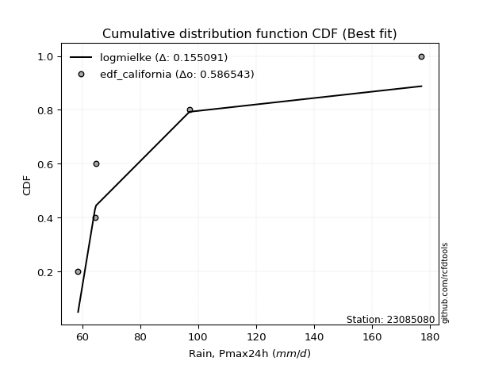</img>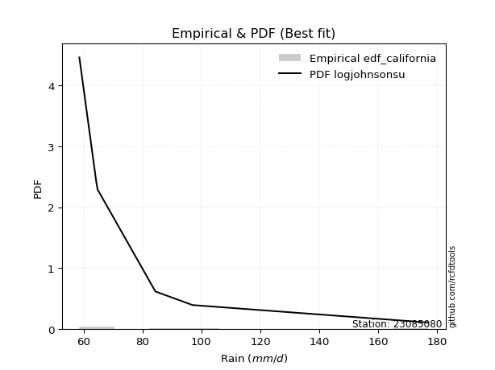</img>

</div>


### 2. Empirical - EDF Hazen (1930)

Hazen method for plotting positions is a formula used to estimate the empirical cumulative probability distribution of flood events or other hydrological data. This formula often results in biased estimations, particularly when extrapolating to extreme events (high return periods).

<div align="center">


$P=(m-0.5)/n$


</div>


**2.1. Empirical values**

<div align="center">

|                | 0                   | 1                  | 2                  | 3                  | 4         | 5                  |
|:---------------|:--------------------|:-------------------|:-------------------|:-------------------|:----------|:-------------------|
| date           | 2022                | 2024               | 2021               | 2025               | 2020      | 2019               |
| x              | 58.6                | 64.4               | 64.8               | 74.2               | 97.0      | 177.0              |
| m              | 1                   | 2                  | 3                  | 4                  | 5         | 6                  |
| empirical_dist | edf_hazen           | edf_hazen          | edf_hazen          | edf_hazen          | edf_hazen | edf_hazen          |
| empirical      | 0.08333333333333333 | 0.25               | 0.4166666666666667 | 0.5833333333333334 | 0.75      | 0.9166666666666666 |
| empirical_tr   | 1.090909090909091   | 1.3333333333333333 | 1.7142857142857144 | 2.4000000000000004 | 4.0       | 11.999999999999995 |

</div>


**2.2. Kolmogorov-Smirnov fit test (sorted by Δ)**


<div align="center">

|                | 0                   | 1                   | 2                 | 3                   | 4                   | 5                   | 6                   | 7                   | 8                   | 9                   | 10                  | 11                  | 12                  | 13                  | 14                  | 15                 | 16                  | 17                | 18                  | 19                  | 20                  | 21                  | 22                  | 23                  | 24                  | 25                 | 26                  | 27                  | 28                    | 29                  | 30                  | 31                  | 32                  | 33                 | 34                  | 35                  | 36                  | 37                 | 38                  | 39                  | 40                  | 41                  | 42                  | 43                  | 44                  | 45                  | 46                  | 47                  | 48                  | 49                  | 50                  | 51                  | 52                  | 53                  | 54                  | 55                  | 56                  | 57                  | 58                  | 59                  | 60                  | 61                 | 62                 | 63                 | 64                 | 65                  | 66                  | 67                 | 68                  | 69                 | 70                 | 71                 | 72                  | 73                  | 74                | 75                  | 76                  | 77                 | 78                  | 79                 | 80                 | 81                 | 82                 | 83                 | 84                 | 85                  | 86                  | 87                 | 88                | 89             |
|:---------------|:--------------------|:--------------------|:------------------|:--------------------|:--------------------|:--------------------|:--------------------|:--------------------|:--------------------|:--------------------|:--------------------|:--------------------|:--------------------|:--------------------|:--------------------|:-------------------|:--------------------|:------------------|:--------------------|:--------------------|:--------------------|:--------------------|:--------------------|:--------------------|:--------------------|:-------------------|:--------------------|:--------------------|:----------------------|:--------------------|:--------------------|:--------------------|:--------------------|:-------------------|:--------------------|:--------------------|:--------------------|:-------------------|:--------------------|:--------------------|:--------------------|:--------------------|:--------------------|:--------------------|:--------------------|:--------------------|:--------------------|:--------------------|:--------------------|:--------------------|:--------------------|:--------------------|:--------------------|:--------------------|:--------------------|:--------------------|:--------------------|:--------------------|:--------------------|:--------------------|:--------------------|:-------------------|:-------------------|:-------------------|:-------------------|:--------------------|:--------------------|:-------------------|:--------------------|:-------------------|:-------------------|:-------------------|:--------------------|:--------------------|:------------------|:--------------------|:--------------------|:-------------------|:--------------------|:-------------------|:-------------------|:-------------------|:-------------------|:-------------------|:-------------------|:--------------------|:--------------------|:-------------------|:------------------|:---------------|
| station        | 23085080            | 23085080            | 23085080          | 23085080            | 23085080            | 23085080            | 23085080            | 23085080            | 23085080            | 23085080            | 23085080            | 23085080            | 23085080            | 23085080            | 23085080            | 23085080           | 23085080            | 23085080          | 23085080            | 23085080            | 23085080            | 23085080            | 23085080            | 23085080            | 23085080            | 23085080           | 23085080            | 23085080            | 23085080              | 23085080            | 23085080            | 23085080            | 23085080            | 23085080           | 23085080            | 23085080            | 23085080            | 23085080           | 23085080            | 23085080            | 23085080            | 23085080            | 23085080            | 23085080            | 23085080            | 23085080            | 23085080            | 23085080            | 23085080            | 23085080            | 23085080            | 23085080            | 23085080            | 23085080            | 23085080            | 23085080            | 23085080            | 23085080            | 23085080            | 23085080            | 23085080            | 23085080           | 23085080           | 23085080           | 23085080           | 23085080            | 23085080            | 23085080           | 23085080            | 23085080           | 23085080           | 23085080           | 23085080            | 23085080            | 23085080          | 23085080            | 23085080            | 23085080           | 23085080            | 23085080           | 23085080           | 23085080           | 23085080           | 23085080           | 23085080           | 23085080            | 23085080            | 23085080           | 23085080          | 23085080       |
| empirical_dist | edf_hazen           | edf_hazen           | edf_hazen         | edf_hazen           | edf_hazen           | edf_hazen           | edf_hazen           | edf_hazen           | edf_hazen           | edf_hazen           | edf_hazen           | edf_hazen           | edf_hazen           | edf_hazen           | edf_hazen           | edf_hazen          | edf_hazen           | edf_hazen         | edf_hazen           | edf_hazen           | edf_hazen           | edf_hazen           | edf_hazen           | edf_hazen           | edf_hazen           | edf_hazen          | edf_hazen           | edf_hazen           | edf_hazen             | edf_hazen           | edf_hazen           | edf_hazen           | edf_hazen           | edf_hazen          | edf_hazen           | edf_hazen           | edf_hazen           | edf_hazen          | edf_hazen           | edf_hazen           | edf_hazen           | edf_hazen           | edf_hazen           | edf_hazen           | edf_hazen           | edf_hazen           | edf_hazen           | edf_hazen           | edf_hazen           | edf_hazen           | edf_hazen           | edf_hazen           | edf_hazen           | edf_hazen           | edf_hazen           | edf_hazen           | edf_hazen           | edf_hazen           | edf_hazen           | edf_hazen           | edf_hazen           | edf_hazen          | edf_hazen          | edf_hazen          | edf_hazen          | edf_hazen           | edf_hazen           | edf_hazen          | edf_hazen           | edf_hazen          | edf_hazen          | edf_hazen          | edf_hazen           | edf_hazen           | edf_hazen         | edf_hazen           | edf_hazen           | edf_hazen          | edf_hazen           | edf_hazen          | edf_hazen          | edf_hazen          | edf_hazen          | edf_hazen          | edf_hazen          | edf_hazen           | edf_hazen           | edf_hazen          | edf_hazen         | edf_hazen      |
| p_dist         | logf                | loginvweibull       | pareto            | alpha               | logmielke           | invgamma            | logalpha            | loginvgauss         | logpareto           | f                   | loghalflogistic     | invgauss            | logweibull_min      | loghalfnorm         | chi2                | logpearson3        | lognakagami         | logmoyal          | loggumbel_r         | logjohnsonsu        | wald                | lograyleigh         | gamma               | logmaxwell          | moyal               | pearson3           | logexponnorm        | logexpon            | loglaplace_asymmetric | loggenexpon         | lognct              | nct                 | loggenlogistic      | halflogistic       | logfatiguelife      | loginvgamma         | gumbel_r            | logwald            | rayleigh            | logloggamma         | logbetaprime        | ncf                 | logkstwobign        | halfnorm            | logtruncnorm        | logncf              | genlogistic         | logcrystalball      | lognorm             | lognorm             | logt                | betaprime           | maxwell             | weibull_min         | loglogistic         | loggompertz         | logrice             | t                   | loghypsecant        | fisk                | norm                | crystalball        | exponnorm          | genexpon           | expon              | laplace_asymmetric  | erlang              | kstwobign          | logistic            | loglaplace         | logchi2            | loggumbel_l        | hypsecant           | gompertz            | gibrat            | truncnorm           | rice                | laplace            | gumbel_l            | loggamma           | loggamma           | loggibrat          | logfisk            | loglognorm         | nakagami           | logerlang           | fatiguelife         | invweibull         | johnsonsu         | mielke         |
| delta          | 0.07684749767825166 | 0.08057250233961727 | 0.083333333333333 | 0.08578663728796404 | 0.08954144793611823 | 0.09118329121068519 | 0.09750824735700364 | 0.09795351984410933 | 0.09828313628827728 | 0.10186893558434307 | 0.10488749066532616 | 0.10742183520515597 | 0.11449566528873517 | 0.11826854860032802 | 0.11928625149692373 | 0.1193050745009121 | 0.12811085234601627 | 0.132569632751745 | 0.13461810916886996 | 0.14004175927984186 | 0.14278038432500295 | 0.14569008684873652 | 0.15522588425576445 | 0.15799427144381467 | 0.15814734451418988 | 0.1592844301609525 | 0.15984756494116797 | 0.16064523108351392 | 0.16065458496643975   | 0.16107033221832567 | 0.16533565091267594 | 0.16653897848628113 | 0.16680200833779654 | 0.1671868518303008 | 0.17133369793289677 | 0.17389641559640018 | 0.17685443877195361 | 0.1806008349519931 | 0.18248883902333246 | 0.18298123973406188 | 0.18397366100995913 | 0.18560477211060433 | 0.18777019729789915 | 0.18826790096164636 | 0.19032246489848684 | 0.19085621660506547 | 0.19161335207192032 | 0.19177327091747343 | 0.19178907276275065 | 0.19178907276275065 | 0.19179485858317785 | 0.19257708669306267 | 0.19462476710797738 | 0.19689778939798508 | 0.20563577647096098 | 0.20909494579754878 | 0.21051420609909272 | 0.21059725082412983 | 0.21688178013507975 | 0.22280454246119585 | 0.22693301107834363 | 0.2269330183690994 | 0.2327607277383032 | 0.2339771864143224 | 0.2339778609274989 | 0.23397880002959776 | 0.23602372253308287 | 0.2378640369043532 | 0.24431115195114572 | 0.2445773010600329 | 0.2463708597805464 | 0.2573930759096793 | 0.25790855528486095 | 0.26033990932402606 | 0.263818499447426 | 0.26842755670627527 | 0.26969503297519054 | 0.2862419351447212 | 0.28789727780055313 | 0.2984274287875037 | 0.2984274287875037 | 0.3157733881720636 | 0.3403944463908395 | 0.3920470484401919 | 0.3951231728337907 | 0.41439286715010404 | 0.42338393275405484 | 0.4694202050252453 | 0.538704114940397 | nan            |
| deltao         | 0.530385761606      | 0.530385761606      | 0.530385761606    | 0.530385761606      | 0.530385761606      | 0.530385761606      | 0.530385761606      | 0.530385761606      | 0.530385761606      | 0.530385761606      | 0.530385761606      | 0.530385761606      | 0.530385761606      | 0.530385761606      | 0.530385761606      | 0.530385761606     | 0.530385761606      | 0.530385761606    | 0.530385761606      | 0.530385761606      | 0.530385761606      | 0.530385761606      | 0.530385761606      | 0.530385761606      | 0.530385761606      | 0.530385761606     | 0.530385761606      | 0.530385761606      | 0.530385761606        | 0.530385761606      | 0.530385761606      | 0.530385761606      | 0.530385761606      | 0.530385761606     | 0.530385761606      | 0.530385761606      | 0.530385761606      | 0.530385761606     | 0.530385761606      | 0.530385761606      | 0.530385761606      | 0.530385761606      | 0.530385761606      | 0.530385761606      | 0.530385761606      | 0.530385761606      | 0.530385761606      | 0.530385761606      | 0.530385761606      | 0.530385761606      | 0.530385761606      | 0.530385761606      | 0.530385761606      | 0.530385761606      | 0.530385761606      | 0.530385761606      | 0.530385761606      | 0.530385761606      | 0.530385761606      | 0.530385761606      | 0.530385761606      | 0.530385761606     | 0.530385761606     | 0.530385761606     | 0.530385761606     | 0.530385761606      | 0.530385761606      | 0.530385761606     | 0.530385761606      | 0.530385761606     | 0.530385761606     | 0.530385761606     | 0.530385761606      | 0.530385761606      | 0.530385761606    | 0.530385761606      | 0.530385761606      | 0.530385761606     | 0.530385761606      | 0.530385761606     | 0.530385761606     | 0.530385761606     | 0.530385761606     | 0.530385761606     | 0.530385761606     | 0.530385761606      | 0.530385761606      | 0.530385761606     | 0.530385761606    | 0.530385761606 |
| eval           | Δo > Δ              | Δo > Δ              | Δo > Δ            | Δo > Δ              | Δo > Δ              | Δo > Δ              | Δo > Δ              | Δo > Δ              | Δo > Δ              | Δo > Δ              | Δo > Δ              | Δo > Δ              | Δo > Δ              | Δo > Δ              | Δo > Δ              | Δo > Δ             | Δo > Δ              | Δo > Δ            | Δo > Δ              | Δo > Δ              | Δo > Δ              | Δo > Δ              | Δo > Δ              | Δo > Δ              | Δo > Δ              | Δo > Δ             | Δo > Δ              | Δo > Δ              | Δo > Δ                | Δo > Δ              | Δo > Δ              | Δo > Δ              | Δo > Δ              | Δo > Δ             | Δo > Δ              | Δo > Δ              | Δo > Δ              | Δo > Δ             | Δo > Δ              | Δo > Δ              | Δo > Δ              | Δo > Δ              | Δo > Δ              | Δo > Δ              | Δo > Δ              | Δo > Δ              | Δo > Δ              | Δo > Δ              | Δo > Δ              | Δo > Δ              | Δo > Δ              | Δo > Δ              | Δo > Δ              | Δo > Δ              | Δo > Δ              | Δo > Δ              | Δo > Δ              | Δo > Δ              | Δo > Δ              | Δo > Δ              | Δo > Δ              | Δo > Δ             | Δo > Δ             | Δo > Δ             | Δo > Δ             | Δo > Δ              | Δo > Δ              | Δo > Δ             | Δo > Δ              | Δo > Δ             | Δo > Δ             | Δo > Δ             | Δo > Δ              | Δo > Δ              | Δo > Δ            | Δo > Δ              | Δo > Δ              | Δo > Δ             | Δo > Δ              | Δo > Δ             | Δo > Δ             | Δo > Δ             | Δo > Δ             | Δo > Δ             | Δo > Δ             | Δo > Δ              | Δo > Δ              | Δo > Δ             | Δo <= Δ           | Δo <= Δ        |
| fit            | 1                   | 1                   | 1                 | 1                   | 1                   | 1                   | 1                   | 1                   | 1                   | 1                   | 1                   | 1                   | 1                   | 1                   | 1                   | 1                  | 1                   | 1                 | 1                   | 1                   | 1                   | 1                   | 1                   | 1                   | 1                   | 1                  | 1                   | 1                   | 1                     | 1                   | 1                   | 1                   | 1                   | 1                  | 1                   | 1                   | 1                   | 1                  | 1                   | 1                   | 1                   | 1                   | 1                   | 1                   | 1                   | 1                   | 1                   | 1                   | 1                   | 1                   | 1                   | 1                   | 1                   | 1                   | 1                   | 1                   | 1                   | 1                   | 1                   | 1                   | 1                   | 1                  | 1                  | 1                  | 1                  | 1                   | 1                   | 1                  | 1                   | 1                  | 1                  | 1                  | 1                   | 1                   | 1                 | 1                   | 1                   | 1                  | 1                   | 1                  | 1                  | 1                  | 1                  | 1                  | 1                  | 1                   | 1                   | 1                  | 0                 | 0              |
| n              | 6                   | 6                   | 6                 | 6                   | 6                   | 6                   | 6                   | 6                   | 6                   | 6                   | 6                   | 6                   | 6                   | 6                   | 6                   | 6                  | 6                   | 6                 | 6                   | 6                   | 6                   | 6                   | 6                   | 6                   | 6                   | 6                  | 6                   | 6                   | 6                     | 6                   | 6                   | 6                   | 6                   | 6                  | 6                   | 6                   | 6                   | 6                  | 6                   | 6                   | 6                   | 6                   | 6                   | 6                   | 6                   | 6                   | 6                   | 6                   | 6                   | 6                   | 6                   | 6                   | 6                   | 6                   | 6                   | 6                   | 6                   | 6                   | 6                   | 6                   | 6                   | 6                  | 6                  | 6                  | 6                  | 6                   | 6                   | 6                  | 6                   | 6                  | 6                  | 6                  | 6                   | 6                   | 6                 | 6                   | 6                   | 6                  | 6                   | 6                  | 6                  | 6                  | 6                  | 6                  | 6                  | 6                   | 6                   | 6                  | 6                 | 6              |
| best_fit       | 1                   | 0                   | 0                 | 0                   | 0                   | 0                   | 0                   | 0                   | 0                   | 0                   | 0                   | 0                   | 0                   | 0                   | 0                   | 0                  | 0                   | 0                 | 0                   | 0                   | 0                   | 0                   | 0                   | 0                   | 0                   | 0                  | 0                   | 0                   | 0                     | 0                   | 0                   | 0                   | 0                   | 0                  | 0                   | 0                   | 0                   | 0                  | 0                   | 0                   | 0                   | 0                   | 0                   | 0                   | 0                   | 0                   | 0                   | 0                   | 0                   | 0                   | 0                   | 0                   | 0                   | 0                   | 0                   | 0                   | 0                   | 0                   | 0                   | 0                   | 0                   | 0                  | 0                  | 0                  | 0                  | 0                   | 0                   | 0                  | 0                   | 0                  | 0                  | 0                  | 0                   | 0                   | 0                 | 0                   | 0                   | 0                  | 0                   | 0                  | 0                  | 0                  | 0                  | 0                  | 0                  | 0                   | 0                   | 0                  | 0                 | 0              |
| best_fit_sort  | 1                   | 2                   | 3                 | 4                   | 5                   | 6                   | 7                   | 8                   | 9                   | 10                  | 11                  | 12                  | 13                  | 14                  | 15                  | 16                 | 17                  | 18                | 19                  | 20                  | 21                  | 22                  | 23                  | 24                  | 25                  | 26                 | 27                  | 28                  | 29                    | 30                  | 31                  | 32                  | 33                  | 34                 | 35                  | 36                  | 37                  | 38                 | 39                  | 40                  | 41                  | 42                  | 43                  | 44                  | 45                  | 46                  | 47                  | 48                  | 49                  | 50                  | 51                  | 52                  | 53                  | 54                  | 55                  | 56                  | 57                  | 58                  | 59                  | 60                  | 61                  | 62                 | 63                 | 64                 | 65                 | 66                  | 67                  | 68                 | 69                  | 70                 | 71                 | 72                 | 73                  | 74                  | 75                | 76                  | 77                  | 78                 | 79                  | 80                 | 81                 | 82                 | 83                 | 84                 | 85                 | 86                  | 87                  | 88                 | 89                | 90             |

</div>


<div align="center">

</img>

</div>


**2.3. Best fit**

<div align="center">

|   id |   station | empirical_dist   | p_dist   |     delta |   deltao | eval   |   fit |   n |   best_fit |   best_fit_sort |
|-----:|----------:|:-----------------|:---------|----------:|---------:|:-------|------:|----:|-----------:|----------------:|
|    0 |  23085080 | edf_hazen        | logf     | 0.0768475 | 0.530386 | Δo > Δ |     1 |   6 |          1 |               1 |

</div>


<div align="center">

</img></img>

</div>


### 3. Empirical - EDF Weibull (1939)

Weibull plotting position formula is an empirical method used to estimate the non-exceedance probability or plotting position for a set of observed data, is often recommended or widely used in practice, particularly in flood frequency analysis.

<div align="center">


$P=m/(n+1)$


</div>


**3.1. Empirical values**

<div align="center">

|                | 0                   | 1                  | 2                   | 3                  | 4                  | 5                  |
|:---------------|:--------------------|:-------------------|:--------------------|:-------------------|:-------------------|:-------------------|
| date           | 2022                | 2024               | 2021                | 2025               | 2020               | 2019               |
| x              | 58.6                | 64.4               | 64.8                | 74.2               | 97.0               | 177.0              |
| m              | 1                   | 2                  | 3                   | 4                  | 5                  | 6                  |
| empirical_dist | edf_weibull         | edf_weibull        | edf_weibull         | edf_weibull        | edf_weibull        | edf_weibull        |
| empirical      | 0.14285714285714285 | 0.2857142857142857 | 0.42857142857142855 | 0.5714285714285714 | 0.7142857142857143 | 0.8571428571428571 |
| empirical_tr   | 1.1666666666666665  | 1.4                | 1.75                | 2.333333333333333  | 3.5                | 6.999999999999997  |

</div>


**3.2. Kolmogorov-Smirnov fit test (sorted by Δ)**


<div align="center">

|                | 0                   | 1                   | 2                  | 3                   | 4                  | 5                   | 6                   | 7                   | 8                   | 9                   | 10                  | 11                  | 12                  | 13                  | 14                  | 15                  | 16                  | 17                  | 18                  | 19                 | 20                  | 21                  | 22                  | 23                  | 24                 | 25                 | 26                 | 27                  | 28                 | 29                  | 30                  | 31                  | 32                 | 33                  | 34                  | 35                 | 36                 | 37                  | 38                  | 39                    | 40                  | 41                  | 42                  | 43                 | 44                  | 45                  | 46                  | 47                  | 48                 | 49                  | 50                 | 51                  | 52                | 53                | 54                  | 55                | 56                 | 57                  | 58                  | 59                  | 60                  | 61                  | 62                  | 63                  | 64                  | 65                  | 66                  | 67                  | 68                  | 69                  | 70                  | 71                  | 72                  | 73                  | 74                | 75                | 76                 | 77                 | 78                 | 79                  | 80                  | 81                  | 82                  | 83                 | 84                | 85                  | 86                  | 87                  | 88                 | 89             |
|:---------------|:--------------------|:--------------------|:-------------------|:--------------------|:-------------------|:--------------------|:--------------------|:--------------------|:--------------------|:--------------------|:--------------------|:--------------------|:--------------------|:--------------------|:--------------------|:--------------------|:--------------------|:--------------------|:--------------------|:-------------------|:--------------------|:--------------------|:--------------------|:--------------------|:-------------------|:-------------------|:-------------------|:--------------------|:-------------------|:--------------------|:--------------------|:--------------------|:-------------------|:--------------------|:--------------------|:-------------------|:-------------------|:--------------------|:--------------------|:----------------------|:--------------------|:--------------------|:--------------------|:-------------------|:--------------------|:--------------------|:--------------------|:--------------------|:-------------------|:--------------------|:-------------------|:--------------------|:------------------|:------------------|:--------------------|:------------------|:-------------------|:--------------------|:--------------------|:--------------------|:--------------------|:--------------------|:--------------------|:--------------------|:--------------------|:--------------------|:--------------------|:--------------------|:--------------------|:--------------------|:--------------------|:--------------------|:--------------------|:--------------------|:------------------|:------------------|:-------------------|:-------------------|:-------------------|:--------------------|:--------------------|:--------------------|:--------------------|:-------------------|:------------------|:--------------------|:--------------------|:--------------------|:-------------------|:---------------|
| station        | 23085080            | 23085080            | 23085080           | 23085080            | 23085080           | 23085080            | 23085080            | 23085080            | 23085080            | 23085080            | 23085080            | 23085080            | 23085080            | 23085080            | 23085080            | 23085080            | 23085080            | 23085080            | 23085080            | 23085080           | 23085080            | 23085080            | 23085080            | 23085080            | 23085080           | 23085080           | 23085080           | 23085080            | 23085080           | 23085080            | 23085080            | 23085080            | 23085080           | 23085080            | 23085080            | 23085080           | 23085080           | 23085080            | 23085080            | 23085080              | 23085080            | 23085080            | 23085080            | 23085080           | 23085080            | 23085080            | 23085080            | 23085080            | 23085080           | 23085080            | 23085080           | 23085080            | 23085080          | 23085080          | 23085080            | 23085080          | 23085080           | 23085080            | 23085080            | 23085080            | 23085080            | 23085080            | 23085080            | 23085080            | 23085080            | 23085080            | 23085080            | 23085080            | 23085080            | 23085080            | 23085080            | 23085080            | 23085080            | 23085080            | 23085080          | 23085080          | 23085080           | 23085080           | 23085080           | 23085080            | 23085080            | 23085080            | 23085080            | 23085080           | 23085080          | 23085080            | 23085080            | 23085080            | 23085080           | 23085080       |
| empirical_dist | edf_weibull         | edf_weibull         | edf_weibull        | edf_weibull         | edf_weibull        | edf_weibull         | edf_weibull         | edf_weibull         | edf_weibull         | edf_weibull         | edf_weibull         | edf_weibull         | edf_weibull         | edf_weibull         | edf_weibull         | edf_weibull         | edf_weibull         | edf_weibull         | edf_weibull         | edf_weibull        | edf_weibull         | edf_weibull         | edf_weibull         | edf_weibull         | edf_weibull        | edf_weibull        | edf_weibull        | edf_weibull         | edf_weibull        | edf_weibull         | edf_weibull         | edf_weibull         | edf_weibull        | edf_weibull         | edf_weibull         | edf_weibull        | edf_weibull        | edf_weibull         | edf_weibull         | edf_weibull           | edf_weibull         | edf_weibull         | edf_weibull         | edf_weibull        | edf_weibull         | edf_weibull         | edf_weibull         | edf_weibull         | edf_weibull        | edf_weibull         | edf_weibull        | edf_weibull         | edf_weibull       | edf_weibull       | edf_weibull         | edf_weibull       | edf_weibull        | edf_weibull         | edf_weibull         | edf_weibull         | edf_weibull         | edf_weibull         | edf_weibull         | edf_weibull         | edf_weibull         | edf_weibull         | edf_weibull         | edf_weibull         | edf_weibull         | edf_weibull         | edf_weibull         | edf_weibull         | edf_weibull         | edf_weibull         | edf_weibull       | edf_weibull       | edf_weibull        | edf_weibull        | edf_weibull        | edf_weibull         | edf_weibull         | edf_weibull         | edf_weibull         | edf_weibull        | edf_weibull       | edf_weibull         | edf_weibull         | edf_weibull         | edf_weibull        | edf_weibull    |
| p_dist         | alpha               | loginvweibull       | logalpha           | logf                | invgamma           | loginvgauss         | invgauss            | loghalfnorm         | logjohnsonsu        | logmielke           | loghalflogistic     | halflogistic        | logpearson3         | logncf              | pearson3            | lograyleigh         | logfatiguelife      | halfnorm            | f                   | lognakagami        | logweibull_min      | logpareto           | pareto              | logmoyal            | gamma              | logmaxwell         | moyal              | loggumbel_r         | wald               | chi2                | lognct              | weibull_min         | loginvgamma        | gumbel_r            | fisk                | rayleigh           | logloggamma        | logexponnorm        | logexpon            | loglaplace_asymmetric | loggenexpon         | nct                 | ncf                 | loggenlogistic     | logcrystalball      | lognorm             | lognorm             | logt                | maxwell            | genlogistic         | betaprime          | logwald             | loglogistic       | logbetaprime      | t                   | logkstwobign      | logtruncnorm       | loghypsecant        | norm                | crystalball         | logrice             | logchi2             | loggompertz         | kstwobign           | logistic            | loglaplace          | exponnorm           | loggumbel_l         | genexpon            | expon               | laplace_asymmetric  | hypsecant           | erlang              | rice                | loggamma          | loggamma          | gompertz           | laplace            | gibrat             | gumbel_l            | truncnorm           | logfisk             | loggibrat           | loglognorm         | nakagami          | logerlang           | fatiguelife         | invweibull          | johnsonsu          | mielke         |
| delta          | 0.09252866419401345 | 0.09416491355005724 | 0.0943924863468764 | 0.09456652635781962 | 0.0967220068200155 | 0.09824773515809082 | 0.09893038286006475 | 0.10609069936228216 | 0.11151223394806684 | 0.11409089279418616 | 0.11679225257008802 | 0.12688711850979045 | 0.13096465051885664 | 0.13133240708125593 | 0.13317110650477637 | 0.13378532494397455 | 0.13561941221861107 | 0.13604936710491977 | 0.14275391182819777 | 0.1428571270989516 | 0.14285714265137425 | 0.14285714285714207 | 0.14285714285714252 | 0.14447439465650685 | 0.1459304019468598 | 0.1460895095390527 | 0.1462425826094279 | 0.14652287107363182 | 0.1546851462297648 | 0.15500053721120943 | 0.16045762867133645 | 0.16118350368369938 | 0.1619916536916382 | 0.16494967686719164 | 0.16788441489221717 | 0.1705840771185705 | 0.1710764778292999 | 0.17175232684592984 | 0.17254999298827578 | 0.1725593468712016    | 0.17297509412308754 | 0.17305976025743636 | 0.17370001020584236 | 0.1787067702425584 | 0.17986850901271145 | 0.17988431085798867 | 0.17988431085798867 | 0.17989009667841588 | 0.1827200052032154 | 0.18429706160711073 | 0.1908004268168118 | 0.19250559685675497 | 0.193731014566199 | 0.195878422914721 | 0.19869248891936786 | 0.199674959202661 | 0.2022272268032487 | 0.20497701823031778 | 0.21502824917358165 | 0.21502825646433743 | 0.21851092801176045 | 0.21880447176850848 | 0.22099970770231064 | 0.22595927499959123 | 0.23240639004638375 | 0.23267253915527092 | 0.24466548964306506 | 0.24548831400491733 | 0.24588194831908428 | 0.24588262283226076 | 0.24588356193435962 | 0.24600379338009898 | 0.24792848443784474 | 0.25779027107042857 | 0.262713143073218 | 0.262713143073218 | 0.2722446712287879 | 0.2743371732399592 | 0.2757232613521879 | 0.27599251589579116 | 0.28033231861103713 | 0.28087063686702995 | 0.32767815007682544 | 0.3563327627259062 | 0.359408887119505 | 0.37867858143581834 | 0.38766964703976914 | 0.40989639550143575 | 0.5029898292261114 | nan            |
| deltao         | 0.530385761606      | 0.530385761606      | 0.530385761606     | 0.530385761606      | 0.530385761606     | 0.530385761606      | 0.530385761606      | 0.530385761606      | 0.530385761606      | 0.530385761606      | 0.530385761606      | 0.530385761606      | 0.530385761606      | 0.530385761606      | 0.530385761606      | 0.530385761606      | 0.530385761606      | 0.530385761606      | 0.530385761606      | 0.530385761606     | 0.530385761606      | 0.530385761606      | 0.530385761606      | 0.530385761606      | 0.530385761606     | 0.530385761606     | 0.530385761606     | 0.530385761606      | 0.530385761606     | 0.530385761606      | 0.530385761606      | 0.530385761606      | 0.530385761606     | 0.530385761606      | 0.530385761606      | 0.530385761606     | 0.530385761606     | 0.530385761606      | 0.530385761606      | 0.530385761606        | 0.530385761606      | 0.530385761606      | 0.530385761606      | 0.530385761606     | 0.530385761606      | 0.530385761606      | 0.530385761606      | 0.530385761606      | 0.530385761606     | 0.530385761606      | 0.530385761606     | 0.530385761606      | 0.530385761606    | 0.530385761606    | 0.530385761606      | 0.530385761606    | 0.530385761606     | 0.530385761606      | 0.530385761606      | 0.530385761606      | 0.530385761606      | 0.530385761606      | 0.530385761606      | 0.530385761606      | 0.530385761606      | 0.530385761606      | 0.530385761606      | 0.530385761606      | 0.530385761606      | 0.530385761606      | 0.530385761606      | 0.530385761606      | 0.530385761606      | 0.530385761606      | 0.530385761606    | 0.530385761606    | 0.530385761606     | 0.530385761606     | 0.530385761606     | 0.530385761606      | 0.530385761606      | 0.530385761606      | 0.530385761606      | 0.530385761606     | 0.530385761606    | 0.530385761606      | 0.530385761606      | 0.530385761606      | 0.530385761606     | 0.530385761606 |
| eval           | Δo > Δ              | Δo > Δ              | Δo > Δ             | Δo > Δ              | Δo > Δ             | Δo > Δ              | Δo > Δ              | Δo > Δ              | Δo > Δ              | Δo > Δ              | Δo > Δ              | Δo > Δ              | Δo > Δ              | Δo > Δ              | Δo > Δ              | Δo > Δ              | Δo > Δ              | Δo > Δ              | Δo > Δ              | Δo > Δ             | Δo > Δ              | Δo > Δ              | Δo > Δ              | Δo > Δ              | Δo > Δ             | Δo > Δ             | Δo > Δ             | Δo > Δ              | Δo > Δ             | Δo > Δ              | Δo > Δ              | Δo > Δ              | Δo > Δ             | Δo > Δ              | Δo > Δ              | Δo > Δ             | Δo > Δ             | Δo > Δ              | Δo > Δ              | Δo > Δ                | Δo > Δ              | Δo > Δ              | Δo > Δ              | Δo > Δ             | Δo > Δ              | Δo > Δ              | Δo > Δ              | Δo > Δ              | Δo > Δ             | Δo > Δ              | Δo > Δ             | Δo > Δ              | Δo > Δ            | Δo > Δ            | Δo > Δ              | Δo > Δ            | Δo > Δ             | Δo > Δ              | Δo > Δ              | Δo > Δ              | Δo > Δ              | Δo > Δ              | Δo > Δ              | Δo > Δ              | Δo > Δ              | Δo > Δ              | Δo > Δ              | Δo > Δ              | Δo > Δ              | Δo > Δ              | Δo > Δ              | Δo > Δ              | Δo > Δ              | Δo > Δ              | Δo > Δ            | Δo > Δ            | Δo > Δ             | Δo > Δ             | Δo > Δ             | Δo > Δ              | Δo > Δ              | Δo > Δ              | Δo > Δ              | Δo > Δ             | Δo > Δ            | Δo > Δ              | Δo > Δ              | Δo > Δ              | Δo > Δ             | Δo <= Δ        |
| fit            | 1                   | 1                   | 1                  | 1                   | 1                  | 1                   | 1                   | 1                   | 1                   | 1                   | 1                   | 1                   | 1                   | 1                   | 1                   | 1                   | 1                   | 1                   | 1                   | 1                  | 1                   | 1                   | 1                   | 1                   | 1                  | 1                  | 1                  | 1                   | 1                  | 1                   | 1                   | 1                   | 1                  | 1                   | 1                   | 1                  | 1                  | 1                   | 1                   | 1                     | 1                   | 1                   | 1                   | 1                  | 1                   | 1                   | 1                   | 1                   | 1                  | 1                   | 1                  | 1                   | 1                 | 1                 | 1                   | 1                 | 1                  | 1                   | 1                   | 1                   | 1                   | 1                   | 1                   | 1                   | 1                   | 1                   | 1                   | 1                   | 1                   | 1                   | 1                   | 1                   | 1                   | 1                   | 1                 | 1                 | 1                  | 1                  | 1                  | 1                   | 1                   | 1                   | 1                   | 1                  | 1                 | 1                   | 1                   | 1                   | 1                  | 0              |
| n              | 6                   | 6                   | 6                  | 6                   | 6                  | 6                   | 6                   | 6                   | 6                   | 6                   | 6                   | 6                   | 6                   | 6                   | 6                   | 6                   | 6                   | 6                   | 6                   | 6                  | 6                   | 6                   | 6                   | 6                   | 6                  | 6                  | 6                  | 6                   | 6                  | 6                   | 6                   | 6                   | 6                  | 6                   | 6                   | 6                  | 6                  | 6                   | 6                   | 6                     | 6                   | 6                   | 6                   | 6                  | 6                   | 6                   | 6                   | 6                   | 6                  | 6                   | 6                  | 6                   | 6                 | 6                 | 6                   | 6                 | 6                  | 6                   | 6                   | 6                   | 6                   | 6                   | 6                   | 6                   | 6                   | 6                   | 6                   | 6                   | 6                   | 6                   | 6                   | 6                   | 6                   | 6                   | 6                 | 6                 | 6                  | 6                  | 6                  | 6                   | 6                   | 6                   | 6                   | 6                  | 6                 | 6                   | 6                   | 6                   | 6                  | 6              |
| best_fit       | 1                   | 0                   | 0                  | 0                   | 0                  | 0                   | 0                   | 0                   | 0                   | 0                   | 0                   | 0                   | 0                   | 0                   | 0                   | 0                   | 0                   | 0                   | 0                   | 0                  | 0                   | 0                   | 0                   | 0                   | 0                  | 0                  | 0                  | 0                   | 0                  | 0                   | 0                   | 0                   | 0                  | 0                   | 0                   | 0                  | 0                  | 0                   | 0                   | 0                     | 0                   | 0                   | 0                   | 0                  | 0                   | 0                   | 0                   | 0                   | 0                  | 0                   | 0                  | 0                   | 0                 | 0                 | 0                   | 0                 | 0                  | 0                   | 0                   | 0                   | 0                   | 0                   | 0                   | 0                   | 0                   | 0                   | 0                   | 0                   | 0                   | 0                   | 0                   | 0                   | 0                   | 0                   | 0                 | 0                 | 0                  | 0                  | 0                  | 0                   | 0                   | 0                   | 0                   | 0                  | 0                 | 0                   | 0                   | 0                   | 0                  | 0              |
| best_fit_sort  | 1                   | 2                   | 3                  | 4                   | 5                  | 6                   | 7                   | 8                   | 9                   | 10                  | 11                  | 12                  | 13                  | 14                  | 15                  | 16                  | 17                  | 18                  | 19                  | 20                 | 21                  | 22                  | 23                  | 24                  | 25                 | 26                 | 27                 | 28                  | 29                 | 30                  | 31                  | 32                  | 33                 | 34                  | 35                  | 36                 | 37                 | 38                  | 39                  | 40                    | 41                  | 42                  | 43                  | 44                 | 45                  | 46                  | 47                  | 48                  | 49                 | 50                  | 51                 | 52                  | 53                | 54                | 55                  | 56                | 57                 | 58                  | 59                  | 60                  | 61                  | 62                  | 63                  | 64                  | 65                  | 66                  | 67                  | 68                  | 69                  | 70                  | 71                  | 72                  | 73                  | 74                  | 75                | 76                | 77                 | 78                 | 79                 | 80                  | 81                  | 82                  | 83                  | 84                 | 85                | 86                  | 87                  | 88                  | 89                 | 90             |

</div>


<div align="center">

</img>

</div>


**3.3. Best fit**

<div align="center">

|   id |   station | empirical_dist   | p_dist   |     delta |   deltao | eval   |   fit |   n |   best_fit |   best_fit_sort |
|-----:|----------:|:-----------------|:---------|----------:|---------:|:-------|------:|----:|-----------:|----------------:|
|    0 |  23085080 | edf_weibull      | alpha    | 0.0925287 | 0.530386 | Δo > Δ |     1 |   6 |          1 |               1 |

</div>


<div align="center">

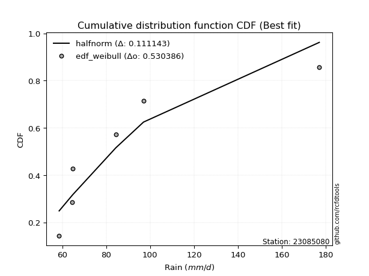</img>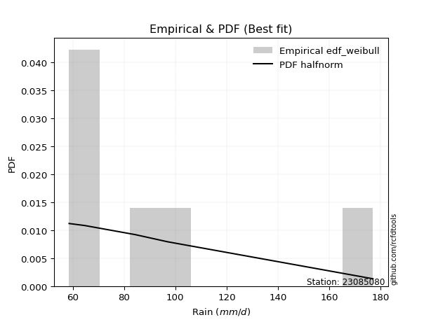</img>

</div>


### 4. Empirical - EDF Beard (1943)

The Beard formula (or Beard´s plotting position formula) in hydrology is used to estimate the empirical non-exceedance probability _(P)_ of a flood event (or other extreme hydrological data point) within a given dataset.

<div align="center">


$P=(m-0.31)/(n+0.38)$


</div>


**4.1. Empirical values**

<div align="center">

|                | 0                   | 1                   | 2                  | 3                  | 4                  | 5                  |
|:---------------|:--------------------|:--------------------|:-------------------|:-------------------|:-------------------|:-------------------|
| date           | 2022                | 2024                | 2021               | 2025               | 2020               | 2019               |
| x              | 58.6                | 64.4                | 64.8               | 74.2               | 97.0               | 177.0              |
| m              | 1                   | 2                   | 3                  | 4                  | 5                  | 6                  |
| empirical_dist | edf_beard           | edf_beard           | edf_beard          | edf_beard          | edf_beard          | edf_beard          |
| empirical      | 0.10815047021943573 | 0.26489028213166144 | 0.4216300940438871 | 0.5783699059561128 | 0.7351097178683387 | 0.8918495297805643 |
| empirical_tr   | 1.1212653778558874  | 1.3603411513859276  | 1.7289972899728996 | 2.3717472118959106 | 3.7751479289940844 | 9.246376811594207  |

</div>


**4.2. Kolmogorov-Smirnov fit test (sorted by Δ)**


<div align="center">

|                | 0                  | 1                   | 2                   | 3                   | 4                  | 5                   | 6                   | 7                   | 8                  | 9                   | 10                  | 11                  | 12                 | 13                 | 14                  | 15                  | 16                  | 17                  | 18                  | 19                 | 20                 | 21                | 22                  | 23                  | 24                 | 25                  | 26                  | 27                  | 28                  | 29                  | 30                  | 31                  | 32                    | 33                  | 34                  | 35                  | 36                  | 37                  | 38                  | 39                 | 40                  | 41                  | 42                  | 43                  | 44                  | 45                  | 46                 | 47                 | 48                 | 49                  | 50                  | 51                  | 52                 | 53                  | 54                  | 55                  | 56                  | 57                  | 58                 | 59                  | 60                  | 61                  | 62                  | 63                  | 64                  | 65                  | 66                  | 67                 | 68                  | 69                  | 70                  | 71                  | 72                 | 73               | 74                 | 75                  | 76                 | 77                  | 78                 | 79                 | 80                 | 81                  | 82                | 83                  | 84                 | 85                 | 86                 | 87                  | 88                 | 89             |
|:---------------|:-------------------|:--------------------|:--------------------|:--------------------|:-------------------|:--------------------|:--------------------|:--------------------|:-------------------|:--------------------|:--------------------|:--------------------|:-------------------|:-------------------|:--------------------|:--------------------|:--------------------|:--------------------|:--------------------|:-------------------|:-------------------|:------------------|:--------------------|:--------------------|:-------------------|:--------------------|:--------------------|:--------------------|:--------------------|:--------------------|:--------------------|:--------------------|:----------------------|:--------------------|:--------------------|:--------------------|:--------------------|:--------------------|:--------------------|:-------------------|:--------------------|:--------------------|:--------------------|:--------------------|:--------------------|:--------------------|:-------------------|:-------------------|:-------------------|:--------------------|:--------------------|:--------------------|:-------------------|:--------------------|:--------------------|:--------------------|:--------------------|:--------------------|:-------------------|:--------------------|:--------------------|:--------------------|:--------------------|:--------------------|:--------------------|:--------------------|:--------------------|:-------------------|:--------------------|:--------------------|:--------------------|:--------------------|:-------------------|:-----------------|:-------------------|:--------------------|:-------------------|:--------------------|:-------------------|:-------------------|:-------------------|:--------------------|:------------------|:--------------------|:-------------------|:-------------------|:-------------------|:--------------------|:-------------------|:---------------|
| station        | 23085080           | 23085080            | 23085080            | 23085080            | 23085080           | 23085080            | 23085080            | 23085080            | 23085080           | 23085080            | 23085080            | 23085080            | 23085080           | 23085080           | 23085080            | 23085080            | 23085080            | 23085080            | 23085080            | 23085080           | 23085080           | 23085080          | 23085080            | 23085080            | 23085080           | 23085080            | 23085080            | 23085080            | 23085080            | 23085080            | 23085080            | 23085080            | 23085080              | 23085080            | 23085080            | 23085080            | 23085080            | 23085080            | 23085080            | 23085080           | 23085080            | 23085080            | 23085080            | 23085080            | 23085080            | 23085080            | 23085080           | 23085080           | 23085080           | 23085080            | 23085080            | 23085080            | 23085080           | 23085080            | 23085080            | 23085080            | 23085080            | 23085080            | 23085080           | 23085080            | 23085080            | 23085080            | 23085080            | 23085080            | 23085080            | 23085080            | 23085080            | 23085080           | 23085080            | 23085080            | 23085080            | 23085080            | 23085080           | 23085080         | 23085080           | 23085080            | 23085080           | 23085080            | 23085080           | 23085080           | 23085080           | 23085080            | 23085080          | 23085080            | 23085080           | 23085080           | 23085080           | 23085080            | 23085080           | 23085080       |
| empirical_dist | edf_beard          | edf_beard           | edf_beard           | edf_beard           | edf_beard          | edf_beard           | edf_beard           | edf_beard           | edf_beard          | edf_beard           | edf_beard           | edf_beard           | edf_beard          | edf_beard          | edf_beard           | edf_beard           | edf_beard           | edf_beard           | edf_beard           | edf_beard          | edf_beard          | edf_beard         | edf_beard           | edf_beard           | edf_beard          | edf_beard           | edf_beard           | edf_beard           | edf_beard           | edf_beard           | edf_beard           | edf_beard           | edf_beard             | edf_beard           | edf_beard           | edf_beard           | edf_beard           | edf_beard           | edf_beard           | edf_beard          | edf_beard           | edf_beard           | edf_beard           | edf_beard           | edf_beard           | edf_beard           | edf_beard          | edf_beard          | edf_beard          | edf_beard           | edf_beard           | edf_beard           | edf_beard          | edf_beard           | edf_beard           | edf_beard           | edf_beard           | edf_beard           | edf_beard          | edf_beard           | edf_beard           | edf_beard           | edf_beard           | edf_beard           | edf_beard           | edf_beard           | edf_beard           | edf_beard          | edf_beard           | edf_beard           | edf_beard           | edf_beard           | edf_beard          | edf_beard        | edf_beard          | edf_beard           | edf_beard          | edf_beard           | edf_beard          | edf_beard          | edf_beard          | edf_beard           | edf_beard         | edf_beard           | edf_beard          | edf_beard          | edf_beard          | edf_beard           | edf_beard          | edf_beard      |
| p_dist         | alpha              | loginvweibull       | invgamma            | logf                | logalpha           | loginvgauss         | invgauss            | logmielke           | loghalfnorm        | f                   | logweibull_min      | logpareto           | pareto             | loghalflogistic    | logpearson3         | logjohnsonsu        | lognakagami         | chi2                | logmoyal            | loggumbel_r        | pearson3           | gamma             | lograyleigh         | halflogistic        | wald               | logmaxwell          | moyal               | logfatiguelife      | lognct              | halfnorm            | logexponnorm        | logexpon            | loglaplace_asymmetric | loggenexpon         | logncf              | nct                 | loginvgamma         | loggenlogistic      | gumbel_r            | rayleigh           | logloggamma         | ncf                 | weibull_min         | logwald             | genlogistic         | logcrystalball      | lognorm            | lognorm            | logt               | betaprime           | logbetaprime        | maxwell             | logkstwobign       | logtruncnorm        | fisk                | loglogistic         | t                   | logrice             | loghypsecant       | loggompertz         | norm                | crystalball         | logchi2             | kstwobign           | exponnorm           | genexpon            | expon               | laplace_asymmetric | logistic            | loglaplace          | erlang              | loggumbel_l         | hypsecant          | rice             | gompertz           | gibrat              | truncnorm          | laplace             | gumbel_l           | loggamma           | loggamma           | logfisk             | loggibrat         | loglognorm          | nakagami           | logerlang          | fatiguelife        | invweibull          | johnsonsu          | mielke         |
| delta          | 0.0708963551563026 | 0.07429064883306402 | 0.07629300907902375 | 0.07811165529991732 | 0.0826179652253422 | 0.08306323771244789 | 0.09253155307349453 | 0.09450487531333868 | 0.1058005285480838 | 0.10804723919049065 | 0.10815047001366712 | 0.10815047021943495 | 0.1081504702194354 | 0.1098509180425466 | 0.12402331599131522 | 0.12515147714818042 | 0.12723333726781783 | 0.13417653362858506 | 0.13753306012896543 | 0.1395815365460904 | 0.1401124410323178 | 0.140335602124103 | 0.14072665947151597 | 0.14236971494419837 | 0.1477438117022234 | 0.15303084406659412 | 0.15318391713696933 | 0.15644341580123533 | 0.16037222353545538 | 0.16345076407554393 | 0.16481099231838842 | 0.16560865846073436 | 0.1656180123436602    | 0.16603375959554612 | 0.16603907971896303 | 0.16611842572989494 | 0.16893298821917963 | 0.17176543571501698 | 0.17189101139473306 | 0.1775254116461119 | 0.17801781235684133 | 0.18064134473338378 | 0.18200750726632364 | 0.18556426232921355 | 0.18664992469469976 | 0.18680984354025287 | 0.1868256453855301 | 0.1868256453855301 | 0.1868314312059573 | 0.18761365931584212 | 0.18893708838717957 | 0.18966133973075683 | 0.1927336246751196 | 0.19528589227570728 | 0.19798740557509353 | 0.20067234909374043 | 0.20563382344690928 | 0.21156959348421903 | 0.2119183527578592 | 0.21405837317476922 | 0.22196958370112307 | 0.22196959099187885 | 0.23148057764888508 | 0.23290060952713265 | 0.23772415511552364 | 0.23894061379154286 | 0.23894128830471933 | 0.2389422274068182 | 0.23934772457392517 | 0.23961387368281234 | 0.24098714991030332 | 0.25242964853245875 | 0.2529451279076404 | 0.26473160559797 | 0.2653033367012465 | 0.26878192682464647 | 0.2733909840834957 | 0.28127850776750063 | 0.2829338504233326 | 0.2835371466558423 | 0.2835371466558423 | 0.31557730950473717 | 0.320736815549284 | 0.37715676630853046 | 0.3802328907021293 | 0.3995025850184426 | 0.4084936506223934 | 0.44460306813914297 | 0.5238138328087356 | nan            |
| deltao         | 0.530385761606     | 0.530385761606      | 0.530385761606      | 0.530385761606      | 0.530385761606     | 0.530385761606      | 0.530385761606      | 0.530385761606      | 0.530385761606     | 0.530385761606      | 0.530385761606      | 0.530385761606      | 0.530385761606     | 0.530385761606     | 0.530385761606      | 0.530385761606      | 0.530385761606      | 0.530385761606      | 0.530385761606      | 0.530385761606     | 0.530385761606     | 0.530385761606    | 0.530385761606      | 0.530385761606      | 0.530385761606     | 0.530385761606      | 0.530385761606      | 0.530385761606      | 0.530385761606      | 0.530385761606      | 0.530385761606      | 0.530385761606      | 0.530385761606        | 0.530385761606      | 0.530385761606      | 0.530385761606      | 0.530385761606      | 0.530385761606      | 0.530385761606      | 0.530385761606     | 0.530385761606      | 0.530385761606      | 0.530385761606      | 0.530385761606      | 0.530385761606      | 0.530385761606      | 0.530385761606     | 0.530385761606     | 0.530385761606     | 0.530385761606      | 0.530385761606      | 0.530385761606      | 0.530385761606     | 0.530385761606      | 0.530385761606      | 0.530385761606      | 0.530385761606      | 0.530385761606      | 0.530385761606     | 0.530385761606      | 0.530385761606      | 0.530385761606      | 0.530385761606      | 0.530385761606      | 0.530385761606      | 0.530385761606      | 0.530385761606      | 0.530385761606     | 0.530385761606      | 0.530385761606      | 0.530385761606      | 0.530385761606      | 0.530385761606     | 0.530385761606   | 0.530385761606     | 0.530385761606      | 0.530385761606     | 0.530385761606      | 0.530385761606     | 0.530385761606     | 0.530385761606     | 0.530385761606      | 0.530385761606    | 0.530385761606      | 0.530385761606     | 0.530385761606     | 0.530385761606     | 0.530385761606      | 0.530385761606     | 0.530385761606 |
| eval           | Δo > Δ             | Δo > Δ              | Δo > Δ              | Δo > Δ              | Δo > Δ             | Δo > Δ              | Δo > Δ              | Δo > Δ              | Δo > Δ             | Δo > Δ              | Δo > Δ              | Δo > Δ              | Δo > Δ             | Δo > Δ             | Δo > Δ              | Δo > Δ              | Δo > Δ              | Δo > Δ              | Δo > Δ              | Δo > Δ             | Δo > Δ             | Δo > Δ            | Δo > Δ              | Δo > Δ              | Δo > Δ             | Δo > Δ              | Δo > Δ              | Δo > Δ              | Δo > Δ              | Δo > Δ              | Δo > Δ              | Δo > Δ              | Δo > Δ                | Δo > Δ              | Δo > Δ              | Δo > Δ              | Δo > Δ              | Δo > Δ              | Δo > Δ              | Δo > Δ             | Δo > Δ              | Δo > Δ              | Δo > Δ              | Δo > Δ              | Δo > Δ              | Δo > Δ              | Δo > Δ             | Δo > Δ             | Δo > Δ             | Δo > Δ              | Δo > Δ              | Δo > Δ              | Δo > Δ             | Δo > Δ              | Δo > Δ              | Δo > Δ              | Δo > Δ              | Δo > Δ              | Δo > Δ             | Δo > Δ              | Δo > Δ              | Δo > Δ              | Δo > Δ              | Δo > Δ              | Δo > Δ              | Δo > Δ              | Δo > Δ              | Δo > Δ             | Δo > Δ              | Δo > Δ              | Δo > Δ              | Δo > Δ              | Δo > Δ             | Δo > Δ           | Δo > Δ             | Δo > Δ              | Δo > Δ             | Δo > Δ              | Δo > Δ             | Δo > Δ             | Δo > Δ             | Δo > Δ              | Δo > Δ            | Δo > Δ              | Δo > Δ             | Δo > Δ             | Δo > Δ             | Δo > Δ              | Δo > Δ             | Δo <= Δ        |
| fit            | 1                  | 1                   | 1                   | 1                   | 1                  | 1                   | 1                   | 1                   | 1                  | 1                   | 1                   | 1                   | 1                  | 1                  | 1                   | 1                   | 1                   | 1                   | 1                   | 1                  | 1                  | 1                 | 1                   | 1                   | 1                  | 1                   | 1                   | 1                   | 1                   | 1                   | 1                   | 1                   | 1                     | 1                   | 1                   | 1                   | 1                   | 1                   | 1                   | 1                  | 1                   | 1                   | 1                   | 1                   | 1                   | 1                   | 1                  | 1                  | 1                  | 1                   | 1                   | 1                   | 1                  | 1                   | 1                   | 1                   | 1                   | 1                   | 1                  | 1                   | 1                   | 1                   | 1                   | 1                   | 1                   | 1                   | 1                   | 1                  | 1                   | 1                   | 1                   | 1                   | 1                  | 1                | 1                  | 1                   | 1                  | 1                   | 1                  | 1                  | 1                  | 1                   | 1                 | 1                   | 1                  | 1                  | 1                  | 1                   | 1                  | 0              |
| n              | 6                  | 6                   | 6                   | 6                   | 6                  | 6                   | 6                   | 6                   | 6                  | 6                   | 6                   | 6                   | 6                  | 6                  | 6                   | 6                   | 6                   | 6                   | 6                   | 6                  | 6                  | 6                 | 6                   | 6                   | 6                  | 6                   | 6                   | 6                   | 6                   | 6                   | 6                   | 6                   | 6                     | 6                   | 6                   | 6                   | 6                   | 6                   | 6                   | 6                  | 6                   | 6                   | 6                   | 6                   | 6                   | 6                   | 6                  | 6                  | 6                  | 6                   | 6                   | 6                   | 6                  | 6                   | 6                   | 6                   | 6                   | 6                   | 6                  | 6                   | 6                   | 6                   | 6                   | 6                   | 6                   | 6                   | 6                   | 6                  | 6                   | 6                   | 6                   | 6                   | 6                  | 6                | 6                  | 6                   | 6                  | 6                   | 6                  | 6                  | 6                  | 6                   | 6                 | 6                   | 6                  | 6                  | 6                  | 6                   | 6                  | 6              |
| best_fit       | 1                  | 0                   | 0                   | 0                   | 0                  | 0                   | 0                   | 0                   | 0                  | 0                   | 0                   | 0                   | 0                  | 0                  | 0                   | 0                   | 0                   | 0                   | 0                   | 0                  | 0                  | 0                 | 0                   | 0                   | 0                  | 0                   | 0                   | 0                   | 0                   | 0                   | 0                   | 0                   | 0                     | 0                   | 0                   | 0                   | 0                   | 0                   | 0                   | 0                  | 0                   | 0                   | 0                   | 0                   | 0                   | 0                   | 0                  | 0                  | 0                  | 0                   | 0                   | 0                   | 0                  | 0                   | 0                   | 0                   | 0                   | 0                   | 0                  | 0                   | 0                   | 0                   | 0                   | 0                   | 0                   | 0                   | 0                   | 0                  | 0                   | 0                   | 0                   | 0                   | 0                  | 0                | 0                  | 0                   | 0                  | 0                   | 0                  | 0                  | 0                  | 0                   | 0                 | 0                   | 0                  | 0                  | 0                  | 0                   | 0                  | 0              |
| best_fit_sort  | 1                  | 2                   | 3                   | 4                   | 5                  | 6                   | 7                   | 8                   | 9                  | 10                  | 11                  | 12                  | 13                 | 14                 | 15                  | 16                  | 17                  | 18                  | 19                  | 20                 | 21                 | 22                | 23                  | 24                  | 25                 | 26                  | 27                  | 28                  | 29                  | 30                  | 31                  | 32                  | 33                    | 34                  | 35                  | 36                  | 37                  | 38                  | 39                  | 40                 | 41                  | 42                  | 43                  | 44                  | 45                  | 46                  | 47                 | 48                 | 49                 | 50                  | 51                  | 52                  | 53                 | 54                  | 55                  | 56                  | 57                  | 58                  | 59                 | 60                  | 61                  | 62                  | 63                  | 64                  | 65                  | 66                  | 67                  | 68                 | 69                  | 70                  | 71                  | 72                  | 73                 | 74               | 75                 | 76                  | 77                 | 78                  | 79                 | 80                 | 81                 | 82                  | 83                | 84                  | 85                 | 86                 | 87                 | 88                  | 89                 | 90             |

</div>


<div align="center">

</img>

</div>


**4.3. Best fit**

<div align="center">

|   id |   station | empirical_dist   | p_dist   |     delta |   deltao | eval   |   fit |   n |   best_fit |   best_fit_sort |
|-----:|----------:|:-----------------|:---------|----------:|---------:|:-------|------:|----:|-----------:|----------------:|
|    0 |  23085080 | edf_beard        | alpha    | 0.0708964 | 0.530386 | Δo > Δ |     1 |   6 |          1 |               1 |

</div>


<div align="center">

</img>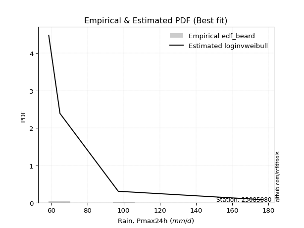</img>

</div>


### 5. Empirical - EDF Chegodayev (1955)

The Chegodayev formula is an empirical plotting position formula used in hydrological frequency analysis to estimate the exceedance probability or return period of a specific event from a set of observed data. It is primarily used for plotting observed data points on probability paper to fit a theoretical distribution, particularly for analyzing extreme events like maximum flood flows or rainfall intensities. The constant _b_ value in the generalized plotting position formula is 0.3.

<div align="center">


$P=(m-b)/(n+1-2b)$


</div>


**5.1. Empirical values**

<div align="center">

|                | 0                   | 1                  | 2                  | 3                  | 4                 | 5                 |
|:---------------|:--------------------|:-------------------|:-------------------|:-------------------|:------------------|:------------------|
| date           | 2022                | 2024               | 2021               | 2025               | 2020              | 2019              |
| x              | 58.6                | 64.4               | 64.8               | 74.2               | 97.0              | 177.0             |
| m              | 1                   | 2                  | 3                  | 4                  | 5                 | 6                 |
| empirical_dist | edf_chegodayev      | edf_chegodayev     | edf_chegodayev     | edf_chegodayev     | edf_chegodayev    | edf_chegodayev    |
| empirical      | 0.10937499999999999 | 0.265625           | 0.421875           | 0.578125           | 0.734375          | 0.890625          |
| empirical_tr   | 1.1228070175438596  | 1.3617021276595744 | 1.7297297297297298 | 2.3703703703703702 | 3.764705882352941 | 9.142857142857142 |

</div>


**5.2. Kolmogorov-Smirnov fit test (sorted by Δ)**


<div align="center">

|                | 0                   | 1                  | 2                   | 3                   | 4                   | 5                   | 6                   | 7                   | 8                   | 9                   | 10                  | 11                  | 12                  | 13                  | 14                  | 15                  | 16                 | 17                  | 18                 | 19                  | 20                  | 21                  | 22                  | 23                 | 24                  | 25                 | 26                 | 27                  | 28                  | 29                  | 30                  | 31                 | 32                  | 33                    | 34                | 35                 | 36                 | 37                  | 38                  | 39                 | 40                  | 41                  | 42                  | 43                  | 44                  | 45                  | 46                  | 47                  | 48                  | 49                 | 50                  | 51                | 52                  | 53                  | 54                  | 55                  | 56                  | 57                  | 58                 | 59                 | 60                  | 61                  | 62                 | 63                  | 64                 | 65                  | 66                  | 67                 | 68                  | 69                  | 70                 | 71                  | 72                 | 73                  | 74                 | 75                  | 76                 | 77                 | 78                  | 79                 | 80                 | 81                  | 82                 | 83                 | 84                 | 85                  | 86                  | 87                  | 88                | 89             |
|:---------------|:--------------------|:-------------------|:--------------------|:--------------------|:--------------------|:--------------------|:--------------------|:--------------------|:--------------------|:--------------------|:--------------------|:--------------------|:--------------------|:--------------------|:--------------------|:--------------------|:-------------------|:--------------------|:-------------------|:--------------------|:--------------------|:--------------------|:--------------------|:-------------------|:--------------------|:-------------------|:-------------------|:--------------------|:--------------------|:--------------------|:--------------------|:-------------------|:--------------------|:----------------------|:------------------|:-------------------|:-------------------|:--------------------|:--------------------|:-------------------|:--------------------|:--------------------|:--------------------|:--------------------|:--------------------|:--------------------|:--------------------|:--------------------|:--------------------|:-------------------|:--------------------|:------------------|:--------------------|:--------------------|:--------------------|:--------------------|:--------------------|:--------------------|:-------------------|:-------------------|:--------------------|:--------------------|:-------------------|:--------------------|:-------------------|:--------------------|:--------------------|:-------------------|:--------------------|:--------------------|:-------------------|:--------------------|:-------------------|:--------------------|:-------------------|:--------------------|:-------------------|:-------------------|:--------------------|:-------------------|:-------------------|:--------------------|:-------------------|:-------------------|:-------------------|:--------------------|:--------------------|:--------------------|:------------------|:---------------|
| station        | 23085080            | 23085080           | 23085080            | 23085080            | 23085080            | 23085080            | 23085080            | 23085080            | 23085080            | 23085080            | 23085080            | 23085080            | 23085080            | 23085080            | 23085080            | 23085080            | 23085080           | 23085080            | 23085080           | 23085080            | 23085080            | 23085080            | 23085080            | 23085080           | 23085080            | 23085080           | 23085080           | 23085080            | 23085080            | 23085080            | 23085080            | 23085080           | 23085080            | 23085080              | 23085080          | 23085080           | 23085080           | 23085080            | 23085080            | 23085080           | 23085080            | 23085080            | 23085080            | 23085080            | 23085080            | 23085080            | 23085080            | 23085080            | 23085080            | 23085080           | 23085080            | 23085080          | 23085080            | 23085080            | 23085080            | 23085080            | 23085080            | 23085080            | 23085080           | 23085080           | 23085080            | 23085080            | 23085080           | 23085080            | 23085080           | 23085080            | 23085080            | 23085080           | 23085080            | 23085080            | 23085080           | 23085080            | 23085080           | 23085080            | 23085080           | 23085080            | 23085080           | 23085080           | 23085080            | 23085080           | 23085080           | 23085080            | 23085080           | 23085080           | 23085080           | 23085080            | 23085080            | 23085080            | 23085080          | 23085080       |
| empirical_dist | edf_chegodayev      | edf_chegodayev     | edf_chegodayev      | edf_chegodayev      | edf_chegodayev      | edf_chegodayev      | edf_chegodayev      | edf_chegodayev      | edf_chegodayev      | edf_chegodayev      | edf_chegodayev      | edf_chegodayev      | edf_chegodayev      | edf_chegodayev      | edf_chegodayev      | edf_chegodayev      | edf_chegodayev     | edf_chegodayev      | edf_chegodayev     | edf_chegodayev      | edf_chegodayev      | edf_chegodayev      | edf_chegodayev      | edf_chegodayev     | edf_chegodayev      | edf_chegodayev     | edf_chegodayev     | edf_chegodayev      | edf_chegodayev      | edf_chegodayev      | edf_chegodayev      | edf_chegodayev     | edf_chegodayev      | edf_chegodayev        | edf_chegodayev    | edf_chegodayev     | edf_chegodayev     | edf_chegodayev      | edf_chegodayev      | edf_chegodayev     | edf_chegodayev      | edf_chegodayev      | edf_chegodayev      | edf_chegodayev      | edf_chegodayev      | edf_chegodayev      | edf_chegodayev      | edf_chegodayev      | edf_chegodayev      | edf_chegodayev     | edf_chegodayev      | edf_chegodayev    | edf_chegodayev      | edf_chegodayev      | edf_chegodayev      | edf_chegodayev      | edf_chegodayev      | edf_chegodayev      | edf_chegodayev     | edf_chegodayev     | edf_chegodayev      | edf_chegodayev      | edf_chegodayev     | edf_chegodayev      | edf_chegodayev     | edf_chegodayev      | edf_chegodayev      | edf_chegodayev     | edf_chegodayev      | edf_chegodayev      | edf_chegodayev     | edf_chegodayev      | edf_chegodayev     | edf_chegodayev      | edf_chegodayev     | edf_chegodayev      | edf_chegodayev     | edf_chegodayev     | edf_chegodayev      | edf_chegodayev     | edf_chegodayev     | edf_chegodayev      | edf_chegodayev     | edf_chegodayev     | edf_chegodayev     | edf_chegodayev      | edf_chegodayev      | edf_chegodayev      | edf_chegodayev    | edf_chegodayev |
| p_dist         | alpha               | loginvweibull      | invgamma            | logf                | logalpha            | loginvgauss         | invgauss            | logmielke           | loghalfnorm         | f                   | logweibull_min      | logpareto           | pareto              | loghalflogistic     | logpearson3         | logjohnsonsu        | lognakagami        | chi2                | logmoyal           | gamma               | loggumbel_r         | pearson3            | lograyleigh         | halflogistic       | wald                | logmaxwell         | moyal              | logfatiguelife      | lognct              | halfnorm            | logncf              | logexponnorm       | logexpon            | loglaplace_asymmetric | loggenexpon       | nct                | loginvgamma        | gumbel_r            | loggenlogistic      | rayleigh           | logloggamma         | ncf                 | weibull_min         | logwald             | genlogistic         | logcrystalball      | lognorm             | lognorm             | logt                | betaprime          | logbetaprime        | maxwell           | logkstwobign        | logtruncnorm        | fisk                | loglogistic         | t                   | loghypsecant        | logrice            | loggompertz        | norm                | crystalball         | logchi2            | kstwobign           | exponnorm          | logistic            | genexpon            | expon              | laplace_asymmetric  | loglaplace          | erlang             | loggumbel_l         | hypsecant          | rice                | gompertz           | gibrat              | truncnorm          | laplace            | gumbel_l            | loggamma           | loggamma           | logfisk             | loggibrat          | loglognorm         | nakagami           | logerlang           | fatiguelife         | invweibull          | johnsonsu         | mielke         |
| delta          | 0.07016163728796404 | 0.0745355547891769 | 0.07555829121068519 | 0.07835656125603019 | 0.08188324735700364 | 0.08232851984410933 | 0.09179683520515597 | 0.09474978126945155 | 0.10555562259197099 | 0.10927176897105491 | 0.10937499979423138 | 0.10937499999999921 | 0.10937499999999965 | 0.11009582399865947 | 0.12426822194742809 | 0.12441675927984186 | 0.1274782432239307 | 0.13491125149692373 | 0.1377779660850783 | 0.13960088425576445 | 0.13982644250220327 | 0.13986753507620497 | 0.14048175351540315 | 0.1411451851636341 | 0.14798871765833627 | 0.1527859381104813 | 0.1529390111808565 | 0.15570869793289677 | 0.16012731757934257 | 0.16222623429497968 | 0.16481454993839878 | 0.1650558982745013 | 0.16585356441684723 | 0.16586291829977307   | 0.166278665551659 | 0.1663633316860078 | 0.1686880822630668 | 0.17164610543862024 | 0.17201034167112986 | 0.1772805056899991 | 0.17777290640072851 | 0.18039643877727096 | 0.18127278939798508 | 0.18580916828532643 | 0.18640501873858695 | 0.18656493758414006 | 0.18658073942941727 | 0.18658073942941727 | 0.18658652524984448 | 0.1873687533597293 | 0.18918199434329244 | 0.189416433774644 | 0.19297853063123246 | 0.19553079823182015 | 0.19676287579452922 | 0.20042744313762761 | 0.20538891749079646 | 0.21167344680174638 | 0.2118144994403319 | 0.2143032791308821 | 0.22172467774501026 | 0.22172468503576603 | 0.2307458597805464 | 0.23265570357101983 | 0.2379690610716365 | 0.23910281861781235 | 0.23918551974765573 | 0.2391861942608322 | 0.23918713336293107 | 0.23936896772669952 | 0.2412320558664162 | 0.25218474257634593 | 0.2527002219515276 | 0.26448669964185717 | 0.2655482426573593 | 0.26902683278075934 | 0.2736358900396086 | 0.2810336018113878 | 0.28268894446721976 | 0.2828024287875037 | 0.2828024287875037 | 0.31435277972417286 | 0.3209817215053969 | 0.3764220484401919 | 0.3794981728337907 | 0.39876786715010404 | 0.40775893275405484 | 0.44337853835857866 | 0.523079114940397 | nan            |
| deltao         | 0.530385761606      | 0.530385761606     | 0.530385761606      | 0.530385761606      | 0.530385761606      | 0.530385761606      | 0.530385761606      | 0.530385761606      | 0.530385761606      | 0.530385761606      | 0.530385761606      | 0.530385761606      | 0.530385761606      | 0.530385761606      | 0.530385761606      | 0.530385761606      | 0.530385761606     | 0.530385761606      | 0.530385761606     | 0.530385761606      | 0.530385761606      | 0.530385761606      | 0.530385761606      | 0.530385761606     | 0.530385761606      | 0.530385761606     | 0.530385761606     | 0.530385761606      | 0.530385761606      | 0.530385761606      | 0.530385761606      | 0.530385761606     | 0.530385761606      | 0.530385761606        | 0.530385761606    | 0.530385761606     | 0.530385761606     | 0.530385761606      | 0.530385761606      | 0.530385761606     | 0.530385761606      | 0.530385761606      | 0.530385761606      | 0.530385761606      | 0.530385761606      | 0.530385761606      | 0.530385761606      | 0.530385761606      | 0.530385761606      | 0.530385761606     | 0.530385761606      | 0.530385761606    | 0.530385761606      | 0.530385761606      | 0.530385761606      | 0.530385761606      | 0.530385761606      | 0.530385761606      | 0.530385761606     | 0.530385761606     | 0.530385761606      | 0.530385761606      | 0.530385761606     | 0.530385761606      | 0.530385761606     | 0.530385761606      | 0.530385761606      | 0.530385761606     | 0.530385761606      | 0.530385761606      | 0.530385761606     | 0.530385761606      | 0.530385761606     | 0.530385761606      | 0.530385761606     | 0.530385761606      | 0.530385761606     | 0.530385761606     | 0.530385761606      | 0.530385761606     | 0.530385761606     | 0.530385761606      | 0.530385761606     | 0.530385761606     | 0.530385761606     | 0.530385761606      | 0.530385761606      | 0.530385761606      | 0.530385761606    | 0.530385761606 |
| eval           | Δo > Δ              | Δo > Δ             | Δo > Δ              | Δo > Δ              | Δo > Δ              | Δo > Δ              | Δo > Δ              | Δo > Δ              | Δo > Δ              | Δo > Δ              | Δo > Δ              | Δo > Δ              | Δo > Δ              | Δo > Δ              | Δo > Δ              | Δo > Δ              | Δo > Δ             | Δo > Δ              | Δo > Δ             | Δo > Δ              | Δo > Δ              | Δo > Δ              | Δo > Δ              | Δo > Δ             | Δo > Δ              | Δo > Δ             | Δo > Δ             | Δo > Δ              | Δo > Δ              | Δo > Δ              | Δo > Δ              | Δo > Δ             | Δo > Δ              | Δo > Δ                | Δo > Δ            | Δo > Δ             | Δo > Δ             | Δo > Δ              | Δo > Δ              | Δo > Δ             | Δo > Δ              | Δo > Δ              | Δo > Δ              | Δo > Δ              | Δo > Δ              | Δo > Δ              | Δo > Δ              | Δo > Δ              | Δo > Δ              | Δo > Δ             | Δo > Δ              | Δo > Δ            | Δo > Δ              | Δo > Δ              | Δo > Δ              | Δo > Δ              | Δo > Δ              | Δo > Δ              | Δo > Δ             | Δo > Δ             | Δo > Δ              | Δo > Δ              | Δo > Δ             | Δo > Δ              | Δo > Δ             | Δo > Δ              | Δo > Δ              | Δo > Δ             | Δo > Δ              | Δo > Δ              | Δo > Δ             | Δo > Δ              | Δo > Δ             | Δo > Δ              | Δo > Δ             | Δo > Δ              | Δo > Δ             | Δo > Δ             | Δo > Δ              | Δo > Δ             | Δo > Δ             | Δo > Δ              | Δo > Δ             | Δo > Δ             | Δo > Δ             | Δo > Δ              | Δo > Δ              | Δo > Δ              | Δo > Δ            | Δo <= Δ        |
| fit            | 1                   | 1                  | 1                   | 1                   | 1                   | 1                   | 1                   | 1                   | 1                   | 1                   | 1                   | 1                   | 1                   | 1                   | 1                   | 1                   | 1                  | 1                   | 1                  | 1                   | 1                   | 1                   | 1                   | 1                  | 1                   | 1                  | 1                  | 1                   | 1                   | 1                   | 1                   | 1                  | 1                   | 1                     | 1                 | 1                  | 1                  | 1                   | 1                   | 1                  | 1                   | 1                   | 1                   | 1                   | 1                   | 1                   | 1                   | 1                   | 1                   | 1                  | 1                   | 1                 | 1                   | 1                   | 1                   | 1                   | 1                   | 1                   | 1                  | 1                  | 1                   | 1                   | 1                  | 1                   | 1                  | 1                   | 1                   | 1                  | 1                   | 1                   | 1                  | 1                   | 1                  | 1                   | 1                  | 1                   | 1                  | 1                  | 1                   | 1                  | 1                  | 1                   | 1                  | 1                  | 1                  | 1                   | 1                   | 1                   | 1                 | 0              |
| n              | 6                   | 6                  | 6                   | 6                   | 6                   | 6                   | 6                   | 6                   | 6                   | 6                   | 6                   | 6                   | 6                   | 6                   | 6                   | 6                   | 6                  | 6                   | 6                  | 6                   | 6                   | 6                   | 6                   | 6                  | 6                   | 6                  | 6                  | 6                   | 6                   | 6                   | 6                   | 6                  | 6                   | 6                     | 6                 | 6                  | 6                  | 6                   | 6                   | 6                  | 6                   | 6                   | 6                   | 6                   | 6                   | 6                   | 6                   | 6                   | 6                   | 6                  | 6                   | 6                 | 6                   | 6                   | 6                   | 6                   | 6                   | 6                   | 6                  | 6                  | 6                   | 6                   | 6                  | 6                   | 6                  | 6                   | 6                   | 6                  | 6                   | 6                   | 6                  | 6                   | 6                  | 6                   | 6                  | 6                   | 6                  | 6                  | 6                   | 6                  | 6                  | 6                   | 6                  | 6                  | 6                  | 6                   | 6                   | 6                   | 6                 | 6              |
| best_fit       | 1                   | 0                  | 0                   | 0                   | 0                   | 0                   | 0                   | 0                   | 0                   | 0                   | 0                   | 0                   | 0                   | 0                   | 0                   | 0                   | 0                  | 0                   | 0                  | 0                   | 0                   | 0                   | 0                   | 0                  | 0                   | 0                  | 0                  | 0                   | 0                   | 0                   | 0                   | 0                  | 0                   | 0                     | 0                 | 0                  | 0                  | 0                   | 0                   | 0                  | 0                   | 0                   | 0                   | 0                   | 0                   | 0                   | 0                   | 0                   | 0                   | 0                  | 0                   | 0                 | 0                   | 0                   | 0                   | 0                   | 0                   | 0                   | 0                  | 0                  | 0                   | 0                   | 0                  | 0                   | 0                  | 0                   | 0                   | 0                  | 0                   | 0                   | 0                  | 0                   | 0                  | 0                   | 0                  | 0                   | 0                  | 0                  | 0                   | 0                  | 0                  | 0                   | 0                  | 0                  | 0                  | 0                   | 0                   | 0                   | 0                 | 0              |
| best_fit_sort  | 1                   | 2                  | 3                   | 4                   | 5                   | 6                   | 7                   | 8                   | 9                   | 10                  | 11                  | 12                  | 13                  | 14                  | 15                  | 16                  | 17                 | 18                  | 19                 | 20                  | 21                  | 22                  | 23                  | 24                 | 25                  | 26                 | 27                 | 28                  | 29                  | 30                  | 31                  | 32                 | 33                  | 34                    | 35                | 36                 | 37                 | 38                  | 39                  | 40                 | 41                  | 42                  | 43                  | 44                  | 45                  | 46                  | 47                  | 48                  | 49                  | 50                 | 51                  | 52                | 53                  | 54                  | 55                  | 56                  | 57                  | 58                  | 59                 | 60                 | 61                  | 62                  | 63                 | 64                  | 65                 | 66                  | 67                  | 68                 | 69                  | 70                  | 71                 | 72                  | 73                 | 74                  | 75                 | 76                  | 77                 | 78                 | 79                  | 80                 | 81                 | 82                  | 83                 | 84                 | 85                 | 86                  | 87                  | 88                  | 89                | 90             |

</div>


<div align="center">

</img>

</div>


**5.3. Best fit**

<div align="center">

|   id |   station | empirical_dist   | p_dist   |     delta |   deltao | eval   |   fit |   n |   best_fit |   best_fit_sort |
|-----:|----------:|:-----------------|:---------|----------:|---------:|:-------|------:|----:|-----------:|----------------:|
|    0 |  23085080 | edf_chegodayev   | alpha    | 0.0701616 | 0.530386 | Δo > Δ |     1 |   6 |          1 |               1 |

</div>


<div align="center">

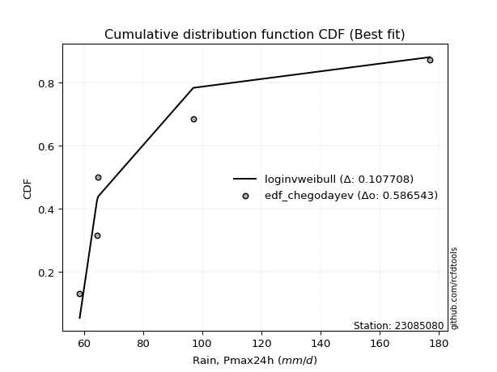</img>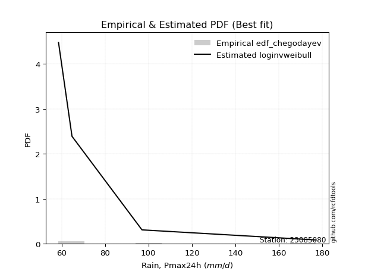</img>

</div>


### 6. Empirical - EDF Blom (1958)

The Blom formula is a specific "plotting position" formula used in hydrology and statistical analysis to estimate the empirical cumulative probability (or non-exceedance probability) of a data series. It is particularly recommended for data that are approximately normally distributed. The constant _a_ is set to 0.375 (or 3/8).

<div align="center">


$P=(m-a)/(n+1-2a)$


</div>


**6.1. Empirical values**

<div align="center">

|                | 0                  | 1                  | 2                  | 3                 | 4                 | 5                  |
|:---------------|:-------------------|:-------------------|:-------------------|:------------------|:------------------|:-------------------|
| date           | 2022               | 2024               | 2021               | 2025              | 2020              | 2019               |
| x              | 58.6               | 64.4               | 64.8               | 74.2              | 97.0              | 177.0              |
| m              | 1                  | 2                  | 3                  | 4                 | 5                 | 6                  |
| empirical_dist | edf_blom           | edf_blom           | edf_blom           | edf_blom          | edf_blom          | edf_blom           |
| empirical      | 0.1                | 0.26               | 0.42               | 0.58              | 0.74              | 0.9                |
| empirical_tr   | 1.1111111111111112 | 1.3513513513513513 | 1.7241379310344827 | 2.380952380952381 | 3.846153846153846 | 10.000000000000002 |

</div>


**6.2. Kolmogorov-Smirnov fit test (sorted by Δ)**


<div align="center">

|                | 0                   | 1                   | 2                   | 3                   | 4                   | 5                   | 6                   | 7                   | 8                   | 9                   | 10                  | 11                  | 12                  | 13                  | 14                  | 15                  | 16                  | 17                  | 18                 | 19                  | 20                 | 21                  | 22                  | 23                  | 24                 | 25                  | 26                  | 27                  | 28                  | 29                  | 30                  | 31                    | 32                  | 33                 | 34                  | 35                  | 36                  | 37                 | 38                  | 39                  | 40                  | 41                  | 42                 | 43                  | 44                  | 45                 | 46                  | 47                  | 48                  | 49                  | 50                  | 51                  | 52                  | 53                  | 54                  | 55                  | 56                  | 57                  | 58                  | 59                  | 60                  | 61                | 62                 | 63                 | 64                 | 65                 | 66                 | 67                  | 68                  | 69                 | 70                  | 71                 | 72                  | 73                  | 74                  | 75                 | 76                  | 77                  | 78                 | 79                 | 80                 | 81                 | 82                 | 83                 | 84                 | 85                  | 86                  | 87                 | 88                | 89             |
|:---------------|:--------------------|:--------------------|:--------------------|:--------------------|:--------------------|:--------------------|:--------------------|:--------------------|:--------------------|:--------------------|:--------------------|:--------------------|:--------------------|:--------------------|:--------------------|:--------------------|:--------------------|:--------------------|:-------------------|:--------------------|:-------------------|:--------------------|:--------------------|:--------------------|:-------------------|:--------------------|:--------------------|:--------------------|:--------------------|:--------------------|:--------------------|:----------------------|:--------------------|:-------------------|:--------------------|:--------------------|:--------------------|:-------------------|:--------------------|:--------------------|:--------------------|:--------------------|:-------------------|:--------------------|:--------------------|:-------------------|:--------------------|:--------------------|:--------------------|:--------------------|:--------------------|:--------------------|:--------------------|:--------------------|:--------------------|:--------------------|:--------------------|:--------------------|:--------------------|:--------------------|:--------------------|:------------------|:-------------------|:-------------------|:-------------------|:-------------------|:-------------------|:--------------------|:--------------------|:-------------------|:--------------------|:-------------------|:--------------------|:--------------------|:--------------------|:-------------------|:--------------------|:--------------------|:-------------------|:-------------------|:-------------------|:-------------------|:-------------------|:-------------------|:-------------------|:--------------------|:--------------------|:-------------------|:------------------|:---------------|
| station        | 23085080            | 23085080            | 23085080            | 23085080            | 23085080            | 23085080            | 23085080            | 23085080            | 23085080            | 23085080            | 23085080            | 23085080            | 23085080            | 23085080            | 23085080            | 23085080            | 23085080            | 23085080            | 23085080           | 23085080            | 23085080           | 23085080            | 23085080            | 23085080            | 23085080           | 23085080            | 23085080            | 23085080            | 23085080            | 23085080            | 23085080            | 23085080              | 23085080            | 23085080           | 23085080            | 23085080            | 23085080            | 23085080           | 23085080            | 23085080            | 23085080            | 23085080            | 23085080           | 23085080            | 23085080            | 23085080           | 23085080            | 23085080            | 23085080            | 23085080            | 23085080            | 23085080            | 23085080            | 23085080            | 23085080            | 23085080            | 23085080            | 23085080            | 23085080            | 23085080            | 23085080            | 23085080          | 23085080           | 23085080           | 23085080           | 23085080           | 23085080           | 23085080            | 23085080            | 23085080           | 23085080            | 23085080           | 23085080            | 23085080            | 23085080            | 23085080           | 23085080            | 23085080            | 23085080           | 23085080           | 23085080           | 23085080           | 23085080           | 23085080           | 23085080           | 23085080            | 23085080            | 23085080           | 23085080          | 23085080       |
| empirical_dist | edf_blom            | edf_blom            | edf_blom            | edf_blom            | edf_blom            | edf_blom            | edf_blom            | edf_blom            | edf_blom            | edf_blom            | edf_blom            | edf_blom            | edf_blom            | edf_blom            | edf_blom            | edf_blom            | edf_blom            | edf_blom            | edf_blom           | edf_blom            | edf_blom           | edf_blom            | edf_blom            | edf_blom            | edf_blom           | edf_blom            | edf_blom            | edf_blom            | edf_blom            | edf_blom            | edf_blom            | edf_blom              | edf_blom            | edf_blom           | edf_blom            | edf_blom            | edf_blom            | edf_blom           | edf_blom            | edf_blom            | edf_blom            | edf_blom            | edf_blom           | edf_blom            | edf_blom            | edf_blom           | edf_blom            | edf_blom            | edf_blom            | edf_blom            | edf_blom            | edf_blom            | edf_blom            | edf_blom            | edf_blom            | edf_blom            | edf_blom            | edf_blom            | edf_blom            | edf_blom            | edf_blom            | edf_blom          | edf_blom           | edf_blom           | edf_blom           | edf_blom           | edf_blom           | edf_blom            | edf_blom            | edf_blom           | edf_blom            | edf_blom           | edf_blom            | edf_blom            | edf_blom            | edf_blom           | edf_blom            | edf_blom            | edf_blom           | edf_blom           | edf_blom           | edf_blom           | edf_blom           | edf_blom           | edf_blom           | edf_blom            | edf_blom            | edf_blom           | edf_blom          | edf_blom       |
| p_dist         | loginvweibull       | alpha               | logf                | invgamma            | logalpha            | loginvgauss         | logmielke           | invgauss            | f                   | pareto              | logpareto           | logweibull_min      | loghalfnorm         | loghalflogistic     | logpearson3         | lognakagami         | chi2                | logjohnsonsu        | logmoyal           | loggumbel_r         | lograyleigh        | pearson3            | gamma               | wald                | halflogistic       | logmaxwell          | moyal               | logfatiguelife      | lognct              | logexponnorm        | logexpon            | loglaplace_asymmetric | loggenexpon         | nct                | loggenlogistic      | loginvgamma         | halfnorm            | gumbel_r           | logncf              | rayleigh            | logloggamma         | ncf                 | logwald            | weibull_min         | logbetaprime        | genlogistic        | logcrystalball      | lognorm             | lognorm             | logt                | betaprime           | logkstwobign        | maxwell             | logtruncnorm        | loglogistic         | fisk                | t                   | logrice             | loggompertz         | loghypsecant        | norm                | crystalball       | kstwobign          | exponnorm          | logchi2            | genexpon           | expon              | laplace_asymmetric  | erlang              | logistic           | loglaplace          | loggumbel_l        | hypsecant           | gompertz            | rice                | gibrat             | truncnorm           | laplace             | gumbel_l           | loggamma           | loggamma           | loggibrat          | logfisk            | loglognorm         | nakagami           | logerlang           | fatiguelife         | invweibull         | johnsonsu         | mielke         |
| delta          | 0.07266055478917688 | 0.07578663728796403 | 0.07648156125603017 | 0.08118329121068518 | 0.08750824735700363 | 0.08795351984410932 | 0.09287478126945153 | 0.09742183520515596 | 0.09989676897105493 | 0.09999999999999967 | 0.10161646962161058 | 0.10449566528873516 | 0.10743062259197095 | 0.10822082399865945 | 0.12239322194742808 | 0.12560324322393068 | 0.12928625149692374 | 0.13004175927984185 | 0.1359029660850783 | 0.13795144250220326 | 0.1423567535154031 | 0.14261776349428584 | 0.14522588425576444 | 0.14611371765833625 | 0.1505201851636341 | 0.15466093811048126 | 0.15481401118085647 | 0.16133369793289676 | 0.16200231757934253 | 0.16318089827450127 | 0.16397856441684722 | 0.16398791829977305   | 0.16440366555165897 | 0.1644883316860078 | 0.17013534167112984 | 0.17056308226306677 | 0.17160123429497967 | 0.1735211054386202 | 0.17418954993839877 | 0.17915550568999905 | 0.17964790640072847 | 0.18227143877727092 | 0.1839341682853264 | 0.18689778939798507 | 0.18730699434329243 | 0.1882800187385869 | 0.18843993758414002 | 0.18845573942941723 | 0.18845573942941723 | 0.18846152524984444 | 0.18924375335972926 | 0.19110353063123245 | 0.19129143377464397 | 0.19365579823182014 | 0.20230244313762757 | 0.20613787579452925 | 0.20726391749079642 | 0.20993949944033188 | 0.21242827913088208 | 0.21354844680174634 | 0.22359967774501022 | 0.223599685035766 | 0.2345307035710198 | 0.2360940610716365 | 0.2363708597805464 | 0.2373105197476557 | 0.2373111942608322 | 0.23731213336293105 | 0.23935705586641617 | 0.2409778186178123 | 0.24124396772669948 | 0.2540597425763459 | 0.25457522195152754 | 0.26367324265735936 | 0.26636169964185713 | 0.2671518327807593 | 0.27176089003960857 | 0.28290860181138777 | 0.2845639444672197 | 0.2884274287875037 | 0.2884274287875037 | 0.3191067215053969 | 0.3237277797241729 | 0.3820470484401919 | 0.3851231728337907 | 0.40439286715010403 | 0.41338393275405483 | 0.4527535383585787 | 0.528704114940397 | nan            |
| deltao         | 0.530385761606      | 0.530385761606      | 0.530385761606      | 0.530385761606      | 0.530385761606      | 0.530385761606      | 0.530385761606      | 0.530385761606      | 0.530385761606      | 0.530385761606      | 0.530385761606      | 0.530385761606      | 0.530385761606      | 0.530385761606      | 0.530385761606      | 0.530385761606      | 0.530385761606      | 0.530385761606      | 0.530385761606     | 0.530385761606      | 0.530385761606     | 0.530385761606      | 0.530385761606      | 0.530385761606      | 0.530385761606     | 0.530385761606      | 0.530385761606      | 0.530385761606      | 0.530385761606      | 0.530385761606      | 0.530385761606      | 0.530385761606        | 0.530385761606      | 0.530385761606     | 0.530385761606      | 0.530385761606      | 0.530385761606      | 0.530385761606     | 0.530385761606      | 0.530385761606      | 0.530385761606      | 0.530385761606      | 0.530385761606     | 0.530385761606      | 0.530385761606      | 0.530385761606     | 0.530385761606      | 0.530385761606      | 0.530385761606      | 0.530385761606      | 0.530385761606      | 0.530385761606      | 0.530385761606      | 0.530385761606      | 0.530385761606      | 0.530385761606      | 0.530385761606      | 0.530385761606      | 0.530385761606      | 0.530385761606      | 0.530385761606      | 0.530385761606    | 0.530385761606     | 0.530385761606     | 0.530385761606     | 0.530385761606     | 0.530385761606     | 0.530385761606      | 0.530385761606      | 0.530385761606     | 0.530385761606      | 0.530385761606     | 0.530385761606      | 0.530385761606      | 0.530385761606      | 0.530385761606     | 0.530385761606      | 0.530385761606      | 0.530385761606     | 0.530385761606     | 0.530385761606     | 0.530385761606     | 0.530385761606     | 0.530385761606     | 0.530385761606     | 0.530385761606      | 0.530385761606      | 0.530385761606     | 0.530385761606    | 0.530385761606 |
| eval           | Δo > Δ              | Δo > Δ              | Δo > Δ              | Δo > Δ              | Δo > Δ              | Δo > Δ              | Δo > Δ              | Δo > Δ              | Δo > Δ              | Δo > Δ              | Δo > Δ              | Δo > Δ              | Δo > Δ              | Δo > Δ              | Δo > Δ              | Δo > Δ              | Δo > Δ              | Δo > Δ              | Δo > Δ             | Δo > Δ              | Δo > Δ             | Δo > Δ              | Δo > Δ              | Δo > Δ              | Δo > Δ             | Δo > Δ              | Δo > Δ              | Δo > Δ              | Δo > Δ              | Δo > Δ              | Δo > Δ              | Δo > Δ                | Δo > Δ              | Δo > Δ             | Δo > Δ              | Δo > Δ              | Δo > Δ              | Δo > Δ             | Δo > Δ              | Δo > Δ              | Δo > Δ              | Δo > Δ              | Δo > Δ             | Δo > Δ              | Δo > Δ              | Δo > Δ             | Δo > Δ              | Δo > Δ              | Δo > Δ              | Δo > Δ              | Δo > Δ              | Δo > Δ              | Δo > Δ              | Δo > Δ              | Δo > Δ              | Δo > Δ              | Δo > Δ              | Δo > Δ              | Δo > Δ              | Δo > Δ              | Δo > Δ              | Δo > Δ            | Δo > Δ             | Δo > Δ             | Δo > Δ             | Δo > Δ             | Δo > Δ             | Δo > Δ              | Δo > Δ              | Δo > Δ             | Δo > Δ              | Δo > Δ             | Δo > Δ              | Δo > Δ              | Δo > Δ              | Δo > Δ             | Δo > Δ              | Δo > Δ              | Δo > Δ             | Δo > Δ             | Δo > Δ             | Δo > Δ             | Δo > Δ             | Δo > Δ             | Δo > Δ             | Δo > Δ              | Δo > Δ              | Δo > Δ             | Δo > Δ            | Δo <= Δ        |
| fit            | 1                   | 1                   | 1                   | 1                   | 1                   | 1                   | 1                   | 1                   | 1                   | 1                   | 1                   | 1                   | 1                   | 1                   | 1                   | 1                   | 1                   | 1                   | 1                  | 1                   | 1                  | 1                   | 1                   | 1                   | 1                  | 1                   | 1                   | 1                   | 1                   | 1                   | 1                   | 1                     | 1                   | 1                  | 1                   | 1                   | 1                   | 1                  | 1                   | 1                   | 1                   | 1                   | 1                  | 1                   | 1                   | 1                  | 1                   | 1                   | 1                   | 1                   | 1                   | 1                   | 1                   | 1                   | 1                   | 1                   | 1                   | 1                   | 1                   | 1                   | 1                   | 1                 | 1                  | 1                  | 1                  | 1                  | 1                  | 1                   | 1                   | 1                  | 1                   | 1                  | 1                   | 1                   | 1                   | 1                  | 1                   | 1                   | 1                  | 1                  | 1                  | 1                  | 1                  | 1                  | 1                  | 1                   | 1                   | 1                  | 1                 | 0              |
| n              | 6                   | 6                   | 6                   | 6                   | 6                   | 6                   | 6                   | 6                   | 6                   | 6                   | 6                   | 6                   | 6                   | 6                   | 6                   | 6                   | 6                   | 6                   | 6                  | 6                   | 6                  | 6                   | 6                   | 6                   | 6                  | 6                   | 6                   | 6                   | 6                   | 6                   | 6                   | 6                     | 6                   | 6                  | 6                   | 6                   | 6                   | 6                  | 6                   | 6                   | 6                   | 6                   | 6                  | 6                   | 6                   | 6                  | 6                   | 6                   | 6                   | 6                   | 6                   | 6                   | 6                   | 6                   | 6                   | 6                   | 6                   | 6                   | 6                   | 6                   | 6                   | 6                 | 6                  | 6                  | 6                  | 6                  | 6                  | 6                   | 6                   | 6                  | 6                   | 6                  | 6                   | 6                   | 6                   | 6                  | 6                   | 6                   | 6                  | 6                  | 6                  | 6                  | 6                  | 6                  | 6                  | 6                   | 6                   | 6                  | 6                 | 6              |
| best_fit       | 1                   | 0                   | 0                   | 0                   | 0                   | 0                   | 0                   | 0                   | 0                   | 0                   | 0                   | 0                   | 0                   | 0                   | 0                   | 0                   | 0                   | 0                   | 0                  | 0                   | 0                  | 0                   | 0                   | 0                   | 0                  | 0                   | 0                   | 0                   | 0                   | 0                   | 0                   | 0                     | 0                   | 0                  | 0                   | 0                   | 0                   | 0                  | 0                   | 0                   | 0                   | 0                   | 0                  | 0                   | 0                   | 0                  | 0                   | 0                   | 0                   | 0                   | 0                   | 0                   | 0                   | 0                   | 0                   | 0                   | 0                   | 0                   | 0                   | 0                   | 0                   | 0                 | 0                  | 0                  | 0                  | 0                  | 0                  | 0                   | 0                   | 0                  | 0                   | 0                  | 0                   | 0                   | 0                   | 0                  | 0                   | 0                   | 0                  | 0                  | 0                  | 0                  | 0                  | 0                  | 0                  | 0                   | 0                   | 0                  | 0                 | 0              |
| best_fit_sort  | 1                   | 2                   | 3                   | 4                   | 5                   | 6                   | 7                   | 8                   | 9                   | 10                  | 11                  | 12                  | 13                  | 14                  | 15                  | 16                  | 17                  | 18                  | 19                 | 20                  | 21                 | 22                  | 23                  | 24                  | 25                 | 26                  | 27                  | 28                  | 29                  | 30                  | 31                  | 32                    | 33                  | 34                 | 35                  | 36                  | 37                  | 38                 | 39                  | 40                  | 41                  | 42                  | 43                 | 44                  | 45                  | 46                 | 47                  | 48                  | 49                  | 50                  | 51                  | 52                  | 53                  | 54                  | 55                  | 56                  | 57                  | 58                  | 59                  | 60                  | 61                  | 62                | 63                 | 64                 | 65                 | 66                 | 67                 | 68                  | 69                  | 70                 | 71                  | 72                 | 73                  | 74                  | 75                  | 76                 | 77                  | 78                  | 79                 | 80                 | 81                 | 82                 | 83                 | 84                 | 85                 | 86                  | 87                  | 88                 | 89                | 90             |

</div>


<div align="center">

</img>

</div>


**6.3. Best fit**

<div align="center">

|   id |   station | empirical_dist   | p_dist        |     delta |   deltao | eval   |   fit |   n |   best_fit |   best_fit_sort |
|-----:|----------:|:-----------------|:--------------|----------:|---------:|:-------|------:|----:|-----------:|----------------:|
|    0 |  23085080 | edf_blom         | loginvweibull | 0.0726606 | 0.530386 | Δo > Δ |     1 |   6 |          1 |               1 |

</div>


<div align="center">

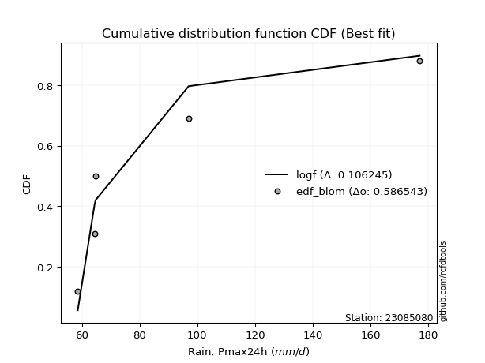</img>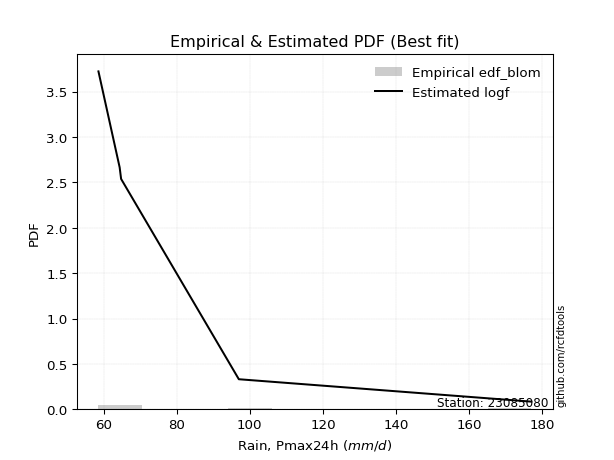</img>

</div>


### 7. Empirical - EDF Tukey (1962)

In hydrology, the Tukey formula is used as a plotting position formula to estimate the empirical probability or frequency of a flood event (or other hydrological data). The formula parameter is given as _c=0.333_ (or 1/3).

<div align="center">


$P=(m-c)/(n+1-2c)$


</div>


**7.1. Empirical values**

<div align="center">

|                | 0                   | 1                  | 2                   | 3                  | 4                  | 5                  |
|:---------------|:--------------------|:-------------------|:--------------------|:-------------------|:-------------------|:-------------------|
| date           | 2022                | 2024               | 2021                | 2025               | 2020               | 2019               |
| x              | 58.6                | 64.4               | 64.8                | 74.2               | 97.0               | 177.0              |
| m              | 1                   | 2                  | 3                   | 4                  | 5                  | 6                  |
| empirical_dist | edf_tukey           | edf_tukey          | edf_tukey           | edf_tukey          | edf_tukey          | edf_tukey          |
| empirical      | 0.10526315789473684 | 0.2631578947368421 | 0.42105263157894735 | 0.5789473684210527 | 0.7368421052631579 | 0.8947368421052632 |
| empirical_tr   | 1.1176470588235294  | 1.357142857142857  | 1.7272727272727273  | 2.375              | 3.7999999999999994 | 9.5                |

</div>


**7.2. Kolmogorov-Smirnov fit test (sorted by Δ)**


<div align="center">

|                | 0                   | 1                   | 2                   | 3                  | 4                   | 5                   | 6                  | 7                   | 8                   | 9                   | 10                  | 11                 | 12                  | 13                  | 14                  | 15                  | 16                  | 17                  | 18                  | 19                  | 20                  | 21                 | 22                  | 23                  | 24                 | 25                  | 26                  | 27                  | 28                  | 29                  | 30                  | 31                    | 32                  | 33                  | 34                  | 35                  | 36                  | 37                 | 38                 | 39                  | 40                  | 41                  | 42                | 43                  | 44                 | 45                 | 46                  | 47                  | 48                  | 49                  | 50                 | 51                  | 52                 | 53                 | 54                 | 55                  | 56                  | 57                  | 58                  | 59                  | 60                 | 61                 | 62                  | 63                 | 64                  | 65                  | 66                  | 67                  | 68                | 69                  | 70                  | 71                 | 72                  | 73                  | 74                 | 75                 | 76                  | 77                  | 78                 | 79                  | 80                  | 81                | 82                  | 83                 | 84                  | 85                  | 86                  | 87                 | 88                | 89             |
|:---------------|:--------------------|:--------------------|:--------------------|:-------------------|:--------------------|:--------------------|:-------------------|:--------------------|:--------------------|:--------------------|:--------------------|:-------------------|:--------------------|:--------------------|:--------------------|:--------------------|:--------------------|:--------------------|:--------------------|:--------------------|:--------------------|:-------------------|:--------------------|:--------------------|:-------------------|:--------------------|:--------------------|:--------------------|:--------------------|:--------------------|:--------------------|:----------------------|:--------------------|:--------------------|:--------------------|:--------------------|:--------------------|:-------------------|:-------------------|:--------------------|:--------------------|:--------------------|:------------------|:--------------------|:-------------------|:-------------------|:--------------------|:--------------------|:--------------------|:--------------------|:-------------------|:--------------------|:-------------------|:-------------------|:-------------------|:--------------------|:--------------------|:--------------------|:--------------------|:--------------------|:-------------------|:-------------------|:--------------------|:-------------------|:--------------------|:--------------------|:--------------------|:--------------------|:------------------|:--------------------|:--------------------|:-------------------|:--------------------|:--------------------|:-------------------|:-------------------|:--------------------|:--------------------|:-------------------|:--------------------|:--------------------|:------------------|:--------------------|:-------------------|:--------------------|:--------------------|:--------------------|:-------------------|:------------------|:---------------|
| station        | 23085080            | 23085080            | 23085080            | 23085080           | 23085080            | 23085080            | 23085080           | 23085080            | 23085080            | 23085080            | 23085080            | 23085080           | 23085080            | 23085080            | 23085080            | 23085080            | 23085080            | 23085080            | 23085080            | 23085080            | 23085080            | 23085080           | 23085080            | 23085080            | 23085080           | 23085080            | 23085080            | 23085080            | 23085080            | 23085080            | 23085080            | 23085080              | 23085080            | 23085080            | 23085080            | 23085080            | 23085080            | 23085080           | 23085080           | 23085080            | 23085080            | 23085080            | 23085080          | 23085080            | 23085080           | 23085080           | 23085080            | 23085080            | 23085080            | 23085080            | 23085080           | 23085080            | 23085080           | 23085080           | 23085080           | 23085080            | 23085080            | 23085080            | 23085080            | 23085080            | 23085080           | 23085080           | 23085080            | 23085080           | 23085080            | 23085080            | 23085080            | 23085080            | 23085080          | 23085080            | 23085080            | 23085080           | 23085080            | 23085080            | 23085080           | 23085080           | 23085080            | 23085080            | 23085080           | 23085080            | 23085080            | 23085080          | 23085080            | 23085080           | 23085080            | 23085080            | 23085080            | 23085080           | 23085080          | 23085080       |
| empirical_dist | edf_tukey           | edf_tukey           | edf_tukey           | edf_tukey          | edf_tukey           | edf_tukey           | edf_tukey          | edf_tukey           | edf_tukey           | edf_tukey           | edf_tukey           | edf_tukey          | edf_tukey           | edf_tukey           | edf_tukey           | edf_tukey           | edf_tukey           | edf_tukey           | edf_tukey           | edf_tukey           | edf_tukey           | edf_tukey          | edf_tukey           | edf_tukey           | edf_tukey          | edf_tukey           | edf_tukey           | edf_tukey           | edf_tukey           | edf_tukey           | edf_tukey           | edf_tukey             | edf_tukey           | edf_tukey           | edf_tukey           | edf_tukey           | edf_tukey           | edf_tukey          | edf_tukey          | edf_tukey           | edf_tukey           | edf_tukey           | edf_tukey         | edf_tukey           | edf_tukey          | edf_tukey          | edf_tukey           | edf_tukey           | edf_tukey           | edf_tukey           | edf_tukey          | edf_tukey           | edf_tukey          | edf_tukey          | edf_tukey          | edf_tukey           | edf_tukey           | edf_tukey           | edf_tukey           | edf_tukey           | edf_tukey          | edf_tukey          | edf_tukey           | edf_tukey          | edf_tukey           | edf_tukey           | edf_tukey           | edf_tukey           | edf_tukey         | edf_tukey           | edf_tukey           | edf_tukey          | edf_tukey           | edf_tukey           | edf_tukey          | edf_tukey          | edf_tukey           | edf_tukey           | edf_tukey          | edf_tukey           | edf_tukey           | edf_tukey         | edf_tukey           | edf_tukey          | edf_tukey           | edf_tukey           | edf_tukey           | edf_tukey          | edf_tukey         | edf_tukey      |
| p_dist         | alpha               | loginvweibull       | logf                | invgamma           | logalpha            | loginvgauss         | logmielke          | invgauss            | f                   | logweibull_min      | logpareto           | pareto             | loghalfnorm         | loghalflogistic     | logpearson3         | lognakagami         | logjohnsonsu        | chi2                | logmoyal            | loggumbel_r         | pearson3            | lograyleigh        | gamma               | halflogistic        | wald               | logmaxwell          | moyal               | logfatiguelife      | lognct              | logexponnorm        | logexpon            | loglaplace_asymmetric | loggenexpon         | nct                 | halfnorm            | logncf              | loginvgamma         | loggenlogistic     | gumbel_r           | rayleigh            | logloggamma         | ncf                 | weibull_min       | logwald             | genlogistic        | logcrystalball     | lognorm             | lognorm             | logt                | betaprime           | logbetaprime       | maxwell             | logkstwobign       | logtruncnorm       | fisk               | loglogistic         | t                   | logrice             | loghypsecant        | loggompertz         | norm               | crystalball        | logchi2             | kstwobign          | exponnorm           | genexpon            | expon               | laplace_asymmetric  | logistic          | loglaplace          | erlang              | loggumbel_l        | hypsecant           | gompertz            | rice               | gibrat             | truncnorm           | laplace             | gumbel_l           | loggamma            | loggamma            | logfisk           | loggibrat           | loglognorm         | nakagami            | logerlang           | fatiguelife         | invweibull         | johnsonsu         | mielke         |
| delta          | 0.07262874255112195 | 0.07371318636812424 | 0.07753419283497753 | 0.0780253964738431 | 0.08435035262016155 | 0.08479562510726724 | 0.0939274128483989 | 0.09426394046831388 | 0.10515992686579176 | 0.10526315768896823 | 0.10526315789473606 | 0.1052631578947365 | 0.10637799101302364 | 0.10927345557760682 | 0.12344585352637544 | 0.12665587480287804 | 0.12688386454299977 | 0.13244414623376588 | 0.13695559766402565 | 0.13900407408115062 | 0.14068990349725763 | 0.1413041219364558 | 0.14206798951892236 | 0.14525702726889728 | 0.1471663492372836 | 0.15360830653153396 | 0.15376137960190916 | 0.15817580319605468 | 0.16094968600039522 | 0.16423352985344863 | 0.16503119599579458 | 0.1650405498787204    | 0.16545629713060633 | 0.16554096326495515 | 0.16633807640024284 | 0.16892639204366194 | 0.16951045068411946 | 0.1711879732500772 | 0.1724684738596729 | 0.17810287411105175 | 0.17859527482178117 | 0.18121880719832362 | 0.183739894661143 | 0.18498679986427377 | 0.1872273871596396 | 0.1873873060051927 | 0.18740310785046993 | 0.18740310785046993 | 0.18740889367089714 | 0.18819112178078196 | 0.1883596259222398 | 0.19023880219569667 | 0.1921561622101798 | 0.1947084298107675 | 0.2008747178997924 | 0.20124981155868027 | 0.20621128591184912 | 0.21099213101927924 | 0.21249581522279903 | 0.21348091070982944 | 0.2225470461660629 | 0.2225470534568187 | 0.23321296504370426 | 0.2334780719920725 | 0.23714669265058386 | 0.23836315132660307 | 0.23836382583977955 | 0.23836476494187842 | 0.239925187038865 | 0.24019133614775218 | 0.24040968744536353 | 0.2530071109973986 | 0.25352259037258024 | 0.26472587423630667 | 0.2653090680629098 | 0.2682044643597067 | 0.27281352161855593 | 0.28185597023244047 | 0.2835113128882724 | 0.28526953405066163 | 0.28526953405066163 | 0.318464621829436 | 0.32015935308434423 | 0.3788891537033498 | 0.38196527809694863 | 0.40123497241326195 | 0.41022603801721275 | 0.4474903804638418 | 0.525546220203555 | nan            |
| deltao         | 0.530385761606      | 0.530385761606      | 0.530385761606      | 0.530385761606     | 0.530385761606      | 0.530385761606      | 0.530385761606     | 0.530385761606      | 0.530385761606      | 0.530385761606      | 0.530385761606      | 0.530385761606     | 0.530385761606      | 0.530385761606      | 0.530385761606      | 0.530385761606      | 0.530385761606      | 0.530385761606      | 0.530385761606      | 0.530385761606      | 0.530385761606      | 0.530385761606     | 0.530385761606      | 0.530385761606      | 0.530385761606     | 0.530385761606      | 0.530385761606      | 0.530385761606      | 0.530385761606      | 0.530385761606      | 0.530385761606      | 0.530385761606        | 0.530385761606      | 0.530385761606      | 0.530385761606      | 0.530385761606      | 0.530385761606      | 0.530385761606     | 0.530385761606     | 0.530385761606      | 0.530385761606      | 0.530385761606      | 0.530385761606    | 0.530385761606      | 0.530385761606     | 0.530385761606     | 0.530385761606      | 0.530385761606      | 0.530385761606      | 0.530385761606      | 0.530385761606     | 0.530385761606      | 0.530385761606     | 0.530385761606     | 0.530385761606     | 0.530385761606      | 0.530385761606      | 0.530385761606      | 0.530385761606      | 0.530385761606      | 0.530385761606     | 0.530385761606     | 0.530385761606      | 0.530385761606     | 0.530385761606      | 0.530385761606      | 0.530385761606      | 0.530385761606      | 0.530385761606    | 0.530385761606      | 0.530385761606      | 0.530385761606     | 0.530385761606      | 0.530385761606      | 0.530385761606     | 0.530385761606     | 0.530385761606      | 0.530385761606      | 0.530385761606     | 0.530385761606      | 0.530385761606      | 0.530385761606    | 0.530385761606      | 0.530385761606     | 0.530385761606      | 0.530385761606      | 0.530385761606      | 0.530385761606     | 0.530385761606    | 0.530385761606 |
| eval           | Δo > Δ              | Δo > Δ              | Δo > Δ              | Δo > Δ             | Δo > Δ              | Δo > Δ              | Δo > Δ             | Δo > Δ              | Δo > Δ              | Δo > Δ              | Δo > Δ              | Δo > Δ             | Δo > Δ              | Δo > Δ              | Δo > Δ              | Δo > Δ              | Δo > Δ              | Δo > Δ              | Δo > Δ              | Δo > Δ              | Δo > Δ              | Δo > Δ             | Δo > Δ              | Δo > Δ              | Δo > Δ             | Δo > Δ              | Δo > Δ              | Δo > Δ              | Δo > Δ              | Δo > Δ              | Δo > Δ              | Δo > Δ                | Δo > Δ              | Δo > Δ              | Δo > Δ              | Δo > Δ              | Δo > Δ              | Δo > Δ             | Δo > Δ             | Δo > Δ              | Δo > Δ              | Δo > Δ              | Δo > Δ            | Δo > Δ              | Δo > Δ             | Δo > Δ             | Δo > Δ              | Δo > Δ              | Δo > Δ              | Δo > Δ              | Δo > Δ             | Δo > Δ              | Δo > Δ             | Δo > Δ             | Δo > Δ             | Δo > Δ              | Δo > Δ              | Δo > Δ              | Δo > Δ              | Δo > Δ              | Δo > Δ             | Δo > Δ             | Δo > Δ              | Δo > Δ             | Δo > Δ              | Δo > Δ              | Δo > Δ              | Δo > Δ              | Δo > Δ            | Δo > Δ              | Δo > Δ              | Δo > Δ             | Δo > Δ              | Δo > Δ              | Δo > Δ             | Δo > Δ             | Δo > Δ              | Δo > Δ              | Δo > Δ             | Δo > Δ              | Δo > Δ              | Δo > Δ            | Δo > Δ              | Δo > Δ             | Δo > Δ              | Δo > Δ              | Δo > Δ              | Δo > Δ             | Δo > Δ            | Δo <= Δ        |
| fit            | 1                   | 1                   | 1                   | 1                  | 1                   | 1                   | 1                  | 1                   | 1                   | 1                   | 1                   | 1                  | 1                   | 1                   | 1                   | 1                   | 1                   | 1                   | 1                   | 1                   | 1                   | 1                  | 1                   | 1                   | 1                  | 1                   | 1                   | 1                   | 1                   | 1                   | 1                   | 1                     | 1                   | 1                   | 1                   | 1                   | 1                   | 1                  | 1                  | 1                   | 1                   | 1                   | 1                 | 1                   | 1                  | 1                  | 1                   | 1                   | 1                   | 1                   | 1                  | 1                   | 1                  | 1                  | 1                  | 1                   | 1                   | 1                   | 1                   | 1                   | 1                  | 1                  | 1                   | 1                  | 1                   | 1                   | 1                   | 1                   | 1                 | 1                   | 1                   | 1                  | 1                   | 1                   | 1                  | 1                  | 1                   | 1                   | 1                  | 1                   | 1                   | 1                 | 1                   | 1                  | 1                   | 1                   | 1                   | 1                  | 1                 | 0              |
| n              | 6                   | 6                   | 6                   | 6                  | 6                   | 6                   | 6                  | 6                   | 6                   | 6                   | 6                   | 6                  | 6                   | 6                   | 6                   | 6                   | 6                   | 6                   | 6                   | 6                   | 6                   | 6                  | 6                   | 6                   | 6                  | 6                   | 6                   | 6                   | 6                   | 6                   | 6                   | 6                     | 6                   | 6                   | 6                   | 6                   | 6                   | 6                  | 6                  | 6                   | 6                   | 6                   | 6                 | 6                   | 6                  | 6                  | 6                   | 6                   | 6                   | 6                   | 6                  | 6                   | 6                  | 6                  | 6                  | 6                   | 6                   | 6                   | 6                   | 6                   | 6                  | 6                  | 6                   | 6                  | 6                   | 6                   | 6                   | 6                   | 6                 | 6                   | 6                   | 6                  | 6                   | 6                   | 6                  | 6                  | 6                   | 6                   | 6                  | 6                   | 6                   | 6                 | 6                   | 6                  | 6                   | 6                   | 6                   | 6                  | 6                 | 6              |
| best_fit       | 1                   | 0                   | 0                   | 0                  | 0                   | 0                   | 0                  | 0                   | 0                   | 0                   | 0                   | 0                  | 0                   | 0                   | 0                   | 0                   | 0                   | 0                   | 0                   | 0                   | 0                   | 0                  | 0                   | 0                   | 0                  | 0                   | 0                   | 0                   | 0                   | 0                   | 0                   | 0                     | 0                   | 0                   | 0                   | 0                   | 0                   | 0                  | 0                  | 0                   | 0                   | 0                   | 0                 | 0                   | 0                  | 0                  | 0                   | 0                   | 0                   | 0                   | 0                  | 0                   | 0                  | 0                  | 0                  | 0                   | 0                   | 0                   | 0                   | 0                   | 0                  | 0                  | 0                   | 0                  | 0                   | 0                   | 0                   | 0                   | 0                 | 0                   | 0                   | 0                  | 0                   | 0                   | 0                  | 0                  | 0                   | 0                   | 0                  | 0                   | 0                   | 0                 | 0                   | 0                  | 0                   | 0                   | 0                   | 0                  | 0                 | 0              |
| best_fit_sort  | 1                   | 2                   | 3                   | 4                  | 5                   | 6                   | 7                  | 8                   | 9                   | 10                  | 11                  | 12                 | 13                  | 14                  | 15                  | 16                  | 17                  | 18                  | 19                  | 20                  | 21                  | 22                 | 23                  | 24                  | 25                 | 26                  | 27                  | 28                  | 29                  | 30                  | 31                  | 32                    | 33                  | 34                  | 35                  | 36                  | 37                  | 38                 | 39                 | 40                  | 41                  | 42                  | 43                | 44                  | 45                 | 46                 | 47                  | 48                  | 49                  | 50                  | 51                 | 52                  | 53                 | 54                 | 55                 | 56                  | 57                  | 58                  | 59                  | 60                  | 61                 | 62                 | 63                  | 64                 | 65                  | 66                  | 67                  | 68                  | 69                | 70                  | 71                  | 72                 | 73                  | 74                  | 75                 | 76                 | 77                  | 78                  | 79                 | 80                  | 81                  | 82                | 83                  | 84                 | 85                  | 86                  | 87                  | 88                 | 89                | 90             |

</div>


<div align="center">

</img>

</div>


**7.3. Best fit**

<div align="center">

|   id |   station | empirical_dist   | p_dist   |     delta |   deltao | eval   |   fit |   n |   best_fit |   best_fit_sort |
|-----:|----------:|:-----------------|:---------|----------:|---------:|:-------|------:|----:|-----------:|----------------:|
|    0 |  23085080 | edf_tukey        | alpha    | 0.0726287 | 0.530386 | Δo > Δ |     1 |   6 |          1 |               1 |

</div>


<div align="center">

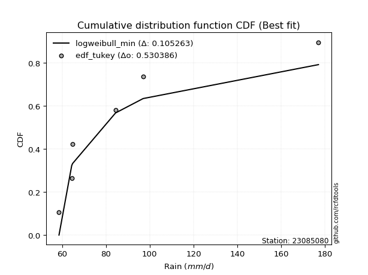</img>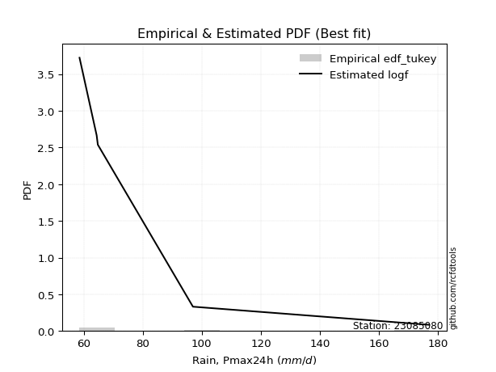</img>

</div>


### 8. Empirical - EDF Gringorten (1963)

Gringorten plotting position formula is essential for estimating the probability and return periods of extreme events like floods and heavy rainfall. The constant _a=0.44_.

<div align="center">


$P=(m-a)/(n+1-2a)$


</div>


**8.1. Empirical values**

<div align="center">

|                | 0                   | 1                  | 2                   | 3                  | 4                  | 5                  |
|:---------------|:--------------------|:-------------------|:--------------------|:-------------------|:-------------------|:-------------------|
| date           | 2022                | 2024               | 2021                | 2025               | 2020               | 2019               |
| x              | 58.6                | 64.4               | 64.8                | 74.2               | 97.0               | 177.0              |
| m              | 1                   | 2                  | 3                   | 4                  | 5                  | 6                  |
| empirical_dist | edf_gringorten      | edf_gringorten     | edf_gringorten      | edf_gringorten     | edf_gringorten     | edf_gringorten     |
| empirical      | 0.09150326797385622 | 0.2549019607843137 | 0.41830065359477125 | 0.5816993464052288 | 0.7450980392156862 | 0.9084967320261437 |
| empirical_tr   | 1.1007194244604317  | 1.3421052631578947 | 1.7191011235955058  | 2.3906250000000004 | 3.9230769230769216 | 10.928571428571415 |

</div>


**8.2. Kolmogorov-Smirnov fit test (sorted by Δ)**


<div align="center">

|                | 0                   | 1                   | 2                   | 3                   | 4                  | 5                   | 6                   | 7                   | 8                   | 9                  | 10                  | 11                  | 12                  | 13                  | 14                  | 15                  | 16                 | 17                  | 18                  | 19                  | 20                  | 21                  | 22                  | 23                  | 24                 | 25                 | 26                 | 27                  | 28                 | 29                    | 30                  | 31                  | 32                  | 33                  | 34                 | 35                 | 36                  | 37                  | 38                 | 39                  | 40                  | 41                  | 42                  | 43                 | 44                  | 45                  | 46                  | 47                  | 48                  | 49                  | 50                 | 51                 | 52                  | 53                 | 54                  | 55                  | 56                  | 57                  | 58                 | 59                  | 60                  | 61                  | 62                  | 63                  | 64                  | 65                  | 66                  | 67                  | 68                  | 69                  | 70                  | 71                  | 72                 | 73                  | 74                 | 75                  | 76                  | 77                 | 78                  | 79               | 80               | 81                  | 82                  | 83                 | 84                | 85                  | 86                  | 87                 | 88                 | 89             |
|:---------------|:--------------------|:--------------------|:--------------------|:--------------------|:-------------------|:--------------------|:--------------------|:--------------------|:--------------------|:-------------------|:--------------------|:--------------------|:--------------------|:--------------------|:--------------------|:--------------------|:-------------------|:--------------------|:--------------------|:--------------------|:--------------------|:--------------------|:--------------------|:--------------------|:-------------------|:-------------------|:-------------------|:--------------------|:-------------------|:----------------------|:--------------------|:--------------------|:--------------------|:--------------------|:-------------------|:-------------------|:--------------------|:--------------------|:-------------------|:--------------------|:--------------------|:--------------------|:--------------------|:-------------------|:--------------------|:--------------------|:--------------------|:--------------------|:--------------------|:--------------------|:-------------------|:-------------------|:--------------------|:-------------------|:--------------------|:--------------------|:--------------------|:--------------------|:-------------------|:--------------------|:--------------------|:--------------------|:--------------------|:--------------------|:--------------------|:--------------------|:--------------------|:--------------------|:--------------------|:--------------------|:--------------------|:--------------------|:-------------------|:--------------------|:-------------------|:--------------------|:--------------------|:-------------------|:--------------------|:-----------------|:-----------------|:--------------------|:--------------------|:-------------------|:------------------|:--------------------|:--------------------|:-------------------|:-------------------|:---------------|
| station        | 23085080            | 23085080            | 23085080            | 23085080            | 23085080           | 23085080            | 23085080            | 23085080            | 23085080            | 23085080           | 23085080            | 23085080            | 23085080            | 23085080            | 23085080            | 23085080            | 23085080           | 23085080            | 23085080            | 23085080            | 23085080            | 23085080            | 23085080            | 23085080            | 23085080           | 23085080           | 23085080           | 23085080            | 23085080           | 23085080              | 23085080            | 23085080            | 23085080            | 23085080            | 23085080           | 23085080           | 23085080            | 23085080            | 23085080           | 23085080            | 23085080            | 23085080            | 23085080            | 23085080           | 23085080            | 23085080            | 23085080            | 23085080            | 23085080            | 23085080            | 23085080           | 23085080           | 23085080            | 23085080           | 23085080            | 23085080            | 23085080            | 23085080            | 23085080           | 23085080            | 23085080            | 23085080            | 23085080            | 23085080            | 23085080            | 23085080            | 23085080            | 23085080            | 23085080            | 23085080            | 23085080            | 23085080            | 23085080           | 23085080            | 23085080           | 23085080            | 23085080            | 23085080           | 23085080            | 23085080         | 23085080         | 23085080            | 23085080            | 23085080           | 23085080          | 23085080            | 23085080            | 23085080           | 23085080           | 23085080       |
| empirical_dist | edf_gringorten      | edf_gringorten      | edf_gringorten      | edf_gringorten      | edf_gringorten     | edf_gringorten      | edf_gringorten      | edf_gringorten      | edf_gringorten      | edf_gringorten     | edf_gringorten      | edf_gringorten      | edf_gringorten      | edf_gringorten      | edf_gringorten      | edf_gringorten      | edf_gringorten     | edf_gringorten      | edf_gringorten      | edf_gringorten      | edf_gringorten      | edf_gringorten      | edf_gringorten      | edf_gringorten      | edf_gringorten     | edf_gringorten     | edf_gringorten     | edf_gringorten      | edf_gringorten     | edf_gringorten        | edf_gringorten      | edf_gringorten      | edf_gringorten      | edf_gringorten      | edf_gringorten     | edf_gringorten     | edf_gringorten      | edf_gringorten      | edf_gringorten     | edf_gringorten      | edf_gringorten      | edf_gringorten      | edf_gringorten      | edf_gringorten     | edf_gringorten      | edf_gringorten      | edf_gringorten      | edf_gringorten      | edf_gringorten      | edf_gringorten      | edf_gringorten     | edf_gringorten     | edf_gringorten      | edf_gringorten     | edf_gringorten      | edf_gringorten      | edf_gringorten      | edf_gringorten      | edf_gringorten     | edf_gringorten      | edf_gringorten      | edf_gringorten      | edf_gringorten      | edf_gringorten      | edf_gringorten      | edf_gringorten      | edf_gringorten      | edf_gringorten      | edf_gringorten      | edf_gringorten      | edf_gringorten      | edf_gringorten      | edf_gringorten     | edf_gringorten      | edf_gringorten     | edf_gringorten      | edf_gringorten      | edf_gringorten     | edf_gringorten      | edf_gringorten   | edf_gringorten   | edf_gringorten      | edf_gringorten      | edf_gringorten     | edf_gringorten    | edf_gringorten      | edf_gringorten      | edf_gringorten     | edf_gringorten     | edf_gringorten |
| p_dist         | logf                | loginvweibull       | alpha               | invgamma            | logmielke          | pareto              | logalpha            | loginvgauss         | logpareto           | f                  | invgauss            | loghalflogistic     | logweibull_min      | loghalfnorm         | logpearson3         | chi2                | lognakagami        | logmoyal            | logjohnsonsu        | loggumbel_r         | lograyleigh         | wald                | gamma               | pearson3            | logmaxwell         | moyal              | halflogistic       | logexponnorm        | logexpon           | loglaplace_asymmetric | loggenexpon         | lognct              | nct                 | logfatiguelife      | loggenlogistic     | loginvgamma        | gumbel_r            | halfnorm            | rayleigh           | logloggamma         | logwald             | logncf              | ncf                 | logbetaprime       | logkstwobign        | genlogistic         | logcrystalball      | lognorm             | lognorm             | logt                | betaprime          | logtruncnorm       | weibull_min         | maxwell            | loglogistic         | logrice             | t                   | loggompertz         | fisk               | loghypsecant        | norm                | crystalball         | exponnorm           | genexpon            | expon               | laplace_asymmetric  | kstwobign           | erlang              | logchi2             | logistic            | loglaplace          | loggumbel_l         | hypsecant          | gompertz            | gibrat             | rice                | truncnorm           | laplace            | gumbel_l            | loggamma         | loggamma         | loggibrat           | logfisk             | loglognorm         | nakagami          | logerlang           | fatiguelife         | invweibull         | johnsonsu          | mielke         |
| delta          | 0.07478221485080144 | 0.07567054155530356 | 0.08088467650365033 | 0.08628133042637148 | 0.0911754348642228 | 0.09150326797385588 | 0.09260628657268993 | 0.09305155905979562 | 0.09991712321638185 | 0.1002349486562385 | 0.10251987442084226 | 0.10652147759343072 | 0.10959370450442146 | 0.11009861395980514 | 0.12069387554219935 | 0.12418821228123755 | 0.1264768654179117 | 0.13420361967984956 | 0.13513979849552815 | 0.13625209609697453 | 0.14405609992063195 | 0.14441437125310752 | 0.15032392347145074 | 0.15111449552042963 | 0.1563602845157101 | 0.1565133575860853 | 0.1590169171897779 | 0.16148155186927254 | 0.1622792180116185 | 0.16228857189454432   | 0.16270431914643024 | 0.16370166398457137 | 0.16490499155817656 | 0.16643173714858306 | 0.1684359952659011 | 0.1722624286682956 | 0.17522045184384905 | 0.18009796632112346 | 0.1808548520952279 | 0.18134725280595732 | 0.18223482188009768 | 0.18268628196454256 | 0.18397078518249976 | 0.1856076479380637 | 0.18940418422600372 | 0.18997936514381575 | 0.19013928398936886 | 0.19015508583464608 | 0.19015508583464608 | 0.19016087165507328 | 0.1909430997649581 | 0.1919564518265914 | 0.19199582861367137 | 0.1929907801798728 | 0.20400178954285642 | 0.20888021917098815 | 0.20896326389602526 | 0.21072893272565335 | 0.2146346078206729 | 0.21524779320697518 | 0.22529902415023906 | 0.22529903144099483 | 0.23439471466640777 | 0.23561117334242698 | 0.23561184785560346 | 0.23561278695770232 | 0.23623004997624863 | 0.23765770946118744 | 0.24146889899623258 | 0.24267716502304115 | 0.24294331413192832 | 0.25575908898157473 | 0.2562745683567564 | 0.26197389625213063 | 0.2654524863755306 | 0.26806104604708597 | 0.27006154363437984 | 0.2846079482166166 | 0.28626329087244856 | 0.29352546800319 | 0.29352546800319 | 0.31740737510016814 | 0.33222451175031653 | 0.3871450876558782 | 0.390221212049477 | 0.40949090636579033 | 0.41848197196974113 | 0.4612502703847223 | 0.5338021541560833 | nan            |
| deltao         | 0.530385761606      | 0.530385761606      | 0.530385761606      | 0.530385761606      | 0.530385761606     | 0.530385761606      | 0.530385761606      | 0.530385761606      | 0.530385761606      | 0.530385761606     | 0.530385761606      | 0.530385761606      | 0.530385761606      | 0.530385761606      | 0.530385761606      | 0.530385761606      | 0.530385761606     | 0.530385761606      | 0.530385761606      | 0.530385761606      | 0.530385761606      | 0.530385761606      | 0.530385761606      | 0.530385761606      | 0.530385761606     | 0.530385761606     | 0.530385761606     | 0.530385761606      | 0.530385761606     | 0.530385761606        | 0.530385761606      | 0.530385761606      | 0.530385761606      | 0.530385761606      | 0.530385761606     | 0.530385761606     | 0.530385761606      | 0.530385761606      | 0.530385761606     | 0.530385761606      | 0.530385761606      | 0.530385761606      | 0.530385761606      | 0.530385761606     | 0.530385761606      | 0.530385761606      | 0.530385761606      | 0.530385761606      | 0.530385761606      | 0.530385761606      | 0.530385761606     | 0.530385761606     | 0.530385761606      | 0.530385761606     | 0.530385761606      | 0.530385761606      | 0.530385761606      | 0.530385761606      | 0.530385761606     | 0.530385761606      | 0.530385761606      | 0.530385761606      | 0.530385761606      | 0.530385761606      | 0.530385761606      | 0.530385761606      | 0.530385761606      | 0.530385761606      | 0.530385761606      | 0.530385761606      | 0.530385761606      | 0.530385761606      | 0.530385761606     | 0.530385761606      | 0.530385761606     | 0.530385761606      | 0.530385761606      | 0.530385761606     | 0.530385761606      | 0.530385761606   | 0.530385761606   | 0.530385761606      | 0.530385761606      | 0.530385761606     | 0.530385761606    | 0.530385761606      | 0.530385761606      | 0.530385761606     | 0.530385761606     | 0.530385761606 |
| eval           | Δo > Δ              | Δo > Δ              | Δo > Δ              | Δo > Δ              | Δo > Δ             | Δo > Δ              | Δo > Δ              | Δo > Δ              | Δo > Δ              | Δo > Δ             | Δo > Δ              | Δo > Δ              | Δo > Δ              | Δo > Δ              | Δo > Δ              | Δo > Δ              | Δo > Δ             | Δo > Δ              | Δo > Δ              | Δo > Δ              | Δo > Δ              | Δo > Δ              | Δo > Δ              | Δo > Δ              | Δo > Δ             | Δo > Δ             | Δo > Δ             | Δo > Δ              | Δo > Δ             | Δo > Δ                | Δo > Δ              | Δo > Δ              | Δo > Δ              | Δo > Δ              | Δo > Δ             | Δo > Δ             | Δo > Δ              | Δo > Δ              | Δo > Δ             | Δo > Δ              | Δo > Δ              | Δo > Δ              | Δo > Δ              | Δo > Δ             | Δo > Δ              | Δo > Δ              | Δo > Δ              | Δo > Δ              | Δo > Δ              | Δo > Δ              | Δo > Δ             | Δo > Δ             | Δo > Δ              | Δo > Δ             | Δo > Δ              | Δo > Δ              | Δo > Δ              | Δo > Δ              | Δo > Δ             | Δo > Δ              | Δo > Δ              | Δo > Δ              | Δo > Δ              | Δo > Δ              | Δo > Δ              | Δo > Δ              | Δo > Δ              | Δo > Δ              | Δo > Δ              | Δo > Δ              | Δo > Δ              | Δo > Δ              | Δo > Δ             | Δo > Δ              | Δo > Δ             | Δo > Δ              | Δo > Δ              | Δo > Δ             | Δo > Δ              | Δo > Δ           | Δo > Δ           | Δo > Δ              | Δo > Δ              | Δo > Δ             | Δo > Δ            | Δo > Δ              | Δo > Δ              | Δo > Δ             | Δo <= Δ            | Δo <= Δ        |
| fit            | 1                   | 1                   | 1                   | 1                   | 1                  | 1                   | 1                   | 1                   | 1                   | 1                  | 1                   | 1                   | 1                   | 1                   | 1                   | 1                   | 1                  | 1                   | 1                   | 1                   | 1                   | 1                   | 1                   | 1                   | 1                  | 1                  | 1                  | 1                   | 1                  | 1                     | 1                   | 1                   | 1                   | 1                   | 1                  | 1                  | 1                   | 1                   | 1                  | 1                   | 1                   | 1                   | 1                   | 1                  | 1                   | 1                   | 1                   | 1                   | 1                   | 1                   | 1                  | 1                  | 1                   | 1                  | 1                   | 1                   | 1                   | 1                   | 1                  | 1                   | 1                   | 1                   | 1                   | 1                   | 1                   | 1                   | 1                   | 1                   | 1                   | 1                   | 1                   | 1                   | 1                  | 1                   | 1                  | 1                   | 1                   | 1                  | 1                   | 1                | 1                | 1                   | 1                   | 1                  | 1                 | 1                   | 1                   | 1                  | 0                  | 0              |
| n              | 6                   | 6                   | 6                   | 6                   | 6                  | 6                   | 6                   | 6                   | 6                   | 6                  | 6                   | 6                   | 6                   | 6                   | 6                   | 6                   | 6                  | 6                   | 6                   | 6                   | 6                   | 6                   | 6                   | 6                   | 6                  | 6                  | 6                  | 6                   | 6                  | 6                     | 6                   | 6                   | 6                   | 6                   | 6                  | 6                  | 6                   | 6                   | 6                  | 6                   | 6                   | 6                   | 6                   | 6                  | 6                   | 6                   | 6                   | 6                   | 6                   | 6                   | 6                  | 6                  | 6                   | 6                  | 6                   | 6                   | 6                   | 6                   | 6                  | 6                   | 6                   | 6                   | 6                   | 6                   | 6                   | 6                   | 6                   | 6                   | 6                   | 6                   | 6                   | 6                   | 6                  | 6                   | 6                  | 6                   | 6                   | 6                  | 6                   | 6                | 6                | 6                   | 6                   | 6                  | 6                 | 6                   | 6                   | 6                  | 6                  | 6              |
| best_fit       | 1                   | 0                   | 0                   | 0                   | 0                  | 0                   | 0                   | 0                   | 0                   | 0                  | 0                   | 0                   | 0                   | 0                   | 0                   | 0                   | 0                  | 0                   | 0                   | 0                   | 0                   | 0                   | 0                   | 0                   | 0                  | 0                  | 0                  | 0                   | 0                  | 0                     | 0                   | 0                   | 0                   | 0                   | 0                  | 0                  | 0                   | 0                   | 0                  | 0                   | 0                   | 0                   | 0                   | 0                  | 0                   | 0                   | 0                   | 0                   | 0                   | 0                   | 0                  | 0                  | 0                   | 0                  | 0                   | 0                   | 0                   | 0                   | 0                  | 0                   | 0                   | 0                   | 0                   | 0                   | 0                   | 0                   | 0                   | 0                   | 0                   | 0                   | 0                   | 0                   | 0                  | 0                   | 0                  | 0                   | 0                   | 0                  | 0                   | 0                | 0                | 0                   | 0                   | 0                  | 0                 | 0                   | 0                   | 0                  | 0                  | 0              |
| best_fit_sort  | 1                   | 2                   | 3                   | 4                   | 5                  | 6                   | 7                   | 8                   | 9                   | 10                 | 11                  | 12                  | 13                  | 14                  | 15                  | 16                  | 17                 | 18                  | 19                  | 20                  | 21                  | 22                  | 23                  | 24                  | 25                 | 26                 | 27                 | 28                  | 29                 | 30                    | 31                  | 32                  | 33                  | 34                  | 35                 | 36                 | 37                  | 38                  | 39                 | 40                  | 41                  | 42                  | 43                  | 44                 | 45                  | 46                  | 47                  | 48                  | 49                  | 50                  | 51                 | 52                 | 53                  | 54                 | 55                  | 56                  | 57                  | 58                  | 59                 | 60                  | 61                  | 62                  | 63                  | 64                  | 65                  | 66                  | 67                  | 68                  | 69                  | 70                  | 71                  | 72                  | 73                 | 74                  | 75                 | 76                  | 77                  | 78                 | 79                  | 80               | 81               | 82                  | 83                  | 84                 | 85                | 86                  | 87                  | 88                 | 89                 | 90             |

</div>


<div align="center">

</img>

</div>


**8.3. Best fit**

<div align="center">

|   id |   station | empirical_dist   | p_dist   |     delta |   deltao | eval   |   fit |   n |   best_fit |   best_fit_sort |
|-----:|----------:|:-----------------|:---------|----------:|---------:|:-------|------:|----:|-----------:|----------------:|
|    0 |  23085080 | edf_gringorten   | logf     | 0.0747822 | 0.530386 | Δo > Δ |     1 |   6 |          1 |               1 |

</div>


<div align="center">

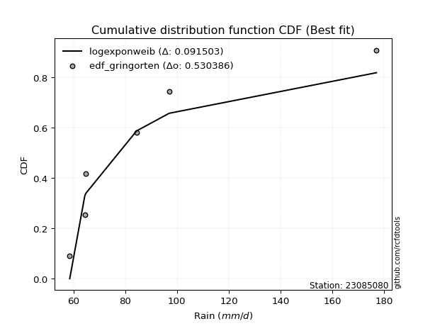</img>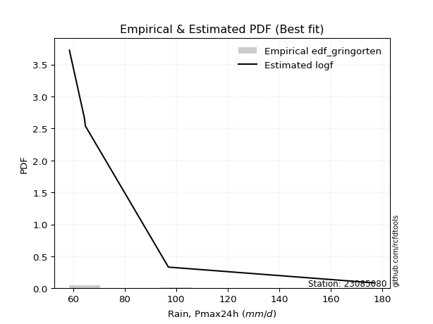</img>

</div>


### 9. Empirical - EDF Filliben (1975)

The specific values of the constants (0.3175) (often denoted as $alpha$) and (0.365) are derived from a method proposed by James J. Filliben in a 1975 paper. This particular formula is the mean value of the $i$-th order statistic of the normal distribution and is considered a robust and effective plotting position formula for the normal probability plot correlation coefficient test for normality.

<div align="center">


$P=(m-0.3175)/(n+0.365)$


</div>


**9.1. Empirical values**

<div align="center">

|                | 0                   | 1                   | 2                  | 3                  | 4                  | 5                  |
|:---------------|:--------------------|:--------------------|:-------------------|:-------------------|:-------------------|:-------------------|
| date           | 2022                | 2024                | 2021               | 2025               | 2020               | 2019               |
| x              | 58.6                | 64.4                | 64.8               | 74.2               | 97.0               | 177.0              |
| m              | 1                   | 2                   | 3                  | 4                  | 5                  | 6                  |
| empirical_dist | edf_filliben        | edf_filliben        | edf_filliben       | edf_filliben       | edf_filliben       | edf_filliben       |
| empirical      | 0.10722702278083267 | 0.26433621366849963 | 0.4214454045561665 | 0.5785545954438335 | 0.7356637863315004 | 0.8927729772191673 |
| empirical_tr   | 1.1201055873295205  | 1.3593166043780034  | 1.7284453496266123 | 2.3727865796831313 | 3.783060921248143  | 9.326007326007321  |

</div>


**9.2. Kolmogorov-Smirnov fit test (sorted by Δ)**


<div align="center">

|                | 0                   | 1                   | 2                   | 3                   | 4                   | 5                  | 6                   | 7                   | 8                   | 9                   | 10                  | 11                  | 12                  | 13                | 14                  | 15                  | 16                  | 17                 | 18                  | 19                 | 20                  | 21                  | 22                  | 23                  | 24                 | 25                  | 26                  | 27                  | 28                  | 29                | 30                  | 31                  | 32                    | 33                 | 34                  | 35                 | 36                  | 37                  | 38                  | 39                  | 40                | 41                  | 42                  | 43                  | 44                  | 45                  | 46                  | 47                  | 48                  | 49                  | 50                  | 51                  | 52                | 53                  | 54                 | 55                 | 56                  | 57                  | 58                  | 59                  | 60                  | 61                 | 62                  | 63                 | 64                  | 65                  | 66                  | 67                 | 68                  | 69                | 70                  | 71                 | 72                  | 73                  | 74                  | 75                  | 76                 | 77                 | 78                  | 79                 | 80                 | 81                 | 82                 | 83                  | 84                 | 85                 | 86                 | 87                 | 88                 | 89             |
|:---------------|:--------------------|:--------------------|:--------------------|:--------------------|:--------------------|:-------------------|:--------------------|:--------------------|:--------------------|:--------------------|:--------------------|:--------------------|:--------------------|:------------------|:--------------------|:--------------------|:--------------------|:-------------------|:--------------------|:-------------------|:--------------------|:--------------------|:--------------------|:--------------------|:-------------------|:--------------------|:--------------------|:--------------------|:--------------------|:------------------|:--------------------|:--------------------|:----------------------|:-------------------|:--------------------|:-------------------|:--------------------|:--------------------|:--------------------|:--------------------|:------------------|:--------------------|:--------------------|:--------------------|:--------------------|:--------------------|:--------------------|:--------------------|:--------------------|:--------------------|:--------------------|:--------------------|:------------------|:--------------------|:-------------------|:-------------------|:--------------------|:--------------------|:--------------------|:--------------------|:--------------------|:-------------------|:--------------------|:-------------------|:--------------------|:--------------------|:--------------------|:-------------------|:--------------------|:------------------|:--------------------|:-------------------|:--------------------|:--------------------|:--------------------|:--------------------|:-------------------|:-------------------|:--------------------|:-------------------|:-------------------|:-------------------|:-------------------|:--------------------|:-------------------|:-------------------|:-------------------|:-------------------|:-------------------|:---------------|
| station        | 23085080            | 23085080            | 23085080            | 23085080            | 23085080            | 23085080           | 23085080            | 23085080            | 23085080            | 23085080            | 23085080            | 23085080            | 23085080            | 23085080          | 23085080            | 23085080            | 23085080            | 23085080           | 23085080            | 23085080           | 23085080            | 23085080            | 23085080            | 23085080            | 23085080           | 23085080            | 23085080            | 23085080            | 23085080            | 23085080          | 23085080            | 23085080            | 23085080              | 23085080           | 23085080            | 23085080           | 23085080            | 23085080            | 23085080            | 23085080            | 23085080          | 23085080            | 23085080            | 23085080            | 23085080            | 23085080            | 23085080            | 23085080            | 23085080            | 23085080            | 23085080            | 23085080            | 23085080          | 23085080            | 23085080           | 23085080           | 23085080            | 23085080            | 23085080            | 23085080            | 23085080            | 23085080           | 23085080            | 23085080           | 23085080            | 23085080            | 23085080            | 23085080           | 23085080            | 23085080          | 23085080            | 23085080           | 23085080            | 23085080            | 23085080            | 23085080            | 23085080           | 23085080           | 23085080            | 23085080           | 23085080           | 23085080           | 23085080           | 23085080            | 23085080           | 23085080           | 23085080           | 23085080           | 23085080           | 23085080       |
| empirical_dist | edf_filliben        | edf_filliben        | edf_filliben        | edf_filliben        | edf_filliben        | edf_filliben       | edf_filliben        | edf_filliben        | edf_filliben        | edf_filliben        | edf_filliben        | edf_filliben        | edf_filliben        | edf_filliben      | edf_filliben        | edf_filliben        | edf_filliben        | edf_filliben       | edf_filliben        | edf_filliben       | edf_filliben        | edf_filliben        | edf_filliben        | edf_filliben        | edf_filliben       | edf_filliben        | edf_filliben        | edf_filliben        | edf_filliben        | edf_filliben      | edf_filliben        | edf_filliben        | edf_filliben          | edf_filliben       | edf_filliben        | edf_filliben       | edf_filliben        | edf_filliben        | edf_filliben        | edf_filliben        | edf_filliben      | edf_filliben        | edf_filliben        | edf_filliben        | edf_filliben        | edf_filliben        | edf_filliben        | edf_filliben        | edf_filliben        | edf_filliben        | edf_filliben        | edf_filliben        | edf_filliben      | edf_filliben        | edf_filliben       | edf_filliben       | edf_filliben        | edf_filliben        | edf_filliben        | edf_filliben        | edf_filliben        | edf_filliben       | edf_filliben        | edf_filliben       | edf_filliben        | edf_filliben        | edf_filliben        | edf_filliben       | edf_filliben        | edf_filliben      | edf_filliben        | edf_filliben       | edf_filliben        | edf_filliben        | edf_filliben        | edf_filliben        | edf_filliben       | edf_filliben       | edf_filliben        | edf_filliben       | edf_filliben       | edf_filliben       | edf_filliben       | edf_filliben        | edf_filliben       | edf_filliben       | edf_filliben       | edf_filliben       | edf_filliben       | edf_filliben   |
| p_dist         | alpha               | loginvweibull       | invgamma            | logf                | logalpha            | loginvgauss        | invgauss            | logmielke           | loghalfnorm         | f                   | logweibull_min      | logpareto           | pareto              | loghalflogistic   | logpearson3         | logjohnsonsu        | lognakagami         | chi2               | logmoyal            | loggumbel_r        | pearson3            | gamma               | lograyleigh         | halflogistic        | wald               | logmaxwell          | moyal               | logfatiguelife      | lognct              | halfnorm          | logexponnorm        | logexpon            | loglaplace_asymmetric | loggenexpon        | nct                 | logncf             | loginvgamma         | loggenlogistic      | gumbel_r            | rayleigh            | logloggamma       | ncf                 | weibull_min         | logwald             | genlogistic         | logcrystalball      | lognorm             | lognorm             | logt                | betaprime           | logbetaprime        | maxwell             | logkstwobign      | logtruncnorm        | fisk               | loglogistic        | t                   | logrice             | loghypsecant        | loggompertz         | norm                | crystalball        | logchi2             | kstwobign          | exponnorm           | genexpon            | expon               | laplace_asymmetric | logistic            | loglaplace        | erlang              | loggumbel_l        | hypsecant           | rice                | gompertz            | gibrat              | truncnorm          | laplace            | gumbel_l            | loggamma           | loggamma           | logfisk            | loggibrat          | loglognorm          | nakagami           | logerlang          | fatiguelife        | invweibull         | johnsonsu          | mielke         |
| delta          | 0.07145042361946441 | 0.07410595934534342 | 0.07684707754218556 | 0.07792696581219671 | 0.08317203368850401 | 0.0836173061756097 | 0.09308562153665634 | 0.09432018582561807 | 0.10598521803580446 | 0.10712379175188759 | 0.10722702257506406 | 0.10722702278083189 | 0.10722702278083233 | 0.109666228554826 | 0.12383862650359462 | 0.12570554561134223 | 0.12704864778009722 | 0.1336224651654233 | 0.13734837064124483 | 0.1393968470583698 | 0.14029713052003845 | 0.14088967058726481 | 0.14091134895923663 | 0.14329316238280143 | 0.1475591222145028 | 0.15321553355431478 | 0.15336860662468998 | 0.15699748426439714 | 0.16055691302317604 | 0.164374211514147 | 0.16462630283066781 | 0.16542396897301376 | 0.1654333228559396    | 0.1658490701078255 | 0.16593373624217433 | 0.1669625271575661 | 0.16911767770690028 | 0.17158074622729638 | 0.17207570088245372 | 0.17771010113383257 | 0.178202501844562 | 0.18082603422110444 | 0.18256157572948545 | 0.18537957284149295 | 0.18683461418242042 | 0.18699453302797353 | 0.18701033487325075 | 0.18701033487325075 | 0.18701612069367796 | 0.18779834880356278 | 0.18875239889945897 | 0.18984602921847749 | 0.192548935187399 | 0.19510120278798668 | 0.1989108530136965 | 0.2008570385814611 | 0.20581851293462994 | 0.21138490399649842 | 0.21210304224557985 | 0.21387368368704862 | 0.22215427318884373 | 0.2221542804795995 | 0.23203464611204683 | 0.2330852990148533 | 0.23753946562780304 | 0.23875592430382225 | 0.23875659881699873 | 0.2387575379190976 | 0.23953241406164583 | 0.239798563170533 | 0.24080246042258271 | 0.2526143380201794 | 0.25312981739536106 | 0.26491629508569065 | 0.26511864721352585 | 0.26859723733692586 | 0.2732062945957751 | 0.2814631972552213 | 0.28311853991105324 | 0.2840912151190041 | 0.2840912151190041 | 0.3165007569433401 | 0.3205521260615634 | 0.37771083477169226 | 0.3807869591652911 | 0.4000566534816044 | 0.4090477190855552 | 0.4455265155777459 | 0.5243679012718974 | nan            |
| deltao         | 0.530385761606      | 0.530385761606      | 0.530385761606      | 0.530385761606      | 0.530385761606      | 0.530385761606     | 0.530385761606      | 0.530385761606      | 0.530385761606      | 0.530385761606      | 0.530385761606      | 0.530385761606      | 0.530385761606      | 0.530385761606    | 0.530385761606      | 0.530385761606      | 0.530385761606      | 0.530385761606     | 0.530385761606      | 0.530385761606     | 0.530385761606      | 0.530385761606      | 0.530385761606      | 0.530385761606      | 0.530385761606     | 0.530385761606      | 0.530385761606      | 0.530385761606      | 0.530385761606      | 0.530385761606    | 0.530385761606      | 0.530385761606      | 0.530385761606        | 0.530385761606     | 0.530385761606      | 0.530385761606     | 0.530385761606      | 0.530385761606      | 0.530385761606      | 0.530385761606      | 0.530385761606    | 0.530385761606      | 0.530385761606      | 0.530385761606      | 0.530385761606      | 0.530385761606      | 0.530385761606      | 0.530385761606      | 0.530385761606      | 0.530385761606      | 0.530385761606      | 0.530385761606      | 0.530385761606    | 0.530385761606      | 0.530385761606     | 0.530385761606     | 0.530385761606      | 0.530385761606      | 0.530385761606      | 0.530385761606      | 0.530385761606      | 0.530385761606     | 0.530385761606      | 0.530385761606     | 0.530385761606      | 0.530385761606      | 0.530385761606      | 0.530385761606     | 0.530385761606      | 0.530385761606    | 0.530385761606      | 0.530385761606     | 0.530385761606      | 0.530385761606      | 0.530385761606      | 0.530385761606      | 0.530385761606     | 0.530385761606     | 0.530385761606      | 0.530385761606     | 0.530385761606     | 0.530385761606     | 0.530385761606     | 0.530385761606      | 0.530385761606     | 0.530385761606     | 0.530385761606     | 0.530385761606     | 0.530385761606     | 0.530385761606 |
| eval           | Δo > Δ              | Δo > Δ              | Δo > Δ              | Δo > Δ              | Δo > Δ              | Δo > Δ             | Δo > Δ              | Δo > Δ              | Δo > Δ              | Δo > Δ              | Δo > Δ              | Δo > Δ              | Δo > Δ              | Δo > Δ            | Δo > Δ              | Δo > Δ              | Δo > Δ              | Δo > Δ             | Δo > Δ              | Δo > Δ             | Δo > Δ              | Δo > Δ              | Δo > Δ              | Δo > Δ              | Δo > Δ             | Δo > Δ              | Δo > Δ              | Δo > Δ              | Δo > Δ              | Δo > Δ            | Δo > Δ              | Δo > Δ              | Δo > Δ                | Δo > Δ             | Δo > Δ              | Δo > Δ             | Δo > Δ              | Δo > Δ              | Δo > Δ              | Δo > Δ              | Δo > Δ            | Δo > Δ              | Δo > Δ              | Δo > Δ              | Δo > Δ              | Δo > Δ              | Δo > Δ              | Δo > Δ              | Δo > Δ              | Δo > Δ              | Δo > Δ              | Δo > Δ              | Δo > Δ            | Δo > Δ              | Δo > Δ             | Δo > Δ             | Δo > Δ              | Δo > Δ              | Δo > Δ              | Δo > Δ              | Δo > Δ              | Δo > Δ             | Δo > Δ              | Δo > Δ             | Δo > Δ              | Δo > Δ              | Δo > Δ              | Δo > Δ             | Δo > Δ              | Δo > Δ            | Δo > Δ              | Δo > Δ             | Δo > Δ              | Δo > Δ              | Δo > Δ              | Δo > Δ              | Δo > Δ             | Δo > Δ             | Δo > Δ              | Δo > Δ             | Δo > Δ             | Δo > Δ             | Δo > Δ             | Δo > Δ              | Δo > Δ             | Δo > Δ             | Δo > Δ             | Δo > Δ             | Δo > Δ             | Δo <= Δ        |
| fit            | 1                   | 1                   | 1                   | 1                   | 1                   | 1                  | 1                   | 1                   | 1                   | 1                   | 1                   | 1                   | 1                   | 1                 | 1                   | 1                   | 1                   | 1                  | 1                   | 1                  | 1                   | 1                   | 1                   | 1                   | 1                  | 1                   | 1                   | 1                   | 1                   | 1                 | 1                   | 1                   | 1                     | 1                  | 1                   | 1                  | 1                   | 1                   | 1                   | 1                   | 1                 | 1                   | 1                   | 1                   | 1                   | 1                   | 1                   | 1                   | 1                   | 1                   | 1                   | 1                   | 1                 | 1                   | 1                  | 1                  | 1                   | 1                   | 1                   | 1                   | 1                   | 1                  | 1                   | 1                  | 1                   | 1                   | 1                   | 1                  | 1                   | 1                 | 1                   | 1                  | 1                   | 1                   | 1                   | 1                   | 1                  | 1                  | 1                   | 1                  | 1                  | 1                  | 1                  | 1                   | 1                  | 1                  | 1                  | 1                  | 1                  | 0              |
| n              | 6                   | 6                   | 6                   | 6                   | 6                   | 6                  | 6                   | 6                   | 6                   | 6                   | 6                   | 6                   | 6                   | 6                 | 6                   | 6                   | 6                   | 6                  | 6                   | 6                  | 6                   | 6                   | 6                   | 6                   | 6                  | 6                   | 6                   | 6                   | 6                   | 6                 | 6                   | 6                   | 6                     | 6                  | 6                   | 6                  | 6                   | 6                   | 6                   | 6                   | 6                 | 6                   | 6                   | 6                   | 6                   | 6                   | 6                   | 6                   | 6                   | 6                   | 6                   | 6                   | 6                 | 6                   | 6                  | 6                  | 6                   | 6                   | 6                   | 6                   | 6                   | 6                  | 6                   | 6                  | 6                   | 6                   | 6                   | 6                  | 6                   | 6                 | 6                   | 6                  | 6                   | 6                   | 6                   | 6                   | 6                  | 6                  | 6                   | 6                  | 6                  | 6                  | 6                  | 6                   | 6                  | 6                  | 6                  | 6                  | 6                  | 6              |
| best_fit       | 1                   | 0                   | 0                   | 0                   | 0                   | 0                  | 0                   | 0                   | 0                   | 0                   | 0                   | 0                   | 0                   | 0                 | 0                   | 0                   | 0                   | 0                  | 0                   | 0                  | 0                   | 0                   | 0                   | 0                   | 0                  | 0                   | 0                   | 0                   | 0                   | 0                 | 0                   | 0                   | 0                     | 0                  | 0                   | 0                  | 0                   | 0                   | 0                   | 0                   | 0                 | 0                   | 0                   | 0                   | 0                   | 0                   | 0                   | 0                   | 0                   | 0                   | 0                   | 0                   | 0                 | 0                   | 0                  | 0                  | 0                   | 0                   | 0                   | 0                   | 0                   | 0                  | 0                   | 0                  | 0                   | 0                   | 0                   | 0                  | 0                   | 0                 | 0                   | 0                  | 0                   | 0                   | 0                   | 0                   | 0                  | 0                  | 0                   | 0                  | 0                  | 0                  | 0                  | 0                   | 0                  | 0                  | 0                  | 0                  | 0                  | 0              |
| best_fit_sort  | 1                   | 2                   | 3                   | 4                   | 5                   | 6                  | 7                   | 8                   | 9                   | 10                  | 11                  | 12                  | 13                  | 14                | 15                  | 16                  | 17                  | 18                 | 19                  | 20                 | 21                  | 22                  | 23                  | 24                  | 25                 | 26                  | 27                  | 28                  | 29                  | 30                | 31                  | 32                  | 33                    | 34                 | 35                  | 36                 | 37                  | 38                  | 39                  | 40                  | 41                | 42                  | 43                  | 44                  | 45                  | 46                  | 47                  | 48                  | 49                  | 50                  | 51                  | 52                  | 53                | 54                  | 55                 | 56                 | 57                  | 58                  | 59                  | 60                  | 61                  | 62                 | 63                  | 64                 | 65                  | 66                  | 67                  | 68                 | 69                  | 70                | 71                  | 72                 | 73                  | 74                  | 75                  | 76                  | 77                 | 78                 | 79                  | 80                 | 81                 | 82                 | 83                 | 84                  | 85                 | 86                 | 87                 | 88                 | 89                 | 90             |

</div>


<div align="center">

</img>

</div>


**9.3. Best fit**

<div align="center">

|   id |   station | empirical_dist   | p_dist   |     delta |   deltao | eval   |   fit |   n |   best_fit |   best_fit_sort |
|-----:|----------:|:-----------------|:---------|----------:|---------:|:-------|------:|----:|-----------:|----------------:|
|    0 |  23085080 | edf_filliben     | alpha    | 0.0714504 | 0.530386 | Δo > Δ |     1 |   6 |          1 |               1 |

</div>


<div align="center">

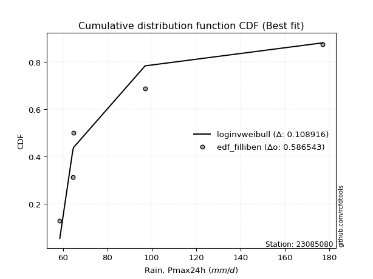</img>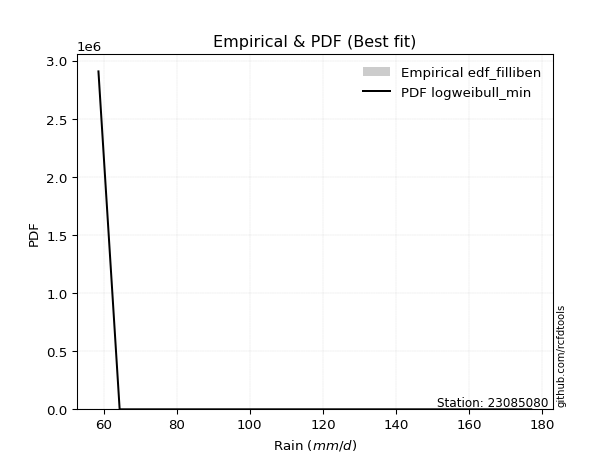</img>

</div>


### 10. Empirical - EDF Jenkinson (1977)

The Jenkinson formula in hydrology is an empirical plotting position formula used to estimate the non-exceedance probability _(P)_ or return period _(T)_ of a given ordered observation within a sample. It is a widely used method in the frequency analysis of extreme events such as floods and rainfall, as it provides a distribution-free way to plot data. _a≈0.31_ and _b≈0.38_ are constants derived to approximate the median of the probability distribution for the given rank.

<div align="center">


$P=(m-a)/(n+b)$


</div>


**10.1. Empirical values**

<div align="center">

|                | 0                   | 1                   | 2                  | 3                  | 4                  | 5                  |
|:---------------|:--------------------|:--------------------|:-------------------|:-------------------|:-------------------|:-------------------|
| date           | 2022                | 2024                | 2021               | 2025               | 2020               | 2019               |
| x              | 58.6                | 64.4                | 64.8               | 74.2               | 97.0               | 177.0              |
| m              | 1                   | 2                   | 3                  | 4                  | 5                  | 6                  |
| empirical_dist | edf_jenkinson       | edf_jenkinson       | edf_jenkinson      | edf_jenkinson      | edf_jenkinson      | edf_jenkinson      |
| empirical      | 0.10815047021943573 | 0.26489028213166144 | 0.4216300940438871 | 0.5783699059561128 | 0.7351097178683387 | 0.8918495297805643 |
| empirical_tr   | 1.1212653778558874  | 1.3603411513859276  | 1.7289972899728996 | 2.3717472118959106 | 3.7751479289940844 | 9.246376811594207  |

</div>


**10.2. Kolmogorov-Smirnov fit test (sorted by Δ)**


<div align="center">

|                | 0                  | 1                   | 2                   | 3                   | 4                  | 5                   | 6                   | 7                   | 8                  | 9                   | 10                  | 11                  | 12                 | 13                 | 14                  | 15                  | 16                  | 17                  | 18                  | 19                 | 20                 | 21                | 22                  | 23                  | 24                 | 25                  | 26                  | 27                  | 28                  | 29                  | 30                  | 31                  | 32                    | 33                  | 34                  | 35                  | 36                  | 37                  | 38                  | 39                 | 40                  | 41                  | 42                  | 43                  | 44                  | 45                  | 46                 | 47                 | 48                 | 49                  | 50                  | 51                  | 52                 | 53                  | 54                  | 55                  | 56                  | 57                  | 58                 | 59                  | 60                  | 61                  | 62                  | 63                  | 64                  | 65                  | 66                  | 67                 | 68                  | 69                  | 70                  | 71                  | 72                 | 73               | 74                 | 75                  | 76                 | 77                  | 78                 | 79                 | 80                 | 81                  | 82                | 83                  | 84                 | 85                 | 86                 | 87                  | 88                 | 89             |
|:---------------|:-------------------|:--------------------|:--------------------|:--------------------|:-------------------|:--------------------|:--------------------|:--------------------|:-------------------|:--------------------|:--------------------|:--------------------|:-------------------|:-------------------|:--------------------|:--------------------|:--------------------|:--------------------|:--------------------|:-------------------|:-------------------|:------------------|:--------------------|:--------------------|:-------------------|:--------------------|:--------------------|:--------------------|:--------------------|:--------------------|:--------------------|:--------------------|:----------------------|:--------------------|:--------------------|:--------------------|:--------------------|:--------------------|:--------------------|:-------------------|:--------------------|:--------------------|:--------------------|:--------------------|:--------------------|:--------------------|:-------------------|:-------------------|:-------------------|:--------------------|:--------------------|:--------------------|:-------------------|:--------------------|:--------------------|:--------------------|:--------------------|:--------------------|:-------------------|:--------------------|:--------------------|:--------------------|:--------------------|:--------------------|:--------------------|:--------------------|:--------------------|:-------------------|:--------------------|:--------------------|:--------------------|:--------------------|:-------------------|:-----------------|:-------------------|:--------------------|:-------------------|:--------------------|:-------------------|:-------------------|:-------------------|:--------------------|:------------------|:--------------------|:-------------------|:-------------------|:-------------------|:--------------------|:-------------------|:---------------|
| station        | 23085080           | 23085080            | 23085080            | 23085080            | 23085080           | 23085080            | 23085080            | 23085080            | 23085080           | 23085080            | 23085080            | 23085080            | 23085080           | 23085080           | 23085080            | 23085080            | 23085080            | 23085080            | 23085080            | 23085080           | 23085080           | 23085080          | 23085080            | 23085080            | 23085080           | 23085080            | 23085080            | 23085080            | 23085080            | 23085080            | 23085080            | 23085080            | 23085080              | 23085080            | 23085080            | 23085080            | 23085080            | 23085080            | 23085080            | 23085080           | 23085080            | 23085080            | 23085080            | 23085080            | 23085080            | 23085080            | 23085080           | 23085080           | 23085080           | 23085080            | 23085080            | 23085080            | 23085080           | 23085080            | 23085080            | 23085080            | 23085080            | 23085080            | 23085080           | 23085080            | 23085080            | 23085080            | 23085080            | 23085080            | 23085080            | 23085080            | 23085080            | 23085080           | 23085080            | 23085080            | 23085080            | 23085080            | 23085080           | 23085080         | 23085080           | 23085080            | 23085080           | 23085080            | 23085080           | 23085080           | 23085080           | 23085080            | 23085080          | 23085080            | 23085080           | 23085080           | 23085080           | 23085080            | 23085080           | 23085080       |
| empirical_dist | edf_jenkinson      | edf_jenkinson       | edf_jenkinson       | edf_jenkinson       | edf_jenkinson      | edf_jenkinson       | edf_jenkinson       | edf_jenkinson       | edf_jenkinson      | edf_jenkinson       | edf_jenkinson       | edf_jenkinson       | edf_jenkinson      | edf_jenkinson      | edf_jenkinson       | edf_jenkinson       | edf_jenkinson       | edf_jenkinson       | edf_jenkinson       | edf_jenkinson      | edf_jenkinson      | edf_jenkinson     | edf_jenkinson       | edf_jenkinson       | edf_jenkinson      | edf_jenkinson       | edf_jenkinson       | edf_jenkinson       | edf_jenkinson       | edf_jenkinson       | edf_jenkinson       | edf_jenkinson       | edf_jenkinson         | edf_jenkinson       | edf_jenkinson       | edf_jenkinson       | edf_jenkinson       | edf_jenkinson       | edf_jenkinson       | edf_jenkinson      | edf_jenkinson       | edf_jenkinson       | edf_jenkinson       | edf_jenkinson       | edf_jenkinson       | edf_jenkinson       | edf_jenkinson      | edf_jenkinson      | edf_jenkinson      | edf_jenkinson       | edf_jenkinson       | edf_jenkinson       | edf_jenkinson      | edf_jenkinson       | edf_jenkinson       | edf_jenkinson       | edf_jenkinson       | edf_jenkinson       | edf_jenkinson      | edf_jenkinson       | edf_jenkinson       | edf_jenkinson       | edf_jenkinson       | edf_jenkinson       | edf_jenkinson       | edf_jenkinson       | edf_jenkinson       | edf_jenkinson      | edf_jenkinson       | edf_jenkinson       | edf_jenkinson       | edf_jenkinson       | edf_jenkinson      | edf_jenkinson    | edf_jenkinson      | edf_jenkinson       | edf_jenkinson      | edf_jenkinson       | edf_jenkinson      | edf_jenkinson      | edf_jenkinson      | edf_jenkinson       | edf_jenkinson     | edf_jenkinson       | edf_jenkinson      | edf_jenkinson      | edf_jenkinson      | edf_jenkinson       | edf_jenkinson      | edf_jenkinson  |
| p_dist         | alpha              | loginvweibull       | invgamma            | logf                | logalpha           | loginvgauss         | invgauss            | logmielke           | loghalfnorm        | f                   | logweibull_min      | logpareto           | pareto             | loghalflogistic    | logpearson3         | logjohnsonsu        | lognakagami         | chi2                | logmoyal            | loggumbel_r        | pearson3           | gamma             | lograyleigh         | halflogistic        | wald               | logmaxwell          | moyal               | logfatiguelife      | lognct              | halfnorm            | logexponnorm        | logexpon            | loglaplace_asymmetric | loggenexpon         | logncf              | nct                 | loginvgamma         | loggenlogistic      | gumbel_r            | rayleigh           | logloggamma         | ncf                 | weibull_min         | logwald             | genlogistic         | logcrystalball      | lognorm            | lognorm            | logt               | betaprime           | logbetaprime        | maxwell             | logkstwobign       | logtruncnorm        | fisk                | loglogistic         | t                   | logrice             | loghypsecant       | loggompertz         | norm                | crystalball         | logchi2             | kstwobign           | exponnorm           | genexpon            | expon               | laplace_asymmetric | logistic            | loglaplace          | erlang              | loggumbel_l         | hypsecant          | rice             | gompertz           | gibrat              | truncnorm          | laplace             | gumbel_l           | loggamma           | loggamma           | logfisk             | loggibrat         | loglognorm          | nakagami           | logerlang          | fatiguelife        | invweibull          | johnsonsu          | mielke         |
| delta          | 0.0708963551563026 | 0.07429064883306402 | 0.07629300907902375 | 0.07811165529991732 | 0.0826179652253422 | 0.08306323771244789 | 0.09253155307349453 | 0.09450487531333868 | 0.1058005285480838 | 0.10804723919049065 | 0.10815047001366712 | 0.10815047021943495 | 0.1081504702194354 | 0.1098509180425466 | 0.12402331599131522 | 0.12515147714818042 | 0.12723333726781783 | 0.13417653362858506 | 0.13753306012896543 | 0.1395815365460904 | 0.1401124410323178 | 0.140335602124103 | 0.14072665947151597 | 0.14236971494419837 | 0.1477438117022234 | 0.15303084406659412 | 0.15318391713696933 | 0.15644341580123533 | 0.16037222353545538 | 0.16345076407554393 | 0.16481099231838842 | 0.16560865846073436 | 0.1656180123436602    | 0.16603375959554612 | 0.16603907971896303 | 0.16611842572989494 | 0.16893298821917963 | 0.17176543571501698 | 0.17189101139473306 | 0.1775254116461119 | 0.17801781235684133 | 0.18064134473338378 | 0.18200750726632364 | 0.18556426232921355 | 0.18664992469469976 | 0.18680984354025287 | 0.1868256453855301 | 0.1868256453855301 | 0.1868314312059573 | 0.18761365931584212 | 0.18893708838717957 | 0.18966133973075683 | 0.1927336246751196 | 0.19528589227570728 | 0.19798740557509353 | 0.20067234909374043 | 0.20563382344690928 | 0.21156959348421903 | 0.2119183527578592 | 0.21405837317476922 | 0.22196958370112307 | 0.22196959099187885 | 0.23148057764888508 | 0.23290060952713265 | 0.23772415511552364 | 0.23894061379154286 | 0.23894128830471933 | 0.2389422274068182 | 0.23934772457392517 | 0.23961387368281234 | 0.24098714991030332 | 0.25242964853245875 | 0.2529451279076404 | 0.26473160559797 | 0.2653033367012465 | 0.26878192682464647 | 0.2733909840834957 | 0.28127850776750063 | 0.2829338504233326 | 0.2835371466558423 | 0.2835371466558423 | 0.31557730950473717 | 0.320736815549284 | 0.37715676630853046 | 0.3802328907021293 | 0.3995025850184426 | 0.4084936506223934 | 0.44460306813914297 | 0.5238138328087356 | nan            |
| deltao         | 0.530385761606     | 0.530385761606      | 0.530385761606      | 0.530385761606      | 0.530385761606     | 0.530385761606      | 0.530385761606      | 0.530385761606      | 0.530385761606     | 0.530385761606      | 0.530385761606      | 0.530385761606      | 0.530385761606     | 0.530385761606     | 0.530385761606      | 0.530385761606      | 0.530385761606      | 0.530385761606      | 0.530385761606      | 0.530385761606     | 0.530385761606     | 0.530385761606    | 0.530385761606      | 0.530385761606      | 0.530385761606     | 0.530385761606      | 0.530385761606      | 0.530385761606      | 0.530385761606      | 0.530385761606      | 0.530385761606      | 0.530385761606      | 0.530385761606        | 0.530385761606      | 0.530385761606      | 0.530385761606      | 0.530385761606      | 0.530385761606      | 0.530385761606      | 0.530385761606     | 0.530385761606      | 0.530385761606      | 0.530385761606      | 0.530385761606      | 0.530385761606      | 0.530385761606      | 0.530385761606     | 0.530385761606     | 0.530385761606     | 0.530385761606      | 0.530385761606      | 0.530385761606      | 0.530385761606     | 0.530385761606      | 0.530385761606      | 0.530385761606      | 0.530385761606      | 0.530385761606      | 0.530385761606     | 0.530385761606      | 0.530385761606      | 0.530385761606      | 0.530385761606      | 0.530385761606      | 0.530385761606      | 0.530385761606      | 0.530385761606      | 0.530385761606     | 0.530385761606      | 0.530385761606      | 0.530385761606      | 0.530385761606      | 0.530385761606     | 0.530385761606   | 0.530385761606     | 0.530385761606      | 0.530385761606     | 0.530385761606      | 0.530385761606     | 0.530385761606     | 0.530385761606     | 0.530385761606      | 0.530385761606    | 0.530385761606      | 0.530385761606     | 0.530385761606     | 0.530385761606     | 0.530385761606      | 0.530385761606     | 0.530385761606 |
| eval           | Δo > Δ             | Δo > Δ              | Δo > Δ              | Δo > Δ              | Δo > Δ             | Δo > Δ              | Δo > Δ              | Δo > Δ              | Δo > Δ             | Δo > Δ              | Δo > Δ              | Δo > Δ              | Δo > Δ             | Δo > Δ             | Δo > Δ              | Δo > Δ              | Δo > Δ              | Δo > Δ              | Δo > Δ              | Δo > Δ             | Δo > Δ             | Δo > Δ            | Δo > Δ              | Δo > Δ              | Δo > Δ             | Δo > Δ              | Δo > Δ              | Δo > Δ              | Δo > Δ              | Δo > Δ              | Δo > Δ              | Δo > Δ              | Δo > Δ                | Δo > Δ              | Δo > Δ              | Δo > Δ              | Δo > Δ              | Δo > Δ              | Δo > Δ              | Δo > Δ             | Δo > Δ              | Δo > Δ              | Δo > Δ              | Δo > Δ              | Δo > Δ              | Δo > Δ              | Δo > Δ             | Δo > Δ             | Δo > Δ             | Δo > Δ              | Δo > Δ              | Δo > Δ              | Δo > Δ             | Δo > Δ              | Δo > Δ              | Δo > Δ              | Δo > Δ              | Δo > Δ              | Δo > Δ             | Δo > Δ              | Δo > Δ              | Δo > Δ              | Δo > Δ              | Δo > Δ              | Δo > Δ              | Δo > Δ              | Δo > Δ              | Δo > Δ             | Δo > Δ              | Δo > Δ              | Δo > Δ              | Δo > Δ              | Δo > Δ             | Δo > Δ           | Δo > Δ             | Δo > Δ              | Δo > Δ             | Δo > Δ              | Δo > Δ             | Δo > Δ             | Δo > Δ             | Δo > Δ              | Δo > Δ            | Δo > Δ              | Δo > Δ             | Δo > Δ             | Δo > Δ             | Δo > Δ              | Δo > Δ             | Δo <= Δ        |
| fit            | 1                  | 1                   | 1                   | 1                   | 1                  | 1                   | 1                   | 1                   | 1                  | 1                   | 1                   | 1                   | 1                  | 1                  | 1                   | 1                   | 1                   | 1                   | 1                   | 1                  | 1                  | 1                 | 1                   | 1                   | 1                  | 1                   | 1                   | 1                   | 1                   | 1                   | 1                   | 1                   | 1                     | 1                   | 1                   | 1                   | 1                   | 1                   | 1                   | 1                  | 1                   | 1                   | 1                   | 1                   | 1                   | 1                   | 1                  | 1                  | 1                  | 1                   | 1                   | 1                   | 1                  | 1                   | 1                   | 1                   | 1                   | 1                   | 1                  | 1                   | 1                   | 1                   | 1                   | 1                   | 1                   | 1                   | 1                   | 1                  | 1                   | 1                   | 1                   | 1                   | 1                  | 1                | 1                  | 1                   | 1                  | 1                   | 1                  | 1                  | 1                  | 1                   | 1                 | 1                   | 1                  | 1                  | 1                  | 1                   | 1                  | 0              |
| n              | 6                  | 6                   | 6                   | 6                   | 6                  | 6                   | 6                   | 6                   | 6                  | 6                   | 6                   | 6                   | 6                  | 6                  | 6                   | 6                   | 6                   | 6                   | 6                   | 6                  | 6                  | 6                 | 6                   | 6                   | 6                  | 6                   | 6                   | 6                   | 6                   | 6                   | 6                   | 6                   | 6                     | 6                   | 6                   | 6                   | 6                   | 6                   | 6                   | 6                  | 6                   | 6                   | 6                   | 6                   | 6                   | 6                   | 6                  | 6                  | 6                  | 6                   | 6                   | 6                   | 6                  | 6                   | 6                   | 6                   | 6                   | 6                   | 6                  | 6                   | 6                   | 6                   | 6                   | 6                   | 6                   | 6                   | 6                   | 6                  | 6                   | 6                   | 6                   | 6                   | 6                  | 6                | 6                  | 6                   | 6                  | 6                   | 6                  | 6                  | 6                  | 6                   | 6                 | 6                   | 6                  | 6                  | 6                  | 6                   | 6                  | 6              |
| best_fit       | 1                  | 0                   | 0                   | 0                   | 0                  | 0                   | 0                   | 0                   | 0                  | 0                   | 0                   | 0                   | 0                  | 0                  | 0                   | 0                   | 0                   | 0                   | 0                   | 0                  | 0                  | 0                 | 0                   | 0                   | 0                  | 0                   | 0                   | 0                   | 0                   | 0                   | 0                   | 0                   | 0                     | 0                   | 0                   | 0                   | 0                   | 0                   | 0                   | 0                  | 0                   | 0                   | 0                   | 0                   | 0                   | 0                   | 0                  | 0                  | 0                  | 0                   | 0                   | 0                   | 0                  | 0                   | 0                   | 0                   | 0                   | 0                   | 0                  | 0                   | 0                   | 0                   | 0                   | 0                   | 0                   | 0                   | 0                   | 0                  | 0                   | 0                   | 0                   | 0                   | 0                  | 0                | 0                  | 0                   | 0                  | 0                   | 0                  | 0                  | 0                  | 0                   | 0                 | 0                   | 0                  | 0                  | 0                  | 0                   | 0                  | 0              |
| best_fit_sort  | 1                  | 2                   | 3                   | 4                   | 5                  | 6                   | 7                   | 8                   | 9                  | 10                  | 11                  | 12                  | 13                 | 14                 | 15                  | 16                  | 17                  | 18                  | 19                  | 20                 | 21                 | 22                | 23                  | 24                  | 25                 | 26                  | 27                  | 28                  | 29                  | 30                  | 31                  | 32                  | 33                    | 34                  | 35                  | 36                  | 37                  | 38                  | 39                  | 40                 | 41                  | 42                  | 43                  | 44                  | 45                  | 46                  | 47                 | 48                 | 49                 | 50                  | 51                  | 52                  | 53                 | 54                  | 55                  | 56                  | 57                  | 58                  | 59                 | 60                  | 61                  | 62                  | 63                  | 64                  | 65                  | 66                  | 67                  | 68                 | 69                  | 70                  | 71                  | 72                  | 73                 | 74               | 75                 | 76                  | 77                 | 78                  | 79                 | 80                 | 81                 | 82                  | 83                | 84                  | 85                 | 86                 | 87                 | 88                  | 89                 | 90             |

</div>


<div align="center">

</img>

</div>


**10.3. Best fit**

<div align="center">

|   id |   station | empirical_dist   | p_dist   |     delta |   deltao | eval   |   fit |   n |   best_fit |   best_fit_sort |
|-----:|----------:|:-----------------|:---------|----------:|---------:|:-------|------:|----:|-----------:|----------------:|
|    0 |  23085080 | edf_jenkinson    | alpha    | 0.0708964 | 0.530386 | Δo > Δ |     1 |   6 |          1 |               1 |

</div>


<div align="center">

</img>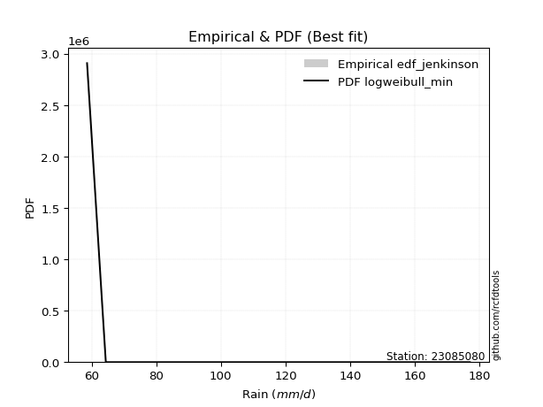</img>

</div>


### 11. Empirical - EDF Cunnane (1978)

Cunnane´s work in statistical hydrology has focused on the performance and evaluation of different probability distributions (such as GEV, Gumbel, Lognormal) for flood frequency estimation. _b_ is a constant, typically set to 0.4.

<div align="center">


$P=(m-b)/(n+1-2b)$


</div>


**11.1. Empirical values**

<div align="center">

|                | 0                  | 1                   | 2                   | 3                  | 4                  | 5                  |
|:---------------|:-------------------|:--------------------|:--------------------|:-------------------|:-------------------|:-------------------|
| date           | 2022               | 2024                | 2021                | 2025               | 2020               | 2019               |
| x              | 58.6               | 64.4                | 64.8                | 74.2               | 97.0               | 177.0              |
| m              | 1                  | 2                   | 3                   | 4                  | 5                  | 6                  |
| empirical_dist | edf_cunnane        | edf_cunnane         | edf_cunnane         | edf_cunnane        | edf_cunnane        | edf_cunnane        |
| empirical      | 0.0967741935483871 | 0.25806451612903225 | 0.41935483870967744 | 0.5806451612903226 | 0.7419354838709676 | 0.9032258064516128 |
| empirical_tr   | 1.1071428571428572 | 1.3478260869565217  | 1.7222222222222225  | 2.384615384615385  | 3.8749999999999982 | 10.333333333333318 |

</div>


**11.2. Kolmogorov-Smirnov fit test (sorted by Δ)**


<div align="center">

|                | 0                   | 1                   | 2                   | 3                   | 4                   | 5                   | 6                   | 7                   | 8                   | 9                   | 10                  | 11                  | 12                 | 13                  | 14                  | 15                  | 16                 | 17                 | 18                  | 19                 | 20                  | 21                 | 22                  | 23                 | 24                  | 25                  | 26                  | 27                  | 28                  | 29                  | 30                  | 31                    | 32                  | 33                  | 34                 | 35                  | 36                  | 37                  | 38                  | 39                 | 40                  | 41                  | 42                  | 43                  | 44                  | 45                  | 46                  | 47                 | 48                 | 49                 | 50                  | 51                 | 52                  | 53                 | 54                  | 55                  | 56                  | 57                | 58                  | 59                | 60                  | 61                  | 62                  | 63                  | 64                  | 65                  | 66                 | 67                  | 68                  | 69                  | 70                  | 71                  | 72                 | 73                 | 74                 | 75                 | 76                | 77                  | 78                 | 79                 | 80                 | 81                 | 82                 | 83                  | 84                 | 85                 | 86                 | 87                 | 88                 | 89             |
|:---------------|:--------------------|:--------------------|:--------------------|:--------------------|:--------------------|:--------------------|:--------------------|:--------------------|:--------------------|:--------------------|:--------------------|:--------------------|:-------------------|:--------------------|:--------------------|:--------------------|:-------------------|:-------------------|:--------------------|:-------------------|:--------------------|:-------------------|:--------------------|:-------------------|:--------------------|:--------------------|:--------------------|:--------------------|:--------------------|:--------------------|:--------------------|:----------------------|:--------------------|:--------------------|:-------------------|:--------------------|:--------------------|:--------------------|:--------------------|:-------------------|:--------------------|:--------------------|:--------------------|:--------------------|:--------------------|:--------------------|:--------------------|:-------------------|:-------------------|:-------------------|:--------------------|:-------------------|:--------------------|:-------------------|:--------------------|:--------------------|:--------------------|:------------------|:--------------------|:------------------|:--------------------|:--------------------|:--------------------|:--------------------|:--------------------|:--------------------|:-------------------|:--------------------|:--------------------|:--------------------|:--------------------|:--------------------|:-------------------|:-------------------|:-------------------|:-------------------|:------------------|:--------------------|:-------------------|:-------------------|:-------------------|:-------------------|:-------------------|:--------------------|:-------------------|:-------------------|:-------------------|:-------------------|:-------------------|:---------------|
| station        | 23085080            | 23085080            | 23085080            | 23085080            | 23085080            | 23085080            | 23085080            | 23085080            | 23085080            | 23085080            | 23085080            | 23085080            | 23085080           | 23085080            | 23085080            | 23085080            | 23085080           | 23085080           | 23085080            | 23085080           | 23085080            | 23085080           | 23085080            | 23085080           | 23085080            | 23085080            | 23085080            | 23085080            | 23085080            | 23085080            | 23085080            | 23085080              | 23085080            | 23085080            | 23085080           | 23085080            | 23085080            | 23085080            | 23085080            | 23085080           | 23085080            | 23085080            | 23085080            | 23085080            | 23085080            | 23085080            | 23085080            | 23085080           | 23085080           | 23085080           | 23085080            | 23085080           | 23085080            | 23085080           | 23085080            | 23085080            | 23085080            | 23085080          | 23085080            | 23085080          | 23085080            | 23085080            | 23085080            | 23085080            | 23085080            | 23085080            | 23085080           | 23085080            | 23085080            | 23085080            | 23085080            | 23085080            | 23085080           | 23085080           | 23085080           | 23085080           | 23085080          | 23085080            | 23085080           | 23085080           | 23085080           | 23085080           | 23085080           | 23085080            | 23085080           | 23085080           | 23085080           | 23085080           | 23085080           | 23085080       |
| empirical_dist | edf_cunnane         | edf_cunnane         | edf_cunnane         | edf_cunnane         | edf_cunnane         | edf_cunnane         | edf_cunnane         | edf_cunnane         | edf_cunnane         | edf_cunnane         | edf_cunnane         | edf_cunnane         | edf_cunnane        | edf_cunnane         | edf_cunnane         | edf_cunnane         | edf_cunnane        | edf_cunnane        | edf_cunnane         | edf_cunnane        | edf_cunnane         | edf_cunnane        | edf_cunnane         | edf_cunnane        | edf_cunnane         | edf_cunnane         | edf_cunnane         | edf_cunnane         | edf_cunnane         | edf_cunnane         | edf_cunnane         | edf_cunnane           | edf_cunnane         | edf_cunnane         | edf_cunnane        | edf_cunnane         | edf_cunnane         | edf_cunnane         | edf_cunnane         | edf_cunnane        | edf_cunnane         | edf_cunnane         | edf_cunnane         | edf_cunnane         | edf_cunnane         | edf_cunnane         | edf_cunnane         | edf_cunnane        | edf_cunnane        | edf_cunnane        | edf_cunnane         | edf_cunnane        | edf_cunnane         | edf_cunnane        | edf_cunnane         | edf_cunnane         | edf_cunnane         | edf_cunnane       | edf_cunnane         | edf_cunnane       | edf_cunnane         | edf_cunnane         | edf_cunnane         | edf_cunnane         | edf_cunnane         | edf_cunnane         | edf_cunnane        | edf_cunnane         | edf_cunnane         | edf_cunnane         | edf_cunnane         | edf_cunnane         | edf_cunnane        | edf_cunnane        | edf_cunnane        | edf_cunnane        | edf_cunnane       | edf_cunnane         | edf_cunnane        | edf_cunnane        | edf_cunnane        | edf_cunnane        | edf_cunnane        | edf_cunnane         | edf_cunnane        | edf_cunnane        | edf_cunnane        | edf_cunnane        | edf_cunnane        | edf_cunnane    |
| p_dist         | loginvweibull       | logf                | alpha               | invgamma            | logalpha            | loginvgauss         | logmielke           | pareto              | f                   | invgauss            | logpareto           | logweibull_min      | loghalflogistic    | loghalfnorm         | logpearson3         | lognakagami         | chi2               | logjohnsonsu       | logmoyal            | loggumbel_r        | lograyleigh         | wald               | pearson3            | gamma              | halflogistic        | logmaxwell          | moyal               | logexponnorm        | lognct              | logfatiguelife      | logexpon            | loglaplace_asymmetric | loggenexpon         | nct                 | loggenlogistic     | loginvgamma         | gumbel_r            | halfnorm            | logncf              | rayleigh           | logloggamma         | ncf                 | logwald             | logbetaprime        | weibull_min         | genlogistic         | logcrystalball      | lognorm            | lognorm            | logt               | betaprime           | logkstwobign       | maxwell             | logtruncnorm       | loglogistic         | t                   | logrice             | fisk              | loggompertz         | loghypsecant      | norm                | crystalball         | kstwobign           | exponnorm           | genexpon            | expon               | laplace_asymmetric | logchi2             | erlang              | logistic            | loglaplace          | loggumbel_l         | hypsecant          | gompertz           | gibrat             | rice               | truncnorm         | laplace             | gumbel_l           | loggamma           | loggamma           | loggibrat          | logfisk            | loglognorm          | nakagami           | logerlang          | fatiguelife        | invweibull         | johnsonsu          | mielke         |
| delta          | 0.07250798621058502 | 0.07583639996570762 | 0.07772212115893179 | 0.08311877508165294 | 0.08944373122797139 | 0.08988900371507708 | 0.09222961997912899 | 0.09677419354838676 | 0.09918076354133232 | 0.09935731907612372 | 0.10097130833128803 | 0.10643114915970292 | 0.1075756627083369 | 0.10807578388229361 | 0.12174806065710553 | 0.12542268030300552 | 0.1273507676259561 | 0.1319772431508096 | 0.13525780479475574 | 0.1373062812118807 | 0.14300191480572577 | 0.1454685563680137 | 0.14584356994589875 | 0.1471613681267322 | 0.15374599161524702 | 0.15530609940080392 | 0.15545917247117913 | 0.16253573698417872 | 0.16264747886966519 | 0.16326918180386452 | 0.16333340312652467 | 0.1633427570094505    | 0.16375850426133642 | 0.16385080644327038 | 0.1694901803808073 | 0.17120824355338943 | 0.17416626672894286 | 0.17482704074659258 | 0.17741535639001169 | 0.1798006669803217 | 0.18029306769105113 | 0.18291660006759358 | 0.18328900699500386 | 0.18666183305296988 | 0.18883327326895283 | 0.18892518002890957 | 0.18908509887446268 | 0.1891009007197399 | 0.1891009007197399 | 0.1891066865401671 | 0.18988891465005192 | 0.1904583693409099 | 0.19193659506496663 | 0.1930106369414976 | 0.20294760442795023 | 0.20790907878111908 | 0.20929433815000933 | 0.209363682246142 | 0.21178311784055953 | 0.214193608092069 | 0.22424483903533288 | 0.22424484632608865 | 0.23517586486134245 | 0.23544889978131395 | 0.23666535845733316 | 0.23666603297050964 | 0.2366669720726085 | 0.23830634365151404 | 0.23871189457609363 | 0.24162297990813497 | 0.24188912901702214 | 0.25470490386666855 | 0.2552203832418502 | 0.2630280813670368 | 0.2665066714904368 | 0.2670068609321798 | 0.271115728749286 | 0.28355376310171043 | 0.2852091057575424 | 0.2903629126584715 | 0.2903629126584715 | 0.3184615602150743 | 0.3269535861757856 | 0.38398253231115964 | 0.3870586567047585 | 0.4063283510210718 | 0.4153194166250226 | 0.4559793448101914 | 0.5306395988113648 | nan            |
| deltao         | 0.530385761606      | 0.530385761606      | 0.530385761606      | 0.530385761606      | 0.530385761606      | 0.530385761606      | 0.530385761606      | 0.530385761606      | 0.530385761606      | 0.530385761606      | 0.530385761606      | 0.530385761606      | 0.530385761606     | 0.530385761606      | 0.530385761606      | 0.530385761606      | 0.530385761606     | 0.530385761606     | 0.530385761606      | 0.530385761606     | 0.530385761606      | 0.530385761606     | 0.530385761606      | 0.530385761606     | 0.530385761606      | 0.530385761606      | 0.530385761606      | 0.530385761606      | 0.530385761606      | 0.530385761606      | 0.530385761606      | 0.530385761606        | 0.530385761606      | 0.530385761606      | 0.530385761606     | 0.530385761606      | 0.530385761606      | 0.530385761606      | 0.530385761606      | 0.530385761606     | 0.530385761606      | 0.530385761606      | 0.530385761606      | 0.530385761606      | 0.530385761606      | 0.530385761606      | 0.530385761606      | 0.530385761606     | 0.530385761606     | 0.530385761606     | 0.530385761606      | 0.530385761606     | 0.530385761606      | 0.530385761606     | 0.530385761606      | 0.530385761606      | 0.530385761606      | 0.530385761606    | 0.530385761606      | 0.530385761606    | 0.530385761606      | 0.530385761606      | 0.530385761606      | 0.530385761606      | 0.530385761606      | 0.530385761606      | 0.530385761606     | 0.530385761606      | 0.530385761606      | 0.530385761606      | 0.530385761606      | 0.530385761606      | 0.530385761606     | 0.530385761606     | 0.530385761606     | 0.530385761606     | 0.530385761606    | 0.530385761606      | 0.530385761606     | 0.530385761606     | 0.530385761606     | 0.530385761606     | 0.530385761606     | 0.530385761606      | 0.530385761606     | 0.530385761606     | 0.530385761606     | 0.530385761606     | 0.530385761606     | 0.530385761606 |
| eval           | Δo > Δ              | Δo > Δ              | Δo > Δ              | Δo > Δ              | Δo > Δ              | Δo > Δ              | Δo > Δ              | Δo > Δ              | Δo > Δ              | Δo > Δ              | Δo > Δ              | Δo > Δ              | Δo > Δ             | Δo > Δ              | Δo > Δ              | Δo > Δ              | Δo > Δ             | Δo > Δ             | Δo > Δ              | Δo > Δ             | Δo > Δ              | Δo > Δ             | Δo > Δ              | Δo > Δ             | Δo > Δ              | Δo > Δ              | Δo > Δ              | Δo > Δ              | Δo > Δ              | Δo > Δ              | Δo > Δ              | Δo > Δ                | Δo > Δ              | Δo > Δ              | Δo > Δ             | Δo > Δ              | Δo > Δ              | Δo > Δ              | Δo > Δ              | Δo > Δ             | Δo > Δ              | Δo > Δ              | Δo > Δ              | Δo > Δ              | Δo > Δ              | Δo > Δ              | Δo > Δ              | Δo > Δ             | Δo > Δ             | Δo > Δ             | Δo > Δ              | Δo > Δ             | Δo > Δ              | Δo > Δ             | Δo > Δ              | Δo > Δ              | Δo > Δ              | Δo > Δ            | Δo > Δ              | Δo > Δ            | Δo > Δ              | Δo > Δ              | Δo > Δ              | Δo > Δ              | Δo > Δ              | Δo > Δ              | Δo > Δ             | Δo > Δ              | Δo > Δ              | Δo > Δ              | Δo > Δ              | Δo > Δ              | Δo > Δ             | Δo > Δ             | Δo > Δ             | Δo > Δ             | Δo > Δ            | Δo > Δ              | Δo > Δ             | Δo > Δ             | Δo > Δ             | Δo > Δ             | Δo > Δ             | Δo > Δ              | Δo > Δ             | Δo > Δ             | Δo > Δ             | Δo > Δ             | Δo <= Δ            | Δo <= Δ        |
| fit            | 1                   | 1                   | 1                   | 1                   | 1                   | 1                   | 1                   | 1                   | 1                   | 1                   | 1                   | 1                   | 1                  | 1                   | 1                   | 1                   | 1                  | 1                  | 1                   | 1                  | 1                   | 1                  | 1                   | 1                  | 1                   | 1                   | 1                   | 1                   | 1                   | 1                   | 1                   | 1                     | 1                   | 1                   | 1                  | 1                   | 1                   | 1                   | 1                   | 1                  | 1                   | 1                   | 1                   | 1                   | 1                   | 1                   | 1                   | 1                  | 1                  | 1                  | 1                   | 1                  | 1                   | 1                  | 1                   | 1                   | 1                   | 1                 | 1                   | 1                 | 1                   | 1                   | 1                   | 1                   | 1                   | 1                   | 1                  | 1                   | 1                   | 1                   | 1                   | 1                   | 1                  | 1                  | 1                  | 1                  | 1                 | 1                   | 1                  | 1                  | 1                  | 1                  | 1                  | 1                   | 1                  | 1                  | 1                  | 1                  | 0                  | 0              |
| n              | 6                   | 6                   | 6                   | 6                   | 6                   | 6                   | 6                   | 6                   | 6                   | 6                   | 6                   | 6                   | 6                  | 6                   | 6                   | 6                   | 6                  | 6                  | 6                   | 6                  | 6                   | 6                  | 6                   | 6                  | 6                   | 6                   | 6                   | 6                   | 6                   | 6                   | 6                   | 6                     | 6                   | 6                   | 6                  | 6                   | 6                   | 6                   | 6                   | 6                  | 6                   | 6                   | 6                   | 6                   | 6                   | 6                   | 6                   | 6                  | 6                  | 6                  | 6                   | 6                  | 6                   | 6                  | 6                   | 6                   | 6                   | 6                 | 6                   | 6                 | 6                   | 6                   | 6                   | 6                   | 6                   | 6                   | 6                  | 6                   | 6                   | 6                   | 6                   | 6                   | 6                  | 6                  | 6                  | 6                  | 6                 | 6                   | 6                  | 6                  | 6                  | 6                  | 6                  | 6                   | 6                  | 6                  | 6                  | 6                  | 6                  | 6              |
| best_fit       | 1                   | 0                   | 0                   | 0                   | 0                   | 0                   | 0                   | 0                   | 0                   | 0                   | 0                   | 0                   | 0                  | 0                   | 0                   | 0                   | 0                  | 0                  | 0                   | 0                  | 0                   | 0                  | 0                   | 0                  | 0                   | 0                   | 0                   | 0                   | 0                   | 0                   | 0                   | 0                     | 0                   | 0                   | 0                  | 0                   | 0                   | 0                   | 0                   | 0                  | 0                   | 0                   | 0                   | 0                   | 0                   | 0                   | 0                   | 0                  | 0                  | 0                  | 0                   | 0                  | 0                   | 0                  | 0                   | 0                   | 0                   | 0                 | 0                   | 0                 | 0                   | 0                   | 0                   | 0                   | 0                   | 0                   | 0                  | 0                   | 0                   | 0                   | 0                   | 0                   | 0                  | 0                  | 0                  | 0                  | 0                 | 0                   | 0                  | 0                  | 0                  | 0                  | 0                  | 0                   | 0                  | 0                  | 0                  | 0                  | 0                  | 0              |
| best_fit_sort  | 1                   | 2                   | 3                   | 4                   | 5                   | 6                   | 7                   | 8                   | 9                   | 10                  | 11                  | 12                  | 13                 | 14                  | 15                  | 16                  | 17                 | 18                 | 19                  | 20                 | 21                  | 22                 | 23                  | 24                 | 25                  | 26                  | 27                  | 28                  | 29                  | 30                  | 31                  | 32                    | 33                  | 34                  | 35                 | 36                  | 37                  | 38                  | 39                  | 40                 | 41                  | 42                  | 43                  | 44                  | 45                  | 46                  | 47                  | 48                 | 49                 | 50                 | 51                  | 52                 | 53                  | 54                 | 55                  | 56                  | 57                  | 58                | 59                  | 60                | 61                  | 62                  | 63                  | 64                  | 65                  | 66                  | 67                 | 68                  | 69                  | 70                  | 71                  | 72                  | 73                 | 74                 | 75                 | 76                 | 77                | 78                  | 79                 | 80                 | 81                 | 82                 | 83                 | 84                  | 85                 | 86                 | 87                 | 88                 | 89                 | 90             |

</div>


<div align="center">

</img>

</div>


**11.3. Best fit**

<div align="center">

|   id |   station | empirical_dist   | p_dist        |    delta |   deltao | eval   |   fit |   n |   best_fit |   best_fit_sort |
|-----:|----------:|:-----------------|:--------------|---------:|---------:|:-------|------:|----:|-----------:|----------------:|
|    0 |  23085080 | edf_cunnane      | loginvweibull | 0.072508 | 0.530386 | Δo > Δ |     1 |   6 |          1 |               1 |

</div>


<div align="center">

</img>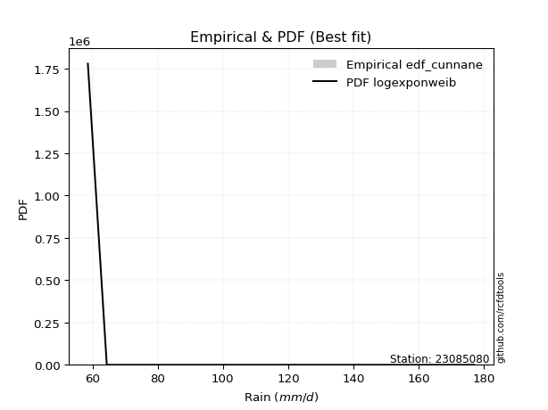</img>

</div>


### 12. Empirical - EDF Adamowski (1981)

The Adamowski formula in hydrology refers to a specific plotting position formula used for estimating the non-parametric empirical distribution of hydrological events (like flood peaks) to calculate their return periods. This formula provides an alternative to traditional parametric methods (like the Gumbel or Log Pearson Type III distributions). 

<div align="center">


$P=(m-0.25)/(n+0.5)$


</div>


**12.1. Empirical values**

<div align="center">

|                | 0                   | 1                  | 2                  | 3                  | 4                  | 5                  |
|:---------------|:--------------------|:-------------------|:-------------------|:-------------------|:-------------------|:-------------------|
| date           | 2022                | 2024               | 2021               | 2025               | 2020               | 2019               |
| x              | 58.6                | 64.4               | 64.8               | 74.2               | 97.0               | 177.0              |
| m              | 1                   | 2                  | 3                  | 4                  | 5                  | 6                  |
| empirical_dist | edf_adamowski       | edf_adamowski      | edf_adamowski      | edf_adamowski      | edf_adamowski      | edf_adamowski      |
| empirical      | 0.11538461538461539 | 0.2692307692307692 | 0.4230769230769231 | 0.5769230769230769 | 0.7307692307692307 | 0.8846153846153846 |
| empirical_tr   | 1.1304347826086958  | 1.3684210526315788 | 1.7333333333333334 | 2.3636363636363633 | 3.7142857142857135 | 8.666666666666664  |

</div>


**12.2. Kolmogorov-Smirnov fit test (sorted by Δ)**


<div align="center">

|                | 0                   | 1                   | 2                   | 3                   | 4                   | 5                   | 6                   | 7                   | 8                   | 9                   | 10                  | 11                  | 12                  | 13                  | 14                  | 15                  | 16                  | 17                  | 18                  | 19                | 20                  | 21                  | 22                  | 23                  | 24                  | 25                  | 26                  | 27                  | 28                  | 29                 | 30                  | 31                  | 32                 | 33                    | 34                  | 35                  | 36                  | 37                  | 38                  | 39                  | 40                  | 41                  | 42                  | 43                  | 44                  | 45                  | 46                  | 47                  | 48                  | 49                 | 50                  | 51                  | 52                 | 53                  | 54                  | 55                 | 56                  | 57                  | 58                  | 59                  | 60                  | 61                 | 62                  | 63                 | 64                  | 65                 | 66                  | 67                 | 68                  | 69                  | 70                  | 71                 | 72                  | 73                  | 74                  | 75                 | 76                  | 77                 | 78                 | 79                 | 80                  | 81                  | 82                  | 83                 | 84                 | 85                 | 86                 | 87                  | 88                 | 89             |
|:---------------|:--------------------|:--------------------|:--------------------|:--------------------|:--------------------|:--------------------|:--------------------|:--------------------|:--------------------|:--------------------|:--------------------|:--------------------|:--------------------|:--------------------|:--------------------|:--------------------|:--------------------|:--------------------|:--------------------|:------------------|:--------------------|:--------------------|:--------------------|:--------------------|:--------------------|:--------------------|:--------------------|:--------------------|:--------------------|:-------------------|:--------------------|:--------------------|:-------------------|:----------------------|:--------------------|:--------------------|:--------------------|:--------------------|:--------------------|:--------------------|:--------------------|:--------------------|:--------------------|:--------------------|:--------------------|:--------------------|:--------------------|:--------------------|:--------------------|:-------------------|:--------------------|:--------------------|:-------------------|:--------------------|:--------------------|:-------------------|:--------------------|:--------------------|:--------------------|:--------------------|:--------------------|:-------------------|:--------------------|:-------------------|:--------------------|:-------------------|:--------------------|:-------------------|:--------------------|:--------------------|:--------------------|:-------------------|:--------------------|:--------------------|:--------------------|:-------------------|:--------------------|:-------------------|:-------------------|:-------------------|:--------------------|:--------------------|:--------------------|:-------------------|:-------------------|:-------------------|:-------------------|:--------------------|:-------------------|:---------------|
| station        | 23085080            | 23085080            | 23085080            | 23085080            | 23085080            | 23085080            | 23085080            | 23085080            | 23085080            | 23085080            | 23085080            | 23085080            | 23085080            | 23085080            | 23085080            | 23085080            | 23085080            | 23085080            | 23085080            | 23085080          | 23085080            | 23085080            | 23085080            | 23085080            | 23085080            | 23085080            | 23085080            | 23085080            | 23085080            | 23085080           | 23085080            | 23085080            | 23085080           | 23085080              | 23085080            | 23085080            | 23085080            | 23085080            | 23085080            | 23085080            | 23085080            | 23085080            | 23085080            | 23085080            | 23085080            | 23085080            | 23085080            | 23085080            | 23085080            | 23085080           | 23085080            | 23085080            | 23085080           | 23085080            | 23085080            | 23085080           | 23085080            | 23085080            | 23085080            | 23085080            | 23085080            | 23085080           | 23085080            | 23085080           | 23085080            | 23085080           | 23085080            | 23085080           | 23085080            | 23085080            | 23085080            | 23085080           | 23085080            | 23085080            | 23085080            | 23085080           | 23085080            | 23085080           | 23085080           | 23085080           | 23085080            | 23085080            | 23085080            | 23085080           | 23085080           | 23085080           | 23085080           | 23085080            | 23085080           | 23085080       |
| empirical_dist | edf_adamowski       | edf_adamowski       | edf_adamowski       | edf_adamowski       | edf_adamowski       | edf_adamowski       | edf_adamowski       | edf_adamowski       | edf_adamowski       | edf_adamowski       | edf_adamowski       | edf_adamowski       | edf_adamowski       | edf_adamowski       | edf_adamowski       | edf_adamowski       | edf_adamowski       | edf_adamowski       | edf_adamowski       | edf_adamowski     | edf_adamowski       | edf_adamowski       | edf_adamowski       | edf_adamowski       | edf_adamowski       | edf_adamowski       | edf_adamowski       | edf_adamowski       | edf_adamowski       | edf_adamowski      | edf_adamowski       | edf_adamowski       | edf_adamowski      | edf_adamowski         | edf_adamowski       | edf_adamowski       | edf_adamowski       | edf_adamowski       | edf_adamowski       | edf_adamowski       | edf_adamowski       | edf_adamowski       | edf_adamowski       | edf_adamowski       | edf_adamowski       | edf_adamowski       | edf_adamowski       | edf_adamowski       | edf_adamowski       | edf_adamowski      | edf_adamowski       | edf_adamowski       | edf_adamowski      | edf_adamowski       | edf_adamowski       | edf_adamowski      | edf_adamowski       | edf_adamowski       | edf_adamowski       | edf_adamowski       | edf_adamowski       | edf_adamowski      | edf_adamowski       | edf_adamowski      | edf_adamowski       | edf_adamowski      | edf_adamowski       | edf_adamowski      | edf_adamowski       | edf_adamowski       | edf_adamowski       | edf_adamowski      | edf_adamowski       | edf_adamowski       | edf_adamowski       | edf_adamowski      | edf_adamowski       | edf_adamowski      | edf_adamowski      | edf_adamowski      | edf_adamowski       | edf_adamowski       | edf_adamowski       | edf_adamowski      | edf_adamowski      | edf_adamowski      | edf_adamowski      | edf_adamowski       | edf_adamowski      | edf_adamowski  |
| p_dist         | invgamma            | alpha               | loginvweibull       | logalpha            | loginvgauss         | logf                | invgauss            | logmielke           | loghalfnorm         | loghalflogistic     | f                   | logweibull_min      | logpareto           | pareto              | logjohnsonsu        | logpearson3         | lognakagami         | halflogistic        | gamma               | chi2              | pearson3            | logmoyal            | lograyleigh         | loggumbel_r         | wald                | logmaxwell          | moyal               | logfatiguelife      | halfnorm            | logncf             | lognct              | logexponnorm        | logexpon           | loglaplace_asymmetric | loggenexpon         | loginvgamma         | nct                 | gumbel_r            | loggenlogistic      | rayleigh            | logloggamma         | weibull_min         | ncf                 | genlogistic         | logcrystalball      | lognorm             | lognorm             | logt                | betaprime           | logwald            | maxwell             | logbetaprime        | fisk               | logkstwobign        | logtruncnorm        | loglogistic        | t                   | loghypsecant        | logrice             | loggompertz         | norm                | crystalball        | logchi2             | kstwobign          | logistic            | loglaplace         | exponnorm           | genexpon           | expon               | laplace_asymmetric  | erlang              | loggumbel_l        | hypsecant           | rice                | gompertz            | gibrat             | truncnorm           | loggamma           | loggamma           | laplace            | gumbel_l            | logfisk             | loggibrat           | loglognorm         | nakagami           | logerlang          | fatiguelife        | invweibull          | johnsonsu          | mielke         |
| delta          | 0.07195252197991597 | 0.07213730773013238 | 0.07573747786609997 | 0.07827747812623442 | 0.07872275061334011 | 0.07955848433295326 | 0.08819106597438675 | 0.09760737631066974 | 0.10435369951504786 | 0.11129774707558254 | 0.11528138435567031 | 0.11538461517884678 | 0.11538461538461461 | 0.11538461538461506 | 0.12081099004907264 | 0.12547014502435117 | 0.12868016630085377 | 0.13513556977901872 | 0.13599511502499523 | 0.138517020727693 | 0.13866561199928185 | 0.13897988916200138 | 0.13927983043848002 | 0.14102836557912635 | 0.14919064073525934 | 0.15158401503355817 | 0.15173708810393338 | 0.15210292870212755 | 0.15621661891036429 | 0.1588049345537834 | 0.15892539450241944 | 0.16625782135142436 | 0.1670554874937703 | 0.16706484137669614   | 0.16748058862858206 | 0.16748615918614368 | 0.16756525476293088 | 0.17044418236169712 | 0.17321226474805293 | 0.17607858261307596 | 0.17657098332380539 | 0.17766702016721586 | 0.17919451570034783 | 0.18520309566166382 | 0.18536301450721693 | 0.18537881635249415 | 0.18537881635249415 | 0.18538460217292135 | 0.18616683028280617 | 0.1870110913622495 | 0.18821451069772088 | 0.19038391742021551 | 0.1907532604099138 | 0.19418045370815554 | 0.19673272130874322 | 0.1992255200607045 | 0.20418699441387334 | 0.21047152372482325 | 0.21301642251725497 | 0.21550520220780517 | 0.22052275466808713 | 0.2205227619588429 | 0.22714009054977713 | 0.2314537804940967 | 0.23790089554088922 | 0.2381670446497764 | 0.23917098414855958 | 0.2403874428245788 | 0.24038811733775528 | 0.24038905643985414 | 0.24243397894333926 | 0.2509828194994228 | 0.25149829887460445 | 0.26328477656493404 | 0.26675016573428245 | 0.2702287558576824 | 0.27483781311653166 | 0.2791966595567345 | 0.2791966595567345 | 0.2798316787344647 | 0.28148702139029663 | 0.30834316433955744 | 0.32218364458231996 | 0.3728162792094227 | 0.3758924036030215 | 0.3951620979193348 | 0.4041531635232856 | 0.43736892297396324 | 0.5194733457096279 | nan            |
| deltao         | 0.530385761606      | 0.530385761606      | 0.530385761606      | 0.530385761606      | 0.530385761606      | 0.530385761606      | 0.530385761606      | 0.530385761606      | 0.530385761606      | 0.530385761606      | 0.530385761606      | 0.530385761606      | 0.530385761606      | 0.530385761606      | 0.530385761606      | 0.530385761606      | 0.530385761606      | 0.530385761606      | 0.530385761606      | 0.530385761606    | 0.530385761606      | 0.530385761606      | 0.530385761606      | 0.530385761606      | 0.530385761606      | 0.530385761606      | 0.530385761606      | 0.530385761606      | 0.530385761606      | 0.530385761606     | 0.530385761606      | 0.530385761606      | 0.530385761606     | 0.530385761606        | 0.530385761606      | 0.530385761606      | 0.530385761606      | 0.530385761606      | 0.530385761606      | 0.530385761606      | 0.530385761606      | 0.530385761606      | 0.530385761606      | 0.530385761606      | 0.530385761606      | 0.530385761606      | 0.530385761606      | 0.530385761606      | 0.530385761606      | 0.530385761606     | 0.530385761606      | 0.530385761606      | 0.530385761606     | 0.530385761606      | 0.530385761606      | 0.530385761606     | 0.530385761606      | 0.530385761606      | 0.530385761606      | 0.530385761606      | 0.530385761606      | 0.530385761606     | 0.530385761606      | 0.530385761606     | 0.530385761606      | 0.530385761606     | 0.530385761606      | 0.530385761606     | 0.530385761606      | 0.530385761606      | 0.530385761606      | 0.530385761606     | 0.530385761606      | 0.530385761606      | 0.530385761606      | 0.530385761606     | 0.530385761606      | 0.530385761606     | 0.530385761606     | 0.530385761606     | 0.530385761606      | 0.530385761606      | 0.530385761606      | 0.530385761606     | 0.530385761606     | 0.530385761606     | 0.530385761606     | 0.530385761606      | 0.530385761606     | 0.530385761606 |
| eval           | Δo > Δ              | Δo > Δ              | Δo > Δ              | Δo > Δ              | Δo > Δ              | Δo > Δ              | Δo > Δ              | Δo > Δ              | Δo > Δ              | Δo > Δ              | Δo > Δ              | Δo > Δ              | Δo > Δ              | Δo > Δ              | Δo > Δ              | Δo > Δ              | Δo > Δ              | Δo > Δ              | Δo > Δ              | Δo > Δ            | Δo > Δ              | Δo > Δ              | Δo > Δ              | Δo > Δ              | Δo > Δ              | Δo > Δ              | Δo > Δ              | Δo > Δ              | Δo > Δ              | Δo > Δ             | Δo > Δ              | Δo > Δ              | Δo > Δ             | Δo > Δ                | Δo > Δ              | Δo > Δ              | Δo > Δ              | Δo > Δ              | Δo > Δ              | Δo > Δ              | Δo > Δ              | Δo > Δ              | Δo > Δ              | Δo > Δ              | Δo > Δ              | Δo > Δ              | Δo > Δ              | Δo > Δ              | Δo > Δ              | Δo > Δ             | Δo > Δ              | Δo > Δ              | Δo > Δ             | Δo > Δ              | Δo > Δ              | Δo > Δ             | Δo > Δ              | Δo > Δ              | Δo > Δ              | Δo > Δ              | Δo > Δ              | Δo > Δ             | Δo > Δ              | Δo > Δ             | Δo > Δ              | Δo > Δ             | Δo > Δ              | Δo > Δ             | Δo > Δ              | Δo > Δ              | Δo > Δ              | Δo > Δ             | Δo > Δ              | Δo > Δ              | Δo > Δ              | Δo > Δ             | Δo > Δ              | Δo > Δ             | Δo > Δ             | Δo > Δ             | Δo > Δ              | Δo > Δ              | Δo > Δ              | Δo > Δ             | Δo > Δ             | Δo > Δ             | Δo > Δ             | Δo > Δ              | Δo > Δ             | Δo <= Δ        |
| fit            | 1                   | 1                   | 1                   | 1                   | 1                   | 1                   | 1                   | 1                   | 1                   | 1                   | 1                   | 1                   | 1                   | 1                   | 1                   | 1                   | 1                   | 1                   | 1                   | 1                 | 1                   | 1                   | 1                   | 1                   | 1                   | 1                   | 1                   | 1                   | 1                   | 1                  | 1                   | 1                   | 1                  | 1                     | 1                   | 1                   | 1                   | 1                   | 1                   | 1                   | 1                   | 1                   | 1                   | 1                   | 1                   | 1                   | 1                   | 1                   | 1                   | 1                  | 1                   | 1                   | 1                  | 1                   | 1                   | 1                  | 1                   | 1                   | 1                   | 1                   | 1                   | 1                  | 1                   | 1                  | 1                   | 1                  | 1                   | 1                  | 1                   | 1                   | 1                   | 1                  | 1                   | 1                   | 1                   | 1                  | 1                   | 1                  | 1                  | 1                  | 1                   | 1                   | 1                   | 1                  | 1                  | 1                  | 1                  | 1                   | 1                  | 0              |
| n              | 6                   | 6                   | 6                   | 6                   | 6                   | 6                   | 6                   | 6                   | 6                   | 6                   | 6                   | 6                   | 6                   | 6                   | 6                   | 6                   | 6                   | 6                   | 6                   | 6                 | 6                   | 6                   | 6                   | 6                   | 6                   | 6                   | 6                   | 6                   | 6                   | 6                  | 6                   | 6                   | 6                  | 6                     | 6                   | 6                   | 6                   | 6                   | 6                   | 6                   | 6                   | 6                   | 6                   | 6                   | 6                   | 6                   | 6                   | 6                   | 6                   | 6                  | 6                   | 6                   | 6                  | 6                   | 6                   | 6                  | 6                   | 6                   | 6                   | 6                   | 6                   | 6                  | 6                   | 6                  | 6                   | 6                  | 6                   | 6                  | 6                   | 6                   | 6                   | 6                  | 6                   | 6                   | 6                   | 6                  | 6                   | 6                  | 6                  | 6                  | 6                   | 6                   | 6                   | 6                  | 6                  | 6                  | 6                  | 6                   | 6                  | 6              |
| best_fit       | 1                   | 0                   | 0                   | 0                   | 0                   | 0                   | 0                   | 0                   | 0                   | 0                   | 0                   | 0                   | 0                   | 0                   | 0                   | 0                   | 0                   | 0                   | 0                   | 0                 | 0                   | 0                   | 0                   | 0                   | 0                   | 0                   | 0                   | 0                   | 0                   | 0                  | 0                   | 0                   | 0                  | 0                     | 0                   | 0                   | 0                   | 0                   | 0                   | 0                   | 0                   | 0                   | 0                   | 0                   | 0                   | 0                   | 0                   | 0                   | 0                   | 0                  | 0                   | 0                   | 0                  | 0                   | 0                   | 0                  | 0                   | 0                   | 0                   | 0                   | 0                   | 0                  | 0                   | 0                  | 0                   | 0                  | 0                   | 0                  | 0                   | 0                   | 0                   | 0                  | 0                   | 0                   | 0                   | 0                  | 0                   | 0                  | 0                  | 0                  | 0                   | 0                   | 0                   | 0                  | 0                  | 0                  | 0                  | 0                   | 0                  | 0              |
| best_fit_sort  | 1                   | 2                   | 3                   | 4                   | 5                   | 6                   | 7                   | 8                   | 9                   | 10                  | 11                  | 12                  | 13                  | 14                  | 15                  | 16                  | 17                  | 18                  | 19                  | 20                | 21                  | 22                  | 23                  | 24                  | 25                  | 26                  | 27                  | 28                  | 29                  | 30                 | 31                  | 32                  | 33                 | 34                    | 35                  | 36                  | 37                  | 38                  | 39                  | 40                  | 41                  | 42                  | 43                  | 44                  | 45                  | 46                  | 47                  | 48                  | 49                  | 50                 | 51                  | 52                  | 53                 | 54                  | 55                  | 56                 | 57                  | 58                  | 59                  | 60                  | 61                  | 62                 | 63                  | 64                 | 65                  | 66                 | 67                  | 68                 | 69                  | 70                  | 71                  | 72                 | 73                  | 74                  | 75                  | 76                 | 77                  | 78                 | 79                 | 80                 | 81                  | 82                  | 83                  | 84                 | 85                 | 86                 | 87                 | 88                  | 89                 | 90             |

</div>


<div align="center">

</img>

</div>


**12.3. Best fit**

<div align="center">

|   id |   station | empirical_dist   | p_dist   |     delta |   deltao | eval   |   fit |   n |   best_fit |   best_fit_sort |
|-----:|----------:|:-----------------|:---------|----------:|---------:|:-------|------:|----:|-----------:|----------------:|
|    0 |  23085080 | edf_adamowski    | invgamma | 0.0719525 | 0.530386 | Δo > Δ |     1 |   6 |          1 |               1 |

</div>


<div align="center">

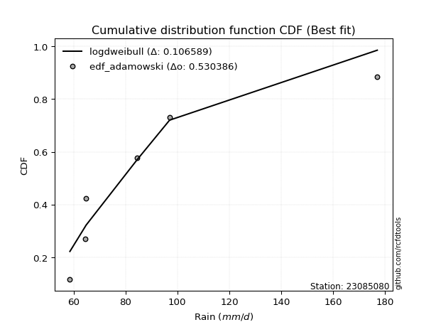</img>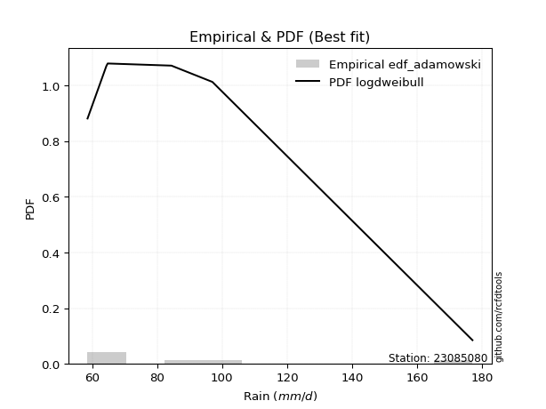</img>

</div>


## C. Best fit & Estimate extreme values for specific return periods - Tr


### 1. Best fit (ordered by delta Δ)

<div align="center">

|   id |   station | empirical_dist   | p_dist         |     delta |   deltao | eval   |   fit |   n |   best_fit |   best_fit_sort |
|-----:|----------:|:-----------------|:---------------|----------:|---------:|:-------|------:|----:|-----------:|----------------:|
|    0 |  23085080 | edf_chegodayev   | alpha          | 0.0701616 | 0.530386 | Δo > Δ |     1 |   6 |          1 |               1 |
|    1 |  23085080 | edf_jenkinson    | alpha          | 0.0708964 | 0.530386 | Δo > Δ |     1 |   6 |          1 |               2 |
|    2 |  23085080 | edf_beard        | alpha          | 0.0708964 | 0.530386 | Δo > Δ |     1 |   6 |          1 |               3 |
|    3 |  23085080 | edf_filliben     | alpha          | 0.0714504 | 0.530386 | Δo > Δ |     1 |   6 |          1 |               4 |
|    4 |  23085080 | edf_adamowski    | invgamma       | 0.0719525 | 0.530386 | Δo > Δ |     1 |   6 |          1 |               5 |
|    5 |  23085080 | edf_cunnane      | loginvweibull  | 0.072508  | 0.530386 | Δo > Δ |     1 |   6 |          1 |               6 |
|    6 |  23085080 | edf_tukey        | alpha          | 0.0726287 | 0.530386 | Δo > Δ |     1 |   6 |          1 |               7 |
|    7 |  23085080 | edf_blom         | loginvweibull  | 0.0726606 | 0.530386 | Δo > Δ |     1 |   6 |          1 |               8 |
|    8 |  23085080 | edf_gringorten   | logf           | 0.0747822 | 0.530386 | Δo > Δ |     1 |   6 |          1 |               9 |
|    9 |  23085080 | edf_hazen        | logf           | 0.0768475 | 0.530386 | Δo > Δ |     1 |   6 |          1 |              10 |
|   10 |  23085080 | edf_weibull      | alpha          | 0.0925287 | 0.530386 | Δo > Δ |     1 |   6 |          1 |              11 |
|   11 |  23085080 | edf_california   | logfatiguelife | 0.123215  | 0.530386 | Δo > Δ |     1 |   6 |          1 |              12 |

</div>

:file_folder:Tables: [bestfit_23085080.csv](table/bestfit_23085080.csv) | [extreme_23085080.csv](table/extreme_23085080.csv)


### 2. Extreme values

In hydrology, a return period (or recurrence interval $Tr$) is the statistical average time between extreme events like floods or droughts of a specific magnitude, indicating how rare an event is, with a 100-year flood, for example, having a 1% chance of occurring in any given year, not that it happens exactly every century. It is a key tool for infrastructure design (like bridges or dams) and risk assessment, calculated from historical data to determine the probability of future events, although it is important to remember it is statistical average, and events can cluster or be missed.

> risk_rate: assuming the return period as the project useful life.

|   id |      tr |   prob_l |     prob_g |     alpha |   betaprime |     chi2 |   crystalball |   erlang |    expon |   exponnorm |         f |   fatiguelife |             fisk |    gamma |   genexpon |   genlogistic |   gibrat |   gompertz |   gumbel_l |   gumbel_r |   halflogistic |   halfnorm |   hypsecant |   invgamma |   invgauss |       invweibull |       johnsonsu |   kstwobign |   laplace |   laplace_asymmetric |   loggamma |   logistic |   lognorm |   maxwell |   mielke |    moyal |   nakagami |      ncf |      nct |     norm |    pareto |   pearson3 |   rayleigh |     rice |        t |   truncnorm |     wald |   weibull_min |        logalpha |   logbetaprime |          logchi2 |   logcrystalball |   logerlang |   logexpon |   logexponnorm |             logf |   logfatiguelife |       logfisk |   loggenexpon |   loggenlogistic |   loggibrat |   loggompertz |   loggumbel_l |   loggumbel_r |   loghalflogistic |   loghalfnorm |   loghypsecant |   loginvgamma |   loginvgauss |    loginvweibull |     logjohnsonsu |   logkstwobign |   loglaplace |   loglaplace_asymmetric |   logloggamma |   loglogistic |    loglognorm |   logmaxwell |   logmielke |   logmoyal |   lognakagami |   logncf |   lognct |   logpareto |   logpearson3 |   lograyleigh |   logrice |     logt |   logtruncnorm |   logwald |   logweibull_min |   station |   n |   risk_rate |
|-----:|--------:|---------:|-----------:|----------:|------------:|---------:|--------------:|---------:|---------:|------------:|----------:|--------------:|-----------------:|---------:|-----------:|--------------:|---------:|-----------:|-----------:|-----------:|---------------:|-----------:|------------:|-----------:|-----------:|-----------------:|----------------:|------------:|----------:|---------------------:|-----------:|-----------:|----------:|----------:|---------:|---------:|-----------:|---------:|---------:|---------:|----------:|-----------:|-----------:|---------:|---------:|------------:|---------:|--------------:|----------------:|---------------:|-----------------:|-----------------:|------------:|-----------:|---------------:|-----------------:|-----------------:|--------------:|--------------:|-----------------:|------------:|--------------:|--------------:|--------------:|------------------:|--------------:|---------------:|--------------:|--------------:|-----------------:|-----------------:|---------------:|-------------:|------------------------:|--------------:|--------------:|--------------:|-------------:|------------:|-----------:|--------------:|---------:|---------:|------------:|--------------:|--------------:|----------:|---------:|---------------:|----------:|-----------------:|----------:|----:|------------:|
|    0 |    2    | 0.5      | 0.5        |   69.2737 |     81.3035 |  69.6056 |       89.3333 |  81.7132 |  79.9027 |     79.8291 |   75.7567 |       58.6    |     86.1628      |  67.5489 |    79.9026 |       81.1484 |  76.9928 |    83.881  |    96.0874 |    82.5792 |        79.2214 |    80.9177 |     89.3333 |    69.3052 |    69.0523 |   2754.68        |    58.6022      |     85.6785 |   89.3333 |              79.9028 |    63.0081 |    89.3333 |   82.335  |   85.8171 |  73.8699 |  80.3988 |    59.3356 |  82.5133 |  79.4282 |  89.3333 |   70.0399 |    79.6674 |    84.5701 |  90.0447 |  84.5014 |     84.8633 |  76.0064 |       67.6745 |    69.1165      |        78.3661 |     96.2181      |          82.334  |     60.4495 |    74.1765 |        74.1556 |     69.5097      |          67.0766 |  80.8792      |       74.1971 |          76.4134 |     73.5062 |       79.07   |       87.6085 |       77.3789 |           75.0272 |       76.2062 |        82.335  |       80.4924 |       69.1209 |     69.3787      |     67.9803      |        78.8642 |      82.335  |                 74.1777 |       81.9115 |       82.335  |  58.6596      |      79.7165 |     69.9219 |    75.8436 |       77.8954 |  78.994  |  79.6988 |     70.9189 |       76.5476 |       78.808  |   82.2167 |  82.3355 |        76.3187 |   72.8425 |           70.054 |  23085080 |   6 |    0.75     |
|    1 |    2.33 | 0.570815 | 0.429185   |   72.3663 |     86.4262 |  72.5369 |       96.6699 |  87.0704 |  84.5964 |     84.5141 |   82.9696 |       59.515  |    104.409       |  70.5816 |    84.5962 |       86.0331 |  80.7091 |    89.4511 |   102.47   |    89.3773 |        86.211  |    88.8357 |     95.2047 |    72.5616 |    72.4844 | 229496           |    58.6126      |     91.3953 |   93.7731 |              84.5965 |    65.1573 |    95.7973 |   88.0788 |   93.4393 |  77.3462 |  86.834  |    60.7515 |  88.6513 |  84.3619 |  96.6699 |   73.5029 |    86.5345 |    92.305  |  96.3482 |  90.1249 |     90.4289 |  80.8171 |       74.5876 |    72.4839      |        82.5793 |    114.814       |          88.0779 |     61.696  |    78.1306 |        78.1111 |     72.5671      |          70.4658 | 161.027       |       78.152  |          80.3637 |     76.0605 |       84.4642 |       92.9022 |       82.3683 |           80.0056 |       81.9593 |        86.9006 |       85.8411 |       72.345  |     72.4423      |     71.3602      |        83.3956 |      85.7645 |                 78.1322 |       87.831  |       87.3752 |  59.1522      |      85.5018 |     72.7728 |    80.4651 |       85.0611 |  86.4818 |  84.9257 |     74.3814 |       81.6983 |       84.6149 |   87.2831 |  88.0794 |        80.6133 |   76.1357 |           74.55  |  23085080 |   6 |    0.729209 |
|    2 |    5    | 0.8      | 0.2        |   96.3468 |    110.272  |  88.021  |      123.934  | 114.228  | 108.063  |    107.938  |  136.559  |       78.9532 |    384.307       |  88.0116 |   108.063  |      107.253  | 102.105  |   117.301  |   123.091  |   118.911  |       117.837  |   122.32   |    118.756  |    98.2703 |    98.2398 |      5.56103e+13 |    67.1675      |    115.679  |  115.971  |             108.064  |    81.3065 |   120.756  |  113.164  |  123.439  |  95.2207 | 116.643  |    91.9994 | 114.848  | 107.867  | 123.934  |   98.5862 |   117.925  |   123.271  | 121.584  | 112.814  |    116.458  | 107.747  |      158.226  |   104.801       |       102.594  |    323.541       |         113.164  |     72.8126 |   101.296  |       101.286  |     96.0794      |          97.817  |   1.10696e+38 |      101.303  |         100.035  |     92.5911 |      117.471  |      112.29   |      108.058  |          106.996  |      111.497  |       107.904  |      109.806  |       96.5558 |     96.8809      |    101.461       |       105.733  |     105.176  |                101.3    |      113.731  |      109.905  |   2.72519e+17 |     112.65   |     91.7567 |   105.828  |      130.13   | 121.971  | 109.337  |     97.8444 |      108.676  |      112.476  |  110.892  | 113.165  |       103.518  |   97.5192 |          110.286 |  23085080 |   6 |    0.67232  |
|    3 |   10    | 0.9      | 0.1        |  140.405  |    131.631  | 102.735  |      142.021  | 139.172  | 129.366  |    129.201  |  217.29   |      105.792  |   1439.63        | 105.699  |   129.366  |      124.535  | 126.495  |   142.582  |   134.571  |   142.966  |       144.101  |   147.098  |    137.563  |   145.835  |   136.176  |      3.75146e+20 |   705.535       |    134.168  |  136.121  |             129.367  |   104.194  |   139.137  |  133.631  |  144.552  | 113.79   | 142.596  |   149.521  | 135.675  | 129.745  | 142.021  |  138.621  |   144.199  |   145.351  | 139.577  | 131.864  |    136.469  | 136.326  |      334.507  |   206.287       |       121.011  |    940.405       |         133.632  |     90.0172 |   128.221  |       128.228  |    143.217       |         142.025  | inf           |      128.191  |         119.564  |    115.858  |      158.458  |      124.787  |      134.798  |          136.211  |      140.015  |       128.266  |      130.123  |      137.053  |    149.893       |    170.949       |       126.672  |     126.577  |                128.229  |      134.897  |      130.135  | inf           |     136.777  |    122.051  |   134.34   |      182.992  | 154.223  | 131.347  |    133.379  |      136.647  |      137.784  |  131.532  | 133.632  |       124.568  |  126.816  |          173.004 |  23085080 |   6 |    0.651322 |
|    4 |   15    | 0.933333 | 0.0666667  |  184.306  |    144.501  | 111.507  |      151.046  | 153.836  | 141.827  |    141.639  |  284.408  |      123.346  |   3092.67        | 116.519  |   141.827  |      134.285  | 143.317  |   157.37   |   139.77   |   156.538  |       158.965  |   159.992  |    148.296  |   193.212  |   165.166  |      2.67356e+24 |  5656.51        |    143.984  |  147.908  |             141.828  |   121.954  |   149.151  |  145.19   |  155.385  | 126.21   | 157.658  |   187.169  | 147.282  | 143.319  | 151.046  |  174.249  |   159.025  |   156.727  | 148.848  | 143.635  |    146.107  | 154.678  |      496.235  |   405.05        |       132.307  |   1813.02        |         145.191  |    103.65   |   147.177  |       147.198  |    199.205       |         180.089  | inf           |      147.112  |         132.219  |    135.232  |      188.766  |      130.895  |      152.707  |          156.152  |      157.633  |       141.565  |      141.91   |      174.389  |    218.47        |    260.45        |       139.425  |     141.062  |                147.188  |      146.856  |      142.683  | inf           |     151.097  |    151.301  |   154.287  |      219.237  | 173.723  | 144.685  |    165.137  |      155.105  |      152.973  |  143.625  | 145.192  |       135.844  |  150.119  |          233.175 |  23085080 |   6 |    0.644736 |
|    5 |   20    | 0.95     | 0.05       |  228.168  |    153.887  | 117.784  |      156.957  | 164.263  | 150.669  |    150.465  |  343.731  |      136.342  |   5285.97        | 124.349  |   150.668  |      141.112  | 156.513  |   167.863  |   143.007  |   166.041  |       169.378  |   168.588  |    155.867  |   240.495  |   188.694  |      1.33286e+27 | 23059.9         |    150.596  |  156.271  |             150.669  |   136.908  |   156.073  |  153.296  |  162.574  | 135.868  | 168.325  |   213.845  | 155.368  | 153.406  | 156.957  |  207.287  |   169.37   |   164.289  | 155.01   | 152.514  |    151.931  | 168.354  |      641.803  |   794.845       |       140.635  |   2918.82        |         153.298  |    115.193  |   162.304  |       162.336  |    266.834       |         214.435  | inf           |      162.207  |         141.869  |    152.671  |      213.719  |      134.848  |      166.645  |          171.837  |      170.594  |       151.768  |      150.312  |      209.956  |    308.01        |    373.724       |       148.732  |     152.333  |                162.317  |      155.245  |      152.056  | inf           |     161.419  |    181.112  |   170.182  |      247.455  | 187.948  | 154.452  |    195.378  |      169.299  |      163.983  |  152.271  | 153.298  |       143.023  |  170.227  |          292.308 |  23085080 |   6 |    0.641514 |
|    6 |   25    | 0.96     | 0.04       |  272.015  |    161.339  | 122.678  |      161.308  | 172.362  | 157.527  |    157.31   |  397.805  |      146.668  |   7983.95        | 130.495  |   157.526  |      146.371  | 167.514  |   176.001  |   145.31   |   173.36   |       177.401  |   174.985  |    161.727  |   287.713  |   208.565  |      1.59484e+29 | 65152.1         |    155.549  |  162.758  |             157.527  |   150.042  |   161.368  |  159.551  |  167.911  | 143.9    | 176.593  |   234.202  | 161.581  | 161.526  | 161.308  |  238.523  |   177.311  |   169.907  | 159.589  | 159.78   |    155.868  | 179.308  |      774.022  |  1559.38        |       147.298  |   4243.94        |         159.553  |    125.352  |   175.099  |       175.142  |    348.58        |         246.221  | inf           |      174.974  |         149.779  |    168.916  |      235.319  |      137.732  |      178.242  |          184.988  |      180.924  |       160.167  |      156.872  |      244.367  |    424.576       |    514.782       |       156.107  |     161.693  |                175.114  |      161.717  |      159.64   | inf           |     169.535  |    212.083  |   183.619  |      270.832  | 199.233  | 162.228  |    224.928  |      180.995  |      172.673  |  159.03   | 159.553  |       148.031  |  188.259  |          351.016 |  23085080 |   6 |    0.639603 |
|    7 |   50    | 0.98     | 0.02       |  491.18   |    185.59   | 137.994  |      173.768  | 197.571  | 178.83   |    178.573  |  623.682  |      179.798  |  28321.9         | 149.915  |   178.829  |      162.57   | 206.293  |   201.282  |   151.561  |   195.908  |       202.122  |   193.576  |    179.895  |   523.205  |   278.65   |      4.01645e+35 |     1.28025e+06 |    170.092  |  182.909  |             178.83   |   201.135  |   177.547  |  178.912  |  183.39   | 172.295  | 202.261  |   294.656  | 180.694  | 188.63   | 173.768  |  378.631  |   201.602  |   186.215  | 172.879  | 185.024  |    165.091  | 215.074  |     1304.43   | 45271.9         |       169.291  |  13881.1         |         178.914  |    164.919  |   221.642  |       221.729  |   1073.86        |         383.014  | inf           |      221.399  |         177.028  |    241.251  |      317.33   |      145.879  |      219.29   |          232.181  |      214.641  |       189.276  |      177.605  |      407.232  |   1738.03        |   1806.35        |       179.949  |     194.593  |                221.666  |      181.75   |      185.236  | inf           |     195.457  |    392.877  |   232.478  |      352.226  | 235.853  | 187.684  |    371.982  |      221.616  |      200.598  |  180.399  | 178.914  |       160.251  |  261.535  |          645.311 |  23085080 |   6 |    0.63583  |
|    8 |   75    | 0.986667 | 0.0133333  |  710.315  |    200.654  | 147.018  |      180.453  | 212.345  | 191.291  |    191.012  |  809.396  |      199.75   |  58964           | 161.46   |   191.29   |      171.985  | 232.484  |   216.071  |   154.722  |   209.013  |       216.492  |   203.697  |    190.512  |   758.079  |   324.955  |      2.11068e+39 |     6.33079e+06 |    178.094  |  194.696  |             191.292  |   239.897  |   186.891  |  190.251  |  191.806  | 191.69   | 217.271  |   327.87   | 191.82   | 205.982  | 180.453  |  503.315  |   215.596  |   195.087  | 180.11   | 202.104  |    168.691  | 237.082  |     1707.81   |     1.3137e+06  |       183.181  |  28116.7         |         190.253  |    194.91   |   254.41   |       254.531  |   2733.85        |         499.414  | inf           |      254.074  |         195.09   |    306.917  |      377.958  |      150.18   |      247.364  |          264.966  |      235.566  |       208.679  |      190.049  |      562.638  |   5926.7         |   4666.57        |       194.585  |     216.861  |                254.441  |      193.481  |      201.848  | inf           |     211.176  |    629.543  |   266.871  |      406.402  | 258.485  | 203.611  |    526.182  |      248.763  |      217.643  |  193.207  | 190.253  |       165.201  |  320.173  |          946.292 |  23085080 |   6 |    0.634587 |
|    9 |  100    | 0.99     | 0.01       |  929.442  |    211.78   | 153.444  |      184.975  | 222.838  | 200.132  |    199.837  |  972.99   |      214.106  |  98988.8         | 169.719  |   200.132  |      178.649  | 252.774  |   226.563  |   156.79   |   218.289  |       226.663  |   210.591  |    198.043  |   992.558  |   359.923  |      9.07202e+41 |     1.86624e+07 |    183.576  |  203.059  |             200.133  |   272.322  |   193.488  |  198.325  |  197.538  | 206.888  | 227.92   |   350.492  | 199.719  | 219.046  | 184.975  |  618.934  |   225.446  |   201.132  | 185.035  | 215.477  |    170.616  | 253.129  |     2039.92   |     3.81165e+07 |       193.549  |  46606.9         |         198.328  |    219.964  |   280.557  |       280.707  |   6262.76        |         604.357  | inf           |      280.142  |         208.976  |    369.839  |      427.866  |      153.061  |      269.379  |          290.932  |      250.977  |       223.636  |      199.046  |      714.555  |  18196.9         |  10245.5         |       205.295  |     234.189  |                280.593  |      201.832  |      214.467  | inf           |     222.601  |    936.315  |   294.314  |      447.984  | 275.131  | 215.431  |    691.385  |      269.731  |      230.077  |  202.45   | 198.327  |       167.889  |  371.056  |         1255.66  |  23085080 |   6 |    0.633968 |
|   10 |  200    | 0.995    | 0.005      | 1805.93   |    240.227  | 168.995  |      195.232  | 248.151  | 221.435  |    221.1    | 1512.73   |      249.248  | 343204           | 189.809  |   221.434  |      194.669  | 307.973  |   251.844  |   161.284  |   240.589  |       251.115  |   226.359  |    216.186  |  1928.05   |   450.557  |      1.94259e+48 |     2.16756e+08 |    196.204  |  223.209  |             221.436  |   371.423  |   209.314  |  217.932  |  210.653  | 249.144  | 253.577  |   402.024  | 218.835  | 253.386  | 195.232  | 1031.09   |   248.953  |   214.962  | 196.306  | 252.823  |    173.685  | 293.098  |     3010.79   |     2.70052e+13 |       220.466  | 159563           |         217.936  |    296.345  |   355.132  |       355.374  |  99397.5         |         963.472  | inf           |      354.469  |         246.541  |    614.272  |      576.83   |      159.517  |      330.66   |          364.252  |      290.121  |       264.221  |      221.365  |     1308.57   | 914467           | 107048           |       232.259  |     281.841  |                355.185  |      222.106  |      248.047  | inf           |     251.119  |   3189.64   |   372.59   |      559.647  | 317.389  | 245.874  |   1483.93   |      326.804  |      261.266  |  225.297  | 217.934  |       172.231  |  535.789  |         2574.54  |  23085080 |   6 |    0.633042 |
|   11 |  250    | 0.996    | 0.004      | 2244.17   |    249.917  | 174.019  |      198.366  | 256.307  | 228.293  |    227.945  | 1742.73   |      260.701  | 511611           | 196.327  |   228.292  |      199.819  | 327.779  |   259.983  |   162.607  |   247.758  |       258.976  |   231.21   |    222.026  |  2394.82   |   481.455  |      2.10669e+50 |     4.58599e+08 |    200.112  |  229.696  |             228.294  |   410.97   |   214.394  |  224.302  |  214.69   | 264.658  | 261.837  |   417.793  | 225.031  | 265.383  | 198.366  | 1218.57   |   256.461  |   219.22   | 199.776  | 266.633  |    174.327  | 306.321  |     3378.32   |     2.27295e+16 |       229.765  | 237936           |         224.306  |    326.75   |   383.129  |       383.408  | 326422           |        1121.5    | inf           |      382.366  |         259.997  |    736.923  |      635.042  |      161.468  |      353.182  |          391.545  |      303.35   |       278.794  |      228.761  |     1602.52   |      5.27102e+06 | 266085           |       241.3    |     299.158  |                383.188  |      228.69   |      259.905  | inf           |     260.612  |   5225.12   |   401.978  |      599.253  | 331.677  | 256.316  |   1966.96   |      347.357  |      271.693  |  232.835  | 224.305  |       173.148  |  605.033  |         3278.38  |  23085080 |   6 |    0.632858 |
|   12 |  500    | 0.998    | 0.002      | 4435.37   |    281.826  | 189.669  |      207.661  | 281.663  | 249.596  |    249.209  | 2701.7    |      296.629  |      1.76485e+06 | 216.699  |   249.595  |      215.805  | 396.227  |   285.264  |   166.398  |   270.009  |       283.375  |   245.674  |    240.168  |  4723.02   |   582.054  |      4.37027e+56 |     4.23244e+09 |    211.823  |  249.847  |             249.597  |   564.574  |   230.151  |  244.308  |  226.736  | 319.81   | 287.493  |   464.52   | 244.455  | 305.937  | 207.661  | 2059.54   |   279.629  |   231.922  | 210.128  | 316.256  |    175.642  | 348.366  |     4705.66   |     9.59977e+30 |       260.84   | 830363           |         244.314  |    444.519  |   484.969  |       485.392  |      4.89334e+07 |        1805.59   | inf           |      483.814  |         306.622  |   1382.47   |      855.989  |      167.193  |      433.334  |          489.983  |      346.482  |       329.385  |      252.447  |     3071.85   |      1.17371e+10 |      7.98412e+06 |       270.559  |     360.03   |                485.054  |      249.358  |      300.41   | inf           |     291.128  |  36196.8    |   508.885  |      734.563  | 378.33   | 290.958  |   5381.52   |      418.934  |      305.342  |  256.861  | 244.312  |       175.036  |  890.468  |         7164.84  |  23085080 |   6 |    0.632489 |
|   13 |  750    | 0.998667 | 0.00133333 | 6626.56   |    301.856  | 198.852  |      212.825  | 296.508  | 262.057  |    261.647  | 3489.28   |      317.856  |      3.63835e+06 | 228.695  |   262.056  |      225.15   | 441.495  |   300.052  |   168.424  |   283.017  |       297.639  |   253.754  |    250.781  |  7045.22   |   643.782  |      2.15458e+60 |     1.45462e+10 |    218.402  |  261.634  |             262.058  |   681.168  |   239.356  |  256.183  |  233.474  | 357.632  | 302.501  |   490.425  | 255.968  | 332.189  | 212.825  | 2807.94   |   293.086  |   239.025  | 215.917  | 350.788  |    176.09   | 373.575  |     5620.83   |     4.05424e+45 |       280.694  |      1.73419e+06 |         256.189  |    533.633  |   556.668  |       557.201  |      3.14393e+09 |        2392      | inf           |      555.215  |         337.662  |   2095.83   |     1019.27   |      170.336  |      488.371  |          558.624  |      373.195  |       363.134  |      266.835  |     4555.06   |      9.71634e+12 |      9.26456e+07 |       288.526  |     401.228  |                556.771  |      261.619  |      326.936  | inf           |     309.728  | 159732      |   584.158  |      822.89   | 407.297  | 312.904  |  10770.6    |      466.854  |      325.943  |  271.361  | 256.187  |       175.682  | 1122.67   |        11560.1   |  23085080 |   6 |    0.632366 |
|   14 | 1000    | 0.999    | 0.001      | 8817.76   |    316.724  | 205.378  |      216.38   | 307.045  | 270.898  |    270.472  | 4182.8    |      332.998  |      6.0775e+06  | 237.237  |   270.897  |      231.779  | 476.135  |   310.545  |   169.787  |   292.244  |       307.757  |   259.334  |    258.31   |  9363.54   |   688.72   |      8.97113e+62 |     3.40325e+10 |    222.96   |  269.997  |             270.9    |   778.82   |   245.885  |  264.693  |  238.131  | 387.316  | 313.149  |   508.23   | 264.215  | 352.061  | 216.38   | 3501.91   |   302.596  |   243.934  | 219.917  | 378.172  |    176.316  | 391.709  |     6336.2    |     1.7122e+60  |       295.6    |      2.93035e+06 |         264.699  |    608.123  |   613.879  |       614.504  |      1.263e+11   |        2923.27   | inf           |      612.179  |         361.566  |   2881.62   |     1153.66   |      172.484  |      531.598  |          613.069  |      392.837  |       389.156  |      277.298  |     6056.15   |      4.54343e+15 |      6.68989e+08 |       301.668  |     433.288  |                613.998  |      270.401  |      347.154  | inf           |     323.273  | 558225      |   644.224  |      889.942  | 428.64   | 329.294  |  18599.1    |      503.886  |      340.986  |  281.857  | 264.697  |       176.008  | 1326.29   |        16379.8   |  23085080 |   6 |    0.632305 |

<div align="center">

</img>

</div>


<div align="center">

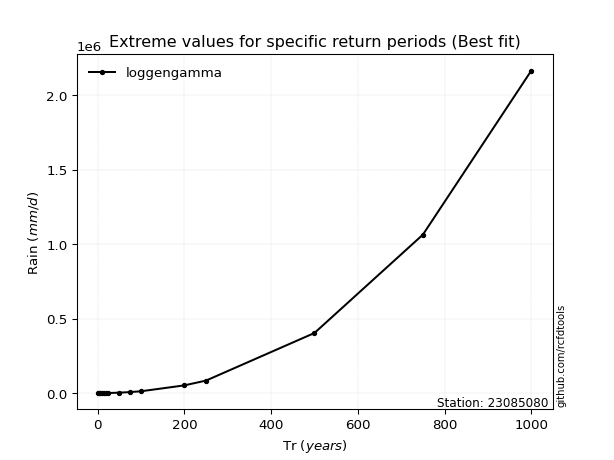</img>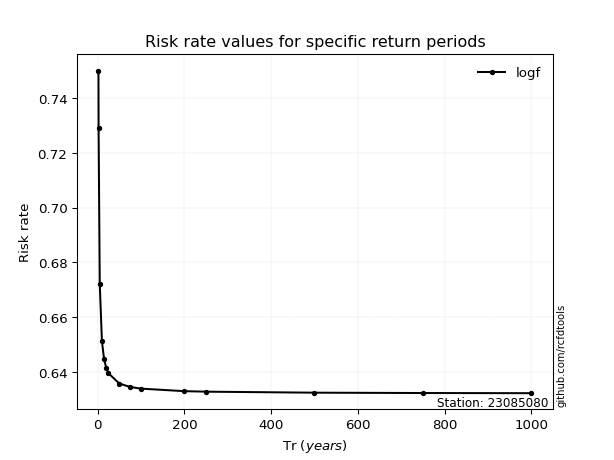</img>

</div>


<sub>**APP DISCLAIMER**: NO WARRANTY - This software is provided by [github.com/rcfdtools](https://github.com/rcfdtools) "as is", without any express or implied warranty, including warranties of merchantability, fitness for a particular purpose, or non-infringement. There is no guarantee that the software will be error-free or operate without interruption. LIMITATION OF LIABILITY - Neither the authors nor copyright holders will be liable for claims or damages arising from the software or its use. You are responsible for determining if the software is appropriate for your use and assume all associated risks, including errors, legal compliance, and data loss. NO PROFESSIONAL ADVICE - The software provides general information and does not offer professional advice. It should not replace consultation with professional advisors.</sub>