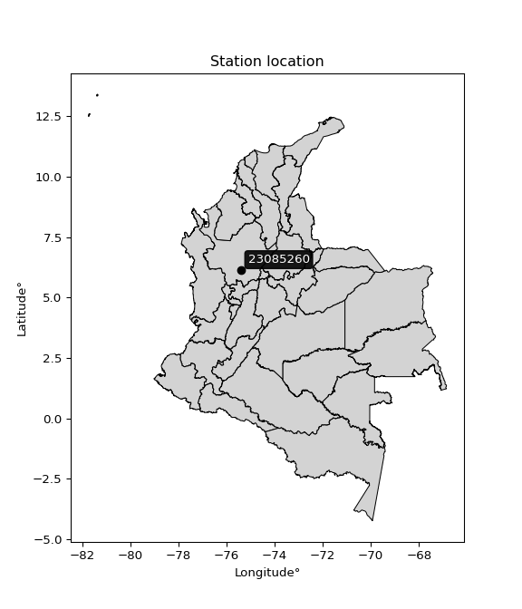

<div align="center">


</div>

# PMax24h Station (Rain, Pmax24h): 23085260

Maximum Precipitation in 24 hours (PMax24h) is the greatest amount of rainfall for a specific duration that is meteorologically possible for a given location, acting as a "worst-case" scenario for extreme storms, crucial for designing safety-critical infrastructure like bridges, river deviations, dams, spillways, and nuclear plants to prevent catastrophic failure. The PMax24h is related with the Probable Maximum Precipitation (PMP) and it is calculated by hydrologists using meteorological data to determine the upper limit of extreme rainfall, often leading to the Probable Maximum Flood (PMF) for flood control design, and is increasingly being studied for climate change impacts. Probable Maximum Precipitation (PMP) is the theoretical upper limit of rainfall, a deterministic estimate for extreme events, while probability distributions (like GEV, Gumbel) describe the likelihood and frequency of various precipitation amounts, including rare ones, showing how often events occur, with PMP representing the extreme end of these distributions, used for critical infrastructure design to ensure safety against the worst conceivable weather, unlike standard statistical forecasts which cover typical probabilities.

The most common probability distributions in hydrology, used for analyzing floods, rainfall, and streamflow, include the Normal, Log-Normal, Gumbel, Gamma (including Log-Pearson Type III), and Generalized Extreme Value (GEV) distributions, often chosen based on the data´s skewness and whether modeling extremes or general conditions, with Gumbel and GEV popular for extreme events like floods, while the Normal distribution serves as a baseline, though often requiring transformations for skewed hydrological data. These distributions help in designing water infrastructure, managing water resources, and forecasting hydrologic events.

> Hydrological data often isn´t perfectly normal (it´s skewed), so different distributions are needed for different applications, such as: **Flood Frequency Analysis**: Using Gumbel, GEV, or Log-Pearson Type III for predicting extreme flood magnitudes and their return periods, **Rainfall Analysis**: Normal for annual totals, but Log-Normal, Weibull, or GEV for intensity or extreme daily rainfall, **Streamflow Modeling**: Gamma and Log-Normal for maximum flows, GEV for minimum flows, and Kappa for daily flows.

<div align="center">

</img>

</div>


## A. General information


### 1. General running parameters

• app_version: _v20260225_. • runtime: _2026-02-27 14:50:08.749431_. • Python version: _3.14.0_. • SciPy version: _1.16.3_. • Pandas version: _2.3.3_. • NumPy version: _2.3.5_. • Stations dataset (station_dataset_file): _dataset/pmax24h_in/automatic_colombia_2003_2025.csv_. • Stations catalog (station_catalog_file): _dataset/CNE.xls_. • Minimum year to eval til year_max (date_min): _1900_. • Maximum year to eval since year_min (date_max): _2025_. • Creates, save and include plots into reports (create_plot): _False_. • Plot only fit distributions with Δo > Δ (plot_only_fit): _True_. • Plot only simple graphs avoiding multiple CDFs and multiple Extreme values plots (plot_only_simple): _False_. • Eval low extreme values, if False, evaluates high extreme values (low_extreme): _False_. • Eval every SciPy distribution as logarithmic (pdist_logarithmic_on): _True_. • Standard deviation normalized (ddof): _1.0_. • Return periods to eval in years (Tr): _[2, 2.33, 5, 10, 15, 20, 25, 50, 75, 100, 200, 250, 500, 750, 1000]_. • Minimum data sample per station, 0 means any (minimum_sample): _5_. • Z-Score maximum threshold to adjust a value, 0 means disable (zscore_max): _3.5_. • Z-Score minimum threshold to adjust a value, 0 means disable (zscore_min): _-2.5_. • Avoid zeros, e.g. rain = 0 (avoid_zeros): _True_. • Avoid null values (avoid_nans): _True_. 

:file_folder:Table: [dataset.csv](../../dataset/pmax24h_in/automatic_colombia_2003_2025.csv)

> Delta Degrees of Freedom (DDOF): is a parameter used in the formulas for calculating variance and standard deviation. When ddof=0, the divisor is $N$ (the total number of observations) and this is used when your data set is the entire population. When ddof=1, the divisor is $N-1$ and this is used when your data set is a sample drawn from a larger population. Using $N-1$ provides an unbiased estimate of the population variance (known as Bessel´s correction).


### 2. Station info and location

|   id |   CODIGO | NOMBRE              | CATEGORIA         | TECNOLOGIA                | ESTADO   | FECHA_INSTALACION   |   FECHA_SUSPENSION |   ALTITUD |   LATITUD |   LONGITUD | DEPARTAMENTO   | MUNICIPIO   | AREA_OPERATIVA                      | ENTIDAD                                                     | AREA_HIDROGRAFICA   | ZONA_HIDROGRAFICA   | SUBZONA_HIDROGRAFICA   |   CORRIENTE | Catalogo   |   Version |
|-----:|---------:|:--------------------|:------------------|:--------------------------|:---------|:--------------------|-------------------:|----------:|----------:|-----------:|:---------------|:------------|:------------------------------------|:------------------------------------------------------------|:--------------------|:--------------------|:-----------------------|------------:|:-----------|----------:|
|    0 | 23085260 | LA SELVA [23085260] | Agrometeorológica | Automática con Telemetría | Activa   | 11/10/2004          |                nan |      2125 |   6.13192 |   -75.4146 | Antioquia      | Rionegro    | Area Operativa 01 - Antioquia-Chocó | INSTITUTO DE HIDROLOGIA METEOROLOGIA Y ESTUDIOS AMBIENTALES | Magdalena Cauca     | Medio Magdalena     | Río Nare               |         nan | CNE_IDEAM  |  20251226 |

<div align="center">

Dynamic map: [:earth_americas:Google](http://maps.google.com/maps?q=6.131916667,-75.41455556) [:earth_americas:OSM](https://www.openstreetmap.org/#map=18/6.131916667/-75.41455556&layers=P) [:earth_americas:Bing](https://www.bing.com/maps?cp=6.131916667~-75.41455556&lvl=18) [:earth_americas:Apple](https://maps.apple.com/frame?center=6.131916667%2C-75.41455556&span=0.003%2C0.006)

</div>


<div align="center">

```geojson
{
  "type": "Feature",
  "geometry": {
    "type": "Point", 
    "coordinates": [-75.41455556, 6.131916667]
  }, 
  "properties": {
    "Name": "23085260"
  }
}
```

</div>


### 3. Discrete values table and plot

<div align="center">

|               |           0 |           1 |           2 |          3 |            4 |            5 |          6 |           7 |           8 |           9 |          10 |          11 |         12 |          13 |
|:--------------|------------:|------------:|------------:|-----------:|-------------:|-------------:|-----------:|------------:|------------:|------------:|------------:|------------:|-----------:|------------:|
| Date          | 2005        | 2006        | 2012        | 2013       | 2014         | 2015         | 2016       | 2017        | 2018        | 2019        | 2020        | 2021        | 2024       | 2025        |
| Value         |   46.1      |   32        |   56.5      |  107.2     |   40.6       |   39.8       |   14.6     |   24.1      |   34.1      |   62.3      |   30        |   51.2      |    6       |   33.8      |
| Value_initial |   46.1      |   32        |   56.5      |  107.2     |   40.6       |   39.8       |   14.6     |   24.1      |   34.1      |   62.3      |   30        |   51.2      |    6       |   33.8      |
| count         |   14        |   14        |   14        |   14       |   14         |   14         |   14       |   14        |   14        |   14        |   14        |   14        |   14       |   14        |
| mean          |   41.3071   |   41.3071   |   41.3071   |   41.3071  |   41.3071    |   41.3071    |   41.3071  |   41.3071   |   41.3071   |   41.3071   |   41.3071   |   41.3071   |   41.3071  |   41.3071   |
| std           |   24.3622   |   24.3622   |   24.3622   |   24.3622  |   24.3622    |   24.3622    |   24.3622  |   24.3622   |   24.3622   |   24.3622   |   24.3622   |   24.3622   |   24.3622  |   24.3622   |
| zscore        |    0.196733 |   -0.382032 |    0.623624 |    2.70472 |   -0.0290262 |   -0.0618639 |   -1.09625 |   -0.706304 |   -0.295833 |    0.861697 |   -0.464126 |    0.406074 |   -1.44926 |   -0.308147 |


</div>


> The initial value (value_initial) correspond to the initial obtained or null completed value, and value (value) is adjusted only when the initial value is outside the valid range (outlier) definite through the Z-Score value. If Z-Score is active, values out of range or outliers are replaced with the station mean value. A Z-Score (or standard score) measures how many standard deviations a data point is from the mean of a dataset, indicating its relative position; positive scores mean above the mean, negative mean below, and a score of zero is exactly at the mean, allowing for comparison of values from different distributions. It´s calculated using the formula $z=(x–μ)/σ$, where $x$ is the data point, $μ$ is the mean, and $σ$ is the standard deviation, helping identify outliers and understand probability.
>
> <sub>**Note**: In this study, "completing" (filling gaps in) and "extending" (forecasting or lengthening the historical record) rainfall data series are avoided for certain critical analyses because they introduce artificial bias and uncertainty, which can distort the statistics of rare events (extremes), alter day-to-day variability, and compromise the integrity and homogeneity of the original data. Some reasons against Completing/Extending rainfall data are: **Distortion of Extremes and Variability**: The primary issue is that most gap-filling or extension methods rely on averaging or regression with nearby stations, which inherently smooths the data. Rainfall is highly variable in space and time, with a large percentage of zero values and occasional large storms. Infilling methods often underestimate the highest values and overestimate the lowest (zero) values, which severely distorts analyses focused on flood frequency, drought severity, and intensity-duration-frequency (IDF) curves, **Loss of Data Homogeneity**: Infilled or extended data are synthetic estimates, not actual measurements. Combining these estimates with observed data can violate the assumption of data homogeneity, which requires that the data properties do not change over time. Inhomogeneity can lead to incorrect conclusions about long-term trends or changes in climate patterns, **Propagation of Errors**: Errors and biases from the original data (e.g., wind-induced undercatch, instrument errors, site changes) or the data used for imputation can propagate through the analysis, leading to unreliable hydrological models and inaccurate predictions, **Compromised Statistical Integrity**: For statistical analyses, especially those involving the frequency of events, using artificial data can introduce time bias or autocorrelation that doesn´t exist in reality, making it difficult to assess the true probability of events, **Difficulty in Validation**: It is difficult to accurately validate the quality of filled or extended data, especially for past periods where ground-truth measurements are unavailable. The reliability of imputation techniques heavily depends on the density of the surrounding station network and the complexity of the local topography.</sub>


### 4. Active continuous probability distributions from SciPy (80 of 104 available)

A Probability Density Function (PDF) describes the relative likelihood of a continuous random variable falling within a specific range, where the total area under its curve equals 1, and the area over any interval gives the actual probability for that range. Unlike discrete probabilities (like rolling a die), a PDF shows density, not direct probability for a single point (which is zero), with higher points indicating higher likelihood, often visualized as a bell curve for normal distributions.

A log of a probability density function (log-PDF) is simply the logarithm of the PDF´s value, denoted as $log(f(x))$, useful for converting multiplication of probabilities into addition, improving numerical stability with tiny numbers, and connecting to information theory concepts like entropy. Instead of dealing with very small probabilities (e.g., 0.000001), log-PDFs use negative numbers (e.g., $log(0.00001) ≈ -11.51$ that are easier for computers to handle, preventing underflow errors and simplifying complex calculations. In this study, each active probability distribution from SciPy is also evaluated in the $log$ form.

[scipy.stats](https://docs.scipy.org/doc/scipy/reference/stats.html) is a Python´s powerful submodule within the SciPy library for comprehensive statistical analysis, offering over 130 probability distributions (like Normal, Poisson, etc.), functions for descriptive stats (mean, variance), hypothesis testing (t-tests, chi-square), random variable generation, and statistical tests, making it essential for data science, modeling, and research. It provides tools to explore, model, and draw conclusions from data efficiently, working seamlessly with [NumPy](https://numpy.org/).

<div align="center">

|   id | p_dist           |   n_parameter | fit_method   | label                                                                       | active   | ref                                                                                                      |
|-----:|:-----------------|--------------:|:-------------|:----------------------------------------------------------------------------|:---------|:---------------------------------------------------------------------------------------------------------|
|    0 | alpha            |             3 | MLE          | Alpha                                                                       | True     | [:mortar_board:](https://docs.scipy.org/doc/scipy/reference/generated/scipy.stats.alpha.html)            |
|    1 | anglit           |             2 | MM           | Anglit                                                                      | True     | [:mortar_board:](https://docs.scipy.org/doc/scipy/reference/generated/scipy.stats.anglit.html)           |
|    2 | arcsine          |             2 | MM           | Arcsine                                                                     | True     | [:mortar_board:](https://docs.scipy.org/doc/scipy/reference/generated/scipy.stats.arcsine.html)          |
|    3 | argus            |             3 | MLE          | Argus                                                                       | True     | [:mortar_board:](https://docs.scipy.org/doc/scipy/reference/generated/scipy.stats.argus.html)            |
|    4 | beta             |             4 | MLE          | Beta                                                                        | True     | [:mortar_board:](https://docs.scipy.org/doc/scipy/reference/generated/scipy.stats.beta.html)             |
|    5 | betaprime        |             4 | MLE          | Beta prime                                                                  | True     | [:mortar_board:](https://docs.scipy.org/doc/scipy/reference/generated/scipy.stats.betaprime.html)        |
|    6 | bradford         |             3 | MLE          | Bradford                                                                    | True     | [:mortar_board:](https://docs.scipy.org/doc/scipy/reference/generated/scipy.stats.bradford.html)         |
|    7 | burr             |             4 | MLE          | Burr (Type III)                                                             | True     | [:mortar_board:](https://docs.scipy.org/doc/scipy/reference/generated/scipy.stats.burr.html)             |
|    8 | burr12           |             4 | MLE          | Burr (Type III) 12                                                          | True     | [:mortar_board:](https://docs.scipy.org/doc/scipy/reference/generated/scipy.stats.burr12.html)           |
|    9 | cosine           |             2 | MLE          | Cosine                                                                      | True     | [:mortar_board:](https://docs.scipy.org/doc/scipy/reference/generated/scipy.stats.cosine.html)           |
|   10 | crystalball      |             4 | MLE          | Crystalball                                                                 | True     | [:mortar_board:](https://docs.scipy.org/doc/scipy/reference/generated/scipy.stats.crystalball.html)      |
|   11 | dgamma           |             3 | MLE          | Double gamma                                                                | True     | [:mortar_board:](https://docs.scipy.org/doc/scipy/reference/generated/scipy.stats.dgamma.html)           |
|   12 | dweibull         |             3 | MLE          | Double Weibull                                                              | True     | [:mortar_board:](https://docs.scipy.org/doc/scipy/reference/generated/scipy.stats.dweibull.html)         |
|   13 | erlang           |             3 | MLE          | Erlang                                                                      | True     | [:mortar_board:](https://docs.scipy.org/doc/scipy/reference/generated/scipy.stats.erlang.html)           |
|   14 | exponnorm        |             3 | MLE          | Exponentially modified Normal                                               | True     | [:mortar_board:](https://docs.scipy.org/doc/scipy/reference/generated/scipy.stats.exponnorm.html)        |
|   15 | exponpow         |             3 | MLE          | Exponential power                                                           | True     | [:mortar_board:](https://docs.scipy.org/doc/scipy/reference/generated/scipy.stats.exponpow.html)         |
|   16 | exponweib        |             4 | MLE          | Exponentiated Weibull                                                       | True     | [:mortar_board:](https://docs.scipy.org/doc/scipy/reference/generated/scipy.stats.exponweib.html)        |
|   17 | f                |             4 | MLE          | F                                                                           | True     | [:mortar_board:](https://docs.scipy.org/doc/scipy/reference/generated/scipy.stats.f.html)                |
|   18 | fatiguelife      |             3 | MLE          | Fatigue-life (Birnbaum-Saunders)                                            | True     | [:mortar_board:](https://docs.scipy.org/doc/scipy/reference/generated/scipy.stats.fatiguelife.html)      |
|   19 | foldnorm         |             3 | MM           | Fold Normal                                                                 | True     | [:mortar_board:](https://docs.scipy.org/doc/scipy/reference/generated/scipy.stats.foldnorm.html)         |
|   20 | gamma            |             3 | MLE          | Gamma                                                                       | True     | [:mortar_board:](https://docs.scipy.org/doc/scipy/reference/generated/scipy.stats.gamma.html)            |
|   21 | gausshyper       |             6 | MLE          | Gauss hypergeometric                                                        | True     | [:mortar_board:](https://docs.scipy.org/doc/scipy/reference/generated/scipy.stats.gausshyper.html)       |
|   22 | genexpon         |             5 | MLE          | Generalized exponential                                                     | True     | [:mortar_board:](https://docs.scipy.org/doc/scipy/reference/generated/scipy.stats.genexpon.html)         |
|   23 | genextreme       |             3 | MLE          | Generalized exponential                                                     | True     | [:mortar_board:](https://docs.scipy.org/doc/scipy/reference/generated/scipy.stats.genextreme.html)       |
|   24 | gengamma         |             4 | MLE          | Generalized gamma                                                           | True     | [:mortar_board:](https://docs.scipy.org/doc/scipy/reference/generated/scipy.stats.gengamma.html)         |
|   25 | genhalflogistic  |             3 | MLE          | Generalized half-logistic                                                   | True     | [:mortar_board:](https://docs.scipy.org/doc/scipy/reference/generated/scipy.stats.genhalflogistic.html)  |
|   26 | genlogistic      |             3 | MLE          | Generalized logistic                                                        | True     | [:mortar_board:](https://docs.scipy.org/doc/scipy/reference/generated/scipy.stats.genlogistic.html)      |
|   27 | gennorm          |             3 | MLE          | Generalized Normal                                                          | True     | [:mortar_board:](https://docs.scipy.org/doc/scipy/reference/generated/scipy.stats.gennorm.html)          |
|   28 | genpareto        |             3 | MLE          | Generalized Pareto                                                          | True     | [:mortar_board:](https://docs.scipy.org/doc/scipy/reference/generated/scipy.stats.genpareto.html)        |
|   29 | gompertz         |             3 | MLE          | Gompertz (or truncated Gumbel)                                              | True     | [:mortar_board:](https://docs.scipy.org/doc/scipy/reference/generated/scipy.stats.gompertz.html)         |
|   30 | gumbel_l         |             2 | MM           | Gumbel Left Skew                                                            | True     | [:mortar_board:](https://docs.scipy.org/doc/scipy/reference/generated/scipy.stats.gumbel_l.html)         |
|   31 | gumbel_r         |             2 | MM           | Gumbel Right Skew                                                           | True     | [:mortar_board:](https://docs.scipy.org/doc/scipy/reference/generated/scipy.stats.gumbel_r.html)         |
|   32 | halfgennorm      |             3 | MLE          | Upper half of a generalized normal                                          | True     | [:mortar_board:](https://docs.scipy.org/doc/scipy/reference/generated/scipy.stats.halfgennorm.html)      |
|   33 | halflogistic     |             2 | MM           | Half-logistic                                                               | True     | [:mortar_board:](https://docs.scipy.org/doc/scipy/reference/generated/scipy.stats.halflogistic.html)     |
|   34 | halfnorm         |             2 | MM           | Half Normal                                                                 | True     | [:mortar_board:](https://docs.scipy.org/doc/scipy/reference/generated/scipy.stats.halfnorm.html)         |
|   35 | hypsecant        |             2 | MM           | hyperbolic secant                                                           | True     | [:mortar_board:](https://docs.scipy.org/doc/scipy/reference/generated/scipy.stats.hypsecant.html)        |
|   36 | invgamma         |             3 | MLE          | Inverted gamma                                                              | True     | [:mortar_board:](https://docs.scipy.org/doc/scipy/reference/generated/scipy.stats.invgamma.html)         |
|   37 | invgauss         |             3 | MLE          | Inverse Gaussian                                                            | True     | [:mortar_board:](https://docs.scipy.org/doc/scipy/reference/generated/scipy.stats.invgauss.html)         |
|   38 | invweibull       |             3 | MLE          | Inverted Weibull                                                            | True     | [:mortar_board:](https://docs.scipy.org/doc/scipy/reference/generated/scipy.stats.invweibull.html)       |
|   39 | johnsonsb        |             4 | MLE          | Johnson SB                                                                  | True     | [:mortar_board:](https://docs.scipy.org/doc/scipy/reference/generated/scipy.stats.johnsonsb.html)        |
|   40 | johnsonsu        |             4 | MLE          | Johnson Su                                                                  | True     | [:mortar_board:](https://docs.scipy.org/doc/scipy/reference/generated/scipy.stats.johnsonsu.html)        |
|   41 | kappa3           |             3 | MLE          | Kappa 3                                                                     | True     | [:mortar_board:](https://docs.scipy.org/doc/scipy/reference/generated/scipy.stats.kappa3.html)           |
|   42 | kappa4           |             4 | MLE          | Kappa 4                                                                     | True     | [:mortar_board:](https://docs.scipy.org/doc/scipy/reference/generated/scipy.stats.kappa4.html)           |
|   43 | ksone            |             3 | MLE          | Kolmogorov-Smirnov one-sided test statistic distribution                    | True     | [:mortar_board:](https://docs.scipy.org/doc/scipy/reference/generated/scipy.stats.ksone.html)            |
|   44 | kstwobign        |             2 | MLE          | Limiting distribution of scaled Kolmogorov-Smirnov two-sided test statistic | True     | [:mortar_board:](https://docs.scipy.org/doc/scipy/reference/generated/scipy.stats.kstwobign.html)        |
|   45 | laplace          |             2 | MM           | Laplace                                                                     | True     | [:mortar_board:](https://docs.scipy.org/doc/scipy/reference/generated/scipy.stats.laplace.html)          |
|   46 | levy_l           |             2 | MLE          | Left-skewed Levy                                                            | True     | [:mortar_board:](https://docs.scipy.org/doc/scipy/reference/generated/scipy.stats.levy_l.html)           |
|   47 | loggamma         |             3 | MLE          | Log gamma                                                                   | True     | [:mortar_board:](https://docs.scipy.org/doc/scipy/reference/generated/scipy.stats.loggamma.html)         |
|   48 | logistic         |             2 | MM           | Logistic (or Sech-squared)                                                  | True     | [:mortar_board:](https://docs.scipy.org/doc/scipy/reference/generated/scipy.stats.logistic.html)         |
|   49 | loglaplace       |             3 | MLE          | Log-Laplace                                                                 | True     | [:mortar_board:](https://docs.scipy.org/doc/scipy/reference/generated/scipy.stats.loglaplace.html)       |
|   50 | lomax            |             3 | MLE          | Lomax (Pareto of the second kind)                                           | True     | [:mortar_board:](https://docs.scipy.org/doc/scipy/reference/generated/scipy.stats.lomax.html)            |
|   51 | maxwell          |             2 | MM           | Maxwell                                                                     | True     | [:mortar_board:](https://docs.scipy.org/doc/scipy/reference/generated/scipy.stats.maxwell.html)          |
|   52 | mielke           |             4 | MLE          | Mielke Beta-Kappa / Dagum                                                   | True     | [:mortar_board:](https://docs.scipy.org/doc/scipy/reference/generated/scipy.stats.mielke.html)           |
|   53 | moyal            |             2 | MM           | Moyal                                                                       | True     | [:mortar_board:](https://docs.scipy.org/doc/scipy/reference/generated/scipy.stats.moyal.html)            |
|   54 | nakagami         |             3 | MLE          | Nakagami                                                                    | True     | [:mortar_board:](https://docs.scipy.org/doc/scipy/reference/generated/scipy.stats.nakagami.html)         |
|   55 | ncf              |             5 | MLE          | Non-central F distribution                                                  | True     | [:mortar_board:](https://docs.scipy.org/doc/scipy/reference/generated/scipy.stats.ncf.html)              |
|   56 | nct              |             4 | MLE          | Non-central Student’s t                                                     | True     | [:mortar_board:](https://docs.scipy.org/doc/scipy/reference/generated/scipy.stats.nct.html)              |
|   57 | norm             |             2 | MM           | Normal                                                                      | True     | [:mortar_board:](https://docs.scipy.org/doc/scipy/reference/generated/scipy.stats.norm.html)             |
|   58 | pearson3         |             3 | MM           | Pearson type III                                                            | True     | [:mortar_board:](https://docs.scipy.org/doc/scipy/reference/generated/scipy.stats.pearson3.html)         |
|   59 | powerlaw         |             3 | MLE          | Power-function                                                              | True     | [:mortar_board:](https://docs.scipy.org/doc/scipy/reference/generated/scipy.stats.powerlaw.html)         |
|   60 | rayleigh         |             2 | MM           | Rayleigh                                                                    | True     | [:mortar_board:](https://docs.scipy.org/doc/scipy/reference/generated/scipy.stats.rayleigh.html)         |
|   61 | rdist            |             3 | MLE          | R-distributed (symmetric beta)                                              | True     | [:mortar_board:](https://docs.scipy.org/doc/scipy/reference/generated/scipy.stats.rdist.html)            |
|   62 | rice             |             3 | MLE          | Rice                                                                        | True     | [:mortar_board:](https://docs.scipy.org/doc/scipy/reference/generated/scipy.stats.rice.html)             |
|   63 | semicircular     |             2 | MM           | Semicircular                                                                | True     | [:mortar_board:](https://docs.scipy.org/doc/scipy/reference/generated/scipy.stats.semicircular.html)     |
|   64 | skewnorm         |             3 | MLE          | Skew normal                                                                 | True     | [:mortar_board:](https://docs.scipy.org/doc/scipy/reference/generated/scipy.stats.skewnorm.html)         |
|   65 | t                |             3 | MLE          | Student’s t                                                                 | True     | [:mortar_board:](https://docs.scipy.org/doc/scipy/reference/generated/scipy.stats.t.html)                |
|   66 | trapezoid        |             4 | MLE          | Trapezoid                                                                   | True     | [:mortar_board:](https://docs.scipy.org/doc/scipy/reference/generated/scipy.stats.trapezoid.html)        |
|   67 | triang           |             3 | MLE          | Triangular                                                                  | True     | [:mortar_board:](https://docs.scipy.org/doc/scipy/reference/generated/scipy.stats.triang.html)           |
|   68 | truncexpon       |             3 | MLE          | Truncated exponential                                                       | True     | [:mortar_board:](https://docs.scipy.org/doc/scipy/reference/generated/scipy.stats.truncexpon.html)       |
|   69 | truncnorm        |             4 | MLE          | Truncated normal                                                            | True     | [:mortar_board:](https://docs.scipy.org/doc/scipy/reference/generated/scipy.stats.truncnorm.html)        |
|   70 | truncpareto      |             4 | MLE          | Upper truncated Pareto                                                      | True     | [:mortar_board:](https://docs.scipy.org/doc/scipy/reference/generated/scipy.stats.truncpareto.html)      |
|   71 | truncweibull_min |             5 | MLE          | Doubly truncated Weibull minimum                                            | True     | [:mortar_board:](https://docs.scipy.org/doc/scipy/reference/generated/scipy.stats.truncweibull_min.html) |
|   72 | tukeylambda      |             3 | MLE          | Tukey-Lamdba                                                                | True     | [:mortar_board:](https://docs.scipy.org/doc/scipy/reference/generated/scipy.stats.tukeylambda.html)      |
|   73 | uniform          |             2 | MLE          | Uniform                                                                     | True     | [:mortar_board:](https://docs.scipy.org/doc/scipy/reference/generated/scipy.stats.uniform.html)          |
|   74 | vonmises         |             3 | MLE          | Von Mises                                                                   | True     | [:mortar_board:](https://docs.scipy.org/doc/scipy/reference/generated/scipy.stats.vonmises.html)         |
|   75 | vonmises_line    |             3 | MLE          | Von Mises line                                                              | True     | [:mortar_board:](https://docs.scipy.org/doc/scipy/reference/generated/scipy.stats.vonmises_line.html)    |
|   76 | wald             |             2 | MM           | Wald                                                                        | True     | [:mortar_board:](https://docs.scipy.org/doc/scipy/reference/generated/scipy.stats.wald.html)             |
|   77 | weibull_max      |             3 | MLE          | Weibull maximum                                                             | True     | [:mortar_board:](https://docs.scipy.org/doc/scipy/reference/generated/scipy.stats.weibull_max.html)      |
|   78 | weibull_min      |             3 | MLE          | Weibull minimum                                                             | True     | [:mortar_board:](https://docs.scipy.org/doc/scipy/reference/generated/scipy.stats.weibull_min.html)      |
|   79 | wrapcauchy       |             3 | MLE          | Wrapped  Cauchy                                                             | True     | [:mortar_board:](https://docs.scipy.org/doc/scipy/reference/generated/scipy.stats.wrapcauchy.html)       |

</div>

> **n_parameter:** # arguments & localization & scale.
>
> **Fit methods:** (MLE) maximum likelihood, (MM) L-moments.
>
>**Inactive** (With the only purpose of prevent loops, zero divisions, infinite values, over high estimated values or horizontal trending for recurrence intervals estimations, the follow distributions were disabled.)**:** lognorm, norminvgauss, powernorm, powerlognorm, cauchy, halfcauchy, foldcauchy, skewcauchy, chi2, expon, fisk, genhyperbolic, geninvgauss, gibrat, kstwo, laplace_asymmetric, levy, levy_stable, ncx2, pareto, rel_breitwigner, recipinvgauss, studentized_range, loguniform, 


## B. Probability (PDF) vs. Empirical (EDF) distributions functions

A continuous probability distribution (CPD) describes probabilities for variables that can take any value within a range (like rain any time), unlike discrete variables with specific outcomes (like temperature). It uses a Probability Density Function (PDF), a curve where the total area under it equals 1, and the probability of the variable falling within an interval (a to b) is found by calculating the area under the curve between those points. A key feature is that the probability of hitting any single exact value is zero, so probabilities are always expressed for ranges, e.g., $P(a ≤ X ≤ b)$.

<div align="center">

Distributions parameters from station values
|     |   station | p_dist              |   n |               loc |            scale | shape                   | shape1                | shape2               | shape3             |
|----:|----------:|:--------------------|----:|------------------:|-----------------:|:------------------------|:----------------------|:---------------------|:-------------------|
|   0 |  23085260 | alpha               |  14 |     -11.1991      |     71.7231      | 1.6954262946874525      |                       |                      |                    |
|   1 |  23085260 | anglit              |  14 |      41.3071      |     68.6768      |                         |                       |                      |                    |
|   2 |  23085260 | arcsine             |  14 |       8.10702     |     66.4002      |                         |                       |                      |                    |
|   3 |  23085260 | argus               |  14 |     -23.5896      |    133.469       | 1.828389647514361e-06   |                       |                      |                    |
|   4 |  23085260 | beta                |  14 |      -5.72113     |      4.25622e+07 | 4.104648248828106       | 3709713.962882978     |                      |                    |
|   5 |  23085260 | betaprime           |  14 |      -9.63445     |    509.011       | 5.465970325594304       | 55.99638181269522     |                      |                    |
|   6 |  23085260 | bradford            |  14 |       5.98527     |    101.215       | 6.399979346702075       |                       |                      |                    |
|   7 |  23085260 | burr                |  14 |      -0.320414    |     50.8504      | 4.495670415862926       | 0.44103184837873055   |                      |                    |
|   8 |  23085260 | burr12              |  14 |      -6.87183     |     54.2997      | 3.131787015283818       | 1.6797195535008616    |                      |                    |
|   9 |  23085260 | cosine              |  14 |      46.8782      |     23.3443      |                         |                       |                      |                    |
|  10 |  23085260 | crystalball         |  14 |      41.3071      |     23.476       | 2650.929098927771       | 1984.6716507643603    |                      |                    |
|  11 |  23085260 | dgamma              |  14 |      37.4542      |     13.5822      | 1.2048386112694065      |                       |                      |                    |
|  12 |  23085260 | dweibull            |  14 |      37.6305      |     16.7727      | 1.0573266284124712      |                       |                      |                    |
|  13 |  23085260 | erlang              |  14 |      -6.77509     |     10.9801      | 4.3790290703440276      |                       |                      |                    |
|  14 |  23085260 | exponnorm           |  14 |      22.2204      |     12.2385      | 1.5595640046520551      |                       |                      |                    |
|  15 |  23085260 | exponpow            |  14 |       6           |      5.26615     | 0.20523263162384053     |                       |                      |                    |
|  16 |  23085260 | exponweib           |  14 |     -76.4856      |     20.4523      | 289.97099145911466      | 1.045970400538856     |                      |                    |
|  17 |  23085260 | f                   |  14 |      -8.84933     |     49.6652      | 10.016779474396724      | 147.04407847871       |                      |                    |
|  18 |  23085260 | fatiguelife         |  14 |       6           |      3.90019e-05 | 820.0156188955052       |                       |                      |                    |
|  19 |  23085260 | foldnorm            |  14 |       9.3017      |     39.2889      | 0.17571067484793912     |                       |                      |                    |
|  20 |  23085260 | gamma               |  14 |      -6.77508     |     10.9801      | 4.379033105401834       |                       |                      |                    |
|  21 |  23085260 | genexpon            |  14 |       5.99993     |      1.7341      | 0.04875253009333906     | 4.693887032121787e-08 | 0.9814719373492018   |                    |
|  22 |  23085260 | genextreme          |  14 |      30.9487      |     18.0508      | -0.00016414363383453103 |                       |                      |                    |
|  23 |  23085260 | gengamma            |  14 |     -16.6597      |      0.0222386   | 32.69914240088006       | 0.4457552429403443    |                      |                    |
|  24 |  23085260 | genhalflogistic     |  14 |       6           |     29.5769      | 0.1647340854432553      |                       |                      |                    |
|  25 |  23085260 | genlogistic         |  14 |      -5.21808     |     16.9031      | 9.231107913838521       |                       |                      |                    |
|  26 |  23085260 | gennorm             |  14 |      34.1         |      4.77331     | 0.5756126227716414      |                       |                      |                    |
|  27 |  23085260 | genpareto           |  14 |       6           |     48.5414      | -0.387432220645771      |                       |                      |                    |
|  28 |  23085260 | gompertz            |  14 |       0.843512    |      3.30192     | 1.4337855042393654e-13  |                       |                      |                    |
|  29 |  23085260 | gumbel_l            |  14 |      51.8726      |     18.3042      |                         |                       |                      |                    |
|  30 |  23085260 | gumbel_r            |  14 |      30.7417      |     18.3042      |                         |                       |                      |                    |
|  31 |  23085260 | halfgennorm         |  14 |       6           |      1.24384     | 0.30281606092354674     |                       |                      |                    |
|  32 |  23085260 | halflogistic        |  14 |      13.4826      |     20.0712      |                         |                       |                      |                    |
|  33 |  23085260 | halfnorm            |  14 |      10.2341      |     38.9443      |                         |                       |                      |                    |
|  34 |  23085260 | hypsecant           |  14 |      41.3071      |     14.9453      |                         |                       |                      |                    |
|  35 |  23085260 | invgamma            |  14 |     -44.7005      |   1279.8         | 15.886309012450774      |                       |                      |                    |
|  36 |  23085260 | invgauss            |  14 |     -27.0483      |    607.026       | 0.11260708317963075     |                       |                      |                    |
|  37 |  23085260 | invweibull          |  14 | -109003           | 109033           | 6040.380383805103       |                       |                      |                    |
|  38 |  23085260 | johnsonsb           |  14 |     -24.2533      |   4152.39        | 12.08824613192247       | 2.8840891283681227    |                      |                    |
|  39 |  23085260 | johnsonsu           |  14 |      30.2452      |     17.3253      | -0.4971974286693027     | 1.174772782263263     |                      |                    |
|  40 |  23085260 | kappa3              |  14 |       6           |     40.8537      | 4.572685962533505       |                       |                      |                    |
|  41 |  23085260 | kappa4              |  14 |      -4.75568     |    101.039       | 1.1183066532154637      | 0.8868663623038908    |                      |                    |
|  42 |  23085260 | ksone               |  14 |      -4.12        |    121.44        | 1.0                     |                       |                      |                    |
|  43 |  23085260 | kstwobign           |  14 |     -35.5815      |     88.9281      |                         |                       |                      |                    |
|  44 |  23085260 | laplace             |  14 |      41.3071      |     16.6001      |                         |                       |                      |                    |
|  45 |  23085260 | levy_l              |  14 |     114.764       |     45.9934      |                         |                       |                      |                    |
|  46 |  23085260 | loggamma            |  14 |   -7508.61        |   1012.55        | 1731.0542453286353      |                       |                      |                    |
|  47 |  23085260 | logistic            |  14 |      41.3071      |     12.943       |                         |                       |                      |                    |
|  48 |  23085260 | loglaplace          |  14 |      -0.110767    |     39.9107      | 2.189492778007763       |                       |                      |                    |
|  49 |  23085260 | lomax               |  14 |       5.99362     |   6709.77        | 185.98712721712926      |                       |                      |                    |
|  50 |  23085260 | maxwell             |  14 |     -14.3212      |     34.8599      |                         |                       |                      |                    |
|  51 |  23085260 | mielke              |  14 |      -0.172523    |     50.829       | 1.9652061289381368      | 4.491023030538361     |                      |                    |
|  52 |  23085260 | moyal               |  14 |      27.882       |     10.5679      |                         |                       |                      |                    |
|  53 |  23085260 | nakagami            |  14 |      14.6         |     39.2351      | 0.43757515528440266     |                       |                      |                    |
|  54 |  23085260 | ncf                 |  14 |       0.0372606   |      0.000228299 | 8.529897357286288e-05   | 55.05653510398936     | 14.85588709565527    |                    |
|  55 |  23085260 | nct                 |  14 |      -0.0792122   |     14.9986      | 6.200565036683701       | 2.4051683308656377    |                      |                    |
|  56 |  23085260 | norm                |  14 |      41.3071      |     23.476       |                         |                       |                      |                    |
|  57 |  23085260 | pearson3            |  14 |      41.3071      |     23.476       | 1.2627387561310317      |                       |                      |                    |
|  58 |  23085260 | powerlaw            |  14 |       6           |    101.2         | 0.2591845901801954      |                       |                      |                    |
|  59 |  23085260 | rayleigh            |  14 |      -3.60385     |     35.8338      |                         |                       |                      |                    |
|  60 |  23085260 | rdist               |  14 |      -3.05681     |     59.5568      | 1.0808872190794516      |                       |                      |                    |
|  61 |  23085260 | rice                |  14 |      -0.70197     |     34.0286      | 0.0008447814119238093   |                       |                      |                    |
|  62 |  23085260 | semicircular        |  14 |      41.3071      |     46.952       |                         |                       |                      |                    |
|  63 |  23085260 | skewnorm            |  14 |       6           |     42.3979      | 123038491.14693236      |                       |                      |                    |
|  64 |  23085260 | t                   |  14 |      41.2761      |     23.5474      | 9.515689947482358       |                       |                      |                    |
|  65 |  23085260 | trapezoid           |  14 |      -4.326       |    121.44        | 1.0                     | 1.0                   |                      |                    |
|  66 |  23085260 | triang              |  14 |     -36.6088      |    143.81        | 0.9999888663841674      |                       |                      |                    |
|  67 |  23085260 | truncexpon          |  14 |      -4.06893     |    114.189       | 0.9744313801604911      |                       |                      |                    |
|  68 |  23085260 | truncnorm           |  14 |      41.3071      |     23.476       | -195.06922105536754     | 147.41568070815623    |                      |                    |
|  69 |  23085260 | truncpareto         |  14 |       5.99997     |      2.70821e-05 | 0.07692414532745233     | 3736782.6166242785    |                      |                    |
|  70 |  23085260 | truncweibull_min    |  14 |      -2.27578     |     85.3798      | 1.349136285896471       | 0.0015209840396288904 | 1.2822216092439005   |                    |
|  71 |  23085260 | tukeylambda         |  14 |      -2.76378     |     68.5386      | 1.0534061388254068      |                       |                      |                    |
|  72 |  23085260 | uniform             |  14 |       6           |    101.2         |                         |                       |                      |                    |
|  73 |  23085260 | vonmises            |  14 |       1.04063     |      1           | 0.5182340558448747      |                       |                      |                    |
|  74 |  23085260 | vonmises_line       |  14 |      -0.693471    |     20.0515      | 3.5025944828157963e-06  |                       |                      |                    |
|  75 |  23085260 | wald                |  14 |      17.8311      |     23.476       |                         |                       |                      |                    |
|  76 |  23085260 | weibull_max         |  14 |     107.2         |      1.71267     | 0.2312710411404421      |                       |                      |                    |
|  77 |  23085260 | weibull_min         |  14 |      13.4958      |     31.8723      | 1.3674167744853543      |                       |                      |                    |
|  78 |  23085260 | wrapcauchy          |  14 |       5.01051     |     16.264       | 8.156428239227792e-08   |                       |                      |                    |
|  79 |  23085260 | logalpha            |  14 |     -18.6088      |    723.038       | 32.69105529130696       |                       |                      |                    |
|  80 |  23085260 | loganglit           |  14 |       3.54049     |      1.9339      |                         |                       |                      |                    |
|  81 |  23085260 | logarcsine          |  14 |       2.60559     |      1.86979     |                         |                       |                      |                    |
|  82 |  23085260 | logargus            |  14 |       1.45253     |      3.28583     | 1.1231036290925407      |                       |                      |                    |
|  83 |  23085260 | logbeta             |  14 |    -949.939       |    955.365       | 4280.736823107452       | 8.46813600925875      |                      |                    |
|  84 |  23085260 | logbetaprime        |  14 |      -1.11158     |      1.76869e+08 | 37.17404092092441       | 1410743005.4384303    |                      |                    |
|  85 |  23085260 | logbradford         |  14 |       1.78967     |      2.88579     | 1.3205979112460887e-05  |                       |                      |                    |
|  86 |  23085260 | logburr             |  14 |  -36735.5         |  36739.4         | 165152.63204887172      | 0.43177744108374005   |                      |                    |
|  87 |  23085260 | logburr12           |  14 |      -5.05801     |     13.9063      | 16.199141406403434      | 1432.414644180917     |                      |                    |
|  88 |  23085260 | logcosine           |  14 |       3.41602     |      0.639081    |                         |                       |                      |                    |
|  89 |  23085260 | logcrystalball      |  14 |       3.54048     |      0.661082    | 7.6597824481653145      | 4458.8869590383565    |                      |                    |
|  90 |  23085260 | logdgamma           |  14 |       3.61323     |      0.39785     | 1.1532328382132278      |                       |                      |                    |
|  91 |  23085260 | logdweibull         |  14 |       3.61178     |      0.465863    | 1.0340286447029179      |                       |                      |                    |
|  92 |  23085260 | logerlang           |  14 |      -7.55823     |      0.0419991   | 263.86560775484736      |                       |                      |                    |
|  93 |  23085260 | logexponnorm        |  14 |       3.53995     |      0.661086    | 0.000810359730124804    |                       |                      |                    |
|  94 |  23085260 | logexponpow         |  14 |       1.79176     |      1.47709     | 0.6492528838646774      |                       |                      |                    |
|  95 |  23085260 | logexponweib        |  14 |       1.79176     |      2.50975     | 0.37945641692079995     | 2.470483749456652     |                      |                    |
|  96 |  23085260 | logf                |  14 |    -925.782       |    929.321       | 10232119.883056693      | 6449351.9557051025    |                      |                    |
|  97 |  23085260 | logfatiguelife      |  14 |    -463.379       |    466.918       | 0.001413517457656519    |                       |                      |                    |
|  98 |  23085260 | logfoldnorm         |  14 |       2.62498     |      0.746142    | 1.096123846466797       |                       |                      |                    |
|  99 |  23085260 | loggamma            |  14 |      -9.10675     |      0.0371811   | 340.18763917230626      |                       |                      |                    |
| 100 |  23085260 | loggausshyper       |  14 |       1.74114     |      2.93356     | 1.1453962301975735      | 0.8440983852948793    | 0.887601571382987    | 1.1071970601116659 |
| 101 |  23085260 | loggenexpon         |  14 |       1.79176     |      0.260255    | 0.02513651952544643     | 3.4767273733382464    | 0.009430950602608748 |                    |
| 102 |  23085260 | loggenextreme       |  14 |       3.3761      |      0.719902    | 0.489429161726722       |                       |                      |                    |
| 103 |  23085260 | loggengamma         |  14 |      -9.7557      |     13.4255      | 1.24036362526284        | 22.0772184213113      |                      |                    |
| 104 |  23085260 | loggenhalflogistic  |  14 |       1.58405     |      3.2187      | 1.041431983438639       |                       |                      |                    |
| 105 |  23085260 | loggenlogistic      |  14 |       3.92804     |      0.22294     | 0.4335410820061918      |                       |                      |                    |
| 106 |  23085260 | loggennorm          |  14 |       3.5293      |      0.184237    | 0.6387641951699287      |                       |                      |                    |
| 107 |  23085260 | loggenpareto        |  14 |      -0.00353174  |      9.11618     | -1.9486393507029183     |                       |                      |                    |
| 108 |  23085260 | loggompertz         |  14 |       1.79176     |      0.585797    | 0.032126323696730866    |                       |                      |                    |
| 109 |  23085260 | loggumbel_l         |  14 |       3.83801     |      0.515443    |                         |                       |                      |                    |
| 110 |  23085260 | loggumbel_r         |  14 |       3.24296     |      0.515443    |                         |                       |                      |                    |
| 111 |  23085260 | loghalfgennorm      |  14 |       1.79176     |      2.91074     | 14.723480387945928      |                       |                      |                    |
| 112 |  23085260 | loghalflogistic     |  14 |       2.75691     |      0.565224    |                         |                       |                      |                    |
| 113 |  23085260 | loghalfnorm         |  14 |       2.66544     |      1.0967      |                         |                       |                      |                    |
| 114 |  23085260 | loghypsecant        |  14 |       3.54048     |      0.420858    |                         |                       |                      |                    |
| 115 |  23085260 | loginvgamma         |  14 |     -11.8181      |   7637           | 498.30864505205307      |                       |                      |                    |
| 116 |  23085260 | loginvgauss         |  14 |      -3.60373     |    644.655       | 0.011086661451487092    |                       |                      |                    |
| 117 |  23085260 | loginvweibull       |  14 |      -3.18091e+06 |      3.18091e+06 | 3990139.0833704975      |                       |                      |                    |
| 118 |  23085260 | logjohnsonsb        |  14 |     -98.1454      |    104.18        | -14.250584747410514     | 3.8094007641436374    |                      |                    |
| 119 |  23085260 | logjohnsonsu        |  14 |       3.79673     |      0.412818    | 0.39422512477893185     | 1.0401255457764889    |                      |                    |
| 120 |  23085260 | logkappa3           |  14 |       1.79172     |      2.86943     | 444.604894046598        |                       |                      |                    |
| 121 |  23085260 | logkappa4           |  14 |       1.76542     |      3.69907     | 0.987029224309186       | 1.2714761662570504    |                      |                    |
| 122 |  23085260 | logksone            |  14 |       1.50347     |      3.45952     | 1.0                     |                       |                      |                    |
| 123 |  23085260 | logkstwobign        |  14 |       0.189204    |      3.85705     |                         |                       |                      |                    |
| 124 |  23085260 | loglaplace          |  14 |       3.54048     |      0.467455    |                         |                       |                      |                    |
| 125 |  23085260 | loglevy_l           |  14 |       4.79071     |      0.700792    |                         |                       |                      |                    |
| 126 |  23085260 | logloggamma         |  14 |       3.3734      |      0.735774    | 1.7235876357028874      |                       |                      |                    |
| 127 |  23085260 | loglogistic         |  14 |       3.54048     |      0.364473    |                         |                       |                      |                    |
| 128 |  23085260 | logloglaplace       |  14 |      -0.0467488   |      3.73062     | 7.226552596566699       |                       |                      |                    |
| 129 |  23085260 | loglomax            |  14 |       1.79176     |     32.3971      | 18.537095128856933      |                       |                      |                    |
| 130 |  23085260 | logmaxwell          |  14 |       1.97401     |      0.981644    |                         |                       |                      |                    |
| 131 |  23085260 | logmielke           |  14 |      -1.18398e+07 |      1.18398e+07 | 23283115.957833618      | 53045500.43808612     |                      |                    |
| 132 |  23085260 | logmoyal            |  14 |       3.16243     |      0.297591    |                         |                       |                      |                    |
| 133 |  23085260 | lognakagami         |  14 |       2.24681     |      1.48977     | 2.2681837463639996      |                       |                      |                    |
| 134 |  23085260 | logncf              |  14 |      -9.90564     |      3.79725     | 429.80032385863865      | 5390.641877685204     | 1091.575833241278    |                    |
| 135 |  23085260 | lognct              |  14 |     -31.4534      |      0.591761    | 6523.308558369703       | 59.127106124948895    |                      |                    |
| 136 |  23085260 | lognorm             |  14 |       3.54048     |      0.661082    |                         |                       |                      |                    |
| 137 |  23085260 | logpearson3         |  14 |       3.54048     |      0.661081    | -1.0264361037600098     |                       |                      |                    |
| 138 |  23085260 | logpowerlaw         |  14 |       1.79176     |      2.88294     | 0.324930257200739       |                       |                      |                    |
| 139 |  23085260 | lograyleigh         |  14 |       2.27577     |      1.0091      |                         |                       |                      |                    |
| 140 |  23085260 | logrdist            |  14 |       2.96186     |      1.1701      | 1.1659532108443686      |                       |                      |                    |
| 141 |  23085260 | logrice             |  14 |    -266.053       |      0.661065    | 407.8164263073145       |                       |                      |                    |
| 142 |  23085260 | logsemicircular     |  14 |       3.54048     |      1.32219     |                         |                       |                      |                    |
| 143 |  23085260 | logskewnorm         |  14 |       4.6747      |      1.31293     | -6879107.043031428      |                       |                      |                    |
| 144 |  23085260 | logt                |  14 |       3.64552     |      0.356157    | 2.0449834435345737      |                       |                      |                    |
| 145 |  23085260 | logtrapezoid        |  14 |       1.50347     |      3.45952     | 1.0                     | 1.0                   |                      |                    |
| 146 |  23085260 | logtriang           |  14 |       1.41888     |      3.25586     | 0.9999913755045782      |                       |                      |                    |
| 147 |  23085260 | logtruncexpon       |  14 |       1.79176     |      3.64817     | 0.790245898071122       |                       |                      |                    |
| 148 |  23085260 | logtruncnorm        |  14 |      -0.0703084   |      2.24934     | 1.2231713629200922      | 2.10950880561185      |                      |                    |
| 149 |  23085260 | logtruncpareto      |  14 |       1.79176     |      1.51317e-06 | 0.07692401020909101     | 1905233.0488742546    |                      |                    |
| 150 |  23085260 | logtruncweibull_min |  14 |       0.473177    |      3.43359     | 4.789276865992031       | 0.0004620178033263665 | 1.2262699888102677   |                    |
| 151 |  23085260 | logtukeylambda      |  14 |       2.98604     |      1.42563     | 1.1937180670208623      |                       |                      |                    |
| 152 |  23085260 | loguniform          |  14 |       1.79176     |      2.88294     |                         |                       |                      |                    |
| 153 |  23085260 | logvonmises         |  14 |      -2.69205     |      1           | 3.0647550939488593      |                       |                      |                    |
| 154 |  23085260 | logvonmises_line    |  14 |       3.60817     |      0.578182    | 1.524280663409006       |                       |                      |                    |
| 155 |  23085260 | logwald             |  14 |       2.8794      |      0.661087    |                         |                       |                      |                    |
| 156 |  23085260 | logweibull_max      |  14 |       4.84702     |      1.47094     | 2.043256504555317       |                       |                      |                    |
| 157 |  23085260 | logweibull_min      |  14 |      -5.08654     |      8.90828     | 16.243703927253442      |                       |                      |                    |
| 158 |  23085260 | logwrapcauchy       |  14 |       1.79174     |      0.459393    | 9.46975706904059e-06    |                       |                      |                    |

</div>

> **loc** (Location parameter): This shifts the distribution along the x-axis. For many common distributions, like the normal (Gaussian) distribution, loc represents the mean $μ$. For others, like the uniform distribution, it might represent the minimum value, or for the beta distribution, the left end of the support interval.
>
> **scale** (Scale parameter): This determines the width or spread of the distribution. For the normal distribution, scale represents the standard deviation $σ$. For a uniform distribution, it defines the length of the interval (from $loc$ to $loc + scale$).
>
> **shape** (Shape parameters): Refers to parameters that define the specific form of a probability distribution, distinct from its location (loc) and scale (scale). These parameters are required arguments for most distribution functions. For example, a normal (Gaussian) distribution is fully defined by its location (mean) and scale (standard deviation), so it has no specific shape parameters beyond loc and scale. However, other distributions have intrinsic properties that need specification, as Gamma distribution that takes a shape parameter, often named $a$ or $alpha$.


### 0. Cumulative distribution values - CDF (160 evaluated)

Cumulative Distribution Function (CDF), denoted as $F$<sub>$X$</sub>$(x)$, is a function that gives the probability that a random variable $X$ will take a value less than or equal to a specific value, $x$ (i.e., $(P(X≥x)$. It essentially "accumulates" probabilities from a given point up to the far right (positive infinity), providing a complete picture of the distribution´s probabilities for both discrete (like rain) and continuous (like temperature) variables, helping to find probabilities over ranges or above certain values. Each station is evaluated separately ordering the $x$ values ascending, calculating the CDF and PDF values for the activated distributions and their logarithmic forms.

<div align="center">

CDF ordered by x ascending and calculating $log(f(x))$ separately
|   id |   Station |   date |     x |   count |    mean |     std |     zscore |   Value_initial |   station |   m |      alpha |   alpha_pdf |    anglit |   anglit_pdf |   arcsine |   arcsine_pdf |     argus |   argus_pdf |      beta |    beta_pdf |   betaprime |   betaprime_pdf |    bradford |   bradford_pdf |      burr |    burr_pdf |    burr12 |   burr12_pdf |    cosine |   cosine_pdf |   crystalball |   crystalball_pdf |    dgamma |   dgamma_pdf |   dweibull |   dweibull_pdf |    erlang |   erlang_pdf |   exponnorm |   exponnorm_pdf |    exponpow |   exponpow_pdf |   exponweib |   exponweib_pdf |         f |       f_pdf |   fatiguelife |   fatiguelife_pdf |   foldnorm |   foldnorm_pdf |     gamma |   gamma_pdf |   gausshyper |    genexpon |   genexpon_pdf |   genextreme |   genextreme_pdf |   gengamma |   gengamma_pdf |   genhalflogistic |   genhalflogistic_pdf |   genlogistic |   genlogistic_pdf |   gennorm |   gennorm_pdf |   genpareto |   genpareto_pdf |    gompertz |   gompertz_pdf |   gumbel_l |   gumbel_l_pdf |   gumbel_r |   gumbel_r_pdf |   halfgennorm |   halfgennorm_pdf |   halflogistic |   halflogistic_pdf |   halfnorm |   halfnorm_pdf |   hypsecant |   hypsecant_pdf |   invgamma |   invgamma_pdf |   invgauss |   invgauss_pdf |   invweibull |   invweibull_pdf |   johnsonsb |   johnsonsb_pdf |   johnsonsu |   johnsonsu_pdf |      kappa3 |   kappa3_pdf |      kappa4 |   kappa4_pdf |     ksone |   ksone_pdf |   kstwobign |   kstwobign_pdf |   laplace |   laplace_pdf |   levy_l |   levy_l_pdf |   loggamma |   loggamma_pdf |   logistic |   logistic_pdf |   loglaplace |   loglaplace_pdf |       lomax |   lomax_pdf |   maxwell |   maxwell_pdf |    mielke |   mielke_pdf |      moyal |   moyal_pdf |   nakagami |   nakagami_pdf |       ncf |     ncf_pdf |       nct |     nct_pdf |     norm |    norm_pdf |   pearson3 |   pearson3_pdf |    powerlaw |   powerlaw_pdf |   rayleigh |   rayleigh_pdf |    rdist |      rdist_pdf |      rice |    rice_pdf |   semicircular |   semicircular_pdf |   skewnorm |   skewnorm_pdf |         t |       t_pdf |   trapezoid |   trapezoid_pdf |    triang |   triang_pdf |   truncexpon |   truncexpon_pdf |   truncnorm |   truncnorm_pdf |   truncpareto |   truncpareto_pdf |   truncweibull_min |   truncweibull_min_pdf |   tukeylambda |   tukeylambda_pdf |   uniform |   uniform_pdf |   vonmises |   vonmises_pdf |   vonmises_line |   vonmises_line_pdf |     wald |    wald_pdf |   weibull_max |   weibull_max_pdf |   weibull_min |   weibull_min_pdf |   wrapcauchy |   wrapcauchy_pdf |   logalpha |   logalpha_pdf |   loganglit |   loganglit_pdf |   logarcsine |   logarcsine_pdf |   logargus |   logargus_pdf |   logbeta |   logbeta_pdf |   logbetaprime |   logbetaprime_pdf |   logbradford |   logbradford_pdf |   logburr |   logburr_pdf |   logburr12 |   logburr12_pdf |   logcosine |   logcosine_pdf |   logcrystalball |   logcrystalball_pdf |   logdgamma |   logdgamma_pdf |   logdweibull |   logdweibull_pdf |   logerlang |   logerlang_pdf |   logexponnorm |   logexponnorm_pdf |   logexponpow |   logexponpow_pdf |   logexponweib |   logexponweib_pdf |       logf |   logf_pdf |   logfatiguelife |   logfatiguelife_pdf |   logfoldnorm |   logfoldnorm_pdf |   loggausshyper |   loggausshyper_pdf |   loggenexpon |   loggenexpon_pdf |   loggenextreme |   loggenextreme_pdf |   loggengamma |   loggengamma_pdf |   loggenhalflogistic |   loggenhalflogistic_pdf |   loggenlogistic |   loggenlogistic_pdf |   loggennorm |   loggennorm_pdf |   loggenpareto |   loggenpareto_pdf |   loggompertz |   loggompertz_pdf |   loggumbel_l |   loggumbel_l_pdf |   loggumbel_r |   loggumbel_r_pdf |   loghalfgennorm |   loghalfgennorm_pdf |   loghalflogistic |   loghalflogistic_pdf |   loghalfnorm |   loghalfnorm_pdf |   loghypsecant |   loghypsecant_pdf |   loginvgamma |   loginvgamma_pdf |   loginvgauss |   loginvgauss_pdf |   loginvweibull |   loginvweibull_pdf |   logjohnsonsb |   logjohnsonsb_pdf |   logjohnsonsu |   logjohnsonsu_pdf |   logkappa3 |   logkappa3_pdf |   logkappa4 |   logkappa4_pdf |   logksone |   logksone_pdf |   logkstwobign |   logkstwobign_pdf |   loglevy_l |   loglevy_l_pdf |   logloggamma |   logloggamma_pdf |   loglogistic |   loglogistic_pdf |   logloglaplace |   logloglaplace_pdf |    loglomax |   loglomax_pdf |   logmaxwell |   logmaxwell_pdf |   logmielke |   logmielke_pdf |    logmoyal |   logmoyal_pdf |   lognakagami |   lognakagami_pdf |    logncf |   logncf_pdf |     lognct |   lognct_pdf |    lognorm |   lognorm_pdf |   logpearson3 |   logpearson3_pdf |   logpowerlaw |   logpowerlaw_pdf |   lograyleigh |   lograyleigh_pdf |    logrdist |   logrdist_pdf |    logrice |   logrice_pdf |   logsemicircular |   logsemicircular_pdf |   logskewnorm |   logskewnorm_pdf |      logt |   logt_pdf |   logtrapezoid |   logtrapezoid_pdf |   logtriang |   logtriang_pdf |   logtruncexpon |   logtruncexpon_pdf |   logtruncnorm |   logtruncnorm_pdf |   logtruncpareto |   logtruncpareto_pdf |   logtruncweibull_min |   logtruncweibull_min_pdf |   logtukeylambda |   logtukeylambda_pdf |   loguniform |   loguniform_pdf |   logvonmises |   logvonmises_pdf |   logvonmises_line |   logvonmises_line_pdf |   logwald |   logwald_pdf |   logweibull_max |   logweibull_max_pdf |   logweibull_min |   logweibull_min_pdf |   logwrapcauchy |   logwrapcauchy_pdf |
|-----:|----------:|-------:|------:|--------:|--------:|--------:|-----------:|----------------:|----------:|----:|-----------:|------------:|----------:|-------------:|----------:|--------------:|----------:|------------:|----------:|------------:|------------:|----------------:|------------:|---------------:|----------:|------------:|----------:|-------------:|----------:|-------------:|--------------:|------------------:|----------:|-------------:|-----------:|---------------:|----------:|-------------:|------------:|----------------:|------------:|---------------:|------------:|----------------:|----------:|------------:|--------------:|------------------:|-----------:|---------------:|----------:|------------:|-------------:|------------:|---------------:|-------------:|-----------------:|-----------:|---------------:|------------------:|----------------------:|--------------:|------------------:|----------:|--------------:|------------:|----------------:|------------:|---------------:|-----------:|---------------:|-----------:|---------------:|--------------:|------------------:|---------------:|-------------------:|-----------:|---------------:|------------:|----------------:|-----------:|---------------:|-----------:|---------------:|-------------:|-----------------:|------------:|----------------:|------------:|----------------:|------------:|-------------:|------------:|-------------:|----------:|------------:|------------:|----------------:|----------:|--------------:|---------:|-------------:|-----------:|---------------:|-----------:|---------------:|-------------:|-----------------:|------------:|------------:|----------:|--------------:|----------:|-------------:|-----------:|------------:|-----------:|---------------:|----------:|------------:|----------:|------------:|---------:|------------:|-----------:|---------------:|------------:|---------------:|-----------:|---------------:|---------:|---------------:|----------:|------------:|---------------:|-------------------:|-----------:|---------------:|----------:|------------:|------------:|----------------:|----------:|-------------:|-------------:|-----------------:|------------:|----------------:|--------------:|------------------:|-------------------:|-----------------------:|--------------:|------------------:|----------:|--------------:|-----------:|---------------:|----------------:|--------------------:|---------:|------------:|--------------:|------------------:|--------------:|------------------:|-------------:|-----------------:|-----------:|---------------:|------------:|----------------:|-------------:|-----------------:|-----------:|---------------:|----------:|--------------:|---------------:|-------------------:|--------------:|------------------:|----------:|--------------:|------------:|----------------:|------------:|----------------:|-----------------:|---------------------:|------------:|----------------:|--------------:|------------------:|------------:|----------------:|---------------:|-------------------:|--------------:|------------------:|---------------:|-------------------:|-----------:|-----------:|-----------------:|---------------------:|--------------:|------------------:|----------------:|--------------------:|--------------:|------------------:|----------------:|--------------------:|--------------:|------------------:|---------------------:|-------------------------:|-----------------:|---------------------:|-------------:|-----------------:|---------------:|-------------------:|--------------:|------------------:|--------------:|------------------:|--------------:|------------------:|-----------------:|---------------------:|------------------:|----------------------:|--------------:|------------------:|---------------:|-------------------:|--------------:|------------------:|--------------:|------------------:|----------------:|--------------------:|---------------:|-------------------:|---------------:|-------------------:|------------:|----------------:|------------:|----------------:|-----------:|---------------:|---------------:|-------------------:|------------:|----------------:|--------------:|------------------:|--------------:|------------------:|----------------:|--------------------:|------------:|---------------:|-------------:|-----------------:|------------:|----------------:|------------:|---------------:|--------------:|------------------:|----------:|-------------:|-----------:|-------------:|-----------:|--------------:|--------------:|------------------:|--------------:|------------------:|--------------:|------------------:|------------:|---------------:|-----------:|--------------:|------------------:|----------------------:|--------------:|------------------:|----------:|-----------:|---------------:|-------------------:|------------:|----------------:|----------------:|--------------------:|---------------:|-------------------:|-----------------:|---------------------:|----------------------:|--------------------------:|-----------------:|---------------------:|-------------:|-----------------:|--------------:|------------------:|-------------------:|-----------------------:|----------:|--------------:|-----------------:|---------------------:|-----------------:|---------------------:|----------------:|--------------------:|
|    0 |  23085260 |   2024 |   6   |      14 | 41.3071 | 24.3622 | -1.44926   |             6   |  23085260 |   1 | 0.00698099 |  0.00473892 | 0.0718114 |   0.00751857 |  0        |    0          | 0.0728105 |  0.0048591  | 0.0173127 | 0.0048928   |   0.0189171 |     0.00481486  | 0.000465145 |     0.0315631  | 0.0160148 | 0.00502346  | 0.0182392 |  0.00437297  | 0.0647293 |   0.00559513 |      0.066295 |       0.00548425  | 0.0683749 |  0.00470571  |  0.0707347 |    0.00462415  | 0.0177499 |  0.0048175   |   0.0217995 |     0.00370558  | 0.000667803 |    7.71551e+10 |   0.0190433 |     0.00414134  | 0.0194349 | 0.0049123   |      0.049011 |       3.96304e+09 |   0        |    0           | 0.0177498 | 0.00481749  |    0.0169045 | 1.94716e-06 |     0.028114   |    0.0186104 |      0.00410848  |  0.0186046 |    0.00449918  |       1.81594e-12 |           0.0169051   |     0.0216125 |       0.00401202  | 0.0901209 |   0.00410586  | 5.73109e-13 |      0.020601   | 5.40072e-13 |    2.06986e-13 |  0.0783443 |    0.00410791  |  0.0209845 |    0.00442977  |   2.23445e-14 |        0.0904923  |      0         |        0           |  0         |    0           |   0.0597878 |     0.00397696  |  0.0187589 |    0.00422378  |  0.0187132 |    0.00446342  |    0.0186103 |      0.00410847  |    0.018504 |     0.00435234  |   0.0333518 |     0.00292777  | 9.06943e-13 |  0.0175548   | 5.41079e-15 |   0.476283   | 0.0833333 |  0.00823452 |   0.0189948 |     0.00469847  | 0.0596014 |   0.00359043  | 0.484494 |   0.00193066 | 0.00388555 |      0.0185988 |  0.0613474 |     0.00444903 |    0.0118658 |        0.0253839 | 0.000176913 |  0.0277139  | 0.0476261 |   0.0065625   | 0.0158689 |  0.00505195  | 0.00486309 | 0.00201671  | 0          |     0          | 0.0160924 | 0.00479597  | 0.0225927 | 0.00364237  | 0.066295 | 0.00548425  | 0.00152399 |    0.00196547  | 3.79465e-05 |    1.10734e+10 |  0.0352777 |    0.00721543  | 0.55125  |     0.00569947 | 0.019208  | 0.00567664  |       0.071313 |         0.00893781 |   0        |     0.0188189  | 0.0832638 | 0.00542047  |  0.00723004 |      0.00140036 | 0.0877856 |   0.00412054 |     0.135566 |       0.0128789  |    0.066295 |     0.00548425  |      0        |    4129.62        |          0.0555838 |             0.0089018  |      0.566354 |        0.00757368 | 0         |    0.00988142 |    1.2097  |      0.169107  |        0.553128 |          0.00793735 | 0        | 0           |     0.0766419 |       0.000449889 |     0         |       0           |   0.00968284 |       0.00978572 | 0.00297006 |       0.015752 |    0        |        0        |     0        |         0        |  0.0122604 |      0.0723328 | 0.0121316 |     0.0317545 |     0.00441928 |           0.023359 |   0.000722436 |          0.346528 | 0.0157994 |     0.0306655 |   0.0148254 |       0.0347994 |  0.00562855 |       0.0435041 |       0.00408156 |            0.0182475 |  0.00715901 |        0.017489 |    0.00835127 |         0.0194162 |  0.00386184 |       0.0188589 |     0.00408177 |          0.0182482 |   5.33203e-11 |    155907         |    8.93474e-16 |           3.77212  | 0.00406804 |  0.0182386 |       0.00398479 |            0.0179563 |      0        |          0        |       0.0118126 |            0.265528 |   3.53987e-07 |         0.0965859 |       0.0116454 |           0.0346782 |     0.0140416 |         0.0327673 |            0.0333887 |                 0.166349 |        0.0156956 |            0.0305205 |    0.0214501 |        0.0294139 |       0.219979 |        0.138848    |   6.67173e-09 |         0.0548421 |     0.0186987 |         0.0359357 |   5.58488e-08 |       1.80953e-06 |      9.92631e-13 |             0.355981 |          0        |              0        |     0         |          0        |     0.00998362 |          0.0237182 |    0.00327335 |         0.0168929 |    0.00426697 |          0.022346 |      0.00330999 |           0.0237116 |      0.0133499 |          0.0320558 |      0.0237742 |          0.0284694 | 1.46999e-05 |        0.343755 |   0.0190031 |        0.257291 |  0.0833333 |       0.289057 |     0.00475164 |          0.0394143 |    0.371191 |       0.0572148 |     0.0145216 |         0.0325789 |     0.0081792 |         0.0222576 |      0.00300706 |           0.0118197 | 3.71953e-12 |       0.572184 |    0         |         0        |   0.0151098 |       0.0297114 | 1.46888e-23 |    2.49396e-21 |    0          |         0         | 0.0041625 |     0.019545 | 0.00407617 |    0.0184452 | 0.00408156 |     0.0182475 |     0.0175779 |         0.0375262 |   5.81126e-06 |       8.50394e+09 |     0         |          0        | 0.000336968 |      39.2099   | 0.00408083 |     0.0182451 |          0        |              0        |     0.0281057 |         0.0545391 | 0.0166888 |  0.0174317 |     0.00694444 |          0.0481762 |   0.0131163 |       0.0703513 |     2.06301e-06 |            0.501788 |    0           |           0        |         0        |        75738.6       |              0.010934 |                 0.0395114 |      7.10543e-15 |             0.700173 |     0        |         0.346869 |       1.00594 |         0.0154487 |         1.9032e-10 |              0.0358782 |  0        |     0         |        0.0116453 |            0.0346788 |        0.0148721 |            0.0348593 |     5.75184e-06 |            0.346453 |
|    1 |  23085260 |   2016 |  14.6 |      14 | 41.3071 | 24.3622 | -1.09625   |            14.6 |  23085260 |   2 | 0.145594   |  0.0249975  | 0.149156  |   0.0103745  |  0.202471 |    0.0161394  | 0.120257  |  0.00616252 | 0.0934882 | 0.0127634   |   0.0932749 |     0.0125511   | 0.217262    |     0.0204519  | 0.0877799 | 0.0116179   | 0.0855947 |  0.0116219   | 0.123589  |   0.00809256 |      0.127636 |       0.00889715  | 0.122949  |  0.00830233  |  0.123511  |    0.00792876  | 0.09237   |  0.0125323   |   0.0779138 |     0.00989386  | 0.867602    |    0.0105592   |   0.0846493 |     0.0114984   | 0.0939318 | 0.0124347   |      0.716556 |       0.0112736   |   0.10564  |    0.0198216   | 0.0923698 | 0.0125323   |    0.0947232 | 0.214774    |     0.0220759  |    0.0842607 |      0.0115496   |  0.0890531 |    0.0120738   |       0.147889    |           0.0173673   |     0.0829205 |       0.0107058   | 0.136276  |   0.00694899  | 0.167683    |      0.0184102  | 9.10037e-12 |    2.79951e-12 |  0.122354  |    0.00625777  |  0.0893331 |    0.0117882   |   0.208204    |        0.0150217  |      0.0278293 |        0.024892    |  0.0892607 |    0.0203595   |   0.10563   |     0.00693877  |  0.0856004 |    0.0116546   |  0.0887199 |    0.012022    |    0.0842605 |      0.0115496   |    0.087218 |     0.0118869   |   0.0735189 |     0.00701603  | 0.150965    |  0.017551    | 0.120113    |   0.0124189  | 0.15415   |  0.00823452 |   0.0922511 |     0.0124065   | 0.100058  |   0.00602757  | 0.501994 |   0.00214527 | 0.102633   |      0.273367  |  0.112701  |     0.00772615 |    0.0795202 |        0.170113  | 0.212117    |  0.0218112  | 0.124048  |   0.0111669   | 0.0880281 |  0.0116651   | 0.0608431  | 0.0122103   | 3.9083e-15 |     1.92549    | 0.0912549 | 0.0126911   | 0.0788667 | 0.0100639   | 0.127636 | 0.00889715  | 0.0761712  |    0.0147396   | 0.527832    |    0.0159077   |  0.121058  |    0.0124606   | 0.600953 |     0.00588202 | 0.0961628 | 0.011944    |       0.158485 |         0.0111517  |   0.16074  |     0.0184358  | 0.142503  | 0.00848551  |  0.0242881  |      0.00256664 | 0.126798  |   0.00495221 |     0.242256 |       0.0119445  |    0.127636 |     0.00889715  |      0.90522  |       0.00490762  |          0.140792  |             0.0106517  |      0.631527 |        0.007584   | 0.0849802 |    0.00988142 |    2.72963 |      0.197725  |        0.62139  |          0.00793734 | 0        | 0           |     0.0807504 |       0.000507497 |     0.0100205 |       0.0123467   |   0.09384    |       0.00978572 | 0.101923   |       0.283871 |    0.111829 |        0.325928 |     0.128742 |         0.865213 |  0.161872  |      0.26498   | 0.100824  |     0.212564  |     0.123178   |           0.305943 |   0.308876    |          0.346526 | 0.0886333 |     0.17141   |   0.102269  |       0.202719  |  0.171683   |       0.350748  |       0.096786   |            0.259196  |  0.0616921  |        0.14754  |    0.0646556  |         0.146929  |  0.106095   |       0.2831    |     0.0967874  |          0.259197  |   0.65112     |         0.376161  |    0.372631    |           0.37788  | 0.097047   |  0.260086  |       0.0964222  |            0.259382  |      0.032872 |          0.586765 |       0.300038  |            0.33405  |   0.240624    |         0.395034  |       0.110254  |           0.229326  |     0.0987355 |         0.199935  |            0.207425  |                 0.230455 |        0.0883328 |            0.17114   |    0.0817403 |        0.137299  |       0.354487 |        0.166157    |   0.108165    |         0.223189  |     0.100545  |         0.184912  |   0.0510529   |       0.294653    |      0.316561    |             0.355981 |          0        |              0        |     0.0113338 |          0.727461 |     0.0821407  |          0.193016  |    0.103064   |         0.281363  |    0.120765   |          0.304713 |      0.153856   |           0.36124   |      0.0991795 |          0.204722  |      0.0815424 |          0.13187   | 0.305703    |        0.343755 |   0.262172  |        0.288011 |  0.340381  |       0.289057 |     0.201885   |          0.397948  |    0.435621 |       0.0923095 |     0.0984902 |         0.19896   |     0.0864246 |         0.216629  |      0.0520423  |           0.137873  | 0.394659    |       0.337113 |    0.0852441 |         0.325305 |   0.0866987 |       0.169845  | 0.0247474   |    0.242006    |    0.00804947 |         0.0792064 | 0.104337  |     0.274441 | 0.0983263  |    0.262714  | 0.096786   |     0.259196  |     0.105133  |         0.195804  |   0.682376    |       0.249336    |     0.0774766 |          0.367149 | 0.414455    |       0.309697 | 0.0967818  |     0.259195  |          0.117524 |              0.365889 |     0.12889   |         0.191865  | 0.0554682 |  0.0979143 |     0.115859   |          0.196779  |   0.150276  |       0.238128  |     0.396001    |            0.39324  |    3.45904e-07 |           0.900819 |         0.953614 |            0.0463862 |              0.122235 |                 0.249481  |      0.377457    |             0.403064 |     0.308457 |         0.346869 |       1.07365 |         0.202893  |         0.0606257  |              0.156722  |  0        |     0         |        0.110258  |            0.229335  |        0.102356  |            0.2027    |     0.30809     |            0.346444 |
|    2 |  23085260 |   2017 |  24.1 |      14 | 41.3071 | 24.3622 | -0.706304  |            24.1 |  23085260 |   3 | 0.385622   |  0.0227226  | 0.259802  |   0.0127707  |  0.32657  |    0.0112109  | 0.185255  |  0.00750111 | 0.245294  | 0.0183452   |   0.245033  |     0.0185703   | 0.381387    |     0.0147255  | 0.229859  | 0.0179971   | 0.234382  |  0.019116    | 0.212905  |   0.0106394  |      0.231789 |       0.0129905   | 0.230922  |  0.0149681   |  0.225379  |    0.0140337   | 0.242585  |  0.0182772   |   0.212751  |     0.0182471   | 0.927697    |    0.00383089  |   0.231508  |     0.0186865   | 0.242979  | 0.0181503   |      0.796944 |       0.00648353  |   0.289279 |    0.0186685   | 0.242585  | 0.0182772   |    0.248054  | 0.398824    |     0.0169015  |    0.231902  |      0.0187766   |  0.237913  |    0.0184721   |       0.31179     |           0.0169727   |     0.223042  |       0.018273    | 0.231211  |   0.0142404   | 0.331503    |      0.0160972  | 1.64053e-10 |    4.97277e-11 |  0.196925  |    0.00962185  |  0.23754   |    0.0186539   |   0.320696    |        0.00954083 |      0.258494  |        0.0232468   |  0.278193  |    0.0192295   |   0.194973  |     0.0122452   |  0.233146  |    0.0186622   |  0.23723   |    0.0184485   |    0.231902  |      0.0187766   |    0.235594 |     0.0185712   |   0.182572  |     0.0169186   | 0.317376    |  0.0174424   | 0.232322    |   0.0113325  | 0.232378  |  0.00823452 |   0.241386  |     0.0181124   | 0.177334  |   0.0106828   | 0.523689 |   0.00243192 | 0.304568   |      0.520335  |  0.20925   |     0.0127841  |    0.232334  |        0.49702   | 0.394204    |  0.0167468  | 0.250533  |   0.0151469   | 0.230368  |  0.0180004   | 0.231716   | 0.0220825   | 0.225498   |     0.0204051  | 0.24392   | 0.0186023   | 0.216785  | 0.0186021   | 0.231789 | 0.0129905   | 0.251152   |    0.0205601   | 0.640116    |    0.00916621  |  0.258335  |    0.0160016   | 0.658508 |     0.00627604 | 0.233267  | 0.0164226   |       0.272023 |         0.0126156  |   0.330553 |     0.0171799  | 0.241654  | 0.0123977   |  0.0547908  |      0.00385498 | 0.178208  |   0.00587092 |     0.351137 |       0.010991   |    0.231789 |     0.0129905   |      0.935745 |       0.00220207  |          0.245977  |             0.011346   |      0.703666 |        0.00760501 | 0.178854  |    0.00988142 |    4.10438 |      0.116072  |        0.696794 |          0.00793733 | 0.130535 | 0.0450363   |     0.0859337 |       0.000586935 |     0.19913   |       0.0229323   |   0.186804   |       0.00978572 | 0.312224   |       0.538859 |    0.31895  |        0.482    |     0.374814 |         0.368619 |  0.321941  |      0.372952  | 0.263144  |     0.447945  |     0.330691   |           0.50052  |   0.482551    |          0.346526 | 0.231387  |     0.433977  |   0.257789  |       0.43494   |  0.384839   |       0.481594  |       0.293927   |            0.521047  |  0.200822   |        0.462036 |    0.19935    |         0.441256  |  0.313674   |       0.530684  |     0.293928   |          0.521045  |   0.80124     |         0.233412  |    0.550535    |           0.329696 | 0.294755   |  0.522178  |       0.293965   |            0.522334  |      0.330762 |          0.60088  |       0.466708  |            0.331146 |   0.448161    |         0.415544  |       0.275855  |           0.43602   |     0.254207  |         0.438439  |            0.335922  |                 0.285384 |        0.230984  |            0.433893  |    0.207277  |        0.435154  |       0.443615 |        0.191308    |   0.268592    |         0.430644  |     0.244359  |         0.410758  |   0.324625    |       0.708576    |      0.494974    |             0.355975 |          0.35942  |              0.770329 |     0.362506  |          0.651087 |     0.256843   |          0.546184  |    0.309981   |         0.528747  |    0.329732   |          0.507563 |      0.368551   |           0.461468  |      0.257587  |          0.443183  |      0.199926  |          0.393255  | 0.477989    |        0.343755 |   0.411321  |        0.308173 |  0.485253  |       0.289057 |     0.416337   |          0.430893  |    0.490786 |       0.131664  |     0.253958  |         0.439757  |     0.2723    |         0.543669  |      0.176091   |           0.394099  | 0.541133    |       0.251751 |    0.321155  |         0.577312 |   0.229097  |       0.43483   | 0.333385    |    0.81222     |    0.164009   |         0.592577  | 0.305999  |     0.518121 | 0.296758   |    0.521334  | 0.293927   |     0.521047  |     0.252382  |         0.407938  |   0.789044    |       0.184389    |     0.331988  |          0.59465  | 0.566908    |       0.306713 | 0.293926   |     0.521061  |          0.329632 |              0.463476 |     0.255638  |         0.31849   | 0.160286  |  0.397395  |     0.235471   |          0.280532  |   0.29332   |       0.332688  |     0.58015     |            0.342763 |    0.392159    |           0.669103 |         0.971738 |            0.0286635 |              0.295611 |                 0.443119  |      0.578742    |             0.401911 |     0.482304 |         0.346869 |       1.25022 |         0.514932  |         0.216291   |              0.509487  |  0.326955 |     1.41267   |        0.275864  |            0.436032  |        0.257818  |            0.434717  |     0.481723    |            0.34644  |
|    3 |  23085260 |   2020 |  30   |      14 | 41.3071 | 24.3622 | -0.464126  |            30   |  23085260 |   4 | 0.504574   |  0.0176335  | 0.338316  |   0.0137787  |  0.389378 |    0.0101972  | 0.231795  |  0.00826547 | 0.357009  | 0.0192131   |   0.35871   |     0.019626    | 0.461489    |     0.0125442  | 0.344256  | 0.0205058   | 0.354359  |  0.0211225   | 0.279625  |   0.0119298  |      0.315029 |       0.0151325   | 0.335328  |  0.0205094   |  0.323681  |    0.0195036   | 0.354319  |  0.0192828   |   0.330769  |     0.0213097   | 0.945874    |    0.00247471  |   0.347733  |     0.0203026   | 0.354001  | 0.0191684   |      0.830621 |       0.00503145  |   0.396074 |    0.0174806   | 0.354319  | 0.0192828   |    0.35966   | 0.490711    |     0.0143182  |    0.348555  |      0.0203518   |  0.35168   |    0.0197371   |       0.40993     |           0.0162344   |     0.338551  |       0.0204687   | 0.345054  |   0.0263255   | 0.422388    |      0.0147188  | 9.80203e-10 |    2.96902e-10 |  0.261193  |    0.0122186   |  0.352977  |    0.0200814   |   0.371532    |        0.00780614 |      0.389721  |        0.0211277   |  0.388226  |    0.0180119   |   0.279327  |     0.0163819   |  0.348993  |    0.0202136   |  0.350883  |    0.0197209   |    0.348555  |      0.0203518   |    0.350358 |     0.0199584   |   0.303688  |     0.0237034   | 0.419566    |  0.0171525   | 0.297868    |   0.0109037  | 0.280962  |  0.00823452 |   0.351708  |     0.0189678   | 0.253017  |   0.0152419   | 0.538646 |   0.00264312 | 0.425548   |      0.57581   |  0.294504  |     0.0160528  |    0.371163  |        0.794007  | 0.485336    |  0.014215   | 0.344341  |   0.0164881   | 0.3447    |  0.0204825   | 0.365651   | 0.0226824   | 0.33986    |     0.0184251  | 0.357543  | 0.0195795   | 0.336121  | 0.0213649   | 0.315029 | 0.0151325   | 0.373016   |    0.0204036   | 0.68868     |    0.0074373   |  0.355774  |    0.0168594   | 0.696646 |     0.00667832 | 0.334368  | 0.0176487   |       0.348182 |         0.0131599  |   0.428651 |     0.016033   | 0.321423  | 0.0145614   |  0.0798956  |      0.00465511 | 0.21453   |   0.00644148 |     0.414337 |       0.0104375  |    0.315029 |     0.0151325   |      0.94687  |       0.00162507  |          0.313235  |             0.0114178  |      0.74859  |        0.00762466 | 0.237154  |    0.00988142 |    5.06328 |      0.0997347 |        0.743625 |          0.00793732 | 0.380883 | 0.0364053   |     0.0895701 |       0.000647406 |     0.334089  |       0.0224331   |   0.24454    |       0.00978572 | 0.436666   |       0.587913 |    0.428224 |        0.511735 |     0.452398 |         0.34432  |  0.408504  |      0.417067  | 0.373375  |     0.55609   |     0.444081   |           0.527612 |   0.558435    |          0.346525 | 0.345641  |     0.613587  |   0.366137  |       0.553324  |  0.49262    |       0.498007  |       0.416563   |            0.590222  |  0.328855   |        0.718639 |    0.322026   |         0.695714  |  0.436465   |       0.581571  |     0.416563   |          0.590218  |   0.847191    |         0.187612  |    0.619991    |           0.304221 | 0.417595   |  0.590912  |       0.416887   |            0.59147   |      0.461423 |          0.588411 |       0.539168  |            0.330821 |   0.537175    |         0.394983  |       0.380812  |           0.519566  |     0.363686  |         0.55996   |            0.401696  |                 0.316167 |        0.345233  |            0.613608  |    0.342878  |        0.881392  |       0.487125 |        0.206672    |   0.374451    |         0.535266  |     0.348521  |         0.541602  |   0.47919     |       0.683916    |      0.572924    |             0.355923 |          0.515312 |              0.649701 |     0.497704  |          0.580924 |     0.396525   |          0.716724  |    0.432169   |         0.57798   |    0.444907   |          0.536492 |      0.468407   |           0.445624  |      0.367558  |          0.559045  |      0.311571  |          0.643241  | 0.553267    |        0.343755 |   0.480003  |        0.319432 |  0.548553  |       0.289057 |     0.508124   |          0.404661  |    0.522403 |       0.158451  |     0.363844  |         0.562209  |     0.405607  |         0.661475  |      0.282929   |           0.592991  | 0.592922    |       0.2219   |    0.450865  |         0.597096 |   0.343781  |       0.616687  | 0.503149    |    0.717339    |    0.316665   |         0.781063  | 0.426387  |     0.572755 | 0.419103   |    0.587249  | 0.416563   |     0.590222  |     0.354159  |         0.521863  |   0.827447    |       0.167054    |     0.463094  |          0.593406 | 0.635508    |       0.321895 | 0.416565   |     0.590239  |          0.433061 |              0.47881  |     0.332062  |         0.379663  | 0.281098  |  0.726029  |     0.30091    |          0.317126  |   0.370698  |       0.374004  |     0.653002    |            0.322794 |    0.528629    |           0.578492 |         0.977535 |            0.0244864 |              0.400854 |                 0.514622  |      0.667031    |             0.404831 |     0.558263 |         0.346869 |       1.37636 |         0.627415  |         0.348346   |              0.686814  |  0.568858 |     0.836704  |        0.380823  |            0.519575  |        0.366109  |            0.55304   |     0.557589    |            0.34644  |
|    4 |  23085260 |   2006 |  32   |      14 | 41.3071 | 24.3622 | -0.382032  |            32   |  23085260 |   5 | 0.538234   |  0.0160452  | 0.366132  |   0.0140294  |  0.409555 |    0.00998811 | 0.248572  |  0.00851106 | 0.395365  | 0.0191137   |   0.39792   |     0.0195518   | 0.485968    |     0.0119444  | 0.385737  | 0.0209343   | 0.396743  |  0.0212131   | 0.303859  |   0.012297   |      0.345885 |       0.0157092   | 0.378174  |  0.0222902   |  0.364774  |    0.0216      | 0.392853  |  0.0192211   |   0.37383   |     0.021693    | 0.950511    |    0.0021718   |   0.388393  |     0.0203161   | 0.39231   | 0.0191102   |      0.840298 |       0.00465321  |   0.430571 |    0.0170107   | 0.392853  | 0.0192211   |    0.397809  | 0.518557    |     0.0135353  |    0.389294  |      0.0203462   |  0.39116   |    0.019708    |       0.442076    |           0.0159045   |     0.379717  |       0.0206509   | 0.405805  |   0.0352822   | 0.451368    |      0.014262   | 1.79639e-09 |    5.44089e-10 |  0.286569  |    0.0131612   |  0.39315   |    0.0200517   |   0.38668     |        0.00735066 |      0.431138  |        0.0202808   |  0.423769  |    0.0175253   |   0.313468  |     0.0177448   |  0.389472  |    0.0202253   |  0.390332  |    0.0196933   |    0.389294  |      0.0203462   |    0.390299 |     0.0199456   |   0.352562  |     0.0250537   | 0.453706    |  0.01698     | 0.319548    |   0.0107782  | 0.297431  |  0.00823452 |   0.389568  |     0.0188629   | 0.285413  |   0.0171935   | 0.54401  |   0.00272161 | 0.462922   |      0.581512  |  0.327594  |     0.0170189  |    0.426113  |        0.911559  | 0.512992    |  0.0134472  | 0.377564  |   0.0167153   | 0.386128  |  0.0209054   | 0.410524   | 0.0221429   | 0.376094   |     0.0178111  | 0.39664   | 0.0194847   | 0.379167  | 0.021624    | 0.345885 | 0.0157092   | 0.413393   |    0.0199473   | 0.703117    |    0.00700912  |  0.389577  |    0.0169255   | 0.710176 |     0.0068559  | 0.369836  | 0.0177967   |       0.374636 |         0.0132899  |   0.460281 |     0.0155932  | 0.351156  | 0.0151579   |  0.089477   |      0.00492634 | 0.227606  |   0.0066349  |     0.43503  |       0.0102563  |    0.345885 |     0.0157092   |      0.949982 |       0.00149086  |          0.336054  |             0.0113978  |      0.763848 |        0.00763279 | 0.256917  |    0.00988142 |    5.3878  |      0.23722   |        0.759499 |          0.00793732 | 0.449041 | 0.0318177   |     0.0908876 |       0.000670318 |     0.378387  |       0.0218396   |   0.264112   |       0.00978572 | 0.47473    |       0.590768 |    0.461386 |        0.515546 |     0.474522 |         0.341571 |  0.435818  |      0.429301  | 0.41016   |     0.583318  |     0.478135   |           0.527031 |   0.5808      |          0.346525 | 0.387003  |     0.667816  |   0.402885  |       0.58505   |  0.524752   |       0.497321  |       0.454988   |            0.599624  |  0.37788    |        0.799479 |    0.369907   |         0.789266  |  0.474154   |       0.585523  |     0.454988   |          0.59962   |   0.858908    |         0.175589  |    0.639368    |           0.29625  | 0.456037   |  0.600129  |       0.45539    |            0.600772  |      0.499129 |          0.579615 |       0.560523  |            0.330973 |   0.562393    |         0.386344  |       0.415013  |           0.539887  |     0.400883  |         0.592263  |            0.422424  |                 0.326261 |        0.386597  |            0.667837  |    0.408341  |        1.17335   |       0.500632 |        0.211971    |   0.409925    |         0.563719  |     0.384713  |         0.579743  |   0.522526    |       0.658       |      0.595893    |             0.355878 |          0.556001 |              0.61114  |     0.534445  |          0.557469 |     0.443761   |          0.744562  |    0.469612   |         0.581485  |    0.479537   |          0.535993 |      0.496864   |           0.435937  |      0.404622  |          0.589043  |      0.35595   |          0.732517  | 0.575452    |        0.343755 |   0.500738  |        0.323176 |  0.567208  |       0.289057 |     0.533909   |          0.394208  |    0.532935 |       0.168091  |     0.401189  |         0.594578  |     0.448908  |         0.678759  |      0.323504   |           0.665574  | 0.606981    |       0.21383  |    0.489249  |         0.591575 |   0.385363  |       0.671508  | 0.548013    |    0.672373    |    0.368069   |         0.809566  | 0.46356   |     0.578381 | 0.457306   |    0.595735  | 0.454988   |     0.599624  |     0.388902  |         0.554592  |   0.838086    |       0.162678    |     0.501079  |          0.583046 | 0.656507    |       0.329108 | 0.454991   |     0.599641  |          0.46403  |              0.480719 |     0.357148  |         0.397723  | 0.331427  |  0.832248  |     0.321725   |          0.327911  |   0.395228  |       0.386181  |     0.673651    |            0.317134 |    0.565144    |           0.553206 |         0.979082 |            0.0234713 |              0.434609 |                 0.530978  |      0.693201    |             0.406189 |     0.58065  |         0.346869 |       1.41753 |         0.647202  |         0.393882   |              0.722466  |  0.618888 |     0.717279  |        0.415025  |            0.539895  |        0.402839  |            0.584765  |     0.579947    |            0.346441 |
|    5 |  23085260 |   2025 |  33.8 |      14 | 41.3071 | 24.3622 | -0.308147  |            33.8 |  23085260 |   6 | 0.565907   |  0.0147203  | 0.391557  |   0.0142144  |  0.427397 |    0.00984254 | 0.264086  |  0.00872576 | 0.42958   | 0.0188826   |   0.432932  |     0.019327    | 0.507018    |     0.0114517  | 0.423603  | 0.021105    | 0.434816  |  0.0210545   | 0.326265  |   0.0125932  |      0.374568 |       0.0161466   | 0.419439  |  0.0234445   |  0.405358  |    0.0234789   | 0.427288  |  0.0190184   |   0.412963  |     0.021743    | 0.954208    |    0.00194236  |   0.424819  |     0.0201272   | 0.426548  | 0.0189099   |      0.848394 |       0.00434824  |   0.460791 |    0.016563    | 0.427288  | 0.0190184   |    0.431781  | 0.542315    |     0.0128674  |    0.425758  |      0.0201398   |  0.426481  |    0.0195123   |       0.470412    |           0.015576    |     0.416863  |       0.020588    | 0.482626  |   0.0536974   | 0.476673    |      0.0138553  | 3.0986e-09  |    9.3847e-10  |  0.311034  |    0.0140232   |  0.429072  |    0.0198343   |   0.399574    |        0.00698231 |      0.466928  |        0.0194801   |  0.454899  |    0.0170602   |   0.346439  |     0.0188676   |  0.425738  |    0.0200419   |  0.425628  |    0.019499    |    0.425758  |      0.0201398   |    0.426052 |     0.0197542   |   0.398274  |     0.0256328   | 0.484099    |  0.0167824   | 0.338852    |   0.0106715  | 0.312253  |  0.00823452 |   0.42333   |     0.0186309   | 0.318102  |   0.0191627   | 0.548975 |   0.00279555 | 0.494783   |      0.582297  |  0.358929  |     0.0177779  |    0.479035  |        1.02477   | 0.536602    |  0.0127919  | 0.407761  |   0.0168209   | 0.42394   |  0.0210732   | 0.449777   | 0.0214428   | 0.407663   |     0.0172672  | 0.431517  | 0.0192446   | 0.418084  | 0.0215753   | 0.374568 | 0.0161466   | 0.448834   |    0.0194151   | 0.715422    |    0.00667001  |  0.420028  |    0.0168942   | 0.722678 |     0.00703936 | 0.401906  | 0.0178207   |       0.398646 |         0.0133845  |   0.487978 |     0.0151788  | 0.378864  | 0.0156141   |  0.0985641  |      0.00517044 | 0.239706  |   0.00680897 |     0.453347 |       0.0100959  |    0.374568 |     0.0161466   |      0.95257  |       0.00138717  |          0.356541  |             0.0113636  |      0.777594 |        0.00764087 | 0.274704  |    0.00988142 |    5.7936  |      0.167442  |        0.773786 |          0.00793732 | 0.502899 | 0.0280974   |     0.0921137 |       0.000692132 |     0.417128  |       0.021189    |   0.281726   |       0.00978572 | 0.507027   |       0.58894  |    0.489646 |        0.516979 |     0.493182 |         0.340555 |  0.459587  |      0.439301  | 0.442651  |     0.603609  |     0.506894   |           0.523576 |   0.599763    |          0.346525 | 0.424746  |     0.710945  |   0.435583  |       0.609485  |  0.551906   |       0.494756  |       0.487919   |            0.603192  |  0.423243   |        0.854451 |    0.415367   |         0.872215  |  0.506193   |       0.58475   |     0.487919   |          0.603188  |   0.868249    |         0.165878  |    0.655392    |           0.289343 | 0.488604   |  0.603528  |       0.48838    |            0.604229  |      0.530596 |          0.570079 |       0.578641  |            0.331214 |   0.583317    |         0.378249  |       0.444981  |           0.554967  |     0.433984  |         0.616987  |            0.440522  |                 0.335234 |        0.424341  |            0.710949  |    0.484224  |        1.68691   |       0.512363 |        0.216806    |   0.441391    |         0.585915  |     0.417291  |         0.610547  |   0.557831    |       0.6317      |      0.615367    |             0.355815 |          0.588544 |              0.578191 |     0.564391  |          0.536866 |     0.484862   |          0.755481  |    0.501421   |         0.580401  |    0.508785   |          0.532438 |      0.520464   |           0.426347  |      0.437491  |          0.611705  |      0.398115  |          0.807963  | 0.594264    |        0.343755 |   0.518515  |        0.326536 |  0.583027  |       0.289057 |     0.555223   |          0.384643  |    0.542375 |       0.177041  |     0.434415  |         0.61925   |     0.486269  |         0.685404  |      0.361743   |           0.732829  | 0.618501    |       0.20723  |    0.521409  |         0.583226 |   0.423319  |       0.715022  | 0.583714    |    0.632182    |    0.412775   |         0.822544  | 0.49525   |     0.579166 | 0.490005   |    0.5986    | 0.487919   |     0.603192  |     0.419983  |         0.581097  |   0.846892    |       0.159184    |     0.532675  |          0.571238 | 0.674715    |       0.33654  | 0.487923   |     0.603209  |          0.490361 |              0.481434 |     0.37933   |         0.412926  | 0.379183  |  0.91031   |     0.33992    |          0.337056  |   0.416644  |       0.396506  |     0.690877    |            0.312412 |    0.594844    |           0.53229  |         0.980344 |            0.0226721 |              0.463996 |                 0.542644  |      0.715466    |             0.407559 |     0.599632 |         0.346869 |       1.45327 |         0.657913  |         0.434032   |              0.743363  |  0.655738 |     0.63166   |        0.444993  |            0.554973  |        0.435521  |            0.609207  |     0.598906    |            0.346441 |
|    6 |  23085260 |   2018 |  34.1 |      14 | 41.3071 | 24.3622 | -0.295833  |            34.1 |  23085260 |   7 | 0.570292   |  0.0145096  | 0.395826  |   0.0142414  |  0.430346 |    0.00982183 | 0.266709  |  0.00876094 | 0.435238  | 0.0188323   |   0.438723  |     0.0192763   | 0.510442    |     0.0113735  | 0.429936  | 0.021113    | 0.441126  |  0.0210073   | 0.33005   |   0.0126393  |      0.379422 |       0.0162114   | 0.426489  |  0.0235512   |  0.412447  |    0.0237781   | 0.432987  |  0.0189722   |   0.419484  |     0.021725    | 0.954786    |    0.00190749  |   0.43085   |     0.0200789   | 0.432214  | 0.0188641   |      0.849692 |       0.0043003   |   0.465748 |    0.0164863   | 0.432987  | 0.0189722   |    0.437393  | 0.546159    |     0.0127593  |    0.431793  |      0.0200885   |  0.432327  |    0.0194654   |       0.475076    |           0.0155184   |     0.423035  |       0.020558    | 0.5       |   0.0658073   | 0.48082     |      0.013788   | 3.39333e-09 |    1.02773e-09 |  0.315263  |    0.0141675   |  0.435015  |    0.0197821   |   0.40166     |        0.00692431 |      0.472751  |        0.0193438   |  0.460006  |    0.0169804   |   0.352125  |     0.0190411   |  0.431744  |    0.019995    |  0.43147   |    0.0194524   |    0.431793  |      0.0200885   |    0.431972 |     0.0197072   |   0.405969  |     0.0256684   | 0.489128    |  0.0167452   | 0.342051    |   0.0106542  | 0.314723  |  0.00823452 |   0.428912  |     0.0185809   | 0.323903  |   0.0195122   | 0.549816 |   0.00280819 | 0.499928   |      0.582075  |  0.36428   |     0.0178923  |    0.488177  |        1.04433   | 0.540423    |  0.0126858  | 0.412808  |   0.0168296   | 0.430263  |  0.0210808   | 0.45619    | 0.0213103   | 0.41283    |     0.017177   | 0.437282  | 0.0191916   | 0.424552  | 0.0215429   | 0.379422 | 0.0162114   | 0.454644   |    0.019317    | 0.717415    |    0.00661719  |  0.425094  |    0.016881    | 0.724795 |     0.00707242 | 0.407252  | 0.017815    |       0.402664 |         0.0133983  |   0.492521 |     0.0151081  | 0.383558  | 0.015682    |  0.100121   |      0.00521113 | 0.241753  |   0.00683798 |     0.456372 |       0.0100694  |    0.379422 |     0.0162114   |      0.952984 |       0.00137122  |          0.359949  |             0.0113566  |      0.779886 |        0.00764229 | 0.277668  |    0.00988142 |    5.84016 |      0.143483  |        0.776168 |          0.00793732 | 0.511242 | 0.0275203   |     0.0923219 |       0.000695884 |     0.423467  |       0.0210718   |   0.284662   |       0.00978572 | 0.512229   |       0.588285 |    0.494215 |        0.517055 |     0.496191 |         0.340501 |  0.463476  |      0.44088   | 0.447998  |     0.606605  |     0.511517   |           0.522771 |   0.602825    |          0.346525 | 0.431058  |     0.717507  |   0.440985  |       0.613167  |  0.556275   |       0.494172  |       0.49325    |            0.603383  |  0.43082    |        0.860343 |    0.423133   |         0.88545   |  0.511358   |       0.584273  |     0.49325    |          0.603379  |   0.869709    |         0.16435   |    0.657944    |           0.288216 | 0.493697   |  0.60369   |       0.49372    |            0.604399  |      0.535626 |          0.568357 |       0.581568  |            0.331263 |   0.586654    |         0.376881  |       0.449895  |           0.557197  |     0.439453  |         0.620698  |            0.443491  |                 0.33672  |        0.430652  |            0.717507  |    0.5       |        1.94758   |       0.514282 |        0.217618    |   0.446584    |         0.589291  |     0.422707  |         0.615331  |   0.563393    |       0.627154    |      0.618511    |             0.355803 |          0.59363  |              0.572873 |     0.56912   |          0.533487 |     0.49154    |          0.756069  |    0.506548   |         0.579881  |    0.513486   |          0.531603 |      0.524224   |           0.424694  |      0.442911  |          0.615079  |      0.405307  |          0.819731  | 0.597302    |        0.343755 |   0.521403  |        0.327095 |  0.585581  |       0.289057 |     0.558614   |          0.383047  |    0.543946 |       0.178559  |     0.439904  |         0.622942  |     0.492328  |         0.68576   |      0.368269   |           0.744206  | 0.620328    |       0.206184 |    0.526556  |         0.58158  |   0.429667  |       0.721633  | 0.589272    |    0.625607    |    0.420048   |         0.823668  | 0.500367  |     0.57895  | 0.495295   |    0.598685  | 0.49325    |     0.603383  |     0.425137  |         0.585231  |   0.848296    |       0.158637    |     0.537714  |          0.569091 | 0.677695    |       0.33787  | 0.493254   |     0.603399  |          0.494615 |              0.481472 |     0.38299   |         0.415367  | 0.387276  |  0.92116   |     0.342905   |          0.338533  |   0.420155  |       0.398173  |     0.693634    |            0.311656 |    0.599533    |           0.528958 |         0.980544 |            0.0225479 |              0.468799 |                 0.544322  |      0.719068    |             0.4078   |     0.602697 |         0.346869 |       1.45909 |         0.659093  |         0.440612   |              0.745853  |  0.661264 |     0.619024  |        0.449907  |            0.557203  |        0.440921  |            0.612892  |     0.601968    |            0.346441 |
|    7 |  23085260 |   2015 |  39.8 |      14 | 41.3071 | 24.3622 | -0.0618639 |            39.8 |  23085260 |   8 | 0.642653   |  0.0110483  | 0.478062  |   0.0145469  |  0.485545 |    0.00959751 | 0.318485  |  0.00939444 | 0.538804  | 0.0173588   |   0.544673  |     0.0177333   | 0.571397    |     0.0100672  | 0.548543  | 0.0201618   | 0.556424  |  0.0191813   | 0.404222  |   0.0133244  |      0.474406 |       0.0169586   | 0.549696  |  0.0235747   |  0.554334  |    0.0249859   | 0.537519  |  0.0175485   |   0.539862  |     0.0201551   | 0.964052    |    0.00138284  |   0.541184  |     0.0184266   | 0.536146  | 0.0174458   |      0.871865 |       0.00351721  |   0.555372 |    0.0149329   | 0.537519  | 0.0175485   |    0.53994   | 0.613359    |     0.0108701  |    0.542038  |      0.0183886   |  0.539472  |    0.0179502   |       0.560149    |           0.0142913   |     0.536803  |       0.0191062   | 0.693198  |   0.0217412   | 0.555809    |      0.0125314  | 1.907e-08   |    5.77549e-09 |  0.403742  |    0.0168439   |  0.543543  |    0.0181035   |   0.438291    |        0.00597264 |      0.575429  |        0.0166627   |  0.552258  |    0.0153582   |   0.467955  |     0.0211905   |  0.541718  |    0.0183883   |  0.538558  |    0.017944    |    0.542038  |      0.0183886   |    0.540407 |     0.0181507   |   0.548416  |     0.0235129   | 0.58205     |  0.0157707   | 0.401889    |   0.0103482  | 0.36166   |  0.00823452 |   0.531132  |     0.0171493   | 0.456604  |   0.0275062   | 0.566543 |   0.00306728 | 0.588789   |      0.563019  |  0.470922  |     0.0192501  |    0.632076  |        0.787079  | 0.607305    |  0.0108305  | 0.508292  |   0.0165308   | 0.548687  |  0.0201324   | 0.569356   | 0.0182696   | 0.505879   |     0.0154735  | 0.542658  | 0.0176218   | 0.543382  | 0.0198409   | 0.474406 | 0.0169586   | 0.558699   |    0.0170995   | 0.752592    |    0.00577102  |  0.519808  |    0.0162315   | 0.767233 |     0.007884   | 0.507533  | 0.0172252   |       0.479568 |         0.013552   |   0.57467  |     0.0136959  | 0.475657  | 0.0164678   |  0.132028   |      0.00598413 | 0.2823    |   0.0073892  |     0.512359 |       0.00957913 |    0.474406 |     0.0169586   |      0.96005  |       0.0011239   |          0.424167  |             0.0111561  |      0.823534 |        0.00767424 | 0.333992  |    0.00988142 |    6.74273 |      0.191917  |        0.82141  |          0.00793731 | 0.641207 | 0.0187307   |     0.0965051 |       0.000774258 |     0.536562  |       0.0185285   |   0.34044    |       0.00978572 | 0.601455   |       0.561556 |    0.57387  |        0.511416 |     0.549012 |         0.344553 |  0.533655  |      0.466508  | 0.545014  |     0.643413  |     0.590681   |           0.498423 |   0.656387    |          0.346525 | 0.549266  |     0.799948  |   0.53994   |       0.661712  |  0.631474   |       0.476519  |       0.585854   |            0.58944   |  0.557703   |        0.866376 |    0.567584   |         0.90074   |  0.600213   |       0.560774  |     0.585853   |          0.589437  |   0.893139    |         0.139362  |    0.700943    |           0.268009 | 0.58696    |  0.589245  |       0.58645    |            0.59003   |      0.620716 |          0.530102 |       0.632867  |            0.332679 |   0.64293     |         0.350587  |       0.538483  |           0.58552   |     0.539558  |         0.668744  |            0.497642  |                 0.364554 |        0.548851  |            0.799825  |    0.679299  |        0.796666  |       0.549105 |        0.233531    |   0.54159     |         0.635515  |     0.523615  |         0.685339  |   0.653693    |       0.53914     |      0.673479    |             0.355355 |          0.675062 |              0.481482 |     0.646918  |          0.472712 |     0.606407   |          0.714469  |    0.594688   |         0.556068  |    0.593942   |          0.506142 |      0.587426   |           0.392018  |      0.541711  |          0.657686  |      0.545094  |          0.963379  | 0.650436    |        0.343755 |   0.572765  |        0.337789 |  0.63026   |       0.289057 |     0.615563   |          0.353309  |    0.573797 |       0.208974  |     0.540307  |         0.670213  |     0.597101  |         0.660052  |      0.5        |           0.968547  | 0.650831    |       0.188765 |    0.613584  |         0.540976 |   0.548535  |       0.804076  | 0.677111    |    0.511867    |    0.546643   |         0.801587  | 0.588765  |     0.560215 | 0.587053   |    0.583361  | 0.585854   |     0.58944   |     0.520696  |         0.647669  |   0.872115    |       0.149768    |     0.622273  |          0.522333 | 0.732107    |       0.368967 | 0.58586    |     0.589454  |          0.568903 |              0.478649 |     0.450446  |         0.457117  | 0.538049  |  0.986653  |     0.397228   |          0.364362  |   0.483955  |       0.427335  |     0.7408      |            0.298727 |    0.676899    |           0.472756 |         0.983872 |            0.0205707 |              0.554666 |                 0.56335   |      0.782486    |             0.413163 |     0.656312 |         0.346869 |       1.56121 |         0.654292  |         0.557014   |              0.746687  |  0.742227 |     0.440942  |        0.538496  |            0.58552   |        0.539839  |            0.661511  |     0.655517    |            0.346443 |
|    8 |  23085260 |   2014 |  40.6 |      14 | 41.3071 | 24.3622 | -0.0290262 |            40.6 |  23085260 |   9 | 0.651327   |  0.0106401  | 0.489704  |   0.0145579  |  0.49322  |    0.00958979 | 0.326034  |  0.00947775 | 0.552584  | 0.0170894   |   0.558746  |     0.0174468   | 0.579386    |     0.0099075  | 0.564559  | 0.0198721   | 0.571623  |  0.0188129   | 0.414909  |   0.0133904  |      0.487985 |       0.0169859   | 0.568595  |  0.0236032   |  0.574063  |    0.0243134   | 0.551452  |  0.0172819   |   0.555839  |     0.0197825   | 0.965135    |    0.00132577  |   0.555799  |     0.0181078   | 0.549997  | 0.0171799   |      0.874641 |       0.00342369  |   0.567227 |    0.0147029   | 0.551452  | 0.0172819   |    0.553562  | 0.621958    |     0.0106283  |    0.556621  |      0.0180646   |  0.553718  |    0.017662    |       0.571506    |           0.014101    |     0.551965  |       0.0187943   | 0.709849  |   0.0199302   | 0.565765    |      0.0123586  | 2.42982e-08 |    7.35887e-09 |  0.417358  |    0.0171946   |  0.5579    |    0.017787    |   0.443023    |        0.00585833 |      0.588607  |        0.0162806   |  0.564448  |    0.0151174   |   0.484945  |     0.0212745   |  0.556305  |    0.018077    |  0.552799  |    0.0176571   |    0.55662   |      0.0180646   |    0.554809 |     0.0178525   |   0.566981  |     0.0228919   | 0.594595    |  0.0155899   | 0.410152    |   0.010308   | 0.368248  |  0.00823452 |   0.544749  |     0.0168913   | 0.479148  |   0.0288642   | 0.569012 |   0.00310674 | 0.59995    |      0.558583  |  0.486345  |     0.019301   |    0.647411  |        0.754273  | 0.615874    |  0.0105929  | 0.521474  |   0.0164229   | 0.56468   |  0.0198442   | 0.583784   | 0.0177999   | 0.518162   |     0.0152349  | 0.556642  | 0.0173338   | 0.559108  | 0.0194719   | 0.487985 | 0.0169859   | 0.57224    |    0.0167522   | 0.757169    |    0.00567187  |  0.532736  |    0.0160856   | 0.7736   |     0.0080351  | 0.521255  | 0.0170761   |       0.490412 |         0.0135574  |   0.585544 |     0.013489   | 0.488844  | 0.0164961   |  0.136859   |      0.00609262 | 0.288243  |   0.00746657 |     0.519995 |       0.00951225 |    0.487985 |     0.0169859   |      0.960938 |       0.00109594  |          0.433077  |             0.011119   |      0.829675 |        0.00767962 | 0.341897  |    0.00988142 |    6.8696  |      0.128497  |        0.82776  |          0.00793731 | 0.655809 | 0.0177831   |     0.0971293 |       0.000786452 |     0.55123   |       0.0181407   |   0.348269   |       0.00978572 | 0.612577   |       0.556168 |    0.584031 |        0.509735 |     0.555881 |         0.345792 |  0.542969  |      0.469486  | 0.557842  |     0.645676  |     0.600556   |           0.493995 |   0.663284    |          0.346525 | 0.565233  |     0.804408  |   0.553146  |       0.665306  |  0.640925   |       0.473254  |       0.597544   |            0.585339  |  0.574855   |        0.856052 |    0.585217   |         0.871205  |  0.611324   |       0.555791  |     0.597543   |          0.585335  |   0.895883    |         0.136374  |    0.70625     |           0.265348 | 0.598646   |  0.58508   |       0.598152   |            0.585867  |      0.631206 |          0.524095 |       0.63949   |            0.332948 |   0.649871    |         0.346921  |       0.550157  |           0.587539  |     0.552902  |         0.672135  |            0.504936  |                 0.36841  |        0.564816  |            0.804269  |    0.694593  |        0.741396  |       0.553776 |        0.235849    |   0.554276    |         0.639281  |     0.53732   |         0.691825  |   0.664303    |       0.52714     |      0.68055     |             0.355251 |          0.684531 |              0.470094 |     0.656246  |          0.464736 |     0.620511   |          0.702776  |    0.605706   |         0.551113  |    0.603969   |          0.501499 |      0.595181   |           0.387401  |      0.554829  |          0.660511  |      0.564318  |          0.967836  | 0.657277    |        0.343755 |   0.579503  |        0.339307 |  0.636013  |       0.289057 |     0.622554   |          0.349289  |    0.578    |       0.213498  |     0.553678  |         0.673444  |     0.610164  |         0.652624  |      0.518859   |           0.927069  | 0.654566    |       0.186637 |    0.624284  |         0.534323 |   0.564583  |       0.808407  | 0.687158    |    0.497819    |    0.562516   |         0.793434  | 0.599871  |     0.555848 | 0.598622   |    0.579156  | 0.597544   |     0.585339  |     0.533649  |         0.653923  |   0.875085    |       0.148714    |     0.632597  |          0.515236 | 0.739503    |       0.374387 | 0.597551   |     0.585352  |          0.578421 |              0.477803 |     0.459595  |         0.462323  | 0.557583  |  0.975687  |     0.404513   |          0.367688  |   0.492496  |       0.43109   |     0.746729    |            0.297102 |    0.686238    |           0.465808 |         0.984279 |            0.0203402 |              0.565887 |                 0.564272  |      0.790717    |             0.414042 |     0.663216 |         0.346869 |       1.57419 |         0.650214  |         0.571819   |              0.740928  |  0.750821 |     0.422896  |        0.55017   |            0.587539  |        0.55304   |            0.66512   |     0.662412    |            0.346443 |
|    9 |  23085260 |   2005 |  46.1 |      14 | 41.3071 | 24.3622 |  0.196733  |            46.1 |  23085260 |  10 | 0.703002   |  0.00827026 | 0.569562  |   0.0144194  |  0.546113 |    0.00968911 | 0.379657  |  0.0100094  | 0.640965  | 0.0149906   |   0.648715  |     0.0152054   | 0.631106    |     0.00893321 | 0.666806  | 0.0171181   | 0.667274  |  0.015881    | 0.48939   |   0.0136316  |      0.580886 |       0.0166431   | 0.688431  |  0.0193663   |  0.692324  |    0.0186504   | 0.640897  |  0.0151787   |   0.656407  |     0.0166647   | 0.9715      |    0.00100843  |   0.648696  |     0.0156017   | 0.638899  | 0.0150841   |      0.89187  |       0.00286365  |   0.64364  |    0.0130717   | 0.640897  | 0.0151787   |    0.640859  | 0.676118    |     0.00910564 |    0.649206  |      0.0155352   |  0.644794  |    0.015388    |       0.645282    |           0.0127032   |     0.648552  |       0.0162306   | 0.79496   |   0.0120218   | 0.630517    |      0.0111946  | 1.28523e-07 |    3.89238e-08 |  0.517859  |    0.0192159   |  0.649134  |    0.0153244   |   0.473278    |        0.00516963 |      0.670991  |        0.0136955   |  0.642926  |    0.0134067   |   0.600374  |     0.0202482   |  0.649164  |    0.015616    |  0.643878  |    0.0153939   |    0.649206  |      0.0155352   |    0.646718 |     0.0154981   |   0.679462  |     0.0179012   | 0.676328    |  0.0140452   | 0.466114    |   0.0100455  | 0.413538  |  0.00823452 |   0.632317  |     0.0149005   | 0.625391  |   0.0225667   | 0.586891 |   0.00340184 | 0.668688   |      0.520983  |  0.591533  |     0.0186681  |    0.731319  |        0.574773  | 0.669911    |  0.00909532 | 0.60902   |   0.0153105   | 0.666806  |  0.0171024   | 0.672777   | 0.0145831   | 0.597443   |     0.0135954  | 0.645988  | 0.0150954   | 0.658244  | 0.0164758   | 0.580886 | 0.0166431   | 0.657629   |    0.0142868   | 0.786681    |    0.00508468  |  0.617863  |    0.0147919   | 0.821466 |     0.00953576 | 0.611641  | 0.0156968   |       0.564873 |         0.0134881  |   0.65575  |     0.0120323  | 0.579002  | 0.0161261   |  0.172419   |      0.0068385  | 0.330771  |   0.00799845 |     0.571073 |       0.00906494 |    0.580886 |     0.0166431   |      0.9665   |       0.000934955 |          0.493433  |             0.0108154  |      0.87203  |        0.00772495 | 0.396245  |    0.00988142 |    7.74595 |      0.190457  |        0.871415 |          0.0079373  | 0.738484 | 0.0126399   |     0.101704  |       0.000879902 |     0.64354   |       0.0154213   |   0.40209    |       0.00978572 | 0.680647   |       0.513067 |    0.64788  |        0.493957 |     0.600512 |         0.358186 |  0.603724  |      0.486253  | 0.640083  |     0.644277  |     0.661254   |           0.459991 |   0.707308    |          0.346525 | 0.667231  |     0.787706  |   0.638324  |       0.670096  |  0.699498   |       0.447434  |       0.669732   |            0.547991  |  0.675119   |        0.711485 |    0.683804   |         0.684033  |  0.679499   |       0.515012  |     0.669731   |          0.547988  |   0.91205     |         0.118454  |    0.73887     |           0.248101 | 0.670776   |  0.547359  |       0.670381   |            0.548116  |      0.695116 |          0.480579 |       0.681924  |            0.335241 |   0.692405    |         0.322387  |       0.625173  |           0.590446  |     0.638833  |         0.674943  |            0.553379  |                 0.394706 |        0.666792  |            0.787524  |    0.77157   |        0.495     |       0.584761 |        0.252513    |   0.636341    |         0.6479    |     0.626987  |         0.713646  |   0.726391    |       0.450492    |      0.725621    |             0.3541   |          0.739772 |              0.400494 |     0.712045  |          0.413676 |     0.703993   |          0.606265  |    0.673316   |         0.510908  |    0.66552    |          0.465835 |      0.642461   |           0.356571  |      0.639114  |          0.661103  |      0.684383  |          0.892759  | 0.700949    |        0.343755 |   0.623267  |        0.349951 |  0.672736  |       0.289057 |     0.665271   |          0.323049  |    0.60714  |       0.246511  |     0.6397    |         0.675007  |     0.689241  |         0.587664  |      0.6218     |           0.704845  | 0.677441    |       0.173635 |    0.689198  |         0.486056 |   0.667009  |       0.790303  | 0.744947    |    0.413624    |    0.658944   |         0.718522  | 0.668294  |     0.518797 | 0.670002   |    0.541593  | 0.669732   |     0.547991  |     0.618664  |         0.680122  |   0.89357     |       0.142393    |     0.694983  |          0.465804 | 0.789814    |       0.4221   | 0.66974    |     0.548     |          0.63866  |              0.469738 |     0.520387  |         0.494299  | 0.673128  |  0.823598  |     0.452574   |          0.388918  |   0.548787  |       0.45506   |     0.783825    |            0.286934 |    0.74267     |           0.423017 |         0.986775 |            0.0189787 |              0.637548 |                 0.561246  |      0.84374     |             0.42114  |     0.707283 |         0.346869 |       1.65437 |         0.607354  |         0.662334   |              0.676594  |  0.798126 |     0.326877  |        0.625186  |            0.590441  |        0.638202  |            0.670031  |     0.706426    |            0.346445 |
|   10 |  23085260 |   2021 |  51.2 |      14 | 41.3071 | 24.3622 |  0.406074  |            51.2 |  23085260 |  11 | 0.740802   |  0.00662936 | 0.642065  |   0.0139608  |  0.596312 |    0.0100439  | 0.431813  |  0.010432   | 0.712015  | 0.0128627   |   0.720498  |     0.0129375   | 0.674706    |     0.0081867  | 0.746086  | 0.0139341   | 0.740817  |  0.0129693   | 0.558762  |   0.0135189  |      0.663269 |       0.0155498   | 0.774872  |  0.0146292   |  0.775168  |    0.0140019   | 0.712837  |  0.0130209   |   0.733304  |     0.0135042   | 0.976082    |    0.00079909  |   0.721875  |     0.013096    | 0.710386  | 0.0129387   |      0.905377 |       0.00244735  |   0.706361 |    0.0115238   | 0.712837  | 0.013021    |    0.711016  | 0.719381    |     0.00788934 |    0.722029  |      0.0130252   |  0.717397  |    0.0130757   |       0.706551    |           0.0113142   |     0.724572  |       0.0135722   | 0.845618  |   0.00818487  | 0.684939    |      0.0101536  | 6.02246e-07 |    1.82393e-07 |  0.618606  |    0.0200847   |  0.721058  |    0.0128829   |   0.49828     |        0.00465116 |      0.735035  |        0.0114523   |  0.707159  |    0.011782    |   0.696811  |     0.0173553   |  0.722482  |    0.0131323   |  0.716538  |    0.0130923   |    0.722028  |      0.0130252   |    0.71969  |     0.0131121   |   0.759116  |     0.0134588   | 0.743408    |  0.0122082   | 0.51676     |   0.00981749 | 0.455534  |  0.00823452 |   0.703222  |     0.0128975   | 0.724482  |   0.0165974   | 0.605028 |   0.0037181  | 0.721262   |      0.47985   |  0.682295  |     0.0167479  |    0.785339  |        0.459212  | 0.71317     |  0.00789738 | 0.683459  |   0.013823    | 0.746034  |  0.0139286   | 0.740045   | 0.0118545   | 0.662928   |     0.0120888  | 0.717253  | 0.012846    | 0.734574  | 0.0134651   | 0.663269 | 0.0155498   | 0.72471    |    0.0120401   | 0.811474    |    0.00465313  |  0.689483  |    0.0132529   | 0.876873 |     0.0127275  | 0.687512  | 0.0140065   |       0.633137 |         0.0132546  |   0.713617 |     0.010661   | 0.658604  | 0.0149744   |  0.209059   |      0.00753014 | 0.372821  |   0.00849165 |     0.616287 |       0.00866898 |    0.663269 |     0.0155498   |      0.970968 |       0.000821859 |          0.547737  |             0.0104718  |      0.911575 |        0.00778746 | 0.44664   |    0.00988142 |    8.47348 |      0.249423  |        0.911896 |          0.0079373  | 0.794243 | 0.00942065  |     0.10645   |       0.000984788 |     0.715867  |       0.0129665   |   0.451997   |       0.00978572 | 0.732198   |       0.468446 |    0.698738 |        0.474489 |     0.638946 |         0.375706 |  0.655313  |      0.496431  | 0.706631  |     0.62067   |     0.70777    |           0.425908 |   0.743667    |          0.346524 | 0.746408  |     0.712866  |   0.707662  |       0.647292  |  0.745059   |       0.420163  |       0.725044   |            0.504696  |  0.742802   |        0.58052  |    0.748422   |         0.551542  |  0.731332   |       0.471802  |     0.725043   |          0.504694  |   0.923766    |         0.105086  |    0.764143    |           0.233601 | 0.726009   |  0.50382   |       0.72569    |            0.504512  |      0.743397 |          0.438998 |       0.717239  |            0.338064 |   0.725119    |         0.301043  |       0.686632  |           0.5788    |     0.708563  |         0.649859  |            0.596041  |                 0.418891 |        0.745955  |            0.712797  |    0.816585  |        0.371181  |       0.612112 |        0.269374    |   0.703665    |         0.631519  |     0.701439  |         0.700164  |   0.770443    |       0.389807    |      0.76268     |             0.352055 |          0.778989 |              0.347806 |     0.753256  |          0.37198  |     0.762743   |          0.512978  |    0.724766   |         0.468665  |    0.712565   |          0.430127 |      0.678492   |           0.330128  |      0.7074    |          0.636575  |      0.76979   |          0.725433  | 0.737018    |        0.343755 |   0.660514  |        0.360285 |  0.703066  |       0.289057 |     0.698013   |          0.301021  |    0.634724 |       0.280409  |     0.709378  |         0.64879   |     0.747337  |         0.518075  |      0.688166   |           0.565849  | 0.695129    |       0.163615 |    0.73785   |         0.440702 |   0.746382  |       0.714017  | 0.785061    |    0.352266    |    0.730063   |         0.634636  | 0.720667  |     0.478211 | 0.72466    |    0.498697  | 0.725044   |     0.504696  |     0.69018   |         0.679124  |   0.908258    |       0.137651    |     0.741544  |          0.42133  | 0.837478    |       0.494206 | 0.725054   |     0.504702  |          0.687439 |              0.459471 |     0.573549  |         0.518694  | 0.750439  |  0.648609  |     0.494302   |          0.406452  |   0.597573  |       0.474856  |     0.813503    |            0.278799 |    0.785292    |           0.389717 |         0.988713 |            0.0179804 |              0.695775 |                 0.546812  |      0.88836     |             0.429997 |     0.743679 |         0.346869 |       1.7154  |         0.553654  |         0.729267   |              0.596176  |  0.829162 |     0.26715   |        0.686644  |            0.57879   |        0.70754   |            0.647349  |     0.742777    |            0.346446 |
|   11 |  23085260 |   2012 |  56.5 |      14 | 41.3071 | 24.3622 |  0.623624  |            56.5 |  23085260 |  12 | 0.772362   |  0.00534031 | 0.714075  |   0.0131589  |  0.651296 |    0.0107829  | 0.488089  |  0.0107895  | 0.774364  | 0.0106844   |   0.782902  |     0.0106353   | 0.716314    |     0.00753255 | 0.8112    | 0.0106932   | 0.801974  |  0.0101697   | 0.629356  |   0.0130645  |      0.741237 |       0.0137829   | 0.841238  |  0.0105867   |  0.838908  |    0.0102238   | 0.775912  |  0.0107991   |   0.79675   |     0.0105153   | 0.97987     |    0.000638239 |   0.784604  |     0.0106129   | 0.773073  | 0.0107358   |      0.917378 |       0.00209284  |   0.763208 |    0.00993558  | 0.775912  | 0.0107991   |    0.772647  | 0.758229    |     0.00679718 |    0.784399  |      0.0105501   |  0.780415  |    0.0107304   |       0.762613    |           0.0098416   |     0.789339  |       0.0109065   | 0.882089  |   0.00576512  | 0.735974    |      0.00911186 | 2.99828e-06 |    9.08041e-07 |  0.724077  |    0.0194102   |  0.782846  |    0.0104706   |   0.521707    |        0.00420286 |      0.790071  |        0.00936136  |  0.765167  |    0.0101164   |   0.778978  |     0.0136287   |  0.785415  |    0.0106506   |  0.779671  |    0.0107564   |    0.784399  |      0.0105501   |    0.782734 |     0.0107073   |   0.820266  |     0.00979063  | 0.802517    |  0.0100803   | 0.568186    |   0.0095899  | 0.499177  |  0.00823452 |   0.76609   |     0.0108418   | 0.799788  |   0.0120609   | 0.625719 |   0.00409963 | 0.766376   |      0.435407  |  0.763836  |     0.0139373  |    0.826124  |        0.371963  | 0.752102    |  0.00682012 | 0.751966  |   0.0119961   | 0.811137  |  0.0106939   | 0.796249   | 0.00942775  | 0.722926   |     0.0105606  | 0.779244  | 0.0105722   | 0.79808   | 0.0105616   | 0.741237 | 0.0137829   | 0.782723   |    0.00989088  | 0.835132    |    0.0042862   |  0.75504   |    0.011466    | 1        | 46577.6        | 0.756558  | 0.0120259   |       0.702346 |         0.0128295  |   0.766384 |     0.0092582  | 0.733389  | 0.0131648   |  0.250874   |      0.00824889 | 0.419185  |   0.0090042  |     0.661182 |       0.00827581 |    0.741237 |     0.0137829   |      0.975069 |       0.000729357 |          0.602185  |             0.0100678  |      0.953114 |        0.00790089 | 0.499012  |    0.00988142 |    9.25173 |      0.189394  |        0.953963 |          0.0079373  | 0.837605 | 0.0070789   |     0.112011  |       0.00111854  |     0.77826   |       0.0106202   |   0.503862   |       0.00978572 | 0.776071   |       0.421805 |    0.744364 |        0.451128 |     0.677111 |         0.400959 |  0.70452   |      0.501943  | 0.765885  |     0.579425  |     0.748004   |           0.390611 |   0.7778      |          0.346524 | 0.811494  |     0.6041    |   0.769396  |       0.602436  |  0.785008   |       0.390358  |       0.772436   |            0.456583  |  0.794507   |        0.472095 |    0.797491   |         0.447996  |  0.77558    |       0.425962  |     0.772434   |          0.456582  |   0.933545    |         0.0936383 |    0.786478    |           0.219868 | 0.773306   |  0.455545  |       0.773051   |            0.456153  |      0.784579 |          0.39676  |       0.75071   |            0.341741 |   0.753764    |         0.280517  |       0.742599  |           0.555562  |     0.770438  |         0.602747  |            0.638519  |                 0.444005 |        0.811044  |            0.604252  |    0.848938  |        0.290101  |       0.639568 |        0.288803    |   0.764221    |         0.594476  |     0.768535  |         0.657122  |   0.806199    |       0.336944    |      0.797196    |             0.348413 |          0.810995 |              0.302789 |     0.788009  |          0.333877 |     0.808994   |          0.427098  |    0.768763   |         0.424061  |    0.753136   |          0.39323  |      0.709781   |           0.305211  |      0.768084  |          0.592193  |      0.832415  |          0.547593  | 0.770878    |        0.343755 |   0.69655   |        0.371716 |  0.731538  |       0.289057 |     0.726647   |          0.280415  |    0.6642   |       0.319415  |     0.771101  |         0.600782  |     0.794899  |         0.447315  |      0.738638   |           0.462816  | 0.710805    |       0.154761 |    0.779058  |         0.395753 |   0.811526  |       0.60421   | 0.817213    |    0.301681    |    0.788278   |         0.546512  | 0.765646  |     0.434304 | 0.771496   |    0.451368  | 0.772436   |     0.456583  |     0.756075  |         0.654727  |   0.921612    |       0.133539    |     0.780931  |          0.378313 | 0.892485    |       0.64868  | 0.772445   |     0.456585  |          0.732092 |              0.446655 |     0.625686  |         0.539545  | 0.806553  |  0.49477   |     0.535148   |          0.422913  |   0.645262  |       0.49344   |     0.840598    |            0.271372 |    0.82221     |           0.360132 |         0.990441 |            0.0171313 |              0.748568 |                 0.52359   |      0.93132     |             0.443524 |     0.777846 |         0.346869 |       1.76702 |         0.493113  |         0.783764   |              0.50939   |  0.853212 |     0.222799  |        0.74261   |            0.555548  |        0.769285  |            0.602605  |     0.776902    |            0.346447 |
|   12 |  23085260 |   2019 |  62.3 |      14 | 41.3071 | 24.3622 |  0.861697  |            62.3 |  23085260 |  13 | 0.800115   |  0.00428113 | 0.786988  |   0.0119236  |  0.717894 |    0.0123757  | 0.551545  |  0.0110715  | 0.829869  | 0.00849908  |   0.837825  |     0.0083554   | 0.758197    |     0.00692685 | 0.86422   | 0.00770851  | 0.853233  |  0.00760048  | 0.702801  |   0.012201   |      0.814399 |       0.0113932   | 0.892561  |  0.00729379  |  0.888848  |    0.00716358  | 0.831936  |  0.00856412  |   0.849682  |     0.00784782  | 0.983173    |    0.000507227 |   0.839043  |     0.00822589  | 0.828803  | 0.00852646  |      0.928563 |       0.00177462  |   0.815974 |    0.00827798  | 0.831937  | 0.00856412  |    0.827644  | 0.794606    |     0.00577446 |    0.838518  |      0.00817898  |  0.835781  |    0.00841558  |       0.81509     |           0.00826574  |     0.844955  |       0.00834522  | 0.910288  |   0.00408261  | 0.785632    |      0.00802006 | 1.73673e-05 |    5.25971e-06 |  0.829273  |    0.0164876   |  0.836664  |    0.00815139  |   0.544859    |        0.00379249 |      0.838502  |        0.00739653  |  0.818755  |    0.00838242  |   0.846769  |     0.00986139  |  0.840035  |    0.00824855  |  0.835208  |    0.00844769  |    0.838518  |      0.00817898  |    0.837839 |     0.00835293  |   0.868129  |     0.00688812  | 0.854251    |  0.00779008  | 0.623099    |   0.00934568 | 0.546937  |  0.00823452 |   0.822813  |     0.00875397  | 0.858828  |   0.00850434  | 0.650885 |   0.00459307 | 0.806626   |      0.388008  |  0.835063  |     0.0106415  |    0.858925  |        0.301794  | 0.788649    |  0.00580965 | 0.815409  |   0.00987644  | 0.86417   |  0.00771143  | 0.844422   | 0.00726684  | 0.779501   |     0.00896407 | 0.833901  | 0.00832692  | 0.851312  | 0.00789161  | 0.814399 | 0.0113932   | 0.833971   |    0.00783614  | 0.859       |    0.00395452  |  0.81571   |    0.00945862  | 1        |     0          | 0.819842  | 0.00980213  |       0.77485  |         0.0121282  |   0.815787 |     0.00779289 | 0.803018  | 0.0108113   |  0.300998   |      0.00903546 | 0.473036  |   0.00956509 |     0.707983 |       0.00786595 |    0.814399 |     0.0113932   |      0.979057 |       0.00064877  |          0.6592    |             0.0095869  |      1        |        0.0124115  | 0.556324  |    0.00988142 |   10.1702  |      0.148853  |        1        |          0.0079373  | 0.873131 | 0.00527801  |     0.119015  |       0.00130482  |     0.833163  |       0.00837082  |   0.560619   |       0.00978572 | 0.814929   |       0.373295 |    0.787127 |        0.42333  |     0.71804  |         0.439652 |  0.753636  |      0.502314  | 0.819805  |     0.521512  |     0.784387   |           0.353819 |   0.811663    |          0.346524 | 0.864516  |     0.480265  |   0.825227  |       0.537033  |  0.821572   |       0.357477  |       0.81453    |            0.404414  |  0.836069   |        0.381283 |    0.83699    |         0.363177  |  0.814862   |       0.377736  |     0.814528   |          0.404414  |   0.942181    |         0.0832704 |    0.807296    |           0.206207 | 0.815293   |  0.403286  |       0.815093   |            0.403802  |      0.82123  |          0.353199 |       0.784337  |            0.346733 |   0.780174    |         0.26      |       0.795275  |           0.520547  |     0.826202  |         0.535434  |            0.683234  |                 0.471666 |        0.864093  |            0.480659  |    0.874259  |        0.231001  |       0.668926 |        0.313044    |   0.819674    |         0.537199  |     0.829461  |         0.58522   |   0.836757    |       0.28932     |      0.830957    |             0.341932 |          0.838581 |              0.262535 |     0.818847  |          0.297552 |     0.846881   |          0.349956  |    0.807928   |         0.377264  |    0.789698   |          0.354883 |      0.738413   |           0.280892  |      0.823023  |          0.52935   |      0.878202  |          0.395377  | 0.80447     |        0.343755 |   0.733518  |        0.385349 |  0.759785  |       0.289057 |     0.753063   |          0.260291  |    0.697656 |       0.366962  |     0.826643  |         0.532954  |     0.835185  |         0.377671  |      0.779719   |           0.380948  | 0.725519    |       0.146473 |    0.815522  |         0.350581 |   0.864529  |       0.479872  | 0.844505    |    0.257923    |    0.837308   |         0.457153  | 0.805814  |     0.387415 | 0.813131   |    0.40027   | 0.81453    |     0.404414  |     0.817838  |         0.604941  |   0.934474    |       0.129749    |     0.815815  |          0.335748 | 1           |  571504        | 0.814539   |     0.404412  |          0.774985 |              0.430624 |     0.67933   |         0.557947  | 0.848595  |  0.370916  |     0.577274   |          0.439243  |   0.694383  |       0.511877  |     0.866764    |            0.264199 |    0.856033    |           0.332371 |         0.992077 |            0.0163621 |              0.798255 |                 0.491985  |      0.975859    |             0.473514 |     0.811742 |         0.346869 |       1.81205 |         0.428087  |         0.829246   |              0.421926  |  0.87319  |     0.187326  |        0.795284  |            0.52053   |        0.825137  |            0.537289  |     0.810757    |            0.346449 |
|   13 |  23085260 |   2013 | 107.2 |      14 | 41.3071 | 24.3622 |  2.70472   |           107.2 |  23085260 |  14 | 0.902685   |  0.00118043 | 1         |   0          |  1        |    0          | 0.992076  |  0.00439115 | 0.986936  | 0.000818841 |   0.987849  |     0.000750702 | 1           |     0.00426927 | 0.985145  | 0.000606124 | 0.98278   |  0.000723366 | 0.995473  |   0.00103265 |      0.997498 |       0.000330791 | 0.995354  |  0.000330431 |  0.994447  |    0.000379818 | 0.987933  |  0.000779222 |   0.985689  |     0.000749804 | 0.994806    |    0.000120944 |   0.986046  |     0.000783878 | 0.986237  | 0.000832858 |      0.975257 |       0.000562344 |   0.985901 |    0.000984227 | 0.987933  | 0.000779218 |    0.985861  | 0.941874    |     0.00163415 |    0.985449  |      0.000799641 |  0.987095  |    0.000773191 |       0.987062    |           0.000995976 |     0.988142  |       0.000696886 | 0.983773  |   0.000536119 | 0.985818    |      0.00151949 | 0.999999    |    3.60927e-06 |  1         |    1.34021e-09 |  0.984774  |    0.000825461 |   0.669335    |        0.00204742 |      0.981416  |        0.000917312 |  0.987221  |    0.000923232 |   0.992254  |     0.000518245 |  0.986063  |    0.000762344 |  0.987371  |    0.000773134 |    0.985449  |      0.000799646 |    0.986888 |     0.000764105 |   0.98139   |     0.000678261 | 0.984863    |  0.000655647 | 0.989672    |   0.00590653 | 0.916667  |  0.00823452 |   0.988468  |     0.000832814 | 0.990558  |   0.000568795 | 0.986335 |   0.006219   | 0.947708   |      0.147209  |  0.993886  |     0.00046951 |    0.955821  |        0.0945099 | 0.938233    |  0.00168668 | 0.99312   |   0.000638949 | 0.985149  |  0.000606128 | 0.981289   | 0.000885103 | 0.977821   |     0.00137681 | 0.985937  | 0.000810472 | 0.984503  | 0.000708002 | 0.997498 | 0.000330791 | 0.983604   |    0.000897979 | 1           |    0.00256111  |  0.99161   |    0.000723977 | 1        |     0          | 0.993444  | 0.000610917 |       1        |         0          |   0.983009 |     0.00109002 | 0.990161  | 0.000700719 |  0.843391   |      0.0151246  | 0.999989  |   0.0139072  |     1        |       0.00530863 |    0.997498 |     0.000330791 |      1        |       0.000345007 |          1         |             0.00565355 |      1        |        0          | 1         |    0.00988142 |   17.342   |      0.224727  |        1        |          0          | 0.975678 | 0.000812936 |     0.999446  |       9.00991e+09 |     0.987341  |       0.000807144 |   0.999998   |       0.00978572 | 0.949221   |       0.139261 |    0.960954 |        0.200325 |     1        |         0        |  0.989331  |      0.246504  | 0.986211  |     0.10253   |     0.922496   |           0.164459 |   0.999734    |          0.346523 | 0.985272  |     0.0645985 |   0.987899  |       0.0887721 |  0.960129   |       0.152351  |       0.956891   |            0.138503  |  0.954749   |        0.108754 |    0.952151   |         0.109229  |  0.950745   |       0.139876  |     0.95689    |          0.138505  |   0.974824    |         0.040978  |    0.899061    |           0.133273 | 0.957111   |  0.137813  |       0.957068   |            0.137934  |      0.950566 |          0.137172 |       1         |           77.018    |   0.891598    |         0.154122  |       0.987569  |           0.146482  |     0.98772   |         0.0886338 |            1         |                 2.67968  |        0.985149  |            0.0649908 |    0.949327  |        0.0783627 |       1        |        6.41539e+06 |   0.987417    |         0.0946759 |     0.993715  |         0.0618191 |   0.939711    |       0.113366    |      0.980184    |             0.149404 |          0.934967 |              0.111315 |     0.933063  |          0.135826 |     0.957067   |          0.101705  |    0.945565   |         0.145746  |    0.926649   |          0.160303 |      0.857693   |           0.165159  |      0.986996  |          0.095011  |      0.974608  |          0.063482  | 0.990998    |        0.337573 |   1         |      689.307    |  0.916667  |       0.289057 |     0.866277   |          0.16113   |    0.986021 |       0.412308  |     0.987478  |         0.0892018 |     0.957382  |         0.111947  |      0.908855   |           0.139505  | 0.794078    |       0.108197 |    0.944189  |         0.139775 |   0.985195  |       0.0647317 | 0.937191    |    0.10531     |    0.974882   |         0.102256  | 0.947094  |     0.148094 | 0.955028   |    0.140277  | 0.956891   |     0.138503  |     0.998038  |         0.0439032 |   1           |       0.112708    |     0.940738  |          0.139613 | 1           |       0        | 0.956896   |     0.138493  |          0.968521 |              0.247453 |     0.999999  |         0.607713  | 0.95039   |  0.0837162 |     0.840278   |          0.529938  |   0.999984  |       0.614275  |     0.999998    |            0.227679 |    1           |           0.205689 |         1        |            0.0130705 |              0.99793  |                 0.232521  |      1           |             0        |     1        |         0.346869 |       1.95486 |         0.129908  |         0.957678   |              0.109096  |  0.940306 |     0.0784272 |        0.987569  |            0.146474  |        0.98792   |            0.0887745 |     0.998789    |            0.346453 |


</div>

An Empirical Distribution Function (EDF) is a step-function estimate of a true cumulative distribution function (CDF) based on observed sample data, representing the proportion of data points less than or equal to a given value. It is calculated by ordering your data and jumping up by $1/n$ (where $n$ is sample size) at each unique data point, allowing analysis without assuming an underlying population distribution, and it gets closer to the true CDF as the sample size grows. For the empirical probability calculations, the parameter $m$ correspond to the order number which means the position of the $x$ values in an ascending order list.

The Kolmogorov-Smirnov (K-S) test is a non-parametric statistical test used to determine if a sample data set comes from a specific theoretical distribution (one-sample) or if two different samples come from the same underlying distribution (two-sample), by comparing their cumulative distribution functions (CDFs). It calculates the maximum vertical difference (D statistic) between these functions, with a small p-value indicating a significant difference and rejection of the null hypothesis (that the data/samples match).


### 1. EDF California (1923)

California´s estimates the true probability distribution of water-related data (like rainfall, streamflow) using observed samples, crucial for risk assessment.

<div align="center">


$P=m/n$


</div>


**1.1. Empirical values**

<div align="center">

|                | 0                   | 1                   | 2                   | 3                  | 4                   | 5                   | 6              | 7                  | 8                  | 9                  | 10                 | 11                 | 12                 | 13             |
|:---------------|:--------------------|:--------------------|:--------------------|:-------------------|:--------------------|:--------------------|:---------------|:-------------------|:-------------------|:-------------------|:-------------------|:-------------------|:-------------------|:---------------|
| date           | 2024                | 2016                | 2017                | 2020               | 2006                | 2025                | 2018           | 2015               | 2014               | 2005               | 2021               | 2012               | 2019               | 2013           |
| x              | 6.0                 | 14.6                | 24.1                | 30.0               | 32.0                | 33.8                | 34.1           | 39.8               | 40.6               | 46.1               | 51.2               | 56.5               | 62.3               | 107.2          |
| m              | 1                   | 2                   | 3                   | 4                  | 5                   | 6                   | 7              | 8                  | 9                  | 10                 | 11                 | 12                 | 13                 | 14             |
| empirical_dist | edf_california      | edf_california      | edf_california      | edf_california     | edf_california      | edf_california      | edf_california | edf_california     | edf_california     | edf_california     | edf_california     | edf_california     | edf_california     | edf_california |
| empirical      | 0.07142857142857142 | 0.14285714285714285 | 0.21428571428571427 | 0.2857142857142857 | 0.35714285714285715 | 0.42857142857142855 | 0.5            | 0.5714285714285714 | 0.6428571428571429 | 0.7142857142857143 | 0.7857142857142857 | 0.8571428571428571 | 0.9285714285714286 | 1.0            |
| empirical_tr   | 1.0769230769230769  | 1.1666666666666665  | 1.2727272727272727  | 1.4                | 1.5555555555555558  | 1.75                | 2.0            | 2.333333333333333  | 2.8000000000000003 | 3.5                | 4.666666666666666  | 6.999999999999997  | 14.000000000000007 | inf            |

</div>


**1.2. Kolmogorov-Smirnov fit test (sorted by Δ)**


<div align="center">

|                | 0                   | 1                  | 2                   | 3                   | 4                   | 5                   | 6                   | 7                   | 8                   | 9                  | 10                 | 11                  | 12                  | 13                  | 14                  | 15                  | 16                  | 17                  | 18                 | 19                  | 20                | 21                  | 22                  | 23                  | 24                | 25                  | 26                  | 27                  | 28                  | 29                 | 30                  | 31                  | 32                  | 33                  | 34                  | 35                 | 36                  | 37                  | 38                  | 39                  | 40                  | 41                  | 42                  | 43                  | 44                  | 45                 | 46                  | 47                 | 48                  | 49                  | 50                 | 51                  | 52                  | 53                 | 54                  | 55                 | 56                  | 57                  | 58                | 59                  | 60                | 61                 | 62                  | 63                 | 64                  | 65                  | 66                  | 67                 | 68                  | 69                  | 70                 | 71                 | 72                | 73                  | 74                  | 75                  | 76                  | 77                  | 78                  | 79                  | 80                 | 81                  | 82                  | 83                  | 84                  | 85                  | 86                 | 87                  | 88                  | 89                 | 90                  | 91                  | 92                  | 93                  | 94                  | 95                  | 96                  | 97                  | 98                  | 99                  | 100                 | 101                 | 102                 | 103                 | 104                 | 105                | 106                 | 107                | 108                 | 109                 | 110                 | 111                 | 112                 | 113                 | 114                | 115                | 116                 | 117                 | 118                | 119                 | 120                 | 121                | 122                | 123                 | 124                 | 125                | 126                 | 127                 | 128               | 129                | 130                 | 131                 | 132                | 133                | 134                 | 135                 | 136                 | 137                 | 138                | 139                 | 140                 | 141                | 142                | 143                | 144                | 145                | 146                | 147                | 148                | 149                | 150                | 151                | 152                | 153                | 154                | 155                | 156                | 157               | 158                |
|:---------------|:--------------------|:-------------------|:--------------------|:--------------------|:--------------------|:--------------------|:--------------------|:--------------------|:--------------------|:-------------------|:-------------------|:--------------------|:--------------------|:--------------------|:--------------------|:--------------------|:--------------------|:--------------------|:-------------------|:--------------------|:------------------|:--------------------|:--------------------|:--------------------|:------------------|:--------------------|:--------------------|:--------------------|:--------------------|:-------------------|:--------------------|:--------------------|:--------------------|:--------------------|:--------------------|:-------------------|:--------------------|:--------------------|:--------------------|:--------------------|:--------------------|:--------------------|:--------------------|:--------------------|:--------------------|:-------------------|:--------------------|:-------------------|:--------------------|:--------------------|:-------------------|:--------------------|:--------------------|:-------------------|:--------------------|:-------------------|:--------------------|:--------------------|:------------------|:--------------------|:------------------|:-------------------|:--------------------|:-------------------|:--------------------|:--------------------|:--------------------|:-------------------|:--------------------|:--------------------|:-------------------|:-------------------|:------------------|:--------------------|:--------------------|:--------------------|:--------------------|:--------------------|:--------------------|:--------------------|:-------------------|:--------------------|:--------------------|:--------------------|:--------------------|:--------------------|:-------------------|:--------------------|:--------------------|:-------------------|:--------------------|:--------------------|:--------------------|:--------------------|:--------------------|:--------------------|:--------------------|:--------------------|:--------------------|:--------------------|:--------------------|:--------------------|:--------------------|:--------------------|:--------------------|:-------------------|:--------------------|:-------------------|:--------------------|:--------------------|:--------------------|:--------------------|:--------------------|:--------------------|:-------------------|:-------------------|:--------------------|:--------------------|:-------------------|:--------------------|:--------------------|:-------------------|:-------------------|:--------------------|:--------------------|:-------------------|:--------------------|:--------------------|:------------------|:-------------------|:--------------------|:--------------------|:-------------------|:-------------------|:--------------------|:--------------------|:--------------------|:--------------------|:-------------------|:--------------------|:--------------------|:-------------------|:-------------------|:-------------------|:-------------------|:-------------------|:-------------------|:-------------------|:-------------------|:-------------------|:-------------------|:-------------------|:-------------------|:-------------------|:-------------------|:-------------------|:-------------------|:------------------|:-------------------|
| station        | 23085260            | 23085260           | 23085260            | 23085260            | 23085260            | 23085260            | 23085260            | 23085260            | 23085260            | 23085260           | 23085260           | 23085260            | 23085260            | 23085260            | 23085260            | 23085260            | 23085260            | 23085260            | 23085260           | 23085260            | 23085260          | 23085260            | 23085260            | 23085260            | 23085260          | 23085260            | 23085260            | 23085260            | 23085260            | 23085260           | 23085260            | 23085260            | 23085260            | 23085260            | 23085260            | 23085260           | 23085260            | 23085260            | 23085260            | 23085260            | 23085260            | 23085260            | 23085260            | 23085260            | 23085260            | 23085260           | 23085260            | 23085260           | 23085260            | 23085260            | 23085260           | 23085260            | 23085260            | 23085260           | 23085260            | 23085260           | 23085260            | 23085260            | 23085260          | 23085260            | 23085260          | 23085260           | 23085260            | 23085260           | 23085260            | 23085260            | 23085260            | 23085260           | 23085260            | 23085260            | 23085260           | 23085260           | 23085260          | 23085260            | 23085260            | 23085260            | 23085260            | 23085260            | 23085260            | 23085260            | 23085260           | 23085260            | 23085260            | 23085260            | 23085260            | 23085260            | 23085260           | 23085260            | 23085260            | 23085260           | 23085260            | 23085260            | 23085260            | 23085260            | 23085260            | 23085260            | 23085260            | 23085260            | 23085260            | 23085260            | 23085260            | 23085260            | 23085260            | 23085260            | 23085260            | 23085260           | 23085260            | 23085260           | 23085260            | 23085260            | 23085260            | 23085260            | 23085260            | 23085260            | 23085260           | 23085260           | 23085260            | 23085260            | 23085260           | 23085260            | 23085260            | 23085260           | 23085260           | 23085260            | 23085260            | 23085260           | 23085260            | 23085260            | 23085260          | 23085260           | 23085260            | 23085260            | 23085260           | 23085260           | 23085260            | 23085260            | 23085260            | 23085260            | 23085260           | 23085260            | 23085260            | 23085260           | 23085260           | 23085260           | 23085260           | 23085260           | 23085260           | 23085260           | 23085260           | 23085260           | 23085260           | 23085260           | 23085260           | 23085260           | 23085260           | 23085260           | 23085260           | 23085260          | 23085260           |
| empirical_dist | edf_california      | edf_california     | edf_california      | edf_california      | edf_california      | edf_california      | edf_california      | edf_california      | edf_california      | edf_california     | edf_california     | edf_california      | edf_california      | edf_california      | edf_california      | edf_california      | edf_california      | edf_california      | edf_california     | edf_california      | edf_california    | edf_california      | edf_california      | edf_california      | edf_california    | edf_california      | edf_california      | edf_california      | edf_california      | edf_california     | edf_california      | edf_california      | edf_california      | edf_california      | edf_california      | edf_california     | edf_california      | edf_california      | edf_california      | edf_california      | edf_california      | edf_california      | edf_california      | edf_california      | edf_california      | edf_california     | edf_california      | edf_california     | edf_california      | edf_california      | edf_california     | edf_california      | edf_california      | edf_california     | edf_california      | edf_california     | edf_california      | edf_california      | edf_california    | edf_california      | edf_california    | edf_california     | edf_california      | edf_california     | edf_california      | edf_california      | edf_california      | edf_california     | edf_california      | edf_california      | edf_california     | edf_california     | edf_california    | edf_california      | edf_california      | edf_california      | edf_california      | edf_california      | edf_california      | edf_california      | edf_california     | edf_california      | edf_california      | edf_california      | edf_california      | edf_california      | edf_california     | edf_california      | edf_california      | edf_california     | edf_california      | edf_california      | edf_california      | edf_california      | edf_california      | edf_california      | edf_california      | edf_california      | edf_california      | edf_california      | edf_california      | edf_california      | edf_california      | edf_california      | edf_california      | edf_california     | edf_california      | edf_california     | edf_california      | edf_california      | edf_california      | edf_california      | edf_california      | edf_california      | edf_california     | edf_california     | edf_california      | edf_california      | edf_california     | edf_california      | edf_california      | edf_california     | edf_california     | edf_california      | edf_california      | edf_california     | edf_california      | edf_california      | edf_california    | edf_california     | edf_california      | edf_california      | edf_california     | edf_california     | edf_california      | edf_california      | edf_california      | edf_california      | edf_california     | edf_california      | edf_california      | edf_california     | edf_california     | edf_california     | edf_california     | edf_california     | edf_california     | edf_california     | edf_california     | edf_california     | edf_california     | edf_california     | edf_california     | edf_california     | edf_california     | edf_california     | edf_california     | edf_california    | edf_california     |
| p_dist         | dgamma              | burr12             | logburr             | loggenlogistic      | mielke              | logmielke           | burr                | nct                 | moyal               | loglaplace         | loglaplace         | exponnorm           | dweibull            | invgamma            | exponweib           | genextreme          | invweibull          | johnsonsb           | betaprime          | genlogistic         | logdweibull       | gumbel_r            | logdgamma           | gengamma            | invgauss          | johnsonsu           | pearson3            | ncf                 | logjohnsonsu        | gamma              | erlang              | beta                | logvonmises_line    | f                   | gausshyper          | logloggamma        | loggengamma         | logburr12           | logweibull_min      | loggumbel_l         | logjohnsonsb        | kstwobign           | loggennorm          | logbeta             | loggompertz         | halfnorm           | logpearson3         | loghypsecant       | foldnorm            | logt                | rayleigh           | halflogistic        | loglogistic         | maxwell            | rice                | gennorm            | genhalflogistic     | logtruncweibull_min | lognorm           | logcrystalball      | logexponnorm      | logrice            | logfatiguelife      | logf               | weibull_min         | logweibull_max      | loggenextreme       | lognct             | kappa3              | lognakagami         | loggamma           | loggamma           | logncf            | loganglit           | wald                | skewnorm            | genpareto           | loginvgamma         | logloglaplace       | nakagami            | logerlang          | logalpha            | anglit              | logsemicircular     | t                   | semicircular        | truncnorm          | norm                | crystalball         | logistic           | hypsecant           | logbetaprime        | loginvgauss         | logmaxwell          | logargus            | logfoldnorm         | bradford            | laplace             | lograyleigh         | loginvweibull       | loggumbel_r         | logkappa4           | lomax               | genexpon            | logcosine           | logarcsine         | arcsine             | loghalfnorm        | logmoyal            | alpha               | truncexpon          | logkstwobign        | gumbel_l            | cosine              | loghalflogistic    | logtriang          | logtruncnorm        | loggenhalflogistic  | logskewnorm        | loggenexpon         | loggausshyper       | loggenpareto       | logkappa3          | truncweibull_min    | logksone            | loguniform         | logbradford         | logwald             | loghalfgennorm    | loglevy_l          | kappa4              | loglomax            | logexponweib       | logtrapezoid       | logrdist            | logtruncexpon       | wrapcauchy          | uniform             | argus              | logtukeylambda      | ksone               | halfgennorm        | levy_l             | powerlaw           | triang             | rdist              | vonmises_line      | tukeylambda        | logpowerlaw        | fatiguelife        | logexponpow        | trapezoid          | exponpow           | truncpareto        | weibull_max        | logtruncpareto     | gompertz           | logvonmises       | vonmises           |
| delta          | 0.07426224419122718 | 0.0753382361095647 | 0.07762445855206557 | 0.07804117239167851 | 0.07817717657974232 | 0.07827417478341347 | 0.07829821190746988 | 0.08374864563417395 | 0.08414919794313758 | 0.0854486621411682 | 0.0854486621411682 | 0.08701772201984082 | 0.08755340361702085 | 0.08853617329414376 | 0.08952807587144196 | 0.09005313165844786 | 0.09005346177763096 | 0.09073240968105412 | 0.0907462630560989 | 0.09089243113983814 | 0.091581579405424 | 0.09190739042821372 | 0.09250237165103314 | 0.09278995298929826 | 0.093363101451719 | 0.09403078099982748 | 0.09460003091334213 | 0.09467005654006899 | 0.09469329123794823 | 0.0966348731435348 | 0.09663526736537276 | 0.09870292772367062 | 0.09932495118726248 | 0.09976845822659652 | 0.10092717909840465 | 0.1019281475002074 | 0.10236959869769358 | 0.10334441385949122 | 0.10343453364290123 | 0.10553726812012998 | 0.10554820016577549 | 0.10575829939392478 | 0.10787079159423751 | 0.10876605521229232 | 0.10889709139296899 | 0.1098159994789325 | 0.11073328798264548 | 0.1108106264724622 | 0.11259747212156068 | 0.11272441358908597 | 0.1128616629832706 | 0.11502785003148724 | 0.11989237290172505 | 0.1213828896844168 | 0.12160246338907377 | 0.1217690298496964 | 0.12421601285339079 | 0.13031670409879714 | 0.130848575118287 | 0.13084857672380418 | 0.130848929412978 | 0.1308507558722044 | 0.13117263790627148 | 0.1318808129859908 | 0.13283661114096815 | 0.13328749126324824 | 0.13329669349074946 | 0.1333886606652438 | 0.13385157760224736 | 0.13480766871284053 | 0.1398339410852547 | 0.1398339410852547 | 0.140672407890727 | 0.14251000471616304 | 0.14285714285714285 | 0.14293628006104403 | 0.14293927445029142 | 0.14645520725043715 | 0.14885256921906054 | 0.14906995158096592 | 0.1507502790823414 | 0.15095133303802144 | 0.15315304724097434 | 0.15358668123903385 | 0.15401328428787686 | 0.15479730836228722 | 0.1548722180112998 | 0.15487223431639024 | 0.15487223993274374 | 0.1565125271969055 | 0.15791248760654958 | 0.15836706002719214 | 0.15919256134398235 | 0.16515119034015158 | 0.17493583854590933 | 0.17570899328520168 | 0.17577502611679557 | 0.17609694672724668 | 0.17738002845709921 | 0.19015831125132188 | 0.19347562778425093 | 0.19703577947375053 | 0.19962217780798508 | 0.20499702977347456 | 0.20690555581983477 | 0.2105318568483462 | 0.21067708360156356 | 0.2119901585826109 | 0.21743438910920798 | 0.21886000634144798 | 0.22058815659936515 | 0.22241020948521417 | 0.22549914712443286 | 0.22794854278656995 | 0.2295973177255215 | 0.2341887286855333 | 0.24291442044541622 | 0.24533724648968902 | 0.2492418108937522 | 0.25146046893928353 | 0.25345349953253005 | 0.2596451130178945 | 0.2675523717425491 | 0.26937188641438903 | 0.27096774357707154 | 0.2725490532286624 | 0.27272104047964973 | 0.28314387480838854 | 0.287209506791973 | 0.2997623912009104 | 0.30547284185978407 | 0.32684722322100856 | 0.3362492529514238 | 0.3512977038467079 | 0.35262277370713946 | 0.36728753683509974 | 0.36795257428924044 | 0.37224731789949184 | 0.3770261095460846 | 0.38131685538172533 | 0.38163466967814796 | 0.3837128865232159 | 0.4130652899160909 | 0.4258307778706021 | 0.4555354160427354 | 0.4798211424968406 | 0.4825086187454458 | 0.4949255280554661 | 0.5747586287196959 | 0.5826583736633988 | 0.5869540837108541 | 0.6275731832617412 | 0.7247446494714405 | 0.7623629936371479 | 0.8095564396047249 | 0.8107563815446315 | 0.9285540613003498 | 1.090644047789087 | 16.341956101787943 |
| deltao         | 0.343224222286      | 0.343224222286     | 0.343224222286      | 0.343224222286      | 0.343224222286      | 0.343224222286      | 0.343224222286      | 0.343224222286      | 0.343224222286      | 0.343224222286     | 0.343224222286     | 0.343224222286      | 0.343224222286      | 0.343224222286      | 0.343224222286      | 0.343224222286      | 0.343224222286      | 0.343224222286      | 0.343224222286     | 0.343224222286      | 0.343224222286    | 0.343224222286      | 0.343224222286      | 0.343224222286      | 0.343224222286    | 0.343224222286      | 0.343224222286      | 0.343224222286      | 0.343224222286      | 0.343224222286     | 0.343224222286      | 0.343224222286      | 0.343224222286      | 0.343224222286      | 0.343224222286      | 0.343224222286     | 0.343224222286      | 0.343224222286      | 0.343224222286      | 0.343224222286      | 0.343224222286      | 0.343224222286      | 0.343224222286      | 0.343224222286      | 0.343224222286      | 0.343224222286     | 0.343224222286      | 0.343224222286     | 0.343224222286      | 0.343224222286      | 0.343224222286     | 0.343224222286      | 0.343224222286      | 0.343224222286     | 0.343224222286      | 0.343224222286     | 0.343224222286      | 0.343224222286      | 0.343224222286    | 0.343224222286      | 0.343224222286    | 0.343224222286     | 0.343224222286      | 0.343224222286     | 0.343224222286      | 0.343224222286      | 0.343224222286      | 0.343224222286     | 0.343224222286      | 0.343224222286      | 0.343224222286     | 0.343224222286     | 0.343224222286    | 0.343224222286      | 0.343224222286      | 0.343224222286      | 0.343224222286      | 0.343224222286      | 0.343224222286      | 0.343224222286      | 0.343224222286     | 0.343224222286      | 0.343224222286      | 0.343224222286      | 0.343224222286      | 0.343224222286      | 0.343224222286     | 0.343224222286      | 0.343224222286      | 0.343224222286     | 0.343224222286      | 0.343224222286      | 0.343224222286      | 0.343224222286      | 0.343224222286      | 0.343224222286      | 0.343224222286      | 0.343224222286      | 0.343224222286      | 0.343224222286      | 0.343224222286      | 0.343224222286      | 0.343224222286      | 0.343224222286      | 0.343224222286      | 0.343224222286     | 0.343224222286      | 0.343224222286     | 0.343224222286      | 0.343224222286      | 0.343224222286      | 0.343224222286      | 0.343224222286      | 0.343224222286      | 0.343224222286     | 0.343224222286     | 0.343224222286      | 0.343224222286      | 0.343224222286     | 0.343224222286      | 0.343224222286      | 0.343224222286     | 0.343224222286     | 0.343224222286      | 0.343224222286      | 0.343224222286     | 0.343224222286      | 0.343224222286      | 0.343224222286    | 0.343224222286     | 0.343224222286      | 0.343224222286      | 0.343224222286     | 0.343224222286     | 0.343224222286      | 0.343224222286      | 0.343224222286      | 0.343224222286      | 0.343224222286     | 0.343224222286      | 0.343224222286      | 0.343224222286     | 0.343224222286     | 0.343224222286     | 0.343224222286     | 0.343224222286     | 0.343224222286     | 0.343224222286     | 0.343224222286     | 0.343224222286     | 0.343224222286     | 0.343224222286     | 0.343224222286     | 0.343224222286     | 0.343224222286     | 0.343224222286     | 0.343224222286     | 0.343224222286    | 0.343224222286     |
| eval           | Δo > Δ              | Δo > Δ             | Δo > Δ              | Δo > Δ              | Δo > Δ              | Δo > Δ              | Δo > Δ              | Δo > Δ              | Δo > Δ              | Δo > Δ             | Δo > Δ             | Δo > Δ              | Δo > Δ              | Δo > Δ              | Δo > Δ              | Δo > Δ              | Δo > Δ              | Δo > Δ              | Δo > Δ             | Δo > Δ              | Δo > Δ            | Δo > Δ              | Δo > Δ              | Δo > Δ              | Δo > Δ            | Δo > Δ              | Δo > Δ              | Δo > Δ              | Δo > Δ              | Δo > Δ             | Δo > Δ              | Δo > Δ              | Δo > Δ              | Δo > Δ              | Δo > Δ              | Δo > Δ             | Δo > Δ              | Δo > Δ              | Δo > Δ              | Δo > Δ              | Δo > Δ              | Δo > Δ              | Δo > Δ              | Δo > Δ              | Δo > Δ              | Δo > Δ             | Δo > Δ              | Δo > Δ             | Δo > Δ              | Δo > Δ              | Δo > Δ             | Δo > Δ              | Δo > Δ              | Δo > Δ             | Δo > Δ              | Δo > Δ             | Δo > Δ              | Δo > Δ              | Δo > Δ            | Δo > Δ              | Δo > Δ            | Δo > Δ             | Δo > Δ              | Δo > Δ             | Δo > Δ              | Δo > Δ              | Δo > Δ              | Δo > Δ             | Δo > Δ              | Δo > Δ              | Δo > Δ             | Δo > Δ             | Δo > Δ            | Δo > Δ              | Δo > Δ              | Δo > Δ              | Δo > Δ              | Δo > Δ              | Δo > Δ              | Δo > Δ              | Δo > Δ             | Δo > Δ              | Δo > Δ              | Δo > Δ              | Δo > Δ              | Δo > Δ              | Δo > Δ             | Δo > Δ              | Δo > Δ              | Δo > Δ             | Δo > Δ              | Δo > Δ              | Δo > Δ              | Δo > Δ              | Δo > Δ              | Δo > Δ              | Δo > Δ              | Δo > Δ              | Δo > Δ              | Δo > Δ              | Δo > Δ              | Δo > Δ              | Δo > Δ              | Δo > Δ              | Δo > Δ              | Δo > Δ             | Δo > Δ              | Δo > Δ             | Δo > Δ              | Δo > Δ              | Δo > Δ              | Δo > Δ              | Δo > Δ              | Δo > Δ              | Δo > Δ             | Δo > Δ             | Δo > Δ              | Δo > Δ              | Δo > Δ             | Δo > Δ              | Δo > Δ              | Δo > Δ             | Δo > Δ             | Δo > Δ              | Δo > Δ              | Δo > Δ             | Δo > Δ              | Δo > Δ              | Δo > Δ            | Δo > Δ             | Δo > Δ              | Δo > Δ              | Δo > Δ             | Δo <= Δ            | Δo <= Δ             | Δo <= Δ             | Δo <= Δ             | Δo <= Δ             | Δo <= Δ            | Δo <= Δ             | Δo <= Δ             | Δo <= Δ            | Δo <= Δ            | Δo <= Δ            | Δo <= Δ            | Δo <= Δ            | Δo <= Δ            | Δo <= Δ            | Δo <= Δ            | Δo <= Δ            | Δo <= Δ            | Δo <= Δ            | Δo <= Δ            | Δo <= Δ            | Δo <= Δ            | Δo <= Δ            | Δo <= Δ            | Δo <= Δ           | Δo <= Δ            |
| fit            | 1                   | 1                  | 1                   | 1                   | 1                   | 1                   | 1                   | 1                   | 1                   | 1                  | 1                  | 1                   | 1                   | 1                   | 1                   | 1                   | 1                   | 1                   | 1                  | 1                   | 1                 | 1                   | 1                   | 1                   | 1                 | 1                   | 1                   | 1                   | 1                   | 1                  | 1                   | 1                   | 1                   | 1                   | 1                   | 1                  | 1                   | 1                   | 1                   | 1                   | 1                   | 1                   | 1                   | 1                   | 1                   | 1                  | 1                   | 1                  | 1                   | 1                   | 1                  | 1                   | 1                   | 1                  | 1                   | 1                  | 1                   | 1                   | 1                 | 1                   | 1                 | 1                  | 1                   | 1                  | 1                   | 1                   | 1                   | 1                  | 1                   | 1                   | 1                  | 1                  | 1                 | 1                   | 1                   | 1                   | 1                   | 1                   | 1                   | 1                   | 1                  | 1                   | 1                   | 1                   | 1                   | 1                   | 1                  | 1                   | 1                   | 1                  | 1                   | 1                   | 1                   | 1                   | 1                   | 1                   | 1                   | 1                   | 1                   | 1                   | 1                   | 1                   | 1                   | 1                   | 1                   | 1                  | 1                   | 1                  | 1                   | 1                   | 1                   | 1                   | 1                   | 1                   | 1                  | 1                  | 1                   | 1                   | 1                  | 1                   | 1                   | 1                  | 1                  | 1                   | 1                   | 1                  | 1                   | 1                   | 1                 | 1                  | 1                   | 1                   | 1                  | 0                  | 0                   | 0                   | 0                   | 0                   | 0                  | 0                   | 0                   | 0                  | 0                  | 0                  | 0                  | 0                  | 0                  | 0                  | 0                  | 0                  | 0                  | 0                  | 0                  | 0                  | 0                  | 0                  | 0                  | 0                 | 0                  |
| n              | 14                  | 14                 | 14                  | 14                  | 14                  | 14                  | 14                  | 14                  | 14                  | 14                 | 14                 | 14                  | 14                  | 14                  | 14                  | 14                  | 14                  | 14                  | 14                 | 14                  | 14                | 14                  | 14                  | 14                  | 14                | 14                  | 14                  | 14                  | 14                  | 14                 | 14                  | 14                  | 14                  | 14                  | 14                  | 14                 | 14                  | 14                  | 14                  | 14                  | 14                  | 14                  | 14                  | 14                  | 14                  | 14                 | 14                  | 14                 | 14                  | 14                  | 14                 | 14                  | 14                  | 14                 | 14                  | 14                 | 14                  | 14                  | 14                | 14                  | 14                | 14                 | 14                  | 14                 | 14                  | 14                  | 14                  | 14                 | 14                  | 14                  | 14                 | 14                 | 14                | 14                  | 14                  | 14                  | 14                  | 14                  | 14                  | 14                  | 14                 | 14                  | 14                  | 14                  | 14                  | 14                  | 14                 | 14                  | 14                  | 14                 | 14                  | 14                  | 14                  | 14                  | 14                  | 14                  | 14                  | 14                  | 14                  | 14                  | 14                  | 14                  | 14                  | 14                  | 14                  | 14                 | 14                  | 14                 | 14                  | 14                  | 14                  | 14                  | 14                  | 14                  | 14                 | 14                 | 14                  | 14                  | 14                 | 14                  | 14                  | 14                 | 14                 | 14                  | 14                  | 14                 | 14                  | 14                  | 14                | 14                 | 14                  | 14                  | 14                 | 14                 | 14                  | 14                  | 14                  | 14                  | 14                 | 14                  | 14                  | 14                 | 14                 | 14                 | 14                 | 14                 | 14                 | 14                 | 14                 | 14                 | 14                 | 14                 | 14                 | 14                 | 14                 | 14                 | 14                 | 14                | 14                 |
| best_fit       | 1                   | 0                  | 0                   | 0                   | 0                   | 0                   | 0                   | 0                   | 0                   | 0                  | 0                  | 0                   | 0                   | 0                   | 0                   | 0                   | 0                   | 0                   | 0                  | 0                   | 0                 | 0                   | 0                   | 0                   | 0                 | 0                   | 0                   | 0                   | 0                   | 0                  | 0                   | 0                   | 0                   | 0                   | 0                   | 0                  | 0                   | 0                   | 0                   | 0                   | 0                   | 0                   | 0                   | 0                   | 0                   | 0                  | 0                   | 0                  | 0                   | 0                   | 0                  | 0                   | 0                   | 0                  | 0                   | 0                  | 0                   | 0                   | 0                 | 0                   | 0                 | 0                  | 0                   | 0                  | 0                   | 0                   | 0                   | 0                  | 0                   | 0                   | 0                  | 0                  | 0                 | 0                   | 0                   | 0                   | 0                   | 0                   | 0                   | 0                   | 0                  | 0                   | 0                   | 0                   | 0                   | 0                   | 0                  | 0                   | 0                   | 0                  | 0                   | 0                   | 0                   | 0                   | 0                   | 0                   | 0                   | 0                   | 0                   | 0                   | 0                   | 0                   | 0                   | 0                   | 0                   | 0                  | 0                   | 0                  | 0                   | 0                   | 0                   | 0                   | 0                   | 0                   | 0                  | 0                  | 0                   | 0                   | 0                  | 0                   | 0                   | 0                  | 0                  | 0                   | 0                   | 0                  | 0                   | 0                   | 0                 | 0                  | 0                   | 0                   | 0                  | 0                  | 0                   | 0                   | 0                   | 0                   | 0                  | 0                   | 0                   | 0                  | 0                  | 0                  | 0                  | 0                  | 0                  | 0                  | 0                  | 0                  | 0                  | 0                  | 0                  | 0                  | 0                  | 0                  | 0                  | 0                 | 0                  |
| best_fit_sort  | 1                   | 2                  | 3                   | 4                   | 5                   | 6                   | 7                   | 8                   | 9                   | 10                 | 11                 | 12                  | 13                  | 14                  | 15                  | 16                  | 17                  | 18                  | 19                 | 20                  | 21                | 22                  | 23                  | 24                  | 25                | 26                  | 27                  | 28                  | 29                  | 30                 | 31                  | 32                  | 33                  | 34                  | 35                  | 36                 | 37                  | 38                  | 39                  | 40                  | 41                  | 42                  | 43                  | 44                  | 45                  | 46                 | 47                  | 48                 | 49                  | 50                  | 51                 | 52                  | 53                  | 54                 | 55                  | 56                 | 57                  | 58                  | 59                | 60                  | 61                | 62                 | 63                  | 64                 | 65                  | 66                  | 67                  | 68                 | 69                  | 70                  | 71                 | 72                 | 73                | 74                  | 75                  | 76                  | 77                  | 78                  | 79                  | 80                  | 81                 | 82                  | 83                  | 84                  | 85                  | 86                  | 87                 | 88                  | 89                  | 90                 | 91                  | 92                  | 93                  | 94                  | 95                  | 96                  | 97                  | 98                  | 99                  | 100                 | 101                 | 102                 | 103                 | 104                 | 105                 | 106                | 107                 | 108                | 109                 | 110                 | 111                 | 112                 | 113                 | 114                 | 115                | 116                | 117                 | 118                 | 119                | 120                 | 121                 | 122                | 123                | 124                 | 125                 | 126                | 127                 | 128                 | 129               | 130                | 131                 | 132                 | 133                | 134                | 135                 | 136                 | 137                 | 138                 | 139                | 140                 | 141                 | 142                | 143                | 144                | 145                | 146                | 147                | 148                | 149                | 150                | 151                | 152                | 153                | 154                | 155                | 156                | 157                | 158               | 159                |

</div>


**1.3. Best fit**

<div align="center">

|   id |   station | empirical_dist   | p_dist   |     delta |   deltao | eval   |   fit |   n |   best_fit |   best_fit_sort |
|-----:|----------:|:-----------------|:---------|----------:|---------:|:-------|------:|----:|-----------:|----------------:|
|    0 |  23085260 | edf_california   | dgamma   | 0.0742622 | 0.343224 | Δo > Δ |     1 |  14 |          1 |               1 |

</div>


### 2. EDF Hazen (1930)

Hazen method for plotting positions is a formula used to estimate the empirical cumulative probability distribution of flood events or other hydrological data. This formula often results in biased estimations, particularly when extrapolating to extreme events (high return periods).

<div align="center">


$P=(m-0.5)/n$


</div>


**2.1. Empirical values**

<div align="center">

|                | 0                   | 1                   | 2                   | 3                  | 4                   | 5                   | 6                  | 7                  | 8                  | 9                  | 10        | 11                 | 12                 | 13                 |
|:---------------|:--------------------|:--------------------|:--------------------|:-------------------|:--------------------|:--------------------|:-------------------|:-------------------|:-------------------|:-------------------|:----------|:-------------------|:-------------------|:-------------------|
| date           | 2024                | 2016                | 2017                | 2020               | 2006                | 2025                | 2018               | 2015               | 2014               | 2005               | 2021      | 2012               | 2019               | 2013               |
| x              | 6.0                 | 14.6                | 24.1                | 30.0               | 32.0                | 33.8                | 34.1               | 39.8               | 40.6               | 46.1               | 51.2      | 56.5               | 62.3               | 107.2              |
| m              | 1                   | 2                   | 3                   | 4                  | 5                   | 6                   | 7                  | 8                  | 9                  | 10                 | 11        | 12                 | 13                 | 14                 |
| empirical_dist | edf_hazen           | edf_hazen           | edf_hazen           | edf_hazen          | edf_hazen           | edf_hazen           | edf_hazen          | edf_hazen          | edf_hazen          | edf_hazen          | edf_hazen | edf_hazen          | edf_hazen          | edf_hazen          |
| empirical      | 0.03571428571428571 | 0.10714285714285714 | 0.17857142857142858 | 0.25               | 0.32142857142857145 | 0.39285714285714285 | 0.4642857142857143 | 0.5357142857142857 | 0.6071428571428571 | 0.6785714285714286 | 0.75      | 0.8214285714285714 | 0.8928571428571429 | 0.9642857142857143 |
| empirical_tr   | 1.037037037037037   | 1.1199999999999999  | 1.2173913043478262  | 1.3333333333333333 | 1.4736842105263157  | 1.6470588235294117  | 1.8666666666666667 | 2.1538461538461537 | 2.545454545454545  | 3.1111111111111116 | 4.0       | 5.599999999999999  | 9.333333333333337  | 28.000000000000014 |

</div>


**2.2. Kolmogorov-Smirnov fit test (sorted by Δ)**


<div align="center">

|                | 0                   | 1                   | 2                   | 3                   | 4                   | 5                  | 6                   | 7                   | 8                   | 9                   | 10                  | 11                  | 12                  | 13                  | 14                  | 15                  | 16                  | 17                  | 18                 | 19                  | 20                 | 21                  | 22                  | 23                 | 24                  | 25                  | 26                  | 27                 | 28                  | 29                  | 30                  | 31                  | 32                  | 33                  | 34                  | 35                  | 36                  | 37               | 38                  | 39                  | 40                  | 41                  | 42                  | 43                 | 44                 | 45                  | 46                 | 47                  | 48                  | 49                  | 50                  | 51                  | 52                  | 53                  | 54                 | 55                 | 56                 | 57                  | 58                  | 59                  | 60                 | 61                  | 62                  | 63                  | 64                  | 65                  | 66                  | 67                 | 68                  | 69                 | 70                  | 71                  | 72                 | 73                 | 74                 | 75                 | 76                  | 77                 | 78                 | 79                  | 80                 | 81                 | 82                  | 83                  | 84                  | 85                 | 86                 | 87                 | 88                  | 89                  | 90                  | 91                  | 92                  | 93                 | 94                  | 95                  | 96                  | 97                  | 98                  | 99                 | 100                 | 101                 | 102                 | 103                 | 104                 | 105                | 106                | 107                | 108                 | 109                 | 110                 | 111                 | 112                 | 113                 | 114                | 115                | 116                | 117                 | 118                 | 119                | 120                | 121                | 122                 | 123                 | 124                | 125                 | 126                | 127                 | 128                | 129                 | 130                | 131                 | 132                | 133                 | 134                | 135                 | 136                | 137                 | 138                | 139                 | 140                 | 141               | 142                | 143                | 144                | 145                | 146                | 147                | 148                | 149                | 150                | 151                | 152                | 153                | 154                | 155                | 156                | 157                | 158                |
|:---------------|:--------------------|:--------------------|:--------------------|:--------------------|:--------------------|:-------------------|:--------------------|:--------------------|:--------------------|:--------------------|:--------------------|:--------------------|:--------------------|:--------------------|:--------------------|:--------------------|:--------------------|:--------------------|:-------------------|:--------------------|:-------------------|:--------------------|:--------------------|:-------------------|:--------------------|:--------------------|:--------------------|:-------------------|:--------------------|:--------------------|:--------------------|:--------------------|:--------------------|:--------------------|:--------------------|:--------------------|:--------------------|:-----------------|:--------------------|:--------------------|:--------------------|:--------------------|:--------------------|:-------------------|:-------------------|:--------------------|:-------------------|:--------------------|:--------------------|:--------------------|:--------------------|:--------------------|:--------------------|:--------------------|:-------------------|:-------------------|:-------------------|:--------------------|:--------------------|:--------------------|:-------------------|:--------------------|:--------------------|:--------------------|:--------------------|:--------------------|:--------------------|:-------------------|:--------------------|:-------------------|:--------------------|:--------------------|:-------------------|:-------------------|:-------------------|:-------------------|:--------------------|:-------------------|:-------------------|:--------------------|:-------------------|:-------------------|:--------------------|:--------------------|:--------------------|:-------------------|:-------------------|:-------------------|:--------------------|:--------------------|:--------------------|:--------------------|:--------------------|:-------------------|:--------------------|:--------------------|:--------------------|:--------------------|:--------------------|:-------------------|:--------------------|:--------------------|:--------------------|:--------------------|:--------------------|:-------------------|:-------------------|:-------------------|:--------------------|:--------------------|:--------------------|:--------------------|:--------------------|:--------------------|:-------------------|:-------------------|:-------------------|:--------------------|:--------------------|:-------------------|:-------------------|:-------------------|:--------------------|:--------------------|:-------------------|:--------------------|:-------------------|:--------------------|:-------------------|:--------------------|:-------------------|:--------------------|:-------------------|:--------------------|:-------------------|:--------------------|:-------------------|:--------------------|:-------------------|:--------------------|:--------------------|:------------------|:-------------------|:-------------------|:-------------------|:-------------------|:-------------------|:-------------------|:-------------------|:-------------------|:-------------------|:-------------------|:-------------------|:-------------------|:-------------------|:-------------------|:-------------------|:-------------------|:-------------------|
| station        | 23085260            | 23085260            | 23085260            | 23085260            | 23085260            | 23085260           | 23085260            | 23085260            | 23085260            | 23085260            | 23085260            | 23085260            | 23085260            | 23085260            | 23085260            | 23085260            | 23085260            | 23085260            | 23085260           | 23085260            | 23085260           | 23085260            | 23085260            | 23085260           | 23085260            | 23085260            | 23085260            | 23085260           | 23085260            | 23085260            | 23085260            | 23085260            | 23085260            | 23085260            | 23085260            | 23085260            | 23085260            | 23085260         | 23085260            | 23085260            | 23085260            | 23085260            | 23085260            | 23085260           | 23085260           | 23085260            | 23085260           | 23085260            | 23085260            | 23085260            | 23085260            | 23085260            | 23085260            | 23085260            | 23085260           | 23085260           | 23085260           | 23085260            | 23085260            | 23085260            | 23085260           | 23085260            | 23085260            | 23085260            | 23085260            | 23085260            | 23085260            | 23085260           | 23085260            | 23085260           | 23085260            | 23085260            | 23085260           | 23085260           | 23085260           | 23085260           | 23085260            | 23085260           | 23085260           | 23085260            | 23085260           | 23085260           | 23085260            | 23085260            | 23085260            | 23085260           | 23085260           | 23085260           | 23085260            | 23085260            | 23085260            | 23085260            | 23085260            | 23085260           | 23085260            | 23085260            | 23085260            | 23085260            | 23085260            | 23085260           | 23085260            | 23085260            | 23085260            | 23085260            | 23085260            | 23085260           | 23085260           | 23085260           | 23085260            | 23085260            | 23085260            | 23085260            | 23085260            | 23085260            | 23085260           | 23085260           | 23085260           | 23085260            | 23085260            | 23085260           | 23085260           | 23085260           | 23085260            | 23085260            | 23085260           | 23085260            | 23085260           | 23085260            | 23085260           | 23085260            | 23085260           | 23085260            | 23085260           | 23085260            | 23085260           | 23085260            | 23085260           | 23085260            | 23085260           | 23085260            | 23085260            | 23085260          | 23085260           | 23085260           | 23085260           | 23085260           | 23085260           | 23085260           | 23085260           | 23085260           | 23085260           | 23085260           | 23085260           | 23085260           | 23085260           | 23085260           | 23085260           | 23085260           | 23085260           |
| empirical_dist | edf_hazen           | edf_hazen           | edf_hazen           | edf_hazen           | edf_hazen           | edf_hazen          | edf_hazen           | edf_hazen           | edf_hazen           | edf_hazen           | edf_hazen           | edf_hazen           | edf_hazen           | edf_hazen           | edf_hazen           | edf_hazen           | edf_hazen           | edf_hazen           | edf_hazen          | edf_hazen           | edf_hazen          | edf_hazen           | edf_hazen           | edf_hazen          | edf_hazen           | edf_hazen           | edf_hazen           | edf_hazen          | edf_hazen           | edf_hazen           | edf_hazen           | edf_hazen           | edf_hazen           | edf_hazen           | edf_hazen           | edf_hazen           | edf_hazen           | edf_hazen        | edf_hazen           | edf_hazen           | edf_hazen           | edf_hazen           | edf_hazen           | edf_hazen          | edf_hazen          | edf_hazen           | edf_hazen          | edf_hazen           | edf_hazen           | edf_hazen           | edf_hazen           | edf_hazen           | edf_hazen           | edf_hazen           | edf_hazen          | edf_hazen          | edf_hazen          | edf_hazen           | edf_hazen           | edf_hazen           | edf_hazen          | edf_hazen           | edf_hazen           | edf_hazen           | edf_hazen           | edf_hazen           | edf_hazen           | edf_hazen          | edf_hazen           | edf_hazen          | edf_hazen           | edf_hazen           | edf_hazen          | edf_hazen          | edf_hazen          | edf_hazen          | edf_hazen           | edf_hazen          | edf_hazen          | edf_hazen           | edf_hazen          | edf_hazen          | edf_hazen           | edf_hazen           | edf_hazen           | edf_hazen          | edf_hazen          | edf_hazen          | edf_hazen           | edf_hazen           | edf_hazen           | edf_hazen           | edf_hazen           | edf_hazen          | edf_hazen           | edf_hazen           | edf_hazen           | edf_hazen           | edf_hazen           | edf_hazen          | edf_hazen           | edf_hazen           | edf_hazen           | edf_hazen           | edf_hazen           | edf_hazen          | edf_hazen          | edf_hazen          | edf_hazen           | edf_hazen           | edf_hazen           | edf_hazen           | edf_hazen           | edf_hazen           | edf_hazen          | edf_hazen          | edf_hazen          | edf_hazen           | edf_hazen           | edf_hazen          | edf_hazen          | edf_hazen          | edf_hazen           | edf_hazen           | edf_hazen          | edf_hazen           | edf_hazen          | edf_hazen           | edf_hazen          | edf_hazen           | edf_hazen          | edf_hazen           | edf_hazen          | edf_hazen           | edf_hazen          | edf_hazen           | edf_hazen          | edf_hazen           | edf_hazen          | edf_hazen           | edf_hazen           | edf_hazen         | edf_hazen          | edf_hazen          | edf_hazen          | edf_hazen          | edf_hazen          | edf_hazen          | edf_hazen          | edf_hazen          | edf_hazen          | edf_hazen          | edf_hazen          | edf_hazen          | edf_hazen          | edf_hazen          | edf_hazen          | edf_hazen          | edf_hazen          |
| p_dist         | johnsonsu           | logjohnsonsu        | logdweibull         | dweibull            | logt                | logdgamma          | exponnorm           | dgamma              | rice                | nct                 | genlogistic         | logmielke           | burr                | maxwell             | mielke              | loggenlogistic      | logburr             | weibull_min         | exponweib          | logvonmises_line    | loggumbel_l        | invweibull          | genextreme          | invgamma           | lognakagami         | johnsonsb           | invgauss            | gengamma           | kstwobign           | gumbel_r            | f                   | logpearson3         | erlang              | gamma               | burr12              | rayleigh            | beta                | ncf              | betaprime           | gausshyper          | logloglaplace       | nakagami            | loggengamma         | logloggamma        | moyal              | logweibull_min      | logburr12          | anglit              | logjohnsonsb        | t                   | semicircular        | truncnorm           | norm                | crystalball         | logistic           | loglaplace         | loglaplace         | hypsecant           | pearson3            | logbeta             | loggompertz        | loggenextreme       | logweibull_max      | wald                | halfnorm            | halflogistic        | laplace             | loggennorm         | foldnorm            | loghypsecant       | logtruncweibull_min | loglogistic         | gennorm            | logargus           | genhalflogistic    | lognorm            | logcrystalball      | logexponnorm       | logrice            | logfatiguelife      | logf               | lognct             | kappa3              | genpareto           | arcsine             | loggamma           | loggamma           | logncf             | loganglit           | skewnorm            | loginvgamma         | logsemicircular     | truncexpon          | logerlang          | logalpha            | gumbel_l            | cosine              | logbetaprime        | loginvgauss         | logtriang          | logmaxwell          | logarcsine          | loggenhalflogistic  | logfoldnorm         | bradford            | lograyleigh        | logskewnorm        | loginvweibull      | loggumbel_r         | logkappa4           | truncweibull_min    | lomax               | genexpon            | logcosine           | loghalfnorm        | logmoyal           | alpha              | logkstwobign        | loggenpareto        | loghalflogistic    | kappa4             | logtruncnorm       | loggenexpon         | loggausshyper       | logkappa3          | logksone            | loguniform         | logbradford         | logtrapezoid       | logwald             | loghalfgennorm     | wrapcauchy          | loglevy_l          | uniform             | argus              | ksone               | halfgennorm        | loglomax            | logexponweib       | logrdist            | logtruncexpon       | logtukeylambda    | triang             | levy_l             | powerlaw           | rdist              | vonmises_line      | tukeylambda        | trapezoid          | logpowerlaw        | fatiguelife        | logexponpow        | exponpow           | weibull_max        | truncpareto        | logtruncpareto     | gompertz           | logvonmises        | vonmises           |
| delta          | 0.05831649528554178 | 0.06157084273036295 | 0.07202606394047611 | 0.07368070552716532 | 0.07701012787480027 | 0.0788553631109658 | 0.08076915369948762 | 0.08532784657333026 | 0.08588817767478796 | 0.08612097903614879 | 0.08855122815278393 | 0.09378103005860278 | 0.09425599874745544 | 0.09434146849459651 | 0.09469976644599443 | 0.09523334595341582 | 0.09564093079169933 | 0.09712232542668245 | 0.0977327053370095 | 0.09834614979354411 | 0.0985207663571337 | 0.09855452122247133 | 0.09855457938971585 | 0.0989930973083325 | 0.09909338299855482 | 0.10035756931927431 | 0.10088278591071431 | 0.1016798538558557 | 0.10170806325963727 | 0.10297709757100393 | 0.10400063784217672 | 0.10415863805538034 | 0.10431868537346917 | 0.10431877550341451 | 0.10435856686300587 | 0.10577438640356168 | 0.10700870166243559 | 0.10754334456115 | 0.10870984291853591 | 0.10965966600681754 | 0.11313828350477484 | 0.11335566586668022 | 0.11368631181406785 | 0.1138437876892398 | 0.1156506080448626 | 0.11610897489341437 | 0.1161366138543738 | 0.11743876152668853 | 0.11755780179732245 | 0.11829899857359105 | 0.11908302264800152 | 0.11915793229701399 | 0.11915794860210444 | 0.11915795421845793 | 0.1207982414826197 | 0.1211629478554539 | 0.1211629478554539 | 0.12219820189226377 | 0.12301564790136943 | 0.12337535275479777 | 0.1244506404668902 | 0.13081202366793476 | 0.13082348081113754 | 0.13088303896286413 | 0.13822600817779573 | 0.13972111262747805 | 0.14038266101296099 | 0.1435850773085232 | 0.14607445629254157 | 0.1465249121867479 | 0.15085423116697683 | 0.15560665861601075 | 0.1574833155639821 | 0.1585040165402689 | 0.1599302985676765 | 0.1665628608325727 | 0.16656286243808988 | 0.1665632151272637 | 0.1665650415864901 | 0.16688692362055718 | 0.1675950987002765 | 0.1691029463795295 | 0.16956586331653306 | 0.17238812425435296 | 0.17496279788727787 | 0.1755482267995404 | 0.1755482267995404 | 0.1763866936050127 | 0.17822429043044874 | 0.17865056577532973 | 0.18216949296472285 | 0.18306068374595447 | 0.18487387088507945 | 0.1864645647966271 | 0.18666561875230714 | 0.18978486141014705 | 0.19223425707228414 | 0.19408134574147784 | 0.19490684705826805 | 0.1984744429712476 | 0.20086547605443728 | 0.20239841366268446 | 0.20962296077540332 | 0.21142327899948737 | 0.21148931183108127 | 0.2130943141713849 | 0.2135275251794665 | 0.2184068096219533 | 0.22918991349853662 | 0.23275006518803623 | 0.23365760070010333 | 0.23533646352227078 | 0.24071131548776026 | 0.24261984153412047 | 0.2477044442968966 | 0.2531486748234937 | 0.2545742920557337 | 0.25812449519949987 | 0.26504363048832436 | 0.2653116034398072 | 0.2697585561454984 | 0.2786287061597019 | 0.28717475465356923 | 0.28916778524681575 | 0.3032666574568348 | 0.30668202929135724 | 0.3082633389429481 | 0.30843532619393543 | 0.3155834181324222 | 0.31885816052267424 | 0.3229237925062587 | 0.33223828857495474 | 0.3354766769151961 | 0.33653303218520614 | 0.3413118238317989 | 0.34592038396386227 | 0.3479986008089302 | 0.36256150893529426 | 0.3719635386657095 | 0.38833705942142516 | 0.40300182254938544 | 0.417031141096011 | 0.4198211303284497 | 0.4487795756303766 | 0.4615450635848878 | 0.5155354282111263 | 0.5182229044597315 | 0.5306398137697518 | 0.5918588975474555 | 0.6104729144339816 | 0.6183726593776845 | 0.6226683694251398 | 0.7604589351857263 | 0.7738421538904392 | 0.7980772793514337 | 0.8464706672589172 | 0.8928397755860641 | 1.1263583335033727 | 16.377670387502228 |
| deltao         | 0.343224222286      | 0.343224222286      | 0.343224222286      | 0.343224222286      | 0.343224222286      | 0.343224222286     | 0.343224222286      | 0.343224222286      | 0.343224222286      | 0.343224222286      | 0.343224222286      | 0.343224222286      | 0.343224222286      | 0.343224222286      | 0.343224222286      | 0.343224222286      | 0.343224222286      | 0.343224222286      | 0.343224222286     | 0.343224222286      | 0.343224222286     | 0.343224222286      | 0.343224222286      | 0.343224222286     | 0.343224222286      | 0.343224222286      | 0.343224222286      | 0.343224222286     | 0.343224222286      | 0.343224222286      | 0.343224222286      | 0.343224222286      | 0.343224222286      | 0.343224222286      | 0.343224222286      | 0.343224222286      | 0.343224222286      | 0.343224222286   | 0.343224222286      | 0.343224222286      | 0.343224222286      | 0.343224222286      | 0.343224222286      | 0.343224222286     | 0.343224222286     | 0.343224222286      | 0.343224222286     | 0.343224222286      | 0.343224222286      | 0.343224222286      | 0.343224222286      | 0.343224222286      | 0.343224222286      | 0.343224222286      | 0.343224222286     | 0.343224222286     | 0.343224222286     | 0.343224222286      | 0.343224222286      | 0.343224222286      | 0.343224222286     | 0.343224222286      | 0.343224222286      | 0.343224222286      | 0.343224222286      | 0.343224222286      | 0.343224222286      | 0.343224222286     | 0.343224222286      | 0.343224222286     | 0.343224222286      | 0.343224222286      | 0.343224222286     | 0.343224222286     | 0.343224222286     | 0.343224222286     | 0.343224222286      | 0.343224222286     | 0.343224222286     | 0.343224222286      | 0.343224222286     | 0.343224222286     | 0.343224222286      | 0.343224222286      | 0.343224222286      | 0.343224222286     | 0.343224222286     | 0.343224222286     | 0.343224222286      | 0.343224222286      | 0.343224222286      | 0.343224222286      | 0.343224222286      | 0.343224222286     | 0.343224222286      | 0.343224222286      | 0.343224222286      | 0.343224222286      | 0.343224222286      | 0.343224222286     | 0.343224222286      | 0.343224222286      | 0.343224222286      | 0.343224222286      | 0.343224222286      | 0.343224222286     | 0.343224222286     | 0.343224222286     | 0.343224222286      | 0.343224222286      | 0.343224222286      | 0.343224222286      | 0.343224222286      | 0.343224222286      | 0.343224222286     | 0.343224222286     | 0.343224222286     | 0.343224222286      | 0.343224222286      | 0.343224222286     | 0.343224222286     | 0.343224222286     | 0.343224222286      | 0.343224222286      | 0.343224222286     | 0.343224222286      | 0.343224222286     | 0.343224222286      | 0.343224222286     | 0.343224222286      | 0.343224222286     | 0.343224222286      | 0.343224222286     | 0.343224222286      | 0.343224222286     | 0.343224222286      | 0.343224222286     | 0.343224222286      | 0.343224222286     | 0.343224222286      | 0.343224222286      | 0.343224222286    | 0.343224222286     | 0.343224222286     | 0.343224222286     | 0.343224222286     | 0.343224222286     | 0.343224222286     | 0.343224222286     | 0.343224222286     | 0.343224222286     | 0.343224222286     | 0.343224222286     | 0.343224222286     | 0.343224222286     | 0.343224222286     | 0.343224222286     | 0.343224222286     | 0.343224222286     |
| eval           | Δo > Δ              | Δo > Δ              | Δo > Δ              | Δo > Δ              | Δo > Δ              | Δo > Δ             | Δo > Δ              | Δo > Δ              | Δo > Δ              | Δo > Δ              | Δo > Δ              | Δo > Δ              | Δo > Δ              | Δo > Δ              | Δo > Δ              | Δo > Δ              | Δo > Δ              | Δo > Δ              | Δo > Δ             | Δo > Δ              | Δo > Δ             | Δo > Δ              | Δo > Δ              | Δo > Δ             | Δo > Δ              | Δo > Δ              | Δo > Δ              | Δo > Δ             | Δo > Δ              | Δo > Δ              | Δo > Δ              | Δo > Δ              | Δo > Δ              | Δo > Δ              | Δo > Δ              | Δo > Δ              | Δo > Δ              | Δo > Δ           | Δo > Δ              | Δo > Δ              | Δo > Δ              | Δo > Δ              | Δo > Δ              | Δo > Δ             | Δo > Δ             | Δo > Δ              | Δo > Δ             | Δo > Δ              | Δo > Δ              | Δo > Δ              | Δo > Δ              | Δo > Δ              | Δo > Δ              | Δo > Δ              | Δo > Δ             | Δo > Δ             | Δo > Δ             | Δo > Δ              | Δo > Δ              | Δo > Δ              | Δo > Δ             | Δo > Δ              | Δo > Δ              | Δo > Δ              | Δo > Δ              | Δo > Δ              | Δo > Δ              | Δo > Δ             | Δo > Δ              | Δo > Δ             | Δo > Δ              | Δo > Δ              | Δo > Δ             | Δo > Δ             | Δo > Δ             | Δo > Δ             | Δo > Δ              | Δo > Δ             | Δo > Δ             | Δo > Δ              | Δo > Δ             | Δo > Δ             | Δo > Δ              | Δo > Δ              | Δo > Δ              | Δo > Δ             | Δo > Δ             | Δo > Δ             | Δo > Δ              | Δo > Δ              | Δo > Δ              | Δo > Δ              | Δo > Δ              | Δo > Δ             | Δo > Δ              | Δo > Δ              | Δo > Δ              | Δo > Δ              | Δo > Δ              | Δo > Δ             | Δo > Δ              | Δo > Δ              | Δo > Δ              | Δo > Δ              | Δo > Δ              | Δo > Δ             | Δo > Δ             | Δo > Δ             | Δo > Δ              | Δo > Δ              | Δo > Δ              | Δo > Δ              | Δo > Δ              | Δo > Δ              | Δo > Δ             | Δo > Δ             | Δo > Δ             | Δo > Δ              | Δo > Δ              | Δo > Δ             | Δo > Δ             | Δo > Δ             | Δo > Δ              | Δo > Δ              | Δo > Δ             | Δo > Δ              | Δo > Δ             | Δo > Δ              | Δo > Δ             | Δo > Δ              | Δo > Δ             | Δo > Δ              | Δo > Δ             | Δo > Δ              | Δo > Δ             | Δo <= Δ             | Δo <= Δ            | Δo <= Δ             | Δo <= Δ            | Δo <= Δ             | Δo <= Δ             | Δo <= Δ           | Δo <= Δ            | Δo <= Δ            | Δo <= Δ            | Δo <= Δ            | Δo <= Δ            | Δo <= Δ            | Δo <= Δ            | Δo <= Δ            | Δo <= Δ            | Δo <= Δ            | Δo <= Δ            | Δo <= Δ            | Δo <= Δ            | Δo <= Δ            | Δo <= Δ            | Δo <= Δ            | Δo <= Δ            |
| fit            | 1                   | 1                   | 1                   | 1                   | 1                   | 1                  | 1                   | 1                   | 1                   | 1                   | 1                   | 1                   | 1                   | 1                   | 1                   | 1                   | 1                   | 1                   | 1                  | 1                   | 1                  | 1                   | 1                   | 1                  | 1                   | 1                   | 1                   | 1                  | 1                   | 1                   | 1                   | 1                   | 1                   | 1                   | 1                   | 1                   | 1                   | 1                | 1                   | 1                   | 1                   | 1                   | 1                   | 1                  | 1                  | 1                   | 1                  | 1                   | 1                   | 1                   | 1                   | 1                   | 1                   | 1                   | 1                  | 1                  | 1                  | 1                   | 1                   | 1                   | 1                  | 1                   | 1                   | 1                   | 1                   | 1                   | 1                   | 1                  | 1                   | 1                  | 1                   | 1                   | 1                  | 1                  | 1                  | 1                  | 1                   | 1                  | 1                  | 1                   | 1                  | 1                  | 1                   | 1                   | 1                   | 1                  | 1                  | 1                  | 1                   | 1                   | 1                   | 1                   | 1                   | 1                  | 1                   | 1                   | 1                   | 1                   | 1                   | 1                  | 1                   | 1                   | 1                   | 1                   | 1                   | 1                  | 1                  | 1                  | 1                   | 1                   | 1                   | 1                   | 1                   | 1                   | 1                  | 1                  | 1                  | 1                   | 1                   | 1                  | 1                  | 1                  | 1                   | 1                   | 1                  | 1                   | 1                  | 1                   | 1                  | 1                   | 1                  | 1                   | 1                  | 1                   | 1                  | 0                   | 0                  | 0                   | 0                  | 0                   | 0                   | 0                 | 0                  | 0                  | 0                  | 0                  | 0                  | 0                  | 0                  | 0                  | 0                  | 0                  | 0                  | 0                  | 0                  | 0                  | 0                  | 0                  | 0                  |
| n              | 14                  | 14                  | 14                  | 14                  | 14                  | 14                 | 14                  | 14                  | 14                  | 14                  | 14                  | 14                  | 14                  | 14                  | 14                  | 14                  | 14                  | 14                  | 14                 | 14                  | 14                 | 14                  | 14                  | 14                 | 14                  | 14                  | 14                  | 14                 | 14                  | 14                  | 14                  | 14                  | 14                  | 14                  | 14                  | 14                  | 14                  | 14               | 14                  | 14                  | 14                  | 14                  | 14                  | 14                 | 14                 | 14                  | 14                 | 14                  | 14                  | 14                  | 14                  | 14                  | 14                  | 14                  | 14                 | 14                 | 14                 | 14                  | 14                  | 14                  | 14                 | 14                  | 14                  | 14                  | 14                  | 14                  | 14                  | 14                 | 14                  | 14                 | 14                  | 14                  | 14                 | 14                 | 14                 | 14                 | 14                  | 14                 | 14                 | 14                  | 14                 | 14                 | 14                  | 14                  | 14                  | 14                 | 14                 | 14                 | 14                  | 14                  | 14                  | 14                  | 14                  | 14                 | 14                  | 14                  | 14                  | 14                  | 14                  | 14                 | 14                  | 14                  | 14                  | 14                  | 14                  | 14                 | 14                 | 14                 | 14                  | 14                  | 14                  | 14                  | 14                  | 14                  | 14                 | 14                 | 14                 | 14                  | 14                  | 14                 | 14                 | 14                 | 14                  | 14                  | 14                 | 14                  | 14                 | 14                  | 14                 | 14                  | 14                 | 14                  | 14                 | 14                  | 14                 | 14                  | 14                 | 14                  | 14                 | 14                  | 14                  | 14                | 14                 | 14                 | 14                 | 14                 | 14                 | 14                 | 14                 | 14                 | 14                 | 14                 | 14                 | 14                 | 14                 | 14                 | 14                 | 14                 | 14                 |
| best_fit       | 1                   | 0                   | 0                   | 0                   | 0                   | 0                  | 0                   | 0                   | 0                   | 0                   | 0                   | 0                   | 0                   | 0                   | 0                   | 0                   | 0                   | 0                   | 0                  | 0                   | 0                  | 0                   | 0                   | 0                  | 0                   | 0                   | 0                   | 0                  | 0                   | 0                   | 0                   | 0                   | 0                   | 0                   | 0                   | 0                   | 0                   | 0                | 0                   | 0                   | 0                   | 0                   | 0                   | 0                  | 0                  | 0                   | 0                  | 0                   | 0                   | 0                   | 0                   | 0                   | 0                   | 0                   | 0                  | 0                  | 0                  | 0                   | 0                   | 0                   | 0                  | 0                   | 0                   | 0                   | 0                   | 0                   | 0                   | 0                  | 0                   | 0                  | 0                   | 0                   | 0                  | 0                  | 0                  | 0                  | 0                   | 0                  | 0                  | 0                   | 0                  | 0                  | 0                   | 0                   | 0                   | 0                  | 0                  | 0                  | 0                   | 0                   | 0                   | 0                   | 0                   | 0                  | 0                   | 0                   | 0                   | 0                   | 0                   | 0                  | 0                   | 0                   | 0                   | 0                   | 0                   | 0                  | 0                  | 0                  | 0                   | 0                   | 0                   | 0                   | 0                   | 0                   | 0                  | 0                  | 0                  | 0                   | 0                   | 0                  | 0                  | 0                  | 0                   | 0                   | 0                  | 0                   | 0                  | 0                   | 0                  | 0                   | 0                  | 0                   | 0                  | 0                   | 0                  | 0                   | 0                  | 0                   | 0                  | 0                   | 0                   | 0                 | 0                  | 0                  | 0                  | 0                  | 0                  | 0                  | 0                  | 0                  | 0                  | 0                  | 0                  | 0                  | 0                  | 0                  | 0                  | 0                  | 0                  |
| best_fit_sort  | 1                   | 2                   | 3                   | 4                   | 5                   | 6                  | 7                   | 8                   | 9                   | 10                  | 11                  | 12                  | 13                  | 14                  | 15                  | 16                  | 17                  | 18                  | 19                 | 20                  | 21                 | 22                  | 23                  | 24                 | 25                  | 26                  | 27                  | 28                 | 29                  | 30                  | 31                  | 32                  | 33                  | 34                  | 35                  | 36                  | 37                  | 38               | 39                  | 40                  | 41                  | 42                  | 43                  | 44                 | 45                 | 46                  | 47                 | 48                  | 49                  | 50                  | 51                  | 52                  | 53                  | 54                  | 55                 | 56                 | 57                 | 58                  | 59                  | 60                  | 61                 | 62                  | 63                  | 64                  | 65                  | 66                  | 67                  | 68                 | 69                  | 70                 | 71                  | 72                  | 73                 | 74                 | 75                 | 76                 | 77                  | 78                 | 79                 | 80                  | 81                 | 82                 | 83                  | 84                  | 85                  | 86                 | 87                 | 88                 | 89                  | 90                  | 91                  | 92                  | 93                  | 94                 | 95                  | 96                  | 97                  | 98                  | 99                  | 100                | 101                 | 102                 | 103                 | 104                 | 105                 | 106                | 107                | 108                | 109                 | 110                 | 111                 | 112                 | 113                 | 114                 | 115                | 116                | 117                | 118                 | 119                 | 120                | 121                | 122                | 123                 | 124                 | 125                | 126                 | 127                | 128                 | 129                | 130                 | 131                | 132                 | 133                | 134                 | 135                | 136                 | 137                | 138                 | 139                | 140                 | 141                 | 142               | 143                | 144                | 145                | 146                | 147                | 148                | 149                | 150                | 151                | 152                | 153                | 154                | 155                | 156                | 157                | 158                | 159                |

</div>


**2.3. Best fit**

<div align="center">

|   id |   station | empirical_dist   | p_dist    |     delta |   deltao | eval   |   fit |   n |   best_fit |   best_fit_sort |
|-----:|----------:|:-----------------|:----------|----------:|---------:|:-------|------:|----:|-----------:|----------------:|
|    0 |  23085260 | edf_hazen        | johnsonsu | 0.0583165 | 0.343224 | Δo > Δ |     1 |  14 |          1 |               1 |

</div>


### 3. EDF Weibull (1939)

Weibull plotting position formula is an empirical method used to estimate the non-exceedance probability or plotting position for a set of observed data, is often recommended or widely used in practice, particularly in flood frequency analysis.

<div align="center">


$P=m/(n+1)$


</div>


**3.1. Empirical values**

<div align="center">

|                | 0                   | 1                   | 2           | 3                   | 4                  | 5                  | 6                  | 7                  | 8           | 9                  | 10                 | 11                | 12                 | 13                 |
|:---------------|:--------------------|:--------------------|:------------|:--------------------|:-------------------|:-------------------|:-------------------|:-------------------|:------------|:-------------------|:-------------------|:------------------|:-------------------|:-------------------|
| date           | 2024                | 2016                | 2017        | 2020                | 2006               | 2025               | 2018               | 2015               | 2014        | 2005               | 2021               | 2012              | 2019               | 2013               |
| x              | 6.0                 | 14.6                | 24.1        | 30.0                | 32.0               | 33.8               | 34.1               | 39.8               | 40.6        | 46.1               | 51.2               | 56.5              | 62.3               | 107.2              |
| m              | 1                   | 2                   | 3           | 4                   | 5                  | 6                  | 7                  | 8                  | 9           | 10                 | 11                 | 12                | 13                 | 14                 |
| empirical_dist | edf_weibull         | edf_weibull         | edf_weibull | edf_weibull         | edf_weibull        | edf_weibull        | edf_weibull        | edf_weibull        | edf_weibull | edf_weibull        | edf_weibull        | edf_weibull       | edf_weibull        | edf_weibull        |
| empirical      | 0.06666666666666667 | 0.13333333333333333 | 0.2         | 0.26666666666666666 | 0.3333333333333333 | 0.4                | 0.4666666666666667 | 0.5333333333333333 | 0.6         | 0.6666666666666666 | 0.7333333333333333 | 0.8               | 0.8666666666666667 | 0.9333333333333333 |
| empirical_tr   | 1.0714285714285714  | 1.1538461538461537  | 1.25        | 1.3636363636363635  | 1.4999999999999998 | 1.6666666666666667 | 1.875              | 2.142857142857143  | 2.5         | 2.9999999999999996 | 3.749999999999999  | 5.000000000000001 | 7.500000000000002  | 15.000000000000004 |

</div>


**3.2. Kolmogorov-Smirnov fit test (sorted by Δ)**


<div align="center">

|                | 0                   | 1                   | 2                    | 3                   | 4                  | 5                   | 6                   | 7                   | 8                   | 9                   | 10                  | 11                  | 12                  | 13                  | 14                  | 15                  | 16                  | 17                  | 18                  | 19                  | 20                  | 21                  | 22                  | 23                  | 24                  | 25                  | 26                  | 27                  | 28                  | 29                  | 30                 | 31                  | 32                  | 33                  | 34                  | 35                  | 36                  | 37                  | 38                  | 39                  | 40                 | 41                  | 42                  | 43                  | 44                  | 45                  | 46                  | 47                  | 48                  | 49                  | 50                  | 51                  | 52                  | 53                  | 54                  | 55                  | 56                  | 57                 | 58                  | 59                  | 60                  | 61                  | 62                  | 63                | 64                 | 65                  | 66                  | 67                  | 68                  | 69                 | 70                  | 71                  | 72                  | 73                  | 74                  | 75                  | 76                 | 77                  | 78                  | 79                  | 80                  | 81                  | 82                 | 83                 | 84                  | 85                  | 86                  | 87                  | 88                  | 89                  | 90                  | 91                  | 92                 | 93                  | 94                  | 95                 | 96                  | 97                 | 98                  | 99                 | 100                | 101                 | 102                | 103                 | 104                | 105                | 106                 | 107                 | 108                 | 109                 | 110                | 111                 | 112                | 113                | 114                 | 115                 | 116               | 117                | 118                 | 119                 | 120                 | 121                 | 122                 | 123                | 124                 | 125                | 126               | 127                 | 128                 | 129                | 130                 | 131                 | 132               | 133                 | 134                | 135                 | 136               | 137                 | 138               | 139                 | 140                | 141                | 142                 | 143                | 144                | 145                 | 146                | 147                | 148                | 149                | 150               | 151                | 152                | 153               | 154                | 155               | 156                | 157               | 158               |
|:---------------|:--------------------|:--------------------|:---------------------|:--------------------|:-------------------|:--------------------|:--------------------|:--------------------|:--------------------|:--------------------|:--------------------|:--------------------|:--------------------|:--------------------|:--------------------|:--------------------|:--------------------|:--------------------|:--------------------|:--------------------|:--------------------|:--------------------|:--------------------|:--------------------|:--------------------|:--------------------|:--------------------|:--------------------|:--------------------|:--------------------|:-------------------|:--------------------|:--------------------|:--------------------|:--------------------|:--------------------|:--------------------|:--------------------|:--------------------|:--------------------|:-------------------|:--------------------|:--------------------|:--------------------|:--------------------|:--------------------|:--------------------|:--------------------|:--------------------|:--------------------|:--------------------|:--------------------|:--------------------|:--------------------|:--------------------|:--------------------|:--------------------|:-------------------|:--------------------|:--------------------|:--------------------|:--------------------|:--------------------|:------------------|:-------------------|:--------------------|:--------------------|:--------------------|:--------------------|:-------------------|:--------------------|:--------------------|:--------------------|:--------------------|:--------------------|:--------------------|:-------------------|:--------------------|:--------------------|:--------------------|:--------------------|:--------------------|:-------------------|:-------------------|:--------------------|:--------------------|:--------------------|:--------------------|:--------------------|:--------------------|:--------------------|:--------------------|:-------------------|:--------------------|:--------------------|:-------------------|:--------------------|:-------------------|:--------------------|:-------------------|:-------------------|:--------------------|:-------------------|:--------------------|:-------------------|:-------------------|:--------------------|:--------------------|:--------------------|:--------------------|:-------------------|:--------------------|:-------------------|:-------------------|:--------------------|:--------------------|:------------------|:-------------------|:--------------------|:--------------------|:--------------------|:--------------------|:--------------------|:-------------------|:--------------------|:-------------------|:------------------|:--------------------|:--------------------|:-------------------|:--------------------|:--------------------|:------------------|:--------------------|:-------------------|:--------------------|:------------------|:--------------------|:------------------|:--------------------|:-------------------|:-------------------|:--------------------|:-------------------|:-------------------|:--------------------|:-------------------|:-------------------|:-------------------|:-------------------|:------------------|:-------------------|:-------------------|:------------------|:-------------------|:------------------|:-------------------|:------------------|:------------------|
| station        | 23085260            | 23085260            | 23085260             | 23085260            | 23085260           | 23085260            | 23085260            | 23085260            | 23085260            | 23085260            | 23085260            | 23085260            | 23085260            | 23085260            | 23085260            | 23085260            | 23085260            | 23085260            | 23085260            | 23085260            | 23085260            | 23085260            | 23085260            | 23085260            | 23085260            | 23085260            | 23085260            | 23085260            | 23085260            | 23085260            | 23085260           | 23085260            | 23085260            | 23085260            | 23085260            | 23085260            | 23085260            | 23085260            | 23085260            | 23085260            | 23085260           | 23085260            | 23085260            | 23085260            | 23085260            | 23085260            | 23085260            | 23085260            | 23085260            | 23085260            | 23085260            | 23085260            | 23085260            | 23085260            | 23085260            | 23085260            | 23085260            | 23085260           | 23085260            | 23085260            | 23085260            | 23085260            | 23085260            | 23085260          | 23085260           | 23085260            | 23085260            | 23085260            | 23085260            | 23085260           | 23085260            | 23085260            | 23085260            | 23085260            | 23085260            | 23085260            | 23085260           | 23085260            | 23085260            | 23085260            | 23085260            | 23085260            | 23085260           | 23085260           | 23085260            | 23085260            | 23085260            | 23085260            | 23085260            | 23085260            | 23085260            | 23085260            | 23085260           | 23085260            | 23085260            | 23085260           | 23085260            | 23085260           | 23085260            | 23085260           | 23085260           | 23085260            | 23085260           | 23085260            | 23085260           | 23085260           | 23085260            | 23085260            | 23085260            | 23085260            | 23085260           | 23085260            | 23085260           | 23085260           | 23085260            | 23085260            | 23085260          | 23085260           | 23085260            | 23085260            | 23085260            | 23085260            | 23085260            | 23085260           | 23085260            | 23085260           | 23085260          | 23085260            | 23085260            | 23085260           | 23085260            | 23085260            | 23085260          | 23085260            | 23085260           | 23085260            | 23085260          | 23085260            | 23085260          | 23085260            | 23085260           | 23085260           | 23085260            | 23085260           | 23085260           | 23085260            | 23085260           | 23085260           | 23085260           | 23085260           | 23085260          | 23085260           | 23085260           | 23085260          | 23085260           | 23085260          | 23085260           | 23085260          | 23085260          |
| empirical_dist | edf_weibull         | edf_weibull         | edf_weibull          | edf_weibull         | edf_weibull        | edf_weibull         | edf_weibull         | edf_weibull         | edf_weibull         | edf_weibull         | edf_weibull         | edf_weibull         | edf_weibull         | edf_weibull         | edf_weibull         | edf_weibull         | edf_weibull         | edf_weibull         | edf_weibull         | edf_weibull         | edf_weibull         | edf_weibull         | edf_weibull         | edf_weibull         | edf_weibull         | edf_weibull         | edf_weibull         | edf_weibull         | edf_weibull         | edf_weibull         | edf_weibull        | edf_weibull         | edf_weibull         | edf_weibull         | edf_weibull         | edf_weibull         | edf_weibull         | edf_weibull         | edf_weibull         | edf_weibull         | edf_weibull        | edf_weibull         | edf_weibull         | edf_weibull         | edf_weibull         | edf_weibull         | edf_weibull         | edf_weibull         | edf_weibull         | edf_weibull         | edf_weibull         | edf_weibull         | edf_weibull         | edf_weibull         | edf_weibull         | edf_weibull         | edf_weibull         | edf_weibull        | edf_weibull         | edf_weibull         | edf_weibull         | edf_weibull         | edf_weibull         | edf_weibull       | edf_weibull        | edf_weibull         | edf_weibull         | edf_weibull         | edf_weibull         | edf_weibull        | edf_weibull         | edf_weibull         | edf_weibull         | edf_weibull         | edf_weibull         | edf_weibull         | edf_weibull        | edf_weibull         | edf_weibull         | edf_weibull         | edf_weibull         | edf_weibull         | edf_weibull        | edf_weibull        | edf_weibull         | edf_weibull         | edf_weibull         | edf_weibull         | edf_weibull         | edf_weibull         | edf_weibull         | edf_weibull         | edf_weibull        | edf_weibull         | edf_weibull         | edf_weibull        | edf_weibull         | edf_weibull        | edf_weibull         | edf_weibull        | edf_weibull        | edf_weibull         | edf_weibull        | edf_weibull         | edf_weibull        | edf_weibull        | edf_weibull         | edf_weibull         | edf_weibull         | edf_weibull         | edf_weibull        | edf_weibull         | edf_weibull        | edf_weibull        | edf_weibull         | edf_weibull         | edf_weibull       | edf_weibull        | edf_weibull         | edf_weibull         | edf_weibull         | edf_weibull         | edf_weibull         | edf_weibull        | edf_weibull         | edf_weibull        | edf_weibull       | edf_weibull         | edf_weibull         | edf_weibull        | edf_weibull         | edf_weibull         | edf_weibull       | edf_weibull         | edf_weibull        | edf_weibull         | edf_weibull       | edf_weibull         | edf_weibull       | edf_weibull         | edf_weibull        | edf_weibull        | edf_weibull         | edf_weibull        | edf_weibull        | edf_weibull         | edf_weibull        | edf_weibull        | edf_weibull        | edf_weibull        | edf_weibull       | edf_weibull        | edf_weibull        | edf_weibull       | edf_weibull        | edf_weibull       | edf_weibull        | edf_weibull       | edf_weibull       |
| p_dist         | johnsonsu           | dweibull            | logjohnsonsu         | exponnorm           | dgamma             | logdweibull         | nct                 | logdgamma           | genlogistic         | logmielke           | burr                | mielke              | maxwell             | loggenlogistic      | rice                | logburr             | logt                | exponweib           | logvonmises_line    | loggumbel_l         | invweibull          | genextreme          | invgamma            | johnsonsb           | invgauss            | gengamma            | kstwobign           | gumbel_r            | f                   | logpearson3         | erlang             | gamma               | burr12              | rayleigh            | beta                | ncf                 | betaprime           | gausshyper          | loggengamma         | logloggamma         | logloglaplace      | moyal               | logweibull_min      | logburr12           | logjohnsonsb        | loglaplace          | loglaplace          | pearson3            | logbeta             | loggompertz         | semicircular        | anglit              | t                   | truncnorm           | norm                | crystalball         | logistic            | loggenextreme      | logweibull_max      | hypsecant           | halfnorm            | halflogistic        | weibull_min         | lognakagami       | foldnorm           | loghypsecant        | nakagami            | wald                | logtruncweibull_min | loglogistic        | logargus            | laplace             | genhalflogistic     | loggennorm          | arcsine             | lognorm             | logcrystalball     | logexponnorm        | logrice             | logfatiguelife      | logf                | lognct              | kappa3             | genpareto          | truncexpon          | loggamma            | loggamma            | logncf              | gennorm             | loganglit           | skewnorm            | loginvgamma         | logsemicircular    | logerlang           | logalpha            | logtriang          | logbetaprime        | loginvgauss        | gumbel_l            | loggenhalflogistic | logmaxwell         | cosine              | logarcsine         | logskewnorm         | logfoldnorm        | bradford           | lograyleigh         | loginvweibull       | truncweibull_min    | loggumbel_r         | logkappa4          | lomax               | genexpon           | logcosine          | loghalfnorm         | logmoyal            | alpha             | logkstwobign       | kappa4              | loggenpareto        | loghalflogistic     | logtruncnorm        | loggenexpon         | loggausshyper      | logksone            | logkappa3          | logtrapezoid      | loguniform          | logbradford         | logwald            | loglevy_l           | wrapcauchy          | loghalfgennorm    | uniform             | argus              | ksone               | halfgennorm       | loglomax            | logexponweib      | logrdist            | logtruncexpon      | triang             | logtukeylambda      | levy_l             | powerlaw           | rdist               | vonmises_line      | tukeylambda        | trapezoid          | logpowerlaw        | fatiguelife       | logexponpow        | exponpow           | weibull_max       | truncpareto        | logtruncpareto    | gompertz           | logvonmises       | vonmises          |
| delta          | 0.06069744766649415 | 0.06111334539374724 | 0.061359957904614904 | 0.06410248703282095 | 0.0686611799066636 | 0.06867768350624731 | 0.06945431236948213 | 0.07164125099057032 | 0.07188456148611727 | 0.07711436339193611 | 0.07758933208078878 | 0.07803309977932776 | 0.07852574682727387 | 0.07856667928674915 | 0.07874532053193084 | 0.07897426412503267 | 0.07939108025575264 | 0.08106603867034284 | 0.08167948312687745 | 0.08185409969046703 | 0.08188785455580466 | 0.08188791272304918 | 0.08232643064166584 | 0.08369090265260765 | 0.08421611924404765 | 0.08501318718918904 | 0.08504139659297061 | 0.08631043090433727 | 0.08733397117551006 | 0.08749197138871367 | 0.0876520187068025 | 0.08765210883674784 | 0.08769190019633921 | 0.08910771973689502 | 0.09034203499576893 | 0.09087667789448334 | 0.09204317625186925 | 0.09299299934015087 | 0.09701964514740119 | 0.09717712102257314 | 0.0983978739280002 | 0.09898394137819594 | 0.09944230822674771 | 0.09946994718770713 | 0.10089113513065578 | 0.10449628118878723 | 0.10449628118878723 | 0.10634898123470277 | 0.10670868608813111 | 0.10778397380022353 | 0.10958772530212918 | 0.11029590438383141 | 0.11115614143073393 | 0.11201507515415687 | 0.11201509145924732 | 0.11201509707560081 | 0.11365538433976258 | 0.1141453570012681 | 0.11415681414447088 | 0.11505534474940665 | 0.12155934151112907 | 0.12305444596081139 | 0.12331280161715864 | 0.125283859189031 | 0.1294077896258749 | 0.12985824552008124 | 0.13333333333332942 | 0.13333333333333333 | 0.13418756450031016 | 0.1389399919493441 | 0.14183734987360225 | 0.14276361339391336 | 0.14326363190100982 | 0.14596602968947558 | 0.14877232169680166 | 0.14989619416590605 | 0.1498961957714232 | 0.14989654846059702 | 0.14989837491982344 | 0.15022025695389052 | 0.15092843203360984 | 0.15243627971286283 | 0.1528991966498664 | 0.1557214575876863 | 0.15868339469460324 | 0.15888156013287374 | 0.15888156013287374 | 0.15972002693834603 | 0.15986426794493447 | 0.16155762376378208 | 0.16198389910866307 | 0.16550282629805618 | 0.1663940170792878 | 0.16979789812996043 | 0.16999895208564048 | 0.1722839667807714 | 0.17741467907481118 | 0.1782401803916014 | 0.18264200426728994 | 0.1834324845849271 | 0.1841988093877706 | 0.18509139992942703 | 0.1857317469960178 | 0.18733704898899028 | 0.1947566123328207 | 0.1948226451644146 | 0.19642764750471825 | 0.20174014295528664 | 0.20746712450962712 | 0.21252324683186996 | 0.2133362130036338 | 0.21866979685560411 | 0.2240446488210936 | 0.2259531748674538 | 0.23103777763022992 | 0.23648200815682702 | 0.237907625389067 | 0.2414578285328332 | 0.24356807995502217 | 0.24361505905975295 | 0.24864493677314053 | 0.26196203949303526 | 0.27050808798690257 | 0.2725011185801491 | 0.28525345786278583 | 0.2865999907901681 | 0.289392941941946 | 0.29159667227628144 | 0.29176865952726877 | 0.3021914938560076 | 0.30452429596281516 | 0.30604781238447853 | 0.306257125839592 | 0.31034255599472993 | 0.3151213476413227 | 0.31972990777338606 | 0.321808124618454 | 0.34113293750672286 | 0.353323914935396 | 0.36884149669306704 | 0.3863351558827188 | 0.3936306541379735 | 0.40036447442934436 | 0.4178271946779957 | 0.4401164921563164 | 0.48458304725874535 | 0.4967943330311601 | 0.5036656340191101 | 0.5656684213569793 | 0.5890443430054102 | 0.596944087949113 | 0.6012397979965685 | 0.7342684589952501 | 0.747651677699963 | 0.7718868031609575 | 0.820280191068441 | 0.8666492993955879 | 1.109691666836706 | 16.40862276845461 |
| deltao         | 0.343224222286      | 0.343224222286      | 0.343224222286       | 0.343224222286      | 0.343224222286     | 0.343224222286      | 0.343224222286      | 0.343224222286      | 0.343224222286      | 0.343224222286      | 0.343224222286      | 0.343224222286      | 0.343224222286      | 0.343224222286      | 0.343224222286      | 0.343224222286      | 0.343224222286      | 0.343224222286      | 0.343224222286      | 0.343224222286      | 0.343224222286      | 0.343224222286      | 0.343224222286      | 0.343224222286      | 0.343224222286      | 0.343224222286      | 0.343224222286      | 0.343224222286      | 0.343224222286      | 0.343224222286      | 0.343224222286     | 0.343224222286      | 0.343224222286      | 0.343224222286      | 0.343224222286      | 0.343224222286      | 0.343224222286      | 0.343224222286      | 0.343224222286      | 0.343224222286      | 0.343224222286     | 0.343224222286      | 0.343224222286      | 0.343224222286      | 0.343224222286      | 0.343224222286      | 0.343224222286      | 0.343224222286      | 0.343224222286      | 0.343224222286      | 0.343224222286      | 0.343224222286      | 0.343224222286      | 0.343224222286      | 0.343224222286      | 0.343224222286      | 0.343224222286      | 0.343224222286     | 0.343224222286      | 0.343224222286      | 0.343224222286      | 0.343224222286      | 0.343224222286      | 0.343224222286    | 0.343224222286     | 0.343224222286      | 0.343224222286      | 0.343224222286      | 0.343224222286      | 0.343224222286     | 0.343224222286      | 0.343224222286      | 0.343224222286      | 0.343224222286      | 0.343224222286      | 0.343224222286      | 0.343224222286     | 0.343224222286      | 0.343224222286      | 0.343224222286      | 0.343224222286      | 0.343224222286      | 0.343224222286     | 0.343224222286     | 0.343224222286      | 0.343224222286      | 0.343224222286      | 0.343224222286      | 0.343224222286      | 0.343224222286      | 0.343224222286      | 0.343224222286      | 0.343224222286     | 0.343224222286      | 0.343224222286      | 0.343224222286     | 0.343224222286      | 0.343224222286     | 0.343224222286      | 0.343224222286     | 0.343224222286     | 0.343224222286      | 0.343224222286     | 0.343224222286      | 0.343224222286     | 0.343224222286     | 0.343224222286      | 0.343224222286      | 0.343224222286      | 0.343224222286      | 0.343224222286     | 0.343224222286      | 0.343224222286     | 0.343224222286     | 0.343224222286      | 0.343224222286      | 0.343224222286    | 0.343224222286     | 0.343224222286      | 0.343224222286      | 0.343224222286      | 0.343224222286      | 0.343224222286      | 0.343224222286     | 0.343224222286      | 0.343224222286     | 0.343224222286    | 0.343224222286      | 0.343224222286      | 0.343224222286     | 0.343224222286      | 0.343224222286      | 0.343224222286    | 0.343224222286      | 0.343224222286     | 0.343224222286      | 0.343224222286    | 0.343224222286      | 0.343224222286    | 0.343224222286      | 0.343224222286     | 0.343224222286     | 0.343224222286      | 0.343224222286     | 0.343224222286     | 0.343224222286      | 0.343224222286     | 0.343224222286     | 0.343224222286     | 0.343224222286     | 0.343224222286    | 0.343224222286     | 0.343224222286     | 0.343224222286    | 0.343224222286     | 0.343224222286    | 0.343224222286     | 0.343224222286    | 0.343224222286    |
| eval           | Δo > Δ              | Δo > Δ              | Δo > Δ               | Δo > Δ              | Δo > Δ             | Δo > Δ              | Δo > Δ              | Δo > Δ              | Δo > Δ              | Δo > Δ              | Δo > Δ              | Δo > Δ              | Δo > Δ              | Δo > Δ              | Δo > Δ              | Δo > Δ              | Δo > Δ              | Δo > Δ              | Δo > Δ              | Δo > Δ              | Δo > Δ              | Δo > Δ              | Δo > Δ              | Δo > Δ              | Δo > Δ              | Δo > Δ              | Δo > Δ              | Δo > Δ              | Δo > Δ              | Δo > Δ              | Δo > Δ             | Δo > Δ              | Δo > Δ              | Δo > Δ              | Δo > Δ              | Δo > Δ              | Δo > Δ              | Δo > Δ              | Δo > Δ              | Δo > Δ              | Δo > Δ             | Δo > Δ              | Δo > Δ              | Δo > Δ              | Δo > Δ              | Δo > Δ              | Δo > Δ              | Δo > Δ              | Δo > Δ              | Δo > Δ              | Δo > Δ              | Δo > Δ              | Δo > Δ              | Δo > Δ              | Δo > Δ              | Δo > Δ              | Δo > Δ              | Δo > Δ             | Δo > Δ              | Δo > Δ              | Δo > Δ              | Δo > Δ              | Δo > Δ              | Δo > Δ            | Δo > Δ             | Δo > Δ              | Δo > Δ              | Δo > Δ              | Δo > Δ              | Δo > Δ             | Δo > Δ              | Δo > Δ              | Δo > Δ              | Δo > Δ              | Δo > Δ              | Δo > Δ              | Δo > Δ             | Δo > Δ              | Δo > Δ              | Δo > Δ              | Δo > Δ              | Δo > Δ              | Δo > Δ             | Δo > Δ             | Δo > Δ              | Δo > Δ              | Δo > Δ              | Δo > Δ              | Δo > Δ              | Δo > Δ              | Δo > Δ              | Δo > Δ              | Δo > Δ             | Δo > Δ              | Δo > Δ              | Δo > Δ             | Δo > Δ              | Δo > Δ             | Δo > Δ              | Δo > Δ             | Δo > Δ             | Δo > Δ              | Δo > Δ             | Δo > Δ              | Δo > Δ             | Δo > Δ             | Δo > Δ              | Δo > Δ              | Δo > Δ              | Δo > Δ              | Δo > Δ             | Δo > Δ              | Δo > Δ             | Δo > Δ             | Δo > Δ              | Δo > Δ              | Δo > Δ            | Δo > Δ             | Δo > Δ              | Δo > Δ              | Δo > Δ              | Δo > Δ              | Δo > Δ              | Δo > Δ             | Δo > Δ              | Δo > Δ             | Δo > Δ            | Δo > Δ              | Δo > Δ              | Δo > Δ             | Δo > Δ              | Δo > Δ              | Δo > Δ            | Δo > Δ              | Δo > Δ             | Δo > Δ              | Δo > Δ            | Δo > Δ              | Δo <= Δ           | Δo <= Δ             | Δo <= Δ            | Δo <= Δ            | Δo <= Δ             | Δo <= Δ            | Δo <= Δ            | Δo <= Δ             | Δo <= Δ            | Δo <= Δ            | Δo <= Δ            | Δo <= Δ            | Δo <= Δ           | Δo <= Δ            | Δo <= Δ            | Δo <= Δ           | Δo <= Δ            | Δo <= Δ           | Δo <= Δ            | Δo <= Δ           | Δo <= Δ           |
| fit            | 1                   | 1                   | 1                    | 1                   | 1                  | 1                   | 1                   | 1                   | 1                   | 1                   | 1                   | 1                   | 1                   | 1                   | 1                   | 1                   | 1                   | 1                   | 1                   | 1                   | 1                   | 1                   | 1                   | 1                   | 1                   | 1                   | 1                   | 1                   | 1                   | 1                   | 1                  | 1                   | 1                   | 1                   | 1                   | 1                   | 1                   | 1                   | 1                   | 1                   | 1                  | 1                   | 1                   | 1                   | 1                   | 1                   | 1                   | 1                   | 1                   | 1                   | 1                   | 1                   | 1                   | 1                   | 1                   | 1                   | 1                   | 1                  | 1                   | 1                   | 1                   | 1                   | 1                   | 1                 | 1                  | 1                   | 1                   | 1                   | 1                   | 1                  | 1                   | 1                   | 1                   | 1                   | 1                   | 1                   | 1                  | 1                   | 1                   | 1                   | 1                   | 1                   | 1                  | 1                  | 1                   | 1                   | 1                   | 1                   | 1                   | 1                   | 1                   | 1                   | 1                  | 1                   | 1                   | 1                  | 1                   | 1                  | 1                   | 1                  | 1                  | 1                   | 1                  | 1                   | 1                  | 1                  | 1                   | 1                   | 1                   | 1                   | 1                  | 1                   | 1                  | 1                  | 1                   | 1                   | 1                 | 1                  | 1                   | 1                   | 1                   | 1                   | 1                   | 1                  | 1                   | 1                  | 1                 | 1                   | 1                   | 1                  | 1                   | 1                   | 1                 | 1                   | 1                  | 1                   | 1                 | 1                   | 0                 | 0                   | 0                  | 0                  | 0                   | 0                  | 0                  | 0                   | 0                  | 0                  | 0                  | 0                  | 0                 | 0                  | 0                  | 0                 | 0                  | 0                 | 0                  | 0                 | 0                 |
| n              | 14                  | 14                  | 14                   | 14                  | 14                 | 14                  | 14                  | 14                  | 14                  | 14                  | 14                  | 14                  | 14                  | 14                  | 14                  | 14                  | 14                  | 14                  | 14                  | 14                  | 14                  | 14                  | 14                  | 14                  | 14                  | 14                  | 14                  | 14                  | 14                  | 14                  | 14                 | 14                  | 14                  | 14                  | 14                  | 14                  | 14                  | 14                  | 14                  | 14                  | 14                 | 14                  | 14                  | 14                  | 14                  | 14                  | 14                  | 14                  | 14                  | 14                  | 14                  | 14                  | 14                  | 14                  | 14                  | 14                  | 14                  | 14                 | 14                  | 14                  | 14                  | 14                  | 14                  | 14                | 14                 | 14                  | 14                  | 14                  | 14                  | 14                 | 14                  | 14                  | 14                  | 14                  | 14                  | 14                  | 14                 | 14                  | 14                  | 14                  | 14                  | 14                  | 14                 | 14                 | 14                  | 14                  | 14                  | 14                  | 14                  | 14                  | 14                  | 14                  | 14                 | 14                  | 14                  | 14                 | 14                  | 14                 | 14                  | 14                 | 14                 | 14                  | 14                 | 14                  | 14                 | 14                 | 14                  | 14                  | 14                  | 14                  | 14                 | 14                  | 14                 | 14                 | 14                  | 14                  | 14                | 14                 | 14                  | 14                  | 14                  | 14                  | 14                  | 14                 | 14                  | 14                 | 14                | 14                  | 14                  | 14                 | 14                  | 14                  | 14                | 14                  | 14                 | 14                  | 14                | 14                  | 14                | 14                  | 14                 | 14                 | 14                  | 14                 | 14                 | 14                  | 14                 | 14                 | 14                 | 14                 | 14                | 14                 | 14                 | 14                | 14                 | 14                | 14                 | 14                | 14                |
| best_fit       | 1                   | 0                   | 0                    | 0                   | 0                  | 0                   | 0                   | 0                   | 0                   | 0                   | 0                   | 0                   | 0                   | 0                   | 0                   | 0                   | 0                   | 0                   | 0                   | 0                   | 0                   | 0                   | 0                   | 0                   | 0                   | 0                   | 0                   | 0                   | 0                   | 0                   | 0                  | 0                   | 0                   | 0                   | 0                   | 0                   | 0                   | 0                   | 0                   | 0                   | 0                  | 0                   | 0                   | 0                   | 0                   | 0                   | 0                   | 0                   | 0                   | 0                   | 0                   | 0                   | 0                   | 0                   | 0                   | 0                   | 0                   | 0                  | 0                   | 0                   | 0                   | 0                   | 0                   | 0                 | 0                  | 0                   | 0                   | 0                   | 0                   | 0                  | 0                   | 0                   | 0                   | 0                   | 0                   | 0                   | 0                  | 0                   | 0                   | 0                   | 0                   | 0                   | 0                  | 0                  | 0                   | 0                   | 0                   | 0                   | 0                   | 0                   | 0                   | 0                   | 0                  | 0                   | 0                   | 0                  | 0                   | 0                  | 0                   | 0                  | 0                  | 0                   | 0                  | 0                   | 0                  | 0                  | 0                   | 0                   | 0                   | 0                   | 0                  | 0                   | 0                  | 0                  | 0                   | 0                   | 0                 | 0                  | 0                   | 0                   | 0                   | 0                   | 0                   | 0                  | 0                   | 0                  | 0                 | 0                   | 0                   | 0                  | 0                   | 0                   | 0                 | 0                   | 0                  | 0                   | 0                 | 0                   | 0                 | 0                   | 0                  | 0                  | 0                   | 0                  | 0                  | 0                   | 0                  | 0                  | 0                  | 0                  | 0                 | 0                  | 0                  | 0                 | 0                  | 0                 | 0                  | 0                 | 0                 |
| best_fit_sort  | 1                   | 2                   | 3                    | 4                   | 5                  | 6                   | 7                   | 8                   | 9                   | 10                  | 11                  | 12                  | 13                  | 14                  | 15                  | 16                  | 17                  | 18                  | 19                  | 20                  | 21                  | 22                  | 23                  | 24                  | 25                  | 26                  | 27                  | 28                  | 29                  | 30                  | 31                 | 32                  | 33                  | 34                  | 35                  | 36                  | 37                  | 38                  | 39                  | 40                  | 41                 | 42                  | 43                  | 44                  | 45                  | 46                  | 47                  | 48                  | 49                  | 50                  | 51                  | 52                  | 53                  | 54                  | 55                  | 56                  | 57                  | 58                 | 59                  | 60                  | 61                  | 62                  | 63                  | 64                | 65                 | 66                  | 67                  | 68                  | 69                  | 70                 | 71                  | 72                  | 73                  | 74                  | 75                  | 76                  | 77                 | 78                  | 79                  | 80                  | 81                  | 82                  | 83                 | 84                 | 85                  | 86                  | 87                  | 88                  | 89                  | 90                  | 91                  | 92                  | 93                 | 94                  | 95                  | 96                 | 97                  | 98                 | 99                  | 100                | 101                | 102                 | 103                | 104                 | 105                | 106                | 107                 | 108                 | 109                 | 110                 | 111                | 112                 | 113                | 114                | 115                 | 116                 | 117               | 118                | 119                 | 120                 | 121                 | 122                 | 123                 | 124                | 125                 | 126                | 127               | 128                 | 129                 | 130                | 131                 | 132                 | 133               | 134                 | 135                | 136                 | 137               | 138                 | 139               | 140                 | 141                | 142                | 143                 | 144                | 145                | 146                 | 147                | 148                | 149                | 150                | 151               | 152                | 153                | 154               | 155                | 156               | 157                | 158               | 159               |

</div>


**3.3. Best fit**

<div align="center">

|   id |   station | empirical_dist   | p_dist    |     delta |   deltao | eval   |   fit |   n |   best_fit |   best_fit_sort |
|-----:|----------:|:-----------------|:----------|----------:|---------:|:-------|------:|----:|-----------:|----------------:|
|    0 |  23085260 | edf_weibull      | johnsonsu | 0.0606974 | 0.343224 | Δo > Δ |     1 |  14 |          1 |               1 |

</div>


### 4. EDF Beard (1943)

The Beard formula (or Beard´s plotting position formula) in hydrology is used to estimate the empirical non-exceedance probability _(P)_ of a flood event (or other extreme hydrological data point) within a given dataset.

<div align="center">


$P=(m-0.31)/(n+0.38)$


</div>


**4.1. Empirical values**

<div align="center">

|                | 0                   | 1                   | 2                  | 3                  | 4                   | 5                  | 6                   | 7                  | 8                  | 9                  | 10                 | 11                 | 12                 | 13                 |
|:---------------|:--------------------|:--------------------|:-------------------|:-------------------|:--------------------|:-------------------|:--------------------|:-------------------|:-------------------|:-------------------|:-------------------|:-------------------|:-------------------|:-------------------|
| date           | 2024                | 2016                | 2017               | 2020               | 2006                | 2025               | 2018                | 2015               | 2014               | 2005               | 2021               | 2012               | 2019               | 2013               |
| x              | 6.0                 | 14.6                | 24.1               | 30.0               | 32.0                | 33.8               | 34.1                | 39.8               | 40.6               | 46.1               | 51.2               | 56.5               | 62.3               | 107.2              |
| m              | 1                   | 2                   | 3                  | 4                  | 5                   | 6                  | 7                   | 8                  | 9                  | 10                 | 11                 | 12                 | 13                 | 14                 |
| empirical_dist | edf_beard           | edf_beard           | edf_beard          | edf_beard          | edf_beard           | edf_beard          | edf_beard           | edf_beard          | edf_beard          | edf_beard          | edf_beard          | edf_beard          | edf_beard          | edf_beard          |
| empirical      | 0.04798331015299026 | 0.11752433936022252 | 0.1870653685674548 | 0.256606397774687  | 0.32614742698191934 | 0.3956884561891516 | 0.46522948539638387 | 0.5347705146036161 | 0.6043115438108483 | 0.6738525730180805 | 0.7433936022253128 | 0.8129346314325451 | 0.8824756606397773 | 0.9520166898470096 |
| empirical_tr   | 1.0504017531044558  | 1.1331757289204099  | 1.2301112061591104 | 1.3451824134705332 | 1.4840041279669762  | 1.6547756041426929 | 1.869960988296489   | 2.1494768310911807 | 2.527240773286467  | 3.066098081023453  | 3.8970189701897002 | 5.345724907063193  | 8.50887573964496   | 20.84057971014487  |

</div>


**4.2. Kolmogorov-Smirnov fit test (sorted by Δ)**


<div align="center">

|                | 0                   | 1                  | 2                   | 3                  | 4                   | 5                  | 6                   | 7                   | 8                   | 9                   | 10                  | 11                  | 12                  | 13                  | 14                 | 15                  | 16                  | 17                  | 18                  | 19                  | 20                 | 21                  | 22                  | 23                  | 24                  | 25                  | 26                  | 27                 | 28                 | 29                  | 30                  | 31                  | 32                  | 33                  | 34                  | 35                  | 36                  | 37                  | 38                  | 39                  | 40                  | 41                  | 42                  | 43                 | 44                  | 45                  | 46                  | 47                  | 48                  | 49                  | 50                  | 51                  | 52                  | 53                  | 54                  | 55                 | 56                  | 57                  | 58                  | 59                  | 60                  | 61                  | 62                  | 63                 | 64                 | 65                  | 66                  | 67                  | 68                  | 69                  | 70                  | 71                  | 72                 | 73                  | 74                  | 75                 | 76                  | 77                  | 78                  | 79                  | 80                  | 81                  | 82                  | 83                 | 84                  | 85                  | 86                  | 87                  | 88                  | 89                 | 90                  | 91                  | 92                  | 93                  | 94                  | 95                  | 96                  | 97                  | 98                  | 99                  | 100                 | 101                 | 102                 | 103                 | 104                 | 105                 | 106                | 107                 | 108                | 109                 | 110                 | 111                 | 112                 | 113                 | 114                 | 115                 | 116                 | 117                 | 118                 | 119                | 120                | 121                | 122                | 123                | 124                 | 125               | 126                | 127                | 128                | 129                | 130                 | 131                | 132                | 133                 | 134                 | 135                | 136                | 137                 | 138                | 139                 | 140                | 141                 | 142               | 143                 | 144                 | 145                | 146                | 147                | 148                | 149                | 150                | 151                | 152                | 153                | 154                | 155                | 156                | 157                | 158                |
|:---------------|:--------------------|:-------------------|:--------------------|:-------------------|:--------------------|:-------------------|:--------------------|:--------------------|:--------------------|:--------------------|:--------------------|:--------------------|:--------------------|:--------------------|:-------------------|:--------------------|:--------------------|:--------------------|:--------------------|:--------------------|:-------------------|:--------------------|:--------------------|:--------------------|:--------------------|:--------------------|:--------------------|:-------------------|:-------------------|:--------------------|:--------------------|:--------------------|:--------------------|:--------------------|:--------------------|:--------------------|:--------------------|:--------------------|:--------------------|:--------------------|:--------------------|:--------------------|:--------------------|:-------------------|:--------------------|:--------------------|:--------------------|:--------------------|:--------------------|:--------------------|:--------------------|:--------------------|:--------------------|:--------------------|:--------------------|:-------------------|:--------------------|:--------------------|:--------------------|:--------------------|:--------------------|:--------------------|:--------------------|:-------------------|:-------------------|:--------------------|:--------------------|:--------------------|:--------------------|:--------------------|:--------------------|:--------------------|:-------------------|:--------------------|:--------------------|:-------------------|:--------------------|:--------------------|:--------------------|:--------------------|:--------------------|:--------------------|:--------------------|:-------------------|:--------------------|:--------------------|:--------------------|:--------------------|:--------------------|:-------------------|:--------------------|:--------------------|:--------------------|:--------------------|:--------------------|:--------------------|:--------------------|:--------------------|:--------------------|:--------------------|:--------------------|:--------------------|:--------------------|:--------------------|:--------------------|:--------------------|:-------------------|:--------------------|:-------------------|:--------------------|:--------------------|:--------------------|:--------------------|:--------------------|:--------------------|:--------------------|:--------------------|:--------------------|:--------------------|:-------------------|:-------------------|:-------------------|:-------------------|:-------------------|:--------------------|:------------------|:-------------------|:-------------------|:-------------------|:-------------------|:--------------------|:-------------------|:-------------------|:--------------------|:--------------------|:-------------------|:-------------------|:--------------------|:-------------------|:--------------------|:-------------------|:--------------------|:------------------|:--------------------|:--------------------|:-------------------|:-------------------|:-------------------|:-------------------|:-------------------|:-------------------|:-------------------|:-------------------|:-------------------|:-------------------|:-------------------|:-------------------|:-------------------|:-------------------|
| station        | 23085260            | 23085260           | 23085260            | 23085260           | 23085260            | 23085260           | 23085260            | 23085260            | 23085260            | 23085260            | 23085260            | 23085260            | 23085260            | 23085260            | 23085260           | 23085260            | 23085260            | 23085260            | 23085260            | 23085260            | 23085260           | 23085260            | 23085260            | 23085260            | 23085260            | 23085260            | 23085260            | 23085260           | 23085260           | 23085260            | 23085260            | 23085260            | 23085260            | 23085260            | 23085260            | 23085260            | 23085260            | 23085260            | 23085260            | 23085260            | 23085260            | 23085260            | 23085260            | 23085260           | 23085260            | 23085260            | 23085260            | 23085260            | 23085260            | 23085260            | 23085260            | 23085260            | 23085260            | 23085260            | 23085260            | 23085260           | 23085260            | 23085260            | 23085260            | 23085260            | 23085260            | 23085260            | 23085260            | 23085260           | 23085260           | 23085260            | 23085260            | 23085260            | 23085260            | 23085260            | 23085260            | 23085260            | 23085260           | 23085260            | 23085260            | 23085260           | 23085260            | 23085260            | 23085260            | 23085260            | 23085260            | 23085260            | 23085260            | 23085260           | 23085260            | 23085260            | 23085260            | 23085260            | 23085260            | 23085260           | 23085260            | 23085260            | 23085260            | 23085260            | 23085260            | 23085260            | 23085260            | 23085260            | 23085260            | 23085260            | 23085260            | 23085260            | 23085260            | 23085260            | 23085260            | 23085260            | 23085260           | 23085260            | 23085260           | 23085260            | 23085260            | 23085260            | 23085260            | 23085260            | 23085260            | 23085260            | 23085260            | 23085260            | 23085260            | 23085260           | 23085260           | 23085260           | 23085260           | 23085260           | 23085260            | 23085260          | 23085260           | 23085260           | 23085260           | 23085260           | 23085260            | 23085260           | 23085260           | 23085260            | 23085260            | 23085260           | 23085260           | 23085260            | 23085260           | 23085260            | 23085260           | 23085260            | 23085260          | 23085260            | 23085260            | 23085260           | 23085260           | 23085260           | 23085260           | 23085260           | 23085260           | 23085260           | 23085260           | 23085260           | 23085260           | 23085260           | 23085260           | 23085260           | 23085260           |
| empirical_dist | edf_beard           | edf_beard          | edf_beard           | edf_beard          | edf_beard           | edf_beard          | edf_beard           | edf_beard           | edf_beard           | edf_beard           | edf_beard           | edf_beard           | edf_beard           | edf_beard           | edf_beard          | edf_beard           | edf_beard           | edf_beard           | edf_beard           | edf_beard           | edf_beard          | edf_beard           | edf_beard           | edf_beard           | edf_beard           | edf_beard           | edf_beard           | edf_beard          | edf_beard          | edf_beard           | edf_beard           | edf_beard           | edf_beard           | edf_beard           | edf_beard           | edf_beard           | edf_beard           | edf_beard           | edf_beard           | edf_beard           | edf_beard           | edf_beard           | edf_beard           | edf_beard          | edf_beard           | edf_beard           | edf_beard           | edf_beard           | edf_beard           | edf_beard           | edf_beard           | edf_beard           | edf_beard           | edf_beard           | edf_beard           | edf_beard          | edf_beard           | edf_beard           | edf_beard           | edf_beard           | edf_beard           | edf_beard           | edf_beard           | edf_beard          | edf_beard          | edf_beard           | edf_beard           | edf_beard           | edf_beard           | edf_beard           | edf_beard           | edf_beard           | edf_beard          | edf_beard           | edf_beard           | edf_beard          | edf_beard           | edf_beard           | edf_beard           | edf_beard           | edf_beard           | edf_beard           | edf_beard           | edf_beard          | edf_beard           | edf_beard           | edf_beard           | edf_beard           | edf_beard           | edf_beard          | edf_beard           | edf_beard           | edf_beard           | edf_beard           | edf_beard           | edf_beard           | edf_beard           | edf_beard           | edf_beard           | edf_beard           | edf_beard           | edf_beard           | edf_beard           | edf_beard           | edf_beard           | edf_beard           | edf_beard          | edf_beard           | edf_beard          | edf_beard           | edf_beard           | edf_beard           | edf_beard           | edf_beard           | edf_beard           | edf_beard           | edf_beard           | edf_beard           | edf_beard           | edf_beard          | edf_beard          | edf_beard          | edf_beard          | edf_beard          | edf_beard           | edf_beard         | edf_beard          | edf_beard          | edf_beard          | edf_beard          | edf_beard           | edf_beard          | edf_beard          | edf_beard           | edf_beard           | edf_beard          | edf_beard          | edf_beard           | edf_beard          | edf_beard           | edf_beard          | edf_beard           | edf_beard         | edf_beard           | edf_beard           | edf_beard          | edf_beard          | edf_beard          | edf_beard          | edf_beard          | edf_beard          | edf_beard          | edf_beard          | edf_beard          | edf_beard          | edf_beard          | edf_beard          | edf_beard          | edf_beard          |
| p_dist         | johnsonsu           | logjohnsonsu       | logdweibull         | dweibull           | logdgamma           | exponnorm          | logt                | dgamma              | nct                 | genlogistic         | rice                | logmielke           | burr                | maxwell             | mielke             | loggenlogistic      | logburr             | exponweib           | logvonmises_line    | loggumbel_l         | invweibull         | genextreme          | invgamma            | johnsonsb           | invgauss            | gengamma            | kstwobign           | gumbel_r           | f                  | logpearson3         | erlang              | gamma               | burr12              | rayleigh            | beta                | ncf                 | betaprime           | logloglaplace       | gausshyper          | loggengamma         | logloggamma         | weibull_min         | moyal               | lognakagami        | logweibull_min      | logburr12           | logjohnsonsb        | semicircular        | loglaplace          | loglaplace          | anglit              | t                   | truncnorm           | norm                | crystalball         | pearson3           | logbeta             | nakagami            | loggompertz         | logistic            | hypsecant           | loggenextreme       | logweibull_max      | wald               | halfnorm           | halflogistic        | foldnorm            | loghypsecant        | laplace             | logtruncweibull_min | loggennorm          | loglogistic         | logargus           | genhalflogistic     | gennorm             | lognorm            | logcrystalball      | logexponnorm        | logrice             | logfatiguelife      | logf                | lognct              | kappa3              | arcsine            | genpareto           | loggamma            | loggamma            | logncf              | loganglit           | skewnorm           | truncexpon          | loginvgamma         | logsemicircular     | logerlang           | logalpha            | gumbel_l            | logbetaprime        | logtriang           | loginvgauss         | cosine              | logmaxwell          | logarcsine          | loggenhalflogistic  | logskewnorm         | logfoldnorm         | bradford            | lograyleigh        | loginvweibull       | loggumbel_r        | truncweibull_min    | logkappa4           | lomax               | genexpon            | logcosine           | loghalfnorm         | logmoyal            | alpha               | logkstwobign        | loggenpareto        | loghalflogistic    | kappa4             | logtruncnorm       | loggenexpon        | loggausshyper      | logkappa3           | logksone          | loguniform         | logbradford        | logtrapezoid       | logwald            | loghalfgennorm      | wrapcauchy         | loglevy_l          | uniform             | argus               | ksone              | halfgennorm        | loglomax            | logexponweib       | logrdist            | logtruncexpon      | triang              | logtukeylambda    | levy_l              | powerlaw            | rdist              | vonmises_line      | tukeylambda        | trapezoid          | logpowerlaw        | fatiguelife        | logexponpow        | exponpow           | weibull_max        | truncpareto        | logtruncpareto     | gompertz           | logvonmises        | vonmises           |
| delta          | 0.05926026639621135 | 0.0599227766343321 | 0.06541966616578909 | 0.0670743077524783 | 0.07224896533627878 | 0.0741627559248006 | 0.07795389898546984 | 0.07872144879864323 | 0.07951458126146177 | 0.08194483037809691 | 0.08305686434277915 | 0.08717463228391575 | 0.08764960097276842 | 0.08773507071990949 | 0.0880933686713074 | 0.08862694817872879 | 0.08903453301701231 | 0.09112630756232248 | 0.09173975201885709 | 0.09191436858244667 | 0.0919481234477843 | 0.09194818161502882 | 0.09238669953364548 | 0.09375117154458729 | 0.09427638813602729 | 0.09507345608116868 | 0.09510166548495025 | 0.0963706997963169 | 0.0973942400674897 | 0.09755224028069331 | 0.09771228759878214 | 0.09771237772872748 | 0.09775216908831885 | 0.09916798862887466 | 0.10040230388774857 | 0.10093694678646298 | 0.10210344514384889 | 0.10275680128740927 | 0.10305326823213051 | 0.10707991403938083 | 0.10723738991455278 | 0.10750380764404784 | 0.10904421027017558 | 0.1094748652159202 | 0.10950257711872735 | 0.10953021607968677 | 0.11095140402263542 | 0.11389926911297749 | 0.11455655008076687 | 0.11455655008076687 | 0.11460744819467972 | 0.11546768524158224 | 0.11632661896500518 | 0.11632663527009562 | 0.11632664088644912 | 0.1164092501266824 | 0.11676895498011075 | 0.11752433936021861 | 0.11784424269220317 | 0.11796692815061088 | 0.11936688856025496 | 0.12420562589324774 | 0.12421708303645052 | 0.1242766411881771 | 0.1316196104031087 | 0.13311471485279103 | 0.13946805851785454 | 0.13991851441206088 | 0.14132643212363055 | 0.1442478333922898  | 0.14452884841919278 | 0.14900026084132373 | 0.1518976187655819 | 0.15332390079298946 | 0.15842708667465166 | 0.1599564630578857 | 0.15995646466340285 | 0.15995681735257666 | 0.15995864381180308 | 0.16028052584587016 | 0.16098870092558948 | 0.16249654860484247 | 0.16295946554184604 | 0.1645813156699123 | 0.16578172647966594 | 0.16894182902485338 | 0.16894182902485338 | 0.16978029583032567 | 0.17161789265576172 | 0.1720441680006427 | 0.17449238866771388 | 0.17556309519003582 | 0.17645428597126744 | 0.17985816702194007 | 0.18005922097762012 | 0.18695354807813824 | 0.18747494796679082 | 0.18809296075388204 | 0.18830044928358103 | 0.18940294374027533 | 0.19425907827975025 | 0.19579201588799744 | 0.19924147855803775 | 0.20314604296210093 | 0.20481688122480035 | 0.20488291405639425 | 0.2064879163966979 | 0.21180041184726628 | 0.2225835157238496 | 0.22327611848273776 | 0.22425612519201002 | 0.22873006574758376 | 0.23410491771307324 | 0.23601344375943345 | 0.24109804652220956 | 0.24654227704880666 | 0.24796789428104665 | 0.25151809742481285 | 0.25654969049229814 | 0.2587052056651202 | 0.2593770739281328 | 0.2720223083850149 | 0.2805683568788822 | 0.2825613874721287 | 0.29666025968214776 | 0.298188089295331 | 0.3016569411682611 | 0.3018289284192484 | 0.3052019359150566 | 0.3122517627479872 | 0.31631739473157167 | 0.3218568063575892 | 0.3232076524764915 | 0.32615154996784057 | 0.33093034161443335 | 0.3355389017464967 | 0.3376171185915646 | 0.35406756893926805 | 0.3634695986696833 | 0.37984311942539895 | 0.3963954247746984 | 0.40943964811108413 | 0.410424743321324 | 0.43651055119167204 | 0.45305112358886157 | 0.5032664037724217 | 0.5097289644637053 | 0.5183707893310472 | 0.5814774153300899 | 0.6019789744379553 | 0.6098787193816583 | 0.6141744294291136 | 0.7500774529683608 | 0.7634606716730736 | 0.7876957971340682 | 0.8360891850415517 | 0.8824582933686985 | 1.1197519357286856 | 16.389939411940933 |
| deltao         | 0.343224222286      | 0.343224222286     | 0.343224222286      | 0.343224222286     | 0.343224222286      | 0.343224222286     | 0.343224222286      | 0.343224222286      | 0.343224222286      | 0.343224222286      | 0.343224222286      | 0.343224222286      | 0.343224222286      | 0.343224222286      | 0.343224222286     | 0.343224222286      | 0.343224222286      | 0.343224222286      | 0.343224222286      | 0.343224222286      | 0.343224222286     | 0.343224222286      | 0.343224222286      | 0.343224222286      | 0.343224222286      | 0.343224222286      | 0.343224222286      | 0.343224222286     | 0.343224222286     | 0.343224222286      | 0.343224222286      | 0.343224222286      | 0.343224222286      | 0.343224222286      | 0.343224222286      | 0.343224222286      | 0.343224222286      | 0.343224222286      | 0.343224222286      | 0.343224222286      | 0.343224222286      | 0.343224222286      | 0.343224222286      | 0.343224222286     | 0.343224222286      | 0.343224222286      | 0.343224222286      | 0.343224222286      | 0.343224222286      | 0.343224222286      | 0.343224222286      | 0.343224222286      | 0.343224222286      | 0.343224222286      | 0.343224222286      | 0.343224222286     | 0.343224222286      | 0.343224222286      | 0.343224222286      | 0.343224222286      | 0.343224222286      | 0.343224222286      | 0.343224222286      | 0.343224222286     | 0.343224222286     | 0.343224222286      | 0.343224222286      | 0.343224222286      | 0.343224222286      | 0.343224222286      | 0.343224222286      | 0.343224222286      | 0.343224222286     | 0.343224222286      | 0.343224222286      | 0.343224222286     | 0.343224222286      | 0.343224222286      | 0.343224222286      | 0.343224222286      | 0.343224222286      | 0.343224222286      | 0.343224222286      | 0.343224222286     | 0.343224222286      | 0.343224222286      | 0.343224222286      | 0.343224222286      | 0.343224222286      | 0.343224222286     | 0.343224222286      | 0.343224222286      | 0.343224222286      | 0.343224222286      | 0.343224222286      | 0.343224222286      | 0.343224222286      | 0.343224222286      | 0.343224222286      | 0.343224222286      | 0.343224222286      | 0.343224222286      | 0.343224222286      | 0.343224222286      | 0.343224222286      | 0.343224222286      | 0.343224222286     | 0.343224222286      | 0.343224222286     | 0.343224222286      | 0.343224222286      | 0.343224222286      | 0.343224222286      | 0.343224222286      | 0.343224222286      | 0.343224222286      | 0.343224222286      | 0.343224222286      | 0.343224222286      | 0.343224222286     | 0.343224222286     | 0.343224222286     | 0.343224222286     | 0.343224222286     | 0.343224222286      | 0.343224222286    | 0.343224222286     | 0.343224222286     | 0.343224222286     | 0.343224222286     | 0.343224222286      | 0.343224222286     | 0.343224222286     | 0.343224222286      | 0.343224222286      | 0.343224222286     | 0.343224222286     | 0.343224222286      | 0.343224222286     | 0.343224222286      | 0.343224222286     | 0.343224222286      | 0.343224222286    | 0.343224222286      | 0.343224222286      | 0.343224222286     | 0.343224222286     | 0.343224222286     | 0.343224222286     | 0.343224222286     | 0.343224222286     | 0.343224222286     | 0.343224222286     | 0.343224222286     | 0.343224222286     | 0.343224222286     | 0.343224222286     | 0.343224222286     | 0.343224222286     |
| eval           | Δo > Δ              | Δo > Δ             | Δo > Δ              | Δo > Δ             | Δo > Δ              | Δo > Δ             | Δo > Δ              | Δo > Δ              | Δo > Δ              | Δo > Δ              | Δo > Δ              | Δo > Δ              | Δo > Δ              | Δo > Δ              | Δo > Δ             | Δo > Δ              | Δo > Δ              | Δo > Δ              | Δo > Δ              | Δo > Δ              | Δo > Δ             | Δo > Δ              | Δo > Δ              | Δo > Δ              | Δo > Δ              | Δo > Δ              | Δo > Δ              | Δo > Δ             | Δo > Δ             | Δo > Δ              | Δo > Δ              | Δo > Δ              | Δo > Δ              | Δo > Δ              | Δo > Δ              | Δo > Δ              | Δo > Δ              | Δo > Δ              | Δo > Δ              | Δo > Δ              | Δo > Δ              | Δo > Δ              | Δo > Δ              | Δo > Δ             | Δo > Δ              | Δo > Δ              | Δo > Δ              | Δo > Δ              | Δo > Δ              | Δo > Δ              | Δo > Δ              | Δo > Δ              | Δo > Δ              | Δo > Δ              | Δo > Δ              | Δo > Δ             | Δo > Δ              | Δo > Δ              | Δo > Δ              | Δo > Δ              | Δo > Δ              | Δo > Δ              | Δo > Δ              | Δo > Δ             | Δo > Δ             | Δo > Δ              | Δo > Δ              | Δo > Δ              | Δo > Δ              | Δo > Δ              | Δo > Δ              | Δo > Δ              | Δo > Δ             | Δo > Δ              | Δo > Δ              | Δo > Δ             | Δo > Δ              | Δo > Δ              | Δo > Δ              | Δo > Δ              | Δo > Δ              | Δo > Δ              | Δo > Δ              | Δo > Δ             | Δo > Δ              | Δo > Δ              | Δo > Δ              | Δo > Δ              | Δo > Δ              | Δo > Δ             | Δo > Δ              | Δo > Δ              | Δo > Δ              | Δo > Δ              | Δo > Δ              | Δo > Δ              | Δo > Δ              | Δo > Δ              | Δo > Δ              | Δo > Δ              | Δo > Δ              | Δo > Δ              | Δo > Δ              | Δo > Δ              | Δo > Δ              | Δo > Δ              | Δo > Δ             | Δo > Δ              | Δo > Δ             | Δo > Δ              | Δo > Δ              | Δo > Δ              | Δo > Δ              | Δo > Δ              | Δo > Δ              | Δo > Δ              | Δo > Δ              | Δo > Δ              | Δo > Δ              | Δo > Δ             | Δo > Δ             | Δo > Δ             | Δo > Δ             | Δo > Δ             | Δo > Δ              | Δo > Δ            | Δo > Δ             | Δo > Δ             | Δo > Δ             | Δo > Δ             | Δo > Δ              | Δo > Δ             | Δo > Δ             | Δo > Δ              | Δo > Δ              | Δo > Δ             | Δo > Δ             | Δo <= Δ             | Δo <= Δ            | Δo <= Δ             | Δo <= Δ            | Δo <= Δ             | Δo <= Δ           | Δo <= Δ             | Δo <= Δ             | Δo <= Δ            | Δo <= Δ            | Δo <= Δ            | Δo <= Δ            | Δo <= Δ            | Δo <= Δ            | Δo <= Δ            | Δo <= Δ            | Δo <= Δ            | Δo <= Δ            | Δo <= Δ            | Δo <= Δ            | Δo <= Δ            | Δo <= Δ            |
| fit            | 1                   | 1                  | 1                   | 1                  | 1                   | 1                  | 1                   | 1                   | 1                   | 1                   | 1                   | 1                   | 1                   | 1                   | 1                  | 1                   | 1                   | 1                   | 1                   | 1                   | 1                  | 1                   | 1                   | 1                   | 1                   | 1                   | 1                   | 1                  | 1                  | 1                   | 1                   | 1                   | 1                   | 1                   | 1                   | 1                   | 1                   | 1                   | 1                   | 1                   | 1                   | 1                   | 1                   | 1                  | 1                   | 1                   | 1                   | 1                   | 1                   | 1                   | 1                   | 1                   | 1                   | 1                   | 1                   | 1                  | 1                   | 1                   | 1                   | 1                   | 1                   | 1                   | 1                   | 1                  | 1                  | 1                   | 1                   | 1                   | 1                   | 1                   | 1                   | 1                   | 1                  | 1                   | 1                   | 1                  | 1                   | 1                   | 1                   | 1                   | 1                   | 1                   | 1                   | 1                  | 1                   | 1                   | 1                   | 1                   | 1                   | 1                  | 1                   | 1                   | 1                   | 1                   | 1                   | 1                   | 1                   | 1                   | 1                   | 1                   | 1                   | 1                   | 1                   | 1                   | 1                   | 1                   | 1                  | 1                   | 1                  | 1                   | 1                   | 1                   | 1                   | 1                   | 1                   | 1                   | 1                   | 1                   | 1                   | 1                  | 1                  | 1                  | 1                  | 1                  | 1                   | 1                 | 1                  | 1                  | 1                  | 1                  | 1                   | 1                  | 1                  | 1                   | 1                   | 1                  | 1                  | 0                   | 0                  | 0                   | 0                  | 0                   | 0                 | 0                   | 0                   | 0                  | 0                  | 0                  | 0                  | 0                  | 0                  | 0                  | 0                  | 0                  | 0                  | 0                  | 0                  | 0                  | 0                  |
| n              | 14                  | 14                 | 14                  | 14                 | 14                  | 14                 | 14                  | 14                  | 14                  | 14                  | 14                  | 14                  | 14                  | 14                  | 14                 | 14                  | 14                  | 14                  | 14                  | 14                  | 14                 | 14                  | 14                  | 14                  | 14                  | 14                  | 14                  | 14                 | 14                 | 14                  | 14                  | 14                  | 14                  | 14                  | 14                  | 14                  | 14                  | 14                  | 14                  | 14                  | 14                  | 14                  | 14                  | 14                 | 14                  | 14                  | 14                  | 14                  | 14                  | 14                  | 14                  | 14                  | 14                  | 14                  | 14                  | 14                 | 14                  | 14                  | 14                  | 14                  | 14                  | 14                  | 14                  | 14                 | 14                 | 14                  | 14                  | 14                  | 14                  | 14                  | 14                  | 14                  | 14                 | 14                  | 14                  | 14                 | 14                  | 14                  | 14                  | 14                  | 14                  | 14                  | 14                  | 14                 | 14                  | 14                  | 14                  | 14                  | 14                  | 14                 | 14                  | 14                  | 14                  | 14                  | 14                  | 14                  | 14                  | 14                  | 14                  | 14                  | 14                  | 14                  | 14                  | 14                  | 14                  | 14                  | 14                 | 14                  | 14                 | 14                  | 14                  | 14                  | 14                  | 14                  | 14                  | 14                  | 14                  | 14                  | 14                  | 14                 | 14                 | 14                 | 14                 | 14                 | 14                  | 14                | 14                 | 14                 | 14                 | 14                 | 14                  | 14                 | 14                 | 14                  | 14                  | 14                 | 14                 | 14                  | 14                 | 14                  | 14                 | 14                  | 14                | 14                  | 14                  | 14                 | 14                 | 14                 | 14                 | 14                 | 14                 | 14                 | 14                 | 14                 | 14                 | 14                 | 14                 | 14                 | 14                 |
| best_fit       | 1                   | 0                  | 0                   | 0                  | 0                   | 0                  | 0                   | 0                   | 0                   | 0                   | 0                   | 0                   | 0                   | 0                   | 0                  | 0                   | 0                   | 0                   | 0                   | 0                   | 0                  | 0                   | 0                   | 0                   | 0                   | 0                   | 0                   | 0                  | 0                  | 0                   | 0                   | 0                   | 0                   | 0                   | 0                   | 0                   | 0                   | 0                   | 0                   | 0                   | 0                   | 0                   | 0                   | 0                  | 0                   | 0                   | 0                   | 0                   | 0                   | 0                   | 0                   | 0                   | 0                   | 0                   | 0                   | 0                  | 0                   | 0                   | 0                   | 0                   | 0                   | 0                   | 0                   | 0                  | 0                  | 0                   | 0                   | 0                   | 0                   | 0                   | 0                   | 0                   | 0                  | 0                   | 0                   | 0                  | 0                   | 0                   | 0                   | 0                   | 0                   | 0                   | 0                   | 0                  | 0                   | 0                   | 0                   | 0                   | 0                   | 0                  | 0                   | 0                   | 0                   | 0                   | 0                   | 0                   | 0                   | 0                   | 0                   | 0                   | 0                   | 0                   | 0                   | 0                   | 0                   | 0                   | 0                  | 0                   | 0                  | 0                   | 0                   | 0                   | 0                   | 0                   | 0                   | 0                   | 0                   | 0                   | 0                   | 0                  | 0                  | 0                  | 0                  | 0                  | 0                   | 0                 | 0                  | 0                  | 0                  | 0                  | 0                   | 0                  | 0                  | 0                   | 0                   | 0                  | 0                  | 0                   | 0                  | 0                   | 0                  | 0                   | 0                 | 0                   | 0                   | 0                  | 0                  | 0                  | 0                  | 0                  | 0                  | 0                  | 0                  | 0                  | 0                  | 0                  | 0                  | 0                  | 0                  |
| best_fit_sort  | 1                   | 2                  | 3                   | 4                  | 5                   | 6                  | 7                   | 8                   | 9                   | 10                  | 11                  | 12                  | 13                  | 14                  | 15                 | 16                  | 17                  | 18                  | 19                  | 20                  | 21                 | 22                  | 23                  | 24                  | 25                  | 26                  | 27                  | 28                 | 29                 | 30                  | 31                  | 32                  | 33                  | 34                  | 35                  | 36                  | 37                  | 38                  | 39                  | 40                  | 41                  | 42                  | 43                  | 44                 | 45                  | 46                  | 47                  | 48                  | 49                  | 50                  | 51                  | 52                  | 53                  | 54                  | 55                  | 56                 | 57                  | 58                  | 59                  | 60                  | 61                  | 62                  | 63                  | 64                 | 65                 | 66                  | 67                  | 68                  | 69                  | 70                  | 71                  | 72                  | 73                 | 74                  | 75                  | 76                 | 77                  | 78                  | 79                  | 80                  | 81                  | 82                  | 83                  | 84                 | 85                  | 86                  | 87                  | 88                  | 89                  | 90                 | 91                  | 92                  | 93                  | 94                  | 95                  | 96                  | 97                  | 98                  | 99                  | 100                 | 101                 | 102                 | 103                 | 104                 | 105                 | 106                 | 107                | 108                 | 109                | 110                 | 111                 | 112                 | 113                 | 114                 | 115                 | 116                 | 117                 | 118                 | 119                 | 120                | 121                | 122                | 123                | 124                | 125                 | 126               | 127                | 128                | 129                | 130                | 131                 | 132                | 133                | 134                 | 135                 | 136                | 137                | 138                 | 139                | 140                 | 141                | 142                 | 143               | 144                 | 145                 | 146                | 147                | 148                | 149                | 150                | 151                | 152                | 153                | 154                | 155                | 156                | 157                | 158                | 159                |

</div>


**4.3. Best fit**

<div align="center">

|   id |   station | empirical_dist   | p_dist    |     delta |   deltao | eval   |   fit |   n |   best_fit |   best_fit_sort |
|-----:|----------:|:-----------------|:----------|----------:|---------:|:-------|------:|----:|-----------:|----------------:|
|    0 |  23085260 | edf_beard        | johnsonsu | 0.0592603 | 0.343224 | Δo > Δ |     1 |  14 |          1 |               1 |

</div>


### 5. EDF Chegodayev (1955)

The Chegodayev formula is an empirical plotting position formula used in hydrological frequency analysis to estimate the exceedance probability or return period of a specific event from a set of observed data. It is primarily used for plotting observed data points on probability paper to fit a theoretical distribution, particularly for analyzing extreme events like maximum flood flows or rainfall intensities. The constant _b_ value in the generalized plotting position formula is 0.3.

<div align="center">


$P=(m-b)/(n+1-2b)$


</div>


**5.1. Empirical values**

<div align="center">

|                | 0                    | 1                   | 2                  | 3                  | 4                  | 5                  | 6                  | 7                  | 8                  | 9                 | 10                 | 11                 | 12                 | 13                 |
|:---------------|:---------------------|:--------------------|:-------------------|:-------------------|:-------------------|:-------------------|:-------------------|:-------------------|:-------------------|:------------------|:-------------------|:-------------------|:-------------------|:-------------------|
| date           | 2024                 | 2016                | 2017               | 2020               | 2006               | 2025               | 2018               | 2015               | 2014               | 2005              | 2021               | 2012               | 2019               | 2013               |
| x              | 6.0                  | 14.6                | 24.1               | 30.0               | 32.0               | 33.8               | 34.1               | 39.8               | 40.6               | 46.1              | 51.2               | 56.5               | 62.3               | 107.2              |
| m              | 1                    | 2                   | 3                  | 4                  | 5                  | 6                  | 7                  | 8                  | 9                  | 10                | 11                 | 12                 | 13                 | 14                 |
| empirical_dist | edf_chegodayev       | edf_chegodayev      | edf_chegodayev     | edf_chegodayev     | edf_chegodayev     | edf_chegodayev     | edf_chegodayev     | edf_chegodayev     | edf_chegodayev     | edf_chegodayev    | edf_chegodayev     | edf_chegodayev     | edf_chegodayev     | edf_chegodayev     |
| empirical      | 0.048611111111111105 | 0.11805555555555555 | 0.1875             | 0.2569444444444445 | 0.3263888888888889 | 0.3958333333333333 | 0.4652777777777778 | 0.5347222222222222 | 0.6041666666666666 | 0.673611111111111 | 0.7430555555555555 | 0.8124999999999999 | 0.8819444444444444 | 0.9513888888888888 |
| empirical_tr   | 1.051094890510949    | 1.1338582677165354  | 1.2307692307692308 | 1.3457943925233644 | 1.4845360824742266 | 1.6551724137931032 | 1.87012987012987   | 2.1492537313432836 | 2.526315789473684  | 3.063829787234042 | 3.8918918918918908 | 5.33333333333333   | 8.470588235294116  | 20.57142857142855  |

</div>


**5.2. Kolmogorov-Smirnov fit test (sorted by Δ)**


<div align="center">

|                | 0                   | 1                   | 2                   | 3                   | 4                   | 5                   | 6                   | 7                   | 8                   | 9                   | 10                  | 11                 | 12                  | 13                  | 14                  | 15                  | 16                  | 17                  | 18                  | 19                  | 20                  | 21                  | 22                  | 23                  | 24                  | 25                  | 26                 | 27                  | 28                  | 29                  | 30                  | 31                  | 32                 | 33                 | 34                  | 35                  | 36                  | 37                  | 38                  | 39                  | 40                  | 41                  | 42                  | 43                 | 44                  | 45                  | 46                  | 47                  | 48                  | 49                  | 50                  | 51                  | 52                  | 53                  | 54                  | 55                  | 56                 | 57                  | 58                  | 59                  | 60                 | 61                  | 62                  | 63                  | 64                  | 65                  | 66                 | 67                  | 68                  | 69                  | 70                 | 71                  | 72                  | 73                | 74                  | 75                  | 76                 | 77                 | 78                  | 79                 | 80                  | 81                  | 82                  | 83                  | 84                  | 85                  | 86                  | 87                  | 88                  | 89                  | 90                  | 91                  | 92               | 93                  | 94                  | 95                 | 96                  | 97                  | 98                  | 99                  | 100                | 101              | 102                 | 103               | 104                | 105                | 106                 | 107                 | 108                 | 109                 | 110                | 111                | 112                 | 113               | 114                | 115                | 116                | 117                | 118                 | 119                | 120                | 121                 | 122                 | 123                 | 124                | 125                 | 126                 | 127                 | 128                | 129                 | 130                | 131                 | 132                | 133                 | 134                 | 135                | 136                | 137                 | 138                | 139                 | 140                 | 141                | 142                 | 143                | 144                | 145                | 146                | 147                | 148               | 149                | 150                | 151                | 152                | 153                | 154                | 155                | 156                | 157                | 158                |
|:---------------|:--------------------|:--------------------|:--------------------|:--------------------|:--------------------|:--------------------|:--------------------|:--------------------|:--------------------|:--------------------|:--------------------|:-------------------|:--------------------|:--------------------|:--------------------|:--------------------|:--------------------|:--------------------|:--------------------|:--------------------|:--------------------|:--------------------|:--------------------|:--------------------|:--------------------|:--------------------|:-------------------|:--------------------|:--------------------|:--------------------|:--------------------|:--------------------|:-------------------|:-------------------|:--------------------|:--------------------|:--------------------|:--------------------|:--------------------|:--------------------|:--------------------|:--------------------|:--------------------|:-------------------|:--------------------|:--------------------|:--------------------|:--------------------|:--------------------|:--------------------|:--------------------|:--------------------|:--------------------|:--------------------|:--------------------|:--------------------|:-------------------|:--------------------|:--------------------|:--------------------|:-------------------|:--------------------|:--------------------|:--------------------|:--------------------|:--------------------|:-------------------|:--------------------|:--------------------|:--------------------|:-------------------|:--------------------|:--------------------|:------------------|:--------------------|:--------------------|:-------------------|:-------------------|:--------------------|:-------------------|:--------------------|:--------------------|:--------------------|:--------------------|:--------------------|:--------------------|:--------------------|:--------------------|:--------------------|:--------------------|:--------------------|:--------------------|:-----------------|:--------------------|:--------------------|:-------------------|:--------------------|:--------------------|:--------------------|:--------------------|:-------------------|:-----------------|:--------------------|:------------------|:-------------------|:-------------------|:--------------------|:--------------------|:--------------------|:--------------------|:-------------------|:-------------------|:--------------------|:------------------|:-------------------|:-------------------|:-------------------|:-------------------|:--------------------|:-------------------|:-------------------|:--------------------|:--------------------|:--------------------|:-------------------|:--------------------|:--------------------|:--------------------|:-------------------|:--------------------|:-------------------|:--------------------|:-------------------|:--------------------|:--------------------|:-------------------|:-------------------|:--------------------|:-------------------|:--------------------|:--------------------|:-------------------|:--------------------|:-------------------|:-------------------|:-------------------|:-------------------|:-------------------|:------------------|:-------------------|:-------------------|:-------------------|:-------------------|:-------------------|:-------------------|:-------------------|:-------------------|:-------------------|:-------------------|
| station        | 23085260            | 23085260            | 23085260            | 23085260            | 23085260            | 23085260            | 23085260            | 23085260            | 23085260            | 23085260            | 23085260            | 23085260           | 23085260            | 23085260            | 23085260            | 23085260            | 23085260            | 23085260            | 23085260            | 23085260            | 23085260            | 23085260            | 23085260            | 23085260            | 23085260            | 23085260            | 23085260           | 23085260            | 23085260            | 23085260            | 23085260            | 23085260            | 23085260           | 23085260           | 23085260            | 23085260            | 23085260            | 23085260            | 23085260            | 23085260            | 23085260            | 23085260            | 23085260            | 23085260           | 23085260            | 23085260            | 23085260            | 23085260            | 23085260            | 23085260            | 23085260            | 23085260            | 23085260            | 23085260            | 23085260            | 23085260            | 23085260           | 23085260            | 23085260            | 23085260            | 23085260           | 23085260            | 23085260            | 23085260            | 23085260            | 23085260            | 23085260           | 23085260            | 23085260            | 23085260            | 23085260           | 23085260            | 23085260            | 23085260          | 23085260            | 23085260            | 23085260           | 23085260           | 23085260            | 23085260           | 23085260            | 23085260            | 23085260            | 23085260            | 23085260            | 23085260            | 23085260            | 23085260            | 23085260            | 23085260            | 23085260            | 23085260            | 23085260         | 23085260            | 23085260            | 23085260           | 23085260            | 23085260            | 23085260            | 23085260            | 23085260           | 23085260         | 23085260            | 23085260          | 23085260           | 23085260           | 23085260            | 23085260            | 23085260            | 23085260            | 23085260           | 23085260           | 23085260            | 23085260          | 23085260           | 23085260           | 23085260           | 23085260           | 23085260            | 23085260           | 23085260           | 23085260            | 23085260            | 23085260            | 23085260           | 23085260            | 23085260            | 23085260            | 23085260           | 23085260            | 23085260           | 23085260            | 23085260           | 23085260            | 23085260            | 23085260           | 23085260           | 23085260            | 23085260           | 23085260            | 23085260            | 23085260           | 23085260            | 23085260           | 23085260           | 23085260           | 23085260           | 23085260           | 23085260          | 23085260           | 23085260           | 23085260           | 23085260           | 23085260           | 23085260           | 23085260           | 23085260           | 23085260           | 23085260           |
| empirical_dist | edf_chegodayev      | edf_chegodayev      | edf_chegodayev      | edf_chegodayev      | edf_chegodayev      | edf_chegodayev      | edf_chegodayev      | edf_chegodayev      | edf_chegodayev      | edf_chegodayev      | edf_chegodayev      | edf_chegodayev     | edf_chegodayev      | edf_chegodayev      | edf_chegodayev      | edf_chegodayev      | edf_chegodayev      | edf_chegodayev      | edf_chegodayev      | edf_chegodayev      | edf_chegodayev      | edf_chegodayev      | edf_chegodayev      | edf_chegodayev      | edf_chegodayev      | edf_chegodayev      | edf_chegodayev     | edf_chegodayev      | edf_chegodayev      | edf_chegodayev      | edf_chegodayev      | edf_chegodayev      | edf_chegodayev     | edf_chegodayev     | edf_chegodayev      | edf_chegodayev      | edf_chegodayev      | edf_chegodayev      | edf_chegodayev      | edf_chegodayev      | edf_chegodayev      | edf_chegodayev      | edf_chegodayev      | edf_chegodayev     | edf_chegodayev      | edf_chegodayev      | edf_chegodayev      | edf_chegodayev      | edf_chegodayev      | edf_chegodayev      | edf_chegodayev      | edf_chegodayev      | edf_chegodayev      | edf_chegodayev      | edf_chegodayev      | edf_chegodayev      | edf_chegodayev     | edf_chegodayev      | edf_chegodayev      | edf_chegodayev      | edf_chegodayev     | edf_chegodayev      | edf_chegodayev      | edf_chegodayev      | edf_chegodayev      | edf_chegodayev      | edf_chegodayev     | edf_chegodayev      | edf_chegodayev      | edf_chegodayev      | edf_chegodayev     | edf_chegodayev      | edf_chegodayev      | edf_chegodayev    | edf_chegodayev      | edf_chegodayev      | edf_chegodayev     | edf_chegodayev     | edf_chegodayev      | edf_chegodayev     | edf_chegodayev      | edf_chegodayev      | edf_chegodayev      | edf_chegodayev      | edf_chegodayev      | edf_chegodayev      | edf_chegodayev      | edf_chegodayev      | edf_chegodayev      | edf_chegodayev      | edf_chegodayev      | edf_chegodayev      | edf_chegodayev   | edf_chegodayev      | edf_chegodayev      | edf_chegodayev     | edf_chegodayev      | edf_chegodayev      | edf_chegodayev      | edf_chegodayev      | edf_chegodayev     | edf_chegodayev   | edf_chegodayev      | edf_chegodayev    | edf_chegodayev     | edf_chegodayev     | edf_chegodayev      | edf_chegodayev      | edf_chegodayev      | edf_chegodayev      | edf_chegodayev     | edf_chegodayev     | edf_chegodayev      | edf_chegodayev    | edf_chegodayev     | edf_chegodayev     | edf_chegodayev     | edf_chegodayev     | edf_chegodayev      | edf_chegodayev     | edf_chegodayev     | edf_chegodayev      | edf_chegodayev      | edf_chegodayev      | edf_chegodayev     | edf_chegodayev      | edf_chegodayev      | edf_chegodayev      | edf_chegodayev     | edf_chegodayev      | edf_chegodayev     | edf_chegodayev      | edf_chegodayev     | edf_chegodayev      | edf_chegodayev      | edf_chegodayev     | edf_chegodayev     | edf_chegodayev      | edf_chegodayev     | edf_chegodayev      | edf_chegodayev      | edf_chegodayev     | edf_chegodayev      | edf_chegodayev     | edf_chegodayev     | edf_chegodayev     | edf_chegodayev     | edf_chegodayev     | edf_chegodayev    | edf_chegodayev     | edf_chegodayev     | edf_chegodayev     | edf_chegodayev     | edf_chegodayev     | edf_chegodayev     | edf_chegodayev     | edf_chegodayev     | edf_chegodayev     | edf_chegodayev     |
| p_dist         | johnsonsu           | logjohnsonsu        | logdweibull         | dweibull            | logdgamma           | exponnorm           | logt                | dgamma              | nct                 | genlogistic         | rice                | logmielke          | burr                | maxwell             | mielke              | loggenlogistic      | logburr             | exponweib           | logvonmises_line    | loggumbel_l         | invweibull          | genextreme          | invgamma            | johnsonsb           | invgauss            | gengamma            | kstwobign          | gumbel_r            | f                   | logpearson3         | erlang              | gamma               | burr12             | rayleigh           | beta                | ncf                 | betaprime           | logloglaplace       | gausshyper          | loggengamma         | logloggamma         | weibull_min         | moyal               | logweibull_min     | logburr12           | lognakagami         | logjohnsonsb        | semicircular        | loglaplace          | loglaplace          | anglit              | t                   | pearson3            | truncnorm           | norm                | crystalball         | logbeta            | loggompertz         | logistic            | nakagami            | hypsecant          | loggenextreme       | logweibull_max      | wald                | halfnorm            | halflogistic        | foldnorm           | loghypsecant        | laplace             | logtruncweibull_min | loggennorm         | loglogistic         | logargus            | genhalflogistic   | gennorm             | lognorm             | logcrystalball     | logexponnorm       | logrice             | logfatiguelife     | logf                | lognct              | kappa3              | arcsine             | genpareto           | loggamma            | loggamma            | logncf              | loganglit           | skewnorm            | truncexpon          | loginvgamma         | logsemicircular  | logerlang           | logalpha            | gumbel_l           | logbetaprime        | logtriang           | loginvgauss         | cosine              | logmaxwell         | logarcsine       | loggenhalflogistic  | logskewnorm       | logfoldnorm        | bradford           | lograyleigh         | loginvweibull       | loggumbel_r         | truncweibull_min    | logkappa4          | lomax              | genexpon            | logcosine         | loghalfnorm        | logmoyal           | alpha              | logkstwobign       | loggenpareto        | loghalflogistic    | kappa4             | logtruncnorm        | loggenexpon         | loggausshyper       | logkappa3          | logksone            | loguniform          | logbradford         | logtrapezoid       | logwald             | loghalfgennorm     | wrapcauchy          | loglevy_l          | uniform             | argus               | ksone              | halfgennorm        | loglomax            | logexponweib       | logrdist            | logtruncexpon       | triang             | logtukeylambda      | levy_l             | powerlaw           | rdist              | vonmises_line      | tukeylambda        | trapezoid         | logpowerlaw        | fatiguelife        | logexponpow        | exponpow           | weibull_max        | truncpareto        | logtruncpareto     | gompertz           | logvonmises        | vonmises           |
| delta          | 0.05930855877760527 | 0.05997106901572602 | 0.06508161949603164 | 0.06673626108272085 | 0.07191091866652133 | 0.07382470925504314 | 0.07800219136686376 | 0.07838340212888578 | 0.07917653459170432 | 0.08160678370833946 | 0.08291198719859749 | 0.0868365856141583 | 0.08731155430301096 | 0.08739702405015204 | 0.08775532200154995 | 0.08828890150897134 | 0.08869648634725485 | 0.09078826089256503 | 0.09140170534909964 | 0.09157632191268922 | 0.09161007677802685 | 0.09161013494527137 | 0.09204865286388803 | 0.09341312487482983 | 0.09393834146626984 | 0.09473540941141123 | 0.0947636188151928 | 0.09603265312655945 | 0.09705619339773225 | 0.09721419361093586 | 0.09737424092902469 | 0.09737433105897003 | 0.0974141224185614 | 0.0988299419591172 | 0.10006425721799111 | 0.10059890011670553 | 0.10176539847409144 | 0.10222558509207635 | 0.10271522156237306 | 0.10674186736962338 | 0.10689934324479533 | 0.10803502383938086 | 0.10870616360041813 | 0.1091645304489699 | 0.10919216940992932 | 0.11000608141125323 | 0.11061335735287797 | 0.11375439196879583 | 0.11421850341100942 | 0.11421850341100942 | 0.11446257105049806 | 0.11532280809740059 | 0.11607120345692495 | 0.11618174182082353 | 0.11618175812591397 | 0.11618176374226746 | 0.1164309083103533 | 0.11750619602244572 | 0.11782205100642923 | 0.11805555555555164 | 0.1192220114160733 | 0.12386757922349029 | 0.12387903636669306 | 0.12393859451841965 | 0.13128156373335126 | 0.13277666818303357 | 0.1391300118480971 | 0.13958046774230343 | 0.14137472450502447 | 0.14390978672253235 | 0.1445771408005867 | 0.14866221417156628 | 0.15155957209582444 | 0.152985854123232 | 0.15847537905604558 | 0.15961841638812824 | 0.1596184179936454 | 0.1596187706828192 | 0.15962059714204563 | 0.1599424791761127 | 0.16065065425583203 | 0.16215850193508502 | 0.16262141887208859 | 0.16405009947457938 | 0.16544367980990848 | 0.16860378235509593 | 0.16860378235509593 | 0.16944224916056821 | 0.17127984598600426 | 0.17170612133088525 | 0.17396117247238096 | 0.17522504852027837 | 0.17611623930151 | 0.17952012035218262 | 0.17972117430786266 | 0.1868086709339566 | 0.18713690129703336 | 0.18756174455854913 | 0.18796240261382358 | 0.18925806659609368 | 0.1939210316099928 | 0.19545396921824 | 0.19871026236270484 | 0.202614826766768 | 0.2044788345550429 | 0.2045448673866368 | 0.20614986972694044 | 0.21146236517750883 | 0.22224546905409215 | 0.22274490228740484 | 0.2238214937594648 | 0.2283920190778263 | 0.23376687104331578 | 0.235675397089676 | 0.2407599998524521 | 0.2462042303790492 | 0.2476298476112892 | 0.2511800507550554 | 0.25611505905975296 | 0.2583671589953627 | 0.2588458577327999 | 0.27168426171525745 | 0.28023031020912476 | 0.28222334080237127 | 0.2963222130123903 | 0.29775345786278584 | 0.30131889449850363 | 0.30149088174949096 | 0.3046707197197237 | 0.31191371607822976 | 0.3159793480618142 | 0.32132559016225626 | 0.3225798515183707 | 0.32562033377250765 | 0.33039912541910044 | 0.3350076855511638 | 0.3370859023962317 | 0.35363293750672287 | 0.3630461371576182 | 0.37940848799285376 | 0.39605737810494096 | 0.4089084319157512 | 0.41008669665156655 | 0.4358827502335512 | 0.4526164921563164 | 0.5026386028143008 | 0.5092943330311601 | 0.5177429883729263 | 0.580946199134757 | 0.6015443430054102 | 0.6094440879491131 | 0.6137397979965684 | 0.7495462367730278 | 0.7629294554777407 | 0.7871645809387352 | 0.8355579688462187 | 0.8819270771733656 | 1.1194138890589282 | 16.390567212899054 |
| deltao         | 0.343224222286      | 0.343224222286      | 0.343224222286      | 0.343224222286      | 0.343224222286      | 0.343224222286      | 0.343224222286      | 0.343224222286      | 0.343224222286      | 0.343224222286      | 0.343224222286      | 0.343224222286     | 0.343224222286      | 0.343224222286      | 0.343224222286      | 0.343224222286      | 0.343224222286      | 0.343224222286      | 0.343224222286      | 0.343224222286      | 0.343224222286      | 0.343224222286      | 0.343224222286      | 0.343224222286      | 0.343224222286      | 0.343224222286      | 0.343224222286     | 0.343224222286      | 0.343224222286      | 0.343224222286      | 0.343224222286      | 0.343224222286      | 0.343224222286     | 0.343224222286     | 0.343224222286      | 0.343224222286      | 0.343224222286      | 0.343224222286      | 0.343224222286      | 0.343224222286      | 0.343224222286      | 0.343224222286      | 0.343224222286      | 0.343224222286     | 0.343224222286      | 0.343224222286      | 0.343224222286      | 0.343224222286      | 0.343224222286      | 0.343224222286      | 0.343224222286      | 0.343224222286      | 0.343224222286      | 0.343224222286      | 0.343224222286      | 0.343224222286      | 0.343224222286     | 0.343224222286      | 0.343224222286      | 0.343224222286      | 0.343224222286     | 0.343224222286      | 0.343224222286      | 0.343224222286      | 0.343224222286      | 0.343224222286      | 0.343224222286     | 0.343224222286      | 0.343224222286      | 0.343224222286      | 0.343224222286     | 0.343224222286      | 0.343224222286      | 0.343224222286    | 0.343224222286      | 0.343224222286      | 0.343224222286     | 0.343224222286     | 0.343224222286      | 0.343224222286     | 0.343224222286      | 0.343224222286      | 0.343224222286      | 0.343224222286      | 0.343224222286      | 0.343224222286      | 0.343224222286      | 0.343224222286      | 0.343224222286      | 0.343224222286      | 0.343224222286      | 0.343224222286      | 0.343224222286   | 0.343224222286      | 0.343224222286      | 0.343224222286     | 0.343224222286      | 0.343224222286      | 0.343224222286      | 0.343224222286      | 0.343224222286     | 0.343224222286   | 0.343224222286      | 0.343224222286    | 0.343224222286     | 0.343224222286     | 0.343224222286      | 0.343224222286      | 0.343224222286      | 0.343224222286      | 0.343224222286     | 0.343224222286     | 0.343224222286      | 0.343224222286    | 0.343224222286     | 0.343224222286     | 0.343224222286     | 0.343224222286     | 0.343224222286      | 0.343224222286     | 0.343224222286     | 0.343224222286      | 0.343224222286      | 0.343224222286      | 0.343224222286     | 0.343224222286      | 0.343224222286      | 0.343224222286      | 0.343224222286     | 0.343224222286      | 0.343224222286     | 0.343224222286      | 0.343224222286     | 0.343224222286      | 0.343224222286      | 0.343224222286     | 0.343224222286     | 0.343224222286      | 0.343224222286     | 0.343224222286      | 0.343224222286      | 0.343224222286     | 0.343224222286      | 0.343224222286     | 0.343224222286     | 0.343224222286     | 0.343224222286     | 0.343224222286     | 0.343224222286    | 0.343224222286     | 0.343224222286     | 0.343224222286     | 0.343224222286     | 0.343224222286     | 0.343224222286     | 0.343224222286     | 0.343224222286     | 0.343224222286     | 0.343224222286     |
| eval           | Δo > Δ              | Δo > Δ              | Δo > Δ              | Δo > Δ              | Δo > Δ              | Δo > Δ              | Δo > Δ              | Δo > Δ              | Δo > Δ              | Δo > Δ              | Δo > Δ              | Δo > Δ             | Δo > Δ              | Δo > Δ              | Δo > Δ              | Δo > Δ              | Δo > Δ              | Δo > Δ              | Δo > Δ              | Δo > Δ              | Δo > Δ              | Δo > Δ              | Δo > Δ              | Δo > Δ              | Δo > Δ              | Δo > Δ              | Δo > Δ             | Δo > Δ              | Δo > Δ              | Δo > Δ              | Δo > Δ              | Δo > Δ              | Δo > Δ             | Δo > Δ             | Δo > Δ              | Δo > Δ              | Δo > Δ              | Δo > Δ              | Δo > Δ              | Δo > Δ              | Δo > Δ              | Δo > Δ              | Δo > Δ              | Δo > Δ             | Δo > Δ              | Δo > Δ              | Δo > Δ              | Δo > Δ              | Δo > Δ              | Δo > Δ              | Δo > Δ              | Δo > Δ              | Δo > Δ              | Δo > Δ              | Δo > Δ              | Δo > Δ              | Δo > Δ             | Δo > Δ              | Δo > Δ              | Δo > Δ              | Δo > Δ             | Δo > Δ              | Δo > Δ              | Δo > Δ              | Δo > Δ              | Δo > Δ              | Δo > Δ             | Δo > Δ              | Δo > Δ              | Δo > Δ              | Δo > Δ             | Δo > Δ              | Δo > Δ              | Δo > Δ            | Δo > Δ              | Δo > Δ              | Δo > Δ             | Δo > Δ             | Δo > Δ              | Δo > Δ             | Δo > Δ              | Δo > Δ              | Δo > Δ              | Δo > Δ              | Δo > Δ              | Δo > Δ              | Δo > Δ              | Δo > Δ              | Δo > Δ              | Δo > Δ              | Δo > Δ              | Δo > Δ              | Δo > Δ           | Δo > Δ              | Δo > Δ              | Δo > Δ             | Δo > Δ              | Δo > Δ              | Δo > Δ              | Δo > Δ              | Δo > Δ             | Δo > Δ           | Δo > Δ              | Δo > Δ            | Δo > Δ             | Δo > Δ             | Δo > Δ              | Δo > Δ              | Δo > Δ              | Δo > Δ              | Δo > Δ             | Δo > Δ             | Δo > Δ              | Δo > Δ            | Δo > Δ             | Δo > Δ             | Δo > Δ             | Δo > Δ             | Δo > Δ              | Δo > Δ             | Δo > Δ             | Δo > Δ              | Δo > Δ              | Δo > Δ              | Δo > Δ             | Δo > Δ              | Δo > Δ              | Δo > Δ              | Δo > Δ             | Δo > Δ              | Δo > Δ             | Δo > Δ              | Δo > Δ             | Δo > Δ              | Δo > Δ              | Δo > Δ             | Δo > Δ             | Δo <= Δ             | Δo <= Δ            | Δo <= Δ             | Δo <= Δ             | Δo <= Δ            | Δo <= Δ             | Δo <= Δ            | Δo <= Δ            | Δo <= Δ            | Δo <= Δ            | Δo <= Δ            | Δo <= Δ           | Δo <= Δ            | Δo <= Δ            | Δo <= Δ            | Δo <= Δ            | Δo <= Δ            | Δo <= Δ            | Δo <= Δ            | Δo <= Δ            | Δo <= Δ            | Δo <= Δ            |
| fit            | 1                   | 1                   | 1                   | 1                   | 1                   | 1                   | 1                   | 1                   | 1                   | 1                   | 1                   | 1                  | 1                   | 1                   | 1                   | 1                   | 1                   | 1                   | 1                   | 1                   | 1                   | 1                   | 1                   | 1                   | 1                   | 1                   | 1                  | 1                   | 1                   | 1                   | 1                   | 1                   | 1                  | 1                  | 1                   | 1                   | 1                   | 1                   | 1                   | 1                   | 1                   | 1                   | 1                   | 1                  | 1                   | 1                   | 1                   | 1                   | 1                   | 1                   | 1                   | 1                   | 1                   | 1                   | 1                   | 1                   | 1                  | 1                   | 1                   | 1                   | 1                  | 1                   | 1                   | 1                   | 1                   | 1                   | 1                  | 1                   | 1                   | 1                   | 1                  | 1                   | 1                   | 1                 | 1                   | 1                   | 1                  | 1                  | 1                   | 1                  | 1                   | 1                   | 1                   | 1                   | 1                   | 1                   | 1                   | 1                   | 1                   | 1                   | 1                   | 1                   | 1                | 1                   | 1                   | 1                  | 1                   | 1                   | 1                   | 1                   | 1                  | 1                | 1                   | 1                 | 1                  | 1                  | 1                   | 1                   | 1                   | 1                   | 1                  | 1                  | 1                   | 1                 | 1                  | 1                  | 1                  | 1                  | 1                   | 1                  | 1                  | 1                   | 1                   | 1                   | 1                  | 1                   | 1                   | 1                   | 1                  | 1                   | 1                  | 1                   | 1                  | 1                   | 1                   | 1                  | 1                  | 0                   | 0                  | 0                   | 0                   | 0                  | 0                   | 0                  | 0                  | 0                  | 0                  | 0                  | 0                 | 0                  | 0                  | 0                  | 0                  | 0                  | 0                  | 0                  | 0                  | 0                  | 0                  |
| n              | 14                  | 14                  | 14                  | 14                  | 14                  | 14                  | 14                  | 14                  | 14                  | 14                  | 14                  | 14                 | 14                  | 14                  | 14                  | 14                  | 14                  | 14                  | 14                  | 14                  | 14                  | 14                  | 14                  | 14                  | 14                  | 14                  | 14                 | 14                  | 14                  | 14                  | 14                  | 14                  | 14                 | 14                 | 14                  | 14                  | 14                  | 14                  | 14                  | 14                  | 14                  | 14                  | 14                  | 14                 | 14                  | 14                  | 14                  | 14                  | 14                  | 14                  | 14                  | 14                  | 14                  | 14                  | 14                  | 14                  | 14                 | 14                  | 14                  | 14                  | 14                 | 14                  | 14                  | 14                  | 14                  | 14                  | 14                 | 14                  | 14                  | 14                  | 14                 | 14                  | 14                  | 14                | 14                  | 14                  | 14                 | 14                 | 14                  | 14                 | 14                  | 14                  | 14                  | 14                  | 14                  | 14                  | 14                  | 14                  | 14                  | 14                  | 14                  | 14                  | 14               | 14                  | 14                  | 14                 | 14                  | 14                  | 14                  | 14                  | 14                 | 14               | 14                  | 14                | 14                 | 14                 | 14                  | 14                  | 14                  | 14                  | 14                 | 14                 | 14                  | 14                | 14                 | 14                 | 14                 | 14                 | 14                  | 14                 | 14                 | 14                  | 14                  | 14                  | 14                 | 14                  | 14                  | 14                  | 14                 | 14                  | 14                 | 14                  | 14                 | 14                  | 14                  | 14                 | 14                 | 14                  | 14                 | 14                  | 14                  | 14                 | 14                  | 14                 | 14                 | 14                 | 14                 | 14                 | 14                | 14                 | 14                 | 14                 | 14                 | 14                 | 14                 | 14                 | 14                 | 14                 | 14                 |
| best_fit       | 1                   | 0                   | 0                   | 0                   | 0                   | 0                   | 0                   | 0                   | 0                   | 0                   | 0                   | 0                  | 0                   | 0                   | 0                   | 0                   | 0                   | 0                   | 0                   | 0                   | 0                   | 0                   | 0                   | 0                   | 0                   | 0                   | 0                  | 0                   | 0                   | 0                   | 0                   | 0                   | 0                  | 0                  | 0                   | 0                   | 0                   | 0                   | 0                   | 0                   | 0                   | 0                   | 0                   | 0                  | 0                   | 0                   | 0                   | 0                   | 0                   | 0                   | 0                   | 0                   | 0                   | 0                   | 0                   | 0                   | 0                  | 0                   | 0                   | 0                   | 0                  | 0                   | 0                   | 0                   | 0                   | 0                   | 0                  | 0                   | 0                   | 0                   | 0                  | 0                   | 0                   | 0                 | 0                   | 0                   | 0                  | 0                  | 0                   | 0                  | 0                   | 0                   | 0                   | 0                   | 0                   | 0                   | 0                   | 0                   | 0                   | 0                   | 0                   | 0                   | 0                | 0                   | 0                   | 0                  | 0                   | 0                   | 0                   | 0                   | 0                  | 0                | 0                   | 0                 | 0                  | 0                  | 0                   | 0                   | 0                   | 0                   | 0                  | 0                  | 0                   | 0                 | 0                  | 0                  | 0                  | 0                  | 0                   | 0                  | 0                  | 0                   | 0                   | 0                   | 0                  | 0                   | 0                   | 0                   | 0                  | 0                   | 0                  | 0                   | 0                  | 0                   | 0                   | 0                  | 0                  | 0                   | 0                  | 0                   | 0                   | 0                  | 0                   | 0                  | 0                  | 0                  | 0                  | 0                  | 0                 | 0                  | 0                  | 0                  | 0                  | 0                  | 0                  | 0                  | 0                  | 0                  | 0                  |
| best_fit_sort  | 1                   | 2                   | 3                   | 4                   | 5                   | 6                   | 7                   | 8                   | 9                   | 10                  | 11                  | 12                 | 13                  | 14                  | 15                  | 16                  | 17                  | 18                  | 19                  | 20                  | 21                  | 22                  | 23                  | 24                  | 25                  | 26                  | 27                 | 28                  | 29                  | 30                  | 31                  | 32                  | 33                 | 34                 | 35                  | 36                  | 37                  | 38                  | 39                  | 40                  | 41                  | 42                  | 43                  | 44                 | 45                  | 46                  | 47                  | 48                  | 49                  | 50                  | 51                  | 52                  | 53                  | 54                  | 55                  | 56                  | 57                 | 58                  | 59                  | 60                  | 61                 | 62                  | 63                  | 64                  | 65                  | 66                  | 67                 | 68                  | 69                  | 70                  | 71                 | 72                  | 73                  | 74                | 75                  | 76                  | 77                 | 78                 | 79                  | 80                 | 81                  | 82                  | 83                  | 84                  | 85                  | 86                  | 87                  | 88                  | 89                  | 90                  | 91                  | 92                  | 93               | 94                  | 95                  | 96                 | 97                  | 98                  | 99                  | 100                 | 101                | 102              | 103                 | 104               | 105                | 106                | 107                 | 108                 | 109                 | 110                 | 111                | 112                | 113                 | 114               | 115                | 116                | 117                | 118                | 119                 | 120                | 121                | 122                 | 123                 | 124                 | 125                | 126                 | 127                 | 128                 | 129                | 130                 | 131                | 132                 | 133                | 134                 | 135                 | 136                | 137                | 138                 | 139                | 140                 | 141                 | 142                | 143                 | 144                | 145                | 146                | 147                | 148                | 149               | 150                | 151                | 152                | 153                | 154                | 155                | 156                | 157                | 158                | 159                |

</div>


**5.3. Best fit**

<div align="center">

|   id |   station | empirical_dist   | p_dist    |     delta |   deltao | eval   |   fit |   n |   best_fit |   best_fit_sort |
|-----:|----------:|:-----------------|:----------|----------:|---------:|:-------|------:|----:|-----------:|----------------:|
|    0 |  23085260 | edf_chegodayev   | johnsonsu | 0.0593086 | 0.343224 | Δo > Δ |     1 |  14 |          1 |               1 |

</div>


### 6. EDF Blom (1958)

The Blom formula is a specific "plotting position" formula used in hydrology and statistical analysis to estimate the empirical cumulative probability (or non-exceedance probability) of a data series. It is particularly recommended for data that are approximately normally distributed. The constant _a_ is set to 0.375 (or 3/8).

<div align="center">


$P=(m-a)/(n+1-2a)$


</div>


**6.1. Empirical values**

<div align="center">

|                | 0                    | 1                   | 2                   | 3                  | 4                   | 5                   | 6                  | 7                  | 8                  | 9                  | 10                 | 11                 | 12                 | 13                 |
|:---------------|:---------------------|:--------------------|:--------------------|:-------------------|:--------------------|:--------------------|:-------------------|:-------------------|:-------------------|:-------------------|:-------------------|:-------------------|:-------------------|:-------------------|
| date           | 2024                 | 2016                | 2017                | 2020               | 2006                | 2025                | 2018               | 2015               | 2014               | 2005               | 2021               | 2012               | 2019               | 2013               |
| x              | 6.0                  | 14.6                | 24.1                | 30.0               | 32.0                | 33.8                | 34.1               | 39.8               | 40.6               | 46.1               | 51.2               | 56.5               | 62.3               | 107.2              |
| m              | 1                    | 2                   | 3                   | 4                  | 5                   | 6                   | 7                  | 8                  | 9                  | 10                 | 11                 | 12                 | 13                 | 14                 |
| empirical_dist | edf_blom             | edf_blom            | edf_blom            | edf_blom           | edf_blom            | edf_blom            | edf_blom           | edf_blom           | edf_blom           | edf_blom           | edf_blom           | edf_blom           | edf_blom           | edf_blom           |
| empirical      | 0.043859649122807015 | 0.11403508771929824 | 0.18421052631578946 | 0.2543859649122807 | 0.32456140350877194 | 0.39473684210526316 | 0.4649122807017544 | 0.5350877192982456 | 0.6052631578947368 | 0.6754385964912281 | 0.7456140350877193 | 0.8157894736842105 | 0.8859649122807017 | 0.956140350877193  |
| empirical_tr   | 1.0458715596330275   | 1.1287128712871288  | 1.2258064516129032  | 1.3411764705882354 | 1.4805194805194806  | 1.6521739130434783  | 1.8688524590163935 | 2.150943396226415  | 2.533333333333333  | 3.081081081081081  | 3.9310344827586206 | 5.428571428571428  | 8.769230769230768  | 22.799999999999986 |

</div>


**6.2. Kolmogorov-Smirnov fit test (sorted by Δ)**


<div align="center">

|                | 0                   | 1                   | 2                  | 3                   | 4                   | 5                  | 6                   | 7                   | 8                   | 9                  | 10                  | 11                  | 12                  | 13                 | 14                  | 15                 | 16                  | 17                  | 18                 | 19                  | 20                  | 21                  | 22                  | 23                 | 24                 | 25                  | 26                  | 27                  | 28                  | 29                  | 30                  | 31                  | 32                  | 33                  | 34                  | 35                  | 36                  | 37                 | 38                  | 39                  | 40                  | 41                  | 42                  | 43                  | 44                  | 45                  | 46                  | 47                  | 48                  | 49                  | 50                 | 51                  | 52                  | 53                  | 54                  | 55                  | 56                  | 57                  | 58                  | 59                  | 60                  | 61                  | 62                  | 63                 | 64                  | 65                  | 66                  | 67                  | 68                 | 69                 | 70                  | 71                  | 72                 | 73                  | 74                  | 75                | 76                  | 77                  | 78                 | 79                  | 80                  | 81                  | 82                  | 83                  | 84                 | 85                 | 86                 | 87                  | 88                  | 89                | 90                  | 91                  | 92                  | 93                  | 94                  | 95                 | 96                  | 97                  | 98                  | 99                  | 100                 | 101                 | 102                 | 103                 | 104                 | 105                 | 106                | 107                | 108                | 109                 | 110                 | 111                 | 112                 | 113                 | 114                 | 115                 | 116                 | 117                 | 118                 | 119                | 120                | 121                | 122                | 123                 | 124                 | 125                 | 126                | 127                | 128               | 129                | 130               | 131                 | 132                 | 133                 | 134                 | 135                | 136               | 137                | 138                 | 139                 | 140                | 141                | 142                | 143                | 144                | 145               | 146                | 147                | 148                | 149                | 150                | 151                | 152                | 153               | 154                | 155               | 156                | 157                | 158               |
|:---------------|:--------------------|:--------------------|:-------------------|:--------------------|:--------------------|:-------------------|:--------------------|:--------------------|:--------------------|:-------------------|:--------------------|:--------------------|:--------------------|:-------------------|:--------------------|:-------------------|:--------------------|:--------------------|:-------------------|:--------------------|:--------------------|:--------------------|:--------------------|:-------------------|:-------------------|:--------------------|:--------------------|:--------------------|:--------------------|:--------------------|:--------------------|:--------------------|:--------------------|:--------------------|:--------------------|:--------------------|:--------------------|:-------------------|:--------------------|:--------------------|:--------------------|:--------------------|:--------------------|:--------------------|:--------------------|:--------------------|:--------------------|:--------------------|:--------------------|:--------------------|:-------------------|:--------------------|:--------------------|:--------------------|:--------------------|:--------------------|:--------------------|:--------------------|:--------------------|:--------------------|:--------------------|:--------------------|:--------------------|:-------------------|:--------------------|:--------------------|:--------------------|:--------------------|:-------------------|:-------------------|:--------------------|:--------------------|:-------------------|:--------------------|:--------------------|:------------------|:--------------------|:--------------------|:-------------------|:--------------------|:--------------------|:--------------------|:--------------------|:--------------------|:-------------------|:-------------------|:-------------------|:--------------------|:--------------------|:------------------|:--------------------|:--------------------|:--------------------|:--------------------|:--------------------|:-------------------|:--------------------|:--------------------|:--------------------|:--------------------|:--------------------|:--------------------|:--------------------|:--------------------|:--------------------|:--------------------|:-------------------|:-------------------|:-------------------|:--------------------|:--------------------|:--------------------|:--------------------|:--------------------|:--------------------|:--------------------|:--------------------|:--------------------|:--------------------|:-------------------|:-------------------|:-------------------|:-------------------|:--------------------|:--------------------|:--------------------|:-------------------|:-------------------|:------------------|:-------------------|:------------------|:--------------------|:--------------------|:--------------------|:--------------------|:-------------------|:------------------|:-------------------|:--------------------|:--------------------|:-------------------|:-------------------|:-------------------|:-------------------|:-------------------|:------------------|:-------------------|:-------------------|:-------------------|:-------------------|:-------------------|:-------------------|:-------------------|:------------------|:-------------------|:------------------|:-------------------|:-------------------|:------------------|
| station        | 23085260            | 23085260            | 23085260           | 23085260            | 23085260            | 23085260           | 23085260            | 23085260            | 23085260            | 23085260           | 23085260            | 23085260            | 23085260            | 23085260           | 23085260            | 23085260           | 23085260            | 23085260            | 23085260           | 23085260            | 23085260            | 23085260            | 23085260            | 23085260           | 23085260           | 23085260            | 23085260            | 23085260            | 23085260            | 23085260            | 23085260            | 23085260            | 23085260            | 23085260            | 23085260            | 23085260            | 23085260            | 23085260           | 23085260            | 23085260            | 23085260            | 23085260            | 23085260            | 23085260            | 23085260            | 23085260            | 23085260            | 23085260            | 23085260            | 23085260            | 23085260           | 23085260            | 23085260            | 23085260            | 23085260            | 23085260            | 23085260            | 23085260            | 23085260            | 23085260            | 23085260            | 23085260            | 23085260            | 23085260           | 23085260            | 23085260            | 23085260            | 23085260            | 23085260           | 23085260           | 23085260            | 23085260            | 23085260           | 23085260            | 23085260            | 23085260          | 23085260            | 23085260            | 23085260           | 23085260            | 23085260            | 23085260            | 23085260            | 23085260            | 23085260           | 23085260           | 23085260           | 23085260            | 23085260            | 23085260          | 23085260            | 23085260            | 23085260            | 23085260            | 23085260            | 23085260           | 23085260            | 23085260            | 23085260            | 23085260            | 23085260            | 23085260            | 23085260            | 23085260            | 23085260            | 23085260            | 23085260           | 23085260           | 23085260           | 23085260            | 23085260            | 23085260            | 23085260            | 23085260            | 23085260            | 23085260            | 23085260            | 23085260            | 23085260            | 23085260           | 23085260           | 23085260           | 23085260           | 23085260            | 23085260            | 23085260            | 23085260           | 23085260           | 23085260          | 23085260           | 23085260          | 23085260            | 23085260            | 23085260            | 23085260            | 23085260           | 23085260          | 23085260           | 23085260            | 23085260            | 23085260           | 23085260           | 23085260           | 23085260           | 23085260           | 23085260          | 23085260           | 23085260           | 23085260           | 23085260           | 23085260           | 23085260           | 23085260           | 23085260          | 23085260           | 23085260          | 23085260           | 23085260           | 23085260          |
| empirical_dist | edf_blom            | edf_blom            | edf_blom           | edf_blom            | edf_blom            | edf_blom           | edf_blom            | edf_blom            | edf_blom            | edf_blom           | edf_blom            | edf_blom            | edf_blom            | edf_blom           | edf_blom            | edf_blom           | edf_blom            | edf_blom            | edf_blom           | edf_blom            | edf_blom            | edf_blom            | edf_blom            | edf_blom           | edf_blom           | edf_blom            | edf_blom            | edf_blom            | edf_blom            | edf_blom            | edf_blom            | edf_blom            | edf_blom            | edf_blom            | edf_blom            | edf_blom            | edf_blom            | edf_blom           | edf_blom            | edf_blom            | edf_blom            | edf_blom            | edf_blom            | edf_blom            | edf_blom            | edf_blom            | edf_blom            | edf_blom            | edf_blom            | edf_blom            | edf_blom           | edf_blom            | edf_blom            | edf_blom            | edf_blom            | edf_blom            | edf_blom            | edf_blom            | edf_blom            | edf_blom            | edf_blom            | edf_blom            | edf_blom            | edf_blom           | edf_blom            | edf_blom            | edf_blom            | edf_blom            | edf_blom           | edf_blom           | edf_blom            | edf_blom            | edf_blom           | edf_blom            | edf_blom            | edf_blom          | edf_blom            | edf_blom            | edf_blom           | edf_blom            | edf_blom            | edf_blom            | edf_blom            | edf_blom            | edf_blom           | edf_blom           | edf_blom           | edf_blom            | edf_blom            | edf_blom          | edf_blom            | edf_blom            | edf_blom            | edf_blom            | edf_blom            | edf_blom           | edf_blom            | edf_blom            | edf_blom            | edf_blom            | edf_blom            | edf_blom            | edf_blom            | edf_blom            | edf_blom            | edf_blom            | edf_blom           | edf_blom           | edf_blom           | edf_blom            | edf_blom            | edf_blom            | edf_blom            | edf_blom            | edf_blom            | edf_blom            | edf_blom            | edf_blom            | edf_blom            | edf_blom           | edf_blom           | edf_blom           | edf_blom           | edf_blom            | edf_blom            | edf_blom            | edf_blom           | edf_blom           | edf_blom          | edf_blom           | edf_blom          | edf_blom            | edf_blom            | edf_blom            | edf_blom            | edf_blom           | edf_blom          | edf_blom           | edf_blom            | edf_blom            | edf_blom           | edf_blom           | edf_blom           | edf_blom           | edf_blom           | edf_blom          | edf_blom           | edf_blom           | edf_blom           | edf_blom           | edf_blom           | edf_blom           | edf_blom           | edf_blom          | edf_blom           | edf_blom          | edf_blom           | edf_blom           | edf_blom          |
| p_dist         | johnsonsu           | logjohnsonsu        | logdweibull        | dweibull            | logdgamma           | exponnorm          | logt                | dgamma              | nct                 | rice               | genlogistic         | logmielke           | burr                | maxwell            | mielke              | loggenlogistic     | logburr             | exponweib           | logvonmises_line   | loggumbel_l         | invweibull          | genextreme          | invgamma            | johnsonsb          | invgauss           | gengamma            | kstwobign           | gumbel_r            | f                   | logpearson3         | erlang              | gamma               | burr12              | rayleigh            | beta                | ncf                 | weibull_min         | betaprime          | gausshyper          | lognakagami         | logloglaplace       | loggengamma         | logloggamma         | moyal               | logweibull_min      | logburr12           | logjohnsonsb        | nakagami            | semicircular        | anglit              | t                  | loglaplace          | loglaplace          | truncnorm           | norm                | crystalball         | pearson3            | logistic            | logbeta             | loggompertz         | hypsecant           | loggenextreme       | logweibull_max      | wald               | halfnorm            | halflogistic        | laplace             | foldnorm            | loghypsecant       | loggennorm         | logtruncweibull_min | loglogistic         | logargus           | genhalflogistic     | gennorm             | lognorm           | logcrystalball      | logexponnorm        | logrice            | logfatiguelife      | logf                | lognct              | kappa3              | genpareto           | arcsine            | loggamma           | loggamma           | logncf              | loganglit           | skewnorm          | loginvgamma         | truncexpon          | logsemicircular     | logerlang           | logalpha            | gumbel_l           | logbetaprime        | cosine              | loginvgauss         | logtriang           | logmaxwell          | logarcsine          | loggenhalflogistic  | logskewnorm         | logfoldnorm         | bradford            | lograyleigh        | loginvweibull      | loggumbel_r        | truncweibull_min    | logkappa4           | lomax               | genexpon            | logcosine           | loghalfnorm         | logmoyal            | alpha               | logkstwobign        | loggenpareto        | loghalflogistic    | kappa4             | logtruncnorm       | loggenexpon        | loggausshyper       | logkappa3           | logksone            | loguniform         | logbradford        | logtrapezoid      | logwald            | loghalfgennorm    | wrapcauchy          | loglevy_l           | uniform             | argus               | ksone              | halfgennorm       | loglomax           | logexponweib        | logrdist            | logtruncexpon      | logtukeylambda     | triang             | levy_l             | powerlaw           | rdist             | vonmises_line      | tukeylambda        | trapezoid          | logpowerlaw        | fatiguelife        | logexponpow        | exponpow           | weibull_max       | truncpareto        | logtruncpareto    | gompertz           | logvonmises        | vonmises          |
| delta          | 0.05894306170158187 | 0.05960557193970262 | 0.0676400990281954 | 0.06929474061488461 | 0.07446939819868509 | 0.0763831887872069 | 0.07763669429084036 | 0.08094188166104954 | 0.08173501412386808 | 0.0840084784266677 | 0.08416526324050322 | 0.08939506514632206 | 0.08987003383517472 | 0.0899555035823158 | 0.09031380153371371 | 0.0908473810411351 | 0.09125496587941861 | 0.09334674042472879 | 0.0939601848812634 | 0.09413480144485298 | 0.09416855631019061 | 0.09416861447743513 | 0.09460713239605179 | 0.0959716044069936 | 0.0964968209984336 | 0.09729388894357499 | 0.09732209834735656 | 0.09859113265872321 | 0.09961467292989601 | 0.09977267314309962 | 0.09993272046118845 | 0.09993281059113379 | 0.09997260195072516 | 0.10138842149128097 | 0.10262273675015487 | 0.10315737964886929 | 0.10401455600312355 | 0.1043238780062552 | 0.10527370109453682 | 0.10598561357499592 | 0.10624605292833367 | 0.10930034690178714 | 0.10945782277695909 | 0.11126464313258189 | 0.11172300998113366 | 0.11175064894209308 | 0.11317183688504173 | 0.11403508771929433 | 0.11485088319686604 | 0.11555906227856827 | 0.1164192993254708 | 0.11677698294317318 | 0.11677698294317318 | 0.11727823304889373 | 0.11727824935398418 | 0.11727825497033767 | 0.11862968298908871 | 0.11891854223449944 | 0.11898938784251706 | 0.12006467555460948 | 0.12031850264414351 | 0.12642605875565405 | 0.12643751589885682 | 0.1264970740505834 | 0.13384004326551502 | 0.13533514771519733 | 0.14100922742900107 | 0.14168849138026085 | 0.1421389472744672 | 0.1442116437245633 | 0.1464682662546961  | 0.15122069370373004 | 0.1541180516279882 | 0.15554433365539577 | 0.15810988198002218 | 0.162176895920292 | 0.16217689752580916 | 0.16217725021498297 | 0.1621790766742094 | 0.16250095870827647 | 0.16320913378799579 | 0.16471698146724878 | 0.16517989840425235 | 0.16800215934207224 | 0.1680705673108367 | 0.1711622618872597 | 0.1711622618872597 | 0.17200072869273197 | 0.17383832551816802 | 0.174264600863049 | 0.17778352805244213 | 0.17798164030863828 | 0.17867471883367375 | 0.18207859988434638 | 0.18227965384002642 | 0.1879051621620268 | 0.18969538082919712 | 0.19035455782416388 | 0.19052088214598734 | 0.19158221239480644 | 0.19647951114215656 | 0.19801244875040375 | 0.20273073019896215 | 0.20663529460302532 | 0.20703731408720666 | 0.20710334691880056 | 0.2087083492591042 | 0.2140208447096726 | 0.2248039485862559 | 0.22676537012366216 | 0.22711096744367534 | 0.23095049860999006 | 0.23632535057547954 | 0.23823387662183976 | 0.24331847938461587 | 0.24876270991121296 | 0.25018832714345296 | 0.25373853028721916 | 0.25940453274396347 | 0.2609256385275265 | 0.2628663255690572 | 0.2742427412474212 | 0.2827887897412885 | 0.28478182033453503 | 0.29888069254455407 | 0.30104293154699635 | 0.3038773740306674 | 0.3040493612816547 | 0.308691187555981 | 0.3144721956103935 | 0.318537827593978 | 0.32534605799851357 | 0.32733131350667477 | 0.32964080160876497 | 0.33441959325535775 | 0.3390281533874211 | 0.341106370232489 | 0.3569224111909334 | 0.36632444092134864 | 0.38269796167706427 | 0.3986158576371047 | 0.4126451761837303 | 0.4129288997520085 | 0.4406342122218553 | 0.4559059658405269 | 0.507390064802605 | 0.5125838067153706 | 0.5224944503612304 | 0.5849666669710143 | 0.6048338166896207 | 0.6127335616333236 | 0.6170292716807789 | 0.7535667046092851 | 0.766949923313998 | 0.7911850487749925 | 0.839578436682476 | 0.8859475450096229 | 1.1219723685910918 | 16.38581575091075 |
| deltao         | 0.343224222286      | 0.343224222286      | 0.343224222286     | 0.343224222286      | 0.343224222286      | 0.343224222286     | 0.343224222286      | 0.343224222286      | 0.343224222286      | 0.343224222286     | 0.343224222286      | 0.343224222286      | 0.343224222286      | 0.343224222286     | 0.343224222286      | 0.343224222286     | 0.343224222286      | 0.343224222286      | 0.343224222286     | 0.343224222286      | 0.343224222286      | 0.343224222286      | 0.343224222286      | 0.343224222286     | 0.343224222286     | 0.343224222286      | 0.343224222286      | 0.343224222286      | 0.343224222286      | 0.343224222286      | 0.343224222286      | 0.343224222286      | 0.343224222286      | 0.343224222286      | 0.343224222286      | 0.343224222286      | 0.343224222286      | 0.343224222286     | 0.343224222286      | 0.343224222286      | 0.343224222286      | 0.343224222286      | 0.343224222286      | 0.343224222286      | 0.343224222286      | 0.343224222286      | 0.343224222286      | 0.343224222286      | 0.343224222286      | 0.343224222286      | 0.343224222286     | 0.343224222286      | 0.343224222286      | 0.343224222286      | 0.343224222286      | 0.343224222286      | 0.343224222286      | 0.343224222286      | 0.343224222286      | 0.343224222286      | 0.343224222286      | 0.343224222286      | 0.343224222286      | 0.343224222286     | 0.343224222286      | 0.343224222286      | 0.343224222286      | 0.343224222286      | 0.343224222286     | 0.343224222286     | 0.343224222286      | 0.343224222286      | 0.343224222286     | 0.343224222286      | 0.343224222286      | 0.343224222286    | 0.343224222286      | 0.343224222286      | 0.343224222286     | 0.343224222286      | 0.343224222286      | 0.343224222286      | 0.343224222286      | 0.343224222286      | 0.343224222286     | 0.343224222286     | 0.343224222286     | 0.343224222286      | 0.343224222286      | 0.343224222286    | 0.343224222286      | 0.343224222286      | 0.343224222286      | 0.343224222286      | 0.343224222286      | 0.343224222286     | 0.343224222286      | 0.343224222286      | 0.343224222286      | 0.343224222286      | 0.343224222286      | 0.343224222286      | 0.343224222286      | 0.343224222286      | 0.343224222286      | 0.343224222286      | 0.343224222286     | 0.343224222286     | 0.343224222286     | 0.343224222286      | 0.343224222286      | 0.343224222286      | 0.343224222286      | 0.343224222286      | 0.343224222286      | 0.343224222286      | 0.343224222286      | 0.343224222286      | 0.343224222286      | 0.343224222286     | 0.343224222286     | 0.343224222286     | 0.343224222286     | 0.343224222286      | 0.343224222286      | 0.343224222286      | 0.343224222286     | 0.343224222286     | 0.343224222286    | 0.343224222286     | 0.343224222286    | 0.343224222286      | 0.343224222286      | 0.343224222286      | 0.343224222286      | 0.343224222286     | 0.343224222286    | 0.343224222286     | 0.343224222286      | 0.343224222286      | 0.343224222286     | 0.343224222286     | 0.343224222286     | 0.343224222286     | 0.343224222286     | 0.343224222286    | 0.343224222286     | 0.343224222286     | 0.343224222286     | 0.343224222286     | 0.343224222286     | 0.343224222286     | 0.343224222286     | 0.343224222286    | 0.343224222286     | 0.343224222286    | 0.343224222286     | 0.343224222286     | 0.343224222286    |
| eval           | Δo > Δ              | Δo > Δ              | Δo > Δ             | Δo > Δ              | Δo > Δ              | Δo > Δ             | Δo > Δ              | Δo > Δ              | Δo > Δ              | Δo > Δ             | Δo > Δ              | Δo > Δ              | Δo > Δ              | Δo > Δ             | Δo > Δ              | Δo > Δ             | Δo > Δ              | Δo > Δ              | Δo > Δ             | Δo > Δ              | Δo > Δ              | Δo > Δ              | Δo > Δ              | Δo > Δ             | Δo > Δ             | Δo > Δ              | Δo > Δ              | Δo > Δ              | Δo > Δ              | Δo > Δ              | Δo > Δ              | Δo > Δ              | Δo > Δ              | Δo > Δ              | Δo > Δ              | Δo > Δ              | Δo > Δ              | Δo > Δ             | Δo > Δ              | Δo > Δ              | Δo > Δ              | Δo > Δ              | Δo > Δ              | Δo > Δ              | Δo > Δ              | Δo > Δ              | Δo > Δ              | Δo > Δ              | Δo > Δ              | Δo > Δ              | Δo > Δ             | Δo > Δ              | Δo > Δ              | Δo > Δ              | Δo > Δ              | Δo > Δ              | Δo > Δ              | Δo > Δ              | Δo > Δ              | Δo > Δ              | Δo > Δ              | Δo > Δ              | Δo > Δ              | Δo > Δ             | Δo > Δ              | Δo > Δ              | Δo > Δ              | Δo > Δ              | Δo > Δ             | Δo > Δ             | Δo > Δ              | Δo > Δ              | Δo > Δ             | Δo > Δ              | Δo > Δ              | Δo > Δ            | Δo > Δ              | Δo > Δ              | Δo > Δ             | Δo > Δ              | Δo > Δ              | Δo > Δ              | Δo > Δ              | Δo > Δ              | Δo > Δ             | Δo > Δ             | Δo > Δ             | Δo > Δ              | Δo > Δ              | Δo > Δ            | Δo > Δ              | Δo > Δ              | Δo > Δ              | Δo > Δ              | Δo > Δ              | Δo > Δ             | Δo > Δ              | Δo > Δ              | Δo > Δ              | Δo > Δ              | Δo > Δ              | Δo > Δ              | Δo > Δ              | Δo > Δ              | Δo > Δ              | Δo > Δ              | Δo > Δ             | Δo > Δ             | Δo > Δ             | Δo > Δ              | Δo > Δ              | Δo > Δ              | Δo > Δ              | Δo > Δ              | Δo > Δ              | Δo > Δ              | Δo > Δ              | Δo > Δ              | Δo > Δ              | Δo > Δ             | Δo > Δ             | Δo > Δ             | Δo > Δ             | Δo > Δ              | Δo > Δ              | Δo > Δ              | Δo > Δ             | Δo > Δ             | Δo > Δ            | Δo > Δ             | Δo > Δ            | Δo > Δ              | Δo > Δ              | Δo > Δ              | Δo > Δ              | Δo > Δ             | Δo > Δ            | Δo <= Δ            | Δo <= Δ             | Δo <= Δ             | Δo <= Δ            | Δo <= Δ            | Δo <= Δ            | Δo <= Δ            | Δo <= Δ            | Δo <= Δ           | Δo <= Δ            | Δo <= Δ            | Δo <= Δ            | Δo <= Δ            | Δo <= Δ            | Δo <= Δ            | Δo <= Δ            | Δo <= Δ           | Δo <= Δ            | Δo <= Δ           | Δo <= Δ            | Δo <= Δ            | Δo <= Δ           |
| fit            | 1                   | 1                   | 1                  | 1                   | 1                   | 1                  | 1                   | 1                   | 1                   | 1                  | 1                   | 1                   | 1                   | 1                  | 1                   | 1                  | 1                   | 1                   | 1                  | 1                   | 1                   | 1                   | 1                   | 1                  | 1                  | 1                   | 1                   | 1                   | 1                   | 1                   | 1                   | 1                   | 1                   | 1                   | 1                   | 1                   | 1                   | 1                  | 1                   | 1                   | 1                   | 1                   | 1                   | 1                   | 1                   | 1                   | 1                   | 1                   | 1                   | 1                   | 1                  | 1                   | 1                   | 1                   | 1                   | 1                   | 1                   | 1                   | 1                   | 1                   | 1                   | 1                   | 1                   | 1                  | 1                   | 1                   | 1                   | 1                   | 1                  | 1                  | 1                   | 1                   | 1                  | 1                   | 1                   | 1                 | 1                   | 1                   | 1                  | 1                   | 1                   | 1                   | 1                   | 1                   | 1                  | 1                  | 1                  | 1                   | 1                   | 1                 | 1                   | 1                   | 1                   | 1                   | 1                   | 1                  | 1                   | 1                   | 1                   | 1                   | 1                   | 1                   | 1                   | 1                   | 1                   | 1                   | 1                  | 1                  | 1                  | 1                   | 1                   | 1                   | 1                   | 1                   | 1                   | 1                   | 1                   | 1                   | 1                   | 1                  | 1                  | 1                  | 1                  | 1                   | 1                   | 1                   | 1                  | 1                  | 1                 | 1                  | 1                 | 1                   | 1                   | 1                   | 1                   | 1                  | 1                 | 0                  | 0                   | 0                   | 0                  | 0                  | 0                  | 0                  | 0                  | 0                 | 0                  | 0                  | 0                  | 0                  | 0                  | 0                  | 0                  | 0                 | 0                  | 0                 | 0                  | 0                  | 0                 |
| n              | 14                  | 14                  | 14                 | 14                  | 14                  | 14                 | 14                  | 14                  | 14                  | 14                 | 14                  | 14                  | 14                  | 14                 | 14                  | 14                 | 14                  | 14                  | 14                 | 14                  | 14                  | 14                  | 14                  | 14                 | 14                 | 14                  | 14                  | 14                  | 14                  | 14                  | 14                  | 14                  | 14                  | 14                  | 14                  | 14                  | 14                  | 14                 | 14                  | 14                  | 14                  | 14                  | 14                  | 14                  | 14                  | 14                  | 14                  | 14                  | 14                  | 14                  | 14                 | 14                  | 14                  | 14                  | 14                  | 14                  | 14                  | 14                  | 14                  | 14                  | 14                  | 14                  | 14                  | 14                 | 14                  | 14                  | 14                  | 14                  | 14                 | 14                 | 14                  | 14                  | 14                 | 14                  | 14                  | 14                | 14                  | 14                  | 14                 | 14                  | 14                  | 14                  | 14                  | 14                  | 14                 | 14                 | 14                 | 14                  | 14                  | 14                | 14                  | 14                  | 14                  | 14                  | 14                  | 14                 | 14                  | 14                  | 14                  | 14                  | 14                  | 14                  | 14                  | 14                  | 14                  | 14                  | 14                 | 14                 | 14                 | 14                  | 14                  | 14                  | 14                  | 14                  | 14                  | 14                  | 14                  | 14                  | 14                  | 14                 | 14                 | 14                 | 14                 | 14                  | 14                  | 14                  | 14                 | 14                 | 14                | 14                 | 14                | 14                  | 14                  | 14                  | 14                  | 14                 | 14                | 14                 | 14                  | 14                  | 14                 | 14                 | 14                 | 14                 | 14                 | 14                | 14                 | 14                 | 14                 | 14                 | 14                 | 14                 | 14                 | 14                | 14                 | 14                | 14                 | 14                 | 14                |
| best_fit       | 1                   | 0                   | 0                  | 0                   | 0                   | 0                  | 0                   | 0                   | 0                   | 0                  | 0                   | 0                   | 0                   | 0                  | 0                   | 0                  | 0                   | 0                   | 0                  | 0                   | 0                   | 0                   | 0                   | 0                  | 0                  | 0                   | 0                   | 0                   | 0                   | 0                   | 0                   | 0                   | 0                   | 0                   | 0                   | 0                   | 0                   | 0                  | 0                   | 0                   | 0                   | 0                   | 0                   | 0                   | 0                   | 0                   | 0                   | 0                   | 0                   | 0                   | 0                  | 0                   | 0                   | 0                   | 0                   | 0                   | 0                   | 0                   | 0                   | 0                   | 0                   | 0                   | 0                   | 0                  | 0                   | 0                   | 0                   | 0                   | 0                  | 0                  | 0                   | 0                   | 0                  | 0                   | 0                   | 0                 | 0                   | 0                   | 0                  | 0                   | 0                   | 0                   | 0                   | 0                   | 0                  | 0                  | 0                  | 0                   | 0                   | 0                 | 0                   | 0                   | 0                   | 0                   | 0                   | 0                  | 0                   | 0                   | 0                   | 0                   | 0                   | 0                   | 0                   | 0                   | 0                   | 0                   | 0                  | 0                  | 0                  | 0                   | 0                   | 0                   | 0                   | 0                   | 0                   | 0                   | 0                   | 0                   | 0                   | 0                  | 0                  | 0                  | 0                  | 0                   | 0                   | 0                   | 0                  | 0                  | 0                 | 0                  | 0                 | 0                   | 0                   | 0                   | 0                   | 0                  | 0                 | 0                  | 0                   | 0                   | 0                  | 0                  | 0                  | 0                  | 0                  | 0                 | 0                  | 0                  | 0                  | 0                  | 0                  | 0                  | 0                  | 0                 | 0                  | 0                 | 0                  | 0                  | 0                 |
| best_fit_sort  | 1                   | 2                   | 3                  | 4                   | 5                   | 6                  | 7                   | 8                   | 9                   | 10                 | 11                  | 12                  | 13                  | 14                 | 15                  | 16                 | 17                  | 18                  | 19                 | 20                  | 21                  | 22                  | 23                  | 24                 | 25                 | 26                  | 27                  | 28                  | 29                  | 30                  | 31                  | 32                  | 33                  | 34                  | 35                  | 36                  | 37                  | 38                 | 39                  | 40                  | 41                  | 42                  | 43                  | 44                  | 45                  | 46                  | 47                  | 48                  | 49                  | 50                  | 51                 | 52                  | 53                  | 54                  | 55                  | 56                  | 57                  | 58                  | 59                  | 60                  | 61                  | 62                  | 63                  | 64                 | 65                  | 66                  | 67                  | 68                  | 69                 | 70                 | 71                  | 72                  | 73                 | 74                  | 75                  | 76                | 77                  | 78                  | 79                 | 80                  | 81                  | 82                  | 83                  | 84                  | 85                 | 86                 | 87                 | 88                  | 89                  | 90                | 91                  | 92                  | 93                  | 94                  | 95                  | 96                 | 97                  | 98                  | 99                  | 100                 | 101                 | 102                 | 103                 | 104                 | 105                 | 106                 | 107                | 108                | 109                | 110                 | 111                 | 112                 | 113                 | 114                 | 115                 | 116                 | 117                 | 118                 | 119                 | 120                | 121                | 122                | 123                | 124                 | 125                 | 126                 | 127                | 128                | 129               | 130                | 131               | 132                 | 133                 | 134                 | 135                 | 136                | 137               | 138                | 139                 | 140                 | 141                | 142                | 143                | 144                | 145                | 146               | 147                | 148                | 149                | 150                | 151                | 152                | 153                | 154               | 155                | 156               | 157                | 158                | 159               |

</div>


**6.3. Best fit**

<div align="center">

|   id |   station | empirical_dist   | p_dist    |     delta |   deltao | eval   |   fit |   n |   best_fit |   best_fit_sort |
|-----:|----------:|:-----------------|:----------|----------:|---------:|:-------|------:|----:|-----------:|----------------:|
|    0 |  23085260 | edf_blom         | johnsonsu | 0.0589431 | 0.343224 | Δo > Δ |     1 |  14 |          1 |               1 |

</div>


### 7. EDF Tukey (1962)

In hydrology, the Tukey formula is used as a plotting position formula to estimate the empirical probability or frequency of a flood event (or other hydrological data). The formula parameter is given as _c=0.333_ (or 1/3).

<div align="center">


$P=(m-c)/(n+1-2c)$


</div>


**7.1. Empirical values**

<div align="center">

|                | 0                    | 1                   | 2                   | 3                  | 4                   | 5                  | 6                   | 7                  | 8                  | 9                  | 10                 | 11                | 12                 | 13                 |
|:---------------|:---------------------|:--------------------|:--------------------|:-------------------|:--------------------|:-------------------|:--------------------|:-------------------|:-------------------|:-------------------|:-------------------|:------------------|:-------------------|:-------------------|
| date           | 2024                 | 2016                | 2017                | 2020               | 2006                | 2025               | 2018                | 2015               | 2014               | 2005               | 2021               | 2012              | 2019               | 2013               |
| x              | 6.0                  | 14.6                | 24.1                | 30.0               | 32.0                | 33.8               | 34.1                | 39.8               | 40.6               | 46.1               | 51.2               | 56.5              | 62.3               | 107.2              |
| m              | 1                    | 2                   | 3                   | 4                  | 5                   | 6                  | 7                   | 8                  | 9                  | 10                 | 11                 | 12                | 13                 | 14                 |
| empirical_dist | edf_tukey            | edf_tukey           | edf_tukey           | edf_tukey          | edf_tukey           | edf_tukey          | edf_tukey           | edf_tukey          | edf_tukey          | edf_tukey          | edf_tukey          | edf_tukey         | edf_tukey          | edf_tukey          |
| empirical      | 0.046511627906976744 | 0.11627906976744186 | 0.18604651162790697 | 0.2558139534883721 | 0.32558139534883723 | 0.3953488372093023 | 0.46511627906976744 | 0.5348837209302325 | 0.6046511627906976 | 0.6744186046511628 | 0.7441860465116279 | 0.813953488372093 | 0.8837209302325582 | 0.9534883720930233 |
| empirical_tr   | 1.048780487804878    | 1.131578947368421   | 1.2285714285714286  | 1.34375            | 1.4827586206896552  | 1.653846153846154  | 1.8695652173913042  | 2.15               | 2.5294117647058822 | 3.071428571428571  | 3.9090909090909087 | 5.375             | 8.600000000000001  | 21.500000000000014 |

</div>


**7.2. Kolmogorov-Smirnov fit test (sorted by Δ)**


<div align="center">

|                | 0                    | 1                    | 2                   | 3                   | 4                  | 5                   | 6                  | 7                   | 8                   | 9                   | 10                 | 11                  | 12                  | 13                  | 14                  | 15                  | 16                  | 17                 | 18                  | 19                  | 20                  | 21                  | 22                 | 23                 | 24                  | 25                 | 26                  | 27                  | 28                  | 29                  | 30                  | 31                 | 32                  | 33                  | 34                  | 35                 | 36                  | 37                  | 38                  | 39                  | 40                  | 41                 | 42                  | 43                 | 44                  | 45                  | 46                  | 47                  | 48                  | 49                  | 50                  | 51                 | 52                  | 53                  | 54                  | 55                  | 56                  | 57                  | 58                  | 59                  | 60                  | 61                  | 62                  | 63                  | 64                  | 65                  | 66                  | 67                 | 68                  | 69                 | 70                  | 71                  | 72                 | 73                  | 74                  | 75                 | 76                  | 77                  | 78                | 79                  | 80                 | 81                 | 82                  | 83                  | 84                  | 85                 | 86                 | 87                 | 88                  | 89                  | 90                 | 91                  | 92                  | 93                | 94                  | 95                 | 96                  | 97                  | 98                  | 99                  | 100                 | 101                 | 102                 | 103                 | 104                 | 105                 | 106                | 107                | 108                 | 109                 | 110                 | 111                 | 112                 | 113                 | 114                 | 115                 | 116                 | 117                 | 118               | 119                | 120                | 121                | 122                | 123                 | 124                | 125                 | 126               | 127                 | 128                 | 129                 | 130                | 131              | 132                | 133                | 134                 | 135                | 136                 | 137                | 138                 | 139                | 140                 | 141                 | 142                | 143                | 144                | 145                | 146                | 147                | 148                | 149                | 150                | 151                | 152                | 153                | 154                | 155                | 156                | 157                | 158               |
|:---------------|:---------------------|:---------------------|:--------------------|:--------------------|:-------------------|:--------------------|:-------------------|:--------------------|:--------------------|:--------------------|:-------------------|:--------------------|:--------------------|:--------------------|:--------------------|:--------------------|:--------------------|:-------------------|:--------------------|:--------------------|:--------------------|:--------------------|:-------------------|:-------------------|:--------------------|:-------------------|:--------------------|:--------------------|:--------------------|:--------------------|:--------------------|:-------------------|:--------------------|:--------------------|:--------------------|:-------------------|:--------------------|:--------------------|:--------------------|:--------------------|:--------------------|:-------------------|:--------------------|:-------------------|:--------------------|:--------------------|:--------------------|:--------------------|:--------------------|:--------------------|:--------------------|:-------------------|:--------------------|:--------------------|:--------------------|:--------------------|:--------------------|:--------------------|:--------------------|:--------------------|:--------------------|:--------------------|:--------------------|:--------------------|:--------------------|:--------------------|:--------------------|:-------------------|:--------------------|:-------------------|:--------------------|:--------------------|:-------------------|:--------------------|:--------------------|:-------------------|:--------------------|:--------------------|:------------------|:--------------------|:-------------------|:-------------------|:--------------------|:--------------------|:--------------------|:-------------------|:-------------------|:-------------------|:--------------------|:--------------------|:-------------------|:--------------------|:--------------------|:------------------|:--------------------|:-------------------|:--------------------|:--------------------|:--------------------|:--------------------|:--------------------|:--------------------|:--------------------|:--------------------|:--------------------|:--------------------|:-------------------|:-------------------|:--------------------|:--------------------|:--------------------|:--------------------|:--------------------|:--------------------|:--------------------|:--------------------|:--------------------|:--------------------|:------------------|:-------------------|:-------------------|:-------------------|:-------------------|:--------------------|:-------------------|:--------------------|:------------------|:--------------------|:--------------------|:--------------------|:-------------------|:-----------------|:-------------------|:-------------------|:--------------------|:-------------------|:--------------------|:-------------------|:--------------------|:-------------------|:--------------------|:--------------------|:-------------------|:-------------------|:-------------------|:-------------------|:-------------------|:-------------------|:-------------------|:-------------------|:-------------------|:-------------------|:-------------------|:-------------------|:-------------------|:-------------------|:-------------------|:-------------------|:------------------|
| station        | 23085260             | 23085260             | 23085260            | 23085260            | 23085260           | 23085260            | 23085260           | 23085260            | 23085260            | 23085260            | 23085260           | 23085260            | 23085260            | 23085260            | 23085260            | 23085260            | 23085260            | 23085260           | 23085260            | 23085260            | 23085260            | 23085260            | 23085260           | 23085260           | 23085260            | 23085260           | 23085260            | 23085260            | 23085260            | 23085260            | 23085260            | 23085260           | 23085260            | 23085260            | 23085260            | 23085260           | 23085260            | 23085260            | 23085260            | 23085260            | 23085260            | 23085260           | 23085260            | 23085260           | 23085260            | 23085260            | 23085260            | 23085260            | 23085260            | 23085260            | 23085260            | 23085260           | 23085260            | 23085260            | 23085260            | 23085260            | 23085260            | 23085260            | 23085260            | 23085260            | 23085260            | 23085260            | 23085260            | 23085260            | 23085260            | 23085260            | 23085260            | 23085260           | 23085260            | 23085260           | 23085260            | 23085260            | 23085260           | 23085260            | 23085260            | 23085260           | 23085260            | 23085260            | 23085260          | 23085260            | 23085260           | 23085260           | 23085260            | 23085260            | 23085260            | 23085260           | 23085260           | 23085260           | 23085260            | 23085260            | 23085260           | 23085260            | 23085260            | 23085260          | 23085260            | 23085260           | 23085260            | 23085260            | 23085260            | 23085260            | 23085260            | 23085260            | 23085260            | 23085260            | 23085260            | 23085260            | 23085260           | 23085260           | 23085260            | 23085260            | 23085260            | 23085260            | 23085260            | 23085260            | 23085260            | 23085260            | 23085260            | 23085260            | 23085260          | 23085260           | 23085260           | 23085260           | 23085260           | 23085260            | 23085260           | 23085260            | 23085260          | 23085260            | 23085260            | 23085260            | 23085260           | 23085260         | 23085260           | 23085260           | 23085260            | 23085260           | 23085260            | 23085260           | 23085260            | 23085260           | 23085260            | 23085260            | 23085260           | 23085260           | 23085260           | 23085260           | 23085260           | 23085260           | 23085260           | 23085260           | 23085260           | 23085260           | 23085260           | 23085260           | 23085260           | 23085260           | 23085260           | 23085260           | 23085260          |
| empirical_dist | edf_tukey            | edf_tukey            | edf_tukey           | edf_tukey           | edf_tukey          | edf_tukey           | edf_tukey          | edf_tukey           | edf_tukey           | edf_tukey           | edf_tukey          | edf_tukey           | edf_tukey           | edf_tukey           | edf_tukey           | edf_tukey           | edf_tukey           | edf_tukey          | edf_tukey           | edf_tukey           | edf_tukey           | edf_tukey           | edf_tukey          | edf_tukey          | edf_tukey           | edf_tukey          | edf_tukey           | edf_tukey           | edf_tukey           | edf_tukey           | edf_tukey           | edf_tukey          | edf_tukey           | edf_tukey           | edf_tukey           | edf_tukey          | edf_tukey           | edf_tukey           | edf_tukey           | edf_tukey           | edf_tukey           | edf_tukey          | edf_tukey           | edf_tukey          | edf_tukey           | edf_tukey           | edf_tukey           | edf_tukey           | edf_tukey           | edf_tukey           | edf_tukey           | edf_tukey          | edf_tukey           | edf_tukey           | edf_tukey           | edf_tukey           | edf_tukey           | edf_tukey           | edf_tukey           | edf_tukey           | edf_tukey           | edf_tukey           | edf_tukey           | edf_tukey           | edf_tukey           | edf_tukey           | edf_tukey           | edf_tukey          | edf_tukey           | edf_tukey          | edf_tukey           | edf_tukey           | edf_tukey          | edf_tukey           | edf_tukey           | edf_tukey          | edf_tukey           | edf_tukey           | edf_tukey         | edf_tukey           | edf_tukey          | edf_tukey          | edf_tukey           | edf_tukey           | edf_tukey           | edf_tukey          | edf_tukey          | edf_tukey          | edf_tukey           | edf_tukey           | edf_tukey          | edf_tukey           | edf_tukey           | edf_tukey         | edf_tukey           | edf_tukey          | edf_tukey           | edf_tukey           | edf_tukey           | edf_tukey           | edf_tukey           | edf_tukey           | edf_tukey           | edf_tukey           | edf_tukey           | edf_tukey           | edf_tukey          | edf_tukey          | edf_tukey           | edf_tukey           | edf_tukey           | edf_tukey           | edf_tukey           | edf_tukey           | edf_tukey           | edf_tukey           | edf_tukey           | edf_tukey           | edf_tukey         | edf_tukey          | edf_tukey          | edf_tukey          | edf_tukey          | edf_tukey           | edf_tukey          | edf_tukey           | edf_tukey         | edf_tukey           | edf_tukey           | edf_tukey           | edf_tukey          | edf_tukey        | edf_tukey          | edf_tukey          | edf_tukey           | edf_tukey          | edf_tukey           | edf_tukey          | edf_tukey           | edf_tukey          | edf_tukey           | edf_tukey           | edf_tukey          | edf_tukey          | edf_tukey          | edf_tukey          | edf_tukey          | edf_tukey          | edf_tukey          | edf_tukey          | edf_tukey          | edf_tukey          | edf_tukey          | edf_tukey          | edf_tukey          | edf_tukey          | edf_tukey          | edf_tukey          | edf_tukey         |
| p_dist         | johnsonsu            | logjohnsonsu         | logdweibull         | dweibull            | logdgamma          | exponnorm           | logt               | dgamma              | nct                 | genlogistic         | rice               | logmielke           | burr                | maxwell             | mielke              | loggenlogistic      | logburr             | exponweib          | logvonmises_line    | loggumbel_l         | invweibull          | genextreme          | invgamma           | johnsonsb          | invgauss            | gengamma           | kstwobign           | gumbel_r            | f                   | logpearson3         | erlang              | gamma              | burr12              | rayleigh            | beta                | ncf                | betaprime           | gausshyper          | logloglaplace       | weibull_min         | loggengamma         | logloggamma        | lognakagami         | moyal              | logweibull_min      | logburr12           | logjohnsonsb        | semicircular        | anglit              | loglaplace          | loglaplace          | t                  | nakagami            | truncnorm           | norm                | crystalball         | pearson3            | logbeta             | logistic            | loggompertz         | hypsecant           | loggenextreme       | logweibull_max      | wald                | halfnorm            | halflogistic        | foldnorm            | loghypsecant       | laplace             | loggennorm         | logtruncweibull_min | loglogistic         | logargus           | genhalflogistic     | gennorm             | lognorm            | logcrystalball      | logexponnorm        | logrice           | logfatiguelife      | logf               | lognct             | kappa3              | arcsine             | genpareto           | loggamma           | loggamma           | logncf             | loganglit           | skewnorm            | truncexpon         | loginvgamma         | logsemicircular     | logerlang         | logalpha            | gumbel_l           | logbetaprime        | loginvgauss         | logtriang           | cosine              | logmaxwell          | logarcsine          | loggenhalflogistic  | logskewnorm         | logfoldnorm         | bradford            | lograyleigh        | loginvweibull      | loggumbel_r         | truncweibull_min    | logkappa4           | lomax               | genexpon            | logcosine           | loghalfnorm         | logmoyal            | alpha               | logkstwobign        | loggenpareto      | loghalflogistic    | kappa4             | logtruncnorm       | loggenexpon        | loggausshyper       | logkappa3          | logksone            | loguniform        | logbradford         | logtrapezoid        | logwald             | loghalfgennorm     | wrapcauchy       | loglevy_l          | uniform            | argus               | ksone              | halfgennorm         | loglomax           | logexponweib        | logrdist           | logtruncexpon       | triang              | logtukeylambda     | levy_l             | powerlaw           | rdist              | vonmises_line      | tukeylambda        | trapezoid          | logpowerlaw        | fatiguelife        | logexponpow        | exponpow           | weibull_max        | truncpareto        | logtruncpareto     | gompertz           | logvonmises        | vonmises          |
| delta          | 0.059147060069594914 | 0.059809570307715665 | 0.06621211045210401 | 0.06786675203879322 | 0.0730414096225937 | 0.07495520021111551 | 0.0778406926588534 | 0.07951389308495815 | 0.08030702554777669 | 0.08273727466441183 | 0.0833964833226285 | 0.08796707657023067 | 0.08844204525908334 | 0.08852751500622441 | 0.08888581295762232 | 0.08941939246504371 | 0.08982697730332723 | 0.0919187518486374 | 0.09253219630517201 | 0.09270681286876159 | 0.09274056773409922 | 0.09274062590134374 | 0.0931791438199604 | 0.0945436158309022 | 0.09506883242234221 | 0.0958659003674836 | 0.09589410977126517 | 0.09716314408263182 | 0.09818668435380462 | 0.09834468456700823 | 0.09850473188509706 | 0.0985048220150424 | 0.09854461337463377 | 0.09996043291518958 | 0.10119474817406349 | 0.1017293910727779 | 0.10289588943016381 | 0.10384571251844543 | 0.10400207088019009 | 0.10625853805126717 | 0.10787235832569575 | 0.1080298342008677 | 0.10822959562313954 | 0.1098366545564905 | 0.11029502140504227 | 0.11032266036600169 | 0.11174384830895034 | 0.11423888809282684 | 0.11494706717452907 | 0.11534899436708179 | 0.11534899436708179 | 0.1158073042214316 | 0.11627906976743795 | 0.11666623794485453 | 0.11666625424994498 | 0.11666625986629847 | 0.11720169441299733 | 0.11756139926642567 | 0.11830654713046024 | 0.11863668697851809 | 0.11970650754010431 | 0.12499807017956266 | 0.12500952732276543 | 0.12506908547449203 | 0.13241205468942363 | 0.13390715913910595 | 0.14026050280416946 | 0.1407109586983758 | 0.14121322579701412 | 0.1444156420925764 | 0.14504027767860472 | 0.14979270512763865 | 0.1526900630518968 | 0.15411634507930438 | 0.15831388034803529 | 0.1607489073442006 | 0.16074890894971777 | 0.16074926163889158 | 0.160751088098118 | 0.16107297013218508 | 0.1617811452119044 | 0.1632889928911574 | 0.16375190982816096 | 0.16582658526269312 | 0.16657417076598086 | 0.1697342733111683 | 0.1697342733111683 | 0.1705727401166406 | 0.17241033694207664 | 0.17283661228695762 | 0.1757376582604947 | 0.17635553947635074 | 0.17724673025758236 | 0.180650611308255 | 0.18085166526393504 | 0.1872931670579876 | 0.18826739225310574 | 0.18909289356989595 | 0.18933823034666286 | 0.18974256272012469 | 0.19505152256606517 | 0.19658446017431236 | 0.20048674815081857 | 0.20439131255488174 | 0.20560932551111527 | 0.20567535834270917 | 0.2072803606830128 | 0.2125928561335812 | 0.22337596001016452 | 0.22452138807551858 | 0.22527498213155783 | 0.22952251003389867 | 0.23489736199938815 | 0.23680588804574837 | 0.24189049080852448 | 0.24733472133512158 | 0.24876033856736157 | 0.25231054171112777 | 0.257568547431846 | 0.2594976499514351 | 0.2606223435209136 | 0.2728147526713298 | 0.2813608011651971 | 0.28335383175844364 | 0.2974527039684627 | 0.29920694623487887 | 0.302449385454576 | 0.30262137270556333 | 0.30644720550783744 | 0.31304420703430214 | 0.3171098390178866 | 0.32310207595037 | 0.3246793347225051 | 0.3273968195606214 | 0.33217561120721417 | 0.3367841713392775 | 0.33886238818434544 | 0.3550864258788159 | 0.36448845560923115 | 0.3808619763649468 | 0.39718786906101333 | 0.41068491770386495 | 0.4112171876076389 | 0.4379822334376856 | 0.4540699805284094 | 0.5047380860184353 | 0.5107478214032531 | 0.5198424715770608 | 0.5827226849228707 | 0.6029978313775032 | 0.6108975763212061 | 0.6151932863686614 | 0.7513227225611415 | 0.7647059412658544 | 0.7889410667268489 | 0.8373344546343324 | 0.8837035629614793 | 1.1205443800150006 | 16.38846772969492 |
| deltao         | 0.343224222286       | 0.343224222286       | 0.343224222286      | 0.343224222286      | 0.343224222286     | 0.343224222286      | 0.343224222286     | 0.343224222286      | 0.343224222286      | 0.343224222286      | 0.343224222286     | 0.343224222286      | 0.343224222286      | 0.343224222286      | 0.343224222286      | 0.343224222286      | 0.343224222286      | 0.343224222286     | 0.343224222286      | 0.343224222286      | 0.343224222286      | 0.343224222286      | 0.343224222286     | 0.343224222286     | 0.343224222286      | 0.343224222286     | 0.343224222286      | 0.343224222286      | 0.343224222286      | 0.343224222286      | 0.343224222286      | 0.343224222286     | 0.343224222286      | 0.343224222286      | 0.343224222286      | 0.343224222286     | 0.343224222286      | 0.343224222286      | 0.343224222286      | 0.343224222286      | 0.343224222286      | 0.343224222286     | 0.343224222286      | 0.343224222286     | 0.343224222286      | 0.343224222286      | 0.343224222286      | 0.343224222286      | 0.343224222286      | 0.343224222286      | 0.343224222286      | 0.343224222286     | 0.343224222286      | 0.343224222286      | 0.343224222286      | 0.343224222286      | 0.343224222286      | 0.343224222286      | 0.343224222286      | 0.343224222286      | 0.343224222286      | 0.343224222286      | 0.343224222286      | 0.343224222286      | 0.343224222286      | 0.343224222286      | 0.343224222286      | 0.343224222286     | 0.343224222286      | 0.343224222286     | 0.343224222286      | 0.343224222286      | 0.343224222286     | 0.343224222286      | 0.343224222286      | 0.343224222286     | 0.343224222286      | 0.343224222286      | 0.343224222286    | 0.343224222286      | 0.343224222286     | 0.343224222286     | 0.343224222286      | 0.343224222286      | 0.343224222286      | 0.343224222286     | 0.343224222286     | 0.343224222286     | 0.343224222286      | 0.343224222286      | 0.343224222286     | 0.343224222286      | 0.343224222286      | 0.343224222286    | 0.343224222286      | 0.343224222286     | 0.343224222286      | 0.343224222286      | 0.343224222286      | 0.343224222286      | 0.343224222286      | 0.343224222286      | 0.343224222286      | 0.343224222286      | 0.343224222286      | 0.343224222286      | 0.343224222286     | 0.343224222286     | 0.343224222286      | 0.343224222286      | 0.343224222286      | 0.343224222286      | 0.343224222286      | 0.343224222286      | 0.343224222286      | 0.343224222286      | 0.343224222286      | 0.343224222286      | 0.343224222286    | 0.343224222286     | 0.343224222286     | 0.343224222286     | 0.343224222286     | 0.343224222286      | 0.343224222286     | 0.343224222286      | 0.343224222286    | 0.343224222286      | 0.343224222286      | 0.343224222286      | 0.343224222286     | 0.343224222286   | 0.343224222286     | 0.343224222286     | 0.343224222286      | 0.343224222286     | 0.343224222286      | 0.343224222286     | 0.343224222286      | 0.343224222286     | 0.343224222286      | 0.343224222286      | 0.343224222286     | 0.343224222286     | 0.343224222286     | 0.343224222286     | 0.343224222286     | 0.343224222286     | 0.343224222286     | 0.343224222286     | 0.343224222286     | 0.343224222286     | 0.343224222286     | 0.343224222286     | 0.343224222286     | 0.343224222286     | 0.343224222286     | 0.343224222286     | 0.343224222286    |
| eval           | Δo > Δ               | Δo > Δ               | Δo > Δ              | Δo > Δ              | Δo > Δ             | Δo > Δ              | Δo > Δ             | Δo > Δ              | Δo > Δ              | Δo > Δ              | Δo > Δ             | Δo > Δ              | Δo > Δ              | Δo > Δ              | Δo > Δ              | Δo > Δ              | Δo > Δ              | Δo > Δ             | Δo > Δ              | Δo > Δ              | Δo > Δ              | Δo > Δ              | Δo > Δ             | Δo > Δ             | Δo > Δ              | Δo > Δ             | Δo > Δ              | Δo > Δ              | Δo > Δ              | Δo > Δ              | Δo > Δ              | Δo > Δ             | Δo > Δ              | Δo > Δ              | Δo > Δ              | Δo > Δ             | Δo > Δ              | Δo > Δ              | Δo > Δ              | Δo > Δ              | Δo > Δ              | Δo > Δ             | Δo > Δ              | Δo > Δ             | Δo > Δ              | Δo > Δ              | Δo > Δ              | Δo > Δ              | Δo > Δ              | Δo > Δ              | Δo > Δ              | Δo > Δ             | Δo > Δ              | Δo > Δ              | Δo > Δ              | Δo > Δ              | Δo > Δ              | Δo > Δ              | Δo > Δ              | Δo > Δ              | Δo > Δ              | Δo > Δ              | Δo > Δ              | Δo > Δ              | Δo > Δ              | Δo > Δ              | Δo > Δ              | Δo > Δ             | Δo > Δ              | Δo > Δ             | Δo > Δ              | Δo > Δ              | Δo > Δ             | Δo > Δ              | Δo > Δ              | Δo > Δ             | Δo > Δ              | Δo > Δ              | Δo > Δ            | Δo > Δ              | Δo > Δ             | Δo > Δ             | Δo > Δ              | Δo > Δ              | Δo > Δ              | Δo > Δ             | Δo > Δ             | Δo > Δ             | Δo > Δ              | Δo > Δ              | Δo > Δ             | Δo > Δ              | Δo > Δ              | Δo > Δ            | Δo > Δ              | Δo > Δ             | Δo > Δ              | Δo > Δ              | Δo > Δ              | Δo > Δ              | Δo > Δ              | Δo > Δ              | Δo > Δ              | Δo > Δ              | Δo > Δ              | Δo > Δ              | Δo > Δ             | Δo > Δ             | Δo > Δ              | Δo > Δ              | Δo > Δ              | Δo > Δ              | Δo > Δ              | Δo > Δ              | Δo > Δ              | Δo > Δ              | Δo > Δ              | Δo > Δ              | Δo > Δ            | Δo > Δ             | Δo > Δ             | Δo > Δ             | Δo > Δ             | Δo > Δ              | Δo > Δ             | Δo > Δ              | Δo > Δ            | Δo > Δ              | Δo > Δ              | Δo > Δ              | Δo > Δ             | Δo > Δ           | Δo > Δ             | Δo > Δ             | Δo > Δ              | Δo > Δ             | Δo > Δ              | Δo <= Δ            | Δo <= Δ             | Δo <= Δ            | Δo <= Δ             | Δo <= Δ             | Δo <= Δ            | Δo <= Δ            | Δo <= Δ            | Δo <= Δ            | Δo <= Δ            | Δo <= Δ            | Δo <= Δ            | Δo <= Δ            | Δo <= Δ            | Δo <= Δ            | Δo <= Δ            | Δo <= Δ            | Δo <= Δ            | Δo <= Δ            | Δo <= Δ            | Δo <= Δ            | Δo <= Δ           |
| fit            | 1                    | 1                    | 1                   | 1                   | 1                  | 1                   | 1                  | 1                   | 1                   | 1                   | 1                  | 1                   | 1                   | 1                   | 1                   | 1                   | 1                   | 1                  | 1                   | 1                   | 1                   | 1                   | 1                  | 1                  | 1                   | 1                  | 1                   | 1                   | 1                   | 1                   | 1                   | 1                  | 1                   | 1                   | 1                   | 1                  | 1                   | 1                   | 1                   | 1                   | 1                   | 1                  | 1                   | 1                  | 1                   | 1                   | 1                   | 1                   | 1                   | 1                   | 1                   | 1                  | 1                   | 1                   | 1                   | 1                   | 1                   | 1                   | 1                   | 1                   | 1                   | 1                   | 1                   | 1                   | 1                   | 1                   | 1                   | 1                  | 1                   | 1                  | 1                   | 1                   | 1                  | 1                   | 1                   | 1                  | 1                   | 1                   | 1                 | 1                   | 1                  | 1                  | 1                   | 1                   | 1                   | 1                  | 1                  | 1                  | 1                   | 1                   | 1                  | 1                   | 1                   | 1                 | 1                   | 1                  | 1                   | 1                   | 1                   | 1                   | 1                   | 1                   | 1                   | 1                   | 1                   | 1                   | 1                  | 1                  | 1                   | 1                   | 1                   | 1                   | 1                   | 1                   | 1                   | 1                   | 1                   | 1                   | 1                 | 1                  | 1                  | 1                  | 1                  | 1                   | 1                  | 1                   | 1                 | 1                   | 1                   | 1                   | 1                  | 1                | 1                  | 1                  | 1                   | 1                  | 1                   | 0                  | 0                   | 0                  | 0                   | 0                   | 0                  | 0                  | 0                  | 0                  | 0                  | 0                  | 0                  | 0                  | 0                  | 0                  | 0                  | 0                  | 0                  | 0                  | 0                  | 0                  | 0                 |
| n              | 14                   | 14                   | 14                  | 14                  | 14                 | 14                  | 14                 | 14                  | 14                  | 14                  | 14                 | 14                  | 14                  | 14                  | 14                  | 14                  | 14                  | 14                 | 14                  | 14                  | 14                  | 14                  | 14                 | 14                 | 14                  | 14                 | 14                  | 14                  | 14                  | 14                  | 14                  | 14                 | 14                  | 14                  | 14                  | 14                 | 14                  | 14                  | 14                  | 14                  | 14                  | 14                 | 14                  | 14                 | 14                  | 14                  | 14                  | 14                  | 14                  | 14                  | 14                  | 14                 | 14                  | 14                  | 14                  | 14                  | 14                  | 14                  | 14                  | 14                  | 14                  | 14                  | 14                  | 14                  | 14                  | 14                  | 14                  | 14                 | 14                  | 14                 | 14                  | 14                  | 14                 | 14                  | 14                  | 14                 | 14                  | 14                  | 14                | 14                  | 14                 | 14                 | 14                  | 14                  | 14                  | 14                 | 14                 | 14                 | 14                  | 14                  | 14                 | 14                  | 14                  | 14                | 14                  | 14                 | 14                  | 14                  | 14                  | 14                  | 14                  | 14                  | 14                  | 14                  | 14                  | 14                  | 14                 | 14                 | 14                  | 14                  | 14                  | 14                  | 14                  | 14                  | 14                  | 14                  | 14                  | 14                  | 14                | 14                 | 14                 | 14                 | 14                 | 14                  | 14                 | 14                  | 14                | 14                  | 14                  | 14                  | 14                 | 14               | 14                 | 14                 | 14                  | 14                 | 14                  | 14                 | 14                  | 14                 | 14                  | 14                  | 14                 | 14                 | 14                 | 14                 | 14                 | 14                 | 14                 | 14                 | 14                 | 14                 | 14                 | 14                 | 14                 | 14                 | 14                 | 14                 | 14                |
| best_fit       | 1                    | 0                    | 0                   | 0                   | 0                  | 0                   | 0                  | 0                   | 0                   | 0                   | 0                  | 0                   | 0                   | 0                   | 0                   | 0                   | 0                   | 0                  | 0                   | 0                   | 0                   | 0                   | 0                  | 0                  | 0                   | 0                  | 0                   | 0                   | 0                   | 0                   | 0                   | 0                  | 0                   | 0                   | 0                   | 0                  | 0                   | 0                   | 0                   | 0                   | 0                   | 0                  | 0                   | 0                  | 0                   | 0                   | 0                   | 0                   | 0                   | 0                   | 0                   | 0                  | 0                   | 0                   | 0                   | 0                   | 0                   | 0                   | 0                   | 0                   | 0                   | 0                   | 0                   | 0                   | 0                   | 0                   | 0                   | 0                  | 0                   | 0                  | 0                   | 0                   | 0                  | 0                   | 0                   | 0                  | 0                   | 0                   | 0                 | 0                   | 0                  | 0                  | 0                   | 0                   | 0                   | 0                  | 0                  | 0                  | 0                   | 0                   | 0                  | 0                   | 0                   | 0                 | 0                   | 0                  | 0                   | 0                   | 0                   | 0                   | 0                   | 0                   | 0                   | 0                   | 0                   | 0                   | 0                  | 0                  | 0                   | 0                   | 0                   | 0                   | 0                   | 0                   | 0                   | 0                   | 0                   | 0                   | 0                 | 0                  | 0                  | 0                  | 0                  | 0                   | 0                  | 0                   | 0                 | 0                   | 0                   | 0                   | 0                  | 0                | 0                  | 0                  | 0                   | 0                  | 0                   | 0                  | 0                   | 0                  | 0                   | 0                   | 0                  | 0                  | 0                  | 0                  | 0                  | 0                  | 0                  | 0                  | 0                  | 0                  | 0                  | 0                  | 0                  | 0                  | 0                  | 0                  | 0                 |
| best_fit_sort  | 1                    | 2                    | 3                   | 4                   | 5                  | 6                   | 7                  | 8                   | 9                   | 10                  | 11                 | 12                  | 13                  | 14                  | 15                  | 16                  | 17                  | 18                 | 19                  | 20                  | 21                  | 22                  | 23                 | 24                 | 25                  | 26                 | 27                  | 28                  | 29                  | 30                  | 31                  | 32                 | 33                  | 34                  | 35                  | 36                 | 37                  | 38                  | 39                  | 40                  | 41                  | 42                 | 43                  | 44                 | 45                  | 46                  | 47                  | 48                  | 49                  | 50                  | 51                  | 52                 | 53                  | 54                  | 55                  | 56                  | 57                  | 58                  | 59                  | 60                  | 61                  | 62                  | 63                  | 64                  | 65                  | 66                  | 67                  | 68                 | 69                  | 70                 | 71                  | 72                  | 73                 | 74                  | 75                  | 76                 | 77                  | 78                  | 79                | 80                  | 81                 | 82                 | 83                  | 84                  | 85                  | 86                 | 87                 | 88                 | 89                  | 90                  | 91                 | 92                  | 93                  | 94                | 95                  | 96                 | 97                  | 98                  | 99                  | 100                 | 101                 | 102                 | 103                 | 104                 | 105                 | 106                 | 107                | 108                | 109                 | 110                 | 111                 | 112                 | 113                 | 114                 | 115                 | 116                 | 117                 | 118                 | 119               | 120                | 121                | 122                | 123                | 124                 | 125                | 126                 | 127               | 128                 | 129                 | 130                 | 131                | 132              | 133                | 134                | 135                 | 136                | 137                 | 138                | 139                 | 140                | 141                 | 142                 | 143                | 144                | 145                | 146                | 147                | 148                | 149                | 150                | 151                | 152                | 153                | 154                | 155                | 156                | 157                | 158                | 159               |

</div>


**7.3. Best fit**

<div align="center">

|   id |   station | empirical_dist   | p_dist    |     delta |   deltao | eval   |   fit |   n |   best_fit |   best_fit_sort |
|-----:|----------:|:-----------------|:----------|----------:|---------:|:-------|------:|----:|-----------:|----------------:|
|    0 |  23085260 | edf_tukey        | johnsonsu | 0.0591471 | 0.343224 | Δo > Δ |     1 |  14 |          1 |               1 |

</div>


### 8. EDF Gringorten (1963)

Gringorten plotting position formula is essential for estimating the probability and return periods of extreme events like floods and heavy rainfall. The constant _a=0.44_.

<div align="center">


$P=(m-a)/(n+1-2a)$


</div>


**8.1. Empirical values**

<div align="center">

|                | 0                  | 1                  | 2                  | 3                  | 4                   | 5                  | 6                   | 7                  | 8                  | 9                  | 10                 | 11                 | 12                 | 13                 |
|:---------------|:-------------------|:-------------------|:-------------------|:-------------------|:--------------------|:-------------------|:--------------------|:-------------------|:-------------------|:-------------------|:-------------------|:-------------------|:-------------------|:-------------------|
| date           | 2024               | 2016               | 2017               | 2020               | 2006                | 2025               | 2018                | 2015               | 2014               | 2005               | 2021               | 2012               | 2019               | 2013               |
| x              | 6.0                | 14.6               | 24.1               | 30.0               | 32.0                | 33.8               | 34.1                | 39.8               | 40.6               | 46.1               | 51.2               | 56.5               | 62.3               | 107.2              |
| m              | 1                  | 2                  | 3                  | 4                  | 5                   | 6                  | 7                   | 8                  | 9                  | 10                 | 11                 | 12                 | 13                 | 14                 |
| empirical_dist | edf_gringorten     | edf_gringorten     | edf_gringorten     | edf_gringorten     | edf_gringorten      | edf_gringorten     | edf_gringorten      | edf_gringorten     | edf_gringorten     | edf_gringorten     | edf_gringorten     | edf_gringorten     | edf_gringorten     | edf_gringorten     |
| empirical      | 0.0396600566572238 | 0.1104815864022663 | 0.1813031161473088 | 0.2521246458923513 | 0.32294617563739375 | 0.3937677053824363 | 0.46458923512747874 | 0.5354107648725213 | 0.6062322946175638 | 0.6770538243626063 | 0.7478753541076488 | 0.8186968838526913 | 0.8895184135977338 | 0.9603399433427763 |
| empirical_tr   | 1.041297935103245  | 1.124203821656051  | 1.221453287197232  | 1.3371212121212122 | 1.4769874476987446  | 1.6495327102803736 | 1.8677248677248677  | 2.152439024390244  | 2.539568345323741  | 3.096491228070176  | 3.966292134831462  | 5.5156250000000036 | 9.051282051282055  | 25.214285714285765 |

</div>


**8.2. Kolmogorov-Smirnov fit test (sorted by Δ)**


<div align="center">

|                | 0                   | 1                   | 2                   | 3                   | 4                   | 5                   | 6                   | 7                   | 8                   | 9                   | 10                  | 11                  | 12                  | 13                  | 14                  | 15                  | 16                  | 17                  | 18                  | 19                  | 20                  | 21                  | 22                  | 23                  | 24                  | 25                  | 26                  | 27                  | 28                  | 29                  | 30                  | 31                  | 32                  | 33                  | 34                  | 35                 | 36                 | 37                  | 38                  | 39                  | 40                 | 41                  | 42                  | 43                  | 44                  | 45                  | 46                  | 47                  | 48                  | 49                  | 50                  | 51                  | 52                  | 53                  | 54                  | 55                  | 56                  | 57                  | 58                  | 59                  | 60                  | 61                  | 62                  | 63                  | 64                  | 65                  | 66                  | 67                  | 68                  | 69                  | 70                  | 71                  | 72                  | 73                  | 74                 | 75                  | 76                 | 77                 | 78                  | 79                 | 80                  | 81                 | 82                  | 83                  | 84                  | 85                  | 86                  | 87                 | 88                  | 89                  | 90                  | 91                  | 92                 | 93                 | 94                  | 95                  | 96                  | 97                  | 98                  | 99                  | 100               | 101                 | 102                 | 103                | 104              | 105                 | 106                 | 107                 | 108                 | 109                 | 110                 | 111                | 112                 | 113                | 114                | 115                | 116                | 117                | 118                | 119                | 120                 | 121                 | 122                 | 123                 | 124                | 125                | 126                | 127                 | 128                 | 129                 | 130                | 131                | 132               | 133               | 134                | 135                | 136                 | 137                | 138                 | 139               | 140                 | 141                 | 142                 | 143                | 144                | 145                | 146                | 147                | 148                | 149                | 150                | 151                | 152                | 153              | 154                | 155                | 156                | 157                | 158                |
|:---------------|:--------------------|:--------------------|:--------------------|:--------------------|:--------------------|:--------------------|:--------------------|:--------------------|:--------------------|:--------------------|:--------------------|:--------------------|:--------------------|:--------------------|:--------------------|:--------------------|:--------------------|:--------------------|:--------------------|:--------------------|:--------------------|:--------------------|:--------------------|:--------------------|:--------------------|:--------------------|:--------------------|:--------------------|:--------------------|:--------------------|:--------------------|:--------------------|:--------------------|:--------------------|:--------------------|:-------------------|:-------------------|:--------------------|:--------------------|:--------------------|:-------------------|:--------------------|:--------------------|:--------------------|:--------------------|:--------------------|:--------------------|:--------------------|:--------------------|:--------------------|:--------------------|:--------------------|:--------------------|:--------------------|:--------------------|:--------------------|:--------------------|:--------------------|:--------------------|:--------------------|:--------------------|:--------------------|:--------------------|:--------------------|:--------------------|:--------------------|:--------------------|:--------------------|:--------------------|:--------------------|:--------------------|:--------------------|:--------------------|:--------------------|:-------------------|:--------------------|:-------------------|:-------------------|:--------------------|:-------------------|:--------------------|:-------------------|:--------------------|:--------------------|:--------------------|:--------------------|:--------------------|:-------------------|:--------------------|:--------------------|:--------------------|:--------------------|:-------------------|:-------------------|:--------------------|:--------------------|:--------------------|:--------------------|:--------------------|:--------------------|:------------------|:--------------------|:--------------------|:-------------------|:-----------------|:--------------------|:--------------------|:--------------------|:--------------------|:--------------------|:--------------------|:-------------------|:--------------------|:-------------------|:-------------------|:-------------------|:-------------------|:-------------------|:-------------------|:-------------------|:--------------------|:--------------------|:--------------------|:--------------------|:-------------------|:-------------------|:-------------------|:--------------------|:--------------------|:--------------------|:-------------------|:-------------------|:------------------|:------------------|:-------------------|:-------------------|:--------------------|:-------------------|:--------------------|:------------------|:--------------------|:--------------------|:--------------------|:-------------------|:-------------------|:-------------------|:-------------------|:-------------------|:-------------------|:-------------------|:-------------------|:-------------------|:-------------------|:-----------------|:-------------------|:-------------------|:-------------------|:-------------------|:-------------------|
| station        | 23085260            | 23085260            | 23085260            | 23085260            | 23085260            | 23085260            | 23085260            | 23085260            | 23085260            | 23085260            | 23085260            | 23085260            | 23085260            | 23085260            | 23085260            | 23085260            | 23085260            | 23085260            | 23085260            | 23085260            | 23085260            | 23085260            | 23085260            | 23085260            | 23085260            | 23085260            | 23085260            | 23085260            | 23085260            | 23085260            | 23085260            | 23085260            | 23085260            | 23085260            | 23085260            | 23085260           | 23085260           | 23085260            | 23085260            | 23085260            | 23085260           | 23085260            | 23085260            | 23085260            | 23085260            | 23085260            | 23085260            | 23085260            | 23085260            | 23085260            | 23085260            | 23085260            | 23085260            | 23085260            | 23085260            | 23085260            | 23085260            | 23085260            | 23085260            | 23085260            | 23085260            | 23085260            | 23085260            | 23085260            | 23085260            | 23085260            | 23085260            | 23085260            | 23085260            | 23085260            | 23085260            | 23085260            | 23085260            | 23085260            | 23085260           | 23085260            | 23085260           | 23085260           | 23085260            | 23085260           | 23085260            | 23085260           | 23085260            | 23085260            | 23085260            | 23085260            | 23085260            | 23085260           | 23085260            | 23085260            | 23085260            | 23085260            | 23085260           | 23085260           | 23085260            | 23085260            | 23085260            | 23085260            | 23085260            | 23085260            | 23085260          | 23085260            | 23085260            | 23085260           | 23085260         | 23085260            | 23085260            | 23085260            | 23085260            | 23085260            | 23085260            | 23085260           | 23085260            | 23085260           | 23085260           | 23085260           | 23085260           | 23085260           | 23085260           | 23085260           | 23085260            | 23085260            | 23085260            | 23085260            | 23085260           | 23085260           | 23085260           | 23085260            | 23085260            | 23085260            | 23085260           | 23085260           | 23085260          | 23085260          | 23085260           | 23085260           | 23085260            | 23085260           | 23085260            | 23085260          | 23085260            | 23085260            | 23085260            | 23085260           | 23085260           | 23085260           | 23085260           | 23085260           | 23085260           | 23085260           | 23085260           | 23085260           | 23085260           | 23085260         | 23085260           | 23085260           | 23085260           | 23085260           | 23085260           |
| empirical_dist | edf_gringorten      | edf_gringorten      | edf_gringorten      | edf_gringorten      | edf_gringorten      | edf_gringorten      | edf_gringorten      | edf_gringorten      | edf_gringorten      | edf_gringorten      | edf_gringorten      | edf_gringorten      | edf_gringorten      | edf_gringorten      | edf_gringorten      | edf_gringorten      | edf_gringorten      | edf_gringorten      | edf_gringorten      | edf_gringorten      | edf_gringorten      | edf_gringorten      | edf_gringorten      | edf_gringorten      | edf_gringorten      | edf_gringorten      | edf_gringorten      | edf_gringorten      | edf_gringorten      | edf_gringorten      | edf_gringorten      | edf_gringorten      | edf_gringorten      | edf_gringorten      | edf_gringorten      | edf_gringorten     | edf_gringorten     | edf_gringorten      | edf_gringorten      | edf_gringorten      | edf_gringorten     | edf_gringorten      | edf_gringorten      | edf_gringorten      | edf_gringorten      | edf_gringorten      | edf_gringorten      | edf_gringorten      | edf_gringorten      | edf_gringorten      | edf_gringorten      | edf_gringorten      | edf_gringorten      | edf_gringorten      | edf_gringorten      | edf_gringorten      | edf_gringorten      | edf_gringorten      | edf_gringorten      | edf_gringorten      | edf_gringorten      | edf_gringorten      | edf_gringorten      | edf_gringorten      | edf_gringorten      | edf_gringorten      | edf_gringorten      | edf_gringorten      | edf_gringorten      | edf_gringorten      | edf_gringorten      | edf_gringorten      | edf_gringorten      | edf_gringorten      | edf_gringorten     | edf_gringorten      | edf_gringorten     | edf_gringorten     | edf_gringorten      | edf_gringorten     | edf_gringorten      | edf_gringorten     | edf_gringorten      | edf_gringorten      | edf_gringorten      | edf_gringorten      | edf_gringorten      | edf_gringorten     | edf_gringorten      | edf_gringorten      | edf_gringorten      | edf_gringorten      | edf_gringorten     | edf_gringorten     | edf_gringorten      | edf_gringorten      | edf_gringorten      | edf_gringorten      | edf_gringorten      | edf_gringorten      | edf_gringorten    | edf_gringorten      | edf_gringorten      | edf_gringorten     | edf_gringorten   | edf_gringorten      | edf_gringorten      | edf_gringorten      | edf_gringorten      | edf_gringorten      | edf_gringorten      | edf_gringorten     | edf_gringorten      | edf_gringorten     | edf_gringorten     | edf_gringorten     | edf_gringorten     | edf_gringorten     | edf_gringorten     | edf_gringorten     | edf_gringorten      | edf_gringorten      | edf_gringorten      | edf_gringorten      | edf_gringorten     | edf_gringorten     | edf_gringorten     | edf_gringorten      | edf_gringorten      | edf_gringorten      | edf_gringorten     | edf_gringorten     | edf_gringorten    | edf_gringorten    | edf_gringorten     | edf_gringorten     | edf_gringorten      | edf_gringorten     | edf_gringorten      | edf_gringorten    | edf_gringorten      | edf_gringorten      | edf_gringorten      | edf_gringorten     | edf_gringorten     | edf_gringorten     | edf_gringorten     | edf_gringorten     | edf_gringorten     | edf_gringorten     | edf_gringorten     | edf_gringorten     | edf_gringorten     | edf_gringorten   | edf_gringorten     | edf_gringorten     | edf_gringorten     | edf_gringorten     | edf_gringorten     |
| p_dist         | johnsonsu           | logjohnsonsu        | logdweibull         | dweibull            | logdgamma           | logt                | exponnorm           | dgamma              | nct                 | rice                | genlogistic         | logmielke           | burr                | maxwell             | mielke              | loggenlogistic      | logburr             | exponweib           | logvonmises_line    | loggumbel_l         | invweibull          | genextreme          | invgamma            | johnsonsb           | invgauss            | gengamma            | kstwobign           | weibull_min         | gumbel_r            | f                   | logpearson3         | erlang              | gamma               | burr12              | lognakagami         | rayleigh           | beta               | ncf                 | betaprime           | gausshyper          | logloglaplace      | nakagami            | loggengamma         | logloggamma         | moyal               | logweibull_min      | logburr12           | logjohnsonsb        | semicircular        | anglit              | t                   | truncnorm           | norm                | crystalball         | loglaplace          | loglaplace          | logistic            | pearson3            | logbeta             | hypsecant           | loggompertz         | loggenextreme       | logweibull_max      | wald                | halfnorm            | halflogistic        | laplace             | loggennorm          | foldnorm            | loghypsecant        | logtruncweibull_min | loglogistic         | logargus            | gennorm             | genhalflogistic    | lognorm             | logcrystalball     | logexponnorm       | logrice             | logfatiguelife     | logf                | lognct             | kappa3              | genpareto           | arcsine             | loggamma            | loggamma            | logncf             | loganglit           | skewnorm            | loginvgamma         | logsemicircular     | truncexpon         | logerlang          | logalpha            | gumbel_l            | cosine              | logbetaprime        | loginvgauss         | logtriang           | logmaxwell        | logarcsine          | loggenhalflogistic  | logfoldnorm        | bradford         | logskewnorm         | lograyleigh         | loginvweibull       | loggumbel_r         | logkappa4           | truncweibull_min    | lomax              | genexpon            | logcosine          | loghalfnorm        | logmoyal           | alpha              | logkstwobign       | loggenpareto       | loghalflogistic    | kappa4              | logtruncnorm        | loggenexpon         | loggausshyper       | logkappa3          | logksone           | loguniform         | logbradford         | logtrapezoid        | logwald             | loghalfgennorm     | wrapcauchy         | loglevy_l         | uniform           | argus              | ksone              | halfgennorm         | loglomax           | logexponweib        | logrdist          | logtruncexpon       | logtukeylambda      | triang              | levy_l             | powerlaw           | rdist              | vonmises_line      | tukeylambda        | trapezoid          | logpowerlaw        | fatiguelife        | logexponpow        | exponpow           | weibull_max      | truncpareto        | logtruncpareto     | gompertz           | logvonmises        | vonmises           |
| delta          | 0.05862001612730622 | 0.05944619683801167 | 0.06990141804812483 | 0.07155605963481404 | 0.07673071721861452 | 0.07731364871656471 | 0.07864450780713633 | 0.08320320068097897 | 0.08399633314379751 | 0.08497761514949465 | 0.08642658226043265 | 0.09165638416625149 | 0.09213135285510415 | 0.09221682260224523 | 0.09257512055364314 | 0.09310870006106453 | 0.09351628489934805 | 0.09560805944465822 | 0.09622150390119283 | 0.09639612046478241 | 0.09642987533012004 | 0.09642993349736456 | 0.09686845141598122 | 0.09823292342692302 | 0.09875814001836303 | 0.09955520796350442 | 0.09958341736728599 | 0.10046105468609161 | 0.10085245167865264 | 0.10187599194982544 | 0.10203399216302905 | 0.10219403948111788 | 0.10219412961106322 | 0.10223392097065459 | 0.10243211225796398 | 0.1036497405112104 | 0.1048840557700843 | 0.10541869866879872 | 0.10658519702618463 | 0.10753502011446625 | 0.1097995542453657 | 0.11048158640226238 | 0.11156166592171657 | 0.11171914179688852 | 0.11352596215251132 | 0.11398432900106309 | 0.11401196796202251 | 0.11543315590497116 | 0.11635133507212148 | 0.11652819900139522 | 0.11738843604829774 | 0.11824736977172068 | 0.11824738607681112 | 0.11824739169316462 | 0.11903830196310261 | 0.11903830196310261 | 0.11988767895732638 | 0.12089100200901814 | 0.12125070686244649 | 0.12128763936697046 | 0.12232599457453891 | 0.12868737777558348 | 0.12869883491878625 | 0.12875839307051284 | 0.13610136228544445 | 0.13759646673512677 | 0.14068618185472542 | 0.14388859815028765 | 0.14394981040019028 | 0.14440026629439662 | 0.14872958527462554 | 0.15348201272365947 | 0.15637937064791763 | 0.15778683640574653 | 0.1578056526753252 | 0.16443821494022143 | 0.1644382165457386 | 0.1644385692349124 | 0.16444039569413882 | 0.1647622777282059 | 0.16547045280792522 | 0.1669783004871782 | 0.16744121742418178 | 0.17026347836200167 | 0.17162406862786872 | 0.17342358090718912 | 0.17342358090718912 | 0.1742620477126614 | 0.17609964453809746 | 0.17652591988297844 | 0.18004484707237156 | 0.18093603785360318 | 0.1815351416256703 | 0.1843399189042758 | 0.18454097285995585 | 0.18887429888485374 | 0.19132369454699083 | 0.19195669984912656 | 0.19278220116591677 | 0.19513571371183847 | 0.198740830162086 | 0.20027376777033318 | 0.20628423151599418 | 0.2092986331071361 | 0.20936466593873 | 0.21018879592005735 | 0.21096966827903363 | 0.21628216372960202 | 0.22706526760618534 | 0.23001837761215602 | 0.23031887144069418 | 0.2332118176299195 | 0.23858666959540897 | 0.2404951956417692 | 0.2455797984045453 | 0.2510240289311424 | 0.2524496461633824 | 0.2559998493071486 | 0.2623119429124442 | 0.2631869575474559 | 0.26641982688608923 | 0.27650406026735064 | 0.28505010876121795 | 0.28704313935446446 | 0.3011420115644835 | 0.3039503417154771 | 0.3061386930505968 | 0.30631068030158415 | 0.31224468887301304 | 0.31673351463032295 | 0.3207991466139074 | 0.3288995593155456 | 0.331530905972258 | 0.333194302925797 | 0.3379730945723898 | 0.3425816547044531 | 0.34465987154952105 | 0.3598298213594141 | 0.36923185108982937 | 0.385605371845545 | 0.40087717665703415 | 0.41490649520365974 | 0.41648240106904055 | 0.4448338046874385 | 0.4588133760090076 | 0.5115896572681882 | 0.5154912168838514 | 0.5266940428268136 | 0.5885201682880463 | 0.6077412268581014 | 0.6156409718018043 | 0.6199366818492597 | 0.7571202059263171 | 0.77050342463103 | 0.7947385500920245 | 0.8431319379995079 | 0.8895010463266549 | 1.1242336876110213 | 16.381616158445166 |
| deltao         | 0.343224222286      | 0.343224222286      | 0.343224222286      | 0.343224222286      | 0.343224222286      | 0.343224222286      | 0.343224222286      | 0.343224222286      | 0.343224222286      | 0.343224222286      | 0.343224222286      | 0.343224222286      | 0.343224222286      | 0.343224222286      | 0.343224222286      | 0.343224222286      | 0.343224222286      | 0.343224222286      | 0.343224222286      | 0.343224222286      | 0.343224222286      | 0.343224222286      | 0.343224222286      | 0.343224222286      | 0.343224222286      | 0.343224222286      | 0.343224222286      | 0.343224222286      | 0.343224222286      | 0.343224222286      | 0.343224222286      | 0.343224222286      | 0.343224222286      | 0.343224222286      | 0.343224222286      | 0.343224222286     | 0.343224222286     | 0.343224222286      | 0.343224222286      | 0.343224222286      | 0.343224222286     | 0.343224222286      | 0.343224222286      | 0.343224222286      | 0.343224222286      | 0.343224222286      | 0.343224222286      | 0.343224222286      | 0.343224222286      | 0.343224222286      | 0.343224222286      | 0.343224222286      | 0.343224222286      | 0.343224222286      | 0.343224222286      | 0.343224222286      | 0.343224222286      | 0.343224222286      | 0.343224222286      | 0.343224222286      | 0.343224222286      | 0.343224222286      | 0.343224222286      | 0.343224222286      | 0.343224222286      | 0.343224222286      | 0.343224222286      | 0.343224222286      | 0.343224222286      | 0.343224222286      | 0.343224222286      | 0.343224222286      | 0.343224222286      | 0.343224222286      | 0.343224222286     | 0.343224222286      | 0.343224222286     | 0.343224222286     | 0.343224222286      | 0.343224222286     | 0.343224222286      | 0.343224222286     | 0.343224222286      | 0.343224222286      | 0.343224222286      | 0.343224222286      | 0.343224222286      | 0.343224222286     | 0.343224222286      | 0.343224222286      | 0.343224222286      | 0.343224222286      | 0.343224222286     | 0.343224222286     | 0.343224222286      | 0.343224222286      | 0.343224222286      | 0.343224222286      | 0.343224222286      | 0.343224222286      | 0.343224222286    | 0.343224222286      | 0.343224222286      | 0.343224222286     | 0.343224222286   | 0.343224222286      | 0.343224222286      | 0.343224222286      | 0.343224222286      | 0.343224222286      | 0.343224222286      | 0.343224222286     | 0.343224222286      | 0.343224222286     | 0.343224222286     | 0.343224222286     | 0.343224222286     | 0.343224222286     | 0.343224222286     | 0.343224222286     | 0.343224222286      | 0.343224222286      | 0.343224222286      | 0.343224222286      | 0.343224222286     | 0.343224222286     | 0.343224222286     | 0.343224222286      | 0.343224222286      | 0.343224222286      | 0.343224222286     | 0.343224222286     | 0.343224222286    | 0.343224222286    | 0.343224222286     | 0.343224222286     | 0.343224222286      | 0.343224222286     | 0.343224222286      | 0.343224222286    | 0.343224222286      | 0.343224222286      | 0.343224222286      | 0.343224222286     | 0.343224222286     | 0.343224222286     | 0.343224222286     | 0.343224222286     | 0.343224222286     | 0.343224222286     | 0.343224222286     | 0.343224222286     | 0.343224222286     | 0.343224222286   | 0.343224222286     | 0.343224222286     | 0.343224222286     | 0.343224222286     | 0.343224222286     |
| eval           | Δo > Δ              | Δo > Δ              | Δo > Δ              | Δo > Δ              | Δo > Δ              | Δo > Δ              | Δo > Δ              | Δo > Δ              | Δo > Δ              | Δo > Δ              | Δo > Δ              | Δo > Δ              | Δo > Δ              | Δo > Δ              | Δo > Δ              | Δo > Δ              | Δo > Δ              | Δo > Δ              | Δo > Δ              | Δo > Δ              | Δo > Δ              | Δo > Δ              | Δo > Δ              | Δo > Δ              | Δo > Δ              | Δo > Δ              | Δo > Δ              | Δo > Δ              | Δo > Δ              | Δo > Δ              | Δo > Δ              | Δo > Δ              | Δo > Δ              | Δo > Δ              | Δo > Δ              | Δo > Δ             | Δo > Δ             | Δo > Δ              | Δo > Δ              | Δo > Δ              | Δo > Δ             | Δo > Δ              | Δo > Δ              | Δo > Δ              | Δo > Δ              | Δo > Δ              | Δo > Δ              | Δo > Δ              | Δo > Δ              | Δo > Δ              | Δo > Δ              | Δo > Δ              | Δo > Δ              | Δo > Δ              | Δo > Δ              | Δo > Δ              | Δo > Δ              | Δo > Δ              | Δo > Δ              | Δo > Δ              | Δo > Δ              | Δo > Δ              | Δo > Δ              | Δo > Δ              | Δo > Δ              | Δo > Δ              | Δo > Δ              | Δo > Δ              | Δo > Δ              | Δo > Δ              | Δo > Δ              | Δo > Δ              | Δo > Δ              | Δo > Δ              | Δo > Δ             | Δo > Δ              | Δo > Δ             | Δo > Δ             | Δo > Δ              | Δo > Δ             | Δo > Δ              | Δo > Δ             | Δo > Δ              | Δo > Δ              | Δo > Δ              | Δo > Δ              | Δo > Δ              | Δo > Δ             | Δo > Δ              | Δo > Δ              | Δo > Δ              | Δo > Δ              | Δo > Δ             | Δo > Δ             | Δo > Δ              | Δo > Δ              | Δo > Δ              | Δo > Δ              | Δo > Δ              | Δo > Δ              | Δo > Δ            | Δo > Δ              | Δo > Δ              | Δo > Δ             | Δo > Δ           | Δo > Δ              | Δo > Δ              | Δo > Δ              | Δo > Δ              | Δo > Δ              | Δo > Δ              | Δo > Δ             | Δo > Δ              | Δo > Δ             | Δo > Δ             | Δo > Δ             | Δo > Δ             | Δo > Δ             | Δo > Δ             | Δo > Δ             | Δo > Δ              | Δo > Δ              | Δo > Δ              | Δo > Δ              | Δo > Δ             | Δo > Δ             | Δo > Δ             | Δo > Δ              | Δo > Δ              | Δo > Δ              | Δo > Δ             | Δo > Δ             | Δo > Δ            | Δo > Δ            | Δo > Δ             | Δo > Δ             | Δo <= Δ             | Δo <= Δ            | Δo <= Δ             | Δo <= Δ           | Δo <= Δ             | Δo <= Δ             | Δo <= Δ             | Δo <= Δ            | Δo <= Δ            | Δo <= Δ            | Δo <= Δ            | Δo <= Δ            | Δo <= Δ            | Δo <= Δ            | Δo <= Δ            | Δo <= Δ            | Δo <= Δ            | Δo <= Δ          | Δo <= Δ            | Δo <= Δ            | Δo <= Δ            | Δo <= Δ            | Δo <= Δ            |
| fit            | 1                   | 1                   | 1                   | 1                   | 1                   | 1                   | 1                   | 1                   | 1                   | 1                   | 1                   | 1                   | 1                   | 1                   | 1                   | 1                   | 1                   | 1                   | 1                   | 1                   | 1                   | 1                   | 1                   | 1                   | 1                   | 1                   | 1                   | 1                   | 1                   | 1                   | 1                   | 1                   | 1                   | 1                   | 1                   | 1                  | 1                  | 1                   | 1                   | 1                   | 1                  | 1                   | 1                   | 1                   | 1                   | 1                   | 1                   | 1                   | 1                   | 1                   | 1                   | 1                   | 1                   | 1                   | 1                   | 1                   | 1                   | 1                   | 1                   | 1                   | 1                   | 1                   | 1                   | 1                   | 1                   | 1                   | 1                   | 1                   | 1                   | 1                   | 1                   | 1                   | 1                   | 1                   | 1                  | 1                   | 1                  | 1                  | 1                   | 1                  | 1                   | 1                  | 1                   | 1                   | 1                   | 1                   | 1                   | 1                  | 1                   | 1                   | 1                   | 1                   | 1                  | 1                  | 1                   | 1                   | 1                   | 1                   | 1                   | 1                   | 1                 | 1                   | 1                   | 1                  | 1                | 1                   | 1                   | 1                   | 1                   | 1                   | 1                   | 1                  | 1                   | 1                  | 1                  | 1                  | 1                  | 1                  | 1                  | 1                  | 1                   | 1                   | 1                   | 1                   | 1                  | 1                  | 1                  | 1                   | 1                   | 1                   | 1                  | 1                  | 1                 | 1                 | 1                  | 1                  | 0                   | 0                  | 0                   | 0                 | 0                   | 0                   | 0                   | 0                  | 0                  | 0                  | 0                  | 0                  | 0                  | 0                  | 0                  | 0                  | 0                  | 0                | 0                  | 0                  | 0                  | 0                  | 0                  |
| n              | 14                  | 14                  | 14                  | 14                  | 14                  | 14                  | 14                  | 14                  | 14                  | 14                  | 14                  | 14                  | 14                  | 14                  | 14                  | 14                  | 14                  | 14                  | 14                  | 14                  | 14                  | 14                  | 14                  | 14                  | 14                  | 14                  | 14                  | 14                  | 14                  | 14                  | 14                  | 14                  | 14                  | 14                  | 14                  | 14                 | 14                 | 14                  | 14                  | 14                  | 14                 | 14                  | 14                  | 14                  | 14                  | 14                  | 14                  | 14                  | 14                  | 14                  | 14                  | 14                  | 14                  | 14                  | 14                  | 14                  | 14                  | 14                  | 14                  | 14                  | 14                  | 14                  | 14                  | 14                  | 14                  | 14                  | 14                  | 14                  | 14                  | 14                  | 14                  | 14                  | 14                  | 14                  | 14                 | 14                  | 14                 | 14                 | 14                  | 14                 | 14                  | 14                 | 14                  | 14                  | 14                  | 14                  | 14                  | 14                 | 14                  | 14                  | 14                  | 14                  | 14                 | 14                 | 14                  | 14                  | 14                  | 14                  | 14                  | 14                  | 14                | 14                  | 14                  | 14                 | 14               | 14                  | 14                  | 14                  | 14                  | 14                  | 14                  | 14                 | 14                  | 14                 | 14                 | 14                 | 14                 | 14                 | 14                 | 14                 | 14                  | 14                  | 14                  | 14                  | 14                 | 14                 | 14                 | 14                  | 14                  | 14                  | 14                 | 14                 | 14                | 14                | 14                 | 14                 | 14                  | 14                 | 14                  | 14                | 14                  | 14                  | 14                  | 14                 | 14                 | 14                 | 14                 | 14                 | 14                 | 14                 | 14                 | 14                 | 14                 | 14               | 14                 | 14                 | 14                 | 14                 | 14                 |
| best_fit       | 1                   | 0                   | 0                   | 0                   | 0                   | 0                   | 0                   | 0                   | 0                   | 0                   | 0                   | 0                   | 0                   | 0                   | 0                   | 0                   | 0                   | 0                   | 0                   | 0                   | 0                   | 0                   | 0                   | 0                   | 0                   | 0                   | 0                   | 0                   | 0                   | 0                   | 0                   | 0                   | 0                   | 0                   | 0                   | 0                  | 0                  | 0                   | 0                   | 0                   | 0                  | 0                   | 0                   | 0                   | 0                   | 0                   | 0                   | 0                   | 0                   | 0                   | 0                   | 0                   | 0                   | 0                   | 0                   | 0                   | 0                   | 0                   | 0                   | 0                   | 0                   | 0                   | 0                   | 0                   | 0                   | 0                   | 0                   | 0                   | 0                   | 0                   | 0                   | 0                   | 0                   | 0                   | 0                  | 0                   | 0                  | 0                  | 0                   | 0                  | 0                   | 0                  | 0                   | 0                   | 0                   | 0                   | 0                   | 0                  | 0                   | 0                   | 0                   | 0                   | 0                  | 0                  | 0                   | 0                   | 0                   | 0                   | 0                   | 0                   | 0                 | 0                   | 0                   | 0                  | 0                | 0                   | 0                   | 0                   | 0                   | 0                   | 0                   | 0                  | 0                   | 0                  | 0                  | 0                  | 0                  | 0                  | 0                  | 0                  | 0                   | 0                   | 0                   | 0                   | 0                  | 0                  | 0                  | 0                   | 0                   | 0                   | 0                  | 0                  | 0                 | 0                 | 0                  | 0                  | 0                   | 0                  | 0                   | 0                 | 0                   | 0                   | 0                   | 0                  | 0                  | 0                  | 0                  | 0                  | 0                  | 0                  | 0                  | 0                  | 0                  | 0                | 0                  | 0                  | 0                  | 0                  | 0                  |
| best_fit_sort  | 1                   | 2                   | 3                   | 4                   | 5                   | 6                   | 7                   | 8                   | 9                   | 10                  | 11                  | 12                  | 13                  | 14                  | 15                  | 16                  | 17                  | 18                  | 19                  | 20                  | 21                  | 22                  | 23                  | 24                  | 25                  | 26                  | 27                  | 28                  | 29                  | 30                  | 31                  | 32                  | 33                  | 34                  | 35                  | 36                 | 37                 | 38                  | 39                  | 40                  | 41                 | 42                  | 43                  | 44                  | 45                  | 46                  | 47                  | 48                  | 49                  | 50                  | 51                  | 52                  | 53                  | 54                  | 55                  | 56                  | 57                  | 58                  | 59                  | 60                  | 61                  | 62                  | 63                  | 64                  | 65                  | 66                  | 67                  | 68                  | 69                  | 70                  | 71                  | 72                  | 73                  | 74                  | 75                 | 76                  | 77                 | 78                 | 79                  | 80                 | 81                  | 82                 | 83                  | 84                  | 85                  | 86                  | 87                  | 88                 | 89                  | 90                  | 91                  | 92                  | 93                 | 94                 | 95                  | 96                  | 97                  | 98                  | 99                  | 100                 | 101               | 102                 | 103                 | 104                | 105              | 106                 | 107                 | 108                 | 109                 | 110                 | 111                 | 112                | 113                 | 114                | 115                | 116                | 117                | 118                | 119                | 120                | 121                 | 122                 | 123                 | 124                 | 125                | 126                | 127                | 128                 | 129                 | 130                 | 131                | 132                | 133               | 134               | 135                | 136                | 137                 | 138                | 139                 | 140               | 141                 | 142                 | 143                 | 144                | 145                | 146                | 147                | 148                | 149                | 150                | 151                | 152                | 153                | 154              | 155                | 156                | 157                | 158                | 159                |

</div>


**8.3. Best fit**

<div align="center">

|   id |   station | empirical_dist   | p_dist    |   delta |   deltao | eval   |   fit |   n |   best_fit |   best_fit_sort |
|-----:|----------:|:-----------------|:----------|--------:|---------:|:-------|------:|----:|-----------:|----------------:|
|    0 |  23085260 | edf_gringorten   | johnsonsu | 0.05862 | 0.343224 | Δo > Δ |     1 |  14 |          1 |               1 |

</div>


### 9. EDF Filliben (1975)

The specific values of the constants (0.3175) (often denoted as $alpha$) and (0.365) are derived from a method proposed by James J. Filliben in a 1975 paper. This particular formula is the mean value of the $i$-th order statistic of the normal distribution and is considered a robust and effective plotting position formula for the normal probability plot correlation coefficient test for normality.

<div align="center">


$P=(m-0.3175)/(n+0.365)$


</div>


**9.1. Empirical values**

<div align="center">

|                | 0                   | 1                   | 2                   | 3                   | 4                  | 5                  | 6                   | 7                  | 8                  | 9                  | 10                | 11                 | 12                 | 13                 |
|:---------------|:--------------------|:--------------------|:--------------------|:--------------------|:-------------------|:-------------------|:--------------------|:-------------------|:-------------------|:-------------------|:------------------|:-------------------|:-------------------|:-------------------|
| date           | 2024                | 2016                | 2017                | 2020                | 2006               | 2025               | 2018                | 2015               | 2014               | 2005               | 2021              | 2012               | 2019               | 2013               |
| x              | 6.0                 | 14.6                | 24.1                | 30.0                | 32.0               | 33.8               | 34.1                | 39.8               | 40.6               | 46.1               | 51.2              | 56.5               | 62.3               | 107.2              |
| m              | 1                   | 2                   | 3                   | 4                   | 5                  | 6                  | 7                   | 8                  | 9                  | 10                 | 11                | 12                 | 13                 | 14                 |
| empirical_dist | edf_filliben        | edf_filliben        | edf_filliben        | edf_filliben        | edf_filliben       | edf_filliben       | edf_filliben        | edf_filliben       | edf_filliben       | edf_filliben       | edf_filliben      | edf_filliben       | edf_filliben       | edf_filliben       |
| empirical      | 0.04751131221719457 | 0.11712495649147234 | 0.18673860076575008 | 0.25635224504002785 | 0.3259658893143056 | 0.3955795335885834 | 0.46519317786286113 | 0.5348068221371389 | 0.6044204664114166 | 0.6740341106856943 | 0.743647754959972 | 0.8132613992342499 | 0.8828750435085276 | 0.9524886877828054 |
| empirical_tr   | 1.0498812351543945  | 1.132663118470333   | 1.2296169484271346  | 1.3447226772759187  | 1.4836044410018074 | 1.6544773970630582 | 1.8698340383989585  | 2.1496445940890387 | 2.5279366476022873 | 3.0678056593699936 | 3.900882552613712 | 5.355079217148182  | 8.537890044576521  | 21.047619047619023 |

</div>


**9.2. Kolmogorov-Smirnov fit test (sorted by Δ)**


<div align="center">

|                | 0                   | 1                   | 2                   | 3                   | 4                   | 5                   | 6                  | 7                   | 8                   | 9                   | 10                  | 11                  | 12                  | 13                  | 14                  | 15                  | 16                  | 17                  | 18                  | 19                  | 20                  | 21                | 22                  | 23                  | 24                  | 25                  | 26                  | 27                  | 28                  | 29                  | 30                  | 31                  | 32                  | 33                  | 34                  | 35                  | 36                  | 37                  | 38                  | 39                  | 40               | 41                  | 42                  | 43                  | 44                  | 45                  | 46                 | 47                  | 48                  | 49                  | 50                  | 51                  | 52                  | 53                 | 54                  | 55                  | 56                  | 57                  | 58                  | 59                  | 60                  | 61                  | 62                  | 63                  | 64                  | 65                 | 66                  | 67                  | 68                 | 69                  | 70                  | 71                 | 72                  | 73                  | 74                  | 75                  | 76                  | 77                  | 78                  | 79                  | 80                  | 81                  | 82                 | 83                 | 84                 | 85                  | 86                  | 87                  | 88                 | 89                  | 90                  | 91                | 92                  | 93                  | 94                 | 95                  | 96               | 97                  | 98                 | 99                 | 100                 | 101                | 102                 | 103                 | 104                 | 105                 | 106                 | 107                 | 108                 | 109                 | 110                 | 111                 | 112                | 113                 | 114                 | 115                 | 116                 | 117               | 118                 | 119                 | 120                | 121                | 122                | 123                | 124                 | 125                 | 126                 | 127                | 128                | 129                | 130                 | 131                | 132                 | 133                 | 134                 | 135               | 136                | 137                 | 138               | 139                 | 140                | 141                 | 142                | 143                 | 144                | 145                | 146              | 147                | 148                | 149              | 150               | 151                | 152               | 153                | 154                | 155                | 156                | 157                | 158               |
|:---------------|:--------------------|:--------------------|:--------------------|:--------------------|:--------------------|:--------------------|:-------------------|:--------------------|:--------------------|:--------------------|:--------------------|:--------------------|:--------------------|:--------------------|:--------------------|:--------------------|:--------------------|:--------------------|:--------------------|:--------------------|:--------------------|:------------------|:--------------------|:--------------------|:--------------------|:--------------------|:--------------------|:--------------------|:--------------------|:--------------------|:--------------------|:--------------------|:--------------------|:--------------------|:--------------------|:--------------------|:--------------------|:--------------------|:--------------------|:--------------------|:-----------------|:--------------------|:--------------------|:--------------------|:--------------------|:--------------------|:-------------------|:--------------------|:--------------------|:--------------------|:--------------------|:--------------------|:--------------------|:-------------------|:--------------------|:--------------------|:--------------------|:--------------------|:--------------------|:--------------------|:--------------------|:--------------------|:--------------------|:--------------------|:--------------------|:-------------------|:--------------------|:--------------------|:-------------------|:--------------------|:--------------------|:-------------------|:--------------------|:--------------------|:--------------------|:--------------------|:--------------------|:--------------------|:--------------------|:--------------------|:--------------------|:--------------------|:-------------------|:-------------------|:-------------------|:--------------------|:--------------------|:--------------------|:-------------------|:--------------------|:--------------------|:------------------|:--------------------|:--------------------|:-------------------|:--------------------|:-----------------|:--------------------|:-------------------|:-------------------|:--------------------|:-------------------|:--------------------|:--------------------|:--------------------|:--------------------|:--------------------|:--------------------|:--------------------|:--------------------|:--------------------|:--------------------|:-------------------|:--------------------|:--------------------|:--------------------|:--------------------|:------------------|:--------------------|:--------------------|:-------------------|:-------------------|:-------------------|:-------------------|:--------------------|:--------------------|:--------------------|:-------------------|:-------------------|:-------------------|:--------------------|:-------------------|:--------------------|:--------------------|:--------------------|:------------------|:-------------------|:--------------------|:------------------|:--------------------|:-------------------|:--------------------|:-------------------|:--------------------|:-------------------|:-------------------|:-----------------|:-------------------|:-------------------|:-----------------|:------------------|:-------------------|:------------------|:-------------------|:-------------------|:-------------------|:-------------------|:-------------------|:------------------|
| station        | 23085260            | 23085260            | 23085260            | 23085260            | 23085260            | 23085260            | 23085260           | 23085260            | 23085260            | 23085260            | 23085260            | 23085260            | 23085260            | 23085260            | 23085260            | 23085260            | 23085260            | 23085260            | 23085260            | 23085260            | 23085260            | 23085260          | 23085260            | 23085260            | 23085260            | 23085260            | 23085260            | 23085260            | 23085260            | 23085260            | 23085260            | 23085260            | 23085260            | 23085260            | 23085260            | 23085260            | 23085260            | 23085260            | 23085260            | 23085260            | 23085260         | 23085260            | 23085260            | 23085260            | 23085260            | 23085260            | 23085260           | 23085260            | 23085260            | 23085260            | 23085260            | 23085260            | 23085260            | 23085260           | 23085260            | 23085260            | 23085260            | 23085260            | 23085260            | 23085260            | 23085260            | 23085260            | 23085260            | 23085260            | 23085260            | 23085260           | 23085260            | 23085260            | 23085260           | 23085260            | 23085260            | 23085260           | 23085260            | 23085260            | 23085260            | 23085260            | 23085260            | 23085260            | 23085260            | 23085260            | 23085260            | 23085260            | 23085260           | 23085260           | 23085260           | 23085260            | 23085260            | 23085260            | 23085260           | 23085260            | 23085260            | 23085260          | 23085260            | 23085260            | 23085260           | 23085260            | 23085260         | 23085260            | 23085260           | 23085260           | 23085260            | 23085260           | 23085260            | 23085260            | 23085260            | 23085260            | 23085260            | 23085260            | 23085260            | 23085260            | 23085260            | 23085260            | 23085260           | 23085260            | 23085260            | 23085260            | 23085260            | 23085260          | 23085260            | 23085260            | 23085260           | 23085260           | 23085260           | 23085260           | 23085260            | 23085260            | 23085260            | 23085260           | 23085260           | 23085260           | 23085260            | 23085260           | 23085260            | 23085260            | 23085260            | 23085260          | 23085260           | 23085260            | 23085260          | 23085260            | 23085260           | 23085260            | 23085260           | 23085260            | 23085260           | 23085260           | 23085260         | 23085260           | 23085260           | 23085260         | 23085260          | 23085260           | 23085260          | 23085260           | 23085260           | 23085260           | 23085260           | 23085260           | 23085260          |
| empirical_dist | edf_filliben        | edf_filliben        | edf_filliben        | edf_filliben        | edf_filliben        | edf_filliben        | edf_filliben       | edf_filliben        | edf_filliben        | edf_filliben        | edf_filliben        | edf_filliben        | edf_filliben        | edf_filliben        | edf_filliben        | edf_filliben        | edf_filliben        | edf_filliben        | edf_filliben        | edf_filliben        | edf_filliben        | edf_filliben      | edf_filliben        | edf_filliben        | edf_filliben        | edf_filliben        | edf_filliben        | edf_filliben        | edf_filliben        | edf_filliben        | edf_filliben        | edf_filliben        | edf_filliben        | edf_filliben        | edf_filliben        | edf_filliben        | edf_filliben        | edf_filliben        | edf_filliben        | edf_filliben        | edf_filliben     | edf_filliben        | edf_filliben        | edf_filliben        | edf_filliben        | edf_filliben        | edf_filliben       | edf_filliben        | edf_filliben        | edf_filliben        | edf_filliben        | edf_filliben        | edf_filliben        | edf_filliben       | edf_filliben        | edf_filliben        | edf_filliben        | edf_filliben        | edf_filliben        | edf_filliben        | edf_filliben        | edf_filliben        | edf_filliben        | edf_filliben        | edf_filliben        | edf_filliben       | edf_filliben        | edf_filliben        | edf_filliben       | edf_filliben        | edf_filliben        | edf_filliben       | edf_filliben        | edf_filliben        | edf_filliben        | edf_filliben        | edf_filliben        | edf_filliben        | edf_filliben        | edf_filliben        | edf_filliben        | edf_filliben        | edf_filliben       | edf_filliben       | edf_filliben       | edf_filliben        | edf_filliben        | edf_filliben        | edf_filliben       | edf_filliben        | edf_filliben        | edf_filliben      | edf_filliben        | edf_filliben        | edf_filliben       | edf_filliben        | edf_filliben     | edf_filliben        | edf_filliben       | edf_filliben       | edf_filliben        | edf_filliben       | edf_filliben        | edf_filliben        | edf_filliben        | edf_filliben        | edf_filliben        | edf_filliben        | edf_filliben        | edf_filliben        | edf_filliben        | edf_filliben        | edf_filliben       | edf_filliben        | edf_filliben        | edf_filliben        | edf_filliben        | edf_filliben      | edf_filliben        | edf_filliben        | edf_filliben       | edf_filliben       | edf_filliben       | edf_filliben       | edf_filliben        | edf_filliben        | edf_filliben        | edf_filliben       | edf_filliben       | edf_filliben       | edf_filliben        | edf_filliben       | edf_filliben        | edf_filliben        | edf_filliben        | edf_filliben      | edf_filliben       | edf_filliben        | edf_filliben      | edf_filliben        | edf_filliben       | edf_filliben        | edf_filliben       | edf_filliben        | edf_filliben       | edf_filliben       | edf_filliben     | edf_filliben       | edf_filliben       | edf_filliben     | edf_filliben      | edf_filliben       | edf_filliben      | edf_filliben       | edf_filliben       | edf_filliben       | edf_filliben       | edf_filliben       | edf_filliben      |
| p_dist         | johnsonsu           | logjohnsonsu        | logdweibull         | dweibull            | logdgamma           | exponnorm           | logt               | dgamma              | nct                 | genlogistic         | rice                | logmielke           | burr                | maxwell             | mielke              | loggenlogistic      | logburr             | exponweib           | logvonmises_line    | loggumbel_l         | invweibull          | genextreme        | invgamma            | johnsonsb           | invgauss            | gengamma            | kstwobign           | gumbel_r            | f                   | logpearson3         | erlang              | gamma               | burr12              | rayleigh            | beta                | ncf                 | betaprime           | logloglaplace       | gausshyper          | weibull_min         | loggengamma      | logloggamma         | lognakagami         | moyal               | logweibull_min      | logburr12           | logjohnsonsb       | semicircular        | anglit              | loglaplace          | loglaplace          | t                   | truncnorm           | norm               | crystalball         | pearson3            | logbeta             | nakagami            | logistic            | loggompertz         | hypsecant           | loggenextreme       | logweibull_max      | wald                | halfnorm            | halflogistic       | foldnorm            | loghypsecant        | laplace            | loggennorm          | logtruncweibull_min | loglogistic        | logargus            | genhalflogistic     | gennorm             | lognorm             | logcrystalball      | logexponnorm        | logrice             | logfatiguelife      | logf                | lognct              | kappa3             | arcsine            | genpareto          | loggamma            | loggamma            | logncf              | loganglit          | skewnorm            | truncexpon          | loginvgamma       | logsemicircular     | logerlang           | logalpha           | gumbel_l            | logbetaprime     | logtriang           | loginvgauss        | cosine             | logmaxwell          | logarcsine         | loggenhalflogistic  | logskewnorm         | logfoldnorm         | bradford            | lograyleigh         | loginvweibull       | loggumbel_r         | truncweibull_min    | logkappa4           | lomax               | genexpon           | logcosine           | loghalfnorm         | logmoyal            | alpha               | logkstwobign      | loggenpareto        | loghalflogistic     | kappa4             | logtruncnorm       | loggenexpon        | loggausshyper      | logkappa3           | logksone            | loguniform          | logbradford        | logtrapezoid       | logwald            | loghalfgennorm      | wrapcauchy         | loglevy_l           | uniform             | argus               | ksone             | halfgennorm        | loglomax            | logexponweib      | logrdist            | logtruncexpon      | triang              | logtukeylambda     | levy_l              | powerlaw           | rdist              | vonmises_line    | tukeylambda        | trapezoid          | logpowerlaw      | fatiguelife       | logexponpow        | exponpow          | weibull_max        | truncpareto        | logtruncpareto     | gompertz           | logvonmises        | vonmises          |
| delta          | 0.05922395886268861 | 0.05988646910080936 | 0.06567381890044827 | 0.06732846048713748 | 0.07250311807093796 | 0.07441690865945977 | 0.0779175914519471 | 0.07897560153330241 | 0.07976873399612094 | 0.08219898311275609 | 0.08316578694334742 | 0.08742878501857493 | 0.08790375370742759 | 0.08798922345456867 | 0.08834752140596658 | 0.08888110091338797 | 0.08928868575167148 | 0.09138046029698166 | 0.09199390475351626 | 0.09216852131710584 | 0.09220227618244348 | 0.092202334349688 | 0.09264085226830465 | 0.09400532427924646 | 0.09453054087068646 | 0.09532760881582786 | 0.09535581821960942 | 0.09662485253097608 | 0.09764839280214888 | 0.09780639301535249 | 0.09796644033344132 | 0.09796653046338666 | 0.09800632182297803 | 0.09942214136353383 | 0.10065645662240774 | 0.10119109952112215 | 0.10235759787850807 | 0.10315618415615957 | 0.10330742096678969 | 0.10710442477529765 | 0.10733406677404 | 0.10749154264921196 | 0.10907548234717002 | 0.10929836300483475 | 0.10975672985338653 | 0.10978436881434595 | 0.1112055567572946 | 0.11400819171354576 | 0.11471637079524799 | 0.11481070281542605 | 0.11481070281542605 | 0.11557660784215051 | 0.11643554156557345 | 0.1164355578706639 | 0.11643556348701739 | 0.11666340286134158 | 0.11702310771476993 | 0.11712495649146842 | 0.11807585075117916 | 0.11809839542686235 | 0.11947581116082323 | 0.12445977862790691 | 0.12447123577110969 | 0.12453079392283628 | 0.13187376313776789 | 0.1333688675874502 | 0.13972221125251372 | 0.14017266714672005 | 0.1412901245901078 | 0.14449254088566998 | 0.14450198612694898 | 0.1492544135759829 | 0.15215177150024106 | 0.15357805352764864 | 0.15839077914112887 | 0.16021061579254486 | 0.16021061739806203 | 0.16021097008723584 | 0.16021279654646225 | 0.16053467858052933 | 0.16124285366024865 | 0.16275070133950165 | 0.1632136182765052 | 0.1649806985386626 | 0.1660358792143251 | 0.16919598175951256 | 0.16919598175951256 | 0.17003444856498484 | 0.1718720453904209 | 0.17229832073530188 | 0.17489177153646418 | 0.175817247924695 | 0.17670843870592662 | 0.18011231975659925 | 0.1803133737122793 | 0.18706247067870652 | 0.18772910070145 | 0.18849234362263234 | 0.1885546020182402 | 0.1895118663408436 | 0.19451323101440943 | 0.1960461686226566 | 0.19964086142678805 | 0.20354542583085122 | 0.20507103395945953 | 0.20513706679105342 | 0.20674206913135706 | 0.21205456458192545 | 0.22283766845850878 | 0.22367550135148806 | 0.22458289299371473 | 0.22898421848224293 | 0.2343590704477324 | 0.23626759649409262 | 0.24135219925686874 | 0.24679642978346583 | 0.24822204701570583 | 0.251772250159472 | 0.25687645829400285 | 0.25895935839977935 | 0.2597764567968831 | 0.2722764611196741 | 0.2808225096135414 | 0.2828155402067879 | 0.29691441241680694 | 0.29851485709703574 | 0.30191109390292026 | 0.3020830811539076 | 0.3056013187838069 | 0.3125059154826464 | 0.31657154746623084 | 0.3222561892263395 | 0.32367965041228725 | 0.32655093283659087 | 0.33132972448318365 | 0.335938284615247 | 0.3380165014603149 | 0.35439433674097276 | 0.363796366471388 | 0.38016988722710365 | 0.3966495775093576 | 0.40983903097983443 | 0.4106788960559832 | 0.43698254912746776 | 0.4533778913905663 | 0.5037384017082174 | 0.51005573226541 | 0.5188427872668429 | 0.5818767981988402 | 0.60230574223966 | 0.610205487183363 | 0.6145011972308183 | 0.750476835837111 | 0.7638600545418239 | 0.7880951800028184 | 0.8364885679103019 | 0.8828576762374488 | 1.1200060884633447 | 16.38946741400514 |
| deltao         | 0.343224222286      | 0.343224222286      | 0.343224222286      | 0.343224222286      | 0.343224222286      | 0.343224222286      | 0.343224222286     | 0.343224222286      | 0.343224222286      | 0.343224222286      | 0.343224222286      | 0.343224222286      | 0.343224222286      | 0.343224222286      | 0.343224222286      | 0.343224222286      | 0.343224222286      | 0.343224222286      | 0.343224222286      | 0.343224222286      | 0.343224222286      | 0.343224222286    | 0.343224222286      | 0.343224222286      | 0.343224222286      | 0.343224222286      | 0.343224222286      | 0.343224222286      | 0.343224222286      | 0.343224222286      | 0.343224222286      | 0.343224222286      | 0.343224222286      | 0.343224222286      | 0.343224222286      | 0.343224222286      | 0.343224222286      | 0.343224222286      | 0.343224222286      | 0.343224222286      | 0.343224222286   | 0.343224222286      | 0.343224222286      | 0.343224222286      | 0.343224222286      | 0.343224222286      | 0.343224222286     | 0.343224222286      | 0.343224222286      | 0.343224222286      | 0.343224222286      | 0.343224222286      | 0.343224222286      | 0.343224222286     | 0.343224222286      | 0.343224222286      | 0.343224222286      | 0.343224222286      | 0.343224222286      | 0.343224222286      | 0.343224222286      | 0.343224222286      | 0.343224222286      | 0.343224222286      | 0.343224222286      | 0.343224222286     | 0.343224222286      | 0.343224222286      | 0.343224222286     | 0.343224222286      | 0.343224222286      | 0.343224222286     | 0.343224222286      | 0.343224222286      | 0.343224222286      | 0.343224222286      | 0.343224222286      | 0.343224222286      | 0.343224222286      | 0.343224222286      | 0.343224222286      | 0.343224222286      | 0.343224222286     | 0.343224222286     | 0.343224222286     | 0.343224222286      | 0.343224222286      | 0.343224222286      | 0.343224222286     | 0.343224222286      | 0.343224222286      | 0.343224222286    | 0.343224222286      | 0.343224222286      | 0.343224222286     | 0.343224222286      | 0.343224222286   | 0.343224222286      | 0.343224222286     | 0.343224222286     | 0.343224222286      | 0.343224222286     | 0.343224222286      | 0.343224222286      | 0.343224222286      | 0.343224222286      | 0.343224222286      | 0.343224222286      | 0.343224222286      | 0.343224222286      | 0.343224222286      | 0.343224222286      | 0.343224222286     | 0.343224222286      | 0.343224222286      | 0.343224222286      | 0.343224222286      | 0.343224222286    | 0.343224222286      | 0.343224222286      | 0.343224222286     | 0.343224222286     | 0.343224222286     | 0.343224222286     | 0.343224222286      | 0.343224222286      | 0.343224222286      | 0.343224222286     | 0.343224222286     | 0.343224222286     | 0.343224222286      | 0.343224222286     | 0.343224222286      | 0.343224222286      | 0.343224222286      | 0.343224222286    | 0.343224222286     | 0.343224222286      | 0.343224222286    | 0.343224222286      | 0.343224222286     | 0.343224222286      | 0.343224222286     | 0.343224222286      | 0.343224222286     | 0.343224222286     | 0.343224222286   | 0.343224222286     | 0.343224222286     | 0.343224222286   | 0.343224222286    | 0.343224222286     | 0.343224222286    | 0.343224222286     | 0.343224222286     | 0.343224222286     | 0.343224222286     | 0.343224222286     | 0.343224222286    |
| eval           | Δo > Δ              | Δo > Δ              | Δo > Δ              | Δo > Δ              | Δo > Δ              | Δo > Δ              | Δo > Δ             | Δo > Δ              | Δo > Δ              | Δo > Δ              | Δo > Δ              | Δo > Δ              | Δo > Δ              | Δo > Δ              | Δo > Δ              | Δo > Δ              | Δo > Δ              | Δo > Δ              | Δo > Δ              | Δo > Δ              | Δo > Δ              | Δo > Δ            | Δo > Δ              | Δo > Δ              | Δo > Δ              | Δo > Δ              | Δo > Δ              | Δo > Δ              | Δo > Δ              | Δo > Δ              | Δo > Δ              | Δo > Δ              | Δo > Δ              | Δo > Δ              | Δo > Δ              | Δo > Δ              | Δo > Δ              | Δo > Δ              | Δo > Δ              | Δo > Δ              | Δo > Δ           | Δo > Δ              | Δo > Δ              | Δo > Δ              | Δo > Δ              | Δo > Δ              | Δo > Δ             | Δo > Δ              | Δo > Δ              | Δo > Δ              | Δo > Δ              | Δo > Δ              | Δo > Δ              | Δo > Δ             | Δo > Δ              | Δo > Δ              | Δo > Δ              | Δo > Δ              | Δo > Δ              | Δo > Δ              | Δo > Δ              | Δo > Δ              | Δo > Δ              | Δo > Δ              | Δo > Δ              | Δo > Δ             | Δo > Δ              | Δo > Δ              | Δo > Δ             | Δo > Δ              | Δo > Δ              | Δo > Δ             | Δo > Δ              | Δo > Δ              | Δo > Δ              | Δo > Δ              | Δo > Δ              | Δo > Δ              | Δo > Δ              | Δo > Δ              | Δo > Δ              | Δo > Δ              | Δo > Δ             | Δo > Δ             | Δo > Δ             | Δo > Δ              | Δo > Δ              | Δo > Δ              | Δo > Δ             | Δo > Δ              | Δo > Δ              | Δo > Δ            | Δo > Δ              | Δo > Δ              | Δo > Δ             | Δo > Δ              | Δo > Δ           | Δo > Δ              | Δo > Δ             | Δo > Δ             | Δo > Δ              | Δo > Δ             | Δo > Δ              | Δo > Δ              | Δo > Δ              | Δo > Δ              | Δo > Δ              | Δo > Δ              | Δo > Δ              | Δo > Δ              | Δo > Δ              | Δo > Δ              | Δo > Δ             | Δo > Δ              | Δo > Δ              | Δo > Δ              | Δo > Δ              | Δo > Δ            | Δo > Δ              | Δo > Δ              | Δo > Δ             | Δo > Δ             | Δo > Δ             | Δo > Δ             | Δo > Δ              | Δo > Δ              | Δo > Δ              | Δo > Δ             | Δo > Δ             | Δo > Δ             | Δo > Δ              | Δo > Δ             | Δo > Δ              | Δo > Δ              | Δo > Δ              | Δo > Δ            | Δo > Δ             | Δo <= Δ             | Δo <= Δ           | Δo <= Δ             | Δo <= Δ            | Δo <= Δ             | Δo <= Δ            | Δo <= Δ             | Δo <= Δ            | Δo <= Δ            | Δo <= Δ          | Δo <= Δ            | Δo <= Δ            | Δo <= Δ          | Δo <= Δ           | Δo <= Δ            | Δo <= Δ           | Δo <= Δ            | Δo <= Δ            | Δo <= Δ            | Δo <= Δ            | Δo <= Δ            | Δo <= Δ           |
| fit            | 1                   | 1                   | 1                   | 1                   | 1                   | 1                   | 1                  | 1                   | 1                   | 1                   | 1                   | 1                   | 1                   | 1                   | 1                   | 1                   | 1                   | 1                   | 1                   | 1                   | 1                   | 1                 | 1                   | 1                   | 1                   | 1                   | 1                   | 1                   | 1                   | 1                   | 1                   | 1                   | 1                   | 1                   | 1                   | 1                   | 1                   | 1                   | 1                   | 1                   | 1                | 1                   | 1                   | 1                   | 1                   | 1                   | 1                  | 1                   | 1                   | 1                   | 1                   | 1                   | 1                   | 1                  | 1                   | 1                   | 1                   | 1                   | 1                   | 1                   | 1                   | 1                   | 1                   | 1                   | 1                   | 1                  | 1                   | 1                   | 1                  | 1                   | 1                   | 1                  | 1                   | 1                   | 1                   | 1                   | 1                   | 1                   | 1                   | 1                   | 1                   | 1                   | 1                  | 1                  | 1                  | 1                   | 1                   | 1                   | 1                  | 1                   | 1                   | 1                 | 1                   | 1                   | 1                  | 1                   | 1                | 1                   | 1                  | 1                  | 1                   | 1                  | 1                   | 1                   | 1                   | 1                   | 1                   | 1                   | 1                   | 1                   | 1                   | 1                   | 1                  | 1                   | 1                   | 1                   | 1                   | 1                 | 1                   | 1                   | 1                  | 1                  | 1                  | 1                  | 1                   | 1                   | 1                   | 1                  | 1                  | 1                  | 1                   | 1                  | 1                   | 1                   | 1                   | 1                 | 1                  | 0                   | 0                 | 0                   | 0                  | 0                   | 0                  | 0                   | 0                  | 0                  | 0                | 0                  | 0                  | 0                | 0                 | 0                  | 0                 | 0                  | 0                  | 0                  | 0                  | 0                  | 0                 |
| n              | 14                  | 14                  | 14                  | 14                  | 14                  | 14                  | 14                 | 14                  | 14                  | 14                  | 14                  | 14                  | 14                  | 14                  | 14                  | 14                  | 14                  | 14                  | 14                  | 14                  | 14                  | 14                | 14                  | 14                  | 14                  | 14                  | 14                  | 14                  | 14                  | 14                  | 14                  | 14                  | 14                  | 14                  | 14                  | 14                  | 14                  | 14                  | 14                  | 14                  | 14               | 14                  | 14                  | 14                  | 14                  | 14                  | 14                 | 14                  | 14                  | 14                  | 14                  | 14                  | 14                  | 14                 | 14                  | 14                  | 14                  | 14                  | 14                  | 14                  | 14                  | 14                  | 14                  | 14                  | 14                  | 14                 | 14                  | 14                  | 14                 | 14                  | 14                  | 14                 | 14                  | 14                  | 14                  | 14                  | 14                  | 14                  | 14                  | 14                  | 14                  | 14                  | 14                 | 14                 | 14                 | 14                  | 14                  | 14                  | 14                 | 14                  | 14                  | 14                | 14                  | 14                  | 14                 | 14                  | 14               | 14                  | 14                 | 14                 | 14                  | 14                 | 14                  | 14                  | 14                  | 14                  | 14                  | 14                  | 14                  | 14                  | 14                  | 14                  | 14                 | 14                  | 14                  | 14                  | 14                  | 14                | 14                  | 14                  | 14                 | 14                 | 14                 | 14                 | 14                  | 14                  | 14                  | 14                 | 14                 | 14                 | 14                  | 14                 | 14                  | 14                  | 14                  | 14                | 14                 | 14                  | 14                | 14                  | 14                 | 14                  | 14                 | 14                  | 14                 | 14                 | 14               | 14                 | 14                 | 14               | 14                | 14                 | 14                | 14                 | 14                 | 14                 | 14                 | 14                 | 14                |
| best_fit       | 1                   | 0                   | 0                   | 0                   | 0                   | 0                   | 0                  | 0                   | 0                   | 0                   | 0                   | 0                   | 0                   | 0                   | 0                   | 0                   | 0                   | 0                   | 0                   | 0                   | 0                   | 0                 | 0                   | 0                   | 0                   | 0                   | 0                   | 0                   | 0                   | 0                   | 0                   | 0                   | 0                   | 0                   | 0                   | 0                   | 0                   | 0                   | 0                   | 0                   | 0                | 0                   | 0                   | 0                   | 0                   | 0                   | 0                  | 0                   | 0                   | 0                   | 0                   | 0                   | 0                   | 0                  | 0                   | 0                   | 0                   | 0                   | 0                   | 0                   | 0                   | 0                   | 0                   | 0                   | 0                   | 0                  | 0                   | 0                   | 0                  | 0                   | 0                   | 0                  | 0                   | 0                   | 0                   | 0                   | 0                   | 0                   | 0                   | 0                   | 0                   | 0                   | 0                  | 0                  | 0                  | 0                   | 0                   | 0                   | 0                  | 0                   | 0                   | 0                 | 0                   | 0                   | 0                  | 0                   | 0                | 0                   | 0                  | 0                  | 0                   | 0                  | 0                   | 0                   | 0                   | 0                   | 0                   | 0                   | 0                   | 0                   | 0                   | 0                   | 0                  | 0                   | 0                   | 0                   | 0                   | 0                 | 0                   | 0                   | 0                  | 0                  | 0                  | 0                  | 0                   | 0                   | 0                   | 0                  | 0                  | 0                  | 0                   | 0                  | 0                   | 0                   | 0                   | 0                 | 0                  | 0                   | 0                 | 0                   | 0                  | 0                   | 0                  | 0                   | 0                  | 0                  | 0                | 0                  | 0                  | 0                | 0                 | 0                  | 0                 | 0                  | 0                  | 0                  | 0                  | 0                  | 0                 |
| best_fit_sort  | 1                   | 2                   | 3                   | 4                   | 5                   | 6                   | 7                  | 8                   | 9                   | 10                  | 11                  | 12                  | 13                  | 14                  | 15                  | 16                  | 17                  | 18                  | 19                  | 20                  | 21                  | 22                | 23                  | 24                  | 25                  | 26                  | 27                  | 28                  | 29                  | 30                  | 31                  | 32                  | 33                  | 34                  | 35                  | 36                  | 37                  | 38                  | 39                  | 40                  | 41               | 42                  | 43                  | 44                  | 45                  | 46                  | 47                 | 48                  | 49                  | 50                  | 51                  | 52                  | 53                  | 54                 | 55                  | 56                  | 57                  | 58                  | 59                  | 60                  | 61                  | 62                  | 63                  | 64                  | 65                  | 66                 | 67                  | 68                  | 69                 | 70                  | 71                  | 72                 | 73                  | 74                  | 75                  | 76                  | 77                  | 78                  | 79                  | 80                  | 81                  | 82                  | 83                 | 84                 | 85                 | 86                  | 87                  | 88                  | 89                 | 90                  | 91                  | 92                | 93                  | 94                  | 95                 | 96                  | 97               | 98                  | 99                 | 100                | 101                 | 102                | 103                 | 104                 | 105                 | 106                 | 107                 | 108                 | 109                 | 110                 | 111                 | 112                 | 113                | 114                 | 115                 | 116                 | 117                 | 118               | 119                 | 120                 | 121                | 122                | 123                | 124                | 125                 | 126                 | 127                 | 128                | 129                | 130                | 131                 | 132                | 133                 | 134                 | 135                 | 136               | 137                | 138                 | 139               | 140                 | 141                | 142                 | 143                | 144                 | 145                | 146                | 147              | 148                | 149                | 150              | 151               | 152                | 153               | 154                | 155                | 156                | 157                | 158                | 159               |

</div>


**9.3. Best fit**

<div align="center">

|   id |   station | empirical_dist   | p_dist    |    delta |   deltao | eval   |   fit |   n |   best_fit |   best_fit_sort |
|-----:|----------:|:-----------------|:----------|---------:|---------:|:-------|------:|----:|-----------:|----------------:|
|    0 |  23085260 | edf_filliben     | johnsonsu | 0.059224 | 0.343224 | Δo > Δ |     1 |  14 |          1 |               1 |

</div>


### 10. EDF Jenkinson (1977)

The Jenkinson formula in hydrology is an empirical plotting position formula used to estimate the non-exceedance probability _(P)_ or return period _(T)_ of a given ordered observation within a sample. It is a widely used method in the frequency analysis of extreme events such as floods and rainfall, as it provides a distribution-free way to plot data. _a≈0.31_ and _b≈0.38_ are constants derived to approximate the median of the probability distribution for the given rank.

<div align="center">


$P=(m-a)/(n+b)$


</div>


**10.1. Empirical values**

<div align="center">

|                | 0                   | 1                   | 2                  | 3                  | 4                   | 5                  | 6                   | 7                  | 8                  | 9                  | 10                 | 11                 | 12                 | 13                 |
|:---------------|:--------------------|:--------------------|:-------------------|:-------------------|:--------------------|:-------------------|:--------------------|:-------------------|:-------------------|:-------------------|:-------------------|:-------------------|:-------------------|:-------------------|
| date           | 2024                | 2016                | 2017               | 2020               | 2006                | 2025               | 2018                | 2015               | 2014               | 2005               | 2021               | 2012               | 2019               | 2013               |
| x              | 6.0                 | 14.6                | 24.1               | 30.0               | 32.0                | 33.8               | 34.1                | 39.8               | 40.6               | 46.1               | 51.2               | 56.5               | 62.3               | 107.2              |
| m              | 1                   | 2                   | 3                  | 4                  | 5                   | 6                  | 7                   | 8                  | 9                  | 10                 | 11                 | 12                 | 13                 | 14                 |
| empirical_dist | edf_jenkinson       | edf_jenkinson       | edf_jenkinson      | edf_jenkinson      | edf_jenkinson       | edf_jenkinson      | edf_jenkinson       | edf_jenkinson      | edf_jenkinson      | edf_jenkinson      | edf_jenkinson      | edf_jenkinson      | edf_jenkinson      | edf_jenkinson      |
| empirical      | 0.04798331015299026 | 0.11752433936022252 | 0.1870653685674548 | 0.256606397774687  | 0.32614742698191934 | 0.3956884561891516 | 0.46522948539638387 | 0.5347705146036161 | 0.6043115438108483 | 0.6738525730180805 | 0.7433936022253128 | 0.8129346314325451 | 0.8824756606397773 | 0.9520166898470096 |
| empirical_tr   | 1.0504017531044558  | 1.1331757289204099  | 1.2301112061591104 | 1.3451824134705332 | 1.4840041279669762  | 1.6547756041426929 | 1.869960988296489   | 2.1494768310911807 | 2.527240773286467  | 3.066098081023453  | 3.8970189701897002 | 5.345724907063193  | 8.50887573964496   | 20.84057971014487  |

</div>


**10.2. Kolmogorov-Smirnov fit test (sorted by Δ)**


<div align="center">

|                | 0                   | 1                  | 2                   | 3                  | 4                   | 5                  | 6                   | 7                   | 8                   | 9                   | 10                  | 11                  | 12                  | 13                  | 14                 | 15                  | 16                  | 17                  | 18                  | 19                  | 20                 | 21                  | 22                  | 23                  | 24                  | 25                  | 26                  | 27                 | 28                 | 29                  | 30                  | 31                  | 32                  | 33                  | 34                  | 35                  | 36                  | 37                  | 38                  | 39                  | 40                  | 41                  | 42                  | 43                 | 44                  | 45                  | 46                  | 47                  | 48                  | 49                  | 50                  | 51                  | 52                  | 53                  | 54                  | 55                 | 56                  | 57                  | 58                  | 59                  | 60                  | 61                  | 62                  | 63                 | 64                 | 65                  | 66                  | 67                  | 68                  | 69                  | 70                  | 71                  | 72                 | 73                  | 74                  | 75                 | 76                  | 77                  | 78                  | 79                  | 80                  | 81                  | 82                  | 83                 | 84                  | 85                  | 86                  | 87                  | 88                  | 89                 | 90                  | 91                  | 92                  | 93                  | 94                  | 95                  | 96                  | 97                  | 98                  | 99                  | 100                 | 101                 | 102                 | 103                 | 104                 | 105                 | 106                | 107                 | 108                | 109                 | 110                 | 111                 | 112                 | 113                 | 114                 | 115                 | 116                 | 117                 | 118                 | 119                | 120                | 121                | 122                | 123                | 124                 | 125               | 126                | 127                | 128                | 129                | 130                 | 131                | 132                | 133                 | 134                 | 135                | 136                | 137                 | 138                | 139                 | 140                | 141                 | 142               | 143                 | 144                 | 145                | 146                | 147                | 148                | 149                | 150                | 151                | 152                | 153                | 154                | 155                | 156                | 157                | 158                |
|:---------------|:--------------------|:-------------------|:--------------------|:-------------------|:--------------------|:-------------------|:--------------------|:--------------------|:--------------------|:--------------------|:--------------------|:--------------------|:--------------------|:--------------------|:-------------------|:--------------------|:--------------------|:--------------------|:--------------------|:--------------------|:-------------------|:--------------------|:--------------------|:--------------------|:--------------------|:--------------------|:--------------------|:-------------------|:-------------------|:--------------------|:--------------------|:--------------------|:--------------------|:--------------------|:--------------------|:--------------------|:--------------------|:--------------------|:--------------------|:--------------------|:--------------------|:--------------------|:--------------------|:-------------------|:--------------------|:--------------------|:--------------------|:--------------------|:--------------------|:--------------------|:--------------------|:--------------------|:--------------------|:--------------------|:--------------------|:-------------------|:--------------------|:--------------------|:--------------------|:--------------------|:--------------------|:--------------------|:--------------------|:-------------------|:-------------------|:--------------------|:--------------------|:--------------------|:--------------------|:--------------------|:--------------------|:--------------------|:-------------------|:--------------------|:--------------------|:-------------------|:--------------------|:--------------------|:--------------------|:--------------------|:--------------------|:--------------------|:--------------------|:-------------------|:--------------------|:--------------------|:--------------------|:--------------------|:--------------------|:-------------------|:--------------------|:--------------------|:--------------------|:--------------------|:--------------------|:--------------------|:--------------------|:--------------------|:--------------------|:--------------------|:--------------------|:--------------------|:--------------------|:--------------------|:--------------------|:--------------------|:-------------------|:--------------------|:-------------------|:--------------------|:--------------------|:--------------------|:--------------------|:--------------------|:--------------------|:--------------------|:--------------------|:--------------------|:--------------------|:-------------------|:-------------------|:-------------------|:-------------------|:-------------------|:--------------------|:------------------|:-------------------|:-------------------|:-------------------|:-------------------|:--------------------|:-------------------|:-------------------|:--------------------|:--------------------|:-------------------|:-------------------|:--------------------|:-------------------|:--------------------|:-------------------|:--------------------|:------------------|:--------------------|:--------------------|:-------------------|:-------------------|:-------------------|:-------------------|:-------------------|:-------------------|:-------------------|:-------------------|:-------------------|:-------------------|:-------------------|:-------------------|:-------------------|:-------------------|
| station        | 23085260            | 23085260           | 23085260            | 23085260           | 23085260            | 23085260           | 23085260            | 23085260            | 23085260            | 23085260            | 23085260            | 23085260            | 23085260            | 23085260            | 23085260           | 23085260            | 23085260            | 23085260            | 23085260            | 23085260            | 23085260           | 23085260            | 23085260            | 23085260            | 23085260            | 23085260            | 23085260            | 23085260           | 23085260           | 23085260            | 23085260            | 23085260            | 23085260            | 23085260            | 23085260            | 23085260            | 23085260            | 23085260            | 23085260            | 23085260            | 23085260            | 23085260            | 23085260            | 23085260           | 23085260            | 23085260            | 23085260            | 23085260            | 23085260            | 23085260            | 23085260            | 23085260            | 23085260            | 23085260            | 23085260            | 23085260           | 23085260            | 23085260            | 23085260            | 23085260            | 23085260            | 23085260            | 23085260            | 23085260           | 23085260           | 23085260            | 23085260            | 23085260            | 23085260            | 23085260            | 23085260            | 23085260            | 23085260           | 23085260            | 23085260            | 23085260           | 23085260            | 23085260            | 23085260            | 23085260            | 23085260            | 23085260            | 23085260            | 23085260           | 23085260            | 23085260            | 23085260            | 23085260            | 23085260            | 23085260           | 23085260            | 23085260            | 23085260            | 23085260            | 23085260            | 23085260            | 23085260            | 23085260            | 23085260            | 23085260            | 23085260            | 23085260            | 23085260            | 23085260            | 23085260            | 23085260            | 23085260           | 23085260            | 23085260           | 23085260            | 23085260            | 23085260            | 23085260            | 23085260            | 23085260            | 23085260            | 23085260            | 23085260            | 23085260            | 23085260           | 23085260           | 23085260           | 23085260           | 23085260           | 23085260            | 23085260          | 23085260           | 23085260           | 23085260           | 23085260           | 23085260            | 23085260           | 23085260           | 23085260            | 23085260            | 23085260           | 23085260           | 23085260            | 23085260           | 23085260            | 23085260           | 23085260            | 23085260          | 23085260            | 23085260            | 23085260           | 23085260           | 23085260           | 23085260           | 23085260           | 23085260           | 23085260           | 23085260           | 23085260           | 23085260           | 23085260           | 23085260           | 23085260           | 23085260           |
| empirical_dist | edf_jenkinson       | edf_jenkinson      | edf_jenkinson       | edf_jenkinson      | edf_jenkinson       | edf_jenkinson      | edf_jenkinson       | edf_jenkinson       | edf_jenkinson       | edf_jenkinson       | edf_jenkinson       | edf_jenkinson       | edf_jenkinson       | edf_jenkinson       | edf_jenkinson      | edf_jenkinson       | edf_jenkinson       | edf_jenkinson       | edf_jenkinson       | edf_jenkinson       | edf_jenkinson      | edf_jenkinson       | edf_jenkinson       | edf_jenkinson       | edf_jenkinson       | edf_jenkinson       | edf_jenkinson       | edf_jenkinson      | edf_jenkinson      | edf_jenkinson       | edf_jenkinson       | edf_jenkinson       | edf_jenkinson       | edf_jenkinson       | edf_jenkinson       | edf_jenkinson       | edf_jenkinson       | edf_jenkinson       | edf_jenkinson       | edf_jenkinson       | edf_jenkinson       | edf_jenkinson       | edf_jenkinson       | edf_jenkinson      | edf_jenkinson       | edf_jenkinson       | edf_jenkinson       | edf_jenkinson       | edf_jenkinson       | edf_jenkinson       | edf_jenkinson       | edf_jenkinson       | edf_jenkinson       | edf_jenkinson       | edf_jenkinson       | edf_jenkinson      | edf_jenkinson       | edf_jenkinson       | edf_jenkinson       | edf_jenkinson       | edf_jenkinson       | edf_jenkinson       | edf_jenkinson       | edf_jenkinson      | edf_jenkinson      | edf_jenkinson       | edf_jenkinson       | edf_jenkinson       | edf_jenkinson       | edf_jenkinson       | edf_jenkinson       | edf_jenkinson       | edf_jenkinson      | edf_jenkinson       | edf_jenkinson       | edf_jenkinson      | edf_jenkinson       | edf_jenkinson       | edf_jenkinson       | edf_jenkinson       | edf_jenkinson       | edf_jenkinson       | edf_jenkinson       | edf_jenkinson      | edf_jenkinson       | edf_jenkinson       | edf_jenkinson       | edf_jenkinson       | edf_jenkinson       | edf_jenkinson      | edf_jenkinson       | edf_jenkinson       | edf_jenkinson       | edf_jenkinson       | edf_jenkinson       | edf_jenkinson       | edf_jenkinson       | edf_jenkinson       | edf_jenkinson       | edf_jenkinson       | edf_jenkinson       | edf_jenkinson       | edf_jenkinson       | edf_jenkinson       | edf_jenkinson       | edf_jenkinson       | edf_jenkinson      | edf_jenkinson       | edf_jenkinson      | edf_jenkinson       | edf_jenkinson       | edf_jenkinson       | edf_jenkinson       | edf_jenkinson       | edf_jenkinson       | edf_jenkinson       | edf_jenkinson       | edf_jenkinson       | edf_jenkinson       | edf_jenkinson      | edf_jenkinson      | edf_jenkinson      | edf_jenkinson      | edf_jenkinson      | edf_jenkinson       | edf_jenkinson     | edf_jenkinson      | edf_jenkinson      | edf_jenkinson      | edf_jenkinson      | edf_jenkinson       | edf_jenkinson      | edf_jenkinson      | edf_jenkinson       | edf_jenkinson       | edf_jenkinson      | edf_jenkinson      | edf_jenkinson       | edf_jenkinson      | edf_jenkinson       | edf_jenkinson      | edf_jenkinson       | edf_jenkinson     | edf_jenkinson       | edf_jenkinson       | edf_jenkinson      | edf_jenkinson      | edf_jenkinson      | edf_jenkinson      | edf_jenkinson      | edf_jenkinson      | edf_jenkinson      | edf_jenkinson      | edf_jenkinson      | edf_jenkinson      | edf_jenkinson      | edf_jenkinson      | edf_jenkinson      | edf_jenkinson      |
| p_dist         | johnsonsu           | logjohnsonsu       | logdweibull         | dweibull           | logdgamma           | exponnorm          | logt                | dgamma              | nct                 | genlogistic         | rice                | logmielke           | burr                | maxwell             | mielke             | loggenlogistic      | logburr             | exponweib           | logvonmises_line    | loggumbel_l         | invweibull         | genextreme          | invgamma            | johnsonsb           | invgauss            | gengamma            | kstwobign           | gumbel_r           | f                  | logpearson3         | erlang              | gamma               | burr12              | rayleigh            | beta                | ncf                 | betaprime           | logloglaplace       | gausshyper          | loggengamma         | logloggamma         | weibull_min         | moyal               | lognakagami        | logweibull_min      | logburr12           | logjohnsonsb        | semicircular        | loglaplace          | loglaplace          | anglit              | t                   | truncnorm           | norm                | crystalball         | pearson3           | logbeta             | nakagami            | loggompertz         | logistic            | hypsecant           | loggenextreme       | logweibull_max      | wald               | halfnorm           | halflogistic        | foldnorm            | loghypsecant        | laplace             | logtruncweibull_min | loggennorm          | loglogistic         | logargus           | genhalflogistic     | gennorm             | lognorm            | logcrystalball      | logexponnorm        | logrice             | logfatiguelife      | logf                | lognct              | kappa3              | arcsine            | genpareto           | loggamma            | loggamma            | logncf              | loganglit           | skewnorm           | truncexpon          | loginvgamma         | logsemicircular     | logerlang           | logalpha            | gumbel_l            | logbetaprime        | logtriang           | loginvgauss         | cosine              | logmaxwell          | logarcsine          | loggenhalflogistic  | logskewnorm         | logfoldnorm         | bradford            | lograyleigh        | loginvweibull       | loggumbel_r        | truncweibull_min    | logkappa4           | lomax               | genexpon            | logcosine           | loghalfnorm         | logmoyal            | alpha               | logkstwobign        | loggenpareto        | loghalflogistic    | kappa4             | logtruncnorm       | loggenexpon        | loggausshyper      | logkappa3           | logksone          | loguniform         | logbradford        | logtrapezoid       | logwald            | loghalfgennorm      | wrapcauchy         | loglevy_l          | uniform             | argus               | ksone              | halfgennorm        | loglomax            | logexponweib       | logrdist            | logtruncexpon      | triang              | logtukeylambda    | levy_l              | powerlaw            | rdist              | vonmises_line      | tukeylambda        | trapezoid          | logpowerlaw        | fatiguelife        | logexponpow        | exponpow           | weibull_max        | truncpareto        | logtruncpareto     | gompertz           | logvonmises        | vonmises           |
| delta          | 0.05926026639621135 | 0.0599227766343321 | 0.06541966616578909 | 0.0670743077524783 | 0.07224896533627878 | 0.0741627559248006 | 0.07795389898546984 | 0.07872144879864323 | 0.07951458126146177 | 0.08194483037809691 | 0.08305686434277915 | 0.08717463228391575 | 0.08764960097276842 | 0.08773507071990949 | 0.0880933686713074 | 0.08862694817872879 | 0.08903453301701231 | 0.09112630756232248 | 0.09173975201885709 | 0.09191436858244667 | 0.0919481234477843 | 0.09194818161502882 | 0.09238669953364548 | 0.09375117154458729 | 0.09427638813602729 | 0.09507345608116868 | 0.09510166548495025 | 0.0963706997963169 | 0.0973942400674897 | 0.09755224028069331 | 0.09771228759878214 | 0.09771237772872748 | 0.09775216908831885 | 0.09916798862887466 | 0.10040230388774857 | 0.10093694678646298 | 0.10210344514384889 | 0.10275680128740927 | 0.10305326823213051 | 0.10707991403938083 | 0.10723738991455278 | 0.10750380764404784 | 0.10904421027017558 | 0.1094748652159202 | 0.10950257711872735 | 0.10953021607968677 | 0.11095140402263542 | 0.11389926911297749 | 0.11455655008076687 | 0.11455655008076687 | 0.11460744819467972 | 0.11546768524158224 | 0.11632661896500518 | 0.11632663527009562 | 0.11632664088644912 | 0.1164092501266824 | 0.11676895498011075 | 0.11752433936021861 | 0.11784424269220317 | 0.11796692815061088 | 0.11936688856025496 | 0.12420562589324774 | 0.12421708303645052 | 0.1242766411881771 | 0.1316196104031087 | 0.13311471485279103 | 0.13946805851785454 | 0.13991851441206088 | 0.14132643212363055 | 0.1442478333922898  | 0.14452884841919278 | 0.14900026084132373 | 0.1518976187655819 | 0.15332390079298946 | 0.15842708667465166 | 0.1599564630578857 | 0.15995646466340285 | 0.15995681735257666 | 0.15995864381180308 | 0.16028052584587016 | 0.16098870092558948 | 0.16249654860484247 | 0.16295946554184604 | 0.1645813156699123 | 0.16578172647966594 | 0.16894182902485338 | 0.16894182902485338 | 0.16978029583032567 | 0.17161789265576172 | 0.1720441680006427 | 0.17449238866771388 | 0.17556309519003582 | 0.17645428597126744 | 0.17985816702194007 | 0.18005922097762012 | 0.18695354807813824 | 0.18747494796679082 | 0.18809296075388204 | 0.18830044928358103 | 0.18940294374027533 | 0.19425907827975025 | 0.19579201588799744 | 0.19924147855803775 | 0.20314604296210093 | 0.20481688122480035 | 0.20488291405639425 | 0.2064879163966979 | 0.21180041184726628 | 0.2225835157238496 | 0.22327611848273776 | 0.22425612519201002 | 0.22873006574758376 | 0.23410491771307324 | 0.23601344375943345 | 0.24109804652220956 | 0.24654227704880666 | 0.24796789428104665 | 0.25151809742481285 | 0.25654969049229814 | 0.2587052056651202 | 0.2593770739281328 | 0.2720223083850149 | 0.2805683568788822 | 0.2825613874721287 | 0.29666025968214776 | 0.298188089295331 | 0.3016569411682611 | 0.3018289284192484 | 0.3052019359150566 | 0.3122517627479872 | 0.31631739473157167 | 0.3218568063575892 | 0.3232076524764915 | 0.32615154996784057 | 0.33093034161443335 | 0.3355389017464967 | 0.3376171185915646 | 0.35406756893926805 | 0.3634695986696833 | 0.37984311942539895 | 0.3963954247746984 | 0.40943964811108413 | 0.410424743321324 | 0.43651055119167204 | 0.45305112358886157 | 0.5032664037724217 | 0.5097289644637053 | 0.5183707893310472 | 0.5814774153300899 | 0.6019789744379553 | 0.6098787193816583 | 0.6141744294291136 | 0.7500774529683608 | 0.7634606716730736 | 0.7876957971340682 | 0.8360891850415517 | 0.8824582933686985 | 1.1197519357286856 | 16.389939411940933 |
| deltao         | 0.343224222286      | 0.343224222286     | 0.343224222286      | 0.343224222286     | 0.343224222286      | 0.343224222286     | 0.343224222286      | 0.343224222286      | 0.343224222286      | 0.343224222286      | 0.343224222286      | 0.343224222286      | 0.343224222286      | 0.343224222286      | 0.343224222286     | 0.343224222286      | 0.343224222286      | 0.343224222286      | 0.343224222286      | 0.343224222286      | 0.343224222286     | 0.343224222286      | 0.343224222286      | 0.343224222286      | 0.343224222286      | 0.343224222286      | 0.343224222286      | 0.343224222286     | 0.343224222286     | 0.343224222286      | 0.343224222286      | 0.343224222286      | 0.343224222286      | 0.343224222286      | 0.343224222286      | 0.343224222286      | 0.343224222286      | 0.343224222286      | 0.343224222286      | 0.343224222286      | 0.343224222286      | 0.343224222286      | 0.343224222286      | 0.343224222286     | 0.343224222286      | 0.343224222286      | 0.343224222286      | 0.343224222286      | 0.343224222286      | 0.343224222286      | 0.343224222286      | 0.343224222286      | 0.343224222286      | 0.343224222286      | 0.343224222286      | 0.343224222286     | 0.343224222286      | 0.343224222286      | 0.343224222286      | 0.343224222286      | 0.343224222286      | 0.343224222286      | 0.343224222286      | 0.343224222286     | 0.343224222286     | 0.343224222286      | 0.343224222286      | 0.343224222286      | 0.343224222286      | 0.343224222286      | 0.343224222286      | 0.343224222286      | 0.343224222286     | 0.343224222286      | 0.343224222286      | 0.343224222286     | 0.343224222286      | 0.343224222286      | 0.343224222286      | 0.343224222286      | 0.343224222286      | 0.343224222286      | 0.343224222286      | 0.343224222286     | 0.343224222286      | 0.343224222286      | 0.343224222286      | 0.343224222286      | 0.343224222286      | 0.343224222286     | 0.343224222286      | 0.343224222286      | 0.343224222286      | 0.343224222286      | 0.343224222286      | 0.343224222286      | 0.343224222286      | 0.343224222286      | 0.343224222286      | 0.343224222286      | 0.343224222286      | 0.343224222286      | 0.343224222286      | 0.343224222286      | 0.343224222286      | 0.343224222286      | 0.343224222286     | 0.343224222286      | 0.343224222286     | 0.343224222286      | 0.343224222286      | 0.343224222286      | 0.343224222286      | 0.343224222286      | 0.343224222286      | 0.343224222286      | 0.343224222286      | 0.343224222286      | 0.343224222286      | 0.343224222286     | 0.343224222286     | 0.343224222286     | 0.343224222286     | 0.343224222286     | 0.343224222286      | 0.343224222286    | 0.343224222286     | 0.343224222286     | 0.343224222286     | 0.343224222286     | 0.343224222286      | 0.343224222286     | 0.343224222286     | 0.343224222286      | 0.343224222286      | 0.343224222286     | 0.343224222286     | 0.343224222286      | 0.343224222286     | 0.343224222286      | 0.343224222286     | 0.343224222286      | 0.343224222286    | 0.343224222286      | 0.343224222286      | 0.343224222286     | 0.343224222286     | 0.343224222286     | 0.343224222286     | 0.343224222286     | 0.343224222286     | 0.343224222286     | 0.343224222286     | 0.343224222286     | 0.343224222286     | 0.343224222286     | 0.343224222286     | 0.343224222286     | 0.343224222286     |
| eval           | Δo > Δ              | Δo > Δ             | Δo > Δ              | Δo > Δ             | Δo > Δ              | Δo > Δ             | Δo > Δ              | Δo > Δ              | Δo > Δ              | Δo > Δ              | Δo > Δ              | Δo > Δ              | Δo > Δ              | Δo > Δ              | Δo > Δ             | Δo > Δ              | Δo > Δ              | Δo > Δ              | Δo > Δ              | Δo > Δ              | Δo > Δ             | Δo > Δ              | Δo > Δ              | Δo > Δ              | Δo > Δ              | Δo > Δ              | Δo > Δ              | Δo > Δ             | Δo > Δ             | Δo > Δ              | Δo > Δ              | Δo > Δ              | Δo > Δ              | Δo > Δ              | Δo > Δ              | Δo > Δ              | Δo > Δ              | Δo > Δ              | Δo > Δ              | Δo > Δ              | Δo > Δ              | Δo > Δ              | Δo > Δ              | Δo > Δ             | Δo > Δ              | Δo > Δ              | Δo > Δ              | Δo > Δ              | Δo > Δ              | Δo > Δ              | Δo > Δ              | Δo > Δ              | Δo > Δ              | Δo > Δ              | Δo > Δ              | Δo > Δ             | Δo > Δ              | Δo > Δ              | Δo > Δ              | Δo > Δ              | Δo > Δ              | Δo > Δ              | Δo > Δ              | Δo > Δ             | Δo > Δ             | Δo > Δ              | Δo > Δ              | Δo > Δ              | Δo > Δ              | Δo > Δ              | Δo > Δ              | Δo > Δ              | Δo > Δ             | Δo > Δ              | Δo > Δ              | Δo > Δ             | Δo > Δ              | Δo > Δ              | Δo > Δ              | Δo > Δ              | Δo > Δ              | Δo > Δ              | Δo > Δ              | Δo > Δ             | Δo > Δ              | Δo > Δ              | Δo > Δ              | Δo > Δ              | Δo > Δ              | Δo > Δ             | Δo > Δ              | Δo > Δ              | Δo > Δ              | Δo > Δ              | Δo > Δ              | Δo > Δ              | Δo > Δ              | Δo > Δ              | Δo > Δ              | Δo > Δ              | Δo > Δ              | Δo > Δ              | Δo > Δ              | Δo > Δ              | Δo > Δ              | Δo > Δ              | Δo > Δ             | Δo > Δ              | Δo > Δ             | Δo > Δ              | Δo > Δ              | Δo > Δ              | Δo > Δ              | Δo > Δ              | Δo > Δ              | Δo > Δ              | Δo > Δ              | Δo > Δ              | Δo > Δ              | Δo > Δ             | Δo > Δ             | Δo > Δ             | Δo > Δ             | Δo > Δ             | Δo > Δ              | Δo > Δ            | Δo > Δ             | Δo > Δ             | Δo > Δ             | Δo > Δ             | Δo > Δ              | Δo > Δ             | Δo > Δ             | Δo > Δ              | Δo > Δ              | Δo > Δ             | Δo > Δ             | Δo <= Δ             | Δo <= Δ            | Δo <= Δ             | Δo <= Δ            | Δo <= Δ             | Δo <= Δ           | Δo <= Δ             | Δo <= Δ             | Δo <= Δ            | Δo <= Δ            | Δo <= Δ            | Δo <= Δ            | Δo <= Δ            | Δo <= Δ            | Δo <= Δ            | Δo <= Δ            | Δo <= Δ            | Δo <= Δ            | Δo <= Δ            | Δo <= Δ            | Δo <= Δ            | Δo <= Δ            |
| fit            | 1                   | 1                  | 1                   | 1                  | 1                   | 1                  | 1                   | 1                   | 1                   | 1                   | 1                   | 1                   | 1                   | 1                   | 1                  | 1                   | 1                   | 1                   | 1                   | 1                   | 1                  | 1                   | 1                   | 1                   | 1                   | 1                   | 1                   | 1                  | 1                  | 1                   | 1                   | 1                   | 1                   | 1                   | 1                   | 1                   | 1                   | 1                   | 1                   | 1                   | 1                   | 1                   | 1                   | 1                  | 1                   | 1                   | 1                   | 1                   | 1                   | 1                   | 1                   | 1                   | 1                   | 1                   | 1                   | 1                  | 1                   | 1                   | 1                   | 1                   | 1                   | 1                   | 1                   | 1                  | 1                  | 1                   | 1                   | 1                   | 1                   | 1                   | 1                   | 1                   | 1                  | 1                   | 1                   | 1                  | 1                   | 1                   | 1                   | 1                   | 1                   | 1                   | 1                   | 1                  | 1                   | 1                   | 1                   | 1                   | 1                   | 1                  | 1                   | 1                   | 1                   | 1                   | 1                   | 1                   | 1                   | 1                   | 1                   | 1                   | 1                   | 1                   | 1                   | 1                   | 1                   | 1                   | 1                  | 1                   | 1                  | 1                   | 1                   | 1                   | 1                   | 1                   | 1                   | 1                   | 1                   | 1                   | 1                   | 1                  | 1                  | 1                  | 1                  | 1                  | 1                   | 1                 | 1                  | 1                  | 1                  | 1                  | 1                   | 1                  | 1                  | 1                   | 1                   | 1                  | 1                  | 0                   | 0                  | 0                   | 0                  | 0                   | 0                 | 0                   | 0                   | 0                  | 0                  | 0                  | 0                  | 0                  | 0                  | 0                  | 0                  | 0                  | 0                  | 0                  | 0                  | 0                  | 0                  |
| n              | 14                  | 14                 | 14                  | 14                 | 14                  | 14                 | 14                  | 14                  | 14                  | 14                  | 14                  | 14                  | 14                  | 14                  | 14                 | 14                  | 14                  | 14                  | 14                  | 14                  | 14                 | 14                  | 14                  | 14                  | 14                  | 14                  | 14                  | 14                 | 14                 | 14                  | 14                  | 14                  | 14                  | 14                  | 14                  | 14                  | 14                  | 14                  | 14                  | 14                  | 14                  | 14                  | 14                  | 14                 | 14                  | 14                  | 14                  | 14                  | 14                  | 14                  | 14                  | 14                  | 14                  | 14                  | 14                  | 14                 | 14                  | 14                  | 14                  | 14                  | 14                  | 14                  | 14                  | 14                 | 14                 | 14                  | 14                  | 14                  | 14                  | 14                  | 14                  | 14                  | 14                 | 14                  | 14                  | 14                 | 14                  | 14                  | 14                  | 14                  | 14                  | 14                  | 14                  | 14                 | 14                  | 14                  | 14                  | 14                  | 14                  | 14                 | 14                  | 14                  | 14                  | 14                  | 14                  | 14                  | 14                  | 14                  | 14                  | 14                  | 14                  | 14                  | 14                  | 14                  | 14                  | 14                  | 14                 | 14                  | 14                 | 14                  | 14                  | 14                  | 14                  | 14                  | 14                  | 14                  | 14                  | 14                  | 14                  | 14                 | 14                 | 14                 | 14                 | 14                 | 14                  | 14                | 14                 | 14                 | 14                 | 14                 | 14                  | 14                 | 14                 | 14                  | 14                  | 14                 | 14                 | 14                  | 14                 | 14                  | 14                 | 14                  | 14                | 14                  | 14                  | 14                 | 14                 | 14                 | 14                 | 14                 | 14                 | 14                 | 14                 | 14                 | 14                 | 14                 | 14                 | 14                 | 14                 |
| best_fit       | 1                   | 0                  | 0                   | 0                  | 0                   | 0                  | 0                   | 0                   | 0                   | 0                   | 0                   | 0                   | 0                   | 0                   | 0                  | 0                   | 0                   | 0                   | 0                   | 0                   | 0                  | 0                   | 0                   | 0                   | 0                   | 0                   | 0                   | 0                  | 0                  | 0                   | 0                   | 0                   | 0                   | 0                   | 0                   | 0                   | 0                   | 0                   | 0                   | 0                   | 0                   | 0                   | 0                   | 0                  | 0                   | 0                   | 0                   | 0                   | 0                   | 0                   | 0                   | 0                   | 0                   | 0                   | 0                   | 0                  | 0                   | 0                   | 0                   | 0                   | 0                   | 0                   | 0                   | 0                  | 0                  | 0                   | 0                   | 0                   | 0                   | 0                   | 0                   | 0                   | 0                  | 0                   | 0                   | 0                  | 0                   | 0                   | 0                   | 0                   | 0                   | 0                   | 0                   | 0                  | 0                   | 0                   | 0                   | 0                   | 0                   | 0                  | 0                   | 0                   | 0                   | 0                   | 0                   | 0                   | 0                   | 0                   | 0                   | 0                   | 0                   | 0                   | 0                   | 0                   | 0                   | 0                   | 0                  | 0                   | 0                  | 0                   | 0                   | 0                   | 0                   | 0                   | 0                   | 0                   | 0                   | 0                   | 0                   | 0                  | 0                  | 0                  | 0                  | 0                  | 0                   | 0                 | 0                  | 0                  | 0                  | 0                  | 0                   | 0                  | 0                  | 0                   | 0                   | 0                  | 0                  | 0                   | 0                  | 0                   | 0                  | 0                   | 0                 | 0                   | 0                   | 0                  | 0                  | 0                  | 0                  | 0                  | 0                  | 0                  | 0                  | 0                  | 0                  | 0                  | 0                  | 0                  | 0                  |
| best_fit_sort  | 1                   | 2                  | 3                   | 4                  | 5                   | 6                  | 7                   | 8                   | 9                   | 10                  | 11                  | 12                  | 13                  | 14                  | 15                 | 16                  | 17                  | 18                  | 19                  | 20                  | 21                 | 22                  | 23                  | 24                  | 25                  | 26                  | 27                  | 28                 | 29                 | 30                  | 31                  | 32                  | 33                  | 34                  | 35                  | 36                  | 37                  | 38                  | 39                  | 40                  | 41                  | 42                  | 43                  | 44                 | 45                  | 46                  | 47                  | 48                  | 49                  | 50                  | 51                  | 52                  | 53                  | 54                  | 55                  | 56                 | 57                  | 58                  | 59                  | 60                  | 61                  | 62                  | 63                  | 64                 | 65                 | 66                  | 67                  | 68                  | 69                  | 70                  | 71                  | 72                  | 73                 | 74                  | 75                  | 76                 | 77                  | 78                  | 79                  | 80                  | 81                  | 82                  | 83                  | 84                 | 85                  | 86                  | 87                  | 88                  | 89                  | 90                 | 91                  | 92                  | 93                  | 94                  | 95                  | 96                  | 97                  | 98                  | 99                  | 100                 | 101                 | 102                 | 103                 | 104                 | 105                 | 106                 | 107                | 108                 | 109                | 110                 | 111                 | 112                 | 113                 | 114                 | 115                 | 116                 | 117                 | 118                 | 119                 | 120                | 121                | 122                | 123                | 124                | 125                 | 126               | 127                | 128                | 129                | 130                | 131                 | 132                | 133                | 134                 | 135                 | 136                | 137                | 138                 | 139                | 140                 | 141                | 142                 | 143               | 144                 | 145                 | 146                | 147                | 148                | 149                | 150                | 151                | 152                | 153                | 154                | 155                | 156                | 157                | 158                | 159                |

</div>


**10.3. Best fit**

<div align="center">

|   id |   station | empirical_dist   | p_dist    |     delta |   deltao | eval   |   fit |   n |   best_fit |   best_fit_sort |
|-----:|----------:|:-----------------|:----------|----------:|---------:|:-------|------:|----:|-----------:|----------------:|
|    0 |  23085260 | edf_jenkinson    | johnsonsu | 0.0592603 | 0.343224 | Δo > Δ |     1 |  14 |          1 |               1 |

</div>


### 11. EDF Cunnane (1978)

Cunnane´s work in statistical hydrology has focused on the performance and evaluation of different probability distributions (such as GEV, Gumbel, Lognormal) for flood frequency estimation. _b_ is a constant, typically set to 0.4.

<div align="center">


$P=(m-b)/(n+1-2b)$


</div>


**11.1. Empirical values**

<div align="center">

|                | 0                   | 1                   | 2                   | 3                  | 4                  | 5                   | 6                  | 7                  | 8                  | 9                  | 10                 | 11                 | 12                 | 13                 |
|:---------------|:--------------------|:--------------------|:--------------------|:-------------------|:-------------------|:--------------------|:-------------------|:-------------------|:-------------------|:-------------------|:-------------------|:-------------------|:-------------------|:-------------------|
| date           | 2024                | 2016                | 2017                | 2020               | 2006               | 2025                | 2018               | 2015               | 2014               | 2005               | 2021               | 2012               | 2019               | 2013               |
| x              | 6.0                 | 14.6                | 24.1                | 30.0               | 32.0               | 33.8                | 34.1               | 39.8               | 40.6               | 46.1               | 51.2               | 56.5               | 62.3               | 107.2              |
| m              | 1                   | 2                   | 3                   | 4                  | 5                  | 6                   | 7                  | 8                  | 9                  | 10                 | 11                 | 12                 | 13                 | 14                 |
| empirical_dist | edf_cunnane         | edf_cunnane         | edf_cunnane         | edf_cunnane        | edf_cunnane        | edf_cunnane         | edf_cunnane        | edf_cunnane        | edf_cunnane        | edf_cunnane        | edf_cunnane        | edf_cunnane        | edf_cunnane        | edf_cunnane        |
| empirical      | 0.04225352112676056 | 0.11267605633802819 | 0.18309859154929578 | 0.2535211267605634 | 0.323943661971831  | 0.39436619718309857 | 0.4647887323943662 | 0.5352112676056338 | 0.6056338028169014 | 0.676056338028169  | 0.7464788732394366 | 0.8169014084507042 | 0.8873239436619719 | 0.9577464788732395 |
| empirical_tr   | 1.0441176470588234  | 1.126984126984127   | 1.2241379310344827  | 1.3396226415094339 | 1.4791666666666667 | 1.6511627906976742  | 1.8684210526315792 | 2.1515151515151514 | 2.5357142857142856 | 3.0869565217391304 | 3.9444444444444446 | 5.461538461538463  | 8.875000000000004  | 23.6666666666667   |

</div>


**11.2. Kolmogorov-Smirnov fit test (sorted by Δ)**


<div align="center">

|                | 0                   | 1                   | 2                   | 3                   | 4                   | 5                   | 6                   | 7                   | 8                   | 9                   | 10                  | 11                 | 12                  | 13                  | 14                  | 15                  | 16                  | 17                  | 18                  | 19                  | 20                  | 21                  | 22                  | 23                  | 24                  | 25                  | 26                 | 27                  | 28                  | 29                  | 30                  | 31                  | 32                 | 33                 | 34                 | 35                  | 36                  | 37                  | 38                  | 39                  | 40                 | 41                  | 42                  | 43                  | 44                | 45                  | 46                  | 47                  | 48                  | 49                  | 50                  | 51                  | 52                  | 53                  | 54                  | 55                  | 56                  | 57                  | 58                 | 59                  | 60                  | 61                 | 62                  | 63                  | 64                  | 65                  | 66                  | 67                 | 68                  | 69                  | 70                  | 71                  | 72                  | 73                 | 74                  | 75                  | 76                 | 77                 | 78                  | 79                 | 80                  | 81                  | 82                  | 83                  | 84                  | 85                  | 86                  | 87                  | 88                  | 89                  | 90                  | 91                  | 92                 | 93                  | 94                  | 95                  | 96                  | 97                  | 98                  | 99                  | 100                | 101                | 102                | 103               | 104                | 105                 | 106                 | 107                 | 108                 | 109                | 110                 | 111                | 112                 | 113                | 114                | 115                | 116                | 117                | 118                | 119                | 120                 | 121                 | 122                 | 123                 | 124                | 125                | 126                 | 127                 | 128                 | 129                 | 130                | 131                | 132                 | 133                | 134                | 135                 | 136                 | 137                | 138                | 139               | 140                 | 141                 | 142                 | 143                 | 144                 | 145                | 146                | 147               | 148                | 149                | 150                | 151                | 152                | 153                | 154                | 155               | 156               | 157                | 158                |
|:---------------|:--------------------|:--------------------|:--------------------|:--------------------|:--------------------|:--------------------|:--------------------|:--------------------|:--------------------|:--------------------|:--------------------|:-------------------|:--------------------|:--------------------|:--------------------|:--------------------|:--------------------|:--------------------|:--------------------|:--------------------|:--------------------|:--------------------|:--------------------|:--------------------|:--------------------|:--------------------|:-------------------|:--------------------|:--------------------|:--------------------|:--------------------|:--------------------|:-------------------|:-------------------|:-------------------|:--------------------|:--------------------|:--------------------|:--------------------|:--------------------|:-------------------|:--------------------|:--------------------|:--------------------|:------------------|:--------------------|:--------------------|:--------------------|:--------------------|:--------------------|:--------------------|:--------------------|:--------------------|:--------------------|:--------------------|:--------------------|:--------------------|:--------------------|:-------------------|:--------------------|:--------------------|:-------------------|:--------------------|:--------------------|:--------------------|:--------------------|:--------------------|:-------------------|:--------------------|:--------------------|:--------------------|:--------------------|:--------------------|:-------------------|:--------------------|:--------------------|:-------------------|:-------------------|:--------------------|:-------------------|:--------------------|:--------------------|:--------------------|:--------------------|:--------------------|:--------------------|:--------------------|:--------------------|:--------------------|:--------------------|:--------------------|:--------------------|:-------------------|:--------------------|:--------------------|:--------------------|:--------------------|:--------------------|:--------------------|:--------------------|:-------------------|:-------------------|:-------------------|:------------------|:-------------------|:--------------------|:--------------------|:--------------------|:--------------------|:-------------------|:--------------------|:-------------------|:--------------------|:-------------------|:-------------------|:-------------------|:-------------------|:-------------------|:-------------------|:-------------------|:--------------------|:--------------------|:--------------------|:--------------------|:-------------------|:-------------------|:--------------------|:--------------------|:--------------------|:--------------------|:-------------------|:-------------------|:--------------------|:-------------------|:-------------------|:--------------------|:--------------------|:-------------------|:-------------------|:------------------|:--------------------|:--------------------|:--------------------|:--------------------|:--------------------|:-------------------|:-------------------|:------------------|:-------------------|:-------------------|:-------------------|:-------------------|:-------------------|:-------------------|:-------------------|:------------------|:------------------|:-------------------|:-------------------|
| station        | 23085260            | 23085260            | 23085260            | 23085260            | 23085260            | 23085260            | 23085260            | 23085260            | 23085260            | 23085260            | 23085260            | 23085260           | 23085260            | 23085260            | 23085260            | 23085260            | 23085260            | 23085260            | 23085260            | 23085260            | 23085260            | 23085260            | 23085260            | 23085260            | 23085260            | 23085260            | 23085260           | 23085260            | 23085260            | 23085260            | 23085260            | 23085260            | 23085260           | 23085260           | 23085260           | 23085260            | 23085260            | 23085260            | 23085260            | 23085260            | 23085260           | 23085260            | 23085260            | 23085260            | 23085260          | 23085260            | 23085260            | 23085260            | 23085260            | 23085260            | 23085260            | 23085260            | 23085260            | 23085260            | 23085260            | 23085260            | 23085260            | 23085260            | 23085260           | 23085260            | 23085260            | 23085260           | 23085260            | 23085260            | 23085260            | 23085260            | 23085260            | 23085260           | 23085260            | 23085260            | 23085260            | 23085260            | 23085260            | 23085260           | 23085260            | 23085260            | 23085260           | 23085260           | 23085260            | 23085260           | 23085260            | 23085260            | 23085260            | 23085260            | 23085260            | 23085260            | 23085260            | 23085260            | 23085260            | 23085260            | 23085260            | 23085260            | 23085260           | 23085260            | 23085260            | 23085260            | 23085260            | 23085260            | 23085260            | 23085260            | 23085260           | 23085260           | 23085260           | 23085260          | 23085260           | 23085260            | 23085260            | 23085260            | 23085260            | 23085260           | 23085260            | 23085260           | 23085260            | 23085260           | 23085260           | 23085260           | 23085260           | 23085260           | 23085260           | 23085260           | 23085260            | 23085260            | 23085260            | 23085260            | 23085260           | 23085260           | 23085260            | 23085260            | 23085260            | 23085260            | 23085260           | 23085260           | 23085260            | 23085260           | 23085260           | 23085260            | 23085260            | 23085260           | 23085260           | 23085260          | 23085260            | 23085260            | 23085260            | 23085260            | 23085260            | 23085260           | 23085260           | 23085260          | 23085260           | 23085260           | 23085260           | 23085260           | 23085260           | 23085260           | 23085260           | 23085260          | 23085260          | 23085260           | 23085260           |
| empirical_dist | edf_cunnane         | edf_cunnane         | edf_cunnane         | edf_cunnane         | edf_cunnane         | edf_cunnane         | edf_cunnane         | edf_cunnane         | edf_cunnane         | edf_cunnane         | edf_cunnane         | edf_cunnane        | edf_cunnane         | edf_cunnane         | edf_cunnane         | edf_cunnane         | edf_cunnane         | edf_cunnane         | edf_cunnane         | edf_cunnane         | edf_cunnane         | edf_cunnane         | edf_cunnane         | edf_cunnane         | edf_cunnane         | edf_cunnane         | edf_cunnane        | edf_cunnane         | edf_cunnane         | edf_cunnane         | edf_cunnane         | edf_cunnane         | edf_cunnane        | edf_cunnane        | edf_cunnane        | edf_cunnane         | edf_cunnane         | edf_cunnane         | edf_cunnane         | edf_cunnane         | edf_cunnane        | edf_cunnane         | edf_cunnane         | edf_cunnane         | edf_cunnane       | edf_cunnane         | edf_cunnane         | edf_cunnane         | edf_cunnane         | edf_cunnane         | edf_cunnane         | edf_cunnane         | edf_cunnane         | edf_cunnane         | edf_cunnane         | edf_cunnane         | edf_cunnane         | edf_cunnane         | edf_cunnane        | edf_cunnane         | edf_cunnane         | edf_cunnane        | edf_cunnane         | edf_cunnane         | edf_cunnane         | edf_cunnane         | edf_cunnane         | edf_cunnane        | edf_cunnane         | edf_cunnane         | edf_cunnane         | edf_cunnane         | edf_cunnane         | edf_cunnane        | edf_cunnane         | edf_cunnane         | edf_cunnane        | edf_cunnane        | edf_cunnane         | edf_cunnane        | edf_cunnane         | edf_cunnane         | edf_cunnane         | edf_cunnane         | edf_cunnane         | edf_cunnane         | edf_cunnane         | edf_cunnane         | edf_cunnane         | edf_cunnane         | edf_cunnane         | edf_cunnane         | edf_cunnane        | edf_cunnane         | edf_cunnane         | edf_cunnane         | edf_cunnane         | edf_cunnane         | edf_cunnane         | edf_cunnane         | edf_cunnane        | edf_cunnane        | edf_cunnane        | edf_cunnane       | edf_cunnane        | edf_cunnane         | edf_cunnane         | edf_cunnane         | edf_cunnane         | edf_cunnane        | edf_cunnane         | edf_cunnane        | edf_cunnane         | edf_cunnane        | edf_cunnane        | edf_cunnane        | edf_cunnane        | edf_cunnane        | edf_cunnane        | edf_cunnane        | edf_cunnane         | edf_cunnane         | edf_cunnane         | edf_cunnane         | edf_cunnane        | edf_cunnane        | edf_cunnane         | edf_cunnane         | edf_cunnane         | edf_cunnane         | edf_cunnane        | edf_cunnane        | edf_cunnane         | edf_cunnane        | edf_cunnane        | edf_cunnane         | edf_cunnane         | edf_cunnane        | edf_cunnane        | edf_cunnane       | edf_cunnane         | edf_cunnane         | edf_cunnane         | edf_cunnane         | edf_cunnane         | edf_cunnane        | edf_cunnane        | edf_cunnane       | edf_cunnane        | edf_cunnane        | edf_cunnane        | edf_cunnane        | edf_cunnane        | edf_cunnane        | edf_cunnane        | edf_cunnane       | edf_cunnane       | edf_cunnane        | edf_cunnane        |
| p_dist         | johnsonsu           | logjohnsonsu        | logdweibull         | dweibull            | logdgamma           | exponnorm           | logt                | dgamma              | nct                 | rice                | genlogistic         | logmielke          | burr                | maxwell             | mielke              | loggenlogistic      | logburr             | exponweib           | logvonmises_line    | loggumbel_l         | invweibull          | genextreme          | invgamma            | johnsonsb           | invgauss            | gengamma            | kstwobign          | gumbel_r            | f                   | logpearson3         | erlang              | gamma               | burr12             | rayleigh           | weibull_min        | beta                | ncf                 | lognakagami         | betaprime           | gausshyper          | logloglaplace      | loggengamma         | logloggamma         | moyal               | logweibull_min    | logburr12           | nakagami            | logjohnsonsb        | semicircular        | anglit              | t                   | loglaplace          | loglaplace          | truncnorm           | norm                | crystalball         | logistic            | pearson3            | logbeta            | hypsecant           | loggompertz         | loggenextreme      | logweibull_max      | wald                | halfnorm            | halflogistic        | laplace             | foldnorm           | loghypsecant        | loggennorm          | logtruncweibull_min | loglogistic         | logargus            | genhalflogistic    | gennorm             | lognorm             | logcrystalball     | logexponnorm       | logrice             | logfatiguelife     | logf                | lognct              | kappa3              | genpareto           | arcsine             | loggamma            | loggamma            | logncf              | loganglit           | skewnorm            | loginvgamma         | truncexpon          | logsemicircular    | logerlang           | logalpha            | gumbel_l            | logbetaprime        | cosine              | loginvgauss         | logtriang           | logmaxwell         | logarcsine         | loggenhalflogistic | logfoldnorm       | bradford           | logskewnorm         | lograyleigh         | loginvweibull       | loggumbel_r         | truncweibull_min   | logkappa4           | lomax              | genexpon            | logcosine          | loghalfnorm        | logmoyal           | alpha              | logkstwobign       | loggenpareto       | loghalflogistic    | kappa4              | logtruncnorm        | loggenexpon         | loggausshyper       | logkappa3          | logksone           | loguniform          | logbradford         | logtrapezoid        | logwald             | loghalfgennorm     | wrapcauchy         | loglevy_l           | uniform            | argus              | ksone               | halfgennorm         | loglomax           | logexponweib       | logrdist          | logtruncexpon       | logtukeylambda      | triang              | levy_l              | powerlaw            | rdist              | vonmises_line      | tukeylambda       | trapezoid          | logpowerlaw        | fatiguelife        | logexponpow        | exponpow           | weibull_max        | truncpareto        | logtruncpareto    | gompertz          | logvonmises        | vonmises           |
| delta          | 0.05881951339419367 | 0.05948202363231442 | 0.06850493717991274 | 0.07015957876660195 | 0.07533423635040243 | 0.07724802693892424 | 0.07751314598345216 | 0.08180671981276688 | 0.08259985227558542 | 0.08437912334883224 | 0.08503010139222056 | 0.0902599032980394 | 0.09073487198689206 | 0.09082034173403314 | 0.09117863968543105 | 0.09171221919285244 | 0.09211980403113595 | 0.09421157857644613 | 0.09482502303298074 | 0.09499963959657032 | 0.09503339446190795 | 0.09503345262915247 | 0.09547197054776912 | 0.09683644255871093 | 0.09736165915015094 | 0.09815872709529233 | 0.0981869364990739 | 0.09945597081044055 | 0.10047951108161335 | 0.10063751129481696 | 0.10079755861290579 | 0.10079764874285113 | 0.1008374401024425 | 0.1022532596429983 | 0.1026555246218535 | 0.10348757490187221 | 0.10402221780058662 | 0.10462658219372586 | 0.10518871615797254 | 0.10613853924625416 | 0.1076050843096038 | 0.11016518505350448 | 0.11032266092867643 | 0.11212948128429923 | 0.112587848132851 | 0.11261548709381042 | 0.11267605633802427 | 0.11403667503675907 | 0.11522152811903058 | 0.11592970720073281 | 0.11678994424763534 | 0.11764182109489052 | 0.11764182109489052 | 0.11764887797105827 | 0.11764889427614872 | 0.11764889989250221 | 0.11928918715666398 | 0.11949452114080605 | 0.1198542259942344 | 0.12068914756630805 | 0.12092951370632682 | 0.1272908969073714 | 0.12730235405057416 | 0.12736191220230075 | 0.13470488141723236 | 0.13619998586691467 | 0.14088567912161287 | 0.1425533295319782 | 0.14300378542618453 | 0.14408809541717515 | 0.14733310440641345 | 0.15208553185544738 | 0.15498288977970553 | 0.1564091718071131 | 0.15798633367263404 | 0.16304173407200934 | 0.1630417356775265 | 0.1630420883667003 | 0.16304391482592673 | 0.1633657968599938 | 0.16407397193971313 | 0.16558181961896612 | 0.16604473655596969 | 0.16886699749378958 | 0.16942959869210683 | 0.17202710003897703 | 0.17202710003897703 | 0.17286556684444931 | 0.17470316366988536 | 0.17512943901476635 | 0.17864836620415947 | 0.17934067168990842 | 0.1795395569853911 | 0.18294343803606372 | 0.18314449199174376 | 0.18827580708419134 | 0.19056021898091446 | 0.19072520274632843 | 0.19138572029770468 | 0.19294124377607658 | 0.1973443492938739 | 0.1988772869021211 | 0.2040897615802323 | 0.207902152238924 | 0.2079681850705179 | 0.20799432598429546 | 0.20957318741082154 | 0.21488568286138993 | 0.22566878673797325 | 0.2281244015049323 | 0.22822290221016903 | 0.2318153367617074 | 0.23719018872719688 | 0.2390987147735571 | 0.2441833175363332 | 0.2496275480629303 | 0.2510531652951703 | 0.2546033684389365 | 0.2605164675104572 | 0.2617904766792438 | 0.26422535695032734 | 0.27510757939913855 | 0.28365362789300586 | 0.28564665848625237 | 0.2997455306962714 | 0.3021548663134901 | 0.30474221218238473 | 0.30491419943337206 | 0.31005021893725115 | 0.31533703376211086 | 0.3194026657456953 | 0.3267050893797837 | 0.32893744150272125 | 0.3309998329900351 | 0.3357786246366279 | 0.34038718476869123 | 0.34246540161375916 | 0.3580343459574271 | 0.3674363756878424 | 0.383809896443558 | 0.39948069578882206 | 0.41351001433544765 | 0.41428793113327866 | 0.44224034021790176 | 0.45701790060702063 | 0.5089961927986515 | 0.5136957414818644 | 0.524100578357277 | 0.5863256983522844 | 0.6059457514561144 | 0.6138454963998173 | 0.6181412064472727 | 0.7549257359905552 | 0.7683089546952682 | 0.7925440801562627 | 0.840937468063746 | 0.887306576390893 | 1.1228372067428092 | 16.384209622914703 |
| deltao         | 0.343224222286      | 0.343224222286      | 0.343224222286      | 0.343224222286      | 0.343224222286      | 0.343224222286      | 0.343224222286      | 0.343224222286      | 0.343224222286      | 0.343224222286      | 0.343224222286      | 0.343224222286     | 0.343224222286      | 0.343224222286      | 0.343224222286      | 0.343224222286      | 0.343224222286      | 0.343224222286      | 0.343224222286      | 0.343224222286      | 0.343224222286      | 0.343224222286      | 0.343224222286      | 0.343224222286      | 0.343224222286      | 0.343224222286      | 0.343224222286     | 0.343224222286      | 0.343224222286      | 0.343224222286      | 0.343224222286      | 0.343224222286      | 0.343224222286     | 0.343224222286     | 0.343224222286     | 0.343224222286      | 0.343224222286      | 0.343224222286      | 0.343224222286      | 0.343224222286      | 0.343224222286     | 0.343224222286      | 0.343224222286      | 0.343224222286      | 0.343224222286    | 0.343224222286      | 0.343224222286      | 0.343224222286      | 0.343224222286      | 0.343224222286      | 0.343224222286      | 0.343224222286      | 0.343224222286      | 0.343224222286      | 0.343224222286      | 0.343224222286      | 0.343224222286      | 0.343224222286      | 0.343224222286     | 0.343224222286      | 0.343224222286      | 0.343224222286     | 0.343224222286      | 0.343224222286      | 0.343224222286      | 0.343224222286      | 0.343224222286      | 0.343224222286     | 0.343224222286      | 0.343224222286      | 0.343224222286      | 0.343224222286      | 0.343224222286      | 0.343224222286     | 0.343224222286      | 0.343224222286      | 0.343224222286     | 0.343224222286     | 0.343224222286      | 0.343224222286     | 0.343224222286      | 0.343224222286      | 0.343224222286      | 0.343224222286      | 0.343224222286      | 0.343224222286      | 0.343224222286      | 0.343224222286      | 0.343224222286      | 0.343224222286      | 0.343224222286      | 0.343224222286      | 0.343224222286     | 0.343224222286      | 0.343224222286      | 0.343224222286      | 0.343224222286      | 0.343224222286      | 0.343224222286      | 0.343224222286      | 0.343224222286     | 0.343224222286     | 0.343224222286     | 0.343224222286    | 0.343224222286     | 0.343224222286      | 0.343224222286      | 0.343224222286      | 0.343224222286      | 0.343224222286     | 0.343224222286      | 0.343224222286     | 0.343224222286      | 0.343224222286     | 0.343224222286     | 0.343224222286     | 0.343224222286     | 0.343224222286     | 0.343224222286     | 0.343224222286     | 0.343224222286      | 0.343224222286      | 0.343224222286      | 0.343224222286      | 0.343224222286     | 0.343224222286     | 0.343224222286      | 0.343224222286      | 0.343224222286      | 0.343224222286      | 0.343224222286     | 0.343224222286     | 0.343224222286      | 0.343224222286     | 0.343224222286     | 0.343224222286      | 0.343224222286      | 0.343224222286     | 0.343224222286     | 0.343224222286    | 0.343224222286      | 0.343224222286      | 0.343224222286      | 0.343224222286      | 0.343224222286      | 0.343224222286     | 0.343224222286     | 0.343224222286    | 0.343224222286     | 0.343224222286     | 0.343224222286     | 0.343224222286     | 0.343224222286     | 0.343224222286     | 0.343224222286     | 0.343224222286    | 0.343224222286    | 0.343224222286     | 0.343224222286     |
| eval           | Δo > Δ              | Δo > Δ              | Δo > Δ              | Δo > Δ              | Δo > Δ              | Δo > Δ              | Δo > Δ              | Δo > Δ              | Δo > Δ              | Δo > Δ              | Δo > Δ              | Δo > Δ             | Δo > Δ              | Δo > Δ              | Δo > Δ              | Δo > Δ              | Δo > Δ              | Δo > Δ              | Δo > Δ              | Δo > Δ              | Δo > Δ              | Δo > Δ              | Δo > Δ              | Δo > Δ              | Δo > Δ              | Δo > Δ              | Δo > Δ             | Δo > Δ              | Δo > Δ              | Δo > Δ              | Δo > Δ              | Δo > Δ              | Δo > Δ             | Δo > Δ             | Δo > Δ             | Δo > Δ              | Δo > Δ              | Δo > Δ              | Δo > Δ              | Δo > Δ              | Δo > Δ             | Δo > Δ              | Δo > Δ              | Δo > Δ              | Δo > Δ            | Δo > Δ              | Δo > Δ              | Δo > Δ              | Δo > Δ              | Δo > Δ              | Δo > Δ              | Δo > Δ              | Δo > Δ              | Δo > Δ              | Δo > Δ              | Δo > Δ              | Δo > Δ              | Δo > Δ              | Δo > Δ             | Δo > Δ              | Δo > Δ              | Δo > Δ             | Δo > Δ              | Δo > Δ              | Δo > Δ              | Δo > Δ              | Δo > Δ              | Δo > Δ             | Δo > Δ              | Δo > Δ              | Δo > Δ              | Δo > Δ              | Δo > Δ              | Δo > Δ             | Δo > Δ              | Δo > Δ              | Δo > Δ             | Δo > Δ             | Δo > Δ              | Δo > Δ             | Δo > Δ              | Δo > Δ              | Δo > Δ              | Δo > Δ              | Δo > Δ              | Δo > Δ              | Δo > Δ              | Δo > Δ              | Δo > Δ              | Δo > Δ              | Δo > Δ              | Δo > Δ              | Δo > Δ             | Δo > Δ              | Δo > Δ              | Δo > Δ              | Δo > Δ              | Δo > Δ              | Δo > Δ              | Δo > Δ              | Δo > Δ             | Δo > Δ             | Δo > Δ             | Δo > Δ            | Δo > Δ             | Δo > Δ              | Δo > Δ              | Δo > Δ              | Δo > Δ              | Δo > Δ             | Δo > Δ              | Δo > Δ             | Δo > Δ              | Δo > Δ             | Δo > Δ             | Δo > Δ             | Δo > Δ             | Δo > Δ             | Δo > Δ             | Δo > Δ             | Δo > Δ              | Δo > Δ              | Δo > Δ              | Δo > Δ              | Δo > Δ             | Δo > Δ             | Δo > Δ              | Δo > Δ              | Δo > Δ              | Δo > Δ              | Δo > Δ             | Δo > Δ             | Δo > Δ              | Δo > Δ             | Δo > Δ             | Δo > Δ              | Δo > Δ              | Δo <= Δ            | Δo <= Δ            | Δo <= Δ           | Δo <= Δ             | Δo <= Δ             | Δo <= Δ             | Δo <= Δ             | Δo <= Δ             | Δo <= Δ            | Δo <= Δ            | Δo <= Δ           | Δo <= Δ            | Δo <= Δ            | Δo <= Δ            | Δo <= Δ            | Δo <= Δ            | Δo <= Δ            | Δo <= Δ            | Δo <= Δ           | Δo <= Δ           | Δo <= Δ            | Δo <= Δ            |
| fit            | 1                   | 1                   | 1                   | 1                   | 1                   | 1                   | 1                   | 1                   | 1                   | 1                   | 1                   | 1                  | 1                   | 1                   | 1                   | 1                   | 1                   | 1                   | 1                   | 1                   | 1                   | 1                   | 1                   | 1                   | 1                   | 1                   | 1                  | 1                   | 1                   | 1                   | 1                   | 1                   | 1                  | 1                  | 1                  | 1                   | 1                   | 1                   | 1                   | 1                   | 1                  | 1                   | 1                   | 1                   | 1                 | 1                   | 1                   | 1                   | 1                   | 1                   | 1                   | 1                   | 1                   | 1                   | 1                   | 1                   | 1                   | 1                   | 1                  | 1                   | 1                   | 1                  | 1                   | 1                   | 1                   | 1                   | 1                   | 1                  | 1                   | 1                   | 1                   | 1                   | 1                   | 1                  | 1                   | 1                   | 1                  | 1                  | 1                   | 1                  | 1                   | 1                   | 1                   | 1                   | 1                   | 1                   | 1                   | 1                   | 1                   | 1                   | 1                   | 1                   | 1                  | 1                   | 1                   | 1                   | 1                   | 1                   | 1                   | 1                   | 1                  | 1                  | 1                  | 1                 | 1                  | 1                   | 1                   | 1                   | 1                   | 1                  | 1                   | 1                  | 1                   | 1                  | 1                  | 1                  | 1                  | 1                  | 1                  | 1                  | 1                   | 1                   | 1                   | 1                   | 1                  | 1                  | 1                   | 1                   | 1                   | 1                   | 1                  | 1                  | 1                   | 1                  | 1                  | 1                   | 1                   | 0                  | 0                  | 0                 | 0                   | 0                   | 0                   | 0                   | 0                   | 0                  | 0                  | 0                 | 0                  | 0                  | 0                  | 0                  | 0                  | 0                  | 0                  | 0                 | 0                 | 0                  | 0                  |
| n              | 14                  | 14                  | 14                  | 14                  | 14                  | 14                  | 14                  | 14                  | 14                  | 14                  | 14                  | 14                 | 14                  | 14                  | 14                  | 14                  | 14                  | 14                  | 14                  | 14                  | 14                  | 14                  | 14                  | 14                  | 14                  | 14                  | 14                 | 14                  | 14                  | 14                  | 14                  | 14                  | 14                 | 14                 | 14                 | 14                  | 14                  | 14                  | 14                  | 14                  | 14                 | 14                  | 14                  | 14                  | 14                | 14                  | 14                  | 14                  | 14                  | 14                  | 14                  | 14                  | 14                  | 14                  | 14                  | 14                  | 14                  | 14                  | 14                 | 14                  | 14                  | 14                 | 14                  | 14                  | 14                  | 14                  | 14                  | 14                 | 14                  | 14                  | 14                  | 14                  | 14                  | 14                 | 14                  | 14                  | 14                 | 14                 | 14                  | 14                 | 14                  | 14                  | 14                  | 14                  | 14                  | 14                  | 14                  | 14                  | 14                  | 14                  | 14                  | 14                  | 14                 | 14                  | 14                  | 14                  | 14                  | 14                  | 14                  | 14                  | 14                 | 14                 | 14                 | 14                | 14                 | 14                  | 14                  | 14                  | 14                  | 14                 | 14                  | 14                 | 14                  | 14                 | 14                 | 14                 | 14                 | 14                 | 14                 | 14                 | 14                  | 14                  | 14                  | 14                  | 14                 | 14                 | 14                  | 14                  | 14                  | 14                  | 14                 | 14                 | 14                  | 14                 | 14                 | 14                  | 14                  | 14                 | 14                 | 14                | 14                  | 14                  | 14                  | 14                  | 14                  | 14                 | 14                 | 14                | 14                 | 14                 | 14                 | 14                 | 14                 | 14                 | 14                 | 14                | 14                | 14                 | 14                 |
| best_fit       | 1                   | 0                   | 0                   | 0                   | 0                   | 0                   | 0                   | 0                   | 0                   | 0                   | 0                   | 0                  | 0                   | 0                   | 0                   | 0                   | 0                   | 0                   | 0                   | 0                   | 0                   | 0                   | 0                   | 0                   | 0                   | 0                   | 0                  | 0                   | 0                   | 0                   | 0                   | 0                   | 0                  | 0                  | 0                  | 0                   | 0                   | 0                   | 0                   | 0                   | 0                  | 0                   | 0                   | 0                   | 0                 | 0                   | 0                   | 0                   | 0                   | 0                   | 0                   | 0                   | 0                   | 0                   | 0                   | 0                   | 0                   | 0                   | 0                  | 0                   | 0                   | 0                  | 0                   | 0                   | 0                   | 0                   | 0                   | 0                  | 0                   | 0                   | 0                   | 0                   | 0                   | 0                  | 0                   | 0                   | 0                  | 0                  | 0                   | 0                  | 0                   | 0                   | 0                   | 0                   | 0                   | 0                   | 0                   | 0                   | 0                   | 0                   | 0                   | 0                   | 0                  | 0                   | 0                   | 0                   | 0                   | 0                   | 0                   | 0                   | 0                  | 0                  | 0                  | 0                 | 0                  | 0                   | 0                   | 0                   | 0                   | 0                  | 0                   | 0                  | 0                   | 0                  | 0                  | 0                  | 0                  | 0                  | 0                  | 0                  | 0                   | 0                   | 0                   | 0                   | 0                  | 0                  | 0                   | 0                   | 0                   | 0                   | 0                  | 0                  | 0                   | 0                  | 0                  | 0                   | 0                   | 0                  | 0                  | 0                 | 0                   | 0                   | 0                   | 0                   | 0                   | 0                  | 0                  | 0                 | 0                  | 0                  | 0                  | 0                  | 0                  | 0                  | 0                  | 0                 | 0                 | 0                  | 0                  |
| best_fit_sort  | 1                   | 2                   | 3                   | 4                   | 5                   | 6                   | 7                   | 8                   | 9                   | 10                  | 11                  | 12                 | 13                  | 14                  | 15                  | 16                  | 17                  | 18                  | 19                  | 20                  | 21                  | 22                  | 23                  | 24                  | 25                  | 26                  | 27                 | 28                  | 29                  | 30                  | 31                  | 32                  | 33                 | 34                 | 35                 | 36                  | 37                  | 38                  | 39                  | 40                  | 41                 | 42                  | 43                  | 44                  | 45                | 46                  | 47                  | 48                  | 49                  | 50                  | 51                  | 52                  | 53                  | 54                  | 55                  | 56                  | 57                  | 58                  | 59                 | 60                  | 61                  | 62                 | 63                  | 64                  | 65                  | 66                  | 67                  | 68                 | 69                  | 70                  | 71                  | 72                  | 73                  | 74                 | 75                  | 76                  | 77                 | 78                 | 79                  | 80                 | 81                  | 82                  | 83                  | 84                  | 85                  | 86                  | 87                  | 88                  | 89                  | 90                  | 91                  | 92                  | 93                 | 94                  | 95                  | 96                  | 97                  | 98                  | 99                  | 100                 | 101                | 102                | 103                | 104               | 105                | 106                 | 107                 | 108                 | 109                 | 110                | 111                 | 112                | 113                 | 114                | 115                | 116                | 117                | 118                | 119                | 120                | 121                 | 122                 | 123                 | 124                 | 125                | 126                | 127                 | 128                 | 129                 | 130                 | 131                | 132                | 133                 | 134                | 135                | 136                 | 137                 | 138                | 139                | 140               | 141                 | 142                 | 143                 | 144                 | 145                 | 146                | 147                | 148               | 149                | 150                | 151                | 152                | 153                | 154                | 155                | 156               | 157               | 158                | 159                |

</div>


**11.3. Best fit**

<div align="center">

|   id |   station | empirical_dist   | p_dist    |     delta |   deltao | eval   |   fit |   n |   best_fit |   best_fit_sort |
|-----:|----------:|:-----------------|:----------|----------:|---------:|:-------|------:|----:|-----------:|----------------:|
|    0 |  23085260 | edf_cunnane      | johnsonsu | 0.0588195 | 0.343224 | Δo > Δ |     1 |  14 |          1 |               1 |

</div>


### 12. EDF Adamowski (1981)

The Adamowski formula in hydrology refers to a specific plotting position formula used for estimating the non-parametric empirical distribution of hydrological events (like flood peaks) to calculate their return periods. This formula provides an alternative to traditional parametric methods (like the Gumbel or Log Pearson Type III distributions). 

<div align="center">


$P=(m-0.25)/(n+0.5)$


</div>


**12.1. Empirical values**

<div align="center">

|                | 0                   | 1                  | 2                  | 3                   | 4                  | 5                   | 6                   | 7                  | 8                  | 9                  | 10                 | 11                 | 12                 | 13                 |
|:---------------|:--------------------|:-------------------|:-------------------|:--------------------|:-------------------|:--------------------|:--------------------|:-------------------|:-------------------|:-------------------|:-------------------|:-------------------|:-------------------|:-------------------|
| date           | 2024                | 2016               | 2017               | 2020                | 2006               | 2025                | 2018                | 2015               | 2014               | 2005               | 2021               | 2012               | 2019               | 2013               |
| x              | 6.0                 | 14.6               | 24.1               | 30.0                | 32.0               | 33.8                | 34.1                | 39.8               | 40.6               | 46.1               | 51.2               | 56.5               | 62.3               | 107.2              |
| m              | 1                   | 2                  | 3                  | 4                   | 5                  | 6                   | 7                   | 8                  | 9                  | 10                 | 11                 | 12                 | 13                 | 14                 |
| empirical_dist | edf_adamowski       | edf_adamowski      | edf_adamowski      | edf_adamowski       | edf_adamowski      | edf_adamowski       | edf_adamowski       | edf_adamowski      | edf_adamowski      | edf_adamowski      | edf_adamowski      | edf_adamowski      | edf_adamowski      | edf_adamowski      |
| empirical      | 0.05172413793103448 | 0.1206896551724138 | 0.1896551724137931 | 0.25862068965517243 | 0.3275862068965517 | 0.39655172413793105 | 0.46551724137931033 | 0.5344827586206896 | 0.603448275862069  | 0.6724137931034483 | 0.7413793103448276 | 0.8103448275862069 | 0.8793103448275862 | 0.9482758620689655 |
| empirical_tr   | 1.0545454545454545  | 1.1372549019607843 | 1.2340425531914894 | 1.3488372093023255  | 1.4871794871794872 | 1.6571428571428573  | 1.8709677419354835  | 2.148148148148148  | 2.5217391304347827 | 3.0526315789473686 | 3.866666666666667  | 5.272727272727272  | 8.285714285714285  | 19.333333333333336 |

</div>


**12.2. Kolmogorov-Smirnov fit test (sorted by Δ)**


<div align="center">

|                | 0                   | 1                   | 2                   | 3                  | 4                   | 5                   | 6                   | 7                   | 8                  | 9                  | 10                  | 11                  | 12                  | 13                  | 14                | 15                  | 16                 | 17                  | 18                  | 19                  | 20                 | 21                  | 22                  | 23                  | 24                  | 25                  | 26                  | 27                 | 28                 | 29                 | 30                  | 31                  | 32                  | 33                  | 34                  | 35                  | 36                  | 37                  | 38                 | 39                  | 40                  | 41                  | 42                  | 43                  | 44                  | 45                  | 46                  | 47                  | 48                  | 49                  | 50                  | 51                | 52                  | 53                  | 54                  | 55                  | 56                  | 57                  | 58                  | 59                  | 60                  | 61                  | 62                  | 63                 | 64                 | 65                  | 66                  | 67                  | 68                  | 69                  | 70                 | 71                  | 72                  | 73                  | 74                  | 75                  | 76                  | 77                  | 78                  | 79                  | 80                  | 81                  | 82                  | 83                  | 84                  | 85                  | 86                  | 87                  | 88                 | 89                 | 90                  | 91                  | 92                  | 93                  | 94                 | 95                 | 96                 | 97                 | 98                  | 99                | 100                 | 101                 | 102                | 103                 | 104                 | 105                 | 106                 | 107                 | 108                | 109                | 110                | 111                 | 112                 | 113                 | 114                 | 115                 | 116                 | 117                 | 118                 | 119                 | 120                 | 121                | 122                | 123                | 124                 | 125                 | 126                | 127               | 128                 | 129                | 130                 | 131               | 132                 | 133                | 134                | 135                 | 136                | 137                | 138                 | 139                 | 140               | 141               | 142                | 143                 | 144                | 145                | 146               | 147               | 148                | 149               | 150              | 151                | 152                | 153                | 154               | 155                | 156                | 157                | 158               |
|:---------------|:--------------------|:--------------------|:--------------------|:-------------------|:--------------------|:--------------------|:--------------------|:--------------------|:-------------------|:-------------------|:--------------------|:--------------------|:--------------------|:--------------------|:------------------|:--------------------|:-------------------|:--------------------|:--------------------|:--------------------|:-------------------|:--------------------|:--------------------|:--------------------|:--------------------|:--------------------|:--------------------|:-------------------|:-------------------|:-------------------|:--------------------|:--------------------|:--------------------|:--------------------|:--------------------|:--------------------|:--------------------|:--------------------|:-------------------|:--------------------|:--------------------|:--------------------|:--------------------|:--------------------|:--------------------|:--------------------|:--------------------|:--------------------|:--------------------|:--------------------|:--------------------|:------------------|:--------------------|:--------------------|:--------------------|:--------------------|:--------------------|:--------------------|:--------------------|:--------------------|:--------------------|:--------------------|:--------------------|:-------------------|:-------------------|:--------------------|:--------------------|:--------------------|:--------------------|:--------------------|:-------------------|:--------------------|:--------------------|:--------------------|:--------------------|:--------------------|:--------------------|:--------------------|:--------------------|:--------------------|:--------------------|:--------------------|:--------------------|:--------------------|:--------------------|:--------------------|:--------------------|:--------------------|:-------------------|:-------------------|:--------------------|:--------------------|:--------------------|:--------------------|:-------------------|:-------------------|:-------------------|:-------------------|:--------------------|:------------------|:--------------------|:--------------------|:-------------------|:--------------------|:--------------------|:--------------------|:--------------------|:--------------------|:-------------------|:-------------------|:-------------------|:--------------------|:--------------------|:--------------------|:--------------------|:--------------------|:--------------------|:--------------------|:--------------------|:--------------------|:--------------------|:-------------------|:-------------------|:-------------------|:--------------------|:--------------------|:-------------------|:------------------|:--------------------|:-------------------|:--------------------|:------------------|:--------------------|:-------------------|:-------------------|:--------------------|:-------------------|:-------------------|:--------------------|:--------------------|:------------------|:------------------|:-------------------|:--------------------|:-------------------|:-------------------|:------------------|:------------------|:-------------------|:------------------|:-----------------|:-------------------|:-------------------|:-------------------|:------------------|:-------------------|:-------------------|:-------------------|:------------------|
| station        | 23085260            | 23085260            | 23085260            | 23085260           | 23085260            | 23085260            | 23085260            | 23085260            | 23085260           | 23085260           | 23085260            | 23085260            | 23085260            | 23085260            | 23085260          | 23085260            | 23085260           | 23085260            | 23085260            | 23085260            | 23085260           | 23085260            | 23085260            | 23085260            | 23085260            | 23085260            | 23085260            | 23085260           | 23085260           | 23085260           | 23085260            | 23085260            | 23085260            | 23085260            | 23085260            | 23085260            | 23085260            | 23085260            | 23085260           | 23085260            | 23085260            | 23085260            | 23085260            | 23085260            | 23085260            | 23085260            | 23085260            | 23085260            | 23085260            | 23085260            | 23085260            | 23085260          | 23085260            | 23085260            | 23085260            | 23085260            | 23085260            | 23085260            | 23085260            | 23085260            | 23085260            | 23085260            | 23085260            | 23085260           | 23085260           | 23085260            | 23085260            | 23085260            | 23085260            | 23085260            | 23085260           | 23085260            | 23085260            | 23085260            | 23085260            | 23085260            | 23085260            | 23085260            | 23085260            | 23085260            | 23085260            | 23085260            | 23085260            | 23085260            | 23085260            | 23085260            | 23085260            | 23085260            | 23085260           | 23085260           | 23085260            | 23085260            | 23085260            | 23085260            | 23085260           | 23085260           | 23085260           | 23085260           | 23085260            | 23085260          | 23085260            | 23085260            | 23085260           | 23085260            | 23085260            | 23085260            | 23085260            | 23085260            | 23085260           | 23085260           | 23085260           | 23085260            | 23085260            | 23085260            | 23085260            | 23085260            | 23085260            | 23085260            | 23085260            | 23085260            | 23085260            | 23085260           | 23085260           | 23085260           | 23085260            | 23085260            | 23085260           | 23085260          | 23085260            | 23085260           | 23085260            | 23085260          | 23085260            | 23085260           | 23085260           | 23085260            | 23085260           | 23085260           | 23085260            | 23085260            | 23085260          | 23085260          | 23085260           | 23085260            | 23085260           | 23085260           | 23085260          | 23085260          | 23085260           | 23085260          | 23085260         | 23085260           | 23085260           | 23085260           | 23085260          | 23085260           | 23085260           | 23085260           | 23085260          |
| empirical_dist | edf_adamowski       | edf_adamowski       | edf_adamowski       | edf_adamowski      | edf_adamowski       | edf_adamowski       | edf_adamowski       | edf_adamowski       | edf_adamowski      | edf_adamowski      | edf_adamowski       | edf_adamowski       | edf_adamowski       | edf_adamowski       | edf_adamowski     | edf_adamowski       | edf_adamowski      | edf_adamowski       | edf_adamowski       | edf_adamowski       | edf_adamowski      | edf_adamowski       | edf_adamowski       | edf_adamowski       | edf_adamowski       | edf_adamowski       | edf_adamowski       | edf_adamowski      | edf_adamowski      | edf_adamowski      | edf_adamowski       | edf_adamowski       | edf_adamowski       | edf_adamowski       | edf_adamowski       | edf_adamowski       | edf_adamowski       | edf_adamowski       | edf_adamowski      | edf_adamowski       | edf_adamowski       | edf_adamowski       | edf_adamowski       | edf_adamowski       | edf_adamowski       | edf_adamowski       | edf_adamowski       | edf_adamowski       | edf_adamowski       | edf_adamowski       | edf_adamowski       | edf_adamowski     | edf_adamowski       | edf_adamowski       | edf_adamowski       | edf_adamowski       | edf_adamowski       | edf_adamowski       | edf_adamowski       | edf_adamowski       | edf_adamowski       | edf_adamowski       | edf_adamowski       | edf_adamowski      | edf_adamowski      | edf_adamowski       | edf_adamowski       | edf_adamowski       | edf_adamowski       | edf_adamowski       | edf_adamowski      | edf_adamowski       | edf_adamowski       | edf_adamowski       | edf_adamowski       | edf_adamowski       | edf_adamowski       | edf_adamowski       | edf_adamowski       | edf_adamowski       | edf_adamowski       | edf_adamowski       | edf_adamowski       | edf_adamowski       | edf_adamowski       | edf_adamowski       | edf_adamowski       | edf_adamowski       | edf_adamowski      | edf_adamowski      | edf_adamowski       | edf_adamowski       | edf_adamowski       | edf_adamowski       | edf_adamowski      | edf_adamowski      | edf_adamowski      | edf_adamowski      | edf_adamowski       | edf_adamowski     | edf_adamowski       | edf_adamowski       | edf_adamowski      | edf_adamowski       | edf_adamowski       | edf_adamowski       | edf_adamowski       | edf_adamowski       | edf_adamowski      | edf_adamowski      | edf_adamowski      | edf_adamowski       | edf_adamowski       | edf_adamowski       | edf_adamowski       | edf_adamowski       | edf_adamowski       | edf_adamowski       | edf_adamowski       | edf_adamowski       | edf_adamowski       | edf_adamowski      | edf_adamowski      | edf_adamowski      | edf_adamowski       | edf_adamowski       | edf_adamowski      | edf_adamowski     | edf_adamowski       | edf_adamowski      | edf_adamowski       | edf_adamowski     | edf_adamowski       | edf_adamowski      | edf_adamowski      | edf_adamowski       | edf_adamowski      | edf_adamowski      | edf_adamowski       | edf_adamowski       | edf_adamowski     | edf_adamowski     | edf_adamowski      | edf_adamowski       | edf_adamowski      | edf_adamowski      | edf_adamowski     | edf_adamowski     | edf_adamowski      | edf_adamowski     | edf_adamowski    | edf_adamowski      | edf_adamowski      | edf_adamowski      | edf_adamowski     | edf_adamowski      | edf_adamowski      | edf_adamowski      | edf_adamowski     |
| p_dist         | johnsonsu           | logjohnsonsu        | logdweibull         | dweibull           | logdgamma           | exponnorm           | dgamma              | nct                 | logt               | genlogistic        | rice                | logmielke           | burr                | maxwell             | mielke            | loggenlogistic      | logburr            | exponweib           | logvonmises_line    | loggumbel_l         | invweibull         | genextreme          | invgamma            | johnsonsb           | invgauss            | gengamma            | kstwobign           | gumbel_r           | f                  | logpearson3        | erlang              | gamma               | burr12              | rayleigh            | beta                | ncf                 | logloglaplace       | betaprime           | gausshyper         | loggengamma         | logloggamma         | moyal               | logweibull_min      | logburr12           | logjohnsonsb        | weibull_min         | loglaplace          | loglaplace          | lognakagami         | semicircular        | anglit              | pearson3          | t                   | logbeta             | truncnorm           | norm                | crystalball         | loggompertz         | logistic            | hypsecant           | nakagami            | loggenextreme       | logweibull_max      | wald               | halfnorm           | halflogistic        | foldnorm            | loghypsecant        | laplace             | logtruncweibull_min | loggennorm         | loglogistic         | logargus            | genhalflogistic     | lognorm             | logcrystalball      | logexponnorm        | logrice             | logfatiguelife      | gennorm             | logf                | lognct              | kappa3              | arcsine             | genpareto           | loggamma            | loggamma            | logncf              | loganglit          | skewnorm           | truncexpon          | loginvgamma         | logsemicircular     | logerlang           | logalpha           | logtriang          | logbetaprime       | gumbel_l           | loginvgauss         | cosine            | logmaxwell          | logarcsine          | loggenhalflogistic | logskewnorm         | logfoldnorm         | bradford            | lograyleigh         | loginvweibull       | truncweibull_min   | loggumbel_r        | logkappa4          | lomax               | genexpon            | logcosine           | loghalfnorm         | logmoyal            | alpha               | logkstwobign        | loggenpareto        | kappa4              | loghalflogistic     | logtruncnorm       | loggenexpon        | loggausshyper      | logkappa3           | logksone            | loguniform         | logbradford       | logtrapezoid        | logwald            | loghalfgennorm      | wrapcauchy        | loglevy_l           | uniform            | argus              | ksone               | halfgennorm        | loglomax           | logexponweib        | logrdist            | logtruncexpon     | triang            | logtukeylambda     | levy_l              | powerlaw           | rdist              | vonmises_line     | tukeylambda       | trapezoid          | logpowerlaw       | fatiguelife      | logexponpow        | exponpow           | weibull_max        | truncpareto       | logtruncpareto     | gompertz           | logvonmises        | vonmises          |
| delta          | 0.05954802237913781 | 0.06021053261725856 | 0.06340537428530368 | 0.0650600158719929 | 0.07023467345579337 | 0.07214846404431519 | 0.07670715691815783 | 0.07750028938097636 | 0.0782416549683963 | 0.0799305384976115 | 0.08219359639399981 | 0.08516034040343035 | 0.08563530909228301 | 0.08572077883942408 | 0.086079076790822 | 0.08661265629824338 | 0.0870202411365269 | 0.08911201568183708 | 0.08972546013837168 | 0.08990007670196126 | 0.0899338315672989 | 0.08993388973454342 | 0.09037240765316007 | 0.09173687966410188 | 0.09226209625554188 | 0.09305916420068328 | 0.09308737360446484 | 0.0943564079158315 | 0.0953799481870043 | 0.0955379484002079 | 0.09569799571829674 | 0.09569808584824208 | 0.09573787720783344 | 0.09715369674838925 | 0.09838801200726316 | 0.09892265490597757 | 0.09959148547521812 | 0.10008915326336348 | 0.1010389763516451 | 0.10506562215889542 | 0.10522309803406737 | 0.10702991838969017 | 0.10748828523824194 | 0.10751592419920136 | 0.10893711214215002 | 0.11066912345623911 | 0.11254225820028146 | 0.11254225820028146 | 0.11264018102811148 | 0.11303600116419815 | 0.11374418024590038 | 0.114394958246197 | 0.11460441729280291 | 0.11475466309962534 | 0.11546335101622585 | 0.11546336732131629 | 0.11546337293766978 | 0.11582995081171776 | 0.11710366020183155 | 0.11850362061147562 | 0.12068965517240988 | 0.12219133401276233 | 0.12220279115596511 | 0.1222623493076917 | 0.1296053185226233 | 0.13110042297230562 | 0.13745376663736913 | 0.13790422253157547 | 0.14161418810655702 | 0.1422335415118044  | 0.1448166044021193 | 0.14698596896083832 | 0.14988332688509648 | 0.15130960891250406 | 0.15794217117740028 | 0.15794217278291744 | 0.15794252547209126 | 0.15794435193131767 | 0.15826623396538475 | 0.15871484265757818 | 0.15897440904510407 | 0.16048225672435706 | 0.16094517366136063 | 0.16141599985772115 | 0.16376743459918053 | 0.16692753714436798 | 0.16692753714436798 | 0.16776600394984026 | 0.1696036007752763 | 0.1700298761201573 | 0.17132707285552273 | 0.17354880330955041 | 0.17443999409078204 | 0.17784387514145467 | 0.1780449290971347 | 0.1849276449416909 | 0.1854606560863054 | 0.1860902801293589 | 0.18628615740309562 | 0.188539675791496 | 0.19224478639926484 | 0.19377772400751203 | 0.1960761627458466 | 0.19998072714990978 | 0.20280258934431494 | 0.20286862217590884 | 0.20447362451621248 | 0.20978611996678087 | 0.2201108026705466 | 0.2205692238433642 | 0.2216663213456717 | 0.22671577386709835 | 0.23209062583258783 | 0.23399915187894804 | 0.23908375464172416 | 0.24452798516832125 | 0.24595360240056124 | 0.24950380554432744 | 0.25395988664595986 | 0.25621175811594166 | 0.25669091378463477 | 0.2700080165045295 | 0.2785540649983968 | 0.2805470955916433 | 0.29464596780166236 | 0.29559828544899275 | 0.2996426492877757 | 0.299814636538763 | 0.30203662010286547 | 0.3102374708675018 | 0.31430310285108626 | 0.318691490545398 | 0.31946682469844734 | 0.3229862341556494 | 0.3277650258022422 | 0.33237358593430555 | 0.3344518027793735 | 0.3514777650929298 | 0.36136989194689023 | 0.37725331557906067 | 0.394381132894213 | 0.406274332298893 | 0.4084104514408386 | 0.43276972341362785 | 0.4504613197425233 | 0.4995255759943775 | 0.507139160617367 | 0.514629961553003 | 0.5783120995178987 | 0.599389170591617 | 0.60728891553532 | 0.6115846255827753 | 0.7469121371561696 | 0.7602953558608825 | 0.784530481321877 | 0.8329238692293605 | 0.8792929775565074 | 1.1177376438482003 | 16.39368023971898 |
| deltao         | 0.343224222286      | 0.343224222286      | 0.343224222286      | 0.343224222286     | 0.343224222286      | 0.343224222286      | 0.343224222286      | 0.343224222286      | 0.343224222286     | 0.343224222286     | 0.343224222286      | 0.343224222286      | 0.343224222286      | 0.343224222286      | 0.343224222286    | 0.343224222286      | 0.343224222286     | 0.343224222286      | 0.343224222286      | 0.343224222286      | 0.343224222286     | 0.343224222286      | 0.343224222286      | 0.343224222286      | 0.343224222286      | 0.343224222286      | 0.343224222286      | 0.343224222286     | 0.343224222286     | 0.343224222286     | 0.343224222286      | 0.343224222286      | 0.343224222286      | 0.343224222286      | 0.343224222286      | 0.343224222286      | 0.343224222286      | 0.343224222286      | 0.343224222286     | 0.343224222286      | 0.343224222286      | 0.343224222286      | 0.343224222286      | 0.343224222286      | 0.343224222286      | 0.343224222286      | 0.343224222286      | 0.343224222286      | 0.343224222286      | 0.343224222286      | 0.343224222286      | 0.343224222286    | 0.343224222286      | 0.343224222286      | 0.343224222286      | 0.343224222286      | 0.343224222286      | 0.343224222286      | 0.343224222286      | 0.343224222286      | 0.343224222286      | 0.343224222286      | 0.343224222286      | 0.343224222286     | 0.343224222286     | 0.343224222286      | 0.343224222286      | 0.343224222286      | 0.343224222286      | 0.343224222286      | 0.343224222286     | 0.343224222286      | 0.343224222286      | 0.343224222286      | 0.343224222286      | 0.343224222286      | 0.343224222286      | 0.343224222286      | 0.343224222286      | 0.343224222286      | 0.343224222286      | 0.343224222286      | 0.343224222286      | 0.343224222286      | 0.343224222286      | 0.343224222286      | 0.343224222286      | 0.343224222286      | 0.343224222286     | 0.343224222286     | 0.343224222286      | 0.343224222286      | 0.343224222286      | 0.343224222286      | 0.343224222286     | 0.343224222286     | 0.343224222286     | 0.343224222286     | 0.343224222286      | 0.343224222286    | 0.343224222286      | 0.343224222286      | 0.343224222286     | 0.343224222286      | 0.343224222286      | 0.343224222286      | 0.343224222286      | 0.343224222286      | 0.343224222286     | 0.343224222286     | 0.343224222286     | 0.343224222286      | 0.343224222286      | 0.343224222286      | 0.343224222286      | 0.343224222286      | 0.343224222286      | 0.343224222286      | 0.343224222286      | 0.343224222286      | 0.343224222286      | 0.343224222286     | 0.343224222286     | 0.343224222286     | 0.343224222286      | 0.343224222286      | 0.343224222286     | 0.343224222286    | 0.343224222286      | 0.343224222286     | 0.343224222286      | 0.343224222286    | 0.343224222286      | 0.343224222286     | 0.343224222286     | 0.343224222286      | 0.343224222286     | 0.343224222286     | 0.343224222286      | 0.343224222286      | 0.343224222286    | 0.343224222286    | 0.343224222286     | 0.343224222286      | 0.343224222286     | 0.343224222286     | 0.343224222286    | 0.343224222286    | 0.343224222286     | 0.343224222286    | 0.343224222286   | 0.343224222286     | 0.343224222286     | 0.343224222286     | 0.343224222286    | 0.343224222286     | 0.343224222286     | 0.343224222286     | 0.343224222286    |
| eval           | Δo > Δ              | Δo > Δ              | Δo > Δ              | Δo > Δ             | Δo > Δ              | Δo > Δ              | Δo > Δ              | Δo > Δ              | Δo > Δ             | Δo > Δ             | Δo > Δ              | Δo > Δ              | Δo > Δ              | Δo > Δ              | Δo > Δ            | Δo > Δ              | Δo > Δ             | Δo > Δ              | Δo > Δ              | Δo > Δ              | Δo > Δ             | Δo > Δ              | Δo > Δ              | Δo > Δ              | Δo > Δ              | Δo > Δ              | Δo > Δ              | Δo > Δ             | Δo > Δ             | Δo > Δ             | Δo > Δ              | Δo > Δ              | Δo > Δ              | Δo > Δ              | Δo > Δ              | Δo > Δ              | Δo > Δ              | Δo > Δ              | Δo > Δ             | Δo > Δ              | Δo > Δ              | Δo > Δ              | Δo > Δ              | Δo > Δ              | Δo > Δ              | Δo > Δ              | Δo > Δ              | Δo > Δ              | Δo > Δ              | Δo > Δ              | Δo > Δ              | Δo > Δ            | Δo > Δ              | Δo > Δ              | Δo > Δ              | Δo > Δ              | Δo > Δ              | Δo > Δ              | Δo > Δ              | Δo > Δ              | Δo > Δ              | Δo > Δ              | Δo > Δ              | Δo > Δ             | Δo > Δ             | Δo > Δ              | Δo > Δ              | Δo > Δ              | Δo > Δ              | Δo > Δ              | Δo > Δ             | Δo > Δ              | Δo > Δ              | Δo > Δ              | Δo > Δ              | Δo > Δ              | Δo > Δ              | Δo > Δ              | Δo > Δ              | Δo > Δ              | Δo > Δ              | Δo > Δ              | Δo > Δ              | Δo > Δ              | Δo > Δ              | Δo > Δ              | Δo > Δ              | Δo > Δ              | Δo > Δ             | Δo > Δ             | Δo > Δ              | Δo > Δ              | Δo > Δ              | Δo > Δ              | Δo > Δ             | Δo > Δ             | Δo > Δ             | Δo > Δ             | Δo > Δ              | Δo > Δ            | Δo > Δ              | Δo > Δ              | Δo > Δ             | Δo > Δ              | Δo > Δ              | Δo > Δ              | Δo > Δ              | Δo > Δ              | Δo > Δ             | Δo > Δ             | Δo > Δ             | Δo > Δ              | Δo > Δ              | Δo > Δ              | Δo > Δ              | Δo > Δ              | Δo > Δ              | Δo > Δ              | Δo > Δ              | Δo > Δ              | Δo > Δ              | Δo > Δ             | Δo > Δ             | Δo > Δ             | Δo > Δ              | Δo > Δ              | Δo > Δ             | Δo > Δ            | Δo > Δ              | Δo > Δ             | Δo > Δ              | Δo > Δ            | Δo > Δ              | Δo > Δ             | Δo > Δ             | Δo > Δ              | Δo > Δ             | Δo <= Δ            | Δo <= Δ             | Δo <= Δ             | Δo <= Δ           | Δo <= Δ           | Δo <= Δ            | Δo <= Δ             | Δo <= Δ            | Δo <= Δ            | Δo <= Δ           | Δo <= Δ           | Δo <= Δ            | Δo <= Δ           | Δo <= Δ          | Δo <= Δ            | Δo <= Δ            | Δo <= Δ            | Δo <= Δ           | Δo <= Δ            | Δo <= Δ            | Δo <= Δ            | Δo <= Δ           |
| fit            | 1                   | 1                   | 1                   | 1                  | 1                   | 1                   | 1                   | 1                   | 1                  | 1                  | 1                   | 1                   | 1                   | 1                   | 1                 | 1                   | 1                  | 1                   | 1                   | 1                   | 1                  | 1                   | 1                   | 1                   | 1                   | 1                   | 1                   | 1                  | 1                  | 1                  | 1                   | 1                   | 1                   | 1                   | 1                   | 1                   | 1                   | 1                   | 1                  | 1                   | 1                   | 1                   | 1                   | 1                   | 1                   | 1                   | 1                   | 1                   | 1                   | 1                   | 1                   | 1                 | 1                   | 1                   | 1                   | 1                   | 1                   | 1                   | 1                   | 1                   | 1                   | 1                   | 1                   | 1                  | 1                  | 1                   | 1                   | 1                   | 1                   | 1                   | 1                  | 1                   | 1                   | 1                   | 1                   | 1                   | 1                   | 1                   | 1                   | 1                   | 1                   | 1                   | 1                   | 1                   | 1                   | 1                   | 1                   | 1                   | 1                  | 1                  | 1                   | 1                   | 1                   | 1                   | 1                  | 1                  | 1                  | 1                  | 1                   | 1                 | 1                   | 1                   | 1                  | 1                   | 1                   | 1                   | 1                   | 1                   | 1                  | 1                  | 1                  | 1                   | 1                   | 1                   | 1                   | 1                   | 1                   | 1                   | 1                   | 1                   | 1                   | 1                  | 1                  | 1                  | 1                   | 1                   | 1                  | 1                 | 1                   | 1                  | 1                   | 1                 | 1                   | 1                  | 1                  | 1                   | 1                  | 0                  | 0                   | 0                   | 0                 | 0                 | 0                  | 0                   | 0                  | 0                  | 0                 | 0                 | 0                  | 0                 | 0                | 0                  | 0                  | 0                  | 0                 | 0                  | 0                  | 0                  | 0                 |
| n              | 14                  | 14                  | 14                  | 14                 | 14                  | 14                  | 14                  | 14                  | 14                 | 14                 | 14                  | 14                  | 14                  | 14                  | 14                | 14                  | 14                 | 14                  | 14                  | 14                  | 14                 | 14                  | 14                  | 14                  | 14                  | 14                  | 14                  | 14                 | 14                 | 14                 | 14                  | 14                  | 14                  | 14                  | 14                  | 14                  | 14                  | 14                  | 14                 | 14                  | 14                  | 14                  | 14                  | 14                  | 14                  | 14                  | 14                  | 14                  | 14                  | 14                  | 14                  | 14                | 14                  | 14                  | 14                  | 14                  | 14                  | 14                  | 14                  | 14                  | 14                  | 14                  | 14                  | 14                 | 14                 | 14                  | 14                  | 14                  | 14                  | 14                  | 14                 | 14                  | 14                  | 14                  | 14                  | 14                  | 14                  | 14                  | 14                  | 14                  | 14                  | 14                  | 14                  | 14                  | 14                  | 14                  | 14                  | 14                  | 14                 | 14                 | 14                  | 14                  | 14                  | 14                  | 14                 | 14                 | 14                 | 14                 | 14                  | 14                | 14                  | 14                  | 14                 | 14                  | 14                  | 14                  | 14                  | 14                  | 14                 | 14                 | 14                 | 14                  | 14                  | 14                  | 14                  | 14                  | 14                  | 14                  | 14                  | 14                  | 14                  | 14                 | 14                 | 14                 | 14                  | 14                  | 14                 | 14                | 14                  | 14                 | 14                  | 14                | 14                  | 14                 | 14                 | 14                  | 14                 | 14                 | 14                  | 14                  | 14                | 14                | 14                 | 14                  | 14                 | 14                 | 14                | 14                | 14                 | 14                | 14               | 14                 | 14                 | 14                 | 14                | 14                 | 14                 | 14                 | 14                |
| best_fit       | 1                   | 0                   | 0                   | 0                  | 0                   | 0                   | 0                   | 0                   | 0                  | 0                  | 0                   | 0                   | 0                   | 0                   | 0                 | 0                   | 0                  | 0                   | 0                   | 0                   | 0                  | 0                   | 0                   | 0                   | 0                   | 0                   | 0                   | 0                  | 0                  | 0                  | 0                   | 0                   | 0                   | 0                   | 0                   | 0                   | 0                   | 0                   | 0                  | 0                   | 0                   | 0                   | 0                   | 0                   | 0                   | 0                   | 0                   | 0                   | 0                   | 0                   | 0                   | 0                 | 0                   | 0                   | 0                   | 0                   | 0                   | 0                   | 0                   | 0                   | 0                   | 0                   | 0                   | 0                  | 0                  | 0                   | 0                   | 0                   | 0                   | 0                   | 0                  | 0                   | 0                   | 0                   | 0                   | 0                   | 0                   | 0                   | 0                   | 0                   | 0                   | 0                   | 0                   | 0                   | 0                   | 0                   | 0                   | 0                   | 0                  | 0                  | 0                   | 0                   | 0                   | 0                   | 0                  | 0                  | 0                  | 0                  | 0                   | 0                 | 0                   | 0                   | 0                  | 0                   | 0                   | 0                   | 0                   | 0                   | 0                  | 0                  | 0                  | 0                   | 0                   | 0                   | 0                   | 0                   | 0                   | 0                   | 0                   | 0                   | 0                   | 0                  | 0                  | 0                  | 0                   | 0                   | 0                  | 0                 | 0                   | 0                  | 0                   | 0                 | 0                   | 0                  | 0                  | 0                   | 0                  | 0                  | 0                   | 0                   | 0                 | 0                 | 0                  | 0                   | 0                  | 0                  | 0                 | 0                 | 0                  | 0                 | 0                | 0                  | 0                  | 0                  | 0                 | 0                  | 0                  | 0                  | 0                 |
| best_fit_sort  | 1                   | 2                   | 3                   | 4                  | 5                   | 6                   | 7                   | 8                   | 9                  | 10                 | 11                  | 12                  | 13                  | 14                  | 15                | 16                  | 17                 | 18                  | 19                  | 20                  | 21                 | 22                  | 23                  | 24                  | 25                  | 26                  | 27                  | 28                 | 29                 | 30                 | 31                  | 32                  | 33                  | 34                  | 35                  | 36                  | 37                  | 38                  | 39                 | 40                  | 41                  | 42                  | 43                  | 44                  | 45                  | 46                  | 47                  | 48                  | 49                  | 50                  | 51                  | 52                | 53                  | 54                  | 55                  | 56                  | 57                  | 58                  | 59                  | 60                  | 61                  | 62                  | 63                  | 64                 | 65                 | 66                  | 67                  | 68                  | 69                  | 70                  | 71                 | 72                  | 73                  | 74                  | 75                  | 76                  | 77                  | 78                  | 79                  | 80                  | 81                  | 82                  | 83                  | 84                  | 85                  | 86                  | 87                  | 88                  | 89                 | 90                 | 91                  | 92                  | 93                  | 94                  | 95                 | 96                 | 97                 | 98                 | 99                  | 100               | 101                 | 102                 | 103                | 104                 | 105                 | 106                 | 107                 | 108                 | 109                | 110                | 111                | 112                 | 113                 | 114                 | 115                 | 116                 | 117                 | 118                 | 119                 | 120                 | 121                 | 122                | 123                | 124                | 125                 | 126                 | 127                | 128               | 129                 | 130                | 131                 | 132               | 133                 | 134                | 135                | 136                 | 137                | 138                | 139                 | 140                 | 141               | 142               | 143                | 144                 | 145                | 146                | 147               | 148               | 149                | 150               | 151              | 152                | 153                | 154                | 155               | 156                | 157                | 158                | 159               |

</div>


**12.3. Best fit**

<div align="center">

|   id |   station | empirical_dist   | p_dist    |    delta |   deltao | eval   |   fit |   n |   best_fit |   best_fit_sort |
|-----:|----------:|:-----------------|:----------|---------:|---------:|:-------|------:|----:|-----------:|----------------:|
|    0 |  23085260 | edf_adamowski    | johnsonsu | 0.059548 | 0.343224 | Δo > Δ |     1 |  14 |          1 |               1 |

</div>


## C. Best fit & Estimate extreme values for specific return periods - Tr

Best fit in probability distribution analysis means finding the theoretical distribution (like Normal, Poisson, Exponential, etc.) that most accurately mirrors your real-world data´s patterns (shape, center, spread) for better predictions, using methods like visual checks (Q-Q plots), goodness-of-fit tests (Kolmogorov-Smirnov, Chi-Squared), and information criteria (AIC) to score and select the simplest, most representative model.


### 1. Best fit (ordered by delta Δ)

:file_folder:Table: [bestfit_23085260.csv](table/bestfit_23085260.csv)

<div align="center">

|   id |   station | empirical_dist   | p_dist    |     delta |   deltao | eval   |   fit |   n |   best_fit |   best_fit_sort |
|-----:|----------:|:-----------------|:----------|----------:|---------:|:-------|------:|----:|-----------:|----------------:|
|    0 |  23085260 | edf_hazen        | johnsonsu | 0.0583165 | 0.343224 | Δo > Δ |     1 |  14 |          1 |               1 |
|    1 |  23085260 | edf_gringorten   | johnsonsu | 0.05862   | 0.343224 | Δo > Δ |     1 |  14 |          1 |               2 |
|    2 |  23085260 | edf_cunnane      | johnsonsu | 0.0588195 | 0.343224 | Δo > Δ |     1 |  14 |          1 |               3 |
|    3 |  23085260 | edf_blom         | johnsonsu | 0.0589431 | 0.343224 | Δo > Δ |     1 |  14 |          1 |               4 |
|    4 |  23085260 | edf_tukey        | johnsonsu | 0.0591471 | 0.343224 | Δo > Δ |     1 |  14 |          1 |               5 |
|    5 |  23085260 | edf_filliben     | johnsonsu | 0.059224  | 0.343224 | Δo > Δ |     1 |  14 |          1 |               6 |
|    6 |  23085260 | edf_beard        | johnsonsu | 0.0592603 | 0.343224 | Δo > Δ |     1 |  14 |          1 |               7 |
|    7 |  23085260 | edf_jenkinson    | johnsonsu | 0.0592603 | 0.343224 | Δo > Δ |     1 |  14 |          1 |               8 |
|    8 |  23085260 | edf_chegodayev   | johnsonsu | 0.0593086 | 0.343224 | Δo > Δ |     1 |  14 |          1 |               9 |
|    9 |  23085260 | edf_adamowski    | johnsonsu | 0.059548  | 0.343224 | Δo > Δ |     1 |  14 |          1 |              10 |
|   10 |  23085260 | edf_weibull      | johnsonsu | 0.0606974 | 0.343224 | Δo > Δ |     1 |  14 |          1 |              11 |
|   11 |  23085260 | edf_california   | dgamma    | 0.0742622 | 0.343224 | Δo > Δ |     1 |  14 |          1 |              12 |

</div>


### 2. Extreme values and % difference analysis

In hydrology, a return period (or recurrence interval $Tr$) is the statistical average time between extreme events like floods or droughts of a specific magnitude, indicating how rare an event is, with a 100-year flood, for example, having a 1% chance of occurring in any given year, not that it happens exactly every century. It is a key tool for infrastructure design (like bridges or dams) and risk assessment, calculated from historical data to determine the probability of future events, although it is important to remember it is statistical average, and events can cluster or be missed.

The extreme value porcentage difference is evaluated as $pdiff = 1 - (ETrBf / ETr) * 100$, where _ETrBf_ correspond to the bestfit extreme value for a specific recurrence interval and _ETr_ correspond to the extreme value for one of the most used PDFsused in hydrology.

> risk_rate: assuming the return period as the project useful life.

:file_folder:Table: [extreme_23085260.csv](table/extreme_23085260.csv), all PDFs.  
:file_folder:Table: [extremepdiff_23085260.csv](table/extremepdiff_23085260.csv), % difference between bestfit and most used PDFs in Hydrology.

<div align="center">

Extreme values table for only best fit PDFs
|   id |      tr |   prob_l |     prob_g |     alpha |   anglit |   arcsine |    argus |     beta |   betaprime |   bradford |     burr |   burr12 |   cosine |   crystalball |   dgamma |   dweibull |   erlang |   exponnorm |   exponpow |   exponweib |        f |   fatiguelife |   foldnorm |    gamma |   gausshyper |   genexpon |   genextreme |   gengamma |   genhalflogistic |   genlogistic |   gennorm |   genpareto |   gompertz |   gumbel_l |   gumbel_r |   halfgennorm |   halflogistic |   halfnorm |   hypsecant |   invgamma |   invgauss |   invweibull |   johnsonsb |   johnsonsu |   kappa3 |   kappa4 |    ksone |   kstwobign |   laplace |   levy_l |   loggamma |   logistic |   loglaplace |    lomax |   maxwell |   mielke |    moyal |   nakagami |      ncf |      nct |     norm |   pearson3 |   powerlaw |   rayleigh |    rdist |     rice |   semicircular |   skewnorm |        t |   trapezoid |   triang |   truncexpon |   truncnorm |   truncpareto |   truncweibull_min |   tukeylambda |   uniform |   vonmises |   vonmises_line |     wald |   weibull_max |   weibull_min |   wrapcauchy |   logalpha |   loganglit |   logarcsine |   logargus |   logbeta |   logbetaprime |   logbradford |   logburr |   logburr12 |   logcosine |   logcrystalball |   logdgamma |   logdweibull |   logerlang |   logexponnorm |   logexponpow |   logexponweib |     logf |   logfatiguelife |   logfoldnorm |   loggausshyper |   loggenexpon |   loggenextreme |   loggengamma |   loggenhalflogistic |   loggenlogistic |   loggennorm |   loggenpareto |   loggompertz |   loggumbel_l |   loggumbel_r |   loghalfgennorm |   loghalflogistic |   loghalfnorm |   loghypsecant |   loginvgamma |   loginvgauss |   loginvweibull |   logjohnsonsb |   logjohnsonsu |   logkappa3 |   logkappa4 |   logksone |   logkstwobign |   loglevy_l |   logloggamma |   loglogistic |   logloglaplace |         loglomax |   logmaxwell |   logmielke |   logmoyal |   lognakagami |   logncf |   lognct |   lognorm |   logpearson3 |   logpowerlaw |   lograyleigh |   logrdist |   logrice |   logsemicircular |   logskewnorm |       logt |   logtrapezoid |   logtriang |   logtruncexpon |   logtruncnorm |   logtruncpareto |   logtruncweibull_min |   logtukeylambda |   loguniform |   logvonmises |   logvonmises_line |   logwald |   logweibull_max |   logweibull_min |   logwrapcauchy |   station |   n |   risk_rate |
|-----:|--------:|---------:|-----------:|----------:|---------:|----------:|---------:|---------:|------------:|-----------:|---------:|---------:|---------:|--------------:|---------:|-----------:|---------:|------------:|-----------:|------------:|---------:|--------------:|-----------:|---------:|-------------:|-----------:|-------------:|-----------:|------------------:|--------------:|----------:|------------:|-----------:|-----------:|-----------:|--------------:|---------------:|-----------:|------------:|-----------:|-----------:|-------------:|------------:|------------:|---------:|---------:|---------:|------------:|----------:|---------:|-----------:|-----------:|-------------:|---------:|----------:|---------:|---------:|-----------:|---------:|---------:|---------:|-----------:|-----------:|-----------:|---------:|---------:|---------------:|-----------:|---------:|------------:|---------:|-------------:|------------:|--------------:|-------------------:|--------------:|----------:|-----------:|----------------:|---------:|--------------:|--------------:|-------------:|-----------:|------------:|-------------:|-----------:|----------:|---------------:|--------------:|----------:|------------:|------------:|-----------------:|------------:|--------------:|------------:|---------------:|--------------:|---------------:|---------:|-----------------:|--------------:|----------------:|--------------:|----------------:|--------------:|---------------------:|-----------------:|-------------:|---------------:|--------------:|--------------:|--------------:|-----------------:|------------------:|--------------:|---------------:|--------------:|--------------:|----------------:|---------------:|---------------:|------------:|------------:|-----------:|---------------:|------------:|--------------:|--------------:|----------------:|-----------------:|-------------:|------------:|-----------:|--------------:|---------:|---------:|----------:|--------------:|--------------:|--------------:|-----------:|----------:|------------------:|--------------:|-----------:|---------------:|------------:|----------------:|---------------:|-----------------:|----------------------:|-----------------:|-------------:|--------------:|-------------------:|----------:|-----------------:|-----------------:|----------------:|----------:|----:|------------:|
|    0 |    2    | 0.5      | 0.5        |   29.7421 |  41.3071 |   41.3071 |  57.6007 |  37.608  |     37.3373 |    33.1914 |  37.4333 |  36.9456 |  46.8782 |       41.3071 |  37.4542 |    37.6305 |  37.7008 |     37.8608 |    6.2314  |     37.6126 |  37.7648 |       6.00004 |    36.213  |  37.7008 |      54.0094 |    30.6547 |      37.5647 |    37.6441 |           35.7228 |       37.9069 |   34.1    |     35.5072 |    97.2818 |    45.1639 |    37.4504 |       51.5712 |        35.533  |    36.5016 |     41.3071 |    37.5792 |    37.6923 |      37.5647 |     37.6189 |     37.7986 |  34.7509 |  49.4993 |  56.6    |     38.013  |   41.3071 |  13.6652 |    34.1042 |    41.3071 |      34.4836 |  31.0466 |   39.2993 |  37.4228 |  36.2053 |    39.4214 |  37.4323 |  37.6613 |  41.3071 |    36.5003 |    12.978  |    38.5872 | -3.05681 |  39.3636 |        41.3071 |    34.597  |  41.2761 |     81.545  |  65.0799 |      38.5171 |     41.3071 |       6.00646 |            46.7083 |      -2.76378 |   56.6    |    1.04063 |       -0.693471 |  33.6972 |       106.849 |       37.8744 |      56.1054 |    33.3993 |     34.4837 |      34.4837 |    36.9967 |   37.087  |        33.3583 |       25.3446 |   37.3908 |     37.4444 |     30.4479 |          34.4836 |     37.0855 |       37.0319 |     33.4441 |        34.4836 |       10.4001 |        20.7508 |  34.4196 |          34.4561 |       32.0482 |         26.6502 |       27.3403 |         37.2497 |       37.4916 |              40.0578 |          37.4105 |      34.1    |        31.9047 |       37.2486 |       38.4396 |       30.9347 |          24.4427 |           29.3085 |       30.1189 |        34.4836 |       33.7173 |       33.2476 |         32.2313 |        37.3316 |        37.9586 |     25.6936 |     31.927  |    25.3614 |        29.4059 |     25.7978 |       37.4546 |       34.4836 |         39.8    |     20.6167      |      32.588  |     37.4386 |    29.8689 |       37.5755 |  34.0784 |  34.3691 |   34.4836 |       38.5378 |       8.44234 |       31.9408 |    19.3339 |   34.4833 |           34.4835 |       44.2184 |    38.3028 |        51.9208 |     41.3101 |         19.2126 |        28.5748 |          6.00184 |               36.0934 |          19.807  |      25.3614 |     0.0677417 |            36.8986 |   27.8321 |          37.2488 |          37.4495 |         25.4055 |  23085260 |  14 |    0.75     |
|    1 |    2.33 | 0.570815 | 0.429185   |   34.1361 |  46.1869 |   48.6325 |  64.0357 |  41.6788 |     41.297  |    39.7423 |  40.9158 |  40.5571 |  52.0933 |       45.4965 |  40.6941 |    40.4668 |  41.7334 |     41.3643 |    6.48497 |     41.4373 |  41.827  |       6.83523 |    40.8447 |  41.7334 |      68.1765 |    36.0869 |      41.3931 |    41.5782 |           40.5511 |       41.6143 |   35.5738 |     41.0101 |    97.9393 |    48.8086 |    41.3323 |       69.5648 |        39.5242 |    41.023  |     44.6598 |    41.41   |    41.6316 |      41.3931 |     41.5055 |     40.768  |  39.0911 |  56.7743 |  65.1998 |     42.1677 |   43.8423 |  41.1777 |    38.5564 |    44.9982 |      37.0354 |  36.5791 |   43.6517 |  40.9101 |  39.88   |    44.1817 |  41.425  |  41.2058 |  45.4965 |    40.5151 |    17.6327 |    43.004  |  9.41696 |  43.5579 |        46.5408 |    39.5193 |  45.5935 |     87.4247 |  72.0427 |      46.0716 |     45.4965 |       6.01766 |            53.4212 |       6.58904 |   63.7665 |    1.3257  |        8.22833  |  36.4442 |       107.06  |       41.6958 |      63.342  |    37.7102 |     39.5631 |      42.3837 |    43.0583 |   41.4229 |        38.2573 |       31.0912 |   40.8825 |     41.6895 |     35.1205 |          38.8013 |     40.4092 |       39.9435 |     37.7874 |        38.8014 |       12.0224 |        25.6458 |  38.7288 |          38.7635 |       36.3045 |         33.0106 |       32.7082 |         42.0495 |       41.6937 |              48.1564 |          40.9038 |      35.726  |        43.5847 |       41.6606 |       42.5945 |       34.508  |          29.8228 |           32.7949 |       34.2086 |        37.8979 |       38.1414 |       38.0389 |         38.1682 |        41.5926 |        40.8734 |     31.5713 |     39.5708 |    32.4019 |        35.2123 |     39.232  |       41.6439 |       38.2607 |         43.101  |     27.2301      |      36.8372 |     40.914  |    33.1252 |       41.0282 |  38.5519 |  38.7122 |   38.8013 |       42.9458 |      10.0255  |       36.1712 |    24.4087 |   38.8009 |           39.9594 |       50.9305 |    41.1571 |        61.3882 |     48.3635 |         23.4549 |        32.3309 |          6.00484 |               40.9561 |          23.6292 |      31.1055 |     0.0754257 |            40.5451 |   30.0705 |          42.0485 |          41.6964 |         31.1675 |  23085260 |  14 |    0.729209 |
|    2 |    5    | 0.8      | 0.2        |   62.2733 |  63.4039 |   68.1666 |  84.677  |  59.0156 |     58.1614 |    68.5945 |  55.4808 |  56.3068 |  70.8867 |       61.0651 |  53.0117 |    53.0722 |  58.8317 |     56.8115 |   10.2974  |     57.9971 |  59.1366 |      24.5766  |    60.4291 |  58.8316 |     139.067  |    63.2466 |      58.027  |    58.3956 |           60.5251 |       57.4992 |   46.5265 |     64.1296 |   100.063  |    60.5833 |    58.1969 |      205.98   |        57.5835 |    60.1432 |     58.1083 |    57.9106 |    58.4651 |      58.0271 |     58.1684 |     54.5501 |  56.2516 |  82.1423 |  93.032  |     59.816  |   56.5176 |  86.7594 |    61.2562 |    59.25   |      52.9214 |  64.3085 |   60.7825 |  55.4864 |  56.9015 |    64.6694 |  58.5437 |  56.6826 |  61.0651 |    58.3091 |    48.7836 |    60.6864 | 43.7497  |  60.3495 |        64.401  |    60.3351 |  62.0223 |    104.293  |  92.0184 |      74.6417 |     61.0651 |       6.87897 |            78.145  |      36.7296  |   86.96   |    2.42268 |       37.1026   |  51.8218 |       107.197 |       58.6352 |      86.7623 |    59.9185 |     64.2459 |      73.4666 |    68.3537 |   60.0301 |        65.1826 |       60.238  |   55.4546 |     59.5257 |     58.7494 |          60.1513 |     57.1697 |       56.8193 |     59.9547 |        60.1516 |       23.9727 |        60.1593 |  60.0373 |          60.0685 |       58.791  |         65.167  |       67.4046 |         62.8702 |       59.4182 |              78.349  |          55.4946 |      49.0824 |        87.4827 |       60.107  |       59.3408 |       55.484  |          56.9568 |           54.5348 |       58.6107 |        55.3459 |       61.0213 |       64.1663 |         79.559  |        59.7195 |        53.5079 |     61.4951 |     73.5628 |    71.5993 |        75.7054 |     78.5717 |       59.3603 |       57.1541 |         65.9032 |    113.327       |      59.6745 |     55.452  |    53.4966 |       57.748  |  61.3806 |  60.3309 |   60.1513 |       60.5159 |      25.5974  |       59.5137 |    47.2096 |   60.15   |           66.0767 |       76.8665 |    55.7704 |        99.2615 |     76.0198 |         48.7949 |        53.1999 |          6.20527 |               62.5217 |          41.5193 |      60.2263 |     0.113181  |            58.3856 |   46.3665 |          62.8691 |          59.5362 |         60.3953 |  23085260 |  14 |    0.67232  |
|    3 |   10    | 0.9      | 0.1        |  104.982  |  73.149  |   72.8823 |  94.6307 |  72.5258 |     71.3878 |    85.972  |  67.7307 |  69.7364 |  82.2411 |       71.3929 |  63.3555 |    63.9375 |  72.093  |     70.0915 |   18.5299  |     71.42   |  72.6982 |      49.0728  |    74.9175 |  72.0929 |     199.022  |    87.9014 |      71.577  |    71.6888 |           75.0044 |       70.2919 |   59.9464 |     79.9466 |   101.246  |    67.1389 |    71.9328 |      404.767  |        72.5809 |    74.2918 |     68.8473 |    71.2231 |    71.7371 |      71.5771 |     71.4373 |     67.7148 |  69.2654 |  94.4697 | 105.176  |     73.2529 |   68.0239 |  97.7639 |    83.7843 |    69.7458 |      73.1728 |  89.5792 |   72.8382 |  67.7368 |  71.7213 |    79.9988 |  72.1199 |  69.7673 |  71.3929 |    72.7577 |    73.3964 |    73.2942 | 52.8778  |  72.3222 |        73.5655 |    75.7384 |  73.7039 |    110.882  |  99.821  |      89.7643 |     71.3929 |      13.6039  |            91.3468 |      49.7115  |   97.08   |    3.15205 |       49.7013   |  68.141  |       107.2   |       72.1506 |      96.9813 |    82.3479 |     84.5323 |      83.8997 |    84.2784 |   74.2746 |        94.7804 |       80.3896 |   67.6781 |     73.0375 |     80.1677 |          80.4546 |     76.8975 |       77.4713 |     81.997  |        80.4551 |       41.8657 |       107.961  |  80.3104 |          80.3405 |       81.4629 |         85.7993 |      113.404  |         78.1059 |       72.9327 |              92.8247 |          67.7468 |      70.8    |       101.701  |       73.8819 |       71.3717 |       81.6873 |          76.8884 |           83.1947 |       87.2999 |        74.8893 |       84.2253 |       92.6289 |        144.71   |        73.5742 |        66.2348 |     82.2581 |     91.7306 |   101.194  |       135.591  |     92.9151 |       72.9233 |       76.8084 |        100.938  |    435.535       |      83.7965 |     67.6823 |    81.2021 |       73.2744 |  84.0593 |  81.082  |   80.4546 |       72.4158 |      48.2459  |       84.8811 |    57.1426 |   80.4522 |           85.5319 |       90.8957 |    74.4882 |       119.756  |     90.7078 |         70.8085 |        71.6782 |          7.7633  |               78.3258 |          52.6    |      80.3508 |     0.150272  |            76.8818 |   73.4151 |          78.1049 |          73.0456 |         80.6043 |  23085260 |  14 |    0.651322 |
|    4 |   15    | 0.933333 | 0.0666667  |  144.125  |  77.3103 |   73.7817 |  98.4148 |  79.8916 |     78.6527 |    92.5815 |  75.1626 |  77.757  |  87.4131 |       76.5467 |  69.276  |    70.1663 |  79.3059 |     77.8319 |   25.6661  |     78.9691 |  80.1358 |      65.0938  |    82.4558 |  79.3058 |     231.061  |   102.323  |      79.2225 |    79.0349 |           82.4423 |       77.4817 |   69.0592 |     87.4106 |   101.781  |    70.1078 |    79.6825 |      558.363  |        81.0682 |    81.6546 |     74.976  |    78.72   |    79.0477 |      79.2226 |     78.8178 |     76.1303 |  76.7617 |  98.8917 | 109.224  |     80.3863 |   74.7546 | 101.088  |    98.1358 |    75.4645 |      88.4432 | 104.405  |   79.0238 |  75.1672 |  80.322  |    87.9977 |  79.643  |  77.4741 |  76.5467 |    80.7957 |    83.5487 |    79.7904 | 54.7811  |  78.4911 |        77.1393 |    83.7542 |  79.9229 |    112.996  | 102.324  |      95.2856 |     76.5467 |      23.0395  |            96.2704 |      53.9856  |  100.453  |    3.46339 |       53.9009   |  78.6205 |       107.2   |       79.5374 |     100.388  |    96.8322 |     95.0416 |      86.0518 |    91.0565 |   81.8271 |       114.975  |       88.5067 |   75.0859 |     80.249  |     92.3617 |          93.0209 |     91.1933 |       92.671  |     96.0614 |        93.0215 |       56.3725 |       144.252  |  92.8623 |          92.8932 |       95.9188 |         93.3401 |      148.475  |         85.5904 |       80.1764 |              97.7096 |          75.1758 |      90.1282 |       104.669  |       81.1479 |       77.5951 |      101.609  |          86.2129 |          105.656  |      107.414  |        88.9961 |       99.2422 |      111.949  |        202.807  |        80.9652 |        75.4731 |     90.6341 |     97.6763 |   113.563  |       184.756  |     97.7427 |       80.2114 |       90.2289 |        132.094  |    980.207       |      99.741  |     75.1043 |   103.455  |       82.7595 |  98.515  |  94.0069 |   93.0209 |       78.1748 |      61.7554  |      101.92   |    59.6589 |   93.0177 |           94.5879 |       96.05   |    90.8781 |       127.19   |     95.9976 |         80.8868 |        80.7203 |         10.3875  |               85.7239 |          56.7569 |      88.4556 |     0.174474  |            89.8923 |   98.616  |          85.5896 |          80.2535 |         88.7449 |  23085260 |  14 |    0.644736 |
|    5 |   20    | 0.95     | 0.05       |  181.915  |  79.7582 |   74.0985 | 100.492  |  84.9452 |     83.6634 |    96.0553 |  80.6766 |  83.6186 |  90.5938 |       79.9218 |  73.4399 |    74.5436 |  84.2488 |     83.323  |   31.7666  |     84.2449 |  85.2599 |      76.9554  |    87.481  |  84.2487 |     252.291  |   112.556  |      84.576  |    84.1202 |           87.3534 |       82.5087 |   76.044  |     92.0386 |   102.115  |    71.9557 |    85.1087 |      685.488  |        87.0146 |    86.5635 |     79.2994 |    83.9763 |    84.0958 |      84.5761 |     83.9486 |     82.4917 |  82.203  | 101.2    | 111.248  |     85.1916 |   79.5302 | 102.791  |   108.913  |    79.417  |     101.174  | 114.944  |   83.129  |  80.6796 |  86.4132 |    93.3346 |  84.8617 |  83.0451 |  79.9218 |    86.3656 |    89.0295 |    84.1082 | 55.4888  |  82.5914 |        79.1215 |    89.0984 |  84.1762 |    114.039  | 103.559  |      98.1497 |     79.9218 |      32.0122  |            98.8556 |      56.1055  |  102.14   |    3.63313 |       56.0007   |  86.4298 |       107.2   |       84.598  |     102.091  |   107.806  |    101.824  |      86.8228 |    94.9561 |   86.8987 |       130.779  |       92.8676 |   80.5795 |     85.1343 |    100.765  |         102.296  |    102.836  |      105.154  |    106.634  |       102.296  |       68.8355 |       174.106  | 102.128  |         102.161  |      106.76   |         97.1251 |      177.69   |         90.3099 |       85.0952 |             100.144  |          80.6868 |     108.131  |       105.748  |       86.0351 |       81.74   |      118.383  |          91.9982 |          124.917  |      123.338  |       100.518  |      110.631  |      127.028  |        256.872  |        85.9594 |        83.2334 |     95.1367 |    100.501  |   120.303  |       227.57   |    100.311  |       85.1669 |      100.852  |        161.377  |   1761.93        |     111.964  |     80.612  |   122.813  |       89.7122 | 109.374  | 103.583  |  102.296  |       81.8301 |      70.3653  |      115.097  |    60.6709 |  102.292  |          100.018  |       98.7279 |   106.704  |       131.026  |     98.7195 |         86.6131 |        86.0895 |         13.5539  |               90.1169 |          58.9068 |      92.8095 |     0.193178  |           100.483  |  122.872  |          90.3092 |          85.1354 |         93.1185 |  23085260 |  14 |    0.641514 |
|    6 |   25    | 0.96     | 0.04       |  219.018  |  81.4171 |   74.2455 | 101.831  |  88.783  |     87.4842 |    98.196  |  85.1261 |  88.2908 |  92.8243 |       82.4063 |  76.6531 |    77.9183 |  87.9995 |     87.5821 |   37.0802  |     88.3033 |  89.1635 |      86.3799  |    91.2195 |  87.9994 |     267.881  |   120.493  |      88.6998 |    88.008  |           90.9769 |       86.378  |   81.7462 |     95.2894 |   102.352  |    73.2708 |    89.2882 |      795.018  |        91.596  |    90.2159 |     82.6455 |    88.0339 |    87.9473 |      88.6999 |     87.8837 |     87.6693 |  86.5402 | 102.628  | 112.462  |     88.7909 |   83.2344 | 103.859  |   117.636  |    82.4407 |     112.297  | 123.13   |   86.1767 |  85.1276 |  91.1346 |    97.3067 |  88.8582 |  87.4466 |  82.4063 |    90.6227 |    92.4527 |    87.3162 | 55.8303  |  85.6378 |        80.4075 |    93.0747 |  87.4118 |    114.66   | 104.295  |      99.9033 |     82.4063 |      39.7557  |           100.45   |      57.3699  |  103.152  |    3.73898 |       57.2606   |  92.6849 |       107.2   |       88.4335 |     103.113  |   116.745  |    106.694  |      87.1828 |    97.5399 |   90.6844 |       143.954  |       95.5866 |   85.0115 |     88.8112 |    107.109  |         109.709  |    112.84   |      115.942  |    115.198  |       109.71   |       79.8941 |       199.762  | 109.536  |         109.57   |      115.521  |         99.3673 |      203.113  |         93.6529 |       88.8031 |             101.597  |          85.1335 |     125.269  |       106.258  |       89.6946 |       84.8237 |      133.17   |          96.0909 |          142.119  |      136.699  |       110.45   |      119.915  |      139.574  |        308.156  |        89.7078 |        90.1274 |     97.9449 |    102.116  |   124.538  |       266.02   |    101.958  |       88.9058 |      109.815  |        189.547  |   2794.27        |     121.997  |     85.0571 |   140.277  |       95.2443 | 118.165  | 111.258  |  109.709  |       84.4487 |      76.274   |      125.979  |    61.1833 |  109.705  |          103.706  |      100.369  |   122.505  |       133.365  |    100.378  |         90.2981 |        89.6472 |         16.9607  |               93.0491 |          60.2138 |      95.5241 |     0.208748  |           109.571  |  146.538  |          93.6523 |          88.8092 |         95.8454 |  23085260 |  14 |    0.639603 |
|    7 |   50    | 0.98     | 0.02       |  400.608  |  85.5007 |   74.4417 | 104.868  | 100.332  |     99.0693 |   102.608  | 100.125  | 103.677  |  98.665  |       89.521  |  86.5632 |    88.3039 |  99.2728 |    100.812  |   56.7046  |    100.777  | 100.98   |     116.618   |   102.084  |  99.2727 |     311.462  |   145.148  |     101.404  |    99.8488 |          101.322  |       98.2865 |  100.97   |    103.768  |   102.996  |    76.8405 |   102.163  |     1200.16   |       105.712  |   100.832  |     93.0195 |   100.616  |    99.6313 |     101.404  |     99.9369 |    105.237  | 100.929  | 105.63   | 114.891  |     99.3604 |   94.7407 | 106.265  |   146.904  |    91.679  |     155.27   | 148.621  |   95.0156 | 100.122  | 105.791  |   108.855  | 101.072  | 101.695  |  89.521  |   103.559  |    99.6113 |    96.6286 | 56.314   |  94.4811 |        83.3452 |   104.632  |  97.2504 |    115.893  | 105.755  |     103.493  |     89.521  |      63.7739  |           103.747  |      59.874   |  105.176  |    3.95779 |       59.7803   | 113.108  |       107.2   |       99.9209 |     105.156  |   147.106  |    119.696  |      87.666  |   103.603  |  101.704  |       190.544  |      101.266  |   99.9471 |     99.7093 |    125.681  |         134.045  |    150.318  |      156.764  |    143.973  |       134.047  |      123.211  |       294.563  | 133.861  |         133.904  |      144.806  |        103.672  |      299.828  |        102.425  |       99.8219 |             104.469  |         100.123  |     203.996  |       106.955  |      100.447  |       93.7937 |      191.366  |         107.068  |          211.492  |      184.333  |       147.924  |      151.481  |      183.81   |        539.885  |       100.746  |       118.231  |    103.813  |    105.065  |   133.46   |       420.731  |    105.765  |      100.032  |      142.444  |        322.888  |  12133.7         |     156.476  |    100.046  |   211.951  |      113.274  | 147.672  | 136.575  |  134.045  |       91.5438 |      90.0988  |      163.753  |    61.9573 |  134.04   |          112.651  |      103.729  |   207.065  |       138.133  |    103.752  |         98.288  |        97.6722 |         33.2931  |               99.7875 |          62.8442 |     101.194  |     0.264773  |           141.938  |  260.446  |         102.425  |          99.6951 |        101.541  |  23085260 |  14 |    0.63583  |
|    8 |   75    | 0.986667 | 0.0133333  |  580.023  |  87.2979 |   74.4781 | 106.073  | 106.874  |    105.695  |   104.118  | 109.877  | 113.41   | 101.454  |       93.3385 |  92.3215 |    94.3212 | 105.651  |    108.551  |   70.2616  |    108.009  | 107.723  |     134.829   |   107.998  | 105.651  |     333.674  |   159.57   |     108.789  |   106.655  |          106.808  |      105.203  |  113.231  |    107.769  |   103.322  |    78.6456 |   109.647  |     1485.81   |       113.918  |   106.611  |     99.0821 |   108.009  |   106.312  |     108.789  |    106.913  |    116.644  | 110.165  | 106.699  | 115.701  |    105.176  |  101.471  | 107.254  |   165.663  |    97.0147 |     187.673  | 163.576  |   99.8211 | 109.871  | 114.363  |   115.142  | 108.124  | 110.52   |  93.3385 |   110.962  |   102.092  |   101.695  | 56.4122  |  99.2921 |        84.5188 |   110.924  | 102.938  |    116.302  | 106.239  |     104.716  |     93.3385 |      75.4577  |           104.88   |      60.6976  |  105.851  |    4.03224 |       60.6202   | 125.675  |       107.2   |      106.384  |     105.838  |   166.848  |    125.909  |      87.7559 |   106.087  |  107.683  |       222.235  |      103.233  |  109.656  |    105.777  |    135.654  |         149.259  |    177.62   |      186.825  |    162.449  |       149.26   |      155.859  |       361.589  | 149.072  |         149.123  |      163.478  |        105.002  |      370.879  |        106.553  |      105.974  |             105.408  |         109.871  |     276.884  |       107.089  |      106.373  |       98.6848 |      236.258  |         112.543  |          266.472  |      216.91   |       175.461  |      172.025  |      213.807  |        747.913  |       106.833  |       141.306  |    105.847  |    105.92   |   136.574  |       541.431  |    107.37   |      106.253  |      165.538  |        451.882  |  29392.8         |     179.15   |    109.795  |   269.809  |      124.46   | 166.593  | 152.489  |  149.259  |       95.0704 |      95.3951  |      188.864  |    62.1288 |  149.251  |          116.436  |      104.874  |   306.673  |       139.749  |    104.893  |        101.15   |       100.661  |         45.8387  |              102.362  |          63.7155 |     103.158  |     0.304756  |           161.531  |  371.034  |         106.553  |         105.754  |        103.514  |  23085260 |  14 |    0.634587 |
|    9 |  100    | 0.99     | 0.01       |  758.771  |  88.3666 |   74.4909 | 106.745  | 111.437  |    110.345  |   104.881  | 117.304  | 120.698  | 103.203  |       95.9205 |  96.3934 |    98.5681 | 110.097  |    114.042  |   80.7557  |    113.12   | 112.449  |     147.932   |   112.025  | 110.097  |     348.05   |   169.803  |     114.016  |   111.445  |          110.473  |      110.098  |  122.366  |    110.25   |   103.535  |    79.8264 |   114.944  |     1711.74   |       119.725  |   110.548  |    103.383  |   113.289  |   110.999  |     114.016  |    111.844  |    125.285  | 117.159  | 107.256  | 116.106  |    109.16   |  106.247  | 107.832  |   179.76   |   100.782  |     214.687  | 174.206  |  103.094  | 117.296  | 120.443  |   119.424  | 113.104  | 117.037  |  95.9205 |   116.154  |   103.351  |   105.146  | 56.4484  | 102.57   |        85.176  |   115.21   | 106.972  |    116.505  | 106.48   |     105.332  |     95.9205 |      82.2332  |           105.453  |      61.106   |  106.188  |    4.06964 |       61.0402   | 134.838  |       107.2   |      110.871  |     106.178  |   181.821  |    129.756  |      87.7874 |   107.494  |  111.736  |       246.94   |      104.231  |  117.049  |    109.966  |    142.304  |         160.515  |    199.887  |      211.505  |    176.347  |       160.517  |      182.816  |       414.814  | 160.33   |         160.388  |      177.455  |        105.632  |      428.838  |        109.092  |      110.229  |             105.871  |         117.294  |     346.862  |       107.136  |      110.439  |      102.021  |      274.26   |         116.098  |          313.82   |      242.341  |       198.05   |      187.614  |      237.153  |        941.963  |       111.006  |       161.943  |    106.885  |    106.31   |   138.158  |       643.568  |    108.319  |      110.558  |      184.064  |        580.331  |  55720.2         |     196.448  |    117.221  |   320.201  |      132.701  | 180.814  | 164.304  |  160.515  |       97.3341 |      98.1886  |      208.143  |    62.1954 |  160.507  |          118.611  |      105.45   |   425.435  |       140.562  |    105.467  |        102.621  |       102.222  |         55.0716  |              103.724  |          64.1468 |     104.154  |     0.337552  |           174.235  |  480.255  |         109.093  |         109.937  |        104.515  |  23085260 |  14 |    0.633968 |
|   10 |  200    | 0.995    | 0.005      | 1471.88   |  90.3855 |   74.5032 | 107.913  | 122.206  |    121.415  |   106.035  | 137.164  | 139.739  | 106.757  |      101.777  | 106.167  |   108.734  | 120.58   |    127.272  |  108.837   |    125.381  | 123.679  |     180.006   |   121.236  | 120.58   |     378.331  |   194.458  |     126.584  |   122.896  |          118.601  |      121.861  |  145.816  |    115.205  |   103.998  |    82.3928 |   127.677  |     2340.43   |       133.688  |   119.552  |    113.743  |   126.169  |   122.142  |     126.584  |    123.703  |    148.106  | 135.752  | 108.136  | 116.713  |    118.337  |  117.753  | 108.926  |   216.592  |   109.818  |     296.84   | 199.887  |  110.583  | 137.154  | 135.094  |   129.217  | 125.066  | 133.732  | 101.777  |   128.491  |   105.262  |   113.044  | 56.4857  | 110.069  |        86.3217 |   125.012  | 116.763  |    116.81   | 106.841  |     106.262  |    101.777  |      93.7661  |           106.321  |      61.7122  |  106.694  |    4.12588 |       61.6701   | 157.661  |       107.2   |      121.385  |     106.689  |   221.469  |    137.346  |      87.8178 |   109.975  |  120.906  |       314.925  |      105.746  |  136.819  |    119.719  |    156.849  |         189.297  |    265.464  |      284.861  |    212.718  |       189.299  |      262.666  |       564.207  | 189.123  |         189.204  |      213.754  |        106.507  |      598.418  |        114.076  |      120.154  |             106.554  |         137.15   |     613.824  |       107.184  |      119.83   |      109.667  |      392.545  |         123.767  |          464.993  |      312.283  |       265.141  |      228.913  |      301.256  |       1640.15   |       120.615  |       233.378  |    108.523  |    106.831  |   140.568  |       958.199  |    110.142  |      120.611  |      237.401  |       1106.45   | 271179           |     242.567  |    137.088  |   483.722  |      153.662  | 217.985  | 194.66   |  189.297  |      102.086  |     102.572   |      259.985  |    62.2681 |  189.287  |          122.5    |      106.322  |  1155.47   |       141.788  |    106.333  |        104.879  |       104.654  |         75.0494  |              105.875  |          64.7832 |     105.666  |     0.438064  |           197.792  |  913.265  |         114.077  |         119.671  |        106.034  |  23085260 |  14 |    0.633042 |
|   11 |  250    | 0.996    | 0.004      | 1828.07   |  90.8993 |   74.5046 | 108.187  | 125.614  |    124.948  |   106.267  | 144.213  | 146.362  | 107.732  |      103.567  | 109.303  |   111.988  | 123.895  |    131.531  |  118.67    |    129.315  | 127.255  |     190.459   |   124.069  | 123.895  |     386.87   |   202.395  |     130.624  |   126.563  |          121.022  |      125.642  |  153.787  |    116.537  |   104.134  |    83.1479 |   131.771  |     2569.52   |       138.177  |   122.322  |    117.078  |   130.375  |   125.692  |     130.625  |    127.522  |    156.091  | 142.325  | 108.322  | 116.834  |    121.177  |  121.457  | 109.211  |   229.361  |   112.72   |     329.476  | 208.175  |  112.888  | 144.202  | 139.81   |   132.229  | 128.915  | 139.435  | 103.567  |   132.417  |   105.647  |   115.475  | 56.4905  | 112.378  |        86.5905 |   128.028  | 119.954  |    116.871  | 106.913  |     106.449  |    103.567  |      96.2908  |           106.496  |      61.8321  |  106.795  |    4.13715 |       61.7961   | 165.212  |       107.2   |      124.69   |     106.791  |   235.384  |    139.348  |      87.8214 |   110.561  |  123.692  |       339.606  |      106.051  |  143.835  |    122.768  |    161.089  |         199.082  |    290.791  |      313.417  |    225.345  |       199.085  |      293.409  |       619.168  | 198.914  |         199.005  |      226.264  |        106.667  |      663.236  |        115.386  |      123.262  |             106.688  |         144.199  |     743.62   |       107.189  |      122.743  |      112.024  |      440.508  |         126.011  |          527.649  |      337.618  |       291.248  |      243.413  |      324.488  |       1960.26   |       123.586  |       265.686  |    108.889  |    106.922  |   141.055  |      1083.81   |    110.621  |      123.761  |      257.61   |       1380.47   | 457113           |     258.835  |    144.142  |   552.427  |      160.756  | 230.874  | 205.025  |  199.082  |      103.429  |     103.477   |      278.406  |    62.2783 |  199.071  |          123.431  |      106.497  |  1722.06   |       142.034  |    106.506  |        105.338  |       105.154  |         80.2754  |              106.321  |          64.908  |     105.971  |     0.479189  |           203.187  | 1129.64   |         115.387  |         122.712  |        106.341  |  23085260 |  14 |    0.632858 |
|   12 |  500    | 0.998    | 0.002      | 3608.21   |  92.1734 |   74.5066 | 108.816  | 136.043  |    135.852  |   106.732  | 168.43   | 168.672  | 110.325  |      108.875  | 119.022  |   122.046  | 134.034  |    144.761  |  151.491   |    141.505  | 138.272  |     223.251   |   132.514  | 134.033  |     410.07   |   227.049  |     143.166  |   137.915  |          127.994  |      137.377  |  179.814  |    120.012  |   104.524  |    85.3126 |   144.477  |     3369.57   |       152.109  |   130.581  |    127.437  |   143.656  |   136.626  |     143.167  |    139.411  |    183.029  | 164.832  | 108.713  | 117.077  |    129.688  |  132.964  | 109.947  |   272.063  |   121.717  |     455.556  | 233.983  |  119.767  | 168.421  | 154.461  |   141.208  | 140.895  | 158.299  | 108.875  |   144.493  |   106.421  |   122.729  | 56.4974  | 119.266  |        87.2093 |   137.019  | 130.042  |    116.992  | 107.057  |     106.824  |    108.875  |     101.578   |           106.847  |      62.0696  |  106.998  |    4.15968 |       62.0481   | 189.22   |       107.2   |      134.735  |     106.996  |   282.523  |    144.438  |      87.8263 |   111.92   |  131.869  |       426.099  |      106.665  |  167.941  |    131.993  |    172.941  |         231.177  |    385.723  |      421.315  |    267.636  |       231.18   |      407.062  |       813.49   | 231.039  |         231.165  |      267.838  |        106.965  |      902.111  |        118.715  |      132.681  |             106.951  |         168.42   |    1382.08   |       107.197  |      131.498  |      119.065  |      630.002  |         132.421  |          781.161  |      426.023  |       389.902  |      292.539  |      405.777  |       3409.11   |       132.469  |       414.129  |    109.772  |    107.085  |   142.035  |      1567.72   |    111.868  |      133.314  |      331.893  |       2871.89   |      2.41041e+06 |     314.158  |    168.383  |   834.534  |      183.93   | 273.996  | 239.168  |  231.177  |      107.108  |     105.318   |      341.498  |    62.2934 |  231.163  |          125.601  |      106.848  |  8139.28   |       142.527  |    106.854  |        106.264  |       106.167  |         92.385   |              107.232  |          65.1533 |     106.584  |     0.646103  |           214.642  | 2221.05   |         118.715  |         131.915  |        106.956  |  23085260 |  14 |    0.632489 |
|   13 |  750    | 0.998667 | 0.00133333 | 5388      |  92.7375 |   74.507  | 109.068  | 142.048  |    142.194  |   106.888  | 184.402  | 183.066  | 111.582  |      111.823  | 124.692  |   127.898  | 139.867  |    152.5    |  172.185   |    148.617  | 144.664  |     242.625   |   137.231  | 139.866  |     421.548  |   241.472  |     150.499  |   144.542  |          131.715  |      144.237  |  195.909  |    121.651  |   104.733  |    86.4694 |   151.904  |     3902.8    |       160.254  |   135.195  |    133.497  |   151.596  |   142.968  |     150.499  |    146.396  |    200.373  | 179.63   | 108.852  | 117.158  |    134.469  |  139.694  | 110.296  |   299.301  |   126.974  |     550.626  | 249.124  |  123.615  | 184.395  | 163.031  |   146.222  | 147.935  | 170.215  | 111.823  |   151.484  |   106.68   |   126.785  | 56.4988  | 123.118  |        87.4584 |   142.043  | 136.097  |    117.033  | 107.105  |     106.949  |    111.823  |     103.414   |           106.965  |      62.1477  |  107.065  |    4.16719 |       62.1321   | 203.615  |       107.2   |      140.47   |     107.064  |   313.05   |    146.751  |      87.8272 |   112.469  |  136.339  |       484.321  |      106.87   |  183.839  |    137.236  |    178.994  |         251.191  |    454.886  |      500.629  |    294.659  |       251.194  |      487.86   |       945.114  | 251.079  |         251.231  |      294.15   |        107.055  |     1071.96   |        120.227  |      138.043  |             107.037  |         184.399  |    2018.59   |       107.199  |      136.433  |      123.008  |      776.572  |         135.839  |          982.547  |      485.133  |       462.45   |      324.357  |      460.409  |       4711.24   |       137.443  |       553.855  |    110.184  |    107.131  |   142.363  |      1929      |    112.465  |      138.756  |      384.844  |       4559.48   |      6.56389e+06 |     350.107  |    184.378  |  1062.31   |      198.319  | 301.51   | 260.566  |  251.191  |      108.956  |     105.941   |      382.82   |    62.2967 |  251.175  |          126.485  |      106.965  | 26553.2    |       142.691  |    106.97   |        106.575  |       106.509  |         96.9895  |              107.541  |          65.2332 |     106.789  |     0.775457  |           218.648  | 3331.23   |         120.228  |         137.142  |        107.162  |  23085260 |  14 |    0.632366 |
|   14 | 1000    | 0.999    | 0.001      | 7167.69   |  93.0736 |   74.5071 | 109.21   | 146.27   |    146.682  |   106.966  | 196.633  | 193.942  | 112.374  |      113.853  | 128.71   |   132.036  | 143.967  |    157.991  |  187.493   |    153.655  | 149.182  |     256.445   |   140.489  | 143.966  |     428.862  |   251.704  |     155.701  |   149.242  |          134.208  |      149.103  |  207.708  |    122.668  |   104.873  |    87.2481 |   157.173  |     4311.83   |       166.032  |   138.381  |    137.797  |   157.313  |   147.447  |     155.701  |    151.37   |    213.433  | 190.942  | 108.924  | 117.199  |    137.782  |  144.47   | 110.516  |   319.698  |   130.701  |     629.883  | 259.887  |  126.274  | 196.629  | 169.111  |   149.685  | 152.949  | 179.101  | 113.853  |   156.415  |   106.81   |   129.588  | 56.4993  | 125.78   |        87.5984 |   145.512  | 140.475  |    117.053  | 107.129  |     107.012  |    113.854  |     104.346   |           107.023  |      62.1865  |  107.099  |    4.17095 |       62.1741   | 213.97   |       107.2   |      144.482  |     107.098  |   336.135  |    148.146  |      87.8275 |   112.779  |  139.38   |       529.416  |      106.973  |  196.013  |    140.893  |    182.921  |         265.969  |    511.29   |      565.668  |    314.919  |       265.973  |      552.391  |      1047.24   | 265.879  |         266.052  |      313.754  |        107.097  |     1207.93   |        121.141  |      141.788  |             107.079  |         196.638  |    2659.7    |       107.199  |      139.859  |      125.735  |      900.778  |         138.137  |         1156.15   |      530.678  |       521.971  |      348.416  |      502.689  |       5926.43   |       140.879  |       691.025  |    110.45   |    107.152  |   142.527  |      2227.03   |    112.841  |      142.558  |      427.439  |       6431.85   |      1.35416e+07 |     377.33   |    196.629  |  1260.7    |      208.917  | 322.12   | 276.416  |  265.969  |      110.148  |     106.254   |      414.261  |    62.298  |  265.952  |          126.984  |      107.024  | 71625.6    |       142.774  |    107.028  |        106.731  |       106.681  |         99.4117  |              107.697  |          65.2726 |     106.891  |     0.878811  |           220.684  | 4459.03   |         121.142  |         140.789  |        107.265  |  23085260 |  14 |    0.632305 |


</div>


<sub>**APP DISCLAIMER**: NO WARRANTY - This software is provided by [github.com/rcfdtools](https://github.com/rcfdtools) "as is", without any express or implied warranty, including warranties of merchantability, fitness for a particular purpose, or non-infringement. There is no guarantee that the software will be error-free or operate without interruption. LIMITATION OF LIABILITY - Neither the authors nor copyright holders will be liable for claims or damages arising from the software or its use. You are responsible for determining if the software is appropriate for your use and assume all associated risks, including errors, legal compliance, and data loss. NO PROFESSIONAL ADVICE - The software provides general information and does not offer professional advice. It should not replace consultation with professional advisors.</sub>