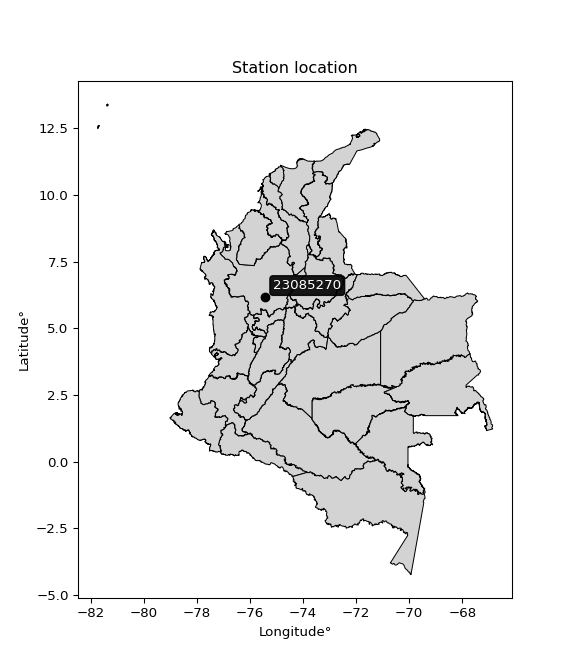

<div align="center">


</div>

# PMP Station (Rain, Pmax24h): 23085270

Probable Maximum Precipitation (PMP) is the greatest amount of rainfall for a specific duration that is meteorologically possible for a given location, acting as a "worst-case" scenario for extreme storms, crucial for designing safety-critical infrastructure like bridges, river deviations, dams, spillways, and nuclear plants to prevent catastrophic failure. PMP is calculated by hydrologists using meteorological data to determine the upper limit of extreme rainfall, often leading to the Probable Maximum Flood (PMF) for flood control design, and is increasingly being studied for climate change impacts. Probable Maximum Precipitation (PMP) is the theoretical upper limit of rainfall, a deterministic estimate for extreme events, while probability distributions (like GEV, Gumbel) describe the likelihood and frequency of various precipitation amounts, including rare ones, showing how often events occur, with PMP representing the extreme end of these distributions, used for critical infrastructure design to ensure safety against the worst conceivable weather, unlike standard statistical forecasts which cover typical probabilities.

The most common probability distributions in hydrology, used for analyzing floods, rainfall, and streamflow, include the Normal, Log-Normal, Gumbel, Gamma (including Log-Pearson Type III), and Generalized Extreme Value (GEV) distributions, often chosen based on the data´s skewness and whether modeling extremes or general conditions, with Gumbel and GEV popular for extreme events like floods, while the Normal distribution serves as a baseline, though often requiring transformations for skewed hydrological data. These distributions help in designing water infrastructure, managing water resources, and forecasting hydrologic events.

> Hydrological data often isn´t perfectly normal (it´s skewed), so different distributions are needed for different applications, such as: **Flood Frequency Analysis**: Using Gumbel, GEV, or Log-Pearson Type III for predicting extreme flood magnitudes and their return periods, **Rainfall Analysis**: Normal for annual totals, but Log-Normal, Weibull, or GEV for intensity or extreme daily rainfall, **Streamflow Modeling**: Gamma and Log-Normal for maximum flows, GEV for minimum flows, and Kappa for daily flows.

<div align="center">

</img>

</div>


## A. General information


### 1. General running parameters

• app_version: _v20260113_. • runtime: _2026-01-13 16:28:34.738620_. • Python version: _3.14.0_. • SciPy version: _1.16.3_. • Pandas version: _2.3.3_. • NumPy version: _2.3.5_. • Stations dataset (station_dataset_file): _dataset/pmax24h_in/automatic_colombia_2003_2025.csv_. • Stations catalog (station_catalog_file): _dataset/CNE.xls_. • Minimum year to eval til year_max (date_min): _1900_. • Maximum year to eval since year_min (date_max): _2025_. • Creates, save and include plots into reports (create_plot): _False_. • Plot only fit distributions with Δo > Δ (plot_only_fit): _True_. • Plot only simple graphs avoiding multiple CDFs and multiple Extreme values plots (plot_only_simple): _True_. • Eval low extreme values, if False, evaluates high extreme values (low_extreme): _False_. • Eval every SciPy distribution as logarithmic (pdist_logarithmic_on): _True_. • Standard deviation normalized (ddof): _1.0_. • Return periods to eval in years (Tr): _[2, 2.33, 5, 10, 15, 20, 25, 50, 75, 100, 200, 250, 500, 750, 1000]_. • Minimum data sample per station, 0 means any (minimum_sample): _5_. • Z-Score maximum threshold to adjust a value, 0 means disable (zscore_max): _3.5_. • Z-Score minimum threshold to adjust a value, 0 means disable (zscore_min): _-2.5_. • Avoid zeros, e.g. rain = 0 (avoid_zeros): _True_. • Avoid null values (avoid_nans): _True_. 

:file_folder:Table: [dataset.csv](../../dataset/pmax24h_in/automatic_colombia_2003_2025.csv)

> Delta Degrees of Freedom (DDOF): is a parameter used in the formulas for calculating variance and standard deviation. When ddof=0, the divisor is $N$ (the total number of observations) and this is used when your data set is the entire population. When ddof=1, the divisor is $N-1$ and this is used when your data set is a sample drawn from a larger population. Using $N-1$ provides an unbiased estimate of the population variance (known as Bessel´s correction).


### 2. Station info and location

|   id |   CODIGO | NOMBRE                             | CATEGORIA           | TECNOLOGIA                | ESTADO   | FECHA_INSTALACION   |   FECHA_SUSPENSION |   ALTITUD |   LATITUD |   LONGITUD | DEPARTAMENTO   | MUNICIPIO   | AREA_OPERATIVA                      | ENTIDAD                                                     | AREA_HIDROGRAFICA   | ZONA_HIDROGRAFICA   | SUBZONA_HIDROGRAFICA   |   CORRIENTE | Catalogo   |   Version |
|-----:|---------:|:-----------------------------------|:--------------------|:--------------------------|:---------|:--------------------|-------------------:|----------:|----------:|-----------:|:---------------|:------------|:------------------------------------|:------------------------------------------------------------|:--------------------|:--------------------|:-----------------------|------------:|:-----------|----------:|
|    0 | 23085270 | AEROPUERTO J.M. CORDOVA [23085270] | Sinóptica Principal | Automática con Telemetría | Activa   | 27/11/2006          |                nan |      2073 |   6.16861 |   -75.4261 | Antioquia      | Rionegro    | Area Operativa 01 - Antioquia-Chocó | INSTITUTO DE HIDROLOGIA METEOROLOGIA Y ESTUDIOS AMBIENTALES | Magdalena Cauca     | Medio Magdalena     | Río Nare               |         nan | CNE_IDEAM  |  20251226 |

<div align="center">

Dynamic map: [:earth_americas:Google](http://maps.google.com/maps?q=6.1686111,-75.426111111) [:earth_americas:OSM](https://www.openstreetmap.org/#map=18/6.1686111/-75.426111111&layers=P) [:earth_americas:Bing](https://www.bing.com/maps?cp=6.1686111~-75.426111111&lvl=18) [:earth_americas:Apple](https://maps.apple.com/frame?center=6.1686111%2C-75.426111111&span=0.003%2C0.006)

</div>


<div align="center">

```geojson
{
  "type": "Feature",
  "geometry": {
    "type": "Point", 
    "coordinates": [-75.426111111, 6.1686111]
  }, 
  "properties": {
    "Name": "23085270"
  }
}
```

</div>


### 3. Discrete values table and plot

<div align="center">

|               |          0 |           1 |           2 |           3 |           4 |           5 |           6 |           7 |            8 |          9 |         10 |         11 |
|:--------------|-----------:|------------:|------------:|------------:|------------:|------------:|------------:|------------:|-------------:|-----------:|-----------:|-----------:|
| Date          | 2014       | 2015        | 2016        | 2017        | 2018        | 2019        | 2020        | 2021        | 2022         | 2023       | 2024       | 2025       |
| Value         |  118.96    |   27.39     |   37.6      |   52.857    |   51.916    |   29.783    |   23.955    |   48.124    |   69.729     |   39.149   |  137.6     |  182.3     |
| Value_initial |  118.96    |   27.39     |   37.6      |   52.857    |   51.916    |   29.783    |   23.955    |   48.124    |   69.729     |   39.149   |  137.6     |  182.3     |
| count         |   12       |   12        |   12        |   12        |   12        |   12        |   12        |   12        |   12         |   12       |   12       |   12       |
| mean          |   68.2803  |   68.2803   |   68.2803   |   68.2803   |   68.2803   |   68.2803   |   68.2803   |   68.2803   |   68.2803    |   68.2803  |   68.2803  |   68.2803  |
| std           |   50.6296  |   50.6296   |   50.6296   |   50.6296   |   50.6296   |   50.6296   |   50.6296   |   50.6296   |   50.6296    |   50.6296  |   50.6296  |   50.6296  |
| zscore        |    1.00099 |   -0.807636 |   -0.605975 |   -0.304629 |   -0.323215 |   -0.760371 |   -0.875481 |   -0.398112 |    0.0286147 |   -0.57538 |    1.36916 |    2.25204 |


</div>


> The initial value (value_initial) correspond to the initial obtained or null completed value, and value (value) is adjusted only when the initial value is outside the valid range (outlier) definite through the Z-Score value. If Z-Score is active, values out of range or outliers are replaced with the station mean value. A Z-Score (or standard score) measures how many standard deviations a data point is from the mean of a dataset, indicating its relative position; positive scores mean above the mean, negative mean below, and a score of zero is exactly at the mean, allowing for comparison of values from different distributions. It´s calculated using the formula $z=(x–μ)/σ$, where $x$ is the data point, $μ$ is the mean, and $σ$ is the standard deviation, helping identify outliers and understand probability.
>
> <sub>**Note**: In this study, "completing" (filling gaps in) and "extending" (forecasting or lengthening the historical record) rainfall data series are avoided for certain critical analyses because they introduce artificial bias and uncertainty, which can distort the statistics of rare events (extremes), alter day-to-day variability, and compromise the integrity and homogeneity of the original data. Some reasons against Completing/Extending rainfall data are: **Distortion of Extremes and Variability**: The primary issue is that most gap-filling or extension methods rely on averaging or regression with nearby stations, which inherently smooths the data. Rainfall is highly variable in space and time, with a large percentage of zero values and occasional large storms. Infilling methods often underestimate the highest values and overestimate the lowest (zero) values, which severely distorts analyses focused on flood frequency, drought severity, and intensity-duration-frequency (IDF) curves, **Loss of Data Homogeneity**: Infilled or extended data are synthetic estimates, not actual measurements. Combining these estimates with observed data can violate the assumption of data homogeneity, which requires that the data properties do not change over time. Inhomogeneity can lead to incorrect conclusions about long-term trends or changes in climate patterns, **Propagation of Errors**: Errors and biases from the original data (e.g., wind-induced undercatch, instrument errors, site changes) or the data used for imputation can propagate through the analysis, leading to unreliable hydrological models and inaccurate predictions, **Compromised Statistical Integrity**: For statistical analyses, especially those involving the frequency of events, using artificial data can introduce time bias or autocorrelation that doesn´t exist in reality, making it difficult to assess the true probability of events, **Difficulty in Validation**: It is difficult to accurately validate the quality of filled or extended data, especially for past periods where ground-truth measurements are unavailable. The reliability of imputation techniques heavily depends on the density of the surrounding station network and the complexity of the local topography.</sub>


### 4. Active continuous probability distributions from SciPy (45 of 104 available)

A Probability Density Function (PDF) describes the relative likelihood of a continuous random variable falling within a specific range, where the total area under its curve equals 1, and the area over any interval gives the actual probability for that range. Unlike discrete probabilities (like rolling a die), a PDF shows density, not direct probability for a single point (which is zero), with higher points indicating higher likelihood, often visualized as a bell curve for normal distributions.

A log of a probability density function (log-PDF) is simply the logarithm of the PDF´s value, denoted as $log(f(x))$, useful for converting multiplication of probabilities into addition, improving numerical stability with tiny numbers, and connecting to information theory concepts like entropy. Instead of dealing with very small probabilities (e.g., 0.000001), log-PDFs use negative numbers (e.g., $log(0.00001) ≈ -11.51$ that are easier for computers to handle, preventing underflow errors and simplifying complex calculations. In this study, each active probability distribution from SciPy is also evaluated in the $log$ form.

[scipy.stats](https://docs.scipy.org/doc/scipy/reference/stats.html) is a Python´s powerful submodule within the SciPy library for comprehensive statistical analysis, offering over 130 probability distributions (like Normal, Poisson), functions for descriptive stats (mean, variance), hypothesis testing (t-tests, chi-square), random variable generation, and statistical tests, making it essential for data science, modeling, and research. It provides tools to explore, model, and draw conclusions from data efficiently, working seamlessly with NumPy.

<div align="center">

|   id | p_dist             |   n_parameter | fit_method   | label                                                                       | active   | ref                                                                                                        |
|-----:|:-------------------|--------------:|:-------------|:----------------------------------------------------------------------------|:---------|:-----------------------------------------------------------------------------------------------------------|
|    0 | alpha              |             3 | MLE          | Alpha                                                                       | True     | [:mortar_board:](https://docs.scipy.org/doc/scipy/reference/generated/scipy.stats.alpha.html)              |
|    1 | betaprime          |             4 | MLE          | Beta prime                                                                  | True     | [:mortar_board:](https://docs.scipy.org/doc/scipy/reference/generated/scipy.stats.betaprime.html)          |
|    2 | chi2               |             3 | MLE          | Chi²                                                                        | True     | [:mortar_board:](https://docs.scipy.org/doc/scipy/reference/generated/scipy.stats.chi2.html)               |
|    3 | crystalball        |             4 | MLE          | Crystalball                                                                 | True     | [:mortar_board:](https://docs.scipy.org/doc/scipy/reference/generated/scipy.stats.crystalball.html)        |
|    4 | dweibull           |             3 | MLE          | Double Weibull                                                              | True     | [:mortar_board:](https://docs.scipy.org/doc/scipy/reference/generated/scipy.stats.dweibull.html)           |
|    5 | erlang             |             3 | MLE          | Erlang                                                                      | True     | [:mortar_board:](https://docs.scipy.org/doc/scipy/reference/generated/scipy.stats.erlang.html)             |
|    6 | expon              |             2 | MLE          | Exponential                                                                 | True     | [:mortar_board:](https://docs.scipy.org/doc/scipy/reference/generated/scipy.stats.expon.html)              |
|    7 | exponnorm          |             3 | MLE          | Exponentially modified Normal                                               | True     | [:mortar_board:](https://docs.scipy.org/doc/scipy/reference/generated/scipy.stats.exponnorm.html)          |
|    8 | f                  |             4 | MLE          | F                                                                           | True     | [:mortar_board:](https://docs.scipy.org/doc/scipy/reference/generated/scipy.stats.f.html)                  |
|    9 | fatiguelife        |             3 | MLE          | Fatigue-life (Birnbaum-Saunders)                                            | True     | [:mortar_board:](https://docs.scipy.org/doc/scipy/reference/generated/scipy.stats.fatiguelife.html)        |
|   10 | fisk               |             3 | MLE          | Fisk                                                                        | True     | [:mortar_board:](https://docs.scipy.org/doc/scipy/reference/generated/scipy.stats.fisk.html)               |
|   11 | gamma              |             3 | MLE          | Gamma                                                                       | True     | [:mortar_board:](https://docs.scipy.org/doc/scipy/reference/generated/scipy.stats.gamma.html)              |
|   12 | genexpon           |             5 | MLE          | Generalized exponential                                                     | True     | [:mortar_board:](https://docs.scipy.org/doc/scipy/reference/generated/scipy.stats.genexpon.html)           |
|   13 | genlogistic        |             3 | MLE          | Generalized logistic                                                        | True     | [:mortar_board:](https://docs.scipy.org/doc/scipy/reference/generated/scipy.stats.genlogistic.html)        |
|   14 | gibrat             |             2 | MM           | Gibrat                                                                      | True     | [:mortar_board:](https://docs.scipy.org/doc/scipy/reference/generated/scipy.stats.gibrat.html)             |
|   15 | gompertz           |             3 | MLE          | Gompertz (or truncated Gumbel)                                              | True     | [:mortar_board:](https://docs.scipy.org/doc/scipy/reference/generated/scipy.stats.gompertz.html)           |
|   16 | gumbel_l           |             2 | MM           | Gumbel Left Skew                                                            | True     | [:mortar_board:](https://docs.scipy.org/doc/scipy/reference/generated/scipy.stats.gumbel_l.html)           |
|   17 | gumbel_r           |             2 | MM           | Gumbel Right Skew                                                           | True     | [:mortar_board:](https://docs.scipy.org/doc/scipy/reference/generated/scipy.stats.gumbel_r.html)           |
|   18 | halflogistic       |             2 | MM           | Half-logistic                                                               | True     | [:mortar_board:](https://docs.scipy.org/doc/scipy/reference/generated/scipy.stats.halflogistic.html)       |
|   19 | halfnorm           |             2 | MM           | Half Normal                                                                 | True     | [:mortar_board:](https://docs.scipy.org/doc/scipy/reference/generated/scipy.stats.halfnorm.html)           |
|   20 | hypsecant          |             2 | MM           | hyperbolic secant                                                           | True     | [:mortar_board:](https://docs.scipy.org/doc/scipy/reference/generated/scipy.stats.hypsecant.html)          |
|   21 | invgamma           |             3 | MLE          | Inverted gamma                                                              | True     | [:mortar_board:](https://docs.scipy.org/doc/scipy/reference/generated/scipy.stats.invgamma.html)           |
|   22 | invgauss           |             3 | MLE          | Inverse Gaussian                                                            | True     | [:mortar_board:](https://docs.scipy.org/doc/scipy/reference/generated/scipy.stats.invgauss.html)           |
|   23 | invweibull         |             3 | MLE          | Inverted Weibull                                                            | True     | [:mortar_board:](https://docs.scipy.org/doc/scipy/reference/generated/scipy.stats.invweibull.html)         |
|   24 | kappa4             |             4 | MLE          | Kappa 4                                                                     | True     | [:mortar_board:](https://docs.scipy.org/doc/scipy/reference/generated/scipy.stats.kappa4.html)             |
|   25 | kstwobign          |             2 | MLE          | Limiting distribution of scaled Kolmogorov-Smirnov two-sided test statistic | True     | [:mortar_board:](https://docs.scipy.org/doc/scipy/reference/generated/scipy.stats.kstwobign.html)          |
|   26 | laplace            |             2 | MM           | Laplace                                                                     | True     | [:mortar_board:](https://docs.scipy.org/doc/scipy/reference/generated/scipy.stats.laplace.html)            |
|   27 | laplace_asymmetric |             3 | MLE          | Asymmetric Laplace                                                          | True     | [:mortar_board:](https://docs.scipy.org/doc/scipy/reference/generated/scipy.stats.laplace_asymmetric.html) |
|   28 | loggamma           |             3 | MLE          | Log gamma                                                                   | True     | [:mortar_board:](https://docs.scipy.org/doc/scipy/reference/generated/scipy.stats.loggamma.html)           |
|   29 | logistic           |             2 | MM           | Logistic (or Sech-squared)                                                  | True     | [:mortar_board:](https://docs.scipy.org/doc/scipy/reference/generated/scipy.stats.logistic.html)           |
|   30 | lognorm            |             3 | MLE          | Log Normal                                                                  | True     | [:mortar_board:](https://docs.scipy.org/doc/scipy/reference/generated/scipy.stats.lognorm.html)            |
|   31 | maxwell            |             2 | MM           | Maxwell                                                                     | True     | [:mortar_board:](https://docs.scipy.org/doc/scipy/reference/generated/scipy.stats.maxwell.html)            |
|   32 | mielke             |             4 | MLE          | Mielke Beta-Kappa / Dagum                                                   | True     | [:mortar_board:](https://docs.scipy.org/doc/scipy/reference/generated/scipy.stats.mielke.html)             |
|   33 | moyal              |             2 | MM           | Moyal                                                                       | True     | [:mortar_board:](https://docs.scipy.org/doc/scipy/reference/generated/scipy.stats.moyal.html)              |
|   34 | nakagami           |             3 | MLE          | Nakagami                                                                    | True     | [:mortar_board:](https://docs.scipy.org/doc/scipy/reference/generated/scipy.stats.nakagami.html)           |
|   35 | ncf                |             5 | MLE          | Non-central F distribution                                                  | True     | [:mortar_board:](https://docs.scipy.org/doc/scipy/reference/generated/scipy.stats.ncf.html)                |
|   36 | nct                |             4 | MLE          | Non-central Student’s t                                                     | True     | [:mortar_board:](https://docs.scipy.org/doc/scipy/reference/generated/scipy.stats.nct.html)                |
|   37 | norm               |             2 | MM           | Normal                                                                      | True     | [:mortar_board:](https://docs.scipy.org/doc/scipy/reference/generated/scipy.stats.norm.html)               |
|   38 | pearson3           |             3 | MM           | Pearson type III                                                            | True     | [:mortar_board:](https://docs.scipy.org/doc/scipy/reference/generated/scipy.stats.pearson3.html)           |
|   39 | rayleigh           |             2 | MM           | Rayleigh                                                                    | True     | [:mortar_board:](https://docs.scipy.org/doc/scipy/reference/generated/scipy.stats.rayleigh.html)           |
|   40 | rice               |             3 | MLE          | Rice                                                                        | True     | [:mortar_board:](https://docs.scipy.org/doc/scipy/reference/generated/scipy.stats.rice.html)               |
|   41 | t                  |             3 | MLE          | Student’s t                                                                 | True     | [:mortar_board:](https://docs.scipy.org/doc/scipy/reference/generated/scipy.stats.t.html)                  |
|   42 | truncnorm          |             4 | MLE          | Truncated normal                                                            | True     | [:mortar_board:](https://docs.scipy.org/doc/scipy/reference/generated/scipy.stats.truncnorm.html)          |
|   43 | wald               |             2 | MM           | Wald                                                                        | True     | [:mortar_board:](https://docs.scipy.org/doc/scipy/reference/generated/scipy.stats.wald.html)               |
|   44 | weibull_min        |             3 | MLE          | Weibull minimum                                                             | True     | [:mortar_board:](https://docs.scipy.org/doc/scipy/reference/generated/scipy.stats.weibull_min.html)        |

</div>

> **n_parameter:** # arguments & localization & scale.
>
> **Fit methods:** (MLE) maximum likelihood, (MM) L-moments.
>
>**Inactive** (With the only purpose of prevent loops, zero divisions, infinite values, over high estimated values or horizontal trending for recurrence intervals estimations, the follow distributions were disabled.)**:** foldnorm, gennorm, norminvgauss, powernorm, powerlognorm, skewnorm, genextreme, anglit, arcsine, argus, beta, bradford, burr, burr12, cauchy, cosine, halfcauchy, foldcauchy, skewcauchy, wrapcauchy, dgamma, gengamma, exponweib, exponpow, truncexpon, gausshyper, genhalflogistic, genhyperbolic, geninvgauss, halfgennorm, johnsonsb, johnsonsu, kappa3, ksone, kstwo, loglaplace, levy, levy_l, levy_stable, ncx2, pareto, genpareto, truncpareto, lomax, powerlaw, rdist, rel_breitwigner, recipinvgauss, semicircular, studentized_range, trapezoid, triang, truncweibull_min, tukeylambda, uniform, loguniform, vonmises, vonmises_line, weibull_max, 


## B. Probability (PDF) vs. Empirical (EDF) distributions functions

A continuous probability distribution (CPD) describes probabilities for variables that can take any value within a range (like rain any time), unlike discrete variables with specific outcomes (like temperature). It uses a Probability Density Function (PDF), a curve where the total area under it equals 1, and the probability of the variable falling within an interval (a to b) is found by calculating the area under the curve between those points. A key feature is that the probability of hitting any single exact value is zero, so probabilities are always expressed for ranges, e.g., $P(a ≤ X ≤ b)$.

<div align="center">

Distributions parameters from station values
|    |   station | p_dist                |   n |           loc |          scale | shape                  | shape1                | shape2                | shape3   |
|---:|----------:|:----------------------|----:|--------------:|---------------:|:-----------------------|:----------------------|:----------------------|:---------|
|  0 |  23085270 | alpha                 |  12 |     14.1801   |   21.2853      | 7.4247531024201065e-09 |                       |                       |          |
|  1 |  23085270 | betaprime             |  12 |      0.04816  |    1.83106     | 81.00042039536316      | 3.171820523029032     |                       |          |
|  2 |  23085270 | chi2                  |  12 |     23.955    |   15.5588      | 1.4089491921543158     |                       |                       |          |
|  3 |  23085270 | crystalball           |  12 |     68.2802   |   48.4741      | 1645.857343095367      | 10295.323110759055    |                       |          |
|  4 |  23085270 | dweibull              |  12 |     48.124    |   41.0579      | 0.8786378489424816     |                       |                       |          |
|  5 |  23085270 | erlang                |  12 |     23.955    |   31.5651      | 0.9097556021906679     |                       |                       |          |
|  6 |  23085270 | expon                 |  12 |     23.955    |   44.3253      |                        |                       |                       |          |
|  7 |  23085270 | exponnorm             |  12 |     23.9107   |    0.0148883   | 2941.556153077293      |                       |                       |          |
|  8 |  23085270 | f                     |  12 |     15.3755   |   24.8566      | 3285.781573460119      | 3.0885570149715407    |                       |          |
|  9 |  23085270 | fatiguelife           |  12 |     21.0787   |   25.0187      | 1.3146161228244262     |                       |                       |          |
| 10 |  23085270 | fisk                  |  12 |     23.955    |   23.3644      | 0.9764005567105489     |                       |                       |          |
| 11 |  23085270 | gamma                 |  12 |     23.955    |   47.5796      | 0.4959248650992192     |                       |                       |          |
| 12 |  23085270 | genexpon              |  12 |     23.955    |   44.4174      | 1.002035863980961      | 2.711010709239356e-08 | 0.683137027961862     |          |
| 13 |  23085270 | genlogistic           |  12 |   -186.114    |   30.3161      | 2230.9451760768534     |                       |                       |          |
| 14 |  23085270 | gibrat                |  12 |     31.3007   |   22.4293      |                        |                       |                       |          |
| 15 |  23085270 | gompertz              |  12 |     23.8039   | 1028.57        | 21.871278963146334     |                       |                       |          |
| 16 |  23085270 | gumbel_l              |  12 |     90.0962   |   37.7951      |                        |                       |                       |          |
| 17 |  23085270 | gumbel_r              |  12 |     46.4643   |   37.7951      |                        |                       |                       |          |
| 18 |  23085270 | halflogistic          |  12 |     10.8271   |   41.4437      |                        |                       |                       |          |
| 19 |  23085270 | halfnorm              |  12 |      4.1195   |   80.4136      |                        |                       |                       |          |
| 20 |  23085270 | hypsecant             |  12 |     68.2803   |   30.8596      |                        |                       |                       |          |
| 21 |  23085270 | invgamma              |  12 |     15.3638   |   38.3921      | 1.5442835264961237     |                       |                       |          |
| 22 |  23085270 | invgauss              |  12 |     19.0111   |   29.0621      | 1.6953096237733605     |                       |                       |          |
| 23 |  23085270 | invweibull            |  12 |     13.9785   |   24.7406      | 1.3542996886418535     |                       |                       |          |
| 24 |  23085270 | kappa4                |  12 |      8.00929  |  173.632       | 1.1008943597927925     | 0.9565405696839333    |                       |          |
| 25 |  23085270 | kstwobign             |  12 |    -63.6012   |  152.753       |                        |                       |                       |          |
| 26 |  23085270 | laplace               |  12 |     68.2803   |   34.2764      |                        |                       |                       |          |
| 27 |  23085270 | laplace_asymmetric    |  12 |     23.955    |    0.000633152 | 1.4284299692586083e-05 |                       |                       |          |
| 28 |  23085270 | loggamma              |  12 | -13820.4      | 1907.59        | 1452.4040500509286     |                       |                       |          |
| 29 |  23085270 | logistic              |  12 |     68.2803   |   26.7252      |                        |                       |                       |          |
| 30 |  23085270 | lognorm               |  12 |     23.955    |    1.29641     | 10.169340480014569     |                       |                       |          |
| 31 |  23085270 | maxwell               |  12 |    -46.5831   |   71.9799      |                        |                       |                       |          |
| 32 |  23085270 | mielke                |  12 |     -0.377892 |    3.75298     | 275.78044052484313     | 2.0404635774059585    |                       |          |
| 33 |  23085270 | moyal                 |  12 |     40.5596   |   21.821       |                        |                       |                       |          |
| 34 |  23085270 | nakagami              |  12 |     23.955    |   55.9529      | 0.30359512045513415    |                       |                       |          |
| 35 |  23085270 | ncf                   |  12 |     -0.370854 |    0.173268    | 0.16483194285094294    | 6.822112879314744     | 48.46297325234569     |          |
| 36 |  23085270 | nct                   |  12 |     -0.227367 |    1.00972     | 1.9920573201559173     | 41.07132579724168     |                       |          |
| 37 |  23085270 | norm                  |  12 |     68.2803   |   48.4741      |                        |                       |                       |          |
| 38 |  23085270 | pearson3              |  12 |     68.2803   |   48.4741      | 1.2168751041686288     |                       |                       |          |
| 39 |  23085270 | rayleigh              |  12 |    -24.4536   |   73.9909      |                        |                       |                       |          |
| 40 |  23085270 | rice                  |  12 |     -4.98552  |   62.1193      | 0.00038404525476501807 |                       |                       |          |
| 41 |  23085270 | t                     |  12 |     44.3896   |   18.0054      | 1.3664395999847425     |                       |                       |          |
| 42 |  23085270 | truncnorm             |  12 | -27938.3      | 1167.29        | 23.954936252700808     | 24.090589345674925    |                       |          |
| 43 |  23085270 | wald                  |  12 |     19.8061   |   48.4741      |                        |                       |                       |          |
| 44 |  23085270 | weibull_min           |  12 |     23.955    |   44.9192      | 0.6619302807000539     |                       |                       |          |
| 45 |  23085270 | logalpha              |  12 |      1.14175  |   13.2583      | 4.8378823666127495     |                       |                       |          |
| 46 |  23085270 | logbetaprime          |  12 |      1.01206  |    4.98404     | 38.49566872579012      | 65.25262008700824     |                       |          |
| 47 |  23085270 | logchi2               |  12 |      3.17618  |    0.93506     | 1.066663558625497      |                       |                       |          |
| 48 |  23085270 | logcrystalball        |  12 |      4.00992  |    0.630101    | 52.94047293885978      | 72.64228752593931     |                       |          |
| 49 |  23085270 | logdweibull           |  12 |      3.90647  |    0.520394    | 1.1128071357216096     |                       |                       |          |
| 50 |  23085270 | logerlang             |  12 |      3.17618  |    0.855784    | 0.8437124037702016     |                       |                       |          |
| 51 |  23085270 | logexpon              |  12 |      3.17618  |    0.833746    |                        |                       |                       |          |
| 52 |  23085270 | logexponnorm          |  12 |      3.17464  |    0.000531256 | 1558.2817333246412     |                       |                       |          |
| 53 |  23085270 | logf                  |  12 |      2.29166  |    1.50693     | 13627.42420068651      | 15.712722988077873    |                       |          |
| 54 |  23085270 | logfatiguelife        |  12 |      2.82385  |    1.011       | 0.5871243541050153     |                       |                       |          |
| 55 |  23085270 | logfisk               |  12 |      2.90681  |    0.943477    | 2.674617272671105      |                       |                       |          |
| 56 |  23085270 | loggamma              |  12 |      3.17618  |    0.94441     | 0.9291383092736667     |                       |                       |          |
| 57 |  23085270 | loggenexpon           |  12 |      3.17618  |    1.09906     | 0.9465490266318315     | 1.9451820133962416    | 0.37326771280485027   |          |
| 58 |  23085270 | loggenlogistic        |  12 |      0.367335 |    0.494242    | 874.8902217572204      |                       |                       |          |
| 59 |  23085270 | loggibrat             |  12 |      3.52926  |    0.291539    |                        |                       |                       |          |
| 60 |  23085270 | loggompertz           |  12 |      3.17618  |    1.47978     | 1.0636406652697428     |                       |                       |          |
| 61 |  23085270 | loggumbel_l           |  12 |      4.2935   |    0.491288    |                        |                       |                       |          |
| 62 |  23085270 | loggumbel_r           |  12 |      3.72634  |    0.491288    |                        |                       |                       |          |
| 63 |  23085270 | loghalflogistic       |  12 |      3.26309  |    0.538726    |                        |                       |                       |          |
| 64 |  23085270 | loghalfnorm           |  12 |      3.17592  |    1.04527     |                        |                       |                       |          |
| 65 |  23085270 | loghypsecant          |  12 |      4.00992  |    0.401135    |                        |                       |                       |          |
| 66 |  23085270 | loginvgamma           |  12 |      2.29079  |   11.8449      | 7.856335450939725      |                       |                       |          |
| 67 |  23085270 | loginvgauss           |  12 |      2.74566  |    4.10322     | 0.30811293509868953    |                       |                       |          |
| 68 |  23085270 | loginvweibull         |  12 |     -2.89264  |    6.58905     | 13.763204669331085     |                       |                       |          |
| 69 |  23085270 | logkappa4             |  12 |      2.95874  |    2.39306     | 1.1002611300267837     | 1.0613967573912237    |                       |          |
| 70 |  23085270 | logkstwobign          |  12 |      1.97943  |    2.32914     |                        |                       |                       |          |
| 71 |  23085270 | loglaplace            |  12 |      4.00992  |    0.445549    |                        |                       |                       |          |
| 72 |  23085270 | loglaplace_asymmetric |  12 |      3.87378  |    0.487687    | 0.8701839354597407     |                       |                       |          |
| 73 |  23085270 | logloggamma           |  12 |   -115.489    |   17.9098      | 790.4674168683423      |                       |                       |          |
| 74 |  23085270 | loglogistic           |  12 |      4.00992  |    0.347393    |                        |                       |                       |          |
| 75 |  23085270 | loglognorm            |  12 |      3.17618  |    0.037381    | 9.698933311312214      |                       |                       |          |
| 76 |  23085270 | logmaxwell            |  12 |      2.51685  |    0.935646    |                        |                       |                       |          |
| 77 |  23085270 | logmielke             |  12 |     -4.32217  |    6.22959     | 1170.0262899806708     | 16.753086767699976    |                       |          |
| 78 |  23085270 | logmoyal              |  12 |      3.64959  |    0.283645    |                        |                       |                       |          |
| 79 |  23085270 | lognakagami           |  12 |      3.17618  |    1.15942     | 0.31989021233306425    |                       |                       |          |
| 80 |  23085270 | logncf                |  12 |      2.55359  |    1.303       | 26.245036456928112     | 18.428212183002543    | 5.598531147593189e-06 |          |
| 81 |  23085270 | lognct                |  12 |     -0.122493 |    0.0920272   | 24.52617451998335      | 43.5130671499133      |                       |          |
| 82 |  23085270 | lognorm               |  12 |      4.00992  |    0.630101    |                        |                       |                       |          |
| 83 |  23085270 | logpearson3           |  12 |      4.00992  |    0.630101    | 0.5618009586654071     |                       |                       |          |
| 84 |  23085270 | lograyleigh           |  12 |      2.8045   |    0.961786    |                        |                       |                       |          |
| 85 |  23085270 | logrice               |  12 |      2.91893  |    0.890868    | 0.000704501175564274   |                       |                       |          |
| 86 |  23085270 | logt                  |  12 |      4.00993  |    0.6301      | 2597302016.054545      |                       |                       |          |
| 87 |  23085270 | logtruncnorm          |  12 |      0.229866 |    1.92025     | 1.5343372853880477     | 13.944596306941323    |                       |          |
| 88 |  23085270 | logwald               |  12 |      3.37981  |    0.630115    |                        |                       |                       |          |
| 89 |  23085270 | logweibull_min        |  12 |      3.15865  |    0.896345    | 1.1879367257002291     |                       |                       |          |

</div>

> **loc** (Location parameter): This shifts the distribution along the x-axis. For many common distributions, like the normal (Gaussian) distribution, loc represents the mean $μ$. For others, like the uniform distribution, it might represent the minimum value, or for the beta distribution, the left end of the support interval.
>
> **scale** (Scale parameter): This determines the width or spread of the distribution. For the normal distribution, scale represents the standard deviation $σ$. For a uniform distribution, it defines the length of the interval (from $loc$ to $loc + scale$).
>
> **shape** (Shape parameters): Refers to parameters that define the specific form of a probability distribution, distinct from its location (loc) and scale (scale). These parameters are required arguments for most distribution functions. For example, a normal (Gaussian) distribution is fully defined by its location (mean) and scale (standard deviation), so it has no specific shape parameters beyond loc and scale. However, other distributions have intrinsic properties that need specification, as Gamma distribution that takes a shape parameter, often named $a$ or $alpha$.


### 0. Cumulative distribution values - CDF (90 evaluated)

Cumulative Distribution Function (CDF), denoted as $F$<sub>$X$</sub>$(x)$, is a function that gives the probability that a random variable $X$ will take a value less than or equal to a specific value, $x$ (i.e., $(P(X≥x)$. It essentially "accumulates" probabilities from a given point up to the far right (positive infinity), providing a complete picture of the distribution´s probabilities for both discrete (like rain) and continuous (like temperature) variables, helping to find probabilities over ranges or above certain values. Each station is evaluated separately ordering the $x$ values ascending, calculating the CDF and PDF values for the activated distributions and their logarithmic forms.

<div align="center">

CDF ordered by x ascending and calculating $log(f(x))$ separately
|   id |   Station |   date |       x |   count |    mean |     std |     zscore |   Value_initial |   station |   m |     alpha |   alpha_pdf |   betaprime |   betaprime_pdf |        chi2 |       chi2_pdf |   crystalball |   crystalball_pdf |   dweibull |   dweibull_pdf |      erlang |   erlang_pdf |     expon |   expon_pdf |   exponnorm |   exponnorm_pdf |         f |       f_pdf |   fatiguelife |   fatiguelife_pdf |        fisk |    fisk_pdf |      gamma |   gamma_pdf |    genexpon |   genexpon_pdf |   genlogistic |   genlogistic_pdf |   gibrat |   gibrat_pdf |   gompertz |   gompertz_pdf |   gumbel_l |   gumbel_l_pdf |   gumbel_r |   gumbel_r_pdf |   halflogistic |   halflogistic_pdf |   halfnorm |   halfnorm_pdf |   hypsecant |   hypsecant_pdf |   invgamma |   invgamma_pdf |   invgauss |   invgauss_pdf |   invweibull |   invweibull_pdf |      kappa4 |   kappa4_pdf |   kstwobign |   kstwobign_pdf |   laplace |   laplace_pdf |   laplace_asymmetric |   laplace_asymmetric_pdf |    loggamma |   loggamma_pdf |   logistic |   logistic_pdf |   lognorm |   lognorm_pdf |   maxwell |   maxwell_pdf |      mielke |   mielke_pdf |    moyal |   moyal_pdf |    nakagami |   nakagami_pdf |       ncf |    ncf_pdf |       nct |     nct_pdf |     norm |    norm_pdf |   pearson3 |   pearson3_pdf |   rayleigh |   rayleigh_pdf |     rice |    rice_pdf |        t |       t_pdf |   truncnorm |   truncnorm_pdf |       wald |    wald_pdf |   weibull_min |   weibull_min_pdf |   logalpha |   logalpha_pdf |   logbetaprime |   logbetaprime_pdf |     logchi2 |   logchi2_pdf |   logcrystalball |   logcrystalball_pdf |   logdweibull |   logdweibull_pdf |   logerlang |   logerlang_pdf |   logexpon |   logexpon_pdf |   logexponnorm |   logexponnorm_pdf |      logf |   logf_pdf |   logfatiguelife |   logfatiguelife_pdf |   logfisk |   logfisk_pdf |   loggenexpon |   loggenexpon_pdf |   loggenlogistic |   loggenlogistic_pdf |   loggibrat |   loggibrat_pdf |   loggompertz |   loggompertz_pdf |   loggumbel_l |   loggumbel_l_pdf |   loggumbel_r |   loggumbel_r_pdf |   loghalflogistic |   loghalflogistic_pdf |   loghalfnorm |   loghalfnorm_pdf |   loghypsecant |   loghypsecant_pdf |   loginvgamma |   loginvgamma_pdf |   loginvgauss |   loginvgauss_pdf |   loginvweibull |   loginvweibull_pdf |   logkappa4 |   logkappa4_pdf |   logkstwobign |   logkstwobign_pdf |   loglaplace |   loglaplace_pdf |   loglaplace_asymmetric |   loglaplace_asymmetric_pdf |   logloggamma |   logloggamma_pdf |   loglogistic |   loglogistic_pdf |   loglognorm |   loglognorm_pdf |   logmaxwell |   logmaxwell_pdf |   logmielke |   logmielke_pdf |   logmoyal |   logmoyal_pdf |   lognakagami |   lognakagami_pdf |    logncf |   logncf_pdf |    lognct |   lognct_pdf |   logpearson3 |   logpearson3_pdf |   lograyleigh |   lograyleigh_pdf |   logrice |   logrice_pdf |      logt |   logt_pdf |   logtruncnorm |   logtruncnorm_pdf |     logwald |   logwald_pdf |   logweibull_min |   logweibull_min_pdf |
|-----:|----------:|-------:|--------:|--------:|--------:|--------:|-----------:|----------------:|----------:|----:|----------:|------------:|------------:|----------------:|------------:|---------------:|--------------:|------------------:|-----------:|---------------:|------------:|-------------:|----------:|------------:|------------:|----------------:|----------:|------------:|--------------:|------------------:|------------:|------------:|-----------:|------------:|------------:|---------------:|--------------:|------------------:|---------:|-------------:|-----------:|---------------:|-----------:|---------------:|-----------:|---------------:|---------------:|-------------------:|-----------:|---------------:|------------:|----------------:|-----------:|---------------:|-----------:|---------------:|-------------:|-----------------:|------------:|-------------:|------------:|----------------:|----------:|--------------:|---------------------:|-------------------------:|------------:|---------------:|-----------:|---------------:|----------:|--------------:|----------:|--------------:|------------:|-------------:|---------:|------------:|------------:|---------------:|----------:|-----------:|----------:|------------:|---------:|------------:|-----------:|---------------:|-----------:|---------------:|---------:|------------:|---------:|------------:|------------:|----------------:|-----------:|------------:|--------------:|------------------:|-----------:|---------------:|---------------:|-------------------:|------------:|--------------:|-----------------:|---------------------:|--------------:|------------------:|------------:|----------------:|-----------:|---------------:|---------------:|-------------------:|----------:|-----------:|-----------------:|---------------------:|----------:|--------------:|--------------:|------------------:|-----------------:|---------------------:|------------:|----------------:|--------------:|------------------:|--------------:|------------------:|--------------:|------------------:|------------------:|----------------------:|--------------:|------------------:|---------------:|-------------------:|--------------:|------------------:|--------------:|------------------:|----------------:|--------------------:|------------:|----------------:|---------------:|-------------------:|-------------:|-----------------:|------------------------:|----------------------------:|--------------:|------------------:|--------------:|------------------:|-------------:|-----------------:|-------------:|-----------------:|------------:|----------------:|-----------:|---------------:|--------------:|------------------:|----------:|-------------:|----------:|-------------:|--------------:|------------------:|--------------:|------------------:|----------:|--------------:|----------:|-----------:|---------------:|-------------------:|------------:|--------------:|-----------------:|---------------------:|
|    0 |  23085270 |   2020 |  23.955 |      12 | 68.2803 | 50.6296 | -0.875481  |          23.955 |  23085270 |   1 | 0.0294397 | 0.0166014   |   0.0709963 |     0.0121278   | 6.45881e-12 | 1280.73        |      0.180251 |       0.00541793  |   0.266894 |    0.0060909   | 3.20654e-15 |  0.82111     | 0         | 0.0225605   |  0.00101133 |     0.0227774   | 0.0324069 | 0.0151574   |     0.0235432 |       0.0241636   | 4.72479e-15 | 0.0927517   | 1.1345e-08 | 1.58366e+06 | 3.83777e-08 |    0.0225596   |      0.112775 |       0.00811434  | 0        |  0           | 0.00320878 |    0.0211986   |   0.159514 |    0.0038644   |   0.162993 |    0.00782315  |       0.157071 |        0.0117669   |   0.194835 |    0.00962495  |    0.148624 |     0.00464303  |   0.032407 |    0.0151573   |  0.0270017 |    0.0181266   |    0.0326739 |      0.0151744   | 3.21818e-15 |   0.166248   |    0.102326 |     0.00760836  |  0.1372   |   0.00400274  |          2.86404e-10 |              0.0225606   | 5.89865e-15 |      12.3414   |   0.159956 |    0.00502784  | 0.0928853 |      0.263821 |  0.189153 |   0.00658595  |   0.0524167 |    0.0128198 | 0.143474 | 0.00917301  | 1.13566e-10 | 19409.4        | 0.0852486 | 0.0112754  | 0.0534791 | 0.0128878   | 0.180251 | 0.00541793  |   0.168086 |    0.00900029  |   0.192669 |     0.00713867 | 0.102843 | 0.00672855  | 0.208606 | 0.00850643  | 3.68154e-07 |     0.0213745   | 0.00165089 | 0.00248543  |   3.47492e-11 |    3237.18        |  0.0465683 |      0.312111  |      0.0714863 |          0.299926  | 5.23257e-09 |   6.28408e+06 |        0.0928857 |             0.263822 |      0.116348 |         0.258493  | 1.34618e-13 |     255.757     |   0        |       1.19941  |     0.00185466 |           1.2034   | 0.0400122 |  0.327243  |        0.0300731 |             0.376445 | 0.0338092 |     0.324351  |   3.41082e-11 |          0.861234 |        0.0511963 |            0.307343  |    0        |       0         |   1.14103e-09 |          0.718782 |     0.0977567 |         0.188921  |     0.0466825 |         0.29118   |         0         |             0         |   0.000198844 |          0.763327 |      0.0792431 |          0.195513  |     0.0400121 |         0.327243  |     0.0324004 |         0.360081  |       0.0449699 |           0.316334  | 3.15697e-15 |       11.9524   |      0.0455868 |           0.317914 |    0.0769633 |        0.172738  |               0.0832703 |                   0.196217  |     0.0973188 |          0.265891 |      0.083172 |         0.219505  |  0.000473323 |      3.92182e+11 |    0.0803557 |         0.330355 |   0.0468536 |       0.313484  |  0.0212393 |      0.228113  |   1.06329e-10 |     153184        | 0.0407656 |    0.326455  | 0.0645514 |     0.298907 |     0.0751456 |          0.307918 |     0.0719488 |          0.372887 | 0.040834  |      0.310897 | 0.0928835 |   0.263817 |     6.1795e-12 |           1.02483  | 0           |   0           |       0.00929359 |             0.626818 |
|    1 |  23085270 |   2015 |  27.39  |      12 | 68.2803 | 50.6296 | -0.807636  |          27.39  |  23085270 |   2 | 0.107111  | 0.0265726   |   0.117474  |     0.014748    | 0.222528    |    0.0427524   |      0.199461 |       0.00576612  |   0.288864 |    0.00671609  | 0.130847    |  0.0327186   | 0.0745687 | 0.0208782   |  0.076372   |     0.02109     | 0.100252  | 0.0230833   |     0.128721  |       0.031568    | 0.133316    | 0.0328432   | 0.299314   | 0.0411677   | 0.0745657   |    0.0208774   |      0.142462 |       0.00915325  | 0        |  0           | 0.0735429  |    0.0197687   |   0.173296 |    0.00416268  |   0.190815 |    0.00836287  |       0.197206 |        0.0115954   |   0.227713 |    0.00951538  |    0.165385 |     0.00512137  |   0.100252 |    0.0230833   |  0.108795  |    0.0268542   |    0.101099  |      0.0233954   | 0.030798    |   0.00814033 |    0.130041 |     0.00850895  |  0.151662 |   0.00442466  |          0.074569    |              0.0208783   | 0.156687    |       1.00853  |   0.17799  |    0.00547459  | 0.133386  |      0.341742 |  0.212331 |   0.00690421  |   0.104573  |    0.017206  | 0.176298 | 0.00990884  | 0.142594    |     0.0251836  | 0.127245  | 0.0130599  | 0.105602  | 0.017117    | 0.199461 | 0.00576612  |   0.199688 |    0.00938001  |   0.217665 |     0.00740851 | 0.126997 | 0.00732453  | 0.240822 | 0.0103017   | 0.0708934   |     0.0199195   | 0.029255   | 0.0136837   |   0.166706    |       0.0292843   |  0.100915  |      0.498147  |      0.119391  |          0.415432  | 0.269427    |   1.02314     |        0.133386  |             0.341742 |      0.156184 |         0.339152  | 0.206585    |       1.19354   |   0.148471 |       1.02133  |     0.151023   |           1.02552  | 0.0987642 |  0.545201  |        0.101254  |             0.66223  | 0.0934105 |     0.561522  |   0.11372     |          0.833082 |        0.103602  |            0.474631  |    0        |       0         |   0.095898    |          0.711446 |     0.126397  |         0.240285  |     0.0970183 |         0.460687  |         0.0436762 |             0.926346  |   0.102204    |          0.757056 |      0.110135  |          0.269114  |     0.098764  |         0.545201  |     0.0995492 |         0.625813  |       0.100611  |           0.512675  | 0.0799884   |        0.54361  |      0.100203  |           0.493841 |    0.103968  |        0.233348  |               0.114188  |                   0.269073  |     0.137939  |          0.341381 |      0.117712 |         0.298958  |  0.552362    |      0.30431     |    0.131256  |         0.427957 |   0.101516  |       0.501472  |  0.0689061 |      0.48917   |   0.194981    |          0.927915 | 0.0988638 |    0.536381  | 0.113069  |     0.425531 |     0.123731  |          0.416955 |     0.129089  |          0.476089 | 0.0919336 |      0.447654 | 0.133383  |   0.341738 |     0.130129   |           0.918531 | 0           |   0           |       0.114006   |             0.840751 |
|    2 |  23085270 |   2019 |  29.783 |      12 | 68.2803 | 50.6296 | -0.760371  |          29.783 |  23085270 |   3 | 0.172508  | 0.0275103   |   0.154268  |     0.0159162   | 0.313159    |    0.0338619   |      0.213545 |       0.00600399  |   0.305516 |    0.00720975  | 0.204346    |  0.0289168   | 0.123205  | 0.0197809   |  0.125486   |     0.0199685   | 0.157932  | 0.0247096   |     0.200187  |       0.0279709   | 0.204929    | 0.0272972   | 0.382766   | 0.0299904   | 0.123201    |    0.0197802   |      0.165161 |       0.0098069   | 0        |  0           | 0.119714   |    0.0188272   |   0.183516 |    0.00437994  |   0.211227 |    0.00868949  |       0.224789 |        0.0114549   |   0.250383 |    0.00942961  |    0.178059 |     0.00547371  |   0.157932 |    0.0247096   |  0.173397  |    0.0266964   |    0.159649  |      0.0251005   | 0.049767    |   0.00775033 |    0.151079 |     0.009063    |  0.162628 |   0.00474461  |          0.123206    |              0.019781    | 0.236059    |       0.891723 |   0.19147  |    0.00579264  | 0.164137  |      0.39262  |  0.229098 |   0.00710705  |   0.148099  |    0.019001  | 0.200513 | 0.0103146   | 0.196467    |     0.0204173  | 0.15956   | 0.0138929  | 0.148794  | 0.018815    | 0.213545 | 0.00600399  |   0.22238  |    0.00957652  |   0.235595 |     0.00757285 | 0.144984 | 0.00770384  | 0.267148 | 0.0117207   | 0.117409    |     0.0189648   | 0.06906    | 0.0190429   |   0.228005    |       0.0226899   |  0.147098  |      0.601529  |      0.157153  |          0.485464  | 0.343797    |   0.77997     |        0.164137  |             0.392621 |      0.187057 |         0.399316  | 0.298071    |       1.00317   |   0.22986  |       0.92371  |     0.232718   |           0.926841 | 0.149225  |  0.654628  |        0.161286  |             0.760928 | 0.145785  |     0.683754  |   0.182455    |          0.807247 |        0.147467  |            0.570501  |    0        |       0         |   0.155175    |          0.703516 |     0.148067  |         0.277883  |     0.13985   |         0.55998   |         0.120849  |             0.914561  |   0.165223    |          0.746902 |      0.135019  |          0.326589  |     0.149225  |         0.654628  |     0.156714  |         0.730394  |       0.148174  |           0.619393  | 0.124504    |        0.521378 |      0.145544  |           0.585449 |    0.125471  |        0.28161   |               0.139104  |                   0.327784  |     0.16859   |          0.390578 |      0.145149 |         0.357177  |  0.572088    |      0.185797    |    0.169447  |         0.48292  |   0.148014  |       0.605631  |  0.116568  |      0.64425   |   0.265563    |          0.773576 | 0.148435  |    0.642591  | 0.151933  |     0.501411 |     0.161391  |          0.481386 |     0.171215  |          0.528105 | 0.132508  |      0.519205 | 0.164134  |   0.392617 |     0.204412   |           0.855643 | 6.50785e-11 |   1.04871e-07 |       0.184666   |             0.840403 |
|    3 |  23085270 |   2016 |  37.6   |      12 | 68.2803 | 50.6296 | -0.605975  |          37.6   |  23085270 |   4 | 0.363426  | 0.0204872   |   0.284323  |     0.0167133   | 0.51755     |    0.0204847   |      0.263393 |       0.00673618  |   0.369533 |    0.00932862  | 0.396344    |  0.0209054   | 0.264966  | 0.0165827   |  0.268442   |     0.0167043   | 0.3409    | 0.0209286   |     0.375269  |       0.0178402   | 0.37165     | 0.0167105   | 0.554331   | 0.0165729   | 0.264956    |    0.0165823   |      0.248663 |       0.0114113   | 0.102056 |  0.0282762   | 0.255716   |    0.0160399   |   0.220679 |    0.00514114  |   0.282431 |    0.00944787  |       0.31222  |        0.0108885   |   0.322849 |    0.00909846  |    0.225618 |     0.00671414  |   0.3409   |    0.0209286   |  0.356456  |    0.0198176   |    0.344835  |      0.0210495   | 0.10767     |   0.00715345 |    0.227618 |     0.0103945   |  0.204287 |   0.00595998  |          0.264967    |              0.0165828   | 0.415193    |       0.661695 |   0.240856 |    0.00684166  | 0.27169   |      0.526387 |  0.286904 |   0.00765136  |   0.302236  |    0.0193443 | 0.284543 | 0.0110356   | 0.328194    |     0.0144033  | 0.27287   | 0.0146661  | 0.300818  | 0.0190372   | 0.263393 | 0.00673618  |   0.298727 |    0.00987507  |   0.296495 |     0.00797403 | 0.209418 | 0.00872481  | 0.378159 | 0.0165998   | 0.254374    |     0.016153    | 0.236934   | 0.0214432   |   0.365198    |       0.0139944   |  0.309631  |      0.756906  |      0.289411  |          0.634987  | 0.48627     |   0.490312    |        0.27169   |             0.526387 |      0.30307  |         0.604187  | 0.490702    |       0.681876  |   0.417674 |       0.698445 |     0.420989   |           0.699418 | 0.321529  |  0.780079  |        0.347211  |             0.788382 | 0.32689   |     0.817146  |   0.36004     |          0.711952 |        0.302713  |            0.731395  |    0.137236 |       2.24641   |   0.315336    |          0.6674   |     0.227038  |         0.405175  |     0.294023  |         0.732591  |         0.325472  |             0.829799  |   0.333932    |          0.695457 |      0.233947  |          0.532106  |     0.321529  |         0.780079  |     0.339242  |         0.788889  |       0.314456  |           0.76799   | 0.24204     |        0.491644 |      0.301077  |           0.718355 |    0.211701  |        0.475147  |               0.240909  |                   0.567675  |     0.275149  |          0.52015  |      0.249316 |         0.538748  |  0.601303    |      0.0882805   |    0.296295  |         0.593842 |   0.311405  |       0.759313  |  0.298052  |      0.851688  |   0.419268    |          0.573533 | 0.31801   |    0.77128   | 0.288812  |     0.655435 |     0.290815  |          0.615545 |     0.306266  |          0.61684  | 0.270841  |      0.650539 | 0.271686  |   0.526384 |     0.384737   |           0.695407 | 0.26284     |   1.60933     |       0.370301   |             0.738708 |
|    4 |  23085270 |   2023 |  39.149 |      12 | 68.2803 | 50.6296 | -0.57538   |          39.149 |  23085270 |   5 | 0.393952  | 0.0189417   |   0.31005   |     0.01649     | 0.548013    |    0.0188804   |      0.273932 |       0.0068703   |   0.384412 |    0.00989356  | 0.42779     |  0.019712    | 0.290209  | 0.0160132   |  0.293865   |     0.0161238   | 0.372392  | 0.0197315   |     0.401843  |       0.0164987   | 0.396479    | 0.0153769   | 0.578908   | 0.0151956   | 0.290198    |    0.0160128   |      0.266507 |       0.0116213   | 0.146844 |  0.0292886   | 0.28017    |    0.0155363   |   0.228766 |    0.00530064  |   0.29714  |    0.00954078  |       0.328986 |        0.0107588   |   0.336885 |    0.00902411  |    0.236217 |     0.0069711   |   0.372392 |    0.0197316   |  0.386115  |    0.0184925   |    0.376463  |      0.0197884   | 0.118693    |   0.00708015 |    0.243858 |     0.010569    |  0.21373  |   0.0062355   |          0.29021     |              0.0160133   | 0.441263    |       0.630164 |   0.251613 |    0.00704593  | 0.293344  |      0.546164 |  0.298822 |   0.0077365   |   0.331808  |    0.0188194 | 0.301674 | 0.011077    | 0.349986    |     0.0137479  | 0.295509  | 0.0145544  | 0.329917  | 0.0185166   | 0.273932 | 0.0068703   |   0.314029 |    0.00987941  |   0.30889  |     0.00802907 | 0.223059 | 0.00888614  | 0.404494 | 0.0173806   | 0.279001    |     0.0156474   | 0.269643   | 0.0207658   |   0.386126    |       0.01305     |  0.340308  |      0.761848  |      0.315378  |          0.650889  | 0.505462    |   0.461015    |        0.293345  |             0.546164 |      0.328244 |         0.642957  | 0.51741     |       0.641796  |   0.445199 |       0.665432 |     0.448548   |           0.666128 | 0.352984  |  0.777241  |        0.378704  |             0.771157 | 0.359759  |     0.809992  |   0.388402    |          0.693046 |        0.332438  |            0.740294  |    0.227505 |       2.1851    |   0.342113    |          0.659035 |     0.2439    |         0.430281  |     0.323832  |         0.743211  |         0.358553  |             0.808797  |   0.361768    |          0.683451 |      0.256233  |          0.571985  |     0.352984  |         0.777242  |     0.370836  |         0.775558  |       0.345529  |           0.770373  | 0.261824    |        0.488514 |      0.330196  |           0.723398 |    0.231779  |        0.52021   |               0.264951  |                   0.62433   |     0.296541  |          0.539412 |      0.271692 |         0.569602  |  0.604712    |      0.080838    |    0.320511  |         0.605422 |   0.342166  |       0.76359   |  0.332477  |      0.852255  |   0.441962    |          0.551075 | 0.349145  |    0.770186  | 0.315583  |     0.670167 |     0.315959  |          0.629577 |     0.331316  |          0.623749 | 0.297359  |      0.662623 | 0.293341  |   0.546162 |     0.412293   |           0.669869 | 0.325381    |   1.48558     |       0.399653   |             0.715303 |
|    5 |  23085270 |   2021 |  48.124 |      12 | 68.2803 | 50.6296 | -0.398112  |          48.124 |  23085270 |   6 | 0.530611  | 0.012109    |   0.448306  |     0.0141059   | 0.68529     |    0.0123361   |      0.338773 |       0.0075484   |   0.5      |    0.875527    | 0.578502    |  0.0142251   | 0.420312  | 0.0130781   |  0.424711   |     0.0131361   | 0.520527  | 0.0135973   |     0.52363   |       0.0112095   | 0.508264    | 0.010097    | 0.689135   | 0.00995824  | 0.420298    |    0.0130778   |      0.37397  |       0.0121304   | 0.386827 |  0.0227529   | 0.407437   |    0.0129015   |   0.280636 |    0.00626932  |   0.384029 |    0.00972427  |       0.421875 |        0.00991734  |   0.415777 |    0.00854249  |    0.305471 |     0.00844781  |   0.520527 |    0.0135973   |  0.52347   |    0.012594    |    0.523929  |      0.0134324   | 0.180721    |   0.00676716 |    0.341489 |     0.0110411   |  0.277704 |   0.00810192  |          0.420313    |              0.0130781   | 0.556629    |       0.494015 |   0.319906 |    0.00814086  | 0.414469  |      0.618533 |  0.369976 |   0.00807514  |   0.483036  |    0         | 0.400425 | 0.0107951   | 0.460291    |     0.0110707  | 0.420028  | 0.0129968  | 0.478794  | 0.0145368   | 0.338773 | 0.0075484   |   0.401877 |    0.00962391  |   0.381885 |     0.00819436 | 0.306135 | 0.0095498   | 0.568845 | 0.0179907   | 0.407254    |     0.0130135   | 0.434351   | 0.0158966   |   0.484943    |       0.00935912  |  0.494009  |      0.708562  |      0.454084  |          0.67811   | 0.588295    |   0.350497    |        0.41447   |             0.618533 |      0.477538 |         0.747313  | 0.63189     |       0.477352  |   0.566867 |       0.519502 |     0.57024    |           0.51913  | 0.506291  |  0.692549  |        0.525657  |             0.645949 | 0.51644   |     0.690746  |   0.521052    |          0.591301 |        0.484089  |            0.710289  |    0.566308 |       1.14193   |   0.473025    |          0.606909 |     0.346602  |         0.565994  |     0.47676   |         0.718838  |         0.513     |             0.683865  |   0.495636    |          0.610828 |      0.393984  |          0.749917  |     0.506291  |         0.692549  |     0.519989  |         0.660363  |       0.499678  |           0.705147  | 0.361352    |        0.476923 |      0.477383  |           0.687968 |    0.368355  |        0.826745  |               0.430919  |                   1.01542   |     0.416115  |          0.610728 |      0.403261 |         0.692707  |  0.618572    |      0.0563388   |    0.448747  |         0.62662  |   0.495897  |       0.707401  |  0.500598  |      0.755077  |   0.54561     |          0.458112 | 0.501963  |    0.694597  | 0.45717   |     0.685526 |     0.449742  |          0.653536 |     0.460983  |          0.623069 | 0.436957  |      0.677407 | 0.414465  |   0.618533 |     0.537839   |           0.549432 | 0.565878    |   0.885392    |       0.534516   |             0.591274 |
|    6 |  23085270 |   2018 |  51.916 |      12 | 68.2803 | 50.6296 | -0.323215  |          51.916 |  23085270 |   7 | 0.572713  | 0.0101724   |   0.499484  |     0.0128836   | 0.728392    |    0.0104604   |      0.367837 |       0.00777415  |   0.558008 |    0.0126293   | 0.628995    |  0.01245     | 0.467842  | 0.0120058   |  0.472427   |     0.0120465   | 0.568226  | 0.0116206   |     0.563304  |       0.0097699   | 0.543728    | 0.00866325  | 0.724116   | 0.00854408  | 0.467828    |    0.0120056   |      0.419808 |       0.0120169   | 0.466396 |  0.019283    | 0.454478   |    0.0119212   |   0.305213 |    0.00669417  |   0.420766 |    0.00963743  |       0.458744 |        0.00952563  |   0.447744 |    0.00831562  |    0.338603 |     0.00901701  |   0.568227 |    0.0116206   |  0.567811  |    0.0108524   |    0.570934  |      0.0114233   | 0.206193    |   0.00666949 |    0.383316 |     0.0109983   |  0.310191 |   0.00904969  |          0.467843    |              0.0120058   | 0.592501    |       0.45257  |   0.351531 |    0.00852967  | 0.461882  |      0.630248 |  0.400732 |   0.00813849  | nan         |  nan         | 0.440775 | 0.0104708   | 0.500688    |     0.0102562  | 0.467635  | 0.0121027  | 0.530687  | 0.0128534   | 0.367837 | 0.00777415  |   0.437966 |    0.00940052  |   0.412962 |     0.00818899 | 0.342645 | 0.00969328  | 0.633919 | 0.016186    | 0.454729    |     0.0120383   | 0.490981   | 0.0140071   |   0.518415    |       0.0083302   |  0.546201  |      0.666372  |      0.505142  |          0.666479  | 0.613723    |   0.32074     |        0.461883  |             0.630248 |      0.530356 |         0.758379  | 0.666259    |       0.429876  |   0.60453  |       0.474329 |     0.607864   |           0.473682 | 0.557016  |  0.644207  |        0.572695  |             0.594381 | 0.566541  |     0.629844  |   0.564453    |          0.553186 |        0.536702  |            0.675535  |    0.642801 |       0.887566  |   0.518202    |          0.584061 |     0.391411  |         0.615185  |     0.530055  |         0.684865  |         0.562981  |             0.633952  |   0.540821    |          0.580412 |      0.452333  |          0.784643  |     0.557016  |         0.644207  |     0.568149  |         0.609354  |       0.551499  |           0.660184  | 0.39741     |        0.473992 |      0.52842   |           0.656665 |    0.436714  |        0.980171  |               0.50295   |                   0.88689   |     0.462946  |          0.622768 |      0.456717 |         0.714254  |  0.622622    |      0.0506483   |    0.496037  |         0.619102 |   0.54798   |       0.66472   |  0.555689  |      0.696692  |   0.579269    |          0.429827 | 0.552944  |    0.648793  | 0.508586  |     0.668521 |     0.498983  |          0.643359 |     0.507761  |          0.609357 | 0.487921  |      0.66503  | 0.461879  |   0.630249 |     0.577978   |           0.509359 | 0.627018    |   0.732515    |       0.577664   |             0.546726 |
|    7 |  23085270 |   2017 |  52.857 |      12 | 68.2803 | 50.6296 | -0.304629  |          52.857 |  23085270 |   8 | 0.582089  | 0.00975774  |   0.511465  |     0.0125799   | 0.73804     |    0.01005     |      0.375176 |       0.00782379  |   0.569574 |    0.0119724   | 0.640521    |  0.0120483   | 0.47902   | 0.0117536   |  0.483642   |     0.0117904   | 0.578954  | 0.0111838   |     0.57235   |       0.00945925  | 0.551734    | 0.00835537  | 0.73201    | 0.00823815  | 0.479006    |    0.0117534   |      0.431091 |       0.0119628   | 0.484167 |  0.0184924   | 0.465586   |    0.0116892   |   0.311562 |    0.00680021  |   0.429819 |    0.0096027   |       0.467661 |        0.00942597  |   0.455542 |    0.00825741  |    0.34715  |     0.00914824  |   0.578955 |    0.0111838   |  0.577843  |    0.0104723   |    0.581474  |      0.0109821   | 0.212458    |   0.0066473  |    0.393652 |     0.0109689   |  0.318825 |   0.00930158  |          0.479022    |              0.0117536   | 0.600547    |       0.443321 |   0.359599 |    0.00861687  | 0.473217  |      0.631713 |  0.408394 |   0.00814696  | nan         |  nan         | 0.450584 | 0.0103768   | 0.510252    |     0.0100713  | 0.478916  | 0.0118737  | 0.542594  | 0.0124568   | 0.375176 | 0.00782379  |   0.446782 |    0.00933678  |   0.420664 |     0.00818112 | 0.351778 | 0.00971668  | 0.64889  | 0.0156275   | 0.465948    |     0.0118079   | 0.503956   | 0.0135722   |   0.526147    |       0.00810524  |  0.558072  |      0.655343  |      0.517077  |          0.662222  | 0.619426    |   0.314288    |        0.473218  |             0.631713 |      0.544061 |         0.765722  | 0.673886    |       0.419439  |   0.612959 |       0.464219 |     0.616281   |           0.463514 | 0.56848   |  0.63215   |        0.583262  |             0.582211 | 0.577723  |     0.615111  |   0.574309    |          0.544192 |        0.548753  |            0.666066  |    0.658289 |       0.837524  |   0.528643    |          0.578383 |     0.402563  |         0.626402  |     0.542274  |         0.675497  |         0.574262  |             0.622045  |   0.551181    |          0.572991 |      0.46647   |          0.789125  |     0.56848   |         0.63215   |     0.578985  |         0.597156  |       0.563255  |           0.648657  | 0.405919    |        0.473378 |      0.540141  |           0.648316 |    0.45468   |        1.0205    |               0.518629  |                   0.858914  |     0.474148  |          0.624363 |      0.469573 |         0.716981  |  0.623521    |      0.049462    |    0.507133  |         0.616221 |   0.559821  |       0.653629  |  0.568074  |      0.682206  |   0.586933    |          0.423445 | 0.564495  |    0.637242  | 0.520546  |     0.663016 |     0.510507  |          0.639626 |     0.51867   |          0.605199 | 0.49983   |      0.660884 | 0.473214  |   0.631714 |     0.587045   |           0.50019  | 0.639891    |   0.701045    |       0.587392   |             0.536392 |
|    8 |  23085270 |   2022 |  69.729 |      12 | 68.2803 | 50.6296 |  0.0286147 |          69.729 |  23085270 |   9 | 0.701585  | 0.0051143   |   0.681513  |     0.00785583  | 0.860536    |    0.00510126  |      0.511921 |       0.00822633  |   0.716912 |    0.006549    | 0.794801    |  0.0067728   | 0.64395   | 0.00803266  |  0.648733   |     0.00802078  | 0.71777   | 0.00597084  |     0.696812  |       0.00576708  | 0.658504    | 0.00479682  | 0.836246   | 0.00458318  | 0.643935    |    0.00803268  |      0.617336 |       0.00982101  | 0.704859 |  0.00898062  | 0.63163    |    0.00819057  |   0.442001 |    0.00861317  |   0.582547 |    0.0083285   |       0.611069 |        0.0075596   |   0.585443 |    0.00711307  |    0.514938 |     0.0103034   |   0.71777  |    0.00597084  |  0.711386  |    0.00595284  |    0.716932  |      0.00579553  | 0.3218      |   0.00633655 |    0.568706 |     0.00954903  |  0.520693 |   0.0139836   |          0.643952    |              0.00803266  | 0.705861    |       0.32366  |   0.513549 |    0.0093476   | 0.645228  |      0.59071  |  0.544457 |   0.00784437  | nan         |  nan         | 0.608274 | 0.0082171   | 0.65652     |     0.00744018 | 0.645411  | 0.00799513 | 0.702791  | 0.00706263  | 0.511921 | 0.00822633  |   0.592393 |    0.00783508  |   0.5552   |     0.00765207 | 0.514858 | 0.00939335  | 0.827868 | 0.00646586  | 0.634306    |     0.00834831  | 0.679763   | 0.00787095  |   0.636711    |       0.00531943  |  0.713953  |      0.468339  |      0.685947  |          0.542825  | 0.694805    |   0.235595    |        0.645229  |             0.59071  |      0.730746 |         0.54844   | 0.770867    |       0.289542  |   0.722377 |       0.332982 |     0.725411   |           0.33169  | 0.717287  |  0.444323  |        0.719827  |             0.409522 | 0.717889  |     0.404898  |   0.706323    |          0.411101 |        0.709877  |            0.49207   |    0.815303 |       0.372763  |   0.675661    |          0.479918 |     0.595573  |         0.745228  |     0.705945  |         0.500364  |         0.721598  |             0.444842  |   0.693414    |          0.452606 |      0.676437  |          0.674711  |     0.717287  |         0.444323  |     0.719196  |         0.420055  |       0.716847  |           0.460171  | 0.536059    |        0.467108 |      0.6994    |           0.496885 |    0.70474   |        0.662689  |               0.706365  |                   0.523936  |     0.644587  |          0.587143 |      0.662752 |         0.643397  |  0.635211    |      0.036265    |    0.667369  |         0.528586 |   0.715293  |       0.46757   |  0.726094  |      0.463401  |   0.691724    |          0.336198 | 0.715364  |    0.452857  | 0.687427  |     0.529718 |     0.674812  |          0.533645 |     0.674047  |          0.507452 | 0.669516  |      0.552032 | 0.645225  |   0.590713 |     0.707467   |           0.373819 | 0.783062    |   0.374362    |       0.715223   |             0.391279 |
|    9 |  23085270 |   2014 | 118.96  |      12 | 68.2803 | 50.6296 |  1.00099   |         118.96  |  23085270 |  10 | 0.839023  | 0.00151532  |   0.891069  |     0.00207229  | 0.975591    |    0.000845011 |      0.852104 |       0.00476478  |   0.900532 |    0.00199228  | 0.9589      |  0.00133289  | 0.88274   | 0.00264545  |  0.885861   |     0.00260623  | 0.87375   | 0.00161929  |     0.868647  |       0.00205615  | 0.797318    | 0.00166084  | 0.954878   | 0.00112705  | 0.882729    |    0.00264557  |      0.909291 |       0.00285203  | 0.913573 |  0.00179742  | 0.879959   |    0.00279993  |   0.883071 |    0.0066398   |   0.863395 |    0.0033554   |       0.862897 |        0.0030814   |   0.846744 |    0.00357875  |    0.878293 |     0.0038485   |   0.87375  |    0.00161929  |  0.877086  |    0.00184544  |    0.868297  |      0.00158187  | 0.619219    |   0.00579069 |    0.885106 |     0.00359366  |  0.886017 |   0.0033254   |          0.882741    |              0.00264543  | 0.836076    |       0.178636 |   0.869475 |    0.00424648  | 0.88881   |      0.300732 |  0.848203 |   0.00416455  | nan         |  nan         | 0.868245 | 0.0029914   | 0.897131    |     0.00285186 | 0.871149  | 0.00237444 | 0.885189  | 0.00180501  | 0.852104 | 0.00476478  |   0.859245 |    0.00330792  |   0.847169 |     0.00400354 | 0.863383 | 0.00438815  | 0.950813 | 0.000854161 | 0.892751    |     0.00303194  | 0.890348   | 0.00215358  |   0.80638     |       0.00221489  |  0.883474  |      0.196377  |      0.893396  |          0.243837  | 0.794353    |   0.146537    |        0.88881   |             0.300731 |      0.915415 |         0.191728  | 0.882472    |       0.145583  |   0.853712 |       0.175458 |     0.85597    |           0.173981 | 0.879454  |  0.192034  |        0.873603  |             0.190657 | 0.86207   |     0.169888  |   0.868564    |          0.210839 |        0.890217  |            0.209445  |    0.927213 |       0.110723  |   0.874803    |          0.265788 |     0.931797  |         0.372781  |     0.889234  |         0.212485  |         0.886801  |             0.198231  |   0.874835    |          0.235558 |      0.907027  |          0.228492  |     0.879454  |         0.192034  |     0.875816  |         0.191929  |       0.884015  |           0.195524  | 0.785519    |        0.470889 |      0.888763  |           0.229485 |    0.910972  |        0.199817  |               0.886794  |                   0.201995  |     0.888209  |          0.302889 |      0.901432 |         0.255768  |  0.650803    |      0.0238097   |    0.880568  |         0.26821  |   0.885312  |       0.198347  |  0.891327  |      0.190377  |   0.834892    |          0.206876 | 0.881106  |    0.196043  | 0.888106  |     0.236532 |     0.883917  |          0.254842 |     0.878379  |          0.259574 | 0.886871  |      0.265111 | 0.888809  |   0.300735 |     0.857219   |           0.201036 | 0.906939    |   0.136862    |       0.86737    |             0.196461 |
|   10 |  23085270 |   2024 | 137.6   |      12 | 68.2803 | 50.6296 |  1.36916   |         137.6   |  23085270 |  11 | 0.863074  | 0.00109848  |   0.922301  |     0.0013422   | 0.987153    |    0.00044027  |      0.923647 |       0.00296028  |   0.93115  |    0.00134048  | 0.977523    |  0.000726627 | 0.922995  | 0.00173727  |  0.925426   |     0.00170281  | 0.898938  | 0.00112473  |     0.901325  |       0.00148712  | 0.824123    | 0.00124531  | 0.971524   | 0.000695957 | 0.922987    |    0.00173738  |      0.949882 |       0.00161102  | 0.940133 |  0.00111869  | 0.922591   |    0.00183856  |   0.970235 |    0.00276772  |   0.914207 |    0.00216966  |       0.910332 |        0.0020666   |   0.90307  |    0.00250204  |    0.932901 |     0.00215826  |   0.898938 |    0.00112473  |  0.906088  |    0.00130667  |    0.892989  |      0.00110723  | 0.725569    |   0.00561996 |    0.937758 |     0.00214662  |  0.93383  |   0.00193049  |          0.922996    |              0.00173725  | 0.860101    |       0.152179 |   0.930461 |    0.00242105  | 0.926644  |      0.220885 |  0.912193 |   0.00274808  | nan         |  nan         | 0.913818 | 0.00196705  | 0.940183    |     0.00182294 | 0.907315  | 0.00157093 | 0.91275   | 0.00120478  | 0.923647 | 0.00296028  |   0.910084 |    0.00220715  |   0.909141 |     0.00268948 | 0.928232 | 0.00265188  | 0.963264 | 0.000520079 | 0.939683    |     0.00206524  | 0.923164   | 0.0014264   |   0.842538    |       0.00169541  |  0.908704  |      0.152082  |      0.924275  |          0.182475  | 0.814463    |   0.130174    |        0.926644  |             0.220885 |      0.939367 |         0.139851  | 0.901829    |       0.121154  |   0.877147 |       0.14735  |     0.879194   |           0.145928 | 0.904303  |  0.150997  |        0.898559  |             0.153516 | 0.884206  |     0.135731  |   0.896313    |          0.171463 |        0.917021  |            0.160717  |    0.941272 |       0.0839647 |   0.909518    |          0.211946 |     0.972984  |         0.198589  |     0.91641   |         0.162827  |         0.91243   |             0.155434  |   0.905615    |          0.188427 |      0.935084  |          0.160712  |     0.904303  |         0.150996  |     0.900861  |         0.153542  |       0.90921   |           0.152366  | 0.854526    |        0.478078 |      0.918263  |           0.177448 |    0.935785  |        0.144127  |               0.912689  |                   0.155791  |     0.926353  |          0.222893 |      0.932909 |         0.18017   |  0.654114    |      0.0217506   |    0.914982  |         0.206087 |   0.910831  |       0.154029  |  0.915816  |      0.147844  |   0.862909    |          0.178526 | 0.906433  |    0.153596  | 0.918223  |     0.179254 |     0.916474  |          0.194255 |     0.911873  |          0.201957 | 0.920635  |      0.200544 | 0.926643  |   0.220887 |     0.883981   |           0.167509 | 0.924612    |   0.107363    |       0.893284   |             0.160651 |
|   11 |  23085270 |   2025 | 182.3   |      12 | 68.2803 | 50.6296 |  2.25204   |         182.3   |  23085270 |  12 | 0.899251  | 0.000596075 |   0.961246  |     0.000544467 | 0.997187    |    9.49049e-05 |      0.990668 |       0.000517584 |   0.970508 |    0.000546634 | 0.99468     |  0.000171119 | 0.97191   | 0.000633724 |  0.973127   |     0.000613612 | 0.934376  | 0.000553607 |     0.94859   |       0.000729464 | 0.866274    | 0.000714325 | 0.990254   | 0.000230122 | 0.971906    |    0.000633792 |      0.988299 |       0.000383687 | 0.971734 |  0.000428867 | 0.973846   |    0.000648788 |   0.99999  |    3.17339e-06 |   0.972886 |    0.000707574 |       0.968576 |        0.000746321 |   0.973295 |    0.000852053 |    0.984182 |     0.000512382 |   0.934377 |    0.000553605 |  0.947382  |    0.000639965 |    0.928195  |      0.000556478 | 0.965535    |   0.0049924  |    0.988776 |     0.000473132 |  0.98204  |   0.000523965 |          0.971911    |              0.000633716 | 0.896932    |       0.11179  |   0.986162 |    0.000510636 | 0.971131  |      0.104595 |  0.982356 |   0.000714339 | nan         |  nan         | 0.969002 | 0.000709918 | 0.986902    |     0.00049222 | 0.953516  | 0.00065437 | 0.949176  | 0.000540479 | 0.990668 | 0.000517584 |   0.971271 |    0.000757668 |   0.979841 |     0.00076133 | 0.989379 | 0.000515492 | 0.978212 | 0.000212414 | 0.999999    |     0.000821567 | 0.965025   | 0.000587503 |   0.899986    |       0.000962625 |  0.942423  |      0.0925875 |      0.962677  |          0.0975526 | 0.847304    |   0.104462    |        0.971131  |             0.104595 |      0.968606 |         0.0744325 | 0.930549    |       0.0852032 |   0.912329 |       0.105153 |     0.913997   |           0.103888 | 0.938267  |  0.0948708 |        0.933784  |             0.100555 | 0.915443  |     0.0900601 |   0.935705    |          0.112047 |        0.952152  |            0.0944547 |    0.959874 |       0.0515357 |   0.956209    |          0.124053 |     0.998342  |         0.0216034 |     0.951954  |         0.0954074 |         0.947108  |             0.0955831 |   0.947842    |          0.115855 |      0.96772   |          0.0803336 |     0.938267  |         0.0948707 |     0.935888  |         0.0993283 |       0.94317   |           0.0937863 | 0.995246    |        0.58061  |      0.956898  |           0.102529 |    0.965846  |        0.0766562 |               0.947145  |                   0.0943095 |     0.971249  |          0.105424 |      0.968992 |         0.0864913 |  0.65977     |      0.0186197   |    0.959037  |         0.113354 |   0.945022  |       0.0939234 |  0.948669  |      0.0903599 |   0.906266    |          0.131381 | 0.940823  |    0.0954601 | 0.956617  |     0.100131 |     0.957986  |          0.107348 |     0.955683  |          0.115035 | 0.962908  |      0.106873 | 0.971131  |   0.104596 |     0.923458   |           0.115835 | 0.94895     |   0.068955    |       0.93055    |             0.107496 |


</div>

An Empirical Distribution Function (EDF) is a step-function estimate of a true cumulative distribution function (CDF) based on observed sample data, representing the proportion of data points less than or equal to a given value. It is calculated by ordering your data and jumping up by $1/n$ (where $n$ is sample size) at each unique data point, allowing analysis without assuming an underlying population distribution, and it gets closer to the true CDF as the sample size grows. For the empirical probability calculations, the parameter $m$ correspond to the order number which means the position of the $x$ values in an ascending order list.

The Kolmogorov-Smirnov (K-S) test is a non-parametric statistical test used to determine if a sample data set comes from a specific theoretical distribution (one-sample) or if two different samples come from the same underlying distribution (two-sample), by comparing their cumulative distribution functions (CDFs). It calculates the maximum vertical difference (D statistic) between these functions, with a small p-value indicating a significant difference and rejection of the null hypothesis (that the data/samples match).


### 1. EDF California (1923)

California´s estimates the true probability distribution of water-related data (like rainfall, streamflow) using observed samples, crucial for risk assessment.

<div align="center">


$P=m/n$


</div>


**1.1. Empirical values**

<div align="center">

|                | 0                   | 1                   | 2                  | 3                  | 4                  | 5              | 6                  | 7                  | 8              | 9                  | 10                 | 11             |
|:---------------|:--------------------|:--------------------|:-------------------|:-------------------|:-------------------|:---------------|:-------------------|:-------------------|:---------------|:-------------------|:-------------------|:---------------|
| date           | 2020                | 2015                | 2019               | 2016               | 2023               | 2021           | 2018               | 2017               | 2022           | 2014               | 2024               | 2025           |
| x              | 23.955              | 27.39               | 29.783             | 37.6               | 39.149             | 48.124         | 51.916             | 52.857             | 69.729         | 118.96             | 137.6              | 182.3          |
| m              | 1                   | 2                   | 3                  | 4                  | 5                  | 6              | 7                  | 8                  | 9              | 10                 | 11                 | 12             |
| empirical_dist | edf_california      | edf_california      | edf_california     | edf_california     | edf_california     | edf_california | edf_california     | edf_california     | edf_california | edf_california     | edf_california     | edf_california |
| empirical      | 0.08333333333333333 | 0.16666666666666666 | 0.25               | 0.3333333333333333 | 0.4166666666666667 | 0.5            | 0.5833333333333334 | 0.6666666666666666 | 0.75           | 0.8333333333333334 | 0.9166666666666666 | 1.0            |
| empirical_tr   | 1.090909090909091   | 1.2                 | 1.3333333333333333 | 1.4999999999999998 | 1.7142857142857144 | 2.0            | 2.4000000000000004 | 2.9999999999999996 | 4.0            | 6.000000000000002  | 11.999999999999995 | inf            |

</div>


**1.2. Kolmogorov-Smirnov fit test (sorted by Δ)**


<div align="center">

|                | 0                   | 1                   | 2                   | 3                   | 4                   | 5                   | 6                   | 7                   | 8                   | 9                   | 10                  | 11                  | 12                  | 13                  | 14                  | 15                  | 16                  | 17                  | 18                  | 19                  | 20                  | 21                  | 22                  | 23                  | 24                  | 25                  | 26                  | 27                  | 28                  | 29                  | 30                  | 31                  | 32                  | 33                  | 34                  | 35                  | 36                  | 37                  | 38                  | 39                  | 40                    | 41                  | 42                  | 43                  | 44                  | 45                  | 46                  | 47                  | 48                  | 49                  | 50                  | 51                  | 52                  | 53                  | 54                  | 55                  | 56                  | 57                  | 58                  | 59                  | 60                  | 61                  | 62                  | 63                  | 64                  | 65                  | 66                  | 67                  | 68                  | 69                  | 70                  | 71                  | 72                  | 73                  | 74                  | 75                  | 76                  | 77                  | 78                  | 79                  | 80                  | 81                  | 82                  | 83                  | 84                  | 85                  | 86                  | 87                  | 88                  | 89                  |
|:---------------|:--------------------|:--------------------|:--------------------|:--------------------|:--------------------|:--------------------|:--------------------|:--------------------|:--------------------|:--------------------|:--------------------|:--------------------|:--------------------|:--------------------|:--------------------|:--------------------|:--------------------|:--------------------|:--------------------|:--------------------|:--------------------|:--------------------|:--------------------|:--------------------|:--------------------|:--------------------|:--------------------|:--------------------|:--------------------|:--------------------|:--------------------|:--------------------|:--------------------|:--------------------|:--------------------|:--------------------|:--------------------|:--------------------|:--------------------|:--------------------|:----------------------|:--------------------|:--------------------|:--------------------|:--------------------|:--------------------|:--------------------|:--------------------|:--------------------|:--------------------|:--------------------|:--------------------|:--------------------|:--------------------|:--------------------|:--------------------|:--------------------|:--------------------|:--------------------|:--------------------|:--------------------|:--------------------|:--------------------|:--------------------|:--------------------|:--------------------|:--------------------|:--------------------|:--------------------|:--------------------|:--------------------|:--------------------|:--------------------|:--------------------|:--------------------|:--------------------|:--------------------|:--------------------|:--------------------|:--------------------|:--------------------|:--------------------|:--------------------|:--------------------|:--------------------|:--------------------|:--------------------|:--------------------|:--------------------|:--------------------|
| station        | 23085270            | 23085270            | 23085270            | 23085270            | 23085270            | 23085270            | 23085270            | 23085270            | 23085270            | 23085270            | 23085270            | 23085270            | 23085270            | 23085270            | 23085270            | 23085270            | 23085270            | 23085270            | 23085270            | 23085270            | 23085270            | 23085270            | 23085270            | 23085270            | 23085270            | 23085270            | 23085270            | 23085270            | 23085270            | 23085270            | 23085270            | 23085270            | 23085270            | 23085270            | 23085270            | 23085270            | 23085270            | 23085270            | 23085270            | 23085270            | 23085270              | 23085270            | 23085270            | 23085270            | 23085270            | 23085270            | 23085270            | 23085270            | 23085270            | 23085270            | 23085270            | 23085270            | 23085270            | 23085270            | 23085270            | 23085270            | 23085270            | 23085270            | 23085270            | 23085270            | 23085270            | 23085270            | 23085270            | 23085270            | 23085270            | 23085270            | 23085270            | 23085270            | 23085270            | 23085270            | 23085270            | 23085270            | 23085270            | 23085270            | 23085270            | 23085270            | 23085270            | 23085270            | 23085270            | 23085270            | 23085270            | 23085270            | 23085270            | 23085270            | 23085270            | 23085270            | 23085270            | 23085270            | 23085270            | 23085270            |
| empirical_dist | edf_california      | edf_california      | edf_california      | edf_california      | edf_california      | edf_california      | edf_california      | edf_california      | edf_california      | edf_california      | edf_california      | edf_california      | edf_california      | edf_california      | edf_california      | edf_california      | edf_california      | edf_california      | edf_california      | edf_california      | edf_california      | edf_california      | edf_california      | edf_california      | edf_california      | edf_california      | edf_california      | edf_california      | edf_california      | edf_california      | edf_california      | edf_california      | edf_california      | edf_california      | edf_california      | edf_california      | edf_california      | edf_california      | edf_california      | edf_california      | edf_california        | edf_california      | edf_california      | edf_california      | edf_california      | edf_california      | edf_california      | edf_california      | edf_california      | edf_california      | edf_california      | edf_california      | edf_california      | edf_california      | edf_california      | edf_california      | edf_california      | edf_california      | edf_california      | edf_california      | edf_california      | edf_california      | edf_california      | edf_california      | edf_california      | edf_california      | edf_california      | edf_california      | edf_california      | edf_california      | edf_california      | edf_california      | edf_california      | edf_california      | edf_california      | edf_california      | edf_california      | edf_california      | edf_california      | edf_california      | edf_california      | edf_california      | edf_california      | edf_california      | edf_california      | edf_california      | edf_california      | edf_california      | edf_california      | edf_california      |
| p_dist         | logweibull_min      | logtruncnorm        | logexponnorm        | logexpon            | logfatiguelife      | invgauss            | invweibull          | f                   | invgamma            | loggenexpon         | loginvgauss         | lognakagami         | fatiguelife         | alpha               | logf                | loginvgamma         | mielke              | logncf              | loggamma            | loggamma            | loginvweibull       | logfisk             | logmielke           | logalpha            | loghalfnorm         | loggenlogistic      | logdweibull         | nct                 | loggumbel_r         | t                   | erlang              | logkstwobign        | loghalflogistic     | logmoyal            | fisk                | loggompertz         | weibull_min         | lognct              | lograyleigh         | logbetaprime        | loglaplace_asymmetric | logchi2             | betaprime           | logpearson3         | nakagami            | logerlang           | logmaxwell          | logrice             | wald                | exponnorm           | dweibull            | chi2                | laplace_asymmetric  | expon               | genexpon            | ncf                 | logloggamma         | logcrystalball      | lognorm             | lognorm             | logt                | loglogistic         | halflogistic        | loghypsecant        | truncnorm           | gompertz            | halfnorm            | loglaplace          | moyal               | pearson3            | gamma               | genlogistic         | gumbel_r            | rayleigh            | logwald             | loggibrat           | maxwell             | logkappa4           | loggumbel_l         | gibrat              | kstwobign           | crystalball         | norm                | logistic            | rice                | hypsecant           | laplace             | gumbel_l            | loglognorm          | kappa4              |
| delta          | 0.07927452368566901 | 0.08333333332715383 | 0.08765557199422641 | 0.08767081502118534 | 0.0887137995351433  | 0.08882338401749434 | 0.09035148468601392 | 0.09206777809405725 | 0.09206782167164715 | 0.0923572046381621  | 0.09328629679721145 | 0.0937337437215735  | 0.09431697710311038 | 0.10074927701044101 | 0.10077468168606296 | 0.10077477892893652 | 0.10190119303459794 | 0.10217177596767746 | 0.10306806799124946 | 0.10306806799124946 | 0.1034116953111931  | 0.10421450457135406 | 0.10684525646296705 | 0.10859458502068231 | 0.11548588229103462 | 0.11791412775610288 | 0.12260555334148615 | 0.12407219839895889 | 0.12439305981284543 | 0.1252730598377983  | 0.1255668990409884  | 0.12652554989139608 | 0.12915068309095684 | 0.13343196773945437 | 0.13372638008008364 | 0.13802380649653112 | 0.14051996500545438 | 0.14612028132043609 | 0.14799666710782544 | 0.14958977021400532 | 0.15171517596565026   | 0.1529369566811588  | 0.155201808216762   | 0.1561598781309661  | 0.1564147542062041  | 0.1573685681821505  | 0.15953371176741216 | 0.16683668770354426 | 0.18094001854853745 | 0.18302453017886922 | 0.18356054574674963 | 0.18528988808038838 | 0.1876449847452598  | 0.1876466281060224  | 0.1876609244952503  | 0.18775029082021322 | 0.19251850103311768 | 0.193448562686647   | 0.19344926308327542 | 0.19344926308327542 | 0.1934526920285441  | 0.1970938338782578  | 0.1990057592544714  | 0.20019674630667061 | 0.2007185491845468  | 0.2010807628633754  | 0.21112466460485202 | 0.21198622934692002 | 0.2160823056785438  | 0.21988490514913572 | 0.2209977479377468  | 0.2355754187740735  | 0.2368473016580459  | 0.24600265193370618 | 0.2499999999349215  | 0.25                | 0.258272436492757   | 0.2607475023153404  | 0.26410411039529524 | 0.2698226459776283  | 0.27301493016993905 | 0.2914905242566601  | 0.29149052498789985 | 0.3070677544331446  | 0.31488856286997624 | 0.3195168490467265  | 0.34784214504191374 | 0.35510423442742123 | 0.3856953767718935  | 0.4542085780468965  |
| deltao         | 0.36218414519599995 | 0.36218414519599995 | 0.36218414519599995 | 0.36218414519599995 | 0.36218414519599995 | 0.36218414519599995 | 0.36218414519599995 | 0.36218414519599995 | 0.36218414519599995 | 0.36218414519599995 | 0.36218414519599995 | 0.36218414519599995 | 0.36218414519599995 | 0.36218414519599995 | 0.36218414519599995 | 0.36218414519599995 | 0.36218414519599995 | 0.36218414519599995 | 0.36218414519599995 | 0.36218414519599995 | 0.36218414519599995 | 0.36218414519599995 | 0.36218414519599995 | 0.36218414519599995 | 0.36218414519599995 | 0.36218414519599995 | 0.36218414519599995 | 0.36218414519599995 | 0.36218414519599995 | 0.36218414519599995 | 0.36218414519599995 | 0.36218414519599995 | 0.36218414519599995 | 0.36218414519599995 | 0.36218414519599995 | 0.36218414519599995 | 0.36218414519599995 | 0.36218414519599995 | 0.36218414519599995 | 0.36218414519599995 | 0.36218414519599995   | 0.36218414519599995 | 0.36218414519599995 | 0.36218414519599995 | 0.36218414519599995 | 0.36218414519599995 | 0.36218414519599995 | 0.36218414519599995 | 0.36218414519599995 | 0.36218414519599995 | 0.36218414519599995 | 0.36218414519599995 | 0.36218414519599995 | 0.36218414519599995 | 0.36218414519599995 | 0.36218414519599995 | 0.36218414519599995 | 0.36218414519599995 | 0.36218414519599995 | 0.36218414519599995 | 0.36218414519599995 | 0.36218414519599995 | 0.36218414519599995 | 0.36218414519599995 | 0.36218414519599995 | 0.36218414519599995 | 0.36218414519599995 | 0.36218414519599995 | 0.36218414519599995 | 0.36218414519599995 | 0.36218414519599995 | 0.36218414519599995 | 0.36218414519599995 | 0.36218414519599995 | 0.36218414519599995 | 0.36218414519599995 | 0.36218414519599995 | 0.36218414519599995 | 0.36218414519599995 | 0.36218414519599995 | 0.36218414519599995 | 0.36218414519599995 | 0.36218414519599995 | 0.36218414519599995 | 0.36218414519599995 | 0.36218414519599995 | 0.36218414519599995 | 0.36218414519599995 | 0.36218414519599995 | 0.36218414519599995 |
| eval           | Δo > Δ              | Δo > Δ              | Δo > Δ              | Δo > Δ              | Δo > Δ              | Δo > Δ              | Δo > Δ              | Δo > Δ              | Δo > Δ              | Δo > Δ              | Δo > Δ              | Δo > Δ              | Δo > Δ              | Δo > Δ              | Δo > Δ              | Δo > Δ              | Δo > Δ              | Δo > Δ              | Δo > Δ              | Δo > Δ              | Δo > Δ              | Δo > Δ              | Δo > Δ              | Δo > Δ              | Δo > Δ              | Δo > Δ              | Δo > Δ              | Δo > Δ              | Δo > Δ              | Δo > Δ              | Δo > Δ              | Δo > Δ              | Δo > Δ              | Δo > Δ              | Δo > Δ              | Δo > Δ              | Δo > Δ              | Δo > Δ              | Δo > Δ              | Δo > Δ              | Δo > Δ                | Δo > Δ              | Δo > Δ              | Δo > Δ              | Δo > Δ              | Δo > Δ              | Δo > Δ              | Δo > Δ              | Δo > Δ              | Δo > Δ              | Δo > Δ              | Δo > Δ              | Δo > Δ              | Δo > Δ              | Δo > Δ              | Δo > Δ              | Δo > Δ              | Δo > Δ              | Δo > Δ              | Δo > Δ              | Δo > Δ              | Δo > Δ              | Δo > Δ              | Δo > Δ              | Δo > Δ              | Δo > Δ              | Δo > Δ              | Δo > Δ              | Δo > Δ              | Δo > Δ              | Δo > Δ              | Δo > Δ              | Δo > Δ              | Δo > Δ              | Δo > Δ              | Δo > Δ              | Δo > Δ              | Δo > Δ              | Δo > Δ              | Δo > Δ              | Δo > Δ              | Δo > Δ              | Δo > Δ              | Δo > Δ              | Δo > Δ              | Δo > Δ              | Δo > Δ              | Δo > Δ              | Δo <= Δ             | Δo <= Δ             |
| fit            | 1                   | 1                   | 1                   | 1                   | 1                   | 1                   | 1                   | 1                   | 1                   | 1                   | 1                   | 1                   | 1                   | 1                   | 1                   | 1                   | 1                   | 1                   | 1                   | 1                   | 1                   | 1                   | 1                   | 1                   | 1                   | 1                   | 1                   | 1                   | 1                   | 1                   | 1                   | 1                   | 1                   | 1                   | 1                   | 1                   | 1                   | 1                   | 1                   | 1                   | 1                     | 1                   | 1                   | 1                   | 1                   | 1                   | 1                   | 1                   | 1                   | 1                   | 1                   | 1                   | 1                   | 1                   | 1                   | 1                   | 1                   | 1                   | 1                   | 1                   | 1                   | 1                   | 1                   | 1                   | 1                   | 1                   | 1                   | 1                   | 1                   | 1                   | 1                   | 1                   | 1                   | 1                   | 1                   | 1                   | 1                   | 1                   | 1                   | 1                   | 1                   | 1                   | 1                   | 1                   | 1                   | 1                   | 1                   | 1                   | 0                   | 0                   |
| n              | 12                  | 12                  | 12                  | 12                  | 12                  | 12                  | 12                  | 12                  | 12                  | 12                  | 12                  | 12                  | 12                  | 12                  | 12                  | 12                  | 12                  | 12                  | 12                  | 12                  | 12                  | 12                  | 12                  | 12                  | 12                  | 12                  | 12                  | 12                  | 12                  | 12                  | 12                  | 12                  | 12                  | 12                  | 12                  | 12                  | 12                  | 12                  | 12                  | 12                  | 12                    | 12                  | 12                  | 12                  | 12                  | 12                  | 12                  | 12                  | 12                  | 12                  | 12                  | 12                  | 12                  | 12                  | 12                  | 12                  | 12                  | 12                  | 12                  | 12                  | 12                  | 12                  | 12                  | 12                  | 12                  | 12                  | 12                  | 12                  | 12                  | 12                  | 12                  | 12                  | 12                  | 12                  | 12                  | 12                  | 12                  | 12                  | 12                  | 12                  | 12                  | 12                  | 12                  | 12                  | 12                  | 12                  | 12                  | 12                  | 12                  | 12                  |
| best_fit       | 1                   | 0                   | 0                   | 0                   | 0                   | 0                   | 0                   | 0                   | 0                   | 0                   | 0                   | 0                   | 0                   | 0                   | 0                   | 0                   | 0                   | 0                   | 0                   | 0                   | 0                   | 0                   | 0                   | 0                   | 0                   | 0                   | 0                   | 0                   | 0                   | 0                   | 0                   | 0                   | 0                   | 0                   | 0                   | 0                   | 0                   | 0                   | 0                   | 0                   | 0                     | 0                   | 0                   | 0                   | 0                   | 0                   | 0                   | 0                   | 0                   | 0                   | 0                   | 0                   | 0                   | 0                   | 0                   | 0                   | 0                   | 0                   | 0                   | 0                   | 0                   | 0                   | 0                   | 0                   | 0                   | 0                   | 0                   | 0                   | 0                   | 0                   | 0                   | 0                   | 0                   | 0                   | 0                   | 0                   | 0                   | 0                   | 0                   | 0                   | 0                   | 0                   | 0                   | 0                   | 0                   | 0                   | 0                   | 0                   | 0                   | 0                   |
| best_fit_sort  | 1                   | 2                   | 3                   | 4                   | 5                   | 6                   | 7                   | 8                   | 9                   | 10                  | 11                  | 12                  | 13                  | 14                  | 15                  | 16                  | 17                  | 18                  | 19                  | 20                  | 21                  | 22                  | 23                  | 24                  | 25                  | 26                  | 27                  | 28                  | 29                  | 30                  | 31                  | 32                  | 33                  | 34                  | 35                  | 36                  | 37                  | 38                  | 39                  | 40                  | 41                    | 42                  | 43                  | 44                  | 45                  | 46                  | 47                  | 48                  | 49                  | 50                  | 51                  | 52                  | 53                  | 54                  | 55                  | 56                  | 57                  | 58                  | 59                  | 60                  | 61                  | 62                  | 63                  | 64                  | 65                  | 66                  | 67                  | 68                  | 69                  | 70                  | 71                  | 72                  | 73                  | 74                  | 75                  | 76                  | 77                  | 78                  | 79                  | 80                  | 81                  | 82                  | 83                  | 84                  | 85                  | 86                  | 87                  | 88                  | 89                  | 90                  |

</div>


**1.3. Best fit**

<div align="center">

|   id |   station | empirical_dist   | p_dist         |     delta |   deltao | eval   |   fit |   n |   best_fit |   best_fit_sort |
|-----:|----------:|:-----------------|:---------------|----------:|---------:|:-------|------:|----:|-----------:|----------------:|
|    0 |  23085270 | edf_california   | logweibull_min | 0.0792745 | 0.362184 | Δo > Δ |     1 |  12 |          1 |               1 |

</div>


### 2. EDF Hazen (1930)

Hazen method for plotting positions is a formula used to estimate the empirical cumulative probability distribution of flood events or other hydrological data. This formula often results in biased estimations, particularly when extrapolating to extreme events (high return periods).

<div align="center">


$P=(m-0.5)/n$


</div>


**2.1. Empirical values**

<div align="center">

|                | 0                    | 1                  | 2                   | 3                  | 4         | 5                  | 6                  | 7                  | 8                  | 9                  | 10        | 11                 |
|:---------------|:---------------------|:-------------------|:--------------------|:-------------------|:----------|:-------------------|:-------------------|:-------------------|:-------------------|:-------------------|:----------|:-------------------|
| date           | 2020                 | 2015               | 2019                | 2016               | 2023      | 2021               | 2018               | 2017               | 2022               | 2014               | 2024      | 2025               |
| x              | 23.955               | 27.39              | 29.783              | 37.6               | 39.149    | 48.124             | 51.916             | 52.857             | 69.729             | 118.96             | 137.6     | 182.3              |
| m              | 1                    | 2                  | 3                   | 4                  | 5         | 6                  | 7                  | 8                  | 9                  | 10                 | 11        | 12                 |
| empirical_dist | edf_hazen            | edf_hazen          | edf_hazen           | edf_hazen          | edf_hazen | edf_hazen          | edf_hazen          | edf_hazen          | edf_hazen          | edf_hazen          | edf_hazen | edf_hazen          |
| empirical      | 0.041666666666666664 | 0.125              | 0.20833333333333334 | 0.2916666666666667 | 0.375     | 0.4583333333333333 | 0.5416666666666666 | 0.625              | 0.7083333333333334 | 0.7916666666666666 | 0.875     | 0.9583333333333334 |
| empirical_tr   | 1.0434782608695652   | 1.1428571428571428 | 1.2631578947368423  | 1.411764705882353  | 1.6       | 1.8461538461538458 | 2.1818181818181817 | 2.6666666666666665 | 3.428571428571429  | 4.799999999999999  | 8.0       | 24.00000000000002  |

</div>


**2.2. Kolmogorov-Smirnov fit test (sorted by Δ)**


<div align="center">

|                | 0                   | 1                   | 2                   | 3                   | 4                   | 5                   | 6                   | 7                   | 8                   | 9                   | 10                  | 11                  | 12                  | 13                  | 14                  | 15                  | 16                  | 17                  | 18                  | 19                  | 20                  | 21                  | 22                  | 23                  | 24                  | 25                  | 26                  | 27                  | 28                  | 29                  | 30                  | 31                  | 32                    | 33                  | 34                  | 35                  | 36                  | 37                  | 38                  | 39                  | 40                  | 41                  | 42                  | 43                  | 44                  | 45                  | 46                  | 47                  | 48                  | 49                  | 50                  | 51                  | 52                  | 53                  | 54                  | 55                  | 56                  | 57                  | 58                  | 59                  | 60                  | 61                  | 62                  | 63                  | 64                  | 65                  | 66                  | 67                  | 68                  | 69                  | 70                  | 71                  | 72                  | 73                  | 74                  | 75                  | 76                  | 77                  | 78                  | 79                  | 80                  | 81                  | 82                  | 83                  | 84                  | 85                  | 86                  | 87                  | 88                  | 89                  |
|:---------------|:--------------------|:--------------------|:--------------------|:--------------------|:--------------------|:--------------------|:--------------------|:--------------------|:--------------------|:--------------------|:--------------------|:--------------------|:--------------------|:--------------------|:--------------------|:--------------------|:--------------------|:--------------------|:--------------------|:--------------------|:--------------------|:--------------------|:--------------------|:--------------------|:--------------------|:--------------------|:--------------------|:--------------------|:--------------------|:--------------------|:--------------------|:--------------------|:----------------------|:--------------------|:--------------------|:--------------------|:--------------------|:--------------------|:--------------------|:--------------------|:--------------------|:--------------------|:--------------------|:--------------------|:--------------------|:--------------------|:--------------------|:--------------------|:--------------------|:--------------------|:--------------------|:--------------------|:--------------------|:--------------------|:--------------------|:--------------------|:--------------------|:--------------------|:--------------------|:--------------------|:--------------------|:--------------------|:--------------------|:--------------------|:--------------------|:--------------------|:--------------------|:--------------------|:--------------------|:--------------------|:--------------------|:--------------------|:--------------------|:--------------------|:--------------------|:--------------------|:--------------------|:--------------------|:--------------------|:--------------------|:--------------------|:--------------------|:--------------------|:--------------------|:--------------------|:--------------------|:--------------------|:--------------------|:--------------------|:--------------------|
| station        | 23085270            | 23085270            | 23085270            | 23085270            | 23085270            | 23085270            | 23085270            | 23085270            | 23085270            | 23085270            | 23085270            | 23085270            | 23085270            | 23085270            | 23085270            | 23085270            | 23085270            | 23085270            | 23085270            | 23085270            | 23085270            | 23085270            | 23085270            | 23085270            | 23085270            | 23085270            | 23085270            | 23085270            | 23085270            | 23085270            | 23085270            | 23085270            | 23085270              | 23085270            | 23085270            | 23085270            | 23085270            | 23085270            | 23085270            | 23085270            | 23085270            | 23085270            | 23085270            | 23085270            | 23085270            | 23085270            | 23085270            | 23085270            | 23085270            | 23085270            | 23085270            | 23085270            | 23085270            | 23085270            | 23085270            | 23085270            | 23085270            | 23085270            | 23085270            | 23085270            | 23085270            | 23085270            | 23085270            | 23085270            | 23085270            | 23085270            | 23085270            | 23085270            | 23085270            | 23085270            | 23085270            | 23085270            | 23085270            | 23085270            | 23085270            | 23085270            | 23085270            | 23085270            | 23085270            | 23085270            | 23085270            | 23085270            | 23085270            | 23085270            | 23085270            | 23085270            | 23085270            | 23085270            | 23085270            | 23085270            |
| empirical_dist | edf_hazen           | edf_hazen           | edf_hazen           | edf_hazen           | edf_hazen           | edf_hazen           | edf_hazen           | edf_hazen           | edf_hazen           | edf_hazen           | edf_hazen           | edf_hazen           | edf_hazen           | edf_hazen           | edf_hazen           | edf_hazen           | edf_hazen           | edf_hazen           | edf_hazen           | edf_hazen           | edf_hazen           | edf_hazen           | edf_hazen           | edf_hazen           | edf_hazen           | edf_hazen           | edf_hazen           | edf_hazen           | edf_hazen           | edf_hazen           | edf_hazen           | edf_hazen           | edf_hazen             | edf_hazen           | edf_hazen           | edf_hazen           | edf_hazen           | edf_hazen           | edf_hazen           | edf_hazen           | edf_hazen           | edf_hazen           | edf_hazen           | edf_hazen           | edf_hazen           | edf_hazen           | edf_hazen           | edf_hazen           | edf_hazen           | edf_hazen           | edf_hazen           | edf_hazen           | edf_hazen           | edf_hazen           | edf_hazen           | edf_hazen           | edf_hazen           | edf_hazen           | edf_hazen           | edf_hazen           | edf_hazen           | edf_hazen           | edf_hazen           | edf_hazen           | edf_hazen           | edf_hazen           | edf_hazen           | edf_hazen           | edf_hazen           | edf_hazen           | edf_hazen           | edf_hazen           | edf_hazen           | edf_hazen           | edf_hazen           | edf_hazen           | edf_hazen           | edf_hazen           | edf_hazen           | edf_hazen           | edf_hazen           | edf_hazen           | edf_hazen           | edf_hazen           | edf_hazen           | edf_hazen           | edf_hazen           | edf_hazen           | edf_hazen           | edf_hazen           |
| p_dist         | mielke              | logfisk             | alpha               | invweibull          | loggenexpon         | logweibull_min      | logfatiguelife      | f                   | invgamma            | loghalfnorm         | fatiguelife         | loginvgauss         | invgauss            | loginvgamma         | logf                | logncf              | logalpha            | fisk                | loginvweibull       | logtruncnorm        | nct                 | logmielke           | loghalflogistic     | loggompertz         | logkstwobign        | loggumbel_r         | loggenlogistic      | weibull_min         | logmoyal            | lognct              | lograyleigh         | logbetaprime        | loglaplace_asymmetric | betaprime           | logpearson3         | nakagami            | logmaxwell          | loggamma            | loggamma            | logdweibull         | logrice             | logexpon            | lognakagami         | logexponnorm        | wald                | exponnorm           | laplace_asymmetric  | expon               | genexpon            | ncf                 | logloggamma         | logcrystalball      | lognorm             | lognorm             | logt                | loglogistic         | halflogistic        | loghypsecant        | truncnorm           | gompertz            | t                   | erlang              | halfnorm            | loglaplace          | moyal               | pearson3            | genlogistic         | logchi2             | gumbel_r            | logerlang           | rayleigh            | logwald             | loggibrat           | maxwell             | logkappa4           | loggumbel_l         | dweibull            | chi2                | gibrat              | kstwobign           | crystalball         | norm                | gamma               | logistic            | rice                | hypsecant           | laplace             | gumbel_l            | kappa4              | loglognorm          |
| delta          | 0.06023452636793128 | 0.07040318769096576 | 0.07227789267048118 | 0.07663015905683068 | 0.07689765007666638 | 0.07863420309282232 | 0.08193664259981237 | 0.08208344957398317 | 0.0820838286193476  | 0.08316783733045807 | 0.08360279788986019 | 0.0841497343679729  | 0.08541899908510031 | 0.0877870491507331  | 0.08778705309363988 | 0.08943883531571362 | 0.09180765260054158 | 0.09205971341341701 | 0.0923481264360384  | 0.09307005225120135 | 0.09352274480262579 | 0.09364541115316127 | 0.09513403699805811 | 0.09635713982986449 | 0.09709608581395657 | 0.09756748505849233 | 0.09855012685189568 | 0.09885329833878775 | 0.09965990630072896 | 0.10445361465376946 | 0.10633000044115881 | 0.1079231035473387  | 0.11004850929898358   | 0.11353514155009536 | 0.11449321146429947 | 0.11474808753953747 | 0.11786704510074553 | 0.12352642863415692 | 0.12352642863415692 | 0.12374882326359726 | 0.12517002103687763 | 0.12600715172261118 | 0.1276012803982054  | 0.12932223866089304 | 0.1392733518818708  | 0.1413578635122026  | 0.14597831807859318 | 0.14597996143935577 | 0.14599425782858366 | 0.1460836241535466  | 0.15085183436645105 | 0.15178189601998038 | 0.1517825964166088  | 0.1517825964166088  | 0.15178602536187746 | 0.15542716721159117 | 0.15733909258780476 | 0.15853007964000398 | 0.15905188251788016 | 0.15941409619670877 | 0.16693972650446495 | 0.16723356570765513 | 0.1694579979381854  | 0.1703195626802534  | 0.17441563901187718 | 0.1782182384824691  | 0.19390875210740688 | 0.19460362334782544 | 0.19518063499137928 | 0.19903523484881713 | 0.20433598526703955 | 0.20833333326825484 | 0.20833333333333334 | 0.21660576982609037 | 0.21908083564867376 | 0.22243744372862861 | 0.22522721241341628 | 0.22695655474705506 | 0.2281559793109616  | 0.23134826350327242 | 0.24982385758999348 | 0.24982385832123322 | 0.2626644146044134  | 0.26540108776647797 | 0.2732218962033096  | 0.2778501823800599  | 0.3061754783752471  | 0.3134375677607546  | 0.4125419113802299  | 0.4273620434385601  |
| deltao         | 0.36218414519599995 | 0.36218414519599995 | 0.36218414519599995 | 0.36218414519599995 | 0.36218414519599995 | 0.36218414519599995 | 0.36218414519599995 | 0.36218414519599995 | 0.36218414519599995 | 0.36218414519599995 | 0.36218414519599995 | 0.36218414519599995 | 0.36218414519599995 | 0.36218414519599995 | 0.36218414519599995 | 0.36218414519599995 | 0.36218414519599995 | 0.36218414519599995 | 0.36218414519599995 | 0.36218414519599995 | 0.36218414519599995 | 0.36218414519599995 | 0.36218414519599995 | 0.36218414519599995 | 0.36218414519599995 | 0.36218414519599995 | 0.36218414519599995 | 0.36218414519599995 | 0.36218414519599995 | 0.36218414519599995 | 0.36218414519599995 | 0.36218414519599995 | 0.36218414519599995   | 0.36218414519599995 | 0.36218414519599995 | 0.36218414519599995 | 0.36218414519599995 | 0.36218414519599995 | 0.36218414519599995 | 0.36218414519599995 | 0.36218414519599995 | 0.36218414519599995 | 0.36218414519599995 | 0.36218414519599995 | 0.36218414519599995 | 0.36218414519599995 | 0.36218414519599995 | 0.36218414519599995 | 0.36218414519599995 | 0.36218414519599995 | 0.36218414519599995 | 0.36218414519599995 | 0.36218414519599995 | 0.36218414519599995 | 0.36218414519599995 | 0.36218414519599995 | 0.36218414519599995 | 0.36218414519599995 | 0.36218414519599995 | 0.36218414519599995 | 0.36218414519599995 | 0.36218414519599995 | 0.36218414519599995 | 0.36218414519599995 | 0.36218414519599995 | 0.36218414519599995 | 0.36218414519599995 | 0.36218414519599995 | 0.36218414519599995 | 0.36218414519599995 | 0.36218414519599995 | 0.36218414519599995 | 0.36218414519599995 | 0.36218414519599995 | 0.36218414519599995 | 0.36218414519599995 | 0.36218414519599995 | 0.36218414519599995 | 0.36218414519599995 | 0.36218414519599995 | 0.36218414519599995 | 0.36218414519599995 | 0.36218414519599995 | 0.36218414519599995 | 0.36218414519599995 | 0.36218414519599995 | 0.36218414519599995 | 0.36218414519599995 | 0.36218414519599995 | 0.36218414519599995 |
| eval           | Δo > Δ              | Δo > Δ              | Δo > Δ              | Δo > Δ              | Δo > Δ              | Δo > Δ              | Δo > Δ              | Δo > Δ              | Δo > Δ              | Δo > Δ              | Δo > Δ              | Δo > Δ              | Δo > Δ              | Δo > Δ              | Δo > Δ              | Δo > Δ              | Δo > Δ              | Δo > Δ              | Δo > Δ              | Δo > Δ              | Δo > Δ              | Δo > Δ              | Δo > Δ              | Δo > Δ              | Δo > Δ              | Δo > Δ              | Δo > Δ              | Δo > Δ              | Δo > Δ              | Δo > Δ              | Δo > Δ              | Δo > Δ              | Δo > Δ                | Δo > Δ              | Δo > Δ              | Δo > Δ              | Δo > Δ              | Δo > Δ              | Δo > Δ              | Δo > Δ              | Δo > Δ              | Δo > Δ              | Δo > Δ              | Δo > Δ              | Δo > Δ              | Δo > Δ              | Δo > Δ              | Δo > Δ              | Δo > Δ              | Δo > Δ              | Δo > Δ              | Δo > Δ              | Δo > Δ              | Δo > Δ              | Δo > Δ              | Δo > Δ              | Δo > Δ              | Δo > Δ              | Δo > Δ              | Δo > Δ              | Δo > Δ              | Δo > Δ              | Δo > Δ              | Δo > Δ              | Δo > Δ              | Δo > Δ              | Δo > Δ              | Δo > Δ              | Δo > Δ              | Δo > Δ              | Δo > Δ              | Δo > Δ              | Δo > Δ              | Δo > Δ              | Δo > Δ              | Δo > Δ              | Δo > Δ              | Δo > Δ              | Δo > Δ              | Δo > Δ              | Δo > Δ              | Δo > Δ              | Δo > Δ              | Δo > Δ              | Δo > Δ              | Δo > Δ              | Δo > Δ              | Δo > Δ              | Δo <= Δ             | Δo <= Δ             |
| fit            | 1                   | 1                   | 1                   | 1                   | 1                   | 1                   | 1                   | 1                   | 1                   | 1                   | 1                   | 1                   | 1                   | 1                   | 1                   | 1                   | 1                   | 1                   | 1                   | 1                   | 1                   | 1                   | 1                   | 1                   | 1                   | 1                   | 1                   | 1                   | 1                   | 1                   | 1                   | 1                   | 1                     | 1                   | 1                   | 1                   | 1                   | 1                   | 1                   | 1                   | 1                   | 1                   | 1                   | 1                   | 1                   | 1                   | 1                   | 1                   | 1                   | 1                   | 1                   | 1                   | 1                   | 1                   | 1                   | 1                   | 1                   | 1                   | 1                   | 1                   | 1                   | 1                   | 1                   | 1                   | 1                   | 1                   | 1                   | 1                   | 1                   | 1                   | 1                   | 1                   | 1                   | 1                   | 1                   | 1                   | 1                   | 1                   | 1                   | 1                   | 1                   | 1                   | 1                   | 1                   | 1                   | 1                   | 1                   | 1                   | 0                   | 0                   |
| n              | 12                  | 12                  | 12                  | 12                  | 12                  | 12                  | 12                  | 12                  | 12                  | 12                  | 12                  | 12                  | 12                  | 12                  | 12                  | 12                  | 12                  | 12                  | 12                  | 12                  | 12                  | 12                  | 12                  | 12                  | 12                  | 12                  | 12                  | 12                  | 12                  | 12                  | 12                  | 12                  | 12                    | 12                  | 12                  | 12                  | 12                  | 12                  | 12                  | 12                  | 12                  | 12                  | 12                  | 12                  | 12                  | 12                  | 12                  | 12                  | 12                  | 12                  | 12                  | 12                  | 12                  | 12                  | 12                  | 12                  | 12                  | 12                  | 12                  | 12                  | 12                  | 12                  | 12                  | 12                  | 12                  | 12                  | 12                  | 12                  | 12                  | 12                  | 12                  | 12                  | 12                  | 12                  | 12                  | 12                  | 12                  | 12                  | 12                  | 12                  | 12                  | 12                  | 12                  | 12                  | 12                  | 12                  | 12                  | 12                  | 12                  | 12                  |
| best_fit       | 1                   | 0                   | 0                   | 0                   | 0                   | 0                   | 0                   | 0                   | 0                   | 0                   | 0                   | 0                   | 0                   | 0                   | 0                   | 0                   | 0                   | 0                   | 0                   | 0                   | 0                   | 0                   | 0                   | 0                   | 0                   | 0                   | 0                   | 0                   | 0                   | 0                   | 0                   | 0                   | 0                     | 0                   | 0                   | 0                   | 0                   | 0                   | 0                   | 0                   | 0                   | 0                   | 0                   | 0                   | 0                   | 0                   | 0                   | 0                   | 0                   | 0                   | 0                   | 0                   | 0                   | 0                   | 0                   | 0                   | 0                   | 0                   | 0                   | 0                   | 0                   | 0                   | 0                   | 0                   | 0                   | 0                   | 0                   | 0                   | 0                   | 0                   | 0                   | 0                   | 0                   | 0                   | 0                   | 0                   | 0                   | 0                   | 0                   | 0                   | 0                   | 0                   | 0                   | 0                   | 0                   | 0                   | 0                   | 0                   | 0                   | 0                   |
| best_fit_sort  | 1                   | 2                   | 3                   | 4                   | 5                   | 6                   | 7                   | 8                   | 9                   | 10                  | 11                  | 12                  | 13                  | 14                  | 15                  | 16                  | 17                  | 18                  | 19                  | 20                  | 21                  | 22                  | 23                  | 24                  | 25                  | 26                  | 27                  | 28                  | 29                  | 30                  | 31                  | 32                  | 33                    | 34                  | 35                  | 36                  | 37                  | 38                  | 39                  | 40                  | 41                  | 42                  | 43                  | 44                  | 45                  | 46                  | 47                  | 48                  | 49                  | 50                  | 51                  | 52                  | 53                  | 54                  | 55                  | 56                  | 57                  | 58                  | 59                  | 60                  | 61                  | 62                  | 63                  | 64                  | 65                  | 66                  | 67                  | 68                  | 69                  | 70                  | 71                  | 72                  | 73                  | 74                  | 75                  | 76                  | 77                  | 78                  | 79                  | 80                  | 81                  | 82                  | 83                  | 84                  | 85                  | 86                  | 87                  | 88                  | 89                  | 90                  |

</div>


**2.3. Best fit**

<div align="center">

|   id |   station | empirical_dist   | p_dist   |     delta |   deltao | eval   |   fit |   n |   best_fit |   best_fit_sort |
|-----:|----------:|:-----------------|:---------|----------:|---------:|:-------|------:|----:|-----------:|----------------:|
|    0 |  23085270 | edf_hazen        | mielke   | 0.0602345 | 0.362184 | Δo > Δ |     1 |  12 |          1 |               1 |

</div>


### 3. EDF Weibull (1939)

Weibull plotting position formula is an empirical method used to estimate the non-exceedance probability or plotting position for a set of observed data, is often recommended or widely used in practice, particularly in flood frequency analysis.

<div align="center">


$P=m/(n+1)$


</div>


**3.1. Empirical values**

<div align="center">

|                | 0                   | 1                   | 2                   | 3                  | 4                   | 5                   | 6                  | 7                  | 8                  | 9                  | 10                 | 11                 |
|:---------------|:--------------------|:--------------------|:--------------------|:-------------------|:--------------------|:--------------------|:-------------------|:-------------------|:-------------------|:-------------------|:-------------------|:-------------------|
| date           | 2020                | 2015                | 2019                | 2016               | 2023                | 2021                | 2018               | 2017               | 2022               | 2014               | 2024               | 2025               |
| x              | 23.955              | 27.39               | 29.783              | 37.6               | 39.149              | 48.124              | 51.916             | 52.857             | 69.729             | 118.96             | 137.6              | 182.3              |
| m              | 1                   | 2                   | 3                   | 4                  | 5                   | 6                   | 7                  | 8                  | 9                  | 10                 | 11                 | 12                 |
| empirical_dist | edf_weibull         | edf_weibull         | edf_weibull         | edf_weibull        | edf_weibull         | edf_weibull         | edf_weibull        | edf_weibull        | edf_weibull        | edf_weibull        | edf_weibull        | edf_weibull        |
| empirical      | 0.07692307692307693 | 0.15384615384615385 | 0.23076923076923078 | 0.3076923076923077 | 0.38461538461538464 | 0.46153846153846156 | 0.5384615384615384 | 0.6153846153846154 | 0.6923076923076923 | 0.7692307692307693 | 0.8461538461538461 | 0.9230769230769231 |
| empirical_tr   | 1.0833333333333333  | 1.1818181818181819  | 1.3                 | 1.4444444444444444 | 1.625               | 1.8571428571428572  | 2.1666666666666665 | 2.6                | 3.25               | 4.333333333333334  | 6.5                | 13.000000000000009 |

</div>


**3.2. Kolmogorov-Smirnov fit test (sorted by Δ)**


<div align="center">

|                | 0                   | 1                   | 2                   | 3                   | 4                   | 5                   | 6                   | 7                   | 8                   | 9                   | 10                  | 11                  | 12                  | 13                  | 14                  | 15                  | 16                  | 17                  | 18                  | 19                  | 20                  | 21                  | 22                  | 23                  | 24                  | 25                  | 26                  | 27                  | 28                  | 29                  | 30                  | 31                  | 32                  | 33                  | 34                  | 35                  | 36                    | 37                  | 38                  | 39                  | 40                  | 41                  | 42                  | 43                  | 44                  | 45                  | 46                  | 47                  | 48                  | 49                  | 50                  | 51                  | 52                  | 53                  | 54                  | 55                  | 56                  | 57                  | 58                  | 59                  | 60                  | 61                  | 62                  | 63                  | 64                  | 65                  | 66                  | 67                  | 68                  | 69                  | 70                  | 71                  | 72                  | 73                  | 74                  | 75                  | 76                  | 77                  | 78                  | 79                  | 80                  | 81                  | 82                  | 83                  | 84                  | 85                  | 86                  | 87                  | 88                  | 89                  |
|:---------------|:--------------------|:--------------------|:--------------------|:--------------------|:--------------------|:--------------------|:--------------------|:--------------------|:--------------------|:--------------------|:--------------------|:--------------------|:--------------------|:--------------------|:--------------------|:--------------------|:--------------------|:--------------------|:--------------------|:--------------------|:--------------------|:--------------------|:--------------------|:--------------------|:--------------------|:--------------------|:--------------------|:--------------------|:--------------------|:--------------------|:--------------------|:--------------------|:--------------------|:--------------------|:--------------------|:--------------------|:----------------------|:--------------------|:--------------------|:--------------------|:--------------------|:--------------------|:--------------------|:--------------------|:--------------------|:--------------------|:--------------------|:--------------------|:--------------------|:--------------------|:--------------------|:--------------------|:--------------------|:--------------------|:--------------------|:--------------------|:--------------------|:--------------------|:--------------------|:--------------------|:--------------------|:--------------------|:--------------------|:--------------------|:--------------------|:--------------------|:--------------------|:--------------------|:--------------------|:--------------------|:--------------------|:--------------------|:--------------------|:--------------------|:--------------------|:--------------------|:--------------------|:--------------------|:--------------------|:--------------------|:--------------------|:--------------------|:--------------------|:--------------------|:--------------------|:--------------------|:--------------------|:--------------------|:--------------------|:--------------------|
| station        | 23085270            | 23085270            | 23085270            | 23085270            | 23085270            | 23085270            | 23085270            | 23085270            | 23085270            | 23085270            | 23085270            | 23085270            | 23085270            | 23085270            | 23085270            | 23085270            | 23085270            | 23085270            | 23085270            | 23085270            | 23085270            | 23085270            | 23085270            | 23085270            | 23085270            | 23085270            | 23085270            | 23085270            | 23085270            | 23085270            | 23085270            | 23085270            | 23085270            | 23085270            | 23085270            | 23085270            | 23085270              | 23085270            | 23085270            | 23085270            | 23085270            | 23085270            | 23085270            | 23085270            | 23085270            | 23085270            | 23085270            | 23085270            | 23085270            | 23085270            | 23085270            | 23085270            | 23085270            | 23085270            | 23085270            | 23085270            | 23085270            | 23085270            | 23085270            | 23085270            | 23085270            | 23085270            | 23085270            | 23085270            | 23085270            | 23085270            | 23085270            | 23085270            | 23085270            | 23085270            | 23085270            | 23085270            | 23085270            | 23085270            | 23085270            | 23085270            | 23085270            | 23085270            | 23085270            | 23085270            | 23085270            | 23085270            | 23085270            | 23085270            | 23085270            | 23085270            | 23085270            | 23085270            | 23085270            | 23085270            |
| empirical_dist | edf_weibull         | edf_weibull         | edf_weibull         | edf_weibull         | edf_weibull         | edf_weibull         | edf_weibull         | edf_weibull         | edf_weibull         | edf_weibull         | edf_weibull         | edf_weibull         | edf_weibull         | edf_weibull         | edf_weibull         | edf_weibull         | edf_weibull         | edf_weibull         | edf_weibull         | edf_weibull         | edf_weibull         | edf_weibull         | edf_weibull         | edf_weibull         | edf_weibull         | edf_weibull         | edf_weibull         | edf_weibull         | edf_weibull         | edf_weibull         | edf_weibull         | edf_weibull         | edf_weibull         | edf_weibull         | edf_weibull         | edf_weibull         | edf_weibull           | edf_weibull         | edf_weibull         | edf_weibull         | edf_weibull         | edf_weibull         | edf_weibull         | edf_weibull         | edf_weibull         | edf_weibull         | edf_weibull         | edf_weibull         | edf_weibull         | edf_weibull         | edf_weibull         | edf_weibull         | edf_weibull         | edf_weibull         | edf_weibull         | edf_weibull         | edf_weibull         | edf_weibull         | edf_weibull         | edf_weibull         | edf_weibull         | edf_weibull         | edf_weibull         | edf_weibull         | edf_weibull         | edf_weibull         | edf_weibull         | edf_weibull         | edf_weibull         | edf_weibull         | edf_weibull         | edf_weibull         | edf_weibull         | edf_weibull         | edf_weibull         | edf_weibull         | edf_weibull         | edf_weibull         | edf_weibull         | edf_weibull         | edf_weibull         | edf_weibull         | edf_weibull         | edf_weibull         | edf_weibull         | edf_weibull         | edf_weibull         | edf_weibull         | edf_weibull         | edf_weibull         |
| p_dist         | alpha               | fisk                | mielke              | logtruncnorm        | weibull_min         | logfisk             | logweibull_min      | invweibull          | loggenexpon         | fatiguelife         | logfatiguelife      | f                   | invgamma            | loggompertz         | loghalfnorm         | loginvgauss         | loggamma            | loggamma            | invgauss            | lograyleigh         | logexpon            | loginvgamma         | logf                | logmaxwell          | lognakagami         | logncf              | logexponnorm        | logalpha            | logpearson3         | loginvweibull       | nct                 | logmielke           | loghalflogistic     | logrice             | lognct              | logkstwobign        | loglaplace_asymmetric | loggumbel_r         | loggenlogistic      | betaprime           | logmoyal            | logbetaprime        | nakagami            | exponnorm           | laplace_asymmetric  | expon               | genexpon            | ncf                 | logloggamma         | logcrystalball      | lognorm             | lognorm             | logt                | loglogistic         | logdweibull         | halflogistic        | loghypsecant        | truncnorm           | gompertz            | halfnorm            | loglaplace          | wald                | moyal               | pearson3            | logchi2             | t                   | logerlang           | genlogistic         | gumbel_r            | erlang              | dweibull            | rayleigh            | maxwell             | logkappa4           | loggumbel_l         | kstwobign           | chi2                | logwald             | loggibrat           | gibrat              | crystalball         | norm                | gamma               | logistic            | rice                | hypsecant           | laplace             | gumbel_l            | loglognorm          | kappa4              |
| delta          | 0.06979242953982612 | 0.07692307692307221 | 0.08267042380382872 | 0.08798799345696329 | 0.08923791372340317 | 0.09283908512686312 | 0.09813898037090452 | 0.09906605649272804 | 0.09933354751256374 | 0.09941573335177589 | 0.10437254003570973 | 0.10451934700988053 | 0.10451972605524495 | 0.10557196597600127 | 0.10560373476635543 | 0.10658563180387026 | 0.10750078760851589 | 0.10750078760851589 | 0.10785489652099767 | 0.1091480891578166  | 0.10998151069697015 | 0.11022294658663045 | 0.11022295052953723 | 0.11133758959970697 | 0.11157563937256437 | 0.11187473275161097 | 0.11329659763525202 | 0.11424355003643893 | 0.11468594840978386 | 0.11478402387193576 | 0.11595864223852315 | 0.11608130858905863 | 0.11756993443395547 | 0.11764004932701677 | 0.11887507118504381 | 0.11953198324985392 | 0.11966389391436821   | 0.12000338249438969 | 0.12098602428779304 | 0.12183815099308526 | 0.12209580373662632 | 0.1241655094521037  | 0.1279000378998374  | 0.131742478896818   | 0.1363629334632086  | 0.13636457682397118 | 0.13637887321319908 | 0.136468239538162   | 0.14123644975106647 | 0.1421665114045958  | 0.1421672118012242  | 0.1421672118012242  | 0.14217064074649288 | 0.14581178259620658 | 0.14618472069949462 | 0.14772370797242018 | 0.1489146950246194  | 0.14943649790249558 | 0.14979871158132418 | 0.1598426133228008  | 0.1607041780648688  | 0.16170924931776823 | 0.1648002543964926  | 0.1686028538670845  | 0.17857798232218441 | 0.1815824996961164  | 0.1830095938231761  | 0.1842933674920223  | 0.1855652503759947  | 0.18966946314355249 | 0.189970802157006   | 0.19472060065165497 | 0.20699038521070579 | 0.20946545103328917 | 0.21282205911324403 | 0.22173287888788784 | 0.2237514265419268  | 0.23076923070415228 | 0.23076923076923078 | 0.23777136392634624 | 0.2402084729746089  | 0.24020847370584864 | 0.2466387735787724  | 0.2557857031510934  | 0.26360651158792503 | 0.2682347977646753  | 0.29656009375986253 | 0.30382218314537    | 0.39851588959240625 | 0.4029265267648453  |
| deltao         | 0.36218414519599995 | 0.36218414519599995 | 0.36218414519599995 | 0.36218414519599995 | 0.36218414519599995 | 0.36218414519599995 | 0.36218414519599995 | 0.36218414519599995 | 0.36218414519599995 | 0.36218414519599995 | 0.36218414519599995 | 0.36218414519599995 | 0.36218414519599995 | 0.36218414519599995 | 0.36218414519599995 | 0.36218414519599995 | 0.36218414519599995 | 0.36218414519599995 | 0.36218414519599995 | 0.36218414519599995 | 0.36218414519599995 | 0.36218414519599995 | 0.36218414519599995 | 0.36218414519599995 | 0.36218414519599995 | 0.36218414519599995 | 0.36218414519599995 | 0.36218414519599995 | 0.36218414519599995 | 0.36218414519599995 | 0.36218414519599995 | 0.36218414519599995 | 0.36218414519599995 | 0.36218414519599995 | 0.36218414519599995 | 0.36218414519599995 | 0.36218414519599995   | 0.36218414519599995 | 0.36218414519599995 | 0.36218414519599995 | 0.36218414519599995 | 0.36218414519599995 | 0.36218414519599995 | 0.36218414519599995 | 0.36218414519599995 | 0.36218414519599995 | 0.36218414519599995 | 0.36218414519599995 | 0.36218414519599995 | 0.36218414519599995 | 0.36218414519599995 | 0.36218414519599995 | 0.36218414519599995 | 0.36218414519599995 | 0.36218414519599995 | 0.36218414519599995 | 0.36218414519599995 | 0.36218414519599995 | 0.36218414519599995 | 0.36218414519599995 | 0.36218414519599995 | 0.36218414519599995 | 0.36218414519599995 | 0.36218414519599995 | 0.36218414519599995 | 0.36218414519599995 | 0.36218414519599995 | 0.36218414519599995 | 0.36218414519599995 | 0.36218414519599995 | 0.36218414519599995 | 0.36218414519599995 | 0.36218414519599995 | 0.36218414519599995 | 0.36218414519599995 | 0.36218414519599995 | 0.36218414519599995 | 0.36218414519599995 | 0.36218414519599995 | 0.36218414519599995 | 0.36218414519599995 | 0.36218414519599995 | 0.36218414519599995 | 0.36218414519599995 | 0.36218414519599995 | 0.36218414519599995 | 0.36218414519599995 | 0.36218414519599995 | 0.36218414519599995 | 0.36218414519599995 |
| eval           | Δo > Δ              | Δo > Δ              | Δo > Δ              | Δo > Δ              | Δo > Δ              | Δo > Δ              | Δo > Δ              | Δo > Δ              | Δo > Δ              | Δo > Δ              | Δo > Δ              | Δo > Δ              | Δo > Δ              | Δo > Δ              | Δo > Δ              | Δo > Δ              | Δo > Δ              | Δo > Δ              | Δo > Δ              | Δo > Δ              | Δo > Δ              | Δo > Δ              | Δo > Δ              | Δo > Δ              | Δo > Δ              | Δo > Δ              | Δo > Δ              | Δo > Δ              | Δo > Δ              | Δo > Δ              | Δo > Δ              | Δo > Δ              | Δo > Δ              | Δo > Δ              | Δo > Δ              | Δo > Δ              | Δo > Δ                | Δo > Δ              | Δo > Δ              | Δo > Δ              | Δo > Δ              | Δo > Δ              | Δo > Δ              | Δo > Δ              | Δo > Δ              | Δo > Δ              | Δo > Δ              | Δo > Δ              | Δo > Δ              | Δo > Δ              | Δo > Δ              | Δo > Δ              | Δo > Δ              | Δo > Δ              | Δo > Δ              | Δo > Δ              | Δo > Δ              | Δo > Δ              | Δo > Δ              | Δo > Δ              | Δo > Δ              | Δo > Δ              | Δo > Δ              | Δo > Δ              | Δo > Δ              | Δo > Δ              | Δo > Δ              | Δo > Δ              | Δo > Δ              | Δo > Δ              | Δo > Δ              | Δo > Δ              | Δo > Δ              | Δo > Δ              | Δo > Δ              | Δo > Δ              | Δo > Δ              | Δo > Δ              | Δo > Δ              | Δo > Δ              | Δo > Δ              | Δo > Δ              | Δo > Δ              | Δo > Δ              | Δo > Δ              | Δo > Δ              | Δo > Δ              | Δo > Δ              | Δo <= Δ             | Δo <= Δ             |
| fit            | 1                   | 1                   | 1                   | 1                   | 1                   | 1                   | 1                   | 1                   | 1                   | 1                   | 1                   | 1                   | 1                   | 1                   | 1                   | 1                   | 1                   | 1                   | 1                   | 1                   | 1                   | 1                   | 1                   | 1                   | 1                   | 1                   | 1                   | 1                   | 1                   | 1                   | 1                   | 1                   | 1                   | 1                   | 1                   | 1                   | 1                     | 1                   | 1                   | 1                   | 1                   | 1                   | 1                   | 1                   | 1                   | 1                   | 1                   | 1                   | 1                   | 1                   | 1                   | 1                   | 1                   | 1                   | 1                   | 1                   | 1                   | 1                   | 1                   | 1                   | 1                   | 1                   | 1                   | 1                   | 1                   | 1                   | 1                   | 1                   | 1                   | 1                   | 1                   | 1                   | 1                   | 1                   | 1                   | 1                   | 1                   | 1                   | 1                   | 1                   | 1                   | 1                   | 1                   | 1                   | 1                   | 1                   | 1                   | 1                   | 0                   | 0                   |
| n              | 12                  | 12                  | 12                  | 12                  | 12                  | 12                  | 12                  | 12                  | 12                  | 12                  | 12                  | 12                  | 12                  | 12                  | 12                  | 12                  | 12                  | 12                  | 12                  | 12                  | 12                  | 12                  | 12                  | 12                  | 12                  | 12                  | 12                  | 12                  | 12                  | 12                  | 12                  | 12                  | 12                  | 12                  | 12                  | 12                  | 12                    | 12                  | 12                  | 12                  | 12                  | 12                  | 12                  | 12                  | 12                  | 12                  | 12                  | 12                  | 12                  | 12                  | 12                  | 12                  | 12                  | 12                  | 12                  | 12                  | 12                  | 12                  | 12                  | 12                  | 12                  | 12                  | 12                  | 12                  | 12                  | 12                  | 12                  | 12                  | 12                  | 12                  | 12                  | 12                  | 12                  | 12                  | 12                  | 12                  | 12                  | 12                  | 12                  | 12                  | 12                  | 12                  | 12                  | 12                  | 12                  | 12                  | 12                  | 12                  | 12                  | 12                  |
| best_fit       | 1                   | 0                   | 0                   | 0                   | 0                   | 0                   | 0                   | 0                   | 0                   | 0                   | 0                   | 0                   | 0                   | 0                   | 0                   | 0                   | 0                   | 0                   | 0                   | 0                   | 0                   | 0                   | 0                   | 0                   | 0                   | 0                   | 0                   | 0                   | 0                   | 0                   | 0                   | 0                   | 0                   | 0                   | 0                   | 0                   | 0                     | 0                   | 0                   | 0                   | 0                   | 0                   | 0                   | 0                   | 0                   | 0                   | 0                   | 0                   | 0                   | 0                   | 0                   | 0                   | 0                   | 0                   | 0                   | 0                   | 0                   | 0                   | 0                   | 0                   | 0                   | 0                   | 0                   | 0                   | 0                   | 0                   | 0                   | 0                   | 0                   | 0                   | 0                   | 0                   | 0                   | 0                   | 0                   | 0                   | 0                   | 0                   | 0                   | 0                   | 0                   | 0                   | 0                   | 0                   | 0                   | 0                   | 0                   | 0                   | 0                   | 0                   |
| best_fit_sort  | 1                   | 2                   | 3                   | 4                   | 5                   | 6                   | 7                   | 8                   | 9                   | 10                  | 11                  | 12                  | 13                  | 14                  | 15                  | 16                  | 17                  | 18                  | 19                  | 20                  | 21                  | 22                  | 23                  | 24                  | 25                  | 26                  | 27                  | 28                  | 29                  | 30                  | 31                  | 32                  | 33                  | 34                  | 35                  | 36                  | 37                    | 38                  | 39                  | 40                  | 41                  | 42                  | 43                  | 44                  | 45                  | 46                  | 47                  | 48                  | 49                  | 50                  | 51                  | 52                  | 53                  | 54                  | 55                  | 56                  | 57                  | 58                  | 59                  | 60                  | 61                  | 62                  | 63                  | 64                  | 65                  | 66                  | 67                  | 68                  | 69                  | 70                  | 71                  | 72                  | 73                  | 74                  | 75                  | 76                  | 77                  | 78                  | 79                  | 80                  | 81                  | 82                  | 83                  | 84                  | 85                  | 86                  | 87                  | 88                  | 89                  | 90                  |

</div>


**3.3. Best fit**

<div align="center">

|   id |   station | empirical_dist   | p_dist   |     delta |   deltao | eval   |   fit |   n |   best_fit |   best_fit_sort |
|-----:|----------:|:-----------------|:---------|----------:|---------:|:-------|------:|----:|-----------:|----------------:|
|    0 |  23085270 | edf_weibull      | alpha    | 0.0697924 | 0.362184 | Δo > Δ |     1 |  12 |          1 |               1 |

</div>


### 4. EDF Beard (1943)

The Beard formula (or Beard´s plotting position formula) in hydrology is used to estimate the empirical non-exceedance probability _(P)_ of a flood event (or other extreme hydrological data point) within a given dataset.

<div align="center">


$P=(m-0.31)/(n+0.38)$


</div>


**4.1. Empirical values**

<div align="center">

|                | 0                    | 1                   | 2                   | 3                  | 4                  | 5                  | 6                  | 7                  | 8                  | 9                  | 10                 | 11                 |
|:---------------|:---------------------|:--------------------|:--------------------|:-------------------|:-------------------|:-------------------|:-------------------|:-------------------|:-------------------|:-------------------|:-------------------|:-------------------|
| date           | 2020                 | 2015                | 2019                | 2016               | 2023               | 2021               | 2018               | 2017               | 2022               | 2014               | 2024               | 2025               |
| x              | 23.955               | 27.39               | 29.783              | 37.6               | 39.149             | 48.124             | 51.916             | 52.857             | 69.729             | 118.96             | 137.6              | 182.3              |
| m              | 1                    | 2                   | 3                   | 4                  | 5                  | 6                  | 7                  | 8                  | 9                  | 10                 | 11                 | 12                 |
| empirical_dist | edf_beard            | edf_beard           | edf_beard           | edf_beard          | edf_beard          | edf_beard          | edf_beard          | edf_beard          | edf_beard          | edf_beard          | edf_beard          | edf_beard          |
| empirical      | 0.055735056542810975 | 0.13651050080775443 | 0.21728594507269788 | 0.2980613893376413 | 0.3788368336025848 | 0.4596122778675283 | 0.5403877221324718 | 0.6211631663974152 | 0.7019386106623585 | 0.7827140549273021 | 0.8634894991922455 | 0.9442649434571889 |
| empirical_tr   | 1.0590248075278015   | 1.1580916744621141  | 1.2776057791537667  | 1.424626006904488  | 1.6098829648894668 | 1.850523168908819  | 2.1757469244288226 | 2.6396588486140726 | 3.3550135501355    | 4.6022304832713745 | 7.325443786982245  | 17.942028985507218 |

</div>


**4.2. Kolmogorov-Smirnov fit test (sorted by Δ)**


<div align="center">

|                | 0                   | 1                   | 2                   | 3                   | 4                   | 5                   | 6                   | 7                   | 8                   | 9                   | 10                  | 11                  | 12                  | 13                  | 14                  | 15                  | 16                  | 17                  | 18                  | 19                  | 20                  | 21                  | 22                  | 23                  | 24                  | 25                  | 26                  | 27                  | 28                  | 29                  | 30                  | 31                  | 32                  | 33                  | 34                    | 35                  | 36                  | 37                  | 38                  | 39                  | 40                  | 41                  | 42                  | 43                  | 44                  | 45                  | 46                  | 47                  | 48                  | 49                  | 50                  | 51                  | 52                  | 53                  | 54                  | 55                  | 56                  | 57                  | 58                  | 59                  | 60                  | 61                  | 62                  | 63                  | 64                  | 65                  | 66                  | 67                  | 68                  | 69                  | 70                  | 71                  | 72                  | 73                  | 74                  | 75                  | 76                  | 77                  | 78                  | 79                  | 80                  | 81                  | 82                  | 83                  | 84                  | 85                  | 86                  | 87                  | 88                  | 89                  |
|:---------------|:--------------------|:--------------------|:--------------------|:--------------------|:--------------------|:--------------------|:--------------------|:--------------------|:--------------------|:--------------------|:--------------------|:--------------------|:--------------------|:--------------------|:--------------------|:--------------------|:--------------------|:--------------------|:--------------------|:--------------------|:--------------------|:--------------------|:--------------------|:--------------------|:--------------------|:--------------------|:--------------------|:--------------------|:--------------------|:--------------------|:--------------------|:--------------------|:--------------------|:--------------------|:----------------------|:--------------------|:--------------------|:--------------------|:--------------------|:--------------------|:--------------------|:--------------------|:--------------------|:--------------------|:--------------------|:--------------------|:--------------------|:--------------------|:--------------------|:--------------------|:--------------------|:--------------------|:--------------------|:--------------------|:--------------------|:--------------------|:--------------------|:--------------------|:--------------------|:--------------------|:--------------------|:--------------------|:--------------------|:--------------------|:--------------------|:--------------------|:--------------------|:--------------------|:--------------------|:--------------------|:--------------------|:--------------------|:--------------------|:--------------------|:--------------------|:--------------------|:--------------------|:--------------------|:--------------------|:--------------------|:--------------------|:--------------------|:--------------------|:--------------------|:--------------------|:--------------------|:--------------------|:--------------------|:--------------------|:--------------------|
| station        | 23085270            | 23085270            | 23085270            | 23085270            | 23085270            | 23085270            | 23085270            | 23085270            | 23085270            | 23085270            | 23085270            | 23085270            | 23085270            | 23085270            | 23085270            | 23085270            | 23085270            | 23085270            | 23085270            | 23085270            | 23085270            | 23085270            | 23085270            | 23085270            | 23085270            | 23085270            | 23085270            | 23085270            | 23085270            | 23085270            | 23085270            | 23085270            | 23085270            | 23085270            | 23085270              | 23085270            | 23085270            | 23085270            | 23085270            | 23085270            | 23085270            | 23085270            | 23085270            | 23085270            | 23085270            | 23085270            | 23085270            | 23085270            | 23085270            | 23085270            | 23085270            | 23085270            | 23085270            | 23085270            | 23085270            | 23085270            | 23085270            | 23085270            | 23085270            | 23085270            | 23085270            | 23085270            | 23085270            | 23085270            | 23085270            | 23085270            | 23085270            | 23085270            | 23085270            | 23085270            | 23085270            | 23085270            | 23085270            | 23085270            | 23085270            | 23085270            | 23085270            | 23085270            | 23085270            | 23085270            | 23085270            | 23085270            | 23085270            | 23085270            | 23085270            | 23085270            | 23085270            | 23085270            | 23085270            | 23085270            |
| empirical_dist | edf_beard           | edf_beard           | edf_beard           | edf_beard           | edf_beard           | edf_beard           | edf_beard           | edf_beard           | edf_beard           | edf_beard           | edf_beard           | edf_beard           | edf_beard           | edf_beard           | edf_beard           | edf_beard           | edf_beard           | edf_beard           | edf_beard           | edf_beard           | edf_beard           | edf_beard           | edf_beard           | edf_beard           | edf_beard           | edf_beard           | edf_beard           | edf_beard           | edf_beard           | edf_beard           | edf_beard           | edf_beard           | edf_beard           | edf_beard           | edf_beard             | edf_beard           | edf_beard           | edf_beard           | edf_beard           | edf_beard           | edf_beard           | edf_beard           | edf_beard           | edf_beard           | edf_beard           | edf_beard           | edf_beard           | edf_beard           | edf_beard           | edf_beard           | edf_beard           | edf_beard           | edf_beard           | edf_beard           | edf_beard           | edf_beard           | edf_beard           | edf_beard           | edf_beard           | edf_beard           | edf_beard           | edf_beard           | edf_beard           | edf_beard           | edf_beard           | edf_beard           | edf_beard           | edf_beard           | edf_beard           | edf_beard           | edf_beard           | edf_beard           | edf_beard           | edf_beard           | edf_beard           | edf_beard           | edf_beard           | edf_beard           | edf_beard           | edf_beard           | edf_beard           | edf_beard           | edf_beard           | edf_beard           | edf_beard           | edf_beard           | edf_beard           | edf_beard           | edf_beard           | edf_beard           |
| p_dist         | mielke              | alpha               | fisk                | logfisk             | logweibull_min      | invweibull          | loggenexpon         | fatiguelife         | logtruncnorm        | logfatiguelife      | f                   | invgamma            | loghalfnorm         | loggompertz         | loginvgauss         | invgauss            | weibull_min         | loginvgamma         | logf                | logncf              | logalpha            | loginvweibull       | nct                 | lograyleigh         | logmielke           | loghalflogistic     | lognct              | logkstwobign        | loggumbel_r         | loggenlogistic      | logmoyal            | betaprime           | logpearson3         | logbetaprime        | loglaplace_asymmetric | logmaxwell          | nakagami            | loggamma            | loggamma            | logexpon            | lognakagami         | logrice             | logexponnorm        | logdweibull         | exponnorm           | laplace_asymmetric  | expon               | genexpon            | ncf                 | logloggamma         | logcrystalball      | lognorm             | lognorm             | logt                | wald                | loglogistic         | halflogistic        | loghypsecant        | truncnorm           | gompertz            | halfnorm            | loglaplace          | t                   | moyal               | pearson3            | erlang              | logchi2             | genlogistic         | gumbel_r            | logerlang           | rayleigh            | dweibull            | maxwell             | logkappa4           | logwald             | loggibrat           | loggumbel_l         | chi2                | kstwobign           | gibrat              | crystalball         | norm                | gamma               | logistic            | rice                | hypsecant           | laplace             | gumbel_l            | kappa4              | loglognorm          |
| delta          | 0.06918713810729582 | 0.07099894813628621 | 0.07799132353727256 | 0.07935579943033033 | 0.08465569467437173 | 0.08558277079619525 | 0.08585026181603095 | 0.0859324476552431  | 0.08667532958022672 | 0.09088925433917694 | 0.09103606131334774 | 0.09103644035871217 | 0.09212044906982264 | 0.09252030622727969 | 0.09310234610733747 | 0.09437161082446488 | 0.09501646473620295 | 0.09673966089009767 | 0.09673966483300445 | 0.09839144705507819 | 0.10076026433990615 | 0.10130073817540297 | 0.10247535654199036 | 0.10249316683857401 | 0.10259802289252584 | 0.10408664873742268 | 0.10539178548851103 | 0.10604869755332114 | 0.1065200967978569  | 0.10750273859126025 | 0.10861251804009353 | 0.10969830794751056 | 0.11065637786171467 | 0.11068222375557091 | 0.11388534290156838   | 0.11403021149816073 | 0.1144167522033046  | 0.11713170596318229 | 0.11713170596318229 | 0.11961242905163655 | 0.12120655772723077 | 0.12133318743429283 | 0.12292751598991841 | 0.13270143500296183 | 0.1375210299096178  | 0.14214148447600838 | 0.14214312783677097 | 0.14215742422599886 | 0.1422467905509618  | 0.14701500076386625 | 0.14794506241739558 | 0.147945762814024   | 0.147945762814024   | 0.14794919175929266 | 0.14822596362123533 | 0.15159033360900637 | 0.15350225898521996 | 0.15469324603741919 | 0.15521504891529536 | 0.15557726259412397 | 0.1656211643356006  | 0.1664827290776686  | 0.1680992139995836  | 0.17057880540929238 | 0.1743814048798843  | 0.1761861774470197  | 0.1882089006768508  | 0.19007191850482208 | 0.19134380138879448 | 0.1926405121778425  | 0.20049915166445476 | 0.21115882253727197 | 0.21276893622350557 | 0.21524400204608896 | 0.21728594500761939 | 0.21728594507269788 | 0.21860061012604382 | 0.2256776102128601  | 0.22751142990068762 | 0.2319928129135464  | 0.24598702398740868 | 0.24598702471864842 | 0.2562696919334388  | 0.2615642541638932  | 0.2693850626007248  | 0.2740133487774751  | 0.3023386447726623  | 0.3096007341581698  | 0.4087050777776451  | 0.4158515426308057  |
| deltao         | 0.36218414519599995 | 0.36218414519599995 | 0.36218414519599995 | 0.36218414519599995 | 0.36218414519599995 | 0.36218414519599995 | 0.36218414519599995 | 0.36218414519599995 | 0.36218414519599995 | 0.36218414519599995 | 0.36218414519599995 | 0.36218414519599995 | 0.36218414519599995 | 0.36218414519599995 | 0.36218414519599995 | 0.36218414519599995 | 0.36218414519599995 | 0.36218414519599995 | 0.36218414519599995 | 0.36218414519599995 | 0.36218414519599995 | 0.36218414519599995 | 0.36218414519599995 | 0.36218414519599995 | 0.36218414519599995 | 0.36218414519599995 | 0.36218414519599995 | 0.36218414519599995 | 0.36218414519599995 | 0.36218414519599995 | 0.36218414519599995 | 0.36218414519599995 | 0.36218414519599995 | 0.36218414519599995 | 0.36218414519599995   | 0.36218414519599995 | 0.36218414519599995 | 0.36218414519599995 | 0.36218414519599995 | 0.36218414519599995 | 0.36218414519599995 | 0.36218414519599995 | 0.36218414519599995 | 0.36218414519599995 | 0.36218414519599995 | 0.36218414519599995 | 0.36218414519599995 | 0.36218414519599995 | 0.36218414519599995 | 0.36218414519599995 | 0.36218414519599995 | 0.36218414519599995 | 0.36218414519599995 | 0.36218414519599995 | 0.36218414519599995 | 0.36218414519599995 | 0.36218414519599995 | 0.36218414519599995 | 0.36218414519599995 | 0.36218414519599995 | 0.36218414519599995 | 0.36218414519599995 | 0.36218414519599995 | 0.36218414519599995 | 0.36218414519599995 | 0.36218414519599995 | 0.36218414519599995 | 0.36218414519599995 | 0.36218414519599995 | 0.36218414519599995 | 0.36218414519599995 | 0.36218414519599995 | 0.36218414519599995 | 0.36218414519599995 | 0.36218414519599995 | 0.36218414519599995 | 0.36218414519599995 | 0.36218414519599995 | 0.36218414519599995 | 0.36218414519599995 | 0.36218414519599995 | 0.36218414519599995 | 0.36218414519599995 | 0.36218414519599995 | 0.36218414519599995 | 0.36218414519599995 | 0.36218414519599995 | 0.36218414519599995 | 0.36218414519599995 | 0.36218414519599995 |
| eval           | Δo > Δ              | Δo > Δ              | Δo > Δ              | Δo > Δ              | Δo > Δ              | Δo > Δ              | Δo > Δ              | Δo > Δ              | Δo > Δ              | Δo > Δ              | Δo > Δ              | Δo > Δ              | Δo > Δ              | Δo > Δ              | Δo > Δ              | Δo > Δ              | Δo > Δ              | Δo > Δ              | Δo > Δ              | Δo > Δ              | Δo > Δ              | Δo > Δ              | Δo > Δ              | Δo > Δ              | Δo > Δ              | Δo > Δ              | Δo > Δ              | Δo > Δ              | Δo > Δ              | Δo > Δ              | Δo > Δ              | Δo > Δ              | Δo > Δ              | Δo > Δ              | Δo > Δ                | Δo > Δ              | Δo > Δ              | Δo > Δ              | Δo > Δ              | Δo > Δ              | Δo > Δ              | Δo > Δ              | Δo > Δ              | Δo > Δ              | Δo > Δ              | Δo > Δ              | Δo > Δ              | Δo > Δ              | Δo > Δ              | Δo > Δ              | Δo > Δ              | Δo > Δ              | Δo > Δ              | Δo > Δ              | Δo > Δ              | Δo > Δ              | Δo > Δ              | Δo > Δ              | Δo > Δ              | Δo > Δ              | Δo > Δ              | Δo > Δ              | Δo > Δ              | Δo > Δ              | Δo > Δ              | Δo > Δ              | Δo > Δ              | Δo > Δ              | Δo > Δ              | Δo > Δ              | Δo > Δ              | Δo > Δ              | Δo > Δ              | Δo > Δ              | Δo > Δ              | Δo > Δ              | Δo > Δ              | Δo > Δ              | Δo > Δ              | Δo > Δ              | Δo > Δ              | Δo > Δ              | Δo > Δ              | Δo > Δ              | Δo > Δ              | Δo > Δ              | Δo > Δ              | Δo > Δ              | Δo <= Δ             | Δo <= Δ             |
| fit            | 1                   | 1                   | 1                   | 1                   | 1                   | 1                   | 1                   | 1                   | 1                   | 1                   | 1                   | 1                   | 1                   | 1                   | 1                   | 1                   | 1                   | 1                   | 1                   | 1                   | 1                   | 1                   | 1                   | 1                   | 1                   | 1                   | 1                   | 1                   | 1                   | 1                   | 1                   | 1                   | 1                   | 1                   | 1                     | 1                   | 1                   | 1                   | 1                   | 1                   | 1                   | 1                   | 1                   | 1                   | 1                   | 1                   | 1                   | 1                   | 1                   | 1                   | 1                   | 1                   | 1                   | 1                   | 1                   | 1                   | 1                   | 1                   | 1                   | 1                   | 1                   | 1                   | 1                   | 1                   | 1                   | 1                   | 1                   | 1                   | 1                   | 1                   | 1                   | 1                   | 1                   | 1                   | 1                   | 1                   | 1                   | 1                   | 1                   | 1                   | 1                   | 1                   | 1                   | 1                   | 1                   | 1                   | 1                   | 1                   | 0                   | 0                   |
| n              | 12                  | 12                  | 12                  | 12                  | 12                  | 12                  | 12                  | 12                  | 12                  | 12                  | 12                  | 12                  | 12                  | 12                  | 12                  | 12                  | 12                  | 12                  | 12                  | 12                  | 12                  | 12                  | 12                  | 12                  | 12                  | 12                  | 12                  | 12                  | 12                  | 12                  | 12                  | 12                  | 12                  | 12                  | 12                    | 12                  | 12                  | 12                  | 12                  | 12                  | 12                  | 12                  | 12                  | 12                  | 12                  | 12                  | 12                  | 12                  | 12                  | 12                  | 12                  | 12                  | 12                  | 12                  | 12                  | 12                  | 12                  | 12                  | 12                  | 12                  | 12                  | 12                  | 12                  | 12                  | 12                  | 12                  | 12                  | 12                  | 12                  | 12                  | 12                  | 12                  | 12                  | 12                  | 12                  | 12                  | 12                  | 12                  | 12                  | 12                  | 12                  | 12                  | 12                  | 12                  | 12                  | 12                  | 12                  | 12                  | 12                  | 12                  |
| best_fit       | 1                   | 0                   | 0                   | 0                   | 0                   | 0                   | 0                   | 0                   | 0                   | 0                   | 0                   | 0                   | 0                   | 0                   | 0                   | 0                   | 0                   | 0                   | 0                   | 0                   | 0                   | 0                   | 0                   | 0                   | 0                   | 0                   | 0                   | 0                   | 0                   | 0                   | 0                   | 0                   | 0                   | 0                   | 0                     | 0                   | 0                   | 0                   | 0                   | 0                   | 0                   | 0                   | 0                   | 0                   | 0                   | 0                   | 0                   | 0                   | 0                   | 0                   | 0                   | 0                   | 0                   | 0                   | 0                   | 0                   | 0                   | 0                   | 0                   | 0                   | 0                   | 0                   | 0                   | 0                   | 0                   | 0                   | 0                   | 0                   | 0                   | 0                   | 0                   | 0                   | 0                   | 0                   | 0                   | 0                   | 0                   | 0                   | 0                   | 0                   | 0                   | 0                   | 0                   | 0                   | 0                   | 0                   | 0                   | 0                   | 0                   | 0                   |
| best_fit_sort  | 1                   | 2                   | 3                   | 4                   | 5                   | 6                   | 7                   | 8                   | 9                   | 10                  | 11                  | 12                  | 13                  | 14                  | 15                  | 16                  | 17                  | 18                  | 19                  | 20                  | 21                  | 22                  | 23                  | 24                  | 25                  | 26                  | 27                  | 28                  | 29                  | 30                  | 31                  | 32                  | 33                  | 34                  | 35                    | 36                  | 37                  | 38                  | 39                  | 40                  | 41                  | 42                  | 43                  | 44                  | 45                  | 46                  | 47                  | 48                  | 49                  | 50                  | 51                  | 52                  | 53                  | 54                  | 55                  | 56                  | 57                  | 58                  | 59                  | 60                  | 61                  | 62                  | 63                  | 64                  | 65                  | 66                  | 67                  | 68                  | 69                  | 70                  | 71                  | 72                  | 73                  | 74                  | 75                  | 76                  | 77                  | 78                  | 79                  | 80                  | 81                  | 82                  | 83                  | 84                  | 85                  | 86                  | 87                  | 88                  | 89                  | 90                  |

</div>


**4.3. Best fit**

<div align="center">

|   id |   station | empirical_dist   | p_dist   |     delta |   deltao | eval   |   fit |   n |   best_fit |   best_fit_sort |
|-----:|----------:|:-----------------|:---------|----------:|---------:|:-------|------:|----:|-----------:|----------------:|
|    0 |  23085270 | edf_beard        | mielke   | 0.0691871 | 0.362184 | Δo > Δ |     1 |  12 |          1 |               1 |

</div>


### 5. EDF Chegodayev (1955)

The Chegodayev formula is an empirical plotting position formula used in hydrological frequency analysis to estimate the exceedance probability or return period of a specific event from a set of observed data. It is primarily used for plotting observed data points on probability paper to fit a theoretical distribution, particularly for analyzing extreme events like maximum flood flows or rainfall intensities. The constant _b_ value in the generalized plotting position formula is 0.3.

<div align="center">


$P=(m-b)/(n+1-2b)$


</div>


**5.1. Empirical values**

<div align="center">

|                | 0                  | 1                   | 2                   | 3                   | 4                  | 5                  | 6                  | 7                  | 8                  | 9                 | 10                 | 11                 |
|:---------------|:-------------------|:--------------------|:--------------------|:--------------------|:-------------------|:-------------------|:-------------------|:-------------------|:-------------------|:------------------|:-------------------|:-------------------|
| date           | 2020               | 2015                | 2019                | 2016                | 2023               | 2021               | 2018               | 2017               | 2022               | 2014              | 2024               | 2025               |
| x              | 23.955             | 27.39               | 29.783              | 37.6                | 39.149             | 48.124             | 51.916             | 52.857             | 69.729             | 118.96            | 137.6              | 182.3              |
| m              | 1                  | 2                   | 3                   | 4                   | 5                  | 6                  | 7                  | 8                  | 9                  | 10                | 11                 | 12                 |
| empirical_dist | edf_chegodayev     | edf_chegodayev      | edf_chegodayev      | edf_chegodayev      | edf_chegodayev     | edf_chegodayev     | edf_chegodayev     | edf_chegodayev     | edf_chegodayev     | edf_chegodayev    | edf_chegodayev     | edf_chegodayev     |
| empirical      | 0.0564516129032258 | 0.13709677419354838 | 0.21774193548387097 | 0.29838709677419356 | 0.3790322580645161 | 0.4596774193548387 | 0.5403225806451613 | 0.6209677419354839 | 0.7016129032258064 | 0.782258064516129 | 0.8629032258064515 | 0.9435483870967741 |
| empirical_tr   | 1.0598290598290598 | 1.158878504672897   | 1.2783505154639176  | 1.425287356321839   | 1.6103896103896105 | 1.8507462686567164 | 2.1754385964912277 | 2.6382978723404253 | 3.3513513513513504 | 4.592592592592592 | 7.294117647058818  | 17.714285714285694 |

</div>


**5.2. Kolmogorov-Smirnov fit test (sorted by Δ)**


<div align="center">

|                | 0                   | 1                   | 2                   | 3                   | 4                   | 5                   | 6                   | 7                   | 8                   | 9                   | 10                  | 11                  | 12                  | 13                  | 14                  | 15                  | 16                  | 17                  | 18                  | 19                  | 20                  | 21                  | 22                  | 23                  | 24                  | 25                  | 26                  | 27                  | 28                  | 29                  | 30                  | 31                  | 32                  | 33                  | 34                  | 35                    | 36                  | 37                  | 38                  | 39                  | 40                  | 41                  | 42                  | 43                  | 44                  | 45                  | 46                  | 47                  | 48                  | 49                  | 50                  | 51                  | 52                  | 53                  | 54                  | 55                  | 56                  | 57                  | 58                  | 59                  | 60                  | 61                  | 62                  | 63                  | 64                  | 65                  | 66                  | 67                  | 68                  | 69                  | 70                  | 71                  | 72                  | 73                  | 74                  | 75                  | 76                  | 77                  | 78                  | 79                  | 80                  | 81                  | 82                  | 83                  | 84                  | 85                  | 86                  | 87                  | 88                  | 89                  |
|:---------------|:--------------------|:--------------------|:--------------------|:--------------------|:--------------------|:--------------------|:--------------------|:--------------------|:--------------------|:--------------------|:--------------------|:--------------------|:--------------------|:--------------------|:--------------------|:--------------------|:--------------------|:--------------------|:--------------------|:--------------------|:--------------------|:--------------------|:--------------------|:--------------------|:--------------------|:--------------------|:--------------------|:--------------------|:--------------------|:--------------------|:--------------------|:--------------------|:--------------------|:--------------------|:--------------------|:----------------------|:--------------------|:--------------------|:--------------------|:--------------------|:--------------------|:--------------------|:--------------------|:--------------------|:--------------------|:--------------------|:--------------------|:--------------------|:--------------------|:--------------------|:--------------------|:--------------------|:--------------------|:--------------------|:--------------------|:--------------------|:--------------------|:--------------------|:--------------------|:--------------------|:--------------------|:--------------------|:--------------------|:--------------------|:--------------------|:--------------------|:--------------------|:--------------------|:--------------------|:--------------------|:--------------------|:--------------------|:--------------------|:--------------------|:--------------------|:--------------------|:--------------------|:--------------------|:--------------------|:--------------------|:--------------------|:--------------------|:--------------------|:--------------------|:--------------------|:--------------------|:--------------------|:--------------------|:--------------------|:--------------------|
| station        | 23085270            | 23085270            | 23085270            | 23085270            | 23085270            | 23085270            | 23085270            | 23085270            | 23085270            | 23085270            | 23085270            | 23085270            | 23085270            | 23085270            | 23085270            | 23085270            | 23085270            | 23085270            | 23085270            | 23085270            | 23085270            | 23085270            | 23085270            | 23085270            | 23085270            | 23085270            | 23085270            | 23085270            | 23085270            | 23085270            | 23085270            | 23085270            | 23085270            | 23085270            | 23085270            | 23085270              | 23085270            | 23085270            | 23085270            | 23085270            | 23085270            | 23085270            | 23085270            | 23085270            | 23085270            | 23085270            | 23085270            | 23085270            | 23085270            | 23085270            | 23085270            | 23085270            | 23085270            | 23085270            | 23085270            | 23085270            | 23085270            | 23085270            | 23085270            | 23085270            | 23085270            | 23085270            | 23085270            | 23085270            | 23085270            | 23085270            | 23085270            | 23085270            | 23085270            | 23085270            | 23085270            | 23085270            | 23085270            | 23085270            | 23085270            | 23085270            | 23085270            | 23085270            | 23085270            | 23085270            | 23085270            | 23085270            | 23085270            | 23085270            | 23085270            | 23085270            | 23085270            | 23085270            | 23085270            | 23085270            |
| empirical_dist | edf_chegodayev      | edf_chegodayev      | edf_chegodayev      | edf_chegodayev      | edf_chegodayev      | edf_chegodayev      | edf_chegodayev      | edf_chegodayev      | edf_chegodayev      | edf_chegodayev      | edf_chegodayev      | edf_chegodayev      | edf_chegodayev      | edf_chegodayev      | edf_chegodayev      | edf_chegodayev      | edf_chegodayev      | edf_chegodayev      | edf_chegodayev      | edf_chegodayev      | edf_chegodayev      | edf_chegodayev      | edf_chegodayev      | edf_chegodayev      | edf_chegodayev      | edf_chegodayev      | edf_chegodayev      | edf_chegodayev      | edf_chegodayev      | edf_chegodayev      | edf_chegodayev      | edf_chegodayev      | edf_chegodayev      | edf_chegodayev      | edf_chegodayev      | edf_chegodayev        | edf_chegodayev      | edf_chegodayev      | edf_chegodayev      | edf_chegodayev      | edf_chegodayev      | edf_chegodayev      | edf_chegodayev      | edf_chegodayev      | edf_chegodayev      | edf_chegodayev      | edf_chegodayev      | edf_chegodayev      | edf_chegodayev      | edf_chegodayev      | edf_chegodayev      | edf_chegodayev      | edf_chegodayev      | edf_chegodayev      | edf_chegodayev      | edf_chegodayev      | edf_chegodayev      | edf_chegodayev      | edf_chegodayev      | edf_chegodayev      | edf_chegodayev      | edf_chegodayev      | edf_chegodayev      | edf_chegodayev      | edf_chegodayev      | edf_chegodayev      | edf_chegodayev      | edf_chegodayev      | edf_chegodayev      | edf_chegodayev      | edf_chegodayev      | edf_chegodayev      | edf_chegodayev      | edf_chegodayev      | edf_chegodayev      | edf_chegodayev      | edf_chegodayev      | edf_chegodayev      | edf_chegodayev      | edf_chegodayev      | edf_chegodayev      | edf_chegodayev      | edf_chegodayev      | edf_chegodayev      | edf_chegodayev      | edf_chegodayev      | edf_chegodayev      | edf_chegodayev      | edf_chegodayev      | edf_chegodayev      |
| p_dist         | mielke              | alpha               | fisk                | logfisk             | logweibull_min      | invweibull          | loggenexpon         | logtruncnorm        | fatiguelife         | logfatiguelife      | f                   | invgamma            | loggompertz         | loghalfnorm         | loginvgauss         | weibull_min         | invgauss            | loginvgamma         | logf                | logncf              | logalpha            | loginvweibull       | lograyleigh         | nct                 | logmielke           | loghalflogistic     | lognct              | logkstwobign        | loggumbel_r         | loggenlogistic      | logmoyal            | betaprime           | logpearson3         | logbetaprime        | logmaxwell          | loglaplace_asymmetric | nakagami            | loggamma            | loggamma            | logexpon            | lognakagami         | logrice             | logexponnorm        | logdweibull         | exponnorm           | laplace_asymmetric  | expon               | genexpon            | ncf                 | logloggamma         | logcrystalball      | lognorm             | lognorm             | logt                | wald                | loglogistic         | halflogistic        | loghypsecant        | truncnorm           | gompertz            | halfnorm            | loglaplace          | t                   | moyal               | pearson3            | erlang              | logchi2             | genlogistic         | gumbel_r            | logerlang           | rayleigh            | dweibull            | maxwell             | logkappa4           | logwald             | loggibrat           | loggumbel_l         | chi2                | kstwobign           | gibrat              | crystalball         | norm                | gamma               | logistic            | rice                | hypsecant           | laplace             | gumbel_l            | kappa4              | loglognorm          |
| delta          | 0.0696431285184689  | 0.0709338066489758  | 0.07727476717685777 | 0.07981178984150339 | 0.08511168508554479 | 0.08603876120736831 | 0.086306252227204   | 0.08634962214367448 | 0.08638843806641616 | 0.09134524475035    | 0.0914920517245208  | 0.09149243076988522 | 0.09254467069064154 | 0.0925764394809957  | 0.09355833651851053 | 0.09482104027427163 | 0.09482760123563794 | 0.09719565130127072 | 0.0971956552441775  | 0.09884743746625124 | 0.1012162547510792  | 0.10175672858657603 | 0.10229774237664269 | 0.10293134695316342 | 0.1030540133036989  | 0.10454263914859574 | 0.10584777589968408 | 0.1065046879644942  | 0.10697608720902996 | 0.1079587290024333  | 0.10906850845126659 | 0.10950288348557924 | 0.11046095339978335 | 0.11113821416674396 | 0.1138347870362294  | 0.1140807673634997    | 0.11487274261447766 | 0.11680599852663004 | 0.11680599852663004 | 0.1192867216150843  | 0.12088085029067852 | 0.1211377629723615  | 0.12260180855336617 | 0.1331574254141349  | 0.13732560544768646 | 0.14194606001407706 | 0.14194770337483964 | 0.14196199976406754 | 0.14205136608903046 | 0.14681957630193493 | 0.14774963795546425 | 0.14775033835209267 | 0.14775033835209267 | 0.14775376729736134 | 0.14868195403240841 | 0.15139490914707504 | 0.15330683452328864 | 0.15449782157548786 | 0.15501962445336404 | 0.15538183813219264 | 0.16542573987366926 | 0.16628730461573726 | 0.16855520441075666 | 0.17038338094736105 | 0.17418598041795297 | 0.17664216785819276 | 0.18788319324029856 | 0.18987649404289075 | 0.19114837692686315 | 0.19231480474129026 | 0.20030372720252343 | 0.21044226617685713 | 0.21257351176157424 | 0.21504857758415763 | 0.21774193541879247 | 0.21774193548387097 | 0.2184051856641125  | 0.2256124687255497  | 0.2273160054387563  | 0.23218823737547772 | 0.24579159952547736 | 0.2457916002567171  | 0.25594398449688655 | 0.26136882970196185 | 0.2691896381387935  | 0.27381792431554375 | 0.302143220310731   | 0.3094053096962385  | 0.40850965331571376 | 0.4152652692450117  |
| deltao         | 0.36218414519599995 | 0.36218414519599995 | 0.36218414519599995 | 0.36218414519599995 | 0.36218414519599995 | 0.36218414519599995 | 0.36218414519599995 | 0.36218414519599995 | 0.36218414519599995 | 0.36218414519599995 | 0.36218414519599995 | 0.36218414519599995 | 0.36218414519599995 | 0.36218414519599995 | 0.36218414519599995 | 0.36218414519599995 | 0.36218414519599995 | 0.36218414519599995 | 0.36218414519599995 | 0.36218414519599995 | 0.36218414519599995 | 0.36218414519599995 | 0.36218414519599995 | 0.36218414519599995 | 0.36218414519599995 | 0.36218414519599995 | 0.36218414519599995 | 0.36218414519599995 | 0.36218414519599995 | 0.36218414519599995 | 0.36218414519599995 | 0.36218414519599995 | 0.36218414519599995 | 0.36218414519599995 | 0.36218414519599995 | 0.36218414519599995   | 0.36218414519599995 | 0.36218414519599995 | 0.36218414519599995 | 0.36218414519599995 | 0.36218414519599995 | 0.36218414519599995 | 0.36218414519599995 | 0.36218414519599995 | 0.36218414519599995 | 0.36218414519599995 | 0.36218414519599995 | 0.36218414519599995 | 0.36218414519599995 | 0.36218414519599995 | 0.36218414519599995 | 0.36218414519599995 | 0.36218414519599995 | 0.36218414519599995 | 0.36218414519599995 | 0.36218414519599995 | 0.36218414519599995 | 0.36218414519599995 | 0.36218414519599995 | 0.36218414519599995 | 0.36218414519599995 | 0.36218414519599995 | 0.36218414519599995 | 0.36218414519599995 | 0.36218414519599995 | 0.36218414519599995 | 0.36218414519599995 | 0.36218414519599995 | 0.36218414519599995 | 0.36218414519599995 | 0.36218414519599995 | 0.36218414519599995 | 0.36218414519599995 | 0.36218414519599995 | 0.36218414519599995 | 0.36218414519599995 | 0.36218414519599995 | 0.36218414519599995 | 0.36218414519599995 | 0.36218414519599995 | 0.36218414519599995 | 0.36218414519599995 | 0.36218414519599995 | 0.36218414519599995 | 0.36218414519599995 | 0.36218414519599995 | 0.36218414519599995 | 0.36218414519599995 | 0.36218414519599995 | 0.36218414519599995 |
| eval           | Δo > Δ              | Δo > Δ              | Δo > Δ              | Δo > Δ              | Δo > Δ              | Δo > Δ              | Δo > Δ              | Δo > Δ              | Δo > Δ              | Δo > Δ              | Δo > Δ              | Δo > Δ              | Δo > Δ              | Δo > Δ              | Δo > Δ              | Δo > Δ              | Δo > Δ              | Δo > Δ              | Δo > Δ              | Δo > Δ              | Δo > Δ              | Δo > Δ              | Δo > Δ              | Δo > Δ              | Δo > Δ              | Δo > Δ              | Δo > Δ              | Δo > Δ              | Δo > Δ              | Δo > Δ              | Δo > Δ              | Δo > Δ              | Δo > Δ              | Δo > Δ              | Δo > Δ              | Δo > Δ                | Δo > Δ              | Δo > Δ              | Δo > Δ              | Δo > Δ              | Δo > Δ              | Δo > Δ              | Δo > Δ              | Δo > Δ              | Δo > Δ              | Δo > Δ              | Δo > Δ              | Δo > Δ              | Δo > Δ              | Δo > Δ              | Δo > Δ              | Δo > Δ              | Δo > Δ              | Δo > Δ              | Δo > Δ              | Δo > Δ              | Δo > Δ              | Δo > Δ              | Δo > Δ              | Δo > Δ              | Δo > Δ              | Δo > Δ              | Δo > Δ              | Δo > Δ              | Δo > Δ              | Δo > Δ              | Δo > Δ              | Δo > Δ              | Δo > Δ              | Δo > Δ              | Δo > Δ              | Δo > Δ              | Δo > Δ              | Δo > Δ              | Δo > Δ              | Δo > Δ              | Δo > Δ              | Δo > Δ              | Δo > Δ              | Δo > Δ              | Δo > Δ              | Δo > Δ              | Δo > Δ              | Δo > Δ              | Δo > Δ              | Δo > Δ              | Δo > Δ              | Δo > Δ              | Δo <= Δ             | Δo <= Δ             |
| fit            | 1                   | 1                   | 1                   | 1                   | 1                   | 1                   | 1                   | 1                   | 1                   | 1                   | 1                   | 1                   | 1                   | 1                   | 1                   | 1                   | 1                   | 1                   | 1                   | 1                   | 1                   | 1                   | 1                   | 1                   | 1                   | 1                   | 1                   | 1                   | 1                   | 1                   | 1                   | 1                   | 1                   | 1                   | 1                   | 1                     | 1                   | 1                   | 1                   | 1                   | 1                   | 1                   | 1                   | 1                   | 1                   | 1                   | 1                   | 1                   | 1                   | 1                   | 1                   | 1                   | 1                   | 1                   | 1                   | 1                   | 1                   | 1                   | 1                   | 1                   | 1                   | 1                   | 1                   | 1                   | 1                   | 1                   | 1                   | 1                   | 1                   | 1                   | 1                   | 1                   | 1                   | 1                   | 1                   | 1                   | 1                   | 1                   | 1                   | 1                   | 1                   | 1                   | 1                   | 1                   | 1                   | 1                   | 1                   | 1                   | 0                   | 0                   |
| n              | 12                  | 12                  | 12                  | 12                  | 12                  | 12                  | 12                  | 12                  | 12                  | 12                  | 12                  | 12                  | 12                  | 12                  | 12                  | 12                  | 12                  | 12                  | 12                  | 12                  | 12                  | 12                  | 12                  | 12                  | 12                  | 12                  | 12                  | 12                  | 12                  | 12                  | 12                  | 12                  | 12                  | 12                  | 12                  | 12                    | 12                  | 12                  | 12                  | 12                  | 12                  | 12                  | 12                  | 12                  | 12                  | 12                  | 12                  | 12                  | 12                  | 12                  | 12                  | 12                  | 12                  | 12                  | 12                  | 12                  | 12                  | 12                  | 12                  | 12                  | 12                  | 12                  | 12                  | 12                  | 12                  | 12                  | 12                  | 12                  | 12                  | 12                  | 12                  | 12                  | 12                  | 12                  | 12                  | 12                  | 12                  | 12                  | 12                  | 12                  | 12                  | 12                  | 12                  | 12                  | 12                  | 12                  | 12                  | 12                  | 12                  | 12                  |
| best_fit       | 1                   | 0                   | 0                   | 0                   | 0                   | 0                   | 0                   | 0                   | 0                   | 0                   | 0                   | 0                   | 0                   | 0                   | 0                   | 0                   | 0                   | 0                   | 0                   | 0                   | 0                   | 0                   | 0                   | 0                   | 0                   | 0                   | 0                   | 0                   | 0                   | 0                   | 0                   | 0                   | 0                   | 0                   | 0                   | 0                     | 0                   | 0                   | 0                   | 0                   | 0                   | 0                   | 0                   | 0                   | 0                   | 0                   | 0                   | 0                   | 0                   | 0                   | 0                   | 0                   | 0                   | 0                   | 0                   | 0                   | 0                   | 0                   | 0                   | 0                   | 0                   | 0                   | 0                   | 0                   | 0                   | 0                   | 0                   | 0                   | 0                   | 0                   | 0                   | 0                   | 0                   | 0                   | 0                   | 0                   | 0                   | 0                   | 0                   | 0                   | 0                   | 0                   | 0                   | 0                   | 0                   | 0                   | 0                   | 0                   | 0                   | 0                   |
| best_fit_sort  | 1                   | 2                   | 3                   | 4                   | 5                   | 6                   | 7                   | 8                   | 9                   | 10                  | 11                  | 12                  | 13                  | 14                  | 15                  | 16                  | 17                  | 18                  | 19                  | 20                  | 21                  | 22                  | 23                  | 24                  | 25                  | 26                  | 27                  | 28                  | 29                  | 30                  | 31                  | 32                  | 33                  | 34                  | 35                  | 36                    | 37                  | 38                  | 39                  | 40                  | 41                  | 42                  | 43                  | 44                  | 45                  | 46                  | 47                  | 48                  | 49                  | 50                  | 51                  | 52                  | 53                  | 54                  | 55                  | 56                  | 57                  | 58                  | 59                  | 60                  | 61                  | 62                  | 63                  | 64                  | 65                  | 66                  | 67                  | 68                  | 69                  | 70                  | 71                  | 72                  | 73                  | 74                  | 75                  | 76                  | 77                  | 78                  | 79                  | 80                  | 81                  | 82                  | 83                  | 84                  | 85                  | 86                  | 87                  | 88                  | 89                  | 90                  |

</div>


**5.3. Best fit**

<div align="center">

|   id |   station | empirical_dist   | p_dist   |     delta |   deltao | eval   |   fit |   n |   best_fit |   best_fit_sort |
|-----:|----------:|:-----------------|:---------|----------:|---------:|:-------|------:|----:|-----------:|----------------:|
|    0 |  23085270 | edf_chegodayev   | mielke   | 0.0696431 | 0.362184 | Δo > Δ |     1 |  12 |          1 |               1 |

</div>


### 6. EDF Blom (1958)

The Blom formula is a specific "plotting position" formula used in hydrology and statistical analysis to estimate the empirical cumulative probability (or non-exceedance probability) of a data series. It is particularly recommended for data that are approximately normally distributed. The constant _a_ is set to 0.375 (or 3/8).

<div align="center">


$P=(m-a)/(n+1-2a)$


</div>


**6.1. Empirical values**

<div align="center">

|                | 0                   | 1                  | 2                   | 3                   | 4                   | 5                   | 6                  | 7                  | 8                  | 9                  | 10                 | 11                 |
|:---------------|:--------------------|:-------------------|:--------------------|:--------------------|:--------------------|:--------------------|:-------------------|:-------------------|:-------------------|:-------------------|:-------------------|:-------------------|
| date           | 2020                | 2015               | 2019                | 2016                | 2023                | 2021                | 2018               | 2017               | 2022               | 2014               | 2024               | 2025               |
| x              | 23.955              | 27.39              | 29.783              | 37.6                | 39.149              | 48.124              | 51.916             | 52.857             | 69.729             | 118.96             | 137.6              | 182.3              |
| m              | 1                   | 2                  | 3                   | 4                   | 5                   | 6                   | 7                  | 8                  | 9                  | 10                 | 11                 | 12                 |
| empirical_dist | edf_blom            | edf_blom           | edf_blom            | edf_blom            | edf_blom            | edf_blom            | edf_blom           | edf_blom           | edf_blom           | edf_blom           | edf_blom           | edf_blom           |
| empirical      | 0.05102040816326531 | 0.1326530612244898 | 0.21428571428571427 | 0.29591836734693877 | 0.37755102040816324 | 0.45918367346938777 | 0.5408163265306123 | 0.6224489795918368 | 0.7040816326530612 | 0.7857142857142857 | 0.8673469387755102 | 0.9489795918367347 |
| empirical_tr   | 1.053763440860215   | 1.1529411764705884 | 1.2727272727272727  | 1.4202898550724639  | 1.6065573770491803  | 1.8490566037735847  | 2.177777777777778  | 2.6486486486486487 | 3.3793103448275863 | 4.666666666666666  | 7.5384615384615365 | 19.60000000000002  |

</div>


**6.2. Kolmogorov-Smirnov fit test (sorted by Δ)**


<div align="center">

|                | 0                   | 1                   | 2                   | 3                   | 4                   | 5                   | 6                   | 7                   | 8                   | 9                   | 10                  | 11                  | 12                  | 13                  | 14                  | 15                  | 16                  | 17                  | 18                  | 19                  | 20                  | 21                  | 22                  | 23                  | 24                  | 25                  | 26                  | 27                  | 28                  | 29                  | 30                  | 31                  | 32                  | 33                  | 34                  | 35                    | 36                  | 37                  | 38                  | 39                  | 40                  | 41                  | 42                  | 43                  | 44                  | 45                  | 46                  | 47                  | 48                  | 49                  | 50                  | 51                  | 52                  | 53                  | 54                  | 55                  | 56                  | 57                  | 58                  | 59                  | 60                  | 61                  | 62                  | 63                  | 64                  | 65                  | 66                  | 67                  | 68                  | 69                  | 70                  | 71                  | 72                  | 73                  | 74                  | 75                  | 76                  | 77                  | 78                  | 79                  | 80                  | 81                  | 82                  | 83                  | 84                  | 85                  | 86                  | 87                  | 88                  | 89                  |
|:---------------|:--------------------|:--------------------|:--------------------|:--------------------|:--------------------|:--------------------|:--------------------|:--------------------|:--------------------|:--------------------|:--------------------|:--------------------|:--------------------|:--------------------|:--------------------|:--------------------|:--------------------|:--------------------|:--------------------|:--------------------|:--------------------|:--------------------|:--------------------|:--------------------|:--------------------|:--------------------|:--------------------|:--------------------|:--------------------|:--------------------|:--------------------|:--------------------|:--------------------|:--------------------|:--------------------|:----------------------|:--------------------|:--------------------|:--------------------|:--------------------|:--------------------|:--------------------|:--------------------|:--------------------|:--------------------|:--------------------|:--------------------|:--------------------|:--------------------|:--------------------|:--------------------|:--------------------|:--------------------|:--------------------|:--------------------|:--------------------|:--------------------|:--------------------|:--------------------|:--------------------|:--------------------|:--------------------|:--------------------|:--------------------|:--------------------|:--------------------|:--------------------|:--------------------|:--------------------|:--------------------|:--------------------|:--------------------|:--------------------|:--------------------|:--------------------|:--------------------|:--------------------|:--------------------|:--------------------|:--------------------|:--------------------|:--------------------|:--------------------|:--------------------|:--------------------|:--------------------|:--------------------|:--------------------|:--------------------|:--------------------|
| station        | 23085270            | 23085270            | 23085270            | 23085270            | 23085270            | 23085270            | 23085270            | 23085270            | 23085270            | 23085270            | 23085270            | 23085270            | 23085270            | 23085270            | 23085270            | 23085270            | 23085270            | 23085270            | 23085270            | 23085270            | 23085270            | 23085270            | 23085270            | 23085270            | 23085270            | 23085270            | 23085270            | 23085270            | 23085270            | 23085270            | 23085270            | 23085270            | 23085270            | 23085270            | 23085270            | 23085270              | 23085270            | 23085270            | 23085270            | 23085270            | 23085270            | 23085270            | 23085270            | 23085270            | 23085270            | 23085270            | 23085270            | 23085270            | 23085270            | 23085270            | 23085270            | 23085270            | 23085270            | 23085270            | 23085270            | 23085270            | 23085270            | 23085270            | 23085270            | 23085270            | 23085270            | 23085270            | 23085270            | 23085270            | 23085270            | 23085270            | 23085270            | 23085270            | 23085270            | 23085270            | 23085270            | 23085270            | 23085270            | 23085270            | 23085270            | 23085270            | 23085270            | 23085270            | 23085270            | 23085270            | 23085270            | 23085270            | 23085270            | 23085270            | 23085270            | 23085270            | 23085270            | 23085270            | 23085270            | 23085270            |
| empirical_dist | edf_blom            | edf_blom            | edf_blom            | edf_blom            | edf_blom            | edf_blom            | edf_blom            | edf_blom            | edf_blom            | edf_blom            | edf_blom            | edf_blom            | edf_blom            | edf_blom            | edf_blom            | edf_blom            | edf_blom            | edf_blom            | edf_blom            | edf_blom            | edf_blom            | edf_blom            | edf_blom            | edf_blom            | edf_blom            | edf_blom            | edf_blom            | edf_blom            | edf_blom            | edf_blom            | edf_blom            | edf_blom            | edf_blom            | edf_blom            | edf_blom            | edf_blom              | edf_blom            | edf_blom            | edf_blom            | edf_blom            | edf_blom            | edf_blom            | edf_blom            | edf_blom            | edf_blom            | edf_blom            | edf_blom            | edf_blom            | edf_blom            | edf_blom            | edf_blom            | edf_blom            | edf_blom            | edf_blom            | edf_blom            | edf_blom            | edf_blom            | edf_blom            | edf_blom            | edf_blom            | edf_blom            | edf_blom            | edf_blom            | edf_blom            | edf_blom            | edf_blom            | edf_blom            | edf_blom            | edf_blom            | edf_blom            | edf_blom            | edf_blom            | edf_blom            | edf_blom            | edf_blom            | edf_blom            | edf_blom            | edf_blom            | edf_blom            | edf_blom            | edf_blom            | edf_blom            | edf_blom            | edf_blom            | edf_blom            | edf_blom            | edf_blom            | edf_blom            | edf_blom            | edf_blom            |
| p_dist         | mielke              | alpha               | logfisk             | logweibull_min      | invweibull          | fisk                | loggenexpon         | fatiguelife         | logfatiguelife      | f                   | invgamma            | logtruncnorm        | loghalfnorm         | loginvgauss         | invgauss            | loginvgamma         | logf                | loggompertz         | logncf              | weibull_min         | logalpha            | loginvweibull       | nct                 | logmielke           | loghalflogistic     | lognct              | logkstwobign        | loggumbel_r         | lograyleigh         | loggenlogistic      | logmoyal            | logbetaprime        | betaprime           | logpearson3         | nakagami            | loglaplace_asymmetric | logmaxwell          | loggamma            | loggamma            | logexpon            | logrice             | lognakagami         | logexponnorm        | logdweibull         | exponnorm           | laplace_asymmetric  | expon               | genexpon            | ncf                 | wald                | logloggamma         | logcrystalball      | lognorm             | lognorm             | logt                | loglogistic         | halflogistic        | loghypsecant        | truncnorm           | gompertz            | t                   | halfnorm            | loglaplace          | moyal               | erlang              | pearson3            | logchi2             | genlogistic         | gumbel_r            | logerlang           | rayleigh            | maxwell             | logwald             | loggibrat           | dweibull            | logkappa4           | loggumbel_l         | chi2                | kstwobign           | gibrat              | crystalball         | norm                | gamma               | logistic            | rice                | hypsecant           | laplace             | gumbel_l            | kappa4              | loglognorm          |
| delta          | 0.06618690732031221 | 0.07142755253442673 | 0.0763555686433467  | 0.08165546388738809 | 0.08258254000921161 | 0.08270597191681839 | 0.08285003102904731 | 0.08293221686825947 | 0.0878890235521933  | 0.0880358305263641  | 0.08803620957172853 | 0.08881835157092927 | 0.089120218282839   | 0.09010211532035384 | 0.09137138003748124 | 0.09373943010311403 | 0.09373943404602081 | 0.09380611942170125 | 0.09539121626809455 | 0.09630227793062451 | 0.09776003355292251 | 0.09830050738841933 | 0.09947512575500672 | 0.0995977921055422  | 0.10108641795043904 | 0.10239155470152739 | 0.1030484667663375  | 0.10351986601087326 | 0.10377898003299557 | 0.10450250780427661 | 0.1056122872531099  | 0.10768199296858727 | 0.11098412114193212 | 0.11194219105613623 | 0.11219706713137423 | 0.11259952970714682   | 0.11531602469258229 | 0.11927472795388483 | 0.11927472795388483 | 0.12175545104233909 | 0.12261900062871439 | 0.12334957971793331 | 0.12507053798062095 | 0.1297012042159782  | 0.13880684310403935 | 0.14342729767042994 | 0.14342894103119253 | 0.14344323742042042 | 0.14353260374538335 | 0.14522573283425172 | 0.1483008139582878  | 0.14923087561181714 | 0.14923157600844555 | 0.14923157600844555 | 0.14923500495371422 | 0.15287614680342793 | 0.15478807217964152 | 0.15597905923184074 | 0.15650086210971692 | 0.15686307578854553 | 0.16509898321259997 | 0.16690697753002215 | 0.16776854227209015 | 0.17186461860371394 | 0.17318594666003606 | 0.17566721807430585 | 0.19035192266755335 | 0.19135773169924364 | 0.19262961458321604 | 0.19478353416854505 | 0.20178496485887631 | 0.21405474941792713 | 0.21428571422063578 | 0.21428571428571427 | 0.21587347091681763 | 0.21652981524051051 | 0.21988642332046537 | 0.2261062146110006  | 0.22879724309510918 | 0.23070699971912484 | 0.24727283718183024 | 0.24727283791306998 | 0.25841271392414134 | 0.26285006735831473 | 0.27067087579514637 | 0.27529916197189663 | 0.30362445796708387 | 0.31088654735259136 | 0.40999089097206665 | 0.41970898221407027 |
| deltao         | 0.36218414519599995 | 0.36218414519599995 | 0.36218414519599995 | 0.36218414519599995 | 0.36218414519599995 | 0.36218414519599995 | 0.36218414519599995 | 0.36218414519599995 | 0.36218414519599995 | 0.36218414519599995 | 0.36218414519599995 | 0.36218414519599995 | 0.36218414519599995 | 0.36218414519599995 | 0.36218414519599995 | 0.36218414519599995 | 0.36218414519599995 | 0.36218414519599995 | 0.36218414519599995 | 0.36218414519599995 | 0.36218414519599995 | 0.36218414519599995 | 0.36218414519599995 | 0.36218414519599995 | 0.36218414519599995 | 0.36218414519599995 | 0.36218414519599995 | 0.36218414519599995 | 0.36218414519599995 | 0.36218414519599995 | 0.36218414519599995 | 0.36218414519599995 | 0.36218414519599995 | 0.36218414519599995 | 0.36218414519599995 | 0.36218414519599995   | 0.36218414519599995 | 0.36218414519599995 | 0.36218414519599995 | 0.36218414519599995 | 0.36218414519599995 | 0.36218414519599995 | 0.36218414519599995 | 0.36218414519599995 | 0.36218414519599995 | 0.36218414519599995 | 0.36218414519599995 | 0.36218414519599995 | 0.36218414519599995 | 0.36218414519599995 | 0.36218414519599995 | 0.36218414519599995 | 0.36218414519599995 | 0.36218414519599995 | 0.36218414519599995 | 0.36218414519599995 | 0.36218414519599995 | 0.36218414519599995 | 0.36218414519599995 | 0.36218414519599995 | 0.36218414519599995 | 0.36218414519599995 | 0.36218414519599995 | 0.36218414519599995 | 0.36218414519599995 | 0.36218414519599995 | 0.36218414519599995 | 0.36218414519599995 | 0.36218414519599995 | 0.36218414519599995 | 0.36218414519599995 | 0.36218414519599995 | 0.36218414519599995 | 0.36218414519599995 | 0.36218414519599995 | 0.36218414519599995 | 0.36218414519599995 | 0.36218414519599995 | 0.36218414519599995 | 0.36218414519599995 | 0.36218414519599995 | 0.36218414519599995 | 0.36218414519599995 | 0.36218414519599995 | 0.36218414519599995 | 0.36218414519599995 | 0.36218414519599995 | 0.36218414519599995 | 0.36218414519599995 | 0.36218414519599995 |
| eval           | Δo > Δ              | Δo > Δ              | Δo > Δ              | Δo > Δ              | Δo > Δ              | Δo > Δ              | Δo > Δ              | Δo > Δ              | Δo > Δ              | Δo > Δ              | Δo > Δ              | Δo > Δ              | Δo > Δ              | Δo > Δ              | Δo > Δ              | Δo > Δ              | Δo > Δ              | Δo > Δ              | Δo > Δ              | Δo > Δ              | Δo > Δ              | Δo > Δ              | Δo > Δ              | Δo > Δ              | Δo > Δ              | Δo > Δ              | Δo > Δ              | Δo > Δ              | Δo > Δ              | Δo > Δ              | Δo > Δ              | Δo > Δ              | Δo > Δ              | Δo > Δ              | Δo > Δ              | Δo > Δ                | Δo > Δ              | Δo > Δ              | Δo > Δ              | Δo > Δ              | Δo > Δ              | Δo > Δ              | Δo > Δ              | Δo > Δ              | Δo > Δ              | Δo > Δ              | Δo > Δ              | Δo > Δ              | Δo > Δ              | Δo > Δ              | Δo > Δ              | Δo > Δ              | Δo > Δ              | Δo > Δ              | Δo > Δ              | Δo > Δ              | Δo > Δ              | Δo > Δ              | Δo > Δ              | Δo > Δ              | Δo > Δ              | Δo > Δ              | Δo > Δ              | Δo > Δ              | Δo > Δ              | Δo > Δ              | Δo > Δ              | Δo > Δ              | Δo > Δ              | Δo > Δ              | Δo > Δ              | Δo > Δ              | Δo > Δ              | Δo > Δ              | Δo > Δ              | Δo > Δ              | Δo > Δ              | Δo > Δ              | Δo > Δ              | Δo > Δ              | Δo > Δ              | Δo > Δ              | Δo > Δ              | Δo > Δ              | Δo > Δ              | Δo > Δ              | Δo > Δ              | Δo > Δ              | Δo <= Δ             | Δo <= Δ             |
| fit            | 1                   | 1                   | 1                   | 1                   | 1                   | 1                   | 1                   | 1                   | 1                   | 1                   | 1                   | 1                   | 1                   | 1                   | 1                   | 1                   | 1                   | 1                   | 1                   | 1                   | 1                   | 1                   | 1                   | 1                   | 1                   | 1                   | 1                   | 1                   | 1                   | 1                   | 1                   | 1                   | 1                   | 1                   | 1                   | 1                     | 1                   | 1                   | 1                   | 1                   | 1                   | 1                   | 1                   | 1                   | 1                   | 1                   | 1                   | 1                   | 1                   | 1                   | 1                   | 1                   | 1                   | 1                   | 1                   | 1                   | 1                   | 1                   | 1                   | 1                   | 1                   | 1                   | 1                   | 1                   | 1                   | 1                   | 1                   | 1                   | 1                   | 1                   | 1                   | 1                   | 1                   | 1                   | 1                   | 1                   | 1                   | 1                   | 1                   | 1                   | 1                   | 1                   | 1                   | 1                   | 1                   | 1                   | 1                   | 1                   | 0                   | 0                   |
| n              | 12                  | 12                  | 12                  | 12                  | 12                  | 12                  | 12                  | 12                  | 12                  | 12                  | 12                  | 12                  | 12                  | 12                  | 12                  | 12                  | 12                  | 12                  | 12                  | 12                  | 12                  | 12                  | 12                  | 12                  | 12                  | 12                  | 12                  | 12                  | 12                  | 12                  | 12                  | 12                  | 12                  | 12                  | 12                  | 12                    | 12                  | 12                  | 12                  | 12                  | 12                  | 12                  | 12                  | 12                  | 12                  | 12                  | 12                  | 12                  | 12                  | 12                  | 12                  | 12                  | 12                  | 12                  | 12                  | 12                  | 12                  | 12                  | 12                  | 12                  | 12                  | 12                  | 12                  | 12                  | 12                  | 12                  | 12                  | 12                  | 12                  | 12                  | 12                  | 12                  | 12                  | 12                  | 12                  | 12                  | 12                  | 12                  | 12                  | 12                  | 12                  | 12                  | 12                  | 12                  | 12                  | 12                  | 12                  | 12                  | 12                  | 12                  |
| best_fit       | 1                   | 0                   | 0                   | 0                   | 0                   | 0                   | 0                   | 0                   | 0                   | 0                   | 0                   | 0                   | 0                   | 0                   | 0                   | 0                   | 0                   | 0                   | 0                   | 0                   | 0                   | 0                   | 0                   | 0                   | 0                   | 0                   | 0                   | 0                   | 0                   | 0                   | 0                   | 0                   | 0                   | 0                   | 0                   | 0                     | 0                   | 0                   | 0                   | 0                   | 0                   | 0                   | 0                   | 0                   | 0                   | 0                   | 0                   | 0                   | 0                   | 0                   | 0                   | 0                   | 0                   | 0                   | 0                   | 0                   | 0                   | 0                   | 0                   | 0                   | 0                   | 0                   | 0                   | 0                   | 0                   | 0                   | 0                   | 0                   | 0                   | 0                   | 0                   | 0                   | 0                   | 0                   | 0                   | 0                   | 0                   | 0                   | 0                   | 0                   | 0                   | 0                   | 0                   | 0                   | 0                   | 0                   | 0                   | 0                   | 0                   | 0                   |
| best_fit_sort  | 1                   | 2                   | 3                   | 4                   | 5                   | 6                   | 7                   | 8                   | 9                   | 10                  | 11                  | 12                  | 13                  | 14                  | 15                  | 16                  | 17                  | 18                  | 19                  | 20                  | 21                  | 22                  | 23                  | 24                  | 25                  | 26                  | 27                  | 28                  | 29                  | 30                  | 31                  | 32                  | 33                  | 34                  | 35                  | 36                    | 37                  | 38                  | 39                  | 40                  | 41                  | 42                  | 43                  | 44                  | 45                  | 46                  | 47                  | 48                  | 49                  | 50                  | 51                  | 52                  | 53                  | 54                  | 55                  | 56                  | 57                  | 58                  | 59                  | 60                  | 61                  | 62                  | 63                  | 64                  | 65                  | 66                  | 67                  | 68                  | 69                  | 70                  | 71                  | 72                  | 73                  | 74                  | 75                  | 76                  | 77                  | 78                  | 79                  | 80                  | 81                  | 82                  | 83                  | 84                  | 85                  | 86                  | 87                  | 88                  | 89                  | 90                  |

</div>


**6.3. Best fit**

<div align="center">

|   id |   station | empirical_dist   | p_dist   |     delta |   deltao | eval   |   fit |   n |   best_fit |   best_fit_sort |
|-----:|----------:|:-----------------|:---------|----------:|---------:|:-------|------:|----:|-----------:|----------------:|
|    0 |  23085270 | edf_blom         | mielke   | 0.0661869 | 0.362184 | Δo > Δ |     1 |  12 |          1 |               1 |

</div>


### 7. EDF Tukey (1962)

In hydrology, the Tukey formula is used as a plotting position formula to estimate the empirical probability or frequency of a flood event (or other hydrological data). The formula parameter is given as _c=0.333_ (or 1/3).

<div align="center">


$P=(m-c)/(n+1-2c)$


</div>


**7.1. Empirical values**

<div align="center">

|                | 0                   | 1                   | 2                   | 3                  | 4                  | 5                  | 6                  | 7                  | 8                  | 9                  | 10                 | 11                 |
|:---------------|:--------------------|:--------------------|:--------------------|:-------------------|:-------------------|:-------------------|:-------------------|:-------------------|:-------------------|:-------------------|:-------------------|:-------------------|
| date           | 2020                | 2015                | 2019                | 2016               | 2023               | 2021               | 2018               | 2017               | 2022               | 2014               | 2024               | 2025               |
| x              | 23.955              | 27.39               | 29.783              | 37.6               | 39.149             | 48.124             | 51.916             | 52.857             | 69.729             | 118.96             | 137.6              | 182.3              |
| m              | 1                   | 2                   | 3                   | 4                  | 5                  | 6                  | 7                  | 8                  | 9                  | 10                 | 11                 | 12                 |
| empirical_dist | edf_tukey           | edf_tukey           | edf_tukey           | edf_tukey          | edf_tukey          | edf_tukey          | edf_tukey          | edf_tukey          | edf_tukey          | edf_tukey          | edf_tukey          | edf_tukey          |
| empirical      | 0.05405405405405406 | 0.13513513513513514 | 0.21621621621621623 | 0.2972972972972973 | 0.3783783783783784 | 0.4594594594594595 | 0.5405405405405406 | 0.6216216216216216 | 0.7027027027027027 | 0.7837837837837838 | 0.8648648648648649 | 0.9459459459459459 |
| empirical_tr   | 1.0571428571428572  | 1.15625             | 1.2758620689655173  | 1.4230769230769231 | 1.608695652173913  | 1.8499999999999999 | 2.1764705882352944 | 2.642857142857143  | 3.363636363636364  | 4.625              | 7.400000000000003  | 18.5               |

</div>


**7.2. Kolmogorov-Smirnov fit test (sorted by Δ)**


<div align="center">

|                | 0                   | 1                   | 2                   | 3                   | 4                   | 5                   | 6                   | 7                   | 8                   | 9                   | 10                  | 11                  | 12                  | 13                  | 14                  | 15                  | 16                  | 17                  | 18                  | 19                  | 20                  | 21                  | 22                  | 23                  | 24                  | 25                  | 26                  | 27                  | 28                  | 29                  | 30                  | 31                  | 32                  | 33                  | 34                  | 35                    | 36                  | 37                  | 38                  | 39                  | 40                  | 41                  | 42                  | 43                  | 44                  | 45                  | 46                  | 47                  | 48                  | 49                  | 50                  | 51                  | 52                  | 53                  | 54                  | 55                  | 56                  | 57                  | 58                  | 59                  | 60                  | 61                  | 62                  | 63                  | 64                  | 65                  | 66                  | 67                  | 68                  | 69                  | 70                  | 71                  | 72                  | 73                  | 74                  | 75                  | 76                  | 77                  | 78                  | 79                  | 80                  | 81                  | 82                  | 83                  | 84                  | 85                  | 86                  | 87                  | 88                  | 89                  |
|:---------------|:--------------------|:--------------------|:--------------------|:--------------------|:--------------------|:--------------------|:--------------------|:--------------------|:--------------------|:--------------------|:--------------------|:--------------------|:--------------------|:--------------------|:--------------------|:--------------------|:--------------------|:--------------------|:--------------------|:--------------------|:--------------------|:--------------------|:--------------------|:--------------------|:--------------------|:--------------------|:--------------------|:--------------------|:--------------------|:--------------------|:--------------------|:--------------------|:--------------------|:--------------------|:--------------------|:----------------------|:--------------------|:--------------------|:--------------------|:--------------------|:--------------------|:--------------------|:--------------------|:--------------------|:--------------------|:--------------------|:--------------------|:--------------------|:--------------------|:--------------------|:--------------------|:--------------------|:--------------------|:--------------------|:--------------------|:--------------------|:--------------------|:--------------------|:--------------------|:--------------------|:--------------------|:--------------------|:--------------------|:--------------------|:--------------------|:--------------------|:--------------------|:--------------------|:--------------------|:--------------------|:--------------------|:--------------------|:--------------------|:--------------------|:--------------------|:--------------------|:--------------------|:--------------------|:--------------------|:--------------------|:--------------------|:--------------------|:--------------------|:--------------------|:--------------------|:--------------------|:--------------------|:--------------------|:--------------------|:--------------------|
| station        | 23085270            | 23085270            | 23085270            | 23085270            | 23085270            | 23085270            | 23085270            | 23085270            | 23085270            | 23085270            | 23085270            | 23085270            | 23085270            | 23085270            | 23085270            | 23085270            | 23085270            | 23085270            | 23085270            | 23085270            | 23085270            | 23085270            | 23085270            | 23085270            | 23085270            | 23085270            | 23085270            | 23085270            | 23085270            | 23085270            | 23085270            | 23085270            | 23085270            | 23085270            | 23085270            | 23085270              | 23085270            | 23085270            | 23085270            | 23085270            | 23085270            | 23085270            | 23085270            | 23085270            | 23085270            | 23085270            | 23085270            | 23085270            | 23085270            | 23085270            | 23085270            | 23085270            | 23085270            | 23085270            | 23085270            | 23085270            | 23085270            | 23085270            | 23085270            | 23085270            | 23085270            | 23085270            | 23085270            | 23085270            | 23085270            | 23085270            | 23085270            | 23085270            | 23085270            | 23085270            | 23085270            | 23085270            | 23085270            | 23085270            | 23085270            | 23085270            | 23085270            | 23085270            | 23085270            | 23085270            | 23085270            | 23085270            | 23085270            | 23085270            | 23085270            | 23085270            | 23085270            | 23085270            | 23085270            | 23085270            |
| empirical_dist | edf_tukey           | edf_tukey           | edf_tukey           | edf_tukey           | edf_tukey           | edf_tukey           | edf_tukey           | edf_tukey           | edf_tukey           | edf_tukey           | edf_tukey           | edf_tukey           | edf_tukey           | edf_tukey           | edf_tukey           | edf_tukey           | edf_tukey           | edf_tukey           | edf_tukey           | edf_tukey           | edf_tukey           | edf_tukey           | edf_tukey           | edf_tukey           | edf_tukey           | edf_tukey           | edf_tukey           | edf_tukey           | edf_tukey           | edf_tukey           | edf_tukey           | edf_tukey           | edf_tukey           | edf_tukey           | edf_tukey           | edf_tukey             | edf_tukey           | edf_tukey           | edf_tukey           | edf_tukey           | edf_tukey           | edf_tukey           | edf_tukey           | edf_tukey           | edf_tukey           | edf_tukey           | edf_tukey           | edf_tukey           | edf_tukey           | edf_tukey           | edf_tukey           | edf_tukey           | edf_tukey           | edf_tukey           | edf_tukey           | edf_tukey           | edf_tukey           | edf_tukey           | edf_tukey           | edf_tukey           | edf_tukey           | edf_tukey           | edf_tukey           | edf_tukey           | edf_tukey           | edf_tukey           | edf_tukey           | edf_tukey           | edf_tukey           | edf_tukey           | edf_tukey           | edf_tukey           | edf_tukey           | edf_tukey           | edf_tukey           | edf_tukey           | edf_tukey           | edf_tukey           | edf_tukey           | edf_tukey           | edf_tukey           | edf_tukey           | edf_tukey           | edf_tukey           | edf_tukey           | edf_tukey           | edf_tukey           | edf_tukey           | edf_tukey           | edf_tukey           |
| p_dist         | mielke              | alpha               | logfisk             | fisk                | logweibull_min      | invweibull          | loggenexpon         | fatiguelife         | logtruncnorm        | logfatiguelife      | f                   | invgamma            | loghalfnorm         | loginvgauss         | loggompertz         | invgauss            | weibull_min         | loginvgamma         | logf                | logncf              | logalpha            | loginvweibull       | nct                 | logmielke           | lograyleigh         | loghalflogistic     | lognct              | logkstwobign        | loggumbel_r         | loggenlogistic      | logmoyal            | logbetaprime        | betaprime           | logpearson3         | nakagami            | loglaplace_asymmetric | logmaxwell          | loggamma            | loggamma            | logexpon            | logrice             | lognakagami         | logexponnorm        | logdweibull         | exponnorm           | laplace_asymmetric  | expon               | genexpon            | ncf                 | wald                | logloggamma         | logcrystalball      | lognorm             | lognorm             | logt                | loglogistic         | halflogistic        | loghypsecant        | truncnorm           | gompertz            | halfnorm            | loglaplace          | t                   | moyal               | pearson3            | erlang              | logchi2             | genlogistic         | gumbel_r            | logerlang           | rayleigh            | dweibull            | maxwell             | logkappa4           | logwald             | loggibrat           | loggumbel_l         | chi2                | kstwobign           | gibrat              | crystalball         | norm                | gamma               | logistic            | rice                | hypsecant           | laplace             | gumbel_l            | kappa4              | loglognorm          |
| delta          | 0.06811740925081416 | 0.07115176654435501 | 0.07828607057384862 | 0.07967232602602958 | 0.08358596581789002 | 0.08451304193971354 | 0.08478053295954924 | 0.0848627187987614  | 0.08743942162057072 | 0.08981952548269523 | 0.08996633245686603 | 0.08996671150223046 | 0.09105072021334093 | 0.09203261725085576 | 0.09297876145148609 | 0.09330188196798317 | 0.09547491996040935 | 0.09566993203361596 | 0.09566993597652274 | 0.09732171819859647 | 0.09969053548342444 | 0.10023100931892126 | 0.10140562768550865 | 0.10152829403604413 | 0.10295162206278041 | 0.10301691988094097 | 0.10432205663202931 | 0.10497896869683943 | 0.10545036794137519 | 0.10643300973477854 | 0.10754278918361182 | 0.1096124948990892  | 0.11015676317171696 | 0.11111483308592107 | 0.1133470233468229  | 0.11342688767736198   | 0.11448866672236713 | 0.11789579800352629 | 0.11789579800352629 | 0.12037652109198055 | 0.12179164265849923 | 0.12197064976757477 | 0.12369160803026241 | 0.13163170614648012 | 0.1379794851338242  | 0.14259993970021478 | 0.14260158306097737 | 0.14261587945020526 | 0.1427052457751682  | 0.14715623476475367 | 0.14747345598807265 | 0.14840351764160198 | 0.1484042180382304  | 0.1484042180382304  | 0.14840764698349906 | 0.15204878883321277 | 0.15396071420942636 | 0.15515170126162559 | 0.15567350413950176 | 0.15603571781833037 | 0.166079619559807   | 0.166941184301875   | 0.1670294851431019  | 0.17103726063349878 | 0.1748398601040907  | 0.175116448590538   | 0.1889729927171948  | 0.19053037372902848 | 0.19180225661300088 | 0.1934046042181865  | 0.20095760688866116 | 0.21283982502602888 | 0.21322739144771197 | 0.21570245727029536 | 0.21621621615113773 | 0.21621621621621623 | 0.21905906535025021 | 0.2258304286209289  | 0.22796988512489402 | 0.23153435768934    | 0.24644547921161508 | 0.24644547994285482 | 0.2570337839737828  | 0.2620227093880996  | 0.2698435178249312  | 0.2744718040016815  | 0.3027970999968687  | 0.3100591893823762  | 0.4091635330018515  | 0.41722690830342496 |
| deltao         | 0.36218414519599995 | 0.36218414519599995 | 0.36218414519599995 | 0.36218414519599995 | 0.36218414519599995 | 0.36218414519599995 | 0.36218414519599995 | 0.36218414519599995 | 0.36218414519599995 | 0.36218414519599995 | 0.36218414519599995 | 0.36218414519599995 | 0.36218414519599995 | 0.36218414519599995 | 0.36218414519599995 | 0.36218414519599995 | 0.36218414519599995 | 0.36218414519599995 | 0.36218414519599995 | 0.36218414519599995 | 0.36218414519599995 | 0.36218414519599995 | 0.36218414519599995 | 0.36218414519599995 | 0.36218414519599995 | 0.36218414519599995 | 0.36218414519599995 | 0.36218414519599995 | 0.36218414519599995 | 0.36218414519599995 | 0.36218414519599995 | 0.36218414519599995 | 0.36218414519599995 | 0.36218414519599995 | 0.36218414519599995 | 0.36218414519599995   | 0.36218414519599995 | 0.36218414519599995 | 0.36218414519599995 | 0.36218414519599995 | 0.36218414519599995 | 0.36218414519599995 | 0.36218414519599995 | 0.36218414519599995 | 0.36218414519599995 | 0.36218414519599995 | 0.36218414519599995 | 0.36218414519599995 | 0.36218414519599995 | 0.36218414519599995 | 0.36218414519599995 | 0.36218414519599995 | 0.36218414519599995 | 0.36218414519599995 | 0.36218414519599995 | 0.36218414519599995 | 0.36218414519599995 | 0.36218414519599995 | 0.36218414519599995 | 0.36218414519599995 | 0.36218414519599995 | 0.36218414519599995 | 0.36218414519599995 | 0.36218414519599995 | 0.36218414519599995 | 0.36218414519599995 | 0.36218414519599995 | 0.36218414519599995 | 0.36218414519599995 | 0.36218414519599995 | 0.36218414519599995 | 0.36218414519599995 | 0.36218414519599995 | 0.36218414519599995 | 0.36218414519599995 | 0.36218414519599995 | 0.36218414519599995 | 0.36218414519599995 | 0.36218414519599995 | 0.36218414519599995 | 0.36218414519599995 | 0.36218414519599995 | 0.36218414519599995 | 0.36218414519599995 | 0.36218414519599995 | 0.36218414519599995 | 0.36218414519599995 | 0.36218414519599995 | 0.36218414519599995 | 0.36218414519599995 |
| eval           | Δo > Δ              | Δo > Δ              | Δo > Δ              | Δo > Δ              | Δo > Δ              | Δo > Δ              | Δo > Δ              | Δo > Δ              | Δo > Δ              | Δo > Δ              | Δo > Δ              | Δo > Δ              | Δo > Δ              | Δo > Δ              | Δo > Δ              | Δo > Δ              | Δo > Δ              | Δo > Δ              | Δo > Δ              | Δo > Δ              | Δo > Δ              | Δo > Δ              | Δo > Δ              | Δo > Δ              | Δo > Δ              | Δo > Δ              | Δo > Δ              | Δo > Δ              | Δo > Δ              | Δo > Δ              | Δo > Δ              | Δo > Δ              | Δo > Δ              | Δo > Δ              | Δo > Δ              | Δo > Δ                | Δo > Δ              | Δo > Δ              | Δo > Δ              | Δo > Δ              | Δo > Δ              | Δo > Δ              | Δo > Δ              | Δo > Δ              | Δo > Δ              | Δo > Δ              | Δo > Δ              | Δo > Δ              | Δo > Δ              | Δo > Δ              | Δo > Δ              | Δo > Δ              | Δo > Δ              | Δo > Δ              | Δo > Δ              | Δo > Δ              | Δo > Δ              | Δo > Δ              | Δo > Δ              | Δo > Δ              | Δo > Δ              | Δo > Δ              | Δo > Δ              | Δo > Δ              | Δo > Δ              | Δo > Δ              | Δo > Δ              | Δo > Δ              | Δo > Δ              | Δo > Δ              | Δo > Δ              | Δo > Δ              | Δo > Δ              | Δo > Δ              | Δo > Δ              | Δo > Δ              | Δo > Δ              | Δo > Δ              | Δo > Δ              | Δo > Δ              | Δo > Δ              | Δo > Δ              | Δo > Δ              | Δo > Δ              | Δo > Δ              | Δo > Δ              | Δo > Δ              | Δo > Δ              | Δo <= Δ             | Δo <= Δ             |
| fit            | 1                   | 1                   | 1                   | 1                   | 1                   | 1                   | 1                   | 1                   | 1                   | 1                   | 1                   | 1                   | 1                   | 1                   | 1                   | 1                   | 1                   | 1                   | 1                   | 1                   | 1                   | 1                   | 1                   | 1                   | 1                   | 1                   | 1                   | 1                   | 1                   | 1                   | 1                   | 1                   | 1                   | 1                   | 1                   | 1                     | 1                   | 1                   | 1                   | 1                   | 1                   | 1                   | 1                   | 1                   | 1                   | 1                   | 1                   | 1                   | 1                   | 1                   | 1                   | 1                   | 1                   | 1                   | 1                   | 1                   | 1                   | 1                   | 1                   | 1                   | 1                   | 1                   | 1                   | 1                   | 1                   | 1                   | 1                   | 1                   | 1                   | 1                   | 1                   | 1                   | 1                   | 1                   | 1                   | 1                   | 1                   | 1                   | 1                   | 1                   | 1                   | 1                   | 1                   | 1                   | 1                   | 1                   | 1                   | 1                   | 0                   | 0                   |
| n              | 12                  | 12                  | 12                  | 12                  | 12                  | 12                  | 12                  | 12                  | 12                  | 12                  | 12                  | 12                  | 12                  | 12                  | 12                  | 12                  | 12                  | 12                  | 12                  | 12                  | 12                  | 12                  | 12                  | 12                  | 12                  | 12                  | 12                  | 12                  | 12                  | 12                  | 12                  | 12                  | 12                  | 12                  | 12                  | 12                    | 12                  | 12                  | 12                  | 12                  | 12                  | 12                  | 12                  | 12                  | 12                  | 12                  | 12                  | 12                  | 12                  | 12                  | 12                  | 12                  | 12                  | 12                  | 12                  | 12                  | 12                  | 12                  | 12                  | 12                  | 12                  | 12                  | 12                  | 12                  | 12                  | 12                  | 12                  | 12                  | 12                  | 12                  | 12                  | 12                  | 12                  | 12                  | 12                  | 12                  | 12                  | 12                  | 12                  | 12                  | 12                  | 12                  | 12                  | 12                  | 12                  | 12                  | 12                  | 12                  | 12                  | 12                  |
| best_fit       | 1                   | 0                   | 0                   | 0                   | 0                   | 0                   | 0                   | 0                   | 0                   | 0                   | 0                   | 0                   | 0                   | 0                   | 0                   | 0                   | 0                   | 0                   | 0                   | 0                   | 0                   | 0                   | 0                   | 0                   | 0                   | 0                   | 0                   | 0                   | 0                   | 0                   | 0                   | 0                   | 0                   | 0                   | 0                   | 0                     | 0                   | 0                   | 0                   | 0                   | 0                   | 0                   | 0                   | 0                   | 0                   | 0                   | 0                   | 0                   | 0                   | 0                   | 0                   | 0                   | 0                   | 0                   | 0                   | 0                   | 0                   | 0                   | 0                   | 0                   | 0                   | 0                   | 0                   | 0                   | 0                   | 0                   | 0                   | 0                   | 0                   | 0                   | 0                   | 0                   | 0                   | 0                   | 0                   | 0                   | 0                   | 0                   | 0                   | 0                   | 0                   | 0                   | 0                   | 0                   | 0                   | 0                   | 0                   | 0                   | 0                   | 0                   |
| best_fit_sort  | 1                   | 2                   | 3                   | 4                   | 5                   | 6                   | 7                   | 8                   | 9                   | 10                  | 11                  | 12                  | 13                  | 14                  | 15                  | 16                  | 17                  | 18                  | 19                  | 20                  | 21                  | 22                  | 23                  | 24                  | 25                  | 26                  | 27                  | 28                  | 29                  | 30                  | 31                  | 32                  | 33                  | 34                  | 35                  | 36                    | 37                  | 38                  | 39                  | 40                  | 41                  | 42                  | 43                  | 44                  | 45                  | 46                  | 47                  | 48                  | 49                  | 50                  | 51                  | 52                  | 53                  | 54                  | 55                  | 56                  | 57                  | 58                  | 59                  | 60                  | 61                  | 62                  | 63                  | 64                  | 65                  | 66                  | 67                  | 68                  | 69                  | 70                  | 71                  | 72                  | 73                  | 74                  | 75                  | 76                  | 77                  | 78                  | 79                  | 80                  | 81                  | 82                  | 83                  | 84                  | 85                  | 86                  | 87                  | 88                  | 89                  | 90                  |

</div>


**7.3. Best fit**

<div align="center">

|   id |   station | empirical_dist   | p_dist   |     delta |   deltao | eval   |   fit |   n |   best_fit |   best_fit_sort |
|-----:|----------:|:-----------------|:---------|----------:|---------:|:-------|------:|----:|-----------:|----------------:|
|    0 |  23085270 | edf_tukey        | mielke   | 0.0681174 | 0.362184 | Δo > Δ |     1 |  12 |          1 |               1 |

</div>


### 8. EDF Gringorten (1963)

Gringorten plotting position formula is essential for estimating the probability and return periods of extreme events like floods and heavy rainfall. The constant _a=0.44_.

<div align="center">


$P=(m-a)/(n+1-2a)$


</div>


**8.1. Empirical values**

<div align="center">

|                | 0                   | 1                   | 2                   | 3                   | 4                   | 5                   | 6                  | 7                  | 8                  | 9                  | 10                 | 11                 |
|:---------------|:--------------------|:--------------------|:--------------------|:--------------------|:--------------------|:--------------------|:-------------------|:-------------------|:-------------------|:-------------------|:-------------------|:-------------------|
| date           | 2020                | 2015                | 2019                | 2016                | 2023                | 2021                | 2018               | 2017               | 2022               | 2014               | 2024               | 2025               |
| x              | 23.955              | 27.39               | 29.783              | 37.6                | 39.149              | 48.124              | 51.916             | 52.857             | 69.729             | 118.96             | 137.6              | 182.3              |
| m              | 1                   | 2                   | 3                   | 4                   | 5                   | 6                   | 7                  | 8                  | 9                  | 10                 | 11                 | 12                 |
| empirical_dist | edf_gringorten      | edf_gringorten      | edf_gringorten      | edf_gringorten      | edf_gringorten      | edf_gringorten      | edf_gringorten     | edf_gringorten     | edf_gringorten     | edf_gringorten     | edf_gringorten     | edf_gringorten     |
| empirical      | 0.04620462046204621 | 0.12871287128712872 | 0.21122112211221125 | 0.29372937293729373 | 0.37623762376237624 | 0.45874587458745875 | 0.5412541254125413 | 0.6237623762376238 | 0.7062706270627064 | 0.7887788778877889 | 0.8712871287128714 | 0.9537953795379539 |
| empirical_tr   | 1.0484429065743945  | 1.1477272727272727  | 1.2677824267782427  | 1.4158878504672898  | 1.6031746031746033  | 1.8475609756097562  | 2.179856115107914  | 2.6578947368421053 | 3.4044943820224733 | 4.734375000000003  | 7.769230769230775  | 21.642857142857192 |

</div>


**8.2. Kolmogorov-Smirnov fit test (sorted by Δ)**


<div align="center">

|                | 0                   | 1                   | 2                   | 3                   | 4                   | 5                   | 6                   | 7                   | 8                   | 9                   | 10                  | 11                  | 12                  | 13                  | 14                  | 15                  | 16                  | 17                  | 18                  | 19                  | 20                  | 21                  | 22                  | 23                  | 24                  | 25                  | 26                  | 27                  | 28                  | 29                  | 30                  | 31                  | 32                    | 33                  | 34                  | 35                  | 36                  | 37                  | 38                  | 39                  | 40                  | 41                  | 42                  | 43                  | 44                  | 45                  | 46                  | 47                  | 48                  | 49                  | 50                  | 51                  | 52                  | 53                  | 54                  | 55                  | 56                  | 57                  | 58                  | 59                  | 60                  | 61                  | 62                  | 63                  | 64                  | 65                  | 66                  | 67                  | 68                  | 69                  | 70                  | 71                  | 72                  | 73                  | 74                  | 75                  | 76                  | 77                  | 78                  | 79                  | 80                  | 81                  | 82                  | 83                  | 84                  | 85                  | 86                  | 87                  | 88                  | 89                  |
|:---------------|:--------------------|:--------------------|:--------------------|:--------------------|:--------------------|:--------------------|:--------------------|:--------------------|:--------------------|:--------------------|:--------------------|:--------------------|:--------------------|:--------------------|:--------------------|:--------------------|:--------------------|:--------------------|:--------------------|:--------------------|:--------------------|:--------------------|:--------------------|:--------------------|:--------------------|:--------------------|:--------------------|:--------------------|:--------------------|:--------------------|:--------------------|:--------------------|:----------------------|:--------------------|:--------------------|:--------------------|:--------------------|:--------------------|:--------------------|:--------------------|:--------------------|:--------------------|:--------------------|:--------------------|:--------------------|:--------------------|:--------------------|:--------------------|:--------------------|:--------------------|:--------------------|:--------------------|:--------------------|:--------------------|:--------------------|:--------------------|:--------------------|:--------------------|:--------------------|:--------------------|:--------------------|:--------------------|:--------------------|:--------------------|:--------------------|:--------------------|:--------------------|:--------------------|:--------------------|:--------------------|:--------------------|:--------------------|:--------------------|:--------------------|:--------------------|:--------------------|:--------------------|:--------------------|:--------------------|:--------------------|:--------------------|:--------------------|:--------------------|:--------------------|:--------------------|:--------------------|:--------------------|:--------------------|:--------------------|:--------------------|
| station        | 23085270            | 23085270            | 23085270            | 23085270            | 23085270            | 23085270            | 23085270            | 23085270            | 23085270            | 23085270            | 23085270            | 23085270            | 23085270            | 23085270            | 23085270            | 23085270            | 23085270            | 23085270            | 23085270            | 23085270            | 23085270            | 23085270            | 23085270            | 23085270            | 23085270            | 23085270            | 23085270            | 23085270            | 23085270            | 23085270            | 23085270            | 23085270            | 23085270              | 23085270            | 23085270            | 23085270            | 23085270            | 23085270            | 23085270            | 23085270            | 23085270            | 23085270            | 23085270            | 23085270            | 23085270            | 23085270            | 23085270            | 23085270            | 23085270            | 23085270            | 23085270            | 23085270            | 23085270            | 23085270            | 23085270            | 23085270            | 23085270            | 23085270            | 23085270            | 23085270            | 23085270            | 23085270            | 23085270            | 23085270            | 23085270            | 23085270            | 23085270            | 23085270            | 23085270            | 23085270            | 23085270            | 23085270            | 23085270            | 23085270            | 23085270            | 23085270            | 23085270            | 23085270            | 23085270            | 23085270            | 23085270            | 23085270            | 23085270            | 23085270            | 23085270            | 23085270            | 23085270            | 23085270            | 23085270            | 23085270            |
| empirical_dist | edf_gringorten      | edf_gringorten      | edf_gringorten      | edf_gringorten      | edf_gringorten      | edf_gringorten      | edf_gringorten      | edf_gringorten      | edf_gringorten      | edf_gringorten      | edf_gringorten      | edf_gringorten      | edf_gringorten      | edf_gringorten      | edf_gringorten      | edf_gringorten      | edf_gringorten      | edf_gringorten      | edf_gringorten      | edf_gringorten      | edf_gringorten      | edf_gringorten      | edf_gringorten      | edf_gringorten      | edf_gringorten      | edf_gringorten      | edf_gringorten      | edf_gringorten      | edf_gringorten      | edf_gringorten      | edf_gringorten      | edf_gringorten      | edf_gringorten        | edf_gringorten      | edf_gringorten      | edf_gringorten      | edf_gringorten      | edf_gringorten      | edf_gringorten      | edf_gringorten      | edf_gringorten      | edf_gringorten      | edf_gringorten      | edf_gringorten      | edf_gringorten      | edf_gringorten      | edf_gringorten      | edf_gringorten      | edf_gringorten      | edf_gringorten      | edf_gringorten      | edf_gringorten      | edf_gringorten      | edf_gringorten      | edf_gringorten      | edf_gringorten      | edf_gringorten      | edf_gringorten      | edf_gringorten      | edf_gringorten      | edf_gringorten      | edf_gringorten      | edf_gringorten      | edf_gringorten      | edf_gringorten      | edf_gringorten      | edf_gringorten      | edf_gringorten      | edf_gringorten      | edf_gringorten      | edf_gringorten      | edf_gringorten      | edf_gringorten      | edf_gringorten      | edf_gringorten      | edf_gringorten      | edf_gringorten      | edf_gringorten      | edf_gringorten      | edf_gringorten      | edf_gringorten      | edf_gringorten      | edf_gringorten      | edf_gringorten      | edf_gringorten      | edf_gringorten      | edf_gringorten      | edf_gringorten      | edf_gringorten      | edf_gringorten      |
| p_dist         | mielke              | alpha               | logfisk             | logweibull_min      | invweibull          | loggenexpon         | fatiguelife         | logfatiguelife      | f                   | invgamma            | loghalfnorm         | loginvgauss         | fisk                | invgauss            | loginvgamma         | logf                | logtruncnorm        | logncf              | logalpha            | loggompertz         | loginvweibull       | nct                 | logmielke           | weibull_min         | loghalflogistic     | logkstwobign        | loggumbel_r         | loggenlogistic      | logmoyal            | lognct              | lograyleigh         | logbetaprime        | loglaplace_asymmetric | betaprime           | logpearson3         | nakagami            | logmaxwell          | loggamma            | loggamma            | logrice             | logexpon            | lognakagami         | logdweibull         | logexponnorm        | exponnorm           | wald                | laplace_asymmetric  | expon               | genexpon            | ncf                 | logloggamma         | logcrystalball      | lognorm             | lognorm             | logt                | loglogistic         | halflogistic        | loghypsecant        | truncnorm           | gompertz            | t                   | halfnorm            | loglaplace          | erlang              | moyal               | pearson3            | logchi2             | genlogistic         | gumbel_r            | logerlang           | rayleigh            | logwald             | loggibrat           | maxwell             | logkappa4           | dweibull            | loggumbel_l         | chi2                | gibrat              | kstwobign           | crystalball         | norm                | gamma               | logistic            | rice                | hypsecant           | laplace             | gumbel_l            | kappa4              | loglognorm          |
| delta          | 0.06312231514680919 | 0.07186535141635575 | 0.0732909764698435  | 0.0785908717138849  | 0.07951794783570842 | 0.07978543885554412 | 0.08154009161923315 | 0.08482443137869011 | 0.08497123835286091 | 0.08497161739822534 | 0.08605562610933581 | 0.08703752314685065 | 0.08752175961803754 | 0.08830678786397805 | 0.09067483792961084 | 0.09067484187251762 | 0.0910073459805743  | 0.09232662409459136 | 0.09469544137941932 | 0.09511951606748825 | 0.09523591521491614 | 0.09641053358150353 | 0.09653319993203902 | 0.09761567457641152 | 0.09802182577693586 | 0.09998387459283431 | 0.10045527383737007 | 0.10143791563077342 | 0.1025476950796067  | 0.10321599089139322 | 0.10509237667878257 | 0.10668547978496246 | 0.11128613306135982   | 0.11229751778771913 | 0.11325558770192323 | 0.11351046377716123 | 0.11662942133836929 | 0.12146372236352987 | 0.12146372236352987 | 0.1239323972745014  | 0.12394444545198413 | 0.12553857412757835 | 0.126636612042475   | 0.127259532390266   | 0.14012023974982635 | 0.1421611406607487  | 0.14474069431621694 | 0.14474233767697953 | 0.14475663406620742 | 0.14484600039117035 | 0.14961421060407482 | 0.15054427225760414 | 0.15054497265423256 | 0.15054497265423256 | 0.15054840159950122 | 0.15418954344921493 | 0.15610146882542852 | 0.15729245587762775 | 0.15781425875550392 | 0.15817647243433253 | 0.1624017727090854  | 0.16822037417580915 | 0.16908193891787715 | 0.17012135448653287 | 0.17317801524950094 | 0.17698061472009285 | 0.1925409170771984  | 0.19267112834503064 | 0.19394301122900304 | 0.1969725285781901  | 0.20309836150466332 | 0.21122112204713275 | 0.21122112211221125 | 0.21536814606371413 | 0.21784321188629752 | 0.22068925861803673 | 0.22119981996625238 | 0.22654401349292963 | 0.22939360307333784 | 0.23011063974089618 | 0.24858623382761724 | 0.24858623455885698 | 0.2606017083337864  | 0.26416346400410173 | 0.2719842724409334  | 0.27661255861768363 | 0.3049378546128709  | 0.31219994399837836 | 0.41130428761785365 | 0.4236491721514314  |
| deltao         | 0.36218414519599995 | 0.36218414519599995 | 0.36218414519599995 | 0.36218414519599995 | 0.36218414519599995 | 0.36218414519599995 | 0.36218414519599995 | 0.36218414519599995 | 0.36218414519599995 | 0.36218414519599995 | 0.36218414519599995 | 0.36218414519599995 | 0.36218414519599995 | 0.36218414519599995 | 0.36218414519599995 | 0.36218414519599995 | 0.36218414519599995 | 0.36218414519599995 | 0.36218414519599995 | 0.36218414519599995 | 0.36218414519599995 | 0.36218414519599995 | 0.36218414519599995 | 0.36218414519599995 | 0.36218414519599995 | 0.36218414519599995 | 0.36218414519599995 | 0.36218414519599995 | 0.36218414519599995 | 0.36218414519599995 | 0.36218414519599995 | 0.36218414519599995 | 0.36218414519599995   | 0.36218414519599995 | 0.36218414519599995 | 0.36218414519599995 | 0.36218414519599995 | 0.36218414519599995 | 0.36218414519599995 | 0.36218414519599995 | 0.36218414519599995 | 0.36218414519599995 | 0.36218414519599995 | 0.36218414519599995 | 0.36218414519599995 | 0.36218414519599995 | 0.36218414519599995 | 0.36218414519599995 | 0.36218414519599995 | 0.36218414519599995 | 0.36218414519599995 | 0.36218414519599995 | 0.36218414519599995 | 0.36218414519599995 | 0.36218414519599995 | 0.36218414519599995 | 0.36218414519599995 | 0.36218414519599995 | 0.36218414519599995 | 0.36218414519599995 | 0.36218414519599995 | 0.36218414519599995 | 0.36218414519599995 | 0.36218414519599995 | 0.36218414519599995 | 0.36218414519599995 | 0.36218414519599995 | 0.36218414519599995 | 0.36218414519599995 | 0.36218414519599995 | 0.36218414519599995 | 0.36218414519599995 | 0.36218414519599995 | 0.36218414519599995 | 0.36218414519599995 | 0.36218414519599995 | 0.36218414519599995 | 0.36218414519599995 | 0.36218414519599995 | 0.36218414519599995 | 0.36218414519599995 | 0.36218414519599995 | 0.36218414519599995 | 0.36218414519599995 | 0.36218414519599995 | 0.36218414519599995 | 0.36218414519599995 | 0.36218414519599995 | 0.36218414519599995 | 0.36218414519599995 |
| eval           | Δo > Δ              | Δo > Δ              | Δo > Δ              | Δo > Δ              | Δo > Δ              | Δo > Δ              | Δo > Δ              | Δo > Δ              | Δo > Δ              | Δo > Δ              | Δo > Δ              | Δo > Δ              | Δo > Δ              | Δo > Δ              | Δo > Δ              | Δo > Δ              | Δo > Δ              | Δo > Δ              | Δo > Δ              | Δo > Δ              | Δo > Δ              | Δo > Δ              | Δo > Δ              | Δo > Δ              | Δo > Δ              | Δo > Δ              | Δo > Δ              | Δo > Δ              | Δo > Δ              | Δo > Δ              | Δo > Δ              | Δo > Δ              | Δo > Δ                | Δo > Δ              | Δo > Δ              | Δo > Δ              | Δo > Δ              | Δo > Δ              | Δo > Δ              | Δo > Δ              | Δo > Δ              | Δo > Δ              | Δo > Δ              | Δo > Δ              | Δo > Δ              | Δo > Δ              | Δo > Δ              | Δo > Δ              | Δo > Δ              | Δo > Δ              | Δo > Δ              | Δo > Δ              | Δo > Δ              | Δo > Δ              | Δo > Δ              | Δo > Δ              | Δo > Δ              | Δo > Δ              | Δo > Δ              | Δo > Δ              | Δo > Δ              | Δo > Δ              | Δo > Δ              | Δo > Δ              | Δo > Δ              | Δo > Δ              | Δo > Δ              | Δo > Δ              | Δo > Δ              | Δo > Δ              | Δo > Δ              | Δo > Δ              | Δo > Δ              | Δo > Δ              | Δo > Δ              | Δo > Δ              | Δo > Δ              | Δo > Δ              | Δo > Δ              | Δo > Δ              | Δo > Δ              | Δo > Δ              | Δo > Δ              | Δo > Δ              | Δo > Δ              | Δo > Δ              | Δo > Δ              | Δo > Δ              | Δo <= Δ             | Δo <= Δ             |
| fit            | 1                   | 1                   | 1                   | 1                   | 1                   | 1                   | 1                   | 1                   | 1                   | 1                   | 1                   | 1                   | 1                   | 1                   | 1                   | 1                   | 1                   | 1                   | 1                   | 1                   | 1                   | 1                   | 1                   | 1                   | 1                   | 1                   | 1                   | 1                   | 1                   | 1                   | 1                   | 1                   | 1                     | 1                   | 1                   | 1                   | 1                   | 1                   | 1                   | 1                   | 1                   | 1                   | 1                   | 1                   | 1                   | 1                   | 1                   | 1                   | 1                   | 1                   | 1                   | 1                   | 1                   | 1                   | 1                   | 1                   | 1                   | 1                   | 1                   | 1                   | 1                   | 1                   | 1                   | 1                   | 1                   | 1                   | 1                   | 1                   | 1                   | 1                   | 1                   | 1                   | 1                   | 1                   | 1                   | 1                   | 1                   | 1                   | 1                   | 1                   | 1                   | 1                   | 1                   | 1                   | 1                   | 1                   | 1                   | 1                   | 0                   | 0                   |
| n              | 12                  | 12                  | 12                  | 12                  | 12                  | 12                  | 12                  | 12                  | 12                  | 12                  | 12                  | 12                  | 12                  | 12                  | 12                  | 12                  | 12                  | 12                  | 12                  | 12                  | 12                  | 12                  | 12                  | 12                  | 12                  | 12                  | 12                  | 12                  | 12                  | 12                  | 12                  | 12                  | 12                    | 12                  | 12                  | 12                  | 12                  | 12                  | 12                  | 12                  | 12                  | 12                  | 12                  | 12                  | 12                  | 12                  | 12                  | 12                  | 12                  | 12                  | 12                  | 12                  | 12                  | 12                  | 12                  | 12                  | 12                  | 12                  | 12                  | 12                  | 12                  | 12                  | 12                  | 12                  | 12                  | 12                  | 12                  | 12                  | 12                  | 12                  | 12                  | 12                  | 12                  | 12                  | 12                  | 12                  | 12                  | 12                  | 12                  | 12                  | 12                  | 12                  | 12                  | 12                  | 12                  | 12                  | 12                  | 12                  | 12                  | 12                  |
| best_fit       | 1                   | 0                   | 0                   | 0                   | 0                   | 0                   | 0                   | 0                   | 0                   | 0                   | 0                   | 0                   | 0                   | 0                   | 0                   | 0                   | 0                   | 0                   | 0                   | 0                   | 0                   | 0                   | 0                   | 0                   | 0                   | 0                   | 0                   | 0                   | 0                   | 0                   | 0                   | 0                   | 0                     | 0                   | 0                   | 0                   | 0                   | 0                   | 0                   | 0                   | 0                   | 0                   | 0                   | 0                   | 0                   | 0                   | 0                   | 0                   | 0                   | 0                   | 0                   | 0                   | 0                   | 0                   | 0                   | 0                   | 0                   | 0                   | 0                   | 0                   | 0                   | 0                   | 0                   | 0                   | 0                   | 0                   | 0                   | 0                   | 0                   | 0                   | 0                   | 0                   | 0                   | 0                   | 0                   | 0                   | 0                   | 0                   | 0                   | 0                   | 0                   | 0                   | 0                   | 0                   | 0                   | 0                   | 0                   | 0                   | 0                   | 0                   |
| best_fit_sort  | 1                   | 2                   | 3                   | 4                   | 5                   | 6                   | 7                   | 8                   | 9                   | 10                  | 11                  | 12                  | 13                  | 14                  | 15                  | 16                  | 17                  | 18                  | 19                  | 20                  | 21                  | 22                  | 23                  | 24                  | 25                  | 26                  | 27                  | 28                  | 29                  | 30                  | 31                  | 32                  | 33                    | 34                  | 35                  | 36                  | 37                  | 38                  | 39                  | 40                  | 41                  | 42                  | 43                  | 44                  | 45                  | 46                  | 47                  | 48                  | 49                  | 50                  | 51                  | 52                  | 53                  | 54                  | 55                  | 56                  | 57                  | 58                  | 59                  | 60                  | 61                  | 62                  | 63                  | 64                  | 65                  | 66                  | 67                  | 68                  | 69                  | 70                  | 71                  | 72                  | 73                  | 74                  | 75                  | 76                  | 77                  | 78                  | 79                  | 80                  | 81                  | 82                  | 83                  | 84                  | 85                  | 86                  | 87                  | 88                  | 89                  | 90                  |

</div>


**8.3. Best fit**

<div align="center">

|   id |   station | empirical_dist   | p_dist   |     delta |   deltao | eval   |   fit |   n |   best_fit |   best_fit_sort |
|-----:|----------:|:-----------------|:---------|----------:|---------:|:-------|------:|----:|-----------:|----------------:|
|    0 |  23085270 | edf_gringorten   | mielke   | 0.0631223 | 0.362184 | Δo > Δ |     1 |  12 |          1 |               1 |

</div>


### 9. EDF Filliben (1975)

The specific values of the constants (0.3175) (often denoted as $alpha$) and (0.365) are derived from a method proposed by James J. Filliben in a 1975 paper. This particular formula is the mean value of the $i$-th order statistic of the normal distribution and is considered a robust and effective plotting position formula for the normal probability plot correlation coefficient test for normality.

<div align="center">


$P=(m-0.3175)/(n+0.365)$


</div>


**9.1. Empirical values**

<div align="center">

|                | 0                   | 1                   | 2                   | 3                   | 4                  | 5                  | 6                  | 7                  | 8                  | 9                  | 10                 | 11                 |
|:---------------|:--------------------|:--------------------|:--------------------|:--------------------|:-------------------|:-------------------|:-------------------|:-------------------|:-------------------|:-------------------|:-------------------|:-------------------|
| date           | 2020                | 2015                | 2019                | 2016                | 2023               | 2021               | 2018               | 2017               | 2022               | 2014               | 2024               | 2025               |
| x              | 23.955              | 27.39               | 29.783              | 37.6                | 39.149             | 48.124             | 51.916             | 52.857             | 69.729             | 118.96             | 137.6              | 182.3              |
| m              | 1                   | 2                   | 3                   | 4                   | 5                  | 6                  | 7                  | 8                  | 9                  | 10                 | 11                 | 12                 |
| empirical_dist | edf_filliben        | edf_filliben        | edf_filliben        | edf_filliben        | edf_filliben       | edf_filliben       | edf_filliben       | edf_filliben       | edf_filliben       | edf_filliben       | edf_filliben       | edf_filliben       |
| empirical      | 0.05519611807521229 | 0.13606955115244643 | 0.21694298422968056 | 0.29781641730691466 | 0.3786898503841488 | 0.4595632834613829 | 0.540436716538617  | 0.6213101496158512 | 0.7021835826930852 | 0.7830570157703194 | 0.8639304488475535 | 0.9448038819247876 |
| empirical_tr   | 1.0584207147442757  | 1.1575005850690383  | 1.2770462174025305  | 1.4241289951050964  | 1.609502115196876  | 1.8503554059109617 | 2.1759788825340958 | 2.6406833956219966 | 3.357773251866937  | 4.6095060577819185 | 7.349182763744426  | 18.117216117216078 |

</div>


**9.2. Kolmogorov-Smirnov fit test (sorted by Δ)**


<div align="center">

|                | 0                   | 1                   | 2                   | 3                   | 4                   | 5                   | 6                   | 7                   | 8                   | 9                   | 10                  | 11                  | 12                  | 13                  | 14                  | 15                  | 16                  | 17                  | 18                  | 19                  | 20                  | 21                  | 22                  | 23                  | 24                  | 25                  | 26                  | 27                  | 28                  | 29                  | 30                  | 31                  | 32                  | 33                  | 34                    | 35                  | 36                  | 37                  | 38                  | 39                  | 40                  | 41                  | 42                  | 43                  | 44                  | 45                  | 46                  | 47                  | 48                  | 49                  | 50                  | 51                  | 52                  | 53                  | 54                  | 55                  | 56                  | 57                  | 58                  | 59                  | 60                  | 61                  | 62                  | 63                  | 64                  | 65                  | 66                  | 67                  | 68                  | 69                  | 70                  | 71                  | 72                  | 73                  | 74                  | 75                  | 76                  | 77                  | 78                  | 79                  | 80                  | 81                  | 82                  | 83                  | 84                  | 85                  | 86                  | 87                  | 88                  | 89                  |
|:---------------|:--------------------|:--------------------|:--------------------|:--------------------|:--------------------|:--------------------|:--------------------|:--------------------|:--------------------|:--------------------|:--------------------|:--------------------|:--------------------|:--------------------|:--------------------|:--------------------|:--------------------|:--------------------|:--------------------|:--------------------|:--------------------|:--------------------|:--------------------|:--------------------|:--------------------|:--------------------|:--------------------|:--------------------|:--------------------|:--------------------|:--------------------|:--------------------|:--------------------|:--------------------|:----------------------|:--------------------|:--------------------|:--------------------|:--------------------|:--------------------|:--------------------|:--------------------|:--------------------|:--------------------|:--------------------|:--------------------|:--------------------|:--------------------|:--------------------|:--------------------|:--------------------|:--------------------|:--------------------|:--------------------|:--------------------|:--------------------|:--------------------|:--------------------|:--------------------|:--------------------|:--------------------|:--------------------|:--------------------|:--------------------|:--------------------|:--------------------|:--------------------|:--------------------|:--------------------|:--------------------|:--------------------|:--------------------|:--------------------|:--------------------|:--------------------|:--------------------|:--------------------|:--------------------|:--------------------|:--------------------|:--------------------|:--------------------|:--------------------|:--------------------|:--------------------|:--------------------|:--------------------|:--------------------|:--------------------|:--------------------|
| station        | 23085270            | 23085270            | 23085270            | 23085270            | 23085270            | 23085270            | 23085270            | 23085270            | 23085270            | 23085270            | 23085270            | 23085270            | 23085270            | 23085270            | 23085270            | 23085270            | 23085270            | 23085270            | 23085270            | 23085270            | 23085270            | 23085270            | 23085270            | 23085270            | 23085270            | 23085270            | 23085270            | 23085270            | 23085270            | 23085270            | 23085270            | 23085270            | 23085270            | 23085270            | 23085270              | 23085270            | 23085270            | 23085270            | 23085270            | 23085270            | 23085270            | 23085270            | 23085270            | 23085270            | 23085270            | 23085270            | 23085270            | 23085270            | 23085270            | 23085270            | 23085270            | 23085270            | 23085270            | 23085270            | 23085270            | 23085270            | 23085270            | 23085270            | 23085270            | 23085270            | 23085270            | 23085270            | 23085270            | 23085270            | 23085270            | 23085270            | 23085270            | 23085270            | 23085270            | 23085270            | 23085270            | 23085270            | 23085270            | 23085270            | 23085270            | 23085270            | 23085270            | 23085270            | 23085270            | 23085270            | 23085270            | 23085270            | 23085270            | 23085270            | 23085270            | 23085270            | 23085270            | 23085270            | 23085270            | 23085270            |
| empirical_dist | edf_filliben        | edf_filliben        | edf_filliben        | edf_filliben        | edf_filliben        | edf_filliben        | edf_filliben        | edf_filliben        | edf_filliben        | edf_filliben        | edf_filliben        | edf_filliben        | edf_filliben        | edf_filliben        | edf_filliben        | edf_filliben        | edf_filliben        | edf_filliben        | edf_filliben        | edf_filliben        | edf_filliben        | edf_filliben        | edf_filliben        | edf_filliben        | edf_filliben        | edf_filliben        | edf_filliben        | edf_filliben        | edf_filliben        | edf_filliben        | edf_filliben        | edf_filliben        | edf_filliben        | edf_filliben        | edf_filliben          | edf_filliben        | edf_filliben        | edf_filliben        | edf_filliben        | edf_filliben        | edf_filliben        | edf_filliben        | edf_filliben        | edf_filliben        | edf_filliben        | edf_filliben        | edf_filliben        | edf_filliben        | edf_filliben        | edf_filliben        | edf_filliben        | edf_filliben        | edf_filliben        | edf_filliben        | edf_filliben        | edf_filliben        | edf_filliben        | edf_filliben        | edf_filliben        | edf_filliben        | edf_filliben        | edf_filliben        | edf_filliben        | edf_filliben        | edf_filliben        | edf_filliben        | edf_filliben        | edf_filliben        | edf_filliben        | edf_filliben        | edf_filliben        | edf_filliben        | edf_filliben        | edf_filliben        | edf_filliben        | edf_filliben        | edf_filliben        | edf_filliben        | edf_filliben        | edf_filliben        | edf_filliben        | edf_filliben        | edf_filliben        | edf_filliben        | edf_filliben        | edf_filliben        | edf_filliben        | edf_filliben        | edf_filliben        | edf_filliben        |
| p_dist         | mielke              | alpha               | fisk                | logfisk             | logweibull_min      | invweibull          | loggenexpon         | fatiguelife         | logtruncnorm        | logfatiguelife      | f                   | invgamma            | loghalfnorm         | loggompertz         | loginvgauss         | invgauss            | weibull_min         | loginvgamma         | logf                | logncf              | logalpha            | loginvweibull       | nct                 | logmielke           | lograyleigh         | loghalflogistic     | lognct              | logkstwobign        | loggumbel_r         | loggenlogistic      | logmoyal            | betaprime           | logbetaprime        | logpearson3         | loglaplace_asymmetric | nakagami            | logmaxwell          | loggamma            | loggamma            | logexpon            | lognakagami         | logrice             | logexponnorm        | logdweibull         | exponnorm           | laplace_asymmetric  | expon               | genexpon            | ncf                 | logloggamma         | wald                | logcrystalball      | lognorm             | lognorm             | logt                | loglogistic         | halflogistic        | loghypsecant        | truncnorm           | gompertz            | halfnorm            | loglaplace          | t                   | moyal               | pearson3            | erlang              | logchi2             | genlogistic         | gumbel_r            | logerlang           | rayleigh            | dweibull            | maxwell             | logkappa4           | logwald             | loggibrat           | loggumbel_l         | chi2                | kstwobign           | gibrat              | crystalball         | norm                | gamma               | logistic            | rice                | hypsecant           | laplace             | gumbel_l            | kappa4              | loglognorm          |
| delta          | 0.0688441772642785  | 0.07104794254243157 | 0.07853026200487123 | 0.079012838587313   | 0.0843127338313544  | 0.08523980995317793 | 0.08550730097301362 | 0.08558948681222578 | 0.08692030161095338 | 0.09054629349615961 | 0.09069310047033041 | 0.09069347951569484 | 0.09177748822680531 | 0.09266728944571567 | 0.09275938526432015 | 0.09402864998144755 | 0.09516344795463894 | 0.09639670004708034 | 0.09639670398998712 | 0.09804848621206086 | 0.10041730349688882 | 0.10095777733238565 | 0.10213239569897303 | 0.10225506204950852 | 0.10264015005701    | 0.10374368789440536 | 0.1050488246454937  | 0.10570573671030381 | 0.10617713595483957 | 0.10715977774824292 | 0.1082695571970762  | 0.10984529116594655 | 0.11033926291255358 | 0.11080336108015065 | 0.1137383596831324    | 0.11407379136028728 | 0.11417719471659671 | 0.11737667799390894 | 0.11737667799390894 | 0.1198574010823632  | 0.12145152975795742 | 0.12148017065272881 | 0.12317248802064507 | 0.1323584741599445  | 0.13766801312805377 | 0.14228846769444436 | 0.14229011105520695 | 0.14230440744443484 | 0.14239377376939777 | 0.14716198398230224 | 0.147883002778218   | 0.14809204563583156 | 0.14809274603245998 | 0.14809274603245998 | 0.14809617497772865 | 0.15173731682744235 | 0.15364924220365594 | 0.15484022925585517 | 0.15536203213373134 | 0.15572424581255995 | 0.16576814755403657 | 0.16662971229610457 | 0.16775625315656628 | 0.17072578862772836 | 0.17452838809832028 | 0.17584321660400237 | 0.18845387270757746 | 0.19021890172325806 | 0.19149078460723046 | 0.19288548420856916 | 0.20064613488289074 | 0.21169776100487064 | 0.21291591944194155 | 0.21539098526452494 | 0.21694298416460206 | 0.21694298422968056 | 0.2187475933444798  | 0.22572660461900546 | 0.2276584131191236  | 0.23184582969511042 | 0.24613400720584466 | 0.2461340079370844  | 0.25651466396416545 | 0.26171123738232915 | 0.2695320458191608  | 0.27416033199591106 | 0.3024856279910983  | 0.3097477173766058  | 0.40885206099608107 | 0.41629249228611365 |
| deltao         | 0.36218414519599995 | 0.36218414519599995 | 0.36218414519599995 | 0.36218414519599995 | 0.36218414519599995 | 0.36218414519599995 | 0.36218414519599995 | 0.36218414519599995 | 0.36218414519599995 | 0.36218414519599995 | 0.36218414519599995 | 0.36218414519599995 | 0.36218414519599995 | 0.36218414519599995 | 0.36218414519599995 | 0.36218414519599995 | 0.36218414519599995 | 0.36218414519599995 | 0.36218414519599995 | 0.36218414519599995 | 0.36218414519599995 | 0.36218414519599995 | 0.36218414519599995 | 0.36218414519599995 | 0.36218414519599995 | 0.36218414519599995 | 0.36218414519599995 | 0.36218414519599995 | 0.36218414519599995 | 0.36218414519599995 | 0.36218414519599995 | 0.36218414519599995 | 0.36218414519599995 | 0.36218414519599995 | 0.36218414519599995   | 0.36218414519599995 | 0.36218414519599995 | 0.36218414519599995 | 0.36218414519599995 | 0.36218414519599995 | 0.36218414519599995 | 0.36218414519599995 | 0.36218414519599995 | 0.36218414519599995 | 0.36218414519599995 | 0.36218414519599995 | 0.36218414519599995 | 0.36218414519599995 | 0.36218414519599995 | 0.36218414519599995 | 0.36218414519599995 | 0.36218414519599995 | 0.36218414519599995 | 0.36218414519599995 | 0.36218414519599995 | 0.36218414519599995 | 0.36218414519599995 | 0.36218414519599995 | 0.36218414519599995 | 0.36218414519599995 | 0.36218414519599995 | 0.36218414519599995 | 0.36218414519599995 | 0.36218414519599995 | 0.36218414519599995 | 0.36218414519599995 | 0.36218414519599995 | 0.36218414519599995 | 0.36218414519599995 | 0.36218414519599995 | 0.36218414519599995 | 0.36218414519599995 | 0.36218414519599995 | 0.36218414519599995 | 0.36218414519599995 | 0.36218414519599995 | 0.36218414519599995 | 0.36218414519599995 | 0.36218414519599995 | 0.36218414519599995 | 0.36218414519599995 | 0.36218414519599995 | 0.36218414519599995 | 0.36218414519599995 | 0.36218414519599995 | 0.36218414519599995 | 0.36218414519599995 | 0.36218414519599995 | 0.36218414519599995 | 0.36218414519599995 |
| eval           | Δo > Δ              | Δo > Δ              | Δo > Δ              | Δo > Δ              | Δo > Δ              | Δo > Δ              | Δo > Δ              | Δo > Δ              | Δo > Δ              | Δo > Δ              | Δo > Δ              | Δo > Δ              | Δo > Δ              | Δo > Δ              | Δo > Δ              | Δo > Δ              | Δo > Δ              | Δo > Δ              | Δo > Δ              | Δo > Δ              | Δo > Δ              | Δo > Δ              | Δo > Δ              | Δo > Δ              | Δo > Δ              | Δo > Δ              | Δo > Δ              | Δo > Δ              | Δo > Δ              | Δo > Δ              | Δo > Δ              | Δo > Δ              | Δo > Δ              | Δo > Δ              | Δo > Δ                | Δo > Δ              | Δo > Δ              | Δo > Δ              | Δo > Δ              | Δo > Δ              | Δo > Δ              | Δo > Δ              | Δo > Δ              | Δo > Δ              | Δo > Δ              | Δo > Δ              | Δo > Δ              | Δo > Δ              | Δo > Δ              | Δo > Δ              | Δo > Δ              | Δo > Δ              | Δo > Δ              | Δo > Δ              | Δo > Δ              | Δo > Δ              | Δo > Δ              | Δo > Δ              | Δo > Δ              | Δo > Δ              | Δo > Δ              | Δo > Δ              | Δo > Δ              | Δo > Δ              | Δo > Δ              | Δo > Δ              | Δo > Δ              | Δo > Δ              | Δo > Δ              | Δo > Δ              | Δo > Δ              | Δo > Δ              | Δo > Δ              | Δo > Δ              | Δo > Δ              | Δo > Δ              | Δo > Δ              | Δo > Δ              | Δo > Δ              | Δo > Δ              | Δo > Δ              | Δo > Δ              | Δo > Δ              | Δo > Δ              | Δo > Δ              | Δo > Δ              | Δo > Δ              | Δo > Δ              | Δo <= Δ             | Δo <= Δ             |
| fit            | 1                   | 1                   | 1                   | 1                   | 1                   | 1                   | 1                   | 1                   | 1                   | 1                   | 1                   | 1                   | 1                   | 1                   | 1                   | 1                   | 1                   | 1                   | 1                   | 1                   | 1                   | 1                   | 1                   | 1                   | 1                   | 1                   | 1                   | 1                   | 1                   | 1                   | 1                   | 1                   | 1                   | 1                   | 1                     | 1                   | 1                   | 1                   | 1                   | 1                   | 1                   | 1                   | 1                   | 1                   | 1                   | 1                   | 1                   | 1                   | 1                   | 1                   | 1                   | 1                   | 1                   | 1                   | 1                   | 1                   | 1                   | 1                   | 1                   | 1                   | 1                   | 1                   | 1                   | 1                   | 1                   | 1                   | 1                   | 1                   | 1                   | 1                   | 1                   | 1                   | 1                   | 1                   | 1                   | 1                   | 1                   | 1                   | 1                   | 1                   | 1                   | 1                   | 1                   | 1                   | 1                   | 1                   | 1                   | 1                   | 0                   | 0                   |
| n              | 12                  | 12                  | 12                  | 12                  | 12                  | 12                  | 12                  | 12                  | 12                  | 12                  | 12                  | 12                  | 12                  | 12                  | 12                  | 12                  | 12                  | 12                  | 12                  | 12                  | 12                  | 12                  | 12                  | 12                  | 12                  | 12                  | 12                  | 12                  | 12                  | 12                  | 12                  | 12                  | 12                  | 12                  | 12                    | 12                  | 12                  | 12                  | 12                  | 12                  | 12                  | 12                  | 12                  | 12                  | 12                  | 12                  | 12                  | 12                  | 12                  | 12                  | 12                  | 12                  | 12                  | 12                  | 12                  | 12                  | 12                  | 12                  | 12                  | 12                  | 12                  | 12                  | 12                  | 12                  | 12                  | 12                  | 12                  | 12                  | 12                  | 12                  | 12                  | 12                  | 12                  | 12                  | 12                  | 12                  | 12                  | 12                  | 12                  | 12                  | 12                  | 12                  | 12                  | 12                  | 12                  | 12                  | 12                  | 12                  | 12                  | 12                  |
| best_fit       | 1                   | 0                   | 0                   | 0                   | 0                   | 0                   | 0                   | 0                   | 0                   | 0                   | 0                   | 0                   | 0                   | 0                   | 0                   | 0                   | 0                   | 0                   | 0                   | 0                   | 0                   | 0                   | 0                   | 0                   | 0                   | 0                   | 0                   | 0                   | 0                   | 0                   | 0                   | 0                   | 0                   | 0                   | 0                     | 0                   | 0                   | 0                   | 0                   | 0                   | 0                   | 0                   | 0                   | 0                   | 0                   | 0                   | 0                   | 0                   | 0                   | 0                   | 0                   | 0                   | 0                   | 0                   | 0                   | 0                   | 0                   | 0                   | 0                   | 0                   | 0                   | 0                   | 0                   | 0                   | 0                   | 0                   | 0                   | 0                   | 0                   | 0                   | 0                   | 0                   | 0                   | 0                   | 0                   | 0                   | 0                   | 0                   | 0                   | 0                   | 0                   | 0                   | 0                   | 0                   | 0                   | 0                   | 0                   | 0                   | 0                   | 0                   |
| best_fit_sort  | 1                   | 2                   | 3                   | 4                   | 5                   | 6                   | 7                   | 8                   | 9                   | 10                  | 11                  | 12                  | 13                  | 14                  | 15                  | 16                  | 17                  | 18                  | 19                  | 20                  | 21                  | 22                  | 23                  | 24                  | 25                  | 26                  | 27                  | 28                  | 29                  | 30                  | 31                  | 32                  | 33                  | 34                  | 35                    | 36                  | 37                  | 38                  | 39                  | 40                  | 41                  | 42                  | 43                  | 44                  | 45                  | 46                  | 47                  | 48                  | 49                  | 50                  | 51                  | 52                  | 53                  | 54                  | 55                  | 56                  | 57                  | 58                  | 59                  | 60                  | 61                  | 62                  | 63                  | 64                  | 65                  | 66                  | 67                  | 68                  | 69                  | 70                  | 71                  | 72                  | 73                  | 74                  | 75                  | 76                  | 77                  | 78                  | 79                  | 80                  | 81                  | 82                  | 83                  | 84                  | 85                  | 86                  | 87                  | 88                  | 89                  | 90                  |

</div>


**9.3. Best fit**

<div align="center">

|   id |   station | empirical_dist   | p_dist   |     delta |   deltao | eval   |   fit |   n |   best_fit |   best_fit_sort |
|-----:|----------:|:-----------------|:---------|----------:|---------:|:-------|------:|----:|-----------:|----------------:|
|    0 |  23085270 | edf_filliben     | mielke   | 0.0688442 | 0.362184 | Δo > Δ |     1 |  12 |          1 |               1 |

</div>


### 10. EDF Jenkinson (1977)

The Jenkinson formula in hydrology is an empirical plotting position formula used to estimate the non-exceedance probability _(P)_ or return period _(T)_ of a given ordered observation within a sample. It is a widely used method in the frequency analysis of extreme events such as floods and rainfall, as it provides a distribution-free way to plot data. _a≈0.31_ and _b≈0.38_ are constants derived to approximate the median of the probability distribution for the given rank.

<div align="center">


$P=(m-a)/(n+b)$


</div>


**10.1. Empirical values**

<div align="center">

|                | 0                    | 1                   | 2                   | 3                  | 4                  | 5                  | 6                  | 7                  | 8                  | 9                  | 10                 | 11                 |
|:---------------|:---------------------|:--------------------|:--------------------|:-------------------|:-------------------|:-------------------|:-------------------|:-------------------|:-------------------|:-------------------|:-------------------|:-------------------|
| date           | 2020                 | 2015                | 2019                | 2016               | 2023               | 2021               | 2018               | 2017               | 2022               | 2014               | 2024               | 2025               |
| x              | 23.955               | 27.39               | 29.783              | 37.6               | 39.149             | 48.124             | 51.916             | 52.857             | 69.729             | 118.96             | 137.6              | 182.3              |
| m              | 1                    | 2                   | 3                   | 4                  | 5                  | 6                  | 7                  | 8                  | 9                  | 10                 | 11                 | 12                 |
| empirical_dist | edf_jenkinson        | edf_jenkinson       | edf_jenkinson       | edf_jenkinson      | edf_jenkinson      | edf_jenkinson      | edf_jenkinson      | edf_jenkinson      | edf_jenkinson      | edf_jenkinson      | edf_jenkinson      | edf_jenkinson      |
| empirical      | 0.055735056542810975 | 0.13651050080775443 | 0.21728594507269788 | 0.2980613893376413 | 0.3788368336025848 | 0.4596122778675283 | 0.5403877221324718 | 0.6211631663974152 | 0.7019386106623585 | 0.7827140549273021 | 0.8634894991922455 | 0.9442649434571889 |
| empirical_tr   | 1.0590248075278015   | 1.1580916744621141  | 1.2776057791537667  | 1.424626006904488  | 1.6098829648894668 | 1.850523168908819  | 2.1757469244288226 | 2.6396588486140726 | 3.3550135501355    | 4.6022304832713745 | 7.325443786982245  | 17.942028985507218 |

</div>


**10.2. Kolmogorov-Smirnov fit test (sorted by Δ)**


<div align="center">

|                | 0                   | 1                   | 2                   | 3                   | 4                   | 5                   | 6                   | 7                   | 8                   | 9                   | 10                  | 11                  | 12                  | 13                  | 14                  | 15                  | 16                  | 17                  | 18                  | 19                  | 20                  | 21                  | 22                  | 23                  | 24                  | 25                  | 26                  | 27                  | 28                  | 29                  | 30                  | 31                  | 32                  | 33                  | 34                    | 35                  | 36                  | 37                  | 38                  | 39                  | 40                  | 41                  | 42                  | 43                  | 44                  | 45                  | 46                  | 47                  | 48                  | 49                  | 50                  | 51                  | 52                  | 53                  | 54                  | 55                  | 56                  | 57                  | 58                  | 59                  | 60                  | 61                  | 62                  | 63                  | 64                  | 65                  | 66                  | 67                  | 68                  | 69                  | 70                  | 71                  | 72                  | 73                  | 74                  | 75                  | 76                  | 77                  | 78                  | 79                  | 80                  | 81                  | 82                  | 83                  | 84                  | 85                  | 86                  | 87                  | 88                  | 89                  |
|:---------------|:--------------------|:--------------------|:--------------------|:--------------------|:--------------------|:--------------------|:--------------------|:--------------------|:--------------------|:--------------------|:--------------------|:--------------------|:--------------------|:--------------------|:--------------------|:--------------------|:--------------------|:--------------------|:--------------------|:--------------------|:--------------------|:--------------------|:--------------------|:--------------------|:--------------------|:--------------------|:--------------------|:--------------------|:--------------------|:--------------------|:--------------------|:--------------------|:--------------------|:--------------------|:----------------------|:--------------------|:--------------------|:--------------------|:--------------------|:--------------------|:--------------------|:--------------------|:--------------------|:--------------------|:--------------------|:--------------------|:--------------------|:--------------------|:--------------------|:--------------------|:--------------------|:--------------------|:--------------------|:--------------------|:--------------------|:--------------------|:--------------------|:--------------------|:--------------------|:--------------------|:--------------------|:--------------------|:--------------------|:--------------------|:--------------------|:--------------------|:--------------------|:--------------------|:--------------------|:--------------------|:--------------------|:--------------------|:--------------------|:--------------------|:--------------------|:--------------------|:--------------------|:--------------------|:--------------------|:--------------------|:--------------------|:--------------------|:--------------------|:--------------------|:--------------------|:--------------------|:--------------------|:--------------------|:--------------------|:--------------------|
| station        | 23085270            | 23085270            | 23085270            | 23085270            | 23085270            | 23085270            | 23085270            | 23085270            | 23085270            | 23085270            | 23085270            | 23085270            | 23085270            | 23085270            | 23085270            | 23085270            | 23085270            | 23085270            | 23085270            | 23085270            | 23085270            | 23085270            | 23085270            | 23085270            | 23085270            | 23085270            | 23085270            | 23085270            | 23085270            | 23085270            | 23085270            | 23085270            | 23085270            | 23085270            | 23085270              | 23085270            | 23085270            | 23085270            | 23085270            | 23085270            | 23085270            | 23085270            | 23085270            | 23085270            | 23085270            | 23085270            | 23085270            | 23085270            | 23085270            | 23085270            | 23085270            | 23085270            | 23085270            | 23085270            | 23085270            | 23085270            | 23085270            | 23085270            | 23085270            | 23085270            | 23085270            | 23085270            | 23085270            | 23085270            | 23085270            | 23085270            | 23085270            | 23085270            | 23085270            | 23085270            | 23085270            | 23085270            | 23085270            | 23085270            | 23085270            | 23085270            | 23085270            | 23085270            | 23085270            | 23085270            | 23085270            | 23085270            | 23085270            | 23085270            | 23085270            | 23085270            | 23085270            | 23085270            | 23085270            | 23085270            |
| empirical_dist | edf_jenkinson       | edf_jenkinson       | edf_jenkinson       | edf_jenkinson       | edf_jenkinson       | edf_jenkinson       | edf_jenkinson       | edf_jenkinson       | edf_jenkinson       | edf_jenkinson       | edf_jenkinson       | edf_jenkinson       | edf_jenkinson       | edf_jenkinson       | edf_jenkinson       | edf_jenkinson       | edf_jenkinson       | edf_jenkinson       | edf_jenkinson       | edf_jenkinson       | edf_jenkinson       | edf_jenkinson       | edf_jenkinson       | edf_jenkinson       | edf_jenkinson       | edf_jenkinson       | edf_jenkinson       | edf_jenkinson       | edf_jenkinson       | edf_jenkinson       | edf_jenkinson       | edf_jenkinson       | edf_jenkinson       | edf_jenkinson       | edf_jenkinson         | edf_jenkinson       | edf_jenkinson       | edf_jenkinson       | edf_jenkinson       | edf_jenkinson       | edf_jenkinson       | edf_jenkinson       | edf_jenkinson       | edf_jenkinson       | edf_jenkinson       | edf_jenkinson       | edf_jenkinson       | edf_jenkinson       | edf_jenkinson       | edf_jenkinson       | edf_jenkinson       | edf_jenkinson       | edf_jenkinson       | edf_jenkinson       | edf_jenkinson       | edf_jenkinson       | edf_jenkinson       | edf_jenkinson       | edf_jenkinson       | edf_jenkinson       | edf_jenkinson       | edf_jenkinson       | edf_jenkinson       | edf_jenkinson       | edf_jenkinson       | edf_jenkinson       | edf_jenkinson       | edf_jenkinson       | edf_jenkinson       | edf_jenkinson       | edf_jenkinson       | edf_jenkinson       | edf_jenkinson       | edf_jenkinson       | edf_jenkinson       | edf_jenkinson       | edf_jenkinson       | edf_jenkinson       | edf_jenkinson       | edf_jenkinson       | edf_jenkinson       | edf_jenkinson       | edf_jenkinson       | edf_jenkinson       | edf_jenkinson       | edf_jenkinson       | edf_jenkinson       | edf_jenkinson       | edf_jenkinson       | edf_jenkinson       |
| p_dist         | mielke              | alpha               | fisk                | logfisk             | logweibull_min      | invweibull          | loggenexpon         | fatiguelife         | logtruncnorm        | logfatiguelife      | f                   | invgamma            | loghalfnorm         | loggompertz         | loginvgauss         | invgauss            | weibull_min         | loginvgamma         | logf                | logncf              | logalpha            | loginvweibull       | nct                 | lograyleigh         | logmielke           | loghalflogistic     | lognct              | logkstwobign        | loggumbel_r         | loggenlogistic      | logmoyal            | betaprime           | logpearson3         | logbetaprime        | loglaplace_asymmetric | logmaxwell          | nakagami            | loggamma            | loggamma            | logexpon            | lognakagami         | logrice             | logexponnorm        | logdweibull         | exponnorm           | laplace_asymmetric  | expon               | genexpon            | ncf                 | logloggamma         | logcrystalball      | lognorm             | lognorm             | logt                | wald                | loglogistic         | halflogistic        | loghypsecant        | truncnorm           | gompertz            | halfnorm            | loglaplace          | t                   | moyal               | pearson3            | erlang              | logchi2             | genlogistic         | gumbel_r            | logerlang           | rayleigh            | dweibull            | maxwell             | logkappa4           | logwald             | loggibrat           | loggumbel_l         | chi2                | kstwobign           | gibrat              | crystalball         | norm                | gamma               | logistic            | rice                | hypsecant           | laplace             | gumbel_l            | kappa4              | loglognorm          |
| delta          | 0.06918713810729582 | 0.07099894813628621 | 0.07799132353727256 | 0.07935579943033033 | 0.08465569467437173 | 0.08558277079619525 | 0.08585026181603095 | 0.0859324476552431  | 0.08667532958022672 | 0.09088925433917694 | 0.09103606131334774 | 0.09103644035871217 | 0.09212044906982264 | 0.09252030622727969 | 0.09310234610733747 | 0.09437161082446488 | 0.09501646473620295 | 0.09673966089009767 | 0.09673966483300445 | 0.09839144705507819 | 0.10076026433990615 | 0.10130073817540297 | 0.10247535654199036 | 0.10249316683857401 | 0.10259802289252584 | 0.10408664873742268 | 0.10539178548851103 | 0.10604869755332114 | 0.1065200967978569  | 0.10750273859126025 | 0.10861251804009353 | 0.10969830794751056 | 0.11065637786171467 | 0.11068222375557091 | 0.11388534290156838   | 0.11403021149816073 | 0.1144167522033046  | 0.11713170596318229 | 0.11713170596318229 | 0.11961242905163655 | 0.12120655772723077 | 0.12133318743429283 | 0.12292751598991841 | 0.13270143500296183 | 0.1375210299096178  | 0.14214148447600838 | 0.14214312783677097 | 0.14215742422599886 | 0.1422467905509618  | 0.14701500076386625 | 0.14794506241739558 | 0.147945762814024   | 0.147945762814024   | 0.14794919175929266 | 0.14822596362123533 | 0.15159033360900637 | 0.15350225898521996 | 0.15469324603741919 | 0.15521504891529536 | 0.15557726259412397 | 0.1656211643356006  | 0.1664827290776686  | 0.1680992139995836  | 0.17057880540929238 | 0.1743814048798843  | 0.1761861774470197  | 0.1882089006768508  | 0.19007191850482208 | 0.19134380138879448 | 0.1926405121778425  | 0.20049915166445476 | 0.21115882253727197 | 0.21276893622350557 | 0.21524400204608896 | 0.21728594500761939 | 0.21728594507269788 | 0.21860061012604382 | 0.2256776102128601  | 0.22751142990068762 | 0.2319928129135464  | 0.24598702398740868 | 0.24598702471864842 | 0.2562696919334388  | 0.2615642541638932  | 0.2693850626007248  | 0.2740133487774751  | 0.3023386447726623  | 0.3096007341581698  | 0.4087050777776451  | 0.4158515426308057  |
| deltao         | 0.36218414519599995 | 0.36218414519599995 | 0.36218414519599995 | 0.36218414519599995 | 0.36218414519599995 | 0.36218414519599995 | 0.36218414519599995 | 0.36218414519599995 | 0.36218414519599995 | 0.36218414519599995 | 0.36218414519599995 | 0.36218414519599995 | 0.36218414519599995 | 0.36218414519599995 | 0.36218414519599995 | 0.36218414519599995 | 0.36218414519599995 | 0.36218414519599995 | 0.36218414519599995 | 0.36218414519599995 | 0.36218414519599995 | 0.36218414519599995 | 0.36218414519599995 | 0.36218414519599995 | 0.36218414519599995 | 0.36218414519599995 | 0.36218414519599995 | 0.36218414519599995 | 0.36218414519599995 | 0.36218414519599995 | 0.36218414519599995 | 0.36218414519599995 | 0.36218414519599995 | 0.36218414519599995 | 0.36218414519599995   | 0.36218414519599995 | 0.36218414519599995 | 0.36218414519599995 | 0.36218414519599995 | 0.36218414519599995 | 0.36218414519599995 | 0.36218414519599995 | 0.36218414519599995 | 0.36218414519599995 | 0.36218414519599995 | 0.36218414519599995 | 0.36218414519599995 | 0.36218414519599995 | 0.36218414519599995 | 0.36218414519599995 | 0.36218414519599995 | 0.36218414519599995 | 0.36218414519599995 | 0.36218414519599995 | 0.36218414519599995 | 0.36218414519599995 | 0.36218414519599995 | 0.36218414519599995 | 0.36218414519599995 | 0.36218414519599995 | 0.36218414519599995 | 0.36218414519599995 | 0.36218414519599995 | 0.36218414519599995 | 0.36218414519599995 | 0.36218414519599995 | 0.36218414519599995 | 0.36218414519599995 | 0.36218414519599995 | 0.36218414519599995 | 0.36218414519599995 | 0.36218414519599995 | 0.36218414519599995 | 0.36218414519599995 | 0.36218414519599995 | 0.36218414519599995 | 0.36218414519599995 | 0.36218414519599995 | 0.36218414519599995 | 0.36218414519599995 | 0.36218414519599995 | 0.36218414519599995 | 0.36218414519599995 | 0.36218414519599995 | 0.36218414519599995 | 0.36218414519599995 | 0.36218414519599995 | 0.36218414519599995 | 0.36218414519599995 | 0.36218414519599995 |
| eval           | Δo > Δ              | Δo > Δ              | Δo > Δ              | Δo > Δ              | Δo > Δ              | Δo > Δ              | Δo > Δ              | Δo > Δ              | Δo > Δ              | Δo > Δ              | Δo > Δ              | Δo > Δ              | Δo > Δ              | Δo > Δ              | Δo > Δ              | Δo > Δ              | Δo > Δ              | Δo > Δ              | Δo > Δ              | Δo > Δ              | Δo > Δ              | Δo > Δ              | Δo > Δ              | Δo > Δ              | Δo > Δ              | Δo > Δ              | Δo > Δ              | Δo > Δ              | Δo > Δ              | Δo > Δ              | Δo > Δ              | Δo > Δ              | Δo > Δ              | Δo > Δ              | Δo > Δ                | Δo > Δ              | Δo > Δ              | Δo > Δ              | Δo > Δ              | Δo > Δ              | Δo > Δ              | Δo > Δ              | Δo > Δ              | Δo > Δ              | Δo > Δ              | Δo > Δ              | Δo > Δ              | Δo > Δ              | Δo > Δ              | Δo > Δ              | Δo > Δ              | Δo > Δ              | Δo > Δ              | Δo > Δ              | Δo > Δ              | Δo > Δ              | Δo > Δ              | Δo > Δ              | Δo > Δ              | Δo > Δ              | Δo > Δ              | Δo > Δ              | Δo > Δ              | Δo > Δ              | Δo > Δ              | Δo > Δ              | Δo > Δ              | Δo > Δ              | Δo > Δ              | Δo > Δ              | Δo > Δ              | Δo > Δ              | Δo > Δ              | Δo > Δ              | Δo > Δ              | Δo > Δ              | Δo > Δ              | Δo > Δ              | Δo > Δ              | Δo > Δ              | Δo > Δ              | Δo > Δ              | Δo > Δ              | Δo > Δ              | Δo > Δ              | Δo > Δ              | Δo > Δ              | Δo > Δ              | Δo <= Δ             | Δo <= Δ             |
| fit            | 1                   | 1                   | 1                   | 1                   | 1                   | 1                   | 1                   | 1                   | 1                   | 1                   | 1                   | 1                   | 1                   | 1                   | 1                   | 1                   | 1                   | 1                   | 1                   | 1                   | 1                   | 1                   | 1                   | 1                   | 1                   | 1                   | 1                   | 1                   | 1                   | 1                   | 1                   | 1                   | 1                   | 1                   | 1                     | 1                   | 1                   | 1                   | 1                   | 1                   | 1                   | 1                   | 1                   | 1                   | 1                   | 1                   | 1                   | 1                   | 1                   | 1                   | 1                   | 1                   | 1                   | 1                   | 1                   | 1                   | 1                   | 1                   | 1                   | 1                   | 1                   | 1                   | 1                   | 1                   | 1                   | 1                   | 1                   | 1                   | 1                   | 1                   | 1                   | 1                   | 1                   | 1                   | 1                   | 1                   | 1                   | 1                   | 1                   | 1                   | 1                   | 1                   | 1                   | 1                   | 1                   | 1                   | 1                   | 1                   | 0                   | 0                   |
| n              | 12                  | 12                  | 12                  | 12                  | 12                  | 12                  | 12                  | 12                  | 12                  | 12                  | 12                  | 12                  | 12                  | 12                  | 12                  | 12                  | 12                  | 12                  | 12                  | 12                  | 12                  | 12                  | 12                  | 12                  | 12                  | 12                  | 12                  | 12                  | 12                  | 12                  | 12                  | 12                  | 12                  | 12                  | 12                    | 12                  | 12                  | 12                  | 12                  | 12                  | 12                  | 12                  | 12                  | 12                  | 12                  | 12                  | 12                  | 12                  | 12                  | 12                  | 12                  | 12                  | 12                  | 12                  | 12                  | 12                  | 12                  | 12                  | 12                  | 12                  | 12                  | 12                  | 12                  | 12                  | 12                  | 12                  | 12                  | 12                  | 12                  | 12                  | 12                  | 12                  | 12                  | 12                  | 12                  | 12                  | 12                  | 12                  | 12                  | 12                  | 12                  | 12                  | 12                  | 12                  | 12                  | 12                  | 12                  | 12                  | 12                  | 12                  |
| best_fit       | 1                   | 0                   | 0                   | 0                   | 0                   | 0                   | 0                   | 0                   | 0                   | 0                   | 0                   | 0                   | 0                   | 0                   | 0                   | 0                   | 0                   | 0                   | 0                   | 0                   | 0                   | 0                   | 0                   | 0                   | 0                   | 0                   | 0                   | 0                   | 0                   | 0                   | 0                   | 0                   | 0                   | 0                   | 0                     | 0                   | 0                   | 0                   | 0                   | 0                   | 0                   | 0                   | 0                   | 0                   | 0                   | 0                   | 0                   | 0                   | 0                   | 0                   | 0                   | 0                   | 0                   | 0                   | 0                   | 0                   | 0                   | 0                   | 0                   | 0                   | 0                   | 0                   | 0                   | 0                   | 0                   | 0                   | 0                   | 0                   | 0                   | 0                   | 0                   | 0                   | 0                   | 0                   | 0                   | 0                   | 0                   | 0                   | 0                   | 0                   | 0                   | 0                   | 0                   | 0                   | 0                   | 0                   | 0                   | 0                   | 0                   | 0                   |
| best_fit_sort  | 1                   | 2                   | 3                   | 4                   | 5                   | 6                   | 7                   | 8                   | 9                   | 10                  | 11                  | 12                  | 13                  | 14                  | 15                  | 16                  | 17                  | 18                  | 19                  | 20                  | 21                  | 22                  | 23                  | 24                  | 25                  | 26                  | 27                  | 28                  | 29                  | 30                  | 31                  | 32                  | 33                  | 34                  | 35                    | 36                  | 37                  | 38                  | 39                  | 40                  | 41                  | 42                  | 43                  | 44                  | 45                  | 46                  | 47                  | 48                  | 49                  | 50                  | 51                  | 52                  | 53                  | 54                  | 55                  | 56                  | 57                  | 58                  | 59                  | 60                  | 61                  | 62                  | 63                  | 64                  | 65                  | 66                  | 67                  | 68                  | 69                  | 70                  | 71                  | 72                  | 73                  | 74                  | 75                  | 76                  | 77                  | 78                  | 79                  | 80                  | 81                  | 82                  | 83                  | 84                  | 85                  | 86                  | 87                  | 88                  | 89                  | 90                  |

</div>


**10.3. Best fit**

<div align="center">

|   id |   station | empirical_dist   | p_dist   |     delta |   deltao | eval   |   fit |   n |   best_fit |   best_fit_sort |
|-----:|----------:|:-----------------|:---------|----------:|---------:|:-------|------:|----:|-----------:|----------------:|
|    0 |  23085270 | edf_jenkinson    | mielke   | 0.0691871 | 0.362184 | Δo > Δ |     1 |  12 |          1 |               1 |

</div>


### 11. EDF Cunnane (1978)

Cunnane´s work in statistical hydrology has focused on the performance and evaluation of different probability distributions (such as GEV, Gumbel, Lognormal) for flood frequency estimation. _b_ is a constant, typically set to 0.4.

<div align="center">


$P=(m-b)/(n+1-2b)$


</div>


**11.1. Empirical values**

<div align="center">

|                | 0                   | 1                   | 2                   | 3                  | 4                  | 5                   | 6                  | 7                  | 8                  | 9                  | 10                 | 11                 |
|:---------------|:--------------------|:--------------------|:--------------------|:-------------------|:-------------------|:--------------------|:-------------------|:-------------------|:-------------------|:-------------------|:-------------------|:-------------------|
| date           | 2020                | 2015                | 2019                | 2016               | 2023               | 2021                | 2018               | 2017               | 2022               | 2014               | 2024               | 2025               |
| x              | 23.955              | 27.39               | 29.783              | 37.6               | 39.149             | 48.124              | 51.916             | 52.857             | 69.729             | 118.96             | 137.6              | 182.3              |
| m              | 1                   | 2                   | 3                   | 4                  | 5                  | 6                   | 7                  | 8                  | 9                  | 10                 | 11                 | 12                 |
| empirical_dist | edf_cunnane         | edf_cunnane         | edf_cunnane         | edf_cunnane        | edf_cunnane        | edf_cunnane         | edf_cunnane        | edf_cunnane        | edf_cunnane        | edf_cunnane        | edf_cunnane        | edf_cunnane        |
| empirical      | 0.04918032786885246 | 0.13114754098360656 | 0.21311475409836067 | 0.2950819672131148 | 0.3770491803278688 | 0.45901639344262296 | 0.5409836065573771 | 0.6229508196721312 | 0.7049180327868853 | 0.7868852459016393 | 0.8688524590163935 | 0.9508196721311476 |
| empirical_tr   | 1.0517241379310345  | 1.150943396226415   | 1.2708333333333333  | 1.418604651162791  | 1.6052631578947367 | 1.8484848484848486  | 2.178571428571429  | 2.6521739130434785 | 3.388888888888889  | 4.692307692307692  | 7.625000000000004  | 20.333333333333357 |

</div>


**11.2. Kolmogorov-Smirnov fit test (sorted by Δ)**


<div align="center">

|                | 0                   | 1                   | 2                   | 3                   | 4                   | 5                   | 6                   | 7                   | 8                   | 9                   | 10                  | 11                  | 12                  | 13                  | 14                  | 15                  | 16                  | 17                  | 18                  | 19                  | 20                  | 21                  | 22                  | 23                  | 24                  | 25                  | 26                  | 27                  | 28                  | 29                  | 30                  | 31                  | 32                  | 33                    | 34                  | 35                  | 36                  | 37                  | 38                  | 39                  | 40                  | 41                  | 42                  | 43                  | 44                  | 45                  | 46                  | 47                  | 48                  | 49                  | 50                  | 51                  | 52                  | 53                  | 54                  | 55                  | 56                  | 57                  | 58                  | 59                  | 60                  | 61                  | 62                  | 63                  | 64                  | 65                  | 66                  | 67                  | 68                  | 69                  | 70                  | 71                  | 72                  | 73                  | 74                  | 75                  | 76                  | 77                  | 78                  | 79                  | 80                  | 81                  | 82                  | 83                  | 84                  | 85                  | 86                  | 87                  | 88                  | 89                  |
|:---------------|:--------------------|:--------------------|:--------------------|:--------------------|:--------------------|:--------------------|:--------------------|:--------------------|:--------------------|:--------------------|:--------------------|:--------------------|:--------------------|:--------------------|:--------------------|:--------------------|:--------------------|:--------------------|:--------------------|:--------------------|:--------------------|:--------------------|:--------------------|:--------------------|:--------------------|:--------------------|:--------------------|:--------------------|:--------------------|:--------------------|:--------------------|:--------------------|:--------------------|:----------------------|:--------------------|:--------------------|:--------------------|:--------------------|:--------------------|:--------------------|:--------------------|:--------------------|:--------------------|:--------------------|:--------------------|:--------------------|:--------------------|:--------------------|:--------------------|:--------------------|:--------------------|:--------------------|:--------------------|:--------------------|:--------------------|:--------------------|:--------------------|:--------------------|:--------------------|:--------------------|:--------------------|:--------------------|:--------------------|:--------------------|:--------------------|:--------------------|:--------------------|:--------------------|:--------------------|:--------------------|:--------------------|:--------------------|:--------------------|:--------------------|:--------------------|:--------------------|:--------------------|:--------------------|:--------------------|:--------------------|:--------------------|:--------------------|:--------------------|:--------------------|:--------------------|:--------------------|:--------------------|:--------------------|:--------------------|:--------------------|
| station        | 23085270            | 23085270            | 23085270            | 23085270            | 23085270            | 23085270            | 23085270            | 23085270            | 23085270            | 23085270            | 23085270            | 23085270            | 23085270            | 23085270            | 23085270            | 23085270            | 23085270            | 23085270            | 23085270            | 23085270            | 23085270            | 23085270            | 23085270            | 23085270            | 23085270            | 23085270            | 23085270            | 23085270            | 23085270            | 23085270            | 23085270            | 23085270            | 23085270            | 23085270              | 23085270            | 23085270            | 23085270            | 23085270            | 23085270            | 23085270            | 23085270            | 23085270            | 23085270            | 23085270            | 23085270            | 23085270            | 23085270            | 23085270            | 23085270            | 23085270            | 23085270            | 23085270            | 23085270            | 23085270            | 23085270            | 23085270            | 23085270            | 23085270            | 23085270            | 23085270            | 23085270            | 23085270            | 23085270            | 23085270            | 23085270            | 23085270            | 23085270            | 23085270            | 23085270            | 23085270            | 23085270            | 23085270            | 23085270            | 23085270            | 23085270            | 23085270            | 23085270            | 23085270            | 23085270            | 23085270            | 23085270            | 23085270            | 23085270            | 23085270            | 23085270            | 23085270            | 23085270            | 23085270            | 23085270            | 23085270            |
| empirical_dist | edf_cunnane         | edf_cunnane         | edf_cunnane         | edf_cunnane         | edf_cunnane         | edf_cunnane         | edf_cunnane         | edf_cunnane         | edf_cunnane         | edf_cunnane         | edf_cunnane         | edf_cunnane         | edf_cunnane         | edf_cunnane         | edf_cunnane         | edf_cunnane         | edf_cunnane         | edf_cunnane         | edf_cunnane         | edf_cunnane         | edf_cunnane         | edf_cunnane         | edf_cunnane         | edf_cunnane         | edf_cunnane         | edf_cunnane         | edf_cunnane         | edf_cunnane         | edf_cunnane         | edf_cunnane         | edf_cunnane         | edf_cunnane         | edf_cunnane         | edf_cunnane           | edf_cunnane         | edf_cunnane         | edf_cunnane         | edf_cunnane         | edf_cunnane         | edf_cunnane         | edf_cunnane         | edf_cunnane         | edf_cunnane         | edf_cunnane         | edf_cunnane         | edf_cunnane         | edf_cunnane         | edf_cunnane         | edf_cunnane         | edf_cunnane         | edf_cunnane         | edf_cunnane         | edf_cunnane         | edf_cunnane         | edf_cunnane         | edf_cunnane         | edf_cunnane         | edf_cunnane         | edf_cunnane         | edf_cunnane         | edf_cunnane         | edf_cunnane         | edf_cunnane         | edf_cunnane         | edf_cunnane         | edf_cunnane         | edf_cunnane         | edf_cunnane         | edf_cunnane         | edf_cunnane         | edf_cunnane         | edf_cunnane         | edf_cunnane         | edf_cunnane         | edf_cunnane         | edf_cunnane         | edf_cunnane         | edf_cunnane         | edf_cunnane         | edf_cunnane         | edf_cunnane         | edf_cunnane         | edf_cunnane         | edf_cunnane         | edf_cunnane         | edf_cunnane         | edf_cunnane         | edf_cunnane         | edf_cunnane         | edf_cunnane         |
| p_dist         | mielke              | alpha               | logfisk             | logweibull_min      | invweibull          | loggenexpon         | fatiguelife         | fisk                | logfatiguelife      | f                   | invgamma            | loghalfnorm         | loginvgauss         | logtruncnorm        | invgauss            | loginvgamma         | logf                | logncf              | loggompertz         | logalpha            | weibull_min         | loginvweibull       | nct                 | logmielke           | loghalflogistic     | logkstwobign        | loggumbel_r         | lognct              | loggenlogistic      | lograyleigh         | logmoyal            | logbetaprime        | betaprime           | loglaplace_asymmetric | logpearson3         | nakagami            | logmaxwell          | loggamma            | loggamma            | logexpon            | logrice             | lognakagami         | logexponnorm        | logdweibull         | exponnorm           | laplace_asymmetric  | expon               | genexpon            | ncf                 | wald                | logloggamma         | logcrystalball      | lognorm             | lognorm             | logt                | loglogistic         | halflogistic        | loghypsecant        | truncnorm           | gompertz            | t                   | halfnorm            | loglaplace          | erlang              | moyal               | pearson3            | logchi2             | genlogistic         | gumbel_r            | logerlang           | rayleigh            | logwald             | loggibrat           | maxwell             | logkappa4           | dweibull            | loggumbel_l         | chi2                | kstwobign           | gibrat              | crystalball         | norm                | gamma               | logistic            | rice                | hypsecant           | laplace             | gumbel_l            | kappa4              | loglognorm          |
| delta          | 0.06501594713295861 | 0.07159483256119153 | 0.07518460845599306 | 0.08048450370003446 | 0.08141157982185798 | 0.08167907084169368 | 0.08176125668090584 | 0.08454605221123124 | 0.08671806336483967 | 0.08686487033901047 | 0.0868652493843749  | 0.08794925809548537 | 0.0889311551330002  | 0.08965475170475323 | 0.09020041985012761 | 0.0925684699157604  | 0.09256847385866718 | 0.09422025608074092 | 0.09430795950199566 | 0.09658907336556888 | 0.09680411801091893 | 0.0971295472010657  | 0.09830416556765309 | 0.09842683191818857 | 0.09991545776308541 | 0.10187750657898387 | 0.10234890582351963 | 0.10240443432590063 | 0.10333154761692298 | 0.10428082011328998 | 0.10444132706575626 | 0.10651103278123364 | 0.11148596122222654 | 0.1120976896268524    | 0.11244403113643064 | 0.11269890721166864 | 0.1158178647728767  | 0.1201111280877088  | 0.1201111280877088  | 0.12259185117616306 | 0.1231208407090088  | 0.12418597985175728 | 0.12590693811444492 | 0.12853024402862456 | 0.13930868318433376 | 0.14392913775072436 | 0.14393078111148694 | 0.14394507750071484 | 0.14403444382567776 | 0.14405477264689812 | 0.14880265403858223 | 0.14973271569211155 | 0.14973341608873997 | 0.14973341608873997 | 0.14973684503400864 | 0.15337798688372234 | 0.15528991225993594 | 0.15648089931213516 | 0.15700270219001133 | 0.15736491586883994 | 0.16392802302524634 | 0.16740881761031656 | 0.16827038235238456 | 0.17201498647268243 | 0.17236645868400835 | 0.17616905815460027 | 0.19118832280137732 | 0.19185957177953805 | 0.19313145466351045 | 0.19561993430236901 | 0.20228680493917073 | 0.21311475403328217 | 0.21311475409836067 | 0.21455658949822154 | 0.21703165532080493 | 0.21771355121123048 | 0.2203882634007598  | 0.22627349463776542 | 0.2292990831754036  | 0.23020515963883043 | 0.24777467726212465 | 0.2477746779933644  | 0.2592491140579653  | 0.26335190743860915 | 0.2711727158754408  | 0.27580100205219105 | 0.3041262980473783  | 0.31138838743288577 | 0.41049273105236106 | 0.4212145024549535  |
| deltao         | 0.36218414519599995 | 0.36218414519599995 | 0.36218414519599995 | 0.36218414519599995 | 0.36218414519599995 | 0.36218414519599995 | 0.36218414519599995 | 0.36218414519599995 | 0.36218414519599995 | 0.36218414519599995 | 0.36218414519599995 | 0.36218414519599995 | 0.36218414519599995 | 0.36218414519599995 | 0.36218414519599995 | 0.36218414519599995 | 0.36218414519599995 | 0.36218414519599995 | 0.36218414519599995 | 0.36218414519599995 | 0.36218414519599995 | 0.36218414519599995 | 0.36218414519599995 | 0.36218414519599995 | 0.36218414519599995 | 0.36218414519599995 | 0.36218414519599995 | 0.36218414519599995 | 0.36218414519599995 | 0.36218414519599995 | 0.36218414519599995 | 0.36218414519599995 | 0.36218414519599995 | 0.36218414519599995   | 0.36218414519599995 | 0.36218414519599995 | 0.36218414519599995 | 0.36218414519599995 | 0.36218414519599995 | 0.36218414519599995 | 0.36218414519599995 | 0.36218414519599995 | 0.36218414519599995 | 0.36218414519599995 | 0.36218414519599995 | 0.36218414519599995 | 0.36218414519599995 | 0.36218414519599995 | 0.36218414519599995 | 0.36218414519599995 | 0.36218414519599995 | 0.36218414519599995 | 0.36218414519599995 | 0.36218414519599995 | 0.36218414519599995 | 0.36218414519599995 | 0.36218414519599995 | 0.36218414519599995 | 0.36218414519599995 | 0.36218414519599995 | 0.36218414519599995 | 0.36218414519599995 | 0.36218414519599995 | 0.36218414519599995 | 0.36218414519599995 | 0.36218414519599995 | 0.36218414519599995 | 0.36218414519599995 | 0.36218414519599995 | 0.36218414519599995 | 0.36218414519599995 | 0.36218414519599995 | 0.36218414519599995 | 0.36218414519599995 | 0.36218414519599995 | 0.36218414519599995 | 0.36218414519599995 | 0.36218414519599995 | 0.36218414519599995 | 0.36218414519599995 | 0.36218414519599995 | 0.36218414519599995 | 0.36218414519599995 | 0.36218414519599995 | 0.36218414519599995 | 0.36218414519599995 | 0.36218414519599995 | 0.36218414519599995 | 0.36218414519599995 | 0.36218414519599995 |
| eval           | Δo > Δ              | Δo > Δ              | Δo > Δ              | Δo > Δ              | Δo > Δ              | Δo > Δ              | Δo > Δ              | Δo > Δ              | Δo > Δ              | Δo > Δ              | Δo > Δ              | Δo > Δ              | Δo > Δ              | Δo > Δ              | Δo > Δ              | Δo > Δ              | Δo > Δ              | Δo > Δ              | Δo > Δ              | Δo > Δ              | Δo > Δ              | Δo > Δ              | Δo > Δ              | Δo > Δ              | Δo > Δ              | Δo > Δ              | Δo > Δ              | Δo > Δ              | Δo > Δ              | Δo > Δ              | Δo > Δ              | Δo > Δ              | Δo > Δ              | Δo > Δ                | Δo > Δ              | Δo > Δ              | Δo > Δ              | Δo > Δ              | Δo > Δ              | Δo > Δ              | Δo > Δ              | Δo > Δ              | Δo > Δ              | Δo > Δ              | Δo > Δ              | Δo > Δ              | Δo > Δ              | Δo > Δ              | Δo > Δ              | Δo > Δ              | Δo > Δ              | Δo > Δ              | Δo > Δ              | Δo > Δ              | Δo > Δ              | Δo > Δ              | Δo > Δ              | Δo > Δ              | Δo > Δ              | Δo > Δ              | Δo > Δ              | Δo > Δ              | Δo > Δ              | Δo > Δ              | Δo > Δ              | Δo > Δ              | Δo > Δ              | Δo > Δ              | Δo > Δ              | Δo > Δ              | Δo > Δ              | Δo > Δ              | Δo > Δ              | Δo > Δ              | Δo > Δ              | Δo > Δ              | Δo > Δ              | Δo > Δ              | Δo > Δ              | Δo > Δ              | Δo > Δ              | Δo > Δ              | Δo > Δ              | Δo > Δ              | Δo > Δ              | Δo > Δ              | Δo > Δ              | Δo > Δ              | Δo <= Δ             | Δo <= Δ             |
| fit            | 1                   | 1                   | 1                   | 1                   | 1                   | 1                   | 1                   | 1                   | 1                   | 1                   | 1                   | 1                   | 1                   | 1                   | 1                   | 1                   | 1                   | 1                   | 1                   | 1                   | 1                   | 1                   | 1                   | 1                   | 1                   | 1                   | 1                   | 1                   | 1                   | 1                   | 1                   | 1                   | 1                   | 1                     | 1                   | 1                   | 1                   | 1                   | 1                   | 1                   | 1                   | 1                   | 1                   | 1                   | 1                   | 1                   | 1                   | 1                   | 1                   | 1                   | 1                   | 1                   | 1                   | 1                   | 1                   | 1                   | 1                   | 1                   | 1                   | 1                   | 1                   | 1                   | 1                   | 1                   | 1                   | 1                   | 1                   | 1                   | 1                   | 1                   | 1                   | 1                   | 1                   | 1                   | 1                   | 1                   | 1                   | 1                   | 1                   | 1                   | 1                   | 1                   | 1                   | 1                   | 1                   | 1                   | 1                   | 1                   | 0                   | 0                   |
| n              | 12                  | 12                  | 12                  | 12                  | 12                  | 12                  | 12                  | 12                  | 12                  | 12                  | 12                  | 12                  | 12                  | 12                  | 12                  | 12                  | 12                  | 12                  | 12                  | 12                  | 12                  | 12                  | 12                  | 12                  | 12                  | 12                  | 12                  | 12                  | 12                  | 12                  | 12                  | 12                  | 12                  | 12                    | 12                  | 12                  | 12                  | 12                  | 12                  | 12                  | 12                  | 12                  | 12                  | 12                  | 12                  | 12                  | 12                  | 12                  | 12                  | 12                  | 12                  | 12                  | 12                  | 12                  | 12                  | 12                  | 12                  | 12                  | 12                  | 12                  | 12                  | 12                  | 12                  | 12                  | 12                  | 12                  | 12                  | 12                  | 12                  | 12                  | 12                  | 12                  | 12                  | 12                  | 12                  | 12                  | 12                  | 12                  | 12                  | 12                  | 12                  | 12                  | 12                  | 12                  | 12                  | 12                  | 12                  | 12                  | 12                  | 12                  |
| best_fit       | 1                   | 0                   | 0                   | 0                   | 0                   | 0                   | 0                   | 0                   | 0                   | 0                   | 0                   | 0                   | 0                   | 0                   | 0                   | 0                   | 0                   | 0                   | 0                   | 0                   | 0                   | 0                   | 0                   | 0                   | 0                   | 0                   | 0                   | 0                   | 0                   | 0                   | 0                   | 0                   | 0                   | 0                     | 0                   | 0                   | 0                   | 0                   | 0                   | 0                   | 0                   | 0                   | 0                   | 0                   | 0                   | 0                   | 0                   | 0                   | 0                   | 0                   | 0                   | 0                   | 0                   | 0                   | 0                   | 0                   | 0                   | 0                   | 0                   | 0                   | 0                   | 0                   | 0                   | 0                   | 0                   | 0                   | 0                   | 0                   | 0                   | 0                   | 0                   | 0                   | 0                   | 0                   | 0                   | 0                   | 0                   | 0                   | 0                   | 0                   | 0                   | 0                   | 0                   | 0                   | 0                   | 0                   | 0                   | 0                   | 0                   | 0                   |
| best_fit_sort  | 1                   | 2                   | 3                   | 4                   | 5                   | 6                   | 7                   | 8                   | 9                   | 10                  | 11                  | 12                  | 13                  | 14                  | 15                  | 16                  | 17                  | 18                  | 19                  | 20                  | 21                  | 22                  | 23                  | 24                  | 25                  | 26                  | 27                  | 28                  | 29                  | 30                  | 31                  | 32                  | 33                  | 34                    | 35                  | 36                  | 37                  | 38                  | 39                  | 40                  | 41                  | 42                  | 43                  | 44                  | 45                  | 46                  | 47                  | 48                  | 49                  | 50                  | 51                  | 52                  | 53                  | 54                  | 55                  | 56                  | 57                  | 58                  | 59                  | 60                  | 61                  | 62                  | 63                  | 64                  | 65                  | 66                  | 67                  | 68                  | 69                  | 70                  | 71                  | 72                  | 73                  | 74                  | 75                  | 76                  | 77                  | 78                  | 79                  | 80                  | 81                  | 82                  | 83                  | 84                  | 85                  | 86                  | 87                  | 88                  | 89                  | 90                  |

</div>


**11.3. Best fit**

<div align="center">

|   id |   station | empirical_dist   | p_dist   |     delta |   deltao | eval   |   fit |   n |   best_fit |   best_fit_sort |
|-----:|----------:|:-----------------|:---------|----------:|---------:|:-------|------:|----:|-----------:|----------------:|
|    0 |  23085270 | edf_cunnane      | mielke   | 0.0650159 | 0.362184 | Δo > Δ |     1 |  12 |          1 |               1 |

</div>


### 12. EDF Adamowski (1981)

The Adamowski formula in hydrology refers to a specific plotting position formula used for estimating the non-parametric empirical distribution of hydrological events (like flood peaks) to calculate their return periods. This formula provides an alternative to traditional parametric methods (like the Gumbel or Log Pearson Type III distributions). 

<div align="center">


$P=(m-0.25)/(n+0.5)$


</div>


**12.1. Empirical values**

<div align="center">

|                | 0                  | 1                  | 2                 | 3                  | 4                  | 5                  | 6                 | 7                  | 8                 | 9                 | 10                | 11                 |
|:---------------|:-------------------|:-------------------|:------------------|:-------------------|:-------------------|:-------------------|:------------------|:-------------------|:------------------|:------------------|:------------------|:-------------------|
| date           | 2020               | 2015               | 2019              | 2016               | 2023               | 2021               | 2018              | 2017               | 2022              | 2014              | 2024              | 2025               |
| x              | 23.955             | 27.39              | 29.783            | 37.6               | 39.149             | 48.124             | 51.916            | 52.857             | 69.729            | 118.96            | 137.6             | 182.3              |
| m              | 1                  | 2                  | 3                 | 4                  | 5                  | 6                  | 7                 | 8                  | 9                 | 10                | 11                | 12                 |
| empirical_dist | edf_adamowski      | edf_adamowski      | edf_adamowski     | edf_adamowski      | edf_adamowski      | edf_adamowski      | edf_adamowski     | edf_adamowski      | edf_adamowski     | edf_adamowski     | edf_adamowski     | edf_adamowski      |
| empirical      | 0.06               | 0.14               | 0.22              | 0.3                | 0.38               | 0.46               | 0.54              | 0.62               | 0.7               | 0.78              | 0.86              | 0.94               |
| empirical_tr   | 1.0638297872340425 | 1.1627906976744187 | 1.282051282051282 | 1.4285714285714286 | 1.6129032258064517 | 1.8518518518518516 | 2.173913043478261 | 2.6315789473684212 | 3.333333333333333 | 4.545454545454546 | 7.142857142857142 | 16.666666666666654 |

</div>


**12.2. Kolmogorov-Smirnov fit test (sorted by Δ)**


<div align="center">

|                | 0                   | 1                   | 2                   | 3                   | 4                   | 5                   | 6                   | 7                   | 8                   | 9                   | 10                  | 11                  | 12                  | 13                  | 14                  | 15                  | 16                  | 17                  | 18                  | 19                  | 20                  | 21                  | 22                  | 23                  | 24                  | 25                  | 26                  | 27                  | 28                  | 29                  | 30                  | 31                  | 32                  | 33                  | 34                  | 35                    | 36                  | 37                  | 38                  | 39                  | 40                  | 41                  | 42                  | 43                  | 44                  | 45                  | 46                  | 47                  | 48                  | 49                  | 50                  | 51                  | 52                  | 53                  | 54                  | 55                  | 56                  | 57                  | 58                  | 59                  | 60                  | 61                  | 62                  | 63                  | 64                  | 65                  | 66                  | 67                  | 68                  | 69                  | 70                  | 71                  | 72                  | 73                  | 74                  | 75                  | 76                  | 77                  | 78                  | 79                  | 80                  | 81                  | 82                  | 83                  | 84                  | 85                  | 86                  | 87                  | 88                  | 89                  |
|:---------------|:--------------------|:--------------------|:--------------------|:--------------------|:--------------------|:--------------------|:--------------------|:--------------------|:--------------------|:--------------------|:--------------------|:--------------------|:--------------------|:--------------------|:--------------------|:--------------------|:--------------------|:--------------------|:--------------------|:--------------------|:--------------------|:--------------------|:--------------------|:--------------------|:--------------------|:--------------------|:--------------------|:--------------------|:--------------------|:--------------------|:--------------------|:--------------------|:--------------------|:--------------------|:--------------------|:----------------------|:--------------------|:--------------------|:--------------------|:--------------------|:--------------------|:--------------------|:--------------------|:--------------------|:--------------------|:--------------------|:--------------------|:--------------------|:--------------------|:--------------------|:--------------------|:--------------------|:--------------------|:--------------------|:--------------------|:--------------------|:--------------------|:--------------------|:--------------------|:--------------------|:--------------------|:--------------------|:--------------------|:--------------------|:--------------------|:--------------------|:--------------------|:--------------------|:--------------------|:--------------------|:--------------------|:--------------------|:--------------------|:--------------------|:--------------------|:--------------------|:--------------------|:--------------------|:--------------------|:--------------------|:--------------------|:--------------------|:--------------------|:--------------------|:--------------------|:--------------------|:--------------------|:--------------------|:--------------------|:--------------------|
| station        | 23085270            | 23085270            | 23085270            | 23085270            | 23085270            | 23085270            | 23085270            | 23085270            | 23085270            | 23085270            | 23085270            | 23085270            | 23085270            | 23085270            | 23085270            | 23085270            | 23085270            | 23085270            | 23085270            | 23085270            | 23085270            | 23085270            | 23085270            | 23085270            | 23085270            | 23085270            | 23085270            | 23085270            | 23085270            | 23085270            | 23085270            | 23085270            | 23085270            | 23085270            | 23085270            | 23085270              | 23085270            | 23085270            | 23085270            | 23085270            | 23085270            | 23085270            | 23085270            | 23085270            | 23085270            | 23085270            | 23085270            | 23085270            | 23085270            | 23085270            | 23085270            | 23085270            | 23085270            | 23085270            | 23085270            | 23085270            | 23085270            | 23085270            | 23085270            | 23085270            | 23085270            | 23085270            | 23085270            | 23085270            | 23085270            | 23085270            | 23085270            | 23085270            | 23085270            | 23085270            | 23085270            | 23085270            | 23085270            | 23085270            | 23085270            | 23085270            | 23085270            | 23085270            | 23085270            | 23085270            | 23085270            | 23085270            | 23085270            | 23085270            | 23085270            | 23085270            | 23085270            | 23085270            | 23085270            | 23085270            |
| empirical_dist | edf_adamowski       | edf_adamowski       | edf_adamowski       | edf_adamowski       | edf_adamowski       | edf_adamowski       | edf_adamowski       | edf_adamowski       | edf_adamowski       | edf_adamowski       | edf_adamowski       | edf_adamowski       | edf_adamowski       | edf_adamowski       | edf_adamowski       | edf_adamowski       | edf_adamowski       | edf_adamowski       | edf_adamowski       | edf_adamowski       | edf_adamowski       | edf_adamowski       | edf_adamowski       | edf_adamowski       | edf_adamowski       | edf_adamowski       | edf_adamowski       | edf_adamowski       | edf_adamowski       | edf_adamowski       | edf_adamowski       | edf_adamowski       | edf_adamowski       | edf_adamowski       | edf_adamowski       | edf_adamowski         | edf_adamowski       | edf_adamowski       | edf_adamowski       | edf_adamowski       | edf_adamowski       | edf_adamowski       | edf_adamowski       | edf_adamowski       | edf_adamowski       | edf_adamowski       | edf_adamowski       | edf_adamowski       | edf_adamowski       | edf_adamowski       | edf_adamowski       | edf_adamowski       | edf_adamowski       | edf_adamowski       | edf_adamowski       | edf_adamowski       | edf_adamowski       | edf_adamowski       | edf_adamowski       | edf_adamowski       | edf_adamowski       | edf_adamowski       | edf_adamowski       | edf_adamowski       | edf_adamowski       | edf_adamowski       | edf_adamowski       | edf_adamowski       | edf_adamowski       | edf_adamowski       | edf_adamowski       | edf_adamowski       | edf_adamowski       | edf_adamowski       | edf_adamowski       | edf_adamowski       | edf_adamowski       | edf_adamowski       | edf_adamowski       | edf_adamowski       | edf_adamowski       | edf_adamowski       | edf_adamowski       | edf_adamowski       | edf_adamowski       | edf_adamowski       | edf_adamowski       | edf_adamowski       | edf_adamowski       | edf_adamowski       |
| p_dist         | alpha               | mielke              | fisk                | logfisk             | logtruncnorm        | logweibull_min      | invweibull          | loggenexpon         | fatiguelife         | logfatiguelife      | f                   | invgamma            | weibull_min         | loggompertz         | loghalfnorm         | loginvgauss         | invgauss            | loginvgamma         | logf                | logncf              | lograyleigh         | logalpha            | loginvweibull       | nct                 | logmielke           | loghalflogistic     | lognct              | logkstwobign        | loggumbel_r         | logpearson3         | loggenlogistic      | betaprime           | logmoyal            | logmaxwell          | logbetaprime        | loglaplace_asymmetric | loggamma            | loggamma            | nakagami            | logexpon            | lognakagami         | logrice             | logexponnorm        | logdweibull         | exponnorm           | laplace_asymmetric  | expon               | genexpon            | ncf                 | logloggamma         | logcrystalball      | lognorm             | lognorm             | logt                | loglogistic         | wald                | halflogistic        | loghypsecant        | truncnorm           | gompertz            | halfnorm            | loglaplace          | moyal               | t                   | pearson3            | erlang              | logchi2             | genlogistic         | gumbel_r            | logerlang           | rayleigh            | dweibull            | maxwell             | logkappa4           | loggumbel_l         | logwald             | loggibrat           | chi2                | kstwobign           | gibrat              | crystalball         | norm                | gamma               | logistic            | rice                | hypsecant           | laplace             | gumbel_l            | kappa4              | loglognorm          |
| delta          | 0.07061122600381448 | 0.07190119303459794 | 0.07372638008008359 | 0.08206985435763237 | 0.08473671891786805 | 0.08736974960167376 | 0.08829682572349729 | 0.08856431674333298 | 0.08864650258254514 | 0.09360330926647897 | 0.09375011624064977 | 0.0937504952860142  | 0.09385329833878775 | 0.09480273520677052 | 0.09483450399712468 | 0.09581640103463951 | 0.09708566575176691 | 0.0994537158173997  | 0.09945371976030648 | 0.10110550198238022 | 0.10133000044115881 | 0.10347431926720818 | 0.104014793102705   | 0.1051894114692924  | 0.10531207781982788 | 0.10680070366472472 | 0.10810584041581306 | 0.10876275248062317 | 0.10923415172515893 | 0.10949321146429947 | 0.11021679351856228 | 0.1110689202238545  | 0.11132657296739557 | 0.11286704510074552 | 0.11339627868287294 | 0.11504850929898358   | 0.11519309530082361 | 0.11519309530082361 | 0.11713080713060664 | 0.11767381838927787 | 0.11926794706487209 | 0.12017002103687763 | 0.12098890532755974 | 0.13541548993026387 | 0.13635786351220258 | 0.14097831807859318 | 0.14097996143935576 | 0.14099425782858366 | 0.14108362415354658 | 0.14585183436645105 | 0.14678189601998037 | 0.1467825964166088  | 0.1467825964166088  | 0.14678602536187746 | 0.15042716721159116 | 0.15094001854853745 | 0.15233909258780476 | 0.15353007964000398 | 0.15405188251788016 | 0.15441409619670876 | 0.16445799793818539 | 0.16531956268025338 | 0.16941563901187717 | 0.17081326892688564 | 0.1732182384824691  | 0.17890023237432173 | 0.18627029001449213 | 0.18890875210740687 | 0.19018063499137927 | 0.19070190151548383 | 0.19933598526703955 | 0.20689387908008294 | 0.21160576982609036 | 0.21408083564867375 | 0.2174374437286286  | 0.2199999999349215  | 0.22                | 0.22528988808038836 | 0.22634826350327242 | 0.2331559793109616  | 0.24482385758999348 | 0.2448238583212332  | 0.2543310812710801  | 0.26040108776647797 | 0.2682218962033096  | 0.27285018238005987 | 0.3011754783752471  | 0.3084375677607546  | 0.4075419113802299  | 0.4123620434385601  |
| deltao         | 0.36218414519599995 | 0.36218414519599995 | 0.36218414519599995 | 0.36218414519599995 | 0.36218414519599995 | 0.36218414519599995 | 0.36218414519599995 | 0.36218414519599995 | 0.36218414519599995 | 0.36218414519599995 | 0.36218414519599995 | 0.36218414519599995 | 0.36218414519599995 | 0.36218414519599995 | 0.36218414519599995 | 0.36218414519599995 | 0.36218414519599995 | 0.36218414519599995 | 0.36218414519599995 | 0.36218414519599995 | 0.36218414519599995 | 0.36218414519599995 | 0.36218414519599995 | 0.36218414519599995 | 0.36218414519599995 | 0.36218414519599995 | 0.36218414519599995 | 0.36218414519599995 | 0.36218414519599995 | 0.36218414519599995 | 0.36218414519599995 | 0.36218414519599995 | 0.36218414519599995 | 0.36218414519599995 | 0.36218414519599995 | 0.36218414519599995   | 0.36218414519599995 | 0.36218414519599995 | 0.36218414519599995 | 0.36218414519599995 | 0.36218414519599995 | 0.36218414519599995 | 0.36218414519599995 | 0.36218414519599995 | 0.36218414519599995 | 0.36218414519599995 | 0.36218414519599995 | 0.36218414519599995 | 0.36218414519599995 | 0.36218414519599995 | 0.36218414519599995 | 0.36218414519599995 | 0.36218414519599995 | 0.36218414519599995 | 0.36218414519599995 | 0.36218414519599995 | 0.36218414519599995 | 0.36218414519599995 | 0.36218414519599995 | 0.36218414519599995 | 0.36218414519599995 | 0.36218414519599995 | 0.36218414519599995 | 0.36218414519599995 | 0.36218414519599995 | 0.36218414519599995 | 0.36218414519599995 | 0.36218414519599995 | 0.36218414519599995 | 0.36218414519599995 | 0.36218414519599995 | 0.36218414519599995 | 0.36218414519599995 | 0.36218414519599995 | 0.36218414519599995 | 0.36218414519599995 | 0.36218414519599995 | 0.36218414519599995 | 0.36218414519599995 | 0.36218414519599995 | 0.36218414519599995 | 0.36218414519599995 | 0.36218414519599995 | 0.36218414519599995 | 0.36218414519599995 | 0.36218414519599995 | 0.36218414519599995 | 0.36218414519599995 | 0.36218414519599995 | 0.36218414519599995 |
| eval           | Δo > Δ              | Δo > Δ              | Δo > Δ              | Δo > Δ              | Δo > Δ              | Δo > Δ              | Δo > Δ              | Δo > Δ              | Δo > Δ              | Δo > Δ              | Δo > Δ              | Δo > Δ              | Δo > Δ              | Δo > Δ              | Δo > Δ              | Δo > Δ              | Δo > Δ              | Δo > Δ              | Δo > Δ              | Δo > Δ              | Δo > Δ              | Δo > Δ              | Δo > Δ              | Δo > Δ              | Δo > Δ              | Δo > Δ              | Δo > Δ              | Δo > Δ              | Δo > Δ              | Δo > Δ              | Δo > Δ              | Δo > Δ              | Δo > Δ              | Δo > Δ              | Δo > Δ              | Δo > Δ                | Δo > Δ              | Δo > Δ              | Δo > Δ              | Δo > Δ              | Δo > Δ              | Δo > Δ              | Δo > Δ              | Δo > Δ              | Δo > Δ              | Δo > Δ              | Δo > Δ              | Δo > Δ              | Δo > Δ              | Δo > Δ              | Δo > Δ              | Δo > Δ              | Δo > Δ              | Δo > Δ              | Δo > Δ              | Δo > Δ              | Δo > Δ              | Δo > Δ              | Δo > Δ              | Δo > Δ              | Δo > Δ              | Δo > Δ              | Δo > Δ              | Δo > Δ              | Δo > Δ              | Δo > Δ              | Δo > Δ              | Δo > Δ              | Δo > Δ              | Δo > Δ              | Δo > Δ              | Δo > Δ              | Δo > Δ              | Δo > Δ              | Δo > Δ              | Δo > Δ              | Δo > Δ              | Δo > Δ              | Δo > Δ              | Δo > Δ              | Δo > Δ              | Δo > Δ              | Δo > Δ              | Δo > Δ              | Δo > Δ              | Δo > Δ              | Δo > Δ              | Δo > Δ              | Δo <= Δ             | Δo <= Δ             |
| fit            | 1                   | 1                   | 1                   | 1                   | 1                   | 1                   | 1                   | 1                   | 1                   | 1                   | 1                   | 1                   | 1                   | 1                   | 1                   | 1                   | 1                   | 1                   | 1                   | 1                   | 1                   | 1                   | 1                   | 1                   | 1                   | 1                   | 1                   | 1                   | 1                   | 1                   | 1                   | 1                   | 1                   | 1                   | 1                   | 1                     | 1                   | 1                   | 1                   | 1                   | 1                   | 1                   | 1                   | 1                   | 1                   | 1                   | 1                   | 1                   | 1                   | 1                   | 1                   | 1                   | 1                   | 1                   | 1                   | 1                   | 1                   | 1                   | 1                   | 1                   | 1                   | 1                   | 1                   | 1                   | 1                   | 1                   | 1                   | 1                   | 1                   | 1                   | 1                   | 1                   | 1                   | 1                   | 1                   | 1                   | 1                   | 1                   | 1                   | 1                   | 1                   | 1                   | 1                   | 1                   | 1                   | 1                   | 1                   | 1                   | 0                   | 0                   |
| n              | 12                  | 12                  | 12                  | 12                  | 12                  | 12                  | 12                  | 12                  | 12                  | 12                  | 12                  | 12                  | 12                  | 12                  | 12                  | 12                  | 12                  | 12                  | 12                  | 12                  | 12                  | 12                  | 12                  | 12                  | 12                  | 12                  | 12                  | 12                  | 12                  | 12                  | 12                  | 12                  | 12                  | 12                  | 12                  | 12                    | 12                  | 12                  | 12                  | 12                  | 12                  | 12                  | 12                  | 12                  | 12                  | 12                  | 12                  | 12                  | 12                  | 12                  | 12                  | 12                  | 12                  | 12                  | 12                  | 12                  | 12                  | 12                  | 12                  | 12                  | 12                  | 12                  | 12                  | 12                  | 12                  | 12                  | 12                  | 12                  | 12                  | 12                  | 12                  | 12                  | 12                  | 12                  | 12                  | 12                  | 12                  | 12                  | 12                  | 12                  | 12                  | 12                  | 12                  | 12                  | 12                  | 12                  | 12                  | 12                  | 12                  | 12                  |
| best_fit       | 1                   | 0                   | 0                   | 0                   | 0                   | 0                   | 0                   | 0                   | 0                   | 0                   | 0                   | 0                   | 0                   | 0                   | 0                   | 0                   | 0                   | 0                   | 0                   | 0                   | 0                   | 0                   | 0                   | 0                   | 0                   | 0                   | 0                   | 0                   | 0                   | 0                   | 0                   | 0                   | 0                   | 0                   | 0                   | 0                     | 0                   | 0                   | 0                   | 0                   | 0                   | 0                   | 0                   | 0                   | 0                   | 0                   | 0                   | 0                   | 0                   | 0                   | 0                   | 0                   | 0                   | 0                   | 0                   | 0                   | 0                   | 0                   | 0                   | 0                   | 0                   | 0                   | 0                   | 0                   | 0                   | 0                   | 0                   | 0                   | 0                   | 0                   | 0                   | 0                   | 0                   | 0                   | 0                   | 0                   | 0                   | 0                   | 0                   | 0                   | 0                   | 0                   | 0                   | 0                   | 0                   | 0                   | 0                   | 0                   | 0                   | 0                   |
| best_fit_sort  | 1                   | 2                   | 3                   | 4                   | 5                   | 6                   | 7                   | 8                   | 9                   | 10                  | 11                  | 12                  | 13                  | 14                  | 15                  | 16                  | 17                  | 18                  | 19                  | 20                  | 21                  | 22                  | 23                  | 24                  | 25                  | 26                  | 27                  | 28                  | 29                  | 30                  | 31                  | 32                  | 33                  | 34                  | 35                  | 36                    | 37                  | 38                  | 39                  | 40                  | 41                  | 42                  | 43                  | 44                  | 45                  | 46                  | 47                  | 48                  | 49                  | 50                  | 51                  | 52                  | 53                  | 54                  | 55                  | 56                  | 57                  | 58                  | 59                  | 60                  | 61                  | 62                  | 63                  | 64                  | 65                  | 66                  | 67                  | 68                  | 69                  | 70                  | 71                  | 72                  | 73                  | 74                  | 75                  | 76                  | 77                  | 78                  | 79                  | 80                  | 81                  | 82                  | 83                  | 84                  | 85                  | 86                  | 87                  | 88                  | 89                  | 90                  |

</div>


**12.3. Best fit**

<div align="center">

|   id |   station | empirical_dist   | p_dist   |     delta |   deltao | eval   |   fit |   n |   best_fit |   best_fit_sort |
|-----:|----------:|:-----------------|:---------|----------:|---------:|:-------|------:|----:|-----------:|----------------:|
|    0 |  23085270 | edf_adamowski    | alpha    | 0.0706112 | 0.362184 | Δo > Δ |     1 |  12 |          1 |               1 |

</div>


## C. Best fit & Estimate extreme values for specific return periods - Tr

Best fit in probability distribution analysis means finding the theoretical distribution (like Normal, Poisson, Exponential) that most accurately mirrors your real-world data´s patterns (shape, center, spread) for better predictions, using methods like visual checks (Q-Q plots), goodness-of-fit tests (Kolmogorov-Smirnov, Chi-Squared), and information criteria (AIC) to score and select the simplest, most representative model.


### 1. Best fit (ordered by delta Δ)

:file_folder:Table: [bestfit_23085270.csv](table/bestfit_23085270.csv)

<div align="center">

|   id |   station | empirical_dist   | p_dist         |     delta |   deltao | eval   |   fit |   n |   best_fit |   best_fit_sort |
|-----:|----------:|:-----------------|:---------------|----------:|---------:|:-------|------:|----:|-----------:|----------------:|
|    0 |  23085270 | edf_hazen        | mielke         | 0.0602345 | 0.362184 | Δo > Δ |     1 |  12 |          1 |               1 |
|    1 |  23085270 | edf_gringorten   | mielke         | 0.0631223 | 0.362184 | Δo > Δ |     1 |  12 |          1 |               2 |
|    2 |  23085270 | edf_cunnane      | mielke         | 0.0650159 | 0.362184 | Δo > Δ |     1 |  12 |          1 |               3 |
|    3 |  23085270 | edf_blom         | mielke         | 0.0661869 | 0.362184 | Δo > Δ |     1 |  12 |          1 |               4 |
|    4 |  23085270 | edf_tukey        | mielke         | 0.0681174 | 0.362184 | Δo > Δ |     1 |  12 |          1 |               5 |
|    5 |  23085270 | edf_filliben     | mielke         | 0.0688442 | 0.362184 | Δo > Δ |     1 |  12 |          1 |               6 |
|    6 |  23085270 | edf_beard        | mielke         | 0.0691871 | 0.362184 | Δo > Δ |     1 |  12 |          1 |               7 |
|    7 |  23085270 | edf_jenkinson    | mielke         | 0.0691871 | 0.362184 | Δo > Δ |     1 |  12 |          1 |               8 |
|    8 |  23085270 | edf_chegodayev   | mielke         | 0.0696431 | 0.362184 | Δo > Δ |     1 |  12 |          1 |               9 |
|    9 |  23085270 | edf_weibull      | alpha          | 0.0697924 | 0.362184 | Δo > Δ |     1 |  12 |          1 |              10 |
|   10 |  23085270 | edf_adamowski    | alpha          | 0.0706112 | 0.362184 | Δo > Δ |     1 |  12 |          1 |              11 |
|   11 |  23085270 | edf_california   | logweibull_min | 0.0792745 | 0.362184 | Δo > Δ |     1 |  12 |          1 |              12 |

</div>


### 2. Extreme values and % difference analysis

In hydrology, a return period (or recurrence interval $Tr$) is the statistical average time between extreme events like floods or droughts of a specific magnitude, indicating how rare an event is, with a 100-year flood, for example, having a 1% chance of occurring in any given year, not that it happens exactly every century. It is a key tool for infrastructure design (like bridges or dams) and risk assessment, calculated from historical data to determine the probability of future events, although it is important to remember it is statistical average, and events can cluster or be missed.

The extreme value porcentage difference is evaluated as $pdiff = 1 - (ETrBf / ETr) * 100$, where _ETrBf_ correspond to the bestfit extreme value for a specific recurrence interval and _ETr_ correspond to the extreme value for one of the most used PDFsused in hydrology.

> risk_rate: assuming the return period as the project useful life.

:file_folder:Table: [extreme_23085270.csv](table/extreme_23085270.csv), all PDFs.  
:file_folder:Table: [extremepdiff_23085270.csv](table/extremepdiff_23085270.csv), % difference between bestfit and most used PDFs in Hydrology.

<div align="center">

Extreme values table for only best fit PDFs
|   id |      tr |   prob_l |     prob_g |      alpha |   betaprime |     chi2 |   crystalball |   dweibull |   erlang |    expon |   exponnorm |         f |   fatiguelife |       fisk |    gamma |   genexpon |   genlogistic |   gibrat |   gompertz |   gumbel_l |   gumbel_r |   halflogistic |   halfnorm |   hypsecant |   invgamma |   invgauss |   invweibull |   kappa4 |   kstwobign |   laplace |   laplace_asymmetric |   loggamma |   logistic |   lognorm |   maxwell |    mielke |    moyal |   nakagami |      ncf |       nct |     norm |   pearson3 |   rayleigh |     rice |         t |   truncnorm |     wald |   weibull_min |   logalpha |   logbetaprime |     logchi2 |   logcrystalball |   logdweibull |   logerlang |   logexpon |   logexponnorm |      logf |   logfatiguelife |          logfisk |   loggenexpon |   loggenlogistic |   loggibrat |   loggompertz |   loggumbel_l |   loggumbel_r |   loghalflogistic |   loghalfnorm |   loghypsecant |   loginvgamma |   loginvgauss |   loginvweibull |   logkappa4 |   logkstwobign |   loglaplace |   loglaplace_asymmetric |   logloggamma |   loglogistic |    loglognorm |   logmaxwell |   logmielke |   logmoyal |   lognakagami |    logncf |   lognct |   logpearson3 |   lograyleigh |   logrice |     logt |   logtruncnorm |   logwald |   logweibull_min |   station |   n |   risk_rate |
|-----:|--------:|---------:|-----------:|-----------:|------------:|---------:|--------------:|-----------:|---------:|---------:|------------:|----------:|--------------:|-----------:|---------:|-----------:|--------------:|---------:|-----------:|-----------:|-----------:|---------------:|-----------:|------------:|-----------:|-----------:|-------------:|---------:|------------:|----------:|---------------------:|-----------:|-----------:|----------:|----------:|----------:|---------:|-----------:|---------:|----------:|---------:|-----------:|-----------:|---------:|----------:|------------:|---------:|--------------:|-----------:|---------------:|------------:|-----------------:|--------------:|------------:|-----------:|---------------:|----------:|-----------------:|-----------------:|--------------:|-----------------:|------------:|--------------:|--------------:|--------------:|------------------:|--------------:|---------------:|--------------:|--------------:|----------------:|------------:|---------------:|-------------:|------------------------:|--------------:|--------------:|--------------:|-------------:|------------:|-----------:|--------------:|----------:|---------:|--------------:|--------------:|----------:|---------:|---------------:|----------:|-----------------:|----------:|----:|------------:|
|    0 |    2    | 0.5      | 0.5        |    45.7377 |     51.956  |  36.7626 |       68.2802 |    48.124  |  43.0869 |  54.6789 |     54.2668 |   46.6603 |       46.0973 |    47.3194 |  34.6116 |    54.6802 |       58.7353 |  53.7299 |    55.8957 |    76.2438 |    60.3167 |        56.3577 |    58.3576 |     68.2803 |    46.6602 |    46.3277 |      46.4081 |  98.7061 |     62.8135 |   68.2803 |              54.6788 |    43.2152 |    68.2803 |   55.1426 |   64.1344 |   49.2961 |  57.7458 |    51.8489 |  54.6664 |   49.6178 |  68.2803 |    58.6942 |     62.664 |  68.1544 |   44.3896 |     55.8298 |  52.5669 |       49.7753 |    48.5339 |        51.5175 |     38.6919 |          55.1426 |       49.7229 |     38.1217 |    42.6952 |        42.4557 |   47.6905 |          46.2866 |     47.0066      |       46.4651 |          49.2213 |     45.6407 |       50.3358 |       61.1567 |       49.72   |           47.2258 |       48.4699 |        55.1426 |       47.6905 |       46.7098 |         48.146  |     64.5547 |        49.7474 |      55.1426 |                 51.7441 |       55.0874 |       55.1426 |  24.8674      |      52.2496 |     48.4045 |    48.0859 |       43.7393 |   47.9883 |  51.2553 |       51.9982 |       51.2605 |   52.8706 |  55.1429 |        45.0215 |   44.9552 |          45.4692 |  23085270 |  12 |    0.75     |
|    1 |    2.33 | 0.570815 | 0.429185   |    51.7302 |     57.8943 |  40.3956 |       76.9305 |    52.961  |  47.5888 |  61.4483 |     60.9552 |   52.1398 |       52.6953 |    55.2445 |  38.624  |    61.4499 |       65.1655 |  58.1118 |    62.8338 |    83.7696 |    68.3321 |        64.5988 |    67.6935 |     75.203  |    52.1398 |    52.1943 |      51.9056 | 110.656  |     69.9502 |   73.515  |              61.4481 |    49.5502 |    75.9017 |   61.705  |   73.1214 |   54.7501 |  65.3334 |    59.2365 |  61.3345 |   55.2133 |  76.9305 |    67.0221 |     71.784 |  75.811  |   48.2336 |     62.6628 |  58.239  |       58.8373 |    53.9048 |        57.4126 |     45.8497 |          61.7049 |       54.7413 |     42.7826 |    48.4929 |        48.1774 |   53.0531 |          51.7524 |     52.2711      |       52.5197 |          54.6627 |     48.3156 |       56.944  |       67.4418 |       55.1798 |           52.5658 |       54.7237 |        60.3349 |       53.053  |       52.1442 |         53.4804 |     75.1203 |        55.4663 |      59.0254 |                 56.368  |       61.7131 |       60.8853 |  29.5829      |      58.7242 |     53.761  |    53.0703 |       50.9131 |   53.3866 |  57.1132 |       58.195  |       57.7121 |   59.0069 |  61.7053 |        51.1961 |   48.3951 |          51.2739 |  23085270 |  12 |    0.729209 |
|    2 |    5    | 0.8      | 0.2        |    98.1965 |     89.5066 |  59.9815 |      109.077  |    85.2935 |  70.5067 |  95.2937 |     94.3955 |   87.8376 |       93.0447 |   120.597  |  62.6941 |    95.2967 |       93.0996 |  83.3394 |    96.838  |   108.082  |   103.155  |       101.888  |   107.174  |    102.972  |    87.8374 |    88.9772 |      88.8657 | 150.996  |    100.265  |   99.6874 |              95.2934 |    99.1359 |   105.329  |   93.7123 |  108.494  |   86.2662 | 100.48   |    93.3462 |  96.3067 |   87.7912 | 109.077  |   103.683  |    108.295 | 106.464  |   65.8659 |     95.2336 |  89.9912 |      116.14   |    86.4372 |        88.7727 |    123.711  |          93.7122 |       80.4424 |     77.6735 |    91.6557 |        90.6503 |   86.6977 |          87.6081 |     89.219       |       90.8238 |          86.198  |     67.0653 |       93.6763 |       92.5083 |       86.7687 |           85.3526 |       91.4221 |        86.5628 |       86.6976 |       87.2606 |         86.0641 |    122.671  |        88.059  |      82.9448 |                 86.4734 |       93.9233 |       89.2563 |   2.14342e+58 |      93.0042 |     86.0946 |    83.8037 |      101.756  |   86.7387 |  89.2395 |       91.4559 |       92.7646 |   91.5841 |  93.7127 |        93.1523 |   73.1232 |          89.7147 |  23085270 |  12 |    0.67232  |
|    3 |   10    | 0.9      | 0.1        |   183.566  |    123.511  |  78.8997 |      130.402  |   118.694  |  91.632  | 126.018  |    124.752  |  138.552  |      136.715  |   245.703  |  87.9028 |   126.022  |      115.851  | 112.096  |   126.762  |   121.619  |   131.517  |       132.855  |   136.388  |    125.146  |   138.552  |   133.124  |     144.311  | 169.567  |    123.346  |  123.446  |             126.017  |   187.451  |   127.001  |  123.647  |  133.387  |  124.808  | 131.08   |   119.978  | 133.162  |  128.036  | 130.402  |   133.25   |    134.328 | 128.32   |   86.4949 |    121.412  | 123.688  |      182.314  |   130.298  |       122.315  |    343.166  |         123.647  |      110.45   |    135.557  |   163.359  |       160.907  |  133.821  |         138.906  |    156.368       |      140.64   |         124.907  |     97.4606 |      131.766  |      110.305  |      125.452  |          127.655  |      133.652  |       115.481  |      133.821  |      136.834  |        129.91   |    151.215  |       125.203  |     112.957  |                127.524  |      123.875  |      118.3    | inf           |     128.538  |    128.77   |   124.742  |      174.026  |  132.142  | 125.408  |      127.203  |      130.121  |  125.299  | 123.647  |       152.38   |  113.315  |         143.657  |  23085270 |  12 |    0.651322 |
|    4 |   15    | 0.933333 | 0.0666667  |   268.632  |    146.666  |  90.252  |      141.044  |   139.257  | 104.069  | 143.99   |    142.509  |  180.44   |      164.167  |   372.6    | 103.51   |   143.995  |      128.686  | 131.931  |   143.871  |   127.749  |   147.519  |       150.38   |   151.591  |    137.801  |   180.44   |   163.318  |     192.144  | 175.962  |    135.599  |  137.344  |             143.989  |   272.602  |   138.81   |  141.99   |  146.159  |  153.684  | 148.84   |   134.011  | 157.909  |  158.399  | 141.044  |   149.644  |    147.742 | 139.582  |  103.155  |    134.619  | 145.326  |      226.285  |   166.517  |       145.006  |    642.553  |         141.99   |      132.043  |    188.484  |   229.064  |       225.088  |  173.427  |         181.487  |    229.884       |      178.543  |         153.982  |    126.124  |      155.917  |      119.455  |      154.459  |          160.315  |      162.854  |       136.129  |      173.427  |      177.761  |        165.546  |    161.83   |       150.923  |     135.322  |                160.059  |      142.148  |      137.925  | inf           |     151.752  |    162.899  |   157.133  |      230.788  |  169.353  | 150.903  |      151.354  |      154.906  |  147.261  | 141.991  |       199.588  |  150.122  |         187.176  |  23085270 |  12 |    0.644736 |
|    5 |   20    | 0.95     | 0.05       |   353.622  |    164.844  |  98.399  |      148.013  |   154.207  | 112.919  | 156.742  |    155.108  |  217.526  |      184.262  |   500.622  | 114.862  |   156.747  |      137.673  | 147.49   |   155.84   |   131.565  |   158.723  |       162.659  |   161.727  |    146.728  |   217.525  |   186.517  |     235.74   | 179.217  |    143.853  |  147.205  |             156.741  |   355.784  |   146.971  |  155.454  |  154.636  |  177.78   | 161.417  |   143.399  | 177.173  |  183.844  | 148.013  |   160.987  |    156.657 | 147.067  |  118.021  |    142.872  | 161.451  |      259.623  |   199.138  |       162.734  |   1012.63   |         155.453  |      149.541  |    238.442  |   291.155  |       285.616  |  209.322  |         219.318  |    312.21        |      210.232  |         178.28   |    154.393  |      173.833  |      125.529  |      178.674  |          188.057  |      185.789  |       152.879  |      209.322  |      214.05   |        197.053  |    167.307  |       171.165  |     153.828  |                188.062  |      155.521  |      153.362  | inf           |     169.428  |    192.73   |   185.041  |      278.734  |  202.465  | 171.376  |      170.176  |      173.94   |  163.948  | 155.454  |       240.04   |  185.129  |         224.97   |  23085270 |  12 |    0.641514 |
|    6 |   25    | 0.96     | 0.04       |   438.583  |    180.059  | 104.762  |      153.143  |   165.983  | 119.796  | 166.632  |    164.88   |  251.421  |      200.139  |   629.47   | 123.8    |   166.638  |      144.596  | 160.461  |   165.028  |   134.28   |   167.353  |       172.118  |   169.269  |    153.637  |   251.42   |   205.455  |     276.467  | 181.195  |    150.036  |  154.853  |             166.632  |   437.542  |   153.214  |  166.173  |  160.929  |  198.879  | 171.166  |   150.393  | 193.197  |  206.194  | 153.143  |   169.647  |    163.281 | 152.628  |  131.765  |    148.594  | 174.367  |      286.641  |   229.6    |       177.516  |   1447.78   |         166.173  |      164.516  |    286.313  |   350.69   |       343.565  |  242.904  |         253.992  |    404.481       |      237.941  |         199.58   |    182.747  |      188.158  |      130.039  |      199.885  |          212.664  |      204.925  |       167.244  |      242.904  |      247.282  |        225.936  |    170.633  |       188.086  |     169.908  |                213.115  |      166.147  |      166.327  | inf           |     183.87   |    219.828  |   210.041  |      320.818  |  232.988  | 188.81   |      185.829  |      189.581  |  177.56   | 166.174  |       275.982  |  218.972  |         258.966  |  23085270 |  12 |    0.639603 |
|    7 |   50    | 0.98     | 0.02       |   863.252  |    234.463  | 124.725  |      167.834  |   203.444  | 141.213  | 197.356  |    195.236  |  394.025  |      250.762  |  1281.73   | 152.157  |   197.364  |      165.92   | 206.183  |   193.059  |   141.651  |   193.939  |       201.266  |   191.189  |    175.058  |   394.022  |   269.021  |     455.22   | 185.231  |    168.191  |  178.612  |             197.356  |   832.966  |   172.29   |  201.138  |  179.179  |  280.905  | 201.43   |   170.745  | 249.86   |  293.592  | 167.834  |   195.922  |    182.51  | 168.771  |  191.359  |    162.576  | 216.537  |      376.644  |   366.43   |       229.971  |   4488.38   |         201.138  |      220.159  |    506.785  |   625.037  |       609.84   |  392.995  |         400.744  |   1042.63        |      344.802  |         282.555  |    331.097  |      234.927  |      143.115  |      282.398  |          310.629  |      272.485  |       220.941  |      392.996  |      387.891  |        349.375  |    177.318  |       248.073  |     231.386  |                314.285  |      200.674  |      213.132  | inf           |     233.1    |    333.459  |   311.28   |      482.976  |  365.169  | 253.235  |      241.034  |      243.414  |  223.816  | 201.139  |       418.085  |  378.839  |         397.24   |  23085270 |  12 |    0.63583  |
|    8 |   75    | 0.986667 | 0.0133333  |  1287.86   |    272.09   | 136.515  |      175.717  |   225.899  | 153.773  | 215.329  |    212.994  |  512.366  |      281.103  |  1942.47   | 169.082  |   215.337  |      178.315  | 237.065  |   209.108  |   145.378  |   209.391  |       218.209  |   203.122  |    187.576  |   512.363  |   309.162  |     610.717  | 186.612  |    178.18   |  192.51   |             215.328  |  1214.8    |   183.307  |  222.84   |  189.102  |  343.313  | 219.128  |   181.825  | 288.556  |  360.521  | 175.717  |   210.934  |    192.971 | 177.554  |  242.765  |    168.303  | 242.486  |      433.307  |   492.349  |       265.914  |   8804.41   |         222.84   |      260.276  |    708.835  |   876.438  |       853.086  |  528.722  |         523.418  |   2045.1         |      424.932  |         345.828  |    494.629  |      263.802  |      150.219  |      345.219  |          387.162  |      318.204  |       259.982  |      528.723  |      505.572  |        454.834  |    179.527  |       288.886  |     277.201  |                394.469  |      222.008  |      245.949  | inf           |     265.191  |    428.31   |   391.797  |      603.465  |  480.158  | 299.587  |      278.527  |      278.869  |  253.858  | 222.841  |       527.07   |  530.823  |         507.325  |  23085270 |  12 |    0.634587 |
|    9 |  100    | 0.99     | 0.01       |  1712.46   |    301.802  | 144.921  |      181.048  |   242.045  | 162.696  | 228.08   |    225.593  |  617.29   |      302.892  |  2608.73   | 181.212  |   228.089  |      187.087  | 260.987  |   220.345  |   147.816  |   220.328  |       230.201  |   211.251  |    196.456  |   617.286  |   338.811  |     752.864  | 187.314  |    185.024  |  202.37   |             228.079  |  1588.16   |   191.086  |  238.831  |  195.861  |  395.68   | 231.684  |   189.371  | 318.87   |  416.915  | 181.048  |   221.454  |    200.098 | 183.537  |  289.583  |    171.442  | 261.406  |      475.207  |   614.403  |       294.123  |  14262.2    |         238.831  |      292.759  |    899.863  |  1114.01   |      1082.49   |  657.595  |         632.742  |   3517.16        |      491.353  |         398.999  |    675.029  |      284.937  |      155.056  |      397.956  |          452.473  |      353.668  |       291.791  |      657.597  |      610.625  |        550.829  |    180.618  |       320.662  |     315.109  |                463.483  |      237.683  |      272.118  | inf           |     289.543  |    513.239  |   461.257  |      702.304  |  586.336  | 337.165  |      307.755  |      305.938  |  276.604  | 238.832  |       618.419  |  678.825  |         602.141  |  23085270 |  12 |    0.633968 |
|   10 |  200    | 0.995    | 0.005      |  3410.8    |    385.34   | 165.292  |      193.141  |   281.606  | 184.227  | 258.804  |    255.949  |  966.961  |      356.125  |  5308.04   | 210.785  |   258.814  |      208.177  | 326.071  |   246.927  |   153.115  |   246.62   |       259.032  |   229.843  |    217.848  |   966.953  |   413.762  |    1248.96   | 188.388  |    200.787  |  226.129  |             258.803  |  3031.5    |   209.745  |  279.487  |  211.324  |  556.588  | 261.935  |   206.615  | 403.129  |  591.25   | 193.141  |   246.424  |    216.405 | 197.228  |  452.264  |    176.568  | 308.532  |      581.668  |  1099.71   |       372.697  |  46158.5    |         279.487  |      387.32   |   1601.61   |  1985.5    |      1921.45   | 1144.59   |        1000.13   |  16881.1         |      691.087  |         562.723  |   1572.98   |      337.975  |      166.113  |      560.098  |          658.192  |      450.353  |       385.333  |     1144.59   |      965.017  |        887.673  |    182.223  |       407.786  |     429.126  |                683.508  |      277.374  |      346.811  | inf           |     354.002  |    803.212  |   683.469  |      993.299  |  968.897  | 447.157  |      388.262  |      378.174  |  336.611  | 279.488  |       896.372  | 1252.58   |         903.807  |  23085270 |  12 |    0.633042 |
|   11 |  250    | 0.996    | 0.004      |  4259.97   |    416.317  | 171.88   |      196.837  |   294.525  | 191.167  | 268.695  |    265.721  | 1117.27   |      373.45   |  6671.62   | 220.395  |   268.705  |      214.957  | 349.423  |   255.34   |   154.675  |   255.073  |       268.3    |   235.563  |    224.734  |  1117.26   |   438.841  |    1470.71   | 188.607  |    205.666  |  233.777  |             268.694  |  3733.61   |   215.735  |  293.241  |  216.084  |  621.107  | 271.673  |   211.915  | 434.057  |  661.523  | 196.837  |   254.364  |    221.425 | 201.442  |  524.744  |    177.662  | 324.123  |      617.532  |  1349.11   |       401.587  |  67582.4    |         293.241  |      423.443  |   1929.03   |  2391.49   |      2311.3    | 1380.91   |        1159.24   |  30661.5         |      769.498  |         628.491  |   2130.82   |      355.664  |      169.514  |      625.146  |          742.468  |      485.112  |       421.417  |     1380.92   |     1119.14   |       1040.24   |    182.536  |       439.275  |     473.983  |                774.561  |      290.752  |      374.895  | inf           |     376.597  |    931.315  |   775.703  |     1104.99   | 1146.69   | 489.492  |      417.538  |      403.672  |  357.582  | 293.242  |      1006.27   | 1533.99   |        1028.16   |  23085270 |  12 |    0.632858 |
|   12 |  500    | 0.998    | 0.002      |  8505.78   |    527.592  | 192.422  |      207.797  |   335.167  | 212.746  | 299.419  |    296.077  | 1750.12   |      427.749  | 13571.7    | 250.478  |   299.431  |      236.001  | 430.128  |   281.043  |   159.144  |   281.308  |       297.068  |   252.616  |    246.125  |  1750.1    |   519.309  |    2446.06   | 189.054  |    220.285  |  257.536  |             299.418  |  7134.84   |   234.313  |  338.138  |  230.287  |  872.946  | 301.924  |   227.702  | 543.988  |  937.385  | 207.797  |   278.767  |    236.402 | 214.017  |  842.477  |    179.926  | 373.697  |      733.644  |  2715.63   |       504.43   | 222711      |         338.138  |      557.149  |   3441.41   |  4262.38   |      4102.64   | 2553.2    |        1835.24   | 277692           |     1067.83   |         885.72   |   6083.12   |      412.437  |      179.655  |      879.2    |         1079.16   |      605.498  |       556.502  |     2553.21   |     1777.78   |       1730.57   |    183.147  |       548.968  |     645.485  |               1142.26   |      334.257  |      477.296  | inf           |     452.96   |   1493.2    |  1149.39   |     1517.85   | 1980.36   | 648.027  |      520.406  |      490.433  |  428.245  | 338.139  |      1425.86   | 2922.04   |        1526.7    |  23085270 |  12 |    0.632489 |
|   13 |  750    | 0.998667 | 0.00133333 | 12751.6    |    604.832  | 204.486  |      213.885  |   359.277  | 225.383  | 317.391  |    313.835  | 2275.54   |      459.804  | 20559.8    | 268.216  |   317.404  |      248.304  | 483.501  |   295.786  |   161.533  |   296.646  |       313.886  |   262.143  |    258.637  |  2275.52   |   567.991  |    3295.76   | 189.207  |    228.498  |  271.434  |             317.39   | 10424.3    |   245.167  |  365.986  |  238.231  | 1065.11   | 319.619  |   236.511  | 619.372  | 1149.23   | 213.885  |   292.881  |    244.777 | 221.048  | 1118.3    |    180.705  | 403.42   |      804.749  |  4314.89   |       575.068  | 449650      |         365.986  |      653.087  |   4831.48   |  5976.78   |      5739.05   | 3745.67   |        2402.39   |      1.34647e+06 |     1288.44   |        1082.43   |  12173.6    |      446.887  |      185.321  |     1073.17   |         1342.85   |      685.322  |       654.792  |     3745.69   |     2334.55   |       2358.73   |    183.345  |       622.203  |     773.292  |               1433.69   |      361.121  |      549.619  | inf           |     502.235  |   1985.93   |  1446.65   |     1812.04   | 2773.69   | 763.71   |      589.916  |      546.839  |  473.681  | 365.986  |      1736.23   | 4300.17   |        1917.66   |  23085270 |  12 |    0.632366 |
|   14 | 1000    | 0.999    | 0.001      | 16997.4    |    665.92   | 213.065  |      218.077  |   376.523  | 234.355  | 330.143  |    326.433  | 2741.46   |      482.659  | 27605.5    | 280.857  |   330.156  |      257.03   | 524.345  |   306.12   |   163.141  |   307.525  |       325.816  |   268.723  |    267.515  |  2741.43   |   603.174  |    4072.95   | 189.285  |    234.188  |  281.295  |             330.141  | 13643.6    |   252.865  |  386.48   |  243.722  | 1226.53   | 332.174  |   242.59   | 678.534  | 1327.92   | 218.077  |   302.832  |    250.565 | 225.907  | 1370.01   |    181.099  | 424.801  |      856.573  |  6168.71   |       630.558  | 741680      |         386.48   |      730.526  |   6148      |  7596.87   |      7282.33   | 4972.45   |        2908.88   |      4.81432e+06 |     1469.85   |        1247.92   |  20700.6    |      471.867  |      189.234  |     1236.19   |         1568.1    |      746.513  |       734.888  |     4972.48   |     2834.52   |       2954.67   |    183.441  |       678.594  |     879.042  |               1684.52   |      380.837  |      607.456  | inf           |     539.391  |   2441.46   |  1703.1    |     2047.7    | 3551.87   | 858.309  |      643.912  |      589.566  |  507.867  | 386.481  |      1990.92   | 5677.91   |        2251.34   |  23085270 |  12 |    0.632305 |


</div>


<sub>**APP DISCLAIMER**: NO WARRANTY - This software is provided by [github.com/rcfdtools](https://github.com/rcfdtools) "as is", without any express or implied warranty, including warranties of merchantability, fitness for a particular purpose, or non-infringement. There is no guarantee that the software will be error-free or operate without interruption. LIMITATION OF LIABILITY - Neither the authors nor copyright holders will be liable for claims or damages arising from the software or its use. You are responsible for determining if the software is appropriate for your use and assume all associated risks, including errors, legal compliance, and data loss. NO PROFESSIONAL ADVICE - The software provides general information and does not offer professional advice. It should not replace consultation with professional advisors.</sub>