<div align="center">


</div>

# Station (rain, Pmax24h): 23085270

Probable Maximum Precipitation (PMP) is the greatest amount of rainfall for a specific duration that is meteorologically possible for a given location, acting as a "worst-case" scenario for extreme storms, crucial for designing safety-critical infrastructure like bridges, river deviations, dams, spillways, and nuclear plants to prevent catastrophic failure. PMP is calculated by hydrologists using meteorological data to determine the upper limit of extreme rainfall, often leading to the Probable Maximum Flood (PMF) for flood control design, and is increasingly being studied for climate change impacts.

<div align="center">

</img>

</div>


## A. General information


### 1. General running parameters

• app_version: _v20251225_. • runtime: _2025-12-26 14:29:50.888910_. • Python version: _3.14.0_. • SciPy version: _1.16.3_. • Pandas version: _2.3.3_. • NumPy version: _2.3.5_. • Stations dataset (station_dataset_file): _dataset/pmax24h_in/automatic_colombia.csv_. • Stations catalog (station_catalog_file): _dataset/CNE_IDEAM.xls_. • Plot only fit distributions with Δo > Δ (plot_only_fit): _True_. • Eval low extreme values, if False, evaluates high extreme values (low_extreme): _False_. • Eval every SciPy distribution as logarithmic (pdist_logarithmic_on): _True_. • Standard deviation normalized (ddof): _1.0_. • Return periods to eval in years (Tr): _[2, 2.33, 5, 10, 15, 20, 25, 50, 75, 100, 200, 250, 500, 750, 1000]_. • Minimum data sample per station, 0 means any (minimum_sample): _5_. • Z-Score threshold to adjust a value, 0 means disable (zscore): _3.5_. • Avoid zeros, e.g. rain = 0 (avoid_zeros): _True_. • Avoid null values (avoid_nans): _True_. [:file_folder:Dataset file.](../../dataset/pmax24h_in/automatic_colombia.csv)


### 2. Station info and location

|   id |   CODIGO | NOMBRE                             | CATEGORIA           | TECNOLOGIA                | ESTADO   | FECHA_INSTALACION   |   FECHA_SUSPENSION |   ALTITUD |   LATITUD |   LONGITUD | DEPARTAMENTO   | MUNICIPIO   | AREA_OPERATIVA                      | ENTIDAD                                                     | AREA_HIDROGRAFICA   | ZONA_HIDROGRAFICA   | SUBZONA_HIDROGRAFICA   |   CORRIENTE | OBSERVACION                                                                                                                                                                                                                                                                                                                                                                                              | SUBRED             | Catalogo   |
|-----:|---------:|:-----------------------------------|:--------------------|:--------------------------|:---------|:--------------------|-------------------:|----------:|----------:|-----------:|:---------------|:------------|:------------------------------------|:------------------------------------------------------------|:--------------------|:--------------------|:-----------------------|------------:|:---------------------------------------------------------------------------------------------------------------------------------------------------------------------------------------------------------------------------------------------------------------------------------------------------------------------------------------------------------------------------------------------------------|:-------------------|:-----------|
|    0 | 23085270 | AEROPUERTO J.M. CORDOVA [23085270] | Sinóptica Principal | Automática con Telemetría | Activa   | 27/11/2006          |                nan |      2073 |   6.16861 |   -75.4261 | Antioquia      | Rionegro    | Area Operativa 01 - Antioquia-Chocó | INSTITUTO DE HIDROLOGIA METEOROLOGIA Y ESTUDIOS AMBIENTALES | Magdalena Cauca     | Medio Magdalena     | Río Nare               |         nan | Se cambia estado de estación de activa a suspendida a solicitud de la coordinadora 19032024. El cambio solicitado se debe a un mal proceso de homologación que dejó la estación en estado activo, sin embargo, según las reglas de homologación, esta estación debe permanecer suspendida. |16/12/2024$mvelez$Se modifica la altura a solicitud de la coordinadora AO1 mediante memorando 20243080239923 | Colombia,SINOPTICA | CNE_IDEAM  |

<div align="center">

Map location in: [:earth_americas:Google](http://maps.google.com/maps?q=6.1686111,-75.426111111) [:earth_americas:OSM](https://www.openstreetmap.org/#map=18/6.1686111/-75.426111111&layers=P) [:earth_americas:Bing](https://www.bing.com/maps?cp=6.1686111~-75.426111111&lvl=18) [:earth_americas:Apple](https://maps.apple.com/frame?center=6.1686111%2C-75.426111111&span=0.003%2C0.006)

</div>


<div align="center">

```geojson
{
  "type": "Feature",
  "geometry": {
    "type": "Point", 
    "coordinates": [-75.426111111, 6.1686111]
  }, 
  "properties": {
    "Name": "23085270"
  }
}
```

</div>


### 3. Discrete values table and plot

|               |          0 |           1 |           2 |           3 |           4 |           5 |           6 |           7 |           8 |           9 |         10 |         11 |
|:--------------|-----------:|------------:|------------:|------------:|------------:|------------:|------------:|------------:|------------:|------------:|-----------:|-----------:|
| Date          | 2014       | 2015        | 2016        | 2017        | 2018        | 2019        | 2020        | 2021        | 2022        | 2023        | 2024       | 2025       |
| Value         |  118.96    |   27.39     |   37.6      |   52.857    |   51.916    |   29.783    |   23.955    |   48.124    |   69.729    |   39.149    |  137.6     |  111.6     |
| Value_initial |  118.96    |   27.39     |   37.6      |   52.857    |   51.916    |   29.783    |   23.955    |   48.124    |   69.729    |   39.149    |  137.6     |  111.6     |
| count         |   12       |   12        |   12        |   12        |   12        |   12        |   12        |   12        |   12        |   12        |   12       |   12       |
| mean          |   62.3886  |   62.3886   |   62.3886   |   62.3886   |   62.3886   |   62.3886   |   62.3886   |   62.3886   |   62.3886   |   62.3886   |   62.3886  |   62.3886  |
| std           |   38.913   |   38.913    |   38.913    |   38.913    |   38.913    |   38.913    |   38.913    |   38.913    |   38.913    |   38.913    |   38.913   |   38.913   |
| zscore        |    1.45379 |   -0.899406 |   -0.637026 |   -0.244946 |   -0.269128 |   -0.837909 |   -0.987679 |   -0.366576 |    0.188637 |   -0.597219 |    1.93281 |    1.26465 |

<div align="center">

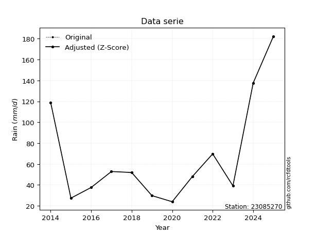</img>

</div>

> If Z-Score is active, values out of range or outliers are replaced with the station mean value.


### 4. Active continuous probability distributions from SciPy (45 of 104 available)

[scipy.stats](https://docs.scipy.org/doc/scipy/reference/stats.html) is a Python´s powerful submodule within the SciPy library for comprehensive statistical analysis, offering over 130 probability distributions (like Normal, Poisson), functions for descriptive stats (mean, variance), hypothesis testing (t-tests, chi-square), random variable generation, and statistical tests, making it essential for data science, modeling, and research. It provides tools to explore, model, and draw conclusions from data efficiently, working seamlessly with NumPy.

<div align="center">

|   id | p_dist             |   n_parameter | fit_method   | label                                                                       | active   | ref                                                                                                        |
|-----:|:-------------------|--------------:|:-------------|:----------------------------------------------------------------------------|:---------|:-----------------------------------------------------------------------------------------------------------|
|    0 | alpha              |             3 | MLE          | Alpha                                                                       | True     | [:mortar_board:](https://docs.scipy.org/doc/scipy/reference/generated/scipy.stats.alpha.html)              |
|    1 | betaprime          |             4 | MLE          | Beta prime                                                                  | True     | [:mortar_board:](https://docs.scipy.org/doc/scipy/reference/generated/scipy.stats.betaprime.html)          |
|    2 | chi2               |             3 | MLE          | Chi²                                                                        | True     | [:mortar_board:](https://docs.scipy.org/doc/scipy/reference/generated/scipy.stats.chi2.html)               |
|    3 | crystalball        |             4 | MLE          | Crystalball                                                                 | True     | [:mortar_board:](https://docs.scipy.org/doc/scipy/reference/generated/scipy.stats.crystalball.html)        |
|    4 | erlang             |             3 | MLE          | Erlang                                                                      | True     | [:mortar_board:](https://docs.scipy.org/doc/scipy/reference/generated/scipy.stats.erlang.html)             |
|    5 | expon              |             2 | MLE          | Exponential                                                                 | True     | [:mortar_board:](https://docs.scipy.org/doc/scipy/reference/generated/scipy.stats.expon.html)              |
|    6 | exponnorm          |             3 | MLE          | Exponentially modified Normal                                               | True     | [:mortar_board:](https://docs.scipy.org/doc/scipy/reference/generated/scipy.stats.exponnorm.html)          |
|    7 | f                  |             4 | MLE          | F                                                                           | True     | [:mortar_board:](https://docs.scipy.org/doc/scipy/reference/generated/scipy.stats.f.html)                  |
|    8 | fatiguelife        |             3 | MLE          | Fatigue-life (Birnbaum-Saunders)                                            | True     | [:mortar_board:](https://docs.scipy.org/doc/scipy/reference/generated/scipy.stats.fatiguelife.html)        |
|    9 | fisk               |             3 | MLE          | Fisk                                                                        | True     | [:mortar_board:](https://docs.scipy.org/doc/scipy/reference/generated/scipy.stats.fisk.html)               |
|   10 | gamma              |             3 | MLE          | Gamma                                                                       | True     | [:mortar_board:](https://docs.scipy.org/doc/scipy/reference/generated/scipy.stats.gamma.html)              |
|   11 | genexpon           |             5 | MLE          | Generalized exponential                                                     | True     | [:mortar_board:](https://docs.scipy.org/doc/scipy/reference/generated/scipy.stats.genexpon.html)           |
|   12 | genlogistic        |             3 | MLE          | Generalized logistic                                                        | True     | [:mortar_board:](https://docs.scipy.org/doc/scipy/reference/generated/scipy.stats.genlogistic.html)        |
|   13 | gibrat             |             2 | MM           | Gibrat                                                                      | True     | [:mortar_board:](https://docs.scipy.org/doc/scipy/reference/generated/scipy.stats.gibrat.html)             |
|   14 | gompertz           |             3 | MLE          | Gompertz (or truncated Gumbel)                                              | True     | [:mortar_board:](https://docs.scipy.org/doc/scipy/reference/generated/scipy.stats.gompertz.html)           |
|   15 | gumbel_l           |             2 | MM           | Gumbel Left Skew                                                            | True     | [:mortar_board:](https://docs.scipy.org/doc/scipy/reference/generated/scipy.stats.gumbel_l.html)           |
|   16 | gumbel_r           |             2 | MM           | Gumbel Right Skew                                                           | True     | [:mortar_board:](https://docs.scipy.org/doc/scipy/reference/generated/scipy.stats.gumbel_r.html)           |
|   17 | halflogistic       |             2 | MM           | Half-logistic                                                               | True     | [:mortar_board:](https://docs.scipy.org/doc/scipy/reference/generated/scipy.stats.halflogistic.html)       |
|   18 | halfnorm           |             2 | MM           | Half Normal                                                                 | True     | [:mortar_board:](https://docs.scipy.org/doc/scipy/reference/generated/scipy.stats.halfnorm.html)           |
|   19 | hypsecant          |             2 | MM           | hyperbolic secant                                                           | True     | [:mortar_board:](https://docs.scipy.org/doc/scipy/reference/generated/scipy.stats.hypsecant.html)          |
|   20 | invgamma           |             3 | MLE          | Inverted gamma                                                              | True     | [:mortar_board:](https://docs.scipy.org/doc/scipy/reference/generated/scipy.stats.invgamma.html)           |
|   21 | invgauss           |             3 | MLE          | Inverse Gaussian                                                            | True     | [:mortar_board:](https://docs.scipy.org/doc/scipy/reference/generated/scipy.stats.invgauss.html)           |
|   22 | invweibull         |             3 | MLE          | Inverted Weibull                                                            | True     | [:mortar_board:](https://docs.scipy.org/doc/scipy/reference/generated/scipy.stats.invweibull.html)         |
|   23 | johnsonsu          |             4 | MLE          | Johnson Su                                                                  | True     | [:mortar_board:](https://docs.scipy.org/doc/scipy/reference/generated/scipy.stats.johnsonsu.html)          |
|   24 | kstwobign          |             2 | MLE          | Limiting distribution of scaled Kolmogorov-Smirnov two-sided test statistic | True     | [:mortar_board:](https://docs.scipy.org/doc/scipy/reference/generated/scipy.stats.kstwobign.html)          |
|   25 | laplace            |             2 | MM           | Laplace                                                                     | True     | [:mortar_board:](https://docs.scipy.org/doc/scipy/reference/generated/scipy.stats.laplace.html)            |
|   26 | laplace_asymmetric |             3 | MLE          | Asymmetric Laplace                                                          | True     | [:mortar_board:](https://docs.scipy.org/doc/scipy/reference/generated/scipy.stats.laplace_asymmetric.html) |
|   27 | loggamma           |             3 | MLE          | Log gamma                                                                   | True     | [:mortar_board:](https://docs.scipy.org/doc/scipy/reference/generated/scipy.stats.loggamma.html)           |
|   28 | logistic           |             2 | MM           | Logistic (or Sech-squared)                                                  | True     | [:mortar_board:](https://docs.scipy.org/doc/scipy/reference/generated/scipy.stats.logistic.html)           |
|   29 | lognorm            |             3 | MLE          | Log Normal                                                                  | True     | [:mortar_board:](https://docs.scipy.org/doc/scipy/reference/generated/scipy.stats.lognorm.html)            |
|   30 | maxwell            |             2 | MM           | Maxwell                                                                     | True     | [:mortar_board:](https://docs.scipy.org/doc/scipy/reference/generated/scipy.stats.maxwell.html)            |
|   31 | mielke             |             4 | MLE          | Mielke Beta-Kappa / Dagum                                                   | True     | [:mortar_board:](https://docs.scipy.org/doc/scipy/reference/generated/scipy.stats.mielke.html)             |
|   32 | moyal              |             2 | MM           | Moyal                                                                       | True     | [:mortar_board:](https://docs.scipy.org/doc/scipy/reference/generated/scipy.stats.moyal.html)              |
|   33 | nakagami           |             3 | MLE          | Nakagami                                                                    | True     | [:mortar_board:](https://docs.scipy.org/doc/scipy/reference/generated/scipy.stats.nakagami.html)           |
|   34 | ncf                |             5 | MLE          | Non-central F distribution                                                  | True     | [:mortar_board:](https://docs.scipy.org/doc/scipy/reference/generated/scipy.stats.ncf.html)                |
|   35 | nct                |             4 | MLE          | Non-central Student’s t                                                     | True     | [:mortar_board:](https://docs.scipy.org/doc/scipy/reference/generated/scipy.stats.nct.html)                |
|   36 | norm               |             2 | MM           | Normal                                                                      | True     | [:mortar_board:](https://docs.scipy.org/doc/scipy/reference/generated/scipy.stats.norm.html)               |
|   37 | pareto             |             3 | MLE          | Pareto                                                                      | True     | [:mortar_board:](https://docs.scipy.org/doc/scipy/reference/generated/scipy.stats.pareto.html)             |
|   38 | pearson3           |             3 | MM           | Pearson type III                                                            | True     | [:mortar_board:](https://docs.scipy.org/doc/scipy/reference/generated/scipy.stats.pearson3.html)           |
|   39 | rayleigh           |             2 | MM           | Rayleigh                                                                    | True     | [:mortar_board:](https://docs.scipy.org/doc/scipy/reference/generated/scipy.stats.rayleigh.html)           |
|   40 | rice               |             3 | MLE          | Rice                                                                        | True     | [:mortar_board:](https://docs.scipy.org/doc/scipy/reference/generated/scipy.stats.rice.html)               |
|   41 | t                  |             3 | MLE          | Student’s t                                                                 | True     | [:mortar_board:](https://docs.scipy.org/doc/scipy/reference/generated/scipy.stats.t.html)                  |
|   42 | truncnorm          |             4 | MLE          | Truncated normal                                                            | True     | [:mortar_board:](https://docs.scipy.org/doc/scipy/reference/generated/scipy.stats.truncnorm.html)          |
|   43 | wald               |             2 | MM           | Wald                                                                        | True     | [:mortar_board:](https://docs.scipy.org/doc/scipy/reference/generated/scipy.stats.wald.html)               |
|   44 | weibull_min        |             3 | MLE          | Weibull minimum                                                             | True     | [:mortar_board:](https://docs.scipy.org/doc/scipy/reference/generated/scipy.stats.weibull_min.html)        |

</div>

> **n_parameter:** # arguments & localization & scale.
>
> **Fit methods:** (MLE) maximum likelihood, (MM) L-moments.
>
>**Inactive:** foldnorm, gennorm, norminvgauss, powernorm, powerlognorm, skewnorm, genextreme, anglit, arcsine, argus, beta, bradford, burr, burr12, cauchy, cosine, halfcauchy, foldcauchy, skewcauchy, wrapcauchy, dgamma, gengamma, exponweib, exponpow, truncexpon, gausshyper, genhalflogistic, genhyperbolic, geninvgauss, halfgennorm, johnsonsb, kappa4, kappa3, ksone, kstwo, loglaplace, levy, levy_l, levy_stable, ncx2, genpareto, truncpareto, lomax, powerlaw, rdist, rel_breitwigner, recipinvgauss, semicircular, studentized_range, trapezoid, triang, truncweibull_min, tukeylambda, uniform, loguniform, vonmises, vonmises_line, weibull_max, dweibull, 


## B. Probability distributions vs. Empirical distributions

A continuous probability distribution (CPD) describes probabilities for variables that can take any value within a range (like rain any time), unlike discrete variables with specific outcomes (like temperature). It uses a Probability Density Function (PDF), a curve where the total area under it equals 1, and the probability of the variable falling within an interval (a to b) is found by calculating the area under the curve between those points. A key feature is that the probability of hitting any single exact value is zero, so probabilities are always expressed for ranges, e.g., $P(a ≤ X ≤ b)$.

<div align="center">

Distributions parameters
|    |   station | p_dist                |   n |              loc |          scale | shape                  | shape1             | shape2               | shape3   |
|---:|----------:|:----------------------|----:|-----------------:|---------------:|:-----------------------|:-------------------|:---------------------|:---------|
|  0 |  23085270 | alpha                 |  12 |     -0.766641    |   87.5831      | 1.7889527145003654     |                    |                      |          |
|  1 |  23085270 | betaprime             |  12 |     -0.479607    |    0.916903    | 190.04930742165828     | 3.736674893992517  |                      |          |
|  2 |  23085270 | chi2                  |  12 |     23.955       |   22.0867      | 1.6042261770194068     |                    |                      |          |
|  3 |  23085270 | crystalball           |  12 |     62.3886      |   37.2564      | 2940.7090191182433     | 10534.463586405062 |                      |          |
|  4 |  23085270 | erlang                |  12 |     23.955       |   36.4101      | 0.6970605734365128     |                    |                      |          |
|  5 |  23085270 | expon                 |  12 |     23.955       |   38.4336      |                        |                    |                      |          |
|  6 |  23085270 | exponnorm             |  12 |     23.9227      |    0.0101251   | 3763.805130903167      |                    |                      |          |
|  7 |  23085270 | f                     |  12 |     17.3386      |   25.5231      | 11.876684082465879     | 3.6617340099530296 |                      |          |
|  8 |  23085270 | fatiguelife           |  12 |     20.328       |   25.1173      | 1.145468429377188      |                    |                      |          |
|  9 |  23085270 | fisk                  |  12 |     23.0783      |   23.2747      | 1.306717961004824      |                    |                      |          |
| 10 |  23085270 | gamma                 |  12 |     23.955       |   52.8376      | 0.6816851552883272     |                    |                      |          |
| 11 |  23085270 | genexpon              |  12 |     23.955       |   77.9245      | 2.005814849575514      | 0.3284872839320253 | 0.1518215262796081   |          |
| 12 |  23085270 | genlogistic           |  12 |   -136.593       |   25.4346      | 1299.9368092503205     |                    |                      |          |
| 13 |  23085270 | gibrat                |  12 |     33.9666      |   17.2388      |                        |                    |                      |          |
| 14 |  23085270 | gompertz              |  12 |     23.955       |  781.98        | 19.38487561408484      |                    |                      |          |
| 15 |  23085270 | gumbel_l              |  12 |     79.1559      |   29.0487      |                        |                    |                      |          |
| 16 |  23085270 | gumbel_r              |  12 |     45.6212      |   29.0487      |                        |                    |                      |          |
| 17 |  23085270 | halflogistic          |  12 |     18.2311      |   31.8529      |                        |                    |                      |          |
| 18 |  23085270 | halfnorm              |  12 |     13.0757      |   61.8045      |                        |                    |                      |          |
| 19 |  23085270 | hypsecant             |  12 |     62.3886      |   23.7181      |                        |                    |                      |          |
| 20 |  23085270 | invgamma              |  12 |     12.6903      |   58.5974      | 2.0358424313596846     |                    |                      |          |
| 21 |  23085270 | invgauss              |  12 |     17.92        |   37.1478      | 1.1970712907273506     |                    |                      |          |
| 22 |  23085270 | invweibull            |  12 |      8.5143      |   30.8294      | 1.7234423995668793     |                    |                      |          |
| 23 |  23085270 | johnsonsu             |  12 |     21.0692      |    0.143568    | -5.348893842820415     | 0.9134363880919476 |                      |          |
| 24 |  23085270 | kstwobign             |  12 |    -44.8943      |  123.619       |                        |                    |                      |          |
| 25 |  23085270 | laplace               |  12 |     62.3886      |   26.3442      |                        |                    |                      |          |
| 26 |  23085270 | laplace_asymmetric    |  12 |     23.955       |    0.00602435  | 0.00015673509175183627 |                    |                      |          |
| 27 |  23085270 | loggamma              |  12 | -12844           | 1700.86        | 1974.8667990907943     |                    |                      |          |
| 28 |  23085270 | logistic              |  12 |     62.3886      |   20.5405      |                        |                    |                      |          |
| 29 |  23085270 | lognorm               |  12 |     23.955       |    1.23406     | 10.147340285164008     |                    |                      |          |
| 30 |  23085270 | maxwell               |  12 |    -25.8934      |   55.3225      |                        |                    |                      |          |
| 31 |  23085270 | mielke                |  12 |     -0.785967    |    4.5693      | 279.8141831791604      | 2.1988268892001868 |                      |          |
| 32 |  23085270 | moyal                 |  12 |     41.083       |   16.7713      |                        |                    |                      |          |
| 33 |  23085270 | nakagami              |  12 |     23.955       |   62.7289      | 0.30092121417048145    |                    |                      |          |
| 34 |  23085270 | ncf                   |  12 |     -0.188169    |    9.80536e-07 | 1.2140703094333604e-06 | 8.996937163762512  | 60.48076480535972    |          |
| 35 |  23085270 | nct                   |  12 |     -0.277301    |    0.905511    | 2.261664313242104      | 45.70622857610368  |                      |          |
| 36 |  23085270 | norm                  |  12 |     62.3886      |   37.2564      |                        |                    |                      |          |
| 37 |  23085270 | pareto                |  12 |     23.9548      |    0.000159364 | 0.09092119914844957    |                    |                      |          |
| 38 |  23085270 | pearson3              |  12 |     62.3886      |   37.2564      | 0.9009017512268485     |                    |                      |          |
| 39 |  23085270 | rayleigh              |  12 |     -8.88504     |   56.8681      |                        |                    |                      |          |
| 40 |  23085270 | rice                  |  12 |      3.65675     |   49.1806      | 0.0003885491499065095  |                    |                      |          |
| 41 |  23085270 | t                     |  12 |     62.3891      |   37.2566      | 53803300.93285986      |                    |                      |          |
| 42 |  23085270 | truncnorm             |  12 |     62.3886      |   37.2564      | -708.676427708381      | 2658.416383446649  |                      |          |
| 43 |  23085270 | wald                  |  12 |     25.1322      |   37.2564      |                        |                    |                      |          |
| 44 |  23085270 | weibull_min           |  12 |     23.955       |   39.4837      | 0.8727238640115231     |                    |                      |          |
| 45 |  23085270 | logalpha              |  12 |      0.277227    |   24.3219      | 6.739332218730638      |                    |                      |          |
| 46 |  23085270 | logbetaprime          |  12 |      1.8299      |    0.402509    | 86.63285658112551      | 17.210685280125134 |                      |          |
| 47 |  23085270 | logchi2               |  12 |      3.17618     |    0.988482    | 1.0376315718039288     |                    |                      |          |
| 48 |  23085270 | logcrystalball        |  12 |      3.96903     |    0.563583    | 7.79800739724092       | 29.18955020669892  |                      |          |
| 49 |  23085270 | logerlang             |  12 |      3.13922     |    0.576057    | 1.4404858529238322     |                    |                      |          |
| 50 |  23085270 | logexpon              |  12 |      3.17618     |    0.792852    |                        |                    |                      |          |
| 51 |  23085270 | logexponnorm          |  12 |      3.36818     |    0.251029    | 2.3935264368631195     |                    |                      |          |
| 52 |  23085270 | logf                  |  12 |      2.88854     |    0.977726    | 8.224814258638851      | 29.123868189658083 |                      |          |
| 53 |  23085270 | logfatiguelife        |  12 |      2.64893     |    1.19335     | 0.46036362017291166    |                    |                      |          |
| 54 |  23085270 | logfisk               |  12 |      2.72406     |    1.13252     | 3.4441008989127173     |                    |                      |          |
| 55 |  23085270 | loggamma              |  12 |      3.13923     |    0.576075    | 1.4404486079873364     |                    |                      |          |
| 56 |  23085270 | loggenexpon           |  12 |      3.17552     |    0.00866657  | 0.006191632762401179   | 1.3762156742590883 | 4.97988030575747e-05 |          |
| 57 |  23085270 | loggenlogistic        |  12 |      0.833171    |    0.463364    | 485.9307859358354      |                    |                      |          |
| 58 |  23085270 | loggibrat             |  12 |      3.53909     |    0.260769    |                        |                    |                      |          |
| 59 |  23085270 | loggompertz           |  12 |      3.17618     |    1.12789     | 0.7703664444160816     |                    |                      |          |
| 60 |  23085270 | loggumbel_l           |  12 |      4.22267     |    0.439424    |                        |                    |                      |          |
| 61 |  23085270 | loggumbel_r           |  12 |      3.71539     |    0.439424    |                        |                    |                      |          |
| 62 |  23085270 | loghalflogistic       |  12 |      3.30108     |    0.481821    |                        |                    |                      |          |
| 63 |  23085270 | loghalfnorm           |  12 |      3.22304     |    0.934952    |                        |                    |                      |          |
| 64 |  23085270 | loghypsecant          |  12 |      3.96903     |    0.358788    |                        |                    |                      |          |
| 65 |  23085270 | loginvgamma           |  12 |      1.64178     |   38.1822      | 17.392028792535676     |                    |                      |          |
| 66 |  23085270 | loginvgauss           |  12 |      2.56177     |    7.46028     | 0.18863295908211575    |                    |                      |          |
| 67 |  23085270 | loginvweibull         |  12 |     -1.1331e+07  |    1.1331e+07  | 24413325.686717033     |                    |                      |          |
| 68 |  23085270 | logjohnsonsu          |  12 |      5.24595e+07 |    4.08179e+07 | 124007493.89511043     | 115959855.25832532 |                      |          |
| 69 |  23085270 | logkstwobign          |  12 |      2.0803      |    2.16249     |                        |                    |                      |          |
| 70 |  23085270 | loglaplace            |  12 |      3.96903     |    0.398513    |                        |                    |                      |          |
| 71 |  23085270 | loglaplace_asymmetric |  12 |      3.87378     |    0.453491    | 0.900409605733544      |                    |                      |          |
| 72 |  23085270 | logloggamma           |  12 |   -198.004       |   26.3493      | 2133.1612289179543     |                    |                      |          |
| 73 |  23085270 | loglogistic           |  12 |      3.96903     |    0.31072     |                        |                    |                      |          |
| 74 |  23085270 | loglognorm            |  12 |      3.17618     |    0.0365286   | 9.68973061657254       |                    |                      |          |
| 75 |  23085270 | logmaxwell            |  12 |      2.63357     |    0.836872    |                        |                    |                      |          |
| 76 |  23085270 | logmielke             |  12 |   -338.375       |  339.741       | 117860.84540272073     | 740.4343110604608  |                      |          |
| 77 |  23085270 | logmoyal              |  12 |      3.64674     |    0.253701    |                        |                    |                      |          |
| 78 |  23085270 | lognakagami           |  12 |      3.17618     |    1.21977     | 0.2391788891200547     |                    |                      |          |
| 79 |  23085270 | logncf                |  12 |     -0.544406    |    4.46657     | 414.84210162822365     | 190.6839625873423  | 0.001332557326036317 |          |
| 80 |  23085270 | lognct                |  12 |     -0.478865    |    0.134834    | 35.006440525518315     | 32.27613573683564  |                      |          |
| 81 |  23085270 | lognorm               |  12 |      3.96903     |    0.563583    |                        |                    |                      |          |
| 82 |  23085270 | logpareto             |  12 |      3.17617     |    4.13676e-06 | 0.09091855919387964    |                    |                      |          |
| 83 |  23085270 | logpearson3           |  12 |      3.96903     |    0.563584    | 0.37042338050465795    |                    |                      |          |
| 84 |  23085270 | lograyleigh           |  12 |      2.89086     |    0.860253    |                        |                    |                      |          |
| 85 |  23085270 | logrice               |  12 |      2.9561      |    0.771815    | 0.5055455196930234     |                    |                      |          |
| 86 |  23085270 | logt                  |  12 |      3.96903     |    0.563583    | 24816636514.74559      |                    |                      |          |
| 87 |  23085270 | logtruncnorm          |  12 |     -0.132966    |    1.90706     | 1.735204862598556      | 12.312372860022782 |                      |          |
| 88 |  23085270 | logwald               |  12 |      3.40543     |    0.563602    |                        |                    |                      |          |
| 89 |  23085270 | logweibull_min        |  12 |      3.13361     |    0.908188    | 1.3777586562146806     |                    |                      |          |

</div>

> **loc** (Location parameter): This shifts the distribution along the x-axis. For many common distributions, like the normal (Gaussian) distribution, loc represents the mean $μ$. For others, like the uniform distribution, it might represent the minimum value, or for the beta distribution, the left end of the support interval.
>
> **scale** (Scale parameter): This determines the width or spread of the distribution. For the normal distribution, scale represents the standard deviation $σ$. For a uniform distribution, it defines the length of the interval (from $loc$ to $loc + scale$).
>
> **shape** (Shape parameters): Refers to parameters that define the specific form of a probability distribution, distinct from its location (loc) and scale (scale). These parameters are required arguments for most distribution functions. For example, a normal (Gaussian) distribution is fully defined by its location (mean) and scale (standard deviation), so it has no specific shape parameters beyond loc and scale. However, other distributions have intrinsic properties that need specification, as Gamma distribution that takes a shape parameter, often named $a$ or $alpha$.


### 0. Cumulative distribution values - CDF (90 evaluated)

> Ordered by x ascending and calculating $log(f(x))$ separately. 

|   id |   Station |   date |       x |   count |    mean |    std |    zscore |   Value_initial |   station |   m |     alpha |   alpha_pdf |   betaprime |   betaprime_pdf |        chi2 |    chi2_pdf |   crystalball |   crystalball_pdf |      erlang |     erlang_pdf |     expon |   expon_pdf |   exponnorm |   exponnorm_pdf |         f |      f_pdf |   fatiguelife |   fatiguelife_pdf |      fisk |   fisk_pdf |       gamma |     gamma_pdf |   genexpon |   genexpon_pdf |   genlogistic |   genlogistic_pdf |    gibrat |   gibrat_pdf |    gompertz |   gompertz_pdf |   gumbel_l |   gumbel_l_pdf |   gumbel_r |   gumbel_r_pdf |   halflogistic |   halflogistic_pdf |   halfnorm |   halfnorm_pdf |   hypsecant |   hypsecant_pdf |   invgamma |   invgamma_pdf |   invgauss |   invgauss_pdf |   invweibull |   invweibull_pdf |   johnsonsu |   johnsonsu_pdf |   kstwobign |   kstwobign_pdf |   laplace |   laplace_pdf |   laplace_asymmetric |   laplace_asymmetric_pdf |   loggamma |   loggamma_pdf |   logistic |   logistic_pdf |   lognorm |   lognorm_pdf |   maxwell |   maxwell_pdf |      mielke |   mielke_pdf |     moyal |   moyal_pdf |    nakagami |   nakagami_pdf |       ncf |    ncf_pdf |       nct |    nct_pdf |     norm |   norm_pdf |   pareto |    pareto_pdf |   pearson3 |   pearson3_pdf |   rayleigh |   rayleigh_pdf |      rice |   rice_pdf |        t |      t_pdf |   truncnorm |   truncnorm_pdf |        wald |    wald_pdf |   weibull_min |   weibull_min_pdf |   logalpha |   logalpha_pdf |   logbetaprime |   logbetaprime_pdf |     logchi2 |   logchi2_pdf |   logcrystalball |   logcrystalball_pdf |   logerlang |   logerlang_pdf |   logexpon |   logexpon_pdf |   logexponnorm |   logexponnorm_pdf |      logf |   logf_pdf |   logfatiguelife |   logfatiguelife_pdf |   logfisk |   logfisk_pdf |   loggenexpon |   loggenexpon_pdf |   loggenlogistic |   loggenlogistic_pdf |   loggibrat |   loggibrat_pdf |   loggompertz |   loggompertz_pdf |   loggumbel_l |   loggumbel_l_pdf |   loggumbel_r |   loggumbel_r_pdf |   loghalflogistic |   loghalflogistic_pdf |   loghalfnorm |   loghalfnorm_pdf |   loghypsecant |   loghypsecant_pdf |   loginvgamma |   loginvgamma_pdf |   loginvgauss |   loginvgauss_pdf |   loginvweibull |   loginvweibull_pdf |   logjohnsonsu |   logjohnsonsu_pdf |   logkstwobign |   logkstwobign_pdf |   loglaplace |   loglaplace_pdf |   loglaplace_asymmetric |   loglaplace_asymmetric_pdf |   logloggamma |   logloggamma_pdf |   loglogistic |   loglogistic_pdf |   loglognorm |   loglognorm_pdf |   logmaxwell |   logmaxwell_pdf |   logmielke |   logmielke_pdf |   logmoyal |   logmoyal_pdf |   lognakagami |   lognakagami_pdf |    logncf |   logncf_pdf |   lognct |   lognct_pdf |   logpareto |   logpareto_pdf |   logpearson3 |   logpearson3_pdf |   lograyleigh |   lograyleigh_pdf |   logrice |   logrice_pdf |      logt |   logt_pdf |   logtruncnorm |   logtruncnorm_pdf |   logwald |   logwald_pdf |   logweibull_min |   logweibull_min_pdf |
|-----:|----------:|-------:|--------:|--------:|--------:|-------:|----------:|----------------:|----------:|----:|----------:|------------:|------------:|----------------:|------------:|------------:|--------------:|------------------:|------------:|---------------:|----------:|------------:|------------:|----------------:|----------:|-----------:|--------------:|------------------:|----------:|-----------:|------------:|--------------:|-----------:|---------------:|--------------:|------------------:|----------:|-------------:|------------:|---------------:|-----------:|---------------:|-----------:|---------------:|---------------:|-------------------:|-----------:|---------------:|------------:|----------------:|-----------:|---------------:|-----------:|---------------:|-------------:|-----------------:|------------:|----------------:|------------:|----------------:|----------:|--------------:|---------------------:|-------------------------:|-----------:|---------------:|-----------:|---------------:|----------:|--------------:|----------:|--------------:|------------:|-------------:|----------:|------------:|------------:|---------------:|----------:|-----------:|----------:|-----------:|---------:|-----------:|---------:|--------------:|-----------:|---------------:|-----------:|---------------:|----------:|-----------:|---------:|-----------:|------------:|----------------:|------------:|------------:|--------------:|------------------:|-----------:|---------------:|---------------:|-------------------:|------------:|--------------:|-----------------:|---------------------:|------------:|----------------:|-----------:|---------------:|---------------:|-------------------:|----------:|-----------:|-----------------:|---------------------:|----------:|--------------:|--------------:|------------------:|-----------------:|---------------------:|------------:|----------------:|--------------:|------------------:|--------------:|------------------:|--------------:|------------------:|------------------:|----------------------:|--------------:|------------------:|---------------:|-------------------:|--------------:|------------------:|--------------:|------------------:|----------------:|--------------------:|---------------:|-------------------:|---------------:|-------------------:|-------------:|-----------------:|------------------------:|----------------------------:|--------------:|------------------:|--------------:|------------------:|-------------:|-----------------:|-------------:|-----------------:|------------:|----------------:|-----------:|---------------:|--------------:|------------------:|----------:|-------------:|---------:|-------------:|------------:|----------------:|--------------:|------------------:|--------------:|------------------:|----------:|--------------:|----------:|-----------:|---------------:|-------------------:|----------:|--------------:|-----------------:|---------------------:|
|    0 |  23085270 |   2020 |  23.955 |      12 | 62.3886 | 38.913 | -0.987679 |          23.955 |  23085270 |   1 | 0.0412495 | 0.0127511   |   0.0622901 |      0.0118174  | 1.32105e-13 | 29.826      |      0.15113  |        0.0062896  | 7.61154e-12 | 1493.42        | 0         |  0.0260189  | 0.000847804 |      0.0261997  | 0.0332266 | 0.0147402  |      0.024672 |        0.020949   | 0.0135907 | 0.0199817  | 1.67473e-11 | 1606.71       | 1.1742e-13 |     0.0257405  |     0.0947989 |        0.00877324 | 0         |  0           | 1.32105e-15 |     0.0247895  |   0.138883 |    0.00443251  |   0.12145  |     0.00881442 |      0.0896077 |         0.0155711  |   0.139727 |     0.0127114  |    0.124327 |      0.00510959 |   0.035911 |     0.0138156  |  0.0288603 |     0.0164593  |    0.0371548 |       0.013655   |   0.0241796 |      0.0179666  |   0.0843312 |      0.00851828 |  0.116246 |    0.00441258 |          2.47646e-08 |               0.0260169  |  0.0144391 |       0.548198 |   0.133413 |     0.00562859 | 0.0797425 |      0.263145 |  0.153379 |    0.00780254 |   0.0466469 |    0.0125554 | 0.0956438 |  0.00988902 | 1.29427e-10 | 21925.4        | 0.0728157 | 0.0114463  | 0.0478297 | 0.0125385  | 0.15113  | 0.0062896  | 0        | 570.526       |   0.135846 |     0.00892993 |   0.15358  |     0.00859511 | 0.0816461 | 0.00770692 | 0.151129 | 0.00628951 |    0.15113  |      0.0062896  | 0           | 0           |   9.91738e-15 |        2.4362     |  0.0494128 |       0.295686 |      0.0471768 |           0.301152 | 8.57792e-09 |   1.00213e+07 |        0.0797425 |             0.263145 |   0.0144399 |        0.548188 |   0        |       1.26127  |      0.0442241 |           0.296166 | 0.0356152 |   0.372036 |        0.0340665 |             0.337687 | 0.0405995 |      0.296717 |   0.000471516 |          0.714692 |        0.0457547 |             0.303609 |    0        |       0         |   8.21929e-09 |          0.683013 |     0.0882692 |         0.191736  |     0.0329994 |          0.256176 |        0          |              0        |     0         |          0        |      0.0695729 |           0.192371 |     0.0478373 |          0.305492 |     0.0359946 |          0.329358 |       0.0455442 |            0.303123 |      0.0833065 |           0.267401 |      0.0405473 |           0.318491 |    0.0683802 |         0.171588 |               0.0811071 |                    0.198632 |     0.0834052 |          0.266213 |     0.0723148 |          0.215903 |  0.000472042 |      3.91571e+11 |    0.0639998 |         0.324819 |   0.0459014 |        0.303661 |  0.0114748 |       0.162825 |   3.21892e-08 |       3.46731e+07 | 0.0659318 |     0.284088 | 0.059256 |     0.288854 |    0        |   21978.2       |     0.0683068 |          0.286365 |     0.0535154 |          0.36491  | 0.0351493 |      0.313797 | 0.0797423 |   0.263145 |    1.78542e-11 |           1.12261  |  0        |     0         |        0.0146431 |             0.470452 |
|    1 |  23085270 |   2015 |  27.39  |      12 | 62.3886 | 38.913 | -0.899406 |          27.39  |  23085270 |   2 | 0.0967087 | 0.0191062   |   0.108779  |      0.015064   | 0.133648    |  0.0298824  |      0.173763 |        0.00688785 | 0.20442     |    0.039224    | 0.0854974 |  0.0237944  | 0.0869679   |      0.0239584  | 0.0985745 | 0.0222499  |      0.118305 |        0.029576   | 0.0994656 | 0.0271461  | 0.166984    |    0.0318758  | 0.0846666  |     0.0235869  |     0.127632  |        0.010322   | 0         |  0           | 0.0817991   |     0.0228619  |   0.154895 |    0.00489614  |   0.153642 |     0.00990722 |      0.142786  |         0.0153771  |   0.183156 |     0.0125682  |    0.143097 |      0.00583207 |   0.096627 |     0.0207669  |  0.102821  |     0.0247582  |    0.0973768 |       0.0207086  |   0.104112  |      0.0261097  |   0.116173  |      0.00999086 |  0.132436 |    0.00502713 |          0.0854912   |               0.0237927  |  0.114674  |       0.852954 |   0.153959 |     0.0063414  | 0.121194  |      0.357427 |  0.181247 |    0.00841363 |   0.0992706 |    0.0177334 | 0.132543  |  0.0115438  | 0.135134    |     0.0236602  | 0.116859  | 0.0140659  | 0.100009  | 0.017504   | 0.173763 | 0.00688785 | 0.596366 |   0.0106833   |   0.167983 |     0.00975965 |   0.184085 |     0.00915198 | 0.109915  | 0.00873375 | 0.173761 | 0.00688776 |    0.173763 |      0.00688785 | 0.000128596 | 0.000494256 |   0.111934    |        0.0267842  |  0.100291  |       0.46501  |      0.0992539 |           0.476351 | 0.272696    |   1.00952     |        0.121194  |             0.357427 |   0.114673  |        0.85295  |   0.155501 |       1.06514  |      0.0983117 |           0.516474 | 0.103916  |   0.635007 |        0.0966003 |             0.586763 | 0.0937623 |      0.499297 |   0.0992037   |          0.754193 |        0.0990931 |             0.493196 |    0        |       0         |   0.0926101   |          0.697943 |     0.117821  |         0.25167   |     0.0808907 |          0.462907 |        0.00943767 |              1.03764  |     0.0742532 |          0.849698 |      0.100632  |           0.275829 |     0.100674  |          0.483307 |     0.0962903 |          0.564444 |       0.0988236 |            0.492788 |      0.125197  |           0.359521 |      0.0972131 |           0.523919 |    0.0957113 |         0.240171 |               0.112611  |                    0.275786 |     0.125113  |          0.358043 |     0.107129  |          0.307843 |  0.553353    |      0.304497    |    0.115954  |         0.449461 |   0.0992425 |        0.49324  |  0.0522366 |       0.463878 |   0.271591    |       0.967272    | 0.112065  |     0.406059 | 0.107089 |     0.426617 |    0.611031 |       0.263905  |     0.114486  |          0.404252 |     0.112011  |          0.50315  | 0.0884828 |      0.477193 | 0.121194  |   0.357427 |    0.141509    |           0.991302 |  0        |     0         |        0.0994286 |             0.735919 |
|    2 |  23085270 |   2019 |  29.783 |      12 | 62.3886 | 38.913 | -0.837909 |          29.783 |  23085270 |   3 | 0.145897  | 0.0217412   |   0.146811  |      0.0166235  | 0.199465    |  0.025495   |      0.190741 |        0.00730117 | 0.287849    |    0.0312936   | 0.140701  |  0.022358   | 0.142537    |      0.0225002  | 0.154508  | 0.024123   |      0.187468 |        0.0278739  | 0.164339  | 0.0267654  | 0.235162    |    0.025746   | 0.139425   |     0.0221926  |     0.153526  |        0.0113028  | 0         |  0           | 0.134989    |     0.0216036  |   0.16702  |    0.00524028  |   0.178172 |     0.0105804  |      0.17937   |         0.0151921  |   0.213089 |     0.0124466  |    0.157702 |      0.00638033 |   0.149331 |     0.0229557  |  0.163638  |     0.0256458  |    0.150153  |       0.0230702  |   0.167209  |      0.0262425  |   0.141183  |      0.0108922  |  0.145029 |    0.00550515 |          0.140691    |               0.0223566  |  0.187631  |       0.879134 |   0.169753 |     0.00686141 | 0.153765  |      0.420578 |  0.201853 |    0.00880323 |   0.144608  |    0.0199619 | 0.16134   |  0.0124937  | 0.185683    |     0.0191367  | 0.152192  | 0.0153938  | 0.144685  | 0.0196486  | 0.190741 | 0.00730117 | 0.615308 |   0.00600133  |   0.191946 |     0.0102566  |   0.206398 |     0.00948893 | 0.1316    | 0.00938013 | 0.190739 | 0.00730107 |    0.190741 |      0.00730117 | 0.0119977   | 0.0112953   |   0.171636    |        0.0233579  |  0.143578  |       0.5669   |      0.143503  |           0.578    | 0.345894    |   0.766031    |        0.153765  |             0.420578 |   0.187631  |        0.879136 |   0.240166 |       0.958356 |      0.147464  |           0.65474  | 0.162211  |   0.749301 |        0.150829  |             0.701339 | 0.14082   |      0.622051 |   0.162892    |          0.764783 |        0.145123  |             0.603321 |    0        |       0         |   0.15131     |          0.703115 |     0.14074   |         0.296607  |     0.12515   |          0.591893 |        0.0960608  |              1.02815  |     0.145033  |          0.839258 |      0.126472  |           0.343297 |     0.145563  |          0.586251 |     0.148606  |          0.678994 |       0.14482   |            0.602909 |      0.157865  |           0.420756 |      0.145752  |           0.630935 |    0.118098  |         0.296347 |               0.138251  |                    0.338578 |     0.157658  |          0.419302 |     0.135775  |          0.377639 |  0.57309     |      0.185886    |    0.156645  |         0.520892 |   0.145282  |      inf        |  0.0998072 |       0.668023 |   0.342288    |       0.747295    | 0.149343  |     0.483715 | 0.146458 |     0.512681 |    0.627828 |       0.155385  |     0.151491  |          0.478993 |     0.157175  |          0.572953 | 0.132111  |      0.562074 | 0.153765  |   0.420578 |    0.221308    |           0.914847 |  0        |     0         |        0.163722  |             0.791326 |
|    3 |  23085270 |   2016 |  37.6   |      12 | 62.3886 | 38.913 | -0.637026 |          37.6   |  23085270 |   4 | 0.322585  | 0.0218149   |   0.285664  |      0.0180992  | 0.366003    |  0.0180506  |      0.252913 |        0.00858183 | 0.479294    |    0.0195116   | 0.298846  |  0.0182433  | 0.301556    |      0.0183275  | 0.337244  | 0.0213475  |      0.371144 |        0.0194389  | 0.350598  | 0.0204874  | 0.396485    |    0.0169377  | 0.296711   |     0.0181808  |     0.252001  |        0.0136489  | 0.0597352 |  0.0326724   | 0.289098    |     0.0179331  |   0.212722 |    0.00648211  |   0.267665 |     0.0121447  |      0.295002  |         0.0143311  |   0.308488 |     0.0119324  |    0.215267 |      0.00839985 |   0.328418 |     0.0214573  |  0.348102  |     0.0207717  |    0.331028  |       0.0216851  |   0.351822  |      0.0205048  |   0.235295  |      0.0129511  |  0.195129 |    0.00740688 |          0.298827    |               0.0182424  |  0.38387   |       0.780967 |   0.230265 |     0.00862895 | 0.271967  |      0.588813 |  0.274948 |    0.0098325  |   0.308645  |    0.020688  | 0.267249  |  0.0142617  | 0.309       |     0.0134807  | 0.281301  | 0.0170068  | 0.306258  | 0.0204303  | 0.252913 | 0.00858183 | 0.64394  |   0.00237252  |   0.277011 |     0.0113778  |   0.284008 |     0.0102916  | 0.211932  | 0.0110593  | 0.25291  | 0.00858173 |    0.252913 |      0.00858183 | 0.202801    | 0.0285477   |   0.326743    |        0.0170361  |  0.301035  |       0.754809 |      0.302239  |           0.752764 | 0.485485    |   0.479709    |        0.271967  |             0.588813 |   0.383871  |        0.780976 |   0.43369  |       0.714269 |      0.330855  |           0.861931 | 0.353274  |   0.840052 |        0.332562  |             0.810774 | 0.314274  |      0.822001 |   0.339971    |          0.743096 |        0.310947  |             0.782951 |    0.138454 |       2.51274   |   0.315145    |          0.697618 |     0.227252  |         0.453357  |     0.294409  |          0.819252 |        0.325885   |              0.927521 |     0.334307  |          0.777344 |      0.234227  |           0.595488 |     0.306372  |          0.761446 |     0.32696   |          0.805915 |       0.310535  |            0.782443 |      0.275365  |           0.582495 |      0.314263  |           0.776808 |    0.211951  |         0.531855 |               0.244655  |                    0.599164 |     0.274924  |          0.582235 |     0.249599  |          0.602793 |  0.602316    |      0.0883046   |    0.296608  |         0.664117 | nan         |      nan        |  0.298501  |       0.952282 |   0.482483    |       0.498607    | 0.284462  |     0.662001 | 0.289584 |     0.696743 |    0.651654 |       0.0702506 |     0.28473   |          0.651584 |     0.306591  |          0.689762 | 0.283203  |      0.712489 | 0.271967  |   0.588813 |    0.411702    |           0.724347 |  0.263697 |     1.79762   |        0.350427  |             0.782576 |
|    4 |  23085270 |   2023 |  39.149 |      12 | 62.3886 | 38.913 | -0.597219 |          39.149 |  23085270 |   5 | 0.355742  | 0.0209735   |   0.313566  |      0.0179069  | 0.393186    |  0.0170617  |      0.266388 |        0.00881492 | 0.508402    |    0.0180997   | 0.326543  |  0.0175226  | 0.329376    |      0.0175975  | 0.369468  | 0.0202528  |      0.400208 |        0.0181097  | 0.381315  | 0.0191823  | 0.421897    |    0.0158949  | 0.324323   |     0.0174753  |     0.273371  |        0.0139324  | 0.114701  |  0.0373852   | 0.316367    |     0.0172794  |   0.222969 |    0.00674816  |   0.286626 |     0.0123297  |      0.317039  |         0.0141194  |   0.326878 |     0.0118107  |    0.228611 |      0.00883114 |   0.360927 |     0.0205044  |  0.379346  |     0.0195751  |    0.363862  |       0.0206949  |   0.382626  |      0.0192762  |   0.255549  |      0.0131914  |  0.206946 |    0.00785545 |          0.326523    |               0.0175218  |  0.41486   |       0.754064 |   0.243902 |     0.00897806 | 0.296241  |      0.613399 |  0.290301 |    0.00998789 |   0.340262  |    0.0201116 | 0.289439  |  0.0143779  | 0.329399    |     0.0128716  | 0.307597  | 0.0169289  | 0.337505  | 0.0198919  | 0.266388 | 0.00881492 | 0.647404 |   0.00210992  |   0.29474  |     0.011508   |   0.300033 |     0.0103965  | 0.229261  | 0.0113098  | 0.266385 | 0.00881482 |    0.266388 |      0.00881492 | 0.246401    | 0.027667    |   0.352445    |        0.016163   |  0.331795  |       0.768047 |      0.332859  |           0.763207 | 0.50426     |   0.451011    |        0.296241  |             0.613399 |   0.414861  |        0.754073 |   0.461804 |       0.67881  |      0.365679  |           0.861564 | 0.386989  |   0.82924  |        0.365183  |             0.804348 | 0.347608  |      0.827973 |   0.369766    |          0.732704 |        0.342743  |             0.791163 |    0.23904  |       2.41804   |   0.343227    |          0.693393 |     0.246185  |         0.484805  |     0.327767  |          0.832018 |        0.362804   |              0.901136 |     0.365388  |          0.762265 |      0.259273  |           0.645338 |     0.337334  |          0.771457 |     0.359451  |          0.802719 |       0.342311  |            0.790656 |      0.299362  |           0.605991 |      0.345707  |           0.780026 |    0.234548  |         0.588557 |               0.27008   |                    0.66143  |     0.298918  |          0.606099 |     0.274716  |          0.641245 |  0.605726    |      0.0808579   |    0.323718  |         0.678374 | nan         |      nan        |  0.336985  |       0.952227 |   0.502104    |       0.473886    | 0.311618  |     0.682717 | 0.318104 |     0.715408 |    0.654359 |       0.063976  |     0.31146   |          0.672043 |     0.334618  |          0.69818  | 0.312233  |      0.72502  | 0.296241  |   0.613399 |    0.440341    |           0.694582 |  0.333205 |     1.64147   |        0.381721  |             0.767336 |
|    5 |  23085270 |   2021 |  48.124 |      12 | 62.3886 | 38.913 | -0.366576 |          48.124 |  23085270 |   6 | 0.518092  | 0.0151763   |   0.463993  |      0.0153196  | 0.525322    |  0.0127026  |      0.350906 |        0.00995123 | 0.642367    |    0.0122899   | 0.466796  |  0.0138734  | 0.470093    |      0.013905   | 0.523356  | 0.0142625  |      0.535262 |        0.0124968  | 0.523938  | 0.0130134  | 0.543423    |    0.0115697  | 0.464462   |     0.0138889  |     0.401942  |        0.0143985  | 0.421943  |  0.027638    | 0.455829    |     0.0139132  |   0.290788 |    0.00838888  |   0.399537 |     0.0126186  |      0.43758   |         0.0126915  |   0.429342 |     0.0109923  |    0.319157 |      0.0113122  |   0.518889 |     0.0148039  |  0.527318  |     0.0137499  |    0.522426  |       0.0147587  |   0.527735  |      0.0134365  |   0.376974  |      0.0136083  |  0.290946 |    0.011044   |          0.46677     |               0.013873   |  0.555605  |       0.609402 |   0.333041 |     0.010814   | 0.432897  |      0.697831 |  0.382896 |    0.0105487  |   0.500896  |    0.0155262 | 0.417564  |  0.0138829  | 0.432872    |     0.0104145  | 0.452463  | 0.0150394  | 0.497108  | 0.0155014  | 0.350906 | 0.00995123 | 0.661975 |   0.00127161  |   0.399604 |     0.0117098  |   0.394972 |     0.0106655  | 0.335523  | 0.0122161  | 0.350902 | 0.00995114 |    0.350906 |      0.00995123 | 0.459072    | 0.0196141   |   0.478781    |        0.0122634  |  0.490733  |       0.749924 |      0.489641  |           0.735523 | 0.585317    |   0.34319     |        0.432897  |             0.697831 |   0.555608  |        0.609409 |   0.585162 |       0.523223 |      0.533587  |           0.739651 | 0.54721   |   0.709631 |        0.522563  |             0.70643  | 0.512979  |      0.748393 |   0.513737    |          0.656594 |        0.503516  |             0.74507  |    0.59854  |       1.15543   |   0.482913    |          0.655547 |     0.363675  |         0.654603  |     0.4979    |          0.790156 |        0.532985   |              0.742938 |     0.513579  |          0.669819 |      0.416473  |           0.856811 |     0.495471  |          0.740086 |     0.517793  |          0.715693 |       0.502991  |            0.744715 |      0.434021  |           0.686444 |      0.502802  |           0.725328 |    0.393704  |         0.987933 |               0.447739  |                    1.09652  |     0.433824  |          0.688766 |     0.42396   |          0.785975 |  0.619588    |      0.0563467   |    0.467301  |         0.69832  | nan         |      nan        |  0.522663  |       0.819448 |   0.589434    |       0.379375    | 0.458861  |     0.726211 | 0.470231 |     0.738834 |    0.665209 |       0.0436329 |     0.456661  |          0.718103 |     0.479393  |          0.691474 | 0.464051  |      0.730405 | 0.432897  |   0.697831 |    0.569062    |           0.556557 |  0.591175 |     0.91848   |        0.529702  |             0.660403 |
|    6 |  23085270 |   2018 |  51.916 |      12 | 62.3886 | 38.913 | -0.269128 |          51.916 |  23085270 |   7 | 0.571359  | 0.0129661   |   0.519439  |      0.0139174  | 0.570815    |  0.0113262  |      0.389319 |        0.0102932  | 0.685656    |    0.0105961   | 0.516892  |  0.0125699  | 0.520283    |      0.012588   | 0.573489  | 0.012234   |      0.579475 |        0.0108772  | 0.569558  | 0.011109   | 0.584779    |    0.0102803  | 0.514649   |     0.0126017  |     0.456009  |        0.0140741  | 0.51611   |  0.0222079   | 0.506227    |     0.012686   |   0.323967 |    0.00911147  |   0.44701  |     0.0123903  |      0.484431  |         0.0120135  |   0.470283 |     0.0105965  |    0.363809 |      0.0122108  |   0.571054 |     0.0127573  |  0.575848  |     0.0119008  |    0.574289  |       0.0126479  |   0.575107  |      0.0116034  |   0.428191  |      0.0133714  |  0.335989 |    0.0127538  |          0.516865    |               0.0125697  |  0.599858  |       0.557855 |   0.375229 |     0.0114132  | 0.486269  |      0.707449 |  0.423047 |    0.0106108  |   0.556041  |    0.0135845 | 0.469065  |  0.0132513  | 0.470935    |     0.00967991 | 0.507292  | 0.0138626  | 0.552262  | 0.0136103  | 0.389319 | 0.0102932  | 0.666424 |   0.00108469  |   0.443737 |     0.0115455  |   0.43535  |     0.0106158  | 0.382108  | 0.0123284  | 0.389314 | 0.0102931  |    0.389319 |      0.0102932  | 0.527631    | 0.0166278   |   0.522868    |        0.0110198  |  0.546347  |       0.714602 |      0.544122  |           0.699376 | 0.610223    |   0.314271    |        0.486269  |             0.707449 |   0.599861  |        0.557861 |   0.623007 |       0.47549  |      0.587075  |           0.670146 | 0.598861  |   0.651827 |        0.574229  |             0.655287 | 0.567572  |      0.68972  |   0.562217    |          0.6213   |        0.558444  |             0.701727 |    0.675024 |       0.876669  |   0.531869    |          0.634764 |     0.415623  |         0.714419  |     0.556101  |          0.742616 |        0.586958   |              0.680211 |     0.562921  |          0.630967 |      0.482796  |           0.885885 |     0.550236  |          0.702307 |     0.570228  |          0.666117 |       0.557896  |            0.701476 |      0.486507  |           0.695587 |      0.556336  |           0.685125 |    0.47624   |         1.19504  |               0.524946  |                    0.943222 |     0.486516  |          0.698667 |     0.484395  |          0.8038   |  0.623639    |      0.0506539   |    0.519814  |         0.684698 | nan         |      nan        |  0.581982  |       0.743932 |   0.617191    |       0.3531      | 0.513633  |     0.715854 | 0.525617 |     0.719453 |    0.668336 |       0.0389866 |     0.510898  |          0.709953 |     0.531109  |          0.67084  | 0.518764  |      0.710644 | 0.486269  |   0.707449 |    0.609549    |           0.511537 |  0.654008 |     0.745573  |        0.578069  |             0.614727 |
|    7 |  23085270 |   2017 |  52.857 |      12 | 62.3886 | 38.913 | -0.244946 |          52.857 |  23085270 |   8 | 0.583323  | 0.0124636   |   0.53237   |      0.0135669  | 0.581326    |  0.0110151  |      0.399038 |        0.0103633  | 0.69545     |    0.0102227   | 0.528577  |  0.0122659  | 0.531983    |      0.012281   | 0.584787  | 0.0117807  |      0.589542 |        0.0105232  | 0.579813  | 0.0106907  | 0.594317    |    0.009993   | 0.526365   |     0.0123009  |     0.469198  |        0.0139555  | 0.536449  |  0.0210306   | 0.518028    |     0.0123977  |   0.332626 |    0.00929092  |   0.458631 |     0.0123072  |      0.495654  |         0.0118408  |   0.480206 |     0.0104944  |    0.375391 |      0.0124053  |   0.582839 |     0.0122943  |  0.586852  |     0.0114905  |    0.585966  |       0.0121728  |   0.585833  |      0.0111973  |   0.440733  |      0.013283   |  0.348208 |    0.0132176  |          0.528549    |               0.0122657  |  0.609772  |       0.545975 |   0.386028 |     0.0115387  | 0.498982  |      0.707866 |  0.433032 |    0.0106105  |   0.568609  |    0.0131293 | 0.48145   |  0.0130703  | 0.479965    |     0.00951416 | 0.520194  | 0.013559   | 0.564859  | 0.0131648  | 0.399038 | 0.0103633  | 0.667427 |   0.00104622  |   0.454573 |     0.0114853  |   0.445328 |     0.0105896  | 0.393711  | 0.0123327  | 0.399034 | 0.0103632  |    0.399038 |      0.0103633  | 0.542963    | 0.0159628   |   0.533104    |        0.010738   |  0.559095  |       0.704644 |      0.556597  |           0.689429 | 0.615812    |   0.308007    |        0.498982  |             0.707866 |   0.609775  |        0.545981 |   0.631452 |       0.464838 |      0.598962  |           0.653354 | 0.610444  |   0.637793 |        0.585887  |             0.642681 | 0.579827  |      0.674753 |   0.573299    |          0.612535 |        0.570946  |             0.690188 |    0.690283 |       0.822997  |   0.543222    |          0.629313 |     0.428576  |         0.727732  |     0.569327  |          0.729824 |        0.599043   |              0.665337 |     0.57417   |          0.621502 |      0.498724  |           0.887174 |     0.56276   |          0.691975 |     0.582083  |          0.653722 |       0.570394  |            0.689964 |      0.499007  |           0.695982 |      0.568549  |           0.674659 |    0.498198  |         1.25014  |               0.541591  |                    0.910174 |     0.499072  |          0.699224 |     0.498842  |          0.80458  |  0.624538    |      0.0494671   |    0.532072  |         0.680009 | nan         |      nan        |  0.595181  |       0.725532 |   0.623481    |       0.347323    | 0.526454  |     0.711499 | 0.538484 |     0.713008 |    0.669028 |       0.0380223 |     0.523618  |          0.706178 |     0.543106  |          0.664767 | 0.531476  |      0.704529 | 0.498982  |   0.707866 |    0.618646    |           0.501303 |  0.667083 |     0.710558  |        0.589013  |             0.603728 |
|    8 |  23085270 |   2022 |  69.729 |      12 | 62.3886 | 38.913 |  0.188637 |          69.729 |  23085270 |   9 | 0.734706  | 0.00628674  |   0.712505  |      0.00812062 | 0.728891    |  0.00686426 |      0.578096 |        0.0105022  | 0.824305    |    0.00559532  | 0.69608   |  0.00790768 | 0.699402    |      0.00788785 | 0.730954  | 0.00625739 |      0.726358 |        0.00622182 | 0.712711  | 0.0057353  | 0.728354    |    0.00627268 | 0.694742   |     0.00796727 |     0.677148  |        0.0103779  | 0.767224  |  0.00854772  | 0.689192    |     0.00816922 |   0.514644 |    0.012078    |   0.64656  |     0.00970639 |      0.668691  |         0.00867823 |   0.640675 |     0.00848128 |    0.596976 |      0.0128025  |   0.735626 |     0.00652747 |  0.733024  |     0.00645694 |    0.735929  |       0.00635302 |   0.72766   |      0.00623358 |   0.643755  |      0.0105031  |  0.621592 |    0.014364   |          0.696052    |               0.00790779 |  0.737549  |       0.383277 |   0.588402 |     0.0117906  | 0.687576  |      0.628101 |  0.606451 |    0.0096742  | nan         |  nan         | 0.670327  |  0.00924903 | 0.619538    |     0.00719476 | 0.704294  | 0.00847103 | 0.731178  | 0.00716654 | 0.578096 | 0.0105022  | 0.681044 |   0.000633543 |   0.633537 |     0.0094948  |   0.615382 |     0.00934958 | 0.594423  | 0.0110791  | 0.57809  | 0.0105022  |    0.578096 |      0.0105022  | 0.736356    | 0.00804475  |   0.679446    |        0.00695326 |  0.728695  |       0.512149 |      0.722699  |           0.503657 | 0.689805    |   0.231731    |        0.687576  |             0.628101 |   0.737554  |        0.383279 |   0.740134 |       0.327761 |      0.746276  |           0.42188  | 0.757624  |   0.429852 |        0.736739  |             0.449089 | 0.733948  |      0.442287 |   0.723123    |          0.467075 |        0.734676  |             0.488704 |    0.840207 |       0.344575  |   0.70364     |          0.521975 |     0.650485  |         0.836125  |     0.740907  |          0.505624 |        0.75269    |              0.449812 |     0.725451  |          0.469789 |      0.723487  |           0.677348 |     0.728827  |          0.50125  |     0.735927  |          0.458463 |       0.734118  |            0.488879 |      0.684672  |           0.620014 |      0.730903  |           0.494498 |    0.749598  |         0.628341 |               0.735531  |                    0.525105 |     0.685832  |          0.624105 |     0.708257  |          0.665002 |  0.636228    |      0.0362653   |    0.704979  |         0.55392  | nan         |      nan        |  0.758237  |       0.461614 |   0.70889     |       0.273381    | 0.707159  |     0.574692 | 0.715939 |     0.553275 |    0.677937 |       0.0274057 |     0.704124  |          0.578191 |     0.7101    |          0.530317 | 0.708474  |      0.560401 | 0.687576  |   0.628101 |    0.737538    |           0.362968 |  0.80855  |     0.35953   |        0.732894  |             0.43727  |
|    9 |  23085270 |   2025 | 111.6   |      12 | 62.3886 | 38.913 |  1.26465  |         111.6   |  23085270 |  10 | 0.875878  | 0.00172602  |   0.901772  |      0.00225783 | 0.903683    |  0.00233942 |      0.90673  |        0.00447553 | 0.951668    |    0.00145523  | 0.89776   |  0.00266019 | 0.899811    |      0.00262901 | 0.877984  | 0.00188763 |      0.886132 |        0.00224069 | 0.851399  | 0.00186761 | 0.892588    |    0.0023094  | 0.898312   |     0.00268478 |     0.92759   |        0.00274119 | 0.933817  |  0.00165625  | 0.899652    |     0.00278261 |   0.952893 |    0.00495473  |   0.901968 |     0.00320364 |      0.89874   |         0.00301804 |   0.889093 |     0.00362323 |    0.920472 |      0.00331827 |   0.886925 |     0.00189601 |  0.891104  |     0.00210354 |    0.882597  |       0.00184279 |   0.879571  |      0.00202345 |   0.918905  |      0.00332119 |  0.922785 |    0.002931   |          0.897742    |               0.00266045 |  0.870099  |       0.198046 |   0.916508 |     0.00372537 | 0.907163  |      0.294846 |  0.896679 |    0.00406008 | nan         |  nan         | 0.902762  |  0.00288455 | 0.839339    |     0.00362372 | 0.903944  | 0.00237302 | 0.894748  | 0.00197643 | 0.90673  | 0.00447553 | 0.699336 |   0.000311902 |   0.897667 |     0.00351062 |   0.894008 |     0.00394883 | 0.910063  | 0.00401371 | 0.906727 | 0.00447562 |    0.90673  |      0.00447553 | 0.915173    | 0.00207963  |   0.865413    |        0.00268773 |  0.895908  |       0.223167 |      0.889476  |           0.22781  | 0.778595    |   0.153264    |        0.907163  |             0.294846 |   0.870104  |        0.198045 |   0.856407 |       0.18111  |      0.883997  |           0.193067 | 0.897348  |   0.190736 |        0.886325  |             0.210073 | 0.87467   |      0.189641 |   0.886705    |          0.239377 |        0.894256  |             0.215669 |    0.933979 |       0.109146  |   0.893961    |          0.28339  |     0.95337   |         0.325299  |     0.902278  |          0.211149 |        0.899038   |              0.198964 |     0.889438  |          0.238922 |      0.920792  |           0.218493 |     0.893644  |          0.223004 |     0.888065  |          0.211986 |       0.893862  |            0.216091 |      0.90342   |           0.298466 |      0.897267  |           0.23142  |    0.923068  |         0.193047 |               0.896048  |                    0.206398 |     0.905533  |          0.297821 |     0.916868  |          0.245305 |  0.650267    |      0.0248354   |    0.897072  |         0.267609 | nan         |      nan        |  0.903041  |       0.190146 |   0.815499    |       0.185578    | 0.901512  |     0.26081  | 0.900262 |     0.246269 |    0.688443 |       0.0184087 |     0.901335  |          0.266522 |     0.894389  |          0.260312 | 0.900295  |      0.263457 | 0.907163  |   0.294846 |    0.866757    |           0.1999   |  0.91537  |     0.137103  |        0.88316   |             0.218559 |
|   10 |  23085270 |   2014 | 118.96  |      12 | 62.3886 | 38.913 |  1.45379  |         118.96  |  23085270 |  11 | 0.887512  | 0.00144688  |   0.916794  |      0.00184056 | 0.919419    |  0.00194903 |      0.935548 |        0.00338099 | 0.961251    |    0.00116021  | 0.915578  |  0.00219657 | 0.917407    |      0.00216729 | 0.890753  | 0.00159356 |      0.901375 |        0.00191159 | 0.864125  | 0.00160016 | 0.908254    |    0.0019582  | 0.916287   |     0.00221446 |     0.945275  |        0.00209159 | 0.94469   |  0.00131465  | 0.918256    |     0.00228816 |   0.980481 |    0.00264504  |   0.923039 |     0.0025447  |      0.918783  |         0.00244622 |   0.913327 |     0.00297558 |    0.941548 |      0.00245061 |   0.899705 |     0.00158866 |  0.905347  |     0.001778   |    0.895036  |       0.00154876 |   0.893295  |      0.00171661 |   0.940434  |      0.00255453 |  0.941606 |    0.00221658 |          0.915562    |               0.00219682 |  0.882176  |       0.180393 |   0.940147 |     0.00273951 | 0.924613  |      0.252157 |  0.923359 |    0.00320915 | nan         |  nan         | 0.921851  |  0.00232239 | 0.864301    |     0.00316638 | 0.919683  | 0.00192192 | 0.90799   | 0.00163565 | 0.935548 | 0.00338099 | 0.701532 |   0.000285638 |   0.920823 |     0.00280248 |   0.920099 |     0.00315862 | 0.935964  | 0.00305267 | 0.935545 | 0.00338109 |    0.935548 |      0.00338099 | 0.929007    | 0.00169517  |   0.883721    |        0.0022984  |  0.90928   |       0.196066 |      0.903169  |           0.201442 | 0.788133    |   0.145517    |        0.924613  |             0.252157 |   0.88218   |        0.180391 |   0.86752  |       0.167093 |      0.895695  |           0.173598 | 0.908844  |   0.169643 |        0.899021  |             0.187878 | 0.886114  |      0.169153 |   0.901189    |          0.214481 |        0.907216  |             0.19063  |    0.9405   |       0.0954622 |   0.911039    |          0.2516   |     0.971133  |         0.232882  |     0.914916  |          0.185144 |        0.911014   |              0.176469 |     0.903884  |          0.213749 |      0.933606  |           0.183713 |     0.907033  |          0.19673  |     0.900861  |          0.189102 |       0.906849  |            0.191047 |      0.921129  |           0.256585 |      0.911189  |           0.204938 |    0.93446   |         0.164461 |               0.908428  |                    0.181817 |     0.92318   |          0.255289 |     0.931252  |          0.206045 |  0.651819    |      0.0238069   |    0.913091  |         0.234454 | nan         |      nan        |  0.914461  |       0.167935 |   0.82704     |       0.175916    | 0.917055  |     0.226448 | 0.914966 |     0.214692 |    0.689593 |       0.0176098 |     0.91722   |          0.231411 |     0.91002   |          0.22955  | 0.916043  |      0.230134 | 0.924613  |   0.252157 |    0.878994    |           0.183484 |  0.923628 |     0.121833  |        0.896411  |             0.196693 |
|   11 |  23085270 |   2024 | 137.6   |      12 | 62.3886 | 38.913 |  1.93281  |         137.6   |  23085270 |  12 | 0.909639  | 0.000971375 |   0.943852  |      0.00113038 | 0.948559    |  0.00123356 |      0.978244 |        0.00139558 | 0.97775     |    0.000658612 | 0.948021  |  0.00135243 | 0.949357    |      0.0013289  | 0.915247  | 0.00107923 |      0.930876 |        0.00129851 | 0.889153  | 0.00112459 | 0.938175    |    0.00129981 | 0.948933   |     0.00135726 |     0.973318  |        0.00103492 | 0.963569  |  0.000770497 | 0.95179     |     0.00138203 |   0.999434 |    0.000145576 |   0.95872  |     0.00139133 |      0.953933  |         0.00141293 |   0.956075 |     0.00169598 |    0.973303 |      0.00112426 |   0.923911 |     0.00105607 |  0.932582  |     0.00119134 |    0.918737  |       0.00103963 |   0.91976   |      0.00116798 |   0.974411  |      0.00122235 |  0.971221 |    0.00109244 |          0.948009    |               0.00135263 |  0.905807  |       0.145463 |   0.974952 |     0.00118888 | 0.954971  |      0.168275 |  0.96695  |    0.00159861 | nan         |  nan         | 0.95512   |  0.00133658 | 0.913829    |     0.00218985 | 0.947675  | 0.00115517 | 0.932553  | 0.00105413 | 0.978244 | 0.00139558 | 0.706354 |   0.00023493  |   0.960003 |     0.00151167 |   0.963759 |     0.00164156 | 0.975491  | 0.00135724 | 0.978242 | 0.00139564 |    0.978244 |      0.00139558 | 0.953921    | 0.00103948  |   0.919211    |        0.0015609  |  0.933912  |       0.144651 |      0.928657  |           0.150868 | 0.808132    |   0.129648    |        0.954971  |             0.168275 |   0.905811  |        0.14546  |   0.889741 |       0.139067 |      0.918136  |           0.136248 | 0.93049   |   0.129478 |        0.923122  |             0.144935 | 0.907827  |      0.130979 |   0.928645    |          0.164272 |        0.931345  |             0.142949 |    0.952541 |       0.071412  |   0.942673    |          0.184467 |     0.992826  |         0.0806055 |     0.938148  |          0.136312 |        0.933445   |              0.133536 |     0.931191  |          0.162978 |      0.955659  |           0.123187 |     0.931862  |          0.146548 |     0.925046  |          0.144949 |       0.931037  |            0.14334  |      0.952208  |           0.17355  |      0.937102  |           0.152998 |    0.954515  |         0.114138 |               0.931413  |                    0.136181 |     0.953986  |          0.171202 |     0.955831  |          0.135873 |  0.655131    |      0.0217474   |    0.942258  |         0.168607 | nan         |      nan        |  0.93574   |       0.12637  |   0.851132    |       0.155438    | 0.944978  |     0.159939 | 0.941618 |     0.154088 |    0.692037 |       0.0160164 |     0.945727  |          0.162993 |     0.938814  |          0.168128 | 0.944583  |      0.164419 | 0.954971  |   0.168274 |    0.903218    |           0.150298 |  0.939225 |     0.0938844 |        0.921782  |             0.153353 |

An Empirical Distribution Function (EDF) is a step-function estimate of a true cumulative distribution function (CDF) based on observed sample data, representing the proportion of data points less than or equal to a given value. It is calculated by ordering your data and jumping up by $1/n$ (where $n$ is sample size) at each unique data point, allowing analysis without assuming an underlying population distribution, and it gets closer to the true CDF as the sample size grows.


### 1. Empirical - EDF California (1923)

California´s estimates the true probability distribution of water-related data (like rainfall, streamflow) using observed samples, crucial for risk assessment.

<div align="center">


$P=m/n$


</div>


**1.1. Empirical values**

<div align="center">

|                | 0                   | 1                   | 2                  | 3                  | 4                  | 5              | 6                  | 7                  | 8              | 9                  | 10                 | 11             |
|:---------------|:--------------------|:--------------------|:-------------------|:-------------------|:-------------------|:---------------|:-------------------|:-------------------|:---------------|:-------------------|:-------------------|:---------------|
| date           | 2020                | 2015                | 2019               | 2016               | 2023               | 2021           | 2018               | 2017               | 2022           | 2025               | 2014               | 2024           |
| x              | 23.955              | 27.39               | 29.783             | 37.6               | 39.149             | 48.124         | 51.916             | 52.857             | 69.729         | 111.6              | 118.96             | 137.6          |
| m              | 1                   | 2                   | 3                  | 4                  | 5                  | 6              | 7                  | 8                  | 9              | 10                 | 11                 | 12             |
| empirical_dist | edf_california      | edf_california      | edf_california     | edf_california     | edf_california     | edf_california | edf_california     | edf_california     | edf_california | edf_california     | edf_california     | edf_california |
| empirical      | 0.08333333333333333 | 0.16666666666666666 | 0.25               | 0.3333333333333333 | 0.4166666666666667 | 0.5            | 0.5833333333333334 | 0.6666666666666666 | 0.75           | 0.8333333333333334 | 0.9166666666666666 | 1.0            |
| empirical_tr   | 1.090909090909091   | 1.2                 | 1.3333333333333333 | 1.4999999999999998 | 1.7142857142857144 | 2.0            | 2.4000000000000004 | 2.9999999999999996 | 4.0            | 6.000000000000002  | 11.999999999999995 | inf            |

</div>


**1.2. Kolmogorov-Smirnov fit test (sorted by Δ)**


<div align="center">

|                | 0                   | 1                   | 2                   | 3                   | 4                   | 5                   | 6                   | 7                   | 8                   | 9                   | 10                  | 11                  | 12                  | 13                  | 14                  | 15                  | 16                  | 17                  | 18                  | 19                  | 20                  | 21                  | 22                  | 23                  | 24                  | 25                  | 26                  | 27                  | 28                  | 29                  | 30                  | 31                  | 32                  | 33                  | 34                  | 35                  | 36                  | 37                  | 38                  | 39                  | 40                  | 41                  | 42                  | 43                  | 44                  | 45                  | 46                  | 47                  | 48                    | 49                  | 50                  | 51                  | 52                  | 53                  | 54                  | 55                  | 56                  | 57                  | 58                  | 59                  | 60                  | 61                  | 62                  | 63                  | 64                  | 65                  | 66                  | 67                  | 68                  | 69                  | 70                  | 71                  | 72                  | 73                  | 74                  | 75                  | 76                  | 77                  | 78                  | 79                  | 80                  | 81                  | 82                  | 83                  | 84                  | 85                  | 86                  | 87                  | 88                  | 89                  |
|:---------------|:--------------------|:--------------------|:--------------------|:--------------------|:--------------------|:--------------------|:--------------------|:--------------------|:--------------------|:--------------------|:--------------------|:--------------------|:--------------------|:--------------------|:--------------------|:--------------------|:--------------------|:--------------------|:--------------------|:--------------------|:--------------------|:--------------------|:--------------------|:--------------------|:--------------------|:--------------------|:--------------------|:--------------------|:--------------------|:--------------------|:--------------------|:--------------------|:--------------------|:--------------------|:--------------------|:--------------------|:--------------------|:--------------------|:--------------------|:--------------------|:--------------------|:--------------------|:--------------------|:--------------------|:--------------------|:--------------------|:--------------------|:--------------------|:----------------------|:--------------------|:--------------------|:--------------------|:--------------------|:--------------------|:--------------------|:--------------------|:--------------------|:--------------------|:--------------------|:--------------------|:--------------------|:--------------------|:--------------------|:--------------------|:--------------------|:--------------------|:--------------------|:--------------------|:--------------------|:--------------------|:--------------------|:--------------------|:--------------------|:--------------------|:--------------------|:--------------------|:--------------------|:--------------------|:--------------------|:--------------------|:--------------------|:--------------------|:--------------------|:--------------------|:--------------------|:--------------------|:--------------------|:--------------------|:--------------------|:--------------------|
| station        | 23085270            | 23085270            | 23085270            | 23085270            | 23085270            | 23085270            | 23085270            | 23085270            | 23085270            | 23085270            | 23085270            | 23085270            | 23085270            | 23085270            | 23085270            | 23085270            | 23085270            | 23085270            | 23085270            | 23085270            | 23085270            | 23085270            | 23085270            | 23085270            | 23085270            | 23085270            | 23085270            | 23085270            | 23085270            | 23085270            | 23085270            | 23085270            | 23085270            | 23085270            | 23085270            | 23085270            | 23085270            | 23085270            | 23085270            | 23085270            | 23085270            | 23085270            | 23085270            | 23085270            | 23085270            | 23085270            | 23085270            | 23085270            | 23085270              | 23085270            | 23085270            | 23085270            | 23085270            | 23085270            | 23085270            | 23085270            | 23085270            | 23085270            | 23085270            | 23085270            | 23085270            | 23085270            | 23085270            | 23085270            | 23085270            | 23085270            | 23085270            | 23085270            | 23085270            | 23085270            | 23085270            | 23085270            | 23085270            | 23085270            | 23085270            | 23085270            | 23085270            | 23085270            | 23085270            | 23085270            | 23085270            | 23085270            | 23085270            | 23085270            | 23085270            | 23085270            | 23085270            | 23085270            | 23085270            | 23085270            |
| empirical_dist | edf_california      | edf_california      | edf_california      | edf_california      | edf_california      | edf_california      | edf_california      | edf_california      | edf_california      | edf_california      | edf_california      | edf_california      | edf_california      | edf_california      | edf_california      | edf_california      | edf_california      | edf_california      | edf_california      | edf_california      | edf_california      | edf_california      | edf_california      | edf_california      | edf_california      | edf_california      | edf_california      | edf_california      | edf_california      | edf_california      | edf_california      | edf_california      | edf_california      | edf_california      | edf_california      | edf_california      | edf_california      | edf_california      | edf_california      | edf_california      | edf_california      | edf_california      | edf_california      | edf_california      | edf_california      | edf_california      | edf_california      | edf_california      | edf_california        | edf_california      | edf_california      | edf_california      | edf_california      | edf_california      | edf_california      | edf_california      | edf_california      | edf_california      | edf_california      | edf_california      | edf_california      | edf_california      | edf_california      | edf_california      | edf_california      | edf_california      | edf_california      | edf_california      | edf_california      | edf_california      | edf_california      | edf_california      | edf_california      | edf_california      | edf_california      | edf_california      | edf_california      | edf_california      | edf_california      | edf_california      | edf_california      | edf_california      | edf_california      | edf_california      | edf_california      | edf_california      | edf_california      | edf_california      | edf_california      | edf_california      |
| p_dist         | fatiguelife         | johnsonsu           | gamma               | chi2                | logweibull_min      | invgauss            | logf                | loggenexpon         | logerlang           | loggamma            | loggamma            | f                   | logtruncnorm        | logfatiguelife      | invweibull          | invgamma            | loginvgauss         | logexponnorm        | alpha               | logkstwobign        | loginvgamma         | logmielke           | loggenlogistic      | loghalfnorm         | loginvweibull       | nct                 | mielke              | logalpha            | logfisk             | logbetaprime        | logexpon            | fisk                | loggompertz         | lograyleigh         | loggumbel_r         | lognct              | weibull_min         | betaprime           | logmaxwell          | exponnorm           | logrice             | expon               | laplace_asymmetric  | logncf              | genexpon            | logpearson3         | erlang              | ncf                 | loglaplace_asymmetric | gompertz            | lognakagami         | logmoyal            | loghalflogistic     | logloggamma         | logjohnsonsu        | lognorm             | lognorm             | logcrystalball      | logt                | loglogistic         | loghypsecant        | halflogistic        | loglaplace          | moyal               | halfnorm            | nakagami            | logchi2             | genlogistic         | gumbel_r            | pearson3            | rayleigh            | kstwobign           | maxwell             | wald                | loggumbel_l         | loggibrat           | logwald             | crystalball         | norm                | truncnorm           | t                   | rice                | logistic            | hypsecant           | gibrat              | laplace             | gumbel_l            | loglognorm          | pareto              | logpareto           |
| delta          | 0.07712431625969296 | 0.08279060456560333 | 0.08333333331658606 | 0.08534094672413217 | 0.08627769842402083 | 0.0863623387176698  | 0.0877885753874727  | 0.09336754337182052 | 0.09418857234576117 | 0.09419251527135508 | 0.09419251527135508 | 0.0954923843188572  | 0.09678162674127033 | 0.09917056227848975 | 0.09984683038765368 | 0.10066905194783626 | 0.10139380796507905 | 0.10253588345950287 | 0.10410278536176196 | 0.1042480220243274  | 0.10443683721972047 | 0.10471814119178174 | 0.10487683281498736 | 0.10496706285478094 | 0.10518044015007821 | 0.10531531469211222 | 0.10539180977714241 | 0.10757196501001276 | 0.10918031278912219 | 0.110070141162938   | 0.11025945213108601 | 0.11084700036937134 | 0.12344438179907125 | 0.12356079191905589 | 0.1248502485575381  | 0.12818302519109293 | 0.13356276370914533 | 0.13429635062246492 | 0.13459446753808912 | 0.13468365693777462 | 0.13519102086616785 | 0.1380901009425307  | 0.1381172551343145  | 0.1402125111535797  | 0.14030155327828708 | 0.14304836161669998 | 0.14596051735776377 | 0.14647225062643154 | 0.1465863840081455    | 0.14863830087891017 | 0.14914999075241675 | 0.15019278267462238 | 0.15722900163642825 | 0.16759459799522974 | 0.16765993637920262 | 0.16768503224983827 | 0.16768503224983827 | 0.1676850363709036  | 0.16768504171983323 | 0.16782417092500507 | 0.1679429966150282  | 0.17101255933054083 | 0.18211876449795708 | 0.18521621739759853 | 0.18646065670800405 | 0.1867018031152639  | 0.19186806296421688 | 0.1974689594169307  | 0.20803549224677953 | 0.21209329209846955 | 0.22133867850030753 | 0.22593384129512317 | 0.23363488294639928 | 0.23800228621400246 | 0.23809036574295672 | 0.25                | 0.25                | 0.2676285654598339  | 0.26762856646473965 | 0.26762858376118326 | 0.267633127511404   | 0.27295519041008187 | 0.2806383700731677  | 0.2912751825362608  | 0.30196530380568243 | 0.3184590074687251  | 0.3340409250287929  | 0.3866861957603739  | 0.4296992703074686  | 0.44436394513791055 |
| deltao         | 0.36218414519599995 | 0.36218414519599995 | 0.36218414519599995 | 0.36218414519599995 | 0.36218414519599995 | 0.36218414519599995 | 0.36218414519599995 | 0.36218414519599995 | 0.36218414519599995 | 0.36218414519599995 | 0.36218414519599995 | 0.36218414519599995 | 0.36218414519599995 | 0.36218414519599995 | 0.36218414519599995 | 0.36218414519599995 | 0.36218414519599995 | 0.36218414519599995 | 0.36218414519599995 | 0.36218414519599995 | 0.36218414519599995 | 0.36218414519599995 | 0.36218414519599995 | 0.36218414519599995 | 0.36218414519599995 | 0.36218414519599995 | 0.36218414519599995 | 0.36218414519599995 | 0.36218414519599995 | 0.36218414519599995 | 0.36218414519599995 | 0.36218414519599995 | 0.36218414519599995 | 0.36218414519599995 | 0.36218414519599995 | 0.36218414519599995 | 0.36218414519599995 | 0.36218414519599995 | 0.36218414519599995 | 0.36218414519599995 | 0.36218414519599995 | 0.36218414519599995 | 0.36218414519599995 | 0.36218414519599995 | 0.36218414519599995 | 0.36218414519599995 | 0.36218414519599995 | 0.36218414519599995 | 0.36218414519599995   | 0.36218414519599995 | 0.36218414519599995 | 0.36218414519599995 | 0.36218414519599995 | 0.36218414519599995 | 0.36218414519599995 | 0.36218414519599995 | 0.36218414519599995 | 0.36218414519599995 | 0.36218414519599995 | 0.36218414519599995 | 0.36218414519599995 | 0.36218414519599995 | 0.36218414519599995 | 0.36218414519599995 | 0.36218414519599995 | 0.36218414519599995 | 0.36218414519599995 | 0.36218414519599995 | 0.36218414519599995 | 0.36218414519599995 | 0.36218414519599995 | 0.36218414519599995 | 0.36218414519599995 | 0.36218414519599995 | 0.36218414519599995 | 0.36218414519599995 | 0.36218414519599995 | 0.36218414519599995 | 0.36218414519599995 | 0.36218414519599995 | 0.36218414519599995 | 0.36218414519599995 | 0.36218414519599995 | 0.36218414519599995 | 0.36218414519599995 | 0.36218414519599995 | 0.36218414519599995 | 0.36218414519599995 | 0.36218414519599995 | 0.36218414519599995 |
| eval           | Δo > Δ              | Δo > Δ              | Δo > Δ              | Δo > Δ              | Δo > Δ              | Δo > Δ              | Δo > Δ              | Δo > Δ              | Δo > Δ              | Δo > Δ              | Δo > Δ              | Δo > Δ              | Δo > Δ              | Δo > Δ              | Δo > Δ              | Δo > Δ              | Δo > Δ              | Δo > Δ              | Δo > Δ              | Δo > Δ              | Δo > Δ              | Δo > Δ              | Δo > Δ              | Δo > Δ              | Δo > Δ              | Δo > Δ              | Δo > Δ              | Δo > Δ              | Δo > Δ              | Δo > Δ              | Δo > Δ              | Δo > Δ              | Δo > Δ              | Δo > Δ              | Δo > Δ              | Δo > Δ              | Δo > Δ              | Δo > Δ              | Δo > Δ              | Δo > Δ              | Δo > Δ              | Δo > Δ              | Δo > Δ              | Δo > Δ              | Δo > Δ              | Δo > Δ              | Δo > Δ              | Δo > Δ              | Δo > Δ                | Δo > Δ              | Δo > Δ              | Δo > Δ              | Δo > Δ              | Δo > Δ              | Δo > Δ              | Δo > Δ              | Δo > Δ              | Δo > Δ              | Δo > Δ              | Δo > Δ              | Δo > Δ              | Δo > Δ              | Δo > Δ              | Δo > Δ              | Δo > Δ              | Δo > Δ              | Δo > Δ              | Δo > Δ              | Δo > Δ              | Δo > Δ              | Δo > Δ              | Δo > Δ              | Δo > Δ              | Δo > Δ              | Δo > Δ              | Δo > Δ              | Δo > Δ              | Δo > Δ              | Δo > Δ              | Δo > Δ              | Δo > Δ              | Δo > Δ              | Δo > Δ              | Δo > Δ              | Δo > Δ              | Δo > Δ              | Δo > Δ              | Δo <= Δ             | Δo <= Δ             | Δo <= Δ             |
| fit            | 1                   | 1                   | 1                   | 1                   | 1                   | 1                   | 1                   | 1                   | 1                   | 1                   | 1                   | 1                   | 1                   | 1                   | 1                   | 1                   | 1                   | 1                   | 1                   | 1                   | 1                   | 1                   | 1                   | 1                   | 1                   | 1                   | 1                   | 1                   | 1                   | 1                   | 1                   | 1                   | 1                   | 1                   | 1                   | 1                   | 1                   | 1                   | 1                   | 1                   | 1                   | 1                   | 1                   | 1                   | 1                   | 1                   | 1                   | 1                   | 1                     | 1                   | 1                   | 1                   | 1                   | 1                   | 1                   | 1                   | 1                   | 1                   | 1                   | 1                   | 1                   | 1                   | 1                   | 1                   | 1                   | 1                   | 1                   | 1                   | 1                   | 1                   | 1                   | 1                   | 1                   | 1                   | 1                   | 1                   | 1                   | 1                   | 1                   | 1                   | 1                   | 1                   | 1                   | 1                   | 1                   | 1                   | 1                   | 0                   | 0                   | 0                   |
| n              | 12                  | 12                  | 12                  | 12                  | 12                  | 12                  | 12                  | 12                  | 12                  | 12                  | 12                  | 12                  | 12                  | 12                  | 12                  | 12                  | 12                  | 12                  | 12                  | 12                  | 12                  | 12                  | 12                  | 12                  | 12                  | 12                  | 12                  | 12                  | 12                  | 12                  | 12                  | 12                  | 12                  | 12                  | 12                  | 12                  | 12                  | 12                  | 12                  | 12                  | 12                  | 12                  | 12                  | 12                  | 12                  | 12                  | 12                  | 12                  | 12                    | 12                  | 12                  | 12                  | 12                  | 12                  | 12                  | 12                  | 12                  | 12                  | 12                  | 12                  | 12                  | 12                  | 12                  | 12                  | 12                  | 12                  | 12                  | 12                  | 12                  | 12                  | 12                  | 12                  | 12                  | 12                  | 12                  | 12                  | 12                  | 12                  | 12                  | 12                  | 12                  | 12                  | 12                  | 12                  | 12                  | 12                  | 12                  | 12                  | 12                  | 12                  |
| best_fit       | 1                   | 0                   | 0                   | 0                   | 0                   | 0                   | 0                   | 0                   | 0                   | 0                   | 0                   | 0                   | 0                   | 0                   | 0                   | 0                   | 0                   | 0                   | 0                   | 0                   | 0                   | 0                   | 0                   | 0                   | 0                   | 0                   | 0                   | 0                   | 0                   | 0                   | 0                   | 0                   | 0                   | 0                   | 0                   | 0                   | 0                   | 0                   | 0                   | 0                   | 0                   | 0                   | 0                   | 0                   | 0                   | 0                   | 0                   | 0                   | 0                     | 0                   | 0                   | 0                   | 0                   | 0                   | 0                   | 0                   | 0                   | 0                   | 0                   | 0                   | 0                   | 0                   | 0                   | 0                   | 0                   | 0                   | 0                   | 0                   | 0                   | 0                   | 0                   | 0                   | 0                   | 0                   | 0                   | 0                   | 0                   | 0                   | 0                   | 0                   | 0                   | 0                   | 0                   | 0                   | 0                   | 0                   | 0                   | 0                   | 0                   | 0                   |
| best_fit_sort  | 1                   | 2                   | 3                   | 4                   | 5                   | 6                   | 7                   | 8                   | 9                   | 10                  | 11                  | 12                  | 13                  | 14                  | 15                  | 16                  | 17                  | 18                  | 19                  | 20                  | 21                  | 22                  | 23                  | 24                  | 25                  | 26                  | 27                  | 28                  | 29                  | 30                  | 31                  | 32                  | 33                  | 34                  | 35                  | 36                  | 37                  | 38                  | 39                  | 40                  | 41                  | 42                  | 43                  | 44                  | 45                  | 46                  | 47                  | 48                  | 49                    | 50                  | 51                  | 52                  | 53                  | 54                  | 55                  | 56                  | 57                  | 58                  | 59                  | 60                  | 61                  | 62                  | 63                  | 64                  | 65                  | 66                  | 67                  | 68                  | 69                  | 70                  | 71                  | 72                  | 73                  | 74                  | 75                  | 76                  | 77                  | 78                  | 79                  | 80                  | 81                  | 82                  | 83                  | 84                  | 85                  | 86                  | 87                  | 88                  | 89                  | 90                  |

</div>


<div align="center">

</img>

</div>


**1.3. Best fit**

<div align="center">

|   id |   station | empirical_dist   | p_dist      |     delta |   deltao | eval   |   fit |   n |   best_fit |   best_fit_sort |
|-----:|----------:|:-----------------|:------------|----------:|---------:|:-------|------:|----:|-----------:|----------------:|
|    0 |  23085270 | edf_california   | fatiguelife | 0.0771243 | 0.362184 | Δo > Δ |     1 |  12 |          1 |               1 |

</div>


<div align="center">

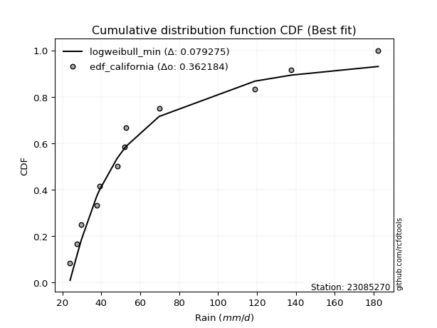</img>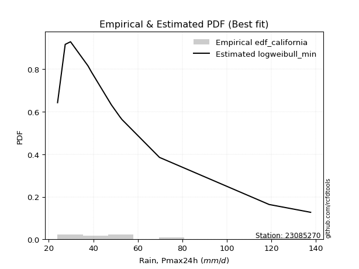</img>

</div>


### 2. Empirical - EDF Hazen (1930)

Hazen method for plotting positions is a formula used to estimate the empirical cumulative probability distribution of flood events or other hydrological data. This formula often results in biased estimations, particularly when extrapolating to extreme events (high return periods).

<div align="center">


$P=(m-0.5)/n$


</div>


**2.1. Empirical values**

<div align="center">

|                | 0                    | 1                  | 2                   | 3                  | 4         | 5                  | 6                  | 7                  | 8                  | 9                  | 10        | 11                 |
|:---------------|:---------------------|:-------------------|:--------------------|:-------------------|:----------|:-------------------|:-------------------|:-------------------|:-------------------|:-------------------|:----------|:-------------------|
| date           | 2020                 | 2015               | 2019                | 2016               | 2023      | 2021               | 2018               | 2017               | 2022               | 2025               | 2014      | 2024               |
| x              | 23.955               | 27.39              | 29.783              | 37.6               | 39.149    | 48.124             | 51.916             | 52.857             | 69.729             | 111.6              | 118.96    | 137.6              |
| m              | 1                    | 2                  | 3                   | 4                  | 5         | 6                  | 7                  | 8                  | 9                  | 10                 | 11        | 12                 |
| empirical_dist | edf_hazen            | edf_hazen          | edf_hazen           | edf_hazen          | edf_hazen | edf_hazen          | edf_hazen          | edf_hazen          | edf_hazen          | edf_hazen          | edf_hazen | edf_hazen          |
| empirical      | 0.041666666666666664 | 0.125              | 0.20833333333333334 | 0.2916666666666667 | 0.375     | 0.4583333333333333 | 0.5416666666666666 | 0.625              | 0.7083333333333334 | 0.7916666666666666 | 0.875     | 0.9583333333333334 |
| empirical_tr   | 1.0434782608695652   | 1.1428571428571428 | 1.2631578947368423  | 1.411764705882353  | 1.6       | 1.8461538461538458 | 2.1818181818181817 | 2.6666666666666665 | 3.428571428571429  | 4.799999999999999  | 8.0       | 24.00000000000002  |

</div>


**2.2. Kolmogorov-Smirnov fit test (sorted by Δ)**


<div align="center">

|                | 0                   | 1                   | 2                   | 3                   | 4                   | 5                   | 6                   | 7                   | 8                   | 9                   | 10                  | 11                  | 12                  | 13                  | 14                  | 15                  | 16                  | 17                  | 18                  | 19                  | 20                  | 21                  | 22                  | 23                  | 24                  | 25                  | 26                  | 27                  | 28                  | 29                  | 30                    | 31                  | 32                  | 33                  | 34                  | 35                  | 36                  | 37                  | 38                  | 39                  | 40                  | 41                  | 42                  | 43                  | 44                  | 45                  | 46                  | 47                  | 48                  | 49                  | 50                  | 51                  | 52                  | 53                  | 54                  | 55                  | 56                  | 57                  | 58                  | 59                  | 60                  | 61                  | 62                  | 63                  | 64                  | 65                  | 66                  | 67                  | 68                  | 69                  | 70                  | 71                  | 72                  | 73                  | 74                  | 75                  | 76                  | 77                  | 78                  | 79                  | 80                  | 81                  | 82                  | 83                  | 84                  | 85                  | 86                  | 87                  | 88                  | 89                  |
|:---------------|:--------------------|:--------------------|:--------------------|:--------------------|:--------------------|:--------------------|:--------------------|:--------------------|:--------------------|:--------------------|:--------------------|:--------------------|:--------------------|:--------------------|:--------------------|:--------------------|:--------------------|:--------------------|:--------------------|:--------------------|:--------------------|:--------------------|:--------------------|:--------------------|:--------------------|:--------------------|:--------------------|:--------------------|:--------------------|:--------------------|:----------------------|:--------------------|:--------------------|:--------------------|:--------------------|:--------------------|:--------------------|:--------------------|:--------------------|:--------------------|:--------------------|:--------------------|:--------------------|:--------------------|:--------------------|:--------------------|:--------------------|:--------------------|:--------------------|:--------------------|:--------------------|:--------------------|:--------------------|:--------------------|:--------------------|:--------------------|:--------------------|:--------------------|:--------------------|:--------------------|:--------------------|:--------------------|:--------------------|:--------------------|:--------------------|:--------------------|:--------------------|:--------------------|:--------------------|:--------------------|:--------------------|:--------------------|:--------------------|:--------------------|:--------------------|:--------------------|:--------------------|:--------------------|:--------------------|:--------------------|:--------------------|:--------------------|:--------------------|:--------------------|:--------------------|:--------------------|:--------------------|:--------------------|:--------------------|:--------------------|
| station        | 23085270            | 23085270            | 23085270            | 23085270            | 23085270            | 23085270            | 23085270            | 23085270            | 23085270            | 23085270            | 23085270            | 23085270            | 23085270            | 23085270            | 23085270            | 23085270            | 23085270            | 23085270            | 23085270            | 23085270            | 23085270            | 23085270            | 23085270            | 23085270            | 23085270            | 23085270            | 23085270            | 23085270            | 23085270            | 23085270            | 23085270              | 23085270            | 23085270            | 23085270            | 23085270            | 23085270            | 23085270            | 23085270            | 23085270            | 23085270            | 23085270            | 23085270            | 23085270            | 23085270            | 23085270            | 23085270            | 23085270            | 23085270            | 23085270            | 23085270            | 23085270            | 23085270            | 23085270            | 23085270            | 23085270            | 23085270            | 23085270            | 23085270            | 23085270            | 23085270            | 23085270            | 23085270            | 23085270            | 23085270            | 23085270            | 23085270            | 23085270            | 23085270            | 23085270            | 23085270            | 23085270            | 23085270            | 23085270            | 23085270            | 23085270            | 23085270            | 23085270            | 23085270            | 23085270            | 23085270            | 23085270            | 23085270            | 23085270            | 23085270            | 23085270            | 23085270            | 23085270            | 23085270            | 23085270            | 23085270            |
| empirical_dist | edf_hazen           | edf_hazen           | edf_hazen           | edf_hazen           | edf_hazen           | edf_hazen           | edf_hazen           | edf_hazen           | edf_hazen           | edf_hazen           | edf_hazen           | edf_hazen           | edf_hazen           | edf_hazen           | edf_hazen           | edf_hazen           | edf_hazen           | edf_hazen           | edf_hazen           | edf_hazen           | edf_hazen           | edf_hazen           | edf_hazen           | edf_hazen           | edf_hazen           | edf_hazen           | edf_hazen           | edf_hazen           | edf_hazen           | edf_hazen           | edf_hazen             | edf_hazen           | edf_hazen           | edf_hazen           | edf_hazen           | edf_hazen           | edf_hazen           | edf_hazen           | edf_hazen           | edf_hazen           | edf_hazen           | edf_hazen           | edf_hazen           | edf_hazen           | edf_hazen           | edf_hazen           | edf_hazen           | edf_hazen           | edf_hazen           | edf_hazen           | edf_hazen           | edf_hazen           | edf_hazen           | edf_hazen           | edf_hazen           | edf_hazen           | edf_hazen           | edf_hazen           | edf_hazen           | edf_hazen           | edf_hazen           | edf_hazen           | edf_hazen           | edf_hazen           | edf_hazen           | edf_hazen           | edf_hazen           | edf_hazen           | edf_hazen           | edf_hazen           | edf_hazen           | edf_hazen           | edf_hazen           | edf_hazen           | edf_hazen           | edf_hazen           | edf_hazen           | edf_hazen           | edf_hazen           | edf_hazen           | edf_hazen           | edf_hazen           | edf_hazen           | edf_hazen           | edf_hazen           | edf_hazen           | edf_hazen           | edf_hazen           | edf_hazen           | edf_hazen           |
| p_dist         | logmielke           | mielke              | fisk                | logfisk             | alpha               | f                   | johnsonsu           | invweibull          | logweibull_min      | weibull_min         | logexponnorm        | fatiguelife         | logfatiguelife      | loggenexpon         | invgamma            | loginvgauss         | loggamma            | loggamma            | logerlang           | loghalfnorm         | logbetaprime        | invgauss            | loginvgamma         | loginvweibull       | loggompertz         | loggenlogistic      | lograyleigh         | nct                 | logalpha            | gamma               | loglaplace_asymmetric | logmaxwell          | logkstwobign        | logf                | laplace_asymmetric  | expon               | genexpon            | gompertz            | exponnorm           | lognct              | logrice             | logpearson3         | logncf              | betaprime           | loggumbel_r         | logmoyal            | chi2                | ncf                 | loghalflogistic     | logtruncnorm        | logloggamma         | logjohnsonsu        | lognorm             | lognorm             | logcrystalball      | logt                | loglogistic         | loghypsecant        | halflogistic        | loglaplace          | logexpon            | moyal               | halfnorm            | nakagami            | genlogistic         | gumbel_r            | pearson3            | rayleigh            | kstwobign           | erlang              | lognakagami         | maxwell             | logchi2             | wald                | loggumbel_l         | loggibrat           | logwald             | crystalball         | norm                | truncnorm           | t                   | rice                | logistic            | hypsecant           | gibrat              | laplace             | gumbel_l            | loglognorm          | pareto              | logpareto           |
| delta          | 0.06305147452511509 | 0.06372514311047575 | 0.06918033370270471 | 0.08300369340513336 | 0.08421106137734413 | 0.08631688753602951 | 0.08790428849125431 | 0.09093062495350157 | 0.09149323294084855 | 0.0918960970424787  | 0.09233022443653183 | 0.09446486925467334 | 0.09465837288779444 | 0.09503843482273622 | 0.09525879387002856 | 0.09639854789877145 | 0.09727173416675378 | 0.09727173416675378 | 0.0972747120582334  | 0.09777151048399946 | 0.09780922162164207 | 0.0994377706426004  | 0.10197766599426739 | 0.10219515081916908 | 0.1022945300370589  | 0.10258940185092325 | 0.10272278522360911 | 0.10308148362692882 | 0.10424148758508966 | 0.10481790783533002 | 0.10491971734147881   | 0.10540485260651089 | 0.10560061411900201 | 0.10568153397711832 | 0.10607497800955623 | 0.10609284282160547 | 0.10664563712429542 | 0.10798515235035966 | 0.10814420854648132 | 0.10859566313965452 | 0.10862808594941298 | 0.10966849918048382 | 0.10984570736267818 | 0.11010567678504857 | 0.11061092372524806 | 0.11137399813129123 | 0.11201659042005929 | 0.11227688246256973 | 0.1155623349697616  | 0.12003568855763014 | 0.12592793132856311 | 0.125993269712536   | 0.12601836558317164 | 0.12601836558317164 | 0.12601836970423697 | 0.1260183750531666  | 0.12615750425833844 | 0.12912577157411786 | 0.1293458926638742  | 0.1404520978312904  | 0.14202381192490393 | 0.1435495507309319  | 0.14479399004133742 | 0.14503513644859728 | 0.15580229275026408 | 0.1663688255801129  | 0.17042662543180293 | 0.1796720118336409  | 0.18426717462845654 | 0.1876271840244304  | 0.19081665741908338 | 0.19196821627973265 | 0.19381793430126543 | 0.1963356195473358  | 0.1964236990762901  | 0.20833333333333334 | 0.20833333333333334 | 0.22596189879316725 | 0.22596189979807302 | 0.22596191709451663 | 0.22596646084473737 | 0.23128852374341524 | 0.2389717034065011  | 0.24960851586959415 | 0.26029863713901574 | 0.27679234080205845 | 0.29237425836212627 | 0.4283528624270405  | 0.4713659369741352  | 0.4860306118045772  |
| deltao         | 0.36218414519599995 | 0.36218414519599995 | 0.36218414519599995 | 0.36218414519599995 | 0.36218414519599995 | 0.36218414519599995 | 0.36218414519599995 | 0.36218414519599995 | 0.36218414519599995 | 0.36218414519599995 | 0.36218414519599995 | 0.36218414519599995 | 0.36218414519599995 | 0.36218414519599995 | 0.36218414519599995 | 0.36218414519599995 | 0.36218414519599995 | 0.36218414519599995 | 0.36218414519599995 | 0.36218414519599995 | 0.36218414519599995 | 0.36218414519599995 | 0.36218414519599995 | 0.36218414519599995 | 0.36218414519599995 | 0.36218414519599995 | 0.36218414519599995 | 0.36218414519599995 | 0.36218414519599995 | 0.36218414519599995 | 0.36218414519599995   | 0.36218414519599995 | 0.36218414519599995 | 0.36218414519599995 | 0.36218414519599995 | 0.36218414519599995 | 0.36218414519599995 | 0.36218414519599995 | 0.36218414519599995 | 0.36218414519599995 | 0.36218414519599995 | 0.36218414519599995 | 0.36218414519599995 | 0.36218414519599995 | 0.36218414519599995 | 0.36218414519599995 | 0.36218414519599995 | 0.36218414519599995 | 0.36218414519599995 | 0.36218414519599995 | 0.36218414519599995 | 0.36218414519599995 | 0.36218414519599995 | 0.36218414519599995 | 0.36218414519599995 | 0.36218414519599995 | 0.36218414519599995 | 0.36218414519599995 | 0.36218414519599995 | 0.36218414519599995 | 0.36218414519599995 | 0.36218414519599995 | 0.36218414519599995 | 0.36218414519599995 | 0.36218414519599995 | 0.36218414519599995 | 0.36218414519599995 | 0.36218414519599995 | 0.36218414519599995 | 0.36218414519599995 | 0.36218414519599995 | 0.36218414519599995 | 0.36218414519599995 | 0.36218414519599995 | 0.36218414519599995 | 0.36218414519599995 | 0.36218414519599995 | 0.36218414519599995 | 0.36218414519599995 | 0.36218414519599995 | 0.36218414519599995 | 0.36218414519599995 | 0.36218414519599995 | 0.36218414519599995 | 0.36218414519599995 | 0.36218414519599995 | 0.36218414519599995 | 0.36218414519599995 | 0.36218414519599995 | 0.36218414519599995 |
| eval           | Δo > Δ              | Δo > Δ              | Δo > Δ              | Δo > Δ              | Δo > Δ              | Δo > Δ              | Δo > Δ              | Δo > Δ              | Δo > Δ              | Δo > Δ              | Δo > Δ              | Δo > Δ              | Δo > Δ              | Δo > Δ              | Δo > Δ              | Δo > Δ              | Δo > Δ              | Δo > Δ              | Δo > Δ              | Δo > Δ              | Δo > Δ              | Δo > Δ              | Δo > Δ              | Δo > Δ              | Δo > Δ              | Δo > Δ              | Δo > Δ              | Δo > Δ              | Δo > Δ              | Δo > Δ              | Δo > Δ                | Δo > Δ              | Δo > Δ              | Δo > Δ              | Δo > Δ              | Δo > Δ              | Δo > Δ              | Δo > Δ              | Δo > Δ              | Δo > Δ              | Δo > Δ              | Δo > Δ              | Δo > Δ              | Δo > Δ              | Δo > Δ              | Δo > Δ              | Δo > Δ              | Δo > Δ              | Δo > Δ              | Δo > Δ              | Δo > Δ              | Δo > Δ              | Δo > Δ              | Δo > Δ              | Δo > Δ              | Δo > Δ              | Δo > Δ              | Δo > Δ              | Δo > Δ              | Δo > Δ              | Δo > Δ              | Δo > Δ              | Δo > Δ              | Δo > Δ              | Δo > Δ              | Δo > Δ              | Δo > Δ              | Δo > Δ              | Δo > Δ              | Δo > Δ              | Δo > Δ              | Δo > Δ              | Δo > Δ              | Δo > Δ              | Δo > Δ              | Δo > Δ              | Δo > Δ              | Δo > Δ              | Δo > Δ              | Δo > Δ              | Δo > Δ              | Δo > Δ              | Δo > Δ              | Δo > Δ              | Δo > Δ              | Δo > Δ              | Δo > Δ              | Δo <= Δ             | Δo <= Δ             | Δo <= Δ             |
| fit            | 1                   | 1                   | 1                   | 1                   | 1                   | 1                   | 1                   | 1                   | 1                   | 1                   | 1                   | 1                   | 1                   | 1                   | 1                   | 1                   | 1                   | 1                   | 1                   | 1                   | 1                   | 1                   | 1                   | 1                   | 1                   | 1                   | 1                   | 1                   | 1                   | 1                   | 1                     | 1                   | 1                   | 1                   | 1                   | 1                   | 1                   | 1                   | 1                   | 1                   | 1                   | 1                   | 1                   | 1                   | 1                   | 1                   | 1                   | 1                   | 1                   | 1                   | 1                   | 1                   | 1                   | 1                   | 1                   | 1                   | 1                   | 1                   | 1                   | 1                   | 1                   | 1                   | 1                   | 1                   | 1                   | 1                   | 1                   | 1                   | 1                   | 1                   | 1                   | 1                   | 1                   | 1                   | 1                   | 1                   | 1                   | 1                   | 1                   | 1                   | 1                   | 1                   | 1                   | 1                   | 1                   | 1                   | 1                   | 0                   | 0                   | 0                   |
| n              | 12                  | 12                  | 12                  | 12                  | 12                  | 12                  | 12                  | 12                  | 12                  | 12                  | 12                  | 12                  | 12                  | 12                  | 12                  | 12                  | 12                  | 12                  | 12                  | 12                  | 12                  | 12                  | 12                  | 12                  | 12                  | 12                  | 12                  | 12                  | 12                  | 12                  | 12                    | 12                  | 12                  | 12                  | 12                  | 12                  | 12                  | 12                  | 12                  | 12                  | 12                  | 12                  | 12                  | 12                  | 12                  | 12                  | 12                  | 12                  | 12                  | 12                  | 12                  | 12                  | 12                  | 12                  | 12                  | 12                  | 12                  | 12                  | 12                  | 12                  | 12                  | 12                  | 12                  | 12                  | 12                  | 12                  | 12                  | 12                  | 12                  | 12                  | 12                  | 12                  | 12                  | 12                  | 12                  | 12                  | 12                  | 12                  | 12                  | 12                  | 12                  | 12                  | 12                  | 12                  | 12                  | 12                  | 12                  | 12                  | 12                  | 12                  |
| best_fit       | 1                   | 0                   | 0                   | 0                   | 0                   | 0                   | 0                   | 0                   | 0                   | 0                   | 0                   | 0                   | 0                   | 0                   | 0                   | 0                   | 0                   | 0                   | 0                   | 0                   | 0                   | 0                   | 0                   | 0                   | 0                   | 0                   | 0                   | 0                   | 0                   | 0                   | 0                     | 0                   | 0                   | 0                   | 0                   | 0                   | 0                   | 0                   | 0                   | 0                   | 0                   | 0                   | 0                   | 0                   | 0                   | 0                   | 0                   | 0                   | 0                   | 0                   | 0                   | 0                   | 0                   | 0                   | 0                   | 0                   | 0                   | 0                   | 0                   | 0                   | 0                   | 0                   | 0                   | 0                   | 0                   | 0                   | 0                   | 0                   | 0                   | 0                   | 0                   | 0                   | 0                   | 0                   | 0                   | 0                   | 0                   | 0                   | 0                   | 0                   | 0                   | 0                   | 0                   | 0                   | 0                   | 0                   | 0                   | 0                   | 0                   | 0                   |
| best_fit_sort  | 1                   | 2                   | 3                   | 4                   | 5                   | 6                   | 7                   | 8                   | 9                   | 10                  | 11                  | 12                  | 13                  | 14                  | 15                  | 16                  | 17                  | 18                  | 19                  | 20                  | 21                  | 22                  | 23                  | 24                  | 25                  | 26                  | 27                  | 28                  | 29                  | 30                  | 31                    | 32                  | 33                  | 34                  | 35                  | 36                  | 37                  | 38                  | 39                  | 40                  | 41                  | 42                  | 43                  | 44                  | 45                  | 46                  | 47                  | 48                  | 49                  | 50                  | 51                  | 52                  | 53                  | 54                  | 55                  | 56                  | 57                  | 58                  | 59                  | 60                  | 61                  | 62                  | 63                  | 64                  | 65                  | 66                  | 67                  | 68                  | 69                  | 70                  | 71                  | 72                  | 73                  | 74                  | 75                  | 76                  | 77                  | 78                  | 79                  | 80                  | 81                  | 82                  | 83                  | 84                  | 85                  | 86                  | 87                  | 88                  | 89                  | 90                  |

</div>


<div align="center">

</img>

</div>


**2.3. Best fit**

<div align="center">

|   id |   station | empirical_dist   | p_dist    |     delta |   deltao | eval   |   fit |   n |   best_fit |   best_fit_sort |
|-----:|----------:|:-----------------|:----------|----------:|---------:|:-------|------:|----:|-----------:|----------------:|
|    0 |  23085270 | edf_hazen        | logmielke | 0.0630515 | 0.362184 | Δo > Δ |     1 |  12 |          1 |               1 |

</div>


<div align="center">

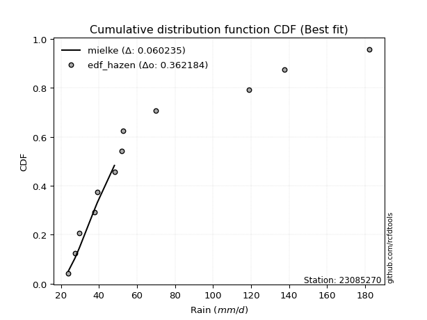</img></img>

</div>


### 3. Empirical - EDF Weibull (1939)

Weibull plotting position formula is an empirical method used to estimate the non-exceedance probability or plotting position for a set of observed data, is often recommended or widely used in practice, particularly in flood frequency analysis.

<div align="center">


$P=m/(n+1)$


</div>


**3.1. Empirical values**

<div align="center">

|                | 0                   | 1                   | 2                   | 3                  | 4                   | 5                   | 6                  | 7                  | 8                  | 9                  | 10                 | 11                 |
|:---------------|:--------------------|:--------------------|:--------------------|:-------------------|:--------------------|:--------------------|:-------------------|:-------------------|:-------------------|:-------------------|:-------------------|:-------------------|
| date           | 2020                | 2015                | 2019                | 2016               | 2023                | 2021                | 2018               | 2017               | 2022               | 2025               | 2014               | 2024               |
| x              | 23.955              | 27.39               | 29.783              | 37.6               | 39.149              | 48.124              | 51.916             | 52.857             | 69.729             | 111.6              | 118.96             | 137.6              |
| m              | 1                   | 2                   | 3                   | 4                  | 5                   | 6                   | 7                  | 8                  | 9                  | 10                 | 11                 | 12                 |
| empirical_dist | edf_weibull         | edf_weibull         | edf_weibull         | edf_weibull        | edf_weibull         | edf_weibull         | edf_weibull        | edf_weibull        | edf_weibull        | edf_weibull        | edf_weibull        | edf_weibull        |
| empirical      | 0.07692307692307693 | 0.15384615384615385 | 0.23076923076923078 | 0.3076923076923077 | 0.38461538461538464 | 0.46153846153846156 | 0.5384615384615384 | 0.6153846153846154 | 0.6923076923076923 | 0.7692307692307693 | 0.8461538461538461 | 0.9230769230769231 |
| empirical_tr   | 1.0833333333333333  | 1.1818181818181819  | 1.3                 | 1.4444444444444444 | 1.625               | 1.8571428571428572  | 2.1666666666666665 | 2.6                | 3.25               | 4.333333333333334  | 6.5                | 13.000000000000009 |

</div>


**3.2. Kolmogorov-Smirnov fit test (sorted by Δ)**


<div align="center">

|                | 0                   | 1                   | 2                   | 3                   | 4                   | 5                   | 6                   | 7                   | 8                   | 9                   | 10                  | 11                  | 12                  | 13                  | 14                  | 15                  | 16                  | 17                  | 18                  | 19                  | 20                  | 21                  | 22                  | 23                  | 24                  | 25                  | 26                  | 27                  | 28                  | 29                  | 30                  | 31                  | 32                    | 33                  | 34                  | 35                  | 36                  | 37                  | 38                  | 39                  | 40                  | 41                  | 42                  | 43                  | 44                  | 45                  | 46                  | 47                  | 48                  | 49                  | 50                  | 51                  | 52                  | 53                  | 54                  | 55                  | 56                  | 57                  | 58                  | 59                  | 60                  | 61                  | 62                  | 63                  | 64                  | 65                  | 66                  | 67                  | 68                  | 69                  | 70                  | 71                  | 72                  | 73                  | 74                  | 75                  | 76                  | 77                  | 78                  | 79                  | 80                  | 81                  | 82                  | 83                  | 84                  | 85                  | 86                  | 87                  | 88                  | 89                  |
|:---------------|:--------------------|:--------------------|:--------------------|:--------------------|:--------------------|:--------------------|:--------------------|:--------------------|:--------------------|:--------------------|:--------------------|:--------------------|:--------------------|:--------------------|:--------------------|:--------------------|:--------------------|:--------------------|:--------------------|:--------------------|:--------------------|:--------------------|:--------------------|:--------------------|:--------------------|:--------------------|:--------------------|:--------------------|:--------------------|:--------------------|:--------------------|:--------------------|:----------------------|:--------------------|:--------------------|:--------------------|:--------------------|:--------------------|:--------------------|:--------------------|:--------------------|:--------------------|:--------------------|:--------------------|:--------------------|:--------------------|:--------------------|:--------------------|:--------------------|:--------------------|:--------------------|:--------------------|:--------------------|:--------------------|:--------------------|:--------------------|:--------------------|:--------------------|:--------------------|:--------------------|:--------------------|:--------------------|:--------------------|:--------------------|:--------------------|:--------------------|:--------------------|:--------------------|:--------------------|:--------------------|:--------------------|:--------------------|:--------------------|:--------------------|:--------------------|:--------------------|:--------------------|:--------------------|:--------------------|:--------------------|:--------------------|:--------------------|:--------------------|:--------------------|:--------------------|:--------------------|:--------------------|:--------------------|:--------------------|:--------------------|
| station        | 23085270            | 23085270            | 23085270            | 23085270            | 23085270            | 23085270            | 23085270            | 23085270            | 23085270            | 23085270            | 23085270            | 23085270            | 23085270            | 23085270            | 23085270            | 23085270            | 23085270            | 23085270            | 23085270            | 23085270            | 23085270            | 23085270            | 23085270            | 23085270            | 23085270            | 23085270            | 23085270            | 23085270            | 23085270            | 23085270            | 23085270            | 23085270            | 23085270              | 23085270            | 23085270            | 23085270            | 23085270            | 23085270            | 23085270            | 23085270            | 23085270            | 23085270            | 23085270            | 23085270            | 23085270            | 23085270            | 23085270            | 23085270            | 23085270            | 23085270            | 23085270            | 23085270            | 23085270            | 23085270            | 23085270            | 23085270            | 23085270            | 23085270            | 23085270            | 23085270            | 23085270            | 23085270            | 23085270            | 23085270            | 23085270            | 23085270            | 23085270            | 23085270            | 23085270            | 23085270            | 23085270            | 23085270            | 23085270            | 23085270            | 23085270            | 23085270            | 23085270            | 23085270            | 23085270            | 23085270            | 23085270            | 23085270            | 23085270            | 23085270            | 23085270            | 23085270            | 23085270            | 23085270            | 23085270            | 23085270            |
| empirical_dist | edf_weibull         | edf_weibull         | edf_weibull         | edf_weibull         | edf_weibull         | edf_weibull         | edf_weibull         | edf_weibull         | edf_weibull         | edf_weibull         | edf_weibull         | edf_weibull         | edf_weibull         | edf_weibull         | edf_weibull         | edf_weibull         | edf_weibull         | edf_weibull         | edf_weibull         | edf_weibull         | edf_weibull         | edf_weibull         | edf_weibull         | edf_weibull         | edf_weibull         | edf_weibull         | edf_weibull         | edf_weibull         | edf_weibull         | edf_weibull         | edf_weibull         | edf_weibull         | edf_weibull           | edf_weibull         | edf_weibull         | edf_weibull         | edf_weibull         | edf_weibull         | edf_weibull         | edf_weibull         | edf_weibull         | edf_weibull         | edf_weibull         | edf_weibull         | edf_weibull         | edf_weibull         | edf_weibull         | edf_weibull         | edf_weibull         | edf_weibull         | edf_weibull         | edf_weibull         | edf_weibull         | edf_weibull         | edf_weibull         | edf_weibull         | edf_weibull         | edf_weibull         | edf_weibull         | edf_weibull         | edf_weibull         | edf_weibull         | edf_weibull         | edf_weibull         | edf_weibull         | edf_weibull         | edf_weibull         | edf_weibull         | edf_weibull         | edf_weibull         | edf_weibull         | edf_weibull         | edf_weibull         | edf_weibull         | edf_weibull         | edf_weibull         | edf_weibull         | edf_weibull         | edf_weibull         | edf_weibull         | edf_weibull         | edf_weibull         | edf_weibull         | edf_weibull         | edf_weibull         | edf_weibull         | edf_weibull         | edf_weibull         | edf_weibull         | edf_weibull         |
| p_dist         | fisk                | logmielke           | mielke              | weibull_min         | loggamma            | loggamma            | logerlang           | logfisk             | alpha               | logtruncnorm        | f                   | johnsonsu           | invweibull          | logweibull_min      | logexponnorm        | fatiguelife         | logfatiguelife      | loggenexpon         | invgamma            | loginvgauss         | loghalfnorm         | logbetaprime        | invgauss            | gamma               | loginvgamma         | loginvweibull       | loggompertz         | loggenlogistic      | lograyleigh         | nct                 | logexpon            | logalpha            | loglaplace_asymmetric | logmaxwell          | logkstwobign        | logf                | laplace_asymmetric  | expon               | genexpon            | halflogistic        | gompertz            | exponnorm           | lognct              | logrice             | logpearson3         | logncf              | betaprime           | loggumbel_r         | logmoyal            | moyal               | logjohnsonsu        | chi2                | ncf                 | halfnorm            | nakagami            | logloggamma         | logcrystalball      | lognorm             | lognorm             | logt                | loghalflogistic     | loglogistic         | loghypsecant        | loglaplace          | gumbel_r            | genlogistic         | pearson3            | rayleigh            | kstwobign           | lognakagami         | logchi2             | maxwell             | erlang              | loggumbel_l         | crystalball         | norm                | truncnorm           | t                   | wald                | rice                | logistic            | loggibrat           | logwald             | hypsecant           | laplace             | gibrat              | gumbel_l            | loglognorm          | pareto              | logpareto           |
| delta          | 0.08216833661572398 | 0.08548737196101253 | 0.08616104054637319 | 0.09618224451473645 | 0.10086851751353698 | 0.10086851751353698 | 0.10087290542366556 | 0.10543959084103072 | 0.10664695881324149 | 0.10752374257497999 | 0.10875278497192686 | 0.11034018592715167 | 0.11336652238939893 | 0.1139291303767459  | 0.11476612187242918 | 0.1169007666905707  | 0.1170942703236918  | 0.11747433225863357 | 0.11769469130592591 | 0.1188344453346688  | 0.12020740791989681 | 0.12024511905753943 | 0.12187366807849775 | 0.12335673078645393 | 0.12441356343016474 | 0.12463104825506643 | 0.12473042747295626 | 0.1250252992868206  | 0.12515868265950647 | 0.12551738106282617 | 0.1259981708992629  | 0.12667738502098702 | 0.12681683324919168   | 0.12784075004240825 | 0.12803651155489937 | 0.12811743141301568 | 0.1285108754454536  | 0.12852874025750283 | 0.12908153456019278 | 0.12950922989393665 | 0.13042104978625702 | 0.13058010598237868 | 0.13103156057555188 | 0.13106398338531033 | 0.13210439661638118 | 0.13228160479857554 | 0.13254157422094592 | 0.1330468211611454  | 0.13380989556718859 | 0.13393416611554732 | 0.13418874521366264 | 0.13445248785595665 | 0.13471277989846708 | 0.13517860542595284 | 0.1354197518332127  | 0.13630248005501522 | 0.13793180788075754 | 0.13793180906611835 | 0.13793180906611835 | 0.13793192667720355 | 0.14440848881591545 | 0.1476371249470645  | 0.15156166901001522 | 0.1538373281223303  | 0.15675344096472832 | 0.15835878982280038 | 0.16081124081641834 | 0.17005662721825632 | 0.17465179001307196 | 0.17479101639344236 | 0.1777922932756244  | 0.18235283166434807 | 0.18243755640884796 | 0.1868083144609055  | 0.21634651417778267 | 0.21634651518268844 | 0.21634653247913205 | 0.2163510762293528  | 0.21877151698323324 | 0.22167313912803066 | 0.2293563187911165  | 0.23076923076923078 | 0.23076923076923078 | 0.23999313125420957 | 0.26717695618667386 | 0.2699140217544004  | 0.2827588737467417  | 0.39950670858088666 | 0.44251978312798135 | 0.45718445795842333 |
| deltao         | 0.36218414519599995 | 0.36218414519599995 | 0.36218414519599995 | 0.36218414519599995 | 0.36218414519599995 | 0.36218414519599995 | 0.36218414519599995 | 0.36218414519599995 | 0.36218414519599995 | 0.36218414519599995 | 0.36218414519599995 | 0.36218414519599995 | 0.36218414519599995 | 0.36218414519599995 | 0.36218414519599995 | 0.36218414519599995 | 0.36218414519599995 | 0.36218414519599995 | 0.36218414519599995 | 0.36218414519599995 | 0.36218414519599995 | 0.36218414519599995 | 0.36218414519599995 | 0.36218414519599995 | 0.36218414519599995 | 0.36218414519599995 | 0.36218414519599995 | 0.36218414519599995 | 0.36218414519599995 | 0.36218414519599995 | 0.36218414519599995 | 0.36218414519599995 | 0.36218414519599995   | 0.36218414519599995 | 0.36218414519599995 | 0.36218414519599995 | 0.36218414519599995 | 0.36218414519599995 | 0.36218414519599995 | 0.36218414519599995 | 0.36218414519599995 | 0.36218414519599995 | 0.36218414519599995 | 0.36218414519599995 | 0.36218414519599995 | 0.36218414519599995 | 0.36218414519599995 | 0.36218414519599995 | 0.36218414519599995 | 0.36218414519599995 | 0.36218414519599995 | 0.36218414519599995 | 0.36218414519599995 | 0.36218414519599995 | 0.36218414519599995 | 0.36218414519599995 | 0.36218414519599995 | 0.36218414519599995 | 0.36218414519599995 | 0.36218414519599995 | 0.36218414519599995 | 0.36218414519599995 | 0.36218414519599995 | 0.36218414519599995 | 0.36218414519599995 | 0.36218414519599995 | 0.36218414519599995 | 0.36218414519599995 | 0.36218414519599995 | 0.36218414519599995 | 0.36218414519599995 | 0.36218414519599995 | 0.36218414519599995 | 0.36218414519599995 | 0.36218414519599995 | 0.36218414519599995 | 0.36218414519599995 | 0.36218414519599995 | 0.36218414519599995 | 0.36218414519599995 | 0.36218414519599995 | 0.36218414519599995 | 0.36218414519599995 | 0.36218414519599995 | 0.36218414519599995 | 0.36218414519599995 | 0.36218414519599995 | 0.36218414519599995 | 0.36218414519599995 | 0.36218414519599995 |
| eval           | Δo > Δ              | Δo > Δ              | Δo > Δ              | Δo > Δ              | Δo > Δ              | Δo > Δ              | Δo > Δ              | Δo > Δ              | Δo > Δ              | Δo > Δ              | Δo > Δ              | Δo > Δ              | Δo > Δ              | Δo > Δ              | Δo > Δ              | Δo > Δ              | Δo > Δ              | Δo > Δ              | Δo > Δ              | Δo > Δ              | Δo > Δ              | Δo > Δ              | Δo > Δ              | Δo > Δ              | Δo > Δ              | Δo > Δ              | Δo > Δ              | Δo > Δ              | Δo > Δ              | Δo > Δ              | Δo > Δ              | Δo > Δ              | Δo > Δ                | Δo > Δ              | Δo > Δ              | Δo > Δ              | Δo > Δ              | Δo > Δ              | Δo > Δ              | Δo > Δ              | Δo > Δ              | Δo > Δ              | Δo > Δ              | Δo > Δ              | Δo > Δ              | Δo > Δ              | Δo > Δ              | Δo > Δ              | Δo > Δ              | Δo > Δ              | Δo > Δ              | Δo > Δ              | Δo > Δ              | Δo > Δ              | Δo > Δ              | Δo > Δ              | Δo > Δ              | Δo > Δ              | Δo > Δ              | Δo > Δ              | Δo > Δ              | Δo > Δ              | Δo > Δ              | Δo > Δ              | Δo > Δ              | Δo > Δ              | Δo > Δ              | Δo > Δ              | Δo > Δ              | Δo > Δ              | Δo > Δ              | Δo > Δ              | Δo > Δ              | Δo > Δ              | Δo > Δ              | Δo > Δ              | Δo > Δ              | Δo > Δ              | Δo > Δ              | Δo > Δ              | Δo > Δ              | Δo > Δ              | Δo > Δ              | Δo > Δ              | Δo > Δ              | Δo > Δ              | Δo > Δ              | Δo <= Δ             | Δo <= Δ             | Δo <= Δ             |
| fit            | 1                   | 1                   | 1                   | 1                   | 1                   | 1                   | 1                   | 1                   | 1                   | 1                   | 1                   | 1                   | 1                   | 1                   | 1                   | 1                   | 1                   | 1                   | 1                   | 1                   | 1                   | 1                   | 1                   | 1                   | 1                   | 1                   | 1                   | 1                   | 1                   | 1                   | 1                   | 1                   | 1                     | 1                   | 1                   | 1                   | 1                   | 1                   | 1                   | 1                   | 1                   | 1                   | 1                   | 1                   | 1                   | 1                   | 1                   | 1                   | 1                   | 1                   | 1                   | 1                   | 1                   | 1                   | 1                   | 1                   | 1                   | 1                   | 1                   | 1                   | 1                   | 1                   | 1                   | 1                   | 1                   | 1                   | 1                   | 1                   | 1                   | 1                   | 1                   | 1                   | 1                   | 1                   | 1                   | 1                   | 1                   | 1                   | 1                   | 1                   | 1                   | 1                   | 1                   | 1                   | 1                   | 1                   | 1                   | 0                   | 0                   | 0                   |
| n              | 12                  | 12                  | 12                  | 12                  | 12                  | 12                  | 12                  | 12                  | 12                  | 12                  | 12                  | 12                  | 12                  | 12                  | 12                  | 12                  | 12                  | 12                  | 12                  | 12                  | 12                  | 12                  | 12                  | 12                  | 12                  | 12                  | 12                  | 12                  | 12                  | 12                  | 12                  | 12                  | 12                    | 12                  | 12                  | 12                  | 12                  | 12                  | 12                  | 12                  | 12                  | 12                  | 12                  | 12                  | 12                  | 12                  | 12                  | 12                  | 12                  | 12                  | 12                  | 12                  | 12                  | 12                  | 12                  | 12                  | 12                  | 12                  | 12                  | 12                  | 12                  | 12                  | 12                  | 12                  | 12                  | 12                  | 12                  | 12                  | 12                  | 12                  | 12                  | 12                  | 12                  | 12                  | 12                  | 12                  | 12                  | 12                  | 12                  | 12                  | 12                  | 12                  | 12                  | 12                  | 12                  | 12                  | 12                  | 12                  | 12                  | 12                  |
| best_fit       | 1                   | 0                   | 0                   | 0                   | 0                   | 0                   | 0                   | 0                   | 0                   | 0                   | 0                   | 0                   | 0                   | 0                   | 0                   | 0                   | 0                   | 0                   | 0                   | 0                   | 0                   | 0                   | 0                   | 0                   | 0                   | 0                   | 0                   | 0                   | 0                   | 0                   | 0                   | 0                   | 0                     | 0                   | 0                   | 0                   | 0                   | 0                   | 0                   | 0                   | 0                   | 0                   | 0                   | 0                   | 0                   | 0                   | 0                   | 0                   | 0                   | 0                   | 0                   | 0                   | 0                   | 0                   | 0                   | 0                   | 0                   | 0                   | 0                   | 0                   | 0                   | 0                   | 0                   | 0                   | 0                   | 0                   | 0                   | 0                   | 0                   | 0                   | 0                   | 0                   | 0                   | 0                   | 0                   | 0                   | 0                   | 0                   | 0                   | 0                   | 0                   | 0                   | 0                   | 0                   | 0                   | 0                   | 0                   | 0                   | 0                   | 0                   |
| best_fit_sort  | 1                   | 2                   | 3                   | 4                   | 5                   | 6                   | 7                   | 8                   | 9                   | 10                  | 11                  | 12                  | 13                  | 14                  | 15                  | 16                  | 17                  | 18                  | 19                  | 20                  | 21                  | 22                  | 23                  | 24                  | 25                  | 26                  | 27                  | 28                  | 29                  | 30                  | 31                  | 32                  | 33                    | 34                  | 35                  | 36                  | 37                  | 38                  | 39                  | 40                  | 41                  | 42                  | 43                  | 44                  | 45                  | 46                  | 47                  | 48                  | 49                  | 50                  | 51                  | 52                  | 53                  | 54                  | 55                  | 56                  | 57                  | 58                  | 59                  | 60                  | 61                  | 62                  | 63                  | 64                  | 65                  | 66                  | 67                  | 68                  | 69                  | 70                  | 71                  | 72                  | 73                  | 74                  | 75                  | 76                  | 77                  | 78                  | 79                  | 80                  | 81                  | 82                  | 83                  | 84                  | 85                  | 86                  | 87                  | 88                  | 89                  | 90                  |

</div>


<div align="center">

</img>

</div>


**3.3. Best fit**

<div align="center">

|   id |   station | empirical_dist   | p_dist   |     delta |   deltao | eval   |   fit |   n |   best_fit |   best_fit_sort |
|-----:|----------:|:-----------------|:---------|----------:|---------:|:-------|------:|----:|-----------:|----------------:|
|    0 |  23085270 | edf_weibull      | fisk     | 0.0821683 | 0.362184 | Δo > Δ |     1 |  12 |          1 |               1 |

</div>


<div align="center">

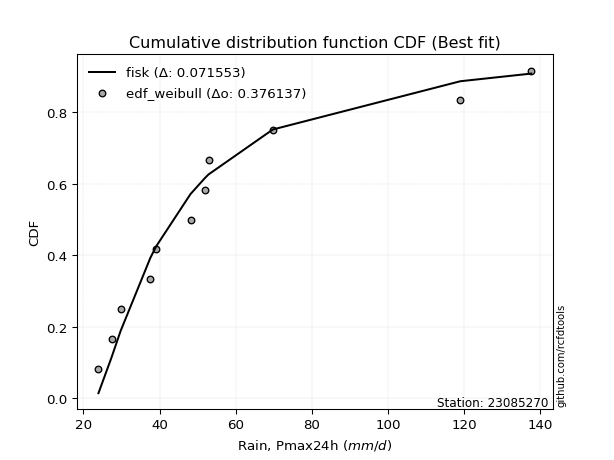</img>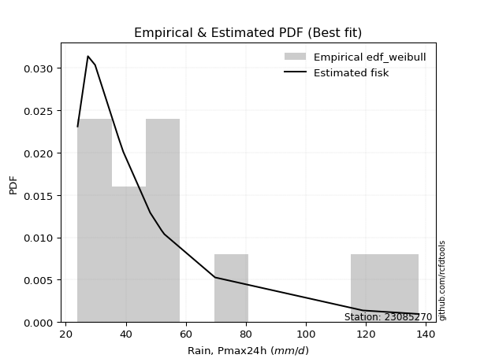</img>

</div>


### 4. Empirical - EDF Beard (1943)

The Beard formula (or Beard´s plotting position formula) in hydrology is used to estimate the empirical non-exceedance probability _(P)_ of a flood event (or other extreme hydrological data point) within a given dataset.

<div align="center">


$P=(m-0.31)/(n+0.38)$


</div>


**4.1. Empirical values**

<div align="center">

|                | 0                    | 1                   | 2                   | 3                  | 4                  | 5                  | 6                  | 7                  | 8                  | 9                  | 10                 | 11                 |
|:---------------|:---------------------|:--------------------|:--------------------|:-------------------|:-------------------|:-------------------|:-------------------|:-------------------|:-------------------|:-------------------|:-------------------|:-------------------|
| date           | 2020                 | 2015                | 2019                | 2016               | 2023               | 2021               | 2018               | 2017               | 2022               | 2025               | 2014               | 2024               |
| x              | 23.955               | 27.39               | 29.783              | 37.6               | 39.149             | 48.124             | 51.916             | 52.857             | 69.729             | 111.6              | 118.96             | 137.6              |
| m              | 1                    | 2                   | 3                   | 4                  | 5                  | 6                  | 7                  | 8                  | 9                  | 10                 | 11                 | 12                 |
| empirical_dist | edf_beard            | edf_beard           | edf_beard           | edf_beard          | edf_beard          | edf_beard          | edf_beard          | edf_beard          | edf_beard          | edf_beard          | edf_beard          | edf_beard          |
| empirical      | 0.055735056542810975 | 0.13651050080775443 | 0.21728594507269788 | 0.2980613893376413 | 0.3788368336025848 | 0.4596122778675283 | 0.5403877221324718 | 0.6211631663974152 | 0.7019386106623585 | 0.7827140549273021 | 0.8634894991922455 | 0.9442649434571889 |
| empirical_tr   | 1.0590248075278015   | 1.1580916744621141  | 1.2776057791537667  | 1.424626006904488  | 1.6098829648894668 | 1.850523168908819  | 2.1757469244288226 | 2.6396588486140726 | 3.3550135501355    | 4.6022304832713745 | 7.325443786982245  | 17.942028985507218 |

</div>


**4.2. Kolmogorov-Smirnov fit test (sorted by Δ)**


<div align="center">

|                | 0                   | 1                   | 2                   | 3                   | 4                   | 5                   | 6                   | 7                   | 8                   | 9                   | 10                  | 11                  | 12                  | 13                  | 14                  | 15                  | 16                  | 17                  | 18                  | 19                  | 20                  | 21                  | 22                  | 23                  | 24                  | 25                  | 26                  | 27                  | 28                  | 29                  | 30                    | 31                  | 32                  | 33                  | 34                  | 35                  | 36                  | 37                  | 38                  | 39                  | 40                  | 41                  | 42                  | 43                  | 44                  | 45                  | 46                  | 47                  | 48                  | 49                  | 50                  | 51                  | 52                  | 53                  | 54                  | 55                  | 56                  | 57                  | 58                  | 59                  | 60                  | 61                  | 62                  | 63                  | 64                  | 65                  | 66                  | 67                  | 68                  | 69                  | 70                  | 71                  | 72                  | 73                  | 74                  | 75                  | 76                  | 77                  | 78                  | 79                  | 80                  | 81                  | 82                  | 83                  | 84                  | 85                  | 86                  | 87                  | 88                  | 89                  |
|:---------------|:--------------------|:--------------------|:--------------------|:--------------------|:--------------------|:--------------------|:--------------------|:--------------------|:--------------------|:--------------------|:--------------------|:--------------------|:--------------------|:--------------------|:--------------------|:--------------------|:--------------------|:--------------------|:--------------------|:--------------------|:--------------------|:--------------------|:--------------------|:--------------------|:--------------------|:--------------------|:--------------------|:--------------------|:--------------------|:--------------------|:----------------------|:--------------------|:--------------------|:--------------------|:--------------------|:--------------------|:--------------------|:--------------------|:--------------------|:--------------------|:--------------------|:--------------------|:--------------------|:--------------------|:--------------------|:--------------------|:--------------------|:--------------------|:--------------------|:--------------------|:--------------------|:--------------------|:--------------------|:--------------------|:--------------------|:--------------------|:--------------------|:--------------------|:--------------------|:--------------------|:--------------------|:--------------------|:--------------------|:--------------------|:--------------------|:--------------------|:--------------------|:--------------------|:--------------------|:--------------------|:--------------------|:--------------------|:--------------------|:--------------------|:--------------------|:--------------------|:--------------------|:--------------------|:--------------------|:--------------------|:--------------------|:--------------------|:--------------------|:--------------------|:--------------------|:--------------------|:--------------------|:--------------------|:--------------------|:--------------------|
| station        | 23085270            | 23085270            | 23085270            | 23085270            | 23085270            | 23085270            | 23085270            | 23085270            | 23085270            | 23085270            | 23085270            | 23085270            | 23085270            | 23085270            | 23085270            | 23085270            | 23085270            | 23085270            | 23085270            | 23085270            | 23085270            | 23085270            | 23085270            | 23085270            | 23085270            | 23085270            | 23085270            | 23085270            | 23085270            | 23085270            | 23085270              | 23085270            | 23085270            | 23085270            | 23085270            | 23085270            | 23085270            | 23085270            | 23085270            | 23085270            | 23085270            | 23085270            | 23085270            | 23085270            | 23085270            | 23085270            | 23085270            | 23085270            | 23085270            | 23085270            | 23085270            | 23085270            | 23085270            | 23085270            | 23085270            | 23085270            | 23085270            | 23085270            | 23085270            | 23085270            | 23085270            | 23085270            | 23085270            | 23085270            | 23085270            | 23085270            | 23085270            | 23085270            | 23085270            | 23085270            | 23085270            | 23085270            | 23085270            | 23085270            | 23085270            | 23085270            | 23085270            | 23085270            | 23085270            | 23085270            | 23085270            | 23085270            | 23085270            | 23085270            | 23085270            | 23085270            | 23085270            | 23085270            | 23085270            | 23085270            |
| empirical_dist | edf_beard           | edf_beard           | edf_beard           | edf_beard           | edf_beard           | edf_beard           | edf_beard           | edf_beard           | edf_beard           | edf_beard           | edf_beard           | edf_beard           | edf_beard           | edf_beard           | edf_beard           | edf_beard           | edf_beard           | edf_beard           | edf_beard           | edf_beard           | edf_beard           | edf_beard           | edf_beard           | edf_beard           | edf_beard           | edf_beard           | edf_beard           | edf_beard           | edf_beard           | edf_beard           | edf_beard             | edf_beard           | edf_beard           | edf_beard           | edf_beard           | edf_beard           | edf_beard           | edf_beard           | edf_beard           | edf_beard           | edf_beard           | edf_beard           | edf_beard           | edf_beard           | edf_beard           | edf_beard           | edf_beard           | edf_beard           | edf_beard           | edf_beard           | edf_beard           | edf_beard           | edf_beard           | edf_beard           | edf_beard           | edf_beard           | edf_beard           | edf_beard           | edf_beard           | edf_beard           | edf_beard           | edf_beard           | edf_beard           | edf_beard           | edf_beard           | edf_beard           | edf_beard           | edf_beard           | edf_beard           | edf_beard           | edf_beard           | edf_beard           | edf_beard           | edf_beard           | edf_beard           | edf_beard           | edf_beard           | edf_beard           | edf_beard           | edf_beard           | edf_beard           | edf_beard           | edf_beard           | edf_beard           | edf_beard           | edf_beard           | edf_beard           | edf_beard           | edf_beard           | edf_beard           |
| p_dist         | fisk                | logmielke           | mielke              | weibull_min         | logfisk             | alpha               | f                   | loggamma            | loggamma            | logerlang           | johnsonsu           | invweibull          | logweibull_min      | logexponnorm        | fatiguelife         | logfatiguelife      | loggenexpon         | invgamma            | loginvgauss         | loghalfnorm         | logbetaprime        | invgauss            | gamma               | loginvgamma         | loginvweibull       | loggompertz         | loggenlogistic      | lograyleigh         | nct                 | logalpha            | loglaplace_asymmetric | logtruncnorm        | logmaxwell          | logkstwobign        | logf                | laplace_asymmetric  | expon               | genexpon            | gompertz            | exponnorm           | lognct              | logrice             | logpearson3         | logncf              | betaprime           | loggumbel_r         | logmoyal            | chi2                | ncf                 | logjohnsonsu        | logloggamma         | logcrystalball      | lognorm             | lognorm             | logt                | halflogistic        | loghalflogistic     | loglogistic         | logexpon            | loghypsecant        | moyal               | halfnorm            | nakagami            | loglaplace          | genlogistic         | gumbel_r            | pearson3            | rayleigh            | kstwobign           | erlang              | lognakagami         | logchi2             | maxwell             | loggumbel_l         | wald                | loggibrat           | logwald             | crystalball         | norm                | truncnorm           | t                   | rice                | logistic            | hypsecant           | gibrat              | laplace             | gumbel_l            | loglognorm          | pareto              | logpareto           |
| delta          | 0.06868505091919119 | 0.07200408626447963 | 0.07267775484984029 | 0.0880592634398939  | 0.09195630514449793 | 0.0931636731167087  | 0.09526949927539408 | 0.0959927896325588  | 0.0959927896325588  | 0.09599576752403843 | 0.09685690023061888 | 0.09988323669286614 | 0.10044584468021311 | 0.1012828361758964  | 0.10341748099403791 | 0.10361098462715901 | 0.10399104656210079 | 0.10421140560939313 | 0.10535115963813602 | 0.10672412222336403 | 0.10676183336100664 | 0.10839038238196497 | 0.10987344508992114 | 0.11093027773363195 | 0.11114776255853365 | 0.11124714177642347 | 0.11154201359028781 | 0.11167539696297368 | 0.11203409536629338 | 0.11319409932445423 | 0.1133335475526589    | 0.11364096588665551 | 0.11435746434587546 | 0.11455322585836658 | 0.1146341457164829  | 0.1150275897489208  | 0.11504545456097004 | 0.11559824886365999 | 0.11693776408972423 | 0.11709682028584589 | 0.11754827487901909 | 0.11758069768877755 | 0.1186211109198484  | 0.11879831910204275 | 0.11905828852441314 | 0.11956353546461262 | 0.1203266098706558  | 0.12096920215942386 | 0.1212294942019343  | 0.1221564361099512  | 0.12281919435848243 | 0.12444852218422475 | 0.12444852336958556 | 0.12444852336958556 | 0.12444864098067077 | 0.1255090590612894  | 0.12707283577751602 | 0.1341538392505317  | 0.1356290892539293  | 0.13807838331348243 | 0.1397127171283471  | 0.14095715643875262 | 0.14119830284601248 | 0.1442889314338752  | 0.15196545914767928 | 0.1625319919775281  | 0.16658979182921813 | 0.1758351782310561  | 0.18043034102587174 | 0.1827546986041157  | 0.18442193474810875 | 0.1874232116302908  | 0.18813138267714785 | 0.1925868654737053  | 0.20528823128670035 | 0.21728594507269788 | 0.21728594507269788 | 0.22212506519058245 | 0.22212506619548822 | 0.22212508349193183 | 0.22212962724215257 | 0.22745169014083044 | 0.2351348698039163  | 0.24577168226700935 | 0.26413547074160054 | 0.27295550719947365 | 0.28853742475954147 | 0.4168423616192861  | 0.4598554361663808  | 0.4745201109968228  |
| deltao         | 0.36218414519599995 | 0.36218414519599995 | 0.36218414519599995 | 0.36218414519599995 | 0.36218414519599995 | 0.36218414519599995 | 0.36218414519599995 | 0.36218414519599995 | 0.36218414519599995 | 0.36218414519599995 | 0.36218414519599995 | 0.36218414519599995 | 0.36218414519599995 | 0.36218414519599995 | 0.36218414519599995 | 0.36218414519599995 | 0.36218414519599995 | 0.36218414519599995 | 0.36218414519599995 | 0.36218414519599995 | 0.36218414519599995 | 0.36218414519599995 | 0.36218414519599995 | 0.36218414519599995 | 0.36218414519599995 | 0.36218414519599995 | 0.36218414519599995 | 0.36218414519599995 | 0.36218414519599995 | 0.36218414519599995 | 0.36218414519599995   | 0.36218414519599995 | 0.36218414519599995 | 0.36218414519599995 | 0.36218414519599995 | 0.36218414519599995 | 0.36218414519599995 | 0.36218414519599995 | 0.36218414519599995 | 0.36218414519599995 | 0.36218414519599995 | 0.36218414519599995 | 0.36218414519599995 | 0.36218414519599995 | 0.36218414519599995 | 0.36218414519599995 | 0.36218414519599995 | 0.36218414519599995 | 0.36218414519599995 | 0.36218414519599995 | 0.36218414519599995 | 0.36218414519599995 | 0.36218414519599995 | 0.36218414519599995 | 0.36218414519599995 | 0.36218414519599995 | 0.36218414519599995 | 0.36218414519599995 | 0.36218414519599995 | 0.36218414519599995 | 0.36218414519599995 | 0.36218414519599995 | 0.36218414519599995 | 0.36218414519599995 | 0.36218414519599995 | 0.36218414519599995 | 0.36218414519599995 | 0.36218414519599995 | 0.36218414519599995 | 0.36218414519599995 | 0.36218414519599995 | 0.36218414519599995 | 0.36218414519599995 | 0.36218414519599995 | 0.36218414519599995 | 0.36218414519599995 | 0.36218414519599995 | 0.36218414519599995 | 0.36218414519599995 | 0.36218414519599995 | 0.36218414519599995 | 0.36218414519599995 | 0.36218414519599995 | 0.36218414519599995 | 0.36218414519599995 | 0.36218414519599995 | 0.36218414519599995 | 0.36218414519599995 | 0.36218414519599995 | 0.36218414519599995 |
| eval           | Δo > Δ              | Δo > Δ              | Δo > Δ              | Δo > Δ              | Δo > Δ              | Δo > Δ              | Δo > Δ              | Δo > Δ              | Δo > Δ              | Δo > Δ              | Δo > Δ              | Δo > Δ              | Δo > Δ              | Δo > Δ              | Δo > Δ              | Δo > Δ              | Δo > Δ              | Δo > Δ              | Δo > Δ              | Δo > Δ              | Δo > Δ              | Δo > Δ              | Δo > Δ              | Δo > Δ              | Δo > Δ              | Δo > Δ              | Δo > Δ              | Δo > Δ              | Δo > Δ              | Δo > Δ              | Δo > Δ                | Δo > Δ              | Δo > Δ              | Δo > Δ              | Δo > Δ              | Δo > Δ              | Δo > Δ              | Δo > Δ              | Δo > Δ              | Δo > Δ              | Δo > Δ              | Δo > Δ              | Δo > Δ              | Δo > Δ              | Δo > Δ              | Δo > Δ              | Δo > Δ              | Δo > Δ              | Δo > Δ              | Δo > Δ              | Δo > Δ              | Δo > Δ              | Δo > Δ              | Δo > Δ              | Δo > Δ              | Δo > Δ              | Δo > Δ              | Δo > Δ              | Δo > Δ              | Δo > Δ              | Δo > Δ              | Δo > Δ              | Δo > Δ              | Δo > Δ              | Δo > Δ              | Δo > Δ              | Δo > Δ              | Δo > Δ              | Δo > Δ              | Δo > Δ              | Δo > Δ              | Δo > Δ              | Δo > Δ              | Δo > Δ              | Δo > Δ              | Δo > Δ              | Δo > Δ              | Δo > Δ              | Δo > Δ              | Δo > Δ              | Δo > Δ              | Δo > Δ              | Δo > Δ              | Δo > Δ              | Δo > Δ              | Δo > Δ              | Δo > Δ              | Δo <= Δ             | Δo <= Δ             | Δo <= Δ             |
| fit            | 1                   | 1                   | 1                   | 1                   | 1                   | 1                   | 1                   | 1                   | 1                   | 1                   | 1                   | 1                   | 1                   | 1                   | 1                   | 1                   | 1                   | 1                   | 1                   | 1                   | 1                   | 1                   | 1                   | 1                   | 1                   | 1                   | 1                   | 1                   | 1                   | 1                   | 1                     | 1                   | 1                   | 1                   | 1                   | 1                   | 1                   | 1                   | 1                   | 1                   | 1                   | 1                   | 1                   | 1                   | 1                   | 1                   | 1                   | 1                   | 1                   | 1                   | 1                   | 1                   | 1                   | 1                   | 1                   | 1                   | 1                   | 1                   | 1                   | 1                   | 1                   | 1                   | 1                   | 1                   | 1                   | 1                   | 1                   | 1                   | 1                   | 1                   | 1                   | 1                   | 1                   | 1                   | 1                   | 1                   | 1                   | 1                   | 1                   | 1                   | 1                   | 1                   | 1                   | 1                   | 1                   | 1                   | 1                   | 0                   | 0                   | 0                   |
| n              | 12                  | 12                  | 12                  | 12                  | 12                  | 12                  | 12                  | 12                  | 12                  | 12                  | 12                  | 12                  | 12                  | 12                  | 12                  | 12                  | 12                  | 12                  | 12                  | 12                  | 12                  | 12                  | 12                  | 12                  | 12                  | 12                  | 12                  | 12                  | 12                  | 12                  | 12                    | 12                  | 12                  | 12                  | 12                  | 12                  | 12                  | 12                  | 12                  | 12                  | 12                  | 12                  | 12                  | 12                  | 12                  | 12                  | 12                  | 12                  | 12                  | 12                  | 12                  | 12                  | 12                  | 12                  | 12                  | 12                  | 12                  | 12                  | 12                  | 12                  | 12                  | 12                  | 12                  | 12                  | 12                  | 12                  | 12                  | 12                  | 12                  | 12                  | 12                  | 12                  | 12                  | 12                  | 12                  | 12                  | 12                  | 12                  | 12                  | 12                  | 12                  | 12                  | 12                  | 12                  | 12                  | 12                  | 12                  | 12                  | 12                  | 12                  |
| best_fit       | 1                   | 0                   | 0                   | 0                   | 0                   | 0                   | 0                   | 0                   | 0                   | 0                   | 0                   | 0                   | 0                   | 0                   | 0                   | 0                   | 0                   | 0                   | 0                   | 0                   | 0                   | 0                   | 0                   | 0                   | 0                   | 0                   | 0                   | 0                   | 0                   | 0                   | 0                     | 0                   | 0                   | 0                   | 0                   | 0                   | 0                   | 0                   | 0                   | 0                   | 0                   | 0                   | 0                   | 0                   | 0                   | 0                   | 0                   | 0                   | 0                   | 0                   | 0                   | 0                   | 0                   | 0                   | 0                   | 0                   | 0                   | 0                   | 0                   | 0                   | 0                   | 0                   | 0                   | 0                   | 0                   | 0                   | 0                   | 0                   | 0                   | 0                   | 0                   | 0                   | 0                   | 0                   | 0                   | 0                   | 0                   | 0                   | 0                   | 0                   | 0                   | 0                   | 0                   | 0                   | 0                   | 0                   | 0                   | 0                   | 0                   | 0                   |
| best_fit_sort  | 1                   | 2                   | 3                   | 4                   | 5                   | 6                   | 7                   | 8                   | 9                   | 10                  | 11                  | 12                  | 13                  | 14                  | 15                  | 16                  | 17                  | 18                  | 19                  | 20                  | 21                  | 22                  | 23                  | 24                  | 25                  | 26                  | 27                  | 28                  | 29                  | 30                  | 31                    | 32                  | 33                  | 34                  | 35                  | 36                  | 37                  | 38                  | 39                  | 40                  | 41                  | 42                  | 43                  | 44                  | 45                  | 46                  | 47                  | 48                  | 49                  | 50                  | 51                  | 52                  | 53                  | 54                  | 55                  | 56                  | 57                  | 58                  | 59                  | 60                  | 61                  | 62                  | 63                  | 64                  | 65                  | 66                  | 67                  | 68                  | 69                  | 70                  | 71                  | 72                  | 73                  | 74                  | 75                  | 76                  | 77                  | 78                  | 79                  | 80                  | 81                  | 82                  | 83                  | 84                  | 85                  | 86                  | 87                  | 88                  | 89                  | 90                  |

</div>


<div align="center">

</img>

</div>


**4.3. Best fit**

<div align="center">

|   id |   station | empirical_dist   | p_dist   |     delta |   deltao | eval   |   fit |   n |   best_fit |   best_fit_sort |
|-----:|----------:|:-----------------|:---------|----------:|---------:|:-------|------:|----:|-----------:|----------------:|
|    0 |  23085270 | edf_beard        | fisk     | 0.0686851 | 0.362184 | Δo > Δ |     1 |  12 |          1 |               1 |

</div>


<div align="center">

</img></img>

</div>


### 5. Empirical - EDF Chegodayev (1955)

The Chegodayev formula is an empirical plotting position formula used in hydrological frequency analysis to estimate the exceedance probability or return period of a specific event from a set of observed data. It is primarily used for plotting observed data points on probability paper to fit a theoretical distribution, particularly for analyzing extreme events like maximum flood flows or rainfall intensities. The constant _b_ value in the generalized plotting position formula is 0.3.

<div align="center">


$P=(m-b)/(n+1-2b)$


</div>


**5.1. Empirical values**

<div align="center">

|                | 0                  | 1                   | 2                   | 3                   | 4                  | 5                  | 6                  | 7                  | 8                  | 9                 | 10                 | 11                 |
|:---------------|:-------------------|:--------------------|:--------------------|:--------------------|:-------------------|:-------------------|:-------------------|:-------------------|:-------------------|:------------------|:-------------------|:-------------------|
| date           | 2020               | 2015                | 2019                | 2016                | 2023               | 2021               | 2018               | 2017               | 2022               | 2025              | 2014               | 2024               |
| x              | 23.955             | 27.39               | 29.783              | 37.6                | 39.149             | 48.124             | 51.916             | 52.857             | 69.729             | 111.6             | 118.96             | 137.6              |
| m              | 1                  | 2                   | 3                   | 4                   | 5                  | 6                  | 7                  | 8                  | 9                  | 10                | 11                 | 12                 |
| empirical_dist | edf_chegodayev     | edf_chegodayev      | edf_chegodayev      | edf_chegodayev      | edf_chegodayev     | edf_chegodayev     | edf_chegodayev     | edf_chegodayev     | edf_chegodayev     | edf_chegodayev    | edf_chegodayev     | edf_chegodayev     |
| empirical      | 0.0564516129032258 | 0.13709677419354838 | 0.21774193548387097 | 0.29838709677419356 | 0.3790322580645161 | 0.4596774193548387 | 0.5403225806451613 | 0.6209677419354839 | 0.7016129032258064 | 0.782258064516129 | 0.8629032258064515 | 0.9435483870967741 |
| empirical_tr   | 1.0598290598290598 | 1.158878504672897   | 1.2783505154639176  | 1.425287356321839   | 1.6103896103896105 | 1.8507462686567164 | 2.1754385964912277 | 2.6382978723404253 | 3.3513513513513504 | 4.592592592592592 | 7.294117647058818  | 17.714285714285694 |

</div>


**5.2. Kolmogorov-Smirnov fit test (sorted by Δ)**


<div align="center">

|                | 0                   | 1                   | 2                   | 3                   | 4                   | 5                   | 6                   | 7                   | 8                   | 9                   | 10                  | 11                  | 12                  | 13                  | 14                  | 15                  | 16                  | 17                  | 18                  | 19                  | 20                  | 21                  | 22                  | 23                  | 24                  | 25                  | 26                  | 27                  | 28                  | 29                  | 30                  | 31                    | 32                  | 33                  | 34                  | 35                  | 36                  | 37                  | 38                  | 39                  | 40                  | 41                  | 42                  | 43                  | 44                  | 45                  | 46                  | 47                  | 48                  | 49                  | 50                  | 51                  | 52                  | 53                  | 54                  | 55                  | 56                  | 57                  | 58                  | 59                  | 60                  | 61                  | 62                  | 63                  | 64                  | 65                  | 66                  | 67                  | 68                  | 69                  | 70                  | 71                  | 72                  | 73                  | 74                  | 75                  | 76                  | 77                  | 78                  | 79                  | 80                  | 81                  | 82                  | 83                  | 84                  | 85                  | 86                  | 87                  | 88                  | 89                  |
|:---------------|:--------------------|:--------------------|:--------------------|:--------------------|:--------------------|:--------------------|:--------------------|:--------------------|:--------------------|:--------------------|:--------------------|:--------------------|:--------------------|:--------------------|:--------------------|:--------------------|:--------------------|:--------------------|:--------------------|:--------------------|:--------------------|:--------------------|:--------------------|:--------------------|:--------------------|:--------------------|:--------------------|:--------------------|:--------------------|:--------------------|:--------------------|:----------------------|:--------------------|:--------------------|:--------------------|:--------------------|:--------------------|:--------------------|:--------------------|:--------------------|:--------------------|:--------------------|:--------------------|:--------------------|:--------------------|:--------------------|:--------------------|:--------------------|:--------------------|:--------------------|:--------------------|:--------------------|:--------------------|:--------------------|:--------------------|:--------------------|:--------------------|:--------------------|:--------------------|:--------------------|:--------------------|:--------------------|:--------------------|:--------------------|:--------------------|:--------------------|:--------------------|:--------------------|:--------------------|:--------------------|:--------------------|:--------------------|:--------------------|:--------------------|:--------------------|:--------------------|:--------------------|:--------------------|:--------------------|:--------------------|:--------------------|:--------------------|:--------------------|:--------------------|:--------------------|:--------------------|:--------------------|:--------------------|:--------------------|:--------------------|
| station        | 23085270            | 23085270            | 23085270            | 23085270            | 23085270            | 23085270            | 23085270            | 23085270            | 23085270            | 23085270            | 23085270            | 23085270            | 23085270            | 23085270            | 23085270            | 23085270            | 23085270            | 23085270            | 23085270            | 23085270            | 23085270            | 23085270            | 23085270            | 23085270            | 23085270            | 23085270            | 23085270            | 23085270            | 23085270            | 23085270            | 23085270            | 23085270              | 23085270            | 23085270            | 23085270            | 23085270            | 23085270            | 23085270            | 23085270            | 23085270            | 23085270            | 23085270            | 23085270            | 23085270            | 23085270            | 23085270            | 23085270            | 23085270            | 23085270            | 23085270            | 23085270            | 23085270            | 23085270            | 23085270            | 23085270            | 23085270            | 23085270            | 23085270            | 23085270            | 23085270            | 23085270            | 23085270            | 23085270            | 23085270            | 23085270            | 23085270            | 23085270            | 23085270            | 23085270            | 23085270            | 23085270            | 23085270            | 23085270            | 23085270            | 23085270            | 23085270            | 23085270            | 23085270            | 23085270            | 23085270            | 23085270            | 23085270            | 23085270            | 23085270            | 23085270            | 23085270            | 23085270            | 23085270            | 23085270            | 23085270            |
| empirical_dist | edf_chegodayev      | edf_chegodayev      | edf_chegodayev      | edf_chegodayev      | edf_chegodayev      | edf_chegodayev      | edf_chegodayev      | edf_chegodayev      | edf_chegodayev      | edf_chegodayev      | edf_chegodayev      | edf_chegodayev      | edf_chegodayev      | edf_chegodayev      | edf_chegodayev      | edf_chegodayev      | edf_chegodayev      | edf_chegodayev      | edf_chegodayev      | edf_chegodayev      | edf_chegodayev      | edf_chegodayev      | edf_chegodayev      | edf_chegodayev      | edf_chegodayev      | edf_chegodayev      | edf_chegodayev      | edf_chegodayev      | edf_chegodayev      | edf_chegodayev      | edf_chegodayev      | edf_chegodayev        | edf_chegodayev      | edf_chegodayev      | edf_chegodayev      | edf_chegodayev      | edf_chegodayev      | edf_chegodayev      | edf_chegodayev      | edf_chegodayev      | edf_chegodayev      | edf_chegodayev      | edf_chegodayev      | edf_chegodayev      | edf_chegodayev      | edf_chegodayev      | edf_chegodayev      | edf_chegodayev      | edf_chegodayev      | edf_chegodayev      | edf_chegodayev      | edf_chegodayev      | edf_chegodayev      | edf_chegodayev      | edf_chegodayev      | edf_chegodayev      | edf_chegodayev      | edf_chegodayev      | edf_chegodayev      | edf_chegodayev      | edf_chegodayev      | edf_chegodayev      | edf_chegodayev      | edf_chegodayev      | edf_chegodayev      | edf_chegodayev      | edf_chegodayev      | edf_chegodayev      | edf_chegodayev      | edf_chegodayev      | edf_chegodayev      | edf_chegodayev      | edf_chegodayev      | edf_chegodayev      | edf_chegodayev      | edf_chegodayev      | edf_chegodayev      | edf_chegodayev      | edf_chegodayev      | edf_chegodayev      | edf_chegodayev      | edf_chegodayev      | edf_chegodayev      | edf_chegodayev      | edf_chegodayev      | edf_chegodayev      | edf_chegodayev      | edf_chegodayev      | edf_chegodayev      | edf_chegodayev      |
| p_dist         | fisk                | logmielke           | mielke              | weibull_min         | logfisk             | alpha               | f                   | loggamma            | loggamma            | logerlang           | johnsonsu           | invweibull          | logweibull_min      | logexponnorm        | fatiguelife         | logfatiguelife      | loggenexpon         | invgamma            | loginvgauss         | loghalfnorm         | logbetaprime        | invgauss            | gamma               | loginvgamma         | loginvweibull       | loggompertz         | loggenlogistic      | lograyleigh         | nct                 | logtruncnorm        | logalpha            | loglaplace_asymmetric | logmaxwell          | logkstwobign        | logf                | laplace_asymmetric  | expon               | genexpon            | gompertz            | exponnorm           | lognct              | logrice             | logpearson3         | logncf              | betaprime           | loggumbel_r         | logmoyal            | chi2                | ncf                 | logjohnsonsu        | logloggamma         | logcrystalball      | lognorm             | lognorm             | logt                | halflogistic        | loghalflogistic     | loglogistic         | logexpon            | loghypsecant        | moyal               | halfnorm            | nakagami            | loglaplace          | genlogistic         | gumbel_r            | pearson3            | rayleigh            | kstwobign           | erlang              | lognakagami         | logchi2             | maxwell             | loggumbel_l         | wald                | loggibrat           | logwald             | crystalball         | norm                | truncnorm           | t                   | rice                | logistic            | hypsecant           | gibrat              | laplace             | gumbel_l            | loglognorm          | pareto              | logpareto           |
| delta          | 0.06914104133036425 | 0.07246007667565271 | 0.07313374526101338 | 0.08786383897796257 | 0.09241229555567099 | 0.09361966352788176 | 0.09572548968656713 | 0.0959276481452484  | 0.0959276481452484  | 0.09593062603672803 | 0.09731289064179194 | 0.1003392271040392  | 0.10090183509138617 | 0.10173882658706945 | 0.10387347140521097 | 0.10406697503833207 | 0.10444703697327384 | 0.10466739602056618 | 0.10580715004930907 | 0.10718011263453708 | 0.1072178237721797  | 0.10884637279313802 | 0.1103294355010942  | 0.11138626814480501 | 0.1116037529697067  | 0.11170313218759653 | 0.11199800400146087 | 0.11213138737414674 | 0.11249008577746644 | 0.11331525845010326 | 0.11365008973562729 | 0.11378953796383195   | 0.11481345475704852 | 0.11500921626953964 | 0.11509013612765595 | 0.11548358016009386 | 0.1155014449721431  | 0.11605423927483305 | 0.11739375450089728 | 0.11755281069701895 | 0.11800426529019215 | 0.1180366880999506  | 0.11907710133102145 | 0.1192543095132158  | 0.1195142789355862  | 0.12001952587578568 | 0.12078260028182886 | 0.12142519257059692 | 0.12168548461310735 | 0.12196101164801987 | 0.12327518476965549 | 0.12490451259539781 | 0.12490451378075862 | 0.12490451378075862 | 0.12490463139184382 | 0.12531363459935807 | 0.12765910916330997 | 0.13460982966170476 | 0.13530338181737706 | 0.1385343737246555  | 0.13951729266641577 | 0.1407617319768213  | 0.14100287838408115 | 0.14448435589580652 | 0.15177003468574796 | 0.16233656751559677 | 0.1663943673672868  | 0.17563975376912477 | 0.18023491656394042 | 0.1826895571168053  | 0.1840962273115565  | 0.18709750419373855 | 0.18793595821521653 | 0.19239144101177397 | 0.20574422169787343 | 0.21774193548387097 | 0.21774193548387097 | 0.22192964072865112 | 0.2219296417335569  | 0.2219296590300005  | 0.22193420278022125 | 0.22725626567889912 | 0.23493944534198496 | 0.24557625780507802 | 0.26433089520353187 | 0.2727600827375423  | 0.28834200029761015 | 0.41625608823349214 | 0.4592691627805868  | 0.4739338376110288  |
| deltao         | 0.36218414519599995 | 0.36218414519599995 | 0.36218414519599995 | 0.36218414519599995 | 0.36218414519599995 | 0.36218414519599995 | 0.36218414519599995 | 0.36218414519599995 | 0.36218414519599995 | 0.36218414519599995 | 0.36218414519599995 | 0.36218414519599995 | 0.36218414519599995 | 0.36218414519599995 | 0.36218414519599995 | 0.36218414519599995 | 0.36218414519599995 | 0.36218414519599995 | 0.36218414519599995 | 0.36218414519599995 | 0.36218414519599995 | 0.36218414519599995 | 0.36218414519599995 | 0.36218414519599995 | 0.36218414519599995 | 0.36218414519599995 | 0.36218414519599995 | 0.36218414519599995 | 0.36218414519599995 | 0.36218414519599995 | 0.36218414519599995 | 0.36218414519599995   | 0.36218414519599995 | 0.36218414519599995 | 0.36218414519599995 | 0.36218414519599995 | 0.36218414519599995 | 0.36218414519599995 | 0.36218414519599995 | 0.36218414519599995 | 0.36218414519599995 | 0.36218414519599995 | 0.36218414519599995 | 0.36218414519599995 | 0.36218414519599995 | 0.36218414519599995 | 0.36218414519599995 | 0.36218414519599995 | 0.36218414519599995 | 0.36218414519599995 | 0.36218414519599995 | 0.36218414519599995 | 0.36218414519599995 | 0.36218414519599995 | 0.36218414519599995 | 0.36218414519599995 | 0.36218414519599995 | 0.36218414519599995 | 0.36218414519599995 | 0.36218414519599995 | 0.36218414519599995 | 0.36218414519599995 | 0.36218414519599995 | 0.36218414519599995 | 0.36218414519599995 | 0.36218414519599995 | 0.36218414519599995 | 0.36218414519599995 | 0.36218414519599995 | 0.36218414519599995 | 0.36218414519599995 | 0.36218414519599995 | 0.36218414519599995 | 0.36218414519599995 | 0.36218414519599995 | 0.36218414519599995 | 0.36218414519599995 | 0.36218414519599995 | 0.36218414519599995 | 0.36218414519599995 | 0.36218414519599995 | 0.36218414519599995 | 0.36218414519599995 | 0.36218414519599995 | 0.36218414519599995 | 0.36218414519599995 | 0.36218414519599995 | 0.36218414519599995 | 0.36218414519599995 | 0.36218414519599995 |
| eval           | Δo > Δ              | Δo > Δ              | Δo > Δ              | Δo > Δ              | Δo > Δ              | Δo > Δ              | Δo > Δ              | Δo > Δ              | Δo > Δ              | Δo > Δ              | Δo > Δ              | Δo > Δ              | Δo > Δ              | Δo > Δ              | Δo > Δ              | Δo > Δ              | Δo > Δ              | Δo > Δ              | Δo > Δ              | Δo > Δ              | Δo > Δ              | Δo > Δ              | Δo > Δ              | Δo > Δ              | Δo > Δ              | Δo > Δ              | Δo > Δ              | Δo > Δ              | Δo > Δ              | Δo > Δ              | Δo > Δ              | Δo > Δ                | Δo > Δ              | Δo > Δ              | Δo > Δ              | Δo > Δ              | Δo > Δ              | Δo > Δ              | Δo > Δ              | Δo > Δ              | Δo > Δ              | Δo > Δ              | Δo > Δ              | Δo > Δ              | Δo > Δ              | Δo > Δ              | Δo > Δ              | Δo > Δ              | Δo > Δ              | Δo > Δ              | Δo > Δ              | Δo > Δ              | Δo > Δ              | Δo > Δ              | Δo > Δ              | Δo > Δ              | Δo > Δ              | Δo > Δ              | Δo > Δ              | Δo > Δ              | Δo > Δ              | Δo > Δ              | Δo > Δ              | Δo > Δ              | Δo > Δ              | Δo > Δ              | Δo > Δ              | Δo > Δ              | Δo > Δ              | Δo > Δ              | Δo > Δ              | Δo > Δ              | Δo > Δ              | Δo > Δ              | Δo > Δ              | Δo > Δ              | Δo > Δ              | Δo > Δ              | Δo > Δ              | Δo > Δ              | Δo > Δ              | Δo > Δ              | Δo > Δ              | Δo > Δ              | Δo > Δ              | Δo > Δ              | Δo > Δ              | Δo <= Δ             | Δo <= Δ             | Δo <= Δ             |
| fit            | 1                   | 1                   | 1                   | 1                   | 1                   | 1                   | 1                   | 1                   | 1                   | 1                   | 1                   | 1                   | 1                   | 1                   | 1                   | 1                   | 1                   | 1                   | 1                   | 1                   | 1                   | 1                   | 1                   | 1                   | 1                   | 1                   | 1                   | 1                   | 1                   | 1                   | 1                   | 1                     | 1                   | 1                   | 1                   | 1                   | 1                   | 1                   | 1                   | 1                   | 1                   | 1                   | 1                   | 1                   | 1                   | 1                   | 1                   | 1                   | 1                   | 1                   | 1                   | 1                   | 1                   | 1                   | 1                   | 1                   | 1                   | 1                   | 1                   | 1                   | 1                   | 1                   | 1                   | 1                   | 1                   | 1                   | 1                   | 1                   | 1                   | 1                   | 1                   | 1                   | 1                   | 1                   | 1                   | 1                   | 1                   | 1                   | 1                   | 1                   | 1                   | 1                   | 1                   | 1                   | 1                   | 1                   | 1                   | 0                   | 0                   | 0                   |
| n              | 12                  | 12                  | 12                  | 12                  | 12                  | 12                  | 12                  | 12                  | 12                  | 12                  | 12                  | 12                  | 12                  | 12                  | 12                  | 12                  | 12                  | 12                  | 12                  | 12                  | 12                  | 12                  | 12                  | 12                  | 12                  | 12                  | 12                  | 12                  | 12                  | 12                  | 12                  | 12                    | 12                  | 12                  | 12                  | 12                  | 12                  | 12                  | 12                  | 12                  | 12                  | 12                  | 12                  | 12                  | 12                  | 12                  | 12                  | 12                  | 12                  | 12                  | 12                  | 12                  | 12                  | 12                  | 12                  | 12                  | 12                  | 12                  | 12                  | 12                  | 12                  | 12                  | 12                  | 12                  | 12                  | 12                  | 12                  | 12                  | 12                  | 12                  | 12                  | 12                  | 12                  | 12                  | 12                  | 12                  | 12                  | 12                  | 12                  | 12                  | 12                  | 12                  | 12                  | 12                  | 12                  | 12                  | 12                  | 12                  | 12                  | 12                  |
| best_fit       | 1                   | 0                   | 0                   | 0                   | 0                   | 0                   | 0                   | 0                   | 0                   | 0                   | 0                   | 0                   | 0                   | 0                   | 0                   | 0                   | 0                   | 0                   | 0                   | 0                   | 0                   | 0                   | 0                   | 0                   | 0                   | 0                   | 0                   | 0                   | 0                   | 0                   | 0                   | 0                     | 0                   | 0                   | 0                   | 0                   | 0                   | 0                   | 0                   | 0                   | 0                   | 0                   | 0                   | 0                   | 0                   | 0                   | 0                   | 0                   | 0                   | 0                   | 0                   | 0                   | 0                   | 0                   | 0                   | 0                   | 0                   | 0                   | 0                   | 0                   | 0                   | 0                   | 0                   | 0                   | 0                   | 0                   | 0                   | 0                   | 0                   | 0                   | 0                   | 0                   | 0                   | 0                   | 0                   | 0                   | 0                   | 0                   | 0                   | 0                   | 0                   | 0                   | 0                   | 0                   | 0                   | 0                   | 0                   | 0                   | 0                   | 0                   |
| best_fit_sort  | 1                   | 2                   | 3                   | 4                   | 5                   | 6                   | 7                   | 8                   | 9                   | 10                  | 11                  | 12                  | 13                  | 14                  | 15                  | 16                  | 17                  | 18                  | 19                  | 20                  | 21                  | 22                  | 23                  | 24                  | 25                  | 26                  | 27                  | 28                  | 29                  | 30                  | 31                  | 32                    | 33                  | 34                  | 35                  | 36                  | 37                  | 38                  | 39                  | 40                  | 41                  | 42                  | 43                  | 44                  | 45                  | 46                  | 47                  | 48                  | 49                  | 50                  | 51                  | 52                  | 53                  | 54                  | 55                  | 56                  | 57                  | 58                  | 59                  | 60                  | 61                  | 62                  | 63                  | 64                  | 65                  | 66                  | 67                  | 68                  | 69                  | 70                  | 71                  | 72                  | 73                  | 74                  | 75                  | 76                  | 77                  | 78                  | 79                  | 80                  | 81                  | 82                  | 83                  | 84                  | 85                  | 86                  | 87                  | 88                  | 89                  | 90                  |

</div>


<div align="center">

</img>

</div>


**5.3. Best fit**

<div align="center">

|   id |   station | empirical_dist   | p_dist   |    delta |   deltao | eval   |   fit |   n |   best_fit |   best_fit_sort |
|-----:|----------:|:-----------------|:---------|---------:|---------:|:-------|------:|----:|-----------:|----------------:|
|    0 |  23085270 | edf_chegodayev   | fisk     | 0.069141 | 0.362184 | Δo > Δ |     1 |  12 |          1 |               1 |

</div>


<div align="center">

</img>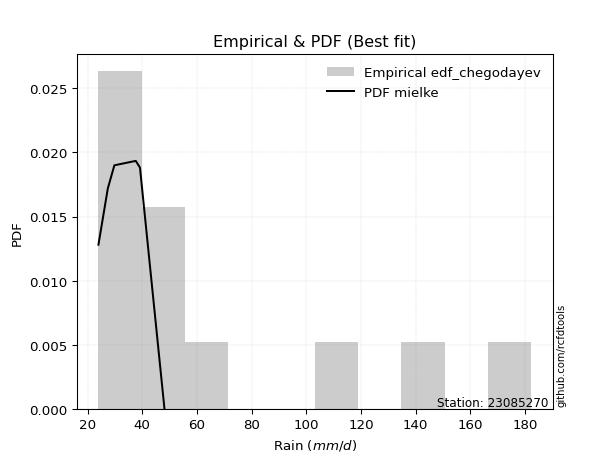</img>

</div>


### 6. Empirical - EDF Blom (1958)

The Blom formula is a specific "plotting position" formula used in hydrology and statistical analysis to estimate the empirical cumulative probability (or non-exceedance probability) of a data series. It is particularly recommended for data that are approximately normally distributed. The constant _a_ is set to 0.375 (or 3/8).

<div align="center">


$P=(m-a)/(n+1-2a)$


</div>


**6.1. Empirical values**

<div align="center">

|                | 0                   | 1                  | 2                   | 3                   | 4                   | 5                   | 6                  | 7                  | 8                  | 9                  | 10                 | 11                 |
|:---------------|:--------------------|:-------------------|:--------------------|:--------------------|:--------------------|:--------------------|:-------------------|:-------------------|:-------------------|:-------------------|:-------------------|:-------------------|
| date           | 2020                | 2015               | 2019                | 2016                | 2023                | 2021                | 2018               | 2017               | 2022               | 2025               | 2014               | 2024               |
| x              | 23.955              | 27.39              | 29.783              | 37.6                | 39.149              | 48.124              | 51.916             | 52.857             | 69.729             | 111.6              | 118.96             | 137.6              |
| m              | 1                   | 2                  | 3                   | 4                   | 5                   | 6                   | 7                  | 8                  | 9                  | 10                 | 11                 | 12                 |
| empirical_dist | edf_blom            | edf_blom           | edf_blom            | edf_blom            | edf_blom            | edf_blom            | edf_blom           | edf_blom           | edf_blom           | edf_blom           | edf_blom           | edf_blom           |
| empirical      | 0.05102040816326531 | 0.1326530612244898 | 0.21428571428571427 | 0.29591836734693877 | 0.37755102040816324 | 0.45918367346938777 | 0.5408163265306123 | 0.6224489795918368 | 0.7040816326530612 | 0.7857142857142857 | 0.8673469387755102 | 0.9489795918367347 |
| empirical_tr   | 1.053763440860215   | 1.1529411764705884 | 1.2727272727272727  | 1.4202898550724639  | 1.6065573770491803  | 1.8490566037735847  | 2.177777777777778  | 2.6486486486486487 | 3.3793103448275863 | 4.666666666666666  | 7.5384615384615365 | 19.60000000000002  |

</div>


**6.2. Kolmogorov-Smirnov fit test (sorted by Δ)**


<div align="center">

|                | 0                   | 1                   | 2                   | 3                   | 4                   | 5                   | 6                   | 7                   | 8                   | 9                   | 10                  | 11                  | 12                  | 13                  | 14                  | 15                  | 16                  | 17                  | 18                  | 19                  | 20                  | 21                  | 22                  | 23                  | 24                  | 25                  | 26                  | 27                  | 28                  | 29                  | 30                    | 31                  | 32                  | 33                  | 34                  | 35                  | 36                  | 37                  | 38                  | 39                  | 40                  | 41                  | 42                  | 43                  | 44                  | 45                  | 46                  | 47                  | 48                  | 49                  | 50                  | 51                  | 52                  | 53                  | 54                  | 55                  | 56                  | 57                  | 58                  | 59                  | 60                  | 61                  | 62                  | 63                  | 64                  | 65                  | 66                  | 67                  | 68                  | 69                  | 70                  | 71                  | 72                  | 73                  | 74                  | 75                  | 76                  | 77                  | 78                  | 79                  | 80                  | 81                  | 82                  | 83                  | 84                  | 85                  | 86                  | 87                  | 88                  | 89                  |
|:---------------|:--------------------|:--------------------|:--------------------|:--------------------|:--------------------|:--------------------|:--------------------|:--------------------|:--------------------|:--------------------|:--------------------|:--------------------|:--------------------|:--------------------|:--------------------|:--------------------|:--------------------|:--------------------|:--------------------|:--------------------|:--------------------|:--------------------|:--------------------|:--------------------|:--------------------|:--------------------|:--------------------|:--------------------|:--------------------|:--------------------|:----------------------|:--------------------|:--------------------|:--------------------|:--------------------|:--------------------|:--------------------|:--------------------|:--------------------|:--------------------|:--------------------|:--------------------|:--------------------|:--------------------|:--------------------|:--------------------|:--------------------|:--------------------|:--------------------|:--------------------|:--------------------|:--------------------|:--------------------|:--------------------|:--------------------|:--------------------|:--------------------|:--------------------|:--------------------|:--------------------|:--------------------|:--------------------|:--------------------|:--------------------|:--------------------|:--------------------|:--------------------|:--------------------|:--------------------|:--------------------|:--------------------|:--------------------|:--------------------|:--------------------|:--------------------|:--------------------|:--------------------|:--------------------|:--------------------|:--------------------|:--------------------|:--------------------|:--------------------|:--------------------|:--------------------|:--------------------|:--------------------|:--------------------|:--------------------|:--------------------|
| station        | 23085270            | 23085270            | 23085270            | 23085270            | 23085270            | 23085270            | 23085270            | 23085270            | 23085270            | 23085270            | 23085270            | 23085270            | 23085270            | 23085270            | 23085270            | 23085270            | 23085270            | 23085270            | 23085270            | 23085270            | 23085270            | 23085270            | 23085270            | 23085270            | 23085270            | 23085270            | 23085270            | 23085270            | 23085270            | 23085270            | 23085270              | 23085270            | 23085270            | 23085270            | 23085270            | 23085270            | 23085270            | 23085270            | 23085270            | 23085270            | 23085270            | 23085270            | 23085270            | 23085270            | 23085270            | 23085270            | 23085270            | 23085270            | 23085270            | 23085270            | 23085270            | 23085270            | 23085270            | 23085270            | 23085270            | 23085270            | 23085270            | 23085270            | 23085270            | 23085270            | 23085270            | 23085270            | 23085270            | 23085270            | 23085270            | 23085270            | 23085270            | 23085270            | 23085270            | 23085270            | 23085270            | 23085270            | 23085270            | 23085270            | 23085270            | 23085270            | 23085270            | 23085270            | 23085270            | 23085270            | 23085270            | 23085270            | 23085270            | 23085270            | 23085270            | 23085270            | 23085270            | 23085270            | 23085270            | 23085270            |
| empirical_dist | edf_blom            | edf_blom            | edf_blom            | edf_blom            | edf_blom            | edf_blom            | edf_blom            | edf_blom            | edf_blom            | edf_blom            | edf_blom            | edf_blom            | edf_blom            | edf_blom            | edf_blom            | edf_blom            | edf_blom            | edf_blom            | edf_blom            | edf_blom            | edf_blom            | edf_blom            | edf_blom            | edf_blom            | edf_blom            | edf_blom            | edf_blom            | edf_blom            | edf_blom            | edf_blom            | edf_blom              | edf_blom            | edf_blom            | edf_blom            | edf_blom            | edf_blom            | edf_blom            | edf_blom            | edf_blom            | edf_blom            | edf_blom            | edf_blom            | edf_blom            | edf_blom            | edf_blom            | edf_blom            | edf_blom            | edf_blom            | edf_blom            | edf_blom            | edf_blom            | edf_blom            | edf_blom            | edf_blom            | edf_blom            | edf_blom            | edf_blom            | edf_blom            | edf_blom            | edf_blom            | edf_blom            | edf_blom            | edf_blom            | edf_blom            | edf_blom            | edf_blom            | edf_blom            | edf_blom            | edf_blom            | edf_blom            | edf_blom            | edf_blom            | edf_blom            | edf_blom            | edf_blom            | edf_blom            | edf_blom            | edf_blom            | edf_blom            | edf_blom            | edf_blom            | edf_blom            | edf_blom            | edf_blom            | edf_blom            | edf_blom            | edf_blom            | edf_blom            | edf_blom            | edf_blom            |
| p_dist         | fisk                | logmielke           | mielke              | logfisk             | weibull_min         | alpha               | f                   | johnsonsu           | loggamma            | loggamma            | logerlang           | invweibull          | logweibull_min      | logexponnorm        | fatiguelife         | logfatiguelife      | loggenexpon         | invgamma            | loginvgauss         | loghalfnorm         | logbetaprime        | invgauss            | gamma               | loginvgamma         | loginvweibull       | loggompertz         | loggenlogistic      | lograyleigh         | nct                 | logalpha            | loglaplace_asymmetric | logmaxwell          | logkstwobign        | logf                | laplace_asymmetric  | expon               | genexpon            | gompertz            | exponnorm           | lognct              | logrice             | logpearson3         | logtruncnorm        | logncf              | betaprime           | loggumbel_r         | logmoyal            | chi2                | ncf                 | loghalflogistic     | logloggamma         | logjohnsonsu        | lognorm             | lognorm             | logcrystalball      | logt                | halflogistic        | loglogistic         | loghypsecant        | logexpon            | moyal               | halfnorm            | nakagami            | loglaplace          | genlogistic         | gumbel_r            | pearson3            | rayleigh            | kstwobign           | erlang              | lognakagami         | maxwell             | logchi2             | loggumbel_l         | wald                | loggibrat           | logwald             | crystalball         | norm                | truncnorm           | t                   | rice                | logistic            | hypsecant           | gibrat              | laplace             | gumbel_l            | loglognorm          | pareto              | logpareto           |
| delta          | 0.06568482013220756 | 0.06900385547749602 | 0.06967752406285668 | 0.08895607435751429 | 0.08934507663431546 | 0.09016344232972506 | 0.09226926848841044 | 0.09385666944363524 | 0.09642139403069933 | 0.09642139403069933 | 0.09642437192217895 | 0.0968830059058825  | 0.09744561389322948 | 0.09828260538891276 | 0.10041725020705428 | 0.10061075384017537 | 0.10099081577511715 | 0.10121117482240949 | 0.10235092885115238 | 0.10372389143638039 | 0.103761602574023   | 0.10539015159498133 | 0.1068732143029375  | 0.10793004694664832 | 0.10814753177155001 | 0.10824691098943984 | 0.10854178280330418 | 0.10867516617599005 | 0.10903386457930975 | 0.1101938685374706  | 0.11033331676567526   | 0.11135723355889182 | 0.11155299507138294 | 0.11163391492949926 | 0.11202735896193716 | 0.1120452237739864  | 0.11259801807667635 | 0.11393753330274059 | 0.11409658949886226 | 0.11454804409203545 | 0.11458046690179391 | 0.11562088013286476 | 0.11578398787735805 | 0.11579808831505911 | 0.1160580577374295  | 0.11656330467762899 | 0.11732637908367216 | 0.11796897137244022 | 0.11822926341495066 | 0.1232153961942514  | 0.12337691092039987 | 0.12344224930437275 | 0.1234673451750084  | 0.1234673451750084  | 0.12346734929607373 | 0.12346735464500336 | 0.12679487225571096 | 0.13115360846354807 | 0.1350781525264988  | 0.13777211124463185 | 0.14099853032276866 | 0.14224296963317418 | 0.14248411604043404 | 0.14300311823945364 | 0.15325127234210084 | 0.16381780517194966 | 0.16787560502363968 | 0.17712099142547766 | 0.1817161542202933  | 0.18337548334415832 | 0.1865649567388113  | 0.1894171958715694  | 0.18956623362099334 | 0.19387267866812685 | 0.20228800049971674 | 0.21428571428571427 | 0.21428571428571427 | 0.223410878385004   | 0.22341087938990978 | 0.2234108966863534  | 0.22341544043657413 | 0.228737503335252   | 0.23642068299833785 | 0.2470574954614309  | 0.262849657547179   | 0.2742413203938952  | 0.28982323795396303 | 0.4206998012025507  | 0.46371287574964537 | 0.47837755058008735 |
| deltao         | 0.36218414519599995 | 0.36218414519599995 | 0.36218414519599995 | 0.36218414519599995 | 0.36218414519599995 | 0.36218414519599995 | 0.36218414519599995 | 0.36218414519599995 | 0.36218414519599995 | 0.36218414519599995 | 0.36218414519599995 | 0.36218414519599995 | 0.36218414519599995 | 0.36218414519599995 | 0.36218414519599995 | 0.36218414519599995 | 0.36218414519599995 | 0.36218414519599995 | 0.36218414519599995 | 0.36218414519599995 | 0.36218414519599995 | 0.36218414519599995 | 0.36218414519599995 | 0.36218414519599995 | 0.36218414519599995 | 0.36218414519599995 | 0.36218414519599995 | 0.36218414519599995 | 0.36218414519599995 | 0.36218414519599995 | 0.36218414519599995   | 0.36218414519599995 | 0.36218414519599995 | 0.36218414519599995 | 0.36218414519599995 | 0.36218414519599995 | 0.36218414519599995 | 0.36218414519599995 | 0.36218414519599995 | 0.36218414519599995 | 0.36218414519599995 | 0.36218414519599995 | 0.36218414519599995 | 0.36218414519599995 | 0.36218414519599995 | 0.36218414519599995 | 0.36218414519599995 | 0.36218414519599995 | 0.36218414519599995 | 0.36218414519599995 | 0.36218414519599995 | 0.36218414519599995 | 0.36218414519599995 | 0.36218414519599995 | 0.36218414519599995 | 0.36218414519599995 | 0.36218414519599995 | 0.36218414519599995 | 0.36218414519599995 | 0.36218414519599995 | 0.36218414519599995 | 0.36218414519599995 | 0.36218414519599995 | 0.36218414519599995 | 0.36218414519599995 | 0.36218414519599995 | 0.36218414519599995 | 0.36218414519599995 | 0.36218414519599995 | 0.36218414519599995 | 0.36218414519599995 | 0.36218414519599995 | 0.36218414519599995 | 0.36218414519599995 | 0.36218414519599995 | 0.36218414519599995 | 0.36218414519599995 | 0.36218414519599995 | 0.36218414519599995 | 0.36218414519599995 | 0.36218414519599995 | 0.36218414519599995 | 0.36218414519599995 | 0.36218414519599995 | 0.36218414519599995 | 0.36218414519599995 | 0.36218414519599995 | 0.36218414519599995 | 0.36218414519599995 | 0.36218414519599995 |
| eval           | Δo > Δ              | Δo > Δ              | Δo > Δ              | Δo > Δ              | Δo > Δ              | Δo > Δ              | Δo > Δ              | Δo > Δ              | Δo > Δ              | Δo > Δ              | Δo > Δ              | Δo > Δ              | Δo > Δ              | Δo > Δ              | Δo > Δ              | Δo > Δ              | Δo > Δ              | Δo > Δ              | Δo > Δ              | Δo > Δ              | Δo > Δ              | Δo > Δ              | Δo > Δ              | Δo > Δ              | Δo > Δ              | Δo > Δ              | Δo > Δ              | Δo > Δ              | Δo > Δ              | Δo > Δ              | Δo > Δ                | Δo > Δ              | Δo > Δ              | Δo > Δ              | Δo > Δ              | Δo > Δ              | Δo > Δ              | Δo > Δ              | Δo > Δ              | Δo > Δ              | Δo > Δ              | Δo > Δ              | Δo > Δ              | Δo > Δ              | Δo > Δ              | Δo > Δ              | Δo > Δ              | Δo > Δ              | Δo > Δ              | Δo > Δ              | Δo > Δ              | Δo > Δ              | Δo > Δ              | Δo > Δ              | Δo > Δ              | Δo > Δ              | Δo > Δ              | Δo > Δ              | Δo > Δ              | Δo > Δ              | Δo > Δ              | Δo > Δ              | Δo > Δ              | Δo > Δ              | Δo > Δ              | Δo > Δ              | Δo > Δ              | Δo > Δ              | Δo > Δ              | Δo > Δ              | Δo > Δ              | Δo > Δ              | Δo > Δ              | Δo > Δ              | Δo > Δ              | Δo > Δ              | Δo > Δ              | Δo > Δ              | Δo > Δ              | Δo > Δ              | Δo > Δ              | Δo > Δ              | Δo > Δ              | Δo > Δ              | Δo > Δ              | Δo > Δ              | Δo > Δ              | Δo <= Δ             | Δo <= Δ             | Δo <= Δ             |
| fit            | 1                   | 1                   | 1                   | 1                   | 1                   | 1                   | 1                   | 1                   | 1                   | 1                   | 1                   | 1                   | 1                   | 1                   | 1                   | 1                   | 1                   | 1                   | 1                   | 1                   | 1                   | 1                   | 1                   | 1                   | 1                   | 1                   | 1                   | 1                   | 1                   | 1                   | 1                     | 1                   | 1                   | 1                   | 1                   | 1                   | 1                   | 1                   | 1                   | 1                   | 1                   | 1                   | 1                   | 1                   | 1                   | 1                   | 1                   | 1                   | 1                   | 1                   | 1                   | 1                   | 1                   | 1                   | 1                   | 1                   | 1                   | 1                   | 1                   | 1                   | 1                   | 1                   | 1                   | 1                   | 1                   | 1                   | 1                   | 1                   | 1                   | 1                   | 1                   | 1                   | 1                   | 1                   | 1                   | 1                   | 1                   | 1                   | 1                   | 1                   | 1                   | 1                   | 1                   | 1                   | 1                   | 1                   | 1                   | 0                   | 0                   | 0                   |
| n              | 12                  | 12                  | 12                  | 12                  | 12                  | 12                  | 12                  | 12                  | 12                  | 12                  | 12                  | 12                  | 12                  | 12                  | 12                  | 12                  | 12                  | 12                  | 12                  | 12                  | 12                  | 12                  | 12                  | 12                  | 12                  | 12                  | 12                  | 12                  | 12                  | 12                  | 12                    | 12                  | 12                  | 12                  | 12                  | 12                  | 12                  | 12                  | 12                  | 12                  | 12                  | 12                  | 12                  | 12                  | 12                  | 12                  | 12                  | 12                  | 12                  | 12                  | 12                  | 12                  | 12                  | 12                  | 12                  | 12                  | 12                  | 12                  | 12                  | 12                  | 12                  | 12                  | 12                  | 12                  | 12                  | 12                  | 12                  | 12                  | 12                  | 12                  | 12                  | 12                  | 12                  | 12                  | 12                  | 12                  | 12                  | 12                  | 12                  | 12                  | 12                  | 12                  | 12                  | 12                  | 12                  | 12                  | 12                  | 12                  | 12                  | 12                  |
| best_fit       | 1                   | 0                   | 0                   | 0                   | 0                   | 0                   | 0                   | 0                   | 0                   | 0                   | 0                   | 0                   | 0                   | 0                   | 0                   | 0                   | 0                   | 0                   | 0                   | 0                   | 0                   | 0                   | 0                   | 0                   | 0                   | 0                   | 0                   | 0                   | 0                   | 0                   | 0                     | 0                   | 0                   | 0                   | 0                   | 0                   | 0                   | 0                   | 0                   | 0                   | 0                   | 0                   | 0                   | 0                   | 0                   | 0                   | 0                   | 0                   | 0                   | 0                   | 0                   | 0                   | 0                   | 0                   | 0                   | 0                   | 0                   | 0                   | 0                   | 0                   | 0                   | 0                   | 0                   | 0                   | 0                   | 0                   | 0                   | 0                   | 0                   | 0                   | 0                   | 0                   | 0                   | 0                   | 0                   | 0                   | 0                   | 0                   | 0                   | 0                   | 0                   | 0                   | 0                   | 0                   | 0                   | 0                   | 0                   | 0                   | 0                   | 0                   |
| best_fit_sort  | 1                   | 2                   | 3                   | 4                   | 5                   | 6                   | 7                   | 8                   | 9                   | 10                  | 11                  | 12                  | 13                  | 14                  | 15                  | 16                  | 17                  | 18                  | 19                  | 20                  | 21                  | 22                  | 23                  | 24                  | 25                  | 26                  | 27                  | 28                  | 29                  | 30                  | 31                    | 32                  | 33                  | 34                  | 35                  | 36                  | 37                  | 38                  | 39                  | 40                  | 41                  | 42                  | 43                  | 44                  | 45                  | 46                  | 47                  | 48                  | 49                  | 50                  | 51                  | 52                  | 53                  | 54                  | 55                  | 56                  | 57                  | 58                  | 59                  | 60                  | 61                  | 62                  | 63                  | 64                  | 65                  | 66                  | 67                  | 68                  | 69                  | 70                  | 71                  | 72                  | 73                  | 74                  | 75                  | 76                  | 77                  | 78                  | 79                  | 80                  | 81                  | 82                  | 83                  | 84                  | 85                  | 86                  | 87                  | 88                  | 89                  | 90                  |

</div>


<div align="center">

</img>

</div>


**6.3. Best fit**

<div align="center">

|   id |   station | empirical_dist   | p_dist   |     delta |   deltao | eval   |   fit |   n |   best_fit |   best_fit_sort |
|-----:|----------:|:-----------------|:---------|----------:|---------:|:-------|------:|----:|-----------:|----------------:|
|    0 |  23085270 | edf_blom         | fisk     | 0.0656848 | 0.362184 | Δo > Δ |     1 |  12 |          1 |               1 |

</div>


<div align="center">

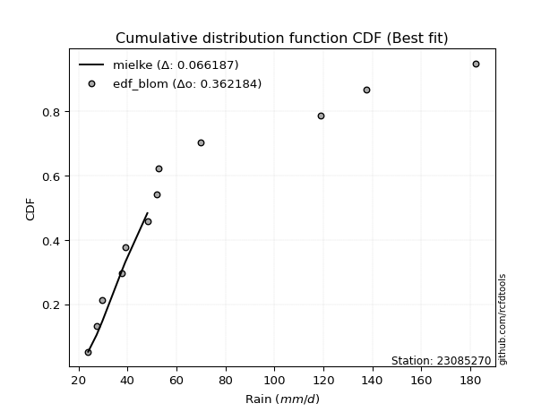</img>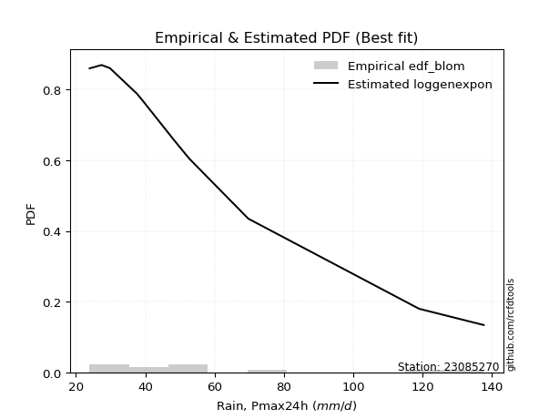</img>

</div>


### 7. Empirical - EDF Tukey (1962)

In hydrology, the Tukey formula is used as a plotting position formula to estimate the empirical probability or frequency of a flood event (or other hydrological data). The formula parameter is given as _c=0.333_ (or 1/3).

<div align="center">


$P=(m-c)/(n+1-2c)$


</div>


**7.1. Empirical values**

<div align="center">

|                | 0                   | 1                   | 2                   | 3                  | 4                  | 5                  | 6                  | 7                  | 8                  | 9                  | 10                 | 11                 |
|:---------------|:--------------------|:--------------------|:--------------------|:-------------------|:-------------------|:-------------------|:-------------------|:-------------------|:-------------------|:-------------------|:-------------------|:-------------------|
| date           | 2020                | 2015                | 2019                | 2016               | 2023               | 2021               | 2018               | 2017               | 2022               | 2025               | 2014               | 2024               |
| x              | 23.955              | 27.39               | 29.783              | 37.6               | 39.149             | 48.124             | 51.916             | 52.857             | 69.729             | 111.6              | 118.96             | 137.6              |
| m              | 1                   | 2                   | 3                   | 4                  | 5                  | 6                  | 7                  | 8                  | 9                  | 10                 | 11                 | 12                 |
| empirical_dist | edf_tukey           | edf_tukey           | edf_tukey           | edf_tukey          | edf_tukey          | edf_tukey          | edf_tukey          | edf_tukey          | edf_tukey          | edf_tukey          | edf_tukey          | edf_tukey          |
| empirical      | 0.05405405405405406 | 0.13513513513513514 | 0.21621621621621623 | 0.2972972972972973 | 0.3783783783783784 | 0.4594594594594595 | 0.5405405405405406 | 0.6216216216216216 | 0.7027027027027027 | 0.7837837837837838 | 0.8648648648648649 | 0.9459459459459459 |
| empirical_tr   | 1.0571428571428572  | 1.15625             | 1.2758620689655173  | 1.4230769230769231 | 1.608695652173913  | 1.8499999999999999 | 2.1764705882352944 | 2.642857142857143  | 3.363636363636364  | 4.625              | 7.400000000000003  | 18.5               |

</div>


**7.2. Kolmogorov-Smirnov fit test (sorted by Δ)**


<div align="center">

|                | 0                   | 1                   | 2                   | 3                   | 4                   | 5                   | 6                   | 7                   | 8                   | 9                   | 10                  | 11                  | 12                  | 13                  | 14                  | 15                  | 16                  | 17                  | 18                  | 19                  | 20                  | 21                  | 22                  | 23                  | 24                  | 25                  | 26                  | 27                  | 28                  | 29                  | 30                    | 31                  | 32                  | 33                  | 34                  | 35                  | 36                  | 37                  | 38                  | 39                  | 40                  | 41                  | 42                  | 43                  | 44                  | 45                  | 46                  | 47                  | 48                  | 49                  | 50                  | 51                  | 52                  | 53                  | 54                  | 55                  | 56                  | 57                  | 58                  | 59                  | 60                  | 61                  | 62                  | 63                  | 64                  | 65                  | 66                  | 67                  | 68                  | 69                  | 70                  | 71                  | 72                  | 73                  | 74                  | 75                  | 76                  | 77                  | 78                  | 79                  | 80                  | 81                  | 82                  | 83                  | 84                  | 85                  | 86                  | 87                  | 88                  | 89                  |
|:---------------|:--------------------|:--------------------|:--------------------|:--------------------|:--------------------|:--------------------|:--------------------|:--------------------|:--------------------|:--------------------|:--------------------|:--------------------|:--------------------|:--------------------|:--------------------|:--------------------|:--------------------|:--------------------|:--------------------|:--------------------|:--------------------|:--------------------|:--------------------|:--------------------|:--------------------|:--------------------|:--------------------|:--------------------|:--------------------|:--------------------|:----------------------|:--------------------|:--------------------|:--------------------|:--------------------|:--------------------|:--------------------|:--------------------|:--------------------|:--------------------|:--------------------|:--------------------|:--------------------|:--------------------|:--------------------|:--------------------|:--------------------|:--------------------|:--------------------|:--------------------|:--------------------|:--------------------|:--------------------|:--------------------|:--------------------|:--------------------|:--------------------|:--------------------|:--------------------|:--------------------|:--------------------|:--------------------|:--------------------|:--------------------|:--------------------|:--------------------|:--------------------|:--------------------|:--------------------|:--------------------|:--------------------|:--------------------|:--------------------|:--------------------|:--------------------|:--------------------|:--------------------|:--------------------|:--------------------|:--------------------|:--------------------|:--------------------|:--------------------|:--------------------|:--------------------|:--------------------|:--------------------|:--------------------|:--------------------|:--------------------|
| station        | 23085270            | 23085270            | 23085270            | 23085270            | 23085270            | 23085270            | 23085270            | 23085270            | 23085270            | 23085270            | 23085270            | 23085270            | 23085270            | 23085270            | 23085270            | 23085270            | 23085270            | 23085270            | 23085270            | 23085270            | 23085270            | 23085270            | 23085270            | 23085270            | 23085270            | 23085270            | 23085270            | 23085270            | 23085270            | 23085270            | 23085270              | 23085270            | 23085270            | 23085270            | 23085270            | 23085270            | 23085270            | 23085270            | 23085270            | 23085270            | 23085270            | 23085270            | 23085270            | 23085270            | 23085270            | 23085270            | 23085270            | 23085270            | 23085270            | 23085270            | 23085270            | 23085270            | 23085270            | 23085270            | 23085270            | 23085270            | 23085270            | 23085270            | 23085270            | 23085270            | 23085270            | 23085270            | 23085270            | 23085270            | 23085270            | 23085270            | 23085270            | 23085270            | 23085270            | 23085270            | 23085270            | 23085270            | 23085270            | 23085270            | 23085270            | 23085270            | 23085270            | 23085270            | 23085270            | 23085270            | 23085270            | 23085270            | 23085270            | 23085270            | 23085270            | 23085270            | 23085270            | 23085270            | 23085270            | 23085270            |
| empirical_dist | edf_tukey           | edf_tukey           | edf_tukey           | edf_tukey           | edf_tukey           | edf_tukey           | edf_tukey           | edf_tukey           | edf_tukey           | edf_tukey           | edf_tukey           | edf_tukey           | edf_tukey           | edf_tukey           | edf_tukey           | edf_tukey           | edf_tukey           | edf_tukey           | edf_tukey           | edf_tukey           | edf_tukey           | edf_tukey           | edf_tukey           | edf_tukey           | edf_tukey           | edf_tukey           | edf_tukey           | edf_tukey           | edf_tukey           | edf_tukey           | edf_tukey             | edf_tukey           | edf_tukey           | edf_tukey           | edf_tukey           | edf_tukey           | edf_tukey           | edf_tukey           | edf_tukey           | edf_tukey           | edf_tukey           | edf_tukey           | edf_tukey           | edf_tukey           | edf_tukey           | edf_tukey           | edf_tukey           | edf_tukey           | edf_tukey           | edf_tukey           | edf_tukey           | edf_tukey           | edf_tukey           | edf_tukey           | edf_tukey           | edf_tukey           | edf_tukey           | edf_tukey           | edf_tukey           | edf_tukey           | edf_tukey           | edf_tukey           | edf_tukey           | edf_tukey           | edf_tukey           | edf_tukey           | edf_tukey           | edf_tukey           | edf_tukey           | edf_tukey           | edf_tukey           | edf_tukey           | edf_tukey           | edf_tukey           | edf_tukey           | edf_tukey           | edf_tukey           | edf_tukey           | edf_tukey           | edf_tukey           | edf_tukey           | edf_tukey           | edf_tukey           | edf_tukey           | edf_tukey           | edf_tukey           | edf_tukey           | edf_tukey           | edf_tukey           | edf_tukey           |
| p_dist         | fisk                | logmielke           | mielke              | weibull_min         | logfisk             | alpha               | f                   | johnsonsu           | loggamma            | loggamma            | logerlang           | invweibull          | logweibull_min      | logexponnorm        | fatiguelife         | logfatiguelife      | loggenexpon         | invgamma            | loginvgauss         | loghalfnorm         | logbetaprime        | invgauss            | gamma               | loginvgamma         | loginvweibull       | loggompertz         | loggenlogistic      | lograyleigh         | nct                 | logalpha            | loglaplace_asymmetric | logmaxwell          | logkstwobign        | logf                | laplace_asymmetric  | expon               | logtruncnorm        | genexpon            | gompertz            | exponnorm           | lognct              | logrice             | logpearson3         | logncf              | betaprime           | loggumbel_r         | logmoyal            | chi2                | ncf                 | logloggamma         | logjohnsonsu        | logcrystalball      | lognorm             | lognorm             | logt                | loghalflogistic     | halflogistic        | loglogistic         | logexpon            | loghypsecant        | moyal               | halfnorm            | nakagami            | loglaplace          | genlogistic         | gumbel_r            | pearson3            | rayleigh            | kstwobign           | erlang              | lognakagami         | logchi2             | maxwell             | loggumbel_l         | wald                | loggibrat           | logwald             | crystalball         | norm                | truncnorm           | t                   | rice                | logistic            | hypsecant           | gibrat              | laplace             | gumbel_l            | loglognorm          | pareto              | logpareto           |
| delta          | 0.06761532206270948 | 0.07093435740799797 | 0.07160802599335864 | 0.0885177186641003  | 0.09088657628801622 | 0.09209394426022699 | 0.09419977041891237 | 0.09578717137413717 | 0.0961456080406276  | 0.0961456080406276  | 0.09614858593210723 | 0.09881350783638443 | 0.0993761158237314  | 0.10021310731941468 | 0.1023477521375562  | 0.1025412557706773  | 0.10292131770561908 | 0.10314167675291142 | 0.1042814307816543  | 0.10565439336688232 | 0.10569210450452493 | 0.10732065352548326 | 0.10880371623343943 | 0.10986054887715024 | 0.11007803370205194 | 0.11017741291994176 | 0.1104722847338061  | 0.11060566810649197 | 0.11096436650981167 | 0.11212437046797252 | 0.11226381869617719   | 0.11328773548939375 | 0.11348349700188487 | 0.11356441686000118 | 0.11395786089243909 | 0.11397572570448833 | 0.11440505792699951 | 0.11452852000717828 | 0.11586803523324252 | 0.11602709142936418 | 0.11647854602253738 | 0.11651096883229584 | 0.11755138206336668 | 0.11772859024556104 | 0.11798855966793143 | 0.11849380660813091 | 0.11925688101417409 | 0.11989947330294215 | 0.12015976534545258 | 0.12254955295018471 | 0.1226148913341576  | 0.12337879332774304 | 0.12337879451310385 | 0.12337879451310385 | 0.12337891212418906 | 0.12569747010489674 | 0.1259675142854958  | 0.13308411039405    | 0.1363931812942733  | 0.13700865445700072 | 0.1401711723525535  | 0.14141561166295902 | 0.14165675807021888 | 0.1438304762096688  | 0.15242391437188568 | 0.1629904472017345  | 0.16704824705342453 | 0.1762936334552625  | 0.18088879625007814 | 0.1829075170121845  | 0.18518602678845275 | 0.1881873036706348  | 0.18858983790135425 | 0.1930453206979117  | 0.2042185024302187  | 0.21621621621621623 | 0.21621621621621623 | 0.22258352041478885 | 0.22258352141969462 | 0.22258353871613823 | 0.22258808246635897 | 0.22791014536503684 | 0.2355933250281227  | 0.24623013749121575 | 0.26367701551739414 | 0.27341396242368005 | 0.28899587998374787 | 0.4182177272919054  | 0.46123080183900006 | 0.47589547666944204 |
| deltao         | 0.36218414519599995 | 0.36218414519599995 | 0.36218414519599995 | 0.36218414519599995 | 0.36218414519599995 | 0.36218414519599995 | 0.36218414519599995 | 0.36218414519599995 | 0.36218414519599995 | 0.36218414519599995 | 0.36218414519599995 | 0.36218414519599995 | 0.36218414519599995 | 0.36218414519599995 | 0.36218414519599995 | 0.36218414519599995 | 0.36218414519599995 | 0.36218414519599995 | 0.36218414519599995 | 0.36218414519599995 | 0.36218414519599995 | 0.36218414519599995 | 0.36218414519599995 | 0.36218414519599995 | 0.36218414519599995 | 0.36218414519599995 | 0.36218414519599995 | 0.36218414519599995 | 0.36218414519599995 | 0.36218414519599995 | 0.36218414519599995   | 0.36218414519599995 | 0.36218414519599995 | 0.36218414519599995 | 0.36218414519599995 | 0.36218414519599995 | 0.36218414519599995 | 0.36218414519599995 | 0.36218414519599995 | 0.36218414519599995 | 0.36218414519599995 | 0.36218414519599995 | 0.36218414519599995 | 0.36218414519599995 | 0.36218414519599995 | 0.36218414519599995 | 0.36218414519599995 | 0.36218414519599995 | 0.36218414519599995 | 0.36218414519599995 | 0.36218414519599995 | 0.36218414519599995 | 0.36218414519599995 | 0.36218414519599995 | 0.36218414519599995 | 0.36218414519599995 | 0.36218414519599995 | 0.36218414519599995 | 0.36218414519599995 | 0.36218414519599995 | 0.36218414519599995 | 0.36218414519599995 | 0.36218414519599995 | 0.36218414519599995 | 0.36218414519599995 | 0.36218414519599995 | 0.36218414519599995 | 0.36218414519599995 | 0.36218414519599995 | 0.36218414519599995 | 0.36218414519599995 | 0.36218414519599995 | 0.36218414519599995 | 0.36218414519599995 | 0.36218414519599995 | 0.36218414519599995 | 0.36218414519599995 | 0.36218414519599995 | 0.36218414519599995 | 0.36218414519599995 | 0.36218414519599995 | 0.36218414519599995 | 0.36218414519599995 | 0.36218414519599995 | 0.36218414519599995 | 0.36218414519599995 | 0.36218414519599995 | 0.36218414519599995 | 0.36218414519599995 | 0.36218414519599995 |
| eval           | Δo > Δ              | Δo > Δ              | Δo > Δ              | Δo > Δ              | Δo > Δ              | Δo > Δ              | Δo > Δ              | Δo > Δ              | Δo > Δ              | Δo > Δ              | Δo > Δ              | Δo > Δ              | Δo > Δ              | Δo > Δ              | Δo > Δ              | Δo > Δ              | Δo > Δ              | Δo > Δ              | Δo > Δ              | Δo > Δ              | Δo > Δ              | Δo > Δ              | Δo > Δ              | Δo > Δ              | Δo > Δ              | Δo > Δ              | Δo > Δ              | Δo > Δ              | Δo > Δ              | Δo > Δ              | Δo > Δ                | Δo > Δ              | Δo > Δ              | Δo > Δ              | Δo > Δ              | Δo > Δ              | Δo > Δ              | Δo > Δ              | Δo > Δ              | Δo > Δ              | Δo > Δ              | Δo > Δ              | Δo > Δ              | Δo > Δ              | Δo > Δ              | Δo > Δ              | Δo > Δ              | Δo > Δ              | Δo > Δ              | Δo > Δ              | Δo > Δ              | Δo > Δ              | Δo > Δ              | Δo > Δ              | Δo > Δ              | Δo > Δ              | Δo > Δ              | Δo > Δ              | Δo > Δ              | Δo > Δ              | Δo > Δ              | Δo > Δ              | Δo > Δ              | Δo > Δ              | Δo > Δ              | Δo > Δ              | Δo > Δ              | Δo > Δ              | Δo > Δ              | Δo > Δ              | Δo > Δ              | Δo > Δ              | Δo > Δ              | Δo > Δ              | Δo > Δ              | Δo > Δ              | Δo > Δ              | Δo > Δ              | Δo > Δ              | Δo > Δ              | Δo > Δ              | Δo > Δ              | Δo > Δ              | Δo > Δ              | Δo > Δ              | Δo > Δ              | Δo > Δ              | Δo <= Δ             | Δo <= Δ             | Δo <= Δ             |
| fit            | 1                   | 1                   | 1                   | 1                   | 1                   | 1                   | 1                   | 1                   | 1                   | 1                   | 1                   | 1                   | 1                   | 1                   | 1                   | 1                   | 1                   | 1                   | 1                   | 1                   | 1                   | 1                   | 1                   | 1                   | 1                   | 1                   | 1                   | 1                   | 1                   | 1                   | 1                     | 1                   | 1                   | 1                   | 1                   | 1                   | 1                   | 1                   | 1                   | 1                   | 1                   | 1                   | 1                   | 1                   | 1                   | 1                   | 1                   | 1                   | 1                   | 1                   | 1                   | 1                   | 1                   | 1                   | 1                   | 1                   | 1                   | 1                   | 1                   | 1                   | 1                   | 1                   | 1                   | 1                   | 1                   | 1                   | 1                   | 1                   | 1                   | 1                   | 1                   | 1                   | 1                   | 1                   | 1                   | 1                   | 1                   | 1                   | 1                   | 1                   | 1                   | 1                   | 1                   | 1                   | 1                   | 1                   | 1                   | 0                   | 0                   | 0                   |
| n              | 12                  | 12                  | 12                  | 12                  | 12                  | 12                  | 12                  | 12                  | 12                  | 12                  | 12                  | 12                  | 12                  | 12                  | 12                  | 12                  | 12                  | 12                  | 12                  | 12                  | 12                  | 12                  | 12                  | 12                  | 12                  | 12                  | 12                  | 12                  | 12                  | 12                  | 12                    | 12                  | 12                  | 12                  | 12                  | 12                  | 12                  | 12                  | 12                  | 12                  | 12                  | 12                  | 12                  | 12                  | 12                  | 12                  | 12                  | 12                  | 12                  | 12                  | 12                  | 12                  | 12                  | 12                  | 12                  | 12                  | 12                  | 12                  | 12                  | 12                  | 12                  | 12                  | 12                  | 12                  | 12                  | 12                  | 12                  | 12                  | 12                  | 12                  | 12                  | 12                  | 12                  | 12                  | 12                  | 12                  | 12                  | 12                  | 12                  | 12                  | 12                  | 12                  | 12                  | 12                  | 12                  | 12                  | 12                  | 12                  | 12                  | 12                  |
| best_fit       | 1                   | 0                   | 0                   | 0                   | 0                   | 0                   | 0                   | 0                   | 0                   | 0                   | 0                   | 0                   | 0                   | 0                   | 0                   | 0                   | 0                   | 0                   | 0                   | 0                   | 0                   | 0                   | 0                   | 0                   | 0                   | 0                   | 0                   | 0                   | 0                   | 0                   | 0                     | 0                   | 0                   | 0                   | 0                   | 0                   | 0                   | 0                   | 0                   | 0                   | 0                   | 0                   | 0                   | 0                   | 0                   | 0                   | 0                   | 0                   | 0                   | 0                   | 0                   | 0                   | 0                   | 0                   | 0                   | 0                   | 0                   | 0                   | 0                   | 0                   | 0                   | 0                   | 0                   | 0                   | 0                   | 0                   | 0                   | 0                   | 0                   | 0                   | 0                   | 0                   | 0                   | 0                   | 0                   | 0                   | 0                   | 0                   | 0                   | 0                   | 0                   | 0                   | 0                   | 0                   | 0                   | 0                   | 0                   | 0                   | 0                   | 0                   |
| best_fit_sort  | 1                   | 2                   | 3                   | 4                   | 5                   | 6                   | 7                   | 8                   | 9                   | 10                  | 11                  | 12                  | 13                  | 14                  | 15                  | 16                  | 17                  | 18                  | 19                  | 20                  | 21                  | 22                  | 23                  | 24                  | 25                  | 26                  | 27                  | 28                  | 29                  | 30                  | 31                    | 32                  | 33                  | 34                  | 35                  | 36                  | 37                  | 38                  | 39                  | 40                  | 41                  | 42                  | 43                  | 44                  | 45                  | 46                  | 47                  | 48                  | 49                  | 50                  | 51                  | 52                  | 53                  | 54                  | 55                  | 56                  | 57                  | 58                  | 59                  | 60                  | 61                  | 62                  | 63                  | 64                  | 65                  | 66                  | 67                  | 68                  | 69                  | 70                  | 71                  | 72                  | 73                  | 74                  | 75                  | 76                  | 77                  | 78                  | 79                  | 80                  | 81                  | 82                  | 83                  | 84                  | 85                  | 86                  | 87                  | 88                  | 89                  | 90                  |

</div>


<div align="center">

</img>

</div>


**7.3. Best fit**

<div align="center">

|   id |   station | empirical_dist   | p_dist   |     delta |   deltao | eval   |   fit |   n |   best_fit |   best_fit_sort |
|-----:|----------:|:-----------------|:---------|----------:|---------:|:-------|------:|----:|-----------:|----------------:|
|    0 |  23085270 | edf_tukey        | fisk     | 0.0676153 | 0.362184 | Δo > Δ |     1 |  12 |          1 |               1 |

</div>


<div align="center">

</img></img>

</div>


### 8. Empirical - EDF Gringorten (1963)

Gringorten plotting position formula is essential for estimating the probability and return periods of extreme events like floods and heavy rainfall. The constant _a=0.44_.

<div align="center">


$P=(m-a)/(n+1-2a)$


</div>


**8.1. Empirical values**

<div align="center">

|                | 0                   | 1                   | 2                   | 3                   | 4                   | 5                   | 6                  | 7                  | 8                  | 9                  | 10                 | 11                 |
|:---------------|:--------------------|:--------------------|:--------------------|:--------------------|:--------------------|:--------------------|:-------------------|:-------------------|:-------------------|:-------------------|:-------------------|:-------------------|
| date           | 2020                | 2015                | 2019                | 2016                | 2023                | 2021                | 2018               | 2017               | 2022               | 2025               | 2014               | 2024               |
| x              | 23.955              | 27.39               | 29.783              | 37.6                | 39.149              | 48.124              | 51.916             | 52.857             | 69.729             | 111.6              | 118.96             | 137.6              |
| m              | 1                   | 2                   | 3                   | 4                   | 5                   | 6                   | 7                  | 8                  | 9                  | 10                 | 11                 | 12                 |
| empirical_dist | edf_gringorten      | edf_gringorten      | edf_gringorten      | edf_gringorten      | edf_gringorten      | edf_gringorten      | edf_gringorten     | edf_gringorten     | edf_gringorten     | edf_gringorten     | edf_gringorten     | edf_gringorten     |
| empirical      | 0.04620462046204621 | 0.12871287128712872 | 0.21122112211221125 | 0.29372937293729373 | 0.37623762376237624 | 0.45874587458745875 | 0.5412541254125413 | 0.6237623762376238 | 0.7062706270627064 | 0.7887788778877889 | 0.8712871287128714 | 0.9537953795379539 |
| empirical_tr   | 1.0484429065743945  | 1.1477272727272727  | 1.2677824267782427  | 1.4158878504672898  | 1.6031746031746033  | 1.8475609756097562  | 2.179856115107914  | 2.6578947368421053 | 3.4044943820224733 | 4.734375000000003  | 7.769230769230775  | 21.642857142857192 |

</div>


**8.2. Kolmogorov-Smirnov fit test (sorted by Δ)**


<div align="center">

|                | 0                   | 1                   | 2                   | 3                   | 4                   | 5                   | 6                   | 7                   | 8                   | 9                   | 10                  | 11                  | 12                  | 13                  | 14                  | 15                  | 16                  | 17                  | 18                  | 19                  | 20                  | 21                  | 22                  | 23                  | 24                  | 25                  | 26                  | 27                  | 28                  | 29                  | 30                    | 31                  | 32                  | 33                  | 34                  | 35                  | 36                  | 37                  | 38                  | 39                  | 40                  | 41                  | 42                  | 43                  | 44                  | 45                  | 46                  | 47                  | 48                  | 49                  | 50                  | 51                  | 52                  | 53                  | 54                  | 55                  | 56                  | 57                  | 58                  | 59                  | 60                  | 61                  | 62                  | 63                  | 64                  | 65                  | 66                  | 67                  | 68                  | 69                  | 70                  | 71                  | 72                  | 73                  | 74                  | 75                  | 76                  | 77                  | 78                  | 79                  | 80                  | 81                  | 82                  | 83                  | 84                  | 85                  | 86                  | 87                  | 88                  | 89                  |
|:---------------|:--------------------|:--------------------|:--------------------|:--------------------|:--------------------|:--------------------|:--------------------|:--------------------|:--------------------|:--------------------|:--------------------|:--------------------|:--------------------|:--------------------|:--------------------|:--------------------|:--------------------|:--------------------|:--------------------|:--------------------|:--------------------|:--------------------|:--------------------|:--------------------|:--------------------|:--------------------|:--------------------|:--------------------|:--------------------|:--------------------|:----------------------|:--------------------|:--------------------|:--------------------|:--------------------|:--------------------|:--------------------|:--------------------|:--------------------|:--------------------|:--------------------|:--------------------|:--------------------|:--------------------|:--------------------|:--------------------|:--------------------|:--------------------|:--------------------|:--------------------|:--------------------|:--------------------|:--------------------|:--------------------|:--------------------|:--------------------|:--------------------|:--------------------|:--------------------|:--------------------|:--------------------|:--------------------|:--------------------|:--------------------|:--------------------|:--------------------|:--------------------|:--------------------|:--------------------|:--------------------|:--------------------|:--------------------|:--------------------|:--------------------|:--------------------|:--------------------|:--------------------|:--------------------|:--------------------|:--------------------|:--------------------|:--------------------|:--------------------|:--------------------|:--------------------|:--------------------|:--------------------|:--------------------|:--------------------|:--------------------|
| station        | 23085270            | 23085270            | 23085270            | 23085270            | 23085270            | 23085270            | 23085270            | 23085270            | 23085270            | 23085270            | 23085270            | 23085270            | 23085270            | 23085270            | 23085270            | 23085270            | 23085270            | 23085270            | 23085270            | 23085270            | 23085270            | 23085270            | 23085270            | 23085270            | 23085270            | 23085270            | 23085270            | 23085270            | 23085270            | 23085270            | 23085270              | 23085270            | 23085270            | 23085270            | 23085270            | 23085270            | 23085270            | 23085270            | 23085270            | 23085270            | 23085270            | 23085270            | 23085270            | 23085270            | 23085270            | 23085270            | 23085270            | 23085270            | 23085270            | 23085270            | 23085270            | 23085270            | 23085270            | 23085270            | 23085270            | 23085270            | 23085270            | 23085270            | 23085270            | 23085270            | 23085270            | 23085270            | 23085270            | 23085270            | 23085270            | 23085270            | 23085270            | 23085270            | 23085270            | 23085270            | 23085270            | 23085270            | 23085270            | 23085270            | 23085270            | 23085270            | 23085270            | 23085270            | 23085270            | 23085270            | 23085270            | 23085270            | 23085270            | 23085270            | 23085270            | 23085270            | 23085270            | 23085270            | 23085270            | 23085270            |
| empirical_dist | edf_gringorten      | edf_gringorten      | edf_gringorten      | edf_gringorten      | edf_gringorten      | edf_gringorten      | edf_gringorten      | edf_gringorten      | edf_gringorten      | edf_gringorten      | edf_gringorten      | edf_gringorten      | edf_gringorten      | edf_gringorten      | edf_gringorten      | edf_gringorten      | edf_gringorten      | edf_gringorten      | edf_gringorten      | edf_gringorten      | edf_gringorten      | edf_gringorten      | edf_gringorten      | edf_gringorten      | edf_gringorten      | edf_gringorten      | edf_gringorten      | edf_gringorten      | edf_gringorten      | edf_gringorten      | edf_gringorten        | edf_gringorten      | edf_gringorten      | edf_gringorten      | edf_gringorten      | edf_gringorten      | edf_gringorten      | edf_gringorten      | edf_gringorten      | edf_gringorten      | edf_gringorten      | edf_gringorten      | edf_gringorten      | edf_gringorten      | edf_gringorten      | edf_gringorten      | edf_gringorten      | edf_gringorten      | edf_gringorten      | edf_gringorten      | edf_gringorten      | edf_gringorten      | edf_gringorten      | edf_gringorten      | edf_gringorten      | edf_gringorten      | edf_gringorten      | edf_gringorten      | edf_gringorten      | edf_gringorten      | edf_gringorten      | edf_gringorten      | edf_gringorten      | edf_gringorten      | edf_gringorten      | edf_gringorten      | edf_gringorten      | edf_gringorten      | edf_gringorten      | edf_gringorten      | edf_gringorten      | edf_gringorten      | edf_gringorten      | edf_gringorten      | edf_gringorten      | edf_gringorten      | edf_gringorten      | edf_gringorten      | edf_gringorten      | edf_gringorten      | edf_gringorten      | edf_gringorten      | edf_gringorten      | edf_gringorten      | edf_gringorten      | edf_gringorten      | edf_gringorten      | edf_gringorten      | edf_gringorten      | edf_gringorten      |
| p_dist         | fisk                | logmielke           | mielke              | logfisk             | alpha               | f                   | weibull_min         | johnsonsu           | invweibull          | logweibull_min      | logexponnorm        | loggamma            | loggamma            | logerlang           | fatiguelife         | logfatiguelife      | loggenexpon         | invgamma            | loginvgauss         | loghalfnorm         | logbetaprime        | invgauss            | gamma               | loginvgamma         | loginvweibull       | loggompertz         | loggenlogistic      | lograyleigh         | nct                 | logalpha            | loglaplace_asymmetric | logmaxwell          | logkstwobign        | logf                | laplace_asymmetric  | expon               | genexpon            | gompertz            | exponnorm           | lognct              | logrice             | logpearson3         | logncf              | betaprime           | loggumbel_r         | logmoyal            | chi2                | ncf                 | logtruncnorm        | loghalflogistic     | logloggamma         | logjohnsonsu        | lognorm             | lognorm             | logcrystalball      | logt                | loglogistic         | halflogistic        | loghypsecant        | logexpon            | loglaplace          | moyal               | halfnorm            | nakagami            | genlogistic         | gumbel_r            | pearson3            | rayleigh            | kstwobign           | erlang              | lognakagami         | maxwell             | logchi2             | loggumbel_l         | wald                | loggibrat           | logwald             | crystalball         | norm                | truncnorm           | t                   | rice                | logistic            | hypsecant           | gibrat              | laplace             | gumbel_l            | loglognorm          | pareto              | logpareto           |
| delta          | 0.06519222243214229 | 0.065939263303993   | 0.06661293188935366 | 0.0858914821840111  | 0.08709885015622187 | 0.08920467631490725 | 0.09065847328010246 | 0.09079207727013205 | 0.09381841373237931 | 0.09438102171972629 | 0.09521801321540957 | 0.09685919291262834 | 0.09685919291262834 | 0.09686217080410797 | 0.09735265803355109 | 0.09754616166667218 | 0.09792622360161396 | 0.0981465826489063  | 0.09928633667764919 | 0.1006592992628772  | 0.10069701040051982 | 0.10232555942147814 | 0.10380862212943431 | 0.10486545477314513 | 0.10508293959804682 | 0.10518231881593665 | 0.10547719062980099 | 0.10561057400248686 | 0.10596927240580656 | 0.10712927636396741 | 0.10726872459217207   | 0.10829264138538863 | 0.10848840289787975 | 0.10856932275599607 | 0.10896276678843397 | 0.10898063160048321 | 0.10953342590317316 | 0.1108729411292374  | 0.11103199732535907 | 0.11148345191853226 | 0.11151587472829072 | 0.11255628795936157 | 0.11273349614155592 | 0.11299346556392631 | 0.1134987125041258  | 0.11426178691016897 | 0.11490437919893703 | 0.11516467124144747 | 0.11797298228700309 | 0.11927520625689031 | 0.12469030756618688 | 0.12475564595015975 | 0.1247807418207954  | 0.1247807418207954  | 0.12478074594186073 | 0.12478075129079036 | 0.12808901629004488 | 0.12810826890149796 | 0.1320135603529956  | 0.13996110565427688 | 0.14168972159366663 | 0.14231192696855566 | 0.14355636627896118 | 0.14379751268622104 | 0.15456466898788784 | 0.16513120181773666 | 0.1691890016694267  | 0.17843438807126466 | 0.1830295508660803  | 0.18556447775380336 | 0.18875395114845633 | 0.1907305925173564  | 0.19175522803063838 | 0.19518607531391385 | 0.1992234083262137  | 0.21122112211221125 | 0.21122112211221125 | 0.224724275030791   | 0.22472427603569678 | 0.2247242933321404  | 0.22472883708236113 | 0.230050899981039   | 0.23773407964412485 | 0.2483708921072179  | 0.261536260901392   | 0.2755547170396822  | 0.29113663459975003 | 0.4246399911399118  | 0.4676530656870065  | 0.48231774051744847 |
| deltao         | 0.36218414519599995 | 0.36218414519599995 | 0.36218414519599995 | 0.36218414519599995 | 0.36218414519599995 | 0.36218414519599995 | 0.36218414519599995 | 0.36218414519599995 | 0.36218414519599995 | 0.36218414519599995 | 0.36218414519599995 | 0.36218414519599995 | 0.36218414519599995 | 0.36218414519599995 | 0.36218414519599995 | 0.36218414519599995 | 0.36218414519599995 | 0.36218414519599995 | 0.36218414519599995 | 0.36218414519599995 | 0.36218414519599995 | 0.36218414519599995 | 0.36218414519599995 | 0.36218414519599995 | 0.36218414519599995 | 0.36218414519599995 | 0.36218414519599995 | 0.36218414519599995 | 0.36218414519599995 | 0.36218414519599995 | 0.36218414519599995   | 0.36218414519599995 | 0.36218414519599995 | 0.36218414519599995 | 0.36218414519599995 | 0.36218414519599995 | 0.36218414519599995 | 0.36218414519599995 | 0.36218414519599995 | 0.36218414519599995 | 0.36218414519599995 | 0.36218414519599995 | 0.36218414519599995 | 0.36218414519599995 | 0.36218414519599995 | 0.36218414519599995 | 0.36218414519599995 | 0.36218414519599995 | 0.36218414519599995 | 0.36218414519599995 | 0.36218414519599995 | 0.36218414519599995 | 0.36218414519599995 | 0.36218414519599995 | 0.36218414519599995 | 0.36218414519599995 | 0.36218414519599995 | 0.36218414519599995 | 0.36218414519599995 | 0.36218414519599995 | 0.36218414519599995 | 0.36218414519599995 | 0.36218414519599995 | 0.36218414519599995 | 0.36218414519599995 | 0.36218414519599995 | 0.36218414519599995 | 0.36218414519599995 | 0.36218414519599995 | 0.36218414519599995 | 0.36218414519599995 | 0.36218414519599995 | 0.36218414519599995 | 0.36218414519599995 | 0.36218414519599995 | 0.36218414519599995 | 0.36218414519599995 | 0.36218414519599995 | 0.36218414519599995 | 0.36218414519599995 | 0.36218414519599995 | 0.36218414519599995 | 0.36218414519599995 | 0.36218414519599995 | 0.36218414519599995 | 0.36218414519599995 | 0.36218414519599995 | 0.36218414519599995 | 0.36218414519599995 | 0.36218414519599995 |
| eval           | Δo > Δ              | Δo > Δ              | Δo > Δ              | Δo > Δ              | Δo > Δ              | Δo > Δ              | Δo > Δ              | Δo > Δ              | Δo > Δ              | Δo > Δ              | Δo > Δ              | Δo > Δ              | Δo > Δ              | Δo > Δ              | Δo > Δ              | Δo > Δ              | Δo > Δ              | Δo > Δ              | Δo > Δ              | Δo > Δ              | Δo > Δ              | Δo > Δ              | Δo > Δ              | Δo > Δ              | Δo > Δ              | Δo > Δ              | Δo > Δ              | Δo > Δ              | Δo > Δ              | Δo > Δ              | Δo > Δ                | Δo > Δ              | Δo > Δ              | Δo > Δ              | Δo > Δ              | Δo > Δ              | Δo > Δ              | Δo > Δ              | Δo > Δ              | Δo > Δ              | Δo > Δ              | Δo > Δ              | Δo > Δ              | Δo > Δ              | Δo > Δ              | Δo > Δ              | Δo > Δ              | Δo > Δ              | Δo > Δ              | Δo > Δ              | Δo > Δ              | Δo > Δ              | Δo > Δ              | Δo > Δ              | Δo > Δ              | Δo > Δ              | Δo > Δ              | Δo > Δ              | Δo > Δ              | Δo > Δ              | Δo > Δ              | Δo > Δ              | Δo > Δ              | Δo > Δ              | Δo > Δ              | Δo > Δ              | Δo > Δ              | Δo > Δ              | Δo > Δ              | Δo > Δ              | Δo > Δ              | Δo > Δ              | Δo > Δ              | Δo > Δ              | Δo > Δ              | Δo > Δ              | Δo > Δ              | Δo > Δ              | Δo > Δ              | Δo > Δ              | Δo > Δ              | Δo > Δ              | Δo > Δ              | Δo > Δ              | Δo > Δ              | Δo > Δ              | Δo > Δ              | Δo <= Δ             | Δo <= Δ             | Δo <= Δ             |
| fit            | 1                   | 1                   | 1                   | 1                   | 1                   | 1                   | 1                   | 1                   | 1                   | 1                   | 1                   | 1                   | 1                   | 1                   | 1                   | 1                   | 1                   | 1                   | 1                   | 1                   | 1                   | 1                   | 1                   | 1                   | 1                   | 1                   | 1                   | 1                   | 1                   | 1                   | 1                     | 1                   | 1                   | 1                   | 1                   | 1                   | 1                   | 1                   | 1                   | 1                   | 1                   | 1                   | 1                   | 1                   | 1                   | 1                   | 1                   | 1                   | 1                   | 1                   | 1                   | 1                   | 1                   | 1                   | 1                   | 1                   | 1                   | 1                   | 1                   | 1                   | 1                   | 1                   | 1                   | 1                   | 1                   | 1                   | 1                   | 1                   | 1                   | 1                   | 1                   | 1                   | 1                   | 1                   | 1                   | 1                   | 1                   | 1                   | 1                   | 1                   | 1                   | 1                   | 1                   | 1                   | 1                   | 1                   | 1                   | 0                   | 0                   | 0                   |
| n              | 12                  | 12                  | 12                  | 12                  | 12                  | 12                  | 12                  | 12                  | 12                  | 12                  | 12                  | 12                  | 12                  | 12                  | 12                  | 12                  | 12                  | 12                  | 12                  | 12                  | 12                  | 12                  | 12                  | 12                  | 12                  | 12                  | 12                  | 12                  | 12                  | 12                  | 12                    | 12                  | 12                  | 12                  | 12                  | 12                  | 12                  | 12                  | 12                  | 12                  | 12                  | 12                  | 12                  | 12                  | 12                  | 12                  | 12                  | 12                  | 12                  | 12                  | 12                  | 12                  | 12                  | 12                  | 12                  | 12                  | 12                  | 12                  | 12                  | 12                  | 12                  | 12                  | 12                  | 12                  | 12                  | 12                  | 12                  | 12                  | 12                  | 12                  | 12                  | 12                  | 12                  | 12                  | 12                  | 12                  | 12                  | 12                  | 12                  | 12                  | 12                  | 12                  | 12                  | 12                  | 12                  | 12                  | 12                  | 12                  | 12                  | 12                  |
| best_fit       | 1                   | 0                   | 0                   | 0                   | 0                   | 0                   | 0                   | 0                   | 0                   | 0                   | 0                   | 0                   | 0                   | 0                   | 0                   | 0                   | 0                   | 0                   | 0                   | 0                   | 0                   | 0                   | 0                   | 0                   | 0                   | 0                   | 0                   | 0                   | 0                   | 0                   | 0                     | 0                   | 0                   | 0                   | 0                   | 0                   | 0                   | 0                   | 0                   | 0                   | 0                   | 0                   | 0                   | 0                   | 0                   | 0                   | 0                   | 0                   | 0                   | 0                   | 0                   | 0                   | 0                   | 0                   | 0                   | 0                   | 0                   | 0                   | 0                   | 0                   | 0                   | 0                   | 0                   | 0                   | 0                   | 0                   | 0                   | 0                   | 0                   | 0                   | 0                   | 0                   | 0                   | 0                   | 0                   | 0                   | 0                   | 0                   | 0                   | 0                   | 0                   | 0                   | 0                   | 0                   | 0                   | 0                   | 0                   | 0                   | 0                   | 0                   |
| best_fit_sort  | 1                   | 2                   | 3                   | 4                   | 5                   | 6                   | 7                   | 8                   | 9                   | 10                  | 11                  | 12                  | 13                  | 14                  | 15                  | 16                  | 17                  | 18                  | 19                  | 20                  | 21                  | 22                  | 23                  | 24                  | 25                  | 26                  | 27                  | 28                  | 29                  | 30                  | 31                    | 32                  | 33                  | 34                  | 35                  | 36                  | 37                  | 38                  | 39                  | 40                  | 41                  | 42                  | 43                  | 44                  | 45                  | 46                  | 47                  | 48                  | 49                  | 50                  | 51                  | 52                  | 53                  | 54                  | 55                  | 56                  | 57                  | 58                  | 59                  | 60                  | 61                  | 62                  | 63                  | 64                  | 65                  | 66                  | 67                  | 68                  | 69                  | 70                  | 71                  | 72                  | 73                  | 74                  | 75                  | 76                  | 77                  | 78                  | 79                  | 80                  | 81                  | 82                  | 83                  | 84                  | 85                  | 86                  | 87                  | 88                  | 89                  | 90                  |

</div>


<div align="center">

</img>

</div>


**8.3. Best fit**

<div align="center">

|   id |   station | empirical_dist   | p_dist   |     delta |   deltao | eval   |   fit |   n |   best_fit |   best_fit_sort |
|-----:|----------:|:-----------------|:---------|----------:|---------:|:-------|------:|----:|-----------:|----------------:|
|    0 |  23085270 | edf_gringorten   | fisk     | 0.0651922 | 0.362184 | Δo > Δ |     1 |  12 |          1 |               1 |

</div>


<div align="center">

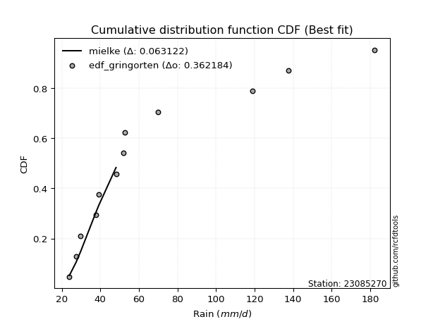</img>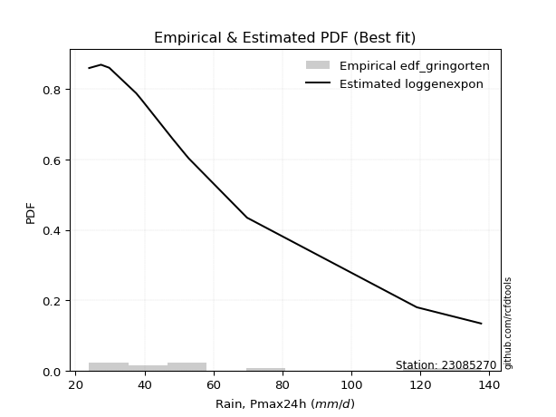</img>

</div>


### 9. Empirical - EDF Filliben (1975)

The specific values of the constants (0.3175) (often denoted as $alpha$) and (0.365) are derived from a method proposed by James J. Filliben in a 1975 paper. This particular formula is the mean value of the $i$-th order statistic of the normal distribution and is considered a robust and effective plotting position formula for the normal probability plot correlation coefficient test for normality.

<div align="center">


$P=(m-0.3175)/(n+0.365)$


</div>


**9.1. Empirical values**

<div align="center">

|                | 0                   | 1                   | 2                   | 3                   | 4                  | 5                  | 6                  | 7                  | 8                  | 9                  | 10                 | 11                 |
|:---------------|:--------------------|:--------------------|:--------------------|:--------------------|:-------------------|:-------------------|:-------------------|:-------------------|:-------------------|:-------------------|:-------------------|:-------------------|
| date           | 2020                | 2015                | 2019                | 2016                | 2023               | 2021               | 2018               | 2017               | 2022               | 2025               | 2014               | 2024               |
| x              | 23.955              | 27.39               | 29.783              | 37.6                | 39.149             | 48.124             | 51.916             | 52.857             | 69.729             | 111.6              | 118.96             | 137.6              |
| m              | 1                   | 2                   | 3                   | 4                   | 5                  | 6                  | 7                  | 8                  | 9                  | 10                 | 11                 | 12                 |
| empirical_dist | edf_filliben        | edf_filliben        | edf_filliben        | edf_filliben        | edf_filliben       | edf_filliben       | edf_filliben       | edf_filliben       | edf_filliben       | edf_filliben       | edf_filliben       | edf_filliben       |
| empirical      | 0.05519611807521229 | 0.13606955115244643 | 0.21694298422968056 | 0.29781641730691466 | 0.3786898503841488 | 0.4595632834613829 | 0.540436716538617  | 0.6213101496158512 | 0.7021835826930852 | 0.7830570157703194 | 0.8639304488475535 | 0.9448038819247876 |
| empirical_tr   | 1.0584207147442757  | 1.1575005850690383  | 1.2770462174025305  | 1.4241289951050964  | 1.609502115196876  | 1.8503554059109617 | 2.1759788825340958 | 2.6406833956219966 | 3.357773251866937  | 4.6095060577819185 | 7.349182763744426  | 18.117216117216078 |

</div>


**9.2. Kolmogorov-Smirnov fit test (sorted by Δ)**


<div align="center">

|                | 0                   | 1                   | 2                   | 3                   | 4                   | 5                   | 6                   | 7                   | 8                   | 9                   | 10                  | 11                  | 12                  | 13                  | 14                  | 15                  | 16                  | 17                  | 18                  | 19                  | 20                  | 21                  | 22                  | 23                  | 24                  | 25                  | 26                  | 27                  | 28                  | 29                  | 30                    | 31                  | 32                  | 33                  | 34                  | 35                  | 36                  | 37                  | 38                  | 39                  | 40                  | 41                  | 42                  | 43                  | 44                  | 45                  | 46                  | 47                  | 48                  | 49                  | 50                  | 51                  | 52                  | 53                  | 54                  | 55                  | 56                  | 57                  | 58                  | 59                  | 60                  | 61                  | 62                  | 63                  | 64                  | 65                  | 66                  | 67                  | 68                  | 69                  | 70                  | 71                  | 72                  | 73                  | 74                  | 75                  | 76                  | 77                  | 78                  | 79                  | 80                  | 81                  | 82                  | 83                  | 84                  | 85                  | 86                  | 87                  | 88                  | 89                  |
|:---------------|:--------------------|:--------------------|:--------------------|:--------------------|:--------------------|:--------------------|:--------------------|:--------------------|:--------------------|:--------------------|:--------------------|:--------------------|:--------------------|:--------------------|:--------------------|:--------------------|:--------------------|:--------------------|:--------------------|:--------------------|:--------------------|:--------------------|:--------------------|:--------------------|:--------------------|:--------------------|:--------------------|:--------------------|:--------------------|:--------------------|:----------------------|:--------------------|:--------------------|:--------------------|:--------------------|:--------------------|:--------------------|:--------------------|:--------------------|:--------------------|:--------------------|:--------------------|:--------------------|:--------------------|:--------------------|:--------------------|:--------------------|:--------------------|:--------------------|:--------------------|:--------------------|:--------------------|:--------------------|:--------------------|:--------------------|:--------------------|:--------------------|:--------------------|:--------------------|:--------------------|:--------------------|:--------------------|:--------------------|:--------------------|:--------------------|:--------------------|:--------------------|:--------------------|:--------------------|:--------------------|:--------------------|:--------------------|:--------------------|:--------------------|:--------------------|:--------------------|:--------------------|:--------------------|:--------------------|:--------------------|:--------------------|:--------------------|:--------------------|:--------------------|:--------------------|:--------------------|:--------------------|:--------------------|:--------------------|:--------------------|
| station        | 23085270            | 23085270            | 23085270            | 23085270            | 23085270            | 23085270            | 23085270            | 23085270            | 23085270            | 23085270            | 23085270            | 23085270            | 23085270            | 23085270            | 23085270            | 23085270            | 23085270            | 23085270            | 23085270            | 23085270            | 23085270            | 23085270            | 23085270            | 23085270            | 23085270            | 23085270            | 23085270            | 23085270            | 23085270            | 23085270            | 23085270              | 23085270            | 23085270            | 23085270            | 23085270            | 23085270            | 23085270            | 23085270            | 23085270            | 23085270            | 23085270            | 23085270            | 23085270            | 23085270            | 23085270            | 23085270            | 23085270            | 23085270            | 23085270            | 23085270            | 23085270            | 23085270            | 23085270            | 23085270            | 23085270            | 23085270            | 23085270            | 23085270            | 23085270            | 23085270            | 23085270            | 23085270            | 23085270            | 23085270            | 23085270            | 23085270            | 23085270            | 23085270            | 23085270            | 23085270            | 23085270            | 23085270            | 23085270            | 23085270            | 23085270            | 23085270            | 23085270            | 23085270            | 23085270            | 23085270            | 23085270            | 23085270            | 23085270            | 23085270            | 23085270            | 23085270            | 23085270            | 23085270            | 23085270            | 23085270            |
| empirical_dist | edf_filliben        | edf_filliben        | edf_filliben        | edf_filliben        | edf_filliben        | edf_filliben        | edf_filliben        | edf_filliben        | edf_filliben        | edf_filliben        | edf_filliben        | edf_filliben        | edf_filliben        | edf_filliben        | edf_filliben        | edf_filliben        | edf_filliben        | edf_filliben        | edf_filliben        | edf_filliben        | edf_filliben        | edf_filliben        | edf_filliben        | edf_filliben        | edf_filliben        | edf_filliben        | edf_filliben        | edf_filliben        | edf_filliben        | edf_filliben        | edf_filliben          | edf_filliben        | edf_filliben        | edf_filliben        | edf_filliben        | edf_filliben        | edf_filliben        | edf_filliben        | edf_filliben        | edf_filliben        | edf_filliben        | edf_filliben        | edf_filliben        | edf_filliben        | edf_filliben        | edf_filliben        | edf_filliben        | edf_filliben        | edf_filliben        | edf_filliben        | edf_filliben        | edf_filliben        | edf_filliben        | edf_filliben        | edf_filliben        | edf_filliben        | edf_filliben        | edf_filliben        | edf_filliben        | edf_filliben        | edf_filliben        | edf_filliben        | edf_filliben        | edf_filliben        | edf_filliben        | edf_filliben        | edf_filliben        | edf_filliben        | edf_filliben        | edf_filliben        | edf_filliben        | edf_filliben        | edf_filliben        | edf_filliben        | edf_filliben        | edf_filliben        | edf_filliben        | edf_filliben        | edf_filliben        | edf_filliben        | edf_filliben        | edf_filliben        | edf_filliben        | edf_filliben        | edf_filliben        | edf_filliben        | edf_filliben        | edf_filliben        | edf_filliben        | edf_filliben        |
| p_dist         | fisk                | logmielke           | mielke              | weibull_min         | logfisk             | alpha               | f                   | loggamma            | loggamma            | logerlang           | johnsonsu           | invweibull          | logweibull_min      | logexponnorm        | fatiguelife         | logfatiguelife      | loggenexpon         | invgamma            | loginvgauss         | loghalfnorm         | logbetaprime        | invgauss            | gamma               | loginvgamma         | loginvweibull       | loggompertz         | loggenlogistic      | lograyleigh         | nct                 | logalpha            | loglaplace_asymmetric | logtruncnorm        | logmaxwell          | logkstwobign        | logf                | laplace_asymmetric  | expon               | genexpon            | gompertz            | exponnorm           | lognct              | logrice             | logpearson3         | logncf              | betaprime           | loggumbel_r         | logmoyal            | chi2                | ncf                 | logjohnsonsu        | logloggamma         | logcrystalball      | lognorm             | lognorm             | logt                | halflogistic        | loghalflogistic     | loglogistic         | logexpon            | loghypsecant        | moyal               | halfnorm            | nakagami            | loglaplace          | genlogistic         | gumbel_r            | pearson3            | rayleigh            | kstwobign           | erlang              | lognakagami         | logchi2             | maxwell             | loggumbel_l         | wald                | loggibrat           | logwald             | crystalball         | norm                | truncnorm           | t                   | rice                | logistic            | hypsecant           | gibrat              | laplace             | gumbel_l            | loglognorm          | pareto              | logpareto           |
| delta          | 0.06834209007617387 | 0.0716611254214623  | 0.07233479400682297 | 0.08820624665832988 | 0.0916133443014806  | 0.09282071227369137 | 0.09492653843237675 | 0.09604178403870417 | 0.09604178403870417 | 0.0960447619301838  | 0.09651393938760155 | 0.09954027584984881 | 0.10010288383719579 | 0.10093987533287907 | 0.10307452015102059 | 0.10326802378414168 | 0.10364808571908346 | 0.1038684447663758  | 0.10500819879511869 | 0.1063811613803467  | 0.10641887251798932 | 0.10804742153894764 | 0.10953048424690381 | 0.11058731689061463 | 0.11080480171551632 | 0.11090418093340615 | 0.11119905274727049 | 0.11133243611995636 | 0.11169113452327606 | 0.11285113848143691 | 0.11299058670964157   | 0.11388593791738216 | 0.11401450350285813 | 0.11421026501534925 | 0.11429118487346557 | 0.11468462890590347 | 0.11470249371795271 | 0.11525528802064267 | 0.1165948032467069  | 0.11675385944282857 | 0.11720531403600176 | 0.11723773684576022 | 0.11827815007683107 | 0.11845535825902542 | 0.11871532768139581 | 0.1192205746215953  | 0.11998364902763847 | 0.12062624131640654 | 0.12088653335891697 | 0.12230341932838718 | 0.1224762335154651  | 0.12410556134120743 | 0.12410556252656824 | 0.12410556252656824 | 0.12410568013765344 | 0.12565604227972538 | 0.12663188612220802 | 0.13381087840751438 | 0.13587406128465596 | 0.1377354224704651  | 0.13985970034678308 | 0.1411041396571886  | 0.14134528606444846 | 0.14414194821543921 | 0.15211244236611526 | 0.16267897519596408 | 0.1667367750476541  | 0.17598216144949208 | 0.18057732424430772 | 0.18280369301026106 | 0.1846669067788354  | 0.18766818366101745 | 0.18827836589558383 | 0.19273384869214127 | 0.20494527044368302 | 0.21694298422968056 | 0.21694298422968056 | 0.22227204840901843 | 0.2222720494139242  | 0.2222720667103678  | 0.22227661046058855 | 0.22759867335926642 | 0.23528185302235227 | 0.24591866548544533 | 0.26398848752316456 | 0.2731024904179096  | 0.28868440797797745 | 0.41728331127459406 | 0.46029638582168875 | 0.47496106065213073 |
| deltao         | 0.36218414519599995 | 0.36218414519599995 | 0.36218414519599995 | 0.36218414519599995 | 0.36218414519599995 | 0.36218414519599995 | 0.36218414519599995 | 0.36218414519599995 | 0.36218414519599995 | 0.36218414519599995 | 0.36218414519599995 | 0.36218414519599995 | 0.36218414519599995 | 0.36218414519599995 | 0.36218414519599995 | 0.36218414519599995 | 0.36218414519599995 | 0.36218414519599995 | 0.36218414519599995 | 0.36218414519599995 | 0.36218414519599995 | 0.36218414519599995 | 0.36218414519599995 | 0.36218414519599995 | 0.36218414519599995 | 0.36218414519599995 | 0.36218414519599995 | 0.36218414519599995 | 0.36218414519599995 | 0.36218414519599995 | 0.36218414519599995   | 0.36218414519599995 | 0.36218414519599995 | 0.36218414519599995 | 0.36218414519599995 | 0.36218414519599995 | 0.36218414519599995 | 0.36218414519599995 | 0.36218414519599995 | 0.36218414519599995 | 0.36218414519599995 | 0.36218414519599995 | 0.36218414519599995 | 0.36218414519599995 | 0.36218414519599995 | 0.36218414519599995 | 0.36218414519599995 | 0.36218414519599995 | 0.36218414519599995 | 0.36218414519599995 | 0.36218414519599995 | 0.36218414519599995 | 0.36218414519599995 | 0.36218414519599995 | 0.36218414519599995 | 0.36218414519599995 | 0.36218414519599995 | 0.36218414519599995 | 0.36218414519599995 | 0.36218414519599995 | 0.36218414519599995 | 0.36218414519599995 | 0.36218414519599995 | 0.36218414519599995 | 0.36218414519599995 | 0.36218414519599995 | 0.36218414519599995 | 0.36218414519599995 | 0.36218414519599995 | 0.36218414519599995 | 0.36218414519599995 | 0.36218414519599995 | 0.36218414519599995 | 0.36218414519599995 | 0.36218414519599995 | 0.36218414519599995 | 0.36218414519599995 | 0.36218414519599995 | 0.36218414519599995 | 0.36218414519599995 | 0.36218414519599995 | 0.36218414519599995 | 0.36218414519599995 | 0.36218414519599995 | 0.36218414519599995 | 0.36218414519599995 | 0.36218414519599995 | 0.36218414519599995 | 0.36218414519599995 | 0.36218414519599995 |
| eval           | Δo > Δ              | Δo > Δ              | Δo > Δ              | Δo > Δ              | Δo > Δ              | Δo > Δ              | Δo > Δ              | Δo > Δ              | Δo > Δ              | Δo > Δ              | Δo > Δ              | Δo > Δ              | Δo > Δ              | Δo > Δ              | Δo > Δ              | Δo > Δ              | Δo > Δ              | Δo > Δ              | Δo > Δ              | Δo > Δ              | Δo > Δ              | Δo > Δ              | Δo > Δ              | Δo > Δ              | Δo > Δ              | Δo > Δ              | Δo > Δ              | Δo > Δ              | Δo > Δ              | Δo > Δ              | Δo > Δ                | Δo > Δ              | Δo > Δ              | Δo > Δ              | Δo > Δ              | Δo > Δ              | Δo > Δ              | Δo > Δ              | Δo > Δ              | Δo > Δ              | Δo > Δ              | Δo > Δ              | Δo > Δ              | Δo > Δ              | Δo > Δ              | Δo > Δ              | Δo > Δ              | Δo > Δ              | Δo > Δ              | Δo > Δ              | Δo > Δ              | Δo > Δ              | Δo > Δ              | Δo > Δ              | Δo > Δ              | Δo > Δ              | Δo > Δ              | Δo > Δ              | Δo > Δ              | Δo > Δ              | Δo > Δ              | Δo > Δ              | Δo > Δ              | Δo > Δ              | Δo > Δ              | Δo > Δ              | Δo > Δ              | Δo > Δ              | Δo > Δ              | Δo > Δ              | Δo > Δ              | Δo > Δ              | Δo > Δ              | Δo > Δ              | Δo > Δ              | Δo > Δ              | Δo > Δ              | Δo > Δ              | Δo > Δ              | Δo > Δ              | Δo > Δ              | Δo > Δ              | Δo > Δ              | Δo > Δ              | Δo > Δ              | Δo > Δ              | Δo > Δ              | Δo <= Δ             | Δo <= Δ             | Δo <= Δ             |
| fit            | 1                   | 1                   | 1                   | 1                   | 1                   | 1                   | 1                   | 1                   | 1                   | 1                   | 1                   | 1                   | 1                   | 1                   | 1                   | 1                   | 1                   | 1                   | 1                   | 1                   | 1                   | 1                   | 1                   | 1                   | 1                   | 1                   | 1                   | 1                   | 1                   | 1                   | 1                     | 1                   | 1                   | 1                   | 1                   | 1                   | 1                   | 1                   | 1                   | 1                   | 1                   | 1                   | 1                   | 1                   | 1                   | 1                   | 1                   | 1                   | 1                   | 1                   | 1                   | 1                   | 1                   | 1                   | 1                   | 1                   | 1                   | 1                   | 1                   | 1                   | 1                   | 1                   | 1                   | 1                   | 1                   | 1                   | 1                   | 1                   | 1                   | 1                   | 1                   | 1                   | 1                   | 1                   | 1                   | 1                   | 1                   | 1                   | 1                   | 1                   | 1                   | 1                   | 1                   | 1                   | 1                   | 1                   | 1                   | 0                   | 0                   | 0                   |
| n              | 12                  | 12                  | 12                  | 12                  | 12                  | 12                  | 12                  | 12                  | 12                  | 12                  | 12                  | 12                  | 12                  | 12                  | 12                  | 12                  | 12                  | 12                  | 12                  | 12                  | 12                  | 12                  | 12                  | 12                  | 12                  | 12                  | 12                  | 12                  | 12                  | 12                  | 12                    | 12                  | 12                  | 12                  | 12                  | 12                  | 12                  | 12                  | 12                  | 12                  | 12                  | 12                  | 12                  | 12                  | 12                  | 12                  | 12                  | 12                  | 12                  | 12                  | 12                  | 12                  | 12                  | 12                  | 12                  | 12                  | 12                  | 12                  | 12                  | 12                  | 12                  | 12                  | 12                  | 12                  | 12                  | 12                  | 12                  | 12                  | 12                  | 12                  | 12                  | 12                  | 12                  | 12                  | 12                  | 12                  | 12                  | 12                  | 12                  | 12                  | 12                  | 12                  | 12                  | 12                  | 12                  | 12                  | 12                  | 12                  | 12                  | 12                  |
| best_fit       | 1                   | 0                   | 0                   | 0                   | 0                   | 0                   | 0                   | 0                   | 0                   | 0                   | 0                   | 0                   | 0                   | 0                   | 0                   | 0                   | 0                   | 0                   | 0                   | 0                   | 0                   | 0                   | 0                   | 0                   | 0                   | 0                   | 0                   | 0                   | 0                   | 0                   | 0                     | 0                   | 0                   | 0                   | 0                   | 0                   | 0                   | 0                   | 0                   | 0                   | 0                   | 0                   | 0                   | 0                   | 0                   | 0                   | 0                   | 0                   | 0                   | 0                   | 0                   | 0                   | 0                   | 0                   | 0                   | 0                   | 0                   | 0                   | 0                   | 0                   | 0                   | 0                   | 0                   | 0                   | 0                   | 0                   | 0                   | 0                   | 0                   | 0                   | 0                   | 0                   | 0                   | 0                   | 0                   | 0                   | 0                   | 0                   | 0                   | 0                   | 0                   | 0                   | 0                   | 0                   | 0                   | 0                   | 0                   | 0                   | 0                   | 0                   |
| best_fit_sort  | 1                   | 2                   | 3                   | 4                   | 5                   | 6                   | 7                   | 8                   | 9                   | 10                  | 11                  | 12                  | 13                  | 14                  | 15                  | 16                  | 17                  | 18                  | 19                  | 20                  | 21                  | 22                  | 23                  | 24                  | 25                  | 26                  | 27                  | 28                  | 29                  | 30                  | 31                    | 32                  | 33                  | 34                  | 35                  | 36                  | 37                  | 38                  | 39                  | 40                  | 41                  | 42                  | 43                  | 44                  | 45                  | 46                  | 47                  | 48                  | 49                  | 50                  | 51                  | 52                  | 53                  | 54                  | 55                  | 56                  | 57                  | 58                  | 59                  | 60                  | 61                  | 62                  | 63                  | 64                  | 65                  | 66                  | 67                  | 68                  | 69                  | 70                  | 71                  | 72                  | 73                  | 74                  | 75                  | 76                  | 77                  | 78                  | 79                  | 80                  | 81                  | 82                  | 83                  | 84                  | 85                  | 86                  | 87                  | 88                  | 89                  | 90                  |

</div>


<div align="center">

</img>

</div>


**9.3. Best fit**

<div align="center">

|   id |   station | empirical_dist   | p_dist   |     delta |   deltao | eval   |   fit |   n |   best_fit |   best_fit_sort |
|-----:|----------:|:-----------------|:---------|----------:|---------:|:-------|------:|----:|-----------:|----------------:|
|    0 |  23085270 | edf_filliben     | fisk     | 0.0683421 | 0.362184 | Δo > Δ |     1 |  12 |          1 |               1 |

</div>


<div align="center">

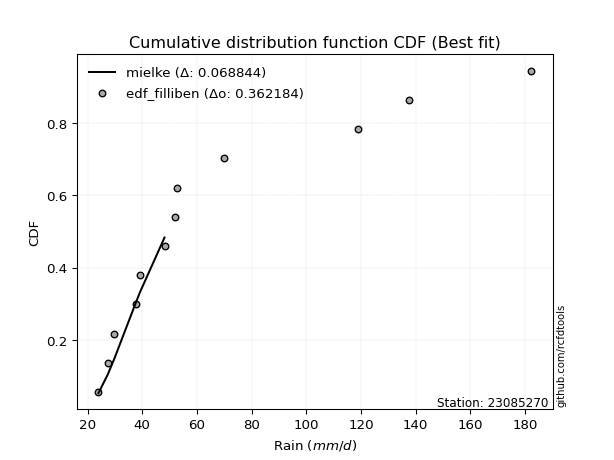</img></img>

</div>


### 10. Empirical - EDF Jenkinson (1977)

The Jenkinson formula in hydrology is an empirical plotting position formula used to estimate the non-exceedance probability _(P)_ or return period _(T)_ of a given ordered observation within a sample. It is a widely used method in the frequency analysis of extreme events such as floods and rainfall, as it provides a distribution-free way to plot data. _a≈0.31_ and _b≈0.38_ are constants derived to approximate the median of the probability distribution for the given rank.

<div align="center">


$P=(m-a)/(n+b)$


</div>


**10.1. Empirical values**

<div align="center">

|                | 0                    | 1                   | 2                   | 3                  | 4                  | 5                  | 6                  | 7                  | 8                  | 9                  | 10                 | 11                 |
|:---------------|:---------------------|:--------------------|:--------------------|:-------------------|:-------------------|:-------------------|:-------------------|:-------------------|:-------------------|:-------------------|:-------------------|:-------------------|
| date           | 2020                 | 2015                | 2019                | 2016               | 2023               | 2021               | 2018               | 2017               | 2022               | 2025               | 2014               | 2024               |
| x              | 23.955               | 27.39               | 29.783              | 37.6               | 39.149             | 48.124             | 51.916             | 52.857             | 69.729             | 111.6              | 118.96             | 137.6              |
| m              | 1                    | 2                   | 3                   | 4                  | 5                  | 6                  | 7                  | 8                  | 9                  | 10                 | 11                 | 12                 |
| empirical_dist | edf_jenkinson        | edf_jenkinson       | edf_jenkinson       | edf_jenkinson      | edf_jenkinson      | edf_jenkinson      | edf_jenkinson      | edf_jenkinson      | edf_jenkinson      | edf_jenkinson      | edf_jenkinson      | edf_jenkinson      |
| empirical      | 0.055735056542810975 | 0.13651050080775443 | 0.21728594507269788 | 0.2980613893376413 | 0.3788368336025848 | 0.4596122778675283 | 0.5403877221324718 | 0.6211631663974152 | 0.7019386106623585 | 0.7827140549273021 | 0.8634894991922455 | 0.9442649434571889 |
| empirical_tr   | 1.0590248075278015   | 1.1580916744621141  | 1.2776057791537667  | 1.424626006904488  | 1.6098829648894668 | 1.850523168908819  | 2.1757469244288226 | 2.6396588486140726 | 3.3550135501355    | 4.6022304832713745 | 7.325443786982245  | 17.942028985507218 |

</div>


**10.2. Kolmogorov-Smirnov fit test (sorted by Δ)**


<div align="center">

|                | 0                   | 1                   | 2                   | 3                   | 4                   | 5                   | 6                   | 7                   | 8                   | 9                   | 10                  | 11                  | 12                  | 13                  | 14                  | 15                  | 16                  | 17                  | 18                  | 19                  | 20                  | 21                  | 22                  | 23                  | 24                  | 25                  | 26                  | 27                  | 28                  | 29                  | 30                    | 31                  | 32                  | 33                  | 34                  | 35                  | 36                  | 37                  | 38                  | 39                  | 40                  | 41                  | 42                  | 43                  | 44                  | 45                  | 46                  | 47                  | 48                  | 49                  | 50                  | 51                  | 52                  | 53                  | 54                  | 55                  | 56                  | 57                  | 58                  | 59                  | 60                  | 61                  | 62                  | 63                  | 64                  | 65                  | 66                  | 67                  | 68                  | 69                  | 70                  | 71                  | 72                  | 73                  | 74                  | 75                  | 76                  | 77                  | 78                  | 79                  | 80                  | 81                  | 82                  | 83                  | 84                  | 85                  | 86                  | 87                  | 88                  | 89                  |
|:---------------|:--------------------|:--------------------|:--------------------|:--------------------|:--------------------|:--------------------|:--------------------|:--------------------|:--------------------|:--------------------|:--------------------|:--------------------|:--------------------|:--------------------|:--------------------|:--------------------|:--------------------|:--------------------|:--------------------|:--------------------|:--------------------|:--------------------|:--------------------|:--------------------|:--------------------|:--------------------|:--------------------|:--------------------|:--------------------|:--------------------|:----------------------|:--------------------|:--------------------|:--------------------|:--------------------|:--------------------|:--------------------|:--------------------|:--------------------|:--------------------|:--------------------|:--------------------|:--------------------|:--------------------|:--------------------|:--------------------|:--------------------|:--------------------|:--------------------|:--------------------|:--------------------|:--------------------|:--------------------|:--------------------|:--------------------|:--------------------|:--------------------|:--------------------|:--------------------|:--------------------|:--------------------|:--------------------|:--------------------|:--------------------|:--------------------|:--------------------|:--------------------|:--------------------|:--------------------|:--------------------|:--------------------|:--------------------|:--------------------|:--------------------|:--------------------|:--------------------|:--------------------|:--------------------|:--------------------|:--------------------|:--------------------|:--------------------|:--------------------|:--------------------|:--------------------|:--------------------|:--------------------|:--------------------|:--------------------|:--------------------|
| station        | 23085270            | 23085270            | 23085270            | 23085270            | 23085270            | 23085270            | 23085270            | 23085270            | 23085270            | 23085270            | 23085270            | 23085270            | 23085270            | 23085270            | 23085270            | 23085270            | 23085270            | 23085270            | 23085270            | 23085270            | 23085270            | 23085270            | 23085270            | 23085270            | 23085270            | 23085270            | 23085270            | 23085270            | 23085270            | 23085270            | 23085270              | 23085270            | 23085270            | 23085270            | 23085270            | 23085270            | 23085270            | 23085270            | 23085270            | 23085270            | 23085270            | 23085270            | 23085270            | 23085270            | 23085270            | 23085270            | 23085270            | 23085270            | 23085270            | 23085270            | 23085270            | 23085270            | 23085270            | 23085270            | 23085270            | 23085270            | 23085270            | 23085270            | 23085270            | 23085270            | 23085270            | 23085270            | 23085270            | 23085270            | 23085270            | 23085270            | 23085270            | 23085270            | 23085270            | 23085270            | 23085270            | 23085270            | 23085270            | 23085270            | 23085270            | 23085270            | 23085270            | 23085270            | 23085270            | 23085270            | 23085270            | 23085270            | 23085270            | 23085270            | 23085270            | 23085270            | 23085270            | 23085270            | 23085270            | 23085270            |
| empirical_dist | edf_jenkinson       | edf_jenkinson       | edf_jenkinson       | edf_jenkinson       | edf_jenkinson       | edf_jenkinson       | edf_jenkinson       | edf_jenkinson       | edf_jenkinson       | edf_jenkinson       | edf_jenkinson       | edf_jenkinson       | edf_jenkinson       | edf_jenkinson       | edf_jenkinson       | edf_jenkinson       | edf_jenkinson       | edf_jenkinson       | edf_jenkinson       | edf_jenkinson       | edf_jenkinson       | edf_jenkinson       | edf_jenkinson       | edf_jenkinson       | edf_jenkinson       | edf_jenkinson       | edf_jenkinson       | edf_jenkinson       | edf_jenkinson       | edf_jenkinson       | edf_jenkinson         | edf_jenkinson       | edf_jenkinson       | edf_jenkinson       | edf_jenkinson       | edf_jenkinson       | edf_jenkinson       | edf_jenkinson       | edf_jenkinson       | edf_jenkinson       | edf_jenkinson       | edf_jenkinson       | edf_jenkinson       | edf_jenkinson       | edf_jenkinson       | edf_jenkinson       | edf_jenkinson       | edf_jenkinson       | edf_jenkinson       | edf_jenkinson       | edf_jenkinson       | edf_jenkinson       | edf_jenkinson       | edf_jenkinson       | edf_jenkinson       | edf_jenkinson       | edf_jenkinson       | edf_jenkinson       | edf_jenkinson       | edf_jenkinson       | edf_jenkinson       | edf_jenkinson       | edf_jenkinson       | edf_jenkinson       | edf_jenkinson       | edf_jenkinson       | edf_jenkinson       | edf_jenkinson       | edf_jenkinson       | edf_jenkinson       | edf_jenkinson       | edf_jenkinson       | edf_jenkinson       | edf_jenkinson       | edf_jenkinson       | edf_jenkinson       | edf_jenkinson       | edf_jenkinson       | edf_jenkinson       | edf_jenkinson       | edf_jenkinson       | edf_jenkinson       | edf_jenkinson       | edf_jenkinson       | edf_jenkinson       | edf_jenkinson       | edf_jenkinson       | edf_jenkinson       | edf_jenkinson       | edf_jenkinson       |
| p_dist         | fisk                | logmielke           | mielke              | weibull_min         | logfisk             | alpha               | f                   | loggamma            | loggamma            | logerlang           | johnsonsu           | invweibull          | logweibull_min      | logexponnorm        | fatiguelife         | logfatiguelife      | loggenexpon         | invgamma            | loginvgauss         | loghalfnorm         | logbetaprime        | invgauss            | gamma               | loginvgamma         | loginvweibull       | loggompertz         | loggenlogistic      | lograyleigh         | nct                 | logalpha            | loglaplace_asymmetric | logtruncnorm        | logmaxwell          | logkstwobign        | logf                | laplace_asymmetric  | expon               | genexpon            | gompertz            | exponnorm           | lognct              | logrice             | logpearson3         | logncf              | betaprime           | loggumbel_r         | logmoyal            | chi2                | ncf                 | logjohnsonsu        | logloggamma         | logcrystalball      | lognorm             | lognorm             | logt                | halflogistic        | loghalflogistic     | loglogistic         | logexpon            | loghypsecant        | moyal               | halfnorm            | nakagami            | loglaplace          | genlogistic         | gumbel_r            | pearson3            | rayleigh            | kstwobign           | erlang              | lognakagami         | logchi2             | maxwell             | loggumbel_l         | wald                | loggibrat           | logwald             | crystalball         | norm                | truncnorm           | t                   | rice                | logistic            | hypsecant           | gibrat              | laplace             | gumbel_l            | loglognorm          | pareto              | logpareto           |
| delta          | 0.06868505091919119 | 0.07200408626447963 | 0.07267775484984029 | 0.0880592634398939  | 0.09195630514449793 | 0.0931636731167087  | 0.09526949927539408 | 0.0959927896325588  | 0.0959927896325588  | 0.09599576752403843 | 0.09685690023061888 | 0.09988323669286614 | 0.10044584468021311 | 0.1012828361758964  | 0.10341748099403791 | 0.10361098462715901 | 0.10399104656210079 | 0.10421140560939313 | 0.10535115963813602 | 0.10672412222336403 | 0.10676183336100664 | 0.10839038238196497 | 0.10987344508992114 | 0.11093027773363195 | 0.11114776255853365 | 0.11124714177642347 | 0.11154201359028781 | 0.11167539696297368 | 0.11203409536629338 | 0.11319409932445423 | 0.1133335475526589    | 0.11364096588665551 | 0.11435746434587546 | 0.11455322585836658 | 0.1146341457164829  | 0.1150275897489208  | 0.11504545456097004 | 0.11559824886365999 | 0.11693776408972423 | 0.11709682028584589 | 0.11754827487901909 | 0.11758069768877755 | 0.1186211109198484  | 0.11879831910204275 | 0.11905828852441314 | 0.11956353546461262 | 0.1203266098706558  | 0.12096920215942386 | 0.1212294942019343  | 0.1221564361099512  | 0.12281919435848243 | 0.12444852218422475 | 0.12444852336958556 | 0.12444852336958556 | 0.12444864098067077 | 0.1255090590612894  | 0.12707283577751602 | 0.1341538392505317  | 0.1356290892539293  | 0.13807838331348243 | 0.1397127171283471  | 0.14095715643875262 | 0.14119830284601248 | 0.1442889314338752  | 0.15196545914767928 | 0.1625319919775281  | 0.16658979182921813 | 0.1758351782310561  | 0.18043034102587174 | 0.1827546986041157  | 0.18442193474810875 | 0.1874232116302908  | 0.18813138267714785 | 0.1925868654737053  | 0.20528823128670035 | 0.21728594507269788 | 0.21728594507269788 | 0.22212506519058245 | 0.22212506619548822 | 0.22212508349193183 | 0.22212962724215257 | 0.22745169014083044 | 0.2351348698039163  | 0.24577168226700935 | 0.26413547074160054 | 0.27295550719947365 | 0.28853742475954147 | 0.4168423616192861  | 0.4598554361663808  | 0.4745201109968228  |
| deltao         | 0.36218414519599995 | 0.36218414519599995 | 0.36218414519599995 | 0.36218414519599995 | 0.36218414519599995 | 0.36218414519599995 | 0.36218414519599995 | 0.36218414519599995 | 0.36218414519599995 | 0.36218414519599995 | 0.36218414519599995 | 0.36218414519599995 | 0.36218414519599995 | 0.36218414519599995 | 0.36218414519599995 | 0.36218414519599995 | 0.36218414519599995 | 0.36218414519599995 | 0.36218414519599995 | 0.36218414519599995 | 0.36218414519599995 | 0.36218414519599995 | 0.36218414519599995 | 0.36218414519599995 | 0.36218414519599995 | 0.36218414519599995 | 0.36218414519599995 | 0.36218414519599995 | 0.36218414519599995 | 0.36218414519599995 | 0.36218414519599995   | 0.36218414519599995 | 0.36218414519599995 | 0.36218414519599995 | 0.36218414519599995 | 0.36218414519599995 | 0.36218414519599995 | 0.36218414519599995 | 0.36218414519599995 | 0.36218414519599995 | 0.36218414519599995 | 0.36218414519599995 | 0.36218414519599995 | 0.36218414519599995 | 0.36218414519599995 | 0.36218414519599995 | 0.36218414519599995 | 0.36218414519599995 | 0.36218414519599995 | 0.36218414519599995 | 0.36218414519599995 | 0.36218414519599995 | 0.36218414519599995 | 0.36218414519599995 | 0.36218414519599995 | 0.36218414519599995 | 0.36218414519599995 | 0.36218414519599995 | 0.36218414519599995 | 0.36218414519599995 | 0.36218414519599995 | 0.36218414519599995 | 0.36218414519599995 | 0.36218414519599995 | 0.36218414519599995 | 0.36218414519599995 | 0.36218414519599995 | 0.36218414519599995 | 0.36218414519599995 | 0.36218414519599995 | 0.36218414519599995 | 0.36218414519599995 | 0.36218414519599995 | 0.36218414519599995 | 0.36218414519599995 | 0.36218414519599995 | 0.36218414519599995 | 0.36218414519599995 | 0.36218414519599995 | 0.36218414519599995 | 0.36218414519599995 | 0.36218414519599995 | 0.36218414519599995 | 0.36218414519599995 | 0.36218414519599995 | 0.36218414519599995 | 0.36218414519599995 | 0.36218414519599995 | 0.36218414519599995 | 0.36218414519599995 |
| eval           | Δo > Δ              | Δo > Δ              | Δo > Δ              | Δo > Δ              | Δo > Δ              | Δo > Δ              | Δo > Δ              | Δo > Δ              | Δo > Δ              | Δo > Δ              | Δo > Δ              | Δo > Δ              | Δo > Δ              | Δo > Δ              | Δo > Δ              | Δo > Δ              | Δo > Δ              | Δo > Δ              | Δo > Δ              | Δo > Δ              | Δo > Δ              | Δo > Δ              | Δo > Δ              | Δo > Δ              | Δo > Δ              | Δo > Δ              | Δo > Δ              | Δo > Δ              | Δo > Δ              | Δo > Δ              | Δo > Δ                | Δo > Δ              | Δo > Δ              | Δo > Δ              | Δo > Δ              | Δo > Δ              | Δo > Δ              | Δo > Δ              | Δo > Δ              | Δo > Δ              | Δo > Δ              | Δo > Δ              | Δo > Δ              | Δo > Δ              | Δo > Δ              | Δo > Δ              | Δo > Δ              | Δo > Δ              | Δo > Δ              | Δo > Δ              | Δo > Δ              | Δo > Δ              | Δo > Δ              | Δo > Δ              | Δo > Δ              | Δo > Δ              | Δo > Δ              | Δo > Δ              | Δo > Δ              | Δo > Δ              | Δo > Δ              | Δo > Δ              | Δo > Δ              | Δo > Δ              | Δo > Δ              | Δo > Δ              | Δo > Δ              | Δo > Δ              | Δo > Δ              | Δo > Δ              | Δo > Δ              | Δo > Δ              | Δo > Δ              | Δo > Δ              | Δo > Δ              | Δo > Δ              | Δo > Δ              | Δo > Δ              | Δo > Δ              | Δo > Δ              | Δo > Δ              | Δo > Δ              | Δo > Δ              | Δo > Δ              | Δo > Δ              | Δo > Δ              | Δo > Δ              | Δo <= Δ             | Δo <= Δ             | Δo <= Δ             |
| fit            | 1                   | 1                   | 1                   | 1                   | 1                   | 1                   | 1                   | 1                   | 1                   | 1                   | 1                   | 1                   | 1                   | 1                   | 1                   | 1                   | 1                   | 1                   | 1                   | 1                   | 1                   | 1                   | 1                   | 1                   | 1                   | 1                   | 1                   | 1                   | 1                   | 1                   | 1                     | 1                   | 1                   | 1                   | 1                   | 1                   | 1                   | 1                   | 1                   | 1                   | 1                   | 1                   | 1                   | 1                   | 1                   | 1                   | 1                   | 1                   | 1                   | 1                   | 1                   | 1                   | 1                   | 1                   | 1                   | 1                   | 1                   | 1                   | 1                   | 1                   | 1                   | 1                   | 1                   | 1                   | 1                   | 1                   | 1                   | 1                   | 1                   | 1                   | 1                   | 1                   | 1                   | 1                   | 1                   | 1                   | 1                   | 1                   | 1                   | 1                   | 1                   | 1                   | 1                   | 1                   | 1                   | 1                   | 1                   | 0                   | 0                   | 0                   |
| n              | 12                  | 12                  | 12                  | 12                  | 12                  | 12                  | 12                  | 12                  | 12                  | 12                  | 12                  | 12                  | 12                  | 12                  | 12                  | 12                  | 12                  | 12                  | 12                  | 12                  | 12                  | 12                  | 12                  | 12                  | 12                  | 12                  | 12                  | 12                  | 12                  | 12                  | 12                    | 12                  | 12                  | 12                  | 12                  | 12                  | 12                  | 12                  | 12                  | 12                  | 12                  | 12                  | 12                  | 12                  | 12                  | 12                  | 12                  | 12                  | 12                  | 12                  | 12                  | 12                  | 12                  | 12                  | 12                  | 12                  | 12                  | 12                  | 12                  | 12                  | 12                  | 12                  | 12                  | 12                  | 12                  | 12                  | 12                  | 12                  | 12                  | 12                  | 12                  | 12                  | 12                  | 12                  | 12                  | 12                  | 12                  | 12                  | 12                  | 12                  | 12                  | 12                  | 12                  | 12                  | 12                  | 12                  | 12                  | 12                  | 12                  | 12                  |
| best_fit       | 1                   | 0                   | 0                   | 0                   | 0                   | 0                   | 0                   | 0                   | 0                   | 0                   | 0                   | 0                   | 0                   | 0                   | 0                   | 0                   | 0                   | 0                   | 0                   | 0                   | 0                   | 0                   | 0                   | 0                   | 0                   | 0                   | 0                   | 0                   | 0                   | 0                   | 0                     | 0                   | 0                   | 0                   | 0                   | 0                   | 0                   | 0                   | 0                   | 0                   | 0                   | 0                   | 0                   | 0                   | 0                   | 0                   | 0                   | 0                   | 0                   | 0                   | 0                   | 0                   | 0                   | 0                   | 0                   | 0                   | 0                   | 0                   | 0                   | 0                   | 0                   | 0                   | 0                   | 0                   | 0                   | 0                   | 0                   | 0                   | 0                   | 0                   | 0                   | 0                   | 0                   | 0                   | 0                   | 0                   | 0                   | 0                   | 0                   | 0                   | 0                   | 0                   | 0                   | 0                   | 0                   | 0                   | 0                   | 0                   | 0                   | 0                   |
| best_fit_sort  | 1                   | 2                   | 3                   | 4                   | 5                   | 6                   | 7                   | 8                   | 9                   | 10                  | 11                  | 12                  | 13                  | 14                  | 15                  | 16                  | 17                  | 18                  | 19                  | 20                  | 21                  | 22                  | 23                  | 24                  | 25                  | 26                  | 27                  | 28                  | 29                  | 30                  | 31                    | 32                  | 33                  | 34                  | 35                  | 36                  | 37                  | 38                  | 39                  | 40                  | 41                  | 42                  | 43                  | 44                  | 45                  | 46                  | 47                  | 48                  | 49                  | 50                  | 51                  | 52                  | 53                  | 54                  | 55                  | 56                  | 57                  | 58                  | 59                  | 60                  | 61                  | 62                  | 63                  | 64                  | 65                  | 66                  | 67                  | 68                  | 69                  | 70                  | 71                  | 72                  | 73                  | 74                  | 75                  | 76                  | 77                  | 78                  | 79                  | 80                  | 81                  | 82                  | 83                  | 84                  | 85                  | 86                  | 87                  | 88                  | 89                  | 90                  |

</div>


<div align="center">

</img>

</div>


**10.3. Best fit**

<div align="center">

|   id |   station | empirical_dist   | p_dist   |     delta |   deltao | eval   |   fit |   n |   best_fit |   best_fit_sort |
|-----:|----------:|:-----------------|:---------|----------:|---------:|:-------|------:|----:|-----------:|----------------:|
|    0 |  23085270 | edf_jenkinson    | fisk     | 0.0686851 | 0.362184 | Δo > Δ |     1 |  12 |          1 |               1 |

</div>


<div align="center">

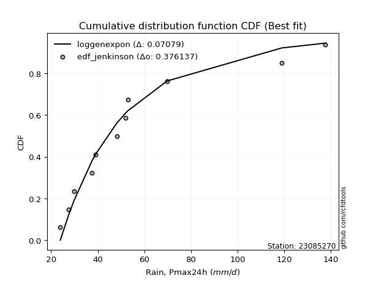</img></img>

</div>


### 11. Empirical - EDF Cunnane (1978)

Cunnane´s work in statistical hydrology has focused on the performance and evaluation of different probability distributions (such as GEV, Gumbel, Lognormal) for flood frequency estimation. _b_ is a constant, typically set to 0.4.

<div align="center">


$P=(m-b)/(n+1-2b)$


</div>


**11.1. Empirical values**

<div align="center">

|                | 0                   | 1                   | 2                   | 3                  | 4                  | 5                   | 6                  | 7                  | 8                  | 9                  | 10                 | 11                 |
|:---------------|:--------------------|:--------------------|:--------------------|:-------------------|:-------------------|:--------------------|:-------------------|:-------------------|:-------------------|:-------------------|:-------------------|:-------------------|
| date           | 2020                | 2015                | 2019                | 2016               | 2023               | 2021                | 2018               | 2017               | 2022               | 2025               | 2014               | 2024               |
| x              | 23.955              | 27.39               | 29.783              | 37.6               | 39.149             | 48.124              | 51.916             | 52.857             | 69.729             | 111.6              | 118.96             | 137.6              |
| m              | 1                   | 2                   | 3                   | 4                  | 5                  | 6                   | 7                  | 8                  | 9                  | 10                 | 11                 | 12                 |
| empirical_dist | edf_cunnane         | edf_cunnane         | edf_cunnane         | edf_cunnane        | edf_cunnane        | edf_cunnane         | edf_cunnane        | edf_cunnane        | edf_cunnane        | edf_cunnane        | edf_cunnane        | edf_cunnane        |
| empirical      | 0.04918032786885246 | 0.13114754098360656 | 0.21311475409836067 | 0.2950819672131148 | 0.3770491803278688 | 0.45901639344262296 | 0.5409836065573771 | 0.6229508196721312 | 0.7049180327868853 | 0.7868852459016393 | 0.8688524590163935 | 0.9508196721311476 |
| empirical_tr   | 1.0517241379310345  | 1.150943396226415   | 1.2708333333333333  | 1.418604651162791  | 1.6052631578947367 | 1.8484848484848486  | 2.178571428571429  | 2.6521739130434785 | 3.388888888888889  | 4.692307692307692  | 7.625000000000004  | 20.333333333333357 |

</div>


**11.2. Kolmogorov-Smirnov fit test (sorted by Δ)**


<div align="center">

|                | 0                   | 1                   | 2                   | 3                   | 4                   | 5                   | 6                   | 7                   | 8                   | 9                   | 10                  | 11                  | 12                  | 13                  | 14                  | 15                  | 16                  | 17                  | 18                  | 19                  | 20                  | 21                  | 22                  | 23                  | 24                  | 25                  | 26                  | 27                  | 28                  | 29                  | 30                    | 31                  | 32                  | 33                  | 34                  | 35                  | 36                  | 37                  | 38                  | 39                  | 40                  | 41                  | 42                  | 43                  | 44                  | 45                  | 46                  | 47                  | 48                  | 49                  | 50                  | 51                  | 52                  | 53                  | 54                  | 55                  | 56                  | 57                  | 58                  | 59                  | 60                  | 61                  | 62                  | 63                  | 64                  | 65                  | 66                  | 67                  | 68                  | 69                  | 70                  | 71                  | 72                  | 73                  | 74                  | 75                  | 76                  | 77                  | 78                  | 79                  | 80                  | 81                  | 82                  | 83                  | 84                  | 85                  | 86                  | 87                  | 88                  | 89                  |
|:---------------|:--------------------|:--------------------|:--------------------|:--------------------|:--------------------|:--------------------|:--------------------|:--------------------|:--------------------|:--------------------|:--------------------|:--------------------|:--------------------|:--------------------|:--------------------|:--------------------|:--------------------|:--------------------|:--------------------|:--------------------|:--------------------|:--------------------|:--------------------|:--------------------|:--------------------|:--------------------|:--------------------|:--------------------|:--------------------|:--------------------|:----------------------|:--------------------|:--------------------|:--------------------|:--------------------|:--------------------|:--------------------|:--------------------|:--------------------|:--------------------|:--------------------|:--------------------|:--------------------|:--------------------|:--------------------|:--------------------|:--------------------|:--------------------|:--------------------|:--------------------|:--------------------|:--------------------|:--------------------|:--------------------|:--------------------|:--------------------|:--------------------|:--------------------|:--------------------|:--------------------|:--------------------|:--------------------|:--------------------|:--------------------|:--------------------|:--------------------|:--------------------|:--------------------|:--------------------|:--------------------|:--------------------|:--------------------|:--------------------|:--------------------|:--------------------|:--------------------|:--------------------|:--------------------|:--------------------|:--------------------|:--------------------|:--------------------|:--------------------|:--------------------|:--------------------|:--------------------|:--------------------|:--------------------|:--------------------|:--------------------|
| station        | 23085270            | 23085270            | 23085270            | 23085270            | 23085270            | 23085270            | 23085270            | 23085270            | 23085270            | 23085270            | 23085270            | 23085270            | 23085270            | 23085270            | 23085270            | 23085270            | 23085270            | 23085270            | 23085270            | 23085270            | 23085270            | 23085270            | 23085270            | 23085270            | 23085270            | 23085270            | 23085270            | 23085270            | 23085270            | 23085270            | 23085270              | 23085270            | 23085270            | 23085270            | 23085270            | 23085270            | 23085270            | 23085270            | 23085270            | 23085270            | 23085270            | 23085270            | 23085270            | 23085270            | 23085270            | 23085270            | 23085270            | 23085270            | 23085270            | 23085270            | 23085270            | 23085270            | 23085270            | 23085270            | 23085270            | 23085270            | 23085270            | 23085270            | 23085270            | 23085270            | 23085270            | 23085270            | 23085270            | 23085270            | 23085270            | 23085270            | 23085270            | 23085270            | 23085270            | 23085270            | 23085270            | 23085270            | 23085270            | 23085270            | 23085270            | 23085270            | 23085270            | 23085270            | 23085270            | 23085270            | 23085270            | 23085270            | 23085270            | 23085270            | 23085270            | 23085270            | 23085270            | 23085270            | 23085270            | 23085270            |
| empirical_dist | edf_cunnane         | edf_cunnane         | edf_cunnane         | edf_cunnane         | edf_cunnane         | edf_cunnane         | edf_cunnane         | edf_cunnane         | edf_cunnane         | edf_cunnane         | edf_cunnane         | edf_cunnane         | edf_cunnane         | edf_cunnane         | edf_cunnane         | edf_cunnane         | edf_cunnane         | edf_cunnane         | edf_cunnane         | edf_cunnane         | edf_cunnane         | edf_cunnane         | edf_cunnane         | edf_cunnane         | edf_cunnane         | edf_cunnane         | edf_cunnane         | edf_cunnane         | edf_cunnane         | edf_cunnane         | edf_cunnane           | edf_cunnane         | edf_cunnane         | edf_cunnane         | edf_cunnane         | edf_cunnane         | edf_cunnane         | edf_cunnane         | edf_cunnane         | edf_cunnane         | edf_cunnane         | edf_cunnane         | edf_cunnane         | edf_cunnane         | edf_cunnane         | edf_cunnane         | edf_cunnane         | edf_cunnane         | edf_cunnane         | edf_cunnane         | edf_cunnane         | edf_cunnane         | edf_cunnane         | edf_cunnane         | edf_cunnane         | edf_cunnane         | edf_cunnane         | edf_cunnane         | edf_cunnane         | edf_cunnane         | edf_cunnane         | edf_cunnane         | edf_cunnane         | edf_cunnane         | edf_cunnane         | edf_cunnane         | edf_cunnane         | edf_cunnane         | edf_cunnane         | edf_cunnane         | edf_cunnane         | edf_cunnane         | edf_cunnane         | edf_cunnane         | edf_cunnane         | edf_cunnane         | edf_cunnane         | edf_cunnane         | edf_cunnane         | edf_cunnane         | edf_cunnane         | edf_cunnane         | edf_cunnane         | edf_cunnane         | edf_cunnane         | edf_cunnane         | edf_cunnane         | edf_cunnane         | edf_cunnane         | edf_cunnane         |
| p_dist         | fisk                | logmielke           | mielke              | logfisk             | alpha               | weibull_min         | f                   | johnsonsu           | invweibull          | logweibull_min      | loggamma            | loggamma            | logerlang           | logexponnorm        | fatiguelife         | logfatiguelife      | loggenexpon         | invgamma            | loginvgauss         | loghalfnorm         | logbetaprime        | invgauss            | gamma               | loginvgamma         | loginvweibull       | loggompertz         | loggenlogistic      | lograyleigh         | nct                 | logalpha            | loglaplace_asymmetric | logmaxwell          | logkstwobign        | logf                | laplace_asymmetric  | expon               | genexpon            | gompertz            | exponnorm           | lognct              | logrice             | logpearson3         | logncf              | betaprime           | loggumbel_r         | logmoyal            | logtruncnorm        | chi2                | ncf                 | loghalflogistic     | logloggamma         | logjohnsonsu        | lognorm             | lognorm             | logcrystalball      | logt                | halflogistic        | loglogistic         | loghypsecant        | logexpon            | moyal               | loglaplace          | halfnorm            | nakagami            | genlogistic         | gumbel_r            | pearson3            | rayleigh            | kstwobign           | erlang              | lognakagami         | maxwell             | logchi2             | loggumbel_l         | wald                | loggibrat           | logwald             | crystalball         | norm                | truncnorm           | t                   | rice                | logistic            | hypsecant           | gibrat              | laplace             | gumbel_l            | loglognorm          | pareto              | logpareto           |
| delta          | 0.06492170357697807 | 0.06783289529014241 | 0.06850656387550308 | 0.08778511417016066 | 0.08899248214237143 | 0.08984691671460987 | 0.09109830830105681 | 0.09268570925628161 | 0.09571204571852887 | 0.09627465370587585 | 0.09658867405746413 | 0.09658867405746413 | 0.09659165194894376 | 0.09711164520155913 | 0.09924629001970064 | 0.09943979365282174 | 0.09981985558776352 | 0.10004021463505586 | 0.10117996866379875 | 0.10255293124902676 | 0.10259064238666937 | 0.1042191914076277  | 0.10570225411558387 | 0.10675908675929469 | 0.10697657158419638 | 0.1070759508020862  | 0.10737082261595055 | 0.10750420598863641 | 0.10786290439195612 | 0.10902290835011696 | 0.10916235657832163   | 0.11018627337153819 | 0.11038203488402931 | 0.11046295474214562 | 0.11085639877458353 | 0.11087426358663277 | 0.11142705788932272 | 0.11276657311538696 | 0.11292562931150862 | 0.11337708390468182 | 0.11340950671444028 | 0.11444991994551112 | 0.11462712812770548 | 0.11488709755007587 | 0.11539234449027536 | 0.11615541889631853 | 0.11662038801118202 | 0.11679801118508659 | 0.11705830322759703 | 0.12170987595336816 | 0.12387875100069429 | 0.12394408938466717 | 0.12396918525530282 | 0.12396918525530282 | 0.12396918937636814 | 0.12396919472529777 | 0.12729671233600537 | 0.12998264827619443 | 0.13390719233914516 | 0.1386085113784558  | 0.14150037040306307 | 0.14250127815915922 | 0.1427448097134686  | 0.14298595612072845 | 0.15375311242239525 | 0.16431964525224407 | 0.1683774451039341  | 0.17762283150577207 | 0.18221799430058772 | 0.18421188347798229 | 0.18740135687263526 | 0.18991903595186382 | 0.1904026337548173  | 0.19437451874842127 | 0.20111704031236313 | 0.21311475409836067 | 0.21311475409836067 | 0.22391271846529842 | 0.2239127194702042  | 0.2239127367666478  | 0.22391728051686854 | 0.22923934341554641 | 0.23692252307863226 | 0.24755933554172532 | 0.26234781746688457 | 0.2747431604741896  | 0.29032507803425744 | 0.4222053214434339  | 0.4652183959905286  | 0.4798830708209706  |
| deltao         | 0.36218414519599995 | 0.36218414519599995 | 0.36218414519599995 | 0.36218414519599995 | 0.36218414519599995 | 0.36218414519599995 | 0.36218414519599995 | 0.36218414519599995 | 0.36218414519599995 | 0.36218414519599995 | 0.36218414519599995 | 0.36218414519599995 | 0.36218414519599995 | 0.36218414519599995 | 0.36218414519599995 | 0.36218414519599995 | 0.36218414519599995 | 0.36218414519599995 | 0.36218414519599995 | 0.36218414519599995 | 0.36218414519599995 | 0.36218414519599995 | 0.36218414519599995 | 0.36218414519599995 | 0.36218414519599995 | 0.36218414519599995 | 0.36218414519599995 | 0.36218414519599995 | 0.36218414519599995 | 0.36218414519599995 | 0.36218414519599995   | 0.36218414519599995 | 0.36218414519599995 | 0.36218414519599995 | 0.36218414519599995 | 0.36218414519599995 | 0.36218414519599995 | 0.36218414519599995 | 0.36218414519599995 | 0.36218414519599995 | 0.36218414519599995 | 0.36218414519599995 | 0.36218414519599995 | 0.36218414519599995 | 0.36218414519599995 | 0.36218414519599995 | 0.36218414519599995 | 0.36218414519599995 | 0.36218414519599995 | 0.36218414519599995 | 0.36218414519599995 | 0.36218414519599995 | 0.36218414519599995 | 0.36218414519599995 | 0.36218414519599995 | 0.36218414519599995 | 0.36218414519599995 | 0.36218414519599995 | 0.36218414519599995 | 0.36218414519599995 | 0.36218414519599995 | 0.36218414519599995 | 0.36218414519599995 | 0.36218414519599995 | 0.36218414519599995 | 0.36218414519599995 | 0.36218414519599995 | 0.36218414519599995 | 0.36218414519599995 | 0.36218414519599995 | 0.36218414519599995 | 0.36218414519599995 | 0.36218414519599995 | 0.36218414519599995 | 0.36218414519599995 | 0.36218414519599995 | 0.36218414519599995 | 0.36218414519599995 | 0.36218414519599995 | 0.36218414519599995 | 0.36218414519599995 | 0.36218414519599995 | 0.36218414519599995 | 0.36218414519599995 | 0.36218414519599995 | 0.36218414519599995 | 0.36218414519599995 | 0.36218414519599995 | 0.36218414519599995 | 0.36218414519599995 |
| eval           | Δo > Δ              | Δo > Δ              | Δo > Δ              | Δo > Δ              | Δo > Δ              | Δo > Δ              | Δo > Δ              | Δo > Δ              | Δo > Δ              | Δo > Δ              | Δo > Δ              | Δo > Δ              | Δo > Δ              | Δo > Δ              | Δo > Δ              | Δo > Δ              | Δo > Δ              | Δo > Δ              | Δo > Δ              | Δo > Δ              | Δo > Δ              | Δo > Δ              | Δo > Δ              | Δo > Δ              | Δo > Δ              | Δo > Δ              | Δo > Δ              | Δo > Δ              | Δo > Δ              | Δo > Δ              | Δo > Δ                | Δo > Δ              | Δo > Δ              | Δo > Δ              | Δo > Δ              | Δo > Δ              | Δo > Δ              | Δo > Δ              | Δo > Δ              | Δo > Δ              | Δo > Δ              | Δo > Δ              | Δo > Δ              | Δo > Δ              | Δo > Δ              | Δo > Δ              | Δo > Δ              | Δo > Δ              | Δo > Δ              | Δo > Δ              | Δo > Δ              | Δo > Δ              | Δo > Δ              | Δo > Δ              | Δo > Δ              | Δo > Δ              | Δo > Δ              | Δo > Δ              | Δo > Δ              | Δo > Δ              | Δo > Δ              | Δo > Δ              | Δo > Δ              | Δo > Δ              | Δo > Δ              | Δo > Δ              | Δo > Δ              | Δo > Δ              | Δo > Δ              | Δo > Δ              | Δo > Δ              | Δo > Δ              | Δo > Δ              | Δo > Δ              | Δo > Δ              | Δo > Δ              | Δo > Δ              | Δo > Δ              | Δo > Δ              | Δo > Δ              | Δo > Δ              | Δo > Δ              | Δo > Δ              | Δo > Δ              | Δo > Δ              | Δo > Δ              | Δo > Δ              | Δo <= Δ             | Δo <= Δ             | Δo <= Δ             |
| fit            | 1                   | 1                   | 1                   | 1                   | 1                   | 1                   | 1                   | 1                   | 1                   | 1                   | 1                   | 1                   | 1                   | 1                   | 1                   | 1                   | 1                   | 1                   | 1                   | 1                   | 1                   | 1                   | 1                   | 1                   | 1                   | 1                   | 1                   | 1                   | 1                   | 1                   | 1                     | 1                   | 1                   | 1                   | 1                   | 1                   | 1                   | 1                   | 1                   | 1                   | 1                   | 1                   | 1                   | 1                   | 1                   | 1                   | 1                   | 1                   | 1                   | 1                   | 1                   | 1                   | 1                   | 1                   | 1                   | 1                   | 1                   | 1                   | 1                   | 1                   | 1                   | 1                   | 1                   | 1                   | 1                   | 1                   | 1                   | 1                   | 1                   | 1                   | 1                   | 1                   | 1                   | 1                   | 1                   | 1                   | 1                   | 1                   | 1                   | 1                   | 1                   | 1                   | 1                   | 1                   | 1                   | 1                   | 1                   | 0                   | 0                   | 0                   |
| n              | 12                  | 12                  | 12                  | 12                  | 12                  | 12                  | 12                  | 12                  | 12                  | 12                  | 12                  | 12                  | 12                  | 12                  | 12                  | 12                  | 12                  | 12                  | 12                  | 12                  | 12                  | 12                  | 12                  | 12                  | 12                  | 12                  | 12                  | 12                  | 12                  | 12                  | 12                    | 12                  | 12                  | 12                  | 12                  | 12                  | 12                  | 12                  | 12                  | 12                  | 12                  | 12                  | 12                  | 12                  | 12                  | 12                  | 12                  | 12                  | 12                  | 12                  | 12                  | 12                  | 12                  | 12                  | 12                  | 12                  | 12                  | 12                  | 12                  | 12                  | 12                  | 12                  | 12                  | 12                  | 12                  | 12                  | 12                  | 12                  | 12                  | 12                  | 12                  | 12                  | 12                  | 12                  | 12                  | 12                  | 12                  | 12                  | 12                  | 12                  | 12                  | 12                  | 12                  | 12                  | 12                  | 12                  | 12                  | 12                  | 12                  | 12                  |
| best_fit       | 1                   | 0                   | 0                   | 0                   | 0                   | 0                   | 0                   | 0                   | 0                   | 0                   | 0                   | 0                   | 0                   | 0                   | 0                   | 0                   | 0                   | 0                   | 0                   | 0                   | 0                   | 0                   | 0                   | 0                   | 0                   | 0                   | 0                   | 0                   | 0                   | 0                   | 0                     | 0                   | 0                   | 0                   | 0                   | 0                   | 0                   | 0                   | 0                   | 0                   | 0                   | 0                   | 0                   | 0                   | 0                   | 0                   | 0                   | 0                   | 0                   | 0                   | 0                   | 0                   | 0                   | 0                   | 0                   | 0                   | 0                   | 0                   | 0                   | 0                   | 0                   | 0                   | 0                   | 0                   | 0                   | 0                   | 0                   | 0                   | 0                   | 0                   | 0                   | 0                   | 0                   | 0                   | 0                   | 0                   | 0                   | 0                   | 0                   | 0                   | 0                   | 0                   | 0                   | 0                   | 0                   | 0                   | 0                   | 0                   | 0                   | 0                   |
| best_fit_sort  | 1                   | 2                   | 3                   | 4                   | 5                   | 6                   | 7                   | 8                   | 9                   | 10                  | 11                  | 12                  | 13                  | 14                  | 15                  | 16                  | 17                  | 18                  | 19                  | 20                  | 21                  | 22                  | 23                  | 24                  | 25                  | 26                  | 27                  | 28                  | 29                  | 30                  | 31                    | 32                  | 33                  | 34                  | 35                  | 36                  | 37                  | 38                  | 39                  | 40                  | 41                  | 42                  | 43                  | 44                  | 45                  | 46                  | 47                  | 48                  | 49                  | 50                  | 51                  | 52                  | 53                  | 54                  | 55                  | 56                  | 57                  | 58                  | 59                  | 60                  | 61                  | 62                  | 63                  | 64                  | 65                  | 66                  | 67                  | 68                  | 69                  | 70                  | 71                  | 72                  | 73                  | 74                  | 75                  | 76                  | 77                  | 78                  | 79                  | 80                  | 81                  | 82                  | 83                  | 84                  | 85                  | 86                  | 87                  | 88                  | 89                  | 90                  |

</div>


<div align="center">

</img>

</div>


**11.3. Best fit**

<div align="center">

|   id |   station | empirical_dist   | p_dist   |     delta |   deltao | eval   |   fit |   n |   best_fit |   best_fit_sort |
|-----:|----------:|:-----------------|:---------|----------:|---------:|:-------|------:|----:|-----------:|----------------:|
|    0 |  23085270 | edf_cunnane      | fisk     | 0.0649217 | 0.362184 | Δo > Δ |     1 |  12 |          1 |               1 |

</div>


<div align="center">

</img>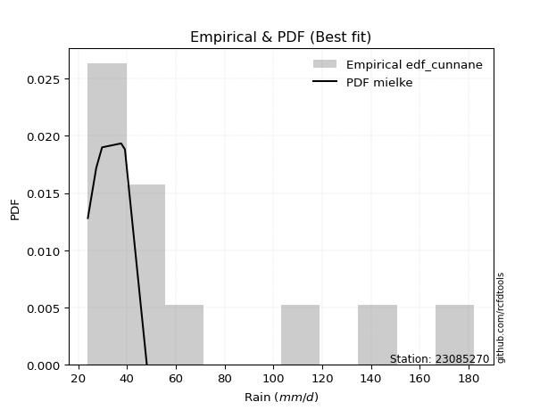</img>

</div>


### 12. Empirical - EDF Adamowski (1981)

The Adamowski formula in hydrology refers to a specific plotting position formula used for estimating the non-parametric empirical distribution of hydrological events (like flood peaks) to calculate their return periods. This formula provides an alternative to traditional parametric methods (like the Gumbel or Log Pearson Type III distributions). 

<div align="center">


$P=(m-0.25)/(n+0.5)$


</div>


**12.1. Empirical values**

<div align="center">

|                | 0                  | 1                  | 2                 | 3                  | 4                  | 5                  | 6                 | 7                  | 8                 | 9                 | 10                | 11                 |
|:---------------|:-------------------|:-------------------|:------------------|:-------------------|:-------------------|:-------------------|:------------------|:-------------------|:------------------|:------------------|:------------------|:-------------------|
| date           | 2020               | 2015               | 2019              | 2016               | 2023               | 2021               | 2018              | 2017               | 2022              | 2025              | 2014              | 2024               |
| x              | 23.955             | 27.39              | 29.783            | 37.6               | 39.149             | 48.124             | 51.916            | 52.857             | 69.729            | 111.6             | 118.96            | 137.6              |
| m              | 1                  | 2                  | 3                 | 4                  | 5                  | 6                  | 7                 | 8                  | 9                 | 10                | 11                | 12                 |
| empirical_dist | edf_adamowski      | edf_adamowski      | edf_adamowski     | edf_adamowski      | edf_adamowski      | edf_adamowski      | edf_adamowski     | edf_adamowski      | edf_adamowski     | edf_adamowski     | edf_adamowski     | edf_adamowski      |
| empirical      | 0.06               | 0.14               | 0.22              | 0.3                | 0.38               | 0.46               | 0.54              | 0.62               | 0.7               | 0.78              | 0.86              | 0.94               |
| empirical_tr   | 1.0638297872340425 | 1.1627906976744187 | 1.282051282051282 | 1.4285714285714286 | 1.6129032258064517 | 1.8518518518518516 | 2.173913043478261 | 2.6315789473684212 | 3.333333333333333 | 4.545454545454546 | 7.142857142857142 | 16.666666666666654 |

</div>


**12.2. Kolmogorov-Smirnov fit test (sorted by Δ)**


<div align="center">

|                | 0                   | 1                   | 2                   | 3                   | 4                   | 5                   | 6                   | 7                   | 8                   | 9                   | 10                  | 11                  | 12                  | 13                  | 14                  | 15                  | 16                  | 17                  | 18                  | 19                  | 20                  | 21                  | 22                  | 23                  | 24                  | 25                  | 26                  | 27                  | 28                  | 29                  | 30                  | 31                    | 32                  | 33                  | 34                  | 35                  | 36                  | 37                  | 38                  | 39                  | 40                  | 41                  | 42                  | 43                  | 44                  | 45                  | 46                  | 47                  | 48                  | 49                  | 50                  | 51                  | 52                  | 53                  | 54                  | 55                  | 56                  | 57                  | 58                  | 59                  | 60                  | 61                  | 62                  | 63                  | 64                  | 65                  | 66                  | 67                  | 68                  | 69                  | 70                  | 71                  | 72                  | 73                  | 74                  | 75                  | 76                  | 77                  | 78                  | 79                  | 80                  | 81                  | 82                  | 83                  | 84                  | 85                  | 86                  | 87                  | 88                  | 89                  |
|:---------------|:--------------------|:--------------------|:--------------------|:--------------------|:--------------------|:--------------------|:--------------------|:--------------------|:--------------------|:--------------------|:--------------------|:--------------------|:--------------------|:--------------------|:--------------------|:--------------------|:--------------------|:--------------------|:--------------------|:--------------------|:--------------------|:--------------------|:--------------------|:--------------------|:--------------------|:--------------------|:--------------------|:--------------------|:--------------------|:--------------------|:--------------------|:----------------------|:--------------------|:--------------------|:--------------------|:--------------------|:--------------------|:--------------------|:--------------------|:--------------------|:--------------------|:--------------------|:--------------------|:--------------------|:--------------------|:--------------------|:--------------------|:--------------------|:--------------------|:--------------------|:--------------------|:--------------------|:--------------------|:--------------------|:--------------------|:--------------------|:--------------------|:--------------------|:--------------------|:--------------------|:--------------------|:--------------------|:--------------------|:--------------------|:--------------------|:--------------------|:--------------------|:--------------------|:--------------------|:--------------------|:--------------------|:--------------------|:--------------------|:--------------------|:--------------------|:--------------------|:--------------------|:--------------------|:--------------------|:--------------------|:--------------------|:--------------------|:--------------------|:--------------------|:--------------------|:--------------------|:--------------------|:--------------------|:--------------------|:--------------------|
| station        | 23085270            | 23085270            | 23085270            | 23085270            | 23085270            | 23085270            | 23085270            | 23085270            | 23085270            | 23085270            | 23085270            | 23085270            | 23085270            | 23085270            | 23085270            | 23085270            | 23085270            | 23085270            | 23085270            | 23085270            | 23085270            | 23085270            | 23085270            | 23085270            | 23085270            | 23085270            | 23085270            | 23085270            | 23085270            | 23085270            | 23085270            | 23085270              | 23085270            | 23085270            | 23085270            | 23085270            | 23085270            | 23085270            | 23085270            | 23085270            | 23085270            | 23085270            | 23085270            | 23085270            | 23085270            | 23085270            | 23085270            | 23085270            | 23085270            | 23085270            | 23085270            | 23085270            | 23085270            | 23085270            | 23085270            | 23085270            | 23085270            | 23085270            | 23085270            | 23085270            | 23085270            | 23085270            | 23085270            | 23085270            | 23085270            | 23085270            | 23085270            | 23085270            | 23085270            | 23085270            | 23085270            | 23085270            | 23085270            | 23085270            | 23085270            | 23085270            | 23085270            | 23085270            | 23085270            | 23085270            | 23085270            | 23085270            | 23085270            | 23085270            | 23085270            | 23085270            | 23085270            | 23085270            | 23085270            | 23085270            |
| empirical_dist | edf_adamowski       | edf_adamowski       | edf_adamowski       | edf_adamowski       | edf_adamowski       | edf_adamowski       | edf_adamowski       | edf_adamowski       | edf_adamowski       | edf_adamowski       | edf_adamowski       | edf_adamowski       | edf_adamowski       | edf_adamowski       | edf_adamowski       | edf_adamowski       | edf_adamowski       | edf_adamowski       | edf_adamowski       | edf_adamowski       | edf_adamowski       | edf_adamowski       | edf_adamowski       | edf_adamowski       | edf_adamowski       | edf_adamowski       | edf_adamowski       | edf_adamowski       | edf_adamowski       | edf_adamowski       | edf_adamowski       | edf_adamowski         | edf_adamowski       | edf_adamowski       | edf_adamowski       | edf_adamowski       | edf_adamowski       | edf_adamowski       | edf_adamowski       | edf_adamowski       | edf_adamowski       | edf_adamowski       | edf_adamowski       | edf_adamowski       | edf_adamowski       | edf_adamowski       | edf_adamowski       | edf_adamowski       | edf_adamowski       | edf_adamowski       | edf_adamowski       | edf_adamowski       | edf_adamowski       | edf_adamowski       | edf_adamowski       | edf_adamowski       | edf_adamowski       | edf_adamowski       | edf_adamowski       | edf_adamowski       | edf_adamowski       | edf_adamowski       | edf_adamowski       | edf_adamowski       | edf_adamowski       | edf_adamowski       | edf_adamowski       | edf_adamowski       | edf_adamowski       | edf_adamowski       | edf_adamowski       | edf_adamowski       | edf_adamowski       | edf_adamowski       | edf_adamowski       | edf_adamowski       | edf_adamowski       | edf_adamowski       | edf_adamowski       | edf_adamowski       | edf_adamowski       | edf_adamowski       | edf_adamowski       | edf_adamowski       | edf_adamowski       | edf_adamowski       | edf_adamowski       | edf_adamowski       | edf_adamowski       | edf_adamowski       |
| p_dist         | fisk                | logmielke           | mielke              | weibull_min         | logfisk             | loggamma            | loggamma            | logerlang           | alpha               | f                   | johnsonsu           | invweibull          | logweibull_min      | logexponnorm        | fatiguelife         | logfatiguelife      | loggenexpon         | invgamma            | loginvgauss         | loghalfnorm         | logbetaprime        | invgauss            | logtruncnorm        | gamma               | loginvgamma         | loginvweibull       | loggompertz         | loggenlogistic      | lograyleigh         | nct                 | logalpha            | loglaplace_asymmetric | logmaxwell          | logkstwobign        | logf                | laplace_asymmetric  | expon               | genexpon            | gompertz            | exponnorm           | lognct              | logrice             | logpearson3         | logncf              | betaprime           | loggumbel_r         | logmoyal            | logjohnsonsu        | chi2                | ncf                 | halflogistic        | logloggamma         | logcrystalball      | lognorm             | lognorm             | logt                | loghalflogistic     | logexpon            | loglogistic         | moyal               | halfnorm            | nakagami            | loghypsecant        | loglaplace          | genlogistic         | gumbel_r            | pearson3            | rayleigh            | kstwobign           | erlang              | lognakagami         | logchi2             | maxwell             | loggumbel_l         | wald                | loggibrat           | logwald             | crystalball         | norm                | truncnorm           | t                   | rice                | logistic            | hypsecant           | gibrat              | laplace             | gumbel_l            | loglognorm          | pareto              | logpareto           |
| delta          | 0.07139910584649323 | 0.07471814119178175 | 0.07539180977714241 | 0.08689609704247869 | 0.09467036007179996 | 0.09560506750008707 | 0.09560506750008707 | 0.0956080453915667  | 0.09587772804401073 | 0.09798355420269611 | 0.09957095515792092 | 0.10259729162016817 | 0.10315989960751515 | 0.10399689110319843 | 0.10613153592133995 | 0.10632503955446104 | 0.10670510148940282 | 0.10692546053669516 | 0.10806521456543805 | 0.10943817715066606 | 0.10947588828830868 | 0.111104437309267   | 0.11170235522429683 | 0.11258750001722317 | 0.11364433266093399 | 0.11386181748583568 | 0.11396119670372551 | 0.11425606851758985 | 0.11438945189027572 | 0.11474815029359542 | 0.11590815425175627 | 0.11604760247996093   | 0.1170715192731775  | 0.11726728078566862 | 0.11734820064378493 | 0.11774164467622283 | 0.11775950948827207 | 0.11831230379096203 | 0.11965181901702626 | 0.11981087521314793 | 0.12026232980632112 | 0.12029475261607958 | 0.12133516584715043 | 0.12151237402934478 | 0.12177234345171517 | 0.12227759039191466 | 0.12304066479795783 | 0.12341951444443189 | 0.1236832570867259  | 0.12394354912923633 | 0.12434589266387419 | 0.12553324928578447 | 0.1271625771115268  | 0.1271625782968876  | 0.1271625782968876  | 0.1271626959079728  | 0.1305623349697616  | 0.13369047859157063 | 0.13686789417783374 | 0.1385495507309319  | 0.1397939900413374  | 0.14003513644859727 | 0.14079243824078447 | 0.1454520978312904  | 0.15080229275026408 | 0.1613688255801129  | 0.16542662543180292 | 0.1746720118336409  | 0.17926717462845654 | 0.18236697647164396 | 0.18248332408575008 | 0.18548460096793212 | 0.18696821627973265 | 0.1914236990762901  | 0.20800228621400246 | 0.22                | 0.22                | 0.22096189879316724 | 0.220961899798073   | 0.22096191709451662 | 0.22096646084473737 | 0.22628852374341524 | 0.23397170340650109 | 0.24460851586959415 | 0.26529863713901575 | 0.27179234080205844 | 0.28737425836212627 | 0.4133528624270405  | 0.4563659369741352  | 0.47103061180457717 |
| deltao         | 0.36218414519599995 | 0.36218414519599995 | 0.36218414519599995 | 0.36218414519599995 | 0.36218414519599995 | 0.36218414519599995 | 0.36218414519599995 | 0.36218414519599995 | 0.36218414519599995 | 0.36218414519599995 | 0.36218414519599995 | 0.36218414519599995 | 0.36218414519599995 | 0.36218414519599995 | 0.36218414519599995 | 0.36218414519599995 | 0.36218414519599995 | 0.36218414519599995 | 0.36218414519599995 | 0.36218414519599995 | 0.36218414519599995 | 0.36218414519599995 | 0.36218414519599995 | 0.36218414519599995 | 0.36218414519599995 | 0.36218414519599995 | 0.36218414519599995 | 0.36218414519599995 | 0.36218414519599995 | 0.36218414519599995 | 0.36218414519599995 | 0.36218414519599995   | 0.36218414519599995 | 0.36218414519599995 | 0.36218414519599995 | 0.36218414519599995 | 0.36218414519599995 | 0.36218414519599995 | 0.36218414519599995 | 0.36218414519599995 | 0.36218414519599995 | 0.36218414519599995 | 0.36218414519599995 | 0.36218414519599995 | 0.36218414519599995 | 0.36218414519599995 | 0.36218414519599995 | 0.36218414519599995 | 0.36218414519599995 | 0.36218414519599995 | 0.36218414519599995 | 0.36218414519599995 | 0.36218414519599995 | 0.36218414519599995 | 0.36218414519599995 | 0.36218414519599995 | 0.36218414519599995 | 0.36218414519599995 | 0.36218414519599995 | 0.36218414519599995 | 0.36218414519599995 | 0.36218414519599995 | 0.36218414519599995 | 0.36218414519599995 | 0.36218414519599995 | 0.36218414519599995 | 0.36218414519599995 | 0.36218414519599995 | 0.36218414519599995 | 0.36218414519599995 | 0.36218414519599995 | 0.36218414519599995 | 0.36218414519599995 | 0.36218414519599995 | 0.36218414519599995 | 0.36218414519599995 | 0.36218414519599995 | 0.36218414519599995 | 0.36218414519599995 | 0.36218414519599995 | 0.36218414519599995 | 0.36218414519599995 | 0.36218414519599995 | 0.36218414519599995 | 0.36218414519599995 | 0.36218414519599995 | 0.36218414519599995 | 0.36218414519599995 | 0.36218414519599995 | 0.36218414519599995 |
| eval           | Δo > Δ              | Δo > Δ              | Δo > Δ              | Δo > Δ              | Δo > Δ              | Δo > Δ              | Δo > Δ              | Δo > Δ              | Δo > Δ              | Δo > Δ              | Δo > Δ              | Δo > Δ              | Δo > Δ              | Δo > Δ              | Δo > Δ              | Δo > Δ              | Δo > Δ              | Δo > Δ              | Δo > Δ              | Δo > Δ              | Δo > Δ              | Δo > Δ              | Δo > Δ              | Δo > Δ              | Δo > Δ              | Δo > Δ              | Δo > Δ              | Δo > Δ              | Δo > Δ              | Δo > Δ              | Δo > Δ              | Δo > Δ                | Δo > Δ              | Δo > Δ              | Δo > Δ              | Δo > Δ              | Δo > Δ              | Δo > Δ              | Δo > Δ              | Δo > Δ              | Δo > Δ              | Δo > Δ              | Δo > Δ              | Δo > Δ              | Δo > Δ              | Δo > Δ              | Δo > Δ              | Δo > Δ              | Δo > Δ              | Δo > Δ              | Δo > Δ              | Δo > Δ              | Δo > Δ              | Δo > Δ              | Δo > Δ              | Δo > Δ              | Δo > Δ              | Δo > Δ              | Δo > Δ              | Δo > Δ              | Δo > Δ              | Δo > Δ              | Δo > Δ              | Δo > Δ              | Δo > Δ              | Δo > Δ              | Δo > Δ              | Δo > Δ              | Δo > Δ              | Δo > Δ              | Δo > Δ              | Δo > Δ              | Δo > Δ              | Δo > Δ              | Δo > Δ              | Δo > Δ              | Δo > Δ              | Δo > Δ              | Δo > Δ              | Δo > Δ              | Δo > Δ              | Δo > Δ              | Δo > Δ              | Δo > Δ              | Δo > Δ              | Δo > Δ              | Δo > Δ              | Δo <= Δ             | Δo <= Δ             | Δo <= Δ             |
| fit            | 1                   | 1                   | 1                   | 1                   | 1                   | 1                   | 1                   | 1                   | 1                   | 1                   | 1                   | 1                   | 1                   | 1                   | 1                   | 1                   | 1                   | 1                   | 1                   | 1                   | 1                   | 1                   | 1                   | 1                   | 1                   | 1                   | 1                   | 1                   | 1                   | 1                   | 1                   | 1                     | 1                   | 1                   | 1                   | 1                   | 1                   | 1                   | 1                   | 1                   | 1                   | 1                   | 1                   | 1                   | 1                   | 1                   | 1                   | 1                   | 1                   | 1                   | 1                   | 1                   | 1                   | 1                   | 1                   | 1                   | 1                   | 1                   | 1                   | 1                   | 1                   | 1                   | 1                   | 1                   | 1                   | 1                   | 1                   | 1                   | 1                   | 1                   | 1                   | 1                   | 1                   | 1                   | 1                   | 1                   | 1                   | 1                   | 1                   | 1                   | 1                   | 1                   | 1                   | 1                   | 1                   | 1                   | 1                   | 0                   | 0                   | 0                   |
| n              | 12                  | 12                  | 12                  | 12                  | 12                  | 12                  | 12                  | 12                  | 12                  | 12                  | 12                  | 12                  | 12                  | 12                  | 12                  | 12                  | 12                  | 12                  | 12                  | 12                  | 12                  | 12                  | 12                  | 12                  | 12                  | 12                  | 12                  | 12                  | 12                  | 12                  | 12                  | 12                    | 12                  | 12                  | 12                  | 12                  | 12                  | 12                  | 12                  | 12                  | 12                  | 12                  | 12                  | 12                  | 12                  | 12                  | 12                  | 12                  | 12                  | 12                  | 12                  | 12                  | 12                  | 12                  | 12                  | 12                  | 12                  | 12                  | 12                  | 12                  | 12                  | 12                  | 12                  | 12                  | 12                  | 12                  | 12                  | 12                  | 12                  | 12                  | 12                  | 12                  | 12                  | 12                  | 12                  | 12                  | 12                  | 12                  | 12                  | 12                  | 12                  | 12                  | 12                  | 12                  | 12                  | 12                  | 12                  | 12                  | 12                  | 12                  |
| best_fit       | 1                   | 0                   | 0                   | 0                   | 0                   | 0                   | 0                   | 0                   | 0                   | 0                   | 0                   | 0                   | 0                   | 0                   | 0                   | 0                   | 0                   | 0                   | 0                   | 0                   | 0                   | 0                   | 0                   | 0                   | 0                   | 0                   | 0                   | 0                   | 0                   | 0                   | 0                   | 0                     | 0                   | 0                   | 0                   | 0                   | 0                   | 0                   | 0                   | 0                   | 0                   | 0                   | 0                   | 0                   | 0                   | 0                   | 0                   | 0                   | 0                   | 0                   | 0                   | 0                   | 0                   | 0                   | 0                   | 0                   | 0                   | 0                   | 0                   | 0                   | 0                   | 0                   | 0                   | 0                   | 0                   | 0                   | 0                   | 0                   | 0                   | 0                   | 0                   | 0                   | 0                   | 0                   | 0                   | 0                   | 0                   | 0                   | 0                   | 0                   | 0                   | 0                   | 0                   | 0                   | 0                   | 0                   | 0                   | 0                   | 0                   | 0                   |
| best_fit_sort  | 1                   | 2                   | 3                   | 4                   | 5                   | 6                   | 7                   | 8                   | 9                   | 10                  | 11                  | 12                  | 13                  | 14                  | 15                  | 16                  | 17                  | 18                  | 19                  | 20                  | 21                  | 22                  | 23                  | 24                  | 25                  | 26                  | 27                  | 28                  | 29                  | 30                  | 31                  | 32                    | 33                  | 34                  | 35                  | 36                  | 37                  | 38                  | 39                  | 40                  | 41                  | 42                  | 43                  | 44                  | 45                  | 46                  | 47                  | 48                  | 49                  | 50                  | 51                  | 52                  | 53                  | 54                  | 55                  | 56                  | 57                  | 58                  | 59                  | 60                  | 61                  | 62                  | 63                  | 64                  | 65                  | 66                  | 67                  | 68                  | 69                  | 70                  | 71                  | 72                  | 73                  | 74                  | 75                  | 76                  | 77                  | 78                  | 79                  | 80                  | 81                  | 82                  | 83                  | 84                  | 85                  | 86                  | 87                  | 88                  | 89                  | 90                  |

</div>


<div align="center">

</img>

</div>


**12.3. Best fit**

<div align="center">

|   id |   station | empirical_dist   | p_dist   |     delta |   deltao | eval   |   fit |   n |   best_fit |   best_fit_sort |
|-----:|----------:|:-----------------|:---------|----------:|---------:|:-------|------:|----:|-----------:|----------------:|
|    0 |  23085270 | edf_adamowski    | fisk     | 0.0713991 | 0.362184 | Δo > Δ |     1 |  12 |          1 |               1 |

</div>


<div align="center">

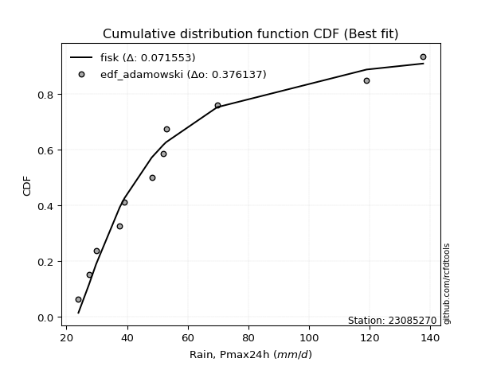</img>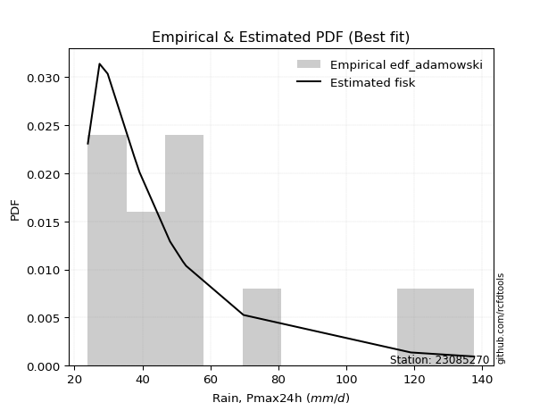</img>

</div>


## C. Best fit & Estimate extreme values for specific return periods - Tr


### 1. Best fit (ordered by delta Δ)

<div align="center">

|   id |   station | empirical_dist   | p_dist      |     delta |   deltao | eval   |   fit |   n |   best_fit |   best_fit_sort |
|-----:|----------:|:-----------------|:------------|----------:|---------:|:-------|------:|----:|-----------:|----------------:|
|    0 |  23085270 | edf_hazen        | logmielke   | 0.0630515 | 0.362184 | Δo > Δ |     1 |  12 |          1 |               1 |
|    1 |  23085270 | edf_cunnane      | fisk        | 0.0649217 | 0.362184 | Δo > Δ |     1 |  12 |          1 |               2 |
|    2 |  23085270 | edf_gringorten   | fisk        | 0.0651922 | 0.362184 | Δo > Δ |     1 |  12 |          1 |               3 |
|    3 |  23085270 | edf_blom         | fisk        | 0.0656848 | 0.362184 | Δo > Δ |     1 |  12 |          1 |               4 |
|    4 |  23085270 | edf_tukey        | fisk        | 0.0676153 | 0.362184 | Δo > Δ |     1 |  12 |          1 |               5 |
|    5 |  23085270 | edf_filliben     | fisk        | 0.0683421 | 0.362184 | Δo > Δ |     1 |  12 |          1 |               6 |
|    6 |  23085270 | edf_beard        | fisk        | 0.0686851 | 0.362184 | Δo > Δ |     1 |  12 |          1 |               7 |
|    7 |  23085270 | edf_jenkinson    | fisk        | 0.0686851 | 0.362184 | Δo > Δ |     1 |  12 |          1 |               8 |
|    8 |  23085270 | edf_chegodayev   | fisk        | 0.069141  | 0.362184 | Δo > Δ |     1 |  12 |          1 |               9 |
|    9 |  23085270 | edf_adamowski    | fisk        | 0.0713991 | 0.362184 | Δo > Δ |     1 |  12 |          1 |              10 |
|   10 |  23085270 | edf_california   | fatiguelife | 0.0771243 | 0.362184 | Δo > Δ |     1 |  12 |          1 |              11 |
|   11 |  23085270 | edf_weibull      | fisk        | 0.0821683 | 0.362184 | Δo > Δ |     1 |  12 |          1 |              12 |

</div>

:file_folder:Tables: [bestfit_23085270.csv](table/bestfit_23085270.csv) | [extreme_23085270.csv](table/extreme_23085270.csv)


### 2. Extreme values

In hydrology, a return period (or recurrence interval $Tr$) is the statistical average time between extreme events like floods or droughts of a specific magnitude, indicating how rare an event is, with a 100-year flood, for example, having a 1% chance of occurring in any given year, not that it happens exactly every century. It is a key tool for infrastructure design (like bridges or dams) and risk assessment, calculated from historical data to determine the probability of future events, although it is important to remember it is statistical average, and events can cluster or be missed.

> risk_rate: assuming the return period as the project useful life.

|   id |      tr |   prob_l |     prob_g |     alpha |   betaprime |     chi2 |   crystalball |   erlang |    expon |   exponnorm |         f |   fatiguelife |      fisk |    gamma |   genexpon |   genlogistic |   gibrat |   gompertz |   gumbel_l |   gumbel_r |   halflogistic |   halfnorm |   hypsecant |   invgamma |   invgauss |   invweibull |   johnsonsu |   kstwobign |   laplace |   laplace_asymmetric |   loggamma |   logistic |   lognorm |   maxwell |   mielke |    moyal |   nakagami |      ncf |      nct |     norm |         pareto |   pearson3 |   rayleigh |     rice |        t |   truncnorm |     wald |   weibull_min |   logalpha |   logbetaprime |          logchi2 |   logcrystalball |   logerlang |   logexpon |   logexponnorm |      logf |   logfatiguelife |    logfisk |   loggenexpon |   loggenlogistic |   loggibrat |   loggompertz |   loggumbel_l |   loggumbel_r |   loghalflogistic |   loghalfnorm |   loghypsecant |   loginvgamma |   loginvgauss |   loginvweibull |   logjohnsonsu |   logkstwobign |   loglaplace |   loglaplace_asymmetric |   logloggamma |   loglogistic |   loglognorm |   logmaxwell |   logmielke |   logmoyal |   lognakagami |   logncf |   lognct |     logpareto |   logpearson3 |   lograyleigh |   logrice |     logt |   logtruncnorm |   logwald |   logweibull_min |   station |   n |   risk_rate |
|-----:|--------:|---------:|-----------:|----------:|------------:|---------:|--------------:|---------:|---------:|------------:|----------:|--------------:|----------:|---------:|-----------:|--------------:|---------:|-----------:|-----------:|-----------:|---------------:|-----------:|------------:|-----------:|-----------:|-------------:|------------:|------------:|----------:|---------------------:|-----------:|-----------:|----------:|----------:|---------:|---------:|-----------:|---------:|---------:|---------:|---------------:|-----------:|-----------:|---------:|---------:|------------:|---------:|--------------:|-----------:|---------------:|-----------------:|-----------------:|------------:|-----------:|---------------:|----------:|-----------------:|-----------:|--------------:|-----------------:|------------:|--------------:|--------------:|--------------:|------------------:|--------------:|---------------:|--------------:|--------------:|----------------:|---------------:|---------------:|-------------:|------------------------:|--------------:|--------------:|-------------:|-------------:|------------:|-----------:|--------------:|---------:|---------:|--------------:|--------------:|--------------:|----------:|---------:|---------------:|----------:|-----------------:|----------:|----:|------------:|
|    0 |    2    | 0.5      | 0.5        |   46.9598 |     50.5445 |  46.1898 |       62.3886 |  38.6899 |  50.5951 |     50.3379 |   46.5385 |       45.4453 |   46.3531 |  44.5845 |    50.7705 |       55.0899 |  51.2054 |    51.4281 |    68.5092 |    56.2679 |        53.2251 |    54.7622 |     62.3886 |    46.8787 |    46.2102 |      46.6493 |     46.1397 |     57.4094 |   62.3886 |              50.5972 |    44.1181 |    62.3886 |   52.9331 |   59.2022 |  48.0663 |  54.292  |    55.0037 |  51.3931 |  48.3111 |  62.3886 |   24.2809      |    56.8668 |    58.0721 |  61.5625 |  62.3891 |     62.3886 |  50.3116 |       49.8986 |    48.7243 |        48.8093 |     38.7835      |          52.9331 |     44.1179 |    41.5019 |        46.0401 |   45.1211 |          46.6319 |    47.3031 |       47.1345 |          47.8978 |     44.6949 |       49.4015 |       58.0681 |       48.2522 |           46.0818 |       47.1653 |        52.9331 |       48.4199 |       46.9543 |         47.9314 |        52.9325 |        47.9387 |      52.9331 |                 50.5949 |       52.9272 |       52.9331 |  24.8462     |      50.4422 |     47.8711 |    46.8312 |        38.976 |  50.9393 |  50.1137 |  24.1585      |       51.1267 |       49.5872 |   50.5707 |  52.9331 |        42.837  |   44.0943 |          46.0471 |  23085270 |  12 |    0.75     |
|    1 |    2.33 | 0.570815 | 0.429185   |   51.8741 |     55.8093 |  51.916  |       69.037  |  42.9034 |  56.4647 |     56.1579 |   51.6984 |       51.131  |   52.0294 |  50.5851 |    56.6494 |       60.4852 |  54.5732 |    57.3536 |    74.2934 |    62.4285 |        59.5591 |    61.9376 |     67.7093 |    51.8973 |    51.4965 |      51.6429 |     51.5487 |     63.1848 |   66.4119 |              56.4672 |    49.3582 |    68.2463 |   58.5336 |   66.1094 |  53.0255 |  60.1237 |    63.2957 |  56.7744 |  53.3132 |  69.037  |   25.7037      |    63.4284 |    65.0815 |  67.6244 |  69.0375 |     69.037  |  54.671  |       56.5476 |    53.7497 |        53.9682 |     46.1811      |          58.5336 |     49.3579 |    46.8441 |        50.6916 |   49.7817 |          51.647  |    52.1614 |       52.6435 |          52.847  |     47.0309 |       55.2536 |       63.3779 |       52.965  |           50.7153 |       52.5731 |        57.3697 |       53.4791 |       51.9618 |         52.8893 |        58.6335 |        53.0351 |      56.2547 |                 54.6401 |       58.5959 |       57.8376 |  29.4309     |      55.9979 |     52.8123 |    51.1503 |        45.872 |  56.3057 |  55.3423 |  25.0678      |       56.5608 |       55.1339 |   55.9413 |  58.5336 |        48.2761 |   47.1003 |          51.3105 |  23085270 |  12 |    0.729209 |
|    2 |    5    | 0.8      | 0.2        |   82.7819 |     82.9317 |  81.8502 |       93.7443 |  65.6798 |  85.8115 |     85.2568 |   83.4729 |       83.9978 |   90.3182 |  83.2091 |    85.8924 |       83.9227 |  73.9628 |    86.3246 |    92.9798 |    89.1925 |        88.219  |    92.2814 |     89.052  |    81.7463 |    82.1835 |      82.1247 |     84.0656 |     87.7177 |   86.5276 |              85.8162 |    83.8282 |    90.8638 |   85.0596 |   93.2959 |  81.0822 |  87.1367 |   101.666  |  83.6013 |  81.396  |  93.7443 | 7787.07        |    91.0359 |    93.1433 |  91.8928 |  93.745  |     93.7443 |  79.0753 |       92.0685 |    81.5476 |        82.992  |    129.428       |          85.0596 |     83.8269 |    85.8175 |        80.4498 |   77.6307 |          81.6809 |    82.916  |       83.7933 |          81.0027 |     63.0613 |       85.4847 |       84.0815 |       79.3998 |           78.2378 |       83.1988 |        79.2312 |       81.8109 |       81.5771 |         81.112  |        85.7503 |        81.46   |      76.2626 |                 80.2655 |       85.4252 |       81.4327 |   4.0089e+56 |      84.4845 |     80.9223 |    76.9686 |       102.943 |  83.5807 |  82.7011 |   8.73189e+88 |       83.965  |       84.2898 |   83.7147 |  85.0596 |        84.5884 |   68.1327 |          82.8044 |  23085270 |  12 |    0.67232  |
|    3 |   10    | 0.9      | 0.1        |  128.558  |    110.824  | 110.056  |      110.135  |  87.7266 | 112.452  |    111.672  |  125.168  |      118.246  |  148.146  | 114.932  |   112.234  |      103.011  |  96.0646 |   111.725  |   103.383  |   110.991  |       112.02   |   114.735  |    106.095  |   119.146  |   116.05   |     122.288  |    123.041  |    106.396  |  104.788  |             112.458  |   132.366  |   107.521  |  108.994  |  112.428  | 114.407  | 110.656  |   131.664  | 109.977  | 114.354  | 110.135  |    1.58828e+07 |   112.271  |   113.152  | 109.197  | 110.135  |    110.135  | 104.974  |      126.628  |   113.704  |       117.131  |    376.089       |         108.994  |    132.362  |   148.678  |       122.011  |  113.183  |         119.584  |   129.995  |      118.306  |         114.693  |     88.0971 |      114.052  |       98.4122 |      110.416  |          112.143  |      116.851  |       102.532  |      114.921  |      118.422  |        114.908  |       110.345  |       112.941  |     100.525  |                113.8    |      109.588  |      104.768  | inf          |     112.842  |    114.575  |   109.856  |       198.824 | 110.959  | 111.481  | inf           |      111.045  |      114.084  |  111.475  | 108.994  |       134.727  |  100.811  |         121.185  |  23085270 |  12 |    0.651322 |
|    4 |   15    | 0.933333 | 0.0666667  |  169.89   |    129.246  | 126.813  |      118.314  | 100.968  | 128.035  |    127.124  |  157.721  |      139.529  |  198.462  | 134.018  |   127.558  |      113.78   | 111.309  |   126.21   |   108.095  |   123.29   |       125.489  |   126.42   |    115.821  |   147.434  |   138.235  |     153.97   |    150.745  |    116.312  |  115.47   |             128.043  |   171.895  |   116.596  |  123.349  |  122.245  | 138.876  | 124.305  |   147.476  | 126.879  | 138.346  | 118.314  |    1.373e+09   |   123.773  |   123.461  | 118.112  | 118.314  |    118.314  | 121.605  |      147.599  |   137.053  |       142.076  |    725.846       |         123.349  |    171.889  |   205.051  |       155.67   |  140.721  |         148.372  |   174.32   |      141.699  |         139.555  |    110.946  |      131.163  |      105.682  |      132.993  |          137.485  |      139.444  |       118.784  |      139.003  |      146.173  |        139.859  |       125.142  |       134.334  |     118.155  |                139.583  |      124.056  |      120.185  | inf          |     130.907  |    139.426  |   135.051  |       282.18  | 128.689  | 130.805  | inf           |      128.347  |      133.338  |  129.154  | 123.349  |       174.141  |  129.649  |         149.183  |  23085270 |  12 |    0.644736 |
|    5 |   20    | 0.95     | 0.05       |  209.486  |    143.442  | 138.785  |      123.67   | 110.473  | 139.092  |    138.087  |  185.535  |      155.044  |  244.635  | 147.731  |   138.395  |      121.32   | 123.268  |   136.327  |   111.028  |   131.901  |       134.926  |   134.21   |    122.682  |   171.132  |   154.927  |     181.27   |    172.849  |    122.992  |  123.048  |             139.101  |   206.519  |   122.869  |  133.759  |  128.76   | 159.038  | 133.972  |   158.054  | 139.668  | 158.01   | 123.67   |    3.24948e+10 |   131.638  |   130.314  | 124.038  | 123.671  |    123.67   | 133.998  |      162.763  |   156.241  |       162.608  |   1169.92        |         133.759  |    206.511  |   257.585  |       185.043  |  164.255  |         172.545  |   218.509  |      159.879  |         160.105  |    132.946  |      143.461  |      110.476  |      151.496  |          158.581  |      156.885  |       131.776  |      158.768  |      169.368  |        160.489  |       135.891  |       150.985  |     132.508  |                161.345  |      134.536  |      132.148  | inf          |     144.465  |    159.979  |   156.316  |       356.859 | 142.176  | 145.854  | inf           |      141.385  |      147.901  |  142.41   | 133.759  |       207.646  |  156.384  |         171.996  |  23085270 |  12 |    0.641514 |
|    6 |   25    | 0.96     | 0.04       |  248.183  |    155.167  | 148.111  |      127.613  | 117.9    | 147.668  |    146.591  |  210.299  |      167.277  |  288.006  | 158.449  |   146.78   |      127.128  | 133.237  |   144.085  |   113.115  |   138.534  |       142.197  |   140.007  |    127.992  |   191.929  |   168.377  |     205.744  |    191.494  |    127.996  |  128.927  |             147.677  |   237.894  |   127.667  |  141.98   |  133.596  | 176.531  | 141.465  |   165.936  | 150.092  | 175.004  | 127.613  |    3.78166e+11 |   137.598  |   135.405  | 128.441  | 127.614  |    127.613  | 143.925  |      174.673  |   172.895  |       180.428  |   1702.91        |         141.98   |    237.885  |   307.436  |       211.592  |  185.265  |         193.795  |   263.41   |      174.942  |         177.974  |    154.585  |      153.084  |      114.02   |      167.486  |          177.017  |      171.263  |       142.798  |      175.884  |      189.693  |        178.432  |       144.39   |       164.795  |     144.831  |                180.537  |      142.805  |      142.097  | inf          |     155.431  |    177.858  |   175.076  |       425.156 | 153.205  | 158.381  | inf           |      151.972  |      159.742  |  153.121  | 141.98   |       237.252  |  181.723  |         191.573  |  23085270 |  12 |    0.639603 |
|    7 |   50    | 0.98     | 0.02       |  436.385  |    196.088  | 177.259  |      138.904  | 141.205  | 174.308  |    173.006  |  309.489  |      206.174  |  480.537  | 192.109  |   172.721  |      145.019  | 168.379  |   167.704  |   118.78   |   158.967  |       164.599  |   156.854  |    144.456  |   273.025  |   212.679  |     305.151  |    258.547  |    142.688  |  147.187  |             174.32   |   367.631  |   142.329  |  168.424  |  147.624  | 243.386  | 164.725  |   188.87   | 185.626  | 239.504  | 138.904  |    7.73698e+14 |   155.474  |   150.184  | 141.222  | 138.905  |    138.904  | 176.336  |      212.413  |   236.992  |       248.798  |   5593.64        |         168.424  |    367.612  |   532.632  |       320.902  |  270.392  |         276.902  |   507.722  |      227.528  |         246.553  |    263.045  |      183.403  |      124.222  |      228.147  |          248.417  |      220.979  |       183.181  |      241.29   |      268.752  |        247.319  |       171.784  |       213.092  |     190.908  |                255.964  |      169.362  |      177.38   | inf          |     192.173  |    246.545  |   248.909  |       707.935 | 190.991  | 202.752  | inf           |      187.75   |      199.76   |  188.935  | 168.424  |       353.197  |  296.719  |         264.512  |  23085270 |  12 |    0.63583  |
|    8 |   75    | 0.986667 | 0.0133333  |  621.571  |    223.621  | 194.41   |      144.962  | 154.974  | 189.892  |    188.458  |  387.435  |      229.436  |  650.216  | 212.007  |   187.824  |      155.417  | 192.113  |   181.197  |   121.645  |   170.844  |       177.621  |   166.026  |    154.077  |   334.875  |   240.166  |     384.569  |    304.821  |    150.772  |  157.869  |             189.904  |   473.122  |   150.796  |  184.589  |  155.25   | 293.286  | 178.327  |   201.357  | 208.902  | 287.276  | 144.962  |    6.68832e+16 |   165.565  |   158.224  | 148.176  | 144.963  |    144.962  | 196.28   |      234.959  |   285.617  |       300.278  |  11363.8         |         184.589  |    473.094  |   734.584  |       409.426  |  338.686  |         340.491  |   792.919  |      262.704  |         297.98   |    376.666  |      201.412  |      129.723  |      273.048  |          302.503  |      253.866  |       211.879  |      290.306  |      328.911  |        298.998  |       188.566  |       245.46   |     224.388  |                313.955  |      185.565  |      201.62   | inf          |     215.672  |    298.118  |   305.775  |       934.474 | 215.859  | 233.14   | inf           |      210.905  |      225.595  |  211.777  | 184.589  |       441.251  |  401.214  |         317.114  |  23085270 |  12 |    0.634587 |
|    9 |  100    | 0.99     | 0.01       |  805.803  |    244.992  | 206.617  |      149.06   | 164.792  | 200.948  |    199.421  |  454.175  |      246.125  |  806.683  | 226.201  |   198.509  |      162.777  | 210.5    |   190.631  |   123.518  |   179.249  |       186.838  |   172.274  |    160.902  |   386.833  |   260.291  |     453.318  |    341.129  |    156.311  |  165.448  |             200.962  |   565.375  |   156.775  |  196.393  |  160.445  | 334.649  | 187.978  |   209.86   | 226.667  | 326.688  | 149.06   |    1.58292e+18 |   172.591  |   163.701  | 152.913  | 149.061  |    149.06   | 210.822  |      251.145  |   326.579  |       343.32   |  18879.9         |         196.393  |    565.339  |   922.783  |       486.68   |  398.248  |         394.016  |  1123.48   |      289.812  |         340.736  |    497.447  |      214.303  |      133.453  |      310.071  |          347.759  |      279.03   |       234.923  |      331.164  |      379.388  |        341.976  |       200.837  |       270.433  |     251.646  |                362.905  |      197.382  |      220.704  | inf          |     233.303  |    341.035  |   353.835  |      1128.91  | 234.884  | 257.002  | inf           |      228.424  |      245.085  |  228.881  | 196.393  |       514.631  |  499.931  |         359.644  |  23085270 |  12 |    0.633968 |
|   10 |  200    | 0.995    | 0.005      | 1539.98   |    303.606  | 236.132  |      158.355  | 188.587  | 227.588  |    225.837  |  665.352  |      286.858  | 1360.11   | 260.614  |   224.153  |      180.471  | 260.522  |   212.904  |   127.591  |   199.458  |       208.997  |   186.563  |    177.344  |   546.683  |   310.66   |     674.508  |    441.648  |    169.067  |  183.708  |             227.604  |   866.313  |   171.116  |  226.042  |  172.329  | 459.486  | 211.228  |   229.291  | 274.242  | 444.818  | 158.355  |    3.23854e+21 |   189.131  |   176.235  | 163.752  | 158.356  |    158.355  | 247.042  |      290.741  |   454.375  |       475.517  |  65025           |         226.042  |    866.248  |  1598.72   |       738.101  |  593.537  |         559.163  |  2952.91   |      363.09   |         470.34   |   1060.16   |      245.718  |      141.934  |      420.941  |          486.235  |      346.362  |       301.259  |      456.071  |      534.469  |        472.304  |       231.712  |       338.046  |     331.706  |                514.525  |      227.01   |      274.174  | inf          |     279.253  |    471.321  |   502.978  |      1738.47  | 285.97   | 323.611  | inf           |      274.686  |      296.248  |  273.326  | 226.042  |       736.155  |  864.718  |         482.93   |  23085270 |  12 |    0.633042 |
|   11 |  250    | 0.996    | 0.004      | 1906.52   |    324.868  | 245.661  |      161.195  | 196.284  | 236.165  |    234.34   |  752.187  |      300.105  | 1610.3    | 271.749  |   232.38   |      186.16   | 278.471  |   219.942  |   128.79   |   205.954  |       216.12   |   190.959  |    182.636  |   610.836  |   327.385  |     766.79   |    478.258  |    173.015  |  189.587  |             236.181  |   993.261  |   175.72   |  235.967  |  175.988  | 508.765  | 218.713  |   235.263  | 291.135  | 491.175  | 161.195  |    3.76892e+22 |   194.354  |   180.093  | 167.088  | 161.196  |    161.195  | 259.025  |      303.654  |   506.685  |       528.703  |  97162.6         |         235.967  |    993.182  |  1908.13   |       844.002  |  676.835  |         625.605  |  4207.81   |      389.249  |         521.697  |   1390.85   |      255.933  |      144.53   |      464.41   |          541.557  |      370.179  |       326.371  |      506.117  |      596.651  |        523.964  |       242.063  |       362.217  |     362.555  |                575.726  |      236.911  |      293.95   | inf          |     295.143  |    523.02   |   563.277  |      1985.03  | 304.144  | 348.171  | inf           |      290.889  |      314.052  |  288.653  | 235.966  |       823.18   | 1036.57   |         529.78   |  23085270 |  12 |    0.632858 |
|   12 |  500    | 0.998    | 0.002      | 3738.04   |    399.518  | 275.333  |      169.618  | 220.287  | 262.805  |    260.755  | 1100.44   |      341.603  | 2725.02   | 306.481  |   257.848  |      203.815  | 340.499  |   241.407  |   132.225  |   226.118  |       238.231  |   204.066  |    199.077  |   861.444  |   380.724  |    1142.87   |    606.657  |    184.846  |  207.847  |             262.823  |  1516.4    |   189.999  |  268.033  |  186.904  | 697.916  | 241.963  |   253.053  | 349.157  | 668.002  | 169.618  |    7.71092e+25 |   210.311  |   191.604  | 177.043  | 169.62   |    169.618  | 297.127  |      344.244  |   717.902  |       738.249  | 341362           |         268.033  |   1516.27   |  3305.82   |      1280.02   | 1027.85   |         885.838  | 14790.8    |      479.26   |         719.626  |   3554.49   |      287.951  |      152.24   |      630.046  |          756.653  |      451.359  |       418.523  |      702.384  |      839.416  |        723.139  |       275.557  |       445.504  |     477.901  |                816.262  |      268.847  |      364.821  | inf          |     348.138  |    722.607  |   800.693  |      2946.01  | 366.654  | 435.962  | inf           |      345.689  |      373.789  |  339.616  | 268.033  |      1153.31   | 1844.68   |         701.897  |  23085270 |  12 |    0.632489 |
|   13 |  750    | 0.998667 | 0.00133333 | 5569      |    449.989  | 292.733  |      174.298  | 234.386  | 278.388  |    276.207  | 1374.33   |      366.089  | 3709.94   | 326.887  |   272.689  |      214.136  | 381.521  |   253.696  |   134.061  |   237.906  |       251.157  |   211.388  |    208.694  |  1052.81   |   412.8    |    1444.02   |    692.973  |    191.493  |  218.529  |             278.408  |  1940.25   |   198.341  |  287.694  |  193.01   | 839.531  | 255.563  |   262.978  | 387.403  | 799.467  | 174.298  |    6.6658e+27  |   219.48   |   198.041  | 182.61   | 174.299  |    174.298  | 319.971  |      368.3    |   887.245  |       900.705  | 715865           |         287.694  |   1940.06   |  4559.25   |      1633.12   | 1322.14   |        1085.14   | 34980.3    |      538.525  |         868.497  |   6611.05   |      306.873  |      156.527  |      753.034  |          920.049  |      504.229  |       484.06   |      853.732  |     1024.74   |        873.009  |       296.127  |       500.433  |     561.711  |               1001.19   |      288.387  |      413.89   | inf          |     381.824  |    873.034  |   983.593  |      3671.47  | 407.905  | 496.621  | inf           |      381.128  |      412.017  |  371.896  | 287.693  |      1395.85   | 2606.2    |         824.14   |  23085270 |  12 |    0.632366 |
|   14 | 1000    | 0.999    | 0.001      | 7399.82   |    489.247  | 305.096  |      177.519  | 244.412  | 289.445  |    287.171  | 1608.92   |      383.543  | 4619.08   | 341.4    |   283.193  |      221.458  | 412.913  |   262.299  |   135.297  |   246.268  |       260.326  |   216.445  |    215.517  |  1213.65   |   435.909  |    1704.97   |    759.689  |    196.097  |  226.108  |             289.465  |  2310.09   |   204.257  |  302.062  |  197.23   | 957.062  | 265.213  |   269.828  | 416.679  | 908.092  | 177.519  |    1.57759e+29 |   225.92   |   202.489  | 186.457  | 177.521  |    177.519  | 336.404  |      385.5    |  1035.26   |      1039.08   |      1.21326e+06 |         302.062  |   2309.85   |  5727.32   |      1941.28   | 1586.32   |        1252.96   | 68700.2    |      583.769  |         992.417  |  10629.2    |      320.379  |      159.48   |      854.57   |         1056.92   |      544.315  |       536.693  |      982.196  |     1180.49   |        997.793  |       311.175  |       542.41   |     629.945  |               1157.29   |      302.648  |      452.638  | inf          |     406.994  |    998.425  |  1138.18   |      4273.53  | 439.495  | 544.487  | inf           |      407.908  |      440.696  |  395.959  | 302.061  |      1594.06   | 3341.72   |         922.068  |  23085270 |  12 |    0.632305 |

<div align="center">

</img>

</div>


<div align="center">

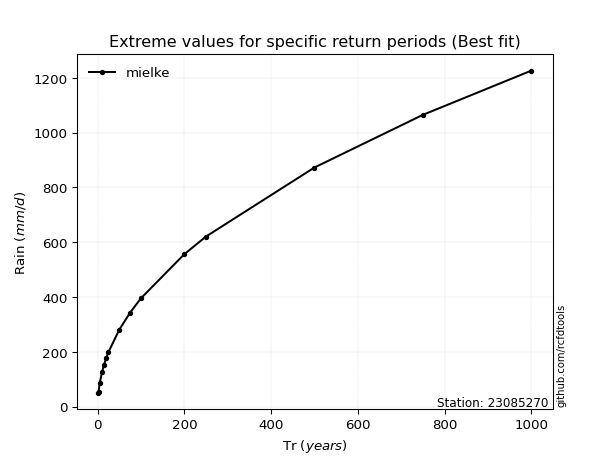</img>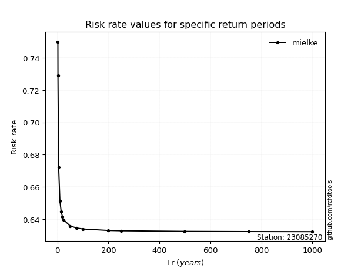</img>

</div>


<sub>**APP DISCLAIMER**: NO WARRANTY - This software is provided by [github.com/rcfdtools](https://github.com/rcfdtools) "as is", without any express or implied warranty, including warranties of merchantability, fitness for a particular purpose, or non-infringement. There is no guarantee that the software will be error-free or operate without interruption. LIMITATION OF LIABILITY - Neither the authors nor copyright holders will be liable for claims or damages arising from the software or its use. You are responsible for determining if the software is appropriate for your use and assume all associated risks, including errors, legal compliance, and data loss. NO PROFESSIONAL ADVICE - The software provides general information and does not offer professional advice. It should not replace consultation with professional advisors.</sub>