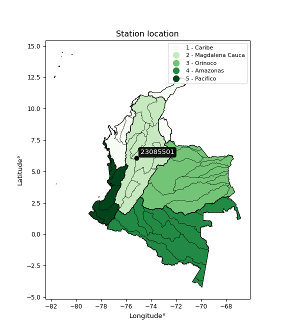

<div align="center">


</div>

# PMP Station (rain, Pmax24h): 23085501

Probable Maximum Precipitation (PMP) is the greatest amount of rainfall for a specific duration that is meteorologically possible for a given location, acting as a "worst-case" scenario for extreme storms, crucial for designing safety-critical infrastructure like bridges, river deviations, dams, spillways, and nuclear plants to prevent catastrophic failure. PMP is calculated by hydrologists using meteorological data to determine the upper limit of extreme rainfall, often leading to the Probable Maximum Flood (PMF) for flood control design, and is increasingly being studied for climate change impacts.

<div align="center">

</img>

</div>


## A. General information


### 1. General running parameters

• app_version: _v20251228_. • runtime: _2025-12-28 08:43:48.795225_. • Python version: _3.14.0_. • SciPy version: _1.16.3_. • Pandas version: _2.3.3_. • NumPy version: _2.3.5_. • Stations dataset (station_dataset_file): _dataset/pmax24h_in/automatic_colombia_2003_2024.csv_. • Stations catalog (station_catalog_file): _dataset/CNE_IDEAM.xls_. • Minimum year to eval til year_max (date_min): _1900_. • Maximum year to eval since year_min (date_max): _2024_. • Creates, save and include plots into reports (create_plot): _False_. • Plot only fit distributions with Δo > Δ (plot_only_fit): _True_. • Eval low extreme values, if False, evaluates high extreme values (low_extreme): _False_. • Eval every SciPy distribution as logarithmic (pdist_logarithmic_on): _True_. • Standard deviation normalized (ddof): _1.0_. • Return periods to eval in years (Tr): _[2, 2.33, 5, 10, 15, 20, 25, 50, 75, 100, 200, 250, 500, 750, 1000]_. • Minimum data sample per station, 0 means any (minimum_sample): _5_. • Z-Score maximum threshold to adjust a value, 0 means disable (zscore_max): _3.5_. • Z-Score minimum threshold to adjust a value, 0 means disable (zscore_min): _-2.5_. • Avoid zeros, e.g. rain = 0 (avoid_zeros): _True_. • Avoid null values (avoid_nans): _True_. [:file_folder:Dataset file.](../../dataset/pmax24h_in/automatic_colombia_2003_2024.csv)

> Delta Degrees of Freedom (DDOF): is a parameter used in the formulas for calculating variance and standard deviation. When ddof=0, the divisor is $N$ (the total number of observations) and this is used when your data set is the entire population. When ddof=1, the divisor is $N-1$ and this is used when your data set is a sample drawn from a larger population. Using $N-1$ provides an unbiased estimate of the population variance (known as Bessel´s correction).


### 2. Station info and location

|   id |   CODIGO | NOMBRE                     | CATEGORIA               | TECNOLOGIA                | ESTADO   | FECHA_INSTALACION   |   FECHA_SUSPENSION |   ALTITUD |   LATITUD |   LONGITUD | DEPARTAMENTO   | MUNICIPIO   | AREA_OPERATIVA                      | ENTIDAD                                    | AREA_HIDROGRAFICA   | ZONA_HIDROGRAFICA   | SUBZONA_HIDROGRAFICA   |   CORRIENTE | Catalogo   |
|-----:|---------:|:---------------------------|:------------------------|:--------------------------|:---------|:--------------------|-------------------:|----------:|----------:|-----------:|:---------------|:------------|:------------------------------------|:-------------------------------------------|:--------------------|:--------------------|:-----------------------|------------:|:-----------|
|    0 | 23085501 | COCORNA  - AUT  [23085501] | Climatológica Principal | Automática con Telemetría | Activa   | 20/09/2013          |                nan |      1344 |   6.06194 |   -75.1867 | Antioquia      | Cocorná     | Area Operativa 01 - Antioquia-Chocó | CENTRO NACIONAL DE INVESTIGACIONES DE CAFE | Magdalena Cauca     | Medio Magdalena     | Río Nare               |         nan | CNE_OE     |

<div align="center">

Map location in: [:earth_americas:Google](http://maps.google.com/maps?q=6.061941667,-75.18666667) [:earth_americas:OSM](https://www.openstreetmap.org/#map=18/6.061941667/-75.18666667&layers=P) [:earth_americas:Bing](https://www.bing.com/maps?cp=6.061941667~-75.18666667&lvl=18) [:earth_americas:Apple](https://maps.apple.com/frame?center=6.061941667%2C-75.18666667&span=0.003%2C0.006)

</div>


<div align="center">

```geojson
{
  "type": "Feature",
  "geometry": {
    "type": "Point", 
    "coordinates": [-75.18666667, 6.061941667]
  }, 
  "properties": {
    "Name": "23085501"
  }
}
```

</div>


### 3. Discrete values table and plot

|               |          0 |            1 |           2 |          3 |           4 |            5 |          6 |            7 |
|:--------------|-----------:|-------------:|------------:|-----------:|------------:|-------------:|-----------:|-------------:|
| Date          | 2016       | 2017         | 2018        | 2019       | 2020        | 2021         | 2022       | 2023         |
| Value         |   60.4     |   89.2       |   87        |  140.1     |  107        |   92.2       |   64.6     |   90.7       |
| Value_initial |   60.4     |   89.2       |   87        |  140.1     |  107        |   92.2       |   64.6     |   90.7       |
| count         |    8       |    8         |    8        |    8       |    8        |    8         |    8       |    8         |
| mean          |   91.4     |   91.4       |   91.4      |   91.4     |   91.4      |   91.4       |   91.4     |   91.4       |
| std           |   24.8413  |   24.8413    |   24.8413   |   24.8413  |   24.8413   |   24.8413    |   24.8413  |   24.8413    |
| zscore        |   -1.24792 |   -0.0885623 |   -0.177125 |    1.96045 |    0.627987 |    0.0322045 |   -1.07885 |   -0.0281789 |

> The initial value (value_initial) correspond to the initial obtained or null completed value, and value (value) is adjusted only when the initial value is outside the valid range definite through the Z-Score value. If Z-Score is active, values out of range or outliers are replaced with the station mean value


### 4. Active continuous probability distributions from SciPy (44 of 104 available)

[scipy.stats](https://docs.scipy.org/doc/scipy/reference/stats.html) is a Python´s powerful submodule within the SciPy library for comprehensive statistical analysis, offering over 130 probability distributions (like Normal, Poisson), functions for descriptive stats (mean, variance), hypothesis testing (t-tests, chi-square), random variable generation, and statistical tests, making it essential for data science, modeling, and research. It provides tools to explore, model, and draw conclusions from data efficiently, working seamlessly with NumPy.

<div align="center">

|   id | p_dist             |   n_parameter | fit_method   | label                                                                       | active   | ref                                                                                                        |
|-----:|:-------------------|--------------:|:-------------|:----------------------------------------------------------------------------|:---------|:-----------------------------------------------------------------------------------------------------------|
|    0 | alpha              |             3 | MLE          | Alpha                                                                       | True     | [:mortar_board:](https://docs.scipy.org/doc/scipy/reference/generated/scipy.stats.alpha.html)              |
|    1 | betaprime          |             4 | MLE          | Beta prime                                                                  | True     | [:mortar_board:](https://docs.scipy.org/doc/scipy/reference/generated/scipy.stats.betaprime.html)          |
|    2 | chi2               |             3 | MLE          | Chi²                                                                        | True     | [:mortar_board:](https://docs.scipy.org/doc/scipy/reference/generated/scipy.stats.chi2.html)               |
|    3 | crystalball        |             4 | MLE          | Crystalball                                                                 | True     | [:mortar_board:](https://docs.scipy.org/doc/scipy/reference/generated/scipy.stats.crystalball.html)        |
|    4 | erlang             |             3 | MLE          | Erlang                                                                      | True     | [:mortar_board:](https://docs.scipy.org/doc/scipy/reference/generated/scipy.stats.erlang.html)             |
|    5 | expon              |             2 | MLE          | Exponential                                                                 | True     | [:mortar_board:](https://docs.scipy.org/doc/scipy/reference/generated/scipy.stats.expon.html)              |
|    6 | exponnorm          |             3 | MLE          | Exponentially modified Normal                                               | True     | [:mortar_board:](https://docs.scipy.org/doc/scipy/reference/generated/scipy.stats.exponnorm.html)          |
|    7 | f                  |             4 | MLE          | F                                                                           | True     | [:mortar_board:](https://docs.scipy.org/doc/scipy/reference/generated/scipy.stats.f.html)                  |
|    8 | fatiguelife        |             3 | MLE          | Fatigue-life (Birnbaum-Saunders)                                            | True     | [:mortar_board:](https://docs.scipy.org/doc/scipy/reference/generated/scipy.stats.fatiguelife.html)        |
|    9 | fisk               |             3 | MLE          | Fisk                                                                        | True     | [:mortar_board:](https://docs.scipy.org/doc/scipy/reference/generated/scipy.stats.fisk.html)               |
|   10 | gamma              |             3 | MLE          | Gamma                                                                       | True     | [:mortar_board:](https://docs.scipy.org/doc/scipy/reference/generated/scipy.stats.gamma.html)              |
|   11 | genexpon           |             5 | MLE          | Generalized exponential                                                     | True     | [:mortar_board:](https://docs.scipy.org/doc/scipy/reference/generated/scipy.stats.genexpon.html)           |
|   12 | genlogistic        |             3 | MLE          | Generalized logistic                                                        | True     | [:mortar_board:](https://docs.scipy.org/doc/scipy/reference/generated/scipy.stats.genlogistic.html)        |
|   13 | gibrat             |             2 | MM           | Gibrat                                                                      | True     | [:mortar_board:](https://docs.scipy.org/doc/scipy/reference/generated/scipy.stats.gibrat.html)             |
|   14 | gompertz           |             3 | MLE          | Gompertz (or truncated Gumbel)                                              | True     | [:mortar_board:](https://docs.scipy.org/doc/scipy/reference/generated/scipy.stats.gompertz.html)           |
|   15 | gumbel_l           |             2 | MM           | Gumbel Left Skew                                                            | True     | [:mortar_board:](https://docs.scipy.org/doc/scipy/reference/generated/scipy.stats.gumbel_l.html)           |
|   16 | gumbel_r           |             2 | MM           | Gumbel Right Skew                                                           | True     | [:mortar_board:](https://docs.scipy.org/doc/scipy/reference/generated/scipy.stats.gumbel_r.html)           |
|   17 | halflogistic       |             2 | MM           | Half-logistic                                                               | True     | [:mortar_board:](https://docs.scipy.org/doc/scipy/reference/generated/scipy.stats.halflogistic.html)       |
|   18 | halfnorm           |             2 | MM           | Half Normal                                                                 | True     | [:mortar_board:](https://docs.scipy.org/doc/scipy/reference/generated/scipy.stats.halfnorm.html)           |
|   19 | hypsecant          |             2 | MM           | hyperbolic secant                                                           | True     | [:mortar_board:](https://docs.scipy.org/doc/scipy/reference/generated/scipy.stats.hypsecant.html)          |
|   20 | invgamma           |             3 | MLE          | Inverted gamma                                                              | True     | [:mortar_board:](https://docs.scipy.org/doc/scipy/reference/generated/scipy.stats.invgamma.html)           |
|   21 | invgauss           |             3 | MLE          | Inverse Gaussian                                                            | True     | [:mortar_board:](https://docs.scipy.org/doc/scipy/reference/generated/scipy.stats.invgauss.html)           |
|   22 | invweibull         |             3 | MLE          | Inverted Weibull                                                            | True     | [:mortar_board:](https://docs.scipy.org/doc/scipy/reference/generated/scipy.stats.invweibull.html)         |
|   23 | johnsonsu          |             4 | MLE          | Johnson Su                                                                  | True     | [:mortar_board:](https://docs.scipy.org/doc/scipy/reference/generated/scipy.stats.johnsonsu.html)          |
|   24 | kstwobign          |             2 | MLE          | Limiting distribution of scaled Kolmogorov-Smirnov two-sided test statistic | True     | [:mortar_board:](https://docs.scipy.org/doc/scipy/reference/generated/scipy.stats.kstwobign.html)          |
|   25 | laplace            |             2 | MM           | Laplace                                                                     | True     | [:mortar_board:](https://docs.scipy.org/doc/scipy/reference/generated/scipy.stats.laplace.html)            |
|   26 | laplace_asymmetric |             3 | MLE          | Asymmetric Laplace                                                          | True     | [:mortar_board:](https://docs.scipy.org/doc/scipy/reference/generated/scipy.stats.laplace_asymmetric.html) |
|   27 | loggamma           |             3 | MLE          | Log gamma                                                                   | True     | [:mortar_board:](https://docs.scipy.org/doc/scipy/reference/generated/scipy.stats.loggamma.html)           |
|   28 | logistic           |             2 | MM           | Logistic (or Sech-squared)                                                  | True     | [:mortar_board:](https://docs.scipy.org/doc/scipy/reference/generated/scipy.stats.logistic.html)           |
|   29 | lognorm            |             3 | MLE          | Log Normal                                                                  | True     | [:mortar_board:](https://docs.scipy.org/doc/scipy/reference/generated/scipy.stats.lognorm.html)            |
|   30 | maxwell            |             2 | MM           | Maxwell                                                                     | True     | [:mortar_board:](https://docs.scipy.org/doc/scipy/reference/generated/scipy.stats.maxwell.html)            |
|   31 | mielke             |             4 | MLE          | Mielke Beta-Kappa / Dagum                                                   | True     | [:mortar_board:](https://docs.scipy.org/doc/scipy/reference/generated/scipy.stats.mielke.html)             |
|   32 | moyal              |             2 | MM           | Moyal                                                                       | True     | [:mortar_board:](https://docs.scipy.org/doc/scipy/reference/generated/scipy.stats.moyal.html)              |
|   33 | nakagami           |             3 | MLE          | Nakagami                                                                    | True     | [:mortar_board:](https://docs.scipy.org/doc/scipy/reference/generated/scipy.stats.nakagami.html)           |
|   34 | ncf                |             5 | MLE          | Non-central F distribution                                                  | True     | [:mortar_board:](https://docs.scipy.org/doc/scipy/reference/generated/scipy.stats.ncf.html)                |
|   35 | nct                |             4 | MLE          | Non-central Student’s t                                                     | True     | [:mortar_board:](https://docs.scipy.org/doc/scipy/reference/generated/scipy.stats.nct.html)                |
|   36 | norm               |             2 | MM           | Normal                                                                      | True     | [:mortar_board:](https://docs.scipy.org/doc/scipy/reference/generated/scipy.stats.norm.html)               |
|   37 | pearson3           |             3 | MM           | Pearson type III                                                            | True     | [:mortar_board:](https://docs.scipy.org/doc/scipy/reference/generated/scipy.stats.pearson3.html)           |
|   38 | rayleigh           |             2 | MM           | Rayleigh                                                                    | True     | [:mortar_board:](https://docs.scipy.org/doc/scipy/reference/generated/scipy.stats.rayleigh.html)           |
|   39 | rice               |             3 | MLE          | Rice                                                                        | True     | [:mortar_board:](https://docs.scipy.org/doc/scipy/reference/generated/scipy.stats.rice.html)               |
|   40 | t                  |             3 | MLE          | Student’s t                                                                 | True     | [:mortar_board:](https://docs.scipy.org/doc/scipy/reference/generated/scipy.stats.t.html)                  |
|   41 | truncnorm          |             4 | MLE          | Truncated normal                                                            | True     | [:mortar_board:](https://docs.scipy.org/doc/scipy/reference/generated/scipy.stats.truncnorm.html)          |
|   42 | wald               |             2 | MM           | Wald                                                                        | True     | [:mortar_board:](https://docs.scipy.org/doc/scipy/reference/generated/scipy.stats.wald.html)               |
|   43 | weibull_min        |             3 | MLE          | Weibull minimum                                                             | True     | [:mortar_board:](https://docs.scipy.org/doc/scipy/reference/generated/scipy.stats.weibull_min.html)        |

</div>

> **n_parameter:** # arguments & localization & scale.
>
> **Fit methods:** (MLE) maximum likelihood, (MM) L-moments.
>
>**Inactive:** foldnorm, gennorm, norminvgauss, powernorm, powerlognorm, skewnorm, genextreme, anglit, arcsine, argus, beta, bradford, burr, burr12, cauchy, cosine, halfcauchy, foldcauchy, skewcauchy, wrapcauchy, dgamma, gengamma, exponweib, exponpow, truncexpon, gausshyper, genhalflogistic, genhyperbolic, geninvgauss, halfgennorm, johnsonsb, kappa4, kappa3, ksone, kstwo, loglaplace, levy, levy_l, levy_stable, ncx2, pareto, genpareto, truncpareto, lomax, powerlaw, rdist, rel_breitwigner, recipinvgauss, semicircular, studentized_range, trapezoid, triang, truncweibull_min, tukeylambda, uniform, loguniform, vonmises, vonmises_line, weibull_max, dweibull, 


## B. Probability distributions vs. Empirical distributions

A continuous probability distribution (CPD) describes probabilities for variables that can take any value within a range (like rain any time), unlike discrete variables with specific outcomes (like temperature). It uses a Probability Density Function (PDF), a curve where the total area under it equals 1, and the probability of the variable falling within an interval (a to b) is found by calculating the area under the curve between those points. A key feature is that the probability of hitting any single exact value is zero, so probabilities are always expressed for ranges, e.g., $P(a ≤ X ≤ b)$.

<div align="center">

Distributions parameters from station values
|    |   station | p_dist                |   n |             loc |          scale | shape                 | shape1                | shape2               | shape3   |
|---:|----------:|:----------------------|----:|----------------:|---------------:|:----------------------|:----------------------|:---------------------|:---------|
|  0 |  23085501 | alpha                 |   8 |   -57.7811      |  985.812       | 6.7611814526259595    |                       |                      |          |
|  1 |  23085501 | betaprime             |   8 |    -2.21249     |    2.92077     | 543.5274311589806     | 17.951528233083913    |                      |          |
|  2 |  23085501 | chi2                  |   8 |    60.4         |   16.7256      | 1.709165603004968     |                       |                      |          |
|  3 |  23085501 | crystalball           |   8 |    91.4         |   23.2369      | 7281.691724042612     | 2512.8112315427115    |                      |          |
|  4 |  23085501 | erlang                |   8 |    60.4         |   28.6839      | 0.4930444504174093    |                       |                      |          |
|  5 |  23085501 | expon                 |   8 |    60.4         |   31           |                       |                       |                      |          |
|  6 |  23085501 | exponnorm             |   8 |    72.1157      |   13.8455      | 1.3928280912156055    |                       |                      |          |
|  7 |  23085501 | f                     |   8 |    -1.78103     |   88.0806      | 673.4342210242037     | 36.27322814310945     |                      |          |
|  8 |  23085501 | fatiguelife           |   8 |    60.4         |    1.00474e-05 | 1536.0546533645388    |                       |                      |          |
|  9 |  23085501 | fisk                  |   8 |    -0.319417    |   88.9607      | 7.091838170056052     |                       |                      |          |
| 10 |  23085501 | gamma                 |   8 |    60.4         |   26.016       | 0.8847389017799059    |                       |                      |          |
| 11 |  23085501 | genexpon              |   8 |    60.3705      |    2.27304     | 0.07322135260435238   | 6.893174960236986e-07 | 1.1720410872923628   |          |
| 12 |  23085501 | genlogistic           |   8 |   -28.2482      |   18.8481      | 322.3253504022258     |                       |                      |          |
| 13 |  23085501 | gibrat                |   8 |    73.6732      |   10.7519      |                       |                       |                      |          |
| 14 |  23085501 | gompertz              |   8 |    60.4         |   63.1953      | 1.3204237384068738    |                       |                      |          |
| 15 |  23085501 | gumbel_l              |   8 |   101.858       |   18.1177      |                       |                       |                      |          |
| 16 |  23085501 | gumbel_r              |   8 |    80.9422      |   18.1177      |                       |                       |                      |          |
| 17 |  23085501 | halflogistic          |   8 |    63.8589      |   19.8667      |                       |                       |                      |          |
| 18 |  23085501 | halfnorm              |   8 |    60.6435      |   38.5476      |                       |                       |                      |          |
| 19 |  23085501 | hypsecant             |   8 |    91.4         |   14.7931      |                       |                       |                      |          |
| 20 |  23085501 | invgamma              |   8 |    -2.57351     | 1554.44        | 17.53306424122392     |                       |                      |          |
| 21 |  23085501 | invgauss              |   8 |    26.0974      |  481.222       | 0.13570161462194008   |                       |                      |          |
| 22 |  23085501 | invweibull            |   8 |    60.4         |    1.38321     | 0.05965578522924919   |                       |                      |          |
| 23 |  23085501 | johnsonsu             |   8 |    90.0238      |    2.02689     | 0.01046223643613123   | 0.410313951373097     |                      |          |
| 24 |  23085501 | kstwobign             |   8 |    13.5472      |   89.4581      |                       |                       |                      |          |
| 25 |  23085501 | laplace               |   8 |    91.4         |   16.431       |                       |                       |                      |          |
| 26 |  23085501 | laplace_asymmetric    |   8 |    89.2         |   15.9866      | 0.9335542697789492    |                       |                      |          |
| 27 |  23085501 | loggamma              |   8 | -6227.94        |  875.019       | 1369.6539310156595    |                       |                      |          |
| 28 |  23085501 | logistic              |   8 |    91.4         |   12.8112      |                       |                       |                      |          |
| 29 |  23085501 | lognorm               |   8 |    60.4         |    0.308392    | 11.894834172679024    |                       |                      |          |
| 30 |  23085501 | maxwell               |   8 |    36.3384      |   34.5048      |                       |                       |                      |          |
| 31 |  23085501 | mielke                |   8 |     0.631306    |   87.9625      | 7.02213107109945      | 7.00874902750296      |                      |          |
| 32 |  23085501 | moyal                 |   8 |    78.1117      |   10.4603      |                       |                       |                      |          |
| 33 |  23085501 | nakagami              |   8 |    60.4         |   48.2461      | 0.1960952564717759    |                       |                      |          |
| 34 |  23085501 | ncf                   |   8 |    -5.32078     |   31.5501      | 177.6219700829149     | 42.1015644639015      | 341.11671067432144   |          |
| 35 |  23085501 | nct                   |   8 |    -0.108221    |   10.0381      | 11.344753986708927    | 8.504857473091187     |                      |          |
| 36 |  23085501 | norm                  |   8 |    91.4         |   23.2369      |                       |                       |                      |          |
| 37 |  23085501 | pearson3              |   8 |    91.4         |   23.2369      | 0.6990205878756661    |                       |                      |          |
| 38 |  23085501 | rayleigh              |   8 |    46.9465      |   35.4688      |                       |                       |                      |          |
| 39 |  23085501 | rice                  |   8 |    49.9845      |   33.5797      | 0.0007859277043197536 |                       |                      |          |
| 40 |  23085501 | t                     |   8 |    91.5019      |   23.1402      | 118.06579579765597    |                       |                      |          |
| 41 |  23085501 | truncnorm             |   8 |    92.2121      |   24.1545      | -1217.5720368199104   | 1.982570578679118     |                      |          |
| 42 |  23085501 | wald                  |   8 |    68.1631      |   23.2369      |                       |                       |                      |          |
| 43 |  23085501 | weibull_min           |   8 |    60.4         |   32.8111      | 0.8272778757091466    |                       |                      |          |
| 44 |  23085501 | logalpha              |   8 |    -1.98016     |  167.801       | 25.999915304852806    |                       |                      |          |
| 45 |  23085501 | logbetaprime          |   8 |     1.56215     |   17.3901      | 161.1166260274033     | 959.8971745472741     |                      |          |
| 46 |  23085501 | logchi2               |   8 |     4.10099     |    0.970573    | 1.06856952742532      |                       |                      |          |
| 47 |  23085501 | logcrystalball        |   8 |     4.48409     |    0.24867     | 14.935208272207461    | 21.15668869581264     |                      |          |
| 48 |  23085501 | logerlang             |   8 |     1.75117     |    0.0225797   | 121.02412763423047    |                       |                      |          |
| 49 |  23085501 | logexpon              |   8 |     4.10099     |    0.383098    |                       |                       |                      |          |
| 50 |  23085501 | logexponnorm          |   8 |     4.42443     |    0.241429    | 0.2471127169379631    |                       |                      |          |
| 51 |  23085501 | logf                  |   8 |    -0.00085717  |    4.47635     | 1735.1656902616958    | 1043.1650627502215    |                      |          |
| 52 |  23085501 | logfatiguelife        |   8 |     0.702392    |    3.77353     | 0.06580185320153112   |                       |                      |          |
| 53 |  23085501 | logfisk               |   8 |   -12.6324      |   17.1162      | 120.88023914978157    |                       |                      |          |
| 54 |  23085501 | loggamma              |   8 |     1.58208     |    0.0213239   | 136.090274818384      |                       |                      |          |
| 55 |  23085501 | loggenexpon           |   8 |     4.1007      |    0.00653503  | 0.008513976261974657  | 3.6740454889232748    | 5.56080743353496e-05 |          |
| 56 |  23085501 | loggenlogistic        |   8 |     4.48227     |    0.142102    | 1.0106695032979776    |                       |                      |          |
| 57 |  23085501 | loggibrat             |   8 |     4.29436     |    0.115073    |                       |                       |                      |          |
| 58 |  23085501 | loggompertz           |   8 |     4.10099     |    0.704847    | 1.242977200506652     |                       |                      |          |
| 59 |  23085501 | loggumbel_l           |   8 |     4.596       |    0.193887    |                       |                       |                      |          |
| 60 |  23085501 | loggumbel_r           |   8 |     4.37217     |    0.193887    |                       |                       |                      |          |
| 61 |  23085501 | loghalflogistic       |   8 |     4.18933     |    0.212622    |                       |                       |                      |          |
| 62 |  23085501 | loghalfnorm           |   8 |     4.15498     |    0.412477    |                       |                       |                      |          |
| 63 |  23085501 | loghypsecant          |   8 |     4.48409     |    0.158308    |                       |                       |                      |          |
| 64 |  23085501 | loginvgamma           |   8 |    -1.59586     | 3639.36        | 599.586685990942      |                       |                      |          |
| 65 |  23085501 | loginvgauss           |   8 |     2.85355     |   66.3137      | 0.0246158676249826    |                       |                      |          |
| 66 |  23085501 | loginvweibull         |   8 |    -1.49049e+08 |    1.49049e+08 | 628384952.8465204     |                       |                      |          |
| 67 |  23085501 | logjohnsonsu          |   8 |     4.5022      |    0.022208    | 0.0625760839040834    | 0.4084017338363444    |                      |          |
| 68 |  23085501 | logkstwobign          |   8 |     3.56274     |    1.05386     |                       |                       |                      |          |
| 69 |  23085501 | loglaplace            |   8 |     4.48409     |    0.175836    |                       |                       |                      |          |
| 70 |  23085501 | loglaplace_asymmetric |   8 |     4.50756     |    0.176432    | 1.068750563453448     |                       |                      |          |
| 71 |  23085501 | logloggamma           |   8 |   -61.584       |    9.17253     | 1343.7220323247898    |                       |                      |          |
| 72 |  23085501 | loglogistic           |   8 |     4.48409     |    0.137099    |                       |                       |                      |          |
| 73 |  23085501 | loglognorm            |   8 |     4.10099     |    0.00538096  | 11.145745920105748    |                       |                      |          |
| 74 |  23085501 | logmaxwell            |   8 |     3.89485     |    0.369253    |                       |                       |                      |          |
| 75 |  23085501 | logmielke             |   8 |     4.10099     |    0.592549    | 0.7409165172687517    | 5.678512650538373     |                      |          |
| 76 |  23085501 | logmoyal              |   8 |     4.34188     |    0.11194     |                       |                       |                      |          |
| 77 |  23085501 | lognakagami           |   8 |     4.10099     |    0.479778    | 0.37789150148517386   |                       |                      |          |
| 78 |  23085501 | logncf                |   8 |     1.30086     |    3.17867     | 389.69256350352975    | 2102.1032212086784    | 0.22263464437525404  |          |
| 79 |  23085501 | lognct                |   8 |     0.509713    |    0.173505    | 252.02220565445248    | 22.838094127549127    |                      |          |
| 80 |  23085501 | lognorm               |   8 |     4.48409     |    0.248669    |                       |                       |                      |          |
| 81 |  23085501 | logpearson3           |   8 |     4.48409     |    0.248669    | 0.12427793050273006   |                       |                      |          |
| 82 |  23085501 | lograyleigh           |   8 |     4.00837     |    0.379569    |                       |                       |                      |          |
| 83 |  23085501 | logrice               |   8 |     3.97618     |    0.292654    | 1.3168186015219532    |                       |                      |          |
| 84 |  23085501 | logt                  |   8 |     4.48409     |    0.248671    | 253653639.40341294    |                       |                      |          |
| 85 |  23085501 | logtruncnorm          |   8 |    -0.119673    |    1.36032     | 3.102699335113195     | 5.447403218074699     |                      |          |
| 86 |  23085501 | logwald               |   8 |     4.23545     |    0.248643    |                       |                       |                      |          |
| 87 |  23085501 | logweibull_min        |   8 |     3.96205     |    0.589079    | 2.2269096399059896    |                       |                      |          |

</div>

> **loc** (Location parameter): This shifts the distribution along the x-axis. For many common distributions, like the normal (Gaussian) distribution, loc represents the mean $μ$. For others, like the uniform distribution, it might represent the minimum value, or for the beta distribution, the left end of the support interval.
>
> **scale** (Scale parameter): This determines the width or spread of the distribution. For the normal distribution, scale represents the standard deviation $σ$. For a uniform distribution, it defines the length of the interval (from $loc$ to $loc + scale$).
>
> **shape** (Shape parameters): Refers to parameters that define the specific form of a probability distribution, distinct from its location (loc) and scale (scale). These parameters are required arguments for most distribution functions. For example, a normal (Gaussian) distribution is fully defined by its location (mean) and scale (standard deviation), so it has no specific shape parameters beyond loc and scale. However, other distributions have intrinsic properties that need specification, as Gamma distribution that takes a shape parameter, often named $a$ or $alpha$.


### 0. Cumulative distribution values - CDF (88 evaluated)

Cumulative Distribution Function (CDF), denoted as $F$<sub>$X$</sub>$(x)$, is a function that gives the probability that a random variable $X$ will take a value less than or equal to a specific value, $x$ (i.e., $(P(X≥x)$. It essentially "accumulates" probabilities from a given point up to the far right (positive infinity), providing a complete picture of the distribution´s probabilities for both discrete (like rain) and continuous (like temperature) variables, helping to find probabilities over ranges or above certain values.

<div align="center">

CDF ordered by x ascending and calculating $log(f(x))$ separately
|   id |   Station |   date |     x |   count |   mean |     std |     zscore |   Value_initial |   station |   m |     alpha |   alpha_pdf |   betaprime |   betaprime_pdf |        chi2 |   chi2_pdf |   crystalball |   crystalball_pdf |      erlang |   erlang_pdf |    expon |   expon_pdf |   exponnorm |   exponnorm_pdf |         f |      f_pdf |   fatiguelife |   fatiguelife_pdf |      fisk |   fisk_pdf |       gamma |   gamma_pdf |    genexpon |   genexpon_pdf |   genlogistic |   genlogistic_pdf |   gibrat |   gibrat_pdf |    gompertz |   gompertz_pdf |   gumbel_l |   gumbel_l_pdf |   gumbel_r |   gumbel_r_pdf |   halflogistic |   halflogistic_pdf |   halfnorm |   halfnorm_pdf |   hypsecant |   hypsecant_pdf |   invgamma |   invgamma_pdf |   invgauss |   invgauss_pdf |   invweibull |   invweibull_pdf |   johnsonsu |   johnsonsu_pdf |   kstwobign |   kstwobign_pdf |   laplace |   laplace_pdf |   laplace_asymmetric |   laplace_asymmetric_pdf |   loggamma |   loggamma_pdf |   logistic |   logistic_pdf |   lognorm |   lognorm_pdf |   maxwell |   maxwell_pdf |    mielke |   mielke_pdf |     moyal |   moyal_pdf |    nakagami |   nakagami_pdf |       ncf |    ncf_pdf |       nct |    nct_pdf |      norm |   norm_pdf |   pearson3 |   pearson3_pdf |   rayleigh |   rayleigh_pdf |      rice |   rice_pdf |         t |      t_pdf |   truncnorm |   truncnorm_pdf |     wald |   wald_pdf |   weibull_min |   weibull_min_pdf |   logalpha |   logalpha_pdf |   logbetaprime |   logbetaprime_pdf |     logchi2 |   logchi2_pdf |   logcrystalball |   logcrystalball_pdf |   logerlang |   logerlang_pdf |   logexpon |   logexpon_pdf |   logexponnorm |   logexponnorm_pdf |      logf |   logf_pdf |   logfatiguelife |   logfatiguelife_pdf |   logfisk |   logfisk_pdf |   loggenexpon |   loggenexpon_pdf |   loggenlogistic |   loggenlogistic_pdf |   loggibrat |   loggibrat_pdf |   loggompertz |   loggompertz_pdf |   loggumbel_l |   loggumbel_l_pdf |   loggumbel_r |   loggumbel_r_pdf |   loghalflogistic |   loghalflogistic_pdf |   loghalfnorm |   loghalfnorm_pdf |   loghypsecant |   loghypsecant_pdf |   loginvgamma |   loginvgamma_pdf |   loginvgauss |   loginvgauss_pdf |   loginvweibull |   loginvweibull_pdf |   logjohnsonsu |   logjohnsonsu_pdf |   logkstwobign |   logkstwobign_pdf |   loglaplace |   loglaplace_pdf |   loglaplace_asymmetric |   loglaplace_asymmetric_pdf |   logloggamma |   logloggamma_pdf |   loglogistic |   loglogistic_pdf |   loglognorm |   loglognorm_pdf |   logmaxwell |   logmaxwell_pdf |   logmielke |   logmielke_pdf |   logmoyal |   logmoyal_pdf |   lognakagami |   lognakagami_pdf |    logncf |   logncf_pdf |    lognct |   lognct_pdf |   logpearson3 |   logpearson3_pdf |   lograyleigh |   lograyleigh_pdf |   logrice |   logrice_pdf |      logt |   logt_pdf |   logtruncnorm |   logtruncnorm_pdf |   logwald |   logwald_pdf |   logweibull_min |   logweibull_min_pdf |
|-----:|----------:|-------:|------:|--------:|-------:|--------:|-----------:|----------------:|----------:|----:|----------:|------------:|------------:|----------------:|------------:|-----------:|--------------:|------------------:|------------:|-------------:|---------:|------------:|------------:|----------------:|----------:|-----------:|--------------:|------------------:|----------:|-----------:|------------:|------------:|------------:|---------------:|--------------:|------------------:|---------:|-------------:|------------:|---------------:|-----------:|---------------:|-----------:|---------------:|---------------:|-------------------:|-----------:|---------------:|------------:|----------------:|-----------:|---------------:|-----------:|---------------:|-------------:|-----------------:|------------:|----------------:|------------:|----------------:|----------:|--------------:|---------------------:|-------------------------:|-----------:|---------------:|-----------:|---------------:|----------:|--------------:|----------:|--------------:|----------:|-------------:|----------:|------------:|------------:|---------------:|----------:|-----------:|----------:|-----------:|----------:|-----------:|-----------:|---------------:|-----------:|---------------:|----------:|-----------:|----------:|-----------:|------------:|----------------:|---------:|-----------:|--------------:|------------------:|-----------:|---------------:|---------------:|-------------------:|------------:|--------------:|-----------------:|---------------------:|------------:|----------------:|-----------:|---------------:|---------------:|-------------------:|----------:|-----------:|-----------------:|---------------------:|----------:|--------------:|--------------:|------------------:|-----------------:|---------------------:|------------:|----------------:|--------------:|------------------:|--------------:|------------------:|--------------:|------------------:|------------------:|----------------------:|--------------:|------------------:|---------------:|-------------------:|--------------:|------------------:|--------------:|------------------:|----------------:|--------------------:|---------------:|-------------------:|---------------:|-------------------:|-------------:|-----------------:|------------------------:|----------------------------:|--------------:|------------------:|--------------:|------------------:|-------------:|-----------------:|-------------:|-----------------:|------------:|----------------:|-----------:|---------------:|--------------:|------------------:|----------:|-------------:|----------:|-------------:|--------------:|------------------:|--------------:|------------------:|----------:|--------------:|----------:|-----------:|---------------:|-------------------:|----------:|--------------:|-----------------:|---------------------:|
|    0 |  23085501 |   2016 |  60.4 |       8 |   91.4 | 24.8413 | -1.24792   |            60.4 |  23085501 |   1 | 0.0570129 |  0.00807753 |   0.0555933 |      0.00831842 | 4.26503e-14 | 5.12963    |     0.0910878 |        0.0070511  | 2.28076e-08 |  1.58262e+06 | 0        |  0.0322581  |   0.0588214 |      0.00725492 | 0.0556737 | 0.00830744 |      0.169399 |       2.59459e+10 | 0.0624683 | 0.00684033 | 1.77619e-14 |  2.21164    | 0.000949841 |     0.0321823  |     0.0545398 |        0.00837926 | 0        |   0          | 3.51858e-14 |     0.0208943  |  0.0964683 |    0.00505902  |  0.0447129 |     0.00766901 |      0         |         0          |  0         |     0          |   0.0779124 |      0.00521439 |   0.055226 |     0.00833061 |  0.0516674 |     0.00896605 |  0.000809306 |      4.83743e+10 |   0.0845783 |     0.00214228  |   0.0532974 |      0.00909485 | 0.0757869 |    0.00461245 |            0.0676102 |               0.00453019 |  0.0565357 |       0.502421 |  0.0816779 |     0.00585479 | 0.0617081 |      0.489672 | 0.0781063 |    0.00881774 | 0.0621506 |   0.00684575 | 0.0197142 |  0.00586696 | 4.88348e-07 |    2.69548e+07 | 0.0577124 | 0.00821305 | 0.054689  | 0.00817726 | 0.0910878 | 0.0070511  |  0.0662272 |     0.00848149 |  0.0694099 |     0.0099518  | 0.0469648 | 0.00880308 | 0.0907523 | 0.00696656 |   0.0961954 |      0.00710686 | 0        | 0          |   1.09942e-13 |       12.8004     |  0.0555007 |       0.508394 |      0.0558371 |           0.503539 | 7.17767e-09 |   4.31774e+06 |        0.0617048 |             0.489651 |   0.0560141 |        0.502642 |   0        |       2.6103   |      0.0609321 |           0.490174 | 0.056289  |   0.50182  |        0.055798  |             0.503807 | 0.0609572 |      0.413507 |   0.000373894 |          1.30371  |        0.0621243 |             0.41358  |    0        |        0        |   3.96179e-07 |          1.76347  |     0.0748875 |         0.371406  |     0.0174257 |          0.363979 |          0        |              0        |     0         |          0        |      0.0564632 |           0.3548   |     0.0567351 |          0.500506 |     0.0498092 |          0.531835 |       0.0476289 |            0.611303 |      0.0803463 |           0.151594 |      0.0433423 |           0.681154 |    0.0565928 |         0.321851 |               0.0617276 |                    0.327361 |     0.0636626 |          0.491655 |     0.0576316 |          0.39614  |   0.00413686 |      1.23333e+12 |     0.042181 |         0.576279 | 4.41532e-06 |       93.238    | 0.00335831 |       0.141697 |   5.71394e-12 |       4862.19     | 0.0558195 |     0.500215 | 0.0564694 |     0.500528 |     0.0579975 |          0.498906 |     0.0293332 |          0.62402  | 0.0379652 |      0.60409  | 0.0617095 |   0.489678 |     7.6409e-10 |           2.48383  |  0        |      0        |        0.0392907 |             0.617203 |
|    1 |  23085501 |   2022 |  64.6 |       8 |   91.4 | 24.8413 | -1.07885   |            64.6 |  23085501 |   2 | 0.0978188 |  0.0113666  |   0.0977313 |      0.0117443  | 0.169316    | 0.0321739  |     0.124386  |        0.00882846 | 0.417421    |  0.0443824   | 0.126707 |  0.0281707  |   0.0955008 |      0.0102738  | 0.0977427 | 0.0117229  |      0.66309  |       0.0182958   | 0.0967153 | 0.00954342 | 0.193253    |  0.0373254  | 0.127371    |     0.0281101  |     0.0973081 |        0.0119852  | 0        |   0          | 0.0867431   |     0.0203932  |  0.120067  |    0.00621226  |  0.0850492 |     0.0115691  |      0.0186495 |         0.025159   |  0.0817509 |     0.02059    |   0.103102  |      0.00684837 |   0.097474 |     0.0117836  |  0.0974659 |     0.0127862  |  0.392237    |      0.00521406  |   0.0947    |     0.00271282  |   0.0994452 |      0.0128093  | 0.0978602 |    0.00595585 |            0.0895841 |               0.00600254 |  0.0985121 |       0.753645 |  0.109884  |     0.00763471 | 0.101998  |      0.715999 | 0.119966  |    0.0110923  | 0.0964472 |   0.00956175 | 0.0564404 |  0.0117939  | 0.303339    |    0.0282902   | 0.099042  | 0.0114703  | 0.0963593 | 0.0116749  | 0.124386  | 0.00882846 |  0.107792  |     0.011298   |  0.116499  |     0.0123978  | 0.0903727 | 0.0117902  | 0.123676  | 0.00873641 |   0.129561  |      0.00880174 | 0        | 0          |   0.166874    |        0.0299601  |  0.0981779 |       0.76861  |      0.0980058 |           0.758308 | 0.184555    |   1.43397     |        0.101993  |             0.715973 |   0.098078  |        0.756091 |   0.160944 |       2.19019  |      0.101358  |           0.719675 | 0.0982586 |   0.754139 |        0.0979961 |             0.75891  | 0.0953467 |      0.620611 |   0.0941274   |          1.47268  |        0.0964369 |             0.61809  |    0        |        0        |   0.116963    |          1.71305  |     0.104254  |         0.508651  |     0.0570849 |          0.843    |          0        |              0        |     0.0255986 |          1.93338  |      0.0860348 |           0.536873 |     0.098534  |          0.750365 |     0.0953359 |          0.829036 |       0.100964  |            0.976034 |      0.0920912 |           0.201542 |      0.103892  |           1.11105  |    0.0829469 |         0.47173  |               0.0881684 |                    0.467584 |     0.103926  |          0.712977 |     0.0907938 |          0.602123 |   0.589617   |      0.518946    |     0.091794 |         0.900435 | 0.199385    |        2.19749  | 0.029845   |       0.73159  |   0.176031    |          1.96841  | 0.0976943 |     0.752968 | 0.0983163 |     0.751843 |     0.099493  |          0.742812 |     0.0848558 |          1.01534  | 0.0889424 |      0.908251 | 0.101999  |   0.716002 |     0.154744   |           2.12814  |  0        |      0        |        0.0920105 |             0.946659 |
|    2 |  23085501 |   2018 |  87   |       8 |   91.4 | 24.8413 | -0.177125  |            87   |  23085501 |   3 | 0.480938  |  0.0187406  |   0.484635  |      0.0185427  | 0.61832     | 0.0125926  |     0.424908  |        0.0168635  | 0.829683    |  0.00797382  | 0.576018 |  0.0136768  |   0.476386  |      0.0198313  | 0.484249  | 0.0185456  |      0.855262 |       0.00453268  | 0.467033  | 0.020216   | 0.689542    |  0.0127549  | 0.575915    |     0.0136611  |     0.490818  |        0.0185123  | 0.585    |   0.0292532  | 0.498953    |     0.0159481  |  0.356221  |    0.0156488   |  0.488803  |     0.0193117  |      0.524414  |         0.0182464  |  0.505861  |     0.0163843  |   0.406689  |      0.0205996  |   0.485316 |     0.0185436  |  0.494791  |     0.0180859  |  0.432443    |      0.000813021 |   0.316358  |     0.0401139   |   0.489753  |      0.0177348  | 0.382535  |    0.0232814  |            0.40185   |               0.0269258  |  0.482236  |       1.60852  |  0.414972  |     0.0189499  | 0.470862  |      1.60003  | 0.459285  |    0.0169646  | 0.467326  |   0.0202135  | 0.513202  |  0.0201379  | 0.619769    |    0.0086927   | 0.4797    | 0.0185373  | 0.487009  | 0.0187303  | 0.424908  | 0.0168635  |  0.469619  |     0.0178609  |  0.471449  |     0.0168281  | 0.455317  | 0.0178802  | 0.42304   | 0.0168786  |   0.424647  |      0.0165281  | 0.580464 | 0.0230081  |   0.568559    |        0.0112796  |  0.487395  |       1.61027  |      0.483745  |           1.60986  | 0.432621    |   0.559489    |        0.47085   |             1.60002  |   0.483219  |        1.61132  |   0.614243 |       1.00694  |      0.472486  |           1.60451  | 0.48274   |   1.61045  |        0.483901  |             1.60963  | 0.468323  |      1.76034  |   0.548192    |          1.37677  |        0.467474  |             1.75802  |    0.655157 |        2.1474   |   0.569583    |          1.27381  |     0.40023   |         1.58138   |     0.53975   |          1.71665  |          0.571938 |              1.58236  |     0.549037  |          1.45596  |      0.463528  |           1.99752  |     0.481672  |          1.61046  |     0.499674  |          1.5819   |       0.520152  |            1.43338  |      0.324615  |           3.45319  |      0.545265  |           1.42449  |    0.45089   |         2.56427  |               0.427524  |                    2.26729  |     0.469251  |          1.5883   |     0.466899  |          1.81551  |   0.647409   |      0.0913109   |     0.504833 |         1.56304  | 0.692651    |        1.32204  | 0.565524   |       1.73629  |   0.597767    |          1.05433  | 0.48228   |     1.61217  | 0.482382  |     1.61173  |     0.479068  |          1.6068   |     0.516411  |          1.53577  | 0.494226  |      1.56164  | 0.470862  |   1.60002  |     0.609396   |           1.04236  |  0.637259 |      1.79285  |        0.506441  |             1.5403   |
|    3 |  23085501 |   2017 |  89.2 |       8 |   91.4 | 24.8413 | -0.0885623 |            89.2 |  23085501 |   4 | 0.521579  |  0.018178   |   0.524792  |      0.0179383  | 0.644978    | 0.0116556  |     0.462286  |        0.0170917  | 0.846233    |  0.00709351  | 0.605064 |  0.0127399  |   0.519461  |      0.0192864  | 0.524417  | 0.0179457  |      0.864814 |       0.0041586   | 0.511099  | 0.0197955  | 0.716326    |  0.0116138  | 0.604929    |     0.0127265  |     0.530808  |        0.0178193  | 0.643373 |   0.0240161  | 0.533414    |     0.0153773  |  0.391805  |    0.0166925   |  0.530493  |     0.0185622  |      0.563385  |         0.0171794  |  0.541193  |     0.0157316  |   0.452835  |      0.0212817  |   0.525464 |     0.0179294  |  0.533827  |     0.0173833  |  0.43416     |      0.000750333 |   0.439583  |     0.0739569   |   0.528093  |      0.0171029  | 0.437342  |    0.0266169  |            0.465676  |               0.0312024  |  0.522312  |       1.59838  |  0.457174  |     0.0193711  | 0.510898  |      1.60371  | 0.496433  |    0.0167852  | 0.511377  |   0.0197844  | 0.556135  |  0.0188779  | 0.638339    |    0.00819821  | 0.519919  | 0.0179992  | 0.52753   | 0.0180814  | 0.462286  | 0.0170917  |  0.508538  |     0.0174959  |  0.508151  |     0.0165197  | 0.494353  | 0.0175853  | 0.460464  | 0.0171181  |   0.461317  |      0.0167863  | 0.627487 | 0.0198325  |   0.592512    |        0.0105081  |  0.527449  |       1.59488  |      0.523831  |           1.59785  | 0.44629     |   0.53557     |        0.510887  |             1.60371  |   0.523353  |        1.60018  |   0.638587 |       0.943395 |      0.512611  |           1.60627  | 0.522856  |   1.59962  |        0.523979  |             1.59743  | 0.512384  |      1.76377  |   0.58192     |          1.32377  |        0.511507  |             1.76392  |    0.703741 |        1.75918  |   0.600776    |          1.22411  |     0.440931  |         1.6767    |     0.581511  |          1.62596  |          0.610128 |              1.4762   |     0.584558  |          1.38846  |      0.513657  |           2.00885  |     0.521805  |          1.60095  |     0.538814  |          1.55034  |       0.555262  |            1.37722  |      0.44534   |           6.47527  |      0.580084  |           1.36324  |    0.518951  |         2.73579  |               0.488066  |                    2.58836  |     0.509021  |          1.59408  |     0.512387  |          1.82239  |   0.649612   |      0.0852691   |     0.543481 |         1.53013  | 0.724912    |        1.26052  | 0.607251   |       1.60516  |   0.623488    |          1.00581  | 0.522441  |     1.60148  | 0.522535  |     1.60131  |     0.519149  |          1.60048  |     0.554248  |          1.49287  | 0.532979  |      1.53994  | 0.510899  |   1.6037   |     0.634637   |           0.979648 |  0.678782 |      1.54034  |        0.54453   |             1.50835  |
|    4 |  23085501 |   2023 |  90.7 |       8 |   91.4 | 24.8413 | -0.0281789 |            90.7 |  23085501 |   5 | 0.5485    |  0.0177067  |   0.551338  |      0.0174479  | 0.662012    | 0.0110625  |     0.487984  |        0.0171607  | 0.856468    |  0.00656103  | 0.623719 |  0.0121381  |   0.548025  |      0.0187832  | 0.550977  | 0.0174578  |      0.870877 |       0.0039281   | 0.540474  | 0.0193513  | 0.733205    |  0.0108991  | 0.623565    |     0.0121262  |     0.557135  |        0.0172749  | 0.677138 |   0.0210807  | 0.556182    |     0.0149783  |  0.417357  |    0.0173715   |  0.557899  |     0.0179701  |      0.588606  |         0.0164482  |  0.564447  |     0.015273   |   0.484943  |      0.0214935  |   0.551993 |     0.017433   |  0.559505  |     0.016847   |  0.435257    |      0.000712827 |   0.557616  |     0.0758091   |   0.55339   |      0.016621   | 0.479146  |    0.0291612  |            0.510488  |               0.0285856  |  0.548847  |       1.58283  |  0.486343  |     0.0194997  | 0.537598  |      1.59718  | 0.521473  |    0.0165919  | 0.540731  |   0.019335   | 0.583783  |  0.0179831  | 0.650403    |    0.00788994  | 0.546588  | 0.0175489  | 0.554267  | 0.0175584  | 0.487984  | 0.0171607  |  0.534543  |     0.0171677  |  0.532735  |     0.0162512  | 0.520533  | 0.0173127  | 0.486207  | 0.0171933  |   0.486578  |      0.0168843  | 0.655808 | 0.0179661  |   0.607907    |        0.0100229  |  0.553897  |       1.57592  |      0.550347  |           1.58109  | 0.455096    |   0.520731    |        0.537586  |             1.59718  |   0.549912  |        1.58395  |   0.653982 |       0.90321  |      0.539342  |           1.59838  | 0.549407  |   1.58358  |        0.550487  |             1.58054  | 0.541706  |      1.75087  |   0.603686    |          1.28637  |        0.540846  |             1.75267  |    0.731264 |        1.54727  |   0.620908    |          1.19021  |     0.469381  |         1.73431   |     0.608082  |          1.56013  |          0.634158 |              1.40589  |     0.60733   |          1.3424   |      0.54702   |           1.98881  |     0.548385  |          1.58574  |     0.564438  |          1.52187  |       0.577889  |            1.33603  |      0.56364   |           7.04081  |      0.602459  |           1.31988  |    0.562477  |         2.48825  |               0.533196  |                    2.82771  |     0.535573  |          1.5891   |     0.542694  |          1.81021  |   0.651003   |      0.081653    |     0.568768 |         1.50174  | 0.745562    |        1.21553  | 0.633286   |       1.51743  |   0.639996    |          0.974102 | 0.549024  |     1.5855   | 0.549117  |     1.58548  |     0.54574   |          1.58738  |     0.578868  |          1.45916  | 0.558491  |      1.5188   | 0.537598  |   1.59717  |     0.650639   |           0.939707 |  0.703239 |      1.39575  |        0.569463  |             1.48114  |
|    5 |  23085501 |   2021 |  92.2 |       8 |   91.4 | 24.8413 |  0.0322045 |            92.2 |  23085501 |   6 | 0.574669  |  0.0171765  |   0.57711   |      0.0169057  | 0.678182    | 0.0105033  |     0.513732  |        0.0171583  | 0.86594     |  0.00607607  | 0.641493 |  0.0115647  |   0.575766  |      0.0181904  | 0.576764  | 0.0169178  |      0.876607 |       0.00371493  | 0.569098  | 0.0187971  | 0.749047    |  0.0102314  | 0.641322    |     0.0115542  |     0.58261   |        0.0166852  | 0.706828 |   0.0185701  | 0.578346    |     0.0145721  |  0.4439    |    0.0180113   |  0.584378  |     0.0173274  |      0.61273   |         0.0157188  |  0.587007  |     0.0148053  |   0.517206  |      0.0214861  |   0.577737 |     0.0168856  |  0.58435   |     0.0162749  |  0.436301    |      0.000678872 |   0.652872  |     0.0509504   |   0.577939  |      0.0161066  | 0.523761  |    0.0289842  |            0.551542  |               0.0261882  |  0.574639  |       1.56098  |  0.515606  |     0.0194952  | 0.563696  |      1.58382  | 0.546182  |    0.016345   | 0.569328  |   0.0187765  | 0.610079  |  0.0170778  | 0.662019    |    0.0076017   | 0.572538  | 0.0170422  | 0.580179  | 0.0169829  | 0.513732  | 0.0171583  |  0.560013  |     0.0167828  |  0.556883  |     0.0159396  | 0.546265  | 0.0169871  | 0.512008  | 0.0171959  |   0.511937  |      0.0169174  | 0.68149  | 0.0163092  |   0.622596    |        0.00956721 |  0.579549  |       1.55088  |      0.576101  |           1.55809  | 0.463524    |   0.506926    |        0.563684  |             1.58382  |   0.575717  |        1.56143  |   0.668485 |       0.865354 |      0.565448  |           1.58366  | 0.575208  |   1.56123  |        0.576232  |             1.55744  | 0.570242  |      1.72669  |   0.624475    |          1.24825  |        0.569424  |             1.73004  |    0.755142 |        1.36878  |   0.640154    |          1.15638  |     0.498251  |         1.78472   |     0.633121  |          1.4926   |          0.656657 |              1.33759  |     0.628973  |          1.29651  |      0.579339  |           1.94857  |     0.574228  |          1.56417  |     0.589135  |          1.48867  |       0.599456  |            1.29329  |      0.661553  |           4.80424  |      0.623749  |           1.27583  |    0.601446  |         2.26663  |               0.577349  |                    2.56025  |     0.561551  |          1.57736  |     0.572201  |          1.78548  |   0.652315   |      0.078378    |     0.59314  |         1.46927  | 0.765115    |        1.16804  | 0.657476   |       1.43228  |   0.655722    |          0.943427 | 0.574857  |     1.56321  | 0.57495   |     1.5633   |     0.571626  |          1.56782  |     0.602506  |          1.42251  | 0.583199  |      1.49309  | 0.563696  |   1.58381  |     0.66574    |           0.901878 |  0.725078 |      1.2695   |        0.59351   |             1.45018  |
|    6 |  23085501 |   2020 | 107   |       8 |   91.4 | 24.8413 |  0.627987  |           107   |  23085501 |   7 | 0.781901  |  0.0106965  |   0.780868  |      0.0105468  | 0.800407    | 0.00638331 |     0.749     |        0.0137045  | 0.92994     |  0.00298818  | 0.777588 |  0.00717457 |   0.789724  |      0.0105993  | 0.780772  | 0.0105638  |      0.919548 |       0.00224598  | 0.79093   | 0.0109273  | 0.862096    |  0.00554297 | 0.777335    |     0.00717277 |     0.781555  |        0.0102162  | 0.871032 |   0.00631263 | 0.76305     |     0.0103498  |  0.735045  |    0.0194236   |  0.788721  |     0.0103323  |      0.795327  |         0.00924802 |  0.770861  |     0.010044   |   0.786603  |      0.0133689  |   0.781017 |     0.0105124  |  0.779693  |     0.0101491  |  0.444534    |      0.000461368 |   0.878671  |     0.00483824  |   0.774829  |      0.0104725  | 0.806519  |    0.0117754  |            0.811037  |               0.0110347  |  0.779763  |       1.1419   |  0.771656  |     0.0137538  | 0.776076  |      1.20279  | 0.758718  |    0.0119123  | 0.790762  |   0.0109045  | 0.801534  |  0.00928854 | 0.757431    |    0.00546496  | 0.77957   | 0.010784   | 0.78309   | 0.0103983  | 0.749     | 0.0137045  |  0.770276  |     0.0113225  |  0.761493  |     0.0113854  | 0.763417  | 0.0119625  | 0.747836  | 0.0137272  |   0.747527  |      0.0140263  | 0.841564 | 0.00694344 |   0.7373      |        0.00623409 |  0.781724  |       1.11744  |      0.780272  |           1.13379  | 0.531119    |   0.407987    |        0.776067  |             1.20282  |   0.780548  |        1.13828  |   0.775229 |       0.58672  |      0.77702   |           1.19365  | 0.780077  |   1.13878  |        0.780271  |             1.13289  | 0.79038   |      1.15731  |   0.782829    |          0.875891 |        0.790689  |             1.16605  |    0.883087 |        0.518909 |   0.788757    |          0.838479 |     0.773778  |         1.7341    |     0.808881  |          0.88488  |          0.813399 |              0.795738 |     0.79069   |          0.879578 |      0.812388  |           1.11767  |     0.779853  |          1.14464  |     0.779768  |          1.04254  |       0.760946  |            0.876436 |      0.881026  |           0.471922 |      0.782867  |           0.864764 |    0.829078  |         0.972057 |               0.828469  |                    1.03906  |     0.774044  |          1.20955  |     0.798459  |          1.17377  |   0.662258   |      0.0573417   |     0.782212 |         1.04226  | 0.90097     |        0.642437 | 0.819614   |       0.791853 |   0.776605    |          0.687285 | 0.780018  |     1.14053  | 0.780129  |     1.14038  |     0.778764  |          1.15834  |     0.78395   |          0.996423 | 0.77879   |      1.09502  | 0.776075  |   1.20279  |     0.777572   |           0.617028 |  0.854995 |      0.583815 |        0.781125  |             1.04182  |
|    7 |  23085501 |   2019 | 140.1 |       8 |   91.4 | 24.8413 |  1.96045   |           140.1 |  23085501 |   8 | 0.962408  |  0.0020625  |   0.961409  |      0.00211853 | 0.929821    | 0.00219492 |     0.98195   |        0.00190956 | 0.982007    |  0.000717944 | 0.923538 |  0.0024665  |   0.961903  |      0.00197549 | 0.961547  | 0.0021178  |      0.966641 |       0.000854435 | 0.962203  | 0.00183677 | 0.963119    |  0.00145992 | 0.923337    |     0.00246955 |     0.958313  |        0.00216485 | 0.965698 |   0.00114414 | 0.964566    |     0.00261319 |  0.99974   |    0.000118494 |  0.96253   |     0.00202888 |      0.95782   |         0.00207839 |  0.960722  |     0.00247361 |   0.976344  |      0.00159767 |   0.961086 |     0.0021206  |  0.958497  |     0.00222296 |  0.456035    |      0.000268018 |   0.946403  |     0.000892318 |   0.963461  |      0.0023112  | 0.974192  |    0.0015707  |            0.972652  |               0.00159701 |  0.962593  |       0.297575 |  0.978148  |     0.00166842 | 0.967327  |      0.293633 | 0.971276  |    0.00227353 | 0.961896  |   0.00184194 | 0.958798  |  0.00196769 | 0.888862    |    0.00277313  | 0.963426  | 0.00210656 | 0.959898  | 0.00208826 | 0.98195   | 0.00190956 |  0.967237  |     0.00219412 |  0.968218  |     0.00235334 | 0.972702  | 0.00218163 | 0.981078  | 0.001938   |   1         |      0.00237037 | 0.956799 | 0.00155052 |   0.875548    |        0.00269189 |  0.9608    |       0.296832 |      0.96191   |           0.297734 | 0.62474     |   0.296646    |        0.967325  |             0.29365  |   0.962589  |        0.296367 |   0.888777 |       0.290325 |      0.966559  |           0.292922 | 0.962293  |   0.297186 |        0.961816  |             0.297912 | 0.960661  |      0.259931 |   0.938389    |          0.327453 |        0.961834  |             0.258386 |    0.958034 |        0.138262 |   0.94261     |          0.333899 |     0.99744   |         0.0787918 |     0.948548  |          0.258424 |          0.943698 |              0.257343 |     0.943725  |          0.312806 |      0.964824  |           0.221746 |     0.962821  |          0.29665  |     0.951352  |          0.311082 |       0.91604   |            0.338676 |      0.941289  |           0.108525 |      0.935068  |           0.322604 |    0.963094  |         0.209889 |               0.966482  |                    0.203037 |     0.967261  |          0.297175 |     0.965863  |          0.240499 |   0.674827   |      0.0383883   |     0.954963 |         0.310997 | 0.983435    |        0.104067 | 0.945453   |       0.243264 |   0.910901    |          0.334665 | 0.962446  |     0.297075 | 0.962397  |     0.296592 |     0.963865  |          0.296791 |     0.951559  |          0.31403  | 0.959433  |      0.311459 | 0.967326  |   0.293638 |     0.89663    |           0.301039 |  0.946517 |      0.184162 |        0.955338  |             0.315392 |


</div>

An Empirical Distribution Function (EDF) is a step-function estimate of a true cumulative distribution function (CDF) based on observed sample data, representing the proportion of data points less than or equal to a given value. It is calculated by ordering your data and jumping up by $1/n$ (where $n$ is sample size) at each unique data point, allowing analysis without assuming an underlying population distribution, and it gets closer to the true CDF as the sample size grows.


### 1. Empirical - EDF California (1923)

California´s estimates the true probability distribution of water-related data (like rainfall, streamflow) using observed samples, crucial for risk assessment.

<div align="center">


$P=m/n$


</div>


**1.1. Empirical values**

<div align="center">

|                | 0                  | 1                  | 2              | 3              | 4                  | 5              | 6              | 7              |
|:---------------|:-------------------|:-------------------|:---------------|:---------------|:-------------------|:---------------|:---------------|:---------------|
| date           | 2016               | 2022               | 2018           | 2017           | 2023               | 2021           | 2020           | 2019           |
| x              | 60.4               | 64.6               | 87.0           | 89.2           | 90.7               | 92.2           | 107.0          | 140.1          |
| m              | 1                  | 2                  | 3              | 4              | 5                  | 6              | 7              | 8              |
| empirical_dist | edf_california     | edf_california     | edf_california | edf_california | edf_california     | edf_california | edf_california | edf_california |
| empirical      | 0.125              | 0.25               | 0.375          | 0.5            | 0.625              | 0.75           | 0.875          | 1.0            |
| empirical_tr   | 1.1428571428571428 | 1.3333333333333333 | 1.6            | 2.0            | 2.6666666666666665 | 4.0            | 8.0            | inf            |

</div>


**1.2. Kolmogorov-Smirnov fit test (sorted by Δ)**


<div align="center">

|                | 0                  | 1                   | 2                   | 3                   | 4                   | 5                   | 6                   | 7                  | 8                  | 9                   | 10                  | 11                  | 12                  | 13                 | 14                 | 15                  | 16                 | 17                  | 18                  | 19                  | 20                    | 21                  | 22                  | 23                 | 24                  | 25                  | 26                 | 27                  | 28                 | 29                 | 30                  | 31                 | 32                  | 33                  | 34                  | 35                  | 36                  | 37                 | 38                  | 39                  | 40                 | 41                  | 42                  | 43                  | 44                  | 45                  | 46                 | 47                  | 48                  | 49                  | 50                  | 51                  | 52                 | 53                 | 54                  | 55                  | 56                  | 57                  | 58                 | 59                  | 60                  | 61                  | 62                  | 63                  | 64                  | 65                  | 66                  | 67                  | 68                  | 69                 | 70                  | 71                  | 72                  | 73                  | 74                 | 75                 | 76                 | 77                 | 78                  | 79                 | 80                 | 81                 | 82                  | 83                 | 84                 | 85                 | 86                  | 87                 |
|:---------------|:-------------------|:--------------------|:--------------------|:--------------------|:--------------------|:--------------------|:--------------------|:-------------------|:-------------------|:--------------------|:--------------------|:--------------------|:--------------------|:-------------------|:-------------------|:--------------------|:-------------------|:--------------------|:--------------------|:--------------------|:----------------------|:--------------------|:--------------------|:-------------------|:--------------------|:--------------------|:-------------------|:--------------------|:-------------------|:-------------------|:--------------------|:-------------------|:--------------------|:--------------------|:--------------------|:--------------------|:--------------------|:-------------------|:--------------------|:--------------------|:-------------------|:--------------------|:--------------------|:--------------------|:--------------------|:--------------------|:-------------------|:--------------------|:--------------------|:--------------------|:--------------------|:--------------------|:-------------------|:-------------------|:--------------------|:--------------------|:--------------------|:--------------------|:-------------------|:--------------------|:--------------------|:--------------------|:--------------------|:--------------------|:--------------------|:--------------------|:--------------------|:--------------------|:--------------------|:-------------------|:--------------------|:--------------------|:--------------------|:--------------------|:-------------------|:-------------------|:-------------------|:-------------------|:--------------------|:-------------------|:-------------------|:-------------------|:--------------------|:-------------------|:-------------------|:-------------------|:--------------------|:-------------------|
| station        | 23085501           | 23085501            | 23085501            | 23085501            | 23085501            | 23085501            | 23085501            | 23085501           | 23085501           | 23085501            | 23085501            | 23085501            | 23085501            | 23085501           | 23085501           | 23085501            | 23085501           | 23085501            | 23085501            | 23085501            | 23085501              | 23085501            | 23085501            | 23085501           | 23085501            | 23085501            | 23085501           | 23085501            | 23085501           | 23085501           | 23085501            | 23085501           | 23085501            | 23085501            | 23085501            | 23085501            | 23085501            | 23085501           | 23085501            | 23085501            | 23085501           | 23085501            | 23085501            | 23085501            | 23085501            | 23085501            | 23085501           | 23085501            | 23085501            | 23085501            | 23085501            | 23085501            | 23085501           | 23085501           | 23085501            | 23085501            | 23085501            | 23085501            | 23085501           | 23085501            | 23085501            | 23085501            | 23085501            | 23085501            | 23085501            | 23085501            | 23085501            | 23085501            | 23085501            | 23085501           | 23085501            | 23085501            | 23085501            | 23085501            | 23085501           | 23085501           | 23085501           | 23085501           | 23085501            | 23085501           | 23085501           | 23085501           | 23085501            | 23085501           | 23085501           | 23085501           | 23085501            | 23085501           |
| empirical_dist | edf_california     | edf_california      | edf_california      | edf_california      | edf_california      | edf_california      | edf_california      | edf_california     | edf_california     | edf_california      | edf_california      | edf_california      | edf_california      | edf_california     | edf_california     | edf_california      | edf_california     | edf_california      | edf_california      | edf_california      | edf_california        | edf_california      | edf_california      | edf_california     | edf_california      | edf_california      | edf_california     | edf_california      | edf_california     | edf_california     | edf_california      | edf_california     | edf_california      | edf_california      | edf_california      | edf_california      | edf_california      | edf_california     | edf_california      | edf_california      | edf_california     | edf_california      | edf_california      | edf_california      | edf_california      | edf_california      | edf_california     | edf_california      | edf_california      | edf_california      | edf_california      | edf_california      | edf_california     | edf_california     | edf_california      | edf_california      | edf_california      | edf_california      | edf_california     | edf_california      | edf_california      | edf_california      | edf_california      | edf_california      | edf_california      | edf_california      | edf_california      | edf_california      | edf_california      | edf_california     | edf_california      | edf_california      | edf_california      | edf_california      | edf_california     | edf_california     | edf_california     | edf_california     | edf_california      | edf_california     | edf_california     | edf_california     | edf_california      | edf_california     | edf_california     | edf_california     | edf_california      | edf_california     |
| p_dist         | loginvweibull      | johnsonsu           | logjohnsonsu        | logweibull_min      | logmaxwell          | loginvgauss         | lograyleigh         | gumbel_r           | invgauss           | logrice             | loglaplace          | genlogistic         | halfnorm            | nct                | logkstwobign       | logalpha            | loghypsecant       | gompertz            | kstwobign           | invgamma            | loglaplace_asymmetric | betaprime           | loggenexpon         | f                  | logfatiguelife      | logbetaprime        | exponnorm          | logerlang           | logf               | lognct             | logncf              | alpha              | loggamma            | loggamma            | loginvgamma         | ncf                 | loglogistic         | logpearson3        | logfisk             | loggenlogistic      | mielke             | fisk                | logexponnorm        | lognorm             | lognorm             | logt                | logcrystalball     | logloggamma         | pearson3            | loggumbel_r         | rayleigh            | weibull_min         | moyal              | loggompertz        | laplace_asymmetric  | genexpon            | expon               | rice                | maxwell            | logmoyal            | lognakagami         | loghalfnorm         | laplace             | halflogistic        | hypsecant           | logistic            | logtruncnorm        | crystalball         | norm                | t                  | truncnorm           | logexpon            | chi2                | nakagami            | gibrat             | loghalflogistic    | wald               | loggumbel_l        | logwald             | loggibrat          | gumbel_l           | gamma              | logmielke           | loglognorm         | logchi2            | erlang             | fatiguelife         | invweibull         |
| delta          | 0.1505444478714555 | 0.15530002409618732 | 0.15790879747694442 | 0.15798950063845585 | 0.15820598378012274 | 0.16086468689433375 | 0.16514422118586863 | 0.1656219983476066 | 0.1656496734440578 | 0.16680131939097675 | 0.16705306183852908 | 0.16738989059083198 | 0.16824905269901003 | 0.1698210844456879 | 0.1702649911272205 | 0.17045078068772423 | 0.1706613291046739 | 0.17165437413748164 | 0.17206071052097416 | 0.17226273733735264 | 0.17265136339279952   | 0.17289049823084646 | 0.17319200662560852 | 0.1732356367589738 | 0.17376826547672108 | 0.17389865365304802 | 0.1742344430088476 | 0.17428287945507326 | 0.1747921639134239 | 0.1750501515420433 | 0.17514347204139447 | 0.1753306754031725 | 0.17536072879974607 | 0.17536072879974607 | 0.17577224409833292 | 0.17746239727095714 | 0.17779920283937067 | 0.1783743376644037 | 0.17975781179232986 | 0.18057563366959095 | 0.1806724452534152 | 0.18090197231744465 | 0.18455151372608647 | 0.18630413916986743 | 0.18630413916986743 | 0.18630442886872634 | 0.1863158172364363 | 0.18844865126941646 | 0.18998703869832467 | 0.19291508731056728 | 0.19311714857301365 | 0.19355935118081335 | 0.1935596119582591 | 0.1945831302055765 | 0.19845764083320128 | 0.20091481023804303 | 0.20101810118223962 | 0.20373541207363788 | 0.2038175826290064 | 0.22015497306350665 | 0.22276690659561205 | 0.22440142002813335 | 0.22623884682318574 | 0.23135045255396833 | 0.23279436808024678 | 0.23439368497300916 | 0.23439633900933277 | 0.23626790255085872 | 0.23626791486307974 | 0.2379924082972713 | 0.23806259514789985 | 0.23924308346368361 | 0.24332018249255905 | 0.24476942691900538 | 0.25               | 0.25               | 0.25               | 0.251749046468673  | 0.26225910660946783 | 0.2801570225207386 | 0.306100306830029  | 0.3145416290127059 | 0.31765057248840933 | 0.3396171498578271 | 0.3752603698844089 | 0.4546826970917279 | 0.48026189049964585 | 0.5439645451073138 |
| deltao         | 0.4472608134160001 | 0.4472608134160001  | 0.4472608134160001  | 0.4472608134160001  | 0.4472608134160001  | 0.4472608134160001  | 0.4472608134160001  | 0.4472608134160001 | 0.4472608134160001 | 0.4472608134160001  | 0.4472608134160001  | 0.4472608134160001  | 0.4472608134160001  | 0.4472608134160001 | 0.4472608134160001 | 0.4472608134160001  | 0.4472608134160001 | 0.4472608134160001  | 0.4472608134160001  | 0.4472608134160001  | 0.4472608134160001    | 0.4472608134160001  | 0.4472608134160001  | 0.4472608134160001 | 0.4472608134160001  | 0.4472608134160001  | 0.4472608134160001 | 0.4472608134160001  | 0.4472608134160001 | 0.4472608134160001 | 0.4472608134160001  | 0.4472608134160001 | 0.4472608134160001  | 0.4472608134160001  | 0.4472608134160001  | 0.4472608134160001  | 0.4472608134160001  | 0.4472608134160001 | 0.4472608134160001  | 0.4472608134160001  | 0.4472608134160001 | 0.4472608134160001  | 0.4472608134160001  | 0.4472608134160001  | 0.4472608134160001  | 0.4472608134160001  | 0.4472608134160001 | 0.4472608134160001  | 0.4472608134160001  | 0.4472608134160001  | 0.4472608134160001  | 0.4472608134160001  | 0.4472608134160001 | 0.4472608134160001 | 0.4472608134160001  | 0.4472608134160001  | 0.4472608134160001  | 0.4472608134160001  | 0.4472608134160001 | 0.4472608134160001  | 0.4472608134160001  | 0.4472608134160001  | 0.4472608134160001  | 0.4472608134160001  | 0.4472608134160001  | 0.4472608134160001  | 0.4472608134160001  | 0.4472608134160001  | 0.4472608134160001  | 0.4472608134160001 | 0.4472608134160001  | 0.4472608134160001  | 0.4472608134160001  | 0.4472608134160001  | 0.4472608134160001 | 0.4472608134160001 | 0.4472608134160001 | 0.4472608134160001 | 0.4472608134160001  | 0.4472608134160001 | 0.4472608134160001 | 0.4472608134160001 | 0.4472608134160001  | 0.4472608134160001 | 0.4472608134160001 | 0.4472608134160001 | 0.4472608134160001  | 0.4472608134160001 |
| eval           | Δo > Δ             | Δo > Δ              | Δo > Δ              | Δo > Δ              | Δo > Δ              | Δo > Δ              | Δo > Δ              | Δo > Δ             | Δo > Δ             | Δo > Δ              | Δo > Δ              | Δo > Δ              | Δo > Δ              | Δo > Δ             | Δo > Δ             | Δo > Δ              | Δo > Δ             | Δo > Δ              | Δo > Δ              | Δo > Δ              | Δo > Δ                | Δo > Δ              | Δo > Δ              | Δo > Δ             | Δo > Δ              | Δo > Δ              | Δo > Δ             | Δo > Δ              | Δo > Δ             | Δo > Δ             | Δo > Δ              | Δo > Δ             | Δo > Δ              | Δo > Δ              | Δo > Δ              | Δo > Δ              | Δo > Δ              | Δo > Δ             | Δo > Δ              | Δo > Δ              | Δo > Δ             | Δo > Δ              | Δo > Δ              | Δo > Δ              | Δo > Δ              | Δo > Δ              | Δo > Δ             | Δo > Δ              | Δo > Δ              | Δo > Δ              | Δo > Δ              | Δo > Δ              | Δo > Δ             | Δo > Δ             | Δo > Δ              | Δo > Δ              | Δo > Δ              | Δo > Δ              | Δo > Δ             | Δo > Δ              | Δo > Δ              | Δo > Δ              | Δo > Δ              | Δo > Δ              | Δo > Δ              | Δo > Δ              | Δo > Δ              | Δo > Δ              | Δo > Δ              | Δo > Δ             | Δo > Δ              | Δo > Δ              | Δo > Δ              | Δo > Δ              | Δo > Δ             | Δo > Δ             | Δo > Δ             | Δo > Δ             | Δo > Δ              | Δo > Δ             | Δo > Δ             | Δo > Δ             | Δo > Δ              | Δo > Δ             | Δo > Δ             | Δo <= Δ            | Δo <= Δ             | Δo <= Δ            |
| fit            | 1                  | 1                   | 1                   | 1                   | 1                   | 1                   | 1                   | 1                  | 1                  | 1                   | 1                   | 1                   | 1                   | 1                  | 1                  | 1                   | 1                  | 1                   | 1                   | 1                   | 1                     | 1                   | 1                   | 1                  | 1                   | 1                   | 1                  | 1                   | 1                  | 1                  | 1                   | 1                  | 1                   | 1                   | 1                   | 1                   | 1                   | 1                  | 1                   | 1                   | 1                  | 1                   | 1                   | 1                   | 1                   | 1                   | 1                  | 1                   | 1                   | 1                   | 1                   | 1                   | 1                  | 1                  | 1                   | 1                   | 1                   | 1                   | 1                  | 1                   | 1                   | 1                   | 1                   | 1                   | 1                   | 1                   | 1                   | 1                   | 1                   | 1                  | 1                   | 1                   | 1                   | 1                   | 1                  | 1                  | 1                  | 1                  | 1                   | 1                  | 1                  | 1                  | 1                   | 1                  | 1                  | 0                  | 0                   | 0                  |
| n              | 8                  | 8                   | 8                   | 8                   | 8                   | 8                   | 8                   | 8                  | 8                  | 8                   | 8                   | 8                   | 8                   | 8                  | 8                  | 8                   | 8                  | 8                   | 8                   | 8                   | 8                     | 8                   | 8                   | 8                  | 8                   | 8                   | 8                  | 8                   | 8                  | 8                  | 8                   | 8                  | 8                   | 8                   | 8                   | 8                   | 8                   | 8                  | 8                   | 8                   | 8                  | 8                   | 8                   | 8                   | 8                   | 8                   | 8                  | 8                   | 8                   | 8                   | 8                   | 8                   | 8                  | 8                  | 8                   | 8                   | 8                   | 8                   | 8                  | 8                   | 8                   | 8                   | 8                   | 8                   | 8                   | 8                   | 8                   | 8                   | 8                   | 8                  | 8                   | 8                   | 8                   | 8                   | 8                  | 8                  | 8                  | 8                  | 8                   | 8                  | 8                  | 8                  | 8                   | 8                  | 8                  | 8                  | 8                   | 8                  |
| best_fit       | 1                  | 0                   | 0                   | 0                   | 0                   | 0                   | 0                   | 0                  | 0                  | 0                   | 0                   | 0                   | 0                   | 0                  | 0                  | 0                   | 0                  | 0                   | 0                   | 0                   | 0                     | 0                   | 0                   | 0                  | 0                   | 0                   | 0                  | 0                   | 0                  | 0                  | 0                   | 0                  | 0                   | 0                   | 0                   | 0                   | 0                   | 0                  | 0                   | 0                   | 0                  | 0                   | 0                   | 0                   | 0                   | 0                   | 0                  | 0                   | 0                   | 0                   | 0                   | 0                   | 0                  | 0                  | 0                   | 0                   | 0                   | 0                   | 0                  | 0                   | 0                   | 0                   | 0                   | 0                   | 0                   | 0                   | 0                   | 0                   | 0                   | 0                  | 0                   | 0                   | 0                   | 0                   | 0                  | 0                  | 0                  | 0                  | 0                   | 0                  | 0                  | 0                  | 0                   | 0                  | 0                  | 0                  | 0                   | 0                  |
| best_fit_sort  | 1                  | 2                   | 3                   | 4                   | 5                   | 6                   | 7                   | 8                  | 9                  | 10                  | 11                  | 12                  | 13                  | 14                 | 15                 | 16                  | 17                 | 18                  | 19                  | 20                  | 21                    | 22                  | 23                  | 24                 | 25                  | 26                  | 27                 | 28                  | 29                 | 30                 | 31                  | 32                 | 33                  | 34                  | 35                  | 36                  | 37                  | 38                 | 39                  | 40                  | 41                 | 42                  | 43                  | 44                  | 45                  | 46                  | 47                 | 48                  | 49                  | 50                  | 51                  | 52                  | 53                 | 54                 | 55                  | 56                  | 57                  | 58                  | 59                 | 60                  | 61                  | 62                  | 63                  | 64                  | 65                  | 66                  | 67                  | 68                  | 69                  | 70                 | 71                  | 72                  | 73                  | 74                  | 75                 | 76                 | 77                 | 78                 | 79                  | 80                 | 81                 | 82                 | 83                  | 84                 | 85                 | 86                 | 87                  | 88                 |

</div>


**1.3. Best fit**

<div align="center">

|   id |   station | empirical_dist   | p_dist        |    delta |   deltao | eval   |   fit |   n |   best_fit |   best_fit_sort |
|-----:|----------:|:-----------------|:--------------|---------:|---------:|:-------|------:|----:|-----------:|----------------:|
|    0 |  23085501 | edf_california   | loginvweibull | 0.150544 | 0.447261 | Δo > Δ |     1 |   8 |          1 |               1 |

</div>


### 2. Empirical - EDF Hazen (1930)

Hazen method for plotting positions is a formula used to estimate the empirical cumulative probability distribution of flood events or other hydrological data. This formula often results in biased estimations, particularly when extrapolating to extreme events (high return periods).

<div align="center">


$P=(m-0.5)/n$


</div>


**2.1. Empirical values**

<div align="center">

|                | 0                  | 1                  | 2                  | 3                  | 4                  | 5         | 6                 | 7         |
|:---------------|:-------------------|:-------------------|:-------------------|:-------------------|:-------------------|:----------|:------------------|:----------|
| date           | 2016               | 2022               | 2018               | 2017               | 2023               | 2021      | 2020              | 2019      |
| x              | 60.4               | 64.6               | 87.0               | 89.2               | 90.7               | 92.2      | 107.0             | 140.1     |
| m              | 1                  | 2                  | 3                  | 4                  | 5                  | 6         | 7                 | 8         |
| empirical_dist | edf_hazen          | edf_hazen          | edf_hazen          | edf_hazen          | edf_hazen          | edf_hazen | edf_hazen         | edf_hazen |
| empirical      | 0.0625             | 0.1875             | 0.3125             | 0.4375             | 0.5625             | 0.6875    | 0.8125            | 0.9375    |
| empirical_tr   | 1.0666666666666667 | 1.2307692307692308 | 1.4545454545454546 | 1.7777777777777777 | 2.2857142857142856 | 3.2       | 5.333333333333333 | 16.0      |

</div>


**2.2. Kolmogorov-Smirnov fit test (sorted by Δ)**


<div align="center">

|                | 0                   | 1                   | 2                     | 3                   | 4                   | 5                   | 6                   | 7                   | 8                   | 9                   | 10                 | 11                  | 12                  | 13                 | 14                 | 15                  | 16                  | 17                  | 18                 | 19                  | 20                 | 21                  | 22                  | 23                 | 24                  | 25                  | 26                  | 27                  | 28                  | 29                  | 30                  | 31                  | 32                  | 33                 | 34                  | 35                  | 36                 | 37                  | 38                  | 39                 | 40                  | 41                  | 42                  | 43                  | 44                 | 45                  | 46                  | 47                  | 48                  | 49                 | 50                  | 51                  | 52                  | 53                  | 54                  | 55                 | 56                  | 57                  | 58                 | 59                  | 60                  | 61                 | 62                 | 63                  | 64                  | 65                  | 66                 | 67                  | 68                 | 69                 | 70                  | 71                 | 72                 | 73                 | 74                  | 75                  | 76                 | 77                  | 78                 | 79                 | 80                  | 81                 | 82                 | 83                  | 84                 | 85                  | 86                 | 87                 |
|:---------------|:--------------------|:--------------------|:----------------------|:--------------------|:--------------------|:--------------------|:--------------------|:--------------------|:--------------------|:--------------------|:-------------------|:--------------------|:--------------------|:-------------------|:-------------------|:--------------------|:--------------------|:--------------------|:-------------------|:--------------------|:-------------------|:--------------------|:--------------------|:-------------------|:--------------------|:--------------------|:--------------------|:--------------------|:--------------------|:--------------------|:--------------------|:--------------------|:--------------------|:-------------------|:--------------------|:--------------------|:-------------------|:--------------------|:--------------------|:-------------------|:--------------------|:--------------------|:--------------------|:--------------------|:-------------------|:--------------------|:--------------------|:--------------------|:--------------------|:-------------------|:--------------------|:--------------------|:--------------------|:--------------------|:--------------------|:-------------------|:--------------------|:--------------------|:-------------------|:--------------------|:--------------------|:-------------------|:-------------------|:--------------------|:--------------------|:--------------------|:-------------------|:--------------------|:-------------------|:-------------------|:--------------------|:-------------------|:-------------------|:-------------------|:--------------------|:--------------------|:-------------------|:--------------------|:-------------------|:-------------------|:--------------------|:-------------------|:-------------------|:--------------------|:-------------------|:--------------------|:-------------------|:-------------------|
| station        | 23085501            | 23085501            | 23085501              | 23085501            | 23085501            | 23085501            | 23085501            | 23085501            | 23085501            | 23085501            | 23085501           | 23085501            | 23085501            | 23085501           | 23085501           | 23085501            | 23085501            | 23085501            | 23085501           | 23085501            | 23085501           | 23085501            | 23085501            | 23085501           | 23085501            | 23085501            | 23085501            | 23085501            | 23085501            | 23085501            | 23085501            | 23085501            | 23085501            | 23085501           | 23085501            | 23085501            | 23085501           | 23085501            | 23085501            | 23085501           | 23085501            | 23085501            | 23085501            | 23085501            | 23085501           | 23085501            | 23085501            | 23085501            | 23085501            | 23085501           | 23085501            | 23085501            | 23085501            | 23085501            | 23085501            | 23085501           | 23085501            | 23085501            | 23085501           | 23085501            | 23085501            | 23085501           | 23085501           | 23085501            | 23085501            | 23085501            | 23085501           | 23085501            | 23085501           | 23085501           | 23085501            | 23085501           | 23085501           | 23085501           | 23085501            | 23085501            | 23085501           | 23085501            | 23085501           | 23085501           | 23085501            | 23085501           | 23085501           | 23085501            | 23085501           | 23085501            | 23085501           | 23085501           |
| empirical_dist | edf_hazen           | edf_hazen           | edf_hazen             | edf_hazen           | edf_hazen           | edf_hazen           | edf_hazen           | edf_hazen           | edf_hazen           | edf_hazen           | edf_hazen          | edf_hazen           | edf_hazen           | edf_hazen          | edf_hazen          | edf_hazen           | edf_hazen           | edf_hazen           | edf_hazen          | edf_hazen           | edf_hazen          | edf_hazen           | edf_hazen           | edf_hazen          | edf_hazen           | edf_hazen           | edf_hazen           | edf_hazen           | edf_hazen           | edf_hazen           | edf_hazen           | edf_hazen           | edf_hazen           | edf_hazen          | edf_hazen           | edf_hazen           | edf_hazen          | edf_hazen           | edf_hazen           | edf_hazen          | edf_hazen           | edf_hazen           | edf_hazen           | edf_hazen           | edf_hazen          | edf_hazen           | edf_hazen           | edf_hazen           | edf_hazen           | edf_hazen          | edf_hazen           | edf_hazen           | edf_hazen           | edf_hazen           | edf_hazen           | edf_hazen          | edf_hazen           | edf_hazen           | edf_hazen          | edf_hazen           | edf_hazen           | edf_hazen          | edf_hazen          | edf_hazen           | edf_hazen           | edf_hazen           | edf_hazen          | edf_hazen           | edf_hazen          | edf_hazen          | edf_hazen           | edf_hazen          | edf_hazen          | edf_hazen          | edf_hazen           | edf_hazen           | edf_hazen          | edf_hazen           | edf_hazen          | edf_hazen          | edf_hazen           | edf_hazen          | edf_hazen          | edf_hazen           | edf_hazen          | edf_hazen           | edf_hazen          | edf_hazen          |
| p_dist         | johnsonsu           | logjohnsonsu        | loglaplace_asymmetric | laplace_asymmetric  | loglaplace          | rice                | maxwell             | loghypsecant        | loglogistic         | fisk                | mielke             | loggenlogistic      | logfisk             | logloggamma        | pearson3           | logcrystalball      | lognorm             | lognorm             | logt               | rayleigh            | logexponnorm       | laplace             | exponnorm           | logpearson3        | ncf                 | alpha               | loginvgamma         | loggamma            | loggamma            | logncf              | lognct              | logf                | hypsecant           | logerlang          | logbetaprime        | logfatiguelife      | f                  | logistic            | betaprime           | invgamma           | crystalball         | norm                | nct                 | logalpha            | t                  | truncnorm           | gumbel_r            | kstwobign           | genlogistic         | logrice            | invgauss            | gompertz            | loginvgauss         | loggumbel_l         | logmaxwell          | halfnorm           | logweibull_min      | moyal               | lograyleigh        | loginvweibull       | halflogistic        | loggumbel_r        | logkstwobign       | loggenexpon         | loghalfnorm         | gumbel_l            | logmoyal           | weibull_min         | loggompertz        | loghalflogistic    | genexpon            | expon              | wald               | gibrat             | lognakagami         | logtruncnorm        | logexpon           | chi2                | nakagami           | logchi2            | logwald             | loggibrat          | gamma              | logmielke           | loglognorm         | invweibull          | erlang             | fatiguelife        |
| delta          | 0.09280002409618732 | 0.09540879747694442 | 0.11502411405708302   | 0.13595764083320128 | 0.13838976729401653 | 0.14281700065358632 | 0.14678516263610414 | 0.15102787766699977 | 0.15439931349726843 | 0.15453286556244056 | 0.1548262346485893 | 0.15497400746736234 | 0.15582297689410352 | 0.1567514538625115 | 0.157118786371173  | 0.15834986885707908 | 0.15836152769041134 | 0.15836152769041134 | 0.1583618900716945 | 0.15894878412517388 | 0.1599857858131356 | 0.16373884682318574 | 0.16388609301913393 | 0.166568125010441  | 0.16720015211542577 | 0.16843788241689245 | 0.16917172952880377 | 0.16973562431977257 | 0.16973562431977257 | 0.16978009040673148 | 0.16988207345703132 | 0.17023976116991724 | 0.17029436808024678 | 0.1707190248999113 | 0.17124478556167028 | 0.17140139788182085 | 0.171749058482232  | 0.17189368497300916 | 0.17213518405517247 | 0.1728160816086577 | 0.17376790255085872 | 0.17376791486307974 | 0.17450865967581952 | 0.17489475577474373 | 0.1754924082972713 | 0.17556259514789985 | 0.17630266818764767 | 0.17725286554024466 | 0.17831764190024696 | 0.1817258829793087 | 0.18229067449109493 | 0.18645291901729422 | 0.18717419960311327 | 0.18924904646867302 | 0.19233319999495724 | 0.1933605916797697 | 0.19394066890054762 | 0.20070191811418847 | 0.2039108759284437 | 0.20765168765439712 | 0.21191425239696426 | 0.2272502311847665 | 0.2327649911272205 | 0.23569200662560852 | 0.23653741967101383 | 0.24360030683002898 | 0.2530236568271864 | 0.25605935118081335 | 0.2570831302055765 | 0.2594382249335535 | 0.26341481023804303 | 0.2635181011822396 | 0.2679642259199041 | 0.2724995564704522 | 0.28526690659561205 | 0.29689633900933277 | 0.3017430834636836 | 0.30582018249255905 | 0.3072694269190054 | 0.3127603698844089 | 0.32475910660946783 | 0.3426570225207386 | 0.3770416290127059 | 0.38015057248840933 | 0.4021171498578271 | 0.48146454510731385 | 0.5171826970917279 | 0.5427618904996458 |
| deltao         | 0.4472608134160001  | 0.4472608134160001  | 0.4472608134160001    | 0.4472608134160001  | 0.4472608134160001  | 0.4472608134160001  | 0.4472608134160001  | 0.4472608134160001  | 0.4472608134160001  | 0.4472608134160001  | 0.4472608134160001 | 0.4472608134160001  | 0.4472608134160001  | 0.4472608134160001 | 0.4472608134160001 | 0.4472608134160001  | 0.4472608134160001  | 0.4472608134160001  | 0.4472608134160001 | 0.4472608134160001  | 0.4472608134160001 | 0.4472608134160001  | 0.4472608134160001  | 0.4472608134160001 | 0.4472608134160001  | 0.4472608134160001  | 0.4472608134160001  | 0.4472608134160001  | 0.4472608134160001  | 0.4472608134160001  | 0.4472608134160001  | 0.4472608134160001  | 0.4472608134160001  | 0.4472608134160001 | 0.4472608134160001  | 0.4472608134160001  | 0.4472608134160001 | 0.4472608134160001  | 0.4472608134160001  | 0.4472608134160001 | 0.4472608134160001  | 0.4472608134160001  | 0.4472608134160001  | 0.4472608134160001  | 0.4472608134160001 | 0.4472608134160001  | 0.4472608134160001  | 0.4472608134160001  | 0.4472608134160001  | 0.4472608134160001 | 0.4472608134160001  | 0.4472608134160001  | 0.4472608134160001  | 0.4472608134160001  | 0.4472608134160001  | 0.4472608134160001 | 0.4472608134160001  | 0.4472608134160001  | 0.4472608134160001 | 0.4472608134160001  | 0.4472608134160001  | 0.4472608134160001 | 0.4472608134160001 | 0.4472608134160001  | 0.4472608134160001  | 0.4472608134160001  | 0.4472608134160001 | 0.4472608134160001  | 0.4472608134160001 | 0.4472608134160001 | 0.4472608134160001  | 0.4472608134160001 | 0.4472608134160001 | 0.4472608134160001 | 0.4472608134160001  | 0.4472608134160001  | 0.4472608134160001 | 0.4472608134160001  | 0.4472608134160001 | 0.4472608134160001 | 0.4472608134160001  | 0.4472608134160001 | 0.4472608134160001 | 0.4472608134160001  | 0.4472608134160001 | 0.4472608134160001  | 0.4472608134160001 | 0.4472608134160001 |
| eval           | Δo > Δ              | Δo > Δ              | Δo > Δ                | Δo > Δ              | Δo > Δ              | Δo > Δ              | Δo > Δ              | Δo > Δ              | Δo > Δ              | Δo > Δ              | Δo > Δ             | Δo > Δ              | Δo > Δ              | Δo > Δ             | Δo > Δ             | Δo > Δ              | Δo > Δ              | Δo > Δ              | Δo > Δ             | Δo > Δ              | Δo > Δ             | Δo > Δ              | Δo > Δ              | Δo > Δ             | Δo > Δ              | Δo > Δ              | Δo > Δ              | Δo > Δ              | Δo > Δ              | Δo > Δ              | Δo > Δ              | Δo > Δ              | Δo > Δ              | Δo > Δ             | Δo > Δ              | Δo > Δ              | Δo > Δ             | Δo > Δ              | Δo > Δ              | Δo > Δ             | Δo > Δ              | Δo > Δ              | Δo > Δ              | Δo > Δ              | Δo > Δ             | Δo > Δ              | Δo > Δ              | Δo > Δ              | Δo > Δ              | Δo > Δ             | Δo > Δ              | Δo > Δ              | Δo > Δ              | Δo > Δ              | Δo > Δ              | Δo > Δ             | Δo > Δ              | Δo > Δ              | Δo > Δ             | Δo > Δ              | Δo > Δ              | Δo > Δ             | Δo > Δ             | Δo > Δ              | Δo > Δ              | Δo > Δ              | Δo > Δ             | Δo > Δ              | Δo > Δ             | Δo > Δ             | Δo > Δ              | Δo > Δ             | Δo > Δ             | Δo > Δ             | Δo > Δ              | Δo > Δ              | Δo > Δ             | Δo > Δ              | Δo > Δ             | Δo > Δ             | Δo > Δ              | Δo > Δ             | Δo > Δ             | Δo > Δ              | Δo > Δ             | Δo <= Δ             | Δo <= Δ            | Δo <= Δ            |
| fit            | 1                   | 1                   | 1                     | 1                   | 1                   | 1                   | 1                   | 1                   | 1                   | 1                   | 1                  | 1                   | 1                   | 1                  | 1                  | 1                   | 1                   | 1                   | 1                  | 1                   | 1                  | 1                   | 1                   | 1                  | 1                   | 1                   | 1                   | 1                   | 1                   | 1                   | 1                   | 1                   | 1                   | 1                  | 1                   | 1                   | 1                  | 1                   | 1                   | 1                  | 1                   | 1                   | 1                   | 1                   | 1                  | 1                   | 1                   | 1                   | 1                   | 1                  | 1                   | 1                   | 1                   | 1                   | 1                   | 1                  | 1                   | 1                   | 1                  | 1                   | 1                   | 1                  | 1                  | 1                   | 1                   | 1                   | 1                  | 1                   | 1                  | 1                  | 1                   | 1                  | 1                  | 1                  | 1                   | 1                   | 1                  | 1                   | 1                  | 1                  | 1                   | 1                  | 1                  | 1                   | 1                  | 0                   | 0                  | 0                  |
| n              | 8                   | 8                   | 8                     | 8                   | 8                   | 8                   | 8                   | 8                   | 8                   | 8                   | 8                  | 8                   | 8                   | 8                  | 8                  | 8                   | 8                   | 8                   | 8                  | 8                   | 8                  | 8                   | 8                   | 8                  | 8                   | 8                   | 8                   | 8                   | 8                   | 8                   | 8                   | 8                   | 8                   | 8                  | 8                   | 8                   | 8                  | 8                   | 8                   | 8                  | 8                   | 8                   | 8                   | 8                   | 8                  | 8                   | 8                   | 8                   | 8                   | 8                  | 8                   | 8                   | 8                   | 8                   | 8                   | 8                  | 8                   | 8                   | 8                  | 8                   | 8                   | 8                  | 8                  | 8                   | 8                   | 8                   | 8                  | 8                   | 8                  | 8                  | 8                   | 8                  | 8                  | 8                  | 8                   | 8                   | 8                  | 8                   | 8                  | 8                  | 8                   | 8                  | 8                  | 8                   | 8                  | 8                   | 8                  | 8                  |
| best_fit       | 1                   | 0                   | 0                     | 0                   | 0                   | 0                   | 0                   | 0                   | 0                   | 0                   | 0                  | 0                   | 0                   | 0                  | 0                  | 0                   | 0                   | 0                   | 0                  | 0                   | 0                  | 0                   | 0                   | 0                  | 0                   | 0                   | 0                   | 0                   | 0                   | 0                   | 0                   | 0                   | 0                   | 0                  | 0                   | 0                   | 0                  | 0                   | 0                   | 0                  | 0                   | 0                   | 0                   | 0                   | 0                  | 0                   | 0                   | 0                   | 0                   | 0                  | 0                   | 0                   | 0                   | 0                   | 0                   | 0                  | 0                   | 0                   | 0                  | 0                   | 0                   | 0                  | 0                  | 0                   | 0                   | 0                   | 0                  | 0                   | 0                  | 0                  | 0                   | 0                  | 0                  | 0                  | 0                   | 0                   | 0                  | 0                   | 0                  | 0                  | 0                   | 0                  | 0                  | 0                   | 0                  | 0                   | 0                  | 0                  |
| best_fit_sort  | 1                   | 2                   | 3                     | 4                   | 5                   | 6                   | 7                   | 8                   | 9                   | 10                  | 11                 | 12                  | 13                  | 14                 | 15                 | 16                  | 17                  | 18                  | 19                 | 20                  | 21                 | 22                  | 23                  | 24                 | 25                  | 26                  | 27                  | 28                  | 29                  | 30                  | 31                  | 32                  | 33                  | 34                 | 35                  | 36                  | 37                 | 38                  | 39                  | 40                 | 41                  | 42                  | 43                  | 44                  | 45                 | 46                  | 47                  | 48                  | 49                  | 50                 | 51                  | 52                  | 53                  | 54                  | 55                  | 56                 | 57                  | 58                  | 59                 | 60                  | 61                  | 62                 | 63                 | 64                  | 65                  | 66                  | 67                 | 68                  | 69                 | 70                 | 71                  | 72                 | 73                 | 74                 | 75                  | 76                  | 77                 | 78                  | 79                 | 80                 | 81                  | 82                 | 83                 | 84                  | 85                 | 86                  | 87                 | 88                 |

</div>


**2.3. Best fit**

<div align="center">

|   id |   station | empirical_dist   | p_dist    |   delta |   deltao | eval   |   fit |   n |   best_fit |   best_fit_sort |
|-----:|----------:|:-----------------|:----------|--------:|---------:|:-------|------:|----:|-----------:|----------------:|
|    0 |  23085501 | edf_hazen        | johnsonsu |  0.0928 | 0.447261 | Δo > Δ |     1 |   8 |          1 |               1 |

</div>


### 3. Empirical - EDF Weibull (1939)

Weibull plotting position formula is an empirical method used to estimate the non-exceedance probability or plotting position for a set of observed data, is often recommended or widely used in practice, particularly in flood frequency analysis.

<div align="center">


$P=m/(n+1)$


</div>


**3.1. Empirical values**

<div align="center">

|                | 0                  | 1                  | 2                  | 3                  | 4                  | 5                  | 6                  | 7                  |
|:---------------|:-------------------|:-------------------|:-------------------|:-------------------|:-------------------|:-------------------|:-------------------|:-------------------|
| date           | 2016               | 2022               | 2018               | 2017               | 2023               | 2021               | 2020               | 2019               |
| x              | 60.4               | 64.6               | 87.0               | 89.2               | 90.7               | 92.2               | 107.0              | 140.1              |
| m              | 1                  | 2                  | 3                  | 4                  | 5                  | 6                  | 7                  | 8                  |
| empirical_dist | edf_weibull        | edf_weibull        | edf_weibull        | edf_weibull        | edf_weibull        | edf_weibull        | edf_weibull        | edf_weibull        |
| empirical      | 0.1111111111111111 | 0.2222222222222222 | 0.3333333333333333 | 0.4444444444444444 | 0.5555555555555556 | 0.6666666666666666 | 0.7777777777777778 | 0.8888888888888888 |
| empirical_tr   | 1.125              | 1.2857142857142856 | 1.4999999999999998 | 1.7999999999999998 | 2.25               | 2.9999999999999996 | 4.5                | 8.999999999999996  |

</div>


**3.2. Kolmogorov-Smirnov fit test (sorted by Δ)**


<div align="center">

|                | 0                   | 1                   | 2                   | 3                   | 4                  | 5                   | 6                   | 7                   | 8                     | 9                   | 10                 | 11                  | 12                  | 13                  | 14                  | 15                  | 16                  | 17                  | 18                  | 19                 | 20                 | 21                  | 22                 | 23                  | 24                  | 25                  | 26                  | 27                  | 28                  | 29                  | 30                 | 31                  | 32                 | 33                 | 34                  | 35                  | 36                  | 37                 | 38                  | 39                  | 40                  | 41                  | 42                 | 43                 | 44                  | 45                  | 46                  | 47                  | 48                  | 49                  | 50                 | 51                 | 52                  | 53                  | 54                  | 55                 | 56                 | 57                  | 58                 | 59                 | 60                  | 61                 | 62                  | 63                 | 64                 | 65                 | 66                 | 67                  | 68                  | 69                 | 70                  | 71                 | 72                  | 73                 | 74                  | 75                  | 76                  | 77                 | 78                  | 79                  | 80                 | 81                 | 82                  | 83                 | 84                 | 85                 | 86                 | 87                 |
|:---------------|:--------------------|:--------------------|:--------------------|:--------------------|:-------------------|:--------------------|:--------------------|:--------------------|:----------------------|:--------------------|:-------------------|:--------------------|:--------------------|:--------------------|:--------------------|:--------------------|:--------------------|:--------------------|:--------------------|:-------------------|:-------------------|:--------------------|:-------------------|:--------------------|:--------------------|:--------------------|:--------------------|:--------------------|:--------------------|:--------------------|:-------------------|:--------------------|:-------------------|:-------------------|:--------------------|:--------------------|:--------------------|:-------------------|:--------------------|:--------------------|:--------------------|:--------------------|:-------------------|:-------------------|:--------------------|:--------------------|:--------------------|:--------------------|:--------------------|:--------------------|:-------------------|:-------------------|:--------------------|:--------------------|:--------------------|:-------------------|:-------------------|:--------------------|:-------------------|:-------------------|:--------------------|:-------------------|:--------------------|:-------------------|:-------------------|:-------------------|:-------------------|:--------------------|:--------------------|:-------------------|:--------------------|:-------------------|:--------------------|:-------------------|:--------------------|:--------------------|:--------------------|:-------------------|:--------------------|:--------------------|:-------------------|:-------------------|:--------------------|:-------------------|:-------------------|:-------------------|:-------------------|:-------------------|
| station        | 23085501            | 23085501            | 23085501            | 23085501            | 23085501           | 23085501            | 23085501            | 23085501            | 23085501              | 23085501            | 23085501           | 23085501            | 23085501            | 23085501            | 23085501            | 23085501            | 23085501            | 23085501            | 23085501            | 23085501           | 23085501           | 23085501            | 23085501           | 23085501            | 23085501            | 23085501            | 23085501            | 23085501            | 23085501            | 23085501            | 23085501           | 23085501            | 23085501           | 23085501           | 23085501            | 23085501            | 23085501            | 23085501           | 23085501            | 23085501            | 23085501            | 23085501            | 23085501           | 23085501           | 23085501            | 23085501            | 23085501            | 23085501            | 23085501            | 23085501            | 23085501           | 23085501           | 23085501            | 23085501            | 23085501            | 23085501           | 23085501           | 23085501            | 23085501           | 23085501           | 23085501            | 23085501           | 23085501            | 23085501           | 23085501           | 23085501           | 23085501           | 23085501            | 23085501            | 23085501           | 23085501            | 23085501           | 23085501            | 23085501           | 23085501            | 23085501            | 23085501            | 23085501           | 23085501            | 23085501            | 23085501           | 23085501           | 23085501            | 23085501           | 23085501           | 23085501           | 23085501           | 23085501           |
| empirical_dist | edf_weibull         | edf_weibull         | edf_weibull         | edf_weibull         | edf_weibull        | edf_weibull         | edf_weibull         | edf_weibull         | edf_weibull           | edf_weibull         | edf_weibull        | edf_weibull         | edf_weibull         | edf_weibull         | edf_weibull         | edf_weibull         | edf_weibull         | edf_weibull         | edf_weibull         | edf_weibull        | edf_weibull        | edf_weibull         | edf_weibull        | edf_weibull         | edf_weibull         | edf_weibull         | edf_weibull         | edf_weibull         | edf_weibull         | edf_weibull         | edf_weibull        | edf_weibull         | edf_weibull        | edf_weibull        | edf_weibull         | edf_weibull         | edf_weibull         | edf_weibull        | edf_weibull         | edf_weibull         | edf_weibull         | edf_weibull         | edf_weibull        | edf_weibull        | edf_weibull         | edf_weibull         | edf_weibull         | edf_weibull         | edf_weibull         | edf_weibull         | edf_weibull        | edf_weibull        | edf_weibull         | edf_weibull         | edf_weibull         | edf_weibull        | edf_weibull        | edf_weibull         | edf_weibull        | edf_weibull        | edf_weibull         | edf_weibull        | edf_weibull         | edf_weibull        | edf_weibull        | edf_weibull        | edf_weibull        | edf_weibull         | edf_weibull         | edf_weibull        | edf_weibull         | edf_weibull        | edf_weibull         | edf_weibull        | edf_weibull         | edf_weibull         | edf_weibull         | edf_weibull        | edf_weibull         | edf_weibull         | edf_weibull        | edf_weibull        | edf_weibull         | edf_weibull        | edf_weibull        | edf_weibull        | edf_weibull        | edf_weibull        |
| p_dist         | maxwell             | johnsonsu           | logjohnsonsu        | rice                | laplace_asymmetric | loglogistic         | fisk                | mielke              | loglaplace_asymmetric | loggenlogistic      | logfisk            | logloggamma         | loghypsecant        | pearson3            | logcrystalball      | lognorm             | lognorm             | logt                | rayleigh            | logexponnorm       | loglaplace         | laplace             | exponnorm          | logpearson3         | ncf                 | alpha               | loginvgamma         | loggamma            | loggamma            | logncf              | lognct             | logf                | hypsecant          | logerlang          | logbetaprime        | logfatiguelife      | f                   | logistic           | betaprime           | invgamma            | crystalball         | norm                | nct                | logalpha           | t                   | truncnorm           | gumbel_r            | kstwobign           | genlogistic         | logrice             | invgauss           | gompertz           | loginvgauss         | loggumbel_l         | logmaxwell          | halfnorm           | logweibull_min     | moyal               | lograyleigh        | loginvweibull      | halflogistic        | loggumbel_r        | logkstwobign        | loggenexpon        | loghalfnorm        | gumbel_l           | logmoyal           | weibull_min         | loggompertz         | loghalflogistic    | genexpon            | expon              | wald                | gibrat             | logchi2             | lognakagami         | logtruncnorm        | logexpon           | chi2                | nakagami            | logwald            | loggibrat          | gamma               | logmielke          | loglognorm         | invweibull         | erlang             | fatiguelife        |
| delta          | 0.12595182930277082 | 0.12752224631840953 | 0.13013101969916663 | 0.13184951499042352 | 0.132638154597654  | 0.13356598016393512 | 0.13369953222910724 | 0.13399290131525599 | 0.13405385547395662   | 0.13414067413402903 | 0.1349896435607702 | 0.13591812052917818 | 0.13618740147951558 | 0.13628545303783968 | 0.13751653552374576 | 0.13752819435707803 | 0.13752819435707803 | 0.13752855673836117 | 0.13811545079184057 | 0.1391524524798023 | 0.1392752840607513 | 0.14290551348985236 | 0.1430527596858006 | 0.14573479167710768 | 0.14636681878209246 | 0.14760454908355913 | 0.14833839619547046 | 0.14890229098643926 | 0.14890229098643926 | 0.14894675707339816 | 0.149048740123698  | 0.14940642783658392 | 0.1494610347469134 | 0.149885691566578  | 0.15041145222833696 | 0.15056806454848753 | 0.15091572514889867 | 0.1510603516396758 | 0.15130185072183916 | 0.15198274827532438 | 0.15293456921752535 | 0.15293458152974637 | 0.1536753263424862 | 0.1540614224414104 | 0.15465907496393794 | 0.15472926181456648 | 0.15546933485431436 | 0.15641953220691135 | 0.15748430856691364 | 0.16089254964597538 | 0.1614573411577616 | 0.1656195856839609 | 0.16634086626977995 | 0.16841571313533965 | 0.17149986666162392 | 0.1725272583464364 | 0.1731073355672143 | 0.17986858478085516 | 0.1830775425951104 | 0.1868183543210638 | 0.20357267477619054 | 0.2064168978514332 | 0.21193165779388717 | 0.2148586732922752 | 0.2157040863376805 | 0.2227669734966956 | 0.2321903234938531 | 0.23522601784748004 | 0.23624979687224318 | 0.2386048916002202 | 0.24258147690470971 | 0.2426847678489063 | 0.24713089258657078 | 0.2516662231371189 | 0.26414925877329776 | 0.26443357326227873 | 0.27606300567599945 | 0.2809097501303503 | 0.28498684915922573 | 0.28643609358567207 | 0.3039257732761345 | 0.3218236891874053 | 0.35620829567937257 | 0.359317239155076  | 0.3673949276356049 | 0.4328534339962027 | 0.4963493637583946 | 0.5219285571663126 |
| deltao         | 0.4472608134160001  | 0.4472608134160001  | 0.4472608134160001  | 0.4472608134160001  | 0.4472608134160001 | 0.4472608134160001  | 0.4472608134160001  | 0.4472608134160001  | 0.4472608134160001    | 0.4472608134160001  | 0.4472608134160001 | 0.4472608134160001  | 0.4472608134160001  | 0.4472608134160001  | 0.4472608134160001  | 0.4472608134160001  | 0.4472608134160001  | 0.4472608134160001  | 0.4472608134160001  | 0.4472608134160001 | 0.4472608134160001 | 0.4472608134160001  | 0.4472608134160001 | 0.4472608134160001  | 0.4472608134160001  | 0.4472608134160001  | 0.4472608134160001  | 0.4472608134160001  | 0.4472608134160001  | 0.4472608134160001  | 0.4472608134160001 | 0.4472608134160001  | 0.4472608134160001 | 0.4472608134160001 | 0.4472608134160001  | 0.4472608134160001  | 0.4472608134160001  | 0.4472608134160001 | 0.4472608134160001  | 0.4472608134160001  | 0.4472608134160001  | 0.4472608134160001  | 0.4472608134160001 | 0.4472608134160001 | 0.4472608134160001  | 0.4472608134160001  | 0.4472608134160001  | 0.4472608134160001  | 0.4472608134160001  | 0.4472608134160001  | 0.4472608134160001 | 0.4472608134160001 | 0.4472608134160001  | 0.4472608134160001  | 0.4472608134160001  | 0.4472608134160001 | 0.4472608134160001 | 0.4472608134160001  | 0.4472608134160001 | 0.4472608134160001 | 0.4472608134160001  | 0.4472608134160001 | 0.4472608134160001  | 0.4472608134160001 | 0.4472608134160001 | 0.4472608134160001 | 0.4472608134160001 | 0.4472608134160001  | 0.4472608134160001  | 0.4472608134160001 | 0.4472608134160001  | 0.4472608134160001 | 0.4472608134160001  | 0.4472608134160001 | 0.4472608134160001  | 0.4472608134160001  | 0.4472608134160001  | 0.4472608134160001 | 0.4472608134160001  | 0.4472608134160001  | 0.4472608134160001 | 0.4472608134160001 | 0.4472608134160001  | 0.4472608134160001 | 0.4472608134160001 | 0.4472608134160001 | 0.4472608134160001 | 0.4472608134160001 |
| eval           | Δo > Δ              | Δo > Δ              | Δo > Δ              | Δo > Δ              | Δo > Δ             | Δo > Δ              | Δo > Δ              | Δo > Δ              | Δo > Δ                | Δo > Δ              | Δo > Δ             | Δo > Δ              | Δo > Δ              | Δo > Δ              | Δo > Δ              | Δo > Δ              | Δo > Δ              | Δo > Δ              | Δo > Δ              | Δo > Δ             | Δo > Δ             | Δo > Δ              | Δo > Δ             | Δo > Δ              | Δo > Δ              | Δo > Δ              | Δo > Δ              | Δo > Δ              | Δo > Δ              | Δo > Δ              | Δo > Δ             | Δo > Δ              | Δo > Δ             | Δo > Δ             | Δo > Δ              | Δo > Δ              | Δo > Δ              | Δo > Δ             | Δo > Δ              | Δo > Δ              | Δo > Δ              | Δo > Δ              | Δo > Δ             | Δo > Δ             | Δo > Δ              | Δo > Δ              | Δo > Δ              | Δo > Δ              | Δo > Δ              | Δo > Δ              | Δo > Δ             | Δo > Δ             | Δo > Δ              | Δo > Δ              | Δo > Δ              | Δo > Δ             | Δo > Δ             | Δo > Δ              | Δo > Δ             | Δo > Δ             | Δo > Δ              | Δo > Δ             | Δo > Δ              | Δo > Δ             | Δo > Δ             | Δo > Δ             | Δo > Δ             | Δo > Δ              | Δo > Δ              | Δo > Δ             | Δo > Δ              | Δo > Δ             | Δo > Δ              | Δo > Δ             | Δo > Δ              | Δo > Δ              | Δo > Δ              | Δo > Δ             | Δo > Δ              | Δo > Δ              | Δo > Δ             | Δo > Δ             | Δo > Δ              | Δo > Δ             | Δo > Δ             | Δo > Δ             | Δo <= Δ            | Δo <= Δ            |
| fit            | 1                   | 1                   | 1                   | 1                   | 1                  | 1                   | 1                   | 1                   | 1                     | 1                   | 1                  | 1                   | 1                   | 1                   | 1                   | 1                   | 1                   | 1                   | 1                   | 1                  | 1                  | 1                   | 1                  | 1                   | 1                   | 1                   | 1                   | 1                   | 1                   | 1                   | 1                  | 1                   | 1                  | 1                  | 1                   | 1                   | 1                   | 1                  | 1                   | 1                   | 1                   | 1                   | 1                  | 1                  | 1                   | 1                   | 1                   | 1                   | 1                   | 1                   | 1                  | 1                  | 1                   | 1                   | 1                   | 1                  | 1                  | 1                   | 1                  | 1                  | 1                   | 1                  | 1                   | 1                  | 1                  | 1                  | 1                  | 1                   | 1                   | 1                  | 1                   | 1                  | 1                   | 1                  | 1                   | 1                   | 1                   | 1                  | 1                   | 1                   | 1                  | 1                  | 1                   | 1                  | 1                  | 1                  | 0                  | 0                  |
| n              | 8                   | 8                   | 8                   | 8                   | 8                  | 8                   | 8                   | 8                   | 8                     | 8                   | 8                  | 8                   | 8                   | 8                   | 8                   | 8                   | 8                   | 8                   | 8                   | 8                  | 8                  | 8                   | 8                  | 8                   | 8                   | 8                   | 8                   | 8                   | 8                   | 8                   | 8                  | 8                   | 8                  | 8                  | 8                   | 8                   | 8                   | 8                  | 8                   | 8                   | 8                   | 8                   | 8                  | 8                  | 8                   | 8                   | 8                   | 8                   | 8                   | 8                   | 8                  | 8                  | 8                   | 8                   | 8                   | 8                  | 8                  | 8                   | 8                  | 8                  | 8                   | 8                  | 8                   | 8                  | 8                  | 8                  | 8                  | 8                   | 8                   | 8                  | 8                   | 8                  | 8                   | 8                  | 8                   | 8                   | 8                   | 8                  | 8                   | 8                   | 8                  | 8                  | 8                   | 8                  | 8                  | 8                  | 8                  | 8                  |
| best_fit       | 1                   | 0                   | 0                   | 0                   | 0                  | 0                   | 0                   | 0                   | 0                     | 0                   | 0                  | 0                   | 0                   | 0                   | 0                   | 0                   | 0                   | 0                   | 0                   | 0                  | 0                  | 0                   | 0                  | 0                   | 0                   | 0                   | 0                   | 0                   | 0                   | 0                   | 0                  | 0                   | 0                  | 0                  | 0                   | 0                   | 0                   | 0                  | 0                   | 0                   | 0                   | 0                   | 0                  | 0                  | 0                   | 0                   | 0                   | 0                   | 0                   | 0                   | 0                  | 0                  | 0                   | 0                   | 0                   | 0                  | 0                  | 0                   | 0                  | 0                  | 0                   | 0                  | 0                   | 0                  | 0                  | 0                  | 0                  | 0                   | 0                   | 0                  | 0                   | 0                  | 0                   | 0                  | 0                   | 0                   | 0                   | 0                  | 0                   | 0                   | 0                  | 0                  | 0                   | 0                  | 0                  | 0                  | 0                  | 0                  |
| best_fit_sort  | 1                   | 2                   | 3                   | 4                   | 5                  | 6                   | 7                   | 8                   | 9                     | 10                  | 11                 | 12                  | 13                  | 14                  | 15                  | 16                  | 17                  | 18                  | 19                  | 20                 | 21                 | 22                  | 23                 | 24                  | 25                  | 26                  | 27                  | 28                  | 29                  | 30                  | 31                 | 32                  | 33                 | 34                 | 35                  | 36                  | 37                  | 38                 | 39                  | 40                  | 41                  | 42                  | 43                 | 44                 | 45                  | 46                  | 47                  | 48                  | 49                  | 50                  | 51                 | 52                 | 53                  | 54                  | 55                  | 56                 | 57                 | 58                  | 59                 | 60                 | 61                  | 62                 | 63                  | 64                 | 65                 | 66                 | 67                 | 68                  | 69                  | 70                 | 71                  | 72                 | 73                  | 74                 | 75                  | 76                  | 77                  | 78                 | 79                  | 80                  | 81                 | 82                 | 83                  | 84                 | 85                 | 86                 | 87                 | 88                 |

</div>


**3.3. Best fit**

<div align="center">

|   id |   station | empirical_dist   | p_dist   |    delta |   deltao | eval   |   fit |   n |   best_fit |   best_fit_sort |
|-----:|----------:|:-----------------|:---------|---------:|---------:|:-------|------:|----:|-----------:|----------------:|
|    0 |  23085501 | edf_weibull      | maxwell  | 0.125952 | 0.447261 | Δo > Δ |     1 |   8 |          1 |               1 |

</div>


### 4. Empirical - EDF Beard (1943)

The Beard formula (or Beard´s plotting position formula) in hydrology is used to estimate the empirical non-exceedance probability _(P)_ of a flood event (or other extreme hydrological data point) within a given dataset.

<div align="center">


$P=(m-0.31)/(n+0.38)$


</div>


**4.1. Empirical values**

<div align="center">

|                | 0                   | 1                   | 2                  | 3                   | 4                  | 5                  | 6                  | 7                  |
|:---------------|:--------------------|:--------------------|:-------------------|:--------------------|:-------------------|:-------------------|:-------------------|:-------------------|
| date           | 2016                | 2022                | 2018               | 2017                | 2023               | 2021               | 2020               | 2019               |
| x              | 60.4                | 64.6                | 87.0               | 89.2                | 90.7               | 92.2               | 107.0              | 140.1              |
| m              | 1                   | 2                   | 3                  | 4                   | 5                  | 6                  | 7                  | 8                  |
| empirical_dist | edf_beard           | edf_beard           | edf_beard          | edf_beard           | edf_beard          | edf_beard          | edf_beard          | edf_beard          |
| empirical      | 0.08233890214797135 | 0.20167064439140808 | 0.3210023866348448 | 0.44033412887828155 | 0.5596658711217184 | 0.6789976133651551 | 0.7983293556085919 | 0.9176610978520287 |
| empirical_tr   | 1.0897269180754225  | 1.2526158445440956  | 1.4727592267135323 | 1.7867803837953091  | 2.2710027100271004 | 3.115241635687732  | 4.958579881656804  | 12.144927536231886 |

</div>


**4.2. Kolmogorov-Smirnov fit test (sorted by Δ)**


<div align="center">

|                | 0                  | 1                  | 2                     | 3                   | 4                   | 5                  | 6                   | 7                   | 8                   | 9                   | 10                  | 11                  | 12                 | 13                  | 14                  | 15                  | 16                  | 17                  | 18                  | 19                  | 20                 | 21                 | 22                 | 23                  | 24                  | 25                  | 26                  | 27                  | 28                  | 29                  | 30                 | 31                  | 32                  | 33                 | 34                  | 35                  | 36                  | 37                  | 38                  | 39                  | 40                 | 41                  | 42                 | 43                 | 44                  | 45                  | 46                  | 47                  | 48                  | 49                  | 50                 | 51                 | 52                  | 53                 | 54                  | 55                 | 56                 | 57                  | 58                  | 59                 | 60                  | 61                 | 62                  | 63                 | 64                 | 65                  | 66                 | 67                  | 68                  | 69                 | 70                 | 71                 | 72                 | 73                 | 74                  | 75                  | 76                  | 77                 | 78                  | 79                  | 80                 | 81                 | 82                  | 83                 | 84                 | 85                 | 86                 | 87                 |
|:---------------|:-------------------|:-------------------|:----------------------|:--------------------|:--------------------|:-------------------|:--------------------|:--------------------|:--------------------|:--------------------|:--------------------|:--------------------|:-------------------|:--------------------|:--------------------|:--------------------|:--------------------|:--------------------|:--------------------|:--------------------|:-------------------|:-------------------|:-------------------|:--------------------|:--------------------|:--------------------|:--------------------|:--------------------|:--------------------|:--------------------|:-------------------|:--------------------|:--------------------|:-------------------|:--------------------|:--------------------|:--------------------|:--------------------|:--------------------|:--------------------|:-------------------|:--------------------|:-------------------|:-------------------|:--------------------|:--------------------|:--------------------|:--------------------|:--------------------|:--------------------|:-------------------|:-------------------|:--------------------|:-------------------|:--------------------|:-------------------|:-------------------|:--------------------|:--------------------|:-------------------|:--------------------|:-------------------|:--------------------|:-------------------|:-------------------|:--------------------|:-------------------|:--------------------|:--------------------|:-------------------|:-------------------|:-------------------|:-------------------|:-------------------|:--------------------|:--------------------|:--------------------|:-------------------|:--------------------|:--------------------|:-------------------|:-------------------|:--------------------|:-------------------|:-------------------|:-------------------|:-------------------|:-------------------|
| station        | 23085501           | 23085501           | 23085501              | 23085501            | 23085501            | 23085501           | 23085501            | 23085501            | 23085501            | 23085501            | 23085501            | 23085501            | 23085501           | 23085501            | 23085501            | 23085501            | 23085501            | 23085501            | 23085501            | 23085501            | 23085501           | 23085501           | 23085501           | 23085501            | 23085501            | 23085501            | 23085501            | 23085501            | 23085501            | 23085501            | 23085501           | 23085501            | 23085501            | 23085501           | 23085501            | 23085501            | 23085501            | 23085501            | 23085501            | 23085501            | 23085501           | 23085501            | 23085501           | 23085501           | 23085501            | 23085501            | 23085501            | 23085501            | 23085501            | 23085501            | 23085501           | 23085501           | 23085501            | 23085501           | 23085501            | 23085501           | 23085501           | 23085501            | 23085501            | 23085501           | 23085501            | 23085501           | 23085501            | 23085501           | 23085501           | 23085501            | 23085501           | 23085501            | 23085501            | 23085501           | 23085501           | 23085501           | 23085501           | 23085501           | 23085501            | 23085501            | 23085501            | 23085501           | 23085501            | 23085501            | 23085501           | 23085501           | 23085501            | 23085501           | 23085501           | 23085501           | 23085501           | 23085501           |
| empirical_dist | edf_beard          | edf_beard          | edf_beard             | edf_beard           | edf_beard           | edf_beard          | edf_beard           | edf_beard           | edf_beard           | edf_beard           | edf_beard           | edf_beard           | edf_beard          | edf_beard           | edf_beard           | edf_beard           | edf_beard           | edf_beard           | edf_beard           | edf_beard           | edf_beard          | edf_beard          | edf_beard          | edf_beard           | edf_beard           | edf_beard           | edf_beard           | edf_beard           | edf_beard           | edf_beard           | edf_beard          | edf_beard           | edf_beard           | edf_beard          | edf_beard           | edf_beard           | edf_beard           | edf_beard           | edf_beard           | edf_beard           | edf_beard          | edf_beard           | edf_beard          | edf_beard          | edf_beard           | edf_beard           | edf_beard           | edf_beard           | edf_beard           | edf_beard           | edf_beard          | edf_beard          | edf_beard           | edf_beard          | edf_beard           | edf_beard          | edf_beard          | edf_beard           | edf_beard           | edf_beard          | edf_beard           | edf_beard          | edf_beard           | edf_beard          | edf_beard          | edf_beard           | edf_beard          | edf_beard           | edf_beard           | edf_beard          | edf_beard          | edf_beard          | edf_beard          | edf_beard          | edf_beard           | edf_beard           | edf_beard           | edf_beard          | edf_beard           | edf_beard           | edf_beard          | edf_beard          | edf_beard           | edf_beard          | edf_beard          | edf_beard          | edf_beard          | edf_beard          |
| p_dist         | johnsonsu          | logjohnsonsu       | loglaplace_asymmetric | laplace_asymmetric  | loglaplace          | rice               | maxwell             | loghypsecant        | loglogistic         | fisk                | mielke              | loggenlogistic      | logfisk            | logloggamma         | pearson3            | logcrystalball      | lognorm             | lognorm             | logt                | rayleigh            | logexponnorm       | laplace            | exponnorm          | logpearson3         | ncf                 | alpha               | loginvgamma         | loggamma            | loggamma            | logncf              | lognct             | logf                | hypsecant           | logerlang          | logbetaprime        | logfatiguelife      | f                   | logistic            | betaprime           | invgamma            | crystalball        | norm                | nct                | logalpha           | t                   | truncnorm           | gumbel_r            | kstwobign           | genlogistic         | logrice             | invgauss           | gompertz           | loginvgauss         | loggumbel_l        | logmaxwell          | halfnorm           | logweibull_min     | moyal               | lograyleigh         | loginvweibull      | halflogistic        | loggumbel_r        | logkstwobign        | loggenexpon        | loghalfnorm        | gumbel_l            | logmoyal           | weibull_min         | loggompertz         | loghalflogistic    | genexpon           | expon              | wald               | gibrat             | lognakagami         | logtruncnorm        | logchi2             | logexpon           | chi2                | nakagami            | logwald            | loggibrat          | gamma               | logmielke          | loglognorm         | invweibull         | erlang             | fatiguelife        |
| delta          | 0.1069706684875954 | 0.1095794418683525 | 0.1135022776431425    | 0.12745525419835635 | 0.12988738065917171 | 0.1343146140187415 | 0.13828277600125932 | 0.14252549103215495 | 0.14589692686242361 | 0.14603047892759574 | 0.14632384801374448 | 0.14647162083251752 | 0.1473205902592587 | 0.14824906722766668 | 0.14861639973632818 | 0.14984748222223426 | 0.14985914105556652 | 0.14985914105556652 | 0.14985950343684967 | 0.15044639749032906 | 0.1514833991782908 | 0.1552364601883408 | 0.1553837063842891 | 0.15806573837559618 | 0.15869776548058095 | 0.15993549578204763 | 0.16066934289395896 | 0.16123323768492775 | 0.16123323768492775 | 0.16127770377188666 | 0.1613796868221865 | 0.16173737453507242 | 0.16179198144540186 | 0.1622166382650665 | 0.16274239892682546 | 0.16289901124697603 | 0.16324667184738717 | 0.16339129833816424 | 0.16363279742032766 | 0.16431369497381287 | 0.1652655159160138 | 0.16526552822823481 | 0.1660062730409747 | 0.1663923691398989 | 0.16699002166242638 | 0.16706020851305492 | 0.16780028155280285 | 0.16875047890539985 | 0.16981525526540214 | 0.17322349634446388 | 0.1737882878562501 | 0.1779505323824494 | 0.17867181296826845 | 0.1807466598338281 | 0.18383081336011242 | 0.1848582050449249 | 0.1854382822657028 | 0.19219953147934365 | 0.19540848929359889 | 0.1991493010195523 | 0.20341186576211945 | 0.2187478445499217 | 0.22426260449237567 | 0.2271896199907637 | 0.228035033036169  | 0.23509792019518405 | 0.2445212701923416 | 0.24755696454596854 | 0.24858074357073168 | 0.2509358382987087 | 0.2549124236031982 | 0.2550157145473948 | 0.2594618392850593 | 0.2639971698356074 | 0.27676451996076723 | 0.28839395237448795 | 0.29292146773643757 | 0.2932406968288388 | 0.29731779585771423 | 0.29876704028416057 | 0.316256719974623  | 0.3341546358858938 | 0.36853924237786106 | 0.3716481858535645 | 0.387946505466419  | 0.4616256429593425 | 0.5086803104568831 | 0.534259503864801  |
| deltao         | 0.4472608134160001 | 0.4472608134160001 | 0.4472608134160001    | 0.4472608134160001  | 0.4472608134160001  | 0.4472608134160001 | 0.4472608134160001  | 0.4472608134160001  | 0.4472608134160001  | 0.4472608134160001  | 0.4472608134160001  | 0.4472608134160001  | 0.4472608134160001 | 0.4472608134160001  | 0.4472608134160001  | 0.4472608134160001  | 0.4472608134160001  | 0.4472608134160001  | 0.4472608134160001  | 0.4472608134160001  | 0.4472608134160001 | 0.4472608134160001 | 0.4472608134160001 | 0.4472608134160001  | 0.4472608134160001  | 0.4472608134160001  | 0.4472608134160001  | 0.4472608134160001  | 0.4472608134160001  | 0.4472608134160001  | 0.4472608134160001 | 0.4472608134160001  | 0.4472608134160001  | 0.4472608134160001 | 0.4472608134160001  | 0.4472608134160001  | 0.4472608134160001  | 0.4472608134160001  | 0.4472608134160001  | 0.4472608134160001  | 0.4472608134160001 | 0.4472608134160001  | 0.4472608134160001 | 0.4472608134160001 | 0.4472608134160001  | 0.4472608134160001  | 0.4472608134160001  | 0.4472608134160001  | 0.4472608134160001  | 0.4472608134160001  | 0.4472608134160001 | 0.4472608134160001 | 0.4472608134160001  | 0.4472608134160001 | 0.4472608134160001  | 0.4472608134160001 | 0.4472608134160001 | 0.4472608134160001  | 0.4472608134160001  | 0.4472608134160001 | 0.4472608134160001  | 0.4472608134160001 | 0.4472608134160001  | 0.4472608134160001 | 0.4472608134160001 | 0.4472608134160001  | 0.4472608134160001 | 0.4472608134160001  | 0.4472608134160001  | 0.4472608134160001 | 0.4472608134160001 | 0.4472608134160001 | 0.4472608134160001 | 0.4472608134160001 | 0.4472608134160001  | 0.4472608134160001  | 0.4472608134160001  | 0.4472608134160001 | 0.4472608134160001  | 0.4472608134160001  | 0.4472608134160001 | 0.4472608134160001 | 0.4472608134160001  | 0.4472608134160001 | 0.4472608134160001 | 0.4472608134160001 | 0.4472608134160001 | 0.4472608134160001 |
| eval           | Δo > Δ             | Δo > Δ             | Δo > Δ                | Δo > Δ              | Δo > Δ              | Δo > Δ             | Δo > Δ              | Δo > Δ              | Δo > Δ              | Δo > Δ              | Δo > Δ              | Δo > Δ              | Δo > Δ             | Δo > Δ              | Δo > Δ              | Δo > Δ              | Δo > Δ              | Δo > Δ              | Δo > Δ              | Δo > Δ              | Δo > Δ             | Δo > Δ             | Δo > Δ             | Δo > Δ              | Δo > Δ              | Δo > Δ              | Δo > Δ              | Δo > Δ              | Δo > Δ              | Δo > Δ              | Δo > Δ             | Δo > Δ              | Δo > Δ              | Δo > Δ             | Δo > Δ              | Δo > Δ              | Δo > Δ              | Δo > Δ              | Δo > Δ              | Δo > Δ              | Δo > Δ             | Δo > Δ              | Δo > Δ             | Δo > Δ             | Δo > Δ              | Δo > Δ              | Δo > Δ              | Δo > Δ              | Δo > Δ              | Δo > Δ              | Δo > Δ             | Δo > Δ             | Δo > Δ              | Δo > Δ             | Δo > Δ              | Δo > Δ             | Δo > Δ             | Δo > Δ              | Δo > Δ              | Δo > Δ             | Δo > Δ              | Δo > Δ             | Δo > Δ              | Δo > Δ             | Δo > Δ             | Δo > Δ              | Δo > Δ             | Δo > Δ              | Δo > Δ              | Δo > Δ             | Δo > Δ             | Δo > Δ             | Δo > Δ             | Δo > Δ             | Δo > Δ              | Δo > Δ              | Δo > Δ              | Δo > Δ             | Δo > Δ              | Δo > Δ              | Δo > Δ             | Δo > Δ             | Δo > Δ              | Δo > Δ             | Δo > Δ             | Δo <= Δ            | Δo <= Δ            | Δo <= Δ            |
| fit            | 1                  | 1                  | 1                     | 1                   | 1                   | 1                  | 1                   | 1                   | 1                   | 1                   | 1                   | 1                   | 1                  | 1                   | 1                   | 1                   | 1                   | 1                   | 1                   | 1                   | 1                  | 1                  | 1                  | 1                   | 1                   | 1                   | 1                   | 1                   | 1                   | 1                   | 1                  | 1                   | 1                   | 1                  | 1                   | 1                   | 1                   | 1                   | 1                   | 1                   | 1                  | 1                   | 1                  | 1                  | 1                   | 1                   | 1                   | 1                   | 1                   | 1                   | 1                  | 1                  | 1                   | 1                  | 1                   | 1                  | 1                  | 1                   | 1                   | 1                  | 1                   | 1                  | 1                   | 1                  | 1                  | 1                   | 1                  | 1                   | 1                   | 1                  | 1                  | 1                  | 1                  | 1                  | 1                   | 1                   | 1                   | 1                  | 1                   | 1                   | 1                  | 1                  | 1                   | 1                  | 1                  | 0                  | 0                  | 0                  |
| n              | 8                  | 8                  | 8                     | 8                   | 8                   | 8                  | 8                   | 8                   | 8                   | 8                   | 8                   | 8                   | 8                  | 8                   | 8                   | 8                   | 8                   | 8                   | 8                   | 8                   | 8                  | 8                  | 8                  | 8                   | 8                   | 8                   | 8                   | 8                   | 8                   | 8                   | 8                  | 8                   | 8                   | 8                  | 8                   | 8                   | 8                   | 8                   | 8                   | 8                   | 8                  | 8                   | 8                  | 8                  | 8                   | 8                   | 8                   | 8                   | 8                   | 8                   | 8                  | 8                  | 8                   | 8                  | 8                   | 8                  | 8                  | 8                   | 8                   | 8                  | 8                   | 8                  | 8                   | 8                  | 8                  | 8                   | 8                  | 8                   | 8                   | 8                  | 8                  | 8                  | 8                  | 8                  | 8                   | 8                   | 8                   | 8                  | 8                   | 8                   | 8                  | 8                  | 8                   | 8                  | 8                  | 8                  | 8                  | 8                  |
| best_fit       | 1                  | 0                  | 0                     | 0                   | 0                   | 0                  | 0                   | 0                   | 0                   | 0                   | 0                   | 0                   | 0                  | 0                   | 0                   | 0                   | 0                   | 0                   | 0                   | 0                   | 0                  | 0                  | 0                  | 0                   | 0                   | 0                   | 0                   | 0                   | 0                   | 0                   | 0                  | 0                   | 0                   | 0                  | 0                   | 0                   | 0                   | 0                   | 0                   | 0                   | 0                  | 0                   | 0                  | 0                  | 0                   | 0                   | 0                   | 0                   | 0                   | 0                   | 0                  | 0                  | 0                   | 0                  | 0                   | 0                  | 0                  | 0                   | 0                   | 0                  | 0                   | 0                  | 0                   | 0                  | 0                  | 0                   | 0                  | 0                   | 0                   | 0                  | 0                  | 0                  | 0                  | 0                  | 0                   | 0                   | 0                   | 0                  | 0                   | 0                   | 0                  | 0                  | 0                   | 0                  | 0                  | 0                  | 0                  | 0                  |
| best_fit_sort  | 1                  | 2                  | 3                     | 4                   | 5                   | 6                  | 7                   | 8                   | 9                   | 10                  | 11                  | 12                  | 13                 | 14                  | 15                  | 16                  | 17                  | 18                  | 19                  | 20                  | 21                 | 22                 | 23                 | 24                  | 25                  | 26                  | 27                  | 28                  | 29                  | 30                  | 31                 | 32                  | 33                  | 34                 | 35                  | 36                  | 37                  | 38                  | 39                  | 40                  | 41                 | 42                  | 43                 | 44                 | 45                  | 46                  | 47                  | 48                  | 49                  | 50                  | 51                 | 52                 | 53                  | 54                 | 55                  | 56                 | 57                 | 58                  | 59                  | 60                 | 61                  | 62                 | 63                  | 64                 | 65                 | 66                  | 67                 | 68                  | 69                  | 70                 | 71                 | 72                 | 73                 | 74                 | 75                  | 76                  | 77                  | 78                 | 79                  | 80                  | 81                 | 82                 | 83                  | 84                 | 85                 | 86                 | 87                 | 88                 |

</div>


**4.3. Best fit**

<div align="center">

|   id |   station | empirical_dist   | p_dist    |    delta |   deltao | eval   |   fit |   n |   best_fit |   best_fit_sort |
|-----:|----------:|:-----------------|:----------|---------:|---------:|:-------|------:|----:|-----------:|----------------:|
|    0 |  23085501 | edf_beard        | johnsonsu | 0.106971 | 0.447261 | Δo > Δ |     1 |   8 |          1 |               1 |

</div>


### 5. Empirical - EDF Chegodayev (1955)

The Chegodayev formula is an empirical plotting position formula used in hydrological frequency analysis to estimate the exceedance probability or return period of a specific event from a set of observed data. It is primarily used for plotting observed data points on probability paper to fit a theoretical distribution, particularly for analyzing extreme events like maximum flood flows or rainfall intensities. The constant _b_ value in the generalized plotting position formula is 0.3.

<div align="center">


$P=(m-b)/(n+1-2b)$


</div>


**5.1. Empirical values**

<div align="center">

|                | 0                   | 1                   | 2                   | 3                   | 4                  | 5                  | 6                  | 7                  |
|:---------------|:--------------------|:--------------------|:--------------------|:--------------------|:-------------------|:-------------------|:-------------------|:-------------------|
| date           | 2016                | 2022                | 2018                | 2017                | 2023               | 2021               | 2020               | 2019               |
| x              | 60.4                | 64.6                | 87.0                | 89.2                | 90.7               | 92.2               | 107.0              | 140.1              |
| m              | 1                   | 2                   | 3                   | 4                   | 5                  | 6                  | 7                  | 8                  |
| empirical_dist | edf_chegodayev      | edf_chegodayev      | edf_chegodayev      | edf_chegodayev      | edf_chegodayev     | edf_chegodayev     | edf_chegodayev     | edf_chegodayev     |
| empirical      | 0.08333333333333333 | 0.20238095238095236 | 0.32142857142857145 | 0.44047619047619047 | 0.5595238095238095 | 0.6785714285714286 | 0.7976190476190476 | 0.9166666666666666 |
| empirical_tr   | 1.090909090909091   | 1.253731343283582   | 1.4736842105263157  | 1.7872340425531914  | 2.27027027027027   | 3.1111111111111116 | 4.941176470588234  | 11.999999999999995 |

</div>


**5.2. Kolmogorov-Smirnov fit test (sorted by Δ)**


<div align="center">

|                | 0                   | 1                   | 2                     | 3                   | 4                   | 5                   | 6                   | 7                  | 8                   | 9                  | 10                  | 11                 | 12                  | 13                  | 14                  | 15                  | 16                 | 17                 | 18                  | 19                  | 20                  | 21                  | 22                  | 23                  | 24                  | 25                 | 26                  | 27                  | 28                  | 29                  | 30                  | 31                  | 32                  | 33                  | 34                  | 35                 | 36                  | 37                  | 38                  | 39                  | 40                  | 41                  | 42                  | 43                  | 44                 | 45                  | 46                  | 47                 | 48                 | 49                  | 50                  | 51                  | 52                  | 53                  | 54                  | 55                  | 56                  | 57                  | 58                  | 59                  | 60                 | 61                  | 62                  | 63                  | 64                  | 65                  | 66                  | 67                 | 68                  | 69                  | 70                 | 71                  | 72                  | 73                  | 74                 | 75                 | 76                  | 77                  | 78                 | 79                  | 80                 | 81                  | 82                  | 83                 | 84                  | 85                 | 86                 | 87                 |
|:---------------|:--------------------|:--------------------|:----------------------|:--------------------|:--------------------|:--------------------|:--------------------|:-------------------|:--------------------|:-------------------|:--------------------|:-------------------|:--------------------|:--------------------|:--------------------|:--------------------|:-------------------|:-------------------|:--------------------|:--------------------|:--------------------|:--------------------|:--------------------|:--------------------|:--------------------|:-------------------|:--------------------|:--------------------|:--------------------|:--------------------|:--------------------|:--------------------|:--------------------|:--------------------|:--------------------|:-------------------|:--------------------|:--------------------|:--------------------|:--------------------|:--------------------|:--------------------|:--------------------|:--------------------|:-------------------|:--------------------|:--------------------|:-------------------|:-------------------|:--------------------|:--------------------|:--------------------|:--------------------|:--------------------|:--------------------|:--------------------|:--------------------|:--------------------|:--------------------|:--------------------|:-------------------|:--------------------|:--------------------|:--------------------|:--------------------|:--------------------|:--------------------|:-------------------|:--------------------|:--------------------|:-------------------|:--------------------|:--------------------|:--------------------|:-------------------|:-------------------|:--------------------|:--------------------|:-------------------|:--------------------|:-------------------|:--------------------|:--------------------|:-------------------|:--------------------|:-------------------|:-------------------|:-------------------|
| station        | 23085501            | 23085501            | 23085501              | 23085501            | 23085501            | 23085501            | 23085501            | 23085501           | 23085501            | 23085501           | 23085501            | 23085501           | 23085501            | 23085501            | 23085501            | 23085501            | 23085501           | 23085501           | 23085501            | 23085501            | 23085501            | 23085501            | 23085501            | 23085501            | 23085501            | 23085501           | 23085501            | 23085501            | 23085501            | 23085501            | 23085501            | 23085501            | 23085501            | 23085501            | 23085501            | 23085501           | 23085501            | 23085501            | 23085501            | 23085501            | 23085501            | 23085501            | 23085501            | 23085501            | 23085501           | 23085501            | 23085501            | 23085501           | 23085501           | 23085501            | 23085501            | 23085501            | 23085501            | 23085501            | 23085501            | 23085501            | 23085501            | 23085501            | 23085501            | 23085501            | 23085501           | 23085501            | 23085501            | 23085501            | 23085501            | 23085501            | 23085501            | 23085501           | 23085501            | 23085501            | 23085501           | 23085501            | 23085501            | 23085501            | 23085501           | 23085501           | 23085501            | 23085501            | 23085501           | 23085501            | 23085501           | 23085501            | 23085501            | 23085501           | 23085501            | 23085501           | 23085501           | 23085501           |
| empirical_dist | edf_chegodayev      | edf_chegodayev      | edf_chegodayev        | edf_chegodayev      | edf_chegodayev      | edf_chegodayev      | edf_chegodayev      | edf_chegodayev     | edf_chegodayev      | edf_chegodayev     | edf_chegodayev      | edf_chegodayev     | edf_chegodayev      | edf_chegodayev      | edf_chegodayev      | edf_chegodayev      | edf_chegodayev     | edf_chegodayev     | edf_chegodayev      | edf_chegodayev      | edf_chegodayev      | edf_chegodayev      | edf_chegodayev      | edf_chegodayev      | edf_chegodayev      | edf_chegodayev     | edf_chegodayev      | edf_chegodayev      | edf_chegodayev      | edf_chegodayev      | edf_chegodayev      | edf_chegodayev      | edf_chegodayev      | edf_chegodayev      | edf_chegodayev      | edf_chegodayev     | edf_chegodayev      | edf_chegodayev      | edf_chegodayev      | edf_chegodayev      | edf_chegodayev      | edf_chegodayev      | edf_chegodayev      | edf_chegodayev      | edf_chegodayev     | edf_chegodayev      | edf_chegodayev      | edf_chegodayev     | edf_chegodayev     | edf_chegodayev      | edf_chegodayev      | edf_chegodayev      | edf_chegodayev      | edf_chegodayev      | edf_chegodayev      | edf_chegodayev      | edf_chegodayev      | edf_chegodayev      | edf_chegodayev      | edf_chegodayev      | edf_chegodayev     | edf_chegodayev      | edf_chegodayev      | edf_chegodayev      | edf_chegodayev      | edf_chegodayev      | edf_chegodayev      | edf_chegodayev     | edf_chegodayev      | edf_chegodayev      | edf_chegodayev     | edf_chegodayev      | edf_chegodayev      | edf_chegodayev      | edf_chegodayev     | edf_chegodayev     | edf_chegodayev      | edf_chegodayev      | edf_chegodayev     | edf_chegodayev      | edf_chegodayev     | edf_chegodayev      | edf_chegodayev      | edf_chegodayev     | edf_chegodayev      | edf_chegodayev     | edf_chegodayev     | edf_chegodayev     |
| p_dist         | johnsonsu           | logjohnsonsu        | loglaplace_asymmetric | laplace_asymmetric  | loglaplace          | rice                | maxwell             | loghypsecant       | loglogistic         | fisk               | mielke              | loggenlogistic     | logfisk             | logloggamma         | pearson3            | logcrystalball      | lognorm            | lognorm            | logt                | rayleigh            | logexponnorm        | laplace             | exponnorm           | logpearson3         | ncf                 | alpha              | loginvgamma         | loggamma            | loggamma            | logncf              | lognct              | logf                | hypsecant           | logerlang           | logbetaprime        | logfatiguelife     | f                   | logistic            | betaprime           | invgamma            | crystalball         | norm                | nct                 | logalpha            | t                  | truncnorm           | gumbel_r            | kstwobign          | genlogistic        | logrice             | invgauss            | gompertz            | loginvgauss         | loggumbel_l         | logmaxwell          | halfnorm            | logweibull_min      | moyal               | lograyleigh         | loginvweibull       | halflogistic       | loggumbel_r         | logkstwobign        | loggenexpon         | loghalfnorm         | gumbel_l            | logmoyal            | weibull_min        | loggompertz         | loghalflogistic     | genexpon           | expon               | wald                | gibrat              | lognakagami        | logtruncnorm       | logchi2             | logexpon            | chi2               | nakagami            | logwald            | loggibrat           | gamma               | logmielke          | loglognorm          | invweibull         | erlang             | fatiguelife        |
| delta          | 0.10768097647713967 | 0.11028974985789677 | 0.11421258563268677   | 0.12702906940462988 | 0.12946119586544508 | 0.13388842922501487 | 0.13785659120753269 | 0.1420993062384283 | 0.14547074206869698 | 0.1456042941338691 | 0.14589766322001785 | 0.1460454360387909 | 0.14689440546553206 | 0.14782288243394004 | 0.14819021494260154 | 0.14942129742850763 | 0.1494329562618399 | 0.1494329562618399 | 0.14943331864312304 | 0.15002021269660243 | 0.15105721438456415 | 0.15481027539461434 | 0.15495752159056247 | 0.15763955358186954 | 0.15827158068685432 | 0.159509310988321  | 0.16024315810023232 | 0.16080705289120112 | 0.16080705289120112 | 0.16085151897816002 | 0.16095350202845987 | 0.16131118974134578 | 0.16136579665167539 | 0.16179045347133986 | 0.16231621413309882 | 0.1624728264532494 | 0.16282048705366053 | 0.16296511354443777 | 0.16320661262660102 | 0.16388751018008624 | 0.16483933112228732 | 0.16483934343450835 | 0.16558008824724807 | 0.16596618434617227 | 0.1665638368686999 | 0.16663402371932845 | 0.16737409675907622 | 0.1683242941116732 | 0.1693890704716755 | 0.17279731155073724 | 0.17336210306252348 | 0.17752434758872276 | 0.17824562817454181 | 0.18032047504010162 | 0.18340462856638579 | 0.18443202025119826 | 0.18501209747197617 | 0.19177334668561702 | 0.19498230449987225 | 0.19872311622582567 | 0.2029856809683928 | 0.21832165975619505 | 0.22383641969864904 | 0.22676343519703707 | 0.22760884824244237 | 0.23467173540145758 | 0.24409508539861496 | 0.2471307797522419 | 0.24815455877700504 | 0.25050965350498205 | 0.2544862388094716 | 0.25458952975366816 | 0.25903565449133265 | 0.26357098504188076 | 0.2763383351670406 | 0.2879677675807613 | 0.29192703655107555 | 0.29281451203511216 | 0.2968916110639876 | 0.29834085549043393 | 0.3158305351808964 | 0.33372845109216714 | 0.36811305758413443 | 0.3712220010598379 | 0.38723619747687477 | 0.4606312117739805 | 0.5082541256631565 | 0.5338333190710745 |
| deltao         | 0.4472608134160001  | 0.4472608134160001  | 0.4472608134160001    | 0.4472608134160001  | 0.4472608134160001  | 0.4472608134160001  | 0.4472608134160001  | 0.4472608134160001 | 0.4472608134160001  | 0.4472608134160001 | 0.4472608134160001  | 0.4472608134160001 | 0.4472608134160001  | 0.4472608134160001  | 0.4472608134160001  | 0.4472608134160001  | 0.4472608134160001 | 0.4472608134160001 | 0.4472608134160001  | 0.4472608134160001  | 0.4472608134160001  | 0.4472608134160001  | 0.4472608134160001  | 0.4472608134160001  | 0.4472608134160001  | 0.4472608134160001 | 0.4472608134160001  | 0.4472608134160001  | 0.4472608134160001  | 0.4472608134160001  | 0.4472608134160001  | 0.4472608134160001  | 0.4472608134160001  | 0.4472608134160001  | 0.4472608134160001  | 0.4472608134160001 | 0.4472608134160001  | 0.4472608134160001  | 0.4472608134160001  | 0.4472608134160001  | 0.4472608134160001  | 0.4472608134160001  | 0.4472608134160001  | 0.4472608134160001  | 0.4472608134160001 | 0.4472608134160001  | 0.4472608134160001  | 0.4472608134160001 | 0.4472608134160001 | 0.4472608134160001  | 0.4472608134160001  | 0.4472608134160001  | 0.4472608134160001  | 0.4472608134160001  | 0.4472608134160001  | 0.4472608134160001  | 0.4472608134160001  | 0.4472608134160001  | 0.4472608134160001  | 0.4472608134160001  | 0.4472608134160001 | 0.4472608134160001  | 0.4472608134160001  | 0.4472608134160001  | 0.4472608134160001  | 0.4472608134160001  | 0.4472608134160001  | 0.4472608134160001 | 0.4472608134160001  | 0.4472608134160001  | 0.4472608134160001 | 0.4472608134160001  | 0.4472608134160001  | 0.4472608134160001  | 0.4472608134160001 | 0.4472608134160001 | 0.4472608134160001  | 0.4472608134160001  | 0.4472608134160001 | 0.4472608134160001  | 0.4472608134160001 | 0.4472608134160001  | 0.4472608134160001  | 0.4472608134160001 | 0.4472608134160001  | 0.4472608134160001 | 0.4472608134160001 | 0.4472608134160001 |
| eval           | Δo > Δ              | Δo > Δ              | Δo > Δ                | Δo > Δ              | Δo > Δ              | Δo > Δ              | Δo > Δ              | Δo > Δ             | Δo > Δ              | Δo > Δ             | Δo > Δ              | Δo > Δ             | Δo > Δ              | Δo > Δ              | Δo > Δ              | Δo > Δ              | Δo > Δ             | Δo > Δ             | Δo > Δ              | Δo > Δ              | Δo > Δ              | Δo > Δ              | Δo > Δ              | Δo > Δ              | Δo > Δ              | Δo > Δ             | Δo > Δ              | Δo > Δ              | Δo > Δ              | Δo > Δ              | Δo > Δ              | Δo > Δ              | Δo > Δ              | Δo > Δ              | Δo > Δ              | Δo > Δ             | Δo > Δ              | Δo > Δ              | Δo > Δ              | Δo > Δ              | Δo > Δ              | Δo > Δ              | Δo > Δ              | Δo > Δ              | Δo > Δ             | Δo > Δ              | Δo > Δ              | Δo > Δ             | Δo > Δ             | Δo > Δ              | Δo > Δ              | Δo > Δ              | Δo > Δ              | Δo > Δ              | Δo > Δ              | Δo > Δ              | Δo > Δ              | Δo > Δ              | Δo > Δ              | Δo > Δ              | Δo > Δ             | Δo > Δ              | Δo > Δ              | Δo > Δ              | Δo > Δ              | Δo > Δ              | Δo > Δ              | Δo > Δ             | Δo > Δ              | Δo > Δ              | Δo > Δ             | Δo > Δ              | Δo > Δ              | Δo > Δ              | Δo > Δ             | Δo > Δ             | Δo > Δ              | Δo > Δ              | Δo > Δ             | Δo > Δ              | Δo > Δ             | Δo > Δ              | Δo > Δ              | Δo > Δ             | Δo > Δ              | Δo <= Δ            | Δo <= Δ            | Δo <= Δ            |
| fit            | 1                   | 1                   | 1                     | 1                   | 1                   | 1                   | 1                   | 1                  | 1                   | 1                  | 1                   | 1                  | 1                   | 1                   | 1                   | 1                   | 1                  | 1                  | 1                   | 1                   | 1                   | 1                   | 1                   | 1                   | 1                   | 1                  | 1                   | 1                   | 1                   | 1                   | 1                   | 1                   | 1                   | 1                   | 1                   | 1                  | 1                   | 1                   | 1                   | 1                   | 1                   | 1                   | 1                   | 1                   | 1                  | 1                   | 1                   | 1                  | 1                  | 1                   | 1                   | 1                   | 1                   | 1                   | 1                   | 1                   | 1                   | 1                   | 1                   | 1                   | 1                  | 1                   | 1                   | 1                   | 1                   | 1                   | 1                   | 1                  | 1                   | 1                   | 1                  | 1                   | 1                   | 1                   | 1                  | 1                  | 1                   | 1                   | 1                  | 1                   | 1                  | 1                   | 1                   | 1                  | 1                   | 0                  | 0                  | 0                  |
| n              | 8                   | 8                   | 8                     | 8                   | 8                   | 8                   | 8                   | 8                  | 8                   | 8                  | 8                   | 8                  | 8                   | 8                   | 8                   | 8                   | 8                  | 8                  | 8                   | 8                   | 8                   | 8                   | 8                   | 8                   | 8                   | 8                  | 8                   | 8                   | 8                   | 8                   | 8                   | 8                   | 8                   | 8                   | 8                   | 8                  | 8                   | 8                   | 8                   | 8                   | 8                   | 8                   | 8                   | 8                   | 8                  | 8                   | 8                   | 8                  | 8                  | 8                   | 8                   | 8                   | 8                   | 8                   | 8                   | 8                   | 8                   | 8                   | 8                   | 8                   | 8                  | 8                   | 8                   | 8                   | 8                   | 8                   | 8                   | 8                  | 8                   | 8                   | 8                  | 8                   | 8                   | 8                   | 8                  | 8                  | 8                   | 8                   | 8                  | 8                   | 8                  | 8                   | 8                   | 8                  | 8                   | 8                  | 8                  | 8                  |
| best_fit       | 1                   | 0                   | 0                     | 0                   | 0                   | 0                   | 0                   | 0                  | 0                   | 0                  | 0                   | 0                  | 0                   | 0                   | 0                   | 0                   | 0                  | 0                  | 0                   | 0                   | 0                   | 0                   | 0                   | 0                   | 0                   | 0                  | 0                   | 0                   | 0                   | 0                   | 0                   | 0                   | 0                   | 0                   | 0                   | 0                  | 0                   | 0                   | 0                   | 0                   | 0                   | 0                   | 0                   | 0                   | 0                  | 0                   | 0                   | 0                  | 0                  | 0                   | 0                   | 0                   | 0                   | 0                   | 0                   | 0                   | 0                   | 0                   | 0                   | 0                   | 0                  | 0                   | 0                   | 0                   | 0                   | 0                   | 0                   | 0                  | 0                   | 0                   | 0                  | 0                   | 0                   | 0                   | 0                  | 0                  | 0                   | 0                   | 0                  | 0                   | 0                  | 0                   | 0                   | 0                  | 0                   | 0                  | 0                  | 0                  |
| best_fit_sort  | 1                   | 2                   | 3                     | 4                   | 5                   | 6                   | 7                   | 8                  | 9                   | 10                 | 11                  | 12                 | 13                  | 14                  | 15                  | 16                  | 17                 | 18                 | 19                  | 20                  | 21                  | 22                  | 23                  | 24                  | 25                  | 26                 | 27                  | 28                  | 29                  | 30                  | 31                  | 32                  | 33                  | 34                  | 35                  | 36                 | 37                  | 38                  | 39                  | 40                  | 41                  | 42                  | 43                  | 44                  | 45                 | 46                  | 47                  | 48                 | 49                 | 50                  | 51                  | 52                  | 53                  | 54                  | 55                  | 56                  | 57                  | 58                  | 59                  | 60                  | 61                 | 62                  | 63                  | 64                  | 65                  | 66                  | 67                  | 68                 | 69                  | 70                  | 71                 | 72                  | 73                  | 74                  | 75                 | 76                 | 77                  | 78                  | 79                 | 80                  | 81                 | 82                  | 83                  | 84                 | 85                  | 86                 | 87                 | 88                 |

</div>


**5.3. Best fit**

<div align="center">

|   id |   station | empirical_dist   | p_dist    |    delta |   deltao | eval   |   fit |   n |   best_fit |   best_fit_sort |
|-----:|----------:|:-----------------|:----------|---------:|---------:|:-------|------:|----:|-----------:|----------------:|
|    0 |  23085501 | edf_chegodayev   | johnsonsu | 0.107681 | 0.447261 | Δo > Δ |     1 |   8 |          1 |               1 |

</div>


### 6. Empirical - EDF Blom (1958)

The Blom formula is a specific "plotting position" formula used in hydrology and statistical analysis to estimate the empirical cumulative probability (or non-exceedance probability) of a data series. It is particularly recommended for data that are approximately normally distributed. The constant _a_ is set to 0.375 (or 3/8).

<div align="center">


$P=(m-a)/(n+1-2a)$


</div>


**6.1. Empirical values**

<div align="center">

|                | 0                   | 1                   | 2                  | 3                  | 4                  | 5                  | 6                 | 7                  |
|:---------------|:--------------------|:--------------------|:-------------------|:-------------------|:-------------------|:-------------------|:------------------|:-------------------|
| date           | 2016                | 2022                | 2018               | 2017               | 2023               | 2021               | 2020              | 2019               |
| x              | 60.4                | 64.6                | 87.0               | 89.2               | 90.7               | 92.2               | 107.0             | 140.1              |
| m              | 1                   | 2                   | 3                  | 4                  | 5                  | 6                  | 7                 | 8                  |
| empirical_dist | edf_blom            | edf_blom            | edf_blom           | edf_blom           | edf_blom           | edf_blom           | edf_blom          | edf_blom           |
| empirical      | 0.07575757575757576 | 0.19696969696969696 | 0.3181818181818182 | 0.4393939393939394 | 0.5606060606060606 | 0.6818181818181818 | 0.803030303030303 | 0.9242424242424242 |
| empirical_tr   | 1.0819672131147542  | 1.2452830188679247  | 1.4666666666666666 | 1.783783783783784  | 2.275862068965517  | 3.1428571428571423 | 5.076923076923076 | 13.199999999999992 |

</div>


**6.2. Kolmogorov-Smirnov fit test (sorted by Δ)**


<div align="center">

|                | 0                   | 1                   | 2                     | 3                   | 4                   | 5                   | 6                   | 7                  | 8                   | 9                   | 10                  | 11                  | 12                  | 13                  | 14                  | 15                 | 16                  | 17                  | 18                 | 19                 | 20                  | 21                 | 22                  | 23                  | 24                 | 25                  | 26                 | 27                 | 28                 | 29                 | 30                  | 31                  | 32                  | 33                  | 34                 | 35                  | 36                 | 37                  | 38                 | 39                 | 40                 | 41                 | 42                  | 43                  | 44                  | 45                  | 46                 | 47                 | 48                  | 49                  | 50                  | 51                  | 52                 | 53                 | 54                  | 55                  | 56                  | 57                 | 58                  | 59                  | 60                 | 61                  | 62                 | 63                  | 64                  | 65                  | 66                  | 67                 | 68                 | 69                  | 70                  | 71                  | 72                 | 73                  | 74                  | 75                 | 76                  | 77                 | 78                  | 79                 | 80                  | 81                 | 82                 | 83                  | 84                  | 85                  | 86                 | 87                 |
|:---------------|:--------------------|:--------------------|:----------------------|:--------------------|:--------------------|:--------------------|:--------------------|:-------------------|:--------------------|:--------------------|:--------------------|:--------------------|:--------------------|:--------------------|:--------------------|:-------------------|:--------------------|:--------------------|:-------------------|:-------------------|:--------------------|:-------------------|:--------------------|:--------------------|:-------------------|:--------------------|:-------------------|:-------------------|:-------------------|:-------------------|:--------------------|:--------------------|:--------------------|:--------------------|:-------------------|:--------------------|:-------------------|:--------------------|:-------------------|:-------------------|:-------------------|:-------------------|:--------------------|:--------------------|:--------------------|:--------------------|:-------------------|:-------------------|:--------------------|:--------------------|:--------------------|:--------------------|:-------------------|:-------------------|:--------------------|:--------------------|:--------------------|:-------------------|:--------------------|:--------------------|:-------------------|:--------------------|:-------------------|:--------------------|:--------------------|:--------------------|:--------------------|:-------------------|:-------------------|:--------------------|:--------------------|:--------------------|:-------------------|:--------------------|:--------------------|:-------------------|:--------------------|:-------------------|:--------------------|:-------------------|:--------------------|:-------------------|:-------------------|:--------------------|:--------------------|:--------------------|:-------------------|:-------------------|
| station        | 23085501            | 23085501            | 23085501              | 23085501            | 23085501            | 23085501            | 23085501            | 23085501           | 23085501            | 23085501            | 23085501            | 23085501            | 23085501            | 23085501            | 23085501            | 23085501           | 23085501            | 23085501            | 23085501           | 23085501           | 23085501            | 23085501           | 23085501            | 23085501            | 23085501           | 23085501            | 23085501           | 23085501           | 23085501           | 23085501           | 23085501            | 23085501            | 23085501            | 23085501            | 23085501           | 23085501            | 23085501           | 23085501            | 23085501           | 23085501           | 23085501           | 23085501           | 23085501            | 23085501            | 23085501            | 23085501            | 23085501           | 23085501           | 23085501            | 23085501            | 23085501            | 23085501            | 23085501           | 23085501           | 23085501            | 23085501            | 23085501            | 23085501           | 23085501            | 23085501            | 23085501           | 23085501            | 23085501           | 23085501            | 23085501            | 23085501            | 23085501            | 23085501           | 23085501           | 23085501            | 23085501            | 23085501            | 23085501           | 23085501            | 23085501            | 23085501           | 23085501            | 23085501           | 23085501            | 23085501           | 23085501            | 23085501           | 23085501           | 23085501            | 23085501            | 23085501            | 23085501           | 23085501           |
| empirical_dist | edf_blom            | edf_blom            | edf_blom              | edf_blom            | edf_blom            | edf_blom            | edf_blom            | edf_blom           | edf_blom            | edf_blom            | edf_blom            | edf_blom            | edf_blom            | edf_blom            | edf_blom            | edf_blom           | edf_blom            | edf_blom            | edf_blom           | edf_blom           | edf_blom            | edf_blom           | edf_blom            | edf_blom            | edf_blom           | edf_blom            | edf_blom           | edf_blom           | edf_blom           | edf_blom           | edf_blom            | edf_blom            | edf_blom            | edf_blom            | edf_blom           | edf_blom            | edf_blom           | edf_blom            | edf_blom           | edf_blom           | edf_blom           | edf_blom           | edf_blom            | edf_blom            | edf_blom            | edf_blom            | edf_blom           | edf_blom           | edf_blom            | edf_blom            | edf_blom            | edf_blom            | edf_blom           | edf_blom           | edf_blom            | edf_blom            | edf_blom            | edf_blom           | edf_blom            | edf_blom            | edf_blom           | edf_blom            | edf_blom           | edf_blom            | edf_blom            | edf_blom            | edf_blom            | edf_blom           | edf_blom           | edf_blom            | edf_blom            | edf_blom            | edf_blom           | edf_blom            | edf_blom            | edf_blom           | edf_blom            | edf_blom           | edf_blom            | edf_blom           | edf_blom            | edf_blom           | edf_blom           | edf_blom            | edf_blom            | edf_blom            | edf_blom           | edf_blom           |
| p_dist         | johnsonsu           | logjohnsonsu        | loglaplace_asymmetric | laplace_asymmetric  | loglaplace          | rice                | maxwell             | loghypsecant       | loglogistic         | fisk                | mielke              | loggenlogistic      | logfisk             | logloggamma         | pearson3            | logcrystalball     | lognorm             | lognorm             | logt               | rayleigh           | logexponnorm        | laplace            | exponnorm           | logpearson3         | ncf                | alpha               | loginvgamma        | loggamma           | loggamma           | logncf             | lognct              | logf                | hypsecant           | logerlang           | logbetaprime       | logfatiguelife      | f                  | logistic            | betaprime          | invgamma           | crystalball        | norm               | nct                 | logalpha            | t                   | truncnorm           | gumbel_r           | kstwobign          | genlogistic         | logrice             | invgauss            | gompertz            | loginvgauss        | loggumbel_l        | logmaxwell          | halfnorm            | logweibull_min      | moyal              | lograyleigh         | loginvweibull       | halflogistic       | loggumbel_r         | logkstwobign       | loggenexpon         | loghalfnorm         | gumbel_l            | logmoyal            | weibull_min        | loggompertz        | loghalflogistic     | genexpon            | expon               | wald               | gibrat              | lognakagami         | logtruncnorm       | logexpon            | logchi2            | chi2                | nakagami           | logwald             | loggibrat          | gamma              | logmielke           | loglognorm          | invweibull          | erlang             | fatiguelife        |
| delta          | 0.10226972106588428 | 0.10487849444664138 | 0.10934229587526484   | 0.13027582265138304 | 0.13270794911219835 | 0.13713518247176815 | 0.14110334445428596 | 0.1453460594851816 | 0.14871749531545025 | 0.14885104738062238 | 0.14914441646677112 | 0.14929218928554416 | 0.15014115871228534 | 0.15106963568069331 | 0.15143696818935481 | 0.1526680506752609 | 0.15267970950859316 | 0.15267970950859316 | 0.1526800718898763 | 0.1532669659433557 | 0.15430396763131743 | 0.1580570286413675 | 0.15820427483731575 | 0.16088630682862282 | 0.1615183339336076 | 0.16275606423507427 | 0.1634899113469856 | 0.1640538061379544 | 0.1640538061379544 | 0.1640982722249133 | 0.16420025527521315 | 0.16455794298809906 | 0.16461254989842855 | 0.16503720671809313 | 0.1655629673798521 | 0.16571957970000267 | 0.1660672403004138 | 0.16621186679119093 | 0.1664533658733543 | 0.1671342634268395 | 0.1680860843690405 | 0.1680860966812615 | 0.16882684149400135 | 0.16921293759292555 | 0.16981059011545308 | 0.16988077696608161 | 0.1706208500058295 | 0.1715710473584265 | 0.17263582371842878 | 0.17604406479749052 | 0.17660885630927675 | 0.18077110083547604 | 0.1814923814212951 | 0.1835672282868548 | 0.18665138181313906 | 0.18767877349795153 | 0.18825885071872944 | 0.1950200999323703 | 0.19822905774662553 | 0.20196986947257894 | 0.2062324342151461 | 0.22156841300294833 | 0.2270831729454023 | 0.23001018844379034 | 0.23085560148919565 | 0.23791848864821075 | 0.24734183864536824 | 0.2503775329989952 | 0.2514013120237583 | 0.25375640675173533 | 0.25773299205622485 | 0.25783628300042144 | 0.2622824077380859 | 0.26681773828863403 | 0.27958508841379387 | 0.2912145208275146 | 0.29606126528186544 | 0.2995027941268331 | 0.30013836431074087 | 0.3015876087371872 | 0.31907728842764965 | 0.3369752043389204 | 0.3713598108308877 | 0.37446875430659116 | 0.39264745288813013 | 0.46820696934973804 | 0.5115008789099098 | 0.5370800723178277 |
| deltao         | 0.4472608134160001  | 0.4472608134160001  | 0.4472608134160001    | 0.4472608134160001  | 0.4472608134160001  | 0.4472608134160001  | 0.4472608134160001  | 0.4472608134160001 | 0.4472608134160001  | 0.4472608134160001  | 0.4472608134160001  | 0.4472608134160001  | 0.4472608134160001  | 0.4472608134160001  | 0.4472608134160001  | 0.4472608134160001 | 0.4472608134160001  | 0.4472608134160001  | 0.4472608134160001 | 0.4472608134160001 | 0.4472608134160001  | 0.4472608134160001 | 0.4472608134160001  | 0.4472608134160001  | 0.4472608134160001 | 0.4472608134160001  | 0.4472608134160001 | 0.4472608134160001 | 0.4472608134160001 | 0.4472608134160001 | 0.4472608134160001  | 0.4472608134160001  | 0.4472608134160001  | 0.4472608134160001  | 0.4472608134160001 | 0.4472608134160001  | 0.4472608134160001 | 0.4472608134160001  | 0.4472608134160001 | 0.4472608134160001 | 0.4472608134160001 | 0.4472608134160001 | 0.4472608134160001  | 0.4472608134160001  | 0.4472608134160001  | 0.4472608134160001  | 0.4472608134160001 | 0.4472608134160001 | 0.4472608134160001  | 0.4472608134160001  | 0.4472608134160001  | 0.4472608134160001  | 0.4472608134160001 | 0.4472608134160001 | 0.4472608134160001  | 0.4472608134160001  | 0.4472608134160001  | 0.4472608134160001 | 0.4472608134160001  | 0.4472608134160001  | 0.4472608134160001 | 0.4472608134160001  | 0.4472608134160001 | 0.4472608134160001  | 0.4472608134160001  | 0.4472608134160001  | 0.4472608134160001  | 0.4472608134160001 | 0.4472608134160001 | 0.4472608134160001  | 0.4472608134160001  | 0.4472608134160001  | 0.4472608134160001 | 0.4472608134160001  | 0.4472608134160001  | 0.4472608134160001 | 0.4472608134160001  | 0.4472608134160001 | 0.4472608134160001  | 0.4472608134160001 | 0.4472608134160001  | 0.4472608134160001 | 0.4472608134160001 | 0.4472608134160001  | 0.4472608134160001  | 0.4472608134160001  | 0.4472608134160001 | 0.4472608134160001 |
| eval           | Δo > Δ              | Δo > Δ              | Δo > Δ                | Δo > Δ              | Δo > Δ              | Δo > Δ              | Δo > Δ              | Δo > Δ             | Δo > Δ              | Δo > Δ              | Δo > Δ              | Δo > Δ              | Δo > Δ              | Δo > Δ              | Δo > Δ              | Δo > Δ             | Δo > Δ              | Δo > Δ              | Δo > Δ             | Δo > Δ             | Δo > Δ              | Δo > Δ             | Δo > Δ              | Δo > Δ              | Δo > Δ             | Δo > Δ              | Δo > Δ             | Δo > Δ             | Δo > Δ             | Δo > Δ             | Δo > Δ              | Δo > Δ              | Δo > Δ              | Δo > Δ              | Δo > Δ             | Δo > Δ              | Δo > Δ             | Δo > Δ              | Δo > Δ             | Δo > Δ             | Δo > Δ             | Δo > Δ             | Δo > Δ              | Δo > Δ              | Δo > Δ              | Δo > Δ              | Δo > Δ             | Δo > Δ             | Δo > Δ              | Δo > Δ              | Δo > Δ              | Δo > Δ              | Δo > Δ             | Δo > Δ             | Δo > Δ              | Δo > Δ              | Δo > Δ              | Δo > Δ             | Δo > Δ              | Δo > Δ              | Δo > Δ             | Δo > Δ              | Δo > Δ             | Δo > Δ              | Δo > Δ              | Δo > Δ              | Δo > Δ              | Δo > Δ             | Δo > Δ             | Δo > Δ              | Δo > Δ              | Δo > Δ              | Δo > Δ             | Δo > Δ              | Δo > Δ              | Δo > Δ             | Δo > Δ              | Δo > Δ             | Δo > Δ              | Δo > Δ             | Δo > Δ              | Δo > Δ             | Δo > Δ             | Δo > Δ              | Δo > Δ              | Δo <= Δ             | Δo <= Δ            | Δo <= Δ            |
| fit            | 1                   | 1                   | 1                     | 1                   | 1                   | 1                   | 1                   | 1                  | 1                   | 1                   | 1                   | 1                   | 1                   | 1                   | 1                   | 1                  | 1                   | 1                   | 1                  | 1                  | 1                   | 1                  | 1                   | 1                   | 1                  | 1                   | 1                  | 1                  | 1                  | 1                  | 1                   | 1                   | 1                   | 1                   | 1                  | 1                   | 1                  | 1                   | 1                  | 1                  | 1                  | 1                  | 1                   | 1                   | 1                   | 1                   | 1                  | 1                  | 1                   | 1                   | 1                   | 1                   | 1                  | 1                  | 1                   | 1                   | 1                   | 1                  | 1                   | 1                   | 1                  | 1                   | 1                  | 1                   | 1                   | 1                   | 1                   | 1                  | 1                  | 1                   | 1                   | 1                   | 1                  | 1                   | 1                   | 1                  | 1                   | 1                  | 1                   | 1                  | 1                   | 1                  | 1                  | 1                   | 1                   | 0                   | 0                  | 0                  |
| n              | 8                   | 8                   | 8                     | 8                   | 8                   | 8                   | 8                   | 8                  | 8                   | 8                   | 8                   | 8                   | 8                   | 8                   | 8                   | 8                  | 8                   | 8                   | 8                  | 8                  | 8                   | 8                  | 8                   | 8                   | 8                  | 8                   | 8                  | 8                  | 8                  | 8                  | 8                   | 8                   | 8                   | 8                   | 8                  | 8                   | 8                  | 8                   | 8                  | 8                  | 8                  | 8                  | 8                   | 8                   | 8                   | 8                   | 8                  | 8                  | 8                   | 8                   | 8                   | 8                   | 8                  | 8                  | 8                   | 8                   | 8                   | 8                  | 8                   | 8                   | 8                  | 8                   | 8                  | 8                   | 8                   | 8                   | 8                   | 8                  | 8                  | 8                   | 8                   | 8                   | 8                  | 8                   | 8                   | 8                  | 8                   | 8                  | 8                   | 8                  | 8                   | 8                  | 8                  | 8                   | 8                   | 8                   | 8                  | 8                  |
| best_fit       | 1                   | 0                   | 0                     | 0                   | 0                   | 0                   | 0                   | 0                  | 0                   | 0                   | 0                   | 0                   | 0                   | 0                   | 0                   | 0                  | 0                   | 0                   | 0                  | 0                  | 0                   | 0                  | 0                   | 0                   | 0                  | 0                   | 0                  | 0                  | 0                  | 0                  | 0                   | 0                   | 0                   | 0                   | 0                  | 0                   | 0                  | 0                   | 0                  | 0                  | 0                  | 0                  | 0                   | 0                   | 0                   | 0                   | 0                  | 0                  | 0                   | 0                   | 0                   | 0                   | 0                  | 0                  | 0                   | 0                   | 0                   | 0                  | 0                   | 0                   | 0                  | 0                   | 0                  | 0                   | 0                   | 0                   | 0                   | 0                  | 0                  | 0                   | 0                   | 0                   | 0                  | 0                   | 0                   | 0                  | 0                   | 0                  | 0                   | 0                  | 0                   | 0                  | 0                  | 0                   | 0                   | 0                   | 0                  | 0                  |
| best_fit_sort  | 1                   | 2                   | 3                     | 4                   | 5                   | 6                   | 7                   | 8                  | 9                   | 10                  | 11                  | 12                  | 13                  | 14                  | 15                  | 16                 | 17                  | 18                  | 19                 | 20                 | 21                  | 22                 | 23                  | 24                  | 25                 | 26                  | 27                 | 28                 | 29                 | 30                 | 31                  | 32                  | 33                  | 34                  | 35                 | 36                  | 37                 | 38                  | 39                 | 40                 | 41                 | 42                 | 43                  | 44                  | 45                  | 46                  | 47                 | 48                 | 49                  | 50                  | 51                  | 52                  | 53                 | 54                 | 55                  | 56                  | 57                  | 58                 | 59                  | 60                  | 61                 | 62                  | 63                 | 64                  | 65                  | 66                  | 67                  | 68                 | 69                 | 70                  | 71                  | 72                  | 73                 | 74                  | 75                  | 76                 | 77                  | 78                 | 79                  | 80                 | 81                  | 82                 | 83                 | 84                  | 85                  | 86                  | 87                 | 88                 |

</div>


**6.3. Best fit**

<div align="center">

|   id |   station | empirical_dist   | p_dist    |   delta |   deltao | eval   |   fit |   n |   best_fit |   best_fit_sort |
|-----:|----------:|:-----------------|:----------|--------:|---------:|:-------|------:|----:|-----------:|----------------:|
|    0 |  23085501 | edf_blom         | johnsonsu | 0.10227 | 0.447261 | Δo > Δ |     1 |   8 |          1 |               1 |

</div>


### 7. Empirical - EDF Tukey (1962)

In hydrology, the Tukey formula is used as a plotting position formula to estimate the empirical probability or frequency of a flood event (or other hydrological data). The formula parameter is given as _c=0.333_ (or 1/3).

<div align="center">


$P=(m-c)/(n+1-2c)$


</div>


**7.1. Empirical values**

<div align="center">

|                | 0                  | 1         | 2                  | 3                  | 4                 | 5                  | 6                 | 7                  |
|:---------------|:-------------------|:----------|:-------------------|:-------------------|:------------------|:-------------------|:------------------|:-------------------|
| date           | 2016               | 2022      | 2018               | 2017               | 2023              | 2021               | 2020              | 2019               |
| x              | 60.4               | 64.6      | 87.0               | 89.2               | 90.7              | 92.2               | 107.0             | 140.1              |
| m              | 1                  | 2         | 3                  | 4                  | 5                 | 6                  | 7                 | 8                  |
| empirical_dist | edf_tukey          | edf_tukey | edf_tukey          | edf_tukey          | edf_tukey         | edf_tukey          | edf_tukey         | edf_tukey          |
| empirical      | 0.08               | 0.2       | 0.32               | 0.44               | 0.56              | 0.68               | 0.8               | 0.92               |
| empirical_tr   | 1.0869565217391304 | 1.25      | 1.4705882352941178 | 1.7857142857142856 | 2.272727272727273 | 3.1250000000000004 | 5.000000000000001 | 12.500000000000007 |

</div>


**7.2. Kolmogorov-Smirnov fit test (sorted by Δ)**


<div align="center">

|                | 0                   | 1                   | 2                     | 3                   | 4                   | 5                   | 6                   | 7                   | 8                   | 9                   | 10                 | 11                  | 12                 | 13                  | 14                  | 15                  | 16                  | 17                  | 18                  | 19                  | 20                 | 21                  | 22                  | 23                  | 24                  | 25                  | 26                  | 27                  | 28                  | 29                  | 30                  | 31                  | 32                  | 33                 | 34                  | 35                  | 36                  | 37                 | 38                  | 39                  | 40                  | 41                 | 42                  | 43                  | 44                  | 45                 | 46                  | 47                  | 48                  | 49                 | 50                  | 51                 | 52                  | 53                  | 54                  | 55                 | 56                 | 57                  | 58                 | 59                  | 60                  | 61                 | 62                  | 63                 | 64                  | 65                  | 66                 | 67                  | 68                 | 69                 | 70                 | 71                 | 72                 | 73                 | 74                  | 75                  | 76                 | 77                  | 78                  | 79                 | 80                 | 81                 | 82                 | 83                 | 84                 | 85                 | 86                 | 87                 |
|:---------------|:--------------------|:--------------------|:----------------------|:--------------------|:--------------------|:--------------------|:--------------------|:--------------------|:--------------------|:--------------------|:-------------------|:--------------------|:-------------------|:--------------------|:--------------------|:--------------------|:--------------------|:--------------------|:--------------------|:--------------------|:-------------------|:--------------------|:--------------------|:--------------------|:--------------------|:--------------------|:--------------------|:--------------------|:--------------------|:--------------------|:--------------------|:--------------------|:--------------------|:-------------------|:--------------------|:--------------------|:--------------------|:-------------------|:--------------------|:--------------------|:--------------------|:-------------------|:--------------------|:--------------------|:--------------------|:-------------------|:--------------------|:--------------------|:--------------------|:-------------------|:--------------------|:-------------------|:--------------------|:--------------------|:--------------------|:-------------------|:-------------------|:--------------------|:-------------------|:--------------------|:--------------------|:-------------------|:--------------------|:-------------------|:--------------------|:--------------------|:-------------------|:--------------------|:-------------------|:-------------------|:-------------------|:-------------------|:-------------------|:-------------------|:--------------------|:--------------------|:-------------------|:--------------------|:--------------------|:-------------------|:-------------------|:-------------------|:-------------------|:-------------------|:-------------------|:-------------------|:-------------------|:-------------------|
| station        | 23085501            | 23085501            | 23085501              | 23085501            | 23085501            | 23085501            | 23085501            | 23085501            | 23085501            | 23085501            | 23085501           | 23085501            | 23085501           | 23085501            | 23085501            | 23085501            | 23085501            | 23085501            | 23085501            | 23085501            | 23085501           | 23085501            | 23085501            | 23085501            | 23085501            | 23085501            | 23085501            | 23085501            | 23085501            | 23085501            | 23085501            | 23085501            | 23085501            | 23085501           | 23085501            | 23085501            | 23085501            | 23085501           | 23085501            | 23085501            | 23085501            | 23085501           | 23085501            | 23085501            | 23085501            | 23085501           | 23085501            | 23085501            | 23085501            | 23085501           | 23085501            | 23085501           | 23085501            | 23085501            | 23085501            | 23085501           | 23085501           | 23085501            | 23085501           | 23085501            | 23085501            | 23085501           | 23085501            | 23085501           | 23085501            | 23085501            | 23085501           | 23085501            | 23085501           | 23085501           | 23085501           | 23085501           | 23085501           | 23085501           | 23085501            | 23085501            | 23085501           | 23085501            | 23085501            | 23085501           | 23085501           | 23085501           | 23085501           | 23085501           | 23085501           | 23085501           | 23085501           | 23085501           |
| empirical_dist | edf_tukey           | edf_tukey           | edf_tukey             | edf_tukey           | edf_tukey           | edf_tukey           | edf_tukey           | edf_tukey           | edf_tukey           | edf_tukey           | edf_tukey          | edf_tukey           | edf_tukey          | edf_tukey           | edf_tukey           | edf_tukey           | edf_tukey           | edf_tukey           | edf_tukey           | edf_tukey           | edf_tukey          | edf_tukey           | edf_tukey           | edf_tukey           | edf_tukey           | edf_tukey           | edf_tukey           | edf_tukey           | edf_tukey           | edf_tukey           | edf_tukey           | edf_tukey           | edf_tukey           | edf_tukey          | edf_tukey           | edf_tukey           | edf_tukey           | edf_tukey          | edf_tukey           | edf_tukey           | edf_tukey           | edf_tukey          | edf_tukey           | edf_tukey           | edf_tukey           | edf_tukey          | edf_tukey           | edf_tukey           | edf_tukey           | edf_tukey          | edf_tukey           | edf_tukey          | edf_tukey           | edf_tukey           | edf_tukey           | edf_tukey          | edf_tukey          | edf_tukey           | edf_tukey          | edf_tukey           | edf_tukey           | edf_tukey          | edf_tukey           | edf_tukey          | edf_tukey           | edf_tukey           | edf_tukey          | edf_tukey           | edf_tukey          | edf_tukey          | edf_tukey          | edf_tukey          | edf_tukey          | edf_tukey          | edf_tukey           | edf_tukey           | edf_tukey          | edf_tukey           | edf_tukey           | edf_tukey          | edf_tukey          | edf_tukey          | edf_tukey          | edf_tukey          | edf_tukey          | edf_tukey          | edf_tukey          | edf_tukey          |
| p_dist         | johnsonsu           | logjohnsonsu        | loglaplace_asymmetric | laplace_asymmetric  | loglaplace          | rice                | maxwell             | loghypsecant        | loglogistic         | fisk                | mielke             | loggenlogistic      | logfisk            | logloggamma         | pearson3            | logcrystalball      | lognorm             | lognorm             | logt                | rayleigh            | logexponnorm       | laplace             | exponnorm           | logpearson3         | ncf                 | alpha               | loginvgamma         | loggamma            | loggamma            | logncf              | lognct              | logf                | hypsecant           | logerlang          | logbetaprime        | logfatiguelife      | f                   | logistic           | betaprime           | invgamma            | crystalball         | norm               | nct                 | logalpha            | t                   | truncnorm          | gumbel_r            | kstwobign           | genlogistic         | logrice            | invgauss            | gompertz           | loginvgauss         | loggumbel_l         | logmaxwell          | halfnorm           | logweibull_min     | moyal               | lograyleigh        | loginvweibull       | halflogistic        | loggumbel_r        | logkstwobign        | loggenexpon        | loghalfnorm         | gumbel_l            | logmoyal           | weibull_min         | loggompertz        | loghalflogistic    | genexpon           | expon              | wald               | gibrat             | lognakagami         | logtruncnorm        | logexpon           | logchi2             | chi2                | nakagami           | logwald            | loggibrat          | gamma              | logmielke          | loglognorm         | invweibull         | erlang             | fatiguelife        |
| delta          | 0.10530002409618733 | 0.10790879747694443 | 0.11183163325173442   | 0.12845764083320133 | 0.13088976729401652 | 0.13531700065358632 | 0.13928516263610413 | 0.14352787766699976 | 0.14689931349726842 | 0.14703286556244055 | 0.1473262346485893 | 0.14747400746736233 | 0.1483229768941035 | 0.14925145386251149 | 0.14961878637117298 | 0.15084986885707907 | 0.15086152769041133 | 0.15086152769041133 | 0.15086189007169448 | 0.15144878412517387 | 0.1524857858131356 | 0.15623884682318578 | 0.15638609301913392 | 0.15906812501044099 | 0.15970015211542576 | 0.16093788241689244 | 0.16167172952880376 | 0.16223562431977256 | 0.16223562431977256 | 0.16228009040673147 | 0.16238207345703132 | 0.16273976116991723 | 0.16279436808024683 | 0.1632190248999113 | 0.16374478556167027 | 0.16390139788182084 | 0.16424905848223198 | 0.1643936849730092 | 0.16463518405517247 | 0.16531608160865768 | 0.16626790255085877 | 0.1662679148630798 | 0.16700865967581952 | 0.16739475577474372 | 0.16799240829727136 | 0.1680625951478999 | 0.16880266818764766 | 0.16975286554024466 | 0.17081764190024695 | 0.1742258829793087 | 0.17479067449109492 | 0.1789529190172942 | 0.17967419960311326 | 0.18174904646867307 | 0.18483319999495723 | 0.1858605916797697 | 0.1864406689005476 | 0.19320191811418846 | 0.1964108759284437 | 0.20015168765439711 | 0.20441425239696426 | 0.2197502311847665 | 0.22526499112722048 | 0.2281920066256085 | 0.22903741967101382 | 0.23610030683002903 | 0.2455236568271864 | 0.24855935118081335 | 0.2495831302055765 | 0.2519382249335535 | 0.255914810238043  | 0.2560181011822396 | 0.2604642259199041 | 0.2649995564704522 | 0.27776690659561204 | 0.28939633900933276 | 0.2942430834636836 | 0.29526036988440896 | 0.29832018249255904 | 0.2997694269190054 | 0.3172591066094678 | 0.3351570225207386 | 0.3695416290127059 | 0.3726505724884093 | 0.3896171498578271 | 0.4639645451073139 | 0.5096826970917279 | 0.5352618904996458 |
| deltao         | 0.4472608134160001  | 0.4472608134160001  | 0.4472608134160001    | 0.4472608134160001  | 0.4472608134160001  | 0.4472608134160001  | 0.4472608134160001  | 0.4472608134160001  | 0.4472608134160001  | 0.4472608134160001  | 0.4472608134160001 | 0.4472608134160001  | 0.4472608134160001 | 0.4472608134160001  | 0.4472608134160001  | 0.4472608134160001  | 0.4472608134160001  | 0.4472608134160001  | 0.4472608134160001  | 0.4472608134160001  | 0.4472608134160001 | 0.4472608134160001  | 0.4472608134160001  | 0.4472608134160001  | 0.4472608134160001  | 0.4472608134160001  | 0.4472608134160001  | 0.4472608134160001  | 0.4472608134160001  | 0.4472608134160001  | 0.4472608134160001  | 0.4472608134160001  | 0.4472608134160001  | 0.4472608134160001 | 0.4472608134160001  | 0.4472608134160001  | 0.4472608134160001  | 0.4472608134160001 | 0.4472608134160001  | 0.4472608134160001  | 0.4472608134160001  | 0.4472608134160001 | 0.4472608134160001  | 0.4472608134160001  | 0.4472608134160001  | 0.4472608134160001 | 0.4472608134160001  | 0.4472608134160001  | 0.4472608134160001  | 0.4472608134160001 | 0.4472608134160001  | 0.4472608134160001 | 0.4472608134160001  | 0.4472608134160001  | 0.4472608134160001  | 0.4472608134160001 | 0.4472608134160001 | 0.4472608134160001  | 0.4472608134160001 | 0.4472608134160001  | 0.4472608134160001  | 0.4472608134160001 | 0.4472608134160001  | 0.4472608134160001 | 0.4472608134160001  | 0.4472608134160001  | 0.4472608134160001 | 0.4472608134160001  | 0.4472608134160001 | 0.4472608134160001 | 0.4472608134160001 | 0.4472608134160001 | 0.4472608134160001 | 0.4472608134160001 | 0.4472608134160001  | 0.4472608134160001  | 0.4472608134160001 | 0.4472608134160001  | 0.4472608134160001  | 0.4472608134160001 | 0.4472608134160001 | 0.4472608134160001 | 0.4472608134160001 | 0.4472608134160001 | 0.4472608134160001 | 0.4472608134160001 | 0.4472608134160001 | 0.4472608134160001 |
| eval           | Δo > Δ              | Δo > Δ              | Δo > Δ                | Δo > Δ              | Δo > Δ              | Δo > Δ              | Δo > Δ              | Δo > Δ              | Δo > Δ              | Δo > Δ              | Δo > Δ             | Δo > Δ              | Δo > Δ             | Δo > Δ              | Δo > Δ              | Δo > Δ              | Δo > Δ              | Δo > Δ              | Δo > Δ              | Δo > Δ              | Δo > Δ             | Δo > Δ              | Δo > Δ              | Δo > Δ              | Δo > Δ              | Δo > Δ              | Δo > Δ              | Δo > Δ              | Δo > Δ              | Δo > Δ              | Δo > Δ              | Δo > Δ              | Δo > Δ              | Δo > Δ             | Δo > Δ              | Δo > Δ              | Δo > Δ              | Δo > Δ             | Δo > Δ              | Δo > Δ              | Δo > Δ              | Δo > Δ             | Δo > Δ              | Δo > Δ              | Δo > Δ              | Δo > Δ             | Δo > Δ              | Δo > Δ              | Δo > Δ              | Δo > Δ             | Δo > Δ              | Δo > Δ             | Δo > Δ              | Δo > Δ              | Δo > Δ              | Δo > Δ             | Δo > Δ             | Δo > Δ              | Δo > Δ             | Δo > Δ              | Δo > Δ              | Δo > Δ             | Δo > Δ              | Δo > Δ             | Δo > Δ              | Δo > Δ              | Δo > Δ             | Δo > Δ              | Δo > Δ             | Δo > Δ             | Δo > Δ             | Δo > Δ             | Δo > Δ             | Δo > Δ             | Δo > Δ              | Δo > Δ              | Δo > Δ             | Δo > Δ              | Δo > Δ              | Δo > Δ             | Δo > Δ             | Δo > Δ             | Δo > Δ             | Δo > Δ             | Δo > Δ             | Δo <= Δ            | Δo <= Δ            | Δo <= Δ            |
| fit            | 1                   | 1                   | 1                     | 1                   | 1                   | 1                   | 1                   | 1                   | 1                   | 1                   | 1                  | 1                   | 1                  | 1                   | 1                   | 1                   | 1                   | 1                   | 1                   | 1                   | 1                  | 1                   | 1                   | 1                   | 1                   | 1                   | 1                   | 1                   | 1                   | 1                   | 1                   | 1                   | 1                   | 1                  | 1                   | 1                   | 1                   | 1                  | 1                   | 1                   | 1                   | 1                  | 1                   | 1                   | 1                   | 1                  | 1                   | 1                   | 1                   | 1                  | 1                   | 1                  | 1                   | 1                   | 1                   | 1                  | 1                  | 1                   | 1                  | 1                   | 1                   | 1                  | 1                   | 1                  | 1                   | 1                   | 1                  | 1                   | 1                  | 1                  | 1                  | 1                  | 1                  | 1                  | 1                   | 1                   | 1                  | 1                   | 1                   | 1                  | 1                  | 1                  | 1                  | 1                  | 1                  | 0                  | 0                  | 0                  |
| n              | 8                   | 8                   | 8                     | 8                   | 8                   | 8                   | 8                   | 8                   | 8                   | 8                   | 8                  | 8                   | 8                  | 8                   | 8                   | 8                   | 8                   | 8                   | 8                   | 8                   | 8                  | 8                   | 8                   | 8                   | 8                   | 8                   | 8                   | 8                   | 8                   | 8                   | 8                   | 8                   | 8                   | 8                  | 8                   | 8                   | 8                   | 8                  | 8                   | 8                   | 8                   | 8                  | 8                   | 8                   | 8                   | 8                  | 8                   | 8                   | 8                   | 8                  | 8                   | 8                  | 8                   | 8                   | 8                   | 8                  | 8                  | 8                   | 8                  | 8                   | 8                   | 8                  | 8                   | 8                  | 8                   | 8                   | 8                  | 8                   | 8                  | 8                  | 8                  | 8                  | 8                  | 8                  | 8                   | 8                   | 8                  | 8                   | 8                   | 8                  | 8                  | 8                  | 8                  | 8                  | 8                  | 8                  | 8                  | 8                  |
| best_fit       | 1                   | 0                   | 0                     | 0                   | 0                   | 0                   | 0                   | 0                   | 0                   | 0                   | 0                  | 0                   | 0                  | 0                   | 0                   | 0                   | 0                   | 0                   | 0                   | 0                   | 0                  | 0                   | 0                   | 0                   | 0                   | 0                   | 0                   | 0                   | 0                   | 0                   | 0                   | 0                   | 0                   | 0                  | 0                   | 0                   | 0                   | 0                  | 0                   | 0                   | 0                   | 0                  | 0                   | 0                   | 0                   | 0                  | 0                   | 0                   | 0                   | 0                  | 0                   | 0                  | 0                   | 0                   | 0                   | 0                  | 0                  | 0                   | 0                  | 0                   | 0                   | 0                  | 0                   | 0                  | 0                   | 0                   | 0                  | 0                   | 0                  | 0                  | 0                  | 0                  | 0                  | 0                  | 0                   | 0                   | 0                  | 0                   | 0                   | 0                  | 0                  | 0                  | 0                  | 0                  | 0                  | 0                  | 0                  | 0                  |
| best_fit_sort  | 1                   | 2                   | 3                     | 4                   | 5                   | 6                   | 7                   | 8                   | 9                   | 10                  | 11                 | 12                  | 13                 | 14                  | 15                  | 16                  | 17                  | 18                  | 19                  | 20                  | 21                 | 22                  | 23                  | 24                  | 25                  | 26                  | 27                  | 28                  | 29                  | 30                  | 31                  | 32                  | 33                  | 34                 | 35                  | 36                  | 37                  | 38                 | 39                  | 40                  | 41                  | 42                 | 43                  | 44                  | 45                  | 46                 | 47                  | 48                  | 49                  | 50                 | 51                  | 52                 | 53                  | 54                  | 55                  | 56                 | 57                 | 58                  | 59                 | 60                  | 61                  | 62                 | 63                  | 64                 | 65                  | 66                  | 67                 | 68                  | 69                 | 70                 | 71                 | 72                 | 73                 | 74                 | 75                  | 76                  | 77                 | 78                  | 79                  | 80                 | 81                 | 82                 | 83                 | 84                 | 85                 | 86                 | 87                 | 88                 |

</div>


**7.3. Best fit**

<div align="center">

|   id |   station | empirical_dist   | p_dist    |   delta |   deltao | eval   |   fit |   n |   best_fit |   best_fit_sort |
|-----:|----------:|:-----------------|:----------|--------:|---------:|:-------|------:|----:|-----------:|----------------:|
|    0 |  23085501 | edf_tukey        | johnsonsu |  0.1053 | 0.447261 | Δo > Δ |     1 |   8 |          1 |               1 |

</div>


### 8. Empirical - EDF Gringorten (1963)

Gringorten plotting position formula is essential for estimating the probability and return periods of extreme events like floods and heavy rainfall. The constant _a=0.44_.

<div align="center">


$P=(m-a)/(n+1-2a)$


</div>


**8.1. Empirical values**

<div align="center">

|                | 0                   | 1                   | 2                  | 3                  | 4                  | 5                  | 6                  | 7                  |
|:---------------|:--------------------|:--------------------|:-------------------|:-------------------|:-------------------|:-------------------|:-------------------|:-------------------|
| date           | 2016                | 2022                | 2018               | 2017               | 2023               | 2021               | 2020               | 2019               |
| x              | 60.4                | 64.6                | 87.0               | 89.2               | 90.7               | 92.2               | 107.0              | 140.1              |
| m              | 1                   | 2                   | 3                  | 4                  | 5                  | 6                  | 7                  | 8                  |
| empirical_dist | edf_gringorten      | edf_gringorten      | edf_gringorten     | edf_gringorten     | edf_gringorten     | edf_gringorten     | edf_gringorten     | edf_gringorten     |
| empirical      | 0.06896551724137932 | 0.19211822660098524 | 0.3152709359605912 | 0.4384236453201971 | 0.5615763546798029 | 0.6847290640394089 | 0.8078817733990148 | 0.9310344827586208 |
| empirical_tr   | 1.0740740740740742  | 1.2378048780487805  | 1.460431654676259  | 1.780701754385965  | 2.2808988764044944 | 3.1718750000000004 | 5.205128205128205  | 14.500000000000018 |

</div>


**8.2. Kolmogorov-Smirnov fit test (sorted by Δ)**


<div align="center">

|                | 0                   | 1                   | 2                     | 3                  | 4                   | 5                   | 6                   | 7                   | 8                   | 9                   | 10                 | 11                  | 12                  | 13                 | 14                 | 15                 | 16                  | 17                  | 18                 | 19                 | 20                 | 21                  | 22                  | 23                 | 24                  | 25                  | 26                  | 27                  | 28                  | 29                  | 30                  | 31                  | 32                 | 33                  | 34                  | 35                  | 36                 | 37                  | 38                  | 39                 | 40                  | 41                  | 42                  | 43                  | 44                  | 45                  | 46                  | 47                  | 48                  | 49                 | 50                  | 51                  | 52                  | 53                  | 54                  | 55                  | 56                  | 57                  | 58                 | 59                  | 60                  | 61                 | 62                 | 63                  | 64                  | 65                 | 66                 | 67                  | 68                 | 69                 | 70                  | 71                 | 72                 | 73                 | 74                  | 75                 | 76                 | 77                  | 78                 | 79                 | 80                  | 81                 | 82                 | 83                  | 84                 | 85                 | 86                 | 87                 |
|:---------------|:--------------------|:--------------------|:----------------------|:-------------------|:--------------------|:--------------------|:--------------------|:--------------------|:--------------------|:--------------------|:-------------------|:--------------------|:--------------------|:-------------------|:-------------------|:-------------------|:--------------------|:--------------------|:-------------------|:-------------------|:-------------------|:--------------------|:--------------------|:-------------------|:--------------------|:--------------------|:--------------------|:--------------------|:--------------------|:--------------------|:--------------------|:--------------------|:-------------------|:--------------------|:--------------------|:--------------------|:-------------------|:--------------------|:--------------------|:-------------------|:--------------------|:--------------------|:--------------------|:--------------------|:--------------------|:--------------------|:--------------------|:--------------------|:--------------------|:-------------------|:--------------------|:--------------------|:--------------------|:--------------------|:--------------------|:--------------------|:--------------------|:--------------------|:-------------------|:--------------------|:--------------------|:-------------------|:-------------------|:--------------------|:--------------------|:-------------------|:-------------------|:--------------------|:-------------------|:-------------------|:--------------------|:-------------------|:-------------------|:-------------------|:--------------------|:-------------------|:-------------------|:--------------------|:-------------------|:-------------------|:--------------------|:-------------------|:-------------------|:--------------------|:-------------------|:-------------------|:-------------------|:-------------------|
| station        | 23085501            | 23085501            | 23085501              | 23085501           | 23085501            | 23085501            | 23085501            | 23085501            | 23085501            | 23085501            | 23085501           | 23085501            | 23085501            | 23085501           | 23085501           | 23085501           | 23085501            | 23085501            | 23085501           | 23085501           | 23085501           | 23085501            | 23085501            | 23085501           | 23085501            | 23085501            | 23085501            | 23085501            | 23085501            | 23085501            | 23085501            | 23085501            | 23085501           | 23085501            | 23085501            | 23085501            | 23085501           | 23085501            | 23085501            | 23085501           | 23085501            | 23085501            | 23085501            | 23085501            | 23085501            | 23085501            | 23085501            | 23085501            | 23085501            | 23085501           | 23085501            | 23085501            | 23085501            | 23085501            | 23085501            | 23085501            | 23085501            | 23085501            | 23085501           | 23085501            | 23085501            | 23085501           | 23085501           | 23085501            | 23085501            | 23085501           | 23085501           | 23085501            | 23085501           | 23085501           | 23085501            | 23085501           | 23085501           | 23085501           | 23085501            | 23085501           | 23085501           | 23085501            | 23085501           | 23085501           | 23085501            | 23085501           | 23085501           | 23085501            | 23085501           | 23085501           | 23085501           | 23085501           |
| empirical_dist | edf_gringorten      | edf_gringorten      | edf_gringorten        | edf_gringorten     | edf_gringorten      | edf_gringorten      | edf_gringorten      | edf_gringorten      | edf_gringorten      | edf_gringorten      | edf_gringorten     | edf_gringorten      | edf_gringorten      | edf_gringorten     | edf_gringorten     | edf_gringorten     | edf_gringorten      | edf_gringorten      | edf_gringorten     | edf_gringorten     | edf_gringorten     | edf_gringorten      | edf_gringorten      | edf_gringorten     | edf_gringorten      | edf_gringorten      | edf_gringorten      | edf_gringorten      | edf_gringorten      | edf_gringorten      | edf_gringorten      | edf_gringorten      | edf_gringorten     | edf_gringorten      | edf_gringorten      | edf_gringorten      | edf_gringorten     | edf_gringorten      | edf_gringorten      | edf_gringorten     | edf_gringorten      | edf_gringorten      | edf_gringorten      | edf_gringorten      | edf_gringorten      | edf_gringorten      | edf_gringorten      | edf_gringorten      | edf_gringorten      | edf_gringorten     | edf_gringorten      | edf_gringorten      | edf_gringorten      | edf_gringorten      | edf_gringorten      | edf_gringorten      | edf_gringorten      | edf_gringorten      | edf_gringorten     | edf_gringorten      | edf_gringorten      | edf_gringorten     | edf_gringorten     | edf_gringorten      | edf_gringorten      | edf_gringorten     | edf_gringorten     | edf_gringorten      | edf_gringorten     | edf_gringorten     | edf_gringorten      | edf_gringorten     | edf_gringorten     | edf_gringorten     | edf_gringorten      | edf_gringorten     | edf_gringorten     | edf_gringorten      | edf_gringorten     | edf_gringorten     | edf_gringorten      | edf_gringorten     | edf_gringorten     | edf_gringorten      | edf_gringorten     | edf_gringorten     | edf_gringorten     | edf_gringorten     |
| p_dist         | johnsonsu           | logjohnsonsu        | loglaplace_asymmetric | laplace_asymmetric | loglaplace          | rice                | maxwell             | loghypsecant        | loglogistic         | fisk                | mielke             | loggenlogistic      | logfisk             | logloggamma        | pearson3           | logcrystalball     | lognorm             | lognorm             | logt               | rayleigh           | logexponnorm       | laplace             | exponnorm           | logpearson3        | ncf                 | alpha               | loginvgamma         | loggamma            | loggamma            | logncf              | lognct              | logf                | hypsecant          | logerlang           | logbetaprime        | logfatiguelife      | f                  | logistic            | betaprime           | invgamma           | crystalball         | norm                | nct                 | logalpha            | t                   | truncnorm           | gumbel_r            | kstwobign           | genlogistic         | logrice            | invgauss            | gompertz            | loginvgauss         | loggumbel_l         | logmaxwell          | halfnorm            | logweibull_min      | moyal               | lograyleigh        | loginvweibull       | halflogistic        | loggumbel_r        | logkstwobign       | loggenexpon         | loghalfnorm         | gumbel_l           | logmoyal           | weibull_min         | loggompertz        | loghalflogistic    | genexpon            | expon              | wald               | gibrat             | lognakagami         | logtruncnorm       | logexpon           | chi2                | nakagami           | logchi2            | logwald             | loggibrat          | gamma              | logmielke           | loglognorm         | invweibull         | erlang             | fatiguelife        |
| delta          | 0.09741825069717255 | 0.10002702407792965 | 0.11225317809649182   | 0.1331867048726102 | 0.13561883133342534 | 0.14004606469299513 | 0.14401422667551295 | 0.14825694170640857 | 0.15162837753667724 | 0.15176192960184937 | 0.1520552986879981 | 0.15220307150677115 | 0.15305204093351232 | 0.1539805179019203 | 0.1543478504105818 | 0.1555789328964879 | 0.15559059172982015 | 0.15559059172982015 | 0.1555909541111033 | 0.1561778481645827 | 0.1572148498525444 | 0.16096791086259465 | 0.16111515705854274 | 0.1637971890498498 | 0.16442921615483458 | 0.16566694645630126 | 0.16640079356821258 | 0.16696468835918138 | 0.16696468835918138 | 0.16700915444614028 | 0.16711113749644013 | 0.16746882520932604 | 0.1675234321196557 | 0.16794808893932012 | 0.16847384960107908 | 0.16863046192122966 | 0.1689781225216408 | 0.16912274901241808 | 0.16936424809458128 | 0.1700451456480665 | 0.17099696659026764 | 0.17099697890248866 | 0.17173772371522833 | 0.17212381981415253 | 0.17272147233668023 | 0.17279165918730877 | 0.17353173222705648 | 0.17448192957965347 | 0.17554670593965577 | 0.1789549470187175 | 0.17951973853050374 | 0.18368198305670302 | 0.18440326364252208 | 0.18647811050808194 | 0.18956226403436605 | 0.19058965571917852 | 0.19116973293995643 | 0.19793098215359728 | 0.2011399399678525 | 0.20488075169380593 | 0.20914331643637307 | 0.2244792952241753 | 0.2299940551666293 | 0.23292107066501733 | 0.23376648371042263 | 0.2408293708694379 | 0.2502527208665952 | 0.25328841522022216 | 0.2543121942449853 | 0.2566672889729623 | 0.26064387427745184 | 0.2607471652216484 | 0.2651932899593129 | 0.269728620509861  | 0.28249597063502085 | 0.2941254030487416 | 0.2989721475030924 | 0.30304924653196785 | 0.3044984909584142 | 0.3062948526430297 | 0.32198817064887664 | 0.3398860865601474 | 0.3742706930521147 | 0.37737963652781814 | 0.3974989232568419 | 0.4749990278659346 | 0.5144117611311367 | 0.5399909545390547 |
| deltao         | 0.4472608134160001  | 0.4472608134160001  | 0.4472608134160001    | 0.4472608134160001 | 0.4472608134160001  | 0.4472608134160001  | 0.4472608134160001  | 0.4472608134160001  | 0.4472608134160001  | 0.4472608134160001  | 0.4472608134160001 | 0.4472608134160001  | 0.4472608134160001  | 0.4472608134160001 | 0.4472608134160001 | 0.4472608134160001 | 0.4472608134160001  | 0.4472608134160001  | 0.4472608134160001 | 0.4472608134160001 | 0.4472608134160001 | 0.4472608134160001  | 0.4472608134160001  | 0.4472608134160001 | 0.4472608134160001  | 0.4472608134160001  | 0.4472608134160001  | 0.4472608134160001  | 0.4472608134160001  | 0.4472608134160001  | 0.4472608134160001  | 0.4472608134160001  | 0.4472608134160001 | 0.4472608134160001  | 0.4472608134160001  | 0.4472608134160001  | 0.4472608134160001 | 0.4472608134160001  | 0.4472608134160001  | 0.4472608134160001 | 0.4472608134160001  | 0.4472608134160001  | 0.4472608134160001  | 0.4472608134160001  | 0.4472608134160001  | 0.4472608134160001  | 0.4472608134160001  | 0.4472608134160001  | 0.4472608134160001  | 0.4472608134160001 | 0.4472608134160001  | 0.4472608134160001  | 0.4472608134160001  | 0.4472608134160001  | 0.4472608134160001  | 0.4472608134160001  | 0.4472608134160001  | 0.4472608134160001  | 0.4472608134160001 | 0.4472608134160001  | 0.4472608134160001  | 0.4472608134160001 | 0.4472608134160001 | 0.4472608134160001  | 0.4472608134160001  | 0.4472608134160001 | 0.4472608134160001 | 0.4472608134160001  | 0.4472608134160001 | 0.4472608134160001 | 0.4472608134160001  | 0.4472608134160001 | 0.4472608134160001 | 0.4472608134160001 | 0.4472608134160001  | 0.4472608134160001 | 0.4472608134160001 | 0.4472608134160001  | 0.4472608134160001 | 0.4472608134160001 | 0.4472608134160001  | 0.4472608134160001 | 0.4472608134160001 | 0.4472608134160001  | 0.4472608134160001 | 0.4472608134160001 | 0.4472608134160001 | 0.4472608134160001 |
| eval           | Δo > Δ              | Δo > Δ              | Δo > Δ                | Δo > Δ             | Δo > Δ              | Δo > Δ              | Δo > Δ              | Δo > Δ              | Δo > Δ              | Δo > Δ              | Δo > Δ             | Δo > Δ              | Δo > Δ              | Δo > Δ             | Δo > Δ             | Δo > Δ             | Δo > Δ              | Δo > Δ              | Δo > Δ             | Δo > Δ             | Δo > Δ             | Δo > Δ              | Δo > Δ              | Δo > Δ             | Δo > Δ              | Δo > Δ              | Δo > Δ              | Δo > Δ              | Δo > Δ              | Δo > Δ              | Δo > Δ              | Δo > Δ              | Δo > Δ             | Δo > Δ              | Δo > Δ              | Δo > Δ              | Δo > Δ             | Δo > Δ              | Δo > Δ              | Δo > Δ             | Δo > Δ              | Δo > Δ              | Δo > Δ              | Δo > Δ              | Δo > Δ              | Δo > Δ              | Δo > Δ              | Δo > Δ              | Δo > Δ              | Δo > Δ             | Δo > Δ              | Δo > Δ              | Δo > Δ              | Δo > Δ              | Δo > Δ              | Δo > Δ              | Δo > Δ              | Δo > Δ              | Δo > Δ             | Δo > Δ              | Δo > Δ              | Δo > Δ             | Δo > Δ             | Δo > Δ              | Δo > Δ              | Δo > Δ             | Δo > Δ             | Δo > Δ              | Δo > Δ             | Δo > Δ             | Δo > Δ              | Δo > Δ             | Δo > Δ             | Δo > Δ             | Δo > Δ              | Δo > Δ             | Δo > Δ             | Δo > Δ              | Δo > Δ             | Δo > Δ             | Δo > Δ              | Δo > Δ             | Δo > Δ             | Δo > Δ              | Δo > Δ             | Δo <= Δ            | Δo <= Δ            | Δo <= Δ            |
| fit            | 1                   | 1                   | 1                     | 1                  | 1                   | 1                   | 1                   | 1                   | 1                   | 1                   | 1                  | 1                   | 1                   | 1                  | 1                  | 1                  | 1                   | 1                   | 1                  | 1                  | 1                  | 1                   | 1                   | 1                  | 1                   | 1                   | 1                   | 1                   | 1                   | 1                   | 1                   | 1                   | 1                  | 1                   | 1                   | 1                   | 1                  | 1                   | 1                   | 1                  | 1                   | 1                   | 1                   | 1                   | 1                   | 1                   | 1                   | 1                   | 1                   | 1                  | 1                   | 1                   | 1                   | 1                   | 1                   | 1                   | 1                   | 1                   | 1                  | 1                   | 1                   | 1                  | 1                  | 1                   | 1                   | 1                  | 1                  | 1                   | 1                  | 1                  | 1                   | 1                  | 1                  | 1                  | 1                   | 1                  | 1                  | 1                   | 1                  | 1                  | 1                   | 1                  | 1                  | 1                   | 1                  | 0                  | 0                  | 0                  |
| n              | 8                   | 8                   | 8                     | 8                  | 8                   | 8                   | 8                   | 8                   | 8                   | 8                   | 8                  | 8                   | 8                   | 8                  | 8                  | 8                  | 8                   | 8                   | 8                  | 8                  | 8                  | 8                   | 8                   | 8                  | 8                   | 8                   | 8                   | 8                   | 8                   | 8                   | 8                   | 8                   | 8                  | 8                   | 8                   | 8                   | 8                  | 8                   | 8                   | 8                  | 8                   | 8                   | 8                   | 8                   | 8                   | 8                   | 8                   | 8                   | 8                   | 8                  | 8                   | 8                   | 8                   | 8                   | 8                   | 8                   | 8                   | 8                   | 8                  | 8                   | 8                   | 8                  | 8                  | 8                   | 8                   | 8                  | 8                  | 8                   | 8                  | 8                  | 8                   | 8                  | 8                  | 8                  | 8                   | 8                  | 8                  | 8                   | 8                  | 8                  | 8                   | 8                  | 8                  | 8                   | 8                  | 8                  | 8                  | 8                  |
| best_fit       | 1                   | 0                   | 0                     | 0                  | 0                   | 0                   | 0                   | 0                   | 0                   | 0                   | 0                  | 0                   | 0                   | 0                  | 0                  | 0                  | 0                   | 0                   | 0                  | 0                  | 0                  | 0                   | 0                   | 0                  | 0                   | 0                   | 0                   | 0                   | 0                   | 0                   | 0                   | 0                   | 0                  | 0                   | 0                   | 0                   | 0                  | 0                   | 0                   | 0                  | 0                   | 0                   | 0                   | 0                   | 0                   | 0                   | 0                   | 0                   | 0                   | 0                  | 0                   | 0                   | 0                   | 0                   | 0                   | 0                   | 0                   | 0                   | 0                  | 0                   | 0                   | 0                  | 0                  | 0                   | 0                   | 0                  | 0                  | 0                   | 0                  | 0                  | 0                   | 0                  | 0                  | 0                  | 0                   | 0                  | 0                  | 0                   | 0                  | 0                  | 0                   | 0                  | 0                  | 0                   | 0                  | 0                  | 0                  | 0                  |
| best_fit_sort  | 1                   | 2                   | 3                     | 4                  | 5                   | 6                   | 7                   | 8                   | 9                   | 10                  | 11                 | 12                  | 13                  | 14                 | 15                 | 16                 | 17                  | 18                  | 19                 | 20                 | 21                 | 22                  | 23                  | 24                 | 25                  | 26                  | 27                  | 28                  | 29                  | 30                  | 31                  | 32                  | 33                 | 34                  | 35                  | 36                  | 37                 | 38                  | 39                  | 40                 | 41                  | 42                  | 43                  | 44                  | 45                  | 46                  | 47                  | 48                  | 49                  | 50                 | 51                  | 52                  | 53                  | 54                  | 55                  | 56                  | 57                  | 58                  | 59                 | 60                  | 61                  | 62                 | 63                 | 64                  | 65                  | 66                 | 67                 | 68                  | 69                 | 70                 | 71                  | 72                 | 73                 | 74                 | 75                  | 76                 | 77                 | 78                  | 79                 | 80                 | 81                  | 82                 | 83                 | 84                  | 85                 | 86                 | 87                 | 88                 |

</div>


**8.3. Best fit**

<div align="center">

|   id |   station | empirical_dist   | p_dist    |     delta |   deltao | eval   |   fit |   n |   best_fit |   best_fit_sort |
|-----:|----------:|:-----------------|:----------|----------:|---------:|:-------|------:|----:|-----------:|----------------:|
|    0 |  23085501 | edf_gringorten   | johnsonsu | 0.0974183 | 0.447261 | Δo > Δ |     1 |   8 |          1 |               1 |

</div>


### 9. Empirical - EDF Filliben (1975)

The specific values of the constants (0.3175) (often denoted as $alpha$) and (0.365) are derived from a method proposed by James J. Filliben in a 1975 paper. This particular formula is the mean value of the $i$-th order statistic of the normal distribution and is considered a robust and effective plotting position formula for the normal probability plot correlation coefficient test for normality.

<div align="center">


$P=(m-0.3175)/(n+0.365)$


</div>


**9.1. Empirical values**

<div align="center">

|                | 0                  | 1                   | 2                  | 3                   | 4                  | 5                  | 6                  | 7                  |
|:---------------|:-------------------|:--------------------|:-------------------|:--------------------|:-------------------|:-------------------|:-------------------|:-------------------|
| date           | 2016               | 2022                | 2018               | 2017                | 2023               | 2021               | 2020               | 2019               |
| x              | 60.4               | 64.6                | 87.0               | 89.2                | 90.7               | 92.2               | 107.0              | 140.1              |
| m              | 1                  | 2                   | 3                  | 4                   | 5                  | 6                  | 7                  | 8                  |
| empirical_dist | edf_filliben       | edf_filliben        | edf_filliben       | edf_filliben        | edf_filliben       | edf_filliben       | edf_filliben       | edf_filliben       |
| empirical      | 0.0815899581589958 | 0.20113568439928273 | 0.3206814106395696 | 0.44022713687985654 | 0.5597728631201434 | 0.6793185893604303 | 0.7988643156007172 | 0.9184100418410042 |
| empirical_tr   | 1.0888382687927107 | 1.2517770295548074  | 1.4720633523977125 | 1.7864388681260008  | 2.271554650373387  | 3.118359739049394  | 4.971768202080237  | 12.256410256410254 |

</div>


**9.2. Kolmogorov-Smirnov fit test (sorted by Δ)**


<div align="center">

|                | 0                   | 1                   | 2                     | 3                  | 4                  | 5                  | 6                   | 7                   | 8                  | 9                   | 10                  | 11                  | 12                 | 13                  | 14                  | 15                  | 16                  | 17                  | 18                  | 19                  | 20                 | 21                  | 22                 | 23                  | 24                  | 25                  | 26                  | 27                  | 28                  | 29                  | 30                 | 31                  | 32                 | 33                 | 34                  | 35                  | 36                  | 37                 | 38                  | 39                  | 40                  | 41                  | 42                 | 43                 | 44                  | 45                  | 46                  | 47                  | 48                  | 49                  | 50                 | 51                 | 52                  | 53                  | 54                  | 55                 | 56                 | 57                  | 58                  | 59                 | 60                  | 61                  | 62                  | 63                 | 64                 | 65                 | 66                 | 67                  | 68                  | 69                 | 70                 | 71                 | 72                 | 73                 | 74                 | 75                  | 76                 | 77                 | 78                 | 79                  | 80                 | 81                 | 82                  | 83                 | 84                  | 85                 | 86                 | 87                 |
|:---------------|:--------------------|:--------------------|:----------------------|:-------------------|:-------------------|:-------------------|:--------------------|:--------------------|:-------------------|:--------------------|:--------------------|:--------------------|:-------------------|:--------------------|:--------------------|:--------------------|:--------------------|:--------------------|:--------------------|:--------------------|:-------------------|:--------------------|:-------------------|:--------------------|:--------------------|:--------------------|:--------------------|:--------------------|:--------------------|:--------------------|:-------------------|:--------------------|:-------------------|:-------------------|:--------------------|:--------------------|:--------------------|:-------------------|:--------------------|:--------------------|:--------------------|:--------------------|:-------------------|:-------------------|:--------------------|:--------------------|:--------------------|:--------------------|:--------------------|:--------------------|:-------------------|:-------------------|:--------------------|:--------------------|:--------------------|:-------------------|:-------------------|:--------------------|:--------------------|:-------------------|:--------------------|:--------------------|:--------------------|:-------------------|:-------------------|:-------------------|:-------------------|:--------------------|:--------------------|:-------------------|:-------------------|:-------------------|:-------------------|:-------------------|:-------------------|:--------------------|:-------------------|:-------------------|:-------------------|:--------------------|:-------------------|:-------------------|:--------------------|:-------------------|:--------------------|:-------------------|:-------------------|:-------------------|
| station        | 23085501            | 23085501            | 23085501              | 23085501           | 23085501           | 23085501           | 23085501            | 23085501            | 23085501           | 23085501            | 23085501            | 23085501            | 23085501           | 23085501            | 23085501            | 23085501            | 23085501            | 23085501            | 23085501            | 23085501            | 23085501           | 23085501            | 23085501           | 23085501            | 23085501            | 23085501            | 23085501            | 23085501            | 23085501            | 23085501            | 23085501           | 23085501            | 23085501           | 23085501           | 23085501            | 23085501            | 23085501            | 23085501           | 23085501            | 23085501            | 23085501            | 23085501            | 23085501           | 23085501           | 23085501            | 23085501            | 23085501            | 23085501            | 23085501            | 23085501            | 23085501           | 23085501           | 23085501            | 23085501            | 23085501            | 23085501           | 23085501           | 23085501            | 23085501            | 23085501           | 23085501            | 23085501            | 23085501            | 23085501           | 23085501           | 23085501           | 23085501           | 23085501            | 23085501            | 23085501           | 23085501           | 23085501           | 23085501           | 23085501           | 23085501           | 23085501            | 23085501           | 23085501           | 23085501           | 23085501            | 23085501           | 23085501           | 23085501            | 23085501           | 23085501            | 23085501           | 23085501           | 23085501           |
| empirical_dist | edf_filliben        | edf_filliben        | edf_filliben          | edf_filliben       | edf_filliben       | edf_filliben       | edf_filliben        | edf_filliben        | edf_filliben       | edf_filliben        | edf_filliben        | edf_filliben        | edf_filliben       | edf_filliben        | edf_filliben        | edf_filliben        | edf_filliben        | edf_filliben        | edf_filliben        | edf_filliben        | edf_filliben       | edf_filliben        | edf_filliben       | edf_filliben        | edf_filliben        | edf_filliben        | edf_filliben        | edf_filliben        | edf_filliben        | edf_filliben        | edf_filliben       | edf_filliben        | edf_filliben       | edf_filliben       | edf_filliben        | edf_filliben        | edf_filliben        | edf_filliben       | edf_filliben        | edf_filliben        | edf_filliben        | edf_filliben        | edf_filliben       | edf_filliben       | edf_filliben        | edf_filliben        | edf_filliben        | edf_filliben        | edf_filliben        | edf_filliben        | edf_filliben       | edf_filliben       | edf_filliben        | edf_filliben        | edf_filliben        | edf_filliben       | edf_filliben       | edf_filliben        | edf_filliben        | edf_filliben       | edf_filliben        | edf_filliben        | edf_filliben        | edf_filliben       | edf_filliben       | edf_filliben       | edf_filliben       | edf_filliben        | edf_filliben        | edf_filliben       | edf_filliben       | edf_filliben       | edf_filliben       | edf_filliben       | edf_filliben       | edf_filliben        | edf_filliben       | edf_filliben       | edf_filliben       | edf_filliben        | edf_filliben       | edf_filliben       | edf_filliben        | edf_filliben       | edf_filliben        | edf_filliben       | edf_filliben       | edf_filliben       |
| p_dist         | johnsonsu           | logjohnsonsu        | loglaplace_asymmetric | laplace_asymmetric | loglaplace         | rice               | maxwell             | loghypsecant        | loglogistic        | fisk                | mielke              | loggenlogistic      | logfisk            | logloggamma         | pearson3            | logcrystalball      | lognorm             | lognorm             | logt                | rayleigh            | logexponnorm       | laplace             | exponnorm          | logpearson3         | ncf                 | alpha               | loginvgamma         | loggamma            | loggamma            | logncf              | lognct             | logf                | hypsecant          | logerlang          | logbetaprime        | logfatiguelife      | f                   | logistic           | betaprime           | invgamma            | crystalball         | norm                | nct                | logalpha           | t                   | truncnorm           | gumbel_r            | kstwobign           | genlogistic         | logrice             | invgauss           | gompertz           | loginvgauss         | loggumbel_l         | logmaxwell          | halfnorm           | logweibull_min     | moyal               | lograyleigh         | loginvweibull      | halflogistic        | loggumbel_r         | logkstwobign        | loggenexpon        | loghalfnorm        | gumbel_l           | logmoyal           | weibull_min         | loggompertz         | loghalflogistic    | genexpon           | expon              | wald               | gibrat             | lognakagami        | logtruncnorm        | logexpon           | logchi2            | chi2               | nakagami            | logwald            | loggibrat          | gamma               | logmielke          | loglognorm          | invweibull         | erlang             | fatiguelife        |
| delta          | 0.10643570849547004 | 0.10904448187622715 | 0.11296731765101714   | 0.1277762301936316 | 0.1302083566544469 | 0.1346355900140167 | 0.13860375199653452 | 0.14284646702743015 | 0.1462179028576988 | 0.14635145492287094 | 0.14664482400901968 | 0.14679259682779272 | 0.1476415662545339 | 0.14857004322294187 | 0.14893737573160337 | 0.15016845821750946 | 0.15018011705084172 | 0.15018011705084172 | 0.15018047943212487 | 0.15076737348560426 | 0.151804375173566  | 0.15555743618361606 | 0.1557046823795643 | 0.15838671437087137 | 0.15901874147585615 | 0.16025647177732283 | 0.16099031888923415 | 0.16155421368020295 | 0.16155421368020295 | 0.16159867976716186 | 0.1617006628174617 | 0.16205835053034762 | 0.1621129574406771 | 0.1625376142603417 | 0.16306337492210066 | 0.16321998724225123 | 0.16356764784266237 | 0.1637122743334395 | 0.16395377341560285 | 0.16463467096908807 | 0.16558649191128905 | 0.16558650422351007 | 0.1663272490362499 | 0.1667133451351741 | 0.16731099765770163 | 0.16738118450833017 | 0.16812125754807805 | 0.16907145490067504 | 0.17013623126067734 | 0.17354447233973908 | 0.1741092638515253 | 0.1782715083777246 | 0.17899278896354365 | 0.18106763582910335 | 0.18415178935538762 | 0.1851791810402001 | 0.185759258260978  | 0.19252050747461885 | 0.19572946528887408 | 0.1994702770148275 | 0.20373284175739464 | 0.21906882054519689 | 0.22458358048765087 | 0.2275105959860389 | 0.2283560090314442 | 0.2354188961904593 | 0.2448422461876168 | 0.24787794054124374 | 0.24890171956600687 | 0.2512568142939839 | 0.2552333995984734 | 0.25533669054267   | 0.2597828152803345 | 0.2643181458308826 | 0.2770854959560424 | 0.28871492836976315 | 0.293561672824114  | 0.2936704117254131 | 0.2976387718529894 | 0.29908801627943576 | 0.3165776959698982 | 0.334475611881169  | 0.36886021837313626 | 0.3719691618488397 | 0.38848146545854434 | 0.462374586948318  | 0.5090012864521583 | 0.5345804798600762 |
| deltao         | 0.4472608134160001  | 0.4472608134160001  | 0.4472608134160001    | 0.4472608134160001 | 0.4472608134160001 | 0.4472608134160001 | 0.4472608134160001  | 0.4472608134160001  | 0.4472608134160001 | 0.4472608134160001  | 0.4472608134160001  | 0.4472608134160001  | 0.4472608134160001 | 0.4472608134160001  | 0.4472608134160001  | 0.4472608134160001  | 0.4472608134160001  | 0.4472608134160001  | 0.4472608134160001  | 0.4472608134160001  | 0.4472608134160001 | 0.4472608134160001  | 0.4472608134160001 | 0.4472608134160001  | 0.4472608134160001  | 0.4472608134160001  | 0.4472608134160001  | 0.4472608134160001  | 0.4472608134160001  | 0.4472608134160001  | 0.4472608134160001 | 0.4472608134160001  | 0.4472608134160001 | 0.4472608134160001 | 0.4472608134160001  | 0.4472608134160001  | 0.4472608134160001  | 0.4472608134160001 | 0.4472608134160001  | 0.4472608134160001  | 0.4472608134160001  | 0.4472608134160001  | 0.4472608134160001 | 0.4472608134160001 | 0.4472608134160001  | 0.4472608134160001  | 0.4472608134160001  | 0.4472608134160001  | 0.4472608134160001  | 0.4472608134160001  | 0.4472608134160001 | 0.4472608134160001 | 0.4472608134160001  | 0.4472608134160001  | 0.4472608134160001  | 0.4472608134160001 | 0.4472608134160001 | 0.4472608134160001  | 0.4472608134160001  | 0.4472608134160001 | 0.4472608134160001  | 0.4472608134160001  | 0.4472608134160001  | 0.4472608134160001 | 0.4472608134160001 | 0.4472608134160001 | 0.4472608134160001 | 0.4472608134160001  | 0.4472608134160001  | 0.4472608134160001 | 0.4472608134160001 | 0.4472608134160001 | 0.4472608134160001 | 0.4472608134160001 | 0.4472608134160001 | 0.4472608134160001  | 0.4472608134160001 | 0.4472608134160001 | 0.4472608134160001 | 0.4472608134160001  | 0.4472608134160001 | 0.4472608134160001 | 0.4472608134160001  | 0.4472608134160001 | 0.4472608134160001  | 0.4472608134160001 | 0.4472608134160001 | 0.4472608134160001 |
| eval           | Δo > Δ              | Δo > Δ              | Δo > Δ                | Δo > Δ             | Δo > Δ             | Δo > Δ             | Δo > Δ              | Δo > Δ              | Δo > Δ             | Δo > Δ              | Δo > Δ              | Δo > Δ              | Δo > Δ             | Δo > Δ              | Δo > Δ              | Δo > Δ              | Δo > Δ              | Δo > Δ              | Δo > Δ              | Δo > Δ              | Δo > Δ             | Δo > Δ              | Δo > Δ             | Δo > Δ              | Δo > Δ              | Δo > Δ              | Δo > Δ              | Δo > Δ              | Δo > Δ              | Δo > Δ              | Δo > Δ             | Δo > Δ              | Δo > Δ             | Δo > Δ             | Δo > Δ              | Δo > Δ              | Δo > Δ              | Δo > Δ             | Δo > Δ              | Δo > Δ              | Δo > Δ              | Δo > Δ              | Δo > Δ             | Δo > Δ             | Δo > Δ              | Δo > Δ              | Δo > Δ              | Δo > Δ              | Δo > Δ              | Δo > Δ              | Δo > Δ             | Δo > Δ             | Δo > Δ              | Δo > Δ              | Δo > Δ              | Δo > Δ             | Δo > Δ             | Δo > Δ              | Δo > Δ              | Δo > Δ             | Δo > Δ              | Δo > Δ              | Δo > Δ              | Δo > Δ             | Δo > Δ             | Δo > Δ             | Δo > Δ             | Δo > Δ              | Δo > Δ              | Δo > Δ             | Δo > Δ             | Δo > Δ             | Δo > Δ             | Δo > Δ             | Δo > Δ             | Δo > Δ              | Δo > Δ             | Δo > Δ             | Δo > Δ             | Δo > Δ              | Δo > Δ             | Δo > Δ             | Δo > Δ              | Δo > Δ             | Δo > Δ              | Δo <= Δ            | Δo <= Δ            | Δo <= Δ            |
| fit            | 1                   | 1                   | 1                     | 1                  | 1                  | 1                  | 1                   | 1                   | 1                  | 1                   | 1                   | 1                   | 1                  | 1                   | 1                   | 1                   | 1                   | 1                   | 1                   | 1                   | 1                  | 1                   | 1                  | 1                   | 1                   | 1                   | 1                   | 1                   | 1                   | 1                   | 1                  | 1                   | 1                  | 1                  | 1                   | 1                   | 1                   | 1                  | 1                   | 1                   | 1                   | 1                   | 1                  | 1                  | 1                   | 1                   | 1                   | 1                   | 1                   | 1                   | 1                  | 1                  | 1                   | 1                   | 1                   | 1                  | 1                  | 1                   | 1                   | 1                  | 1                   | 1                   | 1                   | 1                  | 1                  | 1                  | 1                  | 1                   | 1                   | 1                  | 1                  | 1                  | 1                  | 1                  | 1                  | 1                   | 1                  | 1                  | 1                  | 1                   | 1                  | 1                  | 1                   | 1                  | 1                   | 0                  | 0                  | 0                  |
| n              | 8                   | 8                   | 8                     | 8                  | 8                  | 8                  | 8                   | 8                   | 8                  | 8                   | 8                   | 8                   | 8                  | 8                   | 8                   | 8                   | 8                   | 8                   | 8                   | 8                   | 8                  | 8                   | 8                  | 8                   | 8                   | 8                   | 8                   | 8                   | 8                   | 8                   | 8                  | 8                   | 8                  | 8                  | 8                   | 8                   | 8                   | 8                  | 8                   | 8                   | 8                   | 8                   | 8                  | 8                  | 8                   | 8                   | 8                   | 8                   | 8                   | 8                   | 8                  | 8                  | 8                   | 8                   | 8                   | 8                  | 8                  | 8                   | 8                   | 8                  | 8                   | 8                   | 8                   | 8                  | 8                  | 8                  | 8                  | 8                   | 8                   | 8                  | 8                  | 8                  | 8                  | 8                  | 8                  | 8                   | 8                  | 8                  | 8                  | 8                   | 8                  | 8                  | 8                   | 8                  | 8                   | 8                  | 8                  | 8                  |
| best_fit       | 1                   | 0                   | 0                     | 0                  | 0                  | 0                  | 0                   | 0                   | 0                  | 0                   | 0                   | 0                   | 0                  | 0                   | 0                   | 0                   | 0                   | 0                   | 0                   | 0                   | 0                  | 0                   | 0                  | 0                   | 0                   | 0                   | 0                   | 0                   | 0                   | 0                   | 0                  | 0                   | 0                  | 0                  | 0                   | 0                   | 0                   | 0                  | 0                   | 0                   | 0                   | 0                   | 0                  | 0                  | 0                   | 0                   | 0                   | 0                   | 0                   | 0                   | 0                  | 0                  | 0                   | 0                   | 0                   | 0                  | 0                  | 0                   | 0                   | 0                  | 0                   | 0                   | 0                   | 0                  | 0                  | 0                  | 0                  | 0                   | 0                   | 0                  | 0                  | 0                  | 0                  | 0                  | 0                  | 0                   | 0                  | 0                  | 0                  | 0                   | 0                  | 0                  | 0                   | 0                  | 0                   | 0                  | 0                  | 0                  |
| best_fit_sort  | 1                   | 2                   | 3                     | 4                  | 5                  | 6                  | 7                   | 8                   | 9                  | 10                  | 11                  | 12                  | 13                 | 14                  | 15                  | 16                  | 17                  | 18                  | 19                  | 20                  | 21                 | 22                  | 23                 | 24                  | 25                  | 26                  | 27                  | 28                  | 29                  | 30                  | 31                 | 32                  | 33                 | 34                 | 35                  | 36                  | 37                  | 38                 | 39                  | 40                  | 41                  | 42                  | 43                 | 44                 | 45                  | 46                  | 47                  | 48                  | 49                  | 50                  | 51                 | 52                 | 53                  | 54                  | 55                  | 56                 | 57                 | 58                  | 59                  | 60                 | 61                  | 62                  | 63                  | 64                 | 65                 | 66                 | 67                 | 68                  | 69                  | 70                 | 71                 | 72                 | 73                 | 74                 | 75                 | 76                  | 77                 | 78                 | 79                 | 80                  | 81                 | 82                 | 83                  | 84                 | 85                  | 86                 | 87                 | 88                 |

</div>


**9.3. Best fit**

<div align="center">

|   id |   station | empirical_dist   | p_dist    |    delta |   deltao | eval   |   fit |   n |   best_fit |   best_fit_sort |
|-----:|----------:|:-----------------|:----------|---------:|---------:|:-------|------:|----:|-----------:|----------------:|
|    0 |  23085501 | edf_filliben     | johnsonsu | 0.106436 | 0.447261 | Δo > Δ |     1 |   8 |          1 |               1 |

</div>


### 10. Empirical - EDF Jenkinson (1977)

The Jenkinson formula in hydrology is an empirical plotting position formula used to estimate the non-exceedance probability _(P)_ or return period _(T)_ of a given ordered observation within a sample. It is a widely used method in the frequency analysis of extreme events such as floods and rainfall, as it provides a distribution-free way to plot data. _a≈0.31_ and _b≈0.38_ are constants derived to approximate the median of the probability distribution for the given rank.

<div align="center">


$P=(m-a)/(n+b)$


</div>


**10.1. Empirical values**

<div align="center">

|                | 0                   | 1                   | 2                  | 3                   | 4                  | 5                  | 6                  | 7                  |
|:---------------|:--------------------|:--------------------|:-------------------|:--------------------|:-------------------|:-------------------|:-------------------|:-------------------|
| date           | 2016                | 2022                | 2018               | 2017                | 2023               | 2021               | 2020               | 2019               |
| x              | 60.4                | 64.6                | 87.0               | 89.2                | 90.7               | 92.2               | 107.0              | 140.1              |
| m              | 1                   | 2                   | 3                  | 4                   | 5                  | 6                  | 7                  | 8                  |
| empirical_dist | edf_jenkinson       | edf_jenkinson       | edf_jenkinson      | edf_jenkinson       | edf_jenkinson      | edf_jenkinson      | edf_jenkinson      | edf_jenkinson      |
| empirical      | 0.08233890214797135 | 0.20167064439140808 | 0.3210023866348448 | 0.44033412887828155 | 0.5596658711217184 | 0.6789976133651551 | 0.7983293556085919 | 0.9176610978520287 |
| empirical_tr   | 1.0897269180754225  | 1.2526158445440956  | 1.4727592267135323 | 1.7867803837953091  | 2.2710027100271004 | 3.115241635687732  | 4.958579881656804  | 12.144927536231886 |

</div>


**10.2. Kolmogorov-Smirnov fit test (sorted by Δ)**


<div align="center">

|                | 0                  | 1                  | 2                     | 3                   | 4                   | 5                  | 6                   | 7                   | 8                   | 9                   | 10                  | 11                  | 12                 | 13                  | 14                  | 15                  | 16                  | 17                  | 18                  | 19                  | 20                 | 21                 | 22                 | 23                  | 24                  | 25                  | 26                  | 27                  | 28                  | 29                  | 30                 | 31                  | 32                  | 33                 | 34                  | 35                  | 36                  | 37                  | 38                  | 39                  | 40                 | 41                  | 42                 | 43                 | 44                  | 45                  | 46                  | 47                  | 48                  | 49                  | 50                 | 51                 | 52                  | 53                 | 54                  | 55                 | 56                 | 57                  | 58                  | 59                 | 60                  | 61                 | 62                  | 63                 | 64                 | 65                  | 66                 | 67                  | 68                  | 69                 | 70                 | 71                 | 72                 | 73                 | 74                  | 75                  | 76                  | 77                 | 78                  | 79                  | 80                 | 81                 | 82                  | 83                 | 84                 | 85                 | 86                 | 87                 |
|:---------------|:-------------------|:-------------------|:----------------------|:--------------------|:--------------------|:-------------------|:--------------------|:--------------------|:--------------------|:--------------------|:--------------------|:--------------------|:-------------------|:--------------------|:--------------------|:--------------------|:--------------------|:--------------------|:--------------------|:--------------------|:-------------------|:-------------------|:-------------------|:--------------------|:--------------------|:--------------------|:--------------------|:--------------------|:--------------------|:--------------------|:-------------------|:--------------------|:--------------------|:-------------------|:--------------------|:--------------------|:--------------------|:--------------------|:--------------------|:--------------------|:-------------------|:--------------------|:-------------------|:-------------------|:--------------------|:--------------------|:--------------------|:--------------------|:--------------------|:--------------------|:-------------------|:-------------------|:--------------------|:-------------------|:--------------------|:-------------------|:-------------------|:--------------------|:--------------------|:-------------------|:--------------------|:-------------------|:--------------------|:-------------------|:-------------------|:--------------------|:-------------------|:--------------------|:--------------------|:-------------------|:-------------------|:-------------------|:-------------------|:-------------------|:--------------------|:--------------------|:--------------------|:-------------------|:--------------------|:--------------------|:-------------------|:-------------------|:--------------------|:-------------------|:-------------------|:-------------------|:-------------------|:-------------------|
| station        | 23085501           | 23085501           | 23085501              | 23085501            | 23085501            | 23085501           | 23085501            | 23085501            | 23085501            | 23085501            | 23085501            | 23085501            | 23085501           | 23085501            | 23085501            | 23085501            | 23085501            | 23085501            | 23085501            | 23085501            | 23085501           | 23085501           | 23085501           | 23085501            | 23085501            | 23085501            | 23085501            | 23085501            | 23085501            | 23085501            | 23085501           | 23085501            | 23085501            | 23085501           | 23085501            | 23085501            | 23085501            | 23085501            | 23085501            | 23085501            | 23085501           | 23085501            | 23085501           | 23085501           | 23085501            | 23085501            | 23085501            | 23085501            | 23085501            | 23085501            | 23085501           | 23085501           | 23085501            | 23085501           | 23085501            | 23085501           | 23085501           | 23085501            | 23085501            | 23085501           | 23085501            | 23085501           | 23085501            | 23085501           | 23085501           | 23085501            | 23085501           | 23085501            | 23085501            | 23085501           | 23085501           | 23085501           | 23085501           | 23085501           | 23085501            | 23085501            | 23085501            | 23085501           | 23085501            | 23085501            | 23085501           | 23085501           | 23085501            | 23085501           | 23085501           | 23085501           | 23085501           | 23085501           |
| empirical_dist | edf_jenkinson      | edf_jenkinson      | edf_jenkinson         | edf_jenkinson       | edf_jenkinson       | edf_jenkinson      | edf_jenkinson       | edf_jenkinson       | edf_jenkinson       | edf_jenkinson       | edf_jenkinson       | edf_jenkinson       | edf_jenkinson      | edf_jenkinson       | edf_jenkinson       | edf_jenkinson       | edf_jenkinson       | edf_jenkinson       | edf_jenkinson       | edf_jenkinson       | edf_jenkinson      | edf_jenkinson      | edf_jenkinson      | edf_jenkinson       | edf_jenkinson       | edf_jenkinson       | edf_jenkinson       | edf_jenkinson       | edf_jenkinson       | edf_jenkinson       | edf_jenkinson      | edf_jenkinson       | edf_jenkinson       | edf_jenkinson      | edf_jenkinson       | edf_jenkinson       | edf_jenkinson       | edf_jenkinson       | edf_jenkinson       | edf_jenkinson       | edf_jenkinson      | edf_jenkinson       | edf_jenkinson      | edf_jenkinson      | edf_jenkinson       | edf_jenkinson       | edf_jenkinson       | edf_jenkinson       | edf_jenkinson       | edf_jenkinson       | edf_jenkinson      | edf_jenkinson      | edf_jenkinson       | edf_jenkinson      | edf_jenkinson       | edf_jenkinson      | edf_jenkinson      | edf_jenkinson       | edf_jenkinson       | edf_jenkinson      | edf_jenkinson       | edf_jenkinson      | edf_jenkinson       | edf_jenkinson      | edf_jenkinson      | edf_jenkinson       | edf_jenkinson      | edf_jenkinson       | edf_jenkinson       | edf_jenkinson      | edf_jenkinson      | edf_jenkinson      | edf_jenkinson      | edf_jenkinson      | edf_jenkinson       | edf_jenkinson       | edf_jenkinson       | edf_jenkinson      | edf_jenkinson       | edf_jenkinson       | edf_jenkinson      | edf_jenkinson      | edf_jenkinson       | edf_jenkinson      | edf_jenkinson      | edf_jenkinson      | edf_jenkinson      | edf_jenkinson      |
| p_dist         | johnsonsu          | logjohnsonsu       | loglaplace_asymmetric | laplace_asymmetric  | loglaplace          | rice               | maxwell             | loghypsecant        | loglogistic         | fisk                | mielke              | loggenlogistic      | logfisk            | logloggamma         | pearson3            | logcrystalball      | lognorm             | lognorm             | logt                | rayleigh            | logexponnorm       | laplace            | exponnorm          | logpearson3         | ncf                 | alpha               | loginvgamma         | loggamma            | loggamma            | logncf              | lognct             | logf                | hypsecant           | logerlang          | logbetaprime        | logfatiguelife      | f                   | logistic            | betaprime           | invgamma            | crystalball        | norm                | nct                | logalpha           | t                   | truncnorm           | gumbel_r            | kstwobign           | genlogistic         | logrice             | invgauss           | gompertz           | loginvgauss         | loggumbel_l        | logmaxwell          | halfnorm           | logweibull_min     | moyal               | lograyleigh         | loginvweibull      | halflogistic        | loggumbel_r        | logkstwobign        | loggenexpon        | loghalfnorm        | gumbel_l            | logmoyal           | weibull_min         | loggompertz         | loghalflogistic    | genexpon           | expon              | wald               | gibrat             | lognakagami         | logtruncnorm        | logchi2             | logexpon           | chi2                | nakagami            | logwald            | loggibrat          | gamma               | logmielke          | loglognorm         | invweibull         | erlang             | fatiguelife        |
| delta          | 0.1069706684875954 | 0.1095794418683525 | 0.1135022776431425    | 0.12745525419835635 | 0.12988738065917171 | 0.1343146140187415 | 0.13828277600125932 | 0.14252549103215495 | 0.14589692686242361 | 0.14603047892759574 | 0.14632384801374448 | 0.14647162083251752 | 0.1473205902592587 | 0.14824906722766668 | 0.14861639973632818 | 0.14984748222223426 | 0.14985914105556652 | 0.14985914105556652 | 0.14985950343684967 | 0.15044639749032906 | 0.1514833991782908 | 0.1552364601883408 | 0.1553837063842891 | 0.15806573837559618 | 0.15869776548058095 | 0.15993549578204763 | 0.16066934289395896 | 0.16123323768492775 | 0.16123323768492775 | 0.16127770377188666 | 0.1613796868221865 | 0.16173737453507242 | 0.16179198144540186 | 0.1622166382650665 | 0.16274239892682546 | 0.16289901124697603 | 0.16324667184738717 | 0.16339129833816424 | 0.16363279742032766 | 0.16431369497381287 | 0.1652655159160138 | 0.16526552822823481 | 0.1660062730409747 | 0.1663923691398989 | 0.16699002166242638 | 0.16706020851305492 | 0.16780028155280285 | 0.16875047890539985 | 0.16981525526540214 | 0.17322349634446388 | 0.1737882878562501 | 0.1779505323824494 | 0.17867181296826845 | 0.1807466598338281 | 0.18383081336011242 | 0.1848582050449249 | 0.1854382822657028 | 0.19219953147934365 | 0.19540848929359889 | 0.1991493010195523 | 0.20341186576211945 | 0.2187478445499217 | 0.22426260449237567 | 0.2271896199907637 | 0.228035033036169  | 0.23509792019518405 | 0.2445212701923416 | 0.24755696454596854 | 0.24858074357073168 | 0.2509358382987087 | 0.2549124236031982 | 0.2550157145473948 | 0.2594618392850593 | 0.2639971698356074 | 0.27676451996076723 | 0.28839395237448795 | 0.29292146773643757 | 0.2932406968288388 | 0.29731779585771423 | 0.29876704028416057 | 0.316256719974623  | 0.3341546358858938 | 0.36853924237786106 | 0.3716481858535645 | 0.387946505466419  | 0.4616256429593425 | 0.5086803104568831 | 0.534259503864801  |
| deltao         | 0.4472608134160001 | 0.4472608134160001 | 0.4472608134160001    | 0.4472608134160001  | 0.4472608134160001  | 0.4472608134160001 | 0.4472608134160001  | 0.4472608134160001  | 0.4472608134160001  | 0.4472608134160001  | 0.4472608134160001  | 0.4472608134160001  | 0.4472608134160001 | 0.4472608134160001  | 0.4472608134160001  | 0.4472608134160001  | 0.4472608134160001  | 0.4472608134160001  | 0.4472608134160001  | 0.4472608134160001  | 0.4472608134160001 | 0.4472608134160001 | 0.4472608134160001 | 0.4472608134160001  | 0.4472608134160001  | 0.4472608134160001  | 0.4472608134160001  | 0.4472608134160001  | 0.4472608134160001  | 0.4472608134160001  | 0.4472608134160001 | 0.4472608134160001  | 0.4472608134160001  | 0.4472608134160001 | 0.4472608134160001  | 0.4472608134160001  | 0.4472608134160001  | 0.4472608134160001  | 0.4472608134160001  | 0.4472608134160001  | 0.4472608134160001 | 0.4472608134160001  | 0.4472608134160001 | 0.4472608134160001 | 0.4472608134160001  | 0.4472608134160001  | 0.4472608134160001  | 0.4472608134160001  | 0.4472608134160001  | 0.4472608134160001  | 0.4472608134160001 | 0.4472608134160001 | 0.4472608134160001  | 0.4472608134160001 | 0.4472608134160001  | 0.4472608134160001 | 0.4472608134160001 | 0.4472608134160001  | 0.4472608134160001  | 0.4472608134160001 | 0.4472608134160001  | 0.4472608134160001 | 0.4472608134160001  | 0.4472608134160001 | 0.4472608134160001 | 0.4472608134160001  | 0.4472608134160001 | 0.4472608134160001  | 0.4472608134160001  | 0.4472608134160001 | 0.4472608134160001 | 0.4472608134160001 | 0.4472608134160001 | 0.4472608134160001 | 0.4472608134160001  | 0.4472608134160001  | 0.4472608134160001  | 0.4472608134160001 | 0.4472608134160001  | 0.4472608134160001  | 0.4472608134160001 | 0.4472608134160001 | 0.4472608134160001  | 0.4472608134160001 | 0.4472608134160001 | 0.4472608134160001 | 0.4472608134160001 | 0.4472608134160001 |
| eval           | Δo > Δ             | Δo > Δ             | Δo > Δ                | Δo > Δ              | Δo > Δ              | Δo > Δ             | Δo > Δ              | Δo > Δ              | Δo > Δ              | Δo > Δ              | Δo > Δ              | Δo > Δ              | Δo > Δ             | Δo > Δ              | Δo > Δ              | Δo > Δ              | Δo > Δ              | Δo > Δ              | Δo > Δ              | Δo > Δ              | Δo > Δ             | Δo > Δ             | Δo > Δ             | Δo > Δ              | Δo > Δ              | Δo > Δ              | Δo > Δ              | Δo > Δ              | Δo > Δ              | Δo > Δ              | Δo > Δ             | Δo > Δ              | Δo > Δ              | Δo > Δ             | Δo > Δ              | Δo > Δ              | Δo > Δ              | Δo > Δ              | Δo > Δ              | Δo > Δ              | Δo > Δ             | Δo > Δ              | Δo > Δ             | Δo > Δ             | Δo > Δ              | Δo > Δ              | Δo > Δ              | Δo > Δ              | Δo > Δ              | Δo > Δ              | Δo > Δ             | Δo > Δ             | Δo > Δ              | Δo > Δ             | Δo > Δ              | Δo > Δ             | Δo > Δ             | Δo > Δ              | Δo > Δ              | Δo > Δ             | Δo > Δ              | Δo > Δ             | Δo > Δ              | Δo > Δ             | Δo > Δ             | Δo > Δ              | Δo > Δ             | Δo > Δ              | Δo > Δ              | Δo > Δ             | Δo > Δ             | Δo > Δ             | Δo > Δ             | Δo > Δ             | Δo > Δ              | Δo > Δ              | Δo > Δ              | Δo > Δ             | Δo > Δ              | Δo > Δ              | Δo > Δ             | Δo > Δ             | Δo > Δ              | Δo > Δ             | Δo > Δ             | Δo <= Δ            | Δo <= Δ            | Δo <= Δ            |
| fit            | 1                  | 1                  | 1                     | 1                   | 1                   | 1                  | 1                   | 1                   | 1                   | 1                   | 1                   | 1                   | 1                  | 1                   | 1                   | 1                   | 1                   | 1                   | 1                   | 1                   | 1                  | 1                  | 1                  | 1                   | 1                   | 1                   | 1                   | 1                   | 1                   | 1                   | 1                  | 1                   | 1                   | 1                  | 1                   | 1                   | 1                   | 1                   | 1                   | 1                   | 1                  | 1                   | 1                  | 1                  | 1                   | 1                   | 1                   | 1                   | 1                   | 1                   | 1                  | 1                  | 1                   | 1                  | 1                   | 1                  | 1                  | 1                   | 1                   | 1                  | 1                   | 1                  | 1                   | 1                  | 1                  | 1                   | 1                  | 1                   | 1                   | 1                  | 1                  | 1                  | 1                  | 1                  | 1                   | 1                   | 1                   | 1                  | 1                   | 1                   | 1                  | 1                  | 1                   | 1                  | 1                  | 0                  | 0                  | 0                  |
| n              | 8                  | 8                  | 8                     | 8                   | 8                   | 8                  | 8                   | 8                   | 8                   | 8                   | 8                   | 8                   | 8                  | 8                   | 8                   | 8                   | 8                   | 8                   | 8                   | 8                   | 8                  | 8                  | 8                  | 8                   | 8                   | 8                   | 8                   | 8                   | 8                   | 8                   | 8                  | 8                   | 8                   | 8                  | 8                   | 8                   | 8                   | 8                   | 8                   | 8                   | 8                  | 8                   | 8                  | 8                  | 8                   | 8                   | 8                   | 8                   | 8                   | 8                   | 8                  | 8                  | 8                   | 8                  | 8                   | 8                  | 8                  | 8                   | 8                   | 8                  | 8                   | 8                  | 8                   | 8                  | 8                  | 8                   | 8                  | 8                   | 8                   | 8                  | 8                  | 8                  | 8                  | 8                  | 8                   | 8                   | 8                   | 8                  | 8                   | 8                   | 8                  | 8                  | 8                   | 8                  | 8                  | 8                  | 8                  | 8                  |
| best_fit       | 1                  | 0                  | 0                     | 0                   | 0                   | 0                  | 0                   | 0                   | 0                   | 0                   | 0                   | 0                   | 0                  | 0                   | 0                   | 0                   | 0                   | 0                   | 0                   | 0                   | 0                  | 0                  | 0                  | 0                   | 0                   | 0                   | 0                   | 0                   | 0                   | 0                   | 0                  | 0                   | 0                   | 0                  | 0                   | 0                   | 0                   | 0                   | 0                   | 0                   | 0                  | 0                   | 0                  | 0                  | 0                   | 0                   | 0                   | 0                   | 0                   | 0                   | 0                  | 0                  | 0                   | 0                  | 0                   | 0                  | 0                  | 0                   | 0                   | 0                  | 0                   | 0                  | 0                   | 0                  | 0                  | 0                   | 0                  | 0                   | 0                   | 0                  | 0                  | 0                  | 0                  | 0                  | 0                   | 0                   | 0                   | 0                  | 0                   | 0                   | 0                  | 0                  | 0                   | 0                  | 0                  | 0                  | 0                  | 0                  |
| best_fit_sort  | 1                  | 2                  | 3                     | 4                   | 5                   | 6                  | 7                   | 8                   | 9                   | 10                  | 11                  | 12                  | 13                 | 14                  | 15                  | 16                  | 17                  | 18                  | 19                  | 20                  | 21                 | 22                 | 23                 | 24                  | 25                  | 26                  | 27                  | 28                  | 29                  | 30                  | 31                 | 32                  | 33                  | 34                 | 35                  | 36                  | 37                  | 38                  | 39                  | 40                  | 41                 | 42                  | 43                 | 44                 | 45                  | 46                  | 47                  | 48                  | 49                  | 50                  | 51                 | 52                 | 53                  | 54                 | 55                  | 56                 | 57                 | 58                  | 59                  | 60                 | 61                  | 62                 | 63                  | 64                 | 65                 | 66                  | 67                 | 68                  | 69                  | 70                 | 71                 | 72                 | 73                 | 74                 | 75                  | 76                  | 77                  | 78                 | 79                  | 80                  | 81                 | 82                 | 83                  | 84                 | 85                 | 86                 | 87                 | 88                 |

</div>


**10.3. Best fit**

<div align="center">

|   id |   station | empirical_dist   | p_dist    |    delta |   deltao | eval   |   fit |   n |   best_fit |   best_fit_sort |
|-----:|----------:|:-----------------|:----------|---------:|---------:|:-------|------:|----:|-----------:|----------------:|
|    0 |  23085501 | edf_jenkinson    | johnsonsu | 0.106971 | 0.447261 | Δo > Δ |     1 |   8 |          1 |               1 |

</div>


### 11. Empirical - EDF Cunnane (1978)

Cunnane´s work in statistical hydrology has focused on the performance and evaluation of different probability distributions (such as GEV, Gumbel, Lognormal) for flood frequency estimation. _b_ is a constant, typically set to 0.4.

<div align="center">


$P=(m-b)/(n+1-2b)$


</div>


**11.1. Empirical values**

<div align="center">

|                | 0                   | 1                   | 2                  | 3                  | 4                  | 5                  | 6                  | 7                  |
|:---------------|:--------------------|:--------------------|:-------------------|:-------------------|:-------------------|:-------------------|:-------------------|:-------------------|
| date           | 2016                | 2022                | 2018               | 2017               | 2023               | 2021               | 2020               | 2019               |
| x              | 60.4                | 64.6                | 87.0               | 89.2               | 90.7               | 92.2               | 107.0              | 140.1              |
| m              | 1                   | 2                   | 3                  | 4                  | 5                  | 6                  | 7                  | 8                  |
| empirical_dist | edf_cunnane         | edf_cunnane         | edf_cunnane        | edf_cunnane        | edf_cunnane        | edf_cunnane        | edf_cunnane        | edf_cunnane        |
| empirical      | 0.07317073170731708 | 0.19512195121951223 | 0.3170731707317074 | 0.4390243902439025 | 0.5609756097560976 | 0.6829268292682927 | 0.8048780487804879 | 0.926829268292683  |
| empirical_tr   | 1.0789473684210527  | 1.2424242424242424  | 1.4642857142857144 | 1.782608695652174  | 2.277777777777778  | 3.153846153846154  | 5.125000000000001  | 13.666666666666675 |

</div>


**11.2. Kolmogorov-Smirnov fit test (sorted by Δ)**


<div align="center">

|                | 0                   | 1                   | 2                     | 3                  | 4                   | 5                   | 6                   | 7                  | 8                   | 9                   | 10                  | 11                  | 12                  | 13                  | 14                  | 15                 | 16                  | 17                  | 18                 | 19                 | 20                  | 21                  | 22                  | 23                  | 24                 | 25                  | 26                 | 27                 | 28                 | 29                 | 30                  | 31                  | 32                  | 33                  | 34                 | 35                  | 36                 | 37                 | 38                 | 39                 | 40                  | 41                  | 42                  | 43                  | 44                  | 45                  | 46                 | 47                 | 48                  | 49                  | 50                  | 51                  | 52                 | 53                  | 54                  | 55                  | 56                  | 57                 | 58                  | 59                  | 60                 | 61                  | 62                 | 63                  | 64                  | 65                 | 66                  | 67                 | 68                 | 69                  | 70                  | 71                  | 72                 | 73                  | 74                  | 75                 | 76                  | 77                  | 78                 | 79                 | 80                  | 81                 | 82                 | 83                  | 84                  | 85                 | 86                 | 87                 |
|:---------------|:--------------------|:--------------------|:----------------------|:-------------------|:--------------------|:--------------------|:--------------------|:-------------------|:--------------------|:--------------------|:--------------------|:--------------------|:--------------------|:--------------------|:--------------------|:-------------------|:--------------------|:--------------------|:-------------------|:-------------------|:--------------------|:--------------------|:--------------------|:--------------------|:-------------------|:--------------------|:-------------------|:-------------------|:-------------------|:-------------------|:--------------------|:--------------------|:--------------------|:--------------------|:-------------------|:--------------------|:-------------------|:-------------------|:-------------------|:-------------------|:--------------------|:--------------------|:--------------------|:--------------------|:--------------------|:--------------------|:-------------------|:-------------------|:--------------------|:--------------------|:--------------------|:--------------------|:-------------------|:--------------------|:--------------------|:--------------------|:--------------------|:-------------------|:--------------------|:--------------------|:-------------------|:--------------------|:-------------------|:--------------------|:--------------------|:-------------------|:--------------------|:-------------------|:-------------------|:--------------------|:--------------------|:--------------------|:-------------------|:--------------------|:--------------------|:-------------------|:--------------------|:--------------------|:-------------------|:-------------------|:--------------------|:-------------------|:-------------------|:--------------------|:--------------------|:-------------------|:-------------------|:-------------------|
| station        | 23085501            | 23085501            | 23085501              | 23085501           | 23085501            | 23085501            | 23085501            | 23085501           | 23085501            | 23085501            | 23085501            | 23085501            | 23085501            | 23085501            | 23085501            | 23085501           | 23085501            | 23085501            | 23085501           | 23085501           | 23085501            | 23085501            | 23085501            | 23085501            | 23085501           | 23085501            | 23085501           | 23085501           | 23085501           | 23085501           | 23085501            | 23085501            | 23085501            | 23085501            | 23085501           | 23085501            | 23085501           | 23085501           | 23085501           | 23085501           | 23085501            | 23085501            | 23085501            | 23085501            | 23085501            | 23085501            | 23085501           | 23085501           | 23085501            | 23085501            | 23085501            | 23085501            | 23085501           | 23085501            | 23085501            | 23085501            | 23085501            | 23085501           | 23085501            | 23085501            | 23085501           | 23085501            | 23085501           | 23085501            | 23085501            | 23085501           | 23085501            | 23085501           | 23085501           | 23085501            | 23085501            | 23085501            | 23085501           | 23085501            | 23085501            | 23085501           | 23085501            | 23085501            | 23085501           | 23085501           | 23085501            | 23085501           | 23085501           | 23085501            | 23085501            | 23085501           | 23085501           | 23085501           |
| empirical_dist | edf_cunnane         | edf_cunnane         | edf_cunnane           | edf_cunnane        | edf_cunnane         | edf_cunnane         | edf_cunnane         | edf_cunnane        | edf_cunnane         | edf_cunnane         | edf_cunnane         | edf_cunnane         | edf_cunnane         | edf_cunnane         | edf_cunnane         | edf_cunnane        | edf_cunnane         | edf_cunnane         | edf_cunnane        | edf_cunnane        | edf_cunnane         | edf_cunnane         | edf_cunnane         | edf_cunnane         | edf_cunnane        | edf_cunnane         | edf_cunnane        | edf_cunnane        | edf_cunnane        | edf_cunnane        | edf_cunnane         | edf_cunnane         | edf_cunnane         | edf_cunnane         | edf_cunnane        | edf_cunnane         | edf_cunnane        | edf_cunnane        | edf_cunnane        | edf_cunnane        | edf_cunnane         | edf_cunnane         | edf_cunnane         | edf_cunnane         | edf_cunnane         | edf_cunnane         | edf_cunnane        | edf_cunnane        | edf_cunnane         | edf_cunnane         | edf_cunnane         | edf_cunnane         | edf_cunnane        | edf_cunnane         | edf_cunnane         | edf_cunnane         | edf_cunnane         | edf_cunnane        | edf_cunnane         | edf_cunnane         | edf_cunnane        | edf_cunnane         | edf_cunnane        | edf_cunnane         | edf_cunnane         | edf_cunnane        | edf_cunnane         | edf_cunnane        | edf_cunnane        | edf_cunnane         | edf_cunnane         | edf_cunnane         | edf_cunnane        | edf_cunnane         | edf_cunnane         | edf_cunnane        | edf_cunnane         | edf_cunnane         | edf_cunnane        | edf_cunnane        | edf_cunnane         | edf_cunnane        | edf_cunnane        | edf_cunnane         | edf_cunnane         | edf_cunnane        | edf_cunnane        | edf_cunnane        |
| p_dist         | johnsonsu           | logjohnsonsu        | loglaplace_asymmetric | laplace_asymmetric | loglaplace          | rice                | maxwell             | loghypsecant       | loglogistic         | fisk                | mielke              | loggenlogistic      | logfisk             | logloggamma         | pearson3            | logcrystalball     | lognorm             | lognorm             | logt               | rayleigh           | logexponnorm        | laplace             | exponnorm           | logpearson3         | ncf                | alpha               | loginvgamma        | loggamma           | loggamma           | logncf             | lognct              | logf                | hypsecant           | logerlang           | logbetaprime       | logfatiguelife      | f                  | logistic           | betaprime          | invgamma           | crystalball         | norm                | nct                 | logalpha            | t                   | truncnorm           | gumbel_r           | kstwobign          | genlogistic         | logrice             | invgauss            | gompertz            | loginvgauss        | loggumbel_l         | logmaxwell          | halfnorm            | logweibull_min      | moyal              | lograyleigh         | loginvweibull       | halflogistic       | loggumbel_r         | logkstwobign       | loggenexpon         | loghalfnorm         | gumbel_l           | logmoyal            | weibull_min        | loggompertz        | loghalflogistic     | genexpon            | expon               | wald               | gibrat              | lognakagami         | logtruncnorm       | logexpon            | chi2                | logchi2            | nakagami           | logwald             | loggibrat          | gamma              | logmielke           | loglognorm          | invweibull         | erlang             | fatiguelife        |
| delta          | 0.10042197531569955 | 0.10303074869645665 | 0.11045094332537564   | 0.131384470101494  | 0.13381659656230915 | 0.13824382992187895 | 0.14221199190439676 | 0.1464547069352924 | 0.14982614276556105 | 0.14995969483073318 | 0.15025306391688192 | 0.15040083673565496 | 0.15124980616239614 | 0.15217828313080412 | 0.15254561563946561 | 0.1537766981253717 | 0.15378835695870396 | 0.15378835695870396 | 0.1537887193399871 | 0.1543756133934665 | 0.15541261508142823 | 0.15916567609147847 | 0.15931292228742655 | 0.16199495427873362 | 0.1626269813837184 | 0.16386471168518507 | 0.1645985587970964 | 0.1651624535880652 | 0.1651624535880652 | 0.1652069196750241 | 0.16530890272532395 | 0.16566659043820986 | 0.16572119734853952 | 0.16614585416820393 | 0.1666716148299629 | 0.16682822715011347 | 0.1671758877505246 | 0.1673205142413019 | 0.1675620133234651 | 0.1682429108769503 | 0.16919473181915146 | 0.16919474413137248 | 0.16993548894411215 | 0.17032158504303635 | 0.17091923756556404 | 0.17098942441619258 | 0.1717294974559403 | 0.1726796948085373 | 0.17374447116853958 | 0.17715271224760132 | 0.17771750375938755 | 0.18187974828558684 | 0.1826010288714059 | 0.18467587573696576 | 0.18776002926324986 | 0.18878742094806233 | 0.18936749816884024 | 0.1961287473824811 | 0.19933770519673633 | 0.20307851692268974 | 0.2073410816652569 | 0.22267706045305913 | 0.2281918203955131 | 0.23111883589390114 | 0.23196424893930645 | 0.2390271360983217 | 0.24845048609547904 | 0.251486180449106  | 0.2525099594738691 | 0.25486505420184613 | 0.25884163950633565 | 0.25894493045053224 | 0.2633910551881967 | 0.26792638573874483 | 0.28069373586390467 | 0.2923231682776254 | 0.29716991273197624 | 0.30124701176085167 | 0.3020896381770919 | 0.302696256187298  | 0.32018593587776045 | 0.3380838517890312 | 0.3724684582809985 | 0.37557740175670196 | 0.39449519863831484 | 0.4707938133999968 | 0.5126095263600206 | 0.5381887197679385 |
| deltao         | 0.4472608134160001  | 0.4472608134160001  | 0.4472608134160001    | 0.4472608134160001 | 0.4472608134160001  | 0.4472608134160001  | 0.4472608134160001  | 0.4472608134160001 | 0.4472608134160001  | 0.4472608134160001  | 0.4472608134160001  | 0.4472608134160001  | 0.4472608134160001  | 0.4472608134160001  | 0.4472608134160001  | 0.4472608134160001 | 0.4472608134160001  | 0.4472608134160001  | 0.4472608134160001 | 0.4472608134160001 | 0.4472608134160001  | 0.4472608134160001  | 0.4472608134160001  | 0.4472608134160001  | 0.4472608134160001 | 0.4472608134160001  | 0.4472608134160001 | 0.4472608134160001 | 0.4472608134160001 | 0.4472608134160001 | 0.4472608134160001  | 0.4472608134160001  | 0.4472608134160001  | 0.4472608134160001  | 0.4472608134160001 | 0.4472608134160001  | 0.4472608134160001 | 0.4472608134160001 | 0.4472608134160001 | 0.4472608134160001 | 0.4472608134160001  | 0.4472608134160001  | 0.4472608134160001  | 0.4472608134160001  | 0.4472608134160001  | 0.4472608134160001  | 0.4472608134160001 | 0.4472608134160001 | 0.4472608134160001  | 0.4472608134160001  | 0.4472608134160001  | 0.4472608134160001  | 0.4472608134160001 | 0.4472608134160001  | 0.4472608134160001  | 0.4472608134160001  | 0.4472608134160001  | 0.4472608134160001 | 0.4472608134160001  | 0.4472608134160001  | 0.4472608134160001 | 0.4472608134160001  | 0.4472608134160001 | 0.4472608134160001  | 0.4472608134160001  | 0.4472608134160001 | 0.4472608134160001  | 0.4472608134160001 | 0.4472608134160001 | 0.4472608134160001  | 0.4472608134160001  | 0.4472608134160001  | 0.4472608134160001 | 0.4472608134160001  | 0.4472608134160001  | 0.4472608134160001 | 0.4472608134160001  | 0.4472608134160001  | 0.4472608134160001 | 0.4472608134160001 | 0.4472608134160001  | 0.4472608134160001 | 0.4472608134160001 | 0.4472608134160001  | 0.4472608134160001  | 0.4472608134160001 | 0.4472608134160001 | 0.4472608134160001 |
| eval           | Δo > Δ              | Δo > Δ              | Δo > Δ                | Δo > Δ             | Δo > Δ              | Δo > Δ              | Δo > Δ              | Δo > Δ             | Δo > Δ              | Δo > Δ              | Δo > Δ              | Δo > Δ              | Δo > Δ              | Δo > Δ              | Δo > Δ              | Δo > Δ             | Δo > Δ              | Δo > Δ              | Δo > Δ             | Δo > Δ             | Δo > Δ              | Δo > Δ              | Δo > Δ              | Δo > Δ              | Δo > Δ             | Δo > Δ              | Δo > Δ             | Δo > Δ             | Δo > Δ             | Δo > Δ             | Δo > Δ              | Δo > Δ              | Δo > Δ              | Δo > Δ              | Δo > Δ             | Δo > Δ              | Δo > Δ             | Δo > Δ             | Δo > Δ             | Δo > Δ             | Δo > Δ              | Δo > Δ              | Δo > Δ              | Δo > Δ              | Δo > Δ              | Δo > Δ              | Δo > Δ             | Δo > Δ             | Δo > Δ              | Δo > Δ              | Δo > Δ              | Δo > Δ              | Δo > Δ             | Δo > Δ              | Δo > Δ              | Δo > Δ              | Δo > Δ              | Δo > Δ             | Δo > Δ              | Δo > Δ              | Δo > Δ             | Δo > Δ              | Δo > Δ             | Δo > Δ              | Δo > Δ              | Δo > Δ             | Δo > Δ              | Δo > Δ             | Δo > Δ             | Δo > Δ              | Δo > Δ              | Δo > Δ              | Δo > Δ             | Δo > Δ              | Δo > Δ              | Δo > Δ             | Δo > Δ              | Δo > Δ              | Δo > Δ             | Δo > Δ             | Δo > Δ              | Δo > Δ             | Δo > Δ             | Δo > Δ              | Δo > Δ              | Δo <= Δ            | Δo <= Δ            | Δo <= Δ            |
| fit            | 1                   | 1                   | 1                     | 1                  | 1                   | 1                   | 1                   | 1                  | 1                   | 1                   | 1                   | 1                   | 1                   | 1                   | 1                   | 1                  | 1                   | 1                   | 1                  | 1                  | 1                   | 1                   | 1                   | 1                   | 1                  | 1                   | 1                  | 1                  | 1                  | 1                  | 1                   | 1                   | 1                   | 1                   | 1                  | 1                   | 1                  | 1                  | 1                  | 1                  | 1                   | 1                   | 1                   | 1                   | 1                   | 1                   | 1                  | 1                  | 1                   | 1                   | 1                   | 1                   | 1                  | 1                   | 1                   | 1                   | 1                   | 1                  | 1                   | 1                   | 1                  | 1                   | 1                  | 1                   | 1                   | 1                  | 1                   | 1                  | 1                  | 1                   | 1                   | 1                   | 1                  | 1                   | 1                   | 1                  | 1                   | 1                   | 1                  | 1                  | 1                   | 1                  | 1                  | 1                   | 1                   | 0                  | 0                  | 0                  |
| n              | 8                   | 8                   | 8                     | 8                  | 8                   | 8                   | 8                   | 8                  | 8                   | 8                   | 8                   | 8                   | 8                   | 8                   | 8                   | 8                  | 8                   | 8                   | 8                  | 8                  | 8                   | 8                   | 8                   | 8                   | 8                  | 8                   | 8                  | 8                  | 8                  | 8                  | 8                   | 8                   | 8                   | 8                   | 8                  | 8                   | 8                  | 8                  | 8                  | 8                  | 8                   | 8                   | 8                   | 8                   | 8                   | 8                   | 8                  | 8                  | 8                   | 8                   | 8                   | 8                   | 8                  | 8                   | 8                   | 8                   | 8                   | 8                  | 8                   | 8                   | 8                  | 8                   | 8                  | 8                   | 8                   | 8                  | 8                   | 8                  | 8                  | 8                   | 8                   | 8                   | 8                  | 8                   | 8                   | 8                  | 8                   | 8                   | 8                  | 8                  | 8                   | 8                  | 8                  | 8                   | 8                   | 8                  | 8                  | 8                  |
| best_fit       | 1                   | 0                   | 0                     | 0                  | 0                   | 0                   | 0                   | 0                  | 0                   | 0                   | 0                   | 0                   | 0                   | 0                   | 0                   | 0                  | 0                   | 0                   | 0                  | 0                  | 0                   | 0                   | 0                   | 0                   | 0                  | 0                   | 0                  | 0                  | 0                  | 0                  | 0                   | 0                   | 0                   | 0                   | 0                  | 0                   | 0                  | 0                  | 0                  | 0                  | 0                   | 0                   | 0                   | 0                   | 0                   | 0                   | 0                  | 0                  | 0                   | 0                   | 0                   | 0                   | 0                  | 0                   | 0                   | 0                   | 0                   | 0                  | 0                   | 0                   | 0                  | 0                   | 0                  | 0                   | 0                   | 0                  | 0                   | 0                  | 0                  | 0                   | 0                   | 0                   | 0                  | 0                   | 0                   | 0                  | 0                   | 0                   | 0                  | 0                  | 0                   | 0                  | 0                  | 0                   | 0                   | 0                  | 0                  | 0                  |
| best_fit_sort  | 1                   | 2                   | 3                     | 4                  | 5                   | 6                   | 7                   | 8                  | 9                   | 10                  | 11                  | 12                  | 13                  | 14                  | 15                  | 16                 | 17                  | 18                  | 19                 | 20                 | 21                  | 22                  | 23                  | 24                  | 25                 | 26                  | 27                 | 28                 | 29                 | 30                 | 31                  | 32                  | 33                  | 34                  | 35                 | 36                  | 37                 | 38                 | 39                 | 40                 | 41                  | 42                  | 43                  | 44                  | 45                  | 46                  | 47                 | 48                 | 49                  | 50                  | 51                  | 52                  | 53                 | 54                  | 55                  | 56                  | 57                  | 58                 | 59                  | 60                  | 61                 | 62                  | 63                 | 64                  | 65                  | 66                 | 67                  | 68                 | 69                 | 70                  | 71                  | 72                  | 73                 | 74                  | 75                  | 76                 | 77                  | 78                  | 79                 | 80                 | 81                  | 82                 | 83                 | 84                  | 85                  | 86                 | 87                 | 88                 |

</div>


**11.3. Best fit**

<div align="center">

|   id |   station | empirical_dist   | p_dist    |    delta |   deltao | eval   |   fit |   n |   best_fit |   best_fit_sort |
|-----:|----------:|:-----------------|:----------|---------:|---------:|:-------|------:|----:|-----------:|----------------:|
|    0 |  23085501 | edf_cunnane      | johnsonsu | 0.100422 | 0.447261 | Δo > Δ |     1 |   8 |          1 |               1 |

</div>


### 12. Empirical - EDF Adamowski (1981)

The Adamowski formula in hydrology refers to a specific plotting position formula used for estimating the non-parametric empirical distribution of hydrological events (like flood peaks) to calculate their return periods. This formula provides an alternative to traditional parametric methods (like the Gumbel or Log Pearson Type III distributions). 

<div align="center">


$P=(m-0.25)/(n+0.5)$


</div>


**12.1. Empirical values**

<div align="center">

|                | 0                   | 1                   | 2                  | 3                  | 4                  | 5                  | 6                  | 7                  |
|:---------------|:--------------------|:--------------------|:-------------------|:-------------------|:-------------------|:-------------------|:-------------------|:-------------------|
| date           | 2016                | 2022                | 2018               | 2017               | 2023               | 2021               | 2020               | 2019               |
| x              | 60.4                | 64.6                | 87.0               | 89.2               | 90.7               | 92.2               | 107.0              | 140.1              |
| m              | 1                   | 2                   | 3                  | 4                  | 5                  | 6                  | 7                  | 8                  |
| empirical_dist | edf_adamowski       | edf_adamowski       | edf_adamowski      | edf_adamowski      | edf_adamowski      | edf_adamowski      | edf_adamowski      | edf_adamowski      |
| empirical      | 0.08823529411764706 | 0.20588235294117646 | 0.3235294117647059 | 0.4411764705882353 | 0.5588235294117647 | 0.6764705882352942 | 0.7941176470588235 | 0.9117647058823529 |
| empirical_tr   | 1.096774193548387   | 1.259259259259259   | 1.4782608695652173 | 1.7894736842105263 | 2.2666666666666666 | 3.0909090909090913 | 4.857142857142856  | 11.33333333333333  |

</div>


**12.2. Kolmogorov-Smirnov fit test (sorted by Δ)**


<div align="center">

|                | 0                   | 1                   | 2                     | 3                   | 4                   | 5                   | 6                   | 7                   | 8                   | 9                   | 10                 | 11                  | 12                  | 13                 | 14                 | 15                  | 16                  | 17                  | 18                 | 19                  | 20                 | 21                 | 22                  | 23                 | 24                  | 25                  | 26                  | 27                  | 28                  | 29                  | 30                  | 31                  | 32                  | 33                 | 34                  | 35                  | 36                 | 37                  | 38                  | 39                 | 40                  | 41                 | 42                  | 43                  | 44                  | 45                 | 46                  | 47                  | 48                  | 49                 | 50                  | 51                  | 52                  | 53                  | 54                  | 55                 | 56                  | 57                  | 58                 | 59                  | 60                  | 61                 | 62                 | 63                  | 64                  | 65                  | 66                  | 67                  | 68                 | 69                 | 70                  | 71                 | 72                 | 73                 | 74                  | 75                  | 76                  | 77                 | 78                  | 79                 | 80                  | 81                 | 82                 | 83                  | 84                  | 85                  | 86                 | 87                 |
|:---------------|:--------------------|:--------------------|:----------------------|:--------------------|:--------------------|:--------------------|:--------------------|:--------------------|:--------------------|:--------------------|:-------------------|:--------------------|:--------------------|:-------------------|:-------------------|:--------------------|:--------------------|:--------------------|:-------------------|:--------------------|:-------------------|:-------------------|:--------------------|:-------------------|:--------------------|:--------------------|:--------------------|:--------------------|:--------------------|:--------------------|:--------------------|:--------------------|:--------------------|:-------------------|:--------------------|:--------------------|:-------------------|:--------------------|:--------------------|:-------------------|:--------------------|:-------------------|:--------------------|:--------------------|:--------------------|:-------------------|:--------------------|:--------------------|:--------------------|:-------------------|:--------------------|:--------------------|:--------------------|:--------------------|:--------------------|:-------------------|:--------------------|:--------------------|:-------------------|:--------------------|:--------------------|:-------------------|:-------------------|:--------------------|:--------------------|:--------------------|:--------------------|:--------------------|:-------------------|:-------------------|:--------------------|:-------------------|:-------------------|:-------------------|:--------------------|:--------------------|:--------------------|:-------------------|:--------------------|:-------------------|:--------------------|:-------------------|:-------------------|:--------------------|:--------------------|:--------------------|:-------------------|:-------------------|
| station        | 23085501            | 23085501            | 23085501              | 23085501            | 23085501            | 23085501            | 23085501            | 23085501            | 23085501            | 23085501            | 23085501           | 23085501            | 23085501            | 23085501           | 23085501           | 23085501            | 23085501            | 23085501            | 23085501           | 23085501            | 23085501           | 23085501           | 23085501            | 23085501           | 23085501            | 23085501            | 23085501            | 23085501            | 23085501            | 23085501            | 23085501            | 23085501            | 23085501            | 23085501           | 23085501            | 23085501            | 23085501           | 23085501            | 23085501            | 23085501           | 23085501            | 23085501           | 23085501            | 23085501            | 23085501            | 23085501           | 23085501            | 23085501            | 23085501            | 23085501           | 23085501            | 23085501            | 23085501            | 23085501            | 23085501            | 23085501           | 23085501            | 23085501            | 23085501           | 23085501            | 23085501            | 23085501           | 23085501           | 23085501            | 23085501            | 23085501            | 23085501            | 23085501            | 23085501           | 23085501           | 23085501            | 23085501           | 23085501           | 23085501           | 23085501            | 23085501            | 23085501            | 23085501           | 23085501            | 23085501           | 23085501            | 23085501           | 23085501           | 23085501            | 23085501            | 23085501            | 23085501           | 23085501           |
| empirical_dist | edf_adamowski       | edf_adamowski       | edf_adamowski         | edf_adamowski       | edf_adamowski       | edf_adamowski       | edf_adamowski       | edf_adamowski       | edf_adamowski       | edf_adamowski       | edf_adamowski      | edf_adamowski       | edf_adamowski       | edf_adamowski      | edf_adamowski      | edf_adamowski       | edf_adamowski       | edf_adamowski       | edf_adamowski      | edf_adamowski       | edf_adamowski      | edf_adamowski      | edf_adamowski       | edf_adamowski      | edf_adamowski       | edf_adamowski       | edf_adamowski       | edf_adamowski       | edf_adamowski       | edf_adamowski       | edf_adamowski       | edf_adamowski       | edf_adamowski       | edf_adamowski      | edf_adamowski       | edf_adamowski       | edf_adamowski      | edf_adamowski       | edf_adamowski       | edf_adamowski      | edf_adamowski       | edf_adamowski      | edf_adamowski       | edf_adamowski       | edf_adamowski       | edf_adamowski      | edf_adamowski       | edf_adamowski       | edf_adamowski       | edf_adamowski      | edf_adamowski       | edf_adamowski       | edf_adamowski       | edf_adamowski       | edf_adamowski       | edf_adamowski      | edf_adamowski       | edf_adamowski       | edf_adamowski      | edf_adamowski       | edf_adamowski       | edf_adamowski      | edf_adamowski      | edf_adamowski       | edf_adamowski       | edf_adamowski       | edf_adamowski       | edf_adamowski       | edf_adamowski      | edf_adamowski      | edf_adamowski       | edf_adamowski      | edf_adamowski      | edf_adamowski      | edf_adamowski       | edf_adamowski       | edf_adamowski       | edf_adamowski      | edf_adamowski       | edf_adamowski      | edf_adamowski       | edf_adamowski      | edf_adamowski      | edf_adamowski       | edf_adamowski       | edf_adamowski       | edf_adamowski      | edf_adamowski      |
| p_dist         | johnsonsu           | logjohnsonsu        | loglaplace_asymmetric | laplace_asymmetric  | loglaplace          | rice                | maxwell             | loghypsecant        | loglogistic         | fisk                | mielke             | loggenlogistic      | logfisk             | logloggamma        | pearson3           | logcrystalball      | lognorm             | lognorm             | logt               | rayleigh            | logexponnorm       | laplace            | exponnorm           | logpearson3        | ncf                 | alpha               | loginvgamma         | loggamma            | loggamma            | logncf              | lognct              | logf                | hypsecant           | logerlang          | logbetaprime        | logfatiguelife      | f                  | logistic            | betaprime           | invgamma           | crystalball         | norm               | nct                 | logalpha            | t                   | truncnorm          | gumbel_r            | kstwobign           | genlogistic         | logrice            | invgauss            | gompertz            | loginvgauss         | loggumbel_l         | logmaxwell          | halfnorm           | logweibull_min      | moyal               | lograyleigh        | loginvweibull       | halflogistic        | loggumbel_r        | logkstwobign       | loggenexpon         | loghalfnorm         | gumbel_l            | logmoyal            | weibull_min         | loggompertz        | loghalflogistic    | genexpon            | expon              | wald               | gibrat             | lognakagami         | logtruncnorm        | logchi2             | logexpon           | chi2                | nakagami           | logwald             | loggibrat          | gamma              | logmielke           | loglognorm          | invweibull          | erlang             | fatiguelife        |
| delta          | 0.11118237703736378 | 0.11379115041812088 | 0.11771398619291087   | 0.12492822906849543 | 0.12736035552931063 | 0.13178758888888042 | 0.13575575087139824 | 0.13999846590229387 | 0.14336990173256253 | 0.14350345379773466 | 0.1437968228838834 | 0.14394459570265644 | 0.14479356512939762 | 0.1457220420978056 | 0.1460893746064671 | 0.14732045709237318 | 0.14733211592570544 | 0.14733211592570544 | 0.1473324783069886 | 0.14791937236046798 | 0.1489563740484297 | 0.1527094350584799 | 0.15285668125442803 | 0.1555387132457351 | 0.15617074035071987 | 0.15740847065218655 | 0.15814231776409787 | 0.15870621255506667 | 0.15870621255506667 | 0.15875067864202558 | 0.15885266169232543 | 0.15921034940521134 | 0.15926495631554094 | 0.1596896131352054 | 0.16021537379696438 | 0.16037198611711495 | 0.1607196467175261 | 0.16086427320830332 | 0.16110577229046658 | 0.1617866698439518 | 0.16273849078615288 | 0.1627385030983739 | 0.16347924791111362 | 0.16386534401003783 | 0.16446299653256546 | 0.164533183383194  | 0.16527325642294177 | 0.16622345377553877 | 0.16728823013554106 | 0.1706964712146028 | 0.17126126272638903 | 0.17542350725258832 | 0.17614478783840737 | 0.17821963470396718 | 0.18130378823025134 | 0.1823311799150638 | 0.18291125713584172 | 0.18967250634948257 | 0.1928814641637378 | 0.19662227588969122 | 0.20088484063225837 | 0.2162208194200606 | 0.2217355793625146 | 0.22466259486090262 | 0.22550800790630793 | 0.23257089506532314 | 0.24199424506248052 | 0.24502993941610746 | 0.2460537184408706 | 0.2484088131688476 | 0.25238539847333713 | 0.2524886894175337 | 0.2569348141551982 | 0.2614701447057463 | 0.27423749483090615 | 0.28586692724462687 | 0.28702507576676184 | 0.2907136716989777 | 0.29479077072785315 | 0.2962400151542995 | 0.31372969484476193 | 0.3316276107560327 | 0.366012217248     | 0.36912116072370343 | 0.38373479691665063 | 0.45572925098966677 | 0.5061532853270221 | 0.53173247873494   |
| deltao         | 0.4472608134160001  | 0.4472608134160001  | 0.4472608134160001    | 0.4472608134160001  | 0.4472608134160001  | 0.4472608134160001  | 0.4472608134160001  | 0.4472608134160001  | 0.4472608134160001  | 0.4472608134160001  | 0.4472608134160001 | 0.4472608134160001  | 0.4472608134160001  | 0.4472608134160001 | 0.4472608134160001 | 0.4472608134160001  | 0.4472608134160001  | 0.4472608134160001  | 0.4472608134160001 | 0.4472608134160001  | 0.4472608134160001 | 0.4472608134160001 | 0.4472608134160001  | 0.4472608134160001 | 0.4472608134160001  | 0.4472608134160001  | 0.4472608134160001  | 0.4472608134160001  | 0.4472608134160001  | 0.4472608134160001  | 0.4472608134160001  | 0.4472608134160001  | 0.4472608134160001  | 0.4472608134160001 | 0.4472608134160001  | 0.4472608134160001  | 0.4472608134160001 | 0.4472608134160001  | 0.4472608134160001  | 0.4472608134160001 | 0.4472608134160001  | 0.4472608134160001 | 0.4472608134160001  | 0.4472608134160001  | 0.4472608134160001  | 0.4472608134160001 | 0.4472608134160001  | 0.4472608134160001  | 0.4472608134160001  | 0.4472608134160001 | 0.4472608134160001  | 0.4472608134160001  | 0.4472608134160001  | 0.4472608134160001  | 0.4472608134160001  | 0.4472608134160001 | 0.4472608134160001  | 0.4472608134160001  | 0.4472608134160001 | 0.4472608134160001  | 0.4472608134160001  | 0.4472608134160001 | 0.4472608134160001 | 0.4472608134160001  | 0.4472608134160001  | 0.4472608134160001  | 0.4472608134160001  | 0.4472608134160001  | 0.4472608134160001 | 0.4472608134160001 | 0.4472608134160001  | 0.4472608134160001 | 0.4472608134160001 | 0.4472608134160001 | 0.4472608134160001  | 0.4472608134160001  | 0.4472608134160001  | 0.4472608134160001 | 0.4472608134160001  | 0.4472608134160001 | 0.4472608134160001  | 0.4472608134160001 | 0.4472608134160001 | 0.4472608134160001  | 0.4472608134160001  | 0.4472608134160001  | 0.4472608134160001 | 0.4472608134160001 |
| eval           | Δo > Δ              | Δo > Δ              | Δo > Δ                | Δo > Δ              | Δo > Δ              | Δo > Δ              | Δo > Δ              | Δo > Δ              | Δo > Δ              | Δo > Δ              | Δo > Δ             | Δo > Δ              | Δo > Δ              | Δo > Δ             | Δo > Δ             | Δo > Δ              | Δo > Δ              | Δo > Δ              | Δo > Δ             | Δo > Δ              | Δo > Δ             | Δo > Δ             | Δo > Δ              | Δo > Δ             | Δo > Δ              | Δo > Δ              | Δo > Δ              | Δo > Δ              | Δo > Δ              | Δo > Δ              | Δo > Δ              | Δo > Δ              | Δo > Δ              | Δo > Δ             | Δo > Δ              | Δo > Δ              | Δo > Δ             | Δo > Δ              | Δo > Δ              | Δo > Δ             | Δo > Δ              | Δo > Δ             | Δo > Δ              | Δo > Δ              | Δo > Δ              | Δo > Δ             | Δo > Δ              | Δo > Δ              | Δo > Δ              | Δo > Δ             | Δo > Δ              | Δo > Δ              | Δo > Δ              | Δo > Δ              | Δo > Δ              | Δo > Δ             | Δo > Δ              | Δo > Δ              | Δo > Δ             | Δo > Δ              | Δo > Δ              | Δo > Δ             | Δo > Δ             | Δo > Δ              | Δo > Δ              | Δo > Δ              | Δo > Δ              | Δo > Δ              | Δo > Δ             | Δo > Δ             | Δo > Δ              | Δo > Δ             | Δo > Δ             | Δo > Δ             | Δo > Δ              | Δo > Δ              | Δo > Δ              | Δo > Δ             | Δo > Δ              | Δo > Δ             | Δo > Δ              | Δo > Δ             | Δo > Δ             | Δo > Δ              | Δo > Δ              | Δo <= Δ             | Δo <= Δ            | Δo <= Δ            |
| fit            | 1                   | 1                   | 1                     | 1                   | 1                   | 1                   | 1                   | 1                   | 1                   | 1                   | 1                  | 1                   | 1                   | 1                  | 1                  | 1                   | 1                   | 1                   | 1                  | 1                   | 1                  | 1                  | 1                   | 1                  | 1                   | 1                   | 1                   | 1                   | 1                   | 1                   | 1                   | 1                   | 1                   | 1                  | 1                   | 1                   | 1                  | 1                   | 1                   | 1                  | 1                   | 1                  | 1                   | 1                   | 1                   | 1                  | 1                   | 1                   | 1                   | 1                  | 1                   | 1                   | 1                   | 1                   | 1                   | 1                  | 1                   | 1                   | 1                  | 1                   | 1                   | 1                  | 1                  | 1                   | 1                   | 1                   | 1                   | 1                   | 1                  | 1                  | 1                   | 1                  | 1                  | 1                  | 1                   | 1                   | 1                   | 1                  | 1                   | 1                  | 1                   | 1                  | 1                  | 1                   | 1                   | 0                   | 0                  | 0                  |
| n              | 8                   | 8                   | 8                     | 8                   | 8                   | 8                   | 8                   | 8                   | 8                   | 8                   | 8                  | 8                   | 8                   | 8                  | 8                  | 8                   | 8                   | 8                   | 8                  | 8                   | 8                  | 8                  | 8                   | 8                  | 8                   | 8                   | 8                   | 8                   | 8                   | 8                   | 8                   | 8                   | 8                   | 8                  | 8                   | 8                   | 8                  | 8                   | 8                   | 8                  | 8                   | 8                  | 8                   | 8                   | 8                   | 8                  | 8                   | 8                   | 8                   | 8                  | 8                   | 8                   | 8                   | 8                   | 8                   | 8                  | 8                   | 8                   | 8                  | 8                   | 8                   | 8                  | 8                  | 8                   | 8                   | 8                   | 8                   | 8                   | 8                  | 8                  | 8                   | 8                  | 8                  | 8                  | 8                   | 8                   | 8                   | 8                  | 8                   | 8                  | 8                   | 8                  | 8                  | 8                   | 8                   | 8                   | 8                  | 8                  |
| best_fit       | 1                   | 0                   | 0                     | 0                   | 0                   | 0                   | 0                   | 0                   | 0                   | 0                   | 0                  | 0                   | 0                   | 0                  | 0                  | 0                   | 0                   | 0                   | 0                  | 0                   | 0                  | 0                  | 0                   | 0                  | 0                   | 0                   | 0                   | 0                   | 0                   | 0                   | 0                   | 0                   | 0                   | 0                  | 0                   | 0                   | 0                  | 0                   | 0                   | 0                  | 0                   | 0                  | 0                   | 0                   | 0                   | 0                  | 0                   | 0                   | 0                   | 0                  | 0                   | 0                   | 0                   | 0                   | 0                   | 0                  | 0                   | 0                   | 0                  | 0                   | 0                   | 0                  | 0                  | 0                   | 0                   | 0                   | 0                   | 0                   | 0                  | 0                  | 0                   | 0                  | 0                  | 0                  | 0                   | 0                   | 0                   | 0                  | 0                   | 0                  | 0                   | 0                  | 0                  | 0                   | 0                   | 0                   | 0                  | 0                  |
| best_fit_sort  | 1                   | 2                   | 3                     | 4                   | 5                   | 6                   | 7                   | 8                   | 9                   | 10                  | 11                 | 12                  | 13                  | 14                 | 15                 | 16                  | 17                  | 18                  | 19                 | 20                  | 21                 | 22                 | 23                  | 24                 | 25                  | 26                  | 27                  | 28                  | 29                  | 30                  | 31                  | 32                  | 33                  | 34                 | 35                  | 36                  | 37                 | 38                  | 39                  | 40                 | 41                  | 42                 | 43                  | 44                  | 45                  | 46                 | 47                  | 48                  | 49                  | 50                 | 51                  | 52                  | 53                  | 54                  | 55                  | 56                 | 57                  | 58                  | 59                 | 60                  | 61                  | 62                 | 63                 | 64                  | 65                  | 66                  | 67                  | 68                  | 69                 | 70                 | 71                  | 72                 | 73                 | 74                 | 75                  | 76                  | 77                  | 78                 | 79                  | 80                 | 81                  | 82                 | 83                 | 84                  | 85                  | 86                  | 87                 | 88                 |

</div>


**12.3. Best fit**

<div align="center">

|   id |   station | empirical_dist   | p_dist    |    delta |   deltao | eval   |   fit |   n |   best_fit |   best_fit_sort |
|-----:|----------:|:-----------------|:----------|---------:|---------:|:-------|------:|----:|-----------:|----------------:|
|    0 |  23085501 | edf_adamowski    | johnsonsu | 0.111182 | 0.447261 | Δo > Δ |     1 |   8 |          1 |               1 |

</div>


## C. Best fit & Estimate extreme values for specific return periods - Tr


### 1. Best fit (ordered by delta Δ)

<div align="center">

|   id |   station | empirical_dist   | p_dist        |     delta |   deltao | eval   |   fit |   n |   best_fit |   best_fit_sort |
|-----:|----------:|:-----------------|:--------------|----------:|---------:|:-------|------:|----:|-----------:|----------------:|
|    0 |  23085501 | edf_hazen        | johnsonsu     | 0.0928    | 0.447261 | Δo > Δ |     1 |   8 |          1 |               1 |
|    1 |  23085501 | edf_gringorten   | johnsonsu     | 0.0974183 | 0.447261 | Δo > Δ |     1 |   8 |          1 |               2 |
|    2 |  23085501 | edf_cunnane      | johnsonsu     | 0.100422  | 0.447261 | Δo > Δ |     1 |   8 |          1 |               3 |
|    3 |  23085501 | edf_blom         | johnsonsu     | 0.10227   | 0.447261 | Δo > Δ |     1 |   8 |          1 |               4 |
|    4 |  23085501 | edf_tukey        | johnsonsu     | 0.1053    | 0.447261 | Δo > Δ |     1 |   8 |          1 |               5 |
|    5 |  23085501 | edf_filliben     | johnsonsu     | 0.106436  | 0.447261 | Δo > Δ |     1 |   8 |          1 |               6 |
|    6 |  23085501 | edf_beard        | johnsonsu     | 0.106971  | 0.447261 | Δo > Δ |     1 |   8 |          1 |               7 |
|    7 |  23085501 | edf_jenkinson    | johnsonsu     | 0.106971  | 0.447261 | Δo > Δ |     1 |   8 |          1 |               8 |
|    8 |  23085501 | edf_chegodayev   | johnsonsu     | 0.107681  | 0.447261 | Δo > Δ |     1 |   8 |          1 |               9 |
|    9 |  23085501 | edf_adamowski    | johnsonsu     | 0.111182  | 0.447261 | Δo > Δ |     1 |   8 |          1 |              10 |
|   10 |  23085501 | edf_weibull      | maxwell       | 0.125952  | 0.447261 | Δo > Δ |     1 |   8 |          1 |              11 |
|   11 |  23085501 | edf_california   | loginvweibull | 0.150544  | 0.447261 | Δo > Δ |     1 |   8 |          1 |              12 |

</div>

:file_folder:Tables: [bestfit_23085501.csv](table/bestfit_23085501.csv) | [extreme_23085501.csv](table/extreme_23085501.csv)


### 2. Extreme values

In hydrology, a return period (or recurrence interval $Tr$) is the statistical average time between extreme events like floods or droughts of a specific magnitude, indicating how rare an event is, with a 100-year flood, for example, having a 1% chance of occurring in any given year, not that it happens exactly every century. It is a key tool for infrastructure design (like bridges or dams) and risk assessment, calculated from historical data to determine the probability of future events, although it is important to remember it is statistical average, and events can cluster or be missed.

> risk_rate: assuming the return period as the project useful life.

|   id |      tr |   prob_l |     prob_g |    alpha |   betaprime |     chi2 |   crystalball |   erlang |    expon |   exponnorm |        f |   fatiguelife |     fisk |    gamma |   genexpon |   genlogistic |   gibrat |   gompertz |   gumbel_l |   gumbel_r |   halflogistic |   halfnorm |   hypsecant |   invgamma |   invgauss |      invweibull |   johnsonsu |   kstwobign |   laplace |   laplace_asymmetric |   loggamma |   logistic |   lognorm |   maxwell |   mielke |    moyal |   nakagami |      ncf |      nct |     norm |   pearson3 |   rayleigh |     rice |        t |   truncnorm |     wald |   weibull_min |   logalpha |   logbetaprime |          logchi2 |   logcrystalball |   logerlang |   logexpon |   logexponnorm |     logf |   logfatiguelife |   logfisk |   loggenexpon |   loggenlogistic |   loggibrat |   loggompertz |   loggumbel_l |   loggumbel_r |   loghalflogistic |   loghalfnorm |   loghypsecant |   loginvgamma |   loginvgauss |   loginvweibull |    logjohnsonsu |   logkstwobign |   loglaplace |   loglaplace_asymmetric |   logloggamma |   loglogistic |    loglognorm |   logmaxwell |   logmielke |   logmoyal |   lognakagami |   logncf |   lognct |   logpearson3 |   lograyleigh |   logrice |    logt |   logtruncnorm |   logwald |   logweibull_min |   station |   n |   risk_rate |
|-----:|--------:|---------:|-----------:|---------:|------------:|---------:|--------------:|---------:|---------:|------------:|---------:|--------------:|---------:|---------:|-----------:|--------------:|---------:|-----------:|-----------:|-----------:|---------------:|-----------:|------------:|-----------:|-----------:|----------------:|------------:|------------:|----------:|---------------------:|-----------:|-----------:|----------:|----------:|---------:|---------:|-----------:|---------:|---------:|---------:|-----------:|-----------:|---------:|---------:|------------:|---------:|--------------:|-----------:|---------------:|-----------------:|-----------------:|------------:|-----------:|---------------:|---------:|-----------------:|----------:|--------------:|-----------------:|------------:|--------------:|--------------:|--------------:|------------------:|--------------:|---------------:|--------------:|--------------:|----------------:|----------------:|---------------:|-------------:|------------------------:|--------------:|--------------:|--------------:|-------------:|------------:|-----------:|--------------:|---------:|---------:|--------------:|--------------:|----------:|--------:|---------------:|----------:|-----------------:|----------:|----:|------------:|
|    0 |    2    | 0.5      | 0.5        |  88.0236 |     87.8333 |  78.9075 |       91.4    |  66.7538 |  81.8876 |     88.1984 |  87.8542 |       60.4    |  88.6412 |  75.5442 |     81.888 |       87.4979 |  84.425  |    87.0657 |    95.2175 |    87.5825 |        85.6847 |    86.6434 |     91.4    |    87.7962 |    87.2887 |   704.725       |     89.9721 |     87.5803 |   91.4    |              90.337  |    87.9667 |    91.4    |    88.596 |   89.4126 |  88.627  |  86.3501 |    75.5314 |  88.1023 |  87.6971 |  91.4    |    88.7133 |    88.7078 |  89.5216 |  91.5019 |     91.4943 |  83.8676 |       81.4675 |    87.6843 |        87.8836 |     99.5115      |          88.5967 |     87.9114 |    78.77   |        88.5027 |  87.9381 |          87.8752 |   88.5763 |       84.0771 |          88.6202 |     82.2231 |       82.5465 |       92.2903 |       85.0496 |           83.3392 |       84.1996 |        88.596  |       87.9963 |       87.0179 |         85.7972 |    89.9075      |        84.3427 |      88.596  |                 89.6073 |       88.6967 |       88.596  |  60.7259      |      86.7317 |     76.2255 |    83.9353 |       79.8593 |  87.9622 |  87.9568 |       88.141  |       86.0799 |   87.3225 |  88.596 |        79.2456 |   81.7355 |          86.6375 |  23085501 |   8 |    0.75     |
|    1 |    2.33 | 0.570815 | 0.429185   |  91.9762 |     91.8292 |  83.4604 |       95.5466 |  69.1581 |  86.6219 |     91.9287 |  91.8497 |       61.1549 |  92.2915 |  79.1787 |     86.629 |       91.499  |  86.5256 |    91.6857 |    98.8251 |    91.4249 |        89.6352 |    91.1187 |     94.7185 |    91.7919 |    91.3764 | 22603.6         |     90.877  |     91.7598 |   93.9094 |              92.9522 |    91.9747 |    95.0535 |    92.616 |   93.7207 |  92.2793 |  89.9874 |    81.78   |  92.0991 |  91.6521 |  95.5466 |    92.8471 |    93.0796 |  93.6606 |  95.6403 |     95.6923 |  86.5865 |       87.2007 |    91.6838 |        91.8883 |    118.72        |          92.6167 |     91.9115 |    83.5161 |        92.5134 |  91.9413 |          91.8805 |   92.2306 |       88.4599 |          92.2742 |     84.0925 |       87.0843 |       95.9231 |       88.6196 |           86.9383 |       88.3298 |        91.7989 |       91.9993 |       91.0819 |         90.2234 |    90.7931      |        88.5993 |      91.0074 |                 91.9668 |       92.7441 |       92.1285 |  62.8225      |      90.8239 |     79.8123 |    87.2668 |       84.8541 |  91.9623 |  91.9568 |       92.1524 |       90.2028 |   91.442  |  92.616 |        83.9727 |   84.1484 |          90.7829 |  23085501 |   8 |    0.729209 |
|    2 |    5    | 0.8      | 0.2        | 108.754  |    108.883  | 106.936  |      110.957  |  83.6123 | 110.293  |    107.992  | 108.89   |       77.1919 | 107.847  |  97.7851 |    110.333 |      108.875  |  98.6188 |   110.767  |   110.48   |   108.118  |       107.511  |   110.044  |    108.03   |   108.875  |   109.082  |     1.14937e+11 |     97.5732 |    109.513  |  106.456  |             106.028  |   108.971  |   109.16   |   109.221 |  110.677  | 107.865  | 106.835  |   115.492  | 108.97   | 108.683  | 110.957  |   109.76   |   110.582  | 110.231  | 111.048  |    110.948  | 101.808  |      118.724  |   108.815  |       108.934  |    333.031       |         109.222  |    108.899  |   111.895  |       109.147  | 108.945  |         108.936  |  107.909  |      109.181  |         107.872  |     95.7122 |      108.47   |      108.665  |      105.952  |          105.268  |      108.158  |       105.853  |      108.958  |      109.168  |        112.261  |    97.0622      |       109.21   |     104.085  |                104.322  |      109.403  |      107.141  |   3.05491e+29 |     108.894  |     95.1182 |   104.509  |      110.863  | 108.948  | 108.937  |      109.042  |      108.784  |  109.159  | 109.221 |       111.164  |   99.0329 |         109.014  |  23085501 |   8 |    0.67232  |
|    3 |   10    | 0.9      | 0.1        | 122.124  |    122.474  | 128.808  |      121.179  |  98.7738 | 131.78   |    121.482  | 122.456  |       99.3349 | 120.95   | 115.017  |    131.85  |      123.022  | 112.404  |   124.186  |   116.969  |   121.714  |       122.355  |   124.049  |    118.66   |   122.519  |   123.264  |     3.33869e+16 |    112.426  |    123.03   |  117.845  |             117.898  |   122.374  |   119.549  |   121.847 |  122.61   | 121.016  | 121.504  |   144.297  | 122.217  | 122.503  | 121.179  |   122.372  |   123.061  | 122.045  | 121.324  |    120.432  | 117.961  |      150.321  |   122.53   |       122.449  |    961.032       |         121.848  |    122.319  |   145.927  |       121.885  | 122.393  |         122.466  |  121.247  |      127.381  |         121.036  |    110.928  |      126.444  |      116.479  |      122.546  |          123.394  |      125.643  |       118.606  |      122.32   |      124.404  |        134.132  |   112.313       |       128.061  |     117.576  |                116.969  |      122.007  |      119.74   | inf           |     123.727  |    106.839  |   122.272  |      135.814  | 122.372  | 122.364  |      122.229  |      124.326  |  123.173  | 121.848 |       141.702  |  117.718  |         123.81   |  23085501 |   8 |    0.651322 |
|    4 |   15    | 0.933333 | 0.0666667  | 129.632  |    130.068  | 141.742  |      126.281  | 108.166  | 144.35   |    129.308  | 130.032  |      113.817  | 128.746  | 125.182  |    144.437 |      131.003  | 121.912  |   130.89   |   119.907  |   129.384  |       130.756  |   131.336  |    124.726  |   130.154  |   131.142  |     4.03478e+19 |    128.327  |    130.206  |  124.507  |             124.841  |   129.803  |   125.209  |   128.684 |  128.732  | 128.849  | 130.017  |   159.782  | 129.55   | 130.341  | 126.281  |   129.095  |   129.491  | 128.133  | 126.478  |    124.778  | 128.333  |      169.798  |   130.215  |       129.969  |   1843.49        |         128.685  |    129.768  |   170.449  |       128.821  | 129.864  |         129.996  |  129.238  |      138.023  |         128.876  |    122.811  |      136.472  |      120.2    |      133.03   |          135.002  |      135.833  |       126.561  |      129.726  |      133.22   |        148.302  |   131.351       |       139.357  |     126.264  |                125.066  |      128.809  |      127.217  | inf           |     132.105  |    113.574  |   133.935  |      151.044  | 129.825  | 129.825  |      129.493  |      133.182  |  130.911  | 128.684 |       162.554  |  131.537  |         132.088  |  23085501 |   8 |    0.644736 |
|    5 |   20    | 0.95     | 0.05       | 134.898  |    135.368  | 150.964  |      129.621  | 114.999  | 153.268  |    134.856  | 135.317  |      124.539  | 134.425  | 132.421  |    153.368 |      136.591  | 129.371  |   135.249  |   121.736  |   134.755  |       136.642  |   136.195  |    129.005  |   135.488  |   136.607  |     5.80669e+21 |    144.419  |    135.04   |  129.234  |             129.767  |   134.963  |   129.122  |   133.368 |  132.796  | 134.559  | 136.047  |   170.195  | 134.641  | 135.866  | 129.621  |   133.655  |   133.765  | 132.179  | 129.865  |    127.411  | 136.063  |      183.998  |   135.587  |       135.203  |   2956.53        |         133.369  |    134.945  |   190.309  |       133.59   | 135.061  |         135.239  |  135.085  |      145.617  |         134.589  |    133.016  |      143.403  |      122.576  |      140.9    |          143.78   |      143.082  |       132.492  |      134.87   |      139.499  |        159.105  |   153.949       |       147.523  |     132.816  |                131.149  |      133.459  |      132.657  | inf           |     137.977  |    118.499  |   142.861  |      162.155  | 135.006  | 135.016  |      134.519  |      139.415  |  136.265  | 133.368 |       178.836  |  142.879  |         137.856  |  23085501 |   8 |    0.641514 |
|    6 |   25    | 0.96     | 0.04       | 138.968  |    139.447  | 158.139  |      132.08   | 120.38   | 160.185  |    139.16   | 139.384  |      133.058  | 138.938  | 138.05   |    160.295 |      140.895  | 135.588  |   138.435  |   123.038  |   138.892  |       141.177  |   139.81   |    132.317  |   139.595  |   140.788  |     2.66832e+23 |    160.435  |    138.661  |  132.9    |             133.589  |   138.918  |   132.115  |   136.924 |  135.813  | 139.098  | 140.72   |   177.97   | 138.543  | 140.149  | 132.08   |   137.091  |   136.94   | 135.185  | 132.365  |    129.217  | 142.254  |      195.211  |   139.726  |       139.222  |   4285.5         |         136.925  |    138.916  |   207.293  |       137.221  | 139.05   |         139.265  |  139.747  |      151.544  |         139.131  |    142.169  |      148.684  |      124.295  |      147.279  |          150.93   |      148.725  |       137.272  |      138.814  |      144.4    |        167.96   |   180.338       |       153.952  |     138.131  |                136.07   |      136.986  |      136.974  | inf           |     142.504  |    122.465  |   150.187  |      170.955  | 138.982  | 139.001  |      138.363  |      144.234  |  140.357  | 136.925 |       192.377  |  152.665  |         142.283  |  23085501 |   8 |    0.639603 |
|    7 |   50    | 0.98     | 0.02       | 151.635  |    152.025  | 180.521  |      139.123  | 137.455  | 181.673  |    152.527  | 151.918  |      160.391  | 153.683  | 155.592  |    181.812 |      154.154  | 157.506  |   147.415  |   126.571  |   151.636  |       155.149  |   150.319  |    142.586  |   152.272  |   153.53   |     3.52392e+28 |    237.419  |    149.293  |  144.289  |             145.458  |   151.037  |   141.259  |   147.642 |  144.561  | 153.942  | 155.227  |   200.628  | 150.501  | 153.535  | 139.123  |   147.314  |   146.158  | 143.912  | 139.557  |    133.621  | 162.469  |      231.05   |   152.515  |       151.571  |  13875.2         |         147.643  |    151.091  |   270.339  |       148.223  | 151.294  |         151.638  |  155.074  |      170.223  |         153.981  |    179.755  |      164.614  |      129.085  |      168.799  |          175.274  |      166.425  |       153.216  |      150.902  |      159.882  |        198.456  |   386.531       |       174.495  |     156.035  |                152.566  |      147.588  |      151.056  | inf           |     156.49   |    136.004  |   175.412  |      199.357  | 151.177  | 151.241  |      150.086  |      159.187  |  152.82   | 147.643 |       239.992  |  189.531  |         155.86   |  23085501 |   8 |    0.63583  |
|    8 |   75    | 0.986667 | 0.0133333  | 159.128  |    159.37   | 193.669  |      142.901  | 147.648  | 194.242  |    160.346  | 159.235  |      176.852  | 162.9    | 165.887  |    194.399 |      161.86   | 172.31   |   152.132  |   128.358  |   159.044  |       163.271  |   156.039  |    148.586  |   159.684  |   160.851  |     3.33752e+31 |    309.109  |    155.143  |  150.951  |             152.402  |   158.058  |   146.54   |   153.735 |  149.318  | 163.23   | 163.711  |   212.967  | 157.433  | 161.481  | 142.901  |   153.033  |   151.173  | 148.66   | 143.439  |    135.449  | 174.909  |      252.655  |   160      |       158.749  |  27929.1         |         153.736  |    158.153  |   315.769  |       154.519  | 158.406  |         158.831  |  164.726  |      181.375  |         163.27   |    210.614  |      173.638  |      131.577  |      182.724  |          191.192  |      176.929  |       163.378  |      157.908  |      169.176  |        218.666  |   787.551       |       186.944  |     167.566  |                163.127  |      153.598  |      159.839  | inf           |     164.662  |    145.092  |   192.082  |      216.756  | 158.254  | 158.355  |      156.844  |      167.963  |  159.986  | 153.735 |       272.132  |  216.515  |         163.723  |  23085501 |   8 |    0.634587 |
|    9 |  100    | 0.99     | 0.01       | 164.507  |    164.596  | 203.018  |      145.457  | 154.954  | 203.16   |    165.894  | 164.438  |      188.697  | 169.739  | 173.204  |    203.33  |      167.314  | 183.777  |   155.277  |   129.527  |   164.286  |       169.019  |   159.935  |    152.843  |   164.961  |   166      |     4.26583e+33 |    376.461  |    159.151  |  155.678  |             157.328  |   163.027  |   150.269  |   157.997 |  152.558  | 170.124  | 169.73   |   221.366  | 162.342  | 167.193  | 145.457  |   156.996  |   154.589  | 151.894  | 146.075  |    136.465  | 183.978  |      268.246  |   165.332  |       163.84   |  46085.3         |         157.999  |    163.153  |   352.56   |       158.944  | 163.447  |         163.934  |  171.922  |      189.402  |         170.164  |    238.117  |      179.922  |      133.233  |      193.268  |          203.324  |      184.463  |       170.992  |      162.868  |      175.898  |        234.201  |  1538.56        |       195.983  |     176.26   |                171.061  |      157.796  |      166.346  | inf           |     170.471  |    152.218  |   204.862  |      229.468  | 163.268  | 163.4    |      161.612  |      174.217  |  165.034  | 157.998 |       297.05   |  238.58   |         169.282  |  23085501 |   8 |    0.633968 |
|   10 |  200    | 0.995    | 0.005      | 177.757  |    177.279  | 225.601  |      151.254  | 172.768  | 224.648  |    179.26   | 177.063  |      217.69   | 187.332  | 190.868  |    224.847 |      180.426  | 214.976  |   162.268  |   132.067  |   176.89   |       182.84   |   168.848  |    163.098  |   177.78   |   178.284  |     4.94804e+38 |    616.157  |    168.383  |  167.067  |             169.198  |   175.003  |   159.213  |   168.11  |  159.97   | 187.878  | 184.232  |   240.542  | 174.186  | 181.266  | 151.254  |   166.268  |   162.406  | 159.295  | 152.086  |    138.153  | 206.569  |      306.633  |   178.296  |       176.143  | 156003           |         168.111  |    175.215  |   459.787  |       169.513  | 175.624  |         176.268  |  190.572  |      209.176  |         187.912  |    332.51   |      194.703  |      136.905  |      221.176  |          235.736  |      202.921  |       190.826  |      174.83   |      192.587  |        276.217  | 16764.4         |       218.499  |     199.107  |                191.799  |      167.732  |      183.056  | inf           |     184.545  |    172.323  |   239.253  |      261.401  | 175.369  | 175.596  |      173.054  |      189.418  |  177.11   | 168.11  |       365      |  303.82   |         182.649  |  23085501 |   8 |    0.633042 |
|   11 |  250    | 0.996    | 0.004      | 182.128  |    181.401  | 232.885  |      153.026  | 178.557  | 231.565  |    183.564  | 181.164  |      227.139  | 193.358  | 196.563  |    231.774 |      184.641  | 226.171  |   164.363  |   132.815  |   180.942  |       187.283  |   171.59   |    166.399  |   181.95   |   182.209  |     2.10171e+40 |    723.591  |    171.24   |  170.734  |             173.019  |   178.868  |   162.085  |   171.327 |  162.252  | 193.963  | 188.9    |   246.429  | 178.014  | 185.905  | 153.026  |   169.18   |   164.812  | 161.573  | 153.932  |    138.518  | 214.043  |      319.224  |   182.516  |       180.125  | 231764           |         171.329  |    179.111  |   500.821  |       172.899  | 179.562  |         180.26   |  197.003  |      215.679  |         193.993  |    374.833  |      199.361  |      138.004  |      230.978  |          247.217  |      208.962  |       197.687  |      178.693  |      198.123  |        291.265  | 48990.1         |       225.978  |     207.074  |                198.996  |      170.887  |      188.769  | inf           |     189.106  |    179.869  |   251.509  |      272.087  | 179.281  | 179.544  |      176.733  |      194.359  |  180.982  | 171.328 |       389.442  |  329.115  |         186.952  |  23085501 |   8 |    0.632858 |
|   12 |  500    | 0.998    | 0.002      | 196.096  |    194.358  | 255.553  |      158.279  | 196.68   | 253.053  |    196.931  | 194.052  |      256.78   | 213.304  | 214.279  |    253.292 |      197.725  | 264.858  |   170.462  |   134.957  |   193.519  |       201.073  |   179.764  |    176.653  |   195.069  |   194.326  |     2.37677e+45 |   1189.28   |    179.802  |  182.123  |             184.889  |   190.938  |   170.991  |   181.235 |  169.061  | 214.121  | 203.401  |   263.946  | 189.982  | 200.695  | 158.279  |   178.036  |   171.992  | 168.37   | 159.437  |    139.284  | 237.807  |      358.998  |   195.804  |       192.592  | 799350           |         181.237  |    191.286  |   653.14   |       183.399  | 191.889  |         192.761  |  218.447  |      236.341  |         214.134  |    567.098  |      213.552  |      141.205  |      264.253  |          286.534  |      228.064  |       220.615  |      190.764  |      215.874  |        343.395  |     5.15874e+06 |       249.959  |     233.915  |                223.12   |      180.582  |      207.644  | inf           |     203.4    |    207.638  |   293.731  |      306.592  | 191.511  | 191.908  |      188.179  |      209.881  |  192.989  | 181.236 |       474.105  |  424.405  |         200.348  |  23085501 |   8 |    0.632489 |
|   13 |  750    | 0.998667 | 0.00133333 | 204.583  |    202.064  | 268.836  |      161.198  | 207.368  | 265.622  |    204.75   | 201.713  |      274.293  | 225.895  | 224.656  |    265.879 |      205.373  | 290.443  |   173.774  |   136.102  |   200.871  |       209.135  |   184.331  |    182.651  |   202.879  |   201.373  |     2.13898e+48 |   1582.95   |    184.611  |  188.785  |             191.832  |   198.058  |   176.194  |   186.985 |  172.869  | 226.858  | 211.883  |   273.706  | 197.056  | 209.642  | 161.198  |   183.098  |   176.007  | 172.171  | 162.514  |    139.55   | 252.055  |      382.705  |   203.721  |       199.969  |      1.65775e+06 |         186.987  |    198.473  |   762.898  |       189.547  | 199.178  |         200.158  |  232.104  |      248.765  |         226.856  |    745.728  |      221.671  |      142.946  |      285.884  |          312.354  |      239.486  |       235.24   |      197.89   |      226.677  |        378.091  |     2.66364e+08 |       264.531  |     251.201  |                238.566  |      186.195  |      219.534  | inf           |     211.86   |    227.663  |   321.642  |      327.726  | 198.737  | 199.228  |      194.901  |      219.095  |  200.012  | 186.986 |       530.149  |  494.304  |         208.216  |  23085501 |   8 |    0.632366 |
|   14 | 1000    | 0.999    | 0.001      | 210.763  |    207.594  | 278.27   |      163.207  | 214.984  | 274.54   |    210.297  | 207.21   |      286.786  | 235.271  | 232.025  |    274.809 |      210.799  | 310.023  |   176.023  |   136.873  |   206.086  |       214.854  |   187.485  |    186.907  |   208.487  |   206.358  |     2.66531e+50 |   1933.19   |    187.944  |  193.512  |             196.759  |   203.141  |   179.884  |   191.05  |  175.501  | 236.348  | 217.902  |   280.435  | 202.113  | 216.134  | 163.207  |   186.643  |   178.781  | 174.798  | 164.641  |    139.685  | 262.304  |      399.711  |   209.41   |       205.246  |      2.78712e+06 |         191.051  |    203.608  |   851.786  |       193.92   | 204.392  |         205.451  |  242.334  |      257.737  |         236.333  |    919.573  |      227.357  |      144.13   |      302.293  |          332.068  |      247.706  |       246.201  |      202.982  |      234.541  |        404.808  |     8.93906e+09 |       275.122  |     264.235  |                250.169  |      190.156  |      228.376  | inf           |     217.912  |    244.002  |   343.04   |      343.159  | 203.901  | 204.467  |      199.688  |      225.697  |  205.001  | 191.051 |       572.972  |  551.599  |         213.817  |  23085501 |   8 |    0.632305 |

<sub>**APP DISCLAIMER**: NO WARRANTY - This software is provided by [github.com/rcfdtools](https://github.com/rcfdtools) "as is", without any express or implied warranty, including warranties of merchantability, fitness for a particular purpose, or non-infringement. There is no guarantee that the software will be error-free or operate without interruption. LIMITATION OF LIABILITY - Neither the authors nor copyright holders will be liable for claims or damages arising from the software or its use. You are responsible for determining if the software is appropriate for your use and assume all associated risks, including errors, legal compliance, and data loss. NO PROFESSIONAL ADVICE - The software provides general information and does not offer professional advice. It should not replace consultation with professional advisors.</sub>