<div align="center">


</div>

# Station (rain, Pmax24h): 23087150

Probable Maximum Precipitation (PMP) is the greatest amount of rainfall for a specific duration that is meteorologically possible for a given location, acting as a "worst-case" scenario for extreme storms, crucial for designing safety-critical infrastructure like bridges, river deviations, dams, spillways, and nuclear plants to prevent catastrophic failure. PMP is calculated by hydrologists using meteorological data to determine the upper limit of extreme rainfall, often leading to the Probable Maximum Flood (PMF) for flood control design, and is increasingly being studied for climate change impacts.

<div align="center">

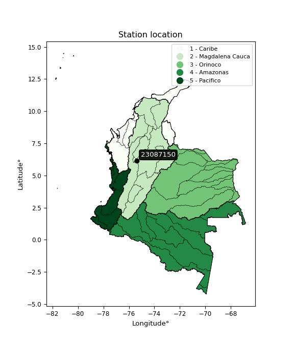</img>

</div>


## A. General information


### 1. General running parameters

• app_version: _v20251225_. • runtime: _2025-12-26 14:29:50.888910_. • Python version: _3.14.0_. • SciPy version: _1.16.3_. • Pandas version: _2.3.3_. • NumPy version: _2.3.5_. • Stations dataset (station_dataset_file): _dataset/pmax24h_in/automatic_colombia.csv_. • Stations catalog (station_catalog_file): _dataset/CNE_IDEAM.xls_. • Plot only fit distributions with Δo > Δ (plot_only_fit): _True_. • Eval low extreme values, if False, evaluates high extreme values (low_extreme): _False_. • Eval every SciPy distribution as logarithmic (pdist_logarithmic_on): _True_. • Standard deviation normalized (ddof): _1.0_. • Return periods to eval in years (Tr): _[2, 2.33, 5, 10, 15, 20, 25, 50, 75, 100, 200, 250, 500, 750, 1000]_. • Minimum data sample per station, 0 means any (minimum_sample): _5_. • Z-Score threshold to adjust a value, 0 means disable (zscore): _3.5_. • Avoid zeros, e.g. rain = 0 (avoid_zeros): _True_. • Avoid null values (avoid_nans): _True_. [:file_folder:Dataset file.](../../dataset/pmax24h_in/automatic_colombia.csv)


### 2. Station info and location

|   id |   CODIGO | NOMBRE                 | CATEGORIA    | TECNOLOGIA                | ESTADO   | FECHA_INSTALACION   |   FECHA_SUSPENSION |   ALTITUD |   LATITUD |   LONGITUD | DEPARTAMENTO   | MUNICIPIO   | AREA_OPERATIVA                      | ENTIDAD                                                     | AREA_HIDROGRAFICA   | ZONA_HIDROGRAFICA   | SUBZONA_HIDROGRAFICA   | CORRIENTE   | OBSERVACION                                                                                                                                                   | SUBRED                          | Catalogo   |
|-----:|---------:|:-----------------------|:-------------|:--------------------------|:---------|:--------------------|-------------------:|----------:|----------:|-----------:|:---------------|:------------|:------------------------------------|:------------------------------------------------------------|:--------------------|:--------------------|:-----------------------|:------------|:--------------------------------------------------------------------------------------------------------------------------------------------------------------|:--------------------------------|:-----------|
|    0 | 23087150 | PUENTE REAL [23087150] | Limnigráfica | Automática con Telemetría | Activa   | 15/05/1973          |                nan |       820 |   6.14347 |   -75.3799 | Antioquia      | Rionegro    | Area Operativa 01 - Antioquia-Chocó | INSTITUTO DE HIDROLOGIA METEOROLOGIA Y ESTUDIOS AMBIENTALES | Magdalena Cauca     | Medio Magdalena     | Río Nare               | Negro       | ESTACIÓN ACTIVADA NUEVAMENTE EN SU COMPONENTE CONVENCIONAL POR SOLICITUD DEL AO.(10012023) ESTACIÓN YA CUENTA CON OBSERVADOR Y PERTENECE A LA RED DE ALERTAS. | RED ALERTAS - AREA OPERATIVA 01 | CNE_IDEAM  |

<div align="center">

Map location in: [:earth_americas:Google](http://maps.google.com/maps?q=6.143472222,-75.37994444) [:earth_americas:OSM](https://www.openstreetmap.org/#map=18/6.143472222/-75.37994444&layers=P) [:earth_americas:Bing](https://www.bing.com/maps?cp=6.143472222~-75.37994444&lvl=18) [:earth_americas:Apple](https://maps.apple.com/frame?center=6.143472222%2C-75.37994444&span=0.003%2C0.006)

</div>


<div align="center">

```geojson
{
  "type": "Feature",
  "geometry": {
    "type": "Point", 
    "coordinates": [-75.37994444, 6.143472222]
  }, 
  "properties": {
    "Name": "23087150"
  }
}
```

</div>


### 3. Discrete values table and plot

|               |          0 |           1 |           2 |          3 |           4 |          5 |           6 |           7 |
|:--------------|-----------:|------------:|------------:|-----------:|------------:|-----------:|------------:|------------:|
| Date          | 2018       | 2019        | 2020        | 2021       | 2022        | 2023       | 2024        | 2025        |
| Value         |   21.4     |   48.2      |   57        |   63       |   53.6      |   11.2     |   50.8      |   50.4      |
| Value_initial |   21.4     |   48.2      |   57        |   63       |   53.6      |   11.2     |   50.8      |   50.4      |
| count         |    8       |    8        |    8        |    8       |    8        |    8       |    8        |    8        |
| mean          |   44.45    |   44.45     |   44.45     |   44.45    |   44.45     |   44.45    |   44.45     |   44.45     |
| std           |   18.1737  |   18.1737   |   18.1737   |   18.1737  |   18.1737   |   18.1737  |   18.1737   |   18.1737   |
| zscore        |   -1.26832 |    0.206342 |    0.690559 |    1.02071 |    0.503475 |   -1.82957 |    0.349406 |    0.327396 |

<div align="center">

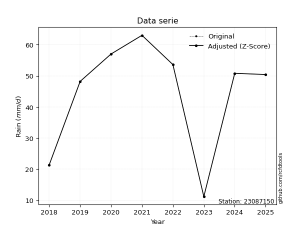</img>

</div>

> If Z-Score is active, values out of range or outliers are replaced with the station mean value.


### 4. Active continuous probability distributions from SciPy (45 of 104 available)

[scipy.stats](https://docs.scipy.org/doc/scipy/reference/stats.html) is a Python´s powerful submodule within the SciPy library for comprehensive statistical analysis, offering over 130 probability distributions (like Normal, Poisson), functions for descriptive stats (mean, variance), hypothesis testing (t-tests, chi-square), random variable generation, and statistical tests, making it essential for data science, modeling, and research. It provides tools to explore, model, and draw conclusions from data efficiently, working seamlessly with NumPy.

<div align="center">

|   id | p_dist             |   n_parameter | fit_method   | label                                                                       | active   | ref                                                                                                        |
|-----:|:-------------------|--------------:|:-------------|:----------------------------------------------------------------------------|:---------|:-----------------------------------------------------------------------------------------------------------|
|    0 | alpha              |             3 | MLE          | Alpha                                                                       | True     | [:mortar_board:](https://docs.scipy.org/doc/scipy/reference/generated/scipy.stats.alpha.html)              |
|    1 | betaprime          |             4 | MLE          | Beta prime                                                                  | True     | [:mortar_board:](https://docs.scipy.org/doc/scipy/reference/generated/scipy.stats.betaprime.html)          |
|    2 | chi2               |             3 | MLE          | Chi²                                                                        | True     | [:mortar_board:](https://docs.scipy.org/doc/scipy/reference/generated/scipy.stats.chi2.html)               |
|    3 | crystalball        |             4 | MLE          | Crystalball                                                                 | True     | [:mortar_board:](https://docs.scipy.org/doc/scipy/reference/generated/scipy.stats.crystalball.html)        |
|    4 | erlang             |             3 | MLE          | Erlang                                                                      | True     | [:mortar_board:](https://docs.scipy.org/doc/scipy/reference/generated/scipy.stats.erlang.html)             |
|    5 | expon              |             2 | MLE          | Exponential                                                                 | True     | [:mortar_board:](https://docs.scipy.org/doc/scipy/reference/generated/scipy.stats.expon.html)              |
|    6 | exponnorm          |             3 | MLE          | Exponentially modified Normal                                               | True     | [:mortar_board:](https://docs.scipy.org/doc/scipy/reference/generated/scipy.stats.exponnorm.html)          |
|    7 | f                  |             4 | MLE          | F                                                                           | True     | [:mortar_board:](https://docs.scipy.org/doc/scipy/reference/generated/scipy.stats.f.html)                  |
|    8 | fatiguelife        |             3 | MLE          | Fatigue-life (Birnbaum-Saunders)                                            | True     | [:mortar_board:](https://docs.scipy.org/doc/scipy/reference/generated/scipy.stats.fatiguelife.html)        |
|    9 | fisk               |             3 | MLE          | Fisk                                                                        | True     | [:mortar_board:](https://docs.scipy.org/doc/scipy/reference/generated/scipy.stats.fisk.html)               |
|   10 | gamma              |             3 | MLE          | Gamma                                                                       | True     | [:mortar_board:](https://docs.scipy.org/doc/scipy/reference/generated/scipy.stats.gamma.html)              |
|   11 | genexpon           |             5 | MLE          | Generalized exponential                                                     | True     | [:mortar_board:](https://docs.scipy.org/doc/scipy/reference/generated/scipy.stats.genexpon.html)           |
|   12 | genlogistic        |             3 | MLE          | Generalized logistic                                                        | True     | [:mortar_board:](https://docs.scipy.org/doc/scipy/reference/generated/scipy.stats.genlogistic.html)        |
|   13 | gibrat             |             2 | MM           | Gibrat                                                                      | True     | [:mortar_board:](https://docs.scipy.org/doc/scipy/reference/generated/scipy.stats.gibrat.html)             |
|   14 | gompertz           |             3 | MLE          | Gompertz (or truncated Gumbel)                                              | True     | [:mortar_board:](https://docs.scipy.org/doc/scipy/reference/generated/scipy.stats.gompertz.html)           |
|   15 | gumbel_l           |             2 | MM           | Gumbel Left Skew                                                            | True     | [:mortar_board:](https://docs.scipy.org/doc/scipy/reference/generated/scipy.stats.gumbel_l.html)           |
|   16 | gumbel_r           |             2 | MM           | Gumbel Right Skew                                                           | True     | [:mortar_board:](https://docs.scipy.org/doc/scipy/reference/generated/scipy.stats.gumbel_r.html)           |
|   17 | halflogistic       |             2 | MM           | Half-logistic                                                               | True     | [:mortar_board:](https://docs.scipy.org/doc/scipy/reference/generated/scipy.stats.halflogistic.html)       |
|   18 | halfnorm           |             2 | MM           | Half Normal                                                                 | True     | [:mortar_board:](https://docs.scipy.org/doc/scipy/reference/generated/scipy.stats.halfnorm.html)           |
|   19 | hypsecant          |             2 | MM           | hyperbolic secant                                                           | True     | [:mortar_board:](https://docs.scipy.org/doc/scipy/reference/generated/scipy.stats.hypsecant.html)          |
|   20 | invgamma           |             3 | MLE          | Inverted gamma                                                              | True     | [:mortar_board:](https://docs.scipy.org/doc/scipy/reference/generated/scipy.stats.invgamma.html)           |
|   21 | invgauss           |             3 | MLE          | Inverse Gaussian                                                            | True     | [:mortar_board:](https://docs.scipy.org/doc/scipy/reference/generated/scipy.stats.invgauss.html)           |
|   22 | invweibull         |             3 | MLE          | Inverted Weibull                                                            | True     | [:mortar_board:](https://docs.scipy.org/doc/scipy/reference/generated/scipy.stats.invweibull.html)         |
|   23 | johnsonsu          |             4 | MLE          | Johnson Su                                                                  | True     | [:mortar_board:](https://docs.scipy.org/doc/scipy/reference/generated/scipy.stats.johnsonsu.html)          |
|   24 | kstwobign          |             2 | MLE          | Limiting distribution of scaled Kolmogorov-Smirnov two-sided test statistic | True     | [:mortar_board:](https://docs.scipy.org/doc/scipy/reference/generated/scipy.stats.kstwobign.html)          |
|   25 | laplace            |             2 | MM           | Laplace                                                                     | True     | [:mortar_board:](https://docs.scipy.org/doc/scipy/reference/generated/scipy.stats.laplace.html)            |
|   26 | laplace_asymmetric |             3 | MLE          | Asymmetric Laplace                                                          | True     | [:mortar_board:](https://docs.scipy.org/doc/scipy/reference/generated/scipy.stats.laplace_asymmetric.html) |
|   27 | loggamma           |             3 | MLE          | Log gamma                                                                   | True     | [:mortar_board:](https://docs.scipy.org/doc/scipy/reference/generated/scipy.stats.loggamma.html)           |
|   28 | logistic           |             2 | MM           | Logistic (or Sech-squared)                                                  | True     | [:mortar_board:](https://docs.scipy.org/doc/scipy/reference/generated/scipy.stats.logistic.html)           |
|   29 | lognorm            |             3 | MLE          | Log Normal                                                                  | True     | [:mortar_board:](https://docs.scipy.org/doc/scipy/reference/generated/scipy.stats.lognorm.html)            |
|   30 | maxwell            |             2 | MM           | Maxwell                                                                     | True     | [:mortar_board:](https://docs.scipy.org/doc/scipy/reference/generated/scipy.stats.maxwell.html)            |
|   31 | mielke             |             4 | MLE          | Mielke Beta-Kappa / Dagum                                                   | True     | [:mortar_board:](https://docs.scipy.org/doc/scipy/reference/generated/scipy.stats.mielke.html)             |
|   32 | moyal              |             2 | MM           | Moyal                                                                       | True     | [:mortar_board:](https://docs.scipy.org/doc/scipy/reference/generated/scipy.stats.moyal.html)              |
|   33 | nakagami           |             3 | MLE          | Nakagami                                                                    | True     | [:mortar_board:](https://docs.scipy.org/doc/scipy/reference/generated/scipy.stats.nakagami.html)           |
|   34 | ncf                |             5 | MLE          | Non-central F distribution                                                  | True     | [:mortar_board:](https://docs.scipy.org/doc/scipy/reference/generated/scipy.stats.ncf.html)                |
|   35 | nct                |             4 | MLE          | Non-central Student’s t                                                     | True     | [:mortar_board:](https://docs.scipy.org/doc/scipy/reference/generated/scipy.stats.nct.html)                |
|   36 | norm               |             2 | MM           | Normal                                                                      | True     | [:mortar_board:](https://docs.scipy.org/doc/scipy/reference/generated/scipy.stats.norm.html)               |
|   37 | pareto             |             3 | MLE          | Pareto                                                                      | True     | [:mortar_board:](https://docs.scipy.org/doc/scipy/reference/generated/scipy.stats.pareto.html)             |
|   38 | pearson3           |             3 | MM           | Pearson type III                                                            | True     | [:mortar_board:](https://docs.scipy.org/doc/scipy/reference/generated/scipy.stats.pearson3.html)           |
|   39 | rayleigh           |             2 | MM           | Rayleigh                                                                    | True     | [:mortar_board:](https://docs.scipy.org/doc/scipy/reference/generated/scipy.stats.rayleigh.html)           |
|   40 | rice               |             3 | MLE          | Rice                                                                        | True     | [:mortar_board:](https://docs.scipy.org/doc/scipy/reference/generated/scipy.stats.rice.html)               |
|   41 | t                  |             3 | MLE          | Student’s t                                                                 | True     | [:mortar_board:](https://docs.scipy.org/doc/scipy/reference/generated/scipy.stats.t.html)                  |
|   42 | truncnorm          |             4 | MLE          | Truncated normal                                                            | True     | [:mortar_board:](https://docs.scipy.org/doc/scipy/reference/generated/scipy.stats.truncnorm.html)          |
|   43 | wald               |             2 | MM           | Wald                                                                        | True     | [:mortar_board:](https://docs.scipy.org/doc/scipy/reference/generated/scipy.stats.wald.html)               |
|   44 | weibull_min        |             3 | MLE          | Weibull minimum                                                             | True     | [:mortar_board:](https://docs.scipy.org/doc/scipy/reference/generated/scipy.stats.weibull_min.html)        |

</div>

> **n_parameter:** # arguments & localization & scale.
>
> **Fit methods:** (MLE) maximum likelihood, (MM) L-moments.
>
>**Inactive:** foldnorm, gennorm, norminvgauss, powernorm, powerlognorm, skewnorm, genextreme, anglit, arcsine, argus, beta, bradford, burr, burr12, cauchy, cosine, halfcauchy, foldcauchy, skewcauchy, wrapcauchy, dgamma, gengamma, exponweib, exponpow, truncexpon, gausshyper, genhalflogistic, genhyperbolic, geninvgauss, halfgennorm, johnsonsb, kappa4, kappa3, ksone, kstwo, loglaplace, levy, levy_l, levy_stable, ncx2, genpareto, truncpareto, lomax, powerlaw, rdist, rel_breitwigner, recipinvgauss, semicircular, studentized_range, trapezoid, triang, truncweibull_min, tukeylambda, uniform, loguniform, vonmises, vonmises_line, weibull_max, dweibull, 


## B. Probability distributions vs. Empirical distributions

A continuous probability distribution (CPD) describes probabilities for variables that can take any value within a range (like rain any time), unlike discrete variables with specific outcomes (like temperature). It uses a Probability Density Function (PDF), a curve where the total area under it equals 1, and the probability of the variable falling within an interval (a to b) is found by calculating the area under the curve between those points. A key feature is that the probability of hitting any single exact value is zero, so probabilities are always expressed for ranges, e.g., $P(a ≤ X ≤ b)$.

<div align="center">

Distributions parameters
|    |   station | p_dist                |   n |               loc |            scale | shape                 | shape1                | shape2                 | shape3   |
|---:|----------:|:----------------------|----:|------------------:|-----------------:|:----------------------|:----------------------|:-----------------------|:---------|
|  0 |  23087150 | alpha                 |   8 |    -133.522       |   1527.99        | 8.761669915584028     |                       |                        |          |
|  1 |  23087150 | betaprime             |   8 |    -497.283       |  32063.5         | 985.1889959263628     | 58338.01839348899     |                        |          |
|  2 |  23087150 | chi2                  |   8 |    -178.838       |      0.721789    | 308.8345822061653     |                       |                        |          |
|  3 |  23087150 | crystalball           |   8 |      44.45        |     16.9999      | 3389.246143171691     | 643.1113471086361     |                        |          |
|  4 |  23087150 | erlang                |   8 |    -228.048       |      1.11586     | 244.06541868208285    |                       |                        |          |
|  5 |  23087150 | expon                 |   8 |      11.2         |     33.25        |                       |                       |                        |          |
|  6 |  23087150 | exponnorm             |   8 |      44.4393      |     17           | 0.0006319841440181662 |                       |                        |          |
|  7 |  23087150 | f                     |   8 |   -9367.92        |   9412.3         | 818772.5108552701     | 2397084.076481552     |                        |          |
|  8 |  23087150 | fatiguelife           |   8 |      11.2         |      6.87232e-05 | 778.6316455545289     |                       |                        |          |
|  9 |  23087150 | fisk                  |   8 | -377673           | 377721           | 39945.48171531629     |                       |                        |          |
| 10 |  23087150 | gamma                 |   8 |    -233.234       |      1.11019     | 249.91038940274916    |                       |                        |          |
| 11 |  23087150 | genexpon              |   8 |      11.2         |      2.36774     | 0.07094417312737997   | 0.0002990721570484355 | 0.767436260635549      |          |
| 12 |  23087150 | genlogistic           |   8 |      60.7007      |      2.30813     | 0.1381839061579873    |                       |                        |          |
| 13 |  23087150 | gibrat                |   8 |      31.4812      |      7.86596     |                       |                       |                        |          |
| 14 |  23087150 | gompertz              |   8 |      -9.2464      |     11.5123      | 0.004990947937606436  |                       |                        |          |
| 15 |  23087150 | gumbel_l              |   8 |      52.1009      |     13.2548      |                       |                       |                        |          |
| 16 |  23087150 | gumbel_r              |   8 |      36.7991      |     13.2548      |                       |                       |                        |          |
| 17 |  23087150 | halflogistic          |   8 |      24.3012      |     14.5343      |                       |                       |                        |          |
| 18 |  23087150 | halfnorm              |   8 |      21.9488      |     28.2011      |                       |                       |                        |          |
| 19 |  23087150 | hypsecant             |   8 |      44.45        |     10.8225      |                       |                       |                        |          |
| 20 |  23087150 | invgamma              |   8 |    -216.153       |  54980.8         | 212.20279161972053    |                       |                        |          |
| 21 |  23087150 | invgauss              |   8 |     -69.7295      |   3956.97        | 0.02866991610966646   |                       |                        |          |
| 22 |  23087150 | invweibull            |   8 |      11.2         |      1.46763     | 0.06194374809137007   |                       |                        |          |
| 23 |  23087150 | johnsonsu             |   8 |      67.047       |      0.237621    | 6.415586975816376     | 1.2920347497580067    |                        |          |
| 24 |  23087150 | kstwobign             |   8 |     -30.2111      |     85.0981      |                       |                       |                        |          |
| 25 |  23087150 | laplace               |   8 |      44.45        |     12.0208      |                       |                       |                        |          |
| 26 |  23087150 | laplace_asymmetric    |   8 |      53.6         |      9.25305     | 1.6099845570535678    |                       |                        |          |
| 27 |  23087150 | loggamma              |   8 |      62.7123      |      2.8478      | 0.16453248688970767   |                       |                        |          |
| 28 |  23087150 | logistic              |   8 |      44.45        |      9.37255     |                       |                       |                        |          |
| 29 |  23087150 | lognorm               |   8 |      11.2         |      0.318042    | 12.413411824795073    |                       |                        |          |
| 30 |  23087150 | maxwell               |   8 |       4.16731     |     25.2434      |                       |                       |                        |          |
| 31 |  23087150 | mielke                |   8 |     -59.7594      |    122.866       | 5.553147249467884     | 5583.4687999792895    |                        |          |
| 32 |  23087150 | moyal                 |   8 |      34.7284      |      7.65266     |                       |                       |                        |          |
| 33 |  23087150 | nakagami              |   8 |  -11041.9         |  11086.4         | 106031.52492332738    |                       |                        |          |
| 34 |  23087150 | ncf                   |   8 |      -0.203374    |      0.00101967  | 0.000661460032456321  | 20.93055382534454     | 27.297901715287686     |          |
| 35 |  23087150 | nct                   |   8 |   -1313.41        |     16.9064      | 253483.8223361281     | 80.31616877770904     |                        |          |
| 36 |  23087150 | norm                  |   8 |      44.45        |     16.9999      |                       |                       |                        |          |
| 37 |  23087150 | pareto                |   8 |      11.1881      |      0.0119063   | 0.14332463809358556   |                       |                        |          |
| 38 |  23087150 | pearson3              |   8 |      44.45        |     16.9999      | -1.0014679990556732   |                       |                        |          |
| 39 |  23087150 | rayleigh              |   8 |      11.9282      |     25.9487      |                       |                       |                        |          |
| 40 |  23087150 | rice                  |   8 |      -0.0836006   |     18.3739      | 2.1749806414208344    |                       |                        |          |
| 41 |  23087150 | t                     |   8 |      44.4501      |     16.9998      | 289481134.93979734    |                       |                        |          |
| 42 |  23087150 | truncnorm             |   8 |      44.45        |     16.9999      | -183.7386434912744    | 892.4922383345101     |                        |          |
| 43 |  23087150 | wald                  |   8 |      27.4501      |     16.9999      |                       |                       |                        |          |
| 44 |  23087150 | weibull_min           |   8 |      -1.41453e+09 |      1.41453e+09 | 124505364.36061755    |                       |                        |          |
| 45 |  23087150 | logalpha              |   8 |     -10.4648      |    317.393       | 22.508072394685385    |                       |                        |          |
| 46 |  23087150 | logbetaprime          |   8 |     -10.1442      |     53.0645      | 691.0741552549391     | 2654.61340350751      |                        |          |
| 47 |  23087150 | logchi2               |   8 |       2.41591     |      0.958237    | 1.122749079124358     |                       |                        |          |
| 48 |  23087150 | logcrystalball        |   8 |       3.67129     |      0.567005    | 198.98139834067663    | 25.22958270725671     |                        |          |
| 49 |  23087150 | logerlang             |   8 |      -5.85747     |      0.0371683   | 256.14844861163766    |                       |                        |          |
| 50 |  23087150 | logexpon              |   8 |       2.41591     |      1.25537     |                       |                       |                        |          |
| 51 |  23087150 | logexponnorm          |   8 |       3.67093     |      0.567004    | 0.0006338756376028524 |                       |                        |          |
| 52 |  23087150 | logf                  |   8 |    -975.385       |    979.058       | 17245313.939343646    | 8970316.976386957     |                        |          |
| 53 |  23087150 | logfatiguelife        |   8 |    -440.111       |    443.783       | 0.001277079000627015  |                       |                        |          |
| 54 |  23087150 | logfisk               |   8 |  -33166.6         |  33170.4         | 111602.32149122411    |                       |                        |          |
| 55 |  23087150 | loggamma              |   8 |      -4.95569     |      0.0404617   | 213.07060336802232    |                       |                        |          |
| 56 |  23087150 | loggenexpon           |   8 |       2.38364     |      0.00561831  | 0.0010751942771750535 | 3.340700527058006     | 7.1598915162837535e-06 |          |
| 57 |  23087150 | loggenlogistic        |   8 |       4.14315     |      1.28381e-06 | 2.727962251640774e-06 |                       |                        |          |
| 58 |  23087150 | loggibrat             |   8 |       3.23875     |      0.262351    |                       |                       |                        |          |
| 59 |  23087150 | loggompertz           |   8 |       2.41544     |      0.343832    | 0.013531879010075933  |                       |                        |          |
| 60 |  23087150 | loggumbel_l           |   8 |       3.92647     |      0.442092    |                       |                       |                        |          |
| 61 |  23087150 | loggumbel_r           |   8 |       3.4161      |      0.442092    |                       |                       |                        |          |
| 62 |  23087150 | loghalflogistic       |   8 |       2.99924     |      0.484776    |                       |                       |                        |          |
| 63 |  23087150 | loghalfnorm           |   8 |       2.92079     |      0.940605    |                       |                       |                        |          |
| 64 |  23087150 | loghypsecant          |   8 |       3.67129     |      0.360967    |                       |                       |                        |          |
| 65 |  23087150 | loginvgamma           |   8 |     -10.6101      |   8225.64        | 577.4399201499998     |                       |                        |          |
| 66 |  23087150 | loginvgauss           |   8 |      -2.18635     |    511.384       | 0.011485081254000586  |                       |                        |          |
| 67 |  23087150 | loginvweibull         |   8 |      -5.95293e+07 |      5.95293e+07 | 89003098.64852276     |                       |                        |          |
| 68 |  23087150 | logjohnsonsu          |   8 |       4.16779     |      0.000686807 | 5.414913476440029     | 0.818096217677268     |                        |          |
| 69 |  23087150 | logkstwobign          |   8 |       0.965419    |      3.09176     |                       |                       |                        |          |
| 70 |  23087150 | loglaplace            |   8 |       3.67129     |      0.400933    |                       |                       |                        |          |
| 71 |  23087150 | loglaplace_asymmetric |   8 |       4.04305     |      0.192698    | 2.3540484855619503    |                       |                        |          |
| 72 |  23087150 | logloggamma           |   8 |       4.14321     |      4.40572e-06 | 9.31387640122237e-06  |                       |                        |          |
| 73 |  23087150 | loglogistic           |   8 |       3.67129     |      0.312606    |                       |                       |                        |          |
| 74 |  23087150 | loglognorm            |   8 |       2.41591     |      0.0159549   | 11.800851984821946    |                       |                        |          |
| 75 |  23087150 | logmaxwell            |   8 |       2.32772     |      0.841954    |                       |                       |                        |          |
| 76 |  23087150 | logmielke             |   8 |   -4115.32        |   4119.48        | 8450.602362881058     | 1614053.769632616     |                        |          |
| 77 |  23087150 | logmoyal              |   8 |       3.34704     |      0.255242    |                       |                       |                        |          |
| 78 |  23087150 | lognakagami           |   8 |       2.51283     |      1.36391     | 3.3562419485309083    |                       |                        |          |
| 79 |  23087150 | logncf                |   8 |      -7.33178     |     10.3725      | 1038.8957690601987    | 1569.3865430473334    | 61.72595865966491      |          |
| 80 |  23087150 | lognct                |   8 |     -32.4201      |      0.51321     | 9849.708921735539     | 70.31988560003367     |                        |          |
| 81 |  23087150 | lognorm               |   8 |       3.67129     |      0.567005    |                       |                       |                        |          |
| 82 |  23087150 | logpareto             |   8 |       2.41544     |      0.000473463 | 0.1432736218091203    |                       |                        |          |
| 83 |  23087150 | logpearson3           |   8 |       3.67129     |      0.567007    | -1.3550048788359437   |                       |                        |          |
| 84 |  23087150 | lograyleigh           |   8 |       2.58658     |      0.865467    |                       |                       |                        |          |
| 85 |  23087150 | logrice               |   8 |    -242.846       |      0.567       | 434.7743347706505     |                       |                        |          |
| 86 |  23087150 | logt                  |   8 |       3.94187     |      0.0694179   | 0.6813621931552635    |                       |                        |          |
| 87 |  23087150 | logtruncnorm          |   8 |      -0.215448    |      1.90813     | 1.7183409369553815    | 2.284229829990105     |                        |          |
| 88 |  23087150 | logwald               |   8 |       3.10424     |      0.567035    |                       |                       |                        |          |
| 89 |  23087150 | logweibull_min        |   8 | -779277           | 779281           | 2389448.725810908     |                       |                        |          |

</div>

> **loc** (Location parameter): This shifts the distribution along the x-axis. For many common distributions, like the normal (Gaussian) distribution, loc represents the mean $μ$. For others, like the uniform distribution, it might represent the minimum value, or for the beta distribution, the left end of the support interval.
>
> **scale** (Scale parameter): This determines the width or spread of the distribution. For the normal distribution, scale represents the standard deviation $σ$. For a uniform distribution, it defines the length of the interval (from $loc$ to $loc + scale$).
>
> **shape** (Shape parameters): Refers to parameters that define the specific form of a probability distribution, distinct from its location (loc) and scale (scale). These parameters are required arguments for most distribution functions. For example, a normal (Gaussian) distribution is fully defined by its location (mean) and scale (standard deviation), so it has no specific shape parameters beyond loc and scale. However, other distributions have intrinsic properties that need specification, as Gamma distribution that takes a shape parameter, often named $a$ or $alpha$.


### 0. Cumulative distribution values - CDF (90 evaluated)

> Ordered by x ascending and calculating $log(f(x))$ separately. 

|   id |   Station |   date |    x |   count |   mean |     std |    zscore |   Value_initial |   station |   m |     alpha |   alpha_pdf |   betaprime |   betaprime_pdf |      chi2 |   chi2_pdf |   crystalball |   crystalball_pdf |    erlang |   erlang_pdf |    expon |   expon_pdf |   exponnorm |   exponnorm_pdf |         f |      f_pdf |   fatiguelife |   fatiguelife_pdf |      fisk |   fisk_pdf |     gamma |   gamma_pdf |   genexpon |   genexpon_pdf |   genlogistic |   genlogistic_pdf |   gibrat |   gibrat_pdf |   gompertz |   gompertz_pdf |   gumbel_l |   gumbel_l_pdf |   gumbel_r |   gumbel_r_pdf |   halflogistic |   halflogistic_pdf |   halfnorm |   halfnorm_pdf |   hypsecant |   hypsecant_pdf |   invgamma |   invgamma_pdf |   invgauss |   invgauss_pdf |   invweibull |   invweibull_pdf |   johnsonsu |   johnsonsu_pdf |   kstwobign |   kstwobign_pdf |   laplace |   laplace_pdf |   laplace_asymmetric |   laplace_asymmetric_pdf |   loggamma |   loggamma_pdf |   logistic |   logistic_pdf |   lognorm |   lognorm_pdf |    maxwell |   maxwell_pdf |    mielke |   mielke_pdf |       moyal |   moyal_pdf |   nakagami |   nakagami_pdf |       ncf |    ncf_pdf |       nct |    nct_pdf |      norm |   norm_pdf |   pareto |   pareto_pdf |   pearson3 |   pearson3_pdf |   rayleigh |   rayleigh_pdf |      rice |   rice_pdf |         t |      t_pdf |   truncnorm |   truncnorm_pdf |     wald |   wald_pdf |   weibull_min |   weibull_min_pdf |   logalpha |   logalpha_pdf |   logbetaprime |   logbetaprime_pdf |     logchi2 |   logchi2_pdf |   logcrystalball |   logcrystalball_pdf |   logerlang |   logerlang_pdf |   logexpon |   logexpon_pdf |   logexponnorm |   logexponnorm_pdf |      logf |   logf_pdf |   logfatiguelife |   logfatiguelife_pdf |    logfisk |   logfisk_pdf |   loggenexpon |   loggenexpon_pdf |   loggenlogistic |   loggenlogistic_pdf |   loggibrat |   loggibrat_pdf |   loggompertz |   loggompertz_pdf |   loggumbel_l |   loggumbel_l_pdf |   loggumbel_r |   loggumbel_r_pdf |   loghalflogistic |   loghalflogistic_pdf |   loghalfnorm |   loghalfnorm_pdf |   loghypsecant |   loghypsecant_pdf |   loginvgamma |   loginvgamma_pdf |   loginvgauss |   loginvgauss_pdf |   loginvweibull |   loginvweibull_pdf |   logjohnsonsu |   logjohnsonsu_pdf |   logkstwobign |   logkstwobign_pdf |   loglaplace |   loglaplace_pdf |   loglaplace_asymmetric |   loglaplace_asymmetric_pdf |   logloggamma |   logloggamma_pdf |   loglogistic |   loglogistic_pdf |   loglognorm |   loglognorm_pdf |   logmaxwell |   logmaxwell_pdf |   logmielke |   logmielke_pdf |    logmoyal |   logmoyal_pdf |   lognakagami |   lognakagami_pdf |    logncf |   logncf_pdf |    lognct |   lognct_pdf |   logpareto |   logpareto_pdf |   logpearson3 |   logpearson3_pdf |   lograyleigh |   lograyleigh_pdf |   logrice |   logrice_pdf |      logt |   logt_pdf |   logtruncnorm |   logtruncnorm_pdf |   logwald |   logwald_pdf |   logweibull_min |   logweibull_min_pdf |
|-----:|----------:|-------:|-----:|--------:|-------:|--------:|----------:|----------------:|----------:|----:|----------:|------------:|------------:|----------------:|----------:|-----------:|--------------:|------------------:|----------:|-------------:|---------:|------------:|------------:|----------------:|----------:|-----------:|--------------:|------------------:|----------:|-----------:|----------:|------------:|-----------:|---------------:|--------------:|------------------:|---------:|-------------:|-----------:|---------------:|-----------:|---------------:|-----------:|---------------:|---------------:|-------------------:|-----------:|---------------:|------------:|----------------:|-----------:|---------------:|-----------:|---------------:|-------------:|-----------------:|------------:|----------------:|------------:|----------------:|----------:|--------------:|---------------------:|-------------------------:|-----------:|---------------:|-----------:|---------------:|----------:|--------------:|-----------:|--------------:|----------:|-------------:|------------:|------------:|-----------:|---------------:|----------:|-----------:|----------:|-----------:|----------:|-----------:|---------:|-------------:|-----------:|---------------:|-----------:|---------------:|----------:|-----------:|----------:|-----------:|------------:|----------------:|---------:|-----------:|--------------:|------------------:|-----------:|---------------:|---------------:|-------------------:|------------:|--------------:|-----------------:|---------------------:|------------:|----------------:|-----------:|---------------:|---------------:|-------------------:|----------:|-----------:|-----------------:|---------------------:|-----------:|--------------:|--------------:|------------------:|-----------------:|---------------------:|------------:|----------------:|--------------:|------------------:|--------------:|------------------:|--------------:|------------------:|------------------:|----------------------:|--------------:|------------------:|---------------:|-------------------:|--------------:|------------------:|--------------:|------------------:|----------------:|--------------------:|---------------:|-------------------:|---------------:|-------------------:|-------------:|-----------------:|------------------------:|----------------------------:|--------------:|------------------:|--------------:|------------------:|-------------:|-----------------:|-------------:|-----------------:|------------:|----------------:|------------:|---------------:|--------------:|------------------:|----------:|-------------:|----------:|-------------:|------------:|----------------:|--------------:|------------------:|--------------:|------------------:|----------:|--------------:|----------:|-----------:|---------------:|-------------------:|----------:|--------------:|-----------------:|---------------------:|
|    0 |  23087150 |   2023 | 11.2 |       8 |  44.45 | 18.1737 | -1.82957  |            11.2 |  23087150 |   1 | 0.0362131 |  0.00579685 |   0.0270041 |      0.00373969 | 0.0284413 | 0.00403802 |     0.025239  |        0.00346549 | 0.0250133 |    0.003658  | 0        |  0.0300752  |   0.025239  |      0.00346548 | 0.0255856 | 0.00350767 |     0.0413895 |       2.04023e+09 | 0.0211999 | 0.00219465 | 0.0261893 |  0.00376864 | 1.1473e-07 |     0.0299629  |     0.0516363 |        0.00309138 | 0        |   0          |  0.0241904 |     0.00249869 |  0.0446677 |     0.00329352 | 0.00100924 |    0.000525269 |       0        |         0          |   0        |     0          |   0.0294635 |      0.00271855 |  0.0244845 |     0.00384504 |  0.0269625 |     0.00462582 |  0.000225996 |      6.61589e+10 |    0.062502 |      0.00284531 |   0.0281404 |      0.0064009  | 0.0314551 |    0.00261673 |            0.0419015 |               0.0028127  |  0.0137461 |      0.0660583 |  0.027988  |     0.00290259 |  0.013413 |     0.0606559 | 0.00561885 |    0.00235985 | 0.0474244 |   0.00371134 | 3.28955e-06 | 4.84956e-06 |  0.0253705 |     0.00347932 | 0.0132288 | 0.00410707 | 0.0253106 | 0.00347303 | 0.025239  | 0.00346549 | 0        | 12.0378      |  0.0449942 |     0.0035575  |  0         |      0         | 0.0198923 | 0.00389509 | 0.0252378 | 0.00346537 |   0.025239  |      0.00346549 | 0        | 0          |     0.027471  |        0.00238444 |  0.0164654 |      0.0784775 |      0.0139274 |          0.0649896 | 1.87768e-09 |   2.37358e+06 |         0.013413 |            0.0606557 |   0.0148216 |       0.0692244 |   0        |       0.796577 |      0.0134128 |          0.0606553 | 0.0136336 |  0.0612812 |        0.0132628 |             0.060267 | 0.00968233 |     0.0322622 |    0.00655006 |          0.214417 |         0        |            0.0541245 |    0        |        0        |   1.86838e-05 |         0.0394097 |     0.0322836 |          0.071833 |   6.73152e-05 |        0.00146268 |         0         |              0        |      0        |          0        |      0.0196494 |          0.0544011 |     0.0140491 |         0.0680431 |     0.0128373 |          0.067738 |       0.0169515 |            0.103339 |      0.0582757 |          0.0543705 |      0.0196555 |           0.138359 |    0.0218343 |        0.0544587 |               0.0234495 |                   0.0516942 |     0.0259502 |         0.0548599 |     0.0177088 |         0.0556458 |    0.0040853 |      2.30372e+12 |  0.000304659 |        0.0103407 |   0.0284326 |       0.0583506 | 5.77007e-10 |    4.44793e-08 |    0          |         0         | 0.0175406 |    0.0778919 | 0.0139448 |    0.0627852 |    0        |     302.608     |     0.0356777 |          0.075961 |      0        |          0        | 0.0134125 |     0.0606545 | 0.0378814 |  0.0168997 |    0           |           0        |  0        |      0        |        0.0103681 |            0.0316257 |
|    1 |  23087150 |   2018 | 21.4 |       8 |  44.45 | 18.1737 | -1.26832  |            21.4 |  23087150 |   2 | 0.135385  |  0.0138497  |   0.0935829 |      0.00989297 | 0.0998205 | 0.0104963  |     0.0875674 |        0.0093595  | 0.0916668 |    0.0100133 | 0.264178 |  0.02213    |   0.0875673 |      0.00935947 | 0.0885231 | 0.00943336 |     0.689623  |       0.0085613   | 0.0598864 | 0.00595436 | 0.094074  |  0.010125   | 0.264007   |     0.022142   |     0.0950956 |        0.00569322 | 0        |   0          |  0.0643443 |     0.005811   |  0.0939373 |     0.00674324 | 0.0409415  |    0.00987063  |       0        |         0          |   0        |     0          |   0.0753141 |      0.00689429 |  0.095808  |     0.0107364  |  0.111837  |     0.0124521  |  0.411956    |      0.00221867  |    0.101415 |      0.00501855 |   0.144425  |      0.0159729  | 0.0734858 |    0.00611324 |            0.0830973 |               0.00557802 |  0.15357   |      0.420826  |  0.0787604 |     0.00774146 |  0.141834 |     0.396029  | 0.0737104  |    0.0116682  | 0.0999794 |   0.00684086 | 0.016899    | 0.00717915  |  0.0878721 |     0.00937743 | 0.110144  | 0.0150312  | 0.0877328 | 0.00936909 | 0.0875674 | 0.00935949 | 0.620177 |  0.00533084  |  0.098086  |     0.00720928 |  0.0644498 |      0.0131605 | 0.0895    | 0.0102599  | 0.0875648 | 0.00935935 |   0.0875673 |      0.00935949 | 0        | 0          |     0.0660776 |        0.00561954 |  0.17015   |      0.439114  |      0.149498  |          0.408786  | 0.544002    |   0.377981    |         0.141834 |            0.396029  |   0.156431  |       0.42088   |   0.402956 |       0.475591 |      0.141833  |          0.396029  | 0.142192  |  0.394903  |        0.141506  |             0.396133 | 0.0794964  |     0.246209  |    0.262953   |          0.520533 |         0        |            0.214242  |    0        |        0        |   0.0727659   |         0.240231  |     0.132338  |          0.278601 |   0.108532    |        0.545177   |         0.0660678 |              1.0269   |      0.120502 |          0.838574 |      0.116837  |          0.316459  |     0.15757   |         0.429147  |     0.159648  |          0.433169 |       0.212527  |            0.492098 |      0.116639  |          0.145235  |      0.253448  |           0.526547 |    0.109772  |        0.273792  |               0.0977297 |                   0.215444  |     0.102     |         0.215633  |     0.125143  |         0.350224  |    0.62317   |      0.0497035   |  0.141815    |        0.493919  |   0.107363  |       0.220299  | 0.081324    |    0.596381    |    0.00910931 |         0.0974605 | 0.164307  |    0.419673  | 0.144642  |    0.398965  |    0.644649 |       0.0785745 |     0.134922  |          0.264884 |      0.140805 |          0.546932 | 0.141833  |     0.396032  | 0.0551519 |  0.0426631 |    4.23529e-05 |           1.50739  |  0        |      0        |        0.0730798 |            0.215684  |
|    2 |  23087150 |   2019 | 48.2 |       8 |  44.45 | 18.1737 |  0.206342 |            48.2 |  23087150 |   3 | 0.63806   |  0.0173426  |   0.594869  |      0.0221694  | 0.600766  | 0.0212609  |     0.587294  |        0.0229032  | 0.596487  |    0.022     | 0.671357 |  0.00988401 |   0.587292  |      0.0229032  | 0.588749  | 0.0228244  |     0.826996  |       0.00325882  | 0.520177  | 0.0263954  | 0.5976    |  0.0218365  | 0.671399   |     0.00988734 |     0.472833  |        0.0281825  | 0.774572 |   0.017958   |  0.517298  |     0.0307486  |  0.525291  |     0.0266835  | 0.655009   |    0.0209085   |       0.676239 |         0.0186696  |   0.648073 |     0.0183449  |   0.608152  |      0.0277305  |  0.605928  |     0.0210602  |  0.623204  |     0.0190887  |  0.440958    |      0.000604469 |    0.448022 |      0.0271144  |   0.636157  |      0.0154668  | 0.633995  |    0.0304478  |            0.5022    |               0.0337109  |  0.646267  |      0.619459  |  0.598713  |     0.025634   |  0.640544 |     0.659469  | 0.614906   |    0.0210058  | 0.487602  |   0.0250809  | 0.67836     | 0.0198376   |  0.587375  |     0.0228682  | 0.618793  | 0.0159432  | 0.587313  | 0.022883   | 0.587294  | 0.0229032  | 0.684188 |  0.00122295  |  0.5239    |     0.0251667  |  0.623548  |      0.0202791 | 0.593824  | 0.0220699  | 0.587291  | 0.0229034  |   0.587294  |      0.0229032  | 0.743303 | 0.017059   |     0.514815  |        0.0308856  |  0.646123  |      0.573965  |      0.638413  |          0.627568  | 0.752019    |   0.173241    |         0.640544 |            0.659469  |   0.64615   |       0.615942  |   0.687315 |       0.249077 |      0.640545  |          0.65947   | 0.638461  |  0.657175  |        0.640488  |             0.659504 | 0.570207   |     0.824543  |    0.676333   |          0.427457 |         0        |            1.20285   |    0.812319 |        0.423053 |   0.605983    |         1.08281   |     0.589683  |          0.826798 |   0.701966    |        0.561885   |         0.718062  |              0.499599 |      0.689821 |          0.506862 |      0.671072  |          0.757509  |     0.650725  |         0.610549  |     0.636281  |          0.578812 |       0.631298  |            0.434155 |      0.458245  |          1.10993   |      0.66158   |           0.405981 |    0.69945   |        0.749625  |               0.585332  |                   1.29036   |     0.567653  |         1.20004   |     0.657644  |         0.72023   |    0.649024  |      0.0215282   |  0.663174    |        0.591177  |   0.568011  |       1.16528   | 0.722406    |    0.521294    |    0.571188   |         1.04656   | 0.637597  |    0.592732  | 0.639764  |    0.650434  |    0.68369  |       0.031042  |     0.564265  |          0.828829 |      0.67002  |          0.567758 | 0.640549  |     0.659473  | 0.283076  |  2.05808   |    0.8472      |           0.662738 |  0.780076 |      0.423013 |        0.599486  |            1.12369   |
|    3 |  23087150 |   2025 | 50.4 |       8 |  44.45 | 18.1737 |  0.327396 |            50.4 |  23087150 |   4 | 0.675034  |  0.0162567  |   0.642723  |      0.0212833  | 0.646568  | 0.0203349  |     0.636831  |        0.022073   | 0.64391   |    0.0210634 | 0.692398 |  0.0092512  |   0.63683   |      0.022073   | 0.638102  | 0.0219849  |     0.833969  |       0.00308356  | 0.577717  | 0.0257996  | 0.64467   |  0.0209079  | 0.692447   |     0.00925403 |     0.538874  |        0.0318938  | 0.809922 |   0.0143473  |  0.58637   |     0.0318971  |  0.585039  |     0.0275363  | 0.698795   |    0.0188948   |       0.715242 |         0.0168026  |   0.686963 |     0.0170082  |   0.666798  |      0.0254654  |  0.651164  |     0.0200253  |  0.664027  |     0.0180008  |  0.44225     |      0.000570172 |    0.511845 |      0.0309466  |   0.669154  |      0.0145276  | 0.695208  |    0.0253555  |            0.58212   |               0.0390756  |  0.673463  |      0.598771  |  0.653584  |     0.0241569  |  0.669535 |     0.639065  | 0.659843   |    0.019816   | 0.545402  |   0.0274938  | 0.719461    | 0.0175547   |  0.636836  |     0.0220387  | 0.652664  | 0.0148471  | 0.636807  | 0.0220534  | 0.636831  | 0.022073   | 0.68679  |  0.00114482  |  0.580254  |     0.0259959  |  0.666819  |      0.0190367 | 0.641473  | 0.0211981  | 0.636829  | 0.0220732  |   0.636831  |      0.022073   | 0.777685 | 0.0142974  |     0.584282  |        0.0321177  |  0.671315  |      0.554602  |      0.665995  |          0.60793   | 0.759612    |   0.167031    |         0.669535 |            0.639065  |   0.673198  |       0.595682  |   0.698237 |       0.240377 |      0.669535  |          0.639066  | 0.667359  |  0.637208  |        0.669479  |             0.639043 | 0.606556   |     0.802924  |    0.69509    |          0.412978 |         0        |            1.32251   |    0.830018 |        0.371434 |   0.654351    |         1.08155   |     0.626731  |          0.832044 |   0.726229    |        0.525486   |         0.739632  |              0.46717  |      0.711899 |          0.482489 |      0.703775  |          0.707215  |     0.677512  |         0.5894    |     0.661696  |          0.559731 |       0.650324  |            0.41837  |      0.512217  |          1.31645   |      0.679375  |           0.391426 |    0.731113  |        0.670653  |               0.645852  |                   1.42377   |     0.623822  |         1.31879   |     0.68903   |         0.685424  |    0.64997   |      0.0208689   |  0.689023    |        0.566871  |   0.622475  |       1.277     | 0.744799    |    0.482512    |    0.617052   |         1.00663   | 0.663657  |    0.574648  | 0.66836   |    0.630427  |    0.685052 |       0.0299915 |     0.601837  |          0.854057 |      0.694818 |          0.543276 | 0.66954   |     0.639068  | 0.411247  |  3.76096   |    0.876048    |           0.630151 |  0.798007 |      0.381367 |        0.649782  |            1.12668   |
|    4 |  23087150 |   2024 | 50.8 |       8 |  44.45 | 18.1737 |  0.349406 |            50.8 |  23087150 |   5 | 0.681496  |  0.0160517  |   0.651198  |      0.0210906  | 0.654663  | 0.0201401  |     0.645623  |        0.021886   | 0.652295  |    0.0208633 | 0.696076 |  0.00914057 |   0.645622  |      0.0218859  | 0.646858  | 0.0217966  |     0.835197  |       0.00305326  | 0.588002  | 0.0256193  | 0.652994  |  0.0207099  | 0.696126   |     0.00914332 |     0.55177   |        0.0325868  | 0.815549 |   0.0137916  |  0.599152  |     0.0320044  |  0.596072  |     0.0276254  | 0.706279   |    0.0185295   |       0.721897 |         0.0164736  |   0.693717 |     0.0167648  |   0.676888  |      0.0249861  |  0.659132  |     0.0198135  |  0.671185  |     0.0177892  |  0.442476    |      0.000564347 |    0.524367 |      0.0316631  |   0.674931  |      0.0143553  | 0.705183  |    0.0245257  |            0.597962  |               0.040139   |  0.678181  |      0.594847  |  0.663183  |     0.0238325  |  0.674571 |     0.635107  | 0.667723   |    0.0195813  | 0.556491  |   0.0279513  | 0.726404    | 0.0171582   |  0.645614  |     0.021852   | 0.658563  | 0.0146476  | 0.645591  | 0.0218665  | 0.645623  | 0.021886   | 0.687246 |  0.00113161  |  0.590673  |     0.0260999  |  0.674386  |      0.0187978 | 0.649914  | 0.021009   | 0.645621  | 0.0218861  |   0.645623  |      0.021886   | 0.783315 | 0.0138563  |     0.597155  |        0.0322385  |  0.675685  |      0.550983  |      0.670786  |          0.604171  | 0.760928    |   0.165962    |         0.674572 |            0.635107  |   0.677892  |       0.591835  |   0.700131 |       0.238869 |      0.674572  |          0.635108  | 0.672381  |  0.633331  |        0.674515  |             0.635076 | 0.612885   |     0.798251  |    0.698344   |          0.410374 |         0        |            1.34491   |    0.832921 |        0.363129 |   0.662893    |         1.07935   |     0.633309  |          0.832129 |   0.730358    |        0.519107   |         0.743303  |              0.461555 |      0.715696 |          0.478184 |      0.709329  |          0.697917  |     0.682156  |         0.585411  |     0.666106  |          0.556161 |       0.65362   |            0.415549 |      0.522788  |          1.35825   |      0.682459  |           0.388841 |    0.736363  |        0.65756   |               0.657206  |                   1.4488    |     0.634334  |         1.34101   |     0.694422  |         0.678809  |    0.650135  |      0.0207562   |  0.693487    |        0.562413  |   0.632652  |       1.29788   | 0.748587    |    0.475866    |    0.624977   |         0.998355  | 0.668186  |    0.571215  | 0.673328  |    0.626556  |    0.685289 |       0.0298123 |     0.608604  |          0.858022 |      0.699095 |          0.538838 | 0.674576  |     0.63511   | 0.44204   |  4.0169    |    0.881007    |           0.624513 |  0.800995 |      0.374526 |        0.658682  |            1.12499   |
|    5 |  23087150 |   2022 | 53.6 |       8 |  44.45 | 18.1737 |  0.503475 |            53.6 |  23087150 |   6 | 0.724389  |  0.0145769  |   0.708125  |      0.0195067  | 0.708953  | 0.018586   |     0.704794  |        0.0203028  | 0.70853   |    0.0192448 | 0.720622 |  0.00840236 |   0.704792  |      0.0203028  | 0.705771  | 0.0202091  |     0.843461  |       0.00285322  | 0.65742   | 0.0238174  | 0.708824  |  0.0191108  | 0.720679   |     0.00840456 |     0.649637  |        0.0371779  | 0.849404 |   0.0105691  |  0.688782  |     0.0316901  |  0.673637  |     0.0275707  | 0.754632   |    0.016028    |       0.7649   |         0.0142741  |   0.738282 |     0.0150711  |   0.741814  |      0.0213252  |  0.712366  |     0.0181666  |  0.718833  |     0.0162222  |  0.444003    |      0.000526663 |    0.619999 |      0.0365787  |   0.713434  |      0.0131477  | 0.766443  |    0.0194294  |            0.721607  |               0.0484389  |  0.709346  |      0.566369  |  0.726365  |     0.0212065  |  0.707878 |     0.605765  | 0.720125   |    0.0178167  | 0.639405  |   0.0313226  | 0.770735    | 0.0145602   |  0.704694  |     0.0202725  | 0.697633  | 0.0132652  | 0.70471   | 0.0202857  | 0.704793  | 0.0203028  | 0.690292 |  0.00104661  |  0.664302  |     0.0263429  |  0.724594  |      0.0170445 | 0.706655  | 0.0194572  | 0.704792  | 0.020303   |   0.704793  |      0.0203028  | 0.818225 | 0.0111952  |     0.687548  |        0.0319928  |  0.704563  |      0.5251    |      0.702478  |          0.576654  | 0.769642    |   0.158931    |         0.707878 |            0.605765  |   0.708909  |       0.563894  |   0.712677 |       0.228875 |      0.707879  |          0.605766  | 0.705607  |  0.604553  |        0.707819  |             0.605677 | 0.654747   |     0.760555  |    0.719883   |          0.392438 |         0        |            1.50732   |    0.851003 |        0.31249  |   0.720085    |         1.04759   |     0.677833  |          0.825425 |   0.757063    |        0.476592   |         0.767065  |              0.424539 |      0.740571 |          0.449122 |      0.745047  |          0.633173  |     0.712805  |         0.556643  |     0.69527   |          0.530613 |       0.675399  |            0.396297 |      0.604207  |          1.69225   |      0.702851  |           0.371298 |    0.769384  |        0.575199  |               0.739722  |                   1.63071   |     0.710522  |         1.50208   |     0.729582  |         0.631119  |    0.651229  |      0.020022    |  0.72283     |        0.531155  |   0.706264  |       1.44887   | 0.772943    |    0.432582    |    0.676876   |         0.934062  | 0.698176  |    0.546278  | 0.706194  |    0.597926  |    0.686856 |       0.0286476 |     0.655271  |          0.880028 |      0.727185 |          0.508079 | 0.707883  |     0.605766  | 0.649367  |  3.03348   |    0.913507    |           0.587291 |  0.819916 |      0.33187  |        0.718369  |            1.09424   |
|    6 |  23087150 |   2020 | 57   |       8 |  44.45 | 18.1737 |  0.690559 |            57   |  23087150 |   7 | 0.770851  |  0.0127555  |   0.770557  |      0.0171568  | 0.768445  | 0.0163628  |     0.769815  |        0.0178698  | 0.770057  |    0.0168936 | 0.747777 |  0.00758564 |   0.769814  |      0.0178698  | 0.770478  | 0.0177804  |     0.852785  |       0.00263551  | 0.733289  | 0.0206825  | 0.769948  |  0.0167907  | 0.747841   |     0.00758726 |     0.781225  |        0.038936   | 0.880376 |   0.00782162 |  0.791959  |     0.0284623  |  0.764766  |     0.0256832  | 0.804263   |    0.0132173   |       0.809261 |         0.0118718  |   0.786096 |     0.0130684  |   0.806537  |      0.0167956  |  0.770334  |     0.015897   |  0.770572  |     0.0142009  |  0.445724    |      0.000487123 |    0.752381 |      0.0406467  |   0.755671  |      0.0117049  | 0.823983  |    0.0146428  |            0.845923  |               0.0268085  |  0.743088  |      0.530391  |  0.792328  |     0.017556   |  0.74398  |     0.567508  | 0.776786   |    0.0154924  | 0.753436  |   0.0358339  | 0.815479    | 0.0118387   |  0.769625  |     0.0178468  | 0.73997   | 0.0116547  | 0.76968   | 0.0178571  | 0.769815  | 0.0178698  | 0.693696 |  0.000958285 |  0.752524  |     0.0252793  |  0.778762  |      0.0148093 | 0.768998  | 0.0171535  | 0.769814  | 0.0178699  |   0.769815  |      0.0178698  | 0.851932 | 0.0087542  |     0.791776  |        0.0287586  |  0.735884  |      0.493087  |      0.736878  |          0.541417  | 0.77918     |   0.151332    |         0.74398  |            0.567509  |   0.742519  |       0.52853   |   0.726414 |       0.217932 |      0.743981  |          0.567509  | 0.741655  |  0.566963  |        0.743914  |             0.56737  | 0.699915   |     0.706656  |    0.743375   |          0.371461 |         0        |            1.71776   |    0.868705 |        0.264825 |   0.782447    |         0.973674  |     0.727944  |          0.801073 |   0.784927    |        0.429959   |         0.791931  |              0.384554 |      0.767181 |          0.416305 |      0.781684  |          0.558495  |     0.745947  |         0.520628  |     0.726943  |          0.498977 |       0.699091  |            0.374162 |      0.723125  |          2.1956    |      0.72507   |           0.351281 |    0.80218   |        0.493399  |               0.847131  |                   1.86749   |     0.809178  |         1.71064   |     0.766606  |         0.572353  |    0.652436  |      0.0192407   |  0.754353    |        0.4937    |   0.801237  |       1.64368   | 0.798122    |    0.386915    |    0.731692   |         0.846498  | 0.730816  |    0.514673  | 0.741845  |    0.560717  |    0.68858  |       0.0274134 |     0.70985   |          0.892202 |      0.757323 |          0.471877 | 0.743985  |     0.567509  | 0.773474  |  1.28292   |    0.94837     |           0.546812 |  0.839006 |      0.290049 |        0.783494  |            1.01579   |
|    7 |  23087150 |   2021 | 63   |       8 |  44.45 | 18.1737 |  1.02071  |            63   |  23087150 |   8 | 0.838059  |  0.0097024  |   0.859689  |      0.0125207  | 0.853868  | 0.012097   |     0.862403  |        0.0129393  | 0.857823  |    0.0123433 | 0.789421 |  0.0063332  |   0.862402  |      0.0129394  | 0.8626    | 0.012876   |     0.867578  |       0.00230601  | 0.838333  | 0.0143323  | 0.857276  |  0.0122998  | 0.789492   |     0.00633402 |     0.957499  |        0.0154601  | 0.917437 |   0.0048303  |  0.929161  |     0.0163206  |  0.897273  |     0.0176369  | 0.870642   |    0.00909898  |       0.869565 |         0.00838902 |   0.854513 |     0.00980732 |   0.886536  |      0.0102634  |  0.853097  |     0.0117042  |  0.845059  |     0.0106683  |  0.448469    |      0.00043006  |    0.968267 |      0.0227173  |   0.818614  |      0.00931786 | 0.893148  |    0.00888895 |            0.945757  |               0.00943806 |  0.793025  |      0.466704  |  0.878594  |     0.0113807  |  0.797346 |     0.497673  | 0.857222   |    0.0113564  | 0.995167  |   0.0446725  | 0.874708    | 0.00811856  |  0.862122  |     0.0129324  | 0.802035  | 0.00910315 | 0.862221  | 0.0129361  | 0.862403  | 0.0129393  | 0.699052 |  0.000832497 |  0.888524  |     0.0191369  |  0.855847  |      0.0109339 | 0.85833   | 0.0125848  | 0.862403  | 0.0129394  |   0.862403  |      0.0129393  | 0.894998 | 0.00583763 |     0.930111  |        0.0163684  |  0.78248   |      0.437539  |      0.787946  |          0.478133  | 0.793746    |   0.13992     |         0.797346 |            0.497674  |   0.792316  |       0.465779  |   0.747379 |       0.201232 |      0.797346  |          0.497674  | 0.79502   |  0.498186  |        0.797263  |             0.497494 | 0.765599   |     0.60378   |    0.778824   |          0.336886 |         0.999966 |            2.12481   |    0.892063 |        0.205105 |   0.870652    |         0.774504  |     0.804554  |          0.721705 |   0.824396    |        0.360093   |         0.827394  |              0.325325 |      0.806238 |          0.364602 |      0.831771  |          0.444657  |     0.794928  |         0.457494  |     0.774157  |          0.444003 |       0.734751  |            0.338594 |      0.972459  |          2.10165   |      0.758618  |           0.319268 |    0.84588   |        0.384403  |               0.954988  |                   0.549882  |     0.999844  |         2.11371   |     0.818973  |         0.474259  |    0.654303  |      0.0180897   |  0.800635    |        0.430997  |   0.983621  |       1.93169   | 0.833479    |    0.321424    |    0.808531   |         0.686991  | 0.779548  |    0.458357  | 0.794632  |    0.492959  |    0.691231 |       0.0256055 |     0.798547  |          0.870151 |      0.80157  |          0.412353 | 0.79735   |     0.497672  | 0.851843  |  0.47769   |    0.999993    |           0.485739 |  0.865155 |      0.234849 |        0.875035  |            0.796887  |

An Empirical Distribution Function (EDF) is a step-function estimate of a true cumulative distribution function (CDF) based on observed sample data, representing the proportion of data points less than or equal to a given value. It is calculated by ordering your data and jumping up by $1/n$ (where $n$ is sample size) at each unique data point, allowing analysis without assuming an underlying population distribution, and it gets closer to the true CDF as the sample size grows.


### 1. Empirical - EDF California (1923)

California´s estimates the true probability distribution of water-related data (like rainfall, streamflow) using observed samples, crucial for risk assessment.

<div align="center">


$P=m/n$


</div>


**1.1. Empirical values**

<div align="center">

|                | 0                  | 1                  | 2              | 3              | 4                  | 5              | 6              | 7              |
|:---------------|:-------------------|:-------------------|:---------------|:---------------|:-------------------|:---------------|:---------------|:---------------|
| date           | 2023               | 2018               | 2019           | 2025           | 2024               | 2022           | 2020           | 2021           |
| x              | 11.2               | 21.4               | 48.2           | 50.4           | 50.8               | 53.6           | 57.0           | 63.0           |
| m              | 1                  | 2                  | 3              | 4              | 5                  | 6              | 7              | 8              |
| empirical_dist | edf_california     | edf_california     | edf_california | edf_california | edf_california     | edf_california | edf_california | edf_california |
| empirical      | 0.125              | 0.25               | 0.375          | 0.5            | 0.625              | 0.75           | 0.875          | 1.0            |
| empirical_tr   | 1.1428571428571428 | 1.3333333333333333 | 1.6            | 2.0            | 2.6666666666666665 | 4.0            | 8.0            | inf            |

</div>


**1.2. Kolmogorov-Smirnov fit test (sorted by Δ)**


<div align="center">

|                | 0                  | 1                   | 2                  | 3                  | 4                   | 5                   | 6                  | 7                   | 8                   | 9                  | 10                  | 11                  | 12                  | 13                  | 14                    | 15                  | 16                  | 17                  | 18                  | 19                  | 20                  | 21                  | 22                  | 23                  | 24                 | 25                  | 26                  | 27                  | 28                  | 29                  | 30                 | 31                  | 32                  | 33                  | 34                  | 35                  | 36                  | 37                  | 38                  | 39                 | 40                  | 41                  | 42                 | 43                 | 44                  | 45                  | 46                  | 47                 | 48                  | 49                  | 50                  | 51                  | 52                  | 53                  | 54                  | 55                  | 56                 | 57                 | 58                 | 59                 | 60                 | 61                  | 62                 | 63                 | 64                 | 65                 | 66                  | 67                 | 68                 | 69                 | 70                  | 71                  | 72                  | 73                  | 74                 | 75                  | 76                 | 77                 | 78                 | 79                 | 80                 | 81                 | 82                 | 83                  | 84                 | 85                  | 86                  | 87                  | 88                 | 89                 |
|:---------------|:-------------------|:--------------------|:-------------------|:-------------------|:--------------------|:--------------------|:-------------------|:--------------------|:--------------------|:-------------------|:--------------------|:--------------------|:--------------------|:--------------------|:----------------------|:--------------------|:--------------------|:--------------------|:--------------------|:--------------------|:--------------------|:--------------------|:--------------------|:--------------------|:-------------------|:--------------------|:--------------------|:--------------------|:--------------------|:--------------------|:-------------------|:--------------------|:--------------------|:--------------------|:--------------------|:--------------------|:--------------------|:--------------------|:--------------------|:-------------------|:--------------------|:--------------------|:-------------------|:-------------------|:--------------------|:--------------------|:--------------------|:-------------------|:--------------------|:--------------------|:--------------------|:--------------------|:--------------------|:--------------------|:--------------------|:--------------------|:-------------------|:-------------------|:-------------------|:-------------------|:-------------------|:--------------------|:-------------------|:-------------------|:-------------------|:-------------------|:--------------------|:-------------------|:-------------------|:-------------------|:--------------------|:--------------------|:--------------------|:--------------------|:-------------------|:--------------------|:-------------------|:-------------------|:-------------------|:-------------------|:-------------------|:-------------------|:-------------------|:--------------------|:-------------------|:--------------------|:--------------------|:--------------------|:-------------------|:-------------------|
| station        | 23087150           | 23087150            | 23087150           | 23087150           | 23087150            | 23087150            | 23087150           | 23087150            | 23087150            | 23087150           | 23087150            | 23087150            | 23087150            | 23087150            | 23087150              | 23087150            | 23087150            | 23087150            | 23087150            | 23087150            | 23087150            | 23087150            | 23087150            | 23087150            | 23087150           | 23087150            | 23087150            | 23087150            | 23087150            | 23087150            | 23087150           | 23087150            | 23087150            | 23087150            | 23087150            | 23087150            | 23087150            | 23087150            | 23087150            | 23087150           | 23087150            | 23087150            | 23087150           | 23087150           | 23087150            | 23087150            | 23087150            | 23087150           | 23087150            | 23087150            | 23087150            | 23087150            | 23087150            | 23087150            | 23087150            | 23087150            | 23087150           | 23087150           | 23087150           | 23087150           | 23087150           | 23087150            | 23087150           | 23087150           | 23087150           | 23087150           | 23087150            | 23087150           | 23087150           | 23087150           | 23087150            | 23087150            | 23087150            | 23087150            | 23087150           | 23087150            | 23087150           | 23087150           | 23087150           | 23087150           | 23087150           | 23087150           | 23087150           | 23087150            | 23087150           | 23087150            | 23087150            | 23087150            | 23087150           | 23087150           |
| empirical_dist | edf_california     | edf_california      | edf_california     | edf_california     | edf_california      | edf_california      | edf_california     | edf_california      | edf_california      | edf_california     | edf_california      | edf_california      | edf_california      | edf_california      | edf_california        | edf_california      | edf_california      | edf_california      | edf_california      | edf_california      | edf_california      | edf_california      | edf_california      | edf_california      | edf_california     | edf_california      | edf_california      | edf_california      | edf_california      | edf_california      | edf_california     | edf_california      | edf_california      | edf_california      | edf_california      | edf_california      | edf_california      | edf_california      | edf_california      | edf_california     | edf_california      | edf_california      | edf_california     | edf_california     | edf_california      | edf_california      | edf_california      | edf_california     | edf_california      | edf_california      | edf_california      | edf_california      | edf_california      | edf_california      | edf_california      | edf_california      | edf_california     | edf_california     | edf_california     | edf_california     | edf_california     | edf_california      | edf_california     | edf_california     | edf_california     | edf_california     | edf_california      | edf_california     | edf_california     | edf_california     | edf_california      | edf_california      | edf_california      | edf_california      | edf_california     | edf_california      | edf_california     | edf_california     | edf_california     | edf_california     | edf_california     | edf_california     | edf_california     | edf_california      | edf_california     | edf_california      | edf_california      | edf_california      | edf_california     | edf_california     |
| p_dist         | johnsonsu          | mielke              | logjohnsonsu       | pearson3           | genlogistic         | gumbel_l            | laplace_asymmetric | weibull_min         | gompertz            | fisk               | logloggamma         | logmielke           | logt                | logpearson3         | loglaplace_asymmetric | t                   | exponnorm           | truncnorm           | norm                | crystalball         | nct                 | nakagami            | f                   | loggumbel_l         | rice               | betaprime           | erlang              | gamma               | logistic            | logweibull_min      | chi2               | invgamma            | loggompertz         | hypsecant           | logfisk             | maxwell             | lognakagami         | ncf                 | invgauss            | rayleigh           | laplace             | kstwobign           | loginvgauss        | logncf             | alpha               | logbetaprime        | logf                | lognct             | loginvweibull       | logfatiguelife      | lognorm             | lognorm             | logcrystalball      | logexponnorm        | logrice             | logalpha            | logerlang          | loggamma           | loggamma           | halfnorm           | loginvgamma        | gumbel_r            | loglogistic        | logkstwobign       | logmaxwell         | lograyleigh        | loghypsecant        | expon              | genexpon           | halflogistic       | loggenexpon         | moyal               | logexpon            | loghalfnorm         | loglaplace         | loggumbel_r         | loghalflogistic    | logmoyal           | wald               | pareto             | loglognorm         | logchi2            | logpareto          | gibrat              | logwald            | loggibrat           | fatiguelife         | logtruncnorm        | invweibull         | loggenlogistic     |
| delta          | 0.1485853929223705 | 0.15002059045774332 | 0.1518749570972966 | 0.1519139678743523 | 0.15490440345337314 | 0.15606270708771475 | 0.1669027421743904 | 0.18392239698988827 | 0.18565572417162612 | 0.1901136282582794 | 0.19265283475120987 | 0.19301100959232764 | 0.19484805278603415 | 0.20145342154560164 | 0.2103322668804123    | 0.21229129000876878 | 0.21229239538386324 | 0.21229380897916628 | 0.21229384033354382 | 0.21229385129522882 | 0.21231344810891073 | 0.21237509578508718 | 0.21374891294110354 | 0.21468274639484108 | 0.218824014923924  | 0.21986917073170842 | 0.22148705625368814 | 0.22259961447264565 | 0.22371277466797634 | 0.22448580016713304 | 0.2257658447377261 | 0.23092788717001644 | 0.23098274584648237 | 0.23315156946575522 | 0.23440144343706448 | 0.23990571676777284 | 0.24089068745711711 | 0.24379316587377997 | 0.24820375579953668 | 0.2485478356766735 | 0.25899467771517215 | 0.26115695630209956 | 0.2612808345330606 | 0.2625967281856223 | 0.26306039295544514 | 0.26341273489876604 | 0.26346065993407675 | 0.2647640672831062 | 0.26524857432517135 | 0.26548801431377156 | 0.26554437255414176 | 0.26554437255414176 | 0.26554439523654805 | 0.26554457155656774 | 0.26554884047555327 | 0.27112320219851604 | 0.2711496474735293 | 0.2712673898242841 | 0.2712673898242841 | 0.2730730260974288 | 0.2757249388597356 | 0.28000912972432623 | 0.2826439168338061 | 0.2865796288756457 | 0.2881743261971472 | 0.2950201525594718 | 0.29607209933933387 | 0.2963565829955791 | 0.2963988323561736 | 0.3012393721532842 | 0.30133306661679593 | 0.30335986168898665 | 0.31231530687417064 | 0.31482083707929776 | 0.324450497345284  | 0.32696571260163676 | 0.3430618042960417 | 0.3474055400559357 | 0.3683033495588617 | 0.3701769815271301 | 0.3731702028408457 | 0.3770190996261762 | 0.3946491757349371 | 0.39957156578167363 | 0.4050762318174843 | 0.43731909382006817 | 0.45199551765504464 | 0.47220048064800846 | 0.5515311665817193 | 0.875              |
| deltao         | 0.4472608134160001 | 0.4472608134160001  | 0.4472608134160001 | 0.4472608134160001 | 0.4472608134160001  | 0.4472608134160001  | 0.4472608134160001 | 0.4472608134160001  | 0.4472608134160001  | 0.4472608134160001 | 0.4472608134160001  | 0.4472608134160001  | 0.4472608134160001  | 0.4472608134160001  | 0.4472608134160001    | 0.4472608134160001  | 0.4472608134160001  | 0.4472608134160001  | 0.4472608134160001  | 0.4472608134160001  | 0.4472608134160001  | 0.4472608134160001  | 0.4472608134160001  | 0.4472608134160001  | 0.4472608134160001 | 0.4472608134160001  | 0.4472608134160001  | 0.4472608134160001  | 0.4472608134160001  | 0.4472608134160001  | 0.4472608134160001 | 0.4472608134160001  | 0.4472608134160001  | 0.4472608134160001  | 0.4472608134160001  | 0.4472608134160001  | 0.4472608134160001  | 0.4472608134160001  | 0.4472608134160001  | 0.4472608134160001 | 0.4472608134160001  | 0.4472608134160001  | 0.4472608134160001 | 0.4472608134160001 | 0.4472608134160001  | 0.4472608134160001  | 0.4472608134160001  | 0.4472608134160001 | 0.4472608134160001  | 0.4472608134160001  | 0.4472608134160001  | 0.4472608134160001  | 0.4472608134160001  | 0.4472608134160001  | 0.4472608134160001  | 0.4472608134160001  | 0.4472608134160001 | 0.4472608134160001 | 0.4472608134160001 | 0.4472608134160001 | 0.4472608134160001 | 0.4472608134160001  | 0.4472608134160001 | 0.4472608134160001 | 0.4472608134160001 | 0.4472608134160001 | 0.4472608134160001  | 0.4472608134160001 | 0.4472608134160001 | 0.4472608134160001 | 0.4472608134160001  | 0.4472608134160001  | 0.4472608134160001  | 0.4472608134160001  | 0.4472608134160001 | 0.4472608134160001  | 0.4472608134160001 | 0.4472608134160001 | 0.4472608134160001 | 0.4472608134160001 | 0.4472608134160001 | 0.4472608134160001 | 0.4472608134160001 | 0.4472608134160001  | 0.4472608134160001 | 0.4472608134160001  | 0.4472608134160001  | 0.4472608134160001  | 0.4472608134160001 | 0.4472608134160001 |
| eval           | Δo > Δ             | Δo > Δ              | Δo > Δ             | Δo > Δ             | Δo > Δ              | Δo > Δ              | Δo > Δ             | Δo > Δ              | Δo > Δ              | Δo > Δ             | Δo > Δ              | Δo > Δ              | Δo > Δ              | Δo > Δ              | Δo > Δ                | Δo > Δ              | Δo > Δ              | Δo > Δ              | Δo > Δ              | Δo > Δ              | Δo > Δ              | Δo > Δ              | Δo > Δ              | Δo > Δ              | Δo > Δ             | Δo > Δ              | Δo > Δ              | Δo > Δ              | Δo > Δ              | Δo > Δ              | Δo > Δ             | Δo > Δ              | Δo > Δ              | Δo > Δ              | Δo > Δ              | Δo > Δ              | Δo > Δ              | Δo > Δ              | Δo > Δ              | Δo > Δ             | Δo > Δ              | Δo > Δ              | Δo > Δ             | Δo > Δ             | Δo > Δ              | Δo > Δ              | Δo > Δ              | Δo > Δ             | Δo > Δ              | Δo > Δ              | Δo > Δ              | Δo > Δ              | Δo > Δ              | Δo > Δ              | Δo > Δ              | Δo > Δ              | Δo > Δ             | Δo > Δ             | Δo > Δ             | Δo > Δ             | Δo > Δ             | Δo > Δ              | Δo > Δ             | Δo > Δ             | Δo > Δ             | Δo > Δ             | Δo > Δ              | Δo > Δ             | Δo > Δ             | Δo > Δ             | Δo > Δ              | Δo > Δ              | Δo > Δ              | Δo > Δ              | Δo > Δ             | Δo > Δ              | Δo > Δ             | Δo > Δ             | Δo > Δ             | Δo > Δ             | Δo > Δ             | Δo > Δ             | Δo > Δ             | Δo > Δ              | Δo > Δ             | Δo > Δ              | Δo <= Δ             | Δo <= Δ             | Δo <= Δ            | Δo <= Δ            |
| fit            | 1                  | 1                   | 1                  | 1                  | 1                   | 1                   | 1                  | 1                   | 1                   | 1                  | 1                   | 1                   | 1                   | 1                   | 1                     | 1                   | 1                   | 1                   | 1                   | 1                   | 1                   | 1                   | 1                   | 1                   | 1                  | 1                   | 1                   | 1                   | 1                   | 1                   | 1                  | 1                   | 1                   | 1                   | 1                   | 1                   | 1                   | 1                   | 1                   | 1                  | 1                   | 1                   | 1                  | 1                  | 1                   | 1                   | 1                   | 1                  | 1                   | 1                   | 1                   | 1                   | 1                   | 1                   | 1                   | 1                   | 1                  | 1                  | 1                  | 1                  | 1                  | 1                   | 1                  | 1                  | 1                  | 1                  | 1                   | 1                  | 1                  | 1                  | 1                   | 1                   | 1                   | 1                   | 1                  | 1                   | 1                  | 1                  | 1                  | 1                  | 1                  | 1                  | 1                  | 1                   | 1                  | 1                   | 0                   | 0                   | 0                  | 0                  |
| n              | 8                  | 8                   | 8                  | 8                  | 8                   | 8                   | 8                  | 8                   | 8                   | 8                  | 8                   | 8                   | 8                   | 8                   | 8                     | 8                   | 8                   | 8                   | 8                   | 8                   | 8                   | 8                   | 8                   | 8                   | 8                  | 8                   | 8                   | 8                   | 8                   | 8                   | 8                  | 8                   | 8                   | 8                   | 8                   | 8                   | 8                   | 8                   | 8                   | 8                  | 8                   | 8                   | 8                  | 8                  | 8                   | 8                   | 8                   | 8                  | 8                   | 8                   | 8                   | 8                   | 8                   | 8                   | 8                   | 8                   | 8                  | 8                  | 8                  | 8                  | 8                  | 8                   | 8                  | 8                  | 8                  | 8                  | 8                   | 8                  | 8                  | 8                  | 8                   | 8                   | 8                   | 8                   | 8                  | 8                   | 8                  | 8                  | 8                  | 8                  | 8                  | 8                  | 8                  | 8                   | 8                  | 8                   | 8                   | 8                   | 8                  | 8                  |
| best_fit       | 1                  | 0                   | 0                  | 0                  | 0                   | 0                   | 0                  | 0                   | 0                   | 0                  | 0                   | 0                   | 0                   | 0                   | 0                     | 0                   | 0                   | 0                   | 0                   | 0                   | 0                   | 0                   | 0                   | 0                   | 0                  | 0                   | 0                   | 0                   | 0                   | 0                   | 0                  | 0                   | 0                   | 0                   | 0                   | 0                   | 0                   | 0                   | 0                   | 0                  | 0                   | 0                   | 0                  | 0                  | 0                   | 0                   | 0                   | 0                  | 0                   | 0                   | 0                   | 0                   | 0                   | 0                   | 0                   | 0                   | 0                  | 0                  | 0                  | 0                  | 0                  | 0                   | 0                  | 0                  | 0                  | 0                  | 0                   | 0                  | 0                  | 0                  | 0                   | 0                   | 0                   | 0                   | 0                  | 0                   | 0                  | 0                  | 0                  | 0                  | 0                  | 0                  | 0                  | 0                   | 0                  | 0                   | 0                   | 0                   | 0                  | 0                  |
| best_fit_sort  | 1                  | 2                   | 3                  | 4                  | 5                   | 6                   | 7                  | 8                   | 9                   | 10                 | 11                  | 12                  | 13                  | 14                  | 15                    | 16                  | 17                  | 18                  | 19                  | 20                  | 21                  | 22                  | 23                  | 24                  | 25                 | 26                  | 27                  | 28                  | 29                  | 30                  | 31                 | 32                  | 33                  | 34                  | 35                  | 36                  | 37                  | 38                  | 39                  | 40                 | 41                  | 42                  | 43                 | 44                 | 45                  | 46                  | 47                  | 48                 | 49                  | 50                  | 51                  | 52                  | 53                  | 54                  | 55                  | 56                  | 57                 | 58                 | 59                 | 60                 | 61                 | 62                  | 63                 | 64                 | 65                 | 66                 | 67                  | 68                 | 69                 | 70                 | 71                  | 72                  | 73                  | 74                  | 75                 | 76                  | 77                 | 78                 | 79                 | 80                 | 81                 | 82                 | 83                 | 84                  | 85                 | 86                  | 87                  | 88                  | 89                 | 90                 |

</div>


<div align="center">

</img>

</div>


**1.3. Best fit**

<div align="center">

|   id |   station | empirical_dist   | p_dist    |    delta |   deltao | eval   |   fit |   n |   best_fit |   best_fit_sort |
|-----:|----------:|:-----------------|:----------|---------:|---------:|:-------|------:|----:|-----------:|----------------:|
|    0 |  23087150 | edf_california   | johnsonsu | 0.148585 | 0.447261 | Δo > Δ |     1 |   8 |          1 |               1 |

</div>


<div align="center">

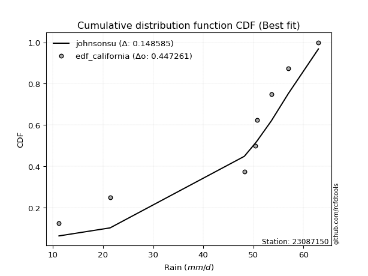</img>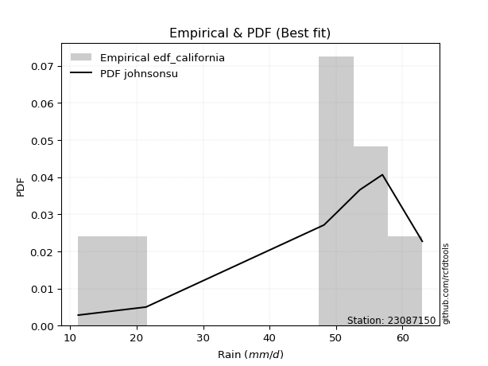</img>

</div>


### 2. Empirical - EDF Hazen (1930)

Hazen method for plotting positions is a formula used to estimate the empirical cumulative probability distribution of flood events or other hydrological data. This formula often results in biased estimations, particularly when extrapolating to extreme events (high return periods).

<div align="center">


$P=(m-0.5)/n$


</div>


**2.1. Empirical values**

<div align="center">

|                | 0                  | 1                  | 2                  | 3                  | 4                  | 5         | 6                 | 7         |
|:---------------|:-------------------|:-------------------|:-------------------|:-------------------|:-------------------|:----------|:------------------|:----------|
| date           | 2023               | 2018               | 2019               | 2025               | 2024               | 2022      | 2020              | 2021      |
| x              | 11.2               | 21.4               | 48.2               | 50.4               | 50.8               | 53.6      | 57.0              | 63.0      |
| m              | 1                  | 2                  | 3                  | 4                  | 5                  | 6         | 7                 | 8         |
| empirical_dist | edf_hazen          | edf_hazen          | edf_hazen          | edf_hazen          | edf_hazen          | edf_hazen | edf_hazen         | edf_hazen |
| empirical      | 0.0625             | 0.1875             | 0.3125             | 0.4375             | 0.5625             | 0.6875    | 0.8125            | 0.9375    |
| empirical_tr   | 1.0666666666666667 | 1.2307692307692308 | 1.4545454545454546 | 1.7777777777777777 | 2.2857142857142856 | 3.2       | 5.333333333333333 | 16.0      |

</div>


**2.2. Kolmogorov-Smirnov fit test (sorted by Δ)**


<div align="center">

|                | 0                   | 1                   | 2                   | 3                   | 4                   | 5                   | 6                   | 7                   | 8                  | 9                   | 10                  | 11                 | 12                  | 13                  | 14                 | 15                 | 16                    | 17                 | 18                  | 19                 | 20                 | 21                 | 22                  | 23                 | 24                  | 25                 | 26                 | 27                 | 28                  | 29                  | 30                  | 31                  | 32                 | 33                  | 34                 | 35                 | 36                  | 37                  | 38                 | 39                 | 40                  | 41                  | 42                  | 43                 | 44                 | 45                  | 46                  | 47                  | 48                 | 49                  | 50                  | 51                  | 52                  | 53                  | 54                  | 55                  | 56                 | 57                 | 58                 | 59                 | 60                 | 61                  | 62                 | 63                 | 64                 | 65                 | 66                  | 67                 | 68                 | 69                 | 70                  | 71                  | 72                  | 73                  | 74                 | 75                  | 76                 | 77                 | 78                 | 79                 | 80                 | 81                 | 82                 | 83                  | 84                 | 85                  | 86                  | 87                 | 88                 | 89                 |
|:---------------|:--------------------|:--------------------|:--------------------|:--------------------|:--------------------|:--------------------|:--------------------|:--------------------|:-------------------|:--------------------|:--------------------|:-------------------|:--------------------|:--------------------|:-------------------|:-------------------|:----------------------|:-------------------|:--------------------|:-------------------|:-------------------|:-------------------|:--------------------|:-------------------|:--------------------|:-------------------|:-------------------|:-------------------|:--------------------|:--------------------|:--------------------|:--------------------|:-------------------|:--------------------|:-------------------|:-------------------|:--------------------|:--------------------|:-------------------|:-------------------|:--------------------|:--------------------|:--------------------|:-------------------|:-------------------|:--------------------|:--------------------|:--------------------|:-------------------|:--------------------|:--------------------|:--------------------|:--------------------|:--------------------|:--------------------|:--------------------|:-------------------|:-------------------|:-------------------|:-------------------|:-------------------|:--------------------|:-------------------|:-------------------|:-------------------|:-------------------|:--------------------|:-------------------|:-------------------|:-------------------|:--------------------|:--------------------|:--------------------|:--------------------|:-------------------|:--------------------|:-------------------|:-------------------|:-------------------|:-------------------|:-------------------|:-------------------|:-------------------|:--------------------|:-------------------|:--------------------|:--------------------|:-------------------|:-------------------|:-------------------|
| station        | 23087150            | 23087150            | 23087150            | 23087150            | 23087150            | 23087150            | 23087150            | 23087150            | 23087150           | 23087150            | 23087150            | 23087150           | 23087150            | 23087150            | 23087150           | 23087150           | 23087150              | 23087150           | 23087150            | 23087150           | 23087150           | 23087150           | 23087150            | 23087150           | 23087150            | 23087150           | 23087150           | 23087150           | 23087150            | 23087150            | 23087150            | 23087150            | 23087150           | 23087150            | 23087150           | 23087150           | 23087150            | 23087150            | 23087150           | 23087150           | 23087150            | 23087150            | 23087150            | 23087150           | 23087150           | 23087150            | 23087150            | 23087150            | 23087150           | 23087150            | 23087150            | 23087150            | 23087150            | 23087150            | 23087150            | 23087150            | 23087150           | 23087150           | 23087150           | 23087150           | 23087150           | 23087150            | 23087150           | 23087150           | 23087150           | 23087150           | 23087150            | 23087150           | 23087150           | 23087150           | 23087150            | 23087150            | 23087150            | 23087150            | 23087150           | 23087150            | 23087150           | 23087150           | 23087150           | 23087150           | 23087150           | 23087150           | 23087150           | 23087150            | 23087150           | 23087150            | 23087150            | 23087150           | 23087150           | 23087150           |
| empirical_dist | edf_hazen           | edf_hazen           | edf_hazen           | edf_hazen           | edf_hazen           | edf_hazen           | edf_hazen           | edf_hazen           | edf_hazen          | edf_hazen           | edf_hazen           | edf_hazen          | edf_hazen           | edf_hazen           | edf_hazen          | edf_hazen          | edf_hazen             | edf_hazen          | edf_hazen           | edf_hazen          | edf_hazen          | edf_hazen          | edf_hazen           | edf_hazen          | edf_hazen           | edf_hazen          | edf_hazen          | edf_hazen          | edf_hazen           | edf_hazen           | edf_hazen           | edf_hazen           | edf_hazen          | edf_hazen           | edf_hazen          | edf_hazen          | edf_hazen           | edf_hazen           | edf_hazen          | edf_hazen          | edf_hazen           | edf_hazen           | edf_hazen           | edf_hazen          | edf_hazen          | edf_hazen           | edf_hazen           | edf_hazen           | edf_hazen          | edf_hazen           | edf_hazen           | edf_hazen           | edf_hazen           | edf_hazen           | edf_hazen           | edf_hazen           | edf_hazen          | edf_hazen          | edf_hazen          | edf_hazen          | edf_hazen          | edf_hazen           | edf_hazen          | edf_hazen          | edf_hazen          | edf_hazen          | edf_hazen           | edf_hazen          | edf_hazen          | edf_hazen          | edf_hazen           | edf_hazen           | edf_hazen           | edf_hazen           | edf_hazen          | edf_hazen           | edf_hazen          | edf_hazen          | edf_hazen          | edf_hazen          | edf_hazen          | edf_hazen          | edf_hazen          | edf_hazen           | edf_hazen          | edf_hazen           | edf_hazen           | edf_hazen          | edf_hazen          | edf_hazen          |
| p_dist         | logt                | johnsonsu           | logjohnsonsu        | genlogistic         | mielke              | laplace_asymmetric  | weibull_min         | gompertz            | fisk               | pearson3            | gumbel_l            | logpearson3        | logloggamma         | logmielke           | logfisk            | lognakagami        | loglaplace_asymmetric | t                  | exponnorm           | truncnorm          | norm               | crystalball        | nct                 | nakagami           | f                   | loggumbel_l        | rice               | betaprime          | erlang              | gamma               | logistic            | logweibull_min      | chi2               | invgamma            | loggompertz        | hypsecant          | maxwell             | ncf                 | invgauss           | rayleigh           | loginvweibull       | laplace             | kstwobign           | loginvgauss        | logncf             | alpha               | logbetaprime        | logf                | lognct             | logfatiguelife      | lognorm             | lognorm             | logcrystalball      | logexponnorm        | logrice             | logalpha            | logerlang          | loggamma           | loggamma           | halfnorm           | loginvgamma        | gumbel_r            | loglogistic        | logkstwobign       | logmaxwell         | lograyleigh        | loghypsecant        | expon              | genexpon           | halflogistic       | loggenexpon         | moyal               | logexpon            | loghalfnorm         | loglaplace         | loggumbel_r         | loghalflogistic    | logmoyal           | wald               | pareto             | loglognorm         | logchi2            | logpareto          | gibrat              | logwald            | invweibull          | loggibrat           | fatiguelife        | logtruncnorm       | loggenlogistic     |
| delta          | 0.13234805278603415 | 0.13552157408150928 | 0.14574507599136416 | 0.16033336422983474 | 0.17510181246065187 | 0.18970019066633237 | 0.20231461380207416 | 0.20479817233416142 | 0.207676997534319  | 0.21139959804679087 | 0.21279117321308705 | 0.2517648468175293 | 0.25515283475120987 | 0.25551100959232764 | 0.2577065505464319 | 0.2586881287190532 | 0.2728322668804123    | 0.2747912900087688 | 0.27479239538386324 | 0.2747938089791663 | 0.2747938403335438 | 0.2747938512952288 | 0.27481344810891073 | 0.2748750957850872 | 0.27624891294110354 | 0.2771827463948411 | 0.281324014923924  | 0.2823691707317084 | 0.28398705625368814 | 0.28509961447264565 | 0.28621277466797634 | 0.28698580016713304 | 0.2882658447377261 | 0.29342788717001644 | 0.2934827458464824 | 0.2956515694657552 | 0.30240571676777284 | 0.30629316587377997 | 0.3107037557995367 | 0.3110478356766735 | 0.31879754117807746 | 0.32149467771517215 | 0.32365695630209956 | 0.3237808345330606 | 0.3250967281856223 | 0.32556039295544514 | 0.32591273489876604 | 0.32596065993407675 | 0.3272640672831062 | 0.32798801431377156 | 0.32804437255414176 | 0.32804437255414176 | 0.32804439523654805 | 0.32804457155656774 | 0.32804884047555327 | 0.33362320219851604 | 0.3336496474735293 | 0.3337673898242841 | 0.3337673898242841 | 0.3355730260974288 | 0.3382249388597356 | 0.34250912972432623 | 0.3451439168338061 | 0.3490796288756457 | 0.3506743261971472 | 0.3575201525594718 | 0.35857209933933387 | 0.3588565829955791 | 0.3588988323561736 | 0.3637393721532842 | 0.36383306661679593 | 0.36585986168898665 | 0.37481530687417064 | 0.37732083707929776 | 0.386950497345284  | 0.38946571260163676 | 0.4055618042960417 | 0.4099055400559357 | 0.4308033495588617 | 0.4326769815271301 | 0.4356702028408457 | 0.4395190996261762 | 0.4571491757349371 | 0.46207156578167363 | 0.4675762318174843 | 0.48903116658171925 | 0.49981909382006817 | 0.5144955176550446 | 0.5347004806480085 | 0.8125             |
| deltao         | 0.4472608134160001  | 0.4472608134160001  | 0.4472608134160001  | 0.4472608134160001  | 0.4472608134160001  | 0.4472608134160001  | 0.4472608134160001  | 0.4472608134160001  | 0.4472608134160001 | 0.4472608134160001  | 0.4472608134160001  | 0.4472608134160001 | 0.4472608134160001  | 0.4472608134160001  | 0.4472608134160001 | 0.4472608134160001 | 0.4472608134160001    | 0.4472608134160001 | 0.4472608134160001  | 0.4472608134160001 | 0.4472608134160001 | 0.4472608134160001 | 0.4472608134160001  | 0.4472608134160001 | 0.4472608134160001  | 0.4472608134160001 | 0.4472608134160001 | 0.4472608134160001 | 0.4472608134160001  | 0.4472608134160001  | 0.4472608134160001  | 0.4472608134160001  | 0.4472608134160001 | 0.4472608134160001  | 0.4472608134160001 | 0.4472608134160001 | 0.4472608134160001  | 0.4472608134160001  | 0.4472608134160001 | 0.4472608134160001 | 0.4472608134160001  | 0.4472608134160001  | 0.4472608134160001  | 0.4472608134160001 | 0.4472608134160001 | 0.4472608134160001  | 0.4472608134160001  | 0.4472608134160001  | 0.4472608134160001 | 0.4472608134160001  | 0.4472608134160001  | 0.4472608134160001  | 0.4472608134160001  | 0.4472608134160001  | 0.4472608134160001  | 0.4472608134160001  | 0.4472608134160001 | 0.4472608134160001 | 0.4472608134160001 | 0.4472608134160001 | 0.4472608134160001 | 0.4472608134160001  | 0.4472608134160001 | 0.4472608134160001 | 0.4472608134160001 | 0.4472608134160001 | 0.4472608134160001  | 0.4472608134160001 | 0.4472608134160001 | 0.4472608134160001 | 0.4472608134160001  | 0.4472608134160001  | 0.4472608134160001  | 0.4472608134160001  | 0.4472608134160001 | 0.4472608134160001  | 0.4472608134160001 | 0.4472608134160001 | 0.4472608134160001 | 0.4472608134160001 | 0.4472608134160001 | 0.4472608134160001 | 0.4472608134160001 | 0.4472608134160001  | 0.4472608134160001 | 0.4472608134160001  | 0.4472608134160001  | 0.4472608134160001 | 0.4472608134160001 | 0.4472608134160001 |
| eval           | Δo > Δ              | Δo > Δ              | Δo > Δ              | Δo > Δ              | Δo > Δ              | Δo > Δ              | Δo > Δ              | Δo > Δ              | Δo > Δ             | Δo > Δ              | Δo > Δ              | Δo > Δ             | Δo > Δ              | Δo > Δ              | Δo > Δ             | Δo > Δ             | Δo > Δ                | Δo > Δ             | Δo > Δ              | Δo > Δ             | Δo > Δ             | Δo > Δ             | Δo > Δ              | Δo > Δ             | Δo > Δ              | Δo > Δ             | Δo > Δ             | Δo > Δ             | Δo > Δ              | Δo > Δ              | Δo > Δ              | Δo > Δ              | Δo > Δ             | Δo > Δ              | Δo > Δ             | Δo > Δ             | Δo > Δ              | Δo > Δ              | Δo > Δ             | Δo > Δ             | Δo > Δ              | Δo > Δ              | Δo > Δ              | Δo > Δ             | Δo > Δ             | Δo > Δ              | Δo > Δ              | Δo > Δ              | Δo > Δ             | Δo > Δ              | Δo > Δ              | Δo > Δ              | Δo > Δ              | Δo > Δ              | Δo > Δ              | Δo > Δ              | Δo > Δ             | Δo > Δ             | Δo > Δ             | Δo > Δ             | Δo > Δ             | Δo > Δ              | Δo > Δ             | Δo > Δ             | Δo > Δ             | Δo > Δ             | Δo > Δ              | Δo > Δ             | Δo > Δ             | Δo > Δ             | Δo > Δ              | Δo > Δ              | Δo > Δ              | Δo > Δ              | Δo > Δ             | Δo > Δ              | Δo > Δ             | Δo > Δ             | Δo > Δ             | Δo > Δ             | Δo > Δ             | Δo > Δ             | Δo <= Δ            | Δo <= Δ             | Δo <= Δ            | Δo <= Δ             | Δo <= Δ             | Δo <= Δ            | Δo <= Δ            | Δo <= Δ            |
| fit            | 1                   | 1                   | 1                   | 1                   | 1                   | 1                   | 1                   | 1                   | 1                  | 1                   | 1                   | 1                  | 1                   | 1                   | 1                  | 1                  | 1                     | 1                  | 1                   | 1                  | 1                  | 1                  | 1                   | 1                  | 1                   | 1                  | 1                  | 1                  | 1                   | 1                   | 1                   | 1                   | 1                  | 1                   | 1                  | 1                  | 1                   | 1                   | 1                  | 1                  | 1                   | 1                   | 1                   | 1                  | 1                  | 1                   | 1                   | 1                   | 1                  | 1                   | 1                   | 1                   | 1                   | 1                   | 1                   | 1                   | 1                  | 1                  | 1                  | 1                  | 1                  | 1                   | 1                  | 1                  | 1                  | 1                  | 1                   | 1                  | 1                  | 1                  | 1                   | 1                   | 1                   | 1                   | 1                  | 1                   | 1                  | 1                  | 1                  | 1                  | 1                  | 1                  | 0                  | 0                   | 0                  | 0                   | 0                   | 0                  | 0                  | 0                  |
| n              | 8                   | 8                   | 8                   | 8                   | 8                   | 8                   | 8                   | 8                   | 8                  | 8                   | 8                   | 8                  | 8                   | 8                   | 8                  | 8                  | 8                     | 8                  | 8                   | 8                  | 8                  | 8                  | 8                   | 8                  | 8                   | 8                  | 8                  | 8                  | 8                   | 8                   | 8                   | 8                   | 8                  | 8                   | 8                  | 8                  | 8                   | 8                   | 8                  | 8                  | 8                   | 8                   | 8                   | 8                  | 8                  | 8                   | 8                   | 8                   | 8                  | 8                   | 8                   | 8                   | 8                   | 8                   | 8                   | 8                   | 8                  | 8                  | 8                  | 8                  | 8                  | 8                   | 8                  | 8                  | 8                  | 8                  | 8                   | 8                  | 8                  | 8                  | 8                   | 8                   | 8                   | 8                   | 8                  | 8                   | 8                  | 8                  | 8                  | 8                  | 8                  | 8                  | 8                  | 8                   | 8                  | 8                   | 8                   | 8                  | 8                  | 8                  |
| best_fit       | 1                   | 0                   | 0                   | 0                   | 0                   | 0                   | 0                   | 0                   | 0                  | 0                   | 0                   | 0                  | 0                   | 0                   | 0                  | 0                  | 0                     | 0                  | 0                   | 0                  | 0                  | 0                  | 0                   | 0                  | 0                   | 0                  | 0                  | 0                  | 0                   | 0                   | 0                   | 0                   | 0                  | 0                   | 0                  | 0                  | 0                   | 0                   | 0                  | 0                  | 0                   | 0                   | 0                   | 0                  | 0                  | 0                   | 0                   | 0                   | 0                  | 0                   | 0                   | 0                   | 0                   | 0                   | 0                   | 0                   | 0                  | 0                  | 0                  | 0                  | 0                  | 0                   | 0                  | 0                  | 0                  | 0                  | 0                   | 0                  | 0                  | 0                  | 0                   | 0                   | 0                   | 0                   | 0                  | 0                   | 0                  | 0                  | 0                  | 0                  | 0                  | 0                  | 0                  | 0                   | 0                  | 0                   | 0                   | 0                  | 0                  | 0                  |
| best_fit_sort  | 1                   | 2                   | 3                   | 4                   | 5                   | 6                   | 7                   | 8                   | 9                  | 10                  | 11                  | 12                 | 13                  | 14                  | 15                 | 16                 | 17                    | 18                 | 19                  | 20                 | 21                 | 22                 | 23                  | 24                 | 25                  | 26                 | 27                 | 28                 | 29                  | 30                  | 31                  | 32                  | 33                 | 34                  | 35                 | 36                 | 37                  | 38                  | 39                 | 40                 | 41                  | 42                  | 43                  | 44                 | 45                 | 46                  | 47                  | 48                  | 49                 | 50                  | 51                  | 52                  | 53                  | 54                  | 55                  | 56                  | 57                 | 58                 | 59                 | 60                 | 61                 | 62                  | 63                 | 64                 | 65                 | 66                 | 67                  | 68                 | 69                 | 70                 | 71                  | 72                  | 73                  | 74                  | 75                 | 76                  | 77                 | 78                 | 79                 | 80                 | 81                 | 82                 | 83                 | 84                  | 85                 | 86                  | 87                  | 88                 | 89                 | 90                 |

</div>


<div align="center">

</img>

</div>


**2.3. Best fit**

<div align="center">

|   id |   station | empirical_dist   | p_dist   |    delta |   deltao | eval   |   fit |   n |   best_fit |   best_fit_sort |
|-----:|----------:|:-----------------|:---------|---------:|---------:|:-------|------:|----:|-----------:|----------------:|
|    0 |  23087150 | edf_hazen        | logt     | 0.132348 | 0.447261 | Δo > Δ |     1 |   8 |          1 |               1 |

</div>


<div align="center">

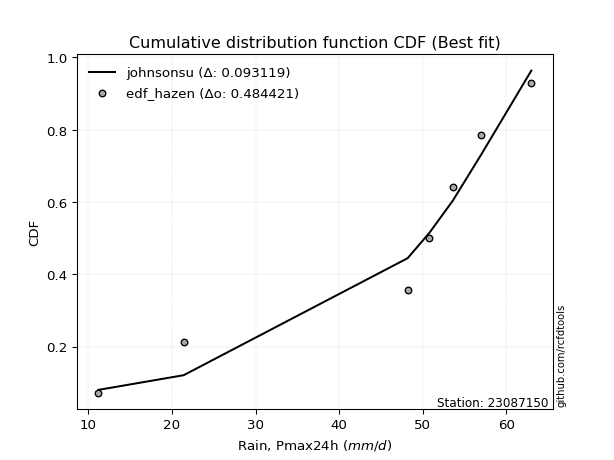</img>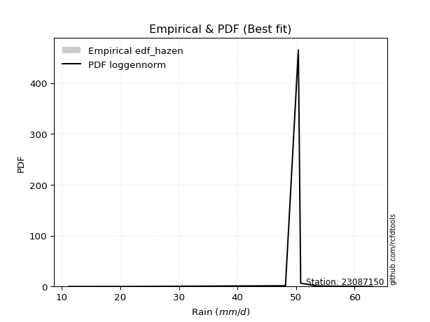</img>

</div>


### 3. Empirical - EDF Weibull (1939)

Weibull plotting position formula is an empirical method used to estimate the non-exceedance probability or plotting position for a set of observed data, is often recommended or widely used in practice, particularly in flood frequency analysis.

<div align="center">


$P=m/(n+1)$


</div>


**3.1. Empirical values**

<div align="center">

|                | 0                  | 1                  | 2                  | 3                  | 4                  | 5                  | 6                  | 7                  |
|:---------------|:-------------------|:-------------------|:-------------------|:-------------------|:-------------------|:-------------------|:-------------------|:-------------------|
| date           | 2023               | 2018               | 2019               | 2025               | 2024               | 2022               | 2020               | 2021               |
| x              | 11.2               | 21.4               | 48.2               | 50.4               | 50.8               | 53.6               | 57.0               | 63.0               |
| m              | 1                  | 2                  | 3                  | 4                  | 5                  | 6                  | 7                  | 8                  |
| empirical_dist | edf_weibull        | edf_weibull        | edf_weibull        | edf_weibull        | edf_weibull        | edf_weibull        | edf_weibull        | edf_weibull        |
| empirical      | 0.1111111111111111 | 0.2222222222222222 | 0.3333333333333333 | 0.4444444444444444 | 0.5555555555555556 | 0.6666666666666666 | 0.7777777777777778 | 0.8888888888888888 |
| empirical_tr   | 1.125              | 1.2857142857142856 | 1.4999999999999998 | 1.7999999999999998 | 2.25               | 2.9999999999999996 | 4.5                | 8.999999999999996  |

</div>


**3.2. Kolmogorov-Smirnov fit test (sorted by Δ)**


<div align="center">

|                | 0                  | 1                   | 2                   | 3                   | 4                   | 5                   | 6                   | 7                  | 8                  | 9                   | 10                  | 11                 | 12                  | 13                  | 14                  | 15                 | 16                    | 17                  | 18                 | 19                  | 20                 | 21                 | 22                 | 23                  | 24                 | 25                  | 26                 | 27                 | 28                 | 29                  | 30                  | 31                  | 32                 | 33                  | 34                  | 35                 | 36                 | 37                  | 38                  | 39                 | 40                  | 41                  | 42                  | 43                 | 44                 | 45                  | 46                  | 47                  | 48                 | 49                  | 50                  | 51                  | 52                  | 53                  | 54                  | 55                  | 56                 | 57                 | 58                 | 59                  | 60                 | 61                 | 62                  | 63                 | 64                 | 65                  | 66                  | 67                 | 68                 | 69                 | 70                 | 71                  | 72                 | 73                  | 74                  | 75                  | 76                 | 77                 | 78                  | 79                  | 80                  | 81                 | 82                  | 83                 | 84                 | 85                 | 86                  | 87                  | 88                 | 89                 |
|:---------------|:-------------------|:--------------------|:--------------------|:--------------------|:--------------------|:--------------------|:--------------------|:-------------------|:-------------------|:--------------------|:--------------------|:-------------------|:--------------------|:--------------------|:--------------------|:-------------------|:----------------------|:--------------------|:-------------------|:--------------------|:-------------------|:-------------------|:-------------------|:--------------------|:-------------------|:--------------------|:-------------------|:-------------------|:-------------------|:--------------------|:--------------------|:--------------------|:-------------------|:--------------------|:--------------------|:-------------------|:-------------------|:--------------------|:--------------------|:-------------------|:--------------------|:--------------------|:--------------------|:-------------------|:-------------------|:--------------------|:--------------------|:--------------------|:-------------------|:--------------------|:--------------------|:--------------------|:--------------------|:--------------------|:--------------------|:--------------------|:-------------------|:-------------------|:-------------------|:--------------------|:-------------------|:-------------------|:--------------------|:-------------------|:-------------------|:--------------------|:--------------------|:-------------------|:-------------------|:-------------------|:-------------------|:--------------------|:-------------------|:--------------------|:--------------------|:--------------------|:-------------------|:-------------------|:--------------------|:--------------------|:--------------------|:-------------------|:--------------------|:-------------------|:-------------------|:-------------------|:--------------------|:--------------------|:-------------------|:-------------------|
| station        | 23087150           | 23087150            | 23087150            | 23087150            | 23087150            | 23087150            | 23087150            | 23087150           | 23087150           | 23087150            | 23087150            | 23087150           | 23087150            | 23087150            | 23087150            | 23087150           | 23087150              | 23087150            | 23087150           | 23087150            | 23087150           | 23087150           | 23087150           | 23087150            | 23087150           | 23087150            | 23087150           | 23087150           | 23087150           | 23087150            | 23087150            | 23087150            | 23087150           | 23087150            | 23087150            | 23087150           | 23087150           | 23087150            | 23087150            | 23087150           | 23087150            | 23087150            | 23087150            | 23087150           | 23087150           | 23087150            | 23087150            | 23087150            | 23087150           | 23087150            | 23087150            | 23087150            | 23087150            | 23087150            | 23087150            | 23087150            | 23087150           | 23087150           | 23087150           | 23087150            | 23087150           | 23087150           | 23087150            | 23087150           | 23087150           | 23087150            | 23087150            | 23087150           | 23087150           | 23087150           | 23087150           | 23087150            | 23087150           | 23087150            | 23087150            | 23087150            | 23087150           | 23087150           | 23087150            | 23087150            | 23087150            | 23087150           | 23087150            | 23087150           | 23087150           | 23087150           | 23087150            | 23087150            | 23087150           | 23087150           |
| empirical_dist | edf_weibull        | edf_weibull         | edf_weibull         | edf_weibull         | edf_weibull         | edf_weibull         | edf_weibull         | edf_weibull        | edf_weibull        | edf_weibull         | edf_weibull         | edf_weibull        | edf_weibull         | edf_weibull         | edf_weibull         | edf_weibull        | edf_weibull           | edf_weibull         | edf_weibull        | edf_weibull         | edf_weibull        | edf_weibull        | edf_weibull        | edf_weibull         | edf_weibull        | edf_weibull         | edf_weibull        | edf_weibull        | edf_weibull        | edf_weibull         | edf_weibull         | edf_weibull         | edf_weibull        | edf_weibull         | edf_weibull         | edf_weibull        | edf_weibull        | edf_weibull         | edf_weibull         | edf_weibull        | edf_weibull         | edf_weibull         | edf_weibull         | edf_weibull        | edf_weibull        | edf_weibull         | edf_weibull         | edf_weibull         | edf_weibull        | edf_weibull         | edf_weibull         | edf_weibull         | edf_weibull         | edf_weibull         | edf_weibull         | edf_weibull         | edf_weibull        | edf_weibull        | edf_weibull        | edf_weibull         | edf_weibull        | edf_weibull        | edf_weibull         | edf_weibull        | edf_weibull        | edf_weibull         | edf_weibull         | edf_weibull        | edf_weibull        | edf_weibull        | edf_weibull        | edf_weibull         | edf_weibull        | edf_weibull         | edf_weibull         | edf_weibull         | edf_weibull        | edf_weibull        | edf_weibull         | edf_weibull         | edf_weibull         | edf_weibull        | edf_weibull         | edf_weibull        | edf_weibull        | edf_weibull        | edf_weibull         | edf_weibull         | edf_weibull        | edf_weibull        |
| p_dist         | johnsonsu          | logjohnsonsu        | genlogistic         | mielke              | logt                | laplace_asymmetric  | weibull_min         | gompertz           | fisk               | pearson3            | gumbel_l            | logpearson3        | logloggamma         | logmielke           | logfisk             | lognakagami        | loglaplace_asymmetric | t                   | exponnorm          | truncnorm           | norm               | crystalball        | nct                | nakagami            | f                  | loggumbel_l         | rice               | betaprime          | erlang             | gamma               | logistic            | logweibull_min      | chi2               | invgamma            | loggompertz         | hypsecant          | maxwell            | ncf                 | invgauss            | rayleigh           | loginvweibull       | laplace             | kstwobign           | loginvgauss        | logncf             | alpha               | logbetaprime        | logf                | lognct             | logfatiguelife      | lognorm             | lognorm             | logcrystalball      | logexponnorm        | logrice             | logalpha            | logerlang          | loggamma           | loggamma           | halfnorm            | loginvgamma        | gumbel_r           | loglogistic         | logkstwobign       | logmaxwell         | lograyleigh         | loghypsecant        | expon              | genexpon           | halflogistic       | loggenexpon        | moyal               | logexpon           | loghalfnorm         | loglaplace          | loggumbel_r         | loghalflogistic    | logmoyal           | pareto              | loglognorm          | wald                | logchi2            | logpareto           | invweibull         | gibrat             | logwald            | loggibrat           | fatiguelife         | logtruncnorm       | loggenlogistic     |
| delta          | 0.1208076151445927 | 0.12491174265803084 | 0.13950003089650143 | 0.15426847912731856 | 0.16707027500825636 | 0.16886685733299905 | 0.18148128046874085 | 0.1839648390008281 | 0.1868436642009857 | 0.19056626471345756 | 0.19195783987975373 | 0.230931513484196  | 0.23431950141787655 | 0.23467767625899433 | 0.23687321721309856 | 0.2378547953857199 | 0.251998933547079     | 0.25395795667543547 | 0.2539590620505299 | 0.25396047564583296 | 0.2539605070002105 | 0.2539605179618955 | 0.2539801147755774 | 0.25404176245175386 | 0.2554155796077702 | 0.25634941306150777 | 0.2604906815905907 | 0.2615358373983751 | 0.2631537229203548 | 0.26426628113931233 | 0.26537944133464303 | 0.26615246683379973 | 0.2674325114043928 | 0.27259455383668313 | 0.27264941251314906 | 0.2748182361324219 | 0.2815723834344395 | 0.28545983254044666 | 0.28987042246620337 | 0.2902145023433402 | 0.29796420784474414 | 0.30066134438183884 | 0.30282362296876625 | 0.3029475011997273 | 0.304263394852289  | 0.30472705962211183 | 0.30507940156543273 | 0.30512732660074343 | 0.3064307339497729 | 0.30715468098043824 | 0.30721103922080845 | 0.30721103922080845 | 0.30721106190321473 | 0.30721123822323443 | 0.30721550714221996 | 0.31278986886518273 | 0.312816314140196  | 0.3129340564909508 | 0.3129340564909508 | 0.31473969276409547 | 0.3173916055264023 | 0.3216757963909929 | 0.32431058350047276 | 0.3282462955423124 | 0.3298409928638139 | 0.33668681922613847 | 0.33773876600600056 | 0.3380232496622458 | 0.3380654990228403 | 0.3429060388199509 | 0.3429997332834626 | 0.34502652835565334 | 0.3539819735408373 | 0.35648750374596444 | 0.36611716401195066 | 0.36863237926830345 | 0.3847284709627084 | 0.3890722067226024 | 0.39795475930490787 | 0.40094798061862347 | 0.40997001622552837 | 0.4186857662928429 | 0.42242695351271486 | 0.4404200554706081 | 0.4412382324483403 | 0.446742898484151  | 0.47898576048673486 | 0.49366218432171133 | 0.5138671473146752 | 0.7777777777777778 |
| deltao         | 0.4472608134160001 | 0.4472608134160001  | 0.4472608134160001  | 0.4472608134160001  | 0.4472608134160001  | 0.4472608134160001  | 0.4472608134160001  | 0.4472608134160001 | 0.4472608134160001 | 0.4472608134160001  | 0.4472608134160001  | 0.4472608134160001 | 0.4472608134160001  | 0.4472608134160001  | 0.4472608134160001  | 0.4472608134160001 | 0.4472608134160001    | 0.4472608134160001  | 0.4472608134160001 | 0.4472608134160001  | 0.4472608134160001 | 0.4472608134160001 | 0.4472608134160001 | 0.4472608134160001  | 0.4472608134160001 | 0.4472608134160001  | 0.4472608134160001 | 0.4472608134160001 | 0.4472608134160001 | 0.4472608134160001  | 0.4472608134160001  | 0.4472608134160001  | 0.4472608134160001 | 0.4472608134160001  | 0.4472608134160001  | 0.4472608134160001 | 0.4472608134160001 | 0.4472608134160001  | 0.4472608134160001  | 0.4472608134160001 | 0.4472608134160001  | 0.4472608134160001  | 0.4472608134160001  | 0.4472608134160001 | 0.4472608134160001 | 0.4472608134160001  | 0.4472608134160001  | 0.4472608134160001  | 0.4472608134160001 | 0.4472608134160001  | 0.4472608134160001  | 0.4472608134160001  | 0.4472608134160001  | 0.4472608134160001  | 0.4472608134160001  | 0.4472608134160001  | 0.4472608134160001 | 0.4472608134160001 | 0.4472608134160001 | 0.4472608134160001  | 0.4472608134160001 | 0.4472608134160001 | 0.4472608134160001  | 0.4472608134160001 | 0.4472608134160001 | 0.4472608134160001  | 0.4472608134160001  | 0.4472608134160001 | 0.4472608134160001 | 0.4472608134160001 | 0.4472608134160001 | 0.4472608134160001  | 0.4472608134160001 | 0.4472608134160001  | 0.4472608134160001  | 0.4472608134160001  | 0.4472608134160001 | 0.4472608134160001 | 0.4472608134160001  | 0.4472608134160001  | 0.4472608134160001  | 0.4472608134160001 | 0.4472608134160001  | 0.4472608134160001 | 0.4472608134160001 | 0.4472608134160001 | 0.4472608134160001  | 0.4472608134160001  | 0.4472608134160001 | 0.4472608134160001 |
| eval           | Δo > Δ             | Δo > Δ              | Δo > Δ              | Δo > Δ              | Δo > Δ              | Δo > Δ              | Δo > Δ              | Δo > Δ             | Δo > Δ             | Δo > Δ              | Δo > Δ              | Δo > Δ             | Δo > Δ              | Δo > Δ              | Δo > Δ              | Δo > Δ             | Δo > Δ                | Δo > Δ              | Δo > Δ             | Δo > Δ              | Δo > Δ             | Δo > Δ             | Δo > Δ             | Δo > Δ              | Δo > Δ             | Δo > Δ              | Δo > Δ             | Δo > Δ             | Δo > Δ             | Δo > Δ              | Δo > Δ              | Δo > Δ              | Δo > Δ             | Δo > Δ              | Δo > Δ              | Δo > Δ             | Δo > Δ             | Δo > Δ              | Δo > Δ              | Δo > Δ             | Δo > Δ              | Δo > Δ              | Δo > Δ              | Δo > Δ             | Δo > Δ             | Δo > Δ              | Δo > Δ              | Δo > Δ              | Δo > Δ             | Δo > Δ              | Δo > Δ              | Δo > Δ              | Δo > Δ              | Δo > Δ              | Δo > Δ              | Δo > Δ              | Δo > Δ             | Δo > Δ             | Δo > Δ             | Δo > Δ              | Δo > Δ             | Δo > Δ             | Δo > Δ              | Δo > Δ             | Δo > Δ             | Δo > Δ              | Δo > Δ              | Δo > Δ             | Δo > Δ             | Δo > Δ             | Δo > Δ             | Δo > Δ              | Δo > Δ             | Δo > Δ              | Δo > Δ              | Δo > Δ              | Δo > Δ             | Δo > Δ             | Δo > Δ              | Δo > Δ              | Δo > Δ              | Δo > Δ             | Δo > Δ              | Δo > Δ             | Δo > Δ             | Δo > Δ             | Δo <= Δ             | Δo <= Δ             | Δo <= Δ            | Δo <= Δ            |
| fit            | 1                  | 1                   | 1                   | 1                   | 1                   | 1                   | 1                   | 1                  | 1                  | 1                   | 1                   | 1                  | 1                   | 1                   | 1                   | 1                  | 1                     | 1                   | 1                  | 1                   | 1                  | 1                  | 1                  | 1                   | 1                  | 1                   | 1                  | 1                  | 1                  | 1                   | 1                   | 1                   | 1                  | 1                   | 1                   | 1                  | 1                  | 1                   | 1                   | 1                  | 1                   | 1                   | 1                   | 1                  | 1                  | 1                   | 1                   | 1                   | 1                  | 1                   | 1                   | 1                   | 1                   | 1                   | 1                   | 1                   | 1                  | 1                  | 1                  | 1                   | 1                  | 1                  | 1                   | 1                  | 1                  | 1                   | 1                   | 1                  | 1                  | 1                  | 1                  | 1                   | 1                  | 1                   | 1                   | 1                   | 1                  | 1                  | 1                   | 1                   | 1                   | 1                  | 1                   | 1                  | 1                  | 1                  | 0                   | 0                   | 0                  | 0                  |
| n              | 8                  | 8                   | 8                   | 8                   | 8                   | 8                   | 8                   | 8                  | 8                  | 8                   | 8                   | 8                  | 8                   | 8                   | 8                   | 8                  | 8                     | 8                   | 8                  | 8                   | 8                  | 8                  | 8                  | 8                   | 8                  | 8                   | 8                  | 8                  | 8                  | 8                   | 8                   | 8                   | 8                  | 8                   | 8                   | 8                  | 8                  | 8                   | 8                   | 8                  | 8                   | 8                   | 8                   | 8                  | 8                  | 8                   | 8                   | 8                   | 8                  | 8                   | 8                   | 8                   | 8                   | 8                   | 8                   | 8                   | 8                  | 8                  | 8                  | 8                   | 8                  | 8                  | 8                   | 8                  | 8                  | 8                   | 8                   | 8                  | 8                  | 8                  | 8                  | 8                   | 8                  | 8                   | 8                   | 8                   | 8                  | 8                  | 8                   | 8                   | 8                   | 8                  | 8                   | 8                  | 8                  | 8                  | 8                   | 8                   | 8                  | 8                  |
| best_fit       | 1                  | 0                   | 0                   | 0                   | 0                   | 0                   | 0                   | 0                  | 0                  | 0                   | 0                   | 0                  | 0                   | 0                   | 0                   | 0                  | 0                     | 0                   | 0                  | 0                   | 0                  | 0                  | 0                  | 0                   | 0                  | 0                   | 0                  | 0                  | 0                  | 0                   | 0                   | 0                   | 0                  | 0                   | 0                   | 0                  | 0                  | 0                   | 0                   | 0                  | 0                   | 0                   | 0                   | 0                  | 0                  | 0                   | 0                   | 0                   | 0                  | 0                   | 0                   | 0                   | 0                   | 0                   | 0                   | 0                   | 0                  | 0                  | 0                  | 0                   | 0                  | 0                  | 0                   | 0                  | 0                  | 0                   | 0                   | 0                  | 0                  | 0                  | 0                  | 0                   | 0                  | 0                   | 0                   | 0                   | 0                  | 0                  | 0                   | 0                   | 0                   | 0                  | 0                   | 0                  | 0                  | 0                  | 0                   | 0                   | 0                  | 0                  |
| best_fit_sort  | 1                  | 2                   | 3                   | 4                   | 5                   | 6                   | 7                   | 8                  | 9                  | 10                  | 11                  | 12                 | 13                  | 14                  | 15                  | 16                 | 17                    | 18                  | 19                 | 20                  | 21                 | 22                 | 23                 | 24                  | 25                 | 26                  | 27                 | 28                 | 29                 | 30                  | 31                  | 32                  | 33                 | 34                  | 35                  | 36                 | 37                 | 38                  | 39                  | 40                 | 41                  | 42                  | 43                  | 44                 | 45                 | 46                  | 47                  | 48                  | 49                 | 50                  | 51                  | 52                  | 53                  | 54                  | 55                  | 56                  | 57                 | 58                 | 59                 | 60                  | 61                 | 62                 | 63                  | 64                 | 65                 | 66                  | 67                  | 68                 | 69                 | 70                 | 71                 | 72                  | 73                 | 74                  | 75                  | 76                  | 77                 | 78                 | 79                  | 80                  | 81                  | 82                 | 83                  | 84                 | 85                 | 86                 | 87                  | 88                  | 89                 | 90                 |

</div>


<div align="center">

</img>

</div>


**3.3. Best fit**

<div align="center">

|   id |   station | empirical_dist   | p_dist    |    delta |   deltao | eval   |   fit |   n |   best_fit |   best_fit_sort |
|-----:|----------:|:-----------------|:----------|---------:|---------:|:-------|------:|----:|-----------:|----------------:|
|    0 |  23087150 | edf_weibull      | johnsonsu | 0.120808 | 0.447261 | Δo > Δ |     1 |   8 |          1 |               1 |

</div>


<div align="center">

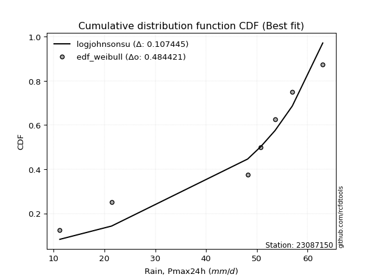</img>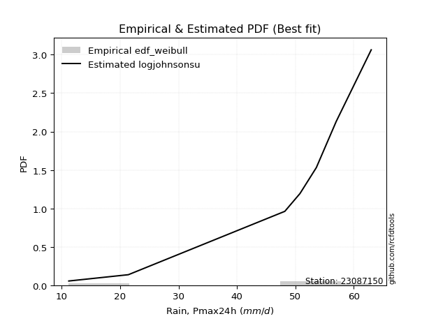</img>

</div>


### 4. Empirical - EDF Beard (1943)

The Beard formula (or Beard´s plotting position formula) in hydrology is used to estimate the empirical non-exceedance probability _(P)_ of a flood event (or other extreme hydrological data point) within a given dataset.

<div align="center">


$P=(m-0.31)/(n+0.38)$


</div>


**4.1. Empirical values**

<div align="center">

|                | 0                   | 1                   | 2                  | 3                   | 4                  | 5                  | 6                  | 7                  |
|:---------------|:--------------------|:--------------------|:-------------------|:--------------------|:-------------------|:-------------------|:-------------------|:-------------------|
| date           | 2023                | 2018                | 2019               | 2025                | 2024               | 2022               | 2020               | 2021               |
| x              | 11.2                | 21.4                | 48.2               | 50.4                | 50.8               | 53.6               | 57.0               | 63.0               |
| m              | 1                   | 2                   | 3                  | 4                   | 5                  | 6                  | 7                  | 8                  |
| empirical_dist | edf_beard           | edf_beard           | edf_beard          | edf_beard           | edf_beard          | edf_beard          | edf_beard          | edf_beard          |
| empirical      | 0.08233890214797135 | 0.20167064439140808 | 0.3210023866348448 | 0.44033412887828155 | 0.5596658711217184 | 0.6789976133651551 | 0.7983293556085919 | 0.9176610978520287 |
| empirical_tr   | 1.0897269180754225  | 1.2526158445440956  | 1.4727592267135323 | 1.7867803837953091  | 2.2710027100271004 | 3.115241635687732  | 4.958579881656804  | 12.144927536231886 |

</div>


**4.2. Kolmogorov-Smirnov fit test (sorted by Δ)**


<div align="center">

|                | 0                   | 1                   | 2                   | 3                   | 4                   | 5                   | 6                   | 7                  | 8                  | 9                   | 10                  | 11                 | 12                  | 13                  | 14                  | 15                 | 16                    | 17                  | 18                 | 19                  | 20                 | 21                 | 22                 | 23                  | 24                 | 25                  | 26                 | 27                 | 28                 | 29                  | 30                  | 31                 | 32                 | 33                 | 34                  | 35                 | 36                 | 37                  | 38                  | 39                 | 40                  | 41                  | 42                  | 43                 | 44                 | 45                 | 46                 | 47                  | 48                 | 49                  | 50                  | 51                  | 52                  | 53                 | 54                  | 55                  | 56                 | 57                 | 58                 | 59                  | 60                 | 61                 | 62                  | 63                 | 64                 | 65                  | 66                  | 67                 | 68                 | 69                 | 70                 | 71                  | 72                 | 73                  | 74                  | 75                  | 76                 | 77                 | 78                 | 79                 | 80                  | 81                 | 82                 | 83                 | 84                 | 85                 | 86                  | 87                 | 88                 | 89                 |
|:---------------|:--------------------|:--------------------|:--------------------|:--------------------|:--------------------|:--------------------|:--------------------|:-------------------|:-------------------|:--------------------|:--------------------|:-------------------|:--------------------|:--------------------|:--------------------|:-------------------|:----------------------|:--------------------|:-------------------|:--------------------|:-------------------|:-------------------|:-------------------|:--------------------|:-------------------|:--------------------|:-------------------|:-------------------|:-------------------|:--------------------|:--------------------|:-------------------|:-------------------|:-------------------|:--------------------|:-------------------|:-------------------|:--------------------|:--------------------|:-------------------|:--------------------|:--------------------|:--------------------|:-------------------|:-------------------|:-------------------|:-------------------|:--------------------|:-------------------|:--------------------|:--------------------|:--------------------|:--------------------|:-------------------|:--------------------|:--------------------|:-------------------|:-------------------|:-------------------|:--------------------|:-------------------|:-------------------|:--------------------|:-------------------|:-------------------|:--------------------|:--------------------|:-------------------|:-------------------|:-------------------|:-------------------|:--------------------|:-------------------|:--------------------|:--------------------|:--------------------|:-------------------|:-------------------|:-------------------|:-------------------|:--------------------|:-------------------|:-------------------|:-------------------|:-------------------|:-------------------|:--------------------|:-------------------|:-------------------|:-------------------|
| station        | 23087150            | 23087150            | 23087150            | 23087150            | 23087150            | 23087150            | 23087150            | 23087150           | 23087150           | 23087150            | 23087150            | 23087150           | 23087150            | 23087150            | 23087150            | 23087150           | 23087150              | 23087150            | 23087150           | 23087150            | 23087150           | 23087150           | 23087150           | 23087150            | 23087150           | 23087150            | 23087150           | 23087150           | 23087150           | 23087150            | 23087150            | 23087150           | 23087150           | 23087150           | 23087150            | 23087150           | 23087150           | 23087150            | 23087150            | 23087150           | 23087150            | 23087150            | 23087150            | 23087150           | 23087150           | 23087150           | 23087150           | 23087150            | 23087150           | 23087150            | 23087150            | 23087150            | 23087150            | 23087150           | 23087150            | 23087150            | 23087150           | 23087150           | 23087150           | 23087150            | 23087150           | 23087150           | 23087150            | 23087150           | 23087150           | 23087150            | 23087150            | 23087150           | 23087150           | 23087150           | 23087150           | 23087150            | 23087150           | 23087150            | 23087150            | 23087150            | 23087150           | 23087150           | 23087150           | 23087150           | 23087150            | 23087150           | 23087150           | 23087150           | 23087150           | 23087150           | 23087150            | 23087150           | 23087150           | 23087150           |
| empirical_dist | edf_beard           | edf_beard           | edf_beard           | edf_beard           | edf_beard           | edf_beard           | edf_beard           | edf_beard          | edf_beard          | edf_beard           | edf_beard           | edf_beard          | edf_beard           | edf_beard           | edf_beard           | edf_beard          | edf_beard             | edf_beard           | edf_beard          | edf_beard           | edf_beard          | edf_beard          | edf_beard          | edf_beard           | edf_beard          | edf_beard           | edf_beard          | edf_beard          | edf_beard          | edf_beard           | edf_beard           | edf_beard          | edf_beard          | edf_beard          | edf_beard           | edf_beard          | edf_beard          | edf_beard           | edf_beard           | edf_beard          | edf_beard           | edf_beard           | edf_beard           | edf_beard          | edf_beard          | edf_beard          | edf_beard          | edf_beard           | edf_beard          | edf_beard           | edf_beard           | edf_beard           | edf_beard           | edf_beard          | edf_beard           | edf_beard           | edf_beard          | edf_beard          | edf_beard          | edf_beard           | edf_beard          | edf_beard          | edf_beard           | edf_beard          | edf_beard          | edf_beard           | edf_beard           | edf_beard          | edf_beard          | edf_beard          | edf_beard          | edf_beard           | edf_beard          | edf_beard           | edf_beard           | edf_beard           | edf_beard          | edf_beard          | edf_beard          | edf_beard          | edf_beard           | edf_beard          | edf_beard          | edf_beard          | edf_beard          | edf_beard          | edf_beard           | edf_beard          | edf_beard          | edf_beard          |
| p_dist         | johnsonsu           | logjohnsonsu        | logt                | genlogistic         | mielke              | laplace_asymmetric  | weibull_min         | gompertz           | fisk               | pearson3            | gumbel_l            | logpearson3        | logloggamma         | logmielke           | logfisk             | lognakagami        | loglaplace_asymmetric | t                   | exponnorm          | truncnorm           | norm               | crystalball        | nct                | nakagami            | f                  | loggumbel_l         | rice               | betaprime          | erlang             | gamma               | logistic            | logweibull_min     | chi2               | invgamma           | loggompertz         | hypsecant          | maxwell            | ncf                 | invgauss            | rayleigh           | loginvweibull       | laplace             | kstwobign           | loginvgauss        | logncf             | alpha              | logbetaprime       | logf                | lognct             | logfatiguelife      | lognorm             | lognorm             | logcrystalball      | logexponnorm       | logrice             | logalpha            | logerlang          | loggamma           | loggamma           | halfnorm            | loginvgamma        | gumbel_r           | loglogistic         | logkstwobign       | logmaxwell         | lograyleigh         | loghypsecant        | expon              | genexpon           | halflogistic       | loggenexpon        | moyal               | logexpon           | loghalfnorm         | loglaplace          | loggumbel_r         | loghalflogistic    | logmoyal           | pareto             | loglognorm         | wald                | logchi2            | logpareto          | gibrat             | logwald            | invweibull         | loggibrat           | fatiguelife        | logtruncnorm       | loggenlogistic     |
| delta          | 0.12701918744666446 | 0.13724268935651934 | 0.14651869717744223 | 0.15183097759498992 | 0.16659942582580706 | 0.18119780403148755 | 0.19381222716722935 | 0.1962957856993166 | 0.1991746108994742 | 0.20289721141194605 | 0.20428878657824223 | 0.2432624601826845 | 0.24665044811636505 | 0.24700862295748283 | 0.24920416391158706 | 0.2501857420842084 | 0.2643298802455675    | 0.26628890337392397 | 0.2662900087490184 | 0.26629142234432146 | 0.266291453698699  | 0.266291464660384  | 0.2663110614740659 | 0.26637270915024236 | 0.2677465263062587 | 0.26868035975999627 | 0.2728216282890792 | 0.2738667840968636 | 0.2754846696188433 | 0.27659722783780083 | 0.27771038803313153 | 0.2784834135322882 | 0.2797634581028813 | 0.2849255005351716 | 0.28498035921163756 | 0.2871491828309104 | 0.293903330132928  | 0.29779077923893515 | 0.30220136916469187 | 0.3025454490418287 | 0.31029515454323264 | 0.31299229108032733 | 0.31515456966725475 | 0.3152784478982158 | 0.3165943415507775 | 0.3170580063206003 | 0.3174103482639212 | 0.31745827329923193 | 0.3187616806482614 | 0.31948562767892674 | 0.31954198591929694 | 0.31954198591929694 | 0.31954200860170323 | 0.3195421849217229 | 0.31954645384070846 | 0.32512081556367123 | 0.3251472608386845 | 0.3252650031894393 | 0.3252650031894393 | 0.32707063946258397 | 0.3297225522248908 | 0.3340067430894814 | 0.33664153019896126 | 0.3405772422408009 | 0.3421719395623024 | 0.34901776592462697 | 0.35006971270448906 | 0.3503541963607343 | 0.3503964457213288 | 0.3552369855184394 | 0.3553306799819511 | 0.35735747505414184 | 0.3663129202393258 | 0.36881845044445294 | 0.37844811071043916 | 0.38096332596679194 | 0.3970594176611969 | 0.4014031534210909 | 0.418506337135722  | 0.4214995584494376 | 0.42230096292401686 | 0.4310167129913314 | 0.442978531343529  | 0.4535691791468288 | 0.4590738451826395 | 0.4691922644337479 | 0.49131670718522336 | 0.5059931310201998 | 0.5261980940131636 | 0.7983293556085919 |
| deltao         | 0.4472608134160001  | 0.4472608134160001  | 0.4472608134160001  | 0.4472608134160001  | 0.4472608134160001  | 0.4472608134160001  | 0.4472608134160001  | 0.4472608134160001 | 0.4472608134160001 | 0.4472608134160001  | 0.4472608134160001  | 0.4472608134160001 | 0.4472608134160001  | 0.4472608134160001  | 0.4472608134160001  | 0.4472608134160001 | 0.4472608134160001    | 0.4472608134160001  | 0.4472608134160001 | 0.4472608134160001  | 0.4472608134160001 | 0.4472608134160001 | 0.4472608134160001 | 0.4472608134160001  | 0.4472608134160001 | 0.4472608134160001  | 0.4472608134160001 | 0.4472608134160001 | 0.4472608134160001 | 0.4472608134160001  | 0.4472608134160001  | 0.4472608134160001 | 0.4472608134160001 | 0.4472608134160001 | 0.4472608134160001  | 0.4472608134160001 | 0.4472608134160001 | 0.4472608134160001  | 0.4472608134160001  | 0.4472608134160001 | 0.4472608134160001  | 0.4472608134160001  | 0.4472608134160001  | 0.4472608134160001 | 0.4472608134160001 | 0.4472608134160001 | 0.4472608134160001 | 0.4472608134160001  | 0.4472608134160001 | 0.4472608134160001  | 0.4472608134160001  | 0.4472608134160001  | 0.4472608134160001  | 0.4472608134160001 | 0.4472608134160001  | 0.4472608134160001  | 0.4472608134160001 | 0.4472608134160001 | 0.4472608134160001 | 0.4472608134160001  | 0.4472608134160001 | 0.4472608134160001 | 0.4472608134160001  | 0.4472608134160001 | 0.4472608134160001 | 0.4472608134160001  | 0.4472608134160001  | 0.4472608134160001 | 0.4472608134160001 | 0.4472608134160001 | 0.4472608134160001 | 0.4472608134160001  | 0.4472608134160001 | 0.4472608134160001  | 0.4472608134160001  | 0.4472608134160001  | 0.4472608134160001 | 0.4472608134160001 | 0.4472608134160001 | 0.4472608134160001 | 0.4472608134160001  | 0.4472608134160001 | 0.4472608134160001 | 0.4472608134160001 | 0.4472608134160001 | 0.4472608134160001 | 0.4472608134160001  | 0.4472608134160001 | 0.4472608134160001 | 0.4472608134160001 |
| eval           | Δo > Δ              | Δo > Δ              | Δo > Δ              | Δo > Δ              | Δo > Δ              | Δo > Δ              | Δo > Δ              | Δo > Δ             | Δo > Δ             | Δo > Δ              | Δo > Δ              | Δo > Δ             | Δo > Δ              | Δo > Δ              | Δo > Δ              | Δo > Δ             | Δo > Δ                | Δo > Δ              | Δo > Δ             | Δo > Δ              | Δo > Δ             | Δo > Δ             | Δo > Δ             | Δo > Δ              | Δo > Δ             | Δo > Δ              | Δo > Δ             | Δo > Δ             | Δo > Δ             | Δo > Δ              | Δo > Δ              | Δo > Δ             | Δo > Δ             | Δo > Δ             | Δo > Δ              | Δo > Δ             | Δo > Δ             | Δo > Δ              | Δo > Δ              | Δo > Δ             | Δo > Δ              | Δo > Δ              | Δo > Δ              | Δo > Δ             | Δo > Δ             | Δo > Δ             | Δo > Δ             | Δo > Δ              | Δo > Δ             | Δo > Δ              | Δo > Δ              | Δo > Δ              | Δo > Δ              | Δo > Δ             | Δo > Δ              | Δo > Δ              | Δo > Δ             | Δo > Δ             | Δo > Δ             | Δo > Δ              | Δo > Δ             | Δo > Δ             | Δo > Δ              | Δo > Δ             | Δo > Δ             | Δo > Δ              | Δo > Δ              | Δo > Δ             | Δo > Δ             | Δo > Δ             | Δo > Δ             | Δo > Δ              | Δo > Δ             | Δo > Δ              | Δo > Δ              | Δo > Δ              | Δo > Δ             | Δo > Δ             | Δo > Δ             | Δo > Δ             | Δo > Δ              | Δo > Δ             | Δo > Δ             | Δo <= Δ            | Δo <= Δ            | Δo <= Δ            | Δo <= Δ             | Δo <= Δ            | Δo <= Δ            | Δo <= Δ            |
| fit            | 1                   | 1                   | 1                   | 1                   | 1                   | 1                   | 1                   | 1                  | 1                  | 1                   | 1                   | 1                  | 1                   | 1                   | 1                   | 1                  | 1                     | 1                   | 1                  | 1                   | 1                  | 1                  | 1                  | 1                   | 1                  | 1                   | 1                  | 1                  | 1                  | 1                   | 1                   | 1                  | 1                  | 1                  | 1                   | 1                  | 1                  | 1                   | 1                   | 1                  | 1                   | 1                   | 1                   | 1                  | 1                  | 1                  | 1                  | 1                   | 1                  | 1                   | 1                   | 1                   | 1                   | 1                  | 1                   | 1                   | 1                  | 1                  | 1                  | 1                   | 1                  | 1                  | 1                   | 1                  | 1                  | 1                   | 1                   | 1                  | 1                  | 1                  | 1                  | 1                   | 1                  | 1                   | 1                   | 1                   | 1                  | 1                  | 1                  | 1                  | 1                   | 1                  | 1                  | 0                  | 0                  | 0                  | 0                   | 0                  | 0                  | 0                  |
| n              | 8                   | 8                   | 8                   | 8                   | 8                   | 8                   | 8                   | 8                  | 8                  | 8                   | 8                   | 8                  | 8                   | 8                   | 8                   | 8                  | 8                     | 8                   | 8                  | 8                   | 8                  | 8                  | 8                  | 8                   | 8                  | 8                   | 8                  | 8                  | 8                  | 8                   | 8                   | 8                  | 8                  | 8                  | 8                   | 8                  | 8                  | 8                   | 8                   | 8                  | 8                   | 8                   | 8                   | 8                  | 8                  | 8                  | 8                  | 8                   | 8                  | 8                   | 8                   | 8                   | 8                   | 8                  | 8                   | 8                   | 8                  | 8                  | 8                  | 8                   | 8                  | 8                  | 8                   | 8                  | 8                  | 8                   | 8                   | 8                  | 8                  | 8                  | 8                  | 8                   | 8                  | 8                   | 8                   | 8                   | 8                  | 8                  | 8                  | 8                  | 8                   | 8                  | 8                  | 8                  | 8                  | 8                  | 8                   | 8                  | 8                  | 8                  |
| best_fit       | 1                   | 0                   | 0                   | 0                   | 0                   | 0                   | 0                   | 0                  | 0                  | 0                   | 0                   | 0                  | 0                   | 0                   | 0                   | 0                  | 0                     | 0                   | 0                  | 0                   | 0                  | 0                  | 0                  | 0                   | 0                  | 0                   | 0                  | 0                  | 0                  | 0                   | 0                   | 0                  | 0                  | 0                  | 0                   | 0                  | 0                  | 0                   | 0                   | 0                  | 0                   | 0                   | 0                   | 0                  | 0                  | 0                  | 0                  | 0                   | 0                  | 0                   | 0                   | 0                   | 0                   | 0                  | 0                   | 0                   | 0                  | 0                  | 0                  | 0                   | 0                  | 0                  | 0                   | 0                  | 0                  | 0                   | 0                   | 0                  | 0                  | 0                  | 0                  | 0                   | 0                  | 0                   | 0                   | 0                   | 0                  | 0                  | 0                  | 0                  | 0                   | 0                  | 0                  | 0                  | 0                  | 0                  | 0                   | 0                  | 0                  | 0                  |
| best_fit_sort  | 1                   | 2                   | 3                   | 4                   | 5                   | 6                   | 7                   | 8                  | 9                  | 10                  | 11                  | 12                 | 13                  | 14                  | 15                  | 16                 | 17                    | 18                  | 19                 | 20                  | 21                 | 22                 | 23                 | 24                  | 25                 | 26                  | 27                 | 28                 | 29                 | 30                  | 31                  | 32                 | 33                 | 34                 | 35                  | 36                 | 37                 | 38                  | 39                  | 40                 | 41                  | 42                  | 43                  | 44                 | 45                 | 46                 | 47                 | 48                  | 49                 | 50                  | 51                  | 52                  | 53                  | 54                 | 55                  | 56                  | 57                 | 58                 | 59                 | 60                  | 61                 | 62                 | 63                  | 64                 | 65                 | 66                  | 67                  | 68                 | 69                 | 70                 | 71                 | 72                  | 73                 | 74                  | 75                  | 76                  | 77                 | 78                 | 79                 | 80                 | 81                  | 82                 | 83                 | 84                 | 85                 | 86                 | 87                  | 88                 | 89                 | 90                 |

</div>


<div align="center">

</img>

</div>


**4.3. Best fit**

<div align="center">

|   id |   station | empirical_dist   | p_dist    |    delta |   deltao | eval   |   fit |   n |   best_fit |   best_fit_sort |
|-----:|----------:|:-----------------|:----------|---------:|---------:|:-------|------:|----:|-----------:|----------------:|
|    0 |  23087150 | edf_beard        | johnsonsu | 0.127019 | 0.447261 | Δo > Δ |     1 |   8 |          1 |               1 |

</div>


<div align="center">

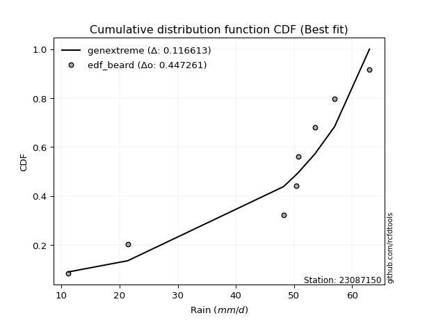</img>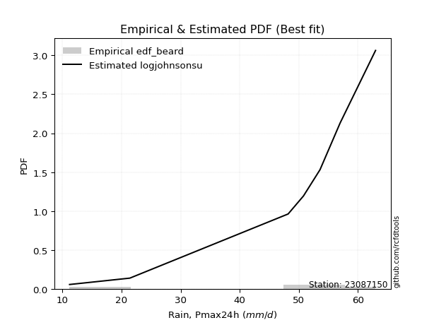</img>

</div>


### 5. Empirical - EDF Chegodayev (1955)

The Chegodayev formula is an empirical plotting position formula used in hydrological frequency analysis to estimate the exceedance probability or return period of a specific event from a set of observed data. It is primarily used for plotting observed data points on probability paper to fit a theoretical distribution, particularly for analyzing extreme events like maximum flood flows or rainfall intensities. The constant _b_ value in the generalized plotting position formula is 0.3.

<div align="center">


$P=(m-b)/(n+1-2b)$


</div>


**5.1. Empirical values**

<div align="center">

|                | 0                   | 1                   | 2                   | 3                   | 4                  | 5                  | 6                  | 7                  |
|:---------------|:--------------------|:--------------------|:--------------------|:--------------------|:-------------------|:-------------------|:-------------------|:-------------------|
| date           | 2023                | 2018                | 2019                | 2025                | 2024               | 2022               | 2020               | 2021               |
| x              | 11.2                | 21.4                | 48.2                | 50.4                | 50.8               | 53.6               | 57.0               | 63.0               |
| m              | 1                   | 2                   | 3                   | 4                   | 5                  | 6                  | 7                  | 8                  |
| empirical_dist | edf_chegodayev      | edf_chegodayev      | edf_chegodayev      | edf_chegodayev      | edf_chegodayev     | edf_chegodayev     | edf_chegodayev     | edf_chegodayev     |
| empirical      | 0.08333333333333333 | 0.20238095238095236 | 0.32142857142857145 | 0.44047619047619047 | 0.5595238095238095 | 0.6785714285714286 | 0.7976190476190476 | 0.9166666666666666 |
| empirical_tr   | 1.090909090909091   | 1.253731343283582   | 1.4736842105263157  | 1.7872340425531914  | 2.27027027027027   | 3.1111111111111116 | 4.941176470588234  | 11.999999999999995 |

</div>


**5.2. Kolmogorov-Smirnov fit test (sorted by Δ)**


<div align="center">

|                | 0                   | 1                  | 2                  | 3                  | 4                   | 5                   | 6                  | 7                   | 8                   | 9                   | 10                 | 11                  | 12                  | 13                 | 14                  | 15                  | 16                    | 17                  | 18                 | 19                 | 20                  | 21                  | 22                 | 23                 | 24                 | 25                  | 26                  | 27                  | 28                 | 29                 | 30                 | 31                 | 32                  | 33                 | 34                 | 35                  | 36                 | 37                 | 38                  | 39                  | 40                 | 41                 | 42                 | 43                  | 44                  | 45                 | 46                 | 47                 | 48                  | 49                 | 50                 | 51                 | 52                 | 53                 | 54                 | 55                 | 56                  | 57                  | 58                  | 59                  | 60                  | 61                 | 62                 | 63                  | 64                  | 65                  | 66                 | 67                  | 68                  | 69                  | 70                 | 71                 | 72                 | 73                 | 74                 | 75                 | 76                  | 77                  | 78                  | 79                  | 80                  | 81                  | 82                  | 83                 | 84                  | 85                 | 86                 | 87                 | 88                 | 89                 |
|:---------------|:--------------------|:-------------------|:-------------------|:-------------------|:--------------------|:--------------------|:-------------------|:--------------------|:--------------------|:--------------------|:-------------------|:--------------------|:--------------------|:-------------------|:--------------------|:--------------------|:----------------------|:--------------------|:-------------------|:-------------------|:--------------------|:--------------------|:-------------------|:-------------------|:-------------------|:--------------------|:--------------------|:--------------------|:-------------------|:-------------------|:-------------------|:-------------------|:--------------------|:-------------------|:-------------------|:--------------------|:-------------------|:-------------------|:--------------------|:--------------------|:-------------------|:-------------------|:-------------------|:--------------------|:--------------------|:-------------------|:-------------------|:-------------------|:--------------------|:-------------------|:-------------------|:-------------------|:-------------------|:-------------------|:-------------------|:-------------------|:--------------------|:--------------------|:--------------------|:--------------------|:--------------------|:-------------------|:-------------------|:--------------------|:--------------------|:--------------------|:-------------------|:--------------------|:--------------------|:--------------------|:-------------------|:-------------------|:-------------------|:-------------------|:-------------------|:-------------------|:--------------------|:--------------------|:--------------------|:--------------------|:--------------------|:--------------------|:--------------------|:-------------------|:--------------------|:-------------------|:-------------------|:-------------------|:-------------------|:-------------------|
| station        | 23087150            | 23087150           | 23087150           | 23087150           | 23087150            | 23087150            | 23087150           | 23087150            | 23087150            | 23087150            | 23087150           | 23087150            | 23087150            | 23087150           | 23087150            | 23087150            | 23087150              | 23087150            | 23087150           | 23087150           | 23087150            | 23087150            | 23087150           | 23087150           | 23087150           | 23087150            | 23087150            | 23087150            | 23087150           | 23087150           | 23087150           | 23087150           | 23087150            | 23087150           | 23087150           | 23087150            | 23087150           | 23087150           | 23087150            | 23087150            | 23087150           | 23087150           | 23087150           | 23087150            | 23087150            | 23087150           | 23087150           | 23087150           | 23087150            | 23087150           | 23087150           | 23087150           | 23087150           | 23087150           | 23087150           | 23087150           | 23087150            | 23087150            | 23087150            | 23087150            | 23087150            | 23087150           | 23087150           | 23087150            | 23087150            | 23087150            | 23087150           | 23087150            | 23087150            | 23087150            | 23087150           | 23087150           | 23087150           | 23087150           | 23087150           | 23087150           | 23087150            | 23087150            | 23087150            | 23087150            | 23087150            | 23087150            | 23087150            | 23087150           | 23087150            | 23087150           | 23087150           | 23087150           | 23087150           | 23087150           |
| empirical_dist | edf_chegodayev      | edf_chegodayev     | edf_chegodayev     | edf_chegodayev     | edf_chegodayev      | edf_chegodayev      | edf_chegodayev     | edf_chegodayev      | edf_chegodayev      | edf_chegodayev      | edf_chegodayev     | edf_chegodayev      | edf_chegodayev      | edf_chegodayev     | edf_chegodayev      | edf_chegodayev      | edf_chegodayev        | edf_chegodayev      | edf_chegodayev     | edf_chegodayev     | edf_chegodayev      | edf_chegodayev      | edf_chegodayev     | edf_chegodayev     | edf_chegodayev     | edf_chegodayev      | edf_chegodayev      | edf_chegodayev      | edf_chegodayev     | edf_chegodayev     | edf_chegodayev     | edf_chegodayev     | edf_chegodayev      | edf_chegodayev     | edf_chegodayev     | edf_chegodayev      | edf_chegodayev     | edf_chegodayev     | edf_chegodayev      | edf_chegodayev      | edf_chegodayev     | edf_chegodayev     | edf_chegodayev     | edf_chegodayev      | edf_chegodayev      | edf_chegodayev     | edf_chegodayev     | edf_chegodayev     | edf_chegodayev      | edf_chegodayev     | edf_chegodayev     | edf_chegodayev     | edf_chegodayev     | edf_chegodayev     | edf_chegodayev     | edf_chegodayev     | edf_chegodayev      | edf_chegodayev      | edf_chegodayev      | edf_chegodayev      | edf_chegodayev      | edf_chegodayev     | edf_chegodayev     | edf_chegodayev      | edf_chegodayev      | edf_chegodayev      | edf_chegodayev     | edf_chegodayev      | edf_chegodayev      | edf_chegodayev      | edf_chegodayev     | edf_chegodayev     | edf_chegodayev     | edf_chegodayev     | edf_chegodayev     | edf_chegodayev     | edf_chegodayev      | edf_chegodayev      | edf_chegodayev      | edf_chegodayev      | edf_chegodayev      | edf_chegodayev      | edf_chegodayev      | edf_chegodayev     | edf_chegodayev      | edf_chegodayev     | edf_chegodayev     | edf_chegodayev     | edf_chegodayev     | edf_chegodayev     |
| p_dist         | johnsonsu           | logjohnsonsu       | logt               | genlogistic        | mielke              | laplace_asymmetric  | weibull_min        | gompertz            | fisk                | pearson3            | gumbel_l           | logpearson3         | logloggamma         | logmielke          | logfisk             | lognakagami         | loglaplace_asymmetric | t                   | exponnorm          | truncnorm          | norm                | crystalball         | nct                | nakagami           | f                  | loggumbel_l         | rice                | betaprime           | erlang             | gamma              | logistic           | logweibull_min     | chi2                | invgamma           | loggompertz        | hypsecant           | maxwell            | ncf                | invgauss            | rayleigh            | loginvweibull      | laplace            | kstwobign          | loginvgauss         | logncf              | alpha              | logbetaprime       | logf               | lognct              | logfatiguelife     | lognorm            | lognorm            | logcrystalball     | logexponnorm       | logrice            | logalpha           | logerlang           | loggamma            | loggamma            | halfnorm            | loginvgamma         | gumbel_r           | loglogistic        | logkstwobign        | logmaxwell          | lograyleigh         | loghypsecant       | expon               | genexpon            | halflogistic        | loggenexpon        | moyal              | logexpon           | loghalfnorm        | loglaplace         | loggumbel_r        | loghalflogistic     | logmoyal            | pareto              | loglognorm          | wald                | logchi2             | logpareto           | gibrat             | logwald             | invweibull         | loggibrat          | fatiguelife        | logtruncnorm       | loggenlogistic     |
| delta          | 0.12659300265293782 | 0.1368165045627927 | 0.1472290051669865 | 0.1514047928012633 | 0.16617324103208042 | 0.18077161923776092 | 0.1933860423735027 | 0.19586960090558997 | 0.19874842610574756 | 0.20247102661821942 | 0.2038626017845156 | 0.24283627538895786 | 0.24622426332263841 | 0.2465824381637562 | 0.24877797911786043 | 0.24975955729048177 | 0.26390369545184084   | 0.26586271858019733 | 0.2658638239552918 | 0.2658652375505948 | 0.26586526890497236 | 0.26586527986665737 | 0.2658848766803393 | 0.2659465243565157 | 0.2673203415125321 | 0.26825417496626963 | 0.27239544349535255 | 0.27344059930313697 | 0.2750584848251167 | 0.2761710430440742 | 0.2772842032394049 | 0.2780572287385616 | 0.27933727330915464 | 0.284499315741445  | 0.2845541744179109 | 0.28672299803718376 | 0.2934771453392014 | 0.2973645944452085 | 0.30177518437096523 | 0.30211926424810204 | 0.309868969749506  | 0.3125661062866007 | 0.3147283848735281 | 0.31485226310448916 | 0.31616815675705084 | 0.3166318215268737 | 0.3169841634701946 | 0.3170320885055053 | 0.31833549585453474 | 0.3190594428852001 | 0.3191158011255703 | 0.3191158011255703 | 0.3191158238079766 | 0.3191160001279963 | 0.3191202690469818 | 0.3246946307699446 | 0.32472107604495787 | 0.32483881839571266 | 0.32483881839571266 | 0.32664445466885733 | 0.32929636743116414 | 0.3335805582957548 | 0.3362153454052346 | 0.34015105744707425 | 0.34174575476857577 | 0.34859158113090033 | 0.3496435279107624 | 0.34992801156700765 | 0.34997026092760214 | 0.35481080072471277 | 0.3549044951882245 | 0.3569312902604152 | 0.3658867354455992 | 0.3683922656507263 | 0.3780219259167125 | 0.3805371411730653 | 0.39663323286747026 | 0.40097696862736426 | 0.41779602914617775 | 0.42078925045989335 | 0.42187477813029023 | 0.43059052819760474 | 0.44226822335398475 | 0.4531429943531022 | 0.45864766038891286 | 0.4681978332483859 | 0.4908905223914967 | 0.5055669462264731 | 0.5257719092194371 | 0.7976190476190476 |
| deltao         | 0.4472608134160001  | 0.4472608134160001 | 0.4472608134160001 | 0.4472608134160001 | 0.4472608134160001  | 0.4472608134160001  | 0.4472608134160001 | 0.4472608134160001  | 0.4472608134160001  | 0.4472608134160001  | 0.4472608134160001 | 0.4472608134160001  | 0.4472608134160001  | 0.4472608134160001 | 0.4472608134160001  | 0.4472608134160001  | 0.4472608134160001    | 0.4472608134160001  | 0.4472608134160001 | 0.4472608134160001 | 0.4472608134160001  | 0.4472608134160001  | 0.4472608134160001 | 0.4472608134160001 | 0.4472608134160001 | 0.4472608134160001  | 0.4472608134160001  | 0.4472608134160001  | 0.4472608134160001 | 0.4472608134160001 | 0.4472608134160001 | 0.4472608134160001 | 0.4472608134160001  | 0.4472608134160001 | 0.4472608134160001 | 0.4472608134160001  | 0.4472608134160001 | 0.4472608134160001 | 0.4472608134160001  | 0.4472608134160001  | 0.4472608134160001 | 0.4472608134160001 | 0.4472608134160001 | 0.4472608134160001  | 0.4472608134160001  | 0.4472608134160001 | 0.4472608134160001 | 0.4472608134160001 | 0.4472608134160001  | 0.4472608134160001 | 0.4472608134160001 | 0.4472608134160001 | 0.4472608134160001 | 0.4472608134160001 | 0.4472608134160001 | 0.4472608134160001 | 0.4472608134160001  | 0.4472608134160001  | 0.4472608134160001  | 0.4472608134160001  | 0.4472608134160001  | 0.4472608134160001 | 0.4472608134160001 | 0.4472608134160001  | 0.4472608134160001  | 0.4472608134160001  | 0.4472608134160001 | 0.4472608134160001  | 0.4472608134160001  | 0.4472608134160001  | 0.4472608134160001 | 0.4472608134160001 | 0.4472608134160001 | 0.4472608134160001 | 0.4472608134160001 | 0.4472608134160001 | 0.4472608134160001  | 0.4472608134160001  | 0.4472608134160001  | 0.4472608134160001  | 0.4472608134160001  | 0.4472608134160001  | 0.4472608134160001  | 0.4472608134160001 | 0.4472608134160001  | 0.4472608134160001 | 0.4472608134160001 | 0.4472608134160001 | 0.4472608134160001 | 0.4472608134160001 |
| eval           | Δo > Δ              | Δo > Δ             | Δo > Δ             | Δo > Δ             | Δo > Δ              | Δo > Δ              | Δo > Δ             | Δo > Δ              | Δo > Δ              | Δo > Δ              | Δo > Δ             | Δo > Δ              | Δo > Δ              | Δo > Δ             | Δo > Δ              | Δo > Δ              | Δo > Δ                | Δo > Δ              | Δo > Δ             | Δo > Δ             | Δo > Δ              | Δo > Δ              | Δo > Δ             | Δo > Δ             | Δo > Δ             | Δo > Δ              | Δo > Δ              | Δo > Δ              | Δo > Δ             | Δo > Δ             | Δo > Δ             | Δo > Δ             | Δo > Δ              | Δo > Δ             | Δo > Δ             | Δo > Δ              | Δo > Δ             | Δo > Δ             | Δo > Δ              | Δo > Δ              | Δo > Δ             | Δo > Δ             | Δo > Δ             | Δo > Δ              | Δo > Δ              | Δo > Δ             | Δo > Δ             | Δo > Δ             | Δo > Δ              | Δo > Δ             | Δo > Δ             | Δo > Δ             | Δo > Δ             | Δo > Δ             | Δo > Δ             | Δo > Δ             | Δo > Δ              | Δo > Δ              | Δo > Δ              | Δo > Δ              | Δo > Δ              | Δo > Δ             | Δo > Δ             | Δo > Δ              | Δo > Δ              | Δo > Δ              | Δo > Δ             | Δo > Δ              | Δo > Δ              | Δo > Δ              | Δo > Δ             | Δo > Δ             | Δo > Δ             | Δo > Δ             | Δo > Δ             | Δo > Δ             | Δo > Δ              | Δo > Δ              | Δo > Δ              | Δo > Δ              | Δo > Δ              | Δo > Δ              | Δo > Δ              | Δo <= Δ            | Δo <= Δ             | Δo <= Δ            | Δo <= Δ            | Δo <= Δ            | Δo <= Δ            | Δo <= Δ            |
| fit            | 1                   | 1                  | 1                  | 1                  | 1                   | 1                   | 1                  | 1                   | 1                   | 1                   | 1                  | 1                   | 1                   | 1                  | 1                   | 1                   | 1                     | 1                   | 1                  | 1                  | 1                   | 1                   | 1                  | 1                  | 1                  | 1                   | 1                   | 1                   | 1                  | 1                  | 1                  | 1                  | 1                   | 1                  | 1                  | 1                   | 1                  | 1                  | 1                   | 1                   | 1                  | 1                  | 1                  | 1                   | 1                   | 1                  | 1                  | 1                  | 1                   | 1                  | 1                  | 1                  | 1                  | 1                  | 1                  | 1                  | 1                   | 1                   | 1                   | 1                   | 1                   | 1                  | 1                  | 1                   | 1                   | 1                   | 1                  | 1                   | 1                   | 1                   | 1                  | 1                  | 1                  | 1                  | 1                  | 1                  | 1                   | 1                   | 1                   | 1                   | 1                   | 1                   | 1                   | 0                  | 0                   | 0                  | 0                  | 0                  | 0                  | 0                  |
| n              | 8                   | 8                  | 8                  | 8                  | 8                   | 8                   | 8                  | 8                   | 8                   | 8                   | 8                  | 8                   | 8                   | 8                  | 8                   | 8                   | 8                     | 8                   | 8                  | 8                  | 8                   | 8                   | 8                  | 8                  | 8                  | 8                   | 8                   | 8                   | 8                  | 8                  | 8                  | 8                  | 8                   | 8                  | 8                  | 8                   | 8                  | 8                  | 8                   | 8                   | 8                  | 8                  | 8                  | 8                   | 8                   | 8                  | 8                  | 8                  | 8                   | 8                  | 8                  | 8                  | 8                  | 8                  | 8                  | 8                  | 8                   | 8                   | 8                   | 8                   | 8                   | 8                  | 8                  | 8                   | 8                   | 8                   | 8                  | 8                   | 8                   | 8                   | 8                  | 8                  | 8                  | 8                  | 8                  | 8                  | 8                   | 8                   | 8                   | 8                   | 8                   | 8                   | 8                   | 8                  | 8                   | 8                  | 8                  | 8                  | 8                  | 8                  |
| best_fit       | 1                   | 0                  | 0                  | 0                  | 0                   | 0                   | 0                  | 0                   | 0                   | 0                   | 0                  | 0                   | 0                   | 0                  | 0                   | 0                   | 0                     | 0                   | 0                  | 0                  | 0                   | 0                   | 0                  | 0                  | 0                  | 0                   | 0                   | 0                   | 0                  | 0                  | 0                  | 0                  | 0                   | 0                  | 0                  | 0                   | 0                  | 0                  | 0                   | 0                   | 0                  | 0                  | 0                  | 0                   | 0                   | 0                  | 0                  | 0                  | 0                   | 0                  | 0                  | 0                  | 0                  | 0                  | 0                  | 0                  | 0                   | 0                   | 0                   | 0                   | 0                   | 0                  | 0                  | 0                   | 0                   | 0                   | 0                  | 0                   | 0                   | 0                   | 0                  | 0                  | 0                  | 0                  | 0                  | 0                  | 0                   | 0                   | 0                   | 0                   | 0                   | 0                   | 0                   | 0                  | 0                   | 0                  | 0                  | 0                  | 0                  | 0                  |
| best_fit_sort  | 1                   | 2                  | 3                  | 4                  | 5                   | 6                   | 7                  | 8                   | 9                   | 10                  | 11                 | 12                  | 13                  | 14                 | 15                  | 16                  | 17                    | 18                  | 19                 | 20                 | 21                  | 22                  | 23                 | 24                 | 25                 | 26                  | 27                  | 28                  | 29                 | 30                 | 31                 | 32                 | 33                  | 34                 | 35                 | 36                  | 37                 | 38                 | 39                  | 40                  | 41                 | 42                 | 43                 | 44                  | 45                  | 46                 | 47                 | 48                 | 49                  | 50                 | 51                 | 52                 | 53                 | 54                 | 55                 | 56                 | 57                  | 58                  | 59                  | 60                  | 61                  | 62                 | 63                 | 64                  | 65                  | 66                  | 67                 | 68                  | 69                  | 70                  | 71                 | 72                 | 73                 | 74                 | 75                 | 76                 | 77                  | 78                  | 79                  | 80                  | 81                  | 82                  | 83                  | 84                 | 85                  | 86                 | 87                 | 88                 | 89                 | 90                 |

</div>


<div align="center">

</img>

</div>


**5.3. Best fit**

<div align="center">

|   id |   station | empirical_dist   | p_dist    |    delta |   deltao | eval   |   fit |   n |   best_fit |   best_fit_sort |
|-----:|----------:|:-----------------|:----------|---------:|---------:|:-------|------:|----:|-----------:|----------------:|
|    0 |  23087150 | edf_chegodayev   | johnsonsu | 0.126593 | 0.447261 | Δo > Δ |     1 |   8 |          1 |               1 |

</div>


<div align="center">

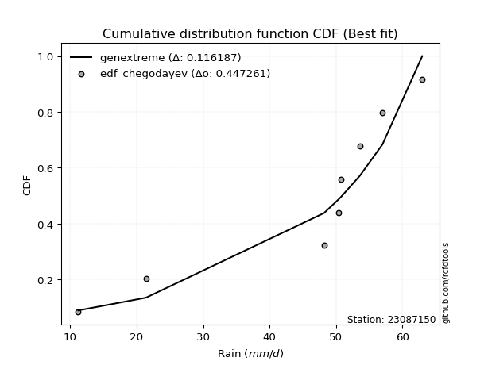</img></img>

</div>


### 6. Empirical - EDF Blom (1958)

The Blom formula is a specific "plotting position" formula used in hydrology and statistical analysis to estimate the empirical cumulative probability (or non-exceedance probability) of a data series. It is particularly recommended for data that are approximately normally distributed. The constant _a_ is set to 0.375 (or 3/8).

<div align="center">


$P=(m-a)/(n+1-2a)$


</div>


**6.1. Empirical values**

<div align="center">

|                | 0                   | 1                   | 2                  | 3                  | 4                  | 5                  | 6                 | 7                  |
|:---------------|:--------------------|:--------------------|:-------------------|:-------------------|:-------------------|:-------------------|:------------------|:-------------------|
| date           | 2023                | 2018                | 2019               | 2025               | 2024               | 2022               | 2020              | 2021               |
| x              | 11.2                | 21.4                | 48.2               | 50.4               | 50.8               | 53.6               | 57.0              | 63.0               |
| m              | 1                   | 2                   | 3                  | 4                  | 5                  | 6                  | 7                 | 8                  |
| empirical_dist | edf_blom            | edf_blom            | edf_blom           | edf_blom           | edf_blom           | edf_blom           | edf_blom          | edf_blom           |
| empirical      | 0.07575757575757576 | 0.19696969696969696 | 0.3181818181818182 | 0.4393939393939394 | 0.5606060606060606 | 0.6818181818181818 | 0.803030303030303 | 0.9242424242424242 |
| empirical_tr   | 1.0819672131147542  | 1.2452830188679247  | 1.4666666666666666 | 1.783783783783784  | 2.275862068965517  | 3.1428571428571423 | 5.076923076923076 | 13.199999999999992 |

</div>


**6.2. Kolmogorov-Smirnov fit test (sorted by Δ)**


<div align="center">

|                | 0                  | 1                   | 2                  | 3                   | 4                  | 5                  | 6                   | 7                   | 8                   | 9                  | 10                  | 11                  | 12                 | 13                  | 14                 | 15                  | 16                    | 17                 | 18                  | 19                 | 20                  | 21                  | 22                  | 23                 | 24                  | 25                 | 26                 | 27                  | 28                  | 29                  | 30                  | 31                  | 32                 | 33                  | 34                 | 35                  | 36                  | 37                 | 38                 | 39                 | 40                 | 41                 | 42                 | 43                  | 44                 | 45                  | 46                  | 47                  | 48                 | 49                 | 50                 | 51                 | 52                  | 53                  | 54                 | 55                  | 56                  | 57                  | 58                  | 59                 | 60                 | 61                  | 62                 | 63                 | 64                  | 65                 | 66                 | 67                 | 68                 | 69                  | 70                  | 71                 | 72                  | 73                 | 74                 | 75                 | 76                  | 77                  | 78                 | 79                 | 80                 | 81                 | 82                 | 83                  | 84                  | 85                  | 86                 | 87                 | 88                 | 89                 |
|:---------------|:-------------------|:--------------------|:-------------------|:--------------------|:-------------------|:-------------------|:--------------------|:--------------------|:--------------------|:-------------------|:--------------------|:--------------------|:-------------------|:--------------------|:-------------------|:--------------------|:----------------------|:-------------------|:--------------------|:-------------------|:--------------------|:--------------------|:--------------------|:-------------------|:--------------------|:-------------------|:-------------------|:--------------------|:--------------------|:--------------------|:--------------------|:--------------------|:-------------------|:--------------------|:-------------------|:--------------------|:--------------------|:-------------------|:-------------------|:-------------------|:-------------------|:-------------------|:-------------------|:--------------------|:-------------------|:--------------------|:--------------------|:--------------------|:-------------------|:-------------------|:-------------------|:-------------------|:--------------------|:--------------------|:-------------------|:--------------------|:--------------------|:--------------------|:--------------------|:-------------------|:-------------------|:--------------------|:-------------------|:-------------------|:--------------------|:-------------------|:-------------------|:-------------------|:-------------------|:--------------------|:--------------------|:-------------------|:--------------------|:-------------------|:-------------------|:-------------------|:--------------------|:--------------------|:-------------------|:-------------------|:-------------------|:-------------------|:-------------------|:--------------------|:--------------------|:--------------------|:-------------------|:-------------------|:-------------------|:-------------------|
| station        | 23087150           | 23087150            | 23087150           | 23087150            | 23087150           | 23087150           | 23087150            | 23087150            | 23087150            | 23087150           | 23087150            | 23087150            | 23087150           | 23087150            | 23087150           | 23087150            | 23087150              | 23087150           | 23087150            | 23087150           | 23087150            | 23087150            | 23087150            | 23087150           | 23087150            | 23087150           | 23087150           | 23087150            | 23087150            | 23087150            | 23087150            | 23087150            | 23087150           | 23087150            | 23087150           | 23087150            | 23087150            | 23087150           | 23087150           | 23087150           | 23087150           | 23087150           | 23087150           | 23087150            | 23087150           | 23087150            | 23087150            | 23087150            | 23087150           | 23087150           | 23087150           | 23087150           | 23087150            | 23087150            | 23087150           | 23087150            | 23087150            | 23087150            | 23087150            | 23087150           | 23087150           | 23087150            | 23087150           | 23087150           | 23087150            | 23087150           | 23087150           | 23087150           | 23087150           | 23087150            | 23087150            | 23087150           | 23087150            | 23087150           | 23087150           | 23087150           | 23087150            | 23087150            | 23087150           | 23087150           | 23087150           | 23087150           | 23087150           | 23087150            | 23087150            | 23087150            | 23087150           | 23087150           | 23087150           | 23087150           |
| empirical_dist | edf_blom           | edf_blom            | edf_blom           | edf_blom            | edf_blom           | edf_blom           | edf_blom            | edf_blom            | edf_blom            | edf_blom           | edf_blom            | edf_blom            | edf_blom           | edf_blom            | edf_blom           | edf_blom            | edf_blom              | edf_blom           | edf_blom            | edf_blom           | edf_blom            | edf_blom            | edf_blom            | edf_blom           | edf_blom            | edf_blom           | edf_blom           | edf_blom            | edf_blom            | edf_blom            | edf_blom            | edf_blom            | edf_blom           | edf_blom            | edf_blom           | edf_blom            | edf_blom            | edf_blom           | edf_blom           | edf_blom           | edf_blom           | edf_blom           | edf_blom           | edf_blom            | edf_blom           | edf_blom            | edf_blom            | edf_blom            | edf_blom           | edf_blom           | edf_blom           | edf_blom           | edf_blom            | edf_blom            | edf_blom           | edf_blom            | edf_blom            | edf_blom            | edf_blom            | edf_blom           | edf_blom           | edf_blom            | edf_blom           | edf_blom           | edf_blom            | edf_blom           | edf_blom           | edf_blom           | edf_blom           | edf_blom            | edf_blom            | edf_blom           | edf_blom            | edf_blom           | edf_blom           | edf_blom           | edf_blom            | edf_blom            | edf_blom           | edf_blom           | edf_blom           | edf_blom           | edf_blom           | edf_blom            | edf_blom            | edf_blom            | edf_blom           | edf_blom           | edf_blom           | edf_blom           |
| p_dist         | johnsonsu          | logjohnsonsu        | logt               | genlogistic         | mielke             | laplace_asymmetric | weibull_min         | gompertz            | fisk                | pearson3           | gumbel_l            | logpearson3         | logloggamma        | logmielke           | logfisk            | lognakagami         | loglaplace_asymmetric | t                  | exponnorm           | truncnorm          | norm                | crystalball         | nct                 | nakagami           | f                   | loggumbel_l        | rice               | betaprime           | erlang              | gamma               | logistic            | logweibull_min      | chi2               | invgamma            | loggompertz        | hypsecant           | maxwell             | ncf                | invgauss           | rayleigh           | loginvweibull      | laplace            | kstwobign          | loginvgauss         | logncf             | alpha               | logbetaprime        | logf                | lognct             | logfatiguelife     | lognorm            | lognorm            | logcrystalball      | logexponnorm        | logrice            | logalpha            | logerlang           | loggamma            | loggamma            | halfnorm           | loginvgamma        | gumbel_r            | loglogistic        | logkstwobign       | logmaxwell          | lograyleigh        | loghypsecant       | expon              | genexpon           | halflogistic        | loggenexpon         | moyal              | logexpon            | loghalfnorm        | loglaplace         | loggumbel_r        | loghalflogistic     | logmoyal            | pareto             | wald               | loglognorm         | logchi2            | logpareto          | gibrat              | logwald             | invweibull          | loggibrat          | fatiguelife        | logtruncnorm       | loggenlogistic     |
| delta          | 0.1298397558996911 | 0.14006325780954598 | 0.1418177497557311 | 0.15465154604801656 | 0.1694199942788337 | 0.1840183724845142 | 0.19663279562025598 | 0.19911635415234324 | 0.20199517935250083 | 0.2057177798649727 | 0.20710935503126887 | 0.24608302863571113 | 0.2494710165693917 | 0.24982919141050947 | 0.2520247323646137 | 0.25300631053723505 | 0.2671504486985941    | 0.2691094718269506 | 0.26911057720204506 | 0.2691119907973481 | 0.26911202215172564 | 0.26911203311341064 | 0.26913162992709255 | 0.269193277603269  | 0.27056709475928536 | 0.2715009282130229 | 0.2756421967421058 | 0.27668735254989024 | 0.27830523807186996 | 0.27941779629082747 | 0.28053095648615817 | 0.28130398198531487 | 0.2825840265559079 | 0.28774606898819827 | 0.2878009276646642 | 0.28996975128393704 | 0.29672389858595466 | 0.3006113476919618 | 0.3050219376177185 | 0.3053660174948553 | 0.3131157229962593 | 0.315812859533354  | 0.3179751381202814 | 0.31809901635124244 | 0.3194149100038041 | 0.31987857477362697 | 0.32023091671694787 | 0.32027884175225857 | 0.321582249101288  | 0.3223061961319534 | 0.3223625543723236 | 0.3223625543723236 | 0.32236257705472987 | 0.32236275337474957 | 0.3223670222937351 | 0.32794138401669787 | 0.32796782929171114 | 0.32808557164246593 | 0.32808557164246593 | 0.3298912079156106 | 0.3325431206779174 | 0.33682731154250806 | 0.3394620986519879 | 0.3433978106938275 | 0.34499250801532905 | 0.3518383343776536 | 0.3528902811575157 | 0.3531747648137609 | 0.3532170141743554 | 0.35805755397146605 | 0.35815124843497775 | 0.3601780435071685 | 0.36913348869235246 | 0.3716390188974796 | 0.3812686791634658 | 0.3837838944198186 | 0.39987998611422354 | 0.40422372187411754 | 0.4232072845574331 | 0.4251215313770435 | 0.4262005058711487 | 0.433837281444358  | 0.4476794787652401 | 0.45638974759985546 | 0.46189441363566613 | 0.47577359082414344 | 0.49413727563825   | 0.5088136994732264 | 0.5290186624661903 | 0.803030303030303  |
| deltao         | 0.4472608134160001 | 0.4472608134160001  | 0.4472608134160001 | 0.4472608134160001  | 0.4472608134160001 | 0.4472608134160001 | 0.4472608134160001  | 0.4472608134160001  | 0.4472608134160001  | 0.4472608134160001 | 0.4472608134160001  | 0.4472608134160001  | 0.4472608134160001 | 0.4472608134160001  | 0.4472608134160001 | 0.4472608134160001  | 0.4472608134160001    | 0.4472608134160001 | 0.4472608134160001  | 0.4472608134160001 | 0.4472608134160001  | 0.4472608134160001  | 0.4472608134160001  | 0.4472608134160001 | 0.4472608134160001  | 0.4472608134160001 | 0.4472608134160001 | 0.4472608134160001  | 0.4472608134160001  | 0.4472608134160001  | 0.4472608134160001  | 0.4472608134160001  | 0.4472608134160001 | 0.4472608134160001  | 0.4472608134160001 | 0.4472608134160001  | 0.4472608134160001  | 0.4472608134160001 | 0.4472608134160001 | 0.4472608134160001 | 0.4472608134160001 | 0.4472608134160001 | 0.4472608134160001 | 0.4472608134160001  | 0.4472608134160001 | 0.4472608134160001  | 0.4472608134160001  | 0.4472608134160001  | 0.4472608134160001 | 0.4472608134160001 | 0.4472608134160001 | 0.4472608134160001 | 0.4472608134160001  | 0.4472608134160001  | 0.4472608134160001 | 0.4472608134160001  | 0.4472608134160001  | 0.4472608134160001  | 0.4472608134160001  | 0.4472608134160001 | 0.4472608134160001 | 0.4472608134160001  | 0.4472608134160001 | 0.4472608134160001 | 0.4472608134160001  | 0.4472608134160001 | 0.4472608134160001 | 0.4472608134160001 | 0.4472608134160001 | 0.4472608134160001  | 0.4472608134160001  | 0.4472608134160001 | 0.4472608134160001  | 0.4472608134160001 | 0.4472608134160001 | 0.4472608134160001 | 0.4472608134160001  | 0.4472608134160001  | 0.4472608134160001 | 0.4472608134160001 | 0.4472608134160001 | 0.4472608134160001 | 0.4472608134160001 | 0.4472608134160001  | 0.4472608134160001  | 0.4472608134160001  | 0.4472608134160001 | 0.4472608134160001 | 0.4472608134160001 | 0.4472608134160001 |
| eval           | Δo > Δ             | Δo > Δ              | Δo > Δ             | Δo > Δ              | Δo > Δ             | Δo > Δ             | Δo > Δ              | Δo > Δ              | Δo > Δ              | Δo > Δ             | Δo > Δ              | Δo > Δ              | Δo > Δ             | Δo > Δ              | Δo > Δ             | Δo > Δ              | Δo > Δ                | Δo > Δ             | Δo > Δ              | Δo > Δ             | Δo > Δ              | Δo > Δ              | Δo > Δ              | Δo > Δ             | Δo > Δ              | Δo > Δ             | Δo > Δ             | Δo > Δ              | Δo > Δ              | Δo > Δ              | Δo > Δ              | Δo > Δ              | Δo > Δ             | Δo > Δ              | Δo > Δ             | Δo > Δ              | Δo > Δ              | Δo > Δ             | Δo > Δ             | Δo > Δ             | Δo > Δ             | Δo > Δ             | Δo > Δ             | Δo > Δ              | Δo > Δ             | Δo > Δ              | Δo > Δ              | Δo > Δ              | Δo > Δ             | Δo > Δ             | Δo > Δ             | Δo > Δ             | Δo > Δ              | Δo > Δ              | Δo > Δ             | Δo > Δ              | Δo > Δ              | Δo > Δ              | Δo > Δ              | Δo > Δ             | Δo > Δ             | Δo > Δ              | Δo > Δ             | Δo > Δ             | Δo > Δ              | Δo > Δ             | Δo > Δ             | Δo > Δ             | Δo > Δ             | Δo > Δ              | Δo > Δ              | Δo > Δ             | Δo > Δ              | Δo > Δ             | Δo > Δ             | Δo > Δ             | Δo > Δ              | Δo > Δ              | Δo > Δ             | Δo > Δ             | Δo > Δ             | Δo > Δ             | Δo <= Δ            | Δo <= Δ             | Δo <= Δ             | Δo <= Δ             | Δo <= Δ            | Δo <= Δ            | Δo <= Δ            | Δo <= Δ            |
| fit            | 1                  | 1                   | 1                  | 1                   | 1                  | 1                  | 1                   | 1                   | 1                   | 1                  | 1                   | 1                   | 1                  | 1                   | 1                  | 1                   | 1                     | 1                  | 1                   | 1                  | 1                   | 1                   | 1                   | 1                  | 1                   | 1                  | 1                  | 1                   | 1                   | 1                   | 1                   | 1                   | 1                  | 1                   | 1                  | 1                   | 1                   | 1                  | 1                  | 1                  | 1                  | 1                  | 1                  | 1                   | 1                  | 1                   | 1                   | 1                   | 1                  | 1                  | 1                  | 1                  | 1                   | 1                   | 1                  | 1                   | 1                   | 1                   | 1                   | 1                  | 1                  | 1                   | 1                  | 1                  | 1                   | 1                  | 1                  | 1                  | 1                  | 1                   | 1                   | 1                  | 1                   | 1                  | 1                  | 1                  | 1                   | 1                   | 1                  | 1                  | 1                  | 1                  | 0                  | 0                   | 0                   | 0                   | 0                  | 0                  | 0                  | 0                  |
| n              | 8                  | 8                   | 8                  | 8                   | 8                  | 8                  | 8                   | 8                   | 8                   | 8                  | 8                   | 8                   | 8                  | 8                   | 8                  | 8                   | 8                     | 8                  | 8                   | 8                  | 8                   | 8                   | 8                   | 8                  | 8                   | 8                  | 8                  | 8                   | 8                   | 8                   | 8                   | 8                   | 8                  | 8                   | 8                  | 8                   | 8                   | 8                  | 8                  | 8                  | 8                  | 8                  | 8                  | 8                   | 8                  | 8                   | 8                   | 8                   | 8                  | 8                  | 8                  | 8                  | 8                   | 8                   | 8                  | 8                   | 8                   | 8                   | 8                   | 8                  | 8                  | 8                   | 8                  | 8                  | 8                   | 8                  | 8                  | 8                  | 8                  | 8                   | 8                   | 8                  | 8                   | 8                  | 8                  | 8                  | 8                   | 8                   | 8                  | 8                  | 8                  | 8                  | 8                  | 8                   | 8                   | 8                   | 8                  | 8                  | 8                  | 8                  |
| best_fit       | 1                  | 0                   | 0                  | 0                   | 0                  | 0                  | 0                   | 0                   | 0                   | 0                  | 0                   | 0                   | 0                  | 0                   | 0                  | 0                   | 0                     | 0                  | 0                   | 0                  | 0                   | 0                   | 0                   | 0                  | 0                   | 0                  | 0                  | 0                   | 0                   | 0                   | 0                   | 0                   | 0                  | 0                   | 0                  | 0                   | 0                   | 0                  | 0                  | 0                  | 0                  | 0                  | 0                  | 0                   | 0                  | 0                   | 0                   | 0                   | 0                  | 0                  | 0                  | 0                  | 0                   | 0                   | 0                  | 0                   | 0                   | 0                   | 0                   | 0                  | 0                  | 0                   | 0                  | 0                  | 0                   | 0                  | 0                  | 0                  | 0                  | 0                   | 0                   | 0                  | 0                   | 0                  | 0                  | 0                  | 0                   | 0                   | 0                  | 0                  | 0                  | 0                  | 0                  | 0                   | 0                   | 0                   | 0                  | 0                  | 0                  | 0                  |
| best_fit_sort  | 1                  | 2                   | 3                  | 4                   | 5                  | 6                  | 7                   | 8                   | 9                   | 10                 | 11                  | 12                  | 13                 | 14                  | 15                 | 16                  | 17                    | 18                 | 19                  | 20                 | 21                  | 22                  | 23                  | 24                 | 25                  | 26                 | 27                 | 28                  | 29                  | 30                  | 31                  | 32                  | 33                 | 34                  | 35                 | 36                  | 37                  | 38                 | 39                 | 40                 | 41                 | 42                 | 43                 | 44                  | 45                 | 46                  | 47                  | 48                  | 49                 | 50                 | 51                 | 52                 | 53                  | 54                  | 55                 | 56                  | 57                  | 58                  | 59                  | 60                 | 61                 | 62                  | 63                 | 64                 | 65                  | 66                 | 67                 | 68                 | 69                 | 70                  | 71                  | 72                 | 73                  | 74                 | 75                 | 76                 | 77                  | 78                  | 79                 | 80                 | 81                 | 82                 | 83                 | 84                  | 85                  | 86                  | 87                 | 88                 | 89                 | 90                 |

</div>


<div align="center">

</img>

</div>


**6.3. Best fit**

<div align="center">

|   id |   station | empirical_dist   | p_dist    |   delta |   deltao | eval   |   fit |   n |   best_fit |   best_fit_sort |
|-----:|----------:|:-----------------|:----------|--------:|---------:|:-------|------:|----:|-----------:|----------------:|
|    0 |  23087150 | edf_blom         | johnsonsu | 0.12984 | 0.447261 | Δo > Δ |     1 |   8 |          1 |               1 |

</div>


<div align="center">

</img></img>

</div>


### 7. Empirical - EDF Tukey (1962)

In hydrology, the Tukey formula is used as a plotting position formula to estimate the empirical probability or frequency of a flood event (or other hydrological data). The formula parameter is given as _c=0.333_ (or 1/3).

<div align="center">


$P=(m-c)/(n+1-2c)$


</div>


**7.1. Empirical values**

<div align="center">

|                | 0                  | 1         | 2                  | 3                  | 4                 | 5                  | 6                 | 7                  |
|:---------------|:-------------------|:----------|:-------------------|:-------------------|:------------------|:-------------------|:------------------|:-------------------|
| date           | 2023               | 2018      | 2019               | 2025               | 2024              | 2022               | 2020              | 2021               |
| x              | 11.2               | 21.4      | 48.2               | 50.4               | 50.8              | 53.6               | 57.0              | 63.0               |
| m              | 1                  | 2         | 3                  | 4                  | 5                 | 6                  | 7                 | 8                  |
| empirical_dist | edf_tukey          | edf_tukey | edf_tukey          | edf_tukey          | edf_tukey         | edf_tukey          | edf_tukey         | edf_tukey          |
| empirical      | 0.08               | 0.2       | 0.32               | 0.44               | 0.56              | 0.68               | 0.8               | 0.92               |
| empirical_tr   | 1.0869565217391304 | 1.25      | 1.4705882352941178 | 1.7857142857142856 | 2.272727272727273 | 3.1250000000000004 | 5.000000000000001 | 12.500000000000007 |

</div>


**7.2. Kolmogorov-Smirnov fit test (sorted by Δ)**


<div align="center">

|                | 0                   | 1                   | 2                   | 3                   | 4                   | 5                   | 6                   | 7                   | 8                  | 9                   | 10                  | 11                 | 12                  | 13                  | 14                  | 15                 | 16                    | 17                 | 18                  | 19                  | 20                 | 21                 | 22                 | 23                  | 24                  | 25                 | 26                 | 27                 | 28                  | 29                  | 30                  | 31                  | 32                 | 33                  | 34                  | 35                 | 36                  | 37                  | 38                 | 39                 | 40                  | 41                  | 42                  | 43                 | 44                 | 45                  | 46                  | 47                  | 48                 | 49                  | 50                  | 51                  | 52                  | 53                  | 54                  | 55                  | 56                 | 57                 | 58                 | 59                 | 60                 | 61                 | 62                  | 63                 | 64                 | 65                 | 66                  | 67                 | 68                 | 69                 | 70                 | 71                  | 72                  | 73                  | 74                  | 75                  | 76                 | 77                 | 78                  | 79                  | 80                 | 81                 | 82                  | 83                 | 84                 | 85                 | 86                  | 87                 | 88                 | 89                 |
|:---------------|:--------------------|:--------------------|:--------------------|:--------------------|:--------------------|:--------------------|:--------------------|:--------------------|:-------------------|:--------------------|:--------------------|:-------------------|:--------------------|:--------------------|:--------------------|:-------------------|:----------------------|:-------------------|:--------------------|:--------------------|:-------------------|:-------------------|:-------------------|:--------------------|:--------------------|:-------------------|:-------------------|:-------------------|:--------------------|:--------------------|:--------------------|:--------------------|:-------------------|:--------------------|:--------------------|:-------------------|:--------------------|:--------------------|:-------------------|:-------------------|:--------------------|:--------------------|:--------------------|:-------------------|:-------------------|:--------------------|:--------------------|:--------------------|:-------------------|:--------------------|:--------------------|:--------------------|:--------------------|:--------------------|:--------------------|:--------------------|:-------------------|:-------------------|:-------------------|:-------------------|:-------------------|:-------------------|:--------------------|:-------------------|:-------------------|:-------------------|:--------------------|:-------------------|:-------------------|:-------------------|:-------------------|:--------------------|:--------------------|:--------------------|:--------------------|:--------------------|:-------------------|:-------------------|:--------------------|:--------------------|:-------------------|:-------------------|:--------------------|:-------------------|:-------------------|:-------------------|:--------------------|:-------------------|:-------------------|:-------------------|
| station        | 23087150            | 23087150            | 23087150            | 23087150            | 23087150            | 23087150            | 23087150            | 23087150            | 23087150           | 23087150            | 23087150            | 23087150           | 23087150            | 23087150            | 23087150            | 23087150           | 23087150              | 23087150           | 23087150            | 23087150            | 23087150           | 23087150           | 23087150           | 23087150            | 23087150            | 23087150           | 23087150           | 23087150           | 23087150            | 23087150            | 23087150            | 23087150            | 23087150           | 23087150            | 23087150            | 23087150           | 23087150            | 23087150            | 23087150           | 23087150           | 23087150            | 23087150            | 23087150            | 23087150           | 23087150           | 23087150            | 23087150            | 23087150            | 23087150           | 23087150            | 23087150            | 23087150            | 23087150            | 23087150            | 23087150            | 23087150            | 23087150           | 23087150           | 23087150           | 23087150           | 23087150           | 23087150           | 23087150            | 23087150           | 23087150           | 23087150           | 23087150            | 23087150           | 23087150           | 23087150           | 23087150           | 23087150            | 23087150            | 23087150            | 23087150            | 23087150            | 23087150           | 23087150           | 23087150            | 23087150            | 23087150           | 23087150           | 23087150            | 23087150           | 23087150           | 23087150           | 23087150            | 23087150           | 23087150           | 23087150           |
| empirical_dist | edf_tukey           | edf_tukey           | edf_tukey           | edf_tukey           | edf_tukey           | edf_tukey           | edf_tukey           | edf_tukey           | edf_tukey          | edf_tukey           | edf_tukey           | edf_tukey          | edf_tukey           | edf_tukey           | edf_tukey           | edf_tukey          | edf_tukey             | edf_tukey          | edf_tukey           | edf_tukey           | edf_tukey          | edf_tukey          | edf_tukey          | edf_tukey           | edf_tukey           | edf_tukey          | edf_tukey          | edf_tukey          | edf_tukey           | edf_tukey           | edf_tukey           | edf_tukey           | edf_tukey          | edf_tukey           | edf_tukey           | edf_tukey          | edf_tukey           | edf_tukey           | edf_tukey          | edf_tukey          | edf_tukey           | edf_tukey           | edf_tukey           | edf_tukey          | edf_tukey          | edf_tukey           | edf_tukey           | edf_tukey           | edf_tukey          | edf_tukey           | edf_tukey           | edf_tukey           | edf_tukey           | edf_tukey           | edf_tukey           | edf_tukey           | edf_tukey          | edf_tukey          | edf_tukey          | edf_tukey          | edf_tukey          | edf_tukey          | edf_tukey           | edf_tukey          | edf_tukey          | edf_tukey          | edf_tukey           | edf_tukey          | edf_tukey          | edf_tukey          | edf_tukey          | edf_tukey           | edf_tukey           | edf_tukey           | edf_tukey           | edf_tukey           | edf_tukey          | edf_tukey          | edf_tukey           | edf_tukey           | edf_tukey          | edf_tukey          | edf_tukey           | edf_tukey          | edf_tukey          | edf_tukey          | edf_tukey           | edf_tukey          | edf_tukey          | edf_tukey          |
| p_dist         | johnsonsu           | logjohnsonsu        | logt                | genlogistic         | mielke              | laplace_asymmetric  | weibull_min         | gompertz            | fisk               | pearson3            | gumbel_l            | logpearson3        | logloggamma         | logmielke           | logfisk             | lognakagami        | loglaplace_asymmetric | t                  | exponnorm           | truncnorm           | norm               | crystalball        | nct                | nakagami            | f                   | loggumbel_l        | rice               | betaprime          | erlang              | gamma               | logistic            | logweibull_min      | chi2               | invgamma            | loggompertz         | hypsecant          | maxwell             | ncf                 | invgauss           | rayleigh           | loginvweibull       | laplace             | kstwobign           | loginvgauss        | logncf             | alpha               | logbetaprime        | logf                | lognct             | logfatiguelife      | lognorm             | lognorm             | logcrystalball      | logexponnorm        | logrice             | logalpha            | logerlang          | loggamma           | loggamma           | halfnorm           | loginvgamma        | gumbel_r           | loglogistic         | logkstwobign       | logmaxwell         | lograyleigh        | loghypsecant        | expon              | genexpon           | halflogistic       | loggenexpon        | moyal               | logexpon            | loghalfnorm         | loglaplace          | loggumbel_r         | loghalflogistic    | logmoyal           | pareto              | loglognorm          | wald               | logchi2            | logpareto           | gibrat             | logwald            | invweibull         | loggibrat           | fatiguelife        | logtruncnorm       | loggenlogistic     |
| delta          | 0.12802157408150927 | 0.13824507599136415 | 0.14484805278603416 | 0.15283336422983473 | 0.16760181246065187 | 0.18220019066633236 | 0.19481461380207415 | 0.19729817233416141 | 0.200176997534319  | 0.20389959804679086 | 0.20529117321308704 | 0.2442648468175293 | 0.24765283475120986 | 0.24801100959232764 | 0.25020655054643187 | 0.2511881287190532 | 0.2653322668804123    | 0.2672912900087688 | 0.26729239538386323 | 0.26729380897916627 | 0.2672938403335438 | 0.2672938512952288 | 0.2673134481089107 | 0.26737509578508717 | 0.26874891294110353 | 0.2696827463948411 | 0.273824014923924  | 0.2748691707317084 | 0.27648705625368813 | 0.27759961447264564 | 0.27871277466797634 | 0.27948580016713304 | 0.2807658447377261 | 0.28592788717001644 | 0.28598274584648237 | 0.2881515694657552 | 0.29490571676777283 | 0.29879316587377996 | 0.3032037557995367 | 0.3035478356766735 | 0.31129754117807745 | 0.31399467771517214 | 0.31615695630209956 | 0.3162808345330606 | 0.3175967281856223 | 0.31806039295544514 | 0.31841273489876604 | 0.31846065993407674 | 0.3197640672831062 | 0.32048801431377155 | 0.32054437255414175 | 0.32054437255414175 | 0.32054439523654804 | 0.32054457155656774 | 0.32054884047555326 | 0.32612320219851604 | 0.3261496474735293 | 0.3262673898242841 | 0.3262673898242841 | 0.3280730260974288 | 0.3307249388597356 | 0.3350091297243262 | 0.33764391683380607 | 0.3415796288756457 | 0.3431743261971472 | 0.3500201525594718 | 0.35107209933933387 | 0.3513565829955791 | 0.3513988323561736 | 0.3562393721532842 | 0.3563330666167959 | 0.35835986168898665 | 0.36731530687417063 | 0.36982083707929775 | 0.37945049734528397 | 0.38196571260163675 | 0.3980618042960417 | 0.4024055400559357 | 0.42017698152713007 | 0.42317020284084567 | 0.4233033495588617 | 0.4320190996261762 | 0.44464917573493706 | 0.4545715657816736 | 0.4600762318174843 | 0.4715311665817193 | 0.49231909382006817 | 0.5069955176550447 | 0.5272004806480084 | 0.8                |
| deltao         | 0.4472608134160001  | 0.4472608134160001  | 0.4472608134160001  | 0.4472608134160001  | 0.4472608134160001  | 0.4472608134160001  | 0.4472608134160001  | 0.4472608134160001  | 0.4472608134160001 | 0.4472608134160001  | 0.4472608134160001  | 0.4472608134160001 | 0.4472608134160001  | 0.4472608134160001  | 0.4472608134160001  | 0.4472608134160001 | 0.4472608134160001    | 0.4472608134160001 | 0.4472608134160001  | 0.4472608134160001  | 0.4472608134160001 | 0.4472608134160001 | 0.4472608134160001 | 0.4472608134160001  | 0.4472608134160001  | 0.4472608134160001 | 0.4472608134160001 | 0.4472608134160001 | 0.4472608134160001  | 0.4472608134160001  | 0.4472608134160001  | 0.4472608134160001  | 0.4472608134160001 | 0.4472608134160001  | 0.4472608134160001  | 0.4472608134160001 | 0.4472608134160001  | 0.4472608134160001  | 0.4472608134160001 | 0.4472608134160001 | 0.4472608134160001  | 0.4472608134160001  | 0.4472608134160001  | 0.4472608134160001 | 0.4472608134160001 | 0.4472608134160001  | 0.4472608134160001  | 0.4472608134160001  | 0.4472608134160001 | 0.4472608134160001  | 0.4472608134160001  | 0.4472608134160001  | 0.4472608134160001  | 0.4472608134160001  | 0.4472608134160001  | 0.4472608134160001  | 0.4472608134160001 | 0.4472608134160001 | 0.4472608134160001 | 0.4472608134160001 | 0.4472608134160001 | 0.4472608134160001 | 0.4472608134160001  | 0.4472608134160001 | 0.4472608134160001 | 0.4472608134160001 | 0.4472608134160001  | 0.4472608134160001 | 0.4472608134160001 | 0.4472608134160001 | 0.4472608134160001 | 0.4472608134160001  | 0.4472608134160001  | 0.4472608134160001  | 0.4472608134160001  | 0.4472608134160001  | 0.4472608134160001 | 0.4472608134160001 | 0.4472608134160001  | 0.4472608134160001  | 0.4472608134160001 | 0.4472608134160001 | 0.4472608134160001  | 0.4472608134160001 | 0.4472608134160001 | 0.4472608134160001 | 0.4472608134160001  | 0.4472608134160001 | 0.4472608134160001 | 0.4472608134160001 |
| eval           | Δo > Δ              | Δo > Δ              | Δo > Δ              | Δo > Δ              | Δo > Δ              | Δo > Δ              | Δo > Δ              | Δo > Δ              | Δo > Δ             | Δo > Δ              | Δo > Δ              | Δo > Δ             | Δo > Δ              | Δo > Δ              | Δo > Δ              | Δo > Δ             | Δo > Δ                | Δo > Δ             | Δo > Δ              | Δo > Δ              | Δo > Δ             | Δo > Δ             | Δo > Δ             | Δo > Δ              | Δo > Δ              | Δo > Δ             | Δo > Δ             | Δo > Δ             | Δo > Δ              | Δo > Δ              | Δo > Δ              | Δo > Δ              | Δo > Δ             | Δo > Δ              | Δo > Δ              | Δo > Δ             | Δo > Δ              | Δo > Δ              | Δo > Δ             | Δo > Δ             | Δo > Δ              | Δo > Δ              | Δo > Δ              | Δo > Δ             | Δo > Δ             | Δo > Δ              | Δo > Δ              | Δo > Δ              | Δo > Δ             | Δo > Δ              | Δo > Δ              | Δo > Δ              | Δo > Δ              | Δo > Δ              | Δo > Δ              | Δo > Δ              | Δo > Δ             | Δo > Δ             | Δo > Δ             | Δo > Δ             | Δo > Δ             | Δo > Δ             | Δo > Δ              | Δo > Δ             | Δo > Δ             | Δo > Δ             | Δo > Δ              | Δo > Δ             | Δo > Δ             | Δo > Δ             | Δo > Δ             | Δo > Δ              | Δo > Δ              | Δo > Δ              | Δo > Δ              | Δo > Δ              | Δo > Δ             | Δo > Δ             | Δo > Δ              | Δo > Δ              | Δo > Δ             | Δo > Δ             | Δo > Δ              | Δo <= Δ            | Δo <= Δ            | Δo <= Δ            | Δo <= Δ             | Δo <= Δ            | Δo <= Δ            | Δo <= Δ            |
| fit            | 1                   | 1                   | 1                   | 1                   | 1                   | 1                   | 1                   | 1                   | 1                  | 1                   | 1                   | 1                  | 1                   | 1                   | 1                   | 1                  | 1                     | 1                  | 1                   | 1                   | 1                  | 1                  | 1                  | 1                   | 1                   | 1                  | 1                  | 1                  | 1                   | 1                   | 1                   | 1                   | 1                  | 1                   | 1                   | 1                  | 1                   | 1                   | 1                  | 1                  | 1                   | 1                   | 1                   | 1                  | 1                  | 1                   | 1                   | 1                   | 1                  | 1                   | 1                   | 1                   | 1                   | 1                   | 1                   | 1                   | 1                  | 1                  | 1                  | 1                  | 1                  | 1                  | 1                   | 1                  | 1                  | 1                  | 1                   | 1                  | 1                  | 1                  | 1                  | 1                   | 1                   | 1                   | 1                   | 1                   | 1                  | 1                  | 1                   | 1                   | 1                  | 1                  | 1                   | 0                  | 0                  | 0                  | 0                   | 0                  | 0                  | 0                  |
| n              | 8                   | 8                   | 8                   | 8                   | 8                   | 8                   | 8                   | 8                   | 8                  | 8                   | 8                   | 8                  | 8                   | 8                   | 8                   | 8                  | 8                     | 8                  | 8                   | 8                   | 8                  | 8                  | 8                  | 8                   | 8                   | 8                  | 8                  | 8                  | 8                   | 8                   | 8                   | 8                   | 8                  | 8                   | 8                   | 8                  | 8                   | 8                   | 8                  | 8                  | 8                   | 8                   | 8                   | 8                  | 8                  | 8                   | 8                   | 8                   | 8                  | 8                   | 8                   | 8                   | 8                   | 8                   | 8                   | 8                   | 8                  | 8                  | 8                  | 8                  | 8                  | 8                  | 8                   | 8                  | 8                  | 8                  | 8                   | 8                  | 8                  | 8                  | 8                  | 8                   | 8                   | 8                   | 8                   | 8                   | 8                  | 8                  | 8                   | 8                   | 8                  | 8                  | 8                   | 8                  | 8                  | 8                  | 8                   | 8                  | 8                  | 8                  |
| best_fit       | 1                   | 0                   | 0                   | 0                   | 0                   | 0                   | 0                   | 0                   | 0                  | 0                   | 0                   | 0                  | 0                   | 0                   | 0                   | 0                  | 0                     | 0                  | 0                   | 0                   | 0                  | 0                  | 0                  | 0                   | 0                   | 0                  | 0                  | 0                  | 0                   | 0                   | 0                   | 0                   | 0                  | 0                   | 0                   | 0                  | 0                   | 0                   | 0                  | 0                  | 0                   | 0                   | 0                   | 0                  | 0                  | 0                   | 0                   | 0                   | 0                  | 0                   | 0                   | 0                   | 0                   | 0                   | 0                   | 0                   | 0                  | 0                  | 0                  | 0                  | 0                  | 0                  | 0                   | 0                  | 0                  | 0                  | 0                   | 0                  | 0                  | 0                  | 0                  | 0                   | 0                   | 0                   | 0                   | 0                   | 0                  | 0                  | 0                   | 0                   | 0                  | 0                  | 0                   | 0                  | 0                  | 0                  | 0                   | 0                  | 0                  | 0                  |
| best_fit_sort  | 1                   | 2                   | 3                   | 4                   | 5                   | 6                   | 7                   | 8                   | 9                  | 10                  | 11                  | 12                 | 13                  | 14                  | 15                  | 16                 | 17                    | 18                 | 19                  | 20                  | 21                 | 22                 | 23                 | 24                  | 25                  | 26                 | 27                 | 28                 | 29                  | 30                  | 31                  | 32                  | 33                 | 34                  | 35                  | 36                 | 37                  | 38                  | 39                 | 40                 | 41                  | 42                  | 43                  | 44                 | 45                 | 46                  | 47                  | 48                  | 49                 | 50                  | 51                  | 52                  | 53                  | 54                  | 55                  | 56                  | 57                 | 58                 | 59                 | 60                 | 61                 | 62                 | 63                  | 64                 | 65                 | 66                 | 67                  | 68                 | 69                 | 70                 | 71                 | 72                  | 73                  | 74                  | 75                  | 76                  | 77                 | 78                 | 79                  | 80                  | 81                 | 82                 | 83                  | 84                 | 85                 | 86                 | 87                  | 88                 | 89                 | 90                 |

</div>


<div align="center">

</img>

</div>


**7.3. Best fit**

<div align="center">

|   id |   station | empirical_dist   | p_dist    |    delta |   deltao | eval   |   fit |   n |   best_fit |   best_fit_sort |
|-----:|----------:|:-----------------|:----------|---------:|---------:|:-------|------:|----:|-----------:|----------------:|
|    0 |  23087150 | edf_tukey        | johnsonsu | 0.128022 | 0.447261 | Δo > Δ |     1 |   8 |          1 |               1 |

</div>


<div align="center">

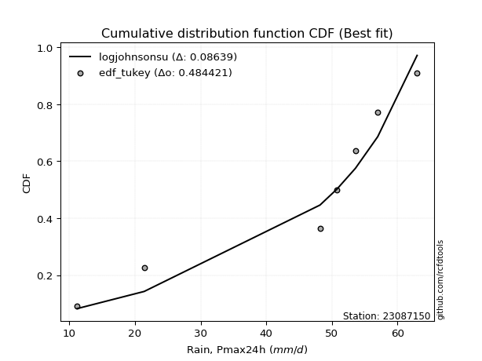</img>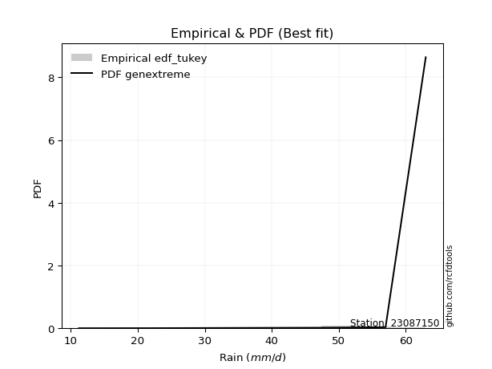</img>

</div>


### 8. Empirical - EDF Gringorten (1963)

Gringorten plotting position formula is essential for estimating the probability and return periods of extreme events like floods and heavy rainfall. The constant _a=0.44_.

<div align="center">


$P=(m-a)/(n+1-2a)$


</div>


**8.1. Empirical values**

<div align="center">

|                | 0                   | 1                   | 2                  | 3                  | 4                  | 5                  | 6                  | 7                  |
|:---------------|:--------------------|:--------------------|:-------------------|:-------------------|:-------------------|:-------------------|:-------------------|:-------------------|
| date           | 2023                | 2018                | 2019               | 2025               | 2024               | 2022               | 2020               | 2021               |
| x              | 11.2                | 21.4                | 48.2               | 50.4               | 50.8               | 53.6               | 57.0               | 63.0               |
| m              | 1                   | 2                   | 3                  | 4                  | 5                  | 6                  | 7                  | 8                  |
| empirical_dist | edf_gringorten      | edf_gringorten      | edf_gringorten     | edf_gringorten     | edf_gringorten     | edf_gringorten     | edf_gringorten     | edf_gringorten     |
| empirical      | 0.06896551724137932 | 0.19211822660098524 | 0.3152709359605912 | 0.4384236453201971 | 0.5615763546798029 | 0.6847290640394089 | 0.8078817733990148 | 0.9310344827586208 |
| empirical_tr   | 1.0740740740740742  | 1.2378048780487805  | 1.460431654676259  | 1.780701754385965  | 2.2808988764044944 | 3.1718750000000004 | 5.205128205128205  | 14.500000000000018 |

</div>


**8.2. Kolmogorov-Smirnov fit test (sorted by Δ)**


<div align="center">

|                | 0                   | 1                   | 2                   | 3                   | 4                   | 5                   | 6                   | 7                   | 8                   | 9                   | 10                  | 11                  | 12                 | 13                  | 14                 | 15                  | 16                    | 17                 | 18                  | 19                 | 20                 | 21                 | 22                  | 23                 | 24                  | 25                 | 26                 | 27                 | 28                  | 29                  | 30                  | 31                  | 32                 | 33                  | 34                 | 35                 | 36                  | 37                 | 38                 | 39                 | 40                  | 41                  | 42                  | 43                 | 44                 | 45                  | 46                  | 47                  | 48                 | 49                  | 50                  | 51                  | 52                  | 53                  | 54                 | 55                  | 56                  | 57                 | 58                 | 59                 | 60                 | 61                  | 62                 | 63                 | 64                  | 65                 | 66                 | 67                 | 68                 | 69                  | 70                  | 71                  | 72                  | 73                  | 74                 | 75                  | 76                 | 77                 | 78                 | 79                  | 80                  | 81                 | 82                  | 83                  | 84                 | 85                 | 86                 | 87                 | 88                 | 89                 |
|:---------------|:--------------------|:--------------------|:--------------------|:--------------------|:--------------------|:--------------------|:--------------------|:--------------------|:--------------------|:--------------------|:--------------------|:--------------------|:-------------------|:--------------------|:-------------------|:--------------------|:----------------------|:-------------------|:--------------------|:-------------------|:-------------------|:-------------------|:--------------------|:-------------------|:--------------------|:-------------------|:-------------------|:-------------------|:--------------------|:--------------------|:--------------------|:--------------------|:-------------------|:--------------------|:-------------------|:-------------------|:--------------------|:-------------------|:-------------------|:-------------------|:--------------------|:--------------------|:--------------------|:-------------------|:-------------------|:--------------------|:--------------------|:--------------------|:-------------------|:--------------------|:--------------------|:--------------------|:--------------------|:--------------------|:-------------------|:--------------------|:--------------------|:-------------------|:-------------------|:-------------------|:-------------------|:--------------------|:-------------------|:-------------------|:--------------------|:-------------------|:-------------------|:-------------------|:-------------------|:--------------------|:--------------------|:--------------------|:--------------------|:--------------------|:-------------------|:--------------------|:-------------------|:-------------------|:-------------------|:--------------------|:--------------------|:-------------------|:--------------------|:--------------------|:-------------------|:-------------------|:-------------------|:-------------------|:-------------------|:-------------------|
| station        | 23087150            | 23087150            | 23087150            | 23087150            | 23087150            | 23087150            | 23087150            | 23087150            | 23087150            | 23087150            | 23087150            | 23087150            | 23087150           | 23087150            | 23087150           | 23087150            | 23087150              | 23087150           | 23087150            | 23087150           | 23087150           | 23087150           | 23087150            | 23087150           | 23087150            | 23087150           | 23087150           | 23087150           | 23087150            | 23087150            | 23087150            | 23087150            | 23087150           | 23087150            | 23087150           | 23087150           | 23087150            | 23087150           | 23087150           | 23087150           | 23087150            | 23087150            | 23087150            | 23087150           | 23087150           | 23087150            | 23087150            | 23087150            | 23087150           | 23087150            | 23087150            | 23087150            | 23087150            | 23087150            | 23087150           | 23087150            | 23087150            | 23087150           | 23087150           | 23087150           | 23087150           | 23087150            | 23087150           | 23087150           | 23087150            | 23087150           | 23087150           | 23087150           | 23087150           | 23087150            | 23087150            | 23087150            | 23087150            | 23087150            | 23087150           | 23087150            | 23087150           | 23087150           | 23087150           | 23087150            | 23087150            | 23087150           | 23087150            | 23087150            | 23087150           | 23087150           | 23087150           | 23087150           | 23087150           | 23087150           |
| empirical_dist | edf_gringorten      | edf_gringorten      | edf_gringorten      | edf_gringorten      | edf_gringorten      | edf_gringorten      | edf_gringorten      | edf_gringorten      | edf_gringorten      | edf_gringorten      | edf_gringorten      | edf_gringorten      | edf_gringorten     | edf_gringorten      | edf_gringorten     | edf_gringorten      | edf_gringorten        | edf_gringorten     | edf_gringorten      | edf_gringorten     | edf_gringorten     | edf_gringorten     | edf_gringorten      | edf_gringorten     | edf_gringorten      | edf_gringorten     | edf_gringorten     | edf_gringorten     | edf_gringorten      | edf_gringorten      | edf_gringorten      | edf_gringorten      | edf_gringorten     | edf_gringorten      | edf_gringorten     | edf_gringorten     | edf_gringorten      | edf_gringorten     | edf_gringorten     | edf_gringorten     | edf_gringorten      | edf_gringorten      | edf_gringorten      | edf_gringorten     | edf_gringorten     | edf_gringorten      | edf_gringorten      | edf_gringorten      | edf_gringorten     | edf_gringorten      | edf_gringorten      | edf_gringorten      | edf_gringorten      | edf_gringorten      | edf_gringorten     | edf_gringorten      | edf_gringorten      | edf_gringorten     | edf_gringorten     | edf_gringorten     | edf_gringorten     | edf_gringorten      | edf_gringorten     | edf_gringorten     | edf_gringorten      | edf_gringorten     | edf_gringorten     | edf_gringorten     | edf_gringorten     | edf_gringorten      | edf_gringorten      | edf_gringorten      | edf_gringorten      | edf_gringorten      | edf_gringorten     | edf_gringorten      | edf_gringorten     | edf_gringorten     | edf_gringorten     | edf_gringorten      | edf_gringorten      | edf_gringorten     | edf_gringorten      | edf_gringorten      | edf_gringorten     | edf_gringorten     | edf_gringorten     | edf_gringorten     | edf_gringorten     | edf_gringorten     |
| p_dist         | johnsonsu           | logt                | logjohnsonsu        | genlogistic         | mielke              | laplace_asymmetric  | weibull_min         | gompertz            | fisk                | pearson3            | gumbel_l            | logpearson3         | logloggamma        | logmielke           | logfisk            | lognakagami         | loglaplace_asymmetric | t                  | exponnorm           | truncnorm          | norm               | crystalball        | nct                 | nakagami           | f                   | loggumbel_l        | rice               | betaprime          | erlang              | gamma               | logistic            | logweibull_min      | chi2               | invgamma            | loggompertz        | hypsecant          | maxwell             | ncf                | invgauss           | rayleigh           | loginvweibull       | laplace             | kstwobign           | loginvgauss        | logncf             | alpha               | logbetaprime        | logf                | lognct             | logfatiguelife      | lognorm             | lognorm             | logcrystalball      | logexponnorm        | logrice            | logalpha            | logerlang           | loggamma           | loggamma           | halfnorm           | loginvgamma        | gumbel_r            | loglogistic        | logkstwobign       | logmaxwell          | lograyleigh        | loghypsecant       | expon              | genexpon           | halflogistic        | loggenexpon         | moyal               | logexpon            | loghalfnorm         | loglaplace         | loggumbel_r         | loghalflogistic    | logmoyal           | wald               | pareto              | loglognorm          | logchi2            | logpareto           | gibrat              | logwald            | invweibull         | loggibrat          | fatiguelife        | logtruncnorm       | loggenlogistic     |
| delta          | 0.13275063812091809 | 0.13696627938701939 | 0.14297414003077297 | 0.15756242826924355 | 0.17233087650006068 | 0.18692925470574118 | 0.19954367784148297 | 0.20202723637357023 | 0.20490606157372782 | 0.20862866208619968 | 0.21002023725249586 | 0.24899391085693812 | 0.2523818987906187 | 0.25274007363173645 | 0.2549356145858407 | 0.25591719275846203 | 0.2700613309198211    | 0.2720203540481776 | 0.27202145942327205 | 0.2720228730185751 | 0.2720229043729526 | 0.2720229153346376 | 0.27204251214831954 | 0.272104159824496  | 0.27347797698051235 | 0.2744118104342499 | 0.2785530789633328 | 0.2795982347711172 | 0.28121612029309695 | 0.28232867851205445 | 0.28344183870738515 | 0.28421486420654185 | 0.2854949087771349 | 0.29065695120942525 | 0.2907118098858912 | 0.292880633505164  | 0.29963478080718164 | 0.3035222299131888 | 0.3079328198389455 | 0.3082768997160823 | 0.31602660521748627 | 0.31872374175458096 | 0.32088602034150837 | 0.3210098985724694 | 0.3223257922250311 | 0.32278945699485395 | 0.32314179893817485 | 0.32318972397348555 | 0.324493131322515  | 0.32521707835318037 | 0.32527343659355057 | 0.32527343659355057 | 0.32527345927595686 | 0.32527363559597655 | 0.3252779045149621 | 0.33085226623792485 | 0.33087871151293813 | 0.3309964538636929 | 0.3309964538636929 | 0.3328020901368376 | 0.3354540028991444 | 0.33973819376373504 | 0.3423729808732149 | 0.3463086929150545 | 0.34790339023655603 | 0.3547492165988806 | 0.3558011633787427 | 0.3560856470349879 | 0.3561278963955824 | 0.36096843619269303 | 0.36106213065620474 | 0.36308892572839546 | 0.37204437091357945 | 0.37454990111870656 | 0.3841795613846928 | 0.38669477664104557 | 0.4027908683354505 | 0.4071346040953445 | 0.4280324135982705 | 0.42805875492614487 | 0.43105197623986047 | 0.436748163665585  | 0.45253094913395187 | 0.45930062982108244 | 0.4648052958568931 | 0.48256564934034   | 0.497048157859477  | 0.5117245816944535 | 0.5319295446874173 | 0.8078817733990148 |
| deltao         | 0.4472608134160001  | 0.4472608134160001  | 0.4472608134160001  | 0.4472608134160001  | 0.4472608134160001  | 0.4472608134160001  | 0.4472608134160001  | 0.4472608134160001  | 0.4472608134160001  | 0.4472608134160001  | 0.4472608134160001  | 0.4472608134160001  | 0.4472608134160001 | 0.4472608134160001  | 0.4472608134160001 | 0.4472608134160001  | 0.4472608134160001    | 0.4472608134160001 | 0.4472608134160001  | 0.4472608134160001 | 0.4472608134160001 | 0.4472608134160001 | 0.4472608134160001  | 0.4472608134160001 | 0.4472608134160001  | 0.4472608134160001 | 0.4472608134160001 | 0.4472608134160001 | 0.4472608134160001  | 0.4472608134160001  | 0.4472608134160001  | 0.4472608134160001  | 0.4472608134160001 | 0.4472608134160001  | 0.4472608134160001 | 0.4472608134160001 | 0.4472608134160001  | 0.4472608134160001 | 0.4472608134160001 | 0.4472608134160001 | 0.4472608134160001  | 0.4472608134160001  | 0.4472608134160001  | 0.4472608134160001 | 0.4472608134160001 | 0.4472608134160001  | 0.4472608134160001  | 0.4472608134160001  | 0.4472608134160001 | 0.4472608134160001  | 0.4472608134160001  | 0.4472608134160001  | 0.4472608134160001  | 0.4472608134160001  | 0.4472608134160001 | 0.4472608134160001  | 0.4472608134160001  | 0.4472608134160001 | 0.4472608134160001 | 0.4472608134160001 | 0.4472608134160001 | 0.4472608134160001  | 0.4472608134160001 | 0.4472608134160001 | 0.4472608134160001  | 0.4472608134160001 | 0.4472608134160001 | 0.4472608134160001 | 0.4472608134160001 | 0.4472608134160001  | 0.4472608134160001  | 0.4472608134160001  | 0.4472608134160001  | 0.4472608134160001  | 0.4472608134160001 | 0.4472608134160001  | 0.4472608134160001 | 0.4472608134160001 | 0.4472608134160001 | 0.4472608134160001  | 0.4472608134160001  | 0.4472608134160001 | 0.4472608134160001  | 0.4472608134160001  | 0.4472608134160001 | 0.4472608134160001 | 0.4472608134160001 | 0.4472608134160001 | 0.4472608134160001 | 0.4472608134160001 |
| eval           | Δo > Δ              | Δo > Δ              | Δo > Δ              | Δo > Δ              | Δo > Δ              | Δo > Δ              | Δo > Δ              | Δo > Δ              | Δo > Δ              | Δo > Δ              | Δo > Δ              | Δo > Δ              | Δo > Δ             | Δo > Δ              | Δo > Δ             | Δo > Δ              | Δo > Δ                | Δo > Δ             | Δo > Δ              | Δo > Δ             | Δo > Δ             | Δo > Δ             | Δo > Δ              | Δo > Δ             | Δo > Δ              | Δo > Δ             | Δo > Δ             | Δo > Δ             | Δo > Δ              | Δo > Δ              | Δo > Δ              | Δo > Δ              | Δo > Δ             | Δo > Δ              | Δo > Δ             | Δo > Δ             | Δo > Δ              | Δo > Δ             | Δo > Δ             | Δo > Δ             | Δo > Δ              | Δo > Δ              | Δo > Δ              | Δo > Δ             | Δo > Δ             | Δo > Δ              | Δo > Δ              | Δo > Δ              | Δo > Δ             | Δo > Δ              | Δo > Δ              | Δo > Δ              | Δo > Δ              | Δo > Δ              | Δo > Δ             | Δo > Δ              | Δo > Δ              | Δo > Δ             | Δo > Δ             | Δo > Δ             | Δo > Δ             | Δo > Δ              | Δo > Δ             | Δo > Δ             | Δo > Δ              | Δo > Δ             | Δo > Δ             | Δo > Δ             | Δo > Δ             | Δo > Δ              | Δo > Δ              | Δo > Δ              | Δo > Δ              | Δo > Δ              | Δo > Δ             | Δo > Δ              | Δo > Δ             | Δo > Δ             | Δo > Δ             | Δo > Δ              | Δo > Δ              | Δo > Δ             | Δo <= Δ             | Δo <= Δ             | Δo <= Δ            | Δo <= Δ            | Δo <= Δ            | Δo <= Δ            | Δo <= Δ            | Δo <= Δ            |
| fit            | 1                   | 1                   | 1                   | 1                   | 1                   | 1                   | 1                   | 1                   | 1                   | 1                   | 1                   | 1                   | 1                  | 1                   | 1                  | 1                   | 1                     | 1                  | 1                   | 1                  | 1                  | 1                  | 1                   | 1                  | 1                   | 1                  | 1                  | 1                  | 1                   | 1                   | 1                   | 1                   | 1                  | 1                   | 1                  | 1                  | 1                   | 1                  | 1                  | 1                  | 1                   | 1                   | 1                   | 1                  | 1                  | 1                   | 1                   | 1                   | 1                  | 1                   | 1                   | 1                   | 1                   | 1                   | 1                  | 1                   | 1                   | 1                  | 1                  | 1                  | 1                  | 1                   | 1                  | 1                  | 1                   | 1                  | 1                  | 1                  | 1                  | 1                   | 1                   | 1                   | 1                   | 1                   | 1                  | 1                   | 1                  | 1                  | 1                  | 1                   | 1                   | 1                  | 0                   | 0                   | 0                  | 0                  | 0                  | 0                  | 0                  | 0                  |
| n              | 8                   | 8                   | 8                   | 8                   | 8                   | 8                   | 8                   | 8                   | 8                   | 8                   | 8                   | 8                   | 8                  | 8                   | 8                  | 8                   | 8                     | 8                  | 8                   | 8                  | 8                  | 8                  | 8                   | 8                  | 8                   | 8                  | 8                  | 8                  | 8                   | 8                   | 8                   | 8                   | 8                  | 8                   | 8                  | 8                  | 8                   | 8                  | 8                  | 8                  | 8                   | 8                   | 8                   | 8                  | 8                  | 8                   | 8                   | 8                   | 8                  | 8                   | 8                   | 8                   | 8                   | 8                   | 8                  | 8                   | 8                   | 8                  | 8                  | 8                  | 8                  | 8                   | 8                  | 8                  | 8                   | 8                  | 8                  | 8                  | 8                  | 8                   | 8                   | 8                   | 8                   | 8                   | 8                  | 8                   | 8                  | 8                  | 8                  | 8                   | 8                   | 8                  | 8                   | 8                   | 8                  | 8                  | 8                  | 8                  | 8                  | 8                  |
| best_fit       | 1                   | 0                   | 0                   | 0                   | 0                   | 0                   | 0                   | 0                   | 0                   | 0                   | 0                   | 0                   | 0                  | 0                   | 0                  | 0                   | 0                     | 0                  | 0                   | 0                  | 0                  | 0                  | 0                   | 0                  | 0                   | 0                  | 0                  | 0                  | 0                   | 0                   | 0                   | 0                   | 0                  | 0                   | 0                  | 0                  | 0                   | 0                  | 0                  | 0                  | 0                   | 0                   | 0                   | 0                  | 0                  | 0                   | 0                   | 0                   | 0                  | 0                   | 0                   | 0                   | 0                   | 0                   | 0                  | 0                   | 0                   | 0                  | 0                  | 0                  | 0                  | 0                   | 0                  | 0                  | 0                   | 0                  | 0                  | 0                  | 0                  | 0                   | 0                   | 0                   | 0                   | 0                   | 0                  | 0                   | 0                  | 0                  | 0                  | 0                   | 0                   | 0                  | 0                   | 0                   | 0                  | 0                  | 0                  | 0                  | 0                  | 0                  |
| best_fit_sort  | 1                   | 2                   | 3                   | 4                   | 5                   | 6                   | 7                   | 8                   | 9                   | 10                  | 11                  | 12                  | 13                 | 14                  | 15                 | 16                  | 17                    | 18                 | 19                  | 20                 | 21                 | 22                 | 23                  | 24                 | 25                  | 26                 | 27                 | 28                 | 29                  | 30                  | 31                  | 32                  | 33                 | 34                  | 35                 | 36                 | 37                  | 38                 | 39                 | 40                 | 41                  | 42                  | 43                  | 44                 | 45                 | 46                  | 47                  | 48                  | 49                 | 50                  | 51                  | 52                  | 53                  | 54                  | 55                 | 56                  | 57                  | 58                 | 59                 | 60                 | 61                 | 62                  | 63                 | 64                 | 65                  | 66                 | 67                 | 68                 | 69                 | 70                  | 71                  | 72                  | 73                  | 74                  | 75                 | 76                  | 77                 | 78                 | 79                 | 80                  | 81                  | 82                 | 83                  | 84                  | 85                 | 86                 | 87                 | 88                 | 89                 | 90                 |

</div>


<div align="center">

</img>

</div>


**8.3. Best fit**

<div align="center">

|   id |   station | empirical_dist   | p_dist    |    delta |   deltao | eval   |   fit |   n |   best_fit |   best_fit_sort |
|-----:|----------:|:-----------------|:----------|---------:|---------:|:-------|------:|----:|-----------:|----------------:|
|    0 |  23087150 | edf_gringorten   | johnsonsu | 0.132751 | 0.447261 | Δo > Δ |     1 |   8 |          1 |               1 |

</div>


<div align="center">

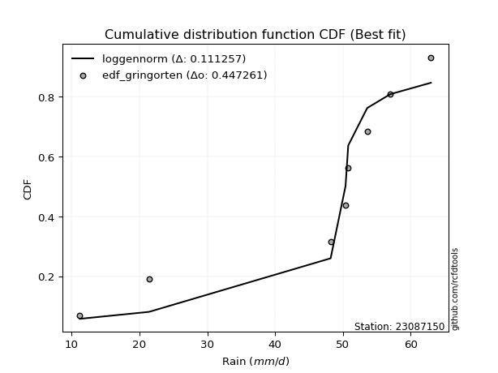</img></img>

</div>


### 9. Empirical - EDF Filliben (1975)

The specific values of the constants (0.3175) (often denoted as $alpha$) and (0.365) are derived from a method proposed by James J. Filliben in a 1975 paper. This particular formula is the mean value of the $i$-th order statistic of the normal distribution and is considered a robust and effective plotting position formula for the normal probability plot correlation coefficient test for normality.

<div align="center">


$P=(m-0.3175)/(n+0.365)$


</div>


**9.1. Empirical values**

<div align="center">

|                | 0                  | 1                   | 2                  | 3                   | 4                  | 5                  | 6                  | 7                  |
|:---------------|:-------------------|:--------------------|:-------------------|:--------------------|:-------------------|:-------------------|:-------------------|:-------------------|
| date           | 2023               | 2018                | 2019               | 2025                | 2024               | 2022               | 2020               | 2021               |
| x              | 11.2               | 21.4                | 48.2               | 50.4                | 50.8               | 53.6               | 57.0               | 63.0               |
| m              | 1                  | 2                   | 3                  | 4                   | 5                  | 6                  | 7                  | 8                  |
| empirical_dist | edf_filliben       | edf_filliben        | edf_filliben       | edf_filliben        | edf_filliben       | edf_filliben       | edf_filliben       | edf_filliben       |
| empirical      | 0.0815899581589958 | 0.20113568439928273 | 0.3206814106395696 | 0.44022713687985654 | 0.5597728631201434 | 0.6793185893604303 | 0.7988643156007172 | 0.9184100418410042 |
| empirical_tr   | 1.0888382687927107 | 1.2517770295548074  | 1.4720633523977125 | 1.7864388681260008  | 2.271554650373387  | 3.118359739049394  | 4.971768202080237  | 12.256410256410254 |

</div>


**9.2. Kolmogorov-Smirnov fit test (sorted by Δ)**


<div align="center">

|                | 0                   | 1                   | 2                   | 3                   | 4                   | 5                   | 6                   | 7                  | 8                  | 9                   | 10                  | 11                 | 12                  | 13                  | 14                  | 15                 | 16                    | 17                  | 18                 | 19                  | 20                 | 21                 | 22                 | 23                  | 24                 | 25                  | 26                 | 27                 | 28                 | 29                 | 30                 | 31                 | 32                 | 33                 | 34                  | 35                 | 36                 | 37                  | 38                  | 39                  | 40                  | 41                  | 42                  | 43                 | 44                 | 45                 | 46                 | 47                 | 48                 | 49                  | 50                  | 51                  | 52                  | 53                 | 54                  | 55                 | 56                 | 57                 | 58                 | 59                  | 60                  | 61                 | 62                  | 63                 | 64                 | 65                  | 66                  | 67                 | 68                  | 69                 | 70                 | 71                  | 72                 | 73                  | 74                  | 75                  | 76                 | 77                 | 78                 | 79                 | 80                  | 81                  | 82                 | 83                 | 84                 | 85                 | 86                  | 87                 | 88                 | 89                 |
|:---------------|:--------------------|:--------------------|:--------------------|:--------------------|:--------------------|:--------------------|:--------------------|:-------------------|:-------------------|:--------------------|:--------------------|:-------------------|:--------------------|:--------------------|:--------------------|:-------------------|:----------------------|:--------------------|:-------------------|:--------------------|:-------------------|:-------------------|:-------------------|:--------------------|:-------------------|:--------------------|:-------------------|:-------------------|:-------------------|:-------------------|:-------------------|:-------------------|:-------------------|:-------------------|:--------------------|:-------------------|:-------------------|:--------------------|:--------------------|:--------------------|:--------------------|:--------------------|:--------------------|:-------------------|:-------------------|:-------------------|:-------------------|:-------------------|:-------------------|:--------------------|:--------------------|:--------------------|:--------------------|:-------------------|:--------------------|:-------------------|:-------------------|:-------------------|:-------------------|:--------------------|:--------------------|:-------------------|:--------------------|:-------------------|:-------------------|:--------------------|:--------------------|:-------------------|:--------------------|:-------------------|:-------------------|:--------------------|:-------------------|:--------------------|:--------------------|:--------------------|:-------------------|:-------------------|:-------------------|:-------------------|:--------------------|:--------------------|:-------------------|:-------------------|:-------------------|:-------------------|:--------------------|:-------------------|:-------------------|:-------------------|
| station        | 23087150            | 23087150            | 23087150            | 23087150            | 23087150            | 23087150            | 23087150            | 23087150           | 23087150           | 23087150            | 23087150            | 23087150           | 23087150            | 23087150            | 23087150            | 23087150           | 23087150              | 23087150            | 23087150           | 23087150            | 23087150           | 23087150           | 23087150           | 23087150            | 23087150           | 23087150            | 23087150           | 23087150           | 23087150           | 23087150           | 23087150           | 23087150           | 23087150           | 23087150           | 23087150            | 23087150           | 23087150           | 23087150            | 23087150            | 23087150            | 23087150            | 23087150            | 23087150            | 23087150           | 23087150           | 23087150           | 23087150           | 23087150           | 23087150           | 23087150            | 23087150            | 23087150            | 23087150            | 23087150           | 23087150            | 23087150           | 23087150           | 23087150           | 23087150           | 23087150            | 23087150            | 23087150           | 23087150            | 23087150           | 23087150           | 23087150            | 23087150            | 23087150           | 23087150            | 23087150           | 23087150           | 23087150            | 23087150           | 23087150            | 23087150            | 23087150            | 23087150           | 23087150           | 23087150           | 23087150           | 23087150            | 23087150            | 23087150           | 23087150           | 23087150           | 23087150           | 23087150            | 23087150           | 23087150           | 23087150           |
| empirical_dist | edf_filliben        | edf_filliben        | edf_filliben        | edf_filliben        | edf_filliben        | edf_filliben        | edf_filliben        | edf_filliben       | edf_filliben       | edf_filliben        | edf_filliben        | edf_filliben       | edf_filliben        | edf_filliben        | edf_filliben        | edf_filliben       | edf_filliben          | edf_filliben        | edf_filliben       | edf_filliben        | edf_filliben       | edf_filliben       | edf_filliben       | edf_filliben        | edf_filliben       | edf_filliben        | edf_filliben       | edf_filliben       | edf_filliben       | edf_filliben       | edf_filliben       | edf_filliben       | edf_filliben       | edf_filliben       | edf_filliben        | edf_filliben       | edf_filliben       | edf_filliben        | edf_filliben        | edf_filliben        | edf_filliben        | edf_filliben        | edf_filliben        | edf_filliben       | edf_filliben       | edf_filliben       | edf_filliben       | edf_filliben       | edf_filliben       | edf_filliben        | edf_filliben        | edf_filliben        | edf_filliben        | edf_filliben       | edf_filliben        | edf_filliben       | edf_filliben       | edf_filliben       | edf_filliben       | edf_filliben        | edf_filliben        | edf_filliben       | edf_filliben        | edf_filliben       | edf_filliben       | edf_filliben        | edf_filliben        | edf_filliben       | edf_filliben        | edf_filliben       | edf_filliben       | edf_filliben        | edf_filliben       | edf_filliben        | edf_filliben        | edf_filliben        | edf_filliben       | edf_filliben       | edf_filliben       | edf_filliben       | edf_filliben        | edf_filliben        | edf_filliben       | edf_filliben       | edf_filliben       | edf_filliben       | edf_filliben        | edf_filliben       | edf_filliben       | edf_filliben       |
| p_dist         | johnsonsu           | logjohnsonsu        | logt                | genlogistic         | mielke              | laplace_asymmetric  | weibull_min         | gompertz           | fisk               | pearson3            | gumbel_l            | logpearson3        | logloggamma         | logmielke           | logfisk             | lognakagami        | loglaplace_asymmetric | t                   | exponnorm          | truncnorm           | norm               | crystalball        | nct                | nakagami            | f                  | loggumbel_l         | rice               | betaprime          | erlang             | gamma              | logistic           | logweibull_min     | chi2               | invgamma           | loggompertz         | hypsecant          | maxwell            | ncf                 | invgauss            | rayleigh            | loginvweibull       | laplace             | kstwobign           | loginvgauss        | logncf             | alpha              | logbetaprime       | logf               | lognct             | logfatiguelife      | lognorm             | lognorm             | logcrystalball      | logexponnorm       | logrice             | logalpha           | logerlang          | loggamma           | loggamma           | halfnorm            | loginvgamma         | gumbel_r           | loglogistic         | logkstwobign       | logmaxwell         | lograyleigh         | loghypsecant        | expon              | genexpon            | halflogistic       | loggenexpon        | moyal               | logexpon           | loghalfnorm         | loglaplace          | loggumbel_r         | loghalflogistic    | logmoyal           | pareto             | loglognorm         | wald                | logchi2             | logpareto          | gibrat             | logwald            | invweibull         | loggibrat           | fatiguelife        | logtruncnorm       | loggenlogistic     |
| delta          | 0.12734016344193966 | 0.13756366535179454 | 0.14598373718531688 | 0.15215195359026512 | 0.16692040182108225 | 0.18151878002676275 | 0.19413320316250454 | 0.1966167616945918 | 0.1994955868947494 | 0.20321818740722125 | 0.20460976257351743 | 0.2435834361779597 | 0.24697142411164025 | 0.24732959895275802 | 0.24952513990686226 | 0.2505067180794836 | 0.26465085624084267   | 0.26660987936919917 | 0.2666109847442936 | 0.26661239833959666 | 0.2666124296939742 | 0.2666124406556592 | 0.2666320374693411 | 0.26669368514551756 | 0.2680675023015339 | 0.26900133575527146 | 0.2731426042843544 | 0.2741877600921388 | 0.2758056456141185 | 0.276918203833076  | 0.2780313640284067 | 0.2788043895275634 | 0.2800844340981565 | 0.2852464765304468 | 0.28530133520691275 | 0.2874701588261856 | 0.2942243061282032 | 0.29811175523421035 | 0.30252234515996707 | 0.30286642503710387 | 0.31061613053850784 | 0.31331326707560253 | 0.31547554566252994 | 0.315599423893491  | 0.3169153175460527 | 0.3173789823158755 | 0.3177313242591964 | 0.3177792492945071 | 0.3190826566435366 | 0.31980660367420194 | 0.31986296191457214 | 0.31986296191457214 | 0.31986298459697843 | 0.3198631609169981 | 0.31986742983598365 | 0.3254417915589464 | 0.3254682368339597 | 0.3255859791847145 | 0.3255859791847145 | 0.32739161545785916 | 0.33004352822016597 | 0.3343277190847566 | 0.33696250619423646 | 0.3408982182360761 | 0.3424929155575776 | 0.34933874191990216 | 0.35039068869976425 | 0.3506751723560095 | 0.35071742171660397 | 0.3555579615137146 | 0.3556516559772263 | 0.35767845104941703 | 0.366633896234601  | 0.36913942643972814 | 0.37876908670571435 | 0.38128430196206714 | 0.3973803936564721 | 0.4017241294163661 | 0.4190412971278473 | 0.4220345184415629 | 0.42262193891929206 | 0.43133768898660657 | 0.4435134913356543 | 0.453890155142104  | 0.4593948211779147 | 0.4699412084227234 | 0.49163768318049855 | 0.5063141070154751 | 0.5265190700084388 | 0.7988643156007172 |
| deltao         | 0.4472608134160001  | 0.4472608134160001  | 0.4472608134160001  | 0.4472608134160001  | 0.4472608134160001  | 0.4472608134160001  | 0.4472608134160001  | 0.4472608134160001 | 0.4472608134160001 | 0.4472608134160001  | 0.4472608134160001  | 0.4472608134160001 | 0.4472608134160001  | 0.4472608134160001  | 0.4472608134160001  | 0.4472608134160001 | 0.4472608134160001    | 0.4472608134160001  | 0.4472608134160001 | 0.4472608134160001  | 0.4472608134160001 | 0.4472608134160001 | 0.4472608134160001 | 0.4472608134160001  | 0.4472608134160001 | 0.4472608134160001  | 0.4472608134160001 | 0.4472608134160001 | 0.4472608134160001 | 0.4472608134160001 | 0.4472608134160001 | 0.4472608134160001 | 0.4472608134160001 | 0.4472608134160001 | 0.4472608134160001  | 0.4472608134160001 | 0.4472608134160001 | 0.4472608134160001  | 0.4472608134160001  | 0.4472608134160001  | 0.4472608134160001  | 0.4472608134160001  | 0.4472608134160001  | 0.4472608134160001 | 0.4472608134160001 | 0.4472608134160001 | 0.4472608134160001 | 0.4472608134160001 | 0.4472608134160001 | 0.4472608134160001  | 0.4472608134160001  | 0.4472608134160001  | 0.4472608134160001  | 0.4472608134160001 | 0.4472608134160001  | 0.4472608134160001 | 0.4472608134160001 | 0.4472608134160001 | 0.4472608134160001 | 0.4472608134160001  | 0.4472608134160001  | 0.4472608134160001 | 0.4472608134160001  | 0.4472608134160001 | 0.4472608134160001 | 0.4472608134160001  | 0.4472608134160001  | 0.4472608134160001 | 0.4472608134160001  | 0.4472608134160001 | 0.4472608134160001 | 0.4472608134160001  | 0.4472608134160001 | 0.4472608134160001  | 0.4472608134160001  | 0.4472608134160001  | 0.4472608134160001 | 0.4472608134160001 | 0.4472608134160001 | 0.4472608134160001 | 0.4472608134160001  | 0.4472608134160001  | 0.4472608134160001 | 0.4472608134160001 | 0.4472608134160001 | 0.4472608134160001 | 0.4472608134160001  | 0.4472608134160001 | 0.4472608134160001 | 0.4472608134160001 |
| eval           | Δo > Δ              | Δo > Δ              | Δo > Δ              | Δo > Δ              | Δo > Δ              | Δo > Δ              | Δo > Δ              | Δo > Δ             | Δo > Δ             | Δo > Δ              | Δo > Δ              | Δo > Δ             | Δo > Δ              | Δo > Δ              | Δo > Δ              | Δo > Δ             | Δo > Δ                | Δo > Δ              | Δo > Δ             | Δo > Δ              | Δo > Δ             | Δo > Δ             | Δo > Δ             | Δo > Δ              | Δo > Δ             | Δo > Δ              | Δo > Δ             | Δo > Δ             | Δo > Δ             | Δo > Δ             | Δo > Δ             | Δo > Δ             | Δo > Δ             | Δo > Δ             | Δo > Δ              | Δo > Δ             | Δo > Δ             | Δo > Δ              | Δo > Δ              | Δo > Δ              | Δo > Δ              | Δo > Δ              | Δo > Δ              | Δo > Δ             | Δo > Δ             | Δo > Δ             | Δo > Δ             | Δo > Δ             | Δo > Δ             | Δo > Δ              | Δo > Δ              | Δo > Δ              | Δo > Δ              | Δo > Δ             | Δo > Δ              | Δo > Δ             | Δo > Δ             | Δo > Δ             | Δo > Δ             | Δo > Δ              | Δo > Δ              | Δo > Δ             | Δo > Δ              | Δo > Δ             | Δo > Δ             | Δo > Δ              | Δo > Δ              | Δo > Δ             | Δo > Δ              | Δo > Δ             | Δo > Δ             | Δo > Δ              | Δo > Δ             | Δo > Δ              | Δo > Δ              | Δo > Δ              | Δo > Δ             | Δo > Δ             | Δo > Δ             | Δo > Δ             | Δo > Δ              | Δo > Δ              | Δo > Δ             | Δo <= Δ            | Δo <= Δ            | Δo <= Δ            | Δo <= Δ             | Δo <= Δ            | Δo <= Δ            | Δo <= Δ            |
| fit            | 1                   | 1                   | 1                   | 1                   | 1                   | 1                   | 1                   | 1                  | 1                  | 1                   | 1                   | 1                  | 1                   | 1                   | 1                   | 1                  | 1                     | 1                   | 1                  | 1                   | 1                  | 1                  | 1                  | 1                   | 1                  | 1                   | 1                  | 1                  | 1                  | 1                  | 1                  | 1                  | 1                  | 1                  | 1                   | 1                  | 1                  | 1                   | 1                   | 1                   | 1                   | 1                   | 1                   | 1                  | 1                  | 1                  | 1                  | 1                  | 1                  | 1                   | 1                   | 1                   | 1                   | 1                  | 1                   | 1                  | 1                  | 1                  | 1                  | 1                   | 1                   | 1                  | 1                   | 1                  | 1                  | 1                   | 1                   | 1                  | 1                   | 1                  | 1                  | 1                   | 1                  | 1                   | 1                   | 1                   | 1                  | 1                  | 1                  | 1                  | 1                   | 1                   | 1                  | 0                  | 0                  | 0                  | 0                   | 0                  | 0                  | 0                  |
| n              | 8                   | 8                   | 8                   | 8                   | 8                   | 8                   | 8                   | 8                  | 8                  | 8                   | 8                   | 8                  | 8                   | 8                   | 8                   | 8                  | 8                     | 8                   | 8                  | 8                   | 8                  | 8                  | 8                  | 8                   | 8                  | 8                   | 8                  | 8                  | 8                  | 8                  | 8                  | 8                  | 8                  | 8                  | 8                   | 8                  | 8                  | 8                   | 8                   | 8                   | 8                   | 8                   | 8                   | 8                  | 8                  | 8                  | 8                  | 8                  | 8                  | 8                   | 8                   | 8                   | 8                   | 8                  | 8                   | 8                  | 8                  | 8                  | 8                  | 8                   | 8                   | 8                  | 8                   | 8                  | 8                  | 8                   | 8                   | 8                  | 8                   | 8                  | 8                  | 8                   | 8                  | 8                   | 8                   | 8                   | 8                  | 8                  | 8                  | 8                  | 8                   | 8                   | 8                  | 8                  | 8                  | 8                  | 8                   | 8                  | 8                  | 8                  |
| best_fit       | 1                   | 0                   | 0                   | 0                   | 0                   | 0                   | 0                   | 0                  | 0                  | 0                   | 0                   | 0                  | 0                   | 0                   | 0                   | 0                  | 0                     | 0                   | 0                  | 0                   | 0                  | 0                  | 0                  | 0                   | 0                  | 0                   | 0                  | 0                  | 0                  | 0                  | 0                  | 0                  | 0                  | 0                  | 0                   | 0                  | 0                  | 0                   | 0                   | 0                   | 0                   | 0                   | 0                   | 0                  | 0                  | 0                  | 0                  | 0                  | 0                  | 0                   | 0                   | 0                   | 0                   | 0                  | 0                   | 0                  | 0                  | 0                  | 0                  | 0                   | 0                   | 0                  | 0                   | 0                  | 0                  | 0                   | 0                   | 0                  | 0                   | 0                  | 0                  | 0                   | 0                  | 0                   | 0                   | 0                   | 0                  | 0                  | 0                  | 0                  | 0                   | 0                   | 0                  | 0                  | 0                  | 0                  | 0                   | 0                  | 0                  | 0                  |
| best_fit_sort  | 1                   | 2                   | 3                   | 4                   | 5                   | 6                   | 7                   | 8                  | 9                  | 10                  | 11                  | 12                 | 13                  | 14                  | 15                  | 16                 | 17                    | 18                  | 19                 | 20                  | 21                 | 22                 | 23                 | 24                  | 25                 | 26                  | 27                 | 28                 | 29                 | 30                 | 31                 | 32                 | 33                 | 34                 | 35                  | 36                 | 37                 | 38                  | 39                  | 40                  | 41                  | 42                  | 43                  | 44                 | 45                 | 46                 | 47                 | 48                 | 49                 | 50                  | 51                  | 52                  | 53                  | 54                 | 55                  | 56                 | 57                 | 58                 | 59                 | 60                  | 61                  | 62                 | 63                  | 64                 | 65                 | 66                  | 67                  | 68                 | 69                  | 70                 | 71                 | 72                  | 73                 | 74                  | 75                  | 76                  | 77                 | 78                 | 79                 | 80                 | 81                  | 82                  | 83                 | 84                 | 85                 | 86                 | 87                  | 88                 | 89                 | 90                 |

</div>


<div align="center">

</img>

</div>


**9.3. Best fit**

<div align="center">

|   id |   station | empirical_dist   | p_dist    |   delta |   deltao | eval   |   fit |   n |   best_fit |   best_fit_sort |
|-----:|----------:|:-----------------|:----------|--------:|---------:|:-------|------:|----:|-----------:|----------------:|
|    0 |  23087150 | edf_filliben     | johnsonsu | 0.12734 | 0.447261 | Δo > Δ |     1 |   8 |          1 |               1 |

</div>


<div align="center">

</img>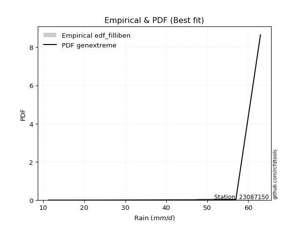</img>

</div>


### 10. Empirical - EDF Jenkinson (1977)

The Jenkinson formula in hydrology is an empirical plotting position formula used to estimate the non-exceedance probability _(P)_ or return period _(T)_ of a given ordered observation within a sample. It is a widely used method in the frequency analysis of extreme events such as floods and rainfall, as it provides a distribution-free way to plot data. _a≈0.31_ and _b≈0.38_ are constants derived to approximate the median of the probability distribution for the given rank.

<div align="center">


$P=(m-a)/(n+b)$


</div>


**10.1. Empirical values**

<div align="center">

|                | 0                   | 1                   | 2                  | 3                   | 4                  | 5                  | 6                  | 7                  |
|:---------------|:--------------------|:--------------------|:-------------------|:--------------------|:-------------------|:-------------------|:-------------------|:-------------------|
| date           | 2023                | 2018                | 2019               | 2025                | 2024               | 2022               | 2020               | 2021               |
| x              | 11.2                | 21.4                | 48.2               | 50.4                | 50.8               | 53.6               | 57.0               | 63.0               |
| m              | 1                   | 2                   | 3                  | 4                   | 5                  | 6                  | 7                  | 8                  |
| empirical_dist | edf_jenkinson       | edf_jenkinson       | edf_jenkinson      | edf_jenkinson       | edf_jenkinson      | edf_jenkinson      | edf_jenkinson      | edf_jenkinson      |
| empirical      | 0.08233890214797135 | 0.20167064439140808 | 0.3210023866348448 | 0.44033412887828155 | 0.5596658711217184 | 0.6789976133651551 | 0.7983293556085919 | 0.9176610978520287 |
| empirical_tr   | 1.0897269180754225  | 1.2526158445440956  | 1.4727592267135323 | 1.7867803837953091  | 2.2710027100271004 | 3.115241635687732  | 4.958579881656804  | 12.144927536231886 |

</div>


**10.2. Kolmogorov-Smirnov fit test (sorted by Δ)**


<div align="center">

|                | 0                   | 1                   | 2                   | 3                   | 4                   | 5                   | 6                   | 7                  | 8                  | 9                   | 10                  | 11                 | 12                  | 13                  | 14                  | 15                 | 16                    | 17                  | 18                 | 19                  | 20                 | 21                 | 22                 | 23                  | 24                 | 25                  | 26                 | 27                 | 28                 | 29                  | 30                  | 31                 | 32                 | 33                 | 34                  | 35                 | 36                 | 37                  | 38                  | 39                 | 40                  | 41                  | 42                  | 43                 | 44                 | 45                 | 46                 | 47                  | 48                 | 49                  | 50                  | 51                  | 52                  | 53                 | 54                  | 55                  | 56                 | 57                 | 58                 | 59                  | 60                 | 61                 | 62                  | 63                 | 64                 | 65                  | 66                  | 67                 | 68                 | 69                 | 70                 | 71                  | 72                 | 73                  | 74                  | 75                  | 76                 | 77                 | 78                 | 79                 | 80                  | 81                 | 82                 | 83                 | 84                 | 85                 | 86                  | 87                 | 88                 | 89                 |
|:---------------|:--------------------|:--------------------|:--------------------|:--------------------|:--------------------|:--------------------|:--------------------|:-------------------|:-------------------|:--------------------|:--------------------|:-------------------|:--------------------|:--------------------|:--------------------|:-------------------|:----------------------|:--------------------|:-------------------|:--------------------|:-------------------|:-------------------|:-------------------|:--------------------|:-------------------|:--------------------|:-------------------|:-------------------|:-------------------|:--------------------|:--------------------|:-------------------|:-------------------|:-------------------|:--------------------|:-------------------|:-------------------|:--------------------|:--------------------|:-------------------|:--------------------|:--------------------|:--------------------|:-------------------|:-------------------|:-------------------|:-------------------|:--------------------|:-------------------|:--------------------|:--------------------|:--------------------|:--------------------|:-------------------|:--------------------|:--------------------|:-------------------|:-------------------|:-------------------|:--------------------|:-------------------|:-------------------|:--------------------|:-------------------|:-------------------|:--------------------|:--------------------|:-------------------|:-------------------|:-------------------|:-------------------|:--------------------|:-------------------|:--------------------|:--------------------|:--------------------|:-------------------|:-------------------|:-------------------|:-------------------|:--------------------|:-------------------|:-------------------|:-------------------|:-------------------|:-------------------|:--------------------|:-------------------|:-------------------|:-------------------|
| station        | 23087150            | 23087150            | 23087150            | 23087150            | 23087150            | 23087150            | 23087150            | 23087150           | 23087150           | 23087150            | 23087150            | 23087150           | 23087150            | 23087150            | 23087150            | 23087150           | 23087150              | 23087150            | 23087150           | 23087150            | 23087150           | 23087150           | 23087150           | 23087150            | 23087150           | 23087150            | 23087150           | 23087150           | 23087150           | 23087150            | 23087150            | 23087150           | 23087150           | 23087150           | 23087150            | 23087150           | 23087150           | 23087150            | 23087150            | 23087150           | 23087150            | 23087150            | 23087150            | 23087150           | 23087150           | 23087150           | 23087150           | 23087150            | 23087150           | 23087150            | 23087150            | 23087150            | 23087150            | 23087150           | 23087150            | 23087150            | 23087150           | 23087150           | 23087150           | 23087150            | 23087150           | 23087150           | 23087150            | 23087150           | 23087150           | 23087150            | 23087150            | 23087150           | 23087150           | 23087150           | 23087150           | 23087150            | 23087150           | 23087150            | 23087150            | 23087150            | 23087150           | 23087150           | 23087150           | 23087150           | 23087150            | 23087150           | 23087150           | 23087150           | 23087150           | 23087150           | 23087150            | 23087150           | 23087150           | 23087150           |
| empirical_dist | edf_jenkinson       | edf_jenkinson       | edf_jenkinson       | edf_jenkinson       | edf_jenkinson       | edf_jenkinson       | edf_jenkinson       | edf_jenkinson      | edf_jenkinson      | edf_jenkinson       | edf_jenkinson       | edf_jenkinson      | edf_jenkinson       | edf_jenkinson       | edf_jenkinson       | edf_jenkinson      | edf_jenkinson         | edf_jenkinson       | edf_jenkinson      | edf_jenkinson       | edf_jenkinson      | edf_jenkinson      | edf_jenkinson      | edf_jenkinson       | edf_jenkinson      | edf_jenkinson       | edf_jenkinson      | edf_jenkinson      | edf_jenkinson      | edf_jenkinson       | edf_jenkinson       | edf_jenkinson      | edf_jenkinson      | edf_jenkinson      | edf_jenkinson       | edf_jenkinson      | edf_jenkinson      | edf_jenkinson       | edf_jenkinson       | edf_jenkinson      | edf_jenkinson       | edf_jenkinson       | edf_jenkinson       | edf_jenkinson      | edf_jenkinson      | edf_jenkinson      | edf_jenkinson      | edf_jenkinson       | edf_jenkinson      | edf_jenkinson       | edf_jenkinson       | edf_jenkinson       | edf_jenkinson       | edf_jenkinson      | edf_jenkinson       | edf_jenkinson       | edf_jenkinson      | edf_jenkinson      | edf_jenkinson      | edf_jenkinson       | edf_jenkinson      | edf_jenkinson      | edf_jenkinson       | edf_jenkinson      | edf_jenkinson      | edf_jenkinson       | edf_jenkinson       | edf_jenkinson      | edf_jenkinson      | edf_jenkinson      | edf_jenkinson      | edf_jenkinson       | edf_jenkinson      | edf_jenkinson       | edf_jenkinson       | edf_jenkinson       | edf_jenkinson      | edf_jenkinson      | edf_jenkinson      | edf_jenkinson      | edf_jenkinson       | edf_jenkinson      | edf_jenkinson      | edf_jenkinson      | edf_jenkinson      | edf_jenkinson      | edf_jenkinson       | edf_jenkinson      | edf_jenkinson      | edf_jenkinson      |
| p_dist         | johnsonsu           | logjohnsonsu        | logt                | genlogistic         | mielke              | laplace_asymmetric  | weibull_min         | gompertz           | fisk               | pearson3            | gumbel_l            | logpearson3        | logloggamma         | logmielke           | logfisk             | lognakagami        | loglaplace_asymmetric | t                   | exponnorm          | truncnorm           | norm               | crystalball        | nct                | nakagami            | f                  | loggumbel_l         | rice               | betaprime          | erlang             | gamma               | logistic            | logweibull_min     | chi2               | invgamma           | loggompertz         | hypsecant          | maxwell            | ncf                 | invgauss            | rayleigh           | loginvweibull       | laplace             | kstwobign           | loginvgauss        | logncf             | alpha              | logbetaprime       | logf                | lognct             | logfatiguelife      | lognorm             | lognorm             | logcrystalball      | logexponnorm       | logrice             | logalpha            | logerlang          | loggamma           | loggamma           | halfnorm            | loginvgamma        | gumbel_r           | loglogistic         | logkstwobign       | logmaxwell         | lograyleigh         | loghypsecant        | expon              | genexpon           | halflogistic       | loggenexpon        | moyal               | logexpon           | loghalfnorm         | loglaplace          | loggumbel_r         | loghalflogistic    | logmoyal           | pareto             | loglognorm         | wald                | logchi2            | logpareto          | gibrat             | logwald            | invweibull         | loggibrat           | fatiguelife        | logtruncnorm       | loggenlogistic     |
| delta          | 0.12701918744666446 | 0.13724268935651934 | 0.14651869717744223 | 0.15183097759498992 | 0.16659942582580706 | 0.18119780403148755 | 0.19381222716722935 | 0.1962957856993166 | 0.1991746108994742 | 0.20289721141194605 | 0.20428878657824223 | 0.2432624601826845 | 0.24665044811636505 | 0.24700862295748283 | 0.24920416391158706 | 0.2501857420842084 | 0.2643298802455675    | 0.26628890337392397 | 0.2662900087490184 | 0.26629142234432146 | 0.266291453698699  | 0.266291464660384  | 0.2663110614740659 | 0.26637270915024236 | 0.2677465263062587 | 0.26868035975999627 | 0.2728216282890792 | 0.2738667840968636 | 0.2754846696188433 | 0.27659722783780083 | 0.27771038803313153 | 0.2784834135322882 | 0.2797634581028813 | 0.2849255005351716 | 0.28498035921163756 | 0.2871491828309104 | 0.293903330132928  | 0.29779077923893515 | 0.30220136916469187 | 0.3025454490418287 | 0.31029515454323264 | 0.31299229108032733 | 0.31515456966725475 | 0.3152784478982158 | 0.3165943415507775 | 0.3170580063206003 | 0.3174103482639212 | 0.31745827329923193 | 0.3187616806482614 | 0.31948562767892674 | 0.31954198591929694 | 0.31954198591929694 | 0.31954200860170323 | 0.3195421849217229 | 0.31954645384070846 | 0.32512081556367123 | 0.3251472608386845 | 0.3252650031894393 | 0.3252650031894393 | 0.32707063946258397 | 0.3297225522248908 | 0.3340067430894814 | 0.33664153019896126 | 0.3405772422408009 | 0.3421719395623024 | 0.34901776592462697 | 0.35006971270448906 | 0.3503541963607343 | 0.3503964457213288 | 0.3552369855184394 | 0.3553306799819511 | 0.35735747505414184 | 0.3663129202393258 | 0.36881845044445294 | 0.37844811071043916 | 0.38096332596679194 | 0.3970594176611969 | 0.4014031534210909 | 0.418506337135722  | 0.4214995584494376 | 0.42230096292401686 | 0.4310167129913314 | 0.442978531343529  | 0.4535691791468288 | 0.4590738451826395 | 0.4691922644337479 | 0.49131670718522336 | 0.5059931310201998 | 0.5261980940131636 | 0.7983293556085919 |
| deltao         | 0.4472608134160001  | 0.4472608134160001  | 0.4472608134160001  | 0.4472608134160001  | 0.4472608134160001  | 0.4472608134160001  | 0.4472608134160001  | 0.4472608134160001 | 0.4472608134160001 | 0.4472608134160001  | 0.4472608134160001  | 0.4472608134160001 | 0.4472608134160001  | 0.4472608134160001  | 0.4472608134160001  | 0.4472608134160001 | 0.4472608134160001    | 0.4472608134160001  | 0.4472608134160001 | 0.4472608134160001  | 0.4472608134160001 | 0.4472608134160001 | 0.4472608134160001 | 0.4472608134160001  | 0.4472608134160001 | 0.4472608134160001  | 0.4472608134160001 | 0.4472608134160001 | 0.4472608134160001 | 0.4472608134160001  | 0.4472608134160001  | 0.4472608134160001 | 0.4472608134160001 | 0.4472608134160001 | 0.4472608134160001  | 0.4472608134160001 | 0.4472608134160001 | 0.4472608134160001  | 0.4472608134160001  | 0.4472608134160001 | 0.4472608134160001  | 0.4472608134160001  | 0.4472608134160001  | 0.4472608134160001 | 0.4472608134160001 | 0.4472608134160001 | 0.4472608134160001 | 0.4472608134160001  | 0.4472608134160001 | 0.4472608134160001  | 0.4472608134160001  | 0.4472608134160001  | 0.4472608134160001  | 0.4472608134160001 | 0.4472608134160001  | 0.4472608134160001  | 0.4472608134160001 | 0.4472608134160001 | 0.4472608134160001 | 0.4472608134160001  | 0.4472608134160001 | 0.4472608134160001 | 0.4472608134160001  | 0.4472608134160001 | 0.4472608134160001 | 0.4472608134160001  | 0.4472608134160001  | 0.4472608134160001 | 0.4472608134160001 | 0.4472608134160001 | 0.4472608134160001 | 0.4472608134160001  | 0.4472608134160001 | 0.4472608134160001  | 0.4472608134160001  | 0.4472608134160001  | 0.4472608134160001 | 0.4472608134160001 | 0.4472608134160001 | 0.4472608134160001 | 0.4472608134160001  | 0.4472608134160001 | 0.4472608134160001 | 0.4472608134160001 | 0.4472608134160001 | 0.4472608134160001 | 0.4472608134160001  | 0.4472608134160001 | 0.4472608134160001 | 0.4472608134160001 |
| eval           | Δo > Δ              | Δo > Δ              | Δo > Δ              | Δo > Δ              | Δo > Δ              | Δo > Δ              | Δo > Δ              | Δo > Δ             | Δo > Δ             | Δo > Δ              | Δo > Δ              | Δo > Δ             | Δo > Δ              | Δo > Δ              | Δo > Δ              | Δo > Δ             | Δo > Δ                | Δo > Δ              | Δo > Δ             | Δo > Δ              | Δo > Δ             | Δo > Δ             | Δo > Δ             | Δo > Δ              | Δo > Δ             | Δo > Δ              | Δo > Δ             | Δo > Δ             | Δo > Δ             | Δo > Δ              | Δo > Δ              | Δo > Δ             | Δo > Δ             | Δo > Δ             | Δo > Δ              | Δo > Δ             | Δo > Δ             | Δo > Δ              | Δo > Δ              | Δo > Δ             | Δo > Δ              | Δo > Δ              | Δo > Δ              | Δo > Δ             | Δo > Δ             | Δo > Δ             | Δo > Δ             | Δo > Δ              | Δo > Δ             | Δo > Δ              | Δo > Δ              | Δo > Δ              | Δo > Δ              | Δo > Δ             | Δo > Δ              | Δo > Δ              | Δo > Δ             | Δo > Δ             | Δo > Δ             | Δo > Δ              | Δo > Δ             | Δo > Δ             | Δo > Δ              | Δo > Δ             | Δo > Δ             | Δo > Δ              | Δo > Δ              | Δo > Δ             | Δo > Δ             | Δo > Δ             | Δo > Δ             | Δo > Δ              | Δo > Δ             | Δo > Δ              | Δo > Δ              | Δo > Δ              | Δo > Δ             | Δo > Δ             | Δo > Δ             | Δo > Δ             | Δo > Δ              | Δo > Δ             | Δo > Δ             | Δo <= Δ            | Δo <= Δ            | Δo <= Δ            | Δo <= Δ             | Δo <= Δ            | Δo <= Δ            | Δo <= Δ            |
| fit            | 1                   | 1                   | 1                   | 1                   | 1                   | 1                   | 1                   | 1                  | 1                  | 1                   | 1                   | 1                  | 1                   | 1                   | 1                   | 1                  | 1                     | 1                   | 1                  | 1                   | 1                  | 1                  | 1                  | 1                   | 1                  | 1                   | 1                  | 1                  | 1                  | 1                   | 1                   | 1                  | 1                  | 1                  | 1                   | 1                  | 1                  | 1                   | 1                   | 1                  | 1                   | 1                   | 1                   | 1                  | 1                  | 1                  | 1                  | 1                   | 1                  | 1                   | 1                   | 1                   | 1                   | 1                  | 1                   | 1                   | 1                  | 1                  | 1                  | 1                   | 1                  | 1                  | 1                   | 1                  | 1                  | 1                   | 1                   | 1                  | 1                  | 1                  | 1                  | 1                   | 1                  | 1                   | 1                   | 1                   | 1                  | 1                  | 1                  | 1                  | 1                   | 1                  | 1                  | 0                  | 0                  | 0                  | 0                   | 0                  | 0                  | 0                  |
| n              | 8                   | 8                   | 8                   | 8                   | 8                   | 8                   | 8                   | 8                  | 8                  | 8                   | 8                   | 8                  | 8                   | 8                   | 8                   | 8                  | 8                     | 8                   | 8                  | 8                   | 8                  | 8                  | 8                  | 8                   | 8                  | 8                   | 8                  | 8                  | 8                  | 8                   | 8                   | 8                  | 8                  | 8                  | 8                   | 8                  | 8                  | 8                   | 8                   | 8                  | 8                   | 8                   | 8                   | 8                  | 8                  | 8                  | 8                  | 8                   | 8                  | 8                   | 8                   | 8                   | 8                   | 8                  | 8                   | 8                   | 8                  | 8                  | 8                  | 8                   | 8                  | 8                  | 8                   | 8                  | 8                  | 8                   | 8                   | 8                  | 8                  | 8                  | 8                  | 8                   | 8                  | 8                   | 8                   | 8                   | 8                  | 8                  | 8                  | 8                  | 8                   | 8                  | 8                  | 8                  | 8                  | 8                  | 8                   | 8                  | 8                  | 8                  |
| best_fit       | 1                   | 0                   | 0                   | 0                   | 0                   | 0                   | 0                   | 0                  | 0                  | 0                   | 0                   | 0                  | 0                   | 0                   | 0                   | 0                  | 0                     | 0                   | 0                  | 0                   | 0                  | 0                  | 0                  | 0                   | 0                  | 0                   | 0                  | 0                  | 0                  | 0                   | 0                   | 0                  | 0                  | 0                  | 0                   | 0                  | 0                  | 0                   | 0                   | 0                  | 0                   | 0                   | 0                   | 0                  | 0                  | 0                  | 0                  | 0                   | 0                  | 0                   | 0                   | 0                   | 0                   | 0                  | 0                   | 0                   | 0                  | 0                  | 0                  | 0                   | 0                  | 0                  | 0                   | 0                  | 0                  | 0                   | 0                   | 0                  | 0                  | 0                  | 0                  | 0                   | 0                  | 0                   | 0                   | 0                   | 0                  | 0                  | 0                  | 0                  | 0                   | 0                  | 0                  | 0                  | 0                  | 0                  | 0                   | 0                  | 0                  | 0                  |
| best_fit_sort  | 1                   | 2                   | 3                   | 4                   | 5                   | 6                   | 7                   | 8                  | 9                  | 10                  | 11                  | 12                 | 13                  | 14                  | 15                  | 16                 | 17                    | 18                  | 19                 | 20                  | 21                 | 22                 | 23                 | 24                  | 25                 | 26                  | 27                 | 28                 | 29                 | 30                  | 31                  | 32                 | 33                 | 34                 | 35                  | 36                 | 37                 | 38                  | 39                  | 40                 | 41                  | 42                  | 43                  | 44                 | 45                 | 46                 | 47                 | 48                  | 49                 | 50                  | 51                  | 52                  | 53                  | 54                 | 55                  | 56                  | 57                 | 58                 | 59                 | 60                  | 61                 | 62                 | 63                  | 64                 | 65                 | 66                  | 67                  | 68                 | 69                 | 70                 | 71                 | 72                  | 73                 | 74                  | 75                  | 76                  | 77                 | 78                 | 79                 | 80                 | 81                  | 82                 | 83                 | 84                 | 85                 | 86                 | 87                  | 88                 | 89                 | 90                 |

</div>


<div align="center">

</img>

</div>


**10.3. Best fit**

<div align="center">

|   id |   station | empirical_dist   | p_dist    |    delta |   deltao | eval   |   fit |   n |   best_fit |   best_fit_sort |
|-----:|----------:|:-----------------|:----------|---------:|---------:|:-------|------:|----:|-----------:|----------------:|
|    0 |  23087150 | edf_jenkinson    | johnsonsu | 0.127019 | 0.447261 | Δo > Δ |     1 |   8 |          1 |               1 |

</div>


<div align="center">

</img></img>

</div>


### 11. Empirical - EDF Cunnane (1978)

Cunnane´s work in statistical hydrology has focused on the performance and evaluation of different probability distributions (such as GEV, Gumbel, Lognormal) for flood frequency estimation. _b_ is a constant, typically set to 0.4.

<div align="center">


$P=(m-b)/(n+1-2b)$


</div>


**11.1. Empirical values**

<div align="center">

|                | 0                   | 1                   | 2                  | 3                  | 4                  | 5                  | 6                  | 7                  |
|:---------------|:--------------------|:--------------------|:-------------------|:-------------------|:-------------------|:-------------------|:-------------------|:-------------------|
| date           | 2023                | 2018                | 2019               | 2025               | 2024               | 2022               | 2020               | 2021               |
| x              | 11.2                | 21.4                | 48.2               | 50.4               | 50.8               | 53.6               | 57.0               | 63.0               |
| m              | 1                   | 2                   | 3                  | 4                  | 5                  | 6                  | 7                  | 8                  |
| empirical_dist | edf_cunnane         | edf_cunnane         | edf_cunnane        | edf_cunnane        | edf_cunnane        | edf_cunnane        | edf_cunnane        | edf_cunnane        |
| empirical      | 0.07317073170731708 | 0.19512195121951223 | 0.3170731707317074 | 0.4390243902439025 | 0.5609756097560976 | 0.6829268292682927 | 0.8048780487804879 | 0.926829268292683  |
| empirical_tr   | 1.0789473684210527  | 1.2424242424242424  | 1.4642857142857144 | 1.782608695652174  | 2.277777777777778  | 3.153846153846154  | 5.125000000000001  | 13.666666666666675 |

</div>


**11.2. Kolmogorov-Smirnov fit test (sorted by Δ)**


<div align="center">

|                | 0                  | 1                   | 2                   | 3                   | 4                  | 5                  | 6                   | 7                   | 8                   | 9                  | 10                  | 11                  | 12                 | 13                  | 14                 | 15                  | 16                    | 17                 | 18                  | 19                 | 20                  | 21                  | 22                  | 23                 | 24                  | 25                 | 26                 | 27                  | 28                  | 29                  | 30                  | 31                  | 32                 | 33                  | 34                 | 35                  | 36                  | 37                 | 38                 | 39                 | 40                 | 41                 | 42                 | 43                  | 44                 | 45                  | 46                  | 47                  | 48                 | 49                 | 50                 | 51                 | 52                  | 53                  | 54                 | 55                  | 56                  | 57                  | 58                  | 59                 | 60                 | 61                  | 62                 | 63                 | 64                  | 65                 | 66                 | 67                 | 68                 | 69                  | 70                  | 71                 | 72                  | 73                 | 74                 | 75                 | 76                  | 77                  | 78                 | 79                 | 80                 | 81                 | 82                 | 83                  | 84                  | 85                 | 86                 | 87                 | 88                 | 89                 |
|:---------------|:-------------------|:--------------------|:--------------------|:--------------------|:-------------------|:-------------------|:--------------------|:--------------------|:--------------------|:-------------------|:--------------------|:--------------------|:-------------------|:--------------------|:-------------------|:--------------------|:----------------------|:-------------------|:--------------------|:-------------------|:--------------------|:--------------------|:--------------------|:-------------------|:--------------------|:-------------------|:-------------------|:--------------------|:--------------------|:--------------------|:--------------------|:--------------------|:-------------------|:--------------------|:-------------------|:--------------------|:--------------------|:-------------------|:-------------------|:-------------------|:-------------------|:-------------------|:-------------------|:--------------------|:-------------------|:--------------------|:--------------------|:--------------------|:-------------------|:-------------------|:-------------------|:-------------------|:--------------------|:--------------------|:-------------------|:--------------------|:--------------------|:--------------------|:--------------------|:-------------------|:-------------------|:--------------------|:-------------------|:-------------------|:--------------------|:-------------------|:-------------------|:-------------------|:-------------------|:--------------------|:--------------------|:-------------------|:--------------------|:-------------------|:-------------------|:-------------------|:--------------------|:--------------------|:-------------------|:-------------------|:-------------------|:-------------------|:-------------------|:--------------------|:--------------------|:-------------------|:-------------------|:-------------------|:-------------------|:-------------------|
| station        | 23087150           | 23087150            | 23087150            | 23087150            | 23087150           | 23087150           | 23087150            | 23087150            | 23087150            | 23087150           | 23087150            | 23087150            | 23087150           | 23087150            | 23087150           | 23087150            | 23087150              | 23087150           | 23087150            | 23087150           | 23087150            | 23087150            | 23087150            | 23087150           | 23087150            | 23087150           | 23087150           | 23087150            | 23087150            | 23087150            | 23087150            | 23087150            | 23087150           | 23087150            | 23087150           | 23087150            | 23087150            | 23087150           | 23087150           | 23087150           | 23087150           | 23087150           | 23087150           | 23087150            | 23087150           | 23087150            | 23087150            | 23087150            | 23087150           | 23087150           | 23087150           | 23087150           | 23087150            | 23087150            | 23087150           | 23087150            | 23087150            | 23087150            | 23087150            | 23087150           | 23087150           | 23087150            | 23087150           | 23087150           | 23087150            | 23087150           | 23087150           | 23087150           | 23087150           | 23087150            | 23087150            | 23087150           | 23087150            | 23087150           | 23087150           | 23087150           | 23087150            | 23087150            | 23087150           | 23087150           | 23087150           | 23087150           | 23087150           | 23087150            | 23087150            | 23087150           | 23087150           | 23087150           | 23087150           | 23087150           |
| empirical_dist | edf_cunnane        | edf_cunnane         | edf_cunnane         | edf_cunnane         | edf_cunnane        | edf_cunnane        | edf_cunnane         | edf_cunnane         | edf_cunnane         | edf_cunnane        | edf_cunnane         | edf_cunnane         | edf_cunnane        | edf_cunnane         | edf_cunnane        | edf_cunnane         | edf_cunnane           | edf_cunnane        | edf_cunnane         | edf_cunnane        | edf_cunnane         | edf_cunnane         | edf_cunnane         | edf_cunnane        | edf_cunnane         | edf_cunnane        | edf_cunnane        | edf_cunnane         | edf_cunnane         | edf_cunnane         | edf_cunnane         | edf_cunnane         | edf_cunnane        | edf_cunnane         | edf_cunnane        | edf_cunnane         | edf_cunnane         | edf_cunnane        | edf_cunnane        | edf_cunnane        | edf_cunnane        | edf_cunnane        | edf_cunnane        | edf_cunnane         | edf_cunnane        | edf_cunnane         | edf_cunnane         | edf_cunnane         | edf_cunnane        | edf_cunnane        | edf_cunnane        | edf_cunnane        | edf_cunnane         | edf_cunnane         | edf_cunnane        | edf_cunnane         | edf_cunnane         | edf_cunnane         | edf_cunnane         | edf_cunnane        | edf_cunnane        | edf_cunnane         | edf_cunnane        | edf_cunnane        | edf_cunnane         | edf_cunnane        | edf_cunnane        | edf_cunnane        | edf_cunnane        | edf_cunnane         | edf_cunnane         | edf_cunnane        | edf_cunnane         | edf_cunnane        | edf_cunnane        | edf_cunnane        | edf_cunnane         | edf_cunnane         | edf_cunnane        | edf_cunnane        | edf_cunnane        | edf_cunnane        | edf_cunnane        | edf_cunnane         | edf_cunnane         | edf_cunnane        | edf_cunnane        | edf_cunnane        | edf_cunnane        | edf_cunnane        |
| p_dist         | johnsonsu          | logt                | logjohnsonsu        | genlogistic         | mielke             | laplace_asymmetric | weibull_min         | gompertz            | fisk                | pearson3           | gumbel_l            | logpearson3         | logloggamma        | logmielke           | logfisk            | lognakagami         | loglaplace_asymmetric | t                  | exponnorm           | truncnorm          | norm                | crystalball         | nct                 | nakagami           | f                   | loggumbel_l        | rice               | betaprime           | erlang              | gamma               | logistic            | logweibull_min      | chi2               | invgamma            | loggompertz        | hypsecant           | maxwell             | ncf                | invgauss           | rayleigh           | loginvweibull      | laplace            | kstwobign          | loginvgauss         | logncf             | alpha               | logbetaprime        | logf                | lognct             | logfatiguelife     | lognorm            | lognorm            | logcrystalball      | logexponnorm        | logrice            | logalpha            | logerlang           | loggamma            | loggamma            | halfnorm           | loginvgamma        | gumbel_r            | loglogistic        | logkstwobign       | logmaxwell          | lograyleigh        | loghypsecant       | expon              | genexpon           | halflogistic        | loggenexpon         | moyal              | logexpon            | loghalfnorm        | loglaplace         | loggumbel_r        | loghalflogistic     | logmoyal            | pareto             | wald               | loglognorm         | logchi2            | logpareto          | gibrat              | logwald             | invweibull         | loggibrat          | fatiguelife        | logtruncnorm       | loggenlogistic     |
| delta          | 0.1309484033498019 | 0.13997000400554638 | 0.14117190525965678 | 0.15576019349812736 | 0.1705286417289445 | 0.185127019934625  | 0.19774144307036678 | 0.20022500160245404 | 0.20310382680261163 | 0.2068264273150835 | 0.20821800248137967 | 0.24719167608582193 | 0.2505796640195025 | 0.25093783886062027 | 0.2531333798147245 | 0.25411495798734585 | 0.2682590961487049    | 0.2702181192770614 | 0.27021922465215586 | 0.2702206382474589 | 0.27022066960183644 | 0.27022068056352144 | 0.27024027737720335 | 0.2703019250533798 | 0.27167574220939616 | 0.2726095756631337 | 0.2767508441922166 | 0.27779600000000104 | 0.27941388552198076 | 0.28052644374093827 | 0.28163960393626897 | 0.28241262943542567 | 0.2836926740060187 | 0.28885471643830907 | 0.288909575114775  | 0.29107839873404784 | 0.29783254603606546 | 0.3017199951420726 | 0.3061305850678293 | 0.3064746649449661 | 0.3142243704463701 | 0.3169215069834648 | 0.3190837855703922 | 0.31920766380135324 | 0.3205235574539149 | 0.32098722222373777 | 0.32133956416705867 | 0.32138748920236937 | 0.3226908965513988 | 0.3234148435820642 | 0.3234712018224344 | 0.3234712018224344 | 0.32347122450484067 | 0.32347140082486037 | 0.3234756697438459 | 0.32905003146680867 | 0.32907647674182194 | 0.32919421909257673 | 0.32919421909257673 | 0.3309998553657214 | 0.3336517681280282 | 0.33793595899261886 | 0.3405707461020987 | 0.3445064581439383 | 0.34610115546543985 | 0.3529469818277644 | 0.3539989286076265 | 0.3542834122638717 | 0.3543256616244662 | 0.35916620142157685 | 0.35925989588508855 | 0.3612866909572793 | 0.37024213614246326 | 0.3727476663475904 | 0.3823773266135766 | 0.3848925418699294 | 0.40098863356433434 | 0.40533236932422834 | 0.4250550303076178 | 0.4262301788271543 | 0.4280482516213334 | 0.4349459288944688 | 0.4495272245154248 | 0.45749839504996626 | 0.46300306108577693 | 0.4783604348744022 | 0.4952459230883608 | 0.5099223469233373 | 0.5301273099163011 | 0.8048780487804879 |
| deltao         | 0.4472608134160001 | 0.4472608134160001  | 0.4472608134160001  | 0.4472608134160001  | 0.4472608134160001 | 0.4472608134160001 | 0.4472608134160001  | 0.4472608134160001  | 0.4472608134160001  | 0.4472608134160001 | 0.4472608134160001  | 0.4472608134160001  | 0.4472608134160001 | 0.4472608134160001  | 0.4472608134160001 | 0.4472608134160001  | 0.4472608134160001    | 0.4472608134160001 | 0.4472608134160001  | 0.4472608134160001 | 0.4472608134160001  | 0.4472608134160001  | 0.4472608134160001  | 0.4472608134160001 | 0.4472608134160001  | 0.4472608134160001 | 0.4472608134160001 | 0.4472608134160001  | 0.4472608134160001  | 0.4472608134160001  | 0.4472608134160001  | 0.4472608134160001  | 0.4472608134160001 | 0.4472608134160001  | 0.4472608134160001 | 0.4472608134160001  | 0.4472608134160001  | 0.4472608134160001 | 0.4472608134160001 | 0.4472608134160001 | 0.4472608134160001 | 0.4472608134160001 | 0.4472608134160001 | 0.4472608134160001  | 0.4472608134160001 | 0.4472608134160001  | 0.4472608134160001  | 0.4472608134160001  | 0.4472608134160001 | 0.4472608134160001 | 0.4472608134160001 | 0.4472608134160001 | 0.4472608134160001  | 0.4472608134160001  | 0.4472608134160001 | 0.4472608134160001  | 0.4472608134160001  | 0.4472608134160001  | 0.4472608134160001  | 0.4472608134160001 | 0.4472608134160001 | 0.4472608134160001  | 0.4472608134160001 | 0.4472608134160001 | 0.4472608134160001  | 0.4472608134160001 | 0.4472608134160001 | 0.4472608134160001 | 0.4472608134160001 | 0.4472608134160001  | 0.4472608134160001  | 0.4472608134160001 | 0.4472608134160001  | 0.4472608134160001 | 0.4472608134160001 | 0.4472608134160001 | 0.4472608134160001  | 0.4472608134160001  | 0.4472608134160001 | 0.4472608134160001 | 0.4472608134160001 | 0.4472608134160001 | 0.4472608134160001 | 0.4472608134160001  | 0.4472608134160001  | 0.4472608134160001 | 0.4472608134160001 | 0.4472608134160001 | 0.4472608134160001 | 0.4472608134160001 |
| eval           | Δo > Δ             | Δo > Δ              | Δo > Δ              | Δo > Δ              | Δo > Δ             | Δo > Δ             | Δo > Δ              | Δo > Δ              | Δo > Δ              | Δo > Δ             | Δo > Δ              | Δo > Δ              | Δo > Δ             | Δo > Δ              | Δo > Δ             | Δo > Δ              | Δo > Δ                | Δo > Δ             | Δo > Δ              | Δo > Δ             | Δo > Δ              | Δo > Δ              | Δo > Δ              | Δo > Δ             | Δo > Δ              | Δo > Δ             | Δo > Δ             | Δo > Δ              | Δo > Δ              | Δo > Δ              | Δo > Δ              | Δo > Δ              | Δo > Δ             | Δo > Δ              | Δo > Δ             | Δo > Δ              | Δo > Δ              | Δo > Δ             | Δo > Δ             | Δo > Δ             | Δo > Δ             | Δo > Δ             | Δo > Δ             | Δo > Δ              | Δo > Δ             | Δo > Δ              | Δo > Δ              | Δo > Δ              | Δo > Δ             | Δo > Δ             | Δo > Δ             | Δo > Δ             | Δo > Δ              | Δo > Δ              | Δo > Δ             | Δo > Δ              | Δo > Δ              | Δo > Δ              | Δo > Δ              | Δo > Δ             | Δo > Δ             | Δo > Δ              | Δo > Δ             | Δo > Δ             | Δo > Δ              | Δo > Δ             | Δo > Δ             | Δo > Δ             | Δo > Δ             | Δo > Δ              | Δo > Δ              | Δo > Δ             | Δo > Δ              | Δo > Δ             | Δo > Δ             | Δo > Δ             | Δo > Δ              | Δo > Δ              | Δo > Δ             | Δo > Δ             | Δo > Δ             | Δo > Δ             | Δo <= Δ            | Δo <= Δ             | Δo <= Δ             | Δo <= Δ            | Δo <= Δ            | Δo <= Δ            | Δo <= Δ            | Δo <= Δ            |
| fit            | 1                  | 1                   | 1                   | 1                   | 1                  | 1                  | 1                   | 1                   | 1                   | 1                  | 1                   | 1                   | 1                  | 1                   | 1                  | 1                   | 1                     | 1                  | 1                   | 1                  | 1                   | 1                   | 1                   | 1                  | 1                   | 1                  | 1                  | 1                   | 1                   | 1                   | 1                   | 1                   | 1                  | 1                   | 1                  | 1                   | 1                   | 1                  | 1                  | 1                  | 1                  | 1                  | 1                  | 1                   | 1                  | 1                   | 1                   | 1                   | 1                  | 1                  | 1                  | 1                  | 1                   | 1                   | 1                  | 1                   | 1                   | 1                   | 1                   | 1                  | 1                  | 1                   | 1                  | 1                  | 1                   | 1                  | 1                  | 1                  | 1                  | 1                   | 1                   | 1                  | 1                   | 1                  | 1                  | 1                  | 1                   | 1                   | 1                  | 1                  | 1                  | 1                  | 0                  | 0                   | 0                   | 0                  | 0                  | 0                  | 0                  | 0                  |
| n              | 8                  | 8                   | 8                   | 8                   | 8                  | 8                  | 8                   | 8                   | 8                   | 8                  | 8                   | 8                   | 8                  | 8                   | 8                  | 8                   | 8                     | 8                  | 8                   | 8                  | 8                   | 8                   | 8                   | 8                  | 8                   | 8                  | 8                  | 8                   | 8                   | 8                   | 8                   | 8                   | 8                  | 8                   | 8                  | 8                   | 8                   | 8                  | 8                  | 8                  | 8                  | 8                  | 8                  | 8                   | 8                  | 8                   | 8                   | 8                   | 8                  | 8                  | 8                  | 8                  | 8                   | 8                   | 8                  | 8                   | 8                   | 8                   | 8                   | 8                  | 8                  | 8                   | 8                  | 8                  | 8                   | 8                  | 8                  | 8                  | 8                  | 8                   | 8                   | 8                  | 8                   | 8                  | 8                  | 8                  | 8                   | 8                   | 8                  | 8                  | 8                  | 8                  | 8                  | 8                   | 8                   | 8                  | 8                  | 8                  | 8                  | 8                  |
| best_fit       | 1                  | 0                   | 0                   | 0                   | 0                  | 0                  | 0                   | 0                   | 0                   | 0                  | 0                   | 0                   | 0                  | 0                   | 0                  | 0                   | 0                     | 0                  | 0                   | 0                  | 0                   | 0                   | 0                   | 0                  | 0                   | 0                  | 0                  | 0                   | 0                   | 0                   | 0                   | 0                   | 0                  | 0                   | 0                  | 0                   | 0                   | 0                  | 0                  | 0                  | 0                  | 0                  | 0                  | 0                   | 0                  | 0                   | 0                   | 0                   | 0                  | 0                  | 0                  | 0                  | 0                   | 0                   | 0                  | 0                   | 0                   | 0                   | 0                   | 0                  | 0                  | 0                   | 0                  | 0                  | 0                   | 0                  | 0                  | 0                  | 0                  | 0                   | 0                   | 0                  | 0                   | 0                  | 0                  | 0                  | 0                   | 0                   | 0                  | 0                  | 0                  | 0                  | 0                  | 0                   | 0                   | 0                  | 0                  | 0                  | 0                  | 0                  |
| best_fit_sort  | 1                  | 2                   | 3                   | 4                   | 5                  | 6                  | 7                   | 8                   | 9                   | 10                 | 11                  | 12                  | 13                 | 14                  | 15                 | 16                  | 17                    | 18                 | 19                  | 20                 | 21                  | 22                  | 23                  | 24                 | 25                  | 26                 | 27                 | 28                  | 29                  | 30                  | 31                  | 32                  | 33                 | 34                  | 35                 | 36                  | 37                  | 38                 | 39                 | 40                 | 41                 | 42                 | 43                 | 44                  | 45                 | 46                  | 47                  | 48                  | 49                 | 50                 | 51                 | 52                 | 53                  | 54                  | 55                 | 56                  | 57                  | 58                  | 59                  | 60                 | 61                 | 62                  | 63                 | 64                 | 65                  | 66                 | 67                 | 68                 | 69                 | 70                  | 71                  | 72                 | 73                  | 74                 | 75                 | 76                 | 77                  | 78                  | 79                 | 80                 | 81                 | 82                 | 83                 | 84                  | 85                  | 86                 | 87                 | 88                 | 89                 | 90                 |

</div>


<div align="center">

</img>

</div>


**11.3. Best fit**

<div align="center">

|   id |   station | empirical_dist   | p_dist    |    delta |   deltao | eval   |   fit |   n |   best_fit |   best_fit_sort |
|-----:|----------:|:-----------------|:----------|---------:|---------:|:-------|------:|----:|-----------:|----------------:|
|    0 |  23087150 | edf_cunnane      | johnsonsu | 0.130948 | 0.447261 | Δo > Δ |     1 |   8 |          1 |               1 |

</div>


<div align="center">

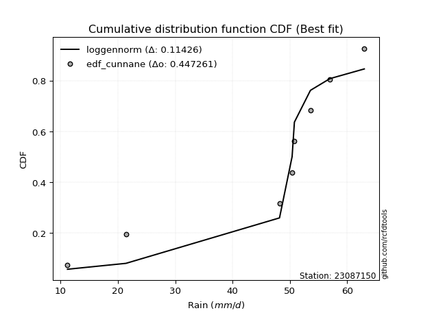</img>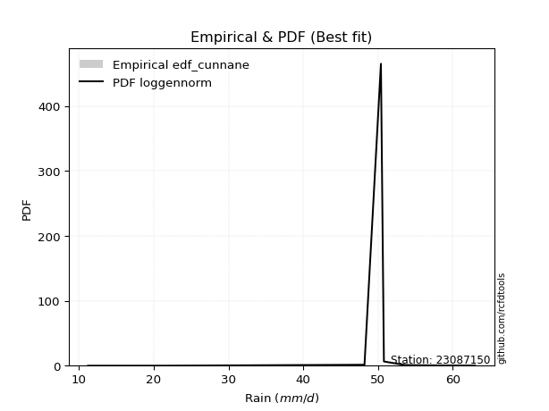</img>

</div>


### 12. Empirical - EDF Adamowski (1981)

The Adamowski formula in hydrology refers to a specific plotting position formula used for estimating the non-parametric empirical distribution of hydrological events (like flood peaks) to calculate their return periods. This formula provides an alternative to traditional parametric methods (like the Gumbel or Log Pearson Type III distributions). 

<div align="center">


$P=(m-0.25)/(n+0.5)$


</div>


**12.1. Empirical values**

<div align="center">

|                | 0                   | 1                   | 2                  | 3                  | 4                  | 5                  | 6                  | 7                  |
|:---------------|:--------------------|:--------------------|:-------------------|:-------------------|:-------------------|:-------------------|:-------------------|:-------------------|
| date           | 2023                | 2018                | 2019               | 2025               | 2024               | 2022               | 2020               | 2021               |
| x              | 11.2                | 21.4                | 48.2               | 50.4               | 50.8               | 53.6               | 57.0               | 63.0               |
| m              | 1                   | 2                   | 3                  | 4                  | 5                  | 6                  | 7                  | 8                  |
| empirical_dist | edf_adamowski       | edf_adamowski       | edf_adamowski      | edf_adamowski      | edf_adamowski      | edf_adamowski      | edf_adamowski      | edf_adamowski      |
| empirical      | 0.08823529411764706 | 0.20588235294117646 | 0.3235294117647059 | 0.4411764705882353 | 0.5588235294117647 | 0.6764705882352942 | 0.7941176470588235 | 0.9117647058823529 |
| empirical_tr   | 1.096774193548387   | 1.259259259259259   | 1.4782608695652173 | 1.7894736842105263 | 2.2666666666666666 | 3.0909090909090913 | 4.857142857142856  | 11.33333333333333  |

</div>


**12.2. Kolmogorov-Smirnov fit test (sorted by Δ)**


<div align="center">

|                | 0                   | 1                   | 2                   | 3                  | 4                   | 5                   | 6                   | 7                   | 8                  | 9                   | 10                  | 11                 | 12                  | 13                  | 14                  | 15                  | 16                    | 17                 | 18                  | 19                 | 20                 | 21                 | 22                  | 23                 | 24                  | 25                 | 26                 | 27                 | 28                  | 29                  | 30                  | 31                  | 32                 | 33                  | 34                 | 35                 | 36                  | 37                 | 38                 | 39                 | 40                  | 41                  | 42                  | 43                 | 44                 | 45                  | 46                  | 47                  | 48                 | 49                  | 50                  | 51                  | 52                  | 53                  | 54                 | 55                  | 56                 | 57                 | 58                 | 59                 | 60                 | 61                  | 62                 | 63                 | 64                 | 65                 | 66                 | 67                 | 68                 | 69                 | 70                  | 71                  | 72                  | 73                  | 74                 | 75                  | 76                 | 77                 | 78                 | 79                 | 80                 | 81                 | 82                 | 83                  | 84                 | 85                  | 86                 | 87                 | 88                 | 89                 |
|:---------------|:--------------------|:--------------------|:--------------------|:-------------------|:--------------------|:--------------------|:--------------------|:--------------------|:-------------------|:--------------------|:--------------------|:-------------------|:--------------------|:--------------------|:--------------------|:--------------------|:----------------------|:-------------------|:--------------------|:-------------------|:-------------------|:-------------------|:--------------------|:-------------------|:--------------------|:-------------------|:-------------------|:-------------------|:--------------------|:--------------------|:--------------------|:--------------------|:-------------------|:--------------------|:-------------------|:-------------------|:--------------------|:-------------------|:-------------------|:-------------------|:--------------------|:--------------------|:--------------------|:-------------------|:-------------------|:--------------------|:--------------------|:--------------------|:-------------------|:--------------------|:--------------------|:--------------------|:--------------------|:--------------------|:-------------------|:--------------------|:-------------------|:-------------------|:-------------------|:-------------------|:-------------------|:--------------------|:-------------------|:-------------------|:-------------------|:-------------------|:-------------------|:-------------------|:-------------------|:-------------------|:--------------------|:--------------------|:--------------------|:--------------------|:-------------------|:--------------------|:-------------------|:-------------------|:-------------------|:-------------------|:-------------------|:-------------------|:-------------------|:--------------------|:-------------------|:--------------------|:-------------------|:-------------------|:-------------------|:-------------------|
| station        | 23087150            | 23087150            | 23087150            | 23087150           | 23087150            | 23087150            | 23087150            | 23087150            | 23087150           | 23087150            | 23087150            | 23087150           | 23087150            | 23087150            | 23087150            | 23087150            | 23087150              | 23087150           | 23087150            | 23087150           | 23087150           | 23087150           | 23087150            | 23087150           | 23087150            | 23087150           | 23087150           | 23087150           | 23087150            | 23087150            | 23087150            | 23087150            | 23087150           | 23087150            | 23087150           | 23087150           | 23087150            | 23087150           | 23087150           | 23087150           | 23087150            | 23087150            | 23087150            | 23087150           | 23087150           | 23087150            | 23087150            | 23087150            | 23087150           | 23087150            | 23087150            | 23087150            | 23087150            | 23087150            | 23087150           | 23087150            | 23087150           | 23087150           | 23087150           | 23087150           | 23087150           | 23087150            | 23087150           | 23087150           | 23087150           | 23087150           | 23087150           | 23087150           | 23087150           | 23087150           | 23087150            | 23087150            | 23087150            | 23087150            | 23087150           | 23087150            | 23087150           | 23087150           | 23087150           | 23087150           | 23087150           | 23087150           | 23087150           | 23087150            | 23087150           | 23087150            | 23087150           | 23087150           | 23087150           | 23087150           |
| empirical_dist | edf_adamowski       | edf_adamowski       | edf_adamowski       | edf_adamowski      | edf_adamowski       | edf_adamowski       | edf_adamowski       | edf_adamowski       | edf_adamowski      | edf_adamowski       | edf_adamowski       | edf_adamowski      | edf_adamowski       | edf_adamowski       | edf_adamowski       | edf_adamowski       | edf_adamowski         | edf_adamowski      | edf_adamowski       | edf_adamowski      | edf_adamowski      | edf_adamowski      | edf_adamowski       | edf_adamowski      | edf_adamowski       | edf_adamowski      | edf_adamowski      | edf_adamowski      | edf_adamowski       | edf_adamowski       | edf_adamowski       | edf_adamowski       | edf_adamowski      | edf_adamowski       | edf_adamowski      | edf_adamowski      | edf_adamowski       | edf_adamowski      | edf_adamowski      | edf_adamowski      | edf_adamowski       | edf_adamowski       | edf_adamowski       | edf_adamowski      | edf_adamowski      | edf_adamowski       | edf_adamowski       | edf_adamowski       | edf_adamowski      | edf_adamowski       | edf_adamowski       | edf_adamowski       | edf_adamowski       | edf_adamowski       | edf_adamowski      | edf_adamowski       | edf_adamowski      | edf_adamowski      | edf_adamowski      | edf_adamowski      | edf_adamowski      | edf_adamowski       | edf_adamowski      | edf_adamowski      | edf_adamowski      | edf_adamowski      | edf_adamowski      | edf_adamowski      | edf_adamowski      | edf_adamowski      | edf_adamowski       | edf_adamowski       | edf_adamowski       | edf_adamowski       | edf_adamowski      | edf_adamowski       | edf_adamowski      | edf_adamowski      | edf_adamowski      | edf_adamowski      | edf_adamowski      | edf_adamowski      | edf_adamowski      | edf_adamowski       | edf_adamowski      | edf_adamowski       | edf_adamowski      | edf_adamowski      | edf_adamowski      | edf_adamowski      |
| p_dist         | johnsonsu           | logjohnsonsu        | genlogistic         | logt               | mielke              | laplace_asymmetric  | weibull_min         | gompertz            | fisk               | pearson3            | gumbel_l            | logpearson3        | logloggamma         | logmielke           | logfisk             | lognakagami         | loglaplace_asymmetric | t                  | exponnorm           | truncnorm          | norm               | crystalball        | nct                 | nakagami           | f                   | loggumbel_l        | rice               | betaprime          | erlang              | gamma               | logistic            | logweibull_min      | chi2               | invgamma            | loggompertz        | hypsecant          | maxwell             | ncf                | invgauss           | rayleigh           | loginvweibull       | laplace             | kstwobign           | loginvgauss        | logncf             | alpha               | logbetaprime        | logf                | lognct             | logfatiguelife      | lognorm             | lognorm             | logcrystalball      | logexponnorm        | logrice            | logalpha            | logerlang          | loggamma           | loggamma           | halfnorm           | loginvgamma        | gumbel_r            | loglogistic        | logkstwobign       | logmaxwell         | lograyleigh        | loghypsecant       | expon              | genexpon           | halflogistic       | loggenexpon         | moyal               | logexpon            | loghalfnorm         | loglaplace         | loggumbel_r         | loghalflogistic    | logmoyal           | pareto             | loglognorm         | wald               | logchi2            | logpareto          | gibrat              | logwald            | invweibull          | loggibrat          | fatiguelife        | logtruncnorm       | loggenlogistic     |
| delta          | 0.12449216231680338 | 0.13471566422665826 | 0.14930395246512884 | 0.1507304057272106 | 0.16407240069594597 | 0.17867077890162647 | 0.19128520203736826 | 0.19376876056945552 | 0.1966475857696131 | 0.20037018628208497 | 0.20176176144838115 | 0.2407354350528234 | 0.24412342298650397 | 0.24448159782762174 | 0.24667713878172598 | 0.24765871695434732 | 0.2618028551157064    | 0.2637618782440629 | 0.26376298361915734 | 0.2637643972144604 | 0.2637644285688379 | 0.2637644395305229 | 0.26378403634420483 | 0.2638456840203813 | 0.26521950117639764 | 0.2661533346301352 | 0.2702946031592181 | 0.2713397589670025 | 0.27295764448898224 | 0.27407020270793975 | 0.27518336290327045 | 0.27595638840242714 | 0.2772364329730202 | 0.28239847540531055 | 0.2824533340817765 | 0.2846221577010493 | 0.29137630500306694 | 0.2952637541090741 | 0.2996743440348308 | 0.3000184239119676 | 0.30776812941337156 | 0.31046526595046625 | 0.31262754453739366 | 0.3127514227683547 | 0.3140673164209164 | 0.31453098119073924 | 0.31488332313406014 | 0.31493124816937085 | 0.3162346555184003 | 0.31695860254906566 | 0.31701496078943586 | 0.31701496078943586 | 0.31701498347184215 | 0.31701515979186184 | 0.3170194287108474 | 0.32259379043381015 | 0.3226202357088234 | 0.3227379780595782 | 0.3227379780595782 | 0.3245436143327229 | 0.3271955270950297 | 0.33147971795962033 | 0.3341145050691002 | 0.3380502171109398 | 0.3396449144324413 | 0.3464907407947659 | 0.347542687574628  | 0.3478271712308732 | 0.3478694205914677 | 0.3527099603885783 | 0.35280365485209003 | 0.35483044992428076 | 0.36378589510946474 | 0.36629142531459186 | 0.3759210855805781 | 0.37843630083693086 | 0.3945323925313358 | 0.3988761282912298 | 0.4142946285859536 | 0.4172878498996692 | 0.4197739377941558 | 0.4284896878614703 | 0.4387668227937606 | 0.45104215401696773 | 0.4565468200527784 | 0.46329587246407217 | 0.4887896820553623 | 0.5034661058903387 | 0.5236710688833026 | 0.7941176470588235 |
| deltao         | 0.4472608134160001  | 0.4472608134160001  | 0.4472608134160001  | 0.4472608134160001 | 0.4472608134160001  | 0.4472608134160001  | 0.4472608134160001  | 0.4472608134160001  | 0.4472608134160001 | 0.4472608134160001  | 0.4472608134160001  | 0.4472608134160001 | 0.4472608134160001  | 0.4472608134160001  | 0.4472608134160001  | 0.4472608134160001  | 0.4472608134160001    | 0.4472608134160001 | 0.4472608134160001  | 0.4472608134160001 | 0.4472608134160001 | 0.4472608134160001 | 0.4472608134160001  | 0.4472608134160001 | 0.4472608134160001  | 0.4472608134160001 | 0.4472608134160001 | 0.4472608134160001 | 0.4472608134160001  | 0.4472608134160001  | 0.4472608134160001  | 0.4472608134160001  | 0.4472608134160001 | 0.4472608134160001  | 0.4472608134160001 | 0.4472608134160001 | 0.4472608134160001  | 0.4472608134160001 | 0.4472608134160001 | 0.4472608134160001 | 0.4472608134160001  | 0.4472608134160001  | 0.4472608134160001  | 0.4472608134160001 | 0.4472608134160001 | 0.4472608134160001  | 0.4472608134160001  | 0.4472608134160001  | 0.4472608134160001 | 0.4472608134160001  | 0.4472608134160001  | 0.4472608134160001  | 0.4472608134160001  | 0.4472608134160001  | 0.4472608134160001 | 0.4472608134160001  | 0.4472608134160001 | 0.4472608134160001 | 0.4472608134160001 | 0.4472608134160001 | 0.4472608134160001 | 0.4472608134160001  | 0.4472608134160001 | 0.4472608134160001 | 0.4472608134160001 | 0.4472608134160001 | 0.4472608134160001 | 0.4472608134160001 | 0.4472608134160001 | 0.4472608134160001 | 0.4472608134160001  | 0.4472608134160001  | 0.4472608134160001  | 0.4472608134160001  | 0.4472608134160001 | 0.4472608134160001  | 0.4472608134160001 | 0.4472608134160001 | 0.4472608134160001 | 0.4472608134160001 | 0.4472608134160001 | 0.4472608134160001 | 0.4472608134160001 | 0.4472608134160001  | 0.4472608134160001 | 0.4472608134160001  | 0.4472608134160001 | 0.4472608134160001 | 0.4472608134160001 | 0.4472608134160001 |
| eval           | Δo > Δ              | Δo > Δ              | Δo > Δ              | Δo > Δ             | Δo > Δ              | Δo > Δ              | Δo > Δ              | Δo > Δ              | Δo > Δ             | Δo > Δ              | Δo > Δ              | Δo > Δ             | Δo > Δ              | Δo > Δ              | Δo > Δ              | Δo > Δ              | Δo > Δ                | Δo > Δ             | Δo > Δ              | Δo > Δ             | Δo > Δ             | Δo > Δ             | Δo > Δ              | Δo > Δ             | Δo > Δ              | Δo > Δ             | Δo > Δ             | Δo > Δ             | Δo > Δ              | Δo > Δ              | Δo > Δ              | Δo > Δ              | Δo > Δ             | Δo > Δ              | Δo > Δ             | Δo > Δ             | Δo > Δ              | Δo > Δ             | Δo > Δ             | Δo > Δ             | Δo > Δ              | Δo > Δ              | Δo > Δ              | Δo > Δ             | Δo > Δ             | Δo > Δ              | Δo > Δ              | Δo > Δ              | Δo > Δ             | Δo > Δ              | Δo > Δ              | Δo > Δ              | Δo > Δ              | Δo > Δ              | Δo > Δ             | Δo > Δ              | Δo > Δ             | Δo > Δ             | Δo > Δ             | Δo > Δ             | Δo > Δ             | Δo > Δ              | Δo > Δ             | Δo > Δ             | Δo > Δ             | Δo > Δ             | Δo > Δ             | Δo > Δ             | Δo > Δ             | Δo > Δ             | Δo > Δ              | Δo > Δ              | Δo > Δ              | Δo > Δ              | Δo > Δ             | Δo > Δ              | Δo > Δ             | Δo > Δ             | Δo > Δ             | Δo > Δ             | Δo > Δ             | Δo > Δ             | Δo > Δ             | Δo <= Δ             | Δo <= Δ            | Δo <= Δ             | Δo <= Δ            | Δo <= Δ            | Δo <= Δ            | Δo <= Δ            |
| fit            | 1                   | 1                   | 1                   | 1                  | 1                   | 1                   | 1                   | 1                   | 1                  | 1                   | 1                   | 1                  | 1                   | 1                   | 1                   | 1                   | 1                     | 1                  | 1                   | 1                  | 1                  | 1                  | 1                   | 1                  | 1                   | 1                  | 1                  | 1                  | 1                   | 1                   | 1                   | 1                   | 1                  | 1                   | 1                  | 1                  | 1                   | 1                  | 1                  | 1                  | 1                   | 1                   | 1                   | 1                  | 1                  | 1                   | 1                   | 1                   | 1                  | 1                   | 1                   | 1                   | 1                   | 1                   | 1                  | 1                   | 1                  | 1                  | 1                  | 1                  | 1                  | 1                   | 1                  | 1                  | 1                  | 1                  | 1                  | 1                  | 1                  | 1                  | 1                   | 1                   | 1                   | 1                   | 1                  | 1                   | 1                  | 1                  | 1                  | 1                  | 1                  | 1                  | 1                  | 0                   | 0                  | 0                   | 0                  | 0                  | 0                  | 0                  |
| n              | 8                   | 8                   | 8                   | 8                  | 8                   | 8                   | 8                   | 8                   | 8                  | 8                   | 8                   | 8                  | 8                   | 8                   | 8                   | 8                   | 8                     | 8                  | 8                   | 8                  | 8                  | 8                  | 8                   | 8                  | 8                   | 8                  | 8                  | 8                  | 8                   | 8                   | 8                   | 8                   | 8                  | 8                   | 8                  | 8                  | 8                   | 8                  | 8                  | 8                  | 8                   | 8                   | 8                   | 8                  | 8                  | 8                   | 8                   | 8                   | 8                  | 8                   | 8                   | 8                   | 8                   | 8                   | 8                  | 8                   | 8                  | 8                  | 8                  | 8                  | 8                  | 8                   | 8                  | 8                  | 8                  | 8                  | 8                  | 8                  | 8                  | 8                  | 8                   | 8                   | 8                   | 8                   | 8                  | 8                   | 8                  | 8                  | 8                  | 8                  | 8                  | 8                  | 8                  | 8                   | 8                  | 8                   | 8                  | 8                  | 8                  | 8                  |
| best_fit       | 1                   | 0                   | 0                   | 0                  | 0                   | 0                   | 0                   | 0                   | 0                  | 0                   | 0                   | 0                  | 0                   | 0                   | 0                   | 0                   | 0                     | 0                  | 0                   | 0                  | 0                  | 0                  | 0                   | 0                  | 0                   | 0                  | 0                  | 0                  | 0                   | 0                   | 0                   | 0                   | 0                  | 0                   | 0                  | 0                  | 0                   | 0                  | 0                  | 0                  | 0                   | 0                   | 0                   | 0                  | 0                  | 0                   | 0                   | 0                   | 0                  | 0                   | 0                   | 0                   | 0                   | 0                   | 0                  | 0                   | 0                  | 0                  | 0                  | 0                  | 0                  | 0                   | 0                  | 0                  | 0                  | 0                  | 0                  | 0                  | 0                  | 0                  | 0                   | 0                   | 0                   | 0                   | 0                  | 0                   | 0                  | 0                  | 0                  | 0                  | 0                  | 0                  | 0                  | 0                   | 0                  | 0                   | 0                  | 0                  | 0                  | 0                  |
| best_fit_sort  | 1                   | 2                   | 3                   | 4                  | 5                   | 6                   | 7                   | 8                   | 9                  | 10                  | 11                  | 12                 | 13                  | 14                  | 15                  | 16                  | 17                    | 18                 | 19                  | 20                 | 21                 | 22                 | 23                  | 24                 | 25                  | 26                 | 27                 | 28                 | 29                  | 30                  | 31                  | 32                  | 33                 | 34                  | 35                 | 36                 | 37                  | 38                 | 39                 | 40                 | 41                  | 42                  | 43                  | 44                 | 45                 | 46                  | 47                  | 48                  | 49                 | 50                  | 51                  | 52                  | 53                  | 54                  | 55                 | 56                  | 57                 | 58                 | 59                 | 60                 | 61                 | 62                  | 63                 | 64                 | 65                 | 66                 | 67                 | 68                 | 69                 | 70                 | 71                  | 72                  | 73                  | 74                  | 75                 | 76                  | 77                 | 78                 | 79                 | 80                 | 81                 | 82                 | 83                 | 84                  | 85                 | 86                  | 87                 | 88                 | 89                 | 90                 |

</div>


<div align="center">

</img>

</div>


**12.3. Best fit**

<div align="center">

|   id |   station | empirical_dist   | p_dist    |    delta |   deltao | eval   |   fit |   n |   best_fit |   best_fit_sort |
|-----:|----------:|:-----------------|:----------|---------:|---------:|:-------|------:|----:|-----------:|----------------:|
|    0 |  23087150 | edf_adamowski    | johnsonsu | 0.124492 | 0.447261 | Δo > Δ |     1 |   8 |          1 |               1 |

</div>


<div align="center">

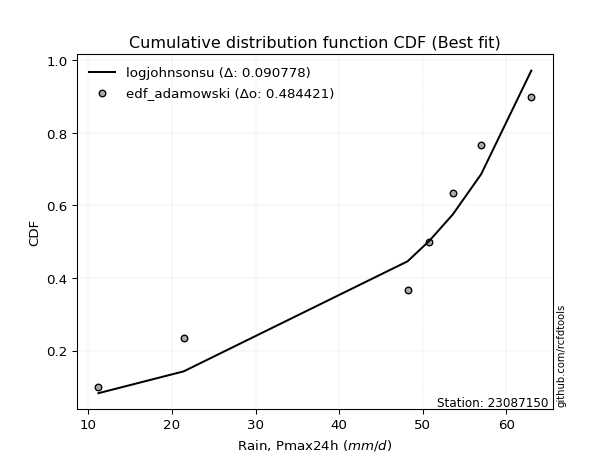</img>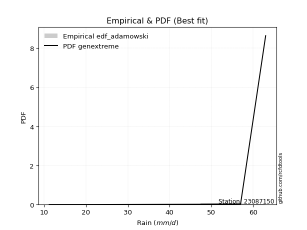</img>

</div>


## C. Best fit & Estimate extreme values for specific return periods - Tr


### 1. Best fit (ordered by delta Δ)

<div align="center">

|   id |   station | empirical_dist   | p_dist    |    delta |   deltao | eval   |   fit |   n |   best_fit |   best_fit_sort |
|-----:|----------:|:-----------------|:----------|---------:|---------:|:-------|------:|----:|-----------:|----------------:|
|    0 |  23087150 | edf_weibull      | johnsonsu | 0.120808 | 0.447261 | Δo > Δ |     1 |   8 |          1 |               1 |
|    1 |  23087150 | edf_adamowski    | johnsonsu | 0.124492 | 0.447261 | Δo > Δ |     1 |   8 |          1 |               2 |
|    2 |  23087150 | edf_chegodayev   | johnsonsu | 0.126593 | 0.447261 | Δo > Δ |     1 |   8 |          1 |               3 |
|    3 |  23087150 | edf_jenkinson    | johnsonsu | 0.127019 | 0.447261 | Δo > Δ |     1 |   8 |          1 |               4 |
|    4 |  23087150 | edf_beard        | johnsonsu | 0.127019 | 0.447261 | Δo > Δ |     1 |   8 |          1 |               5 |
|    5 |  23087150 | edf_filliben     | johnsonsu | 0.12734  | 0.447261 | Δo > Δ |     1 |   8 |          1 |               6 |
|    6 |  23087150 | edf_tukey        | johnsonsu | 0.128022 | 0.447261 | Δo > Δ |     1 |   8 |          1 |               7 |
|    7 |  23087150 | edf_blom         | johnsonsu | 0.12984  | 0.447261 | Δo > Δ |     1 |   8 |          1 |               8 |
|    8 |  23087150 | edf_cunnane      | johnsonsu | 0.130948 | 0.447261 | Δo > Δ |     1 |   8 |          1 |               9 |
|    9 |  23087150 | edf_hazen        | logt      | 0.132348 | 0.447261 | Δo > Δ |     1 |   8 |          1 |              10 |
|   10 |  23087150 | edf_gringorten   | johnsonsu | 0.132751 | 0.447261 | Δo > Δ |     1 |   8 |          1 |              11 |
|   11 |  23087150 | edf_california   | johnsonsu | 0.148585 | 0.447261 | Δo > Δ |     1 |   8 |          1 |              12 |

</div>

:file_folder:Tables: [bestfit_23087150.csv](table/bestfit_23087150.csv) | [extreme_23087150.csv](table/extreme_23087150.csv)


### 2. Extreme values

In hydrology, a return period (or recurrence interval $Tr$) is the statistical average time between extreme events like floods or droughts of a specific magnitude, indicating how rare an event is, with a 100-year flood, for example, having a 1% chance of occurring in any given year, not that it happens exactly every century. It is a key tool for infrastructure design (like bridges or dams) and risk assessment, calculated from historical data to determine the probability of future events, although it is important to remember it is statistical average, and events can cluster or be missed.

> risk_rate: assuming the return period as the project useful life.

|   id |      tr |   prob_l |     prob_g |    alpha |   betaprime |     chi2 |   crystalball |   erlang |    expon |   exponnorm |       f |   fatiguelife |     fisk |    gamma |   genexpon |   genlogistic |   gibrat |   gompertz |   gumbel_l |   gumbel_r |   halflogistic |   halfnorm |   hypsecant |   invgamma |   invgauss |      invweibull |   johnsonsu |   kstwobign |   laplace |   laplace_asymmetric |   loggamma |   logistic |   lognorm |   maxwell |   mielke |    moyal |   nakagami |      ncf |     nct |    norm |           pareto |   pearson3 |   rayleigh |    rice |       t |   truncnorm |     wald |   weibull_min |   logalpha |   logbetaprime |     logchi2 |   logcrystalball |   logerlang |   logexpon |   logexponnorm |     logf |   logfatiguelife |   logfisk |   loggenexpon |   loggenlogistic |   loggibrat |   loggompertz |   loggumbel_l |   loggumbel_r |   loghalflogistic |   loghalfnorm |   loghypsecant |   loginvgamma |   loginvgauss |   loginvweibull |   logjohnsonsu |   logkstwobign |   loglaplace |   loglaplace_asymmetric |   logloggamma |   loglogistic |     loglognorm |   logmaxwell |   logmielke |   logmoyal |   lognakagami |   logncf |   lognct |     logpareto |   logpearson3 |   lograyleigh |   logrice |             logt |   logtruncnorm |   logwald |   logweibull_min |   station |   n |   risk_rate |
|-----:|--------:|---------:|-----------:|---------:|------------:|---------:|--------------:|---------:|---------:|------------:|--------:|--------------:|---------:|---------:|-----------:|--------------:|---------:|-----------:|-----------:|-----------:|---------------:|-----------:|------------:|-----------:|-----------:|----------------:|------------:|------------:|----------:|---------------------:|-----------:|-----------:|----------:|----------:|---------:|---------:|-----------:|---------:|--------:|--------:|-----------------:|-----------:|-----------:|--------:|--------:|------------:|---------:|--------------:|-----------:|---------------:|------------:|-----------------:|------------:|-----------:|---------------:|---------:|-----------------:|----------:|--------------:|-----------------:|------------:|--------------:|--------------:|--------------:|------------------:|--------------:|---------------:|--------------:|--------------:|----------------:|---------------:|---------------:|-------------:|------------------------:|--------------:|--------------:|---------------:|-------------:|------------:|-----------:|--------------:|---------:|---------:|--------------:|--------------:|--------------:|----------:|-----------------:|---------------:|----------:|-----------------:|----------:|----:|------------:|
|    0 |    2    | 0.5      | 0.5        |  40.8728 |     44.0132 |  43.5941 |       44.45   |  43.923  |  34.2471 |     44.4501 | 44.3771 |       11.2001 |  47.4364 |  43.8434 |    34.2494 |       49.1382 |  39.3472 |    47.6336 |    47.2428 |    41.6572 |        40.2687 |    40.9701 |     44.45   |    43.3503 |    42.1168 |   556.055       |     50.0129 |     40.2139 |   44.45   |              48.1346 |    38.5525 |    44.45   |   39.3024 |   42.9961 |  48.6893 |  40.7556 |    44.4411 |  41.4311 | 44.446  | 44.45   |     12.6882      |    47.2414 |    42.4804 | 44.0407 | 44.4501 |     44.45   |  38.9393 |       47.7174 |    37.9596 |        39.0622 |     19.1951 |          39.3024 |     38.5032 |    26.7376 |        39.3024 |  39.3828 |          39.3076 |   44.3156 |       33.3566 |         inf      |     33.1519 |       43.6183 |       43.1394 |       35.8067 |           34.1862 |       34.9954 |        39.3024 |       38.2101 |       38.6071 |         36.6381 |        49.9258 |        33.9225 |      39.3024 |                 44.875  |       45.3918 |       39.3024 |  11.3801       |      37.442  |     45.2949 |    34.746  |       45.0887 |  38.6561 |  39.2411 |  11.884       |       44.4901 |       36.8035 |   39.3022 |    51.5147       |        31.8326 |   32.7031 |          44.0267 |  23087150 |   8 |    0.75     |
|    1 |    2.33 | 0.570815 | 0.429185   |  44.4986 |     47.123  |  46.8066 |       47.4836 |  47.0432 |  39.3251 |     47.4837 | 47.4181 |       12.5269 |  50.1331 |  46.9846 |    39.325  |       51.3756 |  40.8839 |    49.911  |    49.8821 |    44.4682 |        43.1589 |    44.2442 |     46.8778 |    46.5575 |    45.5355 | 16728.4         |     52.2106 |     44.1896 |   46.2858 |              50.1079 |    42.852  |    47.1229 |   43.4873 |   46.1478 |  51.3072 |  43.4165 |    47.479  |  45.3182 | 47.4822 | 47.4836 |     15.542       |    50.0362 |    45.6788 | 47.1649 | 47.4838 |     47.4836 |  40.9285 |       49.9797 |    42.4877 |        43.4119 |     23.0453 |          43.4873 |     42.8287 |    32.3882 |        43.4873 |  43.601  |          43.4915 |   48.2356 |       38.3491 |         inf      |     34.8954 |       46.6537 |       47.1091 |       39.3263 |           37.6457 |       39.0335 |        42.6174 |       42.4998 |       43.2082 |         42.2217 |        52.5074 |        39.194  |      41.7841 |                 47.654  |       48.3268 |       42.9671 |  12.7684       |      41.5922 |     48.3159 |    37.9708 |       48.1828 |  43.2088 |  43.4764 |  13.3157      |       48.5813 |       40.9466 |   43.487  |    52.4089       |        34.1803 |   34.9466 |          46.9806 |  23087150 |   8 |    0.729209 |
|    2 |    5    | 0.8      | 0.2        |  59.4048 |     58.786  |  59.0153 |       58.7575 |  58.8476 |  64.7138 |     58.7576 | 58.7263 |       40.7123 |  60.5453 |  58.8659 |    64.7019 |       57.4854 |  49.7312 |    57.2846 |    58.4086 |    56.6805 |        56.2363 |    58.09   |     56.6164 |    58.9497 |    59.1722 |     4.81796e+10 |     58.168  |     61.0778 |   55.4645 |              55.5007 |    63.959  |    57.4431 |   63.3382 |   58.5529 |  58.2677 |  55.7425 |    58.7713 |  62.7775 | 58.7669 | 58.7575 |    907.803       |    58.9265 |    58.4833 | 58.8838 | 58.7575 |     58.7575 |  52.0641 |       57.2881 |    65.6462 |        64.6379 |     65.9321 |          63.3382 |     64.0603 |    84.4667 |        63.3382 |  63.6377 |          63.349  |   66.9117 |       67.2327 |         inf      |     46.8727 |       58.0528 |       62.6055 |       59.0991 |           58.2301 |       61.9436 |        58.9728 |       63.708  |       66.9316 |         78.1928 |        58.8998 |        72.3924 |      56.7501 |                 55.5389 |       56.6933 |       60.6215 |   4.15505e+143 |      62.9074 |     56.9571 |    57.2786 |       62.2336 |  65.964  |  63.6953 |   3.94192e+16 |       63.1054 |       62.7612 |   63.3376 |    58.3725       |        45.0075 |   50.6657 |          57.9471 |  23087150 |   8 |    0.67232  |
|    3 |   10    | 0.9      | 0.1        |  70.7515 |     66.6154 |  67.3512 |       66.2363 |  66.861  |  87.761  |     66.2364 | 66.2342 |       79.6291 |  68.2137 |  66.9294 |    87.7383 |       60.3911 |  59.8162 |    61.397  |    63.1558 |    66.6273 |        67.0966 |    68.3355 |     64.3929 |    67.6024 |    69.071  |     8.79412e+15 |     60.7314 |     73.936  |   63.7967 |              59.4844 |    83.9772 |    65.0436 |   81.2826 |   67.2829 |  60.7978 |  66.4741 |    66.2644 |  77.6461 | 66.2542 | 66.2363 | 112976           |    63.6144 |    67.6131 | 66.7257 | 66.2363 |     66.2363 |  63.8815 |       61.3571 |    88.9334 |        84.5969 |    191.651  |          81.2826 |     84.183  |   201.646  |        81.2825 |  81.788  |          81.3146 |   85.1489 |      100.5    |         inf      |     65.6144 |       65.6036 |       73.346  |       82.3495 |           83.6493 |       87.1776 |        76.4357 |       84.0379 |       91.0361 |        129.166  |        61.1963 |       115.499  |      74.9306 |                 59.0151 |       59.9416 |       78.1127 | inf            |      84.1702 |     60.323  |    81.9299 |       74.2746 |  88.0627 |  82.1317 | inf           |       71.3521 |       85.1017 |   81.2816 |    74.1694       |        52.397  |   75.1451 |          65.1267 |  23087150 |   8 |    0.651322 |
|    4 |   15    | 0.933333 | 0.0666667  |  76.928  |     70.5502 |  71.5824 |       69.9684 |  70.9147 | 101.243  |     69.9685 | 69.9827 |      105.081  |  72.3919 |  71.0078 |   101.214  |       61.7038 |  66.7723 |    63.2605 |    65.3057 |    72.2391 |        73.2425 |    73.6672 |     68.8309 |    72.0557 |    74.2781 |     8.17693e+18 |     61.719  |     80.7622 |   68.6707 |              61.8148 |    96.392  |    69.1847 |   92.0571 |   71.7622 |  61.5899 |  72.7023 |    70.0043 |  86.3059 | 69.9909 | 69.9684 |      1.91233e+06 |    65.6234 |    72.3173 | 70.6537 | 69.9683 |     69.9683 |  71.4701 |       63.1998 |   103.975  |        96.9022 |    368.172  |          92.0571 |     96.6538 |   335.467  |        92.0569 |  92.7006 |          92.1085 |   97.0985 |      123.669  |         inf      |     82.7481 |       69.3453 |       78.7984 |       99.3002 |          102.681  |      104.144  |        88.6302 |       96.7436 |      106.705  |        171.447  |        61.9749 |       148.008  |      88.1577 |                 61.0067 |       60.9816 |       89.6822 | inf            |      97.733  |     61.402  |   100.846  |       81.2804 | 101.979  |  93.2651 | inf           |       74.8798 |       99.5583 |   92.0559 |   100.111        |        55.4779 |   96.7897 |          68.6645 |  23087150 |   8 |    0.644736 |
|    5 |   20    | 0.95     | 0.05       |  81.1793 |     73.137  |  74.3791 |       72.4124 |  73.5892 | 110.808  |     72.4125 | 72.4381 |      123.926  |  75.2798 |  73.6985 |   110.775  |       62.5465 |  72.2289 |    64.4207 |    66.6439 |    76.1684 |        77.5485 |    77.2219 |     71.9617 |    75.0224 |    77.7874 |     9.79458e+20 |     62.2807 |     85.3605 |   72.1288 |              63.4682 |   105.577  |    72.0469 |   99.8757 |   74.7349 |  61.9773 |  77.1131 |    72.4536 |  92.496  | 72.4382 | 72.4124 |      1.42324e+07 |    66.8271 |    75.444  | 73.2305 | 72.4124 |     72.4124 |  77.1251 |       64.3468 |   115.384  |       105.974  |    590.54   |          99.8756 |    105.876  |   481.387  |        99.8755 | 100.625  |          99.9441 |  106.324  |      141.966  |         inf      |     99.2649 |       71.783  |       82.3952 |      113.205  |          118.54   |      117.254  |        98.3857 |      106.189  |      118.633  |        209.045  |        62.3864 |       174.921  |      98.9355 |                 62.4604 |       61.4943 |       98.6656 | inf            |     107.92   |     61.934  |   116.829  |       86.2766 | 112.369  | 101.371  | inf           |       76.9594 |      110.501  |   99.8742 |   142.12         |        57.1704 |  116.882  |          70.963  |  23087150 |   8 |    0.641514 |
|    6 |   25    | 0.96     | 0.04       |  84.4203 |     75.0463 |  76.451  |       74.2115 |  75.5681 | 118.228  |     74.2116 | 74.246  |      138.898  |  77.489  |  75.6891 |   118.191  |       63.1659 |  76.7778 |    65.2465 |    67.5961 |    79.195  |        80.8661 |    79.8668 |     74.3847 |    77.2323 |    80.4217 |     3.90747e+22 |     62.656  |     88.8048 |   74.8112 |              64.7506 |   112.934  |    74.2365 |  106.052  |   76.9419 |  62.2071 |  80.532  |    74.2568 |  97.3396 | 74.2397 | 74.2115 |      6.75207e+07 |    67.6587 |    77.767  | 75.1295 | 74.2115 |     74.2115 |  81.6546 |       65.1631 |   124.69   |       113.222  |    855.707  |         106.052  |    113.26   |   637.02   |       106.052  | 106.889  |         106.136  |  113.969  |      157.298  |         inf      |    115.528  |       73.5704 |       85.0542 |      125.23   |          132.41   |      128.067  |       106.667  |      113.781  |      128.385  |        243.538  |        62.6478 |       198.239  |     108.195  |                 63.6118 |       61.7997 |      106.141  | inf            |     116.164  |     62.251  |   130.941  |       90.177  | 120.744  | 107.791  | inf           |       78.3719 |      119.404  |  106.051  |   210.73         |        58.241  |  135.945  |          72.6453 |  23087150 |   8 |    0.639603 |
|    7 |   50    | 0.98     | 0.02       |  94.2669 |     80.5378 |  82.4457 |       79.3636 |  81.2823 | 141.275  |     79.3637 | 79.4247 |      186.937  |  84.2389 |  81.4368 |   141.227  |       64.968  |  92.8128 |    67.4885 |    70.1811 |    88.5185 |        91.0881 |    87.5544 |     81.897  |    83.6848 |    88.2094 |     3.33843e+27 |     63.5756 |     98.9191 |   83.1433 |              68.7343 |   137.199  |    80.9263 |  125.936  |   83.3424 |  62.6608 |  91.1457 |    79.421  | 112.71   | 79.3991 | 79.3636 |      8.50694e+09 |    69.7977 |    84.5105 | 80.5761 | 79.3635 |     79.3636 |  96.4436 |       67.3788 |   156.395  |       137.019  |   2762.37   |         125.936  |    137.596  |  1520.75   |       125.935  | 127.071  |         126.078  |  140.905  |      211.878  |         inf      |    197.22   |       78.6527 |       92.7128 |      170.907  |          186.204  |      165.499  |       137.04   |      138.983  |      161.746  |        389.843  |        63.2377 |       286.271  |     142.856  |                 67.3254 |       62.4054 |      132.674  | inf            |     143.808  |     62.8833 |   186.558  |      102.487  | 148.678  | 128.542  | inf           |       81.8678 |      149.519  |  125.934  |  2539.44         |        60.5188 |  222.636  |          77.416  |  23087150 |   8 |    0.63583  |
|    8 |   75    | 0.986667 | 0.0133333  |  99.9261 |     83.4989 |  85.7001 |       82.128  |  84.3774 | 154.756  |     82.1281 | 82.2044 |      215.868  |  88.1374 |  84.5497 |   154.703  |       65.9694 | 103.643  |    68.6225 |    71.4883 |    93.9377 |        97.0301 |    91.7392 |     86.2871 |    87.2247 |    92.5398 |     2.45473e+30 |     63.9872 |    104.484  |   88.0173 |              71.0647 |   152.462  |    84.7901 |  138.1    |   86.8223 |  62.8104 |  97.3523 |    82.1922 | 121.984  | 82.1676 | 82.128  |      1.4401e+11  |    70.8052 |    88.1792 | 83.5035 | 82.1279 |     82.128  | 105.544  |       68.4992 |   177.104  |       151.91   |   5544.72   |         138.099  |    152.89   |  2529.98   |       138.099  | 139.43   |         138.284  |  159.272  |      249.175  |         inf      |    283.023  |       81.3564 |       96.8443 |      204.766  |          227.019  |      190.289  |       158.649  |      154.955  |      183.628  |        512.448  |        63.4765 |       350.414  |     168.074  |                 69.5975 |       62.6059 |      150.922  | inf            |     161.507  |     63.1009 |   229.467  |      109.858  | 166.473  | 141.297  | inf           |       83.4205 |      168.981  |  138.097  | 60455.1          |        61.3221 |  301.596  |          79.9464 |  23087150 |   8 |    0.634587 |
|    9 |  100    | 0.99     | 0.01       | 103.916  |     85.5075 |  87.9163 |       83.9977 |  86.4823 | 164.322  |     83.9979 | 84.0849 |      236.685  |  90.8899 |  86.6666 |   164.264  |       66.6658 | 112.032  |    69.3642 |    72.3433 |    97.7731 |       101.236  |    94.59   |     89.4013 |    89.6503 |    95.53   |     2.62285e+32 |     64.2377 |    108.297  |   91.4755 |              72.7181 |   163.806  |    87.518  |  146.986  |   89.1926 |  62.8848 | 101.756  |    84.0667 | 128.712  | 84.0402 | 83.9977 |      1.07179e+12 |    71.4345 |    90.6786 | 85.4851 | 83.9976 |     83.9977 | 112.179  |       69.2321 |   192.863  |       162.943  |   9127.41   |         146.986  |    164.251  |  3630.46   |       146.985  | 148.464  |         147.205  |  173.665  |      278.286  |         inf      |    374.407  |       83.1754 |       99.6458 |      232.71   |          261.205  |      209.271  |       176.014  |      166.882  |      200.32   |        621.875  |        63.6135 |       402.478  |     188.622  |                 71.2559 |       62.7058 |      165.298  | inf            |     174.793  |     63.2174 |   265.768  |      115.174  | 179.801  | 150.642  | inf           |       84.3504 |      183.672  |  146.983  |     2.47751e+06  |        61.7326 |  376.306  |          81.6461 |  23087150 |   8 |    0.633968 |
|   10 |  200    | 0.995    | 0.005      | 113.492  |     90.0809 |  92.9885 |       88.2389 |  91.2915 | 187.369  |     88.239  | 88.3515 |      287.641  |  97.4927 |  91.5028 |   187.3    |       68.314  | 134.857  |    70.9767 |    74.2018 |   106.994  |       111.347  |   101.11   |     96.9035 |    95.2485 |   102.499  |     1.97762e+37 |     64.7329 |    117.078  |   99.8077 |              76.7018 |   193.006  |    94.0618 |  169.321  |   94.6155 |  62.9963 | 112.365  |    88.319  | 145.491  | 88.2881 | 88.2389 |      1.35035e+14 |    72.7151 |    96.3975 | 89.9848 | 88.2388 |     88.2389 | 128.707  |       70.825  |   234.821  |       191.215  |  30686      |         169.32   |    193.47   |  8666.96   |       169.32   | 171.189  |         169.637  |  213.716  |      358.369  |         inf      |    801.606  |       87.2719 |      106.018  |      316.505  |          365.967  |      260.109  |       226.057  |      197.792  |      244.897  |        990.322  |        63.8645 |       553.739  |     249.049  |                 75.4159 |       62.8554 |      205.615  | inf            |     209.448  |     63.4255 |   378.598  |      128.315  | 214.483  | 174.226  | inf           |       86.1269 |      222.27   |  169.317  |     4.5846e+14   |        62.3597 |  653.064  |          85.4662 |  23087150 |   8 |    0.633042 |
|   11 |  250    | 0.996    | 0.004      | 116.575  |     91.4834 |  94.551  |       89.535  |  92.7708 | 194.789  |     89.5351 | 89.6557 |      304.247  |  99.6125 |  92.9903 |   194.716  |       68.8386 | 143.047  |    71.4512 |    74.7486 |   109.958  |       114.597  |   103.116  |     99.3186 |    96.9862 |   104.681  |     7.31386e+38 |     64.8662 |    119.796  |  102.49   |              77.9843 |   202.999  |    96.1626 |  176.801  |   96.2848 |  63.0187 | 115.78   |    89.6186 | 151.079  | 89.5864 | 89.535  |      6.40625e+14 |    73.0679 |    98.1579 | 91.3611 | 89.5349 |     89.535  | 134.174  |       71.2937 |   249.626  |       200.851  |  45474.6    |         176.801  |    203.461  | 11469      |       176.8    | 178.805  |         177.153  |  228.44   |      387.392  |         inf      |   1053.39   |       88.5154 |      107.969  |      349.398  |          407.875  |      278.106  |       245.02   |      208.436  |      260.666  |       1150.11   |        63.9274 |       611.205  |     272.358  |                 76.8061 |       62.8853 |      220.539  | inf            |     221.44   |     63.4795 |   424.278  |      132.652  | 226.468  | 182.153  | inf           |       86.5847 |      235.711  |  176.797  |     4.77595e+19  |        62.4868 |  783.719  |          86.6238 |  23087150 |   8 |    0.632858 |
|   12 |  500    | 0.998    | 0.002      | 126.185  |     95.6556 |  99.2194 |       93.3785 |  97.184  | 217.836  |     93.3787 | 93.5241 |      356.342  | 106.187  |  97.4277 |   217.752  |       70.4576 | 171.35   |    72.8115 |    76.3161 |   119.159  |       124.686  |   109.097  |    106.82   |   102.216  |   111.297  |     5.38155e+43 |     65.2186 |    127.94   |  110.822  |              81.968  |   236.007  |   102.678  |  200.983  |  101.266  |  63.0659 | 126.389  |    93.4728 | 169.068  | 93.4364 | 93.3785 |      8.07125e+16 |    74.0155 |   103.41   | 95.4455 | 93.3784 |     93.3785 | 151.56   |       72.6373 |   300.087  |       232.553  | 155518      |         200.982  |    236.437  | 27379.7    |       200.982  | 203.445  |         201.462  |  280.872  |      488.747  |         inf      |   2707.42   |       92.1801 |      113.764  |      474.893  |          571.045  |      339.501  |       314.676  |      243.82   |      314.528  |       1829.68   |        64.083  |       821.666  |     359.611  |                 81.29   |       62.945  |      274.071  | inf            |     261.463  |     63.6261 |   604.396  |      146.48   | 266.438  | 207.872  | inf           |       87.7345 |      280.843  |  200.978  |     2.53377e+51  |        62.7427 | 1399.61   |          90.0301 |  23087150 |   8 |    0.632489 |
|   13 |  750    | 0.998667 | 0.00133333 | 131.85   |     97.9819 | 101.835  |       95.5137 |  99.6528 | 231.317  |     95.5138 | 95.6737 |      387.122  | 110.028  |  99.9097 |   231.228  |       71.3998 | 190.068  |    73.5386 |    77.1538 |   124.538  |       130.584  |   112.438  |    111.208  |   105.171  |   115.068  |     3.76711e+46 |     65.3895 |    132.516  |  115.696  |              84.2983 |   256.77   |   106.484  |  215.817  |  104.052  |  63.0841 | 132.595  |    95.6141 | 180.068  | 95.5753 | 95.5137 |      1.36634e+18 |    74.4818 |   106.348  | 97.7164 | 95.5135 |     95.5137 | 161.984  |       73.3553 |   333.016  |       252.401  | 320787      |         215.817  |    257.159  | 45550.1    |       215.816  | 218.573  |         216.384  |  316.909  |      556.595  |          62.9614 |   5054.57   |       94.201  |      116.988  |      568.21   |          695.193  |      379.523  |       364.273  |      266.245  |      349.754  |       2400.21   |        64.1528 |       970.26   |     423.091  |                 84.0334 |       62.9649 |      311.172  | inf            |     286.924  |     63.703  |   743.385  |      154.831  | 291.863  | 223.716  | inf           |       88.2526 |      309.748  |  215.813  |     6.48624e+91  |        62.8286 | 1981.57   |          91.9051 |  23087150 |   8 |    0.632366 |
|   14 | 1000    | 0.999    | 0.001      | 135.896  |     99.5871 | 103.645  |       96.9837 | 101.36   | 240.883  |     96.9839 | 97.1539 |      409.078  | 112.752  | 101.626  |   240.789  |       72.067  | 204.392  |    74.0279 |    77.7177 |   128.353  |       134.768  |   114.745  |    114.322  |   107.226  |   117.705  |     3.92779e+48 |     65.4979 |    135.685  |  119.154  |              85.9517 |   272.188  |   109.184  |  226.663  |  105.978  |  63.0949 | 136.998  |    97.0885 | 188.1    | 97.048  | 96.9837 |      1.0169e+19  |    74.7796 |   108.377  | 99.2806 | 96.9835 |     96.9837 | 169.482  |       73.8386 |   358.045  |       267.096  | 537173      |         226.663  |    272.537  | 65363.3    |       226.662  | 229.638  |         227.296  |  345.235  |      608.918  |          62.9713 |   8150.14   |       95.5861 |      119.209  |      645.32   |          799.296  |      409.885  |       404.135  |      282.977  |      376.561  |       2909.79   |        64.1951 |      1088.69   |     474.816  |                 86.0358 |       62.9748 |      340.488  | inf            |     305.956  |     63.7552 |   860.98   |      160.879  | 310.875  | 235.33   | inf           |       88.5649 |      331.443  |  226.658  |     1.39633e+139 |        62.8716 | 2544.65   |          93.189  |  23087150 |   8 |    0.632305 |

<div align="center">

</img>

</div>


<div align="center">

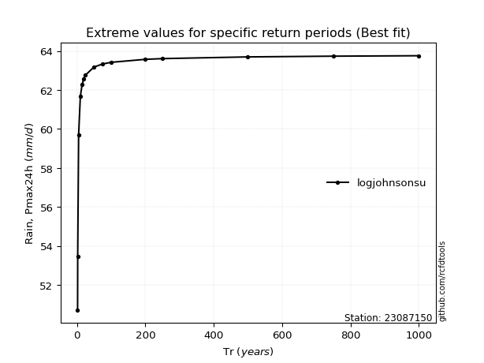</img>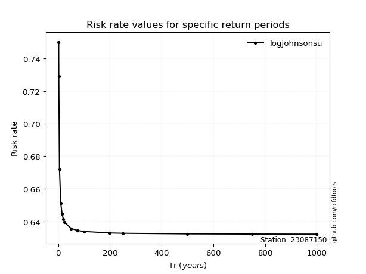</img>

</div>


<sub>**APP DISCLAIMER**: NO WARRANTY - This software is provided by [github.com/rcfdtools](https://github.com/rcfdtools) "as is", without any express or implied warranty, including warranties of merchantability, fitness for a particular purpose, or non-infringement. There is no guarantee that the software will be error-free or operate without interruption. LIMITATION OF LIABILITY - Neither the authors nor copyright holders will be liable for claims or damages arising from the software or its use. You are responsible for determining if the software is appropriate for your use and assume all associated risks, including errors, legal compliance, and data loss. NO PROFESSIONAL ADVICE - The software provides general information and does not offer professional advice. It should not replace consultation with professional advisors.</sub>