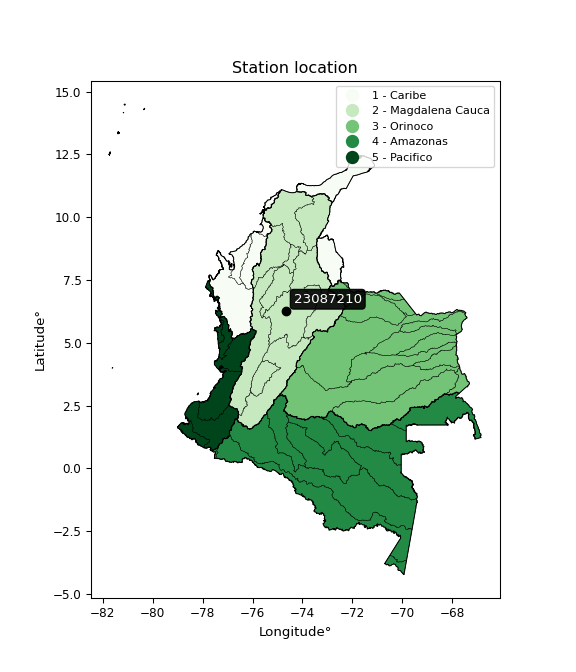

<div align="center">


</div>

# PMP Station (rain, Pmax24h): 23087210

Probable Maximum Precipitation (PMP) is the greatest amount of rainfall for a specific duration that is meteorologically possible for a given location, acting as a "worst-case" scenario for extreme storms, crucial for designing safety-critical infrastructure like bridges, river deviations, dams, spillways, and nuclear plants to prevent catastrophic failure. PMP is calculated by hydrologists using meteorological data to determine the upper limit of extreme rainfall, often leading to the Probable Maximum Flood (PMF) for flood control design, and is increasingly being studied for climate change impacts.

<div align="center">

</img>

</div>


## A. General information


### 1. General running parameters

• app_version: _v20251227_. • runtime: _2025-12-27 09:02:11.367833_. • Python version: _3.14.0_. • SciPy version: _1.16.3_. • Pandas version: _2.3.3_. • NumPy version: _2.3.5_. • Stations dataset (station_dataset_file): _dataset/pmax24h_in/automatic_colombia_2003_2024_filter.csv_. • Stations catalog (station_catalog_file): _dataset/CNE_IDEAM.xls_. • Minimum year to eval til year_max (date_min): _2003_. • Maximum year to eval since year_min (date_max): _2024_. • Creates, save and include plots into reports (create_plot): _False_. • Plot only fit distributions with Δo > Δ (plot_only_fit): _True_. • Eval low extreme values, if False, evaluates high extreme values (low_extreme): _False_. • Eval every SciPy distribution as logarithmic (pdist_logarithmic_on): _True_. • Standard deviation normalized (ddof): _1.0_. • Return periods to eval in years (Tr): _[2, 2.33, 5, 10, 15, 20, 25, 50, 75, 100, 200, 250, 500, 750, 1000]_. • Minimum data sample per station, 0 means any (minimum_sample): _5_. • Z-Score threshold to adjust a value, 0 means disable (zscore): _3.5_. • Avoid zeros, e.g. rain = 0 (avoid_zeros): _True_. • Avoid null values (avoid_nans): _True_. [:file_folder:Dataset file.](../../dataset/pmax24h_in/automatic_colombia_2003_2024_filter.csv)

> Delta Degrees of Freedom (DDOF): is a parameter used in the formulas for calculating variance and standard deviation. When ddof=0, the divisor is $N$ (the total number of observations) and this is used when your data set is the entire population. When ddof=1, the divisor is $N-1$ and this is used when your data set is a sample drawn from a larger population. Using $N-1$ provides an unbiased estimate of the population variance (known as Bessel´s correction).


### 2. Station info and location

|   id |   CODIGO | NOMBRE                    | CATEGORIA    | TECNOLOGIA                              | ESTADO           | FECHA_INSTALACION   |   FECHA_SUSPENSION |   ALTITUD |   LATITUD |   LONGITUD | DEPARTAMENTO   | MUNICIPIO   | AREA_OPERATIVA             | ENTIDAD                                                     | AREA_HIDROGRAFICA   | ZONA_HIDROGRAFICA   | SUBZONA_HIDROGRAFICA   | CORRIENTE   | Catalogo   |
|-----:|---------:|:--------------------------|:-------------|:----------------------------------------|:-----------------|:--------------------|-------------------:|----------:|----------:|-----------:|:---------------|:------------|:---------------------------|:------------------------------------------------------------|:--------------------|:--------------------|:-----------------------|:------------|:-----------|
|    0 | 23087210 | CANTERAS - AUT [23087210] | Limnigráfica | Automática con Telemetría, Convencional | En Mantenimiento | 15/07/1973          |                nan |       159 |   6.27608 |   -74.6733 | Antioquia      | Puerto Nare | Area Operativa 10 - Tolima | INSTITUTO DE HIDROLOGIA METEOROLOGIA Y ESTUDIOS AMBIENTALES | Magdalena Cauca     | Medio Magdalena     | Río Nare               | Nare        | CNE_IDEAM  |

<div align="center">

Map location in: [:earth_americas:Google](http://maps.google.com/maps?q=6.276083333,-74.67330556) [:earth_americas:OSM](https://www.openstreetmap.org/#map=18/6.276083333/-74.67330556&layers=P) [:earth_americas:Bing](https://www.bing.com/maps?cp=6.276083333~-74.67330556&lvl=18) [:earth_americas:Apple](https://maps.apple.com/frame?center=6.276083333%2C-74.67330556&span=0.003%2C0.006)

</div>


<div align="center">

```geojson
{
  "type": "Feature",
  "geometry": {
    "type": "Point", 
    "coordinates": [-74.67330556, 6.276083333]
  }, 
  "properties": {
    "Name": "23087210"
  }
}
```

</div>


### 3. Discrete values table and plot

|               |          0 |           1 |         2 |           3 |           4 |           5 |           6 |           7 |            8 |          9 |         10 |
|:--------------|-----------:|------------:|----------:|------------:|------------:|------------:|------------:|------------:|-------------:|-----------:|-----------:|
| Date          | 2008       | 2010        | 2011      | 2012        | 2013        | 2014        | 2015        | 2016        | 2017         | 2019       | 2020       |
| Value         |   26.5     |   66.3      |  149.8    |   91.5      |   67        |   47.4      |   63        |   56.8      |   80.5       |  168.6     |   25.2     |
| Value_initial |   26.5     |   66.3      |  149.8    |   91.5      |   67        |   47.4      |   63        |   56.8      |   80.5       |  168.6     |   25.2     |
| count         |   11       |   11        |   11      |   11        |   11        |   11        |   11        |   11        |   11         |   11       |   11       |
| mean          |   76.6     |   76.6      |   76.6    |   76.6      |   76.6      |   76.6      |   76.6      |   76.6      |   76.6       |   76.6     |   76.6     |
| std           |   45.6501  |   45.6501   |   45.6501 |   45.6501   |   45.6501   |   45.6501   |   45.6501   |   45.6501   |   45.6501    |   45.6501  |   45.6501  |
| zscore        |   -1.09748 |   -0.225629 |    1.6035 |    0.326396 |   -0.210295 |   -0.639648 |   -0.297918 |   -0.433734 |    0.0854324 |    2.01533 |   -1.12596 |

> The initial value (value_initial) correspond to the initial obtained or null completed value, and value (value) is adjusted only when the initial value is outside the valid range definite through the Z-Score value. If Z-Score is active, values out of range or outliers are replaced with the station mean value


### 4. Active continuous probability distributions from SciPy (45 of 104 available)

[scipy.stats](https://docs.scipy.org/doc/scipy/reference/stats.html) is a Python´s powerful submodule within the SciPy library for comprehensive statistical analysis, offering over 130 probability distributions (like Normal, Poisson), functions for descriptive stats (mean, variance), hypothesis testing (t-tests, chi-square), random variable generation, and statistical tests, making it essential for data science, modeling, and research. It provides tools to explore, model, and draw conclusions from data efficiently, working seamlessly with NumPy.

<div align="center">

|   id | p_dist             |   n_parameter | fit_method   | label                                                                       | active   | ref                                                                                                        |
|-----:|:-------------------|--------------:|:-------------|:----------------------------------------------------------------------------|:---------|:-----------------------------------------------------------------------------------------------------------|
|    0 | alpha              |             3 | MLE          | Alpha                                                                       | True     | [:mortar_board:](https://docs.scipy.org/doc/scipy/reference/generated/scipy.stats.alpha.html)              |
|    1 | betaprime          |             4 | MLE          | Beta prime                                                                  | True     | [:mortar_board:](https://docs.scipy.org/doc/scipy/reference/generated/scipy.stats.betaprime.html)          |
|    2 | chi2               |             3 | MLE          | Chi²                                                                        | True     | [:mortar_board:](https://docs.scipy.org/doc/scipy/reference/generated/scipy.stats.chi2.html)               |
|    3 | crystalball        |             4 | MLE          | Crystalball                                                                 | True     | [:mortar_board:](https://docs.scipy.org/doc/scipy/reference/generated/scipy.stats.crystalball.html)        |
|    4 | erlang             |             3 | MLE          | Erlang                                                                      | True     | [:mortar_board:](https://docs.scipy.org/doc/scipy/reference/generated/scipy.stats.erlang.html)             |
|    5 | expon              |             2 | MLE          | Exponential                                                                 | True     | [:mortar_board:](https://docs.scipy.org/doc/scipy/reference/generated/scipy.stats.expon.html)              |
|    6 | exponnorm          |             3 | MLE          | Exponentially modified Normal                                               | True     | [:mortar_board:](https://docs.scipy.org/doc/scipy/reference/generated/scipy.stats.exponnorm.html)          |
|    7 | f                  |             4 | MLE          | F                                                                           | True     | [:mortar_board:](https://docs.scipy.org/doc/scipy/reference/generated/scipy.stats.f.html)                  |
|    8 | fatiguelife        |             3 | MLE          | Fatigue-life (Birnbaum-Saunders)                                            | True     | [:mortar_board:](https://docs.scipy.org/doc/scipy/reference/generated/scipy.stats.fatiguelife.html)        |
|    9 | fisk               |             3 | MLE          | Fisk                                                                        | True     | [:mortar_board:](https://docs.scipy.org/doc/scipy/reference/generated/scipy.stats.fisk.html)               |
|   10 | gamma              |             3 | MLE          | Gamma                                                                       | True     | [:mortar_board:](https://docs.scipy.org/doc/scipy/reference/generated/scipy.stats.gamma.html)              |
|   11 | genexpon           |             5 | MLE          | Generalized exponential                                                     | True     | [:mortar_board:](https://docs.scipy.org/doc/scipy/reference/generated/scipy.stats.genexpon.html)           |
|   12 | genlogistic        |             3 | MLE          | Generalized logistic                                                        | True     | [:mortar_board:](https://docs.scipy.org/doc/scipy/reference/generated/scipy.stats.genlogistic.html)        |
|   13 | gibrat             |             2 | MM           | Gibrat                                                                      | True     | [:mortar_board:](https://docs.scipy.org/doc/scipy/reference/generated/scipy.stats.gibrat.html)             |
|   14 | gompertz           |             3 | MLE          | Gompertz (or truncated Gumbel)                                              | True     | [:mortar_board:](https://docs.scipy.org/doc/scipy/reference/generated/scipy.stats.gompertz.html)           |
|   15 | gumbel_l           |             2 | MM           | Gumbel Left Skew                                                            | True     | [:mortar_board:](https://docs.scipy.org/doc/scipy/reference/generated/scipy.stats.gumbel_l.html)           |
|   16 | gumbel_r           |             2 | MM           | Gumbel Right Skew                                                           | True     | [:mortar_board:](https://docs.scipy.org/doc/scipy/reference/generated/scipy.stats.gumbel_r.html)           |
|   17 | halflogistic       |             2 | MM           | Half-logistic                                                               | True     | [:mortar_board:](https://docs.scipy.org/doc/scipy/reference/generated/scipy.stats.halflogistic.html)       |
|   18 | halfnorm           |             2 | MM           | Half Normal                                                                 | True     | [:mortar_board:](https://docs.scipy.org/doc/scipy/reference/generated/scipy.stats.halfnorm.html)           |
|   19 | hypsecant          |             2 | MM           | hyperbolic secant                                                           | True     | [:mortar_board:](https://docs.scipy.org/doc/scipy/reference/generated/scipy.stats.hypsecant.html)          |
|   20 | invgamma           |             3 | MLE          | Inverted gamma                                                              | True     | [:mortar_board:](https://docs.scipy.org/doc/scipy/reference/generated/scipy.stats.invgamma.html)           |
|   21 | invgauss           |             3 | MLE          | Inverse Gaussian                                                            | True     | [:mortar_board:](https://docs.scipy.org/doc/scipy/reference/generated/scipy.stats.invgauss.html)           |
|   22 | invweibull         |             3 | MLE          | Inverted Weibull                                                            | True     | [:mortar_board:](https://docs.scipy.org/doc/scipy/reference/generated/scipy.stats.invweibull.html)         |
|   23 | johnsonsu          |             4 | MLE          | Johnson Su                                                                  | True     | [:mortar_board:](https://docs.scipy.org/doc/scipy/reference/generated/scipy.stats.johnsonsu.html)          |
|   24 | kstwobign          |             2 | MLE          | Limiting distribution of scaled Kolmogorov-Smirnov two-sided test statistic | True     | [:mortar_board:](https://docs.scipy.org/doc/scipy/reference/generated/scipy.stats.kstwobign.html)          |
|   25 | laplace            |             2 | MM           | Laplace                                                                     | True     | [:mortar_board:](https://docs.scipy.org/doc/scipy/reference/generated/scipy.stats.laplace.html)            |
|   26 | laplace_asymmetric |             3 | MLE          | Asymmetric Laplace                                                          | True     | [:mortar_board:](https://docs.scipy.org/doc/scipy/reference/generated/scipy.stats.laplace_asymmetric.html) |
|   27 | loggamma           |             3 | MLE          | Log gamma                                                                   | True     | [:mortar_board:](https://docs.scipy.org/doc/scipy/reference/generated/scipy.stats.loggamma.html)           |
|   28 | logistic           |             2 | MM           | Logistic (or Sech-squared)                                                  | True     | [:mortar_board:](https://docs.scipy.org/doc/scipy/reference/generated/scipy.stats.logistic.html)           |
|   29 | lognorm            |             3 | MLE          | Log Normal                                                                  | True     | [:mortar_board:](https://docs.scipy.org/doc/scipy/reference/generated/scipy.stats.lognorm.html)            |
|   30 | maxwell            |             2 | MM           | Maxwell                                                                     | True     | [:mortar_board:](https://docs.scipy.org/doc/scipy/reference/generated/scipy.stats.maxwell.html)            |
|   31 | mielke             |             4 | MLE          | Mielke Beta-Kappa / Dagum                                                   | True     | [:mortar_board:](https://docs.scipy.org/doc/scipy/reference/generated/scipy.stats.mielke.html)             |
|   32 | moyal              |             2 | MM           | Moyal                                                                       | True     | [:mortar_board:](https://docs.scipy.org/doc/scipy/reference/generated/scipy.stats.moyal.html)              |
|   33 | nakagami           |             3 | MLE          | Nakagami                                                                    | True     | [:mortar_board:](https://docs.scipy.org/doc/scipy/reference/generated/scipy.stats.nakagami.html)           |
|   34 | ncf                |             5 | MLE          | Non-central F distribution                                                  | True     | [:mortar_board:](https://docs.scipy.org/doc/scipy/reference/generated/scipy.stats.ncf.html)                |
|   35 | nct                |             4 | MLE          | Non-central Student’s t                                                     | True     | [:mortar_board:](https://docs.scipy.org/doc/scipy/reference/generated/scipy.stats.nct.html)                |
|   36 | norm               |             2 | MM           | Normal                                                                      | True     | [:mortar_board:](https://docs.scipy.org/doc/scipy/reference/generated/scipy.stats.norm.html)               |
|   37 | pareto             |             3 | MLE          | Pareto                                                                      | True     | [:mortar_board:](https://docs.scipy.org/doc/scipy/reference/generated/scipy.stats.pareto.html)             |
|   38 | pearson3           |             3 | MM           | Pearson type III                                                            | True     | [:mortar_board:](https://docs.scipy.org/doc/scipy/reference/generated/scipy.stats.pearson3.html)           |
|   39 | rayleigh           |             2 | MM           | Rayleigh                                                                    | True     | [:mortar_board:](https://docs.scipy.org/doc/scipy/reference/generated/scipy.stats.rayleigh.html)           |
|   40 | rice               |             3 | MLE          | Rice                                                                        | True     | [:mortar_board:](https://docs.scipy.org/doc/scipy/reference/generated/scipy.stats.rice.html)               |
|   41 | t                  |             3 | MLE          | Student’s t                                                                 | True     | [:mortar_board:](https://docs.scipy.org/doc/scipy/reference/generated/scipy.stats.t.html)                  |
|   42 | truncnorm          |             4 | MLE          | Truncated normal                                                            | True     | [:mortar_board:](https://docs.scipy.org/doc/scipy/reference/generated/scipy.stats.truncnorm.html)          |
|   43 | wald               |             2 | MM           | Wald                                                                        | True     | [:mortar_board:](https://docs.scipy.org/doc/scipy/reference/generated/scipy.stats.wald.html)               |
|   44 | weibull_min        |             3 | MLE          | Weibull minimum                                                             | True     | [:mortar_board:](https://docs.scipy.org/doc/scipy/reference/generated/scipy.stats.weibull_min.html)        |

</div>

> **n_parameter:** # arguments & localization & scale.
>
> **Fit methods:** (MLE) maximum likelihood, (MM) L-moments.
>
>**Inactive:** foldnorm, gennorm, norminvgauss, powernorm, powerlognorm, skewnorm, genextreme, anglit, arcsine, argus, beta, bradford, burr, burr12, cauchy, cosine, halfcauchy, foldcauchy, skewcauchy, wrapcauchy, dgamma, gengamma, exponweib, exponpow, truncexpon, gausshyper, genhalflogistic, genhyperbolic, geninvgauss, halfgennorm, johnsonsb, kappa4, kappa3, ksone, kstwo, loglaplace, levy, levy_l, levy_stable, ncx2, genpareto, truncpareto, lomax, powerlaw, rdist, rel_breitwigner, recipinvgauss, semicircular, studentized_range, trapezoid, triang, truncweibull_min, tukeylambda, uniform, loguniform, vonmises, vonmises_line, weibull_max, dweibull, 


## B. Probability distributions vs. Empirical distributions

A continuous probability distribution (CPD) describes probabilities for variables that can take any value within a range (like rain any time), unlike discrete variables with specific outcomes (like temperature). It uses a Probability Density Function (PDF), a curve where the total area under it equals 1, and the probability of the variable falling within an interval (a to b) is found by calculating the area under the curve between those points. A key feature is that the probability of hitting any single exact value is zero, so probabilities are always expressed for ranges, e.g., $P(a ≤ X ≤ b)$.

<div align="center">

Distributions parameters from station values
|    |   station | p_dist                |   n |              loc |          scale | shape                 | shape1                 | shape2              | shape3   |
|---:|----------:|:----------------------|----:|-----------------:|---------------:|:----------------------|:-----------------------|:--------------------|:---------|
|  0 |  23087210 | alpha                 |  11 |    -75.6951      |  566.646       | 3.994184812966406     |                        |                     |          |
|  1 |  23087210 | betaprime             |  11 |     11.2625      |  157.35        | 3.047706274422218     | 8.472899281059913      |                     |          |
|  2 |  23087210 | chi2                  |  11 |     25.2         |   29.2557      | 1.35330625593269      |                        |                     |          |
|  3 |  23087210 | crystalball           |  11 |     76.6         |   43.5257      | 6989.700949040621     | 22.635552449834883     |                     |          |
|  4 |  23087210 | erlang                |  11 |     25.2         |   57.8514      | 0.7727189420894264    |                        |                     |          |
|  5 |  23087210 | expon                 |  11 |     25.2         |   51.4         |                       |                        |                     |          |
|  6 |  23087210 | exponnorm             |  11 |     34.5538      |   15.8636      | 2.650490568416144     |                        |                     |          |
|  7 |  23087210 | f                     |  11 |     -0.165478    |   68.4276      | 10.452182143246233    | 18.063007233538045     |                     |          |
|  8 |  23087210 | fatiguelife           |  11 |     25.2         |    5.71514e-05 | 946.1933602776405     |                        |                     |          |
|  9 |  23087210 | fisk                  |  11 |      6.02871     |   59.3672      | 2.7206970386797864    |                        |                     |          |
| 10 |  23087210 | gamma                 |  11 |     25.2         |   60.763       | 0.5044434239884608    |                        |                     |          |
| 11 |  23087210 | genexpon              |  11 |     25.2         |    2.47544     | 0.04812258905612604   | 1.9977683218794708e-07 | 0.7994881381666488  |          |
| 12 |  23087210 | genlogistic           |  11 |   -159.881       |   31.4879      | 986.9897746482438     |                        |                     |          |
| 13 |  23087210 | gibrat                |  11 |     43.3954      |   20.1396      |                       |                        |                     |          |
| 14 |  23087210 | gompertz              |  11 |     25.2         |  200.212       | 3.0703263533642238    |                        |                     |          |
| 15 |  23087210 | gumbel_l              |  11 |     96.1889      |   33.9368      |                       |                        |                     |          |
| 16 |  23087210 | gumbel_r              |  11 |     57.0111      |   33.9368      |                       |                        |                     |          |
| 17 |  23087210 | halflogistic          |  11 |     25.012       |   37.2129      |                       |                        |                     |          |
| 18 |  23087210 | halfnorm              |  11 |     18.9891      |   72.2046      |                       |                        |                     |          |
| 19 |  23087210 | hypsecant             |  11 |     76.6         |   27.7093      |                       |                        |                     |          |
| 20 |  23087210 | invgamma              |  11 |    -21.8825      |  499.057       | 6.037874462403311     |                        |                     |          |
| 21 |  23087210 | invgauss              |  11 |     -0.00238552  |  202.391       | 0.3784879722267728    |                        |                     |          |
| 22 |  23087210 | invweibull            |  11 |     25.2         |    0.89673     | 0.05719120395216416   |                        |                     |          |
| 23 |  23087210 | johnsonsu             |  11 |      2.89109     |    1.34787     | -7.505066874545083    | 1.6598453296918159     |                     |          |
| 24 |  23087210 | kstwobign             |  11 |    -56.4734      |  153.509       |                       |                        |                     |          |
| 25 |  23087210 | laplace               |  11 |     76.6         |   30.7773      |                       |                        |                     |          |
| 26 |  23087210 | laplace_asymmetric    |  11 |     63           |   28.7114      | 0.7908229669992255    |                        |                     |          |
| 27 |  23087210 | loggamma              |  11 | -13699.6         | 1843.28        | 1761.6702717910248    |                        |                     |          |
| 28 |  23087210 | logistic              |  11 |     76.6         |   23.997       |                       |                        |                     |          |
| 29 |  23087210 | lognorm               |  11 |     25.2         |    1.26934     | 10.662216481516333    |                        |                     |          |
| 30 |  23087210 | maxwell               |  11 |    -26.5376      |   64.6319      |                       |                        |                     |          |
| 31 |  23087210 | mielke                |  11 |     25.2         |   72.4981      | 0.7759937931126959    | 3.2120577354467246     |                     |          |
| 32 |  23087210 | moyal                 |  11 |     51.7092      |   19.5934      |                       |                        |                     |          |
| 33 |  23087210 | nakagami              |  11 |     25.2         |   77.8785      | 0.2817947141471895    |                        |                     |          |
| 34 |  23087210 | ncf                   |  11 |     -0.17868     |    8.70933     | 3.7837352492603937    | 12.591072743948118     | 24.48864948406279   |          |
| 35 |  23087210 | nct                   |  11 |     -0.117776    |   20.4371      | 3.637291960084567     | 2.9506262358910353     |                     |          |
| 36 |  23087210 | norm                  |  11 |     76.6         |   43.5257      |                       |                        |                     |          |
| 37 |  23087210 | pareto                |  11 |     25.1994      |    0.000609207 | 0.10006490114550418   |                        |                     |          |
| 38 |  23087210 | pearson3              |  11 |     76.6         |   43.5257      | 0.9652833876546637    |                        |                     |          |
| 39 |  23087210 | rayleigh              |  11 |     -6.66714     |   66.4376      |                       |                        |                     |          |
| 40 |  23087210 | rice                  |  11 |      4.60502     |   59.4885      | 0.0003376150195480533 |                        |                     |          |
| 41 |  23087210 | t                     |  11 |     76.6002      |   43.525       | 19439717.973507877    |                        |                     |          |
| 42 |  23087210 | truncnorm             |  11 |     76.6         |   43.5257      | -760.1536664563079    | 3211.9037915388753     |                     |          |
| 43 |  23087210 | wald                  |  11 |     33.0744      |   43.5257      |                       |                        |                     |          |
| 44 |  23087210 | weibull_min           |  11 |     25.2         |   78.7248      | 0.5010373996346456    |                        |                     |          |
| 45 |  23087210 | logalpha              |  11 |     -6.68964     |  202.744       | 18.702372939688665    |                        |                     |          |
| 46 |  23087210 | logbetaprime          |  11 |     -3.99374     |   40.4738      | 237.20549589285713    | 1176.503799346393      |                     |          |
| 47 |  23087210 | logchi2               |  11 |      3.22684     |    0.928176    | 1.0947651965770202    |                        |                     |          |
| 48 |  23087210 | logcrystalball        |  11 |      4.18051     |    0.571353    | 77.23804917640712     | 1.8489377094844313     |                     |          |
| 49 |  23087210 | logerlang             |  11 |    -13.055       |    0.0190711   | 903.7296018105358     |                        |                     |          |
| 50 |  23087210 | logexpon              |  11 |      3.22684     |    0.953664    |                       |                        |                     |          |
| 51 |  23087210 | logexponnorm          |  11 |      4.17996     |    0.571353    | 0.0009556906449810177 |                        |                     |          |
| 52 |  23087210 | logf                  |  11 |   -154.905       |  159.085       | 271063.28825896047    | 359084.60340633243     |                     |          |
| 53 |  23087210 | logfatiguelife        |  11 |    -76.8779      |   81.0559      | 0.007033138675513376  |                        |                     |          |
| 54 |  23087210 | logfisk               |  11 |     -1.91294e+07 |    1.91294e+07 | 58360318.31835966     |                        |                     |          |
| 55 |  23087210 | loggamma              |  11 |    -13.6209      |    0.0184671   | 963.9570789043928     |                        |                     |          |
| 56 |  23087210 | loggenexpon           |  11 |      3.22684     |    0.723156    | 0.4721097196847309    | 1.4396558605923624     | 0.24868228619106758 |          |
| 57 |  23087210 | loggenlogistic        |  11 |      4.23935     |    0.314822    | 0.8990434735748354    |                        |                     |          |
| 58 |  23087210 | loggibrat             |  11 |      3.74462     |    0.264381    |                       |                        |                     |          |
| 59 |  23087210 | loggompertz           |  11 |      3.22684     |    0.782809    | 0.2975619819641322    |                        |                     |          |
| 60 |  23087210 | loggumbel_l           |  11 |      4.43765     |    0.445482    |                       |                        |                     |          |
| 61 |  23087210 | loggumbel_r           |  11 |      3.92337     |    0.445482    |                       |                        |                     |          |
| 62 |  23087210 | loghalflogistic       |  11 |      3.5033      |    0.488501    |                       |                        |                     |          |
| 63 |  23087210 | loghalfnorm           |  11 |      3.42424     |    0.947835    |                       |                        |                     |          |
| 64 |  23087210 | loghypsecant          |  11 |      4.18051     |    0.363734    |                       |                        |                     |          |
| 65 |  23087210 | loginvgamma           |  11 |     -7.17831     | 4354.89        | 384.4930246529974     |                        |                     |          |
| 66 |  23087210 | loginvgauss           |  11 |     -0.527631    |  302.42        | 0.015556334571847685  |                        |                     |          |
| 67 |  23087210 | loginvweibull         |  11 |     -1.107e+08   |    1.107e+08   | 202497406.5307934     |                        |                     |          |
| 68 |  23087210 | logjohnsonsu          |  11 |     13.1097      |    6.81104     | 21.320439207292175    | 19.66748549372499      |                     |          |
| 69 |  23087210 | logkstwobign          |  11 |      1.95887     |    2.5413      |                       |                        |                     |          |
| 70 |  23087210 | loglaplace            |  11 |      4.18051     |    0.404007    |                       |                        |                     |          |
| 71 |  23087210 | loglaplace_asymmetric |  11 |      4.19419     |    0.427158    | 1.0161279530636733    |                        |                     |          |
| 72 |  23087210 | logloggamma           |  11 |    -15.014       |    4.60143     | 65.30703750858775     |                        |                     |          |
| 73 |  23087210 | loglogistic           |  11 |      4.18051     |    0.315003    |                       |                        |                     |          |
| 74 |  23087210 | loglognorm            |  11 |      3.22684     |    0.0329938   | 10.142963121960207    |                        |                     |          |
| 75 |  23087210 | logmaxwell            |  11 |      2.82664     |    0.84841     |                       |                        |                     |          |
| 76 |  23087210 | logmielke             |  11 |     -0.107417    |    4.5232      | 9.56613929897105      | 16.33444403390677      |                     |          |
| 77 |  23087210 | logmoyal              |  11 |      3.85377     |    0.257199    |                       |                        |                     |          |
| 78 |  23087210 | lognakagami           |  11 |      3.22684     |    1.05612     | 0.43404481707169285   |                        |                     |          |
| 79 |  23087210 | logncf                |  11 |     -3.16403     |    0.0129522   | 1.2365874930426612    | 548.0487469259981      | 696.5020598585236   |          |
| 80 |  23087210 | lognct                |  11 |    -21.0119      |    0.535641    | 7805.1715873739595    | 47.02720447524547      |                     |          |
| 81 |  23087210 | lognorm               |  11 |      4.18051     |    0.571353    |                       |                        |                     |          |
| 82 |  23087210 | logpareto             |  11 |      3.22683     |    1.34999e-05 | 0.10004241267368756   |                        |                     |          |
| 83 |  23087210 | logpearson3           |  11 |      4.18051     |    0.571352    | -0.08542127745332817  |                        |                     |          |
| 84 |  23087210 | lograyleigh           |  11 |      3.08748     |    0.872112    |                       |                        |                     |          |
| 85 |  23087210 | logrice               |  11 |      2.91648     |    0.64476     | 1.6213355348641192    |                        |                     |          |
| 86 |  23087210 | logt                  |  11 |      4.18051     |    0.571351    | 1874750492.390213     |                        |                     |          |
| 87 |  23087210 | logtruncnorm          |  11 |     -0.203407    |    1.45461     | 2.792511370214494     | 3.6648632973767064     |                     |          |
| 88 |  23087210 | logwald               |  11 |      3.6092      |    0.571308    |                       |                        |                     |          |
| 89 |  23087210 | logweibull_min        |  11 |      2.53414     |    1.83996     | 3.233040842505636     |                        |                     |          |

</div>

> **loc** (Location parameter): This shifts the distribution along the x-axis. For many common distributions, like the normal (Gaussian) distribution, loc represents the mean $μ$. For others, like the uniform distribution, it might represent the minimum value, or for the beta distribution, the left end of the support interval.
>
> **scale** (Scale parameter): This determines the width or spread of the distribution. For the normal distribution, scale represents the standard deviation $σ$. For a uniform distribution, it defines the length of the interval (from $loc$ to $loc + scale$).
>
> **shape** (Shape parameters): Refers to parameters that define the specific form of a probability distribution, distinct from its location (loc) and scale (scale). These parameters are required arguments for most distribution functions. For example, a normal (Gaussian) distribution is fully defined by its location (mean) and scale (standard deviation), so it has no specific shape parameters beyond loc and scale. However, other distributions have intrinsic properties that need specification, as Gamma distribution that takes a shape parameter, often named $a$ or $alpha$.


### 0. Cumulative distribution values - CDF (90 evaluated)

Cumulative Distribution Function (CDF), denoted as $F$<sub>$X$</sub>$(x)$, is a function that gives the probability that a random variable $X$ will take a value less than or equal to a specific value, $x$ (i.e., $(P(X≥x)$. It essentially "accumulates" probabilities from a given point up to the far right (positive infinity), providing a complete picture of the distribution´s probabilities for both discrete (like rain) and continuous (like temperature) variables, helping to find probabilities over ranges or above certain values.

<div align="center">

CDF ordered by x ascending and calculating $log(f(x))$ separately
|   id |   Station |   date |     x |   count |   mean |     std |     zscore |   Value_initial |   station |   m |     alpha |   alpha_pdf |   betaprime |   betaprime_pdf |        chi2 |       chi2_pdf |   crystalball |   crystalball_pdf |      erlang |   erlang_pdf |     expon |   expon_pdf |   exponnorm |   exponnorm_pdf |         f |      f_pdf |   fatiguelife |   fatiguelife_pdf |      fisk |    fisk_pdf |       gamma |   gamma_pdf |    genexpon |   genexpon_pdf |   genlogistic |   genlogistic_pdf |    gibrat |   gibrat_pdf |    gompertz |   gompertz_pdf |   gumbel_l |   gumbel_l_pdf |   gumbel_r |   gumbel_r_pdf |   halflogistic |   halflogistic_pdf |   halfnorm |   halfnorm_pdf |   hypsecant |   hypsecant_pdf |   invgamma |   invgamma_pdf |   invgauss |   invgauss_pdf |   invweibull |   invweibull_pdf |   johnsonsu |   johnsonsu_pdf |   kstwobign |   kstwobign_pdf |   laplace |   laplace_pdf |   laplace_asymmetric |   laplace_asymmetric_pdf |   loggamma |   loggamma_pdf |   logistic |   logistic_pdf |   lognorm |   lognorm_pdf |   maxwell |   maxwell_pdf |      mielke |   mielke_pdf |     moyal |   moyal_pdf |    nakagami |   nakagami_pdf |       ncf |    ncf_pdf |       nct |     nct_pdf |     norm |   norm_pdf |   pareto |    pareto_pdf |   pearson3 |   pearson3_pdf |   rayleigh |   rayleigh_pdf |      rice |   rice_pdf |        t |       t_pdf |   truncnorm |   truncnorm_pdf |     wald |    wald_pdf |   weibull_min |   weibull_min_pdf |   logalpha |   logalpha_pdf |   logbetaprime |   logbetaprime_pdf |     logchi2 |   logchi2_pdf |   logcrystalball |   logcrystalball_pdf |   logerlang |   logerlang_pdf |   logexpon |   logexpon_pdf |   logexponnorm |   logexponnorm_pdf |      logf |   logf_pdf |   logfatiguelife |   logfatiguelife_pdf |   logfisk |   logfisk_pdf |   loggenexpon |   loggenexpon_pdf |   loggenlogistic |   loggenlogistic_pdf |   loggibrat |   loggibrat_pdf |   loggompertz |   loggompertz_pdf |   loggumbel_l |   loggumbel_l_pdf |   loggumbel_r |   loggumbel_r_pdf |   loghalflogistic |   loghalflogistic_pdf |   loghalfnorm |   loghalfnorm_pdf |   loghypsecant |   loghypsecant_pdf |   loginvgamma |   loginvgamma_pdf |   loginvgauss |   loginvgauss_pdf |   loginvweibull |   loginvweibull_pdf |   logjohnsonsu |   logjohnsonsu_pdf |   logkstwobign |   logkstwobign_pdf |   loglaplace |   loglaplace_pdf |   loglaplace_asymmetric |   loglaplace_asymmetric_pdf |   logloggamma |   logloggamma_pdf |   loglogistic |   loglogistic_pdf |   loglognorm |   loglognorm_pdf |   logmaxwell |   logmaxwell_pdf |   logmielke |   logmielke_pdf |    logmoyal |   logmoyal_pdf |   lognakagami |   lognakagami_pdf |    logncf |   logncf_pdf |    lognct |   lognct_pdf |   logpareto |   logpareto_pdf |   logpearson3 |   logpearson3_pdf |   lograyleigh |   lograyleigh_pdf |   logrice |   logrice_pdf |      logt |   logt_pdf |   logtruncnorm |   logtruncnorm_pdf |   logwald |   logwald_pdf |   logweibull_min |   logweibull_min_pdf |
|-----:|----------:|-------:|------:|--------:|-------:|--------:|-----------:|----------------:|----------:|----:|----------:|------------:|------------:|----------------:|------------:|---------------:|--------------:|------------------:|------------:|-------------:|----------:|------------:|------------:|----------------:|----------:|-----------:|--------------:|------------------:|----------:|------------:|------------:|------------:|------------:|---------------:|--------------:|------------------:|----------:|-------------:|------------:|---------------:|-----------:|---------------:|-----------:|---------------:|---------------:|-------------------:|-----------:|---------------:|------------:|----------------:|-----------:|---------------:|-----------:|---------------:|-------------:|-----------------:|------------:|----------------:|------------:|----------------:|----------:|--------------:|---------------------:|-------------------------:|-----------:|---------------:|-----------:|---------------:|----------:|--------------:|----------:|--------------:|------------:|-------------:|----------:|------------:|------------:|---------------:|----------:|-----------:|----------:|------------:|---------:|-----------:|---------:|--------------:|-----------:|---------------:|-----------:|---------------:|----------:|-----------:|---------:|------------:|------------:|----------------:|---------:|------------:|--------------:|------------------:|-----------:|---------------:|---------------:|-------------------:|------------:|--------------:|-----------------:|---------------------:|------------:|----------------:|-----------:|---------------:|---------------:|-------------------:|----------:|-----------:|-----------------:|---------------------:|----------:|--------------:|--------------:|------------------:|-----------------:|---------------------:|------------:|----------------:|--------------:|------------------:|--------------:|------------------:|--------------:|------------------:|------------------:|----------------------:|--------------:|------------------:|---------------:|-------------------:|--------------:|------------------:|--------------:|------------------:|----------------:|--------------------:|---------------:|-------------------:|---------------:|-------------------:|-------------:|-----------------:|------------------------:|----------------------------:|--------------:|------------------:|--------------:|------------------:|-------------:|-----------------:|-------------:|-----------------:|------------:|----------------:|------------:|---------------:|--------------:|------------------:|----------:|-------------:|----------:|-------------:|------------:|----------------:|--------------:|------------------:|--------------:|------------------:|----------:|--------------:|----------:|-----------:|---------------:|-------------------:|----------:|--------------:|-----------------:|---------------------:|
|    0 |  23087210 |   2020 |  25.2 |      11 |   76.6 | 45.6501 | -1.12596   |            25.2 |  23087210 |   1 | 0.0524026 | 0.00595939  |   0.0443755 |     0.00753072  | 1.17642e-11 | 2240.62        |      0.118819 |        0.00456395 | 3.21365e-13 | 69.8973      | 0         |  0.0194553  |   0.0540013 |      0.00532069 | 0.0523247 | 0.00660114 |     0.0311294 |       3.56143e+09 | 0.0441386 | 0.00598745  | 7.30652e-09 | 1.03744e+06 | 4.36978e-07 |     0.01944    |     0.0632603 |       0.00553819  | 0         |  0           | 3.00197e-14 |     0.0153354  |   0.116148 |    0.00321554  |  0.077829  |     0.00585548 |     0.00252639 |         0.0134361  |  0.0685482 |     0.0110095  |   0.0988027 |     0.00350871  |  0.0489725 |     0.00641295 |  0.044963  |     0.00735711 |   0.00127724 |      1.36998e+11 |   0.0450615 |      0.00704731 |   0.0603049 |      0.0056977  | 0.0941177 |   0.00305802  |            0.0728098 |               0.00320669 |  0.0461559 |       0.175043 |   0.105087 |    0.00391898  | 0.0475454 |      0.173393 |  0.112967 |    0.00574202 | 5.59227e-09 |  2.58081     | 0.0491893 |  0.00578729 | 4.79755e-10 | 76106.6        | 0.046937  | 0.00635524 | 0.0512904 | 0.0055112   | 0.118819 | 0.00456395 | 0        | 164.254       |  0.0864826 |     0.00644999 |   0.108665 |     0.00643512 | 0.0581673 | 0.00548112 | 0.118814 | 0.0045639   |    0.118819 |      0.00456395 | 0        | 0           |   6.46052e-09 |   911124          |  0.0406874 |       0.180143 |      0.0465267 |           0.184286 | 3.16583e-09 |   3.90218e+06 |        0.0475451 |             0.173392 |   0.0461538 |        0.175264 |  0         |       1.04859  |      0.0475462 |           0.173395 | 0.0474734 |   0.173846 |        0.0466395 |             0.173156 | 0.0505986 |      0.146556 |   2.66689e-10 |          0.652847 |        0.0535692 |             0.147079 |    0        |       0         |   1.42928e-08 |          0.380121 |     0.0638776 |         0.138709  |    0.00843251 |         0.0903983 |          0        |              0        |      0        |          0        |      0.04618   |           0.126516 |     0.0441844 |          0.181084 |     0.0397231 |          0.184528 |       0.0342832 |            0.211534 |      0.0508269 |           0.171223 |      0.0353847 |           0.248685 |    0.0471859 |         0.116795 |               0.0546973 |                    0.126017 |     0.0510367 |          0.171538 |     0.0462    |          0.139889 |  0.000819461 |      6.22516e+11 |    0.0261236 |         0.187225 |   0.0538597 |        0.153472 | 0.000717005 |      0.01717   |   3.52628e-14 |         68.9304   | 0.0859053 |     0.248163 | 0.0474016 |     0.174232 |    0        |    7410.59      |     0.0499646 |          0.172328 |     0.0126874 |          0.180912 | 0.0316398 |      0.20688  | 0.047545  |   0.173392 |    0           |           0        |  0        |     0         |        0.0416062 |             0.19009  |
|    1 |  23087210 |   2008 |  26.5 |      11 |   76.6 | 45.6501 | -1.09748   |            26.5 |  23087210 |   2 | 0.060505  | 0.00650578  |   0.0546616 |     0.00828536  | 0.083375    |    0.0428247   |      0.124857 |        0.00472569 | 0.057037    |  0.0334749   | 0.0249747 |  0.0189694  |   0.0612394 |      0.00581731 | 0.0612782 | 0.0071706  |     0.563319  |       0.02415     | 0.0523132 | 0.00658887  | 0.161067    | 0.0616157   | 0.0249558   |     0.0189549  |     0.070722  |       0.00594169  | 0         |  0           | 0.0198022   |     0.0151296  |   0.120399 |    0.00332503  |  0.0856673 |     0.00620296 |     0.0199908  |         0.0134308  |  0.0828488 |     0.0109907  |   0.103467  |     0.00366862  |  0.0577173 |     0.00703877 |  0.0550306 |     0.00812352 |   0.375692   |      0.0161806   |   0.0546995 |      0.00777449 |   0.0679737 |      0.00609963 | 0.0981782 |   0.00318996  |            0.0771001 |               0.00339565 |  0.0556472 |       0.202747 |   0.110292 |    0.00408916  | 0.056928  |      0.200063 |  0.120558 |    0.00593663 | 0.0441385   |  0.026347    | 0.0570712 |  0.0063387  | 0.0774071   |     0.0335563  | 0.0556114 | 0.00698805 | 0.0588192 | 0.00607406  | 0.124857 | 0.00472569 | 0.53565  |   0.0357257   |  0.095069  |     0.00675826 |   0.11716  |     0.0066338  | 0.065489  | 0.0057818  | 0.124853 | 0.00472565  |    0.124857 |      0.00472569 | 0        | 0           |   0.12011     |        0.0433933  |  0.0505461 |       0.212328 |      0.0565338 |           0.214023 | 0.154636    |   1.65351     |        0.0569277 |             0.200062 |   0.0556577 |        0.203026 |  0.0513778 |       0.994713 |      0.056929  |           0.200065 | 0.056882  |   0.200641 |        0.0560197 |             0.200213 | 0.0584999 |      0.168032 |   0.0331383   |          0.664221 |        0.0614751 |             0.167666 |    0        |       0         |   0.0195543   |          0.397422 |     0.0712349 |         0.15407   |    0.0140413  |         0.134453  |          0        |              0        |      0        |          0        |      0.0529993 |           0.145036 |     0.0540429 |          0.211333 |     0.0498463 |          0.218466 |       0.0461165 |            0.259535 |      0.0600537 |           0.196009 |      0.0493206 |           0.305643 |    0.0534422 |         0.13228  |               0.061418  |                    0.141501 |     0.0602792 |          0.196314 |     0.0537689 |          0.161515 |  0.516581    |      0.78126     |    0.0366146 |         0.230299 |   0.0620856 |        0.173954 | 0.00215609  |      0.0430285 |   0.0558997   |          0.964054 | 0.0990325 |     0.273906 | 0.0568329 |     0.201161 |    0.560749 |       0.873385  |     0.0592613 |          0.19769  |     0.0233714 |          0.243544 | 0.0429383 |      0.24246  | 0.0569276 |   0.200063 |    0           |           0        |  0        |     0         |        0.0519105 |             0.219911 |
|    2 |  23087210 |   2014 |  47.4 |      11 |   76.6 | 45.6501 | -0.639648  |            47.4 |  23087210 |   3 | 0.271226  | 0.0123932   |   0.299588  |     0.0130127   | 0.49557     |    0.0119693   |      0.251152 |        0.00731871 | 0.43941     |  0.0122382   | 0.35073   |  0.0126317  |   0.263071  |      0.0125552  | 0.278045  | 0.0121215  |     0.744953  |       0.00476427  | 0.272378  | 0.0130334   | 0.604102    | 0.0107049   | 0.350511    |     0.0126261  |     0.255405  |       0.0110634   | 0.0531283 |  0.0270277   | 0.30235     |     0.0119533  |   0.211394 |    0.00551862  |  0.265171  |     0.0103717  |     0.292054   |         0.0122902  |  0.306034  |     0.0102272  |   0.213546  |     0.00714143  |  0.280653  |     0.0126298  |  0.296589  |     0.0127523  |   0.435037   |      0.000932814 |   0.291358  |      0.0127874  |   0.250342  |      0.0105776  | 0.193612  |   0.00629075  |            0.193559  |               0.00852473 |  0.289714  |       0.604033 |   0.228496 |    0.00734617  | 0.28659   |      0.595779 |  0.272929 |    0.00839753 | 0.397047    |  0.0135754   | 0.264319  |  0.0121897  | 0.381227    |     0.00950663 | 0.278177  | 0.0126367  | 0.270606  | 0.0129048   | 0.251152 | 0.00731871 | 0.650422 |   0.00157565  |  0.276028  |     0.00995161 |   0.281894 |     0.00879619 | 0.227988  | 0.00933578 | 0.251148 | 0.00731875  |    0.251152 |      0.00731871 | 0.196924 | 0.0245006   |   0.411592    |        0.00704281 |  0.302152  |       0.635594 |      0.300752  |           0.617373 | 0.555846    |   0.384546    |        0.286589  |             0.595778 |   0.290045  |        0.604632 |  0.484426  |       0.540624 |      0.286592  |           0.59578  | 0.287067  |   0.596262 |        0.28728   |             0.600159 | 0.268064  |      0.598588 |   0.417078    |          0.607175 |        0.266599  |             0.586364 |    0.200134 |       2.45667   |   0.30883     |          0.588858 |     0.238598  |         0.465908  |    0.314606   |         0.816691  |          0.348456 |              0.89926  |      0.353252 |          0.757881 |      0.249196  |           0.617237 |     0.299216  |          0.6223   |     0.308287  |          0.644977 |       0.345762  |            0.671699 |      0.281391  |           0.577687 |      0.368708  |           0.662847 |    0.2254    |         0.55791  |               0.234479  |                    0.540215 |     0.281698  |          0.577633 |     0.264667  |          0.61783  |  0.614498    |      0.0596739   |    0.313003  |         0.664025 |   0.266553  |        0.575682 | 0.321873    |      0.940709  |   0.480389    |          0.591704 | 0.342367  |     0.536786 | 0.28772   |     0.597681 |    0.658982 |       0.0539993 |     0.283279  |          0.583148 |     0.323571  |          0.685825 | 0.302518  |      0.623689 | 0.286589  |   0.59578  |    1.76589e-05 |           2.23044  |  0.306598 |     1.68289   |        0.292133  |             0.596983 |
|    3 |  23087210 |   2016 |  56.8 |      11 |   76.6 | 45.6501 | -0.433734  |            56.8 |  23087210 |   4 | 0.388774  | 0.0123737   |   0.418368  |     0.0120956   | 0.593616    |    0.00909326  |      0.324589 |        0.00826473 | 0.541311    |  0.00960069  | 0.459243  |  0.0105206  |   0.383571  |      0.0127484  | 0.391515  | 0.0118336  |     0.784027  |       0.00364281  | 0.395191  | 0.0128082   | 0.689383    | 0.0076986   | 0.458984    |     0.0105174  |     0.363194  |       0.0116763   | 0.34197   |  0.0273949   | 0.408406    |     0.0106234  |   0.268956 |    0.0067485   |  0.365591  |     0.0108399  |     0.402904   |         0.0112551  |  0.399488  |     0.00963448 |   0.289749  |     0.00907134  |  0.398353  |     0.012197   |  0.412538  |     0.0117696  |   0.442335   |      0.000653006 |   0.408461  |      0.0119548  |   0.352426  |      0.0109879  | 0.262769  |   0.00853777  |            0.292826  |               0.0128966  |  0.406745  |       0.680281 |   0.304681 |    0.00882823  | 0.402557  |      0.677308 |  0.35472  |    0.00893824 | 0.516538    |  0.0118609   | 0.379849  |  0.0121596  | 0.46279     |     0.00795986 | 0.396044  | 0.0122253  | 0.393168  | 0.0128693   | 0.324589 | 0.00826473 | 0.662557 |   0.00106853  |  0.371269  |     0.0101995  |   0.36637  |     0.00911082 | 0.31949   | 0.0100369  | 0.324585 | 0.00826481  |    0.324589 |      0.00826473 | 0.403272 | 0.0188373   |   0.468983    |        0.00532928 |  0.423038  |       0.689512 |      0.419099  |           0.680812 | 0.618404    |   0.311261    |        0.402556  |             0.677308 |   0.407162  |        0.680608 |  0.573515  |       0.447206 |      0.40256   |           0.677308 | 0.403036  |   0.676795 |        0.403965  |             0.680591 | 0.388759  |      0.724952 |   0.521441    |          0.544714 |        0.385583  |             0.719635 |    0.543522 |       1.34466   |   0.418864    |          0.62384  |     0.335788  |         0.610047  |    0.4628     |         0.800412  |          0.499664 |              0.767999 |      0.483762 |          0.681869 |      0.37961   |           0.813268 |     0.418406  |          0.684849 |     0.430181  |          0.69101  |       0.466365  |            0.650728 |      0.39473   |           0.667513 |      0.486025  |           0.626225 |    0.35272   |         0.873053 |               0.355731  |                    0.819566 |     0.395022  |          0.667407 |     0.389949  |          0.755195 |  0.623956    |      0.0460417   |    0.43663   |         0.691779 |   0.383765  |        0.712739 | 0.485872    |      0.847902  |   0.580672    |          0.517028 | 0.442535  |     0.564397 | 0.403898  |     0.67761  |    0.667465 |       0.0409343 |     0.397394  |          0.670286 |     0.448918  |          0.689819 | 0.420775  |      0.674679 | 0.402557  |   0.67731  |    0.340115    |           1.56385  |  0.548322 |     1.02585   |        0.407058  |             0.665564 |
|    4 |  23087210 |   2015 |  63   |      11 |   76.6 | 45.6501 | -0.297918  |            63   |  23087210 |   5 | 0.463615  | 0.0117031   |   0.490386  |     0.0111055   | 0.645572    |    0.00771867  |      0.377346 |        0.008729   | 0.596609    |  0.00828085  | 0.52069   |  0.00932509 |   0.460455  |      0.0119647  | 0.462921  | 0.0111538  |     0.804971  |       0.00313488  | 0.47201   | 0.0119015   | 0.73278     | 0.00636124  | 0.520415    |     0.00932316 |     0.435232  |       0.0114935   | 0.48926   |  0.0203421   | 0.471658    |     0.00978598 |   0.313451 |    0.00760813  |  0.432478  |     0.010682   |     0.470268   |         0.0104648  |  0.457827  |     0.00917696 |   0.34969   |     0.0102303   |  0.471551  |     0.0113665  |  0.482544  |     0.010789   |   0.446028   |      0.000544846 |   0.479718  |      0.0109994  |   0.420151  |      0.0108085  | 0.321412  |   0.0104432   |            0.384767  |               0.0169459  |  0.478213  |       0.695717 |   0.36199  |    0.00962427  | 0.473923  |      0.69675  |  0.410652 |    0.00907537 | 0.586554    |  0.0107181   | 0.453455  |  0.0115247  | 0.509755    |     0.00721553 | 0.469455  | 0.0114065  | 0.470643  | 0.0120474   | 0.377346 | 0.008729   | 0.668552 |   0.000877402 |  0.434089  |     0.0100262  |   0.42293  |     0.00910812 | 0.382321  | 0.0101923  | 0.377342 | 0.00872911  |    0.377346 |      0.008729   | 0.507699 | 0.0149755   |   0.499628    |        0.0045923  |  0.49465   |       0.689191 |      0.490195  |           0.68805  | 0.648922    |   0.278807    |        0.473922  |             0.696749 |   0.478653  |        0.695827 |  0.617417  |       0.401171 |      0.473925  |           0.696749 | 0.474316  |   0.695622 |        0.475609  |             0.698796 | 0.465935  |      0.759164 |   0.575838    |          0.505145 |        0.46255   |             0.760598 |    0.659229 |       0.920227  |   0.484014    |          0.632278 |     0.403262  |         0.691571  |    0.543028   |         0.744295  |          0.574956 |              0.685184 |      0.551822 |          0.631382 |      0.467351  |           0.870517 |     0.489857  |          0.690785 |     0.501707  |          0.686133 |       0.532004  |            0.614168 |      0.465447  |           0.6942   |      0.549006  |           0.588153 |    0.455821  |         1.12825  |               0.451626  |                    1.0405   |     0.465727  |          0.694101 |     0.470374  |          0.790856 |  0.628437    |      0.0406809   |    0.507821  |         0.679371 |   0.460354  |        0.760568 | 0.568835    |      0.751355  |   0.632036    |          0.474645 | 0.501057  |     0.563344 | 0.475237  |     0.695921 |    0.671433 |       0.0358731 |     0.468283  |          0.694706 |     0.519346  |          0.667131 | 0.49103   |      0.67842  | 0.473923  |   0.696751 |    0.486289    |           1.26728  |  0.640668 |     0.771122  |        0.476979  |             0.681145 |
|    5 |  23087210 |   2010 |  66.3 |      11 |   76.6 | 45.6501 | -0.225629  |            66.3 |  23087210 |   6 | 0.501445  | 0.0112121   |   0.52608   |     0.0105238   | 0.670005    |    0.0071006   |      0.406467 |        0.0089126  | 0.622919    |  0.00767432  | 0.550496  |  0.00874521 |   0.49899   |      0.0113761  | 0.498988  | 0.0106971  |     0.814939  |       0.002911    | 0.510279  | 0.0112804   | 0.752792    | 0.00578019  | 0.550216    |     0.00874384 |     0.472774  |       0.0112436   | 0.551182  |  0.017274    | 0.503236    |     0.009354   |   0.339319 |    0.00806916  |  0.467408  |     0.010475   |     0.504075   |         0.0100222  |  0.487683  |     0.00891553 |   0.384313  |     0.0107371   |  0.508187  |     0.0108293  |  0.517223  |     0.0102265  |   0.447751   |      0.000500633 |   0.515088  |      0.0104332  |   0.455496  |      0.0106013  | 0.35779   |   0.0116251   |            0.438223  |               0.0154736  |  0.513739  |       0.695012 |   0.394312 |    0.00995252  | 0.509552  |      0.698042 |  0.440619 |    0.00907854 | 0.620895    |  0.0100925   | 0.490747  |  0.0110656  | 0.532993    |     0.00687307 | 0.506232  | 0.0108742  | 0.509453  | 0.011461    | 0.406467 | 0.0089126  | 0.671316 |   0.000800224 |  0.466893  |     0.00984568 |   0.452893 |     0.00904424 | 0.415956  | 0.0101819  | 0.406464 | 0.00891272  |    0.406467 |      0.0089126  | 0.554204 | 0.0132478   |   0.514249    |        0.00427577 |  0.529647  |       0.680915 |      0.525231  |           0.683544 | 0.66279     |   0.264667    |        0.509551  |             0.698041 |   0.514181  |        0.69501  |  0.637361  |       0.380259 |      0.509555  |           0.698041 | 0.50988   |   0.69664  |        0.511325  |             0.699382 | 0.504822  |      0.762634 |   0.601118    |          0.485123 |        0.501598  |             0.767489 |    0.702258 |       0.770733  |   0.516316    |          0.632641 |     0.439525  |         0.728422  |    0.580145   |         0.709066  |          0.608888 |              0.644068 |      0.583392 |          0.605229 |      0.51197   |           0.874498 |     0.525013  |          0.685525 |     0.536496  |          0.67587  |       0.562799  |            0.591787 |      0.501044  |           0.699336 |      0.57849   |           0.566557 |    0.516649  |         1.19639  |               0.507999  |                    1.17038  |     0.50132   |          0.699246 |     0.510857  |          0.793269 |  0.630456    |      0.0384658   |    0.542196  |         0.666522 |   0.499498  |        0.77128  | 0.605901    |      0.700539  |   0.65574     |          0.453952 | 0.529704  |     0.558412 | 0.51081   |     0.696666 |    0.67321  |       0.033796  |     0.503876  |          0.69865  |     0.552994  |          0.650434 | 0.525554  |      0.673229 | 0.509553  |   0.698043 |    0.547701    |           1.1404   |  0.677484 |     0.67376   |        0.511791  |             0.681744 |
|    6 |  23087210 |   2013 |  67   |      11 |   76.6 | 45.6501 | -0.210295  |            67   |  23087210 |   7 | 0.509254  | 0.0110995   |   0.533403  |     0.010398    | 0.674932    |    0.00697795  |      0.412718 |        0.00894543 | 0.628249    |  0.00755298  | 0.556576  |  0.00862692 |   0.506907  |      0.0112419  | 0.506441  | 0.0105944  |     0.816961  |       0.00286684  | 0.518127  | 0.011141    | 0.756798    | 0.00566636  | 0.556295    |     0.00862566 |     0.480622  |       0.0111792   | 0.563068  |  0.0166894   | 0.509753    |     0.00926363 |   0.345001 |    0.00816648  |  0.474722  |     0.0104217  |     0.511057   |         0.00992694 |  0.493904  |     0.00885866 |   0.391862  |     0.0108309   |  0.515726  |     0.0107101  |  0.52434   |     0.0101057  |   0.448099   |      0.000492156 |   0.522349  |      0.0103105  |   0.462899  |      0.0105491  | 0.366021  |   0.0118926   |            0.44895   |               0.0151781  |  0.521034  |       0.694184 |   0.4013   |    0.010012    | 0.516881  |      0.697617 |  0.446972 |    0.00907317 | 0.627913    |  0.00995849  | 0.498456  |  0.0109606  | 0.53778     |     0.00680423 | 0.513802  | 0.0107558  | 0.517429  | 0.011328    | 0.412718 | 0.00894543 | 0.671871 |   0.000785495 |  0.473769  |     0.00980057 |   0.459218 |     0.00902545 | 0.42308   | 0.0101718  | 0.412715 | 0.00894555  |    0.412718 |      0.00894543 | 0.563359 | 0.0129103   |   0.51722     |        0.00421396 |  0.536786  |       0.678586 |      0.532402  |           0.681973 | 0.665556    |   0.261891    |        0.51688   |             0.697616 |   0.521477  |        0.69416  |  0.641332  |       0.376094 |      0.516884  |           0.697615 | 0.517195  |   0.696162 |        0.518668  |             0.698807 | 0.51283   |      0.762202 |   0.606192    |          0.480979 |        0.509661  |             0.767735 |    0.71021  |       0.743763  |   0.522959    |          0.63238  |     0.447213  |         0.735569  |    0.587551   |         0.701386  |          0.615608 |              0.635646 |      0.58972  |          0.599769 |      0.521149  |           0.873186 |     0.532204  |          0.683795 |     0.543581  |          0.673162 |       0.568989  |            0.586911 |      0.508391  |           0.699704 |      0.584416  |           0.561943 |    0.529052  |         1.16569  |               0.520139  |                    1.1415   |     0.508666  |          0.699617 |     0.519184  |          0.792474 |  0.630858    |      0.0380392   |    0.54918   |         0.663378 |   0.507605  |        0.772295 | 0.613204    |      0.690046  |   0.660486    |          0.449716 | 0.535562  |     0.557051 | 0.518124  |     0.696132 |    0.673563 |       0.0333969 |     0.511214  |          0.698773 |     0.559805  |          0.646602 | 0.532617  |      0.671597 | 0.516882  |   0.697618 |    0.559548    |           1.11575  |  0.684465 |     0.655634  |        0.518949  |             0.681276 |
|    7 |  23087210 |   2017 |  80.5 |      11 |   76.6 | 45.6501 |  0.0854324 |            80.5 |  23087210 |   8 | 0.642978  | 0.0086647   |   0.657346  |     0.00798887  | 0.755333    |    0.00506085  |      0.535698 |        0.00912896 | 0.716337    |  0.00561238  | 0.659001  |  0.00663422 |   0.640205  |      0.00851222 | 0.635095  | 0.00843443 |     0.850738  |       0.00218442  | 0.649469  | 0.00831718  | 0.820805    | 0.00394985  | 0.658714    |     0.00663461 |     0.620472  |       0.00940247  | 0.729417  |  0.00892079  | 0.623462    |     0.0076113  |   0.467321 |    0.00988603  |  0.606224  |     0.00894069 |     0.632486   |         0.00806121 |  0.605729  |     0.0076875  |   0.544654  |     0.0113746   |  0.644094  |     0.00830105 |  0.645196  |     0.00783208 |   0.453847   |      0.000370798 |   0.645495  |      0.00795718 |   0.596523  |      0.00914213 | 0.559508  |   0.0143122   |            0.620072  |               0.0104647  |  0.644873  |       0.644381 |   0.540541 |    0.0103495   | 0.641925  |      0.653577 |  0.566981 |    0.00859215 | 0.744769    |  0.00736478  | 0.631478  |  0.00870491 | 0.6216      |     0.00566609 | 0.642857  | 0.0083541  | 0.651862  | 0.00857011  | 0.535698 | 0.00912896 | 0.680933 |   0.000577343 |  0.5985    |     0.00858355 |   0.577131 |     0.00835086 | 0.55684   | 0.00950404 | 0.535697 | 0.0091291   |    0.535698 |      0.00912896 | 0.701572 | 0.00802902  |   0.567345    |        0.00328424 |  0.655685  |       0.60824  |      0.653     |           0.622439 | 0.709571    |   0.219462    |        0.641924  |             0.653577 |   0.645277  |        0.643993 |  0.704132  |       0.310243 |      0.641927  |           0.653574 | 0.641907  |   0.651531 |        0.64369   |             0.652214 | 0.648249  |      0.695654 |   0.687815    |          0.408451 |        0.646969  |             0.709291 |    0.8132   |       0.417217  |   0.637376    |          0.607741 |     0.591415  |         0.820923  |    0.703141   |         0.555903  |          0.719104 |              0.494256 |      0.690879 |          0.501862 |      0.672657  |           0.749505 |     0.652886  |          0.621621 |     0.660999  |          0.598209 |       0.668272  |            0.492712 |      0.635015  |           0.66804  |      0.679778  |           0.475801 |    0.701017  |         0.740044 |               0.68992   |                    0.737622 |     0.635279  |          0.668003 |     0.659151  |          0.713234 |  0.637239    |      0.0318414   |    0.664412  |         0.585582 |   0.64671   |        0.722323 | 0.723496    |      0.515475  |   0.73634     |          0.377326 | 0.634524  |     0.516024 | 0.642744  |     0.650594 |    0.679133 |       0.0276387 |     0.637301  |          0.663326 |     0.671207  |          0.562317 | 0.651448  |      0.614555 | 0.641926  |   0.653578 |    0.729338    |           0.755131 |  0.780968 |     0.417771  |        0.641237  |             0.641275 |
|    8 |  23087210 |   2012 |  91.5 |      11 |   76.6 | 45.6501 |  0.326396  |            91.5 |  23087210 |   9 | 0.727452  | 0.00673432  |   0.735438  |     0.00625792  | 0.804624    |    0.00395458  |      0.633947 |        0.00864406 | 0.771417    |  0.0044531   | 0.724697  |  0.00535609 |   0.722867  |      0.00658721 | 0.718283  | 0.00672051 |     0.872506  |       0.00179167  | 0.72939   | 0.00628295  | 0.858813    | 0.00301242  | 0.72442     |     0.0053573  |     0.714212  |       0.00763295  | 0.808038  |  0.00567681  | 0.700401    |     0.0063981  |   0.581449 |    0.0107417   |  0.696322  |     0.00742642 |     0.713043   |         0.00660483 |  0.684738  |     0.00667393 |   0.663465  |     0.0100057   |  0.725225  |     0.00649518 |  0.722223  |     0.00621849 |   0.457563   |      0.000308592 |   0.723466  |      0.00626681 |   0.689323  |      0.00771432 | 0.691881  |   0.0100112   |            0.719381  |               0.00772936 |  0.723294  |       0.576493 |   0.650426 |    0.00947504  | 0.721661  |      0.587468 |  0.657253 |    0.00776907 | 0.814964    |  0.00544916  | 0.717163  |  0.00690743 | 0.679708    |     0.00491936 | 0.724553  | 0.00654377 | 0.73453   | 0.0065216   | 0.633947 | 0.00864406 | 0.686673 |   0.000472892 |  0.686066  |     0.00731794 |   0.664331 |     0.00746536 | 0.655901  | 0.00844914 | 0.633948 | 0.00864418  |    0.633947 |      0.00864406 | 0.77581  | 0.00564183  |   0.600498    |        0.00277012 |  0.729036  |       0.534791 |      0.728431  |           0.552433 | 0.736096    |   0.195357    |        0.721659  |             0.587469 |   0.723636  |        0.575941 |  0.741316  |       0.271253 |      0.721662  |           0.587465 | 0.721378  |   0.585459 |        0.723161  |             0.58479  | 0.731473  |      0.599243 |   0.73696     |          0.359286 |        0.73199   |             0.612916 |    0.857968 |       0.291249  |   0.712809    |          0.56688  |     0.696753  |         0.812237  |    0.767825   |         0.455359  |          0.776655 |              0.406148 |      0.750761 |          0.433442 |      0.759294  |           0.600472 |     0.728125  |          0.550386 |     0.732993  |          0.523944 |       0.726968  |            0.424037 |      0.716965  |           0.606925 |      0.736757  |           0.414101 |    0.782248  |         0.538982 |               0.77136   |                    0.543892 |     0.717225  |          0.606903 |     0.743858  |          0.604861 |  0.6411      |      0.0285735   |    0.734895  |         0.513368 |   0.733331  |        0.623813 | 0.782694    |      0.411843  |   0.78157     |          0.32936  | 0.697887  |     0.47166  | 0.722066  |     0.584108 |    0.682474 |       0.0246343 |     0.718539  |          0.600732 |     0.73872   |          0.490853 | 0.726123  |      0.548653 | 0.721661  |   0.587469 |    0.813677    |           0.569676 |  0.827373 |     0.313028  |        0.719784  |             0.581446 |
|    9 |  23087210 |   2011 | 149.8 |      11 |   76.6 | 45.6501 |  1.6035    |           149.8 |  23087210 |  10 | 0.930765  | 0.00148421  |   0.932035  |     0.00152819  | 0.937439    |    0.00119063  |      0.953693 |        0.00222843 | 0.924463    |  0.00140839  | 0.911444  |  0.00172287 |   0.930731  |      0.00164744 | 0.931039  | 0.00163431 |     0.94068   |       0.000739325 | 0.917315  | 0.00143534  | 0.956574    | 0.00084419  | 0.911277    |     0.00172479 |     0.948522  |       0.00159199  | 0.952     |  0.000938181 | 0.929389    |     0.00201766 |   0.9922   |    0.00111553  |  0.937116  |     0.00179345 |     0.932429   |         0.00175445 |  0.929963  |     0.00214124 |   0.954724  |     0.00162845  |  0.92765   |     0.00156184 |  0.92499   |     0.00167045 |   0.470419   |      0.000162833 |   0.92397   |      0.001616   |   0.94596   |      0.00189201 | 0.95365   |   0.001506    |            0.943672  |               0.00155149 |  0.924244  |       0.241355 |   0.954799 |    0.00179846  | 0.926552  |      0.243831 |  0.94098  |    0.00222271 | 0.961668    |  0.00089465  | 0.934785  |  0.0016605  | 0.880082    |     0.00222719 | 0.92842   | 0.00156713 | 0.928666  | 0.00143317  | 0.953693 | 0.00222843 | 0.705843 |   0.000236233 |  0.935661  |     0.00195116 |   0.937541 |     0.00221406 | 0.949134  | 0.00208694 | 0.953695 | 0.00222838  |    0.953693 |      0.00222843 | 0.938518 | 0.00123174  |   0.715967    |        0.00143758 |  0.91501   |       0.230489 |      0.920929  |           0.234915 | 0.814712    |   0.129379    |        0.926551  |             0.243832 |   0.924314  |        0.240966 |  0.845732  |       0.161764 |      0.926552  |           0.243829 | 0.925785  |   0.244092 |        0.926582  |             0.241822 | 0.924565  |      0.212779 |   0.872454    |          0.199627 |        0.928     |             0.211358 |    0.94123  |       0.0926743 |   0.925941    |          0.274402 |     0.972901  |         0.219493  |    0.916342   |         0.179708  |          0.912364 |              0.171538 |      0.905533 |          0.207942 |      0.935017  |           0.177417 |     0.919645  |          0.234215 |     0.915004  |          0.226476 |       0.878607  |            0.207998 |      0.929741  |           0.250226 |      0.887934  |           0.211618 |    0.935725  |         0.159095 |               0.929226  |                    0.168357 |     0.92995   |          0.249995 |     0.932834  |          0.198902 |  0.652958    |      0.0204237   |    0.914896  |         0.227459 |   0.92926   |        0.204565 | 0.915755    |      0.163164  |   0.903682    |          0.175063 | 0.878366  |     0.25852  | 0.925825  |     0.243253 |    0.692593 |       0.0172534 |     0.92886   |          0.248315 |     0.911789  |          0.222891 | 0.919851  |      0.240295 | 0.926552  |   0.24383  |    0.981645    |           0.179116 |  0.924577 |     0.118478  |        0.926359  |             0.250914 |
|   10 |  23087210 |   2019 | 168.6 |      11 |   76.6 | 45.6501 |  2.01533   |           168.6 |  23087210 |  11 | 0.953031  | 0.000931995 |   0.95516   |     0.000975288 | 0.956167    |    0.000825089 |      0.982729 |        0.00098178 | 0.946723    |  0.000985643 | 0.938572  |  0.0011951  |   0.955705  |      0.00105348 | 0.955577  | 0.00102477 |     0.952944  |       0.000573501 | 0.93939   | 0.000952861 | 0.969773    | 0.000577864 | 0.938438    |     0.00119678 |     0.971328  |       0.000897369 | 0.96617   |  0.000600151 | 0.959796    |     0.0012619  |   0.999785 |    5.34433e-05 |  0.963365  |     0.0010595  |     0.958675   |         0.00108756 |  0.961738  |     0.00129147 |   0.976999  |     0.000829372 |  0.951324  |     0.00100143 |  0.950553  |     0.00109075 |   0.473267   |      0.000141203 |   0.948678  |      0.00105474 |   0.972847  |      0.00103736 | 0.974837  |   0.000817597 |            0.966439  |               0.0009244  |  0.948854  |       0.176945 |   0.978831 |    0.000863481 | 0.951291  |      0.176779 |  0.972208 |    0.00117989 | 0.974717    |  0.000530481 | 0.959608  |  0.00102987 | 0.916408    |     0.00165751 | 0.952133  | 0.00100091 | 0.950385  | 0.000920708 | 0.982729 | 0.00098178 | 0.70995  |   0.000202397 |  0.964145  |     0.00114127 |   0.969184 |     0.00122364 | 0.977626  | 0.00103685 | 0.982731 | 0.000981737 |    0.982729 |      0.00098178 | 0.957439 | 0.000814095 |   0.740885    |        0.00122265 |  0.938906  |       0.175412 |      0.945075  |           0.175348 | 0.829318    |   0.117918    |        0.951291  |             0.17678  |   0.948884  |        0.176675 |  0.863719  |       0.142903 |      0.951292  |           0.176778 | 0.950584  |   0.17748  |        0.951133  |             0.175582 | 0.946177  |      0.155365 |   0.894271    |          0.170023 |        0.949338  |             0.152328 |    0.950993 |       0.0733945 |   0.953846    |          0.198891 |     0.99095   |         0.0955838 |    0.935194   |         0.140654  |          0.930548 |              0.137237 |      0.927669 |          0.167484 |      0.952972  |           0.128823 |     0.94376   |          0.175505 |     0.938532  |          0.173149 |       0.901001  |            0.171817 |      0.954917  |           0.177926 |      0.910747  |           0.175117 |    0.952032  |         0.118731 |               0.946577  |                    0.127084 |     0.955095  |          0.177649 |     0.952862  |          0.14259  |  0.655293    |      0.0191052   |    0.938595  |         0.174907 |   0.949815  |        0.146079 | 0.933008    |      0.129928  |   0.922659    |          0.146529 | 0.906121  |     0.211752 | 0.950544  |     0.176971 |    0.694562 |       0.0160766 |     0.953909  |          0.177628 |     0.935167  |          0.173896 | 0.944597  |      0.18001  | 0.951292  |   0.176778 |    0.999997    |           0.133415 |  0.937209 |     0.0961145 |        0.951844  |             0.182101 |


</div>

An Empirical Distribution Function (EDF) is a step-function estimate of a true cumulative distribution function (CDF) based on observed sample data, representing the proportion of data points less than or equal to a given value. It is calculated by ordering your data and jumping up by $1/n$ (where $n$ is sample size) at each unique data point, allowing analysis without assuming an underlying population distribution, and it gets closer to the true CDF as the sample size grows.


### 1. Empirical - EDF California (1923)

California´s estimates the true probability distribution of water-related data (like rainfall, streamflow) using observed samples, crucial for risk assessment.

<div align="center">


$P=m/n$


</div>


**1.1. Empirical values**

<div align="center">

|                | 0                   | 1                   | 2                  | 3                   | 4                   | 5                  | 6                  | 7                  | 8                  | 9                  | 10             |
|:---------------|:--------------------|:--------------------|:-------------------|:--------------------|:--------------------|:-------------------|:-------------------|:-------------------|:-------------------|:-------------------|:---------------|
| date           | 2020                | 2008                | 2014               | 2016                | 2015                | 2010               | 2013               | 2017               | 2012               | 2011               | 2019           |
| x              | 25.2                | 26.5                | 47.4               | 56.8                | 63.0                | 66.3               | 67.0               | 80.5               | 91.5               | 149.8              | 168.6          |
| m              | 1                   | 2                   | 3                  | 4                   | 5                   | 6                  | 7                  | 8                  | 9                  | 10                 | 11             |
| empirical_dist | edf_california      | edf_california      | edf_california     | edf_california      | edf_california      | edf_california     | edf_california     | edf_california     | edf_california     | edf_california     | edf_california |
| empirical      | 0.09090909090909091 | 0.18181818181818182 | 0.2727272727272727 | 0.36363636363636365 | 0.45454545454545453 | 0.5454545454545454 | 0.6363636363636364 | 0.7272727272727273 | 0.8181818181818182 | 0.9090909090909091 | 1.0            |
| empirical_tr   | 1.1                 | 1.2222222222222223  | 1.375              | 1.5714285714285714  | 1.8333333333333335  | 2.1999999999999997 | 2.75               | 3.666666666666667  | 5.500000000000002  | 10.999999999999996 | inf            |

</div>


**1.2. Kolmogorov-Smirnov fit test (sorted by Δ)**


<div align="center">

|                | 0                   | 1                     | 2                   | 3                   | 4                   | 5                   | 6                   | 7                   | 8                   | 9                   | 10                  | 11                  | 12                  | 13                  | 14                  | 15                  | 16                  | 17                  | 18                  | 19                  | 20                  | 21                  | 22                  | 23                  | 24                  | 25                  | 26                  | 27                  | 28                  | 29                  | 30                  | 31                  | 32                  | 33                  | 34                  | 35                  | 36                  | 37                  | 38                  | 39                  | 40                  | 41                  | 42                  | 43                  | 44                  | 45                  | 46                  | 47                  | 48                  | 49                  | 50                  | 51                  | 52                  | 53                  | 54                  | 55                  | 56                  | 57                  | 58                  | 59                  | 60                  | 61                  | 62                  | 63                  | 64                  | 65                  | 66                  | 67                  | 68                  | 69                  | 70                  | 71                  | 72                  | 73                  | 74                  | 75                  | 76                  | 77                  | 78                  | 79                  | 80                  | 81                  | 82                  | 83                  | 84                  | 85                  | 86                  | 87                  | 88                  | 89                  |
|:---------------|:--------------------|:----------------------|:--------------------|:--------------------|:--------------------|:--------------------|:--------------------|:--------------------|:--------------------|:--------------------|:--------------------|:--------------------|:--------------------|:--------------------|:--------------------|:--------------------|:--------------------|:--------------------|:--------------------|:--------------------|:--------------------|:--------------------|:--------------------|:--------------------|:--------------------|:--------------------|:--------------------|:--------------------|:--------------------|:--------------------|:--------------------|:--------------------|:--------------------|:--------------------|:--------------------|:--------------------|:--------------------|:--------------------|:--------------------|:--------------------|:--------------------|:--------------------|:--------------------|:--------------------|:--------------------|:--------------------|:--------------------|:--------------------|:--------------------|:--------------------|:--------------------|:--------------------|:--------------------|:--------------------|:--------------------|:--------------------|:--------------------|:--------------------|:--------------------|:--------------------|:--------------------|:--------------------|:--------------------|:--------------------|:--------------------|:--------------------|:--------------------|:--------------------|:--------------------|:--------------------|:--------------------|:--------------------|:--------------------|:--------------------|:--------------------|:--------------------|:--------------------|:--------------------|:--------------------|:--------------------|:--------------------|:--------------------|:--------------------|:--------------------|:--------------------|:--------------------|:--------------------|:--------------------|:--------------------|:--------------------|
| station        | 23087210            | 23087210              | 23087210            | 23087210            | 23087210            | 23087210            | 23087210            | 23087210            | 23087210            | 23087210            | 23087210            | 23087210            | 23087210            | 23087210            | 23087210            | 23087210            | 23087210            | 23087210            | 23087210            | 23087210            | 23087210            | 23087210            | 23087210            | 23087210            | 23087210            | 23087210            | 23087210            | 23087210            | 23087210            | 23087210            | 23087210            | 23087210            | 23087210            | 23087210            | 23087210            | 23087210            | 23087210            | 23087210            | 23087210            | 23087210            | 23087210            | 23087210            | 23087210            | 23087210            | 23087210            | 23087210            | 23087210            | 23087210            | 23087210            | 23087210            | 23087210            | 23087210            | 23087210            | 23087210            | 23087210            | 23087210            | 23087210            | 23087210            | 23087210            | 23087210            | 23087210            | 23087210            | 23087210            | 23087210            | 23087210            | 23087210            | 23087210            | 23087210            | 23087210            | 23087210            | 23087210            | 23087210            | 23087210            | 23087210            | 23087210            | 23087210            | 23087210            | 23087210            | 23087210            | 23087210            | 23087210            | 23087210            | 23087210            | 23087210            | 23087210            | 23087210            | 23087210            | 23087210            | 23087210            | 23087210            |
| empirical_dist | edf_california      | edf_california        | edf_california      | edf_california      | edf_california      | edf_california      | edf_california      | edf_california      | edf_california      | edf_california      | edf_california      | edf_california      | edf_california      | edf_california      | edf_california      | edf_california      | edf_california      | edf_california      | edf_california      | edf_california      | edf_california      | edf_california      | edf_california      | edf_california      | edf_california      | edf_california      | edf_california      | edf_california      | edf_california      | edf_california      | edf_california      | edf_california      | edf_california      | edf_california      | edf_california      | edf_california      | edf_california      | edf_california      | edf_california      | edf_california      | edf_california      | edf_california      | edf_california      | edf_california      | edf_california      | edf_california      | edf_california      | edf_california      | edf_california      | edf_california      | edf_california      | edf_california      | edf_california      | edf_california      | edf_california      | edf_california      | edf_california      | edf_california      | edf_california      | edf_california      | edf_california      | edf_california      | edf_california      | edf_california      | edf_california      | edf_california      | edf_california      | edf_california      | edf_california      | edf_california      | edf_california      | edf_california      | edf_california      | edf_california      | edf_california      | edf_california      | edf_california      | edf_california      | edf_california      | edf_california      | edf_california      | edf_california      | edf_california      | edf_california      | edf_california      | edf_california      | edf_california      | edf_california      | edf_california      | edf_california      |
| p_dist         | logncf              | loglaplace_asymmetric | nct                 | logfisk             | invgamma            | logexponnorm        | lognorm             | lognorm             | logcrystalball      | logt                | logf                | lognct              | logpearson3         | logbetaprime        | logfatiguelife      | logerlang           | loggamma            | loggamma            | ncf                 | loggenlogistic      | invgauss            | alpha               | johnsonsu           | betaprime           | logloggamma         | loginvgamma         | logjohnsonsu        | loglogistic         | loglaplace          | logmielke           | loghypsecant        | exponnorm           | fisk                | logweibull_min      | f                   | logalpha            | loginvgauss         | logkstwobign        | loginvweibull       | moyal               | nakagami            | logrice             | halfnorm            | logmaxwell          | mielke              | genlogistic         | expon               | genexpon            | loggenexpon         | lograyleigh         | gumbel_r            | halflogistic        | gompertz            | loggompertz         | pearson3            | loggumbel_r         | kstwobign           | rayleigh            | erlang              | logmoyal            | loghalflogistic     | wald                | loghalfnorm         | logwald             | laplace_asymmetric  | loggumbel_l         | maxwell             | loggibrat           | logexpon            | rice                | lognakagami         | gibrat              | truncnorm           | norm                | crystalball         | t                   | chi2                | logistic            | hypsecant           | weibull_min         | laplace             | logtruncnorm        | logchi2             | gumbel_l            | gamma               | loglognorm          | pareto              | logpareto           | fatiguelife         | invweibull          |
| delta          | 0.12029433451389393 | 0.12040023112986808   | 0.12299893332468242 | 0.12353363891716851 | 0.12410086395704173 | 0.12488923031893392 | 0.12489018460133719 | 0.12489018460133719 | 0.12489047192594427 | 0.12489054465931836 | 0.12493622419541742 | 0.12498532058533593 | 0.1251491863045715  | 0.12528436096304574 | 0.12579845347327256 | 0.12616051098910036 | 0.12617099479665023 | 0.12617099479665023 | 0.12620678319021617 | 0.12670313259628008 | 0.12678761145595926 | 0.12710980346553102 | 0.12711870275994375 | 0.12715662152415613 | 0.127697983895943   | 0.12777532605052475 | 0.12797264009689424 | 0.12804928556236758 | 0.12837601337377197 | 0.12875890845589177 | 0.12881891160924397 | 0.12945707508097504 | 0.1295049624766924  | 0.1299076508748793  | 0.12992304831970702 | 0.13127205922049798 | 0.13197190591157051 | 0.13249754938390473 | 0.13570170879337226 | 0.13790726119646524 | 0.13847392145147086 | 0.13887988945763644 | 0.14245953151877494 | 0.1452035724367223  | 0.15290159481719867 | 0.15574124362556313 | 0.15684351185796003 | 0.15686241856077832 | 0.1578045364695858  | 0.15844677114771502 | 0.16164135015647785 | 0.16182738615625925 | 0.16201601219908304 | 0.16226384925983126 | 0.16259422279896774 | 0.16777692495986188 | 0.17346494935939372 | 0.17714608680416444 | 0.1776746244141003  | 0.17966209291355886 | 0.18181818181818182 | 0.18181818181818182 | 0.18181818181818182 | 0.1861224225438603  | 0.18741338332081592 | 0.18915059238719711 | 0.18939173239251278 | 0.20468396589162757 | 0.21169874976852054 | 0.21328367390975228 | 0.21703575787570617 | 0.21959897662017172 | 0.22364592283242823 | 0.22364592396927319 | 0.22364612983200427 | 0.22364874822398273 | 0.2299797774799761  | 0.23506348084581807 | 0.24450121810643083 | 0.2591152150659175  | 0.2703429555058842  | 0.27270961380200437 | 0.2831191684786911  | 0.29136221942631546 | 0.33137446594646724 | 0.34470664102605775 | 0.37769485940561776 | 0.386254432697662   | 0.4722257078606299  | 0.526732946082187   |
| deltao         | 0.37613735880099997 | 0.37613735880099997   | 0.37613735880099997 | 0.37613735880099997 | 0.37613735880099997 | 0.37613735880099997 | 0.37613735880099997 | 0.37613735880099997 | 0.37613735880099997 | 0.37613735880099997 | 0.37613735880099997 | 0.37613735880099997 | 0.37613735880099997 | 0.37613735880099997 | 0.37613735880099997 | 0.37613735880099997 | 0.37613735880099997 | 0.37613735880099997 | 0.37613735880099997 | 0.37613735880099997 | 0.37613735880099997 | 0.37613735880099997 | 0.37613735880099997 | 0.37613735880099997 | 0.37613735880099997 | 0.37613735880099997 | 0.37613735880099997 | 0.37613735880099997 | 0.37613735880099997 | 0.37613735880099997 | 0.37613735880099997 | 0.37613735880099997 | 0.37613735880099997 | 0.37613735880099997 | 0.37613735880099997 | 0.37613735880099997 | 0.37613735880099997 | 0.37613735880099997 | 0.37613735880099997 | 0.37613735880099997 | 0.37613735880099997 | 0.37613735880099997 | 0.37613735880099997 | 0.37613735880099997 | 0.37613735880099997 | 0.37613735880099997 | 0.37613735880099997 | 0.37613735880099997 | 0.37613735880099997 | 0.37613735880099997 | 0.37613735880099997 | 0.37613735880099997 | 0.37613735880099997 | 0.37613735880099997 | 0.37613735880099997 | 0.37613735880099997 | 0.37613735880099997 | 0.37613735880099997 | 0.37613735880099997 | 0.37613735880099997 | 0.37613735880099997 | 0.37613735880099997 | 0.37613735880099997 | 0.37613735880099997 | 0.37613735880099997 | 0.37613735880099997 | 0.37613735880099997 | 0.37613735880099997 | 0.37613735880099997 | 0.37613735880099997 | 0.37613735880099997 | 0.37613735880099997 | 0.37613735880099997 | 0.37613735880099997 | 0.37613735880099997 | 0.37613735880099997 | 0.37613735880099997 | 0.37613735880099997 | 0.37613735880099997 | 0.37613735880099997 | 0.37613735880099997 | 0.37613735880099997 | 0.37613735880099997 | 0.37613735880099997 | 0.37613735880099997 | 0.37613735880099997 | 0.37613735880099997 | 0.37613735880099997 | 0.37613735880099997 | 0.37613735880099997 |
| eval           | Δo > Δ              | Δo > Δ                | Δo > Δ              | Δo > Δ              | Δo > Δ              | Δo > Δ              | Δo > Δ              | Δo > Δ              | Δo > Δ              | Δo > Δ              | Δo > Δ              | Δo > Δ              | Δo > Δ              | Δo > Δ              | Δo > Δ              | Δo > Δ              | Δo > Δ              | Δo > Δ              | Δo > Δ              | Δo > Δ              | Δo > Δ              | Δo > Δ              | Δo > Δ              | Δo > Δ              | Δo > Δ              | Δo > Δ              | Δo > Δ              | Δo > Δ              | Δo > Δ              | Δo > Δ              | Δo > Δ              | Δo > Δ              | Δo > Δ              | Δo > Δ              | Δo > Δ              | Δo > Δ              | Δo > Δ              | Δo > Δ              | Δo > Δ              | Δo > Δ              | Δo > Δ              | Δo > Δ              | Δo > Δ              | Δo > Δ              | Δo > Δ              | Δo > Δ              | Δo > Δ              | Δo > Δ              | Δo > Δ              | Δo > Δ              | Δo > Δ              | Δo > Δ              | Δo > Δ              | Δo > Δ              | Δo > Δ              | Δo > Δ              | Δo > Δ              | Δo > Δ              | Δo > Δ              | Δo > Δ              | Δo > Δ              | Δo > Δ              | Δo > Δ              | Δo > Δ              | Δo > Δ              | Δo > Δ              | Δo > Δ              | Δo > Δ              | Δo > Δ              | Δo > Δ              | Δo > Δ              | Δo > Δ              | Δo > Δ              | Δo > Δ              | Δo > Δ              | Δo > Δ              | Δo > Δ              | Δo > Δ              | Δo > Δ              | Δo > Δ              | Δo > Δ              | Δo > Δ              | Δo > Δ              | Δo > Δ              | Δo > Δ              | Δo > Δ              | Δo <= Δ             | Δo <= Δ             | Δo <= Δ             | Δo <= Δ             |
| fit            | 1                   | 1                     | 1                   | 1                   | 1                   | 1                   | 1                   | 1                   | 1                   | 1                   | 1                   | 1                   | 1                   | 1                   | 1                   | 1                   | 1                   | 1                   | 1                   | 1                   | 1                   | 1                   | 1                   | 1                   | 1                   | 1                   | 1                   | 1                   | 1                   | 1                   | 1                   | 1                   | 1                   | 1                   | 1                   | 1                   | 1                   | 1                   | 1                   | 1                   | 1                   | 1                   | 1                   | 1                   | 1                   | 1                   | 1                   | 1                   | 1                   | 1                   | 1                   | 1                   | 1                   | 1                   | 1                   | 1                   | 1                   | 1                   | 1                   | 1                   | 1                   | 1                   | 1                   | 1                   | 1                   | 1                   | 1                   | 1                   | 1                   | 1                   | 1                   | 1                   | 1                   | 1                   | 1                   | 1                   | 1                   | 1                   | 1                   | 1                   | 1                   | 1                   | 1                   | 1                   | 1                   | 1                   | 0                   | 0                   | 0                   | 0                   |
| n              | 11                  | 11                    | 11                  | 11                  | 11                  | 11                  | 11                  | 11                  | 11                  | 11                  | 11                  | 11                  | 11                  | 11                  | 11                  | 11                  | 11                  | 11                  | 11                  | 11                  | 11                  | 11                  | 11                  | 11                  | 11                  | 11                  | 11                  | 11                  | 11                  | 11                  | 11                  | 11                  | 11                  | 11                  | 11                  | 11                  | 11                  | 11                  | 11                  | 11                  | 11                  | 11                  | 11                  | 11                  | 11                  | 11                  | 11                  | 11                  | 11                  | 11                  | 11                  | 11                  | 11                  | 11                  | 11                  | 11                  | 11                  | 11                  | 11                  | 11                  | 11                  | 11                  | 11                  | 11                  | 11                  | 11                  | 11                  | 11                  | 11                  | 11                  | 11                  | 11                  | 11                  | 11                  | 11                  | 11                  | 11                  | 11                  | 11                  | 11                  | 11                  | 11                  | 11                  | 11                  | 11                  | 11                  | 11                  | 11                  | 11                  | 11                  |
| best_fit       | 1                   | 0                     | 0                   | 0                   | 0                   | 0                   | 0                   | 0                   | 0                   | 0                   | 0                   | 0                   | 0                   | 0                   | 0                   | 0                   | 0                   | 0                   | 0                   | 0                   | 0                   | 0                   | 0                   | 0                   | 0                   | 0                   | 0                   | 0                   | 0                   | 0                   | 0                   | 0                   | 0                   | 0                   | 0                   | 0                   | 0                   | 0                   | 0                   | 0                   | 0                   | 0                   | 0                   | 0                   | 0                   | 0                   | 0                   | 0                   | 0                   | 0                   | 0                   | 0                   | 0                   | 0                   | 0                   | 0                   | 0                   | 0                   | 0                   | 0                   | 0                   | 0                   | 0                   | 0                   | 0                   | 0                   | 0                   | 0                   | 0                   | 0                   | 0                   | 0                   | 0                   | 0                   | 0                   | 0                   | 0                   | 0                   | 0                   | 0                   | 0                   | 0                   | 0                   | 0                   | 0                   | 0                   | 0                   | 0                   | 0                   | 0                   |
| best_fit_sort  | 1                   | 2                     | 3                   | 4                   | 5                   | 6                   | 7                   | 8                   | 9                   | 10                  | 11                  | 12                  | 13                  | 14                  | 15                  | 16                  | 17                  | 18                  | 19                  | 20                  | 21                  | 22                  | 23                  | 24                  | 25                  | 26                  | 27                  | 28                  | 29                  | 30                  | 31                  | 32                  | 33                  | 34                  | 35                  | 36                  | 37                  | 38                  | 39                  | 40                  | 41                  | 42                  | 43                  | 44                  | 45                  | 46                  | 47                  | 48                  | 49                  | 50                  | 51                  | 52                  | 53                  | 54                  | 55                  | 56                  | 57                  | 58                  | 59                  | 60                  | 61                  | 62                  | 63                  | 64                  | 65                  | 66                  | 67                  | 68                  | 69                  | 70                  | 71                  | 72                  | 73                  | 74                  | 75                  | 76                  | 77                  | 78                  | 79                  | 80                  | 81                  | 82                  | 83                  | 84                  | 85                  | 86                  | 87                  | 88                  | 89                  | 90                  |

</div>


**1.3. Best fit**

<div align="center">

|   id |   station | empirical_dist   | p_dist   |    delta |   deltao | eval   |   fit |   n |   best_fit |   best_fit_sort |
|-----:|----------:|:-----------------|:---------|---------:|---------:|:-------|------:|----:|-----------:|----------------:|
|    0 |  23087210 | edf_california   | logncf   | 0.120294 | 0.376137 | Δo > Δ |     1 |  11 |          1 |               1 |

</div>


### 2. Empirical - EDF Hazen (1930)

Hazen method for plotting positions is a formula used to estimate the empirical cumulative probability distribution of flood events or other hydrological data. This formula often results in biased estimations, particularly when extrapolating to extreme events (high return periods).

<div align="center">


$P=(m-0.5)/n$


</div>


**2.1. Empirical values**

<div align="center">

|                | 0                    | 1                   | 2                   | 3                  | 4                  | 5         | 6                  | 7                  | 8                  | 9                  | 10                 |
|:---------------|:---------------------|:--------------------|:--------------------|:-------------------|:-------------------|:----------|:-------------------|:-------------------|:-------------------|:-------------------|:-------------------|
| date           | 2020                 | 2008                | 2014                | 2016               | 2015               | 2010      | 2013               | 2017               | 2012               | 2011               | 2019               |
| x              | 25.2                 | 26.5                | 47.4                | 56.8               | 63.0               | 66.3      | 67.0               | 80.5               | 91.5               | 149.8              | 168.6              |
| m              | 1                    | 2                   | 3                   | 4                  | 5                  | 6         | 7                  | 8                  | 9                  | 10                 | 11                 |
| empirical_dist | edf_hazen            | edf_hazen           | edf_hazen           | edf_hazen          | edf_hazen          | edf_hazen | edf_hazen          | edf_hazen          | edf_hazen          | edf_hazen          | edf_hazen          |
| empirical      | 0.045454545454545456 | 0.13636363636363635 | 0.22727272727272727 | 0.3181818181818182 | 0.4090909090909091 | 0.5       | 0.5909090909090909 | 0.6818181818181818 | 0.7727272727272727 | 0.8636363636363636 | 0.9545454545454546 |
| empirical_tr   | 1.0476190476190477   | 1.1578947368421053  | 1.2941176470588236  | 1.4666666666666666 | 1.6923076923076925 | 2.0       | 2.4444444444444446 | 3.1428571428571423 | 4.3999999999999995 | 7.333333333333334  | 22.00000000000002  |

</div>


**2.2. Kolmogorov-Smirnov fit test (sorted by Δ)**


<div align="center">

|                | 0                     | 1                   | 2                   | 3                   | 4                   | 5                   | 6                   | 7                   | 8                   | 9                   | 10                  | 11                  | 12                  | 13                  | 14                  | 15                  | 16                  | 17                  | 18                  | 19                  | 20                  | 21                  | 22                  | 23                  | 24                  | 25                  | 26                  | 27                  | 28                  | 29                  | 30                  | 31                  | 32                  | 33                  | 34                  | 35                  | 36                  | 37                  | 38                  | 39                  | 40                  | 41                  | 42                  | 43                  | 44                  | 45                  | 46                  | 47                  | 48                  | 49                  | 50                  | 51                  | 52                  | 53                  | 54                  | 55                  | 56                  | 57                  | 58                  | 59                  | 60                  | 61                  | 62                  | 63                  | 64                  | 65                  | 66                  | 67                  | 68                  | 69                  | 70                  | 71                  | 72                  | 73                  | 74                  | 75                  | 76                  | 77                  | 78                  | 79                  | 80                  | 81                  | 82                  | 83                  | 84                  | 85                  | 86                  | 87                  | 88                  | 89                  |
|:---------------|:----------------------|:--------------------|:--------------------|:--------------------|:--------------------|:--------------------|:--------------------|:--------------------|:--------------------|:--------------------|:--------------------|:--------------------|:--------------------|:--------------------|:--------------------|:--------------------|:--------------------|:--------------------|:--------------------|:--------------------|:--------------------|:--------------------|:--------------------|:--------------------|:--------------------|:--------------------|:--------------------|:--------------------|:--------------------|:--------------------|:--------------------|:--------------------|:--------------------|:--------------------|:--------------------|:--------------------|:--------------------|:--------------------|:--------------------|:--------------------|:--------------------|:--------------------|:--------------------|:--------------------|:--------------------|:--------------------|:--------------------|:--------------------|:--------------------|:--------------------|:--------------------|:--------------------|:--------------------|:--------------------|:--------------------|:--------------------|:--------------------|:--------------------|:--------------------|:--------------------|:--------------------|:--------------------|:--------------------|:--------------------|:--------------------|:--------------------|:--------------------|:--------------------|:--------------------|:--------------------|:--------------------|:--------------------|:--------------------|:--------------------|:--------------------|:--------------------|:--------------------|:--------------------|:--------------------|:--------------------|:--------------------|:--------------------|:--------------------|:--------------------|:--------------------|:--------------------|:--------------------|:--------------------|:--------------------|:--------------------|
| station        | 23087210              | 23087210            | 23087210            | 23087210            | 23087210            | 23087210            | 23087210            | 23087210            | 23087210            | 23087210            | 23087210            | 23087210            | 23087210            | 23087210            | 23087210            | 23087210            | 23087210            | 23087210            | 23087210            | 23087210            | 23087210            | 23087210            | 23087210            | 23087210            | 23087210            | 23087210            | 23087210            | 23087210            | 23087210            | 23087210            | 23087210            | 23087210            | 23087210            | 23087210            | 23087210            | 23087210            | 23087210            | 23087210            | 23087210            | 23087210            | 23087210            | 23087210            | 23087210            | 23087210            | 23087210            | 23087210            | 23087210            | 23087210            | 23087210            | 23087210            | 23087210            | 23087210            | 23087210            | 23087210            | 23087210            | 23087210            | 23087210            | 23087210            | 23087210            | 23087210            | 23087210            | 23087210            | 23087210            | 23087210            | 23087210            | 23087210            | 23087210            | 23087210            | 23087210            | 23087210            | 23087210            | 23087210            | 23087210            | 23087210            | 23087210            | 23087210            | 23087210            | 23087210            | 23087210            | 23087210            | 23087210            | 23087210            | 23087210            | 23087210            | 23087210            | 23087210            | 23087210            | 23087210            | 23087210            | 23087210            |
| empirical_dist | edf_hazen             | edf_hazen           | edf_hazen           | edf_hazen           | edf_hazen           | edf_hazen           | edf_hazen           | edf_hazen           | edf_hazen           | edf_hazen           | edf_hazen           | edf_hazen           | edf_hazen           | edf_hazen           | edf_hazen           | edf_hazen           | edf_hazen           | edf_hazen           | edf_hazen           | edf_hazen           | edf_hazen           | edf_hazen           | edf_hazen           | edf_hazen           | edf_hazen           | edf_hazen           | edf_hazen           | edf_hazen           | edf_hazen           | edf_hazen           | edf_hazen           | edf_hazen           | edf_hazen           | edf_hazen           | edf_hazen           | edf_hazen           | edf_hazen           | edf_hazen           | edf_hazen           | edf_hazen           | edf_hazen           | edf_hazen           | edf_hazen           | edf_hazen           | edf_hazen           | edf_hazen           | edf_hazen           | edf_hazen           | edf_hazen           | edf_hazen           | edf_hazen           | edf_hazen           | edf_hazen           | edf_hazen           | edf_hazen           | edf_hazen           | edf_hazen           | edf_hazen           | edf_hazen           | edf_hazen           | edf_hazen           | edf_hazen           | edf_hazen           | edf_hazen           | edf_hazen           | edf_hazen           | edf_hazen           | edf_hazen           | edf_hazen           | edf_hazen           | edf_hazen           | edf_hazen           | edf_hazen           | edf_hazen           | edf_hazen           | edf_hazen           | edf_hazen           | edf_hazen           | edf_hazen           | edf_hazen           | edf_hazen           | edf_hazen           | edf_hazen           | edf_hazen           | edf_hazen           | edf_hazen           | edf_hazen           | edf_hazen           | edf_hazen           | edf_hazen           |
| p_dist         | loglaplace_asymmetric | nct                 | logfisk             | logpearson3         | invgamma            | ncf                 | loggenlogistic      | alpha               | logloggamma         | logjohnsonsu        | loglogistic         | loglaplace          | logmielke           | loghypsecant        | exponnorm           | fisk                | logcrystalball      | lognorm             | lognorm             | logt                | logexponnorm        | f                   | logf                | lognct              | logfatiguelife      | loggamma            | loggamma            | logweibull_min      | logerlang           | johnsonsu           | moyal               | invgauss            | halfnorm            | betaprime           | loginvgamma         | logbetaprime        | logrice             | logalpha            | genlogistic         | loginvgauss         | gumbel_r            | halflogistic        | gompertz            | loggompertz         | pearson3            | logmaxwell          | logncf              | kstwobign           | lograyleigh         | rayleigh            | wald                | genexpon            | expon               | laplace_asymmetric  | loggumbel_l         | maxwell             | loggumbel_r         | loginvweibull       | nakagami            | loghalfnorm         | logmoyal            | rice                | logkstwobign        | gibrat              | truncnorm           | norm                | crystalball         | t                   | loghalflogistic     | logistic            | mielke              | hypsecant           | loggenexpon         | weibull_min         | erlang              | laplace             | logtruncnorm        | logwald             | gumbel_l            | loggibrat           | logexpon            | lognakagami         | chi2                | logchi2             | gamma               | loglognorm          | pareto              | logpareto           | invweibull          | fatiguelife         |
| delta          | 0.07494568567532262   | 0.07754438787013695 | 0.0780790934626231  | 0.07969464085002609 | 0.08017135866289987 | 0.0807522377356707  | 0.08124858714173466 | 0.08165525801098561 | 0.08224343844139759 | 0.08251809464234883 | 0.08259474010782211 | 0.0829214679192265  | 0.08330436300134636 | 0.0833643661546985  | 0.08400252962642962 | 0.08405041702214693 | 0.08437410695868497 | 0.08437534937733865 | 0.08437534937733865 | 0.08437542095350264 | 0.08437781045561749 | 0.08446850286516161 | 0.08485369786765534 | 0.08571640063911407 | 0.08578279515639697 | 0.08856290136719458 | 0.08856290136719458 | 0.08887615022219614 | 0.08897992858776343 | 0.0902793846337343  | 0.09245271574191982 | 0.09435623057753778 | 0.09700498606422953 | 0.10018663923534132 | 0.10022370795423596 | 0.10091675659904764 | 0.10259322583715402 | 0.10485635236806873 | 0.11028669817101772 | 0.11199868644521477 | 0.11618680470193243 | 0.11637284070171376 | 0.11656146674453757 | 0.11680930380528579 | 0.11713967734442232 | 0.1184485990670629  | 0.12435331210609996 | 0.1280104039048483  | 0.13073615500101726 | 0.13169154134961902 | 0.13636363636363635 | 0.14080211075579846 | 0.14106157276856807 | 0.1419588378662705  | 0.1436960469326517  | 0.14393718693796737 | 0.1446182698077198  | 0.14818326367151158 | 0.15395420882467434 | 0.16558029663265028 | 0.16769047354988503 | 0.16782912845520687 | 0.16784293501149394 | 0.17414443116562628 | 0.17819137737788282 | 0.17819137851472777 | 0.17819158437745886 | 0.17819420276943732 | 0.18148170706741246 | 0.18960893539127266 | 0.19835614027174414 | 0.19904667265188541 | 0.20325908192413128 | 0.2136606696113721  | 0.22312916986864578 | 0.2248884100513388  | 0.2272550683474589  | 0.23157696799840571 | 0.24590767397177005 | 0.250138511346173   | 0.25715329522306596 | 0.26249030333025164 | 0.2754343229345216  | 0.32857371393323653 | 0.37682901140101266 | 0.3872248395474125  | 0.42314940486016317 | 0.43170897815220743 | 0.48127840062764154 | 0.5176802533151753  |
| deltao         | 0.37613735880099997   | 0.37613735880099997 | 0.37613735880099997 | 0.37613735880099997 | 0.37613735880099997 | 0.37613735880099997 | 0.37613735880099997 | 0.37613735880099997 | 0.37613735880099997 | 0.37613735880099997 | 0.37613735880099997 | 0.37613735880099997 | 0.37613735880099997 | 0.37613735880099997 | 0.37613735880099997 | 0.37613735880099997 | 0.37613735880099997 | 0.37613735880099997 | 0.37613735880099997 | 0.37613735880099997 | 0.37613735880099997 | 0.37613735880099997 | 0.37613735880099997 | 0.37613735880099997 | 0.37613735880099997 | 0.37613735880099997 | 0.37613735880099997 | 0.37613735880099997 | 0.37613735880099997 | 0.37613735880099997 | 0.37613735880099997 | 0.37613735880099997 | 0.37613735880099997 | 0.37613735880099997 | 0.37613735880099997 | 0.37613735880099997 | 0.37613735880099997 | 0.37613735880099997 | 0.37613735880099997 | 0.37613735880099997 | 0.37613735880099997 | 0.37613735880099997 | 0.37613735880099997 | 0.37613735880099997 | 0.37613735880099997 | 0.37613735880099997 | 0.37613735880099997 | 0.37613735880099997 | 0.37613735880099997 | 0.37613735880099997 | 0.37613735880099997 | 0.37613735880099997 | 0.37613735880099997 | 0.37613735880099997 | 0.37613735880099997 | 0.37613735880099997 | 0.37613735880099997 | 0.37613735880099997 | 0.37613735880099997 | 0.37613735880099997 | 0.37613735880099997 | 0.37613735880099997 | 0.37613735880099997 | 0.37613735880099997 | 0.37613735880099997 | 0.37613735880099997 | 0.37613735880099997 | 0.37613735880099997 | 0.37613735880099997 | 0.37613735880099997 | 0.37613735880099997 | 0.37613735880099997 | 0.37613735880099997 | 0.37613735880099997 | 0.37613735880099997 | 0.37613735880099997 | 0.37613735880099997 | 0.37613735880099997 | 0.37613735880099997 | 0.37613735880099997 | 0.37613735880099997 | 0.37613735880099997 | 0.37613735880099997 | 0.37613735880099997 | 0.37613735880099997 | 0.37613735880099997 | 0.37613735880099997 | 0.37613735880099997 | 0.37613735880099997 | 0.37613735880099997 |
| eval           | Δo > Δ                | Δo > Δ              | Δo > Δ              | Δo > Δ              | Δo > Δ              | Δo > Δ              | Δo > Δ              | Δo > Δ              | Δo > Δ              | Δo > Δ              | Δo > Δ              | Δo > Δ              | Δo > Δ              | Δo > Δ              | Δo > Δ              | Δo > Δ              | Δo > Δ              | Δo > Δ              | Δo > Δ              | Δo > Δ              | Δo > Δ              | Δo > Δ              | Δo > Δ              | Δo > Δ              | Δo > Δ              | Δo > Δ              | Δo > Δ              | Δo > Δ              | Δo > Δ              | Δo > Δ              | Δo > Δ              | Δo > Δ              | Δo > Δ              | Δo > Δ              | Δo > Δ              | Δo > Δ              | Δo > Δ              | Δo > Δ              | Δo > Δ              | Δo > Δ              | Δo > Δ              | Δo > Δ              | Δo > Δ              | Δo > Δ              | Δo > Δ              | Δo > Δ              | Δo > Δ              | Δo > Δ              | Δo > Δ              | Δo > Δ              | Δo > Δ              | Δo > Δ              | Δo > Δ              | Δo > Δ              | Δo > Δ              | Δo > Δ              | Δo > Δ              | Δo > Δ              | Δo > Δ              | Δo > Δ              | Δo > Δ              | Δo > Δ              | Δo > Δ              | Δo > Δ              | Δo > Δ              | Δo > Δ              | Δo > Δ              | Δo > Δ              | Δo > Δ              | Δo > Δ              | Δo > Δ              | Δo > Δ              | Δo > Δ              | Δo > Δ              | Δo > Δ              | Δo > Δ              | Δo > Δ              | Δo > Δ              | Δo > Δ              | Δo > Δ              | Δo > Δ              | Δo > Δ              | Δo > Δ              | Δo > Δ              | Δo <= Δ             | Δo <= Δ             | Δo <= Δ             | Δo <= Δ             | Δo <= Δ             | Δo <= Δ             |
| fit            | 1                     | 1                   | 1                   | 1                   | 1                   | 1                   | 1                   | 1                   | 1                   | 1                   | 1                   | 1                   | 1                   | 1                   | 1                   | 1                   | 1                   | 1                   | 1                   | 1                   | 1                   | 1                   | 1                   | 1                   | 1                   | 1                   | 1                   | 1                   | 1                   | 1                   | 1                   | 1                   | 1                   | 1                   | 1                   | 1                   | 1                   | 1                   | 1                   | 1                   | 1                   | 1                   | 1                   | 1                   | 1                   | 1                   | 1                   | 1                   | 1                   | 1                   | 1                   | 1                   | 1                   | 1                   | 1                   | 1                   | 1                   | 1                   | 1                   | 1                   | 1                   | 1                   | 1                   | 1                   | 1                   | 1                   | 1                   | 1                   | 1                   | 1                   | 1                   | 1                   | 1                   | 1                   | 1                   | 1                   | 1                   | 1                   | 1                   | 1                   | 1                   | 1                   | 1                   | 1                   | 0                   | 0                   | 0                   | 0                   | 0                   | 0                   |
| n              | 11                    | 11                  | 11                  | 11                  | 11                  | 11                  | 11                  | 11                  | 11                  | 11                  | 11                  | 11                  | 11                  | 11                  | 11                  | 11                  | 11                  | 11                  | 11                  | 11                  | 11                  | 11                  | 11                  | 11                  | 11                  | 11                  | 11                  | 11                  | 11                  | 11                  | 11                  | 11                  | 11                  | 11                  | 11                  | 11                  | 11                  | 11                  | 11                  | 11                  | 11                  | 11                  | 11                  | 11                  | 11                  | 11                  | 11                  | 11                  | 11                  | 11                  | 11                  | 11                  | 11                  | 11                  | 11                  | 11                  | 11                  | 11                  | 11                  | 11                  | 11                  | 11                  | 11                  | 11                  | 11                  | 11                  | 11                  | 11                  | 11                  | 11                  | 11                  | 11                  | 11                  | 11                  | 11                  | 11                  | 11                  | 11                  | 11                  | 11                  | 11                  | 11                  | 11                  | 11                  | 11                  | 11                  | 11                  | 11                  | 11                  | 11                  |
| best_fit       | 1                     | 0                   | 0                   | 0                   | 0                   | 0                   | 0                   | 0                   | 0                   | 0                   | 0                   | 0                   | 0                   | 0                   | 0                   | 0                   | 0                   | 0                   | 0                   | 0                   | 0                   | 0                   | 0                   | 0                   | 0                   | 0                   | 0                   | 0                   | 0                   | 0                   | 0                   | 0                   | 0                   | 0                   | 0                   | 0                   | 0                   | 0                   | 0                   | 0                   | 0                   | 0                   | 0                   | 0                   | 0                   | 0                   | 0                   | 0                   | 0                   | 0                   | 0                   | 0                   | 0                   | 0                   | 0                   | 0                   | 0                   | 0                   | 0                   | 0                   | 0                   | 0                   | 0                   | 0                   | 0                   | 0                   | 0                   | 0                   | 0                   | 0                   | 0                   | 0                   | 0                   | 0                   | 0                   | 0                   | 0                   | 0                   | 0                   | 0                   | 0                   | 0                   | 0                   | 0                   | 0                   | 0                   | 0                   | 0                   | 0                   | 0                   |
| best_fit_sort  | 1                     | 2                   | 3                   | 4                   | 5                   | 6                   | 7                   | 8                   | 9                   | 10                  | 11                  | 12                  | 13                  | 14                  | 15                  | 16                  | 17                  | 18                  | 19                  | 20                  | 21                  | 22                  | 23                  | 24                  | 25                  | 26                  | 27                  | 28                  | 29                  | 30                  | 31                  | 32                  | 33                  | 34                  | 35                  | 36                  | 37                  | 38                  | 39                  | 40                  | 41                  | 42                  | 43                  | 44                  | 45                  | 46                  | 47                  | 48                  | 49                  | 50                  | 51                  | 52                  | 53                  | 54                  | 55                  | 56                  | 57                  | 58                  | 59                  | 60                  | 61                  | 62                  | 63                  | 64                  | 65                  | 66                  | 67                  | 68                  | 69                  | 70                  | 71                  | 72                  | 73                  | 74                  | 75                  | 76                  | 77                  | 78                  | 79                  | 80                  | 81                  | 82                  | 83                  | 84                  | 85                  | 86                  | 87                  | 88                  | 89                  | 90                  |

</div>


**2.3. Best fit**

<div align="center">

|   id |   station | empirical_dist   | p_dist                |     delta |   deltao | eval   |   fit |   n |   best_fit |   best_fit_sort |
|-----:|----------:|:-----------------|:----------------------|----------:|---------:|:-------|------:|----:|-----------:|----------------:|
|    0 |  23087210 | edf_hazen        | loglaplace_asymmetric | 0.0749457 | 0.376137 | Δo > Δ |     1 |  11 |          1 |               1 |

</div>


### 3. Empirical - EDF Weibull (1939)

Weibull plotting position formula is an empirical method used to estimate the non-exceedance probability or plotting position for a set of observed data, is often recommended or widely used in practice, particularly in flood frequency analysis.

<div align="center">


$P=m/(n+1)$


</div>


**3.1. Empirical values**

<div align="center">

|                | 0                   | 1                   | 2                  | 3                  | 4                  | 5           | 6                  | 7                  | 8           | 9                  | 10                 |
|:---------------|:--------------------|:--------------------|:-------------------|:-------------------|:-------------------|:------------|:-------------------|:-------------------|:------------|:-------------------|:-------------------|
| date           | 2020                | 2008                | 2014               | 2016               | 2015               | 2010        | 2013               | 2017               | 2012        | 2011               | 2019               |
| x              | 25.2                | 26.5                | 47.4               | 56.8               | 63.0               | 66.3        | 67.0               | 80.5               | 91.5        | 149.8              | 168.6              |
| m              | 1                   | 2                   | 3                  | 4                  | 5                  | 6           | 7                  | 8                  | 9           | 10                 | 11                 |
| empirical_dist | edf_weibull         | edf_weibull         | edf_weibull        | edf_weibull        | edf_weibull        | edf_weibull | edf_weibull        | edf_weibull        | edf_weibull | edf_weibull        | edf_weibull        |
| empirical      | 0.08333333333333333 | 0.16666666666666666 | 0.25               | 0.3333333333333333 | 0.4166666666666667 | 0.5         | 0.5833333333333334 | 0.6666666666666666 | 0.75        | 0.8333333333333334 | 0.9166666666666666 |
| empirical_tr   | 1.090909090909091   | 1.2                 | 1.3333333333333333 | 1.4999999999999998 | 1.7142857142857144 | 2.0         | 2.4000000000000004 | 2.9999999999999996 | 4.0         | 6.000000000000002  | 11.999999999999995 |

</div>


**3.2. Kolmogorov-Smirnov fit test (sorted by Δ)**


<div align="center">

|                | 0                   | 1                   | 2                   | 3                     | 4                   | 5                   | 6                   | 7                   | 8                   | 9                   | 10                  | 11                  | 12                  | 13                  | 14                  | 15                  | 16                  | 17                  | 18                  | 19                  | 20                  | 21                  | 22                  | 23                  | 24                  | 25                  | 26                  | 27                  | 28                  | 29                  | 30                  | 31                  | 32                  | 33                  | 34                  | 35                  | 36                  | 37                  | 38                  | 39                  | 40                  | 41                  | 42                  | 43                  | 44                  | 45                  | 46                  | 47                  | 48                  | 49                  | 50                  | 51                  | 52                  | 53                  | 54                  | 55                  | 56                  | 57                  | 58                  | 59                  | 60                  | 61                  | 62                  | 63                  | 64                  | 65                  | 66                  | 67                  | 68                  | 69                  | 70                  | 71                  | 72                  | 73                  | 74                  | 75                  | 76                  | 77                  | 78                  | 79                  | 80                  | 81                  | 82                  | 83                  | 84                  | 85                  | 86                  | 87                  | 88                  | 89                  |
|:---------------|:--------------------|:--------------------|:--------------------|:----------------------|:--------------------|:--------------------|:--------------------|:--------------------|:--------------------|:--------------------|:--------------------|:--------------------|:--------------------|:--------------------|:--------------------|:--------------------|:--------------------|:--------------------|:--------------------|:--------------------|:--------------------|:--------------------|:--------------------|:--------------------|:--------------------|:--------------------|:--------------------|:--------------------|:--------------------|:--------------------|:--------------------|:--------------------|:--------------------|:--------------------|:--------------------|:--------------------|:--------------------|:--------------------|:--------------------|:--------------------|:--------------------|:--------------------|:--------------------|:--------------------|:--------------------|:--------------------|:--------------------|:--------------------|:--------------------|:--------------------|:--------------------|:--------------------|:--------------------|:--------------------|:--------------------|:--------------------|:--------------------|:--------------------|:--------------------|:--------------------|:--------------------|:--------------------|:--------------------|:--------------------|:--------------------|:--------------------|:--------------------|:--------------------|:--------------------|:--------------------|:--------------------|:--------------------|:--------------------|:--------------------|:--------------------|:--------------------|:--------------------|:--------------------|:--------------------|:--------------------|:--------------------|:--------------------|:--------------------|:--------------------|:--------------------|:--------------------|:--------------------|:--------------------|:--------------------|:--------------------|
| station        | 23087210            | 23087210            | 23087210            | 23087210              | 23087210            | 23087210            | 23087210            | 23087210            | 23087210            | 23087210            | 23087210            | 23087210            | 23087210            | 23087210            | 23087210            | 23087210            | 23087210            | 23087210            | 23087210            | 23087210            | 23087210            | 23087210            | 23087210            | 23087210            | 23087210            | 23087210            | 23087210            | 23087210            | 23087210            | 23087210            | 23087210            | 23087210            | 23087210            | 23087210            | 23087210            | 23087210            | 23087210            | 23087210            | 23087210            | 23087210            | 23087210            | 23087210            | 23087210            | 23087210            | 23087210            | 23087210            | 23087210            | 23087210            | 23087210            | 23087210            | 23087210            | 23087210            | 23087210            | 23087210            | 23087210            | 23087210            | 23087210            | 23087210            | 23087210            | 23087210            | 23087210            | 23087210            | 23087210            | 23087210            | 23087210            | 23087210            | 23087210            | 23087210            | 23087210            | 23087210            | 23087210            | 23087210            | 23087210            | 23087210            | 23087210            | 23087210            | 23087210            | 23087210            | 23087210            | 23087210            | 23087210            | 23087210            | 23087210            | 23087210            | 23087210            | 23087210            | 23087210            | 23087210            | 23087210            | 23087210            |
| empirical_dist | edf_weibull         | edf_weibull         | edf_weibull         | edf_weibull           | edf_weibull         | edf_weibull         | edf_weibull         | edf_weibull         | edf_weibull         | edf_weibull         | edf_weibull         | edf_weibull         | edf_weibull         | edf_weibull         | edf_weibull         | edf_weibull         | edf_weibull         | edf_weibull         | edf_weibull         | edf_weibull         | edf_weibull         | edf_weibull         | edf_weibull         | edf_weibull         | edf_weibull         | edf_weibull         | edf_weibull         | edf_weibull         | edf_weibull         | edf_weibull         | edf_weibull         | edf_weibull         | edf_weibull         | edf_weibull         | edf_weibull         | edf_weibull         | edf_weibull         | edf_weibull         | edf_weibull         | edf_weibull         | edf_weibull         | edf_weibull         | edf_weibull         | edf_weibull         | edf_weibull         | edf_weibull         | edf_weibull         | edf_weibull         | edf_weibull         | edf_weibull         | edf_weibull         | edf_weibull         | edf_weibull         | edf_weibull         | edf_weibull         | edf_weibull         | edf_weibull         | edf_weibull         | edf_weibull         | edf_weibull         | edf_weibull         | edf_weibull         | edf_weibull         | edf_weibull         | edf_weibull         | edf_weibull         | edf_weibull         | edf_weibull         | edf_weibull         | edf_weibull         | edf_weibull         | edf_weibull         | edf_weibull         | edf_weibull         | edf_weibull         | edf_weibull         | edf_weibull         | edf_weibull         | edf_weibull         | edf_weibull         | edf_weibull         | edf_weibull         | edf_weibull         | edf_weibull         | edf_weibull         | edf_weibull         | edf_weibull         | edf_weibull         | edf_weibull         | edf_weibull         |
| p_dist         | halfnorm            | logmielke           | loggenlogistic      | loglaplace_asymmetric | f                   | exponnorm           | alpha               | logloggamma         | logjohnsonsu        | logpearson3         | nct                 | logfisk             | gumbel_r            | invgamma            | logncf              | pearson3            | moyal               | logexponnorm        | lognorm             | lognorm             | logcrystalball      | logt                | logf                | lognct              | logbetaprime        | logfatiguelife      | logerlang           | loggamma            | loggamma            | ncf                 | invgauss            | johnsonsu           | betaprime           | loginvgamma         | loglogistic         | loglaplace          | loghypsecant        | fisk                | logweibull_min      | genlogistic         | logalpha            | loginvgauss         | kstwobign           | logrice             | rayleigh            | logmaxwell          | nakagami            | loginvweibull       | laplace_asymmetric  | maxwell             | loggumbel_l         | expon               | genexpon            | lograyleigh         | halflogistic        | gompertz            | loggompertz         | loggumbel_r         | logkstwobign        | rice                | logmoyal            | loghalfnorm         | wald                | loghalflogistic     | truncnorm           | norm                | crystalball         | t                   | weibull_min         | logistic            | mielke              | loggenexpon         | hypsecant           | gibrat              | erlang              | laplace             | logwald             | gumbel_l            | logexpon            | loggibrat           | lognakagami         | logtruncnorm        | chi2                | logchi2             | gamma               | loglognorm          | pareto              | logpareto           | invweibull          | fatiguelife         |
| delta          | 0.09662955476802193 | 0.1045810628198457  | 0.10519155758532919 | 0.10524871597835292   | 0.1053884429667894  | 0.10542729882620988 | 0.1061617104346399  | 0.1063874331128569  | 0.10661292268066924 | 0.10740536611680772 | 0.10784741817316726 | 0.10816675372868687 | 0.10861104712617486 | 0.10894934880552656 | 0.10920179695458482 | 0.10956391976866475 | 0.10959545454999514 | 0.10973771516741876 | 0.10973866944982202 | 0.10973866944982202 | 0.1097389567744291  | 0.10973902950780319 | 0.10978470904390225 | 0.10983380543382076 | 0.11013284581153057 | 0.1106469383217574  | 0.1110089958375852  | 0.11101947964513506 | 0.11101947964513506 | 0.111055268038701   | 0.1116360963044441  | 0.11196718760842857 | 0.11200510637264097 | 0.11262381089900958 | 0.11289777041085242 | 0.1132244982222568  | 0.1136673964577288  | 0.11435344732517723 | 0.11475613572336413 | 0.11518864036493781 | 0.11612054406898281 | 0.11682039076005535 | 0.12043464632909073 | 0.12372837430612127 | 0.12411578377386145 | 0.13005205728520713 | 0.1312269360974016  | 0.13303174851999644 | 0.13438308029051294 | 0.1363614293622098  | 0.1395677304601607  | 0.14169199670644486 | 0.14171090340926315 | 0.14329525599619986 | 0.14667587100474408 | 0.14686449704756788 | 0.1471123341083161  | 0.1526254098083467  | 0.1526914198599788  | 0.1602533708794493  | 0.1645105777620437  | 0.16666666666666666 | 0.16666666666666666 | 0.16666666666666666 | 0.17061561980212525 | 0.1706156209389702  | 0.1706158268017013  | 0.17061844519367975 | 0.17578188173258413 | 0.1820331778155151  | 0.183204625120229   | 0.18810756677261614 | 0.19147091507612785 | 0.196871703892899   | 0.20797765471713064 | 0.21731265247558124 | 0.22400121042264814 | 0.23833191639601248 | 0.2401819129587071  | 0.24256275377041542 | 0.2473387881787365  | 0.24998234107473163 | 0.26028280778300644 | 0.3058464412059638  | 0.3560500464809096  | 0.3644975668201398  | 0.40042213213289046 | 0.4089817054249347  | 0.4433996127488536  | 0.4949529805879026  |
| deltao         | 0.37613735880099997 | 0.37613735880099997 | 0.37613735880099997 | 0.37613735880099997   | 0.37613735880099997 | 0.37613735880099997 | 0.37613735880099997 | 0.37613735880099997 | 0.37613735880099997 | 0.37613735880099997 | 0.37613735880099997 | 0.37613735880099997 | 0.37613735880099997 | 0.37613735880099997 | 0.37613735880099997 | 0.37613735880099997 | 0.37613735880099997 | 0.37613735880099997 | 0.37613735880099997 | 0.37613735880099997 | 0.37613735880099997 | 0.37613735880099997 | 0.37613735880099997 | 0.37613735880099997 | 0.37613735880099997 | 0.37613735880099997 | 0.37613735880099997 | 0.37613735880099997 | 0.37613735880099997 | 0.37613735880099997 | 0.37613735880099997 | 0.37613735880099997 | 0.37613735880099997 | 0.37613735880099997 | 0.37613735880099997 | 0.37613735880099997 | 0.37613735880099997 | 0.37613735880099997 | 0.37613735880099997 | 0.37613735880099997 | 0.37613735880099997 | 0.37613735880099997 | 0.37613735880099997 | 0.37613735880099997 | 0.37613735880099997 | 0.37613735880099997 | 0.37613735880099997 | 0.37613735880099997 | 0.37613735880099997 | 0.37613735880099997 | 0.37613735880099997 | 0.37613735880099997 | 0.37613735880099997 | 0.37613735880099997 | 0.37613735880099997 | 0.37613735880099997 | 0.37613735880099997 | 0.37613735880099997 | 0.37613735880099997 | 0.37613735880099997 | 0.37613735880099997 | 0.37613735880099997 | 0.37613735880099997 | 0.37613735880099997 | 0.37613735880099997 | 0.37613735880099997 | 0.37613735880099997 | 0.37613735880099997 | 0.37613735880099997 | 0.37613735880099997 | 0.37613735880099997 | 0.37613735880099997 | 0.37613735880099997 | 0.37613735880099997 | 0.37613735880099997 | 0.37613735880099997 | 0.37613735880099997 | 0.37613735880099997 | 0.37613735880099997 | 0.37613735880099997 | 0.37613735880099997 | 0.37613735880099997 | 0.37613735880099997 | 0.37613735880099997 | 0.37613735880099997 | 0.37613735880099997 | 0.37613735880099997 | 0.37613735880099997 | 0.37613735880099997 | 0.37613735880099997 |
| eval           | Δo > Δ              | Δo > Δ              | Δo > Δ              | Δo > Δ                | Δo > Δ              | Δo > Δ              | Δo > Δ              | Δo > Δ              | Δo > Δ              | Δo > Δ              | Δo > Δ              | Δo > Δ              | Δo > Δ              | Δo > Δ              | Δo > Δ              | Δo > Δ              | Δo > Δ              | Δo > Δ              | Δo > Δ              | Δo > Δ              | Δo > Δ              | Δo > Δ              | Δo > Δ              | Δo > Δ              | Δo > Δ              | Δo > Δ              | Δo > Δ              | Δo > Δ              | Δo > Δ              | Δo > Δ              | Δo > Δ              | Δo > Δ              | Δo > Δ              | Δo > Δ              | Δo > Δ              | Δo > Δ              | Δo > Δ              | Δo > Δ              | Δo > Δ              | Δo > Δ              | Δo > Δ              | Δo > Δ              | Δo > Δ              | Δo > Δ              | Δo > Δ              | Δo > Δ              | Δo > Δ              | Δo > Δ              | Δo > Δ              | Δo > Δ              | Δo > Δ              | Δo > Δ              | Δo > Δ              | Δo > Δ              | Δo > Δ              | Δo > Δ              | Δo > Δ              | Δo > Δ              | Δo > Δ              | Δo > Δ              | Δo > Δ              | Δo > Δ              | Δo > Δ              | Δo > Δ              | Δo > Δ              | Δo > Δ              | Δo > Δ              | Δo > Δ              | Δo > Δ              | Δo > Δ              | Δo > Δ              | Δo > Δ              | Δo > Δ              | Δo > Δ              | Δo > Δ              | Δo > Δ              | Δo > Δ              | Δo > Δ              | Δo > Δ              | Δo > Δ              | Δo > Δ              | Δo > Δ              | Δo > Δ              | Δo > Δ              | Δo > Δ              | Δo > Δ              | Δo <= Δ             | Δo <= Δ             | Δo <= Δ             | Δo <= Δ             |
| fit            | 1                   | 1                   | 1                   | 1                     | 1                   | 1                   | 1                   | 1                   | 1                   | 1                   | 1                   | 1                   | 1                   | 1                   | 1                   | 1                   | 1                   | 1                   | 1                   | 1                   | 1                   | 1                   | 1                   | 1                   | 1                   | 1                   | 1                   | 1                   | 1                   | 1                   | 1                   | 1                   | 1                   | 1                   | 1                   | 1                   | 1                   | 1                   | 1                   | 1                   | 1                   | 1                   | 1                   | 1                   | 1                   | 1                   | 1                   | 1                   | 1                   | 1                   | 1                   | 1                   | 1                   | 1                   | 1                   | 1                   | 1                   | 1                   | 1                   | 1                   | 1                   | 1                   | 1                   | 1                   | 1                   | 1                   | 1                   | 1                   | 1                   | 1                   | 1                   | 1                   | 1                   | 1                   | 1                   | 1                   | 1                   | 1                   | 1                   | 1                   | 1                   | 1                   | 1                   | 1                   | 1                   | 1                   | 0                   | 0                   | 0                   | 0                   |
| n              | 11                  | 11                  | 11                  | 11                    | 11                  | 11                  | 11                  | 11                  | 11                  | 11                  | 11                  | 11                  | 11                  | 11                  | 11                  | 11                  | 11                  | 11                  | 11                  | 11                  | 11                  | 11                  | 11                  | 11                  | 11                  | 11                  | 11                  | 11                  | 11                  | 11                  | 11                  | 11                  | 11                  | 11                  | 11                  | 11                  | 11                  | 11                  | 11                  | 11                  | 11                  | 11                  | 11                  | 11                  | 11                  | 11                  | 11                  | 11                  | 11                  | 11                  | 11                  | 11                  | 11                  | 11                  | 11                  | 11                  | 11                  | 11                  | 11                  | 11                  | 11                  | 11                  | 11                  | 11                  | 11                  | 11                  | 11                  | 11                  | 11                  | 11                  | 11                  | 11                  | 11                  | 11                  | 11                  | 11                  | 11                  | 11                  | 11                  | 11                  | 11                  | 11                  | 11                  | 11                  | 11                  | 11                  | 11                  | 11                  | 11                  | 11                  |
| best_fit       | 1                   | 0                   | 0                   | 0                     | 0                   | 0                   | 0                   | 0                   | 0                   | 0                   | 0                   | 0                   | 0                   | 0                   | 0                   | 0                   | 0                   | 0                   | 0                   | 0                   | 0                   | 0                   | 0                   | 0                   | 0                   | 0                   | 0                   | 0                   | 0                   | 0                   | 0                   | 0                   | 0                   | 0                   | 0                   | 0                   | 0                   | 0                   | 0                   | 0                   | 0                   | 0                   | 0                   | 0                   | 0                   | 0                   | 0                   | 0                   | 0                   | 0                   | 0                   | 0                   | 0                   | 0                   | 0                   | 0                   | 0                   | 0                   | 0                   | 0                   | 0                   | 0                   | 0                   | 0                   | 0                   | 0                   | 0                   | 0                   | 0                   | 0                   | 0                   | 0                   | 0                   | 0                   | 0                   | 0                   | 0                   | 0                   | 0                   | 0                   | 0                   | 0                   | 0                   | 0                   | 0                   | 0                   | 0                   | 0                   | 0                   | 0                   |
| best_fit_sort  | 1                   | 2                   | 3                   | 4                     | 5                   | 6                   | 7                   | 8                   | 9                   | 10                  | 11                  | 12                  | 13                  | 14                  | 15                  | 16                  | 17                  | 18                  | 19                  | 20                  | 21                  | 22                  | 23                  | 24                  | 25                  | 26                  | 27                  | 28                  | 29                  | 30                  | 31                  | 32                  | 33                  | 34                  | 35                  | 36                  | 37                  | 38                  | 39                  | 40                  | 41                  | 42                  | 43                  | 44                  | 45                  | 46                  | 47                  | 48                  | 49                  | 50                  | 51                  | 52                  | 53                  | 54                  | 55                  | 56                  | 57                  | 58                  | 59                  | 60                  | 61                  | 62                  | 63                  | 64                  | 65                  | 66                  | 67                  | 68                  | 69                  | 70                  | 71                  | 72                  | 73                  | 74                  | 75                  | 76                  | 77                  | 78                  | 79                  | 80                  | 81                  | 82                  | 83                  | 84                  | 85                  | 86                  | 87                  | 88                  | 89                  | 90                  |

</div>


**3.3. Best fit**

<div align="center">

|   id |   station | empirical_dist   | p_dist   |     delta |   deltao | eval   |   fit |   n |   best_fit |   best_fit_sort |
|-----:|----------:|:-----------------|:---------|----------:|---------:|:-------|------:|----:|-----------:|----------------:|
|    0 |  23087210 | edf_weibull      | halfnorm | 0.0966296 | 0.376137 | Δo > Δ |     1 |  11 |          1 |               1 |

</div>


### 4. Empirical - EDF Beard (1943)

The Beard formula (or Beard´s plotting position formula) in hydrology is used to estimate the empirical non-exceedance probability _(P)_ of a flood event (or other extreme hydrological data point) within a given dataset.

<div align="center">


$P=(m-0.31)/(n+0.38)$


</div>


**4.1. Empirical values**

<div align="center">

|                | 0                    | 1                 | 2                   | 3                  | 4                  | 5         | 6                  | 7                  | 8                  | 9                  | 10                 |
|:---------------|:---------------------|:------------------|:--------------------|:-------------------|:-------------------|:----------|:-------------------|:-------------------|:-------------------|:-------------------|:-------------------|
| date           | 2020                 | 2008              | 2014                | 2016               | 2015               | 2010      | 2013               | 2017               | 2012               | 2011               | 2019               |
| x              | 25.2                 | 26.5              | 47.4                | 56.8               | 63.0               | 66.3      | 67.0               | 80.5               | 91.5               | 149.8              | 168.6              |
| m              | 1                    | 2                 | 3                   | 4                  | 5                  | 6         | 7                  | 8                  | 9                  | 10                 | 11                 |
| empirical_dist | edf_beard            | edf_beard         | edf_beard           | edf_beard          | edf_beard          | edf_beard | edf_beard          | edf_beard          | edf_beard          | edf_beard          | edf_beard          |
| empirical      | 0.060632688927943754 | 0.148506151142355 | 0.23637961335676624 | 0.3242530755711775 | 0.4121265377855888 | 0.5       | 0.5878734622144113 | 0.6757469244288224 | 0.7636203866432336 | 0.8514938488576449 | 0.9393673110720562 |
| empirical_tr   | 1.0645463049579045   | 1.174406604747162 | 1.3095512082853855  | 1.4798439531859557 | 1.7010463378176381 | 2.0       | 2.4264392324093818 | 3.0840108401084008 | 4.230483271375462  | 6.733727810650883  | 16.49275362318839  |

</div>


**4.2. Kolmogorov-Smirnov fit test (sorted by Δ)**


<div align="center">

|                | 0                   | 1                   | 2                     | 3                   | 4                   | 5                   | 6                   | 7                   | 8                   | 9                   | 10                  | 11                  | 12                  | 13                  | 14                  | 15                  | 16                  | 17                  | 18                  | 19                  | 20                  | 21                  | 22                  | 23                  | 24                  | 25                  | 26                  | 27                  | 28                  | 29                  | 30                  | 31                  | 32                  | 33                  | 34                  | 35                  | 36                  | 37                  | 38                  | 39                  | 40                  | 41                  | 42                  | 43                  | 44                  | 45                  | 46                  | 47                  | 48                  | 49                  | 50                  | 51                  | 52                  | 53                  | 54                  | 55                  | 56                  | 57                  | 58                  | 59                  | 60                  | 61                  | 62                  | 63                  | 64                  | 65                  | 66                  | 67                  | 68                  | 69                  | 70                  | 71                  | 72                  | 73                  | 74                  | 75                  | 76                  | 77                  | 78                  | 79                  | 80                  | 81                  | 82                  | 83                  | 84                  | 85                  | 86                  | 87                  | 88                  | 89                  |
|:---------------|:--------------------|:--------------------|:----------------------|:--------------------|:--------------------|:--------------------|:--------------------|:--------------------|:--------------------|:--------------------|:--------------------|:--------------------|:--------------------|:--------------------|:--------------------|:--------------------|:--------------------|:--------------------|:--------------------|:--------------------|:--------------------|:--------------------|:--------------------|:--------------------|:--------------------|:--------------------|:--------------------|:--------------------|:--------------------|:--------------------|:--------------------|:--------------------|:--------------------|:--------------------|:--------------------|:--------------------|:--------------------|:--------------------|:--------------------|:--------------------|:--------------------|:--------------------|:--------------------|:--------------------|:--------------------|:--------------------|:--------------------|:--------------------|:--------------------|:--------------------|:--------------------|:--------------------|:--------------------|:--------------------|:--------------------|:--------------------|:--------------------|:--------------------|:--------------------|:--------------------|:--------------------|:--------------------|:--------------------|:--------------------|:--------------------|:--------------------|:--------------------|:--------------------|:--------------------|:--------------------|:--------------------|:--------------------|:--------------------|:--------------------|:--------------------|:--------------------|:--------------------|:--------------------|:--------------------|:--------------------|:--------------------|:--------------------|:--------------------|:--------------------|:--------------------|:--------------------|:--------------------|:--------------------|:--------------------|:--------------------|
| station        | 23087210            | 23087210            | 23087210              | 23087210            | 23087210            | 23087210            | 23087210            | 23087210            | 23087210            | 23087210            | 23087210            | 23087210            | 23087210            | 23087210            | 23087210            | 23087210            | 23087210            | 23087210            | 23087210            | 23087210            | 23087210            | 23087210            | 23087210            | 23087210            | 23087210            | 23087210            | 23087210            | 23087210            | 23087210            | 23087210            | 23087210            | 23087210            | 23087210            | 23087210            | 23087210            | 23087210            | 23087210            | 23087210            | 23087210            | 23087210            | 23087210            | 23087210            | 23087210            | 23087210            | 23087210            | 23087210            | 23087210            | 23087210            | 23087210            | 23087210            | 23087210            | 23087210            | 23087210            | 23087210            | 23087210            | 23087210            | 23087210            | 23087210            | 23087210            | 23087210            | 23087210            | 23087210            | 23087210            | 23087210            | 23087210            | 23087210            | 23087210            | 23087210            | 23087210            | 23087210            | 23087210            | 23087210            | 23087210            | 23087210            | 23087210            | 23087210            | 23087210            | 23087210            | 23087210            | 23087210            | 23087210            | 23087210            | 23087210            | 23087210            | 23087210            | 23087210            | 23087210            | 23087210            | 23087210            | 23087210            |
| empirical_dist | edf_beard           | edf_beard           | edf_beard             | edf_beard           | edf_beard           | edf_beard           | edf_beard           | edf_beard           | edf_beard           | edf_beard           | edf_beard           | edf_beard           | edf_beard           | edf_beard           | edf_beard           | edf_beard           | edf_beard           | edf_beard           | edf_beard           | edf_beard           | edf_beard           | edf_beard           | edf_beard           | edf_beard           | edf_beard           | edf_beard           | edf_beard           | edf_beard           | edf_beard           | edf_beard           | edf_beard           | edf_beard           | edf_beard           | edf_beard           | edf_beard           | edf_beard           | edf_beard           | edf_beard           | edf_beard           | edf_beard           | edf_beard           | edf_beard           | edf_beard           | edf_beard           | edf_beard           | edf_beard           | edf_beard           | edf_beard           | edf_beard           | edf_beard           | edf_beard           | edf_beard           | edf_beard           | edf_beard           | edf_beard           | edf_beard           | edf_beard           | edf_beard           | edf_beard           | edf_beard           | edf_beard           | edf_beard           | edf_beard           | edf_beard           | edf_beard           | edf_beard           | edf_beard           | edf_beard           | edf_beard           | edf_beard           | edf_beard           | edf_beard           | edf_beard           | edf_beard           | edf_beard           | edf_beard           | edf_beard           | edf_beard           | edf_beard           | edf_beard           | edf_beard           | edf_beard           | edf_beard           | edf_beard           | edf_beard           | edf_beard           | edf_beard           | edf_beard           | edf_beard           | edf_beard           |
| p_dist         | logmielke           | loggenlogistic      | loglaplace_asymmetric | f                   | exponnorm           | alpha               | logloggamma         | logjohnsonsu        | logpearson3         | nct                 | logfisk             | invgamma            | moyal               | logexponnorm        | lognorm             | lognorm             | logcrystalball      | logt                | logf                | lognct              | logfatiguelife      | logerlang           | loggamma            | loggamma            | ncf                 | invgauss            | johnsonsu           | halfnorm            | betaprime           | loginvgamma         | loglogistic         | logbetaprime        | loglaplace          | loghypsecant        | fisk                | logweibull_min      | logalpha            | logrice             | loginvgauss         | genlogistic         | logmaxwell          | gumbel_r            | pearson3            | logncf              | kstwobign           | lograyleigh         | halflogistic        | rayleigh            | gompertz            | loggompertz         | genexpon            | expon               | loggumbel_r         | laplace_asymmetric  | loggumbel_l         | maxwell             | loginvweibull       | nakagami            | wald                | loghalfnorm         | logmoyal            | logkstwobign        | rice                | truncnorm           | norm                | crystalball         | t                   | loghalflogistic     | gibrat              | logistic            | mielke              | hypsecant           | loggenexpon         | weibull_min         | erlang              | laplace             | logwald             | logtruncnorm        | gumbel_l            | loggibrat           | logexpon            | lognakagami         | chi2                | logchi2             | gamma               | loglognorm          | pareto              | logpareto           | invweibull          | fatiguelife         |
| delta          | 0.08642054729553403 | 0.08703104206101753 | 0.08708820045404125   | 0.08722792744247773 | 0.08726678330189822 | 0.08800119491032823 | 0.08822691758854523 | 0.08845240715635758 | 0.08924485059249605 | 0.0896869026488556  | 0.0900062382043752  | 0.0907888332812149  | 0.09143493902568348 | 0.0915771996431071  | 0.09157815392551036 | 0.09157815392551036 | 0.09157844125011744 | 0.09157851398349152 | 0.09162419351959059 | 0.0916732899095091  | 0.09248642279744573 | 0.09284848031327353 | 0.0928589641208234  | 0.0928589641208234  | 0.09289475251438933 | 0.09347558078013243 | 0.0938066720841169  | 0.09396935736954987 | 0.094115381845982   | 0.09446329537469791 | 0.09473725488654075 | 0.09484549920968832 | 0.09506398269794514 | 0.09550688093341714 | 0.09619293180086556 | 0.09659562019905246 | 0.09878509497870941 | 0.1055678587818096  | 0.10592742905585545 | 0.10725106947633806 | 0.11237734167770358 | 0.11315117600725277 | 0.11410404864974266 | 0.11828205471674064 | 0.12497477521016864 | 0.1251347404718882  | 0.1285153554804324  | 0.12865591265493936 | 0.1287039815232562  | 0.12895181858400442 | 0.13473085336643914 | 0.13499031537920875 | 0.13854701241836048 | 0.13892320917159084 | 0.14066041823797204 | 0.1409015582432877  | 0.14211200628215226 | 0.14484732274063536 | 0.148506151142355   | 0.15950903924329096 | 0.1616192161605257  | 0.16177167762213462 | 0.1647934997605272  | 0.17515574868320316 | 0.1751557498200481  | 0.1751559556827792  | 0.17515857407475766 | 0.17541044967805314 | 0.18325131724966526 | 0.186573306696593   | 0.19228488288238482 | 0.19601104395720576 | 0.19718782453477196 | 0.19848252613797368 | 0.21705791247928646 | 0.22185278135665915 | 0.22854133930372605 | 0.23636195443149788 | 0.2428720452770904  | 0.24710288265149333 | 0.24926217072086293 | 0.2564190459408923  | 0.26936306554516226 | 0.31946682784919755 | 0.3677221253169737  | 0.3781179534633735  | 0.4140425187761242  | 0.42260209206816846 | 0.46610025715424314 | 0.5085733672311363  |
| deltao         | 0.37613735880099997 | 0.37613735880099997 | 0.37613735880099997   | 0.37613735880099997 | 0.37613735880099997 | 0.37613735880099997 | 0.37613735880099997 | 0.37613735880099997 | 0.37613735880099997 | 0.37613735880099997 | 0.37613735880099997 | 0.37613735880099997 | 0.37613735880099997 | 0.37613735880099997 | 0.37613735880099997 | 0.37613735880099997 | 0.37613735880099997 | 0.37613735880099997 | 0.37613735880099997 | 0.37613735880099997 | 0.37613735880099997 | 0.37613735880099997 | 0.37613735880099997 | 0.37613735880099997 | 0.37613735880099997 | 0.37613735880099997 | 0.37613735880099997 | 0.37613735880099997 | 0.37613735880099997 | 0.37613735880099997 | 0.37613735880099997 | 0.37613735880099997 | 0.37613735880099997 | 0.37613735880099997 | 0.37613735880099997 | 0.37613735880099997 | 0.37613735880099997 | 0.37613735880099997 | 0.37613735880099997 | 0.37613735880099997 | 0.37613735880099997 | 0.37613735880099997 | 0.37613735880099997 | 0.37613735880099997 | 0.37613735880099997 | 0.37613735880099997 | 0.37613735880099997 | 0.37613735880099997 | 0.37613735880099997 | 0.37613735880099997 | 0.37613735880099997 | 0.37613735880099997 | 0.37613735880099997 | 0.37613735880099997 | 0.37613735880099997 | 0.37613735880099997 | 0.37613735880099997 | 0.37613735880099997 | 0.37613735880099997 | 0.37613735880099997 | 0.37613735880099997 | 0.37613735880099997 | 0.37613735880099997 | 0.37613735880099997 | 0.37613735880099997 | 0.37613735880099997 | 0.37613735880099997 | 0.37613735880099997 | 0.37613735880099997 | 0.37613735880099997 | 0.37613735880099997 | 0.37613735880099997 | 0.37613735880099997 | 0.37613735880099997 | 0.37613735880099997 | 0.37613735880099997 | 0.37613735880099997 | 0.37613735880099997 | 0.37613735880099997 | 0.37613735880099997 | 0.37613735880099997 | 0.37613735880099997 | 0.37613735880099997 | 0.37613735880099997 | 0.37613735880099997 | 0.37613735880099997 | 0.37613735880099997 | 0.37613735880099997 | 0.37613735880099997 | 0.37613735880099997 |
| eval           | Δo > Δ              | Δo > Δ              | Δo > Δ                | Δo > Δ              | Δo > Δ              | Δo > Δ              | Δo > Δ              | Δo > Δ              | Δo > Δ              | Δo > Δ              | Δo > Δ              | Δo > Δ              | Δo > Δ              | Δo > Δ              | Δo > Δ              | Δo > Δ              | Δo > Δ              | Δo > Δ              | Δo > Δ              | Δo > Δ              | Δo > Δ              | Δo > Δ              | Δo > Δ              | Δo > Δ              | Δo > Δ              | Δo > Δ              | Δo > Δ              | Δo > Δ              | Δo > Δ              | Δo > Δ              | Δo > Δ              | Δo > Δ              | Δo > Δ              | Δo > Δ              | Δo > Δ              | Δo > Δ              | Δo > Δ              | Δo > Δ              | Δo > Δ              | Δo > Δ              | Δo > Δ              | Δo > Δ              | Δo > Δ              | Δo > Δ              | Δo > Δ              | Δo > Δ              | Δo > Δ              | Δo > Δ              | Δo > Δ              | Δo > Δ              | Δo > Δ              | Δo > Δ              | Δo > Δ              | Δo > Δ              | Δo > Δ              | Δo > Δ              | Δo > Δ              | Δo > Δ              | Δo > Δ              | Δo > Δ              | Δo > Δ              | Δo > Δ              | Δo > Δ              | Δo > Δ              | Δo > Δ              | Δo > Δ              | Δo > Δ              | Δo > Δ              | Δo > Δ              | Δo > Δ              | Δo > Δ              | Δo > Δ              | Δo > Δ              | Δo > Δ              | Δo > Δ              | Δo > Δ              | Δo > Δ              | Δo > Δ              | Δo > Δ              | Δo > Δ              | Δo > Δ              | Δo > Δ              | Δo > Δ              | Δo > Δ              | Δo > Δ              | Δo <= Δ             | Δo <= Δ             | Δo <= Δ             | Δo <= Δ             | Δo <= Δ             |
| fit            | 1                   | 1                   | 1                     | 1                   | 1                   | 1                   | 1                   | 1                   | 1                   | 1                   | 1                   | 1                   | 1                   | 1                   | 1                   | 1                   | 1                   | 1                   | 1                   | 1                   | 1                   | 1                   | 1                   | 1                   | 1                   | 1                   | 1                   | 1                   | 1                   | 1                   | 1                   | 1                   | 1                   | 1                   | 1                   | 1                   | 1                   | 1                   | 1                   | 1                   | 1                   | 1                   | 1                   | 1                   | 1                   | 1                   | 1                   | 1                   | 1                   | 1                   | 1                   | 1                   | 1                   | 1                   | 1                   | 1                   | 1                   | 1                   | 1                   | 1                   | 1                   | 1                   | 1                   | 1                   | 1                   | 1                   | 1                   | 1                   | 1                   | 1                   | 1                   | 1                   | 1                   | 1                   | 1                   | 1                   | 1                   | 1                   | 1                   | 1                   | 1                   | 1                   | 1                   | 1                   | 1                   | 0                   | 0                   | 0                   | 0                   | 0                   |
| n              | 11                  | 11                  | 11                    | 11                  | 11                  | 11                  | 11                  | 11                  | 11                  | 11                  | 11                  | 11                  | 11                  | 11                  | 11                  | 11                  | 11                  | 11                  | 11                  | 11                  | 11                  | 11                  | 11                  | 11                  | 11                  | 11                  | 11                  | 11                  | 11                  | 11                  | 11                  | 11                  | 11                  | 11                  | 11                  | 11                  | 11                  | 11                  | 11                  | 11                  | 11                  | 11                  | 11                  | 11                  | 11                  | 11                  | 11                  | 11                  | 11                  | 11                  | 11                  | 11                  | 11                  | 11                  | 11                  | 11                  | 11                  | 11                  | 11                  | 11                  | 11                  | 11                  | 11                  | 11                  | 11                  | 11                  | 11                  | 11                  | 11                  | 11                  | 11                  | 11                  | 11                  | 11                  | 11                  | 11                  | 11                  | 11                  | 11                  | 11                  | 11                  | 11                  | 11                  | 11                  | 11                  | 11                  | 11                  | 11                  | 11                  | 11                  |
| best_fit       | 1                   | 0                   | 0                     | 0                   | 0                   | 0                   | 0                   | 0                   | 0                   | 0                   | 0                   | 0                   | 0                   | 0                   | 0                   | 0                   | 0                   | 0                   | 0                   | 0                   | 0                   | 0                   | 0                   | 0                   | 0                   | 0                   | 0                   | 0                   | 0                   | 0                   | 0                   | 0                   | 0                   | 0                   | 0                   | 0                   | 0                   | 0                   | 0                   | 0                   | 0                   | 0                   | 0                   | 0                   | 0                   | 0                   | 0                   | 0                   | 0                   | 0                   | 0                   | 0                   | 0                   | 0                   | 0                   | 0                   | 0                   | 0                   | 0                   | 0                   | 0                   | 0                   | 0                   | 0                   | 0                   | 0                   | 0                   | 0                   | 0                   | 0                   | 0                   | 0                   | 0                   | 0                   | 0                   | 0                   | 0                   | 0                   | 0                   | 0                   | 0                   | 0                   | 0                   | 0                   | 0                   | 0                   | 0                   | 0                   | 0                   | 0                   |
| best_fit_sort  | 1                   | 2                   | 3                     | 4                   | 5                   | 6                   | 7                   | 8                   | 9                   | 10                  | 11                  | 12                  | 13                  | 14                  | 15                  | 16                  | 17                  | 18                  | 19                  | 20                  | 21                  | 22                  | 23                  | 24                  | 25                  | 26                  | 27                  | 28                  | 29                  | 30                  | 31                  | 32                  | 33                  | 34                  | 35                  | 36                  | 37                  | 38                  | 39                  | 40                  | 41                  | 42                  | 43                  | 44                  | 45                  | 46                  | 47                  | 48                  | 49                  | 50                  | 51                  | 52                  | 53                  | 54                  | 55                  | 56                  | 57                  | 58                  | 59                  | 60                  | 61                  | 62                  | 63                  | 64                  | 65                  | 66                  | 67                  | 68                  | 69                  | 70                  | 71                  | 72                  | 73                  | 74                  | 75                  | 76                  | 77                  | 78                  | 79                  | 80                  | 81                  | 82                  | 83                  | 84                  | 85                  | 86                  | 87                  | 88                  | 89                  | 90                  |

</div>


**4.3. Best fit**

<div align="center">

|   id |   station | empirical_dist   | p_dist    |     delta |   deltao | eval   |   fit |   n |   best_fit |   best_fit_sort |
|-----:|----------:|:-----------------|:----------|----------:|---------:|:-------|------:|----:|-----------:|----------------:|
|    0 |  23087210 | edf_beard        | logmielke | 0.0864205 | 0.376137 | Δo > Δ |     1 |  11 |          1 |               1 |

</div>


### 5. Empirical - EDF Chegodayev (1955)

The Chegodayev formula is an empirical plotting position formula used in hydrological frequency analysis to estimate the exceedance probability or return period of a specific event from a set of observed data. It is primarily used for plotting observed data points on probability paper to fit a theoretical distribution, particularly for analyzing extreme events like maximum flood flows or rainfall intensities. The constant _b_ value in the generalized plotting position formula is 0.3.

<div align="center">


$P=(m-b)/(n+1-2b)$


</div>


**5.1. Empirical values**

<div align="center">

|                | 0                   | 1                   | 2                  | 3                   | 4                   | 5              | 6                  | 7                  | 8                  | 9                 | 10                 |
|:---------------|:--------------------|:--------------------|:-------------------|:--------------------|:--------------------|:---------------|:-------------------|:-------------------|:-------------------|:------------------|:-------------------|
| date           | 2020                | 2008                | 2014               | 2016                | 2015                | 2010           | 2013               | 2017               | 2012               | 2011              | 2019               |
| x              | 25.2                | 26.5                | 47.4               | 56.8                | 63.0                | 66.3           | 67.0               | 80.5               | 91.5               | 149.8             | 168.6              |
| m              | 1                   | 2                   | 3                  | 4                   | 5                   | 6              | 7                  | 8                  | 9                  | 10                | 11                 |
| empirical_dist | edf_chegodayev      | edf_chegodayev      | edf_chegodayev     | edf_chegodayev      | edf_chegodayev      | edf_chegodayev | edf_chegodayev     | edf_chegodayev     | edf_chegodayev     | edf_chegodayev    | edf_chegodayev     |
| empirical      | 0.06140350877192982 | 0.14912280701754385 | 0.2368421052631579 | 0.32456140350877194 | 0.41228070175438597 | 0.5            | 0.5877192982456141 | 0.6754385964912281 | 0.763157894736842  | 0.850877192982456 | 0.9385964912280701 |
| empirical_tr   | 1.0654205607476634  | 1.175257731958763   | 1.310344827586207  | 1.4805194805194806  | 1.7014925373134326  | 2.0            | 2.425531914893617  | 3.081081081081081  | 4.2222222222222205 | 6.70588235294117  | 16.285714285714263 |

</div>


**5.2. Kolmogorov-Smirnov fit test (sorted by Δ)**


<div align="center">

|                | 0                   | 1                   | 2                     | 3                   | 4                   | 5                   | 6                   | 7                   | 8                   | 9                   | 10                  | 11                  | 12                  | 13                  | 14                  | 15                  | 16                  | 17                  | 18                  | 19                  | 20                  | 21                  | 22                  | 23                  | 24                  | 25                  | 26                  | 27                  | 28                  | 29                  | 30                  | 31                  | 32                  | 33                  | 34                  | 35                  | 36                  | 37                  | 38                  | 39                  | 40                  | 41                  | 42                  | 43                  | 44                  | 45                  | 46                  | 47                  | 48                  | 49                  | 50                  | 51                  | 52                  | 53                  | 54                  | 55                  | 56                  | 57                  | 58                  | 59                  | 60                  | 61                  | 62                  | 63                  | 64                  | 65                  | 66                  | 67                  | 68                  | 69                  | 70                  | 71                  | 72                  | 73                  | 74                  | 75                  | 76                  | 77                  | 78                  | 79                  | 80                  | 81                  | 82                  | 83                  | 84                  | 85                  | 86                  | 87                  | 88                  | 89                  |
|:---------------|:--------------------|:--------------------|:----------------------|:--------------------|:--------------------|:--------------------|:--------------------|:--------------------|:--------------------|:--------------------|:--------------------|:--------------------|:--------------------|:--------------------|:--------------------|:--------------------|:--------------------|:--------------------|:--------------------|:--------------------|:--------------------|:--------------------|:--------------------|:--------------------|:--------------------|:--------------------|:--------------------|:--------------------|:--------------------|:--------------------|:--------------------|:--------------------|:--------------------|:--------------------|:--------------------|:--------------------|:--------------------|:--------------------|:--------------------|:--------------------|:--------------------|:--------------------|:--------------------|:--------------------|:--------------------|:--------------------|:--------------------|:--------------------|:--------------------|:--------------------|:--------------------|:--------------------|:--------------------|:--------------------|:--------------------|:--------------------|:--------------------|:--------------------|:--------------------|:--------------------|:--------------------|:--------------------|:--------------------|:--------------------|:--------------------|:--------------------|:--------------------|:--------------------|:--------------------|:--------------------|:--------------------|:--------------------|:--------------------|:--------------------|:--------------------|:--------------------|:--------------------|:--------------------|:--------------------|:--------------------|:--------------------|:--------------------|:--------------------|:--------------------|:--------------------|:--------------------|:--------------------|:--------------------|:--------------------|:--------------------|
| station        | 23087210            | 23087210            | 23087210              | 23087210            | 23087210            | 23087210            | 23087210            | 23087210            | 23087210            | 23087210            | 23087210            | 23087210            | 23087210            | 23087210            | 23087210            | 23087210            | 23087210            | 23087210            | 23087210            | 23087210            | 23087210            | 23087210            | 23087210            | 23087210            | 23087210            | 23087210            | 23087210            | 23087210            | 23087210            | 23087210            | 23087210            | 23087210            | 23087210            | 23087210            | 23087210            | 23087210            | 23087210            | 23087210            | 23087210            | 23087210            | 23087210            | 23087210            | 23087210            | 23087210            | 23087210            | 23087210            | 23087210            | 23087210            | 23087210            | 23087210            | 23087210            | 23087210            | 23087210            | 23087210            | 23087210            | 23087210            | 23087210            | 23087210            | 23087210            | 23087210            | 23087210            | 23087210            | 23087210            | 23087210            | 23087210            | 23087210            | 23087210            | 23087210            | 23087210            | 23087210            | 23087210            | 23087210            | 23087210            | 23087210            | 23087210            | 23087210            | 23087210            | 23087210            | 23087210            | 23087210            | 23087210            | 23087210            | 23087210            | 23087210            | 23087210            | 23087210            | 23087210            | 23087210            | 23087210            | 23087210            |
| empirical_dist | edf_chegodayev      | edf_chegodayev      | edf_chegodayev        | edf_chegodayev      | edf_chegodayev      | edf_chegodayev      | edf_chegodayev      | edf_chegodayev      | edf_chegodayev      | edf_chegodayev      | edf_chegodayev      | edf_chegodayev      | edf_chegodayev      | edf_chegodayev      | edf_chegodayev      | edf_chegodayev      | edf_chegodayev      | edf_chegodayev      | edf_chegodayev      | edf_chegodayev      | edf_chegodayev      | edf_chegodayev      | edf_chegodayev      | edf_chegodayev      | edf_chegodayev      | edf_chegodayev      | edf_chegodayev      | edf_chegodayev      | edf_chegodayev      | edf_chegodayev      | edf_chegodayev      | edf_chegodayev      | edf_chegodayev      | edf_chegodayev      | edf_chegodayev      | edf_chegodayev      | edf_chegodayev      | edf_chegodayev      | edf_chegodayev      | edf_chegodayev      | edf_chegodayev      | edf_chegodayev      | edf_chegodayev      | edf_chegodayev      | edf_chegodayev      | edf_chegodayev      | edf_chegodayev      | edf_chegodayev      | edf_chegodayev      | edf_chegodayev      | edf_chegodayev      | edf_chegodayev      | edf_chegodayev      | edf_chegodayev      | edf_chegodayev      | edf_chegodayev      | edf_chegodayev      | edf_chegodayev      | edf_chegodayev      | edf_chegodayev      | edf_chegodayev      | edf_chegodayev      | edf_chegodayev      | edf_chegodayev      | edf_chegodayev      | edf_chegodayev      | edf_chegodayev      | edf_chegodayev      | edf_chegodayev      | edf_chegodayev      | edf_chegodayev      | edf_chegodayev      | edf_chegodayev      | edf_chegodayev      | edf_chegodayev      | edf_chegodayev      | edf_chegodayev      | edf_chegodayev      | edf_chegodayev      | edf_chegodayev      | edf_chegodayev      | edf_chegodayev      | edf_chegodayev      | edf_chegodayev      | edf_chegodayev      | edf_chegodayev      | edf_chegodayev      | edf_chegodayev      | edf_chegodayev      | edf_chegodayev      |
| p_dist         | logmielke           | loggenlogistic      | loglaplace_asymmetric | f                   | exponnorm           | alpha               | logloggamma         | logjohnsonsu        | logpearson3         | nct                 | logfisk             | invgamma            | moyal               | logexponnorm        | lognorm             | lognorm             | logcrystalball      | logt                | logf                | lognct              | logfatiguelife      | logerlang           | loggamma            | loggamma            | ncf                 | halfnorm            | invgauss            | johnsonsu           | betaprime           | logbetaprime        | loginvgamma         | loglogistic         | loglaplace          | loghypsecant        | fisk                | logweibull_min      | logalpha            | loginvgauss         | logrice             | genlogistic         | logmaxwell          | gumbel_r            | pearson3            | logncf              | kstwobign           | lograyleigh         | rayleigh            | halflogistic        | gompertz            | loggompertz         | genexpon            | expon               | loggumbel_r         | laplace_asymmetric  | loggumbel_l         | maxwell             | loginvweibull       | nakagami            | wald                | loghalfnorm         | logmoyal            | logkstwobign        | rice                | truncnorm           | norm                | crystalball         | t                   | loghalflogistic     | gibrat              | logistic            | mielke              | hypsecant           | loggenexpon         | weibull_min         | erlang              | laplace             | logwald             | logtruncnorm        | gumbel_l            | loggibrat           | logexpon            | lognakagami         | chi2                | logchi2             | gamma               | loglognorm          | pareto              | logpareto           | invweibull          | fatiguelife         |
| delta          | 0.08703720317072289 | 0.08764769793620639 | 0.08770485632923011   | 0.08784458331766659 | 0.08788343917708707 | 0.0886178507855171  | 0.08884357346373409 | 0.08906906303154644 | 0.08986150646768491 | 0.09030355852404445 | 0.09062289407956406 | 0.09140548915640376 | 0.09205159490087234 | 0.09219385551829595 | 0.09219480980069922 | 0.09219480980069922 | 0.0921950971253063  | 0.09219516985868038 | 0.09224084939477945 | 0.09228994578469796 | 0.09310307867263459 | 0.09346513618846239 | 0.09347561999601225 | 0.09347561999601225 | 0.0935114083895782  | 0.09381519340075267 | 0.09409223665532129 | 0.09442332795930576 | 0.09446124672351816 | 0.09453717127209388 | 0.09507995124988677 | 0.09535391076172961 | 0.095680638573134   | 0.096123536808606   | 0.09680958767605442 | 0.09721227607424132 | 0.09857668441986    | 0.105619101118261   | 0.10618451465699846 | 0.10709690550754086 | 0.11250819763608433 | 0.11299701203845558 | 0.11394988468094547 | 0.11797372677914619 | 0.12482061124137145 | 0.12575139634707705 | 0.12850174868614217 | 0.12913201135562127 | 0.12932063739844507 | 0.12956847445919328 | 0.1344225254288447  | 0.1346819874416143  | 0.13823868448076604 | 0.13876904520279365 | 0.14050625426917485 | 0.1407473942744905  | 0.14180367834455782 | 0.1443848308342437  | 0.14912280701754385 | 0.15920071130569652 | 0.16131088822293127 | 0.16146334968454018 | 0.16463933579173    | 0.17500158471440597 | 0.17500158585125092 | 0.175001791713982   | 0.17500441010596046 | 0.1751021217404587  | 0.18371380915605692 | 0.1864191427277958  | 0.19197655494479038 | 0.19585687998840856 | 0.19687949659717752 | 0.1977117062939876  | 0.21674958454169202 | 0.22169861738786195 | 0.22838717533492886 | 0.23682444633788954 | 0.2427178813082932  | 0.24694871868269613 | 0.2489538427832685  | 0.2561107180032979  | 0.2690547376075678  | 0.3190043359428059  | 0.36725963341058204 | 0.3776554615569819  | 0.41358002686973255 | 0.4221396001617768  | 0.46532943731025705 | 0.5081108753247447  |
| deltao         | 0.37613735880099997 | 0.37613735880099997 | 0.37613735880099997   | 0.37613735880099997 | 0.37613735880099997 | 0.37613735880099997 | 0.37613735880099997 | 0.37613735880099997 | 0.37613735880099997 | 0.37613735880099997 | 0.37613735880099997 | 0.37613735880099997 | 0.37613735880099997 | 0.37613735880099997 | 0.37613735880099997 | 0.37613735880099997 | 0.37613735880099997 | 0.37613735880099997 | 0.37613735880099997 | 0.37613735880099997 | 0.37613735880099997 | 0.37613735880099997 | 0.37613735880099997 | 0.37613735880099997 | 0.37613735880099997 | 0.37613735880099997 | 0.37613735880099997 | 0.37613735880099997 | 0.37613735880099997 | 0.37613735880099997 | 0.37613735880099997 | 0.37613735880099997 | 0.37613735880099997 | 0.37613735880099997 | 0.37613735880099997 | 0.37613735880099997 | 0.37613735880099997 | 0.37613735880099997 | 0.37613735880099997 | 0.37613735880099997 | 0.37613735880099997 | 0.37613735880099997 | 0.37613735880099997 | 0.37613735880099997 | 0.37613735880099997 | 0.37613735880099997 | 0.37613735880099997 | 0.37613735880099997 | 0.37613735880099997 | 0.37613735880099997 | 0.37613735880099997 | 0.37613735880099997 | 0.37613735880099997 | 0.37613735880099997 | 0.37613735880099997 | 0.37613735880099997 | 0.37613735880099997 | 0.37613735880099997 | 0.37613735880099997 | 0.37613735880099997 | 0.37613735880099997 | 0.37613735880099997 | 0.37613735880099997 | 0.37613735880099997 | 0.37613735880099997 | 0.37613735880099997 | 0.37613735880099997 | 0.37613735880099997 | 0.37613735880099997 | 0.37613735880099997 | 0.37613735880099997 | 0.37613735880099997 | 0.37613735880099997 | 0.37613735880099997 | 0.37613735880099997 | 0.37613735880099997 | 0.37613735880099997 | 0.37613735880099997 | 0.37613735880099997 | 0.37613735880099997 | 0.37613735880099997 | 0.37613735880099997 | 0.37613735880099997 | 0.37613735880099997 | 0.37613735880099997 | 0.37613735880099997 | 0.37613735880099997 | 0.37613735880099997 | 0.37613735880099997 | 0.37613735880099997 |
| eval           | Δo > Δ              | Δo > Δ              | Δo > Δ                | Δo > Δ              | Δo > Δ              | Δo > Δ              | Δo > Δ              | Δo > Δ              | Δo > Δ              | Δo > Δ              | Δo > Δ              | Δo > Δ              | Δo > Δ              | Δo > Δ              | Δo > Δ              | Δo > Δ              | Δo > Δ              | Δo > Δ              | Δo > Δ              | Δo > Δ              | Δo > Δ              | Δo > Δ              | Δo > Δ              | Δo > Δ              | Δo > Δ              | Δo > Δ              | Δo > Δ              | Δo > Δ              | Δo > Δ              | Δo > Δ              | Δo > Δ              | Δo > Δ              | Δo > Δ              | Δo > Δ              | Δo > Δ              | Δo > Δ              | Δo > Δ              | Δo > Δ              | Δo > Δ              | Δo > Δ              | Δo > Δ              | Δo > Δ              | Δo > Δ              | Δo > Δ              | Δo > Δ              | Δo > Δ              | Δo > Δ              | Δo > Δ              | Δo > Δ              | Δo > Δ              | Δo > Δ              | Δo > Δ              | Δo > Δ              | Δo > Δ              | Δo > Δ              | Δo > Δ              | Δo > Δ              | Δo > Δ              | Δo > Δ              | Δo > Δ              | Δo > Δ              | Δo > Δ              | Δo > Δ              | Δo > Δ              | Δo > Δ              | Δo > Δ              | Δo > Δ              | Δo > Δ              | Δo > Δ              | Δo > Δ              | Δo > Δ              | Δo > Δ              | Δo > Δ              | Δo > Δ              | Δo > Δ              | Δo > Δ              | Δo > Δ              | Δo > Δ              | Δo > Δ              | Δo > Δ              | Δo > Δ              | Δo > Δ              | Δo > Δ              | Δo > Δ              | Δo > Δ              | Δo <= Δ             | Δo <= Δ             | Δo <= Δ             | Δo <= Δ             | Δo <= Δ             |
| fit            | 1                   | 1                   | 1                     | 1                   | 1                   | 1                   | 1                   | 1                   | 1                   | 1                   | 1                   | 1                   | 1                   | 1                   | 1                   | 1                   | 1                   | 1                   | 1                   | 1                   | 1                   | 1                   | 1                   | 1                   | 1                   | 1                   | 1                   | 1                   | 1                   | 1                   | 1                   | 1                   | 1                   | 1                   | 1                   | 1                   | 1                   | 1                   | 1                   | 1                   | 1                   | 1                   | 1                   | 1                   | 1                   | 1                   | 1                   | 1                   | 1                   | 1                   | 1                   | 1                   | 1                   | 1                   | 1                   | 1                   | 1                   | 1                   | 1                   | 1                   | 1                   | 1                   | 1                   | 1                   | 1                   | 1                   | 1                   | 1                   | 1                   | 1                   | 1                   | 1                   | 1                   | 1                   | 1                   | 1                   | 1                   | 1                   | 1                   | 1                   | 1                   | 1                   | 1                   | 1                   | 1                   | 0                   | 0                   | 0                   | 0                   | 0                   |
| n              | 11                  | 11                  | 11                    | 11                  | 11                  | 11                  | 11                  | 11                  | 11                  | 11                  | 11                  | 11                  | 11                  | 11                  | 11                  | 11                  | 11                  | 11                  | 11                  | 11                  | 11                  | 11                  | 11                  | 11                  | 11                  | 11                  | 11                  | 11                  | 11                  | 11                  | 11                  | 11                  | 11                  | 11                  | 11                  | 11                  | 11                  | 11                  | 11                  | 11                  | 11                  | 11                  | 11                  | 11                  | 11                  | 11                  | 11                  | 11                  | 11                  | 11                  | 11                  | 11                  | 11                  | 11                  | 11                  | 11                  | 11                  | 11                  | 11                  | 11                  | 11                  | 11                  | 11                  | 11                  | 11                  | 11                  | 11                  | 11                  | 11                  | 11                  | 11                  | 11                  | 11                  | 11                  | 11                  | 11                  | 11                  | 11                  | 11                  | 11                  | 11                  | 11                  | 11                  | 11                  | 11                  | 11                  | 11                  | 11                  | 11                  | 11                  |
| best_fit       | 1                   | 0                   | 0                     | 0                   | 0                   | 0                   | 0                   | 0                   | 0                   | 0                   | 0                   | 0                   | 0                   | 0                   | 0                   | 0                   | 0                   | 0                   | 0                   | 0                   | 0                   | 0                   | 0                   | 0                   | 0                   | 0                   | 0                   | 0                   | 0                   | 0                   | 0                   | 0                   | 0                   | 0                   | 0                   | 0                   | 0                   | 0                   | 0                   | 0                   | 0                   | 0                   | 0                   | 0                   | 0                   | 0                   | 0                   | 0                   | 0                   | 0                   | 0                   | 0                   | 0                   | 0                   | 0                   | 0                   | 0                   | 0                   | 0                   | 0                   | 0                   | 0                   | 0                   | 0                   | 0                   | 0                   | 0                   | 0                   | 0                   | 0                   | 0                   | 0                   | 0                   | 0                   | 0                   | 0                   | 0                   | 0                   | 0                   | 0                   | 0                   | 0                   | 0                   | 0                   | 0                   | 0                   | 0                   | 0                   | 0                   | 0                   |
| best_fit_sort  | 1                   | 2                   | 3                     | 4                   | 5                   | 6                   | 7                   | 8                   | 9                   | 10                  | 11                  | 12                  | 13                  | 14                  | 15                  | 16                  | 17                  | 18                  | 19                  | 20                  | 21                  | 22                  | 23                  | 24                  | 25                  | 26                  | 27                  | 28                  | 29                  | 30                  | 31                  | 32                  | 33                  | 34                  | 35                  | 36                  | 37                  | 38                  | 39                  | 40                  | 41                  | 42                  | 43                  | 44                  | 45                  | 46                  | 47                  | 48                  | 49                  | 50                  | 51                  | 52                  | 53                  | 54                  | 55                  | 56                  | 57                  | 58                  | 59                  | 60                  | 61                  | 62                  | 63                  | 64                  | 65                  | 66                  | 67                  | 68                  | 69                  | 70                  | 71                  | 72                  | 73                  | 74                  | 75                  | 76                  | 77                  | 78                  | 79                  | 80                  | 81                  | 82                  | 83                  | 84                  | 85                  | 86                  | 87                  | 88                  | 89                  | 90                  |

</div>


**5.3. Best fit**

<div align="center">

|   id |   station | empirical_dist   | p_dist    |     delta |   deltao | eval   |   fit |   n |   best_fit |   best_fit_sort |
|-----:|----------:|:-----------------|:----------|----------:|---------:|:-------|------:|----:|-----------:|----------------:|
|    0 |  23087210 | edf_chegodayev   | logmielke | 0.0870372 | 0.376137 | Δo > Δ |     1 |  11 |          1 |               1 |

</div>


### 6. Empirical - EDF Blom (1958)

The Blom formula is a specific "plotting position" formula used in hydrology and statistical analysis to estimate the empirical cumulative probability (or non-exceedance probability) of a data series. It is particularly recommended for data that are approximately normally distributed. The constant _a_ is set to 0.375 (or 3/8).

<div align="center">


$P=(m-a)/(n+1-2a)$


</div>


**6.1. Empirical values**

<div align="center">

|                | 0                   | 1                   | 2                   | 3                   | 4                  | 5        | 6                  | 7                  | 8                  | 9                  | 10                 |
|:---------------|:--------------------|:--------------------|:--------------------|:--------------------|:-------------------|:---------|:-------------------|:-------------------|:-------------------|:-------------------|:-------------------|
| date           | 2020                | 2008                | 2014                | 2016                | 2015               | 2010     | 2013               | 2017               | 2012               | 2011               | 2019               |
| x              | 25.2                | 26.5                | 47.4                | 56.8                | 63.0               | 66.3     | 67.0               | 80.5               | 91.5               | 149.8              | 168.6              |
| m              | 1                   | 2                   | 3                   | 4                   | 5                  | 6        | 7                  | 8                  | 9                  | 10                 | 11                 |
| empirical_dist | edf_blom            | edf_blom            | edf_blom            | edf_blom            | edf_blom           | edf_blom | edf_blom           | edf_blom           | edf_blom           | edf_blom           | edf_blom           |
| empirical      | 0.05555555555555555 | 0.14444444444444443 | 0.23333333333333334 | 0.32222222222222224 | 0.4111111111111111 | 0.5      | 0.5888888888888889 | 0.6777777777777778 | 0.7666666666666667 | 0.8555555555555555 | 0.9444444444444444 |
| empirical_tr   | 1.0588235294117647  | 1.1688311688311688  | 1.3043478260869565  | 1.4754098360655736  | 1.6981132075471697 | 2.0      | 2.4324324324324325 | 3.1034482758620694 | 4.2857142857142865 | 6.923076923076921  | 17.999999999999993 |

</div>


**6.2. Kolmogorov-Smirnov fit test (sorted by Δ)**


<div align="center">

|                | 0                   | 1                   | 2                     | 3                   | 4                   | 5                   | 6                   | 7                   | 8                   | 9                   | 10                  | 11                  | 12                  | 13                  | 14                  | 15                  | 16                  | 17                  | 18                  | 19                  | 20                  | 21                  | 22                  | 23                  | 24                  | 25                  | 26                  | 27                  | 28                  | 29                  | 30                  | 31                  | 32                  | 33                  | 34                  | 35                  | 36                  | 37                  | 38                  | 39                  | 40                  | 41                  | 42                  | 43                  | 44                  | 45                  | 46                  | 47                  | 48                  | 49                  | 50                  | 51                  | 52                  | 53                  | 54                  | 55                  | 56                  | 57                  | 58                  | 59                  | 60                  | 61                  | 62                  | 63                  | 64                  | 65                  | 66                  | 67                  | 68                  | 69                  | 70                  | 71                  | 72                  | 73                  | 74                  | 75                  | 76                  | 77                  | 78                  | 79                  | 80                  | 81                  | 82                  | 83                  | 84                  | 85                  | 86                  | 87                  | 88                  | 89                  |
|:---------------|:--------------------|:--------------------|:----------------------|:--------------------|:--------------------|:--------------------|:--------------------|:--------------------|:--------------------|:--------------------|:--------------------|:--------------------|:--------------------|:--------------------|:--------------------|:--------------------|:--------------------|:--------------------|:--------------------|:--------------------|:--------------------|:--------------------|:--------------------|:--------------------|:--------------------|:--------------------|:--------------------|:--------------------|:--------------------|:--------------------|:--------------------|:--------------------|:--------------------|:--------------------|:--------------------|:--------------------|:--------------------|:--------------------|:--------------------|:--------------------|:--------------------|:--------------------|:--------------------|:--------------------|:--------------------|:--------------------|:--------------------|:--------------------|:--------------------|:--------------------|:--------------------|:--------------------|:--------------------|:--------------------|:--------------------|:--------------------|:--------------------|:--------------------|:--------------------|:--------------------|:--------------------|:--------------------|:--------------------|:--------------------|:--------------------|:--------------------|:--------------------|:--------------------|:--------------------|:--------------------|:--------------------|:--------------------|:--------------------|:--------------------|:--------------------|:--------------------|:--------------------|:--------------------|:--------------------|:--------------------|:--------------------|:--------------------|:--------------------|:--------------------|:--------------------|:--------------------|:--------------------|:--------------------|:--------------------|:--------------------|
| station        | 23087210            | 23087210            | 23087210              | 23087210            | 23087210            | 23087210            | 23087210            | 23087210            | 23087210            | 23087210            | 23087210            | 23087210            | 23087210            | 23087210            | 23087210            | 23087210            | 23087210            | 23087210            | 23087210            | 23087210            | 23087210            | 23087210            | 23087210            | 23087210            | 23087210            | 23087210            | 23087210            | 23087210            | 23087210            | 23087210            | 23087210            | 23087210            | 23087210            | 23087210            | 23087210            | 23087210            | 23087210            | 23087210            | 23087210            | 23087210            | 23087210            | 23087210            | 23087210            | 23087210            | 23087210            | 23087210            | 23087210            | 23087210            | 23087210            | 23087210            | 23087210            | 23087210            | 23087210            | 23087210            | 23087210            | 23087210            | 23087210            | 23087210            | 23087210            | 23087210            | 23087210            | 23087210            | 23087210            | 23087210            | 23087210            | 23087210            | 23087210            | 23087210            | 23087210            | 23087210            | 23087210            | 23087210            | 23087210            | 23087210            | 23087210            | 23087210            | 23087210            | 23087210            | 23087210            | 23087210            | 23087210            | 23087210            | 23087210            | 23087210            | 23087210            | 23087210            | 23087210            | 23087210            | 23087210            | 23087210            |
| empirical_dist | edf_blom            | edf_blom            | edf_blom              | edf_blom            | edf_blom            | edf_blom            | edf_blom            | edf_blom            | edf_blom            | edf_blom            | edf_blom            | edf_blom            | edf_blom            | edf_blom            | edf_blom            | edf_blom            | edf_blom            | edf_blom            | edf_blom            | edf_blom            | edf_blom            | edf_blom            | edf_blom            | edf_blom            | edf_blom            | edf_blom            | edf_blom            | edf_blom            | edf_blom            | edf_blom            | edf_blom            | edf_blom            | edf_blom            | edf_blom            | edf_blom            | edf_blom            | edf_blom            | edf_blom            | edf_blom            | edf_blom            | edf_blom            | edf_blom            | edf_blom            | edf_blom            | edf_blom            | edf_blom            | edf_blom            | edf_blom            | edf_blom            | edf_blom            | edf_blom            | edf_blom            | edf_blom            | edf_blom            | edf_blom            | edf_blom            | edf_blom            | edf_blom            | edf_blom            | edf_blom            | edf_blom            | edf_blom            | edf_blom            | edf_blom            | edf_blom            | edf_blom            | edf_blom            | edf_blom            | edf_blom            | edf_blom            | edf_blom            | edf_blom            | edf_blom            | edf_blom            | edf_blom            | edf_blom            | edf_blom            | edf_blom            | edf_blom            | edf_blom            | edf_blom            | edf_blom            | edf_blom            | edf_blom            | edf_blom            | edf_blom            | edf_blom            | edf_blom            | edf_blom            | edf_blom            |
| p_dist         | logmielke           | loggenlogistic      | loglaplace_asymmetric | f                   | exponnorm           | alpha               | logloggamma         | logjohnsonsu        | logpearson3         | nct                 | logfisk             | invgamma            | logexponnorm        | lognorm             | lognorm             | logcrystalball      | logt                | logf                | lognct              | logfatiguelife      | logerlang           | loggamma            | loggamma            | ncf                 | johnsonsu           | invgauss            | moyal               | loglogistic         | loglaplace          | loghypsecant        | fisk                | logweibull_min      | halfnorm            | betaprime           | loginvgamma         | logbetaprime        | logalpha            | logrice             | loginvgauss         | genlogistic         | gumbel_r            | logmaxwell          | pearson3            | logncf              | halflogistic        | gompertz            | loggompertz         | kstwobign           | lograyleigh         | rayleigh            | genexpon            | expon               | laplace_asymmetric  | loggumbel_r         | loggumbel_l         | maxwell             | loginvweibull       | wald                | nakagami            | loghalfnorm         | logmoyal            | logkstwobign        | rice                | truncnorm           | norm                | crystalball         | t                   | loghalflogistic     | gibrat              | logistic            | mielke              | hypsecant           | loggenexpon         | weibull_min         | erlang              | laplace             | logwald             | logtruncnorm        | gumbel_l            | loggibrat           | logexpon            | lognakagami         | chi2                | logchi2             | gamma               | loglognorm          | pareto              | logpareto           | invweibull          | fatiguelife         |
| delta          | 0.08235884059762347 | 0.08296933536310697 | 0.08302649375613069   | 0.08316622074456717 | 0.08320507660398765 | 0.08393948821241767 | 0.08416521089063467 | 0.08439070045844702 | 0.08518314389458549 | 0.08562519595094503 | 0.08594453150646464 | 0.08672712658330434 | 0.08751549294519653 | 0.0875164472275998  | 0.0875164472275998  | 0.08751673455220688 | 0.08751680728558096 | 0.08756248682168002 | 0.08761158321159854 | 0.08842471609953517 | 0.08878677361536297 | 0.08879725742291283 | 0.08879725742291283 | 0.08883304581647877 | 0.08974496538620634 | 0.09031582653713371 | 0.09043251372171779 | 0.09067554818863019 | 0.09100227600003458 | 0.09144517423550658 | 0.092131225102955   | 0.0925339135011419  | 0.09498478404402749 | 0.09614623519493726 | 0.0961833039138319  | 0.09687635255864357 | 0.10081594832766466 | 0.10150615208389904 | 0.1079582824048107  | 0.10826649615081568 | 0.1141666026817304  | 0.11440819502665883 | 0.11511947532422029 | 0.12031290806569589 | 0.12445364878252184 | 0.12464227482534565 | 0.12489011188609386 | 0.12599020188464627 | 0.1266957509606132  | 0.129671339329417   | 0.1367617067153944  | 0.137021168728164   | 0.13993863584606847 | 0.14057786576731574 | 0.14167584491244967 | 0.14191698491776533 | 0.1441428596311075  | 0.14444444444444443 | 0.14789360276406827 | 0.16153989259224621 | 0.16365006950948097 | 0.16380253097108988 | 0.16580892643500483 | 0.1761711753576808  | 0.17617117649452574 | 0.17617138235725682 | 0.17617400074923528 | 0.1774413030270084  | 0.18020503722623235 | 0.18758873337107063 | 0.19431573623134007 | 0.19702647063168338 | 0.1992186778837272  | 0.20355965951036192 | 0.21908876582824172 | 0.22286820803113677 | 0.22955676597820374 | 0.23331567440806497 | 0.243887471951568   | 0.248118309325971   | 0.2512930240698182  | 0.2584498992898476  | 0.2713939188941175  | 0.3225131078726305  | 0.3707684053404066  | 0.38116423348680645 | 0.4170887987995571  | 0.4256483720916014  | 0.4711773905266314  | 0.5116196472545693  |
| deltao         | 0.37613735880099997 | 0.37613735880099997 | 0.37613735880099997   | 0.37613735880099997 | 0.37613735880099997 | 0.37613735880099997 | 0.37613735880099997 | 0.37613735880099997 | 0.37613735880099997 | 0.37613735880099997 | 0.37613735880099997 | 0.37613735880099997 | 0.37613735880099997 | 0.37613735880099997 | 0.37613735880099997 | 0.37613735880099997 | 0.37613735880099997 | 0.37613735880099997 | 0.37613735880099997 | 0.37613735880099997 | 0.37613735880099997 | 0.37613735880099997 | 0.37613735880099997 | 0.37613735880099997 | 0.37613735880099997 | 0.37613735880099997 | 0.37613735880099997 | 0.37613735880099997 | 0.37613735880099997 | 0.37613735880099997 | 0.37613735880099997 | 0.37613735880099997 | 0.37613735880099997 | 0.37613735880099997 | 0.37613735880099997 | 0.37613735880099997 | 0.37613735880099997 | 0.37613735880099997 | 0.37613735880099997 | 0.37613735880099997 | 0.37613735880099997 | 0.37613735880099997 | 0.37613735880099997 | 0.37613735880099997 | 0.37613735880099997 | 0.37613735880099997 | 0.37613735880099997 | 0.37613735880099997 | 0.37613735880099997 | 0.37613735880099997 | 0.37613735880099997 | 0.37613735880099997 | 0.37613735880099997 | 0.37613735880099997 | 0.37613735880099997 | 0.37613735880099997 | 0.37613735880099997 | 0.37613735880099997 | 0.37613735880099997 | 0.37613735880099997 | 0.37613735880099997 | 0.37613735880099997 | 0.37613735880099997 | 0.37613735880099997 | 0.37613735880099997 | 0.37613735880099997 | 0.37613735880099997 | 0.37613735880099997 | 0.37613735880099997 | 0.37613735880099997 | 0.37613735880099997 | 0.37613735880099997 | 0.37613735880099997 | 0.37613735880099997 | 0.37613735880099997 | 0.37613735880099997 | 0.37613735880099997 | 0.37613735880099997 | 0.37613735880099997 | 0.37613735880099997 | 0.37613735880099997 | 0.37613735880099997 | 0.37613735880099997 | 0.37613735880099997 | 0.37613735880099997 | 0.37613735880099997 | 0.37613735880099997 | 0.37613735880099997 | 0.37613735880099997 | 0.37613735880099997 |
| eval           | Δo > Δ              | Δo > Δ              | Δo > Δ                | Δo > Δ              | Δo > Δ              | Δo > Δ              | Δo > Δ              | Δo > Δ              | Δo > Δ              | Δo > Δ              | Δo > Δ              | Δo > Δ              | Δo > Δ              | Δo > Δ              | Δo > Δ              | Δo > Δ              | Δo > Δ              | Δo > Δ              | Δo > Δ              | Δo > Δ              | Δo > Δ              | Δo > Δ              | Δo > Δ              | Δo > Δ              | Δo > Δ              | Δo > Δ              | Δo > Δ              | Δo > Δ              | Δo > Δ              | Δo > Δ              | Δo > Δ              | Δo > Δ              | Δo > Δ              | Δo > Δ              | Δo > Δ              | Δo > Δ              | Δo > Δ              | Δo > Δ              | Δo > Δ              | Δo > Δ              | Δo > Δ              | Δo > Δ              | Δo > Δ              | Δo > Δ              | Δo > Δ              | Δo > Δ              | Δo > Δ              | Δo > Δ              | Δo > Δ              | Δo > Δ              | Δo > Δ              | Δo > Δ              | Δo > Δ              | Δo > Δ              | Δo > Δ              | Δo > Δ              | Δo > Δ              | Δo > Δ              | Δo > Δ              | Δo > Δ              | Δo > Δ              | Δo > Δ              | Δo > Δ              | Δo > Δ              | Δo > Δ              | Δo > Δ              | Δo > Δ              | Δo > Δ              | Δo > Δ              | Δo > Δ              | Δo > Δ              | Δo > Δ              | Δo > Δ              | Δo > Δ              | Δo > Δ              | Δo > Δ              | Δo > Δ              | Δo > Δ              | Δo > Δ              | Δo > Δ              | Δo > Δ              | Δo > Δ              | Δo > Δ              | Δo > Δ              | Δo > Δ              | Δo <= Δ             | Δo <= Δ             | Δo <= Δ             | Δo <= Δ             | Δo <= Δ             |
| fit            | 1                   | 1                   | 1                     | 1                   | 1                   | 1                   | 1                   | 1                   | 1                   | 1                   | 1                   | 1                   | 1                   | 1                   | 1                   | 1                   | 1                   | 1                   | 1                   | 1                   | 1                   | 1                   | 1                   | 1                   | 1                   | 1                   | 1                   | 1                   | 1                   | 1                   | 1                   | 1                   | 1                   | 1                   | 1                   | 1                   | 1                   | 1                   | 1                   | 1                   | 1                   | 1                   | 1                   | 1                   | 1                   | 1                   | 1                   | 1                   | 1                   | 1                   | 1                   | 1                   | 1                   | 1                   | 1                   | 1                   | 1                   | 1                   | 1                   | 1                   | 1                   | 1                   | 1                   | 1                   | 1                   | 1                   | 1                   | 1                   | 1                   | 1                   | 1                   | 1                   | 1                   | 1                   | 1                   | 1                   | 1                   | 1                   | 1                   | 1                   | 1                   | 1                   | 1                   | 1                   | 1                   | 0                   | 0                   | 0                   | 0                   | 0                   |
| n              | 11                  | 11                  | 11                    | 11                  | 11                  | 11                  | 11                  | 11                  | 11                  | 11                  | 11                  | 11                  | 11                  | 11                  | 11                  | 11                  | 11                  | 11                  | 11                  | 11                  | 11                  | 11                  | 11                  | 11                  | 11                  | 11                  | 11                  | 11                  | 11                  | 11                  | 11                  | 11                  | 11                  | 11                  | 11                  | 11                  | 11                  | 11                  | 11                  | 11                  | 11                  | 11                  | 11                  | 11                  | 11                  | 11                  | 11                  | 11                  | 11                  | 11                  | 11                  | 11                  | 11                  | 11                  | 11                  | 11                  | 11                  | 11                  | 11                  | 11                  | 11                  | 11                  | 11                  | 11                  | 11                  | 11                  | 11                  | 11                  | 11                  | 11                  | 11                  | 11                  | 11                  | 11                  | 11                  | 11                  | 11                  | 11                  | 11                  | 11                  | 11                  | 11                  | 11                  | 11                  | 11                  | 11                  | 11                  | 11                  | 11                  | 11                  |
| best_fit       | 1                   | 0                   | 0                     | 0                   | 0                   | 0                   | 0                   | 0                   | 0                   | 0                   | 0                   | 0                   | 0                   | 0                   | 0                   | 0                   | 0                   | 0                   | 0                   | 0                   | 0                   | 0                   | 0                   | 0                   | 0                   | 0                   | 0                   | 0                   | 0                   | 0                   | 0                   | 0                   | 0                   | 0                   | 0                   | 0                   | 0                   | 0                   | 0                   | 0                   | 0                   | 0                   | 0                   | 0                   | 0                   | 0                   | 0                   | 0                   | 0                   | 0                   | 0                   | 0                   | 0                   | 0                   | 0                   | 0                   | 0                   | 0                   | 0                   | 0                   | 0                   | 0                   | 0                   | 0                   | 0                   | 0                   | 0                   | 0                   | 0                   | 0                   | 0                   | 0                   | 0                   | 0                   | 0                   | 0                   | 0                   | 0                   | 0                   | 0                   | 0                   | 0                   | 0                   | 0                   | 0                   | 0                   | 0                   | 0                   | 0                   | 0                   |
| best_fit_sort  | 1                   | 2                   | 3                     | 4                   | 5                   | 6                   | 7                   | 8                   | 9                   | 10                  | 11                  | 12                  | 13                  | 14                  | 15                  | 16                  | 17                  | 18                  | 19                  | 20                  | 21                  | 22                  | 23                  | 24                  | 25                  | 26                  | 27                  | 28                  | 29                  | 30                  | 31                  | 32                  | 33                  | 34                  | 35                  | 36                  | 37                  | 38                  | 39                  | 40                  | 41                  | 42                  | 43                  | 44                  | 45                  | 46                  | 47                  | 48                  | 49                  | 50                  | 51                  | 52                  | 53                  | 54                  | 55                  | 56                  | 57                  | 58                  | 59                  | 60                  | 61                  | 62                  | 63                  | 64                  | 65                  | 66                  | 67                  | 68                  | 69                  | 70                  | 71                  | 72                  | 73                  | 74                  | 75                  | 76                  | 77                  | 78                  | 79                  | 80                  | 81                  | 82                  | 83                  | 84                  | 85                  | 86                  | 87                  | 88                  | 89                  | 90                  |

</div>


**6.3. Best fit**

<div align="center">

|   id |   station | empirical_dist   | p_dist    |     delta |   deltao | eval   |   fit |   n |   best_fit |   best_fit_sort |
|-----:|----------:|:-----------------|:----------|----------:|---------:|:-------|------:|----:|-----------:|----------------:|
|    0 |  23087210 | edf_blom         | logmielke | 0.0823588 | 0.376137 | Δo > Δ |     1 |  11 |          1 |               1 |

</div>


### 7. Empirical - EDF Tukey (1962)

In hydrology, the Tukey formula is used as a plotting position formula to estimate the empirical probability or frequency of a flood event (or other hydrological data). The formula parameter is given as _c=0.333_ (or 1/3).

<div align="center">


$P=(m-c)/(n+1-2c)$


</div>


**7.1. Empirical values**

<div align="center">

|                | 0                    | 1                   | 2                   | 3                  | 4                  | 5         | 6                  | 7                  | 8                  | 9                  | 10                 |
|:---------------|:---------------------|:--------------------|:--------------------|:-------------------|:-------------------|:----------|:-------------------|:-------------------|:-------------------|:-------------------|:-------------------|
| date           | 2020                 | 2008                | 2014                | 2016               | 2015               | 2010      | 2013               | 2017               | 2012               | 2011               | 2019               |
| x              | 25.2                 | 26.5                | 47.4                | 56.8               | 63.0               | 66.3      | 67.0               | 80.5               | 91.5               | 149.8              | 168.6              |
| m              | 1                    | 2                   | 3                   | 4                  | 5                  | 6         | 7                  | 8                  | 9                  | 10                 | 11                 |
| empirical_dist | edf_tukey            | edf_tukey           | edf_tukey           | edf_tukey          | edf_tukey          | edf_tukey | edf_tukey          | edf_tukey          | edf_tukey          | edf_tukey          | edf_tukey          |
| empirical      | 0.058823529411764705 | 0.14705882352941177 | 0.23529411764705882 | 0.3235294117647059 | 0.4117647058823529 | 0.5       | 0.5882352941176471 | 0.6764705882352942 | 0.7647058823529411 | 0.8529411764705882 | 0.9411764705882353 |
| empirical_tr   | 1.0625               | 1.1724137931034484  | 1.3076923076923077  | 1.4782608695652173 | 1.7                | 2.0       | 2.428571428571429  | 3.0909090909090913 | 4.249999999999999  | 6.799999999999999  | 16.999999999999996 |

</div>


**7.2. Kolmogorov-Smirnov fit test (sorted by Δ)**


<div align="center">

|                | 0                   | 1                   | 2                     | 3                   | 4                   | 5                   | 6                   | 7                   | 8                   | 9                   | 10                  | 11                  | 12                  | 13                  | 14                  | 15                  | 16                  | 17                  | 18                  | 19                  | 20                  | 21                  | 22                  | 23                  | 24                  | 25                  | 26                  | 27                  | 28                  | 29                  | 30                  | 31                  | 32                  | 33                  | 34                  | 35                  | 36                  | 37                  | 38                  | 39                  | 40                  | 41                  | 42                  | 43                  | 44                  | 45                  | 46                  | 47                  | 48                  | 49                  | 50                  | 51                  | 52                  | 53                  | 54                  | 55                  | 56                  | 57                  | 58                  | 59                  | 60                  | 61                  | 62                  | 63                  | 64                  | 65                  | 66                  | 67                  | 68                  | 69                  | 70                  | 71                  | 72                  | 73                  | 74                  | 75                  | 76                  | 77                  | 78                  | 79                  | 80                  | 81                  | 82                  | 83                  | 84                  | 85                  | 86                  | 87                  | 88                  | 89                  |
|:---------------|:--------------------|:--------------------|:----------------------|:--------------------|:--------------------|:--------------------|:--------------------|:--------------------|:--------------------|:--------------------|:--------------------|:--------------------|:--------------------|:--------------------|:--------------------|:--------------------|:--------------------|:--------------------|:--------------------|:--------------------|:--------------------|:--------------------|:--------------------|:--------------------|:--------------------|:--------------------|:--------------------|:--------------------|:--------------------|:--------------------|:--------------------|:--------------------|:--------------------|:--------------------|:--------------------|:--------------------|:--------------------|:--------------------|:--------------------|:--------------------|:--------------------|:--------------------|:--------------------|:--------------------|:--------------------|:--------------------|:--------------------|:--------------------|:--------------------|:--------------------|:--------------------|:--------------------|:--------------------|:--------------------|:--------------------|:--------------------|:--------------------|:--------------------|:--------------------|:--------------------|:--------------------|:--------------------|:--------------------|:--------------------|:--------------------|:--------------------|:--------------------|:--------------------|:--------------------|:--------------------|:--------------------|:--------------------|:--------------------|:--------------------|:--------------------|:--------------------|:--------------------|:--------------------|:--------------------|:--------------------|:--------------------|:--------------------|:--------------------|:--------------------|:--------------------|:--------------------|:--------------------|:--------------------|:--------------------|:--------------------|
| station        | 23087210            | 23087210            | 23087210              | 23087210            | 23087210            | 23087210            | 23087210            | 23087210            | 23087210            | 23087210            | 23087210            | 23087210            | 23087210            | 23087210            | 23087210            | 23087210            | 23087210            | 23087210            | 23087210            | 23087210            | 23087210            | 23087210            | 23087210            | 23087210            | 23087210            | 23087210            | 23087210            | 23087210            | 23087210            | 23087210            | 23087210            | 23087210            | 23087210            | 23087210            | 23087210            | 23087210            | 23087210            | 23087210            | 23087210            | 23087210            | 23087210            | 23087210            | 23087210            | 23087210            | 23087210            | 23087210            | 23087210            | 23087210            | 23087210            | 23087210            | 23087210            | 23087210            | 23087210            | 23087210            | 23087210            | 23087210            | 23087210            | 23087210            | 23087210            | 23087210            | 23087210            | 23087210            | 23087210            | 23087210            | 23087210            | 23087210            | 23087210            | 23087210            | 23087210            | 23087210            | 23087210            | 23087210            | 23087210            | 23087210            | 23087210            | 23087210            | 23087210            | 23087210            | 23087210            | 23087210            | 23087210            | 23087210            | 23087210            | 23087210            | 23087210            | 23087210            | 23087210            | 23087210            | 23087210            | 23087210            |
| empirical_dist | edf_tukey           | edf_tukey           | edf_tukey             | edf_tukey           | edf_tukey           | edf_tukey           | edf_tukey           | edf_tukey           | edf_tukey           | edf_tukey           | edf_tukey           | edf_tukey           | edf_tukey           | edf_tukey           | edf_tukey           | edf_tukey           | edf_tukey           | edf_tukey           | edf_tukey           | edf_tukey           | edf_tukey           | edf_tukey           | edf_tukey           | edf_tukey           | edf_tukey           | edf_tukey           | edf_tukey           | edf_tukey           | edf_tukey           | edf_tukey           | edf_tukey           | edf_tukey           | edf_tukey           | edf_tukey           | edf_tukey           | edf_tukey           | edf_tukey           | edf_tukey           | edf_tukey           | edf_tukey           | edf_tukey           | edf_tukey           | edf_tukey           | edf_tukey           | edf_tukey           | edf_tukey           | edf_tukey           | edf_tukey           | edf_tukey           | edf_tukey           | edf_tukey           | edf_tukey           | edf_tukey           | edf_tukey           | edf_tukey           | edf_tukey           | edf_tukey           | edf_tukey           | edf_tukey           | edf_tukey           | edf_tukey           | edf_tukey           | edf_tukey           | edf_tukey           | edf_tukey           | edf_tukey           | edf_tukey           | edf_tukey           | edf_tukey           | edf_tukey           | edf_tukey           | edf_tukey           | edf_tukey           | edf_tukey           | edf_tukey           | edf_tukey           | edf_tukey           | edf_tukey           | edf_tukey           | edf_tukey           | edf_tukey           | edf_tukey           | edf_tukey           | edf_tukey           | edf_tukey           | edf_tukey           | edf_tukey           | edf_tukey           | edf_tukey           | edf_tukey           |
| p_dist         | logmielke           | loggenlogistic      | loglaplace_asymmetric | f                   | exponnorm           | alpha               | logloggamma         | logjohnsonsu        | logpearson3         | nct                 | logfisk             | invgamma            | moyal               | logexponnorm        | lognorm             | lognorm             | logcrystalball      | logt                | logf                | lognct              | logfatiguelife      | logerlang           | loggamma            | loggamma            | ncf                 | invgauss            | johnsonsu           | loglogistic         | loglaplace          | loghypsecant        | halfnorm            | fisk                | betaprime           | loginvgamma         | logweibull_min      | logbetaprime        | logalpha            | logrice             | loginvgauss         | genlogistic         | logmaxwell          | gumbel_r            | pearson3            | logncf              | kstwobign           | lograyleigh         | halflogistic        | gompertz            | loggompertz         | rayleigh            | genexpon            | expon               | loggumbel_r         | laplace_asymmetric  | loggumbel_l         | maxwell             | loginvweibull       | nakagami            | wald                | loghalfnorm         | logmoyal            | logkstwobign        | rice                | truncnorm           | norm                | crystalball         | t                   | loghalflogistic     | gibrat              | logistic            | mielke              | hypsecant           | loggenexpon         | weibull_min         | erlang              | laplace             | logwald             | logtruncnorm        | gumbel_l            | loggibrat           | logexpon            | lognakagami         | chi2                | logchi2             | gamma               | loglognorm          | pareto              | logpareto           | invweibull          | fatiguelife         |
| delta          | 0.0849732196825908  | 0.0855837144480743  | 0.08564087284109803   | 0.08578059982953451 | 0.085819455688955   | 0.08655386729738501 | 0.086779589975602   | 0.08700507954341435 | 0.08779752297955283 | 0.08823957503591237 | 0.08855891059143198 | 0.08934150566827168 | 0.08998761141274025 | 0.09012987203016387 | 0.09013082631256714 | 0.09013082631256714 | 0.09013111363717421 | 0.0901311863705483  | 0.09017686590664736 | 0.09022596229656588 | 0.09103909518450251 | 0.09140115270033031 | 0.09141163650788017 | 0.09141163650788017 | 0.09144742490144611 | 0.09202825316718921 | 0.09235934447117368 | 0.09328992727359753 | 0.09361665508500192 | 0.09405955332047392 | 0.09433118927278566 | 0.09474560418792234 | 0.0948390456524536  | 0.09487611437134824 | 0.09514829258610924 | 0.09556916301615992 | 0.099508758785181   | 0.10412053116886638 | 0.10665109286232705 | 0.10761290137957386 | 0.11310100548417518 | 0.11351300791048857 | 0.11446588055297846 | 0.11900571852321223 | 0.12533660711340444 | 0.12538856141812954 | 0.1270680278674892  | 0.127256653910313   | 0.1275044909710612  | 0.12901774455817516 | 0.13545451717291074 | 0.13571397918568034 | 0.13927067622483208 | 0.13928504107482664 | 0.14102225014120784 | 0.1412633901465235  | 0.14283567008862386 | 0.14593281845034278 | 0.14705882352941177 | 0.16023270304976256 | 0.1623428799669973  | 0.16249534142860622 | 0.165155331663763   | 0.17551758058643896 | 0.1755175817232839  | 0.175517787586015   | 0.17552040597799345 | 0.17613411348452473 | 0.18216582153995783 | 0.1869351385998288  | 0.19300854668885642 | 0.19637287586044155 | 0.19791148834124356 | 0.20029168565415278 | 0.21778157628575806 | 0.22221461325989494 | 0.2289031712069619  | 0.23527645872179045 | 0.24323387718032619 | 0.24746471455472918 | 0.24998583452733453 | 0.2571427097473639  | 0.27008672935163386 | 0.320552323558905   | 0.36880762102668113 | 0.37920344917308096 | 0.41512801448583164 | 0.4236875877778759  | 0.46790941667042224 | 0.5096588629408438  |
| deltao         | 0.37613735880099997 | 0.37613735880099997 | 0.37613735880099997   | 0.37613735880099997 | 0.37613735880099997 | 0.37613735880099997 | 0.37613735880099997 | 0.37613735880099997 | 0.37613735880099997 | 0.37613735880099997 | 0.37613735880099997 | 0.37613735880099997 | 0.37613735880099997 | 0.37613735880099997 | 0.37613735880099997 | 0.37613735880099997 | 0.37613735880099997 | 0.37613735880099997 | 0.37613735880099997 | 0.37613735880099997 | 0.37613735880099997 | 0.37613735880099997 | 0.37613735880099997 | 0.37613735880099997 | 0.37613735880099997 | 0.37613735880099997 | 0.37613735880099997 | 0.37613735880099997 | 0.37613735880099997 | 0.37613735880099997 | 0.37613735880099997 | 0.37613735880099997 | 0.37613735880099997 | 0.37613735880099997 | 0.37613735880099997 | 0.37613735880099997 | 0.37613735880099997 | 0.37613735880099997 | 0.37613735880099997 | 0.37613735880099997 | 0.37613735880099997 | 0.37613735880099997 | 0.37613735880099997 | 0.37613735880099997 | 0.37613735880099997 | 0.37613735880099997 | 0.37613735880099997 | 0.37613735880099997 | 0.37613735880099997 | 0.37613735880099997 | 0.37613735880099997 | 0.37613735880099997 | 0.37613735880099997 | 0.37613735880099997 | 0.37613735880099997 | 0.37613735880099997 | 0.37613735880099997 | 0.37613735880099997 | 0.37613735880099997 | 0.37613735880099997 | 0.37613735880099997 | 0.37613735880099997 | 0.37613735880099997 | 0.37613735880099997 | 0.37613735880099997 | 0.37613735880099997 | 0.37613735880099997 | 0.37613735880099997 | 0.37613735880099997 | 0.37613735880099997 | 0.37613735880099997 | 0.37613735880099997 | 0.37613735880099997 | 0.37613735880099997 | 0.37613735880099997 | 0.37613735880099997 | 0.37613735880099997 | 0.37613735880099997 | 0.37613735880099997 | 0.37613735880099997 | 0.37613735880099997 | 0.37613735880099997 | 0.37613735880099997 | 0.37613735880099997 | 0.37613735880099997 | 0.37613735880099997 | 0.37613735880099997 | 0.37613735880099997 | 0.37613735880099997 | 0.37613735880099997 |
| eval           | Δo > Δ              | Δo > Δ              | Δo > Δ                | Δo > Δ              | Δo > Δ              | Δo > Δ              | Δo > Δ              | Δo > Δ              | Δo > Δ              | Δo > Δ              | Δo > Δ              | Δo > Δ              | Δo > Δ              | Δo > Δ              | Δo > Δ              | Δo > Δ              | Δo > Δ              | Δo > Δ              | Δo > Δ              | Δo > Δ              | Δo > Δ              | Δo > Δ              | Δo > Δ              | Δo > Δ              | Δo > Δ              | Δo > Δ              | Δo > Δ              | Δo > Δ              | Δo > Δ              | Δo > Δ              | Δo > Δ              | Δo > Δ              | Δo > Δ              | Δo > Δ              | Δo > Δ              | Δo > Δ              | Δo > Δ              | Δo > Δ              | Δo > Δ              | Δo > Δ              | Δo > Δ              | Δo > Δ              | Δo > Δ              | Δo > Δ              | Δo > Δ              | Δo > Δ              | Δo > Δ              | Δo > Δ              | Δo > Δ              | Δo > Δ              | Δo > Δ              | Δo > Δ              | Δo > Δ              | Δo > Δ              | Δo > Δ              | Δo > Δ              | Δo > Δ              | Δo > Δ              | Δo > Δ              | Δo > Δ              | Δo > Δ              | Δo > Δ              | Δo > Δ              | Δo > Δ              | Δo > Δ              | Δo > Δ              | Δo > Δ              | Δo > Δ              | Δo > Δ              | Δo > Δ              | Δo > Δ              | Δo > Δ              | Δo > Δ              | Δo > Δ              | Δo > Δ              | Δo > Δ              | Δo > Δ              | Δo > Δ              | Δo > Δ              | Δo > Δ              | Δo > Δ              | Δo > Δ              | Δo > Δ              | Δo > Δ              | Δo > Δ              | Δo <= Δ             | Δo <= Δ             | Δo <= Δ             | Δo <= Δ             | Δo <= Δ             |
| fit            | 1                   | 1                   | 1                     | 1                   | 1                   | 1                   | 1                   | 1                   | 1                   | 1                   | 1                   | 1                   | 1                   | 1                   | 1                   | 1                   | 1                   | 1                   | 1                   | 1                   | 1                   | 1                   | 1                   | 1                   | 1                   | 1                   | 1                   | 1                   | 1                   | 1                   | 1                   | 1                   | 1                   | 1                   | 1                   | 1                   | 1                   | 1                   | 1                   | 1                   | 1                   | 1                   | 1                   | 1                   | 1                   | 1                   | 1                   | 1                   | 1                   | 1                   | 1                   | 1                   | 1                   | 1                   | 1                   | 1                   | 1                   | 1                   | 1                   | 1                   | 1                   | 1                   | 1                   | 1                   | 1                   | 1                   | 1                   | 1                   | 1                   | 1                   | 1                   | 1                   | 1                   | 1                   | 1                   | 1                   | 1                   | 1                   | 1                   | 1                   | 1                   | 1                   | 1                   | 1                   | 1                   | 0                   | 0                   | 0                   | 0                   | 0                   |
| n              | 11                  | 11                  | 11                    | 11                  | 11                  | 11                  | 11                  | 11                  | 11                  | 11                  | 11                  | 11                  | 11                  | 11                  | 11                  | 11                  | 11                  | 11                  | 11                  | 11                  | 11                  | 11                  | 11                  | 11                  | 11                  | 11                  | 11                  | 11                  | 11                  | 11                  | 11                  | 11                  | 11                  | 11                  | 11                  | 11                  | 11                  | 11                  | 11                  | 11                  | 11                  | 11                  | 11                  | 11                  | 11                  | 11                  | 11                  | 11                  | 11                  | 11                  | 11                  | 11                  | 11                  | 11                  | 11                  | 11                  | 11                  | 11                  | 11                  | 11                  | 11                  | 11                  | 11                  | 11                  | 11                  | 11                  | 11                  | 11                  | 11                  | 11                  | 11                  | 11                  | 11                  | 11                  | 11                  | 11                  | 11                  | 11                  | 11                  | 11                  | 11                  | 11                  | 11                  | 11                  | 11                  | 11                  | 11                  | 11                  | 11                  | 11                  |
| best_fit       | 1                   | 0                   | 0                     | 0                   | 0                   | 0                   | 0                   | 0                   | 0                   | 0                   | 0                   | 0                   | 0                   | 0                   | 0                   | 0                   | 0                   | 0                   | 0                   | 0                   | 0                   | 0                   | 0                   | 0                   | 0                   | 0                   | 0                   | 0                   | 0                   | 0                   | 0                   | 0                   | 0                   | 0                   | 0                   | 0                   | 0                   | 0                   | 0                   | 0                   | 0                   | 0                   | 0                   | 0                   | 0                   | 0                   | 0                   | 0                   | 0                   | 0                   | 0                   | 0                   | 0                   | 0                   | 0                   | 0                   | 0                   | 0                   | 0                   | 0                   | 0                   | 0                   | 0                   | 0                   | 0                   | 0                   | 0                   | 0                   | 0                   | 0                   | 0                   | 0                   | 0                   | 0                   | 0                   | 0                   | 0                   | 0                   | 0                   | 0                   | 0                   | 0                   | 0                   | 0                   | 0                   | 0                   | 0                   | 0                   | 0                   | 0                   |
| best_fit_sort  | 1                   | 2                   | 3                     | 4                   | 5                   | 6                   | 7                   | 8                   | 9                   | 10                  | 11                  | 12                  | 13                  | 14                  | 15                  | 16                  | 17                  | 18                  | 19                  | 20                  | 21                  | 22                  | 23                  | 24                  | 25                  | 26                  | 27                  | 28                  | 29                  | 30                  | 31                  | 32                  | 33                  | 34                  | 35                  | 36                  | 37                  | 38                  | 39                  | 40                  | 41                  | 42                  | 43                  | 44                  | 45                  | 46                  | 47                  | 48                  | 49                  | 50                  | 51                  | 52                  | 53                  | 54                  | 55                  | 56                  | 57                  | 58                  | 59                  | 60                  | 61                  | 62                  | 63                  | 64                  | 65                  | 66                  | 67                  | 68                  | 69                  | 70                  | 71                  | 72                  | 73                  | 74                  | 75                  | 76                  | 77                  | 78                  | 79                  | 80                  | 81                  | 82                  | 83                  | 84                  | 85                  | 86                  | 87                  | 88                  | 89                  | 90                  |

</div>


**7.3. Best fit**

<div align="center">

|   id |   station | empirical_dist   | p_dist    |     delta |   deltao | eval   |   fit |   n |   best_fit |   best_fit_sort |
|-----:|----------:|:-----------------|:----------|----------:|---------:|:-------|------:|----:|-----------:|----------------:|
|    0 |  23087210 | edf_tukey        | logmielke | 0.0849732 | 0.376137 | Δo > Δ |     1 |  11 |          1 |               1 |

</div>


### 8. Empirical - EDF Gringorten (1963)

Gringorten plotting position formula is essential for estimating the probability and return periods of extreme events like floods and heavy rainfall. The constant _a=0.44_.

<div align="center">


$P=(m-a)/(n+1-2a)$


</div>


**8.1. Empirical values**

<div align="center">

|                | 0                   | 1                   | 2                  | 3                   | 4                   | 5              | 6                  | 7                  | 8                  | 9                  | 10                 |
|:---------------|:--------------------|:--------------------|:-------------------|:--------------------|:--------------------|:---------------|:-------------------|:-------------------|:-------------------|:-------------------|:-------------------|
| date           | 2020                | 2008                | 2014               | 2016                | 2015                | 2010           | 2013               | 2017               | 2012               | 2011               | 2019               |
| x              | 25.2                | 26.5                | 47.4               | 56.8                | 63.0                | 66.3           | 67.0               | 80.5               | 91.5               | 149.8              | 168.6              |
| m              | 1                   | 2                   | 3                  | 4                   | 5                   | 6              | 7                  | 8                  | 9                  | 10                 | 11                 |
| empirical_dist | edf_gringorten      | edf_gringorten      | edf_gringorten     | edf_gringorten      | edf_gringorten      | edf_gringorten | edf_gringorten     | edf_gringorten     | edf_gringorten     | edf_gringorten     | edf_gringorten     |
| empirical      | 0.05035971223021583 | 0.14028776978417268 | 0.2302158273381295 | 0.32014388489208634 | 0.41007194244604317 | 0.5            | 0.5899280575539568 | 0.6798561151079137 | 0.7697841726618706 | 0.8597122302158274 | 0.9496402877697843 |
| empirical_tr   | 1.053030303030303   | 1.1631799163179917  | 1.2990654205607477 | 1.470899470899471   | 1.6951219512195121  | 2.0            | 2.43859649122807   | 3.1235955056179776 | 4.343750000000002  | 7.128205128205133  | 19.857142857142893 |

</div>


**8.2. Kolmogorov-Smirnov fit test (sorted by Δ)**


<div align="center">

|                | 0                     | 1                   | 2                   | 3                   | 4                   | 5                   | 6                   | 7                   | 8                   | 9                   | 10                  | 11                  | 12                  | 13                  | 14                  | 15                  | 16                  | 17                  | 18                  | 19                  | 20                  | 21                  | 22                  | 23                  | 24                  | 25                  | 26                  | 27                  | 28                  | 29                  | 30                  | 31                  | 32                  | 33                  | 34                  | 35                  | 36                  | 37                  | 38                  | 39                  | 40                  | 41                  | 42                  | 43                  | 44                  | 45                  | 46                  | 47                  | 48                  | 49                  | 50                  | 51                  | 52                  | 53                  | 54                  | 55                  | 56                  | 57                  | 58                  | 59                  | 60                  | 61                  | 62                  | 63                  | 64                  | 65                  | 66                  | 67                  | 68                  | 69                  | 70                  | 71                  | 72                  | 73                  | 74                  | 75                  | 76                  | 77                  | 78                  | 79                  | 80                  | 81                  | 82                  | 83                  | 84                  | 85                  | 86                  | 87                  | 88                  | 89                  |
|:---------------|:----------------------|:--------------------|:--------------------|:--------------------|:--------------------|:--------------------|:--------------------|:--------------------|:--------------------|:--------------------|:--------------------|:--------------------|:--------------------|:--------------------|:--------------------|:--------------------|:--------------------|:--------------------|:--------------------|:--------------------|:--------------------|:--------------------|:--------------------|:--------------------|:--------------------|:--------------------|:--------------------|:--------------------|:--------------------|:--------------------|:--------------------|:--------------------|:--------------------|:--------------------|:--------------------|:--------------------|:--------------------|:--------------------|:--------------------|:--------------------|:--------------------|:--------------------|:--------------------|:--------------------|:--------------------|:--------------------|:--------------------|:--------------------|:--------------------|:--------------------|:--------------------|:--------------------|:--------------------|:--------------------|:--------------------|:--------------------|:--------------------|:--------------------|:--------------------|:--------------------|:--------------------|:--------------------|:--------------------|:--------------------|:--------------------|:--------------------|:--------------------|:--------------------|:--------------------|:--------------------|:--------------------|:--------------------|:--------------------|:--------------------|:--------------------|:--------------------|:--------------------|:--------------------|:--------------------|:--------------------|:--------------------|:--------------------|:--------------------|:--------------------|:--------------------|:--------------------|:--------------------|:--------------------|:--------------------|:--------------------|
| station        | 23087210              | 23087210            | 23087210            | 23087210            | 23087210            | 23087210            | 23087210            | 23087210            | 23087210            | 23087210            | 23087210            | 23087210            | 23087210            | 23087210            | 23087210            | 23087210            | 23087210            | 23087210            | 23087210            | 23087210            | 23087210            | 23087210            | 23087210            | 23087210            | 23087210            | 23087210            | 23087210            | 23087210            | 23087210            | 23087210            | 23087210            | 23087210            | 23087210            | 23087210            | 23087210            | 23087210            | 23087210            | 23087210            | 23087210            | 23087210            | 23087210            | 23087210            | 23087210            | 23087210            | 23087210            | 23087210            | 23087210            | 23087210            | 23087210            | 23087210            | 23087210            | 23087210            | 23087210            | 23087210            | 23087210            | 23087210            | 23087210            | 23087210            | 23087210            | 23087210            | 23087210            | 23087210            | 23087210            | 23087210            | 23087210            | 23087210            | 23087210            | 23087210            | 23087210            | 23087210            | 23087210            | 23087210            | 23087210            | 23087210            | 23087210            | 23087210            | 23087210            | 23087210            | 23087210            | 23087210            | 23087210            | 23087210            | 23087210            | 23087210            | 23087210            | 23087210            | 23087210            | 23087210            | 23087210            | 23087210            |
| empirical_dist | edf_gringorten        | edf_gringorten      | edf_gringorten      | edf_gringorten      | edf_gringorten      | edf_gringorten      | edf_gringorten      | edf_gringorten      | edf_gringorten      | edf_gringorten      | edf_gringorten      | edf_gringorten      | edf_gringorten      | edf_gringorten      | edf_gringorten      | edf_gringorten      | edf_gringorten      | edf_gringorten      | edf_gringorten      | edf_gringorten      | edf_gringorten      | edf_gringorten      | edf_gringorten      | edf_gringorten      | edf_gringorten      | edf_gringorten      | edf_gringorten      | edf_gringorten      | edf_gringorten      | edf_gringorten      | edf_gringorten      | edf_gringorten      | edf_gringorten      | edf_gringorten      | edf_gringorten      | edf_gringorten      | edf_gringorten      | edf_gringorten      | edf_gringorten      | edf_gringorten      | edf_gringorten      | edf_gringorten      | edf_gringorten      | edf_gringorten      | edf_gringorten      | edf_gringorten      | edf_gringorten      | edf_gringorten      | edf_gringorten      | edf_gringorten      | edf_gringorten      | edf_gringorten      | edf_gringorten      | edf_gringorten      | edf_gringorten      | edf_gringorten      | edf_gringorten      | edf_gringorten      | edf_gringorten      | edf_gringorten      | edf_gringorten      | edf_gringorten      | edf_gringorten      | edf_gringorten      | edf_gringorten      | edf_gringorten      | edf_gringorten      | edf_gringorten      | edf_gringorten      | edf_gringorten      | edf_gringorten      | edf_gringorten      | edf_gringorten      | edf_gringorten      | edf_gringorten      | edf_gringorten      | edf_gringorten      | edf_gringorten      | edf_gringorten      | edf_gringorten      | edf_gringorten      | edf_gringorten      | edf_gringorten      | edf_gringorten      | edf_gringorten      | edf_gringorten      | edf_gringorten      | edf_gringorten      | edf_gringorten      | edf_gringorten      |
| p_dist         | loglaplace_asymmetric | loggenlogistic      | alpha               | logpearson3         | logloggamma         | nct                 | logjohnsonsu        | logfisk             | logmielke           | invgamma            | exponnorm           | logexponnorm        | lognorm             | lognorm             | logcrystalball      | logt                | logf                | f                   | lognct              | logfatiguelife      | ncf                 | loglogistic         | loggamma            | loggamma            | loglaplace          | logerlang           | loghypsecant        | fisk                | johnsonsu           | logweibull_min      | moyal               | invgauss            | halfnorm            | betaprime           | loginvgamma         | logbetaprime        | logrice             | logalpha            | genlogistic         | loginvgauss         | gumbel_r            | pearson3            | logmaxwell          | halflogistic        | gompertz            | loggompertz         | logncf              | kstwobign           | lograyleigh         | rayleigh            | genexpon            | expon               | wald                | laplace_asymmetric  | loggumbel_r         | loggumbel_l         | maxwell             | loginvweibull       | nakagami            | loghalfnorm         | logmoyal            | logkstwobign        | rice                | gibrat              | truncnorm           | norm                | crystalball         | t                   | loghalflogistic     | logistic            | mielke              | hypsecant           | loggenexpon         | weibull_min         | erlang              | laplace             | logtruncnorm        | logwald             | gumbel_l            | loggibrat           | logexpon            | lognakagami         | chi2                | logchi2             | gamma               | loglognorm          | pareto              | logpareto           | invweibull          | fatiguelife         |
| delta          | 0.07886981909585894   | 0.08026755378660055 | 0.0806742246558515  | 0.08102646923431374 | 0.08126240508626348 | 0.08146852129067328 | 0.08153706128721472 | 0.08178785684619289 | 0.08232332964621225 | 0.08257045192303258 | 0.08302149627129551 | 0.08335881828492478 | 0.08335977256732804 | 0.08335977256732804 | 0.08336005989193512 | 0.08336013262530921 | 0.08340581216140827 | 0.0834874695100275  | 0.0837543339288459  | 0.08426804143926342 | 0.08467637115620702 | 0.08651887352835844 | 0.08660083465692642 | 0.08660083465692642 | 0.08684560133976282 | 0.08701786187749527 | 0.08728849957523482 | 0.08797455044268325 | 0.08831731792346614 | 0.08837723884087015 | 0.09147168238678571 | 0.09239416386726962 | 0.09602395270909542 | 0.09822457252507316 | 0.0982616412439678  | 0.09895468988877948 | 0.10063115912688586 | 0.10289428565780057 | 0.10930566481588361 | 0.1100366197349466  | 0.11520577134679832 | 0.11615864398928821 | 0.11648653235679474 | 0.12029697412225009 | 0.1204856001650739  | 0.12073343722582211 | 0.1223912453958318  | 0.1270293705497142  | 0.1287740882907491  | 0.13071050799448491 | 0.1388400440455303  | 0.1390995060582999  | 0.14028776978417268 | 0.1409778045111364  | 0.14265620309745164 | 0.1427150135775176  | 0.14295615358283326 | 0.14622119696124342 | 0.1510111087592721  | 0.16361822992238212 | 0.16572840683961687 | 0.16588086830122578 | 0.16684809510007276 | 0.17708753123102852 | 0.1772103440227487  | 0.17721034515959366 | 0.17721055102232475 | 0.1772131694143032  | 0.1795196403571443  | 0.18862790203613855 | 0.19639407356147598 | 0.1980656392967513  | 0.20129701521386312 | 0.20875550283570177 | 0.22116710315837762 | 0.2239073766962047  | 0.23019816841286114 | 0.23059593464327166 | 0.24492664061663594 | 0.24915747799103893 | 0.25421019515766374 | 0.2605282366199835  | 0.2734722562242534  | 0.3256306138678343  | 0.37388591133561044 | 0.3842817394820103  | 0.42020630479476095 | 0.4287658780868052  | 0.4763732338519712  | 0.5147371532497731  |
| deltao         | 0.37613735880099997   | 0.37613735880099997 | 0.37613735880099997 | 0.37613735880099997 | 0.37613735880099997 | 0.37613735880099997 | 0.37613735880099997 | 0.37613735880099997 | 0.37613735880099997 | 0.37613735880099997 | 0.37613735880099997 | 0.37613735880099997 | 0.37613735880099997 | 0.37613735880099997 | 0.37613735880099997 | 0.37613735880099997 | 0.37613735880099997 | 0.37613735880099997 | 0.37613735880099997 | 0.37613735880099997 | 0.37613735880099997 | 0.37613735880099997 | 0.37613735880099997 | 0.37613735880099997 | 0.37613735880099997 | 0.37613735880099997 | 0.37613735880099997 | 0.37613735880099997 | 0.37613735880099997 | 0.37613735880099997 | 0.37613735880099997 | 0.37613735880099997 | 0.37613735880099997 | 0.37613735880099997 | 0.37613735880099997 | 0.37613735880099997 | 0.37613735880099997 | 0.37613735880099997 | 0.37613735880099997 | 0.37613735880099997 | 0.37613735880099997 | 0.37613735880099997 | 0.37613735880099997 | 0.37613735880099997 | 0.37613735880099997 | 0.37613735880099997 | 0.37613735880099997 | 0.37613735880099997 | 0.37613735880099997 | 0.37613735880099997 | 0.37613735880099997 | 0.37613735880099997 | 0.37613735880099997 | 0.37613735880099997 | 0.37613735880099997 | 0.37613735880099997 | 0.37613735880099997 | 0.37613735880099997 | 0.37613735880099997 | 0.37613735880099997 | 0.37613735880099997 | 0.37613735880099997 | 0.37613735880099997 | 0.37613735880099997 | 0.37613735880099997 | 0.37613735880099997 | 0.37613735880099997 | 0.37613735880099997 | 0.37613735880099997 | 0.37613735880099997 | 0.37613735880099997 | 0.37613735880099997 | 0.37613735880099997 | 0.37613735880099997 | 0.37613735880099997 | 0.37613735880099997 | 0.37613735880099997 | 0.37613735880099997 | 0.37613735880099997 | 0.37613735880099997 | 0.37613735880099997 | 0.37613735880099997 | 0.37613735880099997 | 0.37613735880099997 | 0.37613735880099997 | 0.37613735880099997 | 0.37613735880099997 | 0.37613735880099997 | 0.37613735880099997 | 0.37613735880099997 |
| eval           | Δo > Δ                | Δo > Δ              | Δo > Δ              | Δo > Δ              | Δo > Δ              | Δo > Δ              | Δo > Δ              | Δo > Δ              | Δo > Δ              | Δo > Δ              | Δo > Δ              | Δo > Δ              | Δo > Δ              | Δo > Δ              | Δo > Δ              | Δo > Δ              | Δo > Δ              | Δo > Δ              | Δo > Δ              | Δo > Δ              | Δo > Δ              | Δo > Δ              | Δo > Δ              | Δo > Δ              | Δo > Δ              | Δo > Δ              | Δo > Δ              | Δo > Δ              | Δo > Δ              | Δo > Δ              | Δo > Δ              | Δo > Δ              | Δo > Δ              | Δo > Δ              | Δo > Δ              | Δo > Δ              | Δo > Δ              | Δo > Δ              | Δo > Δ              | Δo > Δ              | Δo > Δ              | Δo > Δ              | Δo > Δ              | Δo > Δ              | Δo > Δ              | Δo > Δ              | Δo > Δ              | Δo > Δ              | Δo > Δ              | Δo > Δ              | Δo > Δ              | Δo > Δ              | Δo > Δ              | Δo > Δ              | Δo > Δ              | Δo > Δ              | Δo > Δ              | Δo > Δ              | Δo > Δ              | Δo > Δ              | Δo > Δ              | Δo > Δ              | Δo > Δ              | Δo > Δ              | Δo > Δ              | Δo > Δ              | Δo > Δ              | Δo > Δ              | Δo > Δ              | Δo > Δ              | Δo > Δ              | Δo > Δ              | Δo > Δ              | Δo > Δ              | Δo > Δ              | Δo > Δ              | Δo > Δ              | Δo > Δ              | Δo > Δ              | Δo > Δ              | Δo > Δ              | Δo > Δ              | Δo > Δ              | Δo > Δ              | Δo > Δ              | Δo <= Δ             | Δo <= Δ             | Δo <= Δ             | Δo <= Δ             | Δo <= Δ             |
| fit            | 1                     | 1                   | 1                   | 1                   | 1                   | 1                   | 1                   | 1                   | 1                   | 1                   | 1                   | 1                   | 1                   | 1                   | 1                   | 1                   | 1                   | 1                   | 1                   | 1                   | 1                   | 1                   | 1                   | 1                   | 1                   | 1                   | 1                   | 1                   | 1                   | 1                   | 1                   | 1                   | 1                   | 1                   | 1                   | 1                   | 1                   | 1                   | 1                   | 1                   | 1                   | 1                   | 1                   | 1                   | 1                   | 1                   | 1                   | 1                   | 1                   | 1                   | 1                   | 1                   | 1                   | 1                   | 1                   | 1                   | 1                   | 1                   | 1                   | 1                   | 1                   | 1                   | 1                   | 1                   | 1                   | 1                   | 1                   | 1                   | 1                   | 1                   | 1                   | 1                   | 1                   | 1                   | 1                   | 1                   | 1                   | 1                   | 1                   | 1                   | 1                   | 1                   | 1                   | 1                   | 1                   | 0                   | 0                   | 0                   | 0                   | 0                   |
| n              | 11                    | 11                  | 11                  | 11                  | 11                  | 11                  | 11                  | 11                  | 11                  | 11                  | 11                  | 11                  | 11                  | 11                  | 11                  | 11                  | 11                  | 11                  | 11                  | 11                  | 11                  | 11                  | 11                  | 11                  | 11                  | 11                  | 11                  | 11                  | 11                  | 11                  | 11                  | 11                  | 11                  | 11                  | 11                  | 11                  | 11                  | 11                  | 11                  | 11                  | 11                  | 11                  | 11                  | 11                  | 11                  | 11                  | 11                  | 11                  | 11                  | 11                  | 11                  | 11                  | 11                  | 11                  | 11                  | 11                  | 11                  | 11                  | 11                  | 11                  | 11                  | 11                  | 11                  | 11                  | 11                  | 11                  | 11                  | 11                  | 11                  | 11                  | 11                  | 11                  | 11                  | 11                  | 11                  | 11                  | 11                  | 11                  | 11                  | 11                  | 11                  | 11                  | 11                  | 11                  | 11                  | 11                  | 11                  | 11                  | 11                  | 11                  |
| best_fit       | 1                     | 0                   | 0                   | 0                   | 0                   | 0                   | 0                   | 0                   | 0                   | 0                   | 0                   | 0                   | 0                   | 0                   | 0                   | 0                   | 0                   | 0                   | 0                   | 0                   | 0                   | 0                   | 0                   | 0                   | 0                   | 0                   | 0                   | 0                   | 0                   | 0                   | 0                   | 0                   | 0                   | 0                   | 0                   | 0                   | 0                   | 0                   | 0                   | 0                   | 0                   | 0                   | 0                   | 0                   | 0                   | 0                   | 0                   | 0                   | 0                   | 0                   | 0                   | 0                   | 0                   | 0                   | 0                   | 0                   | 0                   | 0                   | 0                   | 0                   | 0                   | 0                   | 0                   | 0                   | 0                   | 0                   | 0                   | 0                   | 0                   | 0                   | 0                   | 0                   | 0                   | 0                   | 0                   | 0                   | 0                   | 0                   | 0                   | 0                   | 0                   | 0                   | 0                   | 0                   | 0                   | 0                   | 0                   | 0                   | 0                   | 0                   |
| best_fit_sort  | 1                     | 2                   | 3                   | 4                   | 5                   | 6                   | 7                   | 8                   | 9                   | 10                  | 11                  | 12                  | 13                  | 14                  | 15                  | 16                  | 17                  | 18                  | 19                  | 20                  | 21                  | 22                  | 23                  | 24                  | 25                  | 26                  | 27                  | 28                  | 29                  | 30                  | 31                  | 32                  | 33                  | 34                  | 35                  | 36                  | 37                  | 38                  | 39                  | 40                  | 41                  | 42                  | 43                  | 44                  | 45                  | 46                  | 47                  | 48                  | 49                  | 50                  | 51                  | 52                  | 53                  | 54                  | 55                  | 56                  | 57                  | 58                  | 59                  | 60                  | 61                  | 62                  | 63                  | 64                  | 65                  | 66                  | 67                  | 68                  | 69                  | 70                  | 71                  | 72                  | 73                  | 74                  | 75                  | 76                  | 77                  | 78                  | 79                  | 80                  | 81                  | 82                  | 83                  | 84                  | 85                  | 86                  | 87                  | 88                  | 89                  | 90                  |

</div>


**8.3. Best fit**

<div align="center">

|   id |   station | empirical_dist   | p_dist                |     delta |   deltao | eval   |   fit |   n |   best_fit |   best_fit_sort |
|-----:|----------:|:-----------------|:----------------------|----------:|---------:|:-------|------:|----:|-----------:|----------------:|
|    0 |  23087210 | edf_gringorten   | loglaplace_asymmetric | 0.0788698 | 0.376137 | Δo > Δ |     1 |  11 |          1 |               1 |

</div>


### 9. Empirical - EDF Filliben (1975)

The specific values of the constants (0.3175) (often denoted as $alpha$) and (0.365) are derived from a method proposed by James J. Filliben in a 1975 paper. This particular formula is the mean value of the $i$-th order statistic of the normal distribution and is considered a robust and effective plotting position formula for the normal probability plot correlation coefficient test for normality.

<div align="center">


$P=(m-0.3175)/(n+0.365)$


</div>


**9.1. Empirical values**

<div align="center">

|                | 0                    | 1                   | 2                   | 3                  | 4                   | 5            | 6                  | 7                  | 8                  | 9                  | 10                 |
|:---------------|:---------------------|:--------------------|:--------------------|:-------------------|:--------------------|:-------------|:-------------------|:-------------------|:-------------------|:-------------------|:-------------------|
| date           | 2020                 | 2008                | 2014                | 2016               | 2015                | 2010         | 2013               | 2017               | 2012               | 2011               | 2019               |
| x              | 25.2                 | 26.5                | 47.4                | 56.8               | 63.0                | 66.3         | 67.0               | 80.5               | 91.5               | 149.8              | 168.6              |
| m              | 1                    | 2                   | 3                   | 4                  | 5                   | 6            | 7                  | 8                  | 9                  | 10                 | 11                 |
| empirical_dist | edf_filliben         | edf_filliben        | edf_filliben        | edf_filliben       | edf_filliben        | edf_filliben | edf_filliben       | edf_filliben       | edf_filliben       | edf_filliben       | edf_filliben       |
| empirical      | 0.060052793664760226 | 0.14804223493180818 | 0.23603167619885615 | 0.3240211174659041 | 0.41201055873295206 | 0.5          | 0.587989441267048  | 0.6759788825340959 | 0.7639683238011438 | 0.8519577650681918 | 0.9399472063352396 |
| empirical_tr   | 1.063889538965598    | 1.173767105602892   | 1.3089547941261157  | 1.4793361535958347 | 1.7007108118219232  | 2.0          | 2.4271222637479983 | 3.08621860149355   | 4.236719478098787  | 6.754829123328378  | 16.652014652014618 |

</div>


**9.2. Kolmogorov-Smirnov fit test (sorted by Δ)**


<div align="center">

|                | 0                   | 1                   | 2                     | 3                   | 4                   | 5                   | 6                   | 7                   | 8                   | 9                   | 10                  | 11                  | 12                  | 13                  | 14                  | 15                  | 16                  | 17                  | 18                  | 19                  | 20                  | 21                  | 22                  | 23                  | 24                  | 25                  | 26                  | 27                  | 28                  | 29                  | 30                  | 31                  | 32                  | 33                  | 34                  | 35                  | 36                  | 37                  | 38                  | 39                  | 40                  | 41                  | 42                  | 43                  | 44                  | 45                  | 46                  | 47                  | 48                  | 49                  | 50                  | 51                  | 52                  | 53                  | 54                  | 55                  | 56                  | 57                  | 58                  | 59                  | 60                  | 61                  | 62                  | 63                  | 64                  | 65                  | 66                  | 67                  | 68                  | 69                  | 70                  | 71                  | 72                  | 73                  | 74                  | 75                  | 76                  | 77                  | 78                  | 79                  | 80                  | 81                  | 82                  | 83                  | 84                  | 85                  | 86                  | 87                  | 88                  | 89                  |
|:---------------|:--------------------|:--------------------|:----------------------|:--------------------|:--------------------|:--------------------|:--------------------|:--------------------|:--------------------|:--------------------|:--------------------|:--------------------|:--------------------|:--------------------|:--------------------|:--------------------|:--------------------|:--------------------|:--------------------|:--------------------|:--------------------|:--------------------|:--------------------|:--------------------|:--------------------|:--------------------|:--------------------|:--------------------|:--------------------|:--------------------|:--------------------|:--------------------|:--------------------|:--------------------|:--------------------|:--------------------|:--------------------|:--------------------|:--------------------|:--------------------|:--------------------|:--------------------|:--------------------|:--------------------|:--------------------|:--------------------|:--------------------|:--------------------|:--------------------|:--------------------|:--------------------|:--------------------|:--------------------|:--------------------|:--------------------|:--------------------|:--------------------|:--------------------|:--------------------|:--------------------|:--------------------|:--------------------|:--------------------|:--------------------|:--------------------|:--------------------|:--------------------|:--------------------|:--------------------|:--------------------|:--------------------|:--------------------|:--------------------|:--------------------|:--------------------|:--------------------|:--------------------|:--------------------|:--------------------|:--------------------|:--------------------|:--------------------|:--------------------|:--------------------|:--------------------|:--------------------|:--------------------|:--------------------|:--------------------|:--------------------|
| station        | 23087210            | 23087210            | 23087210              | 23087210            | 23087210            | 23087210            | 23087210            | 23087210            | 23087210            | 23087210            | 23087210            | 23087210            | 23087210            | 23087210            | 23087210            | 23087210            | 23087210            | 23087210            | 23087210            | 23087210            | 23087210            | 23087210            | 23087210            | 23087210            | 23087210            | 23087210            | 23087210            | 23087210            | 23087210            | 23087210            | 23087210            | 23087210            | 23087210            | 23087210            | 23087210            | 23087210            | 23087210            | 23087210            | 23087210            | 23087210            | 23087210            | 23087210            | 23087210            | 23087210            | 23087210            | 23087210            | 23087210            | 23087210            | 23087210            | 23087210            | 23087210            | 23087210            | 23087210            | 23087210            | 23087210            | 23087210            | 23087210            | 23087210            | 23087210            | 23087210            | 23087210            | 23087210            | 23087210            | 23087210            | 23087210            | 23087210            | 23087210            | 23087210            | 23087210            | 23087210            | 23087210            | 23087210            | 23087210            | 23087210            | 23087210            | 23087210            | 23087210            | 23087210            | 23087210            | 23087210            | 23087210            | 23087210            | 23087210            | 23087210            | 23087210            | 23087210            | 23087210            | 23087210            | 23087210            | 23087210            |
| empirical_dist | edf_filliben        | edf_filliben        | edf_filliben          | edf_filliben        | edf_filliben        | edf_filliben        | edf_filliben        | edf_filliben        | edf_filliben        | edf_filliben        | edf_filliben        | edf_filliben        | edf_filliben        | edf_filliben        | edf_filliben        | edf_filliben        | edf_filliben        | edf_filliben        | edf_filliben        | edf_filliben        | edf_filliben        | edf_filliben        | edf_filliben        | edf_filliben        | edf_filliben        | edf_filliben        | edf_filliben        | edf_filliben        | edf_filliben        | edf_filliben        | edf_filliben        | edf_filliben        | edf_filliben        | edf_filliben        | edf_filliben        | edf_filliben        | edf_filliben        | edf_filliben        | edf_filliben        | edf_filliben        | edf_filliben        | edf_filliben        | edf_filliben        | edf_filliben        | edf_filliben        | edf_filliben        | edf_filliben        | edf_filliben        | edf_filliben        | edf_filliben        | edf_filliben        | edf_filliben        | edf_filliben        | edf_filliben        | edf_filliben        | edf_filliben        | edf_filliben        | edf_filliben        | edf_filliben        | edf_filliben        | edf_filliben        | edf_filliben        | edf_filliben        | edf_filliben        | edf_filliben        | edf_filliben        | edf_filliben        | edf_filliben        | edf_filliben        | edf_filliben        | edf_filliben        | edf_filliben        | edf_filliben        | edf_filliben        | edf_filliben        | edf_filliben        | edf_filliben        | edf_filliben        | edf_filliben        | edf_filliben        | edf_filliben        | edf_filliben        | edf_filliben        | edf_filliben        | edf_filliben        | edf_filliben        | edf_filliben        | edf_filliben        | edf_filliben        | edf_filliben        |
| p_dist         | logmielke           | loggenlogistic      | loglaplace_asymmetric | f                   | exponnorm           | alpha               | logloggamma         | logjohnsonsu        | logpearson3         | nct                 | logfisk             | invgamma            | moyal               | logexponnorm        | lognorm             | lognorm             | logcrystalball      | logt                | logf                | lognct              | logfatiguelife      | logerlang           | loggamma            | loggamma            | ncf                 | invgauss            | johnsonsu           | halfnorm            | loglogistic         | betaprime           | loginvgamma         | loglaplace          | loghypsecant        | logbetaprime        | fisk                | logweibull_min      | logalpha            | logrice             | loginvgauss         | genlogistic         | logmaxwell          | gumbel_r            | pearson3            | logncf              | lograyleigh         | kstwobign           | halflogistic        | gompertz            | loggompertz         | rayleigh            | genexpon            | expon               | loggumbel_r         | laplace_asymmetric  | loggumbel_l         | maxwell             | loginvweibull       | nakagami            | wald                | loghalfnorm         | logmoyal            | logkstwobign        | rice                | truncnorm           | norm                | crystalball         | t                   | loghalflogistic     | gibrat              | logistic            | mielke              | hypsecant           | loggenexpon         | weibull_min         | erlang              | laplace             | logwald             | logtruncnorm        | gumbel_l            | loggibrat           | logexpon            | lognakagami         | chi2                | logchi2             | gamma               | loglognorm          | pareto              | logpareto           | invweibull          | fatiguelife         |
| delta          | 0.08595663108498722 | 0.08656712585047072 | 0.08662428424349444   | 0.08676401123193092 | 0.0868028670913514  | 0.08753727869978142 | 0.08776300137799842 | 0.08798849094581077 | 0.08878093438194924 | 0.08922298643830878 | 0.08954232199382839 | 0.09032491707066809 | 0.09097102281513667 | 0.09111328343256028 | 0.09111423771496355 | 0.09111423771496355 | 0.09111452503957063 | 0.09111459777294471 | 0.09116027730904377 | 0.09120937369896229 | 0.09202250658689892 | 0.09238456410272672 | 0.09239504791027658 | 0.09239504791027658 | 0.09243083630384252 | 0.09301166456958562 | 0.09334275587357009 | 0.09408533642218658 | 0.09427333867599394 | 0.09434733995125538 | 0.09438440867015002 | 0.09460006648739833 | 0.09504296472287033 | 0.0950774573149617  | 0.09572901559031875 | 0.09613170398850565 | 0.09901705308398279 | 0.10510394257126279 | 0.10615938716112883 | 0.10736704852897477 | 0.11260929978297696 | 0.11326715505988949 | 0.11422002770237938 | 0.11851401282201401 | 0.12489685571693132 | 0.12509075426280536 | 0.1280514392698856  | 0.1282400653127094  | 0.1284879023734576  | 0.12877189170757608 | 0.13496281147171252 | 0.13522227348448213 | 0.13877897052363386 | 0.13903918822422756 | 0.14077639729060876 | 0.14101753729592442 | 0.14234396438742564 | 0.14519525989854545 | 0.14804223493180818 | 0.15974099734856434 | 0.1618511742657991  | 0.162003635727408   | 0.16490947881316392 | 0.17527172773583988 | 0.17527172887268483 | 0.1752719347354159  | 0.17527455312739437 | 0.17564240778332652 | 0.18290338009175516 | 0.18668928574922972 | 0.1925168409876582  | 0.19612702300984247 | 0.19741978264004534 | 0.19906242140115715 | 0.21728987058455984 | 0.22196876040929586 | 0.22865731835636277 | 0.23601401727358778 | 0.2429880243297271  | 0.24721886170413004 | 0.2494941288261363  | 0.2566510040461657  | 0.26959502365043564 | 0.3198147650071077  | 0.36807006247488383 | 0.37846589062128366 | 0.41439045593403434 | 0.4229500292260786  | 0.4666801524174266  | 0.5089213043890465  |
| deltao         | 0.37613735880099997 | 0.37613735880099997 | 0.37613735880099997   | 0.37613735880099997 | 0.37613735880099997 | 0.37613735880099997 | 0.37613735880099997 | 0.37613735880099997 | 0.37613735880099997 | 0.37613735880099997 | 0.37613735880099997 | 0.37613735880099997 | 0.37613735880099997 | 0.37613735880099997 | 0.37613735880099997 | 0.37613735880099997 | 0.37613735880099997 | 0.37613735880099997 | 0.37613735880099997 | 0.37613735880099997 | 0.37613735880099997 | 0.37613735880099997 | 0.37613735880099997 | 0.37613735880099997 | 0.37613735880099997 | 0.37613735880099997 | 0.37613735880099997 | 0.37613735880099997 | 0.37613735880099997 | 0.37613735880099997 | 0.37613735880099997 | 0.37613735880099997 | 0.37613735880099997 | 0.37613735880099997 | 0.37613735880099997 | 0.37613735880099997 | 0.37613735880099997 | 0.37613735880099997 | 0.37613735880099997 | 0.37613735880099997 | 0.37613735880099997 | 0.37613735880099997 | 0.37613735880099997 | 0.37613735880099997 | 0.37613735880099997 | 0.37613735880099997 | 0.37613735880099997 | 0.37613735880099997 | 0.37613735880099997 | 0.37613735880099997 | 0.37613735880099997 | 0.37613735880099997 | 0.37613735880099997 | 0.37613735880099997 | 0.37613735880099997 | 0.37613735880099997 | 0.37613735880099997 | 0.37613735880099997 | 0.37613735880099997 | 0.37613735880099997 | 0.37613735880099997 | 0.37613735880099997 | 0.37613735880099997 | 0.37613735880099997 | 0.37613735880099997 | 0.37613735880099997 | 0.37613735880099997 | 0.37613735880099997 | 0.37613735880099997 | 0.37613735880099997 | 0.37613735880099997 | 0.37613735880099997 | 0.37613735880099997 | 0.37613735880099997 | 0.37613735880099997 | 0.37613735880099997 | 0.37613735880099997 | 0.37613735880099997 | 0.37613735880099997 | 0.37613735880099997 | 0.37613735880099997 | 0.37613735880099997 | 0.37613735880099997 | 0.37613735880099997 | 0.37613735880099997 | 0.37613735880099997 | 0.37613735880099997 | 0.37613735880099997 | 0.37613735880099997 | 0.37613735880099997 |
| eval           | Δo > Δ              | Δo > Δ              | Δo > Δ                | Δo > Δ              | Δo > Δ              | Δo > Δ              | Δo > Δ              | Δo > Δ              | Δo > Δ              | Δo > Δ              | Δo > Δ              | Δo > Δ              | Δo > Δ              | Δo > Δ              | Δo > Δ              | Δo > Δ              | Δo > Δ              | Δo > Δ              | Δo > Δ              | Δo > Δ              | Δo > Δ              | Δo > Δ              | Δo > Δ              | Δo > Δ              | Δo > Δ              | Δo > Δ              | Δo > Δ              | Δo > Δ              | Δo > Δ              | Δo > Δ              | Δo > Δ              | Δo > Δ              | Δo > Δ              | Δo > Δ              | Δo > Δ              | Δo > Δ              | Δo > Δ              | Δo > Δ              | Δo > Δ              | Δo > Δ              | Δo > Δ              | Δo > Δ              | Δo > Δ              | Δo > Δ              | Δo > Δ              | Δo > Δ              | Δo > Δ              | Δo > Δ              | Δo > Δ              | Δo > Δ              | Δo > Δ              | Δo > Δ              | Δo > Δ              | Δo > Δ              | Δo > Δ              | Δo > Δ              | Δo > Δ              | Δo > Δ              | Δo > Δ              | Δo > Δ              | Δo > Δ              | Δo > Δ              | Δo > Δ              | Δo > Δ              | Δo > Δ              | Δo > Δ              | Δo > Δ              | Δo > Δ              | Δo > Δ              | Δo > Δ              | Δo > Δ              | Δo > Δ              | Δo > Δ              | Δo > Δ              | Δo > Δ              | Δo > Δ              | Δo > Δ              | Δo > Δ              | Δo > Δ              | Δo > Δ              | Δo > Δ              | Δo > Δ              | Δo > Δ              | Δo > Δ              | Δo > Δ              | Δo <= Δ             | Δo <= Δ             | Δo <= Δ             | Δo <= Δ             | Δo <= Δ             |
| fit            | 1                   | 1                   | 1                     | 1                   | 1                   | 1                   | 1                   | 1                   | 1                   | 1                   | 1                   | 1                   | 1                   | 1                   | 1                   | 1                   | 1                   | 1                   | 1                   | 1                   | 1                   | 1                   | 1                   | 1                   | 1                   | 1                   | 1                   | 1                   | 1                   | 1                   | 1                   | 1                   | 1                   | 1                   | 1                   | 1                   | 1                   | 1                   | 1                   | 1                   | 1                   | 1                   | 1                   | 1                   | 1                   | 1                   | 1                   | 1                   | 1                   | 1                   | 1                   | 1                   | 1                   | 1                   | 1                   | 1                   | 1                   | 1                   | 1                   | 1                   | 1                   | 1                   | 1                   | 1                   | 1                   | 1                   | 1                   | 1                   | 1                   | 1                   | 1                   | 1                   | 1                   | 1                   | 1                   | 1                   | 1                   | 1                   | 1                   | 1                   | 1                   | 1                   | 1                   | 1                   | 1                   | 0                   | 0                   | 0                   | 0                   | 0                   |
| n              | 11                  | 11                  | 11                    | 11                  | 11                  | 11                  | 11                  | 11                  | 11                  | 11                  | 11                  | 11                  | 11                  | 11                  | 11                  | 11                  | 11                  | 11                  | 11                  | 11                  | 11                  | 11                  | 11                  | 11                  | 11                  | 11                  | 11                  | 11                  | 11                  | 11                  | 11                  | 11                  | 11                  | 11                  | 11                  | 11                  | 11                  | 11                  | 11                  | 11                  | 11                  | 11                  | 11                  | 11                  | 11                  | 11                  | 11                  | 11                  | 11                  | 11                  | 11                  | 11                  | 11                  | 11                  | 11                  | 11                  | 11                  | 11                  | 11                  | 11                  | 11                  | 11                  | 11                  | 11                  | 11                  | 11                  | 11                  | 11                  | 11                  | 11                  | 11                  | 11                  | 11                  | 11                  | 11                  | 11                  | 11                  | 11                  | 11                  | 11                  | 11                  | 11                  | 11                  | 11                  | 11                  | 11                  | 11                  | 11                  | 11                  | 11                  |
| best_fit       | 1                   | 0                   | 0                     | 0                   | 0                   | 0                   | 0                   | 0                   | 0                   | 0                   | 0                   | 0                   | 0                   | 0                   | 0                   | 0                   | 0                   | 0                   | 0                   | 0                   | 0                   | 0                   | 0                   | 0                   | 0                   | 0                   | 0                   | 0                   | 0                   | 0                   | 0                   | 0                   | 0                   | 0                   | 0                   | 0                   | 0                   | 0                   | 0                   | 0                   | 0                   | 0                   | 0                   | 0                   | 0                   | 0                   | 0                   | 0                   | 0                   | 0                   | 0                   | 0                   | 0                   | 0                   | 0                   | 0                   | 0                   | 0                   | 0                   | 0                   | 0                   | 0                   | 0                   | 0                   | 0                   | 0                   | 0                   | 0                   | 0                   | 0                   | 0                   | 0                   | 0                   | 0                   | 0                   | 0                   | 0                   | 0                   | 0                   | 0                   | 0                   | 0                   | 0                   | 0                   | 0                   | 0                   | 0                   | 0                   | 0                   | 0                   |
| best_fit_sort  | 1                   | 2                   | 3                     | 4                   | 5                   | 6                   | 7                   | 8                   | 9                   | 10                  | 11                  | 12                  | 13                  | 14                  | 15                  | 16                  | 17                  | 18                  | 19                  | 20                  | 21                  | 22                  | 23                  | 24                  | 25                  | 26                  | 27                  | 28                  | 29                  | 30                  | 31                  | 32                  | 33                  | 34                  | 35                  | 36                  | 37                  | 38                  | 39                  | 40                  | 41                  | 42                  | 43                  | 44                  | 45                  | 46                  | 47                  | 48                  | 49                  | 50                  | 51                  | 52                  | 53                  | 54                  | 55                  | 56                  | 57                  | 58                  | 59                  | 60                  | 61                  | 62                  | 63                  | 64                  | 65                  | 66                  | 67                  | 68                  | 69                  | 70                  | 71                  | 72                  | 73                  | 74                  | 75                  | 76                  | 77                  | 78                  | 79                  | 80                  | 81                  | 82                  | 83                  | 84                  | 85                  | 86                  | 87                  | 88                  | 89                  | 90                  |

</div>


**9.3. Best fit**

<div align="center">

|   id |   station | empirical_dist   | p_dist    |     delta |   deltao | eval   |   fit |   n |   best_fit |   best_fit_sort |
|-----:|----------:|:-----------------|:----------|----------:|---------:|:-------|------:|----:|-----------:|----------------:|
|    0 |  23087210 | edf_filliben     | logmielke | 0.0859566 | 0.376137 | Δo > Δ |     1 |  11 |          1 |               1 |

</div>


### 10. Empirical - EDF Jenkinson (1977)

The Jenkinson formula in hydrology is an empirical plotting position formula used to estimate the non-exceedance probability _(P)_ or return period _(T)_ of a given ordered observation within a sample. It is a widely used method in the frequency analysis of extreme events such as floods and rainfall, as it provides a distribution-free way to plot data. _a≈0.31_ and _b≈0.38_ are constants derived to approximate the median of the probability distribution for the given rank.

<div align="center">


$P=(m-a)/(n+b)$


</div>


**10.1. Empirical values**

<div align="center">

|                | 0                    | 1                 | 2                   | 3                  | 4                  | 5             | 6                  | 7                  | 8                  | 9                  | 10                 |
|:---------------|:---------------------|:------------------|:--------------------|:-------------------|:-------------------|:--------------|:-------------------|:-------------------|:-------------------|:-------------------|:-------------------|
| date           | 2020                 | 2008              | 2014                | 2016               | 2015               | 2010          | 2013               | 2017               | 2012               | 2011               | 2019               |
| x              | 25.2                 | 26.5              | 47.4                | 56.8               | 63.0               | 66.3          | 67.0               | 80.5               | 91.5               | 149.8              | 168.6              |
| m              | 1                    | 2                 | 3                   | 4                  | 5                  | 6             | 7                  | 8                  | 9                  | 10                 | 11                 |
| empirical_dist | edf_jenkinson        | edf_jenkinson     | edf_jenkinson       | edf_jenkinson      | edf_jenkinson      | edf_jenkinson | edf_jenkinson      | edf_jenkinson      | edf_jenkinson      | edf_jenkinson      | edf_jenkinson      |
| empirical      | 0.060632688927943754 | 0.148506151142355 | 0.23637961335676624 | 0.3242530755711775 | 0.4121265377855888 | 0.5           | 0.5878734622144113 | 0.6757469244288224 | 0.7636203866432336 | 0.8514938488576449 | 0.9393673110720562 |
| empirical_tr   | 1.0645463049579045   | 1.174406604747162 | 1.3095512082853855  | 1.4798439531859557 | 1.7010463378176381 | 2.0           | 2.4264392324093818 | 3.0840108401084008 | 4.230483271375462  | 6.733727810650883  | 16.49275362318839  |

</div>


**10.2. Kolmogorov-Smirnov fit test (sorted by Δ)**


<div align="center">

|                | 0                   | 1                   | 2                     | 3                   | 4                   | 5                   | 6                   | 7                   | 8                   | 9                   | 10                  | 11                  | 12                  | 13                  | 14                  | 15                  | 16                  | 17                  | 18                  | 19                  | 20                  | 21                  | 22                  | 23                  | 24                  | 25                  | 26                  | 27                  | 28                  | 29                  | 30                  | 31                  | 32                  | 33                  | 34                  | 35                  | 36                  | 37                  | 38                  | 39                  | 40                  | 41                  | 42                  | 43                  | 44                  | 45                  | 46                  | 47                  | 48                  | 49                  | 50                  | 51                  | 52                  | 53                  | 54                  | 55                  | 56                  | 57                  | 58                  | 59                  | 60                  | 61                  | 62                  | 63                  | 64                  | 65                  | 66                  | 67                  | 68                  | 69                  | 70                  | 71                  | 72                  | 73                  | 74                  | 75                  | 76                  | 77                  | 78                  | 79                  | 80                  | 81                  | 82                  | 83                  | 84                  | 85                  | 86                  | 87                  | 88                  | 89                  |
|:---------------|:--------------------|:--------------------|:----------------------|:--------------------|:--------------------|:--------------------|:--------------------|:--------------------|:--------------------|:--------------------|:--------------------|:--------------------|:--------------------|:--------------------|:--------------------|:--------------------|:--------------------|:--------------------|:--------------------|:--------------------|:--------------------|:--------------------|:--------------------|:--------------------|:--------------------|:--------------------|:--------------------|:--------------------|:--------------------|:--------------------|:--------------------|:--------------------|:--------------------|:--------------------|:--------------------|:--------------------|:--------------------|:--------------------|:--------------------|:--------------------|:--------------------|:--------------------|:--------------------|:--------------------|:--------------------|:--------------------|:--------------------|:--------------------|:--------------------|:--------------------|:--------------------|:--------------------|:--------------------|:--------------------|:--------------------|:--------------------|:--------------------|:--------------------|:--------------------|:--------------------|:--------------------|:--------------------|:--------------------|:--------------------|:--------------------|:--------------------|:--------------------|:--------------------|:--------------------|:--------------------|:--------------------|:--------------------|:--------------------|:--------------------|:--------------------|:--------------------|:--------------------|:--------------------|:--------------------|:--------------------|:--------------------|:--------------------|:--------------------|:--------------------|:--------------------|:--------------------|:--------------------|:--------------------|:--------------------|:--------------------|
| station        | 23087210            | 23087210            | 23087210              | 23087210            | 23087210            | 23087210            | 23087210            | 23087210            | 23087210            | 23087210            | 23087210            | 23087210            | 23087210            | 23087210            | 23087210            | 23087210            | 23087210            | 23087210            | 23087210            | 23087210            | 23087210            | 23087210            | 23087210            | 23087210            | 23087210            | 23087210            | 23087210            | 23087210            | 23087210            | 23087210            | 23087210            | 23087210            | 23087210            | 23087210            | 23087210            | 23087210            | 23087210            | 23087210            | 23087210            | 23087210            | 23087210            | 23087210            | 23087210            | 23087210            | 23087210            | 23087210            | 23087210            | 23087210            | 23087210            | 23087210            | 23087210            | 23087210            | 23087210            | 23087210            | 23087210            | 23087210            | 23087210            | 23087210            | 23087210            | 23087210            | 23087210            | 23087210            | 23087210            | 23087210            | 23087210            | 23087210            | 23087210            | 23087210            | 23087210            | 23087210            | 23087210            | 23087210            | 23087210            | 23087210            | 23087210            | 23087210            | 23087210            | 23087210            | 23087210            | 23087210            | 23087210            | 23087210            | 23087210            | 23087210            | 23087210            | 23087210            | 23087210            | 23087210            | 23087210            | 23087210            |
| empirical_dist | edf_jenkinson       | edf_jenkinson       | edf_jenkinson         | edf_jenkinson       | edf_jenkinson       | edf_jenkinson       | edf_jenkinson       | edf_jenkinson       | edf_jenkinson       | edf_jenkinson       | edf_jenkinson       | edf_jenkinson       | edf_jenkinson       | edf_jenkinson       | edf_jenkinson       | edf_jenkinson       | edf_jenkinson       | edf_jenkinson       | edf_jenkinson       | edf_jenkinson       | edf_jenkinson       | edf_jenkinson       | edf_jenkinson       | edf_jenkinson       | edf_jenkinson       | edf_jenkinson       | edf_jenkinson       | edf_jenkinson       | edf_jenkinson       | edf_jenkinson       | edf_jenkinson       | edf_jenkinson       | edf_jenkinson       | edf_jenkinson       | edf_jenkinson       | edf_jenkinson       | edf_jenkinson       | edf_jenkinson       | edf_jenkinson       | edf_jenkinson       | edf_jenkinson       | edf_jenkinson       | edf_jenkinson       | edf_jenkinson       | edf_jenkinson       | edf_jenkinson       | edf_jenkinson       | edf_jenkinson       | edf_jenkinson       | edf_jenkinson       | edf_jenkinson       | edf_jenkinson       | edf_jenkinson       | edf_jenkinson       | edf_jenkinson       | edf_jenkinson       | edf_jenkinson       | edf_jenkinson       | edf_jenkinson       | edf_jenkinson       | edf_jenkinson       | edf_jenkinson       | edf_jenkinson       | edf_jenkinson       | edf_jenkinson       | edf_jenkinson       | edf_jenkinson       | edf_jenkinson       | edf_jenkinson       | edf_jenkinson       | edf_jenkinson       | edf_jenkinson       | edf_jenkinson       | edf_jenkinson       | edf_jenkinson       | edf_jenkinson       | edf_jenkinson       | edf_jenkinson       | edf_jenkinson       | edf_jenkinson       | edf_jenkinson       | edf_jenkinson       | edf_jenkinson       | edf_jenkinson       | edf_jenkinson       | edf_jenkinson       | edf_jenkinson       | edf_jenkinson       | edf_jenkinson       | edf_jenkinson       |
| p_dist         | logmielke           | loggenlogistic      | loglaplace_asymmetric | f                   | exponnorm           | alpha               | logloggamma         | logjohnsonsu        | logpearson3         | nct                 | logfisk             | invgamma            | moyal               | logexponnorm        | lognorm             | lognorm             | logcrystalball      | logt                | logf                | lognct              | logfatiguelife      | logerlang           | loggamma            | loggamma            | ncf                 | invgauss            | johnsonsu           | halfnorm            | betaprime           | loginvgamma         | loglogistic         | logbetaprime        | loglaplace          | loghypsecant        | fisk                | logweibull_min      | logalpha            | logrice             | loginvgauss         | genlogistic         | logmaxwell          | gumbel_r            | pearson3            | logncf              | kstwobign           | lograyleigh         | halflogistic        | rayleigh            | gompertz            | loggompertz         | genexpon            | expon               | loggumbel_r         | laplace_asymmetric  | loggumbel_l         | maxwell             | loginvweibull       | nakagami            | wald                | loghalfnorm         | logmoyal            | logkstwobign        | rice                | truncnorm           | norm                | crystalball         | t                   | loghalflogistic     | gibrat              | logistic            | mielke              | hypsecant           | loggenexpon         | weibull_min         | erlang              | laplace             | logwald             | logtruncnorm        | gumbel_l            | loggibrat           | logexpon            | lognakagami         | chi2                | logchi2             | gamma               | loglognorm          | pareto              | logpareto           | invweibull          | fatiguelife         |
| delta          | 0.08642054729553403 | 0.08703104206101753 | 0.08708820045404125   | 0.08722792744247773 | 0.08726678330189822 | 0.08800119491032823 | 0.08822691758854523 | 0.08845240715635758 | 0.08924485059249605 | 0.0896869026488556  | 0.0900062382043752  | 0.0907888332812149  | 0.09143493902568348 | 0.0915771996431071  | 0.09157815392551036 | 0.09157815392551036 | 0.09157844125011744 | 0.09157851398349152 | 0.09162419351959059 | 0.0916732899095091  | 0.09248642279744573 | 0.09284848031327353 | 0.0928589641208234  | 0.0928589641208234  | 0.09289475251438933 | 0.09347558078013243 | 0.0938066720841169  | 0.09396935736954987 | 0.094115381845982   | 0.09446329537469791 | 0.09473725488654075 | 0.09484549920968832 | 0.09506398269794514 | 0.09550688093341714 | 0.09619293180086556 | 0.09659562019905246 | 0.09878509497870941 | 0.1055678587818096  | 0.10592742905585545 | 0.10725106947633806 | 0.11237734167770358 | 0.11315117600725277 | 0.11410404864974266 | 0.11828205471674064 | 0.12497477521016864 | 0.1251347404718882  | 0.1285153554804324  | 0.12865591265493936 | 0.1287039815232562  | 0.12895181858400442 | 0.13473085336643914 | 0.13499031537920875 | 0.13854701241836048 | 0.13892320917159084 | 0.14066041823797204 | 0.1409015582432877  | 0.14211200628215226 | 0.14484732274063536 | 0.148506151142355   | 0.15950903924329096 | 0.1616192161605257  | 0.16177167762213462 | 0.1647934997605272  | 0.17515574868320316 | 0.1751557498200481  | 0.1751559556827792  | 0.17515857407475766 | 0.17541044967805314 | 0.18325131724966526 | 0.186573306696593   | 0.19228488288238482 | 0.19601104395720576 | 0.19718782453477196 | 0.19848252613797368 | 0.21705791247928646 | 0.22185278135665915 | 0.22854133930372605 | 0.23636195443149788 | 0.2428720452770904  | 0.24710288265149333 | 0.24926217072086293 | 0.2564190459408923  | 0.26936306554516226 | 0.31946682784919755 | 0.3677221253169737  | 0.3781179534633735  | 0.4140425187761242  | 0.42260209206816846 | 0.46610025715424314 | 0.5085733672311363  |
| deltao         | 0.37613735880099997 | 0.37613735880099997 | 0.37613735880099997   | 0.37613735880099997 | 0.37613735880099997 | 0.37613735880099997 | 0.37613735880099997 | 0.37613735880099997 | 0.37613735880099997 | 0.37613735880099997 | 0.37613735880099997 | 0.37613735880099997 | 0.37613735880099997 | 0.37613735880099997 | 0.37613735880099997 | 0.37613735880099997 | 0.37613735880099997 | 0.37613735880099997 | 0.37613735880099997 | 0.37613735880099997 | 0.37613735880099997 | 0.37613735880099997 | 0.37613735880099997 | 0.37613735880099997 | 0.37613735880099997 | 0.37613735880099997 | 0.37613735880099997 | 0.37613735880099997 | 0.37613735880099997 | 0.37613735880099997 | 0.37613735880099997 | 0.37613735880099997 | 0.37613735880099997 | 0.37613735880099997 | 0.37613735880099997 | 0.37613735880099997 | 0.37613735880099997 | 0.37613735880099997 | 0.37613735880099997 | 0.37613735880099997 | 0.37613735880099997 | 0.37613735880099997 | 0.37613735880099997 | 0.37613735880099997 | 0.37613735880099997 | 0.37613735880099997 | 0.37613735880099997 | 0.37613735880099997 | 0.37613735880099997 | 0.37613735880099997 | 0.37613735880099997 | 0.37613735880099997 | 0.37613735880099997 | 0.37613735880099997 | 0.37613735880099997 | 0.37613735880099997 | 0.37613735880099997 | 0.37613735880099997 | 0.37613735880099997 | 0.37613735880099997 | 0.37613735880099997 | 0.37613735880099997 | 0.37613735880099997 | 0.37613735880099997 | 0.37613735880099997 | 0.37613735880099997 | 0.37613735880099997 | 0.37613735880099997 | 0.37613735880099997 | 0.37613735880099997 | 0.37613735880099997 | 0.37613735880099997 | 0.37613735880099997 | 0.37613735880099997 | 0.37613735880099997 | 0.37613735880099997 | 0.37613735880099997 | 0.37613735880099997 | 0.37613735880099997 | 0.37613735880099997 | 0.37613735880099997 | 0.37613735880099997 | 0.37613735880099997 | 0.37613735880099997 | 0.37613735880099997 | 0.37613735880099997 | 0.37613735880099997 | 0.37613735880099997 | 0.37613735880099997 | 0.37613735880099997 |
| eval           | Δo > Δ              | Δo > Δ              | Δo > Δ                | Δo > Δ              | Δo > Δ              | Δo > Δ              | Δo > Δ              | Δo > Δ              | Δo > Δ              | Δo > Δ              | Δo > Δ              | Δo > Δ              | Δo > Δ              | Δo > Δ              | Δo > Δ              | Δo > Δ              | Δo > Δ              | Δo > Δ              | Δo > Δ              | Δo > Δ              | Δo > Δ              | Δo > Δ              | Δo > Δ              | Δo > Δ              | Δo > Δ              | Δo > Δ              | Δo > Δ              | Δo > Δ              | Δo > Δ              | Δo > Δ              | Δo > Δ              | Δo > Δ              | Δo > Δ              | Δo > Δ              | Δo > Δ              | Δo > Δ              | Δo > Δ              | Δo > Δ              | Δo > Δ              | Δo > Δ              | Δo > Δ              | Δo > Δ              | Δo > Δ              | Δo > Δ              | Δo > Δ              | Δo > Δ              | Δo > Δ              | Δo > Δ              | Δo > Δ              | Δo > Δ              | Δo > Δ              | Δo > Δ              | Δo > Δ              | Δo > Δ              | Δo > Δ              | Δo > Δ              | Δo > Δ              | Δo > Δ              | Δo > Δ              | Δo > Δ              | Δo > Δ              | Δo > Δ              | Δo > Δ              | Δo > Δ              | Δo > Δ              | Δo > Δ              | Δo > Δ              | Δo > Δ              | Δo > Δ              | Δo > Δ              | Δo > Δ              | Δo > Δ              | Δo > Δ              | Δo > Δ              | Δo > Δ              | Δo > Δ              | Δo > Δ              | Δo > Δ              | Δo > Δ              | Δo > Δ              | Δo > Δ              | Δo > Δ              | Δo > Δ              | Δo > Δ              | Δo > Δ              | Δo <= Δ             | Δo <= Δ             | Δo <= Δ             | Δo <= Δ             | Δo <= Δ             |
| fit            | 1                   | 1                   | 1                     | 1                   | 1                   | 1                   | 1                   | 1                   | 1                   | 1                   | 1                   | 1                   | 1                   | 1                   | 1                   | 1                   | 1                   | 1                   | 1                   | 1                   | 1                   | 1                   | 1                   | 1                   | 1                   | 1                   | 1                   | 1                   | 1                   | 1                   | 1                   | 1                   | 1                   | 1                   | 1                   | 1                   | 1                   | 1                   | 1                   | 1                   | 1                   | 1                   | 1                   | 1                   | 1                   | 1                   | 1                   | 1                   | 1                   | 1                   | 1                   | 1                   | 1                   | 1                   | 1                   | 1                   | 1                   | 1                   | 1                   | 1                   | 1                   | 1                   | 1                   | 1                   | 1                   | 1                   | 1                   | 1                   | 1                   | 1                   | 1                   | 1                   | 1                   | 1                   | 1                   | 1                   | 1                   | 1                   | 1                   | 1                   | 1                   | 1                   | 1                   | 1                   | 1                   | 0                   | 0                   | 0                   | 0                   | 0                   |
| n              | 11                  | 11                  | 11                    | 11                  | 11                  | 11                  | 11                  | 11                  | 11                  | 11                  | 11                  | 11                  | 11                  | 11                  | 11                  | 11                  | 11                  | 11                  | 11                  | 11                  | 11                  | 11                  | 11                  | 11                  | 11                  | 11                  | 11                  | 11                  | 11                  | 11                  | 11                  | 11                  | 11                  | 11                  | 11                  | 11                  | 11                  | 11                  | 11                  | 11                  | 11                  | 11                  | 11                  | 11                  | 11                  | 11                  | 11                  | 11                  | 11                  | 11                  | 11                  | 11                  | 11                  | 11                  | 11                  | 11                  | 11                  | 11                  | 11                  | 11                  | 11                  | 11                  | 11                  | 11                  | 11                  | 11                  | 11                  | 11                  | 11                  | 11                  | 11                  | 11                  | 11                  | 11                  | 11                  | 11                  | 11                  | 11                  | 11                  | 11                  | 11                  | 11                  | 11                  | 11                  | 11                  | 11                  | 11                  | 11                  | 11                  | 11                  |
| best_fit       | 1                   | 0                   | 0                     | 0                   | 0                   | 0                   | 0                   | 0                   | 0                   | 0                   | 0                   | 0                   | 0                   | 0                   | 0                   | 0                   | 0                   | 0                   | 0                   | 0                   | 0                   | 0                   | 0                   | 0                   | 0                   | 0                   | 0                   | 0                   | 0                   | 0                   | 0                   | 0                   | 0                   | 0                   | 0                   | 0                   | 0                   | 0                   | 0                   | 0                   | 0                   | 0                   | 0                   | 0                   | 0                   | 0                   | 0                   | 0                   | 0                   | 0                   | 0                   | 0                   | 0                   | 0                   | 0                   | 0                   | 0                   | 0                   | 0                   | 0                   | 0                   | 0                   | 0                   | 0                   | 0                   | 0                   | 0                   | 0                   | 0                   | 0                   | 0                   | 0                   | 0                   | 0                   | 0                   | 0                   | 0                   | 0                   | 0                   | 0                   | 0                   | 0                   | 0                   | 0                   | 0                   | 0                   | 0                   | 0                   | 0                   | 0                   |
| best_fit_sort  | 1                   | 2                   | 3                     | 4                   | 5                   | 6                   | 7                   | 8                   | 9                   | 10                  | 11                  | 12                  | 13                  | 14                  | 15                  | 16                  | 17                  | 18                  | 19                  | 20                  | 21                  | 22                  | 23                  | 24                  | 25                  | 26                  | 27                  | 28                  | 29                  | 30                  | 31                  | 32                  | 33                  | 34                  | 35                  | 36                  | 37                  | 38                  | 39                  | 40                  | 41                  | 42                  | 43                  | 44                  | 45                  | 46                  | 47                  | 48                  | 49                  | 50                  | 51                  | 52                  | 53                  | 54                  | 55                  | 56                  | 57                  | 58                  | 59                  | 60                  | 61                  | 62                  | 63                  | 64                  | 65                  | 66                  | 67                  | 68                  | 69                  | 70                  | 71                  | 72                  | 73                  | 74                  | 75                  | 76                  | 77                  | 78                  | 79                  | 80                  | 81                  | 82                  | 83                  | 84                  | 85                  | 86                  | 87                  | 88                  | 89                  | 90                  |

</div>


**10.3. Best fit**

<div align="center">

|   id |   station | empirical_dist   | p_dist    |     delta |   deltao | eval   |   fit |   n |   best_fit |   best_fit_sort |
|-----:|----------:|:-----------------|:----------|----------:|---------:|:-------|------:|----:|-----------:|----------------:|
|    0 |  23087210 | edf_jenkinson    | logmielke | 0.0864205 | 0.376137 | Δo > Δ |     1 |  11 |          1 |               1 |

</div>


### 11. Empirical - EDF Cunnane (1978)

Cunnane´s work in statistical hydrology has focused on the performance and evaluation of different probability distributions (such as GEV, Gumbel, Lognormal) for flood frequency estimation. _b_ is a constant, typically set to 0.4.

<div align="center">


$P=(m-b)/(n+1-2b)$


</div>


**11.1. Empirical values**

<div align="center">

|                | 0                    | 1                   | 2                   | 3                   | 4                  | 5           | 6                  | 7                  | 8                  | 9                  | 10                 |
|:---------------|:---------------------|:--------------------|:--------------------|:--------------------|:-------------------|:------------|:-------------------|:-------------------|:-------------------|:-------------------|:-------------------|
| date           | 2020                 | 2008                | 2014                | 2016                | 2015               | 2010        | 2013               | 2017               | 2012               | 2011               | 2019               |
| x              | 25.2                 | 26.5                | 47.4                | 56.8                | 63.0               | 66.3        | 67.0               | 80.5               | 91.5               | 149.8              | 168.6              |
| m              | 1                    | 2                   | 3                   | 4                   | 5                  | 6           | 7                  | 8                  | 9                  | 10                 | 11                 |
| empirical_dist | edf_cunnane          | edf_cunnane         | edf_cunnane         | edf_cunnane         | edf_cunnane        | edf_cunnane | edf_cunnane        | edf_cunnane        | edf_cunnane        | edf_cunnane        | edf_cunnane        |
| empirical      | 0.053571428571428575 | 0.14285714285714288 | 0.23214285714285718 | 0.32142857142857145 | 0.4107142857142857 | 0.5         | 0.5892857142857143 | 0.6785714285714286 | 0.7678571428571429 | 0.8571428571428572 | 0.9464285714285715 |
| empirical_tr   | 1.0566037735849056   | 1.1666666666666667  | 1.302325581395349   | 1.4736842105263157  | 1.696969696969697  | 2.0         | 2.4347826086956523 | 3.1111111111111116 | 4.307692307692308  | 7.0000000000000036 | 18.666666666666693 |

</div>


**11.2. Kolmogorov-Smirnov fit test (sorted by Δ)**


<div align="center">

|                | 0                   | 1                     | 2                   | 3                   | 4                   | 5                   | 6                   | 7                   | 8                   | 9                   | 10                  | 11                  | 12                  | 13                  | 14                  | 15                  | 16                  | 17                  | 18                  | 19                  | 20                  | 21                  | 22                  | 23                  | 24                  | 25                  | 26                  | 27                  | 28                  | 29                  | 30                  | 31                  | 32                  | 33                  | 34                  | 35                  | 36                  | 37                  | 38                  | 39                  | 40                  | 41                  | 42                  | 43                  | 44                  | 45                  | 46                  | 47                  | 48                  | 49                  | 50                  | 51                  | 52                  | 53                  | 54                  | 55                  | 56                  | 57                  | 58                  | 59                  | 60                  | 61                  | 62                  | 63                  | 64                  | 65                  | 66                  | 67                  | 68                  | 69                  | 70                  | 71                  | 72                  | 73                  | 74                  | 75                  | 76                  | 77                  | 78                  | 79                  | 80                  | 81                  | 82                  | 83                  | 84                  | 85                  | 86                  | 87                  | 88                  | 89                  |
|:---------------|:--------------------|:----------------------|:--------------------|:--------------------|:--------------------|:--------------------|:--------------------|:--------------------|:--------------------|:--------------------|:--------------------|:--------------------|:--------------------|:--------------------|:--------------------|:--------------------|:--------------------|:--------------------|:--------------------|:--------------------|:--------------------|:--------------------|:--------------------|:--------------------|:--------------------|:--------------------|:--------------------|:--------------------|:--------------------|:--------------------|:--------------------|:--------------------|:--------------------|:--------------------|:--------------------|:--------------------|:--------------------|:--------------------|:--------------------|:--------------------|:--------------------|:--------------------|:--------------------|:--------------------|:--------------------|:--------------------|:--------------------|:--------------------|:--------------------|:--------------------|:--------------------|:--------------------|:--------------------|:--------------------|:--------------------|:--------------------|:--------------------|:--------------------|:--------------------|:--------------------|:--------------------|:--------------------|:--------------------|:--------------------|:--------------------|:--------------------|:--------------------|:--------------------|:--------------------|:--------------------|:--------------------|:--------------------|:--------------------|:--------------------|:--------------------|:--------------------|:--------------------|:--------------------|:--------------------|:--------------------|:--------------------|:--------------------|:--------------------|:--------------------|:--------------------|:--------------------|:--------------------|:--------------------|:--------------------|:--------------------|
| station        | 23087210            | 23087210              | 23087210            | 23087210            | 23087210            | 23087210            | 23087210            | 23087210            | 23087210            | 23087210            | 23087210            | 23087210            | 23087210            | 23087210            | 23087210            | 23087210            | 23087210            | 23087210            | 23087210            | 23087210            | 23087210            | 23087210            | 23087210            | 23087210            | 23087210            | 23087210            | 23087210            | 23087210            | 23087210            | 23087210            | 23087210            | 23087210            | 23087210            | 23087210            | 23087210            | 23087210            | 23087210            | 23087210            | 23087210            | 23087210            | 23087210            | 23087210            | 23087210            | 23087210            | 23087210            | 23087210            | 23087210            | 23087210            | 23087210            | 23087210            | 23087210            | 23087210            | 23087210            | 23087210            | 23087210            | 23087210            | 23087210            | 23087210            | 23087210            | 23087210            | 23087210            | 23087210            | 23087210            | 23087210            | 23087210            | 23087210            | 23087210            | 23087210            | 23087210            | 23087210            | 23087210            | 23087210            | 23087210            | 23087210            | 23087210            | 23087210            | 23087210            | 23087210            | 23087210            | 23087210            | 23087210            | 23087210            | 23087210            | 23087210            | 23087210            | 23087210            | 23087210            | 23087210            | 23087210            | 23087210            |
| empirical_dist | edf_cunnane         | edf_cunnane           | edf_cunnane         | edf_cunnane         | edf_cunnane         | edf_cunnane         | edf_cunnane         | edf_cunnane         | edf_cunnane         | edf_cunnane         | edf_cunnane         | edf_cunnane         | edf_cunnane         | edf_cunnane         | edf_cunnane         | edf_cunnane         | edf_cunnane         | edf_cunnane         | edf_cunnane         | edf_cunnane         | edf_cunnane         | edf_cunnane         | edf_cunnane         | edf_cunnane         | edf_cunnane         | edf_cunnane         | edf_cunnane         | edf_cunnane         | edf_cunnane         | edf_cunnane         | edf_cunnane         | edf_cunnane         | edf_cunnane         | edf_cunnane         | edf_cunnane         | edf_cunnane         | edf_cunnane         | edf_cunnane         | edf_cunnane         | edf_cunnane         | edf_cunnane         | edf_cunnane         | edf_cunnane         | edf_cunnane         | edf_cunnane         | edf_cunnane         | edf_cunnane         | edf_cunnane         | edf_cunnane         | edf_cunnane         | edf_cunnane         | edf_cunnane         | edf_cunnane         | edf_cunnane         | edf_cunnane         | edf_cunnane         | edf_cunnane         | edf_cunnane         | edf_cunnane         | edf_cunnane         | edf_cunnane         | edf_cunnane         | edf_cunnane         | edf_cunnane         | edf_cunnane         | edf_cunnane         | edf_cunnane         | edf_cunnane         | edf_cunnane         | edf_cunnane         | edf_cunnane         | edf_cunnane         | edf_cunnane         | edf_cunnane         | edf_cunnane         | edf_cunnane         | edf_cunnane         | edf_cunnane         | edf_cunnane         | edf_cunnane         | edf_cunnane         | edf_cunnane         | edf_cunnane         | edf_cunnane         | edf_cunnane         | edf_cunnane         | edf_cunnane         | edf_cunnane         | edf_cunnane         | edf_cunnane         |
| p_dist         | loggenlogistic      | loglaplace_asymmetric | logmielke           | alpha               | exponnorm           | logloggamma         | logjohnsonsu        | f                   | logpearson3         | nct                 | logfisk             | invgamma            | logexponnorm        | lognorm             | lognorm             | logcrystalball      | logt                | logf                | lognct              | logfatiguelife      | logerlang           | loggamma            | loggamma            | ncf                 | johnsonsu           | loglogistic         | loglaplace          | loghypsecant        | fisk                | moyal               | logweibull_min      | invgauss            | halfnorm            | betaprime           | loginvgamma         | logbetaprime        | logrice             | logalpha            | genlogistic         | loginvgauss         | gumbel_r            | logmaxwell          | pearson3            | logncf              | halflogistic        | gompertz            | loggompertz         | kstwobign           | lograyleigh         | rayleigh            | genexpon            | expon               | laplace_asymmetric  | loggumbel_r         | loggumbel_l         | maxwell             | wald                | loginvweibull       | nakagami            | loghalfnorm         | logmoyal            | logkstwobign        | rice                | truncnorm           | norm                | crystalball         | t                   | loghalflogistic     | gibrat              | logistic            | mielke              | hypsecant           | loggenexpon         | weibull_min         | erlang              | laplace             | logwald             | logtruncnorm        | gumbel_l            | loggibrat           | logexpon            | lognakagami         | chi2                | logchi2             | gamma               | loglognorm          | pareto              | logpareto           | invweibull          | fatiguelife         |
| delta          | 0.08138203377580541 | 0.08143919216882914   | 0.08168098637796972 | 0.08235218662511612 | 0.08237915300305299 | 0.08257790930333311 | 0.08280339887114546 | 0.08284512624178497 | 0.08359584230728394 | 0.08403789436364348 | 0.08435722991916308 | 0.08513982499600278 | 0.08592819135789498 | 0.08592914564029824 | 0.08592914564029824 | 0.08592943296490532 | 0.08592950569827941 | 0.08597518523437847 | 0.08602428162429698 | 0.08683741451223362 | 0.08719947202806141 | 0.08720995583561128 | 0.08720995583561128 | 0.08724574422917722 | 0.08815766379890479 | 0.08908824660132864 | 0.08941497441273302 | 0.08985787264820502 | 0.09054392351565345 | 0.09082933911854318 | 0.09094661191384035 | 0.0911094773307845  | 0.09538160944085289 | 0.09693988598858805 | 0.09697695470748269 | 0.09767000335229437 | 0.09991885049659749 | 0.10160959912131545 | 0.10866332154764108 | 0.10875193319846149 | 0.1145634280785558  | 0.11520184582030962 | 0.11551630072104568 | 0.12110655885934668 | 0.12286634719522029 | 0.1230549732380441  | 0.12330281029879231 | 0.12638702728147166 | 0.127489401754264   | 0.13006816472624239 | 0.13755535750904518 | 0.1378148195218148  | 0.14033546124289387 | 0.14137151656096653 | 0.14207267030927506 | 0.14231381031459073 | 0.14285714285714288 | 0.1449365104247583  | 0.14908407895454442 | 0.162333543385897   | 0.16444372030313176 | 0.16459618176474067 | 0.16620575183183023 | 0.17656800075450618 | 0.17656800189135113 | 0.17656820775408222 | 0.17657082614606068 | 0.17823495382065918 | 0.1790145610357562  | 0.18798555876789602 | 0.19510938702499087 | 0.19742329602850878 | 0.200012328677378   | 0.205543786494489   | 0.2198824166218925  | 0.22326503342796217 | 0.22995359137502913 | 0.2321251982175888  | 0.2442842973483934  | 0.2485151347227964  | 0.25228316535293605 | 0.25924355008349836 | 0.2721875696877683  | 0.3237035840631066  | 0.37195888153088275 | 0.3823547096772826  | 0.41827927499003326 | 0.4268388482820775  | 0.47316151751075847 | 0.5128101234450454  |
| deltao         | 0.37613735880099997 | 0.37613735880099997   | 0.37613735880099997 | 0.37613735880099997 | 0.37613735880099997 | 0.37613735880099997 | 0.37613735880099997 | 0.37613735880099997 | 0.37613735880099997 | 0.37613735880099997 | 0.37613735880099997 | 0.37613735880099997 | 0.37613735880099997 | 0.37613735880099997 | 0.37613735880099997 | 0.37613735880099997 | 0.37613735880099997 | 0.37613735880099997 | 0.37613735880099997 | 0.37613735880099997 | 0.37613735880099997 | 0.37613735880099997 | 0.37613735880099997 | 0.37613735880099997 | 0.37613735880099997 | 0.37613735880099997 | 0.37613735880099997 | 0.37613735880099997 | 0.37613735880099997 | 0.37613735880099997 | 0.37613735880099997 | 0.37613735880099997 | 0.37613735880099997 | 0.37613735880099997 | 0.37613735880099997 | 0.37613735880099997 | 0.37613735880099997 | 0.37613735880099997 | 0.37613735880099997 | 0.37613735880099997 | 0.37613735880099997 | 0.37613735880099997 | 0.37613735880099997 | 0.37613735880099997 | 0.37613735880099997 | 0.37613735880099997 | 0.37613735880099997 | 0.37613735880099997 | 0.37613735880099997 | 0.37613735880099997 | 0.37613735880099997 | 0.37613735880099997 | 0.37613735880099997 | 0.37613735880099997 | 0.37613735880099997 | 0.37613735880099997 | 0.37613735880099997 | 0.37613735880099997 | 0.37613735880099997 | 0.37613735880099997 | 0.37613735880099997 | 0.37613735880099997 | 0.37613735880099997 | 0.37613735880099997 | 0.37613735880099997 | 0.37613735880099997 | 0.37613735880099997 | 0.37613735880099997 | 0.37613735880099997 | 0.37613735880099997 | 0.37613735880099997 | 0.37613735880099997 | 0.37613735880099997 | 0.37613735880099997 | 0.37613735880099997 | 0.37613735880099997 | 0.37613735880099997 | 0.37613735880099997 | 0.37613735880099997 | 0.37613735880099997 | 0.37613735880099997 | 0.37613735880099997 | 0.37613735880099997 | 0.37613735880099997 | 0.37613735880099997 | 0.37613735880099997 | 0.37613735880099997 | 0.37613735880099997 | 0.37613735880099997 | 0.37613735880099997 |
| eval           | Δo > Δ              | Δo > Δ                | Δo > Δ              | Δo > Δ              | Δo > Δ              | Δo > Δ              | Δo > Δ              | Δo > Δ              | Δo > Δ              | Δo > Δ              | Δo > Δ              | Δo > Δ              | Δo > Δ              | Δo > Δ              | Δo > Δ              | Δo > Δ              | Δo > Δ              | Δo > Δ              | Δo > Δ              | Δo > Δ              | Δo > Δ              | Δo > Δ              | Δo > Δ              | Δo > Δ              | Δo > Δ              | Δo > Δ              | Δo > Δ              | Δo > Δ              | Δo > Δ              | Δo > Δ              | Δo > Δ              | Δo > Δ              | Δo > Δ              | Δo > Δ              | Δo > Δ              | Δo > Δ              | Δo > Δ              | Δo > Δ              | Δo > Δ              | Δo > Δ              | Δo > Δ              | Δo > Δ              | Δo > Δ              | Δo > Δ              | Δo > Δ              | Δo > Δ              | Δo > Δ              | Δo > Δ              | Δo > Δ              | Δo > Δ              | Δo > Δ              | Δo > Δ              | Δo > Δ              | Δo > Δ              | Δo > Δ              | Δo > Δ              | Δo > Δ              | Δo > Δ              | Δo > Δ              | Δo > Δ              | Δo > Δ              | Δo > Δ              | Δo > Δ              | Δo > Δ              | Δo > Δ              | Δo > Δ              | Δo > Δ              | Δo > Δ              | Δo > Δ              | Δo > Δ              | Δo > Δ              | Δo > Δ              | Δo > Δ              | Δo > Δ              | Δo > Δ              | Δo > Δ              | Δo > Δ              | Δo > Δ              | Δo > Δ              | Δo > Δ              | Δo > Δ              | Δo > Δ              | Δo > Δ              | Δo > Δ              | Δo > Δ              | Δo <= Δ             | Δo <= Δ             | Δo <= Δ             | Δo <= Δ             | Δo <= Δ             |
| fit            | 1                   | 1                     | 1                   | 1                   | 1                   | 1                   | 1                   | 1                   | 1                   | 1                   | 1                   | 1                   | 1                   | 1                   | 1                   | 1                   | 1                   | 1                   | 1                   | 1                   | 1                   | 1                   | 1                   | 1                   | 1                   | 1                   | 1                   | 1                   | 1                   | 1                   | 1                   | 1                   | 1                   | 1                   | 1                   | 1                   | 1                   | 1                   | 1                   | 1                   | 1                   | 1                   | 1                   | 1                   | 1                   | 1                   | 1                   | 1                   | 1                   | 1                   | 1                   | 1                   | 1                   | 1                   | 1                   | 1                   | 1                   | 1                   | 1                   | 1                   | 1                   | 1                   | 1                   | 1                   | 1                   | 1                   | 1                   | 1                   | 1                   | 1                   | 1                   | 1                   | 1                   | 1                   | 1                   | 1                   | 1                   | 1                   | 1                   | 1                   | 1                   | 1                   | 1                   | 1                   | 1                   | 0                   | 0                   | 0                   | 0                   | 0                   |
| n              | 11                  | 11                    | 11                  | 11                  | 11                  | 11                  | 11                  | 11                  | 11                  | 11                  | 11                  | 11                  | 11                  | 11                  | 11                  | 11                  | 11                  | 11                  | 11                  | 11                  | 11                  | 11                  | 11                  | 11                  | 11                  | 11                  | 11                  | 11                  | 11                  | 11                  | 11                  | 11                  | 11                  | 11                  | 11                  | 11                  | 11                  | 11                  | 11                  | 11                  | 11                  | 11                  | 11                  | 11                  | 11                  | 11                  | 11                  | 11                  | 11                  | 11                  | 11                  | 11                  | 11                  | 11                  | 11                  | 11                  | 11                  | 11                  | 11                  | 11                  | 11                  | 11                  | 11                  | 11                  | 11                  | 11                  | 11                  | 11                  | 11                  | 11                  | 11                  | 11                  | 11                  | 11                  | 11                  | 11                  | 11                  | 11                  | 11                  | 11                  | 11                  | 11                  | 11                  | 11                  | 11                  | 11                  | 11                  | 11                  | 11                  | 11                  |
| best_fit       | 1                   | 0                     | 0                   | 0                   | 0                   | 0                   | 0                   | 0                   | 0                   | 0                   | 0                   | 0                   | 0                   | 0                   | 0                   | 0                   | 0                   | 0                   | 0                   | 0                   | 0                   | 0                   | 0                   | 0                   | 0                   | 0                   | 0                   | 0                   | 0                   | 0                   | 0                   | 0                   | 0                   | 0                   | 0                   | 0                   | 0                   | 0                   | 0                   | 0                   | 0                   | 0                   | 0                   | 0                   | 0                   | 0                   | 0                   | 0                   | 0                   | 0                   | 0                   | 0                   | 0                   | 0                   | 0                   | 0                   | 0                   | 0                   | 0                   | 0                   | 0                   | 0                   | 0                   | 0                   | 0                   | 0                   | 0                   | 0                   | 0                   | 0                   | 0                   | 0                   | 0                   | 0                   | 0                   | 0                   | 0                   | 0                   | 0                   | 0                   | 0                   | 0                   | 0                   | 0                   | 0                   | 0                   | 0                   | 0                   | 0                   | 0                   |
| best_fit_sort  | 1                   | 2                     | 3                   | 4                   | 5                   | 6                   | 7                   | 8                   | 9                   | 10                  | 11                  | 12                  | 13                  | 14                  | 15                  | 16                  | 17                  | 18                  | 19                  | 20                  | 21                  | 22                  | 23                  | 24                  | 25                  | 26                  | 27                  | 28                  | 29                  | 30                  | 31                  | 32                  | 33                  | 34                  | 35                  | 36                  | 37                  | 38                  | 39                  | 40                  | 41                  | 42                  | 43                  | 44                  | 45                  | 46                  | 47                  | 48                  | 49                  | 50                  | 51                  | 52                  | 53                  | 54                  | 55                  | 56                  | 57                  | 58                  | 59                  | 60                  | 61                  | 62                  | 63                  | 64                  | 65                  | 66                  | 67                  | 68                  | 69                  | 70                  | 71                  | 72                  | 73                  | 74                  | 75                  | 76                  | 77                  | 78                  | 79                  | 80                  | 81                  | 82                  | 83                  | 84                  | 85                  | 86                  | 87                  | 88                  | 89                  | 90                  |

</div>


**11.3. Best fit**

<div align="center">

|   id |   station | empirical_dist   | p_dist         |    delta |   deltao | eval   |   fit |   n |   best_fit |   best_fit_sort |
|-----:|----------:|:-----------------|:---------------|---------:|---------:|:-------|------:|----:|-----------:|----------------:|
|    0 |  23087210 | edf_cunnane      | loggenlogistic | 0.081382 | 0.376137 | Δo > Δ |     1 |  11 |          1 |               1 |

</div>


### 12. Empirical - EDF Adamowski (1981)

The Adamowski formula in hydrology refers to a specific plotting position formula used for estimating the non-parametric empirical distribution of hydrological events (like flood peaks) to calculate their return periods. This formula provides an alternative to traditional parametric methods (like the Gumbel or Log Pearson Type III distributions). 

<div align="center">


$P=(m-0.25)/(n+0.5)$


</div>


**12.1. Empirical values**

<div align="center">

|                | 0                   | 1                   | 2                  | 3                   | 4                   | 5             | 6                  | 7                  | 8                  | 9                  | 10                 |
|:---------------|:--------------------|:--------------------|:-------------------|:--------------------|:--------------------|:--------------|:-------------------|:-------------------|:-------------------|:-------------------|:-------------------|
| date           | 2020                | 2008                | 2014               | 2016                | 2015                | 2010          | 2013               | 2017               | 2012               | 2011               | 2019               |
| x              | 25.2                | 26.5                | 47.4               | 56.8                | 63.0                | 66.3          | 67.0               | 80.5               | 91.5               | 149.8              | 168.6              |
| m              | 1                   | 2                   | 3                  | 4                   | 5                   | 6             | 7                  | 8                  | 9                  | 10                 | 11                 |
| empirical_dist | edf_adamowski       | edf_adamowski       | edf_adamowski      | edf_adamowski       | edf_adamowski       | edf_adamowski | edf_adamowski      | edf_adamowski      | edf_adamowski      | edf_adamowski      | edf_adamowski      |
| empirical      | 0.06521739130434782 | 0.15217391304347827 | 0.2391304347826087 | 0.32608695652173914 | 0.41304347826086957 | 0.5           | 0.5869565217391305 | 0.6739130434782609 | 0.7608695652173914 | 0.8478260869565217 | 0.9347826086956522 |
| empirical_tr   | 1.069767441860465   | 1.1794871794871795  | 1.3142857142857143 | 1.4838709677419355  | 1.703703703703704   | 2.0           | 2.421052631578948  | 3.0666666666666664 | 4.1818181818181825 | 6.571428571428571  | 15.333333333333343 |

</div>


**12.2. Kolmogorov-Smirnov fit test (sorted by Δ)**


<div align="center">

|                | 0                   | 1                   | 2                     | 3                   | 4                   | 5                   | 6                   | 7                   | 8                   | 9                   | 10                  | 11                  | 12                  | 13                  | 14                  | 15                  | 16                  | 17                  | 18                  | 19                  | 20                  | 21                  | 22                  | 23                  | 24                  | 25                  | 26                  | 27                  | 28                  | 29                  | 30                  | 31                  | 32                  | 33                  | 34                  | 35                  | 36                  | 37                  | 38                  | 39                  | 40                  | 41                  | 42                  | 43                  | 44                  | 45                  | 46                  | 47                  | 48                  | 49                  | 50                  | 51                  | 52                  | 53                  | 54                  | 55                  | 56                  | 57                  | 58                  | 59                  | 60                  | 61                  | 62                  | 63                  | 64                  | 65                  | 66                  | 67                  | 68                  | 69                  | 70                  | 71                  | 72                  | 73                  | 74                  | 75                  | 76                  | 77                  | 78                  | 79                  | 80                  | 81                  | 82                  | 83                  | 84                  | 85                  | 86                  | 87                  | 88                  | 89                  |
|:---------------|:--------------------|:--------------------|:----------------------|:--------------------|:--------------------|:--------------------|:--------------------|:--------------------|:--------------------|:--------------------|:--------------------|:--------------------|:--------------------|:--------------------|:--------------------|:--------------------|:--------------------|:--------------------|:--------------------|:--------------------|:--------------------|:--------------------|:--------------------|:--------------------|:--------------------|:--------------------|:--------------------|:--------------------|:--------------------|:--------------------|:--------------------|:--------------------|:--------------------|:--------------------|:--------------------|:--------------------|:--------------------|:--------------------|:--------------------|:--------------------|:--------------------|:--------------------|:--------------------|:--------------------|:--------------------|:--------------------|:--------------------|:--------------------|:--------------------|:--------------------|:--------------------|:--------------------|:--------------------|:--------------------|:--------------------|:--------------------|:--------------------|:--------------------|:--------------------|:--------------------|:--------------------|:--------------------|:--------------------|:--------------------|:--------------------|:--------------------|:--------------------|:--------------------|:--------------------|:--------------------|:--------------------|:--------------------|:--------------------|:--------------------|:--------------------|:--------------------|:--------------------|:--------------------|:--------------------|:--------------------|:--------------------|:--------------------|:--------------------|:--------------------|:--------------------|:--------------------|:--------------------|:--------------------|:--------------------|:--------------------|
| station        | 23087210            | 23087210            | 23087210              | 23087210            | 23087210            | 23087210            | 23087210            | 23087210            | 23087210            | 23087210            | 23087210            | 23087210            | 23087210            | 23087210            | 23087210            | 23087210            | 23087210            | 23087210            | 23087210            | 23087210            | 23087210            | 23087210            | 23087210            | 23087210            | 23087210            | 23087210            | 23087210            | 23087210            | 23087210            | 23087210            | 23087210            | 23087210            | 23087210            | 23087210            | 23087210            | 23087210            | 23087210            | 23087210            | 23087210            | 23087210            | 23087210            | 23087210            | 23087210            | 23087210            | 23087210            | 23087210            | 23087210            | 23087210            | 23087210            | 23087210            | 23087210            | 23087210            | 23087210            | 23087210            | 23087210            | 23087210            | 23087210            | 23087210            | 23087210            | 23087210            | 23087210            | 23087210            | 23087210            | 23087210            | 23087210            | 23087210            | 23087210            | 23087210            | 23087210            | 23087210            | 23087210            | 23087210            | 23087210            | 23087210            | 23087210            | 23087210            | 23087210            | 23087210            | 23087210            | 23087210            | 23087210            | 23087210            | 23087210            | 23087210            | 23087210            | 23087210            | 23087210            | 23087210            | 23087210            | 23087210            |
| empirical_dist | edf_adamowski       | edf_adamowski       | edf_adamowski         | edf_adamowski       | edf_adamowski       | edf_adamowski       | edf_adamowski       | edf_adamowski       | edf_adamowski       | edf_adamowski       | edf_adamowski       | edf_adamowski       | edf_adamowski       | edf_adamowski       | edf_adamowski       | edf_adamowski       | edf_adamowski       | edf_adamowski       | edf_adamowski       | edf_adamowski       | edf_adamowski       | edf_adamowski       | edf_adamowski       | edf_adamowski       | edf_adamowski       | edf_adamowski       | edf_adamowski       | edf_adamowski       | edf_adamowski       | edf_adamowski       | edf_adamowski       | edf_adamowski       | edf_adamowski       | edf_adamowski       | edf_adamowski       | edf_adamowski       | edf_adamowski       | edf_adamowski       | edf_adamowski       | edf_adamowski       | edf_adamowski       | edf_adamowski       | edf_adamowski       | edf_adamowski       | edf_adamowski       | edf_adamowski       | edf_adamowski       | edf_adamowski       | edf_adamowski       | edf_adamowski       | edf_adamowski       | edf_adamowski       | edf_adamowski       | edf_adamowski       | edf_adamowski       | edf_adamowski       | edf_adamowski       | edf_adamowski       | edf_adamowski       | edf_adamowski       | edf_adamowski       | edf_adamowski       | edf_adamowski       | edf_adamowski       | edf_adamowski       | edf_adamowski       | edf_adamowski       | edf_adamowski       | edf_adamowski       | edf_adamowski       | edf_adamowski       | edf_adamowski       | edf_adamowski       | edf_adamowski       | edf_adamowski       | edf_adamowski       | edf_adamowski       | edf_adamowski       | edf_adamowski       | edf_adamowski       | edf_adamowski       | edf_adamowski       | edf_adamowski       | edf_adamowski       | edf_adamowski       | edf_adamowski       | edf_adamowski       | edf_adamowski       | edf_adamowski       | edf_adamowski       |
| p_dist         | logmielke           | loggenlogistic      | loglaplace_asymmetric | f                   | exponnorm           | alpha               | logloggamma         | logjohnsonsu        | logpearson3         | halfnorm            | nct                 | logfisk             | invgamma            | moyal               | logexponnorm        | lognorm             | lognorm             | logcrystalball      | logt                | logf                | lognct              | logbetaprime        | logfatiguelife      | logerlang           | loggamma            | loggamma            | ncf                 | invgauss            | johnsonsu           | betaprime           | loginvgamma         | loglogistic         | loglaplace          | loghypsecant        | fisk                | logweibull_min      | logalpha            | loginvgauss         | genlogistic         | logrice             | gumbel_r            | pearson3            | logmaxwell          | logncf              | kstwobign           | rayleigh            | lograyleigh         | halflogistic        | gompertz            | loggompertz         | genexpon            | expon               | laplace_asymmetric  | loggumbel_r         | loggumbel_l         | maxwell             | loginvweibull       | nakagami            | wald                | loghalfnorm         | logmoyal            | logkstwobign        | rice                | loghalflogistic     | truncnorm           | norm                | crystalball         | t                   | logistic            | gibrat              | mielke              | weibull_min         | hypsecant           | loggenexpon         | erlang              | laplace             | logwald             | logtruncnorm        | gumbel_l            | loggibrat           | logexpon            | lognakagami         | chi2                | logchi2             | gamma               | loglognorm          | pareto              | logpareto           | invweibull          | fatiguelife         |
| delta          | 0.0900883091966573  | 0.0906988039621408  | 0.09075596235516453   | 0.09089568934360101 | 0.0909345452030215  | 0.09166895681145151 | 0.09189467948966851 | 0.09212016905748086 | 0.09291261249361933 | 0.09305241689426907 | 0.09335466454997887 | 0.09367400010549848 | 0.09445659518233818 | 0.09510270092680675 | 0.09524496154423037 | 0.09524591582663364 | 0.09524591582663364 | 0.09524620315124072 | 0.0952462758846148  | 0.09529195542071386 | 0.09534105181063238 | 0.09564009218834219 | 0.09615418469856901 | 0.09651624221439681 | 0.09652672602194667 | 0.09652672602194667 | 0.09656251441551261 | 0.09714334268125571 | 0.09747443398524018 | 0.09751235274945258 | 0.09813105727582119 | 0.09840501678766403 | 0.09873174459906842 | 0.09917464283454042 | 0.09986069370198884 | 0.10026338210017574 | 0.10162779044579442 | 0.10409354810529381 | 0.10633412900105726 | 0.10923562068293288 | 0.11223423553197198 | 0.11318710817446187 | 0.11555930366201875 | 0.116448173766179   | 0.12405783473488785 | 0.12773897217965857 | 0.12880250237301147 | 0.1321831173815557  | 0.1323717434243795  | 0.1326195804851277  | 0.1328969724158775  | 0.1331564344286471  | 0.13800626869631005 | 0.13813265618515833 | 0.13974347776269125 | 0.1399846177680069  | 0.14027812533159062 | 0.1420965013147929  | 0.15217391304347827 | 0.15767515829272932 | 0.15978533520996407 | 0.15993779667157298 | 0.16387655928524641 | 0.1735765687274915  | 0.17423880820792237 | 0.17423880934476732 | 0.1742390152074984  | 0.17424163359947686 | 0.1856563662213122  | 0.18600213867550772 | 0.19045100193182318 | 0.19389782376156972 | 0.19509410348192496 | 0.19535394358421032 | 0.21522403152872482 | 0.22093584088137835 | 0.22762439882844526 | 0.23911277585734034 | 0.2419551048018096  | 0.24618594217621254 | 0.2474282897703013  | 0.2545851649903307  | 0.2675291845946006  | 0.3167160064233551  | 0.36497130389113125 | 0.3753671320375311  | 0.41129169735028176 | 0.419851270642326   | 0.4615155547778392  | 0.5058225458052938  |
| deltao         | 0.37613735880099997 | 0.37613735880099997 | 0.37613735880099997   | 0.37613735880099997 | 0.37613735880099997 | 0.37613735880099997 | 0.37613735880099997 | 0.37613735880099997 | 0.37613735880099997 | 0.37613735880099997 | 0.37613735880099997 | 0.37613735880099997 | 0.37613735880099997 | 0.37613735880099997 | 0.37613735880099997 | 0.37613735880099997 | 0.37613735880099997 | 0.37613735880099997 | 0.37613735880099997 | 0.37613735880099997 | 0.37613735880099997 | 0.37613735880099997 | 0.37613735880099997 | 0.37613735880099997 | 0.37613735880099997 | 0.37613735880099997 | 0.37613735880099997 | 0.37613735880099997 | 0.37613735880099997 | 0.37613735880099997 | 0.37613735880099997 | 0.37613735880099997 | 0.37613735880099997 | 0.37613735880099997 | 0.37613735880099997 | 0.37613735880099997 | 0.37613735880099997 | 0.37613735880099997 | 0.37613735880099997 | 0.37613735880099997 | 0.37613735880099997 | 0.37613735880099997 | 0.37613735880099997 | 0.37613735880099997 | 0.37613735880099997 | 0.37613735880099997 | 0.37613735880099997 | 0.37613735880099997 | 0.37613735880099997 | 0.37613735880099997 | 0.37613735880099997 | 0.37613735880099997 | 0.37613735880099997 | 0.37613735880099997 | 0.37613735880099997 | 0.37613735880099997 | 0.37613735880099997 | 0.37613735880099997 | 0.37613735880099997 | 0.37613735880099997 | 0.37613735880099997 | 0.37613735880099997 | 0.37613735880099997 | 0.37613735880099997 | 0.37613735880099997 | 0.37613735880099997 | 0.37613735880099997 | 0.37613735880099997 | 0.37613735880099997 | 0.37613735880099997 | 0.37613735880099997 | 0.37613735880099997 | 0.37613735880099997 | 0.37613735880099997 | 0.37613735880099997 | 0.37613735880099997 | 0.37613735880099997 | 0.37613735880099997 | 0.37613735880099997 | 0.37613735880099997 | 0.37613735880099997 | 0.37613735880099997 | 0.37613735880099997 | 0.37613735880099997 | 0.37613735880099997 | 0.37613735880099997 | 0.37613735880099997 | 0.37613735880099997 | 0.37613735880099997 | 0.37613735880099997 |
| eval           | Δo > Δ              | Δo > Δ              | Δo > Δ                | Δo > Δ              | Δo > Δ              | Δo > Δ              | Δo > Δ              | Δo > Δ              | Δo > Δ              | Δo > Δ              | Δo > Δ              | Δo > Δ              | Δo > Δ              | Δo > Δ              | Δo > Δ              | Δo > Δ              | Δo > Δ              | Δo > Δ              | Δo > Δ              | Δo > Δ              | Δo > Δ              | Δo > Δ              | Δo > Δ              | Δo > Δ              | Δo > Δ              | Δo > Δ              | Δo > Δ              | Δo > Δ              | Δo > Δ              | Δo > Δ              | Δo > Δ              | Δo > Δ              | Δo > Δ              | Δo > Δ              | Δo > Δ              | Δo > Δ              | Δo > Δ              | Δo > Δ              | Δo > Δ              | Δo > Δ              | Δo > Δ              | Δo > Δ              | Δo > Δ              | Δo > Δ              | Δo > Δ              | Δo > Δ              | Δo > Δ              | Δo > Δ              | Δo > Δ              | Δo > Δ              | Δo > Δ              | Δo > Δ              | Δo > Δ              | Δo > Δ              | Δo > Δ              | Δo > Δ              | Δo > Δ              | Δo > Δ              | Δo > Δ              | Δo > Δ              | Δo > Δ              | Δo > Δ              | Δo > Δ              | Δo > Δ              | Δo > Δ              | Δo > Δ              | Δo > Δ              | Δo > Δ              | Δo > Δ              | Δo > Δ              | Δo > Δ              | Δo > Δ              | Δo > Δ              | Δo > Δ              | Δo > Δ              | Δo > Δ              | Δo > Δ              | Δo > Δ              | Δo > Δ              | Δo > Δ              | Δo > Δ              | Δo > Δ              | Δo > Δ              | Δo > Δ              | Δo > Δ              | Δo > Δ              | Δo <= Δ             | Δo <= Δ             | Δo <= Δ             | Δo <= Δ             |
| fit            | 1                   | 1                   | 1                     | 1                   | 1                   | 1                   | 1                   | 1                   | 1                   | 1                   | 1                   | 1                   | 1                   | 1                   | 1                   | 1                   | 1                   | 1                   | 1                   | 1                   | 1                   | 1                   | 1                   | 1                   | 1                   | 1                   | 1                   | 1                   | 1                   | 1                   | 1                   | 1                   | 1                   | 1                   | 1                   | 1                   | 1                   | 1                   | 1                   | 1                   | 1                   | 1                   | 1                   | 1                   | 1                   | 1                   | 1                   | 1                   | 1                   | 1                   | 1                   | 1                   | 1                   | 1                   | 1                   | 1                   | 1                   | 1                   | 1                   | 1                   | 1                   | 1                   | 1                   | 1                   | 1                   | 1                   | 1                   | 1                   | 1                   | 1                   | 1                   | 1                   | 1                   | 1                   | 1                   | 1                   | 1                   | 1                   | 1                   | 1                   | 1                   | 1                   | 1                   | 1                   | 1                   | 1                   | 0                   | 0                   | 0                   | 0                   |
| n              | 11                  | 11                  | 11                    | 11                  | 11                  | 11                  | 11                  | 11                  | 11                  | 11                  | 11                  | 11                  | 11                  | 11                  | 11                  | 11                  | 11                  | 11                  | 11                  | 11                  | 11                  | 11                  | 11                  | 11                  | 11                  | 11                  | 11                  | 11                  | 11                  | 11                  | 11                  | 11                  | 11                  | 11                  | 11                  | 11                  | 11                  | 11                  | 11                  | 11                  | 11                  | 11                  | 11                  | 11                  | 11                  | 11                  | 11                  | 11                  | 11                  | 11                  | 11                  | 11                  | 11                  | 11                  | 11                  | 11                  | 11                  | 11                  | 11                  | 11                  | 11                  | 11                  | 11                  | 11                  | 11                  | 11                  | 11                  | 11                  | 11                  | 11                  | 11                  | 11                  | 11                  | 11                  | 11                  | 11                  | 11                  | 11                  | 11                  | 11                  | 11                  | 11                  | 11                  | 11                  | 11                  | 11                  | 11                  | 11                  | 11                  | 11                  |
| best_fit       | 1                   | 0                   | 0                     | 0                   | 0                   | 0                   | 0                   | 0                   | 0                   | 0                   | 0                   | 0                   | 0                   | 0                   | 0                   | 0                   | 0                   | 0                   | 0                   | 0                   | 0                   | 0                   | 0                   | 0                   | 0                   | 0                   | 0                   | 0                   | 0                   | 0                   | 0                   | 0                   | 0                   | 0                   | 0                   | 0                   | 0                   | 0                   | 0                   | 0                   | 0                   | 0                   | 0                   | 0                   | 0                   | 0                   | 0                   | 0                   | 0                   | 0                   | 0                   | 0                   | 0                   | 0                   | 0                   | 0                   | 0                   | 0                   | 0                   | 0                   | 0                   | 0                   | 0                   | 0                   | 0                   | 0                   | 0                   | 0                   | 0                   | 0                   | 0                   | 0                   | 0                   | 0                   | 0                   | 0                   | 0                   | 0                   | 0                   | 0                   | 0                   | 0                   | 0                   | 0                   | 0                   | 0                   | 0                   | 0                   | 0                   | 0                   |
| best_fit_sort  | 1                   | 2                   | 3                     | 4                   | 5                   | 6                   | 7                   | 8                   | 9                   | 10                  | 11                  | 12                  | 13                  | 14                  | 15                  | 16                  | 17                  | 18                  | 19                  | 20                  | 21                  | 22                  | 23                  | 24                  | 25                  | 26                  | 27                  | 28                  | 29                  | 30                  | 31                  | 32                  | 33                  | 34                  | 35                  | 36                  | 37                  | 38                  | 39                  | 40                  | 41                  | 42                  | 43                  | 44                  | 45                  | 46                  | 47                  | 48                  | 49                  | 50                  | 51                  | 52                  | 53                  | 54                  | 55                  | 56                  | 57                  | 58                  | 59                  | 60                  | 61                  | 62                  | 63                  | 64                  | 65                  | 66                  | 67                  | 68                  | 69                  | 70                  | 71                  | 72                  | 73                  | 74                  | 75                  | 76                  | 77                  | 78                  | 79                  | 80                  | 81                  | 82                  | 83                  | 84                  | 85                  | 86                  | 87                  | 88                  | 89                  | 90                  |

</div>


**12.3. Best fit**

<div align="center">

|   id |   station | empirical_dist   | p_dist    |     delta |   deltao | eval   |   fit |   n |   best_fit |   best_fit_sort |
|-----:|----------:|:-----------------|:----------|----------:|---------:|:-------|------:|----:|-----------:|----------------:|
|    0 |  23087210 | edf_adamowski    | logmielke | 0.0900883 | 0.376137 | Δo > Δ |     1 |  11 |          1 |               1 |

</div>


## C. Best fit & Estimate extreme values for specific return periods - Tr


### 1. Best fit (ordered by delta Δ)

<div align="center">

|   id |   station | empirical_dist   | p_dist                |     delta |   deltao | eval   |   fit |   n |   best_fit |   best_fit_sort |
|-----:|----------:|:-----------------|:----------------------|----------:|---------:|:-------|------:|----:|-----------:|----------------:|
|    0 |  23087210 | edf_hazen        | loglaplace_asymmetric | 0.0749457 | 0.376137 | Δo > Δ |     1 |  11 |          1 |               1 |
|    1 |  23087210 | edf_gringorten   | loglaplace_asymmetric | 0.0788698 | 0.376137 | Δo > Δ |     1 |  11 |          1 |               2 |
|    2 |  23087210 | edf_cunnane      | loggenlogistic        | 0.081382  | 0.376137 | Δo > Δ |     1 |  11 |          1 |               3 |
|    3 |  23087210 | edf_blom         | logmielke             | 0.0823588 | 0.376137 | Δo > Δ |     1 |  11 |          1 |               4 |
|    4 |  23087210 | edf_tukey        | logmielke             | 0.0849732 | 0.376137 | Δo > Δ |     1 |  11 |          1 |               5 |
|    5 |  23087210 | edf_filliben     | logmielke             | 0.0859566 | 0.376137 | Δo > Δ |     1 |  11 |          1 |               6 |
|    6 |  23087210 | edf_beard        | logmielke             | 0.0864205 | 0.376137 | Δo > Δ |     1 |  11 |          1 |               7 |
|    7 |  23087210 | edf_jenkinson    | logmielke             | 0.0864205 | 0.376137 | Δo > Δ |     1 |  11 |          1 |               8 |
|    8 |  23087210 | edf_chegodayev   | logmielke             | 0.0870372 | 0.376137 | Δo > Δ |     1 |  11 |          1 |               9 |
|    9 |  23087210 | edf_adamowski    | logmielke             | 0.0900883 | 0.376137 | Δo > Δ |     1 |  11 |          1 |              10 |
|   10 |  23087210 | edf_weibull      | halfnorm              | 0.0966296 | 0.376137 | Δo > Δ |     1 |  11 |          1 |              11 |
|   11 |  23087210 | edf_california   | logncf                | 0.120294  | 0.376137 | Δo > Δ |     1 |  11 |          1 |              12 |

</div>

:file_folder:Tables: [bestfit_23087210.csv](table/bestfit_23087210.csv) | [extreme_23087210.csv](table/extreme_23087210.csv)


### 2. Extreme values

In hydrology, a return period (or recurrence interval $Tr$) is the statistical average time between extreme events like floods or droughts of a specific magnitude, indicating how rare an event is, with a 100-year flood, for example, having a 1% chance of occurring in any given year, not that it happens exactly every century. It is a key tool for infrastructure design (like bridges or dams) and risk assessment, calculated from historical data to determine the probability of future events, although it is important to remember it is statistical average, and events can cluster or be missed.

> risk_rate: assuming the return period as the project useful life.

|   id |      tr |   prob_l |     prob_g |    alpha |   betaprime |     chi2 |   crystalball |   erlang |    expon |   exponnorm |        f |   fatiguelife |     fisk |    gamma |   genexpon |   genlogistic |   gibrat |   gompertz |   gumbel_l |   gumbel_r |   halflogistic |   halfnorm |   hypsecant |   invgamma |   invgauss |      invweibull |   johnsonsu |   kstwobign |   laplace |   laplace_asymmetric |   loggamma |   logistic |   lognorm |   maxwell |   mielke |   moyal |   nakagami |      ncf |      nct |     norm |         pareto |   pearson3 |   rayleigh |     rice |        t |   truncnorm |     wald |   weibull_min |   logalpha |   logbetaprime |     logchi2 |   logcrystalball |   logerlang |   logexpon |   logexponnorm |     logf |   logfatiguelife |   logfisk |   loggenexpon |   loggenlogistic |   loggibrat |   loggompertz |   loggumbel_l |   loggumbel_r |   loghalflogistic |   loghalfnorm |   loghypsecant |   loginvgamma |   loginvgauss |   loginvweibull |   logjohnsonsu |   logkstwobign |   loglaplace |   loglaplace_asymmetric |   logloggamma |   loglogistic |    loglognorm |   logmaxwell |   logmielke |   logmoyal |   lognakagami |   logncf |   lognct |    logpareto |   logpearson3 |   lograyleigh |   logrice |     logt |   logtruncnorm |   logwald |   logweibull_min |   station |   n |   risk_rate |
|-----:|--------:|---------:|-----------:|---------:|------------:|---------:|--------------:|---------:|---------:|------------:|---------:|--------------:|---------:|---------:|-----------:|--------------:|---------:|-----------:|-----------:|-----------:|---------------:|-----------:|------------:|-----------:|-----------:|----------------:|------------:|------------:|----------:|---------------------:|-----------:|-----------:|----------:|----------:|---------:|--------:|-----------:|---------:|---------:|---------:|---------------:|-----------:|-----------:|---------:|---------:|------------:|---------:|--------------:|-----------:|---------------:|------------:|-----------------:|------------:|-----------:|---------------:|---------:|-----------------:|----------:|--------------:|-----------------:|------------:|--------------:|--------------:|--------------:|------------------:|--------------:|---------------:|--------------:|--------------:|----------------:|---------------:|---------------:|-------------:|------------------------:|--------------:|--------------:|--------------:|-------------:|------------:|-----------:|--------------:|---------:|---------:|-------------:|--------------:|--------------:|----------:|---------:|---------------:|----------:|-----------------:|----------:|----:|------------:|
|    0 |    2    | 0.5      | 0.5        |  66.1713 |     63.8717 |  47.7723 |       76.6    |  52.7116 |  60.8278 |     66.3888 |  66.3946 |       25.2001 |  65.3959 |  39.2537 |    60.8556 |       68.7469 |  63.535  |    65.9548 |    83.7506 |    69.4494 |        65.8945 |    67.6903 |     76.6    |    65.5484 |    64.639  |   569.529       |     64.8708 |     70.5669 |   76.6    |              70.5295 |    65.0033 |    76.6    |   65.3991 |   72.8774 |  55.4202 |  67.141 |    61.6617 |  65.7294 |  65.4807 |  76.6    |   25.8204      |    69.7025 |    71.5571 |  74.6474 |  76.6002 |     76.6    |  62.4908 |       63.081  |    63.4913 |        63.9046 |     41.5    |          65.3992 |      64.962 |    48.807  |        65.3989 |  65.3665 |          65.2354 |   65.8821 |       54.6356 |          66.1621 |     55.0916 |       64.6123 |       71.835  |       59.5397 |           56.8249 |       58.1804 |        65.3991 |       63.9325 |       62.8435 |         59.8519 |        66.2011 |        58.0895 |      65.3991 |                 65.8448 |       66.175  |       65.3991 |  26.0453      |      62.2801 |     66.3431 |    57.7626 |       49.0166 |  62.8819 |  65.2795 |  25.5494     |       65.9332 |       61.21   |   63.839  |  65.3991 |        63.6931 |   54.3431 |          65.1635 |  23087210 |  11 |    0.75     |
|    1 |    2.33 | 0.570815 | 0.429185   |  72.8056 |     70.7185 |  54.3755 |       84.3672 |  59.9937 |  68.6776 |     73.0065 |  73.3713 |       26.8295 |  71.9565 |  44.4686 |    68.7116 |       75.4268 |  67.4696 |    73.9189 |    90.5081 |    76.6466 |        73.2943 |    76.0731 |     82.8161 |    72.381  |    71.7957 | 22222.7         |     71.9073 |     77.7389 |   81.3003 |              76.0742 |    72.0189 |    83.4434 |   72.4188 |   80.947  |  61.5499 |  73.954 |    72.0292 |  72.5508 |  71.9249 |  84.3672 |   28.0566      |    77.3366 |    79.7461 |  81.9798 |  84.3672 |     84.3672 |  67.5838 |       81.5661 |    70.4805 |        70.9151 |     49.3294 |          72.419  |      71.973 |    56.4592 |        72.4186 |  72.3991 |          72.2258 |   72.3376 |       62.379  |          72.5836 |     58.0119 |       72.2863 |       78.4983 |       65.4391 |           62.6218 |       64.9483 |        70.9592 |       70.9277 |       69.7914 |         67.2091 |        73.2692 |        65.4126 |      69.5613 |                 70.2184 |       73.2409 |       71.546  |  30.829       |      69.2394 |     72.7234 |    63.1665 |       55.7353 |  71.4182 |  72.3029 |  26.85       |       72.9887 |       68.1565 |   70.9555 |  72.4188 |        67.6873 |   58.1001 |          72.3314 |  23087210 |  11 |    0.729209 |
|    2 |    5    | 0.8      | 0.2        | 104.041  |    103.303  |  90.3455 |      113.232  |  98.3847 | 107.925  |    105.217  | 105.709  |       61.4428 | 104.847  |  75.5601 |   107.99   |      104.444  |  90.1218 |   109.582  |   112.339  |   107.914  |       106.777  |   111.523  |    107.75   |   104.948  |   106.114  |     2.20191e+11 |    105.809  |    108.204  |  104.801  |             103.796  |   105.769  |   109.867  |  105.781  |  112.708  |  88.8575 | 105.513 |   120.852  | 104.967  | 103.15   | 113.232  | 5912.7         |   109.749  |   112.53   | 111.335  | 113.232  |    113.232  |  96.0946 |      228.719  |   105.818  |       105.365  |    134.351  |         105.781  |     105.713 |   116.945  |       105.781  | 105.899  |         105.553  |  103.779  |      111.16   |         103.356  |     78.1019 |      107.882  |      104.548  |       98.6487 |           97.188  |      103.435  |        98.4363 |      105.512  |      105.224  |        111.218  |       106.148  |       108.316  |      94.6983 |                 96.7954 |      106.095  |      101.21   |   2.79034e+74 |     105.056  |    102.886  |    95.5871 |       96.9432 | 116.594  | 105.796  |   1.8509e+58 |      106.016  |      104.811  |  105.942  | 105.781  |        89.3848 |   84.4698 |         106.259  |  23087210 |  11 |    0.67232  |
|    3 |   10    | 0.9      | 0.1        | 133.184  |    132.855  | 125.375  |      132.38   | 134.809  | 143.553  |    134.362  | 134.26   |      109.235  | 139.16   | 107.977  |   143.645  |      128.075  | 115.943  |   137.236  |   124.493  |   133.381  |       134.583  |   137.755  |    127.661  |   135.071  |   136.926  |     1.09987e+17 |    137.046  |    131.399  |  126.134  |             128.961  |   136.896  |   129.327  |  136.01   |  135.06   | 112.693  | 132.989 |   159.417  | 134.787  | 133.554  | 132.38   |    6.00179e+06 |   134.924  |   135.906  | 132.265  | 132.38   |    132.38   | 126.351  |      441.152  |   140.947  |       138.126  |    373.811  |         136.01   |     136.846 |   226.498  |       136.009  | 136.352  |         135.896  |  135.379  |      174.52   |         133.711  |    109.615  |      137.516  |      122.633  |      137.809  |          140.003  |      145.954  |       127.839  |      138.722  |      140.799  |        167.625  |       135.02   |       159.021  |     125.303  |                129.539  |      134.924  |      130.666  | inf           |     140.879  |    132.768  |   137.101  |      146.728  | 163.913  | 136.293  | inf          |      135.274  |      142.451  |  138.862  | 136.009  |       110.148  |  125.655  |         136.401  |  23087210 |  11 |    0.651322 |
|    4 |   15    | 0.933333 | 0.0666667  | 151.569  |    150.658  | 146.464  |      141.936  | 156.51   | 164.394  |    151.41   | 151.229  |      140.492  | 162.635  | 128.013  |   164.503  |      141.407  | 133.753  |   151.802  |   129.998  |   147.75   |       150.319  |   151.406  |    139.024  |   153.608  |   155.102  |     1.80472e+20 |    156.017  |    143.712  |  138.613  |             143.682  |   155.843  |   139.929  |  154.186  |  146.529  | 127.531  | 148.935 |   179.791  | 153.061  | 153.192  | 141.936  |    3.45183e+08 |   148.626  |   147.95   | 143.05   | 141.935  |    141.936  | 145.781  |      600.154  |   163.516  |       158.496  |    700.163  |         154.186  |     155.804 |   333.424  |       154.185  | 154.704  |         154.203  |  156.476  |      222.736  |         153.767  |    138.487  |      154.035  |      131.822  |      166.414  |          172.126  |      174.599  |       148.403  |      159.522  |      163.779  |        211.28   |       152.009  |       194.978  |     147.606  |                153.612  |      151.879  |      150.178  | inf           |     163.767  |    152.901  |   169.024  |      182.159  | 195.223  | 154.694  | inf          |      152.59   |      166.851  |  159.088  | 154.185  |       121.737  |  162.157  |         154.181  |  23087210 |  11 |    0.644736 |
|    5 |   20    | 0.95     | 0.05       | 165.469  |    163.615  | 161.62   |      148.193  | 172.033  | 179.181  |    163.506  | 163.493  |      163.634  | 181.238  | 142.576  |   179.301  |      150.742  | 147.724  |   161.529  |   133.424  |   157.81   |       161.344  |   160.507  |    147.04   |   167.298  |   168.096  |     3.2175e+22  |    169.872  |    152.007  |  147.467  |             154.126  |   169.706  |   147.258  |  167.386  |  154.14   | 138.766  | 160.229 |   193.43   | 166.521  | 168.184  | 148.193  |    6.11824e+09 |   158.02   |   155.955  | 150.218  | 148.192  |    148.193  | 160.26   |      728.506  |   180.595  |       173.592  |   1103.16   |         167.386  |     169.678 |   438.678  |       167.385  | 168.049  |         167.526  |  172.949  |      263.056  |         169.339  |    166.364  |      165.461  |      137.886  |      189.907  |          198.93   |      196.756  |       164.869  |      175.008  |      181.214  |        248.45   |       164.187  |       223.678  |     165.798  |                173.359  |      164.029  |      165.342  | inf           |     180.975  |    168.814  |   196.034  |      210.441  | 219.292  | 168.085  | inf          |      165.046  |      185.339  |  173.953  | 167.385  |       129.334  |  196.097  |         166.926  |  23087210 |  11 |    0.641514 |
|    6 |   25    | 0.96     | 0.04       | 176.837  |    173.877  | 173.468  |      152.8    | 184.135  | 190.65   |    172.888  | 173.162  |      182.021  | 196.947  | 154.036  |   190.779  |      157.932  | 159.37   |   168.762  |   135.862  |   165.559  |       169.838  |   167.279  |    153.243  |   178.264  |   178.236  |     1.74366e+24 |    180.866  |    158.221  |  154.335  |             162.228  |   180.722  |   152.864  |  177.819  |  159.79   | 147.984  | 168.982 |   203.596  | 177.282  | 180.499  | 152.8    |    5.68981e+10 |   165.15   |   161.903  | 155.544  | 152.799  |    152.8    | 171.857  |      836.941  |   194.506  |       185.702  |   1576.58   |         177.82   |     180.704 |   542.708  |       177.819  | 178.608  |         178.073  |  186.713  |      298.317  |         182.297  |    193.847  |      174.174  |      142.37   |      210.242  |          222.396  |      215.047  |       178.857  |      187.473  |      195.439  |        281.482  |       173.723  |       247.91   |     181.439  |                190.409  |      173.54   |      177.968  | inf           |     194.909  |    182.264  |   219.905  |      234.305  | 239.105  | 178.685  | inf          |      174.823  |      200.39   |  185.8    | 177.819  |       134.752  |  228.339  |         176.903  |  23087210 |  11 |    0.639603 |
|    7 |   50    | 0.98     | 0.02       | 216.226  |    207.095  | 210.683  |      165.991  | 221.998  | 226.278  |    202.032  | 204.232  |      241.015  | 254.218  | 190.378  |   226.435  |      180.081  | 200.425  |   189.694  |   142.481  |   189.431  |       196.01   |   186.962  |    172.477  |   214.515  |   210.084  |     3.82758e+29 |    216.518  |    176.466  |  175.668  |             187.393  |   216.554  |   169.992  |  211.436  |  176.178  | 180.132  | 196.157 |   233.179  | 212.73   | 223.183  | 165.991  |    5.80023e+13 |   186.587  |   179.169  | 171.003  | 165.99   |    165.991  | 209.722  |     1223.21   |   241.816  |       225.743  |   4876.67   |         211.437  |     216.581 |  1051.11   |       211.436  | 212.686  |         212.148  |  235.929  |      434.323  |         228.312  |    332.293  |      200.516  |      155.292  |      287.612  |          313.57   |      278.45   |       230.228  |      228.947  |      243.938  |        413.477  |       203.948  |       335.328  |     240.076  |                254.82   |      203.675  |      222.838  | inf           |     241.688  |    231.66   |   314.162  |      320.197  | 307.659  | 212.931  | inf          |      205.94   |      251.365  |  224.496  | 211.435  |       148.446  |  375.343  |         208.48   |  23087210 |  11 |    0.63583  |
|    8 |   75    | 0.986667 | 0.0133333  | 242.868  |    227.576  | 232.687  |      173.069  | 244.302  | 247.119  |    219.081  | 223.239  |      276.544  | 294.822  | 212.057  |   247.292  |      192.955  | 228.154  |   200.996  |   145.827  |   203.305  |       211.223  |   197.677  |    183.717  |   237.44   |   228.956  |     4.87064e+32 |    238.506  |    186.504  |  188.147  |             202.114  |   238.739  |   179.884  |  232.022  |  185.088  | 201.941  | 212.048 |   249.285  | 235.057  | 251.753  | 173.069  |    3.33592e+15 |   198.72   |   188.562  | 179.414  | 173.067  |    173.069  | 233.022  |     1483.82   |   272.679  |       251.011  |   9548.12   |         232.023  |     238.8   |  1547.32   |       232.022  | 233.595  |         233.081  |  270.064  |      536.316  |         259.983  |    478.198  |      215.483  |      162.267  |      345.069  |          382.885  |      320.502  |       266.832  |      255.313  |      275.645  |        517.033  |       222.109  |       395.951  |     282.808  |                302.174  |      221.771  |      253.738  | inf           |     271.674  |    267.21   |   387.033  |      379.537  | 353.182  | 233.966  | inf          |      224.726  |      284.351  |  248.552  | 232.021  |       154.216  |  509.625  |         227.408  |  23087210 |  11 |    0.634587 |
|    9 |  100    | 0.99     | 0.01       | 263.809  |    242.623  | 248.385  |      177.856  | 260.182  | 261.906  |    231.177  | 237.141  |      302.109  | 327.43   | 227.59   |   262.091  |      202.066  | 249.635  |   208.644  |   148.016  |   213.126  |       221.991  |   204.976  |    191.691  |   254.561  |   242.452  |     7.67267e+34 |    254.648  |    193.382  |  197.001  |             212.558  |   255.066  |   186.869  |  247.07   |  191.156  | 219.027  | 223.322 |   260.253  | 251.688  | 273.884  | 177.856  |    5.9128e+16  |   207.179  |   194.961  | 185.144  | 177.854  |    177.856  | 250.01   |     1684.24   |   296.157  |       269.829  |  15443.2    |         247.071  |     255.156 |  2035.77   |       247.07   | 248.897  |         248.414  |  297.097  |      620.859  |         284.948  |    633.973  |      225.928  |      166.997  |      392.545  |          441.018  |      352.731  |       296.273  |      275.042  |      299.788  |        605.646  |       235.23   |       443.701  |     317.664  |                341.02   |      234.842  |      278.101  | inf           |     294.202  |    296.147  |   448.766  |      426.139  | 388.159  | 249.373  | inf          |      238.337  |      309.269  |  266.294  | 247.069  |       157.411  |  636.929  |         241.058  |  23087210 |  11 |    0.633968 |
|   10 |  200    | 0.995    | 0.005      | 323.188  |    280.787  | 286.451  |      188.715  | 298.607  | 297.534  |    260.321  | 272.193  |      364.685  | 421.457  | 265.449  |   297.746  |      223.971  | 308.074  |   225.954  |   152.775  |   236.734  |       247.879  |   221.67   |    210.899  |   299.019  |   275.31   |     1.47103e+40 |    295.48   |    209.223  |  218.335  |             237.723  |   296.526  |   203.623  |  284.922  |  205.041  | 266.685  | 250.485 |   285.313  | 294.719  | 334.504  | 188.715  |    6.02754e+19 |   227.131  |   209.604  | 198.255  | 188.713  |    188.715  | 292.326  |     2219.97   |   358.676  |       318.42   |  49767.7    |         284.923  |     296.702 |  3942.85   |       284.922  | 287.453  |         287.087  |  373.498  |      875.056  |         355.029  |   1365.36   |      250.569  |      177.761  |      535.155  |          619.501  |      439.153  |       381.238  |      326.332  |      364.123  |        885.894  |       267.701  |       576.745  |     420.326  |                456.379  |      267.172  |      346.512  | inf           |     353.02   |    381.735  |   641.024  |      555.348  | 482.494  | 288.229  | inf          |      272.152  |      374.81   |  311.46   | 284.921  |       162.671  | 1109.97   |         274.741  |  23087210 |  11 |    0.633042 |
|   11 |  250    | 0.996    | 0.004      | 345.655  |    293.686  | 298.768  |      192.033  | 311.019  | 309.003  |    269.703  | 283.979  |      385.079  | 457.132  | 277.748  |   309.225  |      231.013  | 329.043  |   231.223  |   154.175  |   244.324  |       256.201  |   226.806  |    217.082  |   314.375  |   285.985  |     7.34386e+41 |    309.233  |    214.126  |  225.202  |             245.825  |   310.542  |   209.002  |  297.607  |  209.315  | 284.266  | 259.23  |   293.015  | 309.533  | 356.487  | 192.033  |    5.60547e+20 |   233.441  |   214.111  | 202.291  | 192.032  |    192.033  | 306.325  |     2408.32   |   380.749  |       335.097  |  72756      |         297.608  |     310.75  |  4877.87   |       297.607  | 300.394  |         300.082  |  401.972  |      974.829  |         380.994  |   1798      |      258.357  |      181.058  |      591.219  |          691.018  |      469.78   |       413.473  |      344.045  |      386.841  |       1001.1    |       278.424  |       625.506  |     459.98   |                501.262  |      277.844  |      371.862  | inf           |     373.392  |    415.085  |   718.993  |      602.477  | 516.148  | 301.283  | inf          |      283.358  |      397.655  |  326.757  | 297.606  |       163.799  | 1333.86   |         285.831  |  23087210 |  11 |    0.632858 |
|   12 |  500    | 0.998    | 0.002      | 429.745  |    335.813  | 337.193  |      201.874  | 349.681  | 344.631  |    298.848  | 322.286  |      449.055  | 588.455  | 316.242  |   344.88   |      252.871  | 401.509  |   246.756  |   158.188  |   267.881  |       282.032  |   242.118  |    236.289  |   365.657  |   319.43   |     1.37123e+47 |    353.937  |    228.818  |  246.536  |             270.99   |   356.276  |   225.684  |  338.645  |  222.069  | 347.179  | 286.392 |   315.95   | 358.841  | 433.719  | 201.874  |    5.71425e+23 |   252.745  |   227.559  | 214.332  | 201.872  |    201.874  | 350.838  |     3042.74   |   456.057  |       390.35   | 238540      |         338.646  |     356.603 |  9447.39   |       338.645  | 342.323  |         342.225  |  504.84   |     1354.33   |         474.219  |   4655.14   |      282.15   |      190.852  |      805.464  |          969.963  |      574.37   |       532.039  |      403.111  |      464.33   |       1463.13   |       312.609  |       797.737  |     608.635  |                670.828  |      311.85   |      462.894  | inf           |     441.441  |    542.141  |  1027.01   |      768.047  | 632.059  | 343.617  | inf          |      319.202  |      474.432  |  376.747  | 338.644  |       166.14   | 2392.52   |         321.079  |  23087210 |  11 |    0.632489 |
|   13 |  750    | 0.998667 | 0.00133333 | 492.233  |    361.994  | 359.771  |      207.341  | 372.364  | 365.472  |    315.896  | 345.962  |      486.855  | 682.221  | 338.936  |   365.738  |      265.648  | 449.434  |   255.314  |   160.333  |   281.653  |       297.133  |   250.672  |    247.525  |   398.377  |   339.181  |     1.65438e+50 |    381.531  |    237.071  |  259.015  |             285.71   |   384.638  |   235.43   |  363.84   |  229.202  | 390.695  | 302.281 |   328.745  | 390.179  | 486.013  | 207.341  |    3.28647e+25 |   263.853  |   235.079  | 221.066  | 207.339  |    207.341  | 377.527  |     3448.45   |   505.285  |       425.231  | 480061      |         363.841  |     385.048 | 13907.3    |       363.839  | 368.11   |         368.176  |  576.724  |     1634.86   |         538.906  |   8732.9    |      295.812  |      196.302  |      965.064  |         1182.62   |      642.629  |       616.587  |      440.686  |      514.936  |       1826.53   |       333.24   |       914.533  |     716.967  |                795.492  |      332.363  |      526.069  | inf           |     484.773  |    637.031  |  1265.19   |      879.587  | 708.574  | 369.681  | inf          |      340.92   |      523.655  |  407.792  | 363.838  |       166.947  | 3396.22   |         342.271  |  23087210 |  11 |    0.632366 |
|   14 | 1000    | 0.999    | 0.001      | 544.646  |    381.303  | 375.829  |      211.104  | 388.484  | 380.259  |    327.992  | 363.365  |      513.818  | 757.73   | 355.106  |   380.536  |      274.712  | 486.108  |   261.171  |   161.777  |   291.421  |       307.845  |   256.58   |    255.496  |   422.915  |   353.273  |     2.53794e+52 |    401.78   |    242.789  |  267.869  |             296.155  |   405.515  |   242.341  |  382.267  |  234.132  | 425.047  | 313.554 |   337.573  | 413.623  | 526.74   | 211.104  |    5.82515e+26 |   271.662  |   240.276  | 225.719  | 211.103  |    211.104  | 396.725  |     3751.77   |   542.754  |       451.194  | 789967      |         382.269  |     405.989 | 18297.6    |       382.267  | 386.992  |         387.193  |  633.823  |     1865.47   |         590.058  |  14133.4    |      305.399  |      200.058  |     1097.1    |         1361.18   |      694.449  |       684.603  |      468.791  |      553.419  |       2137.8    |       348.171  |      1005.33   |     805.332  |                897.754  |      347.203  |      576.029  | inf           |     517.184  |    715.968  |  1466.98   |      965.923  | 767.132  | 388.779  | inf          |      356.674  |      560.625  |  430.659  | 382.266  |       167.356  | 4369.52   |         357.569  |  23087210 |  11 |    0.632305 |

<sub>**APP DISCLAIMER**: NO WARRANTY - This software is provided by [github.com/rcfdtools](https://github.com/rcfdtools) "as is", without any express or implied warranty, including warranties of merchantability, fitness for a particular purpose, or non-infringement. There is no guarantee that the software will be error-free or operate without interruption. LIMITATION OF LIABILITY - Neither the authors nor copyright holders will be liable for claims or damages arising from the software or its use. You are responsible for determining if the software is appropriate for your use and assume all associated risks, including errors, legal compliance, and data loss. NO PROFESSIONAL ADVICE - The software provides general information and does not offer professional advice. It should not replace consultation with professional advisors.</sub>