<div align="center">


</div>

# Station (rain, Pmax24h): 23087230

Probable Maximum Precipitation (PMP) is the greatest amount of rainfall for a specific duration that is meteorologically possible for a given location, acting as a "worst-case" scenario for extreme storms, crucial for designing safety-critical infrastructure like bridges, river deviations, dams, spillways, and nuclear plants to prevent catastrophic failure. PMP is calculated by hydrologists using meteorological data to determine the upper limit of extreme rainfall, often leading to the Probable Maximum Flood (PMF) for flood control design, and is increasingly being studied for climate change impacts.

<div align="center">

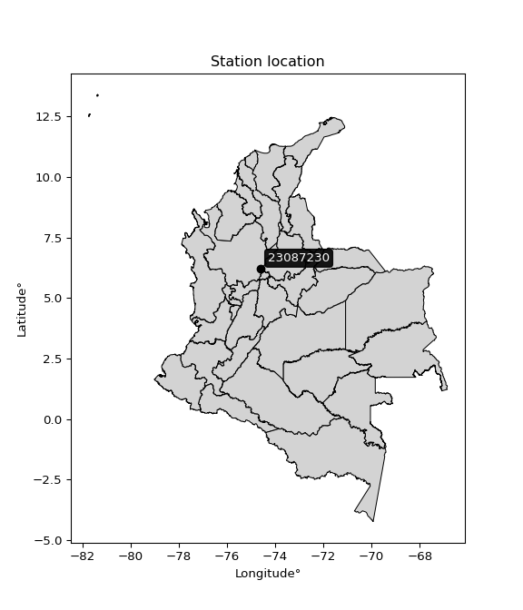</img>

</div>


## A. General information


### 1. General running parameters

• app_version: _v20251225_. • runtime: _2025-12-26 14:29:50.888910_. • Python version: _3.14.0_. • SciPy version: _1.16.3_. • Pandas version: _2.3.3_. • NumPy version: _2.3.5_. • Stations dataset (station_dataset_file): _dataset/pmax24h_in/automatic_colombia.csv_. • Stations catalog (station_catalog_file): _dataset/CNE_IDEAM.xls_. • Plot only fit distributions with Δo > Δ (plot_only_fit): _True_. • Eval low extreme values, if False, evaluates high extreme values (low_extreme): _False_. • Eval every SciPy distribution as logarithmic (pdist_logarithmic_on): _True_. • Standard deviation normalized (ddof): _1.0_. • Return periods to eval in years (Tr): _[2, 2.33, 5, 10, 15, 20, 25, 50, 75, 100, 200, 250, 500, 750, 1000]_. • Minimum data sample per station, 0 means any (minimum_sample): _5_. • Z-Score threshold to adjust a value, 0 means disable (zscore): _3.5_. • Avoid zeros, e.g. rain = 0 (avoid_zeros): _True_. • Avoid null values (avoid_nans): _True_. [:file_folder:Dataset file.](../../dataset/pmax24h_in/automatic_colombia.csv)


### 2. Station info and location

|   id |   CODIGO | NOMBRE                         | CATEGORIA    | TECNOLOGIA                              | ESTADO           | FECHA_INSTALACION   |   FECHA_SUSPENSION |   ALTITUD |   LATITUD |   LONGITUD | DEPARTAMENTO   | MUNICIPIO   | AREA_OPERATIVA             | ENTIDAD                                                     | AREA_HIDROGRAFICA   | ZONA_HIDROGRAFICA   | SUBZONA_HIDROGRAFICA   | CORRIENTE   | OBSERVACION                                                                                                                                                                                                                                                                                                             |   SUBRED | Catalogo   |
|-----:|---------:|:-------------------------------|:-------------|:----------------------------------------|:-----------------|:--------------------|-------------------:|----------:|----------:|-----------:|:---------------|:------------|:---------------------------|:------------------------------------------------------------|:--------------------|:--------------------|:-----------------------|:------------|:------------------------------------------------------------------------------------------------------------------------------------------------------------------------------------------------------------------------------------------------------------------------------------------------------------------------|---------:|:-----------|
|    0 | 23087230 | PUERTO BELLO  - AUT [23087230] | Limnimétrica | Automática con Telemetría, Convencional | En Mantenimiento | 15/06/1979          |                nan |       126 |   6.21197 |   -74.6071 | Antioquia      | Puerto Nare | Area Operativa 10 - Tolima | INSTITUTO DE HIDROLOGIA METEOROLOGIA Y ESTUDIOS AMBIENTALES | Magdalena Cauca     | Medio Magdalena     | Río Nare               | Nare        | Cambio de tecnología por instalación o repotenciación de estaciones proyecto Fondo de Adaptación|02/01/2025$mvelez$Se realiza el cambio de elevación y coordenadas a solicitud del coordinador mediante memorando 20243170190253 del 10/10/2024 |28/11/2025$mvelez$Se cambio de estado bajo el memorando 20253170209843 |      nan | CNE_IDEAM  |

<div align="center">

Map location in: [:earth_americas:Google](http://maps.google.com/maps?q=6.211972222,-74.60711111) [:earth_americas:OSM](https://www.openstreetmap.org/#map=18/6.211972222/-74.60711111&layers=P) [:earth_americas:Bing](https://www.bing.com/maps?cp=6.211972222~-74.60711111&lvl=18) [:earth_americas:Apple](https://maps.apple.com/frame?center=6.211972222%2C-74.60711111&span=0.003%2C0.006)

</div>


<div align="center">

```geojson
{
  "type": "Feature",
  "geometry": {
    "type": "Point", 
    "coordinates": [-74.60711111, 6.211972222]
  }, 
  "properties": {
    "Name": "23087230"
  }
}
```

</div>


### 3. Discrete values table and plot

|               |           0 |           1 |           2 |            3 |          4 |
|:--------------|------------:|------------:|------------:|-------------:|-----------:|
| Date          | 2019        | 2020        | 2021        | 2022         | 2023       |
| Value         |  115.8      |  108        |   87.8      |   84.2       |   17.8     |
| Value_initial |  115.8      |  108        |   87.8      |   84.2       |   17.8     |
| count         |    5        |    5        |    5        |    5         |    5       |
| mean          |   82.72     |   82.72     |   82.72     |   82.72      |   82.72    |
| std           |   38.6522   |   38.6522   |   38.6522   |   38.6522    |   38.6522  |
| zscore        |    0.855838 |    0.654038 |    0.131429 |    0.0382902 |   -1.67959 |

<div align="center">

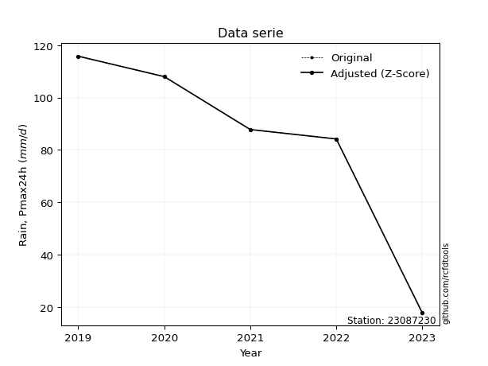</img>

</div>

> If Z-Score is active, values out of range or outliers are replaced with the station mean value.


### 4. Active continuous probability distributions from SciPy (45 of 104 available)

[scipy.stats](https://docs.scipy.org/doc/scipy/reference/stats.html) is a Python´s powerful submodule within the SciPy library for comprehensive statistical analysis, offering over 130 probability distributions (like Normal, Poisson), functions for descriptive stats (mean, variance), hypothesis testing (t-tests, chi-square), random variable generation, and statistical tests, making it essential for data science, modeling, and research. It provides tools to explore, model, and draw conclusions from data efficiently, working seamlessly with NumPy.

<div align="center">

|   id | p_dist             |   n_parameter | fit_method   | label                                                                       | active   | ref                                                                                                        |
|-----:|:-------------------|--------------:|:-------------|:----------------------------------------------------------------------------|:---------|:-----------------------------------------------------------------------------------------------------------|
|    0 | alpha              |             3 | MLE          | Alpha                                                                       | True     | [:mortar_board:](https://docs.scipy.org/doc/scipy/reference/generated/scipy.stats.alpha.html)              |
|    1 | betaprime          |             4 | MLE          | Beta prime                                                                  | True     | [:mortar_board:](https://docs.scipy.org/doc/scipy/reference/generated/scipy.stats.betaprime.html)          |
|    2 | chi2               |             3 | MLE          | Chi²                                                                        | True     | [:mortar_board:](https://docs.scipy.org/doc/scipy/reference/generated/scipy.stats.chi2.html)               |
|    3 | crystalball        |             4 | MLE          | Crystalball                                                                 | True     | [:mortar_board:](https://docs.scipy.org/doc/scipy/reference/generated/scipy.stats.crystalball.html)        |
|    4 | erlang             |             3 | MLE          | Erlang                                                                      | True     | [:mortar_board:](https://docs.scipy.org/doc/scipy/reference/generated/scipy.stats.erlang.html)             |
|    5 | expon              |             2 | MLE          | Exponential                                                                 | True     | [:mortar_board:](https://docs.scipy.org/doc/scipy/reference/generated/scipy.stats.expon.html)              |
|    6 | exponnorm          |             3 | MLE          | Exponentially modified Normal                                               | True     | [:mortar_board:](https://docs.scipy.org/doc/scipy/reference/generated/scipy.stats.exponnorm.html)          |
|    7 | f                  |             4 | MLE          | F                                                                           | True     | [:mortar_board:](https://docs.scipy.org/doc/scipy/reference/generated/scipy.stats.f.html)                  |
|    8 | fatiguelife        |             3 | MLE          | Fatigue-life (Birnbaum-Saunders)                                            | True     | [:mortar_board:](https://docs.scipy.org/doc/scipy/reference/generated/scipy.stats.fatiguelife.html)        |
|    9 | fisk               |             3 | MLE          | Fisk                                                                        | True     | [:mortar_board:](https://docs.scipy.org/doc/scipy/reference/generated/scipy.stats.fisk.html)               |
|   10 | gamma              |             3 | MLE          | Gamma                                                                       | True     | [:mortar_board:](https://docs.scipy.org/doc/scipy/reference/generated/scipy.stats.gamma.html)              |
|   11 | genexpon           |             5 | MLE          | Generalized exponential                                                     | True     | [:mortar_board:](https://docs.scipy.org/doc/scipy/reference/generated/scipy.stats.genexpon.html)           |
|   12 | genlogistic        |             3 | MLE          | Generalized logistic                                                        | True     | [:mortar_board:](https://docs.scipy.org/doc/scipy/reference/generated/scipy.stats.genlogistic.html)        |
|   13 | gibrat             |             2 | MM           | Gibrat                                                                      | True     | [:mortar_board:](https://docs.scipy.org/doc/scipy/reference/generated/scipy.stats.gibrat.html)             |
|   14 | gompertz           |             3 | MLE          | Gompertz (or truncated Gumbel)                                              | True     | [:mortar_board:](https://docs.scipy.org/doc/scipy/reference/generated/scipy.stats.gompertz.html)           |
|   15 | gumbel_l           |             2 | MM           | Gumbel Left Skew                                                            | True     | [:mortar_board:](https://docs.scipy.org/doc/scipy/reference/generated/scipy.stats.gumbel_l.html)           |
|   16 | gumbel_r           |             2 | MM           | Gumbel Right Skew                                                           | True     | [:mortar_board:](https://docs.scipy.org/doc/scipy/reference/generated/scipy.stats.gumbel_r.html)           |
|   17 | halflogistic       |             2 | MM           | Half-logistic                                                               | True     | [:mortar_board:](https://docs.scipy.org/doc/scipy/reference/generated/scipy.stats.halflogistic.html)       |
|   18 | halfnorm           |             2 | MM           | Half Normal                                                                 | True     | [:mortar_board:](https://docs.scipy.org/doc/scipy/reference/generated/scipy.stats.halfnorm.html)           |
|   19 | hypsecant          |             2 | MM           | hyperbolic secant                                                           | True     | [:mortar_board:](https://docs.scipy.org/doc/scipy/reference/generated/scipy.stats.hypsecant.html)          |
|   20 | invgamma           |             3 | MLE          | Inverted gamma                                                              | True     | [:mortar_board:](https://docs.scipy.org/doc/scipy/reference/generated/scipy.stats.invgamma.html)           |
|   21 | invgauss           |             3 | MLE          | Inverse Gaussian                                                            | True     | [:mortar_board:](https://docs.scipy.org/doc/scipy/reference/generated/scipy.stats.invgauss.html)           |
|   22 | invweibull         |             3 | MLE          | Inverted Weibull                                                            | True     | [:mortar_board:](https://docs.scipy.org/doc/scipy/reference/generated/scipy.stats.invweibull.html)         |
|   23 | johnsonsu          |             4 | MLE          | Johnson Su                                                                  | True     | [:mortar_board:](https://docs.scipy.org/doc/scipy/reference/generated/scipy.stats.johnsonsu.html)          |
|   24 | kstwobign          |             2 | MLE          | Limiting distribution of scaled Kolmogorov-Smirnov two-sided test statistic | True     | [:mortar_board:](https://docs.scipy.org/doc/scipy/reference/generated/scipy.stats.kstwobign.html)          |
|   25 | laplace            |             2 | MM           | Laplace                                                                     | True     | [:mortar_board:](https://docs.scipy.org/doc/scipy/reference/generated/scipy.stats.laplace.html)            |
|   26 | laplace_asymmetric |             3 | MLE          | Asymmetric Laplace                                                          | True     | [:mortar_board:](https://docs.scipy.org/doc/scipy/reference/generated/scipy.stats.laplace_asymmetric.html) |
|   27 | loggamma           |             3 | MLE          | Log gamma                                                                   | True     | [:mortar_board:](https://docs.scipy.org/doc/scipy/reference/generated/scipy.stats.loggamma.html)           |
|   28 | logistic           |             2 | MM           | Logistic (or Sech-squared)                                                  | True     | [:mortar_board:](https://docs.scipy.org/doc/scipy/reference/generated/scipy.stats.logistic.html)           |
|   29 | lognorm            |             3 | MLE          | Log Normal                                                                  | True     | [:mortar_board:](https://docs.scipy.org/doc/scipy/reference/generated/scipy.stats.lognorm.html)            |
|   30 | maxwell            |             2 | MM           | Maxwell                                                                     | True     | [:mortar_board:](https://docs.scipy.org/doc/scipy/reference/generated/scipy.stats.maxwell.html)            |
|   31 | mielke             |             4 | MLE          | Mielke Beta-Kappa / Dagum                                                   | True     | [:mortar_board:](https://docs.scipy.org/doc/scipy/reference/generated/scipy.stats.mielke.html)             |
|   32 | moyal              |             2 | MM           | Moyal                                                                       | True     | [:mortar_board:](https://docs.scipy.org/doc/scipy/reference/generated/scipy.stats.moyal.html)              |
|   33 | nakagami           |             3 | MLE          | Nakagami                                                                    | True     | [:mortar_board:](https://docs.scipy.org/doc/scipy/reference/generated/scipy.stats.nakagami.html)           |
|   34 | ncf                |             5 | MLE          | Non-central F distribution                                                  | True     | [:mortar_board:](https://docs.scipy.org/doc/scipy/reference/generated/scipy.stats.ncf.html)                |
|   35 | nct                |             4 | MLE          | Non-central Student’s t                                                     | True     | [:mortar_board:](https://docs.scipy.org/doc/scipy/reference/generated/scipy.stats.nct.html)                |
|   36 | norm               |             2 | MM           | Normal                                                                      | True     | [:mortar_board:](https://docs.scipy.org/doc/scipy/reference/generated/scipy.stats.norm.html)               |
|   37 | pareto             |             3 | MLE          | Pareto                                                                      | True     | [:mortar_board:](https://docs.scipy.org/doc/scipy/reference/generated/scipy.stats.pareto.html)             |
|   38 | pearson3           |             3 | MM           | Pearson type III                                                            | True     | [:mortar_board:](https://docs.scipy.org/doc/scipy/reference/generated/scipy.stats.pearson3.html)           |
|   39 | rayleigh           |             2 | MM           | Rayleigh                                                                    | True     | [:mortar_board:](https://docs.scipy.org/doc/scipy/reference/generated/scipy.stats.rayleigh.html)           |
|   40 | rice               |             3 | MLE          | Rice                                                                        | True     | [:mortar_board:](https://docs.scipy.org/doc/scipy/reference/generated/scipy.stats.rice.html)               |
|   41 | t                  |             3 | MLE          | Student’s t                                                                 | True     | [:mortar_board:](https://docs.scipy.org/doc/scipy/reference/generated/scipy.stats.t.html)                  |
|   42 | truncnorm          |             4 | MLE          | Truncated normal                                                            | True     | [:mortar_board:](https://docs.scipy.org/doc/scipy/reference/generated/scipy.stats.truncnorm.html)          |
|   43 | wald               |             2 | MM           | Wald                                                                        | True     | [:mortar_board:](https://docs.scipy.org/doc/scipy/reference/generated/scipy.stats.wald.html)               |
|   44 | weibull_min        |             3 | MLE          | Weibull minimum                                                             | True     | [:mortar_board:](https://docs.scipy.org/doc/scipy/reference/generated/scipy.stats.weibull_min.html)        |

</div>

> **n_parameter:** # arguments & localization & scale.
>
> **Fit methods:** (MLE) maximum likelihood, (MM) L-moments.
>
>**Inactive:** foldnorm, gennorm, norminvgauss, powernorm, powerlognorm, skewnorm, genextreme, anglit, arcsine, argus, beta, bradford, burr, burr12, cauchy, cosine, halfcauchy, foldcauchy, skewcauchy, wrapcauchy, dgamma, gengamma, exponweib, exponpow, truncexpon, gausshyper, genhalflogistic, genhyperbolic, geninvgauss, halfgennorm, johnsonsb, kappa4, kappa3, ksone, kstwo, loglaplace, levy, levy_l, levy_stable, ncx2, genpareto, truncpareto, lomax, powerlaw, rdist, rel_breitwigner, recipinvgauss, semicircular, studentized_range, trapezoid, triang, truncweibull_min, tukeylambda, uniform, loguniform, vonmises, vonmises_line, weibull_max, dweibull, 


## B. Probability distributions vs. Empirical distributions

A continuous probability distribution (CPD) describes probabilities for variables that can take any value within a range (like rain any time), unlike discrete variables with specific outcomes (like temperature). It uses a Probability Density Function (PDF), a curve where the total area under it equals 1, and the probability of the variable falling within an interval (a to b) is found by calculating the area under the curve between those points. A key feature is that the probability of hitting any single exact value is zero, so probabilities are always expressed for ranges, e.g., $P(a ≤ X ≤ b)$.

<div align="center">

Distributions parameters
|    |   station | p_dist                |   n |              loc |           scale | shape                  | shape1                 | shape2                | shape3   |
|---:|----------:|:----------------------|----:|-----------------:|----------------:|:-----------------------|:-----------------------|:----------------------|:---------|
|  0 |  23087230 | alpha                 |   5 |     -0.0992733   |    37.5449      | 9.784284972996257e-11  |                        |                       |          |
|  1 |  23087230 | betaprime             |   5 |  -1154.18        | 70255.4         | 1235.668180679293      | 70215.83135520382      |                       |          |
|  2 |  23087230 | chi2                  |   5 |   -519.047       |     1.08043     | 556.3460552826577      |                        |                       |          |
|  3 |  23087230 | crystalball           |   5 |     82.72        |    34.5716      | 7610.157154370192      | 480.75307109610634     |                       |          |
|  4 |  23087230 | erlang                |   5 |   -479.45        |     2.29206     | 245.25843058554625     |                        |                       |          |
|  5 |  23087230 | expon                 |   5 |     17.8         |    64.92        |                        |                        |                       |          |
|  6 |  23087230 | exponnorm             |   5 |     82.6958      |    34.5715      | 0.0006971556438913323  |                        |                       |          |
|  7 |  23087230 | f                     |   5 | -14313.9         | 14396.5         | 396516.0495105977      | 2601308.046241862      |                       |          |
|  8 |  23087230 | fatiguelife           |   5 |     17.8         |     2.02302e-05 | 1434.3327083729473     |                        |                       |          |
|  9 |  23087230 | fisk                  |   5 |     -5.17013e+09 |     5.17013e+09 | 275609085.0856892      |                        |                       |          |
| 10 |  23087230 | gamma                 |   5 |   -515.539       |     2.11897     | 282.12815423179563     |                        |                       |          |
| 11 |  23087230 | genexpon              |   5 |     17.8         |     1.67187     | 0.025748100587868063   | 1.1567474940647332e-09 | 1.4205815047985633    |          |
| 12 |  23087230 | genlogistic           |   5 |    115.8         |     1.7259e-05  | 5.21903777758323e-07   |                        |                       |          |
| 13 |  23087230 | gibrat                |   5 |     56.3462      |    15.9965      |                        |                        |                       |          |
| 14 |  23087230 | gompertz              |   5 |    -30.6853      |    23.1633      | 0.003942339835121532   |                        |                       |          |
| 15 |  23087230 | gumbel_l              |   5 |     98.279       |    26.9553      |                        |                        |                       |          |
| 16 |  23087230 | gumbel_r              |   5 |     67.161       |    26.9553      |                        |                        |                       |          |
| 17 |  23087230 | halflogistic          |   5 |     41.7446      |    29.5575      |                        |                        |                       |          |
| 18 |  23087230 | halfnorm              |   5 |     36.9608      |    57.3507      |                        |                        |                       |          |
| 19 |  23087230 | hypsecant             |   5 |     82.72        |    22.0089      |                        |                        |                       |          |
| 20 |  23087230 | invgamma              |   5 |   -381.407       | 71579.2         | 155.15572987515077     |                        |                       |          |
| 21 |  23087230 | invgauss              |   5 |   -191.28        | 13851.6         | 0.019775363813786695   |                        |                       |          |
| 22 |  23087230 | invweibull            |   5 |     17.8         |     2.07886     | 0.04321633327726304    |                        |                       |          |
| 23 |  23087230 | johnsonsu             |   5 |    115.8         |     8.94558e-10 | 4.87013535933461       | 0.22722969737625734    |                       |          |
| 24 |  23087230 | kstwobign             |   5 |    -71.5199      |   175.828       |                        |                        |                       |          |
| 25 |  23087230 | laplace               |   5 |     82.72        |    24.4458      |                        |                        |                       |          |
| 26 |  23087230 | laplace_asymmetric    |   5 |     87.8         |    23.9579      | 1.1116289353335835     |                        |                       |          |
| 27 |  23087230 | loggamma              |   5 |    115.801       |     5.26937e-05 | 1.5934103340153007e-06 |                        |                       |          |
| 28 |  23087230 | logistic              |   5 |     82.72        |    19.0603      |                        |                        |                       |          |
| 29 |  23087230 | lognorm               |   5 |     17.8         |     0.042939    | 15.062262708544244     |                        |                       |          |
| 30 |  23087230 | maxwell               |   5 |      0.79989     |    51.3358      |                        |                        |                       |          |
| 31 |  23087230 | mielke                |   5 |     -3.73806e+06 |     3.73817e+06 | 117334.31672848214     | 660784717.514155       |                       |          |
| 32 |  23087230 | moyal                 |   5 |     62.9498      |    15.5627      |                        |                        |                       |          |
| 33 |  23087230 | nakagami              |   5 |     84.2         |    12.6861      | 0.04730603635938408    |                        |                       |          |
| 34 |  23087230 | ncf                   |   5 |     -0.475862    |     0.000123745 | 2.4119504262692885e-05 | 108.11204973085489     | 16.093242313074924    |          |
| 35 |  23087230 | nct                   |   5 |  -1452.82        |    34.5154      | 277630.6686491786      | 44.488227294735296     |                       |          |
| 36 |  23087230 | norm                  |   5 |     82.72        |    34.5716      |                        |                        |                       |          |
| 37 |  23087230 | pareto                |   5 |     17.1341      |     0.665886    | 0.2605345971679326     |                        |                       |          |
| 38 |  23087230 | pearson3              |   5 |     82.72        |    34.5716      | -1.070311657963912     |                        |                       |          |
| 39 |  23087230 | rayleigh              |   5 |     16.5826      |    52.77        |                        |                        |                       |          |
| 40 |  23087230 | rice                  |   5 |     -8.12901     |    37.372       | 2.182931731962084      |                        |                       |          |
| 41 |  23087230 | t                     |   5 |     82.7204      |    34.574       | 3403048.7221468324     |                        |                       |          |
| 42 |  23087230 | truncnorm             |   5 |     82.72        |    34.5716      | -413.12083817769394    | 627.45958053763        |                       |          |
| 43 |  23087230 | wald                  |   5 |     48.1484      |    34.5716      |                        |                        |                       |          |
| 44 |  23087230 | weibull_min           |   5 |     -1.98456e+09 |     1.98456e+09 | 86180950.37233925      |                        |                       |          |
| 45 |  23087230 | logalpha              |   5 |    -13.9178      |   447.406       | 24.67561828450181      |                        |                       |          |
| 46 |  23087230 | logbetaprime          |   5 |    -25.6801      |    20.8312      | 4196.02373988822       | 2923.572171644084      |                       |          |
| 47 |  23087230 | logchi2               |   5 |      2.8792      |     0.997576    | 1.0340915132173158     |                        |                       |          |
| 48 |  23087230 | logcrystalball        |   5 |      4.24429     |     0.693073    | 22.373175625195486     | 30.24170993388894      |                       |          |
| 49 |  23087230 | logerlang             |   5 |     -7.08683     |     0.0485667   | 233.2172625677499      |                        |                       |          |
| 50 |  23087230 | logexpon              |   5 |      2.8792      |     1.36509     |                        |                        |                       |          |
| 51 |  23087230 | logexponnorm          |   5 |      4.24396     |     0.693072    | 0.00047590453903638836 |                        |                       |          |
| 52 |  23087230 | logf                  |   5 |   -663.048       |   667.29        | 6871940.2525563035     | 2505390.380392432      |                       |          |
| 53 |  23087230 | logfatiguelife        |   5 |   -468.379       |   472.622       | 0.0014620425333177573  |                        |                       |          |
| 54 |  23087230 | logfisk               |   5 |     -8.72619e+07 |     8.72619e+07 | 258776669.91967857     |                        |                       |          |
| 55 |  23087230 | loggamma              |   5 |     -7.22976     |     0.0451253   | 254.06903420439232     |                        |                       |          |
| 56 |  23087230 | loggenexpon           |   5 |      2.87907     |     0.00819334  | 0.0024297419906022712  | 2.691483149126163      | 1.263026508712405e-05 |          |
| 57 |  23087230 | loggenlogistic        |   5 |      4.75191     |     3.42321e-06 | 6.72284614359188e-06   |                        |                       |          |
| 58 |  23087230 | loggibrat             |   5 |      3.71557     |     0.320689    |                        |                        |                       |          |
| 59 |  23087230 | loggompertz           |   5 |      2.84583     |     0.408543    | 0.01697987021479673    |                        |                       |          |
| 60 |  23087230 | loggumbel_l           |   5 |      4.55621     |     0.540387    |                        |                        |                       |          |
| 61 |  23087230 | loggumbel_r           |   5 |      3.93237     |     0.540387    |                        |                        |                       |          |
| 62 |  23087230 | loghalflogistic       |   5 |      3.42283     |     0.592556    |                        |                        |                       |          |
| 63 |  23087230 | loghalfnorm           |   5 |      3.3269      |     1.14978     |                        |                        |                       |          |
| 64 |  23087230 | loghypsecant          |   5 |      4.24429     |     0.441224    |                        |                        |                       |          |
| 65 |  23087230 | loginvgamma           |   5 |    -13.0897      |  9765.93        | 564.8288396627572      |                        |                       |          |
| 66 |  23087230 | loginvgauss           |   5 |     -2.74019     |   567.173       | 0.012276202618410878   |                        |                       |          |
| 67 |  23087230 | loginvweibull         |   5 |     -4.02792e+07 |     4.02792e+07 | 50127809.34536114      |                        |                       |          |
| 68 |  23087230 | logjohnsonsu          |   5 |      4.75186     |     2.86472e-19 | 2.5406546242575034     | 0.06698570104147406    |                       |          |
| 69 |  23087230 | logkstwobign          |   5 |      1.0202      |     3.67423     |                        |                        |                       |          |
| 70 |  23087230 | loglaplace            |   5 |      4.24429     |     0.490077    |                        |                        |                       |          |
| 71 |  23087230 | loglaplace_asymmetric |   5 |      4.75186     |     0.00657601  | 77.1625987836054       |                        |                       |          |
| 72 |  23087230 | logloggamma           |   5 |      4.75319     |     7.2475e-06  | 1.4279137383854835e-05 |                        |                       |          |
| 73 |  23087230 | loglogistic           |   5 |      4.24429     |     0.382111    |                        |                        |                       |          |
| 74 |  23087230 | loglognorm            |   5 |      2.8792      |     0.00130038  | 14.35287801656661      |                        |                       |          |
| 75 |  23087230 | logmaxwell            |   5 |      2.602       |     1.02915     |                        |                        |                       |          |
| 76 |  23087230 | logmielke             |   5 |     -3.13357e+07 |     3.13357e+07 | 60264773.67298478      | 8768388317.707499      |                       |          |
| 77 |  23087230 | logmoyal              |   5 |      3.84795     |     0.311993    |                        |                        |                       |          |
| 78 |  23087230 | lognakagami           |   5 |      4.43319     |     0.292562    | 0.08454227395983975    |                        |                       |          |
| 79 |  23087230 | logncf                |   5 |   -527.366       |   213.798       | 2812149.331869263      | 1581719.8749619662     | 4180260.050193685     |          |
| 80 |  23087230 | lognct                |   5 |    -54.1556      |     0.670371    | 49388.201085016306     | 87.11413138959776      |                       |          |
| 81 |  23087230 | lognorm               |   5 |      4.24429     |     0.693073    |                        |                        |                       |          |
| 82 |  23087230 | logpareto             |   5 |      2.86509     |     0.0141119   | 0.26040160041039406    |                        |                       |          |
| 83 |  23087230 | logpearson3           |   5 |      4.24429     |     0.69307     | -1.3877030900728644    |                        |                       |          |
| 84 |  23087230 | lograyleigh           |   5 |      2.91841     |     1.0579      |                        |                        |                       |          |
| 85 |  23087230 | logrice               |   5 |   -377.78        |     0.692712    | 551.4906951904144      |                        |                       |          |
| 86 |  23087230 | logt                  |   5 |      4.5499      |     0.568227    | 2.495262311607803      |                        |                       |          |
| 87 |  23087230 | logtruncnorm          |   5 |     -0.185671    |     1.46792     | 3.146527040859901      | 3.3636156854177015     |                       |          |
| 88 |  23087230 | logwald               |   5 |      3.55117     |     0.693115    |                        |                        |                       |          |
| 89 |  23087230 | logweibull_min        |   5 |      2.8792      |     1.7481      | 0.7951351305111314     |                        |                       |          |

</div>

> **loc** (Location parameter): This shifts the distribution along the x-axis. For many common distributions, like the normal (Gaussian) distribution, loc represents the mean $μ$. For others, like the uniform distribution, it might represent the minimum value, or for the beta distribution, the left end of the support interval.
>
> **scale** (Scale parameter): This determines the width or spread of the distribution. For the normal distribution, scale represents the standard deviation $σ$. For a uniform distribution, it defines the length of the interval (from $loc$ to $loc + scale$).
>
> **shape** (Shape parameters): Refers to parameters that define the specific form of a probability distribution, distinct from its location (loc) and scale (scale). These parameters are required arguments for most distribution functions. For example, a normal (Gaussian) distribution is fully defined by its location (mean) and scale (standard deviation), so it has no specific shape parameters beyond loc and scale. However, other distributions have intrinsic properties that need specification, as Gamma distribution that takes a shape parameter, often named $a$ or $alpha$.


### 0. Cumulative distribution values - CDF (90 evaluated)

> Ordered by x ascending and calculating $log(f(x))$ separately. 

|   id |   Station |   date |     x |   count |   mean |     std |     zscore |   Value_initial |   station |   m |     alpha |   alpha_pdf |   betaprime |   betaprime_pdf |      chi2 |   chi2_pdf |   crystalball |   crystalball_pdf |    erlang |   erlang_pdf |    expon |   expon_pdf |   exponnorm |   exponnorm_pdf |         f |      f_pdf |   fatiguelife |   fatiguelife_pdf |      fisk |   fisk_pdf |     gamma |   gamma_pdf |    genexpon |   genexpon_pdf |   genlogistic |   genlogistic_pdf |   gibrat |   gibrat_pdf |   gompertz |   gompertz_pdf |   gumbel_l |   gumbel_l_pdf |   gumbel_r |   gumbel_r_pdf |   halflogistic |   halflogistic_pdf |   halfnorm |   halfnorm_pdf |   hypsecant |   hypsecant_pdf |   invgamma |   invgamma_pdf |   invgauss |   invgauss_pdf |   invweibull |   invweibull_pdf |   johnsonsu |   johnsonsu_pdf |   kstwobign |   kstwobign_pdf |   laplace |   laplace_pdf |   laplace_asymmetric |   laplace_asymmetric_pdf |   loggamma |   loggamma_pdf |   logistic |   logistic_pdf |   lognorm |   lognorm_pdf |    maxwell |   maxwell_pdf |    mielke |   mielke_pdf |       moyal |   moyal_pdf |   nakagami |   nakagami_pdf |       ncf |    ncf_pdf |       nct |    nct_pdf |      norm |   norm_pdf |      pareto |   pareto_pdf |   pearson3 |   pearson3_pdf |    rayleigh |   rayleigh_pdf |      rice |   rice_pdf |         t |      t_pdf |   truncnorm |   truncnorm_pdf |     wald |   wald_pdf |   weibull_min |   weibull_min_pdf |   logalpha |   logalpha_pdf |   logbetaprime |   logbetaprime_pdf |     logchi2 |   logchi2_pdf |   logcrystalball |   logcrystalball_pdf |   logerlang |   logerlang_pdf |   logexpon |   logexpon_pdf |   logexponnorm |   logexponnorm_pdf |      logf |   logf_pdf |   logfatiguelife |   logfatiguelife_pdf |   logfisk |   logfisk_pdf |   loggenexpon |   loggenexpon_pdf |   loggenlogistic |   loggenlogistic_pdf |   loggibrat |   loggibrat_pdf |   loggompertz |   loggompertz_pdf |   loggumbel_l |   loggumbel_l_pdf |   loggumbel_r |   loggumbel_r_pdf |   loghalflogistic |   loghalflogistic_pdf |   loghalfnorm |   loghalfnorm_pdf |   loghypsecant |   loghypsecant_pdf |   loginvgamma |   loginvgamma_pdf |   loginvgauss |   loginvgauss_pdf |   loginvweibull |   loginvweibull_pdf |   logjohnsonsu |   logjohnsonsu_pdf |   logkstwobign |   logkstwobign_pdf |   loglaplace |   loglaplace_pdf |   loglaplace_asymmetric |   loglaplace_asymmetric_pdf |   logloggamma |   logloggamma_pdf |   loglogistic |   loglogistic_pdf |   loglognorm |   loglognorm_pdf |   logmaxwell |   logmaxwell_pdf |   logmielke |   logmielke_pdf |    logmoyal |   logmoyal_pdf |   lognakagami |   lognakagami_pdf |    logncf |   logncf_pdf |    lognct |   lognct_pdf |   logpareto |   logpareto_pdf |   logpearson3 |   logpearson3_pdf |   lograyleigh |   lograyleigh_pdf |   logrice |   logrice_pdf |      logt |   logt_pdf |   logtruncnorm |   logtruncnorm_pdf |   logwald |   logwald_pdf |   logweibull_min |   logweibull_min_pdf |
|-----:|----------:|-------:|------:|--------:|-------:|--------:|-----------:|----------------:|----------:|----:|----------:|------------:|------------:|----------------:|----------:|-----------:|--------------:|------------------:|----------:|-------------:|---------:|------------:|------------:|----------------:|----------:|-----------:|--------------:|------------------:|----------:|-----------:|----------:|------------:|------------:|---------------:|--------------:|------------------:|---------:|-------------:|-----------:|---------------:|-----------:|---------------:|-----------:|---------------:|---------------:|-------------------:|-----------:|---------------:|------------:|----------------:|-----------:|---------------:|-----------:|---------------:|-------------:|-----------------:|------------:|----------------:|------------:|----------------:|----------:|--------------:|---------------------:|-------------------------:|-----------:|---------------:|-----------:|---------------:|----------:|--------------:|-----------:|--------------:|----------:|-------------:|------------:|------------:|-----------:|---------------:|----------:|-----------:|----------:|-----------:|----------:|-----------:|------------:|-------------:|-----------:|---------------:|------------:|---------------:|----------:|-----------:|----------:|-----------:|------------:|----------------:|---------:|-----------:|--------------:|------------------:|-----------:|---------------:|---------------:|-------------------:|------------:|--------------:|-----------------:|---------------------:|------------:|----------------:|-----------:|---------------:|---------------:|-------------------:|----------:|-----------:|-----------------:|---------------------:|----------:|--------------:|--------------:|------------------:|-----------------:|---------------------:|------------:|----------------:|--------------:|------------------:|--------------:|------------------:|--------------:|------------------:|------------------:|----------------------:|--------------:|------------------:|---------------:|-------------------:|--------------:|------------------:|--------------:|------------------:|----------------:|--------------------:|---------------:|-------------------:|---------------:|-------------------:|-------------:|-----------------:|------------------------:|----------------------------:|--------------:|------------------:|--------------:|------------------:|-------------:|-----------------:|-------------:|-----------------:|------------:|----------------:|------------:|---------------:|--------------:|------------------:|----------:|-------------:|----------:|-------------:|------------:|----------------:|--------------:|------------------:|--------------:|------------------:|----------:|--------------:|----------:|-----------:|---------------:|-------------------:|----------:|--------------:|-----------------:|---------------------:|
|    0 |  23087230 |   2023 |  17.8 |       5 |  82.72 | 38.6522 | -1.67959   |            17.8 |  23087230 |   1 | 0.0359434 |  0.0103614  |   0.0330056 |      0.00215199 | 0.0336104 | 0.00223669 |     0.0302013 |        0.00197909 | 0.0313648 |   0.00213495 | 0        |  0.0154036  |   0.0302012 |      0.00197909 | 0.0307561 | 0.00200801 |      0.07234  |       2.17271e+10 | 0.0224132 | 0.00116802 | 0.0313531 |  0.0021402  | 7.98223e-08 |     0.0154007  |      0        |        0.00156154 | 0        |   0          |  0.0276439 |     0.00134228 |  0.0492527 |     0.00178144 | 0.00194704 |    0.000450831 |       0        |         0          |   0        |     0          |   0.0332998 |      0.00151025 |  0.0305528 |     0.00226281 |  0.0313325 |     0.00242722 |    0.0129459 |      6.84554e+11 |    0.143785 |     0.000525488 |    0.0414   |      0.00396823 | 0.0351258 |    0.00143689 |            0.0399034 |               0.00149831 |   0.025948 |      0.0911964 |  0.0321075 |     0.00163044 | 0.0244409 |     0.0827424 | 0.00934694 |    0.0016135  | 0.0460822 |   0.00144647 | 1.99383e-05 | 1.22397e-05 |  0         |    0           | 0.0266537 | 0.00306558 | 0.0302224 | 0.00198051 | 0.0302013 | 0.00197909 | 1.11022e-16 |  0.39126     |  0.0507304 |     0.00190845 | 0.000266091 |    0.000437075 | 0.0257147 | 0.00223775 | 0.0302093 | 0.00197939 |   0.0302013 |      0.00197909 | 0        | 0          |     0.0306657 |        0.00131105 |  0.0249675 |      0.0925795 |       0.028388 |          0.0947037 | 9.10048e-09 |   1.05955e+07 |        0.0244412 |            0.0827433 |   0.0292832 |        0.097958 |   0        |       0.732552 |       0.024441 |          0.0827428 | 0.0249907 |  0.0840903 |        0.0240077 |            0.0819911 | 0.0105522 |     0.0309625 |    3.8668e-05 |          0.296605 |         0        |            0.0496432 |    0        |        0        |     0.0014442 |         0.0450344 |     0.0439054 |         0.0794377 |   0.000892832 |         0.0116003 |          0        |              0        |      0        |          0        |      0.0288357 |          0.0652645 |     0.0268999 |         0.0949744 |     0.0296418 |          0.108997 |       0.0345017 |            0.14456  |       0.341686 |        0.0131313   |      0.0399932 |           0.185844 |    0.0308502 |        0.0629497 |                0.024954 |                   0.0491781 |     0.0249181 |          0.049094 |     0.0273184 |         0.0695401 |    0.0227514 |      8.47096e+12 |   0.00508544 |        0.0542418 |   0.0266629 |       0.0512781 | 2.31994e-06 |    8.63891e-05 |    0          |       0           | 0.0251924 |    0.0845825 | 0.0247484 |    0.0835762 | 1.11022e-16 |      18.4526    |     0.0480998 |         0.0818467 |      0        |          0        | 0.0243812 |     0.0826158 | 0.0379147 |  0.0465931 |    0           |            0       |  0        |      0        |      3.97915e-13 |           712.461    |
|    1 |  23087230 |   2022 |  84.2 |       5 |  82.72 | 38.6522 |  0.0382902 |            84.2 |  23087230 |   2 | 0.656048  |  0.00381742 |   0.526349  |      0.0112069  | 0.531776  | 0.0110069  |     0.517073  |        0.011529   | 0.525171  |   0.0110709  | 0.640412 |  0.00553894 |   0.517074  |      0.0115291  | 0.518507  | 0.0114804  |      0.896722 |       0.00170888  | 0.441325  | 0.0131435  | 0.52936   |  0.0111536  | 0.640345    |     0.00553896 |      0        |        0.0116298  | 0.710415 |   0.0122811  |  0.427703  |     0.0138863  |  0.447415  |     0.0121596  | 0.587744   |    0.0115882   |       0.615783 |         0.0105018  |   0.589885 |     0.00991002 |   0.521389  |      0.0144301  |  0.534972  |     0.0105972  |  0.543997  |     0.0102605  |    0.422752  |      0.000236894 |    0.210038 |     0.00207262  |    0.587134 |      0.00809091 | 0.529373  |    0.0192519  |            0.482833  |               0.0181296  |   0.615852 |      0.525008  |  0.519402  |     0.0130965  | 0.607405  |     0.554625  | 0.549362   |    0.010962   | 0.37042   |   0.0116269  | 0.613394    | 0.0113996   |  0.0341881 |    2.27615e+11 | 0.563957  | 0.00892492 | 0.517189  | 0.011527   | 0.517073  | 0.011529   | 0.699307    |  0.00116812  |  0.445661  |     0.0115216  | 0.559983    |    0.0106845   | 0.525942  | 0.0111829  | 0.517067  | 0.0115282  |   0.517073  |      0.011529   | 0.684646 | 0.0108268  |     0.42694   |        0.0138554  |  0.616034  |      0.507442  |       0.616649 |          0.525996  | 0.779633    |   0.151296    |        0.607407  |            0.554624  |   0.610697  |        0.511184 |   0.679663 |       0.234663 |       0.607407 |          0.554625  | 0.607744  |  0.551618  |        0.60815   |            0.555776  | 0.516891  |     0.740533  |    0.657653   |          0.370624 |         0        |            1.05022   |    0.789729 |        0.401906 |     0.555025  |         0.900439  |     0.549055  |         0.664592  |   0.673126    |         0.493051  |          0.692396 |              0.439273 |      0.664042 |          0.43681  |      0.632298  |          0.660005  |     0.619112  |         0.51446   |     0.627293  |          0.476942 |       0.614623  |            0.372313 |       0.3862   |        0.080424    |      0.645918  |           0.351974 |    0.659931  |        0.69391   |                0.533559 |                   1.05151   |     0.532351  |          1.04885  |     0.621136  |         0.615858  |    0.689239  |      0.0158342   |   0.633266   |        0.504061  |   0.529491  |       1.01831   | 0.695471    |    0.463617    |    0.00297379 |       5.66127e+11 | 0.608003  |    0.550647  | 0.607469  |    0.552291  | 0.706726    |       0.0487013 |     0.52193   |         0.65369   |      0.641254 |          0.485569 | 0.607454  |     0.554895  | 0.426426  |  0.618239  |    7.56626e-07 |            4.35926 |  0.757843 |      0.389417 |      0.59774     |             0.187436 |
|    2 |  23087230 |   2021 |  87.8 |       5 |  82.72 | 38.6522 |  0.131429  |            87.8 |  23087230 |   3 | 0.66928   |  0.00353919 |   0.566451  |      0.0110535  | 0.571102  | 0.0108232  |     0.558411  |        0.0114157  | 0.564751  |   0.0109002  | 0.65981  |  0.00524015 |   0.558412  |      0.0114157  | 0.559659  | 0.0113619  |      0.902663 |       0.00159391  | 0.489032  | 0.0133206  | 0.569217  |  0.0109713  | 0.659742    |     0.00524022 |      0        |        0.0129673  | 0.750527 |   0.0100917  |  0.479311  |     0.0147585  |  0.492318  |     0.0127677  | 0.628123   |    0.010836    |       0.652179 |         0.0097211  |   0.624632 |     0.00939213 |   0.572827  |      0.0140859  |  0.572711  |     0.0103541  |  0.580457  |     0.00998255 |    0.423582  |      0.000224639 |    0.218047 |     0.00239061  |    0.615651 |      0.00774925 | 0.593818  |    0.0166156  |            0.552717  |               0.0207536  |   0.637609 |      0.514114  |  0.566239  |     0.0128861  | 0.630421  |     0.544573  | 0.588231   |    0.0106182  | 0.414733  |   0.0130178  | 0.652673    | 0.0104257   |  0.788066  |    0.0206361   | 0.595473  | 0.00857828 | 0.558518  | 0.0114132  | 0.558411  | 0.0114157  | 0.703376    |  0.00109361  |  0.488187  |     0.0120913  | 0.597751    |    0.0102874   | 0.565947  | 0.0110238  | 0.558402  | 0.0114149  |   0.558411  |      0.0114157  | 0.720802 | 0.0093066  |     0.478464  |        0.0147434  |  0.637047  |      0.496166  |       0.638456 |          0.515459  | 0.785861    |   0.146264    |        0.630423  |            0.544572  |   0.631895  |        0.501243 |   0.689339 |       0.227575 |       0.630423 |          0.544573  | 0.630635  |  0.54161   |        0.631211  |            0.545563  | 0.54779   |     0.734606  |    0.672968   |          0.360961 |         0        |            1.14022   |    0.805706 |        0.362215 |     0.593004  |         0.912463  |     0.577077  |         0.673504  |   0.693285    |         0.46996   |          0.710341 |              0.418033 |      0.682009 |          0.421492 |      0.659375  |          0.632871  |     0.640422  |         0.503325  |     0.647025  |          0.46552  |       0.630001  |            0.362254 |       0.389815 |        0.092837    |      0.660453  |           0.342379 |    0.687776  |        0.637091  |                0.579449 |                   1.14195   |     0.578124  |          1.13903  |     0.646557  |         0.598049  |    0.689893  |      0.0154046   |   0.654081   |        0.490143  |   0.573887  |       1.1037    | 0.714336    |    0.437722    |    0.609827   |       2.45895     | 0.630853  |    0.540642  | 0.630388  |    0.542268  | 0.708732    |       0.0471105 |     0.549717  |         0.673527  |      0.661283 |          0.47113  | 0.630482  |     0.544829  | 0.452549  |  0.628959  |    0.174535    |            3.98347 |  0.773495 |      0.358774 |      0.60549     |             0.182826 |
|    3 |  23087230 |   2020 | 108   |       5 |  82.72 | 38.6522 |  0.654038  |           108   |  23087230 |   4 | 0.728352  |  0.00241352 |   0.767861  |      0.00848275 | 0.767308  | 0.00824413 |     0.767683  |        0.00883244 | 0.762952  |   0.00835275 | 0.750776 |  0.00383894 |   0.767684  |      0.00883243 | 0.767798  | 0.00878324 |      0.92951  |       0.00110158  | 0.737486  | 0.0103204  | 0.767989  |  0.00833521 | 0.750712    |     0.00383922 |      0        |        0.0238854  | 0.87944  |   0.00388544 |  0.791208  |     0.0141551  |  0.761702  |     0.0126793  | 0.802684   |    0.0065451   |       0.807843 |         0.00587651 |   0.784537 |     0.0064599  |   0.804529  |      0.00833366 |  0.758548  |     0.00778282 |  0.758472  |     0.00743702 |    0.427566  |      0.000174054 |    0.312638 |     0.0103154   |    0.751829 |      0.00573099 | 0.822231  |    0.00727196 |            0.8248    |               0.00812914 |   0.737068 |      0.442116  |  0.790231  |     0.00869693 | 0.736221  |     0.471486  | 0.774936   |    0.00765896 | 0.781862  |   0.0245413  | 0.814065    | 0.00586442  |  0.935625  |    0.0031718   | 0.746259  | 0.00630124 | 0.767726  | 0.00882913 | 0.767683  | 0.00883244 | 0.722183    |  0.000796568 |  0.748911  |     0.0128239  | 0.776995    |    0.00732098  | 0.76687   | 0.00847583 | 0.767663  | 0.00883224 |   0.767683  |      0.00883244 | 0.850885 | 0.00434099 |     0.790923  |        0.0142096  |  0.732826  |      0.42535   |       0.738323 |          0.444493  | 0.813796    |   0.124301    |        0.736223  |            0.471484  |   0.729271  |        0.435113 |   0.733063 |       0.195545 |       0.736223 |          0.471485  | 0.735876  |  0.469153  |        0.737129  |            0.471636  | 0.691216  |     0.632949  |    0.742588   |          0.311038 |         0        |            1.71238   |    0.865046 |        0.224576 |     0.777652  |         0.827521  |     0.717028  |         0.661056  |   0.779026    |         0.359985  |          0.786656 |              0.321634 |      0.761479 |          0.34645  |      0.773997  |          0.470254  |     0.73765   |         0.431796  |     0.736679  |          0.397797 |       0.699722  |            0.310942 |       0.425653 |        0.376549    |      0.726395  |           0.294563 |    0.795372  |        0.417543  |                0.871452 |                   1.71741   |     0.869363  |          1.71283  |     0.758752  |         0.479043  |    0.692885  |      0.0135776   |   0.747598   |        0.410747  |   0.85463   |       1.64362   | 0.792807    |    0.324482    |    0.820597   |       0.526753    | 0.735906  |    0.468337  | 0.735752  |    0.469665  | 0.717766    |       0.0404472 |     0.697118  |         0.738594  |      0.750866 |          0.392622 | 0.736325  |     0.471638  | 0.583137  |  0.613174  |    0.837463    |            2.52016 |  0.835012 |      0.244362 |      0.641153    |             0.162194 |
|    4 |  23087230 |   2019 | 115.8 |       5 |  82.72 | 38.6522 |  0.855838  |           115.8 |  23087230 |   5 | 0.74598   |  0.00211613 |   0.828472  |      0.00704383 | 0.826276  | 0.00686457 |     0.83068   |        0.00730091 | 0.822753  |   0.00696842 | 0.778991 |  0.00340433 |   0.830681  |      0.00730089 | 0.830462  | 0.00726528 |      0.937545 |       0.000962302 | 0.809805  | 0.00821053 | 0.827526  |  0.0069195  | 0.778929    |     0.00340465 |      0.999989 |        0.0302391  | 0.90538  |   0.00283448 |  0.888658  |     0.0105706  |  0.852738  |     0.010465   | 0.84826    |    0.00517881  |       0.849049 |         0.00472158 |   0.830772 |     0.0054081  |   0.860649  |      0.00613124 |  0.814403  |     0.00653527 |  0.811929  |     0.00626959 |    0.428868  |      0.000160113 |    0.999966 |  1467.11        |    0.793597 |      0.00498587 | 0.870794  |    0.00528542 |            0.878001  |               0.00566067 |   0.766893 |      0.412987  |  0.85012   |     0.00668488 | 0.768024  |     0.440216  | 0.829537   |    0.00634407 | 0.998752  |   0.0313214  | 0.854757    | 0.00461451  |  0.956109  |    0.00216112  | 0.791923  | 0.00541445 | 0.830699  | 0.00729813 | 0.83068   | 0.00730091 | 0.728081    |  0.000718023 |  0.843696  |     0.0112681  | 0.829249    |    0.00608383  | 0.827497  | 0.00705416 | 0.83066   | 0.00730095 |   0.83068   |      0.00730091 | 0.880619 | 0.00333622 |     0.888753  |        0.0106088  |  0.761529  |      0.397647  |       0.768315 |          0.41541   | 0.822236    |   0.117852    |        0.768026  |            0.440214  |   0.758683  |        0.408156 |   0.746356 |       0.185807 |       0.768026 |          0.440215  | 0.767527  |  0.438214  |        0.768932  |            0.440102  | 0.73353   |     0.579651  |    0.76368    |          0.293874 |         0.999904 |            1.96371   |    0.87959  |        0.193498 |     0.832456  |         0.739613  |     0.762192  |         0.632069  |   0.802936    |         0.326115  |          0.808069 |              0.29282  |      0.784781 |          0.321956 |      0.80485   |          0.4151    |     0.766778  |         0.403375  |     0.763533  |          0.372271 |       0.720802  |            0.293684 |       0.994468 |        3.69948e+15 |      0.746381  |           0.278692 |    0.822512  |        0.362164  |                0.999832 |                   1.97042   |     0.997399  |          1.96509  |     0.790566  |         0.433306  |    0.693814  |      0.0130545   |   0.775232   |        0.381716  |   0.977053  |       1.81493   | 0.814291    |    0.292184    |    0.853075   |       0.412582    | 0.767503  |    0.437489  | 0.767436  |    0.438661  | 0.72052     |       0.0385722 |     0.748757  |         0.740106  |      0.777279 |          0.364875 | 0.768136  |     0.440327  | 0.624935  |  0.583975  |    1           |            2.15042 |  0.851047 |      0.216242 |      0.652245    |             0.155964 |

An Empirical Distribution Function (EDF) is a step-function estimate of a true cumulative distribution function (CDF) based on observed sample data, representing the proportion of data points less than or equal to a given value. It is calculated by ordering your data and jumping up by $1/n$ (where $n$ is sample size) at each unique data point, allowing analysis without assuming an underlying population distribution, and it gets closer to the true CDF as the sample size grows.


### 1. Empirical - EDF California (1923)

California´s estimates the true probability distribution of water-related data (like rainfall, streamflow) using observed samples, crucial for risk assessment.

<div align="center">


$P=m/n$


</div>


**1.1. Empirical values**

<div align="center">

|                | 0              | 1                  | 2              | 3                 | 4              |
|:---------------|:---------------|:-------------------|:---------------|:------------------|:---------------|
| date           | 2023           | 2022               | 2021           | 2020              | 2019           |
| x              | 17.8           | 84.2               | 87.8           | 108.0             | 115.8          |
| m              | 1              | 2                  | 3              | 4                 | 5              |
| empirical_dist | edf_california | edf_california     | edf_california | edf_california    | edf_california |
| empirical      | 0.2            | 0.4                | 0.6            | 0.8               | 1.0            |
| empirical_tr   | 1.25           | 1.6666666666666667 | 2.5            | 5.000000000000001 | inf            |

</div>


**1.2. Kolmogorov-Smirnov fit test (sorted by Δ)**


<div align="center">

|                | 0                   | 1                   | 2                   | 3                  | 4                   | 5                   | 6                  | 7                  | 8                   | 9                  | 10                 | 11                  | 12                  | 13                  | 14                  | 15                  | 16                  | 17                  | 18                 | 19                  | 20                    | 21                  | 22                  | 23                  | 24                  | 25                  | 26                  | 27                  | 28                  | 29                  | 30                  | 31                 | 32                 | 33                 | 34                 | 35                  | 36                  | 37                 | 38                  | 39                  | 40                 | 41                 | 42                  | 43                  | 44                  | 45                  | 46                  | 47                  | 48                  | 49                  | 50                  | 51                  | 52                 | 53                 | 54                 | 55                  | 56                  | 57                  | 58                  | 59                 | 60                 | 61                 | 62                 | 63                 | 64                  | 65                  | 66                 | 67                 | 68                 | 69                  | 70                 | 71                  | 72                 | 73                  | 74                 | 75                 | 76                 | 77                  | 78                  | 79                 | 80                  | 81                 | 82                 | 83                  | 84                 | 85                  | 86                 | 87                 | 88                 | 89                 |
|:---------------|:--------------------|:--------------------|:--------------------|:-------------------|:--------------------|:--------------------|:-------------------|:-------------------|:--------------------|:-------------------|:-------------------|:--------------------|:--------------------|:--------------------|:--------------------|:--------------------|:--------------------|:--------------------|:-------------------|:--------------------|:----------------------|:--------------------|:--------------------|:--------------------|:--------------------|:--------------------|:--------------------|:--------------------|:--------------------|:--------------------|:--------------------|:-------------------|:-------------------|:-------------------|:-------------------|:--------------------|:--------------------|:-------------------|:--------------------|:--------------------|:-------------------|:-------------------|:--------------------|:--------------------|:--------------------|:--------------------|:--------------------|:--------------------|:--------------------|:--------------------|:--------------------|:--------------------|:-------------------|:-------------------|:-------------------|:--------------------|:--------------------|:--------------------|:--------------------|:-------------------|:-------------------|:-------------------|:-------------------|:-------------------|:--------------------|:--------------------|:-------------------|:-------------------|:-------------------|:--------------------|:-------------------|:--------------------|:-------------------|:--------------------|:-------------------|:-------------------|:-------------------|:--------------------|:--------------------|:-------------------|:--------------------|:-------------------|:-------------------|:--------------------|:-------------------|:--------------------|:-------------------|:-------------------|:-------------------|:-------------------|
| station        | 23087230            | 23087230            | 23087230            | 23087230           | 23087230            | 23087230            | 23087230           | 23087230           | 23087230            | 23087230           | 23087230           | 23087230            | 23087230            | 23087230            | 23087230            | 23087230            | 23087230            | 23087230            | 23087230           | 23087230            | 23087230              | 23087230            | 23087230            | 23087230            | 23087230            | 23087230            | 23087230            | 23087230            | 23087230            | 23087230            | 23087230            | 23087230           | 23087230           | 23087230           | 23087230           | 23087230            | 23087230            | 23087230           | 23087230            | 23087230            | 23087230           | 23087230           | 23087230            | 23087230            | 23087230            | 23087230            | 23087230            | 23087230            | 23087230            | 23087230            | 23087230            | 23087230            | 23087230           | 23087230           | 23087230           | 23087230            | 23087230            | 23087230            | 23087230            | 23087230           | 23087230           | 23087230           | 23087230           | 23087230           | 23087230            | 23087230            | 23087230           | 23087230           | 23087230           | 23087230            | 23087230           | 23087230            | 23087230           | 23087230            | 23087230           | 23087230           | 23087230           | 23087230            | 23087230            | 23087230           | 23087230            | 23087230           | 23087230           | 23087230            | 23087230           | 23087230            | 23087230           | 23087230           | 23087230           | 23087230           |
| empirical_dist | edf_california      | edf_california      | edf_california      | edf_california     | edf_california      | edf_california      | edf_california     | edf_california     | edf_california      | edf_california     | edf_california     | edf_california      | edf_california      | edf_california      | edf_california      | edf_california      | edf_california      | edf_california      | edf_california     | edf_california      | edf_california        | edf_california      | edf_california      | edf_california      | edf_california      | edf_california      | edf_california      | edf_california      | edf_california      | edf_california      | edf_california      | edf_california     | edf_california     | edf_california     | edf_california     | edf_california      | edf_california      | edf_california     | edf_california      | edf_california      | edf_california     | edf_california     | edf_california      | edf_california      | edf_california      | edf_california      | edf_california      | edf_california      | edf_california      | edf_california      | edf_california      | edf_california      | edf_california     | edf_california     | edf_california     | edf_california      | edf_california      | edf_california      | edf_california      | edf_california     | edf_california     | edf_california     | edf_california     | edf_california     | edf_california      | edf_california      | edf_california     | edf_california     | edf_california     | edf_california      | edf_california     | edf_california      | edf_california     | edf_california      | edf_california     | edf_california     | edf_california     | edf_california      | edf_california      | edf_california     | edf_california      | edf_california     | edf_california     | edf_california      | edf_california     | edf_california      | edf_california     | edf_california     | edf_california     | edf_california     |
| p_dist         | gumbel_l            | pearson3            | laplace_asymmetric  | laplace            | hypsecant           | logistic            | weibull_min        | f                  | nct                 | t                  | truncnorm          | norm                | crystalball         | exponnorm           | betaprime           | gompertz            | gamma               | logmielke           | chi2               | rice                | loglaplace_asymmetric | logloggamma         | erlang              | mielke              | invgamma            | invgauss            | fisk                | maxwell             | gumbel_r            | loggompertz         | rayleigh            | halfnorm           | kstwobign          | ncf                | moyal              | halflogistic        | loglogistic         | logfatiguelife     | logbetaprime        | logrice             | logexponnorm       | logcrystalball     | lognorm             | lognorm             | loghypsecant        | logf                | logncf              | lognct              | loggamma            | loggamma            | loginvgamma         | logmaxwell          | loginvgauss        | loggumbel_l        | logalpha           | genexpon            | expon               | lograyleigh         | logerlang           | logpearson3        | logkstwobign       | alpha              | loggenexpon        | loglaplace         | loghalfnorm         | logfisk             | loggumbel_r        | loginvweibull      | logexpon           | wald                | loghalflogistic    | logmoyal            | pareto             | loglognorm          | logpareto          | gibrat             | logweibull_min     | logwald             | nakagami            | logjohnsonsu       | logt                | logchi2            | loggibrat          | lognakagami         | logtruncnorm       | johnsonsu           | fatiguelife        | invweibull         | loggenlogistic     | genlogistic        |
| delta          | 0.15074727886608827 | 0.15630414864963627 | 0.16009662302606606 | 0.1648741813056915 | 0.16670023306333787 | 0.16789249567048173 | 0.1693343158599513 | 0.169538383150168  | 0.16977764836803536 | 0.1697906613532379 | 0.1697987031504134 | 0.16979870726178803 | 0.16979870937366565 | 0.16979877024981813 | 0.17152762364741525 | 0.17235611522313804 | 0.17247376191437025 | 0.17333706398257764 | 0.1737244957274542 | 0.17428532185663945 | 0.17504597258142202   | 0.17508194021675638 | 0.17724686239680443 | 0.18526704933817922 | 0.18559708982348266 | 0.18807145539568426 | 0.19019486230133753 | 0.19065305767258442 | 0.19805296479613713 | 0.19855580224705338 | 0.19973390940673788 | 0.2                | 0.2064028488170242 | 0.2080771903015708 | 0.2133936046201318 | 0.21578256195316892 | 0.22113561614793165 | 0.2310677387675133 | 0.23168477372684126 | 0.23186377011175152 | 0.2319743582153183 | 0.2319744695866487 | 0.23197648610123922 | 0.23197648610123922 | 0.23229831096376918 | 0.23247268146314481 | 0.23249696643094186 | 0.23256362274709785 | 0.23310726278770943 | 0.23310726278770943 | 0.23322202436169814 | 0.23326580535214558 | 0.2364668893296784 | 0.2378082227880901 | 0.2384710848944418 | 0.24034459126502072 | 0.24041233859437272 | 0.24125384215825896 | 0.24131699941178952 | 0.2512434274579406 | 0.2536185220078837 | 0.2560475614672165 | 0.2576527779587653 | 0.2599310088246397 | 0.26404232962003094 | 0.26646978834992063 | 0.2731260161655956 | 0.2791981268789383 | 0.2796632494942488 | 0.28464626041567376 | 0.2923962597501756 | 0.29547134829932575 | 0.2993074318562349 | 0.30618617092124767 | 0.3067263374826097 | 0.3104152366744952 | 0.3477554635288853 | 0.35784321227757243 | 0.36581187575376695 | 0.374347311653572  | 0.37506490069776666 | 0.3796330368774633 | 0.3897288049108626 | 0.39702620926938403 | 0.4254647477559286 | 0.48736201674359936 | 0.4967215328093534 | 0.5711323206583272 | 0.8                | 0.8                |
| deltao         | 0.5865427407550001  | 0.5865427407550001  | 0.5865427407550001  | 0.5865427407550001 | 0.5865427407550001  | 0.5865427407550001  | 0.5865427407550001 | 0.5865427407550001 | 0.5865427407550001  | 0.5865427407550001 | 0.5865427407550001 | 0.5865427407550001  | 0.5865427407550001  | 0.5865427407550001  | 0.5865427407550001  | 0.5865427407550001  | 0.5865427407550001  | 0.5865427407550001  | 0.5865427407550001 | 0.5865427407550001  | 0.5865427407550001    | 0.5865427407550001  | 0.5865427407550001  | 0.5865427407550001  | 0.5865427407550001  | 0.5865427407550001  | 0.5865427407550001  | 0.5865427407550001  | 0.5865427407550001  | 0.5865427407550001  | 0.5865427407550001  | 0.5865427407550001 | 0.5865427407550001 | 0.5865427407550001 | 0.5865427407550001 | 0.5865427407550001  | 0.5865427407550001  | 0.5865427407550001 | 0.5865427407550001  | 0.5865427407550001  | 0.5865427407550001 | 0.5865427407550001 | 0.5865427407550001  | 0.5865427407550001  | 0.5865427407550001  | 0.5865427407550001  | 0.5865427407550001  | 0.5865427407550001  | 0.5865427407550001  | 0.5865427407550001  | 0.5865427407550001  | 0.5865427407550001  | 0.5865427407550001 | 0.5865427407550001 | 0.5865427407550001 | 0.5865427407550001  | 0.5865427407550001  | 0.5865427407550001  | 0.5865427407550001  | 0.5865427407550001 | 0.5865427407550001 | 0.5865427407550001 | 0.5865427407550001 | 0.5865427407550001 | 0.5865427407550001  | 0.5865427407550001  | 0.5865427407550001 | 0.5865427407550001 | 0.5865427407550001 | 0.5865427407550001  | 0.5865427407550001 | 0.5865427407550001  | 0.5865427407550001 | 0.5865427407550001  | 0.5865427407550001 | 0.5865427407550001 | 0.5865427407550001 | 0.5865427407550001  | 0.5865427407550001  | 0.5865427407550001 | 0.5865427407550001  | 0.5865427407550001 | 0.5865427407550001 | 0.5865427407550001  | 0.5865427407550001 | 0.5865427407550001  | 0.5865427407550001 | 0.5865427407550001 | 0.5865427407550001 | 0.5865427407550001 |
| eval           | Δo > Δ              | Δo > Δ              | Δo > Δ              | Δo > Δ             | Δo > Δ              | Δo > Δ              | Δo > Δ             | Δo > Δ             | Δo > Δ              | Δo > Δ             | Δo > Δ             | Δo > Δ              | Δo > Δ              | Δo > Δ              | Δo > Δ              | Δo > Δ              | Δo > Δ              | Δo > Δ              | Δo > Δ             | Δo > Δ              | Δo > Δ                | Δo > Δ              | Δo > Δ              | Δo > Δ              | Δo > Δ              | Δo > Δ              | Δo > Δ              | Δo > Δ              | Δo > Δ              | Δo > Δ              | Δo > Δ              | Δo > Δ             | Δo > Δ             | Δo > Δ             | Δo > Δ             | Δo > Δ              | Δo > Δ              | Δo > Δ             | Δo > Δ              | Δo > Δ              | Δo > Δ             | Δo > Δ             | Δo > Δ              | Δo > Δ              | Δo > Δ              | Δo > Δ              | Δo > Δ              | Δo > Δ              | Δo > Δ              | Δo > Δ              | Δo > Δ              | Δo > Δ              | Δo > Δ             | Δo > Δ             | Δo > Δ             | Δo > Δ              | Δo > Δ              | Δo > Δ              | Δo > Δ              | Δo > Δ             | Δo > Δ             | Δo > Δ             | Δo > Δ             | Δo > Δ             | Δo > Δ              | Δo > Δ              | Δo > Δ             | Δo > Δ             | Δo > Δ             | Δo > Δ              | Δo > Δ             | Δo > Δ              | Δo > Δ             | Δo > Δ              | Δo > Δ             | Δo > Δ             | Δo > Δ             | Δo > Δ              | Δo > Δ              | Δo > Δ             | Δo > Δ              | Δo > Δ             | Δo > Δ             | Δo > Δ              | Δo > Δ             | Δo > Δ              | Δo > Δ             | Δo > Δ             | Δo <= Δ            | Δo <= Δ            |
| fit            | 1                   | 1                   | 1                   | 1                  | 1                   | 1                   | 1                  | 1                  | 1                   | 1                  | 1                  | 1                   | 1                   | 1                   | 1                   | 1                   | 1                   | 1                   | 1                  | 1                   | 1                     | 1                   | 1                   | 1                   | 1                   | 1                   | 1                   | 1                   | 1                   | 1                   | 1                   | 1                  | 1                  | 1                  | 1                  | 1                   | 1                   | 1                  | 1                   | 1                   | 1                  | 1                  | 1                   | 1                   | 1                   | 1                   | 1                   | 1                   | 1                   | 1                   | 1                   | 1                   | 1                  | 1                  | 1                  | 1                   | 1                   | 1                   | 1                   | 1                  | 1                  | 1                  | 1                  | 1                  | 1                   | 1                   | 1                  | 1                  | 1                  | 1                   | 1                  | 1                   | 1                  | 1                   | 1                  | 1                  | 1                  | 1                   | 1                   | 1                  | 1                   | 1                  | 1                  | 1                   | 1                  | 1                   | 1                  | 1                  | 0                  | 0                  |
| n              | 5                   | 5                   | 5                   | 5                  | 5                   | 5                   | 5                  | 5                  | 5                   | 5                  | 5                  | 5                   | 5                   | 5                   | 5                   | 5                   | 5                   | 5                   | 5                  | 5                   | 5                     | 5                   | 5                   | 5                   | 5                   | 5                   | 5                   | 5                   | 5                   | 5                   | 5                   | 5                  | 5                  | 5                  | 5                  | 5                   | 5                   | 5                  | 5                   | 5                   | 5                  | 5                  | 5                   | 5                   | 5                   | 5                   | 5                   | 5                   | 5                   | 5                   | 5                   | 5                   | 5                  | 5                  | 5                  | 5                   | 5                   | 5                   | 5                   | 5                  | 5                  | 5                  | 5                  | 5                  | 5                   | 5                   | 5                  | 5                  | 5                  | 5                   | 5                  | 5                   | 5                  | 5                   | 5                  | 5                  | 5                  | 5                   | 5                   | 5                  | 5                   | 5                  | 5                  | 5                   | 5                  | 5                   | 5                  | 5                  | 5                  | 5                  |
| best_fit       | 1                   | 0                   | 0                   | 0                  | 0                   | 0                   | 0                  | 0                  | 0                   | 0                  | 0                  | 0                   | 0                   | 0                   | 0                   | 0                   | 0                   | 0                   | 0                  | 0                   | 0                     | 0                   | 0                   | 0                   | 0                   | 0                   | 0                   | 0                   | 0                   | 0                   | 0                   | 0                  | 0                  | 0                  | 0                  | 0                   | 0                   | 0                  | 0                   | 0                   | 0                  | 0                  | 0                   | 0                   | 0                   | 0                   | 0                   | 0                   | 0                   | 0                   | 0                   | 0                   | 0                  | 0                  | 0                  | 0                   | 0                   | 0                   | 0                   | 0                  | 0                  | 0                  | 0                  | 0                  | 0                   | 0                   | 0                  | 0                  | 0                  | 0                   | 0                  | 0                   | 0                  | 0                   | 0                  | 0                  | 0                  | 0                   | 0                   | 0                  | 0                   | 0                  | 0                  | 0                   | 0                  | 0                   | 0                  | 0                  | 0                  | 0                  |
| best_fit_sort  | 1                   | 2                   | 3                   | 4                  | 5                   | 6                   | 7                  | 8                  | 9                   | 10                 | 11                 | 12                  | 13                  | 14                  | 15                  | 16                  | 17                  | 18                  | 19                 | 20                  | 21                    | 22                  | 23                  | 24                  | 25                  | 26                  | 27                  | 28                  | 29                  | 30                  | 31                  | 32                 | 33                 | 34                 | 35                 | 36                  | 37                  | 38                 | 39                  | 40                  | 41                 | 42                 | 43                  | 44                  | 45                  | 46                  | 47                  | 48                  | 49                  | 50                  | 51                  | 52                  | 53                 | 54                 | 55                 | 56                  | 57                  | 58                  | 59                  | 60                 | 61                 | 62                 | 63                 | 64                 | 65                  | 66                  | 67                 | 68                 | 69                 | 70                  | 71                 | 72                  | 73                 | 74                  | 75                 | 76                 | 77                 | 78                  | 79                  | 80                 | 81                  | 82                 | 83                 | 84                  | 85                 | 86                  | 87                 | 88                 | 89                 | 90                 |

</div>


<div align="center">

</img>

</div>


**1.3. Best fit**

<div align="center">

|   id |   station | empirical_dist   | p_dist   |    delta |   deltao | eval   |   fit |   n |   best_fit |   best_fit_sort |
|-----:|----------:|:-----------------|:---------|---------:|---------:|:-------|------:|----:|-----------:|----------------:|
|    0 |  23087230 | edf_california   | gumbel_l | 0.150747 | 0.586543 | Δo > Δ |     1 |   5 |          1 |               1 |

</div>


<div align="center">

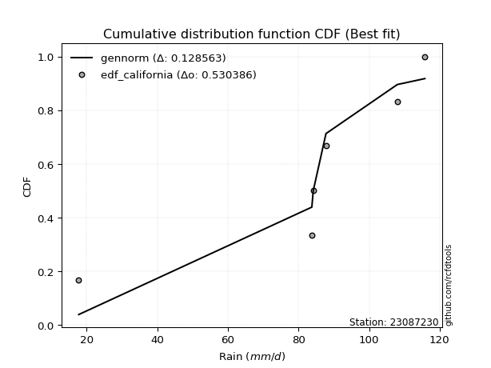</img>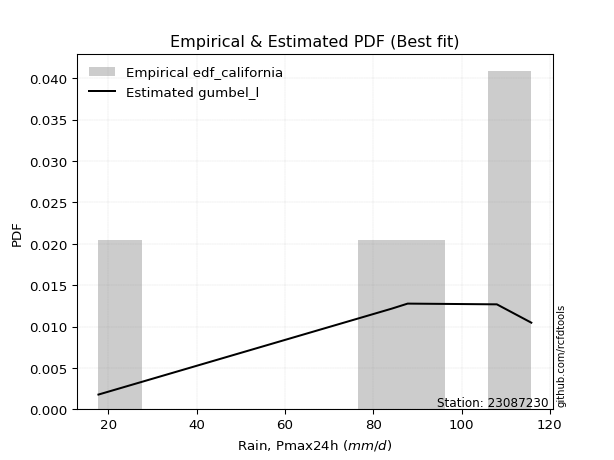</img>

</div>


### 2. Empirical - EDF Hazen (1930)

Hazen method for plotting positions is a formula used to estimate the empirical cumulative probability distribution of flood events or other hydrological data. This formula often results in biased estimations, particularly when extrapolating to extreme events (high return periods).

<div align="center">


$P=(m-0.5)/n$


</div>


**2.1. Empirical values**

<div align="center">

|                | 0                  | 1                  | 2         | 3                 | 4                  |
|:---------------|:-------------------|:-------------------|:----------|:------------------|:-------------------|
| date           | 2023               | 2022               | 2021      | 2020              | 2019               |
| x              | 17.8               | 84.2               | 87.8      | 108.0             | 115.8              |
| m              | 1                  | 2                  | 3         | 4                 | 5                  |
| empirical_dist | edf_hazen          | edf_hazen          | edf_hazen | edf_hazen         | edf_hazen          |
| empirical      | 0.1                | 0.3                | 0.5       | 0.7               | 0.9                |
| empirical_tr   | 1.1111111111111112 | 1.4285714285714286 | 2.0       | 3.333333333333333 | 10.000000000000002 |

</div>


**2.2. Kolmogorov-Smirnov fit test (sorted by Δ)**


<div align="center">

|                | 0                   | 1                   | 2                   | 3                  | 4                   | 5                   | 6                  | 7                  | 8                  | 9                   | 10                  | 11                  | 12                  | 13                 | 14                  | 15                 | 16                 | 17                 | 18                  | 19                 | 20                  | 21                  | 22                  | 23                 | 24                  | 25                  | 26                    | 27                  | 28                  | 29                 | 30                  | 31                 | 32                 | 33                  | 34                 | 35                 | 36                 | 37                 | 38                 | 39                  | 40                 | 41                 | 42                 | 43                 | 44                 | 45                 | 46                 | 47                  | 48                  | 49                  | 50                  | 51                  | 52                 | 53                 | 54                  | 55                  | 56                  | 57                 | 58                  | 59                 | 60                 | 61                 | 62                 | 63                 | 64                 | 65                  | 66                  | 67                 | 68                  | 69                  | 70                 | 71                  | 72                  | 73                  | 74                  | 75                 | 76                  | 77                  | 78                 | 79                 | 80                 | 81                 | 82                  | 83                  | 84                 | 85                  | 86                 | 87                 | 88                 | 89                 |
|:---------------|:--------------------|:--------------------|:--------------------|:-------------------|:--------------------|:--------------------|:-------------------|:-------------------|:-------------------|:--------------------|:--------------------|:--------------------|:--------------------|:-------------------|:--------------------|:-------------------|:-------------------|:-------------------|:--------------------|:-------------------|:--------------------|:--------------------|:--------------------|:-------------------|:--------------------|:--------------------|:----------------------|:--------------------|:--------------------|:-------------------|:--------------------|:-------------------|:-------------------|:--------------------|:-------------------|:-------------------|:-------------------|:-------------------|:-------------------|:--------------------|:-------------------|:-------------------|:-------------------|:-------------------|:-------------------|:-------------------|:-------------------|:--------------------|:--------------------|:--------------------|:--------------------|:--------------------|:-------------------|:-------------------|:--------------------|:--------------------|:--------------------|:-------------------|:--------------------|:-------------------|:-------------------|:-------------------|:-------------------|:-------------------|:-------------------|:--------------------|:--------------------|:-------------------|:--------------------|:--------------------|:-------------------|:--------------------|:--------------------|:--------------------|:--------------------|:-------------------|:--------------------|:--------------------|:-------------------|:-------------------|:-------------------|:-------------------|:--------------------|:--------------------|:-------------------|:--------------------|:-------------------|:-------------------|:-------------------|:-------------------|
| station        | 23087230            | 23087230            | 23087230            | 23087230           | 23087230            | 23087230            | 23087230           | 23087230           | 23087230           | 23087230            | 23087230            | 23087230            | 23087230            | 23087230           | 23087230            | 23087230           | 23087230           | 23087230           | 23087230            | 23087230           | 23087230            | 23087230            | 23087230            | 23087230           | 23087230            | 23087230            | 23087230              | 23087230            | 23087230            | 23087230           | 23087230            | 23087230           | 23087230           | 23087230            | 23087230           | 23087230           | 23087230           | 23087230           | 23087230           | 23087230            | 23087230           | 23087230           | 23087230           | 23087230           | 23087230           | 23087230           | 23087230           | 23087230            | 23087230            | 23087230            | 23087230            | 23087230            | 23087230           | 23087230           | 23087230            | 23087230            | 23087230            | 23087230           | 23087230            | 23087230           | 23087230           | 23087230           | 23087230           | 23087230           | 23087230           | 23087230            | 23087230            | 23087230           | 23087230            | 23087230            | 23087230           | 23087230            | 23087230            | 23087230            | 23087230            | 23087230           | 23087230            | 23087230            | 23087230           | 23087230           | 23087230           | 23087230           | 23087230            | 23087230            | 23087230           | 23087230            | 23087230           | 23087230           | 23087230           | 23087230           |
| empirical_dist | edf_hazen           | edf_hazen           | edf_hazen           | edf_hazen          | edf_hazen           | edf_hazen           | edf_hazen          | edf_hazen          | edf_hazen          | edf_hazen           | edf_hazen           | edf_hazen           | edf_hazen           | edf_hazen          | edf_hazen           | edf_hazen          | edf_hazen          | edf_hazen          | edf_hazen           | edf_hazen          | edf_hazen           | edf_hazen           | edf_hazen           | edf_hazen          | edf_hazen           | edf_hazen           | edf_hazen             | edf_hazen           | edf_hazen           | edf_hazen          | edf_hazen           | edf_hazen          | edf_hazen          | edf_hazen           | edf_hazen          | edf_hazen          | edf_hazen          | edf_hazen          | edf_hazen          | edf_hazen           | edf_hazen          | edf_hazen          | edf_hazen          | edf_hazen          | edf_hazen          | edf_hazen          | edf_hazen          | edf_hazen           | edf_hazen           | edf_hazen           | edf_hazen           | edf_hazen           | edf_hazen          | edf_hazen          | edf_hazen           | edf_hazen           | edf_hazen           | edf_hazen          | edf_hazen           | edf_hazen          | edf_hazen          | edf_hazen          | edf_hazen          | edf_hazen          | edf_hazen          | edf_hazen           | edf_hazen           | edf_hazen          | edf_hazen           | edf_hazen           | edf_hazen          | edf_hazen           | edf_hazen           | edf_hazen           | edf_hazen           | edf_hazen          | edf_hazen           | edf_hazen           | edf_hazen          | edf_hazen          | edf_hazen          | edf_hazen          | edf_hazen           | edf_hazen           | edf_hazen          | edf_hazen           | edf_hazen          | edf_hazen          | edf_hazen          | edf_hazen          |
| p_dist         | mielke              | weibull_min         | gompertz            | fisk               | pearson3            | gumbel_l            | laplace_asymmetric | logfisk            | t                  | norm                | crystalball         | truncnorm           | exponnorm           | nct                | f                   | logistic           | hypsecant          | logpearson3        | erlang              | rice               | betaprime           | gamma               | laplace             | logmielke          | chi2                | logloggamma         | loglaplace_asymmetric | invgamma            | invgauss            | loggumbel_l        | maxwell             | loggompertz        | rayleigh           | ncf                 | logjohnsonsu       | logt               | kstwobign          | gumbel_r           | nakagami           | halfnorm            | lognakagami        | logweibull_min     | lognorm            | lognorm            | logexponnorm       | logcrystalball     | logrice            | lognct              | logf                | logncf              | logfatiguelife      | logerlang           | moyal              | loginvweibull      | halflogistic        | loggamma            | loggamma            | logalpha           | logbetaprime        | loginvgamma        | loglogistic        | logtruncnorm       | loginvgauss        | loghypsecant       | logmaxwell         | genexpon            | expon               | lograyleigh        | logkstwobign        | alpha               | loggenexpon        | loglaplace          | loghalfnorm         | loggumbel_r         | logexpon            | wald               | johnsonsu           | loglognorm          | loghalflogistic    | logmoyal           | pareto             | logpareto          | gibrat              | logwald             | invweibull         | logchi2             | loggibrat          | fatiguelife        | loggenlogistic     | genlogistic        |
| delta          | 0.09875165401121044 | 0.12693987931338707 | 0.12770337171976837 | 0.1413248605594446 | 0.14566140099430208 | 0.14741541725576007 | 0.1828332205496972 | 0.2168905348049472 | 0.2170671070824322 | 0.21707339997626857 | 0.21707340292253435 | 0.21707341674504294 | 0.21707429108758974 | 0.2171886702775075 | 0.21850659488881857 | 0.2194023221246862 | 0.2213887560747297 | 0.2219295025013906 | 0.22517087855411594 | 0.2259422449096657 | 0.22634918847302593 | 0.22935987223254956 | 0.22937293604410797 | 0.2294906893136241 | 0.23177639807927847 | 0.23235057836435452 | 0.23355914453550847   | 0.23497213969695302 | 0.24399709939500053 | 0.2490545652791975 | 0.24936236864993216 | 0.255025345033879  | 0.2599831158413158 | 0.26395693731361364 | 0.2743473116535719 | 0.2750649006977667 | 0.2871338822430282 | 0.2877443425235597 | 0.2880664664219391 | 0.28988469349909335 | 0.297026209269384  | 0.297740228383139  | 0.3074046862264103 | 0.3074046862264103 | 0.307406981166962  | 0.3074071359099056 | 0.3074543319183715 | 0.30746912988858127 | 0.30774420507598826 | 0.30800251420831154 | 0.30814956155110157 | 0.31069674056902635 | 0.3133936046201318 | 0.3146232903681662 | 0.31578256195316895 | 0.31585199197190034 | 0.31585199197190034 | 0.3160340004628493 | 0.31664937104287555 | 0.31911222416193   | 0.3211356161479317 | 0.3254647477559286 | 0.3272931997356407 | 0.3322983109637692 | 0.3332658053521456 | 0.34034459126502076 | 0.34041233859437275 | 0.341253842158259  | 0.34591805123484837 | 0.35604756146721656 | 0.3576527779587653 | 0.35993100882463974 | 0.36404232962003097 | 0.37312601616559565 | 0.37966324949424884 | 0.3846462604156738 | 0.38736201674359927 | 0.38923877374408883 | 0.3923962597501756 | 0.3954713482993258 | 0.3993074318562349 | 0.4067263374826097 | 0.41041523667449525 | 0.45784321227757246 | 0.4711323206583273 | 0.47963303687746334 | 0.4897288049108626 | 0.5967215328093534 | 0.7                | 0.7                |
| deltao         | 0.5865427407550001  | 0.5865427407550001  | 0.5865427407550001  | 0.5865427407550001 | 0.5865427407550001  | 0.5865427407550001  | 0.5865427407550001 | 0.5865427407550001 | 0.5865427407550001 | 0.5865427407550001  | 0.5865427407550001  | 0.5865427407550001  | 0.5865427407550001  | 0.5865427407550001 | 0.5865427407550001  | 0.5865427407550001 | 0.5865427407550001 | 0.5865427407550001 | 0.5865427407550001  | 0.5865427407550001 | 0.5865427407550001  | 0.5865427407550001  | 0.5865427407550001  | 0.5865427407550001 | 0.5865427407550001  | 0.5865427407550001  | 0.5865427407550001    | 0.5865427407550001  | 0.5865427407550001  | 0.5865427407550001 | 0.5865427407550001  | 0.5865427407550001 | 0.5865427407550001 | 0.5865427407550001  | 0.5865427407550001 | 0.5865427407550001 | 0.5865427407550001 | 0.5865427407550001 | 0.5865427407550001 | 0.5865427407550001  | 0.5865427407550001 | 0.5865427407550001 | 0.5865427407550001 | 0.5865427407550001 | 0.5865427407550001 | 0.5865427407550001 | 0.5865427407550001 | 0.5865427407550001  | 0.5865427407550001  | 0.5865427407550001  | 0.5865427407550001  | 0.5865427407550001  | 0.5865427407550001 | 0.5865427407550001 | 0.5865427407550001  | 0.5865427407550001  | 0.5865427407550001  | 0.5865427407550001 | 0.5865427407550001  | 0.5865427407550001 | 0.5865427407550001 | 0.5865427407550001 | 0.5865427407550001 | 0.5865427407550001 | 0.5865427407550001 | 0.5865427407550001  | 0.5865427407550001  | 0.5865427407550001 | 0.5865427407550001  | 0.5865427407550001  | 0.5865427407550001 | 0.5865427407550001  | 0.5865427407550001  | 0.5865427407550001  | 0.5865427407550001  | 0.5865427407550001 | 0.5865427407550001  | 0.5865427407550001  | 0.5865427407550001 | 0.5865427407550001 | 0.5865427407550001 | 0.5865427407550001 | 0.5865427407550001  | 0.5865427407550001  | 0.5865427407550001 | 0.5865427407550001  | 0.5865427407550001 | 0.5865427407550001 | 0.5865427407550001 | 0.5865427407550001 |
| eval           | Δo > Δ              | Δo > Δ              | Δo > Δ              | Δo > Δ             | Δo > Δ              | Δo > Δ              | Δo > Δ             | Δo > Δ             | Δo > Δ             | Δo > Δ              | Δo > Δ              | Δo > Δ              | Δo > Δ              | Δo > Δ             | Δo > Δ              | Δo > Δ             | Δo > Δ             | Δo > Δ             | Δo > Δ              | Δo > Δ             | Δo > Δ              | Δo > Δ              | Δo > Δ              | Δo > Δ             | Δo > Δ              | Δo > Δ              | Δo > Δ                | Δo > Δ              | Δo > Δ              | Δo > Δ             | Δo > Δ              | Δo > Δ             | Δo > Δ             | Δo > Δ              | Δo > Δ             | Δo > Δ             | Δo > Δ             | Δo > Δ             | Δo > Δ             | Δo > Δ              | Δo > Δ             | Δo > Δ             | Δo > Δ             | Δo > Δ             | Δo > Δ             | Δo > Δ             | Δo > Δ             | Δo > Δ              | Δo > Δ              | Δo > Δ              | Δo > Δ              | Δo > Δ              | Δo > Δ             | Δo > Δ             | Δo > Δ              | Δo > Δ              | Δo > Δ              | Δo > Δ             | Δo > Δ              | Δo > Δ             | Δo > Δ             | Δo > Δ             | Δo > Δ             | Δo > Δ             | Δo > Δ             | Δo > Δ              | Δo > Δ              | Δo > Δ             | Δo > Δ              | Δo > Δ              | Δo > Δ             | Δo > Δ              | Δo > Δ              | Δo > Δ              | Δo > Δ              | Δo > Δ             | Δo > Δ              | Δo > Δ              | Δo > Δ             | Δo > Δ             | Δo > Δ             | Δo > Δ             | Δo > Δ              | Δo > Δ              | Δo > Δ             | Δo > Δ              | Δo > Δ             | Δo <= Δ            | Δo <= Δ            | Δo <= Δ            |
| fit            | 1                   | 1                   | 1                   | 1                  | 1                   | 1                   | 1                  | 1                  | 1                  | 1                   | 1                   | 1                   | 1                   | 1                  | 1                   | 1                  | 1                  | 1                  | 1                   | 1                  | 1                   | 1                   | 1                   | 1                  | 1                   | 1                   | 1                     | 1                   | 1                   | 1                  | 1                   | 1                  | 1                  | 1                   | 1                  | 1                  | 1                  | 1                  | 1                  | 1                   | 1                  | 1                  | 1                  | 1                  | 1                  | 1                  | 1                  | 1                   | 1                   | 1                   | 1                   | 1                   | 1                  | 1                  | 1                   | 1                   | 1                   | 1                  | 1                   | 1                  | 1                  | 1                  | 1                  | 1                  | 1                  | 1                   | 1                   | 1                  | 1                   | 1                   | 1                  | 1                   | 1                   | 1                   | 1                   | 1                  | 1                   | 1                   | 1                  | 1                  | 1                  | 1                  | 1                   | 1                   | 1                  | 1                   | 1                  | 0                  | 0                  | 0                  |
| n              | 5                   | 5                   | 5                   | 5                  | 5                   | 5                   | 5                  | 5                  | 5                  | 5                   | 5                   | 5                   | 5                   | 5                  | 5                   | 5                  | 5                  | 5                  | 5                   | 5                  | 5                   | 5                   | 5                   | 5                  | 5                   | 5                   | 5                     | 5                   | 5                   | 5                  | 5                   | 5                  | 5                  | 5                   | 5                  | 5                  | 5                  | 5                  | 5                  | 5                   | 5                  | 5                  | 5                  | 5                  | 5                  | 5                  | 5                  | 5                   | 5                   | 5                   | 5                   | 5                   | 5                  | 5                  | 5                   | 5                   | 5                   | 5                  | 5                   | 5                  | 5                  | 5                  | 5                  | 5                  | 5                  | 5                   | 5                   | 5                  | 5                   | 5                   | 5                  | 5                   | 5                   | 5                   | 5                   | 5                  | 5                   | 5                   | 5                  | 5                  | 5                  | 5                  | 5                   | 5                   | 5                  | 5                   | 5                  | 5                  | 5                  | 5                  |
| best_fit       | 1                   | 0                   | 0                   | 0                  | 0                   | 0                   | 0                  | 0                  | 0                  | 0                   | 0                   | 0                   | 0                   | 0                  | 0                   | 0                  | 0                  | 0                  | 0                   | 0                  | 0                   | 0                   | 0                   | 0                  | 0                   | 0                   | 0                     | 0                   | 0                   | 0                  | 0                   | 0                  | 0                  | 0                   | 0                  | 0                  | 0                  | 0                  | 0                  | 0                   | 0                  | 0                  | 0                  | 0                  | 0                  | 0                  | 0                  | 0                   | 0                   | 0                   | 0                   | 0                   | 0                  | 0                  | 0                   | 0                   | 0                   | 0                  | 0                   | 0                  | 0                  | 0                  | 0                  | 0                  | 0                  | 0                   | 0                   | 0                  | 0                   | 0                   | 0                  | 0                   | 0                   | 0                   | 0                   | 0                  | 0                   | 0                   | 0                  | 0                  | 0                  | 0                  | 0                   | 0                   | 0                  | 0                   | 0                  | 0                  | 0                  | 0                  |
| best_fit_sort  | 1                   | 2                   | 3                   | 4                  | 5                   | 6                   | 7                  | 8                  | 9                  | 10                  | 11                  | 12                  | 13                  | 14                 | 15                  | 16                 | 17                 | 18                 | 19                  | 20                 | 21                  | 22                  | 23                  | 24                 | 25                  | 26                  | 27                    | 28                  | 29                  | 30                 | 31                  | 32                 | 33                 | 34                  | 35                 | 36                 | 37                 | 38                 | 39                 | 40                  | 41                 | 42                 | 43                 | 44                 | 45                 | 46                 | 47                 | 48                  | 49                  | 50                  | 51                  | 52                  | 53                 | 54                 | 55                  | 56                  | 57                  | 58                 | 59                  | 60                 | 61                 | 62                 | 63                 | 64                 | 65                 | 66                  | 67                  | 68                 | 69                  | 70                  | 71                 | 72                  | 73                  | 74                  | 75                  | 76                 | 77                  | 78                  | 79                 | 80                 | 81                 | 82                 | 83                  | 84                  | 85                 | 86                  | 87                 | 88                 | 89                 | 90                 |

</div>


<div align="center">

</img>

</div>


**2.3. Best fit**

<div align="center">

|   id |   station | empirical_dist   | p_dist   |     delta |   deltao | eval   |   fit |   n |   best_fit |   best_fit_sort |
|-----:|----------:|:-----------------|:---------|----------:|---------:|:-------|------:|----:|-----------:|----------------:|
|    0 |  23087230 | edf_hazen        | mielke   | 0.0987517 | 0.586543 | Δo > Δ |     1 |   5 |          1 |               1 |

</div>


<div align="center">

</img>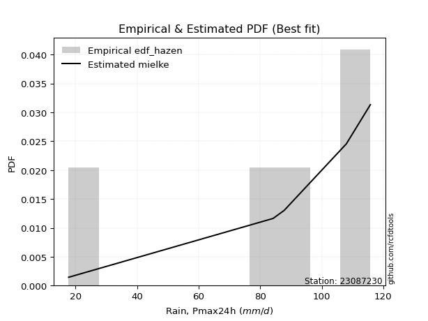</img>

</div>


### 3. Empirical - EDF Weibull (1939)

Weibull plotting position formula is an empirical method used to estimate the non-exceedance probability or plotting position for a set of observed data, is often recommended or widely used in practice, particularly in flood frequency analysis.

<div align="center">


$P=m/(n+1)$


</div>


**3.1. Empirical values**

<div align="center">

|                | 0                   | 1                  | 2           | 3                  | 4                  |
|:---------------|:--------------------|:-------------------|:------------|:-------------------|:-------------------|
| date           | 2023                | 2022               | 2021        | 2020               | 2019               |
| x              | 17.8                | 84.2               | 87.8        | 108.0              | 115.8              |
| m              | 1                   | 2                  | 3           | 4                  | 5                  |
| empirical_dist | edf_weibull         | edf_weibull        | edf_weibull | edf_weibull        | edf_weibull        |
| empirical      | 0.16666666666666666 | 0.3333333333333333 | 0.5         | 0.6666666666666666 | 0.8333333333333334 |
| empirical_tr   | 1.2                 | 1.4999999999999998 | 2.0         | 2.9999999999999996 | 6.000000000000002  |

</div>


**3.2. Kolmogorov-Smirnov fit test (sorted by Δ)**


<div align="center">

|                | 0                   | 1                   | 2                  | 3                  | 4                   | 5                   | 6                  | 7                   | 8                   | 9                   | 10                  | 11                 | 12                  | 13                  | 14                  | 15                  | 16                  | 17                  | 18                 | 19                  | 20                 | 21                  | 22                  | 23                  | 24                  | 25                 | 26                 | 27                    | 28                  | 29                 | 30                  | 31                  | 32                 | 33                  | 34                 | 35                  | 36                 | 37                  | 38                 | 39                 | 40                 | 41                 | 42                 | 43                  | 44                 | 45                  | 46                  | 47                 | 48                  | 49                 | 50                 | 51                 | 52                 | 53                 | 54                 | 55                  | 56                 | 57                 | 58                  | 59                  | 60                 | 61                  | 62                 | 63                  | 64                  | 65                  | 66                  | 67                  | 68                 | 69                 | 70                 | 71                  | 72                  | 73                 | 74                 | 75                  | 76                  | 77                 | 78                 | 79                  | 80                 | 81                 | 82                  | 83                 | 84                  | 85                 | 86                 | 87                 | 88                 | 89                 |
|:---------------|:--------------------|:--------------------|:-------------------|:-------------------|:--------------------|:--------------------|:-------------------|:--------------------|:--------------------|:--------------------|:--------------------|:-------------------|:--------------------|:--------------------|:--------------------|:--------------------|:--------------------|:--------------------|:-------------------|:--------------------|:-------------------|:--------------------|:--------------------|:--------------------|:--------------------|:-------------------|:-------------------|:----------------------|:--------------------|:-------------------|:--------------------|:--------------------|:-------------------|:--------------------|:-------------------|:--------------------|:-------------------|:--------------------|:-------------------|:-------------------|:-------------------|:-------------------|:-------------------|:--------------------|:-------------------|:--------------------|:--------------------|:-------------------|:--------------------|:-------------------|:-------------------|:-------------------|:-------------------|:-------------------|:-------------------|:--------------------|:-------------------|:-------------------|:--------------------|:--------------------|:-------------------|:--------------------|:-------------------|:--------------------|:--------------------|:--------------------|:--------------------|:--------------------|:-------------------|:-------------------|:-------------------|:--------------------|:--------------------|:-------------------|:-------------------|:--------------------|:--------------------|:-------------------|:-------------------|:--------------------|:-------------------|:-------------------|:--------------------|:-------------------|:--------------------|:-------------------|:-------------------|:-------------------|:-------------------|:-------------------|
| station        | 23087230            | 23087230            | 23087230           | 23087230           | 23087230            | 23087230            | 23087230           | 23087230            | 23087230            | 23087230            | 23087230            | 23087230           | 23087230            | 23087230            | 23087230            | 23087230            | 23087230            | 23087230            | 23087230           | 23087230            | 23087230           | 23087230            | 23087230            | 23087230            | 23087230            | 23087230           | 23087230           | 23087230              | 23087230            | 23087230           | 23087230            | 23087230            | 23087230           | 23087230            | 23087230           | 23087230            | 23087230           | 23087230            | 23087230           | 23087230           | 23087230           | 23087230           | 23087230           | 23087230            | 23087230           | 23087230            | 23087230            | 23087230           | 23087230            | 23087230           | 23087230           | 23087230           | 23087230           | 23087230           | 23087230           | 23087230            | 23087230           | 23087230           | 23087230            | 23087230            | 23087230           | 23087230            | 23087230           | 23087230            | 23087230            | 23087230            | 23087230            | 23087230            | 23087230           | 23087230           | 23087230           | 23087230            | 23087230            | 23087230           | 23087230           | 23087230            | 23087230            | 23087230           | 23087230           | 23087230            | 23087230           | 23087230           | 23087230            | 23087230           | 23087230            | 23087230           | 23087230           | 23087230           | 23087230           | 23087230           |
| empirical_dist | edf_weibull         | edf_weibull         | edf_weibull        | edf_weibull        | edf_weibull         | edf_weibull         | edf_weibull        | edf_weibull         | edf_weibull         | edf_weibull         | edf_weibull         | edf_weibull        | edf_weibull         | edf_weibull         | edf_weibull         | edf_weibull         | edf_weibull         | edf_weibull         | edf_weibull        | edf_weibull         | edf_weibull        | edf_weibull         | edf_weibull         | edf_weibull         | edf_weibull         | edf_weibull        | edf_weibull        | edf_weibull           | edf_weibull         | edf_weibull        | edf_weibull         | edf_weibull         | edf_weibull        | edf_weibull         | edf_weibull        | edf_weibull         | edf_weibull        | edf_weibull         | edf_weibull        | edf_weibull        | edf_weibull        | edf_weibull        | edf_weibull        | edf_weibull         | edf_weibull        | edf_weibull         | edf_weibull         | edf_weibull        | edf_weibull         | edf_weibull        | edf_weibull        | edf_weibull        | edf_weibull        | edf_weibull        | edf_weibull        | edf_weibull         | edf_weibull        | edf_weibull        | edf_weibull         | edf_weibull         | edf_weibull        | edf_weibull         | edf_weibull        | edf_weibull         | edf_weibull         | edf_weibull         | edf_weibull         | edf_weibull         | edf_weibull        | edf_weibull        | edf_weibull        | edf_weibull         | edf_weibull         | edf_weibull        | edf_weibull        | edf_weibull         | edf_weibull         | edf_weibull        | edf_weibull        | edf_weibull         | edf_weibull        | edf_weibull        | edf_weibull         | edf_weibull        | edf_weibull         | edf_weibull        | edf_weibull        | edf_weibull        | edf_weibull        | edf_weibull        |
| p_dist         | pearson3            | gumbel_l            | weibull_min        | gompertz           | fisk                | laplace_asymmetric  | mielke             | logfisk             | t                   | norm                | crystalball         | truncnorm          | exponnorm           | nct                 | f                   | logistic            | hypsecant           | logpearson3         | erlang             | rice                | betaprime          | gamma               | laplace             | logmielke           | chi2                | invgamma           | logloggamma        | loglaplace_asymmetric | logt                | invgauss           | loggumbel_l         | maxwell             | loggompertz        | rayleigh            | ncf                | logjohnsonsu        | kstwobign          | gumbel_r            | halfnorm           | logweibull_min     | lognorm            | lognorm            | logexponnorm       | logcrystalball      | logrice            | lognct              | logf                | logncf             | logfatiguelife      | logerlang          | moyal              | loginvweibull      | halflogistic       | loggamma           | loggamma           | logalpha            | logbetaprime       | loginvgamma        | loglogistic         | loginvgauss         | loghypsecant       | nakagami            | logmaxwell         | genexpon            | expon               | lograyleigh         | logkstwobign        | alpha               | loggenexpon        | loglaplace         | lognakagami        | loghalfnorm         | logtruncnorm        | loggumbel_r        | logexpon           | wald                | johnsonsu           | loglognorm         | loghalflogistic    | logmoyal            | pareto             | logpareto          | gibrat              | invweibull         | logwald             | logchi2            | loggibrat          | fatiguelife        | loggenlogistic     | genlogistic        |
| delta          | 0.11593622003676149 | 0.11741394553275492 | 0.1360009825266179 | 0.1390227818898047 | 0.14425342709901254 | 0.15813326979964892 | 0.1654183206778771 | 0.18355720147161386 | 0.18373377374909888 | 0.18374006664293524 | 0.18374006958920103 | 0.1837400834117096 | 0.18374095775425642 | 0.18385533694417416 | 0.18517326155548525 | 0.18606898879135286 | 0.18805542274139636 | 0.18859616916805727 | 0.1918375452207826 | 0.19260891157633236 | 0.1930158551396926 | 0.19602653889921623 | 0.19603960271077464 | 0.19615735598029077 | 0.19844306474594514 | 0.2016388063636197 | 0.2026962493651    | 0.20478511597479587   | 0.20839823403110003 | 0.2106637660616672 | 0.21572123194586418 | 0.21602903531659884 | 0.2216920117005457 | 0.22664978250798246 | 0.2306236039802803 | 0.24101397832023858 | 0.2538005489096949 | 0.25441100919022636 | 0.25655136016576   | 0.2644068950498057 | 0.274071352893077  | 0.274071352893077  | 0.2740736478336287 | 0.27407380257657227 | 0.2741209985850382 | 0.27413579655524795 | 0.27441087174265494 | 0.2746691808749782 | 0.27481622821776824 | 0.277363407235693  | 0.2800602712867985 | 0.2812899570348329 | 0.2824492286198356 | 0.282518658638567  | 0.282518658638567  | 0.28270066712951597 | 0.2833160377095422 | 0.2857788908285967 | 0.28780228281459835 | 0.29395986640230737 | 0.2989649776304359 | 0.29914520908710024 | 0.2999324720188123 | 0.30701125793168743 | 0.30707900526103943 | 0.30792050882492566 | 0.31258471790151504 | 0.32271422813388323 | 0.324319444625432  | 0.3265976754913064 | 0.3303595426027173 | 0.33070899628669764 | 0.33333257670754585 | 0.3397926828322623 | 0.3463299161609155 | 0.35131292708234046 | 0.35402868341026594 | 0.3559054404107555 | 0.3590629264168423 | 0.36213801496599246 | 0.3659740985229016 | 0.3733930041492764 | 0.37708190334116193 | 0.4044656539916606 | 0.42450987894423914 | 0.44629970354413   | 0.4563954715775293 | 0.5633881994760201 | 0.6666666666666666 | 0.6666666666666666 |
| deltao         | 0.5865427407550001  | 0.5865427407550001  | 0.5865427407550001 | 0.5865427407550001 | 0.5865427407550001  | 0.5865427407550001  | 0.5865427407550001 | 0.5865427407550001  | 0.5865427407550001  | 0.5865427407550001  | 0.5865427407550001  | 0.5865427407550001 | 0.5865427407550001  | 0.5865427407550001  | 0.5865427407550001  | 0.5865427407550001  | 0.5865427407550001  | 0.5865427407550001  | 0.5865427407550001 | 0.5865427407550001  | 0.5865427407550001 | 0.5865427407550001  | 0.5865427407550001  | 0.5865427407550001  | 0.5865427407550001  | 0.5865427407550001 | 0.5865427407550001 | 0.5865427407550001    | 0.5865427407550001  | 0.5865427407550001 | 0.5865427407550001  | 0.5865427407550001  | 0.5865427407550001 | 0.5865427407550001  | 0.5865427407550001 | 0.5865427407550001  | 0.5865427407550001 | 0.5865427407550001  | 0.5865427407550001 | 0.5865427407550001 | 0.5865427407550001 | 0.5865427407550001 | 0.5865427407550001 | 0.5865427407550001  | 0.5865427407550001 | 0.5865427407550001  | 0.5865427407550001  | 0.5865427407550001 | 0.5865427407550001  | 0.5865427407550001 | 0.5865427407550001 | 0.5865427407550001 | 0.5865427407550001 | 0.5865427407550001 | 0.5865427407550001 | 0.5865427407550001  | 0.5865427407550001 | 0.5865427407550001 | 0.5865427407550001  | 0.5865427407550001  | 0.5865427407550001 | 0.5865427407550001  | 0.5865427407550001 | 0.5865427407550001  | 0.5865427407550001  | 0.5865427407550001  | 0.5865427407550001  | 0.5865427407550001  | 0.5865427407550001 | 0.5865427407550001 | 0.5865427407550001 | 0.5865427407550001  | 0.5865427407550001  | 0.5865427407550001 | 0.5865427407550001 | 0.5865427407550001  | 0.5865427407550001  | 0.5865427407550001 | 0.5865427407550001 | 0.5865427407550001  | 0.5865427407550001 | 0.5865427407550001 | 0.5865427407550001  | 0.5865427407550001 | 0.5865427407550001  | 0.5865427407550001 | 0.5865427407550001 | 0.5865427407550001 | 0.5865427407550001 | 0.5865427407550001 |
| eval           | Δo > Δ              | Δo > Δ              | Δo > Δ             | Δo > Δ             | Δo > Δ              | Δo > Δ              | Δo > Δ             | Δo > Δ              | Δo > Δ              | Δo > Δ              | Δo > Δ              | Δo > Δ             | Δo > Δ              | Δo > Δ              | Δo > Δ              | Δo > Δ              | Δo > Δ              | Δo > Δ              | Δo > Δ             | Δo > Δ              | Δo > Δ             | Δo > Δ              | Δo > Δ              | Δo > Δ              | Δo > Δ              | Δo > Δ             | Δo > Δ             | Δo > Δ                | Δo > Δ              | Δo > Δ             | Δo > Δ              | Δo > Δ              | Δo > Δ             | Δo > Δ              | Δo > Δ             | Δo > Δ              | Δo > Δ             | Δo > Δ              | Δo > Δ             | Δo > Δ             | Δo > Δ             | Δo > Δ             | Δo > Δ             | Δo > Δ              | Δo > Δ             | Δo > Δ              | Δo > Δ              | Δo > Δ             | Δo > Δ              | Δo > Δ             | Δo > Δ             | Δo > Δ             | Δo > Δ             | Δo > Δ             | Δo > Δ             | Δo > Δ              | Δo > Δ             | Δo > Δ             | Δo > Δ              | Δo > Δ              | Δo > Δ             | Δo > Δ              | Δo > Δ             | Δo > Δ              | Δo > Δ              | Δo > Δ              | Δo > Δ              | Δo > Δ              | Δo > Δ             | Δo > Δ             | Δo > Δ             | Δo > Δ              | Δo > Δ              | Δo > Δ             | Δo > Δ             | Δo > Δ              | Δo > Δ              | Δo > Δ             | Δo > Δ             | Δo > Δ              | Δo > Δ             | Δo > Δ             | Δo > Δ              | Δo > Δ             | Δo > Δ              | Δo > Δ             | Δo > Δ             | Δo > Δ             | Δo <= Δ            | Δo <= Δ            |
| fit            | 1                   | 1                   | 1                  | 1                  | 1                   | 1                   | 1                  | 1                   | 1                   | 1                   | 1                   | 1                  | 1                   | 1                   | 1                   | 1                   | 1                   | 1                   | 1                  | 1                   | 1                  | 1                   | 1                   | 1                   | 1                   | 1                  | 1                  | 1                     | 1                   | 1                  | 1                   | 1                   | 1                  | 1                   | 1                  | 1                   | 1                  | 1                   | 1                  | 1                  | 1                  | 1                  | 1                  | 1                   | 1                  | 1                   | 1                   | 1                  | 1                   | 1                  | 1                  | 1                  | 1                  | 1                  | 1                  | 1                   | 1                  | 1                  | 1                   | 1                   | 1                  | 1                   | 1                  | 1                   | 1                   | 1                   | 1                   | 1                   | 1                  | 1                  | 1                  | 1                   | 1                   | 1                  | 1                  | 1                   | 1                   | 1                  | 1                  | 1                   | 1                  | 1                  | 1                   | 1                  | 1                   | 1                  | 1                  | 1                  | 0                  | 0                  |
| n              | 5                   | 5                   | 5                  | 5                  | 5                   | 5                   | 5                  | 5                   | 5                   | 5                   | 5                   | 5                  | 5                   | 5                   | 5                   | 5                   | 5                   | 5                   | 5                  | 5                   | 5                  | 5                   | 5                   | 5                   | 5                   | 5                  | 5                  | 5                     | 5                   | 5                  | 5                   | 5                   | 5                  | 5                   | 5                  | 5                   | 5                  | 5                   | 5                  | 5                  | 5                  | 5                  | 5                  | 5                   | 5                  | 5                   | 5                   | 5                  | 5                   | 5                  | 5                  | 5                  | 5                  | 5                  | 5                  | 5                   | 5                  | 5                  | 5                   | 5                   | 5                  | 5                   | 5                  | 5                   | 5                   | 5                   | 5                   | 5                   | 5                  | 5                  | 5                  | 5                   | 5                   | 5                  | 5                  | 5                   | 5                   | 5                  | 5                  | 5                   | 5                  | 5                  | 5                   | 5                  | 5                   | 5                  | 5                  | 5                  | 5                  | 5                  |
| best_fit       | 1                   | 0                   | 0                  | 0                  | 0                   | 0                   | 0                  | 0                   | 0                   | 0                   | 0                   | 0                  | 0                   | 0                   | 0                   | 0                   | 0                   | 0                   | 0                  | 0                   | 0                  | 0                   | 0                   | 0                   | 0                   | 0                  | 0                  | 0                     | 0                   | 0                  | 0                   | 0                   | 0                  | 0                   | 0                  | 0                   | 0                  | 0                   | 0                  | 0                  | 0                  | 0                  | 0                  | 0                   | 0                  | 0                   | 0                   | 0                  | 0                   | 0                  | 0                  | 0                  | 0                  | 0                  | 0                  | 0                   | 0                  | 0                  | 0                   | 0                   | 0                  | 0                   | 0                  | 0                   | 0                   | 0                   | 0                   | 0                   | 0                  | 0                  | 0                  | 0                   | 0                   | 0                  | 0                  | 0                   | 0                   | 0                  | 0                  | 0                   | 0                  | 0                  | 0                   | 0                  | 0                   | 0                  | 0                  | 0                  | 0                  | 0                  |
| best_fit_sort  | 1                   | 2                   | 3                  | 4                  | 5                   | 6                   | 7                  | 8                   | 9                   | 10                  | 11                  | 12                 | 13                  | 14                  | 15                  | 16                  | 17                  | 18                  | 19                 | 20                  | 21                 | 22                  | 23                  | 24                  | 25                  | 26                 | 27                 | 28                    | 29                  | 30                 | 31                  | 32                  | 33                 | 34                  | 35                 | 36                  | 37                 | 38                  | 39                 | 40                 | 41                 | 42                 | 43                 | 44                  | 45                 | 46                  | 47                  | 48                 | 49                  | 50                 | 51                 | 52                 | 53                 | 54                 | 55                 | 56                  | 57                 | 58                 | 59                  | 60                  | 61                 | 62                  | 63                 | 64                  | 65                  | 66                  | 67                  | 68                  | 69                 | 70                 | 71                 | 72                  | 73                  | 74                 | 75                 | 76                  | 77                  | 78                 | 79                 | 80                  | 81                 | 82                 | 83                  | 84                 | 85                  | 86                 | 87                 | 88                 | 89                 | 90                 |

</div>


<div align="center">

</img>

</div>


**3.3. Best fit**

<div align="center">

|   id |   station | empirical_dist   | p_dist   |    delta |   deltao | eval   |   fit |   n |   best_fit |   best_fit_sort |
|-----:|----------:|:-----------------|:---------|---------:|---------:|:-------|------:|----:|-----------:|----------------:|
|    0 |  23087230 | edf_weibull      | pearson3 | 0.115936 | 0.586543 | Δo > Δ |     1 |   5 |          1 |               1 |

</div>


<div align="center">

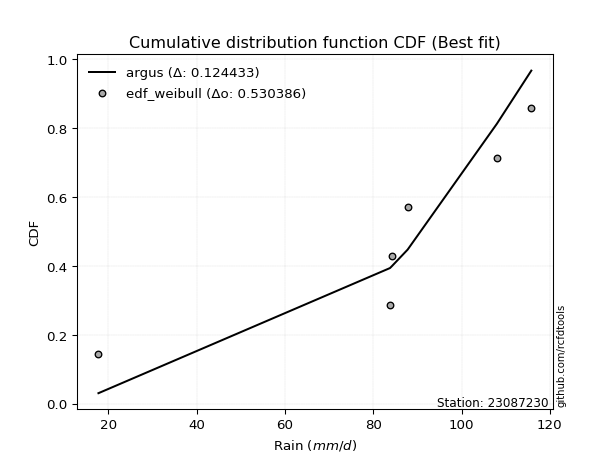</img></img>

</div>


### 4. Empirical - EDF Beard (1943)

The Beard formula (or Beard´s plotting position formula) in hydrology is used to estimate the empirical non-exceedance probability _(P)_ of a flood event (or other extreme hydrological data point) within a given dataset.

<div align="center">


$P=(m-0.31)/(n+0.38)$


</div>


**4.1. Empirical values**

<div align="center">

|                | 0                   | 1                  | 2         | 3                  | 4                  |
|:---------------|:--------------------|:-------------------|:----------|:-------------------|:-------------------|
| date           | 2023                | 2022               | 2021      | 2020               | 2019               |
| x              | 17.8                | 84.2               | 87.8      | 108.0              | 115.8              |
| m              | 1                   | 2                  | 3         | 4                  | 5                  |
| empirical_dist | edf_beard           | edf_beard          | edf_beard | edf_beard          | edf_beard          |
| empirical      | 0.12825278810408922 | 0.3141263940520446 | 0.5       | 0.6858736059479554 | 0.8717472118959109 |
| empirical_tr   | 1.1471215351812367  | 1.4579945799457996 | 2.0       | 3.183431952662722  | 7.797101449275368  |

</div>


**4.2. Kolmogorov-Smirnov fit test (sorted by Δ)**


<div align="center">

|                | 0                   | 1                   | 2                  | 3                   | 4                   | 5                   | 6                   | 7                   | 8                   | 9                   | 10                  | 11                 | 12                 | 13                  | 14                  | 15                  | 16                  | 17                  | 18                 | 19                  | 20                 | 21                  | 22                  | 23                  | 24                  | 25                 | 26                    | 27                 | 28                 | 29                  | 30                  | 31                 | 32                  | 33                  | 34                 | 35                 | 36                 | 37                  | 38                 | 39                 | 40                 | 41                 | 42                 | 43                 | 44                  | 45                 | 46                  | 47                  | 48                 | 49                  | 50                 | 51                 | 52                 | 53                 | 54                 | 55                 | 56                  | 57                 | 58                 | 59                  | 60                  | 61                  | 62                 | 63                 | 64                 | 65                 | 66                 | 67                  | 68                  | 69                 | 70                 | 71                 | 72                  | 73                 | 74                 | 75                  | 76                  | 77                 | 78                 | 79                  | 80                 | 81                 | 82                 | 83                 | 84                  | 85                 | 86                 | 87                 | 88                 | 89                 |
|:---------------|:--------------------|:--------------------|:-------------------|:--------------------|:--------------------|:--------------------|:--------------------|:--------------------|:--------------------|:--------------------|:--------------------|:-------------------|:-------------------|:--------------------|:--------------------|:--------------------|:--------------------|:--------------------|:-------------------|:--------------------|:-------------------|:--------------------|:--------------------|:--------------------|:--------------------|:-------------------|:----------------------|:-------------------|:-------------------|:--------------------|:--------------------|:-------------------|:--------------------|:--------------------|:-------------------|:-------------------|:-------------------|:--------------------|:-------------------|:-------------------|:-------------------|:-------------------|:-------------------|:-------------------|:--------------------|:-------------------|:--------------------|:--------------------|:-------------------|:--------------------|:-------------------|:-------------------|:-------------------|:-------------------|:-------------------|:-------------------|:--------------------|:-------------------|:-------------------|:--------------------|:--------------------|:--------------------|:-------------------|:-------------------|:-------------------|:-------------------|:-------------------|:--------------------|:--------------------|:-------------------|:-------------------|:-------------------|:--------------------|:-------------------|:-------------------|:--------------------|:--------------------|:-------------------|:-------------------|:--------------------|:-------------------|:-------------------|:-------------------|:-------------------|:--------------------|:-------------------|:-------------------|:-------------------|:-------------------|:-------------------|
| station        | 23087230            | 23087230            | 23087230           | 23087230            | 23087230            | 23087230            | 23087230            | 23087230            | 23087230            | 23087230            | 23087230            | 23087230           | 23087230           | 23087230            | 23087230            | 23087230            | 23087230            | 23087230            | 23087230           | 23087230            | 23087230           | 23087230            | 23087230            | 23087230            | 23087230            | 23087230           | 23087230              | 23087230           | 23087230           | 23087230            | 23087230            | 23087230           | 23087230            | 23087230            | 23087230           | 23087230           | 23087230           | 23087230            | 23087230           | 23087230           | 23087230           | 23087230           | 23087230           | 23087230           | 23087230            | 23087230           | 23087230            | 23087230            | 23087230           | 23087230            | 23087230           | 23087230           | 23087230           | 23087230           | 23087230           | 23087230           | 23087230            | 23087230           | 23087230           | 23087230            | 23087230            | 23087230            | 23087230           | 23087230           | 23087230           | 23087230           | 23087230           | 23087230            | 23087230            | 23087230           | 23087230           | 23087230           | 23087230            | 23087230           | 23087230           | 23087230            | 23087230            | 23087230           | 23087230           | 23087230            | 23087230           | 23087230           | 23087230           | 23087230           | 23087230            | 23087230           | 23087230           | 23087230           | 23087230           | 23087230           |
| empirical_dist | edf_beard           | edf_beard           | edf_beard          | edf_beard           | edf_beard           | edf_beard           | edf_beard           | edf_beard           | edf_beard           | edf_beard           | edf_beard           | edf_beard          | edf_beard          | edf_beard           | edf_beard           | edf_beard           | edf_beard           | edf_beard           | edf_beard          | edf_beard           | edf_beard          | edf_beard           | edf_beard           | edf_beard           | edf_beard           | edf_beard          | edf_beard             | edf_beard          | edf_beard          | edf_beard           | edf_beard           | edf_beard          | edf_beard           | edf_beard           | edf_beard          | edf_beard          | edf_beard          | edf_beard           | edf_beard          | edf_beard          | edf_beard          | edf_beard          | edf_beard          | edf_beard          | edf_beard           | edf_beard          | edf_beard           | edf_beard           | edf_beard          | edf_beard           | edf_beard          | edf_beard          | edf_beard          | edf_beard          | edf_beard          | edf_beard          | edf_beard           | edf_beard          | edf_beard          | edf_beard           | edf_beard           | edf_beard           | edf_beard          | edf_beard          | edf_beard          | edf_beard          | edf_beard          | edf_beard           | edf_beard           | edf_beard          | edf_beard          | edf_beard          | edf_beard           | edf_beard          | edf_beard          | edf_beard           | edf_beard           | edf_beard          | edf_beard          | edf_beard           | edf_beard          | edf_beard          | edf_beard          | edf_beard          | edf_beard           | edf_beard          | edf_beard          | edf_beard          | edf_beard          | edf_beard          |
| p_dist         | weibull_min         | gompertz            | mielke             | fisk                | pearson3            | gumbel_l            | laplace_asymmetric  | logfisk             | t                   | norm                | crystalball         | truncnorm          | exponnorm          | nct                 | f                   | logistic            | hypsecant           | logpearson3         | erlang             | rice                | betaprime          | gamma               | laplace             | logmielke           | chi2                | logloggamma        | loglaplace_asymmetric | invgamma           | invgauss           | loggumbel_l         | maxwell             | loggompertz        | rayleigh            | logt                | ncf                | logjohnsonsu       | kstwobign          | gumbel_r            | halfnorm           | logweibull_min     | nakagami           | lognorm            | lognorm            | logexponnorm       | logcrystalball      | logrice            | lognct              | logf                | logncf             | logfatiguelife      | logerlang          | moyal              | loginvweibull      | halflogistic       | loggamma           | loggamma           | logalpha            | logbetaprime       | loginvgamma        | loglogistic         | lognakagami         | loginvgauss         | loghypsecant       | logmaxwell         | logtruncnorm       | genexpon           | expon              | lograyleigh         | logkstwobign        | alpha              | loggenexpon        | loglaplace         | loghalfnorm         | loggumbel_r        | logexpon           | wald                | johnsonsu           | loglognorm         | loghalflogistic    | logmoyal            | pareto             | logpareto          | gibrat             | invweibull         | logwald             | logchi2            | loggibrat          | fatiguelife        | loggenlogistic     | genlogistic        |
| delta          | 0.11281348526134244 | 0.11357697766772373 | 0.1270044421152996 | 0.12719846650739997 | 0.13153500694225745 | 0.13328902320371544 | 0.16870682649765256 | 0.20276414075290256 | 0.20294071303038758 | 0.20294700592422393 | 0.20294700887048972 | 0.2029470226929983 | 0.2029478970355451 | 0.20306227622546286 | 0.20438020083677394 | 0.20527592807264156 | 0.20726236202268505 | 0.20780310844934596 | 0.2110444845020713 | 0.21181585085762106 | 0.2122227944209813 | 0.21523347818050492 | 0.21524654199206333 | 0.21536429526157946 | 0.21765000402723383 | 0.2182241843123099 | 0.21943275048346383   | 0.2208457456449084 | 0.2298707053429559 | 0.23492817122715287 | 0.23523597459788753 | 0.2408989509818344 | 0.24585672178927115 | 0.24681211259367752 | 0.249830543261569  | 0.2602209176015274 | 0.2730074881909836 | 0.27361794847151505 | 0.2757582994470487 | 0.2836138343310944 | 0.2880664664219391 | 0.2932782921743657 | 0.2932782921743657 | 0.2932805871149174 | 0.29328074185786096 | 0.2933279378663269 | 0.29334273583653664 | 0.29361781102394363 | 0.2938761201562669 | 0.29402316749905694 | 0.2965703465169817 | 0.2992672105680872 | 0.3004968963161216 | 0.3016561679011243 | 0.3017255979198557 | 0.3017255979198557 | 0.30190760641080466 | 0.3025229769908309 | 0.3049858301098854 | 0.30700922209588705 | 0.31115260332142863 | 0.31316680568359606 | 0.3181719169117246 | 0.319139411300101  | 0.3254647477559286 | 0.3262181972129761 | 0.3262859445423281 | 0.32712744810621436 | 0.33179165718280373 | 0.3419211674151719 | 0.3435263839067207 | 0.3458046147725951 | 0.34991593556798634 | 0.358999622113551  | 0.3655368554422042 | 0.37051986636362916 | 0.37323562269155475 | 0.3751123796920442 | 0.378269865698131  | 0.38134495424728115 | 0.3851810378041903 | 0.3925999434305651 | 0.3962888426224506 | 0.4428795325542381 | 0.44371681822552783 | 0.4655066428254187 | 0.475602410858818  | 0.5825951387573087 | 0.6858736059479554 | 0.6858736059479554 |
| deltao         | 0.5865427407550001  | 0.5865427407550001  | 0.5865427407550001 | 0.5865427407550001  | 0.5865427407550001  | 0.5865427407550001  | 0.5865427407550001  | 0.5865427407550001  | 0.5865427407550001  | 0.5865427407550001  | 0.5865427407550001  | 0.5865427407550001 | 0.5865427407550001 | 0.5865427407550001  | 0.5865427407550001  | 0.5865427407550001  | 0.5865427407550001  | 0.5865427407550001  | 0.5865427407550001 | 0.5865427407550001  | 0.5865427407550001 | 0.5865427407550001  | 0.5865427407550001  | 0.5865427407550001  | 0.5865427407550001  | 0.5865427407550001 | 0.5865427407550001    | 0.5865427407550001 | 0.5865427407550001 | 0.5865427407550001  | 0.5865427407550001  | 0.5865427407550001 | 0.5865427407550001  | 0.5865427407550001  | 0.5865427407550001 | 0.5865427407550001 | 0.5865427407550001 | 0.5865427407550001  | 0.5865427407550001 | 0.5865427407550001 | 0.5865427407550001 | 0.5865427407550001 | 0.5865427407550001 | 0.5865427407550001 | 0.5865427407550001  | 0.5865427407550001 | 0.5865427407550001  | 0.5865427407550001  | 0.5865427407550001 | 0.5865427407550001  | 0.5865427407550001 | 0.5865427407550001 | 0.5865427407550001 | 0.5865427407550001 | 0.5865427407550001 | 0.5865427407550001 | 0.5865427407550001  | 0.5865427407550001 | 0.5865427407550001 | 0.5865427407550001  | 0.5865427407550001  | 0.5865427407550001  | 0.5865427407550001 | 0.5865427407550001 | 0.5865427407550001 | 0.5865427407550001 | 0.5865427407550001 | 0.5865427407550001  | 0.5865427407550001  | 0.5865427407550001 | 0.5865427407550001 | 0.5865427407550001 | 0.5865427407550001  | 0.5865427407550001 | 0.5865427407550001 | 0.5865427407550001  | 0.5865427407550001  | 0.5865427407550001 | 0.5865427407550001 | 0.5865427407550001  | 0.5865427407550001 | 0.5865427407550001 | 0.5865427407550001 | 0.5865427407550001 | 0.5865427407550001  | 0.5865427407550001 | 0.5865427407550001 | 0.5865427407550001 | 0.5865427407550001 | 0.5865427407550001 |
| eval           | Δo > Δ              | Δo > Δ              | Δo > Δ             | Δo > Δ              | Δo > Δ              | Δo > Δ              | Δo > Δ              | Δo > Δ              | Δo > Δ              | Δo > Δ              | Δo > Δ              | Δo > Δ             | Δo > Δ             | Δo > Δ              | Δo > Δ              | Δo > Δ              | Δo > Δ              | Δo > Δ              | Δo > Δ             | Δo > Δ              | Δo > Δ             | Δo > Δ              | Δo > Δ              | Δo > Δ              | Δo > Δ              | Δo > Δ             | Δo > Δ                | Δo > Δ             | Δo > Δ             | Δo > Δ              | Δo > Δ              | Δo > Δ             | Δo > Δ              | Δo > Δ              | Δo > Δ             | Δo > Δ             | Δo > Δ             | Δo > Δ              | Δo > Δ             | Δo > Δ             | Δo > Δ             | Δo > Δ             | Δo > Δ             | Δo > Δ             | Δo > Δ              | Δo > Δ             | Δo > Δ              | Δo > Δ              | Δo > Δ             | Δo > Δ              | Δo > Δ             | Δo > Δ             | Δo > Δ             | Δo > Δ             | Δo > Δ             | Δo > Δ             | Δo > Δ              | Δo > Δ             | Δo > Δ             | Δo > Δ              | Δo > Δ              | Δo > Δ              | Δo > Δ             | Δo > Δ             | Δo > Δ             | Δo > Δ             | Δo > Δ             | Δo > Δ              | Δo > Δ              | Δo > Δ             | Δo > Δ             | Δo > Δ             | Δo > Δ              | Δo > Δ             | Δo > Δ             | Δo > Δ              | Δo > Δ              | Δo > Δ             | Δo > Δ             | Δo > Δ              | Δo > Δ             | Δo > Δ             | Δo > Δ             | Δo > Δ             | Δo > Δ              | Δo > Δ             | Δo > Δ             | Δo > Δ             | Δo <= Δ            | Δo <= Δ            |
| fit            | 1                   | 1                   | 1                  | 1                   | 1                   | 1                   | 1                   | 1                   | 1                   | 1                   | 1                   | 1                  | 1                  | 1                   | 1                   | 1                   | 1                   | 1                   | 1                  | 1                   | 1                  | 1                   | 1                   | 1                   | 1                   | 1                  | 1                     | 1                  | 1                  | 1                   | 1                   | 1                  | 1                   | 1                   | 1                  | 1                  | 1                  | 1                   | 1                  | 1                  | 1                  | 1                  | 1                  | 1                  | 1                   | 1                  | 1                   | 1                   | 1                  | 1                   | 1                  | 1                  | 1                  | 1                  | 1                  | 1                  | 1                   | 1                  | 1                  | 1                   | 1                   | 1                   | 1                  | 1                  | 1                  | 1                  | 1                  | 1                   | 1                   | 1                  | 1                  | 1                  | 1                   | 1                  | 1                  | 1                   | 1                   | 1                  | 1                  | 1                   | 1                  | 1                  | 1                  | 1                  | 1                   | 1                  | 1                  | 1                  | 0                  | 0                  |
| n              | 5                   | 5                   | 5                  | 5                   | 5                   | 5                   | 5                   | 5                   | 5                   | 5                   | 5                   | 5                  | 5                  | 5                   | 5                   | 5                   | 5                   | 5                   | 5                  | 5                   | 5                  | 5                   | 5                   | 5                   | 5                   | 5                  | 5                     | 5                  | 5                  | 5                   | 5                   | 5                  | 5                   | 5                   | 5                  | 5                  | 5                  | 5                   | 5                  | 5                  | 5                  | 5                  | 5                  | 5                  | 5                   | 5                  | 5                   | 5                   | 5                  | 5                   | 5                  | 5                  | 5                  | 5                  | 5                  | 5                  | 5                   | 5                  | 5                  | 5                   | 5                   | 5                   | 5                  | 5                  | 5                  | 5                  | 5                  | 5                   | 5                   | 5                  | 5                  | 5                  | 5                   | 5                  | 5                  | 5                   | 5                   | 5                  | 5                  | 5                   | 5                  | 5                  | 5                  | 5                  | 5                   | 5                  | 5                  | 5                  | 5                  | 5                  |
| best_fit       | 1                   | 0                   | 0                  | 0                   | 0                   | 0                   | 0                   | 0                   | 0                   | 0                   | 0                   | 0                  | 0                  | 0                   | 0                   | 0                   | 0                   | 0                   | 0                  | 0                   | 0                  | 0                   | 0                   | 0                   | 0                   | 0                  | 0                     | 0                  | 0                  | 0                   | 0                   | 0                  | 0                   | 0                   | 0                  | 0                  | 0                  | 0                   | 0                  | 0                  | 0                  | 0                  | 0                  | 0                  | 0                   | 0                  | 0                   | 0                   | 0                  | 0                   | 0                  | 0                  | 0                  | 0                  | 0                  | 0                  | 0                   | 0                  | 0                  | 0                   | 0                   | 0                   | 0                  | 0                  | 0                  | 0                  | 0                  | 0                   | 0                   | 0                  | 0                  | 0                  | 0                   | 0                  | 0                  | 0                   | 0                   | 0                  | 0                  | 0                   | 0                  | 0                  | 0                  | 0                  | 0                   | 0                  | 0                  | 0                  | 0                  | 0                  |
| best_fit_sort  | 1                   | 2                   | 3                  | 4                   | 5                   | 6                   | 7                   | 8                   | 9                   | 10                  | 11                  | 12                 | 13                 | 14                  | 15                  | 16                  | 17                  | 18                  | 19                 | 20                  | 21                 | 22                  | 23                  | 24                  | 25                  | 26                 | 27                    | 28                 | 29                 | 30                  | 31                  | 32                 | 33                  | 34                  | 35                 | 36                 | 37                 | 38                  | 39                 | 40                 | 41                 | 42                 | 43                 | 44                 | 45                  | 46                 | 47                  | 48                  | 49                 | 50                  | 51                 | 52                 | 53                 | 54                 | 55                 | 56                 | 57                  | 58                 | 59                 | 60                  | 61                  | 62                  | 63                 | 64                 | 65                 | 66                 | 67                 | 68                  | 69                  | 70                 | 71                 | 72                 | 73                  | 74                 | 75                 | 76                  | 77                  | 78                 | 79                 | 80                  | 81                 | 82                 | 83                 | 84                 | 85                  | 86                 | 87                 | 88                 | 89                 | 90                 |

</div>


<div align="center">

</img>

</div>


**4.3. Best fit**

<div align="center">

|   id |   station | empirical_dist   | p_dist      |    delta |   deltao | eval   |   fit |   n |   best_fit |   best_fit_sort |
|-----:|----------:|:-----------------|:------------|---------:|---------:|:-------|------:|----:|-----------:|----------------:|
|    0 |  23087230 | edf_beard        | weibull_min | 0.112813 | 0.586543 | Δo > Δ |     1 |   5 |          1 |               1 |

</div>


<div align="center">

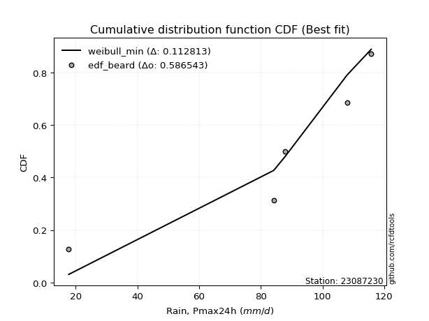</img></img>

</div>


### 5. Empirical - EDF Chegodayev (1955)

The Chegodayev formula is an empirical plotting position formula used in hydrological frequency analysis to estimate the exceedance probability or return period of a specific event from a set of observed data. It is primarily used for plotting observed data points on probability paper to fit a theoretical distribution, particularly for analyzing extreme events like maximum flood flows or rainfall intensities. The constant _b_ value in the generalized plotting position formula is 0.3.

<div align="center">


$P=(m-b)/(n+1-2b)$


</div>


**5.1. Empirical values**

<div align="center">

|                | 0                   | 1                   | 2              | 3                  | 4                  |
|:---------------|:--------------------|:--------------------|:---------------|:-------------------|:-------------------|
| date           | 2023                | 2022                | 2021           | 2020               | 2019               |
| x              | 17.8                | 84.2                | 87.8           | 108.0              | 115.8              |
| m              | 1                   | 2                   | 3              | 4                  | 5                  |
| empirical_dist | edf_chegodayev      | edf_chegodayev      | edf_chegodayev | edf_chegodayev     | edf_chegodayev     |
| empirical      | 0.12962962962962962 | 0.31481481481481477 | 0.5            | 0.6851851851851851 | 0.8703703703703703 |
| empirical_tr   | 1.148936170212766   | 1.4594594594594594  | 2.0            | 3.1764705882352935 | 7.714285714285713  |

</div>


**5.2. Kolmogorov-Smirnov fit test (sorted by Δ)**


<div align="center">

|                | 0                   | 1                   | 2                   | 3                   | 4                  | 5                  | 6                   | 7                  | 8                   | 9                   | 10                  | 11                  | 12                  | 13                 | 14                 | 15                 | 16                 | 17                  | 18                  | 19                 | 20                  | 21                  | 22                  | 23                  | 24                 | 25                  | 26                    | 27                  | 28                  | 29                  | 30                  | 31                  | 32                 | 33                 | 34                  | 35                  | 36                  | 37                 | 38                  | 39                  | 40                 | 41                  | 42                  | 43                  | 44                 | 45                  | 46                 | 47                 | 48                  | 49                 | 50                  | 51                  | 52                  | 53                  | 54                  | 55                  | 56                 | 57                  | 58                  | 59                 | 60                 | 61                 | 62                  | 63                  | 64                 | 65                 | 66                 | 67                 | 68                 | 69                 | 70                  | 71                  | 72                 | 73                 | 74                  | 75                 | 76                  | 77                  | 78                  | 79                 | 80                 | 81                  | 82                 | 83                 | 84                 | 85                  | 86                  | 87                 | 88                 | 89                 |
|:---------------|:--------------------|:--------------------|:--------------------|:--------------------|:-------------------|:-------------------|:--------------------|:-------------------|:--------------------|:--------------------|:--------------------|:--------------------|:--------------------|:-------------------|:-------------------|:-------------------|:-------------------|:--------------------|:--------------------|:-------------------|:--------------------|:--------------------|:--------------------|:--------------------|:-------------------|:--------------------|:----------------------|:--------------------|:--------------------|:--------------------|:--------------------|:--------------------|:-------------------|:-------------------|:--------------------|:--------------------|:--------------------|:-------------------|:--------------------|:--------------------|:-------------------|:--------------------|:--------------------|:--------------------|:-------------------|:--------------------|:-------------------|:-------------------|:--------------------|:-------------------|:--------------------|:--------------------|:--------------------|:--------------------|:--------------------|:--------------------|:-------------------|:--------------------|:--------------------|:-------------------|:-------------------|:-------------------|:--------------------|:--------------------|:-------------------|:-------------------|:-------------------|:-------------------|:-------------------|:-------------------|:--------------------|:--------------------|:-------------------|:-------------------|:--------------------|:-------------------|:--------------------|:--------------------|:--------------------|:-------------------|:-------------------|:--------------------|:-------------------|:-------------------|:-------------------|:--------------------|:--------------------|:-------------------|:-------------------|:-------------------|
| station        | 23087230            | 23087230            | 23087230            | 23087230            | 23087230           | 23087230           | 23087230            | 23087230           | 23087230            | 23087230            | 23087230            | 23087230            | 23087230            | 23087230           | 23087230           | 23087230           | 23087230           | 23087230            | 23087230            | 23087230           | 23087230            | 23087230            | 23087230            | 23087230            | 23087230           | 23087230            | 23087230              | 23087230            | 23087230            | 23087230            | 23087230            | 23087230            | 23087230           | 23087230           | 23087230            | 23087230            | 23087230            | 23087230           | 23087230            | 23087230            | 23087230           | 23087230            | 23087230            | 23087230            | 23087230           | 23087230            | 23087230           | 23087230           | 23087230            | 23087230           | 23087230            | 23087230            | 23087230            | 23087230            | 23087230            | 23087230            | 23087230           | 23087230            | 23087230            | 23087230           | 23087230           | 23087230           | 23087230            | 23087230            | 23087230           | 23087230           | 23087230           | 23087230           | 23087230           | 23087230           | 23087230            | 23087230            | 23087230           | 23087230           | 23087230            | 23087230           | 23087230            | 23087230            | 23087230            | 23087230           | 23087230           | 23087230            | 23087230           | 23087230           | 23087230           | 23087230            | 23087230            | 23087230           | 23087230           | 23087230           |
| empirical_dist | edf_chegodayev      | edf_chegodayev      | edf_chegodayev      | edf_chegodayev      | edf_chegodayev     | edf_chegodayev     | edf_chegodayev      | edf_chegodayev     | edf_chegodayev      | edf_chegodayev      | edf_chegodayev      | edf_chegodayev      | edf_chegodayev      | edf_chegodayev     | edf_chegodayev     | edf_chegodayev     | edf_chegodayev     | edf_chegodayev      | edf_chegodayev      | edf_chegodayev     | edf_chegodayev      | edf_chegodayev      | edf_chegodayev      | edf_chegodayev      | edf_chegodayev     | edf_chegodayev      | edf_chegodayev        | edf_chegodayev      | edf_chegodayev      | edf_chegodayev      | edf_chegodayev      | edf_chegodayev      | edf_chegodayev     | edf_chegodayev     | edf_chegodayev      | edf_chegodayev      | edf_chegodayev      | edf_chegodayev     | edf_chegodayev      | edf_chegodayev      | edf_chegodayev     | edf_chegodayev      | edf_chegodayev      | edf_chegodayev      | edf_chegodayev     | edf_chegodayev      | edf_chegodayev     | edf_chegodayev     | edf_chegodayev      | edf_chegodayev     | edf_chegodayev      | edf_chegodayev      | edf_chegodayev      | edf_chegodayev      | edf_chegodayev      | edf_chegodayev      | edf_chegodayev     | edf_chegodayev      | edf_chegodayev      | edf_chegodayev     | edf_chegodayev     | edf_chegodayev     | edf_chegodayev      | edf_chegodayev      | edf_chegodayev     | edf_chegodayev     | edf_chegodayev     | edf_chegodayev     | edf_chegodayev     | edf_chegodayev     | edf_chegodayev      | edf_chegodayev      | edf_chegodayev     | edf_chegodayev     | edf_chegodayev      | edf_chegodayev     | edf_chegodayev      | edf_chegodayev      | edf_chegodayev      | edf_chegodayev     | edf_chegodayev     | edf_chegodayev      | edf_chegodayev     | edf_chegodayev     | edf_chegodayev     | edf_chegodayev      | edf_chegodayev      | edf_chegodayev     | edf_chegodayev     | edf_chegodayev     |
| p_dist         | weibull_min         | gompertz            | fisk                | mielke              | pearson3           | gumbel_l           | laplace_asymmetric  | logfisk            | t                   | norm                | crystalball         | truncnorm           | exponnorm           | nct                | f                  | logistic           | hypsecant          | logpearson3         | erlang              | rice               | betaprime           | gamma               | laplace             | logmielke           | chi2               | logloggamma         | loglaplace_asymmetric | invgamma            | invgauss            | loggumbel_l         | maxwell             | loggompertz         | rayleigh           | logt               | ncf                 | logjohnsonsu        | kstwobign           | gumbel_r           | halfnorm            | logweibull_min      | nakagami           | lognorm             | lognorm             | logexponnorm        | logcrystalball     | logrice             | lognct             | logf               | logncf              | logfatiguelife     | logerlang           | moyal               | loginvweibull       | halflogistic        | loggamma            | loggamma            | logalpha           | logbetaprime        | loginvgamma         | loglogistic        | lognakagami        | loginvgauss        | loghypsecant        | logmaxwell          | logtruncnorm       | genexpon           | expon              | lograyleigh        | logkstwobign       | alpha              | loggenexpon         | loglaplace          | loghalfnorm        | loggumbel_r        | logexpon            | wald               | johnsonsu           | loglognorm          | loghalflogistic     | logmoyal           | pareto             | logpareto           | gibrat             | invweibull         | logwald            | logchi2             | loggibrat           | fatiguelife        | loggenlogistic     | genlogistic        |
| delta          | 0.11212506449857229 | 0.11288855690495359 | 0.12651004574462982 | 0.12838128364084012 | 0.1308465861794873 | 0.1326006024409453 | 0.16801840573488241 | 0.2020757199901324 | 0.20225229226761743 | 0.20225858516145379 | 0.20225858810771957 | 0.20225860193022815 | 0.20225947627277496 | 0.2023738554626927 | 0.2036917800740038 | 0.2045875073098714 | 0.2065739412599149 | 0.20711468768657582 | 0.21035606373930116 | 0.2111274300948509 | 0.21153437365821115 | 0.21454505741773477 | 0.21455812122929319 | 0.21467587449880932 | 0.2169615832644637 | 0.21753576354953974 | 0.2187443297206937    | 0.22015732488213824 | 0.22918228458018575 | 0.23423975046438272 | 0.23454755383511738 | 0.24021053021906424 | 0.245168301026501  | 0.245435271068137  | 0.24914212249879886 | 0.25953249683875707 | 0.27231906742821343 | 0.2729295277087449 | 0.27506987868427857 | 0.28292541356832424 | 0.2880664664219391 | 0.29258987141159554 | 0.29258987141159554 | 0.29259216635214724 | 0.2925923210950908 | 0.29263951710355673 | 0.2926543150737665 | 0.2929293902611735 | 0.29318769939349676 | 0.2933347467362868 | 0.29588192575421157 | 0.29857878980531705 | 0.29980847555335144 | 0.30096774713835417 | 0.30103717715708556 | 0.30103717715708556 | 0.3012191856480345 | 0.30183455622806077 | 0.30429740934711524 | 0.3063208013331169 | 0.3118410240841988 | 0.3124783849208259 | 0.31748349614895444 | 0.31845099053733084 | 0.3254647477559286 | 0.325529776450206  | 0.325597523779558  | 0.3264390273434442 | 0.3311032364200336 | 0.3412327466524018 | 0.34283796314395054 | 0.34511619400982496 | 0.3492275148052162 | 0.3583112013507809 | 0.36484843467943406 | 0.369831445600859  | 0.37254720192878443 | 0.37442395892927405 | 0.37758144493536083 | 0.380656533484511  | 0.3844926170414201 | 0.39191152266779494 | 0.3956004218596805 | 0.4415026910286976 | 0.4430283974627577 | 0.46481822206264856 | 0.47491399009604784 | 0.5819067179945386 | 0.6851851851851851 | 0.6851851851851851 |
| deltao         | 0.5865427407550001  | 0.5865427407550001  | 0.5865427407550001  | 0.5865427407550001  | 0.5865427407550001 | 0.5865427407550001 | 0.5865427407550001  | 0.5865427407550001 | 0.5865427407550001  | 0.5865427407550001  | 0.5865427407550001  | 0.5865427407550001  | 0.5865427407550001  | 0.5865427407550001 | 0.5865427407550001 | 0.5865427407550001 | 0.5865427407550001 | 0.5865427407550001  | 0.5865427407550001  | 0.5865427407550001 | 0.5865427407550001  | 0.5865427407550001  | 0.5865427407550001  | 0.5865427407550001  | 0.5865427407550001 | 0.5865427407550001  | 0.5865427407550001    | 0.5865427407550001  | 0.5865427407550001  | 0.5865427407550001  | 0.5865427407550001  | 0.5865427407550001  | 0.5865427407550001 | 0.5865427407550001 | 0.5865427407550001  | 0.5865427407550001  | 0.5865427407550001  | 0.5865427407550001 | 0.5865427407550001  | 0.5865427407550001  | 0.5865427407550001 | 0.5865427407550001  | 0.5865427407550001  | 0.5865427407550001  | 0.5865427407550001 | 0.5865427407550001  | 0.5865427407550001 | 0.5865427407550001 | 0.5865427407550001  | 0.5865427407550001 | 0.5865427407550001  | 0.5865427407550001  | 0.5865427407550001  | 0.5865427407550001  | 0.5865427407550001  | 0.5865427407550001  | 0.5865427407550001 | 0.5865427407550001  | 0.5865427407550001  | 0.5865427407550001 | 0.5865427407550001 | 0.5865427407550001 | 0.5865427407550001  | 0.5865427407550001  | 0.5865427407550001 | 0.5865427407550001 | 0.5865427407550001 | 0.5865427407550001 | 0.5865427407550001 | 0.5865427407550001 | 0.5865427407550001  | 0.5865427407550001  | 0.5865427407550001 | 0.5865427407550001 | 0.5865427407550001  | 0.5865427407550001 | 0.5865427407550001  | 0.5865427407550001  | 0.5865427407550001  | 0.5865427407550001 | 0.5865427407550001 | 0.5865427407550001  | 0.5865427407550001 | 0.5865427407550001 | 0.5865427407550001 | 0.5865427407550001  | 0.5865427407550001  | 0.5865427407550001 | 0.5865427407550001 | 0.5865427407550001 |
| eval           | Δo > Δ              | Δo > Δ              | Δo > Δ              | Δo > Δ              | Δo > Δ             | Δo > Δ             | Δo > Δ              | Δo > Δ             | Δo > Δ              | Δo > Δ              | Δo > Δ              | Δo > Δ              | Δo > Δ              | Δo > Δ             | Δo > Δ             | Δo > Δ             | Δo > Δ             | Δo > Δ              | Δo > Δ              | Δo > Δ             | Δo > Δ              | Δo > Δ              | Δo > Δ              | Δo > Δ              | Δo > Δ             | Δo > Δ              | Δo > Δ                | Δo > Δ              | Δo > Δ              | Δo > Δ              | Δo > Δ              | Δo > Δ              | Δo > Δ             | Δo > Δ             | Δo > Δ              | Δo > Δ              | Δo > Δ              | Δo > Δ             | Δo > Δ              | Δo > Δ              | Δo > Δ             | Δo > Δ              | Δo > Δ              | Δo > Δ              | Δo > Δ             | Δo > Δ              | Δo > Δ             | Δo > Δ             | Δo > Δ              | Δo > Δ             | Δo > Δ              | Δo > Δ              | Δo > Δ              | Δo > Δ              | Δo > Δ              | Δo > Δ              | Δo > Δ             | Δo > Δ              | Δo > Δ              | Δo > Δ             | Δo > Δ             | Δo > Δ             | Δo > Δ              | Δo > Δ              | Δo > Δ             | Δo > Δ             | Δo > Δ             | Δo > Δ             | Δo > Δ             | Δo > Δ             | Δo > Δ              | Δo > Δ              | Δo > Δ             | Δo > Δ             | Δo > Δ              | Δo > Δ             | Δo > Δ              | Δo > Δ              | Δo > Δ              | Δo > Δ             | Δo > Δ             | Δo > Δ              | Δo > Δ             | Δo > Δ             | Δo > Δ             | Δo > Δ              | Δo > Δ              | Δo > Δ             | Δo <= Δ            | Δo <= Δ            |
| fit            | 1                   | 1                   | 1                   | 1                   | 1                  | 1                  | 1                   | 1                  | 1                   | 1                   | 1                   | 1                   | 1                   | 1                  | 1                  | 1                  | 1                  | 1                   | 1                   | 1                  | 1                   | 1                   | 1                   | 1                   | 1                  | 1                   | 1                     | 1                   | 1                   | 1                   | 1                   | 1                   | 1                  | 1                  | 1                   | 1                   | 1                   | 1                  | 1                   | 1                   | 1                  | 1                   | 1                   | 1                   | 1                  | 1                   | 1                  | 1                  | 1                   | 1                  | 1                   | 1                   | 1                   | 1                   | 1                   | 1                   | 1                  | 1                   | 1                   | 1                  | 1                  | 1                  | 1                   | 1                   | 1                  | 1                  | 1                  | 1                  | 1                  | 1                  | 1                   | 1                   | 1                  | 1                  | 1                   | 1                  | 1                   | 1                   | 1                   | 1                  | 1                  | 1                   | 1                  | 1                  | 1                  | 1                   | 1                   | 1                  | 0                  | 0                  |
| n              | 5                   | 5                   | 5                   | 5                   | 5                  | 5                  | 5                   | 5                  | 5                   | 5                   | 5                   | 5                   | 5                   | 5                  | 5                  | 5                  | 5                  | 5                   | 5                   | 5                  | 5                   | 5                   | 5                   | 5                   | 5                  | 5                   | 5                     | 5                   | 5                   | 5                   | 5                   | 5                   | 5                  | 5                  | 5                   | 5                   | 5                   | 5                  | 5                   | 5                   | 5                  | 5                   | 5                   | 5                   | 5                  | 5                   | 5                  | 5                  | 5                   | 5                  | 5                   | 5                   | 5                   | 5                   | 5                   | 5                   | 5                  | 5                   | 5                   | 5                  | 5                  | 5                  | 5                   | 5                   | 5                  | 5                  | 5                  | 5                  | 5                  | 5                  | 5                   | 5                   | 5                  | 5                  | 5                   | 5                  | 5                   | 5                   | 5                   | 5                  | 5                  | 5                   | 5                  | 5                  | 5                  | 5                   | 5                   | 5                  | 5                  | 5                  |
| best_fit       | 1                   | 0                   | 0                   | 0                   | 0                  | 0                  | 0                   | 0                  | 0                   | 0                   | 0                   | 0                   | 0                   | 0                  | 0                  | 0                  | 0                  | 0                   | 0                   | 0                  | 0                   | 0                   | 0                   | 0                   | 0                  | 0                   | 0                     | 0                   | 0                   | 0                   | 0                   | 0                   | 0                  | 0                  | 0                   | 0                   | 0                   | 0                  | 0                   | 0                   | 0                  | 0                   | 0                   | 0                   | 0                  | 0                   | 0                  | 0                  | 0                   | 0                  | 0                   | 0                   | 0                   | 0                   | 0                   | 0                   | 0                  | 0                   | 0                   | 0                  | 0                  | 0                  | 0                   | 0                   | 0                  | 0                  | 0                  | 0                  | 0                  | 0                  | 0                   | 0                   | 0                  | 0                  | 0                   | 0                  | 0                   | 0                   | 0                   | 0                  | 0                  | 0                   | 0                  | 0                  | 0                  | 0                   | 0                   | 0                  | 0                  | 0                  |
| best_fit_sort  | 1                   | 2                   | 3                   | 4                   | 5                  | 6                  | 7                   | 8                  | 9                   | 10                  | 11                  | 12                  | 13                  | 14                 | 15                 | 16                 | 17                 | 18                  | 19                  | 20                 | 21                  | 22                  | 23                  | 24                  | 25                 | 26                  | 27                    | 28                  | 29                  | 30                  | 31                  | 32                  | 33                 | 34                 | 35                  | 36                  | 37                  | 38                 | 39                  | 40                  | 41                 | 42                  | 43                  | 44                  | 45                 | 46                  | 47                 | 48                 | 49                  | 50                 | 51                  | 52                  | 53                  | 54                  | 55                  | 56                  | 57                 | 58                  | 59                  | 60                 | 61                 | 62                 | 63                  | 64                  | 65                 | 66                 | 67                 | 68                 | 69                 | 70                 | 71                  | 72                  | 73                 | 74                 | 75                  | 76                 | 77                  | 78                  | 79                  | 80                 | 81                 | 82                  | 83                 | 84                 | 85                 | 86                  | 87                  | 88                 | 89                 | 90                 |

</div>


<div align="center">

</img>

</div>


**5.3. Best fit**

<div align="center">

|   id |   station | empirical_dist   | p_dist      |    delta |   deltao | eval   |   fit |   n |   best_fit |   best_fit_sort |
|-----:|----------:|:-----------------|:------------|---------:|---------:|:-------|------:|----:|-----------:|----------------:|
|    0 |  23087230 | edf_chegodayev   | weibull_min | 0.112125 | 0.586543 | Δo > Δ |     1 |   5 |          1 |               1 |

</div>


<div align="center">

</img></img>

</div>


### 6. Empirical - EDF Blom (1958)

The Blom formula is a specific "plotting position" formula used in hydrology and statistical analysis to estimate the empirical cumulative probability (or non-exceedance probability) of a data series. It is particularly recommended for data that are approximately normally distributed. The constant _a_ is set to 0.375 (or 3/8).

<div align="center">


$P=(m-a)/(n+1-2a)$


</div>


**6.1. Empirical values**

<div align="center">

|                | 0                   | 1                   | 2        | 3                  | 4                  |
|:---------------|:--------------------|:--------------------|:---------|:-------------------|:-------------------|
| date           | 2023                | 2022                | 2021     | 2020               | 2019               |
| x              | 17.8                | 84.2                | 87.8     | 108.0              | 115.8              |
| m              | 1                   | 2                   | 3        | 4                  | 5                  |
| empirical_dist | edf_blom            | edf_blom            | edf_blom | edf_blom           | edf_blom           |
| empirical      | 0.11904761904761904 | 0.30952380952380953 | 0.5      | 0.6904761904761905 | 0.8809523809523809 |
| empirical_tr   | 1.135135135135135   | 1.4482758620689655  | 2.0      | 3.230769230769231  | 8.399999999999999  |

</div>


**6.2. Kolmogorov-Smirnov fit test (sorted by Δ)**


<div align="center">

|                | 0                   | 1                   | 2                   | 3                   | 4                   | 5                   | 6                   | 7                   | 8                   | 9                   | 10                 | 11                 | 12                 | 13                  | 14                  | 15                  | 16                  | 17                  | 18                 | 19                  | 20                  | 21                 | 22                  | 23                  | 24                  | 25                  | 26                    | 27                  | 28                  | 29                  | 30                  | 31                  | 32                  | 33                 | 34                 | 35                 | 36                  | 37                  | 38                 | 39                 | 40                  | 41                  | 42                  | 43                 | 44                  | 45                  | 46                 | 47                 | 48                 | 49                 | 50                 | 51                 | 52                 | 53                 | 54                 | 55                 | 56                  | 57                  | 58                 | 59                 | 60                  | 61                  | 62                  | 63                  | 64                 | 65                 | 66                 | 67                  | 68                 | 69                 | 70                 | 71                 | 72                 | 73                 | 74                 | 75                  | 76                 | 77                 | 78                  | 79                  | 80                  | 81                 | 82                 | 83                 | 84                 | 85                 | 86                 | 87                 | 88                 | 89                 |
|:---------------|:--------------------|:--------------------|:--------------------|:--------------------|:--------------------|:--------------------|:--------------------|:--------------------|:--------------------|:--------------------|:-------------------|:-------------------|:-------------------|:--------------------|:--------------------|:--------------------|:--------------------|:--------------------|:-------------------|:--------------------|:--------------------|:-------------------|:--------------------|:--------------------|:--------------------|:--------------------|:----------------------|:--------------------|:--------------------|:--------------------|:--------------------|:--------------------|:--------------------|:-------------------|:-------------------|:-------------------|:--------------------|:--------------------|:-------------------|:-------------------|:--------------------|:--------------------|:--------------------|:-------------------|:--------------------|:--------------------|:-------------------|:-------------------|:-------------------|:-------------------|:-------------------|:-------------------|:-------------------|:-------------------|:-------------------|:-------------------|:--------------------|:--------------------|:-------------------|:-------------------|:--------------------|:--------------------|:--------------------|:--------------------|:-------------------|:-------------------|:-------------------|:--------------------|:-------------------|:-------------------|:-------------------|:-------------------|:-------------------|:-------------------|:-------------------|:--------------------|:-------------------|:-------------------|:--------------------|:--------------------|:--------------------|:-------------------|:-------------------|:-------------------|:-------------------|:-------------------|:-------------------|:-------------------|:-------------------|:-------------------|
| station        | 23087230            | 23087230            | 23087230            | 23087230            | 23087230            | 23087230            | 23087230            | 23087230            | 23087230            | 23087230            | 23087230           | 23087230           | 23087230           | 23087230            | 23087230            | 23087230            | 23087230            | 23087230            | 23087230           | 23087230            | 23087230            | 23087230           | 23087230            | 23087230            | 23087230            | 23087230            | 23087230              | 23087230            | 23087230            | 23087230            | 23087230            | 23087230            | 23087230            | 23087230           | 23087230           | 23087230           | 23087230            | 23087230            | 23087230           | 23087230           | 23087230            | 23087230            | 23087230            | 23087230           | 23087230            | 23087230            | 23087230           | 23087230           | 23087230           | 23087230           | 23087230           | 23087230           | 23087230           | 23087230           | 23087230           | 23087230           | 23087230            | 23087230            | 23087230           | 23087230           | 23087230            | 23087230            | 23087230            | 23087230            | 23087230           | 23087230           | 23087230           | 23087230            | 23087230           | 23087230           | 23087230           | 23087230           | 23087230           | 23087230           | 23087230           | 23087230            | 23087230           | 23087230           | 23087230            | 23087230            | 23087230            | 23087230           | 23087230           | 23087230           | 23087230           | 23087230           | 23087230           | 23087230           | 23087230           | 23087230           |
| empirical_dist | edf_blom            | edf_blom            | edf_blom            | edf_blom            | edf_blom            | edf_blom            | edf_blom            | edf_blom            | edf_blom            | edf_blom            | edf_blom           | edf_blom           | edf_blom           | edf_blom            | edf_blom            | edf_blom            | edf_blom            | edf_blom            | edf_blom           | edf_blom            | edf_blom            | edf_blom           | edf_blom            | edf_blom            | edf_blom            | edf_blom            | edf_blom              | edf_blom            | edf_blom            | edf_blom            | edf_blom            | edf_blom            | edf_blom            | edf_blom           | edf_blom           | edf_blom           | edf_blom            | edf_blom            | edf_blom           | edf_blom           | edf_blom            | edf_blom            | edf_blom            | edf_blom           | edf_blom            | edf_blom            | edf_blom           | edf_blom           | edf_blom           | edf_blom           | edf_blom           | edf_blom           | edf_blom           | edf_blom           | edf_blom           | edf_blom           | edf_blom            | edf_blom            | edf_blom           | edf_blom           | edf_blom            | edf_blom            | edf_blom            | edf_blom            | edf_blom           | edf_blom           | edf_blom           | edf_blom            | edf_blom           | edf_blom           | edf_blom           | edf_blom           | edf_blom           | edf_blom           | edf_blom           | edf_blom            | edf_blom           | edf_blom           | edf_blom            | edf_blom            | edf_blom            | edf_blom           | edf_blom           | edf_blom           | edf_blom           | edf_blom           | edf_blom           | edf_blom           | edf_blom           | edf_blom           |
| p_dist         | weibull_min         | mielke              | gompertz            | fisk                | pearson3            | gumbel_l            | laplace_asymmetric  | logfisk             | t                   | norm                | crystalball        | truncnorm          | exponnorm          | nct                 | f                   | logistic            | hypsecant           | logpearson3         | erlang             | rice                | betaprime           | gamma              | laplace             | logmielke           | chi2                | logloggamma         | loglaplace_asymmetric | invgamma            | invgauss            | loggumbel_l         | maxwell             | loggompertz         | rayleigh            | ncf                | logt               | logjohnsonsu       | kstwobign           | gumbel_r            | halfnorm           | nakagami           | logweibull_min      | lognorm             | lognorm             | logexponnorm       | logcrystalball      | logrice             | lognct             | logf               | logncf             | logfatiguelife     | logerlang          | moyal              | loginvweibull      | halflogistic       | loggamma           | loggamma           | logalpha            | lognakagami         | logbetaprime       | loginvgamma        | loglogistic         | loginvgauss         | loghypsecant        | logmaxwell          | logtruncnorm       | genexpon           | expon              | lograyleigh         | logkstwobign       | alpha              | loggenexpon        | loglaplace         | loghalfnorm        | loggumbel_r        | logexpon           | wald                | johnsonsu          | loglognorm         | loghalflogistic     | logmoyal            | pareto              | logpareto          | gibrat             | logwald            | invweibull         | logchi2            | loggibrat          | fatiguelife        | loggenlogistic     | genlogistic        |
| delta          | 0.11741606978957753 | 0.11779927305882953 | 0.11817956219595882 | 0.13180105103563505 | 0.13613759147049254 | 0.13789160773195053 | 0.17330941102588765 | 0.20736672528113764 | 0.20754329755862266 | 0.20754959045245902 | 0.2075495933987248 | 0.2075496072212334 | 0.2075504815637802 | 0.20766486075369794 | 0.20898278536500903 | 0.20987851260087664 | 0.21186494655092014 | 0.21240569297758105 | 0.2156470690303064 | 0.21641843538585614 | 0.21682537894921639 | 0.21983606270874   | 0.21984912652029842 | 0.21996687978981455 | 0.22225258855546892 | 0.22282676884054498 | 0.22403533501169892   | 0.22544833017314347 | 0.23447328987119098 | 0.23953075575538796 | 0.23983855912612262 | 0.24550153551006948 | 0.25045930631750624 | 0.2544331277898041 | 0.2560172816501476 | 0.2648235021297624 | 0.27761007271921867 | 0.27822053299975014 | 0.2803608839752838 | 0.2880664664219391 | 0.28821641885932947 | 0.29788087670260077 | 0.29788087670260077 | 0.2978831716431525 | 0.29788332638609605 | 0.29793052239456197 | 0.2979453203647717 | 0.2982203955521787 | 0.298478704684502  | 0.298625752027292  | 0.3011729310452168 | 0.3038697950963223 | 0.3050994808443567 | 0.3062587524293594 | 0.3063281824480908 | 0.3063281824480908 | 0.30651019093903975 | 0.30655001879319355 | 0.307125561519066  | 0.3095884146381205 | 0.31161180662412213 | 0.31776939021183115 | 0.32277450143995967 | 0.32374199582833607 | 0.3254647477559286 | 0.3308207817412112 | 0.3308885290705632 | 0.33173003263444945 | 0.3363942417110388 | 0.346523751943407  | 0.3481289684349558 | 0.3504071993008302 | 0.3545185200962214 | 0.3636022066417861 | 0.3701394399704393 | 0.37512245089186425 | 0.3778382072197898 | 0.3797149642202793 | 0.38287245022636607 | 0.38594753877551624 | 0.38978362233242536 | 0.3972025279588002 | 0.4008914271506857 | 0.4483194027537629 | 0.4520847016107082 | 0.4701092273536538 | 0.4802049953870531 | 0.5871977232855439 | 0.6904761904761905 | 0.6904761904761905 |
| deltao         | 0.5865427407550001  | 0.5865427407550001  | 0.5865427407550001  | 0.5865427407550001  | 0.5865427407550001  | 0.5865427407550001  | 0.5865427407550001  | 0.5865427407550001  | 0.5865427407550001  | 0.5865427407550001  | 0.5865427407550001 | 0.5865427407550001 | 0.5865427407550001 | 0.5865427407550001  | 0.5865427407550001  | 0.5865427407550001  | 0.5865427407550001  | 0.5865427407550001  | 0.5865427407550001 | 0.5865427407550001  | 0.5865427407550001  | 0.5865427407550001 | 0.5865427407550001  | 0.5865427407550001  | 0.5865427407550001  | 0.5865427407550001  | 0.5865427407550001    | 0.5865427407550001  | 0.5865427407550001  | 0.5865427407550001  | 0.5865427407550001  | 0.5865427407550001  | 0.5865427407550001  | 0.5865427407550001 | 0.5865427407550001 | 0.5865427407550001 | 0.5865427407550001  | 0.5865427407550001  | 0.5865427407550001 | 0.5865427407550001 | 0.5865427407550001  | 0.5865427407550001  | 0.5865427407550001  | 0.5865427407550001 | 0.5865427407550001  | 0.5865427407550001  | 0.5865427407550001 | 0.5865427407550001 | 0.5865427407550001 | 0.5865427407550001 | 0.5865427407550001 | 0.5865427407550001 | 0.5865427407550001 | 0.5865427407550001 | 0.5865427407550001 | 0.5865427407550001 | 0.5865427407550001  | 0.5865427407550001  | 0.5865427407550001 | 0.5865427407550001 | 0.5865427407550001  | 0.5865427407550001  | 0.5865427407550001  | 0.5865427407550001  | 0.5865427407550001 | 0.5865427407550001 | 0.5865427407550001 | 0.5865427407550001  | 0.5865427407550001 | 0.5865427407550001 | 0.5865427407550001 | 0.5865427407550001 | 0.5865427407550001 | 0.5865427407550001 | 0.5865427407550001 | 0.5865427407550001  | 0.5865427407550001 | 0.5865427407550001 | 0.5865427407550001  | 0.5865427407550001  | 0.5865427407550001  | 0.5865427407550001 | 0.5865427407550001 | 0.5865427407550001 | 0.5865427407550001 | 0.5865427407550001 | 0.5865427407550001 | 0.5865427407550001 | 0.5865427407550001 | 0.5865427407550001 |
| eval           | Δo > Δ              | Δo > Δ              | Δo > Δ              | Δo > Δ              | Δo > Δ              | Δo > Δ              | Δo > Δ              | Δo > Δ              | Δo > Δ              | Δo > Δ              | Δo > Δ             | Δo > Δ             | Δo > Δ             | Δo > Δ              | Δo > Δ              | Δo > Δ              | Δo > Δ              | Δo > Δ              | Δo > Δ             | Δo > Δ              | Δo > Δ              | Δo > Δ             | Δo > Δ              | Δo > Δ              | Δo > Δ              | Δo > Δ              | Δo > Δ                | Δo > Δ              | Δo > Δ              | Δo > Δ              | Δo > Δ              | Δo > Δ              | Δo > Δ              | Δo > Δ             | Δo > Δ             | Δo > Δ             | Δo > Δ              | Δo > Δ              | Δo > Δ             | Δo > Δ             | Δo > Δ              | Δo > Δ              | Δo > Δ              | Δo > Δ             | Δo > Δ              | Δo > Δ              | Δo > Δ             | Δo > Δ             | Δo > Δ             | Δo > Δ             | Δo > Δ             | Δo > Δ             | Δo > Δ             | Δo > Δ             | Δo > Δ             | Δo > Δ             | Δo > Δ              | Δo > Δ              | Δo > Δ             | Δo > Δ             | Δo > Δ              | Δo > Δ              | Δo > Δ              | Δo > Δ              | Δo > Δ             | Δo > Δ             | Δo > Δ             | Δo > Δ              | Δo > Δ             | Δo > Δ             | Δo > Δ             | Δo > Δ             | Δo > Δ             | Δo > Δ             | Δo > Δ             | Δo > Δ              | Δo > Δ             | Δo > Δ             | Δo > Δ              | Δo > Δ              | Δo > Δ              | Δo > Δ             | Δo > Δ             | Δo > Δ             | Δo > Δ             | Δo > Δ             | Δo > Δ             | Δo <= Δ            | Δo <= Δ            | Δo <= Δ            |
| fit            | 1                   | 1                   | 1                   | 1                   | 1                   | 1                   | 1                   | 1                   | 1                   | 1                   | 1                  | 1                  | 1                  | 1                   | 1                   | 1                   | 1                   | 1                   | 1                  | 1                   | 1                   | 1                  | 1                   | 1                   | 1                   | 1                   | 1                     | 1                   | 1                   | 1                   | 1                   | 1                   | 1                   | 1                  | 1                  | 1                  | 1                   | 1                   | 1                  | 1                  | 1                   | 1                   | 1                   | 1                  | 1                   | 1                   | 1                  | 1                  | 1                  | 1                  | 1                  | 1                  | 1                  | 1                  | 1                  | 1                  | 1                   | 1                   | 1                  | 1                  | 1                   | 1                   | 1                   | 1                   | 1                  | 1                  | 1                  | 1                   | 1                  | 1                  | 1                  | 1                  | 1                  | 1                  | 1                  | 1                   | 1                  | 1                  | 1                   | 1                   | 1                   | 1                  | 1                  | 1                  | 1                  | 1                  | 1                  | 0                  | 0                  | 0                  |
| n              | 5                   | 5                   | 5                   | 5                   | 5                   | 5                   | 5                   | 5                   | 5                   | 5                   | 5                  | 5                  | 5                  | 5                   | 5                   | 5                   | 5                   | 5                   | 5                  | 5                   | 5                   | 5                  | 5                   | 5                   | 5                   | 5                   | 5                     | 5                   | 5                   | 5                   | 5                   | 5                   | 5                   | 5                  | 5                  | 5                  | 5                   | 5                   | 5                  | 5                  | 5                   | 5                   | 5                   | 5                  | 5                   | 5                   | 5                  | 5                  | 5                  | 5                  | 5                  | 5                  | 5                  | 5                  | 5                  | 5                  | 5                   | 5                   | 5                  | 5                  | 5                   | 5                   | 5                   | 5                   | 5                  | 5                  | 5                  | 5                   | 5                  | 5                  | 5                  | 5                  | 5                  | 5                  | 5                  | 5                   | 5                  | 5                  | 5                   | 5                   | 5                   | 5                  | 5                  | 5                  | 5                  | 5                  | 5                  | 5                  | 5                  | 5                  |
| best_fit       | 1                   | 0                   | 0                   | 0                   | 0                   | 0                   | 0                   | 0                   | 0                   | 0                   | 0                  | 0                  | 0                  | 0                   | 0                   | 0                   | 0                   | 0                   | 0                  | 0                   | 0                   | 0                  | 0                   | 0                   | 0                   | 0                   | 0                     | 0                   | 0                   | 0                   | 0                   | 0                   | 0                   | 0                  | 0                  | 0                  | 0                   | 0                   | 0                  | 0                  | 0                   | 0                   | 0                   | 0                  | 0                   | 0                   | 0                  | 0                  | 0                  | 0                  | 0                  | 0                  | 0                  | 0                  | 0                  | 0                  | 0                   | 0                   | 0                  | 0                  | 0                   | 0                   | 0                   | 0                   | 0                  | 0                  | 0                  | 0                   | 0                  | 0                  | 0                  | 0                  | 0                  | 0                  | 0                  | 0                   | 0                  | 0                  | 0                   | 0                   | 0                   | 0                  | 0                  | 0                  | 0                  | 0                  | 0                  | 0                  | 0                  | 0                  |
| best_fit_sort  | 1                   | 2                   | 3                   | 4                   | 5                   | 6                   | 7                   | 8                   | 9                   | 10                  | 11                 | 12                 | 13                 | 14                  | 15                  | 16                  | 17                  | 18                  | 19                 | 20                  | 21                  | 22                 | 23                  | 24                  | 25                  | 26                  | 27                    | 28                  | 29                  | 30                  | 31                  | 32                  | 33                  | 34                 | 35                 | 36                 | 37                  | 38                  | 39                 | 40                 | 41                  | 42                  | 43                  | 44                 | 45                  | 46                  | 47                 | 48                 | 49                 | 50                 | 51                 | 52                 | 53                 | 54                 | 55                 | 56                 | 57                  | 58                  | 59                 | 60                 | 61                  | 62                  | 63                  | 64                  | 65                 | 66                 | 67                 | 68                  | 69                 | 70                 | 71                 | 72                 | 73                 | 74                 | 75                 | 76                  | 77                 | 78                 | 79                  | 80                  | 81                  | 82                 | 83                 | 84                 | 85                 | 86                 | 87                 | 88                 | 89                 | 90                 |

</div>


<div align="center">

</img>

</div>


**6.3. Best fit**

<div align="center">

|   id |   station | empirical_dist   | p_dist      |    delta |   deltao | eval   |   fit |   n |   best_fit |   best_fit_sort |
|-----:|----------:|:-----------------|:------------|---------:|---------:|:-------|------:|----:|-----------:|----------------:|
|    0 |  23087230 | edf_blom         | weibull_min | 0.117416 | 0.586543 | Δo > Δ |     1 |   5 |          1 |               1 |

</div>


<div align="center">

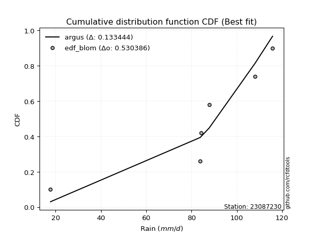</img></img>

</div>


### 7. Empirical - EDF Tukey (1962)

In hydrology, the Tukey formula is used as a plotting position formula to estimate the empirical probability or frequency of a flood event (or other hydrological data). The formula parameter is given as _c=0.333_ (or 1/3).

<div align="center">


$P=(m-c)/(n+1-2c)$


</div>


**7.1. Empirical values**

<div align="center">

|                | 0                  | 1                  | 2         | 3         | 4         |
|:---------------|:-------------------|:-------------------|:----------|:----------|:----------|
| date           | 2023               | 2022               | 2021      | 2020      | 2019      |
| x              | 17.8               | 84.2               | 87.8      | 108.0     | 115.8     |
| m              | 1                  | 2                  | 3         | 4         | 5         |
| empirical_dist | edf_tukey          | edf_tukey          | edf_tukey | edf_tukey | edf_tukey |
| empirical      | 0.125              | 0.3125             | 0.5       | 0.6875    | 0.875     |
| empirical_tr   | 1.1428571428571428 | 1.4545454545454546 | 2.0       | 3.2       | 8.0       |

</div>


**7.2. Kolmogorov-Smirnov fit test (sorted by Δ)**


<div align="center">

|                | 0                   | 1                   | 2                   | 3                  | 4                   | 5                   | 6                   | 7                   | 8                  | 9                   | 10                  | 11                  | 12                  | 13                  | 14                  | 15                  | 16                  | 17                  | 18                  | 19                  | 20                  | 21                  | 22                  | 23                  | 24                  | 25                 | 26                    | 27                 | 28                  | 29                 | 30                  | 31                  | 32                  | 33                  | 34                 | 35                  | 36                 | 37                  | 38                  | 39                 | 40                 | 41                 | 42                 | 43                 | 44                 | 45                 | 46                  | 47                  | 48                  | 49                  | 50                  | 51                 | 52                 | 53                  | 54                 | 55                 | 56                 | 57                  | 58                 | 59                  | 60                 | 61                 | 62                 | 63                 | 64                 | 65                  | 66                  | 67                 | 68                  | 69                  | 70                 | 71                  | 72                  | 73                  | 74                  | 75                 | 76                 | 77                 | 78                 | 79                 | 80                 | 81                 | 82                  | 83                  | 84                  | 85                 | 86                 | 87                 | 88                 | 89                 |
|:---------------|:--------------------|:--------------------|:--------------------|:-------------------|:--------------------|:--------------------|:--------------------|:--------------------|:-------------------|:--------------------|:--------------------|:--------------------|:--------------------|:--------------------|:--------------------|:--------------------|:--------------------|:--------------------|:--------------------|:--------------------|:--------------------|:--------------------|:--------------------|:--------------------|:--------------------|:-------------------|:----------------------|:-------------------|:--------------------|:-------------------|:--------------------|:--------------------|:--------------------|:--------------------|:-------------------|:--------------------|:-------------------|:--------------------|:--------------------|:-------------------|:-------------------|:-------------------|:-------------------|:-------------------|:-------------------|:-------------------|:--------------------|:--------------------|:--------------------|:--------------------|:--------------------|:-------------------|:-------------------|:--------------------|:-------------------|:-------------------|:-------------------|:--------------------|:-------------------|:--------------------|:-------------------|:-------------------|:-------------------|:-------------------|:-------------------|:--------------------|:--------------------|:-------------------|:--------------------|:--------------------|:-------------------|:--------------------|:--------------------|:--------------------|:--------------------|:-------------------|:-------------------|:-------------------|:-------------------|:-------------------|:-------------------|:-------------------|:--------------------|:--------------------|:--------------------|:-------------------|:-------------------|:-------------------|:-------------------|:-------------------|
| station        | 23087230            | 23087230            | 23087230            | 23087230           | 23087230            | 23087230            | 23087230            | 23087230            | 23087230           | 23087230            | 23087230            | 23087230            | 23087230            | 23087230            | 23087230            | 23087230            | 23087230            | 23087230            | 23087230            | 23087230            | 23087230            | 23087230            | 23087230            | 23087230            | 23087230            | 23087230           | 23087230              | 23087230           | 23087230            | 23087230           | 23087230            | 23087230            | 23087230            | 23087230            | 23087230           | 23087230            | 23087230           | 23087230            | 23087230            | 23087230           | 23087230           | 23087230           | 23087230           | 23087230           | 23087230           | 23087230           | 23087230            | 23087230            | 23087230            | 23087230            | 23087230            | 23087230           | 23087230           | 23087230            | 23087230           | 23087230           | 23087230           | 23087230            | 23087230           | 23087230            | 23087230           | 23087230           | 23087230           | 23087230           | 23087230           | 23087230            | 23087230            | 23087230           | 23087230            | 23087230            | 23087230           | 23087230            | 23087230            | 23087230            | 23087230            | 23087230           | 23087230           | 23087230           | 23087230           | 23087230           | 23087230           | 23087230           | 23087230            | 23087230            | 23087230            | 23087230           | 23087230           | 23087230           | 23087230           | 23087230           |
| empirical_dist | edf_tukey           | edf_tukey           | edf_tukey           | edf_tukey          | edf_tukey           | edf_tukey           | edf_tukey           | edf_tukey           | edf_tukey          | edf_tukey           | edf_tukey           | edf_tukey           | edf_tukey           | edf_tukey           | edf_tukey           | edf_tukey           | edf_tukey           | edf_tukey           | edf_tukey           | edf_tukey           | edf_tukey           | edf_tukey           | edf_tukey           | edf_tukey           | edf_tukey           | edf_tukey          | edf_tukey             | edf_tukey          | edf_tukey           | edf_tukey          | edf_tukey           | edf_tukey           | edf_tukey           | edf_tukey           | edf_tukey          | edf_tukey           | edf_tukey          | edf_tukey           | edf_tukey           | edf_tukey          | edf_tukey          | edf_tukey          | edf_tukey          | edf_tukey          | edf_tukey          | edf_tukey          | edf_tukey           | edf_tukey           | edf_tukey           | edf_tukey           | edf_tukey           | edf_tukey          | edf_tukey          | edf_tukey           | edf_tukey          | edf_tukey          | edf_tukey          | edf_tukey           | edf_tukey          | edf_tukey           | edf_tukey          | edf_tukey          | edf_tukey          | edf_tukey          | edf_tukey          | edf_tukey           | edf_tukey           | edf_tukey          | edf_tukey           | edf_tukey           | edf_tukey          | edf_tukey           | edf_tukey           | edf_tukey           | edf_tukey           | edf_tukey          | edf_tukey          | edf_tukey          | edf_tukey          | edf_tukey          | edf_tukey          | edf_tukey          | edf_tukey           | edf_tukey           | edf_tukey           | edf_tukey          | edf_tukey          | edf_tukey          | edf_tukey          | edf_tukey          |
| p_dist         | weibull_min         | gompertz            | mielke              | fisk               | pearson3            | gumbel_l            | laplace_asymmetric  | logfisk             | t                  | norm                | crystalball         | truncnorm           | exponnorm           | nct                 | f                   | logistic            | hypsecant           | logpearson3         | erlang              | rice                | betaprime           | gamma               | laplace             | logmielke           | chi2                | logloggamma        | loglaplace_asymmetric | invgamma           | invgauss            | loggumbel_l        | maxwell             | loggompertz         | rayleigh            | logt                | ncf                | logjohnsonsu        | kstwobign          | gumbel_r            | halfnorm            | logweibull_min     | nakagami           | lognorm            | lognorm            | logexponnorm       | logcrystalball     | logrice            | lognct              | logf                | logncf              | logfatiguelife      | logerlang           | moyal              | loginvweibull      | halflogistic        | loggamma           | loggamma           | logalpha           | logbetaprime        | loginvgamma        | loglogistic         | lognakagami        | loginvgauss        | loghypsecant       | logmaxwell         | logtruncnorm       | genexpon            | expon               | lograyleigh        | logkstwobign        | alpha               | loggenexpon        | loglaplace          | loghalfnorm         | loggumbel_r         | logexpon            | wald               | johnsonsu          | loglognorm         | loghalflogistic    | logmoyal           | pareto             | logpareto          | gibrat              | logwald             | invweibull          | logchi2            | loggibrat          | fatiguelife        | loggenlogistic     | genlogistic        |
| delta          | 0.11443987931338706 | 0.11520337171976835 | 0.12375165401121047 | 0.1288248605594446 | 0.13316140099430207 | 0.13491541725576006 | 0.17033322054969718 | 0.20439053480494718 | 0.2045671070824322 | 0.20457339997626856 | 0.20457340292253434 | 0.20457341674504292 | 0.20457429108758973 | 0.20468867027750748 | 0.20600659488881856 | 0.20690232212468618 | 0.20888875607472968 | 0.20942950250139059 | 0.21267087855411593 | 0.21344224490966568 | 0.21384918847302592 | 0.21685987223254954 | 0.21687293604410796 | 0.21699068931362409 | 0.21927639807927846 | 0.2198505783643545 | 0.22105914453550846   | 0.222472139696953  | 0.23149709939500052 | 0.2365545652791975 | 0.23686236864993215 | 0.24252534503387901 | 0.24748311584131577 | 0.25006490069776666 | 0.2514569373136136 | 0.26184731165357195 | 0.2746338822430282 | 0.27524434252355967 | 0.27738469349909334 | 0.285240228383139  | 0.2880664664219391 | 0.2949046862264103 | 0.2949046862264103 | 0.294906981166962  | 0.2949071359099056 | 0.2949543319183715 | 0.29496912988858126 | 0.29524420507598825 | 0.29550251420831153 | 0.29564956155110156 | 0.29819674056902634 | 0.3008936046201318 | 0.3021232903681662 | 0.30328256195316894 | 0.3033519919719003 | 0.3033519919719003 | 0.3035340004628493 | 0.30414937104287554 | 0.30661222416193   | 0.30863561614793167 | 0.309526209269384  | 0.3147931997356407 | 0.3197983109637692 | 0.3207658053521456 | 0.3254647477559286 | 0.32784459126502075 | 0.32791233859437274 | 0.328753842158259  | 0.33341805123484836 | 0.34354756146721654 | 0.3451527779587653 | 0.34743100882463973 | 0.35154232962003096 | 0.36062601616559564 | 0.36716324949424883 | 0.3721462604156738 | 0.3748620167435993 | 0.3767387737440888 | 0.3798962597501756 | 0.3829713482993258 | 0.3868074318562349 | 0.3942263374826097 | 0.39791523667449524 | 0.44534321227757245 | 0.44613232065832725 | 0.4671330368774633 | 0.4772288049108626 | 0.5842215328093534 | 0.6875             | 0.6875             |
| deltao         | 0.5865427407550001  | 0.5865427407550001  | 0.5865427407550001  | 0.5865427407550001 | 0.5865427407550001  | 0.5865427407550001  | 0.5865427407550001  | 0.5865427407550001  | 0.5865427407550001 | 0.5865427407550001  | 0.5865427407550001  | 0.5865427407550001  | 0.5865427407550001  | 0.5865427407550001  | 0.5865427407550001  | 0.5865427407550001  | 0.5865427407550001  | 0.5865427407550001  | 0.5865427407550001  | 0.5865427407550001  | 0.5865427407550001  | 0.5865427407550001  | 0.5865427407550001  | 0.5865427407550001  | 0.5865427407550001  | 0.5865427407550001 | 0.5865427407550001    | 0.5865427407550001 | 0.5865427407550001  | 0.5865427407550001 | 0.5865427407550001  | 0.5865427407550001  | 0.5865427407550001  | 0.5865427407550001  | 0.5865427407550001 | 0.5865427407550001  | 0.5865427407550001 | 0.5865427407550001  | 0.5865427407550001  | 0.5865427407550001 | 0.5865427407550001 | 0.5865427407550001 | 0.5865427407550001 | 0.5865427407550001 | 0.5865427407550001 | 0.5865427407550001 | 0.5865427407550001  | 0.5865427407550001  | 0.5865427407550001  | 0.5865427407550001  | 0.5865427407550001  | 0.5865427407550001 | 0.5865427407550001 | 0.5865427407550001  | 0.5865427407550001 | 0.5865427407550001 | 0.5865427407550001 | 0.5865427407550001  | 0.5865427407550001 | 0.5865427407550001  | 0.5865427407550001 | 0.5865427407550001 | 0.5865427407550001 | 0.5865427407550001 | 0.5865427407550001 | 0.5865427407550001  | 0.5865427407550001  | 0.5865427407550001 | 0.5865427407550001  | 0.5865427407550001  | 0.5865427407550001 | 0.5865427407550001  | 0.5865427407550001  | 0.5865427407550001  | 0.5865427407550001  | 0.5865427407550001 | 0.5865427407550001 | 0.5865427407550001 | 0.5865427407550001 | 0.5865427407550001 | 0.5865427407550001 | 0.5865427407550001 | 0.5865427407550001  | 0.5865427407550001  | 0.5865427407550001  | 0.5865427407550001 | 0.5865427407550001 | 0.5865427407550001 | 0.5865427407550001 | 0.5865427407550001 |
| eval           | Δo > Δ              | Δo > Δ              | Δo > Δ              | Δo > Δ             | Δo > Δ              | Δo > Δ              | Δo > Δ              | Δo > Δ              | Δo > Δ             | Δo > Δ              | Δo > Δ              | Δo > Δ              | Δo > Δ              | Δo > Δ              | Δo > Δ              | Δo > Δ              | Δo > Δ              | Δo > Δ              | Δo > Δ              | Δo > Δ              | Δo > Δ              | Δo > Δ              | Δo > Δ              | Δo > Δ              | Δo > Δ              | Δo > Δ             | Δo > Δ                | Δo > Δ             | Δo > Δ              | Δo > Δ             | Δo > Δ              | Δo > Δ              | Δo > Δ              | Δo > Δ              | Δo > Δ             | Δo > Δ              | Δo > Δ             | Δo > Δ              | Δo > Δ              | Δo > Δ             | Δo > Δ             | Δo > Δ             | Δo > Δ             | Δo > Δ             | Δo > Δ             | Δo > Δ             | Δo > Δ              | Δo > Δ              | Δo > Δ              | Δo > Δ              | Δo > Δ              | Δo > Δ             | Δo > Δ             | Δo > Δ              | Δo > Δ             | Δo > Δ             | Δo > Δ             | Δo > Δ              | Δo > Δ             | Δo > Δ              | Δo > Δ             | Δo > Δ             | Δo > Δ             | Δo > Δ             | Δo > Δ             | Δo > Δ              | Δo > Δ              | Δo > Δ             | Δo > Δ              | Δo > Δ              | Δo > Δ             | Δo > Δ              | Δo > Δ              | Δo > Δ              | Δo > Δ              | Δo > Δ             | Δo > Δ             | Δo > Δ             | Δo > Δ             | Δo > Δ             | Δo > Δ             | Δo > Δ             | Δo > Δ              | Δo > Δ              | Δo > Δ              | Δo > Δ             | Δo > Δ             | Δo > Δ             | Δo <= Δ            | Δo <= Δ            |
| fit            | 1                   | 1                   | 1                   | 1                  | 1                   | 1                   | 1                   | 1                   | 1                  | 1                   | 1                   | 1                   | 1                   | 1                   | 1                   | 1                   | 1                   | 1                   | 1                   | 1                   | 1                   | 1                   | 1                   | 1                   | 1                   | 1                  | 1                     | 1                  | 1                   | 1                  | 1                   | 1                   | 1                   | 1                   | 1                  | 1                   | 1                  | 1                   | 1                   | 1                  | 1                  | 1                  | 1                  | 1                  | 1                  | 1                  | 1                   | 1                   | 1                   | 1                   | 1                   | 1                  | 1                  | 1                   | 1                  | 1                  | 1                  | 1                   | 1                  | 1                   | 1                  | 1                  | 1                  | 1                  | 1                  | 1                   | 1                   | 1                  | 1                   | 1                   | 1                  | 1                   | 1                   | 1                   | 1                   | 1                  | 1                  | 1                  | 1                  | 1                  | 1                  | 1                  | 1                   | 1                   | 1                   | 1                  | 1                  | 1                  | 0                  | 0                  |
| n              | 5                   | 5                   | 5                   | 5                  | 5                   | 5                   | 5                   | 5                   | 5                  | 5                   | 5                   | 5                   | 5                   | 5                   | 5                   | 5                   | 5                   | 5                   | 5                   | 5                   | 5                   | 5                   | 5                   | 5                   | 5                   | 5                  | 5                     | 5                  | 5                   | 5                  | 5                   | 5                   | 5                   | 5                   | 5                  | 5                   | 5                  | 5                   | 5                   | 5                  | 5                  | 5                  | 5                  | 5                  | 5                  | 5                  | 5                   | 5                   | 5                   | 5                   | 5                   | 5                  | 5                  | 5                   | 5                  | 5                  | 5                  | 5                   | 5                  | 5                   | 5                  | 5                  | 5                  | 5                  | 5                  | 5                   | 5                   | 5                  | 5                   | 5                   | 5                  | 5                   | 5                   | 5                   | 5                   | 5                  | 5                  | 5                  | 5                  | 5                  | 5                  | 5                  | 5                   | 5                   | 5                   | 5                  | 5                  | 5                  | 5                  | 5                  |
| best_fit       | 1                   | 0                   | 0                   | 0                  | 0                   | 0                   | 0                   | 0                   | 0                  | 0                   | 0                   | 0                   | 0                   | 0                   | 0                   | 0                   | 0                   | 0                   | 0                   | 0                   | 0                   | 0                   | 0                   | 0                   | 0                   | 0                  | 0                     | 0                  | 0                   | 0                  | 0                   | 0                   | 0                   | 0                   | 0                  | 0                   | 0                  | 0                   | 0                   | 0                  | 0                  | 0                  | 0                  | 0                  | 0                  | 0                  | 0                   | 0                   | 0                   | 0                   | 0                   | 0                  | 0                  | 0                   | 0                  | 0                  | 0                  | 0                   | 0                  | 0                   | 0                  | 0                  | 0                  | 0                  | 0                  | 0                   | 0                   | 0                  | 0                   | 0                   | 0                  | 0                   | 0                   | 0                   | 0                   | 0                  | 0                  | 0                  | 0                  | 0                  | 0                  | 0                  | 0                   | 0                   | 0                   | 0                  | 0                  | 0                  | 0                  | 0                  |
| best_fit_sort  | 1                   | 2                   | 3                   | 4                  | 5                   | 6                   | 7                   | 8                   | 9                  | 10                  | 11                  | 12                  | 13                  | 14                  | 15                  | 16                  | 17                  | 18                  | 19                  | 20                  | 21                  | 22                  | 23                  | 24                  | 25                  | 26                 | 27                    | 28                 | 29                  | 30                 | 31                  | 32                  | 33                  | 34                  | 35                 | 36                  | 37                 | 38                  | 39                  | 40                 | 41                 | 42                 | 43                 | 44                 | 45                 | 46                 | 47                  | 48                  | 49                  | 50                  | 51                  | 52                 | 53                 | 54                  | 55                 | 56                 | 57                 | 58                  | 59                 | 60                  | 61                 | 62                 | 63                 | 64                 | 65                 | 66                  | 67                  | 68                 | 69                  | 70                  | 71                 | 72                  | 73                  | 74                  | 75                  | 76                 | 77                 | 78                 | 79                 | 80                 | 81                 | 82                 | 83                  | 84                  | 85                  | 86                 | 87                 | 88                 | 89                 | 90                 |

</div>


<div align="center">

</img>

</div>


**7.3. Best fit**

<div align="center">

|   id |   station | empirical_dist   | p_dist      |   delta |   deltao | eval   |   fit |   n |   best_fit |   best_fit_sort |
|-----:|----------:|:-----------------|:------------|--------:|---------:|:-------|------:|----:|-----------:|----------------:|
|    0 |  23087230 | edf_tukey        | weibull_min | 0.11444 | 0.586543 | Δo > Δ |     1 |   5 |          1 |               1 |

</div>


<div align="center">

</img>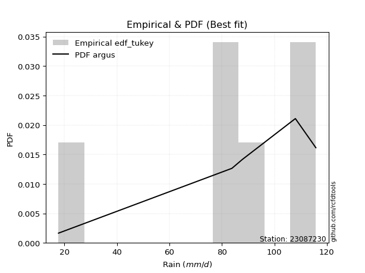</img>

</div>


### 8. Empirical - EDF Gringorten (1963)

Gringorten plotting position formula is essential for estimating the probability and return periods of extreme events like floods and heavy rainfall. The constant _a=0.44_.

<div align="center">


$P=(m-a)/(n+1-2a)$


</div>


**8.1. Empirical values**

<div align="center">

|                | 0                   | 1                  | 2              | 3                 | 4                  |
|:---------------|:--------------------|:-------------------|:---------------|:------------------|:-------------------|
| date           | 2023                | 2022               | 2021           | 2020              | 2019               |
| x              | 17.8                | 84.2               | 87.8           | 108.0             | 115.8              |
| m              | 1                   | 2                  | 3              | 4                 | 5                  |
| empirical_dist | edf_gringorten      | edf_gringorten     | edf_gringorten | edf_gringorten    | edf_gringorten     |
| empirical      | 0.10937500000000001 | 0.3046875          | 0.5            | 0.6953125         | 0.8906249999999999 |
| empirical_tr   | 1.1228070175438596  | 1.4382022471910112 | 2.0            | 3.282051282051282 | 9.142857142857133  |

</div>


**8.2. Kolmogorov-Smirnov fit test (sorted by Δ)**


<div align="center">

|                | 0                   | 1                   | 2                   | 3                  | 4                   | 5                   | 6                   | 7                   | 8                  | 9                   | 10                  | 11                  | 12                  | 13                  | 14                  | 15                  | 16                  | 17                  | 18                  | 19                  | 20                  | 21                  | 22                  | 23                  | 24                  | 25                 | 26                    | 27                 | 28                  | 29                 | 30                  | 31                 | 32                  | 33                 | 34                  | 35                  | 36                 | 37                  | 38                  | 39                 | 40                 | 41                 | 42                 | 43                 | 44                 | 45                 | 46                 | 47                  | 48                  | 49                  | 50                  | 51                  | 52                 | 53                 | 54                  | 55                 | 56                 | 57                 | 58                  | 59                 | 60                  | 61                 | 62                 | 63                 | 64                 | 65                  | 66                  | 67                 | 68                  | 69                  | 70                 | 71                  | 72                  | 73                  | 74                  | 75                 | 76                 | 77                 | 78                 | 79                 | 80                 | 81                 | 82                  | 83                  | 84                  | 85                 | 86                 | 87                 | 88                 | 89                 |
|:---------------|:--------------------|:--------------------|:--------------------|:-------------------|:--------------------|:--------------------|:--------------------|:--------------------|:-------------------|:--------------------|:--------------------|:--------------------|:--------------------|:--------------------|:--------------------|:--------------------|:--------------------|:--------------------|:--------------------|:--------------------|:--------------------|:--------------------|:--------------------|:--------------------|:--------------------|:-------------------|:----------------------|:-------------------|:--------------------|:-------------------|:--------------------|:-------------------|:--------------------|:-------------------|:--------------------|:--------------------|:-------------------|:--------------------|:--------------------|:-------------------|:-------------------|:-------------------|:-------------------|:-------------------|:-------------------|:-------------------|:-------------------|:--------------------|:--------------------|:--------------------|:--------------------|:--------------------|:-------------------|:-------------------|:--------------------|:-------------------|:-------------------|:-------------------|:--------------------|:-------------------|:--------------------|:-------------------|:-------------------|:-------------------|:-------------------|:--------------------|:--------------------|:-------------------|:--------------------|:--------------------|:-------------------|:--------------------|:--------------------|:--------------------|:--------------------|:-------------------|:-------------------|:-------------------|:-------------------|:-------------------|:-------------------|:-------------------|:--------------------|:--------------------|:--------------------|:-------------------|:-------------------|:-------------------|:-------------------|:-------------------|
| station        | 23087230            | 23087230            | 23087230            | 23087230           | 23087230            | 23087230            | 23087230            | 23087230            | 23087230           | 23087230            | 23087230            | 23087230            | 23087230            | 23087230            | 23087230            | 23087230            | 23087230            | 23087230            | 23087230            | 23087230            | 23087230            | 23087230            | 23087230            | 23087230            | 23087230            | 23087230           | 23087230              | 23087230           | 23087230            | 23087230           | 23087230            | 23087230           | 23087230            | 23087230           | 23087230            | 23087230            | 23087230           | 23087230            | 23087230            | 23087230           | 23087230           | 23087230           | 23087230           | 23087230           | 23087230           | 23087230           | 23087230           | 23087230            | 23087230            | 23087230            | 23087230            | 23087230            | 23087230           | 23087230           | 23087230            | 23087230           | 23087230           | 23087230           | 23087230            | 23087230           | 23087230            | 23087230           | 23087230           | 23087230           | 23087230           | 23087230            | 23087230            | 23087230           | 23087230            | 23087230            | 23087230           | 23087230            | 23087230            | 23087230            | 23087230            | 23087230           | 23087230           | 23087230           | 23087230           | 23087230           | 23087230           | 23087230           | 23087230            | 23087230            | 23087230            | 23087230           | 23087230           | 23087230           | 23087230           | 23087230           |
| empirical_dist | edf_gringorten      | edf_gringorten      | edf_gringorten      | edf_gringorten     | edf_gringorten      | edf_gringorten      | edf_gringorten      | edf_gringorten      | edf_gringorten     | edf_gringorten      | edf_gringorten      | edf_gringorten      | edf_gringorten      | edf_gringorten      | edf_gringorten      | edf_gringorten      | edf_gringorten      | edf_gringorten      | edf_gringorten      | edf_gringorten      | edf_gringorten      | edf_gringorten      | edf_gringorten      | edf_gringorten      | edf_gringorten      | edf_gringorten     | edf_gringorten        | edf_gringorten     | edf_gringorten      | edf_gringorten     | edf_gringorten      | edf_gringorten     | edf_gringorten      | edf_gringorten     | edf_gringorten      | edf_gringorten      | edf_gringorten     | edf_gringorten      | edf_gringorten      | edf_gringorten     | edf_gringorten     | edf_gringorten     | edf_gringorten     | edf_gringorten     | edf_gringorten     | edf_gringorten     | edf_gringorten     | edf_gringorten      | edf_gringorten      | edf_gringorten      | edf_gringorten      | edf_gringorten      | edf_gringorten     | edf_gringorten     | edf_gringorten      | edf_gringorten     | edf_gringorten     | edf_gringorten     | edf_gringorten      | edf_gringorten     | edf_gringorten      | edf_gringorten     | edf_gringorten     | edf_gringorten     | edf_gringorten     | edf_gringorten      | edf_gringorten      | edf_gringorten     | edf_gringorten      | edf_gringorten      | edf_gringorten     | edf_gringorten      | edf_gringorten      | edf_gringorten      | edf_gringorten      | edf_gringorten     | edf_gringorten     | edf_gringorten     | edf_gringorten     | edf_gringorten     | edf_gringorten     | edf_gringorten     | edf_gringorten      | edf_gringorten      | edf_gringorten      | edf_gringorten     | edf_gringorten     | edf_gringorten     | edf_gringorten     | edf_gringorten     |
| p_dist         | mielke              | weibull_min         | gompertz            | fisk               | pearson3            | gumbel_l            | laplace_asymmetric  | logfisk             | t                  | norm                | crystalball         | truncnorm           | exponnorm           | nct                 | f                   | logistic            | hypsecant           | logpearson3         | erlang              | rice                | betaprime           | gamma               | laplace             | logmielke           | chi2                | logloggamma        | loglaplace_asymmetric | invgamma           | invgauss            | loggumbel_l        | maxwell             | loggompertz        | rayleigh            | ncf                | logt                | logjohnsonsu        | kstwobign          | gumbel_r            | halfnorm            | nakagami           | logweibull_min     | lognakagami        | lognorm            | lognorm            | logexponnorm       | logcrystalball     | logrice            | lognct              | logf                | logncf              | logfatiguelife      | logerlang           | moyal              | loginvweibull      | halflogistic        | loggamma           | loggamma           | logalpha           | logbetaprime        | loginvgamma        | loglogistic         | loginvgauss        | logtruncnorm       | loghypsecant       | logmaxwell         | genexpon            | expon               | lograyleigh        | logkstwobign        | alpha               | loggenexpon        | loglaplace          | loghalfnorm         | loggumbel_r         | logexpon            | wald               | johnsonsu          | loglognorm         | loghalflogistic    | logmoyal           | pareto             | logpareto          | gibrat              | logwald             | invweibull          | logchi2            | loggibrat          | fatiguelife        | loggenlogistic     | genlogistic        |
| delta          | 0.10812665401121058 | 0.12225237931338706 | 0.12301587171976835 | 0.1366373605594446 | 0.14097390099430207 | 0.14272791725576006 | 0.17814572054969718 | 0.21220303480494718 | 0.2123796070824322 | 0.21238589997626856 | 0.21238590292253434 | 0.21238591674504292 | 0.21238679108758973 | 0.21250117027750748 | 0.21381909488881856 | 0.21471482212468618 | 0.21670125607472968 | 0.21724200250139059 | 0.22048337855411593 | 0.22125474490966568 | 0.22166168847302592 | 0.22467237223254954 | 0.22468543604410796 | 0.22480318931362409 | 0.22708889807927846 | 0.2276630783643545 | 0.22887164453550846   | 0.230284639696953  | 0.23930959939500052 | 0.2443670652791975 | 0.24467486864993215 | 0.250337845033879  | 0.25529561584131577 | 0.2592694373136136 | 0.26568990069776655 | 0.26965981165357195 | 0.2824463822430282 | 0.28305684252355967 | 0.28519719349909334 | 0.2880664664219391 | 0.293052728383139  | 0.301713709269384  | 0.3027171862264103 | 0.3027171862264103 | 0.302719481166962  | 0.3027196359099056 | 0.3027668319183715 | 0.30278162988858126 | 0.30305670507598825 | 0.30331501420831153 | 0.30346206155110156 | 0.30600924056902634 | 0.3087061046201318 | 0.3099357903681662 | 0.31109506195316894 | 0.3111644919719003 | 0.3111644919719003 | 0.3113465004628493 | 0.31196187104287554 | 0.31442472416193   | 0.31644811614793167 | 0.3226056997356407 | 0.3254647477559286 | 0.3276108109637692 | 0.3285783053521456 | 0.33565709126502075 | 0.33572483859437274 | 0.336566342158259  | 0.34123055123484836 | 0.35136006146721654 | 0.3529652779587653 | 0.35524350882463973 | 0.35935482962003096 | 0.36843851616559564 | 0.37497574949424883 | 0.3799587604156738 | 0.3826745167435993 | 0.3845512737440888 | 0.3877087597501756 | 0.3907838482993258 | 0.3946199318562349 | 0.4020388374826097 | 0.40572773667449524 | 0.45315571227757245 | 0.46175732065832714 | 0.4749455368774633 | 0.4850413049108626 | 0.5920340328093534 | 0.6953125          | 0.6953125          |
| deltao         | 0.5865427407550001  | 0.5865427407550001  | 0.5865427407550001  | 0.5865427407550001 | 0.5865427407550001  | 0.5865427407550001  | 0.5865427407550001  | 0.5865427407550001  | 0.5865427407550001 | 0.5865427407550001  | 0.5865427407550001  | 0.5865427407550001  | 0.5865427407550001  | 0.5865427407550001  | 0.5865427407550001  | 0.5865427407550001  | 0.5865427407550001  | 0.5865427407550001  | 0.5865427407550001  | 0.5865427407550001  | 0.5865427407550001  | 0.5865427407550001  | 0.5865427407550001  | 0.5865427407550001  | 0.5865427407550001  | 0.5865427407550001 | 0.5865427407550001    | 0.5865427407550001 | 0.5865427407550001  | 0.5865427407550001 | 0.5865427407550001  | 0.5865427407550001 | 0.5865427407550001  | 0.5865427407550001 | 0.5865427407550001  | 0.5865427407550001  | 0.5865427407550001 | 0.5865427407550001  | 0.5865427407550001  | 0.5865427407550001 | 0.5865427407550001 | 0.5865427407550001 | 0.5865427407550001 | 0.5865427407550001 | 0.5865427407550001 | 0.5865427407550001 | 0.5865427407550001 | 0.5865427407550001  | 0.5865427407550001  | 0.5865427407550001  | 0.5865427407550001  | 0.5865427407550001  | 0.5865427407550001 | 0.5865427407550001 | 0.5865427407550001  | 0.5865427407550001 | 0.5865427407550001 | 0.5865427407550001 | 0.5865427407550001  | 0.5865427407550001 | 0.5865427407550001  | 0.5865427407550001 | 0.5865427407550001 | 0.5865427407550001 | 0.5865427407550001 | 0.5865427407550001  | 0.5865427407550001  | 0.5865427407550001 | 0.5865427407550001  | 0.5865427407550001  | 0.5865427407550001 | 0.5865427407550001  | 0.5865427407550001  | 0.5865427407550001  | 0.5865427407550001  | 0.5865427407550001 | 0.5865427407550001 | 0.5865427407550001 | 0.5865427407550001 | 0.5865427407550001 | 0.5865427407550001 | 0.5865427407550001 | 0.5865427407550001  | 0.5865427407550001  | 0.5865427407550001  | 0.5865427407550001 | 0.5865427407550001 | 0.5865427407550001 | 0.5865427407550001 | 0.5865427407550001 |
| eval           | Δo > Δ              | Δo > Δ              | Δo > Δ              | Δo > Δ             | Δo > Δ              | Δo > Δ              | Δo > Δ              | Δo > Δ              | Δo > Δ             | Δo > Δ              | Δo > Δ              | Δo > Δ              | Δo > Δ              | Δo > Δ              | Δo > Δ              | Δo > Δ              | Δo > Δ              | Δo > Δ              | Δo > Δ              | Δo > Δ              | Δo > Δ              | Δo > Δ              | Δo > Δ              | Δo > Δ              | Δo > Δ              | Δo > Δ             | Δo > Δ                | Δo > Δ             | Δo > Δ              | Δo > Δ             | Δo > Δ              | Δo > Δ             | Δo > Δ              | Δo > Δ             | Δo > Δ              | Δo > Δ              | Δo > Δ             | Δo > Δ              | Δo > Δ              | Δo > Δ             | Δo > Δ             | Δo > Δ             | Δo > Δ             | Δo > Δ             | Δo > Δ             | Δo > Δ             | Δo > Δ             | Δo > Δ              | Δo > Δ              | Δo > Δ              | Δo > Δ              | Δo > Δ              | Δo > Δ             | Δo > Δ             | Δo > Δ              | Δo > Δ             | Δo > Δ             | Δo > Δ             | Δo > Δ              | Δo > Δ             | Δo > Δ              | Δo > Δ             | Δo > Δ             | Δo > Δ             | Δo > Δ             | Δo > Δ              | Δo > Δ              | Δo > Δ             | Δo > Δ              | Δo > Δ              | Δo > Δ             | Δo > Δ              | Δo > Δ              | Δo > Δ              | Δo > Δ              | Δo > Δ             | Δo > Δ             | Δo > Δ             | Δo > Δ             | Δo > Δ             | Δo > Δ             | Δo > Δ             | Δo > Δ              | Δo > Δ              | Δo > Δ              | Δo > Δ             | Δo > Δ             | Δo <= Δ            | Δo <= Δ            | Δo <= Δ            |
| fit            | 1                   | 1                   | 1                   | 1                  | 1                   | 1                   | 1                   | 1                   | 1                  | 1                   | 1                   | 1                   | 1                   | 1                   | 1                   | 1                   | 1                   | 1                   | 1                   | 1                   | 1                   | 1                   | 1                   | 1                   | 1                   | 1                  | 1                     | 1                  | 1                   | 1                  | 1                   | 1                  | 1                   | 1                  | 1                   | 1                   | 1                  | 1                   | 1                   | 1                  | 1                  | 1                  | 1                  | 1                  | 1                  | 1                  | 1                  | 1                   | 1                   | 1                   | 1                   | 1                   | 1                  | 1                  | 1                   | 1                  | 1                  | 1                  | 1                   | 1                  | 1                   | 1                  | 1                  | 1                  | 1                  | 1                   | 1                   | 1                  | 1                   | 1                   | 1                  | 1                   | 1                   | 1                   | 1                   | 1                  | 1                  | 1                  | 1                  | 1                  | 1                  | 1                  | 1                   | 1                   | 1                   | 1                  | 1                  | 0                  | 0                  | 0                  |
| n              | 5                   | 5                   | 5                   | 5                  | 5                   | 5                   | 5                   | 5                   | 5                  | 5                   | 5                   | 5                   | 5                   | 5                   | 5                   | 5                   | 5                   | 5                   | 5                   | 5                   | 5                   | 5                   | 5                   | 5                   | 5                   | 5                  | 5                     | 5                  | 5                   | 5                  | 5                   | 5                  | 5                   | 5                  | 5                   | 5                   | 5                  | 5                   | 5                   | 5                  | 5                  | 5                  | 5                  | 5                  | 5                  | 5                  | 5                  | 5                   | 5                   | 5                   | 5                   | 5                   | 5                  | 5                  | 5                   | 5                  | 5                  | 5                  | 5                   | 5                  | 5                   | 5                  | 5                  | 5                  | 5                  | 5                   | 5                   | 5                  | 5                   | 5                   | 5                  | 5                   | 5                   | 5                   | 5                   | 5                  | 5                  | 5                  | 5                  | 5                  | 5                  | 5                  | 5                   | 5                   | 5                   | 5                  | 5                  | 5                  | 5                  | 5                  |
| best_fit       | 1                   | 0                   | 0                   | 0                  | 0                   | 0                   | 0                   | 0                   | 0                  | 0                   | 0                   | 0                   | 0                   | 0                   | 0                   | 0                   | 0                   | 0                   | 0                   | 0                   | 0                   | 0                   | 0                   | 0                   | 0                   | 0                  | 0                     | 0                  | 0                   | 0                  | 0                   | 0                  | 0                   | 0                  | 0                   | 0                   | 0                  | 0                   | 0                   | 0                  | 0                  | 0                  | 0                  | 0                  | 0                  | 0                  | 0                  | 0                   | 0                   | 0                   | 0                   | 0                   | 0                  | 0                  | 0                   | 0                  | 0                  | 0                  | 0                   | 0                  | 0                   | 0                  | 0                  | 0                  | 0                  | 0                   | 0                   | 0                  | 0                   | 0                   | 0                  | 0                   | 0                   | 0                   | 0                   | 0                  | 0                  | 0                  | 0                  | 0                  | 0                  | 0                  | 0                   | 0                   | 0                   | 0                  | 0                  | 0                  | 0                  | 0                  |
| best_fit_sort  | 1                   | 2                   | 3                   | 4                  | 5                   | 6                   | 7                   | 8                   | 9                  | 10                  | 11                  | 12                  | 13                  | 14                  | 15                  | 16                  | 17                  | 18                  | 19                  | 20                  | 21                  | 22                  | 23                  | 24                  | 25                  | 26                 | 27                    | 28                 | 29                  | 30                 | 31                  | 32                 | 33                  | 34                 | 35                  | 36                  | 37                 | 38                  | 39                  | 40                 | 41                 | 42                 | 43                 | 44                 | 45                 | 46                 | 47                 | 48                  | 49                  | 50                  | 51                  | 52                  | 53                 | 54                 | 55                  | 56                 | 57                 | 58                 | 59                  | 60                 | 61                  | 62                 | 63                 | 64                 | 65                 | 66                  | 67                  | 68                 | 69                  | 70                  | 71                 | 72                  | 73                  | 74                  | 75                  | 76                 | 77                 | 78                 | 79                 | 80                 | 81                 | 82                 | 83                  | 84                  | 85                  | 86                 | 87                 | 88                 | 89                 | 90                 |

</div>


<div align="center">

</img>

</div>


**8.3. Best fit**

<div align="center">

|   id |   station | empirical_dist   | p_dist   |    delta |   deltao | eval   |   fit |   n |   best_fit |   best_fit_sort |
|-----:|----------:|:-----------------|:---------|---------:|---------:|:-------|------:|----:|-----------:|----------------:|
|    0 |  23087230 | edf_gringorten   | mielke   | 0.108127 | 0.586543 | Δo > Δ |     1 |   5 |          1 |               1 |

</div>


<div align="center">

</img>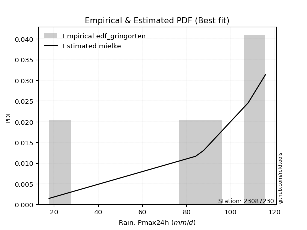</img>

</div>


### 9. Empirical - EDF Filliben (1975)

The specific values of the constants (0.3175) (often denoted as $alpha$) and (0.365) are derived from a method proposed by James J. Filliben in a 1975 paper. This particular formula is the mean value of the $i$-th order statistic of the normal distribution and is considered a robust and effective plotting position formula for the normal probability plot correlation coefficient test for normality.

<div align="center">


$P=(m-0.3175)/(n+0.365)$


</div>


**9.1. Empirical values**

<div align="center">

|                | 0                   | 1                  | 2            | 3                  | 4                  |
|:---------------|:--------------------|:-------------------|:-------------|:-------------------|:-------------------|
| date           | 2023                | 2022               | 2021         | 2020               | 2019               |
| x              | 17.8                | 84.2               | 87.8         | 108.0              | 115.8              |
| m              | 1                   | 2                  | 3            | 4                  | 5                  |
| empirical_dist | edf_filliben        | edf_filliben       | edf_filliben | edf_filliben       | edf_filliben       |
| empirical      | 0.12721342031686858 | 0.3136067101584343 | 0.5          | 0.6863932898415657 | 0.8727865796831314 |
| empirical_tr   | 1.1457554725040042  | 1.456890699253225  | 2.0          | 3.188707280832095  | 7.860805860805863  |

</div>


**9.2. Kolmogorov-Smirnov fit test (sorted by Δ)**


<div align="center">

|                | 0                   | 1                   | 2                   | 3                  | 4                  | 5                   | 6                  | 7                  | 8                   | 9                   | 10                  | 11                  | 12                  | 13                 | 14                  | 15                 | 16                 | 17                 | 18                  | 19                 | 20                  | 21                  | 22                  | 23                 | 24                  | 25                  | 26                    | 27                  | 28                  | 29                  | 30                  | 31                  | 32                 | 33                 | 34                  | 35                 | 36                  | 37                 | 38                  | 39                  | 40                 | 41                  | 42                  | 43                  | 44                 | 45                 | 46                 | 47                 | 48                  | 49                 | 50                  | 51                  | 52                  | 53                  | 54                  | 55                  | 56                 | 57                  | 58                  | 59                 | 60                 | 61                 | 62                  | 63                  | 64                 | 65                  | 66                  | 67                 | 68                 | 69                  | 70                  | 71                  | 72                 | 73                  | 74                  | 75                 | 76                 | 77                  | 78                 | 79                 | 80                 | 81                  | 82                  | 83                 | 84                 | 85                  | 86                  | 87                 | 88                 | 89                 |
|:---------------|:--------------------|:--------------------|:--------------------|:-------------------|:-------------------|:--------------------|:-------------------|:-------------------|:--------------------|:--------------------|:--------------------|:--------------------|:--------------------|:-------------------|:--------------------|:-------------------|:-------------------|:-------------------|:--------------------|:-------------------|:--------------------|:--------------------|:--------------------|:-------------------|:--------------------|:--------------------|:----------------------|:--------------------|:--------------------|:--------------------|:--------------------|:--------------------|:-------------------|:-------------------|:--------------------|:-------------------|:--------------------|:-------------------|:--------------------|:--------------------|:-------------------|:--------------------|:--------------------|:--------------------|:-------------------|:-------------------|:-------------------|:-------------------|:--------------------|:-------------------|:--------------------|:--------------------|:--------------------|:--------------------|:--------------------|:--------------------|:-------------------|:--------------------|:--------------------|:-------------------|:-------------------|:-------------------|:--------------------|:--------------------|:-------------------|:--------------------|:--------------------|:-------------------|:-------------------|:--------------------|:--------------------|:--------------------|:-------------------|:--------------------|:--------------------|:-------------------|:-------------------|:--------------------|:-------------------|:-------------------|:-------------------|:--------------------|:--------------------|:-------------------|:-------------------|:--------------------|:--------------------|:-------------------|:-------------------|:-------------------|
| station        | 23087230            | 23087230            | 23087230            | 23087230           | 23087230           | 23087230            | 23087230           | 23087230           | 23087230            | 23087230            | 23087230            | 23087230            | 23087230            | 23087230           | 23087230            | 23087230           | 23087230           | 23087230           | 23087230            | 23087230           | 23087230            | 23087230            | 23087230            | 23087230           | 23087230            | 23087230            | 23087230              | 23087230            | 23087230            | 23087230            | 23087230            | 23087230            | 23087230           | 23087230           | 23087230            | 23087230           | 23087230            | 23087230           | 23087230            | 23087230            | 23087230           | 23087230            | 23087230            | 23087230            | 23087230           | 23087230           | 23087230           | 23087230           | 23087230            | 23087230           | 23087230            | 23087230            | 23087230            | 23087230            | 23087230            | 23087230            | 23087230           | 23087230            | 23087230            | 23087230           | 23087230           | 23087230           | 23087230            | 23087230            | 23087230           | 23087230            | 23087230            | 23087230           | 23087230           | 23087230            | 23087230            | 23087230            | 23087230           | 23087230            | 23087230            | 23087230           | 23087230           | 23087230            | 23087230           | 23087230           | 23087230           | 23087230            | 23087230            | 23087230           | 23087230           | 23087230            | 23087230            | 23087230           | 23087230           | 23087230           |
| empirical_dist | edf_filliben        | edf_filliben        | edf_filliben        | edf_filliben       | edf_filliben       | edf_filliben        | edf_filliben       | edf_filliben       | edf_filliben        | edf_filliben        | edf_filliben        | edf_filliben        | edf_filliben        | edf_filliben       | edf_filliben        | edf_filliben       | edf_filliben       | edf_filliben       | edf_filliben        | edf_filliben       | edf_filliben        | edf_filliben        | edf_filliben        | edf_filliben       | edf_filliben        | edf_filliben        | edf_filliben          | edf_filliben        | edf_filliben        | edf_filliben        | edf_filliben        | edf_filliben        | edf_filliben       | edf_filliben       | edf_filliben        | edf_filliben       | edf_filliben        | edf_filliben       | edf_filliben        | edf_filliben        | edf_filliben       | edf_filliben        | edf_filliben        | edf_filliben        | edf_filliben       | edf_filliben       | edf_filliben       | edf_filliben       | edf_filliben        | edf_filliben       | edf_filliben        | edf_filliben        | edf_filliben        | edf_filliben        | edf_filliben        | edf_filliben        | edf_filliben       | edf_filliben        | edf_filliben        | edf_filliben       | edf_filliben       | edf_filliben       | edf_filliben        | edf_filliben        | edf_filliben       | edf_filliben        | edf_filliben        | edf_filliben       | edf_filliben       | edf_filliben        | edf_filliben        | edf_filliben        | edf_filliben       | edf_filliben        | edf_filliben        | edf_filliben       | edf_filliben       | edf_filliben        | edf_filliben       | edf_filliben       | edf_filliben       | edf_filliben        | edf_filliben        | edf_filliben       | edf_filliben       | edf_filliben        | edf_filliben        | edf_filliben       | edf_filliben       | edf_filliben       |
| p_dist         | weibull_min         | gompertz            | mielke              | fisk               | pearson3           | gumbel_l            | laplace_asymmetric | logfisk            | t                   | norm                | crystalball         | truncnorm           | exponnorm           | nct                | f                   | logistic           | hypsecant          | logpearson3        | erlang              | rice               | betaprime           | gamma               | laplace             | logmielke          | chi2                | logloggamma         | loglaplace_asymmetric | invgamma            | invgauss            | loggumbel_l         | maxwell             | loggompertz         | rayleigh           | logt               | ncf                 | logjohnsonsu       | kstwobign           | gumbel_r           | halfnorm            | logweibull_min      | nakagami           | lognorm             | lognorm             | logexponnorm        | logcrystalball     | logrice            | lognct             | logf               | logncf              | logfatiguelife     | logerlang           | moyal               | loginvweibull       | halflogistic        | loggamma            | loggamma            | logalpha           | logbetaprime        | loginvgamma         | loglogistic        | lognakagami        | loginvgauss        | loghypsecant        | logmaxwell          | logtruncnorm       | genexpon            | expon               | lograyleigh        | logkstwobign       | alpha               | loggenexpon         | loglaplace          | loghalfnorm        | loggumbel_r         | logexpon            | wald               | johnsonsu          | loglognorm          | loghalflogistic    | logmoyal           | pareto             | logpareto           | gibrat              | invweibull         | logwald            | logchi2             | loggibrat           | fatiguelife        | loggenlogistic     | genlogistic        |
| delta          | 0.11333316915495278 | 0.11409666156133408 | 0.12596507432807902 | 0.1277181504010103 | 0.1320546908358678 | 0.13380870709732579 | 0.1692265103912629 | 0.2032838246465129 | 0.20346039692399792 | 0.20346668981783428 | 0.20346669276410007 | 0.20346670658660865 | 0.20346758092915546 | 0.2035819601190732 | 0.20489988473038429 | 0.2057956119662519 | 0.2077820459162954 | 0.2083227923429563 | 0.21156416839568165 | 0.2123355347512314 | 0.21274247831459164 | 0.21575316207411527 | 0.21576622588567368 | 0.2158839791551898 | 0.21816968792084418 | 0.21874386820592023 | 0.21995243437707418   | 0.22136542953851873 | 0.23039038923656624 | 0.23544785512076322 | 0.23575565849149788 | 0.24141863487544474 | 0.2463764056828815 | 0.2478514803808981 | 0.25035022715517935 | 0.2607406014951376 | 0.27352717208459393 | 0.2741376323651254 | 0.27627798334065906 | 0.28413351822470473 | 0.2880664664219391 | 0.29379797606797603 | 0.29379797606797603 | 0.29380027100852774 | 0.2938004257514713 | 0.2938476217599372 | 0.293862419730147  | 0.294137494917554  | 0.29439580404987725 | 0.2945428513926673 | 0.29709003041059207 | 0.29978689446169754 | 0.30101658020973193 | 0.30217585179473466 | 0.30224528181346605 | 0.30224528181346605 | 0.302427290304415  | 0.30304266088444126 | 0.30550551400349574 | 0.3075289059894974 | 0.3106329194278183 | 0.3136864895772064 | 0.31869160080533493 | 0.31965909519371133 | 0.3254647477559286 | 0.32673788110658647 | 0.32680562843593847 | 0.3276471319998247 | 0.3323113410764141 | 0.34244085130878227 | 0.34404606780033103 | 0.34632429866620545 | 0.3504356194615967 | 0.35951930600716137 | 0.36605653933581456 | 0.3710395502572395 | 0.373755306585165  | 0.37563206358565454 | 0.3787895495917413 | 0.3818646381408915 | 0.3857007216978006 | 0.39311962732417544 | 0.39680852651606097 | 0.4439189003414587 | 0.4442365021191382 | 0.46602632671902905 | 0.47612209475242834 | 0.5831148226509191 | 0.6863932898415657 | 0.6863932898415657 |
| deltao         | 0.5865427407550001  | 0.5865427407550001  | 0.5865427407550001  | 0.5865427407550001 | 0.5865427407550001 | 0.5865427407550001  | 0.5865427407550001 | 0.5865427407550001 | 0.5865427407550001  | 0.5865427407550001  | 0.5865427407550001  | 0.5865427407550001  | 0.5865427407550001  | 0.5865427407550001 | 0.5865427407550001  | 0.5865427407550001 | 0.5865427407550001 | 0.5865427407550001 | 0.5865427407550001  | 0.5865427407550001 | 0.5865427407550001  | 0.5865427407550001  | 0.5865427407550001  | 0.5865427407550001 | 0.5865427407550001  | 0.5865427407550001  | 0.5865427407550001    | 0.5865427407550001  | 0.5865427407550001  | 0.5865427407550001  | 0.5865427407550001  | 0.5865427407550001  | 0.5865427407550001 | 0.5865427407550001 | 0.5865427407550001  | 0.5865427407550001 | 0.5865427407550001  | 0.5865427407550001 | 0.5865427407550001  | 0.5865427407550001  | 0.5865427407550001 | 0.5865427407550001  | 0.5865427407550001  | 0.5865427407550001  | 0.5865427407550001 | 0.5865427407550001 | 0.5865427407550001 | 0.5865427407550001 | 0.5865427407550001  | 0.5865427407550001 | 0.5865427407550001  | 0.5865427407550001  | 0.5865427407550001  | 0.5865427407550001  | 0.5865427407550001  | 0.5865427407550001  | 0.5865427407550001 | 0.5865427407550001  | 0.5865427407550001  | 0.5865427407550001 | 0.5865427407550001 | 0.5865427407550001 | 0.5865427407550001  | 0.5865427407550001  | 0.5865427407550001 | 0.5865427407550001  | 0.5865427407550001  | 0.5865427407550001 | 0.5865427407550001 | 0.5865427407550001  | 0.5865427407550001  | 0.5865427407550001  | 0.5865427407550001 | 0.5865427407550001  | 0.5865427407550001  | 0.5865427407550001 | 0.5865427407550001 | 0.5865427407550001  | 0.5865427407550001 | 0.5865427407550001 | 0.5865427407550001 | 0.5865427407550001  | 0.5865427407550001  | 0.5865427407550001 | 0.5865427407550001 | 0.5865427407550001  | 0.5865427407550001  | 0.5865427407550001 | 0.5865427407550001 | 0.5865427407550001 |
| eval           | Δo > Δ              | Δo > Δ              | Δo > Δ              | Δo > Δ             | Δo > Δ             | Δo > Δ              | Δo > Δ             | Δo > Δ             | Δo > Δ              | Δo > Δ              | Δo > Δ              | Δo > Δ              | Δo > Δ              | Δo > Δ             | Δo > Δ              | Δo > Δ             | Δo > Δ             | Δo > Δ             | Δo > Δ              | Δo > Δ             | Δo > Δ              | Δo > Δ              | Δo > Δ              | Δo > Δ             | Δo > Δ              | Δo > Δ              | Δo > Δ                | Δo > Δ              | Δo > Δ              | Δo > Δ              | Δo > Δ              | Δo > Δ              | Δo > Δ             | Δo > Δ             | Δo > Δ              | Δo > Δ             | Δo > Δ              | Δo > Δ             | Δo > Δ              | Δo > Δ              | Δo > Δ             | Δo > Δ              | Δo > Δ              | Δo > Δ              | Δo > Δ             | Δo > Δ             | Δo > Δ             | Δo > Δ             | Δo > Δ              | Δo > Δ             | Δo > Δ              | Δo > Δ              | Δo > Δ              | Δo > Δ              | Δo > Δ              | Δo > Δ              | Δo > Δ             | Δo > Δ              | Δo > Δ              | Δo > Δ             | Δo > Δ             | Δo > Δ             | Δo > Δ              | Δo > Δ              | Δo > Δ             | Δo > Δ              | Δo > Δ              | Δo > Δ             | Δo > Δ             | Δo > Δ              | Δo > Δ              | Δo > Δ              | Δo > Δ             | Δo > Δ              | Δo > Δ              | Δo > Δ             | Δo > Δ             | Δo > Δ              | Δo > Δ             | Δo > Δ             | Δo > Δ             | Δo > Δ              | Δo > Δ              | Δo > Δ             | Δo > Δ             | Δo > Δ              | Δo > Δ              | Δo > Δ             | Δo <= Δ            | Δo <= Δ            |
| fit            | 1                   | 1                   | 1                   | 1                  | 1                  | 1                   | 1                  | 1                  | 1                   | 1                   | 1                   | 1                   | 1                   | 1                  | 1                   | 1                  | 1                  | 1                  | 1                   | 1                  | 1                   | 1                   | 1                   | 1                  | 1                   | 1                   | 1                     | 1                   | 1                   | 1                   | 1                   | 1                   | 1                  | 1                  | 1                   | 1                  | 1                   | 1                  | 1                   | 1                   | 1                  | 1                   | 1                   | 1                   | 1                  | 1                  | 1                  | 1                  | 1                   | 1                  | 1                   | 1                   | 1                   | 1                   | 1                   | 1                   | 1                  | 1                   | 1                   | 1                  | 1                  | 1                  | 1                   | 1                   | 1                  | 1                   | 1                   | 1                  | 1                  | 1                   | 1                   | 1                   | 1                  | 1                   | 1                   | 1                  | 1                  | 1                   | 1                  | 1                  | 1                  | 1                   | 1                   | 1                  | 1                  | 1                   | 1                   | 1                  | 0                  | 0                  |
| n              | 5                   | 5                   | 5                   | 5                  | 5                  | 5                   | 5                  | 5                  | 5                   | 5                   | 5                   | 5                   | 5                   | 5                  | 5                   | 5                  | 5                  | 5                  | 5                   | 5                  | 5                   | 5                   | 5                   | 5                  | 5                   | 5                   | 5                     | 5                   | 5                   | 5                   | 5                   | 5                   | 5                  | 5                  | 5                   | 5                  | 5                   | 5                  | 5                   | 5                   | 5                  | 5                   | 5                   | 5                   | 5                  | 5                  | 5                  | 5                  | 5                   | 5                  | 5                   | 5                   | 5                   | 5                   | 5                   | 5                   | 5                  | 5                   | 5                   | 5                  | 5                  | 5                  | 5                   | 5                   | 5                  | 5                   | 5                   | 5                  | 5                  | 5                   | 5                   | 5                   | 5                  | 5                   | 5                   | 5                  | 5                  | 5                   | 5                  | 5                  | 5                  | 5                   | 5                   | 5                  | 5                  | 5                   | 5                   | 5                  | 5                  | 5                  |
| best_fit       | 1                   | 0                   | 0                   | 0                  | 0                  | 0                   | 0                  | 0                  | 0                   | 0                   | 0                   | 0                   | 0                   | 0                  | 0                   | 0                  | 0                  | 0                  | 0                   | 0                  | 0                   | 0                   | 0                   | 0                  | 0                   | 0                   | 0                     | 0                   | 0                   | 0                   | 0                   | 0                   | 0                  | 0                  | 0                   | 0                  | 0                   | 0                  | 0                   | 0                   | 0                  | 0                   | 0                   | 0                   | 0                  | 0                  | 0                  | 0                  | 0                   | 0                  | 0                   | 0                   | 0                   | 0                   | 0                   | 0                   | 0                  | 0                   | 0                   | 0                  | 0                  | 0                  | 0                   | 0                   | 0                  | 0                   | 0                   | 0                  | 0                  | 0                   | 0                   | 0                   | 0                  | 0                   | 0                   | 0                  | 0                  | 0                   | 0                  | 0                  | 0                  | 0                   | 0                   | 0                  | 0                  | 0                   | 0                   | 0                  | 0                  | 0                  |
| best_fit_sort  | 1                   | 2                   | 3                   | 4                  | 5                  | 6                   | 7                  | 8                  | 9                   | 10                  | 11                  | 12                  | 13                  | 14                 | 15                  | 16                 | 17                 | 18                 | 19                  | 20                 | 21                  | 22                  | 23                  | 24                 | 25                  | 26                  | 27                    | 28                  | 29                  | 30                  | 31                  | 32                  | 33                 | 34                 | 35                  | 36                 | 37                  | 38                 | 39                  | 40                  | 41                 | 42                  | 43                  | 44                  | 45                 | 46                 | 47                 | 48                 | 49                  | 50                 | 51                  | 52                  | 53                  | 54                  | 55                  | 56                  | 57                 | 58                  | 59                  | 60                 | 61                 | 62                 | 63                  | 64                  | 65                 | 66                  | 67                  | 68                 | 69                 | 70                  | 71                  | 72                  | 73                 | 74                  | 75                  | 76                 | 77                 | 78                  | 79                 | 80                 | 81                 | 82                  | 83                  | 84                 | 85                 | 86                  | 87                  | 88                 | 89                 | 90                 |

</div>


<div align="center">

</img>

</div>


**9.3. Best fit**

<div align="center">

|   id |   station | empirical_dist   | p_dist      |    delta |   deltao | eval   |   fit |   n |   best_fit |   best_fit_sort |
|-----:|----------:|:-----------------|:------------|---------:|---------:|:-------|------:|----:|-----------:|----------------:|
|    0 |  23087230 | edf_filliben     | weibull_min | 0.113333 | 0.586543 | Δo > Δ |     1 |   5 |          1 |               1 |

</div>


<div align="center">

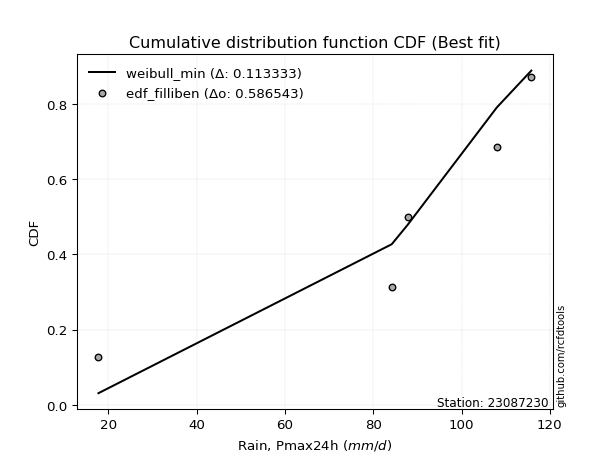</img></img>

</div>


### 10. Empirical - EDF Jenkinson (1977)

The Jenkinson formula in hydrology is an empirical plotting position formula used to estimate the non-exceedance probability _(P)_ or return period _(T)_ of a given ordered observation within a sample. It is a widely used method in the frequency analysis of extreme events such as floods and rainfall, as it provides a distribution-free way to plot data. _a≈0.31_ and _b≈0.38_ are constants derived to approximate the median of the probability distribution for the given rank.

<div align="center">


$P=(m-a)/(n+b)$


</div>


**10.1. Empirical values**

<div align="center">

|                | 0                   | 1                  | 2             | 3                  | 4                  |
|:---------------|:--------------------|:-------------------|:--------------|:-------------------|:-------------------|
| date           | 2023                | 2022               | 2021          | 2020               | 2019               |
| x              | 17.8                | 84.2               | 87.8          | 108.0              | 115.8              |
| m              | 1                   | 2                  | 3             | 4                  | 5                  |
| empirical_dist | edf_jenkinson       | edf_jenkinson      | edf_jenkinson | edf_jenkinson      | edf_jenkinson      |
| empirical      | 0.12825278810408922 | 0.3141263940520446 | 0.5           | 0.6858736059479554 | 0.8717472118959109 |
| empirical_tr   | 1.1471215351812367  | 1.4579945799457996 | 2.0           | 3.183431952662722  | 7.797101449275368  |

</div>


**10.2. Kolmogorov-Smirnov fit test (sorted by Δ)**


<div align="center">

|                | 0                   | 1                   | 2                  | 3                   | 4                   | 5                   | 6                   | 7                   | 8                   | 9                   | 10                  | 11                 | 12                 | 13                  | 14                  | 15                  | 16                  | 17                  | 18                 | 19                  | 20                 | 21                  | 22                  | 23                  | 24                  | 25                 | 26                    | 27                 | 28                 | 29                  | 30                  | 31                 | 32                  | 33                  | 34                 | 35                 | 36                 | 37                  | 38                 | 39                 | 40                 | 41                 | 42                 | 43                 | 44                  | 45                 | 46                  | 47                  | 48                 | 49                  | 50                 | 51                 | 52                 | 53                 | 54                 | 55                 | 56                  | 57                 | 58                 | 59                  | 60                  | 61                  | 62                 | 63                 | 64                 | 65                 | 66                 | 67                  | 68                  | 69                 | 70                 | 71                 | 72                  | 73                 | 74                 | 75                  | 76                  | 77                 | 78                 | 79                  | 80                 | 81                 | 82                 | 83                 | 84                  | 85                 | 86                 | 87                 | 88                 | 89                 |
|:---------------|:--------------------|:--------------------|:-------------------|:--------------------|:--------------------|:--------------------|:--------------------|:--------------------|:--------------------|:--------------------|:--------------------|:-------------------|:-------------------|:--------------------|:--------------------|:--------------------|:--------------------|:--------------------|:-------------------|:--------------------|:-------------------|:--------------------|:--------------------|:--------------------|:--------------------|:-------------------|:----------------------|:-------------------|:-------------------|:--------------------|:--------------------|:-------------------|:--------------------|:--------------------|:-------------------|:-------------------|:-------------------|:--------------------|:-------------------|:-------------------|:-------------------|:-------------------|:-------------------|:-------------------|:--------------------|:-------------------|:--------------------|:--------------------|:-------------------|:--------------------|:-------------------|:-------------------|:-------------------|:-------------------|:-------------------|:-------------------|:--------------------|:-------------------|:-------------------|:--------------------|:--------------------|:--------------------|:-------------------|:-------------------|:-------------------|:-------------------|:-------------------|:--------------------|:--------------------|:-------------------|:-------------------|:-------------------|:--------------------|:-------------------|:-------------------|:--------------------|:--------------------|:-------------------|:-------------------|:--------------------|:-------------------|:-------------------|:-------------------|:-------------------|:--------------------|:-------------------|:-------------------|:-------------------|:-------------------|:-------------------|
| station        | 23087230            | 23087230            | 23087230           | 23087230            | 23087230            | 23087230            | 23087230            | 23087230            | 23087230            | 23087230            | 23087230            | 23087230           | 23087230           | 23087230            | 23087230            | 23087230            | 23087230            | 23087230            | 23087230           | 23087230            | 23087230           | 23087230            | 23087230            | 23087230            | 23087230            | 23087230           | 23087230              | 23087230           | 23087230           | 23087230            | 23087230            | 23087230           | 23087230            | 23087230            | 23087230           | 23087230           | 23087230           | 23087230            | 23087230           | 23087230           | 23087230           | 23087230           | 23087230           | 23087230           | 23087230            | 23087230           | 23087230            | 23087230            | 23087230           | 23087230            | 23087230           | 23087230           | 23087230           | 23087230           | 23087230           | 23087230           | 23087230            | 23087230           | 23087230           | 23087230            | 23087230            | 23087230            | 23087230           | 23087230           | 23087230           | 23087230           | 23087230           | 23087230            | 23087230            | 23087230           | 23087230           | 23087230           | 23087230            | 23087230           | 23087230           | 23087230            | 23087230            | 23087230           | 23087230           | 23087230            | 23087230           | 23087230           | 23087230           | 23087230           | 23087230            | 23087230           | 23087230           | 23087230           | 23087230           | 23087230           |
| empirical_dist | edf_jenkinson       | edf_jenkinson       | edf_jenkinson      | edf_jenkinson       | edf_jenkinson       | edf_jenkinson       | edf_jenkinson       | edf_jenkinson       | edf_jenkinson       | edf_jenkinson       | edf_jenkinson       | edf_jenkinson      | edf_jenkinson      | edf_jenkinson       | edf_jenkinson       | edf_jenkinson       | edf_jenkinson       | edf_jenkinson       | edf_jenkinson      | edf_jenkinson       | edf_jenkinson      | edf_jenkinson       | edf_jenkinson       | edf_jenkinson       | edf_jenkinson       | edf_jenkinson      | edf_jenkinson         | edf_jenkinson      | edf_jenkinson      | edf_jenkinson       | edf_jenkinson       | edf_jenkinson      | edf_jenkinson       | edf_jenkinson       | edf_jenkinson      | edf_jenkinson      | edf_jenkinson      | edf_jenkinson       | edf_jenkinson      | edf_jenkinson      | edf_jenkinson      | edf_jenkinson      | edf_jenkinson      | edf_jenkinson      | edf_jenkinson       | edf_jenkinson      | edf_jenkinson       | edf_jenkinson       | edf_jenkinson      | edf_jenkinson       | edf_jenkinson      | edf_jenkinson      | edf_jenkinson      | edf_jenkinson      | edf_jenkinson      | edf_jenkinson      | edf_jenkinson       | edf_jenkinson      | edf_jenkinson      | edf_jenkinson       | edf_jenkinson       | edf_jenkinson       | edf_jenkinson      | edf_jenkinson      | edf_jenkinson      | edf_jenkinson      | edf_jenkinson      | edf_jenkinson       | edf_jenkinson       | edf_jenkinson      | edf_jenkinson      | edf_jenkinson      | edf_jenkinson       | edf_jenkinson      | edf_jenkinson      | edf_jenkinson       | edf_jenkinson       | edf_jenkinson      | edf_jenkinson      | edf_jenkinson       | edf_jenkinson      | edf_jenkinson      | edf_jenkinson      | edf_jenkinson      | edf_jenkinson       | edf_jenkinson      | edf_jenkinson      | edf_jenkinson      | edf_jenkinson      | edf_jenkinson      |
| p_dist         | weibull_min         | gompertz            | mielke             | fisk                | pearson3            | gumbel_l            | laplace_asymmetric  | logfisk             | t                   | norm                | crystalball         | truncnorm          | exponnorm          | nct                 | f                   | logistic            | hypsecant           | logpearson3         | erlang             | rice                | betaprime          | gamma               | laplace             | logmielke           | chi2                | logloggamma        | loglaplace_asymmetric | invgamma           | invgauss           | loggumbel_l         | maxwell             | loggompertz        | rayleigh            | logt                | ncf                | logjohnsonsu       | kstwobign          | gumbel_r            | halfnorm           | logweibull_min     | nakagami           | lognorm            | lognorm            | logexponnorm       | logcrystalball      | logrice            | lognct              | logf                | logncf             | logfatiguelife      | logerlang          | moyal              | loginvweibull      | halflogistic       | loggamma           | loggamma           | logalpha            | logbetaprime       | loginvgamma        | loglogistic         | lognakagami         | loginvgauss         | loghypsecant       | logmaxwell         | logtruncnorm       | genexpon           | expon              | lograyleigh         | logkstwobign        | alpha              | loggenexpon        | loglaplace         | loghalfnorm         | loggumbel_r        | logexpon           | wald                | johnsonsu           | loglognorm         | loghalflogistic    | logmoyal            | pareto             | logpareto          | gibrat             | invweibull         | logwald             | logchi2            | loggibrat          | fatiguelife        | loggenlogistic     | genlogistic        |
| delta          | 0.11281348526134244 | 0.11357697766772373 | 0.1270044421152996 | 0.12719846650739997 | 0.13153500694225745 | 0.13328902320371544 | 0.16870682649765256 | 0.20276414075290256 | 0.20294071303038758 | 0.20294700592422393 | 0.20294700887048972 | 0.2029470226929983 | 0.2029478970355451 | 0.20306227622546286 | 0.20438020083677394 | 0.20527592807264156 | 0.20726236202268505 | 0.20780310844934596 | 0.2110444845020713 | 0.21181585085762106 | 0.2122227944209813 | 0.21523347818050492 | 0.21524654199206333 | 0.21536429526157946 | 0.21765000402723383 | 0.2182241843123099 | 0.21943275048346383   | 0.2208457456449084 | 0.2298707053429559 | 0.23492817122715287 | 0.23523597459788753 | 0.2408989509818344 | 0.24585672178927115 | 0.24681211259367752 | 0.249830543261569  | 0.2602209176015274 | 0.2730074881909836 | 0.27361794847151505 | 0.2757582994470487 | 0.2836138343310944 | 0.2880664664219391 | 0.2932782921743657 | 0.2932782921743657 | 0.2932805871149174 | 0.29328074185786096 | 0.2933279378663269 | 0.29334273583653664 | 0.29361781102394363 | 0.2938761201562669 | 0.29402316749905694 | 0.2965703465169817 | 0.2992672105680872 | 0.3004968963161216 | 0.3016561679011243 | 0.3017255979198557 | 0.3017255979198557 | 0.30190760641080466 | 0.3025229769908309 | 0.3049858301098854 | 0.30700922209588705 | 0.31115260332142863 | 0.31316680568359606 | 0.3181719169117246 | 0.319139411300101  | 0.3254647477559286 | 0.3262181972129761 | 0.3262859445423281 | 0.32712744810621436 | 0.33179165718280373 | 0.3419211674151719 | 0.3435263839067207 | 0.3458046147725951 | 0.34991593556798634 | 0.358999622113551  | 0.3655368554422042 | 0.37051986636362916 | 0.37323562269155475 | 0.3751123796920442 | 0.378269865698131  | 0.38134495424728115 | 0.3851810378041903 | 0.3925999434305651 | 0.3962888426224506 | 0.4428795325542381 | 0.44371681822552783 | 0.4655066428254187 | 0.475602410858818  | 0.5825951387573087 | 0.6858736059479554 | 0.6858736059479554 |
| deltao         | 0.5865427407550001  | 0.5865427407550001  | 0.5865427407550001 | 0.5865427407550001  | 0.5865427407550001  | 0.5865427407550001  | 0.5865427407550001  | 0.5865427407550001  | 0.5865427407550001  | 0.5865427407550001  | 0.5865427407550001  | 0.5865427407550001 | 0.5865427407550001 | 0.5865427407550001  | 0.5865427407550001  | 0.5865427407550001  | 0.5865427407550001  | 0.5865427407550001  | 0.5865427407550001 | 0.5865427407550001  | 0.5865427407550001 | 0.5865427407550001  | 0.5865427407550001  | 0.5865427407550001  | 0.5865427407550001  | 0.5865427407550001 | 0.5865427407550001    | 0.5865427407550001 | 0.5865427407550001 | 0.5865427407550001  | 0.5865427407550001  | 0.5865427407550001 | 0.5865427407550001  | 0.5865427407550001  | 0.5865427407550001 | 0.5865427407550001 | 0.5865427407550001 | 0.5865427407550001  | 0.5865427407550001 | 0.5865427407550001 | 0.5865427407550001 | 0.5865427407550001 | 0.5865427407550001 | 0.5865427407550001 | 0.5865427407550001  | 0.5865427407550001 | 0.5865427407550001  | 0.5865427407550001  | 0.5865427407550001 | 0.5865427407550001  | 0.5865427407550001 | 0.5865427407550001 | 0.5865427407550001 | 0.5865427407550001 | 0.5865427407550001 | 0.5865427407550001 | 0.5865427407550001  | 0.5865427407550001 | 0.5865427407550001 | 0.5865427407550001  | 0.5865427407550001  | 0.5865427407550001  | 0.5865427407550001 | 0.5865427407550001 | 0.5865427407550001 | 0.5865427407550001 | 0.5865427407550001 | 0.5865427407550001  | 0.5865427407550001  | 0.5865427407550001 | 0.5865427407550001 | 0.5865427407550001 | 0.5865427407550001  | 0.5865427407550001 | 0.5865427407550001 | 0.5865427407550001  | 0.5865427407550001  | 0.5865427407550001 | 0.5865427407550001 | 0.5865427407550001  | 0.5865427407550001 | 0.5865427407550001 | 0.5865427407550001 | 0.5865427407550001 | 0.5865427407550001  | 0.5865427407550001 | 0.5865427407550001 | 0.5865427407550001 | 0.5865427407550001 | 0.5865427407550001 |
| eval           | Δo > Δ              | Δo > Δ              | Δo > Δ             | Δo > Δ              | Δo > Δ              | Δo > Δ              | Δo > Δ              | Δo > Δ              | Δo > Δ              | Δo > Δ              | Δo > Δ              | Δo > Δ             | Δo > Δ             | Δo > Δ              | Δo > Δ              | Δo > Δ              | Δo > Δ              | Δo > Δ              | Δo > Δ             | Δo > Δ              | Δo > Δ             | Δo > Δ              | Δo > Δ              | Δo > Δ              | Δo > Δ              | Δo > Δ             | Δo > Δ                | Δo > Δ             | Δo > Δ             | Δo > Δ              | Δo > Δ              | Δo > Δ             | Δo > Δ              | Δo > Δ              | Δo > Δ             | Δo > Δ             | Δo > Δ             | Δo > Δ              | Δo > Δ             | Δo > Δ             | Δo > Δ             | Δo > Δ             | Δo > Δ             | Δo > Δ             | Δo > Δ              | Δo > Δ             | Δo > Δ              | Δo > Δ              | Δo > Δ             | Δo > Δ              | Δo > Δ             | Δo > Δ             | Δo > Δ             | Δo > Δ             | Δo > Δ             | Δo > Δ             | Δo > Δ              | Δo > Δ             | Δo > Δ             | Δo > Δ              | Δo > Δ              | Δo > Δ              | Δo > Δ             | Δo > Δ             | Δo > Δ             | Δo > Δ             | Δo > Δ             | Δo > Δ              | Δo > Δ              | Δo > Δ             | Δo > Δ             | Δo > Δ             | Δo > Δ              | Δo > Δ             | Δo > Δ             | Δo > Δ              | Δo > Δ              | Δo > Δ             | Δo > Δ             | Δo > Δ              | Δo > Δ             | Δo > Δ             | Δo > Δ             | Δo > Δ             | Δo > Δ              | Δo > Δ             | Δo > Δ             | Δo > Δ             | Δo <= Δ            | Δo <= Δ            |
| fit            | 1                   | 1                   | 1                  | 1                   | 1                   | 1                   | 1                   | 1                   | 1                   | 1                   | 1                   | 1                  | 1                  | 1                   | 1                   | 1                   | 1                   | 1                   | 1                  | 1                   | 1                  | 1                   | 1                   | 1                   | 1                   | 1                  | 1                     | 1                  | 1                  | 1                   | 1                   | 1                  | 1                   | 1                   | 1                  | 1                  | 1                  | 1                   | 1                  | 1                  | 1                  | 1                  | 1                  | 1                  | 1                   | 1                  | 1                   | 1                   | 1                  | 1                   | 1                  | 1                  | 1                  | 1                  | 1                  | 1                  | 1                   | 1                  | 1                  | 1                   | 1                   | 1                   | 1                  | 1                  | 1                  | 1                  | 1                  | 1                   | 1                   | 1                  | 1                  | 1                  | 1                   | 1                  | 1                  | 1                   | 1                   | 1                  | 1                  | 1                   | 1                  | 1                  | 1                  | 1                  | 1                   | 1                  | 1                  | 1                  | 0                  | 0                  |
| n              | 5                   | 5                   | 5                  | 5                   | 5                   | 5                   | 5                   | 5                   | 5                   | 5                   | 5                   | 5                  | 5                  | 5                   | 5                   | 5                   | 5                   | 5                   | 5                  | 5                   | 5                  | 5                   | 5                   | 5                   | 5                   | 5                  | 5                     | 5                  | 5                  | 5                   | 5                   | 5                  | 5                   | 5                   | 5                  | 5                  | 5                  | 5                   | 5                  | 5                  | 5                  | 5                  | 5                  | 5                  | 5                   | 5                  | 5                   | 5                   | 5                  | 5                   | 5                  | 5                  | 5                  | 5                  | 5                  | 5                  | 5                   | 5                  | 5                  | 5                   | 5                   | 5                   | 5                  | 5                  | 5                  | 5                  | 5                  | 5                   | 5                   | 5                  | 5                  | 5                  | 5                   | 5                  | 5                  | 5                   | 5                   | 5                  | 5                  | 5                   | 5                  | 5                  | 5                  | 5                  | 5                   | 5                  | 5                  | 5                  | 5                  | 5                  |
| best_fit       | 1                   | 0                   | 0                  | 0                   | 0                   | 0                   | 0                   | 0                   | 0                   | 0                   | 0                   | 0                  | 0                  | 0                   | 0                   | 0                   | 0                   | 0                   | 0                  | 0                   | 0                  | 0                   | 0                   | 0                   | 0                   | 0                  | 0                     | 0                  | 0                  | 0                   | 0                   | 0                  | 0                   | 0                   | 0                  | 0                  | 0                  | 0                   | 0                  | 0                  | 0                  | 0                  | 0                  | 0                  | 0                   | 0                  | 0                   | 0                   | 0                  | 0                   | 0                  | 0                  | 0                  | 0                  | 0                  | 0                  | 0                   | 0                  | 0                  | 0                   | 0                   | 0                   | 0                  | 0                  | 0                  | 0                  | 0                  | 0                   | 0                   | 0                  | 0                  | 0                  | 0                   | 0                  | 0                  | 0                   | 0                   | 0                  | 0                  | 0                   | 0                  | 0                  | 0                  | 0                  | 0                   | 0                  | 0                  | 0                  | 0                  | 0                  |
| best_fit_sort  | 1                   | 2                   | 3                  | 4                   | 5                   | 6                   | 7                   | 8                   | 9                   | 10                  | 11                  | 12                 | 13                 | 14                  | 15                  | 16                  | 17                  | 18                  | 19                 | 20                  | 21                 | 22                  | 23                  | 24                  | 25                  | 26                 | 27                    | 28                 | 29                 | 30                  | 31                  | 32                 | 33                  | 34                  | 35                 | 36                 | 37                 | 38                  | 39                 | 40                 | 41                 | 42                 | 43                 | 44                 | 45                  | 46                 | 47                  | 48                  | 49                 | 50                  | 51                 | 52                 | 53                 | 54                 | 55                 | 56                 | 57                  | 58                 | 59                 | 60                  | 61                  | 62                  | 63                 | 64                 | 65                 | 66                 | 67                 | 68                  | 69                  | 70                 | 71                 | 72                 | 73                  | 74                 | 75                 | 76                  | 77                  | 78                 | 79                 | 80                  | 81                 | 82                 | 83                 | 84                 | 85                  | 86                 | 87                 | 88                 | 89                 | 90                 |

</div>


<div align="center">

</img>

</div>


**10.3. Best fit**

<div align="center">

|   id |   station | empirical_dist   | p_dist      |    delta |   deltao | eval   |   fit |   n |   best_fit |   best_fit_sort |
|-----:|----------:|:-----------------|:------------|---------:|---------:|:-------|------:|----:|-----------:|----------------:|
|    0 |  23087230 | edf_jenkinson    | weibull_min | 0.112813 | 0.586543 | Δo > Δ |     1 |   5 |          1 |               1 |

</div>


<div align="center">

</img></img>

</div>


### 11. Empirical - EDF Cunnane (1978)

Cunnane´s work in statistical hydrology has focused on the performance and evaluation of different probability distributions (such as GEV, Gumbel, Lognormal) for flood frequency estimation. _b_ is a constant, typically set to 0.4.

<div align="center">


$P=(m-b)/(n+1-2b)$


</div>


**11.1. Empirical values**

<div align="center">

|                | 0                   | 1                  | 2           | 3                  | 4                  |
|:---------------|:--------------------|:-------------------|:------------|:-------------------|:-------------------|
| date           | 2023                | 2022               | 2021        | 2020               | 2019               |
| x              | 17.8                | 84.2               | 87.8        | 108.0              | 115.8              |
| m              | 1                   | 2                  | 3           | 4                  | 5                  |
| empirical_dist | edf_cunnane         | edf_cunnane        | edf_cunnane | edf_cunnane        | edf_cunnane        |
| empirical      | 0.11538461538461538 | 0.3076923076923077 | 0.5         | 0.6923076923076923 | 0.8846153846153845 |
| empirical_tr   | 1.1304347826086958  | 1.4444444444444444 | 2.0         | 3.25               | 8.666666666666655  |

</div>


**11.2. Kolmogorov-Smirnov fit test (sorted by Δ)**


<div align="center">

|                | 0                  | 1                   | 2                   | 3                   | 4                   | 5                   | 6                   | 7                   | 8                  | 9                   | 10                  | 11                  | 12                  | 13                  | 14                  | 15                  | 16                  | 17                  | 18                  | 19                  | 20                 | 21                  | 22                  | 23                  | 24                  | 25                 | 26                    | 27                 | 28                 | 29                  | 30                  | 31                 | 32                  | 33                 | 34                 | 35                  | 36                 | 37                  | 38                  | 39                 | 40                 | 41                 | 42                 | 43                 | 44                 | 45                 | 46                  | 47                  | 48                 | 49                  | 50                  | 51                 | 52                 | 53                 | 54                  | 55                 | 56                 | 57                 | 58                  | 59                 | 60                  | 61                 | 62                 | 63                 | 64                 | 65                  | 66                  | 67                  | 68                  | 69                  | 70                 | 71                 | 72                  | 73                  | 74                 | 75                  | 76                 | 77                 | 78                 | 79                  | 80                 | 81                 | 82                  | 83                  | 84                 | 85                 | 86                 | 87                 | 88                 | 89                 |
|:---------------|:-------------------|:--------------------|:--------------------|:--------------------|:--------------------|:--------------------|:--------------------|:--------------------|:-------------------|:--------------------|:--------------------|:--------------------|:--------------------|:--------------------|:--------------------|:--------------------|:--------------------|:--------------------|:--------------------|:--------------------|:-------------------|:--------------------|:--------------------|:--------------------|:--------------------|:-------------------|:----------------------|:-------------------|:-------------------|:--------------------|:--------------------|:-------------------|:--------------------|:-------------------|:-------------------|:--------------------|:-------------------|:--------------------|:--------------------|:-------------------|:-------------------|:-------------------|:-------------------|:-------------------|:-------------------|:-------------------|:--------------------|:--------------------|:-------------------|:--------------------|:--------------------|:-------------------|:-------------------|:-------------------|:--------------------|:-------------------|:-------------------|:-------------------|:--------------------|:-------------------|:--------------------|:-------------------|:-------------------|:-------------------|:-------------------|:--------------------|:--------------------|:--------------------|:--------------------|:--------------------|:-------------------|:-------------------|:--------------------|:--------------------|:-------------------|:--------------------|:-------------------|:-------------------|:-------------------|:--------------------|:-------------------|:-------------------|:--------------------|:--------------------|:-------------------|:-------------------|:-------------------|:-------------------|:-------------------|:-------------------|
| station        | 23087230           | 23087230            | 23087230            | 23087230            | 23087230            | 23087230            | 23087230            | 23087230            | 23087230           | 23087230            | 23087230            | 23087230            | 23087230            | 23087230            | 23087230            | 23087230            | 23087230            | 23087230            | 23087230            | 23087230            | 23087230           | 23087230            | 23087230            | 23087230            | 23087230            | 23087230           | 23087230              | 23087230           | 23087230           | 23087230            | 23087230            | 23087230           | 23087230            | 23087230           | 23087230           | 23087230            | 23087230           | 23087230            | 23087230            | 23087230           | 23087230           | 23087230           | 23087230           | 23087230           | 23087230           | 23087230           | 23087230            | 23087230            | 23087230           | 23087230            | 23087230            | 23087230           | 23087230           | 23087230           | 23087230            | 23087230           | 23087230           | 23087230           | 23087230            | 23087230           | 23087230            | 23087230           | 23087230           | 23087230           | 23087230           | 23087230            | 23087230            | 23087230            | 23087230            | 23087230            | 23087230           | 23087230           | 23087230            | 23087230            | 23087230           | 23087230            | 23087230           | 23087230           | 23087230           | 23087230            | 23087230           | 23087230           | 23087230            | 23087230            | 23087230           | 23087230           | 23087230           | 23087230           | 23087230           | 23087230           |
| empirical_dist | edf_cunnane        | edf_cunnane         | edf_cunnane         | edf_cunnane         | edf_cunnane         | edf_cunnane         | edf_cunnane         | edf_cunnane         | edf_cunnane        | edf_cunnane         | edf_cunnane         | edf_cunnane         | edf_cunnane         | edf_cunnane         | edf_cunnane         | edf_cunnane         | edf_cunnane         | edf_cunnane         | edf_cunnane         | edf_cunnane         | edf_cunnane        | edf_cunnane         | edf_cunnane         | edf_cunnane         | edf_cunnane         | edf_cunnane        | edf_cunnane           | edf_cunnane        | edf_cunnane        | edf_cunnane         | edf_cunnane         | edf_cunnane        | edf_cunnane         | edf_cunnane        | edf_cunnane        | edf_cunnane         | edf_cunnane        | edf_cunnane         | edf_cunnane         | edf_cunnane        | edf_cunnane        | edf_cunnane        | edf_cunnane        | edf_cunnane        | edf_cunnane        | edf_cunnane        | edf_cunnane         | edf_cunnane         | edf_cunnane        | edf_cunnane         | edf_cunnane         | edf_cunnane        | edf_cunnane        | edf_cunnane        | edf_cunnane         | edf_cunnane        | edf_cunnane        | edf_cunnane        | edf_cunnane         | edf_cunnane        | edf_cunnane         | edf_cunnane        | edf_cunnane        | edf_cunnane        | edf_cunnane        | edf_cunnane         | edf_cunnane         | edf_cunnane         | edf_cunnane         | edf_cunnane         | edf_cunnane        | edf_cunnane        | edf_cunnane         | edf_cunnane         | edf_cunnane        | edf_cunnane         | edf_cunnane        | edf_cunnane        | edf_cunnane        | edf_cunnane         | edf_cunnane        | edf_cunnane        | edf_cunnane         | edf_cunnane         | edf_cunnane        | edf_cunnane        | edf_cunnane        | edf_cunnane        | edf_cunnane        | edf_cunnane        |
| p_dist         | mielke             | weibull_min         | gompertz            | fisk                | pearson3            | gumbel_l            | laplace_asymmetric  | logfisk             | t                  | norm                | crystalball         | truncnorm           | exponnorm           | nct                 | f                   | logistic            | hypsecant           | logpearson3         | erlang              | rice                | betaprime          | gamma               | laplace             | logmielke           | chi2                | logloggamma        | loglaplace_asymmetric | invgamma           | invgauss           | loggumbel_l         | maxwell             | loggompertz        | rayleigh            | ncf                | logt               | logjohnsonsu        | kstwobign          | gumbel_r            | halfnorm            | nakagami           | logweibull_min     | lognorm            | lognorm            | logexponnorm       | logcrystalball     | logrice            | lognct              | logf                | logncf             | logfatiguelife      | logerlang           | lognakagami        | moyal              | loginvweibull      | halflogistic        | loggamma           | loggamma           | logalpha           | logbetaprime        | loginvgamma        | loglogistic         | loginvgauss        | loghypsecant       | logtruncnorm       | logmaxwell         | genexpon            | expon               | lograyleigh         | logkstwobign        | alpha               | loggenexpon        | loglaplace         | loghalfnorm         | loggumbel_r         | logexpon           | wald                | johnsonsu          | loglognorm         | loghalflogistic    | logmoyal            | pareto             | logpareto          | gibrat              | logwald             | invweibull         | logchi2            | loggibrat          | fatiguelife        | loggenlogistic     | genlogistic        |
| delta          | 0.114136269395826  | 0.11924757162107935 | 0.12001106402746065 | 0.13363255286713688 | 0.13796909330199436 | 0.13972310956345235 | 0.17514091285738947 | 0.20919822711263947 | 0.2093747993901245 | 0.20938109228396085 | 0.20938109523022663 | 0.20938110905273521 | 0.20938198339528202 | 0.20949636258519977 | 0.21081428719651085 | 0.21171001443237847 | 0.21369644838242197 | 0.21423719480908288 | 0.21747857086180822 | 0.21824993721735797 | 0.2186568807807182 | 0.22166756454024183 | 0.22168062835180025 | 0.22179838162131638 | 0.22408409038697075 | 0.2246582706720468 | 0.22586683684320075   | 0.2272798320046453 | 0.2363047917026928 | 0.24136225758688978 | 0.24167006095762444 | 0.2473330373415713 | 0.25229080814900806 | 0.2562646296213059 | 0.2596802853131511 | 0.26665500396126424 | 0.2794415745507205 | 0.28005203483125196 | 0.28219238580678563 | 0.2880664664219391 | 0.2900479206908313 | 0.2997123785341026 | 0.2997123785341026 | 0.2997146734746543 | 0.2997148282175979 | 0.2997620242260638 | 0.29977682219627355 | 0.30005189738368054 | 0.3003102065160038 | 0.30045725385879385 | 0.30300443287671863 | 0.3047185169616917 | 0.3057012969278241 | 0.3069309826758585 | 0.30809025426086123 | 0.3081596842795926 | 0.3081596842795926 | 0.3083416927705416 | 0.30895706335056783 | 0.3114199164696223 | 0.31344330845562396 | 0.319600892043333  | 0.3246060032714615 | 0.3254647477559286 | 0.3255734976598379 | 0.33265228357271304 | 0.33272003090206503 | 0.33356153446595127 | 0.33822574354254065 | 0.34835525377490884 | 0.3499604702664576 | 0.352238701132332  | 0.35635002192772325 | 0.36543370847328793 | 0.3719709418019411 | 0.37695395272336607 | 0.3796697090512916 | 0.3815464660517811 | 0.3847039520578679 | 0.38777904060701807 | 0.3916151241639272 | 0.399034029790302  | 0.40272292898218753 | 0.45015090458526474 | 0.4557477052737117 | 0.4719407291851556 | 0.4820364972185549 | 0.5890292251170457 | 0.6923076923076923 | 0.6923076923076923 |
| deltao         | 0.5865427407550001 | 0.5865427407550001  | 0.5865427407550001  | 0.5865427407550001  | 0.5865427407550001  | 0.5865427407550001  | 0.5865427407550001  | 0.5865427407550001  | 0.5865427407550001 | 0.5865427407550001  | 0.5865427407550001  | 0.5865427407550001  | 0.5865427407550001  | 0.5865427407550001  | 0.5865427407550001  | 0.5865427407550001  | 0.5865427407550001  | 0.5865427407550001  | 0.5865427407550001  | 0.5865427407550001  | 0.5865427407550001 | 0.5865427407550001  | 0.5865427407550001  | 0.5865427407550001  | 0.5865427407550001  | 0.5865427407550001 | 0.5865427407550001    | 0.5865427407550001 | 0.5865427407550001 | 0.5865427407550001  | 0.5865427407550001  | 0.5865427407550001 | 0.5865427407550001  | 0.5865427407550001 | 0.5865427407550001 | 0.5865427407550001  | 0.5865427407550001 | 0.5865427407550001  | 0.5865427407550001  | 0.5865427407550001 | 0.5865427407550001 | 0.5865427407550001 | 0.5865427407550001 | 0.5865427407550001 | 0.5865427407550001 | 0.5865427407550001 | 0.5865427407550001  | 0.5865427407550001  | 0.5865427407550001 | 0.5865427407550001  | 0.5865427407550001  | 0.5865427407550001 | 0.5865427407550001 | 0.5865427407550001 | 0.5865427407550001  | 0.5865427407550001 | 0.5865427407550001 | 0.5865427407550001 | 0.5865427407550001  | 0.5865427407550001 | 0.5865427407550001  | 0.5865427407550001 | 0.5865427407550001 | 0.5865427407550001 | 0.5865427407550001 | 0.5865427407550001  | 0.5865427407550001  | 0.5865427407550001  | 0.5865427407550001  | 0.5865427407550001  | 0.5865427407550001 | 0.5865427407550001 | 0.5865427407550001  | 0.5865427407550001  | 0.5865427407550001 | 0.5865427407550001  | 0.5865427407550001 | 0.5865427407550001 | 0.5865427407550001 | 0.5865427407550001  | 0.5865427407550001 | 0.5865427407550001 | 0.5865427407550001  | 0.5865427407550001  | 0.5865427407550001 | 0.5865427407550001 | 0.5865427407550001 | 0.5865427407550001 | 0.5865427407550001 | 0.5865427407550001 |
| eval           | Δo > Δ             | Δo > Δ              | Δo > Δ              | Δo > Δ              | Δo > Δ              | Δo > Δ              | Δo > Δ              | Δo > Δ              | Δo > Δ             | Δo > Δ              | Δo > Δ              | Δo > Δ              | Δo > Δ              | Δo > Δ              | Δo > Δ              | Δo > Δ              | Δo > Δ              | Δo > Δ              | Δo > Δ              | Δo > Δ              | Δo > Δ             | Δo > Δ              | Δo > Δ              | Δo > Δ              | Δo > Δ              | Δo > Δ             | Δo > Δ                | Δo > Δ             | Δo > Δ             | Δo > Δ              | Δo > Δ              | Δo > Δ             | Δo > Δ              | Δo > Δ             | Δo > Δ             | Δo > Δ              | Δo > Δ             | Δo > Δ              | Δo > Δ              | Δo > Δ             | Δo > Δ             | Δo > Δ             | Δo > Δ             | Δo > Δ             | Δo > Δ             | Δo > Δ             | Δo > Δ              | Δo > Δ              | Δo > Δ             | Δo > Δ              | Δo > Δ              | Δo > Δ             | Δo > Δ             | Δo > Δ             | Δo > Δ              | Δo > Δ             | Δo > Δ             | Δo > Δ             | Δo > Δ              | Δo > Δ             | Δo > Δ              | Δo > Δ             | Δo > Δ             | Δo > Δ             | Δo > Δ             | Δo > Δ              | Δo > Δ              | Δo > Δ              | Δo > Δ              | Δo > Δ              | Δo > Δ             | Δo > Δ             | Δo > Δ              | Δo > Δ              | Δo > Δ             | Δo > Δ              | Δo > Δ             | Δo > Δ             | Δo > Δ             | Δo > Δ              | Δo > Δ             | Δo > Δ             | Δo > Δ              | Δo > Δ              | Δo > Δ             | Δo > Δ             | Δo > Δ             | Δo <= Δ            | Δo <= Δ            | Δo <= Δ            |
| fit            | 1                  | 1                   | 1                   | 1                   | 1                   | 1                   | 1                   | 1                   | 1                  | 1                   | 1                   | 1                   | 1                   | 1                   | 1                   | 1                   | 1                   | 1                   | 1                   | 1                   | 1                  | 1                   | 1                   | 1                   | 1                   | 1                  | 1                     | 1                  | 1                  | 1                   | 1                   | 1                  | 1                   | 1                  | 1                  | 1                   | 1                  | 1                   | 1                   | 1                  | 1                  | 1                  | 1                  | 1                  | 1                  | 1                  | 1                   | 1                   | 1                  | 1                   | 1                   | 1                  | 1                  | 1                  | 1                   | 1                  | 1                  | 1                  | 1                   | 1                  | 1                   | 1                  | 1                  | 1                  | 1                  | 1                   | 1                   | 1                   | 1                   | 1                   | 1                  | 1                  | 1                   | 1                   | 1                  | 1                   | 1                  | 1                  | 1                  | 1                   | 1                  | 1                  | 1                   | 1                   | 1                  | 1                  | 1                  | 0                  | 0                  | 0                  |
| n              | 5                  | 5                   | 5                   | 5                   | 5                   | 5                   | 5                   | 5                   | 5                  | 5                   | 5                   | 5                   | 5                   | 5                   | 5                   | 5                   | 5                   | 5                   | 5                   | 5                   | 5                  | 5                   | 5                   | 5                   | 5                   | 5                  | 5                     | 5                  | 5                  | 5                   | 5                   | 5                  | 5                   | 5                  | 5                  | 5                   | 5                  | 5                   | 5                   | 5                  | 5                  | 5                  | 5                  | 5                  | 5                  | 5                  | 5                   | 5                   | 5                  | 5                   | 5                   | 5                  | 5                  | 5                  | 5                   | 5                  | 5                  | 5                  | 5                   | 5                  | 5                   | 5                  | 5                  | 5                  | 5                  | 5                   | 5                   | 5                   | 5                   | 5                   | 5                  | 5                  | 5                   | 5                   | 5                  | 5                   | 5                  | 5                  | 5                  | 5                   | 5                  | 5                  | 5                   | 5                   | 5                  | 5                  | 5                  | 5                  | 5                  | 5                  |
| best_fit       | 1                  | 0                   | 0                   | 0                   | 0                   | 0                   | 0                   | 0                   | 0                  | 0                   | 0                   | 0                   | 0                   | 0                   | 0                   | 0                   | 0                   | 0                   | 0                   | 0                   | 0                  | 0                   | 0                   | 0                   | 0                   | 0                  | 0                     | 0                  | 0                  | 0                   | 0                   | 0                  | 0                   | 0                  | 0                  | 0                   | 0                  | 0                   | 0                   | 0                  | 0                  | 0                  | 0                  | 0                  | 0                  | 0                  | 0                   | 0                   | 0                  | 0                   | 0                   | 0                  | 0                  | 0                  | 0                   | 0                  | 0                  | 0                  | 0                   | 0                  | 0                   | 0                  | 0                  | 0                  | 0                  | 0                   | 0                   | 0                   | 0                   | 0                   | 0                  | 0                  | 0                   | 0                   | 0                  | 0                   | 0                  | 0                  | 0                  | 0                   | 0                  | 0                  | 0                   | 0                   | 0                  | 0                  | 0                  | 0                  | 0                  | 0                  |
| best_fit_sort  | 1                  | 2                   | 3                   | 4                   | 5                   | 6                   | 7                   | 8                   | 9                  | 10                  | 11                  | 12                  | 13                  | 14                  | 15                  | 16                  | 17                  | 18                  | 19                  | 20                  | 21                 | 22                  | 23                  | 24                  | 25                  | 26                 | 27                    | 28                 | 29                 | 30                  | 31                  | 32                 | 33                  | 34                 | 35                 | 36                  | 37                 | 38                  | 39                  | 40                 | 41                 | 42                 | 43                 | 44                 | 45                 | 46                 | 47                  | 48                  | 49                 | 50                  | 51                  | 52                 | 53                 | 54                 | 55                  | 56                 | 57                 | 58                 | 59                  | 60                 | 61                  | 62                 | 63                 | 64                 | 65                 | 66                  | 67                  | 68                  | 69                  | 70                  | 71                 | 72                 | 73                  | 74                  | 75                 | 76                  | 77                 | 78                 | 79                 | 80                  | 81                 | 82                 | 83                  | 84                  | 85                 | 86                 | 87                 | 88                 | 89                 | 90                 |

</div>


<div align="center">

</img>

</div>


**11.3. Best fit**

<div align="center">

|   id |   station | empirical_dist   | p_dist   |    delta |   deltao | eval   |   fit |   n |   best_fit |   best_fit_sort |
|-----:|----------:|:-----------------|:---------|---------:|---------:|:-------|------:|----:|-----------:|----------------:|
|    0 |  23087230 | edf_cunnane      | mielke   | 0.114136 | 0.586543 | Δo > Δ |     1 |   5 |          1 |               1 |

</div>


<div align="center">

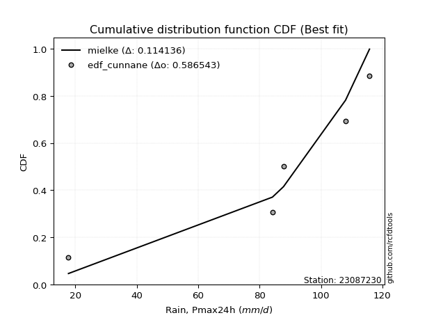</img></img>

</div>


### 12. Empirical - EDF Adamowski (1981)

The Adamowski formula in hydrology refers to a specific plotting position formula used for estimating the non-parametric empirical distribution of hydrological events (like flood peaks) to calculate their return periods. This formula provides an alternative to traditional parametric methods (like the Gumbel or Log Pearson Type III distributions). 

<div align="center">


$P=(m-0.25)/(n+0.5)$


</div>


**12.1. Empirical values**

<div align="center">

|                | 0                   | 1                  | 2             | 3                  | 4                  |
|:---------------|:--------------------|:-------------------|:--------------|:-------------------|:-------------------|
| date           | 2023                | 2022               | 2021          | 2020               | 2019               |
| x              | 17.8                | 84.2               | 87.8          | 108.0              | 115.8              |
| m              | 1                   | 2                  | 3             | 4                  | 5                  |
| empirical_dist | edf_adamowski       | edf_adamowski      | edf_adamowski | edf_adamowski      | edf_adamowski      |
| empirical      | 0.13636363636363635 | 0.3181818181818182 | 0.5           | 0.6818181818181818 | 0.8636363636363636 |
| empirical_tr   | 1.1578947368421053  | 1.4666666666666666 | 2.0           | 3.1428571428571423 | 7.333333333333334  |

</div>


**12.2. Kolmogorov-Smirnov fit test (sorted by Δ)**


<div align="center">

|                | 0                   | 1                   | 2                   | 3                  | 4                   | 5                   | 6                  | 7                  | 8                   | 9                   | 10                  | 11                  | 12                  | 13                 | 14                  | 15                 | 16                 | 17                 | 18                  | 19                 | 20                  | 21                  | 22                  | 23                 | 24                  | 25                  | 26                    | 27                  | 28                  | 29                  | 30                  | 31                  | 32                 | 33                 | 34                  | 35                 | 36                 | 37                 | 38                  | 39                  | 40                 | 41                  | 42                  | 43                  | 44                 | 45                 | 46                 | 47                 | 48                  | 49                 | 50                  | 51                  | 52                  | 53                  | 54                  | 55                  | 56                 | 57                  | 58                  | 59                 | 60                 | 61                  | 62                  | 63                 | 64                  | 65                  | 66                 | 67                 | 68                 | 69                  | 70                  | 71                  | 72                 | 73                  | 74                  | 75                 | 76                 | 77                  | 78                 | 79                 | 80                 | 81                  | 82                  | 83                 | 84                 | 85                  | 86                  | 87                 | 88                 | 89                 |
|:---------------|:--------------------|:--------------------|:--------------------|:-------------------|:--------------------|:--------------------|:-------------------|:-------------------|:--------------------|:--------------------|:--------------------|:--------------------|:--------------------|:-------------------|:--------------------|:-------------------|:-------------------|:-------------------|:--------------------|:-------------------|:--------------------|:--------------------|:--------------------|:-------------------|:--------------------|:--------------------|:----------------------|:--------------------|:--------------------|:--------------------|:--------------------|:--------------------|:-------------------|:-------------------|:--------------------|:-------------------|:-------------------|:-------------------|:--------------------|:--------------------|:-------------------|:--------------------|:--------------------|:--------------------|:-------------------|:-------------------|:-------------------|:-------------------|:--------------------|:-------------------|:--------------------|:--------------------|:--------------------|:--------------------|:--------------------|:--------------------|:-------------------|:--------------------|:--------------------|:-------------------|:-------------------|:--------------------|:--------------------|:-------------------|:--------------------|:--------------------|:-------------------|:-------------------|:-------------------|:--------------------|:--------------------|:--------------------|:-------------------|:--------------------|:--------------------|:-------------------|:-------------------|:--------------------|:-------------------|:-------------------|:-------------------|:--------------------|:--------------------|:-------------------|:-------------------|:--------------------|:--------------------|:-------------------|:-------------------|:-------------------|
| station        | 23087230            | 23087230            | 23087230            | 23087230           | 23087230            | 23087230            | 23087230           | 23087230           | 23087230            | 23087230            | 23087230            | 23087230            | 23087230            | 23087230           | 23087230            | 23087230           | 23087230           | 23087230           | 23087230            | 23087230           | 23087230            | 23087230            | 23087230            | 23087230           | 23087230            | 23087230            | 23087230              | 23087230            | 23087230            | 23087230            | 23087230            | 23087230            | 23087230           | 23087230           | 23087230            | 23087230           | 23087230           | 23087230           | 23087230            | 23087230            | 23087230           | 23087230            | 23087230            | 23087230            | 23087230           | 23087230           | 23087230           | 23087230           | 23087230            | 23087230           | 23087230            | 23087230            | 23087230            | 23087230            | 23087230            | 23087230            | 23087230           | 23087230            | 23087230            | 23087230           | 23087230           | 23087230            | 23087230            | 23087230           | 23087230            | 23087230            | 23087230           | 23087230           | 23087230           | 23087230            | 23087230            | 23087230            | 23087230           | 23087230            | 23087230            | 23087230           | 23087230           | 23087230            | 23087230           | 23087230           | 23087230           | 23087230            | 23087230            | 23087230           | 23087230           | 23087230            | 23087230            | 23087230           | 23087230           | 23087230           |
| empirical_dist | edf_adamowski       | edf_adamowski       | edf_adamowski       | edf_adamowski      | edf_adamowski       | edf_adamowski       | edf_adamowski      | edf_adamowski      | edf_adamowski       | edf_adamowski       | edf_adamowski       | edf_adamowski       | edf_adamowski       | edf_adamowski      | edf_adamowski       | edf_adamowski      | edf_adamowski      | edf_adamowski      | edf_adamowski       | edf_adamowski      | edf_adamowski       | edf_adamowski       | edf_adamowski       | edf_adamowski      | edf_adamowski       | edf_adamowski       | edf_adamowski         | edf_adamowski       | edf_adamowski       | edf_adamowski       | edf_adamowski       | edf_adamowski       | edf_adamowski      | edf_adamowski      | edf_adamowski       | edf_adamowski      | edf_adamowski      | edf_adamowski      | edf_adamowski       | edf_adamowski       | edf_adamowski      | edf_adamowski       | edf_adamowski       | edf_adamowski       | edf_adamowski      | edf_adamowski      | edf_adamowski      | edf_adamowski      | edf_adamowski       | edf_adamowski      | edf_adamowski       | edf_adamowski       | edf_adamowski       | edf_adamowski       | edf_adamowski       | edf_adamowski       | edf_adamowski      | edf_adamowski       | edf_adamowski       | edf_adamowski      | edf_adamowski      | edf_adamowski       | edf_adamowski       | edf_adamowski      | edf_adamowski       | edf_adamowski       | edf_adamowski      | edf_adamowski      | edf_adamowski      | edf_adamowski       | edf_adamowski       | edf_adamowski       | edf_adamowski      | edf_adamowski       | edf_adamowski       | edf_adamowski      | edf_adamowski      | edf_adamowski       | edf_adamowski      | edf_adamowski      | edf_adamowski      | edf_adamowski       | edf_adamowski       | edf_adamowski      | edf_adamowski      | edf_adamowski       | edf_adamowski       | edf_adamowski      | edf_adamowski      | edf_adamowski      |
| p_dist         | weibull_min         | gompertz            | fisk                | pearson3           | gumbel_l            | mielke              | laplace_asymmetric | logfisk            | t                   | norm                | crystalball         | truncnorm           | exponnorm           | nct                | f                   | logistic           | hypsecant          | logpearson3        | erlang              | rice               | betaprime           | gamma               | laplace             | logmielke          | chi2                | logloggamma         | loglaplace_asymmetric | invgamma            | invgauss            | loggumbel_l         | maxwell             | loggompertz         | logt               | rayleigh           | ncf                 | logjohnsonsu       | kstwobign          | gumbel_r           | halfnorm            | logweibull_min      | nakagami           | lognorm             | lognorm             | logexponnorm        | logcrystalball     | logrice            | lognct             | logf               | logncf              | logfatiguelife     | logerlang           | moyal               | loginvweibull       | halflogistic        | loggamma            | loggamma            | logalpha           | logbetaprime        | loginvgamma         | loglogistic        | loginvgauss        | loghypsecant        | logmaxwell          | lognakagami        | genexpon            | expon               | lograyleigh        | logtruncnorm       | logkstwobign       | alpha               | loggenexpon         | loglaplace          | loghalfnorm        | loggumbel_r         | logexpon            | wald               | johnsonsu          | loglognorm          | loghalflogistic    | logmoyal           | pareto             | logpareto           | gibrat              | invweibull         | logwald            | logchi2             | loggibrat           | fatiguelife        | loggenlogistic     | genlogistic        |
| delta          | 0.10910457947498553 | 0.10952155353795018 | 0.12314304237762641 | 0.1274795828124839 | 0.12923359907394188 | 0.13511529037484682 | 0.164651402367879  | 0.198708716623129  | 0.19888528890061402 | 0.19889158179445038 | 0.19889158474071617 | 0.19889159856322475 | 0.19889247290577156 | 0.1990068520956893 | 0.20032477670700038 | 0.201220503942868  | 0.2032069378929115 | 0.2037476843195724 | 0.20698906037229775 | 0.2077604267278475 | 0.20816737029120774 | 0.21117805405073137 | 0.21119111786228978 | 0.2113088711318059 | 0.21359457989746028 | 0.21416876018253633 | 0.21537732635369028   | 0.21679032151513483 | 0.22581528121318234 | 0.23087274709737932 | 0.23118055046811398 | 0.23684352685206084 | 0.2387012643341303 | 0.2418012976594976 | 0.24577511913179545 | 0.2561654934717537 | 0.26895206406121   | 0.2695625243417415 | 0.27170287531727516 | 0.27955841020132083 | 0.2880664664219391 | 0.28922286804459213 | 0.28922286804459213 | 0.28922516298514384 | 0.2892253177280874 | 0.2892725137365533 | 0.2892873117067631 | 0.2895623868941701 | 0.28982069602649335 | 0.2899677433692834 | 0.29251492238720816 | 0.29521178643831364 | 0.29644147218634803 | 0.29760074377135076 | 0.29767017379008215 | 0.29767017379008215 | 0.2978521822810311 | 0.29846755286105736 | 0.30093040598011184 | 0.3029537979661135 | 0.3091113815538225 | 0.31411649278195103 | 0.31508398717032743 | 0.3152080274512022 | 0.32216277308320257 | 0.32223052041255457 | 0.3230720239764408 | 0.3254647477559286 | 0.3277362330530302 | 0.33786574328539837 | 0.33947095977694713 | 0.34174919064282155 | 0.3458605114382128 | 0.35494419798377747 | 0.36148143131243066 | 0.3664644422338556 | 0.3691801985617811 | 0.37105695556227064 | 0.3742144415683574 | 0.3772895301175076 | 0.3811256136744167 | 0.38854451930079154 | 0.39223341849267707 | 0.4347686842946909 | 0.4396613940957543 | 0.46145121869564515 | 0.47154698672904444 | 0.5785397146275353 | 0.6818181818181818 | 0.6818181818181818 |
| deltao         | 0.5865427407550001  | 0.5865427407550001  | 0.5865427407550001  | 0.5865427407550001 | 0.5865427407550001  | 0.5865427407550001  | 0.5865427407550001 | 0.5865427407550001 | 0.5865427407550001  | 0.5865427407550001  | 0.5865427407550001  | 0.5865427407550001  | 0.5865427407550001  | 0.5865427407550001 | 0.5865427407550001  | 0.5865427407550001 | 0.5865427407550001 | 0.5865427407550001 | 0.5865427407550001  | 0.5865427407550001 | 0.5865427407550001  | 0.5865427407550001  | 0.5865427407550001  | 0.5865427407550001 | 0.5865427407550001  | 0.5865427407550001  | 0.5865427407550001    | 0.5865427407550001  | 0.5865427407550001  | 0.5865427407550001  | 0.5865427407550001  | 0.5865427407550001  | 0.5865427407550001 | 0.5865427407550001 | 0.5865427407550001  | 0.5865427407550001 | 0.5865427407550001 | 0.5865427407550001 | 0.5865427407550001  | 0.5865427407550001  | 0.5865427407550001 | 0.5865427407550001  | 0.5865427407550001  | 0.5865427407550001  | 0.5865427407550001 | 0.5865427407550001 | 0.5865427407550001 | 0.5865427407550001 | 0.5865427407550001  | 0.5865427407550001 | 0.5865427407550001  | 0.5865427407550001  | 0.5865427407550001  | 0.5865427407550001  | 0.5865427407550001  | 0.5865427407550001  | 0.5865427407550001 | 0.5865427407550001  | 0.5865427407550001  | 0.5865427407550001 | 0.5865427407550001 | 0.5865427407550001  | 0.5865427407550001  | 0.5865427407550001 | 0.5865427407550001  | 0.5865427407550001  | 0.5865427407550001 | 0.5865427407550001 | 0.5865427407550001 | 0.5865427407550001  | 0.5865427407550001  | 0.5865427407550001  | 0.5865427407550001 | 0.5865427407550001  | 0.5865427407550001  | 0.5865427407550001 | 0.5865427407550001 | 0.5865427407550001  | 0.5865427407550001 | 0.5865427407550001 | 0.5865427407550001 | 0.5865427407550001  | 0.5865427407550001  | 0.5865427407550001 | 0.5865427407550001 | 0.5865427407550001  | 0.5865427407550001  | 0.5865427407550001 | 0.5865427407550001 | 0.5865427407550001 |
| eval           | Δo > Δ              | Δo > Δ              | Δo > Δ              | Δo > Δ             | Δo > Δ              | Δo > Δ              | Δo > Δ             | Δo > Δ             | Δo > Δ              | Δo > Δ              | Δo > Δ              | Δo > Δ              | Δo > Δ              | Δo > Δ             | Δo > Δ              | Δo > Δ             | Δo > Δ             | Δo > Δ             | Δo > Δ              | Δo > Δ             | Δo > Δ              | Δo > Δ              | Δo > Δ              | Δo > Δ             | Δo > Δ              | Δo > Δ              | Δo > Δ                | Δo > Δ              | Δo > Δ              | Δo > Δ              | Δo > Δ              | Δo > Δ              | Δo > Δ             | Δo > Δ             | Δo > Δ              | Δo > Δ             | Δo > Δ             | Δo > Δ             | Δo > Δ              | Δo > Δ              | Δo > Δ             | Δo > Δ              | Δo > Δ              | Δo > Δ              | Δo > Δ             | Δo > Δ             | Δo > Δ             | Δo > Δ             | Δo > Δ              | Δo > Δ             | Δo > Δ              | Δo > Δ              | Δo > Δ              | Δo > Δ              | Δo > Δ              | Δo > Δ              | Δo > Δ             | Δo > Δ              | Δo > Δ              | Δo > Δ             | Δo > Δ             | Δo > Δ              | Δo > Δ              | Δo > Δ             | Δo > Δ              | Δo > Δ              | Δo > Δ             | Δo > Δ             | Δo > Δ             | Δo > Δ              | Δo > Δ              | Δo > Δ              | Δo > Δ             | Δo > Δ              | Δo > Δ              | Δo > Δ             | Δo > Δ             | Δo > Δ              | Δo > Δ             | Δo > Δ             | Δo > Δ             | Δo > Δ              | Δo > Δ              | Δo > Δ             | Δo > Δ             | Δo > Δ              | Δo > Δ              | Δo > Δ             | Δo <= Δ            | Δo <= Δ            |
| fit            | 1                   | 1                   | 1                   | 1                  | 1                   | 1                   | 1                  | 1                  | 1                   | 1                   | 1                   | 1                   | 1                   | 1                  | 1                   | 1                  | 1                  | 1                  | 1                   | 1                  | 1                   | 1                   | 1                   | 1                  | 1                   | 1                   | 1                     | 1                   | 1                   | 1                   | 1                   | 1                   | 1                  | 1                  | 1                   | 1                  | 1                  | 1                  | 1                   | 1                   | 1                  | 1                   | 1                   | 1                   | 1                  | 1                  | 1                  | 1                  | 1                   | 1                  | 1                   | 1                   | 1                   | 1                   | 1                   | 1                   | 1                  | 1                   | 1                   | 1                  | 1                  | 1                   | 1                   | 1                  | 1                   | 1                   | 1                  | 1                  | 1                  | 1                   | 1                   | 1                   | 1                  | 1                   | 1                   | 1                  | 1                  | 1                   | 1                  | 1                  | 1                  | 1                   | 1                   | 1                  | 1                  | 1                   | 1                   | 1                  | 0                  | 0                  |
| n              | 5                   | 5                   | 5                   | 5                  | 5                   | 5                   | 5                  | 5                  | 5                   | 5                   | 5                   | 5                   | 5                   | 5                  | 5                   | 5                  | 5                  | 5                  | 5                   | 5                  | 5                   | 5                   | 5                   | 5                  | 5                   | 5                   | 5                     | 5                   | 5                   | 5                   | 5                   | 5                   | 5                  | 5                  | 5                   | 5                  | 5                  | 5                  | 5                   | 5                   | 5                  | 5                   | 5                   | 5                   | 5                  | 5                  | 5                  | 5                  | 5                   | 5                  | 5                   | 5                   | 5                   | 5                   | 5                   | 5                   | 5                  | 5                   | 5                   | 5                  | 5                  | 5                   | 5                   | 5                  | 5                   | 5                   | 5                  | 5                  | 5                  | 5                   | 5                   | 5                   | 5                  | 5                   | 5                   | 5                  | 5                  | 5                   | 5                  | 5                  | 5                  | 5                   | 5                   | 5                  | 5                  | 5                   | 5                   | 5                  | 5                  | 5                  |
| best_fit       | 1                   | 0                   | 0                   | 0                  | 0                   | 0                   | 0                  | 0                  | 0                   | 0                   | 0                   | 0                   | 0                   | 0                  | 0                   | 0                  | 0                  | 0                  | 0                   | 0                  | 0                   | 0                   | 0                   | 0                  | 0                   | 0                   | 0                     | 0                   | 0                   | 0                   | 0                   | 0                   | 0                  | 0                  | 0                   | 0                  | 0                  | 0                  | 0                   | 0                   | 0                  | 0                   | 0                   | 0                   | 0                  | 0                  | 0                  | 0                  | 0                   | 0                  | 0                   | 0                   | 0                   | 0                   | 0                   | 0                   | 0                  | 0                   | 0                   | 0                  | 0                  | 0                   | 0                   | 0                  | 0                   | 0                   | 0                  | 0                  | 0                  | 0                   | 0                   | 0                   | 0                  | 0                   | 0                   | 0                  | 0                  | 0                   | 0                  | 0                  | 0                  | 0                   | 0                   | 0                  | 0                  | 0                   | 0                   | 0                  | 0                  | 0                  |
| best_fit_sort  | 1                   | 2                   | 3                   | 4                  | 5                   | 6                   | 7                  | 8                  | 9                   | 10                  | 11                  | 12                  | 13                  | 14                 | 15                  | 16                 | 17                 | 18                 | 19                  | 20                 | 21                  | 22                  | 23                  | 24                 | 25                  | 26                  | 27                    | 28                  | 29                  | 30                  | 31                  | 32                  | 33                 | 34                 | 35                  | 36                 | 37                 | 38                 | 39                  | 40                  | 41                 | 42                  | 43                  | 44                  | 45                 | 46                 | 47                 | 48                 | 49                  | 50                 | 51                  | 52                  | 53                  | 54                  | 55                  | 56                  | 57                 | 58                  | 59                  | 60                 | 61                 | 62                  | 63                  | 64                 | 65                  | 66                  | 67                 | 68                 | 69                 | 70                  | 71                  | 72                  | 73                 | 74                  | 75                  | 76                 | 77                 | 78                  | 79                 | 80                 | 81                 | 82                  | 83                  | 84                 | 85                 | 86                  | 87                  | 88                 | 89                 | 90                 |

</div>


<div align="center">

</img>

</div>


**12.3. Best fit**

<div align="center">

|   id |   station | empirical_dist   | p_dist      |    delta |   deltao | eval   |   fit |   n |   best_fit |   best_fit_sort |
|-----:|----------:|:-----------------|:------------|---------:|---------:|:-------|------:|----:|-----------:|----------------:|
|    0 |  23087230 | edf_adamowski    | weibull_min | 0.109105 | 0.586543 | Δo > Δ |     1 |   5 |          1 |               1 |

</div>


<div align="center">

</img></img>

</div>


## C. Best fit & Estimate extreme values for specific return periods - Tr


### 1. Best fit (ordered by delta Δ)

<div align="center">

|   id |   station | empirical_dist   | p_dist      |     delta |   deltao | eval   |   fit |   n |   best_fit |   best_fit_sort |
|-----:|----------:|:-----------------|:------------|----------:|---------:|:-------|------:|----:|-----------:|----------------:|
|    0 |  23087230 | edf_hazen        | mielke      | 0.0987517 | 0.586543 | Δo > Δ |     1 |   5 |          1 |               1 |
|    1 |  23087230 | edf_gringorten   | mielke      | 0.108127  | 0.586543 | Δo > Δ |     1 |   5 |          1 |               2 |
|    2 |  23087230 | edf_adamowski    | weibull_min | 0.109105  | 0.586543 | Δo > Δ |     1 |   5 |          1 |               3 |
|    3 |  23087230 | edf_chegodayev   | weibull_min | 0.112125  | 0.586543 | Δo > Δ |     1 |   5 |          1 |               4 |
|    4 |  23087230 | edf_beard        | weibull_min | 0.112813  | 0.586543 | Δo > Δ |     1 |   5 |          1 |               5 |
|    5 |  23087230 | edf_jenkinson    | weibull_min | 0.112813  | 0.586543 | Δo > Δ |     1 |   5 |          1 |               6 |
|    6 |  23087230 | edf_filliben     | weibull_min | 0.113333  | 0.586543 | Δo > Δ |     1 |   5 |          1 |               7 |
|    7 |  23087230 | edf_cunnane      | mielke      | 0.114136  | 0.586543 | Δo > Δ |     1 |   5 |          1 |               8 |
|    8 |  23087230 | edf_tukey        | weibull_min | 0.11444   | 0.586543 | Δo > Δ |     1 |   5 |          1 |               9 |
|    9 |  23087230 | edf_weibull      | pearson3    | 0.115936  | 0.586543 | Δo > Δ |     1 |   5 |          1 |              10 |
|   10 |  23087230 | edf_blom         | weibull_min | 0.117416  | 0.586543 | Δo > Δ |     1 |   5 |          1 |              11 |
|   11 |  23087230 | edf_california   | gumbel_l    | 0.150747  | 0.586543 | Δo > Δ |     1 |   5 |          1 |              12 |

</div>

:file_folder:Tables: [bestfit_23087230.csv](table/bestfit_23087230.csv) | [extreme_23087230.csv](table/extreme_23087230.csv)


### 2. Extreme values

In hydrology, a return period (or recurrence interval $Tr$) is the statistical average time between extreme events like floods or droughts of a specific magnitude, indicating how rare an event is, with a 100-year flood, for example, having a 1% chance of occurring in any given year, not that it happens exactly every century. It is a key tool for infrastructure design (like bridges or dams) and risk assessment, calculated from historical data to determine the probability of future events, although it is important to remember it is statistical average, and events can cluster or be missed.

> risk_rate: assuming the return period as the project useful life.

|   id |      tr |   prob_l |     prob_g |      alpha |   betaprime |     chi2 |   crystalball |   erlang |    expon |   exponnorm |        f |   fatiguelife |     fisk |    gamma |   genexpon |   genlogistic |   gibrat |   gompertz |   gumbel_l |   gumbel_r |   halflogistic |   halfnorm |   hypsecant |   invgamma |   invgauss |      invweibull |   johnsonsu |   kstwobign |   laplace |   laplace_asymmetric |   loggamma |   logistic |   lognorm |   maxwell |        mielke |    moyal |   nakagami |      ncf |      nct |     norm |           pareto |   pearson3 |   rayleigh |     rice |        t |   truncnorm |     wald |   weibull_min |   logalpha |   logbetaprime |     logchi2 |   logcrystalball |   logerlang |    logexpon |   logexponnorm |     logf |   logfatiguelife |   logfisk |   loggenexpon |   loggenlogistic |   loggibrat |   loggompertz |   loggumbel_l |   loggumbel_r |   loghalflogistic |   loghalfnorm |   loghypsecant |   loginvgamma |   loginvgauss |   loginvweibull |   logjohnsonsu |   logkstwobign |   loglaplace |   loglaplace_asymmetric |   logloggamma |   loglogistic |     loglognorm |   logmaxwell |   logmielke |   logmoyal |   lognakagami |   logncf |   lognct |        logpareto |   logpearson3 |   lograyleigh |   logrice |        logt |   logtruncnorm |    logwald |   logweibull_min |   station |   n |   risk_rate |
|-----:|--------:|---------:|-----------:|-----------:|------------:|---------:|--------------:|---------:|---------:|------------:|---------:|--------------:|---------:|---------:|-----------:|--------------:|---------:|-----------:|-----------:|-----------:|---------------:|-----------:|------------:|-----------:|-----------:|----------------:|------------:|------------:|----------:|---------------------:|-----------:|-----------:|----------:|----------:|--------------:|---------:|-----------:|---------:|---------:|---------:|-----------------:|-----------:|-----------:|---------:|---------:|------------:|---------:|--------------:|-----------:|---------------:|------------:|-----------------:|------------:|------------:|---------------:|---------:|-----------------:|----------:|--------------:|-----------------:|------------:|--------------:|--------------:|--------------:|------------------:|--------------:|---------------:|--------------:|--------------:|----------------:|---------------:|---------------:|-------------:|------------------------:|--------------:|--------------:|---------------:|-------------:|------------:|-----------:|--------------:|---------:|---------:|-----------------:|--------------:|--------------:|----------:|------------:|---------------:|-----------:|-----------------:|----------:|----:|------------:|
|    0 |    2    | 0.5      | 0.5        |    55.5649 |     81.8538 |  81.3238 |       82.72   |  81.9325 |  62.7991 |     82.7199 |  82.5892 |       17.8    |  88.6231 |  81.5763 |    62.8074 |           inf |  72.3427 |    89.188  |    88.3996 |    77.0404 |        74.2169 |    75.6432 |     82.72   |    80.9238 |    79.9624 | 10041.5         |     114.891 |     73.991  |   82.72   |              85.1304 |    68.0435 |    82.72   |   69.7063 |   79.7632 |  -3.73806e+06 |  75.2069 |    84.2293 |  77.2612 |  82.7098 |  82.72   |     26.6584      |    88.7713 |    78.7145 |  81.8856 |  82.7204 |     82.72   |  71.5133 |       89.2454 |    67.6094 |        67.9432 |     28.8579 |          69.706  |     68.2771 |     45.8515 |         69.706 |  69.5966 |          69.6498 |   82.3027 |       57.3307 |          inf     |     56.6139 |       79.1297 |       78.1126 |       62.2046 |           58.7813 |       60.486  |        69.7063 |       67.3953 |       65.3726 |         63.3799 |        115.309 |        58.0261 |      69.7063 |                 81.4698 |       81.5629 |       69.7063 |  17.8232       |      65.6944 |     81.728  |    59.9596 |       85.2956 |  69.5441 |  69.6462 |    21.4818       |       81.3864 |       64.3278 |   69.7069 |     94.6228 |        96.0651 |    55.6791 |     53.6084      |  23087230 |   5 |    0.75     |
|    1 |    2.33 | 0.570815 | 0.429185   |    66.1349 |     88.1952 |  87.7735 |       88.8893 |  88.3573 |  72.7138 |     88.8892 |  88.7841 |       19.1254 |  93.9728 |  87.9458 |    72.7239 |           inf |  75.4679 |    93.7766 |    93.7669 |    82.757  |        80.0944 |    82.3015 |     87.6573 |    87.6171 |    86.8381 |     1.35596e+06 |     115.385 |     82.2057 |   86.4534 |              88.6902 |    77.3921 |    88.1556 |   78.8833 |   86.1727 |  -3.73806e+06 |  80.6183 |    84.3189 |  84.9715 |  88.8801 |  88.8893 |     34.2503      |    94.3988 |    85.2189 |  88.2422 |  88.8902 |     88.8893 |  75.5586 |       93.8307 |    77.1558 |        77.2854 |     34.3967 |          78.8829 |     77.9707 |     56.48   |         78.883 |  78.8083 |          78.7914 |   90.6104 |       67.564  |          inf     |     60.2743 |       85.6844 |       86.9866 |       69.758  |           66.1321 |       69.1238 |        76.9588 |       76.7967 |       75.0443 |         75.1552 |        115.766 |        68.8929 |      75.1236 |                 87.1337 |       87.2349 |       77.7315 |  18.1023       |      74.7021 |     87.5553 |    66.8303 |       86.6174 |  78.7632 |  78.853  |    25.2399       |       90.565  |       73.2872 |   78.8789 |    105.863  |        98.2187 |    60.383  |     73.365       |  23087230 |   5 |    0.729209 |
|    2 |    5    | 0.8      | 0.2        |   148.096  |    111.955  | 112.147  |      111.816  | 112.662  | 122.285  |    111.816  | 111.824  |       47.2804 | 114.629  | 112.013  |   122.304  |           inf |  93.4601 |   108.626  |   111.107  |   107.592  |       106.689  |   110.459  |    107.462  |   113.653  |   113.939  |     2.46146e+15 |     115.778 |    117.1    |  105.119  |             105.147  |   125.932  |   109.143  |  124.91   |  111.4    |  -3.73806e+06 | 105.685  |    88.4227 | 117.315  | 111.812  | 111.816  |    337.931       |   112.079  |   111.258  | 112.084  | 111.819  |    111.816  |  98.2042 |      108.644  |   128.253  |       125.395  |     97.092  |         124.91   |    128.868  |    160.169  |        124.91  | 125.107  |         124.635  |  131.351  |      131.971  |          inf     |     86.4533 |      111.013  |      123.146  |      114.769  |          112.709  |      121.559  |       114.469  |      126.233  |      128.405  |        157.573  |        115.8   |       142.84   |     109.218  |                103.412  |      103.537  |      118.393  |   6.16927e+100 |     123.872  |    104.353  |   110.462  |      104.146  | 125.131  | 125.126  | 16076.6          |      124.169  |      123.521  |  124.873  |    168.025  |       106.432  |    95.0803 |    428.231       |  23087230 |   5 |    0.67232  |
|    3 |   10    | 0.9      | 0.1        |   298.679  |    127.885  | 128.669  |      127.025  | 129.161  | 167.284  |    127.025  | 127.123  |       86.1552 | 129.841  | 128.325  |   167.311  |           inf | 113.969  |   116.905  |   120.761  |   127.82   |       128.775  |   131.294  |    123.277  |   131.993  |   133.322  |     8.55998e+22 |     115.797 |    143.667  |  122.064  |             120.086  |   175.23   |   124.6    |  169.44   |  129.154  | 112.483       | 127.509  |    99.2949 | 142.202  | 127.026  | 127.025  |   4605.54        |   121.212  |   129.825  | 128.037  | 127.029  |    127.025  | 122.236  |      116.891  |   182.547  |       173.657  |    284.49   |         169.439  |    181.283  |    412.583  |        169.439 | 170.026  |         168.992  |  172.661  |      214.16   |          inf     |    130.42   |      128.339  |      149.442  |      172.163  |          175.49   |      184.586  |       157.173  |      177.373  |      187.431  |        287.977  |        115.8   |       248.862  |     153.398  |                109.781  |      109.915  |      161.398  | inf            |     176.826  |    110.944  |   171.091  |      133.116  | 170.153  | 170.018  |     4.63928e+43  |      143.745  |      179.222  |  169.363  |    253.079  |       110.794  |   153.936  |   2615.66        |  23087230 |   5 |    0.651322 |
|    4 |   15    | 0.933333 | 0.0666667  |   448.725  |    135.885  | 137.02   |      134.615  | 137.507  | 193.607  |    134.615  | 134.762  |      111.58   | 138.129  | 136.569  |   193.639  |           inf | 128.115  |   120.656  |   125.133  |   139.233  |       141.273  |   142.137  |    132.302  |   141.483  |   143.432  |     1.53886e+27 |     115.799 |    157.771  |  131.976  |             128.824  |   207.093  |   133.021  |  197.286  |  138.263  | 113.642       | 140.175  |   107.291  | 155.724  | 134.619  | 134.615  |  21771.5         |   125.067  |   139.392  | 136.027  | 134.619  |    134.615  | 137.669  |      120.626  |   218.805  |       204.579  |    552.011  |         197.285  |    215.454  |    717.616  |        197.284 | 198.166  |         196.735  |  200.401  |      275.19   |          inf     |    173.184  |      137.07   |      163.132  |      216.422  |          225.461  |      229.405  |       188.346  |      210.861  |      227.901  |        404.675  |        115.8   |       334.162  |     187.119  |                111.826  |      111.963  |      191.082  | inf            |     212.254  |    113.062  |   220.547  |      154.146  | 198.372  | 198.143  |     3.42254e+202 |      152.174  |      217.11   |  197.18   |    329.925  |       112.383  |   209.755  |   8090.39        |  23087230 |   5 |    0.644736 |
|    5 |   20    | 0.95     | 0.05       |   598.639  |    141.143  | 142.527  |      139.585  | 143.013  | 212.283  |    139.585  | 139.767  |      130.404  | 143.858  | 142.005  |   212.319  |           inf | 139.212  |   122.991  |   127.854  |   147.224  |       150.03   |   149.366  |    138.669  |   147.824  |   150.214  |     1.46639e+30 |     115.799 |    167.272  |  139.009  |             135.024  |   231.223  |   138.842  |  217.956  |  144.308  | 114.206       | 149.145  |   113.148  | 164.996  | 139.591  | 139.585  |  65645.8         |   127.356  |   145.75   | 141.269  | 139.59   |    139.585  | 149.169  |      122.951  |   246.829  |       227.868  |    893.257  |         217.955  |    241.459  |   1062.78   |        217.955 | 219.077  |         217.333  |  222.137  |      325.214  |          inf     |    216.333  |      142.807  |      172.279  |      254.023  |          268.728  |      265.183  |       213.988  |      236.426  |      259.674  |        513.518  |        115.8   |       407.551  |     215.451  |                112.835  |      112.973  |      214.733  | inf            |     239.602  |    114.108  |   263.997  |      170.597  | 219.348  | 219.043  |   inf            |      157.147  |      246.627  |  217.828  |    405.436  |       113.206  |   264.146  |  18525.2         |  23087230 |   5 |    0.641514 |
|    6 |   25    | 0.96     | 0.04       |   748.5    |    145.022  | 146.601  |      143.244  | 147.087  | 226.769  |    143.244  | 143.451  |      145.36   | 148.24   | 146.026  |   226.808  |           inf | 148.463  |   124.653  |   129.791  |   153.379  |       156.777  |   154.745  |    143.596  |   152.558  |   155.29   |     2.89001e+32 |     115.8   |    174.389  |  144.463  |             139.834  |   250.867  |   143.295  |  234.544  |  148.796  | 114.539       | 156.098  |   117.681  | 172.039  | 143.252  | 143.244  | 154564           |   128.927  |   150.475  | 145.132  | 143.249  |    143.244  | 158.381  |      124.606  |   269.988  |       246.753  |   1304.3    |         234.543  |    262.703  |   1441.24   |        234.543 | 235.87   |         233.864  |  240.344  |      368.242  |          inf     |    260.414  |      147.037  |      179.099  |      287.383  |          307.648  |      295.377  |       236.206  |      257.362  |      286.225  |        616.934  |        115.8   |       472.898  |     240.349  |                113.436  |      113.575  |      234.783  | inf            |     262.16   |    114.731  |   303.483  |      184.175  | 236.197  | 235.828  |   inf            |      160.523  |      271.127  |  234.398  |    481.738  |       113.71   |   317.723  |  35734.4         |  23087230 |   5 |    0.639603 |
|    7 |   50    | 0.98     | 0.02       |  1497.57   |    156.174  | 158.357  |      153.721  | 158.851  | 271.769  |    153.721  | 154.007  |      193.347  | 161.629  | 157.631  |   271.815  |           inf | 181.072  |   129.166  |   135.048  |   172.339  |       177.565  |   170.378  |    158.873  |   166.426  |   170.22   |     3.38556e+39 |     115.8   |    195.287  |  161.408  |             154.772  |   317.456  |   156.899  |  289.365  |  161.813  | 115.196       | 177.682  |   131.319  | 193.263  | 153.734  | 153.721  |      2.21052e+06 |   132.919  |   164.188  | 156.212  | 153.727  |    153.721  | 188.456  |      129.097  |   350.666  |       310.317  |   4327.77   |         289.363  |    335.145  |   3712.53   |        289.363 | 291.441  |         288.513  |  305.748  |      528.526  |          inf     |    500.699  |      159.172  |      199.004  |      420.282  |          466.707  |      404.107  |       320.85   |      329.086  |      380.546  |       1085.69   |        115.8   |       731.85   |     337.575  |                114.629  |      114.77   |      308.4    | inf            |     340.326  |    115.99   |   467.797  |      230.724  | 291.973  | 291.376  |   inf            |      168.857  |      356.919  |  289.152  |    898.621  |       114.739  |   580.653  | 295879           |  23087230 |   5 |    0.63583  |
|    8 |   75    | 0.986667 | 0.0133333  |  2246.54   |    162.185  | 164.722  |      159.343  | 165.223  | 298.091  |    159.343  | 159.673  |      222.247  | 169.363  | 163.913  |   298.143  |           inf | 203.097  |   131.448  |   137.706  |   183.36   |       189.649  |   178.889  |    167.801  |   174.065  |   178.476  |     4.34757e+43 |     115.8   |    206.785  |  171.32   |             163.511  |   360.621  |   164.757  |  323.886  |  168.89   | 115.412       | 190.304  |   138.864  | 205.321  | 159.359  | 159.343  |      1.04804e+07 |   134.772  |   171.649  | 162.166  | 159.349  |    159.343  | 206.963  |      131.368  |   404.654  |       351.187  |   8845.85   |         323.884  |    382.414  |   6457.29   |        323.884 | 326.484  |         322.936  |  351.347  |      643.57   |          inf     |    778.632  |      165.688  |      209.898  |      524.194  |          594.639  |      479.285  |       383.737  |      376.156  |      445.049  |       1507.92   |        115.8   |       930.612  |     411.783  |                115.024  |      115.166  |      361.016  | inf            |     392.201  |    116.44   |   602.493  |      260.978  | 327.16   | 326.408  |   inf            |      172.539  |      414.502  |  323.629  |   1397.13   |       115.089  |   841.507  |      1.0677e+06  |  23087230 |   5 |    0.634587 |
|    9 |  100    | 0.99     | 0.01       |  2995.47   |    166.26   | 169.049  |      163.146  | 169.556  | 316.768  |    163.145  | 163.507  |      243.042  | 174.823  | 168.183  |   316.823  |           inf | 220.158  |   132.941  |   139.445  |   191.16   |       198.201  |   184.686  |    174.134  |   179.311  |   184.159  |     3.51696e+46 |     115.8   |    214.662  |  178.353  |             169.711  |   393.28   |   170.304  |  349.541  |  173.71   | 115.52        | 199.259  |   144.01   | 213.751  | 163.163  | 163.146  |      3.16172e+07 |   135.919  |   176.732  | 166.197  | 163.152  |    163.146  | 220.456  |      132.853  |   446.334  |       381.952  |  14761.2    |         349.539  |    418.319  |   9563.2    |        349.538 | 352.549  |         348.524  |  387.58   |      736.066  |          inf     |   1096.17   |      170.096  |      217.343  |      612.918  |          705.859  |      538.36   |       435.684  |      412.046  |      495.512  |       1902.65   |        115.8   |      1097.14   |     474.13   |                115.221  |      115.363  |      403.484  | inf            |     431.993  |    116.691  |   720.97   |      283.805  | 353.338  | 352.467  |   inf            |      174.735  |      458.966  |  349.249  |   1993.31   |       115.266  |  1102.92   |      2.70536e+06 |  23087230 |   5 |    0.633968 |
|   10 |  200    | 0.995    | 0.005      |  5991.17   |    175.537  | 178.93   |      171.77   | 179.456  | 361.767  |    171.77   | 172.205  |      293.943  | 187.92   | 177.936  |   361.83   |           inf | 266.576  |   136.186  |   143.224  |   209.911  |       218.763  |   197.946  |    189.391  |   191.457  |   197.35   |     3.44431e+53 |     115.8   |    232.807  |  195.297  |             184.65   |   479.417  |   183.612  |  415.519  |  184.738  | 115.68        | 220.834  |   155.736  | 233.729  | 171.793  | 171.77   |      4.52226e+08 |   138.221  |   188.362  | 175.35   | 171.777  |    171.77   | 254.067  |      136.082  |   559.507  |       462.509  |  51390.1    |         415.517  |    513.53   |  24634.1    |        415.516 | 419.665  |         414.352  |  490.466  |     1001.16   |          inf     |   2779.8    |      180.088  |      234.451  |      892.617  |         1065.96   |      702.299  |       591.568  |      507.761  |      635.094  |       3327.54   |        115.8   |      1602.99   |     665.925  |                115.516  |      115.659  |      526.853  | inf            |     538.881  |    117.162  |  1111.12   |      343.561  | 420.768  | 419.574  |   inf            |      178.901  |      579.479  |  415.136  |   5598.56   |       115.532  |  2163.68   |      2.70065e+07 |  23087230 |   5 |    0.633042 |
|   11 |  250    | 0.996    | 0.004      |  7489      |    178.381  | 181.968  |      174.406  | 182.501  | 376.253  |    174.406  | 174.863  |      310.531  | 192.125  | 180.934  |   376.319  |           inf | 283.23   |   137.141  |   144.336  |   215.94   |       225.374  |   202.025  |    194.302  |   195.237  |   201.465  |     6.08955e+55 |     115.8   |    238.422  |  200.752  |             189.459  |   509.526  |   187.884  |  438.066  |  188.133  | 115.712       | 227.779  |   159.323  | 240.078  | 174.43   | 174.406  |      1.06493e+09 |   138.847  |   191.942  | 178.15   | 174.413  |    174.406  | 265.186  |      137.032  |   600.126  |       490.485  |  77059.5    |         438.063  |    546.97   |  33406.3    |        438.062 | 442.625  |         436.854  |  528.975  |     1100.67   |          115.57  |   3881.67   |      183.139  |      239.736  |     1007.28   |         1217.01   |      762.148  |       652.778  |      541.556  |      686.008  |       3982.62   |        115.8   |      1802.57   |     742.88   |                115.575  |      115.718  |      573.967  | inf            |     576.832  |    117.29   |  1277.12   |      364.266  | 443.843  | 442.533  |   inf            |      179.966  |      622.597  |  437.649  |   8313.26   |       115.585  |  2704.02   |      5.76259e+07 |  23087230 |   5 |    0.632858 |
|   12 |  500    | 0.998    | 0.002      | 14978.1    |    186.838  | 191.03   |      182.223  | 191.586  | 421.252  |    182.222  | 182.751  |      362.57   | 205.165  | 189.877  |   421.327  |           inf | 340.789  |   139.878  |   147.524  |   234.651  |       245.891  |   214.188  |    209.558  |   206.645  |   213.903  |     5.75855e+62 |     115.8   |    255.25   |  217.696  |             204.398  |   611.051  |   201.134  |  512.38   |  198.263  | 115.776       | 249.354  |   169.941  | 259.604  | 182.251  | 182.223  |      1.52319e+10 |   140.508  |   202.624  | 186.458  | 182.23   |    182.223  | 300.542  |      139.755  |   740.891  |       584.195  | 273742      |         512.377  |    660.256  |  86052.1    |        512.376 | 518.381  |         511.046  |  668.712  |     1460.63   |          115.688 |  12307      |      192.178  |      255.557  |     1465.75   |         1836.24   |      972.602  |       886.317  |      656.693  |      865.341  |       6956.74   |        115.8   |      2562.18   |    1043.39   |                115.692  |      115.835  |      748.594  | inf            |     706.719  |    117.647  |  1968.21   |      433.326  | 519.999  | 518.295  |   inf            |      182.623  |      771.27   |  511.851  |  36235.9    |       115.692  |  5493.56   |      6.37658e+08 |  23087230 |   5 |    0.632489 |
|   13 |  750    | 0.998667 | 0.00133333 | 22467.3    |    191.552  | 196.097  |      186.565  | 196.668  | 447.575  |    186.564  | 187.133  |      393.317  | 212.784  | 194.876  |   447.654  |           inf | 378.854  |   141.341  |   149.228  |   245.589  |       257.885  |   220.982  |    218.482  |   213.111  |   220.965  |     6.8915e+66  |     115.8   |    264.704  |  227.608  |             213.136  |   676.417  |   208.875  |  558.981  |  203.929  | 115.797       | 261.974  |   175.819  | 270.915  | 186.596  | 186.565  |      7.22167e+10 |   141.313  |   208.597  | 191.077  | 186.572  |    186.565  | 321.741  |      141.21   |   834.479  |       644.067  | 577828      |         558.978  |    733.582  | 149673      |        558.976 | 565.944  |         557.588  |  766.86   |     1711.22   |          115.727 |  26398      |      197.191  |      264.436  |     1825.14   |         2335.39   |     1114.54   |      1059.95   |      731.724  |      986.778  |       9638.67   |        115.8   |      3121.79   |    1272.75   |                115.731  |      115.875  |      874.266  | inf            |     791.728  |    117.839  |  2534.83   |      477.174  | 567.829  | 565.867  |   inf            |      183.807  |      869.383  |  558.378  | 105280      |       115.728  |  8402.91   |      2.68884e+09 |  23087230 |   5 |    0.632366 |
|   14 | 1000    | 0.999    | 0.001      | 29956.4    |    194.804  | 199.599  |      189.554  | 200.182  | 466.251  |    189.554  | 190.151  |      415.249  | 218.186  | 198.332  |   466.334  |           inf | 407.984  |   142.326  |   150.374  |   253.348  |       266.393  |   225.675  |    224.814  |   217.618  |   225.892  |     5.38267e+69 |     115.8   |    271.253  |  234.641  |             219.337  |   725.651  |   214.365  |  593.506  |  207.845  | 115.808       | 270.928  |   179.856  | 278.902  | 189.588  | 189.554  |      2.17864e+11 |   141.821  |   212.725  | 194.259  | 189.562  |    189.554  | 336.989  |      142.19   |   906.429  |       688.945  | 983897      |         593.503  |    788.993  | 221664      |        593.501 | 601.208  |         592.079  |  845.076  |     1909.18   |          115.747 |  47335.7    |      200.639  |      270.585  |     2132.31   |         2769.72   |     1224.48   |      1203.4    |      788.672  |     1081.2    |      12147      |        115.8   |      3579.65   |    1465.46   |                115.751  |      115.894  |      975.977  | inf            |     856.387  |    117.97   |  3033.26   |      509.891  | 603.299  | 601.142  |   inf            |      184.517  |      944.385  |  592.848  | 250657      |       115.746  | 11407.8    |      7.5692e+09  |  23087230 |   5 |    0.632305 |

<div align="center">

</img>

</div>


<div align="center">

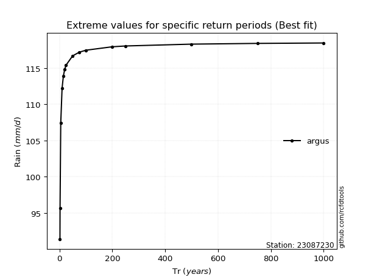</img>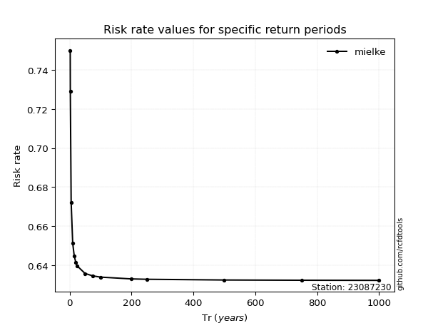</img>

</div>


<sub>**APP DISCLAIMER**: NO WARRANTY - This software is provided by [github.com/rcfdtools](https://github.com/rcfdtools) "as is", without any express or implied warranty, including warranties of merchantability, fitness for a particular purpose, or non-infringement. There is no guarantee that the software will be error-free or operate without interruption. LIMITATION OF LIABILITY - Neither the authors nor copyright holders will be liable for claims or damages arising from the software or its use. You are responsible for determining if the software is appropriate for your use and assume all associated risks, including errors, legal compliance, and data loss. NO PROFESSIONAL ADVICE - The software provides general information and does not offer professional advice. It should not replace consultation with professional advisors.</sub>